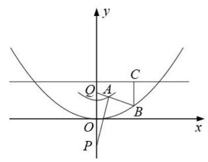

# 高三第一轮第二十四讲：解析几何复习 1

## 知识点梳理:

## 一、椭圆结论:

1、 ${a}^{2} = {b}^{2} + {c}^{2}$

2、通径 $\frac{2{b}^{2}}{a}$ ,准线方程 $x =  \pm  \frac{{a}^{2}}{c}$ ,

3、焦点三角形面积公式: ${S}_{\Delta {F}_{1}P{F}_{2}} = {b}^{2}\tan \frac{\alpha }{2}$

4、弦长公式: $\left| {AB}\right|  = \sqrt{1 + {k}^{2}}\left| {{x}_{1} - {x}_{2}}\right|  = \sqrt{1 + {k}^{2}}\sqrt{{\left( {x}_{1} + {x}_{2}\right) }^{2} - 4{x}_{1}{x}_{2}}$

5、距离:椭圆上的点到左焦点 ${F}_{1}$ 的距离最小值为 $a - c$ ，最大值为 $a + c$

6、过椭圆上任意一点 $P\left( {{x}_{0},{y}_{0}}\right)$ 作椭圆 $\frac{{x}^{2}}{{a}^{2}} + \frac{{y}^{2}}{{b}^{2}} = 1$ 的切线方程为: $\frac{x{x}_{0}}{{a}^{2}} + \frac{y{y}_{0}}{{b}^{2}} = 1$

7、椭圆: $\frac{{x}^{2}}{{a}^{2}} + \frac{{y}^{2}}{{b}^{2}} = 1$ ,离心率 $e = \frac{c}{a}$ 表示焦距与长轴长之比,且 $0 < e < 1$

## 二、双曲线结论:

1、 ${c}^{2} = {a}^{2} + {b}^{2}$ ，准线方程 $x =  \pm  \frac{{a}^{2}}{c}$

2、通径:即过焦点作垂直于对称轴的直线交双曲线与 $\mathrm{A},\mathrm{B}$ 两点，交于同一支时弦长为通径长度为 $\frac{2{b}^{2}}{a}$ ,交于两支时弦长最短为 ${2a}$ 。

3、焦点三角形面积公式: ${S}_{\Delta {F}_{1}P{F}_{2}} = {b}^{2}\cot \frac{\alpha }{2}$

4、弦长公式: $\left| {AB}\right|  = \sqrt{1 + {k}^{2}}\left| {{x}_{1} - {x}_{2}}\right|  = \sqrt{1 + {k}^{2}}\sqrt{{\left( {x}_{1} + {x}_{2}\right) }^{2} - 4{x}_{1}{x}_{2}}$

5、过双曲线上任意一点 $P\left( {{x}_{0},{y}_{0}}\right)$ 作双曲线 $\frac{{x}^{2}}{{a}^{2}} - \frac{{y}^{2}}{{b}^{2}} = 1$ 的切线方程为: $\frac{x{x}_{0}}{{a}^{2}} - \frac{y{y}_{0}}{{b}^{2}} = 1$

6、双曲线上任意一点 $P\left( {{x}_{0},{y}_{0}}\right)$ 到双曲线 $\frac{{x}^{2}}{{a}^{2}} - \frac{{y}^{2}}{{b}^{2}} = 1$ 的两条渐近线 $y =  \pm  \frac{b}{a}x$ 的距离之积为定值 $\frac{{a}^{2}{b}^{2}}{{a}^{2} + {b}^{2}}$ 。

7、双曲线: $\frac{{x}^{2}}{{a}^{2}} - \frac{{y}^{2}}{{b}^{2}} = 1$ ,离心率 $e = \frac{c}{a}$ 表示焦距与实轴长之比,且 $e > 1$

## 三、抛物线的结论:

1、过抛物线 ${y}^{2} = {2px}$ 的焦点的弦长公式为: $\left| {AB}\right|  = {x}_{1} + {x}_{2} + p$

2、过抛物线 ${y}^{2} = {2px}$ 的顶点作两条互相垂直的射线交抛物线于 $A, B$ 两点，则直线 ${AB}$ 恒过定点 $\left( {{2p},0}\right)$

## 四、直线与圆锥曲线基本量:

<table><tr><td>基本图形</td><td>代数表示</td><td>基本要素</td></tr><tr><td>直线</td><td>$y - {y}_{0} = k\left( {x - {x}_{0}}\right)$ 或 $x = {my} + n$</td><td>$\left( {{x}_{0},{y}_{0}}\right) , k$</td></tr><tr><td>圆</td><td>${\left( x - a\right) }^{2} + {\left( y - b\right) }^{2} = {r}^{2}$</td><td>$a, b, r$</td></tr><tr><td>椭圆</td><td>$\frac{{x}^{2}}{{a}^{2}} + \frac{{y}^{2}}{{b}^{2}} = 1$ 或 $\frac{{y}^{2}}{{a}^{2}} + \frac{{x}^{2}}{{b}^{2}} = 1$</td><td>$a, b$</td></tr><tr><td>双曲线</td><td>$\frac{{x}^{2}}{{a}^{2}} - \frac{{y}^{2}}{{b}^{2}} = 1$ 或 $\frac{{y}^{2}}{{a}^{2}} - \frac{{x}^{2}}{{b}^{2}} = 1$</td><td>$a, b$</td></tr><tr><td>抛物线</td><td>${y}^{2} =  \pm  {2px}$ 或 ${x}^{2} =  \pm  {2py}$</td><td>$p$</td></tr></table>

五、圆锥曲线的统一定义:圆锥曲线是到一定点 $F$ 和一定直线 $l\left( {F \notin  l}\right)$ 距离之比为定值 $e$ 的点的轨迹。其中, $F$ 为焦点, $l$ 为准线; 若 $0 < e < 1$ 为椭圆; 若 $e > 1$ 为双曲线; 若 $e = 1$ 为抛物线。

(1)椭圆 $\frac{{x}^{2}}{{a}^{2}} + \frac{{y}^{2}}{{b}^{2}} = 1$ : 准线方程 $x =  \pm  \frac{{a}^{2}}{c}$ ,点 $P\left( {{x}_{0},{y}_{0}}\right)$ 为椭圆上任意一点， ${F}_{1},{F}_{2}$ 为椭圆的左右两个焦点,则 $\frac{\left| P{F}_{1}\right| }{{d}_{1}} = e$

左焦半径 $\left| {P{F}_{1}}\right|  = {d}_{1}e = \left( {{x}_{0} + \frac{{a}^{2}}{c}}\right)  \cdot  \frac{c}{a} = a + e{x}_{0}$ ;

右焦半径 $\left| {P{F}_{2}}\right|  = {2a} - \left| {P{F}_{1}}\right|  = a - e{x}_{0}$

(2)双曲线 $\frac{{x}^{2}}{{a}^{2}} - \frac{{y}^{2}}{{b}^{2}} = 1$ :准线方程 $x =  \pm  \frac{{a}^{2}}{c}$ ，点 $P\left( {{x}_{0},{y}_{0}}\right)$ 为双曲线上任意一点，

${F}_{1},{F}_{2}$ 为双曲线的左右两个焦点,则 $\frac{\left| P{F}_{1}\right| }{{d}_{1}} = e$

若 $P$ 在右支, $\left| {P{F}_{1}}\right|  = e{x}_{0} + a,\left| {P{F}_{2}}\right|  = e{x}_{0} - a$

若 $P$ 在左支, $\left| {P{F}_{1}}\right|  =  - \left( {e{x}_{0} + a}\right) ,\left| {P{F}_{2}}\right|  =  - \left( {e{x}_{0} - a}\right)$

(3)抛物线 ${y}^{2} = {2px}$ ， $\left| {PF}\right|  = {x}_{0} + \frac{p}{2}$

## 六、极坐标方程和参数方程

1、极坐标与直角坐标之间的转化:

$$
x = \rho \cos \theta , y = \rho \sin \theta ,{\rho }^{2} = {x}^{2} + {y}^{2},\tan \theta  = \frac{y}{x}\left( {x \neq  0}\right)
$$

2、圆与椭圆的参数方程:

3、圆锥曲线统一极坐标方程:设定点 $F$ (焦点)到相对定直线 $l$ (准线)的距离为 $p$ ，以 $F$ 为极点建立极坐标系,设动点 $M$ 的极坐标为 $\left( {\rho ,\theta }\right)$ ,则由圆锥曲线的统一定义可得: $\frac{\left| MF\right| }{d} = e$ ,即 $\left| {MF}\right|  = \rho  = {de} = \left( {p + \rho \cos \theta }\right) e \Rightarrow  \rho  = \frac{ep}{1 - e\cos \theta } \; \rho  = \frac{ep}{1 - e\cos \theta }$ 即为圆锥曲线的统一极坐标方程。其中 $\rho$ 的几何意义即为焦半径。

4、过椭圆左焦点 $F$ 的直线交椭圆于 $A, B$ 两点,焦点弦长公式推导:

$$
\left| {AB}\right|  = \left| {FA}\right|  + \left| {FB}\right|  = \frac{ep}{1 - e\cos \theta } + \frac{ep}{1 + e\cos \theta } = \frac{2ep}{1 - {e}^{2}{\cos }^{2}\theta }
$$

## 圆锥曲线客观题题型归纳:

1、轨迹问题

2、面积问题

3、弦长和焦半径问题

4、最值范围问题

5、定义应用

6、定点定值问题

## 一、基础练习

1、直线 $x + {2y} - 5 = 0$ 的倾斜角的大小为___；

2、方程 $\frac{{x}^{2}}{k} + \frac{{y}^{2}}{2 - k} = 1$ 表示椭圆，则实数 $k$ 的取值范围是___；

3、已知直线 $\left( {{3a} + 2}\right) x + \left( {1 - {4a}}\right) y + 8 = 0$ 和 $\left( {{5a} - 2}\right) x + \left( {a + 4}\right) y - 7 = 0$ 互相垂直,则实数 $a$ 的值为___；

4、直线 ${ax} + y + {3a} - 1 = 0$ 恒过定点 $M$ ,则直线 ${2x} + {3y} - 6 = 0$ 关于 $M$ 点对称的直线方程为___；

5、已知点 $M\left( {x, y}\right)$ 在曲线 ${x}^{2} + 2{y}^{2} = 4$ 上运动，点 $A\left( {8,2}\right)$ ，则 ${MA}$ 中点 $P$ 的轨迹方程是 ;

6、设椭圆 $\frac{{x}^{2}}{25} + \frac{{y}^{2}}{9} = 1$ 的左右焦点分别为 ${F}_{1}\text{ 、 }{F}_{2}\text{ ， }P$ 为椭圆上一点，且 $\angle {F}_{1}P{F}_{2} = {60}^{ \circ  }$ ，则 $\bigtriangleup  {F}_{1}P{F}_{2}$ 的面积为___；

7、极坐标方程 $\rho  = {10}\sin \left( {\theta  - \frac{\pi }{3}}\right)$ 所表示的曲线围成的图形面积为___；

8、在方程 $\left\{  \begin{array}{l} x = 1 + {t}^{2} \\  y = 1 - \frac{1}{2}{t}^{2} \end{array}\right.$ ( $t$ 为参数, $t \in  \mathbf{R}$ )所表示的曲线上任取一点 $P\left( {a, b}\right)$ ,则 ${a}^{2} + {b}^{2}$ 的最小值为___；

9、已知 ${x}_{1},{x}_{2}$ 是关于 $x$ 的方程 ${x}^{2} + {mx} - \left( {{2m} + 1}\right)  = 0$ 的两个实数根，则经过两点 $A\left( {{x}_{1},{x}_{1}^{2}}\right)$ 、 $B\left( {{x}_{2},{x}_{2}^{2}}\right)$ 的直线与圆 ${\left( x - 2\right) }^{2} + {y}^{2} = 1$ 公共点的个数是___；

10、在坐标平面内，与点 $A\left( {1,2}\right)$ 距离为 1，且与点 $B\left( {3,1}\right)$ 距离为 2 的直线共有( ) 条

A. 1 B. 2 C. 3 D. 4

## 二、综合提高

1、直线 $y = x + 3$ 与曲线 $\frac{{y}^{2}}{9} - \frac{x\left| x\right| }{4} = 1$ 的交点个数是___；

2、已知椭圆 $\frac{{x}^{2}}{2} + {y}^{2} = 1$ 上存在两点 $M, N$ 关于直线 $y =  - x + t$ 对称，且 ${MN}$ 的中点在抛物线 ${y}^{2} = x$ 上，则实数 $t$ 的值为___；

3、已知 $P, Q$ 分别为圆 $M : {\left( x - 6\right) }^{2} + {\left( y - 3\right) }^{2} = 4$ 与圆 $N : {\left( x + 4\right) }^{2} + {\left( y - 2\right) }^{2} = 1$ 的动点,已 $A$ 为 $x$ 轴上一动点，则 $\left| {AP}\right|  + \left| {AQ}\right|$ 的最小值为___；

4、(202*新高考 1 卷)写出与圆 ${x}^{2} + {y}^{2} = 1$ 和 ${\left( x - 3\right) }^{2} + {\left( y - 4\right) }^{2} = {16}$ 都相切的一条直线方程___；

5、(202*新高考 1 卷)已知椭圆 $C : \frac{{x}^{2}}{{a}^{2}} + \frac{{y}^{2}}{{b}^{2}} = 1\left( {a > b > 0}\right)$ ， $C$ 的上顶点为 $A$ ，两个焦点为 ${F}_{1},{F}_{2}$ ,离心率为 $\frac{1}{2}$ ,过 ${F}_{1}$ 且垂直于 $A{F}_{2}$ 的直线于 $C$ 交于 $D, E$ 两点, $\left| {DE}\right|  = 6$ ,则 ${\Delta ADE}$ 的周长为___；

6、已知椭圆的 $C$ 焦点为 ${F}_{1}\left( {-1,0}\right) ,{F}_{2}\left( {1,0}\right)$ ，过 ${F}_{2}$ 的直线与 $C$ 交于 $A, B$ 两点， 若 $\left| {A{F}_{2}}\right|  = 2\left| {{F}_{2}B}\right| ,\left| {AB}\right|  = \left| {B{F}_{1}}\right|$ ，则 $C$ 的方程为___；

7、已知实数 $x, y$ 满足: $x\left| x\right|  + y\left| y\right|  = 1$ ，则 $\left| {x + y + \sqrt{2}}\right|$ 的取值范围是___；

8、已知函数 $y = x + \frac{1}{x}$ 的图像是双曲线，则以该双曲线实轴为直径的圆的面积为___；

9、设 $P$ 是双曲线 ${x}^{2} - \frac{{y}^{2}}{8} = 1$ 上的动点，直线 $\left\{  \begin{array}{l} x = 3 + t\cos \theta \\  y = t\sin \theta  \end{array}\right.$ ( $t$ 为参数) 与圆 ${\left( x - 3\right) }^{2} + {y}^{2} \; = 1$ 相交于 $A\text{ 、 }B$ 两点，则 $\overrightarrow{PA} \cdot  \overrightarrow{PB}$ 的最小值是___；

10、已知抛物线的方程为 ${y}^{2} = {4x}$ ，过其焦点 $F$ 的直线交此抛物线于 $M$ 、 $N$ 两点，交 $y$ 轴于点 $E$ ,若 $\overrightarrow{EM} = {\lambda }_{1}\overrightarrow{MF},\overrightarrow{EN} = {\lambda }_{2}\overrightarrow{NF}$ ,则 ${\lambda }_{1} + {\lambda }_{2} =$ ( )

A. -2

B. $- \frac{1}{2}$ C. 1 D. -1

11、设直线 $l : {3x} + {4y} + m = 0$ ，圆 $C : {x}^{2} + {y}^{2} - {4x} + 2 = 0$ ，若在圆 $C$ 上存在两点 $P, Q$ ， 在直线 $l$ 上存在点 $M$ ，使 $\angle {PMQ} = {90}^{ \circ  }$ ，则 $m$ 的取值范围为( )

A. $\left\lbrack  {-{16},4}\right\rbrack$ B. $\left\lbrack  {-{18},4}\right\rbrack$ C. $\left\lbrack  {-6 - 5\sqrt{2}, - 6 + 5\sqrt{2}}\right\rbrack$ D. $\left\lbrack  {6 - 5\sqrt{2},6 + 5\sqrt{2}}\right\rbrack$

12、已知 $a\text{ 、 }b \in  \mathbf{R}$ ,复数 $z = a + {2b}\mathrm{i}$ (其中 $\mathrm{i}$ 为虚数单位)满足 $z \cdot  \bar{z} = 4$ ，给出下列结论:

① ${a}^{2} + {b}^{2}$ 的取值范围是 $\left\lbrack  {1,4}\right\rbrack$ ; ② $\sqrt{{\left( a - \sqrt{3}\right) }^{2} + {b}^{2}} + \sqrt{{\left( a + \sqrt{3}\right) }^{2} + {b}^{2}} = 4$ ；

③ $\frac{b - \sqrt{5}}{a}$ 的取值范围是 $\left( {-\infty , - 1\rbrack \cup \lbrack 1, + \infty }\right)$ ；④ $\frac{1}{{a}^{2}} + \frac{1}{{b}^{2}}$ 的最小值为 2 .

其中正确结论的个数为( )

A. 1 B. 2 C. 3 D. 4

13、点 $A$ 是曲线 $y = \sqrt{{x}^{2} + 2}$ ( $y \leq  2$ )上的任意一点， $P\left( {0, - 2}\right) , Q\left( {0,2}\right)$ ,射线 ${QA}$ 交曲线 $y = \frac{1}{8}{x}^{2}$ 于 $B$ 点, ${BC}$ 垂直于直线 $y = 3$ ,垂足为点 $C$ ,则下列结论:

① $\left| {AP}\right|  - \left| {AQ}\right|$ 为定值 $2\sqrt{2}$ ；

② $\left| {QB}\right|  + \left| {BC}\right|$ 为定值 5 ;

③ $\left| {PA}\right|  + \left| {AB}\right|  + \left| {BC}\right|$ 为定值 $5 + \sqrt{2}$ ；

其中正确结论的序号是___；

14、已知点 $A\left( {-1,0}\right) \text{ 、 }B\left( {1,0}\right) \text{ 、 }C\left( {0,1}\right)$ ,直线 $y = {ax} + b\;\left( {a > 0}\right)$ 将 $\bigtriangleup {ABC}$ 分成面积相等的两部分，则 $b$ 的取值范围是( )

A. $\left( {0,1}\right)$

B. $\left( {1 - \frac{\sqrt{2}}{2},\frac{1}{2}}\right)$ C. $\left( {1 - \frac{\sqrt{2}}{2},\frac{1}{3}}\right\rbrack$ D. $\left\lbrack  {\frac{1}{3},\frac{1}{2}}\right)$
