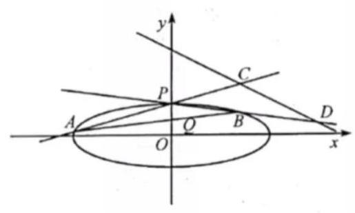

# 高三第一轮第二十五讲：解析几何复习 2

## 圆锥曲线解答题题型归纳:

1、求直线或曲线的方程

2、判断直线与直线或曲线的位置关系

3、度量计算:求弦长，求渐近线方程，求夹角(包括垂直、锐角、钝角一一转化为向量问题)，求三角形或四边形的面积(包括求面积的最值)

4、最值问题

5、探究可变图像的不变性，动中求静(即定点定值问题)

6、转化思想的应用

1、(2021 上海春考)( 1 )团队在 $O$ 点西侧、东侧 20 千米处设有 $A$ 、 $B$ 两站点，测量距离发现一点 $P$ 满足 $\left| {PA}\right|  - \left| {PB}\right|  = {20}$ 千米,可知 $P$ 在 $A\text{ 、 }B$ 为焦点的双曲线上,以 $O$ 点为原点, 东侧为 $x$ 轴正半轴,北侧为 $y$ 轴正半轴,建立平面直角坐标系, $P$ 在北偏东 ${60}^{ \circ  }$ 处,求双曲线标准方程和 $P$ 点坐标.

(2)团队又在南侧、北侧 15 千米处设有 $C\text{ 、 }D$ 两站点，测量距离发现 $\left| {QA}\right|  - \left| {QB}\right|  = {30}$ 千米, $\left| {QC}\right|  - \left| {QD}\right|  = {10}$ 千米,求 $\left| {OQ}\right|$ (精确到 1 米) 和 $Q$ 点位置 (精确到 1 米, ${1}^{ \circ  }$ )

2、(2021 上海高考)已知椭圆 $\Gamma  : \frac{{x}^{2}}{2} + {y}^{2} = 1,{F}_{1}\text{ 、 }{F}_{2}$ 是其左右焦点,直线 $l$ 过点 $P\left( {m,0}\right) \left( {m <  - \sqrt{2}}\right)$ 交椭圆 $\Gamma$ 于 $A, B$ 两点,且 $A, B$ 在 $x$ 轴上方,点 $A$ 在线段 ${BP}$ 上.

(1)若 $B$ 是上顶点， $\left| \overrightarrow{B{F}_{1}}\right|  = \left| \overrightarrow{P{F}_{1}}\right|$ ，求 $m$ 的值；

(2)若 $\overrightarrow{{F}_{1}A} \cdot  \overrightarrow{{F}_{2}A} = \frac{1}{3}$ ，且原点 $O$ 到直线 $l$ 的距离为 $\frac{4\sqrt{15}}{15}$ ，求直线 $l$ 的方程；

(3)对于任意点 $P$ ，是否存在唯一直线 $l$ ，使得 $\overrightarrow{{F}_{1}A} \parallel \overrightarrow{{F}_{2}B}$ 成立，若存在，求出直线 $l$ 的斜率, 若不存在, 请说明理由.

3、(202*新高考 1 卷)已知点 $A\left( {2,1}\right)$ 在双曲线 $C : \frac{{x}^{2}}{{a}^{2}} - \frac{{y}^{2}}{{a}^{2} - 1} = 1\left( {a > 1}\right)$ 上，直线 $l$ 交 $C$ 于 $P, Q$ 两点,直线 ${AP},{AQ}$ 的斜率之和为 0 .

(1)求 $l$ 的斜率；

(2)若 $\tan \angle {PAQ} = 2\sqrt{2}$ ，求 $\bigtriangleup  {PAQ}$ 的面积。

4、(202*北京卷)已知椭圆 $E : \frac{{x}^{2}}{{a}^{2}} + \frac{{y}^{2}}{{b}^{2}} = 1\left( {a > b > 0}\right)$ 的一个顶点为 $A\left( {0,1}\right)$ ，焦距为 $2\sqrt{3}$ 。

(1)求椭圆 $E$ 的方程；

(2)过点 $P\left( {-2,1}\right)$ 作斜率为 $k$ 的直线与椭圆 $E$ 交于不同的两点 $B, C$ ，直线 ${AB},{AC}$ 分别与 $x$ 轴交于点 $M, N$ ，当 $\left| {MN}\right|  = 2$ 时，求 $k$ 的值。

5、(202*全国乙卷) 已知椭圆 $E$ 的中心为坐标原点,对称轴为 $x$ 轴, $y$ 轴,且过点 $A\left( {0, - 2}\right) , B\left( {\frac{3}{2}, - 1}\right)$ 两点

(1)求 $E$ 的方程；

(2)设过点 $P\left( {1, - 2}\right)$ 的直线交 $E$ 于 $M, N$ 两点，过 $M$ 且平行于 $x$ 轴的直线与线段 ${AB}$ 交于点 $T$ ，点 $H$ 满足 $\overrightarrow{MT} = \overrightarrow{TH}$ ，证明:直线 ${HN}$ 过定点。

6、(202*新高考 2 卷)已知双曲线 $C : \frac{{x}^{2}}{{a}^{2}} - \frac{{y}^{2}}{{b}^{2}} = 1\left( {a > 0, b > 0}\right)$ 的右焦点为 $F\left( {2,0}\right)$ ，渐近线方程为 $y =  \pm  \sqrt{3}x$

(1)求 $C$ 的方程；

(2)过 $F$ 的直线与 $C$ 的两条渐近线分别交于 $A, B$ 两点，点 $P\left( {{x}_{1},{y}_{1}}\right) , Q\left( {{x}_{2},{y}_{2}}\right)$ 在 $C$ 上， 且 ${x}_{1} > {x}_{2} > 0,{y}_{1} > 0$ ,过 $P$ 且斜率为 $- \sqrt{3}$ 的直线与过 $Q$ 且斜率为 $\sqrt{3}$ 的直线交于点 $M$ , 请从下面①②③中选取两个作为条件，证明另一个条件成立:

① $M$ 在 ${AB}$ 上；② ${PQ} \parallel {AB}$ ；③ $\left| {MA}\right|  = \left| {MB}\right|$ .

7、(202 * 全国甲卷)设抛物线 $C : {y}^{2} = {2px}\left( {p > 0}\right)$ 的焦点为 $F$ ,点 $D\left( {p,0}\right)$ ，过 $F$ 的直线交 $C$ 于 $M, N$ 两点,当直线 ${MD}$ 垂直于 $x$ 轴时, $\left| {MF}\right|  = 3$ .

(1)求 $C$ 的方程；

(2)设直线 ${MD},{ND}$ 与 $C$ 的另一个交点分别为 $A, B$ ，记直线 ${MN},{AB}$ 的倾斜角分别为 $\alpha ,\beta$ ,当 $\alpha  - \beta$ 取得最大值时,求直线 ${AB}$ 的方程。

8、(2024*浙江卷)如图，已知椭圆 $\frac{{x}^{2}}{12} + {y}^{2} = 1, A, B$ 是椭圆上异于点 $P\left( {1,0}\right)$ 的两点， $Q\left( {0,\frac{1}{2}}\right)$ 是直线 ${AB}$ 上一点,直线 ${PA},{PB}$ 交直线 $y =  - \frac{1}{2}x + 3$ 于 $C, D$ 两点。

(1)求点 $P$ 到椭圆上一点的最大距离；

(2)求 $\left| {CD}\right|$ 的最小值。

9、(202*天津卷)已知椭圆 $E : \frac{{x}^{2}}{{a}^{2}} + \frac{{y}^{2}}{{b}^{2}} = 1\left( {a > b > 0}\right)$ ， $F$ 为右焦点， $A$ 为右顶点， $B$ 为上顶点,且 $\frac{\left| BF\right| }{\left| AB\right| } = \frac{\sqrt{3}}{2}$ .

(1)求椭圆的离心率；

( 2 )已知直线 $l$ 与椭圆有唯一交点 $M$ ，直线 $l$ 交 $y$ 轴于点 $N,\left| {OM}\right|  = \left| {ON}\right|$ ， $\bigtriangleup {OMN}$ 的面积为 $\sqrt{3}$ ,求椭圆的标准方程。
