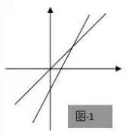
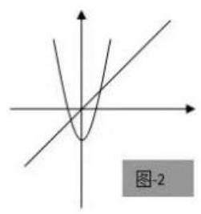
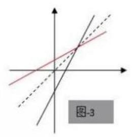
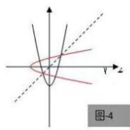

# 第二轮第三讲：函数的不动点和稳定点

一、不动点:已知函数 $y = f\left( x\right) , x \in  D$ ，若存在 ${x}_{0} \in  D$ ，使得 $f\left( {x}_{0}\right)  = {x}_{0}$ ，则称 ${x}_{0}$ 为函数 $y = f\left( x\right)$ 的不动点。

不动点的几何意义: 即为 $y = f\left( x\right)$ 与 $y = x$ 两者函数图像交点的横坐标。

二、稳定点: 已知函数 $y = f\left( x\right) , x \in  D$ ,若存在 ${x}_{0} \in  D$ ,使得 $f\left( {f\left( {x}_{0}\right) }\right)  = {x}_{0}$ ,则称 ${x}_{0}$ 为函数 $y = f\left( x\right)$ 的稳定点。

稳定点的几何意义: 为 $y = f\left( x\right)$ 与其反函数 (多值) 的交点的横坐标。

例 1: 求 $y = {2x} - 1$ 的不动点;

例 2: 求 $y = 2{x}^{2} - 1$ 的不动点;

例 3: 求 $y = {2x} - 1$ 的稳定点;

例 4: 求 $y = 2{x}^{2} - 1$ 的稳定点; 该函数的不动点为 $x =  - \frac{1}{2},1$ ; 该函数的稳定点为 $x =  - \frac{1}{2},1,\frac{-1 \pm  \sqrt{5}}{4}$ 。如下图:

由图可发现: 不动点是函数 $y = f\left( x\right)$ 与直线 $y = x$ 交点的横坐标; 而稳定点是函数 $y = f\left( x\right)$ 的图像与它反函数图像 (可以是多值的) 的交点的横坐标。其中不动点一定是稳定点, 稳定点并不一定是不动点。

## 三、性质归纳

(1)若函数 $y = f\left( x\right)$ 有不动点 ${x}_{0}$ ，则不动点一定是稳定点。

即 $\{ x \mid  f\left( x\right)  = x\}  \subseteq  \{ x \mid  f\left( {f\left( x\right) }\right)  = x\}$

(2)若函数 $y = f\left( x\right)$ 是单增，则它的不动点与稳定点相同或者都没有。

证明: 若函数 $y = f\left( x\right)$ 有不动点 ${x}_{0}$ ,显然它也有稳定点 ${x}_{0}$ 。

若函数 $y = f\left( x\right)$ 有稳定点 ${x}_{0}$ ,即 $f\left( {f\left( {x}_{0}\right) }\right)  = {x}_{0}$ ,设 $f\left( {x}_{0}\right)  = {y}_{0}$ ,则 $f\left( {y}_{0}\right)  = {x}_{0}$ ,即 $\left( {{x}_{0},{y}_{0}}\right) ,\left( {{y}_{0},{x}_{0}}\right)$ 都在函数 $y = f\left( x\right)$ 的图像上。

假设 ${x}_{0} > {y}_{0}$ ,因为函数 $y = f\left( x\right)$ 单增,则 $f\left( {x}_{0}\right)  > f\left( {y}_{0}\right)$ ,即 ${y}_{0} > {x}_{0}$ ,矛盾;

假设 ${x}_{0} < {y}_{0}$ ,因为函数 $y = f\left( x\right)$ 单增,则 $f\left( {x}_{0}\right)  < f\left( {y}_{0}\right)$ ,即 ${y}_{0} < {x}_{0}$ ,矛盾;

故 ${x}_{0} = {y}_{0}$ ,即 $f\left( {x}_{0}\right)  = {x}_{0}, y = f\left( x\right)$ 有不动点 ${x}_{0}$ 。

即: 若 $y = f\left( x\right)$ 单增, $\{ x \mid  f\left( x\right)  = x\}  = \{ x \mid  f\left( {f\left( x\right) }\right)  = x\}$

(3)若函数 $y = f\left( x\right)$ 单减，稳定点不一定是不动点。举反例: $y = \frac{1}{x}$

## 巩固练习

1、对于函数 $f\left( x\right)$ ，若 $f\left( x\right)  = x$ ，则称 $x$ 为 $f\left( x\right)$ 的 “不动点”；若 $f\left\lbrack  {f\left( x\right) }\right\rbrack   = x$ ，则称 $x$ 为 $f\left( x\right)$ 的 “稳定点”,函数 $f\left( x\right)$ 的 “不动点” 和 “稳定点” 的集合分别记为 $A$ 和 $B$ ,即 $A = \{ x \mid  f\left( x\right)  = x\} ,\;B = \{ x \mid  f\left( {f\left( x\right) }\right)  = x, x \in  R\}$  。

(1)证明: $A \subseteq  B$ ；

(2)若设 $f\left( x\right)  = {x}^{2} + {px} + q\left( {p, q \in  R}\right)$ ，当 $A = \{  - 1,3\}$ 时，求 B。

(3)若设 $f\left( x\right)  = a{x}^{2} - 1\left( {a, x \in  R}\right)$ ，且 $A = B \neq  \phi$ ，求 $a$ 的取值范围。

2、函数 $f\left( x\right)  = a{x}^{2} + {bx} + c\left( {a \neq  0}\right)$ ,且 $f\left( x\right)  = x$ 没有实数根,问, $f\left( {f\left( x\right) }\right)  = x$ 是否有实数根,并证明你的结论。

3、已知函数 $f\left( x\right)  = {x}^{2} + {ax} + a$ 对于任意实数 $x, f\left( {f\left( x\right) }\right)  > x$ 恒成立,求 $a$ 的取值范围。

4、已知 $f\left( x\right)  = a{x}^{2} + {bx} + c\left( {a \neq  0}\right)$ ,且方程 $f\left( x\right)  = x$ 无实数根。现有四个命题 ① 方程 $f\left\lbrack  {f\left( x\right) }\right\rbrack   = x$ 也一定没有实数根; ② 若 $a > 0$ ，则不等式 $f\left\lbrack  {f\left( x\right) }\right\rbrack   > x$ 对一切 $x \in  R$ 成立；

③若 $a < 0$ ，则必存在实数 ${x}_{0}$ 使不等式 $f\left\lbrack  {f\left( {x}_{0}\right) }\right\rbrack   > {x}_{0}$ 成立；④若 $a + b + c = 0$ ，则不等式 $f\left\lbrack  {f\left( x\right) }\right\rbrack   < x$ 对一切 $x \in  R$ 成立；则真命题的序号为___；

5、对于函数 $f\left( x\right)$ ，若 $f\left( {x}_{0}\right)  = {x}_{0}$ ，则称 ${x}_{0}$ 为函数 $y = f\left( x\right)$ 的不动点，若 $f\left( {f\left( {x}_{0}\right) }\right)  = {x}_{0}$ ， 则称 ${x}_{0}$ 为函数 $y = f\left( x\right)$ 的稳定点。如果 $f\left( x\right)  = {x}^{2} + a\left( {a \in  R}\right)$ 的 “稳定点” 恰是它的 “不动点”函数，那么 $a$ 的取值范围是( )

A. $\left( {-\infty ,\frac{1}{4}}\right\rbrack$ B. $\left( {-\frac{3}{4}, + \infty }\right)$ C. $\left( {-\frac{3}{4},\frac{1}{4}}\right)$ D. $\left\lbrack  {-\frac{3}{4},\frac{1}{4}}\right\rbrack$

6、方程 $f\left( x\right)  = x$ 的根称为函数的不动点,若函数 $f\left( x\right)  = \frac{x}{a\left( {x + 1}\right) }$ 有唯一不动点,且 ${x}_{1} = {1000},{x}_{n + 1} = \frac{1}{f\left( \frac{1}{{x}_{n}}\right) }, n = 1,2,3,\cdots$ ,则 ${x}_{2017} = \frac{}{}$ 。

7、已知 $f\left( x\right)  = {x}^{3} - {bx}$ ,若 $f\left( x\right)$ 在 $\lbrack 1, + \infty )$ 上单调

(1)求 $b$ 的取值范围；

(2)已知 $f\left( x\right)  = {x}^{3} - {bx}$ ，若设 ${x}_{0} \geq  1, f\left( {x}_{0}\right)  \geq  1$ ，且满足 $f\left( {f\left( {x}_{0}\right) }\right)  = {x}_{0}$ ，求证: $f\left( {x}_{0}\right)  = {x}_{0}$ 。

8、已知函数 $f\left( x\right)  = {2}^{x} + {2x} - a$ ,若方程 $f\left( {f\left( x\right) }\right)  = x$ 在区间 $\left\lbrack  {1,2}\right\rbrack$ 上有解,求实数 $a$ 的取值范围。

9、设函数 $f\left( x\right)  = \sqrt{{e}^{x} + x - a}\left( {a \in  R, e\text{ 为自然对数的底数 }}\right)$ ,若曲线 $y = \sin x$ 上存在点 $\left( {{x}_{0},{y}_{0}}\right)$ 使得 $f\left( {f\left( {y}_{0}\right) }\right)  = {y}_{0}$ ,则 $a$ 的取值范围是( )

A. $\left\lbrack  {1, e}\right\rbrack$ B. $\left\lbrack  {{e}^{-1} - 1,1}\right\rbrack$ C. $\left\lbrack  {1,1 + e}\right\rbrack$ D. $\left\lbrack  {{e}^{-1} - 1, e + 1}\right\rbrack$

10、设函数 $y = f\left( x\right)$ 的定义域为 $D$ ,值域为 $A$ ,如果存在函数 $x = g\left( t\right)$ ,使得函数 $y = f\left( {g\left( t\right) }\right)$ 的值域仍是 $A$ ,那么称 $x = g\left( t\right)$ 是函数 $y = f\left( x\right)$ 的一个等值域变换。

(1)判断下列函数 $x = g\left( t\right)$ 是不是函数 $y = f\left( x\right)$ 的一个等值域变换？说明你的理由;

① $f\left( x\right)  = {\log }_{2}x, x > 0, x = g\left( t\right)  = t + \frac{1}{t}, t > 0$

② $f\left( x\right)  = {x}^{2} - x + 1, x \in  R, x = g\left( t\right)  = {2}^{t}, t \in  R$

(2)设函数 $y = f\left( x\right)$ 的定义域为 $D$ ,值域为 $A$ ,函数 $g\left( t\right)$ 的定义域为 ${D}_{1}$ ，值域为 ${A}_{1}$ ， 那么 “ $D = {A}_{1}$ ” 是否为 “ $x = g\left( t\right)$ 是 $y = f\left( x\right)$ 的一个等值域变换” 的一个必要条件? 请说明理由。

(3)设 $f\left( x\right)  = {\log }_{2}x$ 的定义域为 $x \in  \left\lbrack  {2,8}\right\rbrack$ ，已知 $x = g\left( t\right)  = \frac{m{t}^{2} - {3t} + n}{{t}^{2} + 1}$ 是 $y = f\left( x\right)$ 的一个等值域变换,且函数 $y = f\left( {g\left( t\right) }\right)$ 的定义域为 $R$ ,求实数 $m, n$ 的值。
