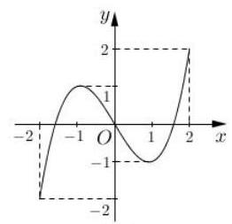
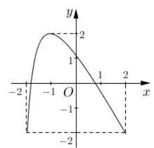

# 第二轮第六讲：复合函数

## 复合函数值域问题、方程问题、不等式问题、零点问题

## 一、复合函数的定义域

1、已知函数 $f\left( x\right)$ 的定义域为 $\left( {a, b}\right)$ ，且 $b - a > 2$ ，则 $f\left( x\right)  = f\left( {{3x} - 1}\right)  - f\left( {{3x} + 1}\right)$ 的定义域为___；

## 二、复合函数的值域

1、函数 $y = {\log }_{2}\left( {-{x}^{2} + {2x} + 3}\right)$ 的值域为___；

2、已知函数 $f\left( x\right)  = {\log }_{3}x + 2, x \in  \left\lbrack  {1,9}\right\rbrack$ ，求函数 $y = {\left\lbrack  f\left( x\right) \right\rbrack  }^{2} + f\left( {x}^{2}\right)$ 的值域。

3、已知函数 $f\left( x\right)  = {e}^{x} - x - b$ ，记函数 $f\left( x\right)$ 的值域为 $M$ ，函数 $g\left( x\right)  = f\left( {f\left( x\right) }\right)$ 的值域为 $N$ ，且 $M \subseteq  N$ ，则实数 $b$ 的取值范围是___；

## 三、复合函数的单调性

1、函数 $y = {\log }_{2}\left( {-{x}^{2} + {2x} + 3}\right)$ 的单调递减区间为___；

2、函数 $f\left( x\right)  = {\log }_{a}\left( {1 - {ax}}\right)$ 在区间 $\left\lbrack  {1,2}\right\rbrack$ 上严格递增，则实数 $a$ 的取值范围是___；

## 四、复合函数零点问题

1、(复附) 已知函数 $y = f\left( x\right)$ 和 $y = g\left( x\right)$ 在 $\left\lbrack  {-2,2}\right\rbrack$ 上的图像如图所示. 给出下列四个命题:

$f\left( x\right)$

$g\left( x\right)$

① 方程 $f\left\lbrack  {g\left( x\right) }\right\rbrack   = 0$ 有且仅有 6 个根; ② 方程 $g\left\lbrack  {f\left( x\right) }\right\rbrack   = 0$ 有且仅有 3 个根;

③ 方程 $f\left\lbrack  {f\left( x\right) }\right\rbrack   = 0$ 有且仅有 5 个根; ④ 方程 $g\left\lbrack  {g\left( x\right) }\right\rbrack   = 0$ 有且仅有 4 个根. 其中正确的命题的个数为( )

A. 1 B. 2 C. 3 D. 4

2、已知函数 $f\left( x\right)  = \left\{  \begin{array}{l} \frac{{2}^{x} + 2}{2}, x \leq  1 \\  \left| {{\log }_{2}\left( {x - 1}\right) }\right| , x > 1 \end{array}\right.$ ,则函数 $F\left( x\right)  = f\left( {f\left( x\right) }\right)  - {2f}\left( x\right)  - \frac{3}{2}$ 的零点个数为___；

3、已知 $f\left( x\right)  = {x}^{2} + {2x} + a, g\left( x\right)  = f\left( {f\left( x\right) }\right)  - f\left( x\right)$ 有且只有三个零点,则实数 $a$ 的取值范围是___；

4、已知函数 $f\left( x\right)  = \left\{  {\begin{array}{l} {x}^{2} - {2ax} - a + 1, x \geq  0 \\  \ln \left( {-x}\right) , x < 0 \end{array}, g\left( x\right)  = {x}^{2} + 1 - {2a}}\right.$ ,若函数 $y = f\left( {g\left( x\right) }\right)$ 有 4 个零点,则实数 $a$ 的取值范围是___；

5、函数 $f\left( x\right)  = {e}^{x} - x - b$ ，若函数 $g\left( x\right)  = f\left( {f\left( x\right)  - \frac{1}{2}}\right)$ 恰有 4 个零点，则实数 $b$ 的取值范围是___；

6、设函数 $f\left( x\right)  = \left\{  {\begin{array}{l} x + 1, x \leq  0 \\  {\left( x - 1\right) }^{2}, x > 0 \end{array}, g\left( x\right)  = {x}^{2} - x + a}\right.$ ,若函数 $g\left( {f\left( x\right) }\right)$ 有 6 个零点,则实数 $a$ 的取值范围是___；

7、设函数 $f\left( x\right)  = \left\{  {\begin{array}{l} x + 4, x \leq  0 \\  {\left( x - 2\right) }^{2}, x > 0 \end{array}, g\left( x\right)  = \frac{x}{{e}^{x}}}\right.$ ,若方程 $g\left( {f\left( x\right) }\right)  - k = 0\left( {k \in  R}\right)$ 有 4 个实根, 则实数 $k$ 的取值范围是___；

## 五、复合不等式问题

1、已知 $f\left( x\right)  = {x}^{2} + {4x} + 1 + a$ ，对于任意 $x, f\left( {f\left( x\right) }\right)  \geq  0$ 恒成立，则实数 $a$ 的取值范围是 ___；

2、已知函数 $f\left( x\right)  = {x}^{2} - {2ax} + {a}^{2} - 1$ ，若关于 $x$ 的不等式 $f\left( {f\left( x\right) }\right)  < 0$ 解集为空集，则实数 $a$ 的取值范围是___；

3、(2019 浦东二模) 已知 $f\left( x\right)  = 2{x}^{2} + {2x} + b$ 是定义在 $\left\lbrack  {-1,0}\right\rbrack$ 上的函数，若 $f\left\lbrack  {f\left( x\right) }\right\rbrack   \leq  0$ 在定义域上恒成立,而且存在实数 ${x}_{0}$ 满足: $f\left\lbrack  {f\left( {x}_{0}\right) }\right\rbrack   = {x}_{0}$ 且 $f\left( {x}_{0}\right)  \neq  {x}_{0}$ ,则实数 $b$ 的取值范围是___.
