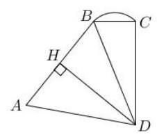
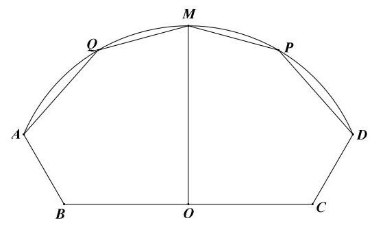
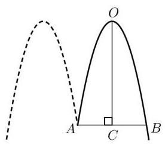
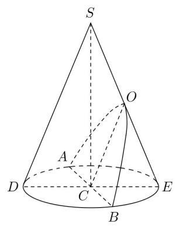

# 第二轮第九讲：应用题

考点:(1)函数:重点考察绝对值或分段函数，主要考察函数的单调性和最值

(2)三角函数:主要是实际生活的抽象出来的模型，以解三角形为主

(3)数列:等差或等比数列

(4)解析几何

(5)立体几何

## 模型 1: 函数问题

1、(2017 高考 19)根据预测，某地第 $n\left( {n \in  {\mathbf{N}}^{ * }}\right)$ 个月共享单车的投放量和损失量分别为 ${a}_{n}$ 和 ${b}_{n}$ (单位: 辆),

其中 ${a}_{n} = \left\{  {\begin{array}{l} 5{n}^{4} + {15},1 \leq  n \leq  3 \\   - {10n} + {470}, n \geq  4 \end{array},{b}_{n} = n + 5}\right.$ ,第 $n$ 个月底的共享单车的保有量是前 $n$ 个月的累计投放量与累计损失量的差.

(1)求该地区第 4 个月底的共享单车的保有量；

(2)已知该地共享单车停放点第 $n$ 个月底的单车容纳量 ${S}_{n} =  - 4{\left( n - {46}\right) }^{2} + {8800}$ (单位:辆). 设在某月底, 共享单车保有量达到最大, 问该保有量是否超出了此时停放点的单车容纳量?

2、(2018 高考 19) 某群体的人均通勤时间，是指单日内该群体中成员从居住地到工作地的平均用时,某地上班族 $S$ 中的成员仅以自驾或公交方式通勤,分析显示: 当 $S$ 中 $x\%$ ( $0 < x < {100}$ ) 的成员自驾时,自驾群体的人均通勤时间为

$$
f\left( x\right)  = \left\{  \begin{matrix} {30} & 0 < x \leq  {30} \\  {2x} + \frac{1800}{x} - {90} & {30} < x < {100} \end{matrix}\right. \text{ (单位: 分钟) }
$$

而公交群体的人均通勤时间不受 $x$ 影响，恒为 40 分钟，试根据上述分析结果回答下列问题:

(1)当 $x$ 在什么范围内时，公交群体的人均通勤时间少于自驾群体的人均通勤时间？

(2)求该地上班族 $S$ 的人均通勤时间 $g\left( x\right)$ 的表达式，讨论 $g\left( x\right)$ 的单调性，并说明其实际意义.

3、某温室大棚规定:一天中，从中午 12 点到第二天上午 8 点为保温时段，其余 4 小时为工人作业时段，从中午 12 点连续测量 20 小时，得出此温室大棚的温度 $y$ (单位:度)与时间 $t$ (单位: 小时, $t \in  \left\lbrack  {0,{20}}\right\rbrack$ ) 近似地满足函数关系 $y = \left| {t - {13}}\right|  + \frac{b}{t + 2}$ ,其中, $b$ 为大棚内一天中保温时段的通风量.

(1)若一天中保温时段的通风量保持 100 个单位不变，求大棚一天中保温时段的最低温度 (精确到 ${0.1}{}^{ \circ  }\mathrm{C}$ );

(2)若要保持大棚一天中保温时段的最低温度不小于 ${17}^{ \circ  }C$ ,求大棚一天中保温时段通风量的最小值.

4、(2020 年高考)在研究某市交通情况时，道路密度是指该路段上一定时间内通过的车辆数除以时间, 车辆密度是该路段一定时间内通过的车辆数除以该路段的长度, 现定义交通流量为 $v = \frac{q}{x}, x$ 为道路密度, $q$ 为车辆密度, $v = f\left( x\right)  = \left\{  \begin{array}{ll} {100} - {135}{\left( \frac{1}{3}\right) }^{\frac{80}{x}} & 0 < x < {40} \\   - k\left( {x - {40}}\right)  + {85} & {40} \leq  x \leq  {80} \end{array}\right.$ , $k > 0$

(1)若交通流量 $v > {95}$ ，求道路密度 $x$ 的取值范围；

(2)若道路密度 $x = {80}$ 时,测得交通流量 $v = {50}$ ，求车辆密度 $q$ 的最大值.

5、(2020 年春考)有一条长为 120 米的步行道 ${OA}, A$ 是垃圾投放点 ${\omega }_{1}$ ，若以 $O$ 为原点， ${OA}$ 为 $x$ 轴正半轴建立直角坐标系,设点 $B\left( {x,0}\right)$ ,现要建设另一座垃圾投放点 ${\omega }_{2}\left( {t,0}\right)$ ,函数 ${f}_{t}\left( x\right)$ 表示与 $B$ 点距离最近的垃圾投放点的距离.

(1)若 $t = {60}$ ，求 ${f}_{60}\left( {10}\right)$ 、 ${f}_{60}\left( {80}\right)$ 、 ${f}_{60}\left( {95}\right)$ 的值，并写出 ${f}_{60}\left( x\right)$ 的函数解析式；

(2)若可以通过 ${f}_{t}\left( x\right)$ 与坐标轴围成的面积来测算扔垃圾的便利程度，面积越小越便利. 问: 垃圾投放点 ${\omega }_{2}$ 建在何处才能比建在中点时更加便利?

模型 2: 三角

1、(2019 高考 19)如图， $A - B - C$ 为海岸线， ${AB}$ 为线段， $\overset{\text{ ⏜ }}{BC}$ 为四分之一圆弧， ${BD} = {39.2}\mathrm{\;{km}},\angle {BDC} = {22}^{ \circ  },\angle {CBD} = {68}^{ \circ  },\angle {BDA} = {58}^{ \circ  }$ .

(1)求 $\overset{\text{ ⏜ }}{BC}$ 的长度；

(2)若 ${AB} = {{40}\mathrm{\;{km}}}$ ，求 $D$ 到海岸线 $A - B - C$ 的最短距离.

(精确到 ${0.001}\mathrm{\;{km}}$ )

2、(2022 高考)如图 ${AB} = {CD} = 6,{BC} = {20},\angle {ABC} = \angle {DCB} = {120}^{ \circ  }, O$ 为 ${BC}$ 中点，曲线 ${AMD}$ 上所有的点到 $O$ 的距离相等， ${MO}\bot {BC}, P$ 为曲线 ${DM}$ 上的一动点，点 $Q$ 与点 $P$ 关于 ${OM}$ 对称.

(1)若 $P$ 在点 $D$ 的位置，求 $\angle {POC}$ 的大小；

(2)求五边形 ${MQADP}$ 面积的最大值.

## 模型 3: 数列

1、(2021 年高考)已知某企业今年(2021 年)第一季度的营业额为 1.1 亿元，以后每个季度的营业额比上个季度增加 0.05 亿元，该企业第一季度的利润为 0.16 亿，以后每季度比前一季度增长 4%.

(1)求 2021 年起前 20 季度营业额的总和；

(2)请问哪一季度的利润首次超过该季度营业额的 18%？

2、某科技创新公司投资 400 万元研发了一款网络产品，产品上线第 1 个月的收入为 40 万元，预计在今后若干个月内，该产品每月的收入平均比上一月增长 50% ，同时，该产品第 1 个月的维护费支出为 100 万元，以后每月的维护费支出平均比上一个月增加 50 万元.

(1)分别求出第 6 个月该产品的收入和维护费支出，并判断第 6 个月该产品的收入是否足够支付第 6 个月的维护费支出?

(2)从第几个月起，该产品的总收入首次超过总支出？

(总支出包括维护费支出和研发投资支出)

3、对年利率为 $r$ 的连续复利,要在 $x$ 年后达到本利和 $A$ ,则现在投资值为 $B = A{e}^{-{rx}}, e$ 是自然对数的底数. 如果项目 $P$ 的投资年利率为 $r = 6\%$ 的连续复利.

(1)现在投资 5 万元，写出满 $n$ 年的本利和，并求满 10 年的本利和；(精确到 0.1 万元)；

(2)一个家庭为刚出生的孩子设立创业基金，若每年初一次性给项目 P 投资 2 万元，那么， 至少满多少年基金共有本利和超过一百万元? (精确到 1 年)

## 模型 4: 解析几何

1、(2018 春考)利用《平行于圆锥母线的平面截圆锥面，所得截线是抛物线”的几何原理, 某快餐店用两个射灯 (射出的光锥为圆锥) 在广告牌上投影出其标识, 如图 1 所示, 图 2 是投影射出的抛物线的平面图, 图 3 是一个射灯投影的直观图, 在图 2 与图 3 中, 点 $O$ 、 $A\text{ 、 }B$ 在抛物线上, ${OC}$ 是抛物线的对称轴, ${OC} \bot  {AB}$ 于 $C,{AB} = 3$ 米, ${OC} = {4.5}$ 米.

(1)求抛物线的焦点到准线的距离；

(2)在图 3 中，已知 ${OC}$ 平行于圆锥的母线 ${SD}$ ， ${AB}\text{ 、 }{DE}$ 是圆锥底面的直径，求圆锥的母线与轴的夹角的大小(精确到 ${0.01}^{ \circ  }$ ).

(图 1)

(图 2)

(图 3)

## 课后训练:

1、上海地铁四通八达，给市民出行带来便利，已知某条线路运行时，地铁的发车时间间隔 $t$ (单位: 分字) 满足: $2 \leq  t \leq  {20}, t \in  \mathbf{N}$ ,经测算,地铁载客量 $p\left( t\right)$ 与发车时间间隔 $t$ 满足 $p\left( t\right)  = \left\{  \begin{matrix} {1200} - {10}{\left( {10} - t\right) }^{2} & 2 \leq  t < {10} \\  {1200} & {10} \leq  t \leq  {20} \end{matrix}\right.$ ,其中 $t \in  \mathbf{N}.$

(1)请你说明 $p\left( 5\right)$ 的实际意义;

(2)若该线路每分钟的净收益为 $Q = \frac{{6p}\left( t\right)  - {3360}}{t} - {360}$ (元)，问当发车时间间隔为多少时, 该线路每分钟的净收益最大? 并求最大净收益.

2、某热力公司每年燃料费约 24 万元，为了“环评”达标，需要安装一块面积为 $x\left( {x \geq  0}\right)$ (单位: 平方米) 可用 15 年的太阳能板,其工本费为 $\frac{x}{2}$ (单位: 万元),并与燃料供热互补工作,从此,公司每年的燃料费为 $\frac{k}{{20x} + {100}}\left( k\right.$ 为常数) 万元,记 $y$ 为该公司安装太阳能板的费用与 15 年的燃料费之和.

(1)求 $k$ 的值，并建立 $y$ 关于 $x$ 的函数关系式；

(2)求 $y$ 的最小值，并求出此时所安装太阳能板的面积.
