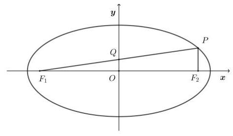
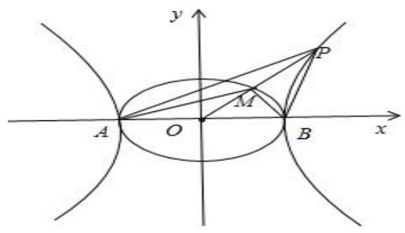

# 第二轮第十一讲：解析几何综合训练

## 一、填选

1、已知 $m\text{ 、 }n\text{ 、 }s\text{ 、 }t \in  {\mathbf{R}}^{ * }, m + n = 4,\frac{m}{s} + \frac{n}{t} = 9$ 其中 $m\text{ 、 }n$ 是常数,且 $s + t$ 的最小值是 $\frac{8}{9}$ ,满足条件的点 $\left( {m, n}\right)$ 是双曲线 $\frac{{x}^{2}}{2} - \frac{{y}^{2}}{8} = 1$ 一弦的中点,则此弦所在的直线方程为 ___；

2、已知椭圆 $\frac{{x}^{2}}{16} + \frac{{y}^{2}}{4} = 1$ ，过右焦点 $F$ 且斜率为 $k\left( {k > 0}\right)$ 的直线与椭圆交于 $A$ ， $B$ 两点， 若 $\overrightarrow{AF} = 3\overrightarrow{FB}$ ,则 $k =$ ___；

3、已知椭圆 $C : \frac{{x}^{2}}{{a}^{2}} + \frac{{y}^{2}}{{b}^{2}} = 1\left( {a > b > 0}\right)$ 的焦距为6，焦点为 ${F}_{1}\text{ 、 }{F}_{2}$ ，长轴的端点为 ${A}_{1}\text{ 、 }{A}_{2}$ ， 点 $M$ 是椭圆上异于长轴端点的一点,椭圆 $C$ 的离心率为 $e$ ,则下列说法正确的是( )

A. 若 $\bigtriangleup M{F}_{1}{F}_{2}$ 的周长为 16,则椭圆的方程为 $\frac{{x}^{2}}{25} + \frac{{y}^{2}}{16} = 1$

B. 若 $\bigtriangleup M{F}_{1}{F}_{2}$ 的面积最大时, $\angle {F}_{1}M{F}_{2} = {120}^{ \circ  }$ ,则 $e = \frac{\sqrt{3}}{2}$

$C$ . 若椭圆 $C$ 上存在点 $M$ 使 $\overrightarrow{M{F}_{1}} \cdot  \overrightarrow{M{F}_{2}} = 0$ ,则 $e \in  \left( {0,\frac{\sqrt{2}}{2}}\right\rbrack$

D. 以 $M{F}_{1}$ 为直径的圆与以 ${A}_{1}{A}_{2}$ 为直径的圆内切

4、已知椭圆 $C$ 的焦点为 ${F}_{1}\left( {-2,0}\right) ,{F}_{2}\left( {2,0}\right)$ ，过 ${F}_{2}$ 的直线与 $C$ 交于 $A$ ， $B$ 两点，若 $\left| {A{F}_{2}}\right|  = 2\left| {{F}_{2}B}\right|$ ， $\left| {AB}\right|  = \left| {B{F}_{1}}\right|$ ，则 $C$ 的方程为___；

5、已知椭圆 $C : \frac{{x}^{2}}{a} + \frac{{y}^{2}}{b} = 1\left( {a > b > 0}\right)$ 的左、右焦点分别为 ${F}_{1},{F}_{2}$ 且 $\left| {{F}_{1}{F}_{2}}\right|  = 2$ ，点 $P\left( {1,1}\right)$ 在椭圆内部,点 $Q$ 在椭圆上,则以下说法正确的是 ( )

A. $\left| {Q{F}_{1}}\right|  + \left| {QP}\right|$ 的最小值为 $2\sqrt{a} - 1$ B. 椭圆 $C$ 的短轴长可能为 2

C. 椭圆 $C$ 的离心率的取值范围为 $\left( {0,\frac{\sqrt{5} - 1}{2}}\right)$ D. 若 $\overrightarrow{P{F}_{1}} = \overrightarrow{{F}_{1}Q}$ ,则椭圆 $C$ 的长轴长为 $\sqrt{5} + \sqrt{17}$

6、如图,已知椭圆 $C : \frac{{x}^{2}}{{a}^{2}} + \frac{{y}^{2}}{{b}^{2}} = 1\left( {a > b > 0}\right)$ 的左、右焦点分别为 ${F}_{1},{F}_{2}, P$ 为椭圆 $C$ 上一点， $P{F}_{2} \bot  {F}_{1}{F}_{2}$ ，直线 $P{F}_{1}$ 与 $y$ 轴交于点 $Q$ ，若 $\left| {OQ}\right|  = \frac{b}{4}$ ，则椭圆 $C$ 的离心率为___；

7、设椭圆 $C : \frac{{x}^{2}}{{a}^{2}} + \frac{{y}^{2}}{4} = 1\left( {a > 2}\right)$ 的左、右焦点分别为 ${F}_{1},{F}_{2}$ ,直线 $l : y = x + t$ 交椭圆 $C$ 于点 $A, B$ ，若 $\bigtriangleup  {F}_{1}{AB}$ 的周长的最大值为12，则 $C$ 的离心率为___；

8、已知双曲线 ${x}^{2} - \frac{{y}^{2}}{2} = 1$ 上存在两点 $M, N$ 关于直线 $y =  - x + b$ 对称,且 ${MN}$ 的中点在抛物线 ${y}^{2} = {3x}$ 上,则实数 $b$ 的值为( )

A. 0 或 $\frac{9}{4}$ B. 0

C. $\frac{9}{4}$ D. -8

9、已知椭圆 $C : \frac{{x}^{2}}{{a}^{2}} + \frac{{y}^{2}}{{b}^{2}} = 1\left( {a > b > 0}\right)$ 的右焦点为 $F\left( {c,0}\right)$ ，上顶点为 $A\left( {0, b}\right)$ ，直线 $x = \frac{{a}^{2}}{c}$ 上存在一点 $P$ 满足 $\overrightarrow{FP} \cdot  \overrightarrow{AP} =  - \overrightarrow{FA} \cdot  \overrightarrow{AP}$ ,则椭圆的离心率的取值范围为( )

A. $\left\lbrack  {\frac{1}{2},1}\right)$ B. $\left\lbrack  {\frac{\sqrt{2}}{2},1}\right)$ C. $\left\lbrack  {\frac{\sqrt{5} - 1}{2},1}\right)$ D. $\left( {0,\frac{\sqrt{2}}{2}}\right\rbrack$

10、已知离心率为 $\frac{1}{2}$ 的椭圆 $\frac{{y}^{2}}{{a}^{2}} + \frac{{x}^{2}}{{b}^{2}} = 1\left( {a > b > 0}\right)$ 内有个内接三角形 ${ABC}$ ， $O$ 为坐标原点，边 ${AB}$ 、 ${BC}$ 、 ${AC}$ 的中点分别为 $D$ 、 $E$ 、 $F$ ，直线 ${AB}$ 、 ${BC}$ 、 ${AC}$ 的斜率分别为 ${k}_{1},{k}_{2},{k}_{3}$ ,且故不为 0,若直线 ${OD}\text{ 、 }{OE}\text{ 、 }{OF}$ 斜率之和为 1,则 $\frac{1}{{k}_{1}} + \frac{1}{{k}_{2}} + \frac{1}{{k}_{3}} =$ ( )

A. $- \frac{4}{3}$ B. $\frac{4}{3}$ C. $- \frac{3}{4}$ D. $\frac{3}{4}$

11、已知 $A, B$ 是椭圆 $\frac{{x}^{2}}{{a}^{2}} + \frac{{y}^{2}}{{b}^{2}} = 1$ 和双曲线 $\frac{{x}^{2}}{{a}^{2}} - \frac{{y}^{2}}{{b}^{2}} = 1$ 的公共顶点,其中 $a > b > 0, P$ 是双曲线上的动点, $M$ 是椭圆上的动点 $\left( {P, M\text{ 都 }\text{ 解开 }A, B}\right)$ ,且满 $\overrightarrow{PA} + \overrightarrow{PB} = \lambda \left( {\overrightarrow{MA} + \overrightarrow{MB}}\right) \; \left( {\lambda  \in  R}\right)$ ,设直线 ${AP},{BP},{AM},{BM}$ 的斜率分别为 ${k}_{1},{k}_{2},{k}_{3},{k}_{4}$ ,若 ${k}_{1} + {k}_{2} = \sqrt{3}$ ,则 ${k}_{3} + {k}_{4} =$ ___.

## 二、解答题

1、设 $F$ 为椭圆 $C : \frac{{x}^{2}}{2} + {y}^{2} = 1$ 的右焦点,过点 $\left( {2,0}\right)$ 的直线 $l$ 与椭圆 $C$ 相交于 $A, B$ 两点,

(1)若点 $B$ 为椭圆 $C$ 的上顶点，求直线 ${AF}$ 的方程；

(2)设直线 ${AF},{BF}$ 的斜率分别为 ${k}_{1},{k}_{2}\left( {{k}_{2} \neq  0}\right)$ ，求证: $\frac{{k}_{1}}{{k}_{2}}$ 为定值。

2、已知点 $F$ 是抛物线 $C : {y}^{2} = {2px}\left( {p > 0}\right)$ 的焦点,若点 $P\left( {{x}_{0},4}\right)$ 在抛物线 $C$ 上,且 $\left| {PF}\right|  = \frac{5}{2}P$

(1)求抛物线方程；

(2)动直线 $l : x = {my} + 1\left( {m \in  R}\right)$ 与抛物线 $C$ 相交于 $A, B$ 两点，问,在 $x$ 轴上是否存在定点 $D\left( {t,0}\right) \left( {t \neq  0}\right)$ ,使得向量 $\frac{\overrightarrow{DA}}{\left| \overrightarrow{DA}\right| } + \frac{\overrightarrow{DB}}{\left| \overrightarrow{DB}\right| }$ 与向量 $\overrightarrow{OD}$ 共线? 若存在,求出点 $D$ 的坐标; 若不存在, 请说明理由。

3、已知中心在原点 $O$ ,左焦点为 ${F}_{1}\left( {-1,0}\right)$ 的椭圆 ${C}_{1}$ 的左顶点为 $A$ ,上顶点为 $B,{F}_{1}$ 到直线 ${AB}$ 的距离为 $\frac{\sqrt{7}}{7}\left| {OB}\right|$ .

(1)求椭圆 ${C}_{1}$ 的方程；

(2)过点 $P\left( {3,0}\right)$ 作直线 $l$ ，使其交椭圆 ${C}_{1}$ 于 $R$ 、 $S$ 两点，交直线 $x = 1$ 于 $Q$ 点. 问:是否存在这样的直线 $l$ ,使 $\left| {PQ}\right|$ 是 $\left| {PR}\right| \text{ 、 }\left| {PS}\right|$ 的等比中项? 若存在,求出直线 $l$ 的方程; 若不存在, 说明理由.
