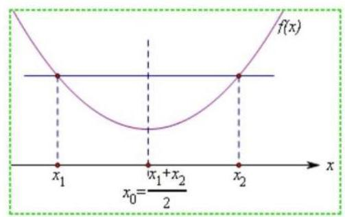
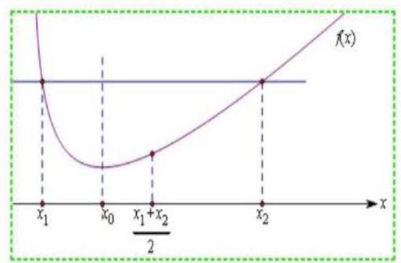
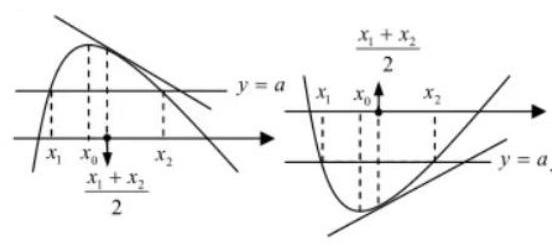
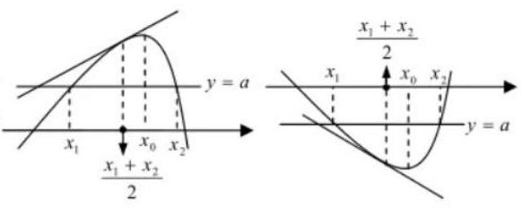

# 第二轮第十三讲：极值点偏移问题

## 一、极值点偏移问题的定义

对于函数 $y = f\left( x\right)$ 在区间 $\left( {a, b}\right)$ 内只有一个极值点 ${x}_{0}$ ,方程 $f\left( x\right)  = 0$ (或 $f\left( x\right)  = m$ ) 的解为 ${x}_{1},{x}_{2}$ ,且 $a < {x}_{1} < {x}_{2} < b$ ,若 $\frac{{x}_{1} + {x}_{2}}{2} \neq  {x}_{0}$ ,则称函数 $y = f\left( x\right)$ 在区间 $\left( {a, b}\right)$ 上极值点 ${x}_{0}$ 偏移。

(1)若 $\frac{{x}_{1} + {x}_{2}}{2} > {x}_{0}$ ，则称函数 $y = f\left( x\right)$ 在区间 $\left( {a, b}\right)$ 上极值点 ${x}_{0}$ 左偏；

(2)若 $\frac{{x}_{1} + {x}_{2}}{2} < {x}_{0}$ ，则称函数 $y = f\left( x\right)$ 在区间 $\left( {a, b}\right)$ 上极值点 ${x}_{0}$ 右偏。

(左右对称,无偏移,如二次函数; 若 $f\left( {x}_{1}\right)  = f\left( {x}_{2}\right)$ ,则 ${x}_{1} + {x}_{2} = 2{x}_{0}$ ) (左陡右缓,极值点向左偏移; 若 $f\left( {x}_{1}\right)  = f\left( {x}_{2}\right)$ ,则 ${x}_{1} + {x}_{2} > 2{x}_{0}$ )

极值点左偏

极值点右偏

题型特征: 已知函数 $y = f\left( x\right)$ 在区间上有一极值点 ${x}_{0}$ ,且满足 $f\left( {x}_{1}\right)  = f\left( {x}_{2}\right) ,{x}_{1} \neq  {x}_{2}$ , 证明: ${x}_{1} + {x}_{2} > 2{x}_{0}\left( { < 2{x}_{0}}\right)$

常规方法解题步骤: 1、可设 ${x}_{1} < {x}_{0} < {x}_{2}$ ,则 ${x}_{1}$ 与 $2{x}_{0} - {x}_{2}$ 在 $f\left( x\right)$ 的同一单调区间内

2、要证 ${x}_{1} > 2{x}_{0} - {x}_{2}$ ,即证 $f\left( {x}_{1}\right)$ 与 $f\left( {2{x}_{0} - {x}_{2}}\right)$ 比较大小,即 $f\left( {x}_{2}\right)$ 与 $f\left( {2{x}_{0} - {x}_{2}}\right)$ 比较大小

3、构造函数 $g\left( x\right)  = f\left( x\right)  - f\left( {2{x}_{0} - x}\right)$ 并求导确定与 0 的大小关系。

## 二、简单极值点偏移问题

1、已知函数 $f\left( x\right)  = x{e}^{-x}\left( {x \in  R}\right)$ .

(1)求函数 $f\left( x\right)$ 的单调区间和极值；

(2)若 ${x}_{1} \neq  {x}_{2}$ ，且 $f\left( {x}_{1}\right)  = f\left( {x}_{2}\right)$ ，证明: ${x}_{1} + {x}_{2} > 2$ .

2、已知函数 $f\left( x\right)  = \ln x + \frac{a}{x} - 2$ ,若函数 $y = f\left( x\right)$ 的两个零点为 ${x}_{1},{x}_{2}\left( {{x}_{1} < {x}_{2}}\right)$ , 证明: ${x}_{1} + {x}_{2} > {2a}$

3、已知 ${x}_{1},{x}_{2}$ 是函数 $f\left( x\right)  = x\ln x - \frac{k}{x}\left( {k \in  R}\right)$ 的两个零点,且 ${x}_{1} < {x}_{2}$ ;

(1)求实数 $k$ 的取值范围；

(2)求证: ${x}_{1} + {x}_{2} < \frac{2}{\sqrt{e}}$

## 三、极值点偏移问题变式

1、已知 $f\left( x\right)  = \ln x - {ax}$ 有两个零点 ${x}_{1},{x}_{2}$ ，求证: ${x}_{1}{x}_{2} > {e}^{2}$ 。

方法 1: 对称构造函数 (双变量变成单变量) (直接法)

证明: $a = \frac{\ln x}{x}$

$g\left( x\right)  = \frac{\ln x}{x},{g}^{\prime }\left( x\right)  = \frac{1 - \ln x}{{x}^{2}} = 0 \Rightarrow  x = e$ (配图)

不妨设 $1 < {x}_{1} < e < {x}_{2}$

要证: ${x}_{1}{x}_{2} > {e}^{2}$ ,即证: ${x}_{1} > \frac{{e}^{2}}{{x}_{2}}$

因为 $1 < {x}_{1} < e < {x}_{2}$ ,所以 $\frac{{e}^{2}}{{x}_{2}} < e, g\left( x\right)$ 在 $\left( {0, e}\right)$ 单增

只要证: $g\left( {x}_{1}\right)  > g\left( \frac{{a}^{2}}{{x}_{2}}\right)$ 即 $g\left( {x}_{2}\right)  > g\left( \frac{{a}^{2}}{{x}_{2}}\right)$ 即 $g\left( x\right)  > g\left( \frac{{a}^{2}}{x}\right) \left( {x > e}\right)$

构造函数 $G\left( x\right)  = g\left( x\right)  - g\left( \frac{{a}^{2}}{x}\right)$

方法 2: 对称构造函数 (双变量变成单变量) (间接法)

要证 ${x}_{1}{x}_{2} > {e}^{2}$ 即证: $\ln {x}_{1} + \ln {x}_{2} > 2 \Leftrightarrow  a{x}_{1} + a{x}_{2} > 2 \Leftrightarrow  {x}_{1} + {x}_{2} > \frac{2}{a}$

$\Leftrightarrow  {x}_{1} > \frac{2}{a} - {x}_{2}$ 分析: 构造函数 $F\left( x\right)  = f\left( x\right)  - f\left( {\frac{2}{a} - x}\right) \left( {x > \frac{1}{a}}\right)$

方法 3: 换元构造函数 (整体比值 $\frac{{x}_{2}}{{x}_{1}} = t$ 换元)

证明: 要证 ${x}_{1}{x}_{2} > {e}^{2}$ ,即证: $\ln {x}_{1} + \ln {x}_{2} > 2$

$\left\{  {\begin{array}{l} \ln {x}_{1} = a{x}_{1} \\  \ln {x}_{2} = a{x}_{2} \end{array} \Rightarrow  \frac{\ln {x}_{2}}{\ln {x}_{1}} = \frac{{x}_{2}}{{x}_{1}} = t}\right.$ (不妨设 ${x}_{1} < {x}_{2}$ ,则 $t > 1$ )

$\left\{  {\begin{array}{l} \ln {x}_{1} = \frac{\ln t}{t - 1} \\  \ln {x}_{2} = \frac{t\ln t}{t - 1} \end{array} \Rightarrow  \ln {x}_{1} + \ln {x}_{2} = \frac{\left( {t + 1}\right) \ln t}{t - 1}}\right.$

构造函数 $h\left( t\right)  = \frac{\left( {t + 1}\right) \ln t}{t - 1}\left( {t > 1}\right)$ 分析该函数

方法 4: 利用对数均值不等式

$\left\{  {\begin{array}{l} \ln {x}_{1} = a{x}_{1} \\  \ln {x}_{2} = a{x}_{2} \end{array} \Rightarrow  \ln {x}_{1} - \ln {x}_{2} = a\left( {{x}_{1} - {x}_{2}}\right)  \Rightarrow  \frac{{x}_{2} - {x}_{1}}{\ln {x}_{2} - \ln {x}_{1}} = \frac{1}{a} < \frac{{x}_{1} + {x}_{2}}{2}}\right.$ ,得证

2、函数 $f\left( x\right)  = \ln x - a{x}^{2} + \left( {2 - a}\right) x$

(1)讨论函数的单调性；

(2)若 $y = f\left( x\right)$ 与 $x$ 轴交于 $A, B$ 两点，线段 ${AB}$ 的中点为 ${x}_{0}$ ，证明: ${f}^{\prime }\left( {x}_{0}\right)  < 0$ 证明: 要证: ${f}^{\prime }\left( {x}_{0}\right)  < 0$ 即证: ${f}^{\prime }\left( \frac{{x}_{1} + {x}_{2}}{2}\right)  < 0$ ,即证: $\frac{{x}_{1} + {x}_{2}}{2} > \frac{1}{a}$

3、已知 $f\left( x\right)  = x - \ln x$ ,若 ${x}_{1} \neq  {x}_{2}, f\left( {x}_{1}\right)  = f\left( {x}_{2}\right)$

求证: ${f}^{\prime }\left( {x}_{1}\right)  + {f}^{\prime }\left( {x}_{2}\right)  < 0$

4、已知函数 $f\left( x\right)  = \ln x - x$ ;

(1)求函数 $f\left( x\right)$ 的单调区间；

(2)若方程 $f\left( x\right)  = m\left( {m <  - 2}\right)$ 有两个相异实根 ${x}_{1},{x}_{2}$ ，且 ${x}_{1} < {x}_{2}$ ，证明: ${x}_{1}{x}_{2}{}^{2} < 2$ 。

## 巩固练习:

1、已知函数 $f\left( x\right)  = {e}^{x} + \frac{3}{{e}^{x}} + {2x} - a\left( {a \in  R}\right)$ 有两个零点 ${x}_{1},{x}_{2}$

(1)求实数 $a$ 的取值范围;

(2)证明: ${x}_{1} + {x}_{2} > 0$

2、已知函数 $f\left( x\right)  = {e}^{x} - {ax}$ ( $a$ 为常数)， ${f}^{\prime }\left( x\right)$ 是 $f\left( x\right)$ 的导函数

(1)讨论 $f\left( x\right)$ 的单调性;

(2)当 $a > 0$ 且 $x > 0$ 时，求证: $f\left( {\ln a + x}\right)  > f\left( {\ln a - x}\right)$ ；

(3)已知 $f\left( x\right)$ 有两个零点 ${x}_{1},{x}_{2}\left( {{x}_{1} < {x}_{2}}\right)$ ，求证: ${f}^{\prime }\left( \frac{{x}_{1} + {x}_{2}}{2}\right)  < 0$

3、已知 $f\left( x\right)  = \frac{1 + x}{1 - x}{e}^{x}, g\left( x\right)  = a\left( {x + 1}\right)$

当 $a > 0$ 时,若关于 $x$ 的方程 $f\left( x\right)  + g\left( x\right)  = 0$ 存在两个实数根 ${x}_{1},{x}_{2}\left( {{x}_{1} < {x}_{2}}\right)$

证明: ${x}_{1}{x}_{2} < {x}_{1} + {x}_{2}$
