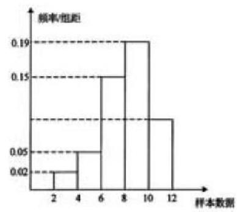
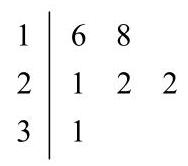
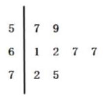
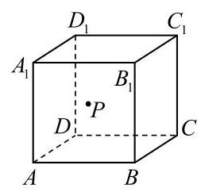
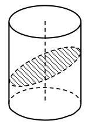
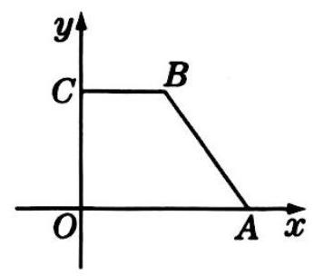
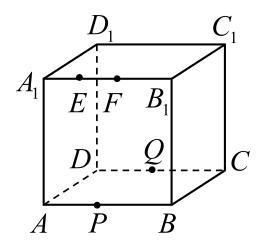
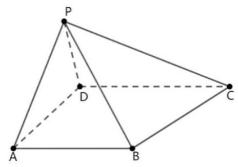
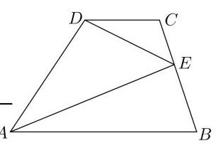

# 第二轮第十五讲：排列组合、二项式定理、概率统计、立体几何知识点梳理

一、标准差、方差、及标准差方差的点估计值

标准差: $\sigma  = \sqrt{\frac{{\left( {x}_{1} - \bar{x}\right) }^{2} + {\left( {x}_{2} - \bar{x}\right) }^{2} + \cdots  + {\left( {x}_{n} - \bar{x}\right) }^{2}}{n}}$ ;

方差: ${\sigma }^{2}$

标准差的点估计值: $\sigma  = \sqrt{\frac{{\left( {x}_{1} - \bar{x}\right) }^{2} + {\left( {x}_{2} - \bar{x}\right) }^{2} + \cdots  + {\left( {x}_{n} - \bar{x}\right) }^{2}}{n - 1}}$

结论: 若 ${x}_{1},{x}_{2},\cdots ,{x}_{n}$ 的标准差为 $\sigma$ ,则 $k{x}_{1} + b, k{x}_{2} + b,\cdots , k{x}_{n} + b$ 的标准差为 ${k\sigma }$ ,方差为 ${k}^{2}{\sigma }^{2}$

1、若 ${x}_{1},{x}_{2},\cdots ,{x}_{n}$ 的标准差为 5，则 $3{x}_{1} - 1,3{x}_{2} - 1,\cdots ,3{x}_{n} - 1$ 的方差为___；

2、将一个总数为 $A, B, C$ 三层，其个体数之比为 5:3:2。若用分层抽样方法抽取容量为 100 的样本，则应从 $C$ 中抽取___个个体；

3、有一个容量为 200 的样本，其频率分布直方图如图所示，根据样本的频率分布直方图估计，样本数据落在区间 $\lbrack {10},{12})$ 内的频数为 ( )

A. 18 B. 36 C. 54 D. 72

4、某公司对 4 月份员工的奖金情况统计如下:

<table><tr><td>奖金(单位:元)</td><td>8000</td><td>5000</td><td>4000</td><td>2000</td><td>1000</td><td>800</td><td>700</td><td>600</td><td>500</td></tr><tr><td>员工(单位:人)</td><td>1</td><td>2</td><td>4</td><td>6</td><td>12</td><td>8</td><td>20</td><td>5</td><td>2</td></tr></table>

根据上表中的数据，可得该公司 4 月份员工的奖金:① 中位数为 800 元；② 平均数为 1373 元; ③ 众数为 700 元, 其中判断正确的个数为( )

A. 0 B. 1 C. 2 D. 3

5、如图是 6 株圣女果植株挂果个数(两位数)的茎叶图, 则 6 株圣女果植株挂果个数的中位数为( )

A. 21 B. 21.5 C. 22 D. 22.5

6、已知某射击爱好者打靶成绩(单位:环)的茎叶图如图所示，其中整数部分为“茎”，小数部分为“叶”， 则这组数据的标准差为(精确到 0.01)()

A. 0.35 B. 0.59 C. 0.40 D. 0.63

## 二、二项式定理

${\left( a + b\right) }^{n} = {C}_{n}^{0}{a}^{n}{b}^{0} + {C}_{n}^{1}{a}^{n - 1}{b}^{1} + \cdots  + {C}_{n}^{r}{a}^{n - r}{b}^{r} + \cdots  + {C}_{n}^{n}{a}^{0}{b}^{n}$

二项式系数和: ${C}_{n}^{0} + {C}_{n}^{1} + {C}_{n}^{2} + \cdots  + {C}_{n}^{n} = {2}^{n}$

各项系数和: 赋值法

1、若 ${\left( \sqrt{x} + \frac{2}{{x}^{2}}\right) }^{n}$ 的展开式中只有第六项的二项式系数最大,则展开式中的常数项为___；

2、 $1 - 2{C}_{n}^{1} + {2}^{2}{C}_{n}^{2} - {2}^{3}{C}_{n}^{3} + \cdots  - {2}^{n}{C}_{n}^{n} =$ ___；

3、在 ${\left( \sqrt[3]{x} - \frac{2}{x}\right) }^{n}$ 的二项展开式中，若所有项的二项式系数之和为 256，则各项系数和等于 ___；

4、若 ${\left( 2x + \sqrt{3}\right) }^{4} = {a}_{0} + {a}_{1}x + {a}_{2}{x}^{2} + {a}_{3}{x}^{3} + {a}_{4}{x}^{4}$ ,则 ${\left( {a}_{0} + {a}_{2} + {a}_{4}\right) }^{2} - {\left( {a}_{1} + {a}_{3}\right) }^{2} =$

5、若 ${\left( 1 - 2x\right) }^{2009} = {a}_{0} + {a}_{1}x + \cdots  + {a}_{2009}{x}^{2009}\left( {x \in  R}\right)$ ,则 $\frac{{a}_{1}}{2} + \frac{{a}_{2}}{{2}^{2}} + \cdots  + \frac{{a}_{2009}}{{2}^{2009}}$ 的值为___。

6、若 ${\left( 1 - 2x\right) }^{7} = {a}_{0} + {a}_{1}x + {a}_{2}{x}^{2} + \cdots  + {a}_{7}{x}^{7}$ ，则 $\left| {a}_{0}\right|  + \left| {a}_{1}\right|  + \left| {a}_{2}\right|  + \cdots  + \left| {a}_{7}\right|  =$ ( )

A. -1 B. 1 C. 0 D. ${3}^{7}$

## 三、排列组合和概率

1、排列数公式: ${P}_{n}^{m} = n\left( {n - 1}\right) \left( {n - 2}\right) \cdots \left( {n - m + 1}\right)  = \frac{n!}{\left( {n - m}\right) !}\left( {m \leq  n}\right)$

规定: $0! = 1,{P}_{n}^{n} = n! = n\left( {n - 1}\right) \left( {n - 2}\right) \cdots 2 \cdot  1;{P}_{n}^{1} = n,{P}_{1}^{1} = 1$

2、组合数公式: ${C}_{n}^{m} = \frac{n\left( {n - 1}\right) \left( {n - 2}\right) \cdots \left( {n - m + 1}\right) }{m!} = \frac{n!}{m!\left( {n - m}\right) !}\left( {m \leq  n}\right)$

3、组合数性质: (1) ${C}_{n}^{m} = {C}_{n}^{n - m}$ (2) ${C}_{n}^{m} + {C}_{n}^{m - 1} = {C}_{n + 1}^{m}$ (3) ${C}_{n}^{0} = 1,{C}_{n}^{n} = 1,{C}_{1}^{0} = 1$

4、若 $A, B$ 是两个随机事件，则事件A 和事件B 至少有一个出现，称为事件的和，记为 $A \cup  B$ 。 事件 A 和事件 B 同时出现,称为事件的积,记为 $A \cap  B$ ;

$P\left( {A \cup  B}\right)  = P\left( A\right)  + P\left( B\right)  - P\left( {A \cap  B}\right)$ ,其中 $P\left( {A \cap  B}\right)  = P\left( A\right) P\left( B\right)$

不可能同时出现的两个事件称为互斥事件， $P\left( {A \cup  B}\right)  = P\left( A\right)  + P\left( B\right)$

5、条件概型: 设 $A, B$ 为两个事件,且 $P\left( A\right)  > 0$ ,称 $P\left( {B \mid A}\right)$ 为事件 $\mathrm{A}$ 发生的条件下,事件 B 发生的概念: $P\left( {B \mid A}\right)  = \frac{P\left( {A \cap  B}\right) }{P\left( A\right) }$

1、若 ${C}_{n + 1}^{n - 1} = \frac{1}{6}{P}_{n + 1}^{3}$ ，则 $n =$ ___；

2、4 个不同的小球放入编号 1, 2, 3, 4 的四个盒子，则至少有一个空盒的放法有___种；

3、甲、乙两队进行排球决赛，现在的情形是甲队只要再赢一局就获冠军，乙队需要再赢两局才能得冠军，若两队在每局赢的概率都是 0.5 ，则甲队获得冠军的概率为___；

4、已知 $E$ 、 $F$ 是互斥事件， $P\left( E\right)  = {0.2}$ ， $P\left( {E \cup  F}\right)  = {0.8}$ ，则 $P\left( F\right)  =$ ___；

5、在某段时间内，甲地不下雨的概率为 ${P}_{1}\left( {0 < {P}_{1} < 1}\right)$ ，乙地不下雨的概率为 ${P}_{2} \; \left( {0 < {P}_{2} < 1}\right)$ ，若在这段时间内两地下雨相互独立，则这段时间内两地都下雨的概率为( )

A. ${P}_{1}{P}_{2}$ B. $1 - {P}_{1}{P}_{2}$ C. ${P}_{1}\left( {1 - {P}_{2}}\right)$ D. $\left( {1 - {P}_{1}}\right) \left( {1 - {P}_{2}}\right)$

6、集合 $S = \{ 1,2,3,4,5\}$ ，从 $S$ 的所有非空子集中，等可能地取出一个，设 $A \subseteq  S$ ，若 $x \in  A$ ， 则 $6 - x \in  A$ ，就称子集 $A$ 满足性质 $P$ ，则所取出的非空子集满足性质 $P$ 的概率为___

7、一批产品的二等品率为 0.02，从这批产品中每次随机取一件，有放回地抽取 100 次， $X$ 表示抽到的二等品件数，则 ${DX} =$ ___.

8、把一枚骰子连续掷两次，记事件 $M$ 为 “两次所得点数均为奇数”， $N$ 为 “至少有一次点数为3”，则 $P\left( {N \mid M}\right)$ 等于___

## 四、立体几何

1、圆锥的侧面积公式 ${\pi rl}$ ; 若圆锥侧面展开是半圆则 $l = {2r}$

2、球的表面积 ${4\pi }{R}^{2}$ ,球的体积公式 $\frac{4}{3}\pi {R}^{3}$

3、两条异面直线的夹角公式: $\cos \theta  = \frac{\left| \overrightarrow{{d}_{1}} \cdot  \overrightarrow{{d}_{2}}\right| }{\left| \overrightarrow{{d}_{1}}\right| \left| \overrightarrow{{d}_{2}}\right| }$

4、直线与平面所成的角: $\sin \alpha  = \frac{\left| \overrightarrow{d} \cdot  \overrightarrow{n}\right| }{\left| \overrightarrow{d}\right| \left| \overrightarrow{n}\right| }$

5、二面角: $\arccos \frac{\left| \overrightarrow{{n}_{1}} \cdot  \overrightarrow{{n}_{2}}\right| }{\left| \overrightarrow{{n}_{1}}\right| \left| \overrightarrow{{n}_{2}}\right| }$ 或 $\pi  - \arccos \frac{\left| \overrightarrow{{n}_{1}} \cdot  \overrightarrow{{n}_{2}}\right| }{\left| \overrightarrow{{n}_{1}}\right| \left| \overrightarrow{{n}_{2}}\right| }$

6、点到面的距离: $d = \frac{\left| \overrightarrow{AB} \cdot  \overrightarrow{n}\right| }{\left| \overrightarrow{n}\right| }$

1、圆锥的侧面展开为扇形，其弧长为 ${2\pi }$ ，半径为 $\sqrt{2}$ ，则圆锥的体积为___；

2、棱长为 1 的正方体 ${ABCD} - {A}_{1}{B}_{1}{C}_{1}{D}_{1}$ 的 8 个顶点都在球 $O$ 的表面上， $E, F$ 分别是棱 $A{A}_{1}, D{D}_{1}$ 的中点,则直线 ${EF}$ 被球 $O$ 截得的线段长为___.

3、正方体 ${ABCD} - {A}_{1}{B}_{1}{C}_{1}{D}_{1}$ 中,面 ${AB}{B}_{1}{A}_{1}$ 上的点 $P$ 到异面直线 ${AB},{A}_{1}{D}_{1}$ 的距离相等,且 ${PA} = {PB}$ ，则 ${AC}$ 与 ${AP}$ 所成角的大小为___.

4、如图所示，底面直径为 20 的圆柱，被与底面成 ${60}^{ \circ  }$ 的二面角的平面所截，截面是一个椭圆, 则椭圆的焦距为___.

5、一个圆锥轴截面的顶角为 $\frac{5\pi }{6}$ ，母线为 2，过顶点作圆锥的截面中，最大截面面积为___；

6、如图所示，已知直角梯形 ${OABC}$ 上下两底分别为 2 和 4,高为 $2\sqrt{2}$ ,则利用斜二测画法所得其直观图的面积为___；

7、已知三棱柱的底面是正三角形 ${ABC},{AB} = 4$ ，侧棱 $A{A}_{1}$ 的长为 6， $\angle {A}_{1}{AB} = \angle {A}_{1}{AC} = {60}^{ \circ  }$ ，则这个三棱柱的体积为___；

8、如图，正方体 ${ABCD} - {A}_{1}{B}_{1}{C}_{1}{D}_{1}$ 的棱长为 6，动点 $E, F$ 在棱 ${A}_{1}{B}_{1}$ 上，动点 $P, Q$ 分别在棱 ${AB},{CD}$ 上，若 ${EF} = 2.{DQ} = x$ ， ${AP} = y$ ，则四面体 ${PEFQ}$ 的体积( )

A. 与 $x, y$ 都无关

B. 与 $x$ 有关,与 $y$ 无关

C. 与 $x, y$ 都有关

D. 与 $x$ 无关,与 $y$ 有关

9、如图，四棱锥 $P - {ABCD}$ 的底面为梯形， ${AB} \parallel {CD}$ ， ${PA} = {2AB} = 4$ ， ${PD} = {CD} = 3$ ， ${AD} = 5$ ， $\angle {BAP} = \angle {CDP} = {90}^{ \circ  }$ ，求平面 PBA 与平面 PBC 所成二面角的大小.

## 五、向量

1、已知向量 $\overrightarrow{a} = \left( {1,\sqrt{3}}\right) ,\overrightarrow{b} = \left( {3, m}\right)$ ，若向量 $\overrightarrow{b}$ 在 $\overrightarrow{a}$ 方向上的数量投影为3，则实数 $m =$ ___；

2、已知 $\overrightarrow{a} = \left( {2,1}\right) ,\overrightarrow{b}$ 在 $\overrightarrow{a}$ 上的投影为 $- 2\overrightarrow{a}$ ，则 $\overrightarrow{a} \cdot  \overrightarrow{b} =$ ___.

3、已知 $\left| \overrightarrow{a}\right|  = 1,\left| \overrightarrow{b}\right|  = \sqrt{2},\left( {\overrightarrow{a} - \overrightarrow{b}}\right)  \cdot  \overrightarrow{a} = 0$ ，则向量 $\overrightarrow{a}$ 与 $\overrightarrow{b}$ 的夹角为___；

4、坐标平面上三个点 $A\left( {1,2}\right) , B\left( {3,4}\right) , C\left( {2, - 1}\right)$ ，则 ${\Delta ABC}$ 的面积为___；

5、已知点 $A\left( {1, - 1}\right)$ 、 $B\left( {3,0}\right)$ 、 $C\left( {2,1}\right)$ ，若平面区域 $M$ 由所有满足 $\overrightarrow{AP} = \lambda \overrightarrow{AB} + \mu \overrightarrow{AC} \; \left( {1 \leq  \lambda  \leq  2,0 \leq  \mu  \leq  1}\right)$ 的点 $P$ 组成,则平面区域 $M$ 的面积为___

6、如图梯形 ${ABCD}$ ， ${AB} \parallel {CD}$ 且 ${AB} = 5,{AD} = {2DC} = 4$ ， $E$ 在线段 ${BC}$ 上， $\overrightarrow{AC} \cdot  \overrightarrow{BD} = 0$ ，则 $\overrightarrow{AE} \cdot  \overrightarrow{DE}$ 的最小值为___

