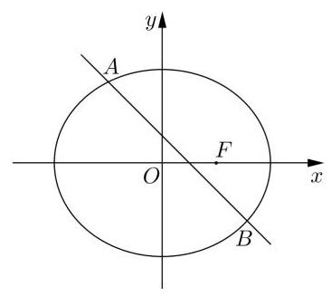
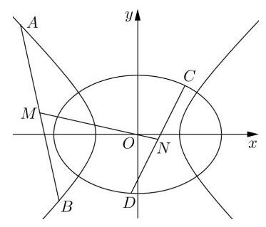

# 第二轮第十六讲：解析几何解答题训练

1、已知椭圆 $C : \frac{{x}^{2}}{4{a}^{2}} + \frac{{y}^{2}}{3{a}^{2}} = 1\left( {a > 0}\right)$ 的右焦点为 $F$ ,直线 $l : x + y - 4 = 0$ .

(1)若 $F$ 到直线 $l$ 的距离为 $2\sqrt{2}$ ，求 $a$ ；

(2)若直线 $l$ 与椭圆 $C$ 交于 $A$ 、 $B$ 两点，且 $\bigtriangleup  {ABO}$ 的面积为 $\frac{48}{7}$ ，求 $a$ ；

(3)若椭圆 $C$ 上存在点 $P$ ，过 $P$ 作直线 $l$ 的垂线 ${l}_{1}$ ，垂足为 $H$ ，满足直线 ${l}_{1}$ 和直线 ${FH}$ 的夹角为 $\frac{\pi }{4}$ ,求 $a$ 的取值范围.

2、已知椭圆 $\Gamma  : \frac{{x}^{2}}{{m}^{2}} + \frac{{y}^{2}}{2} = 1\left( {m > 0, m \neq  \sqrt{2}}\right)$ ，点 $A$ 、 $B$ 分别是椭圆 $\Gamma$ 与 $y$ 轴的交点(点 $A$ 在点 $B$ 的上方),过点 $D\left( {0,1}\right)$ 且斜率为 $k$ 的直线 $l$ 交椭圆 $\Gamma$ 于 $E\text{ 、 }G$ 两点.

(1)若椭圆 $\Gamma$ 焦点在 $x$ 轴上，且其离心率是 $\frac{\sqrt{2}}{2}$ ，求实数 $m$ 的值；

(2)若 $m = k = 1$ ，求 $\bigtriangleup  {BEG}$ 的面积；

(3)设直线 ${AE}$ 与直线 $y = 2$ 交于点 $H$ ，证明: $B$ 、 $G$ 、 $H$ 三点共线.

3、若直线和抛物线的对称轴不平行且与抛物线只有一个公共点, 则称该直线是抛物线在该点处的切线,该公共点为切点. 已知抛物线 ${C}_{1} : {y}^{2} = {4ax}$ 和 ${C}_{2} : {x}^{2} = {4y}$ ,其中 $a > 0.{C}_{1}$ 与 ${C}_{2}$ 在第一象限内的交点为 $P.{C}_{1}$ 与 ${C}_{2}$ 在点 $P$ 处的切线分别为 ${l}_{1}$ 和 ${l}_{2}$ ,定义 ${l}_{1}$ 和 ${l}_{2}$ 的夹角为曲线 ${C}_{1}\text{ 、 }{C}_{2}$ 的夹角.

(1)求点 $P$ 的坐标；

( 2 )若 ${C}_{1}$ 、 ${C}_{2}$ 的夹角为 $\arctan \frac{3}{4}$ ，求 $a$ 的值；

(3)若直线 ${l}_{3}$ 既是 ${C}_{1}$ 也是 ${C}_{2}$ 的切线，切点分别为 $Q$ 、 $R$ ，当 $\bigtriangleup  {PQR}$ 为直角三角形时， 求出相应的 $a$ 的值.

4、已知 $O$ 为坐标原点，曲线 ${C}_{1} : \frac{{x}^{2}}{{a}^{2}} - {y}^{2} = 1\left( {a > 0}\right)$ 和曲线 ${C}_{2} : \frac{{x}^{2}}{4} + \frac{{y}^{2}}{2} = 1$ 有公共点, 直线 ${l}_{1} : y = {k}_{1}x + {b}_{1}$ 与曲线 ${C}_{1}$ 的左支相交于 $A\text{ 、 }B$ 两点,线段 ${AB}$ 的中点为 $M$ .

(1)若曲线 ${C}_{1}$ 和 ${C}_{2}$ 有且仅有两个公共点,求曲线 ${C}_{1}$ 的离心率和渐近线方程;

(2)若直线 ${OM}$ 经过曲线 ${C}_{2}$ 上的点 $T\left( {\sqrt{2}, - 1}\right)$ ，且 ${a}^{2}$ 为正整数，求 $a$ 的值；

(3)若直线 ${l}_{2} : y = {k}_{2}x + {b}_{2}$ 与曲线 ${C}_{2}$ 相交于 $C$ 、 $D$ 两点，且直线 ${OM}$ 经过线 ${CD}$ 中点 $N$ ， 求证: ${k}_{1}^{2} + {k}_{2}^{2} > 1$ .

5、已知动点 $M\left( {x, y}\right)$ 到点 $F\left( {1,0}\right)$ 的距离和它到直线 $x = 2$ 的距离之比等于 $\frac{\sqrt{2}}{2}$ ,动点 $M$ 的轨迹记为曲线 $C$ ,过点 $F$ 的直线 $l$ 与曲线 $C$ 相交于 $P\text{ 、 }Q$ 两点.

(1)求曲线 $C$ 的方程；

(2)若 $\overrightarrow{FP} =  - 2\overrightarrow{FQ}$ ，求直线 $l$ 的方程；

(3)已知 $A\left( {-\sqrt{2},0}\right)$ ，直线 ${AP}$ 、 ${AQ}$ 分别与直线 $x = 2$ 相交于 $M$ 、 $N$ 两点， 求证: 以 ${MN}$ 为直径的圆经过点 $F$ .

6、已知双曲线 $\Gamma  : \frac{{x}^{2}}{{a}^{2}} - \frac{{y}^{2}}{{b}^{2}} = 1$ (其中 $a > 0, b > 0$ ) 的左、右焦点分别为 ${F}_{1}\left( {-c,0}\right) \text{ 、 }{F}_{2}\left( {c,0}\right)$ (其中 $c > 0$ ).

(1)若双曲线 $\Gamma$ 过点 $\left( {2,1}\right)$ 且一条渐近线方程为 $y = \frac{\sqrt{2}}{2}x$ ,直线 $l$ 的倾斜角为 $\frac{\pi }{4}$ ，在 $y$ 轴上的截距为 -2 . 直线 $l$ 与该双曲线 $\Gamma$ 交于两点 $A\text{ 、 }B, M$ 为线段 ${AB}$ 的中点，求 $\bigtriangleup M{F}_{1}{F}_{2}$ 的面积;

(2)以坐标原点 $O$ 为圆心， $c$ 为半径作圆，该圆与双曲线 $\Gamma$ 在第一象限的交点为 $P$ . 过 $P$ 作圆的切线,若切线的斜率为 $- \sqrt{3}$ ,求双曲线 $\Gamma$ 的离心率.
