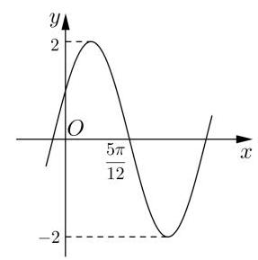
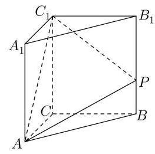
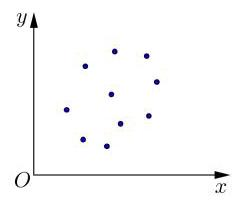
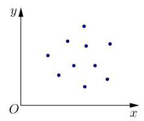
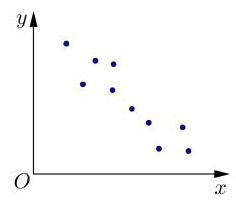
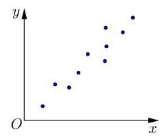
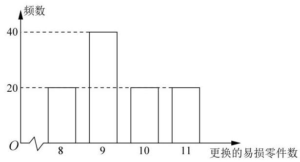
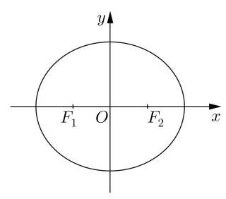

# 高三数学调研试卷

## 一. 填空题

1. 已知全集 $U = \{ 1,2,3,4,5\}$ ，集合 $A = \{ 4,5\}$ ，则 $\overline{A} =$ ___

2. 不等式 $\frac{x}{x - 1} < 1$ 的解集为___

3. 某圆柱两个底面面积之和等于其侧面面积, 则该圆柱底面半径与高的比值为___

4. 直线 $y = 2$ 与直线 ${3x} - y + 1 = 0$ 的夹角的正弦值为___

5. 盲盒是指消费者不能提前得知具体产品款式的商品盒子. 已知某盲盒产品共有两种不同玩偶,抽到的概率都是 $\frac{1}{2}$ ,小明若一次购买 2 个盲盒,则他能集齐两种玩偶的概率是___

6. 已知 $A\left( {3,5, - 7}\right) \text{ 、 }B\left( {-2,4,3}\right)$ ,设点 $A\text{ 、 }B$ 在 ${yOz}$ 平面上的射影分别为 ${A}_{1}\text{ 、 }{B}_{1}$ ,则向量 $\overrightarrow{{A}_{1}{B}_{1}}$ 的坐标为___

7. 已知实数 $a > 0,{\left( 1 + a\right) }^{12}$ 的二项展开式中的第 9 项是 7920,则 $a =$ ___

8. 已知 $t \in  \mathbf{R}$ ,向量 $\overrightarrow{a} = \left( {2, - 1}\right) ,\overrightarrow{b} = \left( {1, t}\right)$ ,且 $\left| {\overrightarrow{a} - \overrightarrow{b}}\right|  = \left| {\overrightarrow{a} + \overrightarrow{b}}\right|$ ,则 $t =$

9. 已知 $A \in  \mathbf{R}$ ,实数 $\omega  > 0, f\left( x\right)  = A\sin \left( {{\omega x} + \frac{\pi }{6}}\right)$ , 函数 $y = f\left( x\right)$ 的部分图像如图所示,若该函数的最小正零点是 $\frac{5\pi }{12}$ ,则 $\omega  =$

10. 已知数列 $\left\{  {a}_{n}\right\}$ 是公比为 $q\left( {q \neq  1}\right)$ 的等比数列, ${S}_{n}$ 为其前 $n$ 项和,已知 ${a}_{1} \cdot  {a}_{3} = {16},\frac{{S}_{3}}{q} = {12}$ ,给出下列四个结论:

① $q < 0$ ；

② 若存在 $m$ 使得 ${a}_{1}\text{ 、 }{a}_{2}\text{ 、 }\cdots \text{ 、 }{a}_{m}$ 的乘积最大，则 $m$ 的一个可能值是 3;

③ 若存在 $m$ 使得 ${a}_{1}\text{ 、 }{a}_{2}\text{ 、 }\cdots \text{ 、 }{a}_{m}$ 的乘积最大，则 $m$ 的一个可能值是 4;

④ 若存在 $m$ 使得 ${a}_{1}\text{ 、 }{a}_{2}\text{ 、 }\cdots \text{ 、 }{a}_{m}$ 的乘积最小,则 $m$ 的值只能是 2 . 其中所有正确结论的序号是___

11. 如图,直三棱柱 ${ABC} - {A}_{1}{B}_{1}{C}_{1}$ 中, ${AC} \bot  {BC},{AC} = \sqrt{7}$ , ${BC} = 3$ ，点 $P$ 在棱 $B{B}_{1}$ 上，且 ${PA}\bot {P{C}_{1}}$ ，当 $\bigtriangleup  {AP}{C}_{1}$ 的面积取最小值时，三棱锥 $P - {ABC}$ 的外接球的表面积为___

12. 定义两个点集 $S\text{ 、 }T$ 之间的距离集为 $d\left( {S, T}\right)  = \{ \left| {{PQ}\parallel P \in  S, Q \in  T\} \text{ ,其中 }}\right| {PQ} \mid$ 表示两点 $P\text{ 、 }Q$ 之间的距离,已知 $k\text{ 、 }t \in  \mathbf{R}, S = \{ \left( {x, y}\right)  \mid  y = {kx} + t, x \in  \mathbf{R}\}$ , $T = \{ \left( {x, y}\right)  \mid  y = \sqrt{4{x}^{2} + 1}, x \in  \mathbf{R}\}$ ，若 $d\left( {S, T}\right)  = \left( {1, + \infty }\right)$ ，则 $t$ 的值为___

## 二. 选择题

13. 如图是根据 $x\text{ 、 }y$ 的观测数据 $\left( {{x}_{i},{y}_{i}}\right) \left( {i = 1,2,\cdots ,{10}}\right)$ 得到的散点图,可以判断变量 $x$ 、 $y$ 具有线性相关关系的图是 ( )

① ② ③ ④

A. ①② B. ②③ C. ③④ D. ①④

14. 已知复数 $z \neq  0$ ,则 “ $\left| z\right|  = 1$ ” 是 “ $z + \frac{1}{z} \in  \mathbf{R}$ ” 的( )条件

A. 充分不必要 B. 必要不充分 C. 充要 D. 既不充分也不必要

15. 已知直线 $m\text{ 、 }n$ 及平面 $\alpha$ ,其中 $m//n$ ,那么在平面 $\alpha$ 内到两条直线 $m\text{ 、 }n$ 距离相等的点的集合可能是:① 一条直线；② 一个平面；③ 一个点；④ 空集. 其中正确的是( )

A. ①②③ B. ①②④ C. ①④ D. ②④

16. 在体育选修课排球模块的基本功(发球)测试中，计分规则如下:

① 每人可发球 7 次，每成功一次记 1 分；② 若连续两次发球成功加 0.5 分，连续三次发球成功加 1 分, 连续四次发球成功加 1.5 分, 以此类推, ..., 连续七次发球成功加 3 分. 例如: 同学甲前 2 次发球成功, 第 3、4 次发球失败, 后 3 次发球成功, 则得分为 6.5 分.

假设某同学每次发球成功的概率为 $\frac{2}{3}$ ，且各次发球之间相互独立，则该同学在测试中恰好得 5 分的概率是( )

A. $\frac{{2}^{5}}{{3}^{5}}$ B. $\frac{{2}^{5}}{{3}^{6}}$ C. $\frac{{2}^{6}}{{3}^{5}}$ D. $\frac{{2}^{6}}{{3}^{6}}$

## 三. 解答题

17. 在 $\bigtriangleup {ABC}$ 中,角 $A\text{ 、 }B\text{ 、 }C$ 的对边分别是 $a\text{ 、 }b\text{ 、 }c,{a}^{2} - {ab} + {b}^{2} - {c}^{2} = 0$ .

(1)求 $C$ ；(2)若 $c = \sqrt{3}$ ， $\bigtriangleup {ABC}$ 的面积是 $\frac{\sqrt{3}}{2}$ ，求 $\bigtriangleup {ABC}$ 的周长.

18. 已知 $\lambda  \in  \mathbf{R}$ ,各项均不为零的数列 $\left\{  {a}_{n}\right\}$ 的前 $n$ 项和为 ${S}_{n},{a}_{1} = 1,{a}_{n}{a}_{n + 1} = \lambda {S}_{n} - 1$ .

(1)证明: ${a}_{n + 2} - {a}_{n} = \lambda$ ；

(2)是否存在 $\lambda$ ，使得 $\left\{  {a}_{n}\right\}$ 为等差数列? 并说明理由.

19. 某公司计划购买 2 台机器, 该种机器使用三年后即被淘汰, 机器有一易损零件, 在购进机器时, 可以额外购买这种零件作为备件, 每个 200 元, 在机器使用期间, 如果备件不足再购买，则每个 500 元，现需决策在购买机器时应同时购买几个易损零件，为此搜集并整理了 100 台这种机器在三年使用期内更换的易损零件数, 得到其频数分布图 (如图所示). 若将这 100 台机器在三年内更换的易损零件数的频率视为 1 台机器在三年内更换的易损零件数发生的概率,记 $X$ 表示 2 台机器三年内共需更换的易损零件数, $n$ 表示购买 2 台机器的同时购买的易损零件数.

(1)求 $X$ 的分布；

(2)以购买易损零件所需费用的期望值为决策依据，在 $n = {19}$ 与 $n = {20}$ 之中选其一， 应选用哪个? 并说明理由.

20. 已知曲线 $C : 3{x}^{2} + 4{y}^{2} = {12}$ 的左、右焦点分别为 ${F}_{1}\text{ 、 }{F}_{2}$ ,直线 $l$ 经过 ${F}_{1}$ 且与 $C$ 相交于 $A\text{ 、 }B$ 两点.

(1)求 $\bigtriangleup  {F}_{1}A{F}_{2}$ 的周长；

(2)若以 ${F}_{2}$ 为圆心的圆截 $y$ 轴所得的弦长为 $2\sqrt{2}$ ，且 $l$ 与圆 ${F}_{2}$ 相切，求 $l$ 的方程；

(3)设 $I$ 的斜率为 $k$ ，在 $x$ 轴上是否存在一点 $M$ ，使得 $\left| {MA}\right|  = \left| {MB}\right|$ 且 $\tan \angle {MAB} = \frac{\sqrt{5}}{5}$ ？ 若存在,求出 $M$ 的坐标; 若不存在,请说明理由.

21. 已知 $a > 1, f\left( x\right)  = \frac{1}{2}{x}^{2} - {ax} + \left( {a - 1}\right) \ln x$ .

(1)若曲线 $y = f\left( x\right)$ 在点 $P\left( {2, f\left( 2\right) }\right)$ 处的切线与 $x$ 轴平行，求实数 $a$ 的值；

(2)讨论函数 $y = f\left( x\right)$ 的单调性；

(3)证明:若 $a < 5$ ，则对任意 ${x}_{1}\text{ 、 }{x}_{2} \in  \left( {0, + \infty }\right)$ ， ${x}_{1} \neq  {x}_{2}$ ，有 $\frac{f\left( {x}_{1}\right)  - f\left( {x}_{2}\right) }{{x}_{1} - {x}_{2}} >  - 1$ .

## 参考答案

## 一. 填空题

1. $\{ 1,2,3\}$ 2. $\left( {-\infty ,1}\right)$ 3.1

4. $\frac{3\sqrt{10}}{10}$ 5. $\frac{1}{4}$ 6. $\left( {0, - 1,{10}}\right)$

7. $\sqrt{2}$ 8.2 9.2 10. ①②③ 11. ${28\pi }$ 12. $- \sqrt{5}$

## 二. 选择题

13. C 14. A 15. B 16. A

## 三. 解答题

17. (1) $\frac{\pi }{3};\left( 2\right) 3 + \sqrt{3}$

18.(1)略；(2)4

19.(1) $\left( \begin{matrix} {16} & {17} & {18} & {19} & {20} & {21} & {22} \\  \frac{1}{25} & \frac{4}{25} & \frac{6}{25} & \frac{6}{25} & \frac{1}{25} & \frac{2}{25} & \frac{1}{25} \end{matrix}\right)$ ; (2) $n = {19}$

20. ( 1 )6 ( 2 ) $y =  \pm  \sqrt{3}\left( {x + 1}\right)$ ；( 3 ) $\left( {-\frac{4}{19},0}\right)$

21.(1)3 (2)当 $a = 2$ 时，在 $\left( {0, + \infty }\right)$ 为增函数；当 $1 < a < 2$ 时，在 $\left( {1, + \infty }\right)$ 和 $\left( {0, a - 1}\right)$ 上为增函数,在 $\left( {a - 1,1}\right)$ 上为减函数; 当 $a > 2$ 时,在 $\left( {a - 1, + \infty }\right)$ 和 $\left( {0,1}\right)$ 上为增函数,在 $\left( {1, a - 1}\right)$ 上为减函数；(3)略
