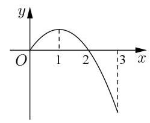
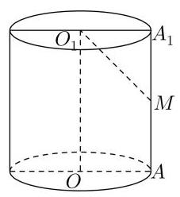

# 高三数学春考模拟卷

## 一、填空题

1、在空间直角坐标系中，点 $A\left( {1,2, - 3}\right)$ 关于 ${xOz}$ 平面对称的点的坐标是___

2、已知 $m \in  \mathbf{R}$ ，直线 ${l}_{1} : \sqrt{3}x - y + 7 = 0,{l}_{2} : {mx} + y - 1 = 0$ ，若 ${l}_{1} \parallel {l}_{2}$ ，则 ${l}_{1}$ 与 ${l}_{2}$ 之间的距离为___

3、已知直线 $l$ 经过点 $P\left( {1,2}\right)$ ，倾斜角 $\alpha$ 的正弦值为 $\frac{4}{5}$ ，则 $l$ 的点斜式方程为___.

4、曲线 $f\left( x\right)  = \sin x - 2\cos x - 1$ 在点 $\left( {\frac{\pi }{2},0}\right)$ 处的切线方程为___

5、已知集合 $A = \left( {-\infty , - 1}\right)  \cup  \lbrack 3, + \infty )$ ，集合 $B = \{ x \mid {ax} + 1 \leq  0\}$ ，若 $B \subseteq  A$ ，则实数 $a$ 的取值范围是___

6、已知数列 $\left\{  {a}_{n}\right\}$ 的通项公式为 ${a}_{n} = \frac{{6n} - {31}}{{3n} - {17}}$ ，则该数列 ${a}_{n}$ 取得最大时，正整数 $n =$ ___

7、已知 $f\left( x\right)  = 3{x}^{2} - {\mathrm{e}}^{x}$ ，函数 $f\left( x\right)$ 的零点从小到大依次为 ${x}_{i}, i = 1$ 、2、 $\cdots$ ，若 ${x}_{i} \in  \lbrack m, m + 1)$ ( $m \in  \mathbf{Z}$ )，请写出所有的 $m$ 所组成的集合___

8、在 $\bigtriangleup  {ABC}$ 中， $\angle A = \frac{\pi }{3}$ ， ${AB} = 2$ ， ${AC} = 3$ ，则 $\bigtriangleup  {ABC}$ 的外接圆半径为___.

9、已知有 1、2、3、4 四个数字组成无重复数字，则比 2134 大的四位数的个数为___

10、已知定义在 $\left( {-3,3}\right)$ 上的奇函数 $y = f\left( x\right)$ 的导函数是 ${f}^{\prime }\left( x\right)$ , 当 $x \geq  0$ 时, $y = f\left( x\right)$ 的图像如图所示,则关于 $x$ 的不等式 $\frac{{f}^{\prime }\left( x\right) }{x} > 0$ 的解集为___

11、已知双曲线 $\frac{{x}^{2}}{{a}^{2}} - {y}^{2} = 1\left( {a > 0}\right)$ ,双曲线上右支上有任意两点 ${P}_{1}\left( {{x}_{1},{y}_{1}}\right) ,{P}_{2}\left( {{x}_{2},{y}_{2}}\right)$ , 满足 ${x}_{1}{x}_{2} - {y}_{1}{y}_{2} > 0$ 恒成立,则 $a$ 的取值范围是___

12、已知 ${x}_{1}\text{ 、 }{x}_{2}$ 是函数 $f\left( x\right)  = {x}^{2} + m\ln x - {2x}\left( {m \in  \mathbf{R}}\right)$ 的两个极值点,若 ${x}_{1} < {x}_{2}$ ,则 $\frac{f\left( {x}_{1}\right) }{{x}_{2}}$ 的取值范围为___

## 二、选择题

13、计算: $\mathop{\lim }\limits_{{n \rightarrow  \infty }}\frac{{3}^{n} + {5}^{n}}{{3}^{n - 1} + {5}^{n - 1}} =$ (   )

A. 3

B. $\frac{5}{3}$ C. $\frac{3}{5}$ D. 5

14、若 $\alpha \text{ 、 }\beta  \in  \left\lbrack  {-\frac{\pi }{2},\frac{\pi }{2}}\right\rbrack$ ,且 $\alpha \sin \alpha  - \beta \sin \beta  > 0$ ,则下列结论一定正确的是 ( )

A. $\alpha  > \beta$ B. $\alpha  + \beta  > 0$ C. $\alpha  < \beta$ D. ${\alpha }^{2} > {\beta }^{2}$

15、已知函数 $y = f\left( x\right)$ 的定义域为 $\mathbf{R}$ ,下列是 $f\left( x\right)$ 无最大值的充分条件是( )

A. $f\left( x\right)$ 为偶函数且关于点 $\left( {1,1}\right)$ 对称 B. $f\left( x\right)$ 为偶函数且关于直线 $x = 1$ 对称

C. $f\left( x\right)$ 为奇函数且关于点 $\left( {1,1}\right)$ 对称 D. $f\left( x\right)$ 为奇函数且关于直线 $x = 1$ 对称

16、已知 $f\left( x\right)  = 3\sin x + 2$ ，对任意的 ${x}_{1} \in  \left\lbrack  {0,\frac{\pi }{2}}\right\rbrack$ ，都存在 ${x}_{2} \in  \left\lbrack  {0,\frac{\pi }{2}}\right\rbrack$ ，使得 $f\left( {x}_{1}\right)  + {2f}\left( {{x}_{2} + \theta }\right)  = 3$ 成立，则下列选项中， $\theta$ 可能的值为( )

A. $\frac{3\pi }{5}$ B. $\frac{4\pi }{5}$ C. $\frac{6\pi }{5}$ D. $\frac{7\pi }{5}$

## 三、解答题

17、在 $\bigtriangleup {ABC}$ 中，角 $A\text{ 、 }B\text{ 、 }C$ 所对应的边分别为 $a\text{ 、 }b\text{ 、 }c$ ，且 $a + b = {11}, c = 7$ ， $\cos A =  - \frac{1}{7}$ . 求:(1) $a$ 的值；(2) $\sin C$ 和 $\bigtriangleup {ABC}$ 的面积.

18、如图，在圆柱 $O{O}_{1}$ 中，底面半径为 $1, A{A}_{1}$ 为圆柱母线.

(1)若 $A{A}_{1} = 4, M$ 为 $A{A}_{1}$ 中点，求直线 $M{O}_{1}$ 与底面的夹角大小；

(2)若圆柱的轴截面为正方形，求该圆柱的侧面积和体积.

19、已知数列 $\left\{  {a}_{n}\right\}  ,{a}_{2} = 1,\left\{  {a}_{n}\right\}$ 的前 $n$ 项和为 ${S}_{n}$ .

(1)若 $\left\{  {a}_{n}\right\}$ 为等比数列， ${S}_{2} = 3$ ，求 $\mathop{\lim }\limits_{{n \rightarrow  \infty }}{S}_{n}$ ；

(2)若 $\left\{  {a}_{n}\right\}$ 为等差数列，公差为 $d$ ，对任意 $n \in  {\mathbf{N}}^{ * }$ ，均满足 ${S}_{2n} \geq  n$ ，求 $d$ 的取值范围.

20、已知双曲线 $C : \frac{{x}^{2}}{{a}^{2}} - \frac{{y}^{2}}{{b}^{2}} = 1$ 经过点 $\left( {2,3}\right)$ ,离心率为 2,直线 $l$ 交双曲线于 $A\text{ 、 }B$ 两点.

(1)求双曲线 $C$ 的方程；

( 2 )若 $l$ 过原点， $P$ 为双曲线上异于 $A$ 、 $B$ 的一点，且直线 ${PA}$ 、 ${PB}$ 的斜率 ${k}_{PA}$ 、 ${k}_{PB}$ 均存在,求证: ${k}_{PA} \cdot  {k}_{PB}$ 为定值;

(3)若 $l$ 过双曲线的右焦点 ${F}_{2}$ ，是否存在 $x$ 轴上的点 $M\left( {m,0}\right)$ ，使得直线 $l$ 绕点 ${F}_{2}$ 无论怎么转动,都有 $\overrightarrow{MA} \cdot  \overrightarrow{MB} = 0$ 成立? 若存在,求出 $M$ 的坐标; 若不存在,请说明理由.

21、已知函数 $f\left( x\right)  = x - \ln x - 2$ .

(1)求曲线 $y = f\left( x\right)$ 在 $x = 1$ 处的切线方程；

(2)函数 $f\left( x\right)$ 在区间 $\left( {k, k + 1}\right) \left( {k \in  \mathbf{N}}\right)$ 上有零点，求 $k$ 的值；

(3)记函数 $g\left( x\right)  = \frac{1}{2}{x}^{2} - {bx} - 2 - f\left( x\right)$ ，设 ${x}_{1}$ 、 ${x}_{2}\left( {{x}_{1} < {x}_{2}}\right)$ 是函数 $g\left( x\right)$ 的两个极值点， 若 $b \geq  \frac{3}{2}$ ,且 $g\left( {x}_{1}\right)  - g\left( {x}_{2}\right)  \geq  k$ 恒成立,求实数 $k$ 的取值范围.
