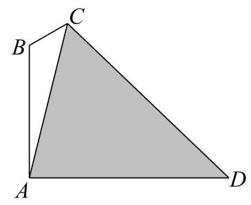

# 寒假班第四讲：三角汇编

1、若函数 $y = \cos \left( {x + \phi }\right)$ 是奇函数，则该函数的所有零点是___

2、设函数 $y = \sin {wx}\left( {w > 0}\right)$ 在区间 $\left( {0,{2\pi }}\right)$ 上恰有三个极值点,则 $\omega$ 的取值范围为 ___.

3、若 $\varphi$ 是一个三角形的内角,且函数 $y = 3\sin \left( {{2x} + \varphi }\right)$ 在区间 $\left\lbrack  {-\frac{\pi }{4},\frac{\pi }{6}}\right\rbrack$ 上是单调函数,则 $\varphi$ 的取值范围是___

4、若函数 $f\left( x\right)  = \sin x + a\cos x$ 在 $\left( {\frac{2\pi }{3},\frac{7\pi }{6}}\right)$ 上是严格单调函数，则实数 $a$ 的取值范围为___.

5、设函数 $f\left( x\right)  = \sin \left( {{\omega x} - \frac{\pi }{6}}\right)  + k\;\left( {\omega  > 0}\right)$ ,若 $f\left( x\right)  \leq  f\left( \frac{\pi }{3}\right)$ 对任意的实数 $x$ 都成立,则 $\omega$ 的最小值为___

6、设函数 $f\left( x\right)  = \cos \left( {{\omega x} + \varphi }\right)$ (其中 $\omega  > 0$ ， $\left| \varphi \right|  < \frac{\pi }{2}$ )，若函数 $y = f\left( x\right)$ 图像的对称轴 $x = \frac{\pi }{6}$ 与其对称中心的最小距离为 $\frac{\pi }{8}$ ,则 $f\left( x\right)  =$

7、若 $x \in  \left( {-\frac{3\pi }{2},\pi }\right)$ ，则等式 $\frac{\cos \left( {x + \frac{\pi }{4}}\right) }{\cos x} + \frac{\sin \left( {x + \frac{\pi }{4}}\right) }{\sin x} = 2$ 成立的一个 $x$ 的值可以是___

8、已知定义在 $\left( {-\pi ,\pi }\right)$ 上的函数 $f\left( x\right)  = x\cos \left( {x + \varphi }\right)  - \cos x\left( {0 < \varphi  < \pi }\right)$ 为偶函数，则 $f\left( x\right)$ 的严格递减区间为___

9、已知函数 $f\left( x\right)  = 2\sin \left( {{\omega x} + \frac{\pi }{4}}\right) \left( {\omega  > 0}\right)$ 在区间 $\left\lbrack  {-1,1}\right\rbrack$ 上的值域为 $\left\lbrack  {m, n}\right\rbrack$ ,且 $n - m = 3$ ， 则 $\omega$ 的值为___

10、已知函数 $f\left( x\right)  = \sin \left( {{\omega x} + \varphi }\right)$ ,其中 $\omega  > 0,0 < \varphi  < \pi , f\left( x\right)  \leq  f\left( \frac{\pi }{4}\right)$ 恒成立, 且 $y = f\left( x\right)$ 在区间 $\left( {0,\frac{3\pi }{8}}\right)$ 上恰有 3 个零点,则 $\omega$ 的取值范围是___

11、设 $f\left( x\right)  = a + \sin x$ ,若存在 ${x}_{1},{x}_{2},\cdots ,{x}_{n} \in  \left\lbrack  {\frac{\pi }{3},\frac{5\pi }{6}}\right\rbrack  , f\left( {x}_{1}\right)  + f\left( {x}_{2}\right)  + \cdots  + f\left( {x}_{n - 1}\right)  = f\left( {x}_{n}\right)$ 成立的最大正整数 $n$ 为 9，则实数 $a$ 的取值范围是___

12、设函数 $f\left( x\right)  = \sin \left( {{\omega x} + \frac{\pi }{6}}\right) \left( {0 < \omega  < 5}\right)$ 图像的一条对称轴方程为 $x = \frac{\pi }{12}$ ,若 ${x}_{1}\text{ 、 }{x}_{2}$ 是函数 $f\left( x\right)$ 的两个不同的零点，则 $\left| {{x}_{1} - {x}_{2}}\right|$ 的最小值为( )

A. $\frac{\pi }{6}$ B. $\frac{\pi }{4}$ C. $\frac{\pi }{2}$ D. $\pi$

13、将函数 $f\left( x\right)  = \sin {2x}$ 的图像向左平移 $\frac{\pi }{4}$ 个单位后,得到函数 $g\left( x\right)$ 的图像,设 $A\text{ 、 }B\text{ 、 }C$ 为以上两个函数图像不共线的三个交点，则 $\bigtriangleup  {ABC}$ 的面积不可能为( )

A. $2\sqrt{2}\pi$ B. $\sqrt{2}\pi$

C. $\frac{\sqrt{2}}{2}\pi$ D. $\frac{\sqrt{2}}{4}\pi$

14、已知函数 $f\left( x\right)  = \sin x + a\cos x$ 满足: $f\left( x\right)  \leq  f\left( \frac{\pi }{6}\right)$ . 若函数 $f\left( x\right)$ 在区间 $\left\lbrack  {{x}_{1},{x}_{2}}\right\rbrack$ 上单调,且满足 $f\left( {x}_{1}\right)  + f\left( {x}_{2}\right)  = 0$ ,则 $\left| {{x}_{1} + {x}_{2}}\right|$ 的最小值为 ( )

A. $\frac{\pi }{6}$ B. $\frac{\pi }{3}$ C. $\frac{2\pi }{3}$ D. $\frac{4\pi }{3}$

15、已知 $a\text{ 、 }b\text{ 、 }\alpha \text{ 、 }\beta  \in  \mathbf{R}$ ,满足 $\sin \alpha  + \cos \beta  = a,\cos \alpha  + \sin \beta  = b,0 < {a}^{2} + {b}^{2} \leq  4$ , 有以下 2 个结论: ① 存在常数 $a$ ,对任意的实数 $b \in  \mathbf{R}$ ,使得 $\sin \left( {\alpha  + \beta }\right)$ 的值是一个常数;

② 存在常数 $b$ ,对任意的实数 $a \in  \mathbf{R}$ ,使得 $\cos \left( {\alpha  - \beta }\right)$ 的值是一个常数.

下列说法正确的是( )

A. 结论①、②都成立 B. 结论①不成立、②成立

C. 结论①成立、②不成立 D. 结论①、②都不成立

## 解答题:

1、在 $\bigtriangleup  {ABC}$ 中，角 $A$ 、 $B$ 、 $C$ 所对边的边长分别为 $a$ 、 $b$ 、 $c$ ，且 $a - {2c}\cos B = c$ ，

(1)若 $\cos B = \frac{1}{3}, c = 3$ ，求 $b$ 的值；

(2)若 $\bigtriangleup  {ABC}$ 为锐角三角形，求 $\sin C$ 的取值范围.

2、在 $\bigtriangleup  {ABC}$ 中，设角 $A$ 、 $B$ 、 $C$ 所对的边分别为 $a$ 、 $b$ 、 $c$ ，且 $a\cos B + \left( {b - {4c}}\right) \cos A = 0$ .

(1)求 $\cos A$ ；

(2)若 $\overrightarrow{BD} = 2\overrightarrow{DC},\left| \overrightarrow{AD}\right|  = 1$ ，求 $c + {2b}$ 的最大值.

3、设函数 $f\left( x\right)  = \sin \left( {mx}\right)$ .

(1)若 $m \in  \left( {0,1}\right)$ ，且函数 $f\left( x\right)$ 与 $y = \lg x$ 的图像有横纵坐标均为正整数的交点，求 $m$ 的值;

( 2 )设 $m = 1$ ， $g\left( x\right)  = 2{f}^{2}\left( x\right)  + f\left( {2x}\right)$ ，在锐角 $\bigtriangleup  {ABC}$ 中，内角 $A$ 、 $B$ 、 $C$ 对应的边分别为 $a\text{ 、 }b\text{ 、 }c$ ,若 $g\left( A\right)  = 2,\overrightarrow{AB} \cdot  \overrightarrow{AC} = 2\sqrt{2}$ ,求 $\bigtriangleup {ABC}$ 的面积.

4、某公司要在一条笔直的道路边安装路灯,要求灯柱 ${AB}$ 与地面垂直,灯杆 ${BC}$ 与灯柱 ${AB}$ 所在的平面与道路走向垂直,路灯 $C$ 采用锥形灯罩,射出的光线与平面 ${ABC}$ 的部分截面如图中阴影部分所示. 已知 $\angle {ABC} = \frac{2\pi }{3},\angle {ACD} = \frac{\pi }{3}$ ，路宽 ${AD} = {24}$ 米. 设 $\angle {ACB} = \theta \; \left( {\frac{\pi }{6} \leq  \theta  \leq  \frac{\pi }{4}}\right) .$

(1)当 $\theta  = \frac{\pi }{6}$ 时，求 $\bigtriangleup  {ABC}$ 的面积；

(2)求灯杆 ${BC}$ 与灯柱 ${AB}$ 长度之和 $L$ (米)关于 $\theta$ 的函数解析式,并求当 $\theta$ 为何值时, $L$ 取得最小值.

