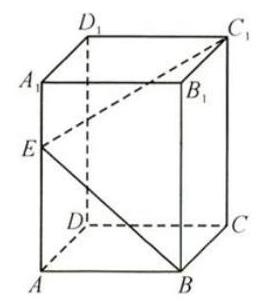
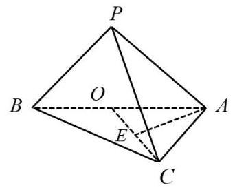
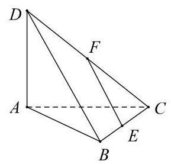
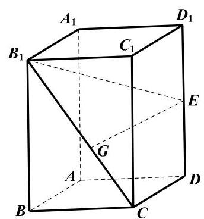

# 寒假班第五讲：立体几何汇编

1、若正三棱锥 $A - {BCD}$ 的底面边长为 6，高为 $\sqrt{13}$ ，动点 $P$ 满足

$\left( {\overrightarrow{DA} + \overrightarrow{CB}}\right)  \bot  \left( {\overrightarrow{PA} + \overrightarrow{PB} + \overrightarrow{PC} + \overrightarrow{PD}}\right)$ ，则 $\left| {\overrightarrow{PA} + \overrightarrow{PB}}\right|  + 2\left| \overrightarrow{PA}\right|$ 的最小值为___

2、已知正四面体 $A - {BCD}$ 的棱长为 $2\sqrt{2}$ ，空间内任意点 $P$ 满足 $\left| {\overrightarrow{PB} + \overrightarrow{PC}}\right|  = 2$ ，则 $\overrightarrow{AP} \cdot  \overrightarrow{AD}$ 的取值范围是___

3、体积为 $\frac{\sqrt{2}}{12}{a}^{3}$ 的正四面体内有一个球 $O$ ,球 $O$ 与该正四面体的各面均有且只有一个公共点,点 $M, N$ 是球 $O$ 的表面上的两动点,点 $P$ 在该正四面体的表面上运动,当 $\left| \overrightarrow{MN}\right|$ 最大时, $\overrightarrow{PM} \cdot  \overrightarrow{PN}$ 的最大值是___. (双动点两个动变量数量积的最值)

4、已知正方体 ${ABCD} - {A}_{1}{B}_{1}{C}_{1}{D}_{1}$ 的棱长为 $1,{\lambda }_{i} \in  \{  - 1,1\} \left( {i = 1,2,3,4}\right)$ ,则 $\left| {{\lambda }_{1}\overrightarrow{AB} + {\lambda }_{2}\overrightarrow{BC} + {\lambda }_{3}\overrightarrow{A{C}_{1}} + {\lambda }_{4}\overrightarrow{B{D}_{1}}}\right|$ 的最大值是___.

5、已知点 $P$ 在正方体 ${ABCD} - {A}_{1}{B}_{1}{C}_{1}{D}_{1}$ 的表面上， $P$ 到三个平面 ${ABCD}$ 、 ${AD}{D}_{1}{A}_{1}$ 、 ${AB}{B}_{1}{A}_{1}$ 中的两个平面的距离相等,且 $\mathbf{P}$ 到剩下一个平面的距离与 $\mathbf{P}$ 到此正方体的中心的距离相等，则满足条件的点 $\mathbf{P}$ 的个数为___

6、正四棱台 ${ABCD} - {A}_{1}{B}_{1}{C}_{1}{D}_{1}$ ， ${AB} = 3$ ， ${A}_{1}{B}_{1} = 1$ ， ${A{A}_{1}} = 2$ ，M是 ${C}_{1}{D}_{1}$ 的中点，在直线 $A{A}_{1}$ 、 ${BC}$ 上各取一个点 $P$ 、 $Q$ ，使得 $M$ 、 $P$ 、 $Q$ 三点共线，则线段 ${PQ}$ 的长度为___

7、长方体 ${ABCD} - {A}_{1}{B}_{1}{C}_{1}{D}_{1}$ 的底面是边长为 1 的正方形， 若在侧棱 $A{A}_{1}$ 上至少存在一点 $E$ ,使得 $\angle {C}_{1}{EB} = {90}^{ \circ  }$ ,则侧棱 $A{A}_{1}$ 的长的最小值为___

8、动点 $P$ 在棱长为 1 的正方体 ${ABCD} - {A}_{1}{B}_{1}{C}_{1}{D}_{1}$ 表面上运动，且与点 $A$ 的距离是 $\frac{2\sqrt{3}}{3}$ ， 点 $P$ 的集合形成一条曲线，这条曲线的长度为___.

9、已知圆柱的轴截面是边长为 2 的正方形， $P$ 为上底面圆的圆心， ${AB}$ 为下底面圆的直径， $C$ 为下底面圆周上一点,则三棱锥 $P - {ABC}$ 外接球的体积为___

10、已知 $A{A}_{1}$ 是圆柱的一条母线， ${AB}$ 是圆柱下底面的直径， $C$ 是圆柱下底面圆周上异于 $A$ 、 $B$ 的点. 若圆柱的侧面积为 ${4\pi }$ ，则三棱锥 ${A}_{1} - {ABC}$ 外接球体积的最小值为___

11、棱长为 1 的正方体 ${ABCD} - {A}_{1}{B}_{1}{C}_{1}{D}_{1}$ 的面对角线 ${A}_{1}B$ 上存在一点 $P$ 使得 ${AP} + {D}_{1}P$ 取得最小值，则最小值为___；

12、在棱长为 2 的正方体 ${ABCD} - {A}_{1}{B}_{1}{C}_{1}{D}_{1}$ 中，点 $E \in$ 平面 $A{A}_{1}{B}_{1}B$ ，点 $F$ 是线段 $A{A}_{1}$ 的中点，若 ${D}_{1}E \bot  {CF}$ ，则 $\bigtriangleup  {EBC}$ 的面积的最小值为___；

13、已知直线 $a, b, c$ 两两异面，若 $a, b$ 所成的角为 $\frac{\pi }{3}$ ，且 $c \bot  a$ ，则 $b, c$ 所成角的范围是___ $\left\lbrack  {\frac{\pi }{6},\frac{\pi }{2}}\right\rbrack$

14、已知 ${ABCD} - {A}_{1}{B}_{1}{C}_{1}{D}_{1}$ 是棱长为 $a$ 的正方体，点 $M$ ， $N$ 分别是线段 $A{B}_{1}$ ， ${A}_{1}{C}_{1}$ 上的点， 满足 ${AM} = {A}_{1}N$ ，则线段 ${MN}$ 的最小值为___；

15、已知直线 $l$ 与平面 $\alpha$ 相交，则下列命题中，正确的个数为( )

① 平面 $\alpha$ 内的所有直线均与直线 $l$ 异面；② 平面 $\alpha$ 内存在与直线 $l$ 垂直的直线；

③ 平面 $\alpha$ 内不存在直线与直线 $l$ 平行; ④ 平面 $\alpha$ 内所有直线均与直线 $l$ 相交.

A. 1 B. 2 C. 3 D. 4

16、已知正四面体 ${ABCD}$ 的棱长为 6，设集合 $\Omega  = \{ P \mid \left| {AP} \right| \leq  2\sqrt{7}$ ，点 $P \in$ 平面 ${BCD}\}$ ， 则 $\Omega$ 表示的区域的面积为( )

A. $\pi$ B. ${3\pi }$ C. ${4\pi }$ D. ${6\pi }$

17、在下列判断两个平面 $\alpha$ 与 $\beta$ 平行的 4 个命题中，真命题的个数是( )

① $\alpha$ 、 $\beta$ 都垂直于平面 $\gamma$ ，那么 $\alpha \parallel \beta$ ；

② $\alpha$ 、 $\beta$ 都平行于平面 $\gamma$ ，那么 $\alpha \parallel \beta$ ；

③ $\alpha$ 、 $\beta$ 都垂直于直线 $l$ ，那么 $\alpha \parallel \beta$ ；

④ 如果 $l$ 、 $m$ 是两条异面直线，且 $l \parallel \alpha$ ， $m \parallel \alpha$ ， $l \parallel \beta$ ， $m \parallel \beta$ ，那么 $\alpha \parallel \beta$ .

A. 0 B. 1 C. 2 D. 3

18、在正方体 ${ABCD} - {A}_{1}{B}_{1}{C}_{1}{D}_{1}$ 中， $E$ 、 $F$ 分别是线段 ${AB}$ 、 $B{D}_{1}$ 上的动点，且直线 ${EF}$ 与 $A{A}_{1}$ 所成的角为 $\arctan \sqrt{2}$ ，则下列直线中与 ${EF}$ 所成的角必为 ${\arctan \frac{\sqrt{2}}{2}}$ 的是( )

A. ${CD}$ B. ${BD}$ C. $B{C}_{1}$ D. $D{C}_{1}$

## 解答题:

1、如图，三棱锥 $P - {ABC}$ 中，侧面 ${PAB}$ 垂直于底面 ${ABC},{PA} = {PB}$ ，底面 ${ABC}$ 是斜边为 ${AB}$ 的直角三角形,且 $\angle {ABC} = {30}^{ \circ  }$ ,记 $O$ 为 ${AB}$ 的中点, $E$ 为 ${OC}$ 的中点.

(1)求证: ${PC}\bot {AE}$ ；

(2)若 ${AB} = 2$ ，直线 ${PC}$ 与底面 ${ABC}$ 所成角的大小为 ${60}^{ \circ  }$ ，求四面体 ${PAOC}$ 的体积.

2、如图，在三棱锥 $D - {ABC}$ 中，平面 ${ACD} \bot$ 平面 ${ABC}$ ， ${AD} \bot  {AC}$ ， ${AB} \bot  {BC}$ ， $E$ 、 $F$ 分别为棱 ${BC}$ 、 ${CD}$ 的中点.

(1)求证:直线 ${EF} \parallel$ 平面 ${ABD}$ ；

(2)求证:直线 ${BC} \bot$ 平面 ${ABD}$ ；

(3)若直线 ${CD}$ 与平面 ${ABC}$ 所成的角为 ${45}^{ \circ  }$ ，直线 ${CD}$ 与平面 ${ABD}$ 所成角为 ${30}^{ \circ  }$ ,求二面角 $B - {AD} - C$ 的大小.

(第19题)

3、如图所示，正四棱柱 ${ABCD} - {A}_{1}{B}_{1}{C}_{1}{D}_{1}$ 的底面边长为 2, 侧棱长为 4,设 $\overrightarrow{DE} = \lambda \overrightarrow{D{D}_{1}}\left( {0 < \lambda  < 1}\right)$ .

第17题图

(1)当 $\lambda  = \frac{1}{2}$ 时，求直线 ${B}_{1}E$ 与平面 ${ABCD}$ 所成角的大小； (结果用反三角函数值表示)

(2)当 $\lambda  = \frac{1}{4}$ 时，若 $\overrightarrow{{B}_{1}G} = t\overrightarrow{{B}_{1}C}$ ，且 $\overrightarrow{EG} \cdot  \overrightarrow{{B}_{1}C} = 0$ ，求正实数 $t$ 的值.
