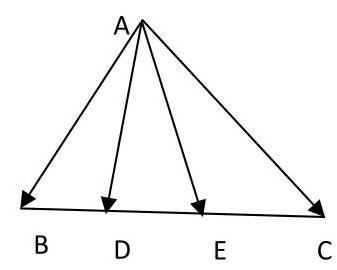
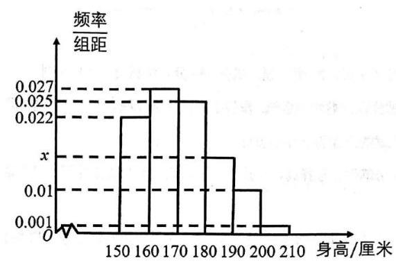

# 寒假班第八讲：小章节汇编（复数、向量、概率统计）

## 一、概率统计

1、一个袋子中装有大小与质地均相同的 $m$ 个红球和 $n$ 个白球 $\left( {4 \leq  m < n}\right)$ ,现从中任取两球, 若取出的两球颜色相同的概率等于取出两球颜色不同的概率, 则满足 $m + n \leq  {30}$ 的所有有序数对 $\left( {m, n}\right)$ 为___

2、掷两颗骰子，观察掷得的点数. 设事件 $A$ 为:至少一个点数是奇数；事件 $B$ 为:点数之和是偶数,事件 $A$ 的概率为 $P\left( A\right)$ ,事件 $B$ 的概率为 $P\left( B\right)$ . 则 $1 - P\left( {A \cap  B}\right)$ 是下列哪个事件的概率 ( )

A. 两个点数都是偶数 B. 至多有一个点数是偶数

C. 两个点数都是奇数 D. 至多有一个点数是奇数

3、设 $\sin \alpha  + \cos \alpha  = x$ ,且 ${\sin }^{3}\alpha  + {\cos }^{3}\alpha  = {a}_{3}{x}^{3} + {a}_{2}{x}^{2} + {a}_{1}x + {a}_{0}$ , 则 ${a}_{0} + {a}_{1} + {a}_{2} + {a}_{3} =$ ( )

A. -1

B. $\frac{1}{2}$ C. 1 D. $\sqrt{2}$

4、若 ${\left( x - \frac{2}{{x}^{2}}\right) }^{n} + {\left( x + \frac{1}{x}\right) }^{n}\left( {2 \leq  n \leq  {10}, n \in  N}\right)$ 的展开式中存在常数项,则下列选项中 $n$ 的取值不可能是( )

A. 3 ; B. 4 ; C. 5 ; D. 6 .

5、下列结论不正确的是( )

A. 若事件 $A$ 与 $B$ 互斥,则 $P\left( {A \cup  B}\right)  = P\left( A\right) P\left( B\right)$

B. 若事件 $A$ 与 $B$ 相互独立,则 $P\left( {A \cap  B}\right)  = P\left( A\right) P\left( B\right)$

C. 如果 $X\text{ 、 }Y$ 分别是两个独立的随机变量,那么 $D\left\lbrack  {X + Y}\right\rbrack   = D\left\lbrack  X\right\rbrack   + D\left\lbrack  Y\right\rbrack$

D. 若随机变量 $Y$ 的方差 $D\left\lbrack  Y\right\rbrack   = 3$ ,则 $D\left\lbrack  {{2Y} + 1}\right\rbrack   = {12}$

6、已知直线 $l : \frac{x}{a} + \frac{y}{b} = 1$ 与圆 ${x}^{2} + {y}^{2} = {100}$ 有公共点,且公共点的横、纵坐标均为整数, 则满足 $4\sqrt{5{a}^{2} + 5{b}^{2}} \geq  \left| {ab}\right|$ 的 $l$ 有( )条

A. 40 B. 46 C. 52 D. 54

7、已知复平面上一个动点 $Z$ 对应复数 $z$ ，若 $\left| {z - 4\mathrm{i}}\right|  \leq  2$ ，其中 $i$ 是虚数单位，则向量 $\overrightarrow{OZ}$ 扫过的面积为___

8、已知一组数据3、1、5、3、2，现加入 $p, q$ 两数对该组数据进行处理，若经过处理后的这组数据的极差为 $p - q$ ,则经过处理后的这组数据与之前的那组数据相比,一定会变大的数字特征是 ······()

(A) 平均数 (B) 方差 (C) 众数 (D) 中位数

## 二、向量

1、在 $\bigtriangleup {ABC}$ 中， ${AC} = 4$ ，且 $\overrightarrow{AC}$ 在 $\overrightarrow{AB}$ 方向上的数量投影是 -2 ，则 $\left| {\overrightarrow{BC} - \lambda \overrightarrow{BA}}\right|$ ( $\lambda  \in  \mathbf{R}$ ) 的最小值为___

2、如图，在 $\bigtriangleup  {ABC}$ 中，点 $D$ 、 $E$ 是线段 ${BC}$ 上两个动点， 且 $\overrightarrow{AD} + \overrightarrow{AE} = x\overrightarrow{AB} + y\overrightarrow{AC}$ ,则 $\frac{1}{x} + \frac{9}{y}$ 的最小值为___

3、已知平面向量 $\overrightarrow{OA}$ 、 $\overrightarrow{OB}$ 满足 $\left| \overrightarrow{OA}\right|  = \left| \overrightarrow{OB}\right|  = 1$ ，若关于 $x$ 的方程 $\left| {x \cdot  \overrightarrow{OA} - \overrightarrow{OB}}\right|  = \frac{1}{4}$ 有实数解,则 $\bigtriangleup {AOB}$ 面积的最大值为___

4、在边长为 2 的正六边形 ${ABCDEF}$ 中,点 $P$ 为其内部或边界上一点,则 $\overrightarrow{AD} \cdot  \overrightarrow{BP}$ 的取值范围为___

5、在 $\bigtriangleup {ABC}$ 中， ${AB} = 5$ ， ${AC} = 6$ ， $\cos A = \frac{1}{5}$ ， $O$ 是 $\bigtriangleup {ABC}$ 的外心，若 $\overrightarrow{OP} = x\overrightarrow{OB} + y\overrightarrow{OC}$ ， 其中 $x\text{ 、 }y \in  \left\lbrack  {0,1}\right\rbrack$ ，则动点 $P$ 的轨迹所覆盖图形的面积为___

6、在空间直角坐标系中，点 $A\left( {1,0,0}\right)$ ，点 $B\left( {5, - 4,3}\right)$ ，点 $C\left( {2,0,1}\right)$ ，则 $\overrightarrow{AB}$ 在 $\overrightarrow{CA}$ 方向上的投影向量的坐标为___

7、已知向量 $\overrightarrow{d} = \left( {1, - 1}\right)$ 垂直于直线 $l$ 的法向量，过 $A\left( {1,1}\right)$ 、 $B\left( {-1,8}\right)$ 分别作直线 $l$ 的垂线， 对应垂足为 ${A}_{1}$ 和 ${B}_{1}$ ，若 $\overrightarrow{{A}_{1}{B}_{1}} = \lambda \overrightarrow{d}$ ，则实数 $\lambda$ 的值为___.

8、已知不平行的两个向量 $\overrightarrow{a},\overrightarrow{b}$ 满足 $\left| \overrightarrow{a}\right|  = 1,\overrightarrow{a} \cdot  \overrightarrow{b} = \sqrt{3}$ . 若对任意的 $t \in  \mathbf{R}$ ，都有 $\left| {\overrightarrow{b} - t\overrightarrow{a}}\right|  \geq  2$ 成立,则 $\left| \overrightarrow{b}\right|$ 的最小值等于___.

9、已知平面向量 $\overrightarrow{a}\text{ 、 }\overrightarrow{b}\text{ 、 }\overrightarrow{c}$ 和实数 $\lambda$ 满足 $\left| \overrightarrow{a}\right|  = \left| \overrightarrow{b}\right|  = \left| {\overrightarrow{a} + \overrightarrow{b}}\right|  = 2,\overrightarrow{a} \cdot  \overrightarrow{c} + \overrightarrow{b} \cdot  \overrightarrow{c} = 0$ , $\left( {\overrightarrow{a} - \lambda \overrightarrow{c}}\right)  \cdot  \left( {\overrightarrow{b} + \lambda \overrightarrow{c}}\right)  \geq  0$ ,则 $\left| {\overrightarrow{a} - \lambda \overrightarrow{c}}\right|  + \left| {\overrightarrow{b} + \lambda \overrightarrow{c}}\right|$ 的取值范围是___

10、已知平面向量 $\overrightarrow{a} \cdot  \overrightarrow{b} \cdot  \overrightarrow{c}$ 满足 $\left| \overrightarrow{a}\right|  = 4\left| {\overrightarrow{b} - \overrightarrow{c}}\right|  = 2,\left| {\overrightarrow{a} + \overrightarrow{b}}\right|  = \left| {\overrightarrow{a} - \overrightarrow{b}}\right|  + \left| \overrightarrow{a}\right|$ ，且 $< \overrightarrow{a},\overrightarrow{c} >  = \frac{\pi }{3}$ ， 则 $\overrightarrow{a} \cdot  \overrightarrow{b}$ 的取值范围是___.

11、已知 $O$ 是锐角 ${\Delta ABC}$ 的外心， $\tan A = \frac{1}{2}$ ，若 $\frac{\cos B}{\sin C} \cdot  \overrightarrow{AB} + \frac{\cos C}{\sin B} \cdot  \overrightarrow{AC} = {2m} \cdot  \overrightarrow{AO}$ ，则实数 $m$ 的值为___；

12、已知 $O$ 为 $\bigtriangleup {ABC}$ 的外心， $\angle {ABC} = \frac{\pi }{3},\overrightarrow{BO} = \lambda \overrightarrow{BA} + \mu \overrightarrow{BC}$ ，则 $\lambda  + \mu$ 的最大值为___；

13、已知圆 $O : {x}^{2} + {y}^{2} = 1$ 为 $\bigtriangleup {ABC}$ 的外接圆,且 $\tan A = 2$ ,若 $\overrightarrow{AO} = m\overrightarrow{AB} + n\overrightarrow{AC}$ ,则 $m + n$ 的最大值为___；

14、若向量 $\overset{\text{ aug }}{MA}$ 、 $\overset{\text{ aug }}{MB}$ 的夹角为 $\frac{\pi }{6}$ ，且 $\left| {\overset{\text{ aug }}{MA} - \overset{\text{ aug }}{MB}}\right|  = 2$ ，则 $\left| {2\overset{\text{ aug }}{MA} + \overset{\text{ aug }}{MB}}\right|$ 的最大值为___ $6 + 2\sqrt{7}$

15、设平面上的向量 $\overrightarrow{a}\text{ 、 }\overrightarrow{b}\text{ 、 }\overrightarrow{x}\text{ 、 }\overrightarrow{y}$ 满足关系 $\overrightarrow{a} = \overrightarrow{y} - \overrightarrow{x},\overrightarrow{b} = m\overrightarrow{x} - \overrightarrow{y}\left( {m \geq  2}\right)$ ,又设 $\overrightarrow{a}$ 与 $\overrightarrow{b}$ 的模均为 1 且互相垂直，则 $\overrightarrow{x}$ 与 $\overrightarrow{y}$ 的夹角取值范围为___

$\left\lbrack  {\arccos \frac{3\sqrt{10}}{10},\pi  - \arccos \frac{3\sqrt{10}}{10}}\right\rbrack$

16、已知向量 $\overrightarrow{a}$ 与 $\overrightarrow{b}$ 的夹角为 ${120}^{ \circ  }$ ，且 $\overrightarrow{a} \cdot  \overrightarrow{b} =  - 2$ ，向量 $\overrightarrow{c}$ 满足 $\overrightarrow{c} = \lambda \overrightarrow{a} + \left( {1 - \lambda }\right) \overrightarrow{b}\left( {0 < \lambda  < 1}\right)$ ， 且 $\overrightarrow{a} \cdot  \overrightarrow{c} = \overrightarrow{b} \cdot  \overrightarrow{c}$ ,记向量 $\overrightarrow{c}$ 在向量 $\overrightarrow{a}$ 与 $\overrightarrow{b}$ 方向上的投影分别为 $x\text{ 、 }y$ . 现有两个结论:① 若 $\lambda  = \frac{1}{3}$ ， 则 $\left| \overrightarrow{a}\right|  = 2\left| \overrightarrow{b}\right|$ ; ② ${x}^{2} + {y}^{2} + {xy}$ 的最大值为 $\frac{3}{4}$ . 则正确的判断是( )C

A. ①成立，②成立 B. ①成立，②不成立

C. ①不成立，②成立 D. ①不成立，②不成立

17、已知向量 $\overrightarrow{m} = \left( {a, b,0}\right) ,\overrightarrow{n} = \left( {c, d,1}\right)$ ,其中 ${a}^{2} + {b}^{2} = {c}^{2} + {d}^{2} = 1$ ,现有以下命题:

① 向量 $\overrightarrow{n}$ 与 $z$ 轴正方向的夹角恒为定值 (即与 $c$ 、 $d$ 无关)；

② $\overrightarrow{m} \cdot  \overrightarrow{n}$ 的最大值为 $\sqrt{2}$ ；

③ $< \overrightarrow{m},\overrightarrow{n} > \left( {\overrightarrow{m}\text{ 、 }\overrightarrow{n}}\right.$ 的夹角) 的最大值为 $\frac{3\pi }{4}$ ;

④ 若定义 $\overrightarrow{u} \times  \overrightarrow{v} = \left| \overrightarrow{u}\right|  \cdot  \left| \overrightarrow{v}\right| \sin  < \overrightarrow{u},\overrightarrow{v} >$ ,则 $\left| {\overrightarrow{m} \times  \overrightarrow{n}}\right|$ 的最大值为 $\sqrt{2}$ ;

其中正确的命题有___(写出所有正确命题的序号)

18、本市某区对全区高中生的身高(单位:厘米)进行统计，得到如下的频率分布直方图.

(1)若数据分布均匀，记随机变量 $X$ 为各区间中点所代表的身高，写出 $X$ 的分布及期望；

(2)已知本市身高在区间 $\left\lbrack  {{180},{210}}\right\rbrack$ 的市民人数约占全市总人数的 10%，且全市高中生约占全市总人数的 1.2%，现在要以该区本次统计数据估算全市高中生身高情况，从本市市民中任取 1 人，若此人的身高位于区间[180, 210]，试估计此人是高中生的概率；

(3)现从身高在区间 $\lbrack {170},{190})$ 的高中生中分层抽样抽取一个 80 人的样本. 若身高在区间 [170, 180)中样本的均值为 176 厘米，方差为 10；身高在区间[180, 190)中样本的均值为 184 厘米, 方差为 16, 试求这 80 人的方差。

第一讲:分类讨论思想 1 1~5

第二讲:分类讨论思想 2 ·6~10

第三讲:数形结合思想 .11~15

第四讲:数学解题方法汇总 1 16~21

第五讲:数学解题方法汇总 2 ·22~25

第六讲:综合卷训练 1 26~31

第七讲:解析几何专题训练 32~37

第八讲:导数与函数、三角、数列综合应用 ·38~43

第九讲:综合卷训练 2 44~48

第十讲:解答题综合训练 1 49~52

第十一讲:解答题综合训练 2 ·53~58

第十二讲:高考数学常用结论和注意点 1 .59~77

第十三讲:各章易错题 2 78~100

第十四讲:综合卷训练 3 101~105
