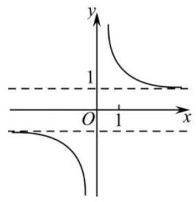
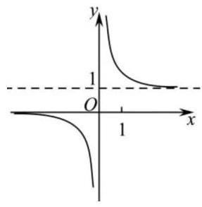
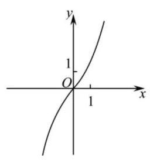
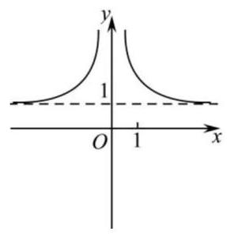

# 第六讲：综合卷训练 1

## 一、填空题

1、平行直线 $x + \sqrt{3}y + \sqrt{3} = 0$ 与 $\sqrt{3}x + {3y} - 9 = 0$ 之间的距离为___

2、向量 $\overrightarrow{n} = \left( {a,2}\right)$ 为直线 $x - {2y} + 2 = 0$ 的法向量，则向量 $\left( {1,1}\right)$ 在 $\overrightarrow{n}$ 方向上的投影为___

3、以下数据为参加数学竞赛决赛的 15 人的成绩(单位:分)，分数从低到高依次:56、70、 72、78、79、80、81、83、84、86、88、90、91、94、98. 则这 15 人成绩的第 80 百分位数是___

4、已知随机变量 $X$ 服从正态分布 $N\left( {{1.5},{\sigma }^{2}}\right)$ ，且 $P\left( {{1.5} < X \leq  3}\right)  = {0.38}$ ，则 $P\left( {X < 0}\right)  =$ ___ -

5、设某产品的一个部件来自三个供应商，这三个供应商的良品率分别是 0.92、0.95、0.94， 若这三个供应商的供货比例为 $3 : 2 : 1$ ，那么这个部件的总体良品率是___(用分数作答)

6、已知一个正四棱锥的每条棱长均为 2，从该正四棱锥的 5 个顶点中任取 3 个点，设随机变量 $X$ 表示这三个点所构成的三角形的面积,则其数学期望 $E\left\lbrack  X\right\rbrack   =$ ___

7、在 $\bigtriangleup {ABC}$ 中，内角 $A\text{ 、 }B\text{ 、 }C$ 所对的边分别为 $a\text{ 、 }b\text{ 、 }c$ ，已知 $b\cos C + c\cos B = {3a}\cos A$ ， 若 $S$ 为 $\bigtriangleup {ABC}$ 的面积，则 $\frac{{a}^{2}}{S}$ 的最小值为___

8、已知函数 $f\left( x\right)  = \sin \left( {{\omega x} + \varphi }\right) \left( {\omega  > 0,\left| \varphi \right|  \leq  \frac{\pi }{2}}\right) , x =  - \frac{\pi }{4}$ 为 $y = f\left( x\right)$ 的零点,直线 $x = \frac{\pi }{4}$ 为 $y = f\left( x\right)$ 图像的对称轴,且 $y = f\left( x\right)$ 在 $\left( {\frac{\pi }{18},\frac{5\pi }{36}}\right)$ 上单调,则 $\omega$ 的最大值为___

9、函数 $y = f\left( x\right)$ 的表达式为 $f\left( x\right)  = 2{x}^{3} - 5{x}^{2} - {4x}$ ,如果 $f\left( a\right)  = f\left( b\right)  = f\left( c\right)$ 且 $a < b < c$ ，则 ${abc}$ 的取值范围为___

10、已知函数 $y = {x}^{2} + {px} + q$ 有两个零点 1、2，数列 $\left\{  {x}_{n}\right\}$ 满足 ${x}_{n + 1} = {x}_{n} - \frac{f\left( {x}_{n}\right) }{{f}^{\prime }\left( {x}_{n}\right) }$ ，若 ${a}_{n} = \ln \frac{{x}_{n} - 2}{{x}_{n} - 1}$ ，且 ${a}_{1} =  - 2$ ，则数列 $\left\{  {a}_{n}\right\}$ 的前 2023 项的和为___

11、已知关于 $x$ 的方程 ${x}^{2} - \frac{1}{{\mathrm{e}}^{ax}} = 0$ 有唯一实数根，则实数 $a$ 的取值范围为___；

12、已知函数 $f\left( x\right)  = x{e}^{x}, g\left( x\right)  = x\ln x$ ,若 $f\left( {x}_{1}\right)  = g\left( {x}_{2}\right)  = t, t > 0$ ,则 $\frac{\ln t}{{x}_{1}{x}_{2}}$ 的最大值为 ___；

## 二、选择题

13、某小组有 1 名男生和 2 名女生，从中任选 2 名学生参加围棋比赛，事件“至少有 1 名男生”与事件 “至少有 1 名女生” ( )

A. 是对立事件 B. 都是不可能事件

C. 是互斥事件但不是对立事件 D. 不是互斥事件

14. 已知函数 $y = \frac{{\mathrm{e}}^{x}}{{\mathrm{e}}^{x} - 1}$ ,则其图像大致是( )

A.

B.

C.

D.

15、设 $f\left( x\right)  = \sqrt{3}\sin \left( {{\omega x} + \varphi }\right)$ (其中 $\omega  > 0,\left| \varphi \right|  < \frac{\pi }{2}$ ),若点 $A\left( {\frac{1}{3},0}\right)$ 为函数 $y = f\left( x\right)$ 图像的对称中心， $B$ 、 $C$ 是图像上相邻的最高点与最低点，且 $\left| {BC}\right|  = 4$ ，则下列结论正确的是( )

A. 函数 $y = f\left( x\right)$ 的对称轴方程为 $x = {4k} + \frac{4}{3}, k \in  \mathbf{Z}$

B. 函数 $y = f\left( {x - \frac{\pi }{3}}\right)$ 的图像关于坐标原点对称

C. 函数 $y = f\left( x\right)$ 在区间 $\left( {0,2}\right)$ 上是严格增函数

D. 若函数 $y = f\left( x\right)$ 在区间 $\left( {0, m}\right)$ 内有 5 个零点,则它在此区间内有且有 2 个极小值点

16、已知函数 $f\left( x\right)  = \frac{\ln x}{x}, g\left( x\right)  = x{e}^{-x}$ ,若存在 ${x}_{1} \in  \left( {0, + \infty }\right) ,{x}_{2} \in  R$ ,使得 $f\left( {x}_{1}\right)  = g\left( {x}_{2}\right)  = k\left( {k < 0}\right)$ ，则 ${\left( \frac{{x}_{2}}{{x}_{1}}\right) }^{3}{e}^{k}$ 的最小值为( )

A. $- \frac{1}{{e}^{2}}$ B. $- \frac{4}{{e}^{2}}$ C. $- \frac{9}{{e}^{3}}$ D. $- \frac{27}{{e}^{3}}$

## 三、解答题

17、已知 $\lambda  \in  \mathbf{R}$ ，各项均不为零的数列 $\left\{  {a}_{n}\right\}$ 的前 $n$ 项和为 ${S}_{n}$ ， ${a}_{1} = 1,{a}_{n}{a}_{n + 1} = \lambda {S}_{n} - 1$ .

(1)证明: ${a}_{n + 2} - {a}_{n} = \lambda$ ；

(2)是否存在 $\lambda$ ，使得 $\left\{  {a}_{n}\right\}$ 为等差数列? 并说明理由.

18、已知正项数列 $\left\{  {a}_{n}\right\}$ 、 $\left\{  {b}_{n}\right\}$ 满足:对任意 $n \in  {\mathbf{N}}^{ * }$ 都有 ${a}_{n}$ 、 ${b}_{n}$ 、 ${a}_{n + 1}$ 成等差数列， ${b}_{n}$ 、 ${a}_{n + 1}$ 、 ${b}_{n + 1}$ 成等比数列,且 ${a}_{1} = {10},{a}_{2} = {15}$ .

(1)求证:数列 $\left\{  \sqrt{{b}_{n}}\right\}$ 是等差数列；

(2)求数列 $\left\{  {a}_{n}\right\}  \text{ 、 }\left\{  {b}_{n}\right\}$ 的通项公式；

(3)设 ${S}_{n} = \frac{1}{{a}_{1}} + \frac{1}{{a}_{2}} + \cdots  + \frac{1}{{a}_{n}}$ ，如果对任意 $n \in  {\mathbf{N}}^{ * }$ ，不等式 ${2a}{S}_{n} < 2 - \frac{{b}_{n}}{{a}_{n}}$ 恒成立， 求实数 $a$ 的取值范围.

19、社会实践是大学生课外教育的一个重要方面，在校大学生利用要期参加社会实践活动， 是认识社会、了解社会、提高自我能力的重要机会. 某省统计了该省其中的 4 所大学 2023 年毕业生的人数及参加过暑期社会实践活动的人数(单位:千人)，得到如下表格:

<table><tr><td>大学</td><td>$A$ 大学</td><td>$B$ 大学</td><td>$C$ 大学</td><td>$D$ 大学</td></tr><tr><td>2023 年毕业生人数 $x$ (千人)</td><td>7</td><td>6</td><td>5</td><td>4</td></tr><tr><td>2023 年毕业生中参加过社会实践人数 $y$ (千人)</td><td>0.5</td><td>0.4</td><td>0.3</td><td>0.2</td></tr></table>

(1)已知 $y$ 与 $x$ 具有较强的线性相关性,求 $y$ 关于 $x$ 的线性回归方程 $y = \widehat{a}x + \widehat{b}$ ;

(2)假设该省对参加过暑期社会实践活动的大学生每人发放 0.5 万元的补贴.

① 若该省大学 2023 年毕业生人数为 12 万人，估计该省要发放补贴的总金额；

② 若 2023 年毕业生中的小李、小王参加过暑期社会实践活动的概率分别为 $p$ 、 ${3p} - 1$ ， 该省对小李、小王两人补贴总金额的期望不超过 0.75 万元,求 $p$ 的取值范围.

参考公式: $\widehat{a} = \frac{\mathop{\sum }\limits_{{i = 1}}^{n}\left( {{x}_{i} - \bar{x}}\right) \left( {{y}_{i} - \bar{y}}\right) }{\mathop{\sum }\limits_{{i = 1}}^{n}{\left( {x}_{i} - \bar{x}\right) }^{2}} = \frac{\mathop{\sum }\limits_{{i = 1}}^{n}\left( {{x}_{i}{y}_{i} - n\bar{x} \cdot  \bar{y}}\right) }{\mathop{\sum }\limits_{{i = 1}}^{n}{x}_{i}^{2} - n{\bar{x}}^{2}},\widehat{b} = \bar{y} - \widehat{a}\bar{x}$ .

20、设 $f\left( x\right)  = {\mathrm{e}}^{x} + a\sin x - 1$ .

(1)求曲线 $y = f\left( x\right)$ 在点 $\left( {0, f\left( 0\right) }\right)$ 处的切线方程；

(2)若函数 $y = f\left( x\right)$ 在 $x = 0$ 处取得极小值，求 $a$ 的值；

(3)若存在正实数 $m$ ，使得对任意的 $x \in  \left( {0, m}\right)$ ，都有 $f\left( x\right)  < 0$ ，求 $a$ 的取值范围.
