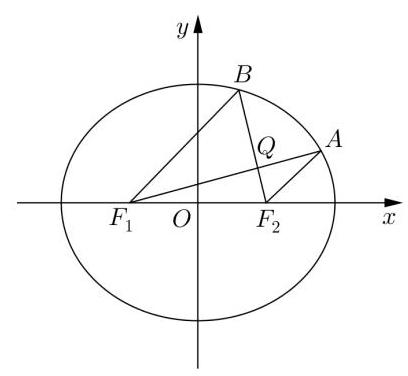
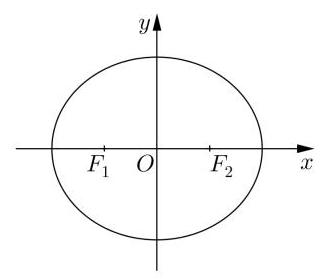

# 第七讲：解析几何专题训练

## 一、填空题

1、已知 $F$ 是双曲线 ${C}_{1} : \frac{{x}^{2}}{{a}^{2}} - {y}^{2} = 1$ 与抛物线 ${C}_{2} : {y}^{2} = {8x}$ 的一个共同焦点,则 ${C}_{1}$ 的两条渐近线夹角的大小为___；

2、求与 $\frac{{x}^{2}}{5} + \frac{{y}^{2}}{4} = 1$ 有相同离心率且过点 $\left( {\sqrt{5},2}\right)$ 的椭圆方程为___；

3、已知 $F$ 是椭圆 $E : \frac{{x}^{2}}{{a}^{2}} + \frac{{y}^{2}}{{b}^{2}} = 1\left( {a > b > 0}\right)$ 的左焦点,经过原点 $O$ 的直线 $l$ 与椭圆 $E$ 交于 $P, Q$ 两点,若 $\left| {PF}\right|  = 5\left| {QF}\right|$ ,且 $\angle {PFQ} = {120}^{ \circ  }$ ,则椭圆 $E$ 的离心率为___；

4、已知线段 ${AB}$ 上有一动点 $D\left( D\right.$ 异于 $A\text{ 、 }B)$ ,线段 ${CD} \bot  {AB}$ ,且满足 $C{D}^{2} = {\lambda AD} \cdot  {BD}$ (λ是大于 0 且不等于 1 的常数)，则点 $C$ 的运动轨迹为( )

A. 圆的一部分 B. 椭圆的一部分 C. 双曲线的一部分 D. 抛物线的一部分

5、平面直角坐标系 ${xoy}$ 中，抛物线 ${y}^{2} = {2x}$ 的焦点为 $F$ ,设 $M$ 是抛物线上的动点，则 $\frac{\left| MO\right| }{\left| MF\right| }$ 的最大值是___；

6、设 $A\left( {{x}_{1},{y}_{1}}\right) , B\left( {{x}_{2},{y}_{2}}\right)$ 是曲线 ${x}^{2} + {y}^{2} = {2x} - {4y}$ 的两点，则 ${x}_{1}{y}_{2} - {x}_{2}{y}_{1}$ 的最大值是___

## 二、解答题

1、已知椭圆 $C : \frac{{x}^{2}}{{a}^{2}} + \frac{{y}^{2}}{{b}^{2}} = 1\left( {a > b > 0}\right)$ 的左右焦点为 ${F}_{1},{F}_{2}$ ,离心率为 $e = \frac{\sqrt{2}}{2}$ ,过点 $\left( {\sqrt{2},1}\right)$

(1)求椭圆的标准方程；

(2)设直线 $l : y = {kx} + m$ 与椭圆 $C$ 相交于 $A\left( {{x}_{1},{y}_{1}}\right) , B\left( {{x}_{2},{y}_{2}}\right)$ 两点，椭圆的左顶点为 $M$ ， 连接 ${MA},{MB}$ 并延长交直线 $x = 4$ 于 $P, Q$ 两点， ${y}_{P},{y}_{Q}$ 分别为 $P, Q$ 的纵坐标，且满足 $\frac{1}{{y}_{1}} + \frac{1}{{y}_{2}} = \frac{1}{{y}_{P}} + \frac{1}{{y}_{Q}}$ ,求证: 直线 $l$ 恒过定点。

2、已知椭圆 ${C}_{1} : \frac{{x}^{2}}{{a}^{2}} + \frac{{y}^{2}}{{b}^{2}} = 1\left( {a > b > 0}\right)$ 的离心率为 $\frac{\sqrt{2}}{2}$ ，且点 $\left( {-2,\sqrt{2}}\right)$ 在椭圆 ${C}_{1}$ 上.

(1)求椭圆 ${C}_{1}$ 的方程；

(2)过点 $Q\left( {0,1}\right)$ 的直线 $l$ 与椭圆 ${C}_{1}$ 交于 $D\text{ 、 }E$ 两点，已知 $\overrightarrow{DQ} = 2\overrightarrow{QE}$ ，求直线 $l$ 的方程；

(3)点 $P$ 为椭圆 ${C}_{1}$ 上任意一点，过点 $P$ 作 ${C}_{1}$ 的切线与圆 ${C}_{2} : {x}^{2} + {y}^{2} = {12}$ 交于 $A$ 、 $B$ 两点， 设直线 ${OA}\text{ 、 }{OB}$ 的斜率分别为 ${k}_{1}\text{ 、 }{k}_{2}$ ,证明: ${k}_{1}{k}_{2}$ 为定值,并求该定值.

3、已知椭圆 $C : \frac{{x}^{2}}{4} + \frac{{y}^{2}}{{b}^{2}} = 1\left( {0 < b < 2}\right)$ 经过点 $M\left( {1, - \frac{3}{2}}\right) ,{F}_{1}\text{ 、 }{F}_{2}$ 为椭圆 $C$ 的左右焦点, $Q\left( {{x}_{0},{y}_{0}}\right)$ 为平面内一个动点,其中 ${y}_{0} > 0$ ,记直线 $Q{F}_{1}$ 与椭圆 $C$ 在 $x$ 轴上方的交点为 $A\left( {{x}_{1},{y}_{1}}\right)$ ,直线 $Q{F}_{2}$ 与椭圆 $C$ 在 $x$ 轴上方的交点为 $B\left( {{x}_{2},{y}_{2}}\right)$ .

(1)求椭圆 $C$ 的离心率；

(2)若 $A{F}_{2} \parallel B{F}_{1}$ ，证明: $\frac{1}{{y}_{1}} + \frac{1}{{y}_{2}} = \frac{1}{{y}_{0}}$ ；

(3)若 $\frac{1}{{y}_{1}} + \frac{1}{{y}_{2}} = \frac{4}{3{y}_{0}}$ ，求点 $Q$ 的轨迹方程.

4、已知抛物线 $C$ 的顶点为原点,其焦点 $F\left( {0, c}\right)$ ( $c > 0$ )到直线 $l : x - y - 2 = 0$ 的距离为 $\frac{3\sqrt{2}}{2}$ ,设 $P$ 为直线 $l$ 上的点,过点 $P$ 作抛物线 $C$ 的两条切线 ${PA},{PB}$ ,其中 $A, B$ 为切点.

(1)求抛物线 $C$ 的方程；

(2)若点 $P$ 为直线 $l$ 上的定点,设其横坐标为 $t$ ,求直线 ${AB}$ 的方程；

(3)当点 $P$ 在直线 $l$ 上移动时，求 $\left| {AF}\right|  \cdot  \left| {BF}\right|$ 的最小值.

5、已知曲线 $C : 3{x}^{2} + 4{y}^{2} = {12}$ 的左、右焦点分别为 ${F}_{1}\text{ 、 }{F}_{2}$ ,直线 $l$ 经过 ${F}_{1}$ 且与 $C$ 相交于 $A, B$ 两点.

(1)求 $\bigtriangleup  {F}_{1}A{F}_{2}$ 的周长；

(2)若以 ${F}_{2}$ 为圆心的圆截 $y$ 轴所得的弦长为 $2\sqrt{2}$ ，且 $l$ 与圆 ${F}_{2}$ 相切，求 $l$ 的方程；

(3)设 $l$ 的斜率为 $k$ ，在 $x$ 轴上是否存在一点 $M$ ，使得 $\left| {MA}\right|  = \left| {MB}\right|$ 且 $\tan \angle {MAB} = \frac{\sqrt{5}}{5}$ 若存在,求出 $M$ 的坐标; 若不存在,请说明理由.

6、在以 $A\left( {-2,0}\right)$ 为圆心，6 为半径的圆 $A$ 内有一点 $B\left( {2,0}\right)$ ，点 $P$ 为圆 $A$ 上的任意一点， 线段 ${BP}$ 的垂直平分线 $I$ 和半径 ${AP}$ 交于点 $M$ .

(1)判断点 $M$ 的轨迹是什么曲线,并求其方程;

(2)记点 $M$ 的轨迹为曲线 $\Gamma$ ，过点 $B$ 的直线与曲线 $\Gamma$ 交于 $C$ 、 $D$ 两点，求 $\overrightarrow{OC} \cdot  \overrightarrow{OD}$ 的最大值;

(3)在圆 ${x}^{2} + {y}^{2} = {14}$ 上的任取一点 $Q$ ，作曲线 $\Gamma$ 的两条切线，切点分别为 $E$ 、 $F$ ，试判断 ${QE}$ 与 ${QF}$ 是否垂直,并给出证明过程.
