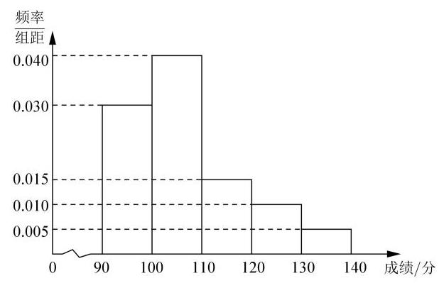
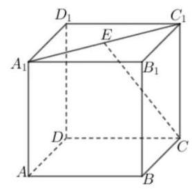
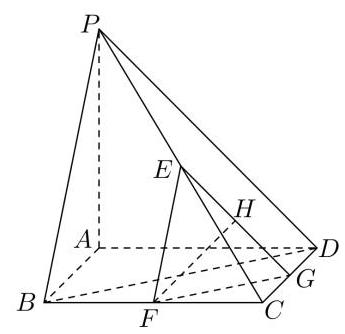

# 第九讲：综合卷训练 2

## 一、客观题

1、若实数 $x\text{ 、 }y$ 满足 ${x}^{2} + {y}^{2} = 1$ ，则 ${xy}$ 的取值范围是___；

2、已知 $n \in  \mathbf{N}$ ，若 ${C}_{6}^{n} = {P}_{5}^{2}$ ，则 $n =$ ___

3、不等式 ${3}^{x} + \lg x \leq  3$ 的解集是___；

4、已知直线 $l$ 过点 $\left( {2,3}\right)$ ，且倾斜角的正弦值为 $\frac{3}{5}$ ，则直线 $l$ 的方程为___；

5、某中学举办思维竞赛，现随机抽取 50 名参赛学生的成绩制作成频率分布直方图(如图) 估计:学生的平均成绩为___分；

6、已知函数 $f\left( x\right)  = {ax} - x\ln x$ 与函数 $g\left( x\right)  = {e}^{x} - 1$ 的图像上恰有两对关于 $x$ 轴对称的点， 则实数 $a$ 的取值范围是___；

7、若过点 $\left( {a, b}\right)$ 可作曲线 $y = {e}^{x}$ 的两条切线,则( )

A. ${e}^{b} < a$ B. ${e}^{a} < b$ C. $0 < a < {e}^{b}$ D. $0 < b < {e}^{a}$

8、若定义在 $R$ 上的函数 $f\left( x\right)$ 满足 $f\left( 0\right)  =  - 1$ ，其导函数 ${f}^{\prime }\left( x\right)$ 满足 ${f}^{\prime }\left( x\right)  > k > 1$ ，则下列结论一定错误的是( )

A. $f\left( \frac{1}{k}\right)  < \frac{1}{k}$ B. $f\left( \frac{1}{k}\right)  > \frac{1}{k - 1}$ c. $f\left( \frac{1}{k - 1}\right)  < \frac{1}{k - 1}$ D. $f\left( \frac{1}{k - 1}\right)  > \frac{k}{k - 1}$

9、若直线 $y = {k}_{1}\left( {x + 1}\right)  - 1$ 与曲线 $y = {\mathrm{e}}^{x}$ 相切,直线 $y = {k}_{2}\left( {x + 1}\right)  - 1$ 与曲线 $y = \ln x$ 相切, 则 ${k}_{1}{k}_{2}$ 的值为( )

A. $\frac{1}{2}$ B. 1 C. e D. ${\mathrm{e}}^{2}$

10、投篮测试中，每人投 3 次，至少投中 2 次才能通过测试. 已知某同学每次投篮投中的概率为 0.6 , 且各次投篮是否投中相互独立, 则该同学通过测试的概率为

A. 0.648 B. 0.432 C. 0.36 D. 0.312

11、如图所示，在正方体 ${ABCD} - {A}_{1}{B}_{1}{C}_{1}{D}_{1}$ 中， $E$ 为线段 ${A}_{1}{C}_{1}$ 上的动点,则下列直线中与直线 ${CE}$ 夹角为定值的直线为( )

A. 直线 ${AC}$ B. 直线 ${A}_{1}D$ C. 直线 ${BD}$ D. 直线 ${A}_{1}A$

12、设函数 $f\left( x\right)$ 的定义域为 $R, f\left( {x + 1}\right)$ 为奇函数， $f\left( {x + 2}\right)$ 为偶函数，当 $x \in  \left\lbrack  {1,2}\right\rbrack$ 时， $f\left( x\right)  = a{x}^{2} + b$ ，若 $f\left( 0\right)  + f\left( 3\right)  = 6$ ，则 $f\left( \frac{9}{2}\right)  =$ ( )

A. $- \frac{9}{4}$ B. $- \frac{3}{2}$ C. $\frac{7}{4}$ D. $\frac{5}{2}$

## 二、解答题

1、在 $\bigtriangleup {ABC}$ 中,角 $A\text{ 、 }B\text{ 、 }C$ 对边分别是 $a\text{ 、 }b\text{ 、 }c$ ,满足 $2\overrightarrow{AB} \cdot  \overrightarrow{AC} = {a}^{2} - {\left( b + c\right) }^{2}$ .

(1)求角 $A$ 的大小；

(2)求 $2\sqrt{3}{\cos }^{2}\frac{C}{2} - \sin \left( {\frac{4\pi }{3} - B}\right)$ 的最大值，并求取得最大值时角 $B$ 、 $C$ 的大小.

2、已知四棱锥 P-ABCD 的底面 ${ABCD}$ 为矩形， ${PA}\bot$ 底面 ${ABCD},$ 且 ${PA} = {AD} = {2AB} = 2$ ， 设 $E$ 、 $F$ 、 $G$ 分别为 ${PC}$ 、 ${BC}$ 、 ${CD}$ 的中点， $H$ 为 ${EG}$ 的中点，如图.

(1)求证: ${FH}//$ 平面 ${PBD}$ ；

(2)求直线 ${FH}$ 与平面 ${PBC}$ 所成角的正弦值.

3、第 22 届世界杯在卡塔尔举办，某校“足球社”调查学生喜欢足球是否与性别有关，现从全校学生中随机抽取了 ${40k}$ ( $k \in  {\mathbf{N}}^{ * }$ )人，若被抽查的男生与女生人数之比为 5 :3，男生中喜欢足球的人数占男生的 $\frac{3}{5}$ ，女生中喜欢足球的人数占女生的 $\frac{1}{3}$ . 经计算，有 95%的把握认为喜欢足球与性别有关，但没有 99%的把握认为喜欢足球与性别有关.

(1)请完成下面的 $2 \times  2$ 列联表,并求出 $k$ 的值;

<table><tr><td></td><td>喜欢足球</td><td>不喜欢足球</td><td>合计</td></tr><tr><td>男生</td><td></td><td></td><td></td></tr><tr><td>女生</td><td></td><td></td><td></td></tr><tr><td>合计</td><td></td><td></td><td>40k</td></tr></table>

(2)将频率视为概率，用样本估计总体，从全校男学生中随机抽取 3 人，记其中喜欢足球的人数为 $X$ ,求 $X$ 的分布及期望.

附: ${\chi }^{2} = \frac{n{\left( ad - bc\right) }^{2}}{\left( {a + b}\right) \left( {c + d}\right) \left( {a + c}\right) \left( {b + d}\right) }$ ，其中 $n = a + b + c + d$ .

<table><tr><td>$P\left( {{\chi }^{2} \geq  {k}_{0}}\right)$</td><td>0.10</td><td>0.05</td><td>0.01</td><td>0.001</td></tr><tr><td>${k}_{0}$</td><td>2.706</td><td>3.841</td><td>6.635</td><td>10.828</td></tr></table>

4、已知函数 $f\left( x\right)  = {mx}\ln x - {x}^{2} - x\left( {m \in  R}\right)$

(1)若 $m = 1$ ，讨论 $f\left( x\right)$ 的单调性；

(2)若方程 $f\left( x\right)  + x = 0$ 有两个不同的实数根 ${x}_{1},{x}_{2}$ ;

① 求 $m$ 的取值范围；

② 若 $2{x}_{2} > 3{x}_{1}$ ，求证: $m{x}_{1}{x}_{2} > {e}^{3}$ 。
