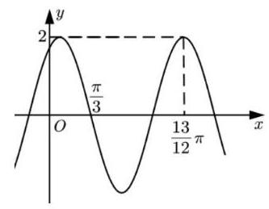
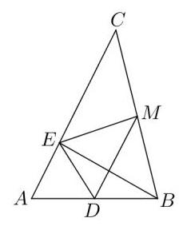
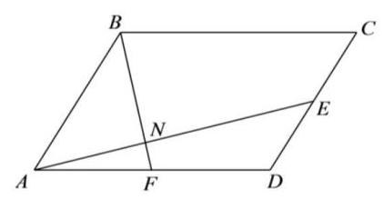

# 第十讲：解答题综合训练 1

1、设函数 $f\left( x\right)  = \sqrt{2}\sin \left( {{\omega x} + \varphi }\right)$ ( $\omega  > 0$ ， $0 < \varphi  < \pi$ )，该函数图像上相邻两个最高点之间的距离为 ${4\pi }$ ,且 $f\left( x\right)$ 为偶函数.

(1)求 $\omega$ 和 $\varphi$ 的值；

(2)在 $\bigtriangleup  {ABC}$ 中，角 $A$ 、 $B$ 、 $C$ 的对边分别为 $a$ 、 $b$ 、 $c$ ，若 $\left( {{2a} - c}\right) \cos B = b\cos C$ ， 求 ${f}^{2}\left( A\right)  + {f}^{2}\left( C\right)$ 的取值范围.

2、已知函数 $f\left( x\right)  = 2\sin \left( {{\omega x} + \varphi }\right) \;\left( {\omega  > 0,0 \leq  \varphi  \leq  \pi }\right)$ 的部分图像如图所示.

(1)求函数 $f\left( x\right)$ 的解析式，并求 $f\left( x\right)$ 的单调递增区间；

(2)设 $\bigtriangleup  {ABC}$ 的三内角 $A$ 、 $B$ 、 $C$ 的正弦值依次成等比数列，求 $f\left( B\right)$ 的值域；

(3)将 $f\left( x\right)$ 图像上所有点先向右平移 $\frac{\pi }{12}$ 个单位，再将所得图像上所有点的横坐标变为原来的 2 倍,得到 $g\left( x\right)$ 的图像,记 $h\left( x\right)  = g\left( x\right) g\left( {x + \frac{\pi }{3}}\right)  - m$ ,是否同时存在实数 $m$ 和正整数 $n$ ,使得函数 $h\left( x\right)$ 在 $\left\lbrack  {0,{n\pi }}\right\rbrack$ 上恰有 2022 个零点? 若存在,请求出所有符合条件的 $m$ 和 $n$ 的值; 若不存在, 请说明理由.

3、已知向量 $\overrightarrow{a} = \left( {\cos {2\theta }, - 2}\right) ,\overrightarrow{b} = \left( {1, - {\sin }^{2}\theta }\right) , m = \overrightarrow{a} \cdot  \overrightarrow{b} + 2$ ,在复平面坐标系中, $\mathrm{i}$ 为虚数单位,复数 ${z}_{1} = \frac{m + \mathrm{i}}{1 - \mathrm{i}}$ 对应的点为 ${Z}_{1}$ .

(1)求 $\left| {z}_{1}\right|$ ；

(2) $Z$ 为曲线 $\left| {z - 2\overline{{z}_{1}}}\right|  = 1$ ( $\overline{{z}_{1}}$ 为 ${z}_{1}$ 的共轭复数)上的动点，求 $Z$ 与 ${Z}_{1}$ 之间的最小距离；

(3)若 $\theta  = \frac{\pi }{6}$ ，求 $\overrightarrow{a}$ 在 $\overrightarrow{b}$ 上的投影向量 $\overrightarrow{n}$ .

4、已知虚数 ${z}_{1} = 4\cos \theta  + 3\sin \theta  \cdot  \mathrm{i},{z}_{2} = 2 - 3\sin \theta  \cdot  \mathrm{i}$ ,其中 $\mathrm{i}$ 为虚数单位, $\theta  \in  \mathbf{R},{z}_{1}\text{ 、 }{z}_{2}$ 是实系数一元二次方程 ${z}^{2} + {mz} + n = 0$ 的两根.

(1)求实数 $m, n$ 的值；

(2)若 $\left| {z - {z}_{1}}\right|  + \left| {z - {z}_{2}}\right|  = 3\sqrt{3}$ ，求 $\left| z\right|$ 的取值范围.

5、在 $\bigtriangleup {ABC}$ 中， ${AB} = 2$ ， ${AC} = 3$ ， $\overrightarrow{AB} = 2\overrightarrow{DB}$ ， $\overrightarrow{EC} = 2\overrightarrow{AE}$ ， $\overrightarrow{BE} \cdot  \overrightarrow{BC} = 3$ .

(1)求角 $A$ 和 ${DE}$ 的长；

(2)若 $M$ 是线段 ${BC}$ 上的一个动点(包括端点)，求 $\overrightarrow{DM} \cdot  \overrightarrow{EM}$ 的最值.

6、如图，在平行四边形 ${ABCD}$ 中， ${AB} = 2,{AD} = 3,\angle {BAD} = \frac{\pi }{3},\overrightarrow{AF} = \overrightarrow{FD}$ ， $\overrightarrow{DE} = \lambda \overrightarrow{DC}\;\left( {0 \leq  \lambda  \leq  1}\right) ,{AE}$ 交 ${BF}$ 于点 $N$

(1)若 $\lambda  = \frac{1}{2},\overrightarrow{AN} = \mu \overrightarrow{AE}$ ，求 $\mu$ 的值；

(2)求 $\overrightarrow{BE} \cdot  \overrightarrow{FE}$ 的取值范围.

7、定义运算 “ $\oplus$ ”: 对于任意 $x\text{ 、 }y \in  \mathrm{R}, x \oplus  y = \left( {1 - b}\right) x + {by}\left( {b \in  {\mathrm{R}}^{ + }}\right)$ (等式的右边是通常的加减乘运算). 若数列 $\left\{  {a}_{n}\right\}$ 的前 $n$ 项和为 ${S}_{n}$ ,且 ${S}_{n} \oplus  {a}_{n} = {3}^{n}$ 对任意 $n \in  {\mathrm{N}}^{ * }$ 都成立.

(1)求 ${a}_{1}$ 的值，并推导出用 ${a}_{n - 1}$ 表示 ${a}_{n}$ 的解析式；

(2)若 $b = 3$ ，令 ${b}_{n} = \frac{{a}_{n}}{{3}^{n}}\left( {n \in  {\mathrm{N}}^{ * }}\right)$ ，证明数列 $\left\{  {b}_{n}\right\}$ 是等差数列；

(3)若 $b \neq  3$ ，令 ${c}_{n} = \frac{{a}_{n}}{{3}^{n}}\left( {n \in  {\mathrm{N}}^{ * }}\right)$ ，数列 $\left\{  {c}_{n}\right\}$ 满足 $\left| {c}_{n}\right|  \leq  2\left( {n \in  {\mathrm{N}}^{ * }}\right)$ ，求正实数 $b$ 的取值范围.

8、已知数列 $\left\{  {a}_{n}\right\}$ 与 $\left\{  {b}_{n}\right\}$ 满足 ${a}_{n + 1} - {a}_{n} = 3\left( {{b}_{n + 1} - {b}_{n}}\right) , n \in  {\mathbf{N}}^{ * }$ .

(1)若 ${b}_{n} = {2n} + 5\left( {n \in  {\mathbf{N}}^{ * }}\right)$ ，且 ${a}_{1} = 2$ ，求数列 $\left\{  {a}_{n}\right\}$ 的通项公式；

(2)设 $\left\{  {a}_{n}\right\}$ 的第 $k$ 项是数列 $\left\{  {a}_{n}\right\}$ 的最小项，即 ${a}_{k} \leq  {a}_{n}\left( {n \in  {\mathbf{N}}^{ * }}\right)$ 恒成立.

求证: $\left\{  {b}_{n}\right\}$ 的第 $k$ 项是数列 $\left\{  {b}_{n}\right\}$ 的最小项;

(3)设 ${a}_{1} = \lambda  < 0,{b}_{n} = {\lambda }^{n}\left( {n \in  {\mathbf{N}}^{ * }}\right)$ ，若 $\left\{  {a}_{n}\right\}$ 存在最大值 $M$ 与最小值 $m$ ，且 $\frac{M}{m} \in  \left( {-3,3}\right)$ ， 试求实数 $\lambda$ 的取值范围.
