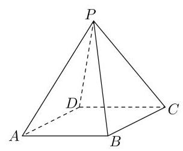

# 第十一讲：解答题综合训练 2

1、已知四边形 ${ABCD}$ 为菱形，点 $P$ 为平面 ${ABCD}$ 外一点.

(1)求证: ${AD} \parallel$ 平面 ${PBC}$ ；

(2)若 ${PB} = {PD}$ ，求证: ${BD}\bot$ 平面 ${PAC}$ ；

(3)若 $\angle {DAB} = {60}^{ \circ  }$ ，平面 ${PAD} \bot$ 平面 ${ABCD}$ ， ${PB} \bot  {PD}$ ， 试判断 $\bigtriangleup {PAD}$ 是否为等腰三角形，并说明理由.

2、如图，已知 ${ABCD} - {A}_{1}{B}_{1}{C}_{1}{D}_{1}$ 是底面边长为 1 的正四棱柱， ${O}_{1}$ 为 ${A}_{1}{C}_{1}$ 与 ${B}_{1}{D}_{1}$ 的交点.

(1)设 $A{B}_{1}$ 与底面 ${A}_{1}{B}_{1}{C}_{1}{D}_{1}$ 所成角的大小为 $\alpha$ ，异面直线 $A{D}_{1}$ 与 ${A}_{1}{C}_{1}$ 所成角的大小为 $\beta$ ， 求证: ${\tan }^{2}\beta  = 2{\tan }^{2}\alpha  + 1$ ;

(2)若点 $C$ 到平面 $A{B}_{1}{D}_{1}$ 的距离为 $\frac{4}{3}$ ，求正四棱柱 ${ABCD} - {A}_{1}{B}_{1}{C}_{1}{D}_{1}$ 的高；

3、某学生兴趣小组随机调查了某市 100 天中每天的空气质量等级和当天到某公园锻炼的人次, 整理数据得到下表 (单位: 天):

<table><tr><td>锻炼人次空气质量等级</td><td>[0, 200]</td><td>(200, 400]</td><td>(400, 600]</td></tr><tr><td>1 (优)</td><td>2</td><td>16</td><td>25</td></tr><tr><td>2 (良)</td><td>5</td><td>10</td><td>12</td></tr><tr><td>3(轻度污染)</td><td>6</td><td>7</td><td>8</td></tr><tr><td>4(中度污染)</td><td>7</td><td>2</td><td>0</td></tr></table>

(1)分别估计该市一天的空气质量等级为 1,2,3,4 的概率;

(2)求一天中到该公园锻炼的平均人次的估计值(同一组中的数据用该组区间的中点值为代表)；

(3)若某天的空气质量等级为 1 或 2，则称这天“空气质量好”；若某天的空气质量等级为 3 或 4，则称这天“空气质量不好”. 根据所给数据，完成下面的 2×2 列联表，并根据列联表， 判断是否有 95%的把握认为一天中到该公园锻炼的人次与该市当天的空气质量有关？

<table><tr><td></td><td>人次≤400</td><td>人次>400</td></tr><tr><td>空气质量好</td><td></td><td></td></tr><tr><td>空气质量不好</td><td></td><td></td></tr></table>

附: ${K}^{2} = \frac{n{\left( ad - bc\right) }^{2}}{\left( {a + b}\right) \left( {c + d}\right) \left( {a + c}\right) \left( {b + d}\right) }$ ,

<table><tr><td>$P\left( {{K}^{2} \geq  k}\right)$</td><td>0.050</td><td>0.010</td><td>0.001</td></tr><tr><td>$k$</td><td>3.841</td><td>6.635</td><td>10.828</td></tr></table>

4、某工厂为提高生产效率，开展技术创新活动，提出了完成某项生产任务的两种新的生产方式. 为比较两种生产方式的效率, 选取 40 名工人, 将他们随机分成两组, 每组 20 人, 第一组工人用第一种生产方式, 第二组工人用第二种生产方式. 根据工人完成生产任务的工作时间(单位:min)绘制了如下茎叶图:

<table><tr><td>第一种生产方式</td><td></td><td></td><td colspan="8">第二种生产方式</td></tr><tr><td></td><td>8</td><td>6</td><td>5</td><td>5</td><td>6</td><td>8</td><td>9</td><td></td><td></td><td></td></tr><tr><td>9 7 6</td><td>2</td><td>7</td><td>0</td><td>1</td><td>2</td><td>2</td><td>3</td><td>4 5</td><td>6</td><td>6 8</td></tr><tr><td>9 8 7 7 6 5 4 3 3</td><td>2</td><td>8</td><td>1</td><td>4</td><td>4</td><td>5</td><td></td><td></td><td></td><td></td></tr><tr><td>2 1 1 0</td><td>0</td><td>9</td><td>0</td><td></td><td></td><td></td><td></td><td></td><td></td><td></td></tr></table>

(1)根据茎叶图判断哪种生产方式的效率更高？并说明理由;

(2)求40名工人完成生产任务所需时间的中位数 $m$ ，并将完成生产任务所需时间超过 $m$ 和不超过 $m$ 的工人数填入下面的列联表:

<table><tr><td></td><td>超过 $m$</td><td>不超过 $m$</td></tr><tr><td>第一种生产方式</td><td></td><td></td></tr><tr><td>第二种生产方式</td><td></td><td></td></tr></table>

(3)根据(2)中的列联表，能否有 99%的把握认为两种生产方式的效率有差异？

附: ${K}^{2} = \frac{n{\left( ad - bc\right) }^{2}}{\left( {a + b}\right) \left( {c + d}\right) \left( {a + c}\right) \left( {b + d}\right) }$ ，

<table><tr><td>$P\left( {{K}^{2} \geq  k}\right)$</td><td>0.050</td><td>0.010</td><td>0.001</td></tr><tr><td>$k$</td><td>3.841</td><td>6.635</td><td>10.828</td></tr></table>

5、已知 ${\left( \frac{1}{2} + 2x\right) }^{n}$

(1)若二项展开式前三项的二项式系数和等于 79，求展开式中系数最大的项；

(2)若二项展开式中第 5 项，第 6 项与第 7 项的二项式系数成等差数列，求展开式中二项式系数最大项的系数;

(3)求值: ${C}_{n}^{1} + 2{C}_{n}^{2} + 3{C}_{n}^{3} + \cdots  + n{C}_{n}^{n}$ 。

6、设函数 $f\left( x\right)  = \ln \left( {x + 1}\right) \left( {x \geq  0}\right) , g\left( x\right)  = \frac{x\left( {x + a + 1}\right) }{x + 1}\left( {x \geq  0}\right)$

(1)证明: $f\left( x\right)  \geq  x - {x}^{2}$ ；

(2)若 $f\left( x\right)  + x \geq  g\left( x\right)$ 恒成立，求 $a$ 的取值范围；

(3)证明:当 $n \in  {N}^{ * }$ 时， $\ln \left( {{n}^{2} + {3n} + 2}\right)  > \frac{1}{4} + \frac{2}{9} + \cdots  + \frac{n - 1}{{n}^{2}}$

7、已知函数 $\mu \left( x\right)  = \frac{\ln x}{x}$ ，不等式 ${\left( 1 + \frac{1}{x}\right) }^{p} \leq  {p}^{1 + \frac{1}{x}}$ 对 $x \in  \left( {0, + \infty }\right)$ 恒成立

(1)求函数 $\mu \left( x\right)$ 的极值和实数 $p$ 的值；

(2)已知函数 $f\left( x\right)  = {mx} - \frac{m - 2}{x} - {\log }_{p}x, g\left( x\right)  = \frac{2{e}^{2}}{x}$ ,其中 $e$ 为自然对数的底数，若存在 $x \in  \left\lbrack  {1,6}\right\rbrack$ ,使得 $g\left( x\right)  - {2f}\left( x\right)  + {mx} + \frac{4 - m}{x} < 0$ ,求实数 $m$ 的取值范围。

8、已知函数 $f\left( x\right)  = \ln \left( {x + 1}\right)  - \frac{kx}{x + 1} + 1$

(1)求函数的极值；

(2)当 $x > 0$ 时， $f\left( x\right)  > 0$ 恒成立，求正整数 $k$ 的最大值；

(3)证明: $\left( {1 + 1 \times  2}\right) \left( {1 + 2 \times  3}\right) \cdots \left( {\left\lbrack  {1 + n\left( {n + 1}\right) }\right\rbrack   > {e}^{n\left( {2 - \frac{3}{n + 1}}\right) }}\right.$
