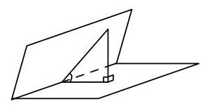
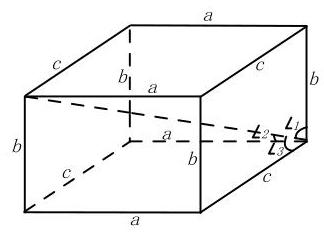
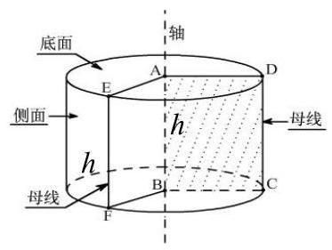
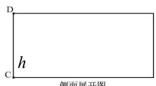
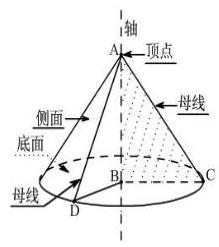
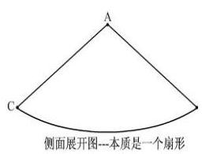
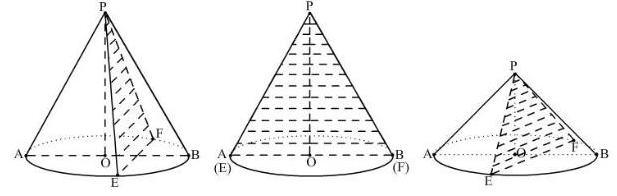
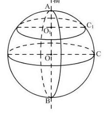
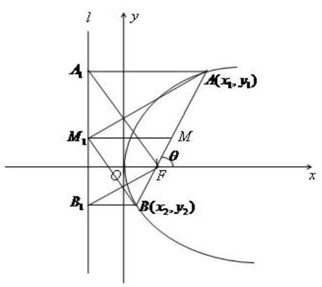
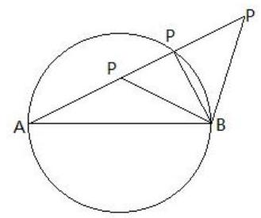

# 第十三讲：高考数学常用结论和注意点 2

## 七、立体几何

1、立体几何的三个公理及其推论你还记得吗？你能画出图形并写成数学语言吗？

公理 (一): 如果一条直线上有两个点在一个平面内, 那么这条直线上所有的点都在这个平面内。

公理 (二):如果两个平面有一个公共点，那么这两个平面有且只有一条经过该点的公共直线。

公理 (三):经过不在同一条直线上的三点，有且只有一个平面。

推论 1: 经过一条直线和这条直线外一点, 有且只有一个平面。

推论 2: 经过两条相交直线, 有且只有一个平面。

推论 3: 经过两条平行直线, 有且只有一个平面。

公理 (四):平行于同一直线的两条直线互相平行。

2、立体几何中的判定定理、性质定理你了解吗?

(1)直线与平面平行的判定定理:

(2)直线与平面平行的性质定理:

(3)直线与平面垂直的判定定理:

(4)直线与平面垂直的性质定理:

(5)平面与平面平行的判定定理:

(6) 平面与平面平行的性质定理:

(7)平面与平面垂直的判定定理:

(8) 平面与平面垂直的性质定理:

3、线、线关系: $\left\{  \begin{array}{l} \text{ 共面 \{平行 } \\  \text{ 异面 } \end{array}\right.$

① 证明两直线是异面直线思想方法: 反证法; ② 异面直线所成角的范围: $\left( {0,\frac{\pi }{2}}\right\rbrack$ ;

③ 异面直线所成角的求解思想方法:

i. 平移 $\Rightarrow$ 相交 $\Rightarrow$ 放入三角形中 $\Rightarrow$ 利用余弦定理求解;

ii. 建立空间直角坐标系 $\Rightarrow$ 利用向量夹角公式加以求解。

例 1. 正四棱锥 $P - {ABCD}$ 的所有棱长相等， $E$ 是 ${PC}$ 的中点，那么异面直线 ${BE}$ 与 ${PA}$ 所成角的余弦值为___

例 2. 在正方体 ${ABCD} - {A}_{1}{B}_{1}{C}_{1}{D}_{1}$ 中, $M$ 是侧棱 $D{D}_{1}$ 的中点, $O$ 是底面 ${ABCD}$ 的中心, $P$ 是棱 ${A}_{1}{B}_{1}$ 上的一点，则 ${OP}$ 与 ${AM}$ 所成角的大小为___

4、线、面关系: $\left\{  \begin{array}{l} \text{ 线在面内 } \\  \text{ 线在面外 }\left\{  \begin{array}{l} \text{ 线、面平行 } \\  \text{ 线、面相交 } \end{array}\right.  \end{array}\right.$

① 直线与它在平面内的射影所成的角叫做 “线面角”; ② 线面角的取值范围: $\left\lbrack  {0,\frac{\pi }{2}}\right\rbrack$ ；

③ 线面角的求解思想: 关键找出线在平面内的射影。

例 3. 在正三棱柱 ${ABC} - {A}_{1}{B}_{1}{C}_{1}$ 中，已知 ${AB} = 1, D$ 在 $B{B}_{1}$ 上， ${BD} = 1$ ，则 ${AD}$ 与平面 $A{A}_{1}{C}_{1}C$ 所成的角为___

5、面、面关系: $\left\{  \begin{array}{l} \text{ 平行 } \\  \text{ 相交 } \end{array}\right.$

① 由一条直线和这条直线出发的两个半平面所组成的图形叫做二面角；

②二面角的取值范围: $\left\lbrack  {0,\pi }\right\rbrack$ ；

③ 二面角的求解思想:

i. 找出或作出二面角(关键要找到面的垂线) ii. 建立坐标系，用向量求解。

例 4. 正四棱柱 ${ABCD} - {A}_{1}{B}_{1}{C}_{1}{D}_{1}$ 中,对角线 $B{D}_{1} = 8$ ,且 $B{D}_{1}$ 与侧面 $B{B}_{1}{C}_{1}C$ 所成角为 ${30}^{ \circ  }$ ，则二面角 ${C}_{1} - B{D}_{1} - {B}_{1}$ 的大小为___

例 5. 从点 $P$ 出发引三条射线 ${PA}\text{ 、 }{PB}\text{ 、 }{PC}$ ,每两条的夹角都是 ${60}^{ \circ  }$ ,则二面角 $B - {PA} - C$ 的余弦值为___

6、常见的多面体有哪些？(请试着自己画出它们的图像)

① 正三棱锥:底面是正三角形；顶点在底面上的射影是底面的中心。

② 正四面体:所有的棱都相等，所有的面都是正三角形；

侧棱与底面所成角的大小为: $\arccos \frac{\sqrt{3}}{3}$ ; 侧面与底面所成角的大小为: $\arccos \frac{1}{3}$ ; 每组对边所成角的大小为: $\frac{\pi }{2}$ 。

③ 正四棱锥:底面是正方形，侧面是等腰三角形；顶点在底面上的射影是底面的中心。

④ 正六棱锥: 底面是正六边形, 侧面是等腰三角形; 顶点在底面上的射影是底面的中心。

⑤ 平行六面体:所有的面都是平行四边形。

⑥ 正四棱柱:底面是正方形；侧棱垂直底面。

⑦ 正方体:所有的面都是正方形。

⑧ 长方体:所有的面都是矩形；

长方体的体对角线的平方等于经过同一顶点的三条棱的平方和，即: ${a}^{2} + {b}^{2} + {c}^{2} = {l}^{2}$ ； 如果长方体的一条体对角线与经过同一顶点的三条棱所成的角分别为: $\angle 1\text{ 、 }\angle 2\text{ 、 }\angle 3$ ， 则: ${\cos }^{2}\angle 1 + {\cos }^{2}\angle 2 + {\cos }^{2}\angle 3 = 1$ .

⑨ 圆柱: 将矩形 ${ABCD}$ (及其内部) 绕其一条边 ${AB}$ 所在直线旋转一周,所形成的几何体叫做圆柱。

⑩ 圆锥:将直角三角形 ${ABC}$ (及其内部)绕其一条直角边 ${AB}$ 所在直线旋转一周，所形成的几何体叫做圆锥。

圆锥过顶点的截面是一个等腰三角形, 当这个截面同时过圆锥的轴时, 截面就成了轴截面。 在所有过圆锥顶点的截面中,面积最大的不一定是轴截面,设圆锥的母线是 $l$ ,轴截面的顶角为 $\alpha$ ,截面等腰三角形的顶角为 $\theta ,0 < \theta  \leq  \alpha$ ,则截面面积为 $\frac{1}{2}{l}^{2}\sin \theta$ , 当 $0 < \alpha  \leq  {90}^{ \circ  }$ 时,面积最大的截面就是轴截面,最大截面面积为: $\frac{1}{2}{l}^{2}\sin \alpha$ ;

当 $\alpha  > {90}^{ \circ  }$ 时,面积最大的截面不是轴截面,而是过顶点且顶角为 $\frac{\pi }{2}$ 的截面,最大截面面积为 $\frac{1}{2}{l}^{2}$ 。

7、锥体的体积公式不要忘了系数 “ $\frac{1}{3}$ ”；柱体的体积公式为底面积乘以高，不可以乘 $\frac{1}{3}$ 。

8、注意区分表面积与侧面积。

9、球:将圆心为 $O$ 的半圆(及其内部)绕其直径 ${AB}$ 所在的直线旋转一周，所形成的几何体叫做球。记做: 球 $O$ 。

已知球的半径为 $r$ ,则球的表面积为: $S = {4\pi }{r}^{2}$ ; 球的体积为 $V = \frac{4}{3}\pi  \cdot  {r}^{3}$ 。

经线: 球面上从北极到南极的半个大圆。

纬线: 与赤道平面平行的平面截球面所得的小圆。

纬度: 某地的纬度就是指过这点的球半径与赤道平面所成角的度数。

10、空间向量在立体几何中的应用

① 异面两条直线 ${AB}\text{ 、 }{CD}$ 所成的角 $\alpha  : \cos \alpha  = \left| \frac{\overrightarrow{AB} \cdot  \overrightarrow{CD}}{\left| \overrightarrow{AB}\right|  \cdot  \left| \overrightarrow{CD}\right| }\right|$ 。

② 空间直线 $l$ 与平面 $\alpha$ 所成线面角的大小:(当直线 $l$ 与平面 $\alpha$ 相交且不垂直时)设 $l$ 与 $\alpha$ 所成的线面角为 $\theta$ ,直线 $l$ 的一个方向向量为 $\overrightarrow{d}$ ,平面 $\alpha$ 的一个法向量为 $\overrightarrow{n}$ ,则 $\sin \theta  = \left| \frac{\overrightarrow{d} \cdot  \overrightarrow{n}}{\left| \overrightarrow{d}\right|  \cdot  \left| \overrightarrow{n}\right| }\right|$  。

③ 二面角:设二面角的两个半平面所在的平面 ${\alpha }_{1}\text{ 、 }{\alpha }_{2}$ 的法向量分别为 $\overrightarrow{{n}_{1}}\text{ 、 }\overrightarrow{{n}_{2}}$ ,二面角的大小为 $\theta \left( {0 \leq  \theta  \leq  \pi }\right)$ ,则 $\left| {\cos \theta }\right|  = \left| \frac{\overrightarrow{d} \cdot  \overrightarrow{n}}{\left| \overrightarrow{d}\right|  \cdot  \left| \overrightarrow{n}\right| }\right|$ ,且 $\theta$ 的范围由图象确定。

④ 设 $P$ 为平面 $\alpha$ 外一点， $H$ 是点 $P$ 在平面 $\alpha$ 上的射影，设 $A$ 为平面 $\alpha$ 内任意一点， $\overrightarrow{n}$ 为平面 $\alpha$ 的一个非零法向量,则点 $P$ 到平面 $\alpha$ 的距离为 $\left| \frac{\overrightarrow{PA} \cdot  \overrightarrow{n}}{\left| \overrightarrow{n}\right| }\right|$ 。

⑤直线 $l$ 的方向向量是 $\overrightarrow{d}$ ，平面 $\alpha$ 的法向量是 $\overrightarrow{n}$ ，则 $l \parallel \alpha  \Leftrightarrow  \overrightarrow{d}\bot \overrightarrow{n}$

平面 $\alpha$ 的法向量是 $\overrightarrow{{n}_{1}}$ ，平面 $\beta$ 的方向量是 $\overrightarrow{{n}_{2}}$ ，则 $\alpha \parallel \beta  \Leftrightarrow  \overrightarrow{{n}_{1}} \parallel \overrightarrow{{n}_{2}},\alpha  \bot  \beta  \Leftrightarrow  \overrightarrow{{n}_{1}} \bot  \overrightarrow{{n}_{2}}$

## 八、数列

1、数列的本质是什么? (定义在正整数集或其子集上的函数)。

2、等差数列的通项公式与一次函数有什么关系? 等比数列的通项公式与指数函数有什么关系?

3、等差数列的求和公式有几个? 等比数列的求和公式应注意什么?

4、设 ${S}_{n}$ 是数列 $\left\{  {a}_{n}\right\}$ 的前 $n$ 项和,则 “ $\left\{  {a}_{n}\right\}$ 是等差数列” 的充要条件是 “ ${S}_{n} = A{n}^{2} + {Bn}$ , 其中公差 $d = {2A}$ ”。设 ${S}_{n}$ 是数列 $\left\{  {a}_{n}\right\}$ 的前 $n$ 项和,则 “ $\left\{  {a}_{n}\right\}$ 是非常数等比数列” 的充要条件是 “ ${S}_{n} = A{q}^{n} - A\left( {A \neq  0}\right)$ 其中公比是 $q$ ”。

5、常数列: ${a}_{n} = a\;\left( {n \in  N}\right)  \Rightarrow  \left\{  {a}_{n}\right\}$ 是公差 $d = 0$ 的等差数列；

## 非零常数列既是等差数列, 又是等比数列; 既是等差数列又是等比数列的数列必为非零常数 列

6、若 $\left\{  {a}_{n}\right\}$ 是等差数列，则 $\left\{  {b}^{{a}_{n}}\right\}$ 是等比数列( $b \neq  0$ )；若 $\left\{  {a}_{n}\right\}$ 是等比数列，则 $\left\{  {{\log }_{b}\left| {a}_{n}\right| }\right\}$ 是等差数列;

7、对于等差、等比数列，你是否掌握了类比思想?

8. 等差数列、等比数列有哪些重要性质? 你注意到它们的性质的关键在于下标以及结构特征了吗?

<table><tr><td></td><td>等 差 数 列</td><td>等 比 数 列</td></tr><tr><td>定义</td><td>从第二项起, 后一项减前一项的差是同一个常数，则该数列为等差数列。   1. ${a}_{n} - {a}_{n - 1} = d\;\left( {n \geq  2, n \in  {N}^{ * }}\right)$</td><td>从第二项起, 后一项与前一项的比是同一非零常数, 则该数列为等比数列。   1. $\frac{{a}_{n}}{{a}_{n - 1}} = q\;\left( {n \geq  2, n \in  {N}^{ * }, q \neq  0}\right)$</td></tr><tr><td>通</td><td>${a}_{n} = {a}_{1} + \left( {n - 1}\right) d\;\left( {n \in  {N}^{ * }}\right)$</td><td>${a}_{n} = {a}_{1}{q}^{n - 1}\;\left( {n \in  {N}^{ * }}\right)$</td></tr><tr><td>求   和</td><td>${S}_{n} = \frac{\left( {a}_{1} + {a}_{n}\right) }{2} \cdot  n = n \cdot  {a}_{1} + \frac{n\left( {n - 1}\right) }{2} \cdot  d \; = A{n}^{2} + {Bn}\;\left( {n \in  {N}^{ * }}\right)$</td><td>${S}_{n} = \left\{  \begin{array}{ll} n{a}_{1} & q = 1 \\  \frac{{a}_{1}\left( {1 - {q}^{n}}\right) }{1 - q} = \frac{{a}_{1} - {a}_{n}q}{1 - q} & q \neq  1 \end{array}\right.$</td></tr><tr><td colspan="3">通项公式 ${a}_{n}$ 与前 $n$ 项和公式 ${S}_{n}$ 之间的关系: ${a}_{n} = \left\{  \begin{matrix} {S}_{1} & n = 1 \\  {S}_{n} - {S}_{n - 1} & n \geq  2, n \in  {N}^{ * } \end{matrix}\right.$</td></tr><tr><td rowspan="4">性   质</td><td>1. ${a}_{n} - {a}_{k} = \left( {n - k}\right)  \cdot  d\;\left( {n, k \in  {N}^{ * }}\right)$ 2. $2{a}_{n + 1} = {a}_{n} + {a}_{n + 2}\;\left( {n \in  {N}^{ * }}\right)$</td><td>1. $\frac{{a}_{n}}{{a}_{k}} = {q}^{n - k}\;\left( {n, k \in  {N}^{ * }}\right)$ 2. ${a}_{n + 1}^{2} = {a}_{n} \cdot  {a}_{n + 2}\;\left( {n \in  {N}^{ * },{a}_{n + 1} \neq  0}\right)$</td></tr><tr><td>3. 若 $i + j = k + l = {2p}$ , 则: ${a}_{i} + {a}_{j} = {a}_{k} + {a}_{l} = 2{a}_{p} \; {S}_{n} = \frac{\left( {{a}_{1} + {a}_{n}}\right)  \cdot  n}{2} = \frac{\left( {{a}_{2} + {a}_{n - 1}}\right)  \cdot  n}{2} = \cdots .$</td><td>3. 若 $i + j = k + l = {2p}$ ,   则: ${a}_{i} \cdot  {a}_{j} = {a}_{k} \cdot  {a}_{l} = {\left( {a}_{p}\right) }^{2}$</td></tr><tr><td>4. 若 ${k}_{1},{k}_{2},{k}_{3}\cdots \cdots$ 是公差为 $k$ 的等差数列,则: ${a}_{{k}_{1}},{a}_{{k}_{2}},{a}_{{k}_{3}}\cdots \cdots$ 是公差为 $k \cdot  d$ 的等差数列。</td><td>4. 若 ${k}_{1},{k}_{2},{k}_{3}\cdots \cdots$ 是公差为 $k$ 的等差数列，   则: ${a}_{{k}_{1}},{a}_{{k}_{2}},{a}_{{k}_{3}}\cdots$ 是公比为 ${q}^{k}$ 的等比数列。</td></tr><tr><td>5. $\left\{  {a}_{n}\right\}  ,\left\{  {b}_{n}\right\}$ 分别是公差为 ${d}_{1},{d}_{2}$ 的等差数列, $\alpha \text{ 、 }\beta$ 是常数,则:   $\left\{  {\alpha  \cdot  {a}_{n} \pm  \beta  \cdot  {b}_{n}}\right\}$ 是 公差 为 $\alpha  \cdot  {d}_{1} \pm  \beta  \cdot  {d}_{2}$ 的等差数列。</td><td>5. $\left\{  {a}_{n}\right\}  ,\left\{  {b}_{n}\right\}$ 分别是公比为 ${q}_{1},{q}_{2}$ 的等比数列, $\alpha$ 、 $\beta$ 是非零常数,则:   $\left\{  {\alpha  \cdot  {a}_{n} \times  \beta  \cdot  {b}_{n}}\right\}$ 是公比为 ${q}_{1} \cdot  {q}_{2}$ 的等比数列; $\left\{  \frac{\alpha  \cdot  {a}_{n}}{\beta  \cdot  {b}_{n}}\right\}$ 是公比为 $\frac{{q}_{1}}{{q}_{2}}$ 的等比数列。</td></tr></table>

例 1. 已知 $\left\{  {a}_{n}\right\}$ 是等比数列,且 $\left\{  {a}_{n}\right\}$ 的前 $n$ 项和 ${S}_{n} = {3}^{n} + r$ ,则 $r =$ ___

例 2. 在等比数列 $\left\{  {a}_{n}\right\}$ 中， ${a}_{3} + {a}_{8} = {124}$ ， ${a}_{4} \cdot  {a}_{7} =  - {512}$ ，公比 $q$ 是整数，则 ${a}_{10} =$ ___

9、无论是在等差数列还是在等比数列中，共有五个关键量: ${a}_{1}\text{ 、 }{a}_{n}\text{ 、 }{S}_{n}\text{ 、 }n\text{ 、 }d$ 或 $q$ ， 如果已知其中三个量,则可由 ${a}_{n}$ 及 ${S}_{n}$ 的公式,求出其余两个量 (知三求二);

## 10、求数列通项公式有哪几种典型类型?

① ${a}_{n} - {a}_{n - 1} = d\left( {n \geq  2, n \in  N}\right)$ 或 $\frac{{a}_{n}}{{a}_{n - 1}} = q\left( {n \geq  2, n \in  N}\right)$ 型(定义 $\Rightarrow$ 等差或等比数列 $\Rightarrow$ 利用公式)

② 已知 ${a}_{n + 1} - {a}_{n} = f\left( n\right)$ 或 $\frac{{a}_{n + 1}}{{a}_{n}} = g\left( n\right) \left( {n \in  N}\right)$ 型 (累计求和或累计求积)

③ 已知 ${a}_{n + 1} = p \cdot  {a}_{n} + q\;\left( {p \neq  1}\right)$ 型(等式左右两边同时减去 $\frac{q}{1 - p}$ )

④ 已知和 ${S}_{n}$ ,求项 ${a}_{n}$ ,则: ${a}_{n} = \left\{  \begin{array}{ll} {S}_{1} & n = 1 \\  {S}_{n} - {S}_{n - 1} & n \geq  2 \end{array}\right.$ (是否注意到 “ $n \geq  2$ ”?)

## ⑤利用迭代、递推的方法

⑥数学归纳法证明(用数学归纳法证明问题的关键是什么？是否具有从特殊到一般的思维模式)

例 3. 数列 $\left\{  {a}_{n}\right\}$ 满足 ${a}_{1} = 1,{a}_{n} - {a}_{n - 1} = \frac{1}{\sqrt{n + 1} + \sqrt{n}}, n \geq  2, n \in  {N}^{ * }$ ,则 ${a}_{n} =$

例 4. 数列 $\left\{  {a}_{n}\right\}$ 满足 ${a}_{1} = 1,{a}_{n} = 3{a}_{n - 1} + 2, n \geq  2, n \in  {N}^{ * }$ ,则 ${a}_{n} =$ ___

例 5. 数列 $\left\{  {a}_{n}\right\}$ 满足 ${a}_{1} = 1,\sqrt{{a}_{n - 1}} - \sqrt{{a}_{n}} = \sqrt{{a}_{n - 1}} \cdot  \sqrt{{a}_{n}}$ ,则 ${a}_{n} =$ ___

例 6. 数列 $\left\{  {a}_{n}\right\}$ 满足 $\frac{1}{2}{a}_{1} + \frac{1}{{2}^{2}}{a}_{2} + \cdots \cdots  + \frac{1}{{2}^{n}}{a}_{n} = {2n} + 5$ ,则 ${a}_{n} =$

11、求数列 $\left\{  {a}_{n}\right\}$ 的最大、最小项的方法: 注意点: 由于 $n$ 是正整数,注意等号成立。

① 函数思想 (特别是, 利用数列的单调性);

② 作差比较法: ${a}_{n + 1} - {a}_{n} = \cdots \cdots \left\{  \begin{array}{ll}  > 0 &  > \\   = 0 &  \Leftrightarrow  {a}_{n + 1} = {a}_{n} \\   < 0 &  <  \end{array}\right.$

③ ${\left( {a}_{n}\right) }_{\max } \Leftrightarrow  \left\{  {\begin{array}{l} {a}_{n} \geq  {a}_{n + 1} \\  {a}_{n} \geq  {a}_{n - 1} \end{array};{\left( {a}_{n}\right) }_{\min } \Leftrightarrow  \left\{  \begin{array}{l} {a}_{n} \leq  {a}_{n + 1} \\  {a}_{n} \leq  {a}_{n - 1} \end{array}\right. }\right.$

例 7. 数列 $\left\{  {a}_{n}\right\}$ 的通项公式为 ${a}_{n} =  - 2{n}^{2} + {29n} - 3$ ，则 $\left\{  {a}_{n}\right\}$ 的最大项为___.

例 8. $\left\{  {a}_{n}\right\}$ 的通项公式为 ${a}_{n} = \frac{n}{{n}^{2} + {156}}$ ，则 $\left\{  {a}_{n}\right\}$ 的最大项为_________

例 9. $\left\{  {a}_{n}\right\}$ 的通项公式为 ${a}_{n} = \frac{{9}^{n} \cdot  \left( {n + 1}\right) }{{10}^{n}}$ ，则 $\left\{  {a}_{n}\right\}$ 的最大项为___

12、求数列前 $n$ 项和 ${S}_{n}$ 有哪几种典型类型?

① 通过判断 $\Rightarrow$ “等差或等比数列” $\Rightarrow$ 利用求和公式求解。

② 通过判断 $\Rightarrow$ “等差 $\pm$ 等比”型 $\Rightarrow$ 分组拆项求和。

③ 通过判断 $\Rightarrow$ “等差 $\times$ 等比”型 $\Rightarrow$ 错位相减法。

④通项或表达式为分式时，常用裂项相消求和法。

常用裂项方法: $\frac{1}{\left( {k + m}\right) \left( {k + n}\right) } = \frac{1}{m - n}\left( {\frac{1}{k + n} - \frac{1}{k + m}}\right) \left( {m > n}\right)$

⑤倒序相加法，或倒序相乘法，强调配对思想。

⑥对于数表型问题，找规律，再操作。

⑦对于奇偶项的不同，分类讨论，分别求和。(注意项数、公差、公比的变化)

例 10. $1 + \frac{1}{1 + 2} + \frac{1}{1 + 2 + 3} + \cdots \cdots  + \frac{1}{1 + 2 + 3 + \cdots n} =$

例 11. 函数 $f\left( x\right)  = \frac{{x}^{2}}{1 + {x}^{2}}$ ,则 $f\left( 1\right)  + f\left( 2\right)  + f\left( 3\right)  + f\left( 4\right)  + f\left( \frac{1}{2}\right)  + f\left( \frac{1}{3}\right)  + f\left( \frac{1}{4}\right)  =$

13、你会根据数列项的关系来研究 “数列和的最值” 以及 “数列积的最值” 吗？

例 12. 等差数列 $\left\{  {a}_{n}\right\}$ 中， ${a}_{1} = {25}$ ， ${S}_{9} = {S}_{17}$ ，问该数列中多少项和最大？并求此最大值。

例 13. 若 $\left\{  {a}_{n}\right\}$ 是等差数列,首项 ${a}_{1} > 0,{a}_{2003} + {a}_{2004} > 0,{a}_{2003} \cdot  {a}_{2004} < 0$ ,则使前 $n$ 项和 ${S}_{n} > 0$ 成立的最大正整数 $n$ 是___

14、极限有哪几种典型类型? 分别如何处理?

① $\;\mathop{\lim }\limits_{{n \rightarrow  \infty }}c = c\;$ ( $\mathrm{c}$ 为 常 数 ); ② $\;\mathop{\lim }\limits_{{n \rightarrow  \infty }}\frac{1}{{n}^{\alpha }} = 0\left( {a > 0}\right)$ ；

$\mathop{\lim }\limits_{{n \rightarrow  \infty }}{q}^{n} = \left\{  {\begin{matrix} 0 & \left| q\right|  < 1 \\  1 & q = 1 \\  \text{ 不存在 } & \left| q\right|  > 1\text{ 或 }q =  - 1 \end{matrix};}\right.$

④ $\mathop{\lim }\limits_{{n \rightarrow   + \infty }}\frac{a{n}^{2} + {bn} + c}{d{n}^{2} + {en} + f} = \frac{a}{d}\left( {d \neq  0}\right) ;\;$ 5 $\mathop{\lim }\limits_{{n \rightarrow   + \infty }}\frac{{a}^{n} + {b}^{n}}{{a}^{n + 1} + {b}^{n + 1}} = \left\{  \begin{array}{l} \frac{1}{a},\left| a\right|  > \left| b\right| \\  \frac{1}{b},\left| a\right|  < \left| b\right| \\  \frac{1}{a} = \frac{1}{b}, a = b \end{array}\right.$

15、极限的运算性质有哪些?

如果: $\mathop{\lim }\limits_{{n \rightarrow  \infty }}{a}_{n} = A,\mathop{\lim }\limits_{{n \rightarrow  \infty }}{b}_{n} = B$ ,则: ${\bigoplus }_{n \rightarrow  \infty }\left( {{a}_{n} \pm  {b}_{n}}\right)  = A \pm  B$ ; ② $\mathop{\lim }\limits_{{n \rightarrow  \infty }}\left( {{a}_{n} \cdot  {b}_{n}}\right)  = A \cdot  B$ ;

③ $\mathop{\lim }\limits_{{n \rightarrow  \infty }}\frac{{a}_{n}}{{b}_{n}} = \frac{A}{B}\;\left( {B \neq  0}\right)$ ；④ $\mathop{\lim }\limits_{{n \rightarrow  \infty }}{\left( {a}_{n}\right) }^{k} = {\left( \mathop{\lim }\limits_{{n \rightarrow  \infty }}{a}_{n}\right) }^{k} = {A}^{k}\;k$ 为有限数；

## 注: 极限的四则运算应满足: 项数有限且每一项都有极限

16、 $\mathop{\lim }\limits_{{n \rightarrow  \infty }}{q}^{n} = 0 \Leftrightarrow$ -? $\left( {\left| q\right|  < 1}\right)$ ; 若 $\mathop{\lim }\limits_{{n \rightarrow  \infty }}{q}^{n}$ 存在,则 $q$ 满足什么条件? $\left( {\left| q\right|  < 1\text{ 或 }q = 1}\right)$ 上述 $q$ 与等比数列的公比有什么区别吗?

17、无穷等比数列的“各项和”就是“所有项和”，也就是数列和的极限。它的前提是等比数列的公比 $q$ 满足: $\left| q\right|  < 1$ 且 $q \neq  0$ ,则各项和为 $S = \frac{{a}_{1}}{1 - q}$ 。

18、补充性质

1. 对等差数列 $\left\{  {a}_{n}\right\}$ ，

(1)若 ${a}_{m} = n,{a}_{n} = m$ ，则 ${a}_{m + n} = 0$

(2)若 ${S}_{m} = n,{S}_{n} = m$ ,则 ${S}_{m + n} =  - \left( {m + n}\right)$ ,

(3)若 ${S}_{m} = {S}_{n}$ ，则 ${S}_{m + n} = 0$ ，

(4)若 $m + n = p + q = {2k}$ ，则 ${a}_{m} + {a}_{n} = {a}_{p} + {a}_{q} = 2{a}_{k}$ (等差中项)

(5) ${S}_{{2n} - 1} = \left( {{2n} - 1}\right) {a}_{n} \Leftrightarrow  {S}_{n} = n{a}_{ \oplus  }\left( {n\text{ 为奇数 }}\right)$

(6)若项数为 ${2n}$ ，则 ${S}_{\text{ 偶 }} - {S}_{\text{ 奇 }} = {nd}$ ； $\frac{{S}_{\text{ 奇 }}}{{S}_{\text{ 偶 }}} = \frac{{a}_{n}}{{a}_{n + 1}}$ ，

若项数为 ${2n} + 1$ ，则 ${S}_{\text{ 奇 }} - {S}_{\text{ 偶 }} = {a}_{\text{ 中 }}$ ； $\frac{{S}_{\text{ 奇 }}}{{S}_{\text{ 偶 }}} = \frac{\mathrm{n} + 1}{n}$ (7) ${a}_{n} - {a}_{m} = \left( {n - m}\right) d$

2.对等比数列 $\left\{  {a}_{n}\right\}$

(1) $\frac{{a}_{n}}{{a}_{m}} = {q}^{n - m}$

(2)若 $m + n = p + q = {2k}$ ，则 ${a}_{m}{a}_{n} = {a}_{p}{a}_{q} = {a}_{k}{}^{2}$ (等比中项)

(3)若 $\left| q\right|  < 1$ ，则 $\mathop{\lim }\limits_{{\mathrm{n} \rightarrow  \infty }}{S}_{n} = \frac{{a}_{1}}{1 - q}$

3. 由 ${S}_{n} = a{n}^{2} + {bn} + c$ 所确定的数列为等差数列的充要条件为 $\mathrm{c} = 0$ ; 当 $c \neq  0$ 时从第二项成等差,且 $d = {2a}$ ;

若 ${S}_{n} = a{q}^{n} + b$ ,当 $a =  - b$ 时,所确定的数列为等比数列,且公比为 $q\left( {q \neq  0}\right)$ ; 当 $a \neq   - b$ 时,从第二项成等比,且 $q$ 为公比.

## 九、直线

1、直线的倾斜角 $\alpha$ 与斜率 $k$ 的关系: $\alpha  \in  \lbrack 0,\pi ), k \in  R$ 当倾斜角 $\alpha  \neq  \frac{\pi }{2}$ 时, $\alpha$ 的正切值叫做这条直线的斜率,即斜率 $k = \tan \alpha$ ; 当倾斜角 $\alpha  = \frac{\pi }{2}$ 时, 称该直线的斜率不存在; 对于每一条直线而言, 都有倾斜角, 但不一定都有斜率。

① $k = 0 \Leftrightarrow  \alpha  = 0 \Leftrightarrow$ 直线水平方向;

② $k > 0 \Leftrightarrow  \alpha  \in  \left( {0,\frac{\pi }{2}}\right)  \Leftrightarrow  \alpha  = \arctan k \Leftrightarrow$ 直线一、三象限方向倾斜;

③ $k < 0 \Leftrightarrow  \alpha  \in  \left( {\frac{\pi }{2},\pi }\right)  \Leftrightarrow  \alpha  = \pi  - \arctan \left| k\right|  = \pi  + \arctan k$ ; $\Leftrightarrow$ 直线二、四象限方向倾斜

④ 斜率 $k$ 不存在 $\Leftrightarrow  \alpha  = \frac{\pi }{2} \Leftrightarrow$ 直线竖直方向;

2、直线的斜率公式、点到直线的距离公式、直线到直线所成角公式、夹角公式记住了吗?

① 设直线 $l$ 的方向向量 $\overrightarrow{d} = \left( {\mu , v}\right)$ ,斜率 $k$ ,直线上任意两点 $A\left( {{x}_{1},{y}_{1}}\right) \text{ 、 }B\left( {{x}_{2},{y}_{2}}\right)$ , 当 $\mu  \neq  0$ 即 ${x}_{1} \neq  {x}_{2}$ 时, $k = \frac{v}{\mu } = \frac{{y}_{1} - {y}_{2}}{{x}_{1} - {x}_{2}}$ ; 当 $\mu  = 0$ 即 ${x}_{1} = {x}_{2}$ 时,斜率 $k$ 不存在;

② 设直角平面坐标系中，两直线的方程分别为: $\left\{  \begin{array}{l} {l}_{1} : {a}_{1}x + {b}_{1}y + {c}_{1} = 0,{a}_{1}^{2} + {b}_{1}^{2} \neq  0 \\  {l}_{2} : {a}_{2}x + {b}_{2}y + {c}_{2} = 0,{a}_{2}^{2} + {b}_{2}^{2} \neq  0 \end{array}\right.$ 则 ${l}_{1}$ 的一个方向向量为 $\overrightarrow{{d}_{1}} = \left( {{b}_{1}, - {a}_{1}}\right) ,{l}_{2}$ 的一个方向向量为 $\overrightarrow{{d}_{2}} = \left( {{b}_{2}, - {a}_{2}}\right)$ ,

设 ${l}_{1}$ 与 ${l}_{2}$ 的夹角为 $\alpha$ ,则 $\cos \alpha  = \frac{\left| \overrightarrow{{d}_{1}} \cdot  \overrightarrow{{d}_{2}}\right| }{\left| \overrightarrow{{d}_{1}}\right|  \cdot  \left| \overrightarrow{{d}_{2}}\right| } = \frac{\left| {a}_{1} \cdot  {a}_{2} + {b}_{1} \cdot  {b}_{2}\right| }{\sqrt{{a}_{1}^{2} + {b}_{1}^{2}} \cdot  \sqrt{{a}_{2}^{2} + {b}_{2}^{2}}},\alpha  \in  \left\lbrack  {0,\frac{\pi }{2}}\right\rbrack$ ,

③ 点 $P\left( {{x}_{0},{y}_{0}}\right)$ 到直线 $l : {Ax} + {By} + C = 0$ ( $A$ 、 $B$ 不全为零)的距离为: $d = \frac{\left| A{x}_{0} + B{y}_{0} + C\right| }{\sqrt{{A}^{2} + {B}^{2}}}$ ④两平行直线 ${l}_{1} : {Ax} + {By} + {C}_{1} = 0;\;{l}_{2} : {Ax} + {By} + {C}_{2} = 0$ ( $A\text{ 、 }B$ 不全为零)

则这两平行直线间的距离为: ${d}_{{l}_{1} - {l}_{2}} = \frac{\left| {C}_{1} - {C}_{2}\right| }{\sqrt{{A}^{2} + {B}^{2}}}$

⑤ 设 $\delta  = \frac{a{x}_{0} + b{y}_{0} + c}{\sqrt{{a}^{2} + {b}^{2}}}$ ，则在直线同侧的所有点， $\delta$ 同号；在直线异侧的所有点， $\delta$ 异号； 在直线上的所有点， $\delta  = 0$ 。

3、几种直线方程间的关系:

(在用 “点斜式”、“斜截式” 求直线方程时，你是否注意到斜率 $k$ 不存在的情况？)

<table><tr><td>类型</td><td>直线方程</td><td>方向向量</td><td>法向量</td><td>斜率</td></tr><tr><td>点法向式</td><td>$a\left( {x - {x}_{0}}\right)  + b\left( {y - {y}_{0}}\right)  = 0$</td><td></td><td></td><td></td></tr><tr><td>点斜式</td><td>$y - {y}_{0} = k\left( {x - {x}_{0}}\right)$</td><td></td><td></td><td></td></tr><tr><td>斜截式</td><td>$y = {kx} + b$</td><td></td><td></td><td></td></tr><tr><td>一般式</td><td>${ax} + {by} + c = 0$</td><td></td><td></td><td></td></tr></table>

4、如何判断两直线位置关系？(在坐标平面上，两直线的位置关系有:相交、平行、重合)

① 设直角平面坐标系中，两直线的方程分别为: $\left\{  \begin{array}{l} {l}_{1} : {a}_{1}x + {b}_{1}y + {c}_{1} = 0,{a}_{1}^{2} + {b}_{1}^{2} \neq  0 \\  {l}_{2} : {a}_{2}x + {b}_{2}y + {c}_{2} = 0,{a}_{2}^{2} + {b}_{2}^{2} \neq  0 \end{array}\right.$

则 ${l}_{1}$ 的一个方向向量为 $\overrightarrow{{d}_{1}} = \left( {{b}_{1}, - {a}_{1}}\right) ,{l}_{2}$ 的一个方向向量为 $\overrightarrow{{d}_{2}} = \left( {{b}_{2}, - {a}_{2}}\right)$ ,

当 $\overrightarrow{{d}_{1}} \parallel \overrightarrow{{d}_{2}}$ 时 $\Leftrightarrow  {l}_{1}$ 与 ${l}_{2}$ 平行或重合; 当 $\overrightarrow{{d}_{1}}$ 与 $\overrightarrow{{d}_{2}}$ 不平行时 $\Leftrightarrow  {l}_{1}$ 与 ${l}_{2}$ 相交; 当 $\overrightarrow{{d}_{1}} \bot  \overrightarrow{{d}_{2}}$ 时 $\Leftrightarrow  {l}_{1}$ 与 ${l}_{2}$ 垂直;

例 1. “ $\overrightarrow{{d}_{1}} = \overrightarrow{{d}_{2}}$ ” 是 “直线 ${l}_{1}$ 与 ${l}_{2}$ 平行” 的___条件。

② 已知直线 ${l}_{1}\text{ 、 }{l}_{2}$ 的斜率分别为: ${k}_{1}\text{ 、 }{k}_{2}$ ，在 $y$ 轴上的截距分别为 ${b}_{1}\text{ 、 }{b}_{2}$ ，即直线 ${l}_{1}$  、 ${l}_{2}$ 的

斜截式方程分别为 ${l}_{1} : y = {k}_{1}x + {b}_{1};{l}_{2} : y = {k}_{2}x + {b}_{2}$ ; 则

当 ${k}_{1} \neq  {k}_{2}$ 时 $\Rightarrow  {l}_{1}$ 与 ${l}_{2}$ 相交; 当 $\left\{  \begin{array}{l} {k}_{1} = {k}_{2} \\  {b}_{1} \neq  {b}_{2} \end{array}\right.$ 时 $\Rightarrow  {l}_{1}$ 与 ${l}_{2}$ 平行;

当 $\left\{  {\begin{array}{l} {k}_{1} = {k}_{2} \\  {b}_{1} = {b}_{2} \end{array}\text{ 时 } \Rightarrow  {l}_{1}\text{ 与 }{l}_{2}}\right.$ 重合; 当 ${k}_{1} \cdot  {k}_{2} =  - 1$ 时 $\Rightarrow  {l}_{1}$ 与 ${l}_{2}$ 垂直;

例 2.媒体 $l{}_{1} \parallel {l}_{2}$ ” 是 “ ${k}_{1} = {k}_{2}$ ” 的___条件； “ ${l}_{1} \bot  {l}_{2}$ ” 是 “ ${k}_{1} \cdot  {k}_{2} =  - 1$ ” 的___条件;

例 3. 已知直线 ${l}_{1} : x + {a}^{2}y + 6 = 0$ ,直线 ${l}_{2} : \left( {a - 2}\right) x + {3ay} + {2a} = 0$ ,求当 $a$ 为何值时, ${l}_{1}$ 与 ${l}_{2}$ 相交、平行、重合。

例 4. 直线 $l$ 到点 $A\left( {3,3}\right)$ ,点 $B\left( {5,2}\right)$ 的距离相等,且 $l$ 过 ${3x} - y - 1 = 0$ 和 $x + y - 3 = 0$ 的交点,求直线 $l$ 的方程。

例 5. 已知直线 $l : y = {kx} - \sqrt{3}$ 与直线 ${2x} + {3y} - 6 = 0$ 的交点位于第一象限,则直线 $l$ 的倾斜角的取值范围是___

## 十、圆锥曲线

1、圆的定义: 平面内到一定点 $O\left( {a, b}\right)$ 的距离等于定长 $r\left( {r > 0}\right)$ 的点的轨迹叫做圆, ①你知道圆的方程的标准形式、一般形式吗？你会互化吗？

②二元二次方程: $A{x}^{2} + {Bxy} + C{y}^{2} + {Dx} + {Ey} + F = 0$ 为圆的充要条件是:___

$$B = 0, A = C \neq  0\text{ 且 }{D}^{2} + {E}^{2} > {4AF}\text{ ; }$$

2、你会判断点和圆、直线和圆、圆和圆之间的位置关系吗?

3、圆的切线: 已知点 $P\left( {{x}_{0},{y}_{0}}\right)$

① 点 $P$ 在圆 $O : {\left( x - a\right) }^{2} + {\left( y - b\right) }^{2} = {r}^{2}$ 上，

则过点 $P$ 的圆的切线方程为: $\left( {x - a}\right) \left( {{x}_{0} - a}\right)  + \left( {y - b}\right) \left( {{y}_{0} - b}\right)  = {r}^{2}$

② 点 $P$ 在圆 $O$ 外,则过点 $P$ 的圆的切线方程可以这样求解: 先设切线方程为 $l$ : $y - {y}_{0} = k\left( {x - {x}_{0}}\right)$ (注意斜率是否存在); 再利用圆心到直线的距离 ${d}_{O - L}$ 等于半径 $r \Rightarrow  k \Rightarrow$ 切线方程。

4、你知道圆的参数方程吗?

5、解决直线与圆的关系问题时，特别强调 “垂径定理”。

6、椭圆: 平面内到两个定点 ${F}_{1}\text{ 、 }{F}_{2}$ 的距离之和等于定值 ${2a}\left( {{2a} > {2c} > 0}\right)$ 的点的轨迹。

$\left. \begin{array}{l} {2a} > {2c} > 0 \Leftrightarrow  \text{ 椭圆 } \\  {2a} = {2c} > 0 \Leftrightarrow  \text{ 线段 }{F}_{1}{F}_{2} \\  0 < {2a} < {2c} \Leftrightarrow  \text{ 无意义,轨迹不存在 } \end{array}\right\}   \leftrightarrow$ 数形结合

基本概念: 长轴长 ${2a}$ ; 短轴长 ${2b}$ ; 焦距: 焦距 ${2c},\left( {a > b > 0\text{ 、 }a > c > 0}\right) ;{a}^{2} = {b}^{2} + {c}^{2}$

7、双曲线:平面内到两个定点 ${F}_{1}\text{ 、 }{F}_{2}$ 的距离之差的绝对值等于定值 ${2a}\left( {0 < {2a} < {2c}}\right)$ 的点的轨迹叫做双曲线。

$\left. \begin{array}{l} 0 < {2a} < {2c} \Leftrightarrow  \text{ 双曲线 } \\  {2a} = {2c} > 0 \Leftrightarrow  \text{ 两条射线 } \\  {2a} > {2c} > 0 \Leftrightarrow  \text{ 无意义,轨迹不存在 } \end{array}\right\}   \leftrightarrow$ 数形结合

基本概念: 实轴长 ${2a}$ ; 虚轴长 ${2b}$ ; 焦距 ${2c},\left( {c > a > 0\text{ 、 }c > b > 0}\right)$ ; ${a}^{2} = {b}^{2} + {c}^{2}$

8、抛物线:平面内到一个定点以及一条定直线距离相等的点的轨迹叫做抛物线。(定点在定直线外)

定点叫做抛物线的焦点，定直线叫做抛物线的准线，定点到准线的距离叫焦准距，记作 p

9、如何判断直线与圆锥曲线的位置关系?

10、用直线方程与圆锥曲线方程联立求解时, 在得到的方程中你注意到 “最高次项系数是否为零”以及 “ $\Delta  \geq  0$ ” 了吗? 圆锥曲线本身的范围你注意到了吗?

11、你会求弦长吗? $\left| {AB}\right|  = \sqrt{{\left( {x}_{1} - {x}_{2}\right) }^{2} + {\left( {y}_{1} - {y}_{2}\right) }^{2}} = \left| {{x}_{1} - {x}_{2}}\right|  \cdot  \sqrt{1 + {k}^{2}} = \left| {{y}_{1} - {y}_{2}}\right|  \cdot  \sqrt{1 + \frac{1}{{k}^{2}}}$ 。 抛物线的焦点弦长: $\left| {AB}\right|  = \left| {{x}_{1} + {x}_{2}}\right|  + p$ (焦点在 $x$ 轴上) $\left| {AB}\right|  = \left| {{y}_{1} + {y}_{2}}\right|  + p$ (焦点在 y 轴上)

12、你知道圆锥曲线上的点到焦点的距离的取值范围吗?

13、你会利用圆锥曲线的对称性设点、设直线、解题吗?

14、求轨迹与求轨迹方程是有区别的, 求轨迹方程可别忘了寻求范围呀!

① 直接法:直接建立 $x$ 、 $y$ 之间的关系，得到轨迹方程 $F\left( {x, y}\right)  = 0$ ；

② 待定系数法:根据条件设所求曲线的方程，再由条件确定其待定的系数；

③ 代入法:相关点代入求动点轨迹方程；

④ 定义法:如果能够确定动点的轨迹满足某已知曲线的定义，则可由曲线的定义直接写出轨迹方程;

⑤ 参数法:将动点的坐标 $x$ 、 $y$ 均用某一中间量(参数)表示，得到参数方程，再消去参数得到普通方程。

15、将参数方程化为普通方程时, 你注意到参数的范围了吗?

16、极坐标问题的处理思想: i 、图形思想; ii、化归思想;

有序数对 $\left( {\rho ,\theta }\right)$ ,叫做点 $M$ 的极坐标 $\left( \theta \right.$ 必须是弧度制 $)$ ; ${\rho }^{2} = {x}^{2} + {y}^{2},\rho \cos \theta  = x,\rho \sin \theta  = y$

17、以下为二级结论

1、椭圆 $\frac{{x}^{2}}{{a}^{2}} + \frac{{y}^{2}}{{b}^{2}} = 1\left( {a > b > 0}\right)$ 与双曲线 $\frac{{x}^{2}}{{a}^{2}} - \frac{{y}^{2}}{{b}^{2}} = 1\left( {a > 0, b > 0}\right)$ 的通径长均为 $\frac{2{b}^{2}}{a}$ .

2、双曲线 $\frac{{x}^{2}}{{a}^{2}} - \frac{{y}^{2}}{{b}^{2}} = 1$ 的渐近线方程 $\frac{{x}^{2}}{{a}^{2}} - \frac{{y}^{2}}{{b}^{2}} = 0$ .

3、若 $p$ 为椭圆 $\frac{{x}^{2}}{{a}^{2}} + \frac{{y}^{2}}{{b}^{2}} = 1$ 或双曲线 $\frac{{x}^{2}}{{a}^{2}} - \frac{{y}^{2}}{{b}^{2}} = 1$ 上的一点,且设 $\angle {F}_{1}P{F}_{2} = \theta$ ,则 ${S}_{{\Delta P}{F}_{1}{F}_{2}} = {b}^{2}\tan \frac{\theta }{2}$ (椭圆)或 ${S}_{{\Delta P}{F}_{1}{F}_{2}} = \frac{{b}^{2}}{\tan \frac{\theta }{2}}$ (双曲线),且当 $p$ 为椭圆的短轴端点时 $\theta$ 取到最大值

4、在椭圆中 $\angle {A}_{1}P{A}_{2}$ 的最大值为 $\angle {A}_{1}B{A}_{2}$ ,即 $p$ 为短轴端点时最大, $\left| {P{F}_{1}}\right|  \cdot  {\left| P{F}_{2}\right| }_{\max } = {a}^{2},\left| {P{F}_{1}}\right|  \cdot  {\left| P{F}_{2}\right| }_{\min } = {b}^{2}$ (可用焦半径公式证明)

5、椭圆上任一点到焦点距离的最大值为 $a + c$ ，最小值为 $a - c$

6、对椭圆 $\frac{{x}^{2}}{{a}^{2}} + \frac{{y}^{2}}{{b}^{2}} = 1$ 的内接矩形的最大面积为 ${2ab}$ .

7、对于抛物线 ${y}^{2} = {2px}\left( {p > 0}\right)$ ,若 ${AB}$ 为过焦点 $F$ 的弦, $A\text{ 、 }B$ 在 $l$ 上的射影分别为 ${A}_{1},{B}_{1},{AB}$ 中点 $M$ 在准线 $l$ 上的射影为 ${M}_{1}$ ,则 $\angle {A}_{1}F{B}_{1} = {90}^{ \circ  },\angle A{M}_{1}B = {90}^{ \circ  }$ , 即以 ${A}_{1}{B}_{1}$ 为直径的圆与直线 ${AB}$ 相切 (切点为 $F$ ),以 ${AB}$ 为直径的圆与 $l$ 相切于点 ${M}_{1}$ ,还可以证明以 ${AF},{BF}$ 为直

径的圆均与 $y$ 轴相切,还可证明 ${y}_{1}{y}_{2} =  - {p}^{2},{x}_{1}{x}_{2} = \frac{{p}^{2}}{4},\left| {AB}\right|  = {x}_{1} + {x}_{2} + p$ 对于抛物线 ${y}^{2} = {2px}\left( {p > 0}\right)$ ,还有

(1)其通径长为 ${2p}$ ， $\frac{1}{\left| AF\right| } + \frac{1}{\left| BF\right| } = \frac{2}{p}$ ， ${S}_{\Delta AOB} = \frac{{p}^{2}}{2\sin \theta }$

(2)过焦点的弦的两端点处的切线的交点的轨迹为准线

(3) ${OA}\bot {OB} \Leftrightarrow  {AB}$ 恒过定点 $\left( {{2p},0}\right)$ ( ${AB}$ 即焦点弦)

8、过圆锥曲线上任一点 $\left( {{x}_{0},{y}_{0}}\right)$ 的切线方程可这样得到,把原方程中的项做如下变化即可: ${x}^{2} \rightarrow  {x}_{0}x,{y}^{2} \rightarrow  {y}_{0}y, x \rightarrow  \frac{{x}_{0} + x}{2}, y \rightarrow  \frac{{y}_{0} + y}{2}$ ,常数项不变

9、 $\frac{{x}^{2}}{{a}^{2}} + \frac{{y}^{2}}{{b}^{2}} = 1$ 椭圆最短的焦点弦长为通径长，即 $\frac{2{b}^{2}}{a}$ ，而双曲线 $\frac{{x}^{2}}{{a}^{2}} - \frac{{y}^{2}}{{b}^{2}} = 1$ 的焦点弦的最小值为 ${2a}$ 与 $\frac{2{b}^{2}}{a}$ 中的最小者.(即 $a < b$ 时为 ${2a}$ ; 时 $a > b$ 为 $\frac{2{b}^{2}}{a};a = b$ 时,二者相等同时最小), 抛物线的通径长为其最短焦点弦.

10、在对称问题中,若对称轴的斜率为 $\pm  1$ ，则可直接代，如:求点 $\left( {2,5}\right)$ 关于直线 $x + y - 3 = 0$ 的对称点为 $\left( {3 - 5,3 - 2}\right)$ ,求曲线 ${y}^{2} = {2x}$ 关于 $x + y - 3 = 0$ 的对称曲线为 ${\left( 3 - x\right) }^{2} = 2\left( {3 - y}\right)$ . 特别提醒: 若对称轴的斜率不为 $\pm  1$ ,直接代可导致错误.

11、光线反射问题一般可转化为对称问题来处理.

12、曲线 $f\left( {x, y}\right)  = 0$ 关于点 $\left( {a, b}\right)$ 的对称曲线为 $f\left( {{2a} - x,{2b} - y}\right)  = 0$ ,关于直线 $x = a$ 的对称曲线为 $f\left( {{2a} - x, y}\right)  = 0$ ; 关于直线 $y = b$ 的对称曲线为 $f\left( {x,{2b} - y}\right)  = 0$ .

13、求两个圆的公共弦所在的直线方程做差即可

14 、过圆 ${\left( x - a\right) }^{2} + {\left( y - b\right) }^{2} = {r}^{2}$ 上一点 $P\left( {{x}_{0},{y}_{0}}\right)$ 的切线方程为 $\left( {x - a}\right) \left( {{x}_{0} - a}\right)  + \left( {y - b}\right) \left( {{y}_{0} - b}\right)  = {r}^{2}$ ; 过圆 ${x}^{2} + {y}^{2} + {Dx} + {Ey} + F = 0$ 上一点 $P\left( {{x}_{0},{y}_{0}}\right)$ 的切线方程为: ${x}_{0}x + {y}_{0}y + \frac{D\left( {{x}_{0} + x}\right) }{2} + \frac{E\left( {{y}_{0} + y}\right) }{2} + F = 0$

若点 $P\left( {{x}_{0},{y}_{0}}\right)$ 在圆外时,则过点 $\mathrm{P}$ 向圆可作两条切线,设切点为 $\mathrm{A},\mathrm{B}$ ,则直线 $\mathrm{{AB}}$ 的形式方程也如上所述 (方程一样)

15、点 $\mathrm{P}$ 在以线段 $\mathrm{{AB}}$ 为直径的圆内、圆外、圆上的问题可分别转化为 $\overrightarrow{PA} \cdot  \overrightarrow{PB} < 0$ 、 $\overrightarrow{PA} \cdot  \overrightarrow{PB} > 0\text{ 、 }\overrightarrow{PA} \cdot  \overrightarrow{PB} = 0$ 或为钝角、锐角、直角。

16、过圆内一点最长的弦是直径，最短的弦是经过该点且与经过该点与圆心的连线垂直的弦。

17、代数式的最值或范围的问题:

(1) $2\mathrm{x} + 3\mathrm{y}$ 可设 $\mathrm{z} = 2\mathrm{x} + 3\mathrm{y}$ ，再化为 $y =  - \frac{2}{3}x + \frac{z}{3}$ ，然后用斜率截距的知识来处理；

(2) $\frac{y + 2}{x - 1}$ 可化为动点(x，y)到定点 $\left( {1, - 2}\right)$ 连线的斜率；

(3) $\frac{x + y + 3}{x - 1}$ 可先化为 $1 + \frac{y + 4}{x - 1}$ 然后再用斜率来处理;

(4) ${x}^{2} + {\left( y - 1\right) }^{2}$ ，可看作是动点(x，y)到定点(0，1)距离的平方；

(5) $\frac{x + y}{x - y}$ ,可先化为 $\frac{1 + \frac{y}{x}}{1 - \frac{y}{x}}$ ,然后再令 $t = \frac{y}{x}$ 用斜率来解。

(6) $\left| {{2x} + {3y} - 1}\right|$ 可以看出点到直线的距离

## 十一、排列组合

1. 排列有序、组合无序; 分类为加、分步为乘

2. 排列数、组合数计算公式你还记得吗? 组合数的性质你知道吗?

① 排列数公式: ${P}_{n}^{m} = n\left( {n - 1}\right) \left( {n - 2}\right)  \cdot  \cdots  \cdot  \left( {n - m + 1}\right)  = \frac{n!}{\left( {n - m}\right) !}\;\left( {m \leq  n}\right)$

②组合数公式: ${C}_{n}^{m} = \frac{n\left( {n - 1}\right) \left( {n - 2}\right)  \cdot  \cdots  \cdot  \left( {n - m + 1}\right) }{m\left( {m - 1}\right) \left( {m - 2}\right)  \cdot  \cdots  \cdot  3 \cdot  2 \cdot  1} = \frac{n!}{m!\left( {n - m}\right) !} = \frac{{P}_{n}^{m}}{{P}_{m}^{m}}\;\left( {m \leq  n}\right)$

③ ${P}_{n}^{n} = {P}_{n} = n! = 1 \cdot  2 \cdot  3 \cdot  \cdots  \cdot  \left( {n - 1}\right)  \cdot  n\;\left( {n \in  N}\right) \;;\;0! = 1\;;\;{C}_{n}^{0} = 1\;;$

${C}_{n}^{m} = {C}_{n}^{n - m} : \;{C}_{n}^{m - 1} + {C}_{n}^{m} = {C}_{n + 1}^{m} : \;{C}_{n}^{m} = \frac{n}{m}{C}_{n - 1}^{m - 1} : \;n \cdot  n! = \left( {n + 1}\right) ! - n!$

## 3. 解排列组合问题的依据: 分类相加; 分步相乘; 有序排列; 无序组合。

4. 解排列组合的基本方法: 枚举法、捆绑法、插入法、排除法;

5. 解排列组合的基本思想: 先选后排。

6. 解排列组合问题的注意点:

## ① 必须先确定类型，然后才能进行计算；② 特殊元素、特殊位置要优先考虑；

例 1. 将 5 封信投入 3 个邮筒，则不同的投法共有___种。

例 2. 在平面直角坐标系中,由六个点 $\left( {0,0}\right) ,\left( {1,2}\right) ,\left( {-2, - 1}\right) ,\left( {-1, - 2}\right) ,\left( {2,4}\right) ,\left( {6,3}\right)$ , 可以确定三角形的个数为___

例 3. 设 $\angle A$ 的一边 ${AB}$ 上有 4 个点,另一边 ${AC}$ 上有 5 个点,连同 $\angle A$ 的顶点共有 10 个点, 以这些点为顶点，可以构成___个三角形。

例 4. 某人射击 8 枪，命中 4 枪， 4 枪命中中恰好有 3 枪连在一起的不同种数为___

例 5. 已知 3 人坐在一排 8 个座位上，若每人的左右两边都有空位，则不同的坐法有种。

例 6. 现有某种产品 10 只，其中 4 只为次品，6 只为正品，每只产品均不相同且可区分， 今每次取出一只测试, 直到 4 只次品全测出为止, 则最后一只次品恰好在第五次测试时被发现的不同情况种数是___

## 十二、二项式定理

1. 公式: ${\left( a + b\right) }^{n} = {C}_{n}^{0}{a}^{n} + {C}_{n}^{1}{a}^{n - 1}b + {C}_{n}^{2}{a}^{n - 2}{b}^{2} + \cdots \cdots  + {C}_{n}^{k}{a}^{n - k}{b}^{k} + \cdots \cdots  + {C}_{n}^{n}{b}^{n}\mathrm{n} \in  \mathrm{N}$ 等号

右边的表达式叫做二项展开式,共 $n + 1$ 项;

通项公式: ${T}_{k + 1} = {C}_{n}^{k}{a}^{n - k}{b}^{k}\left( {k = 0,1,2,\cdots , n}\right)$ ; 其中: ${C}_{n}^{k}\left( {k = 0,1,2,\cdots , n}\right)$ 叫做二项式系数;

2. 二项式系数的性质: $\left( {k = 0,1,2,\cdots , n}\right)$

① 在二项展开式中，与首、尾 “等距离” 的两项的二项式系数相等，即: ${C}_{n}^{k} = {C}_{n}^{n - k}$ ；

② 在二项展开式中，所有的二项式系数之和等于: ${2}^{n}$ ，即: ${C}_{n}^{0} + {C}_{n}^{1} + {C}_{n}^{2} + \cdots \cdots  + {C}_{n}^{n} = {\left( 1 + 1\right) }^{n} = {2}^{n};$

奇数项的二项式系数和 $=$ 偶数项的二项式系数和等于: ${2}^{n - 1}$ ,

即: ${C}_{n}^{0} + {C}_{n}^{2} + {C}_{n}^{4} + \cdots \cdots  = {C}_{n}^{1} + {C}_{n}^{3} + {C}_{n}^{5} + \cdots \cdots  = {2}^{n - 1}\;n \in  N$ ;

3. 在二项展开式中:

① 当 $n$ 为偶数时 $\Rightarrow$ 共有 $n + 1$ 项 $\Rightarrow$ 第 $\frac{n}{2} + 1$ 项的二项式系数最大,即 ${C}_{n}^{\frac{n}{2}}$ ;

② 当 $n$ 为奇数时 $\Rightarrow$ 共有 $n + 1$ 项 $\Rightarrow$ 第 $\frac{n + 1}{2}$ 项和第 $\frac{n + 3}{2}$ 项的二项式系数最大，即 ${C}_{n}^{\frac{n - 1}{2}}$ ， ${C}_{n}^{\frac{n + 1}{2}}$

## 4. 注意点:① 注意二项式系数、项的系数、以及项与项之间的联系与区别； ② 在二项展开式的化简计算中，注意特殊值的选取；

5. 二项式问题有哪几类? 分别该如何计算?

$\left. \begin{array}{l} \text{ (1) 求指数 }n\text{ ; } \\  \text{ (2) 求二项式两项中的某一项 }\left( {a\text{ 或 }b}\right) \text{ ; } \\  \text{ (3) 求展开式中某一项; } \end{array}\right\}   \Rightarrow$ 借助通项公式: ${T}_{k + 1} = {C}_{n}^{k}{a}^{n - k}{b}^{k}$ 进行求解;

(5) 求二项展开式的有关系数和 $\Rightarrow$ 对照二项展开式,给 $a\text{ 、 }b$ 赋值;

6. 设 ${\left( ax + b\right) }^{n} = f\left( x\right)$ ,则 ${\left( ax + b\right) }^{n}$ 展开式的各项系数和为 $f\left( 1\right)$ ;

奇数项系数和 $=$ 偶次幂系数和 $= \frac{f\left( 1\right)  + f\left( {-1}\right) }{2}$ ; 偶数项系数和 $=$ 奇次幂系数和 $= \frac{f\left( 1\right)  - f\left( {-1}\right) }{2}$ 。

7. 你会求展开式中的系数最大 (小) 的项吗?

## 十三、统计初步

1、在统计中,考察对象的全体叫做总体,总体中的每一个考察对象叫做个体。

① 已知一组数据: ${x}_{1},{x}_{2},{x}_{3},\cdots \cdots ,{x}_{n}\;\left( {n \in  {N}^{ * }}\right)$ ，则:

总体平均数: $\mu  = \frac{1}{n}\left( {{x}_{1} + {x}_{2} + {x}_{3} + \cdots \cdots  + {x}_{n}}\right)$ ;

总体方差:

${\sigma }^{2} = \frac{1}{n}\left\lbrack  {{\left( {x}_{1} - \mu \right) }^{2} + {\left( {x}_{2} - \mu \right) }^{2} + {\left( {x}_{3} - \mu \right) }^{2}\cdots \cdots  + {\left( {x}_{n} - \mu \right) }^{2}}\right\rbrack   = \frac{1}{n}\left( {{x}_{1}^{2} + {x}_{2}^{2} + {x}_{3}^{2} + \cdots \cdots  + {x}_{n}^{2}}\right)  - {\left( \mu \right) }^{2};$ 总体标准差: $\sigma  = \sqrt{{\sigma }^{2}}$ ,也即方差的算术平方根;

中位数: 将数据 ${x}_{1},{x}_{2},{x}_{3},\cdots \cdots ,{x}_{n}\left( {n \in  N}\right)$ 由小到大 (或由大到小) 依次排列,当 $n$ 为奇数时,位于该数列正当中位置的数就是中位数; 当 $n$ 为偶数时,位于该数列正当中位置的两个数的平均数就是中位数; (位于 “中位数” 两侧的数据个数相等)

② 已知有两组数据: ${x}_{1},{x}_{2},{x}_{3},\cdots \cdots ,{x}_{n}\;\left( {n \in  N}\right)$ 与: ${y}_{1},{y}_{2},{y}_{3},\cdots \cdots ,{y}_{n}\;\left( {n \in  N}\right)$ 之间存在关系: ${y}_{n} = k{x}_{n} + b\;\left( {n \in  N\text{ 且 }k\text{ 、 }b\text{ 为非零常数 }}\right)$ ,

$\mathrm{i}$ 、若 ${x}_{1},{x}_{2},{x}_{3},\cdots \cdots ,{x}_{n}$ 的平均数为 $\mu$ ,则 ${y}_{1},{y}_{2},{y}_{3},\cdots \cdots ,{y}_{n}$ 的平均数为: ${k\mu } + b$ ;

ii、若 ${x}_{1},{x}_{2},{x}_{3},\cdots \cdots ,{x}_{n}$ 的方差为 ${\sigma }^{2}$ ,则 ${y}_{1},{y}_{2},{y}_{3},\cdots \cdots ,{y}_{n}$ 的方差为: ${k}^{2}{\sigma }^{2}$ ;

iii、若 ${x}_{1},{x}_{2},{x}_{3},\cdots \cdots ,{x}_{n}$ 的标准差为 $\sigma$ ,则 ${y}_{1},{y}_{2},{y}_{3},\cdots \cdots ,{y}_{n}$ 的标准差为: $\left| {k\sigma }\right|$ ;

③ 方差和标准差用来衡量一组数据的波动大小，数据方差和标准差越大，说明这组数据的波动越大;

④ 中位数用来衡量一组数据的中等水平;

⑤ 平均数用来衡量一组数据的平均水平;

⑥ 出现次数最多的数称为众数;

例 1 . 已知数据 ${x}_{1},{x}_{2},{x}_{3},\cdots ,{x}_{n}$ 的平均数是 5,方差是 4,则数据 $3{x}_{1} + 7,3{x}_{2} + 7,\cdots ,3{x}_{n} + 7$ 的平均数为___；标准差为___

2、从总体中取出一部分个体叫做总体的一个样本，样本中包含个体的个数叫做样本的容量。 例 2. 某中学高一学生 400 人，高二学生 300 人，高三学生 300 人，通过分层抽样抽取一个容量为 $n$ 的样本，若每个学生被抽到的概率为 0.2,则 $n =$ ___

(1)科学的抽样方法必须使样本具有代表性。样本的代表性指选取的样本能客观地反映总体的情况，没有人为的主观偏向。(样本的代表性是科学抽样的基本要求)。

(2)常用的抽样方法有如下三种:随机抽样、分层抽样(你知道它们的区别吗？) 3、用样本的平均值 $\bar{x} = \frac{{x}_{1} + {x}_{2} + \cdots  + {x}_{n}}{n}$ 作为总体平均值的点估计值;

用样本的标准差 $s = \sqrt{\frac{{\left( {x}_{1} - \bar{x}\right) }^{2} + {\left( {x}_{2} - \bar{x}\right) }^{2} + \cdots \cdots {\left( {x}_{n} - \bar{x}\right) }^{2}}{n - 1}}$ 作为总体标准差的点估计值。

例 4. 某校高一年级 128 名学生参加某次数学联考, 随机抽取其中 10 名学生的联考, 数学成绩如下表，则该高一学生数学联考成绩标准差的点估计值=___(精确到 0.1)

<table><tr><td>学生</td><td>$a$</td><td>$b$</td><td>$C$</td><td>$d$</td><td>$e$</td><td>$f$</td><td>$g$</td><td>$h$</td><td>$i$</td><td>$j$</td></tr><tr><td>成绩</td><td>78</td><td>68</td><td>80</td><td>85</td><td>82</td><td>75</td><td>80</td><td>92</td><td>79</td><td>81</td></tr></table>

4、抽样方法常考的是分层抽样

5、由频率分布直方图求样本的众数、中位数、平均数

6、了解茎叶图和散点图和百分位数

7、熟练掌握成对数据分析, $2 \times  2$ 列联表

## 十四、概率

1、随机事件 $A$ 的概率 $0 \leq  P\left( A\right)  \leq  1$ ,当 $P\left( A\right)  = 1$ 时称为必然事件; 当 $P\left( A\right)  = 0$ 时称为不可能事件。

2、等可能事件的概率(古典概率): $P\left( A\right)  = \frac{m}{n}$ 。

例 1. 设 10 件产品中有 4 件次品，6 件正品，求下列事件的概率:① 从中任取 2 件都是次品;

② 从中任取 5 件恰有 2 件次品；③ 从中有放回地任取 3 件至少有 2 件次品；④ 从中依次取 5 件恰有 2 件次品；

3、互斥事件(不可能同时发生的事件): $P\left( {A + B}\right)  = P\left( A\right)  + P\left( B\right)$ ；

一般情况下: $P\left( {A + B}\right)  = P\left( A\right)  + P\left( B\right)  - P\left( {AB}\right)$ ；

例 2. 有 $A\text{ 、 }B$ 两个口袋, $A$ 袋中有 4 个白球和 2 个黑球, $B$ 袋中有 3 个白球和 4 个黑球, 从 $A\text{ 、 }B$ 袋中各取两个球交换后，求 $A$ 袋中仍装有 4 个白球的概率。

4、对立事件 ( $A\text{ 、 }B$ 不可能同时发生,但 $A\text{ 、 }B$ 中必然有一发生): $P\left( A\right)  + P\left( \bar{A}\right)  = 1$ 。 两互斥事件不一定是对立事件，而对立事件一定是互斥事件。

5、二项分布: 若 $\xi  \sim  B\left( {n, p}\right)$ ,则, ${E\xi } = {np},{D\xi } = {np}\left( {1 - p}\right)$ .

6、若 $\xi$ 是随机变量,则 $\eta  = {a\xi } + b$ 也是随机变量,且 ${E\eta } = {aE\xi } + b,{D\eta } = {a}^{2}{D\xi }$ .

7、超几何分布: 若 $N$ 个产品中有 $M$ 个次品,从中抽取 $n$ 个产品,其中次品个数为 $\xi$ ,则称随机变量 $\xi$ 服从超几何分布,且有 $P\left( {\xi  = k}\right)  = \frac{{C}_{M}^{k}{C}_{N - M}^{n - k}}{{C}_{N}^{n}}, k = 0,1,2,\cdots ,\min \{ M, n\}$ , ${E\xi } = \frac{nM}{N}.$

8、回归直线比过样本中心点 $\left( {\bar{x},\bar{y}}\right)$ .

9、概率大题步骤不可过于简单, 不可只写结果, 以防丢失步骤分。

## 十一、其它考试注意事项

1.若 ${x}_{1},{x}_{2}$ 为一元二次方程 $a{x}^{2} + {bx} + c = 0$ 的两根,此时 $\Delta  \geq  0$ 要考虑,且 ${x}_{1} + {x}_{2} =  - \frac{b}{a}$ , ${x}_{1}{x}_{2} = \frac{c}{a}$ (韦达定理)

2. 设直线的点斜式方程之前, 应先讨论一下直线的斜率不存在时的情况是否也满足题意, 防止漏解。

3.证线面垂直时不要忘记说直线垂直的是平面中的两条相交直线。

4.指数函数图象在第一象限 “底大图高”，对数函数图象在第一象限 “底大图右”，幂函数在 x=1 的右边, “指大图高”

5.两个偶函数通过加，减，乘，除(分母非零)仍为偶函数，两个奇函数的和与差仍为奇函数, 积与商为偶函数.

6. 两个不等式求公共部分符合 “大大取大，小小取小”

7. 图象平移按照 “左加右减，上加下减”

8. 易遗漏:△=0，空集，二次项系数等于零的情况；

9.注意赋值法, 特殊值验证, 数形结合的运用;

10.在处理与圆有关的问题时, 一般几何法优于代数法, 应注重圆的几何性质的运用。如求圆的弦长时最好用半径、半弦弦心距间的关系，然后用勾股定理求。求圆的切线问题最好用圆心到直线距离等于圆的半径,而不是用 $\bigtriangleup   = 0$ 的方法。

11.应用题别忘答, 选做题别忘涂。

12.证明直线与平面平行时不要忘记说一条直线在平面内, 一条直线在平面外。

13. 复数的虚部是是实数, 而不是虚数。如 2+3i 的虚部是 3, 而不是 3i. 复平面中的实轴与虚轴分别是什么?

14.注意恒成立问题与存在性问题的区别。

15. 圆锥曲线中的最值问题。

16. 棱柱、棱锥外接球的几种情况。

17.在解三角形的题型中, 有些题用正弦定理和用余弦定理均可解决, 一般根据题中所给条件可按照角多用正弦定理、边多用余弦定理的原则来处理。

18. 用二分法求函数零点近似值的口诀为:定区间，找中点，中值计算两边看...同号去，异

号算，零点落在异号间... 周而复始怎么办？精确度上来判断...

用二分法只能确定变号零点，不能确定不变号零点。___

19. 遇到连等式,可令其 $= \mathrm{k}$ ,然后再用 $\mathrm{k}$ 表示其中的字母或数字,往往可以很快使问题解决。

20. 证明题必做, 因为结果已知, 尽量多拿一些步骤分。
