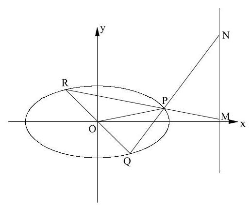
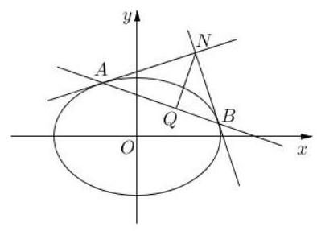
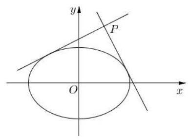
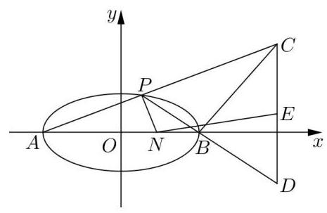

# 第十四讲：解答题综合训练 3

1、已知抛物线 $C$ 的顶点是原点,焦点是 $F\left( {0,1}\right)$ ,过直线 $y =  - 2$ 上任意一定 $A$ 作抛物线 $C$ 的两条切线,切点分别为 $P, Q$ ,求证:

(1)直线 ${PQ}$ 过定点；

(2) $\angle {PFQ} = 2\angle {PAQ}$ .

2、如图，中心在原点 $O$ 的椭圆 $\Gamma$ 的右焦点为 $F\left( {2\sqrt{3},0}\right)$ ，长轴长为 8 . 椭圆 $\Gamma$ 上有两点 $P, Q$ ,连结 ${OP},{OQ}$ ,记它们的斜率为 ${k}_{OP},{k}_{OQ}$ ,且满足 ${k}_{OP} \cdot  {k}_{OQ} =  - \frac{1}{4}$ .

(1)求椭圆 $\Gamma$ 的标准方程；

(2)求证: ${\left| OP\right| }^{2} + {\left| OQ\right| }^{2}$ 为一定值，并求出这个定值；

(3)设直线 ${OQ}$ 与椭圆 $\Gamma$ 的另一个交点为 $R$ ，直线 ${RP}$ 和 ${PQ}$ 分别与直线 $x = 4\sqrt{3}$ 交于点 $M, N$ ,若 ${\Delta PQR}$ 和 ${\Delta PMN}$ 的面积相等,求点 $P$ 的横坐标.

3、已知椭圆 $C$ 的方程为 $\frac{{x}^{2}}{2} + {y}^{2} = 1$ .

(1)设 $M\left( {{x}_{M},{y}_{M}}\right)$ 是椭圆 $C$ 上的点，证明:直线 $\frac{{x}_{M}x}{2} + {y}_{M}y = 1$ 与椭圆 $C$ 有且只有一个公共点;

(2)过点 $N\left( {1,\sqrt{2}}\right)$ 作两条与椭圆只有一个公共点的直线，公共点分别记为 $A$ 、 $B$ ，点 $N$ 在直线 ${AB}$ 上的射影为点 $Q$ ,求点 $Q$ 的坐标;

(3)互相垂直的两条直线 ${l}_{1}$ 与 ${l}_{2}$ 相交于点 $P$ ，且 ${l}_{1}\text{ 、 }{l}_{2}$ 都与椭圆 $C$ 只有一个公共点，求点 $P$ 的轨迹方程.

4、如图,已知椭圆 $\Gamma  : \frac{{x}^{2}}{4} + {y}^{2} = 1$ 的左右顶点分别为 $A\text{ 、 }B, P$ 是椭圆 $\Gamma$ 上异于 $A\text{ 、 }B$ 的一点,直线 $l : x = 4$ ,直线 ${AP}\text{ 、 }{BP}$ 分别交直线 $l$ 于两点 $C\text{ 、 }D$ ,线段 ${CD}$ 的中点为 $E$ .

(1)设直线 ${AP}\text{ 、 }{BP}$ 的斜率分别为 ${k}_{AP}\text{ 、 }{k}_{BP}$ ，求 ${k}_{AP} \cdot  {k}_{BP}$ 的值；

(2)设 $\bigtriangleup  {ABP}\text{ 、 } \bigtriangleup  {ABC}$ 的面积分别为 ${S}_{1}\text{ 、 }{S}_{2}$ ，如果 ${S}_{2} = 2{S}_{1}$ ，求直线 ${AP}$ 的方程；

(3)在 $x$ 轴上是否存在定点 $N\left( {n,0}\right)$ ，使得当直线 ${NP}\text{ 、 }{NE}$ 的斜率 ${k}_{NP}\text{ 、 }{k}_{NE}$ 存在时， ${k}_{NP} \cdot  {k}_{NE}$ 为定值? 若存在,求出 ${k}_{NP} \cdot  {k}_{NE}$ 的值,若不存在,请说明理由.

5、治理垃圾是改善环境的重要举措， $A$ 地在未进行垃圾分类前每年需要焚烧垃圾量为 200 万吨, 当地政府从 2020 年开始推进垃圾分类工作, 通过对分类垃圾进行环保处理等一系列措施，预计从 2020 年开始的连续 5 年，每年需要焚烧垃圾量比上一年减少 20 万吨，从第 6 年开始, 每年需要焚烧垃圾量为上一年的 75% (记 2020 年为第 1 年).

(1)写出 $A$ 地每年需要焚烧垃圾量与治理年数 $n$ ( $n \in  {\mathbf{N}}^{ * }$ )的表达式；

(2)设 ${A}_{n}$ 为从 2020 年开始 $n$ 年内需要焚烧垃圾量的年平均值，证明数列 $\left\{  {A}_{n}\right\}$ 为递减数列.

6、某公司全年的纯利润为 $b$ 元，其中一部分作为奖金发给 $n$ 位职工，奖金分配方案如下: 首先将职工按工作业绩(工作业绩均不相等)从大到小，由 1 到 $n$ 排序，第 1 位职工得奖金 $\frac{b}{n}$ 元,然后再将余额除以 $n$ 发给第 2 位职工,按此方法将奖金逐一发给每位职工,并将量后剩余部分作为公司发展基金。

(1)设 ${a}_{k}\left( {1 \leq  k \leq  n}\right)$ 为第 $k$ 位职工所得奖金额，试求 ${a}_{2},{a}_{3}$ ，并用 $k, n$ 和 $b$ 表示 ${a}_{k}$ ，(不必证明)

(2)证明: ${a}_{k} > {a}_{k + 1}\left( {k = 1,2,3\cdots , n - 1}\right)$ 并解释此不等式关于分配原则的实际意义；

(3)发展基金与 $n$ 和 $b$ 有关，记为 ${P}_{n}\left( b\right)$ ，写出 ${P}_{n}\left( b\right)$ 的表达式。
