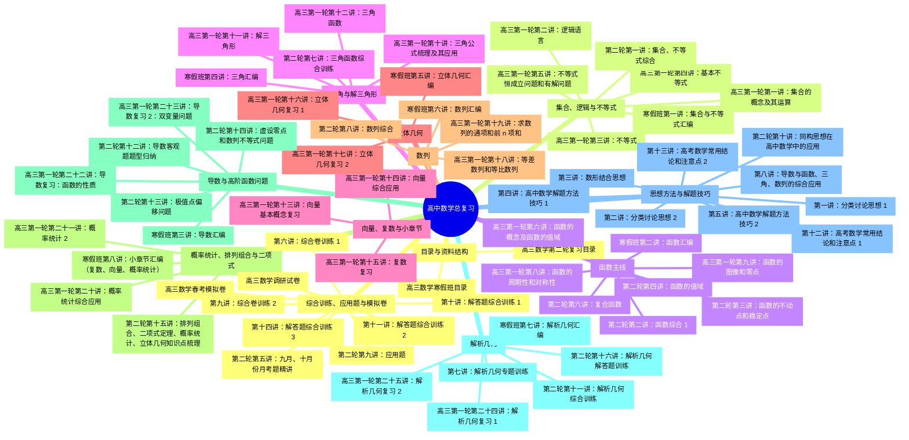

# sun高三总复习上海题源｜高中数学思维导图

## 任务理解

- 真正要解决的问题：从 `sun高三总复习上海题源-Obsidian拆分版` 中抽取讲义标题，去掉排版副本和报告文件，按高中数学复习知识板块重组，形成可复用的思维导图。
- 明确需求：保留原讲义标题；体现高三总复习结构；输出为本地可查看的 Markdown/Obsidian 资料。
- 处理边界：本文件只做标题级结构化，不改动原讲义内容，不校对 OCR，不逐题解析。
- 最可能误解点：如果直接按文件夹生成目录，会得到“一轮/二轮/寒假/方法专题”的资料目录；这里进一步按高中数学知识板块重排，便于教学备课和查找题源。

## 提取规则与核验

- 扫描 Markdown 文件：`134` 个。
- 排除说明/检查/报告文件后参与去重：`131` 个。
- 按同名讲义去重后：`67` 个，其中根目录索引 `00-目录.md` 不作为讲义标题计入。
- 最终纳入思维导图标题：`66` 个。
- 去重策略：同一讲同时存在原始版与 `-排版版.md` 时，优先取原始 `.md`；只有排版版时才回补。

## 内容理解

这套资料不是单纯按教材章节排列，而是高三复习资料体系：一轮复习负责铺完整知识线，二轮复习围绕函数、导数、解析几何等高频专题深化，寒假班把核心板块做题源汇编，方法专题与综合训练则集中训练分类讨论、数形结合、同构、常用结论和综合卷能力。

## 思维导图

## 按知识板块的标题索引

### 目录与资料结构

- [高三数学第二轮复习目录](<02-二轮复习/00-高三数学第二轮复习目录.md>)
  - 内部标题线索：(线下985)
- [高三数学寒假班目录](<04-寒假班/00-高三数学寒假班目录.md>)

### 集合、逻辑与不等式

- [高三第一轮第一讲：集合的概念及其运算](<01-一轮复习/01-高三第一轮第一讲：集合的概念及其运算.md>)
  - 内部标题线索：概念梳理:；例题精讲:；一、代表元问题；二、集合的关系
- [高三第一轮第二讲：逻辑语言](<01-一轮复习/02-高三第一轮第二讲：逻辑语言.md>)
  - 内部标题线索：概念梳理:；一、命题；二、条件；三、反证法的应用
- [高三第一轮第三讲：不等式](<01-一轮复习/03-高三第一轮第三讲：不等式.md>)
  - 内部标题线索：概念梳理:；1、不等式的性质；2、解不等式；3、绝对值三角不等式
- [高三第一轮第四讲：基本不等式](<01-一轮复习/04-高三第一轮第四讲：基本不等式.md>)
  - 内部标题线索：知识点概述:；一、基本不等式；二、常用的基本不等式；三、基本不等式求最值
- [高三第一轮第五讲：不等式恒成立问题和有解问题](<01-一轮复习/05-高三第一轮第五讲：不等式恒成立问题和有解问题.md>)
  - 内部标题线索：概念梳理:；1、不等式恒成立方法归纳；(1)分离参数；备注: 若 $f\left( x\right)$ 的最值取不到,端点要另行考虑
- [第二轮第一讲：集合、不等式综合](<02-二轮复习/01-第二轮第一讲：集合、不等式综合.md>)
  - 内部标题线索：一、填空题；二、选择题；三、解答题
- [寒假班第一讲：集合与不等式汇编](<04-寒假班/01-寒假班第一讲：集合与不等式汇编.md>)

### 函数主线

- [高三第一轮第六讲：函数的概念及函数的值域](<01-一轮复习/06-高三第一轮第六讲：函数的概念及函数的值域.md>)
  - 内部标题线索：一、函数的概念；二、函数的定义域；三、函数关系的建立；四、一元二次函数的值域
- [高三第一轮第八讲：函数的周期性和对称性](<01-一轮复习/08-高三第一轮第八讲：函数的周期性和对称性.md>)
  - 内部标题线索：一、函数周期性的定义；二、函数周期性的主要结论；三、函数对称性的主要结论；四、双对称出周期
- [高三第一轮第九讲：函数的图像和零点](<01-一轮复习/09-高三第一轮第九讲：函数的图像和零点.md>)
  - 内部标题线索：知识点概述；一、函数图像的变换；二、函数的零点；一、二次函数零点问题
- [第二轮第二讲：函数综合 1](<02-二轮复习/02-第二轮第二讲：函数综合 1.md>)
  - 内部标题线索：一、填空题；二、选择题；三、解答题
- [第二轮第三讲：函数的不动点和稳定点](<02-二轮复习/03-第二轮第三讲：函数的不动点和稳定点.md>)
  - 内部标题线索：三、性质归纳；巩固练习
- [第二轮第四讲：函数的值域](<02-二轮复习/04-第二轮第四讲：函数的值域.md>)
  - 内部标题线索：等值域问题、任意存在问题、最大值的最小值问题；一、保值(倍值)问题；二、复合函数等值域变换；三、任意和存在问题
- [第二轮第六讲：复合函数](<02-二轮复习/06-第二轮第六讲：复合函数.md>)
  - 内部标题线索：复合函数值域问题、方程问题、不等式问题、零点问题；一、复合函数的定义域；二、复合函数的值域；三、复合函数的单调性
- [寒假班第二讲：函数汇编](<04-寒假班/02-寒假班第二讲：函数汇编.md>)
  - 内部标题线索：任意存在；最大值的最小值

### 三角与解三角形

- [高三第一轮第十讲：三角公式梳理及其应用](<01-一轮复习/10-高三第一轮第十讲：三角公式梳理及其应用.md>)
  - 内部标题线索：公式梳理；一、任意角；二、三角恒等式:；三、诱导公式: 奇变偶不变, 符号看象限
- [高三第一轮第十一讲：解三角形](<01-一轮复习/11-高三第一轮第十一讲：解三角形.md>)
  - 内部标题线索：知识点梳理；一、基础练习；二、综合提高
- [高三第一轮第十二讲：三角函数](<01-一轮复习/12-高三第一轮第十二讲：三角函数.md>)
  - 内部标题线索：知识点梳理:；一、基础练习；二、综合提高
- [第二轮第七讲：三角函数综合训练](<02-二轮复习/07-第二轮第七讲：三角函数综合训练.md>)
  - 内部标题线索：公式再复习:；一、填选；二、解答题:
- [寒假班第四讲：三角汇编](<04-寒假班/04-寒假班第四讲：三角汇编.md>)
  - 内部标题线索：解答题:

### 向量、复数与小章节

- [高三第一轮第十三讲：向量基本概念复习](<01-一轮复习/13-高三第一轮第十三讲：向量基本概念复习.md>)
  - 内部标题线索：知识点梳理:；一、平面向量的有关概念；四、向量的数量积及其应用；四、平面向量的应用
- [高三第一轮第十四讲：向量综合应用](<01-一轮复习/14-高三第一轮第十四讲：向量综合应用.md>)
  - 内部标题线索：知识点梳理；1、向量中重心、内心、外心、垂心:；2、向量的结论:；一、系数的最值
- [高三第一轮第十五讲：复数复习](<01-一轮复习/15-高三第一轮第十五讲：复数复习.md>)
  - 内部标题线索：知识点梳理:；一、复数的概念；二、复数的运算；三、共轭复数

### 立体几何

- [高三第一轮第十六讲：立体几何复习 1](<01-一轮复习/16-高三第一轮第十六讲：立体几何复习 1.md>)
  - 内部标题线索：立体几何主要研究空间点、线、面、多面体、旋转体的位置关系和数量关系, 位置关系主 要是研究两个特殊的关系: 平行和垂直; 数量关系包括: 距离、角、表面积和体积。；立体几何中的几个难点问题:；一、证明题；二、截面问题
- [高三第一轮第十七讲：立体几何复习 2](<01-一轮复习/17-高三第一轮第十七讲：立体几何复习 2.md>)
  - 内部标题线索：一、填空题；二、斜几何体体积问题；三、立体几何中的最值问题；四、空间向量处理立体几何问题
- [寒假班第五讲：立体几何汇编](<04-寒假班/05-寒假班第五讲：立体几何汇编.md>)
  - 内部标题线索：解答题:

### 数列

- [高三第一轮第十八讲：等差数列和等比数列](<01-一轮复习/18-高三第一轮第十八讲：等差数列和等比数列.md>)
  - 内部标题线索：知识点梳理:；一、等差数列；二、等比数列；一、基础题训练
- [高三第一轮第十九讲：求数列的通项和前 n 项和](<01-一轮复习/19-高三第一轮第十九讲：求数列的通项和前 n 项和.md>)
  - 内部标题线索：知识点梳理:；一、数列求和方法；二、递推求通项；一、基础题型
- [第二轮第八讲：数列综合](<02-二轮复习/08-第二轮第八讲：数列综合.md>)
  - 内部标题线索：一、基础题；二、提高题；二、解答题
- [寒假班第六讲：数列汇编](<04-寒假班/06-寒假班第六讲：数列汇编.md>)

### 概率统计、排列组合与二项式

- [高三第一轮第二十讲：概率统计综合应用](<01-一轮复习/20-高三第一轮第二十讲：概率统计综合应用.md>)
  - 内部标题线索：知识点梳理:；一、概率初步；二、统计的相关概念；三、计数原理
- [高三第一轮第二十一讲：概率统计 2](<01-一轮复习/21-高三第一轮第二十一讲：概率统计 2.md>)
  - 内部标题线索：公式梳理；一、条件概率与相关公式；二、随机变量的分布与特征；三、随机变量常用分布
- [第二轮第十五讲：排列组合、二项式定理、概率统计、立体几何知识点梳理](<02-二轮复习/15-第二轮第十五讲：排列组合、二项式定理、概率统计、立体几何知识点梳理.md>)
  - 内部标题线索：二、二项式定理；三、排列组合和概率；四、立体几何；五、向量
- [寒假班第八讲：小章节汇编（复数、向量、概率统计）](<04-寒假班/08-寒假班第八讲：小章节汇编（复数、向量、概率统计）.md>)
  - 内部标题线索：一、概率统计；二、向量

### 导数与高阶函数问题

- [高三第一轮第二十二讲：导数复习：函数的性质](<01-一轮复习/22-高三第一轮第二十二讲：导数复习：函数的性质.md>)
  - 内部标题线索：导数处理函数的问题包括:；历年高考卷；拓展 1:
- [高三第一轮第二十三讲：导数复习 2：双变量问题](<01-一轮复习/23-高三第一轮第二十三讲：导数复习 2：双变量问题.md>)
  - 内部标题线索：双变量处理策略:；一、分离两个变量: 同构思想；二、双变量变单变量: 韦达代换(一般处理双极值点问题)；四、糅合变量, 比值代换 (对数型) 或差值代换 (指数型)
- [第二轮第十二讲：导数客观题题型归纳](<02-二轮复习/12-第二轮第十二讲：导数客观题题型归纳.md>)
  - 内部标题线索：一、基础题型 (导数的定义、求切线、单调区间、最值)；二、导数中的距离问题 (一直一曲, 两曲)；三、零点问题和整数解问题；四、公切线问题
- [第二轮第十三讲：极值点偏移问题](<02-二轮复习/13-第二轮第十三讲：极值点偏移问题.md>)
  - 内部标题线索：一、极值点偏移问题的定义；二、简单极值点偏移问题；三、极值点偏移问题变式；巩固练习:
- [第二轮第十四讲：虚设零点和数列不等式问题](<02-二轮复习/14-第二轮第十四讲：虚设零点和数列不等式问题.md>)
  - 内部标题线索：一、隐零点问题；二、数列不等式问题
- [寒假班第三讲：导数汇编](<04-寒假班/03-寒假班第三讲：导数汇编.md>)

### 解析几何

- [高三第一轮第二十四讲：解析几何复习 1](<01-一轮复习/24-高三第一轮第二十四讲：解析几何复习 1.md>)
  - 内部标题线索：知识点梳理:；一、椭圆结论:；二、双曲线结论:；三、抛物线的结论:
- [高三第一轮第二十五讲：解析几何复习 2](<01-一轮复习/25-高三第一轮第二十五讲：解析几何复习 2.md>)
  - 内部标题线索：圆锥曲线解答题题型归纳:
- [第二轮第十一讲：解析几何综合训练](<02-二轮复习/11-第二轮第十一讲：解析几何综合训练.md>)
  - 内部标题线索：一、填选；二、解答题
- [第二轮第十六讲：解析几何解答题训练](<02-二轮复习/16-第二轮第十六讲：解析几何解答题训练.md>)
- [寒假班第七讲：解析几何汇编](<04-寒假班/07-寒假班第七讲：解析几何汇编.md>)
- [第七讲：解析几何专题训练](<05-方法专题与综合训练/07-第七讲：解析几何专题训练.md>)
  - 内部标题线索：一、填空题；二、解答题

### 思想方法与解题技巧

- [第二轮第十讲：同构思想在高中数学中的应用](<02-二轮复习/10-第二轮第十讲：同构思想在高中数学中的应用.md>)
  - 内部标题线索：类型二、同构思想解不等式；类型三、倍值区间问题；类型四: 同构思想在解析几何中的应用；类型五、导数中的同构思想(双变量不等式)
- [第一讲：分类讨论思想 1](<05-方法专题与综合训练/01-第一讲：分类讨论思想 1.md>)
  - 内部标题线索：一、分类的准则:；二、分类讨论的标准:；三、分类讨论的步骤一般可分为以下几步:；四、题目特征: 带参数、带绝对值、 ${\left( -1\right) }^{n}\text{ 、 }Z$ (实数、虚数)
- [第二讲：分类讨论思想 2](<05-方法专题与综合训练/02-第二讲：分类讨论思想 2.md>)
  - 内部标题线索：三、三角中的应用(会结合实际问题讨论三角比的值)；四、数列中的应用(极限问题、公比问题、公式的应用等)；五、解析几何中的应用(圆锥曲线的定义)；六、其它的应用
- [第三讲：数形结合思想](<05-方法专题与综合训练/03-第三讲：数形结合思想.md>)
  - 内部标题线索：一、数形结合处理集合问题和不等式问题；二、数形结合处理函数零点问题和函数性质问题(三角函数)；三、数形结合处理解析几何问题；四、数形结合处理复数和向量问题
- [第四讲：高中数学解题方法技巧 1](<05-方法专题与综合训练/04-第四讲：高中数学解题方法技巧 1.md>)
  - 内部标题线索：一、构造法；二、换元法；三、判别式法；四、整体思想
- [第五讲：高中数学解题方法技巧 2](<05-方法专题与综合训练/05-第五讲：高中数学解题方法技巧 2.md>)
  - 内部标题线索：五、“1” 的代换；六、主元法；七、两边夹思想；八、代数式的取值范围问题
- [第八讲：导数与函数、三角、数列的综合应用](<05-方法专题与综合训练/08-第八讲：导数与函数、三角、数列的综合应用.md>)
- [第十二讲：高考数学常用结论和注意点 1](<05-方法专题与综合训练/12-第十二讲：高考数学常用结论和注意点 1.md>)
  - 内部标题线索：一、集合与逻辑语言；4、区分集合中元素的形式:；6、补集思想常运用于解决否定型或正面较复杂的有关问题。；7、几种常见关键词的否定形式
- [第十三讲：高考数学常用结论和注意点 2](<05-方法专题与综合训练/13-第十三讲：高考数学常用结论和注意点 2.md>)
  - 内部标题线索：七、立体几何；八、数列；非零常数列既是等差数列, 又是等比数列; 既是等差数列又是等比数列的数列必为非零常数 列；10、求数列通项公式有哪几种典型类型?

### 综合训练、应用题与模拟卷

- [第二轮第五讲：九月、十月份月考题精讲](<02-二轮复习/05-第二轮第五讲：九月、十月份月考题精讲.md>)
  - 内部标题线索：控江；交附；复附
- [第二轮第九讲：应用题](<02-二轮复习/09-第二轮第九讲：应用题.md>)
  - 内部标题线索：模型 1: 函数问题；模型 3: 数列；模型 4: 解析几何；课后训练:
- [高三数学调研试卷](<03-调研试卷与春考模拟/01-高三数学调研试卷.md>)
  - 内部标题线索：一. 填空题；二. 选择题；三. 解答题；参考答案
- [高三数学春考模拟卷](<03-调研试卷与春考模拟/02-高三数学春考模拟卷.md>)
  - 内部标题线索：一、填空题；二、选择题；三、解答题
- [第六讲：综合卷训练 1](<05-方法专题与综合训练/06-第六讲：综合卷训练 1.md>)
  - 内部标题线索：一、填空题；二、选择题；三、解答题
- [第九讲：综合卷训练 2](<05-方法专题与综合训练/09-第九讲：综合卷训练 2.md>)
  - 内部标题线索：一、客观题；二、解答题
- [第十讲：解答题综合训练 1](<05-方法专题与综合训练/10-第十讲：解答题综合训练 1.md>)
- [第十一讲：解答题综合训练 2](<05-方法专题与综合训练/11-第十一讲：解答题综合训练 2.md>)
- [第十四讲：解答题综合训练 3](<05-方法专题与综合训练/14-第十四讲：解答题综合训练 3.md>)

## 按原讲义模块的标题索引

### 01-一轮复习

- [高三第一轮第一讲：集合的概念及其运算](<01-一轮复习/01-高三第一轮第一讲：集合的概念及其运算.md>)
- [高三第一轮第二讲：逻辑语言](<01-一轮复习/02-高三第一轮第二讲：逻辑语言.md>)
- [高三第一轮第三讲：不等式](<01-一轮复习/03-高三第一轮第三讲：不等式.md>)
- [高三第一轮第四讲：基本不等式](<01-一轮复习/04-高三第一轮第四讲：基本不等式.md>)
- [高三第一轮第五讲：不等式恒成立问题和有解问题](<01-一轮复习/05-高三第一轮第五讲：不等式恒成立问题和有解问题.md>)
- [高三第一轮第六讲：函数的概念及函数的值域](<01-一轮复习/06-高三第一轮第六讲：函数的概念及函数的值域.md>)
- [高三第一轮第八讲：函数的周期性和对称性](<01-一轮复习/08-高三第一轮第八讲：函数的周期性和对称性.md>)
- [高三第一轮第九讲：函数的图像和零点](<01-一轮复习/09-高三第一轮第九讲：函数的图像和零点.md>)
- [高三第一轮第十讲：三角公式梳理及其应用](<01-一轮复习/10-高三第一轮第十讲：三角公式梳理及其应用.md>)
- [高三第一轮第十一讲：解三角形](<01-一轮复习/11-高三第一轮第十一讲：解三角形.md>)
- [高三第一轮第十二讲：三角函数](<01-一轮复习/12-高三第一轮第十二讲：三角函数.md>)
- [高三第一轮第十三讲：向量基本概念复习](<01-一轮复习/13-高三第一轮第十三讲：向量基本概念复习.md>)
- [高三第一轮第十四讲：向量综合应用](<01-一轮复习/14-高三第一轮第十四讲：向量综合应用.md>)
- [高三第一轮第十五讲：复数复习](<01-一轮复习/15-高三第一轮第十五讲：复数复习.md>)
- [高三第一轮第十六讲：立体几何复习 1](<01-一轮复习/16-高三第一轮第十六讲：立体几何复习 1.md>)
- [高三第一轮第十七讲：立体几何复习 2](<01-一轮复习/17-高三第一轮第十七讲：立体几何复习 2.md>)
- [高三第一轮第十八讲：等差数列和等比数列](<01-一轮复习/18-高三第一轮第十八讲：等差数列和等比数列.md>)
- [高三第一轮第十九讲：求数列的通项和前 n 项和](<01-一轮复习/19-高三第一轮第十九讲：求数列的通项和前 n 项和.md>)
- [高三第一轮第二十讲：概率统计综合应用](<01-一轮复习/20-高三第一轮第二十讲：概率统计综合应用.md>)
- [高三第一轮第二十一讲：概率统计 2](<01-一轮复习/21-高三第一轮第二十一讲：概率统计 2.md>)
- [高三第一轮第二十二讲：导数复习：函数的性质](<01-一轮复习/22-高三第一轮第二十二讲：导数复习：函数的性质.md>)
- [高三第一轮第二十三讲：导数复习 2：双变量问题](<01-一轮复习/23-高三第一轮第二十三讲：导数复习 2：双变量问题.md>)
- [高三第一轮第二十四讲：解析几何复习 1](<01-一轮复习/24-高三第一轮第二十四讲：解析几何复习 1.md>)
- [高三第一轮第二十五讲：解析几何复习 2](<01-一轮复习/25-高三第一轮第二十五讲：解析几何复习 2.md>)

### 02-二轮复习

- [高三数学第二轮复习目录](<02-二轮复习/00-高三数学第二轮复习目录.md>)
- [第二轮第一讲：集合、不等式综合](<02-二轮复习/01-第二轮第一讲：集合、不等式综合.md>)
- [第二轮第二讲：函数综合 1](<02-二轮复习/02-第二轮第二讲：函数综合 1.md>)
- [第二轮第三讲：函数的不动点和稳定点](<02-二轮复习/03-第二轮第三讲：函数的不动点和稳定点.md>)
- [第二轮第四讲：函数的值域](<02-二轮复习/04-第二轮第四讲：函数的值域.md>)
- [第二轮第五讲：九月、十月份月考题精讲](<02-二轮复习/05-第二轮第五讲：九月、十月份月考题精讲.md>)
- [第二轮第六讲：复合函数](<02-二轮复习/06-第二轮第六讲：复合函数.md>)
- [第二轮第七讲：三角函数综合训练](<02-二轮复习/07-第二轮第七讲：三角函数综合训练.md>)
- [第二轮第八讲：数列综合](<02-二轮复习/08-第二轮第八讲：数列综合.md>)
- [第二轮第九讲：应用题](<02-二轮复习/09-第二轮第九讲：应用题.md>)
- [第二轮第十讲：同构思想在高中数学中的应用](<02-二轮复习/10-第二轮第十讲：同构思想在高中数学中的应用.md>)
- [第二轮第十一讲：解析几何综合训练](<02-二轮复习/11-第二轮第十一讲：解析几何综合训练.md>)
- [第二轮第十二讲：导数客观题题型归纳](<02-二轮复习/12-第二轮第十二讲：导数客观题题型归纳.md>)
- [第二轮第十三讲：极值点偏移问题](<02-二轮复习/13-第二轮第十三讲：极值点偏移问题.md>)
- [第二轮第十四讲：虚设零点和数列不等式问题](<02-二轮复习/14-第二轮第十四讲：虚设零点和数列不等式问题.md>)
- [第二轮第十五讲：排列组合、二项式定理、概率统计、立体几何知识点梳理](<02-二轮复习/15-第二轮第十五讲：排列组合、二项式定理、概率统计、立体几何知识点梳理.md>)
- [第二轮第十六讲：解析几何解答题训练](<02-二轮复习/16-第二轮第十六讲：解析几何解答题训练.md>)

### 03-调研试卷与春考模拟

- [高三数学调研试卷](<03-调研试卷与春考模拟/01-高三数学调研试卷.md>)
- [高三数学春考模拟卷](<03-调研试卷与春考模拟/02-高三数学春考模拟卷.md>)

### 04-寒假班

- [高三数学寒假班目录](<04-寒假班/00-高三数学寒假班目录.md>)
- [寒假班第一讲：集合与不等式汇编](<04-寒假班/01-寒假班第一讲：集合与不等式汇编.md>)
- [寒假班第二讲：函数汇编](<04-寒假班/02-寒假班第二讲：函数汇编.md>)
- [寒假班第三讲：导数汇编](<04-寒假班/03-寒假班第三讲：导数汇编.md>)
- [寒假班第四讲：三角汇编](<04-寒假班/04-寒假班第四讲：三角汇编.md>)
- [寒假班第五讲：立体几何汇编](<04-寒假班/05-寒假班第五讲：立体几何汇编.md>)
- [寒假班第六讲：数列汇编](<04-寒假班/06-寒假班第六讲：数列汇编.md>)
- [寒假班第七讲：解析几何汇编](<04-寒假班/07-寒假班第七讲：解析几何汇编.md>)
- [寒假班第八讲：小章节汇编（复数、向量、概率统计）](<04-寒假班/08-寒假班第八讲：小章节汇编（复数、向量、概率统计）.md>)

### 05-方法专题与综合训练

- [第一讲：分类讨论思想 1](<05-方法专题与综合训练/01-第一讲：分类讨论思想 1.md>)
- [第二讲：分类讨论思想 2](<05-方法专题与综合训练/02-第二讲：分类讨论思想 2.md>)
- [第三讲：数形结合思想](<05-方法专题与综合训练/03-第三讲：数形结合思想.md>)
- [第四讲：高中数学解题方法技巧 1](<05-方法专题与综合训练/04-第四讲：高中数学解题方法技巧 1.md>)
- [第五讲：高中数学解题方法技巧 2](<05-方法专题与综合训练/05-第五讲：高中数学解题方法技巧 2.md>)
- [第六讲：综合卷训练 1](<05-方法专题与综合训练/06-第六讲：综合卷训练 1.md>)
- [第七讲：解析几何专题训练](<05-方法专题与综合训练/07-第七讲：解析几何专题训练.md>)
- [第八讲：导数与函数、三角、数列的综合应用](<05-方法专题与综合训练/08-第八讲：导数与函数、三角、数列的综合应用.md>)
- [第九讲：综合卷训练 2](<05-方法专题与综合训练/09-第九讲：综合卷训练 2.md>)
- [第十讲：解答题综合训练 1](<05-方法专题与综合训练/10-第十讲：解答题综合训练 1.md>)
- [第十一讲：解答题综合训练 2](<05-方法专题与综合训练/11-第十一讲：解答题综合训练 2.md>)
- [第十二讲：高考数学常用结论和注意点 1](<05-方法专题与综合训练/12-第十二讲：高考数学常用结论和注意点 1.md>)
- [第十三讲：高考数学常用结论和注意点 2](<05-方法专题与综合训练/13-第十三讲：高考数学常用结论和注意点 2.md>)
- [第十四讲：解答题综合训练 3](<05-方法专题与综合训练/14-第十四讲：解答题综合训练 3.md>)
