冲刺

高三一模秦考

Achieved

MATH

姓 名:___

学 校: ___

联系电话:___

## 目 录

第一章 高三春考一模中档题日日练 .1

高三春考一模中档题日日练 (1) .1

高三春考一模中档题日日练 (2) .3

高三春考一模中档题日日练 (3) .5

高三春考一模中档题日日练 (4) .7

高三春考一模中档题日日练 (5) .9

高三春考一模中档题日日练(6) .10

高三春考一模中档题日日练 (7) .12

高三春考一模中档题日日练 (8) .14

高三春考一模中档题日日练(9) .16

高三春考一模中档题日日练 (10) .18

高三春考一模中档题日日练(11) .20

高三春考一模中档题日日练 (12) .22

高三春考一模中档题日日练(13) .24

高三春考一模中档题日日练(14) .26

高三春考一模中档题日日练(15) .28

高三春考一模中档题日日练 (16) .30

高三春考一模中档题日日练(17) .32

高三春考一模中档题日日练(18) .34

高三春考一模中档题日日练 (19) .36

高三春考一模中档题日日练(20) .38

第二章 高三春考一模次压轴日日练 .40

高三一模春考次压轴日日练(1) .40

高三一模春考次压轴日日练(2) .43

高三一模春考次压轴日日练(3) .46

高三一模春考次压轴日日练 (4) 49

高三一模春考次压轴日日练 (5) .52

高三一模春考次压轴日日练 (6) .55

高三一模春考次压轴日日练 (7) .58

高三一模春考次压轴日日练 (8) .61

高三一模 春考次压 轴日日练 (9) .64

高三一模春考次压轴日日练 (10) .67

高三一模春考次压轴日日练 (11) .70

高三一模春考次压轴日日练 (12) .73

高三一模春考次压轴日日练 (13) .76

第三章 高三春考一模中档大题日日练 .80

高三春考一模中档大题日日练(1) 80

高三春考一模中档大题日日练(2) 82

高三春考一模中档大题日日练(3) 84

高三春考一模中档大题日日练(4) 86

高三春考一模中档大题日日练 (5) 88

高三春考一模中档大题日日练 (6) 90

高三春考一模中档大题日日练(7) 92

高三春考一模中档大题日日练 (8) 94

高三春考一模中档大题日日练 (9) 97

高三春考一模中档大题日日练 (10) 100

# 第一章 高三春考一模中档题日日练

## 高三春考一模中档题日日练 (1)

## 训练限时: 30 分钟

1. $\left\lbrack  {{2023.11}\text{ 商桥高三期中 7 }}\right\rbrack  \overrightarrow{a} = \left( {-2,1}\right) ,\left| \overrightarrow{b}\right|  = 2\sqrt{5}$ ，且 $\left( {\overrightarrow{a} + \overrightarrow{b}}\right)  \cdot  \overrightarrow{a} = {10}$ ，则 $\left\langle  {\overrightarrow{a},\overrightarrow{b}}\right\rangle   =$ ___.

2、[2023.10 泰贤月考 7] 已知向量 $\overrightarrow{a} = \left( {\sin {2x},2\cos x}\right) ,\overrightarrow{b} = \left( {\sqrt{3},\cos x}\right)$ ，则函数 $f\left( x\right)  = \overrightarrow{a} \cdot  \overrightarrow{b} - 1, x \in  \left\lbrack  {-\frac{\pi }{2},\frac{\pi }{2}}\right\rbrack$ 的严格增区间为___.

3.【2023.11 高桥高三期中 8】在 $\bigtriangleup  {ABC}$ 中， $C = \frac{\pi }{3}$ ，则 $\cos A + \cos B$ 的取值范围是___. 4.【2023.10 敬业周测一8】已知幂函数 $f\left( x\right)  = {x}^{\alpha }\left( {\alpha  \in  R}\right)$ 的图像经过点 $\left( {\frac{1}{2},4}\right)$ ，且 $f\left( {m + 1}\right)  < f\left( 3\right)$ ,则 $m$ 的取值范围为___.

5.【2023.9 南洋开学考 9】已知正六边形 ${ABCDEF}$ ， $M$ 、 $N$ 分别是对角线 ${AC}$ 、 ${CE}$ 上的点,使得 $\frac{AM}{AC} = \frac{CN}{CE} = r$ ,当 $r =$ ___时, $B\text{ 、 }M\text{ 、 }N$ 三点共线.

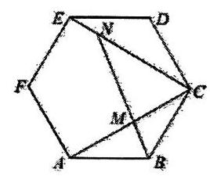

6.【2023.9 华二开学考 10】已知复数 $z$ 满足 $\left| {z - 2}\right|  = 2\left| {z - {2i}}\right|$ ，则 $\left| z\right|$ 的最大值为___.

7.【2023.10 建平月考 10】已知 ${2}^{\frac{1}{x}} > {x}^{a}$ 对任意 $x \in  \left( {0,1}\right)$ 成立，则实数 $a$ 的取值范围为___.

十年寒窗

8.【2023.9 向明开学考 10】在平面直角坐标系中, $O$ 为原点, $A\left( {-1,0}\right) \text{ 、 }B\left( {0,\sqrt{3}}\right) \text{ 、 }C\left( {3,0}\right)$ , 动点 $D$ 满足 $\left| \overrightarrow{CD}\right|  = 1$ ，则 $\left| {\overrightarrow{OA} + \overrightarrow{OB} + \overrightarrow{OD}}\right|$ 的最大值是___.

9.【2023.11 洋泾高三期中 10】已知函数 $f\left( x\right)  = {2}^{-x} + 1, g\left( x\right)  = \left\{  \begin{array}{l} {\log }_{2}\left( {x + 1}\right) , x \geq  m \\  f\left( {-x}\right) , x < m \end{array}\right.$ ,若方程 $g\left( x\right)  = 2$ 有两个不等实根,则实数 $m$ 的取值范围为___.

10.【2023.11 洋泾高三期中 11】已知函数 $f\left( x\right)  = m{x}^{3} + {2n}{x}^{2} - {12x}$ 的单调减区间是 $\left( {-2,2}\right)$ ， 过点 $A\left( {1, t}\right)$ 存在与曲线 $y = f\left( x\right)$ 相切的 3 条切线,则实数 $t$ 的取值范围为___.

## 高三春考一模中档题日日练(2)

## 训练限时:30 分钟

1.【2023.9 徐汇周练二 5】曲线 $y = \frac{{e}^{x}}{x + 1}$ 在点 $\left( {1,\frac{e}{2}}\right)$ 处的切线方程为___。

2.【2023.11 高桥高三期中 6】若 $2{x}^{2} + {kx} - m < 0$ 的解集为 $\left( {t, - 1}\right) \left( {t <  - 1}\right)$ ，则 $k + m$ 的值为___.

3.【2023.10 行知月考 6】若抛物线 ${x}^{2} = {28y}$ 上一点 $\left( {{x}_{0},{y}_{0}}\right)$ 到焦点的距离是该点到 $x$ 轴距离的 3 倍，则 ${y}_{0} =$ ___.

4,【2023.11 向明高三期中 7】在 ${\left( x + \frac{1}{{x}^{2}}\right) }^{9}$ 的二项展开式中，常数项的值为___。

5.【2023.9 上海实验周测三 7】已知函数 $f\left( x\right)  = \left\{  \begin{array}{l} {e}^{x},\left( {x \leq  0}\right) \\  \ln x,\left( {x > 0}\right)  \end{array}\right. , g\left( x\right)  = f\left( x\right)  + x + a$ ,若 $g\left( x\right)$ 存在 2 个零点,则 $a$ 的取值范围是___.

6.【2023.11 向明高三期中 8】端午节吃粽子是我国的传统习俗, 一盘中放有 10 个外观完全相同的粽子, 其中豆沙粽 2 个, 肉棕 3 个, 白米棕 5 个, 现从盘子任意取出 3 个, 取到豆沙棕，肉棕，白米棕各一个的概率为___。

7.【2023.11 洋泾高三期中 8】如图是某班一次数学测试成绩的茎叶图(图中仅列出[50,60) 和 $\lbrack {90},{100})$ 的数据)和频率分布直方图，则 $x - y =$ ___.

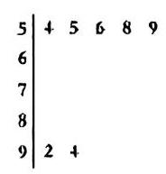

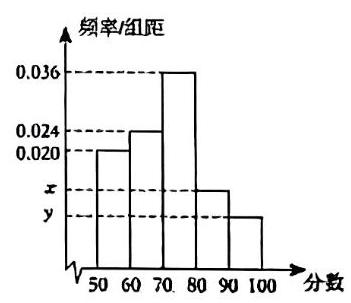

十年寒窗

8.【2023.11 洋泾高三期中 9】已知关于 $x$ 的不等式 $\sin x - {\cos }^{2}x + 2 < a$ 有解，则实数 $a$ 的取值范围为___。

9.【2023.9 延安开学考 9】已知在 $\bigtriangleup {ABC}$ 中， $E$ 为 ${AC}$ 的中点， $D$ 是线段 ${BE}$ 上的动点， 若 $\overrightarrow{AD} = x\overrightarrow{AB} + y\overrightarrow{AC}$ ,则 $\frac{1}{x} + \frac{2}{y}$ 的最小值为___.

10.【2023.9 上海实验开学考 11】在 $\bigtriangleup {ABC}$ 中,角 $A, B, C$ 的对边分别为 $a, b, c$ ,设 $\bigtriangleup {ABC}$ 的面积为 $S$ ，若 $3{a}^{2} = 2{b}^{2} + {c}^{2}$ ，则 $\frac{S}{{b}^{2} + 2{c}^{2}}$ 的最大值为___.

## 高三春考一模中档题日日练 (3)

## 训练限时: 30 分钟

1.【2023.11 洋泾高三期中 6】已知 $a - {2b} = 8\left( {a, b \in  R}\right)$ ，则 ${2}^{a} + \frac{1}{{4}^{b}}$ 的最小值为___.

2.【2023.9 格致开学考 7】 集合 $A = \{ z \mid  z = 1 + {mi}, m \in  R\} , B = \left\{  {z\left| {\;z = 1 - n + \left( {1 + n}\right) i}\right. , n \in  R}\right\}$ ， 则 $A \cap  B =$ ___。

3.【2023.11 洋泾高三期中 7】已知 $P$ 是边长为 2 的正六边形 ${ABCDEF}$ 上或其内部的一点， 则 $\overrightarrow{AP} \circ  \overrightarrow{AB}$ 的取值范围为___.

4. 【2023.9 进才周练二 8】若关于 $\mathrm{x}$ 的不等式 $\left| {x + 1}\right|  - \left| {x - 2}\right|  \leq  a$ ， $x$ 的解集不为空集，则实数 $a$ 的取值范围是___。

5.【2023.6 宜川期末 9】已知平面向量 $\overrightarrow{a} = \left( {1,\sqrt{3}}\right)$ ，且平面向量 $\overrightarrow{a},\overrightarrow{b}$ 的夹角为 $\frac{\pi }{3}$ ， $\left( {\overrightarrow{a} + \overrightarrow{b}}\right)  \cdot  \left( {2\overrightarrow{a} - 3\overrightarrow{b}}\right)  = 4$ ，则 $\overrightarrow{b}$ 在 $\overrightarrow{a}$ 方向上的投影向量等于___

6.【2023.11 高桥高三期中 9】夏老师要进行年度体检，有抽血、腹部彩超、胸部 CT、心电图、血压测量等五个项目, 为了体检数据的准确性, 抽血必须作为第一个项目完成, 而夏老师决定腹部彩超和胸部CT 两项不连在一起检查, 则不同的检查方案一共有___种。

7.【2023.11 向明高三期中 9】已知函数 $f\left( x\right)  = \frac{{a}^{x}}{{3}^{x} + 1}\left( {a > 0, a \neq  1}\right)$ 为偶函数,则 $\mathrm{a}$ 的值为___.

8.【2023.9 闵行开学考 10】已知定义在 $\left( {-3,3}\right)$ 上的奇函数 $y = f\left( x\right)$ 的导函数是 ${f}^{\prime }\left( x\right)$ , 当 $x \geq  0$ 时， $y = f\left( x\right)$ 的图像如图所示，则关于 $x$ 的不等式 $\frac{{f}^{\prime }\left( x\right) }{x} > 0$ 的解集为___.

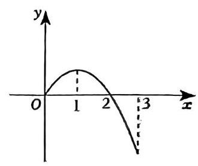

9.【2023.9 复旦附中开学考 11】在棱长为 1 的正方体 ${ABCD} - {A}_{1}{B}_{1}{C}_{1}{D}_{1}$ 中， $M$ 是底面 ${A}_{1}{B}_{1}{C}_{1}{D}_{1}$ 内动点,且 ${BM}//$ 平面 $A{D}_{1}C$ ,当 $\angle {D}_{1}{MD}$ 最大时,三棱锥 $M - A{D}_{1}C$ 的体积为 ___。

10.【2023.11 向明高三期中 11】已知 $\bigtriangleup {ABC}$ 中, $\sin \left( {\pi  - A}\right)  = 3\sin C\sin \left( {\frac{\pi }{2} + \frac{B}{2}}\right)$ ,且 ${AB} = 2$ ，则 $\bigtriangleup  {ABC}$ 面积的最大值为___.

## 高三春考一模中档题日日练 (4)

训练限时: 30 分钟

1.【2023.11 六校联考高三期中 6】设常数 $a \in  R$ ,若 ${\left( {x}^{2} + \frac{a}{x}\right) }^{5}$ 的二项展开式中 ${x}^{7}$ 项的系数为 -10,则 $a =$ ___。

2.【2023.11 嘉定二中高三期中 7】由函数的观点,方程 ${2}^{x} + {\log }_{4}x = {17}$ 的解为___.

3.【2023.11 嘉定二中高三期中 8】函数 $f\left( x\right)  = {ax} - {\log }_{2}\left( {{8}^{x} + 1}\right)$ 为偶函数,则实数 $a$ 的值为___。

4.【2023.9 建平开学考 8】已知集合 $A = \left\{  {x \mid  m{x}^{2} + {2x} + 2 = 0}\right\}$ 中有两个元素，则实数 $m$ 的取值范围是___.

5.【2023.9 敬业开学考 8】已知 $0 < x < 1$ ，则 $\frac{9}{x} + \frac{16}{1 - x}$ 的最小值为___.

6.【2023.9 大同周测三 9】设函数 $f\left( x\right)  = \left\{  \begin{array}{l}  - {ax} + 1, x < a, \\  {\left( x - 2\right) }^{2}, x \geq  a, \end{array}\right.$ 若 $f\left( x\right)$ 存在最小值,则 $a$ 的最大值是___.

7.【2023.6 金山期末 10】已知偶函数 $f\left( x\right)  = \sqrt{3}\sin \left( {{\omega x} + \varphi }\right)  - \cos \left( {{\omega x} + \varphi }\right) \left( {\omega  > 0,\left| \varphi \right|  < \frac{\pi }{2}}\right)$ 在 $\left( {0,2}\right)$ 上有且仅有一个极大值点,没有极小值点,则 $\omega$ 的取值范围为___

8.【2023.9 交大摸底考 10】已知 $m\text{ 、 }n$ 均为实数，方程 $\frac{{x}^{2}}{{m}^{2} + n} + \frac{{y}^{2}}{3{m}^{2} - n} = 1$ 表示椭圆， 且该椭圆的焦距为 4 ，则 $n$ 的取值范围是___。

9.【2023.11 南模高三期中 10】已知函数 $f\left( x\right)  = \lambda \sin \left( {\frac{\pi }{2}x + \varphi }\right) \left( {\lambda  > 0,0 < \varphi  < \pi }\right)$ 的部分图像如图 1 所示， $A$ 、 $B$ 分别为图象的最高点和最低点，过 $A$ 作 $x$ 轴的垂线，交 $x$ 轴于 ${A}^{\prime }$ ， 点 $C$ 为该部分图象与 $X$ 轴的交点。将绘有该图象的纸片沿 $X$ 轴折成直二面角，如图 2 所示， 此时 $\left| {AB}\right|  = \sqrt{10}, S$ 是 $\bigtriangleup {A}^{\prime }{BC}$ 及其内部的点构成的集合,设集合 $T = \{ Q \in  S\begin{Vmatrix}{AQ}\end{Vmatrix} \leq  2\}$ ,则 $T$ 表示的区域的面积为___。

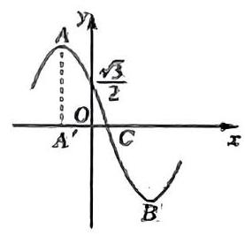

图1

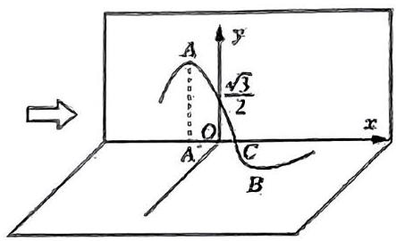

图2

10.【2023.9 格致开学考 11】已知函数 $f\left( x\right) , g\left( x\right)$ 在 $R$ 上可导,若 $f\left( x\right)  = g\left( x\right)$ ,则 ${f}^{\prime }\left( x\right)  = {g}^{\prime }\left( x\right)$ 成立. 据此英国数学家泰勒发现了一个恒等式: ${e}^{2x} = {a}_{0} + {a}_{1}x + {a}_{2}{x}^{2} + \cdots  + {a}_{n}{x}^{n} + \cdots$ ,则 $\mathop{\sum }\limits_{{n = 1}}^{{10}}\frac{{a}_{n + 1}}{n{a}_{n}} =$ ___.

# 高三春考一模中档题日日练 (5)

## 训练限时: 30 分钟

1.【2023.11 南模高三期中 5】计算: $\mathop{\sum }\limits_{{l = 1}}^{{+\infty }}{\left( \frac{1}{3}\right) }^{{2l} - 1} =$ ___.

2.【2023.11 南模高三期中 6】已知向量 $\overrightarrow{a}$ 与 $\overrightarrow{b}$ 的夹角为 $\frac{\pi }{3}$ ，且 $\left| \overrightarrow{a}\right|  = 3$ ， $\left| \overrightarrow{b}\right|  = 4$ ，则 $\overrightarrow{b}$ 在 $\overrightarrow{a}$ 方向上的投影为___。

3.【2023.10 奉贤月考 6】若 $f\left( x\right)$ 为可导函数，且 $\mathop{\lim }\limits_{{x \rightarrow  \infty }}\frac{f\left( {1 - {2x}}\right)  - f\left( 1\right) }{2x} =  - 1$ ，则过曲线 $y = f\left( x\right)$ 上点 $\left( {1, f\left( 1\right) }\right)$ 处的切线斜率为___。

4.【2023.11 六校联考高三期中 7】某校举办校运动会，需从某班级 3 名男同学 4 名女同学中选出 3 名志愿者，选出的 3 人中男女同学都有的概率为___。

5.【2023.9 选才周测 8】方程 $\frac{{x}^{2}}{1 + k} + \frac{{y}^{2}}{1 - k} = 1$ 表示双曲线，则实数 $k$ 的取值范围是___.

6.【2023.11 六校联考三期中 8】已知 $\bigtriangleup  {ABC}$ 的内角 $A, B, C$ 的对边分别为 $a, b, c$ ，若 $a = 8, b = 6, c = 4$ ,则 $\sin A =$ ___。

7. 【2023.10 南汇月考 8】已知函数 $y = f\left( x\right)$ 是定义在 $\mathbb{R}$ 上的奇函数,满足 $f\left( x\right)  = f\left( {x + 4}\right)$ ,当 $x \in  \lbrack 0,2)$ 时, $f\left( x\right)  = \ln \left( {x + 1}\right)$ ,则 $f\left( {2023}\right)  =$ ___.

8.【2023.9 进才月考 9】要使关于 $X$ 的不等式 $0 \leq  {x}^{2} + {ax} + 6 \leq  4$ 恰好只有一个解,则 $a =$ ___。

9.【2023.9 松江周测二 10】设函数 $f\left( x\right)  = \sin x - m\left( {x \in  \left\lbrack  {0,\frac{5\pi }{2}}\right\rbrack  }\right)$ 的零点为 ${x}_{1},{x}_{2},{x}_{3}$ , 若 ${x}_{1},{x}_{2},{x}_{3}$ 成等比数列,则 $m =$ ___.

10.【2023.9 上海实验开学考 10】若 $\overrightarrow{OA} = \left( {0,0,1}\right) ,\overrightarrow{OB} = \left( {2, - 1,2}\right) ,\overrightarrow{OC} = \left( {1,2,3}\right)$ ，则三棱锥 $O - {ABC}$ 的体积为___.

# 高三春考一模中档题日日练 (6)

## 训练限时: 30 分钟

1.【2023.11 嘉定二中高二期中 6 】已知函数 $f\left( x\right)  = \frac{x + 1}{a{x}^{2} - {2ax} + 1}$ 的定义域为 $R$ ，则实数 $a$ 的取值范围是___.

2.【2023.9 格致开学考 8】已知 $x > 1, y > 1,{xy} = {10}$ ，则 $\frac{1}{\lg x} + \frac{4}{\lg y}$ 的最小值为___.

3.【2023.9 松江周测二 8】设函数 $f\left( x\right)  = \left\{  \begin{array}{l} {\log }_{2}\left( {x + 1}\right) , x \geq  1 \\  1, x < 1 \end{array}\right.$ ,若 $f\left( {x + 1}\right)  > f\left( {2x}\right)$ ,则 $x$ 的取值范围为___。

4.【2023.11 六校联考高三期中 9】设 $x \in  R$ ,则方程 $\left| {x - 2}\right|  + \left| {{2x} - 3}\right|  = \left| {{3x} - 5}\right|$ 的解集为___。

5.【2023.9 洋泾开学考 9】在等差数列 $\left\{  {a}_{n}\right\}$ 中, ${a}_{1} = 7$ ,公差为 $d$ ,前项和为 ${S}_{n}$ ,当且仅当 $n = 8$ 时 ${S}_{n}$ 取得最大值，则 $d$ 的取值范围为___。

6.【2023.9 进才周测 10】已知等差数列 $\left\{  {a}_{n}\right\}$ 的公差为 $d\left( {d \neq  0}\right)$ ,前 $n$ 项和为 ${S}_{n}$ ,且数列 $\left\{  \sqrt{{S}_{n} + n}\right\}$ 也是公差为 $d$ 的等差数列,则 $d$ 的值为___.

7.【2023.9 上海实验练习三 10】已知 $3{\sin }^{2}\alpha  + 2{\sin }^{2}\beta  = 5\sin \alpha$ ,则 ${\sin }^{2}\alpha  + {\sin }^{2}\beta$ 的取值范围是___。

8.【2023.11 六校联考高三期中 10】已知函数 $f\left( x\right)  = \frac{{2}^{x}}{{2}^{x} + {3x}}$ ,若实数 $m$ , $n$ 满足 ${2}^{m + n} = {3mn}$ , 且 $f\left( m\right)  =  - \frac{1}{3}$ ,则 $f\left( n\right)  =$ ___.

9.【2023.11 六校联考高三期中 11】已知函数 $f\left( x\right)  = {x}^{2} + m, g\left( x\right)  = {2}^{x} - m$ ,若对任意的 ${x}_{1} \in  \left\lbrack  {-1,2}\right\rbrack$ ,总存在 ${x}_{2} \in  \left\lbrack  {0,3}\right\rbrack$ 使得 $f\left( {x}_{1}\right)  = g\left( {x}_{2}\right)$ 成立,则实数 $m$ 的取值范围是___.

10.【2023.10 南汇月考 11】已知函数 $f\left( x\right)  = {x}^{4} + {2a}{\log }_{2}\left( {\left| x\right|  + 2}\right)  - a - 1$ 的零点有且只有一个，则实数 $a$ 的取值集合为___.

# 高三春考一模中档题日日练 (7)

## 训练限时: 30 分钟

1.【2023.11 华东师大高三期中 7】已知 $\overrightarrow{a}$ 、 $\overrightarrow{b}$ 满足 $\left| {\overrightarrow{a} + 2\overrightarrow{b}}\right|  = 1$ ，且 $\overrightarrow{a} = \left( {1, - 1}\right)$ ，则 $\overrightarrow{b}$ 在 $\overrightarrow{a}$ 上数量投影的最小值为___。

2.【2023.10 凹杨月考 8】设 $x > 0, y > 1$ ,且 $\frac{1}{x} + \frac{1}{y - 1} = a$ ,若 $x + y$ 的最小值为 3,则实数 $a$ 的值为___。

3.【2023.10 奉贤月考 8】方程 $\lg \left( {\sin x}\right)  = \lg \left( {-\cos x}\right)$ 的解集为___.

4.【2023.11 华东师大高三期中 8】正四面体 ${ABCD}$ 的棱长为 2,则所有与 $A, B, C, D$ 距离相等的平面截这个四面体所得截面的面积之和为___.

5.【2023.9 上海实验练习三 9】已知函数 $f\left( x\right)  = \left| {x - 2}\right|  - {kx} + 1$ 恰有两个零点，则实数 $k$ 的取值范围是___。

6.【2023.11 杨高高三期中 9】正三棱锥 $P - {ABC}$ 的四个顶点同在一个半径为 2 的球面上， 若正三棱锥的侧棱长为 $2\sqrt{3}$ ，则正三棱锥的底面边长是___.

7.【2023.9 进才周练二 10】设 $m$ 是实数，已知集合 $P = \left\{  {\left( {x, y}\right)  \mid  {\left( x + 2\right) }^{2} + {\left( y - 3\right) }^{2} \leq  4}\right\}$ ， 集合 $Q = \left\{  {\left( {x, y}\right) \left| {\;{\left( x + 1\right) }^{2} + {\left( y - m\right) }^{2} < \frac{1}{4}}\right. }\right\}$ ，且 $P \cap  Q = Q$ ，则实数 $m$ 的取值范围是___.

8.【2023.10 复旦附中月考 10】若曲线 $y = \left( {x + a}\right) {e}^{x}$ 有两条过坐标原点的切线，则实数 $a$ 的取值范围是___.

9.【2023.9 松江周测 10】 $\bigtriangleup {ABC}$ 的内角 $A, B, C$ 的对边分别为 $a, b, c$ ,若 $\bigtriangleup {ABC}$ 的面积为 $\frac{{a}^{2} + {b}^{2} - {c}^{2}}{4}$ ，则 $C =$ ___。

10.【2023.11 杨高高三期中 11】如图， $D$ 是等边 $\bigtriangleup  {OBC}$ 内的动点，四边形 OADC 是平行四边形, $\left| {OA}\right|  = \left| {OD}\right|  = 1$ . 当 $\left| {\overrightarrow{OA} + \overrightarrow{OB}}\right|$ 取得最大值时, $\overrightarrow{OA} \cdot  \overrightarrow{OB} =$ ___.

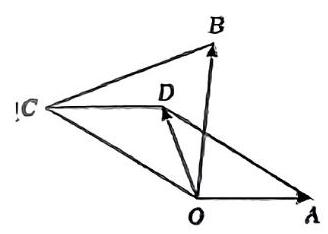

## 高三春考一模中档题日日练 (8)

训练限时: 30 分钟

1.【2023.11 杨高高二期中 5】若复数 $z$ 是 ${x}^{2} + x + 2 = 0$ 的一个根，则 $\left| z\right|  =$ ___。

2.【2023.11 格致高三期中 7】已知向量 $\overrightarrow{a},\overrightarrow{b}$ 满足 $\left| \overrightarrow{a}\right|  = 3,\left| \overrightarrow{b}\right|  = 4,\left| {\overrightarrow{a} + 2\overrightarrow{b}}\right|  = 7$ ，则 $\overrightarrow{a}$ 与 $\overrightarrow{b}$ 的夹角为___。

3.【2023.11 格致高三期中 8】给出下面四个命题:

①过一个球的球心和球面上任意两个点，有且只有一个平面；

②若直线 $a//$ 直线 $b$ ，直线 $b \subset$ 平面 $\alpha$ ，则直线 $a//$ 平面 $\alpha$ ；

③若直线 $a \bot$ 直线 $b$ ，直线 $a \bot$ 直线 $c$ ，直线 $b, c \subset$ 平面 $\alpha$ ，则直线 $a \bot$ 平面 $\alpha$ ；

④若直线 $a$ 垂直于直线 $b$ 在平面 $\alpha$ 内的射影,则直线 $a \bot$ 直线 $b$ 。

则上述结论不正确的有___。(填原号)

4.【2023.9 华二开学考二 8】若 “ $\left\{  \begin{array}{l} {x}_{1} > a \\  {x}_{2} > a \end{array}\right.$ ” 是 “ $\left\{  \begin{array}{l} {x}_{1} + {x}_{2} > {2a} \\  {x}_{1}{x}_{2} > {a}^{2} \end{array}\right.$ 的必要不充分条件,则实数 $a$ 的取值范围是___。

5.【2023.10 市北月考 8】已知函数 $y = f\left( x\right)$ 是定义在 $R$ 上的奇函数,且当 $x < 0$ 时， $f\left( x\right)  = {e}^{ax}$ 。若 $f\left( {\ln 2}\right)  =  - 4$ ，则实数 $a$ 的值为___。

6.【2023.10 南洋模范开学考 9】等腰三角形一腰的中线长为 2，则该三角形面积的最大值为___.

7.【2023.9 交大摸底考 9】已知某种生物由出生算起活到 60 岁的概率是 0.8 , 活到 65 岁的概率是 0.6 ，则一头 60 岁的该种动物活动 65 岁的概率是

8.【2023.11 华东师大高三期中 9】设 $n \in  {N}^{ * },{a}_{n}$ 为 ${\left( x + 4\right) }^{n} - {\left( x + 1\right) }^{n}$ 的展开式的各项系数之和, ${b}_{n} = \left\lbrack  \frac{{a}_{1}}{5}\right\rbrack   + \left\lbrack  \frac{2{a}_{2}}{{5}^{2}}\right\rbrack   + \cdots  + \left\lbrack  \frac{n{a}_{n}}{{5}^{n}}\right\rbrack$ ( $\left\lbrack  x\right\rbrack$ 表示不超过实数 $x$ 的最大整数),则 ${\left( n - t\right) }^{2} + {\left( {b}_{n} - 2 + t\right) }^{2}\;\left( {t \in  R}\right)$ 的最小值为___.

9.【2023.11 华东师大高三期中 10】已知抛物线 $y = a{x}^{2}\left( {a > 0}\right)$ ,在 $y$ 轴正半轴上存在一点 $P$ ,使过 $P$ 的任意直线交抛物线于 $M, N$ ,都有 $\frac{1}{{\left| MP\right| }^{2}} + \frac{1}{{\left| NP\right| }^{2}}$ 为定值,则点 $P$ 的坐标为 ___。

10.【2023.9 嘉定开学考 10】函数 $f\left( x\right)$ 是偶函数，当 $x \geq  0$ 时， $f\left( x\right)  = {2x} + {2}^{x} - 1$ ，则不等式 $f\left( x\right)  > 3$ 的解集为___.

# 高三春考一模中档题目日练 (9)

## 训练限时: 30 分钟

1.【2023.11 华东师大高三烟中 6】记 ${S}_{n}$ 为等比数列 $\left\{  {a}_{n}\right\}$ 的前 $n$ 项和,若 ${S}_{4} =  - 5,{S}_{6} = {21}{S}_{1}$ ， 则 ${S}_{3} =$ ___。

2.【2023.11 杨高高三期中 7】在平面直角坐标系中，以抛物线 ${y}^{2} = {4x}$ 的焦点为圆心且与直线 $y = x$ 相切的圆的面积为 ___.

3.【2023.11 锅高高三期中 8】若不等式 $\left| {x - 1}\right|  + \left| {x - a}\right|  \geq  {2a}$ 对任意实数 $x$ 均成立，则实数 $a$ 的取值范围是 ___。

4. 【2023.11 格致高三期中 9】过直线 $y = x$ 上的一点作圆 ${\left( x - 5\right) }^{2} + {\left( y - 1\right) }^{2} = 2$ 的两条切线 ${l}_{1},{l}_{2}$ ，当直线 ${l}_{1},{l}_{2}$ 关于直线 $y = x$ 对称时，它们之间的夹角为___.

5.【2023.9 松江周测一9】已知集合 $A = \left\{  {x\left| {\;\frac{2}{x - 2} \geq  1}\right. , x \in  R}\right\}$ ，设函数 $y = {\log }_{\frac{1}{2}}x + a,\left( {x \in  A}\right)$ 的值域为 $B$ ，若 $B \subseteq  A$ ，则实数 $a$ 的取值范围为___.

6.【2023.9 交大开学考 9】设 $f\left( x\right)  = 1 + \left| x\right|  - \frac{1}{1 + {x}^{2}}$ ，则使得不等式 $f\left( {{\log }_{2}x}\right)  > f\left( {-2{\log }_{\frac{1}{2}}x - 1}\right)$ 成立的实数 $x$ 的取值范围是___

7.【2023.9 上海实验开学考 9】函数 $f\left( x\right)  = {\log }_{a}\left( {a{x}^{2} - {4x} + 9}\right)$ 在区间 $\left\lbrack  {1,3}\right\rbrack$ 上严格递增， 则实数 $a$ 的取值范围是___.

十年寒窗

8.【2023.9 复兴摸底考 10】从正方体的 8 个顶点中任选 4 个，则这 4 个点在同一个平面的概率是___(结果用最简分数表示)

9.【2023.11 格致高三期中 10】已知

${\left( 1 + {2024}x\right) }^{50} + {\left( {2024} - x\right) }^{50} = {a}_{0} + {a}_{1}x + {a}_{2}{x}^{2} + \cdots  + {a}_{50}{x}^{50}$ ,其中 ${a}_{0},{a}_{1},{a}_{2},\cdots ,{a}_{50} \in  R$ , 若 ${a}_{k} < 0, k \in  \{ 0,1,2,\cdots ,{50}\}$ ,则实数 $k$ 的最大值为___.

10.【2023.9 敬业开学考 11】设 $m$ 是实数，已知集合 $P = \left\{  {\left( {x, y}\right)  \mid  {\left( x + 2\right) }^{2} + {\left( y - 3\right) }^{2} \leq  4}\right\}$ ， 集合 $Q = \left\{  {\left( {x, y}\right) \left| {\;{\left( x + 1\right) }^{2} + {\left( y - m\right) }^{2} < \frac{1}{4}}\right. }\right\}$ ，且 $P \cap  Q = Q$ ，则 $m$ 的取值范围是___.

## 高三春考一模中档题日日练 (10)

训练限时: 30 分钟

1.【2023.9 市西开学考 6】盒中装着标有数字 1、2、3、4 的卡片各 2 张，从盆中任意取 3 张，每张卡片被抽出的可能性都相等，则抽出的 3 张卡片上最大的数字是 4 的概率___。

2.【2023.9 杨浦开学考 7】已知直线 ${ax} + y - 2 + a = 0$ 在两坐标轴上的截距相等,则实数 $a =$ ___。

3.【2023.9 上海实验练习二 8】已知命题 $p : \left| {4 - x}\right|  \leq  6, q : {x}^{2} - {2x} + 1 - {a}^{2} \geq  0\left( {a > 0}\right)$ , 若非 $p$ 是 $q$ 的充分不必要条件,则实数 $a$ 的取值范围是___。

4.【2023.9 向明开学考 8】正四棱锥 $P - {ABCD}$ 底面的四个顶点 $A, B, C, D$ 在球 $O$ 的同一个大圆上，点 $P$ 在球面上，如果 ${V}_{P - {ABCD}} = \frac{16}{3}$ ，则球 $O$ 的表面积是___.

5.【2023.9 上海中学周测一8】向量 $\left| \overrightarrow{a}\right|  = \left| \overrightarrow{b}\right|  = 1,\left| \overrightarrow{c}\right|  = \sqrt{2}$ ，且 $\overrightarrow{a} + \overrightarrow{b} + \overrightarrow{c} = \overrightarrow{0}$ ，则 $\cos \langle \overrightarrow{a} - \overrightarrow{c},\overrightarrow{b} - \overrightarrow{c}\rangle  =$ ___.

6.【2023.9 进才周练 9】已知 $F$ 是抛物线 $C : {y}^{2} = {4x}$ 的焦点， $P$ 是抛物线 $C$ 上一动点， $Q$ 是曲线 ${x}^{2} + {y}^{2} - {8x} - {2y} + {16} = 0$ 上一动点，则 $\left| {PF}\right|  + \left| {PQ}\right|$ 的最小值为___.

7.【2023.10 复兴月考 9】已知 $1, a, b$ 是三角形的三边长,且 $a, b$ 是方程 ${x}^{2} - {2x} + m = 0$ 的两个根,则实数 $m$ 的取值范围是___.

8.【2023.9 上海实验练习一 10】已知 $a, b \in  R$ ，函数 $f\left( x\right)  = x + \frac{a}{x} + b$ 在区间 $\left( {0,1}\right)$ 上有两个不同零点，则 ${a}^{2} + \left( {b + 1}\right) a$ 的取值范围是___.

9.【2023.10 市北月考 10】若对关于 $x$ 的不等式 ${2k}{x}^{2} + {kx} + \frac{1}{8} > 0$ 对一切任意 $x \in  \left( {-\frac{1}{8}, + \infty }\right)$ 都成立，则实数 $k$ 的取值范围是___.

10.【2023.9 华二开学考 11】已知等比数列 $\left\{  {a}_{n}\right\}$ 严格增,且 ${a}_{2} + {a}_{4} = {90},{a}_{3} = {27}$ . 记 ${b}_{m}$ 为 $\left\{  {a}_{n}\right\}$ 在区间 $(0, m\rbrack$ ( $m$ 为正整数) 中的项的个数,则数列 $\left\{  {b}_{n}\right\}$ 的前 2023 项的和为 ___。

## 高三春考一模中档题日日练 (11)

训练限时: ${30}\mathrm{\;{min}}$

1.【2023.11 同济二附中期中 6】在 $\bigtriangleup {ABC}$ 中,若 ${AB} = 2,\angle B = \frac{5\pi }{12},\angle C = \frac{\pi }{4}$ ,则 ${BC} =$ ___。

2.【2023.11 位育期中 7】设 $f\left( x\right)  = \frac{1}{x} - \lg x$ ，则不等式 $f\left( {\frac{1}{x} - 1}\right)  < 1$ 的解集为___.

3.【2023.11 上大附中期中 8】已知一组数据 $a\text{ 、 }3\text{ 、 } - 2\text{ 、 }6$ 的中位数为 4，则其总体方差为___。

4.【2023.11 上海中学期中 8 】已知存在 ${x}_{1} \in  \left\lbrack  {1,3}\right\rbrack$ ,对任意 ${x}_{2} \in  \left\lbrack  {-1,1}\right\rbrack$ ,不等式 $\frac{{x}_{1}^{2} + 4}{{x}_{1}} \geq  2{x}_{2} + 3 + a$ 成立，则实数 $a$ 的取值范围是___.

5.【2023.11 位育期中 8】若正实数 $x, y$ 满足 $x + y = 1$ ，则 $\frac{1}{x} - \frac{4y}{y + 1}$ 的最小值为___.

6.【2023.5 嘉定二中三模 9】已知 $n \in  \mathbf{N}, n \geq  1$ ,将数列 $\{ {2n} - 1\}$ 与数列 $\left\{  {{n}^{2} - 1}\right\}$ 的公共项从小到大排列得到新数列 $\left\{  {a}_{n}\right\}$ ,则 $\mathop{\sum }\limits_{{n = 1}}^{{100}}\frac{1}{{a}_{n}} =$ ___.

7.【2023.11 位育期中 9】设 $P$ 是曲线 $y =  - {x}^{3} + x + \frac{2}{3}$ 上任意一点,则曲线在点 $P$ 处的切线的倾斜角 $\alpha$ 的取值范围是___.

8.【2023.11 同济二附中期中 10】正方形 ${ABCD}$ 的边长为 2，点 $E$ 和 $F$ 分别是边 ${BC}$ 和 ${AD}$ 上的动点 (与 $A\text{ 、 }B\text{ 、 }C\text{ 、 }D$ 四点不重合),且 ${CE} = {AF}$ ,则 $\overrightarrow{AE} \cdot  \overrightarrow{AF}$ 的取值范围为___.

9.【2023.5 控江模拟 10】已知集合 $M = \{ 1,2,3,\cdots ,{10}\}$ ，集合 $A \subseteq  M$ ，定义 $M\left( A\right)$ 为 $A$ 中元素的最大值，当 $A$ 取遍 $M$ 的所有非空子集时，对应的 $M\left( A\right)$ 的和记为 ${S}_{10}$ ，则 ${S}_{10} =$ ___；

10.【2023.11 北郊期中 11】平面上的三个单位向量 $\overrightarrow{a},\overrightarrow{b},\overrightarrow{c}$ 满足 $2\overrightarrow{c} = 3\overrightarrow{a} + 4\overrightarrow{b}$ ，则 $\overrightarrow{a},\overrightarrow{b},\overrightarrow{c}$ 两两间的夹角中，最小的角的大小为___.

## 高三春考一模中档题日日练 (12)

## 训练限时:30min

1.【2023.11 位育期中 5】若定义在 $R$ 上的函数 $y = f\left( x\right)$ 为奇函数，设 $F\left( x\right)  = {af}\left( x\right)  - 1$ ， 且 $F\left( 1\right)  = 3$ ，则 $F\left( {-1}\right)$ 的值为___.

2.【2023.11 上海中学期中 6】设 $f\left( x\right)$ 是定义在 $R$ 上以 2 为周期的偶函数,当 $x \in  \left\lbrack  {0,1}\right\rbrack$ 时， $f\left( x\right)  = {\log }_{2}\left( {x + 1}\right)$ ，则当 $x \in  \left\lbrack  {1,2}\right\rbrack$ 时， $f\left( x\right)  =$ ___。

3. 【2023.5 建平周测 6】方程 $\cos {2x} - \sin x = 0$ 在区间 $\left\lbrack  {0,{2\pi }}\right\rbrack$ 上的所有解的和为___. 4.【2023.5 宜川模拟 8】函数 $y = \sin {2x} + 2\sin x$ 的最大值为___。

5.【2023.11 同济二附中期中 8】已知花博会有四个不同的场馆 $A$ 、 $B$ 、 $C$ 、 $D$ ，甲、乙两人每人选 2 个参观, 则他们的选择中, 恰有一个场馆相同的概率是___。

6.【2023.11 四校联考期中 8】已知 ${\left( {x}^{3} + \frac{2}{{x}^{2}}\right) }^{n}$ 的展开式中各项系数和为 243,则展开式中常数项为___.

7.【2023.5 复附三模 9】已知复数 $z$ 在复平面内对应的点是 $A$ ，其共轭复数 $\bar{z}$ 在复平面内对应的点是 $B, O$ 是坐标原点,若 $A$ 在第一象限,且 ${OA} \bot  {OB}$ ,则 $\frac{z + \bar{z}}{z - \bar{z}} =$ ___.

8.【2023.11 上大附中期中 9】由函数的观点，不等式 $\ln x < 4 - {4}^{x}$ 的解集是___.

9.【2023.11 上海中学期中 10】已知正实数 $a, b$ 满足 $a + b = 1$ ,则 $\frac{{\left( a + 1\right) }^{2}}{a} + \frac{{\left( b + 4\right) }^{2}}{b}$ 的最小值为___.

10.【2023.5 华附模拟 10】设复数 $z$ 满足 $\left| z\right|  = 1$ ，且使得关于 $x$ 的方程 $z{x}^{2} + {2zx} + 3 = 0$ 有实根，则所有这样的复数 $z$ 的和为___.

## 高三春考一模中档题日日练(13)

训练限时: 30min

1.【2023.11 位育期中 6】如图,在三棱柱 ${A}_{1}{B}_{1}{C}_{1} - {ABC}$ 中， $D, E, F$ 分别为 ${AB},{AC}$ ， $A{A}_{1}$ 的中点,设三棱锥 $F - {ADE}$ 体积为 ${V}_{1}$ ,三棱柱 ${A}_{1}{B}_{1}{C}_{1} - {ABC}$ 的体积为 ${V}_{2}$ ,则 ${V}_{1} : {V}_{2} =$ ___。

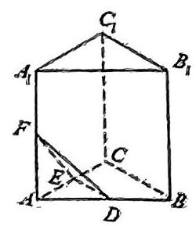

2.【2023.11 曹杨期中 8】已知 $a, b \in  R$ ，且 ${a}^{2} + {b}^{2} = 2$ ，则 $a + b$ 的取值范围为___.

3.【2023.11 建平期中 8】若 $x = e$ 是函数 $y = \left( {x - a}\right) \ln x$ 的驻点，则实数 $a$ 的值为___。

4.【2023.5 七宝三模 8】已知 $f\left( x\right)  = \sin {\omega x}$ ,若在 $\left\lbrack  {0,\frac{\pi }{2}}\right\rbrack$ 上恰有两个不相等的实数 $a$ 、 $b$ 满足 $f\left( a\right)  + f\left( b\right)  = 2$ ，则实数 $\omega$ 的取值范围是___.

5.【2023.11 同济二附中期中 9】若等比数列 $\left\{  {a}_{n}\right\}$ 的前 $n$ 项和为 ${S}_{n}$ ，且满足 ${S}_{n} = {a}_{n + 1} - 3$ ， 则数列 $\left\{  {a}_{n}\right\}$ 的通项公式 ${a}_{n} =$ ___.

6.【2023.11 北郊期中 9】设等差数列 $\left\{  {a}_{n}\right\}$ 的前 $n$ 项和为 ${S}_{n}$ ,若 ${S}_{9} = {72}$ , 则 ${a}_{2} + {a}_{4} + {a}_{9} =$ ___。

7.【2023.11 建平期中 10 】已知 $z$ 为复数， $\bar{z}$ 为 $z$ 的共轭复数，设 $\omega  = \frac{z}{z}$ ，则 $\operatorname{Im}\omega$ 的最大值为___。

8.【2023.11 曹杨期中 10】已知 $A \in  R$ ，实数 $\omega  > 0$ ， $f\left( x\right)  = A\sin \left( {{\omega x} + \frac{\pi }{6}}\right)$ ，函数 $y = f\left( x\right)$ 的部分图像如图所示，若该函数的最小正零点是 $\frac{5\pi }{12}$ ，则 $\omega  =$ ___。

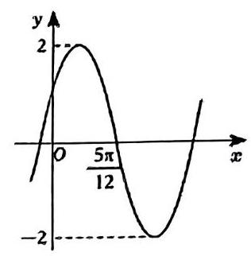

9.【2023.5 嘉定三模 10】已知 $\left\{  {a}_{n}\right\}$ 是等差数列,若 $\frac{{a}_{11}}{{a}_{10}} <  - 1$ ,且它的前 $n$ 项和 ${S}_{n}$ 有最大值,则当 $n =$ ___时, ${S}_{n}$ 取得最小正值.

10【2023.11 上闵外期中 10】已知 $\omega  \geq  0$ ，在函数 $y = 3\sin {\omega x}$ 与 $y = 3\cos {\omega x}$ 的图像的交点中,距离最短的两个交点的距离为 $3\sqrt{3}$ ,则 $\omega$ 的值为___

11.【2023.5 华附模拟 11】已知复数 $w = 3 + \sqrt{3}\mathrm{i}, z = \lambda \bar{w}$ ，其中 $\lambda  \in  \left\lbrack  {0,1}\right\rbrack$ . 则 $\left| {z - w}\right|  + \left| {z - 2}\right|$ 的最小值为 ___.

## 高三春考一模中档题日日练 (14)

## 训练限时:30min

1.【2023.5 处平凡测 5】已知复数 $z$ 满足 $z \cdot  {\left( 1 - \mathrm{i}\right) }^{2} = 2 + 6\mathrm{i}$ ( $\mathrm{i}$ 为虚数单位)，则 $\left| z\right|  =$ ___。 2. 【2023.5 徐汇三模 6】 ${\left( x + \frac{3}{x}\right) }^{n}$ 的二项展开式的各项系数之和为 256,则该二项展开式中的常数项为___。

3.【2023.5 延安三模 7】在数列 $\left\{  {a}_{n}\right\}$ 中, ${a}_{1} = 1$ ,且 $\frac{2}{{a}_{n}} - \frac{1}{{a}_{n + 1}} = 0$ ,设 ${S}_{n}$ 为数列 $\left\{  {a}_{n}\right\}$ 的前 $n$ 项和,则 $\mathop{\lim }\limits_{{n \rightarrow   + \infty }}{S}_{n} =$ ___。

4. 【2023.11 上闵外期中 8】已知函数 $y = f\left( x\right)$ ，若 ${f}^{\prime }\left( {x}_{0}\right)  =  - 3$ ，则 $\mathop{\lim }\limits_{{h \rightarrow  0}}\frac{f\left( {{x}_{0} + h}\right)  - f\left( {{x}_{0} - {2h}}\right) }{h} =$ ___。

5.【2023.5 华附模拟 8】在等差数列 $\left\{  {a}_{n}\right\}$ 中,已知 ${a}_{1} = {13},3{a}_{2} = {11}{a}_{6}$ ,则数列 $\left\{  {a}_{n}\right\}$ 的前 $n$ 项和 ${S}_{n}$ 的最大值为 ___。

6.【2023.5 南洋周练 8】已知袋中有 $8 + n\left( {n \geq  2, n \in  {N}^{ * }}\right)$ 个大小相同的编号球,其中黄球 8 个,红球 $n$ 个,从中任取两个球,取出的两球是一黄一红的概率为 ${P}_{n}$ ,则 ${P}_{n}$ 的最大值为___。

7.【2023.11 上海中学期中 9】设函数 $f\left( x\right)  = \left\{  \begin{array}{l}  - {ax} + 4, x < a \\  {\left( x - 2\right) }^{2}, x \geq  a \end{array}\right.$ 存在最小值,则实数 $a$ 的取值范围是___.

8.【2023.11 曹杨期中 9】若过点 $P\left( {0, - 1}\right)$ 的直线 $l$ 与抛物线 ${y}^{2} = {2x}$ 恰有一个公共点,则直线 $l$ 的方程为___。

9.【2023.11 四校联考期中 10】在 $\bigtriangleup {ABC}$ 中，各个顶点与对边中点连线，相交于一点， 定义为三角形的重心 $G$ ,此时易得 $\overrightarrow{AG} = \frac{1}{3}\left( {\overrightarrow{AB} + \overrightarrow{AC}}\right)$ . 类似在三棱锥 $P - {ABC}$ 中,各个顶点分别与对面三角形的重心的连线,相交于一点,定义为三棱锥的重心 $G$ . 若设 $\overrightarrow{PA} = \overrightarrow{a}$ , $\overrightarrow{PB} = \overrightarrow{b},\overrightarrow{PC} = \overrightarrow{c}$ ，则 $\overrightarrow{PG} =$ ___. (用 $\overrightarrow{a}$ 、 $\overrightarrow{b}$ 、 $\overrightarrow{c}$ 表示)

10.【2023.11 建平期中 11】设双曲线 $\Gamma  : \frac{{x}^{2}}{{a}^{2}} - \frac{{y}^{2}}{{b}^{2}} = 1\left( {a > 0, b > 0}\right)$ 的左、右焦点分别为 ${F}_{1}$ 和 ${F}_{2}$ ,以 $\Gamma$ 的实轴为直径的圆记为 $C$ ,过点 ${F}_{1}$ 作 $C$ 的切线 $l, l$ 与 $\Gamma$ 的两支分别交于 $A, B$ 两点, 且 $\cos \angle {F}_{1}B{F}_{2} = \frac{3}{5}$ ,则 $\Gamma$ 的离心率的值为___.

# 高三春考一模中档题目日练 (15)

训练限时: 30min

1.【2023.5 华附模拟 5】已知无穷等比数列 $\left\{  {a}_{n}\right\}$ 中, ${a}_{1} = \frac{1}{3},{a}_{3}^{2} = {a}_{6}$ ,则 $\mathop{\sum }\limits_{{n = 1}}^{{+\infty }}{a}_{n} =$ ___.

2 【2023.5 商洋三模 6】已知 $1 < a < 4$ ，则 $\frac{a}{4 - a} + \frac{1}{a - 1}$ 的最小值是___.

3. 【2023.11 曹杨期中 6】为了解某校高三年级男生的体重，从该校高三年级男生中抽取 17 名，测得他们的体重数据如下(按从小到大的顺序排列，单位: ${kg}$ )

5656575859596163646566676870737483

据此估计该校高三年级男生体重的第 75 百分位数为___ ${kg}$

4.【2023.5 华附模拟 7】不等式 $\frac{{3x} + 5}{x - 1} \geq  x$ 的解集是 ___。

5.【2023.5 七宝综合练习 8】若函数 $f\left( x\right)  = \sin \left( {x + \varphi }\right)  + \cos x$ 的最小值为 -2，则常数 $\varphi$ 的一个取值为___.

6.【2023.11 建平期中 9】关于 $x$ 的不等式 $\sin x \geq  {\cos }^{2}x + a$ 对任意 $x \in  R$ 恒成立，则实数 $a$ 的最大值为___.

十年寒窗

7.【2023.5 华附模拟 9】一猎人带着一把猎枪到山里去打猎，猎枪每次可以装 3 发子弹. 当他遇见一只野兔时，开第一枪命中野兔的概率为 0.8 ；若第一枪没有命中，猎人开第二枪， 命中野免的概率为 0.4 ; 若第二枪也没有命中，猎人开第三枪，命中野兔的概率为 0.2 ，若 3 发子弹都没打中，野兔就逃跑了。则已知野兔被击中的条件下，是猎人开第二枪命中的概率为___.

8.【2023.5 七宝三模 110】在 $\bigtriangleup  {ABC}$ 中，角 $A$ 、 $B$ 、 $C$ 所对的边分别为 $a$ 、 $b$ 、 $c$ ， $\angle B = \frac{\pi }{3}$ ， $\angle B$ 的平分线交 ${AC}$ 于 $D$ ,若 ${BD} = \sqrt{3}$ ,则 $a + {2c}$ 的最小值为___.

9.【2023.5 嘉定二中三模 11】设函数 $y = f\left( x\right) , x \in  \mathrm{R}$ 的导函数是 ${f}^{\prime }\left( x\right) , f\left( {-x}\right)  + f\left( x\right)  = {x}^{2}$ , 当 $x > 0$ 时， ${f}^{\prime }\left( x\right)  > x$ ，那么关于 $a$ 的不等式 $f\left( {2 - a}\right)  - f\left( a\right)  \geq  2 - {2a}$ 的解是___.

# 高三春考一模中档题日日练(16)

## 训练限时:30min

1.【2023.11 上闭外期中 6】设 ${x}_{1}\text{ 、 }{x}_{2}$ 是方程 ${x}^{2} + x - 3 = 0$ 的两个实数根，则 ${x}_{1}^{2} - {x}_{2} + {2020} =$ ___。

2.【2023.10 复旦附中月考 7】在 $\bigtriangleup  {ABC}$ 中，内角 $A, B, C$ 所对的边分别为 $a, b, c$ ， 若 $\left( {a + c}\right) \left( {\sin A - \sin C}\right)  = b\left( {\sin A - \sin B}\right)$ ,则 $\angle C =$ ___。

3.【2023.5 徐汇三模 8】若无穷等比数列 $\left\{  {a}_{n}\right\}$ 的前 $n$ 项和为 ${S}_{n},\mathop{\lim }\limits_{{n \rightarrow   + \infty }}{S}_{n} = 4$ ,则首项 ${a}_{1}$ 的取值范围是___。

4.【2023.5 建平周测 8】在 $\bigtriangleup {ABC}$ 中,边 $a, b, c$ 满足 $a + b = 6,\angle C = {120}^{ \circ  }$ ,则边 $c$ 的最小值___。

5.【2023.5 位育模拟 8】若等式 $1 + x + {x}^{2} + {x}^{3} = {a}_{0} + {a}_{1}\left( {1 - x}\right)  + {a}_{2}{\left( 1 - x\right) }^{2} + {a}_{3}{\left( 1 - x\right) }^{3}$ 对一切 $x \in  \mathbf{R}$ 都成立,其中 ${a}_{0},{a}_{1},{a}_{2},{a}_{3}$ 为实常数,则 ${a}_{1} + {a}_{2} + {a}_{3}$ 的值为___

6.【2023.11 四校联考期中 9】圆锥曲线的光学性质应用非常广泛, 如图所示, 从双曲线右焦点 ${F}_{2}$ 发出的光线通过双曲线镜面反射出发散光线,且反射光线的反向延长线经过左焦点 ${F}_{1}$ 。已知双曲线的离心率 $e = 5$ ，则当入射光线 ${F}_{2}P$ 和反射光线 ${PE}$ 互相垂直时(其中 $P$ 为入射点) $\angle {F}_{1}{F}_{2}P =$ ___。

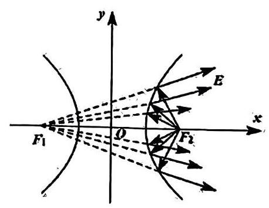

7.【2023.5 交附三模 10】若随机变量 $X \sim  N\left( {{105},{19}^{2}}\right) , Y \sim  N\left( {{100},{9}^{2}}\right)$ ,若 $P\left( {X \leq  A}\right)  = P\left( {Y \leq  A}\right)$ ,那么实数 $A$ 的值为___；

8.【2023.11 位育期中 10】已知一圆锥底面圆的直径为 3，圆锥的高为 $\frac{3\sqrt{3}}{2}$ ，在该圆锥内放置一个棱长为 $a$ 的正四面体,并且正四面体在该几何体内可以任意转动,则 $a$ 的最大值为___.

9.【2023.5 延安三模 11】已知函数 $y = f\left( x\right)$ 的表达式为 $f\left( x\right)  = 3 \cdot  {2}^{x} - 1$ ，若对于任意 ${x}_{1} \in  \left\lbrack  {0,1}\right\rbrack$ ,都存在 ${x}_{2} \in  \left\lbrack  {0,1}\right\rbrack$ ,使得 $f\left( {x}_{1}\right)  + f\left( {{x}_{2} + m}\right)  = {10}$ 成立,则实数 $m$ 的取值范围是___.

10.【2023.11 上大附中期中 11】一个“皇冠”状的空间图形由一个正方形和四个正三角形组成,并且正方形与每个正三角形所成的二面角的大小均为 $\theta$ ,如果把两个这样的 “皇冠” 倒扣在一起，可以围成一个十面体，则 $\cos \theta  =$ ___.

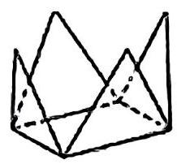

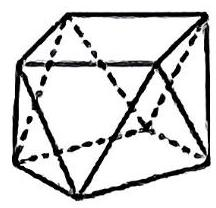

# 高三春考一模中档题日日练 (17)

训练限时: ${30}\mathrm{{min}}$

1.【2023.5 嘉定三模 5】在 $\bigtriangleup  {ABC}$ 中，已知 $b\sin {2A} + a\sin B = 0$ ，则角 $A$ 的大小为___。

2.【2023.9 上海中学开学考 6】非空集合 $A$ 中所有元素乘积记为 $T\left( A\right)$ 。已知集合 $M = \{ 1,4,5,7,8\}$ ,从集合 $M$ 的所有非空子集中任选一个子集 $A$ ,则 $T\left( A\right)$ 为偶数的概率为___。(结果用最简分数表示)

3. 【2023.5 七宝综合练习 6】若 ${x}^{8} = {a}_{0} + {a}_{1}\left( {x - 1}\right)  + \cdots  + {a}_{7}{\left( x - 1\right) }^{7} + {a}_{8}{\left( x - 1\right) }^{8}$ 则 ${a}_{7} =$ ___。

4.【2023.10 行知月考 7】已知向量 $\overrightarrow{m} = \left( {-1,2}\right) ,\overrightarrow{n} = \left( {2,\lambda }\right)$ ，若 $\overrightarrow{m} \bot  \overrightarrow{n}$ ，则 $2\overrightarrow{m} + \overrightarrow{n}$ 在 $\overrightarrow{m}$ 上的投影向量为___。

5.【2023.5 嘉定三模 8】若关于 $x$ 的方程 $2{\sin }^{2}x - \sqrt{3}\sin {2x} + m - 1 = 0$ 在 $\left( {\frac{\pi }{2},\pi }\right)$ 上有实数解,则实数 $m$ 的取值范围是___.

6.【2023.5 进才周练 8】已知 $x, y \in  \left( {0, + \infty }\right)$ ,且 $\left( {1 + x}\right) \left( {1 + {2y}}\right)  = 4$ ,则 $\frac{xy}{2} + \frac{1}{xy}$ 的最小值是___

7.【2023.5 大同月考 9】已知两个随机变量 $X\text{ 、 }Y$ ,其中 $X \sim  B\left( {4,\frac{1}{4}}\right)$ ,

$Y \sim  N\left( {\mu ,{\sigma }^{2}}\right) \left( {\sigma  > 0}\right)$ ,若 $E\left\lbrack  X\right\rbrack   = E\left\lbrack  Y\right\rbrack$ ,且 $P\left( {\left| Y\right|  < 1}\right)  = {0.4}$ ,则 $P\left( {Y > 3}\right)  =$ ___.

8.【2023.11 上闵外期中 9】已知 $A, B$ 是球 $O$ 的球面上两点， $\angle {AOB} = {60}^{ \circ  }, P$ 为该球面上的动点，若三棱锥 $P - {OAB}$ 体积的最大值为 6，则球 $O$ 的表面积为___.

9.【2023,11 曹杨期中 11】已知关于 $x$ 的方程 ${x}^{2} - {2ax} + 4 - {3a} = 0$ 的两个根为 ${x}_{1}\text{ 、 }{x}_{2}$ ， 且在区间 $\left( {{x}_{1},{x}_{2}}\right)$ 内恰好有两个正整数，则实数 $a$ 的取值范围是___.

10.【2023.11 上海中学期中 11】已知正实数 $a, b$ 满足 $\frac{1}{{a}^{2}} + \frac{1}{{b}^{2}} = {25}$ ,则 $\frac{\left| 3a + 4b - 1\right| }{\sqrt{{a}^{2} + {b}^{2}}}$ 的最小值为___。

# 高三春考一模中档题日日练(18)

训练限时: 30min

1.【2023.9 上海实验练习三 6】若 $\tan \alpha  = \frac{-\cos \alpha }{3 + \sin \alpha }$ ，则 $\cos {2\alpha } =$ ___.

2.【2023.9 建平开学考 6】若“ ${x}^{2} > 1$ ” 是 “ $x < a$ ” 的必要条件，则实数 $a$ 的最大值为 ___。

3. 【2023.5 位育三模 7】已知 ${\left( 2 - \sqrt{3}x\right) }^{8} = {a}_{0} + {a}_{1}x + {a}_{2}{x}^{2} + \cdots  + {a}_{8}{x}^{8}$ ,其中 ${a}_{0}\text{ 、 }{a}_{1}\text{ 、 }{a}_{2}\text{ 、 }\cdots \text{ 、 }{a}_{8}$ 是常数,则 ${\left( {a}_{0} + {a}_{2} + \cdots  + {a}_{8}\right) }^{2} - {\left( {a}_{1} + {a}_{3} + \cdots  + {a}_{7}\right) }^{2}$ 的值为___；

4.【2023.9 南洋开学考 7】若 $f\left( x\right)$ 的值域为 $\{ 0,1,2\}$ ，则 $g\left( x\right)  = \left( {f\left( x\right)  - x}\right) \left( {f\left( x\right)  - {2x}}\right)$ 至多有___个零

5.【2023.9 进才月考 7】设向量 $\overrightarrow{a}\text{ 、 }\overrightarrow{b}$ 满足 $\left| \overrightarrow{a}\right|  = 6,\left| \overrightarrow{b}\right|  = 3$ ，且 $\overrightarrow{a} \cdot  \overrightarrow{b} =  - {12}$ ，则向量 $\overrightarrow{a}$ 在向量 $\overrightarrow{b}$ 方向上的投影是___.

6.【2023.9 宜川周测一 8】已知集合 $A = \{ \left( {x, y}\right) \left| {y = m}\right| x \mid  \} , B = \{ \left( {x, y}\right)  \mid  y = x + m\}$ ,若集合 $A \cap  B$ 中仅含有一个元素，则实数 $m$ 的取值范围是___.

7.【2023.9 华二开学考二 9】若直线 ${ex} - {4y} + \mathrm{e}\ln 4 = 0$ 是指数函数 $y = {a}^{x}\left( {a > 0\text{ 且 }a \neq  1}\right)$ 图像的一条切线,则底数 $a =$ ___.

## 十年寒窗

8.【2023.11 上闵小册中 11】设 $a, b \in  \mathbf{R}$ ，且 $a + b = 4$ ，则 $\frac{1}{{a}^{2} + 5} + \frac{1}{{b}^{2} + 5}$ 的最大值为___

9.【2023.5 复附三模 11】若项数为 10 的数列 $\left\{  {a}_{n}\right\}$ ,满足 $1 \leq  \left| {{a}_{l + 1} - {a}_{l}}\right|  \leq  2\left( {i = 1,2,\cdots ,9}\right)$ , 且 ${a}_{1} = {a}_{10} \in  \left\lbrack  {-1,0}\right\rbrack$ ，则数列 $\left\{  {a}_{n}\right\}$ 中最大项的最大值为___.

10.【2023.9 华二开学考二 11】点 $O$ 是正四面体 ${A}_{1}{A}_{2}{A}_{3}{A}_{4}$ 的中心， $\left| {O{A}_{i}}\right|  = 1\left( {i = 1,2,3,4}\right)$ . 若 $\overrightarrow{OP} = {\lambda }_{1}\overrightarrow{O{A}_{1}} + {\lambda }_{2}\overrightarrow{O{A}_{2}} + {\lambda }_{3}\overrightarrow{O{A}_{3}} + {\lambda }_{4}\overrightarrow{O{A}_{4}}$ ，其中 $0 \leq  {\lambda }_{1} \leq  1\left( {i = 1,2,3,4}\right)$ ，则动点 $P$ 扫过的区域的体积为___。

## 高三春考一模中档题日日练 (19)

训练限时: ${30}\mathrm{{min}}$

1.【2023.11 四校联考期中 5】 $\bigtriangleup {ABC}$ 中，内角 $A$ 、 $B$ 、 $C$ 的对边分别是 $a$ 、 $b$ 、 $c$ ，若 ${a}^{2} - {b}^{2} = {3bc},\sin C = 2\sin B$ ，则 $A =$ ___.

2.【2023.9 上海中学开学考 5】已知函数 $f\left( x\right)  = \left\{  \begin{array}{l} {\left( \frac{1}{2}\right) }^{x}, x \geq  2 \\  f\left( {x + 1}\right) , x < 2 \end{array}\right.$ ,则函数 $f\left( {{\log }_{2}3}\right)$ 的值为___。

3. 【2023.5 控江模拟 6】已知 18 个整数的中位数为 5，第 75 百分位数也为 5，那么这 18 个数中，5 的个数的最小可能值为___；

4.【2023.5 南洋三模 7】已知 ${\left( x + a\right) }^{7}\left( {\frac{1}{{x}^{3}} - 2}\right)$ 的展开式中各项系数和为 -128 , 则该展开式中 ${x}^{3}$ 的系数是___。

5.【2023.9 大同周测三 7】若向量 $\overrightarrow{a} = \left( {k,3}\right) ,\overrightarrow{b} = \left( {1,4}\right) ,\overrightarrow{c} = \left( {2,1}\right)$ ，已知 $2\overrightarrow{a} - 3\overrightarrow{b}$ 与 $\overrightarrow{c}$ 的夹角为钝角，则实数 $k$ 的取值范围是___.

6.【2023.5 上实三模 8】关于 $x$ 的不等式 $a{x}^{2} - \left| x\right|  + {2a} \geq  0$ 的解集是 $\left( {-\infty , + \infty }\right)$ ，则实数 $a$ 的取值范围为___；

7.【2023.10 宜川月考 8】已知数列 $\left\{  {a}_{n}\right\}$ 的前 $n$ 项和为 ${S}_{n}$ ，且满足 ${a}_{n} = 1 + \left( {n - 1}\right) d$ ， $5{a}_{2} = {a}_{8}$ ,则 ${S}_{n} =$ ___.

8.【2023.5 进才周练 9】设函数 $f\left( x\right)  = \sin \left( {{\omega x} + \frac{\pi }{3}}\right)$ 在区间 $\left( {0,\pi }\right)$ 恰有三个极值点、两个零点,则 $\omega$ 的取值范围是___

9. 【2023.11 上大附中期中 10】抛物线 $C$ 上任意一点 $P\left( {x, y}\right)$ 都满足 $\frac{\left| x + y + 1\right| }{\sqrt{2}} = \sqrt{{\left( x - 1\right) }^{2} + {\left( y - 1\right) }^{2}}$ ，则抛物线 $C$ 的焦点到准线的距离为___.

10.【2023.5 七宝三模 11】希腊著名数学家阿波罗尼斯与欧几里得、阿基米德齐名. 他发现: “平面内到两个定点 $A\text{ 、 }B$ 的距离之比为定值 $\lambda \left( {\lambda  \neq  1}\right)$ 的点的轨迹是圆”. 后来,人们将这个圆以他的名字命名,称为阿波罗尼斯圆,简称阿氏圆. 已知动点 $P\left( {m, n}\right)$ 在圆 $O : {x}^{2} + {y}^{2} = 1$ 上，若点 $A\left( {-\frac{1}{2},0}\right)$ ，点 $C\left( {1,1}\right)$ ，则 $2\left| {PA}\right|  + \left| {PC}\right|$ 的最小值为___.

## 高三春考一模中档题日日练 (20)

## 训练限时:30min

1.【2023.9 市西开学考 5】集合 $A = \{ 1,2, a\} , B = \left\{  {1,{a}^{2} - 2}\right\}$ ,若集合 $A \cup  B$ 中有三个元素, 则实数 $a =$ ___。

2.【2023.9 复旦附中开学考 6】已知定义域为 $\mathbf{R}$ 的奇函数 $f\left( x\right)$ 在区间 $\left( {0, + \infty }\right)$ 上为严格减函数，且 $f\left( 2\right)  = 0$ ，则不等式 $\frac{f\left( {x + 1}\right) }{x - 1} \geq  0$ 的解集为___.

3.【2023.9 复旦附中开学考 7】已知函数 $y = a + \cos {\omega x}, x \in  \left\lbrack  {-\pi ,\pi }\right\rbrack$ (其中 $a,\omega$ 为常数， 且 $\omega  > 0$ ) 有且仅有 3 个零点,则 $\omega$ 的取值范围是___.

4.【2023.9 同一开学考 8】若双曲线 $\frac{{x}^{2}}{{a}^{2}} - \frac{{y}^{2}}{{b}^{2}} = 1\left( {a > 0, b > 0}\right)$ 的一条渐近线与直线 ${6x} - {3y} + 1 = 0$ 垂直，则该双曲线的离心率为___.

5.【2023.9 延安开学考 8】第 19 届亚运会将于 2023 年 9 月 23 日至 10 月 8 日在杭州举行, 甲、乙等 4 名志愿者将分别安排到游泳、射击、体操三个场地进行志愿服务, 每个场地至少安排一名志愿者, 且每名志愿者只能去一个场地服务, 则甲、乙两名志愿者在同一个场地服务的概率为___。

6.【2023.10 建平月考 8】已知 $\tan \alpha  = \frac{1}{3},\tan \beta  =  - \frac{1}{7}$ ，且 $\alpha ,\beta  \in  \left( {0,\pi }\right)$ ，则 ${2\alpha } - \beta  =$ ___.

7. 【2023.9 徐汇周练二 9】已知 $\left( {a + \frac{1}{x}}\right) {\left( 2x - \frac{1}{x}\right) }^{5}$ 的展开式中各项系数和为 1,则展开式中常数项为___。

8.【2023.9 金山周测一 9】已知双曲线 $\Gamma  : \frac{{x}^{2}}{{a}^{2}} - \frac{{y}^{2}}{{b}^{2}} = 1\left( {a > 0, b > 0}\right)$ 的左、右焦点分别为 ${F}_{1}\text{ 、 }{F}_{2}, O$ 为坐标原点. 过 ${F}_{1}$ 作双曲线 $\Gamma$ 一条渐近线的垂线,垂足为 $D$ ,若 $\left| {D{F}_{2}}\right|  = 2\sqrt{2}\left| {OD}\right|$ ，则双曲线 $\Gamma$ 的离心率为___.

9.【2023.9 向明开学考 10】在平面直角坐标系中， $O$ 为原点， $A\left( {-1,0}\right)$ 、 $B\left( {0,\sqrt{3}}\right)$ 、 $C\left( {3,0}\right)$ ,动点 $D$ 满足 $\left| \overrightarrow{CD}\right|  = 1$ ,则 $\left| {\overrightarrow{OA} + \overrightarrow{OB} + \overrightarrow{OD}}\right|$ 的最大值是___.

10.【2023.9 行知开学考 11】已知 ${S}_{n}$ 是等差数列 $\left\{  {a}_{n}\right\}  \left( {n \in  {\mathbf{N}}^{ * }}\right)$ 的前 $n$ 项和,且 ${S}_{6} > {S}_{7} > {S}_{5}$ ,有下列四个命题,

(1)公差 $d < 0$ (2)在所有 ${S}_{n} < 0$ 中， ${S}_{13}$ 最大

(3)满足 ${S}_{n} > 0$ 的 $n$ 的个数有 11 个写出所有正确的命题的序号:___. (4) ${a}_{6} > {a}_{7}$

## 第二章 高三春考一模次压轴日日练

## 高三一模春考次压轴日日练 (1)

训练限时: 50 分钟

1.【2023.2 南模周测 11】若实数 $x\text{ 、 }y$ 满足 $6{\cos }^{2}\left( {x + y - 3}\right)  = \frac{{\left( x + 3\right) }^{2} + {\left( y - 3\right) }^{2} - {2xy}}{x - y + 3}$ , 则 ${xy}$ 的最小值为___；

2.【2023.11 徐汇高三月考 11】在锐角 $\bigtriangleup  {ABC}$ 中，内角 $A, B, C$ 所对应的边分别是 $a, b, c$ ， 且 $2\operatorname{csin}\left( {B - A}\right)  = {2a}\sin A\cos B + b\sin {2A}$ ，则 $\frac{c}{a}$ 的取值范围是___.

3.【2023.9 进才周测 11】对于任意的实数 $a$ ,若关于 $x$ 的不等式 $\left| {{2}^{x} + a}\right|  \geq  m$ 在区间 $\left\lbrack  {0,1}\right\rbrack$ 上总有解,则实数 $m$ 的取值范围是___.

## 十年寒窗

4.【2023.9 宜川周测一11】已知函数 $f\left( x\right)  = \frac{-{4x} + 5}{x + 1}, g\left( x\right)  = a\sin \left( {\frac{\pi }{3}x}\right)  + {2a}\left( {a > 0}\right)$ , 若对任意 ${x}_{1} \in  \left\lbrack  {0,2}\right\rbrack$ ，总存在 ${x}_{2} \in  \left\lbrack  {0,2}\right\rbrack$ ，使 $g\left( {x}_{1}\right)  = f\left( {x}_{2}\right)$ 成立，则实数 $a$ 的取值范围是___.

5.【2023.9 位育开学考 11】设椭圆 $\frac{{x}^{2}}{4} + \frac{{y}^{2}}{3} = 1$ 的左、右焦点分别为 ${F}_{1}\text{ 、 }{F}_{2}$ ,过焦点 ${F}_{1}$ 的直线交椭圆于 $M\text{ 、 }N$ 两点，若 $\bigtriangleup  {MN}{F}_{2}$ 的内切圆的面积为 $\pi$ ，则 ${S}_{\bigtriangleup {MN}{F}_{2}} =$ ___.

6.【2023.9 南洋开学考 11】平面内,若三条射线 ${OA}\text{ 、 }{OB}\text{ 、 }{OC}$ 两两成等角为 $\varphi$ ,则 $\cos \varphi  =  - \frac{1}{2}$ . 类比该特性: 在空间,若四条射线 ${OA}\text{ 、 }{OB}\text{ 、 }{OC}\text{ 、 }{OD}$ 两两成等角为 $\theta$ ,则 $\cos \theta  =$ ___.

7.【2023.9 向明开学考 11】已知函数 $f\left( x\right) \left( {x \in  R}\right)$ 是偶函数,且 $f\left( {2 + x}\right)  = f\left( {2 - x}\right)$ , 当 $x \in  \left\lbrack  {0,2}\right\rbrack$ 时, $f\left( x\right)  = 1 - x$ ,则方程 $f\left( x\right)  = \frac{1}{1 - \left| x\right| }$ 在区间 $\left\lbrack  {-{10},{10}}\right\rbrack$ 上的解的个数是___个.

## 十年寒窗

8.【2023.11 徐汇高三月考 15】在 $\bigtriangleup  {ABC}$ 中，角 $A$ 、 $B$ 、 $C$ 所对的边分别为 $a\text{ 、 }b\text{ 、 }c,\cos C = \frac{3}{10}$ ，若 $\overrightarrow{CB} \cdot  \overrightarrow{CA} = \frac{9}{2}$ ，则 $c$ 的最小值为( )。

A. 2 B. 4 C. $\sqrt{21}$ D. 17

9.【2023.11 延安高三月考 15】设 $f\left( x\right) \text{ 、 }g\left( x\right)$ 分别是定义在 $\mathbf{R}$ 上的奇函数和偶函数, 且 $f\left( x\right)  + g\left( x\right)  = {\left( x + 1\right) }^{2} - {2}^{x + 1}$ ,则 $f\left( 1\right)  - g\left( 1\right)  = \left( \right)$ .

A。-1 B。0 C. 1 D. 3

10.【2023,9 交大开学考 15】设函数 $y = f\left( x\right)$ 的定义域为 $\mathbf{R}$ ,若存在两个不等实数 ${x}_{1}$ 、 ${x}_{2}$ ,使得 $f\left( \frac{{x}_{1} + {x}_{2}}{2}\right)  = \frac{f\left( {x}_{1}\right)  + f\left( {x}_{2}\right) }{2}$ ,则称函数 $y = f\left( x\right)$ 具有性质 $P$ ,那么下列函数: ① $y = \left\{  {\begin{array}{l} \frac{1}{x}, x \neq  0 \\  0, x = 0 \end{array};\text{ ② }y = {x}^{2};\text{ ③ }y = \left| {{x}^{2} - 1}\right| }\right.$ . 具有性质 $P$ 的函数的个数为( )

A. 0 B. 1 C. 2 D. 3

## 高三一模春考次压轴日日练 (2)

训练限时: 50 分钟

1.【2023.11 市西高三期中 11】函数 $f\left( x\right)  = k\ln x - {x}^{2} + {3x}$ 在区间 $\left( {0,\frac{3}{2}}\right)$ 上存在极值,则实数 $k$ 的取值范围是___.

2.【2023.11 嘉定一中期中 11】已知函数 $f\left( x\right)  = {2022}^{x - 3} + {\left( x - 3\right) }^{3} - {2022}^{3 - x} + {2x}$ ,则不等式 $f\left( {{x}^{2} - 4}\right)  + f\left( {2 - {2x}}\right)  \leq  {12}$ 的解集为___

3.【2023.2 建平月考 11】在 $\bigtriangleup {ABC}$ 中,内角 $A, B, C$ 所对的边分别为 $a, b, c$ ,已知 $b\cos C + c\cos B = {3a}\cos A$ ，若 $S$ 为 $\bigtriangleup  {ABC}$ 的面积，则 $\frac{{a}^{2}}{S}$ 的最小值为___；

十年寒窗

4.【2023.3 建平周练 11】已知 $\left\{  {a}_{n}\right\}$ 是各项均为正整数的数列,且 ${a}_{1} = 3,{a}_{7} = 8$ ,对任意 $k \in  {N}^{ \circ  },{a}_{k + 1} = {a}_{k} + 1$ 与 ${a}_{k + 1} = \frac{1}{2}{a}_{k + 2}$ 有且仅有一个村里,则 ${a}_{1} + {a}_{2} + \cdots  + {a}_{7}$ 的最小值为 ___。

5.【2023.3 交附测试 11】平面直角坐标系 ${x0y}$ 中,抛物线 ${y}^{2} = {2x}$ 的焦点为 $F$ ,设 $M$ 是抛物线上的动点,则 $\frac{\left| MO\right| }{\left| MF\right| }$ 的最大值是___

6.【2023.2 杨浦开学考 11】已已知关于 $x$ 的实系数一元二次方程 ${x}^{2} + x + p = 0\left( {p \in  R}\right)$ 的两个根是 ${x}_{1}\text{ 、 }{x}_{2}$ ,若 $\left| {x}_{1}\right|  + \left| {x}_{2}\right|  = 3$ ,则 $p$ 的值为___；

十年寒窗

7.【2023.2 华阳网测 11】在一个容量为 5 的样本中，数据均为整数，已测出其平均数为 10，但屡水污损了两个数据。其中一个数据的十位数字 1 未污损，即 9, 10, 11, 1 那么这组数据的方差 ${s}^{2}$ 可能的最大值是___。

8.【2023.11 高桥高三期中 15】已知 $f\left( x\right)  = {2x} - x\ln x$ 的图像上有且仅有两个不同的点关于直线 $y = 1$ 的对称点在直线 ${kx} + y - 1 = 0$ 的图像上，则实数 $k$ 的取值范围是( )

A. $\left( {-\infty ,1}\right)$ B. $\lbrack 0, + \infty )$ C. $\lbrack 0,1)$ D. $\left( {-\infty , - 1}\right)$

9.【2023.9 建平开学考 15】已知常数 $a > 0$ ，不等式 $\left| {f\left( x\right)  + g\left( x\right) }\right|  < a$ 的解集为 $M$ ，不等式 $\left| {f\left( x\right) }\right|  + \left| {g\left( x\right) }\right|  < a$ 的解集为 $N$ ，则下列关系式中不可能成立的是( )

A. $M = N$ B. $M \subset  N$ C. $N \subset  M$ D. $N \cap  M \neq  \varnothing$

10.【2023.9 上海实验练习一 15】已知 $\omega  \in  \mathbb{R}$ ,函数 $f\left( x\right)  = {\left( x - 6\right) }^{2} \cdot  \sin \left( {\omega x}\right)$ ,存在常数 $a \in  R$ ，使 $f\left( {x + a}\right)$ 为偶函数，则 $\omega$ 的值可能为( )

A. $\frac{\pi }{2}$ B. $\frac{\pi }{3}$ C. $\frac{\pi }{4}$ D. $\frac{\pi }{5}$

## 高三一模春考次压轴日日练 (3)

## 训练限时: 50 分钟

1.【2023.4 上实周测 311】已知 ${\left( x - 1\right) }^{2} + {y}^{2} = 4$ ，则 $\frac{1}{2}\sqrt{4 + {2x} - {2y}} + \sqrt{7 - {2x}}$ 的最小值为___。

2.【2023.11 南汇高三月考11】定义在 $R$ 上的函数 $f\left( x\right)$ 满足 $f\left( x\right)  - {f}^{\prime }\left( x\right)  + {e}^{x} < 0$ ,其中 ${f}^{\prime }\left( x\right)$ 为 $f\left( x\right)$ 的导函数，若 $f\left( 3\right)  = 3{e}^{3}$ ，则 $f\left( x\right)  > x{e}^{x}$ 的解集为___.

3.【2023.3 复附周练 411】已知锐角 ${\Delta ABC}$ 的三个内角 $A\text{ 、 }B\text{ 、 }C$ 的对边分别是 $a\text{ 、 }b\text{ 、 }c$ , 若 $a = 2$ ,且 $b\cos A - 2\cos B = 2$ ,则 $\frac{c - a}{b}$ 的取值范围为___；

4.【2023.2 位育周测 211】已知 $f\left( x\right)  = \left\{  \begin{array}{l} x - \frac{8}{x}, x < 0 \\  \left| {x - a}\right| , x \geq  0 \end{array}\right.$ ,若对任意的 ${x}_{1} \in  \lbrack 2, + \infty )$ ,都存在 ${x}_{2} \in  \left\lbrack  {-2, - 1}\right\rbrack$ ,使得 $f\left( {x}_{1}\right)  \cdot  f\left( {x}_{2}\right)  \geq  a$ ,则实数 $a$ 的取值范围为___.

5.【2023.3 宝山统考 11】若 $P\left( {x, y}\right)$ 是圆 $O : {x}^{2} + {y}^{2} = 1$ 上的任意一点,则 $\left| {{3x} - {4y} + 8}\right|  + \left| {{3y} - {4x} + 8}\right|$ 的取值范围是___

6.【2023.4 复附练习 611】小麟同学遇到了如下的习题: “若不等式 ${x}^{-4}{e}^{x} - {alnx} \geq  x + 1$ 对任意 $x \in  \left( {1, + \infty }\right)$ 恒成立，求实数 $a$ 的取值范围” . 小麟在思考无果后向冯老师求助该问题. 冯老师提示到:“请注意 ${e}^{x} \geq  x + 1$ 恒成立，当且仅当 $x = 0$ 时取等号，且 $y = x - {4lnx}$ 有零点”.根据冯老师的提示,请帮助小麟同学求得该问题中 $a$ 的取值范围是

7.【2023.4 南洋三模模拟 15】若直线 $y = {kx} + t$ 是曲线 $f\left( x\right)  = {e}^{x - 1}$ 与 $g\left( x\right)  = {e}^{x + {2022}} - {2022}$ 的公切线,则 $k =$ (   ).

A. $\frac{1011}{1012}$ B. 1

C. $\frac{1012}{1011}$ D. 2022

8.【2023.11 北郊期中 15】已知 $\omega$ 是常数，若函数 $y = \left| {\sin \left( {{\omega x} + \frac{\pi }{3}}\right) }\right|$ 图像的一条对称轴是直线 $x = \frac{\pi }{6}$ . 则 $\omega$ 的值不可能在区间( )中。

A. $(0,2\rbrack$ B. $(2,4\rbrack$ C. $(4,6\rbrack$ D. $(6,8\rbrack$

9.【2023.11 位育期中 15】已知 $f\left( x\right)  = \sin {2x}$ ,函数 $y = f\left( x\right)$ 的图像上存在两点 $P\left( {s, t}\right)$ , $Q\left( {r, t}\right) \left( {t > 0}\right)$ 满足 $r - s = \frac{\pi }{6}$ ，则下列结论成立的是( )

A. $f\left( {s + \frac{\pi }{6}}\right)  = \frac{1}{2}$ B. $f\left( {s + \frac{\pi }{6}}\right)  = \frac{\sqrt{3}}{2}$ C. $f\left( {s - \frac{\pi }{6}}\right)  =  - \frac{1}{2}$ D. $f\left( {s - \frac{\pi }{6}}\right)  =  - \frac{\sqrt{3}}{2}$

10.【2023.9 华二开学考 15】设等比数列 $\left\{  {a}_{n}\right\}$ 的前 $n$ 项和为 ${S}_{n}$ ,设甲: ${a}_{1} < {a}_{2} < {a}_{3}$ ,乙: $\left\{  {S}_{n}\right\}$ 是严格增数列,则甲是乙的(   )

C. 充要条件 D. 既非充分又非必要条件

## 高三一模春考次压轴日日练(4)

训练限时: 50 分钟

1.【2023.11 光明高三月考 11】某人去公园郊游，在草地上搭建了如图所示的简易遮阳蓬 ${ABC}$ ，遮阳篷是一个直角边长为 6 的等腰直角三角形，斜边 ${AB}$ 朝南北方向固定在地上， 正西方向射出的太阳光线与地面成 ${30}^{ \circ  }$ 角,则当遮阳篷 ${ABC}$ 与地面所成的角大小为 ___时，所遮阴影面 ${ABC}$ 面积达到最大.

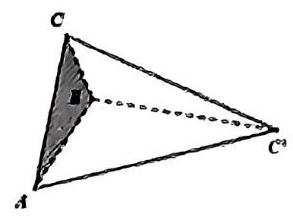

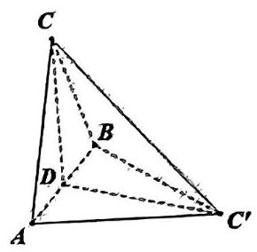

2.【2023.11 上中东校高三月考 11】已知椭圆和双曲线有共同的焦点 ${F}_{1}\text{ 、 }{F}_{2}\text{ ， }P$ 是它们的一个交点,且 $\angle {F}_{1}P{F}_{2} = \frac{\pi }{3}$ ,记椭圆和双曲线的离心率分别为 ${e}_{1}\text{ 、 }{e}_{2}$ ,则 ${e}_{1}{e}_{2}$ 的最小值为 ___。

3.【2023.4 控江月考 11】已知定点 $A\left( {1,0}\right)$ ,圆 $\omega  : {x}^{2} + {y}^{2} = 4, M, N$ 为 $\omega$ 上的动点, 满足 $\left| {MN}\right|  = 2\sqrt{3}$ ，则 $\overrightarrow{AM} \cdot  \overrightarrow{AN}$ 的取值范围为___.

4.【2023.4 上实周测 111】在 $\bigtriangleup {ABC}$ 中, ${AB} = {AC} = 2\sqrt{2},{\left| \overrightarrow{AB} + \lambda \overrightarrow{BC}\right| }_{\min } = 2\left( {\lambda  \in  R}\right)$ , 若 $\overrightarrow{AM} = 2\overrightarrow{AB},\overrightarrow{AP} = {\sin }^{2}\alpha \overrightarrow{AB} + {\cos }^{2}\alpha \overrightarrow{AC}$ ,其中 $\alpha  \in  \left\lbrack  {\frac{\pi }{6},\frac{\pi }{3}}\right\rbrack$ ,则 $\left| \overrightarrow{MP}\right|$ 的最小值为___。

5.【2023.4 浦东三模 11】已知数列 $\left\{  {a}_{n}\right\}$ ( $n$ 是正整数) 的递推公式为 $\left\{  \begin{array}{l} {a}_{n} = 3{a}_{n - 1} + 4\left( {n \geq  2}\right) , \\  {a}_{1} = 1. \end{array}\right.$ 若存在正整数 $n$ ,使得 $n\left( {{2n} + 1}\right)  \geq  t\left( {{a}_{n} + 2}\right)$ ,则 $t$ 的最大值是___。

6.【2023.4 延安周测 611】已知双曲线 $C : \frac{{x}^{2}}{{a}^{2}} - \frac{{y}^{2}}{{b}^{2}} = 1\left( {a > 0, b > 0}\right)$ 的左、右焦点分别为 ${F}_{1}$ 、 ${F}_{2}$ ,过 ${F}_{2}$ 且斜率为 $- \frac{\sqrt{5}}{2}$ 的直线与双曲线 $C$ 的左支交于点 $A$ . 若 $\left( {\overrightarrow{{F}_{1}{F}_{2}} + \overrightarrow{{F}_{1}A}}\right)  \cdot  \overrightarrow{{F}_{2}A} = 0$ ,则双曲线 $C$ 的渐近线方程为___。

7.【2023.4 南洋三模模拟 11】每年的 6 月 6 日是全国爱眼日，某位志愿者跟踪调查电子产品对视力的影响，据调查，某高校大约有 45%的学生近视，而该校大约有 20%的学生每天操作电子产品超过 1 小时, 这些人的近视率约为 50%. 现从每天操作电子产品不超过 1 小时的学生中任意调查一名学生，则他近视的概率为___.

8.【2023.11 向明高三期中 15】已知函数 $f\left( x\right)  = \sin \left( {{wx} + \varphi }\right)$ (其中 $w > 0$ ， $- \frac{\pi }{2} \leq  \varphi  \leq  \frac{\pi }{2}$ ) 满足 $f\left( {-\frac{\pi }{8}}\right)  = 0$ ，直线 $x = \frac{\pi }{8}$ 为 $y = f\left( x\right)$ 的一条对称轴，且函数 $f\left( x\right)$ 在 $\left( {\frac{\pi }{16},\frac{\pi }{8}}\right)$ 上单调， 则实数 $W$ 的最大值为( )

A. 6 B. 10 C. 14 D. 18

9.【2023.9 上闵外周测 15】已知不等式 $\left| {{2x} - a}\right|  > x - 1$ 对任意 $x \in  \left\lbrack  {0,2}\right\rbrack$ 恒成立，则实数 $a$ 的取值范围是( )

A. $\left( {1,5}\right)$ B. $\left( {2,5}\right)$ C. $\left( {-\infty ,1}\right)  \cup  \left( {5, + \infty }\right)$ D. $\left( {-\infty ,2}\right)  \cup  \left( {5, + \infty }\right)$

10.【2023.9 华二周测 15】已知 $a > 0$ ，记 $y = \cos x$ 在 $\left\lbrack  {a,{2a}}\right\rbrack$ 的最大值为 ${s}_{a}$ ，在 $\left\lbrack  {{2a},{3a}}\right\rbrack$ 的最大值为 ${t}_{a}$ ,则下列情况不可能的是( )

A. ${s}_{a} > 0,{t}_{a} > 0$ B. ${s}_{a} < 0,{t}_{a} < 0$ C. ${s}_{a} > 0,{t}_{a} < 0$ D. ${s}_{a} < 0,{t}_{a} > 0$

## 高三一模春考次压轴日日练(5)

## 训练限时:50 分钟

1.【2023.11 交大附中高三月考 11】记边长为 1 的正六边形的六个顶点分别为 ${A}_{1}\text{ 、 }{A}_{2}$ 、 ${A}_{3}\text{ 、 }{A}_{4}\text{ 、 }{A}_{5}\text{ 、 }{A}_{6}$ ,集合 $M = \left\{  {\overrightarrow{a} \mid  \overrightarrow{a} = \overrightarrow{{A}_{1}{A}_{j}},\left( {i, j = 1,2,3,4,5,6, i \neq  j}\right) }\right\}$ ,在 $M$ 中任取两个不同的元素 $\overrightarrow{m}$ 、 $\overrightarrow{n}$ ，则 $\overrightarrow{m} \cdot  \overrightarrow{n} = 0$ 的概率为___。

2.【2023.4 上实周测 11】已知函数 $f\left( x\right)  = \sin \left( {{\omega x} + \varphi }\right)$ (其中 $\omega  > 0$ , $\left| \varphi \right|  < \frac{\pi }{2}$ ). $T$ 为 $f\left( x\right)$ 的最小正周期,且满足 $f\left( {\frac{1}{3}T}\right)  = f\left( {\frac{1}{2}T}\right)$ . 若函数 $f\left( x\right)$ 在区间 $\left( {0,\pi }\right)$ 上恰有 2 个极值点,则 $\omega$ 的取值范围是___；

3.【2023.4 交附开学考 11】设 ${l}_{1}\text{ 、 }{l}_{2}\text{ 、 }{l}_{3}$ 为空间中三条不同的直线,若 ${l}_{1}$ 与 ${l}_{2}$ 所成角为 $\alpha$ , ${l}_{1}$ 与 ${l}_{3}$ 所成角为 $\beta$ ，其中 $0 \leq  \alpha  < \beta  \leq  \frac{\pi }{4}$ ，那么 ${l}_{2}$ 与 ${l}_{3}$ 所成角的取值范围为___.

4.【2023.2 复附周练 11】已知椭圆 $\Gamma  : \frac{{x}^{2}}{{a}^{2}} + \frac{{y}^{2}}{{b}^{2}} = 1\left( {a > b > 0}\right)$ ，直线 $l$ 过坐标原点并交椭圆于 $P$ 的点 ( $P$ 在第一象限),点 $A$ 是 $x$ 轴正半轴上一点,其横坐标是点 $P$ 的坐标的设倍,直线 ${QA}$ 交椭圆于点 $B$ ,若直线 ${BP}$ 恰好是以 ${PQ}$ 为直径的圆的切线,则椭圆的离心率为___。

5.【2023.3 延安周测 11】已知函数 $f\left( x\right)  =  - 2 + {3x} - a{x}^{3}$ 对于任意 $x \in  \left\lbrack  {-1,1}\right\rbrack$ 都有 $f\left( x\right)  \leq   - 1$ ，则 $a$ 的取值集合为___(提示: $\sin {3\theta } = 3\sin \theta  - 4{\sin }^{3}\theta$ )

6.【2023.11 嘉定二中高三期中 15】已知函数 $f\left( x\right)  = a{x}^{2} + \left| {x + a + 1}\right|$ 为偶函数，则不等式 $f\left( x\right)  > 0$ 的解集为( )

A. $\varnothing$

B. $\left( {-\frac{1}{2},0}\right)  \cup  \left( {0,\frac{1}{2}}\right)$ C. $\left( {-\frac{1}{2},\frac{1}{2}}\right)$ D. $\left( {-\infty , - \frac{1}{2}}\right)  \cup  \left( {\frac{1}{2}, + \infty }\right)$

7.【2023.10 行知月考 15】已知 $x > 0, y > 0, x + {2y} = 1$ ,则 $\frac{\left( {x + 1}\right) \left( {y + 1}\right) }{xy}$ 的最小值为( )

A. $4 + 4\sqrt{3}$ B. 12 C. $8 + 4\sqrt{3}$ D. 16

十年寒窗

8.【2023.9 华二开学考二 18】在 $\bigtriangleup  {ABC}$ 中，已知 $\sin A = a$ ， $\cos B = \frac{3}{8}$ ，若 $\cos C$ 有唯一值，则实数 $a$ 的取值范围为( )

A. $\left( {0,\frac{3}{5}}\right\rbrack   \cup  \{ 1\}$ B. $\left( {0,\frac{4}{5}}\right\rbrack$ C. $\left\lbrack  {\frac{4}{5},1}\right\rbrack$ D. $\left( {0,\frac{4}{5}}\right\rbrack   \cup  \{ 1\}$

9.【2023.4 变附卓越考 11】如图，椭圆的中心在原点，长轴 $A{A}_{1}$ 在 $x$ 轴上。以 $A$ 、 ${A}_{1}$ 为焦点的双曲线까 圆于 $C\text{ 、 }D\text{ 、 }{D}_{1}\text{ 、 }{C}_{1}$ 四点,且 $\left| {CD}\right|  = \frac{1}{2}\left| {A{A}_{1}}\right|$ . 椭圆的一条弦 ${AC}$ 交双曲线于 $E$ ，设 $\frac{AE}{EC} = \lambda$ ，当 $\frac{2}{3} \leq  \lambda  \leq  \frac{3}{4}$ 时，双曲线的离心率的取值范围为___.

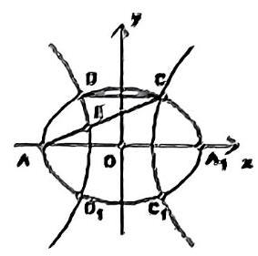

10.【2023.9 上海实验开学考 15】“圆幂定理” 是平面几何中关于圆的一个重要定理, 它包含三个结论, 其中一个是相交弦定理: 圆内的两条相交弦, 被交点分成的两条线段长的积相等,如图,已知圆 $O$ 的半径为 2,点 $P$ 是圆 $O$ 内的定点,且 ${OP} = \sqrt{2}$ ,弦 ${AC}\text{ 、 }{BD}$ 均过点 $P$ ,下列说法错误的是( )

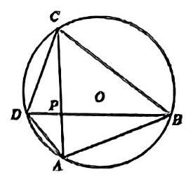

A. $\overrightarrow{PA} \cdot  \overrightarrow{PC}$ 为定值

B. $\overrightarrow{OA} \cdot  \overrightarrow{OC}$ 的取值范围量 $\left\lbrack  {-2,0}\right\rbrack$

C. 当 ${AC} \bot  {BD}$ 时, $\overrightarrow{AB} \cdot  \overrightarrow{CD}$ 为定值

D. $\left| \overrightarrow{AC}\right|  \cdot  \left| \overrightarrow{BD}\right|$ 的最大值为 16

## 高三一模春考次压轴日日练 (6)

## 训练限时: 50 分钟

1.【2023.11 市西期中 11】设 $x\text{ 、 }y \in  R, a > 0, b > 0$ ,若 ${a}^{x} = {b}^{y} = 3, a + {2b} = 2\sqrt{6}$ . 则 $\frac{1}{x} + \frac{1}{y}$ 的最大值为___.

2.【2023.11 同济附中期中 11】已知不等式 $\left( {x + y}\right) \left( {\frac{1}{x} + \frac{a}{y}}\right)  \geq  9$ 对任意的正实数 $x, y$ 恒成立,则正实数 $a$ 的取值范围是

3.【2023.11 延安高三月考 11】已知关于 $x$ 的方程 ${x}^{2} = a\left| {x + 1}\right|  + 1$ 恰有 2 个实数解,则实常数 $a$ 的取值范围是___.

4. 【2023.1 七宝期末 11】若函数 $f\left( x\right)  = \left| {a\sin x + b\cos x - 1}\right|  + \left| {b\sin x - a\cos x}\right| \left( {a, b \in  R}\right)$ 的最大值为 11 ，则 ${a}^{2} + {b}^{2} =$ ___；

5.【2021.11 南洋周测 11】0 是坐标原点,点 $M\left( {1,0}\right)$ ,已知 $A, B$ 是坐标平面内的两个动点。若 $\left| \overrightarrow{OA}\right|  = 5,\left| \overrightarrow{OB}\right|  = 4$ ，且 $\overrightarrow{MA} \cdot  \overrightarrow{MB} = 0$ ，则 $\left| \overrightarrow{AB}\right|$ 的最大值等于___.

6.【2023.11 六校联考期中 11】用长度为 24 米的材料围成一个矩形场地, 场地中间用该材料加两道与矩形的边平行的隔墙，若使矩形的面积最大，则隔墙的长度是___米。

7.【2023.11 同济期中 11】如图，在棱长为 $\sqrt{2}$ 的正方体 ${ABCD} - {A}^{\prime }{B}^{\prime }{C}^{\prime }{D}^{\prime }$ 中，点 $E, F, G$ 分别是棱 ${A}^{\prime }{B}^{\prime },{B}^{\prime }{C}^{\prime },{CD}$ 的中点,则由点 $E, F, G$ 确定的平面截正方体所得的截面多边形的面积等于___.

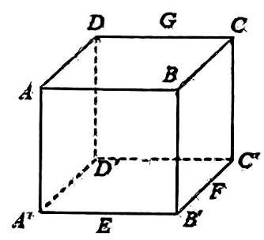

8.【2023.11 位育期中 11】在 ${120}^{ \circ  }$ 的二面角 $a - l - \beta$ 内有一点 $P, P$ 在平面 $a\text{ 、 }\beta$ 内的射影 $A, B$ 分别落在半平面 ${a\beta }$ 内,且 ${PA} = 3,{PB} = 4$ ,则 $P$ 到 $l$ 的距离为___.

9.【2023.11 格致高三期中 15】已知函数 $f\left( x\right)  = \sin x\left( {-\frac{\pi }{2} \leq  x \leq  \frac{\pi }{2}}\right)$ ,

$g\left( x\right)  = \cos x\left( {-\frac{\pi }{2} \leq  x \leq  \frac{\pi }{2}}\right)$ ,下列四个结论: ① 方程 $f\left\lbrack  {g\left( x\right) }\right\rbrack   = 0$ 有 2 个不同的实数解;

② 方程 $g\left\lbrack  {f\left( x\right) }\right\rbrack   = 0$ 有 2 个不同的实数解;

③ 方程 $f\left\lbrack  {f\left( x\right) }\right\rbrack   = 0$ 有且只有 1 个实数解;

④ 方程 $g\left\lbrack  {g\left( x\right) }\right\rbrack   = m\left( {m \in  \left( {0,1}\right) }\right)$ 有 2 个不同的实数解. 其中正确的结论有( )

A. 0 个 B. 1 个 C. 2 个 D. 3 个

10.【2023.11 建平高三期中 15】已知函数 $f\left( x\right)  = \left\{  \begin{array}{ll} x & , x < 0 \\  {x}^{2} & , x \geq  0 \end{array}\right.$ ,若关于 $x$ 的不等式 $f\left( {x + a}\right)  \leq  f\left( {x}^{2}\right)$ 的解集为 $R$ ,则实数 $a$ 的取值范围为(   )

(A) $\left( {-\infty , - \frac{1}{4}}\right\rbrack$ (B) $\left( {-\infty ,\frac{1}{4}}\right\rbrack$ (C) $\left\lbrack  {-\frac{1}{4}, + \infty }\right)$ (D) $\left\lbrack  {\frac{1}{4}, + \infty }\right)$

## 高三一模春考次压轴日日练 (7)

## 训练限时: 50 分钟

1.【2023.4 位育期中 11】设集合 $I = \{ 1,3,5,7\}$ ，若非空集合 $A$ 同时满足:① $A \subseteq  I$ ，② $\left| A\right|  \leq  \min \left( A\right)$ ,(其中 $\left| A\right|$ 表示 $A$ 中元素的个数, $\min \left( A\right)$ 表示集合 $A$ 中最小的元素) 称集合 $A$ 为 $I$ 的一个好子集,则 $I$ 的所有好子集的个数为___。

2.【2023.4 南洋模范期中 11】若对任意 $x \in  \left\lbrack  {1,2}\right\rbrack$ ，均有 $\left| {{x}^{2} - a}\right|  + \left| {x + a}\right|  = \left| {{x}^{2} + x}\right|$ ，则实数 $a$ 的取值范围为___。

3. 【2023.11 北蔡高三期中 11】已知函数 $f\left( x\right)  = a{x}^{2} - {e}^{x}$ 在区间 $\left\lbrack  {1,3}\right\rbrack$ 上有两个零点,则实数 $a$ 的取值范围是___.

4.【2021.12 选才月考 11】已知 $\cos \left( {\alpha  + \beta }\right)  = \cos \alpha  + \cos \beta$ ，则 $\cos \alpha$ 的最大值为___.

5.【2023.2 建平周练 11】设向量 $\overrightarrow{OA},\overrightarrow{OB}$ 满足 $\left| \overrightarrow{OA}\right|  = \left| \overrightarrow{OB}\right|  = 2,\overrightarrow{OA} \cdot  \overrightarrow{OB} = 2$ ，若 $m, n \in  R$ ， $m + n = 1$ ，则 $\left| {m\overrightarrow{AB}}\right|  + \left| {\frac{1}{2}\overrightarrow{BO} - n\overrightarrow{BA}}\right|$ 的最小值为___.

6.【2023.11 向明期中 11】如下图所示,在平行六面体 ${ABCD} - {A}_{1}{B}_{1}{C}_{1}{D}_{1}$ 中,底面 ${ABCD}$ 为菱形,且 $\angle {A}_{1}{AB} = \angle {A}_{1}{AD} = \angle {BAD} = \frac{\pi }{3}$ ,则侧棱 $A{A}_{1}$ 与底面 ${ABCD}$ 所成的角为 ___。

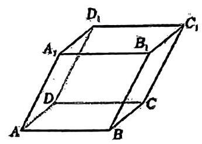

7.【2023.11 南模期中 11】水平桌面上放置了 3 个半径为 2 的小球，它们两两相切，并均与桌面相切. 若用一个半球形容器(容器厚度忽略不计)罩住三个小球，则半球形容器的半径的最小值是___.

## 十年寒窗

8.【2023.11 洋泾高三期中 15】下列命题正确的是 ( )。

A. 在独立性检验中，随机变量 ${\chi }^{2}$ 的观测值越大，“认为两个分类变量有关”这种判断犯错误的概率越小

$B$ 。已知随机变量 $X \sim  N\left( {0,1}\right)$ ,若 $P\left( {X <  - {1.96}}\right)  = {0.03}$ ,则 $P\left( {\left| X\right|  < {1.96}}\right)  = {0.97}$

$C$ . 若在平面 $\alpha$ 内存在不共线的三点到平面 $\beta$ 的距离相等,则平面 $\alpha$ ‖平面 $\beta$

$D$ 。若平面 $\alpha  \bot$ 平面 $\beta$ ，直线 $m \bot$ 平面 $\alpha$ ，直线 $n$ ∥直线 $m$ ，则直线 $n$ ∥平面 $\beta$

9.【2023.11 上大附中高三期中 15】设抛物线 $C : {y}^{2} = {4x}$ 的焦点为 $F$ ,过点 $\left( {-2,0}\right)$ 且斜率为 $\frac{2}{3}$ 的直线与 $C$ 交于 $M, N$ 两点,则 $\overrightarrow{FM} \cdot  \overrightarrow{FN} =$ ( )

A. 8 B. 7 C. 6 D. 5

10.【2023.9 进才周测 15】在正方体 ${ABCD} - {A}_{1}{B}_{1}{C}_{1}{D}_{1}$ 中，动点 $P$ 在其表面上运动，满 ${\text{ 足 }\;P\;D} = {PB}_{1}$ ，则 $P$ 的轨迹是( )

A. 三个点 B. 三条线段 C. 六个点 D. 六条线段

## 高三一模春考次压轴日日练 (8)

## 训练限时:50 分钟

1.【2023.2 华二周测 11】曲线 $y = {x}^{2} - \ln \left( {x + 1}\right)$ 的过原点的切线方程为___

2.【2023.5 华附高三模拟 11】已知实数 $x, y$ 满足 $x + y \geq  2, x \leq  1$ 且 $y \leq  2$ . 则 ${x}^{2} + {y}^{2} + x - y$ 的最大值是 ___.

3.【2023.4 建平三模 11】已知椭圆和双曲线有共同的焦点 ${F}_{1}\text{ 、 }{F}_{2}\text{ ， }M$ 是它们的一个交点，且 $\angle {F}_{1}M{F}_{2} = \frac{\pi }{3}$ ，记椭圆和双曲线的离心率分别为 ${e}_{1}\text{ 、 }{e}_{2}$ ，则 ${e}_{1}{e}_{2}$ 的最小值为___.

4.【2023.1 高桥期末 11】记 ${S}_{n}$ 为数列 $\left\{  {a}_{n}\right\}$ 的前 $n$ 项和,已知对任意的 $n \in  {N}^{ * },{a}_{n} + {a}_{n + 1} = {2n} + 1$ ,且存在 $k \in  {N}^{ * },{S}_{k} = {S}_{k + 1} = {210}$ ,则 ${a}_{1}$ 的取值集合为 ___;(用列举法表示).

5.【2023.11 六校联考期中 11】在长方体 ${ABCD} - {A}_{1}{B}_{1}{C}_{1}{D}_{1}$ 中,棱 ${AB} = 6,{BC} = B{B}_{1} = \sqrt{2}$ , 点 $P$ 是线段 $B{C}_{1}$ 上的一动点，则 ${AP} + {P{B}_{1}}$ 的最小值为___。

6.【2023.11 浦东外国语附中期中 11】设 ${a}_{1}\text{ 、 }{a}_{2}\text{ 、 }\cdots \text{ 、 }{a}_{n}$ 是各项不为零的等差数列， $n \geq  4$ ， 且公差 $d \neq  0$ ,若将此数列删去某一项后,得到的数列 (按原来顺序) 是等比数列,则满足题意的所有数对 $\left( {n,\frac{{a}_{1}}{d}}\right)$ 为___。

7.【2023.11 南汇期中 11】若不等式之 $\left\{  \begin{matrix} {x}^{2} - x - 2 > 0 \\  2{x}^{2} + \left( {5 + {2k}}\right) x + {5k} < 0 \end{matrix}\right.$ 的解集为 $M$ ,且 $M \cap  Z$ 中有 2023 个元素，则实数 $k$ 的取值范围是___.

8.【2023.9 徐汇周练二 15】已知公差小于零的等差数列 $\left\{  {a}_{n}\right\}$ 的前 $n$ 项和为 ${S}_{n}$ ,且 ${S}_{4} = {S}_{9}$ , 则使 ${S}_{n} \geq  0$ 成立的最大正整数 $n$ 为( )

A. 6 B. 7 C. 12 D. 13

9.【2023.10 曹杨月考 15】在正方体 ${ABCD} - {A}_{1}{B}_{1}{C}_{1}{D}_{1}$ 中,过点 $B$ 的平面 $\alpha$ 与直线 ${A}_{1}C$ 垂直，则 $\alpha$ 截该正方体所得截面的形状为( )

A. 三角形 B. 四边形 C. 五边形 D. 六边形

10.【2023.10 南洋模范开学考 15】在正方体 ${ABCD} - {A}_{1}{B}_{1}{C}_{1}{D}_{1}$ 中， $O$ 是 ${AC}$ 中点，点 $P$ 在线段 ${A}_{1}{C}_{1}$ 上,若直线 ${OP}$ 与平面 ${A}_{1}B{C}_{1}$ 所成的角为 $\theta$ ,则 $\sin \theta$ 的取值范围是( )

A. $\left\lbrack  {\frac{\sqrt{2}}{3},\frac{\sqrt{3}}{3}}\right\rbrack$ B. $\left\lbrack  {\frac{1}{3},\frac{1}{2}}\right\rbrack$ C. $\left\lbrack  {\frac{\sqrt{3}}{4},\frac{\sqrt{3}}{3}}\right\rbrack$ D. $\left\lbrack  {\frac{1}{4},\frac{1}{3}}\right\rbrack$

## 高三一模春考次压轴日日练(9)

训练限时:50 分钟

1.【2023.11 上中期中 11】若 $x, y, z$ 均为正实数，则 $\frac{{2xy} + {yz}}{4{x}^{2} + 4{y}^{2} + 3{z}^{2}}$ 的最大值是___。

2. $\left\lbrack  {{2023.11}\text{ 大问高三期中 11 】已知函数 }y = f\left( x\right) \left( {x \in  R}\right) \text{ 的部分图象如图所示,则不等 }}\right\rbrack$ 式 $x{f}^{\prime }\left( x\right)  \geq  0$ 的解集为___.

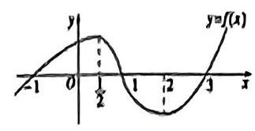

3.【2023.2 徐江统考 11】设 $a > b > 0$ ，椭圆 $\frac{{x}^{2}}{{a}^{2}} + \frac{{y}^{2}}{{b}^{2}} = 1$ 的离心率为 ${e}_{1}$ ，双曲线 $\frac{{x}^{2}}{{b}^{2}} - \frac{{y}^{2}}{{a}^{2} - 2{b}^{2}} = 1$ 的离心率为 ${e}_{2}$ . 若 ${e}_{1}{e}_{2} < 1$ ，则 $\frac{{e}_{2}}{{e}_{1}}$ 的取值范围是___.

4.【2023.3 位育周练 411】已知双曲线 $C : \frac{{x}^{2}}{9} - \frac{{y}^{2}}{4} = 1$ ，点 $M$ 与 $C$ 的焦点不重合，若 $M$ 关于 $C$ 的焦点的对称点分别为 $A, B$ ，线段 ${MN}$ 的中点在 $C$ 上，则 $\left| {AN}\right|  - \left| {BN}\right|  =$ ___.

## 十年寒窗

5.【2023.2 延安开学考 11】已知函数 $f\left( x\right)  = \sin \left( {{\omega x} + \varphi }\right) \left( {\omega  > 0,\left| \varphi \right|  \leq  \frac{\pi }{2}}\right) , x =  - \frac{\pi }{4}$ 为 $y = f\left( x\right)$ 的零点,直线 $x = \frac{\pi }{4}$ 为 $y = f\left( x\right)$ 图像的对称轴,且 $y = f\left( x\right)$ 在 $\left( {\frac{\pi }{18},\frac{5\pi }{36}}\right)$ 上单调, 则 $\omega$ 的最大值为___。

6.【2023.11 南汇期中 11】已知三棱柱 ${ABC} - {A}_{1}{B}_{1}{C}_{1}$ 及空间中一点 $P$ ，且 $\overrightarrow{PA} + \overrightarrow{PC} = m\overrightarrow{AB}$ ， ( $m > 0, m$ 为常数),若三棱柱 ${ABC} - {A}_{1}{B}_{1}{C}_{1}$ 的体积为 24,则三棱锥 ${A}_{1} - {ABP}$ 的体积为 ___。

7.【2021.12 华二周测 10 11】数列 $\left\{  {a}_{n}\right\}$ 满足 ${a}_{1} = 2,{a}_{n + 1} = \frac{2\left( {n + 2}\right) }{n + 1}{a}_{n},\left( {n \in  N\text{ 且 }n > 0}\right)$ ,则 $\frac{{a}_{2022}}{{a}_{1} + {a}_{2} + \cdots  + {a}_{2021}} =$

十年寒窗

8.【2023.11 宜川高三期中 15】已知复数 $z$ 满足 ${z}^{2} = \bar{z}$ ，则复数 $z$ 的个数为( )

A. 1 B. 2 C. 3 D. 4

9.【2023.11 四校联考高三期中 15】已知点 $M$ 是边长为 2 的正 $\bigtriangleup {ABC}$ 内一点，且 $\overrightarrow{AM} = \lambda \overrightarrow{AB} + \mu \overrightarrow{AC}$ ,若 $\lambda  + \mu  = \frac{1}{2}$ ,则 $\overrightarrow{MB} \cdot  \overrightarrow{MC}$ 的最小值为 ( )

A. $- \frac{1}{3}$ B. $\frac{1}{3}$ C. $- \frac{1}{4}$ D. $\frac{1}{4}$

10.【2023.9 南洋开学考 15】已知数列 $\left\{  {a}_{n}\right\}$ 满足 ${a}_{n} + {a}_{n + 4} = {a}_{n + 1} + {a}_{n + 3}\left( {n \in  {N}^{ * }}\right)$ ,那么 ( )

A. $\left\{  {a}_{n}\right\}$ 是等差数列 B. $\left\{  {a}_{2n}\right\}$ 是等差数列

C. $\left\{  {a}_{3n}\right\}$ 是等差数列 D. $\left\{  {a}_{{2n} - 1}\right\}$ 是等差数列

# 高三一模春考次压轴日日练 (10)

训练限时: 50 分钟

1.【2023.11 格致期中 11】已知 $a \in  Z$ ,关于 $x$ 的一元二次不等式 ${x}^{2} - {6x} + a \leq  0$ 的解集中有且仅有 3 个整数，则所有符合条件的 $a$ 的值之和是___。

2.【2023.11 清外期中 11】设集合 $M = \left\{  {x\left| {\;m \leq  x \leq  m + \frac{3}{4}}\right. }\right\}  , N = \left\{  {x\left| {\;n - \frac{1}{3} \leq  x \leq  n}\right. }\right\}$ ，且 $M\text{ 、 }N$ 都是集合 $\{ x \mid  0 \leq  x \leq  1\}$ 的子集，如果把 $b - a$ 叫做集合 $\{ x \mid  a \leq  x \leq  b\}$ 的 “长度”，那么集合 $M \cap  N$ 的 “长度” 的最小值是 ___。

3.【2023.11 七宝高三期中 11】已知四面体 ${ABCD}$ 中, ${AB} = {AC} = {BD} = {CD} = 1$ ,则该四面体体积的最大值为___。

4. 【2023.2 复旦附中开学考 11】已知 $f\left( x\right)  =  - {x}^{2} + x + m + 2$ ，若关于 $x$ 的不等式 $f\left( x\right)  \geq  \left| x\right|$ 的解集中有且仅有 1 个整数，则实数 $m$ 的取值范围为___.

十年寒窗

5.【2023.11 上中期中 11】正四棱柱 ${ABCD} - {A}_{1}{B}_{1}{C}_{1}{D}_{1}$ 中，已知 ${AB} = 2,{A{A}_{1}} = 1$ ，那么以 $A$ 为球心，半径为 2 的球面与该四棱柱表面交线的总长度为___。

6.【2022.11 洋泾期中 11】若 $\left\{  {a}_{n}\right\}$ 是首项为 1 的等比数列， ${S}_{n}$ 是 $\left\{  {a}_{n}\right\}$ 的前 $n$ 项和，且 $9{S}_{3} = {S}_{6}$ ，则数列 $\left\{  \frac{1}{{a}_{n}}\right\}$ 的前 5 项和为___；

7.【2023.11 格致高三月考 15】伟大的数学家欧拉 28 岁时解决了困扰数学界近一世纪的 “巴赛尔级数” 难题.

当 $n \in  N, n \geq  2$ 时, $\frac{\sin x}{x} = \left( {1 - \frac{{x}^{2}}{{\pi }^{2}}}\right) \left( {1 - \frac{{x}^{2}}{4{\pi }^{2}}}\right) \left( {1 - \frac{{x}^{2}}{9{\pi }^{2}}}\right) \cdots \left( {1 - \frac{{x}^{2}}{{n}^{2}{\pi }^{2}}}\right) \cdots$ ,又根据泰勒展开式可以得到 $\sin x = x - \frac{{x}^{3}}{3!} + \frac{{x}^{5}}{5!} + \cdots  + \frac{{\left( -1\right) }^{n - 1}{x}^{{2n} - 1}}{\left( {{2n} - 1}\right) !} + \cdots$ ,根据以上两式可求得 $\frac{1}{{1}^{2}} + \frac{1}{{2}^{2}} + \frac{1}{{3}^{2}} + \cdots  + \frac{1}{{n}^{2}} + \cdots  = \;$ (   )

A. $\frac{{\pi }^{2}}{6}$ B. $\frac{{\pi }^{2}}{3}$ C. $\frac{{\pi }^{2}}{8}$ D. $\frac{{\pi }^{2}}{4}$

8.【2023.11 嘉定一中期中 15】2023 杭州亚运会于 9 月 23 日至 10 月 8 日举办,组委会将甲、乙、丙、丁 4 名志愿者随机派往黄龙体育中心、杭州奥体中心、浙江大学紫金港校区三座体育馆工作，每座体育馆至少派 1 名志愿者，A 表示事件 “志愿者甲派往黄龙体育中心”; $\mathrm{B}$ 表示事件 “志愿者乙派往黄龙体育中心”; $C$ 表示事件 “志愿者乙派往杭州奥体中心”, 则( )

A. 事件 $\mathrm{A}$ 与 $\mathrm{B}$ 相互独立 $\;\mathrm{B}$ . 事件 $A$ 与 $C$ 为互斥事件 $\mathrm{C}.P\left( {C \mid  A}\right)  = \frac{1}{3}\;$ D. $P\left( {B \mid  A}\right)  = \frac{1}{6}$

9.【2023.10 敬业周测一 15】已知 $\left\{  {a}_{n}\right\}$ 为等比数列, $\left\{  {a}_{n}\right\}$ 的前 $n$ 项和为 ${S}_{n}$ ,前 $n$ 项积为 ${T}_{n}$ , 则下列选项中正确的是 ( )

A. 若 ${S}_{2022} > {S}_{2021}$ ,则数列 $\left\{  {a}_{n}\right\}$ 单调递增 B. 若 ${T}_{2022} > {T}_{2021}$ ,则数列 $\left\{  {a}_{n}\right\}$ 单调递增

C. 若数列 $\left\{  {S}_{n}\right\}$ 单调递增,则 ${a}_{2022} \geq  {a}_{2021}$ D. 若数列 $\left\{  {T}_{n}\right\}$ 单调递增,则 ${a}_{2022} \geq  {a}_{2021}$

10.【2023.9 松江周测二 15】已知正三棱锥的底面边长为 3，侧棱长为 2，其顶点都在同一球面上，则该球的表面积为( )

A. ${4\pi }$ B. ${8\pi }$ C. ${12\pi }$ D. ${16\pi }$

## 高三一模春考次压轴日日练 (11)

## 训练限时: 50 分钟

1.【2023.11 选才高三期中 11】已知 $f\left( x\right)  = \sin {\omega x}\cos {\omega x} - \sqrt{3}{\cos }^{2}{\omega x},\left( {\omega  > 0}\right) ,{x}_{1},{x}_{2}$ 是函数 $y = f\left( x\right)  + \frac{2 + \sqrt{3}}{2}$ 的两个零点,且 ${\left| {x}_{1} - {x}_{2}\right| }_{\min } = \pi$ ,当 $x \in  \left\lbrack  {0,\frac{7\pi }{12}}\right\rbrack$ 时, $f\left( x\right)$ 最小值与最大值之和为___。

2. 【2023.9 建平开学考 11】已知常数 $t \in  R$ ,集合 $S = \{ z\parallel z - 1 \mid   \leq  3, z \in  C\}$ , $T = \left\{  {z\left| {\;z = \frac{w + 2}{3}i + t}\right. , w \in  S}\right\}$ 。若 $S \cup  T = S$ ，则实数 $t$ 的取值范围是___.

3. 【2023.9 上海实验周测三 11】已知 $a > 1, f\left( x\right)  = \frac{{x}^{\frac{3}{5}}{a}^{x} + {x}^{\frac{3}{5}} - 4}{{a}^{x} + 1}$ ,则不等式 $f\left( {{2x} - 1}\right)  + f\left( {x - 1}\right)  + 4 > 0$ 的解集为___.

4.【2023.10 复旦附中月考 11】记函数 $f\left( x\right)  = \cos \left( {{\omega x} + \varphi }\right) \left( {\omega  > 0,0 < \varphi  < \pi }\right)$ 的最小正周期为 $T$ ,若 $f\left( T\right)  = \frac{\sqrt{3}}{2}, x = \frac{\pi }{9}$ 为函数 $y = f\left( x\right)$ 的零点,则 $\omega$ 的最小值为___.

十年寒窗

5.【2023.9 控江月考 11】已知平面向量 $\overrightarrow{a} = \left( {5,0}\right) ,\overrightarrow{b} = \left( {\frac{3}{5},\frac{4}{5}}\right)$ ，常数 $k \in  \mathbf{R}$ 。向量 $\overrightarrow{c} = \lambda  \cdot  \overrightarrow{a} + \left( {1 - \lambda }\right)  \cdot  \overrightarrow{b}\left( {\lambda  \in  \mathbf{R}}\right)$ ，且对任意 $\lambda  \in  \mathbf{R}$ ，总有 $\left| {\overrightarrow{c} + k\overrightarrow{a}}\right|  \geq  2\sqrt{5}$ 成立，则实数 $k$ 的取值范围是___。

6.【2023.9 延安开学考 11】设数列 $\left\{  {a}_{n}\right\}$ 满足 ${a}_{n + 1} = 2\left( {\left| {a}_{n}\right|  - 1}\right) , n \in  {N}^{ * }$ ，若存在常数 $M > 0$ ， 使得对于任意的正整数 $n$ ，恒有 $\left| {a}_{n}\right|  \leq  M$ ，则 ${a}_{1}$ 的取值范围为___。

7.【2023.9 华二网测 11】如图是一款电动自行车用 “遮阳神器” 的结构示意图，它由三叉形的支架 $O - {ABC}$ 和覆盖在支架上的遮阳布 $\bigtriangleup {ABC}$ 组成。已知 ${OA} = {1.4}$ 米, ${OB} = {OC} = {0.6}$ 米,且 $\angle {AOB} = \angle {AOC}$ . 为保障行车安全,要求遮阳布的最宽处 ${BC} \leq  1$ 米. 若希望遮阳效果最好(即 $\bigtriangleup  {ABC}$ 的面积最大)，则 $\angle {BOC}$ 的大小约为___(结果四舍五入精确到 ${1}^{ \circ  }$ )。

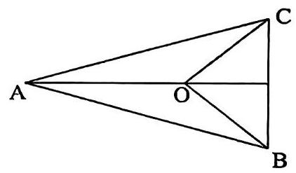

十年寒窗

8.【2023.11 市西高三期中 15】如图是函数 $f\left( x\right)  = A\sin \left( {{\omega x} + \varphi }\right) , A > 0,\omega  > 0$ 的图像的一部分，要得到该函数图像，只需要将函数 $y = 2\sin {2x}$ 的图像 ( )。

A. 向左平移 $\frac{\pi }{6}$ 个单位 B。向左平移 $\frac{\pi }{3}$ 个单位

C. 向右平移 $\frac{\pi }{6}$ 个单位 D. 向右平移 $\frac{\pi }{3}$ 个单位

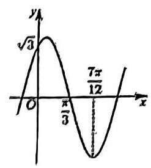

9.【2023.9 格致开学考 15】已知椭圆 $C : \frac{{x}^{2}}{{a}^{2}} + \frac{{y}^{2}}{{b}^{2}} = 1\left( {a > b > 0}\right)$ ，过点 $\left( {-a,0}\right)$ 且方向向量为 $\overrightarrow{n} = \left( {1, - 1}\right)$ 的光线，经直线 $y =  - b$ 反射后过椭圆 $C$ 的右焦点，则椭圆 $C$ 的离心率为( )

A. $\frac{3}{5}$ B. $\frac{2}{3}$ C. $\frac{3}{4}$ D. $\frac{4}{5}$

10.【2023.5 同济附中期中 15】已知函数 $f\left( x\right)  = {x}^{3} - x + 1$ ，则以下正确的个数有( )

(1)、 $f\left( x\right)$ 有两个极值点

(2)、 $f\left( x\right)$ 的驻点为 $\left( {\frac{\sqrt{3}}{3},\frac{-2\sqrt{3}}{9} + 1}\right)$ 和 $\left( {-\frac{\sqrt{3}}{3},\frac{2\sqrt{3}}{9} + 1}\right)$

(3)、 $f\left( x\right)$ 有 3 个零点

(4)、直线 $y = {2x}$ 是曲线 $y = f\left( x\right)$ 的切线

A. 0 个 B. 1 个 C. 2 个 D. 3 个

## 高三一模春考次压轴日日练(12)

训练限时: 50 分钟

1. 【2023.11 松江一中高三月考 11】已知实数 $x, y$ 满足 ${\left( x - 2\right) }^{2} + {\left( y - 5\right) }^{2} = 4$ ,则 $\frac{{xy} - x}{2{x}^{2} + {\left( y - 1\right) }^{2}}$ 的最大值为___。

2.【2023.5 华附模拟 2 11】若关于 $x$ 的方程 ${e}^{x} = a\left| x\right|$ 恰有两个不同的实数解，则实数 $a =$ ___。

3.【2023.5 奉贤三模 11】如图: 已知 $\bigtriangleup {ABC}$ 中, $\angle A = \frac{\pi }{6}$ ,边长为 1 的正方形 ${DEFG}$ 为 $\bigtriangleup {ABC}$ 的内接正方形,则 ${AB} + {AC}$ 的最小值为___.

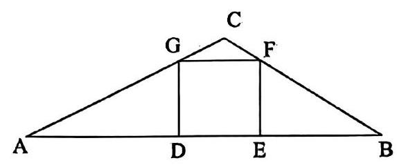

4.【2023.10 市北月考 11】函数 $y = \left| {x + 1}\right|  + \left| {x - 2}\right|  + {3}^{2 + \sqrt{2 - {3x}}}$ 的最小值为___.

5.【2020.11 格微高三月考 11】已知双曲线 $\Gamma  : \frac{{x}^{2}}{4} - \frac{{y}^{2}}{5} = 1$ 的左右焦点分别为 ${F}_{1}\text{ 、 }{F}_{2}$ ,直线 $l$ 与 $\Gamma$ 的左、右支分别交于点 $P$ 、 $Q$ ( $P$ 、 $Q$ 均在 $x$ 轴上方)。若直线 $P{F}_{1}\text{ 、 }Q{F}_{2}$ 的斜率均为 $k$ ，且四边形 ${PQ}{F}_{2}{F}_{1}$ 的面积为 ${20}\sqrt{6}$ ，则 $k =$ ___.

6.【2023.10 建平月考 11】对任意的 $x \in  \left\lbrack  {0,1}\right\rbrack$ 均有 $\left| {{ax} + b}\right|  \leq  1$ ，则 $\left| a\right|$ 的最大值为___。

7. 【2023.9 大同开学考 11 】已知当 $x \in  \left( {-\frac{1}{2},\frac{1}{2}}\right)$ 时，有 $\frac{1}{1 + {2x}} = 1 - {2x} + 4{x}^{2} - \cdots  + {\left( -2x\right) }^{n} + \cdots$ 成立,若对任意的 $x \in  \left( {-\frac{1}{2},\frac{1}{2}}\right)$ 都有 $\frac{x}{\left( {1 - {x}^{3}}\right) \left( {1 + {2x}}\right) } = {a}_{0} + {a}_{1}x + \cdots  + {a}_{n}{x}^{n} + \cdots$ ,则 ${a}_{9} =$ ___.

8.【2023.11 交大附中高三月考 15】等比数列 $\left\{  {a}_{n}\right\}$ 的前 $n$ 项和为 ${S}_{n},{a}_{1} = 3,\frac{{S}_{6}}{{S}_{3}} = \frac{7}{8}$ ,则 $\mathop{\sum }\limits_{{i = 1}}^{\infty }{a}_{i} =$ (   )

A、 -2

B. $- \frac{2}{3}$ C. $\frac{2}{3}$ D. 2

9.【2023.9 松江周测 15】下列说法不正确的是( )

A. 甲、乙、丙三种个体按 3:1:2 的比例分层抽样调查, 若抽取的甲种个体数为 9 , 则样本容量为 18

B. 设一组样本数据 ${x}_{1},{x}_{2},\cdots ,{x}_{n}$ 的方差为 2,则数据 $4{x}_{1},4{x}_{2},\cdots ,4{x}_{n}$ 的方差为 32

C。在一个 $2 \times  2$ 列联表中,计算得到 ${\chi }^{2}$ 的值,则 ${\chi }^{2}$ 的值越接近 1,可以判断两个变量相关的把握性越大

D. 已知随机变量 $\xi  \sim  N\left( {2,{\sigma }^{2}}\right)$ ,且 $P\left( {\xi  < 4}\right)  = {0.8}$ ,则 $P\left( {0 < \xi  < 4}\right)  = {0.6}$

10.【2023.11 松江一中高三月考 15】已知函数 $f\left( x\right)  = 2\sin x$ 的定义域为 $\left\lbrack  {a, b}\right\rbrack$ ，值域为 $\left\lbrack  {-1,2}\right\rbrack$ ，则 $b - a$ 的值不可能是( )

A. $\frac{5\pi }{3}$ B. $\frac{4\pi }{3}$ C. $\pi$

D. $\frac{2\pi }{3}$

## 高三一模春考次压轴日日练 (13)

训练限时: 50 分钟

1.【2023.11 ₩挖江高三期中 11】在棱长为 1 的正方体 ${ABCD} - {A}_{1}{B}_{1}{C}_{1}{D}_{1}$ 中，点 ${P}_{1}\text{ 、 }{P}_{2}$ 分别是线段 ${AB}$ 、 ${BD}$ ，(不包括端点)上的动点，且线段 ${P}_{1}{P}_{2}$ 平行于平面 ${A}_{1}{AD}{D}_{1}$ . 若 $\overrightarrow{A{P}_{1}} = 2\overrightarrow{{P}_{1}B}$ ， 则四面体 $P,{PAB}$ 的体积为___.

2.【2023.9 闵行开学考 11】若每经过一天某种物品的价格变为原来的 1.02 倍的概率为 0.5 ，变为原来的 0.98 倍的概率也为 0.5 ，则经过 6 天该物品的价格较原来价格增加的概率为___.

3.【2023.10 行知月考 11】已知关于 $x$ 的方程 ${x}^{2} + {bx} + c = 0\left( {b, c \in  R}\right)$ 在 $\left\lbrack  {-1,1}\right\rbrack$ 上有实数极，且油足 $0 \leq  {3b} + c \leq  3$ ，则 $b$ 的取值范围是___.

十年寒窗

4.【2023.10 宜川月考 11】黎曼函数(Riemann function)是一个特殊函数，由德国数学家黎曼发现升提出,黎曼函数定义在 $\left\lbrack  {0,1}\right\rbrack$ 上,其定义为:

$R\left( x\right)  = \left\{  \begin{array}{l} \frac{1}{p},\text{ 当 }x = \frac{q}{p}\left( {p, q\text{ 都是正整数, }\frac{q}{p}\text{ 是不可以再约分的真分数 }}\right) \\  0,\text{ 当 }x = 0,\text{ 或者 }\left\lbrack  {0,1}\right\rbrack  \text{ 上的无理数 } \end{array}\right.$

若函数 $f\left( x\right)$ 在 $R$ 上满足, $f\left( x\right)  + f\left( {-x}\right)  = 0$ 且 $f\left( x\right)  + f\left( {2 - x}\right)  = 0$ ,当 $x \in  \left\lbrack  {0,1}\right\rbrack$ 时, $f\left( x\right)  = R\left( x\right)$ ，则 $f\left( \frac{10}{3}\right)  + f\left( \frac{3}{10}\right)  =$ ___.

5.【2023.10 复兴月考 11】如图，在 $\bigtriangleup  {ABC}$ 和 $\bigtriangleup  {AEF}$ 中， $B$ 是 ${EF}$ 的中点， ${AB} = {EF} = 2$ ， ${CA} = {CB} = 4$ ，若 $\overline{AB} \cdot  \overline{AE} + \overline{AC} \cdot  \overline{AF} = 9$ ，则 $\overline{EF}$ 与 $\overline{BC}$ 的夹角的余弦值等于___.

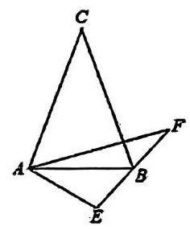

6.【2023.9 嘉定开学考 11】函数 $y = \sin {2x} + 2\sin x$ 的最大值为___。

7.【2023.5 徐汇三模 15】已知不等式 $\rho  : a{x}^{2} + {bx} + c < 0\left( {a \neq  0}\right)$ 有实数解. 命题 (1): 设 ${x}_{1},{x}_{2}$ 是 $\rho$ 的两个解,则 ${x}_{1} + {x}_{2} <  - \frac{b}{a}$ 和 ${x}_{1} \cdot  {x}_{2} < \frac{c}{a}$ ; 命题 (2): 设 ${x}_{0}$ 是 $\rho$ 的一个解,若 $a{x}_{0}{}^{2} - b{x}_{0} + c < 0$ 也成立，则 $c < 0$ ，下列说法正确的是( )。

A. 命题(1)、(2)都成立 B. 命题(1)、(2)都成立

C. 命题(1)成立，命题(2)不成立 D. 命题(1)不成立，命题(2)成立

8.【2023.11 上中东校高三月考 15】函数 $y = f\left( x\right)$ 的导函数 $y = {f}^{\prime }\left( x\right)$ 的图像如图所示， 则函数 $y = f\left( x\right)$ 的图像可能是( )

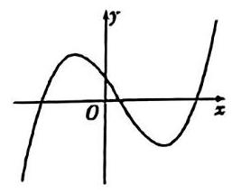

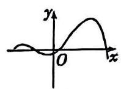

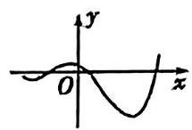

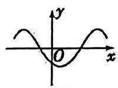

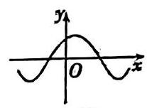

A B C D

9.【2023.9 向明开学考 15】椭圆 $\frac{{x}^{2}}{16} + \frac{{y}^{2}}{8} = 1$ 上有 10 个不同的点 ${P}_{1},{P}_{2},\cdots ,{P}_{10}$ ,若点 $T$ 坐标为 $\left( {1,0}\right)$ ，数列 $\left\{  \left| {T{P}_{n}}\right| \right\}  \left( {n = 1,2,\cdots ,{10}}\right)$ 是公差为 $d$ 的等差数列，则 $d$ 的最大值为( )

A. $\frac{5 - \sqrt{7}}{9}$ B. $\frac{5 + \sqrt{7}}{9}$ C. $\frac{2}{9}$ D. $\frac{8}{9}$

10.【2023.11 曹杨高三期中 15】折扇是我国传统文化的延续，在我国已有四千年左右的历史，“扇”与“善”谐音，折扇也寓意“善良”“善行”，它常以字画的形式体现我国的传统文化,也是运筹帷幄、决胜千里、大智大勇的象征.如图为其结构简化图,设扇面 $A\text{ 、 }B$ 间的圆弧长为 $l,{AB}$ 间的弦长为 $d$ ,圆弧所对的圆心角为 $\theta$ 传 自由例 D 顶， 等关系为( )

A. $\frac{2\sin \frac{\theta }{2}}{\theta } = \frac{d}{l}$ B. $\frac{\sin \frac{\theta }{2}}{\theta } = \frac{d}{l}$ C. $\frac{\cos \frac{\theta }{2}}{\theta } = \frac{d}{l}$ D. $\frac{2\cos \frac{\theta }{2}}{\theta } = \frac{d}{l}O$

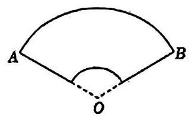

## 第三章 高三春考一模中档大题日日练

## 高三春考一模中档大题日日练(1)

训练限时: 35 分钟

1.【2023.9 交大附中开学考 18】已知数列 $\left\{  {a}_{n}\right\}$ 的前 $n$ 项和为 ${S}_{n} = 3{n}^{2} + {5n}$ ,数列 $\left\{  {b}_{n}\right\}$ 满足 ${b}_{1} = 8,{b}_{n} = {64}{b}_{n + 1}$ 。

(1)证明 $\left\{  {a}_{n}\right\}$ 是等差数列;

(2)是否存在常数 $a$ 、 $b$ ，使得对一切正整数 $n$ 都有 ${a}_{n} = {\log }_{a}{b}_{n} + b$ 成立。若存在，求出 $a$ 、 $b$ 的值；若不存在，说明理由。

2.【2023.9 闵行开学考 19】已知函数 $f\left( x\right)  = \frac{1}{2} - {\sin }^{2}{\omega x} + \frac{\sqrt{3}}{2}\sin {2\omega x},\left( {\omega  > 0}\right)$ 的最小正周期为 ${4\pi }$ .

(1)求ω的值，并写出 $f\left( x\right)$ 的对称轴方程；

(2)在 $\bigtriangleup  {ABC}$ 中角 $A, B, C$ 的对边分别是 $a, b, c$ 满足 $\left( {{2a} - c}\right) \cos B = b \cdot  \cos C$ ，求函数 $f\left( A\right)$ 的取值范围。

3.【2023.11 位有别中 19】在四棱锥 $P - {ABCD}$ 中， ${PD}\bot$ 底面 ${ABCD}$ ， ${CD}//{AB}$ ， ${AD} = \; {DC} = {CB} = 1,{AB} = 2,{DP} = \sqrt{3}$ 。

(1)证明: ${BD} \bot  {PA}$ ；

(2)求 ${PD}$ 与平面 ${PAB}$ 所成的角的正弦值。

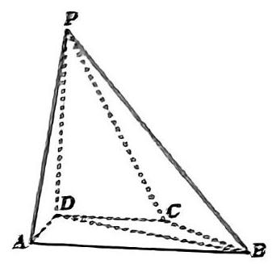

4. 【2023.9 松江一种局测 19】已知直线 $l : y = {kx} + m$ 与椭圆 $C : \frac{{x}^{2}}{4} + {y}^{2} = 1$ 交于 $A$ 、 $B$ 两点， $O$ 为坐标原点。

(1)若直线 $I$ 斜率为 1，过椭圆 $C$ 的右焦点，求弦 ${AB}$ 的长；

(2)若 $m = 2$ ，且 $\angle {AOB}$ 为锐角，求直线 $I$ 斜率的取值范围.

## 高三睿考一模中档大题日日练(2)

训练限时: 35 分钟

1.【2023.9 同一附中开学考 18】在 $\bigtriangleup  {ABC}$ 中，角 $A$ 、 $B$ 、 $C$ 对边分别是 $a$ 、 $b$ 、 $c$ ，满足 $2\overrightarrow{AB} \cdot  \overrightarrow{AC} = {a}^{2} - {\left( b + c\right) }^{2}$ 。

(1)求角 $A$ 的大小；

(2)求 $2\sqrt{3}{\cos }^{2}\frac{C}{2} - \sin \left( {\frac{4\pi }{3} - B}\right)$ 的最大值，并求取得最大值时角 $B$ 、 $C$ 的大小.

2. 【2023.9 复旦附中开学考 18】已知虚数 ${z}_{1} = 4\cos \theta  + 3\sin \theta  \cdot  i,{z}_{2} = 2 - 3\sin \theta  \cdot  i$ ，其中 $i$ 为虚数单位, $\theta  \in  R,{z}_{1}\text{ 、 }{z}_{2}$ 是实系数一元二次方程 ${z}^{2} + {mz} + n = 0$ 的两根.

(1)求实数 $m\text{ 、 }n$ 的值；

(2)若 $\left| {z - {z}_{1}}\right|  + \left| {z - {z}_{2}}\right|  = 3\sqrt{3}$ ，求 $\left| z\right|$ 的取值范围.

3.【2023.11 杨浦期中 19】如图，在四棱锥 $A - {BCDE}$ 中， ${DE} = 3,{AE} = 2,{BC} = {CD} = 1$ ， $\angle {BCD} = \angle {CDE} = \frac{2\pi }{3}$ ， $\angle {AEB} = \frac{\pi }{2}$ 。

(1)当 ${AB}\bot {BC}$ 时，求直线 ${AB}$ 与平面 ${BCDE}$ 所成角的大小；

(2)当二面角 $A - {BE} - C$ 为 $\frac{\pi }{3}$ 时，求平面 ${ABC}$ 与平面 ${ADE}$ 所成二面角的正弦值。

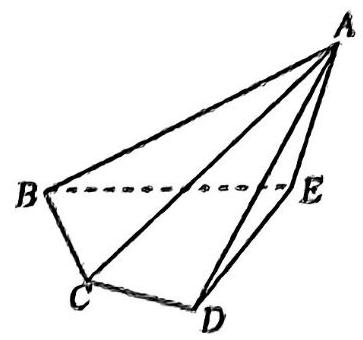

4.【2023.9 交大附中开学考 19】如图，某城市小区有一个矩形休闲广场， ${AB} = {20}$ 米， 广场的一角是半径为 16 米的扇形 ${BCE}$ 绿化区域,为了使小区居民能够更好的在广场休闲放松，现决定在广场上安置两排休闲椅，其中一排是穿越广场的双人靠背直排椅 ${MN}$ (宽度不计),点 $M$ 在线段 ${AD}$ 上,并且与曲线 ${CE}$ 相切; 另一排为单人弧形椅沿曲线 ${CN}$ (宽度不计) 摆放。已知双人靠背直排椅的造价每米为 ${2a}$ 元,单人弧形椅的造价每米为 $a$ 元,记锐角 $\angle {NBE} = \theta$ ,总造价为 $W$ 元.

(1)试将 $W$ 表示为 $\theta$ 的函数 $W\left( \theta \right)$ ，并写出 $\cos \theta$ 的取值范围；

(2)问当 ${AM}$ 的长为多少时，能使总造价 $W$ 最小.

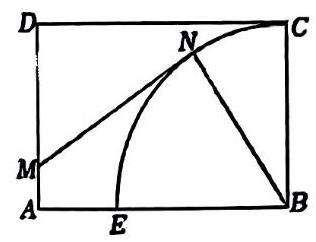

## 高三春考一模中档大题日日练(3)

## 训练限时:35 分钟

1.【2023.9 延安开学考 18】如图,在四棱锥 $P - {ABCD}$ 中,底面 ${ABCD}$ 为平行四边形, 侧面 ${PAD}$ 是边长为 2 的正三角形,平面 ${PAD} \bot$ 平面 ${ABCD},{AB} \bot  {PD}$ 。

(1)证明:平行四边形 ${ABCD}$ 为矩形；

(2)若 $E$ 为侧棱 ${PD}$ 的中点，且平面 ${ACE}$ 与平面 ${ABP}$ 所成角的正弦值为 $\frac{\sqrt{6}}{4}$ ，求点 $B$ 到平面 ${ACE}$ 的距离.

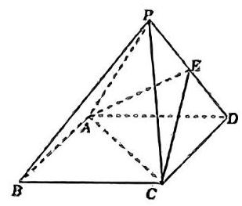

2.【2023.9 上实验周测二 18】已知幕函数 $f\left( x\right)  = \left( {{m}^{2} - {2m} - 2}\right) {x}^{{m}^{2} - {4m} + 2}$ 在 $\left( {0, + \infty }\right)$ 上单调递减.

(1)求 $m$ 的值并写出 $f\left( x\right)$ 的解析式；

(2)试判断是否存在 $a > 0$ ，使得函数 $g\left( x\right)  = \left( {{2a} - 1}\right) x - \frac{a}{f\left( x\right) } + 1$ 在 $\left( {0,2}\right\rbrack$ 上的值域为 (1,11]? 若存在,求出 $a$ 的值; 若不存在,请说明理由.

3.【2023.11 嘉定二中期中 19】杭州,作为 2023 年亚洲运动会的举办城市,以其先进的科技和创新能力再次吸引了全球的目光。其中首次采用 “机器狗” 在田径赛场上运送铁饼等， 迅速成为了全场的焦点。

已知购买 $x$ 台 “机器狗” 的总成本为 $f\left( x\right)  = \frac{1}{60}{x}^{2} + \frac{3}{4}x + {15}$ (万元)

(1)若使每台 “机器狗” 的平均成本最低，问应买多少台？

(2)现安排标明 “汪 1 ”、“汪 2 ”、“汪 3 ” 的 3 台 “机器狗” 在同一场次运送铁饼，且运送的距离都是 120 米。3 台 “机器狗” 所用时间 (单位:秒) 分别为 ${T}_{1},{T}_{2},{T}_{3}$ 。“汪 1 ” 有一半的时间以速度 (单位:米/秒) ${V}_{1}$ 奔跑，另一半的时间以速度 ${V}_{2}$ 奔跑 ““汪 2” 全程以速度 $\sqrt{{V}_{1}{V}_{2}}$ 奔跑； “汪3” 有一半的路程以速度 ${V}_{1}$ 奔跑,另一半的路程以速度 ${V}_{2}$ 奔跑、其中 ${V}_{1} > 0,{V}_{2} > 0$ 。则哪台机器狗用的时间最少？请说明理由。

4.【2023.9 进才周测 20】已知抛物线 ${y}^{2} = {4x}$ 的焦点为 $F$ ,直线 $l$ 交抛物线于不同的 $A$ 、 $B$ 两点。

(1)若直线 $l$ 的方程为 $y = x - 1$ ，求线段 ${AB}$ 的长；

(2)若直线 $l$ 经过点 $P\left( {-1,0}\right)$ ，点 $A$ 关于 $x$ 轴的对称点为 ${A}^{\prime }$ ，求证: ${A}^{\prime }$ 、 $F$ 、 $B$ 三点共线；

## 高三春考一模中档大题日日练(4)

训练限时: 35 分钟

1. 【2023.9 格致开学考 18】 $\bigtriangleup  {ABC}$ 的内角 $A, B, C$ 的对边分别为 $a, b, c$ ，已知 ${bcosC} = \left( {{2a} - c}\right) \cos B$ 。

(1)求 $B$ ；

(2)若 $\bigtriangleup  {ABC}$ 为锐角三角形，且 $c = 1$ ，求 $\bigtriangleup  {ABC}$ 面积的取值范围。

2.【2023.11 松江一中期中 19】某公园内有一块以 $O$ 为圆心半径为 20 米的圆形区域,为丰富市民的业余文化生活，现提出如下设计方案:如图，在圆形区域内搭建露天舞台，舞台为扇形 ${OAB}$ 区域,其中两个端点 $A\text{ 、 }B$ 分别在圆周上,观众席为等腰梯形 ${ABQP}$ 内且在圆 $O$ 外的区域,其中 ${AP} = {AB} = {BQ},\angle {PAB} = \angle {QBA} = \frac{2\pi }{3}$ ,且 ${AB}\text{ 、 }{PQ}$ 在点 $O$ 的同侧,为保证视听效果,要求观众席内每一个观众到舞台中心 $O$ 处的距离不超过 60 米 (即要求 ${PO} \leq  {60})$ ,设 $\angle {OAB} = \alpha ,\alpha  \in  \left( {0,\frac{\pi }{3}}\right)$ 。

(1)当 $\alpha  = \frac{\pi }{6}$ 时，求舞台表演区域的面积及 ${AB}$ 的长；

(2)对于任意 $a$ ，上述设计方案是否均能符合要求？

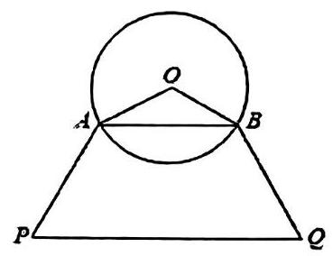

3.【2023.9 上实验周测二 19】受疫情影响，某家电连锁公司的洗衣机滞销，经研究决定， 在已有线下门店销售的基础上，成立线上营销团队，大力发展“网红”经济。当线下销售人数为 $a$ (人)时，每周线下销售洗衣机可达 $m\left( a\right)  \equiv  {10a}$ (白)，当线上销售人数为 $b$ (人) $\left( {a, n \in  {N}^{ \circ  }}\right)$ 时，每周线上销售量达到 $n\left( b\right)  = \left\{  \begin{array}{l} {b}^{2},0 \leq  b \leq  {20} \\  {400}, b > {20} \end{array}\right.$ (合)。

(1)若该公司现有销售人员 15 人，按市场需求，安排人员进行线上和线下销售，问该公司安排线上销售人员多少人时，每周销售洗衣机总台数的最大值是多少台？

(2)解不等式: $m\left( a\right)  < n\left( a\right)$ ，并解释其实际意义。

4. 【2023.9 华二附中开学考 20】已知 $F$ 为抛物线 $\Gamma  : {y}^{2} = {4x}$ 的焦点， $O$ 为坐标原点.过点 $P\left( {p,4}\right)$ 且斜率为 1 的直线 $l$ 与抛物线 $\Gamma$ 交于 $A, B$ 两点，与 $x$ 轴交于点 $M$ 。

(1)若点 $P$ 在抛物线 $\Gamma$ 上，求 $\left| {PF}\right|$ ；

(2)若 $\bigtriangleup  {AOB}$ 的面积为 $2\sqrt{2}$ ，求实数 $p$ 的值；

1

## 高三春考一模中档大题日日练(5)

训练限时: 35 分钟

1.【2023.9 松江二中周测二 18】已知函数 $f\left( x\right)  = 6{\cos }^{2}{\omega x} + \sqrt{3}\sin {2\omega x} - 3\left( {\omega  > 0}\right)$ 的最小正周期为 8 。

(1)求ω的值及函数 $f\left( x\right)$ 的单调减区间；

( 2 )若 $f\left( {x}_{0}\right)  = \frac{8\sqrt{3}}{5}$ ，且 ${x}_{0} \in  \left( {-\frac{10}{3},\frac{2}{3}}\right)$ ，求 $f\left( {{x}_{0} + 1}\right)$ 的值。

2.【2023.9 复旦附中开学考 19】如图，正方体 ${ABCD} - {A}_{1}{B}_{1}{C}_{1}{D}_{1}$ 中， $P$ 为棱 $A{A}_{1}$ 上一点；

(1)试过点 $P$ 在平面 ${AD}{D}_{1}{A}_{1}$ 上作一条直线 ${PQ}$ ，使得 ${PQ} \bot  {C}_{1}P$ ，写出作法并说明理由；

(2)若 $P$ 为棱 $A{A}_{1}$ 的中点， $Q$ 为棱 ${AD}$ 上一点，且 ${PQ} \bot  {C}_{1}P$ ，求二面角 ${D}_{1} - {PQ} - B$ 的大小.

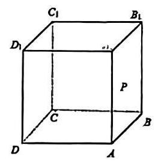

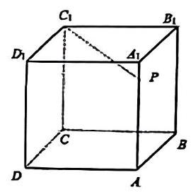

十年寒窗

3.【2023.11 北郊期中 19】如图，某市郊外景区内一条走向为北偏东的笔直的公路a 经过三个景点 $A$ 、 $B$ 、 $C$ 、景区管委会又开发了风景优美的景点 $D$ 、经测量景点 $D$ 位于景点 $A$ 的北偏东 ${30}^{ \circ  }$ 方向 8 千米处,且位于景点 $B$ 的正北方向,还位于景点 $C$ 的北偏西 ${75}^{ \circ  }$ 方向上. 已知 ${AB} = 5$ 千米.

(1)景区管委会准备由景点 D 向景点 B 修一条笔直的公路，不考虑其他因素，求出这条公路的长(结果精确到 0.1 千米)；

(2)求景点 $C$ 与景点 $D$ 之间的距离 (结果精确到 0.1 千米).

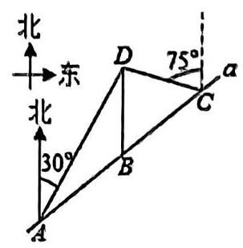

4.【2023.9 徐汇周练二20】已知 $A\text{ 、 }B$ 分别是椭圆 $C : \frac{{x}^{2}}{{a}^{2}} + \frac{{y}^{2}}{{b}^{2}} = 1\left( {a > b > 0}\right)$ 的左右顶点, $O$ 为坐标原点, $\left| {AB}\right|  = 6$ ,点 $\left( {2,\frac{5}{3}}\right)$ 在椭圆 $C$ 上. 过点 $P\left( {0, - 3}\right)$ ,且与坐标轴不垂直的直线 $l$ 交椭圆 $C$ 于 $M$ 、 $N$ 两个不同的点。

(1)求椭圆 $C$ 的标准方程；

(2)若点 $B$ 落在以线段 ${MN}$ 为直径的圆的外部,求直线 $l$ 的斜率 $k$ 的取值范围；

## 高三春考一模中档大题日日练(6)

## 训练限时:35 分钟

1. $\left\lbrack  {2023.5}\right.$ 格致三模 18 】如图，三棱柱 ${ABC} - {A}_{1}{B}_{1}{C}_{1}$ 中，四边形 ${AB}{B}_{1}{A}_{1}$ 是菱形，且 $\angle {AB}{B}_{1} = {60}^{ \circ  },{AB} = {BC} = 2,{CA} = C{B}_{1},{CA} \bot  C{B}_{1}.$

(1)证明:平面 ${CA}{B}_{1} \bot$ 平面 ${AB}{B}_{1}{A}_{1}$ ；

(2)求直线 $B{B}_{1}$ 和平面 ${ABC}$ 所成角的正弦值。

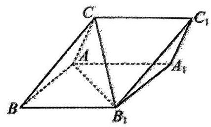

2.【2023.11 光明期中 20】某农场有一块农田,如图所示,它的边界由圆 $O$ 的一段圆弧 ${MPN}$ ( $P$ 为此圆弧的中点) 和线段构成. 已知圆 $O$ 的半径为 40 米,点 $P$ 到 ${MN}$ 的距离为 50 米. 现规划在此农田上修建两个温室大棚, 大棚 I 内的地块形状为矩形 ABCD, 大棚 II 内的地块形状为 $\bigtriangleup {CDP}$ ,要求 $A, B$ 均在线段 ${MN}$ 上, $C\text{ 、 }D$ 均在圆弧上. 设 ${OC}$ 与 ${MN}$ 所成的角为 $\theta$ .

(1)用 $\theta$ 分别表示矩形 ${ABCD}$ 和 $\bigtriangleup {CDP}$ 的面积；

(2)确定 $\sin \theta$ 的取值范围;

(3)若大棚 I 内种植甲种蔬菜，大棚 II 内种植乙种蔬菜，且甲、乙两种蔬菜的单位面积年产值之比为 4:3 . 求当 $\theta$ 为何值时,能使甲、乙两种蔬菜的年总产值最大.

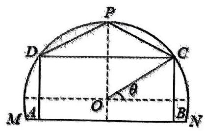

3.【2023.11 七宝期中 19】去年某地产生的生活垃圾为 20 万吨，其中 8 万吨垃圾以填埋方式处理，12 万吨垃圾以环保方式处理，为了确定处理生活垃圾的预算，预计从今年起， 每年生活垃圾的总量递增 ${10}\%$ ,同时,通过环保方式处理的垃圾量每年增加 5 万吨。

(1)请写出今年起第 $n$ 年用填埋方式处理的垃圾量 ${c}_{n}$ 的表达式；

(2)求从今年起 $n$ 年内用真理方式处理的垃圾量的总和 ${S}_{n}$ ；

(3)预计今年起 9 年内，哪些年不需要用填埋方式处理生活垃圾。

4.【2023.11 复旦期中 20】已知椭圆 $\Gamma  : \frac{{x}^{2}}{{a}^{2}} + \frac{{y}^{2}}{{b}^{2}} = 1\left( {a > b > 0}\right)$ 过点 $A\left( {\sqrt{3},\frac{\sqrt{13}}{2}}\right)$ ，且 $\Gamma$ 的左焦点为 $F\left( {-2\sqrt{3},0}\right)$ ，直线 $l$ 点 $\Gamma$ 交于 $M$ ， $N$ 两点。

(1)求椭圆 $\Gamma$ 的方程；

(2)若 $\overrightarrow{MP} = \frac{1}{2}\overrightarrow{PN}$ ，且点 $P$ 的坐标为 $\left( {0,1}\right)$ ，求直线 $l$ 的斜率；

(3)若 $\left| {\overrightarrow{OM} + \overrightarrow{ON}}\right|  = 4$ ，其中 0 为坐标原点，求 $\bigtriangleup  {MON}$ 面积的最大值.

# 高三春考一模中档大题日日练(7)

训练限时: 35 分钟

1.【2023.11 松江期中 18】如图,在直三棱柱 ${ABC} - {A}_{1}{B}_{1}{C}_{1}$ 中, $\angle {ACB} = {90}^{ \circ  }$ , $A{A}_{1} = {AC} = {BC} = 2, D, E$ 分别为 $C{C}_{1},{A}_{1}B$ 的中点。

(1)证明: ${ED}//$ 平面 ${ABC}$ ；

(2)求直线 $C{C}_{1}$ 与平面 ${A}_{1}{BD}$ 所成角的大小。

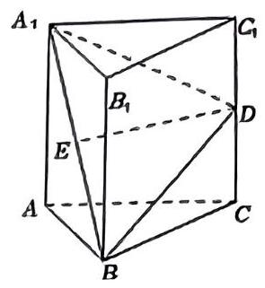

2.【2023.11 同济期中 19】如图，某市在两条直线公路 ${OA}$ 、 ${OB}$ 上修建地铁站 $A$ 和 $B$ ， $\angle {AOB} = {120}^{ \circ  }$ ，为了方便市民出行，要求公园 $O$ 到 ${AB}$ 的距离为 $1\mathrm{\;{km}}$ . 设 $\angle {BAO} = \theta$ .

(1)试求 ${AB}$ 的长度 $I$ 关于 $\theta$ 的函数关系式；

(2)问当 $\theta$ 取何值时，才能使 ${AB}$ 的长度最短，并求其最短距离.

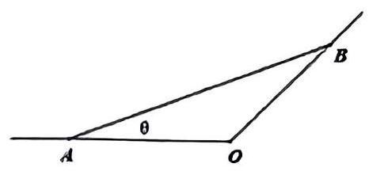

十年寒窗

3.【2023,6 上外附中期末 19 】已知数列 $\left\{  {a}_{n}\right\}$ 的前 $n$ 项和为 ${S}_{n}$ ,当 $n \geq  2$ 时, ${S}_{n}\left( {{S}_{n} - {a}_{n} + 1}\right)  = {S}_{n - 1}$  。

(1)证明:数列 $\left\{  \frac{1}{{S}_{n}}\right\}$ 是等差数列；

(2)若 ${a}_{1} = \frac{1}{2}$ ，数列 $\left\{  \frac{{2}^{n}}{{S}_{n}}\right\}$ 的前 $n$ 项和为 ${T}_{n}$ ，若 $m{T}_{n} \leq  \left( {{n}^{2} + {16}}\right)  \cdot  {2}^{n + 1}$ 恒成立，求正整数 $m$ 的最大值.

4.【2023.11 进才期中 21】已知 $f\left( x\right)  = \frac{1}{4}{x}^{3} - {x}^{2} + x$ .

(1)求函数 $y = f\left( x\right)$ 的极小值；

(2)当 $x \in  \left\lbrack  {-2,4}\right\rbrack$ 时，求证: $x - 6 \leq  f\left( x\right)  \leq  x$ ；

# 高三春考一模中档大题日日练(8)

## 训练限时:35 分钟

1.【2023.11 七宝期中 18】如图，在三棱锥 $P - {ABC}$ 中，已知 ${AC}\bot {BC},{AC} = {BC} = {2a}$ ， 平面 ${PAB} \bot$ 平面 ${ABC}$ ，点 $O$ ， $D$ 分别是 ${AB}$ 、 ${PB}$ 的中点， ${PO} \bot  {AB}$ ，连接 ${CD}$ 。

(1)若 ${PA} = {2a}$ ，求异面直线 ${PA}$ 与 ${CD}$ 所成角的余弦值的大小

(2)若二面角 $A - {PB} - C$ 的余弦积的大小为 $\frac{\sqrt{5}}{5}$ ，求 ${PA}$ 的长.

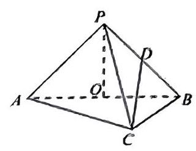

2.【2023.5 华附模拟 3.18】在 $\bigtriangleup  {ABC}$ 中， $a$ 、 $b$ 、 $c$ 分别是角 $A$ 、 $B$ 、 $C$ 的对边. 设 $\overrightarrow{m} = \left( {{2a} + c, b}\right) ,\overrightarrow{n} = \left( {\cos B,\cos C}\right)$ 且 $\overrightarrow{m} \cdot  \overrightarrow{n} = 0$ .

(1)求角 $B$ 的大小；

(2)设 $f\left( x\right)  = 2\cos x\sin \left( {x + \frac{\pi }{3}}\right)  - 2{\sin }^{2}x\sin B + 2\sin x\cos x\cos \left( {A + C}\right)$ ，当 $x \in  \left\lbrack  {\frac{\pi }{6},\frac{2\pi }{3}}\right\rbrack$ 时， 求函数 $y = f\left( x\right)$ 的最小值。

3.【2023.11 高桥期中 19】图①是高桥中学的校门，它由上部屋顶，和下部两根立柱组成， 如图②，屋顶由四坡屋面构成，其中前后两坡屋面 ${ABFE}$ 和 ${CDEF}$ 是全等的等腰梯形，左右两坡屋面 ${EAD}$ 和 ${FBC}$ 是全等的三角形。点 $F$ 在平面 ${ABCD}$ 和 ${BC}$ 上的射影分别为 $H$ 、 $M$ ,已知 ${HM} = {2m},{BC} = {2m}$ ,梯形 ${ABFE}$ 的面积是 $\bigtriangleup {FBC}$ 面积的 4 倍,设 $\angle {FMH} = \theta \left( {0 < \theta  < \frac{\pi }{4}}\right) .$

(1)求屋顶面积 $S$ 关于 $\theta$ 的函数关系式；

(2)已知上部屋顶造价与屋顶面积成正比，比例系数为 $k$ ( $k$ 为正的常数)，下部两根立柱的总造价与其单根的高度成正比,比例系数为 ${2k}$ ,假设校门的总高度为 $3\mathrm{\;m}$ ,试问,当 $\theta$ 为何值时, 校门的总造价 (上部屋顶和下部两根立柱) 最低?

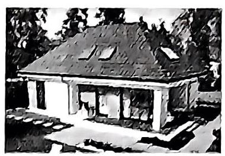

①

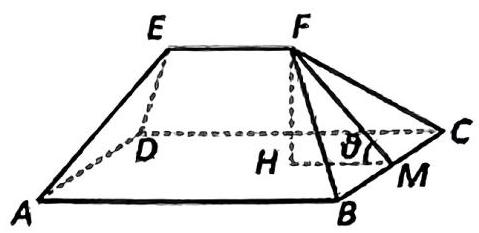

②

4.【2023.11 徐汇期中 21】已知函数 $f\left( x\right)  = \left( {a{x}^{2} + x + 2}\right) {e}^{x}\left( {a \geq  0}\right)$ ，其中 $e$ 是自然对数的底数.

(1)当 $a = 0$ 时，求曲线 $f\left( x\right)$ 在点 $\left( {0, f\left( 0\right) }\right)$ 处的切线方程；

(2)当 $a = 2$ 时，求 $f\left( x\right)$ 在 $\left\lbrack  {-2,2}\right\rbrack$ 的最值。

## 高三春考一模中档大题日日练(9)

## 训练限时:35 分钟

1.【2023.11 洋泾期中 18】已知函数 $f\left( x\right)  = 2{\sin }^{2}{\omega x} + 2\sqrt{3}\sin {\omega x}\cos {\omega x}$ 的最小正周期为 $\pi$ , 其中 $\omega  > 0$ 。

(1)求 $\omega$ 的值与函数 $f\left( x\right)$ 的单调增区间；

(2)设 $\bigtriangleup  {ABC}$ 的内角 $A$ 、 $B$ 、 $C$ 的对边分别为 $a$ 、 $b$ 、 $c$ ，且 $c = \sqrt{3}$ ， $\sin B = 2\sin A$ ， $f\left( C\right)  = 3$ ，求 $\bigtriangleup  {ABC}$ 的面积.

2.【2023.11 南模期中 18】一根长为 $L$ 的铁棒 ${AB}$ 欲通过如图所示的直角走廊，已知走廊的宽 ${AC} = {BD} = {2m}$ .

(1)设 $\angle {BOD} = \theta$ ，试将 $L$ 表示为 $\theta$ 的函数；

(2)求 $L$ 的最小值，并说明此最小值的实际意义.

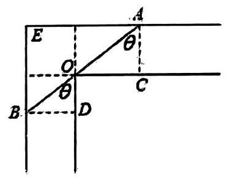

3.【2023.11 徐汇期中 19】某公司实行了年薪制工资结构改革。该公司从 2023 年起，每人的工资由三个项目构成，并按下表规定实施:

<table><tr><td>项目</td><td>金额[万元/(人・年)]</td><td>性质与计算方法</td></tr><tr><td>基础工资</td><td>2022 年基础工资为 1 万元</td><td>考虑到物价因素, 决定从 2023 年   起每年递增10%(年入职年限无关)</td></tr><tr><td>房屋补贴</td><td>0.08 万元</td><td>从 2023 年起, 按职工到公司年限计算, 每年递增 0.08 万元</td></tr><tr><td>医疗费</td><td>0.32 万元</td><td>固定不变</td></tr></table>

如果该公司 2023 年有 5 位职工，计划从 2024 年起每年新招 5 名职工. 若 2023 年算第一年

(1)求第三年公司付给职工的工资总额。

(2)将第 $n$ 年该公司付给职工工资总额 $y$ (万元)表示成年限 $n$ 的函数；

(3)若公司每年发给职工工资总额中，房屋补贴和医疗费之和总是不会超过基础工资总额的 $p\%$ ,求 $p$ 的最小值.

4.【2023.11 周浦期中 21】设 $f\left( x\right)  = {e}^{x}$ 。

(1)求证:直线 $y = x + 1$ 与曲线 $y = f\left( x\right)$ 相切；

(2)设点 $P$ 在曲线 $y = f\left( x\right)$ 上，点 $Q$ 在直线 $y = x - 1$ 上，求 $\left| {PQ}\right|$ 的最小值；

## 高三春考一模中档大题日日练(10)

训练限时: 35 分钟

1.【2023.5 嘉定三模 18】已知数列 $\left\{  {a}_{n}\right\}$ 的前 $n$ 项和为 ${S}_{n},{a}_{1} = 2$ ,对任意的正整数 $n$ , 点 $\left( {{a}_{n + 1},{S}_{n}}\right)$ 均在函数 $f\left( x\right)  = x$ 图像上。

(1)证明:数列 $\left\{  {S}_{n}\right\}$ 是等比数列；

(2)间 $\left\{  {a}_{n}\right\}$ 中是否存在不同的三项能构成等差数列？说明理由.

2.【2023.11 七宝期中 19】今年是中国“一带一路”倡议提出十周年，期间中国与共建国家共同打造政治互信、经济融合的利益共同体，中国对外投资大幅增加，某中国企业抓住机遇,准备到某地建立原材料加工厂,此地有三处原材料采集点,分别位于矩形 ${ABCD}$ 的顶点 $A, B$ ,及 ${CD}$ 的中点 $P$ 处,已知 ${AB} = {20km},{BC} = {10km}$ . 现要在矩形 ${ABCD}$ 的区域内 (不含边界),与 $A\text{ 、 }B$ 等距离的一点 $O$ 处建厂,并修路 ${AO}\text{ 、 }{BO}\text{ 、 }{OP}$ ,以便从采集点向工厂运输原材料. 设修路的总长为 ykm .

(1)按下列要求写出函数关系式:

①设 $\angle {BAO} = \theta \left( {rad}\right)$ ，将 $y$ 表示成 $\theta$ 的函数关系式，

②设 ${OP} = x\left( {km}\right)$ ，将 $y$ 表示成 $x$ 的函数关系式.

(2)请你选用(1)中的一个函数关系式，确定建厂 0 的位置，使三条路总长度最短.

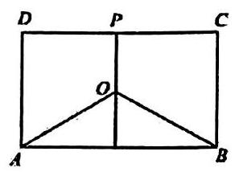

3.【2023.11 四校联考用中 19】在苏州博物馆有一类典型建筑八角亭，既美观又利于采光， 其中一角如图所示，为多面体 ${ABCDE} - {A}_{1}{B}_{1}{C}_{1}{D}_{1},{AB} \bot  {AE},{AE}//{BC},{AB}//{ED}, A{A}_{1} \bot$ 层面 ${ABCDE}$ ,四边形 $A, B, C, D$ ,是边长为 2 的正方形且平行于底面， ${AB}//{A}_{1}{B}_{1}$ ,尺 6 分别为 $D, E$ 、 $B, B$ 的中点， ${AB} = {AE} = {2DE} = {2BC} = 4, A{A}_{1} = 1$ .

(1)证明: ${FG}//$ 平面 $C,{CD}$ ；

(2)求平面 $C,{CD}$ 与平面 ${AA}, B, B$ 所成锐二面角的余弦值.

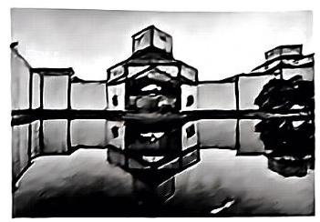

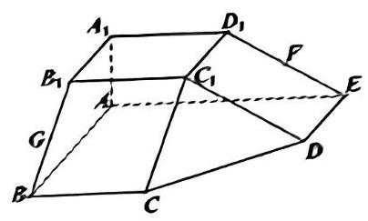

4.【2023.11 向明期中 19】文明城市是反映城市整体文明水平的综合性荣誉称号, 某市为提高市民对文明城市创建的认识, 举办了 “创建文明城市” 知识竞赛, 从所有答卷中随机抽取 100 份作为样本, 将样本的成绩 (满分 100 分, 成绩均为不低于 40 分的整数) 分成六段: $\lbrack {40},{50}),\lbrack {50},{60}),\cdots ,\left\lbrack  {{90},{100}}\right\rbrack$ ,得如下图所示的频率分布直方图

(1)求频率分布直方图中 $a$ 的值

(2)若在抽取的 100 份样本中有 20 份样本的数据如下:

44, 46, 50, 52, 60, 63, 66, 68, 68, 72, 75, 76, 79, 79, 81, 82, 82, 83, 90, 92

求该组数据(指这 20 分样本构成的数据)的第 75 百分位数

(3)已知落在 $\lbrack {50},{60})$ 的平均成绩是 54，方差是 7，落在 $\lbrack {60},{70})$ 的平均成绩为 66，方差 4 , 求这两组成绩的总平均数和总方差

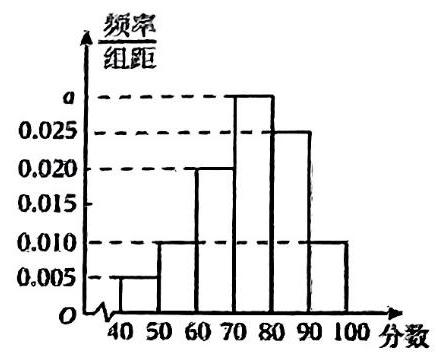
