目录

函数、导数与不等式 .2

三角函数 .90

数列 105

函数与数列 134

解析几何 173

概率统计 .285

应用题 347

## 函数、导数与不等式

1. 对于一个函数 $f\left( X\right)$ 和一个点 $M\left( {a, b}\right)$ ,定义 $s\left( X\right)  = {\left( X - a\right) }^{2} + {\left( f\left( X\right)  - b\right) }^{2}$ ,若存在 $P\left( {{X}_{0}, f\left( {X}_{0}\right) }\right)$ ,使 $S\left( {X}_{0}\right)$ 是 $S\left( X\right)$ 的最小值,则称点 $P$ 是函数 $f\left( X\right)$ 到点 $M$ 的 “最近点”.

(1)对于 $f\left( x\right)  = \frac{1}{x}\left( {x > 0}\right)$ ，求证:对于点 $M\left( {0,0}\right)$ ，存在点 $P$ ，使得点 $P$ 是 $f\left( X\right)$ 到点 $M$ 的“最近点”；

(2)对于 $f\left( X\right)  = {e}^{x}, M\left( {1,0}\right)$ ，请判断是否存在一个点 $P$ ，它是 $f\left( X\right)$ 到点 $M$ 的“最近点”,且直线 ${MP}$ 与 $f\left( X\right)$ 在点 $P$ 处的切线垂直;

(3)已知定义在 $R$ 上的函数 $f\left( X\right)$ 存在导函数 ${f}^{\prime }\left( X\right)$ ，定义在 $R$ 上的函数 $g\left( X\right)$ 恒大于零， 对于点 ${M}_{1}\left( {t - 1, f\left( t\right)  - g\left( t\right) }\right)$ ,点 ${M}_{2}\left( {t + 1, f\left( t\right)  + g\left( t\right) }\right)$ ,若对任意 $t \in  R$ ,存在点 $P$ 同时是 $f\left( X\right)$ 到点 ${M}_{1}$ 与点 ${M}_{2}$ 的 “最近点”,试判断 $f\left( X\right)$ 的单调性.

$S\left( x\right)$ 即为曲线上的点 $\left( {x, f\left( x\right) }\right)$ 与 $M\left( {a, b}\right)$ 距离的平方

(1)设 $P\left( {x,\frac{1}{x}}\right)$

$S\left( x\right)  = {x}^{2} + \frac{1}{{x}^{2}} \geq  2$ ,当且仅当 $x = 1$ 时,取等

$\therefore f$ 最近点为 $\left( {1,1}\right)$

(2) $P\left( {{x}_{0},{e}^{{x}_{0}}}\right) , M\left( {1,0}\right) ,{k}_{PM} = \frac{{e}^{{x}_{0}}}{{x}_{0} - 1}$

${f}^{\prime }\left( {x}_{0}\right)  = {e}^{{x}_{0}}$

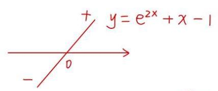

$\therefore \frac{{e}^{{x}_{0}}}{{x}_{0} - 1} \cdot  {e}^{{x}_{0}} =  - 1$

$\therefore {e}^{2{x}_{0}} + {x}_{0} - 1 = 0$

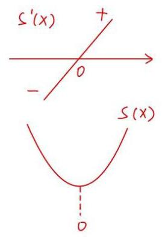

$\because y = {e}^{2x} + x - 1$ ↑

$\therefore {e}^{2{x}_{0}} + {x}_{0} - 1 = 0$ 有唯一解 ${x}_{0} = 0$

$S\left( x\right)  = {\left( x - 1\right) }^{2} + {\left( {e}^{x} - 0\right) }^{2} = {x}^{2} - {2x} + 1 + {e}^{2x}$

${S}^{\prime }\left( x\right)  = {2x} - 2 + 2{e}^{2x} \uparrow$

$S\left( x\right)$ 在 $\left( {-\infty ,0}\right)  \downarrow  ,\left( {0, + \infty }\right)  \uparrow$

$S{\left( x\right) }_{\min } = S\left( 0\right)$

$\therefore$ 点 $P$ 为 $M$ 的 $f$ 最近点

(3)法一:设 ${M}_{1}$ ， ${M}_{2}$ 的中点为 $a$

${M}_{1}\left( {t - 1, f\left( t\right)  - g\left( t\right) }\right) ,{M}_{2}\left( {t + 1, f\left( t\right)  + g\left( t\right) }\right)$

$\therefore a\left( {t, f\left( t\right) }\right)$ ，易知 $a$ 在 $y = f\left( x\right)$ 上

${M}_{2}\left( {t + 1, f\left( t\right)  + g\left( t\right) }\right)$

$Q\left( {t, f\left( t\right) }\right)$

$$
{M}_{1}\left( {t - 1, f\left( t\right)  - g\left( t\right) }\right)
$$

1、点 $P$ 是 ${M}_{1}$ 和 ${M}_{2}$ 的 $f$ 最近点

$\therefore P{M}_{1} \leq  Q{M}_{1}, P{M}_{2} \leq  Q{M}_{2}$

$\therefore {P{M}_{1} + P{M}_{2} \leq  Q{M}_{1} + Q{M}_{2}}$

$P{M}_{1} + P{M}_{2} \leq  {M}_{1}{M}_{2}$

$\therefore$ 点 $P$ 即为Q

设 $P\left( {X, f\left( x\right) }\right)$

$P{M}_{1}^{2} = {S}_{1}\left( x\right)  = {\left( x - t + 1\right) }^{2} + {\left\lbrack  f\left( x\right)  - f\left( t\right)  + g\left( t\right) \right\rbrack  }^{2}$

${S}_{1}^{\prime }\left( x\right)  = 2\left( {x - t + 1}\right)  + 2\left\lbrack  {f\left( x\right)  - f\left( t\right)  + g\left( t\right) }\right\rbrack   \cdot  {f}^{\prime }\left( x\right)$

$P{M}_{2}^{2} = {S}_{2}\left( x\right)  = {\left( x - t - 1\right) }^{2} + {\left\lbrack  f\left( x\right)  - f\left( t\right)  - g\left( t\right) \right\rbrack  }^{2}$

${S}_{2}^{\prime }\left( x\right)  = 2\left( {x - t - 1}\right)  + 2\left\lbrack  {f\left( x\right)  - f\left( t\right)  - g\left( t\right) }\right\rbrack   \cdot  {f}^{\prime }\left( x\right)$

$\therefore {S}_{1}^{\prime }\left( t\right)  = 0,{S}_{2}^{\prime }\left( t\right)  = 0$

$\therefore \left\{  {\begin{array}{l} 2 + {2g}\left( t\right) {f}^{\prime }\left( t\right)  = 0 \\   - 2 - {2g}\left( t\right) {f}^{\prime }\left( t\right)  = 0 \end{array},\therefore {f}^{\prime }\left( t\right)  = \frac{-1}{g\left( t\right) }}\right.$

$\because g\left( t\right)  > 0, t \in  R,\therefore {f}^{\prime }\left( t\right)  < 0$

$\therefore f\left( x\right)$ 严格减

法二:由(2)知:如果 $\mathrm{{MP}}$ 垂直于P处的函数切线，则 $\mathrm{P}$ 是 $M$ 的 $f$ 最近点

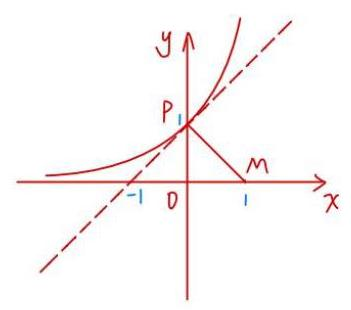

这里我们可以尝试证明一个引理:

若 $P\left( {{x}_{0},{y}_{0}}\right)$ 为 $M\left( {a, b}\right)$ 的最近点，则 ${MP}$ 垂直于P处的函数切线

证明: ${S}^{\prime }\left( {x}_{0}\right)  = 2\left( {{x}_{0} - a}\right)  + 2{f}^{\prime }\left( {x}_{0}\right) \left\lbrack  {f\left( {x}_{0}\right)  - b}\right\rbrack   = 0$

解得 ${f}^{\prime }\left( {x}_{0}\right)  =  - \frac{{x}_{0} - a}{f\left( {x}_{0}\right)  - b} =  - \frac{1}{k - m}$ ，得证

那么对于原题来说，设 $P\left( {{x}_{0},{y}_{0}}\right)$ 是 ${M}_{1},{M}_{2}$ 的 $f$ 最近点

${f}^{\prime }\left( {x}_{0}\right)  =  - \frac{1}{{x}_{m} - p} =  - \frac{1}{{x}_{m} - p}$

$\therefore {M}_{1},{M}_{2}, p =$ 点共线

$\therefore P$ 必然是 ${M}_{1}{M}_{2}$ 中点 $\left( {t, f\left( t\right) }\right)$ ，否则 $P$ 必然离 ${M}_{1},{M}_{2}$ 其中一点更远

$\therefore {f}^{\prime }\left( t\right)  =  - \frac{t + 1 - t}{f\left( t\right)  + g\left( t\right)  - f\left( t\right) } =  - \frac{1}{g\left( t\right) } < 0$

$\therefore$ 对 $\forall t \in  \mathbb{R}$ ,都有 ${f}^{\prime }\left( t\right)  < 0$

$\therefore f\left( x\right)$ 在 $R$ 上严格减，得证

2. 已知函数 $f\left( x\right)  = \frac{{x}^{2} + \left( {{3a} + 1}\right) x + c}{x + a}$ ,其中 $a, c \in  \mathbf{R}$ .

(1)当 $a = 0$ 时，求 $f\left( x\right)$ 的定义域，并判断是否存在实数 $c$ ，使得 $f\left( x\right)$ 是奇函数；

(2)若函数 $f\left( x\right)$ 的图像经过点 $\left( {1,3}\right)$ ，且与 $x$ 轴的负半轴有两个不同的交点，求 $c$ 的值和 $a$ 的取值范围.

(1) 当 $a = 0$ 时， $f\left( x\right)  = \frac{{x}^{2} + x + c}{x} = x + \frac{c}{x} + 1, x \in  \left( {-\infty ,0}\right)  \cup  \left( {0, + \infty }\right)$

$f\left( x\right)  + f\left( {-x}\right)  = x + \frac{c}{x} + 1 - x - \frac{c}{x} + 1 = 2 \neq  0$

$\therefore$ 不存在实数 $c$ ，使得 $y = f\left( x\right)$ 为奇函数

(2) $f\left( 1\right)  = \frac{1 + {3a} + 1 + c}{1 + a} = 3$

$\therefore c = 1$

$\therefore f\left( x\right)  = \frac{{x}^{2} + \left( {{3a} + 1}\right) x + 1}{x + a}\left( {x \neq   - a}\right)$

令 $f\left( x\right)  = 0$ ，则 ${x}^{2} + \left( {{3a} + 1}\right) x + 1 = 0$ ，此方程有两个不同的负根

且 $x =  - a$ 不是方程的根

$\therefore \left\{  \begin{array}{l} \Delta  = {\left( 3a + 1\right) }^{2} - 4 > 0 \\   - \left( {{3a} + 1}\right)  < 0 \\  {a}^{2} - a\left( {{3a} + 1}\right)  + 1 \neq  0 \end{array}\right.$

$\therefore a \in  \left( {\frac{1}{3},\frac{1}{2}}\right)  \cup  \left( {\frac{1}{2}, + \infty }\right)$

3. 已知 $f\left( x\right)  = {\log }_{3}\left( {x + a}\right)  + {\log }_{3}\left( {6 - x}\right)$ .

(1)若将函数 $y = f\left( x\right)$ 的图像向下平移 $m\left( {m > 0}\right)$ 个单位，经过点 $\left( {3,0}\right)$ 、 $\left( {5,0}\right)$ ，求 $a$ 与 $m$ 的值;

(2)若 $a >  - 3$ 且 $a \neq  0$ ，解关于 $x$ 的不等式 $f\left( x\right)  \leq  f\left( {6 - x}\right)$ .

$\left( 1\right) g\left( x\right)  = f\left( x\right)  - m = {\log }_{3}\left( {a + x}\right)  + {\log }_{3}\left( {b - x}\right)  - m$

$\because \left\{  {\begin{array}{l} g\left( 3\right)  = {\log }_{3}\left( {a + 3}\right)  + 1 - m = 0 \\  g\left( 5\right)  = {\log }_{3}\left( {a + 5}\right)  - m = 0 \\  m > 0 \end{array},\therefore \left\{  \begin{array}{l} a =  - 2 \\  m = 1 \end{array}\right. }\right.$

(2) $f\left( x\right)  = {\log }_{3}\left( {a + x}\right)  + {\log }_{3}\left( {6 - x}\right)  = {\log }_{3}\left( {a + x}\right) \left( {6 - x}\right)$

$f\left( {6 - x}\right)  = {\log }_{3}\left( {a + 6 - x}\right)  + {\log }_{3}x = {\log }_{3}x\left( {a + 6 - x}\right)$

$\therefore \left\{  \begin{array}{l} a + x > 0 \\  6 - x > 0 \end{array}\right.$ ，且 $\left\{  \begin{array}{l} a + 6 - x > 0 \\  x > 0 \end{array}\right.$

$\therefore  - a < x < 6$ 且 $0 < x < a + 6$

${x}^{\prime } + f\left( x\right)  \leq  f\left( {6 - x}\right)$

$\therefore \left( {a + x}\right) \left( {6 - x}\right)  \leq  x\left( {a + 6 - x}\right)$

$\therefore {ax} \geq  {3a}$

① $\neg 3 < a < {0r}$ 时， $- a \in  \left( {0,3}\right) , b + a \in  \left( {3,6}\right)$

$\left\{  \begin{array}{l} x \leq  3 \\   - a < x < 6 \\  0 < x < 6 + a \end{array}\right.$

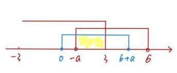

$\therefore x \in  \left\lbrack  {-a,3}\right\rbrack$

③ $a > 0$ 时， $- a < 0,6 + a > 6$

$\left\{  \begin{array}{l} x \geq  3 \\   - a < x < 6 \\  0 < x < b + a\;\frac{1}{-a}\;\frac{1}{6}\;\frac{1}{6}\;\frac{1}{6}\;a > 0 \end{array}\right.$

$\therefore x \in  \lbrack 3,6)$

综上,当 $a \in  \left( {-3,0}\right)$ 时, $x \in  ( - a,3\rbrack$ ,当 $a \in  \left( {0, + \infty }\right)$ 时, $x \in  \lbrack 3,6)$

4. 已知 $f\left( x\right)$ 是定义在 $\mathbf{R}$ 上的函数,若对任意的 ${x}_{1},{x}_{2} \in  \mathbf{R},{x}_{1} - {x}_{2} \in  S$ ,均有 $f\left( {x}_{1}\right)  - f\left( {x}_{2}\right)  \in  S$ ,则称 $f\left( x\right)$ 是 $S$ 关联.

(1)判断和证明 $f\left( x\right)  = {2x} + 1$ 是否是 $\lbrack 0, + \infty )$ 关联? 是否是 $\left\lbrack  {0,1}\right\rbrack$ 关联?

(2)若 $f\left( x\right)$ 是 $\{ 3\}$ 关联，当 $x \in  \lbrack 0,3)$ 时， $f\left( x\right)  = {x}^{2} - {2x}$ ，解不等式 $2 \leq  f\left( x\right)  \leq  3$ ；

(3)证明:“ $f\left( x\right)$ 是 $\{ 1\}$ 关联，且是 $\lbrack 0, + \infty )$ 关联”的充要条件是“ $f\left( x\right)$ 是 $\left\lbrack  {1,2}\right\rbrack$ 关联”.

(1) $f\left( x\right)  = {2x} + 1$ 是 $\lbrack 0, + \infty )$ 关联，不是 $\left\lbrack  {0,1}\right\rbrack$ 关联

证明: 对 $\forall {x}_{1},{x}_{2} \in  R$ . 若 ${x}_{1} - {x}_{2} \in  \lbrack 0, + \infty )$

则 $f\left( {x}_{1}\right)  - f\left( {x}_{2}\right)  = 2\left( {{x}_{1} - {x}_{2}}\right)  \in  \lbrack 0, + \infty )$

$\therefore f\left( x\right)  = {2x} + 1$ 是 $\lbrack 0, + \infty )$ 关联

若 ${x}_{1} - {x}_{2} \in  \left\lbrack  {0,1}\right\rbrack$ ，则 $f\left( {x}_{1}\right)  - f\left( {x}_{2}\right)  = 2\left( {{x}_{1} - {x}_{2}}\right)  \in  \left\lbrack  {0,2}\right\rbrack$

$\therefore f\left( x\right)  = {2x} + 1$ 不是 $\left\lbrack  {0,1}\right\rbrack$ 关联

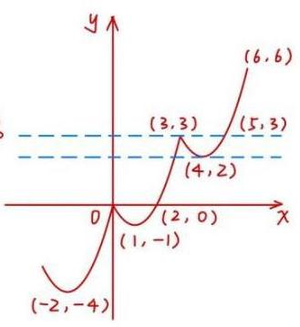

(2)法一: $f\left( x\right)$ 是 $\left\{  \begin{array}{l} 3\} \text{ 关联 } \\   \end{array}\right.$

$\therefore {x}_{1} - {x}_{2} = 3$ ,则 $f\left( {x}_{1}\right)  - f\left( {x}_{2}\right)  = 3$ 即 $f\left( {x + 3}\right)  - f\left( x\right)  = 3$

$\therefore$ 当 $x \in  \lbrack 0,3)$ 时， $f\left( x\right)  = {x}^{2} - {2x} = {\left( x - 1\right) }^{2} - 1 \in  \lbrack  - 1,3)$

$\because 2 \leq  f\left( x\right)  \leq  3$ ,即 $2 \leq  {x}^{2} - {2x} \leq  3$

$\therefore 1 + \sqrt{3} \leq  x \leq  3$

当 $x \in  \lbrack  - 3,0), x + 3 \in  \lbrack 0,3), f\left( x\right)  = {x}^{2} + {4x} = {\left( x + 2\right) }^{2} - 4 \in  \lbrack  - 4,0)$ ,不合题意

当 $x \in  \lbrack 3,6), x - 3 \in  \lbrack 0,3), f\left( x\right)  = {x}^{2} - {8x} + {18} = {\left( x - 4\right) }^{2} + 2 \in  \lbrack 2,6)$

$\because 2 \leq  f\left( x\right)  \leq  3$ ,即 $2 \leq  {x}^{2} - {8x} + {18} \leq  3$

$\therefore 3 \leq  x \leq  5$

综上， $2 \leq  f\left( x\right)  \leq  3$ 的解集为 $\left\lbrack  {1 + \sqrt{3},5}\right\rbrack$

法二: $\because f\left( {x + 3}\right)  = f\left( x\right)  + 3,\therefore f\left( {x + {3k}}\right)  = f\left( x\right)  + {3k}$

$\because$ 当 $x \in  \lbrack 0,3)$ 时， $f\left( x\right)  \in  \lbrack  - 1,3)$

$\therefore x \in  \lbrack {3k},{3k} + 3)$ 时， $f\left( x\right)  \in  \lbrack  - 1 + {3k},3 + {3k})$

由 $3 + {3k} \leq  2 \Rightarrow  k \leq   - \frac{1}{3},{3k} - 1 > 3 \Rightarrow  k > \frac{4}{3}$

$\therefore k = 0, k = 1$

当 $x \in  \lbrack 0,3),2 \leq  {x}^{2} - {2x} \leq  3$

当 $x \in  \lbrack 3,6),2 \leq  {\left( x - 4\right) }^{2} + 2 \leq  3$

$\therefore x \in  \left\lbrack  {1 + \sqrt{3},5}\right\rbrack$

(3)必要性，在 $\Rightarrow$ 右，已知 $\left\{  1\right\}  ,\left\lbrack  {0, + \infty }\right)$ 关联 $\Rightarrow  \left\lbrack  {1,2}\right\rbrack$ 关联

法一:由题意得， $f\left( {x + 1}\right)  = f\left( x\right)  + 1$

$\therefore f\left( {x + n}\right)  = f\left( x\right)  + n, n \in  z,{x}_{2} \geq  {x}_{1}, f\left( {x}_{2}\right)  \geq  f\left( {x}_{1}\right)$

若 $1 \leq  {x}_{2} - {x}_{1} \leq  2$ ,则 ${x}_{1} + 1 \leq  {x}_{2} \leq  {x}_{1} + 2$

$\therefore f\left( {{x}_{1} + 1}\right)  \leq  f\left( {x}_{2}\right)  \leq  f\left( {{x}_{1} + 2}\right)$

$\therefore f\left( {x}_{1}\right)  + 1 \leq  f\left( {x}_{2}\right)  \leq  f\left( {x}_{1}\right)  + 2$

$\therefore 1 \leq  f\left( {x}_{2}\right)  - f\left( {x}_{1}\right)  \leq  2$

$\therefore f\left( x\right)$ 是 $\left\lbrack  {1,2}\right\rbrack$ 关联

法二: 现要证当 $1 \leq  {x}_{1} - {x}_{2} \leq  2$ 时, $1 \leq  {y}_{1} - {y}_{2} \leq  2$

只 $f\left( {x}_{1}\right)  - f\left( {x}_{2}\right)  \geq  1, f\left( {x}_{1}\right)  - f\left( {x}_{2}\right)  \leq  2$

只 $f\left( {x}_{1}\right)  \geq  f\left( {x}_{2}\right)  + 1, f\left( {x}_{1}\right)  \leq  f\left( {x}_{2}\right)  + 2$

只 $f\left( {x}_{1}\right)  \geq  f\left( {{x}_{2} + 1}\right) , f\left( {x}_{1}\right)  \leq  f\left( {{x}_{2} + 2}\right)$

只 ${x}_{1} \geq  {x}_{2} + 1,{x}_{1} \leq  {x}_{2} + 2$

而现 ${x}_{1} - {x}_{2} \geq  1,{x}_{1} - {x}_{2} \leq  2$ . 得证

法三:

任取 $t \in  \left\lbrack  {1,2}\right\rbrack  , t - 1 \in  \left\lbrack  {0,1}\right\rbrack  , t - 2 \in  \left\lbrack  {-1,0}\right\rbrack$

$f\left( {x + t}\right)  - f\left( x\right)  = f\left( {x + t - 1 + 1}\right)  - f\left( x\right)  = \underset{-1}{\underbrace{f\left( {x + t - 1}\right)  - f\left( x\right)  + 1 \geq  1}}$

$f\left( {x + t}\right)  - f\left( x\right)  = f\left( {x + t - 2 + 2}\right)  - f\left( x\right)  = \underline{f\left( {x + t - 2}\right)  - f\left( x\right) } + 2 \leq  2$ . 得证

充分性，右 $\Rightarrow$ 左. 已知 $\left\lbrack  {1,2}\right\rbrack$ 关联 $\Rightarrow  \left\{  1\right\}  ,\lbrack 0, + \infty )$ 关联

$\forall {x}_{1} - {x}_{2} \in  \left\lbrack  {1,2}\right\rbrack  , f\left( {x}_{1}\right)  - f\left( {x}_{2}\right)  \in  \left\lbrack  {1,2}\right\rbrack$ ，即证明 $f\left( {x + 1}\right)  - f\left( x\right)  = 1$ 且单增

可先利用 ${x}_{1} - {x}_{2} = 1$ 与 ${x}_{1} - {x}_{2} = 2$ 的性质推导:

$$
\left\{  \begin{array}{l} 1 \leq  f\left( {x + 1}\right)  - f\left( x\right)  \leq  2 \\  1 \leq  f\left( {x + 2}\right)  - f\left( {x + 1}\right)  \leq  2 \\  1 \leq  f\left( {x + 2}\right)  - f\left( x\right)  \leq  2 \end{array}\right.
$$

由②③得 $- 1 \leq  f\left( {x + 1}\right)  - f\left( x\right)  \leq  1$ ,结合①

$\therefore f\left( {x + 1}\right)  - f\left( x\right)  = 1,\left\{  \begin{matrix} 1 \end{matrix}\right.$ 关联得证

法一:若 ${x}_{2} - {x}_{1} \in  \left\lbrack  {n, n + 1}\right\rbrack  , n \in  N$ ，则 ${x}_{2} - \left\lbrack  {{x}_{1} + \left( {n - 1}\right) }\right\rbrack   \in  \left\lbrack  {1,2}\right\rbrack$

$\therefore f\left( {x}_{2}\right)  - f\left\lbrack  {{x}_{1} + \left( {n - 1}\right) }\right\rbrack   \in  \left\lbrack  {1,2}\right\rbrack  , f\left( {x}_{2}\right)  - f\left( {x}_{1}\right)  - \left( {n - 1}\right)  \in  \left\lbrack  {1,2}\right\rbrack$

$\therefore f\left( {x}_{2}\right)  - f\left( {x}_{1}\right)  \in  \left\lbrack  {n, n + 1}\right\rbrack   \subseteq  \lbrack 0, + \infty )$

而 $\lbrack 0, + \infty ) = \left\lbrack  {0,1}\right\rbrack   \cup  \left\lbrack  {1,2}\right\rbrack   \cup  \cdots  \cup  \left\lbrack  {n, n + 1}\right\rbrack   \cup  \cdots$

$\therefore {x}_{2} - {x}_{1} \in  \lbrack 0, + \infty )$

$\therefore \exists n$ 使 ${x}_{2} - {x}_{1} \in  \left\lbrack  {n, n + 1}\right\rbrack  , f\left( {x}_{2}\right)  - f\left( {x}_{1}\right)  \in  \left\lbrack  {n, n + 1}\right\rbrack   \subseteq  \left\lbrack  {0, + \infty }\right)$

$\therefore f\left( {x}_{2}\right)  - f\left( {x}_{1}\right)  \in  \lbrack 0, + \infty )$

$\therefore f\left( x\right)$ 是 $\lbrack 0, + \infty )$ 关联得证

法二:对 $\forall t \in  \left\lbrack  {0, + \infty }\right)$

取 $t \in  \left\lbrack  {n, n + 1}\right\rbrack$ ,则 $t - \left( {n - 1}\right)  \in  \left\lbrack  {1,2}\right\rbrack$

$f\left( {x + t}\right)  - f\left( x\right)  = f\left\lbrack  {x + t - \left( {n - 1}\right)  + n - 1}\right\rbrack   - f\left( x\right)$

$= f\left\lbrack  {x + t - \left( {n - 1}\right) }\right\rbrack   - f\left( x\right)  + n - 1$

$\because t - \left( {n - 1}\right)  \in  \left\lbrack  {1,2}\right\rbrack  ,\therefore f\left\lbrack  {x + t - \left( {n - 1}\right) }\right\rbrack   - f\left( x\right)  \in  \left\lbrack  {1,2}\right\rbrack$

$\therefore f\left\lbrack  {x + t - \left( {n - 1}\right) }\right\rbrack   - f\left( x\right)  + n - 1 \in  \left\lbrack  {n, n + 1}\right\rbrack   \geq  0$

$\therefore f\left( x\right)$ 是 $\lbrack 0, + \infty )$ 关联得证

5. 设定义在 $\mathbf{R}$ 上的函数 $f\left( x\right)$ 满足: 对于任意的 ${x}_{1},{x}_{2} \in  \mathbf{R}$ ,当 ${x}_{1} < {x}_{2}$ 时,都有 $f\left( {x}_{1}\right)  \leq  f\left( {x}_{2}\right)$ .

(1)若 $f\left( x\right)  = a{x}^{3} + 1$ ，求 $a$ 的取值范围；

(2)若 $f\left( x\right)$ 为周期函数，证明: $f\left( x\right)$ 是常值函数；

(3)设 $f\left( x\right)$ 恒大于零， $g\left( x\right)$ 是定义在 $\mathbf{R}$ 上、恒大于零的周期函数， $M$ 是 $g\left( x\right)$ 的最大值，函数 $h\left( x\right)  = f\left( x\right) g\left( x\right)$ . 证明: “ $h\left( x\right)$ 是周期函数” 的充要条件是 “ $f\left( x\right)$ 是常值函数”.

$\left( 1\right) \because f\left( {x}_{1}\right)  \leq  f\left( {x}_{2}\right)$

$\therefore f\left( {x}_{1}\right)  - f\left( {x}_{2}\right)  = a\left( {{x}_{1}^{3} - {x}_{2}^{3}}\right)  \leq  0$

$\because {x}_{1} < {x}_{2}$

$\therefore {x}_{1}^{3} - {x}_{2}^{3} < 0$

$\therefore a \geq  0$ . 即 $a \in  \lbrack 0, + \infty )$

(2)法一:直接法

证明:记 $f\left( x\right)$ 周期为T

任取 ${x}_{0} \in  R$ ，则 $f\left( {x}_{0}\right)  = f\left( {{x}_{0} + T}\right)$

$\because$ 对 $\forall x \in  \left\lbrack  {{x}_{0},{x}_{0} + T}\right\rbrack  , f\left( {x}_{0}\right)  \leq  f\left( x\right)  \leq  f\left( {{x}_{0} + T}\right)$

$\therefore f\left( {x}_{0}\right)  = f\left( x\right)  = f\left( {{x}_{0} + T}\right)$

又 $\because f\left( {x}_{0}\right)  = f\left( {{x}_{0} + {nT}}\right) , n \in  Z$

且 $\cdots  \cup  \left\lbrack  {{x}_{0} - {2T},{x}_{0} - {2T}}\right\rbrack   \cup  \left\lbrack  {{x}_{0} - {2T},{x}_{0} - T}\right\rbrack   \cup  \left\lbrack  {{x}_{0} - T,{x}_{0}}\right\rbrack   \cup  \left\lbrack  {{x}_{0},{x}_{0} + T}\right\rbrack$

$U\left\lbrack  {{x}_{0} + T,{x}_{0} + {2T}}\right\rbrack   \cup  \cdots  = R$

$\therefore$ 对 $\forall x \in  R, f\left( x\right)  = f\left( {x}_{0}\right)  = C$ ，为常数

法二:反证法

假设 $f\left( x\right)$ 不是常值函数，即存在 ${x}_{1} < {x}_{2}$ ，使得 $f\left( {x}_{1}\right)  < f\left( {x}_{2}\right)$

设 $f\left( x\right)$ 的周期为 $T$ ，取 ${x}_{3} = {x}_{1} + {nT}$ ，使得 ${x}_{3} > {x}_{2}$

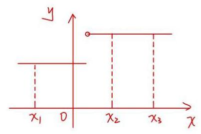

$\therefore f\left( {x}_{3}\right)  \geq  f\left( {x}_{2}\right)$

$f\left( {x}_{3}\right)  = f\left( {{x}_{1} + {nT}}\right)  = f\left( {x}_{1}\right)$

$\therefore f\left( {x}_{3}\right)  < f\left( {x}_{2}\right)$ 与 $f\left( {x}_{3}\right)  \geq  f\left( {x}_{2}\right)$ 矛盾

$\therefore$ 假设不成立，即 $f\left( x\right)$ 是常值函数

(3)证明:

充分性:若 $f\left( x\right)$ 是常值函数，记 $f\left( x\right)  = c$

设 $g\left( x\right)$ 的一个周期为 ${T}_{g}$ ，则 $h\left( x\right)  = c \cdot  g\left( x\right)$

则对 $\forall {x}_{0} \in  R, h\left( {{x}_{0} + {T}_{g}}\right)  = c \cdot  g\left( {{x}_{0} + {T}_{g}}\right)  = c \cdot  g\left( {x}_{0}\right)  = h\left( {x}_{0}\right)$

$\therefore h\left( x\right)$ 是周期函数

1.必要性:法一:直接法

不妨 ${T}_{h} > 0$

$h\left( {x - k \cdot  {T}_{n}}\right)  = f\left( {x - k \cdot  {T}_{n}}\right)  \cdot  g\left( {x - k \cdot  {T}_{n}}\right)  = f\left( x\right) g\left( x\right) , k \in  {N}^{ * }$

想要证 $f\left( {x - k \cdot  {T}_{n}}\right)  = f\left( x\right)$ ,而 $f\left( x\right)  \uparrow$

$\therefore f\left( {x - k \cdot  {T}_{n}}\right)  \leq  f\left( x\right)$

$\therefore$ 只要证 $f\left( {x - k \cdot  {T}_{n}}\right)  \geq  f\left( x\right)$ 即可

只要证 $g\left( {x - k \cdot  {T}_{n}}\right)  \leq  g\left( x\right)$

取 $g\left( x\right)  = m$ ，则 $g\left( {x - k{T}_{n}}\right)  \leq  m$

$\therefore f\left( {x - k \cdot  {T}_{n}}\right)  \geq  f\left( x\right)$

$\therefore f\left( {x - k,{T}_{n}}\right)  = f\left( x\right) ,{T}_{n} > 0, k \in  {N}^{ * }$

同理 $h\left( {x + n \cdot  {T}_{n}}\right)  = f\left( {x + n \cdot  {T}_{n}}\right)  \cdot  g\left( {x + n \cdot  {T}_{n}}\right)  = f\left( x\right) g\left( x\right)  \cdot  {T}_{n} > 0, n \in  {N}^{ * }$

取 $g\left( {x + n,{T}_{n}}\right)  = M$ ,则 $g\left( {x + n{T}_{n}}\right)  \geq  g\left( x\right)$

$\therefore f\left( {x + n \cdot  {T}_{n}}\right)  \leq  f\left( x\right)$

又 $\;\because f\left( x\right)  \uparrow$

$\therefore f\left( {x + n,{T}_{n}}\right)  \geq  f\left( x\right)$

$\therefore f\left( {x + n,{T}_{n}}\right)  = f\left( x\right) ,{T}_{n} > 0, n \in  {N}^{ * }$

综上, $f\left( x\right)$ 是常值函数

法二:反证法

设 $g\left( b\right)  = M$

假设 $f\left( x\right)$ 不是常值函数

即存在 ${x}_{1} < {x}_{2} < b$ ，使得 $0 < f\left( {x}_{1}\right)  < f\left( {x}_{2}\right)$

取 $a = b - n{T}_{n}$ ，使得 $a < {x}_{1}$ ，即取 $a < {x}_{1} < {x}_{2} < b$

则 $0 < f\left( a\right)  \leq  f\left( {x}_{1}\right)  < f\left( {x}_{2}\right)  \leq  f\left( b\right)$

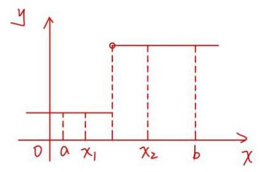

$h\left( b\right)  = f\left( b\right) g\left( b\right)  = m{f}^{\prime }\left( b\right)  \geq  {m{f}^{\prime }\left( {x}_{2}\right) }$

$h\left( a\right)  = f\left( a\right) g\left( a\right)  \leq  f\left( {x}_{1}\right)  \cdot  m$

$\because 0 < f\left( {x}_{1}\right)  < f\left( {x}_{2}\right)$

$\therefore M{f}^{\prime }\left( {x}_{1}\right)  < M{f}^{\prime }\left( {x}_{2}\right)$

$\therefore h\left( a\right)  < h\left( b\right)$

而 $h\left( a\right)  = h\left( {b - n{T}_{n}}\right)  = h\left( b\right)$ 矛盾

$\therefore f\left( x\right)$ 是常值函数

6. 已知 $a \in  \mathbf{R}$ ,函数 $f\left( x\right)  = {\log }_{2}\left( {\frac{1}{x} + a}\right)$ .

(1)当 $a = 1$ 时，解不等式 $f\left( x\right)  > 1$ ；

(2)若关于 $x$ 的方程 $f\left( x\right)  + {\log }_{2}\left( {x}^{2}\right)  = 0$ 的解集中恰有一个元素，求 $a$ 的值；

(3)设 $a > 0$ ，若对任意 $t \in  \left\lbrack  {\frac{1}{2},1}\right\rbrack$ ，函数 $f\left( x\right)$ 在区间 $\left\lbrack  {t, t + 1}\right\rbrack$ 上的最大值与最小值的差不超过1，求 $a$ 的取值范围.

(1) 当 $a = 1$ 时， $f\left( x\right)  > 1$ ，即 ${\log }_{2}\left( {\frac{1}{x} + 1}\right)  > 1$

$\therefore \frac{1}{x} + 1 > 2$ ，解得 $0 < x < 1$

经检验满足条件

( 2 ) $f\left( x\right)  + {\log }_{2}{x}^{2} = 0$ ，即 ${\log }_{2}\left( {\frac{1}{x} + a}\right)  + {\log }_{2}{x}^{2} = 0,\frac{1}{x} + a > 0,{x}^{2} > 0$

$\therefore \left( {\frac{1}{x} + a}\right) {x}^{2} = 1$

$\therefore a{x}^{2} + x - 1 = 0$

当 $a = 0$ 时， $x - 1 = 0$ ， $x = 1$ ， $\frac{1}{x} + a = 1 > 0$ ，满足题意

当 $a \neq  0$ 时，① 若 $\Delta  = 1 + {4a} = 0$ ，则 $a =  - \frac{1}{4}$

此时解得 $x = 2,\frac{1}{x} + a = \frac{1}{\frac{1}{2}} - \frac{1}{\frac{1}{4}} = \frac{1}{4} > 0$ ，满足题意

② 若 $\Delta  = 1 + {4a} > 0$ ，则 $a{x}^{2} + x - 1 = 0$ 有两个不等实根 ${x}_{1}$ 和 ${x}_{2}$  ，

显然 ${x}_{1} \neq  0,{x}_{2} \neq  0$

$\because {x}^{2}\left( {a + \frac{1}{x}}\right)  = 1$ . 且 ${x}^{2} > 0$

$\therefore a + \frac{1}{x} > 0$ ，即 $a + \frac{1}{{x}_{1}} > 0, a + \frac{1}{{x}_{2}} > 0$

1、 ${x}_{1},{x}_{2}$ 都满足 ${\log }_{2}\left( {\frac{1}{x} + a}\right)  + {\log }_{2}{x}^{2} = 0$ ，不满足题意

综上， $a = 0$ 或 $- \frac{1}{4}$

(3)法一: $a > 0$ ，对 $\forall t \in  \left\lbrack  {\frac{1}{2},1}\right\rbrack  , f\left( x\right)$ 在 $\left\lbrack  {t, t + 1}\right\rbrack$ 上

$\therefore {\log }_{2}\left( {\frac{1}{t} + a}\right)  - {\log }_{2}\left( {\frac{1}{t + 1} + a}\right)  \leq  1$

$\therefore \frac{\left( {1 + t - a}\right) \left( {t + 1}\right) }{t\left\lbrack  {1 + a\left( {t + 1}\right) }\right\rbrack  } \leq  2$

化为 $a \geq  \frac{1 - t}{{t}^{2} + t} = g\left( t\right) , t \in  \left\lbrack  {\frac{1}{2},1}\right\rbrack$

${g}^{\prime }\left( t\right)  = \frac{-\left( {{t}^{2} + t}\right)  - \left( {1 - t}\right) \left( {{2t} + 1}\right) }{{\left( {t}^{2} + t\right) }^{2}} = \frac{{t}^{2} - {2t} - 1}{{\left( {t}^{2} + t\right) }^{2}}$

$= \frac{{\left( t - 1\right) }^{2} - 2}{{\left( {t}^{2} + t\right) }^{2}} \leq  \frac{{\left( \frac{1}{2} - 1\right) }^{2} - 2}{{\left( \frac{1}{4} + \frac{1}{2}\right) }^{2}} < 0$

$\therefore g\left( t\right)$ 在 $t \in  \left\lbrack  {\frac{1}{2},1}\right\rbrack$ 上

$\therefore t = \frac{1}{2}$ 时， $g\left( t\right)$ 取得最大值， $g\left( \frac{1}{2}\right)  = \frac{2}{3}$

$\therefore a \geq  \frac{2}{3}$ ,即 $a \in  \left\lbrack  {\frac{2}{3}, + \infty }\right)$

法二:当 $a > 0$ 时，对 $\forall t \in  \left\lbrack  {\frac{1}{2},1}\right\rbrack  , f\left( x\right)$ 在 $\left\lbrack  {t, t + 1}\right\rbrack   \downarrow$

$\therefore {\log }_{2}\left( {\frac{1}{t} + a}\right)  - {\log }_{2}\left( {\frac{1}{t + 1} + a}\right)  \leq  1$

$\therefore {\log }_{2}\left( {\frac{1}{t} + a}\right)  \leq  {\log }_{2}\left( {\frac{1}{t + 1} + a}\right)  + 1 = {\log }_{2}2\left( {\frac{1}{t + 1} + a}\right)$ ,

$$
\therefore \frac{1}{t} + a \leq  2\left( {\frac{1}{t + 1} + a}\right)
$$

即 $a{t}^{2} + \left( {a + 1}\right) t - 1 \geq  0$ 对 $\forall t \in  \left\lbrack  {\frac{1}{2},1}\right\rbrack$ 恒成立

$$
\because a > 0
$$

$\therefore \left\{  \begin{matrix} y = a{t}^{2} + \left( {a + 1}\right) t - 1 \\   \end{matrix}\right.$ (对称轴: $t =  - \frac{a + 1}{2a} < 0$ )在 $\left\lbrack  {\frac{1}{2},1}\right\rbrack$ 上单调递增

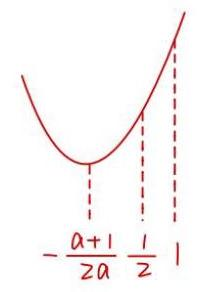

$\therefore a \times  {\left( \frac{1}{2}\right) }^{2} + \frac{1}{2}\left( {a + 1}\right)  - 1 = \frac{3}{4}a - \frac{1}{2} \geq  0$

$$
\therefore a \geq  \frac{2}{3}
$$

$\therefore a \in  \left\lbrack  {\frac{2}{3}, + \infty }\right)$

7. 已知 $a \in  \mathbf{R}$ ,函数 $f\left( x\right)  = {\log }_{2}\left( {\frac{1}{x} + a}\right)$ .

(1)当 $a = 5$ 时，解不等式 $f\left( x\right)  > 0$ ；

(2)若关于 $x$ 的方程 $f\left( x\right)  - {\log }_{2}\left\lbrack  {\left( {a - 4}\right) x + {2a} - 5}\right\rbrack   = 0$ 的解集中恰好有一个元素，求 $a$ 的取值范围;

(3)设 $a > 0$ ，若对任意 $t \in  \left\lbrack  {\frac{1}{2},1}\right\rbrack$ ，函数 $f\left( x\right)$ 在区间 $\left\lbrack  {t, t + 1}\right\rbrack$ 上的最大值与最小值的差不超过

1,求 $a$ 的取值范围.

(1) 当 $a = 5$ 时， $f\left( x\right)  = {\log }_{2}\left( {\frac{1}{x} + 5}\right) , f\left( x\right)  > 0$ ，即 ${\log }_{2}\left( {\frac{1}{x} + 5}\right)  > 0$

$\therefore \frac{1}{x} + 5 > 1,\frac{1}{x} + 4 = \frac{{4x} + 1}{x} > 0, x > 0$ 或 $x <  - \frac{1}{4}$

$\therefore f\left( x\right)  > 0$ 的解集为 $\{ x|x > 0$ 或 $x <  - \frac{1}{4}\}$

(2) $f\left( x\right)  - {\log }_{2}\left\lbrack  {\left( {a - 4}\right) x + {2a} - 5}\right\rbrack   = 0$

即 ${\log }_{2}\left( {\frac{1}{x} + a}\right)  - {\log }_{2}\left\lbrack  {\left( {a - 4}\right) x + {2a} - 5}\right\rbrack   = 0$

$\therefore {\log }_{2}\left( {\frac{1}{x} + a}\right)  = {\log }_{2}\left\lbrack  {\left( {a - 4}\right) x + {2a} - 5}\right\rbrack$

$\therefore \frac{1}{x} + a = \left( {a - 4}\right) x + {2a} - 5 > 0$

$\therefore \left( {a - 4}\right) {x}^{2} + \left( {a - 5}\right) x - 1 = 0$

$\therefore \left( {x + 1}\right) \left\lbrack  {\left( {a - 4}\right) x - 1}\right\rbrack   = 0$ .

有一个有意义的根，即只有一个根使得真数 $\frac{1}{x} + a > 0$

① $a = 4$ 时， $x =  - 1$ ，检验: $\frac{1}{x} + a =  - 1 + 4 = 3 > 0$ ，成立

② $a \neq  4$ 时

${1}^{ \circ  }{x}_{1} =  - 1 = {x}_{2} = \frac{1}{a - 4}\;a = 3,$ 检验: $\frac{1}{x} + a =  - 1 + 3 = 2 > 0\;$ ,成立

${2}^{ \circ  }\left\{  {\begin{array}{l} {x}_{1}\text{ 使得真数 }\frac{1}{{x}_{1}} + a > 0 \\  {x}_{2}\text{ 使得真数 }\frac{1}{{x}_{2}} + a \leq  0 \end{array},\left\{  {\begin{array}{l}  - 1 + a > 0 \\  a - 4 + a \leq  0 \end{array}, a \in  (1,2\rbrack }\right. }\right.$

${3}^{ \circ  }\left\{  {\begin{array}{l} {x}_{1}\text{ 使得真数 }\frac{1}{{x}_{1}} + a \leq  0 \\  {x}_{2}\text{ 使得真数 }\frac{1}{{x}_{2}} + a > 0 \end{array},\left\{  {\begin{array}{l}  - 1 + a \leq  0 \\  a - 4 + a > 0 \end{array}, a \in  \Phi }\right. }\right.$

综上， $a \in  (1,2\rbrack  \cup  \{ 3,4\}$

(3)法一: $a > 0$ ，对 $\forall t \in  \left\lbrack  {\frac{1}{2},1}\right\rbrack  , f\left( x\right)$ 在 $\left\lbrack  {t, t + 1}\right\rbrack  .$

$\therefore {\log }_{2}\left( {\frac{1}{t} + a}\right)  - {\log }_{2}\left( {\frac{1}{t + 1} + a}\right)  \leq  1$

$\therefore \frac{\left( {1 + t\mathrm{a}}\right) \left( {t + 1}\right) }{t\left\lbrack  {1 + \mathrm{a}\left( {t + 1}\right) }\right\rbrack  } \leq  2$

化为 $a \geq  \frac{1 - t}{{t}^{2} + t} = g\left( t\right) , t \in  \left\lbrack  {\frac{1}{2},1}\right\rbrack$

${g}^{\prime }\left( t\right)  = \frac{-\left( {{t}^{2} + t}\right)  - \left( {1 - t}\right) \left( {{2t} + 1}\right) }{{\left( {t}^{2} + t\right) }^{2}} = \frac{{t}^{2} - {2t} - 1}{{\left( {t}^{2} + t\right) }^{2}}$

$= \frac{{\left( t - 1\right) }^{2} - 2}{{\left( {t}^{2} + t\right) }^{2}} \leq  \frac{{\left( \frac{1}{2} - 1\right) }^{2} - 2}{{\left( \frac{1}{4} + \frac{1}{2}\right) }^{2}} < 0$

$\therefore g\left( t\right)$ 在 $t \in  \left\lbrack  {\frac{1}{2},1}\right\rbrack$ 上

$\therefore t = \frac{1}{2}$ 时， $g\left( t\right)$ 取得最大值， $g\left( \frac{1}{2}\right)  = \frac{2}{3}$

$\therefore a \geq  \frac{2}{3}$ ，即 $a \in  \left\lbrack  {\frac{2}{3}, + \infty }\right)$

法二:当 $a > 0$ 时，对 $\forall t \in  \left\lbrack  {\frac{1}{2},1}\right\rbrack  , f\left( x\right)$ 在 $\left\lbrack  {t, t + 1}\right\rbrack   \downarrow$

$\therefore {\log }_{2}\left( {\frac{1}{t} + a}\right)  - {\log }_{2}\left( {\frac{1}{t + 1} + a}\right)  \leq  1$

$\therefore {\log }_{2}\left( {\frac{1}{t} + a}\right)  \leq  {\log }_{2}\left( {\frac{1}{t + 1} + a}\right)  + 1 = {\log }_{2}2\left( {\frac{1}{t + 1} + a}\right)$ .

$\therefore \frac{1}{t} + a \leq  2\left( {\frac{1}{t + 1} + a}\right)$

即 $a{t}^{2} + \left( {a + 1}\right) t - 1 \geq  0$ 对 $\forall t \in  \left\lbrack  {\frac{1}{2},1}\right\rbrack$ 恒成立

$$
\because a > 0
$$

$\therefore y = a{t}^{2} + \left( {a + 1}\right) t - 1$ (对称轴: $t =  - \frac{a + 1}{2a} < 0$ )在 $\left\lbrack  {\frac{1}{2},1}\right\rbrack$ 上单调递增

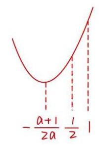

$\therefore a \times  {\left( \frac{1}{2}\right) }^{2} + \frac{1}{2}\left( {a + 1}\right)  - 1 = \frac{3}{4}a - \frac{1}{2} \geq  0$

$$
\therefore a \geq  \frac{2}{3}
$$

$\therefore a \in  \left\lbrack  {\frac{2}{3}, + \infty }\right)$

8. 若函数 $y = f\left( x\right)$ 与 $y = g\left( x\right)$ 满足: 对任意 ${x}_{1},{x}_{2} \in  \mathrm{R}$ ,都有 $\left| {f\left( {x}_{1}\right)  - f\left( {x}_{2}\right) }\right|  \geq  \left| {g\left( {x}_{1}\right)  - g\left( {x}_{2}\right) }\right|$ ,则称函数 $y = f\left( x\right)$ 是函数 $y = g\left( x\right)$ 的“约束函数”.已知函数 $y = f\left( x\right)$ 是函数 $y = g\left( x\right)$ 的“约束函数”.

(1)若 $f\left( x\right)  = {x}^{2}$ ，判断函数 $y = g\left( x\right)$ 的奇偶性，并说明理由;

(2)若 $f\left( x\right)  = {ax} + {x}^{3}\left( {a > 0}\right) , g\left( x\right)  = \sin x$ ，求实数 $a$ 的取值范围；

(3)若 $y = g\left( x\right)$ 为严格减函数， $f\left( 0\right)  < f\left( 1\right)$ ，且函数 $y = f\left( x\right)$ 的图像是连续曲线，求证: $y = f\left( x\right)$ 是 $\left( {0,1}\right)$ 上的严格增函数.

(1) $g\left( x\right)$ 为偶函数

$\because \left| {g\left( {x}_{1}\right)  - g\left( {x}_{2}\right) }\right|  \leq  \left| {{x}_{1}^{2} - {x}_{2}^{2}}\right|$

令 ${x}_{2} =  - {x}_{1},\;\left| {g\left( {x}_{1}\right)  - g\left( {-{x}_{1}}\right) }\right|  \leq  0$

$\therefore \left| {g\left( {x}_{1}\right)  - g\left( {-{x}_{1}}\right) }\right|  = 0$

$\therefore g\left( {x}_{1}\right)  = g\left( {-{x}_{1}}\right)$ 对 $\forall {x}_{1} \in  R$ 成立

$\therefore g\left( x\right)$ 是偶函数

(2) $\because a > 0,\therefore f\left( x\right)  = {ax} + {x}^{3}$ 在 $x \in  R$ 为严格增函数

$\forall {x}_{1},{x}_{2} \in  R,$ 不妨设 ${x}_{1} \leq  {x}_{2}$

$\left| {g\left( {x}_{1}\right)  - g\left( {x}_{2}\right) }\right|  \leq  \left| {f\left( {x}_{1}\right)  - f\left( {x}_{2}\right) }\right|  = f\left( {x}_{2}\right)  - f\left( {x}_{1}\right)$

$\therefore f\left( {x}_{1}\right)  - f\left( {x}_{2}\right)  \leq  g\left( {x}_{1}\right)  - g\left( {x}_{2}\right)  \leq  f\left( {x}_{2}\right)  - f\left( {x}_{1}\right)$

$\therefore f\left( {x}_{1}\right)  - g\left( {x}_{1}\right)  \leq  f\left( {x}_{2}\right)  - g\left( {x}_{2}\right)$ 且 $g\left( {x}_{1}\right)  + f\left( {x}_{1}\right)  \leq  g\left( {x}_{2}\right)  + f\left( {x}_{2}\right)$

$\therefore h\left( x\right)  = f\left( x\right)  - g\left( x\right) \uparrow ,\;p\left( x\right)  = f\left( x\right)  + g\left( x\right)  \uparrow$

$h\left( x\right)  = {x}^{3} + {ax} - \sin x,{h}^{\prime }\left( x\right)  = 3{x}^{2} + a - \cos x \geq  0$

$\therefore a \geq  \left( {-3{x}^{2} + \cos x}\right) \max$

观察当 $x = 0$ 时， $- 3{x}^{2}$ 取 $\max ,\cos x$ 取 $\max$

$\therefore a \geq   - 3 \times  {0}^{2} + \cos 0 = 1$

$p\left( x\right)  = {x}^{3} + {ax} + \sin x,{p}^{\prime }\left( x\right)  = 3{x}^{2} + a + \cos x$

由上知 $a \geq  1$

$\therefore 3{x}^{2} + a + \cos x \geq  3{x}^{2} + 1 + \cos x \geq  0$

$\therefore {p}^{\prime }\left( x\right)  \geq  0$

$\therefore a \geq  1$

(3)设 ${X}_{1} < {X}_{2}$

$\because g\left( x\right)$ 严格减 $\therefore g\left( {x}_{1}\right)  > g\left( {x}_{2}\right)$

$\left| {f\left( {x}_{2}\right)  - f\left( {x}_{1}\right) }\right|  \geq  \left| {g\left( {x}_{1}\right)  - g\left( {x}_{2}\right) }\right|  = g\left( {x}_{1}\right)  - g\left( {x}_{2}\right)  > 0$

$\therefore \forall {x}_{1} < {x}_{2}, f\left( {x}_{1}\right)  \neq  f\left( {x}_{2}\right)$

现证 $x \in  \left( {0,1}\right)$ 时， $f\left( x\right)  \in  \left( {f\left( 0\right) , f\left( 1\right) }\right)$

假设 $\exists {x}_{0} \in  \left( {0,1}\right)$ ，使得 $f\left( {x}_{0}\right)  > f\left( 1\right) \; y = f\left( x\right)$ 连续

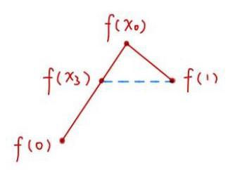

令 $h\left( x\right)  = f\left( x\right)  - f\left( 1\right)$

$h\left( 0\right)  = f\left( 0\right)  - f\left( 1\right)  < 0$

$h\left( {x}_{0}\right)  = f\left( {x}_{0}\right)  - f\left( 1\right)  > 0$

$\therefore \exists {x}_{3} \in  \left( {0,{x}_{0}}\right)$ ，使得 $h\left( {x}_{3}\right)  = 0$

$\therefore f\left( {x}_{3}\right)  = f\left( 1\right)$ ，当 $\left( *\right)$ 矛盾

$\therefore$ 不存在 ${x}_{0} \in  \left( {0,1}\right)$ ，使得 $f\left( {x}_{0}\right)  > f\left( 1\right)$

同理，不存在 ${x}_{0} \in  \left( {0,1}\right)$ ，使得 $f\left( {x}_{0}\right)  < f\left( 0\right)$

$\therefore x \in  \left( {0,1}\right)$ 时， $f\left( x\right)  \in  \left( {f\left( 0\right) , f\left( 1\right) }\right)$

下证 当 $0 < {X}_{1} < {X}_{2}$ 时， $f\left( {X}_{1}\right)  < f\left( {X}_{2}\right)$

假设 $\exists {x}_{1},{x}_{2} \in  \left( {0,1}\right)$ ，使得 $f\left( {x}_{1}\right)  > f\left( {x}_{2}\right) \; y = f\left( x\right)$ 连续

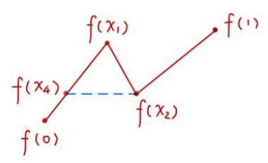

则 $f\left( 0\right)  < f\left( {x}_{2}\right)  < f\left( {x}_{1}\right)  < f\left( 1\right)$

令 $p\left( x\right)  = f\left( x\right)  - f\left( {x}_{2}\right)$

$p\left( 0\right)  = f\left( 0\right)  - f\left( {x}_{2}\right)  < 0$

$p\left( {x}_{1}\right)  = f\left( {x}_{1}\right)  - f\left( {x}_{2}\right)  > 0$

$\therefore \exists {x}_{4} \in  \left( {0,{x}_{1}}\right)$ 使得 $p\left( {x}_{4}\right)  = f\left( {x}_{4}\right)  - f\left( {x}_{2}\right)  = 0$

$\therefore f\left( {x}_{4}\right)  = f\left( {x}_{2}\right)$ ,与 $\left( *\right)$ 矛盾

$\therefore \forall {x}_{1},{x}_{2} \in  \left( {0,1}\right)$ ，都有 $f\left( {x}_{1}\right)  < f\left( {x}_{2}\right)$

$\therefore y = f\left( x\right)$ 在 $\left( {0,1}\right)$ 上为严格增函数

9. 已知 $y = f\left( x\right)$ 与 $y = g\left( x\right)$ 都是定义在 $\left( {0, + \infty }\right)$ 上的函数,若对任意 ${x}_{1},{x}_{2} \in  \left( {0, + \infty }\right)$ ,当 ${x}_{1} < {x}_{2}$ 时,都有 $g\left( {x}_{1}\right)  \leq  \frac{f\left( {x}_{1}\right)  - f\left( {x}_{2}\right) }{{x}_{1} - {x}_{2}} \leq  g\left( {x}_{2}\right)$ ,则称 $y = g\left( x\right)$ 是 $y = f\left( x\right)$ 的一个 “控制函数”.

(1)判断 $y = {2x}$ 是否为函数 $y = {x}^{2}\left( {x > 0}\right)$ 的一个控制函数，并说明理由;

(2)设 $f\left( x\right)  = \ln x$ 的导数为 ${f}^{\prime }\left( x\right) ,0 < a < b$ ，求证:关于 $x$ 的方程 $\frac{f\left( b\right)  - f\left( a\right) }{b - a} = {f}^{\prime }\left( x\right)$ 在区间 $\left( {a, b}\right)$ 上有实数解;

(3)设 $f\left( x\right)  = x\ln x$ ，函数 $y = f\left( x\right)$ 是否存在控制函数？若存在，请求出 $y = f\left( x\right)$ 的所有控制函数; 若不存在, 请说明理由.

(1) $\forall {x}_{1} < {x}_{2},\frac{f\left( {x}_{1}\right)  - f\left( {x}_{2}\right) }{{x}_{1} - {x}_{2}} = \frac{{x}_{1}^{2} - {x}_{2}^{2}}{{x}_{1} - {x}_{2}} = {x}_{1} + {x}_{2}$

$\therefore {2x}_{1} < {x}_{1} + {x}_{2} < {2x}_{2}$

$\therefore$ 是

$\left( 2\right) \frac{f\left( b\right)  - f\left( a\right) }{b - a} = {f}^{\prime }\left( x\right)$ 即 $\frac{\ln b - \ln a}{b - a} = \frac{1}{x} \in  \left( {\frac{1}{b},\frac{1}{a}}\right)$

方程在 $\left( {a, b}\right)$ 上有实数解 $\Leftrightarrow  \frac{1}{b} < \frac{\ln b - \ln a}{b - a} < \frac{1}{a}$

$\Leftrightarrow  a\left( {\ln b - \ln a}\right)  < b - a < b\left( {\ln b - \ln a}\right)$

$\Leftrightarrow  a\ln \frac{b}{a} < b - a < b\ln \frac{b}{a}$

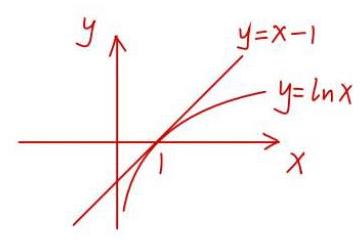

$\Leftrightarrow  a\ln \frac{b}{a} < b - a$ 且 $b - a < b\ln \frac{b}{a}$

$\Leftrightarrow  \ln \frac{b}{a} < \frac{b}{a} - 1$ 且 $\ln \frac{a}{b} <  - \ln \frac{a}{b}$

$\Leftrightarrow  \ln \frac{b}{a} < \frac{b}{a} - 1$ 且 $\ln \frac{a}{b} < \frac{a}{b} - 1$

易知 $\ln x < x - 1\left( {x > 0, x \neq  1}\right)$ ，得证

法二:由拉格朗日中值定理得

$\exists c \in  \left( {a, b}\right)$ ，使得 $\frac{f\left( b\right)  - f\left( a\right) }{b - a} = \frac{\ln b - \ln a}{b - a} = {f}^{\prime }\left( c\right)$

${f}^{\prime }\left( x\right)  = \frac{1}{x} \downarrow  ,{f}^{\prime }\left( c\right)  \in  \left( {\frac{1}{b},\frac{1}{a}}\right)$

$\therefore {f}^{\prime }\left( x\right)  = \frac{f\left( b\right)  - f\left( a\right) }{b - a}$ 在 $x \in  \left( {a, b}\right)$ 上有解

(3) 法一: $\exists c \in  \left( {{x}_{1},{x}_{2}}\right)$ .

使得 ${f}^{\prime }\left( c\right)  = \frac{f\left( {x}_{1}\right)  - f\left( {x}_{2}\right) }{{x}_{1} - {x}_{2}}$ (拉格朗日中值定理)

(或者去证 ${f}^{\prime }\left( x\right)  = \ln x + 1 = \frac{f\left( {x}_{1}\right)  - f\left( {x}_{2}\right) }{{x}_{1} - {x}_{2}}$ 在 $x \in  \left( {{x}_{1},{x}_{2}}\right)$ 上有解)

$\frac{{x}_{2}\ln {x}_{2} - {x}_{1}\ln {x}_{1}}{{x}_{2} - {x}_{1}} = \ln x + 1$ 在 $\left( {{x}_{1},{x}_{2}}\right)$ 上有实数解

$\ln x + 1 \in  \left( {\ln {x}_{1} + 1,\ln {x}_{2} + 1}\right)$

只要证 $\ln {x}_{1} + 1 < \frac{{x}_{2}\ln {x}_{2} - {x}_{1}\ln {x}_{1}}{{x}_{2} - {x}_{1}} < \ln {x}_{2} + 1$

只 ${x}_{2}\ln {x}_{1} + {x}_{2} - {x}_{1}\ln {x}_{1} - {x}_{1} < {x}_{2}\ln {x}_{2} - {x}_{1}\ln {x}_{1} < {x}_{2}\ln {x}_{2} + {x}_{2} - {x}_{1}\ln {x}_{2} - {x}_{1}$

现证左边 ${x}_{2}\ln {x}_{1} + {x}_{2} - {x}_{1} < {x}_{2}\ln {x}_{2}$

${x}_{2}\left( {\ln \frac{{x}_{1}}{{x}_{2}}}\right)  + {x}_{2} - {x}_{1} < 0$

$\ln \frac{{x}_{1}}{{x}_{2}} + 1 - \frac{{x}_{1}}{{x}_{2}} < 0$

${h}_{1}\left( x\right)  = \ln t + 1 - t < 0, t \in  \left( {0,1}\right)$

$\ln t < 1 - t$ 显然成立，右边同理

$\therefore {f}^{\prime }\left( x\right)  = \ln x + 1 = \frac{f\left( {x}_{1}\right)  - f\left( {x}_{2}\right) }{{x}_{1} - {x}_{2}}$ 在 $x \in  \left( {{x}_{1},{x}_{2}}\right)$ 上有解

即 $\exists c \in  \left( {{x}_{1},{x}_{2}}\right)$ . 使得 ${f}^{\prime }\left( c\right)  = \frac{f\left( {x}_{1}\right)  - f\left( {x}_{2}\right) }{{x}_{1} - {x}_{2}}$

由此可知 $y = g\left( x\right)$ 要作为 $y = f\left( x\right)$ 的控制函数

则要满足对 $\forall {x}_{1},{x}_{2}E\left( {0, + \infty }\right)$ ,

当 ${x}_{1} < {x}_{2}$ 时,都有 $g\left( {x}_{1}\right)  \leq  {f}^{\prime }\left( c\right)  \leq  g\left( {x}_{2}\right)$ ,其中 $c \in  \left( {{x}_{1},{x}_{2}}\right)$

即 $g\left( {x}_{1}\right)  \leq  \ln c + 1 \leq  g\left( {x}_{2}\right)$

每次都取 ${x}_{2} \rightarrow  {x}_{1}^{ + }$ ，由极限的迫敛准则可知

$g\left( {x}_{1}\right)  = \ln c + 1 = g\left( {x}_{1}\right)$

即 $\exists g\left( x\right)  = \ln x + 1$ 为 $y = f\left( x\right)$ 的唯一控制函数

法二:若存在，则有 $g\left( {x}_{1}\right)  \leq  \frac{f\left( {x}_{2}\right)  - f\left( {x}_{1}\right) }{{x}_{2} - {x}_{1}} \leq  g\left( {x}_{2}\right)$

$\left( {{x}_{2} - {x}_{1}}\right) g\left( {x}_{1}\right)  \leq  f\left( {x}_{2}\right)  - f\left( {x}_{1}\right)  \leq  \left( {{x}_{2} - {x}_{1}}\right) g\left( {x}_{2}\right)$

$\left\{  \begin{array}{l} \left( {{x}_{2} - {x}_{1}}\right) g\left( {x}_{1}\right)  \leq  f\left( {x}_{2}\right)  - f\left( {x}_{1}\right) \\  f\left( {x}_{2}\right)  - f\left( {x}_{1}\right)  \leq  \left( {{x}_{2} - {x}_{1}}\right) g\left( {x}_{2}\right)  \end{array}\right.$

由不等式①得 $f\left( {x}_{2}\right)  - f\left( {x}_{1}\right)  - \left( {{x}_{2} - {x}_{1}}\right) g\left( {x}_{1}\right)  \geq  0,{x}_{2} > {x}_{1}$

令 $h\left( x\right)  = f\left( x\right)  - f\left( {x}_{1}\right)  - \left( {x - {x}_{1}}\right) g\left( {x}_{1}\right) , h\left( {x}_{1}\right)  = 0, x > {x}_{1}$

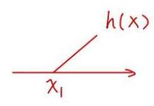

${h}^{\prime }\left( x\right)  = {f}^{\prime }\left( x\right)  - g\left( {x}_{1}\right)$

当 ${h}^{\prime }\left( {x}_{1}\right)  < 0$ ，则 $\exists s > 0, h\left( x\right)$ 在 $\left( {{x}_{1},{x}_{1} + \delta }\right)  \downarrow$

则 $h\left( x\right)  < 0$ ，矛盾

$\therefore {h}^{\prime }\left( {x}_{1}\right)  \geq  0$ ，

$\because {f}^{\prime }\left( x\right)  = {lnx} + 1 \uparrow$

$\therefore x > {x}_{1}$ 时, ${h}^{\prime }\left( x\right)  = {f}^{\prime }\left( x\right)  - g\left( {x}_{1}\right)  > {f}^{\prime }\left( {x}_{1}\right)  - g\left( {x}_{1}\right)  = {h}^{\prime }\left( {x}_{1}\right)  \geq  0$

$\therefore {f}^{\prime }\left( {x}_{1}\right)  \geq  g\left( {x}_{1}\right)$

对⑥式，同理可得 ${f}^{\prime }\left( {x}_{2}\right)  \leq  g\left( {x}_{2}\right)$ ， $\forall$ 取 ${x}_{2} \rightarrow  {x}_{1}^{ + }$ ，由极限可知综上， $g\left( x\right)  = {f}^{\prime }\left( x\right)$

$\therefore$ 存在控制函数为 ${f}^{\prime }\left( x\right)  = \ln x + 1$

10. 已知 $a \in  \mathbf{R}, f\left( x\right)  = \left( {a - 2}\right) {x}^{3} - {x}^{2} + {5x} + \left( {1 - a}\right) \ln x$ .

(1)若1为函数 $y = f\left( x\right)$ 的驻点，求实数 $a$ 的值；

(2)若 $a = 0$ ，试问曲线 $y = f\left( x\right)$ 是否存在切线与直线 $x - y - 1 = 0$ 互相垂直？说明理由；

(3)若 $a = 2$ ，是否存在等差数列 ${x}_{1}$ ， ${x}_{2}$ ， ${x}_{3}\left( {0 < {x}_{1} < {x}_{2} < {x}_{3}}\right)$ ，使得曲线 $y = f\left( x\right)$ 在点 $\left( {{x}_{2}, f\left( {x}_{2}\right) }\right)$ 处的切线与过两点 $\left( {{x}_{1}, f\left( {x}_{1}\right) }\right) \text{ 、 }\left( {{x}_{3}, f\left( {x}_{3}\right) }\right)$ 的直线互相平行？若存在，求出所有满足条件的等差数列; 若不存在, 说明理由.

$\left( 1\right) {f}^{\prime }\left( x\right)  = 3\left( {a - 2}\right) {x}^{2} - {2x} + 5 + \frac{1 - a}{x}$

${f}^{\prime }\left( 1\right)  = 0\;\therefore a = 1$

(2) ${f}^{\prime }\left( x\right)  =  - 6{x}^{2} - {2x} + 5 + \frac{1}{x} =  - 1\;\left( {x > 0}\right)$

$\therefore 6{x}^{3} + 2{x}^{2} - {6x} - 1 = 0$

令 $g\left( x\right)  = 6{x}^{3} + 2{x}^{2} - {6x} - 1$

$g\left( 0\right)  =  - 1, g\left( 1\right)  = 1$

$\therefore$ 存在 ${x}_{0} \in  \left( {0,1}\right)$ ，使得 $g\left( x\right)  = 0$

$\therefore$ 在在

(3) $f\left( x\right)  =  - {x}^{2} + {5x} - {lnx}$

${f}^{\prime }\left( x\right)  =  - {2x} + 5 - \frac{1}{x}$

${f}^{\prime }\left( {x}_{2}\right)  = \frac{f\left( {x}_{3}\right)  - f\left( {x}_{1}\right) }{{x}_{3} - {x}_{1}}$

$\therefore  - 2{x}_{2} + 5 - \frac{1}{{x}_{2}} = \frac{-\left( {{x}_{3} - {x}_{1}}\right) \left( {{x}_{3} + {x}_{1}}\right)  + 5\left( {{x}_{3} - {x}_{1}}\right)  - \ln \frac{{x}_{3}}{{x}_{1}}}{{x}_{3} - {x}_{1}}$

$\therefore  - 2{x}_{2} + 5 - \frac{1}{{x}_{2}} =  - \left( {{x}_{1} + {x}_{3}}\right)  + 5 - \frac{\ln {x}_{3} - \ln {x}_{1}}{{x}_{3} - {x}_{1}}$

$\therefore \frac{1}{{x}_{2}} = \frac{\ln {x}_{3} - \ln {x}_{1}}{{x}_{3} - {x}_{1}}$

$\therefore \frac{2}{{x}_{1} + {x}_{3}} = \frac{\ln {x}_{3} - \ln {x}_{1}}{{x}_{3} - {x}_{1}}$

注意:由对数均值不等式可知 $\sqrt{{x}_{1}{x}_{3}} < \frac{{x}_{3} - {x}_{1}}{\ln {x}_{3} - \ln {x}_{1}} < \frac{{x}_{1} + {x}_{3}}{2}$

$\ln \frac{{x}_{3}}{{x}_{1}} = \frac{2\left( {{x}_{3} - {x}_{1}}\right) }{{x}_{1} + {x}_{3}} = \frac{2\left( {\frac{{x}_{3}}{{x}_{1}} - 1}\right) }{\frac{{x}_{3}}{{x}_{1}} + 1}$

令 $t = \frac{{x}_{3}}{{x}_{1}} \in  \left( {1, + \infty }\right) , h\left( t\right)  = \ln t - 2 \cdot  \frac{t - 1}{t + 1}$

${h}^{\prime }\left( t\right)  = \frac{1}{t} - 2 \cdot  \frac{2}{{\left( t + 1\right) }^{2}} = \frac{{\left( t - 1\right) }^{2}}{t{\left( t + 1\right) }^{2}} > 0$

$\therefore h\left( t\right)$ 在 $\left( {1, + \infty }\right)$ 上 $\; \uparrow$

$\therefore h\left( t\right)  > h\left( 1\right)  = 0$

$\therefore h\left( t\right)  = 0$ 无解

$\therefore$ 不存在 ${x}_{1},{x}_{2},{x}_{3}$ 满足题意

11. 已知函数 $f\left( x\right)  = {\mathrm{e}}^{x} - x, g\left( x\right)  = {\mathrm{e}}^{-x} + x$ ,其中 $\mathrm{e}$ 为自然对数的底数.

(1)求函数 $y = f\left( x\right)$ 的图像在点 $\left( {1, f\left( 1\right) }\right)$ 处的切线方程；

(2)设函数 $F\left( x\right)  = {af}\left( x\right)  - g\left( x\right)$ ，①若 $a = \mathrm{e}$ ，求函数 $y = F\left( x\right)$ 的单调区间，并写出函数 $y = F\left( x\right)  - m$ 有三个零点时实数 $m$ 的取值范围；②当 $0 < a < 1$ 时， ${x}_{1}$ 、 ${x}_{2}$ 分别为函数 $y = F\left( x\right)$ 的极大值点和极小值点,且不等式 $F\left( {x}_{1}\right)  + {tF}\left( {x}_{2}\right)  > 0$ 对任意 $a \in  \left( {0,1}\right)$ 恒成立,求实数 $t$ 的取值范围.

(1) ${f}^{\prime }\left( x\right)  = {e}^{x} - 1\;\therefore {f}^{\prime }\left( 1\right)  = e - 1$

$\therefore$ 切线方程为 $y - f\left( 1\right)  = \left( {e - 1}\right) \left( {x - 1}\right)$ ，即 $y = \left( {e - 1}\right) x$

(2) $F\left( x\right)  = a\left( {{e}^{x} - x}\right)  - {e}^{-x} - x$

$$
{F}^{\prime }\left( x\right)  = a\left( {{e}^{x} - 1}\right)  + {e}^{-x} - 1 = \frac{\left( {a{e}^{x} - 1}\right) \left( {{e}^{x} - 1}\right) }{{e}^{x}}
$$

① 当 $a = e$ 时， $F\left( x\right)  = {e}^{x + 1} - {eX} - {e}^{-x} - x$

令 ${F}^{\prime }\left( x\right)  = \frac{\left( {{e}^{x + 1} - 1}\right) \left( {{e}^{x} - 1}\right) }{{e}^{x}} = 0$ ,得 $x = 0$ 或 $x =  - 1$

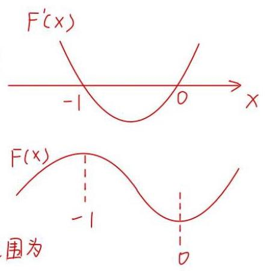

、 $F\left( x\right)$ 的单调增区间为 $\left( {-\infty , - 1}\right)$ 和 $\left( {0, + \infty }\right)$ 单调减区间为 $\left( {-1,0}\right)$

极大值 $F\left( {-1}\right)  = 2$ ，极小值 $F\left( 0\right)  = e - 1$

$\therefore y = F\left( x\right)  - m$ 有三个零点时 $m$ 的取值范围为

$\left( {F\left( 0\right) , F\left( {-1}\right) }\right)$ ,即 $\left( {e - 1,2}\right)$

② 令 ${F}^{\prime }\left( x\right)  = 0$ ，得 ${e}^{x} = 1$ 或 ${e}^{x} = \frac{1}{a} > 1$

$\therefore x = 0$ 或 $x = \ln \frac{1}{a} =  - \ln a > 0, a \in  \left( {0,1}\right)$

$\therefore {x}_{1} = 0$ 或 ${x}_{2} =  - \ln a$

$\therefore F\left( {x}_{1}\right)  = F\left( 0\right)  = a - 1 < 0$

$F\left( {x}_{2}\right)  = F\left( {-\ln a}\right)  = a\left( {\frac{1}{a} + \ln a}\right)  - a + \ln a$

$= \left( {a + 1}\right) \ln a + 1 - a < F\left( {x}_{1}\right)  < 0$

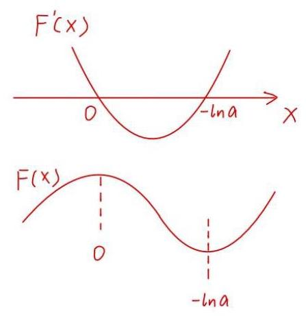

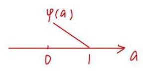

$\therefore t < 0$

设 $\varphi \left( a\right)  = F\left( {x}_{1}\right)  + {tF}\left( {x}_{2}\right)  = a - 1 + t\left\lbrack  {\left( {a + 1}\right) \ln a + 1 - a}\right\rbrack  , a \in  \left( {0,1}\right)$

可知 $\varphi \left( 1\right)  = 0$

${\varphi }^{\prime }\left( a\right)  = 1 + t\left( {\ln a + \frac{a + 1}{a} - 1}\right)  = 1 + t\left( {\ln a + \frac{1}{a}}\right) .\;a \in  \left( {0,1}\right)$

先满足必要条件 ${\varphi }^{\prime }\left( 1\right)  \leq  0$

$\therefore 1 + t \leq  0, t \leq   - 1$

若 ${\varphi }^{\prime }\left( 1\right)  > 0$ ，则 3 & so，使得当 $a \in  \left( {1 - \delta ,1}\right)$ 时， ${\varphi }^{\prime }\left( a\right)  > 0,\varphi \left( a\right)  \uparrow$

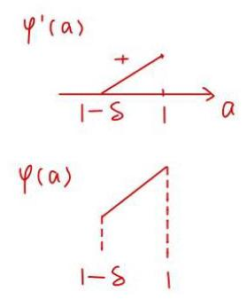

$\varphi \left( a\right)  < \varphi \left( 1\right)  = 0$ 矛盾

令 $m\left( a\right)  = \ln a + \frac{1}{a}, a \in  \left( {0,1}\right) ,$

$\therefore {m}^{\prime }\left( a\right)  = \frac{1}{a} - \frac{1}{{a}^{2}} = \frac{a - 1}{{a}^{2}}$

$\therefore {m}^{\prime }\left( a\right)  < 0$

$\therefore$ 在 $a \in  \left( {0,1}\right)$ 上 $m$ (a)严格减

$\therefore m\left( a\right)  > m\left( 1\right)  = 1$

当 $t \leq   - 1$ 时，将 ${\varphi }^{\prime }\left( a\right)  = 1 + t\left( {\ln a + \frac{1}{a}}\right)$ ，

看关于 $t$ 的一次函数且斜率大于 0，严格增

$\therefore {\varphi }^{\prime }\left( a\right)  \leq  1 - \left( {\ln a + \frac{1}{a}}\right)  < 0$

$\therefore \varphi \left( a\right)$ 在 $\left( {0,1}\right)$ 上 $\downarrow$

$\therefore \varphi \left( a\right)  < \varphi \left( 1\right)  = 0$ 成立

$\therefore t \leq   - 1$

12. 设函数 $f\left( x\right)$ 与 $g\left( x\right)$ 的定义域均为 $D$ ,若存在 ${x}_{0} \in  D$ ,满足 $f\left( {x}_{0}\right)  = g\left( {x}_{0}\right)$ 且 ${f}^{\prime }\left( {x}_{0}\right)  = {g}^{\prime }\left( {x}_{0}\right)$ , 则称函数 $f\left( x\right)$ 与 $g\left( x\right)$ “局部趋同”.

(1)判断函数 ${f}_{1}\left( x\right)  = {{5x} + 1}$ 与 ${f}_{2}\left( x\right)  = {x}^{3} + {2x}$ 是否“局部趋同”，并说明理由;

(2)已知函数 ${g}_{1}\left( x\right)  =  - {x}^{2} + {ax}\left( {x > 0}\right) ,{g}_{2}\left( x\right)  = b{\mathrm{e}}^{x}\left( {x > 0}\right)$ . 求证:对任意的正数 $a$ ，都存在正数 $b$ ， 使得函数 ${g}_{1}\left( x\right)$ 与 ${g}_{2}\left( x\right)$ “局部趋同”;

(3)对于给定的实数 $m$ ，若存在实数 $n$ ，使得函数 ${h}_{1}\left( x\right)  = {mx} + \frac{n}{x}\left( {x > 0}\right)$ 与 ${h}_{2}\left( x\right)  = \ln x$ “局部趋同”,求实数 $m$ 的取值范围.

(1) ${f}_{1}^{\prime }\left( x\right)  = 5,{f}_{2}^{\prime }\left( x\right)  = 3{x}^{2} + 2$

当 ${f}_{2}^{\prime }\left( {x}_{0}\right)  = {f}_{1}^{\prime }\left( {x}_{0}\right)  = 5$ 时

${x}_{0} =  \pm  1$

而 ${f}_{2}\left( 1\right)  = 3 \neq  {f}_{1}\left( 1\right)  = 6,{f}_{2}\left( {-1}\right)  =  - 3 \neq  {f}_{1}\left( {-1}\right)  =  - 4$

$\therefore {f}_{1}\left( x\right)$ 与 ${f}_{2}\left( x\right)$ 不“局部趋同”

(2)法一:当 ${g}_{1}\left( x\right)$ 与 ${g}_{2}\left( x\right)$ “局部趋同”时，

有 $\left\{  \begin{array}{l} {g}_{1}\left( {x}_{0}\right)  = {g}_{2}\left( {x}_{0}\right) \\  {g}_{1}^{\prime }\left( {x}_{0}\right)  = {g}_{2}^{\prime }\left( {x}_{0}\right)  \end{array}\right.$

$\because {g}_{1}^{\prime }\left( x\right)  =  - {2x} + a,{g}_{2}^{\prime }\left( x\right)  = b{e}^{x}$

$\therefore \left\{  \begin{array}{l}  - {x}_{0}^{2} + a{x}_{0} = b{e}^{{x}_{0}} \\   - 2{x}_{0} + a = b{e}^{{x}_{0}}\text{ (当 } - 2{x}_{0} + a > 0,\text{ 即 }{x}_{0} < \frac{a}{2}\text{ 时， }b\text{ 有正解 } \end{array}\right.$

$\therefore  - {x}_{0}^{2} + a{x}_{0} =  - 2{x}_{0} + a$

$\therefore {x}_{0}^{2} - \left( {2 + a}\right) {x}_{0} + a = 0$

$\therefore \Delta  = {\left( 2 + a\right) }^{2} - {4a} = {a}^{2} + 4 > 0$

且 ${x}_{0} = \frac{2 + a \pm  \sqrt{{a}^{2} + 4}}{2}$

当 ${x}_{0} = \frac{2 + a + \sqrt{{a}^{2} + 4}}{2}$ 时， ${x}_{0} > \frac{1}{2}a,\therefore b$ 无正解

当 ${x}_{0} = \frac{2 + a - \sqrt{{a}^{2} + 4}}{2}$ 时， ${x}_{0} = \frac{a + 2 - \sqrt{{a}^{2} + 4}}{2} < \frac{a}{2}\;$ ， $b$ 有正解

此时，存在 $b = \frac{-{x}_{0}^{2} + a{x}_{0}}{{e}^{{x}_{0}}} > 0$

$\therefore$ 对任意正数 $a$ ，都存在正数 $b$ 使得 $g\left( x\right)$ 与 ${g}_{2}\left( x\right)$ “局部趋同”

其中， ${x}_{0} = \frac{2 + a - \sqrt{{a}^{2} + 4}}{2}, b = \frac{-{x}_{0}^{2} + a{x}_{0}}{{e}^{{x}_{0}}}$

法二: $\because {g}_{1}^{\prime }\left( x\right)  =  - {2x} + a,{g}_{2}^{\prime }\left( x\right)  = b{e}^{x}$

由题意得 $\left\{  \begin{array}{l}  - {2x} + a = b{e}^{x} \\   - {x}^{2} + {ax} = b{e}^{x} \end{array}\right.$

$\therefore  - {2x} + a =  - {x}^{2} + {ax}$

$\therefore a\left( {x - 1}\right)  = {x}^{2} - {2x}$

当 $x = 1$ 时， $O = 1$ 矛盾

当 $x \neq  1$ 时， $a = \frac{{x}^{2} - {2x}}{x - 1}$

$\because a = \frac{{x}^{2} - {2x}}{x - 1} = \frac{{x}^{2} - {2x} + 1 - 1}{x - 1} = x - 1 - \frac{1}{x - 1}$

又 $a > 0,\therefore 0 < X < 1$ 或 $X > 2$

且两个区间均能使得 $a$ 取遍所有正数

$\because b{e}^{x} =  - {2x} + \frac{{x}^{2} - {2x}}{x - 1} = \frac{{x}^{2}}{1 - x}\;\therefore b = \frac{{x}^{2}{e}^{-x}}{1 - x}$

不妨取 ${X}_{1} \in  \left( {0,1}\right)$ ，有 $\frac{{x}^{2}{e}^{-x}}{1 - x}$ 恒为正，此时 $a$ 可取遍所有正数即对任意正数 $a$ ，都存在正数 $b$ 使得 $g\left( x\right)$ 与 ${g}_{2}\left( x\right)$ “局部趋同”

(3) 法一:由 ${h}_{1}\left( x\right)$ 与 ${h}_{2}\left( x\right)$ “局部趋同”得

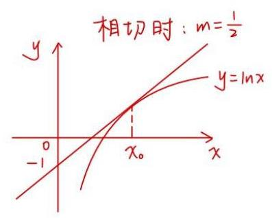

$\left\{  \begin{array}{l} m{x}_{0} + \frac{n}{{x}_{0}} = \ln {x}_{0} \\  m - \frac{n}{{x}_{0}^{2}} = \frac{1}{{x}_{0}} \end{array}\right.$②

由①得 $n = \left( {m - \frac{1}{{x}_{0}}}\right)  \cdot  {x}_{0}^{2}$

代入①得 ${2m}{x}_{0} - 1 = {ln}{x}_{0}$

即直线 $y = {2m}x - 1$ 与曲线 $y = {ln}x$ 有交点

联立 $\left\{  \begin{matrix} {2m} = \frac{1}{{x}_{0}} \\  {2m}{x}_{0} - 1 = {ln}{x}_{0} \end{matrix}\right.$ 得 $m = \frac{1}{2}$

$\therefore m \in  \left\lbrack  {-\infty ,\frac{1}{2}}\right\rbrack$

法二:记 $x = t$ 时，使 $\left\{  \begin{array}{l} {h}_{1}\left( t\right)  = {h}_{2}\left( t\right) \\  {h}_{1}^{\prime }\left( t\right)  = {h}_{2}^{\prime }\left( t\right)  \end{array}\right.$

$\because {h}_{1}^{\prime }\left( x\right)  = m - \frac{n}{{x}^{2}},{h}_{2}^{\prime }\left( x\right)  = \frac{1}{x}$

$\therefore \left\{  \begin{array}{ll} {mt} + \frac{n}{t} = \ln t & \text{ ① } \\  m - \frac{n}{{t}^{2}} = \frac{1}{t} & \text{ ② } \end{array}\right.$

由②得 $n = m{t}^{2} - t$

代入①得 ${mt} + {mt} - 1 = {l}_{n}t$

$\therefore {{2mt} - \ln t} - 1 = 0$

$\therefore$ 只要 ${2mt} - {\ln t} - 1 = 0$ 有正根即可

令 $p\left( t\right)  = {2mt} - {\ln t} - 1$

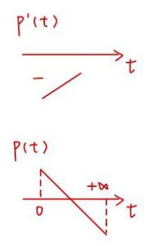

则 ${p}^{\prime }\left( t\right)  = {2m} - \frac{1}{t} \uparrow$

当 $m \leq  0$ 时， ${p}^{\prime }\left( t\right)  < 0$ 对 $t \in  \left( {0, + \infty }\right)$ 恒成立 $\therefore p\left( t\right)$ 在 $\left( {0, + \infty }\right)$ 上单调递减

$$
\mathop{\lim }\limits_{{t \rightarrow  {0}^{ + }}}P\left( t\right)  =  + \infty ,\mathop{\lim }\limits_{{t \rightarrow   + \infty }}P\left( t\right)  =  - \infty
$$

$\therefore p\left( t\right)  = 0$ 在 $t \in  \left( {0, + \infty }\right)$ 有正根，符合条件

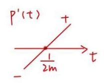

当 $m > 0$ 时， ${p}^{\prime }\left( t\right)  = 0$ 时，有 ${2m} - \frac{1}{t} = 0$

$\therefore t = \frac{1}{2m}$

当 $t \in  \left( {0,\frac{1}{2m}}\right)$ 时， ${p}^{\prime }\left( t\right)  < 0, p\left( t\right)$ 递减

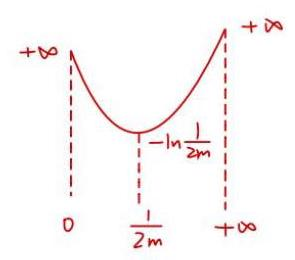

当 $t \in  \left( {\frac{1}{2m}, + \infty }\right)$ 时， ${p}^{\prime }\left( t\right)  > 0$ ， $p\left( t\right)$ 递增

$\therefore p\left( t\right)$ 有极小值点 $t = \frac{1}{2m}$

极小值为 $P\left( \frac{1}{2m}\right)  =  - \ln \frac{1}{2m}$

$\because \mathop{\lim }\limits_{{t \rightarrow  {0}^{ + }}}P\left( t\right)  =  + \infty ,\;\mathop{\lim }\limits_{{t \rightarrow   + \infty }}P\left( t\right)  =  + \infty$

$\therefore$ 当 $P\left( t\right)  = 0$ 有解时，必要 $p\left( \frac{1}{2m}\right)  \leq  0$

$\therefore  - \ln \frac{1}{2m} \leq  0$

$\therefore {l}_{n}{2m} \leq  0$

$\therefore {2m} \in  (0,1\rbrack$

$\therefore m \in  \left\lbrack  {0,\frac{1}{2}}\right\rbrack$

综上所述， $m$ 取值范围为 $\left\lbrack  {-\infty ,\frac{1}{2}}\right\rbrack$

13. 设 $y = f\left( x\right)$ 是定义在 $\mathrm{R}$ 上的函数,若存在区间 $\left\lbrack  {a, b}\right\rbrack$ 和 ${x}_{0} \in  \left( {a, b}\right)$ ,使得 $y = f\left( x\right)$ 在 $\left\lbrack  {a,{x}_{0}}\right\rbrack$ 上严格减，在 $\left\lbrack  {{x}_{0}, b}\right\rbrack$ 上严格增，则称 $y = f\left( x\right)$ 为 “含谷函数”， $\left\lbrack  {a, b}\right\rbrack$ 称为 $y = f\left( x\right)$ 的一个“含谷区间”.

(1)判断下列函数中，哪些是含谷函数？若是，请指出谷点；若不是，请说明理由:

① $y = 2\left| x\right|$ ；② $y = x + \cos x$ ；

(2)已知实数 $m > 0, y = {x}^{2} - {2x} - m\ln \left( {x - 1}\right)$ 是含谷函数，且 $\left\lbrack  {2,4}\right\rbrack$ 是它的一个含谷区间，求 $\mathrm{m}$ 的取值范围;

(3) 设 $\mathrm{p}, q \in  \mathrm{R}, h\left( x\right)  =  - {x}^{4} + p{x}^{3} + q{x}^{2} + \left( {4 - {3p} - {2q}}\right) x$ . 设函数 $y = h\left( x\right)$ 是含谷函数， $\left\lbrack  {a, b}\right\rbrack$ 是它的一个含谷区间,并记 $b - a$ 的最大值为 $L\left( {p, q}\right)$ . 若 $h\left( 1\right)  \leq  h\left( 2\right)$ ,且 $h\left( 1\right)  \leq  0$ ,求 $L\left( {p, q}\right)$ 的最小值.

(1)① $y = {2\left| x\right| }$ 是含谷函数，谷点为 0

② 记 $f\left( x\right)  = x + \cos x\;\therefore {f}^{\prime }\left( x\right)  = 1 - \sin x \geq  0$

$\therefore y = x + \cos x$ 在R严格增

$\therefore$ 不存在谷点

(2)设 $g\left( x\right)  = {x}^{2} - {2x} - m\ln \left( {x - 1}\right)$ . 定义域为 $\left( {1, + \infty }\right)$

${g}^{\prime }\left( x\right)  = {2x} - 2 - \frac{m}{x - 1}$ ，易知 ${g}^{\prime }\left( x\right)  \uparrow$

令 ${g}^{\prime }\left( x\right)  = 0$ 得到函数 $y = g\left( x\right)$ 的驻点 $x = 1 + \sqrt{\frac{m}{2}}$ 或 $x = 1 - \sqrt{\frac{m}{2}}$ (舍)

当 $1 < x < 1 + \sqrt{\frac{m}{2}}$ 时， ${g}^{\prime }\left( x\right)  < 0, y = g\left( x\right)$ 严格减

当 $x > 1 + \sqrt{\frac{m}{2}}$ 时， ${g}^{\prime }\left( x\right)  > 0, y = g\left( x\right)$ 严格增

又 $\left\lbrack  {2,4}\right\rbrack$ 是 $y = g\left( x\right)$ 的一个含谷区间

$\therefore 2 < 1 + \sqrt{\frac{m}{2}} < 4,2 < m < {18}$ 即 $m \in  \left( {2,1,8}\right)$

(3) $h\left( x\right)  =  - {x}^{4} + p{x}^{3} + {qx}^{2} + \left( {4 - {3p} - {2q}}\right) x, h\left( 0\right)  = 0$

${h}^{\prime }\left( x\right)  = 4\left( {1 - x}\right) \left\lbrack  {{x}^{2} + \left( {1 - \frac{3}{4}p}\right) x + \left( {1 - \frac{3}{4}p - \frac{9}{2}}\right) }\right\rbrack$

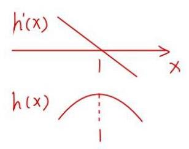

令 $p\left( x\right)  = {x}^{2} + \left( {1 - \frac{3}{4}p}\right) x + 1 - \frac{3}{4}p - \frac{9}{2}$

若 $p\left( x\right)$ 恒正，则 ${h}^{\prime }\left( x\right)$ 的正负由 $1 - x$ 决定

$h\left( x\right)$ 在 $\left( {-\infty ,1}\right)$ 严格增，在 $\left( {1, + \infty }\right)$ 严格减

$\therefore p\left( x\right)  = 0$ 有2个不同实根 $\;\therefore \Delta  > 0$

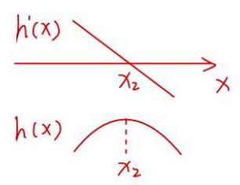

记为 ${x}_{1},{x}_{2}$ ，不妨设 ${x}_{1} < {x}_{2}$

$\therefore {h}^{\prime }\left( x\right)  = \left( {1 - x}\right) \left( {x - {x}_{1}}\right) \left( {x - {x}_{2}}\right)$

若 ${X}_{1} = 1$ ，则 ${h}^{\prime }\left( x\right)  =  - {\left( 1 - x\right) }^{2}\left( {x - {x}_{2}}\right)$

$\therefore h\left( x\right)$ 在 $\left( {-\infty ,{x}_{2}}\right)$ 严格增，在 $\left( {{x}_{2}, + \infty }\right)$ 严格减

$h\left( x\right)$ 不是含谷函数，矛盾

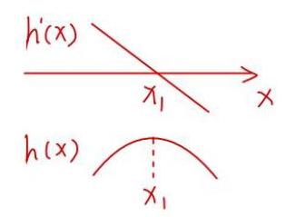

若 ${x}_{2} = 1$ ，则 ${h}^{\prime }\left( x\right)  =  - {\left( 1 - x\right) }^{2}\left( {x - {x}_{1}}\right)$

$h\left( x\right)$ 不是含谷函数，矛盾

$\therefore {x}_{1} \neq  1,{x}_{2} \neq  1$

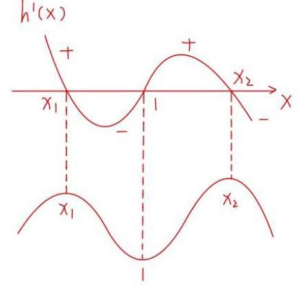

即 ${h}^{\prime }\left( x\right)$ 图象如右图

$\because \left\{  \begin{array}{l} h\left( 1\right)  \leq  h\left( 0\right) \\  h\left( 1\right)  \leq  h\left( 2\right)  \end{array}\right.$

$\therefore$ 只能是 ${x}_{1} < 1 < {x}_{2}$ ，其他情况均不符合

$\because \left\lbrack  {a, b}\right\rbrack$ 为含谷区间

$\therefore \left\lbrack  {a, b}\right\rbrack   \subseteq  \left\lbrack  {{x}_{1},{x}_{2}}\right\rbrack$

$L\left( {p, q}\right)  = {x}_{2} - {x}_{1}$ ，代入求根公式

$$
= \sqrt{\Delta }
$$

$$
= \sqrt{{\left( 1 - \frac{3}{4}p\right) }^{2} - 4\left( {1 - \frac{3}{4}p - \frac{9}{2}}\right) } = \sqrt{\frac{9}{16}{p}^{2} + \frac{3}{2}p - 3 + {2q}}
$$

$$
\because \left\{  \begin{array}{l} h\left( 1\right)  \leq  h\left( 0\right) \\  h\left( 1\right)  \leq  h\left( 2\right)  \end{array}\right.
$$

$\therefore \left\{  \begin{array}{l} q \geq  1/1 - {4p} \\  q \geq  3 - {2p} \end{array}\right.$ ，即 $q \geq  \left\{  \begin{array}{l} {11} - {4p}, p \leq  4 \\  3 - {2p}, p > 4 \end{array}\right.$

$\therefore$ 当 $p \leq  4$ 时， $L\left( {p, q}\right)  \geq  \sqrt{\frac{9}{16}{p}^{2} + \frac{13}{2}p + {19}} \geq  \sqrt{2}$

当 $p > 4$ 时， $L\left( {p, q}\right)  \geq  \sqrt{\frac{q}{1\text{ é }}{p}^{2} - \frac{5}{2}p + 3} > \sqrt{2}$

$\therefore$ 当 $p = 4, q =  - 5$ 时

$L{\left( p, q\right) }_{\min } = \sqrt{2}$

14. 设 $a > 0$ . 已知函数 $f\left( x\right)  = {\left( x - 2\right) }^{3} - {ax}$ .

(1)求函数 $y = f\left( x\right)$ 的单调区间；

(2)对于函数 $y = f\left( x\right)$ 的极值点 ${x}_{0}$ ，存在 ${x}_{1}\left( {{x}_{1} \neq  {x}_{0}}\right)$ ，使得 $f\left( {x}_{1}\right)  = f\left( {x}_{0}\right)$ ，试问对任意的正数 $a,{x}_{1} + 2{x}_{0}$ 是否为定值? 若是,求出这个定值; 若不是,请说明理由;

(3)若函数 $g\left( x\right)  = \left| {f\left( x\right) }\right|$ 在区间 $\left\lbrack  {0,6}\right\rbrack$ 上的最大值为 40，试求 $a$ 的取值集合.

(1) 由 $f\left( x\right)  = {\left( x - 2\right) }^{3} - {ax}$ ,可得 ${f}^{\prime }\left( x\right)  = 3{\left( x - 2\right) }^{2} - a$ ,

因 $a > 0$ ,由 ${f}^{\prime }\left( x\right)  = 0$ ,解得 $x = 2 \pm  \sqrt{\frac{a}{3}}$ ,当 $x$ 变化时, ${f}^{\prime }\left( x\right) , f\left( x\right)$ 的变化情况如下表:

<table><tr><td>$x$</td><td>$( - \infty$ , <br> $\left. {2 - \sqrt{\frac{a}{3}}}\right)$</td><td>$2 - \sqrt{\frac{a}{3}}$</td><td>$\left( {2 - \sqrt{\frac{a}{3}}}\right.$ <br> $\left. {2 + \sqrt{\frac{a}{3}}}\right)$</td><td>$2 + \sqrt{\frac{a}{3}}$</td><td>$\left( {2 + \sqrt{\frac{a}{3}}}\right.$ <br> $+ \infty )$</td></tr><tr><td>${f}^{\prime }\left( x\right)$</td><td>+</td><td>0</td><td>-</td><td>0</td><td>+</td></tr><tr><td>$f\left( x\right)$</td><td>单调递增</td><td>极大值 <br> $f\left( {2 - \sqrt{\frac{a}{3}}}\right)$</td><td>单调递减</td><td>极小值 <br> $f\left( {2 + \sqrt{\frac{a}{3}}}\right)$</td><td>单调递增</td></tr></table>

所以, $f\left( x\right)$ 的单调递增区间为: $\left( {-\infty ,2 - \sqrt{\frac{a}{3}}}\right)$ 与 $\left( {2 + \sqrt{\frac{a}{3}}, + \infty }\right)$ ,单调递减区间为:

$\left( {2 - \sqrt{\frac{a}{3}},2 + \sqrt{\frac{a}{3}}}\right)$

(2)因为 $f\left( x\right)$ 存在极值点 ${x}_{0}$ ，所以由(1)知: $a > 0$ ，且 ${x}_{0} \neq  2$ ，

因为 $f\left( {x}_{0}\right)  = {\left( {x}_{0} - 2\right) }^{3} - a{x}_{0}, f\left( {x}_{1}\right)  = {\left( {x}_{1} - 2\right) }^{3} - a{x}_{1}$ ,

故由 $f\left( {x}_{1}\right)  = f\left( {x}_{0}\right)$ ,得 ${\left( {x}_{1} - 2\right) }^{3} - a{x}_{1} = {\left( {x}_{0} - 2\right) }^{3} - a{x}_{0}$ ,即

$\left( {{x}_{1} - {x}_{0}}\right) \left\lbrack  {{\left( {x}_{1} - 2\right) }^{2} + \left( {{x}_{1} - 2}\right) \left( {{x}_{0} - 2}\right)  + {\left( {x}_{0} - 2\right) }^{2} - a}\right\rbrack   = 0,$

因为 ${x}_{1} \neq  {x}_{0}$ ,所以 ${\left( {x}_{1} - 2\right) }^{2} + \left( {{x}_{1} - 2}\right) \left( {{x}_{0} - 2}\right)  + {\left( {x}_{0} - 2\right) }^{2} - a = 0\left( *\right)$ ,

由题意,得 ${f}^{\prime }\left( {x}_{0}\right)  = 3{\left( {x}_{0} - 2\right) }^{2} - a = 0$ ,即 ${\left( {x}_{0} - 2\right) }^{2} = \frac{a}{3} > 0$ ,

当 ${x}_{0} = 2 - \sqrt{\frac{a}{3}}$ 时，由 $\left( *\right)$ 可得 ${\left( {x}_{1} - 2\right) }^{2} - \sqrt{\frac{a}{3}}\left( {{x}_{1} - 2}\right)  - \frac{2}{3}a = 0$ ，

解得 ${x}_{1} - 2 = 2\sqrt{\frac{a}{3}}$ ，即 ${x}_{1} = 2 + 2\sqrt{\frac{a}{3}}$ ，此时 ${x}_{1} + 2{x}_{0} = \left( {2 + 2\sqrt{\frac{a}{3}}}\right)  + 2\left( {2 - \sqrt{\frac{a}{3}}}\right)  = 6$ ；

当 ${x}_{0} = 2 + \sqrt{\frac{a}{3}}$ 时，由 $\left( *\right)$ 可得 ${\left( {x}_{1} - 2\right) }^{2} + \sqrt{\frac{a}{3}}\left( {{x}_{1} - 2}\right)  - \frac{2}{3}a = 0$ ，

解得 ${x}_{1} - 2 =  - 2\sqrt{\frac{a}{3}}$ ，即 ${x}_{1} = 2 - 2\sqrt{\frac{a}{3}}$ ，此时 ${x}_{1} + 2{x}_{0} = \left( {2 - 2\sqrt{\frac{a}{3}}}\right)  + 2\left( {2 + \sqrt{\frac{a}{3}}}\right)  = 6$

一共三个字母，将 x1 与 x0 用 a 表示

(3) 因函数 $g\left( x\right)  = \left| {{\left( x - 2\right) }^{3} - {ax}}\right|$ 在区间 $\left\lbrack  {0,6}\right\rbrack$ 上的最大值只有可能在 $0,6,2 - \sqrt{\frac{a}{3}},2 + \sqrt{\frac{a}{3}}$ 这

4处取得,

又 $g\left( 0\right)  = 8, g\left( 6\right)  = \left| {{64} - {6a}}\right| , g\left( {2 - \sqrt{\frac{a}{3}}}\right)  = \left| {\frac{2a}{3}\sqrt{\frac{a}{3}} - {2a}}\right|$ ,

$g\left( {2 + \sqrt{\frac{a}{3}}}\right)  = \left| {\frac{2a}{3}\sqrt{\frac{a}{3}} + {2a}}\right|  = \frac{2a}{3}\sqrt{\frac{a}{3}} + {2a} > \left| {\frac{2a}{3}\sqrt{\frac{a}{3}} - {2a}}\right|  = g\left( {2 - \sqrt{\frac{a}{3}}}\right) \left( {\text{ 因 }a > 0}\right) ,$

① 若 $g\left( {2 + \sqrt{\frac{a}{3}}}\right)  = \frac{2a}{3}\sqrt{\frac{a}{3}} + {2a}$ 为 $g\left( x\right)$ 在区间 $\left\lbrack  {0,6}\right\rbrack$ 上的最大值(等于40)，

令 $\sqrt{\frac{a}{3}} = u$ ，则 $u > 0$ ，且 $a = 3{u}^{2}$ ，由 $\frac{2a}{3}\sqrt{\frac{a}{3}} + {2a} = {40}$ ，得 ${u}^{3} + 3{u}^{2} = {20}$ .

设 $h\left( u\right)  = {u}^{3} + 3{u}^{2}$ ，则 ${h}^{\prime }\left( u\right)  = 3{u}^{2} + {6u} > 0$ 恒成立，故 $h\left( u\right)$ 在 $\left( {0, + \infty }\right)$ 上严格递增，

于是在 $\left( {0, + \infty }\right)$ 上存在唯一的 ${u}_{0}$ ,使 ${u}_{0}^{3} + 3{u}_{0}^{2} = {20}$ ,易知 ${u}_{0} = 2$ ,进而相应的 $a = {12}$ ,

而此时 $2 + \sqrt{\frac{a}{3}} = 4 \in  \left\lbrack  {0,6}\right\rbrack  , g\left( 6\right)  = \left| {{64} - {6a}}\right|  = 8 < {40}$ ,因此 $a = {12}$ 符合题意;

②若 $g\left( 6\right)  = \left| {{64} - {6a}}\right|$ 为 $g\left( x\right)$ 在区间 $\left\lbrack  {0,6}\right\rbrack$ 上的最大值(等于40)，则 $a = 4$ 或 $\frac{52}{3}$ ，

(i) 当 $a = 4$ 时, $2 + \sqrt{\frac{a}{3}} \in  \left\lbrack  {0,6}\right\rbrack  , g\left( {2 + \sqrt{\frac{a}{3}}}\right)  = \frac{2a}{3}\sqrt{\frac{a}{3}} + {2a} = \frac{16}{9}\sqrt{3} + 8 < {40}$ ,

$g\left( 6\right)  = \left| {{64} - {6a}}\right|  = {40}$ 为 $g\left( x\right)$ 在区间 $\left\lbrack  {0,6}\right\rbrack$ 上的最大值，因此 $a = 4$ 符合题意；

(ii) 当 $a = \frac{52}{3}$ 时,

$2 - \sqrt{\frac{a}{3}} < 0,2 + \sqrt{\frac{a}{3}} \in  \left\lbrack  {0,6}\right\rbrack  , g\left( {2 + \sqrt{\frac{a}{3}}}\right)  = \frac{2a}{3}\sqrt{\frac{a}{3}} + {2a} = \frac{208}{27}\sqrt{13} + \frac{104}{3} > {40}$ ,

于是 $a = \frac{52}{3}$ 不符合题意，舍去；

综上所述，符合条件的 $a$ 的取值集合为 $\{ 4,{12}\}$ .

15. 已知函数 $y = f\left( x\right) , y = g\left( x\right)$ ,其中 $f\left( x\right)  = \frac{1}{{x}^{2}}, g\left( x\right)  = \ln x$ .

(1)求函数 $y = g\left( x\right)$ 在点 $\left( {1, g\left( 1\right) }\right)$ 的切线方程；

(2)函数 $y = {mf}\left( x\right)  + {2g}\left( x\right) , m \in  \mathbf{R}, m \neq  0$ 是否存在极值点，若存在求出极值点，若不存在， 请说明理由;

(3)若关于 $x$ 的不等式 ${af}\left( x\right)  + g\left( x\right)  \geq  a$ 在区间 $(0,1\rbrack$ 上恒成立,求实数 $a$ 的取值范围.

解: (1) 因为 ${g}^{\prime }\left( x\right)  = \frac{1}{x}$

$\therefore k = {g}^{\prime }\left( 1\right)  = \frac{1}{1} = 1$

所以在点 $\left( {1, g\left( 1\right) }\right)$ 的切线方程为 $y - 0 = 1\left( {x - 1}\right)$ ,即 $y = x - 1$ ;

( 2 )设 $H\left( x\right)  = {mf}\left( x\right)  + g\left( x\right)  = \frac{m}{{x}^{2}} + 2\ln x$ ，定义域 $\left( {0, + \infty }\right)$

${H}^{\prime }\left( x\right)  = {\left( \frac{m}{{x}^{2}}\right) }^{\prime } + {\left( 2\ln x\right) }^{\prime } =  - \frac{2m}{{x}^{3}} + \frac{2}{x} = \frac{2{x}^{2} - {2m}}{{x}^{3}}$

当 $m < 0$ 时， ${H}^{\prime }\left( x\right)  > 0$ 恒成立

所以 $H\left( x\right)  = {mf}\left( x\right)  + g\left( x\right)$ 在 $\left( {0, + \infty }\right)$ 严格增,所以不存在极值点

当 $m > 0$ 时,令 ${H}^{\prime }\left( x\right)  = 0,\therefore x = \sqrt{m}$

当 $x > \sqrt{m}$ 时 ${H}^{\prime }\left( x\right)  > 0$

当 $0 < x < \sqrt{m}$ 时， ${H}^{\prime }\left( x\right)  < 0$

所以 $H\left( x\right)  = {mf}\left( x\right)  + g\left( x\right)$ 在 $\left( {0,\sqrt{m}}\right)$ 严格减,在 $\left( {\sqrt{m}, + \infty }\right)$ 严格增

所以函数存在一个极小值点 $x = \sqrt{m}$ ,无极大值点;

(3)原不等式 ${af}\left( x\right)  + g\left( x\right)  \geq  a \Leftrightarrow  a\left( {\frac{1}{{x}^{2}} - 1}\right)  + \ln x \geq  0$

当 $x = 1$ 时 $a \in  R$ 恒成立

当 $x \in  \left( {0,1}\right)$ 时 $a \geq  \frac{-\ln x}{\frac{1}{{x}^{2}} - 1}$

即 $a \geq  \frac{\ln x}{1 - \frac{1}{{x}^{2}}}$ 对称于幂和不乘解. 取一个

由(2)知 $N\left( x\right)  = \frac{1}{{x}^{2}} + \ln {x}^{2}$ 在 $x = 1$ 有最小值 $N\left( x\right)  \geq  \frac{1}{1} + 0 = 1$

所以 $1 - \frac{1}{{x}^{2}} \leq  \ln {x}^{2}$

$\because x \in  \left( {0,1}\right) \therefore 1 - \frac{1}{{x}^{2}} \leq  \ln {x}^{2} < 0$

$\therefore \frac{\ln {x}^{2}}{1 - \frac{1}{{x}^{2}}} \leq  1$

$\therefore {2a} \geq  \frac{2\ln x}{1 - \frac{1}{{x}^{2}}} \geq  1$

$\therefore a \geq  \frac{1}{2}$ .

16. 如果函数 $y = f\left( x\right)$ 满足以下两个条件,我们就称 $y = f\left( x\right)$ 为 $L$ 型函数.

① 对任意的 $x \in  \left( {0,1}\right)$ ，总有 $f\left( x\right)  > 0$ ；

② 当 ${x}_{1} > 0,{x}_{2} > 0,{x}_{1} + {x}_{2} < 1$ 时,总有 $f\left( {{x}_{1} + {x}_{2}}\right)  < f\left( {x}_{1}\right)  + f\left( {x}_{2}\right)$ 成立.

(1)记 $g\left( x\right)  = {x}^{2} + \frac{1}{2}$ ，求证: $y = g\left( x\right)$ 为 $L$ 型函数；

(2)设 $b \in  \mathbf{R}$ ，记 $p\left( x\right)  = \ln \left( {x + b}\right)$ ，若 $y = p\left( x\right)$ 是 $L$ 型函数，求 $b$ 的取值范围；

(3)是否存在 $L$ 型函数 $y = r\left( x\right)$ 满足:对于任意的 $m \in  \left( {0,4}\right)$ ，都存在 ${x}_{0} \in  \left( {0,1}\right)$ ，使得等式 $r\left( {x}_{0}\right)  = m$ 成立? 请说明理由.

(1)当 $x \in  \left( {0,1}\right)$ 时， $g\left( x\right)  > \frac{1}{2} > 0$

当 ${x}_{1} > 0,{x}_{2} > 0,{x}_{1} + {x}_{2} < 1$ 时

$g\left( {{x}_{1} + {x}_{2}}\right)  = {\left( {x}_{1} + {x}_{2}\right) }^{2} + \frac{1}{2},\;g\left( {x}_{1}\right)  + g\left( {x}_{2}\right)  = {x}_{1}^{2} + {x}_{2}^{2} + 1$

$g\left( {x}_{1}\right)  + g\left( {x}_{2}\right)  - g\left( {{x}_{1} + {x}_{2}}\right)  = \frac{1}{2} - 2{x}_{1}{x}_{2} = \frac{1 - 4{x}_{1}{x}_{2}}{2}$

$\because 1 > {x}_{1} + {x}_{2} \geq  2\sqrt{{x}_{1}{x}_{2}}$

$\therefore 1 - 4{x}_{1}{x}_{2} > 0$

$\therefore g\left( {x}_{1}\right)  + g\left( {x}_{2}\right)  > g\left( {{x}_{1} + {x}_{2}}\right)$

$\therefore g\left( x\right)  = {x}^{2} + \frac{1}{2}$ 为 $L$ 型函数

(2) 当 $x \in  \left( {0,1}\right)$ 时，由 $p\left( x\right)  > \ln \left( {0 + b}\right)  \geq  0$ 得 $b \geq  1$ (必要性)

当 ${x}_{1} > 0,{x}_{2} > 0,{x}_{1} + {x}_{2} < 1$ 时

$f\left( {{x}_{1} + {x}_{2}}\right)  = \ln \left( {{x}_{1} + {x}_{2} + b}\right)$

$p\left( {x}_{1}\right)  + p\left( {x}_{2}\right)  = \ln \left( {{x}_{1} + b}\right)  + \ln \left( {{x}_{2} + b}\right)$

$p\left( {{x}_{1} + {x}_{2}}\right)  < p\left( {x}_{1}\right)  + p\left( {x}_{2}\right)$

$\ln \left( {{x}_{1} + {x}_{2} + b}\right)  < \ln \left( {{x}_{1} + b}\right)  + \ln \left( {{x}_{2} + b}\right)$

$\therefore {x}_{1} + {x}_{2} + b < \left( {{x}_{1} + b}\right) \left( {{x}_{2} + b}\right)$

${x}_{1} + {x}_{2} + b < {x}_{1}{x}_{2} + b\left( {{x}_{1} + {x}_{2}}\right)  + {b}^{2}$

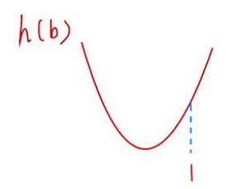

${b}^{2} + b\left( {{x}_{1} + {x}_{2} - 1}\right)  + {x}_{1}{x}_{2} - \left( {{x}_{1} + {x}_{2}}\right)  > 0$ (主元法)

令 $h\left( b\right)  = {b}^{2} + b\left( {{x}_{1} + {x}_{2} - 1}\right)  + {x}_{1}{x}_{2} - \left( {{x}_{1} + {x}_{2}}\right)$

则对称轴 $b = \frac{1 - \left( {{x}_{1} + {x}_{2}}\right) }{2} \in  \left( {0,\frac{1}{2}}\right)$

$\therefore h\left( b\right)$ 在 $\lbrack 1, + \infty )$ 上的最小值为 $h\left( 1\right)$ ，只要 $h\left( 1\right)  > 0$ ，则 $h\left( b\right)  > 0$

$\because h\left( 1\right)  = {1}^{2} + \left( {{x}_{1} + {x}_{2} - 1}\right)  + {x}_{1}{x}_{2} - \left( {{x}_{1} + {x}_{2}}\right)  = {x}_{1}{x}_{2} > 0$

$\therefore b \in  \lbrack 1, + \infty )$

(3) 存在，例: $r\left( x\right)  = 4\sqrt{x}$

当 $x \in  \left( {0,1}\right)$ 时， $r\left( x\right)  \in  \left( {0,4}\right)$ 符合 $r\left( x\right)  > 0$

当 ${x}_{1} > 0,{x}_{2} > 0,{x}_{1} + {x}_{2} < 1$ 时

$r\left( {{x}_{1} + {x}_{2}}\right)  = 4\sqrt{{x}_{1} + {x}_{2}}, r\left( {x}_{1}\right)  + r\left( {x}_{2}\right)  = 4\sqrt{{x}_{1}} + 4\sqrt{{x}_{2}}$

$\because {\left( \sqrt{{x}_{1}} + \sqrt{{x}_{2}}\right) }^{2} = {x}_{1} + {x}_{2} + 2\sqrt{{x}_{1}{x}_{2}},{\left( \sqrt{{x}_{1} + {x}_{2}}\right) }^{2} = {x}_{1} + {x}_{2} < {x}_{1} + {x}_{2} + 2\sqrt{{x}_{1}{x}_{2}}$

$\therefore {\left( \sqrt{{x}_{1} + {x}_{2}}\right) }^{2} < {\left( \sqrt{{x}_{1}} + \sqrt{{x}_{2}}\right) }^{2}$

$\therefore 4\sqrt{{x}_{1} + {x}_{2}} < 4\sqrt{{x}_{1}} + 4\sqrt{{x}_{2}}$

即 $r\left( {{x}_{1} + {x}_{2}}\right)  < r\left( {x}_{1}\right)  + r\left( {x}_{2}\right)$

17. 设函数 $y = f\left( x\right)$ 的定义域为 $D$ ,给定区间 $\left\lbrack  {a, b}\right\rbrack   \subseteq  D$ ,若存在 ${x}_{0} \in  \left( {a, b}\right)$ ,使得 $f\left( {x}_{0}\right)  = \frac{f\left( b\right)  - f\left( a\right) }{b - a}$ ,则称函数 $y = f\left( x\right)$ 为区间 $\left\lbrack  {a, b}\right\rbrack$ 上的 “均值函数”, ${x}_{0}$ 为函数 $y = f\left( x\right)$ 的 “均值点”.

(1)试判断函数 $y = {x}^{2}$ 是否为区间 $\left\lbrack  {1,2}\right\rbrack$ 上的“均值函数”，如果是，请求出其“均值点”； 如果不是, 请说明理由;

(2)已知函数 $y =  - {2}^{{2x} - 1} + m \cdot  {2}^{x - 1} - {12}$ 是区间 $\left\lbrack  {1,3}\right\rbrack$ 上的 “均值函数”，求实数 $m$ 的取值范围；

(3)若函数 $y = \frac{{x}^{2} + a}{2\left( {{x}^{2} - {2x} + 2}\right) }$ (常数 $a \in  \mathbf{R}$ )是区间 $\left\lbrack  {-2,2}\right\rbrack$ 上的 “均值函数”，且 $\frac{2}{3}$ 为其“均值点”. 将区间 $\left\lbrack  {-2,0}\right\rbrack$ 任意划分成 $m + 1\left( {m \in  \mathbf{N}}\right)$ 份,设分点的横坐标从小到大依次为 ${t}_{1},{t}_{2},\cdots ,{t}_{m}$ , 记 ${t}_{0} =  - 2,{t}_{m + 1} = 0, G = \mathop{\sum }\limits_{{i = 0}}^{m}\left| {f\left( {t}_{i + 1}\right)  - f\left( {t}_{i}\right) }\right|$ . 再将区间 $\left\lbrack  {0,2}\right\rbrack$ 等分成 ${2}^{n} + 1\left( {n \in  \mathbf{N}}\right)$ 份,设等分点的横坐标从小到大依次为 ${x}_{1},{x}_{2},\cdots ,{x}_{{2}^{n}}$ ,记 $H = \mathop{\sum }\limits_{{i = 1}}^{{2}^{n}}f\left( {x}_{i}\right)$ . 求使得 $H \cdot  G > {2023}$ 的最小整数 $n$ 的值.

解: (1) 由 ${x}_{0}^{2} = \frac{{2}^{2} - {1}^{2}}{2 - 1}$ ,得 ${x}_{0} = \sqrt{3}$ 或 ${x}_{0} =  - \sqrt{3}$ (舍). .2 分

故 $y = {x}^{2}$ 为区间 $\left\lbrack  {1,2}\right\rbrack$ 上的 “均值函数”,且 $\sqrt{3}$ 为其 “均值点”. .4 分

(2)设 ${x}_{0}$ 为该函数的“均值点”，则 ${x}_{0} \in  \left( {1,3}\right)$ ，且

$- {2}^{2{x}_{0} - 1} + m \cdot  {2}^{{x}_{0} - 1} - {12} = \frac{\left( {-{2}^{5} + m \cdot  {2}^{2} - {12}}\right)  - \left( {-2 + m \cdot  {2}^{0} - {12}}\right) }{3 - 1},$

即关于 ${x}_{0}$ 的方程 ${2}^{2{x}_{0}} - m \cdot  {2}^{{x}_{0}} + {3m} - 6 = 0$ 在区间 $\left( {1,3}\right)$ 上有解. .6 分

整理,得 $\left( {{2}^{{x}_{0}} - 3}\right) m = {2}^{2{x}_{0}} - 6$ ,

① 当 ${2}^{{x}_{0}} = 3$ 时， $0 \cdot  m = 3$ ，方程无解.

② 当 ${2}^{{x}_{0}} \neq  3$ 时， $m = \frac{{2}^{2{x}_{0}} - 6}{{2}^{{x}_{0}} - 3}$ .

令 $t = {2}^{{x}_{0}} - 3$ ,得 $t \in  \left( {-1,0}\right)  \cup  \left( {0,5}\right)$ ,且 ${2}^{{x}_{0}} = t + 3$ ,

从而 $m = \frac{{\left( t + 3\right) }^{2} - 6}{t} = t + \frac{3}{t} + 6$ 在 $t \in  \left( {-1,0}\right)$ 上是严格减函数, 在 $t \in  (0,\sqrt{3}\rbrack$ 上是严格减函数,在 $t \in  \lbrack \sqrt{3},5)$ 上严格增函数,

故 $m \in  \left( {-\infty ,2}\right)  \cup  \lbrack 2\sqrt{3} + 6, + \infty )$ .

即实数 $m$ 的取值范围是 $\left( {-\infty ,2}\right)  \cup  \lbrack 2\sqrt{3} + 6, + \infty )$ . .10 分

(3) 由 $f\left( \frac{2}{3}\right)  = \frac{f\left( 2\right)  - f\left( {-2}\right) }{2 - \left( {-2}\right) }$ ,得 $a = 0$ .

从而 $f\left( x\right)  = \frac{{x}^{2}}{2\left( {{x}^{2} - {2x} + 2}\right) }$ , 11 分

${f}^{\prime }\left( x\right)  = \frac{1}{2} \cdot  \frac{{2x} \cdot  \left( {{x}^{2} - {2x} + 2}\right)  - {x}^{2} \cdot  \left( {{2x} - 2}\right) }{{\left( {x}^{2} - 2x + 2\right) }^{2}} = \frac{x\left( {2 - x}\right) }{{\left( {x}^{2} - 2x + 2\right) }^{2}}.$

当 $x \in  \left\lbrack  {-2,0}\right\rbrack$ 时, ${f}^{\prime }\left( x\right)  \leq  0$ ,即 $f\left( x\right)  = \frac{{x}^{2}}{2\left( {{x}^{2} - {2x} + 2}\right) }$ 在 $\left\lbrack  {-2,0}\right\rbrack$ 上单调递减,

故 $f\left( {t}_{i}\right)  \geq  f\left( {t}_{i + 1}\right) \left( {i = 0,1,2,\cdots , m}\right)$ , 13 分

$G = \mathop{\sum }\limits_{{i = 0}}^{m}\left| {f\left( {t}_{i + 1}\right)  - f\left( {t}_{i}\right) }\right|  = \mathop{\sum }\limits_{{i = 0}}^{m}\left\lbrack  {f\left( {t}_{i}\right)  - f\left( {t}_{i + 1}\right) }\right\rbrack   = f\left( {t}_{0}\right)  - f\left( {t}_{m + 1}\right)  = f\left( {-2}\right)  - f\left( 0\right)  = \frac{1}{5}.$

又 $f\left( x\right)  + f\left( {2 - x}\right)  = \frac{{x}^{2}}{2{\left( x - 1\right) }^{2} + 2} + \frac{{\left( 2 - x\right) }^{2}}{2{\left( 1 - x\right) }^{2} + 2} = 1$ ,从而

$H = f\left( {x}_{1}\right)  + f\left( {x}_{2}\right)  + \cdots  + f\left( {x}_{{2}^{n}}\right) ,$

$H = f\left( {x}_{{2}^{n}}\right)  + f\left( {x}_{{2}^{n} - 1}\right)  + \cdots  + f\left( {x}_{1}\right) ,$

所以 ${2H} = {2}^{n}$ ,

$H = {2}^{n - 1}$ . 17 分

由 $\frac{1}{5} \cdot  {2}^{n - 1} > {2023}$ ,即 ${2}^{n} > {20230}, n > {\log }_{2}{20230} \approx  {14.3}$ ,

故使得 $H \cdot  G > {2023}$ 的最小整数 $n$ 的值为 15 . 18 分

18. 已知 $y = f\left( x\right)$ 是定义域为 $\left\lbrack  {0,1}\right\rbrack$ 的函数,实数 $p \in  \left( {0,1}\right)$ ,称函数 $y = \left( {1 - p}\right) f\left( 0\right)  + {pf}\left( x\right)  - f\left( {px}\right)$ , $x \in  \left\lbrack  {0,1}\right\rbrack$ 为函数 $y = f\left( x\right)$ 的“ $p -$ 生成函数”，记作 $y = {F}_{p}\left( x\right) ,\;x \in  \left\lbrack  {0,1}\right\rbrack$ .

(1)若 $f\left( x\right)  = \cos {2\pi x}$ ，求函数 $y = {F}_{\frac{1}{2}}\left( x\right)$ 的值域；

(2)若 $f\left( x\right)  = a{x}^{2} + \ln \left( {1 + x}\right)$ ，函数 $y = {F}_{\frac{1}{3}}\left( x\right)$ 满足 ${F}_{\frac{1}{3}}\left( x\right)  \geq  0$ 对任意的 $0 \leq  x \leq  1$ 恒成立，求实数 $a$ 的取值范围;

(3)若 $y = f\left( x\right)$ 满足:① $f\left( 0\right)  = 0$ ; ② $y = f\left( x\right)$ 在 $\left( {0,1}\right)$ 上存在导函数 $y = {f}^{\prime }\left( x\right)$ ，且 $y = {f}^{\prime }\left( x\right)$ 在 $\left( {0,1}\right)$ 上是严格增函数; ③ 对于任意 $p \in  \left( {0,1}\right) , y = f\left( x\right)$ 的“ $p$ - 生成函数” $y = {F}_{p}\left( x\right) , x \in  \left\lbrack  {0,1}\right\rbrack$ 的图像是一段连续曲线,求证: 函数 $y = \frac{f\left( x\right) }{x}$ 在 $\left( {0,1}\right)$ 上是严格增函数.

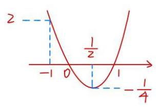

(1) ${F}_{\frac{1}{2}}\left( x\right)  = \left( {1 - \frac{1}{2}}\right) \cos \theta  + \frac{1}{2}\cos {2\pi x} - \cos {\pi x}$

$$
= \frac{1 + \cos {2\pi x}}{2} - \cos {\pi x} = {\cos }^{2}{\pi x} - \cos {\pi x}
$$

令 $t = \cos {\pi x} \in  \left\lbrack  {-1,1}\right\rbrack  , y = {t}^{2} - t \in  \left\lbrack  {-\frac{1}{4},2}\right\rbrack$

12) $f\left( x\right)  = a{x}^{2} + \ln \left( {1 + x}\right) , f\left( 0\right)  = 0$

${F}_{\frac{1}{3}}\left( x\right)  = \left( {1 - \frac{1}{3}}\right) {x0} + \frac{1}{3}f\left( x\right)  - f\left( {\frac{1}{3}x}\right) \; = \frac{1}{3}a{x}^{2} + \frac{1}{3}\ln \left( {1 + x}\right)  - \frac{1}{9}a{x}^{2} - \ln \left( {1 + \frac{1}{3}x}\right)$

$$
= \frac{2a}{9}{x}^{2} + \frac{1}{3}\ln \left( {1 + x}\right)  - \ln \left( {1 + \frac{1}{3}x}\right)  \geq  0
$$

$$
{F}_{\frac{1}{3}}\left( 0\right)  = 0
$$

$$
{F}_{\frac{1}{3}}^{\prime }\left( x\right)  = \frac{4a}{9}x + \frac{1}{3\left( {1 + x}\right) } - \frac{1}{1 + \frac{1}{3}x} \times  \frac{1}{3} = \frac{4a}{9}x + \frac{1}{3\left( {x + 1}\right) } - \frac{1}{x + 3}
$$

$$
= \frac{{2x}\left\lbrack  {{2a}\left( {x + 1}\right) \left( {x + 3}\right)  - 3}\right\rbrack  }{9\left( {x + 1}\right) \left( {x + 3}\right) }, x \in  \left\lbrack  {0,1}\right\rbrack
$$

① $a \leq  0$ 时， ${F}_{\frac{1}{3}}\left( x\right)  \leq  0$ (舍)

② $a > 0$ 时， $y = {2a}\left( {x + 1}\right) \left( {x + 3}\right)  - 3$ 在 $x \in  \left\lbrack  {0,1}\right\rbrack   \uparrow$

$\therefore y\left( 0\right)  = {2a} \times  3 - 3 \geq  0, a > \frac{1}{2}$

(3) ${F}_{p}\left( x\right)  = {pf}\left( x\right)  - f\left( {px}\right) ,{F}_{p}\left( 0\right)  = 0$

${F}_{p}^{\prime }\left( x\right)  = p{f}^{\prime }\left( x\right)  - p{f}^{\prime }\left( {px}\right)  = p\left\lbrack  {{f}^{\prime }\left( x\right)  - {f}^{\prime }\left( {px}\right) }\right\rbrack$

$P \in  \left( {0,1}\right) , x \in  \left( {0,1}\right) , y = {f}^{\prime }\left( x\right)  \uparrow  , x > {px}$

$\therefore {f}^{\prime }\left( x\right)  < {f}^{\prime }\left( {px}\right)$

$\therefore {F}_{p}{}^{\prime }\left( x\right)  > 0,{F}_{p}\left( x\right)  \uparrow$

$\therefore {F}_{p}\left( x\right)  > {F}_{p}\left( 0\right)$

$\therefore {{pf}\left( x\right)  - f\left( {px}\right) } > 0,{{pf}\left( x\right) } > f\left( {px}\right)$

$\frac{f\left( x\right) }{x} > \frac{f\left( {px}\right) }{px},$ 且 $x > {px}$

$\therefore y = \frac{f\left( x\right) }{x}$ ↑

19. 已知 $y = f\left( x\right) , y = g\left( x\right)$ 都是定义在实数集上的可导函数. 对于正整数 $k$ ,当 $m\text{ 、 }n$ 分别是 $y = f\left( x\right)$ 和 $y = g\left( x\right)$ 的驻点时,记 ${\Delta x} = \left| {m - n}\right|$ ,若 ${\Delta x} \leq  k$ ,则称 $f\left( x\right)$ 和 $g\left( x\right)$ 满足 $P\left( k\right)$ 性质; 当 ${x}_{1}\text{ 、 }{x}_{2} \in  R$ ,且 $g\left( {x}_{1}\right)  \neq  g\left( {x}_{2}\right)$ 时,记 ${\Delta y} = \left| \frac{f\left( {x}_{1}\right)  - f\left( {x}_{2}\right) }{g\left( {x}_{1}\right)  - g\left( {x}_{2}\right) }\right|$ ,若 ${\Delta y} \geq  k$ ,则称 $f\left( x\right)$ 和 $g\left( x\right)$ 满足 $Q\left( k\right)$ 性质.

(1)若 $f\left( x\right)  = {2x} + 1, g\left( x\right)  = x$ ，判断 $f\left( x\right)$ 和 $g\left( x\right)$ 是否满足 $Q\left( 2\right)$ 性质，并说明理由；

(2)若 $f\left( x\right)  = {\left( x - 1\right) }^{2}$ ， $g\left( x\right)  = \frac{{ax} + 1}{{e}^{x}}$ ，且 $f\left( x\right)$ 和 $g\left( x\right)$ 满足 $P\left( 1\right)$ 性质，求实数 $a$ 的取值范围；

(3)若 $y = f\left( x\right)$ 的最小正周期为 4，且 $g\left( {-1}\right)  = f\left( {-1}\right)$ ， $g\left( 1\right)  = f\left( 1\right)$ . 当 $x \in  \left\lbrack  {-1,3}\right\rbrack$ 时， $y = f\left( x\right)$ 的驻点与其两侧区间的部分数据如下表所示:

<table><tr><td>$x$</td><td>-1</td><td>(-1,1)</td><td>1</td><td>(1,3)</td><td>3</td></tr><tr><td>${f}^{\prime }\left( x\right)$</td><td>0</td><td>+</td><td></td><td>-</td><td>0</td></tr><tr><td>$f\left( x\right)$</td><td>极小值 -1</td><td></td><td>极大值 <br> 1</td><td></td><td>极小值 <br> -1</td></tr></table>

已知 $f\left( x\right)$ 和 $g\left( x\right)$ 满足 $Q\left( k\right)$ 性质,请写出 $f\left( x\right)  = g\left( x\right)$ 的充要条件,并说明理由.

(1)满足

${\Delta y} = \left| \frac{\left( {2{x}_{1} + 1}\right)  - \left( {2{x}_{2} + 1}\right) }{{x}_{1} - {x}_{2}}\right|  = 2 \geq  2,$ 满足

(2) ${f}^{\prime }\left( x\right)  = 2\left( {x - 1}\right)  = 0$ . 驻点 $x = 1$

${g}^{\prime }\left( x\right)  = \frac{a{e}^{x} - \left( {{ax} + 1}\right) {e}^{x}}{{\left( {e}^{x}\right) }^{2}} = \frac{a - 1 - {ax}}{{e}^{x}} = 0,$ 即 ${ax} = a - 1$

$a = 0$ 时， $a =  - 1, X$ 无解

$\therefore a \neq  0.$ 马主点 $x = \frac{a - 1}{a}$

${\Delta x} = \left| {\frac{a - 1}{a} - 1}\right|  = \left| \frac{1}{a}\right|  \leq  1,\left| a\right|  \geq  1$

$a \in  \left( {-\infty , - 1\rbrack \cup \lbrack 1, + \infty }\right)$

(3) $f\left( x\right)  = g\left( x\right)$ 的充要条件为 $k = 1$

必要性:当 $f\left( x\right)  = g\left( x\right)$ 时, ${\Delta y} = \left| \frac{f\left( {x}_{1}\right)  - f\left( {x}_{2}\right) }{g\left( {x}_{1}\right)  - g\left( {x}_{2}\right) }\right|  = 1 \geq  k, k \in  {N}^{ * } \; \therefore k = 1$

充分性:当 $k = 1$ 时， $\left| \frac{f\left( {x}_{1}\right)  - f\left( {x}_{2}\right) }{g\left( {x}_{1}\right)  - g\left( {x}_{2}\right) }\right|  \geq  1$

即 $\left| {f\left( {x}_{1}\right)  - f\left( {x}_{2}\right) }\right|  \geq  \left| {g\left( {x}_{1}\right)  - g\left( {x}_{2}\right) }\right| , g\left( {x}_{1}\right)  \neq  g\left( {x}_{2}\right) \;\left( *\right)$

$x \in  \left\lbrack  {-1,1}\right\rbrack$ 时， $f\left( x\right)  \uparrow  , f\left( {-1}\right)  = g\left( {-1}\right)  =  - 1, f\left( 1\right)  = g\left( 1\right)  = 1, f\left( x\right)  \in  \left\lbrack  {-1,1}\right\rbrack$

下证当 $x \in  \left( {-1,1}\right)$ 时， $g\left( x\right)  \neq  g\left( {-1}\right)  =  - 1, g\left( x\right)  \neq  g\left( 1\right)  = 1$

若 $\exists {x}_{0} \in  \left( {-1,1}\right)$ ，使得 $g\left( {x}_{0}\right)  = g\left( {-1}\right)  =  - 1, f\left( {x}_{0}\right)  \in  \left( {-1,1}\right)$

则 $\left| {f\left( {x}_{0}\right)  - f\left( 1\right) }\right|  \leq  \left| {g\left( {x}_{0}\right)  - g\left( 1\right) }\right|  = 2$ ，与 $\left( *\right)$ 矛盾

$\therefore$ 当 $x \in  \left( {-1,1}\right)$ 时， $g\left( x\right)  \neq  g\left( {-1}\right)  =  - 1$

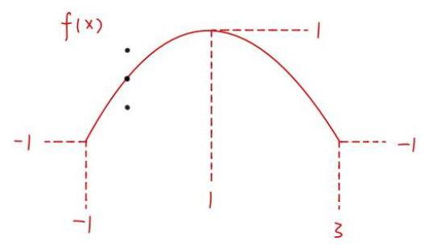

同理，当 $x \in  \left( {-1,1}\right)$ 时， $g\left( x\right)  \neq  g\left( 1\right)  = 1$

再证 $x \in  \left( {-1,1}\right)$ 时， $f\left( x\right)  = g\left( x\right)$

若 $\exists {x}_{0} \in  \left( {-1,1}\right)$ ，使得 $g\left( {x}_{0}\right)  < f\left( {x}_{0}\right)  < 1$

则 $\left| {f\left( {x}_{0}\right)  - 1}\right|  < \left| {g\left( {x}_{0}\right)  - 1}\right|$ ，与 $\left( *\right)$ 矛盾

若 $\exists {x}_{0} \in  \left( {-1,1}\right)$ ，使得 $- 1 < f\left( {x}_{0}\right)  < g\left( {x}_{0}\right)$

则 $\left| {f\left( {x}_{0}\right)  + 1}\right|  < \left| {g\left( {x}_{0}\right)  + 1}\right|$ ，与 $\left( *\right)$ 矛盾

$\therefore$ 对 $\forall x \in  \left( {-1,1}\right)$ 时， $f\left( x\right)  = g\left( x\right)$

最后证当 $x \in  \left( {-\infty , - 1}\right)  \cup  \left( {1, + \infty }\right)$ 时， $f\left( x\right)  = g\left( x\right)$

若 $\exists {x}_{0} \in  \left( {-\infty , - 1}\right)  \cup  \left( {1, + \infty }\right)$ ，使得 $f\left( {x}_{0}\right)  = g\left( {x}_{0}\right)$

由 $y = f\left( x\right)$ 的性质可得 $\exists m \in  \left\lbrack  {-1,1}\right\rbrack$ ，满足 $g\left( m\right)  = f\left( m\right)  = f\left( {x}_{0}\right)  \neq  g\left( {x}_{0}\right)$

$\therefore \left| {f\left( {x}_{0}\right)  - f\left( m\right) }\right|  \leq  \left| {g\left( {x}_{0}\right)  - g\left( m\right) }\right|$ . 与(*)矛盾

综上, $f\left( x\right)  = g\left( x\right)$

20. 定义: 若曲线 ${C}_{1}$ 和曲线 ${C}_{2}$ 有公共点 $P$ ,且曲线 ${C}_{1}$ 在点 $P$ 处的切线与曲线 ${C}_{2}$ 在点 $P$ 处的切线重合,则称 ${C}_{1}$ 与 ${C}_{2}$ 在点 $P$ 处 “一线切”.

(1)已知圆 ${\left( x - a\right) }^{2} + {y}^{2} = {r}^{2}\left( {r > 0}\right)$ 与曲线 $y = {x}^{2}$ 在点 $\left( {1,1}\right)$ 处 “一线切”,求实数 $a$ 的值;

(2)设 $f\left( x\right)  = {x}^{2} + {2x} + a$ ， $g\left( x\right)  = \ln \left( {x + 1}\right)$ ，若曲线 $y = f\left( x\right)$ 与曲线 $y = g\left( x\right)$ 在点 $P$ 处“一线切”， 求实数 $a$ 的值;

(3)定义在 $\mathbf{R}$ 上的函数 $y = f\left( x\right)$ 的图像为连续曲线，函数 $y = f\left( x\right)$ 的导函数为 $y = {f}^{\prime }\left( x\right)$ ， 对任意的 $x \in  \mathbf{R}$ ，都有 $\left\{  \begin{array}{l} \left| {{f}^{\prime }\left( x\right) }\right|  \geq  \left| {f\left( x\right) }\right| , \\  \left| {f\left( x\right) }\right|  < \sqrt{2} \end{array}\right.$ 成立. 是否存在点 $P$ 使得曲线 $y = f\left( x\right) \sin x$ 和曲线 $y = 1$ 在点 $P$ 处 “一线切”? 若存在,请求出点 $P$ 的坐标,若不存在,请说明理由.

(1) ${y}^{\prime } = {2x}$

$\therefore y = {x}^{2}$ 在 $\left( {1,1}\right)$ 处的切线方程为 $y - 1 = 2\left( {x - 1}\right)$ ，即 ${2x} - y - 1 = 0$

由题意， ${2x} - y - 1 = 0$ 与圆 ${\left( x - a\right) }^{2} + {y}^{2} = {r}^{2}\left( {r > 0}\right)$ 在 $\left( {1,1}\right)$ 处相切

$\therefore \left\{  \begin{array}{l} {\left( 1 - a\right) }^{2} + 1 = 1 \\  \frac{\left| 2a - 1\right| }{\sqrt{5}} = r \end{array}\right.$ . 解得: $a = 3$

(2)设 $P\left( {{X}_{0},{y}_{0}}\right) ,{f}^{\prime }\left( x\right)  = {2x} + 2,{g}^{\prime }\left( x\right)  = \frac{1}{x + 1}$

由题意， $\left\{  \begin{array}{l} f\left( {x}_{0}\right)  = g\left( {x}_{0}\right) \\  {f}^{\prime }\left( {x}_{0}\right)  = {g}^{\prime }\left( {x}_{0}\right)  \end{array}\right.$ ，即 $\left\{  \begin{array}{l} {x}_{0}^{2} + 2{x}_{0} + a = {x}_{0} \\  2{x}_{0} + 2 = \frac{1}{{x}_{0} + 1} \end{array}\right.$

解得: $a = \frac{1}{2} - \frac{1}{2}\ln 2$

(3)假设存在 $P\left( {{x}_{0},1}\right)$ 满足题意

则有 $f\left( {x}_{0}\right) \sin {x}_{0} = 1$

对 $y = f\left( x\right) \sin x$ 求导: ${y}^{\prime } = {f}^{\prime }\left( x\right) \sin x + f\left( x\right) \cos x$

$\therefore {f}^{\prime }\left( {x}_{0}\right) \sin {x}_{0} + f\left( {x}_{0}\right) \cos {x}_{0} = 0$

$\therefore f\left( {x}_{0}\right) \sin {x}_{0} =  - f\left( {x}_{0}\right) \cos {x}_{0}$

$\therefore {\left\lbrack  {f}^{\prime }\left( {x}_{0}\right) \right\rbrack  }^{2}{\sin }^{2}{x}_{0} = {\left\lbrack  f\left( {x}_{0}\right) \right\rbrack  }^{2}{\cos }^{2}{x}_{0} = {\left\lbrack  f\left( {x}_{0}\right) \right\rbrack  }^{2}\left( {1 - {\sin }^{2}{x}_{0}}\right)$

$\therefore {\left\lbrack  {f}^{\prime }\left( {x}_{0}\right) \right\rbrack  }^{2}{\sin }^{2}{x}_{0} + {\left\lbrack  f\left( {x}_{0}\right) \right\rbrack  }^{2}{\sin }^{2}{x}_{0} = {\left\lbrack  f\left( {x}_{0}\right) \right\rbrack  }^{2}$

$\therefore {\left\lbrack  {f}^{\prime }\left( {x}_{0}\right) \right\rbrack  }^{2} \cdot  \frac{1}{{\left\lbrack  f\left( {x}_{0}\right) \right\rbrack  }^{2}} + 1 = {\left\lbrack  f\left( {x}_{0}\right) \right\rbrack  }^{2}$

$\therefore {\left\lbrack  {f}^{\prime }\left( {x}_{0}\right) \right\rbrack  }^{2} + {\left\lbrack  f\left( {x}_{0}\right) \right\rbrack  }^{2} = {\left\lbrack  f\left( {x}_{0}\right) \right\rbrack  }^{4}$

$\because$ 对 $\forall x \in  \mathbb{R},\left| {{f}^{\prime }\left( x\right) }\right|  \geq  \left| {f\left( x\right) }\right|$ 恒成立

$\therefore {\left\lbrack  {f}^{\prime }\left( {x}_{0}\right) \right\rbrack  }^{2} \geq  {\left\lbrack  f\left( {x}_{0}\right) \right\rbrack  }^{2}$

$\therefore {\left\lbrack  f\left( {x}_{0}\right) \right\rbrack  }^{4} \geq  2{\left\lbrack  f\left( {x}_{0}\right) \right\rbrack  }^{2}$ ，显然 $f\left( {x}_{0}\right)  \neq  0$

$\therefore {\left\lbrack  f\left( {x}_{0}\right) \right\rbrack  }^{2} \geq  2$

$\therefore \left| {f\left( {x}_{0}\right) }\right|  \geq  \sqrt{2}$ 与 $\left| {f\left( {x}_{0}\right) }\right|  < \sqrt{2}$ 恒成立矛盾

、假设不成立，即不存在点 $P$ 满足条件

21. 若函数 $y = f\left( x\right)$ 的图像上存在 $k$ 个不同点 ${P}_{1}\text{ 、 }{P}_{2}\text{ 、 }\cdots \text{ 、 }{P}_{k}\left( {k \geq  2, k \in  \mathbf{N}}\right)$ 处的切线重合,则称该切线为函数 $y = f\left( x\right)$ 的一条 $k$ 点切线,该函数具有 $k$ 点切线性质.

(1)判断函数 $y = {x}^{2} - 2\left| x\right| , x \in  \mathbf{R}$ 的奇偶性并写出它的一条 2 点切线方程(无需理由);

(2)设 $f\left( x\right)  = {e}^{x} - \ln x$ ，判断函数 $y = f\left( x\right)$ 是否具有 $k$ 点切线性质，并说明理由；

(3)设 $g\left( x\right)  = \cos x + {2x}$ ，证明:对任意的 $m \geq  3$ ， $m \in  \mathbf{N}$ ，函数 $y = g\left( x\right)$ 具有 $m$ 点切线性质，并求出所有相应的切线方程.

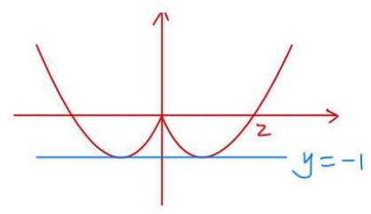

(1) $x \in  R, y\left( {-x}\right)  = y\left( x\right)$ ，偶函数

2. 点切线方程: $y =  - 1$

(2) $f\left( x\right)  = {e}^{x} - \ln x, x > 0$

${f}^{\prime }\left( x\right)  = {e}^{x} - \frac{1}{x}$

${f}^{\prime \prime }\left( x\right)  = {e}^{x} + \frac{1}{{x}^{2}} > 0$

$\therefore y = {f}^{\prime }\left( x\right)$ 严格增

$\therefore y = f\left( x\right)$ 在不同切点的斜率不同

，不具有K点切线性质

( 3 ) ${g}^{\prime }\left( x\right)  =  - \sin x + 2 > 0$ ，设切点 $\left( {{x}_{0},\cos {x}_{0} + 2{x}_{0}}\right)$

切线: $y - \left( {\cos {x}_{0} + 2{x}_{0}}\right)  = \left( {2 - \sin {x}_{0}}\right) \left( {x - {x}_{0}}\right)$

即 $y = \left( {2 - \sin {x}_{0}}\right) x + {x}_{0}\sin {x}_{0} + \cos {x}_{0}$

在不同的 ${P}_{1},{P}_{2},{P}_{3}$ 处切线方程为

$\left\{  \begin{array}{l} y = \left( {2 - \sin {x}_{1}}\right) x + {x}_{1}\sin {x}_{1} + \cos {x}_{1} \\  y = \left( {2 - \sin {x}_{2}}\right) x + {x}_{2}\sin {x}_{2} + \cos {x}_{2} \\  y = \left( {2 - \sin {x}_{3}}\right) x + {x}_{3}\sin {x}_{3} + \cos {x}_{3} \end{array}\right.$

$\therefore \left\{  \begin{array}{ll} 2 - \sin {x}_{1} = 2 - \sin {x}_{2} = 2 - \sin {x}_{3} & \text{ ① } \\  {x}_{1}\sin {x}_{1} + \cos {x}_{1} = {x}_{2}\sin {x}_{2} + \cos {x}_{2} = {x}_{3}\sin {x}_{3} + \cos {x}_{3} & \text{ ② } \end{array}\right.$

由①得 $\sin {x}_{1} = \sin {x}_{2} = \sin {x}_{3}$

$\therefore \cos {x}_{1} =  \pm  \cos {x}_{2},\cos {x}_{2} =  \pm  \cos {x}_{3},\cos {x}_{3} =  \pm  \cos {x}_{1}$

${1}^{ \circ  }$ 若 $\cos {x}_{1} =  - \cos {x}_{2},\cos {x}_{2} =  - \cos {x}_{3},\cos {x}_{3} =  - \cos {x}_{1}$

则 $\cos {x}_{1} = 0,\cos {x}_{2} = 0,\cos {x}_{3} = 0,\sin {x}_{1} =  \pm  1,\sin {x}_{2} =  \pm  1,\sin {x}_{3} =  \pm  1$

${x}_{1}\sin {x}_{1} = {x}_{2}\sin {x}_{2} = {x}_{3}\sin {x}_{3}$

$\therefore {x}_{1} = {x}_{2} = {x}_{3}\left( \frac{1}{6}\right)$

${2}^{ \circ  }\cos {x}_{1} = \cos {x}_{2},\cos {x}_{2} = \cos {x}_{3},\cos {x}_{3} = \cos {x}_{1}$ 至少有一个成立

不妨 $\cos {x}_{1} = \cos {x}_{2}$

则 ${x}_{1}\sin {x}_{1} = {x}_{2}\sin {x}_{2}$

若 $\sin {x}_{1} = \sin {x}_{2} \neq  0$ ，则 ${x}_{1} = {x}_{2}$ (舍)

$\therefore \sin {x}_{1} = \sin {x}_{2} = \sin {x}_{3} = 0,\cos {x}_{1} = \cos {x}_{2} =  \pm  1,$ 此时， $\cos {x}_{3} =  \pm  1$

$\therefore m$ 点切线为 $y = {2x} \pm  1$

22. 设 $a \in  \mathbf{R},{F}_{a}\left( x\right)  = \frac{f\left( x\right)  - f\left( a\right) }{x - a}, x \in  \left( {a - 1, a}\right)  \cup  \left( {a, a + 1}\right)$ . 若函数 $y = f\left( x\right)$ 满足 ${F}_{a}\left( x\right)  > 0$ 恒成立,则称函数 $y = f\left( x\right)$ 具有性质 $P\left( a\right)$ .

(1)判断 $y = \sin x$ 是否具有性质 $P\left( 0\right)$ ，并说明理由；

(2)设 $f\left( x\right)  = {\mathrm{e}}^{x} - x$ ，若函数 $y = f\left( x\right)$ 具有性质 $P\left( a\right)$ ，求实数 $a$ 的取值范围；

(3)设函数 $y = f\left( x\right)$ 的定义域为 $\mathbf{R}$ ，且对任意 $a \in  \mathbf{R}$ 以及 $t \in  \left( {0,1}\right)$ ，都有 ${F}_{a}\left( {a - t}\right)  < {F}_{a}\left( {a + t}\right)$ . 若当 $x < 0$ 时,恒有 $f\left( x\right)  < 0$ . 求证: 函数 $y = f\left( x\right)$ 对任意实数 $a$ 均具有性质 $P\left( a\right)$ .

(1)是

${F}_{0}\left( x\right)  = \frac{\sin x - \sin 0}{x - 0} = \frac{\sin x}{x}, x \in  \left( {-1,0}\right)  \cup  \left( {0,1}\right)$

$\sin x$ 与 $x$ 同号

$\therefore {F}_{0}\left( x\right)  > 0, y = \sin x$ 具有性质 $P\left( 0\right)$

(2) $\because {F}_{2}\left( x\right)  = \frac{f\left( x\right)  - f\left( a\right) }{x - a} > 0, x \in  \left( {a - 1, a}\right)  \cup  \left( {a, a + 1}\right)$

$\therefore f\left( x\right)  - f\left( a\right)$ 与 $x - a$ 同号

即 $x \in  \left( {a, a + 1}\right)$ 时， $f\left( x\right)  > f\left( a\right)$ ①

$x \in  \left( {a - 1, a}\right)$ 时， $f\left( x\right)  < f\left( a\right)$ ②

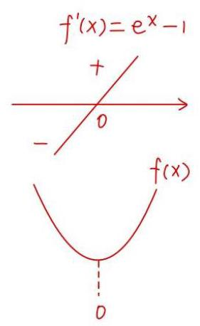

${f}^{\prime }\left( x\right)  = {e}^{x} - 1$

$x \in  \left( {-\infty ,0}\right)$ 时. ${f}^{\prime }\left( x\right)  < 0, f\left( x\right)  \downarrow$

$x \in  \left( {0, + \infty }\right)$ 时, ${f}^{\prime }\left( x\right)  > 0, f\left( x\right)  \uparrow$

由①得 $a \geq  0$

由②得 $f\left( {a - 1}\right)  \leq  f\left( a\right)$

$$
{e}^{a - 1} - \left( {a - 1}\right)  \leq  {e}^{a} - a
$$

$$
{e}^{a}\left( {1 - {e}^{-1}}\right)  \geq  1
$$

$$
{e}^{a} \geq  \frac{e}{e - 1}
$$

$$
a \geq  \ln \frac{e}{e - 1} \geq  0
$$

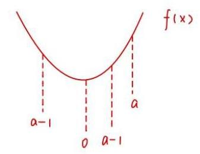

综上， $a \in  \lbrack \ln \frac{e}{e - 1}, + \infty )$

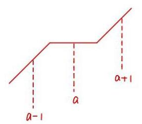

(3)要证 $\forall a$ 有 $P\left( a\right)$

即 $\left\{  \begin{array}{l} x \in  \left( {a, a + 1}\right) , f\left( x\right)  > f\left( a\right) \\  x \in  \left( {a - 1, a}\right) , f\left( x\right)  < f\left( a\right) \text{ ② } \end{array}\right.$

可知当 $f\left( x\right)$ 严格增满足条件

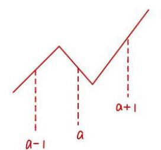

那么当 $f\left( x\right)$ 有水平部分或递减部分时

由于 $a$ 的任意性，会出现不满足①②的情况

$\therefore y = f\left( x\right)$ 严格增

${{F}_{\Delta }\left( {a - t}\right) } < {{F}_{a}\left( {a + t}\right) }$

$\frac{f\left( {a - t}\right)  - f\left( a\right) }{a - t - a} < \frac{f\left( {a + t}\right)  - f\left( a\right) }{a + t - a}, t \in  \left( {0,1}\right)$

$f\left( a\right)  - f\left( {a - t}\right)  < f\left( {a + t}\right)  - f\left( a\right)$

${2f}\left( a\right)  < f\left( {a - t}\right)  + f\left( {a + t}\right)$

$$
f\left( a\right)  < \frac{f\left( {a - t}\right)  + f\left( {a + t}\right) }{2}
$$

$a - t = m, a + t = n, n - m = {2t} \in  \left( {0,2}\right)$

即 $f\left( \frac{m + n}{2}\right)  < \frac{f\left( m\right)  + f\left( n\right) }{2}$

可知 $y = f\left( x\right)$ 图象为下凹趋势

若 $f\left( x\right)$ 有严格减部分，且 $x < 0$ 时， $f\left( x\right)  < 0$

$\therefore$ 当 $x < {x}_{1}$ 时，会有 $f\left( x\right)  \uparrow$

则如图， $\exists m.n$ 使得 $f\left( \frac{m + n}{2}\right)  > \frac{f\left( m\right)  + f\left( n\right) }{2}$ ，与③矛盾

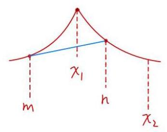

$\therefore y = f\left( x\right)$ 严格增

$\therefore y = f\left( x\right)$ 有性质 $P\left( a\right)$

23. 函数 $y = f\left( X\right)$ 的定义域为 $D$ ,在 $D$ 上仅有一个极值点 ${x}_{0}$ ,方程 $f\left( X\right)  = 0$ 在 $D$ 上仅有两解,分别为 ${X}_{1}\text{ 、 }{X}_{2}$ ,且 ${X}_{1} < {x}_{0} < {x}_{2}$ . 若 $\frac{{x}_{1} + {x}_{2}}{2} > {x}_{0}$ ,则称函数 $y = f\left( X\right)$ 在 $D$ 上的极值点左偏移; 若 $\frac{{x}_{1} + {x}_{2}}{2} < {x}_{0}$ ,则称函数 $y = f\left( x\right)$ 在 $D$ 上的极值点右偏移.

(1)设 $f\left( X\right)  = {x}^{2} - 1, D = R$ ，判断函数 $y = f\left( X\right)$ 在 $D$ 上的极值点是否左偏移或右偏移？

(2)设 $m > 0$ 且 $m \neq  1, f\left( x\right)  = {x}^{3} - m{x}^{2} - x + m, D = \left( {0, + \infty }\right)$ ，求证:函数 $y = f\left( x\right)$ 在 $D$ 上的极值点右偏移;

(3)设 $a \in  \mathbf{R}, f\left( x\right)  = {lnx} - {ax}, D = \left( {0, + \infty }\right)$ ，求证:当 $0 < a < {e}^{-1}$ 时，函数 $y = f\left( x\right)$ 在 $D$ 上的极值点左偏移.

(1) ${f}^{\prime }\left( x\right)  = {2x} = 0,{x}_{0} = 0$

$f\left( x\right)  = {x}^{2} - 1 = 0,{x}_{1} = 1,{x}_{2} =  - 1$

${x}_{0} = \frac{{x}_{1} + {x}_{2}}{2} = 0$ ，不偏移

(2) $f\left( x\right)  = {x}^{3} - m{x}^{2} - x + m = {x}^{2}\left( {x - m}\right)  - \left( {x - m}\right)  = \left( {x - m}\right) \left( {x - 1}\right) \left( {x + 1}\right) , x > 0$

令 $f\left( x\right)  = 0,{x}_{1} = 1,{x}_{2} = m$ 或 ${x}_{1} = m,{x}_{2} = 1$

${f}^{\prime }\left( x\right)  = 3{x}^{2} - {2mx} - 1, m > 0, m \neq  1$

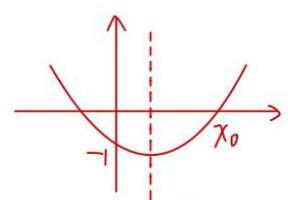

$x = \frac{m}{3}$

对称轴 $x =  - \frac{-{2m}}{2 \times  3} = \frac{m}{3} > 0$

即比较 ${x}_{0} \leq  \frac{{x}_{1} + {x}_{2}}{2} = \frac{1 + m}{2}$ 的大小关系

${x}_{0} > \frac{m}{3},\frac{1 + m}{2} > \frac{m}{3}$ 都在 $y = {f}^{\prime }\left( x\right)$ 的增区间上

即比较 ${f}^{\prime }\left( {x}_{0}\right)  = 0$ 与 ${f}^{\prime }\left( \frac{1 + m}{2}\right)$ 的大小关系

${f}^{\prime }\left( \frac{1 + m}{2}\right)  = 3 \cdot  {\left( \frac{1 + m}{2}\right) }^{2} - {2m} \cdot  \frac{1 + m}{2} - 1 =  - \frac{1}{4}{\left( m - 1\right) }^{2} < 0 = f\left( {x}_{0}\right) \; \therefore \frac{1 + m}{2} < {x}_{0},\frac{{x}_{1} + {x}_{2}}{2} < {x}_{0}$

$\therefore$ 右偏得证

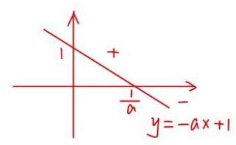

13) ${f}^{\prime }\left( x\right)  = \frac{1}{x} - a = \frac{1 - {ax}}{x}, x > 0$

$f\left( \frac{1}{a}\right)  = \ln \frac{1}{a} - 1$

$a \in  \left( {0,\frac{1}{e}}\right) ,\frac{1}{a} \in  \left( {e, + \infty }\right) ,\ln \frac{1}{a} > 1$

$\therefore f\left( \frac{1}{a}\right)  = \ln \frac{1}{a} - 1 > 0$

$f\left( {0}^{ + }\right)  < 0, f\left( {+\infty }\right)  < 0$

$\therefore$ 令 $f\left( x\right)  = 0$ 时，有 $2 \uparrow$ 根 $,{x}_{1} \in  \left( {0,\frac{1}{a}}\right) ,{x}_{2} \in  \left( {\frac{1}{a}, + \infty }\right)$

要证左偏，即 $\frac{{x}_{1} + {x}_{2}}{2} > {x}_{0} = \frac{1}{a}$

只要证 ${x}_{1} + {x}_{2} > \frac{2}{a} \Leftrightarrow  {x}_{2} > \frac{2}{a} - {x}_{1}$

$\frac{2}{a} - {x}_{1} > \frac{1}{a}$ 且 ${x}_{2} > {x}_{1}$

$\therefore \frac{2}{a} - {x}_{1}$ 与 ${x}_{2}$ 都在 $y = f\left( x\right)$ 的减区间

只要证 $f\left( {x}_{2}\right)  < f\left( {\frac{2}{a} - {x}_{1}}\right)$

只要证 $f\left( {x}_{1}\right)  < f\left( {\frac{2}{a} - {x}_{1}}\right) ,{x}_{1} \in  \left( {0,\frac{1}{a}}\right)$

只要证 $g\left( x\right)  = f\left( x\right)  - f\left( {\frac{2}{a} - x}\right)  < 0, x \in  \left( {0,\frac{1}{a}}\right)$

$g\left( \frac{1}{a}\right)  = f\left( \frac{1}{a}\right)  - f\left( \frac{1}{a}\right)  = 0$

${g}^{\prime }\left( x\right)  = {f}^{\prime }\left( x\right)  + {f}^{\prime }\left( {\frac{2}{a} - x}\right)  = \frac{1}{x} - a + \frac{1}{\frac{2}{a} - x} - a = \frac{{2a}{x}^{2} - {4x} + \frac{2}{a}}{x\left( {\frac{2}{a} - x}\right) }$

$= 2 \cdot  \frac{{a}^{2}{x}^{2} - {2ax} + 1}{{ax}\left( {\frac{2}{a} - x}\right) } = \frac{{\left( ax - 1\right) }^{2}}{{ax}\left( {\frac{2}{a} - x}\right) } \geq  0, x \in  \left( {0,\frac{1}{a}}\right)$

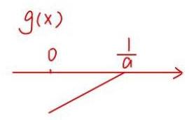

$\therefore g\left( x\right)  \uparrow$

$\therefore g\left( x\right)$ 在 $x \in  \left( {0,\frac{1}{a}}\right)$ 为负，得证

24. 设 $A$ 为非空集合，函数 $f\left( x\right)$ 的定义域为 $D$ . 若存在 ${x}_{0} \in  D$ 使得对任意的 $x \in  D$ 均有 $f\left( x\right)  - f\left( {x}_{0}\right)  \in  A$ ,则称 $f\left( {x}_{0}\right)$ 为函数 $f\left( x\right)$ 的一个 $A$ 值, ${x}_{0}$ 为相应的 $A$ 值点.

(1)若 $A = \left\lbrack  {-2,0}\right\rbrack  , f\left( x\right)  = \sin x$ . 证明: ${x}_{0} = {2k\pi } + \frac{1}{2}\pi , k \in  \mathbf{Z}$ 是函数 $f\left( x\right)$ 的一个 $A$ 值点，并写出相应的 $A$ 值;

(2)若 $A = \lbrack 0, + \infty ), f\left( x\right)  =  - x, g\left( x\right)  = {x}^{2} + x + 1$ . 分别判断函数 $f\left( x\right) \text{ 、 }g\left( x\right)$ 是否存在 $A$ 值？若存在,求出相应的 $A$ 值点; 若不存在,说明理由;

(3)若 $A = ( - \infty ,0\rbrack$ ，且函数 $f\left( x\right)  = \ln x + a{x}^{2}\left( {a \in  \mathbf{R}}\right)$ 存在 $A$ 值，求函数 $f\left( x\right)$ 的 $A$ 值，并指出相应的 $A$ 值点.

(1) $f\left( {x}_{0}\right)  = \sin \left( {{2k\pi } + \frac{\pi }{2}}\right)  = 1$

$f\left( x\right)  = \sin x \in  \left\lbrack  {-1,1}\right\rbrack  , f\left( x\right)  - 1 \in  \left\lbrack  {-2,0}\right\rbrack$

$\therefore {x}_{0} = {2k\pi } + \frac{\pi }{2}, k \in  z$ 为 $f\left( x\right)$ 的一个 $A$ 值点， $A$ 值为 $f\left( {x}_{0}\right)  = 1$

(2) $f\left( x\right)  - f\left( {x}_{0}\right)  \in  A, f\left( x\right)  \in  {}^{\prime \prime }f\left( {x}_{0}\right)  + {A}^{\prime \prime }, A = \lbrack 0, + \infty )$

$f\left( x\right)  \in  \lbrack f\left( {x}_{0}\right) , + \infty )$ . 对 $\forall x \in  R, - x \in  \lbrack  - {x}_{0}, + \infty )$ 不恒成立

， $f\left( x\right)$ 不存在 $A$ 值

$g\left( x\right)  = {x}^{2} + x + 1, g\left( x\right)  \geq  g\left( {-\frac{1}{2}}\right)  = \frac{3}{4}$

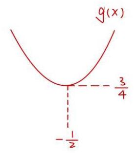

$g\left( x\right)  \in  \lbrack g\left( {x}_{0}\right) , + \infty )$

$\therefore g\left( {x}_{0}\right)  \leq  g\left( x\right) \min  = \frac{3}{4}$

而 $g\left( {x}_{0}\right)  \geq  \frac{3}{4}$

$\therefore g\left( {x}_{0}\right)  = {x}_{0}^{2} + {x}_{0} + 1 = \frac{3}{4},{x}_{0} =  - \frac{1}{2}$

$\therefore g\left( {x}_{0}\right)  = \frac{3}{4}$ 为 $A$ 值， ${x}_{0} =  - \frac{1}{2}$ 为 $A$ 值点

(3) $f\left( x\right)  \in  \left( {-\infty , f\left( {x}_{0}\right) }\right\rbrack$

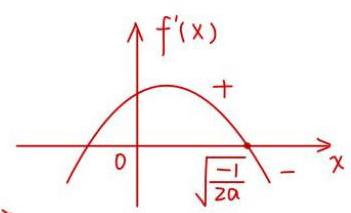

$\therefore f\left( x\right) \max  \leq  f\left( {x}_{0}\right) ,$ 即 $f\left( x\right) \max  = f\left( {x}_{0}\right)$

${f}^{\prime }\left( x\right)  = \frac{1}{x} + {2\alpha x} = \frac{{2\alpha }{x}^{2} + 1}{x}$

① $a \geq  0$ 时， ${f}^{\prime }\left( x\right)  > 0, f\left( x\right)$ 个对 $\forall x > 0,\left( *\right)$ 式不恒成立

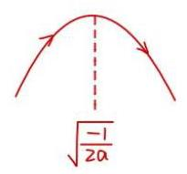

② $a < 0,{2a}{x}^{2} + 1 = 0, x = \sqrt{\frac{-1}{2a}}$

$f\left( {x}_{0}\right)  = f\left( \sqrt{\frac{-1}{2a}}\right)  = \ln \sqrt{\frac{-1}{2a}} - \frac{1}{2}$ 为A 值

${x}_{0} = \sqrt{\frac{-1}{2a}}$ 为 $A$ 值点

25. 对于函数 $y = f\left( x\right)$ 图像上不同的三点 $A\left( {{x}_{1},{y}_{1}}\right) \text{ 、 }B\left( {{x}_{2},{y}_{2}}\right) \text{ 、 }M\left( {{x}_{0},{y}_{0}}\right)$ (其中 ${x}_{0} \in  \left( {{x}_{1},{x}_{2}}\right)$ ), 记点 $M$ 处的切线为 $l$ ,若 $l//{AB}$ ,则称 $M$ 为函数 $y = f\left( x\right)$ 在区间 $\left( {{x}_{1},{x}_{2}}\right)$ 上的 “ $T$ 点”. 特别地, 当 ${x}_{0} = \frac{{x}_{1} + {x}_{2}}{2}$ ,则称 $M$ 为函数 $y = f\left( x\right)$ 在区间 $\left( {{x}_{1},{x}_{2}}\right)$ 上的 “和谐 $T$ 点”.

(1)设 $f\left( x\right)  = {x}^{2}\text{ ， }M\left( {{x}_{0},{y}_{0}}\right)$ 是函数 $y = f\left( x\right)$ 在区间 $\left( {0, n}\right)$ 上的 “ $T$ 点”，若 ${f}^{\prime }\left( {x}_{0}\right)  = 1$ ，求实数 $n$ 的值;

(2)设 $f\left( x\right)  = a\sin {2x} + \cos x + x - 1$ ，若函数 $y = f\left( x\right)$ 在区间 $\left( {0,{2\pi }}\right)$ 上恰有 3 个 “ $T$ 点”，求所有满足条件的实数 $a$ 的值组成的集合;

(3)设 $f\left( x\right)  = \ln x + b{x}^{2}\left( {b \in  \mathbf{R}}\right)$ ，试探究函数 $y = f\left( x\right)$ 的定义域内是否存在一个包含“和谐 $T$ 点” 的区间 $\left( {{x}_{1},{x}_{2}}\right)$ ,若存在,求出该区间 $\left( {{x}_{1},{x}_{2}}\right)$ ; 若不存在,请说明理由.

(1) 由题意得， ${f}^{\prime }\left( {x}_{0}\right)  = 1 = \frac{{n}^{2} - 0}{n - 0}$

$\therefore n = 1$

(2) $A\left( {0,0}\right) , B\left( {{2\pi },{2\pi }}\right) ,{f}^{\prime }\left( x\right)  = {2a}\cos {2x} - \sin x + 1$ ，直线 ${AB}{\text{ 斜 }\text{ 率 }}$ k $= 1$

由题意得， ${f}^{\prime }\left( x\right)  = 1$ 在区间 $\left( {0,{2\pi }}\right)$ 上有3个不同的解

即 ${2a}\left( {1 - 2{\sin }^{2}x}\right)  - \sin x = 0$ 在区间 $\left( {0,{2\pi }}\right)$ 上有3个不同的解

令 $t = \sin x$ ，则 ${2a}\left( {1 - 2{t}^{2}}\right)  = t$

$t = 0$ 时， $a = 0$ ，此时 $\sin x = 0$ 只有一解 $x = \pi$ ，不满足题意

$\therefore a \neq  0, t \neq  0$

$\frac{1}{2a} =  - {2t} + \frac{1}{t}$ ②, $t \in  \left\lbrack  {-1,0)\cup (0,1}\right\rbrack \; y =  - {2t} + \frac{1}{t} \downarrow$ . 奇函数

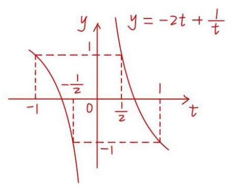

当 $\frac{1}{2a} > 1$ 时，方程②有1个根 $0 < {t}_{1} < \frac{1}{2}$ ，方程①有2个根

当 $\frac{1}{2a} = 1$ 时，方程②有2个根 ${t}_{1} =  - 1,{t}_{2} = \frac{1}{2}$ ，方程①有3个根

当 $- 1 < \frac{1}{2a} < 1$ 时，方程②有2个根 $- 1 < {t}_{1} <  - \frac{1}{2},\frac{1}{2} < {t}_{2} < 1$ ，方程①有4个根

当 $\frac{1}{2a} =  - 1$ 时，方程②有2个根 ${t}_{1} = 1,{t}_{2} =  - \frac{1}{2}$ ，方程①有3个根

当 $\frac{1}{2a} <  - 1$ 时,方程②有1个根 $- \frac{1}{2} < {t}_{1} < 0$ ,方程①有2个根

综上， $a \in  \left\{  {-\frac{1}{2},\frac{1}{2}}\right\}$

(3)不存在

$f\left( x\right)  = \ln x + b{x}^{2},{f}^{\prime }\left( x\right)  = \frac{1}{x} + {2bx}$

假设存在 $A\left( {{x}_{1},{y}_{1}}\right) , B\left( {{x}_{2},{y}_{2}}\right) , M\left( {\frac{{x}_{1} + {x}_{2}}{2}, f\left( \frac{{x}_{1} + {x}_{2}}{2}\right) }\right) ,\left( {0 < {x}_{1} < {x}_{2}}\right)$ 满足题意

则 ${k}_{AB} = \frac{{y}_{2} - {y}_{1}}{{x}_{2} - {x}_{1}} = \frac{\ln {x}_{2} - \ln {x}_{1} + b\left( {{x}_{2}^{2} - {x}_{1}^{2}}\right) }{{x}_{2} - {x}_{1}} = \frac{2}{{x}_{1} + {x}_{2}} + b\left( {{x}_{1} + {x}_{2}}\right)$

$\therefore \frac{\ln {x}_{2} - \ln {x}_{1}}{{x}_{2} - {x}_{1}} = \frac{2}{{x}_{1} + {x}_{2}}$ (或由对数均值不等式可得出 $\frac{{x}_{1} + {x}_{2}}{2} > \frac{{x}_{2} - {x}_{1}}{\ln {x}_{2} - \ln {x}_{1}}$ )

$\ln \frac{{x}_{2}}{{x}_{1}} = \frac{2\left( {{x}_{2} - {x}_{1}}\right) }{{x}_{1} + {x}_{2}} = \frac{2\left( {\frac{{x}_{2}}{{x}_{1}} - 1}\right) }{1 + \frac{{x}_{2}}{{x}_{1}}}$

令 $t = \frac{{x}_{2}}{{x}_{1}} > 1,\ln t = \frac{2\left( {t - 1}\right) }{t + 1} = \frac{2\left( {t + 1}\right)  - 4}{t + 1} = 2 - \frac{4}{t + 1}$

令 $g\left( t\right)  = \ln t + \frac{4}{t + 1} - 2,\left( {t > 1}\right)$

${g}^{\prime }\left( t\right)  = \frac{1}{t} - \frac{4}{{\left( t + 1\right) }^{2}} = \frac{{\left( t + 1\right) }^{2} - {4t}}{t{\left( t + 1\right) }^{2}} = \frac{{\left( t - 1\right) }^{2}}{t{\left( t + 1\right) }^{2}} > 0$

$\therefore g\left( t\right)$ 在 $\left( {1, + \infty }\right)$ 严格增

$\therefore g\left( t\right)  > g\left( 1\right)  = 0$

$\therefore \ln t = 2 - \frac{4}{t + 1}$ 在 $\left( {1, + \infty }\right)$ 上无解

即 $f\left( x\right)$ 在 $\left( {{x}_{1},{x}_{2}}\right)$ 上不存在 “和谐 下点”

26. 过曲线 $y = f\left( x\right)$ 上一点 $P$ 作其切线,若恰有两条,则称 $P$ 为 $f\left( x\right)$ 的 “ $A$ 类点”; 过曲线 $y = f\left( x\right)$ 外一点 $Q$ 作其切线,若恰有三条,则称 $Q$ 为 $f\left( x\right)$ 的 “ $B$ 类点”; 若点 $R$ 为 $f\left( x\right)$ 的 “ $A$ 类点”或“ $B$ 类点”，且过 $R$ 存在两条相互垂直的切线，则称 $R$ 为 $f\left( x\right)$ 的 “ $C$ 类点”.

(1)设 $f\left( x\right)  = \frac{1}{{x}^{2}}$ ，判断点 $P\left( {1,1}\right)$ 是否为 $f\left( x\right)$ 的 “ $A$ 类点”，并说明理由；

(2)设 $f\left( x\right)  = {x}^{3} - {mx}$ ，若点 $Q\left( {2,0}\right)$ 为 $f\left( x\right)$ 的 “ $B$ 类点”，且过点 $Q$ 的三条切线的切点横坐标可构成等差数列,求实数 $m$ 的值;

(3)设 $f\left( x\right)  = \frac{x + 1}{{\mathrm{e}}^{x}}$ ，证明: $y$ 轴上不存在 $f\left( x\right)$ 的“ $C$ 类点”.

(1)是

切点 $\left( {{x}_{0},\frac{1}{{x}_{0}^{2}}}\right)$

${f}^{\prime }\left( x\right)  =  - \frac{2}{{x}^{3}}, k = {f}^{\prime }\left( {x}_{0}\right)  =  - \frac{2}{{x}_{0}^{3}}$

切线 $y - \frac{1}{{x}_{0}^{2}} =  - \frac{2}{{x}_{0}^{3}}\left( {x - {x}_{0}}\right)$ ,代入 $\left( {1,1}\right)$

得 ${x}_{0} = 1$ 或 ${x}_{0} =  - 2$

$\therefore$ 切线: $y =  - {2x} + 3, y = \frac{1}{4}x + \frac{3}{4}$

$\therefore$ 是 $A$ 类点

$\left( 2\right)$ 切点 $\left( {{x}_{0},{x}_{0}^{3} - m{x}_{0}}\right)$

$k = {f}^{\prime }\left( {x}_{0}\right)  = 3{x}_{0}^{3} - m$

如线: $y - \left( {{x}_{0}^{3} - m{x}_{0}}\right)  = \left( {3{x}_{0}^{2} - m}\right) \left( {x - {x}_{0}}\right)$

代入 $\left( {2,0}\right) ,{\chi }_{0}^{3} - 3{\chi }_{0}^{2} + m = 0$ 有3个成等差数列的解

$\left\{  \begin{array}{l} 3{\chi }_{1}^{2} - {\chi }_{1}^{3} = 3{\chi }_{2}^{2} - {\chi }_{2}^{3} = 3{\chi }_{3}^{2} - {\chi }_{3}^{3} \\  \text{ ① } \\  2{\chi }_{2} = {\chi }_{1} + {\chi }_{3} \end{array}\right.$

由①②、 $3\left( {{\chi }_{1}^{2} - {\chi }_{2}^{2}}\right)  = {\chi }_{1}^{3} - {\chi }_{2}^{2}$

$3\left( {{X}_{1} + {X}_{2}}\right) \left( {{X}_{1} - {X}_{2}}\right)  = \left( {{X}_{1} - {X}_{2}}\right) \left( {{X}_{1}^{2} + {X}_{1}{X}_{2} + {X}_{2}^{2}}\right)$

$3\left( {{x}_{1} + {x}_{2}}\right)  = {x}_{1}^{2} + {x}_{1}{x}_{2} + {x}_{2}^{2}$③

同理 $\left\{  \begin{array}{l} 3\left( {{x}_{1} + {x}_{3}}\right)  = {x}_{1}^{2} + {x}_{1}{x}_{3} + {x}_{3}^{2} \\  3\left( {{x}_{2} + {x}_{3}}\right)  = {x}_{2}^{2} + {x}_{2}{x}_{3} + {x}_{3}^{2} \end{array}\right.$

③-④: ${x}_{1} - {x}_{3} = \left( {{x}_{1} - {x}_{3}}\right) \left( {{x}_{1} + {x}_{3}}\right)  + {x}_{2}\left( {{x}_{1} - {x}_{3}}\right)$

$z = 2{x}_{2} + {x}_{2}$

$\therefore {x}_{2} = 1$

$m = 3{x}_{2}^{2} - {x}_{2}^{3} = 2$

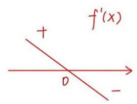

(3) $f\left( x\right)  = \frac{x + 1}{{e}^{x}}, R\left( {0, b}\right)$

${f}^{\prime }\left( x\right)  = \frac{-x}{{e}^{x}}, f\left( x\right)  \leq  f\left( 0\right)  = 1$

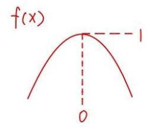

切点 $\left( {{x}_{0},\frac{{x}_{0} + 1}{{e}^{{x}_{0}}}}\right)$

$$
k = {f}^{\prime }\left( {x}_{0}\right)  = \frac{-{x}_{0}}{{e}^{{x}_{0}}}
$$

切线: $y - \frac{{x}_{0} + 1}{{e}^{{x}_{0}}} = \frac{-{x}_{0}}{{e}^{{x}_{0}}}\left( {x - {x}_{0}}\right)$

代入 $\left( {0, b}\right) , b = \frac{{x}_{0}^{2} + {x}_{0} + 1}{{e}^{{x}_{0}}}$ 至少有2个不同的解

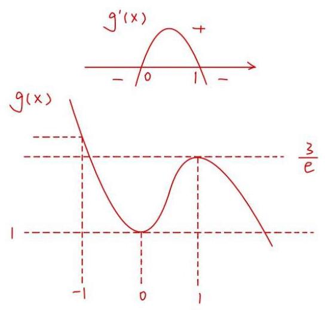

令 $g\left( x\right)  = \frac{{x}^{2} + x + 1}{{e}^{x}},{g}^{\prime }\left( x\right)  = \frac{x - {x}^{2}}{{e}^{x}} \; g\left( 0\right)  = 1, g\left( 1\right)  = \frac{3}{e}$

$b$ 至少在 $\left\lbrack  {1,\frac{3}{e}}\right\rbrack$ 内

当 $b = 1$ 时， $R\left( {0,1}\right)$ 在 $f\left( x\right)$ 上，且有 2 解 $\therefore {R\text{ 为 }A\text{ 类 }\text{ 点 }}$

$b > 1$ 时， $g\left( x\right)  > 1$ ，而 $f\left( x\right)  < 1$

$\therefore R\left( {0, b}\right)$ 不在 $f\left( x\right)$ 上，只能为 $B$ 类点，即只能有 3 解 $\therefore b \in  \lbrack 1,\frac{3}{e})$

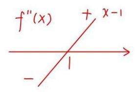

${f}^{\prime }\left( x\right)  = \frac{-x}{{e}^{x}},{f}^{\prime \prime }\left( x\right)  = \frac{x - 1}{{e}^{x}}$

${f}^{\prime }\left( 0\right)  = 0,{f}^{\prime }\left( {-\infty }\right)  =  + \infty ,{f}^{\prime }\left( {+\infty }\right)  = 0$

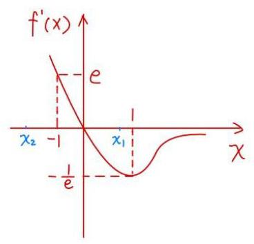

若要两条切线垂直，则 ${f}^{\prime }\left( {x}_{1}\right)  \cdot  {f}^{\prime }\left( {x}_{2}\right)  =  - 1$

不妨有 ${f}^{\prime }\left( {x}_{1}\right)  < 0$ ，则如右图， ${x}_{1} > 0,{f}^{\prime }\left( {x}_{1}\right)  \in  \left( {-\frac{1}{e},0}\right) \; {f}^{\prime }\left( {x}_{2}\right)  =  - \frac{1}{{f}^{\prime }\left( {x}_{1}\right) } \in  \left( {e, + \infty }\right)$

$\therefore {x}_{2} \in  \left( {-\infty , - 1}\right)$

此时， $g\left( {x}_{2}\right)  > g\left( {-1}\right)  = \frac{1}{{e}^{-1}} = e > \frac{3}{e}$

$\therefore R$ 类点和切线垂直2个条件不能同时成立

$\therefore$ 不存在

27. 已知函数 $y = f\left( x\right)$ ,其中 $f\left( x\right)  = {\mathrm{e}}^{x - 1} - 2\ln x + x$ .

(1)求函数 $y = f\left( x\right)$ 的单调区间；

(2)设函数 $g\left( x\right)  = f\left( x\right)  + 2\ln x$ ，问:函数 $y = g\left( x\right)$ 的图像上是否存在三点 $A, B, C$ ，使得它们的横坐标成等差数列,且直线 ${AC}$ 的斜率等于 $y = g\left( x\right)$ 在点 $B$ 处的切线的斜率? 若存在,求出所有满足条件的点 $B$ 的坐标; 若不存在,说明理由;

(3)证明:函数 $y = f\left( x\right)$ 图像上任意一点都不落在函数 $y = {\left( x - 2\right) }^{3} - 3\left( {x - 2}\right)$ 图像的下方.

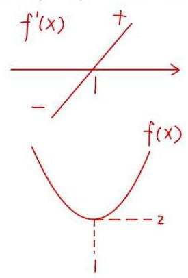

(1) ${f}^{\prime }\left( x\right)  = {e}^{x - 1} - \frac{2}{x} + 1\left( {x > 0}\right)  \uparrow$

而 ${f}^{\prime }\left( 1\right)  = 1 - 2 + 1 = 0$

$\therefore f\left( x\right)$ 在 $\left( {0,1}\right)  \downarrow$ ,在 $\left( {1, + \infty }\right)  \uparrow$

(2) $g\left( x\right)  = {e}^{x - 1} - {2\ln x} + x + {2\ln x} = {e}^{x - 1} + x\left( {x > 0}\right)$

${g}^{\prime }\left( x\right)  = {e}^{x - 1} + 1$

设 $A\left( {{x}_{1},{y}_{1}}\right) , B\left( {{x}_{2},{y}_{2}}\right) , C\left( {{x}_{3},{y}_{3}}\right)$ ,则 $2{x}_{2} = {x}_{1} + {x}_{3}$

${R}_{AC} = \frac{{y}_{1} - {y}_{3}}{{x}_{1} - {x}_{3}} = \frac{{e}^{{x}_{1} - 1} + {x}_{1} - {e}^{{x}_{3} - 1} - {x}_{3}}{{x}_{1} - {x}_{3}} = \frac{{e}^{{x}_{1} - 1} - {e}^{{x}_{3} - 1}}{{x}_{1} - {x}_{3}} + 1$

${f}^{\prime }\left( {x}_{2}\right)  = {e}^{{x}_{2} - 1} + 1$

不妨 ${x}_{1} = {x}_{2} - d,{x}_{3} = {x}_{2} + d, d > 0$

则 $\frac{{e}^{{x}_{1} - 1} - {e}^{{x}_{3} - 1}}{{x}_{1} - {x}_{3}} = {e}^{{x}_{2} - 1}$

$\therefore {e}^{{x}_{2} - d} - {e}^{{x}_{2} + d} = {e}^{{x}_{2}}\left( {-{2d}}\right)$

$\therefore {e}^{\frac{1}{d}} - {e}^{d} =  - {2d}$

$\therefore {e}^{d} - \frac{1}{{e}^{d}} - {2d} = 0$

设 $g\left( x\right)  = {e}^{x} - \frac{1}{{e}^{x}} - {2x}$

${g}^{\prime }\left( x\right)  = {e}^{x} + {e}^{-x} - 2 \geq  2\sqrt{{e}^{x} \cdot  {e}^{-x}} - 2 = 0$

$\therefore g\left( x\right)$ 在 $\left( {0, + \infty }\right)$ 个且 $g\left( 0\right)  = 1 - 1 - 0 = 0$

$\therefore g\left( x\right)  = 0$ 在 $\left( {0, + \infty }\right)$ 无解，不存在

(3) $g\left( x\right)  = {\left( x - 2\right) }^{3} - 3\left( {x - 2}\right)$

${g}^{\prime }\left( x\right)  = 3{\left( x - 2\right) }^{2} - 3 \geq  0$

$\therefore x \geq  3$ 或 $x \leq  1$

$\therefore g\left( x\right)$ 在 $\left( {0,1\rbrack 7,\left( {1,3}\right)  \downarrow  ,\lbrack 3, + \infty }\right)  \uparrow$

当 $x \in  (0,3\rbrack$ 时， $g{\left( x\right) }_{\max } = g\left( 1\right)  = 2$

$f{\left( x\right) }_{\min } = f\left( 1\right)  = 2 \geq  g{\left( x\right) }_{\max }$

$\therefore$ 对 $\forall x \in  \left\lbrack  {0,3}\right\rbrack  , f\left( x\right)  \geq  g\left( x\right)$ 恒成立

再证 $x > 3$ 时， $f\left( x\right)  \geq  g\left( x\right)$ 恒成立

设 $h\left( x\right)  = f\left( x\right)  - {\left( x - 2\right) }^{3} + 3\left( {x - 2}\right)  = {e}^{x - 1} - 2\ln x - {\left( x - 2\right) }^{3} + {4x} - 6$

${h}^{\prime }\left( x\right)  = {e}^{x - 1} - \frac{2}{x} - 3{\left( x - 2\right) }^{2} + 4$

${h}^{\prime \prime }\left( x\right)  = {e}^{x - 1} + \frac{2}{{x}^{2}} - 6\left( {x - 2}\right)$

${h}^{m}\left( x\right)  = {e}^{x - 1} - \frac{4}{{x}^{3}} - 6$ 在 $\left( {3, + \infty }\right)  \uparrow$ ，且 ${h}^{m}\left( 3\right)  = {e}^{2} - \frac{4}{2!} - 6 > 0$

$\therefore x \in  \left( {3, + \infty }\right)$ 时 $,{h}^{m}\left( x\right)  > 0,{h}^{n}\left( x\right)  \uparrow$

又 ${h}^{\prime \prime }\left( 3\right)  = {e}^{2} + \frac{2}{9} - 6 > 0$

$\therefore x \in  \left( {3, + \infty }\right)$ 时 $,{h}^{\prime \prime }\left( x\right)  > 0,{h}^{\prime }\left( x\right)  \uparrow$

$\because {h}^{\prime }\left( 3\right)  = {e}^{2} - \frac{2}{3} + 1 > 0$

$\therefore x \in  \left( {3, + \infty }\right)$ 时 $,{h}^{\prime }\left( x\right)  > 0, h\left( x\right)  \uparrow$

$\therefore h\left( 3\right)  = {e}^{2} - 2\ln 3 + 5 > 0$

$\therefore$ 对 $\forall x \in  \left( {3, + \infty }\right) , h\left( x\right)  > 0$

$\therefore$ 对 $\forall x \in  \left( {3, + \infty }\right) , f\left( x\right)  > g\left( x\right)$

综上, $\forall x \in  \left( {0, + \infty }\right) , f\left( x\right)  > g\left( x\right)$

28. 定义在 $D$ 上的函数 $y = f\left( x\right)$ ,若对任意不同的两点 $A\left( {{x}_{1}, f\left( {x}_{1}\right) }\right) , B\left( {{x}_{2}, f\left( {x}_{2}\right) }\right) \left( {{x}_{1} < {x}_{2}}\right)$ , 都存在 ${x}_{0} \in  \left( {{x}_{1},{x}_{2}}\right)$ ,使得函数 $y = f\left( x\right)$ 在 ${x}_{0}$ 处的切线 $l$ 与直线 ${AB}$ 平行,则称函数 $y = f\left( x\right)$ 在 $D$ 上处处相依,其中 $l$ 称为直线 ${AB}$ 的相依切线, $\left( {{x}_{1},{x}_{2}}\right)$ 为函数 $y = f\left( x\right)$ 在 ${x}_{0}$ 的相依区间. 已知 $f\left( x\right)  =  - \left( {a + 1}\right) {x}^{2} + {ax}.$

(1)当 $a = 2$ 时，函数 $F\left( x\right)  = {x}^{3} + f\left( x\right)$ 在 $\mathbf{R}$ 上处处相依，证明:导函数 $y = {F}^{\prime }\left( x\right)$ 在 $\left( {0,1}\right)$ 上有零点;

(2)若函数 $G\left( x\right)  = \ln x + \frac{f\left( x\right) }{{x}^{2}}$ 在 $\left( {0, + \infty }\right)$ 上处处相依,且对任意实数 $m\text{ 、 }n, m > n > 0$ ,都有 $\frac{G\left( m\right)  - G\left( n\right) }{m - n} \leq  1$ 恒成立,求实数 $a$ 的取值范围.

(3)当 $a = 0$ 时， $H\left( x\right)  = \frac{{e}^{x}}{\sqrt{-f\left( x\right) }}\left( {x > 0}\right)$ ， $\left( {{x}_{1},{x}_{2}}\right)$ 为函数 $y = H\left( x\right)$ 在 ${x}_{0} = 1$ 的相依区间， 证明: ${x}_{1} + {x}_{2} > 2$ .

(1) $F\left( x\right)  = {x}^{3} - \left( {a + 1}\right) {x}^{2} + {ax}, a = 2$

$F\left( x\right)  = {x}^{3} - 3{x}^{2} + {2x}$

${F}^{\prime }\left( x\right)  = 3{x}^{2} - {6x} + 2$

${F}^{\prime }\left( 0\right)  = 2,{F}^{\prime }\left( 1\right)  = 3 - 6 + 2 =  - 1 < 0,{F}^{\prime }\left( 0\right)  \cdot  {F}^{\prime }\left( 1\right)  < 0$

$\therefore y = {F}^{\prime }\left( x\right)$ 在 $\left( {0,1}\right)$ 上有零点

(2) $G\left( x\right)  = \ln x + \frac{-\left( {a + 1}\right) {x}^{2} + {ax}}{{x}^{2}} = \ln x + \frac{a}{x} - \left( {a + 1}\right) , x \in  \left( {0, + \infty }\right)$

${G}^{\prime }\left( x\right)  = \frac{1}{x} - \frac{a}{{x}^{2}}$

$\therefore y = {G}_{1}\left( x\right)$ 在 $\left( {0, + \infty }\right)$ 上处处相依

$\therefore \exists {x}_{0} \in  \left( {n, m}\right) , m > n > 0$ ，使得 $\frac{{G}_{1}\left( m\right)  - {G}_{1}\left( n\right) }{m - n} = {G}^{\prime }\left( {x}_{0}\right)$ ，即 ${G}^{\prime }\left( {x}_{0}\right)  \leq  1$

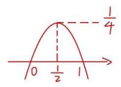

${G}^{\prime }\left( {x}_{0}\right)  = \frac{1}{{x}_{0}} - \frac{a}{{x}_{0}^{2}} \leq  1\therefore \frac{a}{{x}_{0}^{2}} \geq  \frac{1}{{x}_{0}} - 1$

$a \geq  {\left( {x}_{0} - {x}_{0}^{2}\right) }_{\max },{x}_{0} \in  \left( {0, + \infty }\right)$

$\therefore a \geq  \frac{1}{4}$

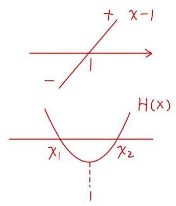

(3) $H\left( x\right)  = \frac{{e}^{x}}{\sqrt{\left( {a + 1}\right) {x}^{2} - {ax}}} = \frac{{e}^{x}}{x}, x > 0$

${H}^{\prime }\left( x\right)  = \frac{x{e}^{x} - {e}^{x}}{{x}^{2}} = \frac{{e}^{x}\left( {x - 1}\right) }{{x}^{2}}$

$\frac{H\left( {x}_{1}\right)  - H\left( {x}_{2}\right) }{{x}_{1} - {x}_{2}} = {H}^{\prime }\left( 1\right)  = 0$

$H\left( {X}_{1}\right)  = H\left( {X}_{2}\right)$ ，可知不妨 ${X}_{1} \in  \lbrack 0,1),{X}_{2} > 1$

要证 ${x}_{1} + {x}_{2} > 2$

只要证 ${x}_{2} > 2 - {x}_{1}$

${x}_{2} \in  \left( {1, + \infty }\right) ,2 - {x}_{1} \in  \left( {1, + \infty }\right)$

都在 $H\left( x\right)$ 的增区间

$\therefore$ 只要证 $H\left( {X}_{2}\right)  > H\left( {2 - {X}_{1}}\right) .$ 而 $H\left( {X}_{2}\right)  = H\left( {X}_{1}\right)$

$\therefore$ 只要证 $H\left( {X}_{1}\right)  > H\left( {2 - {X}_{1}}\right) ,{X}_{1} \in  \left( {0,1}\right)$

令 $P\left( x\right)  = H\left( x\right)  - H\left( {2 - x}\right) , P\left( 1\right)  = 0, x \in  \left( {0,1}\right)$

只要证 $P\left( X\right)  > 0$

${P}^{\prime }\left( x\right)  = {H}^{\prime }\left( x\right)  + {H}^{\prime }\left( {2 - x}\right)  = \frac{{e}^{x}\left( {x - 1}\right) }{{x}^{2}} + \frac{{e}^{2 - x}\left( {1 - x}\right) }{{\left( 2 - x\right) }^{2}} \; = \frac{{e}^{x}\left( {x - 1}\right) {\left( x - 2\right) }^{2} + {e}^{2 - x}\left( {1 - x}\right) {x}^{2}}{{x}^{2}{\left( x - 2\right) }^{2}} \; = \frac{\left( {x - 1}\right) \left\lbrack  {{e}^{x}{\left( x - 2\right) }^{2} - {e}^{2 - x} \cdot  {x}^{2}}\right\rbrack  }{{x}^{2}{\left( x - 2\right) }^{2}} \; = \frac{\left( {x - 1}\right) \left\lbrack  {{e}^{2x}{\left( x - 2\right) }^{2} - {e}^{2} \cdot  {x}^{2}}\right\rbrack  }{{x}^{2}{\left( x - 2\right) }^{2} \cdot  {e}^{x}}$

令 $S\left( x\right)  = {e}^{2x}{\left( x - 2\right) }^{2} - {e}^{2}{x}^{2}, x \in  \left( {0,1}\right)$

$$
= {\left\lbrack  {e}^{x}\left( 2 - x\right) \right\rbrack  }^{2} - {\left( ex\right) }^{2}
$$

${e}^{x}\left( {2 - x}\right)  > 0,{ex} > 0$

$y = {e}^{x}\left( {2 - x}\right)  - {ex} = 2{e}^{x} - {2e}x = 2\left( {{e}^{x} - {ex}}\right)$

${y}^{\prime } = 2\left( {{e}^{x} - e}\right) , x \in  \left( {0,1}\right)$

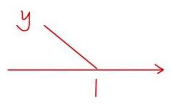

$\therefore {y}^{\prime } < 0\;\therefore y = 2\left( {{e}^{x} - {eX}}\right)  \downarrow$ 而 $y\left( 1\right)  = 0$

$\therefore y = 2\left( {{e}^{x} - {eX}}\right)$ 在 $\left( {0,1}\right)$ 上为正

$\therefore s\left( x\right)  > 0$ 而 ${P}^{\prime }\left( x\right)  = \frac{\left( {x - 1}\right) s\left( x\right) }{{x}^{2}{\left( x - 2\right) }^{2}{e}^{x}}, x \in  \left( {0,1}\right)$


$\therefore {P}^{\prime }\left( x\right)  < 0, P\left( x\right)  \downarrow$ 且 $P\left( 1\right)  = 0$

$\therefore P\left( x\right)$ 在 $\left( {0,1}\right)$ 上为正，得证 29. 双曲余弦函数 $\cosh x = \frac{{e}^{x} + {e}^{-x}}{2}$ ,双曲正弦函数 $\sinh x = \frac{{e}^{x} - {e}^{-x}}{2}$ .

(1)求函数 $\cosh x = \frac{{e}^{x} + {e}^{-x}}{2}$ 的单调增区间;

(2)若函数 $y = \cosh {2x} - a\sinh x$ 在 $\lbrack 0, + \infty )$ 上的最小值是 $\frac{1}{4}$ ，求实数 $a$ 的值；

(3)对任意 $x \in  \mathbf{R}$ ， $\cosh x \geq  \cos x + m{x}^{2}$ 恒成立，求实数 $m$ 的取值范围.


(1) $f\left( x\right)  = \cosh \left( x\right)  = \frac{{e}^{x} + {e}^{-x}}{2}$

${f}^{\prime }\left( x\right)  = \frac{{e}^{x} - {e}^{-x}}{2} \uparrow  ,{f}^{\prime }\left( 0\right)  = 0$

$\therefore x < 0$ 时, ${f}^{\prime }\left( x\right)  < 0, x > 0$ 时, ${f}^{\prime }\left( x\right)  >  > 0$

$\therefore f\left( x\right)$ 在 $\left( {-\infty ,0}\right)  \downarrow$ ,在 $\left( {0, + \infty }\right)  \uparrow$

(2) $g\left( x\right)  = \frac{{e}^{2x} + {e}^{-{2x}}}{2} - a \cdot  \frac{{e}^{x} - {e}^{-x}}{2}$

令 $t = {e}^{x} - {e}^{-x}$ ，则 ${e}^{2x} + {e}^{-{2x}} = {t}^{2} + 2$

t在 $x \in  \lbrack 0, + \infty )$ 上严格增

$\therefore t \in  \lbrack 0, + \infty )$

$\therefore y = \frac{{t}^{2} + 2 - {at}}{2}$

$= \frac{1}{2}{\left( t - \frac{a}{2}\right) }^{2} + 1 - \frac{{a}^{2}}{8}$ 在 $\lbrack 0, + \infty )$ 上的最小值 $\min  = \frac{1}{4}$


① $a \leq  0$ 时， $\min  = y\left( 0\right)  = 1$ (舍)

② $a > 0$ 时， $\min  = 1 - \frac{{a}^{2}}{8} = \frac{1}{4}$

则 $a = \sqrt{6}$ 或 $a =  - \sqrt{6}$ (舍)

综上， $a = \sqrt{6}$

(3)设 $f\left( x\right)  = \frac{{e}^{x} + {e}^{-x}}{2} - \cos x - m{x}^{2}$ (偶函数，只研究 $x \geq  0$ )


则 $f\left( x\right)  \geq  0 = f\left( 0\right)$

$\because {f}^{\prime }\left( x\right)  = \frac{{e}^{x} - {e}^{-x}}{2} + \sin x - {2mx},{f}^{\prime }\left( 0\right)  = 0$

${f}^{\prime \prime }\left( x\right)  = \frac{{e}^{x} + {e}^{-x}}{2} + \cos x - {2m}$

必要性: ${f}^{\prime \prime }\left( 0\right)  = 2 - {2m} \geq  0,$ 即 $m \leq  1$

若 ${f}^{\prime \prime }\left( 0\right)  < 0$ ，则且 $\left( {0,\varepsilon }\right)$ ，使得 ${f}^{\prime \prime }\left( x\right)  < 0$ ， ${f}^{\prime }\left( x\right)  > 0$ ， ${f}^{\prime }\left( x\right)  < 0$

${f}^{\prime }\left( x\right)  \downarrow  , f\left( x\right)  < 0$ ,不满足题意


当 $m \leq  1$ 时， $f\left( x\right)  = h\left( m\right)  =  - {x}^{2} \cdot  m + \frac{{e}^{x} + {e}^{-x}}{2} - \cos x \downarrow$

为关于 $m$ 的一次函数

$h\left( m\right)  \geq  h\left( 1\right)  =  - {x}^{2} + \frac{{e}^{x} + {e}^{-x}}{2} - \cos x$

令 $g\left( x\right)  =  - {x}^{2} + \frac{{e}^{x} + {e}^{-x}}{2} - \cos x, g\left( 0\right)  = 0$

${g}^{\prime }\left( x\right)  =  - {2x} + \frac{{e}^{x} - {e}^{-x}}{2} + \sin x,{g}^{\prime }\left( 0\right)  = 0$

${g}^{\prime \prime }\left( x\right)  =  - 2 + \frac{{e}^{x} + {e}^{-x}}{2} + \cos x,{g}^{\prime \prime }\left( 0\right)  = 0$

${g}^{\prime \prime \prime }\left( x\right)  = \frac{{e}^{x} - {e}^{-x}}{2} - \sin x\left( {x \geq  0}\right)$

${g}^{\left( 4\right) }\left( x\right)  = \frac{{e}^{x} + {e}^{-x}}{2} - \cos x \geq  \frac{x + 1 + \left( {-x + 1}\right) }{2} - \cos x = 1 - \cos x \geq  0$

$\therefore {g}^{\prime \prime \prime }\left( x\right)  \uparrow  ,{g}^{\prime \prime \prime }\left( x\right)  \geq  {g}^{\prime \prime \prime }\left( 0\right)  = 0$

$\therefore {g}^{\prime \prime }\left( x\right)  \uparrow  ,{g}^{\prime \prime }\left( x\right)  \geq  {g}^{\prime \prime }\left( 0\right)  = 0,{g}^{\prime }\left( x\right)  \uparrow  ,{g}^{\prime }\left( x\right)  \geq  {g}^{\prime }\left( 0\right)  = 0, g\left( x\right)  \uparrow$

$\therefore g\left( x\right)  \geq  g\left( 0\right)  = 0$ 成立

以当 $m \leq  1$ 时， $f\left( x\right)  = h\left( m\right)  =  - {x}^{2} \cdot  m + \frac{{e}^{x} + {e}^{-x}}{2} - \cos x \geq  g\left( x\right)  \geq  0$ 成立综上， $m \leq  1$

30. 设函数 $y = f\left( x\right)$ 的定义域为 $\mathbf{R}$ ,集合 $M = \{ x \mid  f\left( x\right)  = a, x \in  \mathrm{R}\}$ . 若 $M$ 中有且仅有一个元素,则称 $a$ 为函数 $y = f\left( x\right)$ 的一个“ $S$ 值”.

(1)设 $f\left( x\right)  = {x}^{2} - {2x}$ ，求 $y = f\left( x\right)$ 的 $S$ 值；

(2)设 $g\left( x\right)  = 3{x}^{4} - \left( {{4k} + 4}\right) {x}^{3} + {6k}{x}^{2} + 1$ ，且 $0 < k \leq  1$ ，若 $y = g\left( x\right)$ 的函数值中不存在 $S$ 值，求实数 $k$ 取值的集合;

(3)已知定义域为 $\mathrm{R}$ 的函数 $y = h\left( x\right)$ 的图像是一条连续曲线，且函数 $y = h\left( x\right)$ 的所有函数值均为 $S$ 值,若 $m < n$ ,证明: $y = h\left( x\right)$ 在 $\left\lbrack  {m, n}\right\rbrack$ 上为严格增函数的一个充要条件是 $h\left( m\right)  < h\left( n\right)$ .

(1)设 $a$ 为函数 $y = f\left( x\right)$ 的 $s$ 值

则方程 ${x}^{2} - {2x} = a$ ，即 ${x}^{2} - {2x} - a = 0$ 有唯一实数解

$\therefore \Delta  = 4 + {4a} = 0, a =  - 1$

$\therefore y = f\left( x\right)$ 的S值为-1

(2) ${g}^{\prime }\left( x\right)  = {12}{x}^{3} - \left( {{12k} + {12}}\right) {x}^{2} + {12kx} = {12x}\left\lbrack  {{x}^{2} - \left( {k + 1}\right) x + k}\right\rbrack$

$= {12x}\left( {x - k}\right) \left( {x - 1}\right)$


① $0 < k < 1$

$\therefore y = g\left( x\right)$ 不存在 S 值

$\therefore g\left( 0\right)  = g\left( 1\right)$

$1 = 3 - {4k} - 4 + {6k} + 1, k = \frac{1}{2}$

② $k = 1$


一定存在S值，即 $g\left( 0\right)$

综上， $k \in  \left\{  \frac{1}{2}\right\}$

31. 若函数 $y = f\left( x\right)$ 满足: 对任意 ${x}_{1},{x}_{2} \in  \mathbf{R},{x}_{1} + {x}_{2} \neq  0$ ,都有 $\frac{f\left( {x}_{1}\right)  + f\left( {x}_{2}\right) }{{x}_{1} + {x}_{2}} > 0$ ,则称函数 $y = f\left( x\right)$ 具有性质 $P$ .

(1)设 $f\left( x\right)  = {\mathrm{e}}^{x}, g\left( x\right)  = {x}^{3} + x$ ,分别判断 $y = f\left( x\right)$ 与 $y = g\left( x\right)$ 是否具有性质 $P$ ? 并说明理由;

(2)设 $f\left( x\right)  = x + a\sin {2x}$ ,若函数 $y = f\left( x\right)$ 具有性质 $P$ ，求实数 $a$ 的取值范围；

(3)已知函数 $y = f\left( x\right)$ 具有性质 $P$ ，且图像是一条连续曲线，若 $y = f\left( x\right)$ 在 $\mathbf{R}$ 上是严格增函数， 求证: $y = f\left( x\right)$ 是奇函数.

(1) $f\left( x\right)  = {e}^{x}$ ,当 ${x}_{1} < 0,{x}_{2} < 0$ 时， ${e}^{{x}_{1}} + {e}^{{x}_{2}} > 0,{x}_{1} + {x}_{2} < 0$

$\frac{{e}^{{x}_{1}} + {e}^{{x}_{2}}}{{x}_{1} + {x}_{2}} < 0,\therefore f\left( x\right)$ 不具有 $P$ 性质

$g\left( x\right)  = {x}^{3} + x,\;\forall {x}_{1} + {x}_{2} \neq  0$

$\frac{g\left( {x}_{1}\right)  + g\left( {x}_{2}\right) }{{x}_{1} + {x}_{2}} = \frac{{x}_{1} + {x}_{2} + {x}_{1}^{3} + {x}_{2}^{3}}{{x}_{1} + {x}_{2}} = 1 + {x}_{1}^{2} - {x}_{1}{x}_{2} + {x}_{2}^{2} \geq  2\left| {{x}_{1}{x}_{2}}\right|  - {x}_{1}{x}_{2} + 1 > 0$

$\therefore g\left( x\right)$ 具有 $P$ 性质

( 2 ) $\because f\left( x\right)  = x + a\sin {2x}$ 为奇函数

$\therefore \forall {x}_{1} \neq  {x}_{2},{x}_{1} + \left( {-{x}_{2}}\right)  \neq  0$ ，满足

$\frac{f\left( {x}_{1}\right)  + f\left( {-{x}_{2}}\right) }{{x}_{1} - {x}_{2}} = \frac{f\left( {x}_{1}\right)  - f\left( {x}_{2}\right) }{{x}_{1} - {x}_{2}} > 0$

$\therefore f\left( x\right)$ 在 $R =  \uparrow$

${f}^{\prime }\left( x\right)  = 1 + {2a}\cos {2x} \geq  0$ 恒成立

$\therefore 1 \geq   - {2a}\cos {2x}$

$\therefore \left| z\right|  \geq  \left| {2a}\right|$

$\therefore a \in  \left\lbrack  {-\frac{1}{2},\frac{1}{2}}\right\rbrack$


(3) $\frac{f\left( {x}_{1}\right)  + f\left( {x}_{2}\right) }{{x}_{1} + {x}_{2}} > 0$ ，若 ${x}_{1} = {x}_{2} = x$ ，则 $\frac{f\left( x\right) }{x} > 0$

$\therefore$ 当 $x > 0$ 时， $f\left( x\right)  > 0$ ，当 $x < 0$ 时， $f\left( x\right)  < 0$


若 $f\left( 0\right)  > 0$ ，则 $\exists {x}_{1} < 0$ ，当 $x \in  \left( {{x}_{1},0}\right)$ ，使 $f\left( x\right)  > 0$ ，矛盾

若 $f\left( 0\right)  < 0$ ,则 $\exists {x}_{2} > 0$ ,当 $x \in  \left( {0,{x}_{2}}\right)$ ,使 $f\left( x\right)  < 0$ ,矛盾

$\therefore f\left( 0\right)  = 0$


若 $\exists {x}_{0} > 0$ ，使得 $f\left( {x}_{0}\right)  \neq   - f\left( {-{x}_{0}}\right)$

假设 $f\left( {x}_{0}\right)  >  - f\left( {-{x}_{0}}\right)$

$\because f\left( x\right)$ 严格增

$\therefore \exists m \in  \left( {0,{x}_{0}}\right)$ ，使得 $f\left( m\right)  =  - f\left( {-{x}_{0}}\right)$

$\therefore f\left( m\right)  + f\left( {-{x}_{0}}\right)  = 0$


$\therefore \frac{f\left( m\right)  + f\left( {-{x}_{0}}\right) }{m + \left( {-{x}_{0}}\right) } = 0$ 与题干矛盾

假设 $f\left( {x}_{0}\right)  <  - f\left( {-{x}_{0}}\right)$

$\exists m > {x}_{0}$ . 使得 $f\left( m\right)  =  - f\left( {-{x}_{0}}\right)$

$\therefore f\left( m\right)  + f\left( {-{x}_{0}}\right)  = 0$

$\therefore \frac{f\left( m\right)  + f\left( {-{x}_{0}}\right) }{m + \left( {-{x}_{0}}\right) } = 0$ 与题干矛盾

$\therefore \forall x \in  R, f\left( {-x}\right)  =  - f\left( x\right)$

$\therefore f\left( x\right)$ 为奇函数


法二:不妨令 ${x}_{2} > 0$

当 ${x}_{1} + {x}_{2} > 0$ 时， $f\left( {x}_{1}\right)  + f\left( {x}_{2}\right)  > 0$

即 ${x}_{1} >  - {x}_{2}$ 时， $f\left( {x}_{1}\right)  >  - f\left( {x}_{2}\right)$

当 ${X}_{1} <  - {X}_{2}$ 时， $f\left( {X}_{1}\right)  <  - f\left( {X}_{2}\right)$

$\because f\left( x\right)$ 连续且严格增

$\therefore$ 当 ${x}_{1} =  - {x}_{2}$ 时,

$f\left( {x}_{1}\right)  =  - f\left( {x}_{2}\right) , f\left( {-{x}_{2}}\right)  =  - f\left( {x}_{2}\right) ,{x}_{2} > 0$

$\therefore f\left( x\right)$ 为奇函数

32. 已知函数 $y = f\left( x\right)$ 与 $y = g\left( x\right)$ 有相同的定义域 $D$ . 若存在常数 $a\left( {a \in  \mathbf{R}}\right)$ ,使得对于任意的 ${x}_{1} \in  D$ ,都存在 ${x}_{2} \in  D$ ,满足 $f\left( {x}_{1}\right)  + g\left( {x}_{2}\right)  = a$ ,则称函数 $y = g\left( x\right)$ 是函数 $y = f\left( x\right)$ 关于 $a$ 的 “ $S$ 函数”.

(1)若 $f\left( x\right)  = \ln x, g\left( x\right)  = {\mathrm{e}}^{x}$ ，试判断函数 $y = g\left( x\right)$ 是否是 $y = f\left( x\right)$ 关于 0 的 “ $S$ 函数”，并说明理由;

(2)若函数 $y = f\left( x\right)$ 与 $y = g\left( x\right)$ 均存在最大值与最小值,且函数 $y = g\left( x\right)$ 是 $y = f\left( x\right)$ 关于 $a$ 的 “ $S$ 函数”, $y = f\left( x\right)$ 又是 $y = g\left( x\right)$ 关于 $a$ 的 “ $S$ 函数”,证明: ${\left\lbrack  f\left( x\right) \right\rbrack  }_{\min } + {\left\lbrack  g\left( x\right) \right\rbrack  }_{\max } = a$ ;

(3)已知 $f\left( x\right)  = \left| {x - 1}\right| , g\left( x\right)  = \sqrt{x}$ ，其定义域均为 $\left\lbrack  {0, t}\right\rbrack$ . 给定正实数 $t$ ，若存在唯一的 $a$ ，使得 $y = g\left( x\right)$ 是 $y = f\left( x\right)$ 关于 $a$ 的 “ $S$ 函数”,求 $t$ 的所有可能值.

(1)不是

对 $\forall {x}_{1},$ 都 $\exists {x}_{2}$ ,使得 $f\left( {x}_{1}\right)  = a - g\left( {x}_{2}\right)$

即 $y = f\left( x\right)$ 的值域为 $y = a - g\left( x\right)$ 值域的子集


$\ln x + {e}^{x} = 0$

$\ln x =  - {e}^{x}$

$y = \ln x \in  R, y =  - {e}^{x} \in  \left( {-\infty ,0}\right)$

不满足 $R$ 为 $\left( {-\infty ,0}\right)$ 的子集

$\therefore$ 不是

(2) 由题意得， $y = f\left( x\right)  \leq  y = a - g\left( x\right) , y = g\left( x\right)  \leq  y = a - f\left( x\right)$


$\therefore f{\left( x\right) }_{\min } \geq  a - g{\left( x\right) }_{\max }$ 即 $f{\left( x\right) }_{\min } + g{\left( x\right) }_{\max } \geq  a$

$g{\left( x\right) }_{\max } \leq  a - f{\left( x\right) }_{\min }$ 即 $f{\left( x\right) }_{\min } + g{\left( x\right) }_{\max } \leq  a$

(3)由题意得， $f\left( x\right)  + g\left( x\right)  = a, f\left( x\right)  = \left| {x - 1}\right| , g\left( x\right)  = \sqrt{x}, x \in  \left\lbrack  {0, t}\right\rbrack$

即 $f\left( x\right)  = a - g\left( x\right)$

设 $A = \{ y \mid  y = f\left( x\right) \} , B = \{ y \mid  y = a - g\left( x\right) \}$

则 $A \subseteq  B$


① $0 < t < 1$ 时

$A = \left\lbrack  {1 - t,1}\right\rbrack  , B = \left\lbrack  {a - \sqrt{t}, a}\right\rbrack$

$\left\{  {\begin{array}{l} 1 - t \geq  a - \sqrt{t} \\  1 \leq  a \end{array},\therefore 1 \leq  a \leq  1 - t + \sqrt{t}}\right.$

$\because a$ 只有1个 $\therefore \left| {-t + \sqrt{t}}\right|  = 1$

$t = 0\left( \text{ 舍 }\right) ,{\text{ 或 }t} = 1\left( \text{ 舍 }\right)$

② $1 \leq  t \leq  2$


$A = \left\lbrack  {0,1}\right\rbrack  ,\;B = \left\lbrack  {a - \sqrt{t}, a}\right\rbrack$

$\left\{  {\begin{array}{l} a - \sqrt{t} \leq  0 \\  a \geq  1 \end{array}\;,\therefore \left| {t - a}\right|  \leq  1}\right.$ 不

$\because a$ 只有1个

$\therefore \sqrt{t} = 1, t = 1$


③ $t > 2$

$A = \left\lbrack  {0, t - 1}\right\rbrack  , B = \left\lbrack  {a - \sqrt{t}, a}\right\rbrack$

$\left\{  {\begin{array}{l} a - \sqrt{t} \leq  0 \\  a \geq  t - 1 \end{array},\;\therefore t - 1 \leq  a \leq  \sqrt{t}}\right.$

$\because a$ 只有1个

$\therefore t - 1 = \sqrt{t}, t = \frac{3 + \sqrt{5}}{2}$ 或 $t = \frac{3 - \sqrt{5}}{2}$ (舍)

综上， $t = 1$ 或 $t = \frac{3 + \sqrt{5}}{2}$

33. 已知常数 $m \in  R$ ,设 $f\left( x\right)  = \ln x + \frac{m}{x}$ ,

(1)若 $m = 1$ ，求函数 $y = f\left( x\right)$ 的最小值；

(2)是否存在 $0 < {x}_{1} < {x}_{2} < {x}_{3}$ ，且 ${x}_{1},{x}_{2},{x}_{3}$ 依次成等比数列，使得 $f\left( {x}_{1}\right) , f\left( {x}_{2}\right) , f\left( {x}_{3}\right)$ 依次成等差数列? 请说明理由.

(3)求证: “ $m \leq  0$ ” 是对 “任意 ${x}_{1},{x}_{2} \in  \left( {0, + \infty }\right)$ ， ${x}_{1} < {x}_{2}$ ，都有 $\frac{{f}^{\prime }\left( {x}_{1}\right)  + {f}^{\prime }\left( {x}_{2}\right) }{2} > \frac{f\left( {x}_{1}\right)  - f\left( {x}_{2}\right) }{{x}_{1} - {x}_{2}}$ ， 的充要条件


(1) $f\left( x\right)  = \ln x + \frac{1}{x}\;\left( {x > 0}\right)$

${f}^{\prime }\left( x\right)  = \frac{1}{x} - \frac{1}{{x}^{2}} = \frac{x - 1}{{x}^{2}}$

$f{\left( x\right) }_{\min } = f\left( 1\right)  = 1$

(2) ${x}_{2}^{2} = {x}_{1}{x}_{3}$

${2f}\left( {x}_{2}\right)  = f\left( {x}_{1}\right)  + f\left( {x}_{3}\right)$

$2\ln {x}_{2} + \frac{{z}_{m}}{{x}_{2}} = \ln {x}_{1} + \frac{m}{{x}_{1}} + \ln {x}_{3} + \frac{m}{{x}_{3}} = \ln {x}_{1}{x}_{3} + \frac{m\left( {{x}_{1} + {x}_{3}}\right) }{{x}_{1}{x}_{3}}$

$$
= \ln {x}_{2}^{2} + \frac{m\left( {{x}_{1} + {x}_{3}}\right) }{{x}_{2}^{2}}
$$

$\therefore \frac{2m}{{x}_{2}} = \frac{m\left( {{x}_{1} + {x}_{3}}\right) }{{x}_{2}^{2}}$ ，当 $m = 0$ 时，成立

当m≠0时，则 $2{x}_{2} = {x}_{1} + {x}_{3}$ ，联立 ${x}_{2}^{2} = {x}_{1}{x}_{3}$ 得

$\frac{{\left( {x}_{1} + {x}_{2}\right) }^{2}}{4} = {x}_{1}{x}_{3}$

${x}_{1}^{2} + 2{x}_{1}{x}_{3} + {x}_{3}^{2} = 4{x}_{1}{x}_{3}$

${\left( {x}_{1} - {x}_{3}\right) }^{2} = 0$

$\therefore {x}_{1} = {x}_{3},$ 与 ${x}_{1} < {x}_{2} < {x}_{3}$ 矛盾

$\therefore m = 0$ 时，存在 ${x}_{1},{x}_{2},{x}_{3}$ 满足条件

$m \neq  0$ 时，不存在 ${x}_{1},{x}_{2},{x}_{3}$ 满足条件

(3) $f\left( x\right)  = \ln x + \frac{m}{x},{f}^{\prime }\left( x\right)  = \frac{1}{x} - \frac{m}{{x}^{2}}$

$$
\frac{{f}^{\prime }\left( {x}_{1}\right)  + {f}^{\prime }\left( {x}_{2}\right) }{2} > \frac{f\left( {x}_{1}\right)  - f\left( {x}_{2}\right) }{{x}_{1} - {x}_{2}}
$$

$\left( {{x}_{1} - {x}_{2}}\right) \left\lbrack  {{f}^{\prime }\left( {x}_{1}\right)  + {f}^{\prime }\left( {x}_{2}\right) }\right\rbrack   - 2\left\lbrack  {f\left( {x}_{1}\right)  - f\left( {x}_{2}\right) }\right\rbrack   < 0$

$\left( {{x}_{1} - {x}_{2}}\right) \left\lbrack  {{f}^{\prime }\left( {x}_{1}\right)  + {f}^{\prime }\left( {x}_{2}\right) }\right\rbrack   - 2\left\lbrack  {f\left( {x}_{1}\right)  - f\left( {x}_{2}\right) }\right\rbrack$

$$
= \left( {{x}_{1} - {x}_{2}}\right) \left\lbrack  {\frac{1}{{x}_{1}} - \frac{m}{{x}_{1}^{2}} + \frac{1}{{x}_{2}} - \frac{m}{{x}_{2}^{2}}}\right\rbrack   - 2\left\lbrack  {\ln {x}_{1} + \frac{m}{{x}_{1}} - \ln {x}_{2} - \frac{m}{{x}_{2}}}\right\rbrack
$$

$$
= \frac{-{3m}}{{x}_{1}} + \frac{3m}{{x}_{2}} - \frac{{x}_{2}}{{x}_{1}} + \frac{{x}_{1}}{{x}_{2}} - \frac{m{x}_{1}}{{x}_{2}^{2}} + \frac{m{x}_{2}}{{x}_{1}^{2}} - 2\ln \frac{{x}_{1}}{{x}_{2}}\text{ ,令 }\frac{{x}_{2}}{{x}_{1}} = t > 1
$$

$$
= \frac{-{2m}}{{x}_{1}} + \frac{3m}{{x}_{1}} - t + \frac{1}{t} - \frac{m}{{t}^{2}{x}_{1}} + \frac{mt}{{x}_{1}} - 2\ln \frac{1}{t}
$$

$$
= \frac{1}{t} - t - {2ln}\frac{1}{t} + \frac{m}{{t}^{2}{x}_{1}}\left( {-3{t}^{2} + {3t} - 1 + {t}^{3}}\right)
$$

$$
= \frac{1}{t} - t + {2lnt} + \frac{m}{{t}^{2}{x}_{1}}{\left( t - 1\right) }^{3}
$$

令 $g\left( t\right)  = \frac{1}{t} - t + {2lnt}$ ，则 ${g}^{\prime }\left( t\right)  =  - \frac{1}{{t}^{2}} - 1 + \frac{2}{t} =  - {\left( \frac{1}{t} - 1\right) }^{2} < 0$ 恒成立，

$g\left( t\right)  \downarrow  , g\left( t\right)  < g\left( 1\right)  = 0$

充分性:若 $m \leq  0$ ，则 $\frac{m}{{t}^{2}{x}_{1}}{\left( t - 1\right) }^{3} \leq  0$ ，则 $\frac{1}{t} - t + {2lnt} + \frac{m}{{t}^{2}{x}_{1}}{\left( t - 1\right) }^{3} < 0$ 恒成立

必要性:要使得①式恒成立，则 $m \leq  0$

若 $m > 0$ ，取 $t = 2$

原式 $= \frac{1}{2} - 2 + 2\ln 2 + \frac{m}{4{x}_{1}} = 2\ln 2 - \frac{3}{2} + \frac{m}{4{x}_{1}}$

取 ${x}_{1} = \frac{m}{100}$ ，则 ${x}_{2} = \frac{m}{50}$

上式 $= 2\ln 2 - \frac{3}{2} + \frac{m}{4 \cdot  \frac{m}{100}} = 2\ln 2 - \frac{3}{2} + {25} > 0$ 矛盾

$\therefore m \leq  0,$ 得证

34. 已知 $k \in  \mathbf{R}$ ,记 $f\left( x\right)  = {a}^{x} + k \cdot  {a}^{-x}\left( {a > 0\text{ 且 }a \neq  1}\right)$ .

(1)当 $a = \mathrm{e}$ ( $\mathrm{e}$ 是自然对数的底 $)$ 时，试讨论函数 $y = f\left( x\right)$ 的单调性和最值;

(2)试讨论函数 $y = f\left( x\right)$ 的奇偶性；

(3)拓展与探究:

① 当 $k$ 在什么范围取值时,函数 $y = f\left( x\right)$ 的图像在 $x$ 轴上存在对称中心? 请说明理由;

② 请提出函数 $y = f\left( x\right)$ 的一个新性质,并用数学符号语言表达出来. (不必证明)

(1) $f\left( x\right)  = {e}^{x} + k{e}^{-x},{f}^{\prime }\left( x\right)  = {e}^{x} - k{e}^{-x}$

当 $k \leq  0$ 时， ${f}^{\prime }\left( x\right)  > 0, f\left( x\right)$ 在 $R$ 上 $\uparrow$ ，无最值


$\ln \sqrt{K}$

当 $k > 0$ 时，易知 ${f}^{\prime }\left( x\right)  \uparrow$ ，令 ${f}^{\prime }\left( x\right)  = 0$ ，得 $x = \frac{1}{2}\ln k$

$\therefore$ 当 $x \in  \left( {-\infty ,\frac{1}{2}\ln k}\right)$ 时， ${f}^{\prime }\left( x\right)  < 0, f\left( x\right)  \downarrow$

当 $x \in  \left( {\frac{1}{2}\ln k, + \infty }\right)$ 时， ${f}^{\prime }\left( x\right)  > 0, f\left( x\right)  \uparrow$

$f{\left( x\right) }_{\min } = f\left( {{ln}\sqrt{k}}\right)  = \sqrt{k} + k{e}^{-{ln}\sqrt{k}} = \sqrt{k} + k\;\frac{1}{\sqrt{k}} = {2j}\sqrt{k}$ ，无最大值

( 2 )若 $f\left( x\right)$ 为偶函数，则对 $\forall x \in  \mathbb{R}$ ，都有 $f\left( {-x}\right)  = f\left( x\right)$

$\therefore$ 对 $\forall x \in  R.$ 都有 $- x \in  R.\;{a}^{x} + k{a}^{-x} = {a}^{-x} + k{a}^{x}$

$\therefore$ 对 $\forall x \in  R,\left( {k - 1}\right) \left( {{a}^{x} - {a}^{-x}}\right)  = 0$

$\therefore k = 1$

$\therefore {x}^{n}k = 1$ ”是“ $f\left( x\right)$ 为偶函数”的充要条件

若 $f\left( x\right)$ 为奇函数，则对 $\forall x \in  R,$ 都有 $f\left( {-x}\right)  =  - f\left( x\right)$

$\therefore$ 对 $\forall x \in  R$ ，都有 $- x \in  R, - {a}^{x} - k{a}^{-x} = {a}^{-x} + k{a}^{x}$

$\therefore$ 对 $\forall x \in  R,\left( {k + 1}\right) \left( {{a}^{x} + {a}^{-x}}\right)  = 0$

$\therefore k =  - 1$

$\therefore {x}^{2} =  - 1$ ”是“ $f\left( x\right)$ 为奇函数”的充要条件

当 $k \neq   \pm  1$ 时， $f\left( x\right)$ 为非奇非偶函数

## 参考答案

(3)①当 $k < 0$ 时，函数 $y = f\left( x\right)$ 有对称中心 $\left( {\frac{1}{2}\log \left( {-k}\right) ,0}\right)$ .

即,当 $k < 0$ 时,对于任意的 $x \in  \mathbf{R}$ ,都有 $- x \in  \mathbf{R}$ ,并且 $f\left( {{\log }_{a}\left( {-k}\right)  - x}\right)  =  - f\left( x\right)$ .

证明: 当 $k < 0$ 时,令 $f\left( x\right)  = 0$ ,解得 $x = \frac{1}{2}{\log }_{a}\left( {-k}\right)$ 为函数 $y = f\left( x\right)$ 的零点

由 $f\left( x\right)  = {a}^{x} + k \cdot  {a}^{-x}$ 得 $f\left( {{\log }_{a}\left( {-k}\right)  - x}\right)  = {a}^{{\log }_{a}\left( {-k}\right)  - x} + k \cdot  {a}^{-\left( {{\log }_{a}\left( {-k}\right)  - x}\right) } =  - k \cdot  {a}^{-x} - {a}^{x} =  - f\left( x\right)$ .

② 答案 1: 当 $k > 0$ 时,函数 $y = f\left( x\right)$ 有对称轴 $x = \frac{1}{2}{\log }_{a}k$ .

即,当 $k > 0$ 时,对于任意的 $x \in  \mathbf{R}$ ,都有 $- x \in  \mathbf{R}$ ,并且 $f\left( {{\log }_{a}k - x}\right)  = f\left( x\right)$ .

参考证明: 当 $k > 0$ 时,由 $f\left( x\right)  = {a}^{x} + k \cdot  {a}^{-x}$ 得,

$f\left( {{\log }_{a}k - x}\right)  = {a}^{{\log }_{a}k - x} + k \cdot  {a}^{-\left( {{\log }_{a}k - x}\right) } = k \cdot  {a}^{-x} + {a}^{x} = f\left( x\right) .$

答案 2: 当 $k = 1$ 时, $y = f\left( x\right)$ 的图像关于 $y$ 轴对称,

即,对于任意的 $x \in  \mathbf{R}$ ,都有 $f\left( {-x}\right)  = f\left( x\right)$ .

答案 3: 当 $k < 0$ 时,函数 $y = f\left( x\right)$ 的零点为 $x = \frac{1}{2}{\log }_{a}\left( {-k}\right)$ ,即 $f\left( {\frac{1}{2}{\log }_{a}\left( {-k}\right) }\right)  = 0$ .

答案 4: 表述函数 $y = f\left( x\right)$ 的单调性和最值,并写出定义形式各给 1 分.

35. 对于函数 $y = f\left( x\right) , x \in  {D}_{1}$ 和 $y = g\left( x\right) , x \in  {D}_{2}$ ,设 ${D}_{1} \cap  {D}_{2} = D$ ,若 ${x}_{1},{x}_{2} \in  D$ ,且 ${x}_{1} \neq  {x}_{2}$ , 皆有 $\left| {f\left( {x}_{1}\right)  - f\left( {x}_{2}\right) }\right|  \leq  t\left| {g\left( {x}_{1}\right)  - g\left( {x}_{2}\right) }\right| \left( {t > 0}\right)$ 成立,则称函数 $y = f\left( x\right)$ 与 $y = g\left( x\right)$ “具有性质 $H\left( t\right)$ ”.

(1)判断函数 $f\left( x\right)  = {x}^{2}, x \in  \left\lbrack  {1,2}\right\rbrack$ 与 $g\left( x\right)  = {2x}$ 是否 “具有性质 $H\left( 2\right)$ ”,并说明理由;

(2)若函数 $f\left( x\right)  = 2 + {x}^{2}, x \in  (0,1\rbrack$ 与 $g\left( x\right)  = \frac{1}{x}$ “具有性质 $H\left( t\right)$ ”,求 $t$ 的取值范围；

(3)若函数 $f\left( x\right)  = \frac{1}{{x}^{2}} + 2\ln x - 3$ 与 $y = g\left( x\right)$ “具有性质 $H\left( 1\right)$ ”，且函数 $y = g\left( x\right)$ 在区间 $\left( {0, + \infty }\right)$ 上存在两个零点 ${x}_{1},{x}_{2}$ ,求证 ${x}_{1}^{2} + {x}_{2}^{2} > 2$ .

(1)令 ${X}_{1} \in  \left\lbrack  {1,2}\right\rbrack   = {D}_{1},{X}_{2} \in  R = {D}_{2}$

${D}_{1} \cap  {D}_{2} = \left\lbrack  {1,2}\right\rbrack  ,\therefore {x}_{2} \in  \left\lbrack  {1,2}\right\rbrack$

当 ${x}_{1} \neq  {x}_{2}$ 时，

$\left| {f\left( {x}_{1}\right)  - f\left( {x}_{2}\right) }\right|  - 2\left| {g\left( {x}_{1}\right)  - g\left( {x}_{2}\right) }\right|  = \left| {{x}_{1}^{2} - {x}_{2}^{2}}\right|  - 2\left| {2{x}_{1} - 2{x}_{2}}\right|$

$= \left| {{x}_{1} + {x}_{2}}\right| \left| {{x}_{1} - {x}_{2}}\right|  - 4\left| {{x}_{1} - {x}_{2}}\right|  = \left| {{x}_{1} - {x}_{2}}\right| \left( {\left| {{x}_{1} + {x}_{2}}\right|  - 4}\right)$

$\therefore \left| { < {x}_{1} + {x}_{2} < 4,\;\therefore }\right| {x}_{1} + {x}_{2}\left| {-4 < 0,}\right| {x}_{1} - {x}_{2} \mid   > 0$

$\therefore \left| {f\left( {x}_{1}\right)  - f\left( {x}_{2}\right) }\right|  - 2\left| {g\left( {x}_{1}\right)  - g\left( {x}_{2}\right) }\right|  < 0$

$\therefore f\left( x\right)$ 与 $g\left( x\right)$ 具有性质 $H\left( 2\right)$

(2)不妨取 $O < {X}_{1} < {X}_{2} \leq  1$

则 $\left| {f\left( {x}_{1}\right)  - f\left( {x}_{2}\right) }\right|  - f\left| {g\left( {x}_{1}\right)  - g\left( {x}_{2}\right) }\right|  = {{x}_{2}}^{2} - {{x}_{1}}^{2} - t\left( {\frac{1}{{x}_{1}} - \frac{1}{{x}_{2}}}\right)$

$= \left( {{x}_{2} - {x}_{1}}\right) \left( {{x}_{2} + {x}_{1} - \frac{t}{{x}_{1}{x}_{2}}}\right)  \leq  0$ 恒成立.

则 ${x}_{2} + {x}_{1} - \frac{t}{{x}_{1}{x}_{2}} \leq  0$ 恒成立.

$\therefore t \geq  {x}_{1}{x}_{2}\left( {{x}_{1} + {x}_{2}}\right)$

$\because x \in  \left\lbrack  {0,1}\right\rbrack  ,\therefore t \geq  2$

(3)由题意得， $g\left( {x}_{1}\right)  = g\left( {x}_{2}\right)  = 0$

$\because f\left( x\right)  = \frac{1}{{x}^{2}} + {2lnx} - {3\text{ 与 }y} = g\left( x\right)$ 具有性质 $H\left( 1\right)$

$\therefore \left| {f\left( {x}_{1}\right)  - f\left( {x}_{2}\right) }\right|  \leq  \left| {g\left( {x}_{1}\right)  - g\left( {x}_{2}\right) }\right|  = 0$

即 $f\left( {x}_{1}\right)  = f\left( {x}_{2}\right)$

$\therefore \frac{1}{{x}_{1}^{2}} + 2\ln {x}_{1} - 3 = \frac{1}{{x}_{2}^{2}} + 2\ln {x}_{2} - 3$

令 ${x}_{1}^{2} = {t}_{1},{x}_{2}^{2} = {t}_{2}$

$\therefore \frac{1}{{t}_{1}} + \ln {t}_{1} - 3 = \frac{1}{{t}_{2}} + \ln {t}_{2} - 3$

令 $h\left( x\right)  = \frac{1}{x} + \ln x - 3,\therefore h\left( {t}_{1}\right)  = h\left( {t}_{2}\right)$


${h}^{\prime }\left( x\right)  =  - \frac{1}{{x}^{2}} + \frac{1}{x} = \frac{x - 1}{{x}^{2}}$

当 $x < 1$ 时， ${h}^{\prime }\left( x\right)  < 0$ ，当 $x > 1$ 时， ${h}^{\prime }\left( x\right)  > 0$

$\therefore h\left( x\right)$ 在 $\left( {0,1}\right)  \downarrow$ ,在 $\left( {1, + \infty }\right)  \uparrow$

要证 ${x}_{1}^{2} + {x}_{2}^{2} > 2$ ，即证 ${t}_{1} + {t}_{2} > 2$

不妨设 $0 < {t}_{1} < 1 < {t}_{2}$ ，即证 ${t}_{2} > 2 - {t}_{1} > 1$

只要证 $h\left( {t}_{2}\right)  > h\left( {2 - {t}_{1}}\right)$

即证 $h\left( {t}_{1}\right)  > h\left( {2 - {t}_{1}}\right)$

设 $H\left( x\right)  = h\left( x\right)  - h\left( {2 - x}\right)  = \frac{1}{x} + \ln x - \frac{1}{2 - x} - \ln \left( {2 - x}\right)$

${H}^{\prime }\left( x\right)  =  - \frac{1}{{x}^{2}} + \frac{1}{x} - \frac{1}{{\left( 2 - x\right) }^{2}} + \frac{1}{2 - x} =  - \frac{4{\left( 1 - x\right) }^{2}}{{x}^{2}{\left( 2 - x\right) }^{2}} \leq  0$

$\therefore H\left( x\right)$ 在 $\left( {0, + \infty }\right)  \downarrow$ . 且 $H\left( 1\right)  = 0$


$\because 0 < {t}_{1} < 1,\therefore H\left( {t}_{1}\right)  > H\left( 1\right)  = 0$

即 $h\left( {t}_{1}\right)  - h\left( {2 - {t}_{1}}\right)  > 0$

$\therefore h\left( {t}_{1}\right)  > h\left( {2 - {t}_{1}}\right)$

$\therefore {x}_{1}^{2} + {x}_{2}^{2} > 2$

36. 已知函数 $f\left( x\right)  = x \cdot  \ln x + a$ ( $a$ 为常数),记 $y = f\left( x\right)  = x \cdot  g\left( x\right)$ .

(1)若函数 $y = g\left( x\right)$ 在 $x = 1$ 处的切线过原点，求实数 $a$ 的值；

(2)对于正实数 $t$ ，求证: $f\left( x\right)  + f\left( {t - x}\right)  \geq  f\left( t\right)  - t\ln 2 + a$ ；

(3) $a = 1$ 时，求证: $g\left( x\right)  + \cos x < \frac{{\mathrm{e}}^{x}}{x}$ .

(1) $g\left( x\right)  = \ln x + \frac{a}{x}, g\left( 1\right)  = \ln 1 + \frac{a}{1} = a$

${g}^{\prime }\left( x\right)  = \frac{1}{x} - \frac{a}{{x}^{2}} = \frac{x - a}{{x}^{2}},{g}^{\prime }\left( 1\right)  = 1 - a$

$\therefore g\left( x\right)$ 在 $x = 1$ 处的切线方程为 $y = \left( {1 - a}\right) \left( {x - 1}\right)  + a$

代 $\lambda \left( {0,0}\right)$ 得 $a = \frac{1}{2}$

(2)设 $h\left( x\right)  = f\left( x\right)  + f\left( {t - x}\right)  = x\ln x + \left( {t - x}\right) \ln \left( {t - x}\right)  + {2a} \cdot  0 < x < t$

${h}^{\prime }\left( x\right)  = \ln x + 1 - \ln \left( {t - x}\right)  - 1 = \ln \frac{x}{t - x}$

令 ${h}^{\prime }\left( x\right)  > 0$ ,得 $\frac{x}{t - x} > 1,\therefore \frac{{2x} - t}{t - x} > 0,\frac{t}{2} < x < t$

$\therefore h\left( x\right)$ 在 $\left\lbrack  {\frac{t}{2}, t}\right)  \uparrow$ ,在 $\left( {0,\frac{t}{2}}\right\rbrack   \downarrow$

$\therefore h{\left( x\right) }_{\min } = h\left( \frac{t}{2}\right)$

$h\left( \frac{t}{2}\right)  = f\left( \frac{t}{2}\right)  + f\left( {t - \frac{t}{2}}\right)  = t\ln \frac{t}{2} + {2a} = f\left( t\right)  - t\ln 2 + a$

$\therefore f\left( x\right)  + f\left( {t - x}\right)  \geq  f\left( t\right)  - t\ln 2 + a$

( 3 )当 $a = 1$ 时，即证 $\ln x + \frac{1}{x} < \frac{{e}^{x}}{x} - \cos x, x > 0$

$\because \cos x \in  \left\lbrack  {-1,1}\right\rbrack$

$\therefore \frac{{e}^{x}}{x} - \cos x \geq  \frac{{e}^{x}}{x} - 1$

只需证 $\ln x + \frac{1}{x} < \frac{{e}^{x}}{x} - 1$

令 $k\left( x\right)  = \ln x + \frac{1}{x} - \frac{{e}^{x}}{x} + 1\left( {x > 0}\right)$ ，只需证 $k\left( x\right)  < 0$

${k}^{\prime }\left( x\right)  = \frac{1}{x} - \frac{1}{{x}^{2}} - \frac{{e}^{x}\left( {x - 1}\right) }{{x}^{2}} = \frac{\left( {x - 1}\right) \left( {1 - {e}^{x}}\right) }{{x}^{2}}$

$\therefore x > 0,\therefore 1 - {e}^{x} < 0$

令 ${k}^{\prime }\left( x\right)  > 0$ ,得 $0 < x < 1,{k}^{\prime }\left( x\right)  < 0,$ 得 $x > 1$

$\therefore k{\left( x\right) }_{\max } = k\left( 1\right)  = 2 - e < 0$

$\therefore k\left( x\right)  < 0$ 在 $x \in  \left( {0, + \infty }\right)$ 上恒成立,即得证

37. 设函数 $y = f\left( x\right)$ 的定义域为 $D$ ,若存在实数 $k$ ,使得对于任意 $x \in  D$ ,都有 $f\left( x\right)  \leq  k$ ,则称函数 $y = f\left( x\right)$ 有上界,实数 $k$ 的最小值为函数 $y = f\left( x\right)$ 的上确界.

记集合 ${M}_{n} = \left\{  {f\left( x\right) \left| {\;y = \frac{f\left( x\right) }{{x}^{n}}}\right. }\right.$ 在区间 $\left( {0, + \infty }\right)$ 上是严格增函数 $\}$ .

(1)求函数 $y = \frac{2}{x - 1}\left( {2 < x < 6}\right)$ 的上确界；

(2)若 $f\left( x\right)  = {x}^{3} - h{x}^{2} + {2x}\ln x \in  {M}_{1}$ ，求 $h$ 的最大值；

(3)设函数 $y = f\left( x\right)$ 的定义域为 $\left( {0, + \infty }\right)$ . 若 $f\left( x\right)  \in  {M}_{2}$ ，且 $y = f\left( x\right)$ 有上界，求证: $f\left( x\right)  < 0$ ，且存在函数 $y = f\left( x\right)$ ,它的上确界为 0 .

(1) ${yy},{yz}\left( 2\right)  = \frac{2}{2 - 1} = 2$

上确界为 2

(2) $f\left( x\right)  \in  {M}_{1}$ ， $\;\frac{f\left( x\right) }{x}$ 在 $\left( {0, + \infty }\right)$ 严格增

令 $g\left( x\right)  = \frac{f\left( x\right) }{x} = {x}^{2} - {hx} + {2hx}, x \in  \left( {0, + \infty }\right)$

$\therefore {g}^{\prime }\left( x\right)  = {2x} - h + \frac{2}{x} = \frac{2{x}^{2} - {hx} + 2}{x} \geq  0$ 在 $\left( {0, + \infty }\right)$ 恒成立

$\therefore {2x}^{2} - {hx} + 2 \geq  0$ 恒成立

$\therefore h \leq  {2x} + \frac{2}{x}$ 恒成立

$\therefore h \leq  \left( {{2x} + \frac{2}{x}}\right) \min$

$\because$ 在 $x \in  \left( {0, + \infty }\right)$ 时， ${2x} + \frac{2}{x} \geq  2\sqrt{{2x} \cdot  \frac{2}{x}} = 4$

(当且仅当 ${2x} = \frac{2}{x}$ ,即 $x = 1$ 时取等)

$\therefore h \leq  4$

$\therefore {h}_{\max } = 4$

(3) 由题意得 $g\left( x\right)  = \frac{f\left( x\right) }{{x}^{2}}$ 严格增，且 $f\left( x\right)  \leq  k$

若 $\exists {x}_{0} \in  \left( {0, + \infty }\right)$ 使得 $f\left( {x}_{0}\right)  > 0$ ，则 $g\left( {x}_{0}\right)  > 0$

而 $\exists x > {x}_{0},\mathop{\lim }\limits_{{x \rightarrow   + \infty }}g\left( x\right)  = 0$ 与 $g\left( x\right)$ 严格增矛盾

$\therefore f\left( x\right)  \leq  0, g\left( x\right)  \leq  0$

若 $\exists {x}_{0}$ 使得 $f\left( {x}_{0}\right)  = 0$ ，则 $g\left( x\right)  = 0$

由 $g\left( x\right)$ 严格增得， $\forall x > {x}_{0}$ ， $g\left( x\right)  > g\left( {x}_{0}\right)  = 0$ ，当 $g\left( x\right)  \leq  0$ 矛盾

$\therefore$ 不存在 ${x}_{0}$ 使得 $f\left( {x}_{0}\right)  = 0$

$\therefore f\left( x\right)  < 0$

如 $f\left( x\right)  =  - \frac{1}{x}, g\left( x\right)  =  - \frac{1}{{x}^{3}}$ 满足条件

38. 函数 $y = f\left( x\right) \text{ 、 }y = g\left( x\right)$ 的定义域均为 $R$ ,若对任意两个不同的实数 $a, b$ ,均有 $f\left( a\right)  + g\left( b\right)  > 0$ 或 $f\left( b\right)  + g\left( a\right)  > 0$ 成立,则称 $y = f\left( x\right)$ 与 $y = g\left( x\right)$ 为相关函数对.

(1)判断函数 $f\left( x\right)  = x + 1$ 与 $g\left( x\right)  =  - x + 1$ 是否为相关函数对，并说明理由;

(2)已知 $f\left( x\right)  = {\mathrm{e}}^{x}$ 与 $g\left( x\right)  =  - x + k$ 为相关函数对，求实数 $k$ 的取值范围；

(3)已知函数 $y = f\left( x\right)$ 与 $y = g\left( x\right)$ 为相关函数对，且存在正实数 $M$ ，对任意实数 $x \in  \mathbf{R}$ ，均有 $\left| {f\left( x\right) }\right|  \leq  M$ . 求证: 存在实数 $m, n\left( {m < n}\right)$ ,使得对任意 $x \in  \left( {m, n}\right)$ ,均有 $f\left( x\right)  + g\left( x\right)  \geq   - \frac{1}{2024}$ .

(1) 是 $\;{}^{\prime }\;{}^{\prime }f\left( a\right)  + g\left( b\right)  + f\left( b\right)  + g\left( a\right)  = a + 1 - b + 1 + b + 1 - a + 1 = 4 > 0$

$\therefore f\left( a\right)  + g\left( b\right)$ 与 $f\left( b\right)  + g\left( a\right)$ 至少有一个大于 0

$\therefore y = f\left( x\right)$ 与 $y = g\left( x\right)$ 是相关函数对


(2) $f\left( x\right)$ 严格增， $g\left( x\right)$ 严格减，不妨设 $a < b \; f\left( a\right)  + g\left( b\right)  < f\left( b\right)  + g\left( a\right)$

$\therefore$ 只需 $f\left( b\right)  + g\left( a\right)  > 0$


$f\left( b\right)  + g\left( a\right)  = {e}^{b} - a + k > {e}^{b} - b + k \geq  0$

$\therefore k \geq  b - {e}^{b}, b \in  R$

令 $h\left( x\right)  = x - {e}^{x}, x \in  R,{h}^{\prime }\left( x\right)  = 1 - {e}^{x}$

$h{\left( x\right) }_{\max } = h\left( 0\right)  =  - 1$

$\therefore k \geq   - 1$

( 3 )题中要求 $\exists m, n$ . 使得 $\forall x \in  \left( {m, n}\right)$ 均有 $f\left( x\right)  + g\left( x\right)  \geq   - \frac{1}{2024}$

只需证 $f\left( x\right)  + g\left( x\right)  <  - \frac{1}{2024}$ 解集不是 $R$

假设 $f\left( x\right)  + g\left( x\right)  <  - \frac{1}{2024}$ 解集为 $R,$ 即 $- f\left( x\right)  - g\left( x\right)  > \frac{1}{2024}$

$\because y = f\left( x\right)$ 与 $y = g\left( x\right)$ 是相关函数对

$\therefore$ 对 $\forall {x}_{1} \neq  {x}_{2}, f\left( {x}_{1}\right)  + g\left( {x}_{2}\right)  > 0$ 或 $f\left( {x}_{2}\right)  + g\left( {x}_{1}\right)  > 0$

当 $\left\{  \begin{array}{l} f\left( {x}_{1}\right)  + g\left( {x}_{2}\right)  > 0 \\   - f\left( {x}_{2}\right)  - g\left( {x}_{2}\right)  > \frac{1}{2024} \end{array}\right.$ 时， $f\left( {x}_{1}\right)  - f\left( {x}_{2}\right)  > \frac{1}{2024}$

当 $\left\{  \begin{array}{l} f\left( {x}_{2}\right)  + g\left( {x}_{1}\right)  > 0 \\   - f\left( {x}_{1}\right)  - g\left( {x}_{1}\right)  > \frac{1}{2024} \end{array}\right.$ 时， $f\left( {x}_{2}\right)  - f\left( {x}_{1}\right)  > \frac{1}{2024}$

$\therefore \left| {f\left( {x}_{1}\right)  - f\left( {x}_{2}\right) }\right|  > \frac{1}{2024}$

则 $f\left( x\right)$ 不连续，且对 $\forall {x}_{1} \neq  {x}_{2}, f\left( {x}_{1}\right)  \neq  f\left( {x}_{2}\right)$ ，否则 $f\left( {x}_{1}\right)  - f\left( {x}_{2}\right)  = 0$


即 $f\left( x\right)$ 是离散的点，且一个 $f\left( x\right)$ 只能对应一个 $x$

将这些离散的点按函数值从小到大排列

即 $- M \leq  f\left( {x}_{1}\right)  < f\left( {x}_{2}\right)  < f\left( {x}_{3}\right)  < \cdots  < f\left( {x}_{n}\right)  \leq  M$

如图，设 $\left| {f\left( {x}_{1}\right)  - f\left( {x}_{2}\right) }\right|  = d > \frac{1}{2024}$ ，取 $d \rightarrow  \frac{1}{2024}$

$\because \frac{2M}{\frac{1}{2024}} = {4048M},\therefore$ 最多有 ${4048M} - 1$ 个 $f\left( x\right)$

即 $f\left( x\right)$ 的取值为有限个，其对应的 $x$ 也为有限个，与 $x \in  R$ 矛盾

$\therefore$ 假设不成立

$\therefore f\left( x\right)  + g\left( x\right)  <  - \frac{1}{2024}$ 解集不是 $R$

$\therefore \exists m.n.$ 使得 $\forall x \in  \left( {m, n}\right)$ 均有 $f\left( x\right)  + g\left( x\right)  \geq   - \frac{1}{2024}$ ，得证

39. 已知定义域为 $\mathbf{R}$ 的函数 $y = f\left( x\right)$ ,其图像是连续的曲线,且存在定义域也为 $\mathbf{R}$ 的导函数 $y = {f}^{\prime }\left( x\right)$ .

(1)求函数 $f\left( x\right)  = {\mathrm{e}}^{x} + {\mathrm{e}}^{-x}$ 在点 $\left( {0, f\left( 0\right) }\right)$ 的切线方程；

(2)已知 $f\left( x\right)  = a\cos x + b\sin x$ ，当 $a$ 与 $b$ 满足什么条件时，存在非零实数 $k$ ，对任意的实数 $x$ 使得 $f\left( {-x}\right)  =  - k{f}^{\prime }\left( x\right)$ 恒成立?

(3)若函数 $y = f\left( x\right)$ 是奇函数，且满足 $f\left( x\right)  + f\left( {2 - x}\right)  = 3$ .

试判断 ${f}^{\prime }\left( {x + 2}\right)  = {f}^{\prime }\left( {2 - x}\right)$ 对任意的实数 $x$ 是否恒成立,请说明理由.

(1) $f\left( 0\right)  = 2,{f}^{\prime }\left( x\right)  = {e}^{x} - {e}^{-x},{f}^{\prime }\left( 0\right)  = 0$

$\therefore f\left( x\right)$ 在 $\left( {0, f\left( 0\right) }\right)$ 的切线方程为 $y - 2 = 0\left( {x - 0}\right)$ 即 $y = 2$

12) ${f}^{\prime }\left( x\right)  =  - a\sin x + b\cos x$

$\because$ 对 $\forall x \in  R, f\left( {-x}\right)  =  - k{f}^{\prime }\left( x\right)$

$\therefore a\cos x - b\sin x = a{k\sin x} - b{k\cos x}$

$\left( {a + {kb}}\right) \cos x - \left( {b + {ak}}\right) \sin x = 0$ 对 $\forall x$ 恒成立 $\left( {x \neq  0}\right)$

若 $k = 1$ ，则 $a + b = 0$

若 $k =  - 1$ ，则 $\left\{  {\begin{array}{l} a - b = 0 \\  b - a = 0 \end{array}.\therefore a = b}\right.$

若 $k \neq   \pm  1$ ，则 $\left\{  {\begin{array}{l} a + {kb} = 0 \\  b + {ak} = 0 \end{array}.\therefore \left\{  \begin{array}{l} a = b = 0 \\  a = 0 \end{array}\right. }\right.$

(3) $\because f\left( x\right)$ 是奇函数， $\therefore f\left( {-x}\right)  =  - f\left( x\right)$

$\therefore {f}^{\prime }\left( {-x}\right) {\left( -x\right) }^{\prime } =  - {f}^{\prime }\left( x\right) ,\therefore {f}^{\prime }\left( {-x}\right)  = {f}^{\prime }\left( x\right)$

$\therefore y = {f}^{\prime }\left( x\right)$ 是偶函数

$\because f\left( x\right)  + f\left( {2 - x}\right)  = 3$

$\therefore {f}^{\prime }\left( x\right)  + {f}^{\prime }\left( {2 - x}\right)  \cdot  {\left( 2 - x\right) }^{\prime } = {\left( 3\right) }^{\prime },$ 即 ${f}^{\prime }\left( x\right)  - {f}^{\prime }\left( {2 - x}\right)  = 0$

$\therefore {f}^{\prime }\left( x\right)  = {f}^{\prime }\left( {2 - x}\right)$

$\therefore {f}^{\prime }\left( {-x}\right)  = {f}^{\prime }\left( x\right)$

$\therefore {f}^{\prime }\left( {-x}\right)  = {f}^{\prime }\left( {2 - x}\right)$

$\therefore {f}^{\prime }\left( t\right)  = {f}^{\prime }\left( {2 + t}\right)$

$\therefore y = {f}^{\prime }\left( x\right)$ 是周期为2的函数

$\therefore {f}^{\prime }\left( x\right)  = {f}^{\prime }\left( {x + 2}\right)  = {f}^{\prime }\left( {x - 2}\right)$

$\therefore {f}^{\prime }\left( {2 - x}\right)  = {f}^{\prime }\left( {-x}\right)  = {f}^{\prime }\left( x\right)  = {f}^{\prime }\left( {x + 2}\right)$

原函数 奇(+C) 偶 对称轴 $x = t$ 对称中心 (?, C)

非 非 $\; \downarrow   \uparrow  \; \downarrow   \uparrow  \; \downarrow   \uparrow  \;$

导函数 偶 奇 对称中心 $\left( {t,0}\right)$ 对称轴

## 三角函数

1. 已知在 $\bigtriangleup  {ABC}$ 中， $A$ 、 $B$ 、 $C$ 所对边分别为 $a$ 、 $b$ 、 $c$ ，且 $a = 3$ ， $b = {2c}$ .

(1)若 $A = \frac{2\pi }{3}$ ，求 $\bigtriangleup  {ABC}$ 的面积；

(2)若 $2\sin B - \sin C = 1$ ，求 $\bigtriangleup  {ABC}$ 的周长.


(1) ${a}^{2} = {b}^{2} + {c}^{2} - {2bc}\cos A$

${3}^{2} = {\left( 2c\right) }^{2} + {c}^{2} - {2 \times  {2c}} \times  {c\cos \frac{2\pi }{3}}$

$\therefore c = \frac{3\sqrt{7}}{7}$

$\therefore {S}_{\bigtriangleup {ABC}} = \frac{1}{2}{bc}\sin A = \frac{1}{2} \times  2 \times  \frac{9}{7} \times  \frac{\sqrt{3}}{2} = \frac{9\sqrt{3}}{14}$

(2)法一: $\because b = {2c}$ ， $\therefore \sin B = 2\sin C$

联立 $2\sin B - \sin C = 1$ ,得 $\sin C = \frac{1}{3} < \sin B = \frac{2}{3}, C < B, c$ 为锐角

$\cos C = \sqrt{1 - {\sin }^{2}C} = \frac{2\sqrt{2}}{3}$

$\cos C = \frac{{a}^{2} + {b}^{2} - {c}^{2}}{2ab}$ ，即 $\frac{2\sqrt{2}}{3} = \frac{{3}^{2} + {\left( 2c\right) }^{2} - {c}^{2}}{2 \times  3 \times  {2c}}$

$\therefore \left\{  \begin{array}{l} c = \frac{4\sqrt{2} - \sqrt{5}}{3} \\  b = {2c} = \frac{8\sqrt{2} - 2\sqrt{5}}{2} \end{array}\right.$ . 或 $\left\{  \begin{array}{l} c = \frac{4\sqrt{2} + \sqrt{5}}{3} \\  b = {2c} = \frac{8\sqrt{2} + 2\sqrt{5}}{2} \end{array}\right.$

法二:当 $B$ 为锐角时.

$\sin A = \sin \left( {B + C}\right)  = \sin B\cos C + \cos B\sin C = \frac{2}{3} \times  \frac{2\sqrt{2}}{3} + \frac{\sqrt{5}}{3} \times  \frac{1}{3} = \frac{4\sqrt{2} + \sqrt{5}}{9}$

$\therefore \frac{a}{\sin A} = \frac{b}{\sin B} = \frac{c}{\sin C},$ 即 $\frac{3}{\frac{4\sqrt{2} + \sqrt{5}}{9}} = \frac{b}{\frac{2}{3}} = \frac{c}{\frac{1}{3}}$

$\therefore b = \frac{8\sqrt{2} - 2\sqrt{5}}{3}, c = \frac{4\sqrt{2} - \sqrt{5}}{3}$

同理，当 $B$ 为钝角时， $b = \frac{8\sqrt{2} + 2\sqrt{5}}{3}, c = \frac{4\sqrt{2} + \sqrt{5}}{3}$

$\therefore {C}_{\bigtriangleup {ABC}} = 4\sqrt{2} - \sqrt{5} + 3$ 或 ${C}_{\bigtriangleup {ABC}} = 4\sqrt{2} + \sqrt{5} + 3$

2. 对于定义域为 $\mathbf{R}$ 的函数 $g\left( x\right)$ ,若存在正常数 $T$ ,使得 $\cos g\left( x\right)$ 是以 $T$ 为周期的函数,则称 $g\left( x\right)$ 为余弦周期函数,且称 $T$ 为其余弦周期; 已知 $f\left( x\right)$ 是以 $T$ 为余弦周期的余弦周期函数, 其值域为 $\mathbf{R}$ ,设 $f\left( x\right)$ 单调递增, $f\left( 0\right)  = 0, f\left( T\right)  = {4\pi }$ .

(1)验证 $h\left( x\right)  = x + \sin \frac{x}{3}$ 是以 ${6\pi }$ 为余弦周期的余弦周期函数；

(2)设 $a < b$ ，证明对任意 $c \in  \left\lbrack  {f\left( a\right) , f\left( b\right) }\right\rbrack$ ，存在 ${x}_{0} \in  \left\lbrack  {a, b}\right\rbrack$ ，使得 $f\left( {x}_{0}\right)  = c$ ；

(3)证明: “ ${u}_{0}$ 为方程 $\cos f\left( x\right)  = 1$ 在 $\left\lbrack  {0, T}\right\rbrack$ 上的解” 的充要条件是 “ ${u}_{0} + T$ 为方程 $\cos f\left( x\right)  = 1$ 在 $\left\lbrack  {T,{2T}}\right\rbrack$ 上的解”,并证明对任意 $x \in  \left\lbrack  {0, T}\right\rbrack$ 都有 $f\left( {x + T}\right)  = f\left( x\right)  + f\left( T\right)$ .

(1) $h\left( x\right)  = x + \sin \frac{x}{3}$

$\therefore \cos h\left( {x + {6\pi }}\right)  = \cos \left( {x + {6\pi } + \sin \frac{x + {6\pi }}{3}}\right)  = \cos \left( {x + \sin \frac{x}{3}}\right)  = \cos h\left( x\right)$

$\therefore h\left( x\right)$ 是以 ${6\pi }$ 为周期的余弦周期函数

(2)假设 $\forall c \in  \left\lbrack  {f\left( a\right) , f\left( b\right) }\right\rbrack$ ，不存在 ${x}_{0} \in  \left\lbrack  {a, b}\right\rbrack$ ，使得 $f\left( {x}_{0}\right)  = c$

$\because f\left( x\right)$ 递增

$\therefore$ 当 ${x}_{0} < a$ 时， $f\left( {x}_{0}\right)  \leq  f\left( a\right)  < c$

当 ${x}_{0} > b$ 时， $f\left( {x}_{0}\right)  \geq  f\left( b\right)  > c$

$\therefore \forall {x}_{0} \in  R, f\left( {x}_{0}\right)  \neq  c$ 与 $f\left( x\right)$ 的值域为 $R$ 矛盾. 假设不成立

$\therefore \forall y \in  E\left\lbrack  {f\left( a\right) , f\left( b\right) }\right\rbrack  ,\exists {x}_{0} \in  \left\lbrack  {a, b}\right\rbrack$ ，使得 $f\left( {x}_{0}\right)  = c$

(3)若 ${u}_{0}$ 为 $\cos f\left( x\right)  = 1$ 在 $\left\lbrack  {0, T}\right\rbrack$ 上的解

则 $\cos f\left( {u}_{0}\right)  = 1$ ，且 ${u}_{0} + T \in  \left\lbrack  {T,{2T}}\right\rbrack$ ， $\cos f\left( {{u}_{0} + T}\right)  = \cos f\left( {u}_{0}\right)  = 1$

即 ${u}_{0} + {T\text{ 为 }\text{ 方 }\text{ 程 }}\cos f\left( x\right)  = {1\text{ 在 }}\left\lbrack  {T,{2T}}\right\rbrack$ 上的解

同理，若 ${u}_{0} + T$ 为方程 $\cos f\left( x\right)  = 1$ 在 $\left\lbrack  {T,{2T}}\right\rbrack$ 上的解

则 ${u}_{0}$ 为 $\cos f\left( x\right)  = 1$ 在 $\left\lbrack  {0, T}\right\rbrack$ 上的解

$\therefore$ 充要条件得证


由题意得: $\cos f\left( {x + T}\right)  = \cos f\left( x\right)$

$\therefore f\left( {x + T}\right)  + f\left( x\right)  = {2{K}_{1}\pi },{K}_{1} \in  Z\;a$

或 $f\left( {x + T}\right)  - f\left( x\right)  = 2{K}_{2}\pi ,{K}_{2} \in  Z$ ②

对不同的 $x,{k}_{1}\text{ 、 }{k}_{2}$ 可能不同

要证 $f\left( {x + T}\right)  = f\left( x\right)  + f\left( T\right)$


即证 $f\left( {x + T}\right)  - f\left( x\right)  = {4\pi }$ ②

当 $x = 0$ 时， $f\left( T\right)  - f\left( 0\right)  = {4\pi }$ 满足③式

现证①式对 $\forall x \in  \left\lbrack  {0, T}\right\rbrack$ 不恒成立，

②式恒成立且 ${k}_{2} = 2$

假设 $\exists {x}_{0}$ 使得①式成立，②式不成立

1.\\ ( $y = f\left( x\right)$ 单调递增

$\therefore \exists x = {x}_{0} + {\Delta t}$ ，使得 $f\left( {{x}_{0} + {\Delta t}}\right)  - f\left( {x}_{0}\right)  \rightarrow  {0}^{ + }$

或 $f\left( {{x}_{0} + T + {\Delta t}}\right)  - f\left( {{x}_{0} + T}\right)  \rightarrow  {0}^{ + }$

此时 $f\left( {{x}_{0} + T + {\Delta t}}\right)  + f\left( {{x}_{0} + T}\right)  \neq  {2K\pi }, K \in  Z$


且 $f\left( {{x}_{0} + T + {\Delta t}}\right)  - f\left( {{x}_{0} + T}\right)  \neq  {2K\pi }, k \in  Z$

与 $y = \cos f\left( x\right)$ 为余弦周期矛盾

$\therefore \forall {x}_{0} \in  \left\lbrack  {0, T}\right\rbrack$ ,

都有 $f\left( {x + T}\right)  - f\left( x\right)  = {2k\pi }, k \in  z$

$\exists {\Delta x} > 0$ ，使得 $f\left( {\Delta x}\right)  - f\left( 0\right)  \rightarrow  {0}^{ + }$ 或 $f\left( {T + {\Delta x}}\right)  - f\left( T\right)  \rightarrow  {0}^{ + }$

$\therefore f\left( T\right)  - f\left( 0\right)  = {4\pi }$

$f\left( {T + {\Delta x}}\right)  - f\left( {\Delta x}\right)  = {2k\pi } = {4\pi }$

(差值不可能跳跃为 6 元或其他 2 元整数倍)

$\therefore$ 对 $\forall {x}_{0} \in  \left\lbrack  {0, T}\right\rbrack$ ，都有 $f\left( {x + T}\right)  - f\left( x\right)  = {4\pi } = f\left( T\right)$

3. 已知函数 $f\left( x\right)  = 2\sin \left( {\omega x}\right)$ ,其中常数 $\omega  > 0$ .

(1)若 $y = f\left( x\right)$ 在 $\left\lbrack  {-\frac{\pi }{4},\frac{2\pi }{3}}\right\rbrack$ 上单调递增，求 $\omega$ 的取值范围；

(2)令 $\omega  = 2$ ，将函数 $y = f\left( x\right)$ 的图像向左平移 $\frac{\pi }{6}$ 个单位，再向上平移 1 个单位，得到函数 $y = g\left( x\right)$ 的图像,区间 $\left\lbrack  {a, b}\right\rbrack  \left( {a, b \in  \mathbf{R}\text{ ,且 }a < b}\right)$ 满足: $y = g\left( x\right)$ 在 $\left\lbrack  {a, b}\right\rbrack$ 上至少含有 30 个零点,在所有满足上述条件的 $\left\lbrack  {a, b}\right\rbrack$ 中,求 $b - a$ 的最小值.

(1) $\because \omega  > 0, y = f\left( x\right)  = 2\sin {\omega x}$ 在 $\left\lbrack  {-\frac{\pi }{4},\frac{2\pi }{3}}\right\rbrack   \uparrow  , t = {\omega x}, t \in  \left\lbrack  {-\frac{\pi }{4}\omega ,\frac{2\pi }{3}\omega }\right\rbrack$


$\therefore \left\{  \begin{array}{l}  - \frac{\pi }{4}\omega  \geq   - \frac{\pi }{2} \\  \frac{2\pi }{3}\omega  \leq  \frac{\pi }{2} \end{array}\right.$ ，解得 $0 < \omega  \leq  \frac{3}{4}$

$\therefore \omega  \in  \left( {0,\frac{3}{4}}\right\rbrack$

( 2 )由题意得， $g\left( x\right)  = 2\sin \left( {{2x} + \frac{\pi }{3}}\right)  + 1$

令 $g\left( x\right)  = 0$ ,得 $\sin \left( {{2x} + \frac{\pi }{3}}\right)  =  - \frac{1}{2}$

$\therefore {2x} + \frac{\pi }{3} = {2{k}_{1}\pi } + \frac{7\pi }{6}$ 或 ${2x} + \frac{\pi }{3} = {2{k}_{2}\pi } + \frac{11\pi }{6},{k}_{1},{k}_{2} \in  Z$

$\therefore x = {k}_{1}\pi  + \frac{5\pi }{12}$ 或 $x = {k}_{2}\pi  + \frac{3\pi }{4},{k}_{1},{k}_{2} \in  Z$

$\therefore g\left( x\right)$ 的零点为 $x = {k}_{1}\pi  + \frac{5\pi }{12}$ 或 $x = {k}_{2}\pi  + \frac{3\pi }{4},{k}_{1},{k}_{2} \in  Z$

$\therefore$ 相邻两个零点之间的距离为 $\frac{\pi }{3}$ 或 $\frac{2\pi }{3}$

若 $b - a$ 最小，则 $a$ 和 $b$ 至少有一个为零点

此时在 $\left\lbrack  {a,\pi  + a}\right\rbrack  ,\left\lbrack  {a,{2\pi } + a}\right\rbrack  ,\cdots ,\left\lbrack  {a,{m\pi } + a}\right\rbrack  \left( {m \in  {N}^{ * }}\right)$

分别恰有 3, 5, ..., 2m+1个零点

$\therefore$ 在 $\left\lbrack  {a,{14\pi } + a}\right\rbrack$ 是恰有29个零点

$\therefore \text{ 在 }\left\lbrack  {{14\pi } + a, b}\right\rbrack$ 至少有一个零点

$\therefore b - a - {14\pi } \geq  \frac{\pi }{3}$

又 $\because \text{ 在 }\left\lbrack  {\frac{5\pi }{12},{14\pi } + \frac{\pi }{3} + \frac{5\pi }{12}}\right\rbrack  {\text{ 恰 }\text{ 有 }30\text{ 个 }\text{ 零 }\text{ 点 }}$

$\therefore b - a$ 的最小值为 ${14\pi } + \frac{\pi }{3} = \frac{43\pi }{3}$


4. 已知函数 $f\left( x\right)  = 2\sin \left( {\omega x}\right)$ ,其中常数 $\omega  > 0$ .

(1)令 $\omega  = 1$ ，判断函数 $F\left( x\right)  = f\left( x\right)  + f\left( {x + \frac{\pi }{2}}\right)$ 的奇偶性，并说明理由；

(2)令 $\omega  = 2$ ，将函数 $y = f\left( x\right)$ 的图像向左平移 $\frac{\pi }{6}$ 个单位，再向上平移 1 个单位，得到函数 $y = g\left( x\right)$ 的图像,对任意 $a \in  \mathbf{R}$ ,求 $y = g\left( x\right)$ 在区间 $\left\lbrack  {a, a + {10\pi }}\right\rbrack$ 上零点个数的所有可能值.

(1) $f\left( x\right)  = 2\sin x$

$F\left( x\right)  = f\left( x\right)  + f\left( {x + \frac{\pi }{2}}\right)  = 2\sin x + 2\sin \left( {x + \frac{\pi }{2}}\right)  = 2\left( {\sin x + \cos x}\right)$

$F\left( \frac{\pi }{4}\right)  = 2\sqrt{2}, F\left( {-\frac{\pi }{4}}\right)  = 0, F\left( {-\frac{\pi }{4}}\right)  \neq  F\left( \frac{\pi }{4}\right) , F\left( {-\frac{\pi }{4}}\right)  \neq   - F\left( \frac{\pi }{4}\right)$

$\therefore F\left( x\right)$ 即不是奇函数，也不是偶函数

(2) $f\left( x\right)  = 2\sin {2x}$ ，由题意得， $g\left( x\right)  = 2\sin 2\left( {x + \frac{\pi }{6}}\right)  + 1$

令 $g\left( x\right)  = 0$ ,则 $\sin 2\left( {x + \frac{\pi }{6}}\right)  =  - \frac{1}{2}$

得 $x = {k}_{1}\pi  + \frac{5\pi }{12}$ 或 $x = {k}_{2}\pi  + \frac{3\pi }{4}\left( {{k}_{1},{k}_{2} \in  Z}\right)$

$\because \left\lbrack  {a, a + {10\pi }}\right\rbrack$ 恰含 10 个周期

，“当 $a$ 是零点时，在 $\left\lbrack  {a, a + {10\pi }}\right\rbrack$ 上零点个数为2 1

当 $a$ 不是零点时， $a + {k\pi }\left( {k \in  z}\right)$ 也都不是零点，在 $\left\lbrack  {a + {k\pi }, a + \left( {k + 1}\right) \pi }\right\rbrack$ 上

恰有2个零点

$\therefore$ 在 $\left\lbrack  {a, a + {10\pi }}\right\rbrack$ 上有20个零点

综上， $y = g\left( x\right)$ 在 $\left\lbrack  {a, a + {10\pi }}\right\rbrack$ 上零点个数的所有可能值为2| 或20


5. 已知函数 $y = f\left( x\right)$ ,记 $f\left( x\right)  = x + \sin x, x \in  D$ .

(1)若 $D = \left\lbrack  {0,{2\pi }}\right\rbrack$ ，判断函数的单调性；

(2)若 $D = \left( {0,\frac{\pi }{2}}\right\rbrack$ ，不等式 $f\left( x\right)  > {kx}$ 对任意 $x \in  D$ 恒成立，求实数 $k$ 的取值范围；

(3)若 $D = \mathrm{R}$ ，则曲线 $y = f\left( x\right)$ 上是否存在三个不同的点 $A, B, C$ ，使得曲线 $y = f\left( x\right)$ 在 $A, B, C$ 三点处的切线互相重合? 若存在, 求出所有符合要求的切线的方程; 若不存在, 请说明理由.

(1) $\because {f}^{\prime }\left( x\right)  = 1 + \cos x \geq  0$ ，当且仅当在 $x = \pi$ 时， ${f}^{\prime }\left( x\right)  = 0$

$\therefore y = f\left( x\right)$ 在 $\left\lbrack  {0,{2\pi }}\right\rbrack$ 上是增函数

(2) 由题意得， $\left( {k - 1}\right)  \times   < \sin x,$ 以 $k - 1 < \frac{\sin x}{x}$

令 $h\left( x\right)  = \frac{\sin x}{x}$ ，则 ${h}^{\prime }\left( x\right)  = \frac{x\cos x - \sin x}{{x}^{2}}$

令 $u\left( x\right)  = x\cos x - \sin x$ ,则 ${u}^{\prime }\left( x\right)  =  - x\sin x < 0, x \in  \left\lbrack  {0,\frac{\pi }{2}}\right\rbrack$

$\therefore u\left( x\right)$ 在 $\left( {0,\frac{\pi }{2}}\right\rbrack$ 上是严格减函数，

$\therefore u\left( x\right)  < u\left( 0\right)  = 0, x \in  \left( {0,\frac{\pi }{2}}\right\rbrack$

又 ${h}^{\prime }\left( x\right)  = \frac{x\cos x - \sin x}{{x}^{2}} < 0, x \in  \left( {0,\frac{\pi }{2}}\right\rbrack$

$\therefore h\left( x\right)$ 在 $\left( {0,\frac{\pi }{2}}\right)$ 上是严格减函数

$\therefore {h}_{\min }\left( x\right)  = h\left( \frac{\pi }{2}\right)  = \frac{2}{\pi },\therefore k = 1,2,\cdots , x = \frac{2}{\pi },$ 即 $k < \frac{2}{\pi } + 1$

(3)法一:设 $A\left( {{x}_{1},{y}_{1}}\right)$ 、 $B\left( {{x}_{2},{y}_{2}}\right)$ 、 $C\left( {{x}_{3},{y}_{3}}\right)$

则曲线在 $A, B, C$ 三点处的切线分别为直线

1,: $y = \left( {1 + \cos {x}_{1}}\right) x - {x}_{1}\cos {x}_{1} + \sin {x}_{1}$ ,

${l}_{2} : y = \left( {1 + \cos {x}_{2}}\right) x - {x}_{2}\cos {x}_{2} + \sin {x}_{2}.$

${l}_{3} : y = \left( {1 + \cos {x}_{3}}\right) x - {x}_{3}\cos {x}_{3} + \sin {x}_{3}$

$\because {l}_{1},{l}_{2},{l}_{3}$ 互相重合,

$\therefore \cos {x}_{1} = \cos {x}_{2} = \cos {x}_{3}$

且 $- {x}_{1}\cos {x}_{1} + \sin {x}_{1} =  - {x}_{2}\cos {x}_{2} + \sin {x}_{2} =  - {x}_{3}\cos {x}_{3} + \sin {x}_{3}$

$\because \cos {x}_{1} = \cos {x}_{2} = \cos {x}_{3}$

$\therefore \sin {x}_{1} =  \pm  \sin {x}_{2},\sin {x}_{2} =  \pm  \sin {x}_{3},\sin {x}_{3} =  \pm  \sin {x}_{1}$

① 若 $\sin {x}_{1} =  - \sin {x}_{2},\sin {x}_{2} =  - \sin {x}_{3},\sin {x}_{3} =  - \sin {x}_{1}$

则 $\sin {x}_{1} = 0,\sin {x}_{2} = 0,\sin {x}_{3} = 0$

$\therefore  - {x}_{1}\cos {x}_{1} =  - {x}_{2}\cos {x}_{2} =  - {x}_{3}\cos {x}_{3}$

$\because \cos {x}_{1} = \cos {x}_{2} = \cos {x}_{3} =  \pm  1 \neq  0$

$\therefore {x}_{1} = {x}_{2} = {x}_{3},\exists A, B, C$ 三点互不重合矛盾

② 若 $\sin {x}_{1} = \sin {x}_{2},\sin {x}_{2} = \sin {x}_{3},\sin {x}_{3} = \sin {x}_{1}$ 中至少一个成立

不妨设 $\sin {x}_{1} = \sin {x}_{2}$ 成立，则 ${x}_{1}\cos {x}_{1} = {x}_{2}\cos {x}_{2}$

若 $\cos {x}_{1} = \cos {x}_{2} \neq  0$ ，则 ${x}_{2} = {x}_{1}$ ，矛盾，舍去

$\therefore \cos {x}_{1} = \cos {x}_{2} = 0,\sin {x}_{1} = \sin {x}_{2} =  \pm  1$

$\therefore$ 满足要求的切线方程为 $y = x + 1$ 或 $y = x - 1$

法二:假设存在三个不同点 $A\left( {{x}_{1},{y}_{1}}\right) , B\left( {{x}_{2},{y}_{2}}\right) , C\left( {{x}_{3},{y}_{3}}\right)$

在曲线 $y = f\left( x\right)$ 上满足条件，则 ${y}_{1} = {x}_{1} + \sin {x}_{1},{y}_{2} = {x}_{2} + \sin {x}_{2}$ ,

${y}_{3} = {x}_{3} + \sin {x}_{3}$ 且 ${x}_{1},{x}_{2},{x}_{3}$ 互不相同

曲线 $y = f\left( x\right)$ 在 $A$ 、 $B$ 、 $C \mathrel{\text{ 三 }\text{ 点 }\text{ 处 }\text{ 的 }\text{ 切 }\text{ 线 }\text{ 方 }\text{ 程 }\text{ 分 }\text{ 别 }\text{ 为 }}$

${l}_{1} : y = \left( {1 + \cos {x}_{1}}\right) x + \sin {x}_{1} - {x}_{1}\cos {x}_{1}$

${l}_{2} : y = \left( {1 + \cos {x}_{2}}\right) x + \sin {x}_{2} - {x}_{2}\cos {x}_{2}$

${l}_{3} : y = \left( {1 + \cos {x}_{3}}\right) x + \sin {x}_{3} - {x}_{3}\cos {x}_{3}$

由题意，有 $\left\{  \begin{array}{l} \cos {x}_{1} = \cos {x}_{2} = \cos {x}_{3}\;\text{ ① } \\  \sin {x}_{1} - {x}_{1}\cos {x}_{1} = \sin {x}_{2} - {x}_{2}\cos {x}_{2} = \sin {x}_{3} - {x}_{3}\cos {x}_{3} \end{array}\right.$

由①得， ${x}_{2} = {2k\pi } \pm  {x}_{1}$ ， ${x}_{3} = {2n\pi } \pm  {x}_{1}$ ， $k, n \in  Z$

情形1:若 ${x}_{2} = {2k}\pi  + {x}_{1},{x}_{3} = {2n\pi } + {x}_{1}, k, n \neq  0, k \neq  n$ ，代入圆得

${sin}{x}_{1} - {x}_{1}{cos}{x}_{1} = {sin}{x}_{1} - \left( {{2k\pi } + {x}_{1}}\right) {cos}{x}_{1} = {sin}{x}_{1} - \left( {{2n\pi } + {x}_{1}}\right) {cos}{x}_{1}$

即 $\left\{  \begin{array}{l} \left( {2k\pi }\right) \cos {x}_{1} = 0 \\  \left( {2n\pi }\right) \cos {x}_{1} = 0 \end{array}\right.$ ，而 $k, n \neq  0,\therefore \cos {x}_{1} = 0,\sin {x}_{1} =  \pm  1$

此时满足条件的切线方程为 $y = x \pm  1$

情形2:若 ${x}_{2} = {2k\pi } - {x}_{1},{x}_{3} = {2n\pi } - {x}_{1}, k \neq  n,$ 代入 ${\text{ 図 }\text{ 得 }}$

$\sin {x}_{1} - {x}_{1}\cos {x}_{1} =  - \sin {x}_{1} - \left( {{2k\pi } - {x}_{1}}\right) \cos {x}_{1} =  - \sin {x}_{1} - \left( {{2n\pi } - {x}_{1}}\right) \cos {x}_{1}$

即 $\left\{  \begin{array}{l} \sin {x}_{1} + \left( {k{x}_{1} - {x}_{1}}\right) \cos {x}_{1} = 0 \\  \sin {x}_{1} + \left( {n{x}_{1} - {x}_{1}}\right) \cos {x}_{1} = 0 \end{array}\right.$ ，两式相减，得 $\left( {k - n}\right) \pi  \cdot  \cos {x}_{1} = 0$

$\because k \neq  n,\therefore \cos {x}_{1} = 0$ ,此时 $\sin {x}_{1} = 0$ ,当 ${\sin }^{2}{x}_{1} + {\cos }^{2}{x}_{1} = 1$ 矛盾,舍去

情形3:若 ${x}_{2} = {2k\pi } + {x}_{1},{x}_{3} = {2n\pi } - {x}_{1}, k \neq  0$ ，代入②得

$\sin {x}_{1} - {x}_{1}\cos {x}_{1} = \sin {x}_{1} - \left( {{2k\pi } + {x}_{1}}\right) \cos {x}_{1} =  - \sin {x}_{1} - \left( {{2n}\pi  - {x}_{1}}\right) \cos {x}_{1}$

即 $\left\{  \begin{array}{l} \left( {2k\pi }\right) \cos {x}_{1} = 0 \\  \sin {x}_{1} + \left( {{n\pi } - {x}_{1}}\right) \cos {x}_{1} = 0 \end{array}\right.$

$\therefore \cos {x}_{1} = 0$ ,此时 $\sin {x}_{1} = 0$ ,当 ${\sin }^{2}{x}_{1} + {\cos }^{2}{x}_{1} = 1$ 矛盾,舍去

情形4:若 ${x}_{2} = {2k\pi } - {x}_{1},{x}_{3} = {2n\pi } + {x}_{1}, n \neq  0$ ，当情形3完全类似，丢丢

综上，满足条件的切线方程为 $y = x \pm  1$

法三:假设存在三个不同点 $A\left( {{x}_{1},{y}_{1}}\right) , B\left( {{x}_{2},{y}_{2}}\right) , C\left( {{x}_{3},{y}_{3}}\right)$

在曲线 $y = f\left( x\right)$ 上满足条件，则 ${y}_{1} = {x}_{1} + {s}_{1}{x}_{1},{y}_{2} = {x}_{2} + {s}_{2}{x}_{2},$

${y}_{3} = {x}_{3} + {s}_{i - 1}{x}_{3}$ 且 ${x}_{1},{x}_{2},{x}_{3}$ 互不相同

曲线 $y = f\left( x\right)$ 在 $A$ 、 $B$ 、 $C$ 三点处的切线方程分别为

${l}_{1} : y = \left( {1 + \cos {x}_{1}}\right) x + \sin {x}_{1} - {x}_{1}\cos {x}_{1}$

${l}_{2} : y = \left( {1 + \cos {x}_{2}}\right) x + \sin {x}_{2} - {x}_{2}\cos {x}_{2}$

${l}_{3} : y = \left( {1 + \cos {x}_{3}}\right) x + \sin {x}_{3} - {x}_{3}\cos {x}_{3}$

由题意，有 $\left\{  \begin{array}{ll} \cos {x}_{1} = \cos {x}_{2} = \cos {x}_{3} & \text{ ① } \\  \sin {x}_{1} - {x}_{1}\cos {x}_{1} = \sin {x}_{2} - {x}_{2}\cos {x}_{2} = \sin {x}_{3} - {x}_{3}\cos {x}_{3} & \text{ ② } \end{array}\right.$

由①得 $\left| {\sin {x}_{1}}\right|  = \left| {\sin {x}_{2}}\right|  = \left| {\sin {x}_{3}}\right|$

由①，令 $\sin {x}_{1} - {x}_{1}\cos {x}_{1} = \sin {x}_{2} - {x}_{2}\cos {x}_{2} = \sin {x}_{3} - {x}_{3}\cos {x}_{3} = t$

则 $\sin {x}_{1} = t + {x}_{1}\cos {x}_{1},\sin {x}_{2} = t + {x}_{2}\cos {x}_{2},\sin {x}_{3} = t + {x}_{3}\cos {x}_{3}$

即有 $\left| {t + {x}_{1}\cos {x}_{1}}\right|  = \left| {t + {x}_{2}\cos {x}_{2}}\right|  = \left| {t + {x}_{3}\cos {x}_{3}}\right|$

平方,得

${t}^{2} + {2t}{x}_{1}\cos {x}_{1} + {x}_{2}^{2}{\cos }^{2}{x}_{1} = {t}^{2} + {2t}{x}_{2}\cos {x}_{2} + {x}_{2}^{2}{\cos }^{2}{x}_{2} = {t}^{2} + {2t}{x}_{3}\cos {x}_{3} + {x}_{3}^{2}\cos {x}_{3}$

即 $\left\{  \begin{array}{l} \left( {{x}_{1}^{2} - {x}_{2}^{2}}\right) {\cos }^{2}{x}_{1} + 2{t}^{2}\left( {{x}_{1} - {x}_{2}}\right) \cos {x}_{1} = 0 \\  \left( {{x}_{1}^{2} - {x}_{3}^{2}}\right) {\cos }^{2}{x}_{1} + 2{t}^{2}\left( {{x}_{1} - {x}_{3}}\right) \cos {x}_{1} = 0 \end{array}\right.$

$\because {X}_{1},{X}_{2},{X}_{3}$ 互不相同

即 $\left\{  \begin{array}{l} \left( {{X}_{1} + {X}_{2}}\right) {\cos }^{2}{X}_{1} + 2{t\cos X}_{1} = 0 \\  \left( {{X}_{1} + {X}_{3}}\right) {\cos }^{2}{X}_{1} + 2{t\cos X}_{1} = 0 \end{array}\right.$

两式相减，得 $\left( {{x}_{2} - {x}_{3}}\right) {\cos }^{2}{x}_{1} = 0$

$\therefore \cos {x}_{1} = 0,$ 即 $\sin {x}_{1} =  \pm  1$

此时满足条件的切线方程为 $y = x \pm  1$

6. 若函数 $y = f\left( x\right) , x \in  \mathbf{R}$ 的导函数 $y = {f}^{\prime }\left( x\right) , x \in  \mathbf{R}$ 是以 $T\left( {T \neq  0}\right)$ 为周期的函数,则称函数 $y = f\left( x\right) , x \in  \mathbf{R}$ 具有 “ $T$ 性质”.

(1)试判断函数 $y = {x}^{2}$ 和 $y = \sin x$ 是否具有 “ ${2\pi }$ 性质”，并说明理由；

(2)已知函数 $y = h\left( x\right)$ ，其中 $h\left( x\right)  = a{x}^{2} + {bx} + 2\sin {bx}\left( {0 < b < 3}\right)$ 具有 “ $\pi$ 性质”，求函数 $y = h\left( x\right)$ 在 $\left\lbrack  {0,\pi }\right\rbrack$ 上的极小值点;

(3)若函数 $y = f\left( x\right) , x \in  \mathbf{R}$ 具有“ $T$ 性质”，且存在实数 $M > 0$ 使得对任意 $x \in  \mathbf{R}$ 都有 $\left| {f\left( x\right) }\right|  < M$ 成立, 求证: $y = f\left( x\right) , x \in  \mathbf{R}$ 为周期函数.

(可用结论: 若函数 $y = f\left( x\right) , x \in  \mathbf{R}$ 的导函数满足 ${f}^{\prime }\left( x\right)  = 0, x \in  \mathbf{R}$ ,则 $f\left( x\right)  = C$ (常数).)

(1) $y = {x}^{2},{y}^{\prime } = {2x},{y}^{\prime }\left( {x + {2\pi }}\right)  = 2\left( {x + {2\pi }}\right)  \neq  {2x}$

$\therefore y = {x}^{2}$ 不具有2π性质

$y = \sin x,{y}^{\prime } = \cos x,{y}^{\prime }\left( {x + {2\pi }}\right)  = \cos \left( {x + {2\pi }}\right)  = \cos x$

$\therefore y = \sin x$ 具有2π/1e质

(2) ${h}^{\prime }\left( x\right)  = {2ax} + b + {2bcos}{bx}$

${h}^{\prime }\left( {x + \pi }\right)  = {h}^{\prime }\left( x\right)$ 对 $\forall x \in  R$ 成立

${2a}\left( {x + \pi }\right)  + b + {2b}\operatorname{cosb}\left( {x + \pi }\right)  = {2a}x + b + {2b}\operatorname{cosb}x$

${2ax} + {2a\pi } + b + {2b}\operatorname{cosb}\left( {x + \pi }\right)  = {2ax} + b + {2b}\operatorname{cosb}x$

${2a\pi } = {2b}\left\lbrack  {\cos {bx} - \cos {b\left( {x + \pi }\right) }}\right\rbrack   = b\left( {-2}\right) \sin \left( {{bx} + \frac{b\pi }{2}}\right) \sin \left( {-\frac{b\pi }{2}}\right)$

$\because \sin \left( {{bx} + \frac{b\pi }{2}}\right)$ 不恒为 0

$\therefore \left\{  \begin{array}{l} a = 0 \\  \sin \frac{b\pi }{2} = 0 \end{array}\right.$

$\therefore \frac{b\pi }{2} = {k\pi }, b = {2k} \in  \left( {0,3}\right) , k \in  z,\therefore b = 2$

或

---

${2a\pi } = {2b}\left\lbrack  {\cos {bx} - \cos {b\left( {x + \pi }\right) }}\right\rbrack$

$\frac{a\pi }{b} = \cos {bx} - \cos {bx}\cos {b\pi } + \sin {bx}\sin {b\pi }$

	$= \left( {1 - \cos {5\pi }}\right) \cos {5x} + \sin {5\pi }\sin {5x}$

	$= \sqrt{{\left( 1 - \cos {5\pi }\right) }^{2} + {\sin }^{2}{5\pi }}\sin \left( {x + \varphi }\right)$

	$= \sqrt{2 - 2\cos {b\pi }}\sin \left( {x + \varphi }\right)$

$\therefore \left\{  \begin{array}{l} a = 0 \\  2 - 2\cos {b\pi } = 0 \end{array}\right.$

$\cos {5\pi } = 1$

${6\pi } = {2k\pi }, k \in  \left( {0,3}\right) , k \in  Z$

$b = {2k}, k = 1, b = 2$

---

$\therefore h\left( x\right)  = {2x} + 2\sin {2x}, x \in  \left\lbrack  {0,\pi }\right\rbrack  ,{2x} \in  \left\lbrack  {0,{2\pi }}\right\rbrack$

${h}^{\prime }\left( x\right)  = 2 + 4\cos {2x}$

当 ${h}^{\prime }\left( x\right)  = 2 + 4\cos {2x} \geq  0$ 时， $\cos {2x} \geq   - \frac{1}{2},{2x} \in  \left\lbrack  {0,\frac{2\pi }{3}}\right\rbrack   \cup  \left\lbrack  {\frac{4\pi }{3},{2\pi }}\right\rbrack$

$\therefore h\left( x\right)$ 在 $\left\lbrack  {0,\frac{\pi }{3}}\right\rbrack   \uparrow  ,\left\lbrack  {\frac{\pi }{3},\frac{2\pi }{3}}\right\rbrack   \downarrow  ,\left\lbrack  {\frac{2\pi }{3},\pi }\right\rbrack   \uparrow$

$\therefore h\left( \frac{2\pi }{3}\right)  = {2x}\frac{2\pi }{3} + 2\sin \frac{4\pi }{3} = \frac{4\pi }{3} - \sqrt{3}$ 为极小值

法二:由法一知 $\cos {bx} - \cos {b\left( {x + \pi }\right) } = \frac{a\pi }{b}$ 对 $\forall x \in  R$ 恒成立

令 $x = 0,1 - \cos {b\pi } = \frac{a\pi }{b}$ ①

令 $x = \frac{\pi }{6}, - 1 + \cos {b\pi } = \frac{a\pi }{b}$ ②

① $+ \varepsilon$ 得 $\frac{2\alpha \pi }{b} = 0\;\therefore a = 0$

$\therefore \cos {b\pi } = \cos \left( {{bx} + {b\pi }}\right)$ 恒成立

$\therefore {b\pi } = {2k\pi }, b = {2k}$

下同法一

(3)令 $h\left( x\right)  = f\left( {x + T}\right)  - f\left( x\right)$ ， ， $1 < y = f\left( x\right) , x \in  R$ 具有“ $T$ ”性质

$\therefore {f}^{\prime }\left( {x + T}\right)  = {f}^{\prime }\left( x\right) \;\therefore {h}^{\prime }\left( x\right)  = {f}^{\prime }\left( {x + T}\right)  - {f}^{\prime }\left( x\right)  = 0$

$\therefore h\left( x\right)  = c = f\left( {x + T}\right)  - f\left( x\right)$

$\because \exists M,$ 对 $\forall x \in  R, f\left( {x}_{1}\right)  < M$ 成立

$\therefore f\left( x\right)$ 有界，即证当 $c \neq  0$ 时， $f\left( x\right)$ 无界

$\because f\left( {x + T}\right)  - f\left( x\right)  = C$

$\therefore f\left( T\right)  - f\left( 0\right)  = C$

$f\left( {2T}\right)  - f\left( T\right)  = C$

$\vdots$

$f\left( {n, T}\right)  - f\left\lbrack  {\left( {n - 1}\right) T}\right\rbrack   = c$

$\therefore f\left( {n, T}\right)  - f\left( 0\right)  = c$

① 若 $c = 0$ ， $f\left( x\right)$ 是以下为周期的周期函数；

②若 $c > 0$ ，由 $f\left( {nT}\right)  = f\left( 0\right)  + {nc} \geq  M$ 得， $n \geq  \frac{M - f\left( 0\right) }{c}$

$\therefore$ 当 $n \geq  \frac{M - f\left( 0\right) }{c}$ 时， $f\left( {nT}\right)  = f\left( 0\right)  + {nc} \geq  f\left( 0\right)  + M - f\left( 0\right)  = M$ ，

这与 $\left| {f\left( x\right) }\right|  < M$ 矛盾，舍去

③ ${r}_{c} < 0$ ，由 $f\left( {nT}\right)  = f\left( 0\right)  + {nc}$

当 $n \leq  \frac{-M - f\left( 0\right) }{c}$ 时， $f\left( {nT}\right)  = f\left( 0\right)  + {nc} \leq  f\left( 0\right)  - M - f\left( 0\right)  =  - M$

这与 $\left| {f\left( x\right) }\right|  < M$ 矛盾，舍去

综上， $c = 0, f\left( {x + T}\right)  - f\left( x\right)  = 0,\therefore f\left( x\right)$ 是周期函数

7. 已知定义域为 $D$ 的函数 $y = f\left( x\right)$ ,其导函数为 $y = {f}^{\prime }\left( x\right)$ ,若点 $\left( {{x}_{0},{y}_{0}}\right)$ 在导函数 $y = {f}^{\prime }\left( x\right)$ 图像上,且满足 ${f}^{\prime }\left( {x}_{0}\right)  \cdot  {f}^{\prime }\left( {y}_{0}\right)  \geq  0$ ,则称 ${x}_{0}$ 为函数 $y = f\left( x\right)$ 的一个 “ $T$ 类数”,函数 $y = f\left( x\right)$ 的所有 “ $T$ 类数” 构成的集合称为 “ $T$ 类集”.

(1)若 $f\left( x\right)  = \sin x$ ，分别判断 $\frac{\pi }{2}$ 和 $\frac{3\pi }{4}$ 是否为函数 $y = f\left( x\right)$ 的 “ $T$ 类数”，并说明理由；

(2)设 $y = {f}^{\prime }\left( x\right)$ 的图像在 $\mathrm{R}$ 上连续不断，集合 $M = \left\{  {x \mid  {f}^{\prime }\left( x\right)  = 0}\right\}$ . 记函数 $y = f\left( x\right)$ 的 “ $T$ 类集” 为集合 $S$ ，若 $S \subset  \mathrm{R}$ ，求证: $M \neq  \varnothing$ ；

(3)已知 $f\left( x\right)  =  - \frac{1}{\omega }\cos \left( {{\omega x} + \varphi }\right) \left( {\omega  > 0}\right)$ ，若函数 $y = f\left( x\right)$ 的 “ $T$ 类集”为 $\mathrm{R}$ 时 $\varphi$ 的取值构成集合 $A$ ,求当 $\varphi  \in  A$ 时 $\omega$ 的最大值.

(1) $\frac{\pi }{2}$ 是， $\frac{3\pi }{4}$ 不是

${f}^{\prime }\left( x\right)  = \cos x,\left( {{x}_{0},{y}_{0}}\right)$ 在 $y = {f}^{\prime }\left( x\right)$ 上， ${y}_{0} = {f}^{\prime }\left( {x}_{0}\right)$

${f}^{\prime }\left( {x}_{0}\right)  \cdot  {f}^{\prime }\left( {y}_{0}\right)  = {y}_{0}{f}^{\prime }\left( {y}_{0}\right)$

${f}^{\prime }\left( \frac{\pi }{2}\right)  = 0,\left( {\frac{\pi }{2},0}\right) ,{y}_{0}{f}^{\prime }\left( {y}_{0}\right)  = 0 \geq  0,\therefore \frac{\pi }{2}$ 是

${f}^{\prime }\left( \frac{3\pi }{4}\right)  =  - \frac{\sqrt{2}}{2},\left( {\frac{3\pi }{4}, - \frac{\sqrt{2}}{2}}\right) ,{y}_{0}{f}^{\prime }\left( {y}_{0}\right)  =  - \frac{\sqrt{2}}{2}\cos \left( {-\frac{\sqrt{2}}{2}}\right)  < 0,\therefore \frac{3\pi }{4}$ 不是

(2)法一:丁类集为集合 $S, S \subset  R$

$\therefore \exists {x}_{0}$ ,使得 ${f}^{\prime }\left( {x}_{0}\right) {f}^{\prime }\left( {y}_{0}\right)  < 0$ 且 ${x}_{0} \neq  {y}_{0}$

否则 ${f}^{\prime }\left( {x}_{0}\right)  \cdot  {f}^{\prime }\left( {y}_{0}\right)  = {\left\lbrack  {f}^{\prime }\left( {x}_{0}\right) \right\rbrack  }^{2} \geq  0, y = {f}^{\prime }\left( x\right)$ 连续

$\therefore \exists {x}_{1} \in  \left( {{x}_{0},{y}_{0}}\right)$ 或 ${x}_{1} \in  \left( {{y}_{0},{x}_{0}}\right)$ ，使得 ${f}^{\prime }\left( 0\right)  = 0$

$\therefore M \neq  \phi$

法二:反证法，假设 $M = \phi$ ，即 $y = {f}^{\prime }\left( x\right)$ 无零点

又 $\because y = {f}^{\prime }\left( x\right)$ 连续

$\therefore {f}^{\prime }\left( x\right)  > 0$ 或 ${f}^{\prime }\left( x\right)  < 0$ 恒成立

$\therefore$ 对 $\forall {x}_{0} \in  R,{f}^{\prime }\left( {x}_{0}\right)  \cdot  {f}^{\prime }\left( {y}_{0}\right)  > 0$

$\therefore S = R$ 与 $S \subset  R$ 矛盾

$\therefore$ 假设不成立 $M \neq  \phi$

(3) ${f}^{\prime }\left( x\right)  =  - \frac{1}{w} \cdot  w\left\lbrack  {-\sin \left( {{wx} + \varphi }\right) }\right\rbrack   = \sin \left( {{wx} + \varphi }\right)$

${y}_{0} = {f}^{\prime }\left( {x}_{0}\right)  = \sin \left( {\omega {x}_{0} + \varphi }\right) ,{y}_{0} \in  \left\lbrack  {-1,1}\right\rbrack$

$\because T$ 类集为R

$\therefore {y}_{0}{f}^{\prime }\left( {y}_{0}\right)  = {y}_{0}\sin \left( {\omega {y}_{0} + \varphi }\right)  \geq  0$ 对 $\forall {y}_{0} \in  \left\lbrack  {-1,}\right\rbrack$ 自由成立

${y}_{0} = 0$ 成立

即当 $0 < {y}_{0} \leq  1$ 时， $\sin \left( {\omega {y}_{0} + \varphi }\right)  \geq  0$ ①

当 $- 1 \leq  {y}_{0} < 0$ 时， $\sin \left( {\omega {y}_{0} + \varphi }\right)  \leq  0$ ②

必要性: $\frac{T}{2} \geq  1,\therefore \frac{2\pi }{w} \geq  2, w > 0$

$\therefore 0 < \omega  \leq  \pi$

对于①，当 $\varphi  \leq  {\omega {y}_{0}} + \varphi  \leq  \omega  + \varphi$ 时， $\sin \left( {{\omega {y}_{0}} + \varphi }\right)  \geq  0$


$\therefore \left\lbrack  {\varphi ,\omega  + \varphi }\right\rbrack   \subseteq  \left\lbrack  {{2{K}_{1}\pi },\pi  + {2{K}_{1}\pi }}\right\rbrack  ,{K}_{1} \in  Z$

$\therefore \varphi  \geq  {2k\pi }$ 且 $w + \varphi  \leq  \pi  + 2{k}_{1}\pi$

$\therefore \left\{  \begin{matrix} 2{k}_{1}\pi  \leq  \varphi  \leq  \pi  - w + 2{k}_{1}\pi \\   \end{matrix}\right.$③

对②同理， $w - \pi  + 2{k}_{2}\pi  \leq  \varphi  \leq  2{k}_{2}\pi$

③④同时成立

$\therefore \varphi  = {2k\pi }\text{ ， }k \in  Z$ ，即 $A = \{ {2k\pi }, k \in  Z\}$

当 $\varphi  = {2k\pi }$ 时，即 $\varphi  \in  A$ ， $\omega$ 取 $\pi$ 可满足上述条件

$\therefore \varphi  \in  A$ 时， ${\omega }_{\max } = \pi$

## 数列

1. 数列 $\left\{  {a}_{n}\right\}$ 中, ${a}_{1} = 1,{a}_{2} = 3$ ,对任意 $n\left( {n \geq  2}\right)$ ,都存在正整数 $i\left( {1 \leq  i \leq  n - 1}\right)$ 使得 ${a}_{n + 1} = 2{a}_{n} - {a}_{i}$ .

(1)求 ${a}_{4}$ 的所有可能值;

(2)命题 $p$ :若 ${a}_{1},{a}_{2},{a}_{3},\cdots ,{a}_{8}$ 成等差数列，则 ${a}_{9} < {30}$ ，证明命题 $p$ 为真. 写出命题 $p$ 的逆命题 $q$ ,并判断命题 $q$ 的真假,若命题 $q$ 为真则证明,若命题 $q$ 为假,请举出反例;

(3)若对任意正整数 $m,{a}_{2m} = {3}^{m}$ ，求数列 $\left\{  {a}_{n}\right\}$ 的通项公式.

(1) ${a}_{3} = 2{a}_{2} - {a}_{1} = 2{a}_{2} - {a}_{1} = 6 - 1 = 5$

${a}_{4} = 2{a}_{3} - {a}_{i} = \left\{  \begin{array}{l} 2{a}_{3} - {a}_{2} = 7 \\  2{a}_{3} - {a}_{1} = 9 \end{array}\right.$

(2) ${a}_{1} = 1,{a}_{2} = 3,{a}_{n} = {2n} - 1\;\left( {n \leq  8, n \in  {N}^{ * }}\right)$

${a}_{8} = 2 \times  8 - 1 = {15},{a}_{9} = 2{a}_{8} - {a}_{1} = {30} - {a}_{1}$

$\because {a}_{1} > 0\;\therefore {a}_{9} = {30} - {a}_{1} < {30}$

逆命题 9:若 ${a}_{9} < {30}$ ，则 ${a}_{1},{a}_{2},\cdots {a}_{8}$ 成等差数列

可取 ${a}_{1},{a}_{2},\cdots ,{a}_{7}$ 为 1，3， $\cdots$ ，1，3

${a}_{8} = 2{a}_{7} - {a}_{1} = {26} - 9 = {17}\;{a}_{9} = 2{a}_{8} - {a}_{1} = {34} - {13} = {21} < {30}$

但 ${a}_{1},{a}_{2},\cdots ,{a}_{8}$ 并非等差数列

$\left( 3\right. {a}_{1},{a}_{2},{a}_{3},{a}_{4},{a}_{5},{a}_{6},{a}_{7},{a}_{8}$

$1 : 2\;3\;5 : 2\;4\;8\;{81}$

${a}_{5} = 2{a}_{4} - {a}_{i}\left( {i \leq  3}\right)  = {18} - {a}_{i}$

${a}_{6} = 2{a}_{5} - {a}_{j}\left( {j \leq  4}\right)  = 2\left( {{18} - {a}_{i}}\right)  - {a}_{j} = {36} - 2{a}_{i} - {a}_{j} = {27}$

$\therefore 2{a}_{i} + {a}_{j} = 9\left( {i \leq  3, j \leq  4}\right) \;\therefore {a}_{i} = {a}_{j} = 3$

$\therefore {a}_{5} = {15}$ 同理 ${a}_{7} = {45}$

故猜想除第1项以外 $\left\{  {a}_{n}\right\}$ 奇数项是以首项为5公比为3的等比数列

假设当 $n \leq  {2m}$ 时， $\left\{  \begin{array}{l} {a}_{2m} = {3}^{m}\;\left( {m \in  {N}^{ * }}\right) \\  {a}_{{2m} - 1} = 5 \cdot  {3}^{m - 2}\;\left( {m \geq  2, m \in  {N}^{ * }}\right) \\  {a}_{1} = 1 \end{array}\right.$①

当 $n = 1,3,5,7$ 时成立

现为 ${a}_{{2m} + 1} = 5 \cdot  {3}^{m + 1 - 2} = 5 \cdot  {3}^{m - 1}$ ，下的 $\{ {a}_{n}\}$ 递增

由题 ${a}_{1} < {a}_{2} < {a}_{3}$

${a}_{4} = 2{a}_{3} - {a}_{i}\left( {i \leq  2}\right)  \Rightarrow  {a}_{4} - {a}_{3} = {a}_{3} - {a}_{i} > 0 \Rightarrow  {a}_{4} > {a}_{3}$

${a}_{5} = 2{a}_{4} - {a}_{j}\left( {j \geq  3}\right)  \Rightarrow  {a}_{5} - {a}_{4} = {a}_{4} - {a}_{j} > 0 \Rightarrow  {a}_{5} > {a}_{4}$

依次递推 ${a}_{n + 1} > {a}_{n}\;\therefore \left\{  {a}_{n}\right\}$ 为递增数列

${a}_{{2m} - 2},{a}_{{2m} - 1},{a}_{2m},{a}_{{2m} + 1},{a}_{{2m} + 2}$

${3}^{m - 1},5 \cdot  {3}^{m - 2},{3}^{m},\;{3}^{m + 1}$

${a}_{{2m} + 1} = 2{a}_{2m} - {a}_{i}\;\left( {i \leq  {2m} - 1}\right)$

${a}_{{2m} + 2} = 2{a}_{{2m} + 1} - {a}_{j}\left( {j \leq  {2m}}\right) \;\therefore 2{a}_{i} + {a}_{j} = {3}^{m}$ ②

若解出 ${a}_{i}$ 与 ${a}_{j}$ 即可确定 ${a}_{{2m} + 1}$ ，观察到 ${a}_{i} = {a}_{j} = {3}^{m - 1}$

现证上式，相等不好话，反证法

若 ${a}_{i} < {3}^{m - 1},$ 则由②得 ${a}_{j} > {3}^{m - 1}$

$\left\{  \begin{array}{ll} j \leq  {2m} & \\  {a}_{j} > {3}^{m - 1} &  \Rightarrow  {\;\text{ 或 }}{a}_{j} = {a}_{2m} = {3}^{m} \\  \left\{  {a}_{n}\right\}   \uparrow  & \text{ 或 }{a}_{j} = {a}_{{2m} - 1} = 5 \cdot  {3}^{m - 2} \end{array}\right.$

当 ${a}_{j} = {3}^{m}$ ,由②得 ${a}_{i} = 0$ 与 ${a}_{i} \neq  0$ 矛盾

当 ${a}_{j} = 5 \cdot  {3}^{m - 2}$ ，由②得 ${a}_{i} = \frac{{3}^{m} - {a}_{j}}{2} = \frac{{3}^{m - 1}\left( {9 - 5}\right) }{2} = 2 \times  {3}^{m - 2}$ (偏数)

由①知， ${a}_{i}$ 不可能为偶数，矛盾

若 ${a}_{i} > {3}^{m - 1}\left( {i \leq  {{2m} - 1}}\right)$ ，结合 $\{ {a}_{n}\}$ 递增，则 ${a}_{{2m} - 2} = {3}^{m - 1} < {a}_{i} \leq  {a}_{{2m} - 1} = 5 \cdot  {3}^{m - 2}$

$\therefore {a}_{i} = {a}_{{2m} - 1} = 5 \cdot  {3}^{m - 2}$

$\therefore {a}_{j} = {3}^{m} - 2{a}_{i} = {3}^{m} - {10} \cdot  {3}^{m - 2} =  - {3}^{m - 2}$ (负数) . 当 ${a}_{i} > 0$ 矛盾

综上， ${a}_{i} = {3}^{m - 1}\;\therefore {a}_{{2m} + 1} = 5 \cdot  {3}^{m - 1}$

$\therefore \left\{  \begin{array}{l} {a}_{2m} = {3}^{m},\left( {m \in  {N}^{ * }}\right) \\  {a}_{{2m} - 1} = 5 \cdot  {3}^{m - 2},\left( {m \geq  2, m \in  {N}^{ * }}\right) \\  {a}_{1} = 1 \end{array}\right.$ 成立

$\therefore {a}_{n} = \left\{  \begin{array}{l} 1, n = 1 \\  {3}^{\frac{n}{2}}, n\text{ 为偶 } \\  5 \cdot  {3}^{\frac{n - 2}{2}}, n\text{ 为奇 }, n > 1 \end{array}\right.$

2. 已知有限数列 $\left\{  {a}_{n}\right\}$ ,若满足 $\left| {{a}_{1} - {a}_{2}}\right|  \leq  \left| {{a}_{1} - {a}_{3}}\right|  \leq  \cdots  \leq  \left| {{a}_{1} - {a}_{m}}\right| , m$ 是项数,则称 $\left\{  {a}_{n}\right\}$ 满足性质 $P$ .

(1)判断数列3、2、5、1 和 4、3、2、5、1 是否具有性质 $P$ ,请说明理由;

(2)若 ${a}_{1} = 1$ ，公比为 $q$ 的等比数列，项数为 10，具有性质 $P$ ，求 $q$ 的取值范围；

(3)若 $\left\{  {a}_{n}\right\}$ 是 $1,2,\cdots , m\left( {m \geq  4}\right)$ 的一个排列， $\left\{  {b}_{n}\right\}$ 符合 ${b}_{k} = {a}_{k + 1}\left( {k = 1,2,\cdots , m - 1}\right)$ ， $\left\{  {a}_{n}\right\}$ 、 $\left\{  {b}_{n}\right\}$ 都具有性质 $P$ ,求所有满足条件的 $\left\{  {a}_{n}\right\}$ .

分析:距离 ${a}_{1}$ 越来越不近

(1) $\because \left| {3 - 2}\right|  = 1,\left| {3 - 5}\right|  = 2,\left| {3 - 1}\right|  = 2$ 满足题意

$\therefore$ 数列3,2,5,1具有性质 $P$

$\because \left| {4 - 3}\right|  = 1,\left| {4 - 2}\right|  = 2,\left| {4 - 5}\right|  = 1,\left| {4 - 1}\right|  = 3$ 不满足题意

$\therefore$ 数列4,3,2,5,1不具有性质 $P$

(2) ${a}_{n} = {a}_{1}{q}^{n - 1} = {q}^{n - 1}$

当 $\ell  = 1$ 时， ${a}_{n} = 1,\left| {{a}_{1} - {a}_{n}}\right|  = 0$

$\left| {{a}_{1} - {a}_{2}}\right|  = \left| {{a}_{1} - {a}_{3}}\right|  = \cdots  = \left| {{a}_{1} - {a}_{10}}\right|$ 满足题意

当 $q > 1$ 时， ${a}_{n} > 0,\left\{  {a}_{n}\right\}   \uparrow$

$\left| {{a}_{1} - {a}_{n}}\right|  = {a}_{n} - {a}_{1}$

$\because {a}_{n} - {a}_{1} > {a}_{n - 1} - {a}_{1} > {a}_{n - 2} - {a}_{1} > \cdots  > {a}_{2} - {a}_{1}$

$\therefore \left| {{a}_{1} - {a}_{2}}\right|  < \left| {{a}_{1} - {a}_{3}}\right|  < \cdots  < \left| {{a}_{1} - {a}_{10}}\right|$ 满足题意

当 $0 < q < 1$ 时， ${a}_{n} > 0$ ， $\left\{  {a}_{n}\right\}   \downarrow$

$\left| {{a}_{1} - {a}_{n}}\right|  = {a}_{1} - {a}_{n}$

$\therefore {a}_{1} > {a}_{2} > {a}_{3} > \cdots  > {a}_{10}$

$\therefore \left| {{a}_{1} - {a}_{2}}\right|  < \left| {{a}_{1} - {a}_{3}}\right|  < \cdots  < \left| {{a}_{1} - {a}_{10}}\right|$ 满足题意

当 $\ell  < 0$ 时， $\left| {{a}_{1} - {a}_{n}}\right|  \geq  \left| {{a}_{1} - {a}_{n - 1}}\right|$

$\left| {1 - {q}^{n}}\right|  \geq  \left| {1 - {q}^{n - 1}}\right| , n = 1,2,3,\cdots ,9$ ，两边平方得

${q}^{2n} - 2{q}^{n} + 1 \geq  {q}^{{2n} - 2} - 2{q}^{n - 1} + 1$

${q}^{n}\left( {{q}^{n} - 2}\right)  \geq  {q}^{n - 1}\left( {{q}^{n - 1} - 2}\right)$

${q}^{n}\left( {{q}^{n} - 2}\right)  - {q}^{n - 1}\left( {{q}^{n - 1} - 2}\right)  \geq  0$

${q}^{n - 1}\left( {{q}^{n + 1} - {2q} - {q}^{n - 1} + 2}\right)  \geq  0$

${q}^{n - 1}\left\lbrack  {{q}^{n - 1}\left( {{q}^{2} - 1}\right)  - 2\left( {q - 1}\right) }\right\rbrack   \geq  0$

$\therefore \left( {q - 1}\right) {q}^{n - 1}\left\lbrack  {{q}^{n - 1}\left( {q + 1}\right)  - 2}\right\rbrack   \geq  0\left( {q < 0}\right)$

$\therefore {q}^{n - 1}\left\lbrack  {{q}^{n - 1}\left( {q + 1}\right)  - 2}\right\rbrack   \leq  0\;\left( *\right)$

当 $- 1 \leq  q < 0$ 时， $q + 1 \in  \lbrack 0,1)$

当 $n$ 为奇数时， $n - 1$ 为偶数， ${q}^{n - 1} \downarrow  ,{q}^{n - 1} \in  \left\lbrack  {{q}^{8},1}\right\rbrack$

${q}^{n - 1}\left( {q + 1}\right)  \in  \lbrack 0,1),{q}^{n - 1}\left( {q + 1}\right)  - 2 < 0,\left( *\right)$ 式不成立

当 $q <  - 1$ 时， $q + 1 < 0$

当 $n$ 为奇数时, $n - 1$ 为偶数, ${q}^{n - 1} > 0,{q}^{n - 1}\left( {q + 1}\right)  - 2 < 0,\left( *\right)$ 式成立

当 $n$ 为偶数时, $n - 1$ 为奇数, ${q}^{n - 1} < 0$ ,要使 $\left( *\right)$ 式成立,则需 ${q}^{n - 1}\left( {q + 1}\right)  - 2 \geq  0$

$f\left( n\right)  = {q}^{n - 1}\left( {q + 1}\right)  - {2r}\therefore f\left( n\right) \min  \geq  0$

$\therefore n = 2$ 时， ${q}^{n - 1}\left( {q + 1}\right)  - 2 \geq  0$

$\left( {q + 2}\right) \left( {q - 1}\right)  \geq  0, q \leq   - 2$ 或 $q \geq  1$

$\therefore q \leq   - 2$

综上, $q \in  ( - \infty , - 2\rbrack  \cup  \left( {0, + \infty }\right)$

或由图可知， $q = 1$ ，常数

$q > 1,\left\{  {a}_{n}\right\}   \uparrow$ ，离 ${a}_{1}$ 越来越远


$q \in  \left( {0,1}\right)  \cdot  \left\{  {a}_{n}\right\}   \downarrow$ ，离 ${a}_{1}$ 越来越远

$q \in  \left( {-1,0}\right)$ ，在 $O$ 左右且在 $\left( {-1,1}\right)$ 内跳跃，显然不满足题意


感觉只要前两项满足 ${a}_{1} - {a}_{2} \leq  {a}_{3} - {a}_{1}$ 即可

(3)先分析特殊情况

${b}_{1}\;{b}_{2}\cdots$

$1,2,3,4,5,6,\cdots , m - 3, m - 2, m - 1, m\left( v\right)$

${b}_{1}\;{b}_{2}\;{b}_{3}\;{b}_{4}\cdots$

1, 3, 4, 5, ```, m (v)

3, 1, 4, 5, ..., m


b b ⋯

$m, m - 1, m - 2,\cdots ,1\;\left( v\right)$

$\begin{matrix} {b}_{1}\;{b}_{2}\;{b}_{3} \\  m - 1 < m - 2, m - 3, m - 4,\cdots ,1 \\  m - 1 < m - 2 \\  m - 2 - m, m - 3, m - 4,\cdots ,1 \end{matrix}\;\left( \checkmark \right)$

当 ${a}_{1} = 1$ 时， $\left\{  {a}_{n}\right\}$ 只能是 1， $2,3,\cdots m$ ，此时， $\left\{  {b}_{n}\right\}$ 为 2， $3,\cdots m$ ，

$\left\{  {a}_{n}\right\}  ,\left\{  {b}_{n}\right\}$ 都具有性质 $P$

当 ${a}_{1} = 2$ 时， $\left\{  {a}_{n}\right\}$ 可能是 2， $1,3,4,5,\cdots m$ ，

此时， $\{ {b}_{n}\}$ 为 $1,3,4,5,\cdots m,\left\{  {a}_{n}\right\}  ,\left\{  {b}_{n}\right\}$ 都具有性质 $P$ ；

$\left\{  {a}_{n}\right\}$ 可能是 $2,1,3,4,5,\cdots m$ ，此时， $\left\{  {b}_{n}\right\}$ 为 1， $3,4,5,\cdots m$ ，

$\because \left| {3 - 1}\right|  > \left| {3 - 4}\right| ,\therefore \left\{  {b}_{n}\right\}$ 不具有性质 $P$

当 ${a}_{1} = 3$ 时，由上知 $\left| {{b}_{1} - {b}_{2}}\right|  = 2,\left| {{b}_{1} - {b}_{3}}\right|  = 1$ 或 $\left| {{b}_{1} - {b}_{4}}\right|  = 1$ .

$\therefore \left\{  {b}_{n}\right\}$ 不具有性质 $P$

当 ${a}_{1} = m$ 时， $\left\{  {a}_{n}\right\}$ 只能是 $m, m - 1, m - 2,\cdots ,1$ ，

此时， $\left\{  {b}_{n}\right\}$ 为 $m - 1, m - 2,\cdots ,1,\left\{  {a}_{n}\right\}  ,\left\{  {b}_{n}\right\}$ 都具有性质

当 ${a}_{1} = m - 1$ 时， $\left\{  {a}_{n}\right\}$ 可能是 $m - 1, m, m - 2, m - 3,\cdots ,1$ ，

此时， $\left\{  {b}_{n}\right\}$ 为 $m, m - 2, m - 3,\cdots ,1$ ， $\left\{  {b}_{n}\right\}$ 具有性质 $P$ ；

$\left\{  {a}_{n}\right\}$ 可能是 $m - 1, m - 2, m, m - 3, m - 4,\cdots ,1$ ，

此时， $\{ {b}_{n}\}$ 为 $m - 2, m, m - 3, m - 4,\cdots ,1$ ，

$\because \left| {m - 2 - m}\right|  = 2,\left| {m - 2 - \left( {m - 3}\right) }\right|  = 1,\therefore \left\{  {b}_{n}\right\}$ 不具有性质 $P$

当 ${a}_{1} = t, t \in  \{ 3,4,5,\cdots , m - 2\}$ 时

$1,2,3,4,5,6,\cdots , m - 4, m - 3, m - 2, m - 1, m \; t - 2, t - 1, t, t + 1, t + 2$

$t - 1, t + 1$ 只能作为 $\{ {b}_{n}\}$ 的前两项， $\therefore \left| {{b}_{1} - {b}_{2}}\right|  = 2$

而 $t - 2, t + 2$ 会排在 $t - 1$ 与 $t + 1$ 后面， $\therefore$ 存在 $s \geq  3$ ，使得 $\left| {{b}_{s} - {b}_{1}}\right|  = 1$

此时， $\left| {{b}_{1} - {b}_{2}}\right|  > \left| {{b}_{S} - {b}_{1}}\right|$ ， $\therefore \left\{  {b}_{n}\right\}$ 不具有性质P

综上，符合要求的数列 $\left\{  {a}_{n}\right\}$ 有: $1 \geq  3 \leq  \cdots m$

$m - 1\;m - 2\;\cdots \;1$

2 1 3 4 ··· $m$

$m - 1 = m - 2\;m - 3\;\cdots \;1$

3. 数列 $\left\{  {a}_{n}\right\}  \left( {n \in  {N}^{ * }}\right)$ 有 100 项, ${a}_{1} = a$ ,对任意 $n \in  \left\lbrack  {2,{100}}\right\rbrack$ ,存在 ${a}_{n} = {a}_{i} + d, i \in  \left\lbrack  {1, n - 1}\right\rbrack$ ,若 ${a}_{k}$ 与前 $n$ 项中某一项相等,则称 ${a}_{k}$ 具有性质 $P$ .

(1)若 ${a}_{1} = 1, d = 2$ ，求 ${a}_{4}$ 所有可能的值；

(2)若 $\left\{  {a}_{n}\right\}$ 不是等差数列，求证:数列 $\left\{  {a}_{n}\right\}$ 中存在某些项具有性质 $P$ ；

(3)若 $\left\{  {a}_{n}\right\}$ 中恰有三项具有性质 $P$ ，这三项和为 $c$ ，请用 $a\text{ 、 }d\text{ 、 }c$ 表示 ${a}_{1} + {a}_{2} + \cdots  + {a}_{100}$ .

(1) ${a}_{2} = {a}_{1} + d = 3$

${a}_{3} = {a}_{1} + d = 3$ 或 ${a}_{3} = {a}_{2} + d = 5$

${a}_{4} = {a}_{1} + d = 3$ 或 ${a}_{4} = {a}_{2} + d = 5$ 或 ${a}_{4} = {a}_{3} + d = 5$ 或 ${a}_{4} = {a}_{3} + d = 7$

综上， ${a}_{4} = 3$ 或5或7

(2)分析:列出几个特殊项观察


$\because {a}_{2} = {a}_{1} + d$

$\therefore \left\{  {a}_{n}\right\}$ 若为等差数列，则 $\left\{  {a}_{n}\right\}$ 的公差为 $d$

法一:直接法

先分析特殊值感受一下

若前 4 项均满足公差为 $d$ 的等差数列，第5项不满足

则 ${a}_{2} = {a}_{1} + d,{a}_{3} = {a}_{2} + d,{a}_{4} = {a}_{3} + d$

${a}_{5}$ 可能等于 ${a}_{3} + d$ ，而 ${a}_{4} = {a}_{3} + d$

$\therefore {a}_{5} = {a}_{4}$ ，则 $\left\{  {a}_{n}\right\}$ 具有性质 $P$

下为一般情况:

$\because \left\{  {a}_{n}\right\}$ 不是等差数列

假设前 $k - 1\left( {k \geq  2}\right)$ 项均满足公差为 $d$ 的等差数列，从第 $k$ 项开始不满足

$\therefore$ 存在最小正整数 $k\left( {3 \leq  k \leq  {100}}\right)$ ，使得 ${a}_{k} \neq  {a}_{k - 1} + d,\left\{  {a}_{n}\right\}$ 前 $k - 1$ 项均满足

${a}_{2} = {a}_{1} + d,{a}_{3} = {a}_{2} + d,{a}_{4} = {a}_{3} + d,\cdots ,{a}_{k - 1} = {a}_{k - 2} + d$

$\therefore {a}_{k} \neq  {a}_{k - 1} + d$

$\therefore i$ 在正整数 $i$ ，使得 ${a}_{k} = {a}_{i} + d\left( {1 \leq  i \leq  k - 2}\right)$

$\because i + 1 \leq  k - 1$

$\therefore {a}_{i + 1} = {a}_{i} + d$

$\therefore {a}_{k} = {a}_{i + 1}$

$\therefore {a}_{k}$ 具有性质 $P,$ 得证

法二:反证法

假设 $\left\{  {a}_{n}\right\}$ 中不存在某项具有性质 $P$ ，即对于任意的 $s \neq  t$ ，都有 ${a}_{s} \neq  {a}_{t}$

${a}_{n} = {a}_{i} + d\left( {n \in  \left\lbrack  {2,{100}}\right\rbrack  , i \in  \left\lbrack  {1, n - 1}\right\rbrack  , d \neq  0}\right)$

${a}_{2} = {a}_{1} + d$

$\because {a}_{3} \neq  {a}_{2}$

$\therefore {a}_{3} = {a}_{2} + d$

$\therefore {a}_{4} \neq  {a}_{3} \neq  {a}_{2}$

$\therefore {a}_{4} = {a}_{3} + d$

同理，当 $n \in  \left\lbrack  {5,{100}}\right\rbrack$ 时， ${a}_{n} = {a}_{n - 1} + d$

$\therefore \left\{  {a}_{n}\right\}$ 是等差数列，与 $\left\{  {a}_{n}\right\}$ 不是等差数列矛盾

$\therefore$ 假设不成立，即数列 $\left\{  {a}_{n}\right\}$ 中存在某些项具有性质 $P$

(3) $\left\{  {a}_{n}\right\}$ 中去除具有性质 $P$ 的三项后，剩余 97 项不具有性质 $P$

$\therefore$ 剩余 97 项成等差数列(逆否命题)

首项为 $a$ ，公差为 $d$ ，其和记为T97

$$
{T}_{97} = {97a} + \frac{{97}\left( {{97} - 1}\right) }{2}d = {97a} + {4656d}
$$

$\therefore {a}_{1} + {a}_{2} + \cdots  + {a}_{100} = {97a} + {4656d} + c$

4. 给定无穷数列 $\left\{  {a}_{n}\right\}$ ，若无穷数列 $\left\{  {b}_{n}\right\}$ 满足:对任意 $n \in  {N}^{ * }$ ，都有 $\left| {{b}_{n} - {a}_{n}}\right|  \leq  1$ ，则称 $\left\{  {b}_{n}\right\}$ 与 $\left\{  {a}_{n}\right\}$ “接近”.

(1)设 $\left\{  {a}_{n}\right\}$ 是首项为 1，公比为 $\frac{1}{2}$ 的等比数列， ${b}_{n} = {a}_{n + 1} + 1, n \in  {N}^{ * }$ ，判断数列 $\left\{  {b}_{n}\right\}$ 是否与 $\left\{  {a}_{n}\right\}$ 接近, 并说明理由;

(2)设数列 $\left\{  {a}_{n}\right\}$ 的前四项为: ${a}_{1} = 1,{a}_{2} = 2,{a}_{3} = 4,{a}_{4} = 8,\left\{  {b}_{n}\right\}$ 是一个与 $\left\{  {a}_{n}\right\}$ 接近的数列,记集合 $M = \left\{  {x \mid  x = {b}_{i}, i = 1,2,3,4}\right\}$ ,求 $M$ 中元素的个数 $m$ ;

(3)已知 $\left\{  {a}_{n}\right\}$ 是公差为 $d$ 的等差数列，若存在数列 $\left\{  {b}_{n}\right\}$ 满足: $\left\{  {b}_{n}\right\}$ 与 $\left\{  {a}_{n}\right\}$ 接近，且在 ${b}_{2} - {b}_{1},{b}_{3} - {b}_{2},\cdots ,{b}_{201} - {b}_{200}$ 中至少有 100 个为正数,求 $d$ 的取值范围.

(1)数列 $\left\{  {b}_{n}\right\}$ 与 $\left\{  {a}_{n}\right\}$ "接近"

$\because \left\{  {a}_{n}\right\}$ 是首项为1，公比为 $\frac{1}{2}$ 的等比数列

$\therefore {a}_{n} = {a}_{1}{q}^{n - 1} = 1 \times  {\left( \frac{1}{2}\right) }^{n - 1} = \frac{1}{{2}^{n - 1}},{b}_{n} = {a}_{n + 1} + 1 = \frac{1}{{2}^{n}} + 1$

$\therefore \left| {{b}_{n} - {a}_{n}}\right|  = \left| {\frac{1}{{2}^{n}} + 1 - \frac{1}{{2}^{n - 1}}}\right|  = \left| {1 + \frac{1}{{2}^{n - 1}}\left( {\frac{1}{2} - 1}\right) }\right|  = \left| {1 - \frac{1}{2} \times  \frac{1}{{2}^{n - 1}}}\right|$

$= \left| {1 - {\left( \frac{1}{2}\right) }^{n}}\right| , n \in  {N}^{ * }$


$\therefore {\left( \frac{1}{2}\right) }^{n} \in  \left( {0,\frac{1}{2}}\right\rbrack$

$\therefore \left| {1 - {\left( \frac{1}{2}\right) }^{n}}\right|  \in  \left\lbrack  {\frac{1}{2},1}\right)$

$\therefore \left| {{b}_{n} - {a}_{n}}\right|  < 1$

$\therefore$ 数列 $\left\{  {b}_{n}\right\}$ 与 $\left\{  {a}_{n}\right\}$ "接近"

(2) $\because \left| {{b}_{n} - {a}_{n}}\right|  \leq  1,{a}_{1} = 1,{a}_{2} = 2,{a}_{3} = 4,{a}_{4} = 8$

$\therefore {a}_{n} - 1 \leq  {b}_{n} \leq  {a}_{n} + 1$

$\therefore {b}_{1} \in  \left\lbrack  {0,2}\right\rbrack  ,{b}_{2} \in  \left\lbrack  {1,3}\right\rbrack  ,{b}_{3} \in  \left\lbrack  {3,5}\right\rbrack  ,{b}_{4} \in  \left\lbrack  {7,9}\right\rbrack$

当 ${b}_{1} \neq  {b}_{2} \neq  {b}_{3} \neq  {b}_{4}$ 时， $m = 4$

当 ${b}_{1} = {b}_{2} \neq  {b}_{3} \neq  {b}_{4}$ 时， $m = 3$


当 ${b}_{1} \neq  {b}_{2} = {b}_{3} \neq  {b}_{4}$ 时， $m = 3$

综上， $m = 3$ 或 4

(3)①当 $d = 0$ 时， $\left\{  {a}_{n}\right\}$ 为常数列， ${a}_{n} = {a}_{1}$ ，明显存在 $\left\{  {b}_{n}\right\}$ 满足题意


取 ${b}_{n} = {a}_{1} - \frac{1}{n},{b}_{n + 1} = {a}_{1} - \frac{1}{n + 1}$

则此时 $\left| {{b}_{n} - {a}_{n}}\right|  = \left| {{a}_{1} - \frac{1}{n} - {a}_{1}}\right|  = \frac{1}{n} < 1, n \in  {N}^{ * }$ ，接近

可得 ${b}_{n + 1} - {b}_{n} = \frac{1}{n} - \frac{1}{n + 1} > 0$

则 ${b}_{2} - {b}_{1},{b}_{3} - {b}_{2},\cdots ,{b}_{201} - {b}_{200}$ 中有 200 个正数，符合题意.

② 当 $d > 0$ 时，取 ${b}_{n}$ 在 ${a}_{n}$ 右边或 ${b}_{n} = {a}_{n}$


取 ${b}_{n} = {a}_{n}$ ，此时 $\left| {{b}_{n} - {a}_{n}}\right|  = 0 < 1$ ，接近

${b}_{n + 1} - {b}_{n} = {a}_{n + 1} - {a}_{n} = d > 0$

则 ${b}_{2} - {b}_{1},{b}_{3} - {b}_{2},\cdots ,{b}_{201} - {b}_{200}$ 中有 200 个正数，符合题意.

③当 $d < 0$ 时，需满足 $\left| {{a}_{n + 1} - {a}_{n}}\right|  < 2$ ，即以 ${a}_{n}$ 为圆心，半径为 1 的圆与以 ${a}_{n - 1}$ 为圆心， 半径为1的圆相交，即 $d >  - 2$


若 $d \leq   - 2$ ，在在数列 $\left\{  {b}_{n}\right\}$ 满足 $\left\{  {b}_{n}\right\}$ 与 $\left\{  {a}_{n}\right\}$ 紧连

即 ${a}_{n} - 1 \leq  {b}_{n} \leq  {a}_{n} + 1,{a}_{n + 1} - 1 \leq  {b}_{n + 1} \leq  {a}_{n + 1} + 1$

$- 1 - {a}_{n} \leq   - {b}_{n} \leq  1 - {a}_{n}$

$- {a}_{n + 1} - {a}_{n} - 2 \leq  {b}_{n + 1} - {b}_{n} \leq  2 + {a}_{n + 1} - {a}_{n} = 2 + d \leq  2 - 2 = 0$

则 ${b}_{2} - {b}_{1},{b}_{3} - {b}_{2},\cdots ,{b}_{{2n} - 1} - {b}_{2n}$ 中无正数，不符合题意.

若 $- 2 < d < 0$ ，可令 ${b}_{{2n} - 1} = {a}_{{2n} - 1} - 1,{b}_{2n} = {a}_{2n} + 1$

$\therefore {b}_{2n} - {b}_{{2n} - 1} = {a}_{2n} + 1 - \left( {{a}_{{2n} - 1} - 1}\right)  = 2 + d > 0$

则 ${b}_{2} - {b}_{1},{b}_{3} - {b}_{2},\cdots ,{b}_{201} - {b}_{200}$ 中恰有 100 个正数，符合题意.

综上， $d \in  \left( {-2, + \infty }\right)$

5. 无穷数列 $\left\{  {a}_{n}\right\}$ 满足: 只要 ${a}_{p} = {a}_{q}\left( {p, q \in  {N}^{ * }}\right)$ ,必有 ${a}_{p + 1} = {a}_{q + 1}$ ,则称 $\left\{  {a}_{n}\right\}$ 具有性质 $P$ .

(1)若 $\left\{  {a}_{n}\right\}$ 具有性质 $P$ ，且 ${a}_{1} = 1,{a}_{2} = 2,{a}_{4} = 3,{a}_{5} = 2,{a}_{6} + {a}_{7} + {a}_{8} = {21}$ ，求 ${a}_{3}$ ；

(2)若无穷数列 $\left\{  {b}_{n}\right\}$ 是等差数列,无穷数列 $\left\{  {c}_{n}\right\}$ 是公比为正数的等比数列， ${b}_{1} = {c}_{5} = 1$ ， ${b}_{5} = {c}_{1} = {81},{a}_{n} = {b}_{n} + {c}_{n}$ ,判断 $\left\{  {a}_{n}\right\}$ 是否具有性质 $P$ ,并说明理由;

(3)设是 $\left\{  {b}_{n}\right\}$ 无穷数列，已知 ${a}_{n + 1} = {b}_{n} + \sin {a}_{n}\left( {n \in  {N}^{ * }}\right)$ ，求证:“对任意 ${a}_{1}$ ， $\left\{  {a}_{n}\right\}$ 都具有性质 $P$ ” 的充要条件为 “ $\left\{  {b}_{n}\right\}$ 是常数列”.

(1) $\because {a}_{n}$ 具有性质 $P$ ，且 ${a}_{2} = {a}_{5} = 2$

$\therefore {a}_{3} = {a}_{6},{a}_{4} = {a}_{7} = 3,{a}_{5} = {a}_{8} = 2$

${a}_{6} + {a}_{7} + {a}_{8} = {a}_{3} + 3 + 2 = {21},{a}_{3} = {16}$

(2) $\because {b}_{1} = 1,{b}_{5} = {81},{c}_{1} = {81},{c}_{5} = 1$

$\therefore {b}_{n} = {20n} - {19},{c}_{n} = {\left( \frac{1}{3}\right) }^{n - 5}$

${a}_{1} = {b}_{1} + {c}_{1} = {82},{a}_{5} = {b}_{5} + {c}_{5} = {82}$

${a}_{2} = {b}_{2} + {c}_{2} = {21} + {27} = {48},{a}_{6} = {b}_{6} + {c}_{6} = {101} + \frac{1}{3} = \frac{304}{3}$

$\therefore {a}_{1} = {a}_{5},{a}_{2} \neq  {a}_{6}$

$\therefore \left\{  {a}_{n}\right\}$ 不具有性质 $P$

(3)充分性:若 $\left\{  {b}_{n}\right\}$ 为常数列，不妨设 ${b}_{n} = c$

则 ${a}_{n + 1} = c + \sin {a}_{n}$ ，若存在 $p, q$ 使得 ${a}_{p} = {a}_{q}$

则 ${a}_{p + 1} = C + \sin {a}_{p} = C + \sin {a}_{q} = {a}_{q + 1}$

$\therefore \left\{  {a}_{n}\right\}$ 具有性质 $P$

必要性:法一:直接法

$\because \forall {a}_{1},\left\{  {a}_{n}\right\}$ 具有性质 $P$

$\therefore$ 取 ${a}_{1} = {a}_{2}$ ，即 ${a}_{2} = {b}_{1} + \sin {a}_{1} = {a}_{1}$

构造方程 ${b}_{1} + \sin x = x$ ，即 $- x + b = \sin x$ 有解

$\therefore$ 存在 ${a}_{1} = {a}_{2} = a$

$\therefore \left\{  {a}_{n}\right\}$ 具有性质 $P$

$\therefore {a}_{2} = {a}_{3},{a}_{3} = {a}_{4},\cdots ,{a}_{n} = {a}_{n + 1},{a}_{n + 1} = {a}_{n + 2}$

$\therefore$ 对 $\forall n \in  {N}^{ * },$ 都有 ${b}_{n + 1} = {a}_{n + 2} - \sin {a}_{n + 1} = {a}_{n + 1} - \sin {a}_{n} = {b}_{n}$

$\therefore \left\{  {b}_{n}\right\}$ 为常数列

法二:反证法

假设 $\left\{  {b}_{n}\right\}$ 不是常数列

则存在 $k \in  {N}^{ * }$ ，使得 ${b}_{1} = {b}_{2} = \cdots  = {b}_{k} = b$ ，而 ${b}_{k + 1} \neq  b$

下证存在满足 ${a}_{n + 1} = {b}_{n} + \sin {a}_{n}$ 的 $\left\{  {a}_{n}\right\}$ ，

使得 ${a}_{1} = {a}_{2} = \cdots  = {a}_{k + 1}$ ，但 ${a}_{k + 1} \neq  {a}_{k + 2}$

取 ${a}_{1} = {a}_{2}$ ，即 ${a}_{2} = {b}_{1} + \sin {a}_{1} = {a}_{1}$

构造方程 ${b}_{1} + \sin x = x$ ，即 $- x + b = \sin x$ 有解

$\therefore$ 存在 ${a}_{1} = {a}_{2} = a$

${a}_{2} = {b}_{1} + \sin {a}_{1} = b + \sin a = a$

${a}_{3} = {b}_{2} + \sin {a}_{2} = b + \sin a = a$

${a}_{k + 1} = {b}_{k} + \sin {a}_{k} = b + \sin a = a$

${a}_{k + 2} = {b}_{k + 1} + \sin {a}_{k + 1} = {b}_{k + 1} + \sin a \neq  b + \sin a,$ 即 ${a}_{k + 2} \neq  a$

即 ${a}_{k + 1} \neq  {a}_{k + 2}$

$\therefore \left\{  {a}_{n}\right\}$ 不具有性质 $P$ ，与假设矛盾

$\therefore \left\{  {b}_{n}\right\}$ 为常数列

综上，“对 $\forall {a}_{1},\left\{  {a}_{n}\right\}$ 具有性质 $P$ ”的充要条件为“ $\{ {b}_{n}\}$ 为常数列”

6. 对于无穷数列 $\left\{  {a}_{n}\right\}$ 与 $\left\{  {b}_{n}\right\}$ ,记 $A = \left\{  {x \mid  x = {a}_{n}, n \in  {N}^{ * }}\right\}  , B = \left\{  {x \mid  x = {b}_{n}, n \in  {N}^{ * }}\right\}$ ,若同时满足条件: ① $\left\{  {a}_{n}\right\}$ 、 $\left\{  {b}_{n}\right\}$ 均单调递增；② $A \cap  B = \varnothing$ 且 $A \cup  B = {N}^{ * }$ ，则称 $\left\{  {a}_{n}\right\}$ 与 $\left\{  {b}_{n}\right\}$ 是无穷互补数列.

(1)若 ${a}_{n} = {2n} - 1$ ， ${b}_{n} = {4n} - 2$ ，判断 $\left\{  {a}_{n}\right\}$ 与 $\left\{  {b}_{n}\right\}$ 是否为无穷互补数列，并说明理由；

(2)若 ${a}_{n} = {2}^{n}$ 且 $\left\{  {a}_{n}\right\}$ 与 $\left\{  {b}_{n}\right\}$ 是无穷互补数列，求数列 $\left\{  {b}_{n}\right\}$ 的前 16 项的和；

(3)若 $\left\{  {a}_{n}\right\}$ 与 $\left\{  {b}_{n}\right\}$ 是无穷互补数列， $\left\{  {a}_{n}\right\}$ 为等差数列，且 ${a}_{16} = {36}$ ，求 $\left\{  {a}_{n}\right\}$ 与 $\left\{  {b}_{n}\right\}$ 的通项公式.

(1)不是, $\because {a}_{n} = {2n} - 1,{b}_{n} = {4n} - 2$

$\therefore 4 \notin  A,4 \notin  B,$ 即 $4 \notin  A \cup  B$

$\therefore$ 不是

$\left( 2\right) {a}_{1} = 2,{a}_{2} = 4,{a}_{3} = 8,{a}_{4} = {16},{a}_{5} = {32}$

${AUB} = {N}^{ * }$ ，前20个正整数，剩下16个为 $\{ {b}_{n}\}$ 的前16项

其前 16 项和为

$$
\left( {1 + 2 + 3 + \cdots  + {20}}\right)  - \left( {2 + 4 + 8 + {16}}\right)  = \frac{1 + {20}}{2} \times  {20} - {30} = {180}
$$

(3)设 $\left\{  {a}_{n}\right\}$ 是公差为 $d\left( {d \in  {N}^{ * }}\right)$ 的等差数列，且 ${a}_{16} = {36}$

则 ${a}_{1} + {15d} = {36}$

1. ${a}_{1} = {36} - {15d} \geq  1$

$\therefore d = 1$ 或 $z$

若 $d = 1$ ，则 ${a}_{1} = {21},{a}_{n} = n + {20},{b}_{n} = n\left( {1 \leq  n \leq  {20}}\right)$

与 $\left\{  {a}_{n}\right\}$ 与 $\left\{  {b}_{n}\right\}$ 是无穷互补数列矛盾,舍去

若 $d = 2$ ，则 ${a}_{1} = 6,{a}_{n} = {2n} + 4, A\{ 6,8,{10},\cdots \}$

$\therefore B = \{ 1,2,3,4,5,7,9,{11},\cdots \}$

$n \geq  6$ 时， ${b}_{6} = 7,{b}_{7} = 9,{b}_{n} = {b}_{6} + \left( {n - 6}\right)  \times  2 = 7 + 2\left( {n - 6}\right)  = {2n} - 5$

综上， ${a}_{n} = {2n} + 4,{b}_{n} = \left\{  \begin{array}{l} n, n \leq  5 \\  {2n} - 5, n > 5 \end{array}\right.$

7. 已知数列 $\left\{  {a}_{n}\right\}$ 与 $\left\{  {b}_{n}\right\}$ 满足 ${a}_{n + 1} - {a}_{n} = 2\left( {{b}_{n + 1} - {b}_{n}}\right) , n \in  {N}^{ * }$ .

(1)若 ${b}_{n} = {3n} + 5$ ，且 ${a}_{1} = 1$ ，求 $\left\{  {a}_{n}\right\}$ 的通项公式；

(2)设 $\left\{  {a}_{n}\right\}$ 的第 ${n}_{0}$ 项是最大项，即 ${a}_{{n}_{0}} \geq  {a}_{n}\left( {n \in  {N}^{ * }}\right)$ ，求证 $\left\{  {b}_{n}\right\}$ 的第 ${n}_{0}$ 项是最大项；

(3)设 ${a}_{1} = \lambda  < 0$ ， ${b}_{n} = {\lambda }^{n}\left( {n \in  {N}^{ * }}\right)$ ，求 $\lambda$ 的取值范围，使得 $\left\{  {a}_{n}\right\}$ 有最大值 $M$ 与最小值 $m$ ，且 $\frac{M}{m} \in  \left( {-2,2}\right) .$

(1) ${b}_{n + 1} - {b}_{n} = 3\left( {n + 1}\right)  + 5 - {3n} - 5 = 3$

$\therefore {a}_{n + 1} - {a}_{n} = 6$

$\therefore \left\{  {a}_{n}\right\}$ 是首项为 1，公差为 6 的等差数列

$\therefore {a}_{n} = {a}_{1} + \left( {n - 1}\right) d = 1 + 6\left( {n - 1}\right)  = {6n} - 5, n \in  {N}^{ * }$

$\left( 2\right) \because {a}_{n + 1} - {a}_{n} = 2\left( {{b}_{n + 1} - {b}_{n}}\right)$

$\therefore {a}_{n + 1} - 2{b}_{n + 1} = {a}_{n} - 2{b}_{n}$

$\therefore \left\{  {{a}_{n} - 2{b}_{n}}\right\}$ 为常数列

设 ${a}_{n} - 2{b}_{n} = k$ ，则 ${b}_{n} = \frac{{a}_{n} - k}{2}$

当 $\left( {a}_{n}\right) \max  = {a}_{n}$ 。时， $\left( {b}_{n}\right) \max  = {b}_{n} = \frac{{a}_{n} - k}{2}$

(3)由(2)得， ${a}_{n} - 2{b}_{n} = {a}_{1} - 2{b}_{1} = \lambda  - {2\lambda } =  - \lambda$

${a}_{n} = 2{b}_{n} - \lambda  = 2{\lambda }^{n} - \lambda$

① 当 $- 1 < \lambda  < 0$ 时， ${a}_{2n} = 2{\left( {\lambda }^{2}\right) }^{n} - \lambda  \downarrow  ,{a}_{2} = 2{\lambda }^{2} - \lambda$

$\mathop{\lim }\limits_{{n \rightarrow  \infty }}{a}_{2n} =  - \lambda ,{a}_{2n}E\left( {-\lambda ,2{\lambda }^{2} - \lambda }\right\rbrack$

${a}_{{2n} - 1} = 2{\lambda }^{{2n} - 1} - \lambda  =  - 2{\left( -\lambda \right) }^{{2n} - 1} - \lambda  \uparrow  ,\;{a}_{1} = \lambda$

$\mathop{\lim }\limits_{{n \rightarrow  \infty }}{a}_{{2n} - 1} =  - \lambda ,{a}_{{2n} - 1} \in  \lbrack \lambda , - \lambda )$

$\therefore m = \lambda , M = 2{\lambda }^{2} - \lambda$

$\therefore \frac{M}{m} = {2\lambda } - 1 \in  \left( {-2,2}\right)$

$\therefore \lambda  \in  \left( {-\frac{1}{2},\frac{3}{2}}\right)$

$\therefore \lambda  \in  \left( {-\frac{1}{2},0}\right)$

② 当 $\lambda  =  - 1$ 时， ${a}_{2n} = 3,{a}_{{2n} - 1} =  - 1$

$\therefore M = 3, m =  - 1,\frac{M}{m} =  - 3 \notin  \left( {-2,2}\right)$ ，不满足题意

③当 $\lambda  <  - 1$ 时， ${a}_{2n} = 2{\left( {\lambda }^{2}\right) }^{n} - \lambda  \uparrow  ,{a}_{2} = 2{\lambda }^{2} - \lambda$

$\mathop{\lim }\limits_{{n \rightarrow  \infty }}{a}_{2n} =  + \infty ,{a}_{2n} \in  \left\lbrack  {2{\lambda }^{2} - \lambda , + \infty }\right)$

${a}_{{2n} - 1} = 2{\lambda }^{{2n} - 1} - \lambda  =  - 2{\left( -\lambda \right) }^{{2n} - 1} - \lambda  \downarrow  ,\;{a}_{1} = \lambda$

$\mathop{\lim }\limits_{{n \rightarrow  \infty }}{a}_{{2n} - 1} =  - \infty ,{a}_{{2n} - 1} \in  ( - \infty ,\lambda \rbrack$

$\therefore {a}_{n}$ 不存在最值，不满足题意

综上， $\lambda  \in  \left( {-\frac{1}{2},0}\right)$

8. 已知数列 $\left\{  {a}_{n}\right\}$ 与 $\left\{  {b}_{n}\right\}$ 满足 ${a}_{n + 1} - {a}_{n} = 2\left( {{b}_{n + 1} - {b}_{n}}\right) , n \in  {N}^{ * }$ .

(1)若 ${b}_{n} = {3n} + 5$ ，且 ${a}_{1} = 1$ ，求 $\left\{  {a}_{n}\right\}$ 的通项公式；

(2)设 $\left\{  {a}_{n}\right\}$ 的第 ${n}_{0}$ 项是最大项，即 ${a}_{{n}_{0}} \geq  {a}_{n}\left( {n \in  {N}^{ * }}\right)$ ，求证 $\left\{  {b}_{n}\right\}$ 的第 ${n}_{0}$ 项是最大项；

(3)设 ${a}_{1} = {3\lambda } < 0,{b}_{n} = {\lambda }^{n}\left( {n \in  {N}^{ * }}\right)$ ，求 $\lambda$ 的取值范围，使得对任意 $m, n \in  {N}^{ * }$ ， ${a}_{n} \neq  0$ ，且 $\frac{{a}_{m}}{{a}_{n}} \in  \left( {\frac{1}{6},6}\right) .$

(1) ${b}_{n + 1} - {b}_{n} = 3\left( {n + 1}\right)  + 5 - {3n} - 5 = 3$

$\therefore {a}_{n + 1} - {a}_{n} = 6$

$\therefore \left\{  {a}_{n}\right\}$ 是首项为1，公差为6的等差数列

$\therefore {a}_{n} = {a}_{1} + \left( {n - 1}\right) d = 1 + 6\left( {n - 1}\right)  = {6n} - 5, n \in  {N}^{ * }$

$\left( 2\right) \because {a}_{n + 1} - {a}_{n} = 2\left( {{b}_{n + 1} - {b}_{n}}\right)$

$\therefore {a}_{n + 1} - 2{b}_{n + 1} = {a}_{n} - 2{b}_{n}$

$\therefore \left\{  {{a}_{n} - 2{b}_{n}}\right\}$ 为常数列

设 ${a}_{n} - 2{b}_{n} = k$ ，则 ${b}_{n} = \frac{{a}_{n} - k}{2}$

当 $\left( {a}_{n}\right) {max} = {a}_{n}$ 。时， $\left( {b}_{n}\right) {max} = {b}_{n} = \frac{{a}_{n} - k}{2}$

(3)由(2)得， ${a}_{n} - 2{b}_{n} = {a}_{1} - 2{b}_{1} = {3\lambda } - {2\lambda } = \lambda$ ，

$$
{a}_{n} = 2{b}_{n} + \lambda  = 2{\lambda }^{n} + \lambda
$$

① 当 $\lambda  \in  \left( {-1,0}\right)$ 时， ${a}_{2n} = 2{\left( {\lambda }^{2}\right) }^{n} + \lambda  \downarrow  ,{a}_{2} = 2{\lambda }^{2} + \lambda$

$\mathop{\lim }\limits_{{n \rightarrow  \infty }}{a}_{2n} = \lambda ,{a}_{2n} \in  (\lambda ,2{\lambda }^{2} + \lambda \rbrack$

${a}_{{2n} - 1} = 2{\lambda }^{{2n} - 1} + \lambda  =  - 2{\left( -\lambda \right) }^{{2n} - 1} + \lambda  \uparrow  ,\;{a}_{1} = {3\lambda }$

$\mathop{\lim }\limits_{{n \rightarrow  \infty }}{a}_{{2n} - 1} = \lambda ,{a}_{{2n} - 1} \in  \lbrack {3\lambda },\lambda )$

$\because \text{ 对 }{y}_{m}, n \in  {N}^{ * },{a}_{n} \neq  0,\text{ 且 }\frac{{a}_{m}}{{a}_{n}} \in  \left( {\frac{1}{6},6}\right)$


$\therefore {a}_{n}$ 各项取值同号且为负

$\therefore \left\{  \begin{array}{l} \frac{3\lambda }{2{\lambda }^{2} + \lambda } < 6 \\  \frac{2{\lambda }^{2} + \lambda }{3\lambda } > \frac{1}{6} \\   - 1 < \lambda  < 0 \\  2{\lambda }^{2} + \lambda  < 0 \end{array}\right.$ ,解得 $\lambda  \in  \left( {-\frac{1}{4},0}\right)$

② 当 $\lambda  =  - 1$ 时， ${a}_{2n} = 1,{a}_{{2n} - 1} =  - 3$ ，对 $\forall m, n,\frac{{a}_{m}}{{a}_{n}} \notin  \left( {\frac{1}{6},6}\right)$ ，余

③当 $\lambda  <  - 1$ 时， ${a}_{2n} = 2{\left( {\lambda }^{2}\right) }^{n} + \lambda  \uparrow  ,\;{a}_{2} = 2{\lambda }^{2} + \lambda$

$\mathop{\lim }\limits_{{n \rightarrow  \infty }}{a}_{2n} =  + \infty ,\;{a}_{2n} \in  \left\lbrack  {2{\lambda }^{2} + \lambda , + \infty }\right)$

${a}_{{2n} - 1} = 2{\lambda }^{{2n} - 1} + \lambda  =  - 2{\left( -\lambda \right) }^{{2n} - 1} + \lambda  \downarrow  ,\;{a}_{1} = {3\lambda }$

$\mathop{\lim }\limits_{{n \rightarrow  \infty }}{a}_{{2n} - 1} =  - \infty ,{a}_{{2n} - 1} \in  ( - \infty ,{3\lambda }\rbrack$ ，对 $\forall m, n,\frac{{a}_{m}}{{a}_{n}} \notin  \left( {\frac{1}{6},6}\right)$ ，舍

综上， $\lambda  \in  \left( {-\frac{1}{4},0}\right)$

9. 已知数列 $\left\{  {a}_{n}\right\}$ 满足 $\frac{1}{3}{a}_{n} \leq  {a}_{n + 1} \leq  3{a}_{n}, n \in  {N}^{ * },{a}_{1} = 1$ .

(1)若 ${a}_{2} = 2,{a}_{3} = x,{a}_{4} = 9$ ，求 $x$ 的取值范围；

(2)设 $\left\{  {a}_{n}\right\}$ 是公比为 $q$ 的等比数列， ${S}_{n} = {a}_{1} + {a}_{2} + \cdots  + {a}_{n}$ ，若 $\frac{1}{3}{S}_{n} \leq  {S}_{n + 1} \leq  3{S}_{n}, n \in  {N}^{ * }$ ，求 $q$ 的取值范围;

(3)若 ${a}_{1},{a}_{2},\cdots ,{a}_{k}$ 成等差数列，且 ${a}_{1} + {a}_{2} + \cdots  + {a}_{k} = {1000}$ ，求正整数 $k$ 的最大值，以及 $k$ 取最大值时相应数列 ${a}_{1},{a}_{2},\cdots ,{a}_{k}$ 的公差.-

$\left( 1\right) \because \frac{1}{3}{a}_{n} \leq  {a}_{n + 1} \leq  3{a}_{n}$

$\therefore \frac{1}{3}{a}_{n} \leq  3{a}_{n}$

$\therefore {a}_{n} \geq  0$

$\therefore {a}_{1} = 1 > 0$

$\therefore {a}_{n} > 0$

$\therefore \frac{{a}_{n + 1}}{{a}_{n}} \in  \left\lbrack  {\frac{1}{3},3}\right\rbrack$

$\therefore \frac{{a}_{3}}{{a}_{2}} \in  \left\lbrack  {\frac{1}{3},3}\right\rbrack  ,\frac{x}{2} \in  \left\lbrack  {\frac{1}{3},3}\right\rbrack  , x \in  \left\lbrack  {\frac{2}{3},6}\right\rbrack$

$\frac{{a}_{4}}{{a}_{3}} \in  \left\lbrack  {\frac{1}{3},3}\right\rbrack  ,\frac{9}{x} \in  \left\lbrack  {\frac{1}{3},3}\right\rbrack  , x \in  \left\lbrack  {3,{27}}\right\rbrack$

1、 $x \in  \left\lbrack  {3,6}\right\rbrack$

(2) $\because \frac{1}{3}{S}_{n} \leq  {S}_{n + 1} \leq  3{S}_{n},{a}_{1} = 1$

$\therefore$ 当 $q = 1$ 时， $\frac{n}{3} \leq  n + 1 \leq  {3n}$ 对 $n \in  {N}^{ * }$ 恒成立，满足题意

当 $q \neq  1$ 时， $\frac{1}{3} \cdot  \frac{1 - {q}^{n}}{1 - q} \leq  \frac{1 - {q}^{n + 1}}{1 - q} \leq  3 \cdot  \frac{1 - {q}^{n}}{1 - q}$

$\therefore$ ① 当 $q \in  \left\lbrack  {\frac{1}{3},1}\right)$ 时， $\left\{  \begin{array}{l} {q}^{n}\left( {q - 3}\right) /2 =  - 2 \\  {q}^{n}\left( {{3q} - 1}\right) /2 \leq  2, \end{array}\right. \left\{  \begin{array}{l} \min  \geq   - 2 \\  \max  \leq  2 \end{array}\right.$

$\therefore \left\{  \begin{array}{l} \begin{matrix} {q}^{\prime }\left( {q - 3}\right)  \geq   - 2 \\  {q}^{\prime }\left( {{3q} - 1}\right)  \leq  2 \end{matrix} \end{array}\right.$ ,解得 $q \in  \left\lbrack  {\frac{1}{3},1}\right)$

② 当 $q \in  (1,3\rbrack$ 时， $\left\{  \begin{array}{l} {q}^{n}\left( {q - 3}\right)  \downarrow   \leq   - 2 \\  {q}^{n}\left( {{3q} - 1}\right)  \uparrow   \geq  2 \end{array}\right.$ ， $\left\{  \begin{array}{l} \max  \leq   - 2 \\  \min  \geq  2 \end{array}\right.$

$\therefore \left\{  \begin{array}{l} {q}^{1}\left( {q - 3}\right)  \leq   - 2 \\  {q}^{1}\left( {{3q} - 1}\right)  \geq  2 \end{array}\right.$ ，解得 $q \in  (1,2\rbrack$

综上， $q \in  \left\lbrack  {\frac{1}{3},2}\right\rbrack$

( 3 )法一:设 ${a}_{1},{a}_{2},\cdots ,{a}_{k}$ 的公差为 $d$

$\because \frac{1}{3}{a}_{n} \leq  {a}_{n + 1} \leq  3{a}_{n},{a}_{1} = 1$

$\therefore \frac{1}{3}\left\lbrack  {1 + \left( {n - 1}\right) d}\right\rbrack   \leq  1 + {nd} \leq  3\left\lbrack  {1 + \left( {n - 1}\right) d}\right\rbrack  , n = 1,2,\cdots , k - 1$

即 $\left\{  {\begin{array}{l} \left( {{2n} + 1}\right) d \geq   - 2\text{ ① } \\  \left( {{2n} - 3}\right) d \geq   - 2\text{ ② } \end{array}\because n = 1,2,\cdots , k - 1}\right.$

当 $n = 1$ 时， $- \frac{2}{3} \leq  d \leq  2$

当 $n = 2,3,\cdots , k - 1$ 时，由①得 $d \geq  \frac{-2}{{2n} + 1}$ ，由②得 $d \geq  \frac{-2}{{2n} - 3}$

$\because \frac{-2}{{2n} + 1} \geq  \frac{-2}{{2n} - 3}$

$\therefore d \geq  {\left( \frac{-2}{{2n} + 1}\right) }_{max} = \frac{-2}{{2k} - 1}\;\left( {k \geq  3}\right)  \geq   - \frac{2}{3}$

$\therefore d \in  \left\lbrack  {\frac{-2}{{2k} - 1},2}\right\rbrack$

${S}_{k} = \frac{d}{2}{k}^{2} + \left( {{a}_{1} - \frac{d}{2}}\right) k = \frac{d}{2}{k}^{2} + \left( {1 - \frac{d}{2}}\right) k = {1000},\;d = \frac{{2000} - {2k}}{{k}^{2} - k}$

$\because \frac{{2000} - {2k}}{{k}^{2} - k} \in  \left\lbrack  {\frac{-2}{{2k} - 1},2}\right\rbrack$

$\therefore k \in  \left\lbrack  {{32},{1999}}\right\rbrack  , k \in  {N}^{ * }$

$\therefore {k}_{\max } = {1999}$ ，此时 $d =  - \frac{1}{1999}$

法二:① $d = 0,{a}_{n} = {a}_{1} = 1,{s}_{k} = k = {10000}$

② $d > 0,1 = {a}_{1} < {a}_{2} < \cdots  < {a}_{k},{S}_{k} = {1000}$ ，平均项为 $\frac{1000}{k} > 1$

". $k < {1000}$

③ $d < 0,1 = {a}_{1} > {a}_{2} > \cdots  > {a}_{k} > 0$ ，即 ${a}_{n} \in  (0,1\rbrack ,\left\{  {a}_{n}\right\}$ 严格减由题意得 ${a}_{n + 1} \geq  \frac{1}{3}{a}_{n}$

${a}_{n + 1} - {a}_{n} \geq   - \frac{2}{3}{a}_{n}$


$0 > d \geq   - \frac{2}{3}{a}_{n}$

$\therefore \left| d\right|  \leq  \frac{2}{3}{a}_{n}$

当 $n \uparrow   \Rightarrow  {a}_{n} \downarrow$ ，而 $\left| d\right|$ 为定值

$\therefore$ 越往后 $\left| d\right|  \leq  \frac{2}{3}{a}_{n}$ 越难满足

$\because 0 < {a}_{k} < {a}_{k - 1} < \cdots  < {a}_{2} < {a}_{1} = 1$

$\therefore \frac{{S}_{K}}{K} > \frac{1}{2},\frac{1000}{K} > \frac{1}{2}$

$\therefore K < {2000},{K}_{\max } = {1999}$

检验:当 $K = {1999},{S}_{K} = {1000}$ 时

${S}_{k} = k{a}_{1} + \frac{k\left( {k - 1}\right) }{2}d$

${1000} = {1999} + \frac{{1999} \times  {1998}}{2}d, d =  - \frac{1}{1999}$

下面只需验证最后两项: $\frac{1}{3}{a}_{k - 1} \leq  {a}_{k} \leq  3{a}_{k - 1}$

即 $\frac{1}{3}{a}_{1998} \leq  {a}_{1999} \leq  3{a}_{1998}$

由 $\{ {a}_{n}\}  \downarrow$ 且为正，易知 ${a}_{1999} < 3{a}_{1998}$

${a}_{1999} = {a}_{1} + {1998d} = 1 - \frac{1998}{1999} = \frac{1}{1999}$

${a}_{1998} = {a}_{1999} - d = \frac{1}{1999} + \frac{1}{1999} = \frac{2}{1999}$

满足 $\frac{1}{3}{a}_{1998} \leq  {a}_{1999}$

综上， ${K}_{max} = {1999}, d =  - \frac{1}{1999}$

10. 已知数列 $\left\{  {a}_{n}\right\}$ 满足 $\frac{1}{3}{a}_{n} \leq  {a}_{n + 1} \leq  3{a}_{n}, n \in  {N}^{ * },{a}_{1} = 1$ .

(1)若 ${a}_{2} = 2,{a}_{3} = x,{a}_{4} = 9$ ，求 $x$ 的取值范围；

(2)设 $\left\{  {a}_{n}\right\}$ 是等比数列，且 ${a}_{m} = \frac{1}{1000}$ ，求正整数 $m$ 的最小值，以及 $m$ 取最小值时相应 $\left\{  {a}_{n}\right\}$ 的公比;

(3)若 ${a}_{1},{a}_{2},\cdots ,{a}_{100}$ 成等差数列，求数列 ${a}_{1},{a}_{2},\cdots ,{a}_{100}$ 的公差的取值范围.

(1) $\because \frac{1}{3}{a}_{n} \leq  {a}_{n + 1} \leq  3{a}_{n}$

$\therefore \frac{1}{3}{a}_{n} \leq  3{a}_{n}$

$\therefore {a}_{n} \geq  0$

$\because {a}_{1} = 1 > 0$

$\therefore {a}_{n} > 0$

$\therefore \frac{{a}_{n + 1}}{{a}_{n}} \in  \left\lbrack  {\frac{1}{3},3}\right\rbrack$

$\therefore \frac{{a}_{3}}{{a}_{2}} \in  \left\lbrack  {\frac{1}{3},3}\right\rbrack  ,\frac{x}{2} \in  \left\lbrack  {\frac{1}{3},3}\right\rbrack  , x \in  \left\lbrack  {\frac{2}{3},6}\right\rbrack$

$\frac{{a}_{4}}{{a}_{3}} \in  \left\lbrack  {\frac{1}{3},3}\right\rbrack  ,\frac{9}{x} \in  \left\lbrack  {\frac{1}{3},3}\right\rbrack  , x \in  \left\lbrack  {3,{27}}\right\rbrack$

$\therefore x \in  \left\lbrack  {3,6}\right\rbrack$

(2) ${a}_{1} = 1$ ，若使 ${a}_{m} = \frac{1}{1000}$ 中 $m$ 最小，即 ${a}_{m}$ 要以最快速度达到 $\frac{1}{1000}$

即召要取得最小

由(1)知， $\frac{{a}_{n + 1}}{{a}_{n}} \in  \left\lbrack  {\frac{1}{3},3}\right\rbrack$ ,即 $q \in  \left\lbrack  {\frac{1}{3},3}\right\rbrack$

${a}_{m} = {a}_{1}{q}^{m - 1} = {q}^{m - 1}$ 是关于 $q$ 的幂函数

$\therefore \left| m\right|  > 1, m - 1 > 0$

$\therefore {a}_{m} = {q}^{m - 1}$ 关于 $q$ 严格增

$\therefore {\left( \frac{1}{3}\right) }^{m - 1} \leq  {q}^{m - 1} \leq  {3}^{m - 1}$

$\therefore {\left( \frac{1}{3}\right) }^{m - 1} \leq  \frac{1}{1000} \leq  {3}^{m - 1}$

$\therefore m$ 的最小值为8

$\therefore {q}^{7} = \frac{1}{1000}, q = {10}^{-\frac{2}{7}}$

(3)由题意得，当 $n = 1,2,\cdots ,{99}$ 时，均有

$\frac{1}{3}\left\lbrack  {1 + \left( {n - 1}\right) d}\right\rbrack   \leq  1 + {nd} \leq  3\left\lbrack  {1 + \left( {n - 1}\right) d}\right\rbrack$

即对 $n = 1,2,\cdots ,{99}$ . 均有 $\left\{  \begin{array}{ll} \left( {{2n} + 1}\right) d \geq   - 2 & \text{ ① } \\  \left( {{2n} - 3}\right) d \geq   - 2 & \text{ ② } \end{array}\right.$

由①得， $d \geq  {\left( \frac{-2}{{2n} + 1}\right) }_{max}^{ \uparrow  } = \frac{-2}{2 \times  {99} + 1} =  - \frac{2}{199}$

由②得，当 $n = 1$ 时， $d \leq  2$ ，当 $n > 1$ 时

$d \geq  {\left( \frac{-2}{{2n} - 3}\right) }_{\max }^{ \uparrow  } = \frac{-2}{2 \times  {99} - 3} =  - \frac{2}{195}$

$\therefore d \in  \left\lbrack  {-\frac{2}{199},2}\right\rbrack$

11. 已知数列 $\left\{  {a}_{n}\right\}$ 为等差数列， $\left\{  {b}_{n}\right\}$ 是公比为 2 的等比数列，且 ${a}_{2} - {b}_{2} = {a}_{3} - {b}_{3} = {b}_{4} - {a}_{4}$ .

(1)证明: ${a}_{1} = {b}_{1}$ ；

(2)若集合 $M = \left\{  {k \mid  {b}_{k} = {a}_{m} + {a}_{1},1 \leq  m \leq  {50}}\right\}$ ，求集合 $M$ 中的元素个数.

(1) 由题知 ${a}_{2} - {b}_{2} = {a}_{3} - {b}_{3}$ ， $\therefore {a}_{1} + d - {2b}, = {a}_{1} + {2d} - 4{b}_{1}$ ， $\therefore d = {2{b}_{1}}$

又 ${a}_{3} - {b}_{3} = {b}_{4} - {a}_{4},\therefore {a}_{1} + {2d} - 4{b}_{1} = 8{b}_{1} - {a}_{1} - {3d}$ , $\therefore {a}_{1} = {b}_{1}$

(2) 由(1) 代入: ${b}_{1} \cdot  {2}^{k - 1} = {a}_{1} + \left( {m - 1}\right) d + {a}_{1}$ 得 ${2}^{k - 1} = {2m}$

又 $m \in  \left\lbrack  {1,{50}}\right\rbrack$ ，可求出 $k = 2,3,4,5,6,7$ ，一共6个

12. 若存在常数 $t$ ,使得数列 $\left\{  {a}_{n}\right\}$ 满足 ${a}_{n + 1} - {a}_{1}{a}_{2}{a}_{3}\cdots {a}_{n} = t\left( {n \geq  1, n \in  \mathrm{N}}\right)$ ,则称数列 $\left\{  {a}_{n}\right\}$ 为 “ $H\left( t\right)$ 数列”.

(1)判断数列:1,2,3,8,49 是否为 “ $H\left( 1\right)$ 数列”，并说明理由;

(2)若数列 $\left\{  {a}_{n}\right\}$ 是首项为 2 的 “ $H\left( t\right)$ 数列”，数列 $\left\{  {b}_{n}\right\}$ 是等比数列，且 $\left\{  {a}_{n}\right\}$ 与 $\left\{  {b}_{n}\right\}$ 满足 $\mathop{\sum }\limits_{{i = 1}}^{n}{a}_{i}^{2} = {a}_{1}{a}_{2}{a}_{3}\cdots {a}_{n} + {\log }_{2}{b}_{n}$ ,求 $t$ 的值和数列 $\left\{  {b}_{n}\right\}$ 的通项公式;

(3)若数列 $\left\{  {a}_{n}\right\}$ 是“ $H\left( t\right)$ 数列”, ${S}_{n}$ 为数列 $\left\{  {a}_{n}\right\}$ 的前 $n$ 项和， ${a}_{1} > 1, t > 0$ ，试比较 $\ln {a}_{n}$ 与 ${a}_{n} - 1$ 的大小，并证明 $t > {S}_{n + 1} - {S}_{n} - {\mathrm{e}}^{{S}_{n} - n}$ .

(1)不是 $H\left( 1\right)$ 数列

$\therefore {a}_{4} - {a}_{1}{a}_{2}{a}_{3} = 8 - 3 \times  2 \times  1 = 2 \neq  1$

$\therefore$ 不是 “ $H\left( 1\right)$ 数列”

(2) $\because \mathop{\sum }\limits_{{i = 1}}^{n}{a}_{i}^{2} = {a}_{1}{a}_{2}{a}_{3}\cdots {a}_{n} + {\log }_{2}{b}_{n}\;$ (1)

$\therefore \mathop{\sum }\limits_{{i = 1}}^{{n + 1}}{{a}_{i}}^{2} = {a}_{1}{a}_{2}{a}_{3}\cdots {a}_{n}{a}_{n + 1} + {a}_{1}{a}_{2}{a}_{n + 1}\;$ ②

②-①得: ${a}_{n + 1}{}^{2} = \left( {{a}_{n + 1} - 1}\right) {a}_{1}{a}_{2}{a}_{3}\cdots {a}_{n} + {\log }_{2}\frac{{b}_{n + 1}}{{b}_{n}}$

$\because$ 数列 $\left\{  {a}_{n}\right\}$ 是“ $H\left( t\right)$ 数列”,

即 ${a}_{n + 1} - {a}_{1}{a}_{2}{a}_{3}\cdots {a}_{n} = t\left( {n \geq  1, n \in  N}\right)$

$\therefore {a}_{n + 1} = \left( {{a}_{n + 1} - 1}\right) \left( {{a}_{n + 1} - t}\right)  + {\log }_{2}\frac{{b}_{n + 1}}{{b}_{n}}$

即 $\left( {t + 1}\right) {a}_{n + 1} - \left( {t + {\log }_{2}\frac{{b}_{n + 1}}{{b}_{n}}}\right)  = 0$ 对 $n \geq  1, n \in  N$ 皆成立

又 $\left\{  {b}_{n}\right\}$ 是等比数列， $\therefore \frac{{b}_{n + 1}}{{b}_{n}}$ 是常数

$\therefore \left\{  \begin{array}{l} t + 1 = 0 \\  t + {\log }_{2}\frac{{b}_{n + 1}}{{b}_{n}} = 0 \end{array}\right.$

$\therefore t =  - 1,\frac{{b}_{n + 1}}{{b}_{n}} = 2$

又 ${a}_{1} = 2,{a}_{1}^{2} = {a}_{1} + {\log }_{2}{b}_{1},\;\therefore {b}_{1} = 4\;\therefore {b}_{n} = 4 \times  {2}^{n - 1} = {2}^{n + 1}$

$\therefore t =  - 1$ . 数列 $\left\{  {b}_{n}\right\}$ 的通项公式为 ${b}_{n} = {2}^{n + 1}$

( 3 )切线放缩或作差证明，易知 $x - 1 \geq  \ln x$

当且仅当 $X = 1$ 时取等

数列 $\left\{  {a}_{n}\right\}$ 是“ $H\left( t\right)$ 数列”，

即 ${a}_{n + 1} - {a}_{1}{a}_{2}{a}_{3}\cdots {a}_{n} = t\left( {n \geq  1, n \in  N}\right)$

$\because {a}_{1} > 1, t > 0$

$\therefore {a}_{2} = {a}_{1} + t > 1$

${a}_{3} = {a}_{1}{a}_{2} + t > 1$

$\vdots$

${a}_{n} = {a}_{1}{a}_{2}\cdots {a}_{n - 1} + t > 1$

$\therefore$ 对任意的 $n \geq  1, n \in  N,{a}_{n} > 1$

$\therefore f\left( {a}_{n}\right)  < f\left( 1\right)  = 0$ ,即 $\ln {a}_{n} - {a}_{n} + 1 < 0$

$\therefore \ln {a}_{n} < {a}_{n} - 1$

$\therefore \ln {a}_{1} < {a}_{1} - 1$

$\ln {a}_{2} < {a}_{2} - 1$

$\ln {a}_{3} < {a}_{3} - 1$

$\vdots$

$\ln {a}_{n} < {a}_{n} - 1$

累加得

${l}_{1n}{a}_{1} + {l}_{1n}{a}_{2} + {l}_{1n}{a}_{3} + \cdots  + {l}_{mn}{a}_{n} < {a}_{1} + {a}_{2} + {a}_{3} + \cdots  + {a}_{n} - n$

$\ln \left( {{a}_{1}{a}_{2}{a}_{3}\cdots {a}_{n}}\right)  < {s}_{n} - n = \ln {e}^{{s}_{n} - n}$

$\because y = \ln x$ 严格增

$\therefore {a}_{1}{a}_{2}{a}_{3}\cdots {a}_{n} < {e}^{{s}_{n} - n}$

又 ${a}_{n + 1} - {a}_{1}{a}_{2}{a}_{3}\cdots {a}_{n} = t$

$\therefore {a}_{n + 1} - t < {e}^{{s}_{n} - n}$ 即 ${s}_{n + 1} - {s}_{n} - t < {e}^{{s}_{n} - n}$

$\therefore t > {s}_{n + 1} - {s}_{n} - {e}^{{s}_{n} - n}$

13. 已知数列 $\left\{  {a}_{n}\right\}$ 满足 $\left| {{a}_{i} - {a}_{i + 1}}\right|  \leq  \left| {{a}_{i + 1} - {a}_{i + 2}}\right| \left( {i = 1,2,\cdots , n - 2}\right)$ .

(1)若数列 $\left\{  {a}_{n}\right\}$ 的前 4 项分别为4、2、 ${a}_{3}$ 、1，求 ${a}_{3}$ 的取值范围；

(2)已知数列 $\left\{  {a}_{n}\right\}$ 中各项互不相同，令 ${b}_{m} = \left| {{a}_{m} - {a}_{m + 1}}\right| \left( {m = 1,2,\cdots , n - 1}\right)$ ，求证:数列 $\left\{  {a}_{n}\right\}$ 是等差数列的充要条件是数列 $\left\{  {b}_{m}\right\}$ 是常数列;

(3)已知数列 $\left\{  {a}_{n}\right\}$ 是 $m$ ( $m \in  \mathbf{N}$ 且 $m \geq  3$ )个连续正整数 $1,2,\cdots , m$ 的一个排列，若 $\mathop{\sum }\limits_{{k = 1}}^{{m - 1}}\left| {{a}_{k} - {a}_{k + 1}}\right|  = m + 2$ ,求 $m$ 的所有取值.

(1)因为数列 $\left\{  {a}_{n}\right\}$ 满足 $\left| {{a}_{i} - {a}_{i + 1}}\right|  \leq  \left| {{a}_{i + 1} - {a}_{i + 2}}\right|$ ，且 ${a}_{1} = 4$ ， ${a}_{2} = 2$ ， ${a}_{4} = 1$ ，

所以 $2 \leq  \left| {2 - {a}_{3}}\right|  \leq  \left| {1 - {a}_{3}}\right|$ ,即 $\left\{  \begin{array}{l} \left| {{a}_{3} - 2}\right|  \geq  2 \\  \left| {{a}_{3} - 1}\right|  \geq  \left| {{a}_{3} - 2}\right|  \end{array}\right.$ ,解得 $\left\{  \begin{array}{l} {a}_{3} \geq  4\text{ 或 }{a}_{3} \leq  0 \\  {a}_{3} \geq  \frac{3}{2} \end{array}\right.$ ，所以 ${a}_{3} \geq  4$ ，

所以 ${a}_{3}$ 的取值范围是 $\lbrack 4, + \infty )$ .

(2)证明:必要性:若数列 $\left\{  {a}_{n}\right\}$ 是等差数列，设公差为 $d$ ，

则 ${b}_{m} = \left| {{a}_{m} - {a}_{m + 1}}\right|  = \left| d\right|$ ，所以数列 $\left\{  {b}_{m}\right\}$ 是常数列.

充分性:若数列 $\left\{  {b}_{m}\right\}$ 是常数列，

则 ${b}_{m} = {b}_{m + 1}\left( {m = 1,2,\cdots , n - 2}\right)$ ，即 $\left| {{a}_{m} - {a}_{m + 1}}\right|  = \left| {{a}_{m + 1} - {a}_{m + 2}}\right| \left( {m = 1,2,\cdots , n - 2}\right) .$

所以 ${a}_{m} - {a}_{m + 1} = {a}_{m + 1} - {a}_{m + 2}$ 或 ${a}_{m} - {a}_{m + 1} =  - \left( {{a}_{m + 1} - {a}_{m + 2}}\right)$ .

因为数列 $\left\{  {a}_{n}\right\}$ 的各项互不相同，所以 ${a}_{m} - {a}_{m + 1} = {a}_{m + 1} - {a}_{m + 2}$ .

所以数列 $\left\{  {a}_{n}\right\}$ 是等差数列.

(3)由(2)得

若 $\left\{  {a}_{n}\right\}$ 是 1，2，3， $\cdots , m - 1, m$ 的一个等差数列，

则 $\{ {b}_{n}\}$ 是 $\underset{m - 1\text{ 个 }}{\underbrace{1,1,1,\cdots ,1}}$ 的一个常数列

则 $\mathop{\sum }\limits_{{k = 1}}^{{m - 1}}\left| {{a}_{k} - {a}_{k + 1}}\right|  = \mathop{\sum }\limits_{{k = 1}}^{{m - 1}}{b}_{k} = m - 1 < m + 2$

$\because m + 2 - \left( {m - 1}\right)  = 3$ ，要使 $\mathop{\sum }\limits_{{k = 1}}^{{m - 1}}{b}_{k} = m + 2$

则满足条件的 $\left\{  {b}_{n}\right\}$ 有3种情况:

① $\underset{m - 2}{\underbrace{1,1,\cdots ,1}},4$

② $\underset{m - 3 \uparrow  }{\underbrace{1,1,\cdots 1,2}},3$

③ $\underset{m - 4 \uparrow  }{\underbrace{1,1,\cdots 1,2,2,2}}$

① ${a}_{1},{a}_{2},\cdots {a}_{m - 1}$ 的等差数列，分类为 1 $\left| {{a}_{m - 1} - {a}_{m}}\right|  = 4,$


若 ${a}_{1},{a}_{2},\cdots {a}_{m - 1} \uparrow$

若 ${a}_{1},{a}_{2}\cdots {a}_{m} \uparrow \; {a}_{n - 1} - {a}_{m} = 4$

${a}_{m} - {a}_{m - 1} = 4$ 由于 $\left\{  {a}_{n}\right\}$ 各项各不相同

则 ${a}_{n - 1}$ 和 ${a}_{n}$ 中间有5个 $\therefore {a}_{1} > {a}_{m}$

速续的正整数不在 $\left\{  {a}_{n}\right\}$ 中不满足题意，舍去

即 ${a}_{m - 1} - \left( {m - 2}\right)  > {a}_{m - 1} - 4 \; \therefore m - {2A}, m < 6$

当 $m = 5$ 时，行台距离 $m < 5$ 时，不符合题意

同理，当 ${a}_{1},{a}_{2},\cdots {a}_{m - 1} \downarrow$ 时. 若 ${a}_{m - 1} - {a}_{m} = 4$ ，则 $\{ {a}_{n}\}$ 不连续若 ${a}_{m} - {a}_{m - 1} = 4$ ，则 $m = s$ 满足同理，当 $\left\{  {a}_{n}\right\}$ 百前 $m - 2$ 项 $\downarrow$ 时，


✘

$\left\{  {a}_{n}\right\}$ 不连续


${a}_{m - 1} > {a}_{1}$

② $\left\{  {a}_{n}\right\}$ 的前 $m - 2$ 项和等差数列，分差为 1 $\left| {{a}_{m - 2} - {a}_{n - 1}}\right|  = 2,\left| {{a}_{m - 1} - {a}_{m}}\right|  = 3$ 当 $\left\{  {a}_{n}\right\}$ 的前 $m - 2$ 项个， ${a}_{m - 1} - {a}_{m + 2} = {2m} - 1 \; {a}_{m} - {a}_{m - 1} = 3$ 或 ${a}_{m - 1} - {a}_{m} = 3$ 都使 $\{ {a}_{n}\}$


不连续

G.


$\{ {a}_{n}\}$ 不连续

即 $m - 3 < 2$

$m < 5$

$m \geq  4$ 时满足

当 $\left\{  {a}_{n}\right\}$ 的前 $m \geq$ 项 $\uparrow  ,{a}_{n - 2} - {a}_{m - 1} = 2$ 时

若 ${a}_{m} - {a}_{m - 1} = 3$ 若 ${a}_{m - 1} - {a}_{m} = 3$


2

则 ${a}_{1} < {a}_{m - 1}$

即 $m - 3 < 2, m < 5$ 则 $\left\{  {a}_{n}\right\}$ 不连续

经检验 $m = 4$ 满足题意 $m < 4$ 不满足

③ $\left\{  {a}_{n}\right\}$ 前 $m - 3$ 项是公差为0的等差数列后4次是公差为2的等差数列

当前m=3项 $\uparrow$ ，后4项 $\uparrow$


$\left\{  {a}_{n}\right\}$ 不连续

当前m=3项 $\uparrow$ ，后4项 $\downarrow$

同理，当前m→3项 $\downarrow$ 后4项个或“小


m 的取值为 4 或 5

## 函数与数列

1. 已知函数 $f\left( x\right)  = \ln x$ ,过点 $\left( {{a}_{1}, f\left( {a}_{1}\right) }\right)$ 作曲线 $y = f\left( x\right)$ 的切线交 $y$ 轴于点 $\left( {0,{a}_{2}}\right)$ ,过点 $\left( {{a}_{2}, f\left( {a}_{2}\right) }\right)$ 作曲线 $y = f\left( x\right)$ 的切线交 $y$ 轴于 $\left( {0,{a}_{3}}\right)$ ,若 ${a}_{3} > 0$ 则继续,若 ${a}_{3} \leq  0$ 则停止,以此类推,得到数列 $\left\{  {a}_{n}\right\}$ .

(1)若正整数 $m \geq  2$ ，证明: ${a}_{m} = \ln {a}_{m - 1} - 1$ ；

(2)若正整数 $m \geq  2$ ，试比较 ${a}_{m}$ 与 ${a}_{m - 1} - 2$ 大小；

(3)若正整数 $k \geq  3$ ，是否存在 $k$ 使得 ${a}_{1},{a}_{2},\cdots ,{a}_{k}$ 依次成等差数列？若存在，求出 $k$ 的所有取值; 若不存在, 请说明理由.

(1) ${f}^{\prime }\left( x\right)  = \frac{1}{x}$

当 $m \geq  2$ 时， $y - \ln {a}_{m - 1} = \frac{1}{{a}_{m - 1}}\left( {x - {a}_{m - 1}}\right)$

令 $x = 0, y = {a}_{m} = \ln {a}_{m - 1} - 1$ 得证

(2)当 $m \geq  2$ 时

$$
{a}_{m} - \left( {{a}_{m - 1} - 2}\right)  = \ln {a}_{m - 1} - 1 - \left( {{a}_{m - 1} - 2}\right)  = \ln {a}_{m - 1} - {a}_{m - 1} + 1
$$

令 $g\left( x\right)  = \ln x - x + 1, x \in  \left( {0, + \infty }\right)$

$$
{g}^{\prime }\left( x\right)  = \frac{1}{x} - 1,
$$

$x \in  \left( {0,1}\right)$ 时， ${g}^{\prime }\left( x\right)  > 0, g\left( x\right)$ 严格增

$x \in  \left( {1, + \infty }\right)$ 时， ${g}^{\prime }\left( x\right)  < 0, g\left( x\right)$ 严格减

$$
\therefore g\left( x\right)  \leq  g\left( 1\right)  = 0
$$

$$
\therefore \ln {a}_{m - 1} - {a}_{m - 1} + 1 \leq  0
$$

$$
\therefore {a}_{m} + 1 - {a}_{m - 1} + 1 \leq  0
$$

$$
\therefore {a}_{m} \leq  {a}_{m - 1} - 2
$$


(3) 蛛网图分析

$$
{a}_{n} = {l}_{n}{a}_{n - 1} - 1
$$

令 $h\left( x\right)  = \ln \left| {x - 1}\right|$

分析得出 $\left\{  {a}_{n}\right\}$ 严格减，

$\mathop{\lim }\limits_{{n \rightarrow  \infty }}{a}_{n} =  - \infty$ ，即不会存在很多项

或者由(2)知 ${a}_{n} - {a}_{n - 1} \leq   - 2 < 0,\left\{  {a}_{n}\right\}   \downarrow$

若 $k = 3$ ，则 ${a}_{1},{a}_{2},{a}_{3}$ 成等差数列

$\therefore \left\{  \begin{array}{l} {a}_{2} = \ln {a}_{1} - 1 \\  {a}_{3} = \ln {a}_{2} - 1 \\  {a}_{1} + {a}_{3} = 2{a}_{2} \end{array}\right.$ ，消 ${a}_{1},{a}_{3}$ ，保留 ${a}_{2}\left\{  \begin{array}{ll} {a}_{1} = {e}^{{a}_{2} + 1} & \mathbb{C} \\  {a}_{3} = \ln {a}_{2} - 1 & \mathbb{C} \\  {a}_{1} + {a}_{3} = 2{a}_{2} & \mathbb{C} \end{array}\right.$

将①②代入③得 $2{a}_{2} = {e}^{{a}_{2} + 1} + \ln {a}_{2} - 1$

令 $m\left( x\right)  = {e}^{x + 1} - {2x} + \ln x - 1\;\left( {x > 0}\right)$

${m}^{\prime }\left( x\right)  = {e}^{x + 1} + \frac{1}{x} - 2,{e}^{x + 1} > e$

$\therefore {m}^{\prime }\left( x\right)  > e + \frac{1}{x} - 2 > 0$

$\therefore m\left( x\right)$ 严格增

$\mathop{\lim }\limits_{{x \rightarrow  0}}m\left( x\right)  =  - \infty , m\left( 1\right)  = {e}^{2} - 3 > 0$

$\therefore m\left( x\right)$ 在 $\left( {0,1}\right)$ 在在唯一零点， ${x}_{0} = {a}_{2}$

${a}_{3} = {b}_{n}{a}_{2} - 1 < 0$ ，运算停止，即存在 ${a}_{1},{a}_{2},{a}_{3}$ 成等差数列 $\therefore k = 3$

2. 给定常数 $c > 0$ ,定义函数 $f\left( x\right)  = 2\left| {x + c + 4}\right|  - \left| {x + c}\right|$ ,数列 ${a}_{1},{a}_{2},{a}_{3},\cdots$ 满足 ${a}_{n + 1} = f\left( {a}_{n}\right) , n \in  {N}^{ * }$ .

(1)若 ${a}_{1} =  - c - 2$ ，求 ${a}_{2}$ 及 ${a}_{3}$ ；

(2)求证:对任意 $n \in  {N}^{ * },{a}_{n + 1} - {a}_{n} \geq  c$ ；

(3)是否存在 ${a}_{1}$ ，使得 ${a}_{1},{a}_{2},\cdots ,{a}_{n},\cdots$ 成等差数列？若存在，求出所有这样的 ${a}_{1}$ ；若不存在， 说明理由.

(1) ${a}_{2} = f\left( {a}_{1}\right)  = f\left( {-c - 2}\right)  = 2\left| {-c - 2 + c + 4}\right|  - \left| {-c - 2 + c}\right|  = 4 - 2 = 2$

${a}_{2} = f\left( {a}_{2}\right)  = f\left( 2\right)  = 2\left| {2 + c + 4}\right|  - \left| {2 + c}\right|  = 2\left( {6 + c}\right)  - \left( {c + 2}\right)  = {10} + c$

(2)由题意得， $f\left( x\right)  = \left\{  \begin{array}{l} x + c + 8, x >  - c \\  {3x} + {3c} + 8, - c - 4 \leq  x <  - c \\   - x - c - 8, x <  - c - 4 \end{array}\right.$

当 ${a}_{n} \geq   - C$ 时， ${a}_{n + 1} - {a}_{n} = {a}_{n} + c + g - {a}_{n} = c + g > c$

当 $- c - 4 \leq  {a}_{n} <  - c$ 时，

${a}_{n + 1} - {a}_{n} = 3{a}_{n} + {3c} + 8 - {a}_{n} = 2{a}_{n} + {3c} + 8 \geq  2\left( {-c - 4}\right)  + {3c} + 8 = c$

当 ${a}_{n} <  - c - 4$ 时，

${a}_{n + 1} - {a}_{n} =  - {a}_{n} - c - 8 - {a}_{n} =  - 2{a}_{n} - c - 8 >  - 2\left( {-c - 4}\right)  - c - 8 = c$

$\therefore$ 对 $\forall n \in  {N}^{ * },{a}_{n + 1} - {a}_{n} \geq  c$


(3)假设存在 ${a}_{1}$ ，使得 ${a}_{1},{a}_{2},\cdots ,{a}_{n},\cdots$ 成等差数列

由( 2 )及 $c > 0$ ，得 ${a}_{n + 1} \geq  {a}_{n}$ ，即 $\left\{  {a}_{n}\right\}$ 为无穷递增数列

又 $\because \left\{  {a}_{n}\right\}$ 为等差数列

$\therefore \exists M > 0$ ,当 $n > M$ 时, ${a}_{n} \geq   - c,{a}_{n + 1} = f\left( {a}_{n}\right)  = {a}_{n} + c + 8$

$\therefore d = c + 8$

① 当 ${a}_{1} <  - c - 4$ 时，则 ${a}_{2} = f\left( {a}_{1}\right)  =  - {a}_{1} - c - 8$

又 ${a}_{2} = {a}_{1} + d = {a}_{1} + c + 8$

$\therefore  - {a}_{1} - c - 8 = {a}_{1} + c + 8,$ 即 ${a}_{1} =  - c - 8$

$\therefore {a}_{2} = 0$

当 $n \geq  2$ 时， ${a}_{n} \geq  {a}_{2} = 0 >  - C$

$\therefore {a}_{n + 1} = f\left( {a}_{n}\right)  = {a}_{n} + c + 8.$ 矛盾么函 $= {a}_{1} + c + 8$

$\therefore$ 当 ${a}_{1} =  - c - 8$ 时， $\left\{  {a}_{n}\right\}$ 为无穷等差数列，满足题意

② 若 $- c - 4 \leq  {a}_{1} <  - c$ ，则 ${a}_{2} = f\left( {a}_{1}\right)  = 3{a}_{1} + {3c} + 8$

又 ${a}_{2} = {a}_{1} + d = {a}_{1} + c + 8$

$\therefore 3{a}_{1} + {3c} + 8 = {a}_{1} + c + 8,$ 即 ${a}_{1} =  - c,$ 舍

③ 若 ${a}_{1} \geq   - c$ ，则由 ${a}_{n} > {a}_{1}$ 得 ${a}_{n + 1} = f\left( {a}_{n}\right)  = {a}_{n} + c + 8$

$\therefore \left\{  {a}_{n}\right\}$ 为无穷等差数列，满足题意

综上， ${a}_{1} \in  \{  - \infty {\} }^{ \times  } \cup  \lbrack  - c, + \infty )$

3. 已知函数 $f\left( x\right)  = 2 - \left| x\right|$ ,无穷数列 $\left\{  {a}_{n}\right\}$ 满足 ${a}_{n + 1} = f\left( {a}_{n}\right) , n \in  {N}^{ * }$ .

(1)若 ${a}_{1} = 0$ ，求 ${a}_{2}\text{ 、 }{a}_{3}\text{ 、 }{a}_{4}$ ；

(2)若 ${a}_{1} > 0$ ，且 ${a}_{1}$ ， ${a}_{2}$ ， ${a}_{3}$ 成等比数列，求 ${a}_{1}$ 的值；

(3)是否存在 ${a}_{1}$ ，使得 ${a}_{1}$ ， ${a}_{2}$ ， $\cdots$ ， ${a}_{n}$ ， $\cdots$ 成等差数列？若存在，求出所有这样的 ${a}_{1}$ ；若不存在， 说明理由.

(1) ${a}_{2} = 2 - \left| {a}_{1}\right|  = 2,{a}_{3} = 2 - \left| {a}_{2}\right|  = 0,{a}_{4} = 2 - \left| {a}_{3}\right|  = 2$

(2) ${a}_{2} = 2 - \left| {a}_{1}\right|  = 2 - {a}_{1},{a}_{3} = 2 - \left| {a}_{2}\right|  = 2 - \left| {2 - {a}_{1}}\right|$

① 当 $0 < {a}_{1} \leq  2$ 时， ${a}_{3} = 2 - \left( {2 - {a}_{1}}\right)  = {a}_{1}$

$\therefore {a}_{1}^{2} = {\left( 2 - {a}_{1}\right) }^{2},$ 解得 ${a}_{1} = 1$

② 当 ${a}_{1} > 2$ 时， ${a}_{3} = 2 - \left( {{a}_{1} - 2}\right)  = 4 - {a}_{1}$

$\therefore {a}_{1}\left( {4 - {a}_{1}}\right)  = {\left( 2 - {a}_{1}\right) }^{2}$ ,解得 ${a}_{1} = 2 - \sqrt{2}$ (舍) 或 ${a}_{1} = 2 + \sqrt{2}$

综上， ${a}_{1} = 1$ 或 ${a}_{1} = 2 + \sqrt{2}$

(3)假设等差数列存在，则 ${a}_{2} = 2 - \left| {a}_{1}\right| ,{a}_{3} = 2 - \left| {2 - }\right| {a}_{1}\left| \right|$

$2{a}_{2} = {a}_{1} + {a}_{3}$ 即 $2 - {a}_{1} + \left| {2 - }\right| {a}_{1}\left| \right|  = 2\left| {a}_{1}\right| \;\left( *\right)$

① 当 ${a}_{1} > 2$ 时，由(*)得 ${a}_{1} = 0$ ，矛盾

② 当 $0 < {a}_{1} \leq  2$ 时，由(*)得 ${a}_{1} = 1$ ，则 ${a}_{n} = 1, n \in  {N}^{ * }$

$\therefore \left\{  {a}_{n}\right\}$ 是一个等差数列

③ 当 ${a}_{1} \leq  0$ 时， $d = {a}_{2} - {a}_{1} = \left( {{a}_{1} + 2}\right)  - {a}_{1} = 2 > 0$

$\therefore \exists m \geq  2$ 使得 ${a}_{m} = {a}_{1} + 2\left( {m - 1}\right)  > 2$


此时 $d = {a}_{m + 1} - {a}_{m} = 2 - \left| {a}_{m}\right|  - {a}_{m} < 0$ ，矛盾

综上,当且仅当 ${a}_{1} = 1$ 时,

${a}_{1},{a}_{2},\cdots ,{a}_{n},\cdots$ 成等差数列

分类情况可由蛛网图提前判断

4. 已知有穷等差数列 $\left\{  {a}_{n}\right\}   : {a}_{1},{a}_{2},\cdots ,{a}_{m}\left( {m \geq  3, m \in  {\mathbf{N}}^{ * }}\right)$ 的公差 $\mathrm{d}$ 大于零.

(1)证明: $\left\{  {a}_{n}\right\}$ 不是等比数列；

(2)是否存在指数函数 $y = f\left( x\right)$ 满足: $y = f\left( x\right)$ 在 $x = {a}_{1}$ 处的切线的交 $x$ 轴于 $\left( {{a}_{2},0}\right) , y = f\left( x\right)$ 在 $x = {a}_{2}$ 处的切线的交 $x$ 轴于 $\left( {{a}_{3},0}\right) ,\ldots , y = f\left( x\right)$ 在 $x = {a}_{m - 1}$ 处的切线的交 $x$ 轴于 $\left( {{a}_{m},0}\right)$ ? 若存在,请写出函数 $y = f\left( x\right)$ 的表达式,并说明理由; 若不存在,也请说明理由;

(3)若数列 $\left\{  {a}_{n}\right\}$ 中所有项按照某种顺序排列后可以构成等比数列 $\left\{  {b}_{n}\right\}$ ，求出所有可能的 $\mathrm{m}$ 的取值.

(1) $\because {a}_{2}^{2} - {a}_{1}{a}_{3} = {a}_{2}^{2} - \left( {{a}_{2} - d}\right) \left( {{a}_{2} + d}\right)  = {d}^{2} > 0$

$\therefore \left\{  {a}_{n}\right\}$ 不是等比数列

(2) $f\left( x\right)$ 在 $x = {a}_{i}$ 处的切线方程为 $y - f\left( {a}_{i}\right)  = {f}^{\prime }\left( {a}_{i}\right) \left( {x - {a}_{i}}\right)$

令 $y = 0$ 得 $x = {a}_{i} - \frac{f\left( {a}_{i}\right) }{{f}^{\prime }\left( {a}_{i}\right) }$ ，

$\therefore$ 要使 $f\left( x\right)$ 满足条件，只需使 $\frac{f\left( x\right) }{{f}^{\prime }\left( x\right) } =  - d$

令 $f\left( x\right)  = {e}^{-\frac{x}{d}}$ ，则 ${f}^{\prime }\left( x\right)  =  - \frac{1}{d}{e}^{-\frac{x}{d}}$ ，满足条件

$\therefore$ 在在指数函数 $f\left( x\right)  = {e}^{-\frac{x}{a}}$ 满足条件

( 3 )当 $m = 3$ 时， ${a}_{1},{a}_{2},{a}_{3}$ 成等差

假设 ${a}_{1},{a}_{3},{a}_{2}$ 成等比 则 $\left\{  \begin{array}{l} 2{a}_{2} = {a}_{1} + {a}_{3} \\  {a}_{3}^{2} = {a}_{1} \cdot  {a}_{2} \end{array}\right.$

$\therefore {\left( 2{a}_{2} - {a}_{1}\right) }^{2} = {a}_{1}{a}_{2}$

${a}_{1}^{2} - 5{a}_{1}{a}_{2} + 4{a}_{2}^{2} = 0$

$\left( {{a}_{1} - {a}_{2}}\right) \left( {{a}_{1} - 4{a}_{2}}\right)  = 0$

$\therefore {a}_{1} = 4{a}_{2}$

取 ${a}_{2} =  - 1$ ，则 ${a}_{1} =  - 4,{a}_{3} = 2,$ 首项为-4，公差为3的等差数列

$\therefore {b}_{1} = {a}_{1} =  - 4,{b}_{2} = {a}_{3} = 2,{b}_{3} = {a}_{2} =  - 1$ 首项为-4,令 $t$ 为 $- \frac{1}{2}$ 的

等比数列

当 $m \geq  4$ 时,若 $\left\{  {a}_{n}\right\}$ 全正或全负，则 $\left\{  {b}_{n}\right\}$ 公比为正，则 $\left\{  {b}_{n}\right\}$ 严格增或严格减

而 $\left\{  {a}_{n}\right\}  , d > 0$ ，也严格增或严格减即 $\left\{  {a}_{n}\right\}$ 也为等比数列，

当(1)矛盾

$\therefore \left\{  {a}_{n}\right\}$ 有正有负

$\because \left\{  {b}_{n}\right\}$ 为等比数列

$\therefore \left\{  \left| {b}_{n}\right| \right\}$ 也为等比数列

不妨设 $\left\{  \left| {b{n}_{1}}\right| \right\}$ 严格增，则 $\left\{  \left| {b{n}_{1}}\right| \right\}$ 的前三项为 $\left| {a{n}_{1}}\right|$ 中最小的三项

其一定对应于 $\left\{  {a}_{n}\right\}$ 中连续三项 ${a}_{k},{a}_{k + 1},{a}_{k + 2}$

其中 ${a}_{k} < 0,{a}_{k + 2} > 0$

不妨设 ${a}_{k + 1} > 0$


将 $\left| {a}_{k}\right|$ . $\left| {a}_{k + 1}\right|$ 、 $\left| {a}_{k + 2}\right|$ 从小到大排，可能为

$\left\{  \begin{array}{l} \left| {a}_{k}\right| ,\left| {a}_{k + 1}\right| ,\left| {a}_{k + 2}\right| \text{ 成等比数列 } \\  \left| {a}_{k + 1}\right| ,\left| {a}_{k}\right| ,\left| {a}_{k + 2}\right| \text{ 成等比数列 } \end{array}\right.$

则 $\underset{1}{{a}_{k + 1}},\underset{2}{{a}_{k}},\underset{4}{{a}_{k + 2}}$ 也成等比数列(将负的放在中间)

$\therefore {a}_{k}^{2} = {a}_{k + 1} \cdot  {a}_{k + 2} \; {a}_{k - 1}{a}_{k} \circ  {a}_{k + 1}{a}_{k + 2}{a}_{k + 3} \times$

${{a}_{k}}^{2} = \left( {{a}_{k} + d}\right) \left( {{a}_{k} + {2d}}\right)$

$\therefore {a}_{k} =  - \frac{2}{3}d,{a}_{k + 1} = \frac{1}{3}d,{a}_{k + 2} = \frac{4}{3}d$

除了上述三项外， $\left| {a}_{n}\right|$ 最小值为 $\left| {a}_{k - 1}\right|  = \frac{5}{3}d$ 或 $\left| {a}_{k + 3}\right|  = \frac{7}{3}d$

但 ${a}_{k - 1}$ 与 ${a}_{k + 3}$ 均无法与 ${a}_{k + 1},{a}_{k},{a}_{k + 2}$ 成等比

$\therefore$ 不合题意

综上， $m$ 的值为3

5. 设函数 $f\left( x\right)  = x + A\sin \frac{\pi x}{2}, x \in  \mathbf{R}$ (其中常数 $A \in  \mathbf{R}, A > 0$ ),无穷数列 $\left\{  {a}_{n}\right\}$ 满足: 首项 ${a}_{1} > 0,{a}_{n + 1} = f\left( {a}_{n}\right)$ .

(1)判断函数 $y = f\left( x\right)$ 的奇偶性,并说明理由;

(2)若数列 $\left\{  {a}_{n}\right\}$ 是严格增数列，求证:当 $A < 4$ 时，数列 $\left\{  {a}_{n}\right\}$ 不是等差数列；

(3)当 $A = 8$ 时，数列 $\left\{  {a}_{n}\right\}$ 是否可能为公比小于 0 的等比数列? 若可能，求出所有公比的值； 若不可能, 请说明理由.

(1) $X \in  R$

$$
f\left( {-x}\right)  =  - x + A\sin \left( {-\frac{\pi }{2}x}\right)  =  - x - A\sin \frac{\pi }{2}x =  - f\left( x\right)
$$

$\therefore f\left( x\right)$ 为奇函数

(2)假设 $\left\{  {a}_{n}\right\}$ 为等差数列

${a}_{n + 1} = {a}_{n} + A\sin \frac{\pi }{2}{a}_{n}$

${a}_{n + 1} - {a}_{n} = A\sin \frac{\pi }{2}{a}_{n} = d > 0$

$\because A \in  \left( {0,4}\right)$

$\therefore d = A\sin \frac{\pi }{2}{a}_{n} \in  \left( {0,4}\right)$

${a}_{2} = {a}_{1} + A\sin \frac{\pi }{2}{a}_{1},{a}_{3} = {a}_{2} + A\sin \frac{\pi }{2}{a}_{n},{a}_{4} = {a}_{3} + A\sin \frac{\pi }{2}{a}_{3}$

则 ${a}_{2} - {a}_{1} = A\sin \frac{\pi }{2}{a}_{1},{a}_{3} - {a}_{2} = A\sin \frac{\pi }{2}{a}_{2},{a}_{4} - {a}_{3} = A\sin \frac{\pi }{2}{a}_{3}$

$\therefore \sin \frac{\pi }{2}{a}_{1} = \sin \frac{\pi }{2}{a}_{2} = \sin \frac{\pi }{2}{a}_{3} > 0$

则 $\frac{\pi }{2}{a}_{1},\frac{\pi }{2}{a}_{2},\frac{\pi }{2}{a}_{3}$ 中必有两个数差为 ${2k\pi }, k \in  z$

$$
\frac{\pi }{2}{a}_{3} - \frac{\pi }{2}{a}_{2} = \frac{\pi }{2}{a}_{2} - \frac{\pi }{2}{a}_{1} = \frac{\pi }{2}d \in  \left( {0,{2\pi }}\right)
$$

$$
\frac{\pi }{2}{a}_{3} - \frac{\pi }{2}{a}_{1} = \frac{\pi }{2}\left( {{a}_{3} - {a}_{1}}\right)  = \frac{\pi }{2} \times  {2d} = {\pi d} \in  \left( {0,{4\pi }}\right)
$$


则只有 $\frac{\pi }{2}{a}_{3} - \frac{\pi }{2}{a}_{1} = {2\pi }$

${a}_{3} - {a}_{1} = 4 = {2d}\;,\;d = 2$

而 $\sin \frac{\pi }{2}{a}_{2} = \sin \frac{\pi }{2}\left( {{a}_{1} + 2}\right)  = \sin \left( {\frac{\pi }{2}{a}_{1} + \pi }\right)  =  - \sin \frac{\pi }{2}{a}_{1} < 0$ ，矛盾

$\therefore \left\{  {a}_{n}\right\}$ 不是等差数列

(3)假设 $\left\{  {a}_{n}\right\}$ 为等比数列，公比 $q < 0,{a}_{1} > 0$

${a}_{n + 1} = {a}_{n} + 8\sin \frac{\pi }{2}{a}_{n}$

${a}_{n + 1} - {a}_{n} = {a}_{n}\left( {q - 1}\right)  = {a}_{1}{q}^{n - 1}\left( {q - 1}\right)  = 8\sin \frac{\pi }{2}{a}_{n} \in  \left\lbrack  {-8,8}\right\rbrack$

$\therefore q \in  \lbrack  - 1,0)$

若 $q \in  \left( {-1,0}\right)$ ，当 $n$ 为奇数且趋于无穷大时， ${a}_{n} = {a}_{1}{q}^{n - 1} \in  \lbrack 0,1)$

$\therefore \frac{\pi }{2}{a}_{n} \in  \left( {0,\frac{\pi }{2}}\right) ,\sin \frac{\pi }{2}{a}_{n} \in  \left( {0,1}\right)$

$\therefore {a}_{1}\left( {q - 1}\right)  > 0$

$\therefore {a}_{1} < 0$ ，矛盾

$\therefore q =  - 1,{a}_{n} = {a}_{1} \cdot  {\left( -1\right) }^{n - 1}$

$\therefore  - 2{a}_{1} \cdot  {\left( -1\right) }^{n - 1} = 8\sin \frac{\pi }{2}{a}_{1} \cdot  {\left( -1\right) }^{n - 1}$

$- 2{a}_{1}{\left( -1\right) }^{n - 1} = {\left( -1\right) }^{n - 1} \cdot  8\sin \frac{\pi }{8}{a}_{1}$

${a}_{1} + 4\sin \frac{\pi }{2}{a}_{1} = 0$

令 $g\left( x\right)  = x + 4\sin \frac{\pi }{2}x$

$g\left( 1\right)  = 1 + 4 = 5 > 0, g\left( 3\right)  = 3 - 4 =  - 1 < 0$

$\therefore \exists {x}_{0} \in  \left( {1,3}\right) ,$ 使得 $g\left( {x}_{0}\right)  = 0$

则 ${a}_{1} = {x}_{0},{a}_{n} = {a}_{1} \cdot  {\left( -1\right) }^{n - 1} = {x}_{0} \cdot  {\left( -1\right) }^{n - 1}$

综上， $q =  - 1$

6. 已知 $f\left( x\right)  = {mx} + \sin x\left( {m \in  \mathrm{R}\text{ 且 }m \neq  0}\right)$ .

(1)若函数 $y = f\left( x\right)$ 是实数集 $\mathrm{R}$ 上的增函数，求实数 $\mathrm{m}$ 的取值范围；

(2)已知数列 $\left\{  {a}_{n}\right\}$ 是等差数列(公差 $d \neq  0$ )， ${b}_{n} = f\left( {a}_{n}\right)$ . 是否存在数列 $\left\{  {a}_{n}\right\}$ 使得数列 $\left\{  {b}_{n}\right\}$ 是等差数列? 若存在,请写出一个满足条件的数列 $\left\{  {a}_{n}\right\}$ ,并证明此时的数列 $\left\{  {b}_{n}\right\}$ 是等差数列; 若不存在, 请说明理由;

(3)若 $m = 1$ ，是否存在直线 $y = {kx} + b$ 满足:①对任意的 $x \in  \mathbf{R}$ 都有 $f\left( x\right)  \geq  {kx} + b$ 成立；②存在 ${x}_{0} \in  \mathbf{R}$ 使得 $f\left( {x}_{0}\right)  = k{x}_{0} + b$ ? 若存在,请求出满足条件的直线方程; 若不存在,请说明理由.

(1) ${f}^{\prime }\left( x\right)  = m + \cos x$

$\because f\left( x\right)$ 在 $R$ 上 $f$ ， $\therefore {f}^{\prime }\left( x\right)  \geq  0$ 且不恒为 0

$\therefore m \geq  {\left( -\cos x\right) }_{\max } = 1$ ,即 $m \in  \lbrack 1, + \infty )$

(2) ${b}_{n} = \sin {a}_{n} + m{a}_{n}$ ，若 $\{ {b}_{n}\}$ 是等差数列.

则 ${b}_{n} + {b}_{n + 2} = 2{b}_{n + 1}$ 对-切正整数 $n$ 成立，

即 $\sin {\alpha }_{n} + m{a}_{n} + \sin {\alpha }_{n + 2} + m{a}_{n + 2} = {2\sin {\alpha }_{n + 1}} + {2m}{a}_{n + 1}$

将 ${a}_{n} + {a}_{n + 2} = 2{a}_{n + 1}$ 代入化简得 $\sin {a}_{n} + \sin {a}_{n + 2} = 2\sin {a}_{n + 1}$

即 $\sin \left( {{a}_{n + 1} - d}\right)  + \sin \left( {{a}_{n + 1} + d}\right)  = {2\sin {a}_{n + 1}}$

展开化简得 $2\sin {a}_{n + 1} \cdot  \left( {\cos d - 1}\right)  = 0$ 对-切正整数 $n$ 成立，

$\therefore \sin {a}_{n + 1} = 0$ 或 $\cos d = 1$

可取 ${a}_{n + 1} = \left( {n + 1}\right)$ 兀或 $d = {2k\pi }\left( {k \neq  0, k \in  z}\right)$

当 $d = {2k\pi }\left( {k \neq  0, k \in  z}\right)$ 时，

${b}_{n} = \sin {a}_{n} + m{a}_{n} = \sin \left\lbrack  {{a}_{1} + \left( {n - 1}\right)  \cdot  {2k\pi }}\right\rbrack   + m\left\lbrack  {{a}_{1} + \left( {n - 1}\right)  \cdot  {2k\pi }}\right\rbrack$

$= m\left( {n - 1}\right) {{2k\pi } + m}{a}_{1} + \sin {a}_{1}$

$\therefore {b}_{n + 1} - {b}_{n} = {m2k\pi }$ 为常数

$\therefore \left\{  {b}_{n}\right\}$ 是等差数列

同理，当 ${a}_{n} = {n\pi }$ 时，此时， ${b}_{n} = n \cdot  {m\pi }$ ， ${d}_{{b}_{n}} = {m\pi }$

(3) $m = 1$ 时， $f\left( x\right)  = x + \sin x$

记 $g\left( x\right)  = f\left( x\right)  - \left( {{kx} + b}\right)  = \left( {1 - k}\right) x + \sin x - b$

由题, $g\left( x\right)  \geq  0$ 恒成立且能取等

① 当 $k \neq  1$ 时， $g\left( {\frac{b}{1 - k} + {2t\pi }}\right)  = {2t}\left( {1 - k}\right) \pi  + \sin \frac{b}{1 - k} \cdot  t \in  Z$

$k < 1$ 时，取 $t = \frac{-1}{\left( {1 - k}\right) \pi } - 1$ ，

则 $g\left( x\right)  < \sin \frac{b}{1 - x} - 2 < 0$ ，不合题意，舍去

$k > 1$ 时，取 $t = \frac{1}{\left( {1 - k}\right) \pi } + 1$ ，

则 $g\left( x\right)  < \sin \frac{b}{1 - k} - 2 < 0$ ，不合题意，舍去

② 当 $k = 1$ 时， $g\left( x\right)  = \sin x - b \geq  0$ 恒成立且能取等

$\therefore g{\left( x\right) }_{\min } =  - 1 - b = 0,\;\therefore b =  - 1$

综上， $y = x - 1$

7. 已知 $f\left( x\right)  = \frac{x}{{\mathrm{e}}^{x}}, g\left( x\right)  = \frac{\ln x}{x}$ .

(1)求函数 $y = f\left( x\right) \text{ 、 }y = g\left( x\right)$ 的单调区间和极值;

(2)请严格证明曲线 $y = f\left( x\right) \text{ 、 }y = g\left( x\right)$ 有唯一交点;

(3)对于常数 $a \in  \left( {0,\frac{1}{\mathrm{e}}}\right)$ ,若直线 $y = a$ 和曲线 $y = f\left( x\right) \text{ 、 }y = g\left( x\right)$ 共有三个不同交点 $\left( {{x}_{1}, a}\right) \text{ 、 }\left( {{x}_{2}, a}\right) \text{ 、 }\left( {{x}_{3}, a}\right)$ ,其中 ${x}_{1} < {x}_{2} < {x}_{3}$ ,求证: ${x}_{1}\text{ 、 }{x}_{2}\text{ 、 }{x}_{3}$ 成等比数列.


(1) ${f}^{\prime }\left( x\right)  = \frac{{e}^{x} - x{e}^{x}}{{\left( {e}^{x}\right) }^{2}} = \frac{1 - x}{{e}^{x}}$

$\therefore f\left( x\right)$ 在 $\left( {-\infty ,1}\right)$ 严格增， $\left( {1, + \infty }\right)$ 严格减

极大值为 $f\left( 1\right)  = \frac{1}{e}$


${g}^{\prime }\left( x\right)  = \frac{1 - \ln x}{{x}^{2}}$

$g\left( x\right)$ 在 $\left( {0, e}\right)$ 严格增， $\left( {e, + \infty }\right)$ 严格减

极大值为 $g\left( e\right)  = \frac{1}{e}$

(2)令 $h\left( x\right)  = f\left( x\right)  - g\left( x\right)  = \frac{x}{{e}^{x}} - \frac{\ln x}{x}, x \in  \left( {0, + \infty }\right)$

指对同构， $g\left( {\ln x}\right)  = f\left( x\right)$

${h}^{\prime }\left( x\right)  = {f}^{\prime }\left( x\right)  - {g}^{\prime }\left( x\right)  = \frac{1 - x}{{e}^{x}} - \frac{1 - \ln x}{{x}^{2}}$

当 $x \in  \left( {0,1}\right)$ 时， $f\left( x\right)  > 0, g\left( x\right)  \leq  0, h\left( x\right)  = f\left( x\right)  - g\left( x\right)  > 0$

当 $x \in  (1, e\rbrack$ 时， ${f}^{\prime }\left( x\right)  < 0,{g}^{\prime }\left( x\right)  > 0$

${h}^{\prime }\left( x\right)  = {f}^{\prime }\left( x\right)  - {g}^{\prime }\left( x\right)  < 0, h\left( x\right)  \downarrow$

$h\left( 1\right) h\left( e\right)  = \frac{1}{e}\left( {\frac{1}{{e}^{e - 1}} - \frac{1}{e}}\right)  < 0$

$\therefore \exists {x}_{0} \in  \left( {1, e}\right)$ 使得 $h\left( {x}_{0}\right)  = 0$


当 $x \in  \left( {e, + \infty }\right)$ 时， $\ln x \in  \left( {1, + \infty }\right)$ .

易知 $x > \ln x$

$f\left( {\ln x}\right)  = g\left( x\right)$

$h\left( x\right)  = f\left( x\right)  - g\left( x\right)  = f\left( x\right)  - f\left( {\ln x}\right)  < 0$

$\therefore$ 无零点

综上所述，曲线 $y = f\left( x\right) , y = g\left( x\right)$ 有唯一交点，

且横坐标 ${x}_{0} \in  \left( {1, e}\right)$

$\left( 3\right) {\text{ 由 }(2)\text{ 知 }}, y = f\left( x\right)$ 与 $y = g\left( x\right)$ 在 $\left( {0, + \infty }\right)$ 上只有一个交点.

其横坐标 ${x}_{0} \in  \left( {1, e}\right)$


$x \in  \left( {0,1}\right)$ 时， $f\left( x\right)  > g\left( x\right)$

$x \in  \left\lbrack  {1,{x}_{0}}\right)$ 时， $f\left( x\right)  > g\left( x\right)$

$x = {x}_{0}$ 时， $f\left( x\right)  = g\left( x\right)$

$x \in  \left( {{x}_{0}, e}\right)$ 时， $f\left( x\right)  < g\left( x\right)$

$x \in  \left( {e, + \infty }\right)$ 时， $f\left( x\right)  < g\left( x\right)$

$\therefore y = a$ 与 $y = f\left( x\right)$

和 $y = g\left( x\right)$ 交点如图， ${X}_{1} \in  \left( {0,1}\right)$ .

${x}_{2} = {x}_{0} \in  \left( {1, e}\right) ,{x}_{3} \in  \left( {e, + \infty }\right)$

$\therefore f\left( {x}_{1}\right)  = f\left( {x}_{2}\right)  = g\left( {x}_{2}\right)  = g\left( {x}_{3}\right)  = a$

由 $\left\{  \begin{array}{l} f\left( {x}_{1}\right)  = g\left( {x}_{2}\right)  = f\left( {\ln {x}_{2}}\right) \\  {x}_{1} \in  \left( {0,1}\right) ,\ln {x}_{2} \in  \left( {0,1}\right) \\  f\left( x\right) \text{ 在 }\left( {0,1}\right)  \uparrow   \end{array}\right.$ ,得 ${x}_{1} = \ln {x}_{2}$ ①

由 $\left\{  \begin{array}{l} f\left( {x}_{2}\right)  = g\left( {x}_{3}\right)  = f\left( {\ln {x}_{3}}\right) \\  {x}_{2} \in  \left( {1, e}\right) ,\ln {x}_{3} \in  \left( {1, + \infty }\right) ,\text{ 得 }{x}_{2} = \ln {x}_{3} \\  f\left( x\right) \text{ 在 }\left( {1, + \infty }\right)  \downarrow   \end{array}\right.$

$\therefore {x}_{3} = {e}^{{x}_{2}}$ ②

${x}_{1} = {l}_{1}{x}_{2},{x}_{2} = {l}_{n}{x}_{3}$

$x{f}^{\prime }\left( {x}_{2}\right)  = g\left( {x}_{2}\right)$

$\therefore \frac{{x}_{2}}{{e}^{{x}_{2}}} = \frac{\ln {x}_{2}}{{x}_{2}}$

$\therefore {x}_{2}^{2} = {e}^{{x}_{2}} \cdot  \ln {x}_{2}$

① $x$ ②得: ${x}_{1}{x}_{3} = {e}^{{x}_{2}}\ln {x}_{2} = {x}_{2}^{2}$

$\therefore {x}_{1},{x}_{2},{x}_{3}$ 成等比数列

8. 如果函数 $y = f\left( x\right)$ 满足以下两个条件,我们就称函数 $y = f\left( x\right)$ 为 $U$ 型函数.

① 对任意的 $x \in  \left\lbrack  {0,1}\right\rbrack$ ,有 $f\left( x\right)  \geq  1, f\left( 1\right)  = 3$ ;

② 对于任意的 $x, y \in  \left\lbrack  {0,1}\right\rbrack$ ,若 $x + y \leq  1$ ，则 $f\left( {x + y}\right)  \geq  f\left( x\right)  + f\left( y\right)  - 1$ .

求证:

(1) $y = {3}^{x}$ 是 $U$ 型函数;

(2) $U$ 型函数 $y = f\left( x\right)$ 在 $\left\lbrack  {0,1}\right\rbrack$ 上为增函数；

(3)对于 $U$ 型函数 $y = f\left( x\right)$ ,有 $f\left( \frac{1}{{3}^{n}}\right)  \leq  \frac{2}{{3}^{n}} + 1\left( {n\text{ 为正整数 }}\right)$ .

(1) $f\left( x\right)  = {3}^{x} \uparrow  , f\left( 1\right)  = 3$

$f\left( x\right)  \geq  f\left( 0\right)  = 1$

当 $x, y \in  \left\lbrack  {0,1}\right\rbrack  , x + y \leq  1$ 时， ${3}^{x} \geq  1,{3}^{y} \geq  1$

$f\left( {x + y}\right)  - f\left( x\right)  - f\left( y\right)  + 1 = {3}^{x} + y - {3}^{x} - {3}^{y} + 1 = {3}^{x}\left( {{3}^{y} - 1}\right)  - \left( {{3}^{y} - 1}\right)$

$= \left( {{3}^{y} - 1}\right) \left( {{3}^{x} - 1}\right)  \geq  0$

$\therefore f\left( {x + y}\right)  \geq  f\left( x\right)  + f\left( y\right)  - 1$

$\therefore f\left( x\right)  = {3}^{x}$ 是山型函数

(2)设 ${x}_{1},{x}_{2} \in  \left\lbrack  {0,1}\right\rbrack$ ，且 ${x}_{1} < {x}_{2}$ ，则 ${x}_{2} - {x}_{1} \in  \left\lbrack  {0,1}\right\rbrack$

$\therefore f\left( {{x}_{2} - {x}_{1}}\right)  \geq  1$

$f\left( {x}_{2}\right)  = f\left( {{x}_{2} - {x}_{1} + {x}_{1}}\right)  \geq  f\left( {{x}_{2} - {x}_{1}}\right)  + f\left( {x}_{1}\right)  - 1 \geq  f\left( {x}_{1}\right)$

$\therefore y = f\left( x\right)$ 在 $\left\lbrack  {0,1}\right\rbrack$ 上为增函数

(3)法一:数学归纳法

$f\left( {3x}\right)  = f\left( {{2x} + x}\right)  \geq  f\left( {2x}\right)  + f\left( x\right)  - 1 \geq  {3f}\left( x\right)  - 2$

$\therefore f\left( x\right)  \leq  \frac{f\left( {3x}\right)  + 2}{3}$

令 $x = \frac{1}{3}, f\left( \frac{1}{3}\right)  \leq  \frac{f\left( 1\right)  + 2}{3}$

$\therefore f\left( \frac{1}{3}\right)  \leq  \frac{5}{3}$

$\therefore n = 1$ 成立

假设当 $n = k$ 时成立, $f\left( \frac{1}{{3}^{k}}\right)  \leq  \frac{2}{{3}^{k}} + 1$

则当 $n = k + 1$ 时，

$f\left( \frac{1}{{3}^{k + 1}}\right)  \leq  \frac{f\left( {3 \cdot  \frac{1}{{3}^{k + 1}}}\right)  + 2}{3} = \frac{f\left( \frac{1}{{3}^{k}}\right)  + 2}{3} \leq  \frac{\frac{2}{{3}^{k}} + 1 + 2}{3} = \frac{2}{{3}^{k + 1}} + 1$

$\therefore$ 对 $\forall n \in  {N}^{ * }, f\left( \frac{1}{{3}^{n}}\right)  \leq  \frac{2}{{3}^{n}} + 1$

$$
\text{ 法二: }f\left( x\right)  \leq  \frac{1}{3}f\left( {3x}\right)  + \frac{2}{3}
$$

$f\left( \frac{1}{{3}^{n}}\right)  \leq  \frac{1}{3}f\left( \frac{1}{{3}^{n - 1}}\right)  + \frac{2}{3}$

$\leq  \frac{1}{{3}^{2}}f\left( \frac{1}{{3}^{n - 2}}\right)  + \frac{2}{{3}^{2}} + \frac{2}{3}$

$\vdots$

$$
\leq  \frac{1}{{3}^{n}}f\left( \frac{1}{{3}^{n - n}}\right)  + \frac{2}{{3}^{n}} + \frac{2}{{3}^{n - 1}} + \cdots  + \frac{2}{{3}^{2}} + \frac{2}{{3}^{1}}
$$

$$
= \frac{1}{{3}^{n}} \times  3 + \frac{\frac{2}{3}\left\lbrack  {1 - {\left( \frac{1}{3}\right) }^{n}}\right\rbrack  }{1 - \frac{1}{3}} = \frac{1}{{3}^{n - 1}} + 1 - \frac{1}{{3}^{n}}
$$

$$
= \frac{1}{{3}^{n - 1}}\left( {1 - \frac{1}{3}}\right)  + 1 = \frac{2}{{3}^{n}} + 1
$$

9. 设 $t > 1, n \geq  1, n \in  \mathbf{N}$ ,若正项数列 $\left\{  {a}_{n}\right\}$ 满足 $\frac{1}{t}{a}_{n} < {a}_{n + 1} < {a}_{n}$ ,则称数列 $\left\{  {a}_{n}\right\}$ 具有性质“ $P\left( t\right)$ ”.

(1)设 $m \geq  1, m \in  \mathbf{N}$ ，若数列 ${10},7, m,4,3$ 具有性质“ $P\left( 2\right)$ ”，求满足条件的 $m$ 的值；

(2)设数列 $\left\{  {a}_{n}\right\}$ 的通项公式为 ${a}_{n} = \left( {n + 1}\right) {\left( \frac{t}{9}\right) }^{n}$ ，问是否存在 $t$ 使得数列 $\left\{  {a}_{n}\right\}$ 具有性质“ $P\left( t\right)$ ”？若存在,求出满足条件的 $t$ 的取值范围,若不存在,请说明理由;

(3)设函数 $y = f\left( x\right)$ 的表达式为 $f\left( x\right)  = \ln \left( {{\mathrm{e}}^{x} - 1}\right)  - \ln x$ ，数列 $\left\{  {a}_{n}\right\}$ 的前 $n$ 项和为 ${S}_{n}$ ，且满足 ${a}_{1} = \frac{2}{3}$ ， ${a}_{n + 1} = f\left( {a}_{n}\right)$ ,证明: 数列 $\left\{  {a}_{n}\right\}$ 具有性质 “ $P\left( 3\right)$ ”,并比较 ${S}_{n}$ 与 $1 - \frac{1}{{3}^{n}}$ 的大小.

(1) $\left\{  \begin{array}{l} \frac{7}{2} < m < 7 \\  \frac{m}{2} < 4 < m \end{array}\right. , m \in  N,\therefore m = 5$ 或 6

(2)若具有性质“ $P\left( t\right)$ ”

则 $\frac{1}{t}\left( {n + 1}\right) {\left( \frac{t}{9}\right) }^{n} < \left( {n + 2}\right) {\left( \frac{t}{9}\right) }^{n + 1} < \left( {n + 1}\right) {\left( \frac{t}{9}\right) }^{n}$ 对 $n \geq  1.n \in  N$ 恒成立

$\therefore \left\{  \begin{array}{l} {t}^{2} > \frac{g\left( {n + 1}\right) }{n + 2} = 9\left( {1 - \frac{1}{n + 2}}\right) \\  t < \frac{g\left( {n + 1}\right) }{n + 2} = 9\left( {1 - \frac{1}{n + 2}}\right)  \end{array}\right.$ 对 $n \geq  1.n \in  N$ 恒成立

令 $f\left( n\right)  = 9\left( {1 + \frac{-1}{n + 2}}\right)  \uparrow  ,\;f\left( n\right)  \in  \lbrack f\left( 1\right) , f\left( {+\infty }\right) )$

$f\left( n\right)  \in  \lbrack 6,9)$

$\therefore \left\{  \begin{array}{l} {t}^{2} \geq  9 \\  t < 6 \end{array}\right.$

$\therefore \exists t \in  \lbrack 3,6)$ 满足题意

(3) ${a}_{n + 1} = f\left( {a}_{n}\right)  = {ln}\left( {{e}^{{a}_{n}} - 1}\right)  - {ln}{a}_{n} = {ln}\frac{{e}^{{a}_{n}} - 1}{{a}_{n}}$

$\therefore {e}^{{a}_{n + 1}} = \frac{{e}^{{a}_{n}} - 1}{{a}_{n}},{a}_{n} > 0$

即证 $\frac{{e}^{{a}_{n}} - 1}{{a}_{n}} < {e}^{{a}_{n}}$ . 即证 $\left( {1 - {a}_{n}}\right) {e}^{{a}_{n}} - 1 < 0$

令 $g\left( x\right)  = \left( {1 - x}\right) {e}^{x} - 1, x \in  \left( {0, + \infty }\right)$

${g}^{\prime }\left( x\right)  =  - x{e}^{x}, x \in  \left( {0, + \infty }\right)$ 时， ${g}^{\prime }\left( x\right)  < 0, g\left( x\right)$ 严格减

$\because {a}_{n} > 0$


$\therefore g\left( {a}_{n}\right)  < g\left( 0\right)  = 0$ ，即 $\left( {1 - {a}_{n}}\right) {e}^{{a}_{n}} - 1 < 0$

$\therefore {a}_{n + 1} < {a}_{n}$

再证 ${a}_{n + 1} > \frac{1}{3}{a}_{n}$ ，即证 $\ln \frac{{e}^{{a}_{n}} - 1}{{a}_{n}} > \frac{1}{3}{a}_{n}$

即证 $\frac{{e}^{{a}_{n}} - 1}{{a}_{n}} > {e}^{\frac{1}{3}{a}_{n}}$ ，即证 ${e}^{{a}_{n}} - 1 - {a}_{n}{e}^{\frac{1}{3}{a}_{n}} > 0$

令 $h\left( x\right)  = {e}^{3x} - 1 - {3x}{e}^{x}, x \in  \left( {0, + \infty }\right)$

${h}^{\prime }\left( x\right)  = 3{e}^{3x} - 3\left( {1 + x}\right) {e}^{x} = 3{e}^{x}\left( {{e}^{2x} - x - 1}\right)$

易知 ${e}^{2x} > x + 1$ (作差或画图可证)

$\therefore$ 当 $x > 0$ 时， ${e}^{2x} - x - 1 > 0,{h}^{\prime }\left( x\right)  > 0, h\left( x\right)$ 严格增


$\because \frac{1}{3}{a}_{n} > 0$

$\therefore h\left( {\frac{1}{3}{a}_{n}}\right)  > h\left( 0\right)  = 0$

$\therefore {e}^{{a}_{n}} - 1 - {a}_{n}{e}^{\frac{1}{3}{a}_{n}} > 0$

$\therefore {a}_{n + 1} > \frac{1}{3}{a}_{n}$

$\therefore \left\{  {a}_{n}\right\}$ 具有性质“ $p{\left( 3\right) }^{n}$

$\therefore {a}_{n} > \frac{1}{3}{a}_{n - 1} > \frac{1}{{3}^{2}}{a}_{n - 2} > \frac{1}{{3}^{3}}{a}_{n - 3} > \cdots  > \frac{1}{{3}^{n - 1}}{a}_{1}$

${S}_{n} = {a}_{1} + {a}_{2} + {a}_{3} + \cdots  + {a}_{n}$

$\geq  {a}_{1} + \frac{1}{3}{a}_{1} + \frac{1}{{3}^{2}}{a}_{1} + \cdots  + \frac{1}{{3}^{n - 1}}{a}_{1} = {a}_{1}\left( {1 + \frac{1}{3} + \frac{1}{{3}^{2}} + \cdots  + \frac{1}{{3}^{n - 1}}}\right)$

$= \frac{2}{3} \times  \frac{1 - {\left( \frac{1}{3}\right) }^{n}}{1 - \frac{1}{3}} = 1 - {\left( \frac{1}{3}\right) }^{n}$

$\therefore {S}_{n} \geq  1 - {\left( \frac{1}{3}\right) }^{n}$

10. 若函数 $y = f\left( x\right)$ 的图像上的两个不同点处的切线互相重合,则称该切线为函数 $y = f\left( x\right)$ 的图像的 “自公切线”,称这两点为函数 $y = f\left( x\right)$ 的图像的一对 “同切点”.

(1)分别判断函数 ${f}_{1}\left( x\right)  = \sin x$ 与 ${f}_{2}\left( x\right)  = \ln x$ 的图像是否存在 “自公切线”,并说明理由;

(2)若 $a \in  \mathbf{R}$ ，求证:函数 $g\left( x\right)  = \tan x - x + a\left( {x \in  \left( {-\frac{\pi }{2},\frac{\pi }{2}}\right) }\right)$ 有唯一零点且该函数的图像不存在 “自公切线”;

(3)设 $n \in  {\mathbf{N}}^{ * }$ ， $h\left( x\right)  = \tan x - x + {n\pi }\left( {x \in  \left( {-\frac{\pi }{2},\frac{\pi }{2}}\right) }\right)$ 的零点为 ${x}_{n}$ ， $t \in  \left( {-\frac{\pi }{2},\frac{\pi }{2}}\right)$ ，求证: “存在 $s \in  \left( {{2\pi }, + \infty }\right)$ ， 使得点 $\left( {s,\sin s}\right)$ 与 $\left( {t,\sin t}\right)$ 是函数 $y = \sin x$ 的图像的一对 ‘同切点’” 的充要条件是 “ $t$ 是数列 $\left\{  {x}_{n}\right\}$ 中的项”.

(1) ${f}_{1}\left( x\right)  = \sin x$ 存在，如 $y = 1$ ，切于 $\left( {\frac{\pi }{2},1}\right) \text{ ， }\left( {\frac{5\pi }{2},1}\right)$ ， $\cdots$

${f}_{2}\left( x\right)  = \ln x$ 不存在, ${f}_{2}^{\prime }\left( x\right)  = \frac{1}{x},\left( {x > 0}\right) ,{f}^{\prime }\left( x\right)  \downarrow$

$\therefore$ 不存在斜率相同的切线

(2) ${g}^{\prime }\left( x\right)  = \frac{1}{{\cos }^{2}x} - 1 = \frac{{\sin }^{2}x}{{\cos }^{2}x} = {\tan }^{2}x \geq  0$ 恒成立


$\therefore g\left( x\right)$ 在 $\left( {-\frac{\pi }{2},\frac{\pi }{2}}\right)  \downarrow   \uparrow$

$\therefore g\left( x\right)$ 最多一个零点

$\mathop{\lim }\limits_{{x \rightarrow  \frac{\pi }{2}}}g\left( x\right)  =  + \infty$

$\mathop{\lim }\limits_{{x \rightarrow   - \frac{\pi }{2}}}g\left( x\right)  =  - \infty$

$\therefore g\left( x\right)$ 在 $\left( {-\frac{\pi }{2},\frac{\pi }{2}}\right)$ 恰有一个零点

假设 $g\left( x\right)$ 存在“自公切线”，设切点 $\left( {{x}_{1}, g\left( {x}_{1}\right) }\right) ,\left( {{x}_{2}, g\left( {x}_{2}\right) }\right)$

$\therefore {g}^{\prime }\left( {x}_{1}\right)  = {g}^{\prime }\left( {x}_{2}\right)$ ,即 ${\tan }^{2}{x}_{1} = {\tan }^{2}{x}_{2}$

$\therefore \tan {x}_{1} = \tan {x}_{2}$ 或 $\tan {x}_{1} + \tan {x}_{2} = 0$

$\therefore {x}_{1} = {x}_{2}$ (舍) 或 ${x}_{1} + {x}_{2} = 0$ ，不妨设 ${x}_{1} \in  \left( {0,\frac{\pi }{2}}\right)$

切线 ${l}_{1} : y - \tan {x}_{1} + {x}_{1} - a = {\tan }^{2}{x}_{1}\left( {x - {x}_{1}}\right)$

$l : y - \tan {x}_{2} + {x}_{2} - a = {\tan }^{2}{x}_{2}\left( {x - {x}_{2}}\right)$

截距相同: $- {X}_{1}{\tan }^{2}{x}_{1} + \tan {x}_{1} - {X}_{1} + a =  - {X}_{2}{\tan }^{2}{x}_{2} + \tan {x}_{2} - {X}_{2} + a$

${x}_{2} =  - {x}_{1},\therefore  - {x}_{1}{\tan }^{2}{x}_{1} + \tan {x}_{1} - {x}_{1} = {x}_{1}{\tan }^{2}{x}_{1} - \tan {x}_{1} + {x}_{1}$

$\therefore {x}_{1}\left( {1 + {\tan }^{2}{x}_{1}}\right)  = \tan {x}_{1}$

$\therefore {x}_{1} = \sin {x}_{1}\cos {x}_{1},\therefore 2{x}_{1} = \sin 2{x}_{1}$

而 $x \in  \left( {0,\pi }\right)$ 时， $x > \sin x$ 恒成立

$\therefore 2{x}_{1} = \sin 2{x}_{1}$ 在 ${x}_{1} \in  \left( {0,\frac{\pi }{2}}\right)$ 上无解

$\therefore g\left( x\right)$ 不存在 “自公切线”

(3)由(2)知,对 $n \in  {N}^{ * }, h\left( x\right)$ 有唯一零点 ${x}_{n}, h\left( x\right)  \uparrow$


若 $t$ 为 $h\left( x\right)$ 零点，则 $h\left( t\right)  = 0$


而 $h\left( 0\right)  = {n\pi } > 0$

$\therefore t < 0$

$h\left( x\right)$ 在 $\left( {t,\sin t}\right)$ 处的切线方程

为 $y - \sin t = \cos t\left( {x - t}\right)$ ,

即 $y = x\cos t + \sin t - t\cos t$

在 $\left( {s,\sin s}\right)$ 处的切线方程为 $y = x\cos s + \sin s - s\operatorname{coss}$ ，

若 $\exists s \in  \left( {{2\pi }, + \infty }\right)$ . 使得 $\left( {t,\sin t}\right)$ 和 $\left( {s,\sin s}\right)$ 是 $y = \sin x$ 的一对“同切点”

则 $\left\{  \begin{array}{l} \cos s = \cos t\left( {s \neq  t}\right) \\  \sin s - \sin s = \sin t - t\cos t \end{array}\right.$


$\because t \in  \left( {-\frac{\pi }{2},\frac{\pi }{2}}\right) ,\therefore \cos t > 0$

$\therefore \left\{  \begin{array}{l} \cos s = \cos t\left( {s \neq  t}\right) \\  \tan s - s = \tan t - t \end{array}\right.$

$\cos s = \cos t$ 且 $\tan s =  - \tan t$ (若 $\tan s = \tan t$ ，则由 $\left( *\right)$ 得 $s = t$ ，矛盾)

$\therefore \exists n \in  {N}^{ * }.$ 使得 $s = {2n\pi } - t \in  \left( {{2\pi }, + \infty }\right)$

代入 $\tan s - s = \tan t - t$ 得 $\tan t - t + {n\pi } = 0$

$\therefore {x}_{n} = t, t$ 是 $\left\{  {x}_{n}\right\}$ 中的项

若 $t$ 是 $\left\{  {x}_{n}\right\}$ 中的项，则 $\exists n \in  {N}^{ * }$ . 使得 ${x}_{n} = t$ ，

即 $\tan t - t + {n\pi } = 0,{n\pi } = t - \tan t$

令 $s = {2n}\pi  - t, n \in  {N}^{ * }$ . 则 $s \in  \left( {{2\pi }, + \infty }\right)$ 且 $\cos s = \cos t$

${tanS} - s = {tan}\left( {{2n\pi } - t}\right)  - {2n\pi } + t =  - {tan} + {2n\pi } + t =  - {tan}{t + t} - {2t} + {{2tan}\;t}$

$= \tan t - t$

$\therefore \sin s - s\cos s = \sin t - t\cos t$

$\therefore \exists s \in  \left( {{2\pi }, + \infty }\right)$ . 使得 $\left( {t,\sin t}\right)$ 和 $\left( {s,\sin s}\right)$ 是 $y = \sin x$ 的一对“同切点”

$\therefore$ 当 $s \in  \left( {{2\pi }, + \infty }\right)$ ,使得 $\left( {t,\sin t}\right)$ 和 $\left( {s,\sin s}\right)$ 是 $y = \sin x$ 的一对“同切点” “

的充要条件是 “ $t$ 是 $\left\{  {x}_{n}\right\}$ 中的项”

11. 已知 $f\left( x\right)  = 2\sqrt{x} - a\ln x - {ax} - 1$ .

(1)若 $a =  - 1$ ，求曲线 $y = f\left( x\right)$ 在点 $P\left( {1,2}\right)$ 处的切线方程；

(2)若函数 $y = f\left( x\right)$ 存在两个不同的极值点 ${x}_{1},{x}_{2}$ ，求证: $f\left( {x}_{1}\right)  + f\left( {x}_{2}\right)  > 0$ ；

(3)若 $a = 1, g\left( x\right)  = f\left( x\right)  + x$ ，数列 $\left\{  {a}_{n}\right\}$ 满足 ${a}_{1} \in  \left( {0,1}\right)$ ， ${a}_{n + 1} = g\left( {a}_{n}\right)$ .

求证: 当 $n \geq  2$ 时, ${a}_{n} + {a}_{n + 2} > 2{a}_{n + 1}$ .

(1) $f\left( x\right)  = {2\sqrt{x}} + \left| {\ln x + x - 1}\right| ,\;{f}^{\prime }\left( x\right)  = \frac{1}{\sqrt{x}} + \frac{1}{x} + 1,{f}^{\prime }\left( 1\right)  = 3$

$\therefore$ 切线方程为 $y - 2 = 3\left( {x - 1}\right)$

(2) $f\left( x\right)  = {2\sqrt{x}} - a\ln x - {ax} - 1,\;{f}^{\prime }\left( x\right)  = \frac{1}{\sqrt{x}} - \frac{a}{x} - a$

令 ${f}^{\prime }\left( x\right)  = 0$ ，即 $\frac{a}{x} - \frac{1}{\sqrt{x}} + a = 0$ ，令 $t = \sqrt{x} > 0$

则 $a{t}^{2} - t + a = 0$ 在 $t > 0$ 上有两个解

$\left\{  \begin{array}{l} a \neq  0 \\  \Delta  = 1 - 4{a}^{2} > 0 \\  {t}_{1} + {t}_{2} = \frac{1}{a} > 0 \\  {t}_{1}{t}_{2} = 1 \end{array}\right.$

$\therefore a \in  \left( {0,\frac{1}{2}}\right)$

$\therefore \sqrt{{x}_{1}} + \sqrt{{x}_{2}} = \frac{1}{a} > 2,{x}_{1}{x}_{2} = 1$

${x}_{1} + {x}_{2} = {\left( \sqrt{{x}_{1}} + \sqrt{{x}_{2}}\right) }^{2} - 2 = \frac{1}{{a}^{2}} - 2$

$\therefore f\left( {x}_{1}\right)  + f\left( {x}_{2}\right)  = 2\left( {\sqrt{{x}_{1}} + \sqrt{{x}_{2}}}\right)  - a\ln {x}_{1}{x}_{2} - a\left( {{x}_{1} + {x}_{2}}\right)  - 2$

$= \frac{2}{a} - a\left( {\frac{1}{{a}^{2}} - 2}\right)  - 2 = \frac{1}{a} + {2a} - 2 = \left( {\frac{1}{a} - 2}\right)  + {2a} > 0$ 得证


(3) $g\left( x\right)  = {2\sqrt{x}} - {lnx} - 1,{g}^{\prime }\left( x\right)  = \frac{\sqrt{x} - 1}{x}$

当 $x \in  \left( {0,1}\right)$ 时， ${g}^{\prime }\left( x\right)  < 0, g\left( x\right)  \downarrow$

当 $x \in  \left( {1, + \infty }\right)$ 时， ${g}^{\prime }\left( x\right)  > 0, g\left( x\right)  \uparrow$

$\therefore 0 < {a}_{1} < 1$

$\therefore {a}_{2} = g\left( {a}_{1}\right)  > g\left( 1\right)  = 1,{a}_{3} = g\left( {a}_{2}\right)  > g\left( 1\right)  = 1,\cdots$

$\therefore$ 当 $n \geq  2$ 时， ${a}_{n + 1} = g\left( {a}_{n}\right)  > g\left( 1\right)  = 1$

下证: ${a}_{n} + {a}_{n + 2} > 2{a}_{n + 1}$ ，即证 ${a}_{n + 2} - {a}_{n + 1} > {a}_{n + 1} - {a}_{n}$

$\therefore {a}_{n + 1} = g\left( {a}_{n}\right)  = 2\sqrt{{a}_{n}} - {ln}{a}_{n} - 1$

$\therefore {a}_{n + 1} - {a}_{n} = 2\sqrt{{a}_{n}} - {ln}{a}_{n} - 1 - {a}_{n} =  - {\left( \sqrt{{a}_{n}} - 1\right) }^{2} - {ln}{a}_{n} < 0$

即 ${a}_{n + 1} < {a}_{n},\left\{  {a}_{n}\right\}   \downarrow$


$y = G\left( x\right)$ 为凹函数 ${G}^{\prime \prime }\left( x\right)  > 0$

要证 ${a}_{n + 2} - {a}_{n + 1} > {a}_{n + 1} - {a}_{n}$

$d =  - {\left( \sqrt{x} - 1\right) }^{2} - \ln x$

而 ${a}_{n + 2} < {a}_{n + 1} < {a}_{n}$

$\therefore$ 自变量越小, $d$ 越大,

自变量越大， $d$ 越小.

令 $G\left( x\right)  =  - {\left( \sqrt{x} - 1\right) }^{2} - \ln x$ ,

即证 $G\left( x\right)$ 在 $x > 1$ 上 $\downarrow$

$G\left( x\right)  = {2\sqrt{x}} - \ln x - x + 1,{G}^{\prime }\left( x\right)  = \frac{1}{\sqrt{x}} - \frac{1}{x} - 1 < 0$ 恒成立

即 $G\left( x\right)$ 在 $x > 1$ 上 $\downarrow$ 得证

12. 若无穷数列 $\left\{  {a}_{n}\right\}$ 满足: 存在正整数 $T$ ,使得 ${a}_{n + T} = {a}_{n}$ 对一切正整数 $n$ 成立,则称 $\left\{  {a}_{n}\right\}$ 是周期为 $T$ 的周期数列.

(1)若 ${a}_{n} = \sin \left( {\frac{\pi n}{m} + \frac{\pi }{3}}\right)$ (其中正整数 $m$ 为常数， $n \in  \mathbf{N}, n \geq  1$ )，判断数列 $\left\{  {a}_{n}\right\}$ 是否为周期数列, 并说明理由;

(2)若 ${a}_{n + 1} = {a}_{n} + \sin {a}_{n}\left( {n \in  \mathbf{N}, n \geq  1}\right)$ ，判断数列 $\left\{  {a}_{n}\right\}$ 是否为周期数列，并说明理由；

(3)设 $\left\{  {b}_{n}\right\}$ 是无穷数列,已知 ${a}_{n + 1} = {b}_{n} + \sin {a}_{n}\left( {n \in  \mathbf{N}, n \geq  1}\right)$ . 求证: “存在 ${a}_{1}$ ,使得 $\left\{  {a}_{n}\right\}$ 是周期数列”的充要条件是 “ $\left\{  {b}_{n}\right\}$ 是周期数列”.

(1) $\because {a}_{n + {2m}} = \sin \left\lbrack  {\frac{\pi }{m}\left( {n + {2m}}\right)  + \frac{\pi }{3}}\right\rbrack   = \sin \left( {\frac{\pi n}{m} + \frac{\pi }{3} + {2\pi }}\right)  = \sin \left( {\frac{\pi n}{m} + \frac{\pi }{3}}\right)  = {a}_{n}$

$\therefore \left\{  {a}_{n}\right\}$ 是周期为2m的周期数列

(2)① 当 ${a}_{1} = {a}_{2}$ 时. $\sin {a}_{1} = 0,{a}_{1} = {k\pi }\left( {k \in  z}\right)$

$\therefore$ 当 ${a}_{1} = {k\pi }\left( {k \in  z}\right)$ 时， $\left\{  {a}_{n}\right\}$ 是周期为 1 的周期数列

② 当 ${a}_{1} \neq  {k\pi }\left( {k \in  z}\right)$ 时，记 $f\left( x\right)  = x + \sin x$ ，则 ${a}_{n + 1} = f\left( {a}_{n}\right)$

${f}^{\prime }\left( x\right)  = 1 + \cos x \geq  0$ . 当且仅当 $x = \left( {2{k}_{1} + 1}\right) \pi \left( {{k}_{1} \in  z}\right)$ 时，取等

$\therefore {f}^{\prime }\left( x\right)  = 1 + \cos x > 0, f\left( x\right)$ 在 $R$ 上 $\uparrow$

若 ${a}_{1} < {a}_{2}$ ，则 $f\left( {a}_{1}\right)  < f\left( {a}_{2}\right)$ 即 ${a}_{2} < {a}_{3}$

$\therefore {a}_{1} < {a}_{2} < {a}_{3} < {a}_{4} < \cdots$

$\therefore \left\{  {a}_{n}\right\}$ 是严格增数列，不是周期数列

同理，若 ${a}_{1} > {a}_{2}$ ，则 $\left\{  {a}_{n}\right\}$ 是严格减数列，不是周期数列

综上,当 ${a}_{1} = {k\pi }\left( {k \in  z}\right)$ 时, $\left\{  {a}_{n}\right\}$ 是周期为 1 的周期数列

当 ${a}_{1} \neq  {k\pi }\left( {k \in  z}\right)$ 时， $\left\{  {a}_{n}\right\}$ 不是周期数列


(3)证明:必要性

若存在 ${a}_{1}$ ，使得 $\left\{  {a}_{n}\right\}$ 是周期数列

设 $\left\{  {a}_{n}\right\}$ 的周期为 ${T}_{0}$ ，则

$$
{b}_{n + {T}_{0}} = {a}_{n + {T}_{0} + 1} - \sin {a}_{n + {T}_{0}} = {a}_{n + 1} - \sin {a}_{n} = {b}_{n}
$$

$\therefore \left\{  {b}_{n}\right\}$ 是周期为 ${T}_{0}$ 的周期数列

充分性: $\left\{  {b}_{n}\right\}$ 为周期数列，周期为 $T$ ， ${b}_{n} = {b}_{n + T}$

${a}_{2} = {b}_{1} + \sin {a}_{1},{a}_{3} = {b}_{2} + \sin {a}_{2},{a}_{4} = {b}_{3} + \sin {a}_{3},\cdots ,{a}_{T + 1} = {b}_{T} + \sin {a}_{T}$

${a}_{T + 2} = {b}_{1 + T} + \sin {a}_{1 + T},{a}_{T + 3} = {b}_{2 + T} + \sin {a}_{2 + T},{a}_{T + 4} = {b}_{3 + T} + \sin {a}_{3 + T},\cdots$

只需 ${a}_{1} = {a}_{1 + T}$

则 ${a}_{T + 2} = {b}_{1} + \sin {a}_{1} = {a}_{2}$

${a}_{T + 3} = {b}_{2} + \sin {a}_{2} = {a}_{3}$

$\vdots$

${a}_{n + T} = {b}_{n - 1} + \sin {a}_{n - 1} = {a}_{n}$

最后只需满足 ${a}_{1} = {a}_{T + 1} = {b}_{T} + \sin {a}_{T}$ 即可

则 ${a}_{1} \in  \left\lbrack  {{b}_{T} - 1,{b}_{T} + 1}\right\rbrack$

$\therefore {a}_{1}$ 存在

， $\left\{  {a}_{n}\right\}$ 为周期数列，得证

13. 已知各项均不为 0 的数列 $\left\{  {a}_{n}\right\}$ 满足 ${a}_{n + 2}{a}_{n} = {a}_{n + 1}{a}_{n} + {a}_{n + 1}^{2}\left( n\right.$ 是正整数), ${a}_{1} = {a}_{2} = 1$ , 定义函数 $y = {f}_{n}\left( x\right)  = 1 + \mathop{\sum }\limits_{{k = 1}}^{n}\frac{1}{k!}{x}^{k}\left( {x \geq  0}\right) , e$ 是自然对数的底数.

(1)求证:数列 $\left\{  \frac{{a}_{n + 1}}{{a}_{n}}\right\}$ 是等差数列，并求数列 $\left\{  {a}_{n}\right\}$ 的通项公式；

(2)记函数 $y = {g}_{n}\left( x\right)$ ，其中 ${g}_{n}\left( x\right)  = 1 - {e}^{-x}{f}_{n}\left( x\right)$ .

(i) 证明: 对任意 $x \geq  0,0 \leq  {g}_{3}\left( x\right)  \leq  {f}_{4}\left( x\right)  - {f}_{3}\left( x\right)$ ;

(ii) 数列 $\left\{  {b}_{n}\right\}$ 满足 ${b}_{n} = \frac{{2}^{n - 1}}{{a}_{n}}$ ,设 ${T}_{n}$ 为数列 $\left\{  {b}_{n}\right\}$ 的前 $n$ 项和. 数列 $\left\{  {T}_{n}\right\}$ 的极限的严格定义为: 若存在一个常数 $T$ ,使得对任意给定的正实数 $u$ (不论它多么小),总存在正整数 $m$ 满足: 当 $n \geq  m$ 时,恒有 $\left| {{T}_{n} - T}\right|  < u$ 成立,则称 $T$ 为数列 $\left\{  {T}_{n}\right\}$ 的极限. 试根据以上定义求出数列 $\left\{  {T}_{n}\right\}$ 的极限 $T$ .

(1) $\because \left\{  {a}_{n}\right\}$ 各项均不为0

${a}_{n + 2}{a}_{n} = {a}_{n + 1}{a}_{n} + {a}_{n + 1}^{2}$ ，两边同除以 ${a}_{n}{a}_{n + 1}$

$\frac{{a}_{n + 2}}{{a}_{n + 1}} - \frac{{a}_{n + 1}}{{a}_{n}} = 1\left( {n \in  {N}^{ * }}\right)$

$\therefore \left\{  \frac{{a}_{n + 1}}{{a}_{n}}\right\}$ 是首项为 $\frac{{a}_{2}}{{a}_{1}} = 1$ ,公差为 1 的等差数列

$\therefore \frac{{a}_{n + 1}}{{a}_{n}} = 1 + n - 1 = n$

又 ${a}_{n} = \frac{{a}_{n}}{{a}_{n - 1}} \cdot  \frac{{a}_{n - 1}}{{a}_{n - 2}} \cdot  \cdots  \cdot  \frac{{a}_{3}}{{a}_{2}} \cdot  \frac{{a}_{2}}{{a}_{1}} \cdot  {a}_{1} = \left( {n - 1}\right) !$

${a}_{1} = 1$ 也符合上式， $\therefore {a}_{n} = \left( {n - 1}\right) !$

(2) $f{g}_{3}\left( x\right)  = 1 - {e}^{-x}\left( {1 + \frac{x}{1!} + \frac{{x}^{2}}{2!} + \frac{{x}^{3}}{3!}}\right) \left( {x \geq  0}\right)$

${g}_{3}^{\prime }\left( x\right)  = {e}^{-x}\frac{{x}^{3}}{3!}$

$\because x \geq  0,\therefore {g}_{3}^{\prime }\left( x\right)  = {e}^{-x}\frac{{x}^{3}}{3!} \geq  0$ ,当且仅当 $x = 0$ 时取等

$\therefore {g}_{3}\left( x\right)$ 在 $\lbrack 0, + \infty )$ 上严格增

$\therefore {g}_{3}\left( x\right)  \geq  {g}_{3}\left( 0\right)  = 0$

再证: ${f}_{3}\left( x\right)  \leq  {f}_{4}\left( x\right)  - {f}_{3}\left( x\right)$

$\because {f}_{4}\left( x\right)  - {f}_{3}\left( x\right)  = \frac{{x}^{4}}{4!}$

记 $h\left( x\right)  = {g}_{3}\left( x\right)  - \frac{{x}^{4}}{4!}$

${h}^{\prime }\left( x\right)  = {g}_{3}^{\prime }\left( x\right)  - \frac{{x}^{3}}{3!} = \frac{{x}^{3}}{3!}\left( {{e}^{-x} - 1}\right)$

$\because x \geq  0,\therefore {e}^{-x} - 1 \leq  0\;\therefore {h}^{\prime }\left( x\right)  \leq  0$ ，当且仅当 $x = 0$ 时取等

$\therefore h\left( x\right)$ 在 $\lbrack 0, + \infty )$ 上严格减

$\therefore h\left( x\right)  \leq  h\left( 0\right)  = 0$

$\therefore 0 \leq  {g}_{3}\left( x\right)  \leq  \frac{{x}^{4}}{4!}$

综上， $0 \leq  {g}_{3}\left( x\right)  \leq  {f}_{4}\left( x\right)  - {f}_{3}\left( x\right)$

(ii) 由题, ${T}_{n} = 1 + \frac{2}{1!} + \frac{{2}^{2}}{2!} + \cdots  + \frac{{2}^{n - 1}}{\left( {n - 1}\right) !} = {f}_{n - 1}\left( 2\right)$

下证当 ${g}_{n}\left( x\right)  = 1 - {e}^{-x}{f}_{n}\left( x\right)$ 时， ${g}_{n}\left( x\right)  \leq  {f}_{n + 1}\left( x\right)  - {f}_{n}\left( x\right)$

${g}_{n}^{\prime }\left( x\right)  = {e}^{-x}\left\lbrack  {\left( {1 + \mathop{\sum }\limits_{{k = 1}}^{n}\frac{1}{k!}{x}^{k}}\right)  - \left( {1 + \mathop{\sum }\limits_{{k = 1}}^{{n - 1}}\frac{1}{k!}{x}^{k}}\right) }\right\rbrack   = {e}^{-x}\frac{{x}^{n}}{n!}$

$\because x > 0, n \in  {N}^{ * }\;\therefore {g}_{n}^{\prime }\left( x\right)  = {e}^{-x}\frac{{x}^{n}}{n!} \geq  0$ ,当且仅当 $x = 0$ 时取等

$\therefore {g}_{n}\left( x\right)$ 在 $\lbrack 0, + \infty )$ 上严格增

$\therefore {g}_{n}\left( x\right)  \geq  {g}_{n}\left( 0\right)  = 0\;$ ①

再证 ${g}_{n}\left( x\right)  \leq  {f}_{n + 1}\left( x\right)  - {f}_{n}\left( x\right)$

${f}_{n + 1}\left( x\right)  - {f}_{n}\left( x\right)  = \frac{x}{\left( {n + 1}\right) !}$

记 ${h}_{n}\left( x\right)  = {g}_{n}\left( x\right)  - \frac{{x}^{n + 1}}{\left( {n + 1}\right) !}$ .

${h}_{n}^{\prime }\left( x\right)  = {g}_{n}^{\prime }\left( x\right)  - \frac{{x}^{n}}{n!} = \frac{{x}^{n}}{n!}\left( {{e}^{-x} - 1}\right)$

$\because x \geq  0, n \in  {N}^{ * },\therefore {e}^{-x} - 1 \leq  0$ ,

$\therefore {h}_{n}^{\prime }\left( x\right)  \leq  0$ ，当且仅当 $x = 0$ 时取等

$\therefore {h}_{n}\left( x\right)$ 在 $\lbrack 0, + \infty )$ 上严格减

$\therefore {h}_{n}\left( x\right)  \leq  {h}_{n}\left( 0\right)  = 0$

$\therefore 0 \leq  {g}_{n}\left( x\right)  \leq  \frac{{x}^{n + 1}}{\left( {n + 1}\right) !}$

$\therefore 0 \leq  1 - {e}^{-x}\left( {1 + \mathop{\sum }\limits_{{k = 1}}^{n}\frac{1}{k!}{x}^{k}}\right)  \leq  \frac{{x}^{n + 1}}{\left( {n + 1}\right) !}$

即对任意 $x \geq  0,0 \leq  {g}_{n}\left( x\right)  \leq  {f}_{n + 1}\left( x\right)  - {f}_{n}\left( x\right)$

$\therefore$ 对 $n \geq  2,0 \leq  {g}_{n - 1}\left( x\right)  \leq  {f}_{n}\left( x\right)  - {f}_{n - 1}\left( x\right)$

整理得 $D \leq  {e}^{x} - {f}_{n - 1}\left( x\right)  \leq  \frac{{x}^{n}}{n!}{e}^{x}$

令 $x = 2$ ，得 $0 \leq  {e}^{2} - {f}_{n - 1}\left( 2\right)  \leq  \frac{{2}^{n}}{n!}{e}^{2}$ ，即 $0 \leq  {e}^{2} - {T}_{n} \leq  \frac{{e}^{2} \cdot  {2}^{n}}{n!}$

$\therefore \left| {{T}_{n} - {e}^{2}}\right|  \leq  \frac{{e}^{2} \cdot  {2}^{n}}{n!}$

$n = 1$ 时， $\left| {{T}_{n} - {e}^{2}}\right|  \leq  2{e}^{2} < 4{e}^{2}$

$n = 2$ 时， $\left| {{T}_{n} - {e}^{2}}\right|  \leq  2{e}^{2}$

$n \geq  3$ 时, $\left| {{T}_{n} - {e}^{2}}\right|  \leq  {e}^{2}\frac{2 \times  2 \times  2 \times  \cdots  \times  2 \times  2}{1 \times  2 \times  3 \times  \cdots  \times  \left( {n - 1}\right)  \times  n} < {e}^{2}\frac{4}{n}$

$\therefore$ 对任意给定的正实数 $u$ ，令 $\frac{4{e}^{2}}{m} < u, m > \frac{4{e}^{2}}{u}$

$\therefore$ 取 $\left\lbrack  \frac{4{e}^{2}}{u}\right\rbrack   + 1$ ，其中 $\left\lbrack  \frac{4{e}^{2}}{u}\right\rbrack$ 为不超过 $\frac{4{e}^{2}}{u}$ 的最大整数

14. 函数 $y = g\left( x\right)$ 的表达式为 $g\left( x\right)  = \sin \left( {\omega x}\right) \left( {\omega  > 0}\right)$ .

(1)若 $\omega  = 1$ ，直线 $l$ 与曲线 $y = g\left( x\right)$ 相切于点 $\left( {\frac{\pi }{2},1}\right)$ ，求直线 $l$ 的方程；

(2)函数 $y = g\left( x\right)$ 的最小正周期是 ${2\pi }$ ，令 $h\left( x\right)  = x \cdot  g\left( x\right)  - \ln x$ ，将函数 $y = h\left( x\right)$ 的零点由小到大依次记为 ${x}_{1},{x}_{2},\cdots ,{x}_{n},\cdots \left( {n \geq  1, n \in  N}\right)$ ,证明: 数列 $\left\{  {\sin {x}_{n}}\right\}$ 是严格减数列;

(3)已知定义在 $R$ 上的奇函数 $y = f\left( x\right)$ 满足 $f\left( {x + {2a}}\right)  =  - f\left( x\right) \left( {a > 0}\right)$ ，

对任意 $x \in  \left\lbrack  {0,{2a}}\right\rbrack$ ,当 $x \neq  a$ 时,都有 $f\left( x\right)  < f\left( a\right)$ 且 $f\left( a\right)  = 1$ .

记 $F\left( x\right)  = f\left( x\right)  + g\left( x\right) ,\;G\left( x\right)  = f\left( x\right)  + g\left( {x + \frac{1}{2}}\right)$ .

当 $\omega  = \pi$ 时,是否存在 ${x}_{1}\text{ 、 }{x}_{2} \in  R$ ,使得 $F\left( {x}_{1}\right)  = G\left( {x}_{2}\right)  + 4$ 成立? 若存在,求出符合题意的 ${x}_{1}\text{ 、 }{x}_{2}$ ; 若不存在, 请说明理由.

(1) $\omega  = 1$ 时， $g\left( x\right)  = \sin x,{g}^{\prime }\left( x\right)  = \cos x$

$k = {g}^{\prime }\left( \frac{\pi }{2}\right)  = \cos \frac{\pi }{2} = 0$

$\therefore l : y = 1$

(2) $\frac{2\pi }{\omega } = {2\pi },\omega  = 1, h\left( x\right)  = x\sin x - \ln x\left( {x > 0}\right)$

当 $h\left( x\right)  = 0$ 时， $\sin x = \frac{\ln x}{x}$

① 当 $0 < x < 1$ 时， $\sin x > 0$ ， $\frac{\ln x}{x} < 0, h\left( x\right)$ 无零点

② 当 $x \geq  1$ 时，

$\because {\left( \frac{\ln x}{x}\right) }^{\prime } = \frac{1 - \ln x}{{x}^{2}}$

$\therefore y = \frac{\ln x}{x}$ 在 $\left\lbrack  {1, e}\right\rbrack$ 上严格增，在 $\lbrack e, + \infty )$ 严格减

又 $\because y = \sin x$ 在 $\left\lbrack  {1,\frac{\pi }{2}}\right\rbrack$ 严格增， $\left\lbrack  {\frac{\pi }{2}, e}\right\rbrack$ 严格减

$\therefore x \in  \left\lbrack  {1, e}\right\rbrack$ 时， $y = \sin x$ 在 $x = e$ 处有最小值 $\sin e$

$y = \frac{\ln x}{x}$ 在 $x = e$ 处有最大值 $\frac{\ln e}{e} = \frac{1}{e}$


$\therefore \sin e > \frac{1}{e}$

$\therefore \sin x = \frac{\ln x}{x}$ 在 $\left\lbrack  {1, e}\right\rbrack$ 无零点

$\therefore h\left( x\right)$ 的零点 ${x}_{n}$ 满足 $e < {x}_{1} < {x}_{2} < \cdots  < {x}_{n} < \cdots$

$\because y = \frac{\ln x}{x}$ 在 $\lbrack e, + \infty )$ 严格减

$\therefore \frac{\ln {x}_{1}}{{x}_{1}} > \frac{\ln {x}_{2}}{{x}_{2}} > \cdots  > \frac{\ln {x}_{n}}{{x}_{n}} > \cdots$

又 $\sin {x}_{n} = \frac{\ln {x}_{n}}{{x}_{n}}$ , $\;\therefore \left\{  {\sin {x}_{n}}\right\}$ 是严格减数列

(3) $f\left( x\right)  =  - f\left( {x + {2a}}\right)$

$f\left( {x + {2a}}\right)  =  - f\left( {x + {4a}}\right)$

$\therefore f\left( x\right)  = f\left( {x + {4a}}\right) ,{T}_{f} = {4a}$

$f\left( {x + {2a}}\right)  =  - f\left( x\right)$

$\therefore f\left( {x + {2a}}\right)  = f\left( {-x}\right)$ ,对称轴: $x = a$

$- f\left( x\right)  = f\left( {x + {4a}}\right)$

$\therefore f\left( {-x}\right)  + f\left( {x + {4a}}\right)  = 0$ ，对称中心

综上， $f\left( x\right)$ 的对称轴为 $x = a + 2{k}_{1}a,{k}_{1} \in  z$ .

对称中心为 $\left( {2{k}_{2}a,0}\right) ,{k}_{2} \in  z$


$\because x$ 对 $\forall x \in  \left\lbrack  {0,{2a}}\right\rbrack$ ,当 $x \neq  a$ 时,都有 $f\left( x\right)  < f\left( a\right)  = 1$

$\therefore f\left( x\right)$ 在 $\left\lbrack  {0,{2a}}\right\rbrack$ 上有唯一最大值 $f\left( a\right)  = 1$

$\because \omega  = \pi ,\therefore g\left( x\right)  = \sin {\pi x}, F\left( x\right)  = f\left( x\right)  + \sin {\pi x}, G\left( x\right)  = f\left( x\right)  + \cos {\pi x}$

假设存在 ${x}_{1},{x}_{2} \in  R$ . 使得 $F\left( {x}_{1}\right)  = {G}_{1}\left( {x}_{2}\right)  + 4$ 成立

即 $f\left( {x}_{1}\right)  + \sin {\pi {x}_{1}} - \left\lbrack  {f\left( {x}_{2}\right)  + \cos \pi {x}_{2}}\right\rbrack   = 4$ 成立

$f\left( x\right)  \in  \left\lbrack  {-1,1}\right\rbrack  ,\sin {\pi x} \in  \left\lbrack  {-1,1}\right\rbrack  ,\cos {\pi x} \in  \left\lbrack  {-1,1}\right\rbrack$

只能是 $f\left( {x}_{1}\right)  = \sin \pi {x}_{1} = 1, f\left( {x}_{2}\right)  = \cos \pi {x}_{2} =  - 1$

$y = \sin \pi {x}_{1}$ 与 $y = \cos \pi {x}_{2}, T = \frac{2\pi }{\pi } = 2$

${x}_{1} = a + 4{k}_{3}a,{x}_{1} = \frac{1}{2} + 2{k}_{4},{k}_{3},{k}_{4} \in  z$

$\therefore a + 4{k}_{3}a = \frac{1}{2} + 2{k}_{4}, a = \frac{4{k}_{4} + 1}{8{k}_{3} + 2}$

${x}_{2} =  - a + 4{k}_{5}a,{x}_{2} = 1 + 2{k}_{6},{k}_{5},{k}_{6} \in  z$

$- a + 4{k}_{5}a = 1 + 2{k}_{6}, a = \frac{2{k}_{6} + 1}{4{k}_{5} - 1}$

$\therefore \frac{4{k}_{4} + 1}{3{k}_{3} + 2} = \frac{2{k}_{6} + 1}{4{k}_{5} - 1}$

$\left( {4{k}_{4} + 1}\right) \left( {4{k}_{5} - 1}\right)  = \left( {2{k}_{6} + 1}\right) \left( {8{k}_{3} + 2}\right)$

左边奇数，右边偶数，不存在

15. 已知定义在 $\left( {0, + \infty }\right)$ 上的函数 $y = f\left( x\right)$ 的表达式为 $f\left( x\right)  = \sin x - x\cos x$ ,其所有的零点按从小到大的顺序组成数列 $\left\{  {x}_{n}\right\}  \left( {n \geq  1, n \in  \mathbf{N}}\right)$ .

(1)求函数 $y = f\left( x\right)$ 在区间 $\left( {0,\pi }\right)$ 上的值域；

(2)求证:函数 $y = f\left( x\right)$ 在区间 $\left( {{n\pi },\left( {n + 1}\right) \pi }\right) \left( {n \geq  1, n \in  \mathbf{N}}\right)$ 上有且仅有一个零点；

(3)求证: $\pi  < {x}_{n + 1} - {x}_{n} < \frac{\left( {n + 1}\right) \pi }{n}$ .


(1) ${f}^{\prime }\left( x\right)  = \cos x - \left( {\cos x - x\sin x}\right)  = x\sin x$

当 $x \in  \left( {0,\pi }\right)$ 时， ${f}^{\prime }\left( x\right)  > 0, f\left( x\right)$ 在 $\left( {0,\pi }\right)  \uparrow$

$f\left( 0\right)  = 0, f\left( \pi \right)  = \pi$

$\therefore$ 在 $x \in  \left( {0,\pi }\right)$ 上， $f\left( x\right)  \in  \left( {0,\pi }\right)$

(2) 当 $x \in  \left( {{n\pi },\left( {n + 1}\right) \pi }\right)$ 时,

① 当 $n$ 为偶数时， ${f}^{\prime }\left( x\right)  > 0, f\left( x\right)$ 在 $\left( {{n\pi },\left( {n + 1}\right) \pi }\right)$ 上严格增

② 当 $n$ 为奇数时， ${f}^{\prime }\left( x\right)  < 0, f\left( x\right)$ 在 $\left( {{n\pi },\left( {n + 1}\right) \pi }\right)$ 上严格减

$\because f\left( {n\pi }\right)  = {\left( -1\right) }^{n - 1}{n\pi }$

$\therefore f\left( {n\pi }\right)  \cdot  f\left\lbrack  {\left( {n + 1}\right) \pi }\right\rbrack   =  - n\left( {n + 1}\right) {\pi }^{2} < 0$

由零点存在定理可知 $f\left( x\right)$ 在 $\left( {{n\pi },\left( {n + 1}\right) \pi }\right)$ 上有且仅有一个零点


由( 2 )知函数 $f\left( x\right)$ 在 $\left( {{n\pi },\left( {n + 1}\right) \pi }\right)$ 上有且仅有一个零点 ${x}_{n}$

且 $f\left( {x}_{n}\right)  = \sin {x}_{n} - {x}_{n}\cos {x}_{n} = 0$ ，即 $\tan {x}_{n} = {x}_{n}$

( ${x}_{n}$ 是 $y = \tan x$ 与 $y = x$ 交点的横坐标)

又 $\because f\left( {{n\pi } + \frac{\pi }{2}}\right)  = {\left( -1\right) }^{n}$

$\therefore f\left( {n\pi }\right)  \cdot  f\left( {{n\pi } + \frac{\pi }{2}}\right)  =  - {n\pi } < 0$

由零点存在定理可知 $f\left( x\right)$ 在 $\left( {{n\pi },{n\pi } + \frac{\pi }{2}}\right)$ 上有且仅有一个零点 ${x}_{n}$

${x}_{n} + \pi ,{x}_{n + 1} \in  \left( {\left( {n + 1}\right) \pi ,\left( {n + 1}\right) \pi  + \frac{\pi }{2}}\right)$ ①

要证 ${x}_{n + 1} - {x}_{n} > \pi$ ，只要证 ${x}_{n + 1} > {x}_{n} + \pi$

令 $g\left( x\right)  = \tan x - x,{g}^{\prime }\left( x\right)  = \frac{1}{{\cos }^{2}x} - 1 \geq  0, g\left( x\right)$ 在 $\left( {\left( {n + 1}\right) \pi ,\left( {n + 1}\right) \pi  + \frac{\pi }{2}}\right)  \uparrow$

只要证 $g\left( {{x}_{n} + \pi }\right)  < 0$

$g\left( {{x}_{n} + \pi }\right)  = \tan \left( {{x}_{n} + \pi }\right)  - {x}_{n} - \pi  = \tan {x}_{n} - {x}_{n} - \pi  =  - \pi  < 0$

$\therefore$ 得证 ${x}_{n + 1} - {x}_{n} > \pi$ ②

由①②或图得 $\pi  < {x}_{n + 1} - {x}_{n} < \frac{3}{2}\pi ,\therefore {x}_{n + 1} - \left( {{x}_{n} + \pi }\right)  \in  \left( {0,\frac{\pi }{2}}\right)$

当 $x \in  \left( {0,\frac{\pi }{2}}\right)$ 时， $x < \tan x$

$\therefore {x}_{n + 1} - \left( {{x}_{n} + \pi }\right)  < \tan \left\lbrack  {{x}_{n + 1} - \left( {{x}_{n} + \pi }\right) }\right\rbrack$

要证 ${x}_{n + 1} - {x}_{n} < \frac{\left( {n + 1}\right) \pi }{n}$

只要证 ${x}_{n + 1} - {x}_{n} < \pi  + \frac{\pi }{n}$

只要证 ${x}_{n + 1} - \left( {{x}_{n} + \pi }\right)  < \frac{\pi }{n}$

只要证 $\tan \left\lbrack  {{x}_{n + 1} - \left( {{x}_{n} + \pi }\right) }\right\rbrack   < \frac{\pi }{n}$

而 $\tan \left\lbrack  {{x}_{n + 1} - \left( {{x}_{n} + \pi }\right) }\right\rbrack   = \frac{{x}_{n + 1} - {x}_{n}}{1 + {x}_{n + 1} \cdot  {x}_{n}} < \frac{\frac{3\pi }{2}}{{x}_{n}^{2}} < \frac{\frac{3\pi }{2}}{{n}^{2}{\pi }^{2}} = \frac{3}{2{n}^{2}\pi } < \frac{\pi }{n}$

$\therefore {x}_{n + 1} - {x}_{n} < \pi  + \frac{\pi }{n}$

$\therefore \pi  < {x}_{n + 1} - {x}_{n} < \frac{\left( {n + 1}\right) \pi }{n}$

16. 已知函数 $y = f\left( x\right)$ 及其导函数 $y = {f}^{\prime }\left( x\right)$ 的定义域均为 $D$ . 设 ${x}_{0} \in  D$ ,曲线 $y = f\left( x\right)$ 在点 $\left( {{x}_{0}, f\left( {x}_{0}\right) }\right)$ 处的切线交 $x$ 轴于点 $\left( {{x}_{1},0}\right)$ . 当 $n \geq  1$ 时,设曲线 $y = f\left( x\right)$ 在点 $\left( {{x}_{n}, f\left( {x}_{n}\right) }\right)$ 处的切线交 $x$ 轴于点 $\left( {{x}_{n + 1},0}\right)$ . 依此类推,称得到的数列 $\left\{  {x}_{n}\right\}$ 为函数 $y = f\left( x\right)$ 关于 ${x}_{0}$ 的 “ $N$ 数列”.

(1)若 $f\left( x\right)  = \ln x$ ， $\left\{  {x}_{n}\right\}$ 是函数 $y = f\left( x\right)$ 关于 ${x}_{0} = \frac{1}{e}$ 的 “ $N$ 数列”，求 ${x}_{1}$ 的值；

(2)若 $f\left( x\right)  = {x}^{2} - 4$ ， $\left\{  {x}_{n}\right\}$ 是函数 $y = f\left( x\right)$ 关于 ${x}_{0} = 3$ 的 “ $N$ 数列”，记 ${a}_{n} = {\log }_{3}\frac{{x}_{n} + 2}{{x}_{n} - 2}$ ，证明: $\left\{  {a}_{n}\right\}$ 是等比数列,并求出其公比;

(3)若 $f\left( x\right)  = \frac{x}{a + {x}^{2}}$ ，则对任意给定的非零实数 $a$ ，是否存在 ${x}_{0} \neq  0$ ，使得函数 $y = f\left( x\right)$ 关于 ${x}_{0}$ 的 “ $N$ 数列” $\left\{  {x}_{n}\right\}$ 为周期数列? 若存在，求出所有满足条件的 ${x}_{0}$ ; 若不存在,请说明理由.

(1) ${f}^{\prime }\left( x\right)  = \frac{1}{x}, k = {f}^{\prime }\left( \frac{1}{e}\right)  = e, f\left( \frac{1}{e}\right)  = \ln \frac{1}{e} =  - 1$

$\therefore$ 切点 $\left( {\frac{1}{e}, - 1}\right)$ ，切线 $y + 1 = e\left( {x - \frac{1}{e}}\right)$

令 $y = 0,1 = {e{x - 1}}$

$\therefore {x}_{1} = \frac{2}{e}$

(2)切点 $\left( {{x}_{n},{x}_{n}^{2} - 4}\right)$

${f}^{\prime }\left( x\right)  = {2x}, k = {f}^{\prime }\left( {x}_{n}\right)  = {2{x}_{n}}$

$y - \left( {{x}_{n}^{2} - 4}\right)  = 2{x}_{n}\left( {x - {x}_{n}}\right)$

令 $y = 0,4 - {x}_{n}^{2} = 2{x}_{n}\left( {{x}_{n + 1} - {x}_{n}}\right)$

$\frac{4 - {x}_{n}^{2}}{2{x}_{n}} = {x}_{n + 1} - {x}_{n}$

$$
{x}_{n + 1} = {x}_{n} + \frac{4 - {x}_{n}^{2}}{2{x}_{n}} = \frac{{x}_{n}^{2} + 4}{2{x}_{n}}
$$

$\frac{{x}_{n + 1} + 2}{{x}_{n + 1} - 2} = \frac{{x}_{n}^{2} + 4{x}_{n} + 4}{{x}_{n}^{2} - 4{x}_{n} + 4} = \frac{{\left( {x}_{n} + 2\right) }^{2}}{{\left( {x}_{n} - 2\right) }^{2}}$

${a}_{n + 1} = {\log }_{3}\frac{{x}_{n + 1} + 2}{{x}_{n + 1} - 2} = {\log }_{3}\frac{{\left( {x}_{n} + 2\right) }^{2}}{{\left( {x}_{n} - 2\right) }^{2}} = 2{\log }_{3}\frac{{x}_{n} + 2}{{x}_{n} - 2} = 2{a}_{n}$

$\therefore \left\{  {a}_{n}\right\}$ 为等比数列， $q = 2$

(3) ${f}^{\prime }\left( x\right)  = \frac{a - {x}^{2}}{{\left( a + {x}^{2}\right) }^{2}}$ . 切点 $\left( {{x}_{n},\frac{{x}_{n}}{a + {x}_{n}^{2}}}\right) \;\left( {{x}^{2} \neq   - a}\right)$

$y - \frac{{x}_{n}}{a + {x}_{n}^{2}} = \frac{a - {x}_{n}^{2}}{{\left( a + {x}_{n}^{2}\right) }^{2}}\left( {x - {x}_{n}}\right)$ . 代入 $\left( {{x}_{n + 1},0}\right)$

$$
{x}_{n + 1} = \frac{2{x}_{n}^{3}}{{x}_{n}^{2} - a}
$$

令 $g\left( x\right)  = \frac{2{x}^{3}}{{x}^{2} - a}$ ,则 ${g}^{\prime }\left( x\right)  = \frac{2{x}^{2}\left( {{x}^{2} - {3a}}\right) }{{\left( {x}^{2} - a\right) }^{2}}\left( {x \neq  0,{x}^{2} \neq  a}\right)$


① $a < 0$ ，则 ${g}^{\prime }\left( x\right)  > 0, g\left( x\right)  \uparrow$

$$
\text{ 令 }g\left( x\right)  = x
$$

$$
\frac{2{x}^{3}}{{x}^{2} - a} = x
$$

${\chi }^{2} =  - a\;\left( \text{ 舍 }\right)$

② $a > 0$ 时


$g\left( x\right)  = \frac{2{x}^{3}}{{x}^{2} - a}$ 为奇函数

$g\left( \sqrt{3a}\right)  = \frac{2{\left( \sqrt{3a}\right) }^{3}}{{3a} - a} = \frac{{\left( \sqrt{3a}\right) }^{3}}{a} > \sqrt{3a}$

令 $g\left( x\right)  =  - x,\frac{2{x}^{2}}{{x}^{2} - a} =  - x$

$2{x}^{2} = a - {x}^{2},3{x}^{2} = a, x =  \pm  \sqrt{\frac{a}{3}}$

$\therefore$ 取 ${x}_{0} =  \pm  \sqrt{\frac{a}{3}}, T = 2$

综上， $a > 0$ 时， ${x}_{0} =  \pm  \sqrt{\frac{a}{3}}, T = 2$


## 解析几何

1. 已知双曲线 $\Gamma  : {x}^{2} - \frac{{y}^{2}}{{b}^{2}} = 1\left( {b > 0}\right)$ ，左右顶点分别为 ${A}_{1}$ ， ${A}_{2}$ ，过点 $M\left( {-2,0}\right)$ 的直线 $l$ 交双曲线 $\Gamma$ 于 $P\text{ 、 }Q$ 两点.

(1)当离心率 $e = 2$ 时，求 $b$ 的值；

(2)当 $b = \frac{2\sqrt{6}}{3}$ ，点 $P$ 在第一象限， $\bigtriangleup M{A}_{2}P$ 为等腰三角形时，求点 $P$ 的坐标；

(3)连接 ${OQ}$ 并延长,交双曲线 $\Gamma$ 于点 $R$ ,若 $\overrightarrow{{A}_{1}R} \cdot  \overrightarrow{{A}_{2}P} = 1$ ,求 $b$ 的取值范围.

(1) $a = 1,\frac{c}{a} = \frac{\sqrt{{a}^{2} + {b}^{2}}}{a} = 2,\therefore b = \sqrt{3}$

(2)设 $P\left( {{x}_{0},{y}_{0}}\right) ,{x}_{0} > 0,{y}_{0} > 0$


$\because {A}_{2}\left( {1,0}\right)$

若 $\left| {M{A}_{2}}\right|  = \left| {P{A}_{2}}\right|$ ,则 $\left| {M{A}_{2}}\right|  = 3$

$\therefore {\left| P{A}_{2}\right| }^{2} = {\left( {x}_{0} - 1\right) }^{2} + {y}_{0}^{2} = 9$

联立 ${{x}_{0}}^{2} - \frac{3{{y}_{0}}^{2}}{8} = 1$ ，得

${\left( {x}_{0} - 1\right) }^{2} + \frac{8}{3}\left( {{x}_{0}^{2} - 1}\right)  = 9$

$\therefore {11}{x}_{0}^{2} - 6{x}_{0} - {32} = \left( {{x}_{0} - 2}\right) \left( {{11}{x}_{0} + {16}}\right)  = 0$

$\therefore {x}_{0} = 2$

$\therefore {y}_{0} = \sqrt{\frac{8}{3}\left( {{x}_{0}^{2} - 1}\right) } = 2\sqrt{2}$

$\therefore P\left( {2,2\sqrt{2}}\right)$

若 $\left| {PM}\right|  = \left| {P{A}_{2}}\right|$ ，则 ${x}_{0} = \frac{{x}_{M} + {x}_{A}}{2} =  - \frac{1}{2} < 0$ ，不合题意

若 $\left| {MP}\right|  = \left| {M{A}_{2}}\right|$ ,则 ${\left| MP\right| }^{2} = {\left( {x}_{0} + 2\right) }^{2} + {y}_{0}^{2} = {\left( {x}_{0} + 2\right) }^{2} + \frac{8}{3}\left( {{x}_{0}^{2} - 1}\right)  = 9$

$\therefore 3{x}_{0}^{2} + {12}{x}_{0} + {12} + 8{x}_{0}^{2} - 8 = {27}$

$\therefore {11}{x}_{0}^{2} + {12}{x}_{0} - {23} = \left( {{x}_{0} - 1}\right) \left( {{11}{x}_{0} + {23}}\right)  = 0$

$\therefore {x}_{0} = 1$ ，此时， ${y}_{0} = 0$ ，不合题意

综上， $P\left( {2,2\sqrt{2}}\right)$


(3) 设 ${l}_{PQ} : x = {t}_{y} - 2, P\left( {{x}_{1},{y}_{1}}\right) , Q\left( {{x}_{2},{y}_{2}}\right)$

则 $R\left( {-{x}_{2}, - {y}_{2}}\right)$

$\because {A}_{1}\left( {-1,0}\right) ,{A}_{2}\left( {1,0}\right)$

$\therefore \overrightarrow{{A}_{1}R} = \left( {1 - {x}_{2}, - {y}_{2}}\right) ,\overrightarrow{{A}_{2}P} = \left( {{x}_{1} - 1,{y}_{1}}\right)$

$\because \overrightarrow{{A}_{1}R} \cdot  \overrightarrow{{A}_{2}P} = \left( {1 - {x}_{2}}\right) \left( {{x}_{1} - 1}\right)  - {y}_{1}{y}_{2} = \left( {3 - t{y}_{1}}\right) \left( {t{y}_{2} - 3}\right)  - {y}_{1}{y}_{2}$

$=  - \left( {{t}^{2} + 1}\right) {y}_{1}{y}_{2} + {3t}\left( {{y}_{1} + {y}_{2}}\right)  - 9 = 1$

$\therefore \left( {{t}^{2} + 1}\right) {y}_{1}{y}_{2} - {3t}\left( {{y}_{1} + {y}_{2}}\right)  + {10} = 0$

联立 $\left\{  \begin{array}{l} x = {ty} - 2 \\  {b}^{2}{x}^{2} - {y}^{2} = {b}^{2} \end{array}\right. ,$ 得 $\left( {{b}^{2}{t}^{2} - 1}\right) {y}^{2} - 4{b}^{2}{ty} + 3{b}^{2} = 0$

由已知 ${b}^{2}{t}^{2} - 1 \neq  0$ ，且 $\Delta  > 0$

$\therefore {t}^{2} \neq  \frac{1}{{b}^{2}},{y}_{1} + {y}_{2} = \frac{4{b}^{2}t}{{b}^{2}{t}^{2} - 1},{y}_{1}{y}_{2} = \frac{3{b}^{2}}{{b}^{2}{t}^{2} - 1}$

$\therefore \left( {{t}^{2} + 1}\right) {y}_{1}{y}_{2} - {3t}\left( {{y}_{1} + {y}_{2}}\right)  + {10} = \frac{3{b}^{2}\left( {{t}^{2} + 1}\right) }{{b}^{2}{t}^{2} - 1} - \frac{{12}{b}^{2}{t}^{2}}{{b}^{2}{t}^{2} - 1} + {10} = \frac{{b}^{2}{t}^{2} + 3{b}^{2} - {10}}{{b}^{2}{t}^{2} - 1} = 0$

$\therefore {b}^{2}\left( {{t}^{2} + 3}\right)  = {10},\therefore {b}^{2} = \frac{10}{{t}^{2} + 3} \in  \left( {0,\frac{10}{3}}\right\rbrack$

$\therefore {t}^{2} \neq  \frac{1}{{b}^{2}}$

$\therefore {b}^{2} \neq  \frac{10}{\frac{1}{{b}^{2}} + 3} = \frac{{10}{b}^{2}}{3{b}^{2} + 1}$

$\therefore {b}^{2} \neq  3$

$\therefore {b}^{2} \in  \left( {0,3}\right)  \cup  \left( {3,\frac{10}{3}}\right\rbrack$

$\therefore b \in  \left( {0,\sqrt{3}}\right)  \cup  \left( {\sqrt{3},\frac{\sqrt{30}}{3}}\right\rbrack$

2. 已知抛物线 $\Gamma  : {y}^{2} = {4x}, A$ 为第一象限内 $\Gamma$ 上的点,设 $A$ 的纵坐标是 $a\left( {a > 0}\right)$ .

(1)若点 $A$ 到抛物线 $\Gamma$ 的准线距离为 3，求 $a$ 的值；

(2)若 $a = 4$ ，点 $B$ 在 $x$ 轴上，且 ${AB}$ 的中点在抛物线 $\Gamma$ 上，求点 $B$ 的坐标和坐标原点 $O$ 到直线 ${AB}$ 的距离；

(3)已知直线 $l : x =  - 3, P$ 为抛物线 $\Gamma$ 上位于第一象限内且异于点 $A$ 的点，直线 ${PA}$ 交 $l$ 于点 $Q$ ， 且 $P$ 在直线 $l$ 上的投影为点 $H$ ,若点 $A$ 满足 “对于任意 $P$ 点,都有 $\left| {HQ}\right|  > 4$ 成立”,求 $a$ 的取值范围.

(1) $A\left( {\frac{{a}^{2}}{4}, a}\right)$ ，准线: $x =  - 1$ ， $\frac{{a}^{2}}{4} - \left( {-1}\right)  = 3, a > 0$

$\therefore a = 2\sqrt{2}$

( 2 ) $a = 4$ 时， $A\left( {4,4}\right)$ . 设 $B\left( {t,0}\right)$

${AB}$ 中点 $C\left( {\frac{4 + t}{2},2}\right)$ 在 ${y}^{2} = {4x}$ 上

$\therefore {2}^{2} = 4 \cdot  \frac{4 + t}{2}, t =  - 2$

$\therefore B\left( {-2,0}\right)$

${k}_{AB} = \frac{4 - 0}{4 - \left( {-2}\right) } = \frac{2}{3},{AB} : y = \frac{2}{3}\left( {x + 2}\right)$

即 ${2x} - {3y} + 4 = 0$

$d\left( {0 - {AB}}\right)  = \frac{4}{\sqrt{{2}^{2} + {3}^{2}}} = \frac{4\sqrt{13}}{13}$

(3) $A\left( {\frac{{a}^{2}}{4}, a}\right)$ ，设 $P\left( {\frac{{p}^{2}}{4}, p}\right)$


$\therefore {k}_{AP} = \frac{p - a}{\frac{{p}^{2}}{4} - \frac{{a}^{2}}{4}} = \frac{4}{p + a}$

$\therefore {AP} : y - a = \frac{4}{p + a}\left( {x - \frac{{a}^{2}}{4}}\right)$

令 $x =  - 3,{y}_{Q} = a - \frac{12}{p + a} = \frac{{ab} - {12}}{p + a}$

$\therefore a\left( {-3,\frac{{ab} - {12}}{p + a}}\right) , H\left( {-3, p}\right)$

${HQ} = \left| {{y}_{H} - {y}_{Q}}\right|  = \left| {\frac{{ab} - {12}}{p + a} - p}\right|  = \left| \frac{{p}^{2} + {12}}{a + p}\right|$

$\therefore A, P$ 在第一象限， $\therefore a > 0, p > 0$

$\therefore {HQ} = \frac{{p}^{2} + {12}}{a + p} > 4$

$\therefore {4a} < {p}^{2} - {4p} + {12} = f\left( p\right)$ 恒成立

$f{\left( p\right) }_{\min } = f\left( 2\right)  = 8$

$\therefore {4a} < 8, a < 2$

而 $a = 2$ 时，且 $p \neq  a$ 即 $p \neq  2$ ，则 $f\left( p\right)  > 8$

综上 $0 < a \leq  2$

3. 已知 $\Gamma  : \frac{{x}^{2}}{{a}^{2}} + \frac{{y}^{2}}{{b}^{2}} = 1\left( {a > b > 0}\right)$ 的左、右焦点为 ${F}_{1}\left( {-\sqrt{2},0}\right) \text{ 、 }{F}_{2}\left( {\sqrt{2},0}\right) , A$ 为 $\Gamma$ 的下顶点， $M$ 为直线 $l : x + y - 4\sqrt{2} = 0$ 上一点.

(1)若 $a = 2,{AM}$ 的中点在 $x$ 轴上，求点 $M$ 的坐标；

(2)直线 $l$ 交 $y$ 轴于点 $B$ ，直线 ${AM}$ 经过点 ${F}_{2}$ ，若 $\bigtriangleup  {ABM}$ 有一个内角的余弦值为 $\frac{3}{5}$ ，求 $b$ ；

(3)若椭圆 $\Gamma$ 上存在点 $P$ 到直线 $l$ 的距离为 $d$ ，且满足 $d + \left| {P{F}_{1}}\right|  + \left| {P{F}_{2}}\right|  = 6$ ，当 $a$ 变化时，求 $d$ 的最小值.


求 $d$ 的最小值.

(1) $a = 2, c = \sqrt{2}$

$\therefore b = \sqrt{2}, A\left( {0, - \sqrt{2}}\right)$

设 $M\left( {m,4\sqrt{2} - m}\right)$

${AM}$ 中点 $\left( {\frac{m}{2},\frac{3\sqrt{2} - m}{2}}\right)$

$\therefore \frac{3\sqrt{2} - m}{2} = 0, m = 3\sqrt{2}, M\left( {3\sqrt{2},\sqrt{2}}\right)$

(2) $\because x + y - 4\sqrt{2} = 0\;\therefore \angle {ABM} = {45}^{ \circ  }$

若 $\cos \angle {BAM} = \frac{3}{5}$ ，则在 ${Rt} \bigtriangleup  {OA}{F}_{2}$ 中， $\tan \angle {OA}{F}_{2} = \frac{4}{3} = \frac{O{F}_{2}}{OA} = \frac{\sqrt{2}}{b}$

$\therefore b = \frac{3}{4}\sqrt{2}$

若 $\cos \angle {AMB} = \frac{3}{5}$ ，则 $\tan \angle {AMB} = \frac{4}{3}$ ， $\angle {OA}{F}_{2} = {135}^{ \circ  } - \angle {AMB}$

$\tan \angle {OA}{F}_{2} = \tan \left( {{135}^{ \circ  } - \angle {AMB}}\right)  = \frac{-1 - \frac{4}{3}}{1 + \left( {-1}\right)  \times  \frac{4}{3}} = 7 = \frac{\sqrt{2}}{6}$

$\therefore b = \frac{\sqrt{2}}{7}$

综上， $b = \frac{3\sqrt{2}}{4}$ 或 $b = \frac{\sqrt{2}}{7}$

(3) $d = 6 - {2a}$ ，求 ${d}_{\min }$ ，即求 ${a}_{\max }$

$6 - {2a} \geq  0\;\therefore a \leq  3$

$a > c = \sqrt{2}\;\therefore a \in  \left( {\sqrt{2},3}\right\rbrack$

设 $P\left( {a\cos \theta , b\sin \theta }\right)$

$d = \frac{\left| a\cos \theta  + b\sin \theta  - {45}\right| }{\sqrt{1 + 1}} = \frac{\left| \sqrt{{a}^{2} + {b}^{2}}\sin \left( \theta  + \varphi \right)  - {45}\right| }{\sqrt{2}}$

$\sqrt{{a}^{2} + {b}^{2}} = \sqrt{2{a}^{2} - 2} \leq  \sqrt{2{x3}^{2} - 2} = 4$

$\therefore d = \frac{4\sqrt{2} - \sqrt{2{a}^{2} - 2}\sin \left( {\theta  + \varphi }\right) }{\sqrt{2}} = 4 - \sqrt{{a}^{2} - 1}\sin \left( {\theta  + \varphi }\right)$

$\therefore d \in  \left\lbrack  {4 - \sqrt{{a}^{2} - 1},4 + \sqrt{{a}^{2} - 1}}\right\rbrack$

$\therefore 6 - {2a} \in  \left\lbrack  {4 - \sqrt{{a}^{2} - 1},4 + \sqrt{{a}^{2} - 1}}\right\rbrack$

$\therefore a \in  \left\lbrack  {1,\frac{5}{3}}\right\rbrack$

综上， $a \in  \left\lbrack  {\sqrt{2},\frac{5}{3}}\right\rbrack$

$\therefore {d}_{\min } = 6 - {2a} = 6 - {2x}\frac{5}{3} = \frac{8}{3}$

4. 已知椭圆 $\Gamma  : \frac{{x}^{2}}{2} + {y}^{2} = 1,{F}_{1},{F}_{2}$ 是其左右焦点,直线 $l$ 过点 $P\left( {m,0}\right) \left( {m <  - \sqrt{2}}\right)$ 交椭圆 $\Gamma$ 于 $A\text{ 、 }B$ 两点,且 $A\text{ 、 }B$ 在 $x$ 轴上方,点 $A$ 在线段 ${BP}$ 上.

(1)若 $B$ 是上顶点， $\left| \overrightarrow{B{F}_{1}}\right|  = \left| \overrightarrow{P{F}_{1}}\right|$ ，求 $m$ 的值；

(2)若 $\overrightarrow{{F}_{1}A} \cdot  \overrightarrow{{F}_{2}A} = \frac{1}{3}$ ，且原点 $O$ 到直线 $l$ 的距离为 $\frac{4\sqrt{15}}{15}$ ，求直线 $l$ 的方程；

(3)对于任意点 $P$ ，是否存在唯一直线 $l$ ，使得 $\overrightarrow{{F}_{1}A}//\overrightarrow{{F}_{2}B}$ 成立，若存在，求出直线 $l$ 的斜率， 若不存在, 请说明理由.


(1) $\left| \overrightarrow{B{F}_{1}}\right|  = \left| \overrightarrow{P{F}_{1}}\right|  = a = \sqrt{2}$

${OP} = P{F}_{1} + C = \sqrt{2} + 1$

$\therefore m =  - \sqrt{2} - 1$

(2)设 $A\left( {x, y}\right) ,\because {F}_{1}\left( {-1,0}\right) ,{F}_{2}\left( {1,0}\right)$

$\therefore \overrightarrow{{F}_{1}A} \cdot  \overrightarrow{{F}_{2}A} = \left( {x + 1, y}\right)  \cdot  \left( {x - 1, y}\right)  = \left( {x + 1}\right) \left( {x - 1}\right)  + {y}^{2}$

$= {x}^{2} + {y}^{2} - 1 = \frac{1}{3}$

$\therefore {x}^{2} + {y}^{2} = \frac{4}{3}$

联立 $\left\{  \begin{array}{l} {x}^{2} + {y}^{2} = \frac{4}{3} \\  \frac{{x}^{2}}{2} + {y}^{2} = 1 \end{array}\right.$ ，解得 $A\left( {-\frac{\sqrt{6}}{3},\frac{\sqrt{6}}{3}}\right) \left( {\because A\text{ 在线段 }{PB}\text{ 上， }\Lambda \text{ 在第二象限 })}\right.$


设 $l : y = k\left( {x + \frac{\sqrt{6}}{3}}\right)  + \frac{\sqrt{6}}{3}$

$\therefore {d}_{0 - 1} = \frac{\left| \frac{\sqrt{6}}{3} + \frac{\sqrt{6}}{3}k\right| }{\sqrt{1 + {k}^{2}}} = \frac{4\sqrt{15}}{15}$

$\therefore k = \frac{1}{3}$ 或 3

当 $k = \frac{1}{3}$ 时， $y = \frac{1}{3}x + \frac{4\sqrt{6}}{9}$ ，满足题意

当 $k = 3$ 时， $y = {3x} + \frac{4\sqrt{6}}{3}, m =  - \frac{4\sqrt{6}}{9} >  - \sqrt{2}$ ，不满足题意，舍去综上， $l : y = \frac{1}{3}x + \frac{4\sqrt{6}}{9}$

(3)由题 $l$ 斜率存在，设 $l : y = k\left( {x - m}\right)$ . $A\left( {{x}_{1},{y}_{1}}\right)$ , $B\left( {{x}_{2},{y}_{2}}\right)$


$\therefore \overrightarrow{{F}_{1}A} = \left( {{x}_{1} + 1,{y}_{1}}\right) ,\overrightarrow{{F}_{2}B} = \left( {{x}_{2} - 1,{y}_{2}}\right)$

$\because \overrightarrow{FA}//\overrightarrow{{F}_{2}B}\because \left( {{x}_{1} + 1}\right) {y}_{2} = \left( {{x}_{2} - 1}\right) {y}_{1}$

$\therefore \left( {{x}_{1} + 1}\right)  \cdot  k\left( {{x}_{2} - m}\right)  = \left( {{x}_{2} - 1}\right)  \cdot  k\left( {{x}_{1} - m}\right)$

$\therefore {x}_{1} + {x}_{2} + m\left( {{x}_{2} - {x}_{1}}\right)  - {2m} = 0$①

联立 $\left\{  \begin{array}{l} y = k\left( {x - m}\right) \\  \frac{{x}^{2}}{2} + {y}^{2} = 1 \end{array}\right.$ ，得 $\left( {1 + 2{k}^{2}}\right) {x}^{2} - 4{k}^{2}{mx} + 2{k}^{2}{m}^{2} - 2 = 0$

$\Delta  > 0,{x}_{1} + {x}_{2} = \frac{4{k}^{2}m}{1 + 2{k}^{2}},{x}_{1}{x}_{2} = \frac{2{k}^{2}{m}^{2} - 2}{1 + 2{k}^{2}}$ e

将②代入①得 $\frac{4{k}^{2}m}{1 + 2{k}^{2}} + m\left( {{x}_{2} - {x}_{1}}\right)  - {2m} = 0$

$\therefore {x}_{2} - {x}_{1} = \frac{2}{1 + 2{R}^{2}}$

$\because {\left( {x}_{2} - {x}_{1}\right) }^{2} = {\left( {x}_{1} + {x}_{2}\right) }^{2} - 4{x}_{1}{x}_{2} = {\left( \frac{2}{1 + 2{R}^{2}}\right) }^{2}$

将②代入化简得 $4{k}^{2} - 2{k}^{2}{m}^{2} + 1 = 0$ ，解得 ${k}^{2} = \frac{1}{2{m}^{2} - 4}\;, k > 0$

$\therefore$ 对 $\forall m <  - \sqrt{2},2{m}^{2} - 4 > 0$ ，都有唯一的 $k = \sqrt{\frac{1}{2{m}^{2} - 4}}$ ，满足 $\Delta  > 0$

即直线有且只有一条，满足 $\overrightarrow{FA}//\overrightarrow{FB}$

5. 双曲线 ${C}_{1} : \frac{{x}^{2}}{4} - \frac{{y}^{2}}{{b}^{2}} = 1$ 与圆 ${C}_{2} : {x}^{2} + {y}^{2} = 4 + {b}^{2}\left( {b > 0}\right)$ 交于点 $A\left( {{x}_{A},{y}_{A}}\right)$ (第一象限),曲线 $\Gamma$ 满足 $\left| x\right|  > {x}_{A}$ ,且在 ${C}_{1}\text{ 、 }{C}_{2}$ 上, ${C}_{2}$ 与 $x$ 轴的左、右交点分别记作 ${F}_{1}\text{ 、 }{F}_{2}$ .

(1)若 ${x}_{A} = \sqrt{6}$ ，求 $b$ 的值；

(2)若 $b = \sqrt{5}$ ，点 $P$ 在曲线 $\Gamma$ 上，且在第一象限， $\left| {P{F}_{1}}\right|  = 8$ ，求 $\angle {F}_{1}P{F}_{2}$ ；

(3)点 $D\left( {0,\frac{{b}^{2}}{2} + 2}\right)$ ，过该点的直线斜率为 $- \frac{b}{2}$ 的 $l$ 和 $\Gamma$ 有且只有两个交点，记作 $M$ 、 $N$ ，用 $b$ 表示 $\overrightarrow{OM} \cdot  \overrightarrow{ON}$ ,并求 $\overrightarrow{OM} \cdot  \overrightarrow{ON}$ 的取值范围.

(1) 将 ${x}_{A} = \sqrt{6}$ 代入双曲线和圆得 $\left\{  \begin{array}{l} \frac{6}{4} - \frac{{y}^{2}}{{b}^{2}} = 1 \\  6 + {y}^{2} = 4 + {b}^{2} \end{array}\right. \; \therefore \left\{  \begin{array}{l} {b}^{2} = 2{y}^{2} \\  2 + {y}^{2} = {b}^{2} \end{array}\right.$ ，解得 ${y}^{2} = 2,{b}^{2} = 4$

$\because b > 0,\therefore b = 2$

(2) $b = \sqrt{5},\therefore {c}_{1} : \frac{{x}^{2}}{4} - \frac{{y}^{2}}{5} = 1,{c}_{2} : {x}^{2} + {y}^{2} = 9$

$\therefore {F}_{1}\left( {-3,0}\right) ,{F}_{2}\left( {3,0}\right)$


$\because \left| {\text{ 圆 } \cdot  {C}_{2}}\right|$ 的直径为 ${6.1p}{F}_{1}1 = 8 > 6$

$\therefore \left| {P{F}_{1}}\right|  - \left| {P{F}_{2}}\right|  = {2a} = 4\;,\;\therefore \left| {P{F}_{2}}\right|  = 4$

$\therefore \left| {P{F}_{1}}\right|  - \left| {P{F}_{2}}\right|  = {2a} = 4\;,\therefore \left| {P{F}_{2}}\right|  = 4$

$\therefore \left| {{F}_{1}{F}_{2}}\right|  = {2c} = 6$

$\therefore \cos \angle {F}_{1}P{F}_{2} = \frac{{8}^{2} + {4}^{2} - {6}^{2}}{2 \times  8 \times  4} = \frac{11}{16}$

$\therefore \angle {{F}_{1}P{F}_{2}} = \arccos \frac{{11}\angle }{16}$

(3) $\because l : y =  - \frac{b}{2}x + \frac{{b}^{2}}{2} + 2$ 与 ${C}_{1}$ 的一条渐近线平行

$\therefore l$ 与 ${C}_{1}$ 仅有一个交点


$\because {0\text{ 到 }l}$ 的距离d $= \frac{\frac{{b}^{2}}{2} + 2}{\sqrt{\frac{{b}^{2}}{4} + 1} + 1} = \sqrt{4 + {b}^{2}}$

$\therefore l$ 与 ${C}_{2}$ 相切，设切点为 $N,{ON} : y = \frac{2}{b}x$

$\therefore$ 若 $l$ 和 $r$ 有且只有两个交点，则 ${x}_{N} > {x}_{A}$

联立 $\left\{  \begin{array}{l} y =  - \frac{b}{2}x + \frac{{b}^{2}}{2} + 2 \\  y = \frac{2}{b}x \end{array}\right.$ ，得 ${x}_{N} = b$

或联立 $\left\{  \begin{array}{l} y =  - \frac{b}{2}x + \frac{{b}^{2}}{2} + 2 \\  {x}^{2} + {y}^{2} = 4 + {b}^{2} \end{array}\right.$ ，得 ${x}_{N} = b$

联立 $\left\{  \begin{array}{l} \frac{{x}^{2}}{4} - \frac{{y}^{2}}{{b}^{2}} = 1 \\  {x}^{2} + {y}^{2} = 4 + {b}^{2} \end{array}\right.$ ，得 ${x}_{A} = \sqrt{\frac{{16} + 8{b}^{2}}{{b}^{2} + 4}}$

$\therefore b > \sqrt{\frac{{16} + 8{b}^{2}}{{b}^{2} + 4}},{b}^{2} > {2J}\bar{s} + 2$

$\because \overrightarrow{OM} \cdot  \overrightarrow{ON} = {\overrightarrow{ON}}^{2} = {r}^{2} = 4 + {b}^{2}$

$\therefore 4 + {b}^{2} > {2J}\overrightarrow{s} + 6$ ，即 $\overrightarrow{DM}$ ， $\overrightarrow{DN} \in  \left( {2\sqrt{5} + 6, + \infty }\right)$

6. 已知椭圆 $\frac{{x}^{2}}{8} + \frac{{y}^{2}}{4} = 1,{F}_{1}\text{ 、 }{F}_{2}$ 为左、右焦点,直线 $l$ 过 ${F}_{2}$ 交椭圆于 $A\text{ 、 }B$ 两点.

(1)若直线 $l$ 垂直于 $x$ 轴,求 $\left| {AB}\right|$ ；

(2)当 $\angle {F}_{1}{AB} = {90}^{ \circ  }$ 时， $A$ 在 $x$ 轴上方时，求 $A\text{ 、 }B$ 的坐标；

(3)若直线 $A{F}_{1}$ 交 $y$ 轴于 $M$ ，直线 $B{F}_{1}$ 交 $y$ 轴于 $N$ ，是否存在直线 $l$ ，使得 ${S}_{\bigtriangleup {F}_{1}{AB}} = {S}_{\bigtriangleup {F}_{1}{MN}}$ ，若存在,求出直线 $l$ 的方程,若不存在,请说明理由.

(1) ${F}_{2}\left( {2,0}\right) , A\left( {2,\sqrt{z}}\right) , B\left( {2, - \sqrt{z}}\right)$

$\therefore {AB} = 2\sqrt{2}$


(2)法一:设 $A\left( {{x}_{0},{y}_{0}}\right)$ 且 ${F}_{1}\left( {-2,0}\right) ,{F}_{2}\left( {2,0}\right)$

$\overrightarrow{{F}_{1}A} = \left( {{x}_{0} + 2,{y}_{0}}\right) ,\overrightarrow{{F}_{2}A} = \left( {{x}_{0} - 2,{y}_{0}}\right)$

$\because \angle {F}_{1}{AB} = {90}^{ \circ  }$

$\therefore \overrightarrow{{F}_{1}A} \cdot  \overrightarrow{{F}_{2}A} = {x}_{0}^{2} - 4 + {y}_{0}^{2} = 0$

联立 $\frac{{x}_{0}^{2}}{8} + \frac{{y}_{0}^{2}}{4} = 1,{y}_{0} > 0$ ,得 ${x}_{0} = 0,{y}_{0} = 2$

$\therefore A\left( {0,2}\right) ,{AB} : y =  - x + 2$

联立 $\left\{  \begin{array}{l} y =  - x + 2 \\  \frac{{x}^{2}}{8} + \frac{{y}^{2}}{4} = 1 \end{array}\right.$ ，得 $x = \frac{8}{3}, y =  - \frac{2}{3},\therefore B\left( {\frac{8}{3}, - \frac{2}{3}}\right)$

法二:设 $\angle {F}_{1}A{F}_{2} = \theta$

${S}_{\bigtriangleup {F}_{1}A{F}_{2}} = {b}^{2}\tan \frac{\theta }{2} = 4 \times  \tan \frac{\pi }{4} = 4$

又 $\because \left| {{F}_{1}{F}_{2}}\right|  = {2c} = 4,{S}_{\bigtriangleup {F}_{1}A{F}_{2}} = \frac{1}{2} \times  {2c} \times  {y}_{A} = 2{y}_{A} = 4$ ,

$\therefore {y}_{A} = 2, A\left( {0,2}\right) ,{AB} : y =  - x + 2$

联立 $\left\{  \begin{array}{l} y =  - x + 2 \\  \frac{{x}^{2}}{8} + \frac{{y}^{2}}{4} = 1 \end{array}\right.$ ，得 $x = \frac{8}{3}, y =  - \frac{2}{3},\therefore B\left( {\frac{8}{3}, - \frac{2}{3}}\right)$

(3)法一:设 $A\left( {{x}_{1},{y}_{1}}\right) , B\left( {{x}_{2},{y}_{2}}\right) , M\left( {0,{y}_{3}}\right) , N\left( {0,{y}_{4}}\right)$ ， $1 : x = {my} + 2$

$\therefore {S}_{\bigtriangleup {F}_{1}{AB}} = \frac{1}{2}\left| {{F}_{1}{F}_{2}}\right|  \cdot  \left| {{y}_{1} - {y}_{2}}\right|  = 2\left| {{y}_{1} - {y}_{2}}\right|$

${S}_{\bigtriangleup {F}_{1}{MN}} = \frac{1}{2}\left| {{F}_{1}D}\right|  \cdot  \left| {{y}_{3} - {y}_{4}}\right|  = \left| {{y}_{3} - {y}_{4}}\right|$


联立 $\left\{  \begin{array}{l} x = {my} + 2 \\  \frac{{x}^{2}}{8} + \frac{{y}^{2}}{4} = 1 \end{array}\right.$ ，得 $\left( {{m}^{2} + 2}\right) {y}^{2} + {4my} - 4 = 0$

${y}_{1} + {y}_{2} =  - \frac{4m}{{m}^{2} + 2},{y}_{1}{y}_{2} = \frac{-4}{{m}^{2} + 2}$

$A{F}_{1} : y = \frac{{y}_{1}}{{x}_{1} + 2}\left( {x + 2}\right) ,$ 代入 $x = 0$ 得 ${y}_{3} = \frac{2{y}_{1}}{{x}_{1} + 2}$

$B{F}_{1} : y = \frac{{y}_{2}}{{x}_{2} + 2}\left( {x + 2}\right)$ ,代入 $x = 0$ 得 ${y}_{4} = \frac{2{y}_{2}}{{x}_{2} + 2}$

若 ${S}_{\Delta {F}_{1}{AB}} = {S}_{\Delta {F}_{1}{MN}}$ ，即 $2\left| {{y}_{1} - {y}_{2}}\right|  = \left| {{y}_{2} - {y}_{1}}\right|$

$\left| {{y}_{3} - {y}_{4}}\right|  = \left| {\frac{2{y}_{1}}{{x}_{1} + 2} - \frac{2{y}_{2}}{{x}_{2} + 2}}\right|  = \left| {\frac{2{y}_{1}}{m{y}_{1} + 4} - \frac{2{y}_{2}}{m{y}_{2} + 4}}\right| \; = 1 - \frac{8\left( {{y}_{1} - {y}_{2}}\right) }{\left( {m{y}_{1} + 4}\right) \left( {m{y}_{2} + 4}\right) } = 2\left| {{y}_{1} - {y}_{2}}\right|$

$\therefore \left| {\left( {m{y}_{1} + 4}\right) \left( {m{y}_{2} + 4}\right) }\right|  = 4$

$\therefore \left| {{m}^{2}{y}_{1}{y}_{2} + {4m}\left( {{y}_{1} + {y}_{2}}\right)  + {16}}\right|  = 4$

$\therefore \left| {-\frac{4{m}^{2}}{{m}^{2} + 2} + {4m}\frac{-{4m}}{{m}^{2} + 2} + {16}}\right|  = 4$ ，解得 $m = {2s}$

$\therefore$ 存在 $1 : x + \sqrt{3}y - 2 = 0$ 或 $x - \sqrt{3}y - 2 = 0$ 满足题意

法二: ${S}_{\Delta {F}_{1}{AB}} = {S}_{\Delta {F}_{1}{MN}}$

$\therefore \frac{1}{2}\left| {{F}_{1}A}\right| \left| {{F}_{1}B}\right| \sin \angle A{F}_{1}B = \frac{1}{2}\left| {{F}_{1}M}\right| \left| {{F}_{1}N}\right| \sin \angle A{F}_{1}B$

$\therefore \frac{\left| FA\right| }{\left| FM\right| } = \frac{\left| {F}_{1}N\right| }{\left| {F}_{1}B\right| }$

$\therefore \left| {\left( {{x}_{1} + 2}\right) \left( {{x}_{2} + 2}\right) }\right|  = \left| {{m}^{2}{y}_{1}{y}_{2} + {4m}\left( {{y}_{1} + {y}_{2}}\right)  + {16}}\right|  = 4$

$\therefore \left| {\left( {{x}_{1} + 2}\right) \left( {{x}_{2} + 2}\right) }\right|  = \left| {{m}^{2}{y}_{1}{y}_{2} + {4m}\left( {{y}_{1} + {y}_{2}}\right)  + {16}}\right|  = 4$

$\therefore \left| {{m}^{2} - 8}\right|  = {m}^{2} + 2$ ，解得 $m =  \pm  \sqrt{3}$

$\therefore$ 存在 $1 : x + \sqrt{3}y - 2 = 0$ 或 $x - \sqrt{3}y - 2 = 0$ 满足题意

7. 设常数 $t > 2$ ,在平面直角坐标系 ${xOy}$ 中,已知点 $F\left( {2,0}\right)$ ,直线 $l : x = t$ ,曲线 $\Gamma  : {y}^{2} = {8x}\left( {0 \leq  x \leq  t, y \geq  0}\right) , l$ 与 $x$ 轴交于点 $A$ ,与 $\Gamma$ 交于点 $B, P\text{ 、 }Q$ 分别是曲线 $\Gamma$ 与线段 ${AB}$ 上的动点.

(1)用 $t$ 表示点 $B$ 到点 $F$ 的距离；

(2)设 $t = 3,\left| {FQ}\right|  = 2$ ，线段 ${OQ}$ 的中点在直线 ${FP}$ 上，求 $\bigtriangleup  {AQP}$ 的面积；

(3)设 $t = 8$ ，是否存在以 ${FP}$ 、 ${FQ}$ 为邻边的矩形 ${FPEQ}$ ，使得点 $E$ 在 $\Gamma$ 上？若存在，求点 $P$ 的坐标; 若不存在, 说明理由.

(1) ${BF} = t + 2$


(2)设 $Q\left( {3, m}\right)$

$\because \left| {FQ}\right|  = 2,\therefore m = \sqrt{3}$

$\therefore \left| {OQ}\right|$ 的中点 $D\left( {\frac{3}{2},\frac{\sqrt{3}}{2}}\right) ,{FD} : y =  - \sqrt{3}\left( {x - 2}\right)$

联立 $\left\{  \begin{array}{l} y =  - \sqrt{3}\left( {x - 2}\right) \\  {y}^{2} = {8x} \end{array}\right.$ ，得 $3{x}^{2} - {20x} + {12} = 0$

解得 ${x}_{p} = \frac{2}{3}$ 或 6 (舍)

$\therefore {S}_{\bigtriangleup {APQ}} = \frac{1}{2} \cdot  {AQ} \cdot  \left( {t - {x}_{P}}\right)  = \frac{1}{2} \cdot  \sqrt{3} \cdot  \left( {3 - \frac{3}{2}}\right)  = \frac{7\sqrt{3}}{6}$

(3)法一:思路:设出 $P.Q.E$ 坐标，将矩形条件转化为 $\overrightarrow{FP} \cdot  \overrightarrow{FQ} = 0$ ，

$\overrightarrow{FE} = \overrightarrow{FP} + \overrightarrow{FQ}$ ，联立方程求解即可

设 $Q\left( {8, m}\right) , P\left( {\frac{{y}_{1}^{2}}{8},{y}_{1}}\right) , E\left( {\frac{{y}_{2}^{2}}{8},{y}_{2}}\right) ,0 < {y}_{1},{y}_{2} \leq  8$

$\because F\left( {2,0}\right) ,\therefore \overrightarrow{FQ} = \left( {6, m}\right) ,\overrightarrow{FP} = \left( {\frac{{y}_{1}^{2}}{8} - 2,{y}_{1}}\right) ,\overrightarrow{FE} = \left( {\frac{{y}_{2}^{2}}{8} - 2,{y}_{2}}\right)$

$\because {FPEQ}$ 为矩形

$\therefore \left\{  \begin{array}{l} \overrightarrow{FE} = \overrightarrow{FP} + \overrightarrow{FQ} \\  \overrightarrow{FP} \cdot  \overrightarrow{FQ} = 0 \end{array}\right.$ ,即 $\left\{  \begin{array}{l} \frac{{y}_{1}^{2}}{8} - 2 = \frac{{y}_{1}^{2}}{8} - 2 + 6 \\  {y}_{2} = {y}_{1} + m \\  6\left( {\frac{{y}_{2}^{2}}{8} - 2}\right)  + {y}_{1}m = 0 \end{array}\right.$


解得 $m = \frac{{12}\sqrt{5}}{5}$ ， ${y}_{1} = \frac{4\sqrt{5}}{5}$ ， ${y}_{2} = \frac{{16}\sqrt{5}}{5}$

$\therefore$ 存在 $P\left( {\frac{2}{5},\frac{4\sqrt{5}}{5}}\right)$ 满足条件

法二:思路:设出点P坐标，用P坐标表示出FP、FQ斜率.FQ方程

联立抛物线求出Q坐标，利用 $\widehat{FE} = \widehat{FQ} + \widehat{FP}$ 求出点E坐标。

代入抛物线求解即可

设 $P\left( {\frac{{y}_{1}^{2}}{8},{y}_{1}}\right) ,0 < {y}_{1} \leq  8$ ，则 ${K}_{FP} = \frac{8{y}_{1}}{{y}_{1}^{2} - {16}},{K}_{FQ} = \frac{{16} - {y}_{1}^{2}}{8{y}_{1}}$

$\therefore {l}_{FQ} : y = \frac{{16} - {y}_{1}^{2}}{8{y}_{1}}\left( {x - 2}\right) .$ 令 $x = 8,$ 得 $Q\left( {8,\frac{{48} - 3{y}_{1}^{2}}{4{y}_{1}}}\right)$

$\because \overrightarrow{FE} = \overrightarrow{FP} + \overrightarrow{FQ}\;\therefore E\left( {\frac{{y}_{1}^{2}}{8} + 6,\frac{{y}_{1}^{2} + {48}}{4{y}_{1}}}\right)$

代入抛物线得 ${\left( \frac{{y}_{1}^{2} + {48}}{4{y}_{1}}\right) }^{2} = 8\left( {\frac{{y}_{1}^{2}}{8} + 6}\right)$

$\therefore {y}_{1}{}^{2} = \frac{16}{5}$

$\therefore P\left( {\frac{2}{5},\frac{4\sqrt{5}}{5}}\right)$ ，即存在 P 满足条件

8. 在平面直角坐标系 ${xOy}$ 中,已知椭圆 $\Gamma  : \frac{{x}^{2}}{4} + {y}^{2} = 1, A$ 为的上顶点， $P$ 为 $\Gamma$ 上异于上、下顶点的动点， $M$ 为 $x$ 正半轴上的动点.

(1)若 $P$ 在第一象限，且 $\left| {OP}\right|  = \sqrt{2}$ ，求 $P$ 的坐标；

(2)设 $P\left( {\frac{8}{5},\frac{3}{5}}\right)$ ，若以 $A$ 、 $P$ 、 $M$ 为顶点的三角形是直角三角形，求 $M$ 的横坐标；

(3)若 $\left| {MA}\right|  = \left| {MP}\right|$ ，直线 ${AQ}$ 与 $\Gamma$ 交于另一点 $C$ ，且 $\overrightarrow{AQ} = 2\overrightarrow{AC},\overrightarrow{PQ} = 4\overrightarrow{PM}$ ，求直线 ${AQ}$ 的方程.

(1)设 $P\left( {x, y}\right) \left( {x > 0, y > 0}\right)$

1、P在 $\Gamma$ 上且P在第一象限， $\left| {OP}\right|  = \sqrt{2}$


$\therefore$ 联立 $\left\{  \begin{array}{l} \frac{{x}^{2}}{4} + {y}^{2} = 1 \\  {x}^{2} + {y}^{2} = 2 \end{array}\right.$ ，得 $P\left( {\frac{2\sqrt{3}}{3},\frac{\sqrt{6}}{3}}\right)$

(2) 设 $M\left( {{x}_{0},0}\right)$ ，且 $A\left( {0,1}\right) , P\left( {\frac{8}{5},\frac{3}{5}}\right)$

若 $\angle P = {90}^{ \circ  }$ ，则 $\overrightarrow{PA} \cdot  \overrightarrow{PM} = 0$ ，即 $\left( {{x}_{0} - \frac{8}{5}, - \frac{3}{5}}\right)  \cdot  \left( {-\frac{8}{5},\frac{2}{5}}\right)  = 0$

$\therefore \left( {-\frac{8}{5}}\right) {x}_{0} + \frac{64}{25} - \frac{6}{25} = 0$ . 解得 ${x}_{0} = \frac{29}{20}$

若 $\angle M = {90}^{ \circ  }$ ，则 $\overrightarrow{MA} \cdot  \overrightarrow{MP} = 0$ ，即 $\left( {-{x}_{0},1}\right)  \cdot  \left( {\frac{8}{5} - {x}_{0},\frac{3}{5}}\right)  = 0$

$\therefore {x}_{0}^{2} - \frac{8}{5}{x}_{0} + \frac{3}{5} = 0$ ,解得 ${x}_{0} = 1$ 或 ${x}_{0} = \frac{3}{5}$

若 ${LA} = {90}^{ \circ  }$ ，则 $M$ 点在 $x$ 轴负半轴，不合题意

综上， $M$ 的横坐标为 $\frac{2q}{2p}$ 或1或 $\frac{3}{5}$


(3)法一:设 $P\left( {{x}_{0},{y}_{0}}\right)$ ，且 $A\left( {0,1}\right)$

$\because {MA} = {MP}$

$\therefore {x}_{M}^{2} + {1}^{2} = {\left( {x}_{M} - {x}_{0}\right) }^{2} + {y}_{0}^{2}$

联立 $\frac{{x}_{{0}^{2}}^{2}}{4} + {y}_{{0}^{2}}^{2} = 1$ ，得 ${x}_{M} = \frac{2}{8}{x}_{0}$

$\therefore M\left( {\frac{3}{8}{x}_{0},0}\right)$

$\because \overrightarrow{PQ} = 4\overrightarrow{PM}$

$\therefore \left( {{x}_{0} - {x}_{0},{y}_{0} - {y}_{0}}\right)  = 4\left( {-\frac{5}{8}{x}_{0}, - {y}_{0}}\right)$

${x}_{Q} =  - \frac{3}{2}{x}_{0},{y}_{Q} =  - 3{y}_{0}$

$\therefore a\left( {-\frac{3}{2}{x}_{0}, - 3{y}_{0}}\right)$

$\because \overrightarrow{AQ} = 2\overrightarrow{AC}$

$\therefore \left( {{x}_{Q},{y}_{Q} - 1}\right)  = 2\left( {{x}_{C},{y}_{C} - 1}\right)$

$\therefore {x}_{c} = \frac{1}{2}{x}_{Q} =  - \frac{3}{4}{x}_{0},{y}_{c} = \frac{1}{2}{x}_{Q} + 1 = \frac{1 - 3{y}_{0}}{2}$

$\therefore C\left( {-\frac{3}{4}{x}_{0},\frac{1 - 3{y}_{0}}{2}}\right)$

将 $P\text{ 、 }C$ 坐标分别代入椭圆得

$\left\{  \begin{array}{l} \frac{{x}_{0}^{2}}{4} + {y}_{0}^{2} = 1 \\  \frac{9}{64}{x}_{0}^{2} + \frac{{\left( 1 - 3{y}_{0}\right) }^{2}}{4} = 1 \end{array}\right.$

$\therefore \frac{9}{16}\left( {1 - {y}_{0}^{2}}\right)  + \frac{{\left( 1 - 3{y}_{0}\right) }^{2}}{4} = 1$

解得 ${y}_{0} = 1$ (舍) 或 ${y}_{0} =  - \frac{1}{9}$

$\therefore {x}_{0} = \frac{{8J}\sqrt{5}}{9}, Q\left( {-\frac{{4J}\sqrt{5}}{3},\frac{1}{3}}\right)$

$\therefore {AQ}$ 方程为 $y = \frac{\sqrt{5}}{10}x + 1$

法二:参数方程

思路:由参数方程设出 $P.C$ 坐标，结合 $\overrightarrow{AQ} = 2\overrightarrow{AC},\overrightarrow{PQ} = 4\overrightarrow{PM}$ ，


${MA} = {MP}$ ，解方程组即可

设 $C\left( {2\cos \alpha ,\sin \alpha }\right)$

$\because \overrightarrow{AQ} = 2\overrightarrow{AC} \cdot  A\left( {0,1}\right)$

$\therefore Q\left( {4\cos \alpha ,2\sin \alpha  - 1}\right)$

设 $P\left( {2\cos \beta ,\sin \beta }\right) , M\left( {{x}_{0},0}\right)$

$\because \left| {MA}\right|  = \left| {MP}\right|$

$\therefore {x}_{0}^{2} + 1 = {\left( 2\cos \beta  - {x}_{0}\right) }^{2} + {\left( \sin \beta \right) }^{2}$

$\therefore {x}_{0} = \frac{3}{4}\cos \beta$

$\because \overrightarrow{PQ} = \left( {4\cos \alpha  - 2\cos \beta ,2\sin \alpha  - \sin \beta  - 1}\right)$ ，

$\overrightarrow{PM} = \left( {-\frac{5}{4}\cos A, - \sin A}\right) ,\overrightarrow{PQ} = 4\overrightarrow{PM}$

$\therefore 4\cos \alpha  - 2\cos \beta  =  - 5\cos \beta ,$ 且 $2\sin \alpha  - \sin \beta  - 1 =  - 4\sin \beta$

$\therefore \cos A =  - \frac{4}{3}\cos \alpha$ ，且 $\sin \beta  = \frac{1}{3}\left( {1 - 2\sin \alpha }\right)$

以上两式平方根加，整理得 $3{\sin }^{2}\alpha  + \sin \alpha  - 2 = 0$

$\therefore \sin \alpha  = \frac{2}{3}$ 或 $\sin \alpha  =  - 1$ (舍)

$\therefore {k}_{AC} =  - \frac{1 - \sin \alpha }{2\cos \alpha } = \frac{\sqrt{5}}{10}$ (负值已舍去)

$\therefore {l}_{AB} : y = \frac{\sqrt{5}}{10}x + 1$

9. 双曲线 ${x}^{2} - \frac{{y}^{2}}{{b}^{2}} = 1\left( {b > 0}\right)$ 的左、右焦点分别为 ${F}_{1}\text{ 、 }{F}_{2}$ ,直线 $l$ 过 ${F}_{2}$ 且与双曲线交于 $A\text{ 、 }B$ 两点.

(1)若 $l$ 的倾斜角为 $\frac{\pi }{2},{\Delta {F}_{1}}{AB}$ 是等边三角形，求双曲线的渐近线方程；

(2)设 $b = \sqrt{3}$ ，若 $l$ 的斜率存在，且 $\left| {AB}\right|  = 4$ ，求 $l$ 的斜率.

(3)设 $b = \sqrt{3}$ ，若 $l$ 的斜率存在，且 $\left( {\overrightarrow{{F}_{1}A} + \overrightarrow{{F}_{1}B}}\right)  \cdot  \overrightarrow{AB} = 0$ ，求 $l$ 的斜率.


(1)设 $A\left( {{x}_{A},{y}_{A}}\right)$

由题意得， ${F}_{2}\left( {c,0}\right) , c = \sqrt{1 + {b}^{2}}$

${y}_{A}^{2} = {b}^{2}\left( {{c}^{2} - 1}\right)  = {b}^{4}$

$\because {\Delta {F}_{1}{AB}}$ 是等边三角形

$\therefore {{2c} = \sqrt{3}}\left| {y}_{A}\right|$ ,即 $4\left( {1 + {b}^{2}}\right)  = 3{b}^{4}$

$\therefore {b}^{2} = 2$

$\therefore$ 双曲线渐近线方程为 $y =  \pm  \sqrt{2}x$


( 2 ) $b = \sqrt{3}\;,\therefore$ 双曲线为 ${x}^{2} - \frac{{y}^{2}}{3} = 1$

设 $A\left( {{x}_{1},{y}_{1}}\right) , B\left( {{x}_{2},{y}_{2}}\right) , L : y = k\left( {x - 2}\right)$

联立 $\left\{  \begin{array}{l} y = k\left( {x - 2}\right) \\  3{x}^{2} - {y}^{2} = 3 \end{array}\right.$

得 $\left( {3 - {k}^{2}}\right) {x}^{2} + 4{k}^{2}x - \left( {4{k}^{2} + 3}\right)  = 0$

$\therefore 3 - {k}^{2} \neq  0,\Delta  = {{16}{k}^{4} + 4\left( {3 - {k}^{2}}\right) \left( {4{k}^{2} + 3}\right)  = {36}\left( {{k}^{2} + 1}\right)  > 0}$

${x}_{1} + {x}_{2} = \frac{4{k}^{2}}{{k}^{2} - 3},{x}_{1}{x}_{2} = \frac{4{k}^{2} + 3}{{k}^{2} - 3}$

$\therefore {\left( {x}_{1} - {x}_{2}\right) }^{2} = \frac{{36}\left( {{k}^{2} + 1}\right) }{{\left( {k}^{2} - 3\right) }^{2}}$

$\therefore \left| {AB}\right|  = \sqrt{1 + {k}^{2}}\frac{\sqrt{{36}\left( {{k}^{2} + 1}\right) }}{\left| {k}^{2} - 3\right| } = \frac{6\left( {{k}^{2} + 1}\right) }{\left| {k}^{2} - 3\right| } = 4$

解得: ${k}^{2} = \frac{3}{5}$

$\therefore l$ 的斜率为 $\pm  \frac{\sqrt{15}}{5}$

(3)法一: $b = \sqrt{3}$ ， $\therefore$ 双曲线为 ${x}^{2} - \frac{{y}^{2}}{3} = 1$

$\therefore {F}_{1}\left( {-2,0}\right) ,{F}_{2}\left( {2,0}\right)$

设 $A\left( {{x}_{1},{y}_{1}}\right) , B\left( {{x}_{2},{y}_{2}}\right)$

则 $\overrightarrow{{F}_{1}A} = \left( {{x}_{1} + 2,{y}_{1}}\right) ,\overrightarrow{{F}_{2}B} = \left( {{x}_{2} + 2,{y}_{2}}\right) ,\overrightarrow{AB} = \left( {{x}_{2} - {x}_{1},{y}_{2} - {y}_{1}}\right)$

$\therefore \overrightarrow{{F}_{1}A} + \overrightarrow{{F}_{1}B} = \left( {{x}_{1} + {x}_{2} + 4,{y}_{1} + {y}_{2}}\right)$

$\left( {\overrightarrow{{F}_{1}A} + \overrightarrow{{F}_{1}B}}\right)  \cdot  \overrightarrow{AB} = {x}_{2}^{2} - {x}_{1}^{2} + 4\left( {{x}_{2} - {x}_{1}}\right)  + {y}_{2}^{2} - {y}_{1}^{2} = 0$

$\because {x}_{1}^{2} - \frac{{y}_{1}^{2}}{3} = {x}_{2}^{2} - \frac{{y}_{2}^{2}}{3} = 1$

$\therefore {y}_{2}^{2} - {y}_{1}^{2} = 3\left( {{x}_{2}^{2} - {x}_{1}^{2}}\right)$

代入 $\left( *\right)$ 得 $4\left( {{x}_{2}^{2} - {x}_{1}^{2}}\right)  + 4\left( {{x}_{2} - {x}_{1}}\right)  = 0$

$\because l$ 的斜率存在

$\therefore {x}_{1} \neq  {x}_{2},{x}_{1} + {x}_{2} =  - 1$

设 $l : y = k\left( {x - 2}\right)$

联立 $\left\{  \begin{array}{l} y = k\left( {x - 2}\right) \\  3{x}^{2} - {y}^{2} = 3 \end{array}\right.$ ，得 $\left( {3 - {k}^{2}}\right) {x}^{2} + 4{k}^{2}x - \left( {4{k}^{2} + 3}\right)  = 0$

$\therefore 3 - {k}^{2} \neq  0,\Delta  = {16}{k}^{4} + 4\left( {3 - {k}^{2}}\right) \left( {4{k}^{2} + 3}\right)  = {36}\left( {{k}^{2} + 1}\right)  > 0$

${x}_{1} + {x}_{2} = \frac{4{k}^{2}}{{k}^{2} - 3} =  - 1$

$\therefore {k}^{2} = \frac{3}{5}, k =  \pm  \frac{\sqrt{15}}{5}$

$\therefore l$ 的斜率为 $\pm  \frac{\sqrt{15}}{5}$

10. 已知椭圆 ${x}^{2} + 2{y}^{2} = 1$ ,过原点的两条直线 ${l}_{1}$ 和 ${l}_{2}$ 分别与椭圆交于点 $A\text{ 、 }B$ 和 $C\text{ 、 }D$ ,记得到的平行四边形 ${ACBD}$ 的面积为 $S$ .


(1)设 $A\left( {{x}_{1},{y}_{1}}\right) , C\left( {{x}_{2},{y}_{2}}\right)$ ，用 $A$ 、 $C$ 的坐标表示点 $C$ 到直线 ${l}_{1}$ 的距离,并证明 $S = 2\left| {{x}_{1}{y}_{2} - {x}_{2}{y}_{1}}\right|$ ;

(2)设 ${l}_{1}$ 与 ${l}_{2}$ 的斜率之积为 $- \frac{1}{2}$ ，求面积的值 $S$ .

$\left( 1\right) {l}_{1} : {y}_{1}x - {x}_{1}y = 0$

$C$ 到 $l$ 的距离 $d = \frac{\left| {y}_{1}{x}_{2} - {x}_{1}{y}_{2}\right| }{\sqrt{{{x}_{1}}^{2} + {{y}_{1}}^{2}}}$

$\left| {AB}\right|  = 2\left| {AO}\right|  = 2\sqrt{{x}_{1}^{2} + {y}_{1}^{2}}$

$S = \left| {AB}\right|  \cdot  d = 2\sqrt{{x}_{1}^{2} + {y}_{1}^{2}} \cdot  \frac{\left| {y}_{1}{x}_{2} - {x}_{1}{y}_{2}\right| }{\sqrt{{x}_{1}^{2} + {y}_{1}^{2}}} = 2\left| {{y}_{1}{x}_{2} - {x}_{1}{y}_{2}}\right|  = 2\left| {{x}_{1}{y}_{2} - {x}_{2}{y}_{1}}\right|$

(2) 设 ${l}_{1} : y = {k}_{1}x,{l}_{2} : y = {k}_{2}x,{k}_{1}{k}_{2} =  - \frac{1}{2}, A\left( {{x}_{1},{y}_{1}}\right) , B\left( {{x}_{2},{y}_{2}}\right)$

联立 $\left\{  \begin{array}{l} y = {k}_{1}x \\  {x}^{2} + 2{y}^{2} = 1 \end{array}\right.$ ，得 $\left( {1 + 2{k}_{1}^{2}}\right) {x}^{2} = 1$

联立 $\left\{  \begin{array}{l} y = {k}_{2}x \\  {x}^{2} + 2{y}^{2} = 1 \end{array}\right.$ ，得 $\left( {1 + 2{k}_{2}^{2}}\right) {x}^{2} = 1$

不妨令 ${x}_{1} > 0,{x}_{2} > 0$ ，则 ${x}_{1} = \frac{1}{\sqrt{1 + 2{k}_{1}^{2}}},{y}_{1} = \frac{{k}_{1}}{\sqrt{1 + 2{k}_{1}^{2}}}$

${x}_{2} = \frac{1}{\sqrt{1 + 2{K}_{2}^{2}}} = \frac{1}{\sqrt{1 + 2{\left( \frac{1}{1 - 2{K}_{1}}\right) }^{2}}} = \frac{\sqrt{2}{K}_{1}}{\sqrt{1 + 2{K}_{1}^{2}}},{y}_{2} = \frac{\sqrt{2}{K}_{1}{K}_{2}}{\sqrt{1 + 2{K}_{1}^{2}}} = \frac{-\frac{\sqrt{2}}{2}}{\sqrt{1 + 2{K}_{1}^{2}}}$

$S = 2\left| {{x}_{1}{y}_{1} - {x}_{2}{y}_{1}}\right|  = 2\left| {\frac{1}{\sqrt{1 + 2{x}_{1}^{2}}} \cdot  \frac{-\frac{\sqrt{2}}{2}}{\sqrt{1 + 2{x}_{1}^{2}}} - \frac{\sqrt{2}{x}_{1}}{\sqrt{1 + 2{x}_{1}^{2}}} \cdot  \frac{{k}_{1}}{\sqrt{1 + 2{x}_{1}^{2}}}}\right|$

$$
= 2\left| \frac{-\frac{\sqrt{2}}{2} - \sqrt{2}{K}_{1}^{2}}{\sqrt{1 + 2{K}_{1}^{2}}}\right|  = \sqrt{2}
$$

11. 已知椭圆 ${x}^{2} + 2{y}^{2} = 1$ ,过原点的两条直线 ${l}_{1}$ 和 ${l}_{2}$ 分别与椭圆交于点 $A\text{ 、 }B$ 和 $C\text{ 、 }D$ ,记 $\bigtriangleup {AOC}$ 的面积为 $S$ .

(1)设 $A\left( {{x}_{1},{y}_{1}}\right) , C\left( {{x}_{2},{y}_{2}}\right)$ ，用 $A$ 、 $C$ 的坐标表示点 $C$ 到直线 ${l}_{1}$ 的距离，并证明 $S = \frac{1}{2}\left| {{x}_{1}{y}_{2} - {x}_{2}{y}_{1}}\right|$ ；


(2)设 ${l}_{1} : y = {kx}, C\left( {\frac{\sqrt{3}}{3},\frac{\sqrt{3}}{3}}\right) , S = \frac{1}{3}$ ，求 $k$ ；

(3)设 ${l}_{1}$ 与 ${l}_{2}$ 的斜率之积为 $m$ ，求 $m$ 的值，使得无论 ${l}_{1}$ 与 ${l}_{2}$ 如何变动,面积 $S$ 保持不变.

(1) ${l}_{1} : {y}_{1}x - {x}_{1}y = 0$

$C$ 到 ${l}_{1}$ 的距离 $d = \frac{\left| {y}_{1}{x}_{2} - {x}_{1}{y}_{2}\right| }{\sqrt{{{x}_{1}}^{2} + {{y}_{1}}^{2}}}$

$\left| {AO}\right|  = \sqrt{{x}_{1}^{2} + {y}_{1}^{2}}$

$S = \frac{1}{2}\left| {AO}\right|  \cdot  d = \sqrt{{x}_{1}^{2} + {y}_{1}^{2}} \cdot  \frac{\left| {y}_{1}{x}_{2} - {x}_{1}{y}_{2}\right| }{\sqrt{{x}_{1}^{2} + {y}_{1}^{2}}} = \frac{1}{2}\left| {{x}_{1}{y}_{2} - {x}_{2}{y}_{1}}\right|$

12) 把 $C$ 的坐标代入上式得

$S = \frac{1}{2}\left| {{x}_{1}{y}_{2} - {x}_{2}{y}_{1}}\right|  = \frac{\sqrt{3}}{3} \cdot  \frac{1}{2}\left| {{x}_{1} - k{x}_{1}}\right|  = \frac{1}{3}$

联立 $\left\{  \begin{array}{l} y = {kx} \\  {x}^{2} + 2{y}^{2} = 1 \end{array}\right.$ ，得 $\left( {1 + 2{k}^{2}}\right) {x}^{2} - 1 = 0$

$\because A$ 、 $B$ 关于原点对称

$\therefore {x}_{1}^{2} = \frac{1}{1 + 2{k}^{2}}$

代 $\lambda \left( *\right)$ ，并平方整理得 $5{k}^{2} + {6k} + 1 = 0$

$\therefore k =  - 1$ 或 $k =  - \frac{1}{5}$

(3)法一:设 ${l}_{1}$ 的斜率为 $k,{l}_{2}$ 的斜率为 $\frac{m}{k}$ ，则 ${l}_{1} : y = {kx}$ 联立 $\left\{  \begin{array}{l} y = {kx} \\  {x}^{2} + 2{y}^{2} = 1 \end{array}\right.$ ，得 $\left( {1 + 2{k}^{2}}\right) {x}^{2} - 1 = 0$

解得: $x =  \pm  \frac{1}{\sqrt{1 + 2{k}^{2}}}$

$\because A, B$ 关于原点对称，不妨设 ${x}_{1} =  - \frac{1}{\sqrt{1 + 2{k}^{2}}}$ ，则 ${y}_{1} =  - \frac{{k}_{1}}{\sqrt{1 + 2{k}_{1}^{2}}}$

同理 ${x}_{2} = \frac{k}{\sqrt{{k}^{2} + 2{m}^{2}}},{y}_{2} = \frac{m}{\sqrt{{k}^{2} + 2{m}^{2}}}$

$\therefore S = \frac{1}{2}\left| {{x}_{1}{y}_{2} - {x}_{2}{y}_{1}}\right|  = \frac{1}{2} \cdot  \frac{\left| m - {k}^{2}\right| }{\sqrt{\left( {1 + 2{k}^{2}}\right) \left( {{k}^{2} + 2{m}^{2}}\right) }}$

设 $\frac{\left| m - {k}^{2}\right| }{\sqrt{\left( {1 + 2{k}^{2}}\right) \left( {{k}^{2} + 2{m}^{2}}\right) }} = C$ ,得 ${\left( m - {k}^{2}\right) }^{2} = {C}^{2}\left( {{k}^{2} + 2{k}^{4} + 2{m}^{2} + 4{k}^{2}{m}^{2}}\right.$

整理得 ${k}^{4} - {2m}{k}^{2} + {m}^{2} = {c}^{2}\left\lbrack  {2{k}^{4} + \left( {1 + 4{m}^{2}}\right) {k}^{2} + 2{m}^{2}}\right\rbrack$

$\therefore \left\{  \begin{array}{l} 2{c}^{2} = 1 \\  {c}^{2}\left( {1 + 4{m}^{2}}\right)  =  - {2m} \end{array}\right.$ ，解得: $m =  - \frac{1}{2}$

法二: $\because {K}_{1.}{K}_{1.} = m$ ,即 $\frac{{y}_{1}{y}_{2}}{{x}_{1}{x}_{2}} = m$ ,且 ${x}_{1}^{2} + 2{y}_{1}^{2} = 1,{x}_{2}^{2} + 2{y}_{2}^{2} = 1$

$\therefore {x}_{1}^{2} = 1 - 2{y}_{1}^{2},{x}_{2}^{2} = 1 - 2{y}_{2}^{2},{x}_{1}^{2}{x}_{2}^{2} = \left( {1 - 2{y}_{1}^{2}}\right) \left( {1 - 2{y}_{2}^{2}}\right)$

$\therefore \frac{{y}_{1}^{2}{y}_{2}^{2}}{{m}^{2}} = 1 - 2\left( {{y}_{1}^{2} + {y}_{2}^{2}}\right)  + 4{y}_{1}^{2}{y}_{2}^{2}$

$\therefore {y}_{1}^{2} + {y}_{2}^{2} = \frac{1}{2} + \frac{1}{2}\left( {4 - \frac{1}{{m}^{2}}}\right) {y}_{1}^{2}{y}_{2}^{2}$

由(1)得 $4{S}^{2} = {x}_{1}^{2}{y}_{2}^{2} - 2{x}_{1}{x}_{2}{y}_{1}{y}_{2} + {x}_{2}^{2}{y}_{1}^{2}$

$= \left( {1 - 2{y}_{1}^{2}}\right) {y}_{2}^{2} - \frac{2{y}_{1}^{2}{y}_{2}^{2}}{{m}^{2}} + \left( {1 - 2{y}_{2}^{2}}\right) {y}_{1}^{2}$

$= \frac{1}{2} - \left( {\frac{1}{2{m}^{2}} + \frac{2}{m} + 2}\right) {y}_{1}^{2}{y}_{2}^{2}$

$\therefore S$ 为常数

$\therefore S$ 与 $m$ 无关

令 $\frac{1}{2{m}^{2}} + \frac{2}{m} + 2 = 0$ ,解得 $m =  - \frac{1}{2}$

12. 在平面直角坐标系 ${xOy}$ 中,对于直线 $l : {ax} + {by} + c = 0$ 和点 ${P}_{1}\left( {{x}_{1},{y}_{1}}\right) ,{P}_{2}\left( {{x}_{2},{y}_{2}}\right)$ ,记 $\eta  = \left( {a{x}_{1} + b{y}_{1} + c}\right) \left( {a{x}_{2} + b{y}_{2} + c}\right)$ ,若 $\eta  < 0$ ,则称点 ${P}_{1}\text{ 、 }{P}_{2}$ 被直线 $l$ 分隔,若曲线 $C$ 与直线 $l$ 没有公共点,且曲线 $C$ 上存在点 ${P}_{1}\text{ 、 }{P}_{2}$ 被直线 $l$ 分隔,则称直线 $l$ 为曲线 $C$ 的一条分隔线.

(1)求证:点 $A\left( {1,2}\right) , B\left( {-1,0}\right)$ 被直线 $x + y - 1 = 0$ 分隔；

(2)若直线 $y = {kx}$ 是曲线 ${x}^{2} - 4{y}^{2} = 1$ 的分隔线，求实数 $k$ 的取值范围；

(3)动点 $M$ 到点 $Q\left( {0,2}\right)$ 的距离与到 $y$ 轴的距离之积为 1，设点 $M$ 的轨迹为曲线 $E$ ，求证: 通过原点的直线中,有且仅有一条直线是 $E$ 的分隔线.

(1)证明: 把 $\left( {1,2}\right) .\left( {-1,0}\right)$ 分别代入 $x + y - 1$

相乘可得 $\left( {1 + 2 - 1}\right) \left( {-1 - 1}\right)  =  - 4 < 0$

$\therefore$ 点 $\left( {1,2}\right) ,\left( {-1,0}\right)$ 被直线 $x + y - 1 = 0$ 分隔

(2) 联立 $\left\{  \begin{array}{l} y = {kx} \\  {x}^{2} - 4{y}^{2} = 1 \end{array}\right.$ ，得 $\left( {1 - 4{k}^{2}}\right) {x}^{2} = 1$ . 由题意，方程无解

$\therefore 1 - 4{k}^{2} \leq  0,$ 解得: $k \leq   - \frac{1}{2}$ 或 $k \geq  \frac{1}{2}$

曲线上有两个点 $\left( {-1,0}\right)$ 和 $\left( {1,0}\right)$ 被直线 $y = {kx}$ 分隔

(3)证明:设 $M\left( {x, y}\right)$ ，则 $\sqrt{{x}^{2} + {\left( y - 2\right) }^{2}} \cdot  \left| x\right|  = 1$

$\therefore$ 曲线 $E$ 的方程为 $\left\lbrack  {{x}^{2} + {\left( y - 2\right) }^{2}}\right\rbrack  {x}^{2} = 1$

联立 $x = 0$ 显然无解

$\because {P}_{1}\left( {1,2}\right) \text{ 、 }{P}_{2}\left( {-1,2}\right)$ 为 $E$ 上的两个点,且代入 $x = 0$ . 有 $n = 1 \times  \left( {-1}\right)  =  - 1 < 0$

$\therefore x = 0$ 是一条分隔线

若过原点的直线不是 $y = {kx}$ ，设为 $y = {kx}$

代入 $\left\lbrack  {{x}^{2} + {\left( y - 2\right) }^{2}}\right\rbrack  {x}^{2} = 1$ ，得 $\left\lbrack  {{x}^{2} + {\left( kx - 2\right) }^{2}}\right\rbrack  {x}^{2} = 1$

令 $f\left( x\right)  = \left\lbrack  {{x}^{2} + {\left( xx - 2\right) }^{2}}\right\rbrack  {x}^{2} - 1$

$f\left( 0\right)  =  - 1, f\left( {+\infty }\right)  =  + \infty$

$\therefore f\left( x\right)  = 0$ 有解，即 $y = {kx}$ 与 $E$ 有公共点

$\therefore y = {kx}$ 不是 $E$ 的分隔线

$\therefore$ 通过原点的直线中,有且仅有一条直线是 $E$ 的分隔线

13. 如图,已知双曲线 ${C}_{1} : \frac{{x}^{2}}{2} - {y}^{2} = 1$ ,曲线 ${C}_{2} : \left| y\right|  = \left| x\right|  + 1, P$ 是平面内一点,若存在过点 $P$ 的直线与 ${C}_{1}\text{ 、 }{C}_{2}$ 都有公共点,则称 $P$ 为 “ ${C}_{1} - {C}_{2}$ 型点”.

(1)在正确证明 ${C}_{1}$ 的左焦点是 “ ${C}_{1} - {C}_{2}$ 型点” 时，要使用一条过该焦点的直线，试写出一条这样的直线的方程(不要求验证)；

(2)设直线 $y = {kx}$ 与 ${C}_{2}$ 有公共点，求证: $\left| k\right|  > 1$ ，进而证明原点不是 “ ${C}_{1} - {C}_{2}$ 型点”；

(3)求证:圆 ${x}^{2} + {y}^{2} = \frac{1}{2}$ 内的点都不是 “ ${C}_{1} - {C}_{2}$ 型点”.


(1) ${C}_{1}$ 的左焦点为 $\left( {-\sqrt{2},0}\right)$

方程为: $x =  - \sqrt{3}$ 或 $y = k\left( {x + \sqrt{3}}\right) ,\left| k\right|  \geq  \frac{\sqrt{3}}{3}$

(2)证明: $\because y = {kx}$ 与 ${c}_{2}$ 有公共点

$\therefore$ 方程组 $\left\{  \begin{array}{l} y = {kx} \\  \left| y\right|  = \left| x\right|  + 1 \end{array}\right.$ 有实数解

$\therefore \left| {kX}\right|  = \left| x\right|  + 1,\left| k\right|  = \frac{\left| x\right|  + 1}{\left| x\right| } > 1$

若原点是“ ${C}_{1} - {C}_{2}$ 型点”,则存在过原点的直线与 ${C}_{1}\text{ 、 }{C}_{2}$ 都有公共点

考虑过原点与 ${C}_{2}$ 有公共点的直线 $x = 0$ 或 $y = {kx}\left( {\left| k\right|  > 1}\right)$

显然直线 $x = 0$ 与 ${C}_{1}$ 无公共点

又联立 $\left\{  \begin{array}{l} y = {kx}\left( {\left| k\right|  > 1}\right) \\  \frac{{x}^{2}}{2} - {y}^{2} = 1 \end{array}\right.$ ,得 ${x}^{2} = \frac{2}{1 - 2{k}^{2}} < 0$ ,矛盾

$\therefore y = {kx}\left( {\mid k \mid   > 1}\right)$ 与 ${C}_{1}$ 也无公共点

$\therefore$ 原点不是 “ ${C}_{1} - {C}_{2}$ 型点”

(3)证明:记圆 $O : {x}^{2} + {y}^{2} = \frac{1}{2}$ ，取圆 $O$ 内的一点Q

设过Q的直线 $l$ 与 ${C}_{1},{C}_{2}$ 都有公共点，显然 $l$ 不与 $x$ 轴垂直

设 $l : y = {kx} + b$

若 $\left| k\right|  \leq  1,\because$ 圆 0 夹在两组平行线 $y = x \pm  1$ 与 $y =  - x \pm  1$ 之间

$\therefore$ 圆 0 也夹在 $y = {kx} \pm  1$ 与 $y =  - {kx} \pm  1$ 之间

14. 已知椭圆 $\Gamma$ 的离心率是 $\frac{1}{2}$ ,长轴长 4,椭圆的中心是坐标原点,焦点在 $x$ 轴上.

(1)求椭圆 $\Gamma$ 的标准方程；

(2)已知 $A, B, C$ 是椭圆 $\Gamma$ 上三个不同的点， $F$ 是椭圆 $\Gamma$ 的右焦点，若原点 $O$ 是 $\bigtriangleup  {ABC}$ 的重心,求 $\left| {FA}\right|  + \left| {FB}\right|  + \left| {FC}\right|$ 的值;

(3)已知 $T\left( {1,1}\right)$ ，椭圆 $\Gamma$ 四个动点 $M, N, P, Q$ 满足 $\overrightarrow{MT} = 3\overrightarrow{TQ},\overrightarrow{NT} = 3\overrightarrow{TP}$ ，求直线 ${MN}$ 的方程.

(1)由题意得 $a = 2, c = 1 \; \therefore {a}^{2} = 4,{b}^{2} = 3 \; \therefore \Gamma  : \frac{{x}^{2}}{4} + \frac{{y}^{2}}{3} = 1$


(2)设 $A\left( {{x}_{1},{y}_{1}}\right) , B\left( {{x}_{2},{y}_{2}}\right) , C\left( {{x}_{3},{y}_{3}}\right)$

$\left| {FA}\right|  = \sqrt{{\left( {x}_{1} - 1\right) }^{2} + {y}_{1}^{2}} = \sqrt{{\left( {x}_{1} - 1\right) }^{2} + 3 - \frac{3{x}_{1}^{2}}{4}} = \sqrt{{\left( \frac{{x}_{1}}{2} - 2\right) }^{2}} = 2 - \frac{1}{2}{x}_{1}$

同理， $\left| {FB}\right|  = 2 - \frac{1}{2}{x}_{2},\left| {FC}\right|  = 2 - \frac{1}{2}{x}_{3}$

又 $O$ 是 $\bigtriangleup  {ABC}$ 的重心

$\therefore {x}_{1} + {x}_{2} + {x}_{3} = 0$

$\therefore \left| {\Gamma A}\right|  + \left| {\Gamma B}\right|  + \left| {\Gamma C}\right|  = 6$

(3)设 $M\left( {{x}_{1},{y}_{1}}\right) , Q\left( {{x}_{2},{y}_{2}}\right) , N\left( {{x}_{3},{y}_{3}}\right) , P\left( {{x}_{4},{y}_{4}}\right) , T\left( {1,1}\right)$

$\because \overrightarrow{MF} = 3\overrightarrow{TR}$

$\therefore \left\{  \begin{array}{l} 1 - {x}_{1} = 3\left( {{x}_{2} - 1}\right) \\  1 - {y}_{1} = 3\left( {{y}_{2} - 1}\right)  \end{array}\right.$ ，即 $\left\{  \begin{array}{l} {x}_{2} = \frac{4 - {x}_{1}}{3} \\  {y}_{2} = \frac{4 - {y}_{1}}{3} \end{array}\right.$

$\because M\left( {{X}_{1},{y}_{1}}\right) , Q\left( {{X}_{2},{y}_{2}}\right)$ 都在稀有圆上

$\therefore \frac{{x}_{1}^{2}}{4} + \frac{{y}_{1}^{2}}{3} = 1,$

$\frac{1}{4}{\left( \frac{4 - {x}_{1}}{3}\right) }^{2} + \frac{1}{3}{\left( \frac{4 - {y}_{1}}{3}\right) }^{2} = 1$

即 $\left\{  \begin{array}{l} \frac{{x}_{1}^{2}}{4} + \frac{{y}_{1}^{2}}{3} = 1 \\  \frac{1}{4}{\left( 4 - {x}_{1}\right) }^{2} + \frac{1}{3}{\left( 4 - {y}_{1}\right) }^{2} = 9 \end{array}\right.$

$\therefore \frac{1}{4}\left( {4 - 2{x}_{1}}\right)  \cdot  4 + \frac{1}{3}\left( {4 - 2{y}_{1}}\right)  \cdot  4 = 8$ ，即 $\frac{1}{4}\left( {2 - {x}_{1}}\right)  + \frac{1}{3}\left( {2 - {y}_{1}}\right)  = 1$

又 $\because \overrightarrow{NT} = 3\overrightarrow{TP}$ ，同理得 $\frac{1}{4}\left( {2 - {x}_{3}}\right)  + \frac{1}{3}\left( {2 - {y}_{3}}\right)  = 1$

$\therefore$ 直线 ${MN}$ 的方程为 $\frac{1}{4}\left( {2 - x}\right)  + \frac{1}{3}\left( {2 - y}\right)  = 1$

15. 已知点 $M\left( {m,4}\right)$ 在抛物线 $\Gamma  : {x}^{2} = {2py}\left( {p > 0}\right)$ 上，点 $\mathrm{F}$ 为 $\Gamma$ 的焦点，且 $\left| {MF}\right|  = 5$ . 过点 $\mathrm{F}$ 的直线 1 与 $\Gamma$ 及圆 ${x}^{2} + {\left( y - 1\right) }^{2} = 1$ 依次相交于点 $A, B, C, D$ ,如图.

(1)求抛物线 $\Gamma$ 的方程及点 $M$ 的坐标；

(2)求证: $\left| {AC}\right|  \cdot  \left| {BD}\right|$ 为定值；

(3)过 $\mathrm{A, B}$ 两点分别作 $\Gamma$ 的切线 ${l}_{1},{l}_{2}$ ，且 ${l}_{1}$ 与 ${l}_{2}$ 相交于点 $\mathrm{P}$ ，求 $\bigtriangleup \mathrm{{ACP}}$ 与 $\bigtriangleup \mathrm{{BDP}}$ 的面积之和的最小值.


(1) $F\left( {0,\frac{p}{2}}\right)$ ，准线: $y =  - \frac{p}{2}$

$\therefore 4 + \frac{p}{2} = \left| {MF}\right|  = 5\;\therefore p = 2$

$\therefore {\Gamma }^{\prime } : {x}^{2} = {4y}$ ，代入 $M\left( {m,4}\right)$ 得 $x = {t4}$

$\therefore M\left( {4,4}\right)$ 或 $\left( {-4,4}\right)$

(2) $F\left( {0,1}\right)$ ，由题知 $l$ 的斜率存在，

设 $l : y = {kx} + 1, A\left( {{x}_{1},{y}_{1}}\right) , B\left( {{x}_{2},{y}_{2}}\right)$

联立 $\left\{  \begin{array}{l} y = {kx} + 1 \\  {x}^{2} = {4y} \end{array}\right.$ ，得 ${x}^{2} - {4kx} - 4 = 0$

$\therefore \Delta  = {16}\left( {{k}^{2} + 1}\right)  > 0,{x}_{1} + {x}_{2} = {4k},{x}_{1}{x}_{2} =  - 4$

又 $\left| {AF}\right|  = {y}_{1} + 1,\left| {BF}\right|  = {y}_{2} + 1$ ，且圆 ${x}^{2} + {\left( y - 1\right) }^{2} = 1$ 的圆心为 $F\left( {0,1}\right)$

$\therefore \left| {AC}\right|  \cdot  \left| {BD}\right|  = y,{y}_{2} = \frac{{x}_{1}^{2}}{4} \cdot  \frac{{x}_{2}^{2}}{4} = \frac{{\left( {x}_{1}{x}_{2}\right) }^{2}}{16} = 1$

$\left( 3\right) \because {\chi }^{2} = {4y},\;\therefore y = \frac{{\chi }^{2}}{4},\;{y}^{\prime } = \frac{1}{2}x$

$\therefore {l}_{1} : y - \frac{{x}_{1}^{2}}{4} = \frac{{x}_{1}}{2}\left( {x - {x}_{1}}\right)$ ,即 $x{x}_{1} - {2y} - \frac{{x}_{1}^{2}}{2} = 0\;$ ①

同理， ${l}_{2} : {x}_{2}x - {2y} - \frac{{{x}_{2}}^{2}}{2} = 0$ ②

由①②得 ${x}_{p} = \frac{{x}_{1} + {x}_{2}}{2} = {2k}$ ，

${y}_{p} = \frac{1}{4}\left\lbrack  {\left( {{x}_{1} + {x}_{2}}\right) {x}_{p} - \frac{{x}_{1}^{2} + {x}_{2}^{2}}{2}}\right\rbrack   = \frac{1}{4}{x}_{1}{x}_{2} =  - 1$

$\therefore P\left( {{2k}, - 1}\right)$

$\therefore$ P到直线 $l$ 的距离 $d = \frac{\left| k \cdot  2k - \left( -1\right)  + {11}\right| }{\sqrt{{k}^{2} + 1}} = 2\sqrt{{k}^{2} + 1}$

$\therefore {S}_{\bigtriangleup {ACP}} + {S}_{\bigtriangleup {BDP}} = \frac{1}{2}\left| {AC}\right|  \cdot  d + \frac{1}{2}\left| {BD}\right|  \cdot  d = \frac{1}{2}\left( {\left| {AC}\right|  + \left| {BD}\right| }\right)  \cdot  d$

$= \frac{1}{2}\left( {{y}_{1} + {y}_{2}}\right) d = \frac{1}{2} \cdot  \frac{{x}_{1}^{2} + {x}_{2}^{2}}{4} \cdot  d = \frac{1}{8}\left\lbrack  {{\left( {x}_{1} + {x}_{2}\right) }^{2} - 2{x}_{1}{x}_{2}}\right\rbrack   \cdot  d$

$= \frac{1}{8}\left( {{16}{k}^{2} + 8}\right)  \cdot  2\sqrt{1 + {k}^{2}} = 2\left( {2{k}^{2} + 1}\right)  \cdot  \sqrt{1 + {k}^{2}}$

$\therefore k = 0$ ,即 $l : y = 1$ 时， ${S}_{{\bigtriangleup {ACP}}\text{ 十内 }} + {S}_{{\bigtriangleup {BDP}}\text{ 有最小值 2 }}$

本题其实考察了这一结论1过抛物线焦点弦的端点的切线互相垂直且交点在准线上

16. 已知椭圆 $\Gamma  : \frac{{x}^{2}}{4} + \frac{{y}^{2}}{2} = 1,{F}_{1}\text{ 、 }{F}_{2}$ 为 $\Gamma$ 的左、右焦点,点 $A$ 在 $\Gamma$ 上,直线 $l$ 与圆 $C : {x}^{2} + {y}^{2} = 2$ 相切.

(1)求 $\bigtriangleup  A{F}_{1}{F}_{2}$ 的周长;

(2)若直线 $l$ 经过 $\Gamma$ 的右顶点,求直线 $l$ 的方程;

(3)设点 $D$ 在直线 $y = 2$ 上， $O$ 为原点，若 ${OA}\bot {OD}$ ，求证:直线 ${AD}$ 与圆 $C$ 相切.

(1) ${a}^{2} = 4,{b}^{2} = 2,{c}^{2} = {a}^{2} - {b}^{2} = 2$

$A{F}_{1} + A{F}_{2} = {2a} = 4,{F}_{1}{F}_{2} = {2c} = {2j}z$

$$
{C}_{{\Delta A}{F}_{1}{F}_{2}} = 4 + 2\sqrt{2}
$$

(2)右顶点 $\left( {2,0}\right)$ ，由题意得 $l$ 斜率存在

设 $l$ 方程为 $y = k\left( {x - 2}\right)$ ，即 ${kx} - y - {2k} = 0$

$\frac{\left| -2k\right| }{\sqrt{1 + {k}^{2}}} = \sqrt{2}\;,\;k =  \pm  1$

$\therefore l : y = x - 2$ 或 $y =  - x + 2$

(3) 设 $A\left( {{x}_{0},{y}_{0}}\right) , D\left( {m,2}\right)$ ,则 $\overrightarrow{DA} = \left( {{x}_{0},{y}_{0}}\right) ,\overrightarrow{OD} = \left( {m,2}\right)$

$\because {OA}\bot {OD}$ ， $\therefore \overrightarrow{OA} \cdot  \overrightarrow{OB} = m{x}_{0} + 2{y}_{0} = 0$


$\therefore m =  - \frac{2{y}_{0}}{{x}_{0}}$

当 $m = {x}_{0}$ 时， ${x}_{0}^{2} + 2{y}_{0} = 0$

联立 $\frac{{{x}_{0}}^{2}}{4} + \frac{{{y}_{0}}^{2}}{2} = 1$ 得 ${x}_{0} =  \pm  \sqrt{2},{y}_{0} =  - 1$

${AD}$ 方程为 $x =  \pm  \sqrt{2}$ 与 ${x}^{2} + {y}^{2} = 2$ 相切

当 $m \neq  {x}_{0}$ 时，AD方程为 $y - 2 = \frac{{y}_{0} - 2}{{x}_{0} - m}\left( {x - m}\right)$

$\therefore \left( {{y}_{0} - 2}\right) x - \left( {{x}_{0} - m}\right) y + 2{x}_{0} - m{y}_{0} = 0$ ,其中 $m =  - \frac{2{y}_{0}}{{x}_{0}}$

$$
d = \frac{\left| 2{x}_{0} - m{y}_{0}\right| }{\sqrt{{\left( {y}_{0} - 2\right) }^{2} + {\left( {x}_{0} - m\right) }^{2}}} = \frac{\left| 2{x}_{0} + \frac{2{y}_{0}^{2}}{{x}_{0}}\right| }{\sqrt{{y}_{0}^{2} - 4{y}_{0} + 4 + {x}_{0}^{2} - 2\left( {-\frac{{x}_{0}}{{x}_{0}}}\right) {x}_{0} + {\left( -\frac{{x}_{0}}{{x}_{0}}\right) }^{2}}}
$$

$$
= \frac{\left| 2{x}_{0} + \frac{2{y}_{0}^{2}}{{x}_{0}}\right| }{\sqrt{{x}_{0}^{2} + {y}_{0}^{2} + 4 + \frac{4{y}_{0}^{2}}{{x}_{0}^{2}}}}\;\left( {{y}_{0}^{2} = 2\left( {1 - \frac{{x}_{0}^{2}}{4}}\right) }\right)
$$

$$
= \frac{\left| \frac{{x}_{0}^{2} + 4}{{x}_{0}}\right| }{\sqrt{\frac{{x}_{0}^{4} + 8{x}_{0}^{2} + {16}}{2{x}_{0}^{2}}}}
$$

$$
= \frac{\left| \frac{{x}_{0}^{2} + 4}{{x}_{0}}\right| }{\frac{\sqrt{2}}{2} \cdot  \sqrt{\frac{{\left( {x}_{0}^{2} + 4\right) }^{2}}{{x}_{0}^{2}}}}
$$

$$
= \sqrt{2}
$$

$\therefore {AD}$ 与圆 $C$ 相切

17. 已知双曲线 $E : \frac{{x}^{2}}{{a}^{2}} - \frac{{y}^{2}}{{b}^{2}} = 1\left( {a > 0, b > 0}\right)$ 的离心率为 $e$ .

(1)若 $e = \sqrt{2}$ ，且双曲线 $E$ 经过点 $\left( {\sqrt{2},1}\right)$ ，求双曲线 $E$ 的方程；

(2)若 $a = 2$ ，双曲线 $E$ 的左、右焦点分别为 ${F}_{1}$ 、 ${F}_{2}$ ，焦点到双曲线 $E$ 的渐近线的距离为 $\sqrt{3}$ ， 点 $M$ 在第一象限且在双曲线 $E$ 上,若 $\left| {M{F}_{1}}\right|  = 8$ ,求 $\cos \angle {F}_{1}M{F}_{2}$ 的值;

(3)设圆 $O : {x}^{2} + {y}^{2} = 4, k, m \in  \mathbf{R}$ . 若动直线 $l : y = {kx} + m$ 与圆 $O$ 相切，且 $l$ 与双曲线 $E$ 交于 $A\text{ 、 }B$ 时,总有 $\angle {AOB} = \frac{\pi }{2}$ ,求双曲线 $E$ 离心率 $e$ 的取值范围.

(1) $e = \sqrt{2},\therefore c = \sqrt{2}a,\;R{c}^{2} = {a}^{2} + {b}^{2}\;\therefore {a}^{2} = {b}^{2}$

又双曲线 $E$ 过点 $\left( {\sqrt{2},1}\right) ,\therefore \frac{2}{{a}^{2}} - \frac{1}{{b}^{2}} = 1\;\therefore {a}^{2} = 1$

$\therefore E : {x}^{2} - {y}^{2} = 1$

(2) 由已知得 $\frac{{x}^{2}}{4} - \frac{{y}^{2}}{{b}^{2}} = 1$ ，渐近线 ${bx} + {2y} = 0$ ，焦点 $1 \leq  \sqrt{4 + {b}^{2}}\;,0)$

焦点到渐近线的距离为 $\sqrt{3} = \frac{b\sqrt{4 + {b}^{2}}}{\sqrt{4 + {b}^{2}}}\;,\therefore b = \sqrt{3}$

由双曲线定义知， ${{M}_{1}{F}_{1} - M{F}_{2}} = {2a} = 4$ ，且 ${M}_{1}{F}_{1} = 8$


$\therefore M{F}_{2} = 4$

$\therefore \cos \angle {F}_{1}M{F}_{2} = \frac{{8}^{2} + {4}^{2} - {\left( 2\sqrt{17}\right) }^{2}}{2 \times  8 \times  4} = \frac{13}{16}$

(3) $\because l = {kx} + m$ 与圆 $O$ 相切，且 $R = 2$

$\therefore {d}_{0 - 1} = \frac{\left| m\right| }{\sqrt{{k}^{2} + 1}} = 2\;\therefore {m}^{2} = 4{k}^{2} + 4$

又 $\angle {AOB} = \frac{\pi }{2}$ ，设 $A\left( {{x}_{1},{y}_{1}}\right) , B\left( {{x}_{2},{y}_{2}}\right)$

$\therefore \overrightarrow{OA} \cdot  \overrightarrow{OB} = 0,$ 即 ${x}_{1}{x}_{2} + {y}_{1}{y}_{2} = 0$

则 $\left( {{k}^{2} + 1}\right) {x}_{1}{x}_{2} + {km}\left( {{x}_{1} + {x}_{2}}\right)  + {m}^{2} = 0$ ①

联立 $\left\{  \begin{array}{l} y = {kx} + m \\  \frac{{x}^{2}}{4} - \frac{{y}^{2}}{{b}^{2}} = 1 \end{array}\right.$ ，得 $\left( {{b}^{2} - {a}^{2}{k}^{2}}\right) {x}^{2} - 2{a}^{2}{kmx} - {a}^{2}{m}^{2} - {a}^{2}{b}^{2} = 0$

${x}_{1} + {x}_{2} = \frac{2{a}^{2}{mk}}{{b}^{2} - {a}^{2}{k}^{2}},{x}_{1}{x}_{2} = \frac{-{a}^{2}\left( {{m}^{2} + {b}^{2}}\right) }{{b}^{2} - {a}^{2}{k}^{2}}$ 代入(D得

$\left( {{k}^{2} + 1}\right) \left\lbrack  {-{a}^{2}\left( {{m}^{2} + {b}^{2}}\right) }\right\rbrack   + {km} \cdot  2{a}^{2}{mk} + {m}^{2}\left( {{b}^{2} - {a}^{2}{k}^{2}}\right)  = 0$

将 ${m}^{2} = 4{k}^{2} + 4$ 代入化简得 $\left( {{k}^{2} + 1}\right) \left( {4{a}^{2} + {a}^{2}{b}^{2} - 4{b}^{2}}\right)  = 0$

$\therefore 4{a}^{2} + {a}^{2}{b}^{2} - 4{b}^{2} = 0$

又 ${c}^{2} = {a}^{2} + {b}^{2}$ .

由 $\frac{4{a}^{2} + {a}^{2}\left( {{c}^{2} - {a}^{2}}\right)  - 4\left( {{c}^{2} - {a}^{2}}\right) }{{a}^{2}} = 0$ 得 $\frac{{c}^{2}}{{a}^{2}} = \frac{8 + {b}^{2}}{4} > 2$

$\therefore e = \frac{c}{a} > \sqrt{2}\;\therefore e \in  \left( {\sqrt{2}, + \infty }\right)$

18. 已知 $0 < p < 4$ ,曲线 ${\Gamma }_{1}\text{ 、 }{\Gamma }_{2}$ 的方程分别为


${y}^{2} = {2px}\left( {0 \leq  x \leq  8, y \geq  0}\right)$ 和 ${x}^{2} = {2py}\left( {0 \leq  y \leq  8, x \geq  0}\right) ,{\Gamma }_{1}$ 与 ${\Gamma }_{2}$ 在第一象限内相交于点 $K\left( {{x}_{K},{y}_{K}}\right)$ .

(1)若 $\left| {OK}\right|  = 4\sqrt{2}$ ，求 $p$ 的值；

(2)若 $p = 2$ ，定点 $T$ 的坐标为 $\left( {4,0}\right)$ ，动点 $M$ 在直线 $y = x$ 上， 动点 $N\left( {{x}_{N},{y}_{N}}\right) \left( {0 \leq  {x}_{N} \leq  4}\right)$ 在曲线 ${\Gamma }_{2}$ 上,求 $\left| {MN}\right|  + \left| {MT}\right|$ 的最小值; (3)已知点 $A\left( {{x}_{1},{y}_{1}}\right) \left( {0 \leq  {x}_{1} \leq  {x}_{K}}\right)$ 、 $B\left( {{x}_{2},{y}_{2}}\right) \left( {{x}_{K} < {x}_{2} \leq  8}\right)$ 在曲线 ${\Gamma }_{1}$ 上点 $A\text{ 、 }B$ 关于直线 $y = x$ 的对称点分别为 $C\text{ 、 }D$ ,设 $\left| {AC}\right|$ 的最大值为 $m,\left| {BD}\right|$ 的最大值为 $t$ , 若 $\frac{m}{t} \in  \left\lbrack  {\frac{1}{2},2}\right\rbrack$ ，求实数 $p$ 的取值范围.


(1) $\left\{  \begin{array}{l} {y}^{2} = {2px} \\  {x}^{2} = {2py} \end{array}\right.$ 解得: $x = y = {2p},\therefore k\left( {{2p},{2p}}\right)$

$\left| {OK}\right|  = \sqrt{{\left( 2p\right) }^{2} + {\left( 2p\right) }^{2}} = 2\sqrt{2}p = 4\sqrt{2}\;,\;\therefore p = 2$

(2) $\because \Gamma$ 与 $\sqrt{y} = x$ 对称

$\therefore N$ 关于 $y = x$ 的对称点 ${N}^{\prime }$ 在 $F$ 上， ${MN} = N{N}^{\prime }$

${MN} + {MT} = M{N}^{\prime } + {MT} \geq  T{N}^{\prime }$ ，当 ${N}^{\prime }\text{ 、 }M\text{ 、 }T =$ 点共线时，取最小值

设 ${N}^{\prime }\left( {\frac{{y}_{0}^{2}}{4},{y}_{0}}\right)$ ，则 ${N}^{\prime }{T}^{2} = {\left( \frac{{y}_{0}^{2}}{4} - 4\right) }^{2} + {y}_{0}^{2} = \frac{1}{16}{y}_{0}^{4} - {y}_{0}^{2} + {16}$

对称轴 ${y}_{0}^{2} = 8,{y}_{0} = 2\sqrt{2},{N}^{\prime }{T}_{\min }^{2} = {12}$

即 $N$ 为 $\left( {2\sqrt{2},2}\right)$ 时， $\left( {{MN} + {MT}}\right) \min  = \sqrt{12} = 2\sqrt{3}$

(3) 设 $A\left( {{X}_{1},\sqrt{{2p}{x}_{1}}}\right) , B\left( {{X}_{2},\sqrt{{2p}{x}_{2}}}\right) , C\left( {\sqrt{{2p}{x}_{1}},{X}_{1}}\right) , D\left( {\sqrt{{2p}{x}_{2}},{X}_{2}}\right)$

${AC} = \sqrt{2}\left( {{x}_{c} - {x}_{A}}\right)  = \sqrt{2}\left( {\sqrt{{2p}{x}_{1}} - {x}_{1}}\right)  =  - \sqrt{2}\left\lbrack  {{\left( \sqrt{{x}_{1}} - \frac{\sqrt{2p}}{2}\right) }^{2} - \frac{p}{2}}\right\rbrack  ,{x}_{1} \in  \left\lbrack  {0,{2p}}\right\rbrack$

当 $\sqrt{{x}_{1}} = \frac{\sqrt{2p}}{2},{x}_{1} = \frac{p}{2}$ 时， ${\left| AC\right| }_{\max } = m = \frac{\sqrt{2}}{2}p$


同理， ${BD} = \sqrt{2}\left\lbrack  {{\left( \sqrt{{x}_{2}} - \frac{\sqrt{2p}}{2}\right) }^{2} - \frac{p}{2}}\right\rbrack  ,{x}_{2} \in  ({2p},8\rbrack$

当 ${x}_{2} = 8$ 时

$\therefore {\left| BD\right| }_{\max } = 8\sqrt{2} - 4\sqrt{2p} = t$

$\frac{m}{t} = \frac{p}{{16} - {8JF}} = \frac{1}{8} \times  \frac{p}{2 - \sqrt{p}} \in  \left\lbrack  {\frac{1}{2},2}\right\rbrack$

$\therefore p \in  \left\lbrack  {{16} - 8\sqrt{3},{160} - {64}\sqrt{6}}\right\rbrack$

19. 设双曲线 $\Gamma  : \frac{{x}^{2}}{{t}^{2}} - {y}^{2} = 1\left( {t > 0}\right)$ ,点 ${F}_{1}$ 是 $\Gamma$ 的左焦点,点 $O$ 为坐标原点.

(1)若 $\Gamma$ 的离心率为 $\frac{\sqrt{10}}{3}$ ，求双曲线 $\Gamma$ 的焦距；

(2)过点 ${F}_{1}$ 且一个法向量为 $\overrightarrow{n} = \left( {t, - 1}\right)$ 的直线与 $\Gamma$ 的一条渐近线相交于点 $M$ ，若 ${S}_{{\Delta M}O{F}_{1}} = \frac{1}{2}$ ， 求双曲线 $\Gamma$ 的方程；

(3)若 $t = \sqrt{2}$ ，直线 $l : {kx} - y + m = 0\;\left( {k > 0, m \in  \mathrm{R}}\right)$ 与 $\Gamma$ 交于 $P, Q$ 两点， $\left| {\overrightarrow{OP} + \overrightarrow{OQ}}\right|  = 4$ ， 求直线 $l$ 的斜率 $k$ 的取值范围.

(1) $\because \frac{c}{a} = \frac{\sqrt{{t}^{2} + 1}}{t} = \frac{\sqrt{10}}{3}, t > 0$

$\therefore t = 3$ ，焦距为2 J10

( 2 )由题设 ${F}_{1}M : {tx} - y + {ty}\sqrt{{t}^{2} + 1} = 0$

① ${F}_{1}M$ 与渐近线 $y =  - \frac{1}{t}x$ 相交

联立 $\left\{  \begin{array}{l} y =  - \frac{1}{t}x \\  {tx} - y + t\sqrt{{t}^{2} + 1} = 0 \end{array}\right.$ ，得 $y = \frac{t\sqrt{{t}^{2} + 1}}{{t}^{2} + 1} = {y}_{m}$

$\therefore {S}_{\bigtriangleup {AMO}{F}_{1}} = \frac{1}{2} \cdot  \sqrt{{t}^{2} + 1} \cdot  \frac{t\sqrt{{t}^{2} + 1}}{{t}^{2} + 1} = \frac{1}{2}t = \frac{1}{2}$ ,即 $t = 1$

$\therefore {r}^{2} : {x}^{2} - {y}^{2} = 1$

② ${F}_{1}M$ 与渐近线 $y = \frac{1}{t}x$ 相交

则 $\left| {t - \frac{1}{t}}\right|  = {t}^{2} + 1$

在 $0 < t < 1$ 时，方程 ${t}^{3} + {t}^{2} + t - 1 = 0$ 有一解 $t \approx  {0.54}$

(3)设 $P\left( {{X}_{1},{y}_{1}}\right) , Q\left( {{x}_{2},{y}_{2}}\right)$

联立 $\left\{  \begin{array}{l} {kx} - y + m = 0 \\  \frac{{x}^{2}}{2} - {y}^{2} = 1 \end{array}\right.$ ，得 $\left( {1 - 2{k}^{2}}\right) {x}^{2} - {4kmx} - 2{m}^{2} - 2 = 0$

$\therefore \Delta  = {16}{k}^{2}{m}^{2} - 4\left( {1 - 2{k}^{2}}\right) \left( {-2{m}^{2} - 2}\right)  = {m}^{2} - 2{k}^{2} + 1 > 0$

${x}_{1} + {x}_{2} = \frac{4km}{1 - 2{k}^{2}}\;,\;x\left| {\overrightarrow{0}\overrightarrow{p} + \overrightarrow{0}\overrightarrow{R}}\right|  = 4$

$\therefore {\left| \overrightarrow{OP} + \overrightarrow{OQ}\right| }^{2} = {\left( {x}_{1} + {x}_{2}\right) }^{2} + {\left( {y}_{1} + {y}_{2}\right) }^{2}$

$= \left( {{k}^{2} + 1}\right) {\left( {x}_{1} + {x}_{2}\right) }^{2} + {4mk}\left( {{x}_{1} + {x}_{2}}\right)  + 4{m}^{2}$

$= \left( {{k}^{2} + 1}\right)  \cdot  {\left( \frac{4km}{1 - 2{k}^{2}}\right) }^{2} + {4mk} \cdot  \frac{4km}{1 - 2{k}^{2}} + 4{m}^{2} = {16}$

$\therefore 4{k}^{2}{m}^{2} + {m}^{2} = 4{\left( 1 - 2{k}^{2}\right) }^{2}$

$\therefore {m}^{2} = \frac{4{\left( 1 - 2{k}^{2}\right) }^{2}}{4{k}^{2} + 1}$

又 ${m}^{2} - 2{k}^{2} + 1 > 0$

$\therefore \frac{4{\left( 1 - 2{k}^{2}\right) }^{2}}{4{k}^{2} + 1} - 2{k}^{2} + 1 > 0$

$\therefore 4{\left( 1 - 2{R}^{2}\right) }^{2} + \left( {1 - 2{R}^{2}}\right) \left( {4{R}^{2} + 1}\right)  > 0$

$\therefore \left( {1 - 2{k}^{2}}\right) \left( {5 - 4{k}^{2}}\right)  > 0$

解得: ${k}^{2} > \frac{5}{4}$ 或 ${k}^{2} < \frac{1}{2}$

又 $k > 0$

$\therefore 0 < k < \frac{\sqrt{2}}{2}$ 或 $k > \frac{\sqrt{5}}{2}$

即 $k \in  \left( {0,\frac{\sqrt{2}}{2}}\right)  \cup  \left( {\frac{\sqrt{5}}{2}, + \infty }\right)$

20. 以坐标原点为对称中心,焦点在 $x$ 轴上的椭圆 $\Gamma$ 过点 $A\left( {-2,0}\right)$ ,且离心率为 $\frac{\sqrt{3}}{2}$ .

(1)求椭圆 $\Gamma$ 的方程；

(2)若点 $B\left( {1,0}\right)$ ，动点 $M$ 满足 $\left| {MA}\right|  = 2\left| {MB}\right|$ ，求动点 $M$ 的轨迹所围成的图形的面积；

(3)过圆 ${x}^{2} + {y}^{2} = 4$ 上一点 $P$ (不在坐标轴上)作椭圆 $\Gamma$ 的两条切线 ${l}_{1}\text{ 、 }{l}_{2}$ . 记 ${OP}\text{ 、 }{l}_{1}\text{ 、 }{l}_{2}$ 的斜率分别为 ${k}_{0}\text{ 、 }{k}_{1}\text{ 、 }{k}_{2}$ ,求证: ${k}_{0}\left( {{k}_{1} + {k}_{2}}\right)  =  - 2$ .

(1) 由题意得: $a = 2, e = \frac{c}{a} = \frac{\sqrt{3}}{2}\;,\therefore c = \sqrt{3}$

又 ${a}^{2} = {b}^{2} + {c}^{2},\therefore b = 1$

$\therefore$ 椭圆 $\Gamma$ 的方程为 $\frac{{x}^{2}}{4} + {y}^{2} = 1$

(2)设 $M\left( {x, y}\right)$

$\because \left| {MA}\right|  = 2\left| {MB}\right|$

$\therefore {\left( x + 2\right) }^{2} + {y}^{2} = 4\left\lbrack  {{\left( x - 1\right) }^{2} + {y}^{2}}\right\rbrack$

$\therefore {\left( x - 2\right) }^{2} + {y}^{2} = 4$

表示的是以(2，0)为圆心，2为半径的圆，其面积为4π

(3) 设 $P\left( {{x}_{0},{y}_{0}}\right) ,\left( {{x}_{0},{y}_{0} \neq  0}\right)$ 且 ${x}_{0}^{2} + {y}_{0}^{2} = 4$

设过点 $P$ 的直线 $y = {kx} + m$ 与椭圆相切，

联立 $\left\{  \begin{array}{l} y = {kx} + m \\  {x}^{2} + 4{y}^{2} = 4 \end{array}\right.$ ，得 $\left( {1 + 4{k}^{2}}\right) {x}^{2} + {8kmx} + 4\left( {{m}^{2} - 1}\right)  = 0$

$\therefore \Delta  = {64}{k}^{2}{m}^{2} - {16}\left( {{m}^{2} - 1}\right) \left( {4{k}^{2} + 1}\right)  = 0\;$ 得 ${m}^{2} = 4{k}^{2} + 1$

点 $P\left( {{x}_{0},{y}_{0}}\right)$ 在 $y = {kx} + m$ 上

$\therefore m = {y}_{0} - k{x}_{0}$

代入上式，得 ${\left( {y}_{0} - k{x}_{0}\right) }^{2} = 4{k}^{2} + 1 \; \therefore \left( {4 - {{x}_{0}}^{2}}\right) {k}^{2} + 2{x}_{0}{y}_{0}k + 1 - {{y}_{0}}^{2} = 0$


$\because {l}_{1}\text{ 、 }{l}_{2}$ 是椭圆的两条切线

$\therefore {k}_{1},{k}_{2}$ 是上面方程的两根

$\therefore {k}_{1} + {k}_{2} = \frac{2{x}_{0}{y}_{0}}{{x}_{0}^{2} - 4},$

$\because {x}_{0}^{2} + {y}_{0}^{2} = 4,\therefore {x}_{0}^{2} - 4 =  - {y}_{0}^{2}$

$\therefore {k}_{1} + {k}_{2} = \frac{2{x}_{0}{y}_{0}}{-{y}_{0}^{2}} = \frac{2{x}_{0}}{-{y}_{0}}$

又 ${k}_{0} = \frac{{y}_{0}}{{x}_{0}}$

$\therefore {k}_{0}\left( {{k}_{1} + {k}_{2}}\right)  = \frac{2{x}_{0}}{-{y}_{0}} \cdot  \frac{{y}_{0}}{{x}_{0}} =  - 2$


21. 设 $\mathrm{a}$ 为实数, ${\Gamma }_{1}$ 是以点 $O\left( {0,0}\right)$ 为顶点,以点 $F\left( {0,\frac{1}{4}}\right)$ 为焦点的抛物线, ${\Gamma }_{2}$ 是以点 $A\left( {0, a}\right)$ 为圆心、半径为 1 的圆位于 $\mathrm{y}$ 轴右侧且在直线 $y = a$ 下方的部分.

(1)求 ${\Gamma }_{1}$ 与 ${\Gamma }_{2}$ 的方程；

(2)若直线 $y = x + 2$ 被 ${\Gamma }_{1}$ 所截得的线段的中点在 ${\Gamma }_{2}$ 上,求 $\mathrm{a}$ 的值；

(3)是否存在 $\mathrm{a}$ ，满足: ${\Gamma }_{2}$ 在 ${\Gamma }_{1}$ 的上方，且 ${\Gamma }_{2}$ 有两条不同的切线被 ${\Gamma }_{1}$ 所截得的线段长相等？ 若存在,求出 $\mathrm{a}$ 的取值范围; 若不存在,请说明理由.


(1) $\because F\left( {0,\frac{1}{4}}\right)$ 为焦点，

$\therefore \frac{p}{2} = \frac{1}{4},\therefore p = \frac{1}{2}$

$\therefore$ 抛物线方程为 ${x}^{2} = y$

而对于 ${\Gamma }_{2}$ ，圆方程为 ${x}^{2} + {\left( y - a\right) }^{2} = 1$

$\therefore {T}_{2}$ 方程为 ${x}^{2} + {\left( y - a\right) }^{2} = 1\left( {0 < x < 1, a - 1 < y < a}\right)$

(2) 联立 $\left\{  \begin{matrix} y = x + 2 \\  {x}^{2} = y \end{matrix}\right.$ 得 $\left\{  \begin{matrix} x =  - 1 \\  y = 1 \end{matrix}\right.$ 或 $\left\{  \begin{matrix} x = 2 \\  y = 4 \end{matrix}\right.$

$\therefore$ 直线与 $\Gamma$ 两交点为 $\left( {-1,1}\right)$ 和 $\left( {2,4}\right)$

其中点为 $\left( {\frac{1}{2},\frac{5}{2}}\right)$

$\because \rho  =$ 在 $\sqrt{2} = 1$

$\therefore {\left( \frac{1}{2}\right) }^{2} + {\left( \frac{5}{2} - a\right) }^{2} = 1$

$\therefore a = \frac{5}{2} + \frac{\sqrt{3}}{2}$ 或 $\frac{5}{2} - \frac{\sqrt{3}}{2}$ (舍)

$\because y < a$ ，且 $\left( {\frac{1}{2},\frac{5}{2}}\right)$ 在曲线上， $\therefore a = \frac{5}{2} + \frac{\sqrt{3}}{2}$

(3) ${T}_{1} : y = {x}^{2},{T}_{2} : {x}^{2} + {\left( y - a\right) }^{2} = 1,\;0 < x < 1, a - 1 < y < a$

对于 ${T}_{2} : a - y = \sqrt{1 - {x}^{2}}, y = a - \sqrt{1 - {x}^{2}},0 < x < 1, a - 1 < y < a$

${T}_{2}$ 在 ${T}_{1}$ 的上方，可得 $a - \sqrt{1 - {x}^{2}} > {x}^{2}$

$\therefore a > {\left( {x}^{2} + \sqrt{1 - {x}^{2}}\right) }_{\max },0 < x < 1$


令 $t = \sqrt{1 - {x}^{2}} \in  \left( {0,1}\right) ,{x}^{2} = 1 - {t}^{2}$

$a > {\left( 1 - {t}^{2} + t\right) }_{\max }$

$\therefore a > 1 - {\left( \frac{1}{2}\right) }^{2} + \frac{1}{2} = \frac{5}{4}$

由题意知下，切线斜率存在

设切线方程为 $y = {kx} + b$

$\because {T}_{s}$ 为右下部分圆

$\therefore k > 0, b < a$

$\frac{\left| a - b\right| }{\sqrt{1 + {k}^{2}}} = 1$

$\therefore b = a - \sqrt{1 + {k}^{2}}$

联立 $\left\{  \begin{array}{l} {x}^{2} = y \\  y = {kx} + b \end{array}\right.$ ，得 ${x}^{2} - {kx} - b = 0$

设切线被 $F$ 截得的线段为 ${AB}$

${AB} = \sqrt{1 + {k}^{2}} \cdot  \sqrt{{k}^{2} + 4{b}^{2}} = \sqrt{1 + {k}^{2}} \cdot  \sqrt{{k}^{2} + {4a} - 4\sqrt{1 + {k}^{2}}} = \sqrt{\left( {1 + {k}^{2}}\right) \left( {{k}^{2} + {4a} - 4\sqrt{1 + {k}^{2}}}\right) }$

令 $t = \sqrt{1 + {k}^{2}}$ ,则 ${k}^{2} = {t}^{2} - 1$ , $t > 1$

$$
{AB} = \sqrt{{t}^{2}\left( {{t}^{2} - 1 + {4a} - {4t}}\right) } = \sqrt{{t}^{4} - 4{t}^{3} + \left( {{4a} - 1}\right) {t}^{2}}
$$

令 $f\left( t\right)  = {t}^{4} - 4{t}^{3} + \left( {{4a} - 1}\right) {t}^{2}$

由题意 $f\left( t\right)  > 0$ 且不单调

$f\left( 1\right)  = {4a} - 5 > 0,\;\mathop{\lim }\limits_{{t \rightarrow   + \infty }}f\left( t\right)  =  + \infty$

${f}^{\prime }\left( t\right)  = 4{t}^{3} - {12}{t}^{2} + \left( {{8a} - 2}\right) t = {2t}\left( {2{t}^{2} - {6t} + {4a} - 1}\right)$

令 $g\left( t\right)  = 2{t}^{2} - {6t} + {4a} - 1$

$g\left( 1\right)  = {4a} - 5 > 0$ ，对称轴 $t = \frac{3}{2}$

若要 $f\left( t\right)$ 不单调，则要 $g\left( t\right)$ 在 $t \in  \left( {{11}, + \infty }\right)$ 上有正有负

$\therefore \Delta  = {{36} - {4x}} \geq  \left( {{4a} - 1}\right)  > 0$

$\therefore a < \frac{11}{8}$

综上， $a \in  \left( {\frac{5}{4},\frac{11}{8}}\right)$

22. 已知双曲线 $C : {x}^{2} - \frac{{y}^{2}}{3} = 1$ 的左、右焦点分别为 ${F}_{1}\text{ 、 }{F}_{2},\mathrm{P}$ 为双曲线右支上一点.

(1)求双曲线 $\mathrm{C}$ 的离心率；

(2)设过点 $\mathrm{P}$ 和 ${F}_{2}$ 的直线 $\mathrm{l}$ 与双曲线 $\mathrm{C}$ 的右支有另一交点为 $\mathrm{Q}$ ，求 $\overrightarrow{OP} \cdot  \overrightarrow{OQ}$ 的取值范围；

(3)过点P分别作双曲线 $\mathrm{C}$ 两条渐近线的垂线,垂足分别为 $\mathrm{M}$ 、 $\mathrm{N}$ 两点,是否存在点 $\mathrm{P}$ ，使得 $\left| {PM}\right|  + \left| {PN}\right|  = \sqrt{2}$ ? 若存在,求出点 $\mathrm{P}$ 的坐标,若不存在,请说明理由.

(1) $a = 1, b = \sqrt{3}, c = \sqrt{{a}^{2} + {b}^{2}} = 2,\;\frac{c}{a} = 2$

( 2 )由题意，直线不与 $x$ 轴重合， $\therefore$ 设方程为 $x = {my} + 2$

设 $P\left( {{X}_{1},{y}_{1}}\right) , Q\left( {{X}_{2},{y}_{2}}\right)$ ,

联立 $\left\{  \begin{array}{l} x = {my} + 2 \\  3{x}^{2} - {y}^{2} = 3 \end{array}\right. ,$ 得 $\left( {3{m}^{2} - 1}\right) {y}^{2} + {12my} + 9 = 0$

由题意，直线与双曲线恒有交点

若交点均在右支上，则 ${y}_{1}{y}_{2} = \frac{9}{3{m}^{2} - 1} < 0$

$\therefore 0 \leq  {m}^{2} < \frac{1}{3}$


$\overrightarrow{OP} \cdot  \overrightarrow{OQ} = {x}_{1}{x}_{2} + {y}_{1}{y}_{2} = \left( {m{y}_{1} + 2}\right) \left( {m{y}_{2} + 2}\right)  + {y}_{1}{y}_{2}$

$$
= \left( {1 + {m}^{2}}\right) {y}_{1}{y}_{2} + {2m}\left( {{y}_{1} + {y}_{2}}\right)  + 4
$$

$= \left( {1 + {m}^{2}}\right)  \cdot  \frac{9}{3{m}^{2} - 1} + {2m} \cdot  \frac{-{12m}}{3{m}^{2} - 1} + 4$

$$
=  - 1 + \frac{4}{3{m}^{2} - 1}\text{ , }
$$

由 $- 1 \leq  3{m}^{2} - 1 < 0$ 得 $\overrightarrow{OP} \cdot  \overrightarrow{OQ} \leq   - 5$ ，

$\therefore \overrightarrow{OP} \cdot  \overrightarrow{OQ}$ 的取值范围为 $\left( {-\infty , - 5}\right\rbrack$

( 3 )法一:设 $P\left( {{x}_{1},{y}_{1}}\right)$ ，渐近线方程 $y =  \pm  \sqrt{3}x$

点 $P$ 在 $y =  \pm  \sqrt{3}x$ 之间

$\therefore {y}_{1} < \sqrt{3}{x}_{1},{y}_{1} >  - \sqrt{3}{x}_{1}$

$$
\left| {PM}\right|  + \left| {PN}\right|  = \frac{\left| \sqrt{3}{x}_{1} - {y}_{1}\right| }{2} + \frac{\left| \sqrt{3}{x}_{1} + {y}_{1}\right| }{2} = \frac{\sqrt{3}{x}_{1} - {y}_{1}}{2} + \frac{\sqrt{3}{x}_{1} + {y}_{1}}{2}
$$

$$
= \sqrt{3}{x}_{1} = \sqrt{2},\;{x}_{1} = \frac{\sqrt{6}}{3}
$$


$\because {\text{ 点 }P\text{ 在 }\text{ 右 }\text{ 支 }}\;\therefore {x}_{1} \geq  1,$ 矛盾

$\therefore$ 不存在

法二:渐近线方程为 $\sqrt{3}x \pm  y = 0$ ，设 $P\left( {{x}_{1},{y}_{1}}\right)$

则 $\left| {PM}\right|  + \left| {PN}\right|  = \frac{\left| \sqrt{3}{x}_{1} + {y}_{1}\right| }{2} + \frac{\left| \sqrt{3}{x}_{1} - {y}_{1}\right| }{2}$

$\geq  \frac{\sqrt{3}{x}_{1} + {y}_{1} + \sqrt{3}{x}_{1} - {y}_{1}}{2} = \sqrt{3}{x}_{1} \geq  \sqrt{3}$

$\therefore$ 不存在点 $P$ ，使得 $\left| {PM}\right|  + \left| {PN}\right|  = \sqrt{2}$ 成立

法三: $\left| {PM}\right| \left| {PN}\right|  = \frac{\left| {y}_{1} - 3{x}_{1}^{2}\right| }{4}$

又 $\because 3{x}_{1}^{2} - {y}_{1}^{2} = 3,{y}_{1}^{2} = 3{x}_{1}^{2} - 3$

代入上式， $\therefore \left| {PM}\right| \left| {PN}\right|  = \frac{3}{4}$

$\therefore \left| {PM}\right|  + \left| {PN}\right|  \geq  2\sqrt{\left| {PM}\right| \left| {PN}\right| } = \sqrt{3} > \sqrt{2}$

$\therefore$ 不存在

23. 已知抛物线 ${\Gamma }_{1} : {y}^{2} = {4x},{\Gamma }_{2} : {y}^{2} = {2x}$ ,直线1交抛物线 ${\Gamma }_{1}$ 于点 $A\text{ 、 }D$ ,交抛物线 ${\Gamma }_{2}$ 于点 $B\text{ 、 }C$ ,其中点 $A\text{ 、 }B$ 位于第一象限.

(1)若点 $A$ 到抛物线 ${\Gamma }_{1}$ 焦点的距离为 2，求点 $A$ 的坐标；

(2)若点 $A$ 的坐标为 $\left( {4,4}\right)$ ，且线段 ${AC}$ 的中点在 $x$ 轴上，求原点 $O$ 到直线 $l$ 的距离；

(3)若 $\overrightarrow{AB} = 2\overrightarrow{CD}$ ，求 $\bigtriangleup  {AOD}$ 与 $\bigtriangleup  {BOC}$ 的面积之比.

$\left( 1\right) {T}_{1}$ 的准线为 $x =  - 1$

$\because A$ 到 $T$ 焦点的距离为2 ， $\therefore A$ 到准线的距离为2

$\therefore {x}_{A} = 1, A\left( {1,2}\right)$

(2)设 $C\left( {{x}_{0},{y}_{0}}\right)$ ，则 $A\left( {\text{ 中点坐标为 }\left( {\frac{4 + {x}_{0}}{2},\frac{4 + {y}_{0}}{2}}\right. }\right)$

$\therefore \frac{4 + {y}_{0}}{2} = 0\;,\;{y}_{0} =  - 4$

$\therefore C\left( {8, - 4}\right) ,\therefore l$ 的方程为 ${2x} + y - {12} = 0$

$\therefore$ 原点 $O$ 到 $l$ 的距离 $d = \frac{12}{\sqrt{{2}^{2} + {1}^{2}}} = \frac{{12}\sqrt{5}}{5}$

(3)设 $A\left( {{X}_{1},{y}_{1}}\right) , B\left( {{X}_{2},{y}_{2}}\right) , C\left( {{X}_{3},{y}_{3}}\right) , D\left( {{X}_{4},{y}_{4}}\right)$


① 当 $l$ 斜率为 0 时，不合题意，舍

②当 $l$ 斜率不为 0 时，设 $l : x = {ty} + m$

联立 $\left\{  \begin{array}{l} {y}^{2} = {4x} \\  x = {ty} + m \end{array}\right.$ ，得 ${y}^{2} - {4ty} - {4m} = 0$

$\Delta  = {16}{t}^{2} + {16m} > 0,{y}_{1} + {y}_{4} = {4t},{y}_{1}{y}_{4} =  - {4m}$

同理， ${y}_{2} + {y}_{3} = {2t},{y}_{2} \cdot  {y}_{3} =  - {2m}$

又 $\overrightarrow{AB} = 2\overrightarrow{CD},\therefore \left( {{y}_{1} - {y}_{2}}\right)  = 2\left( {{y}_{3} - {y}_{4}}\right)$

$\therefore {y}_{2} =  - {y}_{4},{y}_{1} =  - 2{y}_{3},3{y}_{4} = 4{y}_{3}$

$\therefore \frac{{S}_{\bigtriangleup {AOD}}}{{S}_{\bigtriangleup {BOC}}} = \frac{\frac{1}{2}h \cdot  \left| {AD}\right| }{\frac{1}{2}h \cdot  \left| {BC}\right| } = \frac{\left| AD\right| }{\left| BC\right| } = \frac{{y}_{1} - {y}_{4}}{{y}_{2} - {y}_{3}} = \frac{-2{y}_{3} - \frac{4}{3}{y}_{3}}{-\frac{4}{3}{y}_{3} - {y}_{3}} = \frac{10}{7}$

24. 抛物线 ${y}^{2} = {4x}$ 上有一动点 $P\left( {s, t}\right) , t > 0$ . 过点 $P$ 作抛物线的切线 $l$ ,再过点 $P$ 作直线 $m$ ,使得 $m \bot  l$ ,直线 $m$ 和抛物线的另一个交点为 $Q$ .

(1)当 $s = 1$ 时，求切线 $l$ 的直线方程；

(2)当直线 $l$ 与抛物线准线的交点在 $x$ 轴上时，求三角形 ${OPQ}$ 的面积(点 $O$ 是坐标原点)；

(3)求出线段 $\left| {PQ}\right|$ 关于 $s$ 的表达式，并求 $\left| {PQ}\right|$ 的最小值；


$\left( 1\right) \backprime \therefore t > 0,\therefore P\left( {s, t}\right)$ 在 $y = {2s}$ 上

${y}^{\prime } = \frac{1}{\sqrt{x}},{k}_{1} = \frac{1}{\sqrt{s}},1 : y - {2s} = \frac{1}{\sqrt{s}}\left( {x - s}\right)$

$\because s = 1,\therefore l : y = x + 1$

(2) 将 $\left( {-1,0}\right)$ 代入 $y - 2\sqrt{s} = \frac{1}{\sqrt{s}}\left( {x - s}\right)$ 得 $S = 1$

$\therefore t = {2\sqrt{s}} = 2, P\left( {1,2}\right) ,{K}_{m} =  - 1, m : y =  - x + 3$

联立 ${y}^{2} = {4x}$ 得 ${y}^{2} + {4y} - {12} = 0$

${y}_{Q} + {y}_{P} =  - 4,{y}_{Q} =  - 6$

${S}_{\bigtriangleup {OPQ}} = \frac{1}{2} \times  3\left| {{y}_{P} - {y}_{Q}}\right|  = {12}$

(3) ${K}_{1} = \frac{1}{\sqrt{s}},{K}_{m} =  - \sqrt{s}$

$m : y - 2\sqrt{s} =  - \sqrt{s}\left( {x - s}\right)$

联立 $\left\{  \begin{array}{l} x =  - \frac{1}{\sqrt{5}}y + s + 2 \\  {y}^{2} = {4x} \end{array}\right.$ ，得 ${y}^{2} + \frac{4}{\sqrt{5}}y - 4\left( {5 + 2}\right)  = 0$

${PQ} = \sqrt{1 + \frac{1}{S}} \cdot  \sqrt{\frac{16}{S} + {16}\left( {5 + 2}\right) } = \sqrt{\frac{{16}{\left( S + 1\right) }^{3}}{{S}^{2}}}$


令 $f\left( s\right)  = \frac{{\left( s + 1\right) }^{3}}{{s}^{2}},\;{f}^{\prime }\left( s\right)  = \frac{{\left( s + 1\right) }^{2}\left( {s - 2}\right) }{{s}^{3}}$

$f{\left( s\right) }_{\min } = f\left( 2\right)$

$\therefore {\left( PQ\right) }_{\min } = \sqrt{\frac{{16} \times  {\left( 2 + 1\right) }^{3}}{{2}^{2}}} = 6\sqrt{3}$

25. 已知椭圆 $\frac{{x}^{2}}{{a}^{2}} + \frac{{y}^{2}}{{b}^{2}} = 1\left( {a > b > 0}\right)$ 的焦距为 $2\sqrt{3}$ ，离心率为 $\frac{\sqrt{3}}{2}$ ，椭圆的左右焦点分别为 ${F}_{1}$ 、 ${F}_{2}$ ， 直角坐标原点记为 $O$ . 设点 $P\left( {0, t}\right)$ ,过 $P$ 作倾斜角为锐角的直线 $l$ 与椭圆交于不同的两点 $B\text{ 、 }C$ .

(1)求椭圆的方程；

(2)设椭圆上有一动点 $T$ ，求 $\overrightarrow{PT} \cdot  \left( {\overrightarrow{T{F}_{1}} - \overrightarrow{T{F}_{2}}}\right)$ 的取值范围；

(3)设线段 ${BC}$ 的中点为 $M$ ，当 $t \geq  \sqrt{2}$ 时，判别椭圆上是否存在点 $Q$ ，使得非零向量 $\overrightarrow{OM}$ 与向量 $\overrightarrow{PQ}$ 平行,请说明理由.

(1) $c = \sqrt{3}, a = 2, b = \sqrt{{a}^{2} - {c}^{2}} = 1$

$\therefore$ 椭圆方程为 $\frac{{x}^{2}}{4} + {y}^{2} = 1$

( 2 )设 $T\left( {x, y}\right) ,\overrightarrow{{F}_{2}{F}_{1}} = \left( {-2\sqrt{3},0}\right) ,\overrightarrow{PT} = \left( {x, y - t}\right)$

$\overrightarrow{PF} \cdot  \left( {\overrightarrow{F{F}_{1}} - \overrightarrow{F{F}_{2}}}\right)  = \overrightarrow{PF} \cdot  \overrightarrow{{F}_{2}{F}_{1}} =  - 2\sqrt{3} \times$

$\because x \in  \left\lbrack  {-2,2}\right\rbrack$

$\therefore \overrightarrow{PF} \cdot  \left( {\overrightarrow{T{F}_{1}} - \overrightarrow{T{F}_{2}}}\right)  \in  \left\lbrack  {-4\sqrt{3},4\sqrt{3}}\right\rbrack$


(3)显然直线的余半率存在且 $k > 0$ .

设直线 $l : y = {kx} + t$

联立 $\left\{  \begin{matrix} y = {kx} + t \\  \frac{{x}^{2}}{4} + {y}^{2} = 1 \end{matrix}\right.$

得 $\left( {1 + 4{k}^{2}}\right) {x}^{2} + {8kx} + \left( {4{t}^{2} - 4}\right)  = 0$

$\therefore {x}_{1} + {x}_{2} =  - \frac{8kt}{1 + 4{t}^{2}},{x}_{1}{x}_{2} = \frac{4{t}^{2} - 4}{1 + 4{t}^{2}}$

$\therefore {x}_{m} =  - \frac{4kt}{1 + 4{k}^{2}},{y}_{m} = k{x}_{m} + t = \frac{t}{1 + 4{k}^{2}}$

$\therefore M\left( {-\frac{4kt}{1 + 4{k}^{2}},\frac{t}{1 + 4{k}^{2}}}\right)$

又 $\because l$ 与椭圆交于两点， $\therefore {\Delta }_{1} = {64}{k}^{2}{t}^{2} - 4\left( {1 + 4{k}^{2}}\right) \left( {4{t}^{2} - 4}\right)  > 0$

$\therefore {64}{k}^{2} + {16} - {16}{t}^{2} > 0,{k}^{2} > \frac{{t}^{2} - 1}{4}$ ①

$\therefore {k}_{OM} =  - \frac{1}{4k}$ ，若 $\left| \overrightarrow{OM}\right|$ 的 $R$ 到 ${k}_{PQ} = {k}_{OM} =  - \frac{1}{4k}$

设 ${l}_{PQ} : y =  - \frac{1}{4k}x + t$

联立 $\left\{  \begin{array}{l} y =  - \frac{1}{4k}x + t \\  \frac{{x}^{2}}{4} + {y}^{2} = 1 \end{array}\right.$ ，得 $\left( {1 + \frac{1}{4{k}^{2}}}\right) {x}^{2} - \frac{2t}{k}x + 4{k}^{2} - 4 = 0$

若存在点 $Q$ ，则 ${\Delta }_{2} = \frac{4{t}^{2}}{{k}^{2}} - 4\left( {1 + \frac{1}{4{k}^{2}}}\right) \left( {4{t}^{2} - 4}\right)  \geq  0$

即 ${16} + \frac{4}{{k}^{2}} - {16}{t}^{2} \geq  0$ .

$\therefore {k}^{2} \leq  \frac{1}{4{t}^{2} - 4}$ ②

由①②得 $\frac{{t}^{2} - 1}{4} < {k}^{2} \leq  \frac{1}{4{t}^{2} - 4}$

$4{t}^{2} - 4 > 0,{t}^{2} > 1, t \in  \left( {-\infty , - 1}\right)  \cup  \left( {{11}, + \infty }\right)$

$\therefore \frac{{t}^{2} - 1}{4} < \frac{1}{4{t}^{2} - 4}\;, - \sqrt{2} < t < \sqrt{2}$

$\therefore t \in  \left( {-\sqrt{2}, - 1}\right)  \cup  \left( {1,\sqrt{2}}\right)$

$\therefore$ 当 $t \geq  \sqrt{2}$ 时，不存在点 $Q$ ，使得 $\overrightarrow{OA}//\overrightarrow{PQ}$

26. 已知三条直线 ${l}_{i} : y = {kx} + {m}_{i}\;\left( {i = 1,2,3}\right)$ 分别与抛物线 $\Gamma  : {y}^{2} = {8x}$ 交于点 ${A}_{i}\text{ 、 }{B}_{i}, T\left( {t,0}\right)$ 为 $x$ 轴上一定点,且 ${m}_{1} < {m}_{2} < {m}_{3} <  - t$ ,记点 $T$ 到直线 ${l}_{i}$ 的距离为 ${d}_{i},\bigtriangleup T{A}_{i}{B}_{i}$ 的面积为 ${S}_{i}$ .

(1)若直线 ${l}_{3}$ 的倾斜角为 ${45}^{ \circ  }$ ，且过抛物线 $\Gamma$ 的焦点 $F$ ，求直线 ${l}_{3}$ 的方程；

(2)若 $\overrightarrow{O{A}_{1}} \cdot  \overrightarrow{O{B}_{1}} = 0$ ，且 $k{m}_{1} \neq  0$ ，证明:直线 ${l}_{1}$ 过定点；

(3)当 $k = 1$ 时，是否存在点 $T$ ，使得 ${S}_{1}$ ， ${S}_{2}$ ， ${S}_{3}$ 成等比数列， ${d}_{1}$ ， ${d}_{2}$ ， ${d}_{3}$ 也成等比数列? 若存在,请求出点 $T$ 的坐标; 若不存在,请说明理由.

解:(1)焦点 $F\left( {2,0}\right)$ ，斜率 $k = 1$ ， .2 分

故直线 ${l}_{3}$ 的方程为 $y = x - 2$ . .4 分

(2)联立 $\left\{  \begin{array}{l} {y}^{2} = {8x}, \\  y = {kx} + {m}_{1}, \end{array}\right.$ 消去 $x$ ,整理,得 $k{y}^{2} - {8y} + 8{m}_{1} = 0$ .

设 $A\left( {{x}_{1},{y}_{1}}\right) \text{ 、 }B\left( {{x}_{2},{y}_{2}}\right)$ ,则 ${y}_{1}{y}_{2} = \frac{8{m}_{1}}{k},{x}_{1}{x}_{2} = \frac{{y}_{1}^{2}{y}_{2}^{2}}{64} = \frac{{m}_{1}^{2}}{{k}^{2}}$ .

由 $\overrightarrow{O{A}_{1}} \cdot  \overrightarrow{O{B}_{1}} = 0$ ,即 ${x}_{1}{x}_{2} + {y}_{1}{y}_{2} = 0$ ,得 $\frac{{m}_{1}^{2}}{{k}^{2}} + \frac{8{m}_{1}}{k} = 0$ , .6 分

即 ${m}_{1} =  - {8k}$ ,直线 ${l}_{1} : y = {kx} - {8k}$ ,

故直线 ${l}_{1}$ 过定点 $\left( {8,0}\right)$ . .10 分

(3) 当 $k = 1$ 时, ${l}_{i} : y = x + {m}_{i}$ .

设 $T\left( {t,0}\right)$ ,则 ${d}_{i} = \frac{\left| t + {m}_{i}\right| }{\sqrt{2}} =  - \frac{t + {m}_{i}}{\sqrt{2}}$ .

由 ${d}_{2}^{2} = {d}_{1} \cdot  {d}_{3}$ ,

得 ${\left( t + {m}_{2}\right) }^{2} = \left( {t + {m}_{1}}\right)  \cdot  \left( {t + {m}_{3}}\right)$ ,即 ${m}_{2}^{2} + 2{m}_{2}t = {m}_{1}{m}_{3} + \left( {{m}_{1} + {m}_{3}}\right) t$ . .12 分

联立 $\left\{  \begin{array}{l} {y}^{2} = {8x}, \\  y = x + {m}_{i}, \end{array}\right.$ 消去 $y$ ,整理,得 ${x}^{2} + 2\left( {{m}_{i} - 4}\right) x + {m}_{i}^{2} = 0$ .

由 $\Delta  = 4{\left( {m}_{i} - 4\right) }^{2} - 4{m}_{i}^{2} > 0$ ,得 ${m}_{i} < 2$ .

于是, $\left| {{A}_{i}{B}_{i}}\right|  = \sqrt{2} \cdot  \sqrt{4{\left( {m}_{i} - 4\right) }^{2} - 4{m}_{i}^{2}} = 8\sqrt{2 - {m}_{i}}$ .

由 ${S}_{2}^{2} = {S}_{1} \cdot  {S}_{3},{d}_{2}^{2} = {d}_{1} \cdot  {d}_{3}$ ,且 ${S}_{i} = \frac{1}{2} \cdot  \left| {{A}_{i}{B}_{i}}\right|  \cdot  {d}_{i}$ ,

得 ${\left| {A}_{2}{B}_{2}\right| }^{2} = \left| {{A}_{1}{B}_{1}}\right|  \cdot  \left| {{A}_{3}{B}_{3}}\right|$ ,从而 $2 - {m}_{2} = \sqrt{\left( {2 - {m}_{1}}\right) \left( {2 - {m}_{3}}\right) }$ ,

即 ${\left( 2 - {m}_{2}\right) }^{2} = \left( {2 - {m}_{1}}\right) \left( {2 - {m}_{3}}\right)$ ,化简,得 ${m}_{2}^{2} - 4{m}_{2} = {m}_{1}{m}_{3} - 2\left( {{m}_{1} + {m}_{3}}\right)$ . ② $\ldots {14}$

①②相减，整理，得 $\left( {t + 2}\right) \left( {2{m}_{2} - {m}_{1} - {m}_{3}}\right)  = 0$ .

而 $2\left( {2 - {m}_{2}}\right)  = 2\sqrt{\left( {2 - {m}_{1}}\right) \left( {2 - {m}_{2}}\right) } < \left( {2 - {m}_{1}}\right)  + \left( {2 - {m}_{3}}\right)$ ,即 $2{m}_{2} < {m}_{1} + {m}_{3}$ ,

故 $t + 2 = 0$ ,即 $t =  - 2$ . .17 分

又当 $t =  - 2$ 时,比如取 ${m}_{1} =  - 1,{m}_{3} = 1,{m}_{2} = 2 - \sqrt{3}$ 满足题意,

故存在点 $T\left( {-2,0}\right)$ 满足题意. .18 分

27. 如图所示,已知抛物线 $\Gamma  : {y}^{2} = x$ ,点 $A\text{ 、 }B\text{ 、 }C\text{ 、 }D$ 是抛物线的四个点,其中 $A\text{ 、 }D$ 在第一象限, $B\text{ 、 }C$ 在第四象限,满足 ${AB}//{CD}$ ,线段 ${AC}$ 与 ${BD}$ 交于点 $H$ . 记线段 ${AB}$ 与 ${CD}$ 的中点分别为 $M\text{ 、 }N$ .


(1)求抛物线 $\Gamma$ 的焦点坐标；

(2)求证:点 $M\text{ 、 }H\text{ 、 }N$ 三点共线；

(3)若 $2\left| {HM}\right|  = \left| {HN}\right|  = 2$ ，求四边形 ABCD 的面积.

(1) ${2p} = 1, p = \frac{1}{2}$ ，焦点 $\left( {\frac{p}{2},0}\right)$ ，即 $\left( {\frac{1}{4},0}\right)$

(2)法一:设 $A\left( {{x}_{1},{y}_{1}}\right) , B\left( {{x}_{2},{y}_{2}}\right) , C\left( {{x}_{3},{y}_{3}}\right) , D\left( {{x}_{4},{y}_{4}}\right)$

${AB}//{CD},\overrightarrow{AB}//\overrightarrow{CD}$

$\left( {{x}_{2} - {x}_{1},{y}_{2} - {y}_{1}}\right) //\left( {{x}_{4} - {x}_{3},{y}_{4} - {y}_{3}}\right)$

$\left( {{x}_{2} - {x}_{1}}\right) \left( {{y}_{4} - {y}_{3}}\right)  = \left( {{x}_{4} - {x}_{3}}\right) \left( {{y}_{2} - {y}_{1}}\right) ,\;x = {y}^{2}$

$\left( {{y}_{2}^{2} - {y}_{1}^{2}}\right) \left( {{y}_{4} - {y}_{3}}\right)  = \left( {{y}_{4}^{2} - {y}_{3}^{2}}\right) \left( {{y}_{2} - {y}_{1}}\right)$ . 由题，各 $y$ 不同，且不

$\left( {{y}_{2} - {y}_{1}}\right) \left( {{y}_{2} + {y}_{1}}\right) \left( {{y}_{4} - {y}_{3}}\right)  = \left( {{y}_{4} - {y}_{3}}\right) \left( {{y}_{4} + {y}_{3}}\right) \left( {{y}_{2} - {y}_{1}}\right)$

$\therefore {y}_{1} + {y}_{2} = {y}_{3} + {y}_{4}$

${y}_{m} = \frac{{y}_{1} + {y}_{2}}{2},{y}_{n} = \frac{{y}_{3} + {y}_{4}}{2}$

$\therefore {y}_{M} = {y}_{N}$

${K}_{BD}$ 存在， ${K}_{BD} = \frac{{y}_{4} - {y}_{2}}{{x}_{4} - {x}_{2}} = \frac{{y}_{4} - {y}_{2}}{{y}_{4}{}^{2} - {y}_{2}{}^{2}} = \frac{1}{{y}_{2} + {y}_{4}}$

BD: $y - {y}_{2} = \frac{1}{{y}_{2} + {y}_{1}}\left( {x - {x}_{2}}\right)$ ，即 $y = \frac{1}{{y}_{2} + {y}_{1}}x + \frac{{y}_{2}^{2} + {y}_{2}}{{y}_{2} + }$

$$
\left\{  \begin{array}{l} \text{ 即 }{BD} : y = \frac{1}{{y}_{2} + {y}_{4}}x + \frac{{y}_{2}{y}_{4}}{{y}_{2} + {y}_{4}} \\  \text{ 同理. }{AC} : y = \frac{1}{{y}_{1} + {y}_{3}}x + \frac{{y}_{1}{y}_{3}}{{y}_{1} + {y}_{3}} \end{array}\right.
$$

联立得 ${y}_{H} = \frac{1}{2} \cdot  \frac{2{y}_{2}{y}_{4} - 2{y}_{1}{y}_{3}}{{y}_{2} + {y}_{4} - \left( {{y}_{1} + {y}_{3}}\right) }$

$$
= \frac{1}{2}\frac{{\left( {y}_{2} + {y}_{4}\right) }^{2} - {\left( {y}_{1} + {y}_{3}\right) }^{2} + {y}_{1}^{2} + {y}_{3}^{2} - {y}_{2}^{2} - {y}_{4}^{2}}{{y}_{2} + {y}_{4} - \left( {{y}_{1} + {y}_{3}}\right) }
$$

$$
= \frac{1}{2} \cdot  \frac{\left\lbrack  {{y}_{2} + {y}_{4} - \left( {{y}_{1} + {y}_{3}}\right) }\right\rbrack  \left( {{y}_{1} + {y}_{2} + {y}_{3} + {y}_{4}}\right) }{{y}_{2} + {y}_{4} - \left( {{y}_{1} + {y}_{3}}\right) }
$$

$$
+ \frac{1}{2} \cdot  \frac{\left( {{y}_{1} - {y}_{2}}\right) \left( {{y}_{1} + {y}_{2}}\right)  + \left( {{y}_{3} - {y}_{4}}\right) \left( {{y}_{3} + {y}_{4}}\right) }{{y}_{2} + {y}_{4} - \left( {{y}_{1} + {y}_{3}}\right) }
$$

$$
= \frac{1}{2}\left( {{y}_{1} + {y}_{2} + {y}_{3} + {y}_{4}}\right)  + \frac{1}{2} \cdot  \frac{\left( {{y}_{1} + {y}_{2}}\right) \left( {{y}_{1} - {y}_{2} + {y}_{3} - {y}_{4}}\right) }{{y}_{2} + {y}_{4} - \left( {{y}_{1} + {y}_{3}}\right) }
$$

$$
\left( {{y}_{1} + {y}_{2} = {y}_{3} + {y}_{4}}\right)
$$

$$
= \frac{1}{2} \times  2\left( {{y}_{1} + {y}_{2}}\right)  - \frac{1}{2} \cdot  \left( {{y}_{1} + {y}_{2}}\right)  = \frac{{y}_{1} + {y}_{2}}{2} = {y}_{M} = {y}_{N}
$$

$\therefore H, M, N$ 共线

法二:连接 ${MH}$ 并延长交 ${CD}$ 于 ${N}_{1}$


$\because {AB}//{CD}$

$\therefore \frac{AM}{C{N}_{1}} = \frac{MH}{H{N}_{1}} = \frac{BM}{D{N}_{1}}$

$\because {AM} = {BM}$

$\therefore {C{N}_{1}} = {D{N}_{1}}$

$\therefore {N}_{1}$ 与 $N$ 重合

$\therefore H, M, N$ 共线

(3) $M\left( {\frac{{y}_{1}^{2} + {y}_{2}^{2}}{2},\frac{{y}_{1} + {y}_{2}}{2}}\right) , N\left( {\frac{{y}_{2}^{2} + {y}_{4}^{2}}{2},\frac{{y}_{3} + {y}_{4}}{2}}\right)$

$\because \left| {MN}\right|  = \left| {HM}\right|  + \left| {HN}\right|  = 3,\frac{{y}_{3}^{2} + {y}_{4}^{2}}{2} - \frac{{y}_{1}^{2} + {y}_{2}^{2}}{2} = 3$

$\therefore {y}_{3}^{2} + {y}_{4}^{2} = \left( {{y}_{1}^{2} + {y}_{2}^{2}}\right)  = 6$

$\therefore \left\lbrack  {{\left( {y}_{3} + {y}_{4}\right) }^{2} - 2{y}_{3}{y}_{4}}\right\rbrack   - \left\lbrack  {{\left( {y}_{1} + {y}_{2}\right) }^{2} - 2{y}_{1}{y}_{2}}\right\rbrack   = 6$

$\therefore {y}_{1}{y}_{2} - {y}_{3}{y}_{4} = 3$

$\because \frac{\left| HN\right| }{\left| HM\right| } = \frac{\left| HC\right| }{\left| HA\right| } = \frac{\left| HD\right| }{\left| HB\right| } = \frac{\left| CD\right| }{\left| AB\right| } = 2$

$\therefore {y}_{4} - {y}_{3} = 2\left( {{y}_{1} - {y}_{2}}\right)$

$\therefore {\left( {y}_{4} - {y}_{3}\right) }^{2} = 4{\left( {y}_{1} - {y}_{2}\right) }^{2}$

即 ${y}_{3}^{2} + {y}_{4}^{2} - 2{y}_{3}{y}_{4} = 4\left( {{y}_{1}^{2} + {y}_{2}^{2} - 2{y}_{1}{y}_{2}}\right)$

即 $\left( {{y}_{1}^{2} + {y}_{2}^{2} + 6}\right)  - 2\left( {{y}_{1}{y}_{2} - 3}\right)  = 4\left( {{y}_{1}^{2} + {y}_{2}^{2} - 2{y}_{1}{y}_{2}}\right)$

$\therefore {\left( {y}_{1} - {y}_{2}\right) }^{2} = 4$

$\therefore {y}_{1} - {y}_{2} = 2$

${S}_{\bigtriangleup {HAB}} = \frac{1}{3}{S}_{\bigtriangleup {ABD}} = \frac{1}{3}{S}_{\bigtriangleup {ABC}} = \frac{1}{4}{S}_{\bigtriangleup {AHCD}}$

$\therefore {S}_{ABCD} = 9{S}_{\bigtriangleup {HAB}} = 9 \times  \frac{1}{2}\left| {HM}\right| \left( {{y}_{1} - {y}_{2}}\right)  = 9$

令 ${S}_{\bigtriangleup {HAB}} = m$

$\therefore {S}_{ABCD} = {9m} = {9 \times  {HM}} \cdot  \frac{{y}_{1} - {y}_{2}}{2} = {9 \times  1 \times  \frac{2}{2}} = 9$

28. 已知椭圆 $\Gamma  : \frac{{x}^{2}}{9} + \frac{{y}^{2}}{3} = 1$ ，直线 $l$ 经过椭圆 $\Gamma$ 的右顶点 $P$ 且与椭圆交于另一点 $A$ ，设线段 ${AP}$ 的中点为 $M$ .

(1)求椭圆 $\Gamma$ 的焦距和离心率；

(2)若 ${k}_{OM} =  - \frac{1}{3}$ ，求直线 ${AP}$ 的方程；

(3)过点 $P$ 再作一条直线与椭圆 $\Gamma$ 交于点 $B$ ，线段 ${BP}$ 的中点为 $N$ . 若 ${OM}\bot {ON}$ ，则直线 ${AB}$ 是否经过定点? 若经过定点,求出定点坐标; 若不经过定点,请说明理由.


(1) ${a}^{2} = 9,{b}^{2} = 3,{c}^{2} = {a}^{2} - {b}^{2} = 6, c = \sqrt{6}$

${2c} = 2\sqrt{6}\;,\;\frac{c}{a} = \frac{\sqrt{6}}{3}$

( 2 )易知 ${k}_{OM} \cdot  {k}_{AP} =  - \frac{{b}^{2}}{{a}^{2}} =  - \frac{1}{3}$

点差法证明上述结论

设 $A\left( {{x}_{1},{y}_{1}}\right) , P\left( {{x}_{2},{y}_{2}}\right)$ ，则 $M\left( {\frac{{x}_{1} + {x}_{2}}{2},\frac{{y}_{1} + {y}_{2}}{2}}\right)$

${K}_{OM} = \frac{\frac{{y}_{1} + {y}_{2}}{2}}{\frac{{x}_{1} + {x}_{2}}{2}} = \frac{{y}_{1} + {y}_{2}}{{x}_{1} + {x}_{2}},{K}_{AP} = \frac{{y}_{1} - {y}_{2}}{{x}_{1} - {x}_{2}}$

${k}_{OM} \cdot  {k}_{AP} = \frac{{y}_{1}^{2} - {y}_{2}^{2}}{{x}_{1}^{2} - {x}_{2}^{2}}$

将A.P代入椭圆 $\left\{  \begin{array}{l} \frac{{x}_{1}^{2}}{9} + \frac{{y}_{1}^{2}}{3} = 1 \\  \frac{{x}_{2}^{2}}{9} + \frac{{y}_{2}^{2}}{3} = 1\;\text{ ② } \end{array}\right.$

①-② $: \frac{{x}_{1}^{2} - {x}_{2}^{2}}{9} + \frac{{y}_{1}^{2} - {y}_{2}^{2}}{3} = 0$

$\therefore {K}_{OM} \cdot  {K}_{AP} = \frac{{y}_{1}^{2} - {y}_{2}^{2}}{{x}_{1}^{2} - {x}_{2}^{2}} =  - \frac{1}{3}$

$\therefore {k}_{AP} =  - \frac{1}{3{k}_{OM}} =  - \frac{1}{{3x}\left( {-\frac{1}{3}}\right) } = 1, P\left( {3,0}\right)$

AP: $y = x - 3$

(3)① ${K}_{AB}$ 不存在

$A\left( {m, n}\right) , B\left( {m, - n}\right) , P\left( {3,0}\right)$

$M\left( {\frac{m + 3}{2},\frac{n}{2}}\right) , N\left( {\frac{m + 3}{2}, - \frac{n}{2}}\right)$

OM LON

$\therefore \overrightarrow{OM} \cdot  \overrightarrow{ON} = \frac{{\left( m + 3\right) }^{2}}{4} - \frac{{n}^{2}}{4} = 0$

$A$ 在本有圆上， $\frac{{m}^{2}}{9} + \frac{{n}^{2}}{3} = 1$ ，联立上式得 $m =  - \frac{3}{2}$ 或 $m =  - 3$ (舍)

此时， ${AB} : x =  - \frac{3}{2}$

② ${k}_{AB}$ 存在，设 ${AB} : y = {kx} + m, A\left( {{x}_{1},{y}_{1}}\right) , B\left( {{x}_{2},{y}_{2}}\right)$

$P\left( {3,0}\right) , M\left( {\frac{{x}_{1} + 3}{2},\frac{{y}_{1}}{2}}\right) , N\left( {\frac{{x}_{2} + 3}{2},\frac{{y}_{2}}{2}}\right)$

$\overrightarrow{OM} \cdot  \overrightarrow{ON} = \frac{\left( {{x}_{1} + 3}\right) \left( {{x}_{2} + 3}\right) }{4} + \frac{{y}_{1}{y}_{2}}{4} = 0$

$\therefore \left( {{x}_{1} + 3}\right) \left( {{x}_{2} + 3}\right)  + \left( {k{x}_{1} + m}\right) \left( {k{x}_{2} + m}\right)  = 0$

$\left( {1 + {k}^{2}}\right) {x}_{1}{x}_{2} + \left( {{km} + 3}\right) \left( {{x}_{1} + {x}_{2}}\right)  + {m}^{2} + 9 = 0\;\left( *\right)$

联立 $\left\{  \begin{array}{l} y = {kx} + m \\  \frac{{x}^{2}}{9} + \frac{{y}^{2}}{3} = 1 \end{array}\right.$ ，得 $\left( {3{k}^{2} + 1}\right) {x}^{2} + {6kmx} + 3{m}^{2} - 9 = 0$

$\Delta  > 0,{x}_{1} + {x}_{2} =  - \frac{6km}{3{k}^{2} + 1},{x}_{1}{x}_{2} = \frac{3{m}^{2} - 9}{3{k}^{2} + 1}$ ,代入 $\left( *\right)$

$2{m}^{2} - {9km} + 9{k}^{2} = 0$

$\left( {{3k} - m}\right) \left( {{3k} - {2m}}\right)  = 0$

若 $m = {3k},{AB} : y = {kx} + {3k} = k\left( {x + 3}\right)$ ，过 $\left( {-3,0}\right)$ ，舍

若 $m = \frac{3}{2}k,{AB} : y = {kx} + \frac{3}{2}k = k\left( {x + \frac{3}{2}}\right)$ ，过 $\left( {-\frac{3}{2},0}\right)$

综上， ${AB}$ 过 $\left( {-\frac{3}{2},0}\right)$

29. 已知椭圆 $\Gamma  : \frac{{y}^{2}}{4} + \frac{{x}^{2}}{3} = 1$ ,点 ${F}_{1}\text{ 、 }{F}_{2}$ 分别是椭圆的下焦点和上焦点,过点 ${F}_{2}$ 的直线 $l$ 与椭圆交于 $A\text{ 、 }B$ 两点.

(1)若直线 $l$ 平行于 $x$ 轴,求线段 ${AB}$ 的长;

(2)若点 $A$ 在 $y$ 轴左侧,且 $\overrightarrow{{F}_{1}A} \cdot  \overrightarrow{{F}_{2}A} = \frac{9}{4}$ ,求直线 $l$ 的方程；

(3)已知椭圆上的点 $C$ 满足 $\left| {CA}\right|  = \left| {CB}\right|$ ，是否存在直线 $l$ 使得 $\bigtriangleup {ABC}$ 的重心在 $x$ 轴上？ 若存在,请求出直线 $l$ 的方程,若不存在,请说明理由.

(1) 由题意得， ${F}_{1}\left( {0, - 1}\right)$ ， ${F}_{2}\left( {1,0}\right)$

$\therefore l : y = 1$

代入 $\frac{{y}^{2}}{4} + \frac{{x}^{2}}{3} = 1$ 中，得 $x =  \pm  \frac{3}{2}$

$\therefore \left| {AB}\right|  = 3$


(2)设 $A\left( {{x}_{0},{y}_{0}}\right) \left( {{x}_{0} < 0}\right)$ ，

则 $\overrightarrow{{F}_{1}A} = \left( {{x}_{0},{y}_{0} + 1}\right) ,\overrightarrow{{F}_{2}A} = \left( {{x}_{0},{y}_{0} - 1}\right)$

$\therefore \overrightarrow{{F}_{1}A} \cdot  \overrightarrow{{F}_{2}A} = {x}_{0}^{2} + \left( {{y}_{0} + 1}\right) \left( {{y}_{0} - 1}\right)  = \frac{9}{4}$

联立 $\frac{{y}_{0}^{2}}{4} + \frac{{x}_{0}^{2}}{3} = 1$ ，得 ${x}_{0} =  - \frac{3}{2},{y}_{0} =  \pm  1$

$\therefore A\left( {-\frac{3}{2},1}\right)$ 或 $\left( {-\frac{3}{2}, - 1}\right)$

$\therefore l : y = 1$ 或 $y = \frac{4}{3}x + 1$

(3)设 $A\left( {{x}_{1},{y}_{1}}\right) , B\left( {{x}_{2},{y}_{2}}\right) , C\left( {{x}_{3},{y}_{3}}\right) ,{AB}$ 中点 $M$ ，重心 $G$

1° ${AB}$ 竖直时， $x = 0$

$A$ .B分割为上下顶点，C为左/右顶点，满足题意

${2}^{ \circ  }$ 当 ${k}_{l}$ 存在时，设 $l : y = {kx} + 1$


代入 $\frac{{y}^{2}}{4} + \frac{{x}^{2}}{3} = 1$ 中，得 $\left( {3{k}^{2} + 4}\right) {x}^{2} + {6kx} - 9 = 0$

${x}_{1} + {x}_{2} = \frac{-{6k}}{3{k}^{2} + 4}$

$\therefore m\left( {\frac{-3}{3{k}^{2} + 4},\frac{4}{3{k}^{2} + 4}}\right)$

又1、 $G$ 在 $x$ 轴上

$\therefore {y}_{1} + {y}_{2} + {y}_{3} = 0$ . 即 $k\left( {{x}_{1} + {x}_{2}}\right)  + 2 + {y}_{3} = 0$

$\therefore {y}_{3} =  - \frac{8}{3{k}^{2} + 4}$

$\therefore \left| {CA}\right|  = \left| {CB}\right|$

$\therefore {MC}\bot {AB}$

$\therefore \overrightarrow{MC} \cdot  \overrightarrow{AB} = \left( {{x}_{3} + \frac{3k}{3{k}^{2} + 4},{y}_{3} - \frac{4}{3{k}^{2} + 4}}\right)  \cdot  \left( {{x}_{1} - {x}_{2},{y}_{1} - {y}_{2}}\right)$

$= \left( {{x}_{3} + \frac{3k}{3{k}^{2} + 4},{y}_{3} - \frac{4}{3{k}^{2} + 4}}\right)  \cdot  \left( {{x}_{1} - {x}_{2}}\right) \left( {1, k}\right)  = 0$

$\therefore {x}_{1} - {x}_{2} \neq  0$

$\therefore {x}_{3} = \frac{9k}{3{k}^{2} + 4},\;C\left( {\frac{9k}{3{k}^{2} + 4}, - \frac{8}{3{k}^{2} + 4}}\right)$

$\because C$ 在椭圆上

$\therefore \frac{{\left( -\frac{8}{3{k}^{2} + 4}\right) }^{2}}{4} + \frac{{\left( \frac{9k}{3{k}^{2} + 4}\right) }^{2}}{3} = 1$

解得: $k = 0$ 或 $k =  \pm  \frac{\sqrt{3}}{3}$

综上，存在直线 $l$ 使得 $\bigtriangleup  {ABC}$ 的重心在 x 轴上

$l$ 方程为 $y =  \pm  \frac{\sqrt{3}}{3}x + 1$ 或 $y = 1$ 或 $x = 0$

30. 椭圆 $\Gamma  : \frac{{x}^{2}}{{a}^{2}} + {y}^{2} = 1\left( {a > 1}\right)$ 的左右焦点分别为 ${F}_{1}\text{ 、 }{F}_{2}$ ,设 $P\left( {{x}_{0},{y}_{0}}\right)$ 是第一象限内椭圆上的一点， $P{F}_{1}$ 的延长线分别交椭圆于点 $Q\left( {{x}_{1},{y}_{1}}\right)$ .

(1)若椭圆的离心率 $\frac{\sqrt{2}}{2}$ ，求 $a$ 的值；

(2)若 $a = \sqrt{2}$ ， $\overrightarrow{PQ} \cdot  \overrightarrow{O{F}_{1}} = \frac{12}{5}$ ，求 ${x}_{0}$ ；

(3)若 $a = 2$ ，过点 $T\left( {0, t}\right)$ 的直线 $L$ 与椭圆 $\Gamma$ 交于 $M\text{ 、 }N$ 两点，且 $\left| {MN}\right|  = 2$ ，则当 $t \geq  0$ 时， 判断符合要求的直线有几条, 说明理由?


(1) $\left\{  {\begin{array}{l} \frac{c}{a} = \frac{\sqrt{2}}{2} \\  {a}^{2} = {b}^{2} + {c}^{2} = 1 + {c}^{2} \end{array},\therefore c = 1, a = \sqrt{2}}\right.$

(2) $\frac{{x}^{2}}{2} + {y}^{2} = 1, C = 1,{F}_{1}\left( {-1,0}\right)$

$\because P$ 在第一象限， ${x}_{0} > {x}_{1}$ ， ${y}_{0} > {y}_{1}$

$\therefore {k}_{PQ} > 0$

设 ${PQ} : x = {ty} - 1, t > 0$

联立 $\left\{  \begin{array}{l} x = {ty} - 1 \\  \frac{{x}^{2}}{2} + {y}^{2} = 1 \end{array}\right.$ ，得 $\left( {{t}^{2} + 2}\right) {y}^{2} - {2ty} - 1 = 0$

${y}_{0} + {y}_{1} = \frac{2t}{{t}^{2} + 2}\;,{y}_{0}{y}_{1} = \frac{-1}{{t}^{2} + 2}$

$\overrightarrow{PQ} = \left( {{x}_{1} - {x}_{0},{y}_{1} - {y}_{0}}\right) ,\overrightarrow{O{F}_{1}} = \left( {-1,0}\right)$

$\overrightarrow{PQ} \cdot  \overrightarrow{O{F}_{1}} = {x}_{0} - {x}_{1} = t{y}_{0} - 1 - \left( {t{y}_{1} - 1}\right)  = t\left( {{y}_{0} - {y}_{1}}\right)$

$= t\sqrt{\frac{4{t}^{2}}{{\left( {t}^{2} + 2\right) }^{2}} + \frac{4\left( {{t}^{2} + 2}\right) }{{\left( {t}^{2} + 2\right) }^{2}}} = t\frac{\sqrt{8{t}^{2} + 8}}{{t}^{2} + 2} = \frac{12}{5}$

$$
7{\left( {t}^{2}\right) }^{2} - {47}{t}^{2} - {72} = 0
$$

$$
{t}^{2} = 8, t > 0
$$

$$
t = 2\sqrt{2}
$$

$\therefore \left| {{\log }^{2} - {4\sqrt{2}}y - 1}\right|  = 0$

${y}_{0} = \frac{\sqrt{2}}{2},{x}_{0} = t{y}_{0} - 1 = 2\sqrt{2} \times  \frac{\sqrt{2}}{2} - 1 = 1$

(3)直线有几条由K决定，t为常数

① K不存在: $X = 0,{MN}$ 为上下顶点

${MN} = 2$ ，满足题意

② $k$ 存在 : 设 $l : y = {kx} + b$

联立 $\left\{  \begin{array}{l} y = {kx} + b \\  \frac{{x}^{2}}{4} + {y}^{2} = 1 \end{array}\right.$ ，得

$\left( {1 + 4{k}^{2}}\right) {x}^{2} + {8ktx} + 4{t}^{2} - 4 = 0$

$\Delta  = {64}{k}^{2}{t}^{2} - {16}\left( {1 + 4{k}^{2}}\right) \left( {{t}^{2} - 1}\right)  = {16}\left( {4{k}^{2} - {t}^{2} + 1}\right)  > 0$

${MN} = \sqrt{1 + {k}^{2}} \cdot  \frac{\sqrt{\Delta }}{\left| A\right| } = \sqrt{1 + {k}^{2}} \cdot  \frac{4\sqrt{4{k}^{2} - {t}^{2} + 1}}{1 + 4{k}^{2}} = 2$

化简得 $4{k}^{2}\left( {3 - {t}^{2}}\right)  = 4{t}^{2} - 3$

① ${t}^{2} = 3, t = \sqrt{3},\theta  = 9, k$ 无解， 0 条

② ${t}^{2} \neq  3,4{K}^{2} = \frac{4{t}^{2} - 3}{3 - {t}^{2}}$


此时 $\Delta  = {16}\left( {\frac{4{t}^{2} - 3}{3 - {t}^{2}} - {t}^{2} + 1}\right)  = \frac{{16}{t}^{4}}{3 - {t}^{2}}$

${1}^{0}\;\frac{{16}{t}^{4}}{3 - {t}^{2}} \leq  0, t \in  \{ 0\}  \cup  \left( {\sqrt{3}, + \infty }\right) .$ 0 条

${2}^{ \circ  }\frac{4{t}^{2} - 3}{3 - {t}^{2}} < 0,{t}^{2} \in  \left\lbrack  {0,\frac{3}{4}}\right)  \cup  \left( {3, + \infty }\right)$

$t \in  \left\lbrack  {0,\frac{\sqrt{3}}{2}}\right)  \cup  \left( {\sqrt{3}, + \infty }\right) , K$ 无解，0 条

${3}^{ \circ  }\left\{  \begin{array}{l} \Delta  > 0, t \in  \left( {0,\sqrt{3}}\right) \\  4{t}^{2} - 3 = 0, t = \frac{\sqrt{3}}{2} \end{array}\right.$

$t = \frac{\sqrt{3}}{2}\;K = 0,1$ 条

${4}^{ \circ  }\left\{  \begin{array}{l} \Delta  > 0, t \in  \left( {0,\sqrt{3}}\right) \\  \frac{4{t}^{2} - 3}{3 - {t}^{2}} > 0,{t}^{2} \in  \left( {\frac{3}{4},3}\right) , t \in  \left( {\frac{\sqrt{3}}{2},\sqrt{3}}\right)  \end{array}\right.$

$t \in  \left( {\frac{\sqrt{3}}{2},\sqrt{3}}\right) , k$ 有 2 解， 2 条

加上上述K不存在的1条

综上， $\left\{  \begin{array}{l} t \in  \left\lbrack  {0,\frac{\sqrt{3}}{2}}\right)  \cup  \left\lbrack  {\sqrt{3}, + \infty }\right) ,1\text{ 条 } \\  t = \frac{\sqrt{3}}{2},2\text{ 条 } \\  t \in  \left( {\frac{\sqrt{3}}{2},\sqrt{3}}\right) ,3\text{ 条 } \end{array}\right.$

31. 已知椭圆 $\Gamma  : \frac{{x}^{2}}{4} + {y}^{2} = 1$ 的左、右焦点分别为 ${F}_{1}\text{ 、 }{F}_{2}$ ,右顶点为 $A$ ,上顶点为 $B$ ,设 $P$ 为 $\Gamma$ 上的一点.

(1)当 $P{F}_{1} \bot  {F}_{1}{F}_{2}$ 时,求 $\left| {P{F}_{2}}\right|$ 的值;

(2)若 $P$ 点坐标为 $\left( {1,\frac{\sqrt{3}}{2}}\right)$ ，则在 $\Gamma$ 上是否存在点 $Q$ 使 $\bigtriangleup  {APQ}$ 的面积为 $\frac{\sqrt{3} + 1}{2}$ ，若存在，请求出所有满足条件的点 $Q$ 的坐标；若不存在，请说明理由；

(3)已知 $D$ 点坐标为 $\left( {0, m}\right)$ ，过点 $P$ 和点 $D$ 的直线 $l$ 与椭圆 $\Gamma$ 交于另一点 $T$ ，当直线 $l$ 与 $x$ 轴和 $y$ 轴均不平行时,有 $\overrightarrow{PT} \cdot  \left( {\overrightarrow{BP} + \overrightarrow{BT}}\right)  = 0$ ,求实数 $m$ 的取值范围.


(1) ${a}^{2} = 4,{b}^{2} = 1,{c}^{2} = 3$

${x}_{P} = {x}_{{F}_{1}} =  - \sqrt{3},$

代入 $\frac{{x}^{2}}{4} + {y}^{2} = 1$ 得 $\left| {y}_{P}\right|  = \frac{1}{2}$

$P{F}_{1} = \frac{1}{2}, P{F}_{2} = {2a} - P{F}_{1} = 4 - \frac{1}{2} = \frac{7}{2}$

$\left( 2\right) A\left( {2,0}\right) , P\left( {1,\frac{\sqrt{3}}{2}}\right)$


${AP} = \sqrt{{\left( 2 - 1\right) }^{2} + {\left( 0 - \frac{\sqrt{3}}{2}\right) }^{2}} = \frac{\sqrt{7}}{2}$

${k}_{AP} = \frac{\frac{\sqrt{3}}{2} - 0}{1 - 2} =  - \frac{\sqrt{3}}{2}$

${AP} : y =  - \frac{\sqrt{3}}{2}\left( {x - 2}\right)$ ，即 $\sqrt{3}x + {2y} - 2\sqrt{3} = 0$

设 $Q\left( {2\cos \theta ,\sin \theta }\right) ,\theta  \in  \lbrack 0,{2\pi })$

${d}_{Q} = \frac{\left| 2\sqrt{3}\cos \theta  + 2\sin \theta  - 2\sqrt{3}\right| }{\sqrt{7}}$

$\therefore \frac{1}{2} \times  \frac{\sqrt{7}}{2} \times  \frac{\left| 2\sqrt{3}\cos \theta  + 2\sin \theta  - 2\sqrt{3}\right| }{\sqrt{7}} = \frac{1 + \sqrt{3}}{2}$

$\left| {4\sin \left( {\theta  + \frac{\pi }{3}}\right)  - 2\sqrt{3}}\right|  = 2 + 2\sqrt{3}$

$4\sin \left( {\theta  + \frac{\pi }{3}}\right)  - 2\sqrt{3} = 2 + 2\sqrt{3}$ 或 $- 2 - 2\sqrt{3}$

$\sin \left( {\theta  + \frac{\pi }{3}}\right)  = \frac{1 + 2\sqrt{3}}{2} > 1$ (舍)

$\therefore \sin \left( {\theta  + \frac{\pi }{3}}\right)  =  - \frac{1}{2}$

$\theta  + \frac{\pi }{3} =  - \frac{5\pi }{6} + 2{k}_{1}\pi ,\theta  + \frac{\pi }{3} =  - \frac{\pi }{6} + 2{k}_{2}\pi ,{k}_{1},{k}_{2} \in  Z$

$\theta  \in  \lbrack 0,{2\pi }),{k}_{1} = {k}_{2} = 1$

$\therefore \theta  = \frac{5\pi }{6}$ 或 $\frac{3\pi }{2}$ ，代入 $Q$

$\therefore Q\left( {0, - 1}\right)$ 或 $\left( {-\sqrt{3},\frac{1}{2}}\right)$

(3)设 $P\widehat{T}$ 的中点为 $M$ ，则 $\overrightarrow{P\widehat{T}} \cdot  \left( {\overrightarrow{BP} + \overrightarrow{BT}}\right)  = 0$ 即为 $2\overrightarrow{BM} \cdot  \overrightarrow{PT} = 0$

$\therefore \overrightarrow{BM}\bot \overrightarrow{PF}$

设 $l : y = {kx} + m$ ，联立 $\frac{{x}^{2}}{4} + {y}^{2} = 1$ ，得

$\left( {4{k}^{2} + 1}\right) {x}^{2} + {8kmx} + 4{m}^{2} - 4 = 0$


$\Delta  = {64}{k}^{2}{m}^{2} - {16}\left( {{m}^{2} - 1}\right) \left( {4{k}^{2} + 1}\right)  > 0$

$\therefore {m}^{2} < 4{k}^{2} + 1\;\left( *\right)$

$$
{x}_{1} + {x}_{2} = \frac{-{8km}}{4{k}^{2} + 1}
$$

$M\left( {\frac{-{4km}}{4{k}^{2} + 1},\frac{m}{4{k}^{2} + 1}}\right) , B\left( {0,1}\right)$

$\therefore {k}_{BM} = \frac{\frac{m}{4{k}^{2} + 1} - 1}{\frac{-4{k}_{m}}{4{k}^{2} + 1} - 0} = \frac{m - 4{k}^{2} - 1}{-4{k}_{m}} =  - \frac{1}{k}$

$\therefore {3m} =  - 4{k}^{2} - 1,4{k}^{2} =  - {3m} - 1$ ，代入 $\left( *\right)$

$\therefore {m}^{2} + {3m} < 0$ . 且 ${3m} =  - 4{k}^{2} - 1 <  - 1$

$\therefore m \in  \left( {-3, - \frac{1}{3}}\right)$

32. 双曲线 $\Gamma  : \frac{{x}^{2}}{{a}^{2}} - \frac{{y}^{2}}{{b}^{2}} = 1\left( {a > 0, b > 0}\right)$ 的左、右焦点分别为 ${F}_{1}\left( {-c,0}\right) \text{ 、 }{F}_{2}\left( {c,0}\right)$ (c $> 0)$ ,过点 ${F}_{1}$ 的直线 $l$ 与 $\Gamma$ 右支在 $x$ 轴上方交于点 $A$ .

(1)若 $a = \sqrt{5}$ ，点 $A$ 的坐标为 $\left( {3,4}\right)$ ，求 $c$ 的值；

(2)若 $A{F}_{2} \bot  {F}_{1}{F}_{2}$ ，且 $a, b, c$ 是等比数列，求证:直线 $l$ 的斜率为定值；

(3)设直线 $l$ 与 $\Gamma$ 左支的交点为 $B, c = 3$ ，当且仅当 $a$ 满足什么条件时，存在直线 $l$ ，使得 $\left| {AB}\right| \; = \left| {A{F}_{2}}\right|$ 成立.

(1) $\frac{{x}^{2}}{5} - \frac{{y}^{2}}{{b}^{2}} = 1\;\frac{{3}^{2}}{5} - \frac{{4}^{2}}{{b}^{2}} = 1,{b}^{2} = {20}$

$$
C = \sqrt{{a}^{2} + {b}^{2}} = \sqrt{5 + {20}} = 5
$$


(2) ${b}^{2} = {ac}$ ，令 $x = c,\frac{{c}^{2}}{{a}^{2}} - \frac{{y}^{2}}{{b}^{2}} = 1$

$\frac{{y}^{2}}{{b}^{2}} = \frac{{c}^{2} - {a}^{2}}{{a}^{2}} = \frac{{b}^{2}}{{a}^{2}},\left| y\right|  = \frac{{b}^{2}}{a}\;\therefore A{F}_{2} = \frac{{b}^{2}}{a}$

$\tan \angle A{F}_{1}{F}_{2} = \frac{A{F}_{2}}{{F}_{1}{F}_{2}} = \frac{\frac{{b}^{2}}{a}}{2c} = \frac{{b}^{2}}{2ac} = \frac{1}{2} = {k}_{1}$

(3) $C = 3,{F}_{1}{F}_{2} = {2C} = 6$ ，当 ${AB} = {A{F}_{2}}$ 时


$A{F}_{1} - A{F}_{2} = {AB} + B{F}_{1} - A{F}_{2} = B{F}_{1} = {2a}$

$B{F}_{2} - B{F}_{1} = {2a}\;\therefore B{F}_{2} = {4a}$

$\angle A{F}_{1}{F}_{2} = \theta$

$\therefore A$ 在右支第一象限

$\therefore {k}_{AB} < \frac{b}{a}$ ,即 $\tan \theta  < \frac{b}{a},\theta  < \arctan \frac{b}{a},\theta  \in  \left( {0,\frac{\pi }{2}}\right)$

$\therefore \frac{a}{3} = \frac{a}{c} < \cos \theta  < 1$

在 $\bigtriangleup  B{F}_{1}{F}_{2}$ 中， $\cos \theta  = \frac{B{F}_{1}^{2} + {F}_{1}{F}_{2}^{2} - B{F}_{2}^{2}}{{2B}{F}_{1} \cdot  {F}_{1}{F}_{2}} = \frac{{\left( 2a\right) }^{2} + {b}^{2} - {\left( 4a\right) }^{2}}{2 \times  {2a} \times  b} \; = \frac{{36} - {12}{a}^{2}}{24a} = \frac{3 - {a}^{2}}{2a}$


$\therefore \frac{a}{3} < \frac{3 - {a}^{2}}{2a} < 1\;\therefore a \in  \left( {1,\frac{3\sqrt{5}}{5}}\right)$

33. 在平面直角坐标系 ${xOy}$ 中,已知椭圆 $\Gamma  : \frac{{x}^{2}}{5} + \frac{{y}^{2}}{4} = 1,{F}_{1}\text{ 、 }{F}_{2}$ 是其左、右焦点,过椭圆 $\Gamma$ 右焦点 ${F}_{2}$ 的直线 ${PQ}$ 交椭圆于 $P\text{ 、 }Q$ 两点.

(1)若 $\overrightarrow{P{F}_{1}} \cdot  \overrightarrow{P{F}_{2}} = 3$ ，求点 $P$ 的坐标；

(2)若 $\bigtriangleup {F}_{1}{PQ}$ 的面积为 $\frac{40}{21}$ ，求直线 ${PQ}$ 的方程；

(3)设直线 $l$ 与椭圆 $\Gamma$ 交于 $A, B$ 两点， $M$ 为线段 ${AB}$ 的中点.

当 ${k}_{OM} \cdot  {k}_{AB} = {k}_{OA} \cdot  {k}_{OB}$ 时, $\bigtriangleup {OAB}$ 的面积是否为定值? 如果是,请求出这个定值; 如果不是,请说明理由.


(1)设 $P\left( {{x}_{0},{y}_{0}}\right) ,{F}_{1}\left( {-1,0}\right) ,{F}_{2}\left( {1,0}\right) \; \overrightarrow{P{F}_{1}} = \left( {-1 - {x}_{0}, - {y}_{0}}\right) ,\overrightarrow{P{F}_{2}} = \left( {1 - {x}_{0}, - {y}_{0}}\right)$

$\because \overrightarrow{P{F}_{1}} \cdot  \overrightarrow{P{F}_{2}} = 3$

$\therefore {x}_{0}^{2} - 1 + {y}_{0}^{2} = 3$ ，即 ${x}_{0}^{2} + {y}_{0}^{2} = 4$

联立 $\frac{{x}_{0}^{2}}{5} + \frac{{y}_{0}^{2}}{4} = 1$ ，解得 ${x}_{0}^{2} = 0,{y}_{0}^{2} = 4$

$\therefore P\left( {0,2}\right)$ 或 $P\left( {0, - 2}\right)$


(2) 由题意得， ${k}_{PQ} \neq  0$

设 ${PQ} : x = {my} + 1, P\left( {{x}_{1},{y}_{1}}\right) , Q\left( {{x}_{2},{y}_{2}}\right)$

$$
{S}_{\Delta {F}_{1}{PQ}} = \frac{1}{2}\left| {{F}_{1}{F}_{2}}\right| \left| {{y}_{1} - {y}_{2}}\right|
$$

联立 $\left\{  \begin{array}{l} x = {my} + 1 \\  \frac{{x}^{2}}{5} + \frac{{y}^{2}}{4} = 1 \end{array}\right.$ ，得 $\left( {4{m}^{2} + 5}\right) {y}^{2} + {8my} - {16} = 0$

$$
{y}_{1} + {y}_{2} = \frac{-{8m}}{4{m}^{2} + 5},{y}_{1}{y}_{2} = \frac{-{16}}{4{m}^{2} + 5}
$$

$\left| {{y}_{1} - {y}_{2}}\right|  = \sqrt{{\left( {y}_{1} + {y}_{2}\right) }^{2} - 4{y}_{1}{y}_{2}} = \frac{8\sqrt{5{m}^{2} + 5}}{4{m}^{2} + 5}$

$\therefore {S}_{\bigtriangleup F{1PQ}} = \frac{1}{2} \times  2 \times  \frac{8\sqrt{5{m}^{2} + 5}}{4{m}^{2} + 5} = \frac{40}{21}$

解得 ${m}^{2} = 4, m =  \pm  2$

$\therefore {PQ} : {y = \frac{1}{2}x - \frac{1}{-2}}$ 或 $y =  - \frac{1}{2}x + \frac{1}{2}$

13) 设 ${AB}.y = {kx} + b.A\left( {{x}_{3},{y}_{3}}\right) , B\left( {{x}_{4},{y}_{4}}\right) ,$ 则 $M\left( {\frac{{x}_{3} + {x}_{4}}{2},\frac{{y}_{3} + {y}_{4}}{2}}\right)$

${K}_{DM} = \frac{{y}_{2} + {y}_{4}}{{x}_{3} + {x}_{4}},{K}_{AB} = \frac{{y}_{4} - {y}_{3}}{{x}_{4} - {x}_{3}}$


$\because A$ 、 $B$ 在椭圆上

$\therefore \frac{{x}_{3}^{2}}{5} + \frac{{y}_{3}^{2}}{4} = 1,\frac{{x}_{4}^{2}}{5} + \frac{{y}_{4}^{2}}{4} = 1$

$\therefore \frac{{x}_{4}^{2} - {x}_{3}^{2}}{5} + \frac{{y}_{4}^{2} - {y}_{3}^{2}}{4} = 0$

$\therefore {k}_{OM} \cdot  {k}_{AB} = \frac{{y}_{4}^{2} - {y}_{3}^{2}}{{x}_{4}^{2} - {x}_{3}^{2}} =  - \frac{4}{5}$

$\therefore {k}_{OA} \cdot  {k}_{OB} =  - \frac{4}{5}$

$\therefore \frac{{y}_{3}}{{x}_{3}} \cdot  \frac{{y}_{4}}{{x}_{4}} = \frac{{y}_{3}{y}_{4}}{{x}_{3}{x}_{4}} =  - \frac{4}{5}$

$\therefore \frac{\left( {k{x}_{3} + b}\right) \left( {k{x}_{4} + b}\right) }{{x}_{3}{x}_{4}} = \frac{{k}^{2}{x}_{3}{x}_{4} + {kb}\left( {{x}_{3} + {x}_{4}}\right)  + {b}^{2}}{{x}_{3}{x}_{4}} =  - \frac{4}{5}$

联立 $\left\{  \begin{array}{l} y = {kx} + b \\  \frac{{x}^{2}}{5} + \frac{{y}^{2}}{4} = 1 \end{array}\right.$ ，得 $\left( {5{k}^{2} + 4}\right) {x}^{2} + {10kbx} + 5{b}^{2} - {20} = 0$

$\Delta  = {\left( {10}kb\right) }^{2} - 4\left( {5{k}^{2} + 4}\right) \left( {5{b}^{2} - {20}}\right)  = {400}{k}^{2} - {80}{b}^{2} + {320} > 0$

$\therefore {b}^{2} < 5{k}^{2} + 4$

${x}_{3} + {x}_{4} = \frac{-{10kb}}{5{k}^{2} + 4},{x}_{3}{x}_{4} = \frac{5{b}^{2} - {20}}{5{k}^{2} + 4}$

$\therefore \frac{{k}^{2}{x}_{3}{x}_{4} + {{k}_{b}\left( {{x}_{3} + {x}_{4}}\right)  + {b}^{2}}}{{x}_{3}{x}_{4}} = \frac{{k}^{2}{y}_{2} - {2b}}{\frac{5{k}^{2} + 4}{5{k}^{2} + 4}} + {kb}\frac{-{10kb}}{\frac{5{k}^{2} + 4}{5{k}^{2} + 4}} + {b}^{2} =  - \frac{4}{5}$

整理得 $\frac{4\left( {{b}^{2} - 5{k}^{2}}\right) }{5\left( {{b}^{2} - 4}\right) } =  - \frac{4}{5}$ ，即 $2{b}^{2} = 5{k}^{2} + 4$ ，满足 $\Delta  > 0$

$$
\text{ 易知 }\left| {AB}\right|  = \sqrt{1 + {k}^{2}} \cdot  \sqrt{{\left( {x}_{3} + {x}_{4}\right) }^{2} - 4{x}_{3}{x}_{4}} = \sqrt{1 + {k}^{2}}\sqrt{{\left( \frac{-{10kb}}{5{k}^{2} + 4}\right) }^{2} - 4 \times  \frac{5{b}^{2} - {20}}{5{k}^{2} + 4}}
$$

$$
= \sqrt{1 + {k}^{2}}\frac{\sqrt{{400}{k}^{2} - {80}{b}^{2} + {320}}}{5{k}^{2} + 4} = \sqrt{1 + {k}^{2}}\frac{\sqrt{{40}\left( {5{k}^{2} + 4}\right) }}{5{k}^{2} + 4}
$$

$\therefore$ ①到 ${AB}$ 的距离 $d = \frac{\left| b\right| }{\sqrt{1 + {k}^{2}}}$

$\therefore {S}_{\bigtriangleup {ABB}} = \frac{1}{2}\left| {AB}\right|  \cdot  d = \frac{1}{2} \times  \sqrt{1 + {k}^{2}}\frac{\sqrt{{40}\left( {5{k}^{2} + 4}\right) }}{5{k}^{2} + 4} \times  \frac{\left| b\right| }{\sqrt{1 + {k}^{2}}}$

$= \frac{\left| b\right| \sqrt{{10} \times  2{b}^{2}}}{2{b}^{2}} = \sqrt{5}$

$\therefore  \bigtriangleup  {OAB}$ 的面积为定值 $\sqrt{5}$

34. 已知椭圆 ${\Gamma }_{1} : \frac{{x}^{2}}{4} + \frac{{y}^{2}}{3} = 1$ ,抛物线 ${\Gamma }_{2} : {y}^{2} = {2px}\left( {p > 0}\right)$ 与 ${\Gamma }_{1}$ 有一个相同的焦点 $F$ . 过点 $F$ 作互相垂直的两条直线 $l$ 与 ${l}^{\prime }$ ,直线 $l$ 与 ${\Gamma }_{1}$ 交于点 $\mathrm{A}\text{ 、 }B$ ,直线 ${l}^{\prime }$ 与 ${\Gamma }_{2}$ 交于点 $\mathrm{C}\text{ 、 }D$ .

(1)求椭圆 ${\Gamma }_{1}$ 的离心率及抛物线 ${\Gamma }_{2}$ 的方程；

(2)若直线 $l$ 的倾斜角为 $\frac{3\pi }{4}$ ，求 ${AB}$ 中点 $M$ 的坐标；

(3)四边形 ${ACBD}$ 的面积是否存在最小值，若存在，求出最小值；若不存在，请说明理由.

(1) $c = \sqrt{{a}^{2} - {b}^{2}} = 1, a = 2$


$\therefore e = \frac{c}{a} = \frac{1}{2}, F\left( {1,0}\right)$

$\therefore {T}_{2} : {y}^{2} = {4x}$

(2) $\because \tan \frac{3\pi }{4} =  - 1$

$\therefore l : y =  - x + 1$

联立 $\left\{  \begin{array}{l} y =  - x + 1 \\  \frac{{x}^{2}}{4} + \frac{{y}^{2}}{3} = 1 \end{array}\right.$ ，得 $7{x}^{2} - {8x} - 8 = 0$

设 $A\left( {{x}_{1},{y}_{1}}\right) , B\left( {{x}_{2},{y}_{2}}\right) , M\left( {{x}_{0},{y}_{0}}\right)$

$\because {x}_{0} = \frac{{x}_{1} + {x}_{2}}{2} = \frac{4}{7},{y}_{0} = \frac{{y}_{1} + {y}_{2}}{2} = \frac{3}{7}$

$\therefore M\left( {\frac{4}{7},\frac{3}{7}}\right)$

( 3 ) $\because l : x = 1,{l}^{\prime } : y = 0$ 与 $1 : {y}^{2} = {4x}$ 只有1个交点

$\therefore$ 不满足题意

若 $l : y = 0$ ，则 ${l}^{\prime } : x = 1,\left| {AB}\right|  = 4,\left| {CD}\right|  = 4, S = \frac{1}{2}\left| {AB}\right| \left| {CD}\right|  = 8$

若设 $1 : x = {my} + 1,\left( {m \neq  0}\right) , A\left( {{x}_{1},{y}_{1}}\right) , B\left( {{x}_{2},{y}_{2}}\right)$

联立 $\left\{  \begin{array}{l} x = {my} + 1 \\  \frac{{x}^{2}}{4} + \frac{{y}^{2}}{3} = 1 \end{array}\right.$ ，得 $\left( {3{m}^{2} + 4}\right) {y}^{2} + {6my} - 9 = 0$

$\Delta  = {36}{m}^{2} + {36}\left( {3{m}^{2} + 4}\right)  = {144}\left( {{m}^{2} + 1}\right)$

${y}_{1} + {y}_{2} = \frac{-{6m}}{3{m}^{2} + 4},{y}_{1}{y}_{2} = \frac{-9}{3{m}^{2} + 4}$

$\left| {AB}\right|  = \sqrt{1 + {m}^{2}}\left| {{y}_{1} - {y}_{2}}\right|  = \frac{\sqrt{1 + {m}^{2}} \cdot  {12}\sqrt{1 + {m}^{2}}}{3{m}^{2} + 4} = \frac{{12}\left( {{m}^{2} + 1}\right) }{3{m}^{2} + 4}$

联立 $\left\{  \begin{array}{l} {l}^{\prime } : y =  - m\left( {x - 1}\right) \\  {y}^{2} = {4x} \end{array}\right.$ ，得 ${m}^{2}{x}^{2} - \left( {2{m}^{2} + 4}\right) x + {m}^{2} = 0$

${x}_{C} + {x}_{D} = \frac{2{m}^{2} + 4}{{m}^{2}},\left| {CD}\right|  = {x}_{C} + {x}_{D} + p = \frac{4\left( {{m}^{2} + 1}\right) }{{m}^{2}}$

$S = \frac{1}{2}\left| {AB}\right| \left| {CD}\right|  = \frac{{24}{\left( {m}^{2} + 1\right) }^{2}}{\left( {3{m}^{2} + 4}\right) {m}^{2}}$ ,令 $t = {m}^{2} + 1 > 1$ ,则

$S = \frac{{24}{t}^{2}}{\left( {{3t} + 1}\right) \left( {t - 1}\right) } = \frac{{24}{t}^{2}}{3{t}^{2} - {2t} - 1} = \frac{24}{3 - \left( {\frac{2}{t} + \frac{1}{{t}^{2}}}\right) } > \frac{24}{3} = 8\left( {\frac{2}{t} + \frac{1}{{t}^{2}} > 0}\right)$

综上， ${S}_{\min } = 8$

35. 已知椭圆 $\frac{{x}^{2}}{8} + \frac{{y}^{2}}{4} = 1$ 的左、右焦点分别为 ${F}_{1}\text{ 、 }{F}_{2}$ ,过坐标原点的直线交椭圆于 $A\text{ 、 }B$ 两点, 点 $A$ 在第一象限.

(1)若 $\left| {OA}\right|  = \sqrt{6}$ ，求点 $A$ 的坐标；

(2)求 $\left| {\overrightarrow{A{F}_{1}} + 3\overrightarrow{A{F}_{2}}}\right|$ 的取值范围；

(3)若 ${AE}\bot x$ 轴，垂足为 $E$ ，连结 ${BE}$ 并延长交椭圆于点 $C$ ，求 $\bigtriangleup  {ABC}$ 面积的最大值.


(1) $A\left( {{x}_{0},{y}_{0}}\right) ,{x}_{0},{y}_{0} > 0$

$\left\{  {\begin{array}{l} {x}_{0}^{2} + {y}_{0}^{2} = 6 \\  \frac{{x}_{0}^{2}}{8} + \frac{{y}_{0}^{2}}{4} = 1 \end{array},\therefore {x}_{0} = 2,{y}_{0} = \sqrt{2}, A\left( {2,\sqrt{2}}\right) }\right.$

(2) $A\left( {{x}_{0},{y}_{0}}\right) ,{F}_{1}\left( {-2,0}\right) ,{F}_{2}\left( {2,0}\right)$

$\overrightarrow{A{F}_{1}} = \left( {-2 - {x}_{0}, - {y}_{0}}\right) ,\overrightarrow{A{F}_{2}} = \left( {2 - {x}_{0}, - {y}_{0}}\right)$

$\overrightarrow{A{F}_{1}} + 3\overrightarrow{A{F}_{2}} = \left( {-2 - {x}_{0}, - {y}_{0}}\right)  + \left( {6 - 3{x}_{0}, - 3{y}_{0}}\right)  = \left( {4 - 4{x}_{0}, - 4{y}_{0}}\right)$

$\left| {\overrightarrow{A{F}_{1}} + 3\overrightarrow{A{F}_{2}}}\right|  = \sqrt{{\left( 4 - 4{x}_{0}\right) }^{2} + {\left( -4{y}_{0}\right) }^{2}} = 4\sqrt{1 - 2{x}_{0} + {x}_{0}^{2} + {y}_{0}^{2}}$

$= 4\sqrt{1 - 2{x}_{0} + {x}_{0}^{2} + 4 - \frac{{x}_{0}^{2}}{2}} = 4\sqrt{\frac{1}{2}{x}_{0}^{2} - 2{x}_{0} + 1},{x}_{0} \in  \left( {0,2\sqrt{2}}\right)$


${x}_{0} = 2$ 时， $\min  = 4\sqrt{3}$ ， ${x}_{0} = 0$ 时， $\max  \rightarrow  4\sqrt{5}$

$\left| {\overrightarrow{\overline{{A}_{1}}} + 3\overrightarrow{\overline{{A}_{2}}}}\right|  \in  \lbrack 4\sqrt{3},4\sqrt{5})$

$\left( 3\right) A\left( {{x}_{0},{y}_{0}}\right) , B\left( {-{x}_{0}, - {y}_{0}}\right) , E\left( {{x}_{0},0}\right)$


${k}_{AB} = \frac{{y}_{0}}{{x}_{0}} = k,{k}_{BE} = \frac{{y}_{0}}{2{x}_{0}} = \frac{k}{2}$

联立 $\left\{  \begin{array}{l} {AB} : y = {kx} \\  \frac{{x}^{2}}{8} + \frac{{y}^{2}}{4} = 1 \end{array}\right.$

得 ${x}_{0} = \frac{2\sqrt{2}}{\sqrt{1 + 2{k}^{2}}},{y}_{0} = \frac{2\sqrt{2}k}{\sqrt{1 + 2{k}^{2}}}$

联立 $\left\{  \begin{array}{l} {BC} : y = \frac{k}{2}\left( {x - {x}_{0}}\right) \\  \frac{{x}^{2}}{8} + \frac{{y}^{2}}{4} = 1 \end{array}\right.$ ，

得 $\left( {2 + {k}^{2}}\right) {x}^{2} - 2{x}_{0}{k}^{2}x + {x}_{0}^{2}{k}^{2} - {16} = 0$

$\Delta  > 0,{x}_{B} + {x}_{C} =  - {x}_{0} + {x}_{C} = \frac{2{x}_{0}{k}^{2}}{2 + {k}^{2}}$

${x}_{c} = \frac{2{x}_{0}{k}^{2}}{2 + {k}^{2}} + {x}_{0} = \frac{{x}_{0}\left( {2 + 3{k}^{2}}\right) }{2 + {k}^{2}} = \frac{2\sqrt{2}}{\sqrt{1 + 2{k}^{2}}} \cdot  \frac{2 + 3{k}^{2}}{2 + {k}^{2}}$

$$
{S}_{\bigtriangleup {ABC}} = \frac{1}{2}{AE} \cdot  \left| {{x}_{c} - {x}_{B}}\right|  = \frac{1}{2} \cdot  \frac{\frac{1}{2}{\pi R}}{\sqrt{1 + 2{R}^{2}}} \cdot  \left| {\frac{2\sqrt{2}\left( {2 + 3{R}^{2}}\right) }{\sqrt{1 + 2{R}^{2}}\left( {2 + {R}^{2}}\right) } + \frac{2\sqrt{2}}{\sqrt{1 + 2{R}^{2}}}}\right|
$$

$$
= \frac{1}{2} \cdot  \frac{2\sqrt{2}k}{\sqrt{1 + 2{k}^{2}}} \cdot  \frac{2\sqrt{2}}{\sqrt{1 + 2{k}^{2}}}\left( {\frac{2 + 3{k}^{2}}{2 + {k}^{2}} + 1}\right)  = \frac{4k}{1 + 2{k}^{2}} \cdot  \frac{4 + 4{k}^{2}}{2 + {k}^{2}}
$$

$$
= {16} \cdot  \frac{k\left( {1 + {k}^{2}}\right) }{\left( {1 + 2{k}^{2}}\right) \left( {2 + {k}^{2}}\right) } = {16} \cdot  \frac{{k}^{3} + k}{2{k}^{4} + 5{k}^{2} + 2}
$$


令 $f\left( k\right)  = \frac{{k}^{3} + k}{2{k}^{4} + 5{k}^{2} + 2}$

$$
{f}^{\prime }\left( k\right)  = \frac{\left( {1 - {k}^{2}}\right) \left( {2{k}^{4} + 3{k}^{2} + 2}\right) }{{\left( 2{k}^{4} + 5{k}^{2} + 2\right) }^{2}}
$$

$$
k = 1\text{ 时， }{S}_{\max } = {16f}\left( 1\right)  = \frac{32}{9}
$$

36. 已知椭圆 $C : \frac{{x}^{2}}{4} + \frac{{y}^{2}}{3} = 1, F$ 为椭圆 $C$ 的右焦点,过点 $F$ 的直线 $l$ 交椭圆 $C$ 于 $A\text{ 、 }B$ 两点.

(1)若直线 $l$ 垂直于 $x$ 轴,求椭圆 $C$ 的弦 ${AB}$ 的长度；

(2)设点 $P\left( {-3,0}\right)$ ，当 $\angle {PAB} = {90}^{ \circ  }$ 时，求点 $A$ 的坐标；

(3)设点 $M\left( {3,0}\right)$ ，记 ${MA}$ 、 ${MB}$ 的斜率分别为 ${k}_{1}$ 和 ${k}_{2}$ ，求 ${k}_{1} + {k}_{2}$ 的取值范围.


(1) 令 $x = 1,\frac{1}{4} + \frac{{y}^{2}}{3} = 1$ ,得 $y =  \pm  \frac{3}{2}$

$\therefore {AB} = 3$

(2)设 $A\left( {{x}_{0},{y}_{0}}\right)$ ， ${y}_{0} \neq  0$

$P\left( {-3,0}\right) , F\left( {1,0}\right)$

$\because {\angle {PAB}} = {90}^{ \circ  }$

$\therefore \overrightarrow{PA} \cdot  \overrightarrow{FA} = 0$


$\therefore \left( {{x}_{0} + 3,{y}_{0}}\right)  \cdot  \left( {{x}_{0} - 1,{y}_{0}}\right)  = 0$

即 $\left( {{x}_{0} + 3}\right) \left( {{x}_{0} - 1}\right)  + {y}_{0}^{2} = 0$

联立 $\frac{{{x}_{0}}^{2}}{4} + \frac{{{y}_{0}}^{2}}{3} = 1$ ，得 ${x}_{0} = 0,{y}_{0} =  \pm  \sqrt{3} \; \therefore A\left( {0, \pm  \sqrt{3}}\right)$

(3) $l$ 水平时， ${k}_{1} + {k}_{2} = 0$

$l \mathrel{:\text{ 非 }\text{ 水 }\text{ 平 }\text{ 时 }\text{ ， }\text{ 设 }} l : x = {ty} + 1, A\left( {{x}_{1},{y}_{1}}\right) , B\left( {{x}_{2},{y}_{2}}\right) , M\left( {3,0}\right)$

联立 $3{x}^{2} + 4{y}^{2} = {12}$ ，得 $\left( {3{t}^{2} + 4}\right) {y}^{2} + {6ty} - 9 = 0$

$\Delta  > 0,{y}_{1} + {y}_{2} = \frac{-{6t}}{3{t}^{2} + 4},{y}_{1}{y}_{2} = \frac{-9}{3{t}^{2} + 4}$

$$
{k}_{1} + {k}_{2} = \frac{{y}_{1}}{{x}_{1} - 3} + \frac{{y}_{2}}{{x}_{2} - 3} = \frac{{y}_{1}}{t{y}_{1} - 2} + \frac{{y}_{2}}{t{y}_{2} - 2}
$$

$$
= \frac{t{y}_{1}{y}_{2} - 2{y}_{1} + t{y}_{1}{y}_{2} - 2{y}_{2}}{{t}^{2}{y}_{1}{y}_{2} - {2t}\left( {{y}_{1} + {y}_{2}}\right)  + 4} = \frac{{2t}{y}_{1}{y}_{2} - 2\left( {{y}_{1} + {y}_{2}}\right) }{{t}^{2}{y}_{1}{y}_{2} - {2t}\left( {{y}_{1} + {y}_{2}}\right)  + 4}
$$

$= \frac{{2t} \cdot  \frac{-9}{3{t}^{2} + 4} - 2 \cdot  \frac{-{6t}}{3{t}^{2} + 4}}{{t}^{2} \cdot  \frac{-9}{3{t}^{2} + 4} - {2t} \cdot  \frac{-{6t}}{3{t}^{2} + 4} + 4} \; = \frac{-{18t} + {12t}}{-9{t}^{2} + {12}{t}^{2} + {12}{t}^{2} + {16}} = \frac{-{6t}}{{15}{t}^{2} + {16}}$


当 $t = 0$ 时， ${k}_{1} + {k}_{2} = \frac{-{6t}}{{15}{t}^{2} + {16}} = 0$

当 $t \neq  0$ 时， ${k}_{1} + {k}_{2} = \frac{-{6t}}{{15}{t}^{2} + {16}} = \frac{-6}{{15t} + \frac{16}{t}}$

${15t} + \frac{16}{t} \in  \left( {-\infty , - 8\sqrt{t}}\right\rbrack   \cup  \left\lbrack  {8\sqrt{15}, + \infty }\right)$

$\therefore {k}_{1} + {k}_{2} \in  \left\lbrack  {-\frac{\sqrt{15}}{20},\frac{\sqrt{15}}{20}}\right\rbrack$

37. 如果一条双曲线的实轴和虚轴分别是一个椭圆的长轴和短轴, 则称它们为“共轴”曲线. 若双曲线 ${C}_{1}$ 与椭圆 ${C}_{2}$ 是 “共轴” 曲线,且椭圆 ${C}_{2} : \frac{{x}^{2}}{9} + \frac{{y}^{2}}{{b}^{2}} = 1\left( {0 < b < 3}\right) ,{e}_{1}{e}_{2} = \frac{4\sqrt{5}}{9}\left( {{e}_{1}\text{ 、 }{e}_{2}}\right.$ 分别为曲线 ${C}_{1}\text{ 、 }{C}_{2}$ 的离心率). 已知点 $M\left( {1,0}\right)$ ,点 $P$ 为双曲线 ${C}_{1}$ 上任意一点.

(1)求双曲线 ${C}_{1}$ 的方程；

(2)延长线段 ${PM}$ 到点 $Q$ ，且 $\left| {PM}\right|  = 2\left| {MQ}\right|$ ，若点 $Q$ 在椭圆 ${C}_{2}$ 上，试求点 $P$ 的坐标；

(3)若点 $P$ 在双曲线 ${C}_{1}$ 的右支上，点 $A$ 、 $B$ 分别为双曲线 ${C}_{1}$ 的左、右顶点，直线 ${PM}$ 交双曲线的左支于点 $R$ ,直线 ${AP}\text{ 、 }{BR}$ 的斜率分别为 ${k}_{AP}\text{ 、 }{k}_{BR}$ . 是否存在实数 $\lambda$ ,使得 ${k}_{AP} = \lambda {k}_{BR}$ ? 若存在,求出 $\lambda$ 的值; 若不存在,请说明理由.

(1) 由题意得， ${e}_{1}{e}_{2} = \frac{\sqrt{9 - {b}^{2}}}{3} \times  \frac{\sqrt{9 + {b}^{2}}}{3} = \frac{4\sqrt{5}}{9}$ ，解得: $b = 1$


$\therefore {c}_{1} : \frac{{x}^{2}}{9} - {y}^{2} = 1$

$\left( 2\right) P\left( {{x}_{P},{y}_{P}}\right) , M\left( {1,0}\right) , Q\left( {{x}_{Q},{y}_{Q}}\right)$

$\overrightarrow{MP} = \left( {{x}_{P} - 1,{y}_{P}}\right) ,\overrightarrow{Q{x}_{1}} = \left( {1 - {x}_{Q}, - {y}_{Q}}\right) ,\overrightarrow{MP} = 2\overrightarrow{QM}$

$\therefore \left\{  \begin{array}{l} {x}_{P} - 1 = 2\left( {1 - {x}_{Q}}\right) \\  {y}_{P} =  - 2{y}_{Q} \end{array}\right. ,\left\{  \begin{array}{l} {x}_{P} = 3 - 2{x}_{Q} \\  {y}_{P} =  - 2{y}_{Q} \end{array}\right.$ ，满足 $\frac{{x}_{P}^{2}}{9} - {y}_{P}^{2} = 1$

$\left\{  {\begin{array}{l} \frac{{\left( 3 - 2{x}_{Q}\right) }^{2} - {\left( 2{y}_{Q}\right) }^{2} = 1}{9} \\  \frac{{x}_{Q}^{2}}{9} + {y}_{Q}^{2} = 1 \end{array}\therefore \left\{  \begin{array}{l} {x}_{Q} = 3 \\  {x}_{P} = 3 - 2{x}_{Q} =  - 3\text{ 或 }\left\{  \begin{array}{l} {x}_{Q} =  - \frac{2}{3} \\  {x}_{P} = 3 - 2{x}_{Q} = 6 \\  {y}_{P} =  \pm  \sqrt{3} \\   \end{array}\right. \\   \end{array}\right. }\right.$

$\therefore P\left( {-3,0}\right)$ 或 $\left( {6, \pm  \sqrt{3}}\right)$

(3)设 ${PM} : x = {ty} + 1, P\left( {{x}_{1},{y}_{1}}\right) , R\left( {{x}_{2},{y}_{2}}\right) , A\left( {-3,0}\right) , B\left( {3,0}\right)$


联立 $\left\{  \begin{array}{l} x = {ty} + 1 \\  \frac{{x}^{2}}{9} - {y}^{2} = 1 \end{array}\right.$ ，得 $\left( {{t}^{2} - 9}\right) {y}^{2} + {2ty} - 8 = 0$

${t}^{2} - 9 \neq  0,\Delta  = {\left( 2t\right) }^{2} - 4\left( {{t}^{2} - 9}\right)  \times  \left( {-8}\right)  > 0$

${y}_{1} + {y}_{2} =  - \frac{2t}{{t}^{2} - 9},{y}_{1}{y}_{2} = \frac{-8}{{t}^{2} - 9}$

$$
{y}_{1}{y}_{2} = \frac{4}{t}\left( {{y}_{1} + {y}_{2}}\right) ,\;{y}_{1}{y}_{2} = 4\left( {{y}_{1} + {y}_{2}}\right)
$$

$$
\lambda  = \frac{{K}_{AP}}{{K}_{BR}} = \frac{\frac{{y}_{1}}{{x}_{1} + 3}}{\frac{{y}_{2}}{{x}_{2} - 3}} = \frac{\frac{{y}_{1}}{{y}_{1} + 4}}{\frac{{y}_{2}}{{y}_{1} - 2}} = \frac{{y}_{1}}{t{y}_{1} + 4} \cdot  \frac{t{y}_{2} - 2}{{y}_{2}} = \frac{t{y}_{1}{y}_{2} - 2{y}_{1}}{{y}_{1}{y}_{2} + 4{y}_{2}}
$$

$$
= \frac{4\left( {{y}_{1} + {y}_{2}}\right)  - 2{y}_{1}}{4\left( {{y}_{1} + {y}_{2}}\right)  + 4{y}_{2}} = \frac{2{y}_{1} + 4{y}_{2}}{4{y}_{1} + 8{y}_{2}} = \frac{1}{2}
$$

$\therefore$ 存在 $\lambda  = \frac{1}{2}$

38. 已知过点 $P\left( {3,\sqrt{2}}\right)$ 的双曲线 $C$ 的渐近线方程为 $x \pm  \sqrt{3}y = 0$ . 如图所示,过双曲线 $C$ 的右焦点 $F$ 作与坐标轴都不垂直的直线 $l$ 交 $C$ 的右支于 $A, B$ 两点.

(1)求双曲线 $C$ 的标准方程；

(2)已知点 $Q\left( {\frac{3}{2},0}\right)$ ，求证: $\angle {AQF} = \angle {BQF}$ ；

(3)若以 ${AB}$ 为直径的圆被直线 $x = \frac{3}{2}$ 截得的劣弧为 $\overset{\text{ ⏜ }}{MN}$ ，则 $\overset{\text{ ⏜ }}{MN}$ 所对圆心角的大小是否为定值？若是，求出该定值；若不是，请说明理由.


(1)设 ${x}^{2} - 3{y}^{2} = \lambda$

代 ${\lambda P}\left( {3,\sqrt{2}}\right)$ ，得 $\lambda  = 3$

$\therefore C : \frac{{x}^{2}}{3} - {y}^{2} = 1$

( 2 )要证 $\angle {AQF} = \angle {BQF}$ ，即证 ${k}_{AQ} =  - {k}_{BQ},{k}_{AQ} + {k}_{BQ} = 0$

由题设 ${AB} : x = {ty} + 2, A\left( {{x}_{1},{y}_{1}}\right) , B\left( {{x}_{2},{y}_{2}}\right)$

联立 $\left\{  \begin{array}{l} x = {ty} + 2 \\  {x}^{2} - 3{y}^{2} = 3 \end{array}\right.$ ，得 $\left( {{t}^{2} - 3}\right) {y}^{2} + {4ty} + 1 = 0$

${t}^{2} \neq  3,\Delta  = {16}{t}^{2} - 4\left( {{t}^{2} - 3}\right)  = {12}{t}^{2} + {12} > 0$

${y}_{1} + {y}_{2} = \frac{-{4t}}{{t}^{2} - 3}\;,{y}_{1}{y}_{2} = \frac{1}{{t}^{2} - 3}$

${K}_{AQ} + {K}_{BQ} = \frac{{y}_{1}}{{x}_{1} - \frac{3}{2}} + \frac{{y}_{2}}{{x}_{2} - \frac{3}{2}} = \frac{2{y}_{1}}{{2t}{y}_{1} + 1} + \frac{2{y}_{2}}{{2t}{y}_{2} + 1}$

$$
= \frac{{8t}{y}_{1}{y}_{2} + 2\left( {{y}_{1} + {y}_{2}}\right) }{4{t}^{2}{y}_{1}{y}_{2} + {2t}\left( {{y}_{1} + {y}_{2}}\right)  + 1} = \frac{\frac{8t}{{t}^{2} - 3} - \frac{8t}{{t}^{2} - 3}}{4{t}^{2}{y}_{1}{y}_{2} + {2t}\left( {{y}_{1} + {y}_{2}}\right)  + 1}
$$

$= 0$ ,得证

39. 已知椭圆 $\frac{{x}^{2}}{{a}^{2}} + \frac{{y}^{2}}{{b}^{2}} = 1$ 的左、右焦点分别为 ${F}_{1}\left( {-1,0}\right) ,{F}_{2}\left( {1,0}\right)$ ，且经过点 $P\left( {-1,\frac{3}{2}}\right)$ .

(1)求该椭圆的离心率；

(2)点 $Q$ 为椭圆上一点,且位于第三象限,若 $\bigtriangleup {PQ}{F}_{2}$ 的面积为 3,求点 $Q$ 的坐标；

(3) $A$ 、 $B$ 、 $C$ 、 $D$ 是椭圆上不重合的四个点， ${AB}$ 与 ${CD}$ 相交于点 ${F}_{1}$ ，且 $\overrightarrow{AB} \cdot  \overrightarrow{CD} = 0$ ，求 $\left| {AB}\right|  + \left| {CD}\right|$ 的取值范围.


(1) $c = 1,\frac{1}{{a}^{2}} + \frac{\frac{9}{4}}{{b}^{2}} = 1,{a}^{2} = {b}^{2} + 1$

$\therefore {a}^{2} = 4,{b}^{2} = 3$

椭圆方程为 $\frac{{x}^{2}}{4} + \frac{{y}^{2}}{3} = 1$

$\therefore e = \frac{c}{a} = \frac{1}{2}$

12) 设 $Q\left( {{x}_{0},{y}_{0}}\right) , P{F}_{2} = \sqrt{4 + \frac{9}{4}} = \frac{5}{2}$

$P{F}_{2} : y =  - \frac{3}{4}\left( {x - 1}\right)$ ，即 ${3x} + {4y} - 3 = 0$

$\therefore \left| {Q\text{ 到 }P{F}_{2}}\right|$ 的距离 $d = \frac{\left| 3{x}_{0} + 4{y}_{0} - 3\right| }{5}$

${S}_{{\Delta P}@{F}_{2}} = \frac{1}{2} \times  \frac{5}{2} \times  \frac{\left| 3{x}_{0} + 4{y}_{0} - 3\right| }{5} = 3$

$\therefore \left| {3{x}_{0} + 4{y}_{0} - 3}\right|  = {12}$

リQ在第三象限

$\therefore {x}_{0} < 0,{y}_{0} < 0$

$\therefore 3 - 3{x}_{0} - 4{y}_{0} = {12}$

联立 $\left\{  \begin{array}{l} 3{x}_{0} + 4{y}_{0} - 9 = 0 \\  \frac{{x}_{0}^{2}}{4} + \frac{{y}_{0}^{2}}{3} = 1 \end{array}\right.$ ，解得 $\left\{  \begin{array}{l} {x}_{0} =  - \frac{11}{7} \\  {y}_{0} =  - \frac{15}{14} \end{array}\right.$ 或 $\left\{  \begin{array}{l} {x}_{0} =  - 1 \\  {y}_{0} =  - \frac{3}{2} \end{array}\right.$

$\therefore Q\left( {-\frac{11}{7}, - \frac{15}{14}}\right)$ 或 $Q\left( {-1, - \frac{3}{2}}\right)$

( 3 )① 当 ${AB}\text{ 、 }{CD}$ 一条竖直，一条水平时

不妨AB竖直，CD水平

$\therefore {CD} = {2a} = 4$

$\frac{1}{4} + \frac{{y}^{2}}{3} = 1$

$\therefore y =  \pm  \frac{3}{2}$

$\therefore {AB} = 3$

$\therefore \left| {CD}\right|  + \left| {AB}\right|  = 7$

② ${F}_{1}\left( {-1,0}\right)$ ，设 ${CD} : x = {my} - 1\left( {m \neq  0}\right) , C\left( {{x}_{1},{y}_{1}}\right) , D\left( {{x}_{2},{y}_{2}}\right)$


则 ${AB} : x =  - \frac{1}{m}y - 1$

联立 $\left\{  \begin{array}{l} x = {my} - 1 \\  \frac{{x}^{2}}{4} + \frac{{y}^{2}}{3} = 1 \end{array}\right.$ ，得 $\left( {3{m}^{2} + 4}\right) {y}^{2} + {6my} - 9 = 0$

$\Delta  = {36}{m}^{2} + {36}\left( {3{m}^{2} + 4}\right)  = {144}\left( {{m}^{2} + 1}\right)$

$\left| {CD}\right|  = \sqrt{1 + {m}^{2}}\frac{\sqrt{\Delta }}{\left| A\right| } = \sqrt{1 + {m}^{2}} \cdot  \frac{\sqrt{{14} + \left( {{m}^{2} - 1}\right) }}{3{m}^{2} + 4} = \frac{{12}\left( {{m}^{2} + 1}\right) }{3{m}^{2} + 4}$

同理， $\left| {AB}\right|  = \frac{{12}\left( {{m}^{2} + 1}\right) }{3 + 4{m}^{2}}$

$$
\therefore \left| {AB}\right|  + \left| {CD}\right|  = {12}\left( {{m}^{2} + 1}\right)  \cdot  \frac{7\left( {{m}^{2} + 1}\right) }{\left( {3 + 4{m}^{2}}\right) \left( {3{m}^{2} + 4}\right) } = \frac{7\left( {{12}{m}^{4} + {24}{m}^{2} + {12}}\right) }{{12}{m}^{4} + {25}{m}^{2} + {12}}
$$

$= 7\left( {1 - \frac{{m}^{2}}{{12}{m}^{4} + {25}{m}^{2} + {12}}}\right)  = 7\left( {1 - \frac{1}{{12}{m}^{2} + \frac{12}{{m}^{2}} + {25}}}\right)$

$\therefore {12}{m}^{2} + \frac{12}{{m}^{2}} \in  \lbrack {24}, + \infty )$

$\therefore \left| {AB}\right|  + \left| {CD}\right|  \in  \left\lbrack  {\frac{48}{7},7}\right)$

综上， $\left| \overline{AB}\right|  + \left| {CD}\right|  \in  \left\lbrack  {\frac{48}{7},7}\right\rbrack$

40. 已知圆 $O : {x}^{2} + {y}^{2} = 1$ ,双曲线 $\Gamma  : {x}^{2} - \frac{{y}^{2}}{{b}^{2}} = 1$ ,直线 $l : y = {kx} + b$ ,其中 $k \in  \mathrm{R}, b > 0$ .

(1)当 $b = 2$ 时，求双曲线 $\Gamma$ 的离心率；

(2)若 $l$ 与圆 $O$ 相切，证明: $l$ 与双曲线 $\Gamma$ 的左右两支各有一个公共点；

(3)设 $l$ 与 $y$ 轴交于点 $P$ ，与圆 $O$ 交于点 $A$ 、 $B$ ，与双曲线 $\Gamma$ 的左右两支分别交于点 $C$ 、 $D$ ，四个点从左至右依次为 $C$ 、 $A$ 、 $B$ 、 $D$ 、当 $k = \frac{\sqrt{2}}{2}$ 时，是否存在实数 $b$ ，使得 $\overrightarrow{PA} \cdot  \overrightarrow{PC} = \overrightarrow{PB} \cdot  \overrightarrow{PD}$ 成立？若存在， 求出 $b$ 的值; 若不存在,说明理由.

(1) ${a}^{2} = 1,{b}^{2} = 4$

$\therefore {c}^{2} = {a}^{2} + {b}^{2} = 5$

$\therefore e = \frac{c}{a} = \sqrt{5}$

(2) $\because$ 直线 $l$ 与圆 0 相切

$\therefore \frac{\left| b\right| }{\sqrt{{k}^{2} + 1}} = 1,{b}^{2} = {k}^{2} + 1$

联立 $\left\{  \begin{array}{l} {x}^{2} - \frac{{y}^{2}}{{b}^{2}} = 1 \\  y = {kx} + b \end{array}\right.$ ，得 $\left( {{b}^{2} - {k}^{2}}\right) {x}^{2} - {2kbx} - 2{b}^{2} = 0$

即 ${x}^{2} - {2kbx} - 2{b}^{2} = 0$

$\Delta  = 4{k}^{2}{b}^{2} + 8{b}^{2} > 0$ 且 $\frac{-2{b}^{2}}{1} < 0$

$\therefore$ 方程有两个异号实根

$\therefore l$ 与双曲线 $\Gamma$ 的左右两支各有一个分共点

$\left( 3\right)$ 设 $A\left( {{x}_{1},{y}_{1}}\right) , B\left( {{x}_{2},{y}_{2}}\right) , C\left( {{x}_{3},{y}_{3}}\right) , D\left( {{x}_{4},{y}_{4}}\right)$

联立 $\left\{  \begin{array}{l} {x}^{2} + {y}^{2} = 1 \\  y = {kx} + b \end{array}\right.$ ，得 $\left( {1 + {k}^{2}}\right) {x}^{2} + {2kbx} + {b}^{2} - 1 = 0$

${x}_{1} + {x}_{2} = \frac{-{2kb}}{1 + {k}^{2}},{x}_{1}{x}_{2} = \frac{{b}^{2} - 1}{1 + {k}^{2}}$

${\Delta }_{1} = {\left( 2kb\right) }^{2} - 4\left( {1 + {k}^{2}}\right) \left( {{b}^{2} - 1}\right)  > 0$

$\therefore {b}^{2} - {k}^{2} < 1$

联立 $\left\{  \begin{array}{l} {x}^{2} - \frac{{y}^{2}}{{b}^{2}} = 1 \\  y = {kx} + b \end{array}\right.$ ，得 $\left( {{b}^{2} - {k}^{2}}\right) {x}^{2} - {2kbx} - 2{b}^{2} = 0$

$$
{x}_{3} + {x}_{4} = \frac{2kb}{{b}^{2} - {k}^{2}},{x}_{3}{x}_{4} = \frac{-2{b}^{2}}{{b}^{2} - {k}^{2}} < 0,{b}^{2} - {k}^{2} > 0
$$

②

${\Delta }_{2} = {\left( -2kb\right) }^{2} - 4\left( {{b}^{2} - {k}^{2}}\right) \left( {-2{b}^{2}}\right)  > 0$


$\therefore 2{b}^{2} - {k}^{2} > 0$

又 $\because \overrightarrow{PA} \cdot  \overrightarrow{PC} = \overrightarrow{PB} \cdot  \overrightarrow{PD}$ . $C.A.B.D$ 共线 $\therefore \left| \overrightarrow{PA}\right|  \cdot  \left| \overrightarrow{PC}\right|  = \left| \overrightarrow{PB}\right|  \cdot  \left| \overrightarrow{PD}\right|$

$\therefore \frac{\left| PA\right| }{\left| PB\right| } = \frac{\left| PD\right| }{\left| PC\right| }$

$\therefore \frac{\left| {x}_{1}\right| }{\left| {x}_{2}\right| } = \frac{\left| {x}_{4}\right| }{\left| {x}_{3}\right| }$

$\therefore \frac{{x}_{1}}{{x}_{2}} = \frac{{x}_{4}}{{x}_{3}},\frac{{x}_{2}}{{x}_{1}} = \frac{{x}_{3}}{{x}_{4}}$

$\therefore \frac{{x}_{1}}{{x}_{2}} + \frac{{x}_{2}}{{x}_{1}} = \frac{{x}_{4}}{{x}_{3}} + \frac{{x}_{3}}{{x}_{4}}$

$\therefore \frac{{x}_{1}^{2} + {x}_{2}^{2}}{{x}_{1}{x}_{2}} = \frac{{x}_{3}^{2} + {x}_{4}^{2}}{{x}_{3}{x}_{4}}$

$\therefore \frac{{\left( {x}_{1} + {x}_{2}\right) }^{2}}{{x}_{1}{x}_{2}} = \frac{{\left( {x}_{3} + {x}_{4}\right) }^{2}}{{x}_{3}{x}_{4}}$

代入①②化简得 $\frac{2{b}^{2}}{{k}^{2} + 1} = \frac{{b}^{2} - 1}{{k}^{2} - {b}^{2}}$

当 $k = \frac{\sqrt{2}}{2}$ 时，代入上式化简得 $4{b}^{4} + {b}^{2} - 3 = 0\left( {b > 0}\right)$

解得: $b = \frac{\sqrt{3}}{2}$ ，此时 $b$ 与 $\Gamma$ 两支均有交点，满足题意

41. 设 $a > 0, m > 0,{F}_{1}\text{ 、 }{F}_{2}$ 分别是双曲线 $\Gamma  : \frac{{x}^{2}}{{a}^{2}} - {y}^{2} = 1$ 的左、右焦点,直线 $l : x - {my} - 2 = 0$ 经过点 ${F}_{2}$ 与 $\Gamma$ 的右支交于 $A\text{ 、 }B$ 两点,点 $O$ 是坐标原点.

(1)若点 $M$ 是 $\Gamma$ 上的一点， $\left| {M{F}_{1}}\right|  = 2$ ，求 $\left| {M{F}_{2}}\right|$ 的值；

(2)设 $\lambda \text{ 、 }\mu  \in  \mathbf{R}$ ，点 $P$ 在直线 $x = 6$ 上，若点 $O\text{ 、 }A\text{ 、 }P\text{ 、 }B$ 满足: $\overrightarrow{OA} = \lambda \overrightarrow{BP},\overrightarrow{OB} = \mu \overrightarrow{AP}$ ，求点 $P$ 的坐标;

(3)设 ${AO}$ 的延长线与 $\Gamma$ 交于 $G$ 点，若向量 $\overrightarrow{OA}$ 与 $\overrightarrow{OB}$ 满足: $\overrightarrow{OA} \cdot  \overrightarrow{OB} \geq  {17}$ ，求 $\bigtriangleup  {GAB}$ 的面积 $S$ 的取值范围.


(1) 将 $y = 0$ 代入 $x - {my} - 2 = 0$ ，得 $x = 2$

$\therefore {F}_{2}\left( {2,0}\right)$

$\therefore a = \sqrt{3}$

$\because \left| \right| M{F}_{2}\left| -\right| M{F}_{1}\left| \right|  = {2a} = 2\sqrt{3} \cdot  \left| \right| M{F}_{1}\left| \right|  = 2$

$\therefore \left| {M{F}_{2}}\right|  = 2 + 2\sqrt{3}$

(2)设 $P\left( {6, t}\right) , A\left( {{x}_{1},{y}_{1}}\right) , B\left( {{x}_{2},{y}_{2}}\right)$

联立 $\left\{  \begin{array}{l} \frac{{x}^{2}}{3} - {y}^{2} = 1 \\  x - {my} - 2 = 0 \end{array}\right.$ ，得 $\left( {{m}^{2} - 3}\right) {y}^{2} + {4my} + 1 = 0$

${y}_{1} + {y}_{2} = \frac{4m}{3 - {m}^{2}},{y}_{1}{y}_{2} = \frac{1}{{m}^{2} - 3}$

$\because A$ 、 $B$ 在双曲线右支，且 $m > 0$

$\therefore \frac{1}{m} > \frac{\sqrt{3}}{3}$ ，即 $0 < m < \sqrt{3}$

$\because \overrightarrow{OA} = \lambda \overrightarrow{BP},\overrightarrow{OB} = \mu \overrightarrow{AP}$

$\therefore$ 四边形 ${OAPB}$ 为平行四边形

$\therefore \overrightarrow{OP} = \overrightarrow{OA} + \overrightarrow{OB}$

$\therefore \left( {6, t}\right)  = \left( {{x}_{1} + {x}_{2},{y}_{1} + {y}_{2}}\right)$ ,即 $\left\{  \begin{array}{l} {x}_{1} + {x}_{2} = 6 \\  {y}_{1} + {y}_{2} = t \end{array}\right.$

又 ${x}_{1} + {x}_{2} = m\left( {{y}_{1} + {y}_{2}}\right)  + 4 = \frac{4{m}^{2}}{3 - {m}^{2}} + 4 = 6$

解得: $M = 1$ ，则 $t = 2$

$\therefore P\left( {6,2}\right)$

(3) $\because \overrightarrow{OA} \cdot  \overrightarrow{OB} = \left( {1 + {m}^{2}}\right) {y}_{1}{y}_{2} + {2m}\left( {{y}_{1} + {y}_{2}}\right)  + 4$

$$
= \frac{1 + {m}^{2}}{{m}^{2} - 3} - \frac{8{m}^{2}}{{m}^{2} - 3} + 4 = \frac{{11} + 3{m}^{2}}{3 - {m}^{2}} \geq  {17}
$$

又 $\because 0 < m < \sqrt{3}$

$\therefore \sqrt{2} \leq  m < \sqrt{3}$

由题易得 $A.G$ 关于①对称，则 ${S}_{\bigtriangleup {GAB}} = 2{S}_{\bigtriangleup {OAB}}$

$\therefore S = 2 \times  \frac{1}{2}\left| {O{F}_{2}}\right| \left| {{y}_{1} - {y}_{2}}\right|  = 2\left| {{y}_{1} - {y}_{2}}\right|  = \frac{2\sqrt{{16}{m}^{2} - 4\left( {{m}^{2} - 3}\right) }}{\left| {m}^{2} - 3\right| }$

$$
= \frac{2\sqrt{{12}{m}^{2} + {12}}}{\left| {m}^{2} - 3\right| } = 2\sqrt{\frac{{12}\left( {{m}^{2} + 1}\right) }{{\left( {m}^{2} - 3\right) }^{2}}}
$$

令 $h = {m}^{2} + 1,\sqrt{2} \leq  m < \sqrt{3}, h \in  \lbrack 3,4)$

则 $S = 2\sqrt{\frac{1 - {2h}}{{h}^{2} - {8h} + {16}}} = \frac{4\sqrt{3}}{\sqrt{h + \frac{16}{h} - 8}}$


令 $g\left( h\right)  = h + \frac{16}{h}$

易得 $g\left( h\right)$ 在区间 $\lbrack 3,4)$ 上严格减

$$
\therefore g\left( h\right)  \in  (g\left( 4\right) , g\left( 3\right) \rbrack
$$

$\therefore g\left( h\right)  \in  \left\lbrack  {8,\frac{25}{3}}\right\rbrack$

$\therefore S \in  \lbrack {12}, + \infty )$

42. 如图,已知 ${\Gamma }_{1}$ 是中心在坐标原点、焦点在 $x$ 轴上的椭圆, ${\Gamma }_{2}$ 是以 ${\Gamma }_{1}$ 的焦点 ${F}_{1},{F}_{2}$ 为顶点的等轴双曲线,点 $M\left( {\frac{5}{3},\frac{4}{3}}\right)$ 是 ${\Gamma }_{1}$ 与 ${\Gamma }_{2}$ 的一个交点,动点 $P$ 在 ${\Gamma }_{2}$ 的右支上且异于顶点.

(1)求 ${\Gamma }_{1}$ 与 ${\Gamma }_{2}$ 的方程；

(2)若直线 $P{F}_{2}$ 的倾斜角是直线 $P{F}_{1}$ 的倾斜角的 2 倍，求点 $P$ 的坐标；

(3)设直线 $P{F}_{1}, P{F}_{2}$ 的斜率分别为 ${k}_{1},{k}_{2}$ ，直线 $P{F}_{1}$ 与 ${\Gamma }_{1}$ 相交于点 $A, B$ ，直线 $P{F}_{2}$ 与 ${\Gamma }_{1}$ 相交于点 $C, D,\left| {A{F}_{1}}\right|  \cdot  \left| {B{F}_{1}}\right|  = m,\left| {C{F}_{2}}\right|  \cdot  \left| {D{F}_{2}}\right|  = n$ ,求证: ${k}_{1}{k}_{2} = 1$ 且存在常数 $s$ 使得 $m + n = {smn}$ .


(1)设 ${T}_{1} : \frac{{x}^{2}}{{a}^{2}} + \frac{{y}^{2}}{{b}^{2}} = 1\left( {a > b > 0}\right)$ .

${T}_{2} : {x}^{2} - {y}^{2} = {c}^{2}\;\left( {c > 0}\right)$

$M$ 在 ${F}_{2}$ 上，

$\therefore {\left( \frac{5}{3}\right) }^{2} - {\left( \frac{4}{3}\right) }^{2} = {c}^{2}, c = 1$

$\therefore {F}_{1}\left( {-1,0}\right) ,{F}_{2}\left( {1,0}\right)$

$\therefore \left| {M{F}_{1}}\right|  + \left| {M{F}_{2}}\right|  = \frac{4}{3}\sqrt{5} + \frac{2}{3}\sqrt{5} = 2\sqrt{5} = {20}$

$\therefore a = \sqrt{5}, b = \sqrt{{a}^{2} - {c}^{2}} = 2$

$\therefore {T}_{1} : \frac{{x}^{2}}{5} + \frac{{y}^{2}}{4} = 1,{T}_{2} : {x}^{2} - {y}^{2} = 1$

(2)若P在第四象限， $P{F}_{1}$ 与 $P{F}_{2}$ 的倾斜角均为钝角，不合题意

$\therefore {P{\text{ 在 }}_{0}} - {Q{R}_{2}} = 2{F}_{2}{P{F}_{1}} \rightarrow  P{F}_{2} = 2{F}_{2}{R}_{2}.$

$\therefore \angle {F}_{2}{F}_{1}P = \angle {F}_{2}P{F}_{1},\left| {P{F}_{2}}\right|  = \left| {{F}_{1}{F}_{2}}\right|  = 2$

设 $P\left( {X, y}\right)$ ，联立 $\left\{  \begin{array}{l} {\left( x - 1\right) }^{2} + {y}^{2} = 4 \\  {x}^{2} - {y}^{2} = 1\left( {x > 0, y > 0}\right)  \end{array}\right.$ ，

得 $x = 2, y = \sqrt{3}$

$\therefore P\left( {2,\sqrt{3}}\right)$

(3)设 $P{F}_{1}$ 、 $P{F}_{2}$ 的斜率分别为 ${k}_{1},{k}_{2}, A\left( {{x}_{1},{y}_{1}}\right) , B\left( {{x}_{2},{y}_{2}}\right) , P\left( {{x}_{0},{y}_{0}}\right)$

$\therefore {x}_{0}^{2} - {y}_{0}^{2} = 1,{k}_{1}{k}_{2} = \frac{{y}_{0}}{{x}_{0} + 1} \cdot  \frac{{y}_{0}}{{x}_{0} - 1} = \frac{{y}_{0}^{2}}{{x}_{0}^{2} - 1} = \frac{{x}_{0}^{2} - 1}{{x}_{0}^{2} - 1} = 1$

$P{F}_{1} : y = k\left( {x + 1}\right)$ ，代入 $\frac{{x}^{2}}{5} + \frac{{y}^{2}}{4} = 1$ 得 $\left( {4 + 5{k}^{2}}\right) {y}^{2} - {8ky} - {16}{k}^{2} = 0$

$\therefore {y}_{1}{y}_{2} = \frac{-{16}{k}^{2}}{4 + 5{k}^{2}}$

$\therefore m = \left| {A{F}_{1}}\right|  \cdot  \left| {B{F}_{1}}\right|  = \sqrt{1 + \frac{1}{{k}^{2}}} \cdot  \left| {y}_{1}\right|  \cdot  \sqrt{1 + \frac{1}{{k}^{2}}} \cdot  \left| {y}_{2}\right|  = \left( {1 + \frac{1}{{k}^{2}}}\right) \left| {{y}_{1}{y}_{2}}\right|  = \frac{{16}\left( {{k}_{1}^{2} + 1}\right) }{4 + 5{k}_{1}^{2}}$

同理, $n = \frac{{16}\left( {{k}_{2}^{2} + 1}\right) }{4 + 5{k}_{2}^{2}}\;x{k}_{2} = \frac{1}{{k}_{1}},\;\therefore n = \frac{{16}\left( {1 + {k}_{1}^{2}}\right) }{4{k}_{1}^{2} + 5}$

$\therefore \frac{1}{m} + \frac{1}{n} = \frac{4 + 5{k}_{1}^{2}}{{16}\left( {{k}_{1}^{2} + 1}\right) } + \frac{4{k}_{1}^{2} + 5}{{16}\left( {{k}_{1}^{2} + 1}\right) } = \frac{9\left( {{k}_{1}^{2} + 1}\right) }{{16}\left( {{k}_{1}^{2} + 1}\right) } = \frac{9}{16}$

$\therefore m + n = \frac{9}{16}{mn}$

$\therefore$ 存在 $s$ ，使得 $m + n = {smn}$

43. 已知椭圆 $\Gamma  : \frac{{x}^{2}}{2} + {y}^{2} = 1, A$ 为 $\Gamma$ 的上顶点， $P\text{ 、 }Q$ 是 $\Gamma$ 上不同于点 $A$ 的两点.

(1)求椭圆 $\Gamma$ 的离心率；

(2)若 $F$ 是椭圆 $\Gamma$ 的右焦点， $B$ 是椭圆下顶点， $R$ 是直线 ${AF}$ 上一点. 若 $\bigtriangleup  {ABR}$ 有一个内角为 $\frac{\pi }{3}$ ， 求点 $R$ 的坐标；

(3)作 ${AH} \bot  {PQ}$ ，垂足为 $H$ . 若直线 ${AP}$ 与直线 ${AQ}$ 的斜率之和为 2，是否存在 $X$ 轴上的点 $M$ ， 使得 $\left| \overrightarrow{MH}\right|$ 为定值？若存在，请求出点 $M$ 的坐标，若不存在，请说明理由.


(1) $a = \sqrt{2}, c = \sqrt{{a}^{2} - {b}^{2}} = 1, e = \frac{c}{a} = \frac{\sqrt{2}}{2}$

(2)由题意得， $F\left( {1,0}\right)$ ， $A\left( {0,1}\right)$

$\therefore {AF} : y =  - x + 1$

设 $R\left( {{x}_{0}, - {x}_{0} + 1}\right)$ . 显然， $\angle {BAR} = \frac{\pi }{4}$

① 当 $\angle {ABR} = \frac{\pi }{3}$ 时， $\overrightarrow{BA} = \left( {0,2}\right)$ .

$\overrightarrow{BR} = \left( {{x}_{0}, - {x}_{0} + 2}\right)$

$\cos \angle {ABR} = \frac{\overrightarrow{BA} \cdot  \overrightarrow{BR}}{\left| \overrightarrow{BA}\right| \left| \overrightarrow{BR}\right| } = \frac{1}{2}$

$\frac{2\left( {-{x}_{0} + 2}\right) }{2 \cdot  \sqrt{{x}_{0}^{2} + {\left( -{x}_{0} + 2\right) }^{2}}} = \frac{1}{2}, - {x}_{0} + 2 > 0,{x}_{0} < 2$

$\therefore {x}_{0}^{2} - 6{x}_{0} + 6 = 0$

$\therefore {x}_{0} = 3 - \sqrt{3}$ 或 ${x}_{0} = 3 + \sqrt{3}$ (舍)

② 当 $\angle {ARB} = \frac{\pi }{3}$ 时， $\overrightarrow{RA} = \left( {-{x}_{0},{x}_{0}}\right)  \cdot  \overrightarrow{RB} = \left( {-{x}_{0},{x}_{0} - 2}\right)$

$\cos \angle {ABR} = \frac{\overrightarrow{BA} \cdot  \overrightarrow{BR}}{\left| \overrightarrow{BA}\right| \left| \overrightarrow{BR}\right| } = \frac{1}{2}$

$\therefore 3{x}_{0}^{2} - 6{x}_{0} + 2 = 0$

$\therefore {x}_{0} = 1 - \frac{\sqrt{3}}{3}$ (舍) 或 ${x}_{0} = 1 + \frac{\sqrt{3}}{3}$

综上 $R\left( {3 - \sqrt{3}, - 2 + \sqrt{3}}\right)$ 或 $R\left( {1 + \frac{\sqrt{3}}{3}, - \frac{\sqrt{3}}{3}}\right)$

(3)法一:假设存在 $M\left( {m,0}\right)$

当PQ斜率存在时,设PQ: $y = {kx} + b$ ，设P $\left( {{x}_{1},{y}_{1}}\right) , Q\left( {{x}_{2},{y}_{2}}\right)$

联立 $\left\{  \begin{array}{l} y = {kx} + b \\  \frac{{x}^{2}}{2} + {y}^{2} = 1 \end{array}\right.$ ，得 $\left( {1 + 2{k}^{2}}\right) {x}^{2} + {4kbx} + 2{b}^{2} - 2 = 0$

$\Delta  = {16}{K}^{2}{b}^{2} - 4\left( {1 + 2{K}^{2}}\right) \left( {2{b}^{2} - 2}\right)  > 0,\therefore 2{K}^{2} - {b}^{2} + 1 > 0$ ①

${x}_{1} + {x}_{2} =  - \frac{4kb}{1 + 2{k}^{2}},{x}_{1}{x}_{2} = \frac{2{b}^{2} - 2}{1 + 2{k}^{2}}$

${K}_{AP} + {K}_{AQ} = \frac{{y}_{1} - 1}{{x}_{1}} + \frac{{y}_{2} - 1}{{x}_{2}} = \frac{{x}_{2}\left( {k{x}_{1} + b}\right)  - {x}_{2} + {x}_{1}\left( {k{x}_{2} + b}\right)  - {x}_{1}}{{x}_{1}{x}_{2}}$

$= {2k} + \frac{\left( {b - 1}\right) \left( {{x}_{1} + {x}_{2}}\right) }{{x}_{1}{x}_{2}} = {2k} - \frac{\left( {b - 1}\right)  \cdot  {2kb}}{2\left( {{b}^{2} - 1}\right) } = \frac{2k}{b + 1} = 2$

$\therefore k = b + 1$ ,代入①,得 ${b}^{2} + {4b} + 3 > 0$

$\therefore b <  - 3$ 或 $b >  - 1$

$\therefore$ 存在直线 ${PQ}$ 使得 ${AP}$ 与 ${AQ}$ 的斜率之和为2

${PQ} : y = {kx} + k - 1,{A}_{H} : y =  - \frac{1}{k}x + 1$

联立 $\left\{  \begin{array}{l} y = {kx} + k - 1 \\  y =  - \frac{1}{k}x + 1 \end{array}\right.$ ，得 $x = \frac{{2k} - {k}^{2}}{{k}^{2} + 1}, y = \frac{k - 2}{{k}^{2} + 1} + 1$

$\therefore H\left( {\frac{{2k} - {k}^{2}}{{k}^{2} + 1},\frac{k - 2}{{k}^{2} + 1} + 1}\right)$

$\therefore {\left| \overrightarrow{MF}\right| }^{2} = {\left( m - \frac{{2k} - {k}^{2}}{{k}^{2} + 1}\right) }^{2} + {\left( \frac{k - 2}{{k}^{2} + 1} + 1\right) }^{2} = {m}^{2} + 1 + \frac{\left( {k - 2}\right) \left( {{2m} + 1}\right) k}{{k}^{2} + 1}$

$\therefore$ 当 $m =  - \frac{1}{2}$ 时， $\left| \overrightarrow{MF}\right|  = \frac{\sqrt{5}}{2}$

当 ${PQ}$ 斜率不存在时,设 $P\left( {{x}_{0},{y}_{0}}\right) , Q\left( {{x}_{0}, - {y}_{0}}\right)$

${K}_{AP} + {K}_{AQ} = \frac{{y}_{0} - 1}{{x}_{0}} + \frac{-{y}_{0} - 1}{{x}_{0}} = 2,{x}_{0} =  - 1, H\left( {-1,1}\right) ,\left| \overrightarrow{MH}\right|  = \frac{\sqrt{5}}{2}$ 满足题意

$\therefore$ 存在定点 $P\left( {-\frac{1}{2},0}\right)$ ，使得 $\left| \overrightarrow{MH}\right|$ 为定值 $\frac{\sqrt{5}}{2}$

法二:当 ${PQ}$ 余半率存在时,设 ${PQ}$ ; $y = {kx} + b = {kx} + k - 1$

$\therefore {PQ}$ 过定点 $T\left( {-1, - 1}\right)$

${AH}\bot {HT}$ ， $\therefore H$ 在以 ${AT}$ 为直径的圆上，圆心为 $\left( {-\frac{1}{2},0}\right)$ ，该点即为 $M$

$\therefore \left| \overrightarrow{MF}\right|  = r = \frac{\sqrt{5}}{2}$

当PQ斜率不存在时，计算可得 $P\left( {-1,\frac{\sqrt{2}}{2}}\right) , Q\left( {-1, - \frac{\sqrt{2}}{2}}\right)$

此时 ${PQ} : x =  - 1$ ，满足 $M\left( {-\frac{1}{2},0}\right)$ 且 $\left| \overrightarrow{MH}\right|  = \frac{\sqrt{5}}{2}$


44. 已知椭圆 $\Gamma  : \frac{{x}^{2}}{{a}^{2}} + \frac{{y}^{2}}{{b}^{2}} = 1\left( {a > b > 0}\right)$ 的焦距为 $2\sqrt{3}$ ，点 $P\left( {0,1}\right)$ 在椭圆 $\Gamma$ 上，动直线 $l$ 与椭圆 $\Gamma$ 相交于不同的两点 $A, B$ ，且直线 ${PA},{PB}$ 的斜率之积为 1 .

(1)求椭圆 $\Gamma$ 的标准方程；

(2)若直线 ${PA}$ 的法向量为 $\overrightarrow{n} = \left( {1, - 2}\right)$ ，求直线 $l$ 的方程；

(3)是否存在直线 $l$ ，使得 $\bigtriangleup  {PAB}$ 为直角三角形？若存在，求出直线 $l$ 的斜率；若不存在，请说明理由.

(1) ${2c} = {2\sqrt{3}},\;c = \sqrt{3}, b = 1,{a}^{2} = {b}^{2} + {c}^{2} = 3 + 1 = 4$

$\therefore \Gamma  : \frac{{x}^{2}}{4} + {y}^{2} = 1$

(2) ${PA} : x - {2y} + m = 0$ ，代入 $P\left( {0,1}\right)$ 得 $m = 2$


$\therefore {PA} : x - {2y} + 2 = 0$ ，联立 $\frac{{x}^{2}}{4} + {y}^{2} = 1$ ，得 ${y}^{2} - y = 0$

$\therefore y = 0$ 或 $y = 1$

$\therefore {y}_{A} = 0,{x}_{A} =  - 2, A\left( {-2,0}\right)$

${k}_{PA} = \frac{1}{2},\therefore {k}_{PB} = 2$

${PB} : y = {2x} + 1$ . 联立 $\frac{{x}^{2}}{4} + {y}^{2} = 1$ ，得 ${11}{x}^{2} + {16x} = 0$

${x}_{B} =  - \frac{1b}{1i},{y}_{B} =  - \frac{1b}{1i}, B\left( {-\frac{1b}{1i}, - \frac{1b}{1i}}\right)$

$$
{k}_{AB} = \frac{-\frac{15}{17} - 0}{-\frac{16}{17} + 2} =  - \frac{5}{6}
$$

${AB} : y =  - \frac{5}{6}\left( {x + 2}\right)$

( 3 ) ${K}_{PA} \cdot  {K}_{PB} = 1.$ 设 ${PA} : y = {kx} + 1$ ，则 ${PB} : y = \frac{1}{k}x + 1$

联立 $\left\{  \begin{array}{l} y = {kx} + 1 \\  \frac{{x}^{2}}{4} + {y}^{2} = 1 \end{array}\right.$ ，得 $\left( {\frac{1}{4} + {k}^{2}}\right) {x}^{2} + {2kx} = 0$

${x}_{P} = 0,\therefore {x}_{A} = \frac{-{2k}}{\frac{1}{4} + {k}^{2}}$ ，同理， ${x}_{B} = \frac{-2\frac{1}{k}}{\frac{1}{4} + {\left( \frac{1}{k}\right) }^{2}} = \frac{-{2k}}{\frac{1}{4}{k}^{2} + 1}$

$\therefore {y}_{A} = \frac{-2{k}^{2}}{\frac{1}{4} + {k}^{2}} + 1 = \frac{\frac{1}{4} - {k}^{2}}{\frac{1}{4} + {k}^{2}},{y}_{B} = \frac{-2}{\frac{1}{4}{k}^{2} + 1} + 1 = \frac{\frac{1}{4}{k}^{2} - 1}{\frac{1}{4}{k}^{2} + 1}$

$\because {K}_{PA} \cdot  {K}_{PB} = 1$

$\therefore A, B$ 在 $y$ 轴同侧

显然 $\angle {APB}$ 不可能为直角

$$
{k}_{AB} = \frac{\frac{\frac{1}{4}{k}^{2} - 1}{\frac{1}{4}{k}^{2} + 1} - \frac{\frac{1}{4} - {k}^{2}}{\frac{1}{4} + {k}^{2}}}{\frac{-{2k}}{\frac{1}{4}{k}^{2} + 1} - \frac{-{2k}}{\frac{1}{4} + {k}^{2}}}
$$

不妨令 $\angle {PBA} = {90}^{ \circ  }$ ， $\;\therefore {K}_{AB} \cdot  {K}_{PB} =  - 1,{K}_{AB} =  - k$

$\therefore \frac{\frac{1}{4}{k}^{2} - 1}{\frac{1}{4}{k}^{2} + 1} - \frac{\frac{1}{4} - {k}^{2}}{\frac{1}{4} + {k}^{2}} = \frac{2{k}^{2}}{\frac{1}{4}{k}^{2} + 1} - \frac{2{k}^{2}}{\frac{1}{4} + {k}^{2}}$

$\therefore \frac{-7{k}^{2} - k}{{k}^{2} + 4} = \frac{1 - {12}{k}^{2}}{1 + 4{k}^{2}}$

$\therefore 2{\left( {k}^{2}\right) }^{2} - 3{k}^{2} + 1 = 0$

${k}^{2} = \frac{1}{2}$ 或 ${k}^{2} = 1\left( {A, B\text{ 重合,舍 }}\right)$

$\therefore {k}^{2} = \frac{1}{2}, k =  \pm  \frac{\sqrt{2}}{2}$ ，此时 ${k}_{AB} =  - k =  \pm  \frac{\sqrt{2}}{2}$

$\therefore$ 存在 $k =  \pm  \frac{\sqrt{2}}{2}$

45. 已知椭圆 $\Gamma  : \frac{{x}^{2}}{4} + \frac{{y}^{2}}{3} = 1$ 的右焦点为 $F$ ,直线 $l$ 与椭圆 $\Gamma$ 交于不同的两点 $M\left( {{x}_{1},{y}_{1}}\right)$ 、 $N\left( {{x}_{2},{y}_{2}}\right)$ .

(1)证明:点 $M$ 到右焦点 $F$ 的距离为 $2 - \frac{{x}_{1}}{2}$ ；

(2)设点 $Q\left( {0,\frac{1}{2}}\right)$ ，当直线 $l$ 的斜率为 $\frac{1}{2}$ ，且 $\overrightarrow{QF}$ 与 $\overrightarrow{QM} + \overrightarrow{QN}$ 平行时，求直线 $l$ 的方程；

(3)当直线 $l$ 与 $x$ 轴不垂直，且 $\bigtriangleup {MNF}$ 的周长为 4 时，试判断直线 $l$ 与圆 $C : {x}^{2} + {y}^{2} = 3$ 的位置关系, 并证明你的结论.

(1) $F\left( {1,0}\right)$

$$
\therefore \left| {MF}\right|  = \sqrt{{\left( {x}_{1} - 1\right) }^{2} + {y}_{1}^{2}} = \sqrt{{x}_{1}^{2} - 2{x}_{1} + 1 + 3\left( {1 - \frac{{x}_{1}^{2}}{4}}\right) }
$$

$$
= \sqrt{\frac{{X}_{1}^{2}}{4} - 2{X}_{1} + 4} = \left| {\frac{{X}_{1}}{2} - 2}\right|  = 2 - \frac{{X}_{1}}{2}
$$

(2)设 $l : y = \frac{1}{2}x + m$

联立 $\left\{  \begin{array}{l} \frac{{x}^{2}}{4} + \frac{{y}^{2}}{3} = 1 \\  y = \frac{1}{2}x + m \end{array}\right.$ ，得 ${x}^{2} + {mx} + {m}^{2} - 3 = 0$

$\Delta  = {m}^{2} - 4\left( {{m}^{2} - 3}\right)  > 0$

$\therefore  - 2 < m < 2$

${x}_{1} + {x}_{2} =  - m,{y}_{1} + {y}_{2} = \frac{1}{2}\left( {{x}_{1} + {x}_{2}}\right)  + {2m} = \frac{3m}{2}$

$\because \overrightarrow{QF} = \left( {1, - \frac{1}{2}}\right) ,\overrightarrow{QM} + \overrightarrow{QN} = \left( {{x}_{1} + {x}_{2},{y}_{1} + {y}_{2} - 1}\right)  = \left( {-m,\frac{3m}{2} - 1}\right)$

$\because \overrightarrow{QF}//\overrightarrow{QM} + \overrightarrow{QN}$

$\therefore x\left( {\frac{3m}{2} - 1}\right)  =  - \frac{1}{2}x\left( {-m}\right)$

$\therefore m = 1, l : y = \frac{1}{2}x + 1$

(3)判断:相切

设 $l : y = {kx} + m$ ，联立 $\frac{{x}^{2}}{4} + \frac{{y}^{2}}{3} = 1$ ，

得 $\left( {3 + 4{k}^{2}}\right) {x}^{2} + {8kmx} + 4{m}^{2} - {12} = 0\therefore \Delta  > 0$

${x}_{1} + {x}_{2} =  - \frac{8km}{3 + 4{k}^{2}},{x}_{1}{x}_{2} = \frac{4{m}^{2} - {12}}{3 + 4{k}^{2}}$

$\therefore \left| {MF}\right|  + \left| {NF}\right|  + \left| {MN}\right|  = 4$

$\therefore \left( {2 - \frac{{x}_{1}}{2}}\right)  + \left( {2 - \frac{{x}_{2}}{2}}\right)  + \left| {MN}\right|  = 4,\left| {MN}\right|  = \frac{{x}_{1} + {x}_{2}}{2}$

$\therefore \sqrt{1 + {k}^{2}} \cdot  \sqrt{{\left( -\frac{8km}{3 + 4{k}^{2}}\right) }^{2} - 4 \cdot  \frac{4{m}^{2} - {12}}{3 + 4{k}^{2}}} = \frac{1}{2} \cdot  \left( {-\frac{8km}{3 + 4{k}^{2}}}\right)$

$\therefore {{12}{k}^{4} + {21}{k}^{2} + 9 - 3{m}^{2} - 4{k}^{2}{m}^{2} = 0}$

$\therefore \left( {3 + 4{k}^{2}}\right) \left( {3{k}^{2} + 3 - {m}^{2}}\right)  = 0$

$\therefore {m}^{2} = 3\left( {1 + {k}^{2}}\right)$

又 $\because {d}_{c - l} = \frac{\left| m\right| }{\sqrt{1 + {k}^{2}}} = \frac{\sqrt{3\left( {1 + {k}^{2}}\right) }}{\sqrt{1 + {k}^{2}}} = \sqrt{3} = r$

$\therefore l$ 与圆心相切

46. 已知双曲线 $\Gamma  : \frac{{x}^{2}}{4} - \frac{{y}^{2}}{5} = 1,{F}_{1},{F}_{2}$ 分别为其左、右焦点.

(1)求 ${F}_{1}$ ， ${F}_{2}$ 的坐标和双曲线 $\Gamma$ 的渐近线方程；

(2)如图， $P$ 是双曲线 $\Gamma$ 右支在第一象限内一点，圆 $C$ 是 ${\bigtriangleup P}{F}_{1}{F}_{2}$ 的内切圆，设圆与 $P{F}_{1}, P{F}_{2}$ ， ${F}_{1}{F}_{2}$ 分别切于点 $D, E, F$ ,当圆 $C$ 的面积为 ${4\pi }$ 时,求直线 $P{F}_{2}$ 的斜率;

(3)是否存在过点 ${F}_{2}$ 的直线 $l$ 与双曲线 $E$ 的左右两支分别交于 $A, B$ 两点,且使得 $\angle {F}_{1}{AB} = \angle {F}_{1}{BA}$ ,若存在,求出直线 $l$ 的方程; 若不存在,请说明理由.


(1) ${a}^{2} = 4,{b}^{2} = 5,\therefore c = 3$

$\therefore {F}_{1}\left( {-3,0}\right) ,{F}_{2}\left( {3,0}\right)$

$\therefore \Gamma$ 的渐近线方程为 $y =  \pm  \frac{\sqrt{5}}{2}x$

(2)由题意得， $\left| {PD}\right|  = \left| {PE}\right|$ ， $\left| {{F}_{1}D}\right|  = \left| {{F}_{1}F}\right|$ .

$\left| {{F}_{2}F}\right|  = \left| {{F}_{2}E}\right|$

$\therefore \left| {P{F}_{1}}\right|  - \left| {P{F}_{2}}\right|  = \left( {\left| {PD}\right|  + \left| {D{F}_{1}}\right| }\right)  - \left( {\left| {PE}\right|  + \left| {E{F}_{2}}\right| }\right)$ 21 (2) 图

$= \left| {D{F}_{1}}\right|  - \left| {E{F}_{2}}\right|  = \left| {{F}_{1}F}\right|  - \left| {F{F}_{2}}\right|  = {2a} = 4$

$\therefore F\left( {2,0}\right)$ . 为双曲线右顶点

设圆 $C$ 的半径为 $r$

$\because \pi {r}^{2} = {4\pi },\therefore r = 2$

$\because {CF}\bot {F}_{1}{F}_{2},\therefore$ 设 $P{F}_{2}$ 的斜率为 $k$

则 $P{F}_{2} : y = k\left( {x - 3}\right)$ ，即 ${{kx} - y - {3k} = 0}$

$\because {d}_{c - P{F}_{2}} = \frac{\left| 2k - 2 - 3k\right| }{\sqrt{{k}^{2} + 1}} = 2$

$\therefore k = \frac{4}{3}$


(3)法一:显然 l 斜率存在

设 $1 : y = k\left( {x - 3}\right)$

联立 $\left\{  \begin{array}{l} \frac{{x}^{2}}{4} - \frac{{y}^{2}}{5} = 1 \\  y = k\left( {x - 3}\right)  \end{array}\right.$ ，得 $\left( {5 - 4{k}^{2}}\right) {x}^{2} + {{24}{k}^{2}}x - {{36}{k}^{2}} - {20} = 0$

$\Delta  > 0,{x}_{1} + {x}_{2} = \frac{-{24}{k}^{2}}{5 - 4{k}^{2}},{x}_{1}{x}_{2} =  - \frac{{36}{k}^{2} + {20}}{5 - 4{k}^{2}}$

$\therefore {AB}$ 中点 $M\left( {\frac{-{12}{k}^{2}}{5 - 4{k}^{2}},\frac{-{15k}}{5 - 4{k}^{2}}}\right)$

$\because {F}_{1}A = {F}_{2}B,\therefore {F}_{1}M\bot {AB}$

$\therefore {K}_{F.M} \cdot  {K}_{AB} = \frac{\frac{-{15k}}{5 - 4{k}^{2}} - 0}{\frac{-{12}{k}^{2}}{5 - 4{k}^{2}} + 3}k =  - 1$

$\therefore {39}{k}^{2} = {15}, k =  \pm  \frac{\sqrt{65}}{13}$

$\therefore l : y =  \pm  \frac{\sqrt{65}}{13}\left( {x - 3}\right)$

法二:设 $B{F}_{2} = t$ ，则 $B{F}_{1} = t + 4 = A{F}_{1},\therefore A{F}_{2} = t + 8$

$\therefore {AB} = 8$ ，设 $l : x = {my} + 3$

联立 $\left\{  \begin{array}{l} \frac{{x}^{2}}{4} - \frac{{y}^{2}}{5} = 1 \\  x = {my} + 3 \end{array}\right.$ ，得 $\left( {5{m}^{2} - 4}\right) {y}^{2} + {3omy} + {25} = 0$

$\Delta  = {400}\left( {{m}^{2} + 1}\right) ,{AB} = \sqrt{1 + {m}^{2}} \cdot  \frac{{20}\sqrt{1 + {m}^{2}}}{\left| 5{m}^{2} - 4\right| } = 8$

解得 $m =  \pm  \frac{\sqrt{65}}{5},\therefore l : \sqrt{65} \times  {2\;{13}}y - 3\sqrt{65} = 0$

法三:假设 $l$ 存在

设 $A\left( {{x}_{1},{y}_{1}}\right) , B\left( {{x}_{2},{y}_{2}}\right) ,{AB}$ 中点为 $M\left( {{x}_{0},{y}_{0}}\right)$

$\because {F}_{1}\left( {-3,0}\right) ,{F}_{2}\left( {3,0}\right) ,\angle {F}_{1}{AB} = \angle {F}_{1}{BA}$

$\therefore {\Delta {F}_{1}{AB}}$ 为等腰三角形， ${F}_{1}A = {F}_{1}B, l$ 不与 $x$ 轴重合

$\therefore {F}_{1}M\bot {AB}$ ，即 ${F}_{1}M\bot M{F}_{2}$

$\therefore {K}_{F.M} \cdot  {K}_{M{F}_{2}} =  - 1,$ 即 $\frac{{y}_{0}}{{x}_{0} + 3} \cdot  \frac{{y}_{0}}{{x}_{0} - 3} =  - 1$

$\therefore {x}_{0}^{2} + {y}_{0}^{2} = 9$

$\because A, B$ 在双曲线上， $\therefore \left\{  \begin{array}{l} \frac{{x}^{2}}{4} - \frac{{y}^{2}}{5} = 1\;\text{ ② } \\  \frac{{x}^{2}}{4} - \frac{{y}^{2}}{5} = 1\;\text{ ③ } \end{array}\right.$

② - ③得 $\frac{{y}_{1} + {y}_{2}}{{x}_{1} + {x}_{2}} \cdot  \frac{{y}_{1} - {y}_{2}}{{x}_{1} - {x}_{2}} = \frac{5}{4}$ . 即 $\frac{{y}_{0}}{{x}_{0}} \cdot  \frac{{y}_{1} - {y}_{2}}{{x}_{1} - {x}_{2}} = \frac{5}{4}$

$\therefore {k}_{OM} \cdot  {k}_{AB} = \frac{5}{4},\therefore \frac{{y}_{0}}{{x}_{0}} \cdot  \frac{{y}_{0}}{{x}_{0} - 3} = \frac{5}{4}$

$\therefore 4{y}_{0}^{2} = 5{x}_{0}^{2} - {15}{x}_{0}$

联立①④ $\left\{  \begin{array}{l} {x}_{0}^{2} + {y}_{0}^{2} = 9 \\  4{y}_{0}^{2} = 5{x}_{0}^{2} - {15}{x}_{0} \end{array}\right.$ ，得 $3{x}_{0}^{2} - 5{x}_{0} - {12} = 0$

解得 ${x}_{0} =  - \frac{4}{3}$ 或 ${x}_{0} = 3$ (舍)

$\therefore M\left( {-\frac{4}{3}, \pm  \frac{\sqrt{65}}{3}}\right)$

$\because {K}_{DM} \cdot  {K}_{AB} = \frac{5}{4}\;,\therefore {K}_{AB} =  \pm  \frac{\sqrt{65}}{13}$

$\therefore l : y =  \pm  \frac{\sqrt{65}}{13}\left( {x - 3}\right)$

47. 已知椭圆 $C : \frac{{x}^{2}}{4} + \frac{{y}^{2}}{3} = 1,{A}_{1}\text{ 、 }{A}_{2}$ 分别为椭圆 $C$ 的左、右顶点， ${F}_{1}\text{ 、 }{F}_{2}$ 分别为左、右焦点， 直线 $l$ 交椭圆 $C$ 于 $M\text{ 、 }N$ 两点 $\left( l\right.$ 不过点 $\left. {A}_{2}\right)$ .

(1)若 $Q$ 为椭圆 $C$ 上(除 ${A}_{1}\text{ 、 }{A}_{2}$ 外)任意一点，求直线 $Q{A}_{1}$ 和 $Q{A}_{2}$ 的斜率之积；

(2)若 $\overrightarrow{N{F}_{1}} = 2\overrightarrow{{F}_{1}M}$ ，求直线 $l$ 的方程；

(3)若直线 $M{A}_{2}$ 与直线 $N{A}_{2}$ 的斜率分别是 ${k}_{1}$ 、 ${k}_{2}$ ，且 ${k}_{1}{k}_{2} =  - \frac{9}{4}$ ，求证:直线 $l$ 过定点.

(1) ${A}_{1}\left( {-2,0}\right) ,{A}_{2}\left( {2,0}\right)$

设 $Q\left( {{x}_{0},{y}_{0}}\right) \left( {{x}_{0} \neq   \pm  2}\right)$

$\therefore {K}_{O{A}_{1}} \cdot  {K}_{O{A}_{2}} = \frac{{y}_{0}}{{x}_{0} + 2} \cdot  \frac{{y}_{0}}{{x}_{0} - 2} = \frac{{y}_{0}^{2}}{{x}_{0}^{2} - 4} = \frac{3\left( {1 - \frac{{x}_{0}^{2}}{4}}\right) }{{x}_{0}^{2} - 4} =  - \frac{3}{4}$

(2)设 $M\left( {{X}_{1},{y}_{1}}\right) , N\left( {{X}_{2},{y}_{2}}\right)$


${F}_{1}\left( {-1,0}\right) ,\overrightarrow{N{F}_{1}} = \left( {-1 - {x}_{2}, - {y}_{2}}\right) ,\overrightarrow{{F}_{1}M} = \left( {{x}_{1} + 1,{y}_{1}}\right)$

$\because \overrightarrow{N{F}_{1}} = 2\overrightarrow{{F}_{1}M}\;\therefore \left( {-1 - {x}_{2}, - {y}_{2}}\right)  = 2\left( {{x}_{1} + 1,{y}_{1}}\right)$

$\left\{  \begin{array}{l} {x}_{2} =  - 3 - 2{x}_{1} \\  {y}_{2} =  - 2{y}_{1} \end{array}\right.$

${K}_{MN} = 0$ 时， $\overrightarrow{N{F}_{1}} \neq  2\overrightarrow{{F}_{1}M}$

当 ${K}_{MN} \neq  0$ 时，设 ${MN} : x = {my} - 1$ ，联立 $\frac{{x}^{2}}{4} + \frac{{y}^{2}}{3} = 1$ ，得

$\left( {3{m}^{2} + 4}\right) {y}^{2} - {6my} - 9 = 0$

${y}_{1} + {y}_{2} = \frac{6m}{3{m}^{2} + 4},{y}_{1}{y}_{2} = \frac{-9}{3{m}^{2} + 4}$

将①式代入上式得 $- {y}_{1} = \frac{6m}{3{m}^{2} + 4}, - 2{y}_{1}^{2} = \frac{-9}{3{m}^{2} + 4}$

$\frac{{36}{m}^{2}}{{\left( 3{m}^{2} + 4\right) }^{2}} = \frac{9}{2\left( {3{m}^{2} + 4}\right) }$

$m =  \pm  \frac{2\sqrt{5}}{5}\;\therefore x =  \pm  \frac{2\sqrt{5}}{5}y - 1$

(3)设 $M\left( {{x}_{3},{y}_{3}}\right) , N\left( {{x}_{4},{y}_{4}}\right)$ ，易知 $l$ 的斜率不为 0，设 $l : x = {my} + t\left( {t \neq  2}\right)$

联立 $\frac{{x}^{2}}{4} + \frac{{y}^{2}}{3} = 1$ ，得 $\left( {3{m}^{2} + 4}\right) {y}^{2} + {6mty} + 3{t}^{2} - {12} = 0$

$\Delta  = {36}{m}^{2}{t}^{2} - 4\left( {3{m}^{2} + 4}\right) \left( {3{t}^{2} - {12}}\right)  > 0$

$\therefore {t}^{2} < 3{m}^{2} + 4$

${y}_{3} + {y}_{4} =  - \frac{6mt}{3{m}^{2} + 4},{y}_{3}{y}_{4} = \frac{3{t}^{2} - {12}}{3{m}^{2} + 4}$

$\because {k}_{1}{k}_{2} =  - \frac{9}{4},\;\therefore \frac{{y}_{3}}{{x}_{3} - 2} \cdot  \frac{{y}_{4}}{{x}_{4} - 2} =  - \frac{9}{4}$

$4{y}_{3}{y}_{4} + 9\left( {m{y}_{3} + t - 2}\right) \left( {m{y}_{4} + t - 2}\right)  = 0$

$\left( {4 + 9{m}^{2}}\right) {y}_{3}{y}_{4} + {9m}\left( {t - 2}\right) \left( {{y}_{3} + {y}_{4}}\right)  + 9{\left( t - 2\right) }^{2} = 0$

$\therefore \left( {4 + 9{m}^{2}}\right)  \times  \frac{3{t}^{2} - {12}}{3{m}^{2} + 4} + {9m}\left( {t - 2}\right) \left( {-\frac{6mt}{3{m}^{2} + 4}}\right)  + 9{\left( t - 2\right) }^{2} = 0$

$\because t - 2 \neq  0$ .

$\therefore \frac{\left( {4 + 9{m}^{2}}\right) \left( {t + 2}\right) }{3{m}^{2} + 4} - \frac{{18}{m}^{2}t}{3{m}^{2} + 4} + 3\left( {t - 2}\right)  = 0$

$\therefore {{16t} - {16} = 0}, t = 1$

$\therefore {MN} : x = {my} + 1$ ，恒过定点 $\left( {1,0}\right)$

48. 已知双曲线 ${x}^{2} - \frac{{y}^{2}}{2} = 1$ 的左、右顶点分别为 $A\text{ 、 }B$ ,设点 $P$ 在第一象限且在双曲线上, $O$ 为坐标原点.

(1)求双曲线的两条渐近线夹角的余弦值；

(2)若 $\overrightarrow{PA} \cdot  \overrightarrow{PB} \leq  9$ ，求 $\left| \overrightarrow{OP}\right|$ 的取值范围；

(3)椭圆 $C$ 的长轴长为 $2\sqrt{2}$ ，且短轴的端点恰好是 $A$ 、 $B$ 两点，直线 ${AP}$ 与椭圆的另一个交点为 $Q$ . 记 $\bigtriangleup {POA}\text{ 、 }{\Delta QAB}$ 的面积分别为 ${S}_{1}\text{ 、 }{S}_{2}$ . 求 ${S}_{1}{}^{2} - {S}_{2}{}^{2}$ 的最小值，并写出取最小值时点 $P$ 的坐标.


(1)两条渐近线方程为 $\sqrt{2}x \pm  y = 0$

$\overrightarrow{{n}_{1}} = \left( {\sqrt{2},1}\right) ,\overrightarrow{{n}_{2}} = \left( {\sqrt{2}, - 1}\right)$

设两条直线夹角为 $\theta$

$\therefore \cos \theta  = \left| \frac{2 - 1}{\sqrt{3} \times  \sqrt{2}}\right|  = \frac{1}{3}$

(2)法一:易知 $\left| \overrightarrow{OP}\right|  > \left| \overrightarrow{OB}\right|  = 1$

$\overrightarrow{PA} \cdot  \overrightarrow{PB} = P{O}^{2} - O{B}^{2} = P{O}^{2} - 1 \leq  9\;$ (极化恒等式)

$\therefore P \in  \sqrt{10},\therefore \left| \overrightarrow{OP}\right|  \in  \left( {1,\sqrt{10}}\right)$

法二:

设 $P\left( {{X}_{1},{y}_{1}}\right) \left( {{X}_{1} > 1,{y}_{1} > 0}\right)$ ，由题意得， $A\left( {-1,0}\right)$ ， $B\left( {1,0}\right)$

$\overrightarrow{PA} = \left( {-1 - {x}_{1}, - {y}_{1}}\right) ,\overrightarrow{PB} = \left( {1 - {x}_{1}, - {y}_{1}}\right)$

$\therefore \overrightarrow{PA} \cdot  \overrightarrow{PB} = {x}_{1}^{2} - 1 + {y}_{1}^{2} \leq  9$

$\therefore {x}_{1}^{2} + {y}_{1}^{2} \leq  {10}$

$\because P$ 在双曲线上， $\therefore {x}_{1}^{2} - \frac{{y}_{1}^{2}}{2} = 1$ ，即 ${y}_{1}^{2} = 2\left( {{x}_{1}^{2} - 1}\right)$

$\therefore {x}_{1}^{2} + 2\left( {{x}_{1}^{2} - 1}\right)  \leq  {10},\therefore {x}_{1}^{2} \leq  4$

又 $\because P$ 是双曲线在第一象限的点， $\therefore {x}_{1}^{2} \in  (1,4\rbrack$

$\therefore {\left| \overrightarrow{OP}\right| }^{2} = {x}_{1}^{2} + {y}_{1}^{2} = {x}_{1}^{2} + 2\left( {{x}_{1}^{2} - 1}\right)  = 3{x}_{1}^{2} - 2 \in  (1,{10}\rbrack$

$\therefore \left| \overrightarrow{v}\right|  \in  \left\lbrack  {1,\sqrt{10}}\right\rbrack$

(3)椭圆 $C$ 中 $a = \sqrt{2}, b = 1$ ，焦点在 $y$ 轴上， $\therefore$ 椭圆 $C : \frac{{y}^{2}}{2} + {x}^{2} = 1$

设 $P\left( {{X}_{1},{y}_{1}}\right) , Q\left( {{X}_{2},{y}_{2}}\right) ,\left( {{X}_{1},{x}_{2},{y}_{1},{y}_{2} > 0}\right)$ ，直线 ${AP}$ 的斜率为 $k\left( {k > 0}\right)$

则 ${AP} : y = k\left( {x + 1}\right)$

联立 $\left\{  \begin{array}{l} y = k\left( {x + 1}\right) \\  \frac{{y}^{2}}{2} + {x}^{2} = 1 \end{array}\right.$ ，得 $\left( {2 + {k}^{2}}\right) {x}^{2} + 2{k}^{2}x + {k}^{2} - 2 = 0$

解得 $x =  - 1$ 或 $\frac{2 - {k}^{2}}{2 + {k}^{2}}$

$\therefore {x}_{2} = \frac{2 - {k}^{2}}{2 + {k}^{2}}$ ，同理 ${x}_{1} = \frac{2 + {k}^{2}}{2 - {k}^{2}}$

$\therefore {x}_{1}{x}_{2} = 1$

${S}_{1} = \frac{1}{2} \times  1 \times  {y}_{1} = \frac{{y}_{1}}{2},{S}_{2} = \frac{1}{2} \times  2 \times  {y}_{2} = {y}_{2}$

$\therefore {S}_{1}^{2} - {S}_{2}^{2} = \frac{{y}_{1}^{2}}{4} - {y}_{2}^{2} = \frac{1}{4} \times  2\left( {{x}_{1}^{2} - 1}\right)  - 2\left( {1 - {x}_{2}^{2}}\right)  = \frac{1}{2}{x}_{1}^{2} + 2{x}_{2}^{2} - \frac{5}{2}$

$= \left( {\frac{{X}_{1}^{2}}{2} + \frac{2}{{X}_{1}^{2}}}\right)  - \frac{5}{2} \geq  {2\pi } - \frac{1}{2} = \frac{1}{2} =  - \frac{1}{2}$

当且仅当 $\frac{{\chi }_{1}^{2}}{2} = \frac{2}{{\chi }_{1}^{2}}$ ，即 ${\chi }_{1}^{2} = 2$ 时，取等

$\therefore \left( {{S}_{1}^{2} - {S}_{2}^{2}}\right) \min  =  - \frac{1}{2}$ ，此时 $P\left( {\sqrt{2},\sqrt{2}}\right)$

49. 如图,已知三点 $A, B, P$ 都在椭圆 $\frac{{x}^{2}}{4} + \frac{{y}^{2}}{2} = 1$ 上.

(1)若点 $A, B, P$ 都是椭圆的顶点，求 $\bigtriangleup  {ABP}$ 的面积；

(2)若直线 ${AB}$ 的斜率为 1，求弦 ${AB}$ 中点 $M$ 的轨迹方程；

(3)若直线 ${AB}$ 的斜率为 2，设直线 ${PA}$ 的斜率为 ${k}_{PA}$ ，直线 ${PB}$ 的斜率为 ${k}_{PB}$ ，是否存在定点

$P$ ,使得 ${k}_{PA} + {k}_{PB} = 0$ 恒成立? 若存在,求出所有满足条件的点 $P$ ,若不存在,说明理由.


(1) $S = \frac{1}{2} \times  {2a} \cdot  b = {ab}$ 或 $S = \frac{1}{2} \times  {2ba} = {ab}$

$\therefore s = 2\sqrt{2}$

(2)设 ${AB} :$ y $= x + m$ . 联立 $\frac{{x}^{2}}{4} + \frac{{y}^{2}}{2} = 1$ .

得 $3{x}^{2} + {4mx} + 2{m}^{2} - 4 = 0$

${x}_{1} + {x}_{2} =  - \frac{4m}{3},{x}_{1}{x}_{2} = \frac{2{m}^{2} - 4}{3}$

${x}_{m} = \frac{{x}_{1} + {x}_{2}}{2} =  - \frac{2m}{3},{y}_{m} = \frac{{y}_{1} + {y}_{2}}{2} = \frac{{x}_{1} + m + {x}_{2} + m}{2} = \frac{-\frac{4}{3}m + {2m}}{2} = \frac{m}{3}$

$\therefore y =  - \frac{1}{2}x$

(3)法一:富瑞吉定理

设 $A\left( {{x}_{1},{y}_{1}}\right) , B\left( {{x}_{2},{y}_{2}}\right) , P\left( {{x}_{0},{y}_{0}}\right)$

设 ${AB} :$ y $= {2x} + t$ ，联立 $\frac{{x}^{2}}{4} + \frac{{y}^{2}}{2} = 1$ ，得 $9{x}^{2} + {8tx} + 2{t}^{2} - 4 = 0$

${x}_{1} + {x}_{2} =  - \frac{8t}{9},{x}_{1}{x}_{2} = \frac{2{t}^{2} - 4}{9}$

${k}_{PA} + {k}_{PB} = \frac{{y}_{1} - {y}_{0}}{{x}_{1} - {x}_{0}} + \frac{{y}_{2} - {y}_{0}}{{x}_{2} - {x}_{0}} = \frac{2{x}_{1} + t - {y}_{0}}{{x}_{1} - {x}_{0}} + \frac{2{x}_{2} + t - {y}_{0}}{{x}_{2} - {x}_{0}}$

$$
= \frac{4{x}_{1}{x}_{2} + \left( {t - 2{x}_{0} - {y}_{0}}\right) \left( {{x}_{1} + {x}_{2}}\right)  - 2\left( {t - {y}_{0}}\right) {x}_{0}}{{x}_{1}{x}_{2} - {x}_{0}\left( {{x}_{1} + {x}_{2}}\right)  + {x}_{0}^{2}} = 0
$$

$\therefore$ 分子: $4 \times  \frac{2{t}^{2} - 4}{9} + \left( {t - 2{x}_{0} - {y}_{0}}\right) \frac{-{8t}}{9} - 2{x}_{0}\left( {t - {y}_{0}}\right)  = 0$

$$
\frac{8{t}^{2} - {16}}{9} + \frac{-8{t}^{2} + {16t}{x}_{0} + {8t}{y}_{0}}{9} - 2{x}_{0}\left( {t - {y}_{0}}\right)  = 0
$$

$\frac{{16} + {x}_{0} + {8t}{y}_{0} - {16}}{9} - 2{x}_{0}\left( {t - {y}_{0}}\right)  = 0$

$$
{16t}{x}_{0} + {8t}{y}_{0} - {16} - {18}{x}_{0}\left( {t - {y}_{0}}\right)  = 0
$$

$$
{4t}{y}_{0} - t{x}_{0} + 9{x}_{0}{y}_{0} - 8 = 0
$$

$$
{4t}{y}_{0} - t{x}_{0} + 9{x}_{0}{y}_{0} - 2{x}_{0}^{2} - 4{y}_{0}^{2} = 0
$$

$$
- 2{x}_{0}^{2} + \left( {9{y}_{0} - t}\right) {x}_{0} + 4{y}_{0}\left( {-{y}_{0} + t}\right)  = 0
$$

$\left( {2{x}_{0} - {y}_{0} + t}\right) \left( {-{x}_{0} + 4{y}_{0}}\right)  = 0$

若点 $P$ 过 ${AB}$ ，则 ${y}_{0} = 2{x}_{0} + t$ 不满足 ${k}_{PA} + {k}_{PB} = 0$

若点 $P$ 不过 ${AB}$ ，则 $2{x}_{0} - {y}_{0} + t \neq  0$

$\therefore {4{y}_{0} = {x}_{0}}$ ，联立 $\frac{{{x}_{0}}^{2}}{4} + \frac{{{y}_{0}}^{2}}{2} = 1$ ，得 ${{y}_{0}}^{2} = \frac{2}{9}$

$\therefore {y}_{0} =  \pm  \frac{\sqrt{2}}{3},{x}_{0} =  \pm  \frac{4\sqrt{2}}{3}$

$\therefore P\left( {\frac{4\sqrt{2}}{3},\frac{\sqrt{2}}{3}}\right)$ 或 $P\left( {-\frac{4\sqrt{2}}{3}, - \frac{\sqrt{2}}{3}}\right)$

法二:齐次化

设 $A\left( {{x}_{1},{y}_{1}}\right) , B\left( {{x}_{2},{y}_{2}}\right) , P\left( {{x}_{0},{y}_{0}}\right)$

${k}_{PA} + {k}_{PB} = \frac{{y}_{1} - {y}_{0}}{{x}_{1} - {x}_{0}} + \frac{{y}_{2} - {y}_{0}}{{x}_{2} - {x}_{0}} = 0$

以 $y - {y}_{0}, x - {x}_{0}$ 为整体计算

设 ${AB} : 2\left( {x - {x}_{0}}\right)  - \left( {y - {y}_{0}}\right)  = 1\left( {{x}_{AB} = 2,\text{ 且不过 }\left( {{x}_{0},{y}_{0}}\right) }\right)$

$$
{x}^{2} + 2{y}^{2} - 4 = 0
$$

${\left( x - {x}_{0} + {x}_{0}\right) }^{2} + 2{\left( y - {y}_{0} + {y}_{0}\right) }^{2} - 4 = 0$

$$
{\left( x - {x}_{0}\right) }^{2} + 2{x}_{0}\left( {x - {x}_{0}}\right)  + {x}_{0}^{2} + 2{\left( y - {y}_{0}\right) }^{2} + 4{y}_{0}\left( {y - {y}_{0}}\right)  + 2{y}_{0}^{2} - 4 = 0
$$

$$
{\left( x - {x}_{0}\right) }^{2} + 2{\left( y - {y}_{0}\right) }^{2} + 2{x}_{0}\left( {x - {x}_{0}}\right) \left\lbrack  {2\left( {x - {x}_{0}}\right)  - \left( {y - {y}_{0}}\right) }\right\rbrack
$$

$$
+ 4{y}_{0}\left( {y - {y}_{0}}\right) \left\lbrack  {2\left( {x - {x}_{0}}\right)  - \left( {y - {y}_{0}}\right) }\right\rbrack   = 0
$$

$$
\left( {4{x}_{0} + 1}\right) {\left( x - {x}_{0}\right) }^{2} + \left( {2 - 4{y}_{0}}\right) {\left( y - {y}_{0}\right) }^{2} + \left( {8{y}_{0} - 2{x}_{0}}\right) \left( {x - {x}_{0}}\right) \left( {y - {y}_{0}}\right)  = 0
$$

$\left( {2 - 4{y}_{0}}\right) {\left( \frac{y - {y}_{0}}{x - {x}_{0}}\right) }^{2} + \left( {8{y}_{0} - 2{x}_{0}}\right) \frac{y - {y}_{0}}{x - {x}_{0}} + 4{x}_{0} + 1 = 0$

${k}_{PA} + {k}_{PB} =  - \frac{8{y}_{0} - 2{x}_{0}}{2 - 4{y}_{0}} = 0$

$\therefore {x}_{0} = 4{y}_{0}$ ，联立 $\frac{{{x}_{0}}^{2}}{4} + \frac{{{y}_{0}}^{2}}{2} = 1$

$\therefore P\left( {\frac{4\sqrt{2}}{3},\frac{\sqrt{2}}{3}}\right)$ 或 $P\left( {-\frac{4\sqrt{2}}{3}, - \frac{\sqrt{2}}{3}}\right)$

50. 如图,已知椭圆 ${C}_{1} : \frac{{x}^{2}}{4} + {y}^{2} = 1$ 和抛物线 ${C}_{2} : {x}^{2} = {2py}\left( {p > 0}\right) ,{C}_{2}$ 的焦点 $F$ 是 ${C}_{1}$ 的上顶点,过 $F$ 的直线交 ${C}_{2}$ 于 $M\text{ 、 }N$ 两点,连接 ${NO}\text{ 、 }{MO}$ 并延长之,分别交 ${C}_{1}$ 于 $A\text{ 、 }B$ 两点, 连接 ${AB}$ ,设 $\bigtriangleup {OMN}\text{ 、 }\bigtriangleup {OAB}$ 的面积分别为 ${S}_{\bigtriangleup {OMN}}\text{ 、 }{S}_{\bigtriangleup {OAB}}$ .


(1)求 $p$ 的值；

(2)求 $\overrightarrow{OM} \cdot  \overrightarrow{ON}$ 的值；

(3)求 $\frac{{S}_{\bigtriangleup {OMN}}}{{S}_{\bigtriangleup {OAB}}}$ 的取值范围.

(1) ${a}^{2} = 4,{b}^{2} = 1,\frac{p}{2} = 1, p = 2$

(2)由题意 ${MN}$ 斜率存在

设 ${MN} : y = {kx} + 1, M\left( {{x}_{1},{y}_{1}}\right) , N\left( {{x}_{2},{y}_{2}}\right)$

联立 ${x}^{2} = {4y}$ 得 ${x}^{2} - {4kx} - 4 = 0$

${x}_{1} + {x}_{2} = {4k},\;{x}_{1}{x}_{2} =  - 4$

$\overrightarrow{OM} \cdot  \overrightarrow{ON} = {x}_{1}{x}_{2} + {y}_{1}{y}_{2} = {x}_{1}{x}_{2} + \frac{{x}_{1}^{2}}{4} \cdot  \frac{{x}_{2}^{2}}{4} =  - 4 + \frac{{\left( -4\right) }^{2}}{16} =  - 3$

(3) $\frac{{S}_{\bigtriangleup {DMN}}}{{S}_{\bigtriangleup {DAB}}} = \frac{\frac{1}{2}{OM} \cdot  {ON}\sin \angle {MON}}{\frac{1}{2}{OA} \cdot  {OB}\sin \angle {AOB}} = \frac{{OM} \cdot  {ON}}{{OA} \cdot  {OB}}$

${OM} = \sqrt{{x}_{1}^{2} + {y}_{1}^{2}},{ON} = \sqrt{{x}_{2}^{2} + {y}_{2}^{2}}$

${OM} : y = \frac{{y}_{1}}{{x}_{1}}x$ ，联立 $\frac{{x}^{2}}{4} + {y}^{2} = 1$ ，得

${\chi }_{B}^{2} = \frac{4{x}_{1}^{2}}{{x}_{1}^{2} + 4{y}_{1}^{2}},{y}_{B}^{2} = \frac{{y}_{1}^{2}}{{x}_{1}^{2}} \cdot  {\chi }_{B}^{2} = \frac{4{y}_{1}^{2}}{{x}_{1}^{2} + 4{y}_{1}^{2}}$

同理， ${x}_{A}^{2} = \frac{4{x}_{2}^{2}}{{x}_{2}^{2} + 4{y}_{2}^{2}},{y}_{A}^{2} = \frac{4{y}_{2}^{2}}{{x}_{2}^{2} + 4{y}_{2}^{2}}$

$$
\frac{{OM} \cdot  {ON}}{{OA} \cdot  {OB}} = \frac{\sqrt{{x}_{1}^{2} + {y}_{1}^{2}} \cdot  \sqrt{{x}_{2}^{2} + {y}_{2}^{2}}}{\sqrt{\frac{4{x}_{2}^{2} + 4{y}_{2}^{2}}{{x}_{2}^{2} + 4{y}_{2}^{2}} \cdot  \sqrt{\frac{4{x}_{1}^{2} + 4{y}_{1}^{2}}{{x}_{1}^{2} + 4{y}_{1}^{2}}}}}
$$

$$
= \frac{1}{4}\sqrt{\left( {{x}_{1}^{2} + {y}_{1}^{2}}\right) \left( {{x}_{2}^{2} + {y}_{2}^{2}}\right)  \cdot  \frac{\left( {{x}_{2}^{2} + 4{y}_{2}^{2}}\right) \left( {{x}_{1}^{2} + 4{y}_{1}^{2}}\right) }{\left( {{x}_{2}^{2} + {y}_{2}^{2}}\right) \left( {{x}_{1}^{2} + {y}_{1}^{2}}\right) }}
$$

$$
= \frac{1}{4}\sqrt{\left( {{x}_{2}^{2} + 4{y}_{2}^{2}}\right) \left( {{x}_{1}^{2} + 4{y}_{1}^{2}}\right) }
$$

$$
= \frac{1}{4}\sqrt{{\left( {x}_{1}{x}_{2}\right) }^{2} + 4{x}_{1}{y}_{2}^{2} + 4{x}_{2}^{2}{y}_{1}^{2} + {16}{\left( {y}_{1}{y}_{2}\right) }^{2}}
$$

$$
\text{ 代入 }{x}_{1} + {x}_{2} = {4k},{x}_{1}{x}_{2} =  - 4,{x}^{2} = {4y}
$$

$$
= \frac{1}{4}\sqrt{{\left( -4\right) }^{2} + 4\left( {{x}_{1}^{2}{y}_{2}^{2} + {x}_{2}^{2}{y}_{1}^{2}}\right)  + {16} \times  \frac{{\left( {x}_{1}{x}_{2}\right) }^{4}}{{16}^{2}}}
$$

$$
= \frac{1}{4}\sqrt{{32} + \frac{{x}_{1}^{2}{x}_{2}^{4} + {x}_{2}^{2}{x}_{1}^{4}}{4}}
$$

$$
{x}_{1}^{2}{x}_{2}^{2} + {x}_{2}^{2}{x}_{1}^{4} = {x}_{1}^{2}{x}_{2}^{2}\left( {{x}_{2}^{2} + {x}_{1}^{2}}\right)
$$

$$
= {16}\left\lbrack  {{\left( {X}_{1} + {X}_{2}\right) }^{2} - 2{X}_{1}{X}_{2}}\right\rbrack
$$

$$
= {16}\left( {{16}{k}^{2} + 8}\right)  \geq  {16} \times  8 = {128}
$$

$$
\therefore \frac{{S}_{\bigtriangleup {AMN}}}{{S}_{\bigtriangleup {OAB}}} \geq  \frac{1}{4}\sqrt{{32} + \frac{128}{4}} = \frac{1}{4} \times  8 = 2
$$

法二:设直线 ${NO}\text{ 、 }{M}_{o}$ 的斜率分别为 ${k}_{1},{k}_{2},{k}_{1} > 0,{k}_{2} < 0$

联立 $\left\{  \begin{array}{l} y = {kx} \\  {x}^{2} + 4{y}^{2} = 4 \end{array}\right.$ ，得 $\left( {4{k}_{1}^{2} + 1}\right) {x}^{2} = 4$

$\therefore x =  \pm  \frac{2}{\sqrt{4{k}_{1}^{2} + 1}}$

$A$ 在第三象限， $\therefore {X}_{A} =  - \frac{2}{\sqrt{4{k}_{1}^{2} + 1}}, B$ 在第四象限，同理， ${X}_{B} = \frac{2}{\sqrt{4{k}_{2}^{2} + 1}}$

又 ${K}_{1}{K}_{2} = \frac{{y}_{1}{y}_{2}}{{x}_{1}{x}_{2}} = \frac{{x}_{1}{x}_{2}}{16} =  - \frac{1}{4}$

$\frac{{S}_{\bigtriangleup {OMN}}}{{S}_{\bigtriangleup {OAB}}} = \frac{\left| {OM}\right|  \cdot  \left| {ON}\right| }{\left| {OA}\right|  \cdot  \left| {OB}\right| } = \frac{\left| {x}_{1}\right| \left| {x}_{2}\right| }{\frac{2}{\sqrt{4{k}_{1}^{2} + 1}} \cdot  \frac{2}{\sqrt{4{k}_{2}^{2} + 1}}}$

$= \sqrt{\left( {4{k}_{1}^{2} + 1}\right) \left( {4{k}_{2}^{2} + 1}\right) } = \sqrt{4{k}_{1}^{2} + \frac{1}{4{k}_{1}^{2}} + 2}$

$$
\geq  \sqrt{2\sqrt{4{k}_{1}^{2} \cdot  \frac{1}{4{k}_{1}^{2}}} + 2} = 2
$$

当且仅当 ${K}_{1} = \frac{1}{2}$ 时，等号成立

51. 已知椭圆 $C : \frac{{x}^{2}}{2} + {y}^{2} = 1$ ，点 ${F}_{1}$ 、 ${F}_{2}$ 分别为椭圆的左、右焦点.

(1)若椭圆上点 $P$ 满足 $P{F}_{2} \bot  {F}_{1}{F}_{2}$ ，求 $\left| {P{F}_{1}}\right|$ 的值；

(2)点 $A$ 为椭圆的右顶点，定点 $T\left( {t,0}\right)$ 在 $x$ 轴上，若点 $S$ 为椭圆上一动点，当 $\left| {ST}\right|$ 取得最小值时点 $S$ 恰与点 $A$ 重合,求实数 $t$ 的取值范围;

(3)已知 $m$ 为常数，过点 ${F}_{2}$ 且法向量为 $\left( {1, - m}\right)$ 的直线 $l$ 交椭圆于 $M\text{ 、 }N$ 两点，若椭圆 $C$ 上存在点 $R$ 满足 $\overrightarrow{OR} = \lambda \overrightarrow{OM} + \mu \overrightarrow{ON}\left( {\lambda ,\mu  \in  \mathrm{R}}\right)$ ，求 ${\lambda \mu }$ 的最大值.


(1) ${c}^{2} = {a}^{2} - {b}^{2} = 2 - 1 = 1$

${x}_{P} = 1$

$\frac{1}{2} + {y}_{p}^{2} = 1,{y}_{p}^{2} = \frac{1}{2}$

$P{F}_{2} = \left| {yy}\right|  = \frac{\sqrt{2}}{2}$

$P{F}_{1} + P{F}_{2} = {2a} = 2\sqrt{2}$


$\therefore {P{F}_{1} = 2\sqrt{2} - \frac{\sqrt{2}}{2}} = \frac{3}{2}\sqrt{2}$

(2)设 $S\left( {{x}_{0},{y}_{0}}\right) , T\left( {t,0}\right)$

$S{T}^{2} = {\left( {x}_{0} - t\right) }^{2} + {y}_{0}^{2}$

$\frac{{x}_{0}^{2}}{2} + {y}_{0}^{2} = 1,{y}_{0}^{2} = 1 - \frac{{x}_{0}^{2}}{2}$

$\therefore S{T}^{2} = {\left( {x}_{0} - t\right) }^{2} + 1 - \frac{1}{2}{x}_{0}^{2}$


2t

$= \frac{1}{2}{x}_{0}^{2} - {2t}{x}_{0} + {t}^{2} - 1,{x}_{0} \in  \left\lbrack  {-\sqrt{2},\sqrt{2}}\right\rbrack$

轴: $x =  - \frac{-{2t}}{{2x}\frac{1}{2}} = {2t}$

当 $x = \sqrt{2}$ 时， $S{T}^{2}$ 取得最小

$\therefore {2t} \geq  \sqrt{2},\;t \geq  \frac{\sqrt{2}}{2}$


(3)设 $l : x - {my} + d = 0$

代入 ${F}_{2}\left( {1,0}\right) , d =  - 1$

$\therefore l : x = {my} + 1$

联立 ${x}^{2} + 2{y}^{2} = 2$ ，得 $\left( {{m}^{2} + 2}\right) {y}^{2} + {2my} - 1 = 0$

${y}_{1} + {y}_{2} =  - \frac{2m}{{m}^{2} + 2},{y}_{1}{y}_{2} = \frac{-1}{{m}^{2} + 2}$

${x}_{1}{x}_{2} = \left( {m{y}_{1} + 1}\right) \left( {m{y}_{2} + 1}\right)  = {m}^{2}{y}_{1}{y}_{2} + m\left( {{y}_{1} + {y}_{2}}\right)  + 1$

$= \frac{-{m}^{2}}{{m}^{2} + 2} + \frac{-2{m}^{2}}{{m}^{2} + 2} + 1 = \frac{-2{m}^{2} + 2}{{m}^{2} + 2}$

$\lambda \overrightarrow{OM} + \mu \overrightarrow{ON} = \lambda \left( {{x}_{1},{y}_{1}}\right)  + \mu \left( {{x}_{2},{y}_{2}}\right)$

$\overrightarrow{OR} = \left( {\lambda {x}_{1} + \mu {x}_{2},\lambda {y}_{1} + \mu {y}_{2}}\right)$

$$
{x}^{2} + 2{y}^{2} = 2
$$

$$
{\left( \lambda {x}_{1} + \mu {x}_{2}\right) }^{2} + 2{\left( \lambda {y}_{1} + \mu {y}_{2}\right) }^{2} = 2
$$

${\lambda }^{2}{{x}_{1}}^{2} + {2\lambda \mu }{x}_{1}{x}_{2} + {\mu }^{2}{{x}_{2}}^{2} + 2{\lambda }^{2}{{y}_{1}}^{2} + {4\lambda \mu }{y}_{1}{y}_{2} + 2{\mu }^{2}{{y}_{2}}^{2} = 2$

${\lambda }^{2}\left( {{x}_{1}^{2} + 2{y}_{1}^{2}}\right)  + {\mu }^{2}\left( {{x}_{2}^{2} + 2{y}_{2}^{2}}\right)  + {2\lambda \mu }\left( {{x}_{1}{x}_{2} + 2{y}_{1}{y}_{2}}\right)  = 2$

$2{\lambda }^{2} + 2{m}^{2} + {2\lambda \mu }\left( {\frac{-2{m}^{2} + 2}{{m}^{2} + 2} + \frac{-2}{{m}^{2} + 2}}\right)  = 2$

$$
2{\lambda }^{2} + 2{\mu }^{2} + {2\lambda \mu }\frac{-2{m}^{2}}{{m}^{2} + 2} = 2
$$

$$
{\lambda }^{2} + {\mu }^{2} + {\lambda \mu }\frac{-2{m}^{2}}{{m}^{2} + 2} = 1
$$

$1 \geq  {2\lambda \mu } + {\lambda \mu } \cdot  \frac{-2{m}^{2}}{{m}^{2} + 2} = {\lambda \mu }\frac{4}{{m}^{2} + 2}$

$$
{\lambda u} \leq  \frac{{m}^{2} + 2}{4}
$$

52. 设椭圆 $\Gamma  : \frac{{x}^{2}}{{a}^{2}} + {y}^{2} = 1\left( {a > 1}\right) ,\Gamma$ 的离心率是短轴长的 $\frac{\sqrt{2}}{4}$ 倍,直线 $l$ 交 $\Gamma$ 于 $A\text{ 、 }B$ 两点, $C$ 是 $\Gamma$ 上异于 $A\text{ 、 }B$ 的一点, $O$ 是坐标原点.

(1)求椭圆 $\Gamma$ 的方程；

(2)若直线 $l$ 过 $\Gamma$ 的右焦点 $F$ ，且 $\overrightarrow{CO} = \overrightarrow{OB}$ ， $\overrightarrow{CF} \cdot  \overrightarrow{AB} = 0$ ，求 ${S}_{\Delta CBF}$ 的值；

(3)设直线 $l$ 的方程为 $y = {kx} + m\left( {k, m \in  \mathrm{R}}\right)$ ，且 $\overrightarrow{OA} + \overrightarrow{OB} = \overrightarrow{CO}$ ，求 $\left| \overrightarrow{AB}\right|$ 的取值范围.

(1) $b = 1,{2b} = 2, - \frac{c}{a} = \frac{\sqrt{2}}{4} \times  {2b}$


$\frac{\sqrt{{a}^{2} - 1}}{a} = \frac{\sqrt{2}}{2}\;\therefore \sqrt{2\left( {{a}^{2} - 1}\right) } = a$

$\because a > 1,\therefore a = \sqrt{2}$

$\therefore T : \frac{{x}^{2}}{2} + {y}^{2} = 1$

(2)设 $C\left( {{x}_{0},{y}_{0}}\right)$ ，则 $B\left( {-{x}_{0}, - {y}_{0}}\right)$

$\because \overrightarrow{CF} \cdot  \overrightarrow{AB} = 0,\therefore \overrightarrow{CF} \cdot  \overrightarrow{BF} = 0$

$F\left( {1,0}\right) ,\therefore \overrightarrow{CF} = \left( {1 - {x}_{0}, - {y}_{0}}\right) ,\overrightarrow{BF} = \left( {1 + {x}_{0},{y}_{0}}\right)$

$\therefore \left( {1 - {x}_{0}}\right) \left( {1 + {x}_{0}}\right)  - {y}_{0}^{2} = 0$

$\because \frac{{x}_{0}^{2}}{2} + {y}_{0}^{2} = 1,\therefore 1 - 2\left( {1 - {y}_{0}^{2}}\right)  - {y}_{0}^{2} = 0,\left| {y}_{0}\right|  = 1$

$\therefore {S}_{\bigtriangleup {CBF}} = 2{S}_{\bigtriangleup {DFC}} = {2x}\frac{1}{2} \times  1 \times  \left| {y}_{0}\right|  = 1$

( 3 )联立 $\left\{  \begin{array}{l} y = {kx} + m \\  \frac{{x}^{2}}{2} + y = 1 \end{array}\right.$ ，得 $\left( {1 + 2{k}^{2}}\right) {x}^{2} + {4kmx} + 2{m}^{2} - 2 = 0$

$\Delta  = {16}{k}^{2}{m}^{2} - 4\left( {2{m}^{2} - 2}\right) \left( {1 + 2{k}^{2}}\right)  = {16}{k}^{2} - 8{m}^{2} + 8 \geq  8$

${x}_{1} + {x}_{2} =  - \frac{4km}{1 + 2{k}^{2}},{x}_{1}{x}_{2} = \frac{2{m}^{2} - 2}{1 + 2{k}^{2}},{y}_{1}{y}_{2} = {k}^{2}{x}_{1}{x}_{2} + {km}\left( {{x}_{1} + {x}_{2}}\right)  + {m}^{2}$

$\because C\left( {-{x}_{1} - {x}_{2}, - {y}_{1} - {y}_{2}}\right)$ 在椭圆上

$\therefore \frac{{\left( {x}_{1} + {x}_{2}\right) }^{2}}{2} + {\left( {y}_{1} + {y}_{2}\right) }^{2} = 1$

$\therefore {x}_{1}{x}_{2} + 2{y}_{1}{y}_{2} + 1 = 0$

$\left( {2{k}^{2} + 1}\right) {x}_{1}{x}_{2} + {2km}\left( {{x}_{1} + {x}_{2}}\right)  + 2{m}^{2} + 1 = 0$

$2\left( {2{k}^{2} + 1}\right) \left( {{m}^{2} - 1}\right)  - 8{k}^{2}{m}^{2} + \left( {2{m}^{2} + 1}\right) \left( {2{k}^{2} + 1}\right)  = 0$

$4{m}^{2} = 1 + 2{k}^{2}$

$\therefore \left| {AB}\right|  = \sqrt{1 + {k}^{2}} \cdot  \frac{\sqrt{{16}{k}^{2} - 8{m}^{2} + 8}}{1 + 2{k}^{2}} = \sqrt{1 + {k}^{2}} \cdot  \frac{\sqrt{6} \cdot  \sqrt{2{k}^{2} + 1}}{1 + 2{k}^{2}} = \sqrt{6} \cdot  \sqrt{\frac{1 + {k}^{2}}{1 + 2{k}^{2}}}$

$= \sqrt{\frac{6 + 6{k}^{2}}{1 + 2{k}^{2}}}$

令 $t = 1 + 2{k}^{2} \cdot  t \geq  1$

$\frac{6 + 6{k}^{2}}{1 + 2{k}^{2}} = \frac{{3t} + 3}{t} = 3 + \frac{3}{t} \in  (3,6\rbrack$

$\therefore \left| {AB}\right|  \in  \left( {\sqrt{3},\sqrt{6}}\right\rbrack$

53. 如图,椭圆 $\Gamma  : \frac{{y}^{2}}{2} + {x}^{2} = 1$ 的上、下焦点分别为 ${F}_{1}\text{ 、 }{F}_{2}$ ,过上焦点 ${F}_{1}$ 与 $y$ 轴垂直的直线交椭圆于 $M\text{ 、 }N$ 两点,动点 $P\text{ 、 }Q$ 分别在直线 ${MN}$ 与椭圆 $\Gamma$ 上.


(1)求线段 ${MN}$ 的长;

(2)若线段 ${PQ}$ 的中点在 $x$ 轴上，求 $\Delta {F}_{2}{PQ}$ 的面积；

(3)是否存在以 ${F}_{2}Q\text{ 、 }{F}_{2}P$ 为邻边的矩形 ${F}_{2}{QEP}$ ，使得点 $E$ 在椭圆 $\Gamma$ 上？ 若存在,求出所有满足条件的点 $Q$ 的纵坐标; 若不存在,请说明理由.

(1)由题意得， ${F}_{1}\left( {0,1}\right)$ ， ${y}_{N} = 1$ ，代入椭圆方程得 ${x}_{N} = \frac{\sqrt{2}}{2}$

$\therefore \left| {MN}\right|  = \sqrt{2}$

(2)法一: ${y}_{p} = 1$ ，线段PQ的中点在 $x$ 轴上

$\therefore {y}_{Q} =  - 1, Q{F}_{2}\bot y$ 轴

$\frac{1}{2} + {x}_{Q}^{2} = 1,{x}_{Q} =  \pm  \frac{\sqrt{2}}{2}$

$\therefore {S}_{\bigtriangleup {F}_{2}{PQ}} = \frac{1}{2}\left| {x}_{0}\right| \left| {{F}_{1}{F}_{2}}\right|  = \frac{1}{2} \times  \frac{\sqrt{2}}{2} \times  2 = \frac{\sqrt{2}}{2}$

法二:设 $P\left( {{x}_{0},1}\right) , Q\left( {{x}_{1},{y}_{1}}\right)$

由题意得， $\left\{  \begin{array}{l} \frac{1 + {y}_{1}}{2} = 0 \\  \frac{{{y}_{1}}^{2}}{2} + {x}_{1}^{2} = 1 \end{array}\right. ,\therefore {y}_{1} =  - 1,{x}_{1} =  \pm  \frac{\sqrt{2}}{2}$

$\therefore {S}_{\bigtriangleup {F}_{2}{PQ}} = \frac{1}{2} \cdot  1{F}_{2}Q\left| \right| {F}_{1}{F}_{2}| = \frac{1}{2} \times  \frac{\sqrt{2}}{2} \times  2 = \frac{\sqrt{2}}{2}$

(3)假设存在 ${F}_{2}\left( {0, - 1}\right)$ ，设 $P\left( {{x}_{0},1}\right) , Q\left( {{x}_{1},{y}_{1}}\right)$

$\overrightarrow{{F}_{2}P} = \left( {{x}_{0},2}\right) ,\overrightarrow{{F}_{2}Q} = \left( {{x}_{1},{y}_{1} + 1}\right)$

$\because$ 四边形 ${F}_{2}{PEQ}$ 是矩形

$\therefore \overrightarrow{{F}_{2}P} + \overrightarrow{{F}_{2}Q} = \overrightarrow{{F}_{2}E}$

$\therefore E\left( {{x}_{0} + {x}_{1},{y}_{1} + 2}\right)$

$\because Q.E$ 在 $\Gamma$ 上且 $\overrightarrow{{F}_{2}P} \cdot  \overrightarrow{{F}_{2}Q} = 0$

联立 $\left\{  \begin{array}{l} {x}_{0}{x}_{1} + 2\left( {{y}_{1} + 1}\right)  = 0 \\  \frac{{y}_{1}^{2}}{2} + {x}_{1}^{2} = 1 \\  \frac{{\left( {y}_{1} + 2\right) }^{2}}{2} + {\left( {x}_{0} + {x}_{1}\right) }^{2} = 1 \end{array}\right.$ ，即 $\left\{  \begin{array}{l} {x}_{0}{x}_{1} =  - 2\left( {{y}_{1} + 1}\right) \;\text{ ① } \\  \frac{{y}_{1}^{2}}{2} + {x}_{1}^{2} = 1\;\text{ ② } \\  \frac{{\left( {y}_{1} + 2\right) }^{2}}{2} + {x}_{0}^{2} + {x}_{1}^{2} + 2{x}_{0}{x}_{1} = 1 \end{array}\right.$③

将①②代入③得 ${{x}_{0}}^{2} = 2\left( {{y}_{1} + 1}\right)$ ，再联立①，得 ${{x}_{0}}^{2} =  - {x}_{0}{x}_{1}$

$\therefore {x}_{0} = 0$ 或 ${x}_{0} =  - {x}_{1}$

若 ${x}_{0} = 0$ ,则 ${y}_{1} =  - 1$

若 ${x}_{0} =  - {x}_{1}$ ，联立①② $\left\{  \begin{array}{l}  - {x}_{1}^{2} + 2\left( {{y}_{1} + 1}\right)  = 0 \\  \frac{{y}_{1}^{2}}{2} + {x}_{1}^{2} = 1 \end{array}\right.$ ，得 ${y}_{1}^{2} + 4{y}_{1} + 2 = 0$

$\therefore {y}_{1} =  - 2 \pm  \sqrt{2}$

$\because  - \sqrt{2} \leq  {y}_{1} \leq  \sqrt{2},\therefore {y}_{1} =  - 2 + \sqrt{2}$

综上，存在满足题意的Q点，其纵坐标为-1或 $- 2 + \sqrt{2}$

54. 已知椭圆 $\Gamma  : \frac{{x}^{2}}{6} + \frac{{y}^{2}}{3} = 1, O$ 为坐标原点.

(1)求 $\Gamma$ 的离心率 $e$ ；

(2)设点 $N\left( {1,0}\right)$ ，点 $M$ 在 $\Gamma$ 上，求 $\left| {MN}\right|$ 的最大值和最小值；

(3)点 $T\left( {2,1}\right)$ ，点 $P$ 在直线 $x + y = 3$ 上，过点 $P$ 且与 ${OT}$ 平行的直线 $l$ 与 $\Gamma$ 交于 $A$ 、 $B$ 两点. 试探究: 是否为存在常数 $\lambda$ ,使得 $\left| {\overrightarrow{PA} \cdot  \overrightarrow{PB}}\right|  = \lambda {\left| \overrightarrow{PT}\right| }^{2}$ 恒成立,若存在,求出该常数的值; 若不存在, 说明理由.

(1) $a = \sqrt{6},{c}^{2} = {a}^{2} - {b}^{2} = 3, c = \sqrt{3}, e = \frac{c}{a} = \frac{\sqrt{2}}{2}$

(2)设 $M\left( {{x}_{0},{y}_{0}}\right) , M$ 在 $\Gamma$ 上

$\therefore \frac{{x}_{0}^{2}}{6} + \frac{{y}_{0}^{2}}{3} = 1,{y}_{0}^{2} = 3 - \frac{1}{2}{x}_{0}^{2}$

$\left| {MN}\right|  = \sqrt{{\left( {x}_{0} - 1\right) }^{2} + {y}_{0}^{2}} = \sqrt{{x}_{0}^{2} - 2{x}_{0} + 1 + 3 - \frac{1}{2}{x}_{0}^{2}} = \sqrt{\frac{1}{2}{x}_{0}^{2} - 2{x}_{0} + 4}\;{x}_{0} \in  \left\lbrack  {-\sqrt{6},\sqrt{6}}\right\rbrack$


$\therefore$ 当 ${x}_{0} = 2$ 时， $\left| {MN}\right|$ 取得最小值 $\sqrt{2}$ ，当 ${x}_{0} =  - \sqrt{6}$ 时.

$\left| {MN}\right|$ 取得最大值 $\sqrt{6} + 1$

(3) ${k}_{AB} = {k}_{OT} = \frac{1}{2}$ ，设 ${l}_{1} : y = \frac{1}{2}x + m$

联立 $\left\{  \begin{array}{l} y = \frac{1}{2}x + m \\  y =  - x + 3 \end{array}\right.$ ，得 $P\left( {2 - \frac{2}{3}m,1 + \frac{2}{3}m}\right)$

$\therefore {\left| PT\right| }^{2} = \frac{8}{9}{m}^{2}$

联立 $\left\{  \begin{array}{l} y = \frac{1}{2}x + m \\  {x}^{2} + 2{y}^{2} = 6 \end{array}\right.$ ，得 $\frac{3}{2}{x}^{2} + {2mx} + 2{m}^{2} - 6 = 0$

设 $A\left( {{x}_{1},{y}_{1}}\right) , B\left( {{x}_{2},{y}_{2}}\right)$

则 ${x}_{1} + {x}_{2} =  - \frac{4m}{3},{x}_{1}{x}_{2} = \frac{4{m}^{2} - {12}}{3}$

$$
\overrightarrow{PA} = \left( {{x}_{1} - {x}_{P},{y}_{1} - {y}_{P}}\right) ,\;\overrightarrow{PB} = \left( {{x}_{2} - {x}_{P},{y}_{2} - {y}_{P}}\right)
$$

$\overrightarrow{PA} \cdot  \overrightarrow{PB} = \left( {{x}_{1} - {x}_{P}}\right) \left( {{x}_{2} - {x}_{P}}\right)  + \left( {{y}_{1} - {y}_{P}}\right) \left( {{y}_{2} - {y}_{P}}\right)$

$$
= {x}_{1}{x}_{2} - {x}_{p}\left( {{x}_{1} + {x}_{2}}\right)  + {xp}^{2} + {y}_{1}{y}_{2} - {y}_{p}\left( {{y}_{1} + {y}_{2}}\right)  + {y}_{p}^{2}
$$

$$
= {x}_{1}{x}_{2} - {x}_{p}\left( {{x}_{1} + {x}_{2}}\right)  + x{p}^{2} + \left( {\frac{1}{2}{x}_{1} + m}\right) \left( {\frac{1}{2}{x}_{2} + m}\right)  - {y}_{p}\left( {\frac{1}{2}{x}_{1} + m + \frac{1}{2}{x}_{2} + m}\right)  + {y}_{p}^{2}
$$

$$
= {X}_{1}{X}_{2} - {X}_{p}\left( {{X}_{1} + {X}_{2}}\right)  + X{p}^{2} + \frac{1}{4}{X}_{1}{X}_{2} + \frac{m}{2}\left( {{X}_{1} + {X}_{2}}\right)  + {m}^{2} - {y}_{p}\left\lbrack  {\frac{1}{2}\left( {{X}_{1} + {X}_{2}}\right)  + {2m}}\right\rbrack   + y{p}^{2}
$$

$$
= \frac{4{m}^{2} - {12}}{3} - \left( {2 - \frac{2}{3}m}\right) \left( {-\frac{4m}{3}}\right)  + {\left( 2 - \frac{2}{3}m\right) }^{2} + \frac{1}{4} \cdot  \frac{4{m}^{2} - {12}}{3}
$$

$$
+ \frac{m}{2} \cdot  \left( {-\frac{4m}{3}}\right)  + {m}^{2} + \left( {1 + \frac{2}{3}m}\right) \left( {-\frac{2}{3}m + {2m}}\right)  + {\left( 1 + \frac{2}{3}m\right) }^{2}
$$

$$
= \frac{10}{9}{m}^{2}
$$

$$
\therefore \text{ 存在 }\lambda  = \frac{\left| \overrightarrow{PA} \cdot  \overrightarrow{PB}\right| }{{\left| PT\right| }^{2}} = \frac{\frac{10}{9}{m}^{2}}{\frac{8}{9}{m}^{2}} = \frac{5}{4}
$$

55. 已知椭圆 $\Gamma  : \frac{{x}^{2}}{{a}^{2}} + \frac{{y}^{2}}{{b}^{2}} = 1\left( {a > b > 0}\right)$ 的上顶点为 $A\left( {0,1}\right)$ ,离心率 $e = \frac{\sqrt{3}}{2}$ ,过点 $P\left( {-2,1}\right)$ 的直线 $l$ 与椭圆 $\Gamma$ 交于 $B, C$ 两点，直线 ${AB}\text{ 、 }{AC}$ 分别与 $x$ 轴交于点 $M\text{ 、 }N$ .


(1)求椭圆 $\Gamma$ 的方程；

(2)已知命题“对任意直线 $l$ ，线段 ${MN}$ 的中点为定点”为直命题，求 $\bigtriangleup  {AMN}$ 的重心坐标；

(3)是否存在直线 $l$ ，使得 ${S}_{\bigtriangleup {AMN}} = 2{S}_{\bigtriangleup {ABC}}$ ？若存在，求出所有满足条件的直线 $l$ 的方程，若不存在,请说明理由. (其中 ${S}_{\bigtriangleup {AMN}}\text{ 、 }{S}_{\bigtriangleup {ABC}}$ 分别表示 $\bigtriangleup  {AMN}\text{ 、 } \bigtriangleup  {ABC}$ 的面积)

( 1 )由题意得， $b = 1,\therefore {a}^{2} - {c}^{2} = 1$

${xe} = \frac{c}{a} = \frac{\sqrt{3}}{2}$

$\therefore {a}^{2} - \frac{3}{4}{a}^{2} = 1,{a}^{2} = 4$

$\therefore \Gamma  : \frac{{x}^{2}}{4} + {y}^{2} = 1$

( 2 )取 $l : y =  - \frac{1}{2}x$ ，代入 ${x}^{2} + 4{y}^{2} = 4$ 得 $B\left( {-\sqrt{2},\frac{\sqrt{2}}{2}}\right) , C\left( {\sqrt{2}, - \frac{\sqrt{2}}{2}}\right)$

$\therefore {l}_{AB} : y = \frac{1 - \frac{\sqrt{2}}{2}}{\sqrt{2}}x + 1,{l}_{AC} : y = \frac{1 + \frac{\sqrt{2}}{2}}{\sqrt{2}}x + 1$

取 $y = 0$ ，得 ${x}_{M} =  - 2\sqrt{2} - 2,{x}_{N} = 2\sqrt{2} - 2$

$\therefore {x}_{M} + {x}_{N} =  - 4,{y}_{M} + {y}_{N} = 0$

$\therefore \frac{{x}_{A} + {x}_{M} + {x}_{N}}{3} =  - \frac{4}{3},\frac{{y}_{A} + {y}_{M} + {y}_{N}}{3} = \frac{1}{3}$

$\therefore {\Delta AMN}$ 的重心为 $\left( {-\frac{4}{3},\frac{1}{3}}\right)$

(3) 设 $l$ 存在，斜率为 $k, l : y - 1 = k\left( {x + 2}\right)$

设 $B\left( {{x}_{1},{y}_{1}}\right) , C\left( {{x}_{2},{y}_{2}}\right)$

不妨令 $- 2 < {x}_{1} < {x}_{2} \leq  2$

联立 $\left\{  \begin{array}{l} y - 1 = k\left( {x + 2}\right) \\  \frac{{x}^{2}}{4} + {y}^{2} = 1 \end{array}\right.$ . 得 $\left( {1 + 4{k}^{2}}\right) {x}^{2} + \left( {{16}{k}^{2} + {8k}}\right) x + {16}{k}^{2} + {16k} = 0$

由 $\Delta  > 0$ ,得 $k < 0,{x}_{1} + {x}_{2} =  - \frac{{16}{k}^{2} + {8k}}{1 + 4{k}^{2}},{x}_{1}{x}_{2} = \frac{{16}{k}^{2} + {16k}}{1 + 4{k}^{2}}$

${l}_{AB} : y - 1 = \frac{{y}_{1} - 1}{{x}_{1}}x,$ 令 $y = 0$ ,得 ${x}_{M} = \frac{{x}_{1}}{1 - {y}_{1}}$

${l}_{AC} : y - 1 = \frac{{y}_{2} - 1}{{x}_{2}}x,$ 令 $y = 0,$ 得 ${x}_{N} = \frac{{x}_{2}}{1 - {y}_{2}}$

$\left| {MN}\right|  = \left| {{x}_{N} - {x}_{M}}\right|  = \left| {\frac{{x}_{2}}{1 - {y}_{2}} - \frac{{x}_{1}}{1 - {y}_{1}}}\right|  = \left| {\frac{{x}_{2}}{1 - k\left( {{x}_{2} + 2}\right) } + \frac{{x}_{1}}{k\left( {{x}_{1} + 2}\right) }}\right|  = \frac{2\left| {{x}_{1} - {x}_{2}}\right| }{\left| k\right| \left( {{x}_{2} + 2}\right) \left( {{x}_{1} + 2}\right) }$

$\therefore {S}_{\bigtriangleup {AMN}} = \frac{1}{2} \times  1 \times  \left| {MN}\right|  = \frac{\left| {x}_{1} - {x}_{2}\right| }{\left| k\right| \left( {{x}_{2} + 2}\right) \left( {{x}_{1} + 2}\right) }$

$\therefore {S}_{\bigtriangleup {ABC}} = \frac{1}{2}{d}_{A - 1} \times  \left| {BC}\right|  = \frac{1}{2} \cdot  \frac{\left| 2k\right| }{\sqrt{1 + {k}^{2}}} \times  \sqrt{1 + {k}^{2}}\left| {{x}_{1} - {x}_{2}}\right|  = \left| k\right| \left| {{x}_{1} - {x}_{2}}\right|$

$\therefore \frac{\left| {x}_{1} - {x}_{2}\right| }{\left| k\right| \left( {{x}_{2} + 2}\right) \left( {{x}_{1} + 2}\right) } = 2\left| k\right| \left| {{x}_{1} - {x}_{2}}\right|$ 即 $2{k}^{2}\left( {{x}_{1} + 2}\right) \left( {{x}_{2} + 2}\right)  = 1$

$2{k}^{2}\left( {\frac{{16}{k}^{2} + {16k}}{1 + 4{k}^{2}} - \frac{{32}{k}^{2} + {16k}}{1 + 4{k}^{2}} + 4}\right)  = 1$

$\therefore 4{k}^{2} = 1$ .

又 $\because k < 0,\therefore k =  - \frac{1}{2}$

$\therefore l : x + {2y} = 0$

56. 已知曲线 $C : \frac{{x}^{2}}{4} + \frac{{y}^{2}}{2} = 1, O$ 是坐标原点，过点 $T\left( {1,0}\right)$ 的直线 ${l}_{1}$ 与曲线 $C$ 交于 $P, Q$ 两点.

(1)当 ${l}_{1}$ 与 $x$ 轴垂直时,求 $\bigtriangleup {OPQ}$ 的面积;

(2)过圆 ${x}^{2} + {y}^{2} = 6$ 上任意一点 $M$ 作直线 ${MA},{MB}$ ，分别与曲线 $C$ 切于 $A, B$ 两点,求证: ${MA} \bot  {MB}$ ;

(3)过点 $N\left( {n,0}\right) \left( {n > 2}\right)$ 的直线 ${l}_{2}$ 与双曲线 $\frac{{x}^{2}}{4} - {y}^{2} = 1$ 交于 $R, S$ 两点 $\left( {{l}_{1},{l}_{2}}\right.$ 不与 $x$ 轴重合). 记直线 ${TR}$ 的斜率为 ${k}_{TR}$ ,直线 ${TS}$ 斜率为 ${k}_{TS}$ ,当 $\angle {ONP} = \angle {ONQ}$ 时,求证: $n$ 与 ${k}_{TR} + {k}_{TS}$ 都是定值.


(1) 由题意得， ${l}_{1} : x = 1$ ，代入 $\frac{{x}^{2}}{4} + \frac{{y}^{2}}{2} = 1$ 得 $y =  \pm  \frac{\sqrt{6}}{2}$

$\therefore {S}_{\bigtriangleup {OPQ}} = \frac{1}{2} \times  \sqrt{6} \times  1 = \frac{\sqrt{6}}{2}$

(2)设 $M\left( {{x}_{0},{y}_{0}}\right)$ ，当 ${x}_{0} =  \pm  2$ 时， ${y}_{0} =  \pm  \sqrt{2}$ ，此时， ${MA}\bot {MB}$

当 ${x}_{0} \neq   \pm  2$ 时，设 ${MA}$ ， ${MB}$ 的斜率分别为 ${k}_{1}$ ， ${k}_{2}$ ，直线 ${MA} : y - {y}_{0} = k\left( {x - {x}_{0}}\right)$

联立 $\left\{  \begin{array}{l} y - {y}_{0} = k\left( {x - {x}_{0}}\right) \\  \frac{{x}^{2}}{4} + \frac{{y}^{2}}{2} = 1 \end{array}\right.$ ，得

$\left( {2{k}^{2} + 1}\right) {x}^{2} + {4k}\left( {{y}_{0} - k{x}_{0}}\right) x + 2{\left( k{x}_{0} - {y}_{0}\right) }^{2} - 4 = 0$

$\because {MA}$ 与椭圆相切

$\therefore \Delta  = {{16}{k}^{2}{\left( k{x}_{0} - {y}_{0}\right) }^{2} - 4\left( {2{k}^{2} + 1}\right) \left\lbrack  {2{\left( k{x}_{0} - {y}_{0}\right) }^{2} - 4}\right\rbrack   = 0}$

$\therefore {\left( K{x}_{0} - {y}_{0}\right) }^{2} - 2\left( {2{k}^{2} + 1}\right)  = 0$

$\therefore \left( {{x}_{0}^{2} - 4}\right) {k}^{2} - 2{x}_{0}{y}_{0}k + {y}_{0}^{2} - 2 = 0$

$\therefore {k}_{1}{k}_{2} = \frac{{y}_{0}^{2} - 2}{{x}_{0}^{2} - 4}$

$\because M\left( {{x}_{0},{y}_{0}}\right)$ 在圆上， $\therefore {x}_{0}^{2} + {y}_{0}^{2} = 6$

代入上式得 ${k}_{1}{k}_{2} = \frac{6 - {x}_{0}^{2} - 2}{{x}_{0}^{2} - 4} =  - 1$

$\therefore {MA}\bot {MB}$

$\left( 3\right)$ 设 $P\left( {{x}_{1},{y}_{1}}\right) , Q\left( {{x}_{2},{y}_{2}}\right) , R\left( {{x}_{3},{y}_{3}}\right) , S\left( {{x}_{4},{y}_{4}}\right)$

${l}_{1} : x = {K}_{y} + 1$ ，直线 ${PN}.\;{QN}$ 的斜率分别为 ${K}_{PN}.\;{K}_{QN}$

联立 $\left\{  \begin{array}{l} x = {ky} + 1 \\  \frac{{x}^{2}}{4} + \frac{{y}^{2}}{2} = 1 \end{array}\right.$ ，得 $\left( {{k}^{2} + 2}\right) {y}^{2} + {2ky} - 3 = 0$

$\Delta  > 0,{y}_{1} + {y}_{2} =  - \frac{2k}{{k}^{2} + 2},{y}_{1}{y}_{2} =  - \frac{3}{{k}^{2} + 2}$

$\because \angle {ONP} = \angle {ONQ},\therefore {k}_{PN} + {k}_{QN} = 0$

$\therefore \frac{{y}_{1}}{{x}_{1} - 1} + \frac{{y}_{2}}{{x}_{2} - n} = \frac{{y}_{1}\left( {k{y}_{2} + 1 - n}\right)  + {y}_{2}\left( {k{y}_{1} + 1 - n}\right) }{\left( {k{y}_{1} + 1 - n}\right) \left( {k{y}_{2} + 1 - n}\right) }$

${y}_{1}\left( {k{y}_{2} + 1 - n}\right)  + {y}_{2}\left( {k{y}_{1} + 1 - n}\right)  = {2k}{y}_{1}{y}_{2} + \left( {1 - n}\right) \left( {{y}_{1} + {y}_{2}}\right)$

$= {2k} \cdot  \left( {-\frac{3}{{k}^{2} + 2}}\right)  + \left( {1 - n}\right)  \cdot  \frac{-{2k}}{{k}^{2} + 2} = \frac{-{8k} + {2k} \cdot  n}{{k}^{2} + 2} = 0$

$\therefore n = 4$

设 ${l}_{2} : x = {my} + 4$ ，联立 $\left\{  \begin{array}{l} x = {my} + 4 \\  \frac{{x}^{2}}{4} - {y}^{2} = 1 \end{array}\right.$ ，得 $\left( {{m}^{2} - 4}\right) {y}^{2} + {8my} + {12} = 0$

${m}^{2} - 4 \neq  0,\Delta  > 0,{y}_{3} + {y}_{4} =  - \frac{8m}{{m}^{2} - 4},{y}_{3}{y}_{4} = \frac{12}{{m}^{2} - 4}$

${K}_{TR} + {K}_{TS} = \frac{{y}_{3}}{{x}_{3} - 1} + \frac{{y}_{4}}{{x}_{4} - 1} = \frac{{y}_{3}\left( {{x}_{4} - 1}\right)  + {y}_{4}\left( {{x}_{3} - 1}\right) }{\left( {{x}_{3} - 1}\right) \left( {{x}_{4} - 1}\right) }$

${y}_{3}\left( {{x}_{4} - 1}\right)  + {y}_{4}\left( {{x}_{3} - 1}\right)  = {y}_{3}\left( {m{y}_{4} + 3}\right)  + {y}_{4}\left( {m{y}_{3} + 3}\right)$

$= {2m}{y}_{3}{y}_{4} + 3\left( {{y}_{3} + {y}_{4}}\right)  = {2m} \cdot  \frac{12}{{m}^{2} - 4} + 3 \cdot  \frac{-{8m}}{{m}^{2} - 4} = 0$

$\because n = 4,\therefore {K}_{TR} + {K}_{TS} = 0$

## 概率统计

1. 为了解某地初中学生体育锻炼时长与学业成绩的关系, 从该地区 29000 名学生中抽取 580 人，得到日均体育锻炼时长与学业成绩的数据如下表所示:

<table><tr><td>时长</td><td>[0,0.5)</td><td>[0.5,1)</td><td>[1,1.5)</td><td>[1.5, 2)</td><td>[2,2.5)</td><td>合计</td></tr><tr><td>优秀</td><td>5</td><td>44</td><td>42</td><td>3</td><td>1</td><td>95</td></tr><tr><td>不优秀</td><td>134</td><td>147</td><td>137</td><td>40</td><td>27</td><td>485</td></tr><tr><td>合计</td><td>139</td><td>191</td><td>179</td><td>43</td><td>28</td><td>580</td></tr></table>

(1)该地区 29000 名学生中体育锻炼时长不少于 1 小时的人数约为多少？

(2)估计该地区初中学生日均体育锻炼的时长(精确到 0.1).

(3)是否有 95%的把握认为学业成绩优秀与日均体育锻炼时长不小于 1 小时且小于 2 小时有关?

<table><tr><td></td><td>$\lbrack 1,2)$</td><td>其他</td><td>合计</td></tr><tr><td>优秀</td><td>a</td><td>$b$</td><td>$a + b$</td></tr><tr><td>不优秀</td><td>C</td><td>$d$</td><td>$c + d$</td></tr><tr><td>合计</td><td>$a + c$</td><td>$b + d$</td><td>$a + b + c + d$</td></tr></table>

${\chi }^{2} = \frac{n{\left( ad - bc\right) }^{2}}{\left( {a + b}\right) \left( {a + c}\right) \left( {b + d}\right) \left( {c + d}\right) }$ ,其中 $n = a + b + c + d$

<table><tr><td></td><td>$\lbrack 1,2)$</td><td>其他</td><td>合计</td></tr><tr><td>优秀</td><td>a 45</td><td>b 50</td><td>$a + b$ 95</td></tr><tr><td>不优秀</td><td>с 177</td><td>d 308</td><td>$c + d$ 485</td></tr><tr><td>合计</td><td>$a + c$ 222</td><td>b+d 358</td><td>$a + b + c + d$ 580</td></tr></table>

${\chi }^{2} = \frac{n{\left( ad - bc\right) }^{2}}{\left( {a + b}\right) \left( {a + c}\right) \left( {b + d}\right) \left( {c + d}\right) }$ ,其中 $n = a + b + c + d$ .

(1)580人中等段炼时长不少于1小时的占比为 $\frac{{179} + {43} + {28}}{580} = \frac{25}{58}$

${29000} \times  \frac{25}{58} = {12500}\left( \text{ 人 }\right)$

$\therefore$ 该地区29000名学生中日均年锻炼时长不少于1小时的人数约为 12500人

(2) $\frac{1}{580}\left( {\frac{0.5}{2} \times  {139} + \frac{{0.5} + 1}{2} \times  {191} + \frac{1 + {1.5}}{2} \times  {179} + \frac{{1.5} + 2}{2} \times  {43} + \frac{2 + {2.5}}{2} \times  {28}}\right) \; = \frac{27}{29} \approx  {0.9}$

$\therefore$ 该地区初中生的日均年锻炼时长约为0.9小时

(3)假设 ${H}_{0} :$ 成绩优秀与日均等锻炼时长不少于1小时且小于2小时无关

${\chi }^{2} = \frac{{580}{\left( {45} \times  {308} - {177} \times  {50}\right) }^{2}}{{95} \times  {485} \times  {222} \times  {358}} \approx  {3.976} > {3.841}$

$\therefore$ 否定原假设，即有 ${95}\%$ 的把握认为该地区初中生学业成绩与日均等锻炼

时长不少于1小时且小于2小时有关

2. 2023 年 6 月 7 日, 21 世纪汽车博览会在上海举行, 已知某汽车模型公司共有 25 个汽车模型, 其外观和内饰的颜色分布如下表所示:

<table><tr><td></td><td>红色外观</td><td>蓝色外观</td></tr><tr><td>米色内饰</td><td>8</td><td>12</td></tr><tr><td>棕色内饰</td><td>2</td><td>3</td></tr></table>

(1)若小明从这些模型中随机拿一个模型,记事件 $A$ 为小明取到红色外观的模型,事件 $B$ 为小明取到棕色内饰的模型,求 $P\left( \mathrm{\;B}\right)$ 和 $P\left( {B \mid  A}\right)$ ,并判断事件 $A$ 和事件 $B$ 是否独立;

(2)该公司举行了一个抽奖活动，规定在一次抽奖中，每人可以一次性从这些模型中拿两个汽车模型, 给出以下假设:

假设 1: 拿到的两个模型会出现三种结果, 即外观和内饰均为同色、外观和内饰都异色、以及仅外观或仅内饰同色;

假设 2: 按结果的可能性大小, 概率越小奖项越高;

假设 3: 该抽奖活动的奖金额为:一等奖 600 元，二等奖 300 元、三等奖 150 元; 请你分析奖项对应的结果,设 $X$ 为奖金额,写出 $X$ 的分布列并求出 $X$ 的数学期望.

(1) $P\left( A\right)  = \frac{10}{25} = \frac{2}{5}, P\left( B\right)  = \frac{5}{25} = \frac{1}{5}, P\left( {A \cap  B}\right)  = \frac{2}{25}$

$P\left( {B/A}\right)  = \frac{P\left( {A \cap  B}\right) }{P\left( A\right) } = \frac{\frac{2}{25}}{\frac{2}{5}} = \frac{1}{5}$

$\because P\left( {B|A}\right)  = P\left( B\right)$

$\therefore$ 事件A和事件B独立

(2)外观内饰都相同记为事件A

外观内饰都不同记为事件B

外观内饰有且仅有一个相同记为事件C

$P\left( A\right)  = \frac{{C}_{8}^{2} + {C}_{12}^{2} + {C}_{2}^{2} + {C}_{3}^{2}}{{C}_{25}^{2}} = \frac{49}{150}$

$P\left( B\right)  = \frac{{C}_{8}^{1}{C}_{3}^{1} + {C}_{12}^{1}{C}_{2}^{1}}{{C}_{25}^{3}} = \frac{4}{25}$

$P\left( C\right)  = \frac{{C}_{8}^{1}{C}_{2}^{1} + {C}_{8}^{1}{C}_{12}^{1} + {C}_{3}^{1}{C}_{2}^{1} + {C}_{3}^{1}{C}_{12}^{1}}{{C}_{25}^{2}} = \frac{77}{150}$

$\therefore X$ 的分布为

<table><tr><td>X</td><td>150</td><td>300</td><td>600</td></tr><tr><td>P</td><td>77</td><td>49</td><td>$\frac{4}{25}$</td></tr></table>

$E\left( x\right)  = {150x}\frac{77}{150} + {300x}\frac{49}{150} + {600x}\frac{4}{25} = {271}$

$\therefore {x}_{0}$ 数学期望为 271 元

3. 某公司计划购买 2 台机器, 该种机器使用三年后即被淘汰, 机器有一易损零件, 在购进机器时，可以额外购买这种零件作为备件，每个 200 元，在机器使用期间，如果备件不足再购买，则每个 500 元，现需决策在购买机器时应同时购买几个易损零件，为此搜集并整理了 100 台这种机器在三年使用期内更换的易损零件数, 得到其频数分布图 (如图所示). 若将这 100 台机器在三年内更换的易损零件数的频率视为 1 台机器在三年内更换的易损零件数发生的概率,记 $X$ 表示 2 台机器三年内共需更换的易损零件数, $n$ 表示购买 2 台机器的同时购买的易损零件数.


(1)求 $X$ 的分布;

(2)以购买易损零件所需费用的期望值为决策依据，在 $n = {19}$ 与 $n = {20}$ 之中选其一,应选用哪个? 并说明理由.

解:(1)由题图并以频率代替概率可得，1 台机器在三年内需更换的易损零件数为8,9,10,11的概率分别为0.2,0.4， ${0.2},{0.2}, X$ 的可能取值为16,17,18,19,20,21,22,

从而 $P\left( {X = {16}}\right)  = {0.2} \times  {0.2} = {0.04}$ ,

$P\left( {X = {17}}\right)  = 2 \times  {0.2} \times  {0.4} = {0.16},$

$P\left( {X = {18}}\right)  = 2 \times  {0.2} \times  {0.2} + {0.4} \times  {0.4} = {0.24},$

$P\left( {X = {19}}\right)  = 2 \times  {0.2} \times  {0.2} + 2 \times  {0.4} \times  {0.2} = {0.24},$

$P\left( {X = {20}}\right)  = 2 \times  {0.2} \times  {0.4} + {0.2} \times  {0.2} = {0.2},$

$P\left( {X = {21}}\right)  = 2 \times  {0.2} \times  {0.2} = {0.08},$

$P\left( {X = {22}}\right)  = {0.2} \times  {0.2} = {0.04},$

所以 $X$ 的分布列为

<table><tr><td>$X$</td><td>16</td><td>17</td><td>18</td><td>19</td><td>20</td><td>21</td><td>22</td></tr><tr><td>$P$</td><td>0.04</td><td>0.16</td><td>0.24</td><td>0.24</td><td>0.2</td><td>0.08</td><td>0.04</td></tr></table>

(2)记 $Y$ 表示 2 台机器在购买易损零件上所需的费用(单位:元)，

当 $n = {19}$ 时， $E\left( Y\right)  = {{19} \times  {200}} \times  \left( {{0.04} + {{0.16} + {0.24}} + {{0.24} + {0.24}}}\right)  + \; \left( {{19} \times  {200} + {500}}\right)  \times  {0.2} + \left( {{19} \times  {200} + 2 \times  {500}}\right)  \times  {0.08} + ({19} \times$ 200+3×500)×0.04=4040;

当 $n = {20}$ 时,

$E\left( Y\right)  = {20} \times  {200} \times  \left( {{0.04} + {0.16} + {0.24} + {0.24} + {0.2}}\right)  + ({20} \times \; {200} + {500}) \times  {0.08} + \left( {{20} \times  {200} + 2 \times  {500}}\right)  \times  {0.04} = {4080}.$

因为 ${4040} < {4080}$ ,

可知当 $n = {19}$ 时所需费用的期望值小于 $n = {20}$ 时所需费用的期望值,故应选 $n = {19}$ .

4. 本市某区对全区高中生的身高(单位:厘米)进行统计，得到如下的频率分布直方图.


(1)若数据分布均匀，记随机变量 $\mathrm{X}$ 为各区间中点所代表的身高，写出 $\mathrm{X}$ 的分布及期望；

(2)已知本市身高在区间 $\left\lbrack  {{180},{210}}\right\rbrack$ 的市民人数约占全市总人数的 10%，且全市高中生约占全市总人数的 1.2%，现在要以该区本次统计数据估算全市高中生身高情况，从本市市民中任取 1 人，若此人的身高位于区间 $\left\lbrack  {{180},{210}}\right\rbrack$ ，试估计此人是高中生的概率；

(3)现从身高在区间 $\lbrack {170},{190})$ 的高中生中分层抽样抽取一个 80 人的样本. 若身高在区间 [170, 180)中样本的均值为 176 厘米, 方差为 10; 身高在区间[180, 190)中样本的均值为 184 厘米, 方差为 16, 试求这 80 人的方差.

解: (1) 由于 $\left( {{0.022} + {0.027} + {0.025} + x + {0.01} + {0.001}}\right)  \times  {10} = 1$ ,解得 $x = {0.015}$ .

所以 $X$ 的分布为 $\left( \begin{matrix} {155} & {165} & {175} & {185} & {195} & {205} \\  {0.22} & {0.27} & {0.25} & {0.15} & {0.1} & {0.01} \end{matrix}\right)$ 2 分

所以 $E\left( X\right)  = {0.22} \times  {155} + {0.27} \times  {165} + {0.25} \times  {175} + {0.15} \times  {185} + {0.1} \times  {195} + {0.01} \times  {205} =$

171.7. 4 分

(2)设事件 $A$ 为任取一名本市市民的身高位于区间 $\left\lbrack  {{180},{210}}\right\rbrack$ ，事件 $B$ 为任取一名本市市民为高中生,则 $P\left( A\right)  = {10}\%$ ,

$$
P\left( {B \cap  A}\right)  = P\left( {A \cap  B}\right)  = {1.2}\%  \times  \left( {{1.5} + {1.0} + {0.1}}\right)  \times  {0.1} = {3.12} \times  {10}^{-3}.
$$

7 分

所以 $P\left( {B \mid  A}\right)  = \frac{P\left( {B \cap  A}\right) }{P\left( A\right) } = {0.0312}$ .

于是, 此人是高中生的概率为 0.0312 . 10 分

---

(3)由于身高在区间 $\lbrack {170},{180})$ , $\lbrack {180},{190})$ 的人数之比为 $5 : 3$ ,所以分层抽样抽取 80 人，区间

		$\lbrack {170},{180}),\lbrack {180},{190})$ 内抽取的人数分别为 50 人与 30 人. 																																								12 分

		在区间 $\lbrack {170},{180})$ 中抽取的 50 个样本记为 ${x}_{1},{x}_{2},\cdots ,{x}_{50}$ ,其均值为 176,方差为 10,即 $\bar{x} =$

		${176},{s}_{1}^{2} = {10}$ .

		在区间 $\lbrack {180},{190})$ 中抽取的 30 个样本记为 ${y}_{1},{y}_{2},\cdots ,{y}_{30}$ . 其均值为 184,方差为 20,即 $\bar{y} =$

		184, ${s}_{2}^{2} = {16}$ ;

		所以这 80 人身高的均值为 $\bar{z} = \frac{{50} \times  {176} + {30} \times  {184}}{80} = {179}$ . 																																								14 分

		从而这 80 人身高的方差为

		${s}^{2} = \frac{1}{80}\left\lbrack  {\mathop{\sum }\limits_{{i = 1}}^{{50}}{\left( {x}_{i} - \bar{z}\right) }^{2} + \mathop{\sum }\limits_{{i = 1}}^{{30}}{\left( {y}_{i} - \bar{z}\right) }^{2}}\right\rbrack$

			$= \frac{1}{80}\left\lbrack  {\mathop{\sum }\limits_{{i = 1}}^{{50}}{\left( {x}_{i} - \bar{x} + \bar{x} - \bar{z}\right) }^{2} + \mathop{\sum }\limits_{{i = 1}}^{{30}}{\left( {y}_{i} - \bar{y} + \bar{y} - \bar{z}\right) }^{2}}\right\rbrack$

			$= \frac{1}{80}\left\lbrack  {\mathop{\sum }\limits_{{i = 1}}^{{50}}{\left( {x}_{i} - \bar{x}\right) }^{2} + 2\left( {\bar{x} - \bar{z}}\right) \mathop{\sum }\limits_{{i = 1}}^{{50}}\left( {{x}_{i} - \bar{x}}\right)  + {50}{\left( \bar{x} - \bar{z}\right) }^{2} + \mathop{\sum }\limits_{{i = 1}}^{{30}}{\left( {y}_{i} - \bar{y}\right) }^{2}}\right.$

$$
\left. {+2\left( {\bar{y} - \bar{z}}\right) \mathop{\sum }\limits_{{i = 1}}^{{30}}\left( {{y}_{i} - \bar{y}}\right)  + {30}{\left( \bar{y} - \bar{z}\right) }^{2}}\right\rbrack
$$

$$
= \frac{1}{80}\left\lbrack  {{50}{s}_{1}^{2} + {50}{\left( \bar{x} - \bar{z}\right) }^{2} + {30}{s}_{2}^{2} + {30}{\left( \bar{y} - \bar{z}\right) }^{2}}\right\rbrack   = {27.25}.
$$

		因此, 这 80 人身高的方差为 27.25. 																																							16 分

---

5. 下表是某工厂每月生产的一种核心产品的产量 $x\left( {4 \leq  x \leq  {20}, x \in  Z}\right)$ (件) 与相应的生产成本 $y$ (万元) 的四组对照数据.

<table><tr><td>$x$</td><td>4</td><td>6</td><td>8</td><td>10</td></tr><tr><td>$y$</td><td>12</td><td>20</td><td>28</td><td>84</td></tr></table>

(1)试建立 $x$ 与 $y$ 的线性回归方程；

(2)研究人员进一步统计历年的销售数据发现，在供销平衡的条件下，市场销售价格会波动变化. 经分析,每件产品的销售价格 $q$ (万元) 是一个与产量 $x$ 相关的随机变量,分布为

<table><tr><td>$q$</td><td>${100} - x$</td><td>${90} - x$</td><td>${80} - x$</td></tr><tr><td>$P$</td><td>1</td><td>1</td><td>1 4</td></tr></table>

假设产品月利润=月销售量×销售价格一成本. (其中月销售量=生产量)

根据(1)进行计算，当产量 $x$ 为何值时，月利润的期望值最大？最大值为多少？

解:(1)设线性方程为 $y = \widehat{a}x + \widehat{b}$ .2 分

代入公式或应用计算器求得回归系数 $\widehat{a} = {11.2},\widehat{b} =  - {42.4}$ .4 分

所以 $x$ 与 $y$ 的线性回归方程为 $\widehat{y} = {11.2x} - {42.4}$ , .6 分

(2)设月利润为 $Y$ ,则 $Y = {qx} - y$ ,则 $Y$ 的分布列为

<table><tr><td>Y</td><td>${100x} - {x}^{2} - \left( {{11.2x} - {42.4}}\right)$</td><td>${90x} - {x}^{2} - \left( {{11.2x} - {42.4}}\right)$</td><td>${80x} - {x}^{2} - \left( {{11.2x} - {42.4}}\right)$</td></tr><tr><td>$P$</td><td>$\frac{1}{4}$</td><td>$\frac{1}{2}$</td><td>$\frac{1}{4}$</td></tr></table>

从而,

$E\left( Y\right)  = \left\lbrack  {{100x} - {x}^{2} - \left( {{11.2x} - {42.4}}\right) }\right\rbrack   \times  \frac{1}{4} + \left\lbrack  {{90x} - {x}^{2} - \left( {{11.2x} - {42.4}}\right) }\right\rbrack   \times  \frac{1}{2}$

$+ \left\lbrack  {{80x} - {x}^{2} - \left( {{11.2x} - {42.4}}\right) }\right\rbrack   \times  \frac{1}{4} =  - {x}^{2} + {78.8x} + {42.4}$

$f\left( x\right)  =  - {x}^{2} + {78.8x} + {42.4},4 \leq  x \leq  {20},$ 12 分

易知函数 $f\left( x\right)$ 在 $\left\lbrack  {4,{20}}\right\rbrack$ 上是增函数,

故 $f{\left( x\right) }_{\max } = f\left( {20}\right)  = {1218.4}$ . V 5 14 分

即产量为 20 件时, 月利润期望最大, 最大值为 1218.4 万元. 16 分

6. 某校工会开展健步走活动, 要求教职工上传 3 月 1 日至 3 月 7 日的微信记步数信息, 下图是职工甲和职工乙微信记步数情况:


职工甲

职工乙

(1)从 3 月 2 日至 3 月 7 日中任选一天，求这一天职工甲和职工乙微信记步数都不低于 10000 的概率;

(2)从 3 月 1 日至 3 月 7 日中任选两天，记职工乙在这两天中微信记步数不低于 10000 的天数为 $X$ ,求 $X$ 的分布列及数学期望;

(3)下图是校工会根据 3 月 1 日至 3 月 7 日某一天的数据制作的全校 200 名教职工微信记步数的频率分布直方图. 已知这一天甲和乙微信记步数在单位 200 名教职工中排名(按照从大到小排序)分别为第 68 和第 142 ，请指出这是根据哪一天的数据制作的频率分布直方图(不用说明理由).


【答案】(1) $\frac{1}{2}$

(2)分布列见解析， $E\left( X\right)  = \frac{8}{7}$

(3)3 月 3 日

(1)令时间 A 为“职工甲和职工乙微信记步数都不低于 10000”，

从 3 月 2 日至 3 月 7 日这 6 天中, 3 月 2 日、 5 日、 7 日这 3 天中,

甲乙微信记步数都不低于 10000 ,

故 $P\left( A\right)  = \frac{3}{6} = \frac{1}{2}$ .

(2)由(1)知: $X = 0,1,2$ ，

$P\left( {X = 0}\right)  = \frac{{\mathrm{C}}_{3}^{2}}{{\mathrm{C}}_{7}^{2}} = \frac{1}{7}, P\left( {X = 1}\right)  = \frac{{\mathrm{C}}_{3}^{1}{\mathrm{C}}_{4}^{1}}{{\mathrm{C}}_{7}^{2}} = \frac{4}{7}, P\left( {X = 2}\right)  = \frac{{\mathrm{C}}_{4}^{2}}{{\mathrm{C}}_{7}^{2}} = \frac{2}{7},$

$X$ 的分布列为:

<table><tr><td>$X$</td><td>0</td><td>1</td><td>2</td></tr><tr><td>$P$</td><td>1 7</td><td>4 7</td><td>2 7</td></tr></table>

$E\left( X\right)  = 0 \times  \frac{1}{7} + 1 \times  \frac{4}{7} + 2 \times  \frac{2}{7} = \frac{8}{7}$

(3)根据频率分步直方图知:微信记步数落在 $\left\lbrack  {{20},{25}}\right\rbrack  ,\lbrack {15},{20}),\lbrack {10},{15}),\lbrack 5,{10})$ ，

$\lbrack 0,5)$ (单位:千步) 区间内的人数依次为 ${200} \times  {0.15} = {30}$ 人， ${200} \times  {0.25} = {50}$ 人， ${200} \times  {0.3} = {60}$ 人， ${200} \times  {0.2} = {40}$ 人， ${200} \times  {0.1} = {20}$ 人，

由甲微信记步数排名第 68，可知当天甲微信记步数在 15000 到 20000 万之间， 根据折线图知: 只有 3 月 2 日, 3 月 3 日, 3 月 7 日

由乙微信记步数排名第 142, 可知当天乙微信记步数在 5000 到 10000 万之间, 根据折线图知: 只有 3 月 3 日和 3 月 6 日,

所以 3 月 3 日符合要求.

7. 电解电容是常见的电子元件之一.检测组在 ${85}^{ \circ  }\mathrm{C}$ 的温度条件下对电解电容进行质量检测,按检测结果将其分为次品、正品, 其中正品分合格品、优等品两类

(1)铝箔是组成电解电容必不可少的材料. 现检测组在 ${85}^{ \circ  }\mathrm{C}$ 的温度条件下,对铝管质量与电解电容质量进行测试,得到如下 $2 \times  2$ 列联表,那么他们是否有 99.9% 的把握认为电解电容质量与铝符质量有关? 请说明理由;

<table><tr><td></td><td>电解电容为次品</td><td>电解电容为正品</td></tr><tr><td>铝箔为次品</td><td>174</td><td>76</td></tr><tr><td>铝箔为正品</td><td>108</td><td>142</td></tr></table>

(2)电解电容经检验为正品后才能装箱，已知两箱电解电容(每箱 50 个)，第一箱和第二箱中分别有优等品 8 件与 9 件.现用户从两箱中随机挑选出一箱, 并从该箱中先后随机抽取两个元件, 求在第一次取出的是优等品的情况下, 第二次取出的是合格品的概率.附录:

${K}^{2} = \frac{n{\left( ad - bc\right) }^{2}}{\left( {a + b}\right) \left( {c + d}\right) \left( {a + c}\right) \left( {b + d}\right) }$ ,其中 $n = a + b + c + d.$

<table><tr><td>$P\left( {{K}^{2} \geq  k}\right)$</td><td>0.100</td><td>0.050</td><td>0.025</td><td>0.010</td><td>0.001</td></tr><tr><td>$k$</td><td>2.706</td><td>3.841</td><td>5.024</td><td>6.635</td><td>10.828</td></tr></table>

解: (1) 提出原假设 ${H}_{0}$ : 电解电容质量与铝箔质量无关. 由题意及 $2 \times  2$ 列联表,可得

$$
{K}^{2} = \frac{\left( {{174} + {76} + {108} + {142}}\right) {\left( {174} \times  {142} - {76} \times  {108}\right) }^{2}}{\left( {{174} + {76}}\right) \left( {{108} + {142}}\right) \left( {{174} + {108}}\right) \left( {{76} + {142}}\right) }
$$

$$
= \frac{{500} \times  {272250000}}{{250} \times  {250} \times  {282} \times  {218}} = {35.428}.
$$

分

由于 $P\left( {{K}^{2} \geq  {10.828}}\right)  = {0.001}$ ,而 ${35.428} > {10.828}$ ,因此,根据检测组的数据,原假设不成立, 并且有99.9%的把握认为电解电容质量与铝箔质量有关.

分

(2)设第一次取出的元件是优等品的事件为 $A$ ，第二次取出的元件是合格品的事件为 $B$ . 取出的元件是第一箱、第二箱的事件分别为 ${C}_{1},{C}_{2}.\;8$ 分

则由全概率公式, 得

$$
P\left( A\right)  = P\left( {A \mid  {C}_{1}}\right) P\left( {C}_{1}\right)  + P\left( {A \mid  {C}_{2}}\right) P\left( {C}_{2}\right)  = \frac{8}{50} \times  \frac{1}{2} + \frac{9}{50} \times  \frac{1}{2} = \frac{17}{100}\;{10}\text{ 分 }
$$

$$
P\left( {A \cap  B}\right)  = P\left( {\left( {A \cap  B}\right)  \mid  {C}_{1}}\right) P\left( {C}_{1}\right)  + P\left( {\left( {A \cap  B}\right)  \mid  {C}_{2}}\right) P\left( {C}_{2}\right)
$$

$= \frac{{C}_{8}^{1}{C}_{42}^{1}}{{P}_{50}^{2}} \times  \frac{1}{2} + \frac{{C}_{9}^{1}{C}_{41}^{1}}{{P}_{50}^{2}} \times  \frac{1}{2} = \frac{8 \times  {42}}{{50} \times  {49}} \times  \frac{1}{2} + \frac{9 \times  {41}}{{50} \times  {49}} \times  \frac{1}{2} = \frac{141}{980}\;{12}$ 分

于是,由条件概率公式,得 $P\left( {B \mid  A}\right)  = \frac{P\left( {A \cap  B}\right) }{P\left( A\right) } = \frac{\frac{141}{9980}}{\frac{17}{100}} = \frac{705}{833} = {0.846}$ .

因此, 在第一次取出的是优等品的情况下, 第二次取出的是合格品的概率约为 0.846 . 分

## 可以直接根据题意计算

$$
\frac{1}{2} \times  \frac{{u}_{2}}{40} + \frac{1}{2} \times  \frac{{u}_{1}}{40}
$$

$$
= \frac{1}{2} \times  \frac{{v}_{f}^{2}}{n} = {0.846}
$$

8. 将某工厂的工人按年龄分成两组:“35 周岁及以上”、“35 周岁以下”，从每组中随机抽取 80 人，将他们的绩效分数分成 5 组: $\lbrack {50},{60}),\lbrack {60},{70}),\lbrack {70},{80}),\left\lbrack  {{80},{90}),\left\lbrack  {{90},{100}}\right\rbrack  }\right\rbrack$ ，分别加以统计，得到下列频率分布直方图. 该工厂规定绩效分数不少于 80 者为生产标兵.


(1)请列出 $2 \times  2$ 列联表，并判断能否有 95%的把握认为是否为生产标兵与工人所在的年龄组有关;

(2)若已知该工厂工人中生产标兵的占比为 30%，试估计该厂 35 周岁以下的工人所占的百分比以及生产标兵中 35 周岁以下的工人所占的百分比.

附: ${x}^{2} = \frac{n{\left( ad - bc\right) }^{2}}{\left( {a + b}\right) \left( {c + d}\right) \left( {a + c}\right) \left( {b + d}\right) }$ .

<table><tr><td>$P\left( {{x}^{2} \geq  k}\right)$</td><td>0.100</td><td>0.050</td><td>0.010</td><td>0.001</td></tr><tr><td>$k$</td><td>2.706</td><td>3.841</td><td>6.635</td><td>10.828</td></tr></table>

解:(1)根据统计图，可得如下列联表:

<table><tr><td></td><td>生产标兵</td><td>非生产标兵</td><td>总计</td></tr><tr><td>35 周岁及以上组</td><td>20</td><td>60</td><td>80</td></tr><tr><td>35 周岁以下组</td><td>30</td><td>50</td><td>80</td></tr><tr><td>总计</td><td>50</td><td>110</td><td>160</td></tr></table>

提出原假设 ${H}_{0}$ : 是否为生产标兵与工人所在的年龄组无关，确定显著性水平 $\alpha  = {0.05}$ ， 可得 ${X}^{2} = \frac{{160}{\left( {20} \times  {50} - {30} \times  {60}\right) }^{2}}{{80}\;{80}\;{50}\;{110}} = \frac{32}{11} = {2.9}$ , .4 分

由 $P\left( {{\chi }^{2} \geq  {3.841}}\right)  \approx  {0.05}$ ,且 $\frac{32}{11} = {2.9} < {3.841}$ ,

因此没有 95%的把握认为是否为生产标兵与工人所在的年龄组有关. .6 分

(2)设事件 $A$ 表示“在 35 周岁以下组”， $B$ 表示“是生产标兵”，用样本估计总体，可知

$P\left( {B \mid  A}\right)  \approx  {0.375}, P\left( {B \mid  \bar{A}}\right)  \approx  {0.25},$ .8 分

设 $P\left( A\right)  = x$ ,则 $P\left( B\right)  = P\left( A\right)  \cdot  P\left( {B \mid  A}\right)  + P\left( \bar{A}\right)  \cdot  P\left( {B \mid  \bar{A}}\right)$ ,

所以 ${30}\%  \approx  {0.375} \cdot  x + {0.25}\left( {1 - x}\right)$ ,可得 $x \approx  {40}\%$ . .11 分

$P\left( {A \mid  B}\right)  = \frac{P\left( A\right)  \cdot  P\left( {B \mid  A}\right) }{P\left( B\right) } \approx  \frac{{0.4} \times  {0.375}}{{30}\% } = {50}\% .$ .13 分

所以估计该厂 35 周岁以下的工人所占的百分比、该厂生产标兵中 35 周岁以下的工人所占的百分比分别为 40%、 50%. .14 分

9. 李先生是一名上班族，为了比较上下班的通勤时间，记录了 20 天个工作日内，家里到单位的上班时间以及同路线返程的下班时间(单位:分钟)，如下茎叶图显示两类时间的共40个记录:

<table><tr><td></td><td></td><td></td><td></td><td></td><td></td><td></td><td></td><td></td><td></td><td></td><td>上班时间</td><td colspan="7">下班时间</td><td></td><td></td><td></td><td></td><td></td></tr><tr><td></td><td></td><td></td><td></td><td></td><td></td><td></td><td></td><td></td><td></td><td></td><td></td><td>3</td><td></td><td></td><td></td><td></td><td></td><td></td><td></td><td></td><td></td><td></td><td></td></tr><tr><td></td><td></td><td></td><td></td><td></td><td></td><td></td><td></td><td></td><td></td><td></td><td></td><td>4</td><td>0</td><td></td><td></td><td></td><td></td><td></td><td></td><td></td><td></td><td></td><td></td></tr><tr><td></td><td></td><td></td><td></td><td></td><td></td><td></td><td></td><td></td><td></td><td></td><td></td><td>5</td><td></td><td>17</td><td></td><td></td><td></td><td></td><td></td><td></td><td></td><td></td><td></td></tr><tr><td></td><td></td><td></td><td></td><td></td><td></td><td></td><td></td><td></td><td></td><td></td><td></td><td>6</td><td>4</td><td></td><td></td><td></td><td></td><td></td><td></td><td></td><td></td><td></td><td></td></tr></table>

(1)求出这 40 个通勤记录的中位数 $\mathrm{M}$ ，并完成下列 $2 \times  2$ 列联表:

<table><tr><td></td><td>超过 M</td><td>不超过 M</td></tr><tr><td>上班时间</td><td></td><td></td></tr><tr><td>下班时间</td><td></td><td></td></tr></table>

(2)根据列联表中的数据，请问上下班的通勤时间是否有显著差异？并说明理由.

附: ${\chi }^{2} = \frac{n{\left( ad - bc\right) }^{2}}{\left( {a + b}\right) \left( {c + d}\right) \left( {a + c}\right) \left( {b + d}\right) },\;P\left( {{\chi }^{2} \geq  {3.841}}\right)  \approx  {0.05}$

解: $\;\mathbf{M} = {43}$ ,

<table><tr><td></td><td>超过 M</td><td>不超过 M</td></tr><tr><td>上班时间</td><td>8</td><td>12</td></tr><tr><td>下班时间</td><td>7</td><td>13</td></tr></table>

(2)解:假设上下班的通勤时间没有显著差异，(有显著差异 有显著影响 有关 不独立) 由 ${\chi }^{2} = \frac{n{\left( ad - bc\right) }^{2}}{\left( {a + b}\right) \left( {c + d}\right) \left( {a + c}\right) \left( {b + d}\right) }$ ,则 ${\chi }^{2} = \frac{{40}{\left( {104} - {84}\right) }^{2}}{{15} \cdot  {25} \cdot  {20} \cdot  {20}} = \frac{8}{75} < {3.841}$ ,不能拒绝原假设,

所以, 上下班的通勤时间没有显著差异.

10. 某网站计划 4 月份订购草莓在网络销售, 每天的进货量相同, 成本价为每盒 15 元. 决定每盒售价为 20 元, 未售出的草莓降价处理, 每盒 10 元. 假设当天进货能全部售完. 根据销售经验, 每天的购买量与网站每天的浏览量 (单位:万次) 有关. 为确定草莓的进货量, 相关人员统计了前两年 4 月份(共 60 天)网站每天的浏览量(单位:万次)、购买草莓的数量(单位:盒)以及达到该流量的天数，如下表所示:

<table><tr><td>每天的浏览量</td><td>(0,1)</td><td>$\lbrack 1, + \infty )$</td></tr><tr><td>每天的购买量</td><td>600</td><td>900</td></tr><tr><td>天数</td><td>36</td><td>24</td></tr></table>

以每天的浏览量位于各区间的频率代替浏览量位于该区间的概率.

(1)求4 月份草莓一天的购买量 $X$ (单位:盒)的分布；

(2)设4 月份销售草莓一天的利润为 $Y$ (单位:元)，一天的进货量为 $n$ (单位:盒)， $n$ 为正整数且 $n \in  \left\lbrack  {{600},{900}}\right\rbrack$ ,当 $n$ 为多少时, $Y$ 的期望达到最大值,并求此最大值.

(1)由题意知， $X$ 所有可能的取值为 600,900 .

$P\left( {X = {600}}\right)  = \frac{36}{{36} + {24}} = \frac{3}{5},\;P\left( {X = {900}}\right)  = \frac{24}{{36} + {24}} = \frac{2}{5}.$ .3 分

所以 $X$ 的分布为 $\left( \begin{matrix} {600} & {900} \\  \frac{3}{5} & \frac{2}{5} \end{matrix}\right)$ . .6 分

(2)由题意知，草莓一天的需求量最少为 600，最多为 900，因此只需考虑 600≤n≤090 的情况.

若浏览量在 $\left( {0,1}\right)$ ，则 $Y = 5 \times  {600} - 5\left( {n - {600}}\right)  =  - {5n} + {6000}$ ；

若浏览量在 $\lbrack 1, + \infty )$ ,则 $Y = {5n}$ . 10 分

故 $E\left\lbrack  Y\right\rbrack   = \frac{3}{5}\left( {-{5n} + {6000}}\right)  + \frac{2}{5} \cdot  {5n} =  - n + {3600}$ .

所以当一天的进货量 $n$ 为 600(盒)时， $Y$ 的期望达到最大值，此最大值为 3000 元.

......14 分

11. 在临床检测试验中,某地用某种抗原来诊断试验者是否患有某种疾病. 设事件 $A$ 表示试验者的检测结果为阳性,事件 $B$ 表示试验者患有此疾病. 据临床统计显示, $P\left( {A \mid  B}\right)  = {0.99}$ , $P\left( {\bar{A} \mid  \bar{B}}\right)  = {0.98}$ . 已知该地人群中患有此种疾病的概率为 0.001 . (下列两小题计算结果中的概率值精确到 0.00001 )

(1)对该地某人进行抗原检测，求事件 $A$ 与 $\bar{B}$ 同时发生的概率；

(2)对该地3个患有此疾病的患者进行抗原检测，用随机变量 $X$ 表示检测结果为阳性的人数， 求 $X$ 的分布和期望.

解: (1) 由题意可得, $P\left( {A \cap  \bar{B}}\right)  = P\left( {A \mid  \bar{B}}\right) P\left( \bar{B}\right)  = {0.02} \times  {0.999} = {0.01998}$ ; 6 分

(2)设 $P\left( {A \mid  B}\right)  = p$ ，则 $P\left( {\bar{A} \mid  B}\right)  = 1 - p$ ，(二项分布)

$P\left( {X = 0}\right)  = {C}_{3}^{0}{\left( 1 - p\right) }^{3} = {0.00000},$

$P\left( {X = 1}\right)  = {C}_{3}^{1}p{\left( 1 - p\right) }^{2} = {0.00030},$ 8 分

$P\left( {X = 2}\right)  = {C}_{3}^{2}{p}^{2}\left( {1 - p}\right)  = {0.02940},$

$$
P\left( {X = 3}\right)  = {C}_{3}^{3}{p}^{3} = {0.97030}.
$$

10 分

$X$ 的分布为 $\left( \begin{matrix} 0 & 1 & 2 & 3 \\  0 & {0.00030} & {0.02940} & {0.97030} \end{matrix}\right)$ , 12 分

$E\left( X\right)  = {3P}\left( {A \mid  B}\right) \left( {A \mid  B}\right)  = 3 \times  {0.99} = {2.97}.$ 14 分

12. 为了庆祝党的二十大顺利召开，某学校特举办主题为 “重温光辉历史 展现坚定信心” 的百科知识小测试比赛. 比赛分抢答和必答两个环节，两个环节均设置 10 道题，其中 5 道人文历史题和 5 道地理环境题.

(1)在抢答环节，某代表队非常积极，抢到 4 次答题机会，求该代表队至少抢到 1 道地理环境题的概率;

(2)在必答环节，每个班级从 5 道人文历史题和 5 道地理环境题各选 2 题，各题答对与否相互独立, 每个代表队可以先选择人文历史题, 也可以先选择地理环境题开始答题. 若中间有一题答错就退出必答环节, 仅当第一类问题中 2 题均答对, 才有资格开始第二类问题答题.已知答对 1 道人文历史题得 2 分，答对 1 道地理环境题得 3 分. 假设某代表队答对人文历史题的概率都是 $\frac{3}{5}$ ,答对地理环境题的概率都是 $\frac{1}{3}$ . 请你为该代表队作出答题顺序的选择,使其得分期望值更大, 并说明理由.

【解析】(1)从 10 道题中随机抽取 4 道题，所有的基本事件的个数为 ${C}_{10}^{4}$ ，

将 “某代表队没有抢到地理环境题” 的事件记为 $A$ ,事件 $A$ 的对立事件 $\bar{A}$ 为 “某代表队抢到至少 1 道地理环境题”. 则

$$
P\left( A\right)  = \frac{{C}_{5}^{4}}{{C}_{10}^{4}} = \frac{1}{42},\;P\left( \bar{A}\right)  = 1 - P\left( A\right)  = \frac{41}{42}.
$$

(2)若某代表队先答人文历史题，再答地理环境题

设该代表队必答环节得分为 $X,$ 则 $X$ 可能取值为 0,2,4,7,10

$$
P\left( {x = 0}\right)  = \frac{2}{5}
$$

$P\left( {X = 2}\right)  = \frac{3}{5} \times  \frac{2}{5} = \frac{6}{25}$

$P\left( {X = 4}\right)  = \frac{3}{5} \times  \frac{3}{5} \times  \frac{2}{3} = \frac{6}{25}$

$\therefore X$ 的分布为 $\left( \begin{matrix} 0 & 2 & 4 & 7 & {10} \\  \frac{2}{5} & \frac{6}{25} & \frac{6}{25} & \frac{2}{25} & \frac{1}{25} \end{matrix}\right)$

$\therefore E\left( x\right)  = {0x}\frac{2}{5} + {2x}\frac{6}{25} + {4x}\frac{6}{25} + {7x}\frac{2}{25} + {10x}\frac{1}{25} = \frac{12}{5}$

同理，若某代表队先答地理环境题，再答人文历史题

设该代表队必答环节得分为 $Y$ ，

$\therefore Y$ 的分布为 $\left( \begin{matrix} 0 & 3 & 6 & 8 & {10} \\  \frac{2}{3} & \frac{2}{9} & \frac{2}{45} & \frac{2}{75} & \frac{1}{25} \end{matrix}\right)$

$\therefore E\left( Y\right)  = {0x}\frac{2}{3} + {2x}\frac{2}{9} + {4x}\frac{2}{45} + {7x}\frac{2}{75} + {10x}\frac{1}{25} = \frac{116}{75}$

$\because \frac{12}{5} > \frac{116}{75}$

的该代表队应先答人文历史题，再答地理环境题

13. 在全民抗击新冠疫情期间，某校开展了“停课不停学”活动，一个星期后，某校随机抽取了 100 名居家学习的高二学生进行问卷调查,得到学生每天学习时间 (单位: $\mathrm{h}$ ) 的频率分布直方图如下, 若被抽取的这 100 名学生中, 每天学习时间不低于 8 小时有 30 人.

(1)求频率分布直方图中实数 $a, b$ 的值；

(2)每天学习时间在 $\lbrack {6.0},{6.5})$ 的 7 名学生中，有 4 名男生，3 名女生，现从中抽 2 人进行电话访谈, 已知抽取的学生有男生, 求抽取的 2 人恰好为一男一女的概率;

(3)依据所抽取的样本，从每天学习时间在 $\lbrack {6.0},{6.5})$ 和 $\lbrack {7.0},{7.5})$ 的学生中按比例分层抽样抽0 取 8 人，再从这 8 人中选 3 人进行电话访谈， 求抽取的 3 人中每天学习时间在 $\lbrack {6.0},{6.5})$ 的人数 $X$ 的分布和数学期望.


解:(1)由 $\left( {b + {0.22}}\right)  \times  {0.5} \times  {100} = {30}$ ，解得 $b = {0.38}$

$\because {0.5} \times  \left( {{0.14} + a + {0.42} + {0.58} + {0.38} + {0.22}}\right)  = 1$ ,解得 $a = {0.26}$ .

(2)从 7 名学生中任选 2 人进行电话访谈种数: ${\mathrm{C}}_{7}^{2} = {21}$ ，

记任选 2 人有男生为事件 A，则 $P\left( A\right)  = \frac{{\mathrm{C}}_{4}^{2} + {\mathrm{C}}_{4}^{1}{\mathrm{C}}_{3}^{1}}{21} = \frac{6}{7}$ ,

记任选 2 人有女生为事件 $B$ ,则 $P\left( {AB}\right)  = \frac{{\mathrm{C}}_{4}^{1}{\mathrm{C}}_{3}^{1}}{21} = \frac{4}{7}$ ,

则 $P\left( {B \mid  A}\right)  = \frac{P\left( {AB}\right) }{P\left( A\right) } = \frac{2}{3}$ .

(3)用按比例分层抽样的方式从每天学习时间在 $\lbrack {6.0},{6.5})$ 和 $\lbrack {7.0},{7.5})$ 的学生中抽取 8 人，

抽中的 8 人每天学习时间在 $\lbrack {6.0},{6.5})$ 的人数为 $\frac{1}{4} \times  8 = 2$ 人.

抽中的 8 人每天学习时问在 $\lbrack {7.0},{7.5})$ 的人数为 $\frac{3}{4} \times  8 = 6$ 人.

设从 8 人中抽取的 3 人每天学习时间在 $\lbrack {6.0},{6.5})$ 的人数为 $X$ ,则 $X = 0,1,2$

$\therefore P\left( {X = 0}\right)  = \frac{{\mathrm{C}}_{6}^{3}}{{\mathrm{C}}_{8}^{3}} = \frac{5}{14},\;P\left( {X = 1}\right)  = \frac{{\mathrm{C}}_{2}^{1}{\mathrm{C}}_{6}^{2}}{{\mathrm{C}}_{8}^{3}} = \frac{15}{28},\;P\left( {X = 2}\right)  = \frac{{\mathrm{C}}_{2}^{2}{\mathrm{C}}_{6}^{1}}{{\mathrm{C}}_{8}^{3}} = \frac{3}{28}$

$\therefore X$ 的分布为: $\left( \begin{matrix} 0 & 1 & 2 \\  \frac{5}{14} & \frac{15}{28} & \frac{3}{28} \end{matrix}\right)$

$\therefore X$ 的数学期望为 $E\left\lbrack  X\right\rbrack   = 0 \times  \frac{5}{14} + 1 \times  \frac{15}{28} + 2 \times  \frac{3}{28} = \frac{3}{4}$ .

或 $E\left\lbrack  X\right\rbrack   = 3 \times  \frac{2}{6 + 2} = \frac{3}{4}$

14. 盒子中有 5 个乒乓球, 其中 2 个次品, 3 个正品. 现从中不放回地随机摸取 2 次小球, 每次一个.

(1)记“第二次摸出的小球是正品”为事件 $B$ ，求证: $P\left( B\right)  = \frac{3}{5}$ ；

(2)用 $X$ 表示摸出的 2 个小球中次品的个数，求 $X$ 的分布和期望.

解:(1)记“第一次摸出的小球是正品”为事件 $A$ ，

$P\left( A\right)  = \frac{{C}_{3}^{1}}{{C}_{5}^{1}} = \frac{3}{5},\;P\left( \bar{A}\right)  = 1 - \frac{3}{5} = \frac{2}{5},$ 2 分

$P\left( {A \cap  B}\right)  = \frac{{C}_{3}^{2}}{{C}_{5}^{2}} = \frac{3}{10},\;P\left( {\bar{A} \cap  B}\right)  = \frac{{C}_{2}^{1}{C}_{3}^{1}}{{C}_{5}^{2}} = \frac{3}{10},$ .4 分

因为 $P\left( B\right)  = P\left( {B \cap  A}\right)  + P\left( {B \cap  \bar{A}}\right)$ ,所以 $P\left( B\right)  = \frac{3}{5}$ . .6 分

(2) $P\left( {X = 0}\right)  = \frac{{C}_{3}^{2}}{{C}_{5}^{2}} = \frac{3}{10},\;P\left( {X = 1}\right)  = \frac{{C}_{2}^{1}{C}_{3}^{1}}{{C}_{5}^{3}} = \frac{3}{5},\;P\left( {X = 2}\right)  = \frac{{C}_{2}^{2}}{{C}_{5}^{2}} = \frac{1}{10}$ , 3 分

所以 $X$ 的分布为 $\left( \begin{matrix} 0 & 1 & 2 \\  \frac{3}{10} & \frac{3}{5} & \frac{1}{10} \end{matrix}\right)$ , 5 分

$E\left\lbrack  X\right\rbrack   = 0 \times  \frac{3}{10} + 1 \times  \frac{3}{5} + 2 \times  \frac{1}{10} = \frac{4}{5}.$ 8 分

15. 某地新能源汽车保有量符合阻滞型增长模型 $x\left( t\right)  = \frac{M}{1 + \lambda {e}^{-{rt}}}$ ,其中 $x\left( t\right)$ 为自统计之日起,经过 $t$ 年后该地新能源汽车保有量, $\lambda$ 和 $r$ 为增长系数, $M$ 为饱和量.

下表是该地近 6 年年底的新能源汽车的保有量 (万辆) 的统计数据:

<table><tr><td>年份</td><td>2018</td><td>2019</td><td>2020</td><td>2021</td><td>2022</td></tr><tr><td>$t$</td><td>0</td><td>1</td><td>2</td><td>3</td><td>4</td></tr><tr><td>保有量 $x\left( t\right)$</td><td>9.6</td><td>12.9</td><td>17.1</td><td>23.2</td><td>31.4</td></tr></table>

假设该地新能源汽车饱和量 $M = {290}$ 万辆.

(1)若 $r = {0.31}$ ，假定 2018 年数据满足公式 $x\left( t\right)  = \frac{M}{1 + \lambda {e}^{-{rt}}}$ ，计算 $\lambda$ 的值(精确到 0.01)并估算 2023 (t=5) 年年底该地新能源汽车保有量(精确到 0.1 万辆)；

(2)设 $y = \frac{M}{x\left( t\right) } - 1$ ，则 $\ln y$ 与 $t$ 线性相关，请依据以上表格中相关数据，利用线性回归分析确定 $\lambda$ 和 $r$ 的值(精确到 0.01).

附:线性回归方程 $y = \widehat{a}x + \widehat{b}$ 中回归系数计算公式如下:

$\widehat{a} = \frac{\mathop{\sum }\limits_{{i = 1}}^{n}\left( {{x}_{i} - \bar{x}}\right) \left( {{y}_{i} - \bar{y}}\right) }{\mathop{\sum }\limits_{{i = 1}}^{n}{\left( {x}_{i} - \bar{x}\right) }^{2}},\widehat{b} = \bar{y} - \widehat{a}\bar{x}$

解: (1) 因为 ${9.6} = \frac{290}{1 + \lambda {e}^{0}}$ ,所以 $\lambda  = {29.21}$ .3 分

因为 $x\left( 5\right)  = \frac{290}{1 + {29.2}{e}^{-{0.32} \times  5}} = {40.3}$ ,

所以估计 2023 年底该地新能源汽车保有量为 40.3 万辆 .6 分

(2)设 $u = \ln y$ ，则 $u =  - {rt} + \ln \lambda$

<table><tr><td>$t$</td><td>0</td><td>1</td><td>2</td><td>3</td><td>4</td></tr><tr><td>$x\left( t\right)$</td><td>9.6</td><td>12.9</td><td>17.1</td><td>23.2</td><td>31.4</td></tr><tr><td>$u$</td><td>3.37</td><td>3.07</td><td>2.77</td><td>2.44</td><td>2.11</td></tr></table>

......2 分

$\bar{t} = 2,\;\bar{u} = {2.75},$ 4 分

$- r = \frac{-2 \times  {0.62} - {0.32} + 0 - {0.31} - 2 \times  {0.64}}{4 + 1 + 0 + 1 + 4} =  - {0.32},$

所以 $r = {0.32}$ ......6 分

$\ln \lambda  = \bar{u} + r\bar{t} = {3.39}$ ,所以 $\lambda  = {29.67}$ 8 分

16. 某连锁便利店从 2014 年到 2018 年销售商品品种为 2000 种，从 2019 年开始，该便利店进行了全面升级, 销售商品品种为 3000 种.下表中列出了从 2014 年到 2023 年的利润额.

<table><tr><td>年份 $x$</td><td>2014</td><td>2015</td><td>2016</td><td>2017</td><td>2018</td><td>2019</td><td>2020</td><td>2021</td><td>2022</td><td>2023</td></tr><tr><td>利润额 $y$ /万元</td><td>27.6</td><td>42.0</td><td>38.4</td><td>48.0</td><td>63.6</td><td>63.7</td><td>72.8</td><td>80.1</td><td>60.5</td><td>99.3</td></tr></table>

(1)若某年的利润额超过 45.0 万元，则该便利店当年会被评选为示范店；若利润额不超过 45.0 万元，则该便利店当年不会被评选为示范店.试完成 2×2 列联表，并判断商品品种数量与便利店是否为示范店有关? (显著性水平 $\alpha  = {0.05}, P\left( {{\chi }^{2} \geq  {3.841}}\right)  \approx  {0.05}$ )

<table><tr><td></td><td>品种为 2000 种</td><td>品种为 3000 种</td><td>总计</td></tr><tr><td>被评为示范店次数</td><td></td><td></td><td></td></tr><tr><td>未被评为示范店次数</td><td></td><td></td><td></td></tr><tr><td>总计</td><td></td><td></td><td></td></tr></table>

(2)请根据 2014 年至 2023 年(剔除 2022 年的数据)的数据建立 $y$ 与 $x$ 的线性回归模型①； 根据 2019 年至 2023 年的数据建立 $y$ 与 $x$ 的线性回归模型②. 分别用这两个模型，预测 2024 年该便利店的利润额并说明这样的预测值是否可靠? (回归系数精确到 0.001 , 利润精确到 0.1 万元) 回归系数 $\widehat{a}$ 与 $\widehat{b}$ 的公式如下:

$\widehat{a} = \frac{\mathop{\sum }\limits_{{i = 1}}^{n}\left( {{x}_{i} - \bar{x}}\right) \left( {{y}_{i} - \bar{y}}\right) }{\mathop{\sum }\limits_{{i = 1}}^{n}{\left( {x}_{i} - \bar{x}\right) }^{2}} = \frac{\mathop{\sum }\limits_{{i = 1}}^{n}{x}_{i}{y}_{i} - n\overline{xy}}{\mathop{\sum }\limits_{{i = 1}}^{n}{x}_{i}^{2} - n{\bar{x}}^{2}},\widehat{b} = \bar{y} - \widehat{a}\bar{x} = \frac{\mathop{\sum }\limits_{{i = 1}}^{n}{y}_{i} - \widehat{a}\mathop{\sum }\limits_{{i = 1}}^{n}{x}_{i}}{n}$

$$
{\chi }^{2} = \frac{{10}{\left( 0 - {15}\right) }^{2}}{5 \times  5 \times  7 \times  3} \approx  {4.29} > {3.841}
$$

<table><tr><td></td><td>品种为 2000 种</td><td>品种为3000种</td><td>总计</td></tr><tr><td>被评为示范店次数</td><td>2</td><td>5</td><td>7</td></tr><tr><td>未被评为示范店次数</td><td>3</td><td>0</td><td>3</td></tr><tr><td>总计</td><td>5</td><td>5</td><td>10</td></tr></table>

$\therefore$ 商品品种数量与便利店是否为示范店有关

( 2 )线性回归模型①: $y = {7.627x} - {15332.2}$

当 $x = {2024}$ 时，预测值为104.9

线性回归模型②: $y = {5.89x} - {118.28.41}$

当 $x = {2024}$ 时，预测值为 93

模型①不可靠，因为升级了，所以采用新数据

模型②不可靠，没有剔除2022年异常数值

17. 甲乙两人轮流掷质地均匀的骰子, 每人每次掷两颗.

(1)甲掷一次，求两颗骰子点数不同的概率；

(2)甲乙各掷一次，求甲的点数和恰好比乙的点数和大 7 的概率；

(3)若第一次掷出点数之和大于 6 的人为胜者，同时比赛结束；否则，由另一人继续投掷， 直到比赛结束. 例如, 甲乙先后轮流掷出的点数之和为: 5、4、3、7, 此时乙为胜者. 设甲先投掷, 求甲最终获胜的概率.

---

(1) $P = 1 - \frac{6}{3b} = \frac{5}{6}$

		(2)(2和，甲和)，和(E 2，12)

$$
\left( {2,9}\right)  : {P}_{1} = \frac{1}{36} \times  \frac{4}{36}
$$

$$
\left( {3,{10}}\right) ,{P}_{2} = \frac{2}{36} \times  \frac{3}{36}
$$

		$\left( {4,{11}}\right) ,{P}_{1} = \frac{3}{36} \times  \frac{2}{36}$

$\left( {5,{12}}\right) ,{P}_{1} = \frac{4}{36} \times  \frac{1}{36}$

$$
P = {P}_{1} + {P}_{2} + {P}_{3} + {P}_{4} = \frac{5}{324}
$$

---

(3)每局和大于 6 的情况有 $1 + 2 + 3 + 4 + 5 + 6 = {21}$ 种

$P\left( {{\text{ 和 } > }6}\right)  = \frac{21}{36} = \frac{7}{12}$

第 $n$ 局嬴记为 ${p}_{n}$

$$
{P}_{1} = \frac{7}{12}
$$

$$
{P}_{2} = \frac{5}{12} \times  \frac{5}{12} \times  \frac{7}{12} = {\left( \frac{5}{12}\right) }^{2} \times  \frac{7}{12}
$$

$$
{P}_{3} = \frac{5}{12} \times  \frac{5}{12} \times  \frac{5}{12} \times  \frac{5}{12} \times  \frac{7}{12} = {\left( \frac{5}{12}\right) }^{4} \times  \frac{7}{12}
$$

$$
{P}_{n} = {\left\lbrack  {\left( \frac{5}{12}\right) }^{2}\right\rbrack  }^{n - 1} \times  \frac{7}{12}
$$

$\left\{  {P}_{n}\right\}$ 是首项为 ${P}_{1} = \frac{7}{12}$ ，公比 $q = {\left( \frac{5}{12}\right) }^{2}$ 的等比数列

$$
\mathop{\sum }\limits_{{n = 1}}^{\infty }{p}_{n} = \frac{{p}_{1}}{1 - q} = \frac{\frac{7}{12}}{1 - {\left( \frac{5}{12}\right) }^{2}} = \frac{12}{17}
$$

18. 王老师将全班 40 名学生的高一数学期中考试(满分 100 分)成绩分成 5 组，绘制成如图所示的频率分布直方图,现将 $\lbrack {50},{60})$ 记作第一组, $\lbrack {60},{70})\text{ 、 }\lbrack {70},{80})\text{ 、 }\lbrack {80},{90})\text{ 、 }\left\lbrack  {{90},{100}}\right\rbrack$ 分别记作第二、三、四、五组. 已知第一组、第二组的频率之和为 0.3 , 第一组和第五组的频率相同.

(1)估计此次考试成绩的平均值(同一组数据用该组数据的中点值代替)；

(2)王老师将测试成绩在 $\left\lbrack  {{80},{90}}\right)$ 和 $\left\lbrack  {{90},{100}}\right\rbrack$ 内的试卷进行分析,再从中选 2 人的试卷进行优秀答卷展示,求被选中进行优秀答卷展示的这 2 人的测试成绩至少 1 个在 $\left\lbrack  {{90},{100}}\right\rbrack$ 内的概率;

(3)已知第二组考生成绩的平均数和方差分别为 65 和 40，第四组考生成绩的平均数和方差分别为 83 和 70 , 据此计算第二组和第四组所有学生成绩的方差.


(1) $\left\{  \begin{array}{l} \ln a + \ln b = {0.3} \\  \ln \left( {a + b + {0.045} + {0.020} + a}\right)  = 1 \end{array}\right.$

解得: $a = {0.005}$ ， $b = {0.025}$

平均数: ${55} \times  {0.05} + {65} \times  {0.25} + {75} \times  {0.45} + {85} \times  {0.2} + {95} \times  {0.1}$

(2) $\left\lbrack  {{80},{90}) : {{0.02} \times  {{10} \times  {40}}} = 8}\right. A$

$\left\lbrack  {90.100}\right\rbrack   : {0.005} \times  {10} \times  {40} = {2A}$

$P = \frac{{C}_{R}^{1}{C}_{Z}^{1} + {C}_{Z}^{2}}{{C}_{1 - 0}^{2}} = \frac{17}{45}$

(3) $\overline{x} = {65},{s}_{x}^{2} = {40},\overline{y} = {83},{s}_{y}^{2} = {70}$

易得第二组101，第四组8人

总体平均 $\overline{z} = \frac{{10}\overline{x} + 8\overline{y}}{{10} + 8} = \frac{{15} \times  {10} + {83} \times  8}{18} = {73}$

${s}_{x}^{2} = \frac{1}{10}\mathop{\sum }\limits_{{i = 1}}^{{10}}{x}_{i}^{2} - {\overline{x}}^{2},\;\mathop{\sum }\limits_{{i = 1}}^{{10}}{x}_{i}^{2} = {{10}\;s}_{x}^{2} + {{10}\;\overline{x}}^{2}$

${s}_{y}^{2} = \frac{1}{8}\mathop{\sum }\limits_{{i = 1}}^{8}{{y}_{i}}^{2} - {\overline{y}}^{2},\;\mathop{\sum }\limits_{{i = 1}}^{8}{{y}_{i}}^{2} = 8{s}_{y}^{2} + 8{\overline{y}}^{2}$

$$
{S}_{2}^{2} = \frac{1}{18}\mathop{\sum }\limits_{{i = 1}}^{{18}}{Z}_{i}^{2} - {\overline{Z}}^{2}
$$

$$
= \frac{1}{18}\left( {\mathop{\sum }\limits_{{i = 1}}^{{10}}{x}_{i}^{2} + \mathop{\sum }\limits_{{i = 1}}^{8}{y}_{i}^{2}}\right)  - {\overline{z}}^{2}
$$

$$
= \frac{1}{18}\left( {{10}{S}_{x}^{2} + {10}{\overline{x}}^{2} + 8{S}_{y}^{2} + 8{\overline{y}}^{2}}\right)  - {\overline{z}}^{2}
$$

$$
= \frac{{10}{S}_{x}^{2} + 8{S}_{y}^{2}}{18} + \frac{{10}{\overline{x}}^{2} + 8{\overline{y}}^{2}}{18} - {\overline{z}}^{2}
$$

$$
= \frac{400}{3}
$$

19. A 校高一年级共有学生 330 名, 为了解该校高一年级学生的身高情况, 学校采用分层随机抽样的方法抽取 66 名学生, 其中女生 32 名, 男生 34 名, 测量他们的身高.

(1)该校高一学生中男、女生各有多少名？

(2)若从这 66 名学生中随机抽取两名，求这两名都是男生的概率；

(3)在 32 名女生身高的数据中，其中一个数据记录有误，错将 ${165}\mathrm{\;{cm}}$ 记录为 ${156}\mathrm{\;{cm}}$ ，由错误数据求得这 32 个数据的平均数为 ${161}\mathrm{\;{cm}}$ ，方差为23.6875，求原始数据的平均数及方差.(平均数结果保留精确值, 方差结果精确到 0.01 )

(1) 男生: ${330} \times  \frac{34}{66} = {170}$ 人

女生: ${330} \times  \frac{32}{66} = {160}$ 人

$\left( 2\right) P = \frac{{C}_{34}^{2}}{{C}_{66}^{2}} = \frac{17}{65}$

---

( 3 )错误数据为 ${x}_{1},{x}_{2},\cdots ,{x}_{32}$ ，不妨 ${x}_{1} = {156}$

		正确数据为 ${y}_{1},{x}_{2},\cdots ,{x}_{32}$ ，不妨 ${y}_{1} = {165}$

$$
{x}_{1} + {x}_{2} + \cdots  + {x}_{32} = {161} \times  {32} = {5152}
$$

$$
\therefore {x}_{2} + \cdots  + {x}_{32} = {5152} - {x}_{1} = {5152} - {156} = {4996}
$$

$$
\frac{{y}_{1} + {x}_{2} + \cdots  + {x}_{32}}{32} = \frac{{165} + {4996}}{32} = {161.28125}
$$

$$
{s}^{2} = \frac{1}{n}\left\lbrack  {{\left( {X}_{1} - \overline{X}\right) }^{2} + {\left( {X}_{2} - \overline{X}\right) }^{2} + \cdots  + {\left( {X}_{n} - \overline{X}\right) }^{2}}\right\rbrack
$$

$$
= \frac{1}{n}\left\lbrack  {{X}_{1}^{2} + {X}_{2}^{2} + \cdots  + {X}_{n}^{2} - 2\overline{X}\left( {{X}_{1} + {X}_{2} + \cdots  + {X}_{n}}\right)  + n{\bar{X}}^{2}}\right\rbrack
$$

	其中 ${x}_{1} + {x}_{2} + \cdots  + {x}_{n} = n\bar{x}$

$$
\therefore {S}^{2} = \frac{1}{n}\left( {{x}_{1}^{2} + {x}_{2}^{2} + \cdots  + {x}_{n}^{2} - {2n}{\bar{x}}^{2} + n{\bar{x}}^{2}}\right)
$$

$$
= \frac{{x}_{1}^{2} + {x}_{2}^{2} + \cdots  + {x}_{n}^{2}}{n} - {\bar{x}}^{2}
$$

$$
{S}_{\text{ 全昔 }}^{2} = \frac{{x}_{1}^{2} + {x}_{2}^{2} + \cdots  + {x}_{32}^{2}}{32} - {\overline{x}}^{2}
$$

$$
= \frac{{156}^{2} + {x}_{2}^{2} + \cdots  + {x}_{32}^{2}}{32} - {161}^{2} = {23.6875}
$$

$$
{x}_{2}^{2} + \cdots  + {x}_{32}^{2} = {805894}
$$

$$
{S}_{\text{ 正 }}^{2} = \frac{{165}^{2} + {x}_{2}^{2} + \cdots  + {x}_{32}^{2}}{32} - {161.281}{25}^{2}
$$

$$
= \frac{{165}^{2} + {80589}}{32} - {161.28}{125}^{2} = {23.33}
$$

$$
\therefore \overline{x} = {161.28125},{S}^{2} = {23.33}
$$

---

20. 某高中举行了一次知识竞赛. 为了了解本次竞赛成绩情况, 从中抽取了部分学生的成绩作为样本进行统计. 将成绩进行整理后, 依次分为五组 $\left( {\lbrack {50},{60}),\lbrack {60},{70}),\lbrack {70},{80}),\lbrack {80},{90}),\left\lbrack  {{90},{100}}\right\rbrack  }\right)$ , 其中第 1 组的频率为第 2 组和第 4 组频率的等比中项. 请根据下面的频率分布直方图(如图所示) 解决下列问题:

(1)求 $a$ 、 $b$ 的值；

(2)从样本数据在 $\lbrack {50},{60}),\lbrack {70},{80})$ 两个小组内的学生中，用分层抽样的方法抽取 7 名学生， 再从这 7 名学生中随机选出 2 人，求选出的两人恰好来自不同小组的概率；

(3)某老师在此次竞赛成绩中抽取了 10 名学生的分数: ${x}_{1},{x}_{2},{x}_{3},\cdots ,{x}_{10}$ ，已知这 10 个分数的平均数 $\bar{x} = {88}$ ,方差 ${s}^{2} = {25}$ ,若剔除其中的 95 和 81 两个分数,求剩余 8 个分数的平均数与方差.

(1) 由题意得， ${0.1}{b}^{2} = {0.08}$ (10a)

$\therefore a = {0.032}$

又 $\left( {{0.008} + {0.016} + {0.032} + {0.04} + 6}\right)  \times  {10} = 1$


$\therefore b = {0.004}$

(2) ${\lbrack {50},{60})} : 7 \times  \frac{0.16}{{0.16} + {0.4}} = 2$ 人

$\lbrack {70.80}) : 7 - 2 = 5$ 人

$P = \frac{{C}_{2}^{1}{C}_{5}^{1}}{{C}_{7}^{2}} = \frac{10}{21}$

(3) ${x}_{1} + {x}_{2} + \cdots  + {x}_{10} = {10}\overline{x} = {10} \times  {88} = {880}$

${S}^{2} = \frac{1}{10}\left\lbrack  {{\left( {X}_{1} - \overline{X}\right) }^{2} + {\left( {X}_{2} - \overline{X}\right) }^{2} + \cdots  + {\left( {X}_{10} - \overline{X}\right) }^{2}}\right\rbrack$

$= \frac{1}{10}\left\lbrack  {{x}_{1}^{2} + {x}_{2}^{2} + \cdots  + {x}_{10}^{2} - 2\left( {{x}_{1} + {x}_{2} + \cdots  + {x}_{10}}\right) \overline{x} + {10}{\overline{x}}^{2}}\right\rbrack$

$$
= \frac{1}{10}\left( {{x}_{1}^{2} + {x}_{2}^{2} + \cdots  + {x}_{10}^{2} - {20}{\overline{x}}^{2} + {10}{\overline{x}}^{2}}\right)
$$

$$
= \frac{1}{10}\left( {{x}_{1}^{2} + {x}_{2}^{2} + \cdots  + {x}_{10}^{2}}\right)  - {\bar{x}}^{2}
$$

$$
= \frac{1}{10}\left( {{x}_{1}^{2} + {x}_{2}^{2} + \cdots  + {x}_{10}^{2}}\right)  - {88}^{2} = {5}^{2}
$$

$\therefore {x}_{1}^{2} + {x}_{2}^{2} + \cdots  + {x}_{1\;0\;0}^{2\;2} = {7769}\;0$

剔除95和81后，设剩余8个数为 ${x}_{1},{x}_{2},{x}_{3},\cdots ,{x}_{8}$

平均数和标准差分别为 ${\overline{x}}_{0}$ ， ${s}_{0}^{2}$

则 $\overline{{x}_{0}} = \frac{{x}_{1} + {x}_{2} + \cdots  + {x}_{8}}{8} = \frac{{880} - {95} - {81}}{8} = {88}$

${S}_{0}^{2} = \frac{1}{8}\left\lbrack  {{\left( {x}_{1} - \bar{x}\right) }^{2} + {\left( {x}_{2} - \bar{x}\right) }^{2} + \cdots  + {\left( {x}_{8} - \bar{x}\right) }^{2}}\right\rbrack \; = \frac{1}{8}\left( {{X}_{1}^{2} + {X}_{2}^{2} + \cdots  + {X}_{8}^{2}}\right)  - 8{8}^{2} = \frac{1}{8}\left( {{77690} - 9{5}^{2} - 8{1}^{2}}\right)  - 8{8}^{2} = {19}$

21. 申辉中学为期两周的高一、高二年级校园篮球赛告一段落. 高一小 $A$ 、高二小 $B$ 分别荣获了高一年级和高二年级比赛的年级 MVP (最有价值球员). 以下是他们在各自 8 场比赛的二分球和三分球出手次数及其命中率.

<table><tr><td></td><td>二分球出手</td><td>二分球命中率</td><td>三分球出手</td><td>三分球命中率</td></tr><tr><td>小 $A$</td><td>100 次</td><td>80%</td><td>100 次</td><td>40%</td></tr><tr><td>小 $B$</td><td>190 次</td><td>70%</td><td>10 次</td><td>30%</td></tr></table>

现以两人的总投篮命中率(二分球)较高者评为校 MVP(总投篮命中率= 总命中次数÷ 总出手次数)

(1)小 C 认为，目测小 A 的二分球命中率和三分球命中率均高于小 B，此次必定能评为校 MVP， 试通过计算判断小 $C$ 的想法是否准确?

(2)小D是游戏爱好者，设置了一款由游戏人物小 $a$ 、小 $b$ 轮流投篮对战游戏，游戏规则如下:①游戏中小 a 的命中率始终为 0.4 ，小 $b$ 的命中率始终为 0.3 ，②游戏中投篮总次数最多为 $k\left( {3 \leq  k \leq  {20}, k \in  \mathbf{Z}}\right)$ 次,且同一个游戏人物不允许连续技篮. ③游戏中若投篮命中,则游戏结束，投中者获得胜利；若直至第 $k$ 次投篮郁夜有命中，则规定第二次投篮者获胜. 若每次游戏对战前必须设置 “第一次热篮人物” 和 “ $k$ ” 的值,请解答以下两个问题.

( i ) 若小 $a$ 第一次投篮，请证明小 $a$ 获胜概率大;

(ii)若小 $b$ 第一次投篮，试问谁的获胜概率大？并说明理由.

(1) 小A总命中率为 $\frac{{100} \times  {80}\%  + {100} \times  {40}\% }{{100} + {100}} = {60}\%$

小B总命中率为 $\frac{{190} \times  {70}\%  + {10} \times  {30}\% }{{190} + {10}} = {68}\%  > {60}\%$

，“小C想法不准确，小B为校MVP

(2)① ${P}_{a} = P\left( {{tE} - \frac{1}{13}}\right)  + P\left( {{tE2}\frac{1}{13}}\right)  + \cdots$

$= {0.4} + {0.6} \times  {0.7} \times  {0.4} + \cdots$

$= {0.568} + \cdots  > {0.5}$

、小 0 获胜概率大

② ${P}_{b} = {{0.3} + }{\left( {0.7} \times  {0.6}\right) }^{1} \times  {{0.3} + }\cdots  + {\left( {0.7} \times  {0.6}\right) }^{n - 1} \times  {0.3}$

仅6:第1次 $\approx  2$ 次第n次

$= \frac{{0.3}\left( {1 - {0.42}^{n}}\right) }{1 - {0.42}} = \frac{15}{29}\left( {1 - {0.42}^{n}}\right)$

以上6 投了 n 次， 0 投了 n -1 次

$a$ 和 $b$ 共投了 ${2n} - 1$ 次，即 $k = {2n} - 1$

令 ${P}_{b} = f\left( n\right)  = \frac{15}{29}\left( {1 - {0.42}^{n}}\right)  \uparrow$

$f\left( 3\right)  = {0.47892} < {0.5}$


$f\left( 4\right)  = {0.501}/{4.64} > {0.5}$

$\therefore n \geq  4$ 时， ${P}_{6} > {0.5}$

即 $k = {2n} - 1 \geq  {2x}4 - 1 = 7,{P}_{6} > {0.5}$

$\therefore k \in  \{ k|7 \leq  k \leq  {20}, k \in  Z\}$ 时， ${P}_{0}$ 大

$k = 6$ 时,最后一次小 $a$ 投 $, \text{ 小 } a$ 胜

$n \leq  \exists$ 时, ${P}_{6} < {0.5}$ ,即 $k = {2n} - 1 \leq  {2x}3 - 1 = 5,{P}_{6} < {0.5}$

$k \in  \{ k|3 \leq  k \leq  6, k \in  Z\}$ 时， ${P}_{a}$ 大

22. 某企业招聘员工，指定“英语听说”、“信息技术”、“逻辑推理”作为三门考试课程， 有两种考试方案.

方案一:参加三门课程的考试，至少有两门及格为通过；

方案二:在三门课程中，随机选取两门，并参加这两门课程的考试，两门都及格为通过.

假设某应聘者参加三门指定课程考试及格的概率分别是 ${p}_{1},{p}_{2},{p}_{3}\left( {{p}_{i} \in  \left( {0,1}\right) , i = 1,2,3}\right)$ ,且三门课程考试是否及格相互之间没有影响.

(1)分别求该应聘者选方案一考试通过的概率 ${T}_{1}$ 和选方案二考试通过的概率 ${T}_{2}$ ；

(2)试比较该应聘者在上述两种方案下考试通过的概率的大小，并说明理由.

记该应聘者对三门指定课程考试及格的概率分别为A、B、C

则 $P\left( A\right)  = {P}_{1}, P\left( B\right)  = {P}_{2}, P\left( C\right)  = {P}_{3}$

(1) ${T}_{1} = P\left( {A \cap  B \cap  \overline{C}}\right)  + P\left( {\overline{A} \cap  B \cap  C}\right)  + P\left( {A \cap  \overline{B} \cap  C}\right)  + P\left( {A \cap  B \cap  C}\right)$

$= {P}_{1}{P}_{2}\left( {1 - {P}_{3}}\right)  + {P}_{2}{P}_{3}\left( {1 - {P}_{1}}\right)  + {P}_{1}{P}_{3}\left( {1 - {P}_{2}}\right)  + {P}_{1}{P}_{2}{P}_{3}$

$= {P}_{1}{P}_{2} + {P}_{2}{P}_{3} + {P}_{3}{P}_{1} - 2{P}_{1}{P}_{2}{P}_{3}$

${T}_{2} = \frac{1}{3}P\left( {A \cap  B}\right)  + \frac{1}{3}P\left( {B \cap  C}\right)  + \frac{1}{3}P\left( {A \cap  C}\right)  = \frac{1}{3}\left( {{P}_{1}{P}_{2} + {P}_{2}{P}_{3} + {P}_{3}{P}_{1}}\right)$

$\left( 2\right) \because {P}_{1},{P}_{2},{P}_{3} \in  \left( {0,1}\right)$

$\therefore {T}_{1} - {T}_{2} = \frac{2}{3}\left( {{P}_{1}{P}_{2} + {P}_{2}{P}_{3} + {P}_{3}{P}_{1}}\right)  - 2{P}_{1}{P}_{2}{P}_{3} = \frac{2}{3}\left( {{P}_{1}{P}_{2} + {P}_{2}{P}_{3} + {P}_{3}{P}_{1} - 3{P}_{1}{P}_{2}{P}_{3}}\right)$

$$
= \frac{2}{3}\left\lbrack  {{P}_{1}{P}_{2}\left( {1 - {P}_{3}}\right)  + {P}_{2}{P}_{3}\left( {1 - {P}_{1}}\right)  + {P}_{3}{P}_{1}\left( {1 - {P}_{2}}\right) }\right\rbrack   > 0
$$

$\therefore {T}_{1} > {T}_{2}$ ，选方案一考试通过的概率较大

23. 机器人竞技是继电子竞技之后热门的科技竞技项目. 某区为了参加市机器人竞技总决赛, 开展了区内选拔赛,其中 $A\text{ 、 }B\text{ 、 }C\text{ 、 }D$ 四人进入区内个人组决赛,按照规则每人与其他三人各进行一场比赛,且这三场比赛互相独立.下表统计的是 $A$ 在近期热身中分别与 $B\text{ 、 }C\text{ 、 }D$ 三人比赛的情况.

<table><tr><td></td><td>$B$</td><td>$C$</td><td>$D$</td></tr><tr><td>比赛的次数</td><td>12</td><td>10</td><td>15</td></tr><tr><td>$A$ 获胜的次数</td><td>4</td><td>5</td><td>12</td></tr></table>

(1)根据表格中的数据，试估计在区内决赛中 $A$ 至少获胜一场的概率；

(2)根据表格中的数据，请给 $B\text{ 、 }C\text{ 、 }D$ 三人设计一个出场顺序，使得 $A$ 在这三场比赛中连胜两场的概率最大, 并说明理由.

(1)记A与B、C、D比赛时获胜的概率分别为 ${P}_{1},{P}_{2},{P}_{3}$

“在区内决赛中，A至少获胜一场”为事件M

则 ${P}_{1} = \frac{4}{12} = \frac{1}{3},{P}_{2} = \frac{5}{10} = \frac{1}{2},{P}_{3} = \frac{12}{15} = \frac{4}{5}$

$P\left( M\right)  = 1 - P\left( \overline{M}\right)  = 1 - \left( {1 - {P}_{1}}\right) \left( {1 - {P}_{2}}\right) \left( {1 - {P}_{3}}\right)  = 1 - \frac{2}{3} \times  \frac{1}{2} \times  \frac{1}{5} = \frac{14}{15}$

(2)若B在第二位出场，即出场顺序为CBD或DBC

则A连胜两场的概率为 $\frac{1}{2} \times  \frac{1}{3} \times  \left( {1 - \frac{4}{5}}\right)  + \left( {1 - \frac{1}{2}}\right)  \times  \frac{1}{3} \times  \frac{4}{5} = \frac{1}{6}$

或 $\frac{4}{5} \times  \frac{1}{3} \times  \left( {1 - \frac{1}{2}}\right)  + \left( {1 - \frac{4}{5}}\right)  \times  \frac{1}{3} \times  \frac{1}{2} = \frac{1}{6}$

若C在第二位出场，即出场顺序为BCD或DCB

则A连胜两场的概率为 $\frac{1}{3} \times  \frac{1}{2} \times  \left( {1 - \frac{4}{5}}\right)  + \left( {1 - \frac{1}{3}}\right)  \times  \frac{1}{2} \times  \frac{4}{5} = \frac{3}{10}$

或 $\frac{4}{5} \times  \frac{1}{2} \times  \left( {1 - \frac{1}{3}}\right)  + \left( {1 - \frac{4}{5}}\right)  \times  \frac{1}{2} \times  \frac{1}{3} = \frac{3}{10}$

若D在第二位出场，即出场顺序为BDC或CDB

则A连胜两场的概率为 $\frac{1}{3} \times  \frac{4}{5} \times  \left( {1 - \frac{1}{2}}\right)  + \left( {1 - \frac{1}{3}}\right)  \times  \frac{4}{5} \times  \frac{1}{2} = \frac{2}{5}$

或 $\frac{1}{2} \times  \frac{4}{5} \times  \left( {1 - \frac{1}{3}}\right)  + \left( {1 - \frac{1}{2}}\right)  \times  \frac{4}{5} \times  \frac{1}{3} = \frac{2}{5}$

$\therefore$ 当出场顺序为BDC或CDB时, A连胜两场的概率最大

24. 某社区随机抽取 200 个成年市民进行安全知识测试，将这 200 人的得分数据进行汇总， 得到如下表所示的统计结果，并规定得分 60 分及以上为合格.

<table><tr><td>组别</td><td>$\lbrack 0,{20})$</td><td>[20,40)</td><td>[40,60)</td><td>[60,80)</td><td>[80,100]</td></tr><tr><td>频数</td><td>9</td><td>26</td><td>65</td><td>53</td><td>47</td></tr></table>

(1)该社区为参加此次测试的成年市民制定了如下奖励方案:①合格的发放2个随机红包， 不合格的发放1个随机红包; ②每个随机红包金额(单位:元)的分布为 $\left( \begin{array}{rr} {20} & {50} \\  {0.8} & {0.2} \end{array}\right)$ . 若从这 200 个成年市民中随机选取 1 人，记 $X$ (单位:元)为此人获得的随机红包总金额，求 $X$ 的分布及数学期望;

(2)已知上述抽测中 60 岁以下人员的合格率约为 56%，该社区所有成年市民中 60 岁以下人员占比为 70%. 假如对该社区全体成年市民进行上述测试，请估计其中 60 岁及以上人员的合格率以及成绩合格的成年市民中 60 岁以下人数与 60 岁及以上人数之比.

(1) $P\left( \text{ 不合格 }\right)  = \frac{9 + {26} + {65}}{200} = \frac{1}{2}$ ， $P\left( \text{ 合格 }\right)  = \frac{1}{2}$

$P\left( {X = {20}}\right)  = \frac{1}{2} \times  {0.8} = {0.4}, P\left( {X = {50}}\right)  = \frac{1}{2} \times  {0.2} = {0.1}$

$P\left( {X = {40}}\right)  = \frac{1}{2} \times  {0.8} \times  {0.8} = {0.32}, P\left( {X = {70}}\right)  = \frac{1}{2} \times  \left( {2 \times  {0.8} \times  {0.2}}\right)  = {0.16}$

$P\left( {X = {100}}\right)  = \frac{1}{2} \times  {0.2} \times  {0.2} = {0.02}$

$\therefore x \sim  \left( \begin{matrix} {20} & {40} & {50} & {70} & {100} \\  {0.4} & {0.32} & {0.1} & {0.16} & {0.02} \end{matrix}\right)$

$E\left( X\right)  = {20} \times  {0.4} + {40} \times  {0.32} + {50} \times  {0.1} + {70} \times  {0.16} + {100} \times  {0.02} = {39}$

(2)设“从该社区成年市区随机抽取1人，此人年龄在60岁以下”为事件A.

“从该社区成年市区随机抽取1人，此人安全知识合格”为事件B

$P\left( A\right)  = {70}\% , P\left( \overline{A}\right)  = {30}\% , P\left( {B \mid  A}\right)  \approx  {56}\% , P\left( B\right)  \approx  {50}\%$

$P\left( B\right)  = P\left( A\right)  \cdot  P\left( {B \mid  A}\right)  + P\left( \overline{A}\right)  \cdot  P\left( {B \mid  \overline{A}}\right)$

${50}\%  = {70}\%  \cdot  {50}\%  + {30}\%  \cdot  P\left( {B \mid  \overline{A}}\right) .\;\therefore P\left( {B \mid  \overline{A}}\right)  = {36}\%$

$\frac{P\left( {AB}\right) }{P\left( {\overline{A}B}\right) } = \frac{P\left( A\right)  \cdot  P\left( {B \mid  A}\right) }{P\left( B\right) } \cdot  \frac{P\left( B\right) }{P\left( \overline{A}\right)  \cdot  P\left( {B \mid  \overline{A}}\right) } = \frac{{70}\%  \cdot  {56}\% }{{30}\%  \cdot  {36}\% } = \frac{98}{27}$

$\therefore$ 估计 60 岁及以上人员的合格率为 36%，成绩合格的成年市民中 60 岁

以下人数与60岁以上人数之比为98:27

25. 有标号依次为 $1,2,\cdots , n\left( {n \geq  2, n \in  \mathbf{N}}\right)$ 的 $n$ 个盒子,标号为 1 号的盒子里有 3 个红球和 3 个白球，其余盒子里都是 1 个红球和 1 个白球. 现从 1 号盒子里取出 2 个球放入 2 号盒子,再从 2 号盒子里取出 2 个球放入 3 号盒子, $\cdots$ ,依次进行到从 $n - 1$ 号盒子里取出 2 个球放入 $n$ 号盒子为止.

(1)当 $n = 2$ 时，求2号盒子里有2个红球的概率;

(2)设 $n$ 号盒子中红球个数为随机变量 ${X}_{n}$ ，求 ${X}_{3}$ 的分布及 $E\left\lbrack  {X}_{3}\right\rbrack$ ，并猜想 $E\left\lbrack  {X}_{n}\right\rbrack$ 的值(无需证明此猜想).

(1) 2 考盒子里有 2 个红球的概率 $P = \frac{{C}_{3}^{1}{C}_{3}^{1}}{{C}_{6}^{2}} = \frac{3}{5}$

(2) ② ③

3. 红3白 1 红1白 1 红1白

${x}_{3}$ 的可能取值为1,2,3

① 从1号中取出2个红球 $: {P}_{1} = \frac{{C}_{3}^{2}}{{C}_{6}^{2}} = \frac{1}{5}$ ，此时 2 号中 3 红1 白

② 从1号中取出1个红球 1 个白球: ${P}_{2} = \frac{{C}_{3}^{2}{C}_{3}^{1}}{{C}_{6}^{2}} = \frac{3}{5}$ ，此时 2 号中 2 红2 白

③ 从1号中取出2个白球: ${P}_{3} = \frac{{C}_{3}^{2}}{{C}_{6}^{2}} = \frac{1}{5}$ ，此时2号中1红3白

$P\left( {{x}_{3} = 1}\right)  = \frac{3}{5} \times  \frac{{C}_{2}^{2}}{{C}_{4}^{2}} + \frac{1}{5} \times  \frac{{C}_{3}^{2}}{{C}_{4}^{2}} = \frac{1}{5}$

$P\left( {{x}_{3} = 3}\right)  = \frac{1}{5} \times  \frac{{C}_{3}^{2}}{{C}_{4}^{2}} + \frac{3}{5} \times  \frac{{C}_{2}^{2}}{{C}_{4}^{2}} = \frac{1}{5}$

$P\left( {{X}_{3} = 2}\right)  = 1 - P\left( {{X}_{3} = 1}\right)  - P\left( {{X}_{3} = 3}\right)  = \frac{3}{5}$

$\therefore {x}_{3} \sim  \left( \begin{matrix} 1 & 2 & 3 \\  \frac{1}{5} & \frac{3}{5} & \frac{1}{5} \end{matrix}\right)$

$E\left( {X}_{3}\right)  = 1 \times  \frac{1}{5} + 2 \times  \frac{3}{5} + 3 \times  \frac{1}{5} = 2$

猜想 $E\left( {X}_{n}\right)  = 2$

证明:记 ${a}_{n - 1}$ 为第 $n\left( {n \geq  2}\right)$ 号盒子有3个红球 1 个白球的概率

则 ${a}_{1} = \frac{1}{5}$

${b}_{n - 1}$ 为第 $n\left( {n \geq  2}\right)$ 号盒子有2个红球 2 个白球的概率，

则 ${b}_{1} = \frac{3}{5},{b}_{2} = \frac{3}{5}$

$\therefore$ 第 $n\left( {n \geq  2}\right)$ 号盒子有2个红球2个白球的概率为1- ${a}_{n - 1} - {b}_{n - 1}$ 第 $n\left( {n \geq  2}\right)$ 号盒子有1个红球1个白球的概率取决于 $n - 1$ 号中红球、白球的情况，可确定第 $n - 1$ 号中至少有 1 个红球 1 个白球，从中取1个红球1个白球的情况即可

${b}_{n - 1} = \frac{{C}_{2}^{\prime }{C}_{2}^{\prime }}{{C}_{4}^{2}}{b}_{n - 2} + \frac{{C}_{3}^{\prime }{C}_{1}^{\prime }}{{C}_{4}^{2}}{a}_{n - 2} + \frac{{C}_{1}^{\prime }{C}_{3}^{\prime }}{{C}_{4}^{2}}\left( {1 - {a}_{n - 2} - {b}_{n - 2}}\right) \;\left( {n \geq  3}\right)$

$n$ 号中2至12自 $n - 1$ 号中2红2白 $n - 1$ 号中3红1白 $n - 1$ 号中1红3白

${b}_{n - 1} = \frac{2}{3}{b}_{n - 2} + \frac{1}{2}{a}_{n - 2} + \frac{1}{2}\left( {1 - {a}_{n - 2} - {b}_{n - 2}}\right) \;\left( {n \geq  3}\right)$

$\therefore {b}_{n - 1} = \frac{1}{6}{b}_{n - 2} + \frac{1}{2}$

${b}_{n - 1} - \frac{3}{5} = \frac{1}{6}\left( {{b}_{n - 2} - \frac{3}{5}}\right) ,{b}_{1} = {b}_{2} = \frac{3}{5},\therefore {b}_{n} = \frac{3}{5}$

$$
{a}_{n - 1} = \frac{1}{2}{a}_{n - 2} + \frac{1}{6}{b}_{n - 2}
$$

$$
{a}_{n - 1} = \frac{1}{2}{a}_{n - 2} + \frac{1}{10}
$$

$$
{a}_{n - 1} - \frac{1}{5} = \frac{1}{2}\left( {{a}_{n - 2} - \frac{1}{5}}\right) ,{a}_{1} = \frac{1}{5}
$$

$$
\therefore {a}_{n} = \frac{1}{5}
$$

$$
E\left( {X}_{n}\right)  = 1 \times  {a}_{n - 1} + 2 \times  {b}_{n - 1} + 3 \times  \left( {1 - {a}_{n - 1} - {b}_{n - 1}}\right)
$$

$$
= 1 \times  \frac{1}{5} + 2 \times  \frac{3}{5} + 3 \times  \left( {1 - \frac{1}{5} - \frac{3}{5}}\right)
$$

$$
= 2
$$


26. 垃圾分类能减少有害垃圾对环境的破坏, 同时能提高资源循环利用的效率. 目前上海社区的垃圾分类基本采用四类分类法, 即干垃圾, 湿垃圾, 可回收垃圾与有害垃圾. 某校为调查学生对垃圾分类的了解程度,随机抽取 100 名学生作为样本,按照了解程度分为 $A$ 等级和 $B$ 等级, 得到如下列联表:

<table><tr><td></td><td>男生</td><td>女生</td><td>总计</td></tr><tr><td>$A$ 等级</td><td>40</td><td>20</td><td>60</td></tr><tr><td>$B$ 等级</td><td>20</td><td>20</td><td>40</td></tr><tr><td>总计</td><td>60</td><td>40</td><td>100</td></tr></table>

(1)根据表中的数据回答:学生对垃圾分类的了解程度是否与性别有关(规定:显著性水平 $\alpha  = {0.05}$ ) ?

附: ${\chi }^{2} = \frac{n{\left( ad - bc\right) }^{2}}{\left( {a + b}\right) \left( {c + d}\right) \left( {a + c}\right) \left( {b + d}\right) }$ ,其中 $n = a + b + c + d, P\left( {{\chi }^{2} \geq  {3.841}}\right)  \approx  {0.05}$ .

(2)为进一步加强垃圾分类的宣传力度，学校特举办垃圾分类知识问答比赛. 每局比赛由二人参加,主持人 $A$ 和 $B$ 轮流提问,先赢 3 局者获得奖项并结束比赛. 甲，乙两人参加比赛，已知主持人 $A$ 提问甲赢的概率为 $\frac{2}{3}$ ，主持人 $B$ 提问甲赢的概率为 $\frac{1}{2}$ ，每局比赛互相独立，且每局都分输赢. 现抽签决定第一局由主持人 $A$ 提问.

(i)求比赛只进行 3 局就结束的概率；

(ii) 设 $X$ 为结束比赛时甲赢的局数,求 $X$ 的分布和数学期望 $E\left\lbrack  X\right\rbrack$ .

(1)提出原假设 ${H}_{0}$ :学生对垃圾分类的了解程度与性别无关

${\chi }^{2} = \frac{{100x}{\left( {40} \times  {20} - {20} \times  {20}\right) }^{2}}{{60x} + {40} \times  {60x} + {40}} = \frac{25}{9} < {3.841}$

$\therefore$ 接受原假设，学生对垃圾分类的了解程度与性别无关

(2)①甲赢 ${P}_{1} = \frac{2}{3} \times  \frac{1}{2} \times  \frac{2}{3} = \frac{2}{9}$

乙赢 ${P}_{2} = \left( {1 - \frac{2}{3}}\right)  \times  \left( {1 - \frac{1}{2}}\right)  \times  \left( {1 - \frac{2}{3}}\right)  = \frac{1}{18}$

$\therefore$ 比赛只进行了局就结束的概率为 $P = {P}_{1} + {P}_{2} = \frac{2}{9} + \frac{1}{18} = \frac{5}{18}$

② $\;X$ 的可能取值为 0,1,2,3

$$
P\left( {X = 0}\right)  = \frac{1}{3} \times  \frac{1}{2} \times  \frac{1}{3} = \frac{1}{18}
$$

$$
P\left( {X = 1}\right)  = \frac{2}{3} \times  \frac{1}{2} \times  \frac{1}{3} \times  \frac{1}{2} + \frac{1}{3} \times  \frac{1}{2} \times  \frac{1}{3} \times  \frac{1}{2} + \frac{1}{3} \times  \frac{1}{2} \times  \frac{2}{3} \times  \frac{1}{2} = \frac{5}{36}
$$

$$
P\left( {X = 2}\right)  = \frac{2}{3} \times  \frac{1}{2} \times  \frac{1}{3} \times  \frac{1}{2} \times  \frac{1}{3} + \frac{2}{3} \times  \frac{1}{2} \times  \frac{2}{3} \times  \frac{1}{2} \times  \frac{1}{3}
$$

$$
+ \frac{2}{3} \times  \frac{1}{2} \times  \frac{1}{3} \times  \frac{1}{2} \times  \frac{1}{3} + \frac{1}{3} \times  \frac{1}{2} \times  \frac{2}{3} \times  \frac{1}{2} \times  \frac{1}{3}
$$

$$
+ \frac{1}{3} \times  \frac{1}{2} \times  \frac{1}{3} \times  \frac{1}{2} \times  \frac{1}{3} + \frac{1}{3} \times  \frac{1}{2} \times  \frac{2}{3} \times  \frac{1}{2} \times  \frac{1}{3} = \frac{13}{108}
$$

$$
P\left( {X = 3}\right)  = 1 - P\left( {X = 0}\right)  - P\left( {X = 1}\right)  - P\left( {X = 2}\right)  = 1 - \frac{1}{18} - \frac{5}{36} - \frac{13}{108} = \frac{37}{54}
$$

$\therefore x \sim  \left( \begin{matrix} 0 & 1 & 2 & 3 \\  \frac{1}{18} & \frac{5}{36} & \frac{13}{108} & \frac{37}{54} \end{matrix}\right)$

$E\left( x\right)  = {0x}\frac{1}{18} + {13}\frac{5}{36} + {2x}\frac{13}{108} + {3x}\frac{37}{54} = \frac{263}{108}$

27. 为了解中草药甲对某疾病的预防效果，研究人员随机调查了 100 名人员，调查数据如下表. (单位:个)

<table><tr><td></td><td>未患病者</td><td>患病者</td><td>合计</td></tr><tr><td>未服用中草药甲</td><td>29</td><td>16</td><td>45</td></tr><tr><td>服用中草药甲</td><td>46</td><td>9</td><td>55</td></tr><tr><td>合计</td><td>75</td><td>25</td><td>100</td></tr></table>

(1)若规定显著性水平 $\alpha  = {0.05}$ ，试分析中草药甲对预防此疾病是否有效；

(2)已知中草药乙对该疾病的治疗有效率数据如下:对未服用过中草药甲的患者治疗有效率为 $\frac{1}{2}$ ,对服用过中草药甲的患者治疗有效率为 $\frac{3}{4}$ . 若用频率估计概率,现从患此疾病的人员中随机选取 2 人(分两次选取，每次 1 人，两次选取的结果独立)使用中草药乙进行治疗，记治疗有效的人数为 $X$ ,求 $X$ 的分布和数学期望.

附: ${\chi }^{2} = \frac{n{\left( ad - bc\right) }^{2}}{\left( {a + b}\right) \left( {c + d}\right) \left( {a + c}\right) \left( {b + d}\right) },\;n = a + b + c + d$ .

<table><tr><td>$\alpha$</td><td>0.100</td><td>0.050</td><td>0.010</td><td>0.001</td></tr><tr><td>${x}_{\alpha }$</td><td>2.706</td><td>3.841</td><td>6.635</td><td>10.828</td></tr></table>

(1)提出原假设 ${H}_{0} :$ 中草药甲对预防此疾病无效果，确定显著性水平 $\alpha  = {0.05}$

${\chi }^{2} = \frac{{100} \times  {\left( {30} \times  {10} - {15} \times  {45}\right) }^{2}}{{75} \times  {25} \times  {45} \times  {55}} = \frac{1444}{297} \approx  {4.862} > {3.841}$

而 $P\left( {{x}^{2} \geq  {3.841}}\right)  \approx  {0.05}$

$\therefore$ 否定原假设，即中草药甲对预防此疾病有效果

(2)记A表示服用中草药乙后得到有效治疗， ${B}_{1}$ 表示未服用过中草药甲，

${B}_{2}$ 表示服用过中草药甲，由题意得

$P\left( {B}_{1}\right)  = \frac{16}{25}, P\left( {B}_{2}\right)  = \frac{9}{25}, P\left( {A|{B}_{1}}\right)  = \frac{1}{2}, P\left( {A|{B}_{2}}\right)  = \frac{3}{4}$

$\therefore P\left( A\right)  = P\left( {B}_{1}\right) P\left( {A|{B}_{1}}\right)  + P\left( {B}_{2}\right) P\left( {A|{B}_{2}}\right)  = \frac{16}{25} \times  \frac{1}{2} + \frac{9}{25} \times  \frac{3}{4} = \frac{59}{100}$

$\therefore x \sim  B\left( {2,\frac{59}{100}}\right)$

28. 在课外活动中，甲、乙两名同学进行投篮比赛，每人投 3 次，每投进一次得 2 分，否则得 0 分. 已知甲每次投进的概率为 $\frac{1}{2}$ ,且每次投篮相互独立; 乙第一次投篮,投进的概率为 $\frac{1}{2}$ , 从第二次投篮开始,若前一次投进,则该次投进的概率为 $\frac{3}{5}$ ,若前一次没投进,则该次投进的概率为 $\frac{2}{5}$ .

(1)求甲投篮 3 次得 2 分的概率;

(2)若乙投篮 3 次得分为 $X$ ，求 $X$ 的分布和期望；

(3)比较甲、乙的比赛结果.

(1) $P = {C}_{3}\frac{1}{2} \times  {\left( 1 - \frac{1}{2}\right) }^{2} = \frac{3}{8}$

(2)由题意得， $X$ 的所有可能取值为 0.2,4,6

$P\left( {X = 0}\right)  = \frac{1}{2} \times  \frac{3}{5} \times  \frac{3}{5} = \frac{9}{50}$

$P\left( {X = 2}\right)  = \frac{1}{2} \times  \frac{2}{5} \times  \frac{3}{5} + \frac{1}{2} \times  \frac{2}{5} \times  \frac{2}{5} + \frac{1}{2} \times  \frac{3}{5} \times  \frac{2}{5} = \frac{8}{25}$

$P\left( {X = 4}\right)  = \frac{1}{2} \times  \frac{3}{5} \times  \frac{2}{5} + \frac{1}{2} \times  \frac{2}{5} \times  \frac{2}{5} + \frac{1}{2} \times  \frac{2}{5} \times  \frac{3}{5} = \frac{8}{25}$

$P\left( {X = 6}\right)  = \frac{1}{2} \times  \frac{3}{5} \times  \frac{3}{5} = \frac{9}{50}$

$\therefore x \sim  \left( \begin{matrix} 0 & 2 & 4 & 6 \\  \frac{9}{50} & \frac{8}{25} & \frac{9}{25} & \frac{9}{50} \end{matrix}\right)$

$E\left( x\right)  = 0 \times  \frac{9}{50} + {2x}\frac{8}{25} + {4x}\frac{8}{25} + {6x}\frac{9}{50} = 3$

(3)设甲三次投篮的得分为 $Y$ ，则 $Y = {0.2},4,6$

由题求得 $Y \sim  \left( \begin{matrix} 0 & 2 & 4 & 6 \\  \frac{1}{8} & \frac{3}{8} & \frac{3}{8} & \frac{1}{8} \end{matrix}\right)$

$E\left( Y\right)  = 0 \times  \frac{1}{8} + {2 \times  \frac{3}{8}} + {4 \times  \frac{3}{8}} + 6 \times  \frac{1}{8} = 3$

$D\left( Y\right)  = {\sigma }^{2} \times  \frac{1}{8} + {2}^{2} \times  \frac{3}{8} + {4}^{2} \times  \frac{3}{8} + {6}^{2} \times  \frac{1}{8} - {3}^{2} = 3$

又 $D\left( x\right)  = {0}^{2} \times  \frac{9}{50} + {2}^{2} \times  \frac{8}{25} + {4}^{2} \times  \frac{8}{25} + {6}^{2} \times  \frac{9}{50} - {3}^{2} = \frac{97}{25}$

$\because E\left( X\right)  = E\left( Y\right)  \cdot  D\left( X\right)  > {D\left( Y\right) }$

$\therefore$ 甲、乙最终得分均值相等，但甲赢得的分值比乙更稳定

或者根据 $E\left( X\right) , D\left( X\right)$ 性质，求甲的情况

设甲三次投篮的次数为 $\xi ,\xi  = {0,1,2,3}$

则 $E\left( \xi \right)  = 3 \times  \frac{1}{2} = \frac{3}{2}, D\left( \xi \right)  = 3 \times  \frac{1}{2} \times  \frac{1}{2} = \frac{3}{4}$

设甲投篮的得分为 $Y,$ 则 $Y = \xi$

$E\left( Y\right)  = E\left( {2\xi }\right)  = {2E}\left( \xi \right)  = 3, D\left( Y\right)  = D\left( {2\xi }\right)  = {4D}\left( \xi \right)  = 3$

29. 据文化和旅游部发布的数据显示，2023年国内出游人次达 48.91 次，总花费 4.91 万亿元. 人们选择的出游方式不尽相同，有自由行，也有跟团走. 为了了解年龄因素是否影响出游方式的选择，我们按年龄将成年人群分为青壮年组(大于等于 14 岁，小于 40 岁)和中老年组(大于等于 40 岁).现在 $S$ 市随机抽取 170 名成年市民进行调查,得到如下表的数据:

<table><tr><td></td><td>青壮年</td><td>中老年</td><td>合计</td></tr><tr><td>自由行</td><td>60</td><td>40</td><td></td></tr><tr><td>跟团游</td><td>20</td><td>50</td><td></td></tr><tr><td>合计</td><td></td><td></td><td></td></tr></table>

(1)请补充 $2 \times  2$ 列联表，并判断能否有 95% 的把握认为年龄与出游方式的选择有关；

(2)用分层抽样的方式从跟团游中抽取 14 个人，再从 14 个人中随机抽取 7 个人，用随机变量

$X$ 表示这 7 个人中中老年与青壮年人数之差的绝对值,求 $X$ 的分布和数学期望.

<table><tr><td>$\alpha$</td><td>0.10</td><td>0.05</td><td>0.025</td></tr><tr><td>$P$</td><td>2.706</td><td>3.841</td><td>5.024</td></tr></table>

<table><tr><td></td><td>青壮年</td><td>中老年</td><td>合计</td></tr><tr><td>自由行</td><td>60</td><td>40</td><td>100</td></tr><tr><td>跟团游</td><td>20</td><td>50</td><td>70</td></tr><tr><td>合计</td><td>80</td><td>90</td><td>170</td></tr></table>

(1) ${\chi }^{2} = \frac{n{\left( ad - bc\right) }^{2}}{\left( {a + b}\right) \left( {c + d}\right) \left( {a + c}\right) \left( {b + d}\right) } \approx  {16.32} > {3.841}$

$\therefore$ 有 $9 \nmid  z$ %的把握认为年龄与出游方式选择有关

(2)青壮年抽: ${{14} \times  \frac{20}{70}} = 4$ 人，中老年抽 ${{14} \times  \frac{50}{70}} = {{10}\text{ 人 }}$

X可能取值 1, 3, 5, 7

$P\left( {X = 1}\right)  = \frac{{C}_{4}^{4}{C}_{10}^{3} + {C}_{4}^{3}{C}_{10}^{4}}{{C}_{14}^{7}} = \frac{40}{143},\;P\left( {X = 3}\right)  = \frac{{C}_{4}^{2}{C}_{10}^{5}}{{C}_{14}^{7}} = \frac{63}{143}$

$P\left( {x = 5}\right)  = \frac{{C}_{4}^{1}{C}_{10}^{6}}{{C}_{14}^{7}} = \frac{35}{143},\;P\left( {x = 7}\right)  = \frac{{C}_{10}^{7}}{{C}_{14}^{7}} = \frac{5}{143}$

$\therefore x$ 的分布列为 $\left( \begin{matrix} 1 & 3 & 5 & 7 \\  \frac{4}{1.43} & \frac{63}{1.43} & \frac{35}{1.43} & \frac{5}{1.43} \end{matrix}\right)$

$E\left( X\right)  = {1X}\frac{40}{143} + {3X}\frac{63}{143} + {5X}\frac{35}{143} + {7X}\frac{5}{143} = \frac{439}{143}$

30. ChatGPT 是 OpenAI 研发的一款聊天机器人程序, 是人工智能技术驱动的自然语言处理工具, 它能够基于在预训练阶段所见的模式和统计规律来生成回答, 但它的回答可能会受到训练数据信息的影响, 不一定完全正确.某科技公司在使用 ChatGPT 对某一类问题进行测试时发现, 如果输入的问题没有语法错误，它回答正确的概率为 0.98 ；如果出现语法错误，它回答正确的概率为 0.18 . 假设每次输入的问题出现语法错误的概率为 0.1 ，且每次输入问题，ChatGPT 的回答是否正确相互独立. 该公司科技人员小张想挑战一下 ChatGPT，小张和 ChatGPT 各自从给定的 10 个问题中随机抽取 9 个作答, 已知在这 10 个问题中, 小张能正确作答其中的 9 个.

(1)求小张能全部回答正确的概率；

(2)求一个问题能被 ChatGPT 回答正确的概率；

(3)在这轮挑战中，分别求出小张和 ChatGPT 答对题数的期望与方差.

(1) $P = \frac{{C}_{9}^{9}}{{C}_{10}^{9}} = \frac{1}{10}$

(2) $P = {0.1} \times  {0.18} + {0.9} \times  {0.98} = {0.9}$

(3)记小张答对题数为 $x, x$ 可能取值 8,9

ChatGPT答对题数为 $Y, Y \sim  B\left( {9,{0.9}}\right)$

$E\left( Y\right)  = {np} = 9 \times  {0.9} = {8.1}$

$D\left( Y\right)  = {np}\left( {1 - p}\right)  = 9 \times  {0.9} \times  {0.1} = {0.81}$

$P\left( {X = 8}\right)  = \frac{{C}_{1}^{1}{C}_{9}^{8}}{{C}_{10}^{10}} = \frac{9}{10}\;P\left( {X = 9}\right)  = \frac{1}{10}$

$$
E\left( x\right)  = 8 \times  \frac{9}{10} + 9 \times  \frac{1}{10} = \frac{81}{10}
$$

$E\left( {X}^{2}\right)  = {8}^{2} \times  \frac{9}{10} + {9}^{2} \times  \frac{1}{10} = \frac{657}{10}$

$D\left( x\right)  = E\left( {X}^{2}\right)  - {\left\lbrack  E\left( X\right) \right\rbrack  }^{2} = \frac{657}{10} - {\left( \frac{81}{10}\right) }^{2} = \frac{9}{100}$

31. 某商店随机抽取了当天 100 名客户的消费金额,并分组如下: $\lbrack 0,{200}),\lbrack {200},{400})$ , $\lbrack {400},{600}),\cdots ,\left\lbrack  {{1000},{1200}}\right\rbrack$ (单位: 元),得到如图所示的频率分布直方图.


(1)若该店当天总共有 1350 名客户进店消费，试估计其中有多少客户的消费额不少于 800 元;

(2)若利用分层随机抽样的方法从消费不少于 800 元的客户中共抽取 6 人，再从这 6 人中随机抽取 2 人做进一步调查, 则抽到的 2 人中至少有 1 人的消费金额不少于 1000 元的概率是多少;

(3)为吸引顾客消费，该商店考虑两种促销方案.

方案一:消费金额每满 300 元可立减 50 元，并可叠加使用；

方案二:消费金额每满 1000 元即可抽奖三次,每次中奖的概率均为 $\frac{1}{3}$ ,且每次抽奖互不影响. 中奖 1 次当天消费金额可打 9 折，中奖 2 次当天消费金额可打 6 折，中奖 3 次当天消费金额可打 3 折.

若两种方案只能选择其中一种，小王准备购买的商品又恰好标价 1000 元，请帮助他选择合适的促销方案并说明理由.

(1) ${1350} \times  \left( {{0.001} + {0.0005}}\right)  \times  {200} = {405}$

( 2 ) ${800} \sim  {1000}$ ，抽 $6 \times  \frac{2}{3} = 4$ 人 1000 〜1200，抽 $6 \times  \frac{1}{3} = 2$ 人

记至少1人消费1000~1200元为事件A

$P\left( A\right)  = 1 - \frac{{C}_{4}^{2}}{{C}_{6}^{2}} = 1 - \frac{6}{15} = \frac{3}{5}$

32. 张先生每周有 5 个工作日，工作日出行采用自驾方式，必经之路上有一个十字路口，直行车道有三条，直行车辆可以随机选择一条车道通行，记事件 $A$ 为 “张先生驾车从左侧直行车道通行”.

(1)某日张先生驾车上班接近路口时，看到自己车前是一辆大货车，遂选择不与大货车从同一车道通行.记事件 $B$ 为 “大货车从中间直行车道通行”,求 $P\left( {A \cap  B}\right)$ ;

(2)用 $X$ 表示张先生每周工作日出行事件 $A$ 发生的次数，求 $X$ 的分布及期望 $E\left\lbrack  X\right\rbrack$ .

(1)法一:由题意得，两平不共有行至道通行的基本事件共有 ${P}_{3}^{2}$ 个

而 ${ANB}$ 只有1个基本事件

$\therefore P\left( {A \cap  B}\right)  = \frac{1}{{P}_{2}^{2}} = \frac{1}{6}$

法二: $P\left( B\right)  = \frac{1}{3}, P\left( {A \mid  B}\right)  = \frac{1}{2}$

$\therefore P\left( {A \cap  B}\right)  = P\left( {A \mid  B}\right) P\left( B\right)  = \frac{1}{2} \times  \frac{1}{3} = \frac{1}{6}$

(2)由题意得， $x$ 的可能取值为 $0,1,2,3,4,5, x \sim  B\left( {5,\frac{1}{3}}\right)$

$\therefore x \sim  \left( \begin{matrix} 0 & 1 \\  {C}_{5}^{0}{\left( \frac{2}{3}\right) }^{5} & {C}_{5}^{1}\left( \frac{1}{3}\right) {\left( \frac{2}{3}\right) }^{4} \end{matrix}\right. \begin{matrix} 2 \\  {C}_{5}^{1}{\left( \frac{1}{3}\right) }^{2}{\left( \frac{2}{3}\right) }^{3} \end{matrix}\;{C}_{5}^{3}{\left( \frac{1}{3}\right) }^{3}{\left( \frac{2}{3}\right) }^{2}$

$\left. \begin{matrix} 4 & 5 \\  {C}_{5}^{4}{\left( \frac{1}{3}\right) }^{4}\left( \frac{2}{3}\right) & {C}_{5}^{5}{\left( \frac{1}{3}\right) }^{5} \end{matrix}\right)$

即 $X \sim  \left( \begin{matrix} 0 & 1 & 2 & 3 & 4 & 5 \\  \frac{32}{243} & \frac{80}{243} & \frac{80}{243} & \frac{40}{243} & \frac{10}{243} & \frac{1}{243} \end{matrix}\right)$

$\therefore E\left( x\right)  = 0 \times  \frac{32}{243} + 1 \times  \frac{80}{243} + 2 \times  \frac{80}{243} + 3 \times  \frac{40}{243}$

$+ 4 \times  \frac{10}{243} + 5 \times  \frac{1}{243} = \frac{5}{3}$

或 $E\left( x\right)  = {np} = {5x}\frac{1}{3} = \frac{5}{3}$

33. 某素质训练营设计了一项闯关比赛. 规定:三人组队参赛，每次只派一个人，且每人只派一次; 如果一个人闯关失败, 再派下一个人重新闯关; 三人中只要有人闯关成功即视作比赛胜利,无需继续闯关. 现有甲、乙、丙三人组队参赛,他们各自闯关成功的概率分别为 ${p}_{1}\text{ 、 }{p}_{2}$  、 ${p}_{3}$ ,假定 ${p}_{1}\text{ 、 }{p}_{2}\text{ 、 }{p}_{3}$ 互不相等,且每人能否闯关成功的事件相互独立.

(1)计划依次派甲乙丙进行闯关，若 ${p}_{1} = \frac{3}{4},{p}_{2} = \frac{2}{3},{p}_{3} = \frac{1}{2}$ ，求该小组比赛胜利的概率；

(2)若依次派甲乙丙进行闯关，则写出所需派出的人员数目 $X$ 的分布，并求 $X$ 的期望 $E\left\lbrack  X\right\rbrack$ ；

(3)已知 $1 > {p}_{1} > {p}_{2} > {p}_{3}$ ，若乙只能安排在第二个派出，要使派出人员数目的期望较小，试确定甲、丙谁先派出.

(1)记“计划依次派出甲乙丙进行闯关，该小组比赛胜利”为事件A

法一: $P\left( A\right)  = \frac{3}{4} + \left( {1 - \frac{3}{4}}\right)  \cdot  \frac{2}{3} + \left( {1 - \frac{3}{4}}\right)  \cdot  \left( {1 - \frac{2}{3}}\right)  \cdot  \frac{1}{2} = \frac{23}{24}$

甲甲 甲 乙 甲 乙 丙

法二: $P\left( A\right)  = 1 - \left( {1 - {P}_{1}}\right) \left( {1 - {P}_{2}}\right) \left( {1 - {P}_{3}}\right)  = 1 - \frac{1}{4}{x}^{1}\frac{1}{3}x\frac{1}{2} = \frac{23}{24}$

全失败

(2)由题意得， $X$ 的可能取值为1,2,3

$P\left( {X = 1}\right)  = {P}_{1}, P\left( {X = 2}\right)  = \left( {1 - {P}_{1}}\right) {P}_{2}, P\left( {X = 3}\right)  = \left( {1 - {P}_{1}}\right) \left( {1 - {P}_{2}}\right)$

$\therefore x \sim  \left( \begin{matrix} 1 & 2 & 3 \\  {P}_{1} & \left( {1 - {P}_{1}}\right) {P}_{2} & \left( {1 - {P}_{1}}\right) \left( {1 - {P}_{2}}\right)  \end{matrix}\right)$

$E\left( X\right)  = {P}_{1} + {2x}\left( {1 - {P}_{1}}\right) {P}_{2} + {3x}\left( {1 - {P}_{1}}\right) \left( {1 - {P}_{2}}\right)  = {P}_{1}{P}_{2} - 2{P}_{1} - {P}_{2} + 3$

34. 某学生兴趣小组随机调查了某市 100 天中每天的空气质量等级和当天到某公园锻炼的人次, 整理数据得到下表 (单位:天):

<table><tr><td>锻炼人次 <br> 空气质量等级</td><td>[0, 200]</td><td>(200,400)</td><td>(400,600]</td></tr><tr><td>1(优)</td><td>3</td><td>18</td><td>25</td></tr><tr><td>2(良)</td><td>6</td><td>$x$</td><td>14</td></tr><tr><td>3(轻度污染)</td><td>5</td><td>5</td><td>6</td></tr><tr><td>4(中度污染)</td><td>6</td><td>3</td><td>0</td></tr></table>

(1)求一天中到该公园锻炼的平均人次的估计值(同一组中的数据用该组区间的中点值为代表)；

(2)若某天的空气质量等级为1或2，则称这天 “空气质量好”；若某天的空气质量等级为3 或 4，则称这天 “空气质量不好”. 根据所给数据，完成下面的 $2 \times  2$ 列联表，请根据表中的数据判断:一天中到该公园锻炼的人次是否与该市当天的空气质量有关？(规定显著性水平 $\alpha  = {0.05})$

附: ${\chi }^{2} = \frac{n{\left( ad - bc\right) }^{2}}{\left( {a + b}\right) \left( {c + d}\right) \left( {a + c}\right) \left( {b + d}\right) }, P\left( {{\chi }^{2} \geq  {3.841}}\right)  \approx  {0.05}$ .

<table><tr><td></td><td>人次≤400</td><td>人次>400</td><td>总计</td></tr><tr><td>空气质量好</td><td>36</td><td>39</td><td>75</td></tr><tr><td>空气质量不好</td><td>19</td><td>6</td><td>25</td></tr><tr><td>总计</td><td>55</td><td>45</td><td>100</td></tr></table>

(1) $\frac{{100} \times  {20} + {300} \times  {35} + {500} \times  {45}}{100} = {350}$

一天中到该公园锻炼的平均人次的估计值为350

(2)计算出 $x = 9$

假设一天中到该公园锻炼的人次与该市当天的空气质量无关 ${\chi }^{2} = \frac{{100}{\left( {36} \times  6 - {19} \times  {39}\right) }^{2}}{{55} \times  {45} \times  {25} \times  {75}} \approx  {5.9393} > {3.841}$

$\therefore$ 拒绝原假设

$\therefore  -$ 天中到该公园锻炼的人次与该市当天的空气质量有关

35. 为加强学生睡眠监测督导, 学校对高中三个年级学生的日均睡眠时间进行调查. 根据分层随机抽样法, 学校在高一、高二和高三年级中共抽取了 100 名学生的日均睡眠时间作为样本, 其中高一 35 人，高二 33 人.已知该校高三年级一共 512 人.

(1)学校高中三个年级一共有多少个学生？

(2)若抽取 100 名学生的样本极差为 2,数据如下表所示(其中 $x < {10}, n$ 是正整数)

<table><tr><td>日均睡眠时间(小时)</td><td>$x$</td><td>8.5</td><td>9</td><td>9.5</td><td>10</td></tr><tr><td>学生数量</td><td>$n$</td><td>32</td><td>13</td><td>11</td><td>4</td></tr></table>

求该样本的第 40 百分位数.

(3)从这 100 名学生的样本中随机抽取三个学生的日均睡眠时间，求其中至少有 1 个数据来自高三学生的概率.

(1)抽取高三人数: ${100} - {35} - {33} = {32}$ (人)

$\frac{32}{100} = \frac{512}{x}, x = {1600}\left( x\right)$

(2) ${10} - x = 2, x = 8, n = {100} - {32} - {13} - {11} - 4 = {40}$

100x40% = 40

$\frac{\text{ 第40个数 + 第41个数 }}{2} = \frac{8 + {8.5}}{2} = {8.25}$

(3) $P = 1 - P\left( {\text{ 全高 } - \text{ ， }2}\right)  = 1 - \frac{{C}_{68}^{3}}{{C}_{100}^{3}} = \frac{2536}{3675}$

36. 甲乙两人轮流掷质地均匀的骰子, 每人每次掷两颗.

(1)甲掷一次，求两颗骰子点数不同的概率；

(2)甲乙各掷一次，求甲的点数和恰好比乙的点数和大 7 的概率；

(3)若第一次掷出点数之和大于 6 的人为胜者，同时比赛结束；否则，由另一人继续投掷，直到比赛结束. 例如, 甲乙先后轮流掷出的点数之和为: 5、4、3、7, 此时乙为胜者. 设甲先投掷, 求甲最终获胜的概率.

(1) $P = 1 - \frac{6}{3b} = \frac{5}{6}$

(2)(2和，甲和)，和 $E\left\lbrack  {2,{12}}\right\rbrack$

$\left( {2,9}\right) ,{P}_{1} = \frac{1}{36} \times  \frac{4}{36}$

$\left( {\overset{ * }{3},{10}}\right. ),\;{P}_{2} = \frac{2}{36} \times  \frac{3}{36}$

$\left( {4,{11}}\right) ,\;{P}_{1} = \frac{3}{36} \times  \frac{2}{36}$

$\left( {5,1}\right) \;{P}_{1} = \frac{4}{36} \times  \frac{1}{36}$

$P = {P}_{1} + {P}_{2} + {P}_{3} + {P}_{4} = \frac{5}{324}$

(3)每局和大于 6 的情况有 $1 + 2 + 3 + 4 + 5 + 6 = {21}$ 种

$P\left( {{AD} > 6}\right)  = \frac{21}{36} = \frac{7}{12}$

第 $n$ 局赢记为 ${P}_{n}$

$$
{P}_{1} = \frac{7}{12}
$$

$$
{P}_{2} = \frac{5}{12} \times  \frac{5}{12} \times  \frac{7}{12} = {\left( \frac{5}{12}\right) }^{2} \times  \frac{7}{12}
$$

$$
{P}_{3} = \frac{5}{12} \times  \frac{5}{12} \times  \frac{5}{12} \times  \frac{5}{12} \times  \frac{7}{12} = {\left( \frac{5}{12}\right) }^{4} \times  \frac{7}{12}
$$

$$
{P}_{n} = {\left\lbrack  {\left( \frac{5}{12}\right) }^{2}\right\rbrack  }^{n - 1} \times  \frac{7}{12}
$$

$\left\{  {P}_{n}\right\}$ 是首项为 ${P}_{1} = \frac{7}{12}$ ，公比 $q = {\left( \frac{5}{12}\right) }^{2}$ 的等比数列

$\mathop{\sum }\limits_{{n = 1}}^{\infty }{P}_{n} = \frac{{P}_{1}}{1 - q} = \frac{\frac{7}{12}}{1 - {\left( \frac{5}{12}\right) }^{2}} = \frac{12}{17}$

37. 王老师将全班 40 名学生的高一数学期中考试(满分 100 分)成绩分成 5 组，绘制成如图所示的频率分布直方图, 现将 [50,60) 记作第一组, [60,70)、[70,80)、[80,90)、[90,100] 分别记作第二、三、四、五组. 已知第一组、第二组的频率之和为 0.3 ，第一组和第五组的频率相同.

(1)估计此次考试成绩的平均值(同一组数据用该组数据的中点值代替)；

(2)王老师将测试成绩在 $\lbrack {80},{90})$ 和 $\left\lbrack  {{90},{100}}\right\rbrack$ 内的试卷进行分析,再从中选 2 人的试卷进行优秀答卷展示,求被选中进行优秀答卷展示的这 2 人的测试成绩至少 1 个在 $\left\lbrack  {{90},{100}}\right\rbrack$ 内的概率;

(3)已知第二组考生成绩的平均数和方差分别为 65 和 40，第四组考生成绩的平均数和方差分别为 83 和 70，据此计算第二组和第四组所有学生成绩的方差.


(1) $\left\{  \begin{array}{l} {10a} + {10b} = {0.3} \\  {10}\left( {a + b + {0.045} + {0.020} + a}\right)  = 1 \end{array}\right.$

解得: $a = {0.005}$ ， $b = {0.025}$

平均数: ${55} \times  {0.05} + {65} \times  {0.25} + {75} \times  {0.45} + {85} \times  {0.2} + {95} \times  {0.05} = {74.5}$

(2) ${\lbrack {{80},{90}})} :  : {{0.02} \times  {10} \times  {40}} = 8$ 人

$\left\lbrack  {{90},{100}}\right\rbrack   : {0.005} \times  {10} \times  {40} = {2A}$

$P = \frac{{C}_{8}^{1}{C}_{2}^{1} + {C}_{2}^{2}}{{C}_{10}^{2}} = \frac{17}{45}$

(3) $\overline{x} = {65},{s}_{x}^{2} = {40},\overline{y} = {83},{s}_{y}^{2} = {70}$

易得第二组10人，第四组8人

总体平均 $\overline{z} = \frac{{10}\overline{x} + 8\overline{y}}{{10} + 8} = \frac{{15} \times  {10} + {83} \times  8}{18} = {73}$

${s}_{x}^{2} = \frac{1}{10}\mathop{\sum }\limits_{{i = 1}}^{{10}}{x}_{i}^{2} - {\overline{x}}^{2},\;\mathop{\sum }\limits_{{i = 1}}^{{10}}{x}_{i}^{2} = {10}{s}_{x}^{2} + {10}{\overline{x}}^{2}$

${s}_{y}^{2} = \frac{1}{8}\mathop{\sum }\limits_{{i = 1}}^{8}{{y}_{i}}^{2} - {\overline{y}}^{2},\;\mathop{\sum }\limits_{{i = 1}}^{8}{{y}_{i}}^{2} = 8{{s}_{y}}^{2} + 8{\overline{y}}^{2}$

$$
{S}_{2}^{2} = \frac{1}{18}\mathop{\sum }\limits_{{i = 1}}^{{18}}{Z}_{i}^{2} - {\overline{Z}}^{2}
$$

$$
= \frac{1}{18}\left( {\mathop{\sum }\limits_{{i = 1}}^{{10}}{x}_{i}^{2} + \mathop{\sum }\limits_{{i = 1}}^{8}{y}_{i}^{2}}\right)  - {\bar{z}}^{2}
$$

$$
= \frac{1}{18}\left( {{\operatorname{10}S}_{x}^{2} + {\operatorname{10}\overline{x}}^{2} + 8{S}_{y}^{2} + 8{\overline{y}}^{2}}\right)  - {\bar{z}}^{2}
$$

$$
= \frac{{10}{S}_{x}^{2} + 8{S}_{y}^{2}}{18} + \frac{{10}{\overline{x}}^{2} + 8{\overline{y}}^{2}}{18} - {\bar{z}}^{2}
$$

$$
= \frac{400}{3}
$$

38. 某芯片代工厂生产甲、乙两种型号的芯片，为了解芯片的某项指标，从这两种芯片中各抽取 100 件进行检测, 获得该项指标的频率分布直方图, 如图所示:


甲型芯片


乙型芯片

假设数据在组内均匀分布, 以样本估计总体, 以事件发生的频率作为相应事件发生的概率.

(1)求频率分布直方图中 $x$ 的值并估计乙型芯片该项指标的平均值(同一组中的数据用该组区间的中点值为代表)；

(2)已知甲型芯片指标在 $\lbrack {80},{100})$ 为航天级芯片，乙型芯片指标在标在 $\lbrack {60},{70})$ 为航天为航天级芯片. 现分别采用分层抽样的方式,从甲型芯片指标在 $\lbrack {70},{90})$ 内取 2 件,乙型芯片指标在 $\lbrack {50},{70})$ 内取 4 件,再从这 6 件中任取 2 件,求至少有一件为航天级芯片的概率.

(1) $\left( {{0.02} + {0.05} + {0.023} + {0.025} \times  2 + x}\right)  \times  {10} = 1$

$\therefore x = {0.02}$

$\overline{{x}_{2}} = {25} \times  {0.02} + {35} \times  {{0.26} + {45}} \times  {{0.32} + {55}} \times  {{0.3} + {65}} \times  {{0.1} = {47}}$

(2)甲在 $\lbrack {70},{80})$ 和 $\lbrack {80},{90})$ 占比一样,各抽一件,分别记作 ${A}_{1},{B}_{1}$

乙在 $\lbrack {50},{60})$ 和 $\left\lbrack  {{60},{70}}\right)$ 比例为 $3 : 1$

在 $\lbrack {50},{60})$ 中抽 3 件，记作 ${A}_{2},{A}_{3},{A}_{4}$ ，在 $\lbrack {60},{70})$ 中抽 1 件，记作 ${B}_{2}$

记至少有1件航天级芯片为 $C, P\left( C\right)  = 1 - \frac{{C}_{4}^{2}}{{C}_{6}^{2}} = \frac{3}{5}$

39. 2024 年法国奥运会落下帷幕. 某平台为了解观众对本次奥运会的满意度, 随机调查了本市 1000 名观众，得到他们对本届奥运会的满意度评分(满分 100 分)，平台将评分分为 $\lbrack {50},{60})$ 、 $\lbrack {60},{70})\text{ 、 }\lbrack {70},{80})\text{ 、 }\lbrack {80},{90})\text{ 、 }\left\lbrack  {{90},{100}}\right\rbrack$ 共 5 层,绘制成频率分布直方图 (如图 1 所示). 并在这些评分中以分层抽样的方式从这 5 层中再抽取了共 20 名观众的评分, 绘制成茎叶图, 但由于某种原因茎叶图受到了污损, 可见部分信息如图 2 所示.


图 1


图 2

(1)求图 2 中这 20 名观众的满意度评分的第 35 百分位数；

(2)若从图 2 中的 20 名观众中再任选取 3 人做深度采访，求其中至少有 1 名观众的评分大于等于 90 分的概率;

(3) 已知这 1000 名观众的评分位于 $\lbrack {50},{80})$ 上的均值为 67，方差为 64.7，位于 $\lbrack {50},{100}\rbrack$ 上的均值为 73 , 方差为 134.6 , 求这 1000 名观众的评分位于 $\left\lbrack  {{80},{100}}\right\rbrack$ 上的均值与方差.

(1) ${{20} \times  {35}}\%  = 7$ ，第7个数 + 第8个数 $= \frac{{65} + {71}}{2} = {68}$

(2)大于90的频率为 ${0.01} \times  {10} = {0.1}$ ，有 ${{20} \times  {0.1}} = 2$ 人

小于90的有20-2=18人

$\therefore P = 1 - \frac{{C}_{18}^{3}}{{C}_{20}^{3}} = \frac{27}{95}$

(3) $\lbrack {80},{90})$ 由 $\nabla {20} - 2 - 5 - 7 - 2 = 4$ 人

$\lbrack {50.80})$ 有 ${1000} \times  \frac{2 + 5 + 7}{20} = {700}$ 人

$\lbrack {80},{100})$ 有 ${1000} \times  \frac{4 + 2}{20} = {300}$ 人

$\lbrack {50},{100}) : \bar{z} = {73},{S}_{z}^{2} = {134.6}$

$$
\lbrack {50},{80}) : \overline{x} = {67},{S}_{x}^{2} = {64.7}
$$

$\lbrack {80},{100}),\bar{y}, s{y}^{2}$

$$
\bar{z} = \frac{{100}\bar{x} + {300}\bar{y}}{1000}
$$

$$
\therefore \overline{y} = {87}
$$

${s}_{z}^{2} = \frac{\mathop{\sum }\limits_{{i = 1}}^{{700}}{\left( {x}_{i} - \bar{z}\right) }^{2} + \mathop{\sum }\limits_{{i = 1}}^{{200}}{\left( {y}_{i} - \bar{z}\right) }^{2}}{1000}$

${1000}{s}_{z}^{2} = \frac{750}{j = 1}{\left( {x}_{i} - \overline{x} + \overline{x} - \overline{z}\right) }^{2} + \frac{200}{j = 1}{\left( {y}_{i} - \overline{y} + \overline{y} - \overline{z}\right) }^{2}$

其中，

$$
\mathop{\sum }\limits_{{i = 1}}^{{700}}{\left( {x}_{i} - \overline{x} + \overline{x} - \overline{z}\right) }^{2} = \mathop{\sum }\limits_{{i = 1}}^{{700}}\left\lbrack  {{\left( {x}_{i} - \overline{x}\right) }^{2} + 2\left( {{x}_{i} - \overline{x}}\right) \left( {\overline{x} - \overline{z}}\right)  + {\left( \overline{x} - \overline{z}\right) }^{2}}\right\rbrack
$$

$$
= \mathop{\sum }\limits_{{i = 1}}^{{700}}{\left( {x}_{i} - \overline{x}\right) }^{2} + 2\left( {\overline{x} - \overline{z}}\right) \mathop{\sum }\limits_{{i = 1}}^{{700}}\left( {{x}_{i} - \overline{x}}\right)  + {700}{\left( \overline{x} - \overline{z}\right) }^{2}
$$

$$
= {700}{S}_{x}^{2} + 2\left( {\overline{x} - \overline{z}}\right) \mathop{\sum }\limits_{{i = 1}}^{{700}}\left( {{x}_{i} - \overline{x}}\right)  + {700}{\left( \overline{x} - \overline{z}\right) }^{2}
$$

其中， $\mathop{\sum }\limits_{{i = 1}}^{{700}}\left( {{x}_{i} - \bar{x}}\right)  = \mathop{\sum }\limits_{{i = 1}}^{{700}}{x}_{i} - \mathop{\sum }\limits_{{i = 1}}^{{700}}\bar{x} = {700}\bar{x} - {700}\bar{x} = 0$

$\therefore \mathop{\sum }\limits_{{i = 1}}^{{700}}{\left( {x}_{i} - \overline{x} + \overline{x} - \overline{z}\right) }^{2} = {700}{S}_{x}^{2} + {700}{\left( \overline{x} - \overline{z}\right) }^{2}$

对 $\mathop{\sum }\limits_{{i = 1}}^{{200}}{\left( {y}_{i} - \overline{y} + \overline{y} - \overline{z}\right) }^{2}$ 同理

$\therefore {1000}{s}_{z}^{2} = {700}{s}_{x}^{2} + {700}{\left( \overline{x} - \overline{z}\right) }^{2} + {300}{s}_{y}^{2} + {300}{\left( \overline{y} - \overline{z}\right) }^{2}$

$\therefore {S}_{y}{}^{2} = {17.7}$

综上， $\overline{y} = {87},{S}_{y}^{2} = {17.7}$

40. A 校高一年级共有学生 330 名, 为了解该校高一年级学生的身高情况, 学校采用分层随机抽样的方法抽取 66 名学生, 其中女生 32 名, 男生 34 名, 测量他们的身高.

(1)该校高一学生中男、女生各有多少名？

(2)若从这 66 名学生中随机抽取两名，求这两名都是男生的概率；

(3)在 32 名女生身高的数据中，其中一个数据记录有误，错将 ${165}\mathrm{\;{cm}}$ 记录为 ${156}\mathrm{\;{cm}}$ ，由错误数据求得这 32 个数据的平均数为 ${161}\mathrm{\;{cm}}$ ，方差为23.6875，求原始数据的平均数及方差. (平均数结果保留精确值, 方差结果精确到 0.01 )

( 1 )男生: ${330} \times  \frac{34}{66} = {170}$ 人

女生: ${{330} \times  \frac{32}{66}} = {160}$ 人

(2) $P = \frac{{C}_{34}^{2}}{{C}_{66}^{2}} = \frac{17}{65}$

( 3 )错误数据为 ${x}_{1},{x}_{2},\cdots ,{x}_{32}$ ，不妨 ${x}_{1} = {156}$

正确数据为 ${y}_{1},{x}_{2},\cdots ,{x}_{32}$ ，不妨 ${y}_{1} = {165}$

$$
{x}_{1} + {x}_{2} + \cdots  + {x}_{32} = {161} \times  {32} = {5152}
$$

$$
\therefore {x}_{2} + \cdots  + {x}_{32} = {5152} - {x}_{1} = {5152} - {156} = {4996}
$$

$$
\frac{{x}_{1} + {x}_{2} + \cdots  + {x}_{32}}{32} = \frac{{165} + {4996}}{32} = {161.28125}
$$

$$
{s}^{2} = \frac{1}{n}\left\lbrack  {{\left( {X}_{1} - \overline{X}\right) }^{2} + {\left( {X}_{2} - \overline{X}\right) }^{2} + \cdots  + {\left( {X}_{n} - \overline{X}\right) }^{2}}\right\rbrack
$$

$$
= \frac{1}{n}\left\lbrack  {{X}_{1}^{2} + {X}_{2}^{2} + \cdots  + {X}_{n}^{2} - 2\overline{X}\left( {{X}_{1} + {X}_{2} + \cdots  + {X}_{n}}\right)  + n{\bar{X}}^{2}}\right\rbrack
$$

其中 ${x}_{1} + {x}_{2} + \cdots  + {x}_{n} = n\bar{x}$

$$
\therefore {S}^{2} = \frac{1}{n}\left( {{x}_{1}^{2} + {x}_{2}^{2} + \cdots  + {x}_{n}^{2} - {2n}{\bar{x}}^{2} + n{\bar{x}}^{2}}\right)
$$

$$
= \frac{{x}_{1}^{2} + {x}_{2}^{2} + \cdots  + {x}_{n}^{2}}{n} - {\bar{x}}^{2}
$$

$$
{S}_{\text{ 全 }}^{2} = \frac{{x}_{1}^{2} + {x}_{2}^{2} + \cdots  + {x}_{32}^{2}}{32} - {\overline{x}}^{2}
$$

$$
= \frac{{156}^{2} + {x}_{2}^{2} + \cdots  + {x}_{32}^{2}}{32} - {161}^{2} = {23.6875}
$$

$$
{x}_{2}^{2} + \cdots  + {x}_{32}^{2} = {805894}
$$

$$
{S}_{\text{ 正 }}^{2} = \frac{{165}^{2} + {x}_{2}^{2} + \cdots  + {x}_{32}^{2}}{32} - {161.281}{25}^{2}
$$

$$
= \frac{{165}^{2} + {805894}}{32} - {161.28}{125}^{2} = {23.33}
$$

$$
\therefore \overline{x} = {161.28125},{S}^{2} = {23.33}
$$

41. 在一场盛大的电竞比赛中, 有两支实力强劲的队伍甲和乙进行对决. 比赛采用 5 局 3 胜制, 最终的胜者将赢得 10 万元奖金. 比赛过程中, 每局比赛双方获胜的概率相互独立且甲队每局获胜概率为 0.4 ，乙队每局获胜概率为 0.6 .

比赛开始后, 甲队先连胜两局, 此时, 主办方记录了两队队员在这两局比赛中的一些数据.甲队队员的击杀数(单位:个)数据如下:24，31，31，36，36，37，39，44，49，50；乙队队员的击杀数(单位:个)数据如下:8, 13, 14, 16, 23, 26, 28, 33, 38, 39.

然而此时比赛场地突发技术故障, 比赛不得不中止. 请回答以下问题:

(1)根据目前情况(甲队已连胜两局)，写出甲、乙两队“采用5 局 3 胜制”的比赛结果的样本空间;

(2)根据所给数据，绘制甲、乙两队队员的击杀数分布的茎叶图；

(3)在目前情况下(甲队已连胜两局)，估算甲乙两队获胜概率，并据此分配 10 万元奖金.

(1)样本空间 $\Omega  =$ 一平平单，甲平乙平，甲平乙乙平，甲平乙乙乙

(2)

<table><tr><td>甲</td><td>十位</td><td>乙</td></tr><tr><td></td><td>0</td><td>8</td></tr><tr><td></td><td>1</td><td>3 4 6</td></tr><tr><td>4</td><td>2</td><td>3 6 8</td></tr><tr><td>9 7 b 6 1 1</td><td>3</td><td>3 8 9</td></tr><tr><td>9 4</td><td>4</td><td></td></tr><tr><td>0</td><td>5</td><td></td></tr></table>

(3) $P\left( {Z \geq  1}\right)  = {0.6} \times  {0.6} \times  {0.6} = {0.216}$

$P\left( \text{ 甲胜 }\right)  = 1 - P\left( {Z\text{ 胜 }}\right)  = 1 - {0.216} = {0.784}$

$\therefore$ 甲分配了7.84万元，乙分配了2.16万元

42. 某高中举行了一次知识竞赛. 为了了解本次竞赛成绩情况, 从中抽取了部分学生的成绩作为样本进行统计. 将成绩进行整理后, 依次分为五组 $\left( {\lbrack {50},{60}),\lbrack {60},{70}),\lbrack {70},{80}),\lbrack {80},{90}),\left\lbrack  {{90},{100}}\right\rbrack  }\right)$ , 其中第 1 组的频率为第 2 组和第 4 组频率的等比中项. 请根据下面的频率分布直方图(如图所示) 解决下列问题:

(1)求 $a$ 、 $b$ 的值；

(2)从样本数据在 $\lbrack {50},{60})$ ， $\lbrack {70},{80})$ 两个小组内的学生中，用分层抽样的方法抽取 7 名学生， 再从这 7 名学生中随机选出 2 人，求选出的两人恰好来自不同小组的概率；

(3)某老师在此次竞赛成绩中抽取了 10 名学生的分数: ${x}_{1}$ ， ${x}_{2}$ ， ${x}_{3}$ ， $\cdots$ ， ${x}_{10}$ ，已知这 10 个分数的平均数 $\bar{x} = {88}$ ,方差 ${s}^{2} = {25}$ ,若剔除其中的 95 和 81 两个分数，求剩余 8 个分数的平均数与方差.


(1)由题意得， ${0.1}{b}^{2} = {0.08}$ (10a)

$\therefore a = {0.032}$

又 $\left( {{0.008} + {0.016} + {0.032} + {0.04} + 6}\right)  \times  {10} = 1$

$\therefore b = {0.004}$

(2) ${\lbrack {50},{60})} : 7 \times  \frac{0.16}{{0.16} + {0.4}} = 2$ 人

$\lbrack {70.80}) : 7 - 2 = 5$ 人

$P = \frac{{C}_{2}^{1}{C}_{2}^{1}}{{C}_{7}^{2}} = \frac{10}{21}$

(3) ${x}_{1} + {x}_{2} + \cdots  + {x}_{10} = {10}\overline{x} = {10} \times  {88} = {880}$

$$
{s}^{2} = \frac{1}{10}\left\lbrack  {{\left( {x}_{1} - \bar{x}\right) }^{2} + {\left( {x}_{2} - \bar{x}\right) }^{2} + \cdots  + {\left( {x}_{10} - \bar{x}\right) }^{2}}\right\rbrack
$$

$$
= \frac{1}{10}\left\lbrack  {{x}_{1}^{2} + {x}_{2}^{2} + \cdots  + {x}_{10}^{2} - 2\left( {{x}_{1} + {x}_{2} + \cdots  + {x}_{10}}\right) \overline{x} + {{10}\overline{x}}^{2}}\right\rbrack
$$

$$
= \frac{1}{10}\left( {{x}_{1}^{2} + {x}_{2}^{2} + \cdots  + {x}_{10}^{2} - {20}{\overline{x}}^{2} + {10}{\overline{x}}^{2}}\right)
$$

$$
= \frac{1}{10}\left( {{X}_{1}^{2} + {X}_{2}^{2} + \cdots  + {X}_{10}^{2}}\right)  - {\overline{X}}^{2}
$$

$$
= \frac{1}{10}\left( {{X}_{1}^{2} + {X}_{2}^{2} + \cdots  + {X}_{10}^{2}}\right)  - {88}^{2} = {5}^{2}
$$

$\therefore {x}_{1}^{2} + {x}_{2}^{2} + \cdots  + {x}_{10}^{2} = {77690}$

剔除95和81后，设剩余8个数为 ${x}_{1},{x}_{2},{x}_{3},\cdots ,{x}_{8}$

平均数和标准差分别为 ${\overline{x}}_{0},{s}_{0}^{2}$

则 $\overline{{x}_{0}} = \frac{{x}_{1} + {x}_{2} + \cdots  + {x}_{8}}{8} = \frac{{880} - {9s} - {81}}{8} = {88}$

$$
{S}_{0}^{2} = \frac{1}{8}\left\lbrack  {{\left( {x}_{1} - \bar{x}\right) }^{2} + {\left( {x}_{2} - \bar{x}\right) }^{2} + \cdots  + {\left( {x}_{8} - \bar{x}\right) }^{2}}\right\rbrack
$$

$$
= \frac{1}{8}\left( {{x}_{1}^{2} + {x}_{2}^{2} + \cdots  + {x}_{8}^{2}}\right)  - 8{8}^{2} = \frac{1}{8}\left( {{77690} - 9{5}^{2} - 8{1}^{2}}\right)  - 8{8}^{2} = {19}
$$

43. 申辉中学为期两周的高一、高二年级校园篮球赛告一段落. 高一小 $A$ 、高二小 $B$ 分别荣获了高一年级和高二年级比赛的年级 MVP (最有价值球员). 以下是他们在各自 8 场比赛的二分球和三分球出手次数及其命中率.

<table><tr><td></td><td>二分球出手</td><td>二分球命中率</td><td>三分球出手</td><td>三分球命中率</td></tr><tr><td>小 $A$</td><td>100 次</td><td>80%</td><td>100 次</td><td>40%</td></tr><tr><td>小 $B$</td><td>190 次</td><td>70%</td><td>10 次</td><td>30%</td></tr></table>

现以两人的总投篮命中率(二分球)较高者评为校 MVP(总投篮命中率= 总命中次数÷ 总出手次数)

(1)小 C 认为，目测小 $A$ 的二分球命中率和三分球命中率均高于小 $B$ ，此次必定能评为校 ${MVP}$ ， 试通过计算判断小 $C$ 的想法是否准确?

(2)小D是游戏爱好者，设置了一款由游戏人物小 $a$ 、小 $b$ 轮流投篮对战游戏，游戏规则如下:①游戏中小 a 的命中率始终为 0.4 ，小 $b$ 的命中率始终为 0.3 ，②游戏中投篮总次数最多为 $k\left( {3 \leq  k \leq  {20}, k \in  \mathbf{Z}}\right)$ 次,且同一个游戏人物不允许连续技篮. ③游戏中若投篮命中,则游戏结束，投中者获得胜利；若直至第 $k$ 次投篮郁夜有命中，则规定第二次投篮者获胜. 若每次游戏对战前必须设置 “第一次热篮人物” 和 “ $k$ ” 的值,请解答以下两个问题.

( i ) 若小 $a$ 第一次投篮，请证明小 $a$ 获胜概率大;

(ii)若小 $b$ 第一次投篮，试问谁的获胜概率大？并说明理由.

(1) 小A总命中率为 $\frac{{100} \times  {80}\%  + {100} \times  {40}\% }{{100} + {100}} = {60}\%$

小B总命中率为 $\frac{{190} \times  {70}\%  + {10} \times  {30}\% }{{190} + {10}} = {68}\%  > {60}\%$

$\therefore$ 小 $C$ 想法不准确，小B为校MVP

(2)① ${P}_{a} = P\left( {{t}_{2} - \frac{b}{a}}\right)  + P\left( {{t}_{2}2\frac{1}{a}}\right)  + \cdots$

$= {0.4} + {0.6} \times  {0.7} \times  {0.4} + \cdots$

$= {0.568} + \cdots  > {0.5}$

$\therefore$ 小 $a$ 获胜概率大

② ${P}_{b} = {{0.3} + {\left( {0.7} \times  {0.6}\right) }^{1} \times  {0.3} + \cdots  + {\left( {0.7} \times  {0.6}\right) }^{n - 1}} \times  {0.3}$

仅b : 第1次 $\approx  2$ 次第n次

$= \frac{{0.3}\left( {1 - {0.42}^{n}}\right) }{1 - {0.42}} = \frac{15}{29}\left( {1 - {0.42}^{n}}\right)$

以上 b 投了 n 次， a 投了 n-1 次

$a$ 和 $b$ 共投了 ${2n} - 1$ 次，即 $k = {2n} - 1$

令 ${P}_{0} = f\left( n\right)  = \frac{15}{29}\left( {1 - {0.42}{n}^{2}}\right)  \uparrow$

$f\left( 3\right)  = {0.47892} < {0.5}$


$f\left( 4\right)  = {0.5011464} > {0.5}$

$\therefore n \geq  4$ 时， ${P}_{6} > {0.5}$

即 $k = {2n} - 1 \geq  {2x}4 - 1 = 7,{P}_{6} > {0.5}$

$\therefore k \in  \{ k|7 \leq  k \leq  {20}, k \in  Z\}$ 时， ${P}_{6}$ 大

$k = 6$ 时，最后一次小 $a$ 投，小a胜

$n \leq  3$ 时， ${P}_{6} < {0.5}$ ，即 $k = {2n} - 1 \leq  {2x}3 - 1 = 5$ ， ${P}_{6} < {0.5}$

$k \in  \{ k|3 \leq  k \leq  6, k \in  Z\}$ 时， ${P}_{a}$ 大

44. 第七届中国国际进口博览会于 2024 年 11 月 5 日至 10 日在上海举办，某公司生产的 $A$ 、 $B\text{ 、 }C$ 三款产品在博览会上亮相，每一种产品均有普通装和精品装两种款式，该公司每天产量如下表: (单位: 个)

<table><tr><td></td><td>产品 $A$</td><td>产品 $B$</td><td>产品 $C$</td></tr><tr><td>普通装</td><td>$n$</td><td>180</td><td>400</td></tr><tr><td>精品装</td><td>300</td><td>420</td><td>600</td></tr></table>

现采用分层抽样的方法在某一天生产的产品中抽取 100 个,其中 $B$ 款产品有 30 个.

(1)求 $n$ 的值；

(2)用分层抽样的方法在 $C$ 款产品中抽取一个容量为 5 的样本，从样本中任取 2 个产品，求其中至少有一个精品装产品的概率;

(3)对抽取到的 $B$ 款产品样本中某种指标进行统计，普通装产品的平均数为10，方差为2， 精品装产品的平均数为 12 , 方差为 1.8 , 试估计这天生产的 B 款产品的某种指标的总体方差.

(1) 由题意得，每天总产量为 $n \rightarrow  {300} + {180} + {420} + {400} + {600} = n + {1900}$

$\frac{100}{n + {1900}} = \frac{30}{600}$

$\therefore n = {100}$

( 2 )设_相交 $x$ 个精品装产品，则 $\frac{x}{5} = \frac{600}{1000}$

$\therefore x = 3$

$\therefore$ 任取 $2 \mathrel{\text{ 个 }\text{ 产 }\text{ 品 }\text{ ， }\text{ 至 }\text{ 少 }\text{ 有 }1\text{ 个 }\text{ 精 }\text{ 品 }\text{ 装 }\text{ 产 }\text{ 品 }\text{ 的 }\text{ 概 }\text{ 率 }\text{ 为 }}$

$P = \frac{{C}_{2}^{1}{C}_{3}^{1} + {C}_{3}^{2}}{{C}_{E}^{2}} = \frac{9}{10}\left( {\text{ 或 }1 - \frac{{C}_{2}^{2}}{{C}_{E}^{2}} = \frac{9}{10}}\right)$

(3)由题意得，在B款产品30个数据的样本中，有21个精品装产品，9个普通装产品

其均值为 $\overline{x} = \frac{9 \times  {10} + {21} \times  {12}}{30} = {11.4}$

$$
{s}^{2} = \frac{1}{30}\left\lbrack  {\mathop{\sum }\limits_{{i = 1}}^{9}{\left( {x}_{i} - \overline{x}\right) }^{2} + \mathop{\sum }\limits_{{j = 1}}^{{21}}{\left( {y}_{j} - \overline{x}\right) }^{2}}\right\rbrack
$$

$$
= \frac{1}{30}\left\{  {\mathop{\sum }\limits_{{i = 1}}^{9}{\left\lbrack  \left( {x}_{i} - \overline{{x}_{\mathrm{\text{ 普 }}}}\right)  + \left( \overline{{x}_{\mathrm{\text{ 普 }}}} - \overline{x}\right) \right\rbrack  }^{2} + \mathop{\sum }\limits_{{j = 1}}^{{21}}{\left\lbrack  \left( {y}_{j} - \overline{{y}_{\mathrm{\text{ 将 }}}}\right)  + \left( \overline{{y}_{\mathrm{\text{ 将 }}}} - \overline{x}\right) \right\rbrack  }^{2}}\right\}
$$

$$
= \frac{1}{30}\left\{  {\mathop{\sum }\limits_{{i = 1}}^{9}\left\lbrack  {{\left( {x}_{i} - \overline{{x}_{\text{ 普 }}}\right) }^{2} + {\left( \overline{{x}_{\text{ 普 }}} - \overline{x}\right) }^{2} + 2\left( {{x}_{i} - \overline{{x}_{\text{ 普 }}}}\right) \left( {\overline{{x}_{\text{ 普 }}} - \overline{x}}\right) }\right\rbrack  }\right.
$$

$$
\left. {+\mathop{\sum }\limits_{{j = 1}}^{{21}}\left\lbrack  {{\left( {y}_{j} - \bar{y}\right) }_{\text{ 精 }}{)}^{2} + {\left( \overline{{y}_{j}} - \bar{x}\right) }^{2} + 2\left( {{y}_{j} - \bar{y}\bar{n}}\right) \left( {\overline{{y}_{\text{ 精 }}} - \bar{x}}\right) }\right\rbrack  }\right\}
$$

其中， $\mathop{\sum }\limits_{{i = 1}}^{9}2\left( {{x}_{i} - {\overline{x}}_{\text{ 普 }}}\right) \left( {{\overline{x}}_{\text{ 普 }} - \overline{x}}\right)  = 2\left( {{\overline{x}}_{\text{ 普 }} - \overline{x}}\right) \left( {\mathop{\sum }\limits_{{i = 1}}^{9}{x}_{i} - \mathop{\sum }\limits_{{i = 1}}^{9}{\overline{x}}_{\text{ 普 }}}\right)$

$$
= 2\left( {{\bar{x}}_{\text{ 普 }} - \bar{x}}\right) \left( {9{\bar{x}}_{\text{ 普 }} - 9{\bar{x}}_{\text{ 普 }}}\right)  = 0
$$

$$
\therefore {s}^{2} = \frac{1}{30}\left\lbrack  {\mathop{\sum }\limits_{{i = 1}}^{9}{\left( {x}_{i} - {\overline{x}}_{\text{ 普 }}\right) }^{2} + \mathop{\sum }\limits_{{i = 1}}^{9}{\left( {\overline{x}}_{\text{ 普 }} - \overline{x}\right) }^{2} + \mathop{\sum }\limits_{{j = 1}}^{{21}}{\left( {y}_{j} - {\overline{y}}_{\text{ 精 }}\right) }^{2} + \mathop{\sum }\limits_{{j = 1}}^{{21}}{\left( {\overline{y}}_{\text{ 精 }} - \overline{x}\right) }^{2}}\right\rbrack
$$

$$
= \frac{1}{30}\left\lbrack  {9{S}_{\text{ 普 }}^{2} + 9{\left( {\overline{x}}_{\text{ 普 }} - \overline{x}\right) }^{2} + {21}{S}_{\text{ 智 }}^{2} + {21}{\left( {\overline{y}}_{\text{ 智 }} - \overline{x}\right) }^{2}}\right\rbrack
$$

$$
= \frac{1}{30}\left\lbrack  {9 \times  2 + 9{\left( {10} - {11.4}\right) }^{2} + 2\left| x\right| {1.8} + 2\left| {\left( {12} - {11.4}\right) }^{2}\right| }\right\rbrack   = \frac{27}{10} = {2.7}
$$

45. 某企业招聘员工，指定“英语听说”、“信息技术”、“逻辑推理”作为三门考试课程， 有两种考试方案.

方案一:参加三门课程的考试，至少有两门及格为通过；

方案二:在三门课程中，随机选取两门，并参加这两门课程的考试，两门都及格为通过.

假设某应聘者参加三门指定课程考试及格的概率分别是 ${p}_{1},{p}_{2},{p}_{3}\left( {{p}_{i} \in  \left( {0,1}\right) , i = 1,2,3}\right)$ ,且三门课程考试是否及格相互之间没有影响.

(1)分别求该应聘者选方案一考试通过的概率 ${T}_{1}$ 和选方案二考试通过的概率 ${T}_{2}$ ；

(2)试比较该应聘者在上述两种方案下考试通过的概率的大小，并说明理由.

记该应聘者对三门指定课程考试及格的概率分别为A、B、C

则 $P\left( A\right)  = {P}_{1}, P\left( B\right)  = {P}_{2}, P\left( C\right)  = {P}_{3}$

(1) ${T}_{1} = P\left( {A \cap  B \cap  \overline{C}}\right)  + P\left( {\overline{A} \cap  B \cap  C}\right)  + P\left( {A \cap  \overline{B} \cap  C}\right)  + P\left( {A \cap  B \cap  C}\right)$

$= {P}_{1}{P}_{2}\left( {1 - {P}_{3}}\right)  + {P}_{2}{P}_{3}\left( {1 - {P}_{1}}\right)  + {P}_{1}{P}_{3}\left( {1 - {P}_{2}}\right)  + {P}_{1}{P}_{2}{P}_{3}$

$= {P}_{1}{P}_{2} + {P}_{2}{P}_{3} + {P}_{3}{P}_{1} - 2{P}_{1}{P}_{2}{P}_{3}$

${T}_{2} = \frac{1}{3}P\left( {A \cap  B}\right)  + \frac{1}{3}P\left( {B \cap  C}\right)  + \frac{1}{3}P\left( {A \cap  C}\right)  = \frac{1}{3}\left( {{P}_{1}{P}_{2} + {P}_{2}{P}_{3} + {P}_{3}{P}_{1}}\right)$

(2) $\because {P}_{1},{P}_{2},{P}_{3} \in  \left( {0,1}\right)$

$$
\therefore {T}_{1} - {T}_{2} = \frac{2}{3}\left( {{P}_{1}{P}_{2} + {P}_{2}{P}_{3} + {P}_{3}{P}_{1}}\right)  - 2{P}_{1}{P}_{2}{P}_{3} = \frac{2}{3}\left( {{P}_{1}{P}_{2} + {P}_{2}{P}_{3} + {P}_{3}{P}_{1} - 3{P}_{1}{P}_{2}{P}_{3}}\right)
$$

$$
= \frac{2}{3}\left\lbrack  {{P}_{1}{P}_{2}\left( {1 - {P}_{3}}\right)  + {P}_{2}{P}_{3}\left( {1 - {P}_{1}}\right)  + {P}_{3}{P}_{1}\left( {1 - {P}_{2}}\right) }\right\rbrack   > 0
$$

$\therefore {T}_{1} > {T}_{2}$ ，选方案一考试通过的概率较大

46. 2024 年第七届中国国际进口博览会(简称进博会)于 11 月 5 日至 10 日在上海国家会展中心举行. 为了解进博会参会者的年龄结构, 某机构随机抽取了年龄在 15-75 岁之间的 200 名参会者进行调查,并按年龄绘制了频率分布直方图,分组区间为 $\lbrack {15},{25}),\lbrack {25},{35}),\lbrack {35},{45})$ , $\lbrack {45},{55}),\lbrack {55},{65}),\left\lbrack  {{65},{75}}\right\rbrack$ . 把年龄落在区间 $\lbrack {15},{35})$ 内的人称为“青年人”，把年龄落在区间 $\lbrack {35},{65})$ 内的人称为 “中年人”，把年龄落在 $\left\lbrack  {{65},{75}}\right\rbrack$ 内的人称为 “老年人”.

(1)求所抽取的“青年人”的人数；

(2)以分层抽样的方式从 “青年人” “中年人” “老年人” 中抽取 10 名参会者做进一步访谈，发现其中女性共 4 人，这 4 人中有 3 人是 “中年人” . 再用抽签法从所抽取的 10 名参会者中任选 2 人.

①简述如何采用抽签法任选 2 人；

②设事件 $A : 2$ 人均为“中年人”，事件 $B : 2$ 人中至少有 1 人为男性，判断事件 $A$ 与事件 $B$ 是否独立, 并说明理由.


(1) $\left( {{2a} + {0.01} \times  2 + {0.015} \times  2}\right)  \times  {10} = 1$

解得 $a = {0.025}$

${200} \times  \left( {{0.15} + {0.25}}\right)  = {80}$

八、抽取的“青年人”的人数为80

(2)①先将 10 名参会者进行 1 ~ 10 分，而

并将10个号码写在完全相同的纸片上，放入某容器中充分混合均匀，

再取出 2 张，2 张纸片上所对应的参会者就是要选取的人

②“青年人”“中年人”“老年人”的人数之比为0.04:0.05:0.01 = 4:5:1

$\therefore {{10}\mathrm{\;\text{ 人 }}}$ 中“中年人”有5 人，其中3 女，2 男

$\therefore P\left( A\right)  = \frac{{C}_{5}^{2}}{{C}_{10}^{2}} = \frac{2}{9}, P\left( B\right)  = 1 - \frac{{C}_{4}^{2}}{{C}_{10}^{2}} = \frac{13}{15}, P\left( {A \cap  B}\right)  = \frac{{C}_{2}^{2} + {C}_{2}^{2}{C}_{3}^{1}}{{C}_{10}^{2}} = \frac{7}{45}$

$\therefore P\left( {A \cap  B}\right)  \neq  P\left( A\right) P\left( B\right)$

、“事件A与事件B不独立

47. 为了解某市高三学生的睡眠时长, 从该市 6.6 万名高三学生中随机抽取 600 人，统计他们的日均睡眠时长及分布人数如下表所示:

<table><tr><td>睡眠时长(小时)</td><td>$\lbrack 4,6)$</td><td>$\lbrack 6,8)$</td><td>[8,10]</td></tr><tr><td>人数</td><td>150</td><td>270</td><td>180</td></tr></table>

注: 睡眠时长在 $\left\lbrack  {8,{10}}\right\rbrack$ 的为睡眠充足,在 $\lbrack 6,8)$ 的为睡眠良好,在 $\lbrack 4,6)$ 的为睡眠不足.

(1)估计该市 6.6 万名高三学生中日均睡眠时长大于等于 6 小时的人数约为多少？

(2)估计该市高三学生日均睡眠时长；

(3)若从这 600 名学生中利用分层抽样的方法抽取 20 人，再从这 20 人中随机抽取 4 人做进一步访谈调查, 求这 4 人中既有睡眠充足, 又有睡眠良好, 也有睡眠不足学生的概率.

$\left( 1\right) \frac{{270} + {180}}{600} \times  {66000} = {49500}$ 人

(2)各区间中点值依次为5、7、9

，该市高三学生日均睡眠时长约为 $\frac{{150} \times  5 + {270} \times  7 + {190} \times  9}{600} = {7.1}$ 小时

(3)不是: ${{20} \times  \frac{150}{600}} = 5$

良好: ${20} \times  \frac{270}{600} = 9$

充足: ${20} \times  \frac{180}{600} = 6$

$P = \frac{{C}_{5}^{1}{C}_{7}^{1}{C}_{6}^{2} + {C}_{5}^{1}{C}_{6}^{1}{C}_{7}^{2} + {C}_{9}^{1}{C}_{6}^{1}{C}_{5}^{2}}{{C}_{20}^{4}} = \frac{2295}{4845} = \frac{9}{19}$

48. 机器人竞技是继电子竞技之后热门的科技竞技项目. 某区为了参加市机器人竞技总决赛, 开展了区内选拔赛,其中 $A\text{ 、 }B\text{ 、 }C\text{ 、 }D$ 四人进入区内个人组决赛,按照规则每人与其他三人各进行一场比赛,且这三场比赛互相独立. 下表统计的是 $A$ 在近期热身中分别与 $B\text{ 、 }C\text{ 、 }D$ 三人比赛的情况.

<table><tr><td></td><td>$B$</td><td>$C$</td><td>$D$</td></tr><tr><td>比赛的次数</td><td>12</td><td>10</td><td>15</td></tr><tr><td>$A$ 获胜的次数</td><td>4</td><td>5</td><td>12</td></tr></table>

(1)根据表格中的数据，试估计在区内决赛中 $A$ 至少获胜一场的概率；

(2)根据表格中的数据，请给 $B\text{ 、 }C\text{ 、 }D$ 三人设计一个出场顺序，使得 $A$ 在这三场比赛中连胜两场的概率最大, 并说明理由.

(1)记A与B、C、D比赛时获胜的概率分别为 ${P}_{1},{P}_{2},{P}_{3}$

“在区内决赛中，A至少获胜一场”为事件M

则 ${P}_{1} = \frac{4}{12} = \frac{1}{3},{P}_{2} = \frac{5}{10} = \frac{1}{2},{P}_{3} = \frac{12}{15} = \frac{4}{5}$

$P\left( M\right)  = 1 - P\left( \overline{M}\right)  = 1 - \left( {1 - {P}_{1}}\right) \left( {1 - {P}_{2}}\right) \left( {1 - {P}_{3}}\right)  = 1 - \frac{2}{3} \times  \frac{1}{2} \times  \frac{1}{5} = \frac{14}{15}$

(2)若B在第二位出场，即出场顺序为CBD或DBC

则 $A$ 连胜两场的概率为 $\frac{1}{2} \times  \frac{1}{3} \times  \left( {1 - \frac{4}{5}}\right)  + \left( {1 - \frac{1}{2}}\right)  \times  \frac{1}{3} \times  \frac{4}{5} = \frac{1}{6}$

或 $\frac{4}{5} \times  \frac{1}{3} \times  \left( {1 - \frac{1}{2}}\right)  + \left( {1 - \frac{4}{5}}\right)  \times  \frac{1}{3} \times  \frac{1}{2} = \frac{1}{6}$

若C在第二位出场，即出场顺序为BCD或DCB

则A连胜两场的概率为 $\frac{1}{3} \times  \frac{1}{2} \times  \left( {1 - \frac{4}{5}}\right)  + \left( {1 - \frac{1}{3}}\right)  \times  \frac{1}{2} \times  \frac{4}{5} = \frac{3}{10}$

或 $\frac{4}{5} \times  \frac{1}{2} \times  \left( {1 - \frac{1}{3}}\right)  + \left( {1 - \frac{4}{5}}\right)  \times  \frac{1}{2} \times  \frac{1}{3} = \frac{3}{10}$

若D在第二位出场，即出场顺序为BDC或CDB

则A连胜两场的概率为 $\frac{1}{3} \times  \frac{4}{5} \times  \left( {1 - \frac{1}{2}}\right)  + \left( {1 - \frac{1}{3}}\right)  \times  \frac{4}{5} \times  \frac{1}{2} = \frac{2}{5}$

或 $\frac{1}{2} \times  \frac{4}{5} \times  \left( {1 - \frac{1}{3}}\right)  + \left( {1 - \frac{1}{2}}\right)  \times  \frac{4}{5} \times  \frac{1}{3} = \frac{2}{5}$

$\therefore$ 当出场顺序为 BDC 或 CDB时, A连胜两场的概率最大

## 应用题

1. 如图，在同一平面上， ${AB} = {CD} = 6,{BC} = {20}, O$ 为 ${CB}$ 中点，曲线 ${AMD}$ 上任一点到 $O$ 距离相等，角 $\angle {DCB} = \angle {ABC} = {120}^{ \circ  }, P, Q$ 关于 ${OM}$ 对称， ${MO} \bot  {BC}$ ；

(1)若点 $P$ 与点 $D$ 重合，求 $\angle {POC}$ 的大小；

(2) $P$ 在何位置，求五边形 ${MQBCP}$ 面积 $S$ 的最大值.


(1)


$\tan \angle {POC} = \frac{{3J}\sqrt{3}}{1 - 3}$

$\angle {POC} = \arctan \frac{3\sqrt{3}}{13}$

(2) $\widehat{AO}$ 为圆的一部分

$$
r = {OD} = \sqrt{{13}^{2} + {\left( 3\sqrt{3}\right) }^{2}} = {14}
$$

以 ${BC}$ 为 $x$ 轴， ${OM}$ 为 $y$ 轴建立平面直角坐标系

$M\left( {0,{14}}\right)$ ，设 $\angle {POC} = \theta$ ，由(1)知， $\angle {DOC} = \arctan \frac{3\sqrt{3}}{13} \approx  {21.8}^{ \circ  }.\;\theta  \in  \left\lbrack  {{21},{8}^{ \circ  },{90}^{ \circ  }}\right) \; P\left( {{14}\cos \theta ,{14}\sin \theta }\right)$

${S}_{MQBCp} = 2\left( {{S}_{\bigtriangleup {MQD}} + {S}_{\Delta PQC}}\right)  = 2\left( {\frac{1}{2}{OM} \cdot  {X}_{P} + \frac{1}{2}{OC} \cdot  {Y}_{P}}\right)$

$= {1.4} \times  {1.4}\cos \theta  + {1.0} \times  {1.4}\sin \theta  = {2.8}\left( {T\cos \theta  + 5\sin \theta }\right)$

$= {{28}\sqrt{74}}\left( {\frac{5}{\sqrt{74}}\sin \theta  + \frac{7}{\sqrt{74}}\cos \theta }\right)$

令 $\cos \varphi  = \frac{5}{\sqrt{14}},\sin \varphi  = \frac{7}{\sqrt{14}},\varphi  = \arccos \frac{5}{\sqrt{14}} \approx  {54.5}{}^{ \circ  }$

$= {2{8J}/\pi }\sin \left( {\theta  + \varphi }\right)$

当 $\theta  + \varphi  = {90}^{ \circ  }.\theta  = {90}^{ \circ  } - \varphi  \approx  {35} \cdot  {5}^{ \circ  }$ 时，可取到

即 $\sin \theta  = \sin \left( {9{\theta }^{ \circ  } - \varphi }\right)  = \cos \varphi  = \frac{5}{\sqrt{74}},\sin \left( {\theta  + \varphi }\right)  = 1$

${\left( {S}_{MQBCP}\right) }_{\max } = {28}\sqrt{14}$

2. 已知某企业今年(2021 年)第一季度的营业额为 1.1 亿元，以后每个季度的营业额比上个季度增加 0.05 亿元，该企业第一季度的利润为 0.16 亿，以后每季度比前一季度增长 4%.

(1)求 2021 年起前 20 季度营业额的总和；

(2)请问哪一季度的利润首次超过该季度营业额的 18%？

(1) ${S}_{20} = {20x}{1.1} + \frac{{20x}{19}}{2} \times  {0.05} = {31.5}$ 亿元

(2)设第n个季度的利润首次超过该季度营业额的18%

第n个季度营业额为: ${a}_{n} = {1.1} + \left( {n - 1}\right)  \times  {0.05} = {0.05n} + {1.05}$

第 $n$ 个季度的利润为: ${0.16} \times  {\left( 1 + 4\% \right) }^{n - 1}$

${0.16} \times  {\left( 1 + 4\% \right) }^{n - 1} > \left( {{0.05n} + {1.05}}\right)  \times  {18}\%$

$\therefore n \geq  {26}$

$\therefore$ 第26个季度的利润首次超过该季度营业额的18%

3. 在研究某市场交通情况时, 道路密度是指该路段上一定时间内通过的车辆数除以时间, 车辆密度是该路段一定时间内通过的车辆数除以该路段的长度,现定义交通流量为 $v = \frac{q}{x}, x$ 为道路密度, $q$ 为车辆密度. $v = f\left( x\right)  = \left\{  {\begin{array}{l} {100} - {135} \cdot  {\left( \frac{1}{3}\right) }^{x},0 < x < {40} \\   - k\left( {x - {40}}\right)  + {85},{40} \leq  x \leq  {80} \end{array}, k > 0}\right.$

(1)若交通流量 $v > {95}$ ，求道路密度 $x$ 的取值范围；

(2)已知道路密度 $x = {80}$ ，交通流量 $v = {50}$ ，求车辆密度 $q$ 的最大值.

(1) $\because v = \frac{\ell }{x} \downarrow  \;k > 0$

$\therefore v = f\left( x\right)  \downarrow$

当 ${40} \leq  x \leq  {80}$ 时， ${v}_{\max } = {85}$

$\therefore$ 令 ${100} - {135} \times  {\left( \frac{1}{3}\right) }^{\frac{80}{x}} > {95}$ ,得 $x < \frac{80}{3}$

$\therefore x \in  \left( {0,\frac{{g}_{0}}{3}}\right)$

(2) 将 $x = {80}, v = {50}$ 代入 $v = f\left( x\right)$ 中，得 ${50} =  - k \cdot  {40} + {85},\therefore k = \frac{7}{8}$

$\therefore q = {2x} = \left\{  \begin{array}{l} {100x} - {135} \times  {\left( \frac{1}{3}\right) }^{\frac{80}{x}} \cdot  x,0 < x < {40} \\   - \frac{7}{8}\left( {x - {40}}\right) x + {85x},{40} \leq  x \leq  {80} \end{array}\right.$

① 当 $0 < x < {40}$ 时， $v = {100} - {135} \times  {\left( \frac{1}{3}\right) }^{\frac{80}{x}} < {100}$

$q = {vx} < {100} \times  {40} = {4000}$

② 当 ${40} \leq  x \leq  {80}$ 时， $q =  - \frac{7}{8}{x}^{2} + {120x}$ ，对称轴: $x = \frac{480}{7}$

此时 $q$ 取得最大值，

$q =  - \frac{7}{8} \times  {\left( \frac{480}{7}\right) }^{2} + {120} \times  \frac{480}{7} = \frac{28800}{7} > {4000}$

综上， ${q}_{\max } = \frac{28800}{7}$

4. 如图， $A - B - C$ 为海岸线， ${AB}$ 为线段， $\overset{\text{ ⏜ }}{BC}$ 为四分之一圆弧， ${BD} = {39.2}\mathrm{\;{km}}$ ， $\angle {BDC} = {22}^{ \circ  }$ ， $\angle {CBD} = {68}^{ \circ  },\;\angle {BDA} = {58}^{ \circ  }.$

(1)求 $\overset{\text{ ⏜ }}{BC}$ 长度；

(2)若 ${AB} = {40km}$ ，求 $D$ 到海岸线 $A - B - C$ 的最短距离. (精确到 ${0.001km}$ )

(1)求 $\overset{\text{ ⏜ }}{BC}$ ，先求弦 ${BC}$


$\because \widehat{BC}$ 为四分之一圆到 ${BC} = {BD}\sin {22}^{ \circ  } \approx  {14.6845}$

$\therefore R = \frac{BC}{\sqrt{2}} = \frac{\sqrt{2}}{2}{BC}$


$\therefore \widehat{BC} = \frac{1}{4} \times  {2\pi R} = {16.310}\left( {km}\right)$

(2) $\because {CD}\bot {BC}$

$\therefore {DQ}\widehat{BC}$ 的最短距离为 ${CD}$

$\because \frac{BD}{\sin A} = \frac{AB}{\sin {58}^{ \circ  }}$

$\therefore \sin A = \frac{39.2}{40} \times  \sin {80}^{ \circ  } = {0.831}, A = {56.2}^{ \circ  }$

$\therefore \angle {ABD} = {180}^{ \circ  } - {56.2}^{ \circ  } - {58}^{ \circ  } = {65.8}^{ \circ  }$

$\therefore {DH} = {BD} \times  \sin \angle {ABD} = {35.750km} < {CD} = {36.346km}$

$\therefore D$ 到海岸线 $A - B - C$ 的最短距离为 ${35.750}\mathrm{\;{km}}$

5. 某群体的人均通勤时间，是指单日内该群体中成员从居住地到工作地的平均用时。某地上班族 $S$ 中的成员仅以自驾或公交方式通勤。分析显示: 当 $S$ 中 $x\% \left( {0 < x < {100}}\right)$ 的成员自驾时, 自驾群体的人均通勤时间为

$$
f\left( x\right)  = \left\{  \begin{array}{ll} {30}, & 0 < x \leq  {30}, \\  {2x} + \frac{1800}{x} - {90}, & {30} < x < {100} \end{array}\right. \text{ (单位: 分钟) }
$$

而公交群体的人均通勤时间不受 $x$ 影响，恒为 40 分钟。试根据上述分析结果回答下列问题:

(1)当 $x$ 在什么范围内时，公交群体的人均通勤时间少于自驾群体的人均通勤时间？

(2)求该地上班族 $S$ 的人均通勤时间 $g\left( x\right)$ 的表达式；讨论 $g\left( x\right)$ 的单调性，并说明其实际意义。

(1)由题意得，当 ${30} < x < {100}$ 时. $f\left( x\right)  = {2x} + \frac{1800}{x} - {90} > {40}$

即 ${x}^{2} - {6sx} + {900} > 0$ ，且 ${30} < x < {100}$

解得: ${45} < x < {100}$

$\therefore$ 当 $x \in  \left( {{45},{100}}\right)$ 时，公交群体的人均通勤时间少于自驾群体的人均通勤时间

(2)当 $0 < x \leq  {30}$ 时， $g\left( x\right)  = {30} \cdot  x\%  + {40}\left( {1 - x\% }\right)  = {40} - \frac{x}{10}$

当 ${30} < x < {100}$ 时， $g\left( x\right)  = \left( {{2x} + \frac{1800}{x} - {90}}\right)  \cdot  x\%  + {40}\left( {1 - x\% }\right)  = \frac{{x}^{2}}{50} - \frac{13}{10}x + {58}$


$\therefore g\left( x\right)  = \left\{  \begin{array}{l} {40} - \frac{x}{10},0 < x \leq  {30} \downarrow  \\  \frac{{x}^{2}}{50} - \frac{13}{10}x + {58},{30} < x < {100} \end{array}\right.$

当 $0 < x < {32.5}$ 时， $g\left( x\right)$ 单调递减

当 ${32.5} < x < {100}$ 时， $g\left( x\right)$ 单调递增

$\therefore$ 该地上班族 $S$ 中有小于32.5%的人自驾时,人均通勤时间是递减的

有大于32.5%的人自驾时，人均通勤时间是递增的

有32.5%的人自驾时，人均通勤时间最少

6. 根据预测,某地第 $n\left( {n \in  {\mathbf{N}}^{ * }}\right)$ 个月共享单车的投放量和损失量分别为 ${a}_{n}$ 和 ${b}_{n}$ (单位: 辆), 其中 ${a}_{n} = \left\{  {\begin{array}{l} 5{n}^{4} + {15},1 \leq  n \leq  3 \\   - {10n} + {470}, n \geq  4 \end{array},{b}_{n} = n + 5}\right.$ ,第 $n$ 个月底的共享单车的保有量是前 $n$ 个月的累计投放量与累计损失量的差.

(1)求该地区第 4 个月底的共享单车的保有量;

(2)已知该地共享单车停放点第 $n$ 个月底的单车容纳量 ${S}_{n} =  - 4{\left( n - {46}\right) }^{2} + {8800}$ (单位:辆). 设在某月底, 共享单车保有量达到最大, 问该保有量是否超出了此时停放点的单车容纳量?

(1) ${a}_{1} + {a}_{2} + {a}_{3} + {a}_{4} = {20} \rightarrow  {9S} + {420} + {430} = {965}$

${b}_{1} + {b}_{2} + {b}_{3} + {b}_{4} = 6 + 7 + 8 + 9 = {30}$

$\therefore$ 该地区第4个月底的共享单车保有量为 ${965} - {30} = {935}$

(2)当 $n \geq  4$ 时，投放量 $\left\{  {a}_{n}\right\}   \downarrow$ ，对 $\forall n \in  {N}^{ * }$ ，损失量 $\left\{  {b}_{n}\right\}$ 个

当开始出现 ${a}_{n} \leq  {b}_{n}$ 时，保有量达到最大

当 $n \leq  3$ 时， $5{n}^{4} + {15} \geq  n + 5$ 显然成立，即 ${a}_{n} > {b}_{n}$

当 $n \geq  4$ 时，令 $- {10n} + {470} \geq  n + 5$ . 解得: $n \leq  \frac{465}{11} \approx  {42.3}$

$\therefore$ 第42个月底，保有量达到最大

第42个月底，单车保有量为

$$
\left( {{a}_{1} + {a}_{2} + {a}_{3} + {a}_{4}}\right)  + \left( {{a}_{5} + {a}_{6} + \cdots  + {a}_{42}}\right)  - \left( {{b}_{1} + {b}_{2} + \cdots  + {b}_{42}}\right)
$$

$$
= {965} + \frac{{38}\left( {{a}_{5} + {a}_{42}}\right) }{2} - \frac{{42}\left( {{b}_{1} + {b}_{42}}\right) }{2}
$$

$= {965} + \frac{{38}\left( {{420} + {50}}\right) }{2} - \frac{{42}\left( {6 + {47}}\right) }{2}$

$= {8782}$

${S}_{42} =  - 4 \times  {16} + {8800} = {8736}$

$\because {8782} > {8736}$

、第42个月底，单车保有量超过了容纳量

7. 有一块正方形菜地 ${EFGH}$ , ${EH}$ 所在直线是一条小河. 收获的蔬菜可送到 $F$ 点或河边运走. 于是,菜地分为两个区域 ${S}_{1}$ 和 ${S}_{2}$ ,其中 ${S}_{1}$ 中的蔬菜运到河边较近, ${S}_{2}$ 中的蔬菜运到 $F$ 点较近,而菜地内 ${S}_{1}$ 和 ${S}_{2}$ 的分界线 $C$ 上的点到河边与到 $F$ 点的距离相等. 现建立平面直角坐标系,其中原点 $O$ 为 ${EF}$ 的中点,点 $F$ 的坐标为 $\left( {1,0}\right)$ ,如图.


(1)求菜地内的分界线 $C$ 的方程；

(2)菜农从蔬菜运量估计出 ${S}_{1}$ 面积是 ${S}_{2}$ 面积的两倍，由此得到 ${S}_{1}$ 面积的 “经验值” 为 $\frac{8}{3}$ . 设 $M$ 是 $C$ 上纵坐标为 1 的点,请计算以 ${EH}$ 为一边,另一边过点 $M$ 的矩形的面积,及五边形 ${EOMGH}$ 的面积,并判断哪一个更接近于 ${S}_{1}$ 面积的 “经验值”.


(1) 由题意得， $\frac{p}{2} = 1, p = 2$

$\therefore$ 分界线 $C$ 的方程为 ${y}^{2} = {4x}\left( {0 < y < 2}\right)$

(2) ${y}_{M} = 1,{x}_{M} = \frac{{y}_{M}^{2}}{4} = \frac{1}{4}, M\left( {\frac{1}{4},1}\right)$

设矩形面积为 ${S}_{3}$ ，五边形 EOMGH 面积为 ${S}_{4}$

则 ${S}_{3} = 2 \times  \left( {\frac{1}{4} + 1}\right)  = \frac{5}{2}$

如图，过 $M$ 作 $M{H}_{1}\bot {HE}$ 于 ${M}_{1}$

则 ${S}_{4} = {S}_{\text{ 梯形 }{EOM}{M}_{1}} + {S}_{\text{ 梯形 }{MM}{M}_{2}} = \frac{1}{2} \times  \left( {1 + \frac{5}{4}}\right)  \times  1 + \frac{1}{2} \times  \left( {\frac{5}{4} + 2}\right)  \times  1 = \frac{11}{4}$

$\because {S}_{1} - {S}_{3} = \frac{8}{3} - \frac{5}{2} = \frac{1}{6},{S}_{4} - {S}_{1} = \frac{11}{4} - \frac{8}{3} = \frac{1}{12} < \frac{1}{6}$

$\therefore$ 五边形 EOMGH 的面积更接近 ${S}_{1}$ 的面积的"经验值"

8. 如图， $A$ 、 $B$ 、 $C$ 三地有直道相通， ${AB} = 5$ 千米， ${AC} = 3$ ， ${BC} = 4$ 千米，现甲乙两警员同时从 $A$ 地出发匀速前往 $B$ 地,经过 $t$ 小时,他们之间的距离为 $f\left( t\right)$ (单位: 千米). 甲的路线是 ${AB}$ , 速度为 5 千米/小时,乙的路线是 ${ACB}$ ,速度为 8 千米/小时. 乙到达 $B$ 地后在原地等待. 设 $t = {t}_{1}$ 时,乙到达 $C$ 地.

(1)求 ${t}_{1}$ 与 $f\left( {t}_{1}\right)$ 的值；


(2)已知警员的对讲机的有效通话距离是 3 千米. 当 ${t}_{1} \leq  t \leq  1$ 时，求 $f\left( t\right)$ 的表达式，并判断 $f\left( t\right)$ 在 $\left\lbrack  {{t}_{1},1}\right\rbrack$ 上的最大值是否超过 3 ? 说明理由.

(1) 由题意得， ${t}_{1} = \frac{AC}{{v}_{\text{ 乙 }}} = \frac{3}{8}h$

设此时甲运动到点 $P$ ，则 ${AP} = {v}_{\text{ 甲 }}{t}_{1} = 5 \times  \frac{3}{8} = \frac{15}{8} \times  m$

$\therefore f\left( {t}_{1}\right)  = {PC} = \sqrt{A{C}^{2} + A{P}^{2} - {2AC} \cdot  {AP} \cdot  \cos A}$

$= \sqrt{{3}^{2} + {\left( \frac{15}{8}\right) }^{2} - 2 \times  3 \times  \frac{15}{8} \times  \frac{3}{5}} = \frac{3\sqrt{41}}{8}{km}$


12) 当 ${t}_{1} \leq  t \leq  \frac{7}{8}$ 时， $Z$ 在CB上的Q点，设甲在 $P$ 点

则 ${QB} = {AC} + {CB} - {Bt} = 7 - {8t},{PB} = {AB} - {AP} = 5 - {5t}$

$\therefore f\left( t\right)  = {PQ} = \sqrt{Q{B}^{2} + P{B}^{2} - {2QB} \cdot  {PB} \cdot  \cos B}$

$= \sqrt{{\left( 7 - 8t\right) }^{2} + {\left( 5 - 5t\right) }^{2} - 2\left( {7 - {8t}}\right) \left( {5 - {5t}}\right)  \times  {0.8}}$

$= \sqrt{{25}{t}^{2} - 4{2t} + {18}}$

当 $\frac{7}{8} < t \leq  1$ 时， $z$ 在 $B$ 点不动，设此时甲在 $P$ 点

则 $f\left( t\right)  = {PB} = {AB} - {AP} = 5 - {5t}$

$\therefore f\left( t\right)  = \left\{  \begin{array}{l} \sqrt{{25}{t}^{2} - 4{2t} + {18}},\frac{3}{8} \leq  t \leq  \frac{7}{8} \\  5 - {5t},\frac{7}{8} < t \leq  1 \end{array}\right.$

$\therefore$ 当 $\frac{3}{8} < t \leq  1$ 时， $f\left( t\right)  \in  \left\lbrack  {0,\frac{3\sqrt{41}}{8}}\right\rbrack$

$\therefore f\left( t\right)$ 的最大值没有超过3 km

9. 如图，某公司要在 $A$ 、 $B$ 两地连线上的定点 $C$ 处建造广告牌 ${CD}$ ，其中 $D$ 为顶端， ${AC}$ 长 35 米,

${CB}$ 长 80 米. 设点 $A$ 、 $B$ 在同一水平面上，从 $A$ 和 $B$ 看 $D$ 的仰角分别为 $\alpha$ 和 $\beta$ .

(1)设计中 ${CD}$ 是铅垂方向，若要求 $\alpha  \geq  {2\beta }$ ，问 ${CD}$ 的长至多为多少(结果精确到 0.01 米)？

(2)施工完成后， ${CD}$ 与铅垂方向有偏差. 现在实测得 $\alpha  = {38.12}^{ \circ  },\beta  = {18.45}^{ \circ  }$ ，

求 ${CD}$ 的长 (结果精确到 0.01 米).


(1)设 ${CD} = x,\tan \alpha  = \frac{x}{35},\tan \beta  = \frac{x}{80}$

$\therefore 0 < {2\beta } < \alpha  < \frac{\pi }{2}$

$\therefore \tan \alpha  \geq  \tan {2\beta }$

$\tan \alpha  \geq  \frac{2\tan \beta }{1 - {\tan }^{2}\beta }$

$\therefore \frac{x}{35} \geq  \frac{2 \times  \frac{x}{80}}{1 - \frac{{x}^{2}}{6400}} = \frac{160x}{{6400} - {x}^{2}}$

$\therefore 0 < x \leq  {20}\sqrt{2} \approx  {28.28}$

$\therefore {CD}$ 的长至少为28.28m

(2)设 ${DB} = a,{DC} = x,\angle {ADB} = {180}^{ \circ  } - \alpha  - \beta  = {123.43}^{ \circ  }$

$\frac{a}{\sin \alpha } = \frac{AB}{\sin \angle {ADB}}$

$\therefore a = \frac{{115}\sin {38.12}}{\sin {123.43}{}^{ \circ  }} \approx  {85.06}$

$\therefore x = \sqrt{{80}^{2} + {a}^{2} - {160a}\cos {18.45}^{ \circ  }} \approx  {26.93}$

$\therefore {CD}$ 的长为26.93m

10. 甲厂以 $x$ 千克/小时的速度匀速生产某种产品(生产条件要求 $1 \leq  x \leq  {10}$ )，每一小时可获得的利润

是 ${100}\left( {{5x} + 1 - \frac{3}{x}}\right)$ 元.

(1)要使生产该产品 2 小时获得的利润不低于 3000 元，求 $x$ 的取值范围；

(2)要使生产 900 千克该产品获得的利润最大，问:甲厂应该选取何种生产速度？并求此最大利润.

(1) (文) 由题意得，生产 a 千克该产品所用时间是 $\frac{a}{x}$ 小时

$\because$ 每1小时可获得的利润是100(5x+1- $\frac{3}{x}$ )元

$\therefore$ 生产 a千克该产品获得的利润为

$$
{100}\left( {{5x} + 1 - \frac{3}{x}}\right)  \times  \frac{a}{x} = {100a}\left( {5 + \frac{1}{x} - \frac{3}{{x}^{2}}}\right) \text{ 元 }
$$

(1) (理) 生产该产品2小时获得的利润为

${100}\left( {{5x} + 1 - \frac{3}{x}}\right)  \times  2 = {200}\left( {{5x} + 1 - \frac{3}{x}}\right)$ 元

由题意得， ${200}\left( {{5x} + 1 - \frac{3}{x}}\right)  \geq  {3000}$ ，解得 $x \geq  3$ 或 $x \leq   - \frac{1}{5}$

又 $\because 1 \leq  x \leq  {10}$

$\therefore 3 \leq  x \leq  {10}$

(2) 生产 900 千克该产品获得的利润为 90000 (5 + $\frac{1}{x} - \frac{3}{{x}^{2}}),1 \leq  x \leq  {10}$

设 $f\left( x\right)  =  - \frac{3}{{x}^{2}} + \frac{1}{x} + 5 =  - 3{\left( \frac{1}{x} - \frac{1}{6}\right) }^{2} + \frac{1}{12} + 5,1 \leq  x \leq  {10}$

当且仅当 $x = 6$ 时， $f\left( x\right)$ 取得最大值

$\therefore$ 获得的最大利润为 ${90000} \times  \frac{61}{12} = {457500}$ 元

$\therefore$ 甲厂应以6 kg/h的速度生产，可获得的最大利润为457500元

11. 为了打造美丽社区，某小区准备将一块由一个半圆和长方形组成的空地进行美化，如图， 长方形的边 ${AB}$ 为半圆的直径， $O$ 为半圆的圆心， ${AB} = {2AD} = {200}\mathrm{\;m}$ ，现要将此空地规划出一个等腰三角形区域 ${PMN}$ (底边 ${MN} \bot  {CD}$ ) 种植观赏树木,其余区域种植花卉. 设 $\angle {MOB} = \theta$ , $\theta  \in  \left( {0,\frac{\pi }{2}}\right\rbrack  .$

(1)当 $\theta  = \frac{\pi }{3}$ 时，求 $\bigtriangleup  {PMN}$ 的面积；(2)求三角形区域 ${PMN}$ 面积的最大值.


(1) 设 ${MN}$ 与 ${AB}$ 相交于点 $E$ ，则 ${ME} = {OM} \cdot  \sin \frac{\pi }{3} = {100} \times  \frac{\sqrt{3}}{2} = {50}\sqrt{3}$

$\therefore {MN} = {ME} + {EN} = {50}\sqrt{3} + {100},{AE} = {AO} + {OE} = {100} + {100}\cos \frac{\pi }{3} = {150}$

${S}_{\Delta PMN} = \frac{1}{2} \cdot  {MN} \cdot  {AE} = \frac{1}{2}\left( {{50}\sqrt{3} + {100}}\right)  \times  {150} = {75}\left( {{50}\sqrt{3} + {100}}\right)$

$= {3750}\left( {\sqrt{3} + 2}\right)$

(2) ${AE} = {100} + {100}\cos \theta$

${MN} = {ME} + {EN} = {100} + {100}\sin \theta$

$\therefore {\Delta PMN}$ 的面积 $S = \frac{1}{2}{\left| {MN}\right|  \cdot  \left| {PF}\right|  = {5000}\left( {1 + \sin \theta }\right) \left( {1 + \cos \theta }\right) }$

$= {5000}\left( {1 + \sin \theta  + \cos \theta  + \sin \theta \cos \theta }\right)$

设 $\sin \theta  + \cos \theta  = t$

$\because \theta  \in  \left( {0,\frac{\pi }{2}}\right\rbrack$

$\therefore \theta  + \frac{\pi }{4} \in  \left( {\frac{\pi }{4},\frac{3\pi }{4}}\right\rbrack$

$\therefore t = \sin \theta  + \cos \theta  = \sqrt{2}\sin \left( {\theta  + \frac{\pi }{4}}\right)  \in  \left\lbrack  {1,\sqrt{2}}\right\rbrack$

$\because \sin \theta \cos \theta  = \frac{{t}^{2} - 1}{2}$

$\therefore S = {5000}\left( {1 + t + \frac{{t}^{2} - 1}{2}}\right)  = {2500}{\left( t + 1\right) }^{2}$

$\therefore$ 当 $t = \sqrt{2}$ 时. $S$ 取得最大值

${S}_{\max } = {2500}{\left( \sqrt{2} + 1\right) }^{2} = {7500} + {5000}\sqrt{2}\left( {m}^{2}\right)$
