# 兴趣使然的高中数学讲义 (V20260513, 终极版)

作者:仁沁

## 讲义使用说明

摩天大楼最终能盖得多高, 取决于最初的地基打得多牢。编写本讲义的主要目的是帮助同学们在学习数学之初就能准确、深入、全面地理解高中数学的概念、 原理和基本逻辑，为解答题目、应对考试、解决问题打下坚实的基础。

本讲义以贴近生活和现实的场景作为引子，用通俗易懂的语言深入浅出地讲解高中数学的基本概念和原理, 用严密的推导建立数学定理和公式之间的脉络联系, 用例题和练习提供具体的案例, 将高中数学的知识像树木一样清晰地展示出它们的根源、主干、分支、花叶。

为更适合用于自学和使用，本讲义在最新版人教版 A 版教材的基础上，对章节的顺序进行了调整, 如果需要配合教材使用, 可以对照章节的名称跳读。本讲义还补充或强调了一些出现被新教材删去或出现在 “犄角旮旯” 的重要知识。

充分的做题练习对于学好数学十分必要的, 由于现在已经有大量很好的题目导向的辅导书和习题册，因此本讲义中的例题和习题的主要作用是帮助直观地理解和使用概念, 提升解题能力还需要借助其他资料, 以及读者的独立练习。

数学是一门形式科学，数学的基本概念是人为抽象并定义的，数学研究非常倚重逻辑思辨, 同时, 初等数学的基本概念和定义又都基于人类现实中的经验和直觉，因此理解抽象概念与感受现实经验直觉有非常紧密的联系。

数学的学习没有特殊的捷径, 只有扎扎实实地理解概念、训练逻辑, 建立起灵活通用的解决问题的工具库和方法论。理解数学概念和训练逻辑能力是学习数学的两个非常重要的基本方面，这两个方面相辅相成、循环渐进，不能简单割裂开来。

对数学基本概念的理解，需要紧密结合现实生活中的经验和直觉，分析理解概念的名称和描述, 形成初步的认识, 再通充分的做题练习, 掌握概念的基本使用方式和丰富的变化形式, 逐步加深对概念的理解, 拓宽对概念的应用。

对逻辑能力的培养训练，主要通过学习数学概念和充分的做题练习，既包括从基本概念出发, 用逻辑的链条分析得出相应的性质和规律, 也包括将若干相关联的概念联系起来，形成新的交叉的结论。

本讲义由作者独立编写、画图、排版、校对，虽然几经修改和反复订正，仍难免有个别疏漏或不规范严谨的地方，还望读者批评指正，反馈给作者修订完善， 能找出书本中难以察觉的错误也是学习到位的表现。

最后, 数学是一门描述现实规律的语言, 是一门映照现实世界的镜子, 希望读者能从数学这面奇妙的镜子中，看到这个世界神奇而美妙的一面。

## 目 录

第一章 集合与常用逻辑用语 .1

1.1 集合的概念、性质及表示 .1

1.2 集合间的关系 .5

1.3 集合的基本运算 .7

1.4 集合中的数量关系 .11

1.5 命题的概念与形式 13

1.6 全称量词命题与存在量词命题 .20

第二章 等式与不等式 .25

2.1 等式与基本运算 .25

2.2 不等式及其性质 .33

2.3 解不等式 .37

2.4 基本不等式 .47

第三章 函数的概念与性质 .53

3.1 函数的概念及表示 .53

3.2 函数的基本性质 .62

第四章 指数与对数 .80

4.1 指数运算与对数运算 .80

4.2 幂函数、指数函数、对数函数 .90

4.3 反函数、函数的连续性 105

第五章 三角函数 114

5.1 任意角和弧度制 .114

5.2 三角函数的定义和规律 .119

5.3 三角函数的图像与性质 125

5.4 函数的平移与伸缩 135

5.5 反三角函数 144

5.6 三角恒等变换 148

5.7 三角函数的应用 156

第六章 平面向量及其应用 159

6.1 平面向量的概念 159

6.2 平面向量的运算 162

6.3 平面向量基本定理及坐标表示 172

6.4 平面向量的应用 180

第七章 复数 .191

7.1 复数的概念和几何含义 191

7.2 复数的四则运算 196

7.3 复数的三角表示 199

第八章 直线和圆的方程 .205

8.1 一次函数与直线 .205

8.2 直线的方程 .211

8.3 直线的交点与平面内的距离 .216

8.4 圆的方程. .224

8.5 平面内的位置关系 .229

第九章 圆锥曲线的方程 .238

9.1 椭圆 .238

9.2 双曲线 .246

9.3 抛物线 .254

9.4 椭圆和双曲线的第二定义、第三定义 .261

第十章 数列 .268

10.1 数列的概念与性质 .268

10.2 等差数列与等比数列 .272

10.3 经典的复杂数列解析 .281

10.4 数学归纳法 .290

10.5 数列的极限 .293

第十一章 函数的导数 .297

11.1 函数的极限 .297

11.2 函数的变化率与导数 .303

11.3 基本初等函数的导数 .308

11.4 导数的基本运算 .316

11.5 导数的应用 .323

第十二章 空间直线与平面 .331

12.1 绘制立体图形 .331

12.2 立体几何的基本公理 .332

12.3 空间点、直线、平面之间的位置关系 .336

12.4 空间直线、平面的平行 .339

12.5 空间直线、平面的夹角和垂直 .343

12.6 空间中直线与平面的平移和旋转 .351

第十三章 基本立体图形 .358

13.1 多面体 .358

13.2 旋转体 .374

第十四章 空间向量与解析几何 .385

14.1 空间向量及其运算 385

14.2 空间向量及其运算的坐标表示 .393

14.3 空间向量的应用 .399

14.4 基本立体图形中的空间直角坐标系 .413

第十五章 计数原理 .418

15.1 加法原理和乘法原理 .418

15.2 排列数和组合数 .422

15.3 二项式定理 .434

第十六章 概率 .443

16.1 随机事件与概率 .443

16.2 条件概率与全概率公式 .452

第十七章 统计 .462

17.1 统计数据的采集 .462

17.2 数据的整理和分析 .465

17.3 统计数据的整体变换 .472

第十八章 随机变量及其分布 .476

18.1 离散型随机变量及其分布列 .476

18.2 离散型随机变量的数字特征 .481

18.3 二项分布与超几何分布 .484

18.4 正态分布 .491

第十九章 成对数据的统计分析 .505

19.1 成对数据的线性相关性 .505

19.2 成对数据的线性拟合 .515

19.3 成对数据的独立性检验 .523

练习参考答案 .534

## 第一章 集合与常用逻辑用语

集合与常用逻辑用语是高中数学的第一章。本章虽然看上去不是很“数学”, 但实际上是高中数学的基础。从现在开始, 对数学的认识除了 “计算数字” 外, 还要从 “集合与逻辑” 的角度进行理解。

集合与逻辑是进行分析、推理、归纳的基础工具，是理解抽象概念的含义、 进行分析推理, 以及分析解决抽象题目和实际问题的主要路径。集合与逻辑不仅是高中数学的重要块面, 还是高中所有学科和未来学习大学专业知识的重要思维。

集合与逻辑在现实生活中也很常见, 学习本章时, 可以结合生活中的经验, 帮助理解集合与逻辑的概念，练习使用相应公式和原理，将集合与逻辑的方法与规律培养成为思维习惯。

### 1.1 集合的概念、性质及表示

将事物进行分类是生活中的常见活动。例如, 服装可以分为上衣、裤子、鞋子、帽子等类别, 生物可以分为动物、植物、细菌、真菌等类别。集合实质上就是对事物进行分类。

#### 1.1.1 集合的概念与性质

各学科中, 所要研究的对象都可以叫作元素。数学中, 作为元素的研究对象通常是数字、表示数字的符号、数学运算、数学表达式等。例如,12、有理数 $a$ 、 ${x}^{2}$ ( $x$ 为实数) 等都是数学中常见的研究对象。

实际上, “不研究的对象” 也都是元素, 只是不去专门讨论它们。例如, 摩擦力、盐酸、叶绿体这些物理、化学、生物中的概念也都是元素, 但极少出现在纯粹的数学问题中。

由一些元素组成的总体叫作集合，就像用袋子把一些东西装起来，装在袋子里的物体属于这个集合, 没装在袋子里的物体不属于这个集合。一个集合中的元素可以是任何事物，集合也可以是一个集合中的元素。一个集合的特点通常由组成该集合的元素决定, 反过来, 元素的特点可以由所属的一个或多个集合描述。

集合具有确定性、互异性、无序性三个基本性质。

集合的确定性指任意元素 $a$ 与集合 $P$ 之间只有两种关系: 要么元素 $a$ 属于集合 $P$ ,要么元素 $a$ 不属于集合 $P$ 。确定的元素与集合的关系是确定不变的。

如果元素 $a$ 属于集合 $P$ ，记作 $a \in  P$ ，符号 “ $\in$ ” 表示 “属于”；

如果元素 $a$ 不属于集合 $P$ ，记作 $a \notin  P$ ，符号 “ $\notin$ ” 表示 “不属于”。

就像物体 $a$ 与袋子 $P$ 的关系只有两种,要么物体 $a$ 装在袋子 $P$ 里,要么物体 $a$ 没装在袋子 $P$ 里。集合中不存在 “物体 $a$ 似乎装在袋子 $P$ 里” “物体 $a$ 的一半在袋子 $P$ 里一半在外面” “物体 $a$ 有时在袋子 $P$ 里有时在外面” 等情况。

集合的确定性让数学成为严谨、精确的学科，能够得出唯一的结论(“结果不确定” 也是一种唯一的结论), 不存在 “模棱两可” “似是而非” 的模糊情况。

集合的互异性指同一个集合中的元素不能重复, 各元素都是唯一的。

这里的 “不同” 是实质上的不同,不只是形式上的不同。例如,方程 $x + 2 = 4$ 的解、10/5、 $\sqrt{4}$ 都等于 2,它们在同一个集合中最多只能出现一个。

集合的互异性让数学研究聚焦元素的本质属性, 不被纷繁复杂的表现形式所干扰, 能避免混乱, 并让学习和研究变得简洁。

虽然同一个集合中的元素不能重复, 但同一个元素可以同时出现在多个不同的集合中, 因为同一物体或概念往往同时具有多种属性, 按照不同的属性可以进行不同的分类。就像生活中对物品分类，元素 “苹果” 既可以属于集合 “水果” ， 又可以属于集合 “食物”，还可以属于元素 “商品”。

此外，“集合”的规定本身可以“不讲道理”，除按照一定的数学或者科学规律提出集合外，还可以按照任意规则提出一个集合，比如 “我最喜欢的十件物品”就可以构成一个集合。

集合的无序性指同一个集合中的各元素没有顺序, 没有哪个元素更 “优先”, 也没有哪个元素更 “靠后”, 将元素按照一定顺序排列集合中, 通常只是为了书写和记忆方便。就像一些物体装在一个袋子里, 这些物体之间没有先后顺序, 按照一定顺序摆放通常只是为了方便观察和取用。

#### 1.1.2 有限集和无限集

集合中元素的个数可以是有限的, 这样的集合叫作有限集。集合中元素的个数也可以是无限的, 这样的集合叫作无限集。集合中还可以没有任何元素, 这样的集合叫作空集，用符号 $\varnothing$ 表示。

例如, “光明中学 2000 级二班的全体同学” 可以构成一个有限集。 “宇宙中的所有天体” (通常认为数量是无穷多) 可以构成一个无限集。如果小明今天没有吃早饭，那么 “小明今天早饭吃的食物” 构成一个空集。

由数组成的集合简称数集, 常用的数集有:

自然数集: 由 0,1,2,3,...等用于计数的数字构成的集合, 包括 0 和全体正整数,通常用符号 $\mathbf{N}$ 表示。

正整数集: 由全体正整数构成的集合,通常用符号 ${\mathbf{N}}^{ * }$ 或 ${\mathbf{N}}_{ + }$ 表示。

整数集: 由正整数、负整数、0 构成的集合,通常用符号 $\mathbf{Z}$ 表示。

有理数集: 由整数和分数构成的集合,通常用符号 $\mathbf{Q}$ 表示,一切有理数都可以表示成两个整数的商的形式 $\frac{p}{q}\left( {p, q}\right.$ 是整数, $q \neq  0)$ 。

实数集,由全体有理数和无理数所构成的集合,通常用符号 $\mathbf{R}$ 表示。

#### 1.1.3 集合的表示

集合有两种常用的表示方法:列举法，描述法。

列举法是最直观的表示集合的方法: 把集合中的所有元素逐个罗列出来, 再用花括号 “\{\}” 全都括起来，元素之间用逗号 (, ) 隔开，就表示一个集合。

如果集合中的元素是无限的，可以只列出一些能够体现出规律的元素，其余元素用省略号表示。下面是用列举法表示的一些集合:

$$
A = \{  - 1,3\}
$$

$$
B = \{ \{ 1,3\} ,\{ 2\} ,\varnothing \}
$$

$$
C = \{ 2,4,6,8,\cdots \}
$$

$D = \{$ 狮子, $2,\lambda$ ,橡皮,香蕉, $\{ \{ 1,3\} ,\{ 2\} \} \}$

集合 $A$ 有 2 个元素，这 2 个元素都是实数，分别是 -1 和 3 ；

集合 $B$ 有 3 个元素，这 3 个元素都是集合，分别是 $\{ 1,3\} ,\{ 2\} ,\infty$ ；

集合 $C$ 有无穷多元素，是一个无限集，根据列出的元素的规律判断，它包含的元素很可能是全体正偶数。用列举法表示无限集时, 除非规律非常明显, 否则可能引起误解, 应当尽量避免使用列举法表示无限集。

集合 $D$ 由作者临时随意选取的 6 个元素所构成,这 6 个元素分别是狮子(动物)、2(数字)、 $\lambda$ (拉丁字母)、橡皮(文具)、香蕉(水果)、 \{\{1,3\},\{2\}\} (由集合组成的集合) 。集合 $D$ 表明 “集合” 只是一种由元素构成的集体,元素之间可以具有某种共性, 也可以毫无规律。数学中常见的集合通常由具有某种共同数学特点的元素组成。

描述法是用语句或数学表达式描述集合的方法, 在花括号内使用描述元素特点的语句或数学公式加以说明。

表示由数字构成的集合时, 花括号内用竖线 “ | ” 分为两部分，竖线的左边注明用于表示该集合中元素的字母 $x$ 及所属的数域 $A$ ，竖线的右边写出元素所需满足的限制条件 $P\left( x\right)$ ,记作:

$$
\{ x \in  A \mid  P\left( x\right) \}
$$

如果 $x \in  \mathbf{R}$ ,或限制条件 $P\left( x\right)$ 中已经对元素 $x$ 所属的数域 $A$ 进行了明确,那么可以省略 $x \in  A$ ,将集合简略表示为:

$$
\{ x \mid  P\left( x\right) \}
$$

由于集合具有确定性, 用描述法表示集合时, 语句或数学公式的描述必须为明确的标准，能够判断任意一个元素是否属于集合，不能存在模棱两可的情况。

例 1.1 判断下列语句描述的元素能否组成集合:

(1)所有大于 3 的实数；

(2)所有比较大的整数。

解析:(1)“大于 3 ” 是一个明确的标准，“实数”是一个明确的数域， 通过判断任意一个元素是否同时满足 “实数” “大于 3 ”, 可以判断该元素是否属于该集合，该语句描述的元素能组成集合，该集合可以表示为 $\{ x \in  \mathbf{R} \mid  x > 3\}$ ；

(2)虽然“整数”是一个明确的数域，但“比较大”是不明确的标准，不能判断任意一个元素是否属于该集合，所以该语句描述的元素不能组成集合。

例 1.2 使用列举法表示下列集合，并判断给出的元素是否属于该集合:

(1)集合: $A = \left\{  {x \in  \mathbf{R} \mid  {x}^{2} - {2x} - 3 = 0}\right\}$ ，元素:3；

(2)集合: $C = \left\{  {x\left| {\;x = {2n}}\right. , n \in  {\mathbf{Z}}_{ + }}\right\}$ ，元素: -1 ；

(3)集合: $E = \{ x \in  \mathbf{N} \mid  \left( {x - 1}\right) \left( {x + 2}\right) \left( {x - {0.5}}\right) \left( {x - {1.1}}\right)  = 0\}$ ，元素: -2 。

解析: 根据集合 $A, C, E$ 的描述公式,可以求得它们中的具体元素:

(1)由 $x \in  \mathbf{R}$ 可知集合 $A$ 中的元素属于实数，另外还需满足等式 ${x}^{2} - {2x} - 3 = 0$ ， 解一元二次方程可得该方程的两个实数解分别为 ${x}_{1} =  - 1,{x}_{2} = 3$ ,集合 $A$ 可以用列举法表示为 $A = \{  - 1,3\}$ ,可知 $3 \in  A$ ;

(2)集合 $C$ 是一个无限集，该集合中的元素都能用公式 $x = {2n}$ 表示，参数 $n$ 的取值范围是全体正整数，让 $n$ 分别取 1,2,3,……可得 $x$ 分别为 $2,4,6,\ldots \ldots$ , 可以用列举法表示为 $C = \{ 2,4,6,\cdots \}$ ,可知 $- 1 \notin  C$ ;

(3)由 $x \in  \mathbf{N}$ 可知集合 $E$ 中的元素属于自然数，另外还需满足等式 $\left( {x - 1}\right) \left( {x + 2}\right) \left( {x - {0.5}}\right) \left( {x - {1.1}}\right)  = 0$ ,解该方程可得: ${x}_{1} = 1,{x}_{2} =  - 2,{x}_{3} = {0.5},{x}_{4} = {1.1}$ , 其中只有 ${x}_{1} = 1$ 属于自然数,集合 $E$ 可以用列举法表示为 $E = \{ 1\}$ ,可知 $- 2 \notin  E$ 。

## 练习 1.1

1. 下列集合中有几个元素:

(1) $A = \{ {12345678}\} ;\;\left( 2\right) B = \{ 1,2,3,4,5,6,7,8\}$ ;

(3) $C = \{ \{ 1,2,3,4,5,6,7,8\} \}$ ；(4) $D = \varnothing$ ；(5) $E = \{ \varnothing \}$ 。

2. 判断下列元素能否构成集合，如果不能，为什么？

(1)方程 ${x}^{2} - {0.3x} + {0.02} = 0$ 的所有正整数解;

(2)所有体型高大的动物；

(3)所有简单的数学题；

(4)2000 年全国高考数学卷中正确率低于 50% 的题目。

3.选择恰当的方法表示下列集合:

(1)所有比 -2.5 大的负整数；

(2)直线 $y = x$ 上的所有点；

(3)不等式 $\left( {x - 4}\right) \left( {x + 4}\right)  \leq  0$ 的解集；

(4)你本学期所学的课程。

### 1.2 集合间的关系

集合是由元素组成的集体, 研究集合问题最基本的入手点是集合中的元素, 集合间的关系就由集合中的元素决定。

#### 1.2.1 集合间的包含关系

对于集合 $A$ 和集合 $B$ ,如果 $A$ 中的所有元素都属于 $B$ ,那么称集合 $A$ 包含于集合 $B$ ,记作:

$$
A \subseteq  B\text{ (或 }B \supseteq  A\text{ ) }
$$

此时称集合 $A$ 是集合 $B$ 的子集。

按照包含于和子集的定义, 任意集合都包含于它自身, 是它自身的子集, 即

$$
A \subseteq  A
$$

如果 $A$ 中的所有元素都属于 $B$ ,且 $B$ 中有至少一个元素不属于 $A$ ,那么称集合 $A$ 真包含于集合 $B$ ,记作:

$$
A \subsetneqq  B\text{ 或 }B \supsetneqq  A
$$

此时称集合 $A$ 是集合 $B$ 的真子集。

如果 $A$ 中的所有元素都属于 $B$ ,且 $B$ 中的所有元素也都属于 $A$ ,即: $A \subseteq  B$ 且 $B \subseteq  A$ ,那么 $A$ 和 $B$ 中的元素相同,此时称集合 $A$ 等于集合 $B$ ,记作:

$$
A = B
$$

由于空集 $\varnothing$ 中没有任何元素,按照包含和真包含的定义, $\varnothing$ 包含于任意集合, $\varnothing$ 是任意集合的子集。此外, $\varnothing$ 真包含于任意非空集合, $\varnothing$ 是任意非空集合的真子集。

综上, $A \subseteq  B$ 可以分为两种情况: $A \subsetneqq  B$ 和 $A = B$ ,一个非空集合的所有子集可以分为两类: 真子集和它自身。

如果 $A$ 中有 $B$ 中所没有的元素,那么称 $A$ 不包含于 $B$ ,记作:

$$
A \text{ ⊄ } B
$$

集合间的包含关系类似于大袋子与小袋子之间的包含关系。如果小袋子 $A$ 装在大袋子 $B$ 里,那么小袋子 $A$ 里的所有物体都在大袋子 $B$ 里,就称小袋子 $A$ 包含于大袋子 $B$ 。如果小袋子 $A$ 里至少有一个物体不在大袋子 $B$ 里,那么小袋子 $A$ 就不在大袋子 $B$ 里,就称小袋子 $A$ 不包含于大袋子 $B$ 。如果袋子 $A$ 里的物体都在袋子 $B$ 里,同时袋子 $B$ 里的物体都在袋子 $A$ 里,那么实际上这两个袋子里的物体完全相同,就称这两个袋子相同,即相等。如果大袋子 $B$ 里除了有小袋子 $A$ 里的所有物体外，还有其他物体，那么小袋子 $A$ “真的”包含于大袋子 $B$ 里，而不是两者相同，生活中我们通常不会认为两个相同的东西 “一大一小”。空袋子里没有任何物体，所以空袋子包含于任意袋子。

#### 1.2.2 韦恩图

有时我们只需要知道集合间的关系, 不需要知道集合中的具体元素, 对于这种抽象的情况, 可以使用韦恩图 (Venn 图) 把抽象的数学关系转化成直观的图像。利用直观的图像展示和分析抽象的数学关系是学习和理解数学的重要方法。

韦恩图的绘制方法为:用一个封闭的曲线表示集合，规定曲线内部的空间属于该集合，曲线外部的空间不属于该集合，曲线本身通常不需专门考虑。

如果一个封闭曲线完全包裹在另一个封闭曲线内, 就表示内部的集合真包含于外部的集合,如下图所示,图中 $D \subsetneqq  C$ 。

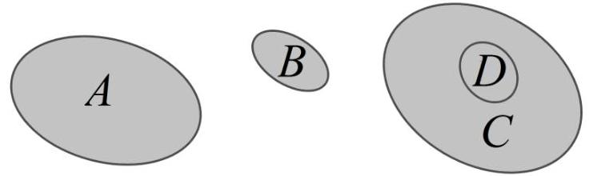

除使用韦恩图的平面图形表示集合及集合间的关系外, 有时也使用数轴表示集合及集合间的关系，数轴上的一段可以表示一个集合，可以直观地展示数集间的关系。

用数轴表示实数区间时，如果两端的端点属于集合，就用实心圆点表示；如果端点不属于集合, 就用空心的圆圈表示。如果数轴上一段较短的区间完全包含在一段较长的区间内，就表示集合间的真包含于关系，如下图所示，图中 $D \subsetneqq  C$ 。

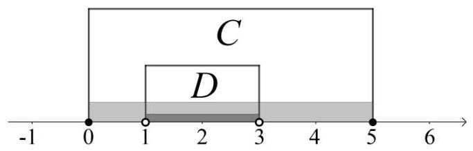

集合间的包含关系有传递性:如果 $A \subseteq  B$ ， $B \subseteq  C$ ，那么 $A \subseteq  C$ 。

利用集合中的元素即可证明: 设 $A = \left\{  {{a}_{1},\cdots ,{a}_{p}}\right\}$ ,因为 $A \subseteq  B$ ，那么可以设 $B = \left\{  {{a}_{1},\cdots ,{a}_{p},{b}_{1},\cdots ,{b}_{q}}\right\}$ ; 同理，因为 $B \subseteq  C$ ,那么还可以设 $C = \left\{  {{a}_{1},\cdots ,{a}_{p},{b}_{1},\cdots ,{b}_{q},{c}_{1},\cdots ,{c}_{r}}\right\}$ ,比较 $A$ 和 $C$ 中的元素即可得 $A \subseteq  C$ 。

上述证明过程中,用不同的字母 $a\text{ 、 }b\text{ 、 }c$ 及角标 $p\text{ 、 }q\text{ 、 }r$ 表示不同的元素, 是进行抽象的数学证明的常用方法。 ${a}_{1},\cdots ,{a}_{p}$ 表示 $p$ 个不同的元素, ${b}_{1},\cdots ,{b}_{q}$ 表示另外 $q$ 个不同的元素, ${c}_{1},\cdots ,{c}_{r}$ 表示再另外 $r$ 个不同的元素。

这里的 $p\text{ 、 }q\text{ 、 }r$ 可以是任意自然数。比如,如果 $p = 2$ ,那么 ${a}_{1},\cdots ,{a}_{p}$ 表示 ${a}_{1},{a}_{2}$ ; 如果 $q = 5$ ,那么 ${b}_{1},\cdots ,{b}_{q}$ 表示 ${b}_{1},{b}_{2},{b}_{3},{b}_{4},{b}_{5}$ ; 如果 $r = {100}$ ,那么 ${c}_{1},\cdots ,{c}_{r}$ 表示 ${c}_{1},\cdots ,{c}_{100}$ 。

上述证明中,由于 ${a}_{1},\cdots ,{a}_{p},{b}_{1},\cdots ,{b}_{q},{c}_{1},\cdots ,{c}_{r}$ 是集合中的元素,所以它们须各不相同。在其他一些情况中, 用这种方式表示的多个元素有可能有部分元素相同, 在后续学习中将会遇到。

例 ${1.3A} = \{ x \mid  x$ 是至少一组对边平行的四边形 $\} , B = \{ x \mid  x$ 是平行四边形 $\}$ ,判断 $B \subseteq  A$ 和 $B \subsetneqq  A$ 是否成立。

解析: 根据平面几何知识,集合 $B$ 中的元素 “平行四边形” 是两组对边分别平行的四边形,满足集合 $A$ 所限定的 “至少一组对边平行的四边形”,所以 $B$ 中的所有元素都属于 $A, B$ 是 $A$ 的子集, $B \subseteq  A$ ;

梯形是一组对边平行的四边形,属于 $A$ ,但不是平行四边形,不属于 $B$ ,所以 $B$ 是 $A$ 的真子集， $A \subsetneqq  \mathrm{A}$ 。

例 ${1.4A} = \{ x \in  \mathbf{R} \mid   - 2 \leq  x \leq  5\} , B = \{ x \in  \mathbf{R} \mid   - 1 < x < 4\}$ ,判断 $B \subseteq  A$ 和 $B \subsetneqq  A$ 是否成立。

解析: $A$ 中的元素为实数,且介于 -2 和 5 之间,包括两个端点, $B$ 中的元素也为实数,且介于 -1 和 4 之间,不包括两个端点,可知 $B$ 中最小和最大的元素都属于 $A$ ,因此 $B$ 中所有元素都属于 $A$ ,但 $A$ 中介于 -2 到 -1 之间的元素和介于 4 到 5 之间不属于 $B$ ,所以 $B \subsetneqq  A$ 。

集合 $A$ 和 $B$ 都表示数轴上一段连续的区域,在数轴上画出相应的集合可以直观地看出 $B \subsetneqq  A$ ,如下图所示。

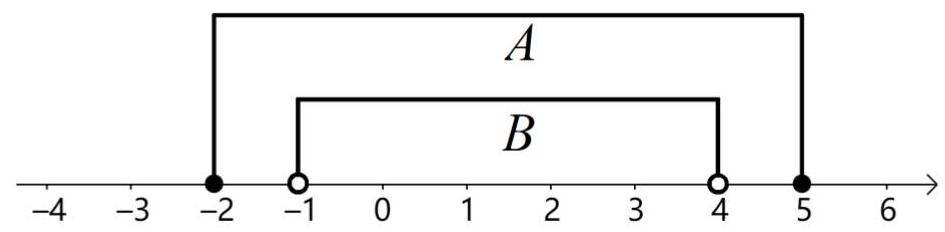

练习 1.2

1. 已知 $A \varsubsetneq  B, B \varsubsetneq  C$ ,画出相应的韦恩图,从图中指出 $A$ 与 $C$ 的关系。

2. 写出下列各集合的所有子集，比较它们子集的个数，猜测集合中元素的个数与集合子集的个数间的关系:

(3) $B = \{ 1,2\}$ ； (4) $C = \{ 1,2,3\}$ 。

### 1.3 集合的基本运算

集合之间可以进行运算，由两个或多个集合经过运算后可以得到新的集合。 集合的基本运算有交集、并集、补集三种。进行集合的基本运算时, 考虑的核心要素仍是集合中的元素。

#### 1.3.1 并集运算

由所有要么属于集合 $A$ 、要么属于集合 $B$ 的元素组成的集合，叫作 $A$ 与 $B$ 的并集，记作 $A \cup  B$ 。一个元素只需满足属于集合 $A$ 或属于集合 $B$ 这两个条件之一， 那么该元素就属于集合 $A \cup  B$ ,即

$$
A \cup  B = \{ x \mid  x \in  A\text{ 或 }x \in  B\}
$$

多个集合 ${A}_{1},{A}_{2},\cdots ,{A}_{n}$ 的并集记作 ${A}_{1} \cup  {A}_{2} \cup  \cdots  \cup  {A}_{n}$ ,并集既包括各集合独有的元素，又包括它们共有的元素。

用韦恩图可以直观地展示并集运算，如下图所示，上图为 $A$ 与 $B$ 有共有元素的情况，下图为 $A$ 与 $B$ 没有共有元素的情况。

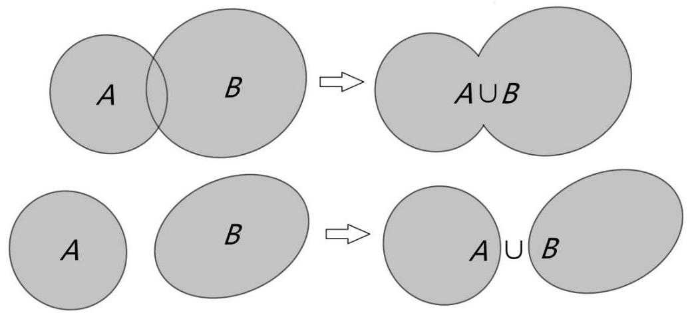

按照并集的定义，任意集合 $B$ 都包含于它与其他集合的并集，即恒有 $B \subseteq  A \cup  B$ 。另外,如果 $A \subseteq  B$ ,那么没有只属于 $A$ 且不属于 $B$ 的元素, $A \cup  B$ 中的所有元素都属于 $B$ ,即 $A \cup  B \subseteq  B$ 。综上可得 $B = A \cup  B$ 。

反过来,如果 $B = A \cup  B$ ,那么 $A$ 中的所有元素都属于 $B$ ,否则,如果存在只属于 $A$ 不属于 $B$ 的元素,那么该元素属于 $A \cup  B$ 但不属于 $B, B = A \cup  B$ 就不成立,由此可得 $A \subseteq  B$ 。

综上可得: $A \subseteq  B$ 与 $B = A \cup  B$ 总是同时成立,它们具有相同的含义。

例 ${1.5M} = \{ x \mid  2 \leq  x < 5\} , N = \{ x \mid  x < 3\}$ ,求 $M \cup  N$ 。

解析: 在数轴上分别画出 $M = \{ x \mid  2 \leq  x < 5\}$ 和 $N = \{ x \mid  x < 3\}$ 所表示的区间, 从图中可以读出 $M \cup  N = \{ x \mid  x < 5\}$ ,如下图所示,灰色区域表示 $M \cup  N$ 。

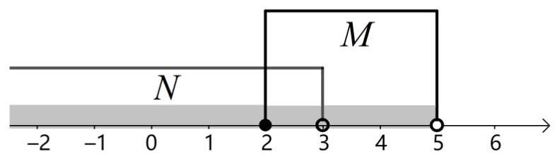

#### 1.3.2 交集运算

由所有既属于集合 $A$ ,又属于集合 $B$ 的元素组成的集合,叫作 $A$ 与 $B$ 的交集, 记作 $A \cap  B$ 。一个元素必须同时满足属于集合 $A$ 和属于集合 $B$ 这两个条件,该元素才属于集合 $A \cap  B$ ,即

$$
A \cap  B = \{ x \mid  x \in  A\text{ 且 }x \in  B\}
$$

多个集合 ${A}_{1},{A}_{2},\cdots ,{A}_{n}$ 的交集记作 ${A}_{1} \cap  {A}_{2} \cap  \cdots  \cap  {A}_{n}$ ,交集只包括全部这些集合中都有的元素。

用韦恩图可以直观地展示交集运算，如下图所示。

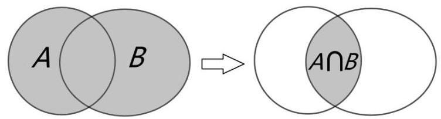

按照交集和包含的定义，任意集合 $A$ 与其他集合的交集都包含于集合 $A$ ,即恒有 $A \cap  B \subseteq  A$ 。另外,如果 $A \subseteq  B$ ,那么 $A$ 中的所有元素都属于 $B$ ,于是 $A$ 中的所有元素都既属于 $A$ 又属于 $B$ ,即 $A \subseteq  A \cap  B$ 。综上可得 $A = A \cap  B$ 。

反过来,如果 $A = A \cap  B$ ,那么 $A$ 中的每个元素都属于 $B$ ,否则,如果有元素只属于 $A$ 不属于 $B$ ,那么该元素只属于 $A$ 不属于 $A \cap  B, A = A \cap  B$ 就不成立, 由此可得 $A \subseteq  B$ 。

综上可得: $A \subseteq  B$ 与 $A = A \cap  B$ 总是同时成立，它们具有相同的含义。

例 ${1.6A} = \{ x \mid  x$ 是平行四边形 $\}$ ， $B = \{ x \mid  x$ 有内角是直角 $\}$ ，求 $A \cap  B$ 。

解析: $A \cap  B$ 是有内角是直角的平行四边形,这样的图形是矩形,所以 $A \cap  B = \{ x \mid  x$ 是矩形 $\}$ 。

例 ${1.7P} = \{ \left( {x, y}\right)  \mid  {2x} - y = 3\} , Q = \{ \left( {x, y}\right)  \mid  x + y = 9\}$ ,求 $P \cap  Q$ 。

解析: $P$ 是由所有满足方程 ${2x} - y = 3$ 的实数对 $\left( {x, y}\right)$ 组成的集合, $Q$ 是由所有满足方程 $x + y = 9$ 的实数对 $\left( {x, y}\right)$ 组成的集合, $P \cap  Q$ 是由所有同时满足这两个方程的实数对 $\left( {x, y}\right)$ 组成的集合,即二元一次方程组 $\left\{  \begin{array}{l} {2x} - y = 3 \\  x + y = 9 \end{array}\right.$ 的解,解该方程组得 $\left\{  \begin{array}{l} x = 4 \\  y = 5 \end{array}\right.$ ,即 $P \cap  Q = \{ \left( {4,5}\right) \}$ 。

平面直角坐标系中, $P$ 表示方程为 ${2x} - y = 3$ 的直线 (即一次函数 $y = {2x} - 3$ ), $Q$ 表示方程为 $x + y = 9$ 的直线 (即一次函数 $y = 9 - x$ ), $P \cap  Q$ 表示这两条直线的公共点,即交点,该点的坐标为 $\left( {4,5}\right)$ ,如下页图所示。

根据已知条件分别列出相应的关系式(方程)，联立这些关系式得到方程组， 方程组的解就是同时满足这些关系式的值, 这是分析解决数学问题的常用思路。

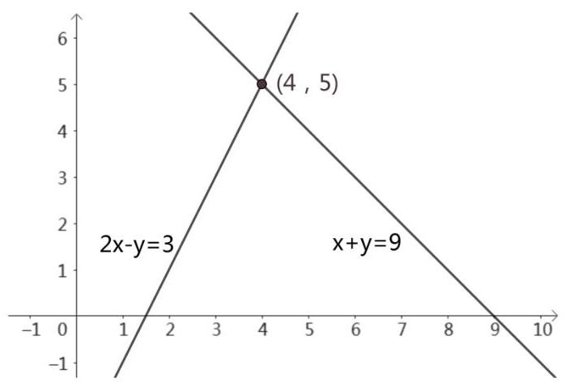

#### 1.3.3 补集运算

确定研究对象时, 通常需要先确定一个最大的范围, 只研究这个最大范围内的元素，这个最大的范围叫作全集，通常用大写字母U表示。确定了全集之后， 研究的所有元素应当都属于全集。

如果没有专门说明, 通常默认全集为全体实数。几何问题中, 通常默认全集为平面内或立体空间中所有的点。在后面将要学习的复数一章, 复数问题中通常默认全集为全体复数。

确定了全集 $\mathrm{U}$ 之后,集合 $A$ 的补集的定义为: 全集中所有不属于 $A$ 的元素组成的集合,记作 ${\mathbf{C}}_{\mathrm{U}}A$ ,即:

$$
{\mathbf{C}}_{\mathrm{U}}A = \{ x \mid  x \in  \mathrm{U}\text{ 且 }x \notin  A\}
$$

由补集的定义可得: $A \cap  {\mathbf{C}}_{\mathrm{U}}A = \varnothing$ ， $A \cup  {\mathbf{C}}_{\mathrm{U}}A = \mathrm{U}$ 。

用韦恩图可以直观地展示补集运算, 下图是用韦恩图表示的补集, 方框内为全集 U，如下图所示。

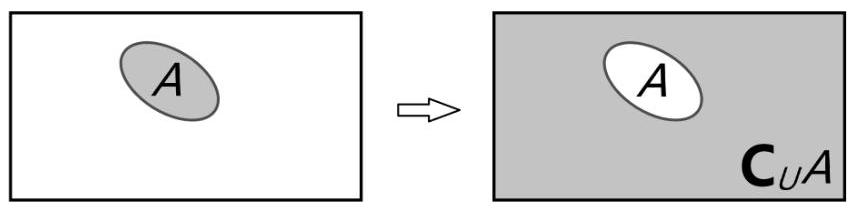

例 1.8 已知全集 $\mathrm{U} = \{ x \mid  x < 0\}$ ， $A = \{ x \mid  x <  - 2\}$ ，求 ${\mathbf{C}}_{\mathrm{U}}A$ 。

解析: $\mathrm{U} = \{ x \mid  x < 0\}$ 为全体负实数， $A = \{ x \mid  x <  - 2\}$ 为全体小于 -2 的实数， 从 $\mathrm{U}$ 中除去 $A$ 中所有元素,还剩大于等于 -2 的负实数,即 ${\mathbf{C}}_{\mathrm{U}}\mathrm{A} = \{ x \mid   - 2 \leq  x < 0\}$ , 如下图所示,灰色区域表示 ${\mathbf{C}}_{\mathrm{U}}A$ 。

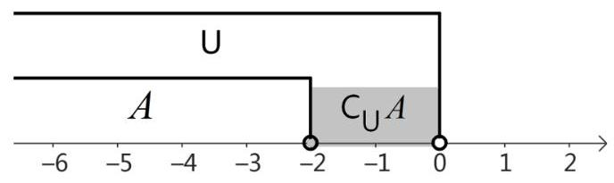

集合及其补集将全集 $\mathrm{U}$ 划分为两部分: 集合 $A$ 和补集 ${\mathbf{C}}_{\mathrm{U}}A$ ,全集中的所有元素都一定属于且只属于其中之一。有时将全集划分为一系列两两交集为空集的集合 ${A}_{1}\text{ 、 }{A}_{2}\text{ 、 }\cdots \text{ 、 }{A}_{n}$ ,如下图所示,就像将一所高中的所有同学划分进各个班级, 每名同学都属于且只属于一个班级。

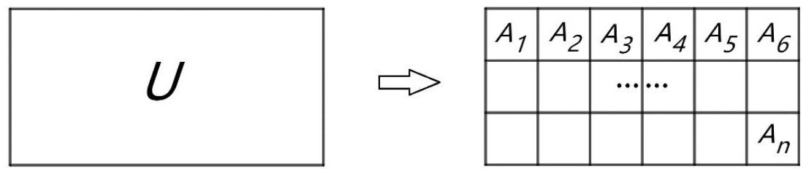

分情况讨论就是将全集划分为一系列相互独立的集合后分别讨论方法, 可以将复杂的问题拆分为若干简洁的小问题, 分别解决后再将结果合并, 是一种化繁为简的重要思路。

练习 1.3

1. 已知 $A = \{ x \in  \mathbf{R} \mid   - 1 < x < 4\} , B = \{ x \in  \mathbf{R} \mid  x \geq  0\}$ ,求 $A \cup  B$ 和 $A \cap  B$ 。

2. 已知 $\mathrm{U} = \{ x \mid  x$ 是三角形 $\} , A = \{ x \mid  x$ 是钝角三角形 $\}$ ,求 ${\mathbf{C}}_{\mathrm{U}}A$ 。

3. 已知 $\mathrm{U} = \mathbf{R}, A = \left\{  {x \in  \mathbf{R} \mid  {x}^{2} - x - 6 < 0}\right\}$ ,求 ${\mathbf{C}}_{\mathrm{U}}A$ 。

4. 已知 $\mathrm{U}$ 是平面内的所有点， $A = \{ \left( {x, y}\right)  \mid  y = {2x}\} , B = \left\{  {\left( {x, y}\right)  \mid  y = {x}^{2}}\right\}$ ，求 $A \cap  B$ 。

5. 已知 $\mathrm{U}$ 是平面内直角坐标系 ${Oxy}$ 内所有的点，在平面内画出集合 $A$ 的范围: $A = \{ \left( {x, y}\right)  \mid   - 2 < x < 2, - 2 < y < 2\}$ 。

### 1.4 集合中的数量关系

虽然集合中元素的个数不是最新版教材的必修内容, 但这部分概念对于学习概率等后续章节非常重要, 且相关知识较容易理解, 因此需要予以重视。

#### 1.4.1 集合中元素的个数

讨论集合中元素的个数时, 讨论的集合通常是有限集, 即集合中的元素个数必须是有限的,集合 $A$ 中元素的个数通常用符号 $\operatorname{card}\left( A\right)$ 表示。求集合中元素的个数的方法较简单:直接数出来，或利用计数规律计算出来即可。

例 1.9 求下列集合中元素的个数:

(1) $A = \{ 1,2,3,4,5\}$ ；(2) $B = \{ x \in  \mathbf{Z} \mid   - 1 < x < 1\}$ ；(3) $\varnothing$ 。

解析:(1) $A$ 中有 5 个元素， $\operatorname{card}\left( A\right)  = 5$ ；

(2) $B$ 中的元素是介于 -1 和 1 之间的整数，可得 $B = \{ 0\}$ ， $\operatorname{card}\left( B\right)  = 1$ ；

(3)空集中没有元素， $\operatorname{card}\left( \varnothing \right)  = 0$ 。

两个集合以及它们的并集、交集中元素的个数始终满足下面的数量关系:

$$
\operatorname{card}\left( {A \cup  B}\right)  = \operatorname{card}\left( A\right)  + \operatorname{card}\left( B\right)  - \operatorname{card}\left( {A \cap  B}\right)
$$

即: $A \cup  B$ 中的元素个数,等于 $A$ 中的元素个数加上 $B$ 中的元素个数,再减去 $A \cap  B$ 中的元素个数。

该公式的原理为:将 $A$ 与 $B$ 中的元素分为三类:

(1)只属于 $A$ ，不属于 $B$ ，设数量为 $p$ ；

(2)只属于 $B$ ，不属于 $A$ ，设数量为 $q$ ；

(3)既属于 $A$ ，又属于 $B$ ，设数量为 $r$ 。

按照上述分类可得: $\operatorname{card}\left( A\right)  = p + r,\operatorname{card}\left( B\right)  = q + r,\operatorname{card}\left( {A \cap  B}\right)  = r$ , $\operatorname{card}\left( {A \cup  B}\right)  = p + q + r$ ,由此可得:

$\operatorname{card}\left( {A \cup  B}\right)  = p + q + r = \left( {p + r}\right)  + \left( {q + r}\right)  - r = \operatorname{card}\left( A\right)  + \operatorname{card}\left( B\right)  - \operatorname{card}\left( {A \cap  B}\right)$

该公式还可以如下推导: $\operatorname{card}\left( A\right)  + \operatorname{card}\left( B\right)$ 与 $\operatorname{card}\left( {A \cup  B}\right)$ 相比,将同时属于 $A$ 和 $B$ 的元素多计入了一次,需要将多计入的数字减去,即减去 $\operatorname{card}\left( {A \cap  B}\right)$ 。

按照相同的思路,可以推出三个集合 $A, B, C$ 中的元素个数满足关系:

$$
\operatorname{card}\left( {A \cup  B \cup  C}\right)  = \operatorname{card}\left( A\right)  + \operatorname{card}\left( B\right)  + \operatorname{card}\left( C\right)
$$

$$
- \operatorname{card}\left( {A \cap  B}\right)  - \operatorname{card}\left( {B \cap  C}\right)  - \operatorname{card}\left( {C \cap  A}\right)
$$

$$
+ \operatorname{card}\left( {A \cap  B \cap  C}\right)
$$

#### 1.4.2 集合的子集的个数

如果集合 $A$ 中有 $n$ 个元素，那么它的子集共有 ${2}^{n}$ 个(包括 $\varnothing$ 和 $A$ 自身)，推导如下:

当 $A$ 中有一个元素时,设 $A = \left\{  {a}_{1}\right\}$ ,有 ${2}^{1}$ 个子集:

<table><tr><td>子集</td><td>$\left\{  {a}_{1}\right\}$</td><td>⌀</td></tr><tr><td>是否含 ${a}_{1}$</td><td>+</td><td>-</td></tr></table>

当 $A$ 中有两个元素时,设 $A = \left\{  {{a}_{1},{a}_{2}}\right\}$ ,有 ${2}^{2}$ 个子集:

<table><tr><td>子集</td><td>$\left\{  {{a}_{1},{a}_{2}}\right\}$</td><td>$\left\{  {a}_{1}\right\}$</td><td>$\left\{  {a}_{2}\right\}$</td><td>⌀</td></tr><tr><td>是否含 ${a}_{1}$</td><td>+</td><td>+</td><td>-</td><td>-</td></tr><tr><td>是否含 ${a}_{2}$</td><td>+</td><td>-</td><td>+</td><td>-</td></tr></table>

当 $A$ 中有三个元素时,设 $A = \left\{  {{a}_{1},{a}_{2},{a}_{3}}\right\}$ ,有 ${2}^{3}$ 个子集,如下表所示:

<table><tr><td>子集</td><td>$\left\{  {{a}_{1},{a}_{2},{a}_{3}}\right\}$</td><td>$\left\{  {{a}_{2},{a}_{3}}\right\}$</td><td>$\left\{  {{a}_{1},{a}_{3}}\right\}$</td><td>$\left\{  {{a}_{1},{a}_{2}}\right\}$</td><td>$\left\{  {a}_{1}\right\}$</td><td>$\left\{  {a}_{2}\right\}$</td><td>$\left\{  {a}_{3}\right\}$</td><td>⌀</td></tr><tr><td>是否含 ${a}_{1}$</td><td>+</td><td>-</td><td>+</td><td>+</td><td>+</td><td>-</td><td>-</td><td>-</td></tr><tr><td>是否含 ${a}_{2}$</td><td>+</td><td>+</td><td>-</td><td>+</td><td>-</td><td>+</td><td>-</td><td>-</td></tr><tr><td>是否含 ${a}_{3}$</td><td>+</td><td>+</td><td>+</td><td>-</td><td>-</td><td>-</td><td>+</td><td>-</td></tr></table>

根据上述事实可以总结出规律:对于有 $p$ 个元素的集合 ${A}_{p}$ ，可以用下面的方法构造出它的所有子集: 对 ${A}_{p}$ 中的每个元素,逐个进行二选一的判定: 属于或不属于,分别构成两个不同的子集,对所有 $n$ 个元素逐个判定,共构成 ${2}^{n}$ 个不同的子集。

集合的子集的个数也可以用另一种思路解释: 设集合 ${A}_{p}$ 中有 $p$ 个元素,有 ${n}_{p}$ 个子集,如果给 ${A}_{p}$ 新增加一个元素 ${a}_{p + 1}$ 构成新的集合 ${A}_{p + 1}$ ,那么:

(1) ${A}_{p}$ 的每个子集都是 ${A}_{p + 1}$ 的子集，共 ${n}_{p}$ 个；

(2) ${A}_{p}$ 的每个子集增加 ${a}_{p + 1}$ 后形成的新集合也都是 ${A}_{p + 1}$ 的子集，共 ${n}_{p}$ 个；

综上, ${A}_{p + 1}$ 有 $2{n}_{p}$ 个子集。即: 集合中的元素每增加一个,子集的数量就增加一倍,而只有一个元素的集合有两个子集,由此出发可以计算得到: 有 $n$ 个元素的集合共有 ${2}^{n}$ 个子集。

## 练习 1.4

1. 已知集合 $A = \{ a, b, c, d, e\}$ ，回答下列问题:

(1)A 有几个子集；

(2) $A$ 的子集中，有 $a$ 元素的有多少；

(3) $A$ 的子集中，没有 $b$ 元素的有多少；

(4)写出 $A$ 的子集中，全部不含 $c, d, e$ 的子集。

2. 仿照推导两个集合中的元素个数的关系的过程,推导三个集合 $A, B, C$ 及其并集与交集中元素的个数的关系。

### 1.5 命题的概念与形式

生活中我们经常对事物作出判断，命题就是作出判断的语句，数学中的“是” 与 “非” 有非常清晰明确的判断标准。命题是进行分推理的重要工具, 利用命题语言能从一个数量关系推导出另一个数量关系, 从已知条件得出最终的结论, 理解并熟练运用命题的规则对学好数学至关重要。命题还也是将口语化的日常表达转化为精确、严谨、简洁的数学表达的 “翻译工具”。

#### 1.5.1 真命题与假命题

命题是作出判断的语句。这既是命题的定义, 又是判断一个语句是否是命题的根据。命题作出的判断必须清晰明确, 有准确且客观的标准, 能判断命题是否正确，不能存在模棱两可的情况。例如 “这是一杯很烫的水” 不是一个命题，因为 “烫” 没有客观标准。 “这是一杯温度高于 ${37}^{ \circ  }\mathrm{C}$ 的水” 是一个命题，因为可以通过测量水温来判断真假。

命题可以是对一件具体事情作出判断，例如 “2008 年奥运会在北京举办”。 命题也可以是对一般性规律的判断，例如 “月亮围绕地球运动”。命题通常是陈述句，而不能是祈使句、感叹句、疑问句等其他句式，例如下列句子都不是命题: 去把垃圾桶倒干净。我太开心了！你吃早饭了吗？我想踢足球。

数学命题的判断通常由“是 ”“不是 ”“有 ”“没有”“=”“≠”“>”“<”“>”“<”等词语或符号作出。判断经常以代数表达式的形式出现, 这些式子都能根据数学知识和逻辑推断准确地判断对错。例如,“ 3+5>7 ”可以看作一个数学命题,它的含义为 3 与 5 之和大于 7,由 3+5=8 和 8>7 可知该命题是正确的。“平面内三角形的内角和可以为 ${360}^{ \circ  }$ ” 也可以看作一个数学命题, 由平面几何知识可知该命题是错误的。

正确的命题叫作真命题, 错误的命题叫作假命题。任意一个命题要么是真命题, 要么是假命题, 不存在第三种可能。

命题的真假需要根据相应的规则进行判断。对于已发生的事实, 可以根据历史知识判断。例如，“李白是唐代诗人”是真命题。对于科学命题，通常根据科学知识判断。例如, “水银在常温常压下是气体” 是假命题。对于数学命题, 通常根据数学知识判断，例如 “对于方程 ${x}^{2} - {6x} + 5 = 0$ ，5 是它的一个根”，把 $x = 5$ 代入方程或直接解方程可知，这是真命题。

#### 1.5.2 复合命题

如果一个命题只对一件事情作出判断，叫作简单命题。将两个或多个简单命题以一定形式联结在一起, 同时作出多个判断的命题叫作复合命题。将命题联结在一起的基本方式有两种:且、或，“且”和“或”又叫作联结词。

“且”。对于两个不同的简单命题 $p$ 和 $q$ ,将它们用 “且” 连接起来得到复合命题 “p 且 $q$ ”。只有当 $p$ 为真命题、且 $q$ 也为真命题时,“ $p$ 且 $q$ ” 才为真命题。如果 $p$ 和 $q$ 当中有 1 个是假命题,或 $p$ 和 $q$ 都是假命题时,那么 “ $p$ 且 $q$ ” 为假命题。

对于将多个命题 ${p}_{1}\text{ 、 }{p}_{2}\text{ 、 }\cdots {p}_{n}$ 全部用 “且” 连接起来构成复合命题 “ ${p}_{1}$ 且 ${p}_{2}$ 且...且 ${p}_{n}$ ”,只有当 ${p}_{1}\text{ 、 }{p}_{2}\text{ 、 }\cdots {p}_{n}$ 全部都为真命题时,“ ${p}_{1}$ 且 ${p}_{2}$ 且...且 ${p}_{n}$ ” 才是真命题, 只要当中有 1 个是假命题, 该复合命题就是假命题。

例 1.10 命题 $p$ : 苹果是水果。命题 $q :$ 梨是水果。命题 $p$ 且 $q :$ 苹果是水果, 且梨是水果。用生活中的语言讲是:苹果和梨都是水果。根据生活常识可知，p 是真命题, $q$ 也是真命题,因此 $p$ 且 $q$ 也是真命题。

例 1.11 命题 $p$ : 苹果是水果。命题 $r$ : 桌子是水果。命题 $p$ 且 $r$ : 苹果是水果, 且桌子是水果。用生活中的语言讲是: 苹果和桌子都是水果。根据生活常识可知, $p$ 是真命题, $r$ 是假命题,因此 $p$ 且 $r$ 是假命题。

“或”。对于两个不同的简单命题 $p$ 和 $q$ ,将它们用 “或” 连接起来得到复合命题 “ $p$ 或 $q$ ”。只要 $p$ 和 $q$ 当中有 1 个是真命题，另 1 个命题无论真假，“ $p$ 或 $q$ ” 都是真命题,只有当 $p$ 和 $q$ 都是假命题时,“ $p$ 或 $q$ ” 才是假命题。

对于将多个命题 ${p}_{1}\text{ 、 }{p}_{2}\text{ 、 }\cdots {p}_{n}$ 全部用 “或” 连接起来构成的复合命题 “ ${p}_{1}$ 或 ${p}_{2}$ 或 $\cdots$ 或 ${p}_{n}$ ”,只要 ${p}_{1}\text{ 、 }{p}_{2}\text{ 、 }\cdots {p}_{n}$ 当中有 1 个是真命题，“ ${p}_{1}$ 或 ${p}_{2}$ 或 $\cdots$ 或 ${p}_{n}$ ” 就是真命题。只有当它们全部都是假命题时, 该复合命题才是假命题。

例 1.12 命题 $p$ : 苹果是水果。命题 $q :$ 梨是水果。命题 $p$ 或 $q :$ 苹果是水果, 或梨是水果。用生活中的语言讲是:苹果或梨(至少)有一样是水果。根据生活常识可知, $p$ 是真命题, $q$ 也是真命题,因此 $p$ 或 $q$ 是真命题。

例 1.13 命题 $p$ : 苹果是水果。命题 $r$ : 桌子是水果。命题 $p$ 或 $r$ : 苹果是水果, 或桌子是水果。用生活中的语言讲是: 苹果或桌子 (至少) 有一样是水果。 根据生活常识可知, $p$ 是真命题, $r$ 是假命题,因此 $p$ 或 $r$ 是真命题。

例 1.14 命题 $r$ : 桌子是水果。命题 $s$ : 桌子是蔬菜。命题 $r$ 或 $s$ : 桌子是水果, 或桌子是蔬菜。用生活中的语言讲是: 桌子要么是水果, 要么是蔬菜。根据生活常识可知, $r$ 是假命题, $s$ 是假命题,因此 $r$ 或 $s$ 是假命题。

“且”是一种很“严格”的关系，需要每个成员都为“真”，才能保证这个团体也为“真”，只要有 1 个成员为“假”，这个团体就为“假”。“且”的关系相当于一系列连续的路径，需要每一段路径都可行，才能从起点抵达终点。

“或”则是一种很“宽容”的关系，只要有 1 名成员为“真”，这个团体就为“真”，只有所有的成员都为“假”时，这个团体才为“假”。“或”的关系相当于很多并行的路径，只要其中 1 条路径可行，就能从起点抵达终点。

下表概括了将两个命题分别以“且”“或”形式联结成复合命题的真假与原命题真假的关系，要从逻辑的角度理解 “且” 和 “或” 的含义。

<table><tr><td></td><td>$p$</td><td>$q$</td><td>$p$ 且 $q$</td><td>$p$ 或 $q$</td></tr><tr><td>1</td><td>真</td><td>真</td><td>真</td><td>真</td></tr><tr><td>2</td><td>真</td><td>假</td><td>假</td><td>真</td></tr><tr><td>3</td><td>假</td><td>真</td><td>假</td><td>真</td></tr><tr><td>4</td><td>假</td><td>假</td><td>假</td><td>假</td></tr></table>

数学中，常用的大于等于(≥)表达的是 “或”的关系。即:大于(>)或等于(=)，只要满足其中的 1 种就成立。例如， $x \geq  3$ 表示 $x > 3$ 或 $x = 3$ ，当 $x = 4$ 时,因为 $4 > 3$ ,所以此时 $x \geq  3$ 是真命题,当 $x = 3$ 时,因为 $3 = 3$ ,所以此时 $x \geq  3$ 也是真命题,当 $x = 2$ 时,因为 $2 < 3$ ,所以此时 $x \geq  3$ 是假命题。

#### 1.5.3 充分条件与必要条件

很多命题都可以用 “若 $p$ ,则 $q$ ” “如果 $p$ ,那么 $q$ ” 的形式表达,其中 $p$ 叫作命题的条件, $q$ 叫作命题的结论。用这种形式的命题可以很好地将集合与数学关系式联系起来, 建立起分析、推断、解决问题的逻辑链条。

判断 “若 $p$ ,则 $q$ ” 形式的命题的真假时,先假定条件 $p$ 成立,在此前提下判断结论 $q$ 是否正确,若正确则为真命题,若错误则为假命题。

例 1.15 判断下列命题的真假:

(1)若 $x > 5$ ，则 $x > 0$ ；

(2)若 $\left| x\right|  > 5$ ，则 $x > 0$ ；

(3)若三角形有两条边相等，则这个三角形有两个角相等；

(4)若四边形的两个内角是直角, 则这个四边形是矩形;

(5)若今天是星期三，则明天是星期四。

解析:(1)任意比 5 大的数都一定比 0 大，是真命题。

(2)若 $\left| x\right|  > 5$ ，可能 $x > 5$ ，也可能 $x <  - 5$ ，当 $x <  - 5$ 时， $x < 0$ ，是假命题。

(3)有两条边相等的三角形是等腰三角形，它的两个底角相等，是真命题。

(4)若四边形的两个内角是直角, 那么可能是矩形、直角梯形、由两个有公共斜边的不同的直角三角形所构成的四边形, 是假命题, 如下图所示。

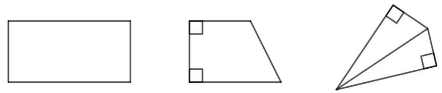

(5)根据星期的命名，星期三的后一天是星期四，是真命题。即使该命题不是在星期三说出，比如是在星期六说出，但判断命题的真假需要首先假定条件“今天是星期三”成立，再在此基础上作出判断“明天是星期四”的真假，通常不需要也不应当考虑外界因素。

如果 “若 $p$ ,则 $q$ ” 是真命题,由条件 $p$ 可以推出结论 $q$ ,记作:

$$
p \Rightarrow  q
$$

此时称 $p$ 是 $q$ 的充分条件, $q$ 是 $p$ 的必要条件。

如果 “若 $p$ ,则 $q$ ” 是假命题,由条件 $p$ 不能推出结论 $q$ ,记作:

$$
p \nRightarrow  q
$$

此时 $p$ 不是 $q$ 的充分条件, $q$ 不是 $p$ 的必要条件。

从语义的角度解释，“充分”是充足、足以的意思， “ p 是 q 的充分条件” 意为只要 $p$ 成立,就足以让 $q$ 也成立。 “必要” 是必须、一定要的意思,“ $q$ 是 $p$ 的必要条件” 意为 $q$ 成立对于 $p$ 成立是必须的。

例 1.15 的命题(1)中, $x > 5$ 是 $x > 0$ 的充分条件, $x > 0$ 是 $x > 5$ 的必要条件, 只要 $x > 5$ 成立就足以让 $x > 0$ 也成立,而 $x > 0$ 成立对于 $x > 5$ 成立是必须的。命题(3)中，“三角形有两条边相等” 是 “三角形有两个角相等” 的充分条件， “三角形有两个角相等” 是 “三角形有两条边相等” 的必要条件, 只要 “三角形有两条边相等” 就足以让 “三角形有两个角相等”, 而 “三角形有两个角相等” 对于 “三角形有两条边相等” 是必须的。

充分条件与必要条件通常不是唯一的。如果 $p$ 是 $q$ 的充分条件,并不意味着只有 $p$ 才能推出 $q$ ,而是还可能有其他条件也能推出 $q$ 。例如,除了可以由 $x > 5$ 推出 $x > 0$ 外,还可以由 $x \geq  5\text{ 、 }x > 1\text{ 、 }x = {a}^{2} + 1$ 等其他条件推出 $x > 0$ 。判定全等三角形时, 边边边、边角边、角边角、角角边、斜边直角边都是可以推出两个三角形全等的充分条件。

类似的,如果 $q$ 是 $p$ 的必要条件,并不意味着只有 $q$ 对于 $p$ 来说是必要的, 而是还可能有其他必要的条件。例如,除了 $x > 0$ 对于 $x > 5$ 是必要的外, $x > 4$ 、 $\left| x\right|  > 5\text{ 、 }x + 1 > 0$ 等条件对于 $x > 5$ 也都是必要的。

推出关系具有传递性。如果三个条件 $a, b, c$ 满足关系 $a \Rightarrow  b, b \Rightarrow  c$ ,那么可以得到结论 $a \Rightarrow  c$ ,这个过程叫作演绎。

如果多个条件 ${a}_{1}\text{ 、 }{a}_{2}\text{ 、 }\cdots \text{ 、 }{a}_{n}$ 满足关系 ${a}_{1} \Rightarrow  {a}_{2},\cdots ,{a}_{n - 1} \Rightarrow  {a}_{n}$ ,那么可以得到结论 ${a}_{1} \Rightarrow  {a}_{n}$ 。

这种从已知条件逐步推出新的条件的过程, 是进行推理的基本思路, 利用已知条件, 运用数学或其他学科的知识, 通过演绎得出结论, 将结论作为条件推出新的结论, 最终逐步得到所求或所需要证明的结果。

#### 1.5.4 充分必要条件

将一个命题的条件和结论互换, 得到的新命题叫作原命题的逆命题, 意为将条件和结论逆转后的命题。

“若 $p$ ,则 $q$ ” 的逆命题为 “若 $q$ ,则 $p$ ” 。同理,“若 $q$ ,则 $p$ ” 的逆命题为 “若 $p$ ,则 $q$ ”,这两个命题互为逆命题。

如果命题 “若 $p$ ,则 $q$ ” 和它的逆命题 “若 $q$ ,则 $p$ ” 都是真命题,即: 既满足 $p \Rightarrow  q$ ,又满足 $q \Rightarrow  p$ ,就称 $p$ 是 $q$ 的充分必要条件,简称充要条件,又称 $p$ 和 $q$ 等价,记作:

$$
p \Leftrightarrow  q
$$

若 $p$ 是 $q$ 的充要条件,则 $p \Rightarrow  q$ 和 $q \Rightarrow  p$ 同时成立,那么 $q$ 也是 $p$ 的充要条件, 充要条件总是双向的, 不存在 “单方面” 的充要条件。

集合的基本运算中,由 $A \subseteq  B$ 可以推出 $A = A \cap  B$ ,由 $A = A \cap  B$ 可以推出 $A \subseteq  B$ ,这两个条件等价,它们互为充要条件。由 $A \subseteq  B$ 可以推出 $B = A \cup  B$ ,由 $B = A \cup  B$ 可以推出 $A \subseteq  B$ ,它们也互为充要条件。

充要条件同样有传递性,若多个条件 ${a}_{1}\text{ 、 }{a}_{2}\text{ 、 }\cdots \text{ 、 }{a}_{n}$ 满足 ${a}_{1} \Leftrightarrow  {a}_{2},\cdots ,{a}_{n - 1} \Leftrightarrow  {a}_{n}$ , 则其中任意两个条件都满足 ${a}_{i} \Leftrightarrow  {a}_{j}$ 。

例 1.16 判断下列命题中, $p$ 与 $q$ 是否是充要条件:

(1) $p : x = 1, q : {2x} + 5 = 7$ ;

(2) $p : \left( {x - 1}\right) \left( {x + 2}\right)  = 0, q :  - 3 < x < 3$ ;

(3) $p$ :圆 $A$ 与圆 $B$ 没有公共点， $q$ :圆 $A$ 与圆 $B$ 外离；

(4) $p$ :直线与圆相切， $q$ :直线与圆有且只有一个公共点。

解析: (1) 利用等式的基本性质,由 ${2x} + 5 = 7$ 可得 $x = 1$ ,将上述步骤反过来可以由 $x = 1$ 推出 ${2x} + 5 = 7$ ,所以 $p$ 与 $q$ 是充要条件。

(2)解方程 $\left( {x - 1}\right) \left( {x + 2}\right)  = 0$ 可得 $x = 1$ 或 $x =  - 2$ ，这两个解都满足 $- 3 < x < 3$ ， $p$ 是 $q$ 的充分条件,然而 $- 3 < x < 3$ 中的其他取值不满足该方程, $q$ 不是 $p$ 的充分条件,所以 $p$ 与 $q$ 不是充要条件, $p$ 是 $q$ 的充分不必要条件,。

(3)如果圆 $A$ 与圆 $B$ 没有公共点，那么既可能圆 $A$ 与圆 $B$ 外离，也可能圆 $A$ 内含于圆 $B$ ,还可能圆 $B$ 内含于圆 $A, p$ 不是 $q$ 的充分条件。如果圆 $A$ 与圆 $B$ 外离,那么圆 $A$ 与圆 $B$ 没有公共点, $q$ 是 $p$ 的充分条件。综上, $p$ 与 $q$ 不是充要条件, $p$ 是 $q$ 的必要非充分条件。

(4)如果直线与圆相切，那么直线与圆有且只有一个公共点， $p$ 是 $q$ 的充分条件。如果直线与圆有且只有一个公共点,那么直线与圆相切, $q$ 也是 $p$ 的充分条件。综上, $p$ 与 $q$ 是充要条件。

#### 1.5.5 命题的若干形式

将命题的条件和结论进行否定或调换, 可以得到该命题的非命题、逆命题、 否命题、逆否命题等多种形式的命题。

对于命题 “若 $p$ ,则 $q$ ”,变换前原来的命题叫作原命题。

如果保持条件 $p$ 不变,将结论改为 $q$ 的否定,得到命题 “若 $p$ ,则非 $q$ ”, 叫作非命题,又叫作原命题的否定。命题 $a$ 的非命题用符号 $\bar{a}$ 表示 (在字母上加一条横线)，“若 $p$ ，则非 $q$ ” 可以记作 “若 $p$ ，则 $\neg q$ ”，其中 “ $\neg$ ” 念作 “非”。

如果将条件 $p$ 和结论 $q$ 调换位置，让 $q$ 作为条件， $p$ 作为结论，得到命题 “若 $q$ ,则 $p$ ”,叫作原命题的逆命题。

如果分别将条件 $p$ 和结论 $q$ 都否定,让条件为 $\neg p$ ,让结论为 $\neg q$ ,得到命题 “若 $\neg p$ ,则 $\neg q$ ”,叫作原命题的否命题。

如果将条件 $p$ 和结论 $q$ 调换位置,同时分别进行否定,让条件改为 $\neg q$ ,让结论为 $\neg p$ ,得到命题 “若 $\neg q$ ,则 $\neg p$ ”,叫作原命题的逆否命题。由逆命题、 否命题、逆否命题的构造方式可知, 原命题是其逆否命题的逆否命题, 即它们互为逆否命题, 逆命题与否命题也互为逆否命题。

原命题、非命题、逆命题、否命题、逆否命题的真假性具有以下规律:

(1)原命题和非命题，两者有且只有一个是真命题，另一个是假命题。

(2)原命题和逆否命题的真假性一致，要么都是真命题，要么都是假命题。

(3)原命题和逆命题的真假性无必然联系。

(4)原命题和否命题的真假性无必然联系。

根据原命题构造它的非命题和否命题时, 作否定时要把情况考虑完整, 不要遗漏了情况，可以利用上述规律(1)和(2)进行验证。

需注意辨别命题的否定(非命题)和否命题，命题的否定是对整个命题作出的判断进行否定,而否命题是对条件和结论分别进行否定。对于 “若 $p$ ,则 $q$ ” 形式的命题，其否定为 “不否定条件，只否定结论” ，即 “若 $p$ ，则 $\neg q$ ” ，其否命题 “既否定条件，又否定结论”，即 “若 $\neg p$ ，则 $\neg q$ ”。对于形式复杂的命题, 需认真研究整个命题的含义, 再进行变换。

例 1.17 写出下列各命题的否定、逆命题、否命题、逆否命题。

(1)若 $x < 3$ ，则 $x < 5$ 。

(2)若方程 $a{x}^{2} + {bx} + c = 0\left( {a \neq  0}\right)$ 的系数 $a$ 、 $b$ 、 $c$ 满足关系 ${b}^{2} > {4ac}$ ，则方程有 2 个不同的实数根。

解析:(1)命题的否定，保持条件不变，将结论否定:若 $x < 3$ ，则 $x \geq  5$ 。

逆命题,将条件与结论互换位置: 若 $x < 5$ ,则 $x < 3$ 。

否命题:将条件与结论分别否定:若 $x \geq  3$ ，则 $x \geq  5$ 。

逆否命题: 将条件与结论互换位置,并分别否定: 若 $x \geq  5$ ,则 $x \geq  3$ 。

(2)命题的否定:若方程 $a{x}^{2} + {bx} + c = 0$ ( $a \neq  0$ )的系数 $a$ 、 $b$ 、 $c$ 满足关系 ${b}^{2} > {4ac}$ ，则方程没有 2 个不同的实数根，即只有 1 个实数根或无实数根。

逆命题: 若方程 $a{x}^{2} + {bx} + c = 0\left( {a \neq  0}\right)$ 有 2 个不同的实数根,则方程的系数 $a\text{ 、 }b\text{ 、 }c$ 满足关系 ${b}^{2} > {4ac}$ 。

否命题: 若方程 $a{x}^{2} + {bx} + c = 0\left( {a \neq  0}\right)$ 的系数 $a\text{ 、 }b\text{ 、 }c$ 满足关系 ${b}^{2} \leq  {4ac}$ , 则方程没有 2 个不同的实数根, 即只有 1 个实数根或无实数根。

逆否命题: 若方程 $a{x}^{2} + {bx} + c = 0\left( {a \neq  0}\right)$ 没有 2 个不同的实数根,即只有 1 个实数根或无实数根,则方程的系数 $a\text{ 、 }b\text{ 、 }c$ 满足关系 ${b}^{2} \leq  {4ac}$ 。

## 练习 1.5

1. 判断下列命题中 $p$ 是 $q$ 的什么条件(充分非必要条件，必要非充分条件， 充要条件，既不充分也不必要条件):

(1) $p$ :今天下雨， $q$ :今天有数学考试；

(2) $p : {x}^{2} - {4x} + 3 = 0, q : x > 0$ ；

(3) $p$ :两个三角形的三个角分别相等， $q$ :两个三角形全等；

(4) $p :$ 三角形的一条高和中线重合， $q :$ 三角形是等腰三角形；

(5) $p : x + y = 0, q : {xy} = 0$ ;

(6) $p : a$ 是大于 2 的质数， $q : a$ 是偶数。

2. 现有条件 $p : {x}^{2} - {2x} + 1 = 0, q : {x}^{2} + x - 2 = 0, r : x > 0, s : x = 1, t : \; x =  - 2$ ,选择适当的条件,分别构造:

(1)充分不必要条件；(2)必要不充分条件；53．完全界作

### 1.6 全称量词命题与存在量词命题

数学和生活中, 有两类很常见的命题类型: 一类是针对所有对象的判断, 即 “全都这样吗?”另一类是针对是否存在的判断，即 “究竟有没有这样的？” 这两种命题类型分别叫作全称量词命题与存在量词命题。

#### 1.6.1 全称量词与存在量词

对某一类元素全体或某一个集合中的全体元素作出一致性判断的命题叫作全称量词命题。全称量词命题的对象通常带有 “全部” “所有” “任意” 等词语, 这类词语叫作全称量词，用符号 “ $\forall$ ” 表示，全称量词命题的一般形式为:

$$
\forall x \in  M, p\left( x\right)
$$

例 1.18 将下列命题改写为 “ $\forall x \in  M, p\left( x\right)$ ” 的形式:

(1)所有大于 5 的实数都大于 3 ;

(2)平面内所有到点 $O$ 距离等于 $r\left( {r > 0}\right)$ 的点都在以 $O$ 为圆心、 $r$ 为半径的圆周上。

解析:(1)该命题作出判断的词语是 “都(是)”，用 $x$ 表示命题描述的对象实数,将 “所有大于 5 的实数” 转写为 $\forall x \in  \mathbf{R}$ 且 $x > 5$ ,其中 $x \in  \mathbf{R}$ 可以省略, 简写为 $\forall x > 5$ ; 将 “大于 3 ” 转写为 $x > 3$ ,该命题可以写为 $\forall x > 5, x > 3$ 。

(2)该命题作出判断的词语是 “都在”，用 $P$ 表示命题描述的对象——平面内的点,将 “所有到点 $O$ 距离等于 $r$ 的点” 转化为 “ $\forall P : {OP} = r\left( {r > 0}\right)$ ”, 将 “在以 $O$ 为圆心、 $r$ 为半径的圆周上” 转化为语句 “ $P$ 在半径为 $r$ 的圆 $O$ 上” 即可,该命题可以写为: $\forall P : {OP} = r\left( {r > 0}\right) , P$ 在半径为 $r$ 的圆 $O$ 上。

对某一类元素全体或某一个集合中是否存在某个对象作出判断的命题叫作存在量词命题。存在量词命题的对象通常带有 “存在” “至少有一个” 等词语, 这类词语叫作存在量词, 用符号 “∃" 表示, 存在量词命题的一般形式为:

$$
\exists x \in  M, p\left( x\right)
$$

例 1.19 将下列命题改写为 “ $\exists x \in  M, p\left( x\right)$ ” 的形式:

(1)小于 5 的实数中，存在大于 3 的实数；

(2)存在一个三角形，它的两边之和小于第三边。

解析:(1)该命题作出判断的词语是 “存在”， “小于 5 的实数中存在” 可以表述为 “存在某个小于 5 的实数”,用 $x$ 表示该实数,该句转写为 $\exists x < 5$ ; 将 “大于 3 的实数” 转写为 $x > 3$ ,该命题可以写为 $\exists x < 5, x > 3$ 。

(2)该命题作出判断的词语是 “存在”，用 $\bigtriangleup  {ABC}$ 表示该三角形，将 “存在一个三角形”转写为 $\exists  \bigtriangleup  {ABC}$ ；将“两边之和小于第三边”转写为“ ${AB} + {AC} < {BC}$ ”， 该命题可以写为: $\exists {\bigtriangleup {ABC}},{{AB} + {AC}} < {BC}$ 。

#### 1.6.2 全称量词命题与存在量词命题的否定

全称量词命题是对全体元素的判断，只要有一个元素不满足条件，就得到全称量词命题的否定。即:要否定“所有元素都...”，只需要指出 “其中至少有一个元素不...”就足够了，因此全称量词命题的否定是存在量词命题。

全称量词命题的否定的具体形式为:先将 “所有...” 或 “任意...” 改为 “存在...”,再将结论否定,即全称量词命题 $\forall x \in  M, p\left( x\right)$ 的否定为:

$$
\exists x \in  M,\neg p\left( x\right)
$$

例 1.20 写出下列全称量词命题的否定:

(1)所有苹果都是红色；

(2) $\forall x > 5, x > 3$ ；

(3) $\forall P : {OP} = r\left( {r > 0}\right)$ ， $P$ 在半径为 $r$ 的圆 $O$ 上。

解析:(1)该句作出判断的词语是“都是”，先将“所有苹果”改为“存在苹果”，再将 “ (是) 红色” 改为 “不是红色”, 该命题的否定为: 存在苹果不是红色, 调整语句令其更通畅: 存在不是红色的苹果。

(2)先将 “ $\forall x > 5$ ” 改为 “ $\exists x > 5$ ”，再将 “ $x > 3$ ” 否定为 “ $x \leq  3$ ”，该命题的否定为: $\exists x > 5, x \leq  3$ 。

(3)先将 “ $\forall P : {OP} = r\left( {r > 0}\right)$ ” 改为 “ $\exists P : {OP} = r\left( {r > 0}\right)$ ”，再将 “ $P$ 在半径为 $r$ 的圆 $O$ 上” 否定为 “ $P$ 不在半径为 $r$ 的圆 $O$ 上”,该命题的否定为: $\exists P : {OP} = r\left( {r > 0}\right) , P$ 不在半径为 $r$ 的圆 $O$ 上。

存在量词命题是对是否存在的判断，只有当所有元素都不满足条件时，才能将该命题否定。

存在量词命题的否定的具体形式为:先将 “存在...” 改为 “所有...” 或 “任意...”，再将结论否定，即存在量词命题 $\exists x \in  M, p\left( x\right)$ 的否定为:

$$
\forall x \in  M,\neg p\left( x\right)
$$

例 1.21 写出下列存在量词命题的否定:

(1)有的鸟类不会飞；

(2) $\exists x \in  \mathbf{R},{x}^{2} + {6x} + 8 = 0$ ；

(3) $\exists {\bigtriangleup {ABC}}$ ， ${AB} + {AC} < {BC}$ 。

解析:(1)该句作出判断的词语是 “有的......不……”，先将 “有的鸟类” 改为“所有鸟类”，再将 “不会飞” 否定为 “都会飞”，该命题的否定为:所有鸟类都会飞。

(2)先将 “ $\exists x \in  \mathbf{R}$ ” 改为 “ $\forall x \in  \mathbf{R}$ ”,再将 “ ${x}^{2} + {6x} + 8 = 0$ ” 否定为 " ${x}^{2} + {6x} + 8 \neq  0$ ",该命题的否定为: $\forall x \in  \mathbf{R},{x}^{2} + {6x} + 8 \neq  0$ 。原命题的含义为 “方程 ${x}^{2} + {6x} + 8 = 0$ 有实数解”,该命题的否定的含义为 “所有实数都使得 ${x}^{2} + {6x} + 8$ 的值不为 0 ”，即方程 ${x}^{2} + {6x} + 8 = 0$ 没有实数解。

(3)先将 “ $\exists  \vartriangle  {ABC}$ ” 改为 “ $\forall  \vartriangle  {ABC}$ ”，再将 “ ${AB} + {AC} < {BC}$ ” 否定为 “ ${AB} + {AC} \geq  {BC}$ ”，该命题的否定为: $\forall  \bigtriangleup  {ABC}$ ， ${AB} + {AC} \geq  {BC}$ 。原命题的含义为 “存在三角形，它的两边之和小于第三边”，该命题的否定的含义为 “所有三角形的两边之和都大于或等于第三边”。

#### 1.6.3 集合与命题的对应关系

命题的真假须有明确且恒定的判断标准，元素是否属于集合同样须有明确且恒定的判断标准。集合中元素的特点通常以数学表达式的形式出现, 命题的条件和结论也通常为数学表达式。综上，集合与命题可以通过数学表达式对应起来， 集合之间的包含关系与命题之间的推出关系同样可以通过数学表达式对应起来。

对于任意两个集合 $A = \{ x \mid  p\left( x\right) \} , B = \{ x \mid  q\left( x\right) \}$ ,如果 $A \subseteq  B$ ,那么 $p\left( x\right)$ 是 $q\left( x\right)$ 的充分条件, $q\left( x\right)$ 是 $p\left( x\right)$ 的必要条件。其原理为: $A$ 中的所有元素都满足限定条件 $p\left( x\right)$ ,如果 $A \subseteq  B$ ,那么这些元素都属于 $B$ ,于是也都满足限定条件 $q\left( x\right)$ 一一这等价于如果 $p\left( x\right)$ 成立,那么 $q\left( x\right)$ 也成立,即 $p\left( x\right)  \Rightarrow  q\left( x\right)$ 。

反之,如果 $p\left( x\right)$ 是 $q\left( x\right)$ 的充分条件,那么 $A = \{ x \mid  p\left( x\right) \}$ 与 $B = \{ x \mid  q\left( x\right) \}$ 满足关系 $A \subseteq  B$ 。其原理为:如果 $p\left( x\right)  \Rightarrow  q\left( x\right)$ ，那么所有满足 $A$ 的限定条件 $p\left( x\right)$ 的元素,都满足 $B$ 的限定条件 $q\left( x\right)$ ,表明 $A$ 中的所有元素也都属于集合 $B$ ,即 $A \subseteq  B$ 。

对于 $A = \{ x \mid  p\left( x\right) \} , B = \{ x \mid  q\left( x\right) \}$ ,当 $A \subseteq  B$ 时,可以认为 $p\left( x\right)$ 是一个更 “严格”的条件,该条件确定的范围 $A$ 更 “狭小”, $q\left( x\right)$ 是一个更 “宽松” 的条件, 该条件确定的范围 $B$ 更 “宽广” 。如果一个元素属于严格且狭小的范围 $A$ ,那么就属于宽松且宽广的范围 $B$ ,即 $A \subseteq  B$ 。如果严格的条件 $p\left( x\right)$ 被满足,那么宽松的条件 (结论) $q\left( x\right)$ 也成立,即 $p \Rightarrow  q$ 。

如果 $p\left( x\right)$ 和 $q\left( x\right)$ 互为充要条件,由 $p\left( x\right)  \Rightarrow  q\left( x\right)$ 可得 $A \subseteq  B$ ,由 $q\left( x\right)  \Rightarrow  p\left( x\right)$ 可得 $B \subseteq  A$ ,于是可以得到 $A = B$ 。

例如,集合 $A = \{ x \in  \mathbf{R} \mid   - 1 \leq  x \leq  1\} , B = \{ x \in  \mathbf{R} \mid   - 2 < x < 2\}$ ,可知 $A \varsubsetneq  B$ 。如果把集合 $A$ 的限定条件当作命题的条件 $p$ ,把集合 $B$ 的限定条件当作命题的结论 $q$ ,可以得到命题 “若 $p :  - 1 \leq  x \leq  1$ ,则 $q :  - 2 < x < 2$ ”,这是一个真命题,集合 $A$ 的限定条件 $p$ 是集合 $B$ 的限定条件 $q$ 的充分条件,集合 $B$ 的限定条件 $q$ 是集合 $A$ 的限定条件 $p$ 的必要条件。

并集运算相当于用 “或” 联结的复合命题,对于任意两个集合 $A = \{ x \mid  p\left( x\right) \}$ , $B = \{ x \mid  q\left( x\right) \}$ ,任意元素 $x$ 只需要满足 $p\left( x\right)$ 或 $q\left( x\right)$ 之一,它就属于 $A \cup  B$ ,只有当 $x$ 既不满足 $p\left( x\right)$ ，又不满足 $q\left( x\right)$ 时，它才不属于 $A \cup  B$ 。从命题的角度，命题 $p\left( x\right)$ 与 $q\left( x\right)$ 中只要有一个为真命题,“ $p\left( x\right)$ 或 $q\left( x\right)$ ” 就为真命题,只有当 $p\left( x\right)$ 与 $q\left( x\right)$ 都为假命题时，“ $p\left( x\right)$ 或 $q\left( x\right)$ ” 才为假命题。

交集运算相当于用 “且”联结的复合命题,对于任意两个集合 $A = \{ x \mid  p\left( x\right) \}$ , $B = \{ x \mid  q\left( x\right) \}$ ,任意元素 $x$ 需要同时满足 $p\left( x\right)$ 和 $q\left( x\right)$ ,它才属于 $A \cap  B$ ,只要 $x$ 不满足 $p\left( x\right)$ 或 $q\left( x\right)$ 之一,它就不属于 $A \cap  B$ 。从命题的角度,命题 $p\left( x\right)$ 与 $q\left( x\right)$ 需同时都为真命题,“ $p\left( x\right)$ 且 $q\left( x\right)$ ” 才为真命题,只要 $p\left( x\right)$ 与 $q\left( x\right)$ 中至少有一个为假命题,“ $p\left( x\right)$ 且 $q\left( x\right)$ ” 就为假命题。

补集运算相当于用 “非” 将原命题否定,对于已经确定的全集 $\mathrm{U}$ 和任意集合 $A = \{ x \mid  p\left( x\right) \}$ ,它的补集为 ${\mathbf{C}}_{\mathrm{U}}A = \{ x \mid  \neg p\left( x\right) \}$ 。任意全集 $\mathrm{U}$ 中的元素 $x$ ,如果它满足 $p\left( x\right)$ ,它就属于 $A$ ,如果它不满足 $p\left( x\right)$ ,那么它就满足 $\neg p\left( x\right)$ ,它属于 ${\mathbf{C}}_{\mathrm{U}}A$ 。 从命题的角度,命题 $p\left( x\right)$ 与 $\neg p\left( x\right)$ 只能一个为真命题,另一个为假命题,若 $p\left( x\right)$ 为真命题,则 $\neg p\left( x\right)$ 为假命题,若 $p\left( x\right)$ 为假命题,则 $\neg p\left( x\right)$ 为真命题。

## 练习 1.6

1. 判断下列命题是全称量词命题还是存在量词命题，并写出各命题的否定:

(1)所有同学本次考试都合格；

(2)存在有三条边的长度都相等的梯形；

(3)一元二次方程都有实数解。

2. 判断下列命题的真假, 并写出各命题的否定:

(1)所有正奇数都是质数;

(2)任意正实数的平方的平方根等于它自身;

(3) ${l}_{1}\text{ 、 }{l}_{2}\text{ 、 }{l}_{3}$ 是平面内的不同直线且 ${l}_{1} \bot  {l}_{2}$ ， $\forall {l}_{3} \bot  {l}_{1},{l}_{3} \parallel  {l}_{2}$ ；

(4) $\exists x \in  \mathbf{R},{x}^{2} - {6x} + 9 \leq  0$ 。

3. 用集合表示下列命题的条件与结论, 并判断集合间的关系:

(1)若 $x < 0$ ，则 ${x}^{2} - {2x} > 0$ ；

(2)若三角形的三条边长满足勾股定理，则它是直角三角形。

4. 将下列集合的限定条件写成命题的条件与结论, 并判断命题的真假:

(1) $A = \left\{  {x \mid  {x}^{2} - 1 < 0}\right\}  ,\;B = \{ x \mid  x < 2\}$ ;

(2) $P = \{ \left( {x, y}\right)  \mid  y = x - 1\} , Q = \left\{  {\left( {x, y}\right)  \mid  y = \frac{{x}^{2} - 1}{x + 1}}\right\}$ 。

## 小结

本章主要学习集合和命题的基本知识，需重点理解集合的概念和性质，根据集合中的元素, 掌握集合间的关系和集合的基本运算, 能熟练地求出实数区间的交集、并集、补集, 能从集合的视角理解数和图形的含义; 需重点掌握充分条件和必要条件、全称量词命题和存在量词命题的概念，能根据数学或其他学科的知识判断命题的真假, 能熟练地写出已知命题的否定形式。

## 第二章 等式与不等式

我们学习加、减、乘、除、平方、开方等运算和解方程时, 学习的重点主要是具体的运算方式，经常会忽视一个常见且重要的符号——等号。数学中，等号起到桥梁的作用，把不同的数学元素和表达式连接起来，利用等式的基本性质， 可以把复杂的表达式变得简单，根据已知条件推出新的结论。

“不等”同样是数学中非常重要的基本关系, 是连接复杂与简单、已知与未知的桥梁，现实生活中，不等关系比相等关系更常见，“不等”有 “大于” 和 “小于”两种情况，相应的规律比相等稍复杂。

我们在第一章学习了集合与命题的知识，等式和不等式都可以看作集合中的元素的限定条件或命题的条件与结论, 对 “相等” 和 “不等” 的性质的应用就是分析和演绎的基本过程。

“相等” 与 “不等” 还可以表示空间位置的 “相同” 与 “不同”, 利用数轴将直线坐标化, “大于” 和 “小于” 可以与空间方位中的 “正方向” 和 “反方向” 对应起来，从而将 “相等” “大于” “小于” 等关系转化为直观的几何图像，还可以利用平面直角坐标系, 直观地展示平面内的位置关系。将代数表达式与几何图形对应起来的思想叫作“数形结合”，是理解数学、使用数学的重要思想。

### 2.1 等式与基本运算

等式关系大量出现在数学和其他学科当中，我们已经熟练掌握了加、减、乘、 除等基本运算, 交换律、结合律、分配律等计算规律, 以及完全平方公式、平方差公式、立方差公式、勾股定理等公式定理。这些等式关系中, 有些是要熟记的公理或定义, 有些是需要理解其原理的结论。

#### 2.1.1 相等的含义

相等是一个非常原始且朴素的概念, 如果有两堆东西, 它们的数量一样多, 就称它们的数量相等，用等号 “=” 表示。所谓 “数量”，起初是人们日常用于计数的自然数，即 $0\text{ 、 }1\text{ 、 }2\text{ 、 }3\ldots \ldots$

例如, 如果甲同学有 3 个苹果, 乙同学有 3 个苹果, 那么称甲、乙二人拥有的苹果数量相等,即 $3 = 3$ 。如果甲同学有 2 根香蕉,乙同学有 1 根香蕉,那么称甲、乙二人拥有的香蕉数量不相等。

几何中, 线段的长度、角度的大小的计量, 也存在 “相等” 的概念: 将两条绳子平行放置, 并将其中一端对齐, 如果另一端也刚好对齐, 就称这两根绳子的长度相等, 如果绳子另一端对不齐, 就称这两根绳子的长度不相等。

同样的, 把两个角朝相同方向摆放, 令它们的一条边重合, 如果这两个角的另一条边也重合, 就称这两个角大小相等, 否则就称这两个角的大小不相等。

#### 2.1.2 基本运算与数域的扩充

人们发现，除直接比较物体的数量或长度外，将若干堆物体或若干段绳子合并、分开、平分, 始终满足一些恒定的相等规律, 于是逐渐发展出了加、减、乘、 除等基本运算, 并发现了这些运算的规律, 还根据需要提出了不同于自然数的新的数字形式。接下来我们简要回顾基本运算法则及规律，从熟悉的现实生活出发， 逐步过渡到抽象的数学运算，梳理总结各基本概念的来龙去脉和相互联系。

加法用加号 “ + ” 表示, 是建立在计数的基础上, 为了让计数更方便而诞生的运算。加法描述了一条非常重要的现象: 两堆物体各自的数量加起来得到的结果, 与把这两堆物体合在一起后计数得到的结果相同。

自然数的加法是现实世界中客观存在、亘古不变的公理, 自然数的加法都是现实结果, 对于加法运算的结果, 如果不是做数学研究的话, 不要问 “为什么”, 因为这就是事实!

例如, 假设甲同学有 2 根香蕉, 如果再给他 5 根香蕉, 可以使用自然数的加法: $2 + 5 = 7$ ,求得甲同学现在有 7 根香蕉,而不需要再 1、2、3、4、5、6、7 挨个数出来。特别是当数字非常大的时候，加法比挨个计数要方便很多。

自然数的加法有 2 条重要的规律: 交换律、结合律, 这两条规律也都是根据现实中从未实效的事实经验得到的公理。

加法交换律的内容为:2 个自然数相加，若调换二者的顺序，结果不变。用公式表示为:

$$
a + b = b + a
$$

例如,甲同学原来有 2 根香蕉,再给他 5 根香蕉,现在甲有 $2 + 5 = 7$ 根香蕉。 如果乙同学原来有 5 根香蕉,再给他 2 根香蕉,现在乙有 $5 + 2 = 7$ 根香蕉,虽然甲与乙最终拥有的香蕉数量相等, 但获得的具体过程不同。

加法结合律的内容为: 3 个自然数相加, (1) 先把前 2 个数相加, 再加第 3 个数; (2) 先把后 2 个数相加, 再加第 1 个数; 这两种计算方式的结果相同。 用公式表示为:

$$
\left( {a + b}\right)  + c = a + \left( {b + c}\right)
$$

例如, 甲同学原来有 2 根香蕉, 先给他 5 根, 再给他 4 根, 于是甲有 $\left( {2 + 5}\right)  + 4 = 7 + 4 = {11}$ 根香蕉。如果换种方法,先把原本分次给甲的第一批 5 根和第二批 4 根香蕉合在一起为 9 根,再一次性给他,于是甲有 $2 + \left( {5 + 4}\right)  = 2 + 9 = {11}$ 根香蕉。这两种给法的结果相同。

综合使用加法交换律和加法结合律, 若干自然数相加, 可以任意调换顺序, 可以将其中若干数字组合在一起先行相加, 再进行后续运算, 有时可以让复杂的加法变得简便。

减法用减号 “ - ” 表示, 是加法的逆运算, 表示从一堆物体中取出一部分后, 剩余的物体的数量。例如, 甲同学现有 11 根香蕉, 从中取出 6 根给乙同学, 剩余11-6=5根。如果一根一根地数,也是剩余 5 根。

负数诞生于用一个较小的数字减去一个较大的数字, 在现实计数中表示 “亏欠”。负号的记法与减号相同，在正整数前加上负号，就得到相应的负整数，正整数、0、负整数合称为整数。例如, 乙同学向甲同学借来 6 根香蕉, 乙同学吃掉 2 根后还剩 4 根, 如果乙要归还甲的 6 根香蕉就不够了, 归还 4 根后还欠 2 根, 即 $4 - 6 =  - 2$ 。

“ 0 ”在整数的加减法中是一个非常重要且特殊的数字, 表示没有东西, 也不亏欠东西，任何整数加上 0 还是它本身，任何整数减去它本身结果为 0 。

如果两个整数相加的和为 0 , 就称这两个整数互为相反数。用 0 减去一个整数, 就得到了它的相反数。

减法不适用交换律和结合律, 这与生活中的经验相一致。可以把减法转化为 “加上相反数”, 即 $a - b = a + \left( {-b}\right)$ ,转化为加法后可以适用交换律和结合律。

乘法可以看作加法的简便运算, 用乘号 “×” 或 “.” 表示。如果两个代表数字的字母相乘，可以省略乘号。表示纯数字运算时，这三种记法没有区别。几何运算中，“ $\times$ ”与“ $\cdot$ ”表示不同的运算法则，会在将来学习。

将 $n$ 个相同的自然数 $a$ 相加,可以用乘法表示为 $a \times  n$ 或 $a \cdot  n$ ,其中连续相加的自然数 $a$ 叫作被乘数,相加的个数 $n$ 叫作乘数。两个正数相乘的结果仍为正数, 两个负数相乘的结果也为正数 (负负得正), 一个正数和一个负数相乘的结果为负数, 任意整数与 0 相乘的结果都是 0 。

例如, 如果班里有 50 位同学, 每位同学都有 2 支铅笔, 那么班里共有 $2 \times  {50} = {100}$ 支铅笔。这与将 50 个 2 相加的结果相同。

乘法运算有 3 条重要的规律: 乘法交换律、乘法结合律、乘法分配律, 这 3 条规律也是根据现实中的事实规律总结出来的公理。

乘法交换律的内容为:2 个自然数相乘，若调换二者的顺序，结果不变。用公式表示为:

$$
a \times  b = b \times  a
$$

例如,如果班里有 50 位同学,每位同学有 2 支铅笔,班里共有 $2 \times  {50} = {100}$ 支铅笔。如果某间办公室里有 2 位老师，每位老师有 50 支粉笔，那么共有 ${50} \times  2 = {100}$ 粉笔,铅笔与粉笔的数量相同。

乘法交换律可以用阵列直观地展示,从正面观察,每一列有 $a$ 个点,共有 $b$ 列,那么阵列中共有 $a \times  b$ 个点。从侧面观察,则每一列有 $b$ 个点,共有 $a$ 列,那么阵列中共有 $b \times  a$ 个点,但阵列本身没变,点的总数也没变,如下页图所示。

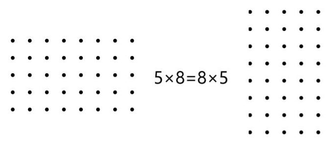

乘法结合律的内容为:3 个自然数相乘，(1)先把前 2 个数相乘，再乘第 3 个数; (2) 先把后 2 个数相乘，再乘第 1 个数; 这两种计算方式得到的结果相等。用公式表示为:

$$
\left( {a \times  b}\right)  \times  c = a \times  \left( {b \times  c}\right)
$$

例如, 如果一所学校共有 20 个班级, 每个班级都有 50 位学生, 每位学生有 2 支铅笔,(1)先计算每班的铅笔数: $2 \times  {50} = {100}$ 支，再计算全校的铅笔总数: ${100} \times  {20} = {2000}$ 支,即 $\left( {2 \times  {50}}\right)  \times  {20} = {2000}$ ; (2) 先计算全校的学生人数: ${50} \times  {20} = {1000}$ 人，再计算全校的铅笔总数: $2 \times  {1000} = {2000}$ 支，即 $2 \times  \left( {{50} \times  {20}}\right)  = {2000}$ 。这两种计算方式的结果相同。

乘法结合律可以用立体阵列直观地展示, 对于一个立方体阵列, 可以看作每个水平面内都有每一列有 $a$ 个点、共有 $b$ 列的阵列,这样的平面共有 $c$ 层,那么立体阵列中共有 $\left( {a \times  b}\right)  \times  c$ 个点。从正面观察,可以看作空间中共有 $b \times  c$ 个竖直朝向直面的点列,每一列有 $a$ 个点,点的总数不变,如下图所示。

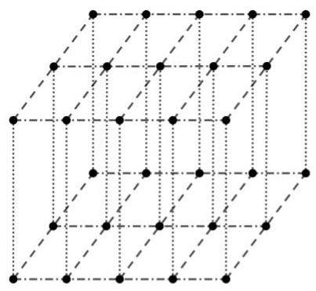

$$
\left( {3 \times  5}\right)  \times  2 = 3 \times  \left( {5 \times  2}\right)
$$

乘法分配律的内容为:(1)2 个数先相加，再乘以第 3 个数；(2)2 个加数先分别与第 3 个数相乘，再将乘积相加；这两种计算方式得到的结果相等。用公式表示为:

$$
\left( {a + b}\right)  \times  c = a \times  c + b \times  c
$$

例如,如果班里每位同学有 2 支铅笔和 1 支水笔,则每位同学共有 $2 + 1 = 3$ 支笔,全班 50 位同学共有 $3 \times  {50} = {150}$ 支笔,即 $\left( {2 + 1}\right)  \times  {50} = {150}$ ; (2)先分别计算得全班的铅笔总数: $2 \times  {50} = {100}$ 支、水笔总数: $1 \times  {50} = {50}$ 支，则全班的笔的总数为:100 + 50 = 150 支，即 $2 \times  {50} + 1 \times  {50} = {150}$ 。这两种计算方式得到的结果相同。

乘法分配律可以用阵列直观地展示,对于每一列有 $a$ 个点、共有 $c$ 列的阵列, 及每一列有 $b$ 个点、共有 $c$ 列的阵列,两个阵列直接合并后共有 $a \times  c + b \times  c$ 个点。 由于列数相同, 可以保持列数不变, 将两个阵列的每一列分别合并, 每一列中有 $a + b$ 个点,合并后的阵列中共有 $\left( {a + b}\right)  \times  c$ 个点。两种合并方式后点的总数不变, 如下图所示。

$$
3 \times  4 + 2 \times  4 = \left( {3 + 2}\right)  \times  4
$$

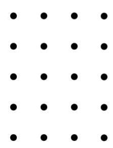

除法是乘法的逆运算,用除号 “ $\div$ ” 或 “ / ” 表示。假设 $n$ 个相同的自然数 $a$ 相加得 $p$ ,即 $a \times  n = p$ 。若把 $p$ 个物体平均分为每份个数都相等的 $n$ 份,则每份的物体个数都为 $a$ ,即 $p \div  n = a$ 。若把 $p$ 个物体分成每份都有 $a$ 个物体的若干份, 则总共能分出 $n$ 份,即 $p \div  a = n$ 。除法 $p \div  n = a$ 中, $p$ 叫作被除数, $n$ 叫作除数, $a$ 叫作商。0 除以任何数的结果仍为 0 。0 不能作为除数。

如果自然数 $p$ 除以非 0 自然数 $n$ 的结果不是整数,则得到的数字叫作分数, 记作 $\frac{p}{n}$ 或 $p/n$ ，其中 $p$ 叫作分子， $n$ 叫作分母。0 不能作为分母。

整数和分数合称为有理数。任意有理数都能写成 2 个整数的比的形式。有理数也能进行加减乘除等运算, 且满足加法交换律、加法结合率、乘法交换律、乘法结合律、乘法分配律等规律。实际上, “有理数” 是其英文名 “rational number” 的不准确翻译，其实际含义应为 “比例数”，即能用比例表示的数。

“ 1 ” 是有理数的乘除法中非常重要的数字。任何有理数乘以 1 结果仍为它本身, 任何不为 0 的有理数除以它本身得到 1 。如果两个有理数的乘积为 1 , 就称这两个有理数互为倒数。用 1 除以一个有理数, 就得到了这个有理数的倒数。 由于 0 不能作为除数，0 没有倒数。

虽然除法不适用交换律、结合律、分配律, 但可以把除法转化为 “乘以倒数”,即 $a \div  b = a \times  \frac{1}{b}$ ,就可以使用乘法的交换律、结合律、分配律。需注意, 可利用分配律将被除数拆分或合并: $\left( {a + b}\right)  \div  c = \left( {a + b}\right)  \times  \frac{1}{c} = a \times  \frac{1}{c} + b \times  \frac{1}{c}$ ,但不能将除数拆分或合并: $a \div  \left( {b + c}\right)  = \frac{a}{b + c} \neq  a \times  \frac{1}{b} + a \times  \frac{1}{c}$ 。

被除数、除数、商之间的正负数关系, 参照乘法的关系, 只需要把除法看作 “乘以倒数”即可。

平方最早用于计算面积。对于边长为 $a$ 的正方形,规定它的面积为边长与边长的乘积 $a \times  a$ ,也记作 ${a}^{2}$ 。对于有理数 $a$ 和 $p$ ,如果 ${a}^{2} = p$ ,就称 $p$ 是 $a$ 的平方。 正方形的面积公式 $s = {a}^{2}$ 可以看作面积的定义，任意图形的面积都通过将其分割或拼接成若干(或大量)小正方形，利用正方形的面积定义计算。

开方是平方的逆运算,如果 $p$ 是 $a$ 的平方,就称 $a$ 是 $p$ 的平方根,记作 $a = \sqrt{p}$ 。然而,并非对所有的有理数开方都能得到有理数,于是将这些不能表示为两个整数之比的数字叫作无理数，如 $\sqrt{2}\text{ 、 }\sqrt{5}$ 等。与 “能用比例表示的” 有理数相对，“无理数”的英文名称的实际含义为“不能用比例表示的数”。

有理数和无理数统称为实数, 就是当前学习阶段主要使用的数域。实数有无穷多，不只限于平方根或其他次方根等形式，还有很多难以简单表示的无理数。 无理数中有两个在数学中尤为重要: 圆周率 $\pi$ 和自然对数的底 $\mathrm{e}$ 。对于任意标准圆,它的周长 $C$ 与直径 $d$ 的比值为定值,就是圆周率 $\pi$ ,即 $\pi  = C/d$ 。自然对数的底 e 与指数运算有关, 将在后续章节学习。

加、减、乘、除等基本运算的法则和规律也都适用于全体实数。

#### 2.1.3 等式的基本性质

等式有若干基本性质, 这些性质是对等式进行化简处理、利用等式分析解决问题的主要方法。

性质 1: 如果 $a = b$ ,那么 $b = a$

该性质表明: 等式两边的 “地位” 是相等的, 谁在左、谁在右没有区别, 左右可以对调。

性质 2: 如果 $a = b, b = c$ ,那么 $a = c$

该性质表明: 等式具有传递性, 如果一系列表达式依次两两相等, 那么它们当中的任意两个都相等。

性质 3: 如果 $a = b$ ,那么 $a \pm  c = b \pm  c$

该性质表明: 等式的两边加(或减)相同的表达式, 等式仍成立。

性质 4: 如果 $a = b$ ,那么 ${ac} = {bc}$

该性质表明:等式的两边乘以相同的表达式，等式仍成立。

性质 5: 如果 $a = b, c \neq  0$ ,那么 $\frac{a}{c} = \frac{b}{c}$

该性质表明: 等式的两边除以相同的不为 0 的表达式, 等式仍成立。

将上述 5 项等式的基本性质联用, 可以拓展得到下列性质:

性质 6: 如果 $a = b, c = d$ ,那么 $a \pm  c = b \pm  d, a \pm  d = b \pm  c$

性质 7: 如果 $a = b, c = d$ ,那么 ${ac} = {bd},{ad} = {bc}$

性质 8: 如果 $a = b, c = d \neq  0$ ,那么 $\frac{a}{c} = \frac{b}{d},\frac{a}{d} = \frac{b}{c}$

即:两个等式的两边分别加、减、乘、除(除数不能为 0 )，等式仍成立。

解方程的过程实质上就是利用等式和运算的性质, 将方程转化为等号的一边只有未知数，等号的另一边是数值或其他表达式的形式。

例 2.1 解方程: ${5x} + 2 = {12}$ 。

解析: 本题看起来很简单, 实际上的确很简单, 熟练的话可以很快心算得出答案，为了强调等式的基本性质，我们“多此一举”地逐步拆分解方程的过程。

使用性质 3,等式两边同时减 2: ${5x} + 2 - 2 = {12} - 2$

对等式左边使用加法结合律: ${5x} + \left( {2 - 2}\right)  = {12} - 2$

进行数值计算: ${5x} = {10}$

使用性质 4,等式两边同时乘以 $\frac{1}{5} : {5x} \times  \frac{1}{5} = {10} \times  \frac{1}{5}$

对等式左边使用乘法交换律和结合律: $x \times  \left( {5 \times  \frac{1}{5}}\right)  = {10} \times  \frac{1}{5}$

进行数值计算: $x = 2$ 。

例 2.2 解方程: $\frac{1}{x + 1} + \frac{1}{x - 1} = \frac{4}{x}$ 。

本题的未知数在分母位置, 且有 3 种不同的分母, 看起来较复杂, 实际上解方程的思路原理相同: 通过让等式两边加、减、乘、除相同的整式, 将其变为熟悉的形式。

使用性质 4,等式两边同时乘以 $x\left( {x + 1}\right) \left( {x - 1}\right)$ :

$$
\left( {\frac{1}{x + 1} + \frac{1}{x - 1}}\right)  \times  x\left( {x + 1}\right) \left( {x - 1}\right)  = \frac{4}{x} \times  x\left( {x + 1}\right) \left( {x - 1}\right)
$$

使用乘法分配律展开等式两边:

$$
\frac{1}{x + 1} \times  x\left( {x + 1}\right) \left( {x - 1}\right)  + \frac{1}{x - 1} \times  x\left( {x + 1}\right) \left( {x - 1}\right)  = \frac{4}{x} \times  x\left( {x + 1}\right) \left( {x - 1}\right)
$$

约去分母: $x\left( {x - 1}\right)  + x\left( {x + 1}\right)  = 4 \times  \left( {x + 1}\right) \left( {x - 1}\right)$

再次使用乘法分配律展开等式两边: ${x}^{2} - x + {x}^{2} + x = 4{x}^{2} - {4x} + {4x} - 4$

使用交换律和结合律,将等式两边的 ${x}^{2}$ 项、 $x$ 项、常数项分别合并: $2{x}^{2} = 4{x}^{2} - 4$

使用性质 3,让等式两边同时减去 $2{x}^{2} : 0 = 2{x}^{2} - 4$

为方便观察,将等式左右两边互换位置: $2{x}^{2} - 4 = 0$

使用性质 3,让等式两边同时加 4: $2{x}^{2} = 4$

使用性质 4,让等式两边同时乘以 $\frac{1}{2} : {x}^{2} = 2$

由平方数的计算可得: ${x}_{1} = \sqrt{2},{x}_{2} =  - \sqrt{2}$

由分母不能为 0 可得: $x \neq  0, x - 1 \neq  0, x + 1 \neq  0$ ,即 $x \neq   - 1,0,1$ ,两个解都满足要求,因此该方程的解为 ${x}_{1} = \sqrt{2},{x}_{2} =  - \sqrt{2}$ 。

本题是一道典型的 “化繁为简” 的例子。对于分母上出现不同的表达式等复杂情况，可以使用等式的基本性质和运算法则的规律，将其转化为较简单的形式。 常用的化简方式有:合并同类项、通分消除分母、把平方根移到等号一侧后两边同时平方等, 要特别记得最后需排除分母为 0 的情况。

例 2.3 解方程: $3\left| {x - 4}\right|  - 2 = 8$ 。

解析: 本题为含绝对值的不等式, 正数和 0 的绝对值仍是它本身, 负数的绝对值是其相反数, 可以分别讨论绝对值符号内为正数和 0 、负数两种情况。

情况 1: 当 $x - 4 \geq  0$ 时,需满足 $x \geq  4$ ,原等式可化为: $3\left( {x - 4}\right)  - 2 = 8$

等式两边同时加 2: $3\left( {x - 4}\right)  = {10}$

等式两边同时乘以 $\frac{1}{3} : \;x - 4 = \frac{10}{3}$

等式两边同时加 4: $x = \frac{22}{3}$

由 $\frac{22}{3} = 7\frac{1}{3} \geq  4$ 可知该解成立;

情况 2: 当 $x - 4 < 0$ 时,需满足 $x < 4$ ,原等式可化为: $3\left( {4 - x}\right)  - 2 = 8$

等式两边同时加 2: $3\left( {4 - x}\right)  = {10}$

等式两边同时乘以 $\frac{1}{3} : \;4 - x = \frac{10}{3}$

等式两边同时减 4: $- x =  - \frac{2}{3}$

等式两边同时乘以 -1: $x = \frac{2}{3}$

由 $\frac{2}{3} < 4$ 可知该解成立;

综上,本方程的解为: ${x}_{1} = \frac{22}{3},{x}_{2} = \frac{2}{3}$ 。

解绝对值不等式时, 需要将各情况求得的解与该情况下未知数的取值范围进行比较, 如果解在取值范围内, 则解成立, 如果解不在取值范围内, 则应舍弃。

## 练习 2.1

1. 利用等式的性质和运算的规律, 逐步推导下列公式 (1、2 题将等式左边的算式展开，3~5 题将等式右边的算式展开):

(1)加法的完全平方公式: ${\left( a + b\right) }^{2} = {a}^{2} + {2ab} + {b}^{2}$

(2)减法的完全平方公式: ${\left( a - b\right) }^{2} = {a}^{2} - {2ab} + {b}^{2}$

(3)平方差公式: ${a}^{2} - {b}^{2} = \left( {a + b}\right) \left( {a - b}\right)$

(4)立方差公式: ${a}^{3} - {b}^{3} = \left( {a - b}\right) \left( {{a}^{2} + {ab} + {b}^{2}}\right)$

(5)立方和公式: ${a}^{3} + {b}^{3} = \left( {a + b}\right) \left( {{a}^{2} - {ab} + {b}^{2}}\right)$

2. 解下列方程:

(1) $\frac{16}{7}x + 5 =  - \frac{2}{3}$

(2) $\frac{1}{x - 1} + \frac{1}{x + 1} = 3$

(3) $\left| {{2x} - {10}}\right|  - \left| {x - 4}\right|  = 2$

### 2.2 不等式及其性质

“不等” 是与 “相等” 同等重要的基本数量关系, 同样有一系列在演绎中起到 “推出” 作用的重要基本性质。不等式的性质比等式稍复杂, 经常需要分情况讨论, 学习和应用时需要更加细心和耐心。

#### 2.2.1 大于和小于的含义

不等同样是一个非常原始且朴素的概念, 不等有 “大于” 和 “小于” 两种情况。如果有两堆东西, 它们的数量不一样多, 就称它们的数量不等, 用不等号 “≠”表示，其中，较多的一堆东西的数量大于较少的一堆，用大于号“>”表示; 较少的一堆东西的数量小于较多的一堆, 用小于号 “ $<$ ” 表示。

例如, 如果甲同学有 3 个苹果, 乙同学有 2 个苹果, 就称甲、乙二人拥有的苹果数量不等,即 $3 \neq  2$ ,其中甲的苹果数量大于乙的,即 $3 > 2$ ,乙的苹果数量小于乙的,即 $2 < 3$ 。

几何中, 线段的长度、角度的大小的计量, 也存在 “不等” “大于” 小于的概念: 将两条绳子平行放置, 并将其中一端对齐, 如果另一端不能对齐, 就称这两根绳子的长度相等，其中，长一截的一根绳子的长度大于短一截的，短一截的一根绳子的长度小于长一截的。

同样的, 把两个角朝相同方向摆放, 令它们的一条边重合, 如果此时这两个角的另一条边不重合, 就称这两个角大小不等, 其中, 张开程度较大的角大于张开程度较小的角, 张开程度较小的角的小于张开程度较大的角。

两个实数间的大于、小于、等于关系, 可以由它们的差值的正负号来定义:

$$
a - b > 0 \Leftrightarrow  a > b
$$

$$
a - b = 0 \Leftrightarrow  a = b
$$

$$
a - b < 0 \Leftrightarrow  a < b
$$

大于、小于、等于还可以通过数轴定义, 对于规定了原点和正方向的数轴, 数轴上的全部点与全体实数一一对应,对于数轴上坐标分别为 $a$ 和 $b$ 的两个点:

$a$ 在 $b$ 的正方向 $\Leftrightarrow  a > b \; a$ 与 $b$ 的位置重合 $\Leftrightarrow  a = b \; a$ 在 $b$ 的负方向 $\Leftrightarrow  a < b$

建立数轴后, 还形成了绝对值的概念: 实数与原点 (坐标为 0 的点) 间的距离叫作该实数的绝对值， $a$ 的绝对值记作 $\left| a\right|$ 。绝对值是一段距离，只能是正数或 0 , 正数和 0 的绝对值是其自身, 负数的绝对值是它的相反数。

#### 2.2.2 不等式的基本性质

不等式同样有若干基本性质, 这些性质是对不等式进行化简处理、利用不等式分析解决问题的主要方法。不等式有大于和小于两种情况，让其性质比等式稍复杂。

性质 1: 如果 $a > b$ ,那么 $b < a$ ; 如果 $b < a$ ,那么 $a > b$

该性质表明:将不等式的左右互换，不等号的方向需要改变，“大”“小” 两边的“地位”不同。

性质 2: 如果 $a > b, b > c$ ,那么 $a > c$

如果 $c < b, b < a$ ,那么 $c < a$

该性质表明不等号具有传递性, 但不等号的传递性仅限于同一种不等号 (都是>或都是<)，不同的不等号(>与<)之间不具有传递性。

该性质可以用数轴上的位置关系解释: 如果 $a$ 在 $b$ 的正方向, $b$ 在 $c$ 的正方向,那么 $a$ 在 $c$ 的正方向。

该性质在生活中很常见,如果 $a$ 中物体的数量比 $b$ 多, $b$ 中物体的数量比 $c$ 多，那么 $a$ 中物体的数量比 $c$ 多。

性质 3: 如果 $a > b$ ,那么 $a \pm  c > b \pm  c$

该性质表明: 不等式的两边同时加(或减)相同的数，不等式仍成立。

用数轴上的位置关系解释: 如果 $a$ 在 $b$ 的正方向,那么将 $a$ 和 $b$ 同时沿相同的方向移动相同的距离后, 它们之间的位置关系不变。

该性质在生活中很常见,如果 $a$ 中物体的数量比 $b$ 多,那么同时给 $a\text{ 、 }b$ 增加或减少同样的数量 $c$ 后, $a$ 中物体的数量仍然比 $b$ 多。

性质 4: 如果 $a > b, c > 0$ ,那么 ${ac} > {bc}$

如果 $a > b, c < 0$ ,那么 ${ac} < {bc}$

该性质表明: 不等式的两边同时乘以相同的正数, 不等号的方向不变; 不等式的两边同时乘以相同的负数, 不等号的方向改变。任何数乘以 0 的结果仍为 0 , 使不等式失去意义，因此通常不在不等式的两边同时乘以 0 。

乘法运算可以分为两步:先进行数值的变化，再进行正负号的变化。当一个数字与正数相乘时，只需进行数值的变化。当一个数字与负数相乘时，先乘以负数的绝对值，再改变正负号，改变数字的正负号等价于从数轴上对称翻转到原点的另一侧。如下图所示, $2 \times  \left( {-3}\right)$ 可以分解为 $2 \times  3 \times  \left( {-1}\right)$ ,先倍增,后变号。

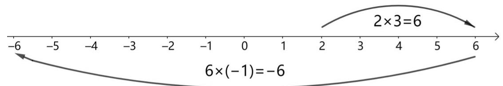

不等式的两边同时乘以相同的正数，只是等比例放大或缩小，不改变不等式两边的表达式在数轴上的位置关系。不等式的两边同时乘以相同的负数, 在等比例放大或缩小后, 还需要以原点为中心进行翻转, 颠倒左右的位置关系, 导致不等号的方向改变。如下图所示。

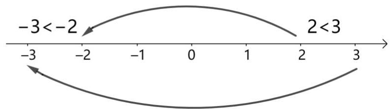

利用不等式的上述四条基本性质, 还可以推出其他一些常用性质:

性质 5: 如果 $a > b, c > d$ ,那么 $a + c > b + d$

证明如下: 使用性质 3,如果 $a > b$ ,那么 $a + c > b + c$ ;

再次使用性质 3,如果 $c > d$ ,那么 $b + c > b + d$ ;

使用性质 $2, a + c > b + c > b + d$ ,即得证。

该性质表明: 两个较大的数之和, 总是大于两个较小的数之和。

性质 6: 如果 $a > b > 0, c > d > 0$ ,那么 ${ac} > {bd}$

该性质可以由性质 2 和性质 4 推出, 过程与性质 5 相似。

该性质表明: 两个正数的乘积, 总是大于分别比它们小的正数的乘积。

性质 7: 如果 $a > b > 0$ ,那么 ${a}^{n} > {b}^{n} > 0\;\left( {n \in  \mathbf{N}, n \geq  2}\right)$

该性质可以由性质 2 和性质 6 推出。

该性质表明: 两个正数的相同正整数次方之间的大小关系, 与它们之间的大小关系相同。

#### 2.2.3 比较大小

利用不等式的性质，可以比较两个表达式 $a$ 与 $b$ 的大小，有两种常用的方法。

(1)构造减法 $a - b$ ，化简并比较 $a - b$ 与 0 的大小关系: $a - b > 0 \Leftrightarrow  a > b$ ， $a - b = 0 \Leftrightarrow  a = b,\;a - b < 0 \Leftrightarrow  a < b;$

(2)构造除法 $\frac{a}{b}$ ，化简并比较 $\frac{a}{b}$ 与 1 的大小关系:

如果 $a\text{ 、 }b$ 都是正数,那么 $\frac{a}{b} > 1 \Leftrightarrow  a > b,\frac{a}{b} = 1 \Leftrightarrow  a = b,\frac{a}{b} < 1 \Leftrightarrow  a < b$ ;

如果 $a\text{ 、 }b$ 都是负数,那么 $\frac{a}{b} > 1 \Leftrightarrow  a < b,\frac{a}{b} = 1 \Leftrightarrow  a = b,\frac{a}{b} < 1 \Leftrightarrow  a > b$ ;

如果 $a\text{ 、 }b$ 的正负号不同,那么正数大于负数。

需注意，不等式比解方程稍复杂，方程中只有“等于”一种关系，而不等式中有“大于”和“小于”两种关系，有时需要改变不等号的方向。

还需注意，分析处理不等式时要区分 “>” 与 “<”、 “<” 与 “≤", 特别是需要改变正负号的情况。如果某个步骤的逻辑是 “否定”，那么 “>” 的否定是 “≤”，“<” 的否定是 “≥”，“=” 的否定是 “≠” (包括 “>” 和 “<”)。 如果某个步骤的逻辑是颠倒大小关系(数轴上的左右位置关系)，那么 “>” 颠倒后是“<”，“≥”颠倒后是“≤”，“=”颠倒后仍是“=”。

例 2.4 比较 ${x}^{4} - 1$ 与 $2{x}^{2} - 2$ 的大小。

解析: 将两式相减并化简: $\left( {{x}^{4} - 1}\right)  - \left( {2{x}^{2} - 2}\right)  = {x}^{4} - 2{x}^{2} + 1 = {\left( {x}^{2} - 1\right) }^{2}$ ,

${\left( {x}^{2} - 1\right) }^{2}$ 是完全平方数,恒大于等于 0,且可以取到 0,所以 ${x}^{4} - 1 \geq  2{x}^{2} - 2$ ,

当且仅当 ${x}^{2} = 1$ ,即 $x =  \pm  1$ 时,等号成立。

例 2.5 已知 $x > 0$ ,比较 ${x}^{3} + 8$ 与 $x + 2$ 的大小。

解析: 因为 $x > 0$ ,所以 ${x}^{3} + 8 > 0, x + 2 > 0$ ,

将两式相除: $\frac{{x}^{3} + 8}{x + 2} = \frac{\left( {x + 2}\right) \left( {{x}^{2} - {2x} + 4}\right) }{x + 2} = {x}^{2} - {2x} + 4 = {\left( x - 1\right) }^{2} + 3 \geq  3 > 1$ ,

所以 ${x}^{3} + 8 > x + 2$ 。

练习 2.2

1. 参照证明性质 5 的过程, 证明性质 6 和性质 7 。

2. 证明: (1) 如果 $a > b > 0$ ,那么 $\frac{a}{b} > 1$ ; (2) 如果 $b < a < 0$ ,那么 $\frac{a}{b} < 1$ 。

3. 设 $a > b > 0, d < c < 0$ ,比较 ${ad}$ 与 ${bc}$ 的大小。

4. 比较下列各式的大小:

(1) ${k}^{2} + {2k}$ ___ ${4k} - 2$ ；

(2) $x + 1$ ___ $\sqrt{{x}^{2} - 1}\left( {x > 1}\right)$ 。

### 2.3 解不等式

利用不等式和运算的基本性质, 可以像解方程那样解不等式, 求得未知数的取值范围。解不等式的过程与解方程相似, 利用运算和不等式的性质, 将不等式化为不等号的一边只有未知数，不等号的另一边是数值或其他表达式。不等式和方程还有非常直观的几何含义, 与平面内的位置关系有直接对应关系。

#### 2.3.1 一元一次不等式

一元一次不等式是最基本的不等式, 其解法与一元一次方程相似, 注意在化简过程中需要改变不等号方向的情况即可。

一元一次不等式的一般形式为: ${ax} + b < c$ ,其中 $a\text{ 、 }b\text{ 、 }c$ 为参数, $a \neq  0$ 。使用不等式的性质,将不等式逐步化简为不等号一边只有未知数 $x$ ,另一边没有未知数 $x$ 的形式:

不等式的两边同时减 $b : {ax} < c - b$

如果 $a > 0$ ,不等式两边同时乘以 $\frac{1}{a} : {ax} \cdot  \frac{1}{a} < \left( {c - b}\right)  \cdot  \frac{1}{a}$ ,解得: $x < \frac{c - b}{a}$ ;

如果 $a < 0$ ,不等式两边同时乘以 $\frac{1}{a}$ ,需改变不等号的方向: ${ax} \cdot  \frac{1}{a} > \left( {c - b}\right)  \cdot  \frac{1}{a}$ , 解得: $x > \frac{c - b}{a}$ 。

例 2.6 解不等式: (1) ${2x} + 4 > 6,\left( 2\right)  - {2x} + 4 < 6$ 。

解析:(1)不等式两边同时减 4: ${2x} > 2$ ；不等式两边同时乘以 $\frac{1}{2}$ : $x > 1$ ；

(2)不等式两边同时减 4: $- {2x} < 2$ ；不等式两边同时乘以 $- \frac{1}{2}$ 并改变不等号的方向: $x >  - 1$ ;

一元一次不等式有非常直观的几何意义。对于一次函数 $y = {ax} + b$ ,每一个 ${x}_{0}$ 的取值都有相应的 ${y}_{0}$ 值与之对应,即 ${y}_{0} = a{x}_{0} + b$ 。平面直角坐标系中,位置越高的点纵坐标越大,所有坐标满足方程 $y = {ax} + b$ 的点形成一条直线。此外,所有纵坐标等于 $c$ 的点形成一条平行于 $x$ 轴的直线 $y = c$ ,即横坐标 $x$ 可以为任意值, 纵坐标 $y$ 必须为 $c$ 。横坐标相同时,所有满足 $y = {ax} + b$ 比 $y = c$ 高的点,它们横坐标就是不等式 ${ax} + b > c$ 的解,所有满足 $y = {ax} + b$ 比 $y = c$ 低的点,它们的横坐标就是不等式 ${ax} + b < c$ 的解,所有满足 $y = {ax} + b$ 与 $y = c$ 一样高的点,它们的横坐标就是方程 ${ax} + b = c$ 的解。可以看作直线 $y = {ax} + b$ 将平面分为两片区域,一片区域的点的坐标都满足 $y > {ax} + b$ ,另一片区域的点的坐标都满足 $y < {ax} + b$ 。

例如,方程 ${2x} + 4 = 6$ 的解为 $x = 1$ ,不等式 ${2x} + 4 < 6$ 的解为 $x < 1$ ,不等式 ${2x} + 4 > 6$ 的解为 $x > 1$ 。如下页图所示,在平面直角坐标系中分别画出直线 ${2x} + 4 = 6$ 和 $y = 6$ 。横坐标相同时,两条直线一样高的部分(交点)的横坐标, 就是方程 ${2x} + 4 = 6$ 的解 $x = 1$ 。横坐标相同时,直线 ${2x} + 4 = 6$ 比 $y = 6$ 低的部分, 横坐标都小于 1,就是不等式 ${2x} + 4 < 6$ 的解 $x < 1$ 。横坐标相同时,直线 ${2x} + 4 = 6$ 比 $y = 6$ 高的部分,横坐标都大于 1,就是不等式 ${2x} + 4 > 6$ 的解 $x > 1$ 。直线 $y = {2x} + 4$ 将平面分为两片区域，直线左上区域的点的坐标都满足 $y > {2x} + 4$ ，直线右下区域的点的坐标都满足 $y < {2x} + 4$ 。

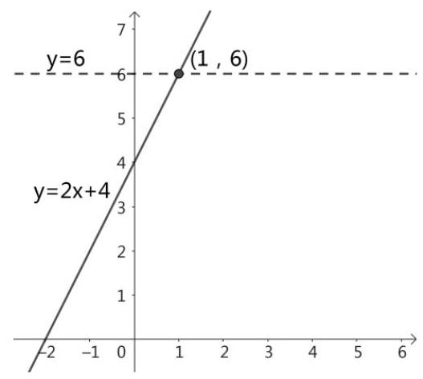

#### 2.3.2 一元二次不等式

一元二次不等式、一元二次方程、二次函数之间有非常密切的联系，我们现在系统、全面、透彻地分析理解它们的含义、关系及图像。

如果方程只有一个未知数, 且未知数的最高次数是 2 , 这样的方程叫作一元二次方程, 其基本形式为:

$$
a{x}^{2} + {bx} + c = 0
$$

其中 $a\text{ 、 }b\text{ 、 }c$ 是常数,且 $a \neq  0$ 。

类似的, 只有一个未知数, 且未知数的最高次数是 2 的不等式叫作一元二次不等式, 其基本形式为:

$$
a{x}^{2} + {bx} + c > 0\text{ 或 }a{x}^{2} + {bx} + c < 0
$$

其中 $a\text{ 、 }b\text{ 、 }c$ 是常数,且 $a \neq  0$ 。

二次函数的基本形式为:

$$
y = a{x}^{2} + {bx} + c
$$

其中 $a\text{ 、 }b\text{ 、 }c$ 是常数,且 $a \neq  0$ 。

二次函数、一元二次方程、一元二次不等式都有相同的表达式 $a{x}^{2} + {bx} + c$ , 只是其余部分不同,我们现在从表达式 $a{x}^{2} + {bx} + c$ 出发,建立二次函数、一元二次方程、一元二次不等式之间的联系。

一元二次方程有两种基本解法: 因式分解法和配方法, 其中因式分解法更简便, 配方法更普遍适用且能反映方程的特点。

例 2.7 解一元二次方程 ${x}^{2} - {8x} - {20} = 0$ 。

解析: 因式分解法,常数项 $- {20} =  - {10} \times  2$ ,一次项系数 $- 8 =  - {10} + 2$ ,对等式的左边进行因式分解: $\left( {x - {10}}\right) \left( {x + 2}\right)  = 0$ ,

两个数的乘积为 0,则至少其中一个因数为 0,可得: $x - {10} = 0$ 或 $x + 2 = 0$ ,

解得: ${x}_{1} = {10},{x}_{2} =  - 2$ 。

配方法,将等式的左边凑成完全平方公式的标准形式: ${x}^{2} - {8x} + {16} - {36} = 0$ ,

使用完全平方公式,并将剩余的常数移到等号的右边: ${\left( x - 4\right) }^{2} = {36}$ ,

对等号两边同时取平方根,有一正一负两个平方根: $x - 4 = 6$ 或 $x - 4 =  - 6$ ,

解得: ${x}_{1} = {10},{x}_{2} =  - 2$ 。

虽然因式分解法更简便, 但需要对因数 (式) 分解很熟悉。配方法的思路更直白, 即 “凑完全平方公式”, 适用于所有一元二次方程。利用配方的过程, 可以推导出一元二次方程的通解公式、根的判别式、韦达定理。

对一元二次方程 $a{x}^{2} + {bx} + c = 0\left( {a \neq  0}\right)$ 进行配方,并将完全平方项单独放在等式的左边,

等式两边同时乘以 $\frac{1}{a} : {x}^{2} + \frac{b}{a}x + \frac{c}{a} = 0$

根据完全平方公式,凑出能将 $x$ 全部放入完全平方公式的项 ${\left( \frac{b}{2a}\right) }^{2}$ ,先加后减,等式仍成立: ${x}^{2} + \frac{b}{a}{x}^{2} + \frac{c}{a} + {\left( \frac{b}{2a}\right) }^{2} - {\left( \frac{b}{2a}\right) }^{2} = 0$

将未用于凑完全平方公式的项移到等式另一侧: ${x}^{2} + \frac{b}{a}{x}^{2} + {\left( \frac{b}{2a}\right) }^{2} = {\left( \frac{b}{2a}\right) }^{2} - \frac{c}{a}$

对等式左边使用完全平方公式: ${\left( x + \frac{b}{2a}\right) }^{2} = {\left( \frac{b}{2a}\right) }^{2} - \frac{c}{a}$

对等式右边进行通分: ${\left( x + \frac{b}{2a}\right) }^{2} = \frac{{b}^{2} - {4ac}}{4{a}^{2}}$ ,该等式的左边是完全平方项, 恒大于等于 0 , 如果方程有根,那么等式的右边必须也大于等于 0 , 即:

$$
\frac{{b}^{2} - {4ac}}{4{a}^{2}} \geq  0
$$

由于已经规定了 $a \neq  0$ ,恒有分母 $4{a}^{2} > 0$ ,还需要分子大于等于 0,这就是一元二次方程的根的判别式 $\Delta  = {b}^{2} - {4ac}$ 。

当 $\Delta  > 0$ 时,让等式 ${\left( x + \frac{b}{2a}\right) }^{2} = \frac{{b}^{2} - {4ac}}{4{a}^{2}}$ 两边同时取平方根,可得方程有两个不同的根: ${x}_{1} + \frac{b}{2a} = \sqrt{\frac{{b}^{2} - {4ac}}{4{a}^{2}}}, - {x}_{2} - \frac{b}{2a} = \sqrt{\frac{{b}^{2} - {4ac}}{4{a}^{2}}}$ ,即 ${x}_{1} = \frac{-b + \sqrt{{b}^{2} - {4ac}}}{2a}$ , ${x}_{2} = \frac{-b + \sqrt{{b}^{2} - {4ac}}}{2a}$ ,无论 ${2a}$ 的正负号如何,解的表达式都是这两种;

当 $\Delta  = 0$ 时,等式 ${\left( x + \frac{b}{2a}\right) }^{2} = \frac{{b}^{2} - {4ac}}{4{a}^{2}}$ 可化为 ${\left( x + \frac{b}{2a}\right) }^{2} = 0$ ,方程有且只有一个根: $x =  - \frac{b}{2a}$ ;

当 $\Delta  < 0$ 时,等式 ${\left( x + \frac{b}{2a}\right) }^{2} = \frac{{b}^{2} - {4ac}}{4{a}^{2}}$ 左边恒大于等于 0,右边小于 0,不可能相等，方程没有实数根。

从因式分解的角度,如果一元二次方程 $a{x}^{2} + {bx} + c = 0$ 有解,那么将两个解分别代入因式分解后的形式，应当满足表达式 $a{x}^{2} + {bx} + c = 0$ ，那么 $a{x}^{2} + {bx} + c$ 可以分解为:

$$
a{x}^{2} + {bx} + c = a\left( {x - \frac{-b - \sqrt{{b}^{2} - {4ac}}}{2a}}\right) \left( {x - \frac{-b + \sqrt{{b}^{2} - {4ac}}}{2a}}\right)
$$

一元二次不等式的解法与一元二次方程相似, 也有因式分解法和配方法两种, 且这两种解法的特点也与一元二次方程相似: 因式分解法更简便, 配方法更普遍适用且能反映不等式的特点。

例 2.8 解一元二次不等式:

(1) ${x}^{2} - {8x} - {20} < 0$ ；

(2) ${x}^{2} - {8x} - {20} > 0$ 。

解析: 因式分解法,

(1)对不等式的左边进行因式分解: $\left( {x - {10}}\right) \left( {x + 2}\right)  < 0$ ,

两数相乘得到负数,则只能一正一负: $x - {10} < 0$ 且 $x + 2 > 0$ ,

解得: $x < {10}$ 且 $x >  - 2$ ,即 $- 2 < x < {10}$ ;

(2)对不等式的左边进行因式分解: $\left( {x - {10}}\right) \left( {x + 2}\right)  > 0$ ，

两数相乘得到负数,要么都为正: $x - {10} > 0$ 且 $x + 2 > 0$ ,要么都为负: $x - {10} < 0$ 且 $x + 2 < 0$ ,

解得: $x <  - 2$ 或 $x > {10}$ 。

配方法,

(1)将不等式的左边凑成完全平方公式的标准形式: ${\left( x - 4\right) }^{2} < {36}$ ，

对等号两边同时取平方根, 等式左边的平方根应当大于右边的负平方根, 且小于右边的正平方根: $- 6 < x - 4 < 6$ ,

解得: $- 2 < x < {10}$ ;

(2)将不等式的左边凑成完全平方公式的标准形式: ${\left( x - 4\right) }^{2} > {36}$ ，

对等号两边同时取平方根, 等式左边的平方根应当小于右边的负平方根: $x - 4 <  - 6$ ,或大于右边的正平方根, $x - 4 > 6$ ,

解得: $x <  - 2$ 或 $x > {10}$ 。

现在使用配方法分析一元二次不等式的一般特点, 对于一元二次不等式:

$$
a{x}^{2} + {bx} + c < 0\text{ 和 }a{x}^{2} + {bx} + c > 0\left( {a \neq  0}\right)
$$

首先,只需考虑 $a > 0$ 的情况,这是因为如果 $a < 0$ ,那么令 $a{x}^{2} + {bx} + c < 0$ 的两边同时乘以 -1,得到 $- a{x}^{2} - {bx} - c > 0$ ,这等同于 $a{x}^{2} + {bx} + c > 0\left( {a > 0}\right)$ 的情况。 另一种不等号的情况同理。

对于 $a{x}^{2} + {bx} + c < 0\left( {a > 0}\right)$ ,通过配方将不等式的左边凑成完全平方项:

$$
{\left( x + \frac{b}{2a}\right) }^{2} < \frac{{b}^{2} - {4ac}}{4{a}^{2}}
$$

不等式的左边是完全平方项，恒为正数或 0 ；

不等式的右边:

当 ${b}^{2} - {4ac} < 0$ 时，不等式的右边是负数，不等式不可能成立，解集为 $\varnothing$ ；

当 ${b}^{2} - {4ac} > 0$ 时，不等式的右边等于 0,不等式不可能成立，解集为 $\varnothing$ ；

当 ${b}^{2} - {4ac} > 0$ 时，不等式的右边是正数，对不等式的两边取平方根，解集为:

$$
\frac{-b - \sqrt{{b}^{2} - {4ac}}}{2a} < x < \frac{-b + \sqrt{{b}^{2} - {4ac}}}{2a}
$$

对于 $a{x}^{2} + {bx} + c > 0\left( {a > 0}\right)$ ,通过配方将不等式的左边凑成完全平方项:

$$
{\left( x + \frac{b}{2a}\right) }^{2} > \frac{{b}^{2} - {4ac}}{4{a}^{2}}
$$

不等式的左边是完全平方项，恒为正数或 0 ；

不等式的右边:

当 ${b}^{2} - {4ac} < 0$ 时，不等式的右边是负数，不等式恒成立，解集为全体实数 $\mathrm{R}$ ; 当 ${b}^{2} - {4ac} = 0$ 时,不等式的右边等于 0,只需左边不为 0,解集为 $x \neq   - \frac{b}{2a}$ ; 当 ${b}^{2} - {4ac} > 0$ 时,不等式的右边是正数,对不等式的两边取平方根,解集为:

$$
x > \frac{-b + \sqrt{{b}^{2} - {4ac}}}{2a}\text{ 或 }x < \frac{-b - \sqrt{{b}^{2} - {4ac}}}{2a}
$$

对于二次函数:

$$
y = a{x}^{2} + {bx} + c\left( {a, b, c\text{ 是常数,且 }a \neq  0}\right)
$$

将函数解析式进行配方:

$$
y = a{\left( x + \frac{b}{2a}\right) }^{2} - \frac{{b}^{2} - {4ac}}{4a}
$$

函数解析式由两部分组成: 含 $x$ 的完全平方项、不含 $x$ 的常数项。

当 $a > 0$ 时, $a{\left( x + \frac{b}{2a}\right) }^{2} \geq  0$ ,当且仅当 $x =  - \frac{b}{2a}$ 时,等号成立;

如果 ${b}^{2} - {4ac} < 0, y$ 是一个正数 (或 0 ) 减去一个负数，恒有 $y > 0$ ，当且仅当 $x =  - \frac{b}{2a}$ 时 $y$ 取最小值，此时:

(1)方程 $a{x}^{2} + {bx} + c = 0\left( {a > 0}\right)$ 对任意 $x$ 都不成立，解集为 $\varnothing$ ；

(2)不等式 $a{x}^{2} + {bx} + c > 0\left( {a > 0}\right)$ 对任意 $x$ 都成立，解集为全体实数；

(3)不等式 $a{x}^{2} + {bx} + c < 0\left( {a > 0}\right)$ 对任意 $x$ 都不成立，解集为 $\varnothing$ 。

例如,下图为二次函数 $y = {\left( x - 2\right) }^{2} + 2$ 的图像,函数图像全都在 $x$ 轴上方,与 $x$ 轴无交点,也没有位于 $x$ 轴下方的点。

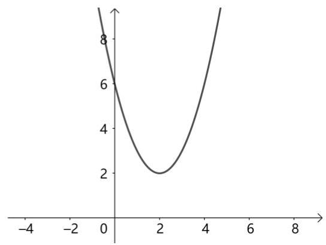

如果 ${b}^{2} - {4ac} = 0, y$ 是一个正数或 0,恒有 $y \geq  0$ ,当且仅当 $x =  - \frac{b}{2a}$ 时函数取最小值 $y = 0$ ,此时:

(1)方程 $a{x}^{2} + {bx} + c = 0\left( {a > 0}\right)$ 有且仅有一个解 $x =  - \frac{b}{2a}$ ;

(2)不等式 $a{x}^{2} + {bx} + c > 0\left( {a > 0}\right)$ 的解集为 $x \neq   - \frac{b}{2a}$ ;

(3)不等式 $a{x}^{2} + {bx} + c < 0\left( {a > 0}\right)$ 对任意 $x$ 都不成立，解集为 $\varnothing$ 。

例如,下图为二次函数 $y = {\left( x - 2\right) }^{2}$ 的图像,函数图像与 $x$ 轴有且仅有一个交点 $\left( {2,0}\right)$ ,其余部分都在 $x$ 轴上方,没有位于 $x$ 轴下方的点。

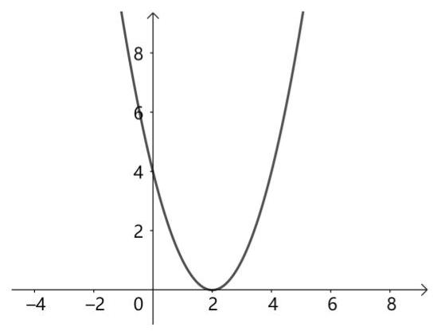

如果 ${b}^{2} - {4ac} > 0, y$ 是一个正数 (或 0 ) 减去另一个正数,其正负号由二者的大小关系决定: 当 $a{\left( x + \frac{b}{2a}\right) }^{2} > \frac{{b}^{2} - {4ac}}{4a}$ 时 $y > 0$ ; 当 $a{\left( x + \frac{b}{2a}\right) }^{2} < \frac{{b}^{2} - {4ac}}{4a}$ 时 $y < 0$ ; 当 $a{\left( x + \frac{b}{2a}\right) }^{2} = \frac{{b}^{2} - {4ac}}{4a}$ 时 $y = 0$ 。此时:

(1)方程 $a{x}^{2} + {bx} + c = 0\left( {a > 0}\right)$ 有两个解:

$$
{x}_{1} = \frac{-b - \sqrt{{b}^{2} - {4ac}}}{2a},{x}_{2} = \frac{-b + \sqrt{{b}^{2} - {4ac}}}{2a}
$$

(2)不等式 $a{x}^{2} + {bx} + c > 0\left( {a > 0}\right)$ 的解集为:

$$
x < \frac{-b - \sqrt{{b}^{2} - {4ac}}}{2a}\text{ 或 }x > \frac{-b + \sqrt{{b}^{2} - {4ac}}}{2a}
$$

(3)不等式 $a{x}^{2} + {bx} + c < 0\left( {a > 0}\right)$ 的解集为:

$$
\frac{-b - \sqrt{{b}^{2} - {4ac}}}{2a} < x < \frac{-b + \sqrt{{b}^{2} - {4ac}}}{2a}
$$

例如,下图为二次函数 $y = {\left( x - 2\right) }^{2} - 2$ 的图像,函数图像与 $x$ 轴有 ${x}_{1}\text{ 、 }{x}_{2}$ 两个交点,当 ${x}_{1} < x < {x}_{2}$ 时 $y < 0$ ; 当 $x < {x}_{1}$ 或 $x > {x}_{2}$ 时 $y > 0$ ; 当 $x = {x}_{1}$ 或 $x = {x}_{2}$ 时 $y = 0$ 。

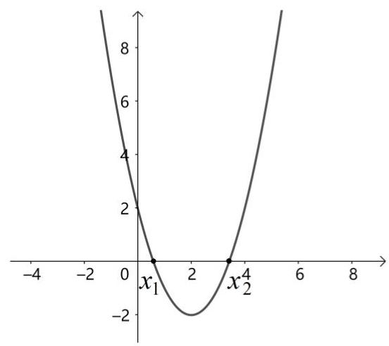

通过上面的分析比较可以发现, 二次函数的值的正负号和零点的数量、一元二次方程的解的情况、一元二次不等式的解集的情况, 它们具有相同的原理。这是因为二次函数、一元二次方程、一元二次不等式具有相同的表达式, 都可以化为含未知数的完全平方项与不含未知数的常数项之差的形式:

$$
a{x}^{2} + {bx} + c = a\left\lbrack  {{\left( x + \frac{b}{2a}\right) }^{2} - \frac{{b}^{2} - {4ac}}{4{a}^{2}}}\right\rbrack
$$

其中，完全平方项恒为正数或 0，常数项的正负号需分情况讨论。通过比较这两项的大小关系，可以得到二次函数的取值范围、一元二次方程的解的情况、 一元二次不等式的解集的情况。

在未来的学习中，还会学习很多概念的基本形式，例如三角函数的基本形式、 圆锥曲线的标准方程、等差数列和等比数列的通项公式等。从这些基本形式出发, 通过分析和推断, 可以得到很多反映它们本质特征的普遍适用的结论。

#### 2.3.3 分式不等式

未知变量出现在分母位置的不等式叫作分式不等式。分式不等式的常见形式为 $\frac{f\left( x\right) }{g\left( x\right) } > 0$ 或 $\frac{f\left( x\right) }{g\left( x\right) } < 0$ ,其中 $f\left( x\right) \text{ 、 }g\left( x\right)$ 为含 $x$ 的多项式。

解分式不等式的基本原理是 “偶数个负数的乘积为正数, 奇数个负数的乘积为负数”, 具体方法为: 先将不等式中的全部元素都移到不等号的一侧, 另一侧只有 0 , 再通过数学运算和变形, 把不等式转化为若干容易判断正负号的因式的乘积, 最后分析判断各因式的正负号情况即可。解分式不等式时, 需特别注意分母不能为 0 ，求得解集后，要把专门把令分母为 0 的情况剔除掉。

该解法还适用于一些次数较高的多项式不等式, 如果能将多项式因式分解为若干一次式、二次式、容易判断正负号的其他多项式的乘积, 就能用分区间讨论的方法解该不等式。

例 2.9 解不等式: $\frac{x - 4}{x + 8} < {2x} + 1$ 。

解析: 将所有项移到不等号的一侧,让另一侧只有 $0 : \frac{x - 4}{x + 8} - {2x} - 1 < 0$

通分: $\frac{x - 4 - \left( {{2x} + 1}\right) \left( {x + 8}\right) }{x + 8} < 0$

展开分子并合并同类项: $\frac{-2{x}^{2} - {16x} - {12}}{x + 8} < 0$

不等式两边同时乘以 -1 : $\frac{2{x}^{2} + {16x} + {12}}{x + 8} > 0$

把分子的 2 提出来,在不等式两边同时乘以 $\frac{1}{2}$ 将其约去: $\frac{{x}^{2} + {8x} + 6}{x + 8} > 0$

把分子看作一元二次方程 ${x}^{2} + {8x} + 6 = 0$ ,利用求根公式可求得两个不同的实根: ${x}_{1} =  - 4 + \sqrt{10},{x}_{2} =  - 4 - \sqrt{10}$ ,原不等式可化为: $\frac{\left( {x + 4 - \sqrt{10}}\right) \left( {x + 4 + \sqrt{10}}\right) }{x + 8} > 0$ , 写为更直观的形式: $\frac{\left\lbrack  {x - \left( {-4 + \sqrt{10}}\right) }\right\rbrack  \left\lbrack  \left( {x - \left( {-4 - \sqrt{10}}\right) }\right\rbrack  \right. }{\left\lbrack  x - \left( -8\right) \right\rbrack  } > 0$ 。

让这 3 个因式为 0 的 $x$ 值,从大到小依次为 $- 4 + \sqrt{10}\text{ 、 } - 4 - \sqrt{10}\text{ 、 } - 8$ 。(先估算出 $3 < \sqrt{10} < 4$ ,于是 $- 1 <  - 4 + \sqrt{10} < 0, - 8 <  - 4 - \sqrt{10} <  - 7$ ) 于是有:

当 $x >  - 4 + \sqrt{10}$ 时,3 个因式都大于 0,原不等式左边大于 0,成立。

当 $- 4 - \sqrt{10} < x <  - 4 + \sqrt{10}$ 时,只有 $x - \left( {-4 + \sqrt{10}}\right)  < 0$ ,另外 2 个因式大于 0, 原不等式左边小于 0 ，不成立。

当 $- 8 < x <  - 4 - \sqrt{10}$ 时,只有 $x - \left( {-8}\right)  > 0$ ,另外 2 个因式小于 0,原不等式左边大于 0 ，成立。

当 $x <  - 8$ 时，3 个因式都小于 0，原不等式左边小于 0，不成立。

综上，原不等式的解集为: $x >  - 4 + \sqrt{10}$ 或 $- 8 < x <  - 4 - \sqrt{10}$ 。最后再确认下， 让分母为 0 的 $x = 8$ 不在解集里,没问题。

#### 2.3.4 含绝对值的不等式

对于含绝对值的不等式, 其解法与解含绝对值的方程相似: 对绝对值内的部分进行分情况讨论。例如,对于具有 $\left| {f\left( x\right) }\right|  + g\left( x\right)  > 0$ 形式的不等式,将其分为下列 3 种情况分别分析:

(1)当 $f\left( x\right)  > 0$ 时，原不等式化为: $f\left( x\right)  + g\left( x\right)  > 0$ ；

(2)当 $f\left( x\right)  < 0$ 时，原不等式化为: $- f\left( x\right)  + g\left( x\right)  > 0$ ；

(3)当 $f\left( x\right)  = 0$ 时，原不等式化为: $g\left( x\right)  > 0$ 。

有时绝对值等于 0 的情况可以并入到大于或小于的情况一起讨论, 只分为大于等于和小于两种情况。对于其他含有绝对值的不等式同理, 分情况讨论即可。

此外, 如果能较容易地把绝对值部分单独放在不等式的一侧, 把不含绝对值的部分在另一侧, 且能确定其正负, 就可以直接对不等号的两边进行平方运算。 特别是对于绝对值符号内的表达式较复杂、难以直接分情况讨论的不等式, 可以尝试此方法。

例 2.10 解不等式: $\left| {{3x} - 3}\right|  < x + 3$ 。

解析: 对绝对值符号内的部分分情况讨论,

当 ${3x} - 3 \geq  0$ 时,需满足 $x \geq  1$ ,原不等式化为: ${3x} - 3 < x + 3$ ,解得: $x < 3$ , 结合 $x \geq  1$ ,最终得: $1 \leq  x \leq  3$ ;

当 ${3x} - 3 < 0$ 时,需满足 $x < 1$ ,原不等式化为: $3 - {3x} < x + 3$ ,解得: $x > 0$ , 结合 $x < 1$ ,最终得: $0 < x < 1$ ;

将上述两种情况合并得: $0 < x < 3$ 。

本题还有另一种解法: 直接对不等式两边平方: ${\left| 3x - 3\right| }^{2} < {\left( x + 3\right) }^{2}$

展开两边的完全平方项: $9{x}^{2} - {18x} + 9 < {x}^{2} + {6x} + 9$

移项、合并同类项并化简得: $8{x}^{2} - {24x} < 0$

解一元二次不等式得: $0 < x < 3$ ,结果相同。

本题有较直观的几何含义,如下图所示,不等式 $\left| {{3x} - 3}\right|  < x + 3$ 的左右两边可以分别看作折线 ${y}_{1} = \left| {{3x} - 3}\right|$ (实线) 和直线 ${y}_{2} = x + 3$ (虚线),其中折线 ${y}_{1} = \left| {{3x} - 3}\right|$ 由直线 ${y}_{1}^{\prime } = {3x} - 3$ (点划线) 将 $x$ 轴下方的部分对称地 “翻折” 上去得到 (绝对值符号将负数变成其相反数)。当横坐标相同时,折线 ${y}_{1} = \left| {{3x} - 3}\right|$ 位于直线 ${y}_{2} = x + 3$ 下方的点,它们的横坐标就是不等式 $\left| {{3x} - 3}\right|  < x + 3$ 的解集。

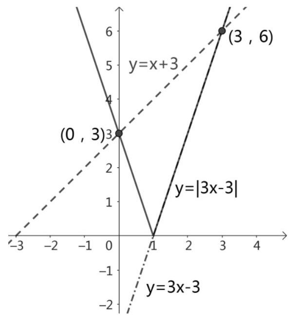

练习 2.3

1. 参照本节对 $a > 0$ 时二次函数 $y = a{x}^{2} + {bx} + c$ 的取值范围及相应的方程和不等式的解的情况的分析,自行分析当 $a < 0$ 时, ${b}^{2} - {4ac}$ 分别大于、等于、小于 0 的条件下,二次函数 $y = a{x}^{2} + {bx} + c$ 的取值范围,以及相应的方程和不等式的解 (集) 的情况, 并画出相应的简要函数图像。

2. 解下列不等式:

(1) ${22x} + 7 < 0$ ; (2) ${x}^{2} - {11x} + {26} < 0$ ;

(3) ${x}^{2} + {22x} + {121} \geq  0$ ； (4) ${x}^{4} + {x}^{2} - 2 > 0$ ；

(5) $\frac{1}{x + 1} + \frac{1}{x - 1} > 2$ ; (6) $\left| {x - 2}\right|  \leq  \left| {x + 1}\right|$ 。

3. 比较下列各组表达式的大小:

(1) $\sqrt{x + 3} - 1$ ；(2) ${x}^{2} + {2x} + 1$ ___ ${2{x}^{2}} + 2$ ；(3) ${x}^{4} + {12}$ ___ $6{x}^{2} + 3$ 。

4. 已知 $A = \left\{  {x \mid  {x}^{2} - {11x} + {28} < 0}\right\}  , B = \left\{  {x \mid  {x}^{2} - {5x} - 6 > 0}\right\}$ ,求下列集合:

(1) $A \cap  B$ ；(2) $A \cup  B$ ；(3) ${\mathrm{C}}_{\mathrm{U}}A \cup  {\mathrm{C}}_{\mathrm{U}}B$ 。

### 2.4 基本不等式

利用运算的基本性质, 可以推出完全平方公式、平方差公式、立方和公式、 立方差公式等公式, 它们统称为乘法公式, 在分析处理等式时非常方便好用, 不等关系中也有类似方便好用的不等式, 叫作基本不等式。

#### 2.4.1 基本不等式

利用完全平方数恒大于等于 0 的性质，经过一些简单的数学变换，可以得到一组常用的不等式关系，这些不等式关系在解不等式、证明不等式、求表达式的最大值或最小值时非常实用。

已知完全平方数恒大于等于 $0 : \forall x, y \in  \mathbf{R},\;{\left( x - y\right) }^{2} \geq  0$ ,当且仅当 $x = y$ 时, 等号成立,将完全平方项展开并移项可得: $\frac{{x}^{2} + {y}^{2}}{2} \geq  {xy}$ ,仍然当且仅当 $x = y$ 时, 等号成立。如果 $x > 0, y > 0$ ,可以设 $x = \sqrt{a}, y = \sqrt{b}$ ,代入上面的不等式可得:

$$
\frac{a + b}{2} \geq  \sqrt{ab}
$$

当且仅当 $\sqrt{a} = \sqrt{b}$ ,即 $a = b$ 时,等号成立。

该等式叫作基本不等式，又叫作均值不等式。

其中, $\frac{a + b}{2}$ 叫作正数 $a\text{ 、 }b$ 的算术平均数,等于 $a\text{ 、 }b$ 之和的一半; $\sqrt{ab}$ 叫作正数 $a\text{ 、 }b$ 的几何平均数,等于 $a\text{ 、 }b$ 乘积的平方根。

基本不等式的含义为:两个正实数的算术平均数始终大于等于它们的几何平均数，当且仅当两数相等时等号成立。

基本不等式有一种特殊情况,如果 $a\text{ 、 }b$ 互为倒数,即 $b = \frac{1}{a}$ ,那么:

$$
a + \frac{1}{a} \geq  2\sqrt{a \cdot  \frac{1}{a}} = 2
$$

当且仅当 $a = \frac{1}{a}$ ,即 $a = 1$ 时,等号成立。

即:一个正实数与它的倒数之和始终大于等于 2 ，当且仅当这个正实数等于 1 时, 和为最小值一-2。

利用基本不等式,如果已知两个正数 $a\text{ 、 }b$ 的和是定值,那么它们的积有最大值。如果已知两个正数 $a\text{ 、 }b$ 的积是定值,那么它们的和有最小值。相应的积的最大值、和的最小值可以利用基本不等式求得。

需注意，使用基本不等式时，作为 $a$ 与 $b$ 的两个表达式在变换过程中须保持完全一致，而不能只有部分一致。

例 2.11 用一根长 12 米的绳索围出一个矩形, 若要使矩形的面积最大, 求矩形的长和宽分别为多少?

解析: 设矩形的长为 $a$ ,宽为 $b$ ,由绳索的长为 12 米可得: $2\left( {a + b}\right)  = {12}$ ,

化简得: $a + b = 6$ ,

将基本不等式 $\sqrt{ab} \leq  \frac{a + b}{2}$ 的两边同时平方: ${ab} \leq  {\left( \frac{a + b}{2}\right) }^{2}$ ,

不等式的左边就是矩形的面积,其最大值为: $S = {ab} \leq  {\left( \frac{a + b}{2}\right) }^{2} = {\left( \frac{6}{2}\right) }^{2} = 9$ ,

当且仅当 $a = b = 3$ 时,围出的面积最大,为 $9{\mathrm{\;m}}^{2}$ 。

由本题可知: 所有周长相等的矩形中,正方形的面积最大。

例 2.12 已知 $x > 0, y > 0,{4x} + {3y} = 6$ ,求 ${xy}$ 的最大值。

解析: 本题已知 ${4x} + {3y} = 6$ 是定值,需将 ${4x}$ 和 ${3y}$ 分别当作整体看待,不能将系数与未知数分开,

利用基本不等式可得: ${xy} = \frac{1}{12}\left( {{4x} \cdot  {3y}}\right)  \leq  \frac{1}{12} \times  {\left( \frac{{4x} + {3y}}{2}\right) }^{2} = \frac{1}{12} \times  {\left( \frac{6}{2}\right) }^{2} = \frac{3}{4}$

当且仅当 ${4x} = {3y}$ ,即 $x = \frac{3}{4}, y = 1$ 时，等号成立。

#### 2.4.2 基本不等式与一元二次方程

已知 $x > 0, y > 0$ ,那么 $\frac{x + y}{2} \geq  \sqrt{xy}$ ,当且仅当 $x = y$ 时等号成立。该结论还可以从一元二次方程有解的角度推导, 过程如下:

设 $x > 0, y > 0, x + y = m, m$ 为定值,由此可得: $y = m - x$ ,

设 ${xy} = k$ ,将 $y = m - x$ 代入该等式可得: $x\left( {m - x}\right)  = k$ ,

化为一元二次方程的标准形式: ${x}^{2} - {mx} + k = 0$ ,

要让该方程有解,需满足: $\Delta  = {m}^{2} - {4k} \geq  0$ ,

上述关系可以看作关于 $k$ 的不等式,解得: $k \leq  \frac{{m}^{2}}{4}$ ,

该结论与直接使用基本不等式相同: $k = {xy} \leq  {\left( \frac{x + y}{2}\right) }^{2} = \frac{{m}^{2}}{4}$ 。

这是因为推导基本不等式时, 使用的原理为完全平方数恒大于等于 0 , 而一元二次方程根的判别式的原理同样为完全平方项数大于等于 0 , 两者的原理相同, 因此可以推出相同的结论。对于一些需使用基本不等式求解或证明的最大值、最小值问题,如果已知关于 $x\text{ 、 }y$ 的一次表达式为定值: ${ax} + {by} = m$ ( $a\text{ 、 }b$ 为系数, $m$ 为定值)，要求关于 $x\text{ 、 }y$ 乘积的表达式的最值 $f\left( {xy}\right)$ ，还可以用下面的解法:

(1)将其中一个变量用另一个变量表示: $y = \frac{m - {ax}}{b}$ 或 $x = \frac{m - {by}}{a}$ ；

(2)设 $f\left( {xy}\right)  = k$ ，代入上述表达式消元，得到关于 $x$ 或 $y$ 的一元二次方程；

(3)利用方程有解或关于 $x$ 、 $y$ 的其他限制条件，求得 $k$ 的最值。

例 2.13 已知 $x > 0, y > 0, x + y = 4$ ,求 $\frac{1}{x} + \frac{1}{xy} + \frac{1}{y}$ 的最小值。

解析: 由 $x + y = 4$ 可得: $y = 4 - x$

设 $\frac{1}{x} + \frac{1}{xy} + \frac{1}{y} = k$ ,将 $y = 4 - x$ 代入得: $\frac{1}{x} + \frac{1}{x\left( {4 - x}\right) } + \frac{1}{4 - x} = k$

逐步化简,令等式的两边同时乘以 $x\left( {4 - x}\right)  : \left( {4 - x}\right)  + 1 + x = {kx}\left( {4 - x}\right)$ ,

移项、合并同类项,化为一元二次方程: $k{x}^{2} - {4kx} + 5 = 0$ ,

若方程有解,则须满足: $\Delta  = {\left( 4k\right) }^{2} - {4k} \times  5 \geq  0$ ,

解不等式得: $k \geq  \frac{5}{4}$ 或 $k \leq  0$ ，

因为 $x > 0$ , $y > 0$ ,所以 $k > 0$ ,舍去 $k \leq  0, k$ 的最小值为 $\frac{5}{4}$ ,

将 $k = \frac{5}{4}$ 代入 $k{x}^{2} - {4kx} + 5 = 0$ 得: $\frac{5}{4}{x}^{2} - 4 \times  \frac{5}{4}x + 5 = 0$ ，

解得: $x = 2, y = 2$ 。

本题也可以使用基本不等式求解:

$$
\frac{1}{x} + \frac{1}{xy} + \frac{1}{y} = \frac{x + y + 1}{xy} = \frac{5}{xy} \geq  \frac{5}{{\left( \frac{x + y}{2}\right) }^{2}} = \frac{5}{4}
$$

虽然本题使用基本不等式更简便, 但一些题目较难通过变形得到可使用基本不等式的形式, 从方程有解的角度求解思路会更简单, 虽然计算过程会稍复杂。

#### 2.4.3 基本不等式的拓展

利用推导基本不等式的思路, 还可以得到其他有用的不等式关系。

对于 $n$ 个实数 ${a}_{1}\text{ 、 }{a}_{2}\text{ 、 }\cdots \text{ 、 }{a}_{n}$ ,它们的算术平均数的定义为:

$$
\frac{{a}_{1} + {a}_{2} + \cdots  + {a}_{n}}{n}
$$

即全体数字相加后除以数字的个数,

对于 $n$ 个正实数 ${a}_{1}\text{ 、 }{a}_{2}\text{ 、 }\cdots \text{ 、 }{a}_{n}$ ,它们的几何平均数的定义为:

$$
\sqrt[n]{{a}_{1} \cdot  {a}_{2}\cdots  \cdot  {a}_{n}}
$$

即全体数字相乘后开数字个数的次方根。

对于任意 $n$ 个正实数，它们的算术平均数始终大于等于它们的几何平均数， 当且仅当这些数字全都相等时 (即 ${a}_{1} = {a}_{2} = \cdots  = {a}_{n}$ ),等号成立。

例 2.14 证明任意 3 个正实数满足基本不等式,即: 设 $a\text{ 、 }b\text{ 、 }c$ 均为正实数, 证明: ${a}^{2} + {b}^{2} + {c}^{2} \geq  {ab} + {bc} + {ca}$ 恒成立。

证明: 分别对 $a$ 与 $b$ 、 $b$ 与 $c$ 、 $c$ 与 $a$ 使用基本不等式:

$$
{a}^{2} + {b}^{2} \geq  {2ab},\;{b}^{2} + {c}^{2} \geq  {2bc},\;{c}^{2} + {a}^{2} \geq  {2ca},
$$

当且仅当 $a = b\text{ 、 }b = c\text{ 、 }c = a$ ,即 $a = b = c$ 时,等号成立。

将这 3 个不等式的左右两边分别相加:

$\left( {{a}^{2} + {b}^{2}}\right)  + \left( {{b}^{2} + {c}^{2}}\right)  + \left( {{c}^{2} + {a}^{2}}\right)  \geq  {2ab} + {2bc} + {2ca}$

化简得: ${a}^{2} + {b}^{2} + {c}^{2} \geq  {ab} + {bc} + {ca}$

当且仅当 $a = b = c$ 时等号成立。

例 2.15 已知 $a\text{ 、 }b\text{ 、 }c$ 均为正实数,证明: ${\left( a + b + c\right) }^{2} \geq  3\left( {{ab} + {bc} + {ca}}\right)$ 。

证明: 利用乘法的性质, 3 个数相加的平方展开为:

${\left( a + b + c\right) }^{2} = {a}^{2} + {b}^{2} + {c}^{2} + {2ab} + {2bc} + {2ac}$

将等式右边的 ${a}^{2} + {b}^{2} + {c}^{2}$ 拆分为 $\frac{1}{2}\left( {{a}^{2} + {b}^{2}}\right)  + \frac{1}{2}\left( {{b}^{2} + {c}^{2}}\right)  + \frac{1}{2}\left( {{c}^{2} + {a}^{2}}\right)$ ,使用基本不等式: $\frac{1}{2}\left( {{a}^{2} + {b}^{2}}\right)  + \frac{1}{2}\left( {{b}^{2} + {c}^{2}}\right)  + \frac{1}{2}\left( {{c}^{2} + {a}^{2}}\right)  \geq  \frac{1}{2} \times  {2ab} + \frac{1}{2} \times  {2bc} + \frac{1}{2} \times  {2ba} = {ab} + {bc} + {ca}$ , 当且仅当 $a = b = c$ 时,等号成立。

将上述不等式关系代入原等式可得:

$$
{\left( a + b + c\right) }^{2} \geq  {ab} + {bc} + {ca} + {2ab} + {2bc} + {2ac} = 3\left( {{ab} + {bc} + {ca}}\right) ,
$$

当且仅当 $a = b = c$ 时,等号成立。

基本不等式中, 全体变量的 “地位” 完全相同, 称它们等价, 对调任意两个变量的位置, 对公式不产生影响, 这是利用涉及多个变量的基本不等式的重要特征。实际使用中，一方面，不要区别对待其中某个变量，始终保持各变量“地位平等”, 另一方面, 如果几个变量 “地位不同”, 可以尝试将它们转化为 “地位相同”的表达式。

利用推导基本不等式的原理和思路，还能推出柯西不等式，虽然柯西不等式在高中阶段应用很少, 但其推导思路值得体会。

柯西不等式的内容为:对于任意实数 $a\text{ 、 }b\text{ 、 }c\text{ 、 }d$ ，下列不等式始终成立:

$$
\left( {{a}^{2} + {b}^{2}}\right) \left( {{c}^{2} + {d}^{2}}\right)  \geq  {\left( ac + bd\right) }^{2}
$$

当且仅当 ${ad} = {bc}$ 时，等号成立。

柯西不等式的证明如下:

利用完全平方公式展开下列两个平方项的求和, 并逐步化简:

$$
{\left( ac + bd\right) }^{2} + {\left( ad - bc\right) }^{2} = {a}^{2}{c}^{2} + {2acbd} + {b}^{2}{d}^{2} + {a}^{2}{d}^{2} - {2adbc} + {b}^{2}{c}^{2}
$$

$$
= {a}^{2}{c}^{2} + {b}^{2}{d}^{2} + {a}^{2}{d}^{2} + {b}^{2}{c}^{2}
$$

$$
= \left( {{a}^{2}{c}^{2} + {a}^{2}{d}^{2}}\right)  + \left( {{b}^{2}{d}^{2} + {b}^{2}{c}^{2}}\right)
$$

$$
= {a}^{2}\left( {{c}^{2} + {d}^{2}}\right)  + {b}^{2}\left( {{d}^{2} + {c}^{2}}\right)
$$

$$
= \left( {{a}^{2} + {b}^{2}}\right) \left( {{c}^{2} + {d}^{2}}\right)
$$

移项得: $\left( {{a}^{2} + {b}^{2}}\right) \left( {{c}^{2} + {d}^{2}}\right)  - {\left( ac + bd\right) }^{2} = {\left( ad - bc\right) }^{2} \geq  0$

当且仅当 ${ad} = {bc}$ 时,等号成立。

证明过程中, ${\left( ac + bd\right) }^{2}$ 与 ${\left( ad - bc\right) }^{2}$ 的交叉项恰好相同,可以相互抵消,这是一个较常用的化简思路。

#### 2.4.4 绝对值不等式

对于任意实数 $a\text{ 、 }b$ ,始终满足:

$$
\left| a\right|  + \left| b\right|  \geq  \left| {a + b}\right|  \geq  \parallel a\left| -\right| b\parallel
$$

该不等式叫作绝对值不等式。

绝对值不等式的证明较简单,对于前半段: $\left| a\right|  + \left| b\right|  \geq  \left| {a + b}\right|$ ,若 $a\text{ 、 }b$ 都是正数或负数,则 $\left| a\right|  + \left| b\right|$ 为它们的绝对值之和, $\left| {a + b}\right|$ 同样等于它们的绝对值之和, 此时 $\left| a\right|  + \left| b\right|  = \left| {a + b}\right|$ ; 若 $a\text{ 、 }b$ 为一正一负,则 $\left| a\right|  + \left| b\right|$ 为它们的绝对值之和,为两个正数的和, $\left| {a + b}\right|$ 等于它们的绝对值之差的绝对值,为两个正数之差的绝对值, 由正实数的加法可知两个实数之和大于它们的差的绝对值,此时 $\left| a\right|  + \left| b\right|  > \left| {a + b}\right|$ 。

对于后半段 $\left| {a + b}\right|  \geq  \parallel a\left| -\right| b\parallel$ ,若 $a\text{ 、 }b$ 都是正数或负数,则 $\left| {a + b}\right|$ 等于它们的绝对值之和, $\parallel a\left| -\right| b\parallel$ 等于它们的绝对值之差的绝对值,此时 $\left| {a + b}\right|  > \parallel a\left| -\right| b\parallel$ ; 若 $a\text{ 、 }b$ 为一正一负,则 $\left| {a + b}\right|$ 等于它们的绝对值之差的绝对值,为两个正数的差, $\parallel a\left| -\right| b\parallel$ 也等于它们的绝对值之差的绝对值,此时 $\left| {a + b}\right|  = \parallel a\left| -\right| b\parallel$ 。

绝对值不等式的原理较简单, 分情况讨论就能简单证明, 需熟练掌握在脑海中建立抽象的“绝对值相加减” 与 “数字相加减” 之间的联系。绝对值不等式在代数运算中的应用较少, 后续学习向量的知识后, 向量的绝对值不等式在几何中有更实际具体的含义。

## 练习 2.4

1. 基本不等式中,如果将 $a$ 与 $b$ 的位置互换,新得到不等式是否还成立? 思考基本不等式中 $a$ 与 $b$ 是否有区别,如有,区别是什么?

2. 证明: $\forall a, b \in  \mathbf{R},{a}^{2} + {b}^{2} \geq  \frac{1}{2}{\left( a + b\right) }^{2}$ 。

3. 证明: $\forall a, b, c \in  \mathbf{R},{a}^{2} + {b}^{2} + {c}^{2} \geq  {ab} + {bc} + {ca}$ ,当且仅当 $a = b = c$ 时, 等号成立。

4. 已知 $a, b$ 是正实数， $a + b = 4$ ，求 $\sqrt{\frac{1}{ab}}$ 的最小值，以及在什么情况下取到最小值?

5. 已知 $x, y$ 是正实数， $x + {2y} = {16}$ ，求 ${xy}$ 的最大值，以及在什么情况下可以取到最大值?

6. 已知 $a, b, c$ 是正实数， $a + b + c = 9$ ，求 ${ab} + {ac}$ 的最大值，以及在什么情况下取到最大值?

## 小结

本章主要学习等式和不等式的基本性质, 回顾总结加、减、乘、除运算的现实含义、基本性质, 以及相应的数域的扩充, 学习解不等式的基本思路和方法、 一元一次不等式、一元二次不等式的解法, 它们与相应的方程和函数的关系, 以及它们的几何含义, 还学习了基本不等式的推导和应用, 需透彻理解基本运算、 相等和不等的现实含义，等式和不等式的基本解法和几何含义，熟练掌握等式和不等式的化简、变换及其他分析处理方式, 掌握基本不等式的应用。

## 第三章 函数的概念与性质

函数是贯穿整个高中数学的重要内容, 函数既是抽象的数学概念, 也是分析解决问题的实用工具。函数的实用性体现在方方面面，不仅限于数学，在自然科学、社会科学、工程技术、经济金融、现实生活等各领域中都能发挥重要作用。

函数与方程和不等式有显著不同, 方程和不等式是对 “不变” 的数学关系进行分析处理，函数可以描述动态的变化、变化的趋势、不同变化之间的关系，以及蕴含全部信息的全局视野。

高中阶段，函数的内容主要通过数学运算体现，既包括已经学习的加、减、 乘、除、乘方、开方等运算，也包括将要学习的指数、对数、三角函数等运算， 将运算的规律与函数的性质联系起来，可以起到事半功倍的效果。

函数具有非常鲜明的 “数形结合” 的特点, 函数解析式与函数图像之间有非常密切的联系，函数的性质及特点在解析式和图像上都有体现，灵活地将解析式与图像联系起来，可以让很多问题得到极大简化。

函数还是一种思想, 学习函数时需注重体会和运用 “函数思想”, 将物理、 化学等学科的知识及现实中的现象转化成函数关系, 用函数的概念和性质分析解决问题, 对学好数学以及其他学科、处理好生活与娱乐都有很大帮助。

### 3.1 函数的概念及表示

我们在初中已经初步学习了函数的概念和一次函数、二次函数的知识，现在更系统地学习函数的概念与表示方法。

#### 3.1.1 函数与映射

汉语的“函数”一词最早由清代数学家李善兰在其著作《代数学》中翻译出现，李善兰对“函数”的解释为:“凡此变数中函彼变数者，则此为彼之函数”。 这句话的意思是:如果一个变数的变化中蕴含着另一个变数的变化，那么就称这个变数是另一个变数的函数。

函数的英文单词是 “function”，该单词还有 “功能” “作用” 的含义。 “ $B$ 是 $A$ 的函数” 的意思为:如果变量 $A$ 施加某种 “功能” 或 “作用”,可以得到变量 $B$ ,此时称变量 $B$ 是变量 $A$ 的函数。

汉语和英语对函数的描述有所不同，但都表达了类似的含义:有两个变量， 且它们各自的变化之间有对应关系。函数可以看作两个集合之间的对应关系, 对于一个函数，输入一个元素，就可以输出一个相应的元素。

数学中用 “映射” 描述两个集合之间的对应关系。对于两个非空集合 $A$ 和 $B$ , 如果存在某种对应关系,让 $A$ 中的每个元素都对应 $B$ 中的某一个元素,这种对应关系叫作映射,叫作从 $A$ 到 $B$ 的一个映射,记作 $A \rightarrow  B$ 。

对应关系通常用小写字母 $f$ 表示,叫作 $f$ 是从 $A$ 到 $B$ 的一个映射。若 $A$ 中的一个元素 ${a}_{1}$ ,在对应关系 $f$ 的作用下,对应 $B$ 中的元素 ${b}_{1}$ ,就称 ${b}_{1}$ 是 ${a}_{1}$ 的像, ${a}_{1}$ 是 ${b}_{1}$ 的原像,记作 $f\left( {a}_{1}\right)  = {b}_{1}$ 。

映射关系 $A \rightarrow  B$ 中, $A$ 中的每个元素都必须能在 $B$ 中找到它的像,且 $A$ 中的每个元素都只能在 $B$ 中找到一个像,而不需要 $B$ 中的每个元素都能在 $A$ 中找到它的原像,且 $B$ 中的某个或某些元素可以在 $A$ 中找到不止一个原像。

下面列举一些具体的映射作为例子。

映射 $1 : A = \{$ 狮子,老虎,蚂蚁,蜘蛛,猫头鹰,人 $\} , B = \{ 1,2,3,4,5,6,7,8,9,{10}\}$ , 映射 $f :$ 腿的数量。根据生物学知识可知， $f\left( \text{ 狮子 }\right)  = 4, f\left( \text{ 老虎 }\right)  = 4, f\left( \text{ 蚂蚁 }\right)  = 6$ , $f$ (蜘蛛) = 8， $f$ (猫头鹰) = 2， $f\left( \text{ 人 }\right)  = 2$ 。

$A$ 中的每个元素通过对应关系 $f$ 的作用,都能与 $B$ 中的唯一的一个元素对应, $f$ 是从 $A$ 到 $B$ 的一个映射。 $A$ 中的每个元素都有像,且只有一个像, $B$ 中的 6 和 8 各有 1 个原像, 2 和 4 各有 2 个原像, 1、3、5、7、9、10 没有原像。

$A$ 与 $B$ 不能通过反过来的对应关系 $f$ 形成从 $B$ 到 $A$ 的映射,即不能根据 “ $B$ 中数字的腿数” 确定 “ $A$ 中的动物种类”,这是因为 2 和 4 对应的 $A$ 中的动物不止一个，且 1、3、5、7、9、10 没有对应的动物，不满足映射的要求。

再举一个更数学的例子:

映射 2: $A = \{ a \mid  a \in  \mathbf{N}\} , B = \{ b \mid  b = {2k}, k \in  \mathbf{N}\}$ ,对应关系 $f : f\left( x\right)  = {2x}$ 。 根据集合的表达式可知， $A$ 中的元素为全体整数， $B$ 中的元素为全体偶数，例如， $1 \in  A,2 \times  1 = 2,2 \in  B;0 \in  A,2 \times  0 = 0,0 \in  B; - 3 \in  A,2 \times  \left( {-3}\right)  =  - 6, - 6 \in  B$ 。

$A$ 中的每个元素通过对应关系 $f$ 的作用,都能与 $B$ 中的唯一的一个元素对应, $f$ 是从 $A$ 到 $B$ 的一个映射。 $A$ 中的每个元素都有像,且只有一个像。这个映射中,恰好 $B$ 中的每个元素,都能在 $A$ 中找到唯一的一个原象。

最后举一个随意的例子:

映射 3: $A = \{$ 苹果,鹦鹉,巧克力,数学,宇宙 $\} , B = \{ 2,3,5,7,{11},{13},\cdots \cdots \}$ , 对应关系: $f\left( \text{ 苹果 }\right)  = 2, f\left( \text{ 鹦鹉 }\right)  = 3, f\left( \text{ 巧克力 }\right)  = 5, f\left( \text{ 数学 }\right)  = 7, f\left( \text{ 宇宙 }\right)  = {11}$ 。 根据……其实没有任何根据, $A$ 与 $B$ 是作者临时随便想的集合,其中 $B$ 是全体质数, $A$ 是恰好此时想到的东西,配对方式也是临时随便想的,虽然既 “临时” 又 “随便”,但这也是一种映射关系 $A \rightarrow  B, A$ 中的每个元素通过对应关系 $f$ 的作用,都能与 $B$ 中的唯一的一个元素对应。虽然这个映射毫无意义,但它的确是一个映射, 其实这个映射也有一点意义, 就是告诉读者: 映射只是一种对应关系, 它可以有数学或科学意义, 也可以毫无意义。

有三种较特殊的映射: 单射、满射、一一映射。

在映射 $A \rightarrow  B$ 中,如果 $A$ 中的全体元素对应的像没有重复,即 $B$ 中的每个元素至多只有一个原像(允许有的元素没有原象)，就称 $A \rightarrow  B$ 是单射。

前面的例子中,映射 1 不是单射, $A$ 中的老虎与狮子都对应 $B$ 中的 4,猫头鹰与人都对应 $B$ 中的 2,不同的原象对应的像有重复; 映射 2 与映射 3 都是单射, 映射 2 中不同整数的 2 倍各不相同，映射 3 中每个元素对应的数字各不相同。

在映射 $A \rightarrow  B$ 中,如果 $B$ 中的每个元素都能在 $A$ 中找到原像,即 $B$ 中没有“闲置”的元素，就称 $A \rightarrow  B$ 是满射。满射关系 $A \rightarrow  B$ 中， $A$ 叫作定义域或原像集， $B$ 叫作值域或像集。

前面的例子中,映射 1 和映射 3 不是满射,因为映射 1 中, $B$ 中的 $1\text{ 、 }3\text{ 、 }5$ 、 7、9、10 没有原像，映射 3 中， $B$ 中除 2、3、5、7、11 外的其他元素都没有原象。映射 2 是满射, 每个偶数除以 2 , 都能得到唯一的一个整数。

如果映射 $A \rightarrow  B$ 既是单射又是满射,就称 $A \rightarrow  B$ 是一一映射,又叫作双射。 即 $A$ 中的每一个元素与 $B$ 中的每一个元素唯一对应。通常如果 $A \rightarrow  B$ 是一一映射,那么能找到反过来的映射关系 $B \rightarrow  A$ 。

前面的例子中, 映射 1 既不是单射也不是满射, 因此不是一一映射。映射 3 虽然是单射但不是满射, 因此也不是一一映射。映射 2 既是单射又是满射, 是一一映射,映射 $A \rightarrow  B$ 的数学含义是每个整数乘以 2 能得到唯一的偶数,反过来能建立映射 $B \rightarrow  A$ ,它的数学含义是每个偶数除以 2 都能得到唯一的整数。

数学中，映射关系是一种重要的基本关系，它的重要性表现为 “联系”，就像等号和不等号建立起数字上的联系, 映射建立起逻辑上的联系, 逻辑将在后续的数学学习中成为越来越重要的线索和脉络。

映射通过确定的对应关系, 将两个集合联系起来, 这两个集合多为实数集 (可看作数轴上的一部分)或平面内的点集(可看作实数对构成的集合)，这个对应关系通常是数学表达式。

已知定义域和对应关系的情况下，通常能计算或推断出相应的值域。已知值域和对应关系的情况下, 有时可以倒推出相应的定义域。已知定义域和值域的情况下，有时可以指出一种可行的对应关系。

利用数学定理中的表达式,依次逐个使用多个映射关系,形成 $A \rightarrow  B$ , $B \rightarrow  C, C \rightarrow  D$ 等一系列映射链条,就得到了严谨的演绎链条。正是通过这种链条, 可以将复杂的条件变成简单的条件, 将没见过的条件变成熟悉的条件, 根据已知条件推导出未知条件, 这是数学及各学科分析解决问题的基本思路。

#### 3.1.2 函数的概念

函数是一种映射, 可以看作仅限于数学领域的映射, 由于函数的 “知名度” 远高于映射, 因此非数学化的领域经常用函数代替映射。

函数的定义为: 对于集合 $A$ 和集合 $B$ ,以及对应关系 $f$ ,如果集合 $A$ 中的任意一个元素 $x$ ,在对应关系 $f$ 的作用下,都能在集合 $B$ 中找到唯一确定的元素 $y$ 与之对应,那么就称 $f : A \rightarrow  B$ 是从集合 $A$ 到集合 $B$ 的一个函数,记作:

$$
y = f\left( x\right) , x \in  A
$$

其中, $x$ 叫作自变量, $x$ 的取值范围,即 $x$ 的所有取值组成的集合 $A$ ,叫作定义域。 $y$ 叫作因变量, $y$ 的取值范围,即 $y$ 的所有取值组成的集合,叫作值域。 集合 $B$ 中可能有部分元素不属于函数的值域,所以值域是集合 $B$ 的子集,通常只只研究函数的定义域和值域,不专门讨论集合 $B$ 。对于一个确定的 $x$ ,通过对应关系 $f$ 得到的 $y$ 的值叫作 (这个 $x$ 的) 函数值。

关于函数的定义，下列四个方面需要重点注意:

1. 函数有三个基本要素:定义域、值域、对应关系，三者缺一不可(学习和解题中, 经常会出现只重视对应关系、忽视定义域核值域的问题);

2. 函数的定义域和值域必须都是非空集，各含至少一个元素；

3. 对于一个函数 $y = f\left( x\right)$ ,自变量的每一个取值,在对应关系 $f$ 的作用下, 只能有唯一的一个函数值, 不能有多个不同的函数值;

4. 对于一个函数 $y = f\left( x\right)$ ,自变量取不同的值时,对应的函数值可以相同, 甚至可以定义域中的所有元素都对应同一个函数值。

如果已知定义域和对应关系，通常可以推算出值域。如果已知定义域和值域， 无法确定对应关系。如果已知值域和对应关系，通常可以推算出不属于定义域的范围，从而得到定义域的最大范围。定义域还可以根据实际需要专门设置。

数学中, 函数的对应关系大都以代数表达式的形式出现, 函数的定义域必须是让函数的对应关系有意义的数集, 须满足根号内不能为负数、分母不能为 0 、 对数的真数大于 0 等条件。还可以根据实际需要, 在确保函数有意义的条件下, 专门设置某一更小的范围为定义域。

函数的对应关系有时记作: $y =$ 关于 $x$ 的表达式,如 $y = {2x} + 1$ ; 函数的对应关系有时也记作: $f\left( x\right)  =$ 关于 $x$ 的表达式,如 $f\left( x\right)  = {2x} + 1$ ; 这两种记法没有实质区别,前者突出 $y$ 是一个变量, $x$ 是另一个变量,后者突出这是关于 $x$ 的函数, “ $f\left( x\right)$ ” 的含义就是 “关于 $x$ 的表达式”,函数有时还记作: $y = f\left( x\right)$ ,意为 “ $y$ 是关于 $x$ 的函数”。

下面列举一些具体的函数作为例子。

函数 1 设函数 $y = f\left( x\right)$ 的定义域为 $\{ x \mid  x$ 是水果 $\}$ ,对应关系为 $f\left( x\right)  = x$ 果汁, 相应的值域为 $\{ y \mid  y$ 是果汁 $\}$ 。

每一种水果都有唯一对应的果汁, 如果改变水果的种类, 得到的果汁的也随之变化。由生活常识可知, 苹果、葡萄、西瓜都属于定义域, 按照对应法则, $f$ (苹果) = 苹果汁, $f$ (葡萄) = 葡萄汁, $f$ (西瓜) = 西瓜汁。

函数 2 一台计时器从 0 时刻开始计时 1 小时，用函数表示记录的分钟 $y$ 与 $x$ 的函数关系。

根据常用计时单位,60秒为1分钟,分钟 $y$ 与秒 $x$ 的对应关系为:

$$
y = \frac{x}{60}
$$

计时的时刻从 0 时刻开始, 共计时 1 小时, 即 3600 秒, 因此定义域为:

$$
0 \leq  x \leq  {3600}
$$

相应的值域为:

$$
0 \leq  y \leq  {60}
$$

函数 3 一辆吊车以 $1\mathrm{\;m}/\mathrm{s}$ 的速率,将物体从地下 ${20}\mathrm{\;m}$ 的坑道中抬起,最终升高到地上 $5\mathrm{\;m}$ 处,从开始抬起物体的时刻启动计时,用函数表示物体的高度 $h$ 与时间 $t$ 之间的函数关系。

将地面的高度设为 0,物体的初始高度为地下 ${20}\mathrm{\;m}$ ,可记作 -20,物体最终被抬起的高度为地上 $5\mathrm{\;m}$ ，记作 5 ，该函数的值域为:

$$
- {20} \leq  h \leq  5
$$

物体被抬起的总高度为: ${{20} + 5} = {{25}\left( \mathrm{m}\right) }$ ，抬起的速率为 ${1\mathrm{\;m}}/\mathrm{s}$ ，经历的时间为: ${25} \div  1 = {25}\left( \mathrm{\;s}\right)$ ,该函数的定义域为:

$$
0 \leq  t \leq  {25}
$$

物体的初始高度为 $- {20}\mathrm{\;m}$ ，每 $1\mathrm{\;s}$ 被抬高 $1\mathrm{\;m}$ ，高度随时间变化的函数关系为:

$$
h =  - {20} + t
$$

#### 3.1.3 实数区间的表示

数学中, 常见的函数的定义域和值域分别为一段连续的实数区间, 我们现在学习一种能简便地表示一段连续的实数区间的记法: 分别写出这段连续实数区间的最小值和最大值, 中间用逗号 “, ”隔开, 两端用相应的括号括起来。

包含最小值 $a$ 和最大值 $b$ 的连续实数区间叫作闭区间,用方括号括起来,记作 $\left\lbrack  {a, b}\right\rbrack$ ,即 $a \leq  x \leq  b$ 也记作 $x \in  \left\lbrack  {a, b}\right\rbrack$ 。

不包含最小值 $a$ 和最大值 $b$ 的连续实数区间叫作开区间,用圆括号括起来, 记作 $\left( {a, b}\right)$ ,即 $a < x < b$ 也记作 $x \in  \left( {a, b}\right)$ 。

包含最小值 $a$ 、不包含最大值 $b$ 的连续实数区间叫作左闭右开区间，左边用方括号,右边用圆括号,记作 $\lbrack a, b)$ ,即 $a \leq  x < b$ 也记作 $x \in  \lbrack a, b)$ 。

不包含最小值 $a$ 、包含最大值 $b$ 的连续实数区间叫作左开右闭区间，左边用圆括号,右边用方括号,记作 $(a, b\rbrack$ ,即 $a < x \leq  b$ 也记作 $x \in  (a, b\rbrack$ 。

左闭右开区间和左开右闭区间都叫作半开半闭区间。

区间的最小值 $a$ 又叫作区间的下界,最大值 $b$ 又叫作区间的上界,下界与上界统称为区间的端点。闭区间的端点属于该区间，开区间的端点不属于该区间。

下面列举一些具体的实数区间作为例子。

1. $A = \{ x \mid   - 1 \leq  x \leq  1\}$ 可以表示为: $\left\lbrack  {-1,1}\right\rbrack$ ,这是一个闭区间。

2. $B = \{ x \mid   - {20} < x <  - {18}\}$ 可以表示为: $\left( {-{20}, - {18}}\right)$ ,这是一个开区间。

3. $C = \{ x \mid   - 1 \leq  x < 1\}$ 可以表示为: $\lbrack  - 1,1)$ ,这是一个左闭右开区间。

4. $D = \{ x \mid  0 < x \leq  2\}$ 可以表示为: $(0,2\rbrack$ ，这是一个左开右闭区间。

5. $E = \{ x \mid  x \leq   - 1\}$ 可以表示为: $( - \infty , - 1\rbrack$ ，其中 “ $- \infty$ ” 叫作负无穷大，“ $\infty$ ” 是横过来写的 “ 8 ”, -∞表示绝对值无穷大的负数, 在数轴负方向的无穷远处, $- \infty$ 小于任何已经确定取值的实数,其绝对值 $\left| {-\infty }\right|$ 大于任何已经确定取值的实数。

6. $F = \{ x \mid  x > 5\}$ 可以表示为: $\left( {5, + \infty }\right)$ ,其中 “+0 ”叫作正无穷大,表示绝对值无穷大的正数，在数轴正方向的无穷远处， $+ \infty$ 及其绝对值 $\left| {+\infty }\right|$ 大于任何已经确定取值的实数。

正负无穷大是抽象出来的数学概念, 在现实中无法真正达到, 只能尽量近似, 因此正负无穷大所在的一侧都是开区间,实数集 $\mathbf{R}$ 也可以记作 $\left( {-\infty , + \infty }\right)$ ,通常不比较 $- \infty$ 与 $+ \infty$ 的绝对值的大小。

在数轴上作图时, 闭区间一侧的端点用实心圆点标记, 开区间一侧的端点用空心小圆圈标记。上述实数区间在数轴上的表示如下图所示。

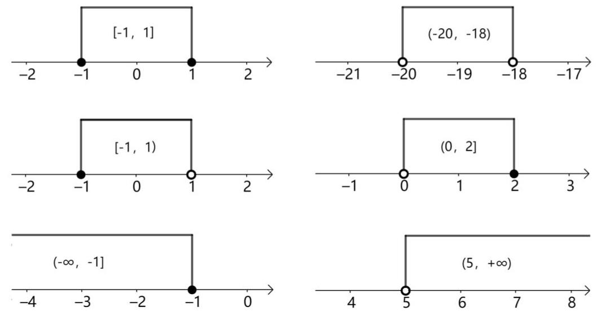

#### 3.1.4 函数的表示法

函数有三种主要表示方法:解析法、列表法、图像法。

解析法是用数学表达式 (又叫作解析式) 表示自变量与因变量之间的对应关系的方法。解析法是最常用的表示方法, 根据解析式可以分析得出函数的特点和性质。

列表法是将自变量与对应的因变量列成表格, 展示自变量与因变量之间的对应关系的方法。列表法多用于实际的科研探索中采集数据、分析得出函数关系, 在学习阶段很少使用, 因为如果列出的数据较少, 就无法充分展示函数的性质; 如果列出的数据较多, 就需要大量的计算和书写工作, 导致效率很低, 计算机技术很好地解决了这个问题。

图像法是用函数图像展示自变量与因变量之间的对应关系的方法, 通常需建立平面直角坐标系,将自变量 $x$ 和因变量 $y$ 构成的实数对 $\left( {x, y}\right)$ 描绘在坐标系中, 就得到函数的图像。函数图像可以直观地展示函数的特点和性质, 还能利用几何知识帮助分析函数的性质, 在此基础上有的放矢地进行分析会更高效。图像法常与解析法共同使用，根据需要利用两种方法各自的优点。

实际应用中, 图像上的各点的坐标仍需通过测量或计算得到, 图像法同样具有若点较少则无法充分展示、若点较多则工作量太大的问题, 好在很多具有相似解析式的函数图像具有相同的基本形状, 只是具体的细节和位置略有差异, 实际上只需求得若干特殊点的位置, 就能根据这一类函数的基本形状描绘出函数的具体图像。借助计算机技术，采集数据并绘制图像已经非常便捷。

例 3.1 已知函数的定义域为 $\{ x \mid  x \in  \mathbf{R}\}$ ,对应关系为 $f\left( x\right)  = x + 1$ ,求函数的值域，并用列表法和图像法表示该函数。

解析: 该函数的定义域为全体实数,对应关系为 $f\left( x\right)  = x + 1$ ,即让相应的实数 $x$ 加 1,所得结果仍为实数。任意函数值 $y$ 都可以由 $f\left( {y - 1}\right)  = \left( {y - 1}\right)  + 1 = y$ 得到, 因此值域也为全体实数,即 $\{ y \mid  y \in  \mathbf{R}\}$ 。

用列表法表示该函数，自行选取若干 $x$ 并计算出相应的 $f\left( x\right)$ ，绘制成表格:

<table><tr><td>$x$</td><td>-3</td><td>-2</td><td>-1</td><td>0</td><td>1</td><td>2</td><td>3</td></tr><tr><td>$y$</td><td>-2</td><td>-1</td><td>0</td><td>1</td><td>2</td><td>3</td><td>4</td></tr></table>

用图像法表示该函数，一次函数的图像是一条直线，由几何知识可知:两点可以确定一条直线，从上表中任意选取两点，绘制出经过这两点的直线即可，如下页图所示。

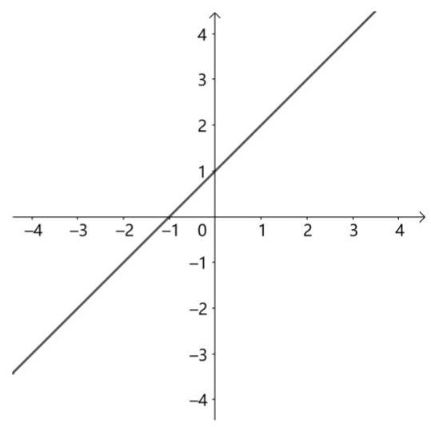

例 3.2 已知函数的定义域为 $\{ x \mid  x \in  \mathbf{R}\}$ ,对应关系为 $f\left( x\right)  = {x}^{2}$ ,求函数的值域, 并用列表法和图像法表示该函数。

解析: 该函数的定义域为全体实数,对应关系为 $f\left( x\right)  = {x}^{2}$ ,即对相应的实数进行平方运算,所得的结果只能为正数或 0 。任意非负的函数值 $y$ 都可以由 $f\left( \sqrt{y}\right)  = {\left( \sqrt{y}\right) }^{2} = y$ 得到,因此值域为全体非负实数,即 $\{ y \mid  y \geq  0\}$ 。

用列表法表示该函数，自行选取若干 $x$ 并计算出相应的 $f\left( x\right)$ ，绘制成表格， 由于该函数关于 $y$ 轴对称,即一个数与它的相反数的平方相等,因此通常列出对称轴经过的点 $\left( {0,0}\right)$ 和若干对称的点,以便于在表中展示该性质:

<table><tr><td>$x$</td><td>-3</td><td>-2</td><td>-1</td><td>0</td><td>1</td><td>2</td><td>3</td></tr><tr><td>$y$</td><td>9</td><td>4</td><td>1</td><td>0</td><td>1</td><td>4</td><td>9</td></tr></table>

用图像法表示该函数，二次函数的图像的形状是抛物线。细节方面，该函数 ${x}^{2}$ 项前的系数为正数,开口向上,最低点为 $\left( {0,0}\right)$ ,且函数图像关于 $y$ 轴对称, 根据需要画出函数经过的若干点，再用平滑的曲线连接这些点即可，如下图所示。

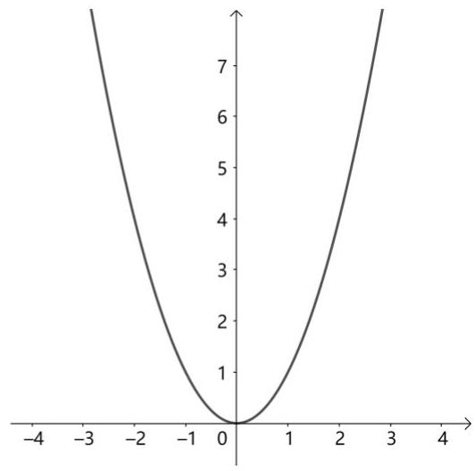

例 3.3 已知函数的定义域为 $\{ x \mid  x \in  \mathbf{Z}\}$ ,对应关系为:

$$
f\left( x\right)  = \left\{  \begin{array}{lll} x & x = {2k} & \left( {k \in  \mathbf{Z}}\right) \\  x + 1 & x = {2k} + 1 & \left( {k \in  \mathbf{Z}}\right)  \end{array}\right.
$$

用列表法和图像法表示该函数。

解析: 该函数的定义域是全体整数,是一些分散的点,且对于不同的 $x$ ,对应关系有所不同。

当 $x$ 为偶数时, $f\left( x\right)  = x$ ,函数值等于 $x$ 本身;

当 $x$ 为奇数时, $f\left( x\right)  = x + 1$ ,函数值为比它大 1 的自然数,为偶数。

该函数的值域为全体偶数: $\{ x \mid  x = {2k}, k \in  \mathbf{Z}\}$ 。

用列表法表示该函数，由于该函数的定义域是分散的点，直接选取若干点即可， 为更好地体现函数在原点左右两侧的特点，列出原点左右两侧的若干点:

<table><tr><td>$x$</td><td>-3</td><td>-2</td><td>-1</td><td>0</td><td>1</td><td>2</td><td>3</td></tr><tr><td>$y$</td><td>-2</td><td>-2</td><td>0</td><td>0</td><td>2</td><td>2</td><td>4</td></tr></table>

用图像法表示该函数:

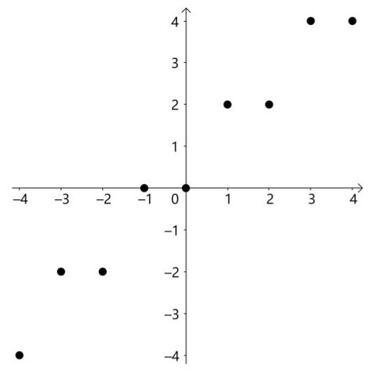

练习 3.1

1. 已知函数 $f\left( x\right)  =  - {x}^{2} + {6x} - 9$ ，求下列各函数值:

(1) $f\left( 0\right)$ ； (2) $f\left( 3\right)$ ； (3) $f\left( 6\right)$ ； (4) $f\left( x\right)  - f\left( {6 - x}\right)$ 。

2. 求下列函数的定义域:

(1) $y = \sqrt{x - 2}$ (2) $y = \sqrt{{x}^{2} - 6}$ ； (3) $y = \frac{1}{\sqrt{x - 2}}$ ； (4) $y = \frac{1}{x} + \frac{1}{x + 1}$ 。

3. 求下列函数的值域:

(1) $y = {4x}$ ， $x \in  \left\lbrack  {-2,2}\right\rbrack$ ；(2) $y =  - 2{x}^{2}$ ， $x \in  \left( {-2, - 1}\right)$ ；

(3) $y = x + \frac{1}{x}, x \in  \left( {0, + \infty }\right)$ ; (4) $y = \frac{\sqrt{2}}{\sqrt{x - 1}}, x \in  \left( {1,2}\right)$ 。

4. 绘制下列函数的图像:

(1) $y =  - x$ ; (2) $y =  - {x}^{2} + {6x} + {12}$ ; (3) $y = \frac{{x}^{2} - 1}{x - 1}$ ;

(4) $y = 2, x \in  \left\lbrack  {-1,1}\right\rbrack$ ; (5) $y = \left\{  \begin{array}{ll}  - 1 & \left( {x < 0}\right) \\  0 & \left( {x = 0}\right) \\  1 & \left( {x > 0}\right)  \end{array}\right.$ ， $x \in  \left\lbrack  {-1,1}\right\rbrack$ 。

### 3.2 函数的基本性质

函数是非常有用的数学工具, 函数的应用主要是对函数的基本性质的应用。 函数的基本性质主要包括单调性、奇偶性、周期性、连续性、反函数。本章先学习函数的单调性和奇偶性, 函数的连续性和反函数将在指数函数与对数函数的章节具体学习，函数的周期性将在三角函数的章节具体学习。函数的基本性质通常可以从图像上直接看出来, 严谨的分析和证明需通过解析式实现。

#### 3.2.1 函数的单调性

单调性是描述函数的变化趋势的性质, 即自变量与因变量协同变化的趋势。

如果一个函数在其定义域(或某个连续区间)，因变量 $y$ 总是随自变量 $x$ 增大而增大, 就称该函数在其定义域(或这个连续区间)单调递增，又称该函数在其定义域(或这个区间)是增函数。如果一个函数在某个连续区间单调递增，那么这个区间叫作该函数的单调递增区间，简称递增区间或增区间。

从函数图像上看, 单调递增的函数, 图像从左向右的走势越来越高, 没有降低的情况。下图为函数 $y = x$ 的图像,该函数在全定义域上单调递增,注意体会函数图像从左向右的走势越来越高的特点。

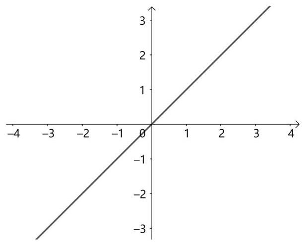

如果一个函数在其定义域(或某个连续区间)，因变量 $y$ 总是随自变量 $x$ 增大而减小, 就称该函数在其定义域(或这个连续区间)单调递减，又称该函数在其定义域(或这个区间)是减函数。如果一个函数在某个连续区间单调递减，那么这个区间叫作该函数的单调递减区间，简称递减区间或减区间。

从函数图像上看, 单调递减的函数, 图像从左向右的走势越来越低, 没有升高的情况。下图为函数 $y =  - x + 2$ 的图像,该函数在全定义域上单调递减,注意体会函数图像从左向右的走势越来越低的特点。

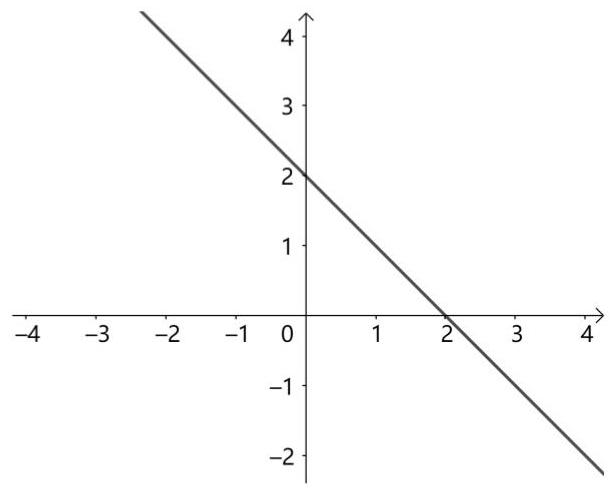

有的函数在定义域的一些区间上单调递增, 在另一些区间上单调递减, 需要分别讨论。下图为函数 $y = {x}^{2} - 2$ 的图像,该函数在区间 $\left( {-\infty ,0}\right)$ 单调递减,在区间 $\left( {0, + \infty }\right)$ 单调递增。

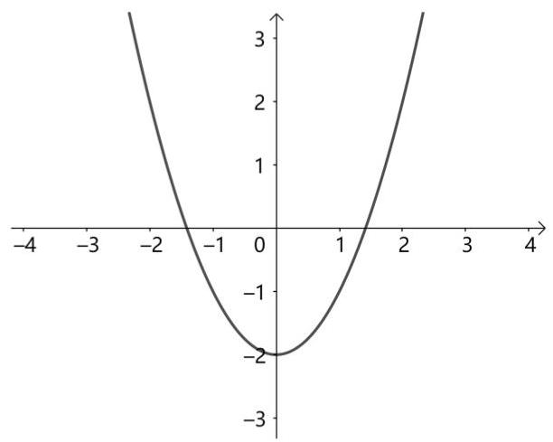

有的函数在定义域的不同区间上分别单调递增或单调递减,在跨越这些区间时不具有单调性,需要注意这种单调性被分隔开来的情况。下页图为函数 $y = \frac{1}{x}$ 的图像,该函数在区间 $\left( {-\infty ,0}\right)$ 和 $\left( {0, + \infty }\right)$ 分别单调递减,在跨越 $x = 0$ 点的区间上没有单调性。函数值在区间 $\left( {-\infty ,0}\right)$ 都为负,且绝对值逐渐增大,函数值在区间 $\left( {0, + \infty }\right)$ 都为正,且绝对值逐渐减小。

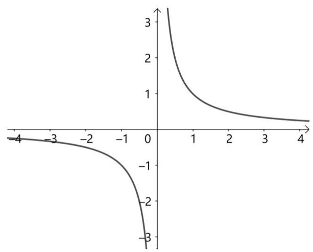

虽然从函数图像上能直观地看出递增或递减的趋势, 但函数的单调性仍需要用严谨的数学语言进行定义，并能利用单调性的定义分析和证明函数的单调性。 函数单调递增与单调递减的定义为:

设函数 $y = f\left( x\right)$ 的定义域为 $I$ ,对于定义域的一个子区间 $D \subseteq  I$ ,这个区间上的任意两个取值 ${x}_{1},{x}_{2} \in  D$ :

如果 $\forall {x}_{1} < {x}_{2}$ ,恒有 $f\left( {x}_{1}\right)  < f\left( {x}_{2}\right)$ ,就称 $f\left( x\right)$ 在区间 $\mathrm{D}$ 上单调递增;

如果 $\forall {x}_{1} < {x}_{2}$ ,恒有 $f\left( {x}_{1}\right)  > f\left( {x}_{2}\right)$ ,就称 $f\left( x\right)$ 在区间 $\mathrm{D}$ 上单调递减。

上述定义是根据函数解析式判断函数单调性的主要方法。

例 3.4 证明: 函数 $y = {x}^{2}$ 在区间 $\left( {-\infty ,0}\right)$ 单调递减,在区间 $\left( {0, + \infty }\right)$ 单调递增。

证明: 设 ${x}_{1},{x}_{2} \in  \left( {-\infty ,0}\right)$ ,且 ${x}_{1} < {x}_{2}$ ,那么:

$f\left( {x}_{1}\right)  - f\left( {x}_{2}\right)  = {x}_{1}^{2} - {x}_{2}^{2} = \left( {{x}_{1} + {x}_{2}}\right) \left( {{x}_{1} - {x}_{2}}\right) ,$

因为 ${x}_{1},{x}_{2} \in  \left( {-\infty ,0}\right)$ ,所以 ${x}_{1} + {x}_{2} < 0$ ,

又因为 ${x}_{1} < {x}_{2}$ ,所以 ${x}_{1} - {x}_{2} < 0$ ,

所以 $\left( {{x}_{1} + {x}_{2}}\right) \left( {{x}_{1} - {x}_{2}}\right)  > 0$ ,即 $f\left( {x}_{1}\right)  - f\left( {x}_{2}\right)  > 0$ ,

在区间 $\left( {-\infty ,0}\right) ,\forall {x}_{1} < {x}_{2}$ ,恒有 $f\left( {x}_{1}\right)  > f\left( {x}_{2}\right)$ ,

所以 $f\left( x\right)  = {x}^{2}$ 在区间 $\left( {-\infty ,0}\right)$ 单调递减;

设 ${x}_{1},{x}_{2} \in  \left( {0, + \infty }\right) ,{x}_{1} < {x}_{2}$ ,那么:

$f\left( {x}_{1}\right)  - f\left( {x}_{2}\right)  = {x}_{1}^{2} - {x}_{2}^{2} = \left( {{x}_{1} + {x}_{2}}\right) \left( {{x}_{1} - {x}_{2}}\right) ,$

因为 ${x}_{1},{x}_{2} \in  \left( {0, + \infty }\right)$ ,所以 ${x}_{1} + {x}_{2} > 0$ ,

又因为 ${x}_{1} < {x}_{2}$ ,所以 ${x}_{1} - {x}_{2} < 0$ ,

所以 $\left( {{x}_{1} + {x}_{2}}\right) \left( {{x}_{1} - {x}_{2}}\right)  < 0$ ,即 $f\left( {x}_{1}\right)  - f\left( {x}_{2}\right)  < 0$ ,

在区间 $\left( {0, + \infty }\right) ,\forall {x}_{1} < {x}_{2}$ ,恒有 $f\left( {x}_{1}\right)  < f\left( {x}_{2}\right)$ ,

所以 $f\left( x\right)  = {x}^{2}$ 在区间 $\left( {0, + \infty }\right)$ 单调递增。

单调递增和单调递减在生活中很常见。例如, 在自由落体运动中, 物体下落的距离随运动时间的延长而增大,如果以下落的时间 $t$ 为自变量,下落的距离 $s$ 为因变量,那么 “距离-时间” 函数 $s = f\left( t\right)$ 是增函数。

再例如, 从夏至到冬至期间, 随着天数的增加, 北半球的日照时长越来越短, 如果以天数 $d$ 为自变量,日照时长 $h$ 为因变量,那么日照时长随天数增大而减小, 北半球的 “日照时长-天数” 函数 $h = f\left( d\right)$ 在夏至到冬至的区间单调递减。注: 日照时长为太阳照射地球相应区域的时长, 不受天气影响。

#### 3.2.2 函数的最大值与最小值

有的函数有最大值和最小值, 函数的最大值是其全体函数值中最大的取值, 函数的最小值是其全体函数值中最小的取值。

从函数图像上看, 函数的最大值是其图像上最高点的纵坐标, 该点的纵坐标 $y$ 最大。函数的最小值是其图像上最低点的纵坐标,该点的纵坐标 $y$ 最小。

从函数解析式的角度, 函数的最大值和最小值的数学定义为:

对于定义域为 $I$ 的函数 $y = f\left( x\right)$ ,如果存在实数 $M$ 同时满足下列两个条件:

(1) $\exists {x}_{0} \in  I, f\left( {x}_{0}\right)  = M$ (函数值可以取到 $M$ )；

(2) $\forall x \in  I$ ，恒有 $f\left( x\right)  \leq  M$ (即函数的所有取值都不大于 $M$ )；

就称 $M$ 是 $f\left( x\right)$ 的最大值。

函数的最小值 $N$ 的定义与最大值相似,函数的所有取值都不小于 $N$ 且函数值可以取到 $N$ 。

“最大” 和 “最小” 通常分别用角标 $\max$ 和 $\min$ 表示,函数 $y = f\left( x\right)$ 的最大值和最小值可以分别表示为 ${y}_{\max }$ 和 ${y}_{\min }$ 。

有的函数既有最大值、又有最小值, 有的函数只有最大值、没有最小值。有的函数只有最小值、没有最大值。有的函数既没有最大值、又没有最小值。此外, 有的函数只在某一个点处取得其最大值或最小值, 有的函数在多个甚至无穷多个点处取得其最大值或最小值。后续学习和练习中会见到大量上述情况的函数。

下面分析 3.2.1 节中列举的函数的最大值与最小值的情况作为例子。

$y = x$ 没有最大值和最小值,当 $x$ 取任意大的值时, $y$ 可以任意大; 当 $x$ 取任意小的值时, $y$ 可以任意小,不限制定义域的一次函数都没有最大值和最小值。

$y =  - x + 2$ 没有最大值和最小值,当 $x$ 取任意大的值时, $y$ 可以任意小; 当 $x$ 取任意小的值时, $y$ 可以任意大。

$y = {x}^{2} - 2$ 没有最大值,当 $x$ 取任意大或任意小 (绝对值任意大负数) 的值时, $y$ 可以任意大; 该函数有最小值,当 $x = 0$ 时 ${y}_{\min } =  - 2$ 。

$y = \frac{1}{x}$ 没有最大值和最小值,当 $x$ 取非常接近 0 的正数时, $y$ 可以取任意大的正数,当 $x$ 取非常接近 0 的负数时, $y$ 可以取到任意小的负数,但 $x$ 不能为 0, 只能无限接近 0 , 因此取不到 “最大的正数” 或 “最小的负数”。

求函数的最大值或最小值时, 通常主要考虑 “极端” 的情况, 主要包括: 当 $x$ 为非常大的数、非常小的数、非常接近 0 的正数或负数、分母的表达式为非常接近 0 的正数或负数、根号内的表达式为 0 、完全平方数为 0 、对数的真数为 0 (将在下一章学习) 等情况。

例 3.5 求下列函数的最大值和最小值:

(1) $y = {4x}$ ；(2) $y =  - 3{x}^{2} + 9$ ；(3) $y = \frac{1}{{x}^{2} + 2}$ ；(4) $y = \sqrt{2 - x} + \sqrt{2 + x}$ 。

解析: (1) $y = {4x}$ 是一次函数,如果没有限定定义域,通常一次函数没有最大值和最小值。 $x$ 前的系数为 $4, y$ 随 $x$ 单调递增,当 $x$ 取任意大的值时, $y$ 可以任意大; 当 $x$ 取任意小的值时, $y$ 可以任意小,该函数没有最大值和最小值。

(2) $y =  - 3{x}^{2} + 9$ 是二次函数，二次项系数为 -3， $y$ 随 ${x}^{2}$ 增大而减小，当 $x = 0$ 时,该函数取最大值 ${y}_{\max } = 9$ ; 当 $x$ 取任意大或任意小的值时, $y$ 可以任意小, 该函数没有最小值。

(3) $y = \frac{1}{{x}^{2} + 2}$ ，分母 ${x}^{2} + 2$ 恒大于 0，且随 ${x}^{2}$ 增大而增大，函数的值恒大于 0,且随分母增大而减小。当 $x = 0$ 时,分母 ${x}^{2} + 2$ 取最小值 2,此时函数取最大值 ${y}_{\max } = \frac{1}{2}$ ; 当 $x$ 取任意大的值时, $y$ 为非常接近 0 的正数,但不会达到 0,该函数没有最小值。

(4) $y = \sqrt{2 - x} + \sqrt{2 + x}$ ，为了让函数解析式有意义，定义域须为 $- 2 \leq  x \leq  2$ ， $\sqrt{2 - x}$ 随 $x$ 单调递减， $\sqrt{2 + x}$ 随 $x$ 单调递增，无法直接分析。

由于 $\sqrt{2 - x}$ 和 $\sqrt{2 + x}$ 都恒大于等于 0,所以 $y \geq  0$ ,那么 $y$ 越大, ${y}^{2}$ 越大, 反之也成立,可以通过求 ${y}^{2}$ 的最大值与最小值,间接求得 $y$ 的最大值与最小值。

${y}^{2} = {\left( \sqrt{2 - x} + \sqrt{2 + x}\right) }^{2} = 2 - x + 2\sqrt{2 - x}\sqrt{2 + x} + 2 + x = 4 + 2\sqrt{4 - {x}^{2}}$ ,该表达式中, ${x}^{2}$ 越大, $4 - {x}^{2}$ 越小, ${y}^{2} = 4 + 2\sqrt{4 - {x}^{2}}$ 越小。

当 $x = 0$ 时， ${y}_{\max }^{2} = 4 + 2\sqrt{4 - {0}^{2}} = 8,{y}_{\max } = \sqrt{2 - 0} + \sqrt{2 + 0} = 2\sqrt{2}$ ，

当 $x =  \pm  2$ 时， ${y}_{\text{ min }}^{2} = 4 + 2\sqrt{4 - {\left( \pm 2\right) }^{2}} = 4,{y}_{\text{ min }} = \sqrt{2 - 2} + \sqrt{2 + 2} = 2$ 。

下页图为这四个函数的图像, 注意观察函数图像的最高点和最低点。

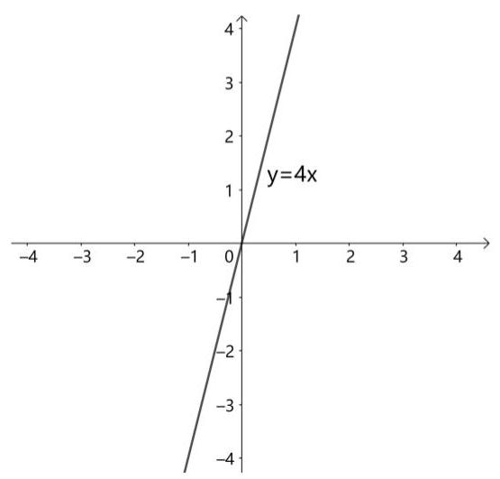

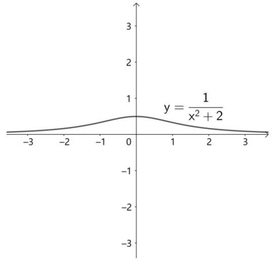

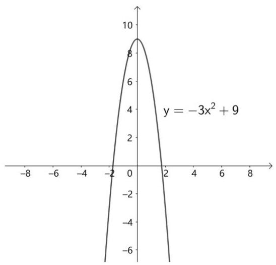

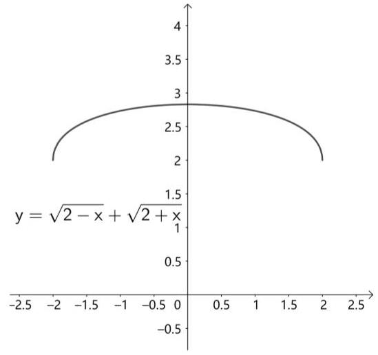

练习 3.2(1)

1. 证明: 函数 $y = {x}^{3}, x \in  \mathbf{R}$ 是单调递增函数。

2. 证明: 函数 $y = \frac{1}{{x}^{2} + 1}$ 在区间 $\left( {0, + \infty }\right)$ 单调递减。

3. 判断下列函数是否有最大值或最小值, 如有, 分别是多少? 在何处取到?

(2) $f\left( x\right)  = {x}^{4} - 4$ ； (3) $f\left( x\right)  = \sqrt{-{x}^{2} + {4x} + 8}$ ;

(4) $f\left( x\right)  = x - 2, x \in  \left\lbrack  {-1,1}\right\rbrack$ ；(5) $f\left( x\right)  = x - 2, x \in  \left( {-1,1}\right)$ 。

4. 设 $y = f\left( x\right)$ 是单调递增函数, $y = g\left( x\right)$ 是单调递减函数,那么 $y = f\left( x\right) g\left( x\right)$ 的单调性如何? 利用增函数和减函数的定义证明。

#### 3.2.3 偶函数与奇函数

奇函数与偶函数是关于 “对称” 的性质, 有的函数有一定对称性, 对称主要有两种方式: 镜面对称、中心对称。

镜面对称现象在现实中很常见, 把一个图形沿着中线对折, 如果中线左右两侧的图形能完全重叠, 就称这个图形镜面对称, 这条中线叫作对称轴。例如, 人的左手与右手镜面对称, 将两只手掌平摊, 沿小拇指和手掌边沿对齐, 两只手就构成一个镜面对称的图形, 两只手的手掌和五根手指合拢后可以完全重合。

偶函数具有镜面对称的特点,偶函数的图像关于 $y$ 轴呈镜面对称,即 $y$ 轴是偶函数图像的对称轴。如果把函数的图像以 $y$ 轴为对称轴对折,函数的图像左右两边能完全重合, 这个函数就是偶函数。

例如,函数 $f\left( x\right)  = 2{x}^{2} - 1$ 是偶函数,下图为它的图像,注意体会它关于 $y$ 轴左右对称的特点，所有没有一次项的二次函数都是偶函数。

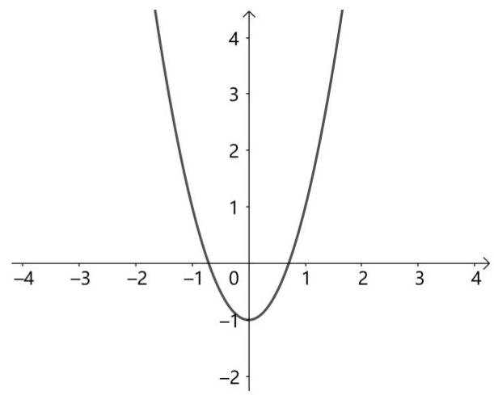

现在从函数解析式的角度, 分析偶函数的特点。已知偶函数在平面直角坐标系中的图像左右对称,那么在 $y$ 轴的左右两侧,到 $y$ 轴距离相等的两个点,它们的高度应当相同, 即: 任意一对互为相反数的自变量, 它们的函数值始终相等, 只有这样,将函数图像沿 $y$ 轴对折后,左右才能完全重合。反之,如果在 $y$ 轴的左右两侧,到 $y$ 轴距离相等的位置的函数值 (高度) 不同,那么对折后该处就不能重合,函数图像就不对称了。综上,偶函数的定义为:

设函数 $y = f\left( x\right)$ 的定义域为 $I,\forall x \in  I$ ,恒有 $- x \in  I$ ,且 $f\left( {-x}\right)  = f\left( x\right)$ 。

即: 如果一个函数的定义域关于原点对称, 且如果自变量取任意一对相反数, 函数值始终相等, 这样的函数为偶函数。

需注意，偶函数的定义域必须关于原点对称，如果自变量只能取到原点一侧的值, 取不到对称的另一侧的值, 那么这个位置的函数就不对称。

例 3.6 判断下列函数是否是偶函数:

(1) $f\left( x\right)  = {x}^{4} - {x}^{2};\;\left( 2\right) f\left( x\right)  = {\left( x - 3\right) }^{2}$ ;

(3) $f\left( x\right)  = \sqrt{x - 6}$ ； (4) $f\left( x\right)  = \frac{1}{4 - x} + \frac{1}{4 + x}$ 。

解析: 对于已知解析式的函数, 利用偶函数的定义判断即可。

(1)该函数的定义域为全体实数，关于原点对称，有可能是偶函数，

$f\left( {-x}\right)  = {\left( -x\right) }^{4} - {\left( -x\right) }^{2} = {x}^{4} - {x}^{2} = f\left( x\right)$ ,是偶函数。

(2)该函数的定义域为全体实数，关于原点对称，有可能是偶函数，

$f\left( {-x}\right)  = {\left( -x - 3\right) }^{2} = {\left( x + 3\right) }^{2}$ ,并不总是与 $f\left( x\right)  = {\left( x - 3\right) }^{2}$ 相等,不是偶函数。

(3)该函数的定义域为 $x \in  \lbrack 6, + \infty )$ ，不关于原点对称，不是偶函数。

(4)该函数的定义域为 $x \neq   - 4$ 且 $x \neq  4$ ，关于原点对称，有可能是偶函数， $f\left( {-x}\right)  = \frac{1}{4 - \left( {-x}\right) } + \frac{1}{4 + \left( {-x}\right) } = \frac{1}{4 + x} + \frac{1}{4 - x} = f\left( x\right)$ ,是偶函数。

中心对称现象在现实中也很常见, 把一个图形沿着中心旋转, 如果旋转某个非圆周角的角度后, 能与旋转前的原图形完全重叠, 就称这个图形中心对称, 这个中心叫作对称中心。例如, 在一张纸上写一个标准的大写字母 “Z”, 很明显它左右不对称,把笔尖插在 “ $Z$ ” 的斜线的正中间并固定,以笔为旋转轴将纸旋转 ${180}^{ \circ  }$ ,使得纸上下、左右都颠倒,会发现旋转后的 “Z” 跟原来的 “Z” 重合。

奇函数具有中心对称的特点，奇函数的图像关于原点呈中心对称，即原点是奇函数图像的对称中心。如果把函数的图像以原点为对称中心旋转 ${180}^{ \circ  }$ ,旋转后的图像能与原来的图像完全重合, 这个函数就是奇函数。

例如,函数 $f\left( x\right)  = \frac{2}{x}$ 是奇函数,下图为它的图像,注意体会它关于原点中心对称的特点。

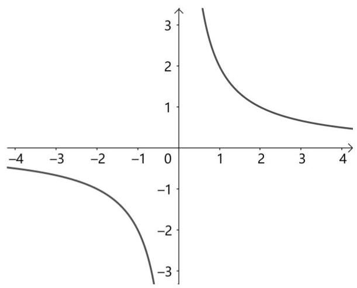

现在从函数解析式的角度, 分析奇函数的特点。已知奇函数在平面直角坐标系中的图像以原点为中心旋转对称，那么在原点的左右两侧，且到原点的横向距离相等的位置, 它们到原点的纵向距离应当也相等, 且分别位于原点的上下两侧, 即: 任意一对互为相反数的自变量, 它们的函数值始终互为相反数, 只有这样, 将函数图像沿原点旋转 ${180}^{ \circ  }$ 后,才能与原图像完全重合。反之,如果在原点的左右两侧, 到原点的横向距离相等的位置的函数值 (高度) 不互为相反数, 那么旋转 ${180}^{ \circ  }$ 后该处就不能重合,函数图像就不对称了。综上,奇函数的定义为:

设函数 $y = f\left( x\right)$ 的定义域为 $I,\forall x \in  I$ ,恒有 $- x \in  I$ ,且 $f\left( {-x}\right)  =  - f\left( x\right)$ 。

$f\left( {-x}\right)  =  - f\left( x\right)$ 也可以变形为 $f\left( x\right)  + f\left( {-x}\right)  = 0$ 。

需注意, 奇函数的定义域也必须关于原点对称, 如果自变量只能取到原点一侧的值, 取不到对称的另一侧的值, 那么旋转后这个位置的函数无法重叠。根据奇函数的定义式还可得: 奇函数须满足要么 $f\left( 0\right)  = 0$ ,要么 $x = 0$ 不属于其定义域。

例 3.7 判断下列函数是否是奇函数:

(1) $f\left( x\right)  = {x}^{3} + x$ ；(2) $f\left( x\right)  = \sqrt{x + 1} + \sqrt{x - 1}$ ；

(3) $f\left( x\right)  = \frac{1}{1 + x} - \frac{1}{1 - x};\;$ (4) $f\left( x\right)  = \frac{1 - x}{{x}^{3}}$ 。

解析: 对于已知解析式的函数, 利用奇函数的定义判断即可。

(1)该函数的定义域为全体实数，关于原点对称，有可能是奇函数，

$f\left( {-x}\right)  = {\left( -x\right) }^{3} + \left( {-x}\right)  =  - {x}^{3} - x =  - \left( {{x}^{3} + x}\right)  =  - f\left( x\right)$ ,是奇函数。

(2)该函数的定义域为 $x \in  \lbrack 1, + \infty )$ ，不关于原点对称，不是奇函数。

(3)该函数的定义域为 $x \neq   - 1$ 且 $x \neq  1$ ，关于原点对称，有可能是奇函数，

$f\left( {-x}\right)  = \frac{1}{1 + \left( {-x}\right) } - \frac{1}{1 - \left( {-x}\right) } = \frac{1}{1 - x} - \frac{1}{1 + x} =  - \left( {\frac{1}{1 + x} - \frac{1}{1 - x}}\right)  =  - f\left( x\right)$ ,是奇函数。

(4)该函数的定义域为 $x \neq  0$ ，关于原点对称，有可能是奇函数，

$f\left( {-x}\right)  = \frac{1 - \left( {-x}\right) }{{\left( -x\right) }^{3}} =  - \frac{1 + x}{{x}^{3}}$ ,并不总是与 $- f\left( x\right)  =  - \frac{1 - x}{{x}^{3}}$ 相等,不是奇函数。

练习 3.2(2)

1. 判断下列函数是偶函数还是奇函数, 还是都不是:

(1) $f\left( x\right)  = {x}^{4} + {x}^{2}$ ；(2) $f\left( x\right)  =  - {x}^{3} + {3x}$ ；

(3) $f\left( x\right)  = x + \frac{1}{x};\;\left( 4\right) f\left( x\right)  = {x}^{2} + x$ ;

(5) $f\left( x\right)  = \left\{  \begin{array}{ll} {x}^{2} & x \in  \left( {-1,1}\right) \\   - {x}^{2} & x \in  \left( {-\infty , - 1\rbrack \cup \lbrack 1, + \infty }\right) . \end{array}\right.$

2. 设函数 $y = f\left( x\right)$ 的定义域为 $\mathbf{R}$ ,且恒满足 ${f}^{2}\left( x\right)  + {f}^{2}\left( {-x}\right)  = {2f}\left( x\right) f\left( {-x}\right)$ , 判断该函数是偶函数，还是奇函数，还是不具有奇偶性。

3. 利用偶函数和奇函数的定义证明下列规律, 设函数的定义域总是对称的:

(1)两个偶函数相加减，所得到的新函数仍是偶函数；

(2)两个奇函数相加减，所得到的新函数仍是奇函数；

(3)两个偶函数相乘，所得到的新函数仍是偶函数；

(4)两个奇函数相乘，所得到的新函数是偶函数；

(5)一个偶函数乘以一个奇函数，所得到的新函数是奇函数。

4. 一个单调递增函数有可能是偶函数吗? 如果可能, 列举一个; 如果不可能，说明为什么；单调递减函数的情况如何？

5. 一个单调递增函数有可能是奇函数吗? 如果可能, 列举一个; 如果不可能，说明为什么；单调递减函数的情况如何？

#### 3.2.4 函数的对称轴与对称中心

对称在空间中的实质是距离相等和图案相同。镜面对称的图形, 它在对称轴左右两侧距离相等的位置, 相同高度的图案相同。中心对称的图形, 它在对称中心左右两侧距离相等的位置，相反高度的图案相同。对于函数图像，“图案”就是 “在该处有点” 和 “在该处没有点” 的区别。

偶函数和奇函数是函数的对称性中较简单的特殊情况，函数的对称轴除可以是 $y$ 轴外,还可以是其他平行于 $y$ 轴的直线,函数的对称中心除可以是原点外, 还可以是其他点。我们现在分析更一般的函数的镜面对称和中心对称的情况。

轴对称的推广。已知函数 $y = f\left( x\right)$ 是偶函数,其图像如下所示。

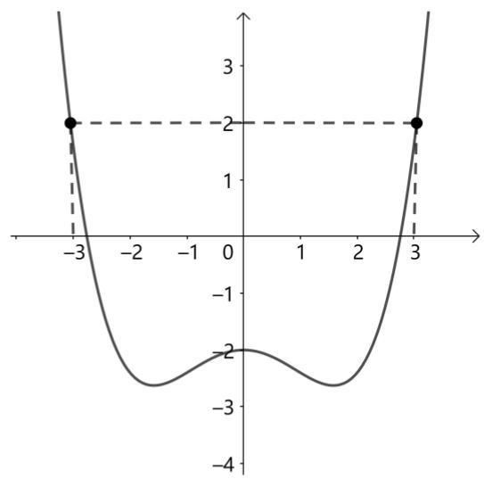

结合函数图像理解: 该函数的对称轴是 $y$ 轴, $y$ 轴可以表示为 $x = 0$ ,即所有横坐标都为 0 、纵坐标可以为任意值的点。

设函数上的任意两点 $\left( {{x}_{1},{y}_{1}}\right)$ 和 $\left( {{x}_{2},{y}_{2}}\right)$ 关于 $x = 0$ 镜面对称，那么 $\left( {{x}_{1},{y}_{1}}\right)$ 和 $\left( {{x}_{2},{y}_{2}}\right)$ 分别在 $x = 0$ 的左右两侧,且它们到 $x = 0$ 的横向距离相等,由此可得:

$$
\left| {{x}_{1} - 0}\right|  = \left| {{x}_{2} - 0}\right| ,\;{x}_{1} < 0,\;{x}_{2} > 0
$$

由上述关系可得:

$$
{x}_{1} =  - {x}_{2}
$$

$\left( {{x}_{1},{y}_{1}}\right)$ 和 $\left( {{x}_{2},{y}_{2}}\right)$ 的高度应当相同,即函数值相等:

$$
{y}_{1} = {y}_{2}
$$

综上可得: ${x}_{1} =  - {x}_{2}$ 且 ${y}_{1} = {y}_{2}$ 。这表明: 对于关于 $y$ 轴对称的函数 $y = f\left( x\right)$ , 始终满足: 如果 $\left( {x, y}\right)$ 是函数上的一点,那么 $\left( {-x, y}\right)$ 也是函数上的一点,即 $f\left( {-x}\right)  = f\left( x\right)$ ,这就是偶函数的定义。 现在我们将函数的对称轴从 $x = 0$ 推广到更一般的 $x = b$ 。

已知函数 $y = f\left( x\right)$ 关于直线 $x = b$ 镜面对称,其图像如下所示。

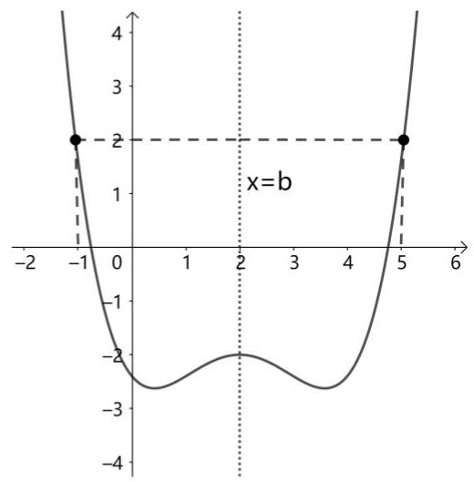

设函数上的任意两点 $\left( {{x}_{1},{y}_{1}}\right)$ 和 $\left( {{x}_{2},{y}_{2}}\right)$ 关于 $x = b$ 对称,那么 $\left( {{x}_{1},{y}_{1}}\right)$ 和 $\left( {{x}_{2},{y}_{2}}\right)$ 分别在 $x = b$ 的左右两侧,且它们到 $x = b$ 的横向距离相等,由此可得:

$$
\left| {{x}_{1} - b}\right|  = \left| {{x}_{2} - b}\right| ,\;{x}_{1} < b,\;{x}_{2} > b
$$

由上述关系可得:

$$
{x}_{1} + {x}_{2} = {2b}
$$

$\left( {{x}_{1},{y}_{1}}\right)$ 和 $\left( {{x}_{2},{y}_{2}}\right)$ 的高度应当相同,即函数值相等:

$$
{y}_{1} = {y}_{2}
$$

综上可得: ${x}_{1} + {x}_{2} = {2b},{y}_{1} = {y}_{2}$ 。这表明: 对于关于 $x = b$ 对称的函数 $y = f\left( x\right)$ , 始终满足: 如果 $\left( {x, y}\right)$ 是函数上的一点,那么 $\left( {{2b} - x, y}\right)$ 也是函数上的一点,即 $f\left( {{2b} - x}\right)  = f\left( x\right)$ ,将 $x$ 整体替换为 $b + x$ 可得 $f\left( {b + x}\right)  = f\left( {b - x}\right)$ ,这就是函数关于直线 $x = b$ 镜面对称的定义式。当 $b = 0$ 时, $f\left( {-x}\right)  = f\left( x\right)$ ,就是偶函数。

中心对称的推广。已知函数 $y = f\left( x\right)$ 是奇函数,其图像如下所示。

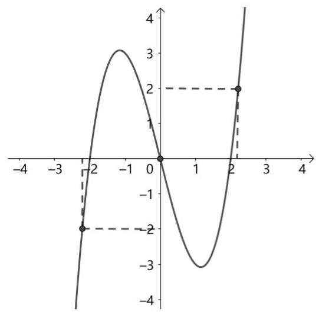

函数的对称中心是原点 $\left( {0,0}\right)$ 。设函数上的任意两点 $\left( {{x}_{1},{y}_{1}}\right)$ 和 $\left( {{x}_{2},{y}_{2}}\right)$ 关于原点中心对称,那么 $\left( {{x}_{1},{y}_{1}}\right)$ 和 $\left( {{x}_{2},{y}_{2}}\right)$ 到原点 $\left( {0,0}\right)$ 的横向距离和纵向距离应当分别相等, 由此可得:

$$
\left| {{x}_{1} - 0}\right|  = \left| {{x}_{2} - 0}\right| ,\;\left| {{y}_{1} - 0}\right|  = \left| {{y}_{2} - 0}\right|
$$

$\left( {{x}_{1},{y}_{1}}\right)$ 和 $\left( {{x}_{2},{y}_{2}}\right)$ 应当分别在原点的上下两侧、左右两侧,所以 ${x}_{1} - 0$ 与 ${x}_{2} - 0$ 的正负号相反, ${y}_{1} - 0$ 与 ${y}_{2} - 0$ 的正负号相反,由此可得:

$$
{x}_{1} - 0 =  - \left( {{x}_{2} - 0}\right) ,\;{y}_{1} - 0 =  - \left( {{y}_{2} - 0}\right)
$$

综上可得: ${x}_{1} =  - {x}_{2}$ ， ${y}_{1} =  - {y}_{2}$ 。这表明:对于关于原点 $\left( {0,0}\right)$ 中心对称的函数 $y = f\left( x\right)$ ,始终满足: 如果 $\left( {x, y}\right)$ 是函数上的一点,那么 $\left( {-x, - y}\right)$ 也是函数上的一点,即 $f\left( {-x}\right)  =  - f\left( x\right)$ ,这就是奇函数的定义。

现在我们将函数的对称中心从 $\left( {0,0}\right)$ 推广到更一般的 $\left( {a, b}\right)$ 。

设函数 $y = f\left( x\right)$ 关于点 $\left( {a, b}\right)$ 中心对称,其图像如下所示。

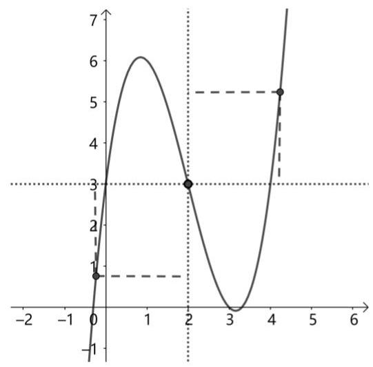

设函数上的任意一对点 $\left( {{x}_{1},{y}_{1}}\right)$ 和 $\left( {{x}_{2},{y}_{2}}\right)$ 关于点 $\left( {a, b}\right)$ 中心对称,那么 $\left( {{x}_{1},{y}_{1}}\right)$ 和 $\left( {{x}_{2},{y}_{2}}\right)$ 到点 $\left( {a, b}\right)$ 的横向距离和纵向距离应当分别相等，由此可得:

$$
\left| {{x}_{1} - a}\right|  = \left| {{x}_{2} - a}\right| ,\left| {{y}_{1} - b}\right|  = \left| {{y}_{2} - b}\right|
$$

$\left( {{x}_{1},{y}_{1}}\right)$ 和 $\left( {{x}_{2},{y}_{2}}\right)$ 应当在点 $\left( {a, b}\right)$ 的上下两侧、左右两侧,所以 ${x}_{1} - a$ 与 ${x}_{2} - a$ 的正负号相反, ${y}_{1} - b$ 与 ${y}_{2} - b$ 的正负号相反,由此可得:

$$
{x}_{1} - a =  - \left( {{x}_{2} - a}\right) ,\;{y}_{1} - b =  - \left( {{y}_{2} - b}\right)
$$

综上可得: ${x}_{1} + {x}_{2} = {2a},{y}_{1} + {y}_{2} = {2b}$ 。这表明: 对于关于点 $\left( {a, b}\right)$ 中心对称的函数 $y = f\left( x\right)$ ,始终满足: 如果 $\left( {x, y}\right)$ 是函数上的一点,那么 $\left( {{2a} - x,{2b} - y}\right)$ 也是函数上的一点,即 $f\left( x\right)  + f\left( {{2a} - x}\right)  = {2b}$ ,将 $x$ 整体替换为 $a - x$ 可得 $b - f\left( {a - x}\right)  = f\left( {a + x}\right)  - b$ 。当 $a = 0, b = 0$ 时， $f\left( x\right)  + f\left( {-x}\right)  = 0$ ，就是奇函数。

练习 3.2(3)

1. 指出下列函数的对称轴:

(1) $y = {x}^{2};\;$ (2) $y = {x}^{2} - {2x};\;$ (3) $y = {x}^{4} + {x}^{2};\;$ (4) $y = {\left( x + 1\right) }^{4} + {\left( x + 1\right) }^{2}$ 。

2. 指出下列函数的对称中心:

(3) $y = {\left( x + 2\right) }^{3} + x + 2$

#### 3.2.5 复合函数及其性质

两个函数的解析式除可以进行加减乘除外, 还可以相互 “嵌套” 在一起形成复合函数。对于函数 $f\left( x\right)$ 和 $g\left( x\right)$ ,将 $g\left( x\right)$ 的值域作为 $f\left( x\right)$ 的定义域,得到的新的函数叫作它们的复合函数,记作 $f\left( {g\left( x\right) }\right)$ 。即: $f\left( {g\left( x\right) }\right)$ 解析式为: 将 $f\left( x\right)$ 的解析式中的全部 $x$ ,都用函数 $g\left( x\right)$ 的解析式直接代替即可。

例如,若 $f\left( x\right)  = {x}^{2} - {2x} + 4, g\left( x\right)  = {2x} - 5$ ,那么 $f\left( {g\left( x\right) }\right)$ 的解析式就是将 $f\left( x\right)  = {x}^{2} - {2x} + 4$ 中的 $x$ 都替换为 ${2x} - 5$ :

$$
f\left( {g\left( x\right) }\right)  = {\left( 2x - 5\right) }^{2} - 2\left( {{2x} - 5}\right)  + 4
$$

通常进一步化简为较简洁的形式:

$$
f\left( {g\left( x\right) }\right)  = 4{x}^{2} - {24x} + {39}
$$

通常复合函数 $f\left( {g\left( x\right) }\right)$ 和 $g\left( {f\left( x\right) }\right)$ 是两个完全不同的函数,例如上面的例子中, $g\left( {f\left( x\right) }\right)$ 是将 $g\left( x\right)  = {2x} - 5$ 中的 $x$ 都替换为 ${x}^{2} - {2x} + 4$ :

$$
g\left( {f\left( x\right) }\right)  = 2\left( {{x}^{2} - {2x} + 4}\right)  - 5 = 2{x}^{2} - {4x} + 3
$$

复合函数实质上是进行了两步函数关系的对应,对于复合函数 $f\left( {g\left( x\right) }\right)$ 定义域的某个值 $x$ :

(1)先用内层的 $g\left( x\right)$ 作用于 $x$ ,得到 ${y}_{1} = g\left( x\right)$ ;

(2)再用外层的 $f\left( x\right)$ 作用于 ${y}_{1}$ ,得到 $y = f\left( {y}_{1}\right)$ 。

关于复合函数的定义域,有时一些让 $g\left( x\right)$ 无意义的自变量 ${x}_{0}$ ,可以让复合函数 $f\left( {g\left( x\right) }\right)$ 有意义,通常可以将该值 ${x}_{0}$ 纳入复合函数的定义域内。有时一些令 $g\left( x\right)$ 有意义的自变量 ${x}_{0}$ ,让复合函数 $f\left( {g\left( x\right) }\right)$ 无意义,则需要从复合函数的定义域中剔除。

分析较复杂的函数时, 如果函数具有某一类函数的明显特征, 通常将其按照该类函数分析, 而不是当作复合函数逐层分析。例如, 上面列举的复合而成的二次函数主要利用二次函数的性质研究, 而不是按照复合方式进行分析。

如果较复杂的函数难以用某一类函数的特征进行分析, 那么通常需要拆解成若干层较简单的函数，然后逐层分析。

一个函数属于 “简单” 还是 “复杂” 以及应当如何分析, 因函数而异, 因人而异, 需要具体分析判断。

很多常见的函数都可以看作复合函数, 将函数进行适当变换后得到的函数也可以看作复合函数, 解析式很复杂的函数通常可以通过逐步分析其复合的过程, 得出它的一些性质。

进行复合的两个函数 $f\left( x\right)$ 和 $g\left( x\right)$ 的单调性、对称性与它们构成的复合函数 $f\left( {g\left( x\right) }\right)$ 的相应性质也有一定规律。

复合函数的单调性具有下列规律:

若 $f\left( x\right)$ 和 $g\left( x\right)$ 都是单调递增函数,则 $f\left( {g\left( x\right) }\right)$ 仍是单调递增函数;

若 $f\left( x\right)$ 和 $g\left( x\right)$ 都是单调递减函数,则 $f\left( {g\left( x\right) }\right)$ 是单调递增函数;

若 $f\left( x\right)$ 和 $g\left( x\right)$ 一个是单调递增函数,一个是单调递减函数,则 $f\left( {g\left( x\right) }\right)$ 是单调递减函数。

若遇到函数值的正负号发生改变的情况, 需专门分析变号的点两侧的情况。

复合函数的奇偶性具有下列规律:

若 $f\left( x\right)$ 和 $g\left( x\right)$ 都是偶函数,则 $f\left( {g\left( x\right) }\right)$ 也是偶函数;

若 $f\left( x\right)$ 和 $g\left( x\right)$ 都是奇函数,则 $f\left( {g\left( x\right) }\right)$ 是奇函数;

若 $f\left( x\right)$ 和 $g\left( x\right)$ 一个是奇函数,一个是偶函数,则 $f\left( {g\left( x\right) }\right)$ 是偶函数。

例 3.8 分析下列函数的复合方式, 并分析其单调性和对称性:

(1) $f\left( x\right)  = 4{x}^{2};\;\left( 2\right) f\left( x\right)  = \frac{1}{{2x} + 4}$ 。

解析: (1) $f\left( x\right)  = 4{x}^{2}$ 可以看作 $g\left( x\right)  = {x}^{2}$ 与 $h\left( x\right)  = {4x}$ 构成的复合函数:

$$
h\left( {g\left( x\right) }\right)  = 4 \times  {x}^{2} = 4{x}^{2}
$$

也可以看作 $g\left( x\right)  = {x}^{2}$ 与 $u\left( x\right)  = {2x}$ 构成的复合函数:

$$
g\left( {u\left( x\right) }\right)  = {\left( 2x\right) }^{2} = 4{x}^{2}
$$

由于该函数的解析式很简单, 因此通常利用二次函数的性质分析。当 $x \in  \left( {-\infty ,0}\right)$ 时, $f\left( x\right)  = 4{x}^{2}$ 单调递减; $x \in  \left( {0, + \infty }\right)$ 时, $f\left( x\right)  = 4{x}^{2}$ 单调递增。 $f\left( {-x}\right)  = 4{\left( -x\right) }^{2} = 4{x}^{2} = f\left( x\right)$ ,是偶函数。

(2) $f\left( x\right)  = \frac{1}{{2x} + 4}$ 可以看作 $g\left( x\right)  = {2x} + 4$ 与 $h\left( x\right)  = \frac{1}{x}$ 构成的复合函数:

$$
h\left( {g\left( x\right) }\right)  = \frac{1}{{2x} + 4}
$$

为了让 $h\left( {g\left( x\right) }\right)$ 有意义,其定义域为 $x \neq   - 2$ ,与 $g\left( x\right)$ 和 $h\left( x\right)$ 的定义域都不同, 而原本让 $h\left( x\right)$ 无意义的 $x = 0$ ,可以属于 $h\left( {g\left( x\right) }\right)$ 的定义域。

$g\left( x\right)  = {2x} + 4$ 为单调递增函数。当 $x \in  \left( {-\infty , - 2}\right)$ 时, $g\left( x\right)  < 0$ ,则 $h\left( {g\left( x\right) }\right)  < 0$ , 当 $x$ 逐渐增大时,负数 ${2x} + 4$ 逐渐增大,其绝对值逐渐减小,则负数 $\frac{1}{{2x} + 4}$ 的绝对值逐渐增大,值逐渐减小,所以 $h\left( {g\left( x\right) }\right)  = \frac{1}{{2x} + 4}$ 在区间 $x \in  \left( {-\infty , - 2}\right)$ 单调递减。

当 $x \in  \left( {-2, + \infty }\right)$ 时, $g\left( x\right)  > 0$ ,则 $h\left( {g\left( x\right) }\right)  > 0$ ,当 $x$ 逐渐增大时,正数 ${2x} + 4$ 逐渐增大,其绝对值逐渐增大,则正数 $\frac{1}{{2x} + 4}$ 的绝对值逐渐减小,值逐渐减小, 所以 $h\left( {g\left( x\right) }\right)  = \frac{1}{{2x} + 4}$ 在区间 $x \in  \left( {-2, + \infty }\right)$ 也单调递减。

在 $x =  - 2$ 左侧, $h\left( {g\left( x\right) }\right)  < 0$ ,在 $x =  - 2$ 右侧, $h\left( {g\left( x\right) }\right)  > 0$ ,右侧的值始终大于左侧,所以在跨越 $x =  - 2$ 的区间内, $h\left( {g\left( x\right) }\right)$ 无单调性。

对称性: $h\left( {g\left( {-x}\right) }\right)  = \frac{1}{2\left( {-x}\right)  + 4} = \frac{1}{-{2x} + 4}$ ,并非始终等于 $h\left( {g\left( x\right) }\right)$ 或 $- h\left( {g\left( x\right) }\right)$ , 该函数并非偶函数或奇函数。

若一对自变量 ${x}_{1}$ 与 ${x}_{2}$ 满足 $- 2 - {x}_{1} = {x}_{2} - \left( {-2}\right)$ ,可得 ${x}_{2} =  - 4 - {x}_{1}$ ,那么

$$
h\left( {g\left( {x}_{1}\right) }\right)  + h\left( {g\left( {x}_{2}\right) }\right)  = \frac{1}{2{x}_{1} + 4} + \frac{1}{2\left( {-4 - {x}_{1}}\right)  + 4} = \frac{1}{2{x}_{1} + 4} + \frac{1}{-2{x}_{1} - 4} = \frac{1}{2{x}_{1} + 4} - \frac{1}{2{x}_{1} + 4} = 0,
$$

所以 $h\left( {g\left( x\right) }\right)$ 关于点 $\left( {-2,0}\right)$ 中心对称。该函数的图像如下图所示。

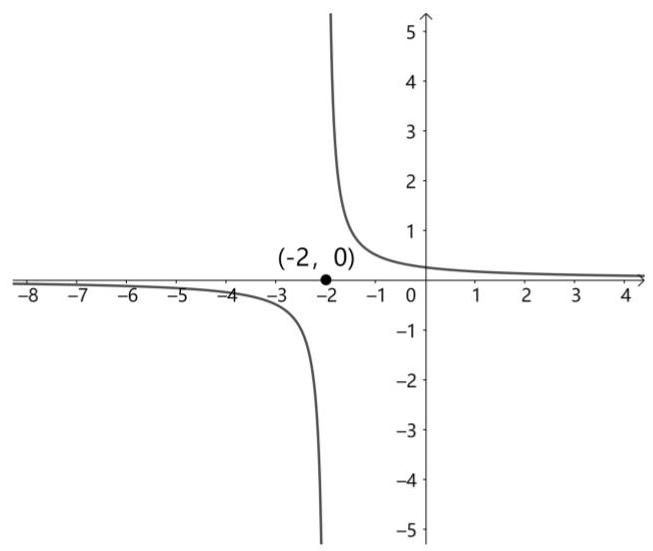

练习 $\mathbf{{3.2}\left( 4\right) }$

1. 判断下列各函数更适合看作是一个普通的函数, 还是两个(或多个)函数的复合函数? 并分析它们的单调性和奇偶性:

(1) $y =  - {x}^{2} + {4x}$ ；

(2) $y = \frac{1}{{x}^{2} - 1}$ ； (3) $y = \frac{{x}^{2} - 1}{x - 1}$ 。

2. 利用函数的单调性和奇偶性的定义, 证明本专题列出的复合函数的单调性和对称性与原函数间的关系。

#### 3.2.6 函数的应用 (一)

函数是非常有用的工具, 利用函数可以分析解决很多问题。在使用函数时, 将语言文字描述的事实转化为数学符号、数学运算、相等或不等关系是非常关键的第一步, 本小节通过具体的例子展示函数的应用。

例 3.9 某超市开展促销活动, 发放消费抵用券, 每张抵用券可以抵用 5 元, 可以累积使用，每次最多只能使用 5 张，已知某商品的售价为 100 元，求购买该商品实际的费用与使用抵用券张数的函数关系。

解析: 设购买该商品的费用为 $y$ 元,使用抵用券的数量为 $x$ 张。按照超市的规定，每次最多只能使用 5 张，也可以不用，函数的定义域为 $x \in  \{ 0,1,2,3,4,5\}$ 。

每张抵扣券可以抵用 5 元，若使用抵用券的数量为 $x$ 张，那么抵用的金额为 ${5x}$ 元,实际的费用 $y$ 元与抵用券抵扣的金额 ${5x}$ 之和等于商品的价格 100 元,这是该函数的基本等式关系,由此可以得到数量关系: ${5x} + y = {100}$ ,

将 $y$ 移至等号左边,就是实际费用 $y$ 与使用抵用券张数 $x$ 的函数关系为:

$$
y = {100} - {5x}
$$

其中, $x \in  \{ 0,1,2,3,4,5\}$ 。

下图为该函数的图像, 为便于观察, 调整了横轴与纵轴的比例和截取范围。

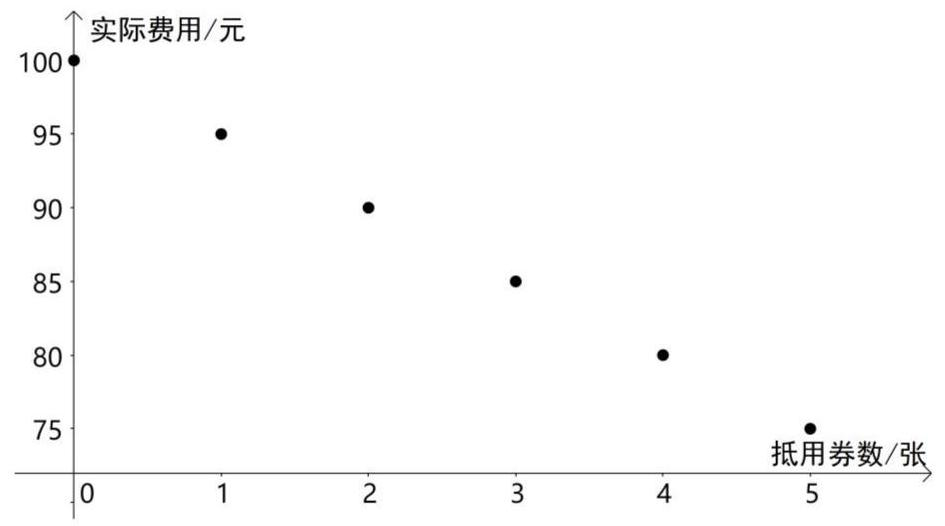

例 3.10 已知物体由静止开始，做加速度为 $a = 1\mathrm{\;m}/{\mathrm{s}}^{2}$ 的匀加速直线运动， 求物体运动 ${10}\mathrm{\;s}$ 时发生的位移。

解析: 按照物理学定律,做初速度为 0 的匀加速直线运动的物体,位移 $s$ 与时间 $t$ 的关系为: $s = \frac{1}{2}a{t}^{2}$ ,代入 $a = 1\mathrm{\;m}/{\mathrm{s}}^{2}$ 得:

$$
s = \frac{1}{2}{t}^{2}
$$

由于没有限定运动的时间,通常默认函数的定义域为 $\lbrack 0, + \infty )$ ,

当 $t = {10}$ 时, $s = \frac{1}{2} \times  {10}^{2} = {50}\left( \mathrm{\;m}\right)$ ,物体运动 ${10}\mathrm{\;s}$ 时发生的位移为 ${50}\mathrm{\;m}$ 。 下图为该函数的图像，为便于观察，调整了横轴与纵轴的比例。

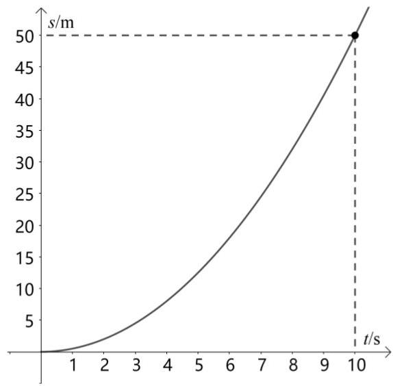

例 3.11 已知一瓶溶液中双氧水的含量为 0.2 mol，某催化剂催化双氧水分解为水和氧气,双氧水分解的速率恒定不变,为 ${0.01}\mathrm{\;{mol}}/\mathrm{s}$ ,求经过多长时间瓶中双氧水的含量为原来的 10%。

解析: 剩余双氧水的含量等于初始含量减去分解掉的含量, 这是该函数的基本等式关系。

双氧水每秒分解 ${0.01}\mathrm{\;{mol}}$ ，经历 $t\mathrm{\;s}$ 后双氧水的含量减少 ${0.01t}\mathrm{\;{mol}}$ ，又因为双氧水的初始含量为 ${0.2}\mathrm{\;{mol}}$ ,所以剩余双氧水的含量 $y$ 与时间 $t$ 的函数关系为:

$$
y = {0.2} - {0.01t}
$$

当 $y = 0$ ,即 ${0.2} - {0.01t} = 0, t = {20}\left( \mathrm{\;s}\right)$ 时双氧水全部分解,所以函数的定义域为 $\left\lbrack  {0,{20}}\right\rbrack$ ,

当双氧水的含量为原来的 10% 时, $y = {0.2}\mathrm{\;{mol}} \times  {10}\%  = {0.02}\mathrm{\;{mol}}$ ,将 $y = {0.02}$ 代入函数解析式: ${0.02} = {0.2} - {0.01t}$ ,解得: $t = {18}\left( \mathrm{\;s}\right)$ ,经过 ${18}\mathrm{\;s}$ 瓶中双氧水的含量为原来的 10%。

下图为该函数的图像, 为便于观察, 调整了横轴与纵轴的比例。

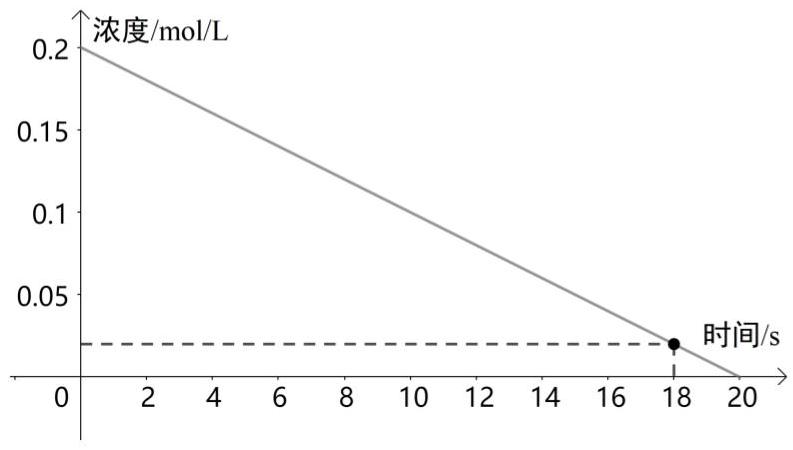

## 练习 3.2(5)

1. 物理、化学、生物、历史、地理、政治等学科中的公式和数据都可以建立函数，结合已经学习的知识，将相应的公式或数据列成函数，并从中分析规律。

## 小结

本章从集合的知识出发，学习函数的概念和单调性、对称性等性质。函数是非常基本且重要的数学概念, 贯穿于整个高中数学, 要注意体会 “随之变化” 的含义，熟悉函数用不同字母表示不同变量的方式，以及函数解析式与图像之间的对应关系，需通过充分练习，熟练掌握研究分析函数的性质的方法。

## 第四章 指数与对数

我们在计算正方形的面积时, 学习了平方和平方根, 平方和平方根属于指数运算, 指数可以看作同一个数多次相乘的简便运算, 就像乘法可以看作同一个数多次相加的简便运算, 指数的逆运算叫作对数, 就像乘法的逆运算是除法。

以指数运算和对数运算为基础, 可以得到三类基本的函数: 幂函数、指数函数、对数函数, 利用指数运算和对数运算的性质和规律, 可以分析得出相应函数的主要性质, 根据各函数的图像和性质, 可以直观展示相应运算的规律, 再次体现了函数的“数形结合”特点和优势。

学习指数运算和对数运算的主要难点在于 “陌生” ，加、减、乘、除等运算在日常生活中很常用, 而指数运算和对数运算在生活中较少用到, 主要用于专业领域，在物理、化学、生物等学科中较常见。克服“陌生”的主要方法是理解原理和充分练习, 理解运算的基本原理, 能容易地记忆并使用它们的法则、性质和规律。

### 4.1 指数运算与对数运算

指数运算和对数运算可以看作两种基本的运算方式。指数运算可以看作同一个数多次相乘，且相乘的“次数”能从正整数逐步推广到全体整数、有理数、实数, 对数运算可以看作指数运算的逆运算。

#### 4.1.1 指数运算的法则与性质

乘法可以看作加法的简便运算: 若干相同的数相加, 可以用乘法表示。类似的, 指数运算可以看作乘法的简便运算: 若干相同的数相乘, 可以用指数表示。 指数运算又叫作幂运算。如果有 $m$ 个 $a$ 相乘,记作: ${a}^{m}$ ,其含义为:

$$
{a}^{m} = a \times  a \times  \cdots  \times  a
$$

$$
\left| { \leftarrow  m \uparrow  a \rightarrow  }\right|
$$

${a}^{m}$ 念作 “ $a$ 的 $m$ 次幂” 或 “ $a$ 的 $m$ 次方”，底下正常大小的 $a$ 叫作底数，它是该运算的 “基底”; 右上角较小的 $m$ 叫作指数,它起到 “指标” 的作用。

指数为正整数的指数运算也叫作乘方运算, 将乘方运算与乘法运算比较:

<table><tr><td></td><td>乘法运算</td><td>指数运算</td></tr><tr><td>运算</td><td>$a \times  m$</td><td>${a}^{m}$</td></tr><tr><td>含义</td><td>$m$ 个 $a$ 相加</td><td>$m$ 个 $a$ 相乘</td></tr><tr><td>展开</td><td>$a \times  m = a + a + \cdots  + a$</td><td>${a}^{m} = a \times  a \times  \cdots  \times  a$</td></tr></table>

指数运算与乘法运算的一个明显区别是: 乘法运算中, $m$ 个 $a$ 相加与 $a$ 个 $m$ 相加的结果相同,即 $a \times  m = m \times  a$ ,尽管这两个运算代表不同的实际意义,而指数运算中,除某些特殊情况外,通常 $m$ 个 $a$ 相乘与 $a$ 个 $m$ 相乘的结果不同,因此指数运算的记法上，将底数和指数的位置和大小区分得很清楚。

按照指数为正整数的指数运算的法则, 可以得到它们的基本性质:

性质 1: ${a}^{m} \times  {a}^{n} = {a}^{m + n}\left( {a > 0, m, n \in  {\mathbf{Z}}_{ + }}\right)$

该性质表明: $m$ 个 $a$ 的乘积,与 $n$ 个 $a$ 的乘积相乘,等于 $m + n$ 个 $a$ 的乘积:

$$
{a}^{m} \times  {a}^{n} = \left( {a \times  a \times  \cdots  \times  a}\right)  \times  \left( {a \times  a \times  \cdots  \times  a}\right)
$$

$$
\left| { \leftarrow  m\text{ 个 }a \rightarrow  }\right| \;\left| { \leftarrow  n\text{ 个 }a \rightarrow  }\right|
$$

$$
{a}^{m + n} = a \times  a \times  \cdots  \times  a \times  a \times  a \times  \cdots  \times  a
$$

$$
\left| { \leftarrow  \left( {m + n}\right)  \uparrow  a \rightarrow  }\right|
$$

即 ${a}^{m} \times  {a}^{n}$ 和 ${a}^{m + n}$ 都表示 $m + n$ 个 $a$ 相乘。

该性质与乘法分配律相似:

$$
\left( {a \times  m}\right)  + \left( {a \times  n}\right)  = \left( {a + a + \cdots  + a}\right)  + \left( {a + a + \cdots  + a}\right)
$$

$$
\left| { \leftarrow  m\text{ 个 }a \rightarrow  }\right| \;\left| { \leftarrow  n\text{ 个 }a \rightarrow  }\right|
$$

$$
a \times  \left( {m + n}\right)  = a + a + \cdots  + a + a + a + \cdots  + a
$$

$$
\left| { \leftarrow  \left( {m + n}\right) \text{ 个 }a \rightarrow  }\right|
$$

$\left( {a \times  m}\right)  + \left( {a \times  n}\right)$ 和 $a \times  \left( {m + n}\right)$ 都表示 $m + n$ 个 $a$ 相加。

性质 2: ${\left( {a}^{m}\right) }^{n} = {a}^{mn}\left( {a > 0, m, n \in  {\mathbf{Z}}_{ + }}\right)$

根据性质 1, $n$ 个 ${a}^{m}$ 相乘可以表示为:

$$
{a}^{m} \times  {a}^{m} \times  \cdots  \times  {a}^{m} = {a}^{m + m + \cdots  + m} = {a}^{mn}
$$

$$
\left| { \leftarrow  n\text{ 个 }{a}^{m} \rightarrow  }\right| \;\left| { \leftarrow  n\text{ 个 }m \rightarrow  }\right|
$$

$n$ 个 ${a}^{m}$ 相乘可以直接用指数运算表示为:

$$
{a}^{m} \times  {a}^{m} \times  \cdots  \times  {a}^{m} = {\left( {a}^{m}\right) }^{n}
$$

即

$$
{\left( {a}^{m}\right) }^{n} = {a}^{mn}
$$

性质 3: ${a}^{m} \times  {b}^{m} = {\left( ab\right) }^{m}\left( {a > 0, b > 0, m, n \in  {\mathbf{Z}}_{ + }}\right)$

使用乘法交换律和乘法结合律可以推出该性质。

#### 4.1.2 指数的数域的推广

利用指数为正整数的指数运算的法则和性质, 可以得到指数为整数、有理数、 实数时, 相应的指数运算的含义。

将指数从正整数推广到整数。

既然 $m$ 个 $a$ 的乘积,与 $n$ 个 $a$ 的乘积相乘,等于 $m + n$ 个 $a$ 的乘积,那么反过来: $m + n$ 个 $a$ 的乘积,除以 $n$ 个 $a$ 的乘积,等于 $m$ 个 $a$ 的乘积:

$$
{a}^{m + n} \div  {a}^{n} = {a}^{m}
$$

可以用分式表示为:

$$
\frac{{a}^{m + n}}{{a}^{n}} = {a}^{m}
$$

设 $m + n = p$ ,那么 $m = p - n$ 为正整数, $- m = n - p$ 为负整数,可得:

$$
{a}^{-m} = {a}^{n - p} = \frac{{a}^{n}}{{a}^{p}} = \frac{{a}^{n} \div  {a}^{n}}{{a}^{p} \div  {a}^{n}} = \frac{1}{{a}^{p - n}} = \frac{1}{{a}^{m}}
$$

即: 指数为负整数的幂运算, 等于将指数为其相反数的幂的倒数。

特别的, 一个幂运算除以它自身, 可以得到指数为 0 的运算:

$$
{a}^{0} = {a}^{m - m} = \frac{{a}^{m}}{{a}^{m}} = 1
$$

除法运算中, 任意不为 0 的数除以它自身等于 1 , 由此可得:

$$
\forall a \neq  0,{a}^{0} = 1
$$

乘法运算中，1 起到 “一个数与 1 相乘等于它自身” 的作用。加法运算中， 0 起到 “一个数与 0 相加等于它自身” 的作用。幂运算中, 指数位置的数与 0 相加等于它自身，幂值乘以 1 等于它自身。

我们现在得到了指数为正整数、负整数、零一一任意整数时, 指数运算的含义和规则。

将指数从整数推广到有理数。

如果 ${x}^{n} = a$ ,那么 $x$ 叫作 $a$ 的 $n$ 次方根,记作:

$$
x = \sqrt[n]{a}
$$

其中, $\sqrt[n]{a}$ 叫作根式, $n$ 叫作根指数, $a$ 叫作被开方数。

对于任意非 0 整数 $n$ ,按照乘方运算和根式运算的定义可得:

$$
{\left( \sqrt[n]{a}\right) }^{n} = a
$$

设 $\sqrt[n]{a}$ 可以用指数运算表示为 ${a}^{p}$ ,即 $\sqrt[n]{a} = {a}^{p}$ ,代入上面的等式:

$$
{\left( {a}^{p}\right) }^{n} = a
$$

又因为 ${\left( {a}^{p}\right) }^{n} = {a}^{pn}$ ,由此可得:

$$
{a}^{pn} = a
$$

比较等式的左右两边可以发现:

$$
{pn} = 1
$$

即

$$
p = \frac{1}{n}
$$

即

$$
{a}^{\frac{1}{n}} = \sqrt[n]{a}
$$

当指数为分子是 1 的分数时, 幂值等于将底数开指数分的母次方根。

更一般的情况,对于任意有理数 $\frac{m}{n}\left( {m, n \in  \mathbf{Z}, n \neq  0}\right)$ ,可得:

$$
{a}^{\frac{m}{n}} = {\left( {a}^{\frac{1}{n}}\right) }^{m} = {\left( \sqrt[n]{a}\right) }^{m}
$$

$$
{a}^{\frac{m}{n}} = {\left( {a}^{m}\right) }^{\frac{1}{n}} = \sqrt[n]{{a}^{m}}
$$

即:指数为分数的幂运算，等于分别按照指数的分子进行整数的乘方运算、 按照指数的分母进行开方运算, 两个运算的先后顺序没有影响。

由于负数的偶数次方根无意义, 为了让该表达式可以普遍成立且有实际意义,通常规定指数不是整数时,底数 $a$ 需为正实数,即 $a > 0$ 。

如果幂运算的指数是负有理数, 等于指数是其相反数的幂运算的倒数:

$$
{a}^{-\frac{m}{n}} = \frac{1}{{a}^{\frac{m}{n}}}\left( {a > 0, a \neq  1, m, n \in  \mathbf{Z}, n \neq  0}\right)
$$

我们现在得到了指数为任意有理数时, 指数运算的含义和规则。

将指数从有理数推广到实数。

将指数运算从有理数指数幂拓展到任意实数幂，需使用 “逼近” 的思路:任意无理数都可以用与它无限接近的有理数逼近, 相应的无理数指数幂也可以用与它无限接近的有理数指数幂逼近, 通过 “无限逼近” 的方法, 得到无理数次幂的大小。实际上, 无理数的加、减、乘、除等基本运算的法则都利用 “逼近” 的思路, 从有理数拓展而来, 因此无理数指数幂的运算法则与有理数指数幂相同。

我们现在得到了指数为任意实数时, 指数运算的含义和规则。指数为任意实数时, 指数运算都具有指数为整数时的性质:

性质 1: ${a}^{m} \times  {a}^{n} = {a}^{m + n}\left( {a > 0, m, n \in  \mathbf{R}}\right)$ ;

性质 2: ${\left( {a}^{m}\right) }^{n} = {a}^{mn}\left( {a > 0, m, n \in  \mathbf{R}}\right)$ ;

性质 3: ${a}^{m} \times  {b}^{m} = {\left( ab\right) }^{m}\left( {a > 0, b > 0, m \in  \mathbf{R}}\right)$ 。

例 4.1 计算下列各式的值:

(1)106×10 ${10}^{4}$ ; (2) ${\left( {2}^{5}\right) }^{2}$ ; (3) ${9}^{4} \times  {\left( \frac{1}{3}\right) }^{4}$ ; (4) ${8}^{-\frac{2}{3}}$ 。

解析: (1) ${10}^{6} \times  {10}^{4} = {10}^{6 + 4} = {10}^{10} = {10000000000}$ ;

(2) ${\left( {2}^{5}\right) }^{2} = {2}^{5 \times  2} = {2}^{10} = {1024}$ ;

(3) ${9}^{4} \times  {\left( \frac{1}{3}\right) }^{4} = {\left( 9 \times  \frac{1}{3}\right) }^{4} = {3}^{4} = {81}$ ;

(4) ${8}^{-\frac{2}{3}} = \frac{1}{{8}^{\frac{2}{3}}} = \frac{1}{{\sqrt[3]{8}}^{2}} = \frac{1}{{2}^{2}} = \frac{1}{4}$ 。

例 4.2 化简下列各式 (各变量均为不为 1 的正实数):

(1) $a \times  {a}^{2} \times  {a}^{3} \div  {a}^{4}$ ； (2) ${\left( {a}^{\frac{1}{3}}\right) }^{6}$ ； (3) $\left( {x{y}^{2}}\right)  \cdot  \frac{1}{{x}^{2}y}$ ； (4) $\frac{{x}^{2}{y}^{3}}{\sqrt{{x}^{4}{y}^{6}}}$ 。

解析: (1) $a \times  {a}^{2} \times  {a}^{3} \div  {a}^{4} = {a}^{1 + 2 + 3 - 4} = {a}^{2}$ ;

(2) ${\left( {a}^{\frac{1}{3}}\right) }^{6} = {a}^{\frac{1}{3} \times  6} = {a}^{2}$ ；

(3) $\left( {x{y}^{2}}\right)  \cdot  \frac{1}{{x}^{2}y} = {x}^{1 - 2}{y}^{2 - 1} = \frac{y}{x}$ ；

(4) $\frac{{x}^{2}{y}^{3}}{\sqrt{{x}^{4}{y}^{6}}} = \frac{{x}^{2}{y}^{3}}{{x}^{\frac{4}{2}}{y}^{\frac{6}{2}}} = {x}^{2 - \frac{4}{2}}{y}^{3 - \frac{6}{2}} = {x}^{0}{y}^{0} = 1$ 。

练习 ${4.1}\left( 1\right)$

1. 计算下列各式的值:

(1) ${3}^{3} \div  {3}^{4}$ ； (2) ${2}^{2} \times  {5}^{2}$ ； (3) ${\sqrt{7}}^{4}$ ； (4) $\sqrt[3]{{\left( -{10}\right) }^{6}}$ ; (5) ${\left( \frac{1}{2}\right) }^{4} \times  {2}^{8}$ 。

2. 化简下列各式(各变量均为不为 1 的正实数):

(1) ${a}^{4} \times  {a}^{2} \div  {a}^{6}$ ； (2) ${\left( {a}^{2}\right) }^{4}$ ； (3) ${a}^{\frac{1}{2}}{a}^{\frac{1}{3}}{a}^{\frac{1}{6}}$ ； (4) ${\left( {x}^{\frac{1}{2}}{y}^{\frac{1}{4}}\right) }^{8}$ ； (5) ${\left( \frac{\sqrt{x}}{\sqrt[4]{y}}\right) }^{-4}$ 。

3. 比较下列各数值的大小:

(1) ${27}^{3} - {26}^{3}$ ； (2) ${\left( \frac{1}{3}\right) }^{3} - {\left( \frac{1}{3}\right) }^{-3}$ ； (3) ${4}^{0}\_ \_ {\left( \frac{1}{2}\right) }^{-2}$ ； (4) ${0.5}^{\frac{1}{2}}$ ___ ${0.5}^{\frac{1}{4}}$ 。

4. 已知 $a + \frac{1}{a} = 3$ ,求下列各式的值:

(1) $\frac{a}{{a}^{2} + 1}$ ； (2) ${a}^{2} + \frac{1}{{a}^{2}}$ ； (2) ${a}^{4} + \frac{1}{{a}^{4}}$ 。

#### 4.1.3 对数运算的法则

对数运算是指数运算的逆运算,如果 ${a}^{m} = P\left( {a > 0, a \neq  1, m \in  \mathbf{R}}\right)$ ,那么:

$$
{\log }_{a}P = m
$$

念作 “以 $a$ 为底 $P$ 的对数”。

与之相对应,如果 ${\log }_{a}P = m\left( {a > 0, a \neq  1, m \in  \mathbf{R}}\right)$ ,那么: ${a}^{m} = P$ ,即:

$$
{\log }_{a}P = m \Leftrightarrow  {a}^{m} = P\left( {a > 0, a \neq  1, m \in  \mathbf{R}}\right)
$$

表达式 ${a}^{m} = P$ 中, $a$ 叫作底数, $m$ 叫作指数, $P$ 叫作 “ $a$ 的 $m$ 次幂”。表达式 ${\log }_{a}P = m$ 中, $a$ 叫作底数, $P$ 叫作真数, $m$ 叫作 “以 $a$ 为底 $P$ 的对数”。

比较这两个表达式中各元素的名称:

$a$ 在指数运算和对数运算中都叫作底数，无论是指数运算还是对数运算，它都是该运算的 “基底”。

$P$ 在指数运算中叫作幂值，表示幂运算的结果； $P$ 在对数运算中有了自己的名字: 真数。

$m$ 在指数运算中叫作指数，表示 “从 $a$ 指向 $P$ 的标识”； $m$ 在对数运算中叫作 “以 $a$ 为底 $P$ 的对数” 或简称 “对数”，表示 “将 $a$ 与 $P$ 配对的数”。这两种名称的含义相同,都表示 $m$ 指示底数 $a$ 与幂值 $P$ 之间的指向关系。

指数运算与对数运算的记法之间的对应关系如下图所示:

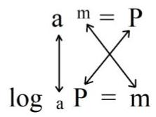

底数 $a$ 可以看作指数运算或对数运算的 “基底”,幂值 (真数) $P$ 是以基底 $a$ 为基础,进行若干程度的放大或缩小得到,这个放大或缩小的程度由指数 (对数) $m$ 表示。

指数 (对数) $m$ 起到 “指针” “信号” 的作用,表明底数 $a$ 在这个指针的指引下,指向对应的幂值 (真数) $P$ 。指数运算是根据基底 $a$ 和指针 $m$ ,找到对应的结果 $P$ 的运算,对数运算是根据基底 $a$ 和对应的结果 $P$ ,找回相应的指针 $m$ 的运算。

指数运算 ${a}^{m} = P$ 对应的对数运算 ${\log }_{a}P = m$ ,通常默认底数 $a > 0, a \neq  1$ ,此时指数运算的幂值 $P$ 恒为正数,与之对应的对数运算的真数 $P$ 须恒为正数。指数 (对数)可以是正数、负数或 0 。

例 4.3 求下列对数的值:

(1) ${\log }_{2}{1024}$ ； (2) ${\log }_{27}3$ ； (3) ${\log }_{1/2}{16}$ ； (4) ${\log }_{a}\sqrt{{a}^{3}}$ 。

解析: (1) 2 的几次方等于1024? 2 的10次方等于1024, 因此以 2 为底1024 的对数为10。

(2)27 的几次方 (根) 等于 3 ? 3 的 3 次方等于 27，那么 27 的 3 次方根等于3，因此以 27 为底3 的对数为 $\frac{1}{3}$ 。

(3) $\frac{1}{2}$ 的几次方等于 ${16}?\frac{1}{2}$ 的 -4 次方(4 次方的倒数)等于 16，因此以 $\frac{1}{2}$ 为底 16 的对数为 4 的相反数, 即 -4 ;

(4) $a$ 的几次方等于 $\sqrt{{a}^{3}}$ ？ $a$ 的 $\frac{3}{2}$ 次方等于 $\sqrt{{a}^{3}}$ ，因此以 $a$ 为底 $\sqrt{{a}^{3}}$ 的对数为 $\frac{3}{2}$ 。

#### 4.1.4 两个特殊的对数

对数运算中有两个特殊的两个底数: 自然对数的底 e 和常用对数的底 10 。

自然对数的底用小写字母e 表示,它是一个无理数,近似等于 2.71828...。

e 的数学含义在高中阶段不需要了解, 如有兴趣可以自行查阅相关资料, 当前只需知道 e 是根据客观的数学规律得出的客观存在的数字, 自然对数的底 e 与圆周率 $\pi$ 都是根据客观规律得到的无理数。

当底数为 $\mathrm{e}$ 时,以 $\mathrm{e}$ 为底 $P$ 的对数记作 $\ln P$ ,即用 $\ln$ 代替 ${\log }_{\mathrm{e}}$ 。例如,以 $\mathrm{e}$ 为底 2 的对数记作 $\ln 2$ 。除非实际需要,通常不需要求出含 $\mathrm{e}$ 的表达式的数值,直接令其以 $\mathrm{e}$ 或 $\ln$ 的形式存在即可,参照对 $\pi$ 的处理方式。

需牢记 $\mathrm{e} \approx  {2.72}$ 特别是 ${2.7} < \mathrm{e} < {2.8}$ 这个取值范围,在比较数值的大小、判断正负号时经常使用, e 还有一些非常特殊且重要的性质, 将在关于导数的章节具体学习。

常用对数的底是 10 , 因为常用的计数法是十进制, 所以把以 10 为底的对数叫作常用对数。

当底数为 10 时,以 10 为底 $P$ 的对数记作 $\lg P$ ,即用 $\lg$ 代替 ${\log }_{10}$ 。例如,以 10 为底 1000 的对数记作 $\lg {1000}$ ，易求得 $\lg {1000} = 3$ 。

化学中，表示溶液酸碱度的 $\mathrm{{pH}}$ 就是溶液中氢离子浓度的对数的相反数。 $\mathrm{{pH}}$ 的定义式为: $\mathrm{{pH}} =  - \lg \left\lbrack  {\mathrm{H}}^{ + }\right\rbrack$ 。溶液的 $\mathrm{{pH}}$ 每增加1，溶液中的氢离子浓度就减小为原来的 $\frac{1}{10}$ ; 溶液的 $\mathrm{{pH}}$ 每减小 1，溶液中的氢离子浓度就增大为原来的 10 倍。

用pH表示溶液的酸碱度的优点在于: 对于大多数化学实验, 只有当氢离子浓度发生十倍、百倍、千倍等数量级的变化时, 才产生较明显的效果, 在同一数量级内浮动的影响往往不明显, 可以忽略不计。

#### 4.1.5 对数运算的性质

对数运算的性质与指数运算相似, 利用指数运算的法则、性质和规律, 可以推出对数运算的法则、性质和规律。如果对指数运算的性质和法则都较熟悉的话, 很容易理解并推导出来。

声明: 下列表达式中,默认底数 $a > 0, a \neq  1$ ,真数 $M, N > 0$ 。

性质 0 : ${a}^{{\log }_{a}M} = M,{\log }_{a}\left( {a}^{m}\right)  = m$

这两个等式实际上就是指数运算和对数运算的定义式, 需要非常熟悉。

性质 1: ${\log }_{a}M + {\log }_{a}N = {\log }_{a}\left( {MN}\right)$

该性质的原理为 ${a}^{m} \times  {a}^{n} = {a}^{m + n}$ ,即指数 (对数) 相加对应幂值 (真数) 相乘。

可以设 ${\log }_{a}M = m,{\log }_{a}N = n$ ,那么 ${a}^{m} = M,{a}^{n} = N$ ,

等式的左边: ${\log }_{a}M + {\log }_{a}N = m + n$ ,

等式的右边: ${\log }_{a}\left( {MN}\right)  = {\log }_{a}\left( {{a}^{m} \times  {a}^{n}}\right)  = {\log }_{a}\left( {a}^{m + n}\right)  = m + n$ ,

等式的左右两边相等。

例 4.4 证明: ${\log }_{2}8 + {\log }_{2}{16} = {\log }_{2}\left( {8 \times  {16}}\right)$ 。

等式的左边: ${\log }_{2}8 + {\log }_{2}{16} = 3 + 4 = 7$ ,

等式的右边: ${\log }_{2}\left( {8 \times  {16}}\right)  = {\log }_{2}{128} = 7$ ,

等式的左右两边相等。

性质 2: ${\log }_{a}M - {\log }_{a}N = {\log }_{a}\frac{M}{N}$

该性质的原理为 ${a}^{m} \div  {a}^{n} = {a}^{m - n}$ ,证明与性质 1 相似。

例 4.5 证明: $\lg {10}^{2} - \lg {10}^{3} = \lg {10}^{-1}$ 。

等式的左边: $\lg {10}^{2} - \lg {10}^{3} = 2 - 3 =  - 1$ ,

等式的右边: $\lg {10}^{-1} =  - 1$ ,

等式的左右两边相等。

性质 3: ${\log }_{a}\left( {M}^{n}\right)  = n{\log }_{a}M\left( {n \in  \mathbf{R}}\right)$

该性质的原理为 ${\left( {a}^{m}\right) }^{n} = {a}^{mn}$ ,证明与性质 1 相似。

例 4.6 证明: ${\log }_{3}{9}^{2} = 2{\log }_{3}9$ 。

等式的左边: ${\log }_{3}{9}^{2} = {\log }_{3}{81} = 4$ ,

等式的右边: $2{\log }_{3}9 = 2 \times  2 = 4$ ,

等式的左右两边相等。

书写含对数和指数的混合运算时, 如果真数部分是指数表达式, 通常不需要加括号,为了增加辨识度,也可以用括号括起来。例如,“以 $a$ 为底 $P$ 的 $q$ 次方的对数” 可以记作 ${\log }_{a}{P}^{q}$ 或 ${\log }_{a}\left( {p}^{q}\right)$ 。

如果表示对整个对数进行指数运算, 可以将指数写在 $\log$ 的右上角。例如, “以 $a$ 为底 $P$ 的对数的 $q$ 次方” 记作 ${\log }_{a}^{q}P$ 。为了增加辨识度,也可以将整个指数都用括号括起来,再在右上角写上指数,例如该表达式也可写为 ${\left( {\log }_{a}P\right) }^{q}$ 。

性质 4: ${\log }_{a}M = \frac{{\log }_{c}M}{{\log }_{c}a}$

该公式叫作换底公式,它将以 $a$ 为底的对数,换成两个以其他正实数 $c\left( {c \neq  1}\right)$ 为底的对数的商,这里新的底数 $c$ 可根据实际需要选取任意非 1 的正实数。

证明: 设 ${c}^{p} = M,{c}^{q} = a$ ,代入换底公式的右边:

$$
\frac{{\log }_{c}M}{{\log }_{c}a} = \frac{{\log }_{c}{c}^{p}}{{\log }_{c}{c}^{q}} = \frac{p{\log }_{c}c}{q{\log }_{c}c} = \frac{p}{q};
$$

由 ${c}^{p} = M$ 可得 $c = {M}^{\frac{1}{p}}$ ,由 ${c}^{q} = a$ 可得 $c = {a}^{\frac{1}{q}}$ ,联立这两个等式:

$$
c = {M}^{\frac{1}{p}} = {a}^{\frac{1}{q}} \Rightarrow  M = {\left( {a}^{\frac{1}{q}}\right) }^{p} = {a}^{\frac{p}{q}},
$$

将该等式代入换底公式的左边:

$$
{\log }_{a}M = {\log }_{a}\left( {a}^{\frac{p}{q}}\right)  = \frac{p}{q},
$$

换底公式的左右两边相等,即得证。

该公式的原理为:对于对数 ${\log }_{a}M$ ，重新设定底数 $c$ ，分别表示为以 $c$ 为底 $a$ 的对数和以 $c$ 为底 $M$ 的对数,可以看作使用新的底数 $c$ 重新建立起连接原底数 $a$ 和原真数 $M$ 之间的桥梁。

在一个具体的指数运算和对数运算中, 底数是该运算的基底, 换用新的底数 $c$ 后,分别找出指向 $a$ 的指针 $c \rightarrow  a$ 和指向 $M$ 的指针 $c \rightarrow  M$ ,用这两个指针表示 $a$ 与 $M$ 之间的关系。

如果将原本的对数 ${\log }_{a}M$ 看作指针 $a \rightarrow  M$ ,在该指针中加入中间步骤变为 $a \rightarrow  c \rightarrow  M$ ,即先 $a \rightarrow  c$ ,再 $c \rightarrow  M$ ,其中指针 $a \rightarrow  c$ 是指针 $c \rightarrow  a$ 的反方向。

从底数到真数是指数运算, 那么从真数到底数是该指数的次方根运算, 也就是原来的指数运算的倒数次幂,所以 ${\log }_{c}a$ 出现在分母位置,指针 $c \rightarrow  M$ 是正常方向, 出现在分子位置。

例 4.7 证明: ${\log }_{8}{64} = \frac{{\log }_{2}{64}}{{\log }_{2}8}$ 。

等式的左边: ${\log }_{8}{64} = 2$ ,等式的右边: $\frac{{\log }_{2}{64}}{{\log }_{2}8} = \frac{6}{3} = 2$ ,等式左右两边相等。

利用换底公式,可以得到两条有用的性质:

性质 5: ${\log }_{a}M = \frac{1}{{\log }_{M}a}$

该性质表明: 将底数与真数调换位置后, 对数变为原来的倒数。该性质的原理与 “如果 ${a}^{m} = M$ ,那么 $a = {M}^{\frac{1}{m}}$ ” 相同。 对 ${\log }_{a}M$ 使用换底公式,把 $M$ 作为新的底数,就可以得到该性质。

例 4.8 证明: ${\log }_{2}8 = \frac{1}{{\log }_{8}2}$

等式的左边: ${\log }_{2}8 = 3$ ,等式的右边: $\frac{1}{{\log }_{8}2} = \frac{1}{1/3} = 3$ ,等式左右两边相等。

性质 6: ${\log }_{\frac{1}{a}}M =  - {\log }_{a}M$

该性质表明: 如果两个对数的真数相等, 底数互为倒数, 那么这两个对数互为相反数。该性质的原理与 “如果 ${a}^{m} = M$ ,那么 ${\left( \frac{1}{a}\right) }^{m} = \frac{1}{{a}^{m}} = \frac{1}{M}$ ” 相同。

例 4.9 证明: ${\log }_{\frac{1}{3}}{27} =  - {\log }_{3}{27}$

等式的左边: ${\log }_{\frac{1}{3}}{27} =  - 3$ ,等式的右边: $- {\log }_{3}{27} =  - 3$ ,等式左右两边相等。

进行对数运算时, 可以利用上述性质, 将不熟悉的底数复杂的对数表达式转化为较熟悉的底数为大于 1 的实数的对数运算、将不同底数的对数表达式转化为相同底数的对数表达式、将多个对数运算相互合并, 从而让计算或表达式简化。

练习 4.1(2)

1. 将下列各指数式写成对数式:

(2) ${\left( \frac{1}{3}\right) }^{-2} = 9$ ； (3) ${1000}^{\frac{1}{3}} = {10}$ ； (4) ${a}^{b} = c$ 。

2. 将下列各对数式写成指数式:

(1) ${\log }_{4}{16} = 2;\;$ (2) ${\log }_{27}{81} = \frac{4}{3};\;$ (3) $\ln 2 = p;\;$ (4) ${\log }_{a}c = b$ 。

3. 求下列各对数的值:

(1) ${\log }_{2}{1024}$ ; (2) $\lg {10000}$ ; (3) $\ln \frac{1}{{\mathrm{e}}^{2}}$ ; (4) ${\log }_{7}\frac{1}{49}$ ; (5) ${\log }_{a}\sqrt{a}$ 。

4. 求下列各式中 $x$ 的值:

(1) $\ln x = \ln 2 + \ln 3$ ；(2) $\lg {100} = {10} + \lg x$ ； (3) ${\log }_{x}\frac{1}{256} =  - 5$ ;

(4) ${\log }_{2}{64} = {\log }_{2}{32} \times  {\log }_{2}x$ ；(5) $x{\log }_{0.5}{0.5}^{x} = 4$ 。

5. 化简下列各式:

(1) ${\log }_{a}{a}^{b}$ ；(2) ${\log }_{\sqrt{a}}b + {\log }_{1/a}{b}^{2}$ ；(3) $\ln \sqrt{\mathrm{e}} + \ln {\mathrm{e}}^{\frac{3}{2}}$ ；(4) $2{\log }_{a}b + {\log }_{a}{\left( \frac{a}{b}\right) }^{2}$ 。

6. 证明:

(1) $\ln \frac{p}{q} + \ln \frac{q}{p} = 0$ ；(2) ${\log }_{{a}^{n}}{b}^{n} = {\log }_{a}b$ 。

### 4.2 幂函数、指数函数、对数函数

以指数运算为基础, 可以得到两类基本函数: 幂函数、指数函数。以指数运算为基础, 可以得到一类基本函数: 对数函数。

#### 4.2.1 幂函数

幂函数是指数为定值, 底数为自变量, 幂值为因变量的一类函数, 其基本形式为:

$$
y = {x}^{a}\left( {a \neq  0}\right)
$$

幂函数的指数可以为非 0 的一切实数,当 $a = 1$ 时,函数 $y = x$ 是一次函数, 当 $a = 2$ 时,函数 $y = {x}^{2}$ 是二次函数,当 $a =  - 1$ 时,函数 $y = {x}^{-1}$ 即 $y = \frac{1}{x}$ 是反比例函数,若 $a = 0$ ,函数变为 $y = 1$ ,函数值为恒定不变的常数的函数叫作常数函数。

指数函数的定义域和值域与指数 $a$ 有关。当指数 $a$ 为正整数时,底数可以为全体实数,幂函数的定义域为全体实数 $\mathbf{R}$ ,其中,若 $a$ 为正偶数,如 $y = {x}^{2}$ ,负数的偶数次方为正数,幂函数的值域为 $\lbrack 0, + \infty )$ ; 若 $a$ 为正奇数,如 $y = x$ 和 $y = {x}^{3}$ , 负数的奇数次方仍为负数，幂函数值域为 $\mathbf{R}$ 。

当指数 $a$ 为负整数时,等价于正整数次幂的倒数,由于分母不能为 0,幂函数的定义域为 $\left( {-\infty ,0}\right)  \cup  \left( {0, + \infty }\right)$ ,其中,若 $a$ 为负偶数,如 $y = {x}^{-2} = \frac{1}{{x}^{2}}$ ,幂函数的值域为 $\left( {0, + \infty }\right)$ ; 若 $a$ 为负奇数,如 $y = \frac{1}{x}$ ,幂函数的值域为 $\left( {-\infty ,0}\right)  \cup  \left( {0, + \infty }\right)$ 。

当指数 $a$ 为分数或无理数时,定义域和值域通常为 $\lbrack 0, + \infty )$ 或 $\left( {0, + \infty }\right)$ ,是否包含 0 需根据函数解析式具体判断,例如, $y = \sqrt{x}$ 的定义域为 $\lbrack 0, + \infty ), y = \frac{1}{\sqrt{x}}$ 的定义域为 $\left( {0, + \infty }\right)$ 。

典型的幂函数主要有下列类型:

指数为 1 的幂函数就是一次函数,图像是一条直线,下图为 $y = x$ 的图像。

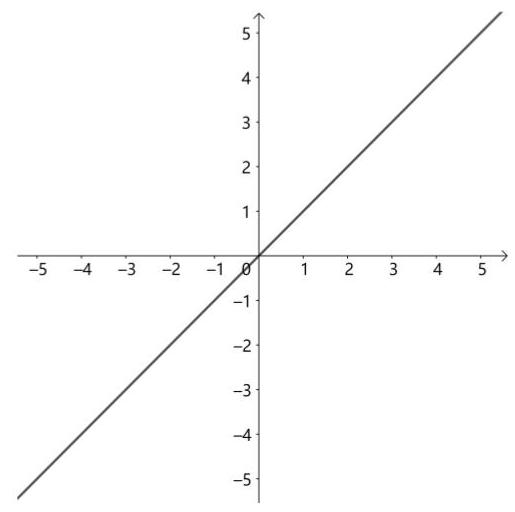

指数为正偶数的幂函数的图像都呈开口状的 $\mathrm{U}$ 形,指数越大则开口程度越大,下图为 $y = {x}^{2}$ 的图像。

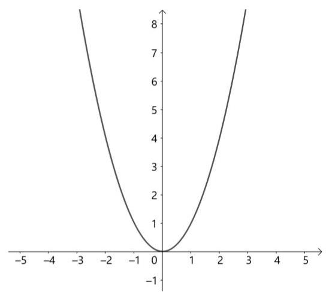

指数为正奇数 (不包括 1 ) 的幂函数的图像呈逆时针旋转 ${90}^{ \circ  }$ 的 $\mathrm{Z}$ 形,指数越大则坡度越陡峭,下图为 $y = {x}^{3}$ 的图像。

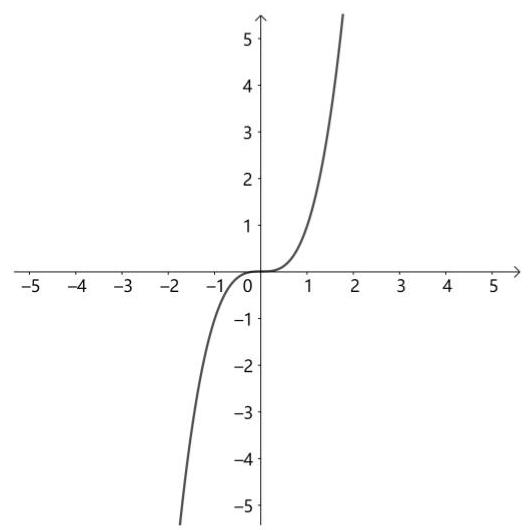

指数为大于 1 的非整实数的幂函数的图像只有 $x$ 轴正半轴的部分,呈越来越陡峭的山坡形,指数越大则坡度越陡峭,与 $y = {x}^{2}$ 或 $y = {x}^{3}$ 在 $x$ 轴正半轴的部分相似，下图为 $y = {x}^{1.5}$ 的图像。

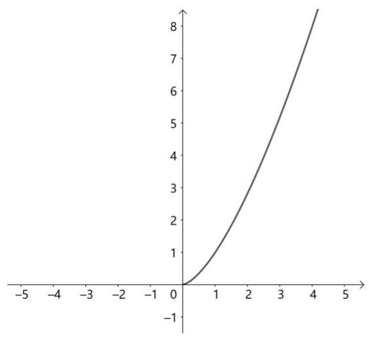

指数介于 $0 \sim  1$ 之间的幂函数的图像只有 $x$ 轴正半轴的部分,呈越来越平缓的山坡形,指数越小则坡度越平缓,下图为 $y = \sqrt{x}$ 的图像。

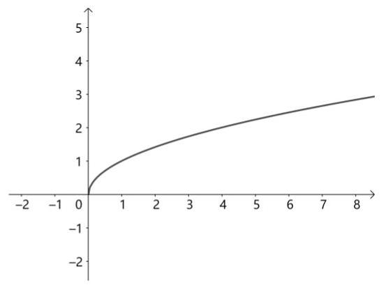

指数为负奇数的幂函数的图像为一对双曲线, 指数的绝对值越大则曲线越靠近坐标轴,但永远不会碰触到坐标轴,下图为 $y = \frac{1}{x}$ 的图像。

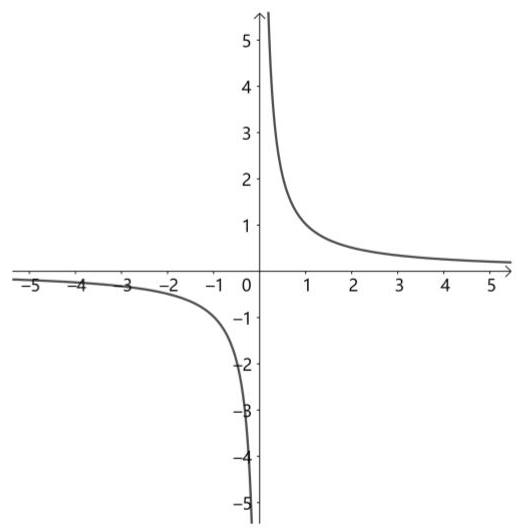

指数为负偶数的幂函数的图像相当于将双曲线中位于第三象限的部分向上对称翻折到第二象限中, 同样指数的绝对值越大则曲线越靠近坐标轴, 下图为 $y = \frac{1}{{x}^{2}}$ 的图像。

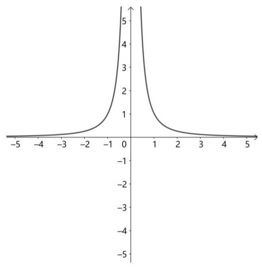

指数为负非整实数的幂函数的图像只有 $x$ 轴正半轴的部分,都与 $y = \frac{1}{x}$ 或 $y = \frac{1}{{x}^{2}}$ 在第一象限内的图像相似,同样指数的绝对值越大则曲线越靠近坐标轴, 下图为 $y = {x}^{-{1.5}}$ 的图像。

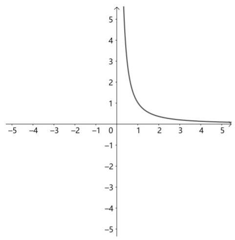

#### 4.2.2 幂函数的性质

我们现在结合上一小节中各类典型幂函数的解析式和图像, 分析幂函数的主要性质。对于幂函数:

$$
y = {x}^{a}
$$

单调性。当指数 $a$ 为正偶数时,如 $y = {x}^{2}$ ,幂函数在区间 $\left( {-\infty ,0}\right)$ 单调递减, 在区间 $\left( {0, + \infty }\right)$ 单调递增。

当指数 $a$ 为正奇数时,如 $y = x$ 和 $y = {x}^{3}$ ,幂函数在整个定义域单调递增。

当指数 $a$ 为负偶数时,如 $y = \frac{1}{{x}^{2}}$ ,幂函数在区间 $\left( {-\infty ,0}\right)$ 单调递增,在区间 $\left( {0, + \infty }\right)$ 单调递减。

当指数 $a$ 为负奇数时,如 $y = \frac{1}{x}$ ,幂函数在区间 $\left( {-\infty ,0}\right)$ 和 $\left( {0, + \infty }\right)$ 分别单调递减。

当指数 $a$ 为分数或无理数时,定义域通常为 $\lbrack 0, + \infty )$ 或 $\left( {0, + \infty }\right)$ ,函数值始终为整数, 若指数为正数则幂函数单调递增, 若指数为负数则幂函数单调递减。

奇偶性。当指数 $a$ 为偶数时, $f\left( {-x}\right)  = {\left( -x\right) }^{a} = {\left( -1\right) }^{a}{x}^{a} = {x}^{a} = f\left( x\right)$ ,为偶函数。

当指数 $a$ 为奇数时, $f\left( {-x}\right)  = {\left( -x\right) }^{a} = {\left( -1\right) }^{a}{x}^{a} =  - {x}^{a} =  - f\left( x\right)$ ,为奇函数。

可以发现: 指数为偶数的幂函数是偶函数, 指数为奇数的幂函数是奇函数, 这正是 “偶函数” 和 “奇函数” 名称的来源。

例 4.10 已知幂函数 $y = {x}^{a}$ 经过点 $\left( {4,\frac{1}{2}}\right)$ ,求 $a$ 的值。

解析: 将点 $\left( {4,\frac{1}{2}}\right)$ 的坐标代入 $y = {x}^{a} : \frac{1}{2} = {4}^{a}$ ，由 $\frac{1}{2} = \frac{1}{\sqrt{4}} = {4}^{-\frac{1}{2}}$ 可得 $a =  - \frac{1}{2}$ 。

例 4.11 分析函数 $f\left( x\right)  = x - \frac{1}{x}$ 的奇偶性和单调性。

解析: 奇偶性: 该函数的定义域为 $x \in  \left( {-\infty ,0}\right)  \cup  \left( {0, + \infty }\right)$ ,定义域对称,可能具有对称性,且 $f\left( {-x}\right)  =  - x - \frac{1}{-x} =  - \left( {x - \frac{1}{x}}\right)  =  - f\left( x\right)$ ,该函数为奇函数。

单调性: 设 ${x}_{1} < {x}_{2}$ ,那么:

$$
f\left( {x}_{1}\right)  - f\left( {x}_{2}\right)  = \left( {{x}_{1} - \frac{1}{{x}_{1}}}\right)  - \left( {{x}_{2} - \frac{1}{{x}_{2}}}\right)  = \left( {{x}_{1} - {x}_{2}}\right)  + \frac{{x}_{1} - {x}_{2}}{{x}_{1}{x}_{2}} = \left( {{x}_{1} - {x}_{2}}\right) \left( {1 + \frac{1}{{x}_{1}{x}_{2}}}\right) ,
$$

其中, ${x}_{1} - {x}_{2} < 0$ ,当 $0 < {x}_{1} < {x}_{2}$ 时, ${x}_{1}{x}_{2} > 0,1 + \frac{1}{{x}_{1}{x}_{2}} > 0, f\left( {x}_{1}\right)  - f\left( {x}_{2}\right)  < 0$ , 函数单调递增。当 ${x}_{1} < {x}_{2} < 0$ 时, ${x}_{1}{x}_{2} > 0,1 + \frac{1}{{x}_{1}{x}_{2}} > 0, f\left( {x}_{1}\right)  - f\left( {x}_{2}\right)  < 0$ ,函数单调递增。当 ${x}_{1} < 0 < {x}_{2}$ 时, ${x}_{1}{x}_{2} < 0,1 + \frac{1}{{x}_{1}{x}_{2}}$ 的正负号不确定,没有固定的单调性。综上,该函数在 $\left( {-\infty ,0}\right)$ 和 $\left( {0, + \infty }\right)$ 分别单调递增。该函数的图像如下所示。

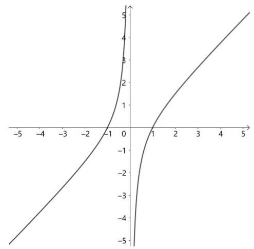

练习 ${4.2}\left( 1\right)$

1. 已知幂函数 $y = {x}^{a}$ 经过点 $\left( {\sqrt{3},9}\right)$ ，求函数的解析式。

2. 判断下列函数的单调性和奇偶性:

(2) $y = {x}^{4} + 2{x}^{2}$ ； (3) $y = {x}^{4} - 2{x}^{2} + 1$ 。

3. 已知函数 $y = a{x}^{4} + b{x}^{3} + c$ ,回答下列问题:

(1)如果该函数是偶函数，且经过点 $\left( {-2,{18}}\right)$ 和 $\left( {1,3}\right)$ ，求函数的解析式；

(2)如果该函数是奇函数，且经过点 $\left( {-2,{18}}\right)$ ，求函数的解析式。

#### 4.2.3 指数函数

指数函数是底数为常数、指数为自变量、幂值为因变量的一类函数, 其基本形式为:

$$
y = {a}^{x}
$$

指数函数的定义域通常为全体实数 $\mathrm{R}$ 。为了让函数有意义,指数函数的底数 $a$ 需满足(默认) $a > 0, a \neq  1$ 。

由于规定了底数 $a > 0, a \neq  1, a$ 的任意次幂都恒为正数,指数函数的值域包含于正实数 $\left( {0, + \infty }\right)$ 。对于任意正数 $y$ 作为函数值,按照指数运算的逆运算,都可以找到相应的指数 $x = {\log }_{a}y$ 。综上,指数函数的值域是全体正实数 $\left( {0, + \infty }\right)$ 。

生活中，银行存贷款的利率有单利和复利两种计算方式:单利是每月的利息只按照最初的存款计算，本金和每月的利息都是定值；复利是每月末将利息并入本金，一并作为下个月的本金，本金和每月的利息逐月增加。

函数 1 将 1 万元存入银行，复利的月利率为 1%，每个月末的总存款额—— 利息和本金之和——与月数的关系可以用指数函数描述。

第 1 个月的本金是 1 万元,月末获得利息 $1 \times  1\%  = {0.01}$ 万元,将利息并入本金, 共 $1 + {0.01} = {1.01}$ 万元;

第 2 个月的本金是 1.01 万元，月末获得利息 1.01×1%=0.0101 万元，将利息并入本金，共 1.01 + 0.0101 = 1.0201 万元；

第 3 个月的本金是 1.0201 万元，月末获得利息 1.0201×1% = 0.010201 万元， 将利息并入本金，共1.0201+ ${0.010201} = {1.030301}$ 万元；

以此类推, 如下表所示: (单位: 万元, 精确至 0.000001 万元, 即 “分”)

<table><tr><td>月份</td><td>月初本金</td><td>本月利息</td><td>月末合计</td></tr><tr><td>1</td><td>1.000000</td><td>0.010000</td><td>1.010000</td></tr><tr><td>2</td><td>1.010000</td><td>0.010100</td><td>1.020100</td></tr><tr><td>3</td><td>1.020100</td><td>0.010201</td><td>1.030301</td></tr><tr><td>4</td><td>1.030301</td><td>0.010303</td><td>1.040604</td></tr><tr><td>5</td><td>1.040604</td><td>0.010406</td><td>1.051010</td></tr></table>

按照复利的计算方式, 每个月末的存款与利息之和等于下个月初的本金, 如果第 $x$ 月末的总存款是 $y$ ,那么第 $x + 1$ 月初的本金也是 $y$ ,第 $x + 1$ 月末的利息是 $y \times  1\%  = {0.01y}$ ,第 $x + 1$ 月末总存款是 $y + {0.01y} = {1.01y}$ 。

即: 每月末的总存款是上个月末的总存款的 1.01 倍, 每过一个月, 总存款就在上一个月的基础上乘以 1.01,月末的总存款额 $y$ 与月数 $x$ 的关系为:

$$
y = {1.01}^{x}
$$

这是一个指数函数, “总存款额-月数”函数的图像如下图所示 (将定义域拓展到 $\left( {-\infty , + \infty }\right)$ ,并将坐标轴的刻度比例进行适当调整)。

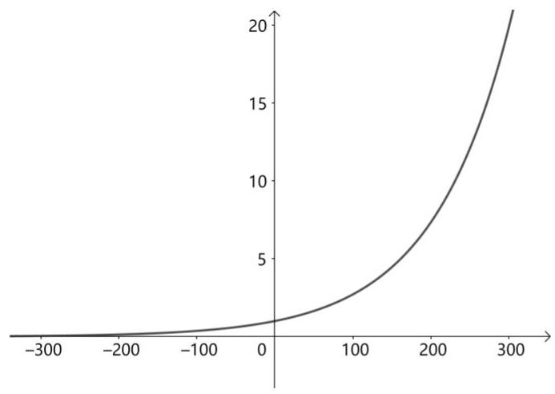

函数 2 生物学中, 如果环境足够理想, 生物繁衍的速度呈指数增长。假设在理想环境下培养某种单细胞微生物, 每经过 1 小时, 每个细胞分裂成为 2 个细胞，设最初有 1 个细胞，细胞数与小时数的关系可以用指数函数描述。

最初有 1 个细胞;

经过第 1 个小时,分裂为 $1 \times  2 = 2$ 个细胞;

经过第 2 个小时,分裂为 $2 \times  2 = 4$ 个细胞;

经过第 3 个小时,分裂为 $4 \times  2 = 8$ 个细胞;

以此类推，如下表所示:(单位:个)

<table><tr><td>小时</td><td>初始细胞数</td><td>分裂后细胞数</td></tr><tr><td>1</td><td>1</td><td>2</td></tr><tr><td>2</td><td>2</td><td>4</td></tr><tr><td>3</td><td>3</td><td>8</td></tr><tr><td>4</td><td>4</td><td>16</td></tr><tr><td>5</td><td>5</td><td>32</td></tr></table>

每经过 1 小时,细胞的数目乘以 2 ，细胞的数目 $y$ 与小时数 $x$ 的关系为:

$$
y = {2}^{x}
$$

这也是一个指数函数, “细胞数-小时数” 函数的图像如下页图所示(将定义域拓展到 $\left( {-\infty , + \infty }\right)$ ) 。

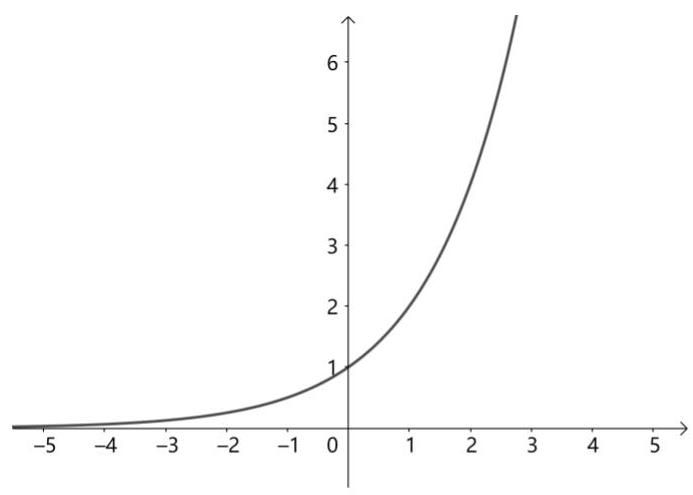

函数 3 物理学中, 有放射性的原子会发生衰变, 变为没有放射性的原子, 且每经过相等的时间, 发生衰变的原子数占当前原子总数的比值恒定。假设某放射性原子每小时有 80% 的原子发生衰变, 还剩 20% 的原子没有变化, 设最初有 $1 \times  {10}^{20}$ 个放射性原子,剩余未衰变原子数与小时数可以用指数函数描述。

经过第 1 个小时,有 ${10}^{20} \times  {80}\%  = {0.8} \times  {10}^{20}$ 个原子发生衰变,还剩 ${10}^{20} \times  {20}\%  = {0.2} \times  {10}^{20}$ 个放射性原子;

经过第 2 个小时,有 ${0.2} \times  {10}^{20} \times  {80}\%  = {0.16} \times  {10}^{20}$ 个原子发生衰变,还剩 ${0.2} \times  {10}^{20} \times  {20}\%  = {0.04} \times  {10}^{20}$ 个放射性原子;

经过第 3 个小时,有 ${0.04} \times  {10}^{20} \times  {80}\%  = {0.032} \times  {10}^{20}$ 个原子发生衰变,还剩 ${0.04} \times  {10}^{20} \times  {20}\%  = {0.008} \times  {10}^{20}$ 个放射性原子;

以此类推,如下表所示: (单位: $\times  {10}^{20}$ 个)

<table><tr><td>小时</td><td>初始性原子数</td><td>衰变原子数</td><td>剩余原子数</td></tr><tr><td>1</td><td>1</td><td>0.8</td><td>0.2</td></tr><tr><td>2</td><td>0.2</td><td>0.16</td><td>0.04</td></tr><tr><td>3</td><td>0.04</td><td>0.032</td><td>0.008</td></tr><tr><td>4</td><td>0.008</td><td>0.0064</td><td>0.0016</td></tr><tr><td>5</td><td>0.0016</td><td>0.00128</td><td>0.00032</td></tr></table>

每经过 1 小时,剩余放射性原子的数量乘以 0.2 ,剩余放射性原子的数量 $y$ 与小时数 $x$ 的关系为:

$$
y = {0.2}^{x}
$$

这仍是一个指数函数, “剩余放射性原子数-时间”函数的图像如下页图所示 (将定义域拓展到 $\left( {-\infty , + \infty }\right)$ ,并将坐标轴的刻度比例进行适当调整)。

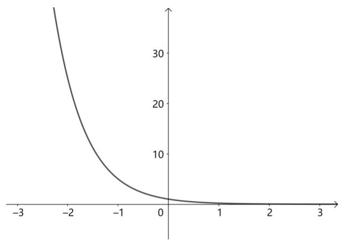

以上三个函数的解析式都具有共同的形式 $y = {a}^{x}$ ,只是底数 $a$ 各不相同。

#### 4.2.4 指数函数的性质

指数函数是以指数运算为基础的函数, 根据指数运算的法则和特点, 可以分析得出指数函数的一些性质, 指数函数的性质可以很直观地由其函数图像展示。

单调性。指数函数的单调性可以根据指数运算的基本规律分析得出:

乘法运算中, 1 是一个 “分界点”: 任何数乘以 1 仍等于它自身; 任何数乘以比 1 大的数, 绝对值增大; 任何数乘以比 1 小的正数, 绝对值减小。

如果一个数比 1 大，那么它乘以自身将会越乘越大，所以它的正数次幂单调递增,且幂值始终大于 1 。例如, ${10}^{5} > {10}^{4} > 1,{1.1}^{3} > {1.1}^{2} > 1$ 。

相对的, 一个比 1 大的数的负数次幂等于它的正数次幂的倒数, 幂值始终小于 1 。随着指数减小(绝对值增大)，分母逐渐增大，幂值逐渐减小，它的负数次幂也单调递增。例如, ${10}^{-5} < {10}^{-4} < 1\left( {\frac{1}{{10}^{5}} < \frac{1}{{10}^{4}}}\right) ,{1.1}^{-3} < {1.1}^{-2} < 1\left( {\frac{1}{{1.1}^{3}} < \frac{1}{{1.1}^{2}}}\right)$ 。

综上, $\forall a > 1$ ,恒有 ${a}^{x}$ 递增。如果 $x > 0$ ,那么 ${a}^{x} > 1$ ; 如果 $x < 0$ ,那么 $0 < {a}^{x} < 1$ ; 如果 $x = 0$ ,那么 ${a}^{0} = 1$ 。

下页图为画在同一坐标系中的指数函数 $f\left( x\right)  = {2}^{x}, f\left( x\right)  = {4}^{x}, f\left( x\right)  = {8}^{x}$ , 注意观察它们的单调性, 在原点左右两侧函数值的范围, 函数值变化的快慢与底数大小的关系。从图中可以发现,这些指数函数都经过点 $\left( {0,1}\right)$ ,都满足 $f\left( 0\right)  = {a}^{0} = 1$ 。

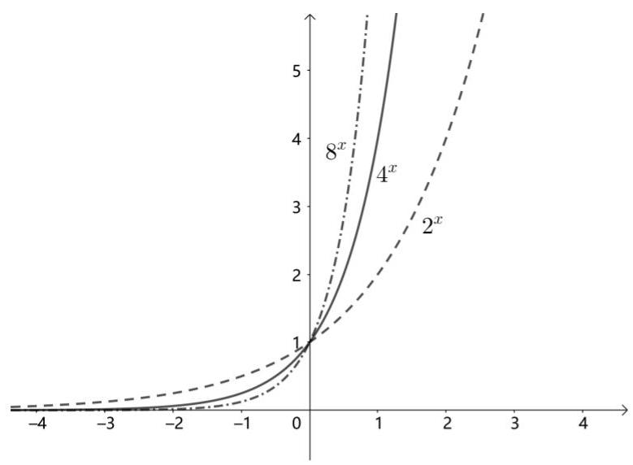

如果一个正数比 1 小，那么它乘以自身将会越乘越小，且始终为正数，所以它的正数次幂单调递减，且幂值始终介于 $0 \sim  1$ 之间。例如， ${0.1}^{3} < {0.1}^{2} < 1$ 。

相对的, 一个比 1 小的正数的负数次幂等于负数的相反数次幂的倒数, 幂值始终大于 1 ，且随着指数减小(绝对值增大)，分母逐渐减小，幂值逐渐增大， 所以它的负数次幂也单调递减。例如, ${0.1}^{-3} > {0.1}^{-2} > 1\left( {\frac{1}{0.001} > \frac{1}{0.01}}\right)$ 。

综上, $\forall 0 < a < 1$ ,恒有 ${a}^{x}$ 递减。如果 $x > 0$ ,那么 $0 < {a}^{x} < 1$ ; 如果 $x < 0$ , 那么 ${a}^{x} > 1$ ; 如果 $x = 0$ ,那么 ${a}^{0} = 1$ 。

下图为画在同一坐标系中的指数函数 $f\left( x\right)  = {\left( \frac{1}{2}\right) }^{x}, f\left( x\right)  = {\left( \frac{1}{4}\right) }^{x}, f\left( x\right)  = {\left( \frac{1}{8}\right) }^{x}$ , 注意观察它们的单调性, 在原点左右两侧函数值的范围, 函数值变化的快慢与底数大小的关系。

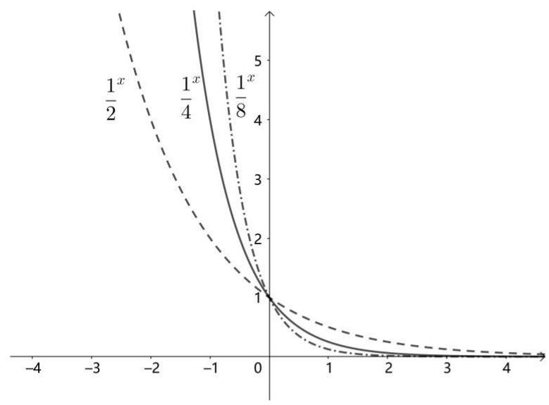

还可以发现: 所有基本的指数函数 $f\left( x\right)  = {a}^{x}\left( {a > 0, a \neq  1}\right)$ 都经过点 $\left( {0,1}\right)$ , 都满足 $f\left( 0\right)  = {a}^{0} = 1$ 。

指数的加减法对应幂值的乘除法。减法中, 0 可以看作是比大小的 “分界点”, 除法中，1 可以看作(绝对值)比大小的 “分界点”，因此 0 可以看作指数函数的定义域的“分界点”，1 可以看作指数函数的值域的“分界点”。

对称性。单独的指数函数没有对称性, 底数满足一定条件的一对指数函数具有对称性。根据幂运算的性质,一对互为倒数的正实数 $a$ 和 $\frac{1}{a}$ ,当它们的指数互为相反数 $- n$ 和 $n$ 时,幂值相等: ${a}^{-n} = \frac{1}{{a}^{n}} = {\left( \frac{1}{a}\right) }^{n}$ ,由此可得: 如果一对指数函数的底数互为倒数, 那么当它们的横坐标互为相反数时, 对应的函数值相等, 它们的函数图像关于 $y$ 轴镜面对称。

设 $f\left( x\right)  = {a}^{x}, g\left( x\right)  = {\left( \frac{1}{a}\right) }^{x}\left( {a > 0, a \neq  1}\right)$ ,它们之间具有关系:

$$
f\left( {-x}\right)  = {a}^{-x} = \frac{1}{{a}^{x}} = g\left( x\right) ,\;g\left( {-x}\right)  = {\left( \frac{1}{a}\right) }^{-x} = {a}^{x} = f\left( x\right)
$$

下图为画在同一坐标系中的指数函数 $f\left( x\right)  = {2}^{x}$ 和 $f\left( x\right)  = \frac{1}{{2}^{x}}$ 的图像,注意观察它们的图像关于 $y$ 轴对称。

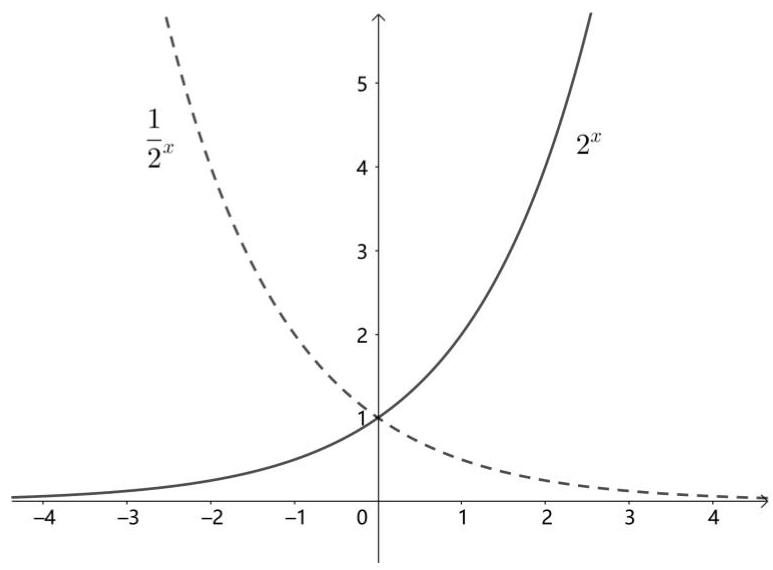

例 4.12 已知 $f\left( x\right)  = {2}^{x}, g\left( x\right)  = {\left( \frac{1}{3}\right) }^{x}$ ,比较下列各式的大小:

(1) $f\left( 4\right)$ ___ $f\left( 6\right)$ ；(2) $g\left( {0.2}\right)$ ___ $g\left( 2\right)$ ；(3) $f\left( {0.1}\right)$ ___ $g\left( {0.5}\right)$ 。

解析: $f\left( x\right)  = {2}^{x}$ 的底数大于 1,是单调递增函数,当 $x > 0$ 时 $f\left( x\right)  > 1$ ,当 $x < 0$ 时 $0 < f\left( x\right)  < 1$ 。

$g\left( x\right)  = {\left( \frac{1}{3}\right) }^{x}$ 的底数小于 1,是单调递减函数,当 $x > 0$ 时 $0 < g\left( x\right)  < 1$ ,当 $x < 0$ 时 $g\left( x\right)  > 1$ 。

(1)因为 $f\left( x\right)  = {2}^{x}$ 递增， $4 < 6$ ，所以 $f\left( 4\right)  < f\left( 6\right)$ ；

(2)因为 $g\left( x\right)  = {\left( \frac{1}{3}\right) }^{x}$ 递减， ${0.2} < 2$ ，所以 $g\left( {0.2}\right)  > g\left( 2\right)$ ；

(3)当 $x > 0$ 时， $f\left( x\right)  > 1,0 < g\left( x\right)  < 1$ ，所以 $f\left( {0.1}\right)  > 1 > g\left( {0.5}\right)$ 。

练习 4.2(2)

1. 求下列函数的定义域和值域:

(1) $y = {2}^{x}$ ； (2) $y = {\left( \frac{1}{3}\right) }^{x}$ ； (3) $y = {2}^{\sqrt{x}}$ ； (4) $y = {7}^{\frac{2}{x}}$ 。

2. 已知函数 $y = {a}^{x}$ 经过点 $\left( {2,{100}}\right)$ ,求 $a$ 的大小。

3. 已知函数 $f\left( x\right)  = {a}^{x}, g\left( x\right)  = {\left( \frac{1}{7}\right) }^{x}$ ,恒有 $f\left( x\right)  > g\left( x\right)$ ,求 $a$ 的范围。

4. 已知函数 $f\left( x\right)  = {2}^{x}, g\left( x\right)  = {\left( \frac{1}{2}\right) }^{x}$ ,求当 $f\left( x\right)  > g\left( x\right)$ 时, $x$ 的范围。

5. 已知函数 $f\left( x\right)  = {3}^{x}, g\left( x\right)  = {9x}$ ,在平面直角坐标系中画出这两个函数的大致图像, 并指出它们的交点。

#### 4.2.5 对数函数

对数函数是底数为常数、真数为自变量、对数的值为因变量的一类函数, 其基本形式为:

$$
y = {\log }_{a}x
$$

对数函数中,底数 $a$ 的范围与指数函数相同: $a > 0, a \neq  1$ 。

函数 4 如果月末总存款额(单位:万元)与月数的关系为 $y = {1.01}^{x}$ ，那么月数 $y$ 与月末总存款额 $x$ 的关系为:

$$
y = {\log }_{1.01}x
$$

函数图像如下图所示 (将定义域拓展到 $\left( {0, + \infty }\right)$ ,并将坐标轴的刻度比例进行适当调整)。

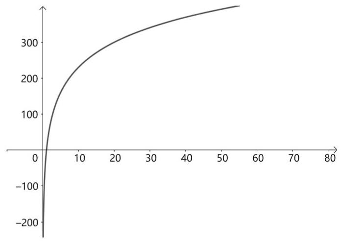

函数 5 如果细胞的数目(单位:个)与小时数的关系为 $y = {2}^{x}$ ，那么小时数 $y$ 与细胞的数目 $x$ 的关系为:

$$
y = {\log }_{2}x
$$

函数图像如下图所示(将定义域拓展到 $\left( {0, + \infty }\right)$ ):

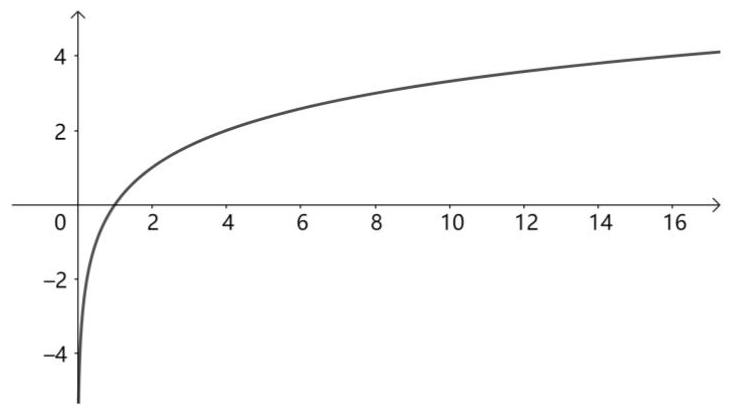

函数 6 如果剩余放射性原子的数量(单位: $\times  {10}^{20}$ 个)与小时数的关系为 $y = {0.2}^{x}$ ,那么小时数 $y$ 与剩余放射性原子的数量 $x$ 的关系为:

$$
y = {\log }_{0.2}x
$$

函数图像如下图所示 (将定义域拓展到 $\left( {0, + \infty }\right)$ ,并将坐标轴的刻度比例进行适当调整)。

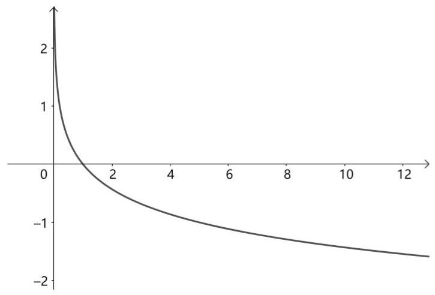

#### 4.2.6 对数函数的性质

对数函数是以对数运算为基础的函数, 根据对数运算的法则和特点, 可以分析得出对数函数的一些性质, 对数函数的性质可以很直观地由其函数图像展示。

对数函数同样要求底数 $a$ 满足 $a > 0, a \neq  1$ ,真数 $x > 0$ ,对数函数的定义域为全体正实数 $\left( {0, + \infty }\right)$ ,与指数函数的值域相同。

对数函数的值域可以取全体实数 $\mathbf{R}$ ,与指数函数的定义域相同,对于任意底数 $a > 0, a \neq  1$ ,以及对数函数的函数值 $y$ ,都能找到相应的自变量 $x = {a}^{y}$ 。

单调性。对数运算是指数运算的逆运算, 对数函数的增减规律与指数函数一致,只是自变量与因变量的位置对调。对于对数函数 $y = {\log }_{a}x\left( {a > 0, a \neq  1}\right)$ :

如果底数 $a > 1$ ，那么真数越大，对应的对数越大，此时对数函数单调递增。 当 $x > 1$ 时, $y > 0$ ; 当 $x < 1$ 时, $y < 0$ ; 当 $x = 1$ 时, $y = 0$ 。

如果底数 $a < 1$ ，那么真数越大，对应的对数越小，此时对数函数单调递减。 当 $x > 1$ 时， $y < 0$ ；当 $x < 1$ 时， $y > 0$ ；当 $x = 1$ 时， $y = 0$ 。

$\forall a \in  {\mathbf{R}}_{ + }, a \neq  1,{\log }_{a}1 = 0$ ,所有基本的对数函数 $y = {\log }_{a}x$ 都经过点 $\left( {1,0}\right)$ 。

下图为画在同一坐标系中的对数函数 $f\left( x\right)  = {\log }_{2}x$ 和 $f\left( x\right)  = {\log }_{0.5}x$ 的图像, 注意观察它们的单调性。

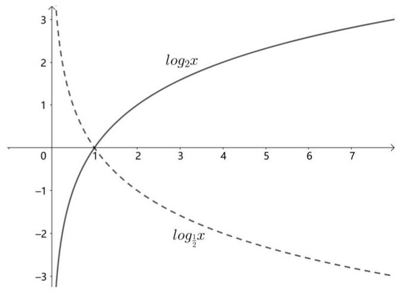

对称性。与指数函数相似, 单个的对数函数不具有对称性, 底数满足一定条件的一对对数函数具有对称性。

对于底数互为倒数的对数函数 $f\left( x\right)  = {\log }_{a}x$ 与 $g\left( x\right)  = {\log }_{\frac{1}{a}}x$ ,可得:

$$
f\left( x\right)  + g\left( x\right)  = {\log }_{a}x + {\log }_{\frac{1}{a}}x = {\log }_{a}x + \left( {-{\log }_{a}x}\right)  = 0
$$

即: 如果两个对数函数的底数互为倒数,那么它们在相同 $x$ 处的函数值互为相反数,它们的函数图像关于 $x$ 轴对称。

从上图中可以观察到 $f\left( x\right)  = {\log }_{2}x$ 与 $f\left( x\right)  = {\log }_{0.5}x$ 的图像关于 $x$ 轴对称。

练习 4.2(3)

1. 求下列函数的定义域和值域:

(1) $y = {\log }_{2}x$ ；(2) $y = \lg \frac{1}{x + 5}$ ；(3) $y = \ln \left( {{x}^{2} + {5x} + 6}\right)$ ；(4) $y = \ln \sqrt{x - 2}$ 。

2. 已知函数 $y = {\log }_{a}x$ 经过点 $\left( {{100}, - 2}\right)$ ,求 $a$ 的值。

3. 已知函数 $f\left( x\right)  = {\log }_{a}x, g\left( x\right)  = \lg x$ ,恒有 $f\left( x\right)  > g\left( x\right)$ ,求 $a$ 的范围。

4. 已知函数 $f\left( x\right)  = {\log }_{0.1}x, g\left( x\right)  = \lg x$ ,求当 $f\left( x\right)  > g\left( x\right)$ 时, $x$ 的范围。

#### 4.2.7 函数增长速率的差异

下页图为画在同一坐标系中的函数 $y = {x}^{2}\text{ 、 }y = {\mathrm{e}}^{x}\text{ 、 }y = \ln x$ 的图像,它们分别代表幂函数、指数函数、对数函数, 注意体会它们增长速率的快慢, 即从左向右相同的 $x$ 值对应的各函数的 $y$ 值。

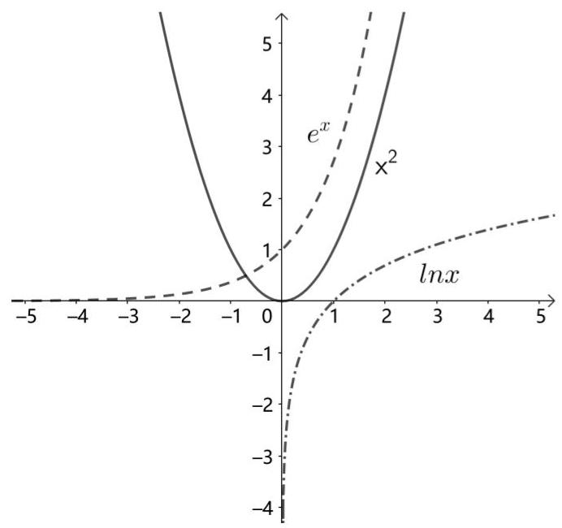

可以发现: 在区间 $x \in  \left( {0, + \infty }\right)$ ,当 $x$ 值相同时, ${\mathrm{e}}^{x} > {x}^{2} > \ln x$ ,并且这三种函数的函数值两两之间的差值随 $x$ 的增大越来越大。

通常情况下,对于取任意满足括号中条件的参数 $a, b, c$ 的下列三种函数:

幂函数 $y = {x}^{a}\left( {a > 0}\right)$ 指数函数 $y = {b}^{x}\left( {b > 1}\right)$ 对数函数 $y = {\log }_{c}x\left( {c > 1}\right)$

恒有:指数函数增大的速率最快，且越来越快，远快于幂函数和对数函数。 对数函数增大的速率最慢, 且越来越慢, 远慢于指数函数和幂函数。幂函数增大的速率介于指数函数和对数函数之间。

即使指数函数 $y = {b}^{x}$ 的底数 $b$ 很小,只要满足 $b > 1$ ,虽然可能该函数在 $x$ 较小的一段区间上的函数值小于某些幂函数和对数函数,只要 $x$ 足够大,那么指数函数的值一定会大于具体的幂函数和对数函数,且差值会随 $x$ 增大越来越大。

可以直观理解为: 指数增长是 “潜力” 很大的增长方式, 只要有足够的时间 (自变量的取值足够大)，指数增长的速率将远远用开幂函数和对数函数。对数增长是 “潜力” 很小的增长方式，增长的时间越长(自变量的取值足越大)，增长的速率越缓慢。在后续章节学习导数的知识后, 我们将会对函数增长的差异有更清晰明确的认识。

例 4.13 已知 $f\left( x\right)  = {\log }_{2}x, g\left( x\right)  = {\log }_{0.5}x$ ,比较下列各式的大小:

(1) $f\left( 4\right) \_ \_ f\left( 6\right)$ ；(2) $g\left( {0.2}\right) \_ \_ g\left( 2\right)$ ；

(3) $f\left( {0.1}\right) \_ g\left( {0.5}\right)$ ；(4) $f\left( 4\right) \_ \_ g\left( {0.25}\right)$ 。

解析: $f\left( x\right)  = {\log }_{2}x$ 的底数大于 1,是单调递增函数,当 $x > 1$ 时 $f\left( x\right)  > 0$ ,当 $0 < x < 1$ 时 $f\left( x\right)  < 0$ 。

$g\left( x\right)  = {\log }_{0.5}x$ 的底数小于 1,是单调递减函数,当 $x > 1$ 时 $g\left( x\right)  < 0$ ,当 $0 < x < 1$ 时 $g\left( x\right)  > 0$ 。

另外, $f\left( x\right)  = {\log }_{2}x$ 与 $g\left( x\right)  = {\log }_{0.5}x$ 的底数互为倒数,在 $x$ 值相同时它们的函数值互为相反数,在 $x$ 值互为倒数时它们的函数值相等。

(1)因为 $f\left( x\right)  = {\log }_{2}x$ 递增， $4 < 6$ ，所以 $f\left( 4\right)  < f\left( 6\right)$ ；

(2)因为 $g\left( x\right)  = {\log }_{0.5}x$ 递减， ${0.2} < 2$ ，所以 $g\left( {0.2}\right)  > g\left( 2\right)$ ；

(3)当 $0 < x < 1$ 时， $f\left( x\right)  < 0, g\left( x\right)  > 0$ ，所以 $f\left( {0.1}\right)  < 0 < g\left( {0.5}\right)$ ；

(4) $f\left( 4\right)  = {\log }_{2}4 = 2, g\left( {0.25}\right)  = {\log }_{0.5}{0.25} = 2$ ，所以 $f\left( 4\right)  = g\left( {0.25}\right)$ 。

## 练习 4.2(4)

1. 已知函数 $f\left( x\right)  = {\log }_{2}x, g\left( x\right)  = x - 1$ ,在平面直角坐标系中画出这两个函数的图像, 并指出它们的交点。

2. 分析下列函数的单调性, 并比较它们变化速率的快慢趋势:

(1) $y = {x}^{0.5}$ ; (2) $y = {0.5}^{x}$ ；

### 4.3 反函数、函数的连续性

我们在上一章学习了函数的单调性和奇偶性这两种函数的重要性质, 反函数和连续性也是函数的两项重要性质。

#### 4.3.1 反函数

对于一对底数相同的指数函数与对数函数:

$$
f\left( x\right)  = {a}^{x}\text{ 和 }g\left( x\right)  = {\log }_{a}x\left( {a > 0, a \neq  1}\right)
$$

如果指数函数 $f\left( x\right)  = {a}^{x}$ 经过点 $\left( {p, q}\right)$ ,即 ${a}^{p} = q$ ,那么对数函数 $g\left( x\right)  = {\log }_{a}x$ 一定经过点 $\left( {q, p}\right)$ ,即 ${\log }_{a}q = p$ 。同理,如果对数函数 $g\left( x\right)  = {\log }_{a}x$ 经过点 $\left( {m, n}\right)$ ,即 ${\log }_{a}m = n$ ,那么指数函数 $f\left( x\right)  = {a}^{x}$ 一定经过点 $\left( {n, m}\right)$ ,即 ${a}^{n} = m$ 。

这表明: 指数函数 $f\left( x\right)  = {a}^{x}$ 上的任意一点,将横坐标与纵坐标对调后,一定在对数函数 $g\left( x\right)  = {\log }_{a}x$ 上。同时,对数函数 $g\left( x\right)  = {\log }_{a}x$ 上的任意一点,将横坐标与纵坐标对调后,也一定在指数函数 $f\left( x\right)  = {a}^{x}$ 上。

指数函数 $f\left( x\right)  = {a}^{x}$ 的定义域为 $\left( {-\infty , + \infty }\right)$ ,对数函数 $g\left( x\right)  = {\log }_{a}x$ 的值域也为 $\left( {-\infty , + \infty }\right)$ 。对数函数 $g\left( x\right)  = {\log }_{a}x$ 的定义域为 $\left( {0, + \infty }\right)$ ,指数函数 $f\left( x\right)  = {a}^{x}$ 的值域也为 $\left( {0, + \infty }\right)$ 。

具有上述解析式中自变量和因变量的位置对调, 且定义域和值域也对调的一对函数,叫作反函数,称它们互相是对方的反函数。原函数 $y = f\left( x\right)$ 的反函数通常用符号 $y = {f}^{-1}\left( x\right)$ 表示。

通常情况下,将一个函数的解析式从用 $x$ 表示 $y$ 的形式变形为用 $y$ 表示 $x$ 的形式，就可以得到这个函数的反函数。

需注意, 函数的定义中, 每个自变量只能对应一个因变量, 而同一个因变量可以对应多个自变量。如果一个函数有反函数, 俺么这个函数的每个因变量都只对应唯一的一个自变量, 即该函数是一一映射, 不同自变量的函数值各不相同。

如果函数不满足每个因变量都只对应唯一的一个自变量的条件, 可以通过对定义域进行限制，选取满足该条件的一段定义域，也可以构造出反函数。

还需注意，原函数的定义域须与反函数的值域相同，原函数的值域须与反函数的定义域相同。

例 4.14 求一次函数 $y = {2x} - 4$ 的反函数。

解析: 利用等式的性质,将函数的解析式转化为用 $y$ 表示 $x$ 的形式:

$$
x = \frac{1}{2}y + 2
$$

通常习惯将函数写成 $y = {f}^{-1}\left( x\right)$ 的形式,将 $x$ 与 $y$ 互换,反函数为:

$$
y = \frac{1}{2}x + 2
$$

例 4.15 求二次函数 $f\left( x\right)  = {x}^{2}$ 的反函数。

解析: 对于二次函数 $f\left( x\right)  = {x}^{2}$ ,默认它的定义域是全体实数,每个非零的函数值有两个不同的自变量与之对应, 它们互为相反数, 不满足函数具有反函数的条件, 因此该函数没有反函数。

例 4.16 求二次函数 $f\left( x\right)  = {x}^{2}\left( {x > 0}\right)$ 的反函数。

解析: 对于二次函数 $f\left( x\right)  = {x}^{2}\left( {x > 0}\right)$ ,其定义域为全体正实数,每个函数值 $y$ 都对应唯一的一个自变量 $x = \sqrt{y}$ ,因此该函数有反函数,它的反函数为:

$$
y = \sqrt{x}\left( {x > 0}\right)
$$

如果一对函数互为反函数,那么它们的图像始终关于直线 $y = x$ 对称。函数及其反函数的图像的对称性可以用镜面对称的操作理解: 函数图像上的点 $\left( {{x}_{0},{y}_{0}}\right)$ 的横坐标 ${x}_{0}$ 为该点在 $x$ 轴上的投影,纵坐标 ${y}_{0}$ 为该点在 $y$ 轴上的投影, $x$ 轴与 $y$ 轴关于直线 $y = x$ 对称,即: 沿直线 $y = x$ 对折翻转后, $x$ 轴变为 $y$ 轴、 $y$ 轴变为 $x$ 轴,于是横坐标变为纵坐标,纵坐标变为横坐标,这恰好与反函数上点的纵坐标为原函数的横坐标、横坐标为原函数的纵坐标的定义一致, 因此函数与其反函数的图像关于直线 $y = x$ 对称。

通过简单的实际操作就能得到反函数的图像: 将函数 $y = f\left( x\right)$ 的图像连同整个坐标系一起,先逆时针旋转 ${45}^{ \circ  }$ ,再左右翻转,就得到其反函数的图像,且 $x$ 轴位于原 $y$ 轴的位置、 $y$ 轴位于原 $x$ 轴的位置,直线 $y = x$ 仍在原位置。

下图分别为画在同一坐标系中的函数及其反函数的图像: $y = {\mathrm{e}}^{x}$ 和 $y = \ln x$ , $y = {2x} - 4$ 和 $y = \frac{1}{2}x + 2,\;y = {x}^{2}\left( {x > 0}\right)$ 和 $y = \sqrt{x}\left( {x > 0}\right)$ 。

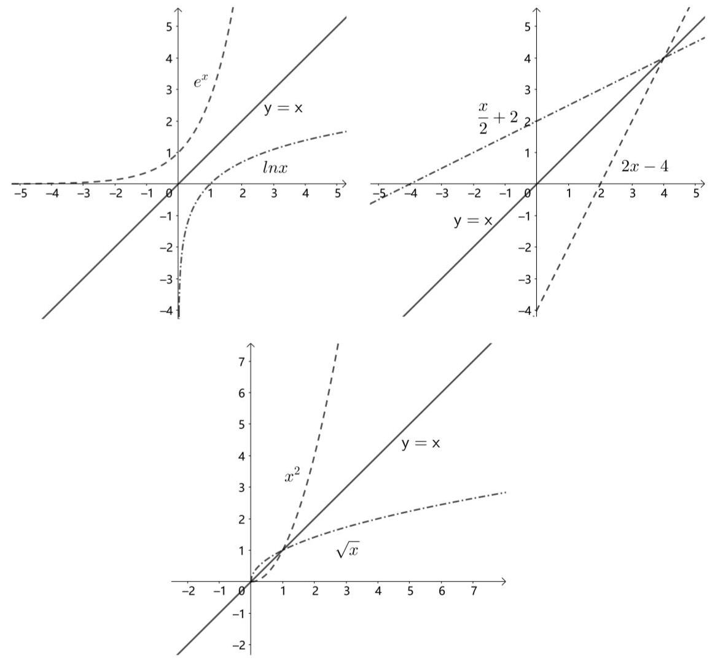

练习 4.3(1)

1. 判断下列函数是否有反函数，如有，写出其反函数并标明定义域，如没有, 说明原因:

2. 设函数 $y = f\left( x\right)$ 的反函数是 $y = {f}^{-1}\left( x\right)$ ,判断:

(1)如果 $y = f\left( x\right)$ 是偶函数， $y = {f}^{-1}\left( x\right)$ 是否存在，若存在是否有奇偶性;

(2)如果 $y = f\left( x\right)$ 是奇函数， $y = {f}^{-1}\left( x\right)$ 是否存在，若存在是否有奇偶性;

(3)如果 $y = f\left( x\right)$ 是单调递增函数， $y = {f}^{-1}\left( x\right)$ 是否有单调性;

(4)如果 $y = f\left( x\right)$ 是单调递减函数， $y = {f}^{-1}\left( x\right)$ 是否有单调性。

#### 4.3.2 函数的连续性

函数的连续性是基本初等函数的基本性质, 其内容为: 对于高中阶段学习的基本初等函数, 如果函数的定义域是连续的, 那么函数的值域也是连续的。

“基本初等函数” 包括已经学习的常数函数、幂函数、指数函数、对数函数, 下一章将要学习的三角函数，以及由基本初等函数通过加、减、乘、除、指数、 对数、三角函数等基本运算组合形成的函数或复合函数。

“定义域是连续的” 指定义域没有断开, 只要函数的某一段定义域是连续的实数区间，那么函数的值域在这一段实数区间也一定是连续的。如果函数的定义域有断开, 即取不到某个实数, 那么函数的值域在该处也断开, 也就是不连续。

函数在其连续区间上有如下性质: 如果函数 $y = f\left( x\right)$ 在区间 $\left\lbrack  {a, b}\right\rbrack$ 上连续, 且 $f\left( a\right)  = A, f\left( b\right)  = B$ ,设 $A < B$ ,那么函数 $y = f\left( x\right)$ 在区间 $\left\lbrack  {a, b}\right\rbrack$ 上一定能取到所有 $\left\lbrack  {A, B}\right\rbrack$ 范围内的函数值。若 $A > B$ 同理。如果定义域为开区间 $\left( {a, b}\right)$ ,那么相应的函数值一定可以取到的函数值的范围为 $\left( {A, B}\right)$ 。

即: 如果一段函数是连续的, 且已知这段连续的函数值能取到一个较大的值和一个较小的值, 那么介于这两个值之间的一切值都一定可以在这段区间取到。

需注意,函数 $y = f\left( x\right)$ 在 $\left\lbrack  {a, b}\right\rbrack$ 上一定能取到 $\left\lbrack  {A, B}\right\rbrack  (f\left( a\right)  = A, f\left( b\right)  = B$ , $A < B$ )中的任意值，并不意味着函数就取不到 $\left\lbrack  {A, B}\right\rbrack$ 之外的值，实际上有可能取到小于 $A$ 或大于 $B$ 的值,也有可能取不到,但 $\left\lbrack  {A, B}\right\rbrack$ 范围内的值一定能取到。

连续函数的图像可以看作把一根绳子放进坐标系里, 如果绳子一端高、另一端低, 那么绳子无论如何弯曲, 都一定会经过这两个高度之间的所有高度, 绳子中间的部分有可能高出或低于两个端点, 也可能没有。

函数的连续性的主要用于证明函数可以取到某值, 有时难以通过解方程等方法求出某个函数值对应的自变量, 或确认该函数值能否取到, 可通过恰当地选取容易求出自变量的函数值，利用函数的连续性证明函数可以取到相应的值。

例 4.17 分析函数 $y = {x}^{3} - x + 1$ 的连续性。

解析: 函数 $y = {x}^{3} - x + 1$ 的定义域可以为全体实数 $\left( {-\infty , + \infty }\right)$ ,函数值在其全定义域上连续。

例 4.18 分析反比例函数 $y = \frac{1}{x}$ 的连续性。

解析: 反比例函数 $y = \frac{1}{x}$ 的分母不能为 0,其定义域不包括 0,因此在包含 $x = 0$ 的区间上该函数不连续,在不包括 0 的任意连续区间 $\left( {-\infty ,0}\right)$ 或 $\left( {0, + \infty }\right)$ 上, 函数图像都连续。

函数 $y = f\left( x\right)$ 与 $x$ 轴的交点的横坐标叫作函数的零点,即让函数值 (纵坐标) 为 0 的点。函数值的零点通常不难求,让函数解析式等于 0,即 $f\left( x\right)  = 0$ ,该方程的解就是函数的零点。

关于函数的零点, 下列三个陈述是等价的:

(1)方程 $f\left( x\right)  = 0$ 有实数解;

(2)函数 $y = f\left( x\right)$ 有零点;

(3)函数 $y = f\left( x\right)$ 的图像与 $x$ 轴有公共点。

下列三个与之相反的陈述也是等价的:

(1)方程 $f\left( x\right)  = 0$ 没有实数解;

(2)函数 $y = f\left( x\right)$ 没有零点；

(3)函数 $y = f\left( x\right)$ 的图像与 $x$ 轴没有公共点。

判断一个函数 $y = f\left( x\right)$ 有没有零点,最直接的方法是求方程 $f\left( x\right)  = 0$ 有没有实数解,或观察函数图像是否与 $x$ 轴有公共点,但精确绘制函数的图像往往需要建立在已经求得相应的函数值的基础上, 如果不事先知道函数有没有零点, 就无法绘制出精确的图像。

如果求函数零点的方程很复杂难以下手，可以尝试利用函数的连续性，在不求出零点的前提下，确定函数在某区间上是否有至少一个零点。利用基本初等函数的连续性, 可以得出零点存在定理, 其内容为:

若函数 $y = f\left( x\right)$ 在区间 $\left\lbrack  {a, b}\right\rbrack$ 上连续,且 $f\left( a\right)$ 与 $f\left( b\right)$ 的正负号不同,即一个大于 0 、另一个小于 0 , 则函数在该区间一定有函数值为 0 的点。即: 若函数 $y = f\left( x\right)$ 在区间 $\left\lbrack  {a, b}\right\rbrack$ 上连续,且 $f\left( a\right) f\left( b\right)  < 0$ ,则一定存在 ${x}_{0} \in  \left\lbrack  {a, b}\right\rbrack$ ,使得 $f\left( {x}_{0}\right)  = 0$ 。

例 4.19 判断函数 $f\left( x\right)  = \frac{{x}^{2}}{8} - {\log }_{2}x$ 在区间 $\left( {1,2}\right)$ 上是否有零点。

解析: $f\left( 1\right)  = \frac{{1}^{2}}{8} - {\log }_{2}1 = \frac{1}{8} > 0, f\left( 2\right)  = \frac{{2}^{2}}{8} - {\log }_{2}2 =  - \frac{1}{2} < 0$ ,

因此 $f\left( x\right)  = \frac{{x}^{2}}{8} - {\log }_{2}x$ 在区间 $\left( {1,2}\right)$ 上一定有零点。

练习 4.3(2)

1. 下列函数是否在区间 $\left( {-\infty , + \infty }\right)$ 连续:

(1) $y = {x}^{4} - 2{x}^{2} + 1$ (2) $y = \ln {x}^{2}$ ； (3) $y = \frac{1}{{x}^{2} + 4}$ ； (4) $y =  - {3}^{x}$ 。

2. 下列函数在相应的区间上是否一定存在零点:

(1) $y = {x}^{3} - {x}^{2}, x \in  \left( {-2,2}\right) ;\;$ (2) $y = {2}^{x} - 8{\log }_{2}x, x \in  \left( {1,{10}}\right)$ ;

(3) $y = {e}^{x}\ln x, x \in  \left( {1,2}\right) ;\;$ (4) $y =  - \frac{x}{\sqrt{{x}^{2} + 1}}, x \in  \left( {-2, - 1}\right)$ 。

#### 4.3.3 用二分法求方程的近似解

很多情况下, 通过函数的解析式解方程无法或很难求出函数的零点, 但求任意自变量对应的函数值通常比较容易, 因此可以利用零点存在定理, 不断缩小函数零点所在的区间范围, 从而不断逼近函数的零点, 得到一个误差在允许范围内的数值解。

一种较简单实用的方法是: 对于函数 $y = f\left( x\right)$ ,如果根据解析式可以确定函数在一段区间 $\left\lbrack  {a, b}\right\rbrack$ 上有零点,设 $f\left( a\right)  < 0, f\left( b\right)  > 0$ ,那么接下来可以计算该区间的中点的函数值 $f\left( \frac{a + b}{2}\right)$ 。

根据零点存在定理,如果 $f\left( \frac{a + b}{2}\right)  < 0$ ,那么零点在区间 $\left\lbrack  {\frac{a + b}{2}, b}\right\rbrack$ 上; 如果 $f\left( \frac{a + b}{2}\right)  > 0$ ,那么零点在区间 $\left\lbrack  {a,\frac{a + b}{2}}\right\rbrack$ 上。以此类推,每次都可以将零点所在的区间缩小一半,最终得到一个足够小的区间。

例 4.20 求函数 $f\left( x\right)  = {2}^{x} - {10x}$ 在区间 $\left\lbrack  {1,{10}}\right\rbrack$ 的零点，精确到整数位。

解析: 根据函数增长速率的规律, ${2}^{x}$ 增长得越来越快,最终会远大于 ${10x}$ 。

$$
f\left( 1\right)  = {2}^{1} - {10} \times  1 =  - 8 < 0,
$$

$$
f\left( {10}\right)  = {2}^{10} - {10} \times  {10} = {1024} - {100} = {924} > 0,
$$

区间 $\left\lbrack  {1,{10}}\right\rbrack$ 上有零点;

$$
f\left( 5\right)  = {2}^{5} - {10} \times  5 = {32} - {50} =  - {18} < 0,
$$

零点在区间 $\left\lbrack  {5,{10}}\right\rbrack$ 上;

$$
f\left( {7.5}\right)  = {2}^{7.5} - {10} \times  {7.5} = {2}^{7} \times  \sqrt{2} - {75} \approx  {128} \times  {1.41} - {75} = {30.48} > 0\text{ , }
$$

零点在区间 $\left\lbrack  {5,{7.5}}\right\rbrack$ 上;

$$
f\left( {6.25}\right)  = {2}^{6.25} - {10} \times  {6.25} = {2}^{6} \times  \sqrt{\sqrt{2}} - {62.5} \approx  {64} \times  {1.2} - {62.5} = {14.3} > 0\text{ , }
$$

零点在区间 $\left\lbrack  {5,{6.25}}\right\rbrack$ 上;

$$
f\left( 6\right)  = {2}^{6} - {10} \times  6 = {64} - {60} = 4;
$$

由于 $f\left( 6\right)$ 的比 $f\left( 5\right)$ 更接近 0,所以在整数范围内,可以近似认为 6 是函数 $f\left( x\right)  = {2}^{x} - {10x}$ 的零点。

下图为用计算机绘制的函数 $f\left( x\right)  = {2}^{x} - {10x}$ 的图像,可以看出它的一个零点在 $x = 6$ 附近。

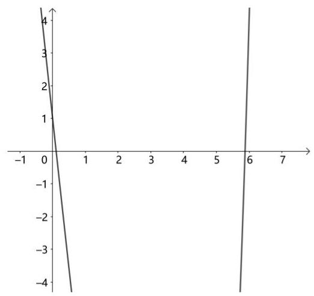

这种通过 “试数字” 求解的方法, 是数学分支——计算科学的重要方法, 借助计算机技术，计算科学在理论研究和实际应用中非常实用。

练习 4.3(3)

1. 用二分法求下列函数在相应的区间内的一个零点 (精确到整数) :

(1) $y = {x}^{3} - {x}^{2} - 3, x \in  \left( {0,{10}}\right)$ ; (2) $y = {2}^{x} - 8{\log }_{2}x, x \in  \left( {2,{10}}\right)$ 。

#### 4.3.4 函数的应用(二)

利用函数的单调性、对称性等性质, 可以方便地分析解决很多实际问题。

例 4.21 某超市为促销发放优惠券, 有两种使用方式: 抵扣 10 元售价或打九折购买，每次最多使用一张优惠券，如果优惠金额超过商品价格则不予找零， 如何使用优惠券更便宜?

解析: 设商品的原价为 $x$ 元,使用优惠券后的实付金额为 $y$ 元,优惠券有两种使用方式:

(1)用于抵扣 10 元，那么 $x = y + {10}$ ，函数关系为:

$$
{y}_{1} = x - {10}
$$

(2)用于打九折，那么 $y = x \times  {90}\%$ ，函数关系为:

$$
{y}_{2} = {0.9x}
$$

下页图为将上面两个函数的图像画在同一个坐标系中:

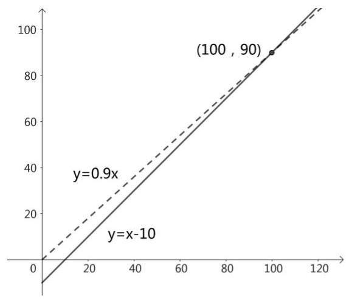

联立两个函数的解析式得到二元一次方程组

$$
\left\{  \begin{array}{l} y = x - {10} \\  y = {0.9x} \end{array}\right.
$$

解方程组可得两条直线的交点为 $\left( {{100},{90}}\right)$ ,结合图像可知:

当商品的售价小于 100 元时, 使用优惠券抵扣 10 元售价更便宜。当商品的售价大于 100 元时，使用优惠券打九折购买更便宜。当商品的售价等于 100 元时， 两种使用方式的优惠程度相同。

例 4.22 已知某池塘受到藻类污染，该藻类覆盖池塘的面积每天增大为前一天的 1.5 倍，使用某除藻剂每天最多可清除 20 m² 的藻类，如果某天发现藻类的覆盖面积为 $1{\mathrm{\;m}}^{2}$ ,求最晚应于第几天开始清除,才来得及阻止藻类覆盖池塘?

解析: 已知藻类的初始覆盖面积为 $1{\mathrm{\;m}}^{2}$ ,每天增大为前一天的 1.5 倍,那么藻类的覆盖面积 $y$ 与天数 $x$ 的函数关系为:

$$
y = {1.5}^{x}
$$

要想阻止藻类覆盖池塘，那么每天清除的藻类面积必须大于藻类每天扩大的覆盖面积, 否则将无法阻止藻类的覆盖面积越来越大。

藻类每天扩大的覆盖面积为:

$$
f\left( {x + 1}\right)  - f\left( x\right)  = {1.5}^{x + 1} - {1.5}^{x}
$$

需满足每天清除的最大面积大于藻类增加的覆盖面积:

$$
{20} > {1.5}^{x + 1} - {1.5}^{x}
$$

解不等式:

$$
{1.5} \times  {1.5}^{x} - {1.5}^{x} < {20}
$$

$$
\left( {{1.5} - 1}\right)  \times  {1.5}^{x} < {20}
$$

$$
{1.5}^{x} < {40}
$$

$$
x < {\log }_{1.5}{40}
$$

用计算器或查对数表得: ${\log }_{1.5}{40} \approx  {9.1}$ ,所以最晚应于第 9 天开始清除藻类。

下图为画在同一坐标系中的藻类的覆盖面积与天数的函数关系 $y = {1.5}^{x}$ 以及藻类每天扩大的覆盖面积与天数的函数关系 ${y}^{\prime } = {1.5}^{x + 1} - {1.5}^{x}$ 的图像,

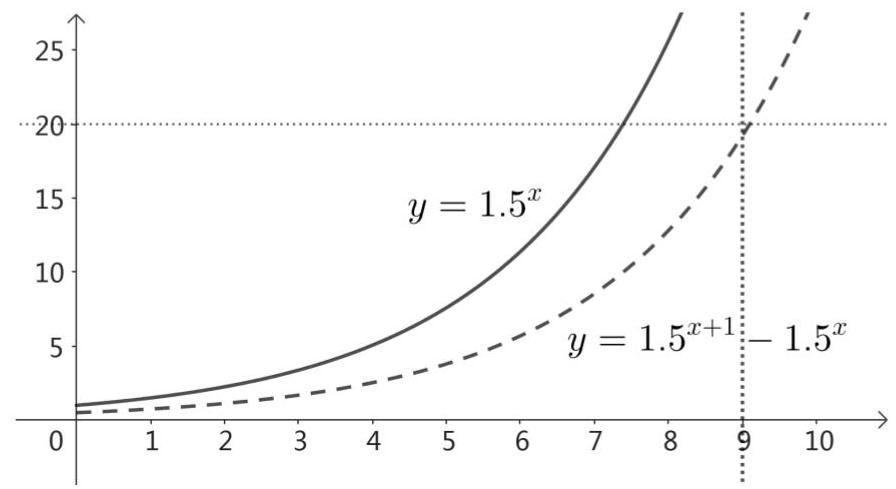

从图中可以看出, 如果第 9 天还没有开始清除, 那么从第 10 天开始每天增加的藻类面积将大于 ${20}{\mathrm{\;m}}^{2}$ ,新增的藻类面积已经大于最大可清除面积,将无法阻止藻类覆盖池塘。

## 练习 4.3(4)

1. 已知海拔每升高 ${100}\mathrm{\;m}$ ，平均气温下降 ${0.6}^{ \circ  }\mathrm{C}$ ，经测量，某山山顶的海拔高度为 ${2400}\mathrm{\;m}$ ,平均气温为 ${5.6}^{ \circ  }\mathrm{C}$ ,求:

(1)该地区的温度-海拔函数；

(2)当地海平面高度的平均温度;

(3)已知山脚处的平均温度为 ${19.1}{}^{ \circ  }\mathrm{C}$ ，求山脚的海拔高度。

2. 某小球做竖直上抛运动, 规定竖直向上为正方向, 如果小球竖直向上的初速度为 ${30}\mathrm{m}/\mathrm{s}$ ，重力加速度为 $- {10}\mathrm{m}/{\mathrm{s}}^{2}$ ，忽略空气阻力和摩擦，求:

(1)小球的高度 $h$ 与运动时间 $t$ 的函数关系;

(2)小球能够抵达的最大高度；

(3)小球抵达最大高度的时刻。

## 小结

本章学习指数运算和对数运算，幂函数、指数函数和对数函数的概念和性质、 函数的反函数和连续性、函数的应用。本章的重点和难点是理解和熟悉新运算的法则及其性质和规律, 对指数运算和对数运算的掌握需要达到接近乘除法的熟练程度, 对指数函数和对数函数的掌握要不亚于一次函数和二次函数, 包括但不限于:根据函数表达式立即得知经过的一些点、函数图像的大致形状、底数互为倒数的函数图像间的关系等。

## 第五章 三角函数

我们已经学习过直角三角形中的三角函数，三角函数描述了直角三角形中角的大小与边长的比例间的对应关系。实际上，三角函数描述的角的大小与边长的比例间的对应关系不只限于锐角和直角, 还可以拓展到任意角, 并借助高度对称的圆形更方便地研究三角函数的性质和特点。

三角函数是一类非常重要的基本初等函数，在物理等诸多领域都有非常广泛的应用。三角函数的自变量是角的大小，角的大小除可以用熟悉的角度计量外， 还可以用更方便的弧度计量。三角函数的值是一个比值, 这个比值的大小只与角的大小有关。

三角函数包括正弦函数、余弦函数、正切函数、余切函数、正割函数、余割函数。其中, 正弦函数和余弦函数是最为基本和重要的三角函数, 也是高中重点学习的三角函数, 其他三角函数都能用正弦函数或余弦函数表示, 其中正切函数是高中阶段较重要的三角函数。

三角函数的知识可以分为两个方面: 三角函数的性质与三角恒等变换。三角函数的性质主要从函数的角度, 研究函数值随自变量变化的规律, 以及单调性、 奇偶性、对称性等性质。三角恒等变换主要研究角度恒定时, 不同类型的三角函数间的相互转化关系。

三角函数还可以看作一种运算方式，可以参照学习指数运算和对数运算的方式，分别从运算与函数两个角度，学习理解三角函数这种“运算”的法则和规律， 以及三角函数的性质和特点。

### 5.1 任意角和弧度制

我们在初中数学初步学习了角的大小的单位:角度，现在学习另一个表示角的大小的单位:弧度，弧度比角度有更多便利和优势。

#### 5.1.1 任意角

有公共端点的两条射线构成一个角, 两条射线张开的程度是角的大小, 角的大小的单位为 “度”，用符号 “。” 表示。这种对角度的描述方式是静止的，把角看作一幅静止的画面。

生活中, 很多角的形成都经历了动态的过程, 两条射线从相互重合开始, 其中一条射线或两条射线沿公共端点旋转，最终得到一个角。例如，跳水运动员的跳水动作中, 有一种叫作 “空中转体三周半”, 运动员从直立姿态起跳, 在空中旋转三个圆周和一个半圆后, 竖直向下入水。如果另一位跳水运动员的动作是 “空中转体两周半”，那么这位运动员从直立姿态起跳，在空中旋转两个圆周和一个半圆后, 竖直向下入水。虽然这两种跳水动作都是从直立姿态起跳, 最终以竖直向下的姿态入水，前后两个姿态间的角度都是 ${180}^{ \circ  }$ ，但旋转经过的圈数不同，技术动作的难度也不同。

为了能表示出形成角的动态过程及其内在性质，可以用旋转的方式定义角的大小，规定方式为:一条射线绕其端点沿逆时针方向旋转后的终末位置(终边)， 与它的初始位置(始边)所成的角叫作正角。一条射线绕其端点沿顺时针方向旋转后的终末位置, 与它的初始位置所成的角叫作负角。一条射线如果没有进行任何旋转，那么它的终末位置与初始位置重合，所成的角叫作零角。

射线绕其端点旋转时，有可能旋转超过一周，经过初始位置后继续旋转，还有可能旋转了很多周, 若干次经过初始位置。这些情况下, 需要将旋转经过的角度都计入该角的大小。这样一来，我们就能得到任意大小的角度——可正可负、 绝对值可以为任意大小。

下图为一些角及它们的角度, 水平向右的射线为角的始边, 根据正负号可以得知旋转的方向, 根据绝对值可以得知旋转经过的圆周数。

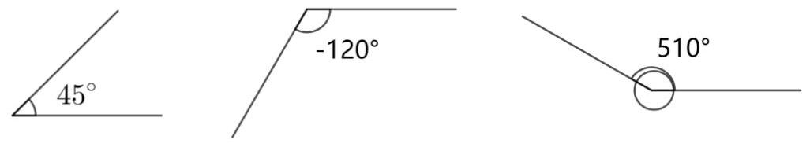

按照上述旋转的定义方式，可以得到任意大小的角度，叫作任意角。这样一来,角度的大小就不再局限于 $\left\lbrack  {0,{360}}\right\rbrack$ ,而是拓展到全体实数 $\left( {-\infty , + \infty }\right)$ ,角之间相加减、角与常数相乘也有了具体的几何含义。

角之间相加减，其几何意义除可以表示把两个角的顶点和一条边重合，将另外两条边放在异侧或同侧外，还可以表示:

$\angle \mathrm{A} + \angle \mathrm{B}$ 表示: 固定始边不变,终边先按照 $\angle \mathrm{A}$ 的方向和大小旋转,再按照 $\angle \mathrm{B}$ 的方向和大小旋转,最终从始边到终边形成的角。

$\angle \mathrm{A} - \angle \mathrm{B}$ 表示:固定始边不变，终边先按照 $\angle \mathrm{A}$ 的方向和大小旋转，再按照 $\angle \mathrm{B}$ 的相反方向、相同大小旋转,最终从始边到终边形成的角。

$k\angle A$ 表示: 按照 $\angle A$ 的方式连续旋转 $k$ 次 (倍) 形成的角,若 $k < 0$ ,则沿与 $\angle A$ 相反的方向旋转。

为了方便表示，可以把角放置在平面直角坐标系中，让原点为角的顶点， $x$ 轴正方向为角的始边, 那么只需要再绘制出终边, 就可以得到相应的角。

根据角的终边所在的象限, 可以将角分为第一象限角、第二象限角、第三象限角、第四象限角。终边在坐标轴上的角不属于任何象限。

根据旋转的实际过程可知, 如果一个角继续旋转若干圆周角, 那么角的终边的位置相同,即: 角度相差 ${360}^{ \circ  }$ 的整数倍的角,它们的终边相同。所有终边相同的角都可以用一个集合表示:

$$
S = \left\{  {\beta  \mid  \beta  = \alpha  + k \cdot  {360}^{ \circ  }, k \in  \mathbf{Z}}\right\}
$$

集合 $S$ 中所有的角 $\beta$ 的终边都与 $\alpha$ 相同,这些角静止时的性质相同,可以一并研究, 只有研究它们的动态性质时才需要加以区分。

例 5.1 求 $\left\lbrack  {{0}^{ \circ  },{360}^{ \circ  }}\right)$ 内,与下列各角终边相同的角:

(1)1441°；(2)-120°；(3) ${{720}{}^{ \circ  }}$ ；(4)-1000°。

解析: 将各角加或减 ${360}^{ \circ  }$ 的整数倍,得到 $\left\lbrack  {{0}^{ \circ  },{360}^{ \circ  }}\right)$ 范围内的角即可,用带余数的除法可求得相应的倍数(需注意，有负数的带余数除法中，余数需始终为正数):

(1)1441÷360=4……1，即 1441=1+360×4，1441° 角的终边与 1° 角相同；

(2) $- {120} \div  {360} =  - 1\cdots \cdots {240}$ ，即 $- {120} = {240} + {360} \times  \left( {-1}\right)$ ， $- {120}^{ \circ  }$ 角的终边与 ${240}^{ \circ  }$ 角相同;

(3) ${720} \div  {360} = 2$ ，即 ${720} = 0 + {360} \times  2$ ， ${720}^{ \circ  }$ 角的终边与 ${0}^{ \circ  }$ 角相同。

(4) $- {1000} \div  {360} =  - 3\cdots \cdots {80}, - {1000} = {80} + {360} \times  \left( {-3}\right) , - {1000}^{ \circ  }$ 角的终边与 ${80}^{ \circ  }$ 角相同。

## 练习 5.1(1)

1. 下列各角是第几象限角:

---

(1) 15°s (2) -135°；(3) 1000°；(4) -210°。

---

2. 求 $\left\lbrack  {-{1440}^{ \circ  },{1440}^{ \circ  }}\right\rbrack$ 范围内,所有终边与 ${45}^{ \circ  }$ 重合的角。

3. 观察一座指针式的钟表，各指针旋转形成的角是正角还是负角？

#### 5.1.2 弧度制

除使用角度计量角的大小外，还有另一种单位计量角的大小一一弧度。弧度的最大优点是:弧度与长度有直接对应关系，将角的大小与线段的长度直接对应起来。角的大小和两点间的距离不再是两套毫无关联的计量体系，而是可以方便地一并计算。

角度制计量角的大小的方式为:将周角平均分为 360 份，其中的 1 份叫作 1 ○ 。 角度制的规定中，圆周角是现实中客观存在的现象，转一圈就是一周，而 “360 份”是人为规定的数字。

弧度制借助了圆周率 $\pi$ 的概念: 经实际测量计算和数学推导得到: 任意圆的周长与直径的比值是定值，该比值叫作圆周率，用符号 $\pi$ 表示。 $\pi$ 是一个无理数， 实际数值约为 3.1415926……。

例如,一个直径为 1 米的标准圆形井盖,它的周长就是 $\pi$ 米。数学中通常不使用物理单位，而是直接使用数字单位 “ 1 ”。如果一个圆的半径为 $r$ ，那么该圆的直径为 $d = {2r}$ ,周长为 $C = {2\pi r}$ 。

如下图所示,设圆 $O$ 的半径为 $r$ ,直径为 $d = {2r}$ ,则周长为 $C = {2\pi r}$ ,设半径 ${OA}$ 与 ${OB}$ 形成的角度为 ${a}^{ \circ  }$ ，圆弧 ${AB}$ 的长度为 $l$ 。

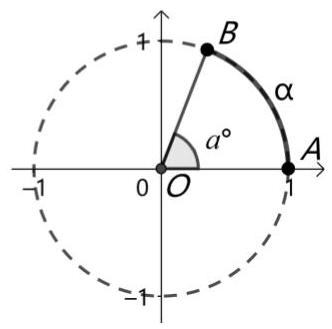

已经人为规定了圆周角等于 ${360}^{ \circ  }$ ,因此 $\angle {AOB}$ 与圆周角的比例为 $\frac{a}{360}$ 。圆周长为 $C = {2\pi r},{AB}$ 的长 $l$ 与圆周长的比例为 $\frac{l}{2\pi r}$ 。圆心角在圆周角中的占比与圆弧长在圆周长中的占比始终相等，可得:

$$
\frac{a}{360} = \frac{l}{2\pi r}
$$

移项并约分得:

$$
\frac{l}{r} = \frac{\pi a}{180}
$$

即: 圆心角对应的圆弧长 $l$ 与圆的半径 $r$ 的比值 $\frac{l}{r}$ ,与角度 ${a}^{ \circ  }$ 成正比,该比值与圆的半径无关,比例系数始终为 $\frac{\pi }{180}$ ,与任何因素都无关。

下图分别为直角、平角、周角对应的圆弧, 注意体会圆弧与圆周长的比例关系, 以及对应的圆心角与圆周角的比例始终与之相等的规律。

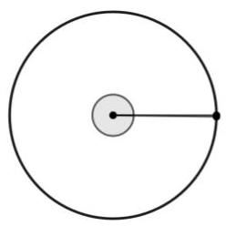

按照上述规律,可以直接用圆心角对应的弧长 $l$ 与半径 $r$ 的比值 $\frac{l}{r}$ 表示该角的大小。半径为 1 的圆叫作单位圆，用单位圆作为研究对象能让计算变得方便， 如果单位圆的圆心角对应的弧长为 $\theta$ ,那么弧长与半径的比值就是 $\theta$ ,此时称该角的大小为 $\theta$ 。单位圆的周长为 ${2\pi }$ ，可知圆周角的大小为 ${2\pi }$ 。

以上就是弧度制对角的大小的规定方式, 即: 单位圆的圆心角对应的圆弧的长度。弧度的单位与长度的单位相同,都是 “ 1 ”。

为了区分弧度与长度, 将弧度的单位专门记作 rad, 念作 “弧度”, 即: 单位圆中对应的弧长为 $\theta$ 的圆心角的大小为 $\theta$ rad。弧度单位 “rad” 没有物理意义, 主要作用是提示它前面的数值或变量是角的大小而非长度, 因此 rad 经常省略不写一一然而弧度制的一个重要特点是将角的大小与长度统一起来, 因此这个 “主要作用” 也仅起到提示的作用。

利用弧度 $\theta$ 与角度 $a$ 之间对应的比例关系 $\frac{{a}^{ \circ  }}{{360}^{ \circ  }} = \frac{\theta }{2\pi }$ 可以进行单位换算:

$$
\theta  = \frac{\pi }{{180}^{ \circ  }} \times  {a}^{ \circ  },\;{a}^{ \circ  } = \frac{{180}^{ \circ  }}{\pi } \times  \theta
$$

下表为一些常见的角度与弧度, 需熟练掌握它们之间的换算关系。

<table><tr><td>角度(°)</td><td>0</td><td>30</td><td>45</td><td>60</td><td>90</td><td>120</td><td>135</td><td>150</td><td>180</td><td>360</td></tr><tr><td>弧度(rad)</td><td>0</td><td>$\frac{\pi }{6}$</td><td>$\frac{\pi }{4}$</td><td>$\frac{\pi }{3}$</td><td>$\frac{\pi }{2}$</td><td>$\frac{2\pi }{3}$</td><td>$\frac{3\pi }{4}$</td><td>$\frac{5\pi }{6}$</td><td>$\pi$</td><td>${2\pi }$</td></tr></table>

例 5.2 将下列弧度化为角度:

(1) $\frac{\pi }{12};$ (2) $- \pi ;$ (3) ${2.5\pi }$ 。

解析: (1) $\frac{\pi }{12} \times  \frac{{180}^{ \circ  }}{\pi } = {15}^{ \circ  };\left( 2\right)  - \pi  \times  \frac{{180}^{ \circ  }}{\pi } =  - {180}^{ \circ  };\left( 3\right) {2.5\pi } \times  \frac{{180}^{ \circ  }}{\pi } = {450}^{ \circ  }$ 。

例 5.3 将下列角度化为弧度:

(1) ${22.5}^{ \circ  }$ ；(2) $- {216}^{ \circ  }$ ；(3) ${513}^{ \circ  }$ 。

解析: ${22.5}^{ \circ  } \times  \frac{\pi }{{180}^{ \circ  }} = \frac{\pi }{8}; - {216}^{ \circ  } \times  \frac{\pi }{{180}^{ \circ  }} =  - \frac{6\pi }{5};{513}^{ \circ  } \times  \frac{\pi }{{180}^{ \circ  }} = \frac{57\pi }{20}$ 。

任意角的弧度的规定方式与角度相似, 弧度制下, 角的大小的定义域也是全体实数 $\mathbf{R}$ ,单位圆的半径绕原点沿逆时针旋转所得到的角的弧度为正数,沿顺时针旋转所得到的角的弧度为负数, 未旋转的角的弧度为 0 。

## 练习 5.1(2)

1. 将下列角度化为弧度:

(1)30°； (2)-45°；

2. 将下列弧度化为角度:

(1) $\frac{\pi }{12}$ ； (2) $- \frac{7\pi }{8}$ ； (3) $\frac{5\pi }{4}$ ； (4) $- \frac{11\pi }{6}$ ； (6) $- \frac{a}{2}$ 。

3. 求下列三角函数的值:

(1) $\sin \frac{\pi }{3};\;\left( 2\right) \cos \frac{5\pi }{6};\;\left( 3\right) \tan 0;\;\left( 4\right) \cot \frac{3\pi }{4}$ 。

### 5.2 三角函数的定义和规律

我们接下来从函数的角度，学习三角函数一一角的大小与某些线段长度的对应关系, 并研究该对应关系中蕴含的基本规律。

#### 5.2.1 三角函数的定义

如下图所示,在平面直角坐标系 ${Oxy}$ 中,以原点 $O\left( {0,0}\right)$ 为圆心,画出半径为 1 的单位圆,用圆心命名为圆 $O$ 。圆 $O$ 与坐标轴相交于点 $\left( {1,0}\right) \text{ 、 }\left( {0,1}\right) \text{ 、 }\left( {-1,0}\right)$ 、 $\left( {0, - 1}\right)$ 。设 ${OP}$ 是圆 $O$ 的半径,半径 ${OP}$ 从指向 $x$ 轴正方向开始,旋转弧度 $\alpha$ 成为终边,点 $P$ 的坐标为 $P\left( {{x}_{P},{y}_{P}}\right)$ 。

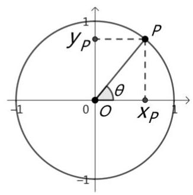

点 $P$ 的纵坐标 ${y}_{P}$ 叫作角 $\theta$ 的正弦函数,记作 $\sin \theta$ ,即 ${y}_{P} = \sin \theta$ 。点 $P$ 的横坐标 ${x}_{P}$ 叫作角 $\theta$ 的余弦函数,记作 $\cos \theta$ ,即 ${x}_{P} = \cos \theta$ 。点 $P$ 的纵坐标与横坐标的比值叫作角 $\theta$ 的正切函数,记作 $\tan \theta$ ,即 $\frac{{y}_{P}}{{x}_{P}} = \tan \theta$ 。改写为 $y = f\left( x\right)$ 的形式,

正弦函数记作:

$$
y = \sin x
$$

余弦函数记作:

$$
y = \cos x
$$

正切函数记作:

$$
y = \tan x
$$

正弦函数和余弦函数的自变量可以取全体实数 $\mathbf{R}$ 。正切函数需满足分母不能为零,即不能取 $\cos x = 0$ 的点,定义域为 $\{ x \in  \mathbf{R} \mid  x \neq  \frac{1}{2}\pi  + {k\pi }, k \in  \mathbf{Z}\}$ 。

按照三角函数的定义,角 $\alpha$ 的各三角函数的值只由终边的位置决定,与具体

旋转的方向、旋转经过的圆周数无关。终边相同的一系列角的各三角函数的值始

终相等,即相差 ${2\pi }$ 整数倍的角的各三角函数的值始终相等: $\sin \left( {x + k \cdot  {2\pi }}\right)  = \sin x$ ,

---

$\cos \left( {x + k \cdot  {2\pi }}\right)  = \cos x,\;\tan \left( {x + k \cdot  {2\pi }}\right)  = \tan x$ ,其中 $k \in  \mathbf{Z}$ 。

---

#### 5.2.2 同角三角函数的基本关系

当角的终边的位置确定后, 利用三角函数的定义、勾股定理等规律, 可以得到同一个角的各三角函数之间的基本关系。

设点 $P$ 是角 $x$ 的终边与单位圆的交点,从点 $P$ 分别向 $x$ 轴和 $y$ 轴引垂线,垂足分别为 $M$ 和 $N$ ,如下图所示。

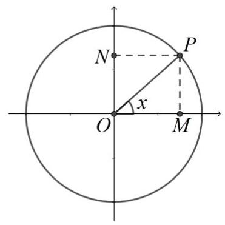

根据作图过程可知: $\angle {PMO} = \frac{\pi }{2},{PM} = \left| {y}_{P}\right|  = \left| {\sin x}\right| ,{OM} = \left| {x}_{P}\right|  = \left| {\cos x}\right|$ , ${OP} = 1$ ，由勾股定理可得: $P{M}^{2} + O{M}^{2} = O{P}^{2}$ ，即:

$$
{\sin }^{2}x + {\cos }^{2}x = 1
$$

当 $x$ 的终边在其他象限或与坐标轴重合时,该公式仍成立。用直角三角形的直角边与斜边之比定义的三角函数同样满足该规律。

利用正弦函数、余弦函数、正切函数的定义还可得:

$$
\frac{\sin x}{\cos x} = \tan x
$$

例 5.4 求下列各三角函数的值:

(1) $\cos \frac{5\pi }{6};\;\left( 2\right) \sin \frac{100\pi }{3};\;\left( 3\right) \cos \left( {-\frac{7}{4}\pi }\right) ;\;\left( 4\right) \tan {21\pi }$ 。

解析: (1) $\cos \frac{5\pi }{6} =  - \frac{1}{2}$ ;

(2) $\frac{100\pi }{3} = {16} \times  {2\pi } + \frac{4\pi }{3},\frac{100\pi }{3}$ 的终边与 $\frac{4\pi }{3}$ 重合， $\sin \frac{100\pi }{3} = \sin \frac{4\pi }{3} =  - \frac{\sqrt{3}}{2}$ ；

(3) $- \frac{7\pi }{4} =  - {2\pi } + \frac{\pi }{4},\; - \frac{7\pi }{4}$ 的终边与 $\frac{\pi }{4}$ 重合， $\cos \left( {-\frac{7\pi }{4}}\right)  = \cos \frac{\pi }{4} = \frac{\sqrt{2}}{2}$ ；

(4) ${21\pi } = {10} \times  {2\pi } + \pi ,{21\pi }$ 的终边与 $\pi$ 重合， $\tan {21\pi } = \tan \pi  = 0$ 。

例 5.5 已知 $\theta$ 是第一象限角， $\sin \theta  + \cos \theta  = \frac{7}{5}$ ，求 $\tan \theta$ 的值。

解析: 因为 $\theta$ 是第一象限角,所以 $\sin \theta  > 0,\cos \theta  > 0$ ,

由 $\sin \theta  + \cos \theta  = \frac{7}{5}$ 可得: $\sin \theta  = \frac{7}{5} - \cos \theta$ ,

又因为 ${\sin }^{2}\theta  + {\cos }^{2}\theta  = 1$ ,将 $\sin \theta  = \frac{7}{5} - \cos \theta$ 代入该等式可得:

$$
{\left( \frac{7}{5} - \cos \theta \right) }^{2} + {\cos }^{2}\theta  = 1,
$$

将 $\cos \theta$ 整体作为未知数,解该一元二次方程得: $\cos \theta  = \frac{3}{5}$ 或 $\cos \theta  = \frac{4}{5}$ ,

当 $\cos \theta  = \frac{3}{5}$ 时, $\sin \theta  = \frac{4}{5},\tan \theta  = \frac{4}{5} \div  \frac{3}{5} = \frac{4}{3}$ ;

当 $\cos \theta  = \frac{4}{5}$ 时, $\sin \theta  = \frac{3}{5},\tan \theta  = \frac{3}{5} \div  \frac{4}{5} = \frac{3}{4}$ 。

练习 5.2(1)

1. 写出各象限角、终边在坐标轴各半轴上的角的正弦函数、余弦函数、正切函数的正负号。

2. 求下列各三角函数的值:

(1) $\cos \frac{9\pi }{4};\;\left( 2\right) \;\sin \frac{11\pi }{6};\;\left( 3\right) \;\cos \left( {-\frac{22\pi }{3}}\right) ;\;\left( 4\right) \;\tan \left( {-\frac{11\pi }{4}}\right)$ 。

3. 已知余切函数的定义为: $\cot \alpha  = \frac{{x}_{P}}{{y}_{P}}$ ,正割函数的定义为: $\sec \alpha  = \frac{1}{{x}_{P}}$ , 余割函数的定义为: $\csc \alpha  = \frac{1}{{y}_{P}}$ ,求余切函数、正割函数、余割函数的定义域, 用正弦函数或余弦函数表示这些函数。

4. 证明: $\forall \theta  \in  \mathbf{R}$ ,都有 ${\sin }^{4}\theta  + {\cos }^{4}\theta  = 1 - 2{\sin }^{2}\theta {\cos }^{2}\theta$ 。

5. 已知 $\tan \theta  = {10}$ ，求下列各式的值:

(2) $\frac{1}{{\cos }^{2}\theta }$ ； (3) $\frac{1}{{\sin }^{2}\theta  - {\cos }^{2}\theta }$ 。

#### 5.2.3 诱导公式

圆是高度对称的图形, 圆的任意一条直径所在的直线都是它的对称轴, 圆心是圆的对称中心, 且旋转任意角度都能与原图形重合。对于以原点为圆心的单位圆, $x$ 轴和 $y$ 轴都是圆的对称轴,原点是圆的对称中心。利用圆的对称性,可以分析得到三角函数的重要性质。

公式一: $\alpha$ 与 $\alpha  + {2\pi }$

我们在上一节得知,大小相差 ${2k\pi }\left( {k \in  \mathbf{Z}}\right)$ 的角,它们的终边位置相同,它们的各三角函数相同, 即:

$$
\sin \left( {\alpha  + {2k\pi }}\right)  = \sin \alpha ,\;\cos \left( {\alpha  + {2k\pi }}\right)  = \cos \alpha ,\;\tan \left( {\alpha  + {2k\pi }}\right)  = \tan \alpha \left( {k \in  \mathbf{Z}}\right)
$$

由于终边相同的角的各三角函数的值分别相等，所以在分析研究两个角的三角函数的关系时,只需要研究变化幅度最小的两个角即可,其他相差若干 ${2\pi }$ 弧度的角具有相同的关系。

公式二: $\alpha$ 与 $\alpha  + \pi$ 。

如下图所示,大小相差 $\pi$ 的两个角 $\alpha$ 与 $\alpha  + \pi$ ,它们的终边在同一条直线上, 指向直线两端相反的方向。 $\alpha  + \pi$ 的终边 ${OB}$ 可以看作 $\alpha$ 的终边 ${OA}$ 绕原点逆时针旋转 $\pi$ 后到达的位置,点 $A$ 与点 $B$ 的横坐标和纵坐标都互为相反数,即 ${x}_{A} =  - {x}_{B}$ , ${y}_{A} =  - {y}_{B}$ ,由各三角函数的定义可得:

$$
\sin \left( {\alpha  + \pi }\right)  =  - \sin \alpha ,\;\cos \left( {\alpha  + \pi }\right)  =  - \cos \alpha ,\;\tan \left( {\alpha  + \pi }\right)  = \tan \alpha
$$

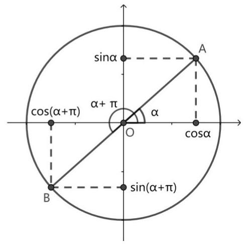

公式三: $\alpha$ 与 $- \alpha$ 。

如下图所示,互为相反数的两个角 $\alpha$ 和 $- \alpha$ ,它们沿相反方向旋转相同弧度, 它们的终边始终沿 $x$ 轴镜面对称,点 $A$ 与点 $B$ 的横坐标始终相等,纵坐标始终互为相反数,即 ${x}_{A} = {x}_{B},{y}_{A} =  - {y}_{B}$ ,由各三角函数的定义可得:

$$
\sin \left( {-\alpha }\right)  =  - \sin \alpha ,\;\cos \left( {-\alpha }\right)  = \cos \alpha ,\;\tan \left( {-\alpha }\right)  =  - \tan \alpha
$$

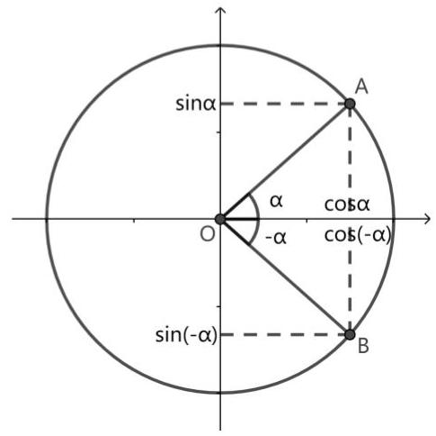

公式四: $\alpha$ 与 $\pi  - \alpha$ 。

如下页图所示， $y$ 轴正半轴是大小为 $\frac{\pi }{2}$ 的角的终边，和为 $\pi$ 的角 $\alpha$ 与 $\pi  - \alpha$ ， 可以分别看作 $\frac{\pi }{2} - \left( {\frac{\pi }{2} - \alpha }\right)$ 与 $\frac{\pi }{2} + \left( {\frac{\pi }{2} - \alpha }\right)$ ,这两个角可以看作从 $\frac{\pi }{2}$ 角的终边 $y$ 轴正半轴出发,分别沿相反方向旋转相同的弧度 $\frac{\pi }{2} - \alpha$ ,因此它们的终边 ${OA}$ 与 ${OB}$ 始终沿 $y$ 轴镜面对称,点 $A$ 与点 $B$ 的横坐标始终互为相反数,纵坐标始终相等,即 ${x}_{A} =  - {x}_{B},\;{y}_{A} = {y}_{B}$ ,由各三角函数的定义可得:

$$
\sin \left( {\pi  - \alpha }\right)  = \sin \alpha ,\;\cos \left( {\pi  - \alpha }\right)  =  - \cos \alpha ,\;\tan \left( {\pi  - \alpha }\right)  =  - \tan \alpha
$$

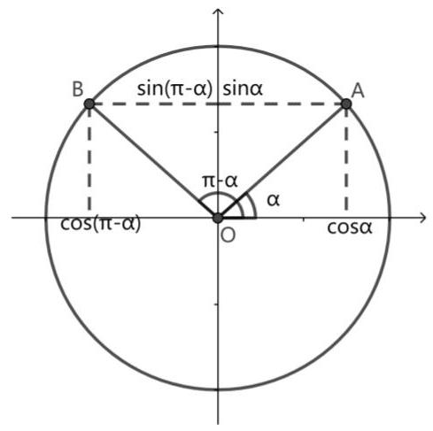

公式五: $\alpha$ 与 $\frac{\pi }{2} - \alpha$ 。

如下图所示,直线 $y = x$ 在第一象限的半根是大小为 $\frac{\pi }{4}$ 的角的终边,和为 $\frac{\pi }{2}$ 的角 $\alpha$ 与 $\frac{\pi }{2} - \alpha$ ,可以分别看作 $\frac{\pi }{4} - \left( {\frac{\pi }{4} - \alpha }\right)$ 与 $\frac{\pi }{4} + \left( {\frac{\pi }{4} - \alpha }\right)$ ,这两个角可以看作从 $\frac{\pi }{4}$ 角的终边直线 $y = x$ 出发,分别沿相反方向旋转相同的弧度 $\frac{\pi }{4} - \alpha$ ,因此它们的终边 ${OA}$ 与 ${OB}$ 始终沿直线 $y = x$ 镜面对称,点 $A$ 与点 $B$ 的横坐标与纵坐标始终互换位置, ${x}_{A} = {y}_{B},{y}_{A} = {x}_{B}$ ,由各三角函数的定义可得:

$$
\sin \left( {\frac{\pi }{2} - \alpha }\right)  = \cos \alpha ,\;\cos \left( {\frac{\pi }{2} - \alpha }\right)  = \sin \alpha ,\;\tan \left( {\frac{\pi }{2} - \alpha }\right)  = \frac{1}{\tan \alpha }
$$

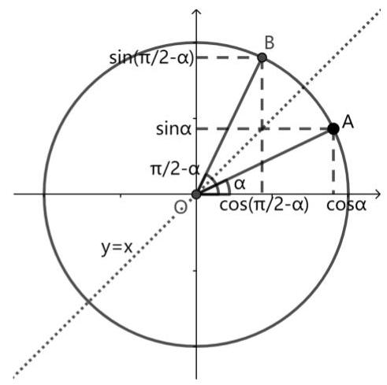

即:互余的两个角，它们的正弦函数为对方的余弦函数，余弦函数为对方的正弦函数，正切函数互为倒数。

公式六: $\alpha$ 与 $\alpha  + \frac{\pi }{2}$

如下图所示,将一个角 $\alpha$ 沿正方向旋转 $\frac{\pi }{2}$ 得到角 $\alpha  + \frac{\pi }{2}$ ,终边的位置可以看作将整个坐标系沿正方向旋转 $\frac{\pi }{2}$ 后终边的位置,点 $B$ 的纵坐标等于点 $A$ 的横坐标,点 $B$ 的横坐标等于点 $A$ 的纵坐标的相反数,即 ${y}_{B} = {x}_{A},{x}_{B} =  - {y}_{A}$ ,由各三角函数的定义可得:

$$
\sin \left( {\alpha  + \frac{\pi }{2}}\right)  = \cos \alpha ,\;\cos \left( {\alpha  + \frac{\pi }{2}}\right)  =  - \sin \alpha ,\;\tan \left( {\alpha  + \frac{\pi }{2}}\right)  =  - \frac{1}{\tan \alpha }
$$

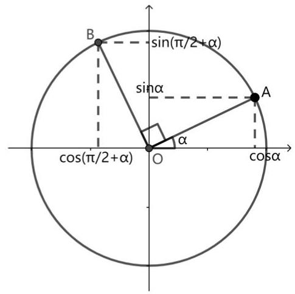

上面六组公式叫作诱导公式。利用诱导公式，可以将任意互为相反数、和或差为 $\pi$ 或 $\frac{\pi }{2}$ 的角的三角函数相互转化,再结合勾股定理,只要知道了其中的一个角的三角函数, 就能求得一系列角的三角函数。

使用诱导公式的关键在于找到两个角之间的数量关系。通常先将两个角都转化为 $\lbrack 0,{2\pi })$ 的角,再利用其它诱导公式,将它们进一步转化为所在区间范围尽可能小的角, 以便于观察发现数量关系。也可以借助画图帮助观察。

例 5.6 已知 $\theta  \in  \left( {0,\frac{\pi }{2}}\right) ,\sin \theta  = \frac{1}{3}$ ,求下列各三角函数的值:

(1) $\tan \theta$ ；(2) $\sin \left( {\frac{3\pi }{2} - \theta }\right)$ ；(3) $\cos \left( {\theta  + \frac{5\pi }{2}}\right)$ 。

解析: 因为 $\theta  \in  \left( {0,\frac{\pi }{2}}\right)$ ,所以 $\sin \theta  > 0,\cos \theta  > 0$ ,联立 ${\sin }^{2}\theta  + {\cos }^{2}\theta  = 1$ 和 $\sin \theta  = \frac{1}{3}$ ,将后者代入前者,解关于 $\cos \theta$ 的方程可得: $\cos \theta  = \frac{2\sqrt{2}}{3}$ 。

(1) $\tan \theta  = \frac{\sin \theta }{\cos \theta } = \frac{1}{3} \div  \frac{2\sqrt{2}}{3} = \frac{\sqrt{2}}{4}$ ;

(2) $\sin \left( {\frac{3\pi }{2} - \theta }\right)  = \sin \left\lbrack  {\pi  + \left( {\frac{\pi }{2} - \theta }\right) }\right\rbrack   =  - \sin \left( {\frac{\pi }{2} - \theta }\right)  =  - \cos \theta  =  - \frac{2\sqrt{2}}{3}$ ;

(3) $\cos \left( {\theta  + \frac{5\pi }{2}}\right)  = \cos \left\lbrack  {\left( {\theta  + \frac{\pi }{2}}\right)  + {2\pi }}\right\rbrack   = \cos \left( {\theta  + \frac{\pi }{2}}\right)  =  - \sin \theta  =  - \frac{1}{3}$ 。

例 5.7 化简下列各式:

(1) $\frac{\sin \left( {\frac{\pi }{2} - \theta }\right) }{\cos \left( {\frac{\pi }{2} + \theta }\right) } + \frac{\sin \left( {\frac{\pi }{2} + \theta }\right) }{\cos \left( {\frac{\pi }{2} - \theta }\right) }$ ;

(2) $\cos \left( {\pi  + \theta }\right) \cos \left( {\pi  - \theta }\right)  - \sin \left( {\pi  + \theta }\right) \sin \left( {\pi  - \theta }\right)$ 。

解析: (1) $\frac{\sin \left( {\frac{\pi }{2} - \theta }\right) }{\cos \left( {\frac{\pi }{2} + \theta }\right) } + \frac{\sin \left( {\frac{\pi }{2} + \theta }\right) }{\cos \left( {\frac{\pi }{2} - \theta }\right) } = \frac{\cos \theta }{-\sin \theta } + \frac{\cos \theta }{\sin \theta } = 0$

(2) $\cos \left( {\pi  + \theta }\right) \cos \left( {\pi  - \theta }\right)  - \sin \left( {\pi  + \theta }\right) \sin \left( {\pi  - \theta }\right)$

$$
=  - \cos \theta \left( {-\cos \theta }\right)  - \left( {-\sin \theta }\right) \sin \theta
$$

$$
= {\cos }^{2}\theta  + {\sin }^{2}\theta
$$

$$
= 1
$$

练习 $\mathbf{{5.2}\left( 2\right) }$

1. 已知 $\theta  \in  \left( {\frac{\pi }{2},\pi }\right) ,\sin \theta  = \frac{5}{13}$ ,求下列三角函数的值:

(1) $\tan \theta$ ；(2) $\sin \left( {\frac{3\pi }{2} - \theta }\right)$ ；(3) $\cos \left( {\theta  + \frac{\pi }{2}}\right)$ ；(4) $\sin \left( {\pi  - \theta }\right) \cos \left( {\pi  + \theta }\right)$ 。

2. 化简下列各式:

(1) $\frac{\sin \left( {\frac{5\pi }{2} - \theta }\right) }{\cos \left( {\pi  - \theta }\right) }$ ; (2) $\cos \left( {\frac{\pi }{2} + \theta }\right) \cos \left( {\frac{\pi }{2} - \theta }\right)  - \sin \left( {\frac{\pi }{2} + \theta }\right) \sin \left( {\frac{\pi }{2} - \theta }\right)$ 。

### 5.3 三角函数的图像与性质

按照三角函数的定义(构造方式)，可以绘制出各三角函数的图像，并分析得出各三角函数的重要性质, 这些性质与同角三角函数的基本关系、诱导公式等规律互相印证, 因为它们的原理都是三角函数的定义和旋转的基本规律。

#### 5.3.1 正弦函数、余弦函数的图像

按照正弦函数 $y = \sin x$ 的定义,将各弧度 $x$ 和对应的函数值 $\sin x$ 所对应的点 $\left( {x,\sin x}\right)$ 描绘在平面直角坐标系中，就能得到正弦函数的图像。

单位圆的半径绕原点每旋转一周,单位圆上的点 $P$ 的纵坐标 ${y}_{P}$ 的变化情况完全相同,即 $\left\lbrack  {0,{2\pi }}\right\rbrack  \text{ 、 }\left\lbrack  {-{2\pi },0}\right\rbrack  \text{ 、 }\left\lbrack  {{2\pi },{4\pi }}\right\rbrack  \text{ 、 }\left\lbrack  {-{4\pi }, - {2\pi }}\right\rbrack  \cdots \cdots$ 等各相邻长度为 ${2\pi }$ 的区间上,正弦函数的情况相同,因此只需绘制出正弦函数在区间 $\left\lbrack  {0,{2\pi }}\right\rbrack$ 上的图像, 再复制到其他区间内即可。

在区间 $\left\lbrack  {0,{2\pi }}\right\rbrack$ 内,将所有弧度 $x$ 与对应的 ${y}_{P}$ 组成的点 $\left( {x,{y}_{P}}\right)$ 描绘在平面直角坐标系中,就得到正弦函数 $y = \sin x$ 在区间 $\left\lbrack  {0,{2\pi }}\right\rbrack$ 的图像,如下图所示,左边的圆上各点所在半径的圆心角为右边各点的横坐标, 圆上各点的纵坐标为右边各点的纵坐标。

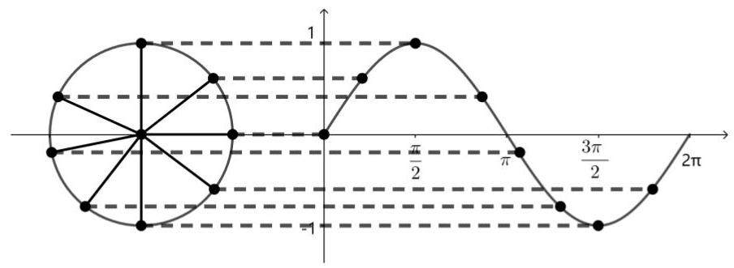

将正弦函数在区间 $\left\lbrack  {0,{2\pi }}\right\rbrack$ 的图像复制到其他长度相同的各相邻区间，就得到正弦函数的完整图像，正弦函数的图像又叫作正弦曲线，如下图所示。

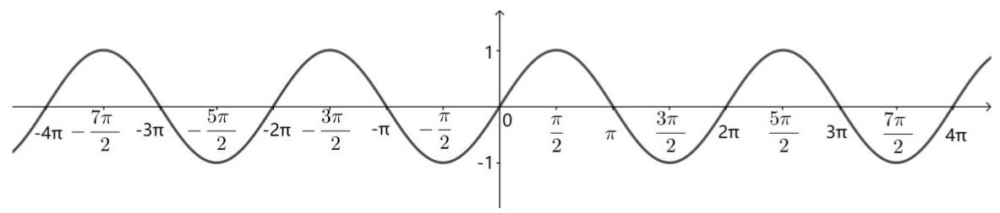

给基本的正弦函数 $y = \sin x$ 添加一些参数,可以得到一系列稍复杂的正弦函数。如同二次函数的基本形状都是抛物线, 只是开口的大小和方向各不相同, 正弦函数的基本形状都是的正弦曲线, 只是起伏的快慢和高低各不相同。

正弦函数的图像中, 一系列位置特殊的点能体现该正弦函数的具体形状, 这些点分别为: 函数图像与 $x$ 轴的交点、取最大值和最小值的点。绘制各类具体的正弦函数时, 只需求出这些关键点的坐标, 在坐标系中标出相应的点, 在此基础上绘制出正弦曲线的形状即可。对于基本的正弦函数 $y = \sin x$ ，这些点的坐标为:

$$
\left( {0,0}\right) ,\left( {\frac{\pi }{2},1}\right) ,\left( {\pi ,0}\right) ,\left( {\frac{3\pi }{2}, - 1}\right) ,\left( {{2\pi },0}\right)
$$

按照绘制正弦函数的图像的方法,可以绘制出余弦函数 $y = \cos x$ 的图像,余弦函数的图像又叫作余弦曲线, 如下图所示。

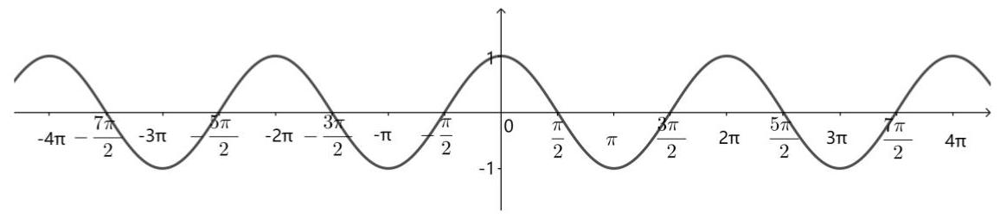

由诱导公式 $\cos x = \sin \left( {x + \frac{\pi }{2}}\right)$ 可知,将正弦函数的所有自变量替换为 $x - \frac{\pi }{2}$ , 就得到余弦函数, $y = \cos x$ 的图像与 $y = \sin \left( {x + \frac{\pi }{2}}\right)$ 形状相同, $y = \sin \left( {x + \frac{\pi }{2}}\right)$ 的图像可以由 $y = \sin x$ 的图像向左平移 $\frac{\pi }{2}$ 个单位得到。

下图为将正弦函数 $y = \sin x$ (实线)与余弦函数 $y = \cos x$ (虚线)的图像画在同一个坐标系中。注意观察并想象: 将 $y = \sin x$ 的图像向左平移后,与 $y = \cos x$ 的图像完全重合。

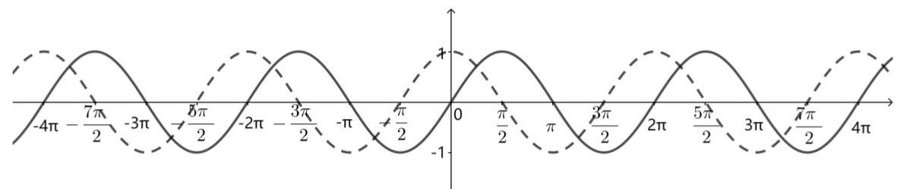

例 5.8 从 $y = \sin x$ 和 $y = \cos x$ 的函数图像中,指出六组诱导公式所反映的数量关系。

解析: 对照上面画在同一个坐标系中的正弦函数 $y = \sin x$ (实线) 与余弦函数 $y = \cos x$ (虚线) 的图像:

(1) $\sin \left( {\alpha  + {2k\pi }}\right)  = \sin \alpha ,\cos \left( {\alpha  + {2k\pi }}\right)  = \sin \alpha \left( {k \in  \mathbf{Z}}\right)$ ,

$y = \sin x$ 与 $y = \cos x$ 上分别任意横坐标相差 ${2k\pi }$ 的点,它们的函数值相同;

(2) $\sin \left( {\alpha  + \pi }\right)  =  - \sin \alpha ,\cos \left( {\alpha  + \pi }\right)  =  - \cos \alpha$ ,

从 $y = \sin x$ 或 $y = \cos x$ 上的任意点向右移动 $\pi$ ,函数值变为原来的相反数;

(3) $\sin \left( {-\alpha }\right)  =  - \sin \alpha ,\cos \left( {-\alpha }\right)  = \cos \alpha$ ,

横坐标互为相反数时, $y = \sin x$ 的函数值互为相反数, $y = \cos x$ 的函数值相等;

(4) $\sin \left( {\pi  - \alpha }\right)  = \sin \alpha ,\cos \left( {\pi  - \alpha }\right)  =  - \cos \alpha$ ,

横坐标之和等于 $\pi$ 的两个自变量,它们位于直线 $x = \frac{\pi }{2}$ 两侧且到该直线的距离相等, $y = \sin x$ 的函数值相等, $y = \cos x$ 的函数值互为相反数;

(5) $\sin \left( {\frac{\pi }{2} - \alpha }\right)  = \cos \alpha ,\cos \left( {\frac{\pi }{2} - \alpha }\right)  = \sin \alpha$ ,

横坐标之和等于 $\frac{\pi }{2}$ 的两个自变量,它们位于直线 $x = \frac{\pi }{4}$ 两侧且到该直线的距离相等，它们的正弦函数值与余弦函数值互换；

(6) $\sin \left( {\alpha  + \frac{\pi }{2}}\right)  = \cos \alpha ,\cos \left( {\alpha  + \frac{\pi }{2}}\right)  =  - \sin \alpha$ ,

将 $y = \sin x$ 上的任意点的横坐标增加 $\frac{\pi }{2}$ ,正弦值等于原来的余弦值; 将 $y = \cos x$ 上的任意点的横坐标增加 $\frac{\pi }{2}$ ,余弦值等于原来的正弦值的相反数。

## 练习 5.3(1)

1. 已知正弦函数经过下列五个关键点, 画出相应的函数图像:

(1) $\left( {0,0}\right) ,\left( {\frac{\pi }{2},2}\right) ,\left( {\pi ,0}\right) ,\left( {\frac{3\pi }{2}, - 2}\right) ,\left( {{2\pi },0}\right)$ ;

(2) $\left( {0,0}\right) ,\left( {\pi ,1}\right) ,\left( {{2\pi },0}\right) ,\left( {{3\pi }, - 1}\right) ,\left( {{4\pi },0}\right)$ 。

#### 5.3.2 正弦函数、余弦函数的周期性

根据正弦函数、余弦函数的构造方式和图像, 可以分析得出它们的重要性质。

“周期” 的含义为某些特征有规律地重复出现, 函数的周期性意为函数值有规律地重复, 有周期性的函数叫作周期函数。周期性是三角函数的典型性质, 幂函数、对数函数、指数函数通常不具有周期性。

正弦函数和余弦函数的图像都是一段固定图形的不断重复，作为自变量的弧度每间隔一段特定距离, 函数值始终相等, 函数图像完全重叠。这就是周期函数最直观的特征: 有规律地重复。

周期函数的数学定义为: 设函数 $y = f\left( x\right)$ 的定义域为 $D$ ,如果存在一个非零的常数 $T$ ,使得对任意 $x \in  D$ ,始终满足存在 $x + T \in  D$ ,且 $f\left( x\right)  = f\left( {x + T}\right)$ ,那么函数 $y = f\left( x\right)$ 就是周期函数。其中,非零的常数 $T$ 叫作该函数的周期,如果该函数的周期中,存在一个最小的正数 $T$ ,那么这个最小的正数 $T$ 叫作该函数的最小正周期。

利用周期函数的周期 $T$ 的定义可以证明: 如果 $T$ 是函数 $y = f\left( x\right)$ 的一个周期,那么该周期的任意整数倍 ${nT}\left( {n \in  \mathbf{Z}, n \neq  0}\right)$ 都是该函数的周期。

根据正弦函数和余弦函数的构造过程, 当单位圆的半径随圆心角旋转时, 每旋转一周端点的横坐标与纵坐标经历的变化过程相同,因此正弦函数 $y = \sin x$ 和余弦函数 $y = \cos x$ 都是周期函数,最小正周期都是 ${2\pi }$ 。

选取正弦函数 $y = \sin x$ 或余弦函数 $y = \cos x$ 的一个最小周期,不需要局限于从开始旋转到旋转一周的 $\left\lbrack  {0,{2\pi }}\right\rbrack$ ,而是可以选取任意一点 $a$ 作为区间的最小值 (即下界),以及 $a + {2\pi }$ 作为区间的最大值 (即上界),任意区间 $\left\lbrack  {a, a + {2\pi }}\right\rbrack$ 都是它们的一个周期。为便于研究, 通常选取某个较特殊的值作为区间的上界。

例 5.9 判断下列各长度是否是正弦函数 $y = \sin x$ 的周期:

(1) ${4\pi }$ ；(2)- ${6\pi }$ ；(3) ${21\pi }$ 。

解析:(1) ${4\pi } = 2 \times  {2\pi }$ ，是 ${2\pi }$ 的整数倍，是 $y = \sin x$ 的周期；

(2) $- {6\pi } =  - 3 \times  {2\pi }$ ，是 ${2\pi }$ 的整数倍，是 $y = \sin x$ 的周期；

(3) ${21\pi } = {10} \times  {2\pi } + \pi$ ，不是 ${2\pi }$ 的整数倍，不是 $y = \sin x$ 的周期。

例 5.10 已知函数 $y = f\left( x\right)$ 的定义域是全体实数,且对于任意 $x$ ,恒有 $f\left( x\right)  + f\left( {x + \pi }\right)  = 2, y = f\left( x\right)$ 是否是周期函数,如果是,给出它的一个周期。

解析: 将 $f\left( x\right)  + f\left( {x + \pi }\right)  = 2$ 中的 $x$ 替换为 $x + \pi$ 得: $f\left( {x + \pi }\right)  + f\left( {x + \pi  + \pi }\right)  = 2$ , 即 $f\left( {x + \pi }\right)  + f\left( {x + {2\pi }}\right)  = 2$ ,联立这两个等式: $\left\{  \begin{array}{l} f\left( x\right)  + f\left( {x + \pi }\right)  = 2 \\  f\left( {x + \pi }\right)  + f\left( {x + {2\pi }}\right)  = 2 \end{array}\right.$ ,让两个等式的左右两边分别相减: $f\left( x\right)  + f\left( {x + \pi }\right)  - \left\lbrack  {f\left( {x + \pi }\right)  + f\left( {x + {2\pi }}\right) }\right\rbrack   = 2 - 2$ ,化简得: $f\left( x\right)  = f\left( {x + {2\pi }}\right)$ ,所以 $y = f\left( x\right)$ 是周期函数, ${2\pi }$ 是它的一个周期。

练习 $\mathbf{{5.3}\left( 2\right) }$

1. 求下列函数的最小正周期:

(1) $y = \sin x + \cos x$ ；(2) $y = \cos \left| x\right|$ ；(3) $y = \tan x$ 。

2. 已知函数 $y = f\left( x\right)$ 的定义域是全体实数,且对于任意 $x$ ,恒有 $f\left( x\right) f\left( {x + 2}\right)  = 1$ ,问 $y = f\left( x\right)$ 是否是周期函数,如果是,给出它的一个周期。

#### 5.3.3 正弦函数、余弦函数的奇偶性

利用圆心在原点的单位圆构造三角函数时, 如果圆心角的终边分别绕原点沿逆时针和顺时针方向旋转，那么单位圆上的点所经过的位置关于 $x$ 轴对称。

两种旋转方向中，单位圆上的点的纵坐标始终互为相反数，横坐标始终相等， 因此正弦函数 $y = \sin x$ 是奇函数,余弦函数 $y = \cos x$ 是偶函数。

利用诱导公式 $\sin \left( {-x}\right)  =  - \sin x$ 和 $\cos \left( {-x}\right)  = \cos x$ ,可以得到相同的结论,实际上这两个诱导公式是利用相同原理分析得出的。

观察下面正弦函数 $y = \sin x$ 的图像。

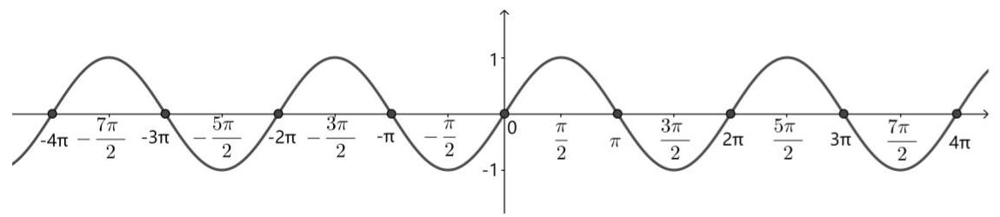

正弦函数 $y = \sin x$ 是奇函数，原点 $\left( {0,0}\right)$ 是它的对称中心，又因为该函数还是以 ${2\pi }$ 为最小正周期的周期函数,每经过 ${2\pi }$ 函数的性质完全相同,所以所有点 $\left( {{2k\pi },0}\right) \left( {k \in  \mathbf{Z}}\right)$ 都是该函数的对称中心,将函数图像绕其中任意一点旋转 $\pi$ 后, 都可以与原图像重合。

同理,余弦函数 $y = \cos x$ 是偶函数, $y$ 轴 (直线 $x = 0$ ) 是该函数的对称中心, 又因为该函数还是以 ${2\pi }$ 为最小正周期的周期函数,每经过 ${2\pi }$ 函数的性质完全相同,所以所有直线 $x = {2k\pi }\left( {k \in  \mathbf{Z}}\right)$ 都是该函数的对称轴,将函数图像沿其中任意一条直线对折后,都可以与原图像重合。下图为余弦函数 $y = \cos x$ 的图像。

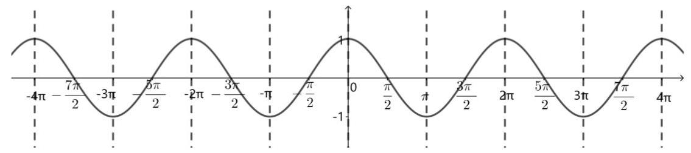

根据正弦函数 $y = \sin x$ 和余弦函数 $y = \cos x$ 的定义,结合函数图像还可得:

正弦函数 $y = \sin x$ 的对称中心除一系列点 $\left( {{2k\pi },0}\right) \left( {k \in  \mathbf{Z}}\right)$ 外,所有点 $\left( {\pi  + {2k\pi },0}\right) \left( {k \in  \mathbf{Z}}\right)$ 也都是其对称中心。合并两种情况,所有点 $\left( {{k\pi },0}\right) \left( {k \in  \mathbf{Z}}\right)$ 都是正弦函数 $y = \sin x$ 的对称中心。

余弦函数 $y = \cos x$ 的对称轴除一系列直线 $x = {2k\pi }\left( {k \in  \mathbf{Z}}\right)$ 外,所有直线 $x = \pi  + {2k\pi }\left( {k \in  \mathbf{Z}}\right)$ 也都是其对称轴。合并两种情况,所有直线 $x = {k\pi }\left( {k \in  \mathbf{Z}}\right)$ 都是余弦函数 $y = \cos x$ 是的对称轴。

由于正弦函数 $y = \sin x$ 和余弦函数 $y = \cos x$ 的形状完全相同,只是在坐标系中的位置不同,可以通过平移重叠,因此正弦函数 $y = \sin x$ 也有一系列对称轴: $x = \frac{\pi }{2} + {k\pi }\left( {k \in  \mathbf{Z}}\right)$ ,余弦函数 $y = \cos x$ 也有一系列对称中心: $\left( {\frac{\pi }{2} + {k\pi },0}\right) \left( {k \in  \mathbf{Z}}\right)$ 。

例 5.11 判断下列各函数是奇函数还是偶函数:

(1) $y = \sin {2x}$ ； (2) $y = \cos {x}^{2}$ ； (3) $y = {\sin }^{2}x$ ； (4) $y = \cos \left( {x - \frac{\pi }{2}}\right)$ 。

解析: 利用奇函数与偶函数的定义判断即可:

(1) $f\left( {-x}\right)  = \sin \left( {-{2x}}\right)  =  - \sin {2x} =  - f\left( x\right)$ ，是奇函数；

(2) $f\left( {-x}\right)  = \cos {\left( -x\right) }^{2} = \cos {x}^{2} = f\left( x\right)$ ，是偶函数；

(3) $f\left( {-x}\right)  = {\sin }^{2}\left( {-x}\right)  = {\left( -\sin x\right) }^{2} = {\sin }^{2}x = f\left( x\right)$ ，是偶函数；

(4) $f\left( x\right)  = \cos \left( {x - \frac{\pi }{2}}\right)  = \sin x$ ，是奇函数。

## 练习 5.3(3)

1. 判断下列函数是否是奇函数或偶函数:

(1) $y = \cos x + 1$ ；(2) $y = \left| {\sin x}\right|$ ；(3) $y =  - \sin x\cos x$ 。

#### 5.3.4 正弦函数、余弦函数的单调性

用圆心在原点的单位圆构造三角函数时, 随着圆心角的变化, 单位圆上的点在圆周上旋转时, 其纵坐标和横坐标分别有规律地交替增大与减小, 结合正弦函数和余弦函数的图像, 可以得到它们在各区间的单调性, 如下图所示, 实线为正弦函数 $y = \sin x$ 的图像,虚线为余弦函数 $y = \cos x$ 的图像。

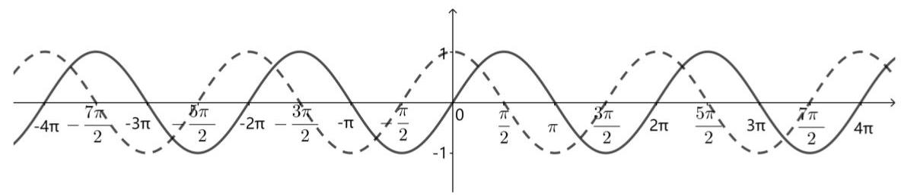

终边旋转到各象限内时正弦函数和余弦函数的正负号和单调性如下表所示。

<table><tr><td rowspan="2">所在象限</td><td rowspan="2">$x$ 范围</td><td colspan="2">余弦函数 $\cos x$</td><td colspan="2">正弦函数 $\sin x$</td></tr><tr><td>正负号</td><td>单调性</td><td>正负号</td><td>单调性</td></tr><tr><td>第一象限</td><td>$\left( {0,\frac{\pi }{2}}\right)$</td><td>+</td><td>递减</td><td>+</td><td>递增</td></tr><tr><td>第二象限</td><td>$\left( {\frac{\pi }{2},\pi }\right)$</td><td>-</td><td>递减</td><td>+</td><td>递减</td></tr><tr><td>第三象限</td><td>$\left( {\pi ,\frac{3\pi }{2}}\right)$</td><td>-</td><td>递增</td><td>-</td><td>递减</td></tr><tr><td>第四象限</td><td>$\left( {\frac{3\pi }{2},{2\pi }}\right)$</td><td>+</td><td>递增</td><td>-</td><td>递增</td></tr></table>

上表中的信息可以直观地从正弦函数与余弦函数的图像中看出来, 即:

正弦函数 $y = \sin x$ 在各段区间 $\left\lbrack  {-\frac{\pi }{2} + {2k\pi },\frac{\pi }{2} + {2k\pi }}\right\rbrack  \left( {k \in  \mathbf{Z}}\right)$ 分别单调递增,在各段区间 $\left\lbrack  {\frac{\pi }{2} + {2k\pi },\frac{3\pi }{2} + {2k\pi }}\right\rbrack  \left( {k \in  \mathbf{Z}}\right)$ 分别单调递减。

余弦函数 $y = \cos x$ 在各段区间 $\left\lbrack  {-\pi  + {2k\pi },{2k\pi }}\right\rbrack  \left( {k \in  \mathbf{Z}}\right)$ 分别单调递增,在各段区间 $\left\lbrack  {{2k\pi },\pi  + {2k\pi }}\right\rbrack  \left( {k \in  \mathbf{Z}}\right)$ 分别单调递减。

根据正弦函数和余弦函数的定义，可以得到它们的最大值与最小值。

正弦函数 $y = \sin x$ 在所有 $x = \frac{\pi }{2} + {2k\pi }\left( {k \in  \mathbf{Z}}\right)$ 处取得最大值 $y = 1$ ,在所有 $x = \frac{3\pi }{2} + {2k\pi }\left( {k \in  \mathbf{Z}}\right)$ 处取得最小值 $y =  - 1$ 。

余弦函数 $y = \cos x$ 在所有 $x = {2k\pi }\left( {k \in  \mathbf{Z}}\right)$ 处取得最大值 $y = 1$ ,在所有 $x = \pi  + {2k\pi }\left( {k \in  \mathbf{Z}}\right)$ 处取得最小值 $y =  - 1$ 。

例 5.12 求下列函数的单调区间和最大值、最小值:

(1) $y =  - 2\sin x;\;$ (2) $y = \cos \left( \frac{\pi x}{2}\right)  + 1;\;$ (3) $y = {\sin }^{2}$

解析: (1) $y = \sin x$ 在区间 $\left\lbrack  {-\frac{\pi }{2} + {2k\pi },\frac{\pi }{2} + {2k\pi }}\right\rbrack  \left( {k \in  \mathbf{Z}}\right)$ 单调递增，在区间 $\left\lbrack  {\frac{\pi }{2} + {2k\pi },\frac{3\pi }{2} + {2k\pi }}\right\rbrack  \left( {k \in  \mathbf{Z}}\right)$ 单调递减,最小值为 -1,最大值为 1 。将 $\sin x$ 乘以 -2 得到 $- 2\sin x$ ,当 $x$ 取值相同时, $y =  - 2\sin x$ 的函数值为 $y = \sin x$ 的 -2 倍,递增与递减关系调转, $y =  - 2\sin x$ 在区间 $\left\lbrack  {-\frac{\pi }{2} + {2k\pi },\frac{\pi }{2} + {2k\pi }}\right\rbrack  \left( {k \in  \mathbf{Z}}\right)$ 单调递减,在区间 $\left\lbrack  {\frac{\pi }{2} + {2k\pi },\frac{3\pi }{2} + {2k\pi }}\right\rbrack  \left( {k \in  \mathbf{Z}}\right)$ 单调递增,最大值为 2,最小值为 -2 。该函数的图像如下图所示:

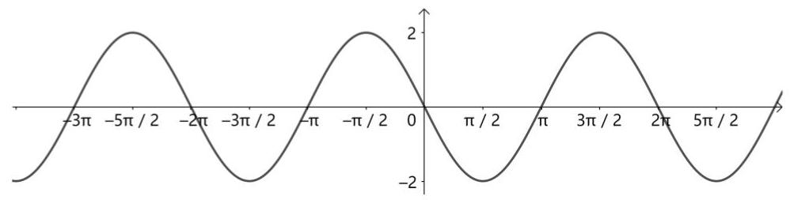

(2) $y = \cos x$ 在区间 $\left\lbrack  {-\pi  + {2k\pi },{2k\pi }}\right\rbrack  \left( {k \in  \mathbf{Z}}\right)$ 单调递增，在区间 $\left\lbrack  {{2k\pi },\pi  + {2k\pi }}\right\rbrack \; \left( {k \in  \mathbf{Z}}\right)$ 单调递减,在此基础上:

当 $- \pi  + {2k\pi } \leq  \frac{\pi x}{2} \leq  {2k\pi }\left( {k \in  \mathbf{Z}}\right)$ 时, $y = \cos \left( \frac{\pi x}{2}\right)  + 1$ 单调递增,解不等式 $- \pi  + {2k\pi } \leq  \frac{\pi x}{2} \leq  {2k\pi }$ 得 $- 2 + {4k} \leq  x \leq  {4k}$ ，即在区间 $\left\lbrack  {-2 + {4k},{4k}}\right\rbrack  \left( {k \in  \mathbf{Z}}\right)$ 单调递增；

当 ${2k\pi } \leq  \frac{\pi x}{2} \leq  \pi  + {2k\pi }\left( {k \in  \mathbf{Z}}\right)$ 时, $y = \cos \left( \frac{\pi x}{2}\right)  + 1$ 单调递减,解不等式 ${2k\pi } \leq  \frac{\pi x}{2} \leq  \pi  + {2k\pi }$ 得 ${4k} \leq  x \leq  2 + {4k}$ ,即在区间 $\left\lbrack  {{4k},2 + {4k}}\right\rbrack  \left( {k \in  \mathbf{Z}}\right)$ 单调递减;

$y = \cos x$ 的最小值和最大值分别为 -1 和 1, $y = \cos \left( \frac{\pi x}{2}\right)$ 的最小值和最大值也分别为 -1 和 1, $y = \cos \left( \frac{\pi x}{2}\right)  + 1$ 的最小值和最大值分别为 $- 1 + 1 = 0$ 和 $1 + 1 = 2$ 。该函数的图像如下图所示:

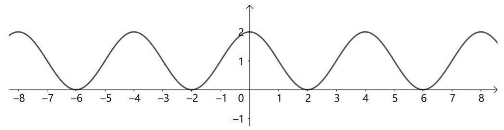

(3) $y = \sin x$ 在区间 $\left\lbrack  {{2k\pi },\frac{\pi }{2} + {2k\pi }}\right\rbrack  \left( {k \in  \mathbf{Z}}\right)$ 为正值且单调递增， $y = {\sin }^{2}x$ 在该区间也为正值且也单调递增;

$y = \sin x$ 在区间 $\left\lbrack  {\frac{\pi }{2} + {2k\pi },\pi  + {2k\pi }}\right\rbrack  \left( {k \in  \mathbf{Z}}\right)$ 为正值且单调递减， $y = {\sin }^{2}x$ 在该区间也为正值且单调递减;

$y = \sin x$ 在区间 $\left\lbrack  {\pi  + {2k\pi },\frac{3\pi }{2} + {2k\pi }}\right\rbrack  \left( {k \in  \mathbf{Z}}\right)$ 为负值且单调递减，绝对值越来越大, $y = {\sin }^{2}x$ 在该区间为正值,绝对值越来越小,因此单调递增;

$y = \sin x$ 在区间 $\left\lbrack  {\frac{3\pi }{2} + {2k\pi },{2\pi } + {2k\pi }}\right\rbrack  \left( {k \in  \mathbf{Z}}\right)$ 为负值且单调递增,绝对值越来越小, $y = {\sin }^{2}x$ 在该区间为正值,绝对值越来越小,因此单调递减;

$y = \sin x$ 的最大值和最小值分别为 1 和 -1,绝对值的最大值和最小值分别为 1 和 $0, y = {\sin }^{2}x$ 的最大值和最小值分别为 1 和 0 。该函数的图像如下图所示:

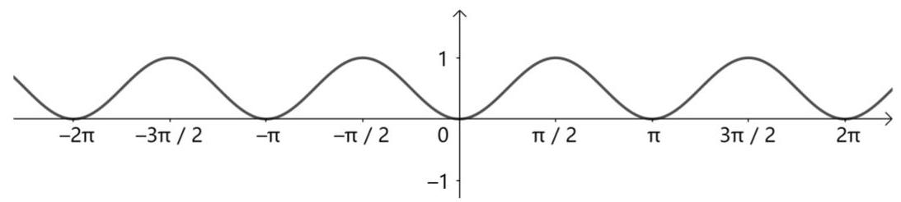

练习 5.3(4)

1. 求下列函数的单调区间:

(1) $y = \sin x - 4$ ; (2) $y = \sin \left( {x - 4}\right)$ ; (3) $y = \frac{\sin x}{\cos x}$ ; (4) $y = \sin \left( {\frac{\pi }{2} + x}\right) \cos \left( {\frac{\pi }{2} - x}\right)$ 。

2. 求下列函数的单调区间和最大值、最小值:

(1) $y = 2\cos x - 2$ ; (2) $y = \sin \left( {x - \frac{\pi }{4}}\right)$ ; (3) $y = {2}^{\sin x}$ ; (4) $y = \cos x + \frac{1}{\cos x}$ 。

#### 5.3.5 正切函数的性质与图像

按照描绘正弦函数和余弦函数的图像的方法，可以描绘出正切函数 $y = \tan x$ 的图像，正切函数的图像又叫作正切曲线。如下图所示。

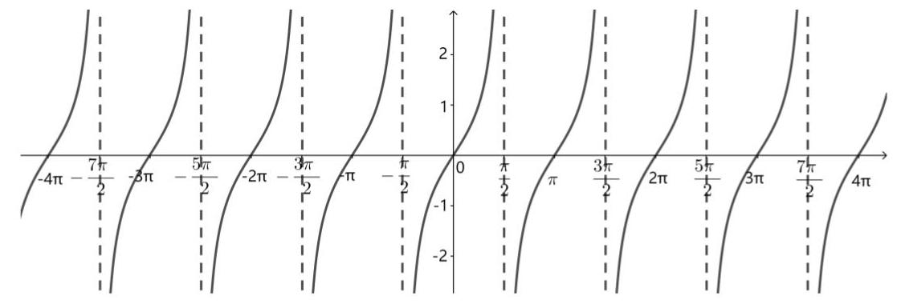

正切函数 $y = \tan x$ 等于角的终边与单位圆的交点的纵坐标与横坐标的比值。 由于分母不能为 0,需从定义域中排除所有让 $\cos x = 0$ 的点,其定义域为 $x \in  \mathbf{R}$ 且 $x \neq  \frac{\pi }{2} + {k\pi }\left( {k \in  \mathbf{Z}}\right)$ ,或记作 $x \in  \left( {-\frac{\pi }{2} + {k\pi },\frac{\pi }{2} + {k\pi }}\right) \left( {k \in  \mathbf{Z}}\right)$ 。正切函数的值域为全体实数 $\mathbf{R}$ ,也可以表示为 $\left( {-\infty , + \infty }\right)$ ,没有最大值或最小值。

图中一系列垂直于 $x$ 轴的虚线 $x =  \pm  \frac{\pi }{2}\text{ 、 }x =  \pm  \frac{3\pi }{2}\cdots \cdots$ 叫作渐近线。渐进线是函数图像可以无限接近,但永远不会到达 (相交) 的直线。当 $x$ 的取值非常接近 $\frac{\pi }{2} + {k\pi }\left( {k \in  \mathbf{Z}}\right)$ 时,函数值 $\tan x$ 可以非常接近 $- \infty$ 或 $+ \infty$ ,但由于 $y = \tan x$ 在 $x = \frac{\pi }{2} + {k\pi }\left( {k \in  \mathbf{Z}}\right)$ 处无定义,所以这些点不在函数图像上。

周期性。根据正切函数的定义 (构造过程),或根据诱导公式 $\tan \left( {x + \pi }\right)  = \tan x$ , 结合函数图像,可知正切函数 $y = \tan x$ 是最小正周期为 $\pi$ 的周期函数。对于任意 $x \in  \left( {-\frac{\pi }{2} + {k\pi },\frac{\pi }{2} + {k\pi }}\right) \left( {k \in  \mathbf{Z}}\right)$ ,始终满足: $\tan \left( {x + {m\pi }}\right)  = \tan x\left( {m \in  \mathbf{Z}}\right)$ 。

奇偶性。根据正切函数的定义 (构造过程),或根据诱导公式 $\tan \left( {-x}\right)  =  - \tan x$ , 可知正切函数 $y = \tan x$ 是奇函数。

单调性。根据正切函数的定义 (构造过程), 结合函数图像, 可知正切函数 $f\left( x\right)  = \tan x$ 在各段区间 $\left\lbrack  {-\frac{\pi }{2} + {k\pi },\frac{\pi }{2} + {k\pi }}\right\rbrack  \left( {k \in  \mathbf{Z}}\right)$ 分别单调递增,没有递减区间。

练习 5.3(5)

1. 根据下列函数的定义式, 结合函数图像, 分析它们的周期性、单调性、 对称性:

(1)余切函数: $y = \cot \theta  = \frac{\cos \theta }{\sin \theta }$

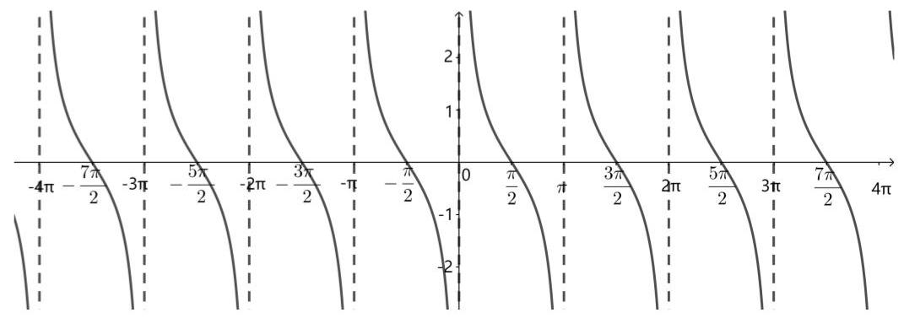

(2)正割函数: $y = \sec \theta  = \frac{1}{\cos \theta }$

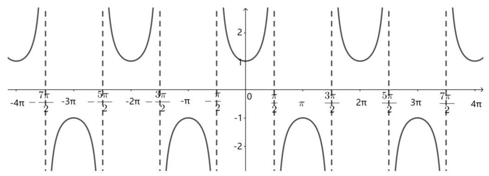

(3)余割函数: $y = \csc \theta  = \frac{1}{\sin \theta }$

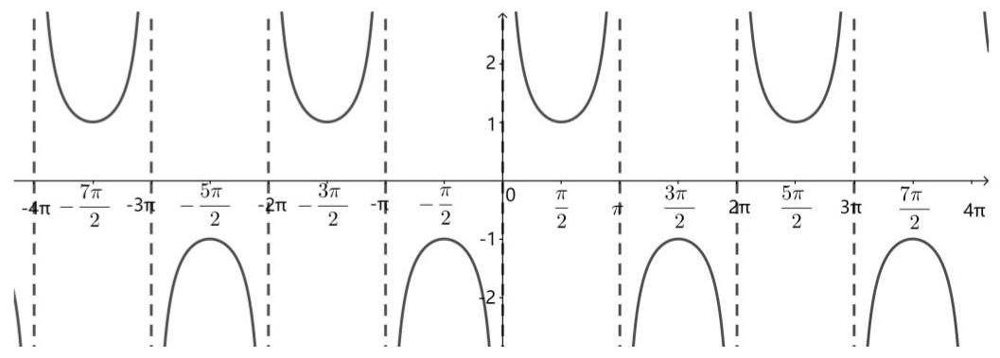

### 5.4 函数的平移与伸缩

在基本的函数解析式的基础上, 添加一些参数, 能让函数的图形发生一些特定的变化, 如沿某个方向平移、沿某个方向拉伸或压缩、沿某个方向旋转, 我们接下来学习函数平移与伸缩的原理和规律, 函数旋转的规律将在复数一章学习。

#### 5.4.1 匀速圆周运动的数学模型

描绘基本的正弦函数 $y = \sin x$ 的图像时,规定起始位置的弧度为 $x = 0$ ,终边与单位圆的交点的纵坐标作为函数值。现在让圆心仍为原点,半径变为 $A$ ,利用三角函数关系可以证明,当角的大小为 $x$ 时,角的终边与圆的交点的纵坐标为:

$$
y = A\sin x
$$

仍规定 $x$ 轴的正半轴为角的始边,让终边以恒定的速率旋转,设终边在单位时间旋转的弧度为 $\omega$ ,那么经过时间 $t$ 之后,终边与始边的夹角为 $x = {\omega t}$ ,于是终边与圆的交点的纵坐标为:

$$
y = A\sin \left( {\omega t}\right)
$$

如果刚开始旋转的 $t = 0$ 时刻的初始弧度为 $\varphi$ ,那么弧度与时间的关系为:

$$
\theta  = {\omega t} + \varphi
$$

于是终边与圆的交点的纵坐标与时间的关系为:

$$
y = A\sin \left( {{\omega t} + \varphi }\right)
$$

这是正弦函数的一般形式, 它的形状整体上仍是正弦曲线, 只是具体形状的细节和位置与参数 $A\text{ 、 }\omega \text{ 、 }\varphi$ 有关。接下来,我们详细分析当正弦函数从基本的 $y = \sin x$ 变为 $y = A\sin \left( {{\omega t} + \varphi }\right)$ 的过程中,各参数 $A\text{ 、 }\omega \text{ 、 }\varphi$ 的具体影响和作用。

第一步,从 $y = \sin x$ 变为 $y = \sin \left( {x + \varphi }\right)$ 。

该变化表示: 将函数 $y = \sin x$ 的图像向左平移 $\varphi$ 个单位,其对称轴、对称中心、单调区间、最大值和最小值点也都向左平移 $\varphi$ 个单位,各周期的端点也都向左平移 $\varphi$ 个单位,周期的大小不变。当 $\varphi  > 0$ 时,函数图像整体向左平移; 当 $\varphi  < 0$ 时,函数图像整体向右平移。

该变换的原理为: 设 $\left( {{x}_{0},\sin {x}_{0}}\right)$ 是原函数 $y = \sin x$ 上的点,将函数向左平移 $\varphi$ 个单位,函数上的点 $\left( {{x}_{0},\sin {x}_{0}}\right)$ 的坐标变为 $\left( {{x}_{0} - \varphi ,\sin {x}_{0}}\right)$ ,函数解析式中所有的 $x$ 都需要变为 $\left( {x + \varphi }\right)$ ,函数上所有点的横坐标都减去 $\varphi$ ,正好与解析式中所有 $x$ 都加上 $\varphi$ 互相抵消,即 $\sin \left\lbrack  {\left( {{x}_{0} - \varphi }\right)  + \varphi }\right\rbrack   = \sin {x}_{0} = {y}_{0}$ ,才能让函数解析式的等号仍然成立,让平移后的点 $\left( {{x}_{0} - \varphi ,\sin {x}_{0}}\right)$ 仍满足函数解析式。

下图为画在同一坐标系中的函数 $y = \sin x$ (实线)与 $y = \sin \left( {x + \frac{\pi }{4}}\right)$ (虚线) 的图像,注意观察它们沿水平方向的平移关系。

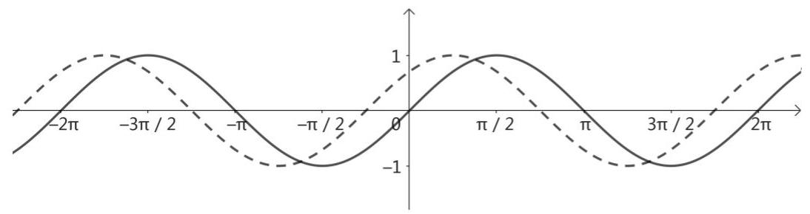

第二步,从 $y = \sin \left( {x + \varphi }\right)$ 变为 $y = \sin \left( {{\omega x} + \varphi }\right) \left( {\omega  > 0}\right)$ 。

该变化表示: 将函数 $y = \sin \left( {x + \varphi }\right)$ 的图像,沿水平方向伸缩为原来的 $\frac{1}{\omega }$ ,其周期和单调区间也进行相同的伸缩, 对称轴、对称中心、最大值和最小值点的横坐标也因为伸缩而变化。

当 $\omega  > 1$ 时,函数图像整体沿水平方向压缩为 $\frac{1}{\omega }$ (此时 $0 < \frac{1}{\omega } < 1$ )。当 $0 < \omega  < 1$ 时,函数图像整体沿水平方向拉伸为 $\frac{1}{\omega }$ 倍 (此时 $\frac{1}{\omega } > 1$ ) 。当 $\omega  < 0$ 时,函数图像在整体伸缩的基础上，再以 $y$ 轴为对称轴左右颠倒。

该变换的原理为:设 $\left( {{x}_{0},\sin \left( {{x}_{0} + \varphi }\right) }\right)$ 是函数 $y = \sin \left( {x + \varphi }\right)$ 上的点，将函数沿水平方向伸缩为原来的 $\frac{1}{\omega }$ ,函数上的点 $\left( {{x}_{0},\sin \left( {{x}_{0} + \varphi }\right) }\right)$ 的坐标变为 $\left( {\frac{{x}_{0}}{\omega },\sin \left( {{x}_{0} + \varphi }\right) }\right)$ , 函数解析式中所有的 $x$ 都需要变为 ${\omega x}$ ,函数上所有点的横坐标都除以 $\omega$ ,正好与解析式中所有 $x$ 都乘以 $\omega$ 互相抵消,即 $\sin \left\lbrack  {\omega  \cdot  \frac{{x}_{0}}{\omega } + \varphi }\right\rbrack   = \sin \left( {{x}_{0} + \varphi }\right)  = {y}_{0}$ ,才能让函数解析式的等号仍成立,让伸缩后的点 $\left( {\frac{{x}_{0}}{\omega },\sin \left( {{x}_{0} + \varphi }\right) }\right)$ 仍满足函数解析式。

下图为画在同一坐标系中的函数 $y = \sin \left( {x + \frac{\pi }{4}}\right)$ (实线) 与 $y = \sin \left( {{2x} + \frac{\pi }{4}}\right)$ (虚线)的图像，注意观察它们沿水平方向的伸缩关系。

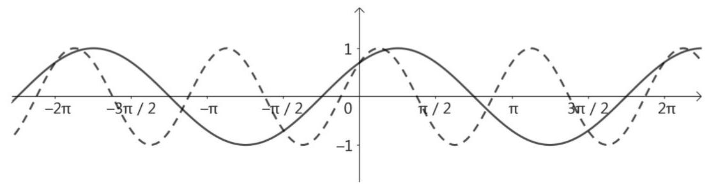

第三步,从 $y = \sin \left( {{\omega x} + \varphi }\right)$ 变为 $y = A\sin \left( {{\omega x} + \varphi }\right) \;\left( {\omega  > 0}\right)$ 。

该变化表示: 将函数 $y = \sin \left( {{\omega x} + \varphi }\right)$ 的图像,沿竖直方向伸缩为原来的 $A$ 倍, 其周期、单调区间的节点、对称轴、对称中心不变, 仅最大值和最小值分别变为 $\left| A\right|$ 和 $- \left| A\right|$ ,若 $A > 0$ 则单调区间不变,若 $A < 0$ 则递增区间与递减区间对调。

该变换的原理为:原函数 $y = \sin \left( {{\omega x} + \varphi }\right)$ 的所有函数值都乘以 $A$ ，变为原来的 $A$ 倍。

下图为画在同一坐标系中的函数 $y = \sin \left( {{2x} + \frac{\pi }{4}}\right)$ (实线) 与 $y = 2\sin \left( {{2x} + \frac{\pi }{4}}\right)$ (虚线) 的图像, 注意观察它们沿竖直方向的伸缩关系。

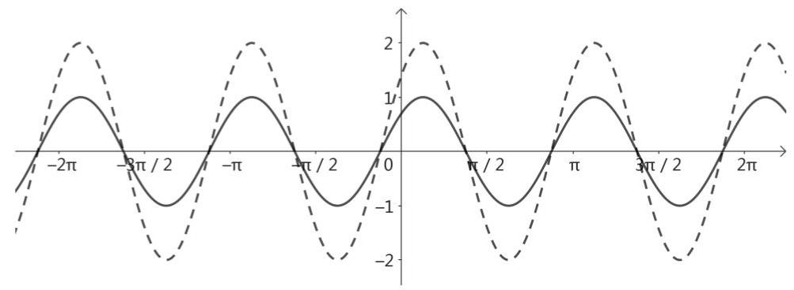

综上,将函数 $y = \sin x$ 变为 $y = A\sin \left( {{\omega x} + \varphi }\right)$ ,函数图像依次发生的变化为:

(1)沿水平方向向左平移 $\varphi$ 个单位；

(2)沿水平方向伸缩为原来的 $\frac{1}{\omega }$ ；

(3)沿竖直方向伸缩为原来的 $A$ 倍。

需注意，上述变换顺序不能改变，如果要将函数 $y = A\sin \left( {{\omega x} + \varphi }\right)$ 变回 $y = \sin x$ ,则需按照相反的顺序 $\left( 3\right)  \rightarrow  \left( 2\right)  \rightarrow  \left( 1\right)$ 依次变换。

例 5.13 求下列函数的单调区间、最小正周期、取最大值和最小值的点:

(1) $y = \sin \left( {x + \frac{\pi }{3}}\right) ;\;$ (2) $y = \sin \left( {{2x} + \frac{\pi }{3}}\right)$ 。

解析: (1) $y = \sin \left( {x + \frac{\pi }{3}}\right)$ 由 $y = \sin x$ 向左平移 $\frac{\pi }{3}$ 得到,

$y = \sin x$ 在区间 $\left\lbrack  {-\frac{\pi }{2} + {2k\pi },\frac{\pi }{2} + {2k\pi }}\right\rbrack$ ( $k \in  \mathbf{Z}$ ,下同) 单调递增,在区间 $\left\lbrack  {\frac{\pi }{2} + {2k\pi },\frac{3\pi }{2} + {2k\pi }}\right\rbrack$ 单调递减,向左平移 $\frac{\pi }{3}$ 后,各单调区间随之进行相同的平移, $y = \sin \left( {x + \frac{\pi }{3}}\right)$ 在区间 $\left\lbrack  {-\frac{\pi }{2} - \frac{\pi }{3} + {2k\pi },\frac{\pi }{2} - \frac{\pi }{3} + {2k\pi }}\right\rbrack$ ,即 $\left\lbrack  {-\frac{5\pi }{6} + {2k\pi },\frac{\pi }{6} + {2k\pi }}\right\rbrack$ 单调递增,在区间 $\left\lbrack  {\frac{\pi }{2} - \frac{\pi }{3} + {2k\pi },\frac{3\pi }{2} - \frac{\pi }{3} + {2k\pi }}\right\rbrack$ ,即 $\left\lbrack  {\frac{\pi }{6} + {2k\pi },\frac{7\pi }{6} + {2k\pi }}\right\rbrack$ 单调递减。

$y = \sin x$ 的最小正周期为 ${2\pi }$ ,向左平移 $\frac{\pi }{3}$ 后, $y = \sin \left( {x + \frac{\pi }{3}}\right)$ 的最小正周期不变,仍为 ${2\pi }$ 。

$y = \sin x$ 在 $x = \frac{\pi }{2} + {2k\pi }$ 处取得最大值,在 $x = \frac{3\pi }{2} + {2k\pi }$ 处取得最小值,向左平移 $\frac{\pi }{3}$ 后,各区间随之进行相同的平移, $y = \sin \left( {x + \frac{\pi }{3}}\right)$ 在 $x = \frac{\pi }{2} - \frac{\pi }{3} + {2k\pi }$ ,即 $x = \frac{\pi }{6} + {2k\pi }$ 处取得最大值,在 $x = \frac{3\pi }{2} - \frac{\pi }{3} + {2k\pi }$ ,即 $x = \frac{7\pi }{6} + {2k\pi }$ 处取得最小值。

(2) $y = \sin \left( {{2x} + \frac{\pi }{3}}\right)$ 由 $y = \sin \left( {x + \frac{\pi }{3}}\right)$ 沿水平方向压缩为原来的 $\frac{1}{2}$ 得到，

$y = \sin \left( {x + \frac{\pi }{3}}\right)$ 在区间 $\left\lbrack  {-\frac{5\pi }{6} + {2k\pi },\frac{\pi }{6} + {2k\pi }}\right\rbrack$ 单调递增，在区间 $\left\lbrack  {\frac{\pi }{6} + {2k\pi },\frac{7\pi }{6} + {2k\pi }}\right\rbrack$ 单调递减,压缩为原来的 $\frac{1}{2}$ 后,各单调区间随之进行相同的压缩, $y = \sin \left( {{2x} + \frac{\pi }{3}}\right)$ 在区间 $\left\lbrack  {\frac{1}{2}\left( {-\frac{5\pi }{6} + {2k\pi }}\right) ,\frac{1}{2}\left( {\frac{\pi }{6} + {2k\pi }}\right) }\right\rbrack$ ,即 $\left\lbrack  {-\frac{5\pi }{12} + {k\pi },\frac{\pi }{12} + {k\pi })}\right\rbrack$ 单调递增,在区间 $\left\lbrack  {\frac{1}{2}\left( {\frac{\pi }{6} + {2k\pi }}\right) ,\frac{1}{2}\left( {\frac{7\pi }{6} + {2k\pi }}\right) }\right\rbrack$ ,即 $\left\lbrack  {\frac{\pi }{12} + {k\pi },\frac{7\pi }{12} + {k\pi }}\right\rbrack$ 单调递减。

$y = \sin \left( {x + \frac{\pi }{3}}\right)$ 的周期为 ${2\pi }$ ,压缩为原来的 $\frac{1}{2}$ 后,最小正周期随之进行相同的压缩, $y = \sin \left( {{2x} + \frac{\pi }{3}}\right)$ 的周期变为原来的 $\frac{1}{2}$ ,即 $\frac{2\pi }{2} = \pi$ 。

$y = \sin \left( {x + \frac{\pi }{3}}\right)$ 在 $x = \frac{\pi }{6} + {2k\pi }$ 处取得最大值,在 $x = \frac{7\pi }{6} + {2k\pi }$ 处取得最小值, 压缩为原来的 $\frac{1}{2}$ 后,各取得最大值和最小值的点的横坐标随压缩进行平移, $y = \sin \left( {{2x} + \frac{\pi }{3}}\right)$ 在 $x = \frac{1}{2}\left( {\frac{\pi }{6} + {2k\pi }}\right)$ ,即 $x = \frac{\pi }{12} + {k\pi }$ 处取得最大值,在 $x = \frac{1}{2}\left( {\frac{7\pi }{6} + {2k\pi }}\right)$ , 即 $x = \frac{7\pi }{12} + {k\pi }$ 处取得最小值。

下图依次为函数 $y = \sin x, y = \sin \left( {x + \frac{\pi }{3}}\right) , y = \sin \left( {{2x} + \frac{\pi }{3}}\right)$ 的图像,注意观察并比较它们的单调区间、周期、最大值和最小值点依次发生的变化。

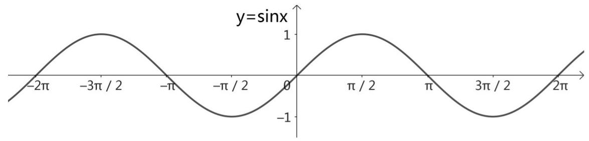

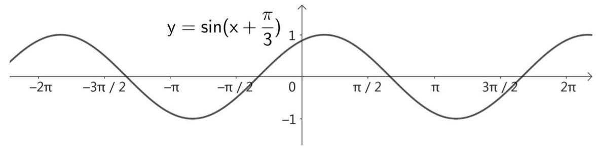

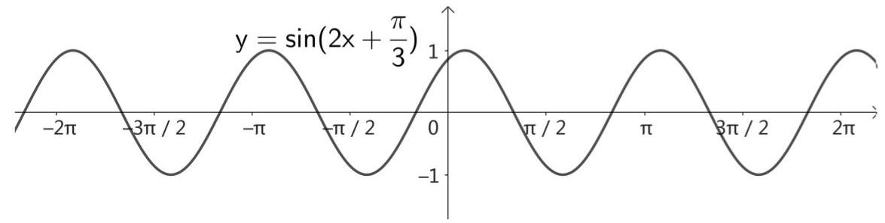

练习 $\mathbf{{5.4}\left( 1\right) }$

1. 求下列函数的单调区间、对称轴、对称中心:

(1) $y = \sin \left( {2x}\right)$ ； (2) $y = \cos \left( {x - \frac{\pi }{2}}\right)$ ； (3) $y = \sin \left( {\frac{\pi x}{4} - 4}\right)$ 。

2. 画出下列函数的大致图像(需包含原点和至少两个周期):

(1) $y =  - 2\sin \left( \frac{x}{2}\right)$ ; (2) $y = 4\cos \left( {\frac{x}{\pi } - 1}\right)$ ； (3) $y = \tan \left( {x + \frac{\pi }{2}}\right)$ 。

3. 描述下列函数图像变换的过程:

(1)由 $y = \sin x$ 到 $y = \sin \left( {{2x} - \frac{\pi }{4}}\right)$ ；(2)由 $y = 2\cos \left( {\frac{x}{4\pi } + {100}}\right)$ 到 $y = \cos x$ 。

#### 5.4.2 平移变换的一般规律

函数图像的平移变换指在不改变函数图像的形状的情况下，将函数图像沿某个方向平移。基本的平移方向有两个:沿水平方向左右平移、沿竖直方向上下平移, 沿其他方向的平移都可以分解为这两个方向平移的组合。

对于函数 $y = f\left( x\right)$ ,如果将解析式整体加上正数 $C$ ,变为:

$$
y = f\left( x\right)  + C
$$

那么函数图像沿 $y$ 轴正方向平移 $C$ 个单位。当 $C > 0$ 时,函数图像向上平移; 当 $C < 0$ 时,函数图像向下平移。

对于函数 $y = f\left( x\right)$ ,如果将解析式中的 $x$ 全都替换为 $x - b$ ,变为:

$$
y = f\left( {x - b}\right)
$$

那么函数图像沿 $x$ 轴正方向平移 $b$ 个单位。当 $b > 0$ 时,函数图像向右平移; 当 $b < 0$ 时,函数图像向左平移。

实际上,函数图像沿竖直和水平方向平移的规律相同,将 $y = f\left( x\right)  + C$ 等式右边的 $C$ 移到等式左边,变为 $y - C = f\left( x\right)$ ,相当于将 $y = f\left( x\right)$ 中的 $y$ 都替换为 $y - C$ ,函数图像整体向 $y$ 轴正方向移动 $C$ 个单位,这样一来,沿水平方向与竖直方向平移的规律就一致了。

下图为正弦函数 $y = \sin x$ 以及分别向右平移为 $y = \sin \left( {x - 2}\right)$ 、向左平移为 $y = \sin \left( {x + 2}\right)$ 、向上平移为 $y = \sin x + 2$ 、向下平移为 $y = \sin x - 2$ 的图像,注意观察并比较函数解析式的变化与图像位置变化对应的关系。

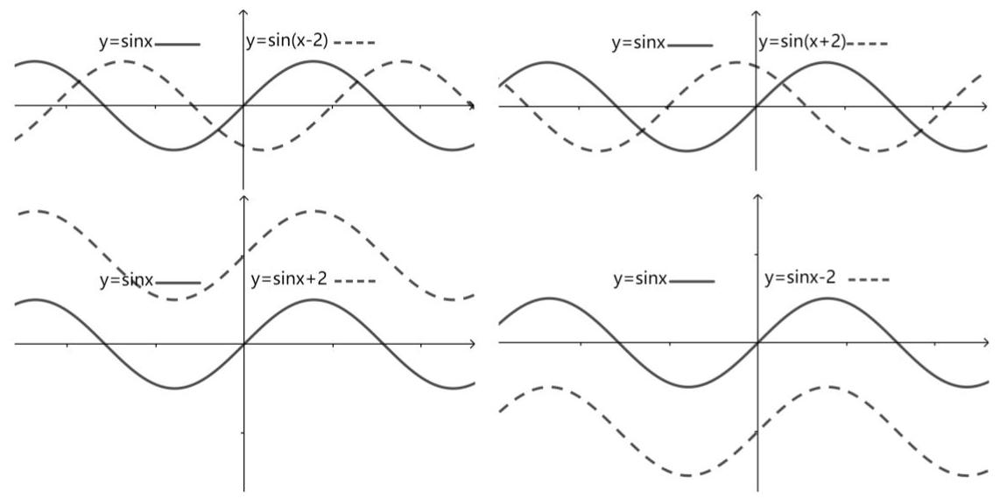

#### 5.4.3 伸缩变换的一般规律

函数图像的伸缩变换是指在不改变函数图像的基本形状的情况下，将函数图像沿水平方向或竖直方向 “拉伸” 或 “压缩”。

对于函数 $y = f\left( x\right)$ ,如果将解析式整体乘以实数 $A$ ,变为:

$$
y = {Af}\left( x\right)
$$

那么函数图像沿竖直方向伸缩为原来的 $A$ 倍。当 $A > 1$ 时,函数图像沿竖直方向拉伸为 $A$ 倍; 当 $0 < A < 1$ 时,函数图像沿竖直方向压缩为 $A$ ; 当 $A < 0$ 时, 函数图像沿竖直方向伸缩为 $A$ (倍)后，再以 $x$ 轴为对称轴上下对调。

对于函数 $y = f\left( x\right)$ ,如果将解析式中的 $x$ 全都替换为 ${kx}$ ,变为:

$$
y = f\left( {kx}\right)
$$

那么函数图像沿水平方向伸缩为原来的 $\frac{1}{k}$ (倍) 。当 $k > 1$ 时,函数图像沿水平方向压缩为 $\frac{1}{k}$ ; 当 $0 < k < 1$ 时,函数图像沿水平方向拉伸为 $\frac{1}{k}$ 倍; 当 $k < 0$ 时, 函数图像沿水平方向伸缩为 $\frac{1}{k}$ (倍)后,再以 $y$ 轴为对称轴左右对调。

实际上,函数图像沿竖直和水平方向伸缩的规律也相同,将 $y = {Af}\left( x\right)$ 等式右边的 $A$ 移到等式左边,变为 $\frac{y}{A} = f\left( x\right)$ ,相当于将 $y = f\left( x\right)$ 中的 $y$ 都替换为 $\frac{y}{A}$ , 函数图像整体沿竖直方向伸缩为 $A$ (倍),这样一来,沿水平方向与竖直方向伸缩的规律就一致了。

下图为正弦函数 $y = \sin x$ 及其分别沿竖直方向拉伸为 $y = 2\sin x$ 、沿竖直方向压缩为 $y = \frac{1}{2}\sin x$ 、沿水平方向压缩为 $y = \sin {2x}$ 、沿水平方向拉伸为 $y = \sin \frac{x}{2}$ 的图像,注意观察比较函数解析式的变化与图像伸缩变化的对应关系。

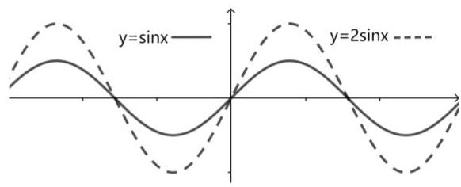

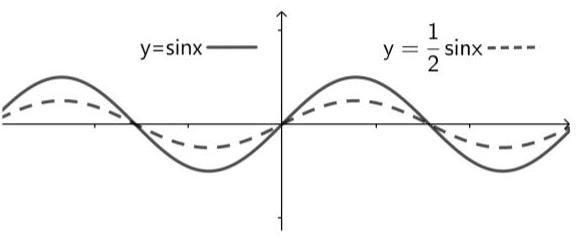

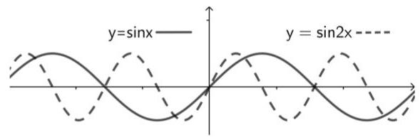

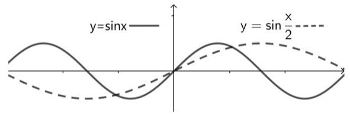

#### 5.4.4 竖直变换与水平变换的异同

将函数 $y = f\left( x\right)$ 的解析式变为 $y = {Af}\left( x\right)  + C$ 后,其图像先沿竖直方向伸缩为 $A$ (倍),后沿 $y$ 轴正方向平移 $C$ 个单位。

将函数 $y = f\left( x\right)$ 的解析式变为 $y = f\left( {{kx} - b}\right)$ 后,其图像先沿 $x$ 轴正方向移动 $b$ 个单位,后沿水平方向伸缩为原来的 $\frac{1}{k}$ (倍)。

可以发现, 对函数解析式进行处理, 让函数图像沿水平方向与竖直方向进行变换的过程中, 函数图像的变化顺序恰好相反:

(1)竖直方向是先伸缩后平移，水平方向是先平移后伸缩；

(2)竖直方向上，如果函数解析式整体乘以 $A$ ，那么图像伸缩为 $A$ (倍)； 水平方向上,如果让所有 $x$ 乘以 $k$ ,那么图像伸缩为 $\frac{1}{k}$ (倍);

(3)竖直方向上，如果函数解析式加上 $C$ ，那么图像沿 $y$ 轴正方向移动 $C$ 个单位; 水平方向上,如果令所有 $x$ 减去 $b$ ,那么图像沿 $x$ 轴正方向移动 $b$ 个单位。

虽然竖直与水平方向上变换的规律看上去截然相反，但实际上它们有相同的规律,将函数解析式看作等式,将竖直方向变换 $y = {Af}\left( x\right)  + C$ 中的系数 $A$ 和 $C$ 移到函数解析式左边, 变为:

$$
\frac{y - C}{A} = f\left( x\right)
$$

这样一来, 函数图像分别沿竖直方向与水平方向的变换, 解析式中的因变量 $y$ 与自变量 $x$ 变化方式之间的关系就一致了: 解析式中,若 $x$ 或 $y$ 直接减去常数 $C$ ,则函数图像沿 $x$ 轴或 $y$ 轴正方向平移 $C$ 个单位; 若 $x$ 或 $y$ 直接乘以常数 $A$ , 则函数图像沿 $x$ 轴或 $y$ 轴伸缩为 $\frac{1}{A}$ (倍),其原理都是解析式中自变量与因变量的变化, 正好与函数上点的坐标的变化抵消, 从而让解析式的等号仍然成立。

#### 5.4.5 伸缩变换与平移变换的顺序

函数图像沿竖直方向的变换中,函数的解析式由 $y = f\left( x\right)$ 变为 $\frac{y - C}{A} = f\left( x\right)$ ; 函数图像沿水平方向的变换中,函数的解析式由 $y = f\left( x\right)$ 变为 $y = f\left( {{kx} - b}\right)$ 。函数图像的变化顺序都是先进行离变量较远的运算, 后进行离变量较近的运算。

竖直方向的变换中,因变量 $y$ 先减去 $C$ 、后除以 $A$ ,图像变换的顺序为先伸缩为 $A$ 倍、后平移 $C$ 个单位。水平方向的变换中,自变量 $x$ 先乘以 $k$ (除以 $\frac{1}{k}$ )、 后减去 $b$ ,图像变换的顺序为先平移 $b$ 个单位,后伸缩为 $\frac{1}{k}$ 。

“先远后近”的顺序是因为离变量较近的运算只作用于变量自身, 离变量较远的运算作用于比它更靠近变量的表达式整体。竖直方向的变换中, 后进行的平移变换 $y - C$ 只作用于 $y$ ,先进行的伸缩变换 $\frac{y - C}{A}$ 是 $\left( {y - C}\right)$ 整体除以 $A$ ,这一步作用于 $\left( {y - C}\right)$ 整体。变换顺序为: 先把 $y = f\left( x\right)$ 伸缩为 $\frac{y}{A} = f\left( x\right)$ ,再只对伸缩后的函数解析式中的 $y$ 进行平移,变为 $\frac{y - C}{A} = f\left( x\right)$ 。水平方向的变换中,后进行的伸缩变换 ${kx}$ 只作用于 $x$ ,先进行的平移变换 ${kx} - b$ 是 ${kx}$ 整体减去 $b$ ,这一步作用于 ${kx}$ 整体。变换步骤为: 先将 $y = f\left( x\right)$ 进行平移,变为 $y = f\left( {x - b}\right)$ ,再只对平移后的函数解析式中的 $x$ 进行伸缩变换,变为 $y = f\left( {{kx} - b}\right)$ 。

如果对 $y = f\left( x\right)$ 沿水平方向先进行伸缩变换、后进行平移变换,那么处理解析的顺序和参数为:

(1)将 $x$ 替换为 ${kx}$ ，解析式由 $y = f\left( x\right)$ 变为 $y = f\left( {kx}\right)$ ；

(2)将 $x$ 替换为 $x - b$ ，解析式由 $y = f\left( {kx}\right)$ 变为 $y = f\left( {k\left( {x - b}\right) }\right)$ 。

综上, 对函数图像进行平移和伸缩变换的总体规律为:

(1)函数图像变换后，函数解析式中的 $x$ 和 $y$ 需替换为相应的表达式，使替换后正好抵消函数上点的坐标的变化, 才能维持函数等式关系的成立;

(2)对照函数的解析式和函数图像先后进行平移和伸缩变换时，越接近变量的运算, 变换顺序越靠后。

上述变换的基本原理和规律, 适用于高中阶段学习的所有基本初等函数和复合函数，还将在后续章节学习统计和正态分布时继续使用。

例 5.14 分析将函数 $y = {x}^{2}$ 变换为 $y = 2{x}^{2} + {4x} + 1$ ,函数图像的变换过程。

解析: 首先将 $y = 2{x}^{2} + {4x} + 1$ 化为二次函数的标准形式:

$$
y = 2{\left( x + 1\right) }^{2} - 1
$$

由 $y = {x}^{2}$ 变换为 $y = 2{\left( x + 1\right) }^{2} - 1$ 共三个步骤:

第一步: 将 $y = {x}^{2}$ 沿水平方向向左平移 1 个单位,变为 $y = {\left( x + 1\right) }^{2}$ ,

第二步: 将 $y = {\left( x + 1\right) }^{2}$ 沿竖直方向拉伸为原来的 2 倍,变为 $y = 2{\left( x + 1\right) }^{2}$ ,

第三步: 将 $y = 2{\left( x + 1\right) }^{2}$ 沿竖直方向向下平移 1 个单位,变为 $y = 2{\left( x + 1\right) }^{2} - 1$ 。

练习 $\mathbf{{5.4}\left( 2\right) }$

1. 分析将函数 $y = x$ 变换为 $y = {2x} + 1$ ,函数图像的变换过程。

2. 求函数 $y = {x}^{3} - 6{x}^{2} + {12x} - 8$ 的单调区间。

3. 求函数 $y = \frac{2}{x + 1}$ 的对称中心。

4. 求函数 $y = {\log }_{2}\left( {x - a}\right)$ 与 $x$ 轴的交点坐标。

### 5.5 反三角函数

将三角函数的定义域限定在一定范围内, 角的大小与各三角函数的值有一一对应关系, 将三角函数的值作为自变量、角的大小作为因变量, 可以得到三角函数的反函数一一反三角函数。正弦、余弦、正切、余切、正割、余割都有自己的反三角函数，主要了解正弦、余弦、正切的反三角函数。虽然新教材中已经取消了反三角函数的知识, 考虑到反三角函数虽然初次接触较陌生, 但实际较容易理解, 且有一定可能出现在创新题中, 故在此对其基本情况进行介绍。

#### 5.5.1 反正弦函数

正弦函数的反函数叫作反正弦函数，记作:

$$
y = {\sin }^{-1}x
$$

其定义域为 $\left\lbrack  {-1,1}\right\rbrack$ ,即正弦函数的值域,其值域为 $\left\lbrack  {-\frac{\pi }{2},\frac{\pi }{2}}\right\rbrack$ ,即正弦函数关于原点对称的半个周期长度的定义域,将 $y = {\sin }^{-1}x$ 的定义域中的各实数与对应的函数值对应的点绘制在平面直角坐标系中, 就得到其函数图像, 如下图所示。

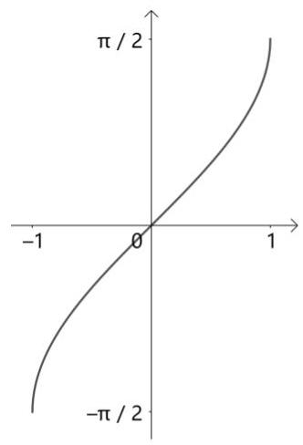

正弦函数 $y = \sin x$ 在区间 $\left\lbrack  {-\frac{\pi }{2},\frac{\pi }{2}}\right\rbrack$ 单调递增,自变量越大因变量越大,反过来可以认为因变量越大自变量越大,其反函数 $y = {\sin }^{-1}x$ 也是单调递增函数。

正弦函数 $y = \sin x$ 在区间 $\left\lbrack  {-\frac{\pi }{2},\frac{\pi }{2}}\right\rbrack$ 是奇函数，若自变量互为相反数，则因变量互为相反数, 反过来可以认为若因变量互为相反数, 则自变量互为相反数, 其反函数 $y = {\sin }^{-1}x$ 也是奇函数。

根据常用正弦函数的值,可以得到一些常用的反正弦函数的值: ${\sin }^{-1}0 = 0$ , ${\sin }^{-1}1 = \frac{\pi }{2},\;{\sin }^{-1}\left( {-1}\right)  =  - \frac{\pi }{2},\;{\sin }^{-1}\frac{1}{2} = \frac{\pi }{6},\;{\sin }^{-1}\left( {-\frac{1}{2}}\right)  =  - \frac{\pi }{6},\;{\sin }^{-1}\frac{\sqrt{2}}{2} = \frac{\pi }{4}, \; {\sin }^{-1}\left( {-\frac{\sqrt{2}}{2}}\right)  =  - \frac{\pi }{4},\;{\sin }^{-1}\frac{\sqrt{3}}{2} = \frac{\pi }{3},\;{\sin }^{-1}\left( {-\frac{\sqrt{3}}{2}}\right)  =  - \frac{\pi }{3}$  。

需注意,虽然很多函数与其反函数满足 ${f}^{-1}\left( {f\left( x\right) }\right)  = x$ 和 $f\left( {{f}^{-1}\left( x\right) }\right)  = x$ ,即原函数的自变量的函数值对应的反函数的函数值就是原自变量, 但对于三角函数及其反三角函数并非始终成立, 因为三角函数的定义域为全体实数 (或去掉固定间隔的点), 而反三角函数将相应的三角函数的定义域进行了限定。

例 5.15 求下列各式的值:

(1) ${\sin }^{-1}\left( \frac{1}{2}\right) {\sin }^{-1}\left( {-\frac{1}{2}}\right) ,\left( 2\right) \sin \left( {{\sin }^{-1}\frac{1}{4}}\right) ,\left( 3\right) {\sin }^{-1}(\sin \frac{1}{2}$

解析: (1) ${\sin }^{-1}\left( \frac{1}{2}\right) {\sin }^{-1}\left( {-\frac{1}{2}}\right)  = \frac{\pi }{6} \cdot  \left( {-\frac{\pi }{6}}\right)  =  - \frac{{\pi }^{2}}{36}$ ;

(2)设 $\theta  \in  \left\lbrack  {-\frac{\pi }{2},\frac{\pi }{2}}\right\rbrack$ 且 $\sin \theta  = \frac{1}{4}$ ，则 ${\sin }^{-1}\frac{1}{4} = \theta ,\sin \left( {{\sin }^{-1}\frac{1}{4}}\right)  = \sin \theta  = \frac{1}{4}$ ；

(3)先利用诱导公式，找到反正弦函数的值域 $\left\lbrack  {-\frac{\pi }{2},\frac{\pi }{2}}\right\rbrack$ 中与 $\frac{6\pi }{5}$ 有相等的正弦值的点: $\sin \frac{6\pi }{5} = \sin \left( {\pi  - \frac{6\pi }{5}}\right)  = \sin \left( {-\frac{\pi }{5}}\right)$ (可以先借助正弦函数的图像找出大致位置再具体计算),所以 ${\sin }^{-1}\left( {\sin \frac{6\pi }{5}}\right)  = {\sin }^{-1}\left( {\sin \left( {-\frac{\pi }{5}}\right) }\right)$ ,设 $\sin \left( {-\frac{\pi }{5}}\right)  = t$ ,则 ${\sin }^{-1}t =  - \frac{\pi }{5}$ , ${\sin }^{-1}\left( {\sin \frac{6\pi }{5}}\right)  = {\sin }^{-1}\left( {\sin \left( {-\frac{\pi }{5}}\right) }\right)  = {\sin }^{-1}t =  - \frac{\pi }{5}$ 。

#### 5.5.2 反余弦函数

余弦函数的反函数叫作反正余函数，记作:

$$
y = {\cos }^{-1}x
$$

其定义域为 $\left\lbrack  {-1,1}\right\rbrack$ ,即余弦函数的值域,其值域为 $\left\lbrack  {0,\pi }\right\rbrack$ ,即余弦函数以原点为下界的半个周期长度的定义域,将 $y = {\cos }^{-1}x$ 的定义域中的各实数与对应的函数值对应的点绘制在平面直角坐标系中, 就得到其函数图像, 如下图所示。

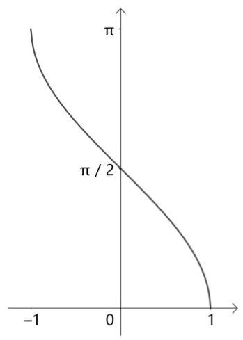

余弦函数 $y = \cos x$ 在区间 $\left\lbrack  {0,\pi }\right\rbrack$ 单调递减,自变量越大因变量越小,反过来可以认为因变量越小自变量越大,其反函数 $y = {\cos }^{-1}x$ 也是单调递增函数。

反余弦函数的值域为 $\left\lbrack  {0,\pi }\right\rbrack$ ,不关于原点或 $y$ 轴对称,因此 $y = {\cos }^{-1}x$ 既不是偶函数也不是奇函数。 $y = \cos x$ 在区间 $\left\lbrack  {0,\pi }\right\rbrack$ 关于点 $\left( {\frac{\pi }{2},0}\right)$ 中心对称,将自变量与因变量互换后,其反函数 $y = {\cos }^{-1}x$ 关于点 $\left( {0,\frac{\pi }{2}}\right)$ 中心对称。

根据常用余弦函数的值,可以得到一些常用的反余弦函数的值: ${\cos }^{-1}0 = \frac{\pi }{2}$ , ${\cos }^{-1}1 = 0,\;{\cos }^{-1}\left( {-1}\right)  = \pi ,\;{\cos }^{-1}\frac{1}{2} = \frac{\pi }{3},\;{\cos }^{-1}\left( {-\frac{1}{2}}\right)  = \frac{2\pi }{3},\;{\cos }^{-1}\frac{\sqrt{2}}{2} = \frac{\pi }{4}, \; {\cos }^{-1}\left( {-\frac{\sqrt{2}}{2}}\right)  = \frac{3\pi }{4},\;{\cos }^{-1}\frac{\sqrt{3}}{2} = \frac{\pi }{6},\;{\cos }^{-1}\left( {-\frac{\sqrt{3}}{2}}\right)  = \frac{5\pi }{6}$  。

例 5.16 求下列各式的值:

(1) ${\sin }^{-1}\left( \frac{1}{2}\right) {\cos }^{-1}\left( \frac{1}{2}\right)$ ，(2) $\cos \left( {{\cos }^{-1}\left( \frac{1}{4}\right) }\right)$ ，(3) ${\cos }^{-1}\left( {\cos \frac{10\pi }{9}}\right)$ 。

解析: (1) ${\sin }^{-1}\left( \frac{1}{2}\right) {\cos }^{-1}\left( \frac{1}{2}\right)  = \frac{\pi }{3} \cdot  \frac{\pi }{6} = \frac{{\pi }^{2}}{18}$ ;

(2)设 $\theta  \in  \left\lbrack  {0,\pi }\right\rbrack$ 且 $\cos \theta  = \frac{1}{4}$ ，则 ${\cos }^{-1}\frac{1}{4} = \theta ,\cos \left( {{\cos }^{-1}\left( \frac{1}{4}\right) }\right)  = \cos \theta  = \frac{1}{4}$ ；

(3)先利用诱导公式，找到反余弦函数的值域 $\left\lbrack  {0,\pi }\right\rbrack$ 中与 $\frac{10\pi }{9}$ 有相等的余弦值的点: $\cos \frac{10\pi }{9} = \cos \left( {-\frac{10\pi }{9}}\right)  = \cos \left( {{2\pi } - \frac{10\pi }{9}}\right)  = \cos \frac{8\pi }{9}$ (可以先借助余弦函数的图像找出大致位置再具体计算),所以 ${\cos }^{-1}\left( {\cos \frac{10\pi }{9}}\right)  = {\cos }^{-1}\left( {\cos \frac{8\pi }{9}}\right)$ ,设 $\cos \frac{8\pi }{9} = t$ ,则 ${\cos }^{-1}t = \frac{8\pi }{9},\;{\cos }^{-1}\left( {\cos \frac{10\pi }{9}}\right)  = {\cos }^{-1}\left( {\cos \frac{8\pi }{9}}\right)  = {\cos }^{-1}t = \frac{8\pi }{9}$ 。

#### 5.5.3 反正切函数

正切函数的反函数叫作反正切函数，记作:

$$
y = {\tan }^{-1}x
$$

其定义域为 $\left( {-\infty , + \infty }\right)$ ,即正切函数的值域,其值域为 $\left( {-\frac{\pi }{2},\frac{\pi }{2}}\right)$ ,即正切函数关于原点对称的一个周期长度的定义域,将 $y = {\tan }^{-1}x$ 的定义域中的各实数与对应的函数值对应的点绘制在平面直角坐标系中，就得到其函数图像，如下页图所示。

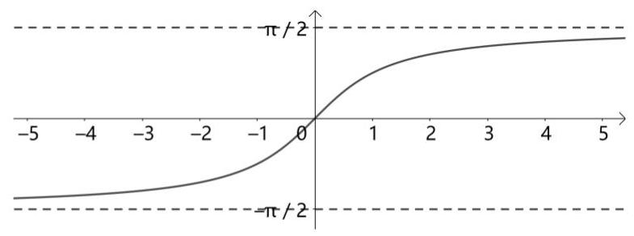

正切函数 $y = \tan x$ 在区间 $\left( {-\frac{\pi }{2},\frac{\pi }{2}}\right)$ 单调递增,自变量越大因变量越大,反过来可以认为因变量越大自变量越大,其反函数 $y = {\tan }^{-1}x$ 也是单调递增函数。

正切函数 $y = \tan x$ 在区间 $\left( {-\frac{\pi }{2},\frac{\pi }{2}}\right)$ 是奇函数,若自变量互为相反数,则因变量互为相反数, 反过来可以认为若因变量互为相反数, 则自变量互为相反数, 其反函数 $y = {\tan }^{-1}x$ 也是奇函数。

根据常用正切函数的值,可以得到一些常用的反正切函数的值: ${\tan }^{-1}0 = 0$ , ${\tan }^{-1}\sqrt{3} = \frac{\pi }{3},\;{\tan }^{-1}\left( {-\sqrt{3}}\right)  =  - \frac{\pi }{3},\;{\tan }^{-1}1 = \frac{\pi }{4},\;{\tan }^{-1}\left( {-1}\right)  =  - \frac{\pi }{4},\;{\tan }^{-1}\frac{\sqrt{3}}{3} = \frac{\pi }{6}, \; {\tan }^{-1}\left( {-\frac{\sqrt{3}}{3}}\right)  =  - \frac{\pi }{6}$ 。

例 5.17 求下列各式的值:

(1) ${\tan }^{-1}1{\cos }^{-1}1$ ,(2) $\tan \left( {{\tan }^{-1}\left( \frac{\sqrt{3}}{2}\right) }\right)$ ，(3) ${\tan }^{-1}\left( {\tan \left( {-\frac{12\pi }{7}}\right) }\right)$ 。

解析: (1) ${\tan }^{-1}1{\cos }^{-1}1 = \frac{\pi }{4} \cdot  0 = 0$ ;

(2)设 $\theta  \in  \left( {-\frac{\pi }{2},\frac{\pi }{2}}\right)$ 且 $\tan \theta  = \frac{\sqrt{3}}{2}$ ，则 ${\tan }^{-1}\frac{\sqrt{3}}{2} = \theta$ ， $\tan \left( {{\tan }^{-1}\frac{\sqrt{3}}{2}}\right)  = \tan \theta  = \frac{\sqrt{3}}{2}$ ；

(3)先利用诱导公式，找到反正切函数的值域 $\left( {-\frac{\pi }{2},\frac{\pi }{2}}\right)$ 中与 $- \frac{12\pi }{7}$ 有相等的正切值的点: $\tan \left( {-\frac{12\pi }{7}}\right)  = \tan \left( {{2\pi } - \frac{12\pi }{7}}\right)  = \tan \frac{2\pi }{7}$ (可以先借助正弦函数的图像找出大致位置再具体计算),所以 ${\tan }^{-1}\left( {\tan \left( {-\frac{12\pi }{7}}\right) }\right)  = {\tan }^{-1}\left( {\tan \frac{2\pi }{7}}\right)$ ,设 $\tan \frac{2\pi }{7} = t$ ,则 ${\tan }^{-1}t = \frac{2\pi }{7},\;{\tan }^{-1}\left( {\tan \left( {-\frac{12\pi }{7}}\right) }\right)  = {\tan }^{-1}\left( {\tan \frac{2\pi }{7}}\right)  = {\tan }^{-1}t = \frac{2\pi }{7}$  。

练习 5.5

1. 求下列各式的值:

(1) ${\tan }^{-1}1{\sin }^{-1}\frac{\sqrt{2}}{2}{\cos }^{-1}\frac{\sqrt{3}}{2}$ ，(2) ${\tan }^{-1}\left( {\sin \left( {{\cos }^{-1}0}\right) }\right)$ ，(3) $\sin \left( {{\cos }^{-1}\left( \frac{4}{5}\right) }\right)$ 。

2. 按照相同的方式，还可以建立反余切函数、反正割函数、反余割函数, 下图分别为这些函数的图像, 结合这些反三角函数的图像, 根据原函数的定义式, 指出它们的定义域、值域、单调性、奇偶性、渐近线 (如有)。

反余切函数: $y = {\cot }^{-1}x$ ,定义域为 $\left( {-\infty , + \infty }\right)$ ,原函数为 $y = \cot x = \frac{\cos x}{\sin x}$ , 图像如下:

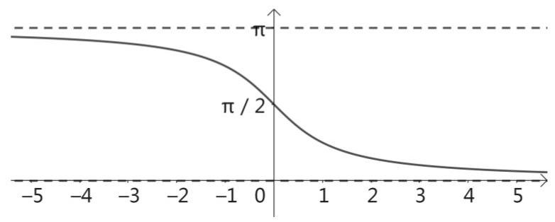

反正割函数: $y = {\sec }^{-1}x$ ,定义域为 $\left( {-\infty , - 1\rbrack \cup \lbrack  + 1, + \infty }\right)$ ,原函数为 $y = \sec x = \frac{1}{\cos x}$ ,图像如下:

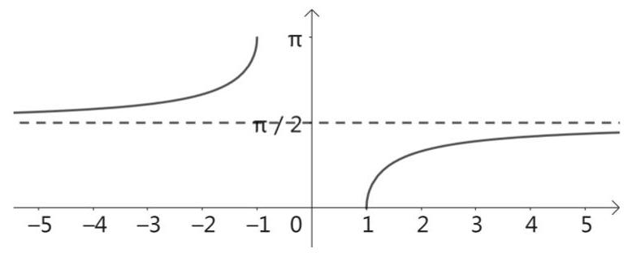

反余割函数: $y = {\csc }^{-1}x$ ,定义域为 $\left( {-\infty , - 1\rbrack \cup \lbrack  + 1, + \infty }\right)$ ,原函数为 $y = \csc x = \frac{1}{\sin x}$ ,图像如下:

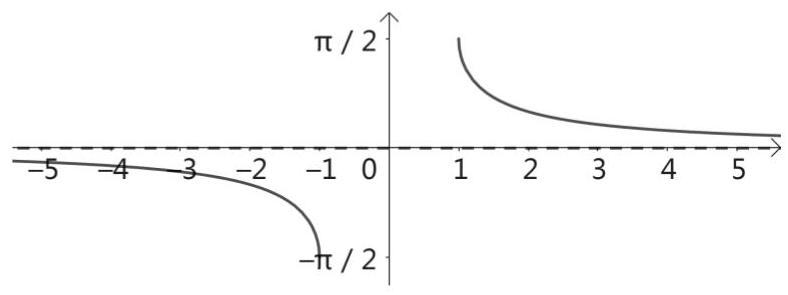

### 5.6 三角恒等变换

对于任意两个角 $\alpha$ 和 $\beta$ ,它们的和 $\alpha  + \beta$ 、差 $\alpha  - \beta$ 、积 ${\alpha \beta }$ 的正弦、余弦、 正切值都可以由 $\alpha$ 和 $\beta$ 的三角函数表示,这些表示方法叫作三角恒等变换,主要包括和角公式、差角公式、倍角公式、半角公式、万能公式、和差化积、积化和差等, 能用于求解不常见的三角函数的值或化简复杂的表达式。

#### 5.6.1 两角差的余弦公式

三角恒等变换公式之间可以通过巧妙地设置角 $\alpha$ 和 $\beta$ ,实现互相推导,即利用其中的一些公式推出另一些公式。在进行相互推导之前, 需要先根据传统几何知识推导出其中的一个, 两角差的余弦公式是比较容易推导和理解的公式。

两角差的余弦公式是利用角 $\alpha$ 和 $\beta$ 的三角函数表示 $\cos \left( {\alpha  - \beta }\right)$ 的公式,又叫作余弦函数的差角公式。

如下图所示, ${OA}\text{ 、 }{OB}$ 分别是以原点 $O$ 为圆心的单位圆的两条半径,点 $M\text{ 、 }N$ 是单位圆与 $x$ 轴的正负半轴的交点,设 $\angle {MOA} = \alpha ,\angle {MOB} = \beta$ ,那么 $\angle {AOB} = \alpha  - \beta$ ,则相应各点的坐标分别为: $A\left( {\cos \alpha ,\sin \alpha }\right) , B\left( {\cos \beta ,\sin \beta }\right)$ 。

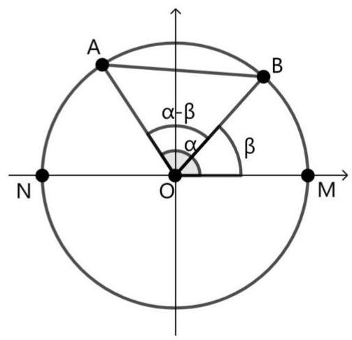

由两点间距离公式可得:

$$
{AB} = \sqrt{{\left( {x}_{A} - {x}_{B}\right) }^{2} + {\left( {y}_{A} - {y}_{B}\right) }^{2}}
$$

为方便计算, 对等式两边分别平方:

$$
A{B}^{2} = {\left( {x}_{A} - {x}_{B}\right) }^{2} + {\left( {y}_{A} - {y}_{B}\right) }^{2}
$$

将点 $A$ 和点 $B$ 的坐标代入上式并化简:

$$
A{B}^{2} = {\left( \cos \alpha  - \cos \beta \right) }^{2} + {\left( \sin \alpha  - \sin \beta \right) }^{2}
$$

$$
= {\cos }^{2}\alpha  - 2\cos \alpha \cos \beta  + {\cos }^{2}\beta  + {\sin }^{2}\alpha  - 2\sin \alpha \sin \beta  + {\sin }^{2}\beta
$$

$$
= \left( {{\cos }^{2}\alpha  + {\sin }^{2}\alpha }\right)  + \left( {{\cos }^{2}\beta  + {\sin }^{2}\beta }\right)  - 2\cos \alpha \cos \beta  - 2\sin \alpha \sin \beta
$$

$$
= 2 - 2\cos \alpha \cos \beta  - 2\sin \alpha \sin \beta
$$

即 $A{B}^{2} = 2 - 2\cos \alpha \cos \beta  - 2\sin \alpha \sin \beta$ ,该结论留着稍后备用。

现在保持 $\angle {AOB}$ 的大小不变,将 $\bigtriangleup {AOB}$ 绕原点顺时针旋转,使边 ${OB}$ 与 $x$ 轴正方向重合。旋转后,点 $A$ 的坐标变为 ${A}^{\prime }\left( {\cos \left( {\alpha  - \beta }\right) ,\sin \left( {\alpha  - \beta }\right) }\right)$ ,点 $B$ 的坐标变为 ${B}^{\prime }\left( {1,0}\right)$ ,如下页图所示。

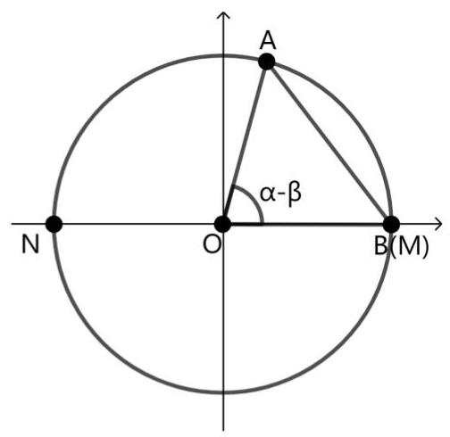

将点 ${A}^{\prime }$ 和点 ${B}^{\prime }$ 的新坐标代入公式 ${\left| {A}^{\prime }{B}^{\prime }\right| }^{2} = {\left( {x}_{A} - {x}_{B}\right) }^{2} + {\left( {y}_{A} - {y}_{B}\right) }^{2}$ 并化简:

$$
{A}^{\prime }{B}^{\prime 2} = {\left\lbrack  \cos \left( \alpha  - \beta \right)  - 1\right\rbrack  }^{2} + {\left\lbrack  \sin \left( \alpha  - \beta \right)  - 0\right\rbrack  }^{2}
$$

$$
= {\cos }^{2}\left( {\alpha  - \beta }\right)  - 2\cos \left( {\alpha  - \beta }\right)  + 1 + {\sin }^{2}\left( {\alpha  - \beta }\right)
$$

$$
= \left\lbrack  {{\cos }^{2}\left( {\alpha  - \beta }\right)  + {\sin }^{2}\left( {\alpha  - \beta }\right) }\right\rbrack   - 2\cos \left( {\alpha  - \beta }\right)  + 1
$$

$$
= 2 - 2\cos \left( {\alpha  - \beta }\right)
$$

即 ${A}^{\prime }{B}^{\prime 2} = 2 - 2\cos \left( {\alpha  - \beta }\right)$ ,

旋转前后 $\bigtriangleup {AOB}$ 形状不变,边长不变, ${AB} = {A}^{\prime }{B}^{\prime }$ ,结合前面得到的两个等式 $A{B}^{2} = 2 - 2\cos \alpha \cos \beta  - 2\sin \alpha \sin \beta$ 与 ${A}^{\prime }{B}^{\prime 2} = 2 - 2\cos \left( {\alpha  - \beta }\right)$ ,可得:

$$
2 - 2\cos \alpha \cos \beta  - 2\sin \alpha \sin \beta  = 2 - 2\cos \left( {\alpha  - \beta }\right)
$$

化简得:

$$
\cos \left( {\alpha  - \beta }\right)  = \cos \alpha \cos \beta  + \sin \alpha \sin \beta
$$

这就是余弦函数的差角公式。

例 5.18 求三角函数 $\cos \frac{\pi }{12}$ 的值。

解析: $\frac{\pi }{12} = \frac{\pi }{4} - \frac{\pi }{6}$ (如果不熟悉分数运算,可以换算成角度,用角度制计算)

$$
\cos \frac{\pi }{12} = \cos \left( {\frac{\pi }{4} - \frac{\pi }{6}}\right)  = \cos \frac{\pi }{4}\cos \frac{\pi }{6} + \sin \frac{\pi }{4}\sin \frac{\pi }{6} = \frac{\sqrt{2}}{2} \times  \frac{\sqrt{3}}{2} + \frac{\sqrt{2}}{2} \times  \frac{1}{2} = \frac{\sqrt{6} + \sqrt{2}}{4}
$$

#### 5.6.2 两角和与差的正弦、余弦、正切公式

通过巧妙地设置相应的角, 可以利用余弦函数的差角公式以及诱导公式, 推出两角和与差的正弦、余弦、正切公式。

两角和的余弦公式。将余弦函数的差角公式中的 $\beta$ 用 $- \beta$ 代替,就能得到两角和的余弦公式, 又叫作余弦函数的和角公式:

$\cos \left( {\alpha  + \beta }\right)  = \cos \left\lbrack  {\alpha  - \left( {-\beta }\right) }\right\rbrack   = \cos \alpha \cos \left( {-\beta }\right)  + \sin \alpha \sin \left( {-\beta }\right)  = \cos \alpha \cos \beta  - \sin \alpha \sin \beta$

即: $\cos \left( {\alpha  + \beta }\right)  = \cos \alpha \cos \beta  - \sin \alpha \sin \beta$

两角和与两角差的正弦公式。利用余弦函数求正弦函数 (或反过来) 时, 一条常用思路是使用勾股定理, 然而勾股定理涉及平方 (及平方根), 可能出现正负号的判断, 导致使用起来较为不便, 现在使用另一种思路。

利用诱导公式 $\sin \theta  = \cos \left( {\frac{\pi }{2} - \theta }\right)$ ,先将公式中的 $\theta$ 替换为 $\alpha  - \beta$ ,再将 $\frac{\pi }{2} - \alpha$ 当作整体,使用两角和的余弦公式,最后代入诱导公式 $\cos \left( {\frac{\pi }{2} - \alpha }\right)  = \sin \alpha$ 和 $\sin \left( {\frac{\pi }{2} - \alpha }\right)  = \cos \alpha$ ,就得到两角差的正弦公式,又叫作正弦函数的差角公式:

$$
\sin \left( {\alpha  - \beta }\right)  = \cos \left\lbrack  {\frac{\pi }{2} - \left( {\alpha  - \beta }\right) }\right\rbrack
$$

$$
= \cos \left( {\frac{\pi }{2} - \alpha  + \beta }\right)
$$

$$
= \cos \left\lbrack  {\left( {\frac{\pi }{2} - \alpha }\right)  + \beta }\right\rbrack
$$

$$
= \cos \left( {\frac{\pi }{2} - \alpha }\right) \cos \beta  - \sin \left( {\frac{\pi }{2} - \alpha }\right) \sin \beta \cos \left( {\frac{\pi }{2} - \alpha }\right) \cos \beta  - \sin \left( {\frac{\pi }{2} - \alpha }\right) \sin \beta
$$

$$
= \sin \alpha \cos \beta  - \cos \alpha \sin \beta
$$

即: $\sin \left( {\alpha  - \beta }\right)  = \sin \alpha \cos \beta  - \cos \alpha \sin \beta$

将正弦函数的差角公式中的 $\beta$ 用 $- \beta$ 代替,就得到两角和的正弦公式,又叫作正弦函数的和角公式:

$$
\sin \left( {\alpha  + \beta }\right)  = \sin \left\lbrack  {\alpha  - \left( {-\beta }\right) }\right\rbrack   = \sin \alpha \cos \left( {-\beta }\right)  - \cos \alpha \sin \left( {-\beta }\right)
$$

即: $\sin \left( {\alpha  + \beta }\right)  = \sin \alpha \cos \beta  + \cos \alpha \sin \beta$

两角和与两角差的正切公式。利用 $\tan \theta  = \frac{\sin \theta }{\cos \theta }$ ,将 $\theta$ 替换为 $\alpha  + \beta$ ,代入正弦函数和余弦函数的和角公式与差角公式, 就得到两角和的正切公式, 又叫作正切函数的和角公式: $\tan \left( {\alpha  + \beta }\right)  = \frac{\sin \alpha \cos \beta  + \cos \alpha \sin \beta }{\cos \alpha \cos \beta  - \sin \alpha \sin \beta }$ ,为了让形式更一致, 让等式右边的分子和分母同时除以 $\cos \alpha \cos \beta$ :

$$
\tan \left( {\alpha  + \beta }\right)  = \frac{\tan \alpha  + \tan \beta }{1 - \tan \alpha \tan \beta }
$$

将正切函数的和角公式中的 $\beta$ 用 $- \beta$ 代替,就得到两角差的正切公式,又叫作正切函数的差角公式:

$$
\tan \left( {\alpha  - \beta }\right)  = \tan \left\lbrack  {\alpha  + \left( {-\beta }\right) }\right\rbrack   = \frac{\tan \alpha  + \tan \left( {-\beta }\right) }{1 - \tan \alpha \tan \left( {-\beta }\right) } = \frac{\tan \alpha  - \tan \beta }{1 + \tan \alpha \tan \beta }
$$

即 $\tan \left( {\alpha  - \beta }\right)  = \frac{\tan \alpha  - \tan \beta }{1 + \tan \alpha \tan \beta }$ 。

例 5.19 求下列各三角函数的值:

(1) $\cos \left( {-\frac{5\pi }{12}}\right) ;\left( 2\right) \sin \frac{23\pi }{12};\left( 3\right) \tan \frac{7\pi }{12}$ 。

解析: 利用已知三角函数的角相加减构造要求的角即可:

$$
= \frac{\sqrt{3}}{2} \times  \frac{\sqrt{2}}{2} - \frac{1}{2} \times  \frac{\sqrt{2}}{2} = \frac{\sqrt{6} - \sqrt{2}}{4}
$$

$\sin \frac{23}{12}\pi  =  - \sin \frac{11\pi }{12} =  - \sin \left( {\frac{\pi }{4} + \frac{2\pi }{3}}\right)  =  - \left( {\sin \frac{\pi }{4}\cos \frac{2\pi }{3} + \cos \frac{\pi }{4}\sin \frac{2\pi }{3}}\right)$

$$
=  - \left( {\frac{\sqrt{2}}{2} \times  \left( {-\frac{1}{2}}\right)  + \frac{\sqrt{2}}{2} \times  \frac{\sqrt{3}}{2}}\right)  = \frac{\sqrt{2} - \sqrt{6}}{4}
$$

(3) $\tan \frac{7\pi }{12} = \tan \left( {\frac{\pi }{3} + \frac{\pi }{4}}\right)  = \frac{\tan \frac{\pi }{3} + \tan \frac{\pi }{4}}{1 - \tan \frac{\pi }{3}\tan \frac{\pi }{4}} = \frac{\sqrt{3} + 1}{1 - \sqrt{3} \times  1} = \frac{\left( {\sqrt{3} + 1}\right) \left( {\sqrt{3} + 1}\right) }{\left( {1 - \sqrt{3}}\right) \left( {\sqrt{3} + 1}\right) } =  - 2 - \sqrt{3}$

例 5.20 求 $\sin {52.5}^{ \circ  }\cos {7.5}^{ \circ  }$ 和 $\sin {7.5}^{ \circ  }\cos {52.5}^{ \circ  }$ 的值。

解析: $\sin {52.5}^{ \circ  }\cos {7.5}^{ \circ  } + \sin {7.5}^{ \circ  }\cos {52.5}^{ \circ  } = \sin \left( {{52.5}^{ \circ  } + {7.5}^{ \circ  }}\right)  = \sin {60}^{ \circ  } = \frac{\sqrt{3}}{2}$ ,

$\sin {52.5}^{ \circ  }\cos {7.5}^{ \circ  } - \sin {7.5}^{ \circ  }\cos {52.5}^{ \circ  } = \sin \left( {{52.5}^{ \circ  } - {7.5}^{ \circ  }}\right)  = \sin {45}^{ \circ  } = \frac{\sqrt{2}}{2}$ ,

两式相加得: $2\sin {52.5}^{ \circ  }\cos {7.5}^{ \circ  } = \frac{\sqrt{3}}{2} + \frac{\sqrt{2}}{2}$ ,可得: $\sin {52.5}^{ \circ  }\cos {7.5}^{ \circ  } = \frac{\sqrt{3} + \sqrt{2}}{4}$ ;

两式相减得: $2\sin {7.5}^{ \circ  }\cos {52.5}^{ \circ  } = \frac{\sqrt{3}}{2} - \frac{\sqrt{2}}{2}$ 。可得: $\sin {7.5}^{ \circ  }\cos {52.5}^{ \circ  } = \frac{\sqrt{3} - \sqrt{2}}{4}$ 。

#### 5.6.3 同角正弦与余弦带系数和的化简

和角公式有一项非常重要的应用:对于同一个角的正弦函数与余弦函数带系数的和 $a\sin \theta  + b\cos \theta$ ( $a, b$ 为常数),可以利用和角公式化为一个三角函数:

$$
a\sin \theta  + b\cos \theta  = \sqrt{{a}^{2} + {b}^{2}}\sin \left( {\theta  + t}\right)
$$

其中, $\cos t = \frac{a}{\sqrt{{a}^{2} + {b}^{2}}},\sin t = \frac{b}{\sqrt{{a}^{2} + {b}^{2}}}$ 。

该公式的原理为:让 $a$ 和 $b$ 同时除以 $\sqrt{{a}^{2} + {b}^{2}}$ ，转化为 $\frac{a}{\sqrt{{a}^{2} + {b}^{2}}}$ 和 $\frac{b}{\sqrt{{a}^{2} + {b}^{2}}}$ 。 因为 $\left| a\right|  \leq  \sqrt{{a}^{2} + {b}^{2}},\left| b\right|  \leq  \sqrt{{a}^{2} + {b}^{2}}$ ,所以 $- 1 \leq  \frac{a}{\sqrt{{a}^{2} + {b}^{2}}} \leq  1, - 1 \leq  \frac{b}{\sqrt{{a}^{2} + {b}^{2}}} \leq  1$ 。又因为 ${\left( \frac{a}{\sqrt{{a}^{2} + {b}^{2}}}\right) }^{2} + {\left( \frac{b}{\sqrt{{a}^{2} + {b}^{2}}}\right) }^{2} = \frac{{a}^{2} + {b}^{2}}{{a}^{2} + {b}^{2}} = 1$ ,始终满足勾股定理,所以一定存在某个角 $t$ ,满足 $\cos t = \frac{a}{\sqrt{{a}^{2} + {b}^{2}}},\sin t = \frac{b}{\sqrt{{a}^{2} + {b}^{2}}}$ 。

可以让 $\frac{a}{\sqrt{{a}^{2} + {b}^{2}}}$ 和 $\frac{b}{\sqrt{{a}^{2} + {b}^{2}}}$ 为两条直角边的长,1 为斜边的长,构造直角三角形,那么长度为 $\frac{b}{\sqrt{{a}^{2} + {b}^{2}}}$ 的边所对的角就是 $t$ 。

由正弦函数的和角公式可得:

$$
a\sin \theta  + b\cos \theta  = \sqrt{{a}^{2} + {b}^{2}}\left( {\frac{a}{\sqrt{{a}^{2} + {b}^{2}}}\sin \theta  + \frac{b}{\sqrt{{a}^{2} + {b}^{2}}}\cos \theta }\right)
$$

$$
= \sqrt{{a}^{2} + {b}^{2}}\left( {\cos t\sin \theta  + \sin t\cos \theta }\right)
$$

$$
= \sqrt{{a}^{2} + {b}^{2}}\sin \left( {\theta  + t}\right)
$$

这样一来, 就能把同一个角的正弦和余弦函数的带系数的和, 转化为一个正弦函数, 就能直接利用正弦函数的性质和规律分析处理, 不再需要考虑两个三角函数乘以系数相加减的复杂情况。

例 5.21 求 $3\sin x - 4\cos x$ 的最大值和最小值。

解析: $3\sin x - 4\cos x = 5 \times  \left( {\frac{3}{5}\sin x - \frac{4}{5}\cos x}\right)$ ,

设弧度 (或角度) $t$ 满足 $\cos t = \frac{3}{5},\sin t =  - \frac{4}{5}$ ,可得:

$3\sin x - 4\cos x = 5 \times  \left( {\frac{3}{5}\sin x + \left( {-\frac{4}{5}}\right) \cos x}\right)  = 5 \times  \left( {\sin x\cos t + \cos x\sin t}\right)  = 5\sin \left( {x + t}\right)$

该表达式的最大值为 5,最小值为 -5,当 $x + t = \frac{\pi }{2} + {2k\pi }\left( {k \in  \mathbf{Z}}\right)$ 时取得最大值,当 $x + t =  - \frac{\pi }{2} + {2k\pi }\left( {k \in  \mathbf{Z}}\right)$ 时取得最小值。

#### 5.6.4 二倍角的正弦、余弦、正切公式

让和角公式中的 $\alpha  = \beta$ ,就可以得到二倍角的正弦、余弦、正切公式,又叫作倍角公式, 即用一个角的三角函数表示它的二倍大小的角的三角函数:

$$
\sin \left( {2\alpha }\right)  = 2\sin \alpha \cos \alpha ,\;\cos \left( {2\alpha }\right)  = {\cos }^{2}\alpha  - {\sin }^{2}\alpha ,\;\tan \left( {2\alpha }\right)  = \frac{2\tan \alpha }{1 - {\tan }^{2}\alpha }
$$

联立 $\cos \left( {2\alpha }\right)  = {\cos }^{2}\alpha  - {\sin }^{2}\alpha$ 和 ${\cos }^{2}\alpha  + {\sin }^{2}\alpha  = 1$ ,还可以得到两个公式:

$$
\cos \left( {2\alpha }\right)  = 2{\cos }^{2}\alpha  - 1,\;\cos \left( {2\alpha }\right)  = 1 - 2{\sin }^{2}\alpha
$$

这两个公式中, 变换后只有一种三角函数。

例 5.22 已知 $\sin \theta  = \frac{5}{13},\theta  \in  \left( {\frac{\pi }{2},\pi }\right)$ ,求 $\sin {2\theta },\cos {2\theta },\tan {2\theta }$ 。

解析: 因为 $\theta  \in  \left( {\frac{\pi }{2},\pi }\right)$ ,所以 $\cos \theta  < 0$ ,

$\cos \theta  =  - \sqrt{1 - {\sin }^{2}\theta } =  - \sqrt{1 - {\left( \frac{5}{13}\right) }^{2}} =  - \frac{12}{13},$

$\tan \theta  = \frac{\sin \theta }{\cos \theta } = \frac{5}{13} \div  \left( {-\frac{12}{13}}\right)  =  - \frac{5}{12},$

$\sin {2\theta } = 2\sin \theta \cos \theta  = 2 \times  \frac{5}{13} \times  \left( {-\frac{12}{13}}\right)  =  - \frac{120}{169};$

$\cos {2\theta } = {\cos }^{2}\theta  - {\sin }^{2}\theta  = {\left( -\frac{12}{13}\right) }^{2} - {\left( \frac{5}{13}\right) }^{2} = \frac{119}{169};$

$\tan \left( {2\alpha }\right)  = \frac{2\tan \alpha }{1 - {\tan }^{2}\alpha } = \frac{2 \times  \left( {-\frac{5}{12}}\right) }{1 - {\left( -\frac{5}{12}\right) }^{2}} =  - \frac{120}{119}$  。

例 5.23 已知 $\sin \theta  + \cos \theta  = \frac{\sqrt{6}}{3}$ ,求 $1 + \sin {2\theta }$ 的值。

解析: $1 + \sin {2\theta } = {\sin }^{2}\theta  + {\cos }^{2}\theta  + 2\sin \theta \cos \theta  = {\left( \sin \theta  + \cos \theta \right) }^{2} = {\left( \frac{\sqrt{6}}{3}\right) }^{2} = \frac{2}{3}$ 。

练习 $\mathbf{{5.6}\left( 1\right) }$

1. 已知 $\sin \alpha  = \frac{1}{5},\sin \beta  = \frac{1}{3},\alpha  \in  \left( {0,\frac{\pi }{2}}\right) ,\beta  \in  \left( {\frac{\pi }{2},\pi }\right)$ ,求下列各式的值:

(1) $\sin \left( {\alpha  + \beta }\right) ;\left( 2\right) \cos \left( {{2\alpha } - {2\beta }}\right) ;\left( 3\right) \tan \frac{\beta }{2};\left( 4\right) \sin \left( {{3\alpha } - \beta }\right)$ 。

2. $\bigtriangleup  {ABC}$ 中， $\cos A = \frac{4}{5},\cos B =  - \frac{4}{5}$ ，求 $\tan C$ 的值。

3. 化简下列各式:

(1) ${\cos }^{4}\frac{\pi }{8} - {\sin }^{4}\frac{\pi }{8}$ ; (2) $\left( {2{\cos }^{2}\frac{\pi }{24} - 1}\right) \sin \frac{\pi }{12}$ ; (3) $\sqrt{3}\sin \left( {x - \frac{\pi }{6}}\right)  + \cos \left( {x - \frac{\pi }{6}}\right)$ 。

#### 5.6.5 其他三角恒等变换公式

通过巧妙的设置相应的角, 利用和角公式、差角公式、诱导公式, 还能推出半角公式、万能置换公式、积化和差、和差化积等一系列有用的公式。

半角公式。分别将公式 $\cos \left( {2\alpha }\right)  = 2{\cos }^{2}\alpha  - 1$ 和 $\cos \left( {2\alpha }\right)  = 1 - 2{\operatorname{sins}}^{2}\alpha$ 稍作变形,再将 $\alpha$ 替换为 $\frac{\alpha }{2}$ ,就能得正弦函数和余弦函数的半角公式,即用一个角的三角函数表示它的一半大小的角的三角函数:

$$
\cos \frac{\alpha }{2} =  \pm  \sqrt{\frac{1 + \cos \alpha }{2}},\;\sin \frac{\alpha }{2} =  \pm  \sqrt{\frac{1 - \cos \alpha }{2}},\;\tan \frac{\alpha }{2} =  \pm  \sqrt{\frac{1 - \cos \alpha }{1 + \cos \alpha }}
$$

需注意,上面三个半角公式需要根据角的大小判断其正负号。关于 $\tan \frac{\alpha }{2}$ 还有两个不需要正负号判断的半角公式, 可以免去判断正负号的麻烦:

$$
\tan \frac{\alpha }{2} = \frac{1 - \cos \alpha }{\sin \alpha },\;\tan \frac{\alpha }{2} = \frac{\sin \alpha }{1 + \cos \alpha }
$$

万能置换公式。对正弦函数和余弦函数的二倍角公式稍加变形，可以得到万能置换公式:

$$
\cos \left( {2\alpha }\right)  = {\cos }^{2}\alpha  - {\sin }^{2}\alpha
$$

$$
= \frac{{\cos }^{2}\alpha  - {\sin }^{2}\alpha }{1}
$$

$$
= \frac{1 - {\tan }^{2}\alpha }{1 + {\tan }^{2}\alpha }
$$

$$
\sin \left( {2\alpha }\right)  = 2\sin \alpha \cos \alpha
$$

$$
= \frac{2\sin \alpha \cos \alpha }{1}
$$

$$
= \frac{2\tan \alpha }{1 + {\tan }^{2}\alpha }
$$

$$
= \frac{2\sin \alpha \cos \alpha }{{\sin }^{2}\alpha  + {\cos }^{2}\alpha }\; = \frac{{\cos }^{2}\alpha  - {\sin }^{2}\alpha }{{\sin }^{2}\alpha  + {\cos }^{2}\alpha }
$$

$$
= \frac{\left( {2\sin \alpha \cos \alpha }\right) /{\cos }^{2}\alpha }{\left( {{\sin }^{2}\alpha  + {\cos }^{2}\alpha }\right) /{\cos }^{2}\alpha }\; = \frac{\left( {{\cos }^{2}\alpha  - {\sin }^{2}\alpha }\right) /{\cos }^{2}\alpha }{\left( {{\sin }^{2}\alpha  + {\cos }^{2}\alpha }\right) /{\cos }^{2}\alpha }
$$

把这两个公式与正切函数的倍角公式放在一起,并将 $\alpha$ 替换为 $\frac{\alpha }{2}$ ,可得:

$$
\sin \alpha  = \frac{2\tan \frac{\alpha }{2}}{1 + {\tan }^{2}\frac{\alpha }{2}},\;\cos \alpha  = \frac{1 - {\tan }^{2}\frac{\alpha }{2}}{1 + {\tan }^{2}\frac{\alpha }{2}},\;\tan \alpha  = \frac{2\tan \frac{\alpha }{2}}{1 - {\tan }^{2}\frac{\alpha }{2}}
$$

这三个公式叫作万能置换公式，万能置换公式的主要优点有:

(1)将同一个角的正弦、余弦、正切函数都统一转化为半角的正切函数， 只使用一种三角函数 $\tan \frac{\alpha }{2}$ ，相当于只有一个变量；

(2)正切函数的值域为全体实数集，如果 $\alpha$ 的取值范围无专门规定，那么可以把 $\tan \frac{\alpha }{2}$ 看作一个定义域为全体实数的变量;

(3)三个万能置换公式的形式相似，分子与分母都是 $2\tan \frac{\alpha }{2}\text{ 、 }1 + {\tan }^{2}\frac{\alpha }{2}$ 、 $1 - {\tan }^{2}\frac{\alpha }{2}$ 之间的两两组合,置换之后的化简通常也较简便。

万能置换公式的推导过程也是解决三角函数问题一条经典思路: 让分子与分母同时除以某个三角函数 (通常为余弦函数), 从而把正弦函数转化为正切函数, 把余弦函数转化为 1 ，使得表达式中只有正切函数这一种三角函数。

如果表达式不能通过直接除以一个三角函数完成转换, 可以根据实际需要, 利用 $1 = {\cos }^{2}\alpha  + {\sin }^{2}\alpha$ ,在常数项或分子或分母中 “无中生有” 地产生三角函数, 将分子与分母中三角函数的表达式凑成相同的次数。

两个角的三角恒等变换公式较多, 一些公式的形式相近容易混淆, 其中大部分公式之间可以通过变换自变量、将两个公式相加减等方式得到, 因此可以牢记最常用的一组或几组公式, 再推出其他公式。

## 练习 5.6(2)

1. 推导积化和差公式:

(1) $\cos \alpha \cos \beta  = \frac{1}{2}\left\lbrack  {\cos \left( {\alpha  + \beta }\right)  + \cos \left( {\alpha  - \beta }\right) }\right\rbrack$ ;

(2) $\sin \alpha \sin \beta  = \frac{1}{2}\left\lbrack  {\cos \left( {\alpha  - \beta }\right)  - \cos \left( {\alpha  + \beta }\right) }\right\rbrack$ ；

(3) $\sin \alpha \cos \beta  = \frac{1}{2}\left\lbrack  {\sin \left( {\alpha  + \beta }\right)  + \sin \left( {\alpha  - \beta }\right) }\right\rbrack$ ；

(4) $\cos \alpha \sin \beta  = \frac{1}{2}\left\lbrack  {\sin \left( {\alpha  + \beta }\right)  - \sin \left( {\alpha  - \beta }\right) }\right\rbrack$ 。

(提示: 把两个角的和与差分别看作整体, 使用和角公式或差角公式)

2. 推导和差化积公式:

(1) $\sin \alpha  + \sin \beta  = 2\sin \frac{\alpha  + \beta }{2}\cos \frac{\alpha  - \beta }{2}$ ;

(2) $\sin \alpha  - \sin \beta  = 2\sin \frac{\alpha  - \beta }{2}\cos \frac{\alpha  + \beta }{2}$ ；

(3) $\cos \alpha  + \cos \beta  = 2\cos \frac{\alpha  + \beta }{2}\cos \frac{\alpha  - \beta }{2}$ ;

(4) $\cos \alpha  - \cos \beta  =  - 2\sin \frac{\alpha  + \beta }{2}\sin \frac{\alpha  - \beta }{2}$ 。

(提示: 将上一题中各积化和差公式的等式左边的角进行替换)

### 5.7 三角函数的应用

周期现象是自然界中的常见现象, 物理学中的很多规律都可以用三角函数描述和分析, 三角函数中的一些概念正是来自物理学研究, 现在简单介绍一些自然现象中的三角函数。

#### 5.7.1 简谐运动

物理学研究中, 如果物体的位移与时间的关系遵循正弦函数的规律, 即物体的位移-时间图像是一条正弦曲线, 这样的运动叫作简谐运动。理想条件下的匀速圆周运动、单摆运动、弹簧振子的振动等都是简谐运动。

做简谐运动的物体,位移 $y$ 与时间 $x$ 的关系可以用正弦函数表示为:

$$
y = A\sin \left( {{\omega x} + \varphi }\right)
$$

其中， $A$ 叫作振幅，表示物体做简谐运动时的最大位移。

规定 $T = \frac{2\pi }{\omega }$ 叫作周期,表示物体完成一个周期的运动所经历的时间,与数学上对正弦函数 $y = A\sin \left( {{\omega x} + \varphi }\right)$ 的周期 $T$ 是同一个概念,只是将自变量的单位从数学单位替换为实际的时间单位。根据函数伸缩变换的规律,将 $y = \sin x$ 伸缩变换为 $y = \sin \left( {\omega x}\right)$ 后,其周期变为 $\frac{2\pi }{\omega }$ 。

$\omega$ 叫作角速度,表示做圆周运动的物体在单位时间内转过的弧度,由 $T = \frac{2\pi }{\omega }$ 可得 $\omega  = \frac{2\pi }{T}$ ,即 $\omega$ 是物体旋转一周 $\left( {2\pi }\right)$ 与所用时间 $T$ 的比值。

周期的倒数 $f = \frac{1}{T}$ 叫作频率,常用物理单位为赫兹,表示物体做简谐运动的快慢, 等于物体在单位时间内完成的周期的数量。

${\omega x} + \varphi$ 叫作相位,反映运动所处的状态,当 $x = 0$ 时, $\omega  \cdot  0 + \varphi  = \varphi$ 叫作初相, 即物体运动的初始状态。

例 5.24 已知某浮桥在河流波浪的带动下做竖直方向的受迫振动，桥面高度偏离平衡位置的距离 $y$ (单位:米)随时间 $x$ (单位:秒)变化的关系为:

$$
y = {0.05}\sin {2x}
$$

求:(1)桥面最高点与最低点间的距离；

(2)桥面振动的周期(精确到 0.01 秒)。

解析:(1)根据桥面高度偏离平衡位置的距离 $y$ (单位:米)随时间 $x$ (单位: 秒) 变化的关系 $y = {0.05}\sin {0.2x}$ ,可知桥面的最高点的高度为 0.05 米,最低点的高度为 -0.05 米,最高点与最低点间的距离为 ${0.05} - \left( {-{0.05}}\right)  = {0.10}$ 米。

(2)桥面振动的周期为: $T = \frac{2\pi }{2} = \pi  \approx  {3.14}$ 秒。

#### 5.7.2 交变电流

利用电磁感应规律，把回路放在固定的磁场中，用外力驱动回路在磁场中旋转, 回路切割磁感线可以产生感应电流, 这种方法所产生的感应电流的大小和方向随时间的变化规律可以用正弦函数描述, 这种电流叫作交变电流。

交变电流的大小 $y$ 与时间 $x$ 的关系可以用正弦函数表示为:

$$
y = {I}_{\max }\sin \left( {{\omega x} + \varphi }\right)
$$

其中, ${I}_{\max }$ 是最大的瞬时电流。 $\omega$ 是电流的频率,等于回路在磁场中旋转的角速度,也等于交变电流变化的频率。 ${\omega x} + \varphi$ 叫作电流的相位,表示运动所处的状态。电流的正负号表示电流的方向。

例 5.25 已知某交变电流的电流大小 $I$ (单位: 安培) 随时间 $t$ 单位: 秒) 的变化关系为:

$$
I = 5\sin \left( {{200\pi t} + \frac{\pi }{2}}\right)
$$

求:(1)电流的最大值 ${I}_{\max }$ ；

(2)电流的频率(精确到 0.01 秒)。

解析:(1)电流的最大值为 $\sin$ 前的系数，即 ${I}_{\max } = 5$ 安培；

(2)电流的频率为: $f = \frac{1}{T} = \frac{\omega }{2\pi } = \frac{200\pi }{2\pi } = {100}$ 赫兹。

## 练习 5.7

1. 已知两个人造卫星分别在不同半径的同心圆轨道上做匀速圆周运动, 卫星的坐标-时间函数分别为 ${y}_{1} = {A}_{1}\sin \left( {{4\omega x} + \varphi }\right) ,{y}_{2} = {A}_{2}\sin \left( {{8\omega x} + \varphi }\right)$ ,且 ${A}_{1} > {A}_{2}$ , 求:

(1)当时间满足什么条件时，两个卫星之间的距离最大，最大距离是多少？

(2)当时间满足什么条件时，两个卫星之间的距离最小，最小距离是多少？

2. 已知交变电流的大小(单位:安培)与时间(单位:秒)的关系为:

$$
y = 2\sin \left( {{50x} + {10}}\right)
$$

求:(1)电流的最大值；(2)每经过多长时间电流的方向发生改变。

## 小结

本章学习任意角与弧度制, 以及三角函数的概念、性质和规律。需牢记角的终边绕原点旋转时, 终边与单位圆的交点的纵坐标、横坐标随之变化的动态过程, 能分别从 “因变量随自变量变化” 的函数角度与 “角对应的三角函数” 的运算和公式变换” 两个角度, 掌握三角函数的图像、性质和规律。需注意将数学公式与函数图像联系起来, 理解各公式的几何含义。三角函数涉及大量新学习的规律、 公式、计算、变换, 通过充分的练习熟练掌握本章内容。

## 第六章 平面向量及其应用

我们已经学习的数学知识中, 几何与代数是两类不同的数学问题, 分析解决几何问题主要使用几何公理、定律、定理, 只涉及简单的数字计算, 本章我们学习一种将代数与几何充分结合起来的数学概念: 向量。

向量最突出特点是 “数形结合”, “数形结合” 的思想在学习函数时已经有所体现，即:用代数运算表示几何关系，将几何关系蕴含到代数运算当中。

使用向量分析几何图形时, 不再总是需要画出精确的图形和巧妙辅助线, 只要按照向量运算的规则，按部就班地进行代数运算、列方程、解方程，就能得到大量有用的几何规律和结论。

将几何图形与代数运算结合起来的主要方式是坐标化, 通过建立坐标轴、平面直角坐标系、空间直角坐标系等工具, 可以将空间中的点与数字或数字组合一一对应起来，将空间中的位置关系与代数运算对应起来。

虽然向量可以 “绕过” 具体图形分析几何图形, 但学习向量时必须非常注重理解向量的代数运算与几何图形关系之间的对应关系。“数形结合” 是学好向量的关键, 不能把向量学成单纯的代数, 而忽视了它的几何本质。

### 6.1 平面向量的概念

向量是一个既有 “数” 又有 “形” 的概念, 且 “数” 与 “形” 之间的联系非常紧密，准确理解向量的概念是掌握向量的性质、运算和应用的前提。学习向量， 就从理解 “向” 和 “量” 的数字含义和几何含义入手, 建立起 “数” 与 “形” 之间的对应关系。

#### 6.1.1 向量的概念

很多数学概念的提出，都源自科学研究的需要，作为建立自然科学的理论模型和解决科学问题而发明出来的数学工具。向量的诞生、发展、成熟, 与物理学关于力与运动的研究有紧密联系, 使用向量可以非常简洁地描述和分析力与运动的情况。

物理课上已经或将会学习用带箭头的线段表示力的方法，并用实验证明力的合成与分解的规律，我们现在从数学的角度，系统学习向量这一方便好用的工具。

向量的定义已经体现在它的名称当中:“向”就是方向，“量”就是大小， 这就是向量的定义: 一种既有方向、又有大小的量。

向量与数量都有大小, 但向量有方向而数量没有。数量只有大小, 可以用实数表示，这是数量的唯一参数。向量同时有方向和大小，方向和大小是确定一个向量的“唯二”参数，只要方向和大小确定了，向量就唯一确定了。

需注意, 向量并没有规定位置, 在确保向量的方向和大小不变的前提下, 可以任意平移, 平移后仍是原向量不变。

#### 6.1.2 向量的几何表示

向量是描述和分析几何问题的工具, 向量的几何表示不能脱离图形。平面向量是描述和分析平面几何问题的工具, 平面向量的表示需要依托具体的平面图形,平面向量可以用有向线段表示。在平面内,如果分别确定点 $A$ 为起点,点 $B$ 为终点,那么从点 $A$ 指向点 $B$ 的线段叫作有向线段,记作 $\overrightarrow{AB}$ ,如下图所示。

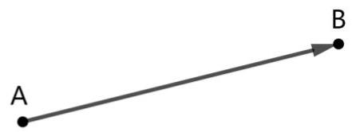

对于有向线段 $\overrightarrow{AB}$ ，从 $A$ 指向 $B$ 的方向叫作有向线段 $\overrightarrow{AB}$ 的方向，连接 $A$ 与 $B$ 的线段 ${AB}$ 的长度叫作有向线段 $\overrightarrow{AB}$ 的长度,记作 $\left| \overrightarrow{AB}\right|$ 。有向线段 $\overrightarrow{AB}$ 就可以表示向量 $\overrightarrow{AB}$ 。

有向线段有三个要素: 起点 (或终点)、方向和长度, 而向量只有方向和长度两个要素。其中，有向线段的方向就是向量的方向，有向线段的长度就是向量的大小，有向线段的位置与向量无关。一系列方向和长度都相同，仅起点(终点) 不同的有向线段，都表示同一个向量。如下图所示，有向线段 $\overrightarrow{AB}$ ， $\overrightarrow{CD}$ ，若 $\overrightarrow{EF}$ 的方向和大小都相同，只是位置不同，它们表示同一个向量。

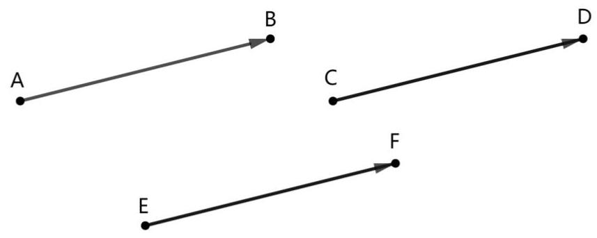

从动态的视角看待向量, 向量可以看作一种变化方式: 位置的移动。包括移动的方向和移动的距离两方面信息。向量 $\overrightarrow{AB}$ 表示从点 $A$ 到点 $B$ 的运动的方向和距离,并不局限于 “从 $A$ 到点 $B$ ” 这一个具体的运动。

一个向量还可以看作一个对应关系(函数)，任意一个“起点”在确定向量的作用下，都有一个确定的“终点”与之对应。

除用起点和终点具体地表示向量外，还可以像代数符号那样简单地标记向量,在小写字母上添加向右的箭头即可,例如 $\overrightarrow{a}\text{ 、 }\overrightarrow{b}\text{ 、 }\overrightarrow{c}$ 。这种记法只是给具体的向量起了个“代号”，不体现向量的具体信息，就像用字母 $a\text{ 、 }b\text{ 、 }c$ 指代数。

向量的长度也又作向量的模,向量 $\overrightarrow{AB}$ 或 $\overrightarrow{a}$ 的模记作 $\left| \overrightarrow{AB}\right|$ 或 $\left| \overrightarrow{a}\right|$ ,与数的绝对值的表示方法相同。由于长度恒大于等于 0 , 所以向量的模恒大于等于 0 , 与数的绝对值(数轴上的点到原点的距离)恒大于等于 0 类似。

长度为 0 的向量叫作零向量,记作 $\overrightarrow{0}$ 。零向量可以看作一个点。零向量没有固定的方向, 可以根据实际需要任意确定零向量的方向, 让零向量与已知的向量平行、垂直或成任意角, 零向量可任意确定方向的性质在分析和计算中非常有用。

长度为 1 的向量叫作单位向量。在平面内, 有一系列方向不同的单位向量, 如果两个单位向量的方向不同, 那么它们是不同的单位向量。单位向量也是一种较好用的向量, 因为它的长度为 1 , 经常会让计算变得简便。

#### 6.1.3 相等向量与共线向量

对于两个数, 它们有相等和不等两种关系, 向量同样有相等和不等两种关系, 向量的两个基本要素是方向和长度,如果向量 $\overrightarrow{a}$ 和 $\overrightarrow{b}$ 所在的直线平行或在同一条直线上,就称 $\overrightarrow{a}$ 和 $\overrightarrow{b}$ 是平行向量,记作 $\overrightarrow{a}\parallel \overrightarrow{b}$ 。由于向量可以任意平移,所以平行的两个向量总是可以平移到同一条直线上,平行向量又叫作共线向量。

共线向量可以分为两种情况:同向与反向。如下图所示， $\overrightarrow{a}$ 、 $\overrightarrow{b}$ 、 $\overrightarrow{c}$ 共线， 其中 $\overrightarrow{a}$ 与 $\overrightarrow{b}$ 方向相同, $\overrightarrow{a}$ 与 $\overrightarrow{c}$ 方向相反, $\overrightarrow{b}$ 与 $\overrightarrow{c}$ 方向相反。

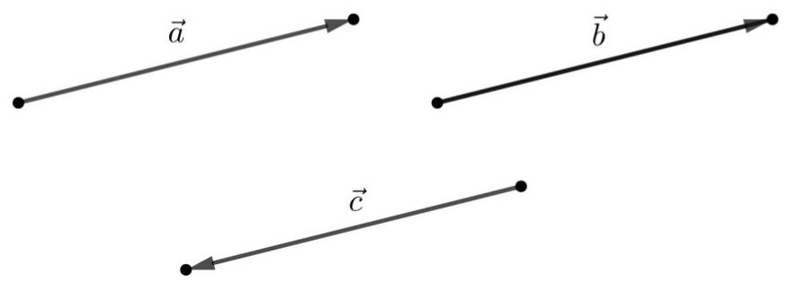

如果 $\overrightarrow{a}$ 与 $\overrightarrow{b}$ 的方向相同,且长度相等,就称 $\overrightarrow{a}$ 与 $\overrightarrow{b}$ 是相等向量,记作 $\overrightarrow{a} = \overrightarrow{b}$ 。 如果 $\overrightarrow{a}$ 与 $\overrightarrow{b}$ 的方向相反,且长度相等,就称 $\overrightarrow{a}$ 与 $\overrightarrow{b}$ 是相反向量,记作 $\overrightarrow{a} =  - \overrightarrow{b}$ 或 $- \overrightarrow{a} = \overrightarrow{b}$ 。按照相反向量的定义可得:一个向量的相反向量的相反向量就是它自身， 即 $- \left( {-\overrightarrow{a}}\right)  = \overrightarrow{a}$ 。

将 $\overrightarrow{a}$ 和 $\overrightarrow{b}$ 平移，让它们的起点重合，此时 $\overrightarrow{a}$ 与 $\overrightarrow{b}$ 形成夹角，这个角叫作 $\overrightarrow{a}$ 与 $\overrightarrow{b}$ 所成的角或 $\overrightarrow{a}$ 与 $\overrightarrow{b}$ 的夹角。两个向量所成的夹角的范围通常为 $\left\lbrack  {0,\pi }\right\rbrack$ 。当 $\overrightarrow{a}$ 与 $\overrightarrow{b}$ 的夹角为 0 时,称它们的方向相同。当 $\overrightarrow{a}$ 与 $\overrightarrow{b}$ 的夹角为 $\pi$ 时,称它们的方向相反。 当 $\overrightarrow{a}$ 与 $\overrightarrow{b}$ 的夹角为 $\frac{\pi }{2}$ 时,称它们垂直,记作 $\overrightarrow{a} \bot  \overrightarrow{b}$ 。下页图从左至右依次为两个向量的夹角为锐角、直角、钝角的情况。

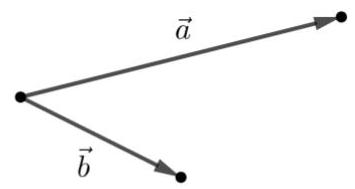

$\overrightarrow{c}$

$\overrightarrow{d}$

$\overrightarrow{e}$

练习 6.1

1. 判断下列命题是否正确:

(1)一条射线可以表示一个向量；

(2)不同的有向线段不能表示相同的向量；

(3)如果两个向量是相等向量，那么它们是共线向量；

(4)如果两个共线向量的长度相等，那么它们是相等向量。

2. 找一副地图, 选择两个位置分别为起点和终点, 建立从起点到终点的向量, 用直尺测量该向量的长度, 用量角器测量该向量与正东方向的夹角。

### 6.2 平面向量的运算

平面向量可以进行加、减、数乘、数量积等运算, 向量运算可用于描述和分析几何问题, 向量运算的法则及几何规律与物理规律有非常密切的联系。

#### 6.2.1 向量的加法

向量表示 “移动” 的动态变化。 $\overrightarrow{a}$ 与 $\overrightarrow{b}$ 相加,记作 $\overrightarrow{a} + \overrightarrow{b}$ ,结果仍是一个向量, 仍表示 “移动” 的动态变化。 $\overrightarrow{a} + \overrightarrow{b}$ 的含义为: 先按照 $\overrightarrow{a}$ 的方式移动,再按照 $\overrightarrow{b}$ 的方式移动，物理学中力的合成、运动的合成等都是向量的加法运算。

向量的加法可以用向量加法的三角形法则描述。对于向量的加法 $\overrightarrow{a} + \overrightarrow{b}$ ,分别画出 $\overrightarrow{AB} = \overrightarrow{a}$ 和 $\overrightarrow{BC} = \overrightarrow{b}$ ,那么 $\overrightarrow{AC}$ 就是 $\overrightarrow{a} + \overrightarrow{b}$ 。即: 将 $\overrightarrow{a}$ 或 $\overrightarrow{b}$ 平移,让 $\overrightarrow{a}$ 的终点与 $\overrightarrow{b}$ 的起点重合,画出三角形 $\bigtriangleup  {ABC}$ ，从 $\overrightarrow{a}$ 的起点指向 $\overrightarrow{b}$ 的终点所构成的向量就是 $\overrightarrow{a} + \overrightarrow{b}$ ,可以记作: $\overrightarrow{a} + \overrightarrow{b} = \overrightarrow{AB} + \overrightarrow{BC} = \overrightarrow{AC}$ ,如下图所示。

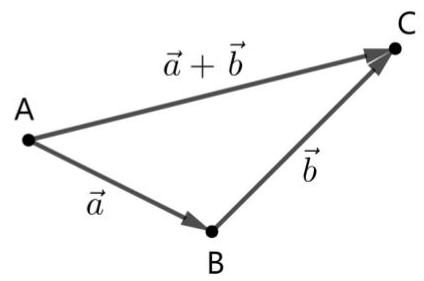

如果 $\overrightarrow{a}$ 与 $\overrightarrow{b}$ 共线,那么让 $\overrightarrow{a}$ 的终点与 $\overrightarrow{b}$ 的起点重合后得到一段线段,而不是三角形的两条边, $\overrightarrow{AB} = \overrightarrow{a},\overrightarrow{BC} = \overrightarrow{b}$ ,仍满足 $\overrightarrow{a} + \overrightarrow{b} = \overrightarrow{AC}$ ,此时这三个向量共线。

向量的加法还可以用向量加法的平行四边形法则描述。对于 $\overrightarrow{a} + \overrightarrow{b}$ ，通过平移让 $\overrightarrow{a}$ 与 $\overrightarrow{b}$ 的起点重合,分别画出向量 $\overrightarrow{AB} = \overrightarrow{a}$ 和 $\overrightarrow{AD} = \overrightarrow{b}$ ,以 ${AB}$ 和 ${AD}$ 为两条邻边构造平行四边形 ${ABCD}$ ,那么 $\square {ABCD}$ 的对角线 $\overrightarrow{AC}$ 就是 $\overrightarrow{a} + \overrightarrow{b}$ ,如下页图所示。

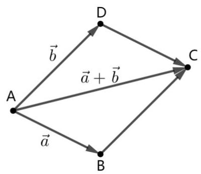

向量加法的三角形法则与平行四边形法则是同一规律的不同描述方式, 三角形法则中的边 ${AC}$ 就是 $\square {ABCD}$ 的对角线 ${AC},\square {ABCD}$ 被它的对角线 ${AC}$ 分为两个全等的三角形 $\bigtriangleup  {ABC}$ 和 $\bigtriangleup  {ADC}$ 。

向量的加法有下列重要性质, 这些性质与实数的加法类似, 可以进行类比。

(1)任意向量与零向量相加，仍等于它自身:

$$
\overrightarrow{a} + \overrightarrow{0} = \overrightarrow{a}
$$

(2)任意向量与它的相反向量相加，等于零向量:

$$
\overrightarrow{a} + \left( {-\overrightarrow{a}}\right)  = \overrightarrow{0}
$$

(3)向量的加法满足交换律:

$$
\overrightarrow{a} + \overrightarrow{b} = \overrightarrow{b} + \overrightarrow{a}
$$

向量的加法交换律可以由向量加法的三角形法则与平行四边形法则证明: ▱ ${ABCD}$ 被对角线 ${AC}$ 分为两个全等的三角形,即上图中的 $\bigtriangleup {ABC}$ 和 $\bigtriangleup {ADC}$ ,其中 $\bigtriangleup  {ABC}$ 中的 $\overrightarrow{AC}$ 表示 $\overrightarrow{a} + \overrightarrow{b}$ ， $\bigtriangleup  {ADC}$ 中的 $\overrightarrow{AC}$ 表示 $\overrightarrow{b} + \overrightarrow{a}$ ，它们是同一个向量。即: $\overrightarrow{a}$ 和 $\overrightarrow{b}$ 相加时,先按照 $\overrightarrow{a}$ 移动、后按照 $\overrightarrow{b}$ 移动,与先按照 $\overrightarrow{b}$ 移动、后按照 $\overrightarrow{a}$ 移动, 移动的最终结果相同。

(4)向量的加法满足结合律:

$$
\left( {\overrightarrow{a} + \overrightarrow{b}}\right)  + \overrightarrow{c} = \overrightarrow{a} + \left( {\overrightarrow{b} + \overrightarrow{c}}\right)
$$

该性质的严格证明不需要掌握, 从图形上直观了解即可, 如下图所示。

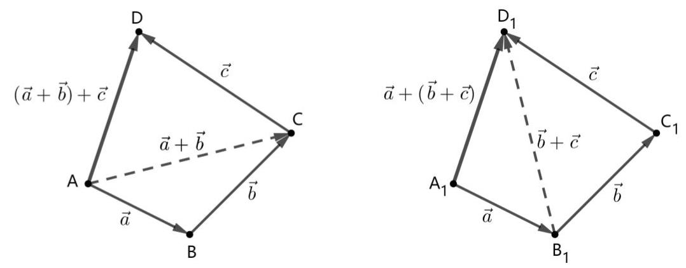

(5)绝对值不等式:

$$
\left| {\overrightarrow{a} + \overrightarrow{b}}\right|  \leq  \left| \overrightarrow{a}\right|  + \left| \overrightarrow{b}\right|
$$

当且仅当 $\overrightarrow{a}$ 和 $\overrightarrow{b}$ 的方向相同时等号成立。该性质可以利用 “两点之间线段最短”的公理或“三角形的两边之和大于第三边”的推论证明。

例 6.1 木块静止在光滑平面上,大小为 $3\mathrm{\;N}$ 的力 ${F}_{1}$ 沿水平向北推动木块, 大小为 $3\sqrt{3}\mathrm{\;N}$ 的力 ${F}_{2}$ 沿水平向西推动木块,求木块受到的合力的大小和方向。

解析: 把纸面看作地图, 规定正上方为正北方向, 根据已知条件画图如下:

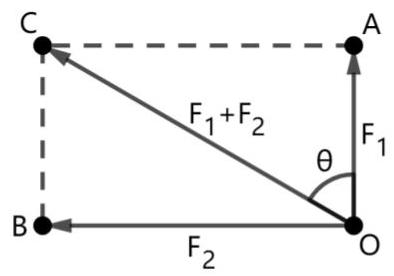

向量 $\overrightarrow{OA}$ 表示水平向北、大小为 $3\mathrm{\;N}$ 的力 ${F}_{1}$ ,向量 $\overrightarrow{OB}$ 表示水平向西、大小为 $3\sqrt{3}\mathrm{\;N}$ 的力 ${F}_{2}$ ,以 $\overrightarrow{OA}$ 和 $\overrightarrow{OB}$ 为邻边画出 $\square {OACB}$ ,对角线 $\overrightarrow{OC}$ 就是合力 ${F}_{1} + {F}_{2}$ , 因为正北方向与正西方向垂直，所以 $\square {OACB}$ 是矩形，可得:

$$
\left| \overrightarrow{OC}\right|  = \sqrt{{\left| \overrightarrow{OA}\right| }^{2} + {\left| \overrightarrow{OB}\right| }^{2}} = \sqrt{{3}^{2} + {\left( 3\sqrt{3}\right) }^{2}} = 6\left( \mathrm{\;N}\right)
$$

$$
\cos \theta  = \frac{\left| \overrightarrow{OA}\right| }{\left| \overrightarrow{OC}\right| } = \frac{3}{6} = \frac{1}{2} \Rightarrow  \theta  = {60}^{ \circ  }
$$

木块受到的合力的大小为 $6\mathrm{\;N}$ ,方向为北偏西 ${60}^{ \circ  }$ 。

练习 $\mathbf{{6.2}\left( 1\right) }$

1. 如下图所示,平行四边形 ${ABCD}$ 中, $E$ 是 ${AC}$ 与 ${BD}$ 的交点, $\overrightarrow{AB} = \overrightarrow{a}$ , $\overrightarrow{BC} = \overrightarrow{b},\overrightarrow{AE} = \overrightarrow{c}$ ,用图中的几何关系证明: (1) $\overrightarrow{EC} = \overrightarrow{c}$ ; (2) $\overrightarrow{a} + \overrightarrow{b} = \overrightarrow{c} + \overrightarrow{c}$ 。

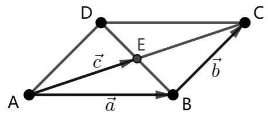

2. 已知 $A\text{ 、 }B\text{ 、 }C\text{ 、 }D$ 是平面内不同的点,画图判断下列等式是否成立:

(1) $\overrightarrow{AB} + \overrightarrow{BC} = \overrightarrow{AC}$ ；(2) $\overrightarrow{AB} + \overrightarrow{AD} = \overrightarrow{BD}$ ； (3) $\overrightarrow{CA} + \overrightarrow{AB} + \overrightarrow{BC} = \overrightarrow{0}$ 。

思考: 上述等式是否成立的结论, 是否受具体画图方式不同的影响?

#### 6.2.2 向量的减法

实数的减法运算中, 减去一个实数等于加上该实数的相反数。向量减法的定义和运算法则与实数类似: 减去一个向量等于加上该向量的相反向量, 即:

$$
\overrightarrow{a} - \overrightarrow{b} = \overrightarrow{a} + \left( {-\overrightarrow{b}}\right)
$$

在平面内表示 $\overrightarrow{a} - \overrightarrow{b}$ ,只需先画出 $\overrightarrow{b}$ 相反向量 $- \overrightarrow{b}$ ,再使用三角形法则或平行四边形法则画出 $\overrightarrow{a} + \left( {-\overrightarrow{b}}\right)$ 即可,如下图所示。

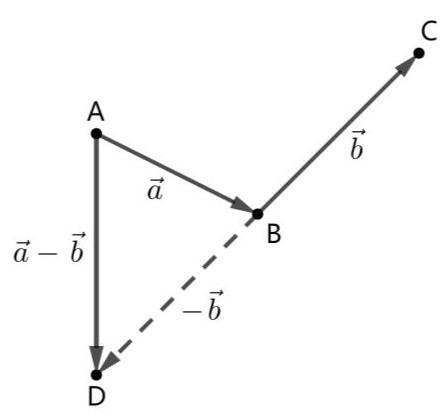

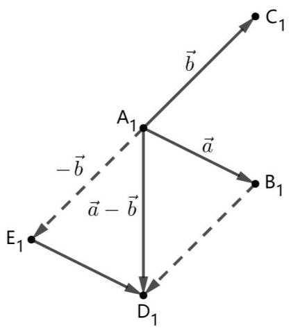

例 6.2 如下图所示,直角梯形 ${ABCD}$ 中, ${DC}\parallel {AB},\angle A$ 是直角, ${DC} = {AE}$ , $\overrightarrow{DC} = \overrightarrow{a},\overrightarrow{AD} = \overrightarrow{b},\overrightarrow{BC} = \overrightarrow{c}$ ,用图中的点表示下列向量:

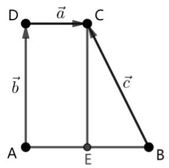

(3) $\overrightarrow{b} - \overrightarrow{c}$ 。

解析:(1)使用向量加法的交换律和平行四边形法则，将向量首尾相连:

$$
\overrightarrow{a} + \overrightarrow{b} = \overrightarrow{b} + \overrightarrow{a} = \overrightarrow{AD} + \overrightarrow{DC} = \overrightarrow{AC}
$$

(2)已知 $\overrightarrow{BC} = \overrightarrow{c}$ ，那么 $- \overrightarrow{c} = \overrightarrow{CB}$ ，可得:

$$
\overrightarrow{a} - \overrightarrow{c} = \overrightarrow{a} + \left( {-\overrightarrow{c}}\right)  = \overrightarrow{DC} + \overrightarrow{CB} = \overrightarrow{DB}
$$

(3)已知 ${DC}\parallel {AB}$ ， ${DC} = {AE}$ ，所以 ${AECD}$ 是平行四边形，又因为 $\angle A$ 是直角，所以 ${AECD}$ 是矩形，所以 ${EC} = {AD}$ ， ${EC}\parallel {AD}$ ，所以 $\overrightarrow{EC} = \overrightarrow{AD} = \overrightarrow{b}$ ，可得:

$$
\overrightarrow{b} - \overrightarrow{c} = \overrightarrow{b} + \left( {-\overrightarrow{c}}\right)  = \overrightarrow{EC} + \overrightarrow{CB} = \overrightarrow{EB}
$$

练习 $\mathbf{{6.2}\left( 2\right) }$

1. 如下图所示，三角形 ${ABC}$ 中， $D$ 是 ${BC}$ 上一点， $\overrightarrow{AB} = \overrightarrow{a}$ ， $\overrightarrow{AC} = \overrightarrow{b}$ ， $\overrightarrow{AD} = \overrightarrow{c}$ ， 用图中的点表示下列向量:(1) $\overrightarrow{a} - \overrightarrow{b}$ ；(2) $\overrightarrow{a} - \overrightarrow{c}$ ；(3) $\overrightarrow{c} - \overrightarrow{b}$ 。 2. 已知 $A\text{ 、 }B\text{ 、 }C\text{ 、 }D$ 是平面内不同的点,画图判断下列等式是否恒成立:

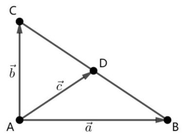

(1) $\overrightarrow{AB} - \overrightarrow{AC} = \overrightarrow{BC}$ ；(2) $\overrightarrow{AB} - \overrightarrow{AD} = \overrightarrow{DB}$ ；(3) $\overrightarrow{AC} - \overrightarrow{BC} - \overrightarrow{AB} = \overrightarrow{0}$ 。

思考: 上述等式是否成立的结论, 是否受具体画图方式不同的影响?

#### 6.2.3 向量的数乘

实数乘法的含义是若干个相同的数相加, $k$ 个实数 $a$ 相加可以用乘法表示:

$$
{ka} = a + a + \cdots  + a
$$

再将 $k$ 的取值范围从正整数推广到全体实数,就得到了实数的乘法运算。

类似的, $k$ 个向量 $\overrightarrow{a}$ 连续相加,可以用向量的数乘表示:

$$
k\overrightarrow{a} = \overrightarrow{a} + \overrightarrow{a} + \cdots  + \overrightarrow{a}
$$

$k$ 的取值范围也可以从正整数推广到全体实数,就得到了向量的数乘运算。

根据向量的数乘的定义, 可以得到它的几何含义:

$k\overrightarrow{a}$ 仍是一个向量,它的长度是 $\overrightarrow{a}$ 的长度的 $\left| k\right|$ 倍:

$$
\left| {k\overrightarrow{a}}\right|  = \left| k\right| \left| \overrightarrow{a}\right|
$$

如果 $k > 0$ ,那么 $k\overrightarrow{a}$ 与 $\overrightarrow{a}$ 的方向相同。

如果 $k < 0$ ,那么 $k\overrightarrow{a}$ 与 $\overrightarrow{a}$ 的方向相反。特别的, $- 1 \times  \overrightarrow{a} =  - \overrightarrow{a}$ ,即: 一个向量与 -1 相乘，得到它的相反向量。

如果 $k = 0$ ,那么 $0 \cdot  \overrightarrow{a} = \overrightarrow{0}$ ,实数 0 与任意向量的积都是零向量,零向量与任意实数的积也都是零向量。

画图时, $\overrightarrow{a}$ 与 $k$ 相乘得到 $k\overrightarrow{a}$ ,先将 $\overrightarrow{a}$ 的长度变为原来的 $\left| k\right|$ 倍,再根据 $k$ 的正负号决定方向相同还是相反，如下图所示。

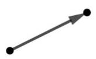

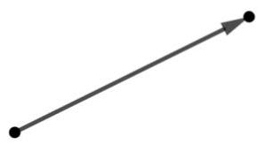

$\overrightarrow{a} \; 2\overrightarrow{a} \; {0.5}\overrightarrow{a} \; - {1.5}\overrightarrow{a}$

向量的数乘运算具有下列性质:

对于实数 $\lambda \text{ 、 }\mu$ 和向量 $\overrightarrow{a}\text{ 、 }\overrightarrow{b}$ ,下列等式恒成立:

(1) $\lambda \left( {\mu \overrightarrow{a}}\right)  = \left( {\lambda \mu }\right) \overrightarrow{a} = \mu \left( {\lambda \overrightarrow{a}}\right)$

该性质表示:一个向量先后与若干实数相乘，相乘的顺序没有影响。

(2) $\left( {\lambda  + \mu }\right) \overrightarrow{a} = \lambda \overrightarrow{a} + \mu \overrightarrow{a}$

该性质表示: 向量的数乘满足对实数加法的分配律。

(3) $\lambda \left( {\overrightarrow{a} + \overrightarrow{b}}\right)  = \lambda \overrightarrow{a} + \lambda \overrightarrow{b}$

该性质表示: 向量的数乘满足对向量加法的分配律。

向量的加法、减法、数乘运算的上述性质可以一并表示为:

$$
\lambda \left( {{\mu }_{1}\overrightarrow{a} \pm  {\mu }_{2}\overrightarrow{b}}\right)  = \lambda {\mu }_{1}\overrightarrow{a} \pm  \lambda {\mu }_{2}\overrightarrow{b}
$$

向量的加、减、数乘运算统称为向量的线性运算。对于某种运算, 如果它同时满足加法交换律、加法结合律、数乘的分配律, 那么这种运算就叫作线性运算。 我们已经非常熟悉的实数的加、减、乘等基本运算也是一种线性运算。

例 6.3 如下图所示,已知 $\bigtriangleup {ABC}$ 中, $D\text{ 、 }E$ 将线段 ${BC}$ 分为相等的三段, $F$ 是 ${AC}$ 的中点, $\overrightarrow{BC} = \overrightarrow{a},\overrightarrow{BA} = \overrightarrow{b}$ ,用 $\overrightarrow{a}\text{ 、 }\overrightarrow{b}$ 表示下列向量:

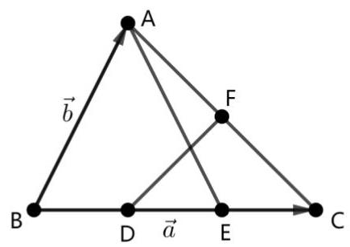

(1) $\overrightarrow{BD}$ ； (3) $\overrightarrow{AE}$ ； (4) $\overrightarrow{DF}$ 。

解析: 用给定向量的组合表示其他向量, 可以采用从所求向量的起点出发, “绕一圈”途经给定向量或已知向量, 最终回到所求向量的终点, 根据路径寻找表示所求向量的方法。

(1) $D$ 、 $E$ 将线段 ${BC}$ 分为相等的三段，所以 $\overrightarrow{BD} = \frac{1}{3}\overrightarrow{BC} = \frac{1}{3}\overrightarrow{a}$ ；

(2) $\overrightarrow{AC} = \overrightarrow{AB} + \overrightarrow{BC} =  - \overrightarrow{BA} + \overrightarrow{BC} =  - \overrightarrow{b} + \overrightarrow{a} = \overrightarrow{a} - \overrightarrow{b}$ ，又因为 $F$ 是 ${AC}$ 的中点， 所以 $\overrightarrow{AF} = \frac{1}{2}\overrightarrow{AC} = \frac{1}{2}\left( {\overrightarrow{a} - \overrightarrow{b}}\right)$ ;

(3) $\overrightarrow{AE} = \overrightarrow{AB} + \overrightarrow{BE} =  - \overrightarrow{BA} + \frac{2}{3}\overrightarrow{BC} =  - \overrightarrow{b} + \frac{2}{3}\overrightarrow{a}$ ；

(4) $\overrightarrow{DF} = \overrightarrow{DC} + \overrightarrow{CF} = \frac{2}{3}\overrightarrow{BC} + \left( {-\frac{1}{2}}\right) \overrightarrow{AC} = \frac{2}{3}\overrightarrow{a} + \left( {-\frac{1}{2}}\right) \left( {\overrightarrow{a} - \overrightarrow{b}}\right)  = \frac{1}{6}\overrightarrow{a} + \frac{1}{2}\overrightarrow{b}$ 。

向量与任意非 0 实数相乘，得到的向量与原向量要么同向、要么反向，可以利用该规律判断向量是否共线，具体方法为:

对于任意非零向量 $\overrightarrow{a}$ 与 $\overrightarrow{b}$ ，如果存在实数 $\lambda$ 使得 $\overrightarrow{b} = \lambda \overrightarrow{a}$ ，那么 $\overrightarrow{a}$ 与 $\overrightarrow{b}$ 共线。 反过来,如果非零向量 $\overrightarrow{a}$ 与 $\overrightarrow{b}$ 共线,那么一定存在实数 $\lambda$ ,使得 $\overrightarrow{b} = \lambda \overrightarrow{a}$ 。综上, 非零向量 $\overrightarrow{a}$ 与 $\overrightarrow{b}$ 共线的充要条件是:存在唯一的实数 $\lambda$ ，使得 $\overrightarrow{b} = \lambda \overrightarrow{a}$ 。

例 6.4 已知 $\overrightarrow{a}$ 、 $\overrightarrow{b}$ 是不共线的非零向量，判断下列向量是否共线:

(1) $\overrightarrow{a}$ 与 $- {0.5}\overrightarrow{a}$ ；(2) $2\overrightarrow{a}$ 与 $2\overrightarrow{b}$ ；(3) $\overrightarrow{a} + \overrightarrow{b}$ 与 $2\overrightarrow{a} + 2\overrightarrow{b}$ ；(4) $\overrightarrow{a} - \overrightarrow{b}$ 与 $\overrightarrow{a} + \overrightarrow{b}$ 。

解析: (1) 存在唯一的实数-0.5,使得 $- {0.5}\overrightarrow{a}$ 可以表示为 $- {0.5} \times  \overrightarrow{a}$ ,所以 $\overrightarrow{a}$ 与 $- {0.5}\overrightarrow{a}$ 共线。

(2)由于 $\overrightarrow{a}\text{ 、 }\overrightarrow{b}$ 不共线，所以不存在实数 $\lambda$ ，使得 $\overrightarrow{b} = \lambda \overrightarrow{a}$ ，所以也不存在实数 $\lambda$ ,使得 $2\overrightarrow{b} = {2\lambda }\overrightarrow{a} = \lambda \left( {2\overrightarrow{a}}\right)$ ,所以 $2\overrightarrow{a}$ 与 $2\overrightarrow{b}$ 不共线。

(3)存在唯一的实数 2，使得 $2\overrightarrow{a} + 2\overrightarrow{b}$ 可以表示为 $2\overrightarrow{a} + 2\overrightarrow{b} = 2\left( {\overrightarrow{a} + \overrightarrow{b}}\right)$ ，所以 $\overrightarrow{a} + \overrightarrow{b}$ 与 $2\overrightarrow{a} + 2\overrightarrow{b}$ 共线。

(4)设存在唯一的实数 $\lambda$ ，使得 $\overrightarrow{a} - \overrightarrow{b} = \lambda \left( {\overrightarrow{a} + \overrightarrow{b}}\right)$ ，移项得 $\left( {1 - \lambda }\right) \overrightarrow{a} = \left( {1 + \lambda }\right) \overrightarrow{b}$ ， 即 $\overrightarrow{a} = \frac{1 + \lambda }{1 - \lambda }\overrightarrow{b}$ ,该等式表明存在唯一的实数 $\frac{1 + \lambda }{1 - \lambda }$ ,使得 $\overrightarrow{a} = \frac{1 + \lambda }{1 - \lambda }\overrightarrow{b}$ ,即 $\overrightarrow{a}\text{ 、 }\overrightarrow{b}$ 共线。 然而,这与已知条件 $\overrightarrow{a}\text{ 、 }\overrightarrow{b}$ 不共线相矛盾,所以不存在唯一的实数 $\lambda$ ,使得 $\overrightarrow{a} - \overrightarrow{b} = \lambda \left( {\overrightarrow{a} + \overrightarrow{b}}\right)$ ,所以 $\overrightarrow{a} - \overrightarrow{b}$ 与 $\overrightarrow{a} + \overrightarrow{b}$ 不共线。

练习 $\mathbf{{6.2}\left( 3\right) }$

1. 如下图所示,正六边形 ${ABCDEF}$ 中, $\overrightarrow{AB} = \overrightarrow{a},\overrightarrow{BC} = \overrightarrow{b},\overrightarrow{CD} = \overrightarrow{c}$ ,用图中的点表示下列向量(部分向量有不止一种表示方法):

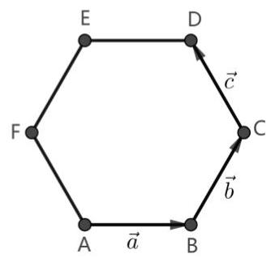

(1) $\overrightarrow{a} + \overrightarrow{b}$ ； (4) $2\overrightarrow{a} - \overrightarrow{b}$ ；

2. 已知点 $C\text{ 、 }D$ 在线段 ${AB}$ 上，且 ${AC} = {CD} = {DB}$ ， $O$ 是线段 ${AB}$ 外一点， $\overrightarrow{OA} = \overrightarrow{a},\overrightarrow{AB} = \overrightarrow{b},$

(1)如果 $O$ 在直线 ${AB}$ 外，用 $\overrightarrow{a}$ 、 $\overrightarrow{b}$ 表示向量 $\overrightarrow{OB}$ 、 $\overrightarrow{OC}$ 、 $\overrightarrow{OD}$ ；

(2)如果 $O$ 在直线 ${AB}$ 上的线段 ${AB}$ 外，用 $\overrightarrow{a}$ 、 $\overrightarrow{b}$ 表示向量 $\overrightarrow{OB}$ 、 $\overrightarrow{OC}$ 、 $\overrightarrow{OD}$ ；

(3)如果 $O$ 在线段 ${AB}$ 上，用 $\overrightarrow{a}$ 、 $\overrightarrow{b}$ 表示向量 $\overrightarrow{OB}$ 、 $\overrightarrow{OC}$ 、 $\overrightarrow{OD}$ ；

(4)上面三种情况的结果是否相同。

3. 化简下列各式:

(1) $\overrightarrow{a} + 2\overrightarrow{a} + 3\overrightarrow{a} + 4\overrightarrow{a}$ ；(2) $2\left( {3\overrightarrow{a} + \overrightarrow{b}}\right)  + 4\left( {\overrightarrow{a} - \frac{1}{2}\overrightarrow{b}}\right)$ 。

#### 6.2.4 向量的数量积

物理学中, 力做的功等于力与力方向上的位移的乘积。力和位移都是向量, 求得的功是数量, 求力的做功的运算实际上就是向量的数量积的运算。向量的数量积运算的结果是一个数量, 因此叫作 “数量积”。

$\overrightarrow{a}$ 与 $\overrightarrow{b}$ 的数量积,又叫作内积,记作 $\overrightarrow{a} \cdot  \overrightarrow{b}$ ,由于乘号用点表示,还叫作点乘。 向量的数量积的结果是一个实数, 该运算的定义为:

$$
\overrightarrow{a} \cdot  \overrightarrow{b} = \left| \overrightarrow{a}\right|  \cdot  \left| \overrightarrow{b}\right|  \cdot  \cos \theta
$$

其中, $\theta$ 是 $\overrightarrow{a}$ 与 $\overrightarrow{b}$ 的夹角,也可以表示为 $< \overrightarrow{a},\overrightarrow{b} >$ 。

从向量的数量积的定义式可以看出: 向量的数量积是一个数, 而不是向量, 这个数等于两个向量的模及它们夹角的余弦值的乘积。

$\overrightarrow{a}$ 与 $\overrightarrow{b}$ 的数量积的几何含义为: $\overrightarrow{a}$ 在 $\overrightarrow{b}$ 方向上的投影的模,与 $\overrightarrow{b}$ 的模的乘积; 也等于 $\overrightarrow{b}$ 在 $\overrightarrow{a}$ 方向上的投影的模,与 $\overrightarrow{a}$ 的模的乘积:

$$
\overrightarrow{a} \cdot  \overrightarrow{b} = \left| \overrightarrow{a}\right|  \cdot  \left| \overrightarrow{b}\right|  \cdot  \cos \theta  = \left( {\left| \overrightarrow{a}\right| \cos \theta }\right)  \cdot  \left| \overrightarrow{b}\right|  = \left( {\left| \overrightarrow{b}\right| \cos \theta }\right)  \cdot  \left| \overrightarrow{a}\right|
$$

向量数量积的几何含义如下图所示。

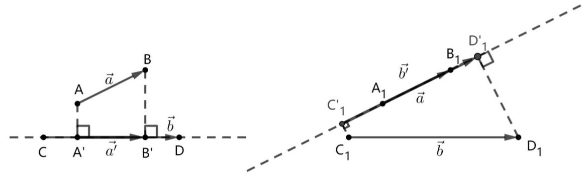

向量的数量积可以用 “投影” 的概念描述, $\overrightarrow{a}$ 向 $\overrightarrow{b}$ 的投影的意义为: 设向量 $\overrightarrow{a}$ 的起点和终点分别为点 $A$ 和点 $B$ ,从 $A$ 和点 $B$ 分别向量 $\overrightarrow{b}$ 所在直线引垂线,设垂足分别为 ${A}^{\prime }$ 和 ${B}^{\prime }$ ,那么向量 $\overrightarrow{{A}^{\prime }{B}^{\prime }}$ 就叫作 $\overrightarrow{a}$ 在 $\overrightarrow{b}$ 上的投影向量。

上述针对某个对象向某个方向做垂线的过程叫作投影, 就像现实中用平行光照射某个物体,在墙壁或屏幕上形成的影子。上图中的投影向量 $\overrightarrow{{A}^{\prime }{B}^{\prime }}$ 可以看作 $\overrightarrow{AB}$ 受垂直于 $\overrightarrow{CD}$ 所在直线的平行光照射后,在 $\overrightarrow{CD}$ 所在直线上形成的影子。

设 $\overrightarrow{a}$ 和 $\overrightarrow{b}$ 是非零向量,它们的夹角为 $\theta ,\overrightarrow{e}$ 是与 $\overrightarrow{b}$ 方向相同的单位向量。利用数量积和单位向量的定义可以得到下列性质:

(1) $\overrightarrow{e}$ 是单位向量， $\left| \overrightarrow{e}\right|  = 1$ ，可得:

$$
\overrightarrow{a} \cdot  \overrightarrow{e} = \left| \overrightarrow{a}\right|  \cdot  \left| \overrightarrow{e}\right|  \cdot  \cos \theta  = \left| \overrightarrow{a}\right| \cos \theta
$$

即: $\overrightarrow{a}$ 在 $\overrightarrow{b}$ 方向的投影的长度,等于 $\overrightarrow{a}$ 与 $\overrightarrow{b}$ 方向相同的单位向量的数量积。

(2)因为 $\left| \overrightarrow{a}\right|  > 0$ ， $\left| \overrightarrow{b}\right|  > 0$ ， $\cos \theta$ 的正负号与 $\theta$ 的取值范围有关，由此可得:

$$
0 \leq  \theta  < \frac{\pi }{2} \Leftrightarrow  \overrightarrow{a} \cdot  \overrightarrow{b} > 0,\;\frac{\pi }{2} < \theta  \leq  \pi  \Leftrightarrow  \overrightarrow{a} \cdot  \overrightarrow{b} < 0,\;\theta  = \frac{\pi }{2} \Leftrightarrow  \overrightarrow{a} \bot  \overrightarrow{b} \Leftrightarrow  \overrightarrow{a} \cdot  \overrightarrow{b} = 0
$$

利用该性质，可以根据两个向量的数量积的正负号，判断向量间夹角的范围。

(3)由 $\cos 0 = 1,\cos \pi  =  - 1$ 可得:

当 $\overrightarrow{a}$ 与 $\overrightarrow{b}$ 方向相同时, $\overrightarrow{a} \cdot  \overrightarrow{b} = \left| \overrightarrow{a}\right| \left| \overrightarrow{b}\right|$ 。当 $\overrightarrow{a}$ 与 $\overrightarrow{b}$ 方向相反时, $\overrightarrow{a} \cdot  \overrightarrow{b} =  - \left| \overrightarrow{a}\right| \left| \overrightarrow{b}\right|$ 。

一个向量总是与它自己同向, 由此可得:

$$
\overrightarrow{a} \cdot  \overrightarrow{a} = \left| \overrightarrow{a}\right|  \cdot  \left| \overrightarrow{a}\right|  \cdot  \cos 0 = \left| \overrightarrow{a}\right| \left| \overrightarrow{a}\right|  = {\left| \overrightarrow{a}\right| }^{2}
$$

即 ${\overrightarrow{a}}^{2} = {\left| \overrightarrow{a}\right| }^{2}$ 。

(4)由 $\left| {\cos \theta }\right|  \leq  1$ 可得:

$$
\left| {\overrightarrow{a} \cdot  \overrightarrow{b}}\right|  \leq  \left| \overrightarrow{a}\right| \left| \overrightarrow{b}\right|
$$

对于向量 $\overrightarrow{a}\text{ 、 }\overrightarrow{b}\text{ 、 }\overrightarrow{c}$ ,设 $\theta$ 是 $\overrightarrow{a}$ 与 $\overrightarrow{b}$ 的夹角, $\lambda$ 是实数,利用数量积的定义式还可以得到下列运算规律:

(5)向量的数量积的定义式中， $\left| \overrightarrow{a}\right|$ 、 $\left| \overrightarrow{b}\right|$ 、 $\cos \theta$ 之间是数量相乘的关系，满足乘法交换律和分配律,即 $\left| \overrightarrow{a}\right|  \cdot  \left| \overrightarrow{b}\right|  \cdot  \cos \theta  = \left| \overrightarrow{b}\right|  \cdot  \left| \overrightarrow{a}\right|  \cdot  \cos \theta$ ,所以向量的数量积也满足乘法交换律:

$$
\overrightarrow{a} \cdot  \overrightarrow{b} = \overrightarrow{b} \cdot  \overrightarrow{a}
$$

(6)因为 $\left( {\lambda \overrightarrow{a}}\right)  \cdot  \overrightarrow{b} = \left\{  \begin{array}{ll} \left| {\lambda \overrightarrow{a}}\right|  \cdot  \left| \overrightarrow{b}\right|  \cdot  \cos \theta  = \left| \lambda \right|  \cdot  \left| \overrightarrow{a}\right|  \cdot  \left| \overrightarrow{b}\right|  \cdot  \cos \theta & \left( {\lambda  \geq  0}\right) \\   - \left| {\lambda \overrightarrow{a}}\right|  \cdot  \left| \overrightarrow{b}\right|  \cdot  \cos \theta  =  - \left| \lambda \right|  \cdot  \left| \overrightarrow{a}\right|  \cdot  \left| \overrightarrow{b}\right|  \cdot  \cos \theta & \left( {\lambda  < 0}\right)  \end{array}\right.$ ，利用实数乘法的分配率可得:

$$
\left( {\lambda \overrightarrow{a}}\right)  \cdot  \overrightarrow{b} = \lambda \left( {\overrightarrow{a} \cdot  \overrightarrow{b}}\right)  = \overrightarrow{a} \cdot  \left( {\lambda \overrightarrow{b}}\right)
$$

即两个向量的数量积与实数相乘满足乘法结合律。需注意, 向量的数量积是由两个向量得到一个数量, 所以不存在连续三个向量相乘的数量积运算。

(7) $\overrightarrow{a} \cdot  \left( {\overrightarrow{b} + \overrightarrow{c}}\right)  = \overrightarrow{a} \cdot  \overrightarrow{b} + \overrightarrow{a} \cdot  \overrightarrow{c}$

即向量的数量积满足乘法分配率。证明如下: 如下图所示,设 $\overrightarrow{OA} = \overrightarrow{a}$ , $\overrightarrow{OB} = \overrightarrow{b},\overrightarrow{OC} = \overrightarrow{c},\overrightarrow{OD} = \overrightarrow{b} + \overrightarrow{c},\overrightarrow{a}$ 与 $\overrightarrow{b}$ 的夹角为 ${\theta }_{1},\overrightarrow{a}$ 与 $\overrightarrow{c}$ 的夹角为 ${\theta }_{2},\overrightarrow{a}$ 与 $\overrightarrow{b} + \overrightarrow{c}$ 的夹角为 $\theta ,{B}^{\prime }\text{ 、 }{C}^{\prime }\text{ 、 }{D}^{\prime }$ 分别是从 $B\text{ 、 }C\text{ 、 }D$ 向 ${OA}$ 引垂线的垂足。 图中 $\overrightarrow{OD} = \overrightarrow{b} + \overrightarrow{c}$ ,由向量加法的平行四边形法则可得 $\overrightarrow{BD} = \overrightarrow{OC} = \overrightarrow{c}$ ,

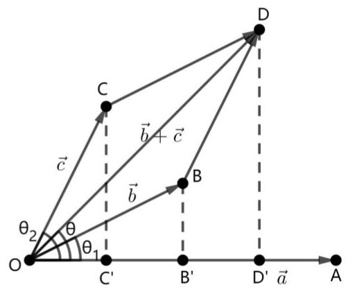

根据图中几何关系可得:

$$
\left| \overrightarrow{O{B}^{\prime }}\right|  = \left| \overrightarrow{OB}\right| \cos {\theta }_{1} = \left| \overrightarrow{b}\right| \cos {\theta }_{1}
$$

$$
\left| \overrightarrow{{B}^{\prime }{D}^{\prime }}\right|  = \left| \overrightarrow{BD}\right| \cos {\theta }_{2} = \left| \overrightarrow{c}\right| \cos {\theta }_{2}
$$

$$
\left| \overrightarrow{O{D}^{\prime }}\right|  = \left| \overrightarrow{OD}\right| \cos \theta  = \left| {\overrightarrow{b} + \overrightarrow{c}}\right| \cos \theta
$$

又因为 $O\text{ 、 }{B}^{\prime }\text{ 、 }{D}^{\prime }$ 共直线, $\overrightarrow{O{D}^{\prime }} = \overrightarrow{O{B}^{\prime }} + \overrightarrow{{B}^{\prime }{D}^{\prime }}$ ,所以 $\left| \overrightarrow{O{D}^{\prime }}\right|  = \left| \overrightarrow{O{B}^{\prime }}\right|  + \left| \overrightarrow{{B}^{\prime }{D}^{\prime }}\right|$

将开头的三个等式代入该等式得:

$$
\left| {\overrightarrow{b} + \overrightarrow{c}}\right| \cos \theta  = \left| \overrightarrow{b}\right| \cos {\theta }_{1} + \left| \overrightarrow{c}\right| \cos {\theta }_{2}
$$

由此可得:

$$
\overrightarrow{a} \cdot  \left( {\overrightarrow{b} + \overrightarrow{c}}\right)  = \left| \overrightarrow{a}\right| \left| {\overrightarrow{b} + \overrightarrow{c}}\right| \cos \theta
$$

$$
= \left| \overrightarrow{a}\right| \left( {\left| \overrightarrow{b}\right| \cos {\theta }_{1} + \left| \overrightarrow{c}\right| \cos {\theta }_{2}}\right)
$$

$$
= \left| \overrightarrow{a}\right| \left| \overrightarrow{b}\right| \cos {\theta }_{1} + \left| \overrightarrow{a}\right| \left| \overrightarrow{c}\right| \cos {\theta }_{2}
$$

$$
= \overrightarrow{a} \cdot  \overrightarrow{b} + \overrightarrow{a} \cdot  \overrightarrow{c}
$$

即得证。

我们现在已经证明向量的数量积满足乘法分配率, 那么向量的数量积的运算可以提取公因式并进行因式分解, 于是也满足完全平方公式、平方差公式等最高次项为二次项的乘法公式: ${\left( \overrightarrow{a} \pm  \overrightarrow{b}\right) }^{2} = {\overrightarrow{a}}^{2} \pm  2\overrightarrow{a}\overrightarrow{b} + {\overrightarrow{b}}^{2},\left( {\overrightarrow{a} + \overrightarrow{b}}\right) \left( {\overrightarrow{a} - \overrightarrow{b}}\right)  = {\overrightarrow{a}}^{2} - {\overrightarrow{b}}^{2}$ 。

例 6.5 如下图所示,已知一个静止的滑块在大小为 ${10}\mathrm{\;N}$ 、斜向上 ${60}^{ \circ  }$ 的力 $F$ 的拖动下,向前移动 $s = 2\mathrm{\;m}$ ,求力 $F$ 在滑块发生的这段位移中对滑块做的功 $W$ 。

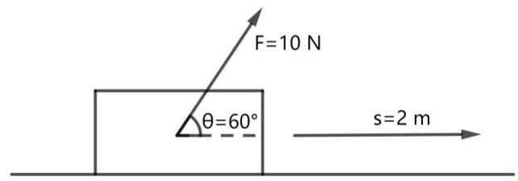

解析: 按照做功的定义, 力对物体做功等于力与位移的向量内积, 已知力的大小为 $F = {10}\mathrm{\;N}$ ,物体位移大小为 $s = 2\mathrm{\;m}$ ,力与位移的夹角 $\theta  = {60}^{ \circ  }$ ,可求得力 $F$ 在滑块发生的这段位移中对滑块做的功 $W$ 为:

$$
W = \overrightarrow{F} \cdot  \overrightarrow{s} = \left| \overrightarrow{F}\right| \left| \overrightarrow{s}\right| \cos \theta  = {10} \times  2 \times  \cos {60}^{ \circ  } = {10}\left( \mathrm{\;J}\right)
$$

例 6.6 证明向量的数量积满足完全平方公式和平方差公式。

解析: 利用向量的数量积的运算和性质展开并逐步化简:

(1) ${\left( \overrightarrow{a} + \overrightarrow{b}\right) }^{2} = \left( {\overrightarrow{a} + \overrightarrow{b}}\right) \left( {\overrightarrow{a} + \overrightarrow{b}}\right)  = \overrightarrow{a} \cdot  \overrightarrow{a} + \overrightarrow{a} \cdot  \overrightarrow{b} + \overrightarrow{b} \cdot  \overrightarrow{a} + \overrightarrow{b} \cdot  \overrightarrow{b} = {\overrightarrow{a}}^{2} + 2\overrightarrow{a}\overrightarrow{b} + {\overrightarrow{b}}^{2}$ ,

${\left( \overrightarrow{a} - \overrightarrow{b}\right) }^{2} = \left( {\overrightarrow{a} - \overrightarrow{b}}\right) \left( {\overrightarrow{a} - \overrightarrow{b}}\right)  = \overrightarrow{a} \cdot  \overrightarrow{a} + \overrightarrow{a} \cdot  \left( {-\overrightarrow{b}}\right)  + \left( {-\overrightarrow{b}}\right)  \cdot  \overrightarrow{a} + \left( {-\overrightarrow{b}}\right)  \cdot  \left( {-\overrightarrow{b}}\right)  = {\overrightarrow{a}}^{2} - 2\overrightarrow{a}\overrightarrow{b} + {\overrightarrow{b}}^{2}$ ;

(2) $\left( {\overrightarrow{a} + \overrightarrow{b}}\right) \left( {\overrightarrow{a} - \overrightarrow{b}}\right)  = \overrightarrow{a} \cdot  \overrightarrow{a} + \overrightarrow{a} \cdot  \left( {-\overrightarrow{b}}\right)  + \overrightarrow{b} \cdot  \overrightarrow{a} + \overrightarrow{b} \cdot  \left( {-\overrightarrow{b}}\right)  = {\overrightarrow{a}}^{2} - \overrightarrow{a}\overrightarrow{b} + \overrightarrow{a}\overrightarrow{b} - {\overrightarrow{b}}^{2} = {\overrightarrow{a}}^{2} - {\overrightarrow{b}}^{2}$ 。

练习 ${6.2}\left( 4\right)$

1. 化简(展开)下列各式:

(1) $\left( {\overrightarrow{a} - \overrightarrow{b}}\right) \left( {2\overrightarrow{a} + 3\overrightarrow{b}}\right)$ ；(2) $\overrightarrow{a}\left( {2\overrightarrow{a} + \overrightarrow{b}}\right)  - \overrightarrow{b}\left( {\overrightarrow{a} + 2\overrightarrow{b}}\right)$ ；

(3) $\left( {\overrightarrow{a} + \overrightarrow{b}}\right) \left( {\overrightarrow{a} - \overrightarrow{b}}\right)  + {\overrightarrow{b}}^{2}$ ；

2. 已知 $\overrightarrow{a} \cdot  \overrightarrow{b} = 4,\overrightarrow{b} \cdot  \overrightarrow{c} =  - 2$ ,证明: $\overrightarrow{a} + 2\overrightarrow{c} \bot  \overrightarrow{b}$ 。

3. 已知 $\left| \overrightarrow{a}\right|  = 2,\left| \overrightarrow{b}\right|  = 3$ ,求 $\overrightarrow{a} \cdot  \overrightarrow{b}$ 的最大值和最小值,什么情况下取得最大值? 什么情况下取得最小值?

4. 已知 $\overrightarrow{a} \bot  \overrightarrow{b}$ ,且 $\overrightarrow{a} + 2\overrightarrow{b} \bot  \overrightarrow{a} - 3\overrightarrow{b},\left| \overrightarrow{a}\right|  = {10}$ ,求 $\left| \overrightarrow{b}\right|$ 。

5. 一架飞机模型从地面起飞,以 ${45}^{ \circ  }$ 倾角做匀速直线运动,期间受到恒定不变的大小为 ${20}\mathrm{\;N}$ 的竖直向上的升力,模型实际飞行轨迹的长度为 ${200}\mathrm{\;m}$ ,求:

(1)模型在地面上的投影前进的距离；

(2)升力在模型的这段飞行过程中做的功。

### 6.3 平面向量基本定理及坐标表示

本章开篇提到平面向量是非常好用的工具, 前面两节主要学习了向量的基本概念、几何表示和运算法则, 本节开始 1 具体学习向量作为分析解决几何问题的工具的重要属性。

#### 6.3.1 平面向量基本定理

我们常说直线是一维的、平面是二维的、空间是三维的, “维数” 可以理解为基本的方向数。

直线是一维的,直线上有两个方向,只需要在直线上确定一个向量 $\overrightarrow{a}$ ,直线上的任意向量都可以由唯一的实数 $k$ 与向量 $\overrightarrow{a}$ 的乘积 $k\overrightarrow{a}$ 表示,若 $k > 0$ 则 $k\overrightarrow{a}$ 与 $\overrightarrow{a}$ 方向相同,若 $k < 0$ 则 $k\overrightarrow{a}$ 与 $\overrightarrow{a}$ 方向相反,若 $k = 0$ 则 $k\overrightarrow{a}$ 为零向量,如下图所示。

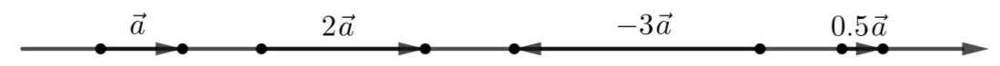

平面是二维的,在平面内有无穷多方向,只需要确定两个不共线向量 $\overrightarrow{a}$ 和 $\overrightarrow{b}$ , 平面内的任意向量都可以由唯一的实数对 $\left( {x, y}\right)$ 表示为 $x\overrightarrow{a} + y\overrightarrow{b}$ ,该定理叫作平面向量基本定理, 是二维平面的基本属性。

如下页图所示，平面内的任意向量都可以分解为沿 $\overrightarrow{a}$ 的方向移动 $x\left| \overrightarrow{a}\right|$ 和沿 $\overrightarrow{b}$ 的方向移动 $y\left| \overrightarrow{b}\right|$ 。

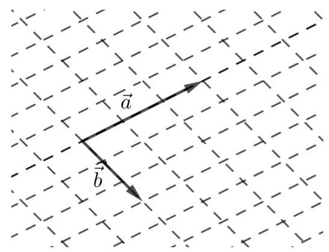

空间是三维的, 空间中有无穷多方向, 只需要确定三个不共平面的向量 $\overrightarrow{a}\text{ 、 }\overrightarrow{b}\text{ 、 }\overrightarrow{c}$ ,那么空间中的任意向量都可以由唯一的三个实数 $\left( {x, y, z}\right)$ 表示为 $x\overrightarrow{a} + y\overrightarrow{b} + z\overrightarrow{c}$ ,有关知识将在空间向量的章节具体学习。

平面向量基本定理是向量能成为非常好用的工具的基础。

对于一个平面,如果选取了一对不共线的向量 ${\overrightarrow{e}}_{1},{\overrightarrow{e}}_{2}$ ,用 ${\overrightarrow{e}}_{1},{\overrightarrow{e}}_{2}$ 表示该平面内的所有向量,那么 $\left\{  {{\overrightarrow{e}}_{1},{\overrightarrow{e}}_{2}}\right\}$ 就叫作这一平面内所有向量的基底。根据平面向量基本定理,平面内的任意向量 $\overrightarrow{a}$ 都可以由 ${\overrightarrow{e}}_{1},{\overrightarrow{e}}_{2}$ 唯一地表示为:

$$
\overrightarrow{a} = {\lambda }_{1}{\overrightarrow{e}}_{1} + {\lambda }_{2}{\overrightarrow{e}}_{2}
$$

由于任意向量都可以用这种形式的表达式表示，那么可以省略向量加法的表示形式,直接用实数对 $\left( {{\lambda }_{1},{\lambda }_{2}}\right)$ 表示向量 $\overrightarrow{a}$ :

$$
\overrightarrow{a} = \left( {{\lambda }_{1},{\lambda }_{2}}\right)
$$

这种表示方式与平面直角坐标系中, 用实数对唯一地表示平面内的任意点的原理相同。

平面内的任意坐标 $\left( {{\lambda }_{1},{\lambda }_{2}}\right)$ ,既可以看作一点 $A\left( {{\lambda }_{1},{\lambda }_{2}}\right)$ ,又可以看作从原点出发,沿 $x$ 轴正方向移动 ${\lambda }_{1}$ 个单位,沿 $y$ 轴正方向移动 ${\lambda }_{2}$ 个单位,最终抵达点 $A$ 的向量 $\overrightarrow{a} = \left( {{\lambda }_{1},{\lambda }_{2}}\right)$ 。有序实数对、平面内的点、平面内的向量有一一对应关系。

例 6.7 如下图所示, $\square {ABCD}$ 中, $O$ 是对角线 ${AC}\text{ 、 }{BD}$ 的交点, $E\text{ 、 }F$ 分别是 ${AB}\text{ 、 }{BC}$ 的中点,用 $\overrightarrow{OA}\text{ 、 }\overrightarrow{OB}$ 表示下列向量:

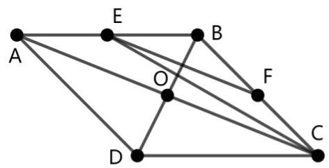

(1) $\overrightarrow{AB}$ ；(2) $\overrightarrow{BC}$ ；(3) $\overrightarrow{EF}$ ；(4) $\overrightarrow{CE}$ 。

解析: 要用 $\overrightarrow{OA}\text{ 、 }\overrightarrow{OB}$ 表示图中的向量,可以让向量从起点出发,“绕一圈” 经过点 $O$ 后,再抵达终点。

平行四边形的对角线相互平分,所以 $O$ 是对角线 ${AC}\text{ 、 }{BD}$ 的中点,由此可得 $\overrightarrow{OC} =  - \overrightarrow{OA},\overrightarrow{OD} =  - \overrightarrow{OB}$ ,

(1) $\overrightarrow{AB} = \overrightarrow{AO} + \overrightarrow{OB} =  - \overrightarrow{OA} + \overrightarrow{OB}$ ；

(2) $\overrightarrow{BC} = \overrightarrow{BO} + \overrightarrow{OC} =  - \overrightarrow{OB} - \overrightarrow{OA}$ ；

(3)根据已知信息难以直接用 $\overrightarrow{OA}$ 、 $\overrightarrow{OB}$ 表示 $\overrightarrow{OE}$ 、 $\overrightarrow{OF}$ ，可利用 $\overrightarrow{EB} = \frac{1}{2}\overrightarrow{AB}$ ， $\overrightarrow{BF} = \frac{1}{2}\overrightarrow{BC}$ ,将关于 $E\text{ 、 }F$ 的向量转化为关于 $\overrightarrow{AB}\text{ 、 }\overrightarrow{BC}$ 的向量:

$\overrightarrow{EF} = \overrightarrow{EB} + \overrightarrow{BF} = \frac{1}{2}\overrightarrow{AB} + \frac{1}{2}\overrightarrow{BC} = \frac{1}{2}\left( {-\overrightarrow{OA} + \overrightarrow{OB}}\right)  + \frac{1}{2}\left( {-\overrightarrow{OB} - \overrightarrow{OA}}\right)  =  - \overrightarrow{OA};$

(4) $\overrightarrow{CE} = \overrightarrow{CB} + \overrightarrow{BE} =  - \overrightarrow{BC} - \frac{1}{2}\overrightarrow{AB} = \overrightarrow{OB} + \overrightarrow{OA} - \frac{1}{2}\left( {-\overrightarrow{OA} + \overrightarrow{OB}}\right)  = \frac{3}{2}\overrightarrow{OA} + \frac{1}{2}\overrightarrow{OB}$ 。

#### 6.3.2 平面向量的正交分解及坐标表示

根据平面向量基本定理, 平面内的任意一对不共线的向量都可以作为基底, 用它们的线性组合(带系数的和)唯一地表示平面内的所有向量。各种不同的基底中, 有一类基底比其他基底更加方便好用。

如果向量 ${\overrightarrow{e}}_{1} \bot  {\overrightarrow{e}}_{2}$ ,那么由它们构成的基底 $\left\{  {{\overrightarrow{e}}_{1},{\overrightarrow{e}}_{2}}\right\}$ 会比形成其他夹角的基底更方便, 因为两个相互垂直的向量的数量积恒为 0 , 可以让涉及数量积的计算大为简化。将向量分解为两个相互垂直的向量的过程叫作向量的正交分解。

选取的基底除相互垂直外, 还可以让它们都是单位向量, 这样一来, 在向量的计算中可以让很多数值计算变得简便。

按照上面两个原则选取基底,在平面直角坐标系中,设 $\overrightarrow{i}$ 是 $x$ 轴正方向的单位向量, $\overrightarrow{j}$ 是 $y$ 轴正方向的单位向量,用 $\{ \overrightarrow{i},\overrightarrow{j}\}$ 作为基底,平面内的任意向量 $\overrightarrow{a}$ , 都可以唯一地由一对有先后顺序的实数构成的实数对 $\left( {x, y}\right)$ 表示为:

$$
\overrightarrow{a} = x\overrightarrow{i} + y\overrightarrow{j}
$$

或简略地表示为:

$$
\overrightarrow{a} = \left( {x, y}\right)
$$

这种表示方式叫作向量 $\overrightarrow{a}$ 的坐标表示,其中, $x$ 叫作 $\overrightarrow{a}$ 在 $x$ 轴上的坐标或横坐标, $y$ 叫作 $\overrightarrow{a}$ 在 $y$ 轴上的坐标或纵坐标,如下图所示。

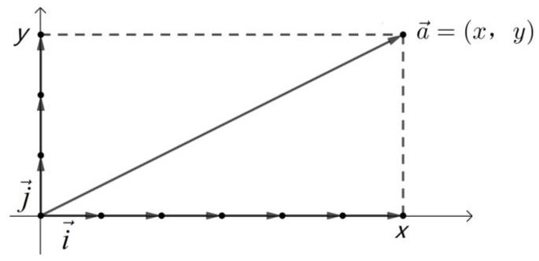

按照向量的坐标表示的规则可知: $\overrightarrow{i} = \left( {1,0}\right) ,\overrightarrow{j} = \left( {0,1}\right) ,\overrightarrow{0} = \left( {0,0}\right) , x$ 轴上的任意向量的纵坐标都为 0, $y$ 轴上的任意向量的横坐标都为 0 。

平面直角坐标系中的任意一点都与唯一的有序实数对 $\left( {x, y}\right)$ 一一对应,平面直角坐标系中的任意一个向量也都与唯一的有序实数对 $\left( {x, y}\right)$ 一一对应,综上, 平面内的任意一个向量与任意一点都一一对应,它们有共同的坐标 $\left( {x, y}\right)$ 。

根据向量的坐标表示方法,向量 $\overrightarrow{a} = \left( {x, y}\right)$ 可以看作起点为原点 $\left( {0,0}\right)$ ,终点为坐标为 $\left( {x, y}\right)$ 的点的向量。

向量 $\overrightarrow{a} = \left( {x, y}\right)$ 的模为:

$$
\left| \overrightarrow{a}\right|  = \sqrt{{x}^{2} + {y}^{2}}
$$

这也是点 $A\left( {x, y}\right)$ 到原点 $\left( {0,0}\right)$ 的距离。

向量 $\overrightarrow{a} = \left( {x, y}\right)$ 与 $x$ 轴夹角 $\theta$ 的正切值为:

$$
\tan \theta  = \frac{y}{x}
$$

这也是经过点 $A\left( {x, y}\right)$ 和原点 $\left( {0,0}\right)$ 的直线的斜率。

例 6.8 平面直角坐标系中,等腰直角三角形 ${ABC}$ 的斜边 ${BC}$ 在 $x$ 轴上,斜边上的高 ${AD}$ 在 $y$ 轴正半轴上, $D$ 是垂足, ${BC} = 6$ ,画出该三角形,并求向量 $\overrightarrow{DA}\text{ 、 }\overrightarrow{DB}\text{ 、 }\overrightarrow{DC}$ 的坐标表示。

解析: 等腰直角三角形的斜边就是底边, 底边上的高、中线、角平分线重合, 已知斜边在 $x$ 轴上，斜边上的高在 $y$ 轴正半轴上，那么斜边与高的交点垂足 $D$ 就是 $x$ 轴与 $y$ 轴的交点,即原点。

已知 ${BC} = 6$ ，那么 ${DB} = {DC} = 3$ ，点 $B$ 、 $C$ 的坐标分别为 $\left( {-3,0}\right)$ 和 $\left( {3,0}\right)$ ； 又因为 $\bigtriangleup  {ABC}$ 是等腰直角三角形，斜边上的中线等于斜边长度的一半，所以 ${AD} = {DB} = 3$ ，又因为 ${AD}$ 在 $y$ 轴正半轴上， $A$ 的坐标为 $\left( {0,3}\right)$ ，画图如下所示。

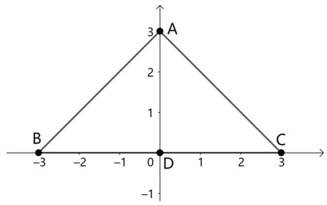

因为 $D$ 是坐标原点,所以 $\overrightarrow{DA} = \left( {0,3}\right) ,\overrightarrow{DB} = \left( {-3,0}\right) ,\overrightarrow{DC} = \left( {3,0}\right)$ 。

#### 6.3.3 平面向量加、减运算的坐标表示

我们已经用 $x$ 轴上单位向量 $\overrightarrow{i}$ 和 $y$ 轴上单位向量 $\overrightarrow{j}$ 构建了平面内的一组基底 $\{ \overrightarrow{i},\overrightarrow{j}\}$ ,可以用坐标表示具体向量,结合向量加法的法则和性质,可以用向量的坐标表示向量的加、减运算, 非常方便好用。

设 $\overrightarrow{a} = \left( {{x}_{1},{y}_{1}}\right) ,\overrightarrow{b} = \left( {{x}_{2},{y}_{2}}\right)$ ,即 $\overrightarrow{a} = {x}_{1}\overrightarrow{i} + {y}_{1}\overrightarrow{j},\overrightarrow{b} = {x}_{2}\overrightarrow{i} + {y}_{2}\overrightarrow{j}$ ,利用向量的加法满足交换律和结合律可得:

$$
\overrightarrow{a} + \overrightarrow{b} = \left( {{x}_{1}\overrightarrow{i} + {y}_{1}\overrightarrow{j}}\right)  + \left( {{x}_{2}\overrightarrow{i} + {y}_{2}\overrightarrow{j}}\right)
$$

$$
= {x}_{1}\overrightarrow{i} + {y}_{1}\overrightarrow{j} + {x}_{2}\overrightarrow{i} + {y}_{2}\overrightarrow{j}
$$

$$
= \left( {{x}_{1} + {x}_{2}}\right) \overrightarrow{i} + \left( {{y}_{1} + {y}_{2}}\right) \overrightarrow{j}
$$

即:

$$
\overrightarrow{a} + \overrightarrow{b} = \left( {{x}_{1} + {x}_{2},{y}_{1} + {y}_{2}}\right)
$$

减去一个向量等于加上它的相反向量:

$$
\overrightarrow{a} - \overrightarrow{b} = \overrightarrow{a} + \left( {-\overrightarrow{b}}\right)
$$

$$
= \left( {{x}_{1}\overrightarrow{i} + {y}_{1}\overrightarrow{j}}\right)  + \left( {-{x}_{2}\overrightarrow{i} - {y}_{2}\overrightarrow{j}}\right)
$$

$$
= {x}_{1}\overrightarrow{i} + {y}_{1}\overrightarrow{j} - {x}_{2}\overrightarrow{i} - {y}_{2}\overrightarrow{j}
$$

$$
= \left( {{x}_{1} - {x}_{2}}\right) \overrightarrow{i} + \left( {{y}_{1} - {y}_{2}}\right) \overrightarrow{j}
$$

即:

$$
\overrightarrow{a} - \overrightarrow{b} = \left( {{x}_{1} - {x}_{2},{y}_{1} - {y}_{2}}\right)
$$

综上, 两个向量相加(或相减)形成的向量的坐标，等于这两个向量相应的坐标相加(或相减)。

这样一来, 只要已知两个向量的坐标, 那么它们的和与差就可以直接用坐标运算求得，不再需要画出具体图形。

如果已知平面内的两点 $A\left( {{x}_{1},{y}_{1}}\right)$ 和 $B\left( {{x}_{2},{y}_{2}}\right)$ ,由向量与平面内的点之间的对应关系可得: $\overrightarrow{OA} = \left( {{x}_{1},{y}_{1}}\right) ,\overrightarrow{OB} = \left( {{x}_{2},{y}_{2}}\right)$ ,那么向量 $\overrightarrow{AB}$ 的坐标为:

$$
\overrightarrow{AB} = \overrightarrow{AO} + \overrightarrow{OB} = \overrightarrow{OB} - \overrightarrow{OA} = \left( {{x}_{2} - {x}_{1},{y}_{2} - {y}_{1}}\right)
$$

即: 如果已知一个向量的起点坐标和终点坐标, 那么该向量的坐标就是终点坐标减去起点坐标, 如下图所示。

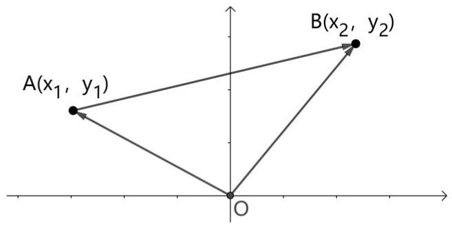

#### 6.3.4 平面向量数乘的坐标表示

设 $\overrightarrow{a} = \left( {x, y}\right)$ ,即 $\overrightarrow{a} = x\overrightarrow{i} + y\overrightarrow{j},\lambda$ 为实数,利用向量的数乘运算的法则和性质可得:

$$
\lambda \overrightarrow{a} = \lambda \left( {x\overrightarrow{i} + y\overrightarrow{j}}\right)  = {\lambda x}\overrightarrow{i} + {\lambda y}\overrightarrow{j}
$$

即:

$$
\lambda \overrightarrow{a} = \left( {{\lambda x},{\lambda y}}\right)
$$

实数与向量的乘积形成的向量的坐标，等于实数与向量各坐标的乘积。

例 6.9 已知 $\overrightarrow{a} = \left( {1,1}\right) ,\overrightarrow{b} = \left( {2,0}\right) ,\overrightarrow{c} = \left( {-3, - 1}\right)$ ,求下列向量的坐标:

(1) $\overrightarrow{a} + \overrightarrow{b}$ ；(2) $- 2\overrightarrow{c}$ ；(3) $\overrightarrow{b} - 3\overrightarrow{c}$ ；(4) $\overrightarrow{a} - \overrightarrow{b} + 2\overrightarrow{c}$ 。

解析: (1) $\overrightarrow{a} + \overrightarrow{b} = \left( {1 + 2,1 + 0}\right)  = \left( {3,1}\right)$ ;

(2) $- 2\overrightarrow{c} = \left( {-2 \times  \left( {-3}\right) , - 2 \times  \left( {-1}\right) }\right)  = \left( {6,2}\right)$ ；

(3) $\overrightarrow{b} - 3\overrightarrow{c} = \left( {2 - 3 \times  \left( {-3}\right) ,0 - 3 \times  \left( {-1}\right) }\right)  = \left( {{11},3}\right)$ ；

(4) $\overrightarrow{a} - \overrightarrow{b} + 2\overrightarrow{c} = \left( {1 - 2 + 2 \times  \left( {-3}\right) ,1 - 0 + 2 \times  \left( {-1}\right) }\right)  = \left( {-7, - 1}\right)$ 。

例 6.10 已知直线 ${AB}$ 上两点的坐标为 $A\left( {-2,1}\right) \text{ 、 }B\left( {1,0}\right) , C$ 是 ${AB}$ 的中点， 求下列向量的坐标:(1) $\overrightarrow{OA}$ ；(2) $\overrightarrow{AB}$ ；(3) $\overrightarrow{BC}$ ；(4) $\overrightarrow{OC}$ 。

解析: 根据已知条件, 画图如下所示:

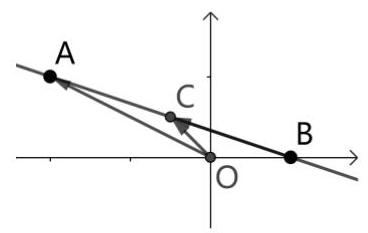

(1) $\overrightarrow{OA}$ 的坐标就是点 $A$ 的坐标， $\overrightarrow{OA} = \left( {-2,1}\right)$ ；

(2) $\overrightarrow{AB} = \left( {1 - \left( {-2}\right) ,0 - 1}\right)  = \left( {3, - 1}\right)$ ；

(3) $\overrightarrow{BC} = \frac{1}{2}\overrightarrow{BA} =  - \frac{1}{2}\overrightarrow{AB} = \left( {-\frac{1}{2} \times  3, - \frac{1}{2} \times  \left( {-1}\right) }\right)  = \left( {-\frac{3}{2},\frac{1}{2}}\right)$ ；

(4) $\overrightarrow{OC} = \overrightarrow{OB} + \overrightarrow{BC} = \left( {1 - \frac{3}{2},0 + \frac{1}{2}}\right)  = \left( {-\frac{1}{2},\frac{1}{2}}\right)$ 。

前面已经学习: 对于任意非零向量 $\overrightarrow{a}$ 与 $\overrightarrow{b}$ ,如果存在非零实数 $\lambda$ 使得 $\overrightarrow{b} = \lambda \overrightarrow{a}$ , 那么就可以判定 $\overrightarrow{a}$ 与 $\overrightarrow{b}$ 共线,该判定向量共线的方法可以直接用平面向量数乘运算的坐标表示:

对于向量 $\overrightarrow{a} = \left( {x, y}\right)$ ,所有向量 $\overrightarrow{b} = \left( {{\lambda x},{\lambda y}}\right)$ 都与 $\overrightarrow{a}$ 平行,即: 如果两个向量的横坐标和纵坐标所成的比例相同,那么这两个向量共线。其中,当 $\lambda  > 0$ 时, $\overrightarrow{a}$ 与 $\overrightarrow{b}$ 方向相同。当 $\lambda  < 0$ 时, $\overrightarrow{a}$ 与 $\overrightarrow{b}$ 方向相反。当 $\lambda  = 0$ 时, $\overrightarrow{b}$ 是零向量,方向可以任选，可以与 $\overrightarrow{a}$ 共线。

例 6.11 判断下列向量是否共线:

(1)(1，4)与(-1，-4)；(2)(2，1)与(1，2)；(3)(0，-1

解析: 比较两个向量的横坐标与纵坐标的比值是否相等即可,

(1)这两个向量的横坐标之比为 $\frac{1}{-1} =  - 1$ ，纵坐标之比为 $\frac{4}{-4} =  - 1$ ，即 $\left( {1,4}\right)  =  - 1 \times  \left( {-1, - 4}\right)$ ,共线;

(2)这两个向量的横坐标之比为 $\frac{2}{1}$ ，纵坐标之比为 $\frac{1}{2}$ ，横纵坐标的比值不相等, 不共线;

(3)这两个向量的横坐标都为 0，无法求比值，0 与任意实数的乘积仍为 0， 存在实数 -2,使得 $\left( {0,2}\right)  =  - 2 \times  \left( {0, - 1}\right)$ ,共线,这两个向量都在 $y$ 轴上。

## 练习 ${6.3}\left( 1\right)$

1. 在平面直角坐标系中画出下列点和向量，写出各向量的坐标 $\left( {O\text{ 为原点 }}\right)$ :

(3) $C\left( {-1,4}\right)$ ； (4) $D\left( {0, - 3}\right)$ ；

(8) $\overrightarrow{CD}$ 。

2. 已知 $\overrightarrow{a} = \left( {3,1}\right) ,\overrightarrow{b} = \left( {-1, - 2}\right) ,\overrightarrow{c} = \left( {0,4}\right)$ ,求下列向量的坐标:

(1) $\overrightarrow{a} + \overrightarrow{b}$ ； (2) $3\overrightarrow{c}$ ； (3) $\overrightarrow{b} + 2\overrightarrow{c}$ ； (4) $\overrightarrow{a} + 2\overrightarrow{b} - \overrightarrow{c}$ 。

3. 已知坐标原点 $O$ 是 $\square {ABCD}$ 的对角线的交点， $\overrightarrow{OA} = \left( {0, - 2}\right)$ ， $\overrightarrow{AB} = \left( {1,1}\right)$ ， 求 $C\text{ 、 }D$ 两点的坐标。

4. 判断下列向量是否共线:

(1)(-1，3)与(3，1)；(2)(2，5)与(4，10)；

(3)(3，0)与(8，0)；(4)(-4，0)与(0， -4)。

#### 6.3.5 平面向量数量积的坐标表示

设 $\overrightarrow{a} = \left( {{x}_{1},{y}_{1}}\right) ,\overrightarrow{b} = \left( {{x}_{2},{y}_{2}}\right)$ ,即 $\overrightarrow{a} = {x}_{1}\overrightarrow{i} + {y}_{1}\overrightarrow{j},\overrightarrow{b} = {x}_{2}\overrightarrow{i} + {y}_{2}\overrightarrow{j}$ ,利用向量的数量积的运算法则和乘法分配律, 以及相互垂直的向量的数量积为 0 、向量与它自身的内积等于模的平方、单位向量的模等于 1 等性质可得:

$$
\overrightarrow{a} \cdot  \overrightarrow{b} = \left( {{x}_{1}\overrightarrow{i} + {y}_{1}\overrightarrow{j}}\right)  \cdot  \left( {{x}_{2}\overrightarrow{i} + {y}_{2}\overrightarrow{j}}\right)
$$

$$
= {x}_{1}{x}_{2}{\overrightarrow{i}}^{2} + {x}_{1}{y}_{2}\overrightarrow{i} \cdot  \overrightarrow{j} + {x}_{2}{y}_{1}\overrightarrow{i} \cdot  \overrightarrow{j} + {y}_{1}{y}_{2}{\overrightarrow{j}}^{2}
$$

$$
= {x}_{1}{x}_{2}{\left| \overrightarrow{i}\right| }^{2} + {x}_{1}{y}_{2} \cdot  0 + {x}_{2}{y}_{1} \cdot  0 + {y}_{1}{y}_{2}{\left| \overrightarrow{j}\right| }^{2}
$$

$$
= {x}_{1}{x}_{2} \cdot  1 + {x}_{1}{y}_{2} \cdot  0 + {x}_{2}{y}_{1} \cdot  0 + {y}_{1}{y}_{2} \cdot  1
$$

$$
= {x}_{1}{x}_{2} + {y}_{1}{y}_{2}
$$

即:

$$
\overrightarrow{a} \cdot  \overrightarrow{b} = {x}_{1}{x}_{2} + {y}_{1}{y}_{2}
$$

两个向量的数量积等于它们对应坐标的乘积之和。这个公式非常方便, 求两个向量的数量积不再需要繁琐地分别求出它们的模以及夹角的余弦值, 而是直接简单地将对应坐标相乘再相加即可。

我们已经学习了 $\overrightarrow{a} \cdot  \overrightarrow{b}$ 的正负号与 $\theta$ 是锐角、直角还是钝角之间的对应关系, 结合平面向量数量积的坐标表示,使得对 $\theta$ 的取值范围的判断更加方便。

利用向量的数量积的坐标运算, 可以轻松地求得两个向量的夹角: 两个向量的夹角的余弦值等于两个向量的数量积除以两个向量的模的乘积:

$$
\cos \theta  = \frac{\overrightarrow{a} \cdot  \overrightarrow{b}}{\left| \overrightarrow{a}\right|  \cdot  \left| \overrightarrow{b}\right| } = \frac{{x}_{1}{x}_{2} + {y}_{1}{y}_{2}}{\sqrt{{x}_{1}^{2} + {y}_{1}^{2}}\sqrt{{x}_{2}^{2} + {y}_{2}^{2}}}
$$

例 6.12 求下列向量的数量积:

(1) $\overrightarrow{a} = \left( {2, - 1}\right) ,\;\overrightarrow{b} = \left( {4, - 2}\right)$ ; (2) $\overrightarrow{a} = \left( {4,2}\right) ,\overrightarrow{b} = \left( {1, - 2}\right)$ ；

(3) $\overrightarrow{a} = \left( {0,3}\right) ,\overrightarrow{b} = \left( {4, - 1}\right)$ ；(4) $\overrightarrow{a} = \left( {\cos {75}^{ \circ  },\sin {75}^{ \circ  }}\right) ,\overrightarrow{b} = \left( {\cos {30}^{ \circ  },\sin {30}^{ \circ  }}\right)$ 。

解析: (1) $\overrightarrow{a} \cdot  \overrightarrow{b} = 2 \times  4 + \left( {-1}\right)  \times  \left( {-2}\right)  = {10}$ ;

(2) $\overrightarrow{a} \cdot  \overrightarrow{b} = 4 \times  1 + 2 \times  \left( {-2}\right)  = 0$ ；

(3) $\overrightarrow{a} \cdot  \overrightarrow{b} = 0 \times  4 + 3 \times  \left( {-1}\right)  =  - 3$ ；

(4) $\overrightarrow{a} \cdot  \overrightarrow{b} = \cos {75}^{ \circ  } \times  \cos {30}^{ \circ  } + \sin {75}^{ \circ  } \times  \sin {30}^{ \circ  } = \cos \left( {{75}^{ \circ  } - {30}^{ \circ  }}\right)  = \cos {45}^{ \circ  } = \frac{\sqrt{2}}{2}$ 。

例 6.13 求例 6.12 中各组向量的夹角的余弦值, 判断它们的夹角是锐角、 直角、钝角还是共直线。

解析: (1) $\cos \theta  = \frac{\overrightarrow{a} \cdot  \overrightarrow{b}}{\left| \overrightarrow{a}\right|  \cdot  \left| \overrightarrow{b}\right| } = \frac{10}{\sqrt{{2}^{2} + {\left( -1\right) }^{2}}\sqrt{{4}^{2} + {\left( -2\right) }^{2}}} = 1,\theta  = 0$ ,共直线;

(2) $\cos \theta  = \frac{\overrightarrow{a} \cdot  \overrightarrow{b}}{\left| \overrightarrow{a}\right|  \cdot  \left| \overrightarrow{b}\right| } = \frac{0}{\left| \overrightarrow{a}\right|  \cdot  \left| \overrightarrow{b}\right| } = 0,\cos \theta  = 0,\theta$ 是直角；

(3) $\cos \theta  = \frac{\overrightarrow{a} \cdot  \overrightarrow{b}}{\left| \overrightarrow{a}\right|  \cdot  \left| \overrightarrow{b}\right| } = \frac{-3}{\sqrt{{0}^{2} + {3}^{2}}\sqrt{{4}^{2} + {1}^{2}}} =  - \frac{\sqrt{17}}{17},\cos \theta  < 0,\theta$ 是钝角；

(4) $\cos \theta  = \frac{\overrightarrow{a} \cdot  \overrightarrow{b}}{\left| \overrightarrow{a}\right|  \cdot  \left| \overrightarrow{b}\right| } = \frac{\frac{\sqrt{2}}{2}}{\sqrt{{\cos }^{2}{75}^{ \circ  } + {\sin }^{2}{75}^{ \circ  }}\sqrt{{\cos }^{2}{30}^{ \circ  } + {\sin }^{2}{30}^{ \circ  }}} = \frac{\sqrt{2}}{2},\cos \theta  > 0$ , $\theta$ 是锐角。

练习 $\mathbf{{6.3}\left( 2\right) }$

1. 求下列各组向量的数量积:

(1) $\overrightarrow{a} = \left( {-2, - 2}\right) ,\overrightarrow{b} = \left( {3, - 1}\right) ;\;$ (2) $\overrightarrow{a} = \left( {{2}^{a}, - 2{\log }_{2}\mathrm{e}}\right) ,\overrightarrow{b} = \left( {{2}^{2 - a},\ln 2}\right)$ ;

(3) $\overrightarrow{a} = \left( {\cos \theta ,\sin \theta }\right) ,\overrightarrow{b} = \left( {\cos \left( {\frac{\pi }{4} - \theta }\right) ,\sin \left( {\frac{\pi }{4} - \theta }\right) }\right)$ 。

2. 已知 $\overrightarrow{a} = \left( {-1,3}\right) ,\overrightarrow{b} = \left( {2,4}\right)$ ,求下列各式的值:

(1) $\overrightarrow{a} \cdot  \overrightarrow{b}$ ； (3) $\left( {\overrightarrow{a} + \overrightarrow{b}}\right) \left( {\overrightarrow{a} - \overrightarrow{b}}\right)$ ； (4) $\left( {2\overrightarrow{a} + \overrightarrow{b}}\right) \left( {\overrightarrow{a} - 2\overrightarrow{b}}\right)$ 。

3. 求下列各组向量的夹角的余弦值, 判断它们的夹角是锐角、直角、钝角还是共直线: (1) $\left( {2,0}\right)$ 与 $\left( {0, - 1}\right) ;\left( 2\right) \left( {2,4}\right)$ 与 $\left( {-3, - 6}\right) ;\left( 3\right) \left( {-1,\sqrt{3}}\right)$ 与 $\left( {-1, - \sqrt{3}}\right)$ 。

4. 已知 $\overrightarrow{a} = \left( {1,\sqrt{3}}\right)$ ，求下列各表达式的值或坐标表示:

(1) ${\overrightarrow{a}}^{2}$ ； (2) $\left( {\overrightarrow{a}}^{2}\right)  \cdot  \overrightarrow{a}$ ； (3) $\left( {\overrightarrow{a} \cdot  \overrightarrow{a}}\right) \left( {\overrightarrow{a} \cdot  \overrightarrow{a}}\right)$ 。

### 6.4 平面向量的应用

利用平面向量的概念、运算法则、性质规律及其坐标表示, 能方便地解决平面几何问题, 还能分析得出很多好用的公式和结论。

#### 6.4.1 平面几何中的向量方法

向量在平面几何的计算和证明中非常好用, 这主要因为向量可以无视位置任意平移, 同时保持在运算中不改变各线段的长度和夹角的大小, 进行向量运算相当于用代数表达式的变换代替了在图中画出辅助线。

例 6.14 如下图所示,梯形 ${ABCD}$ 中, ${AB}\parallel {DC}, E\text{ 、 }F$ 分别为 ${AD}$ 和 ${BC}$ 的中点,证明: (1) ${EF}\parallel {CD}$ ; (2) ${EF} = \frac{1}{2}\left( {{AB} + {DC}}\right)$ 。

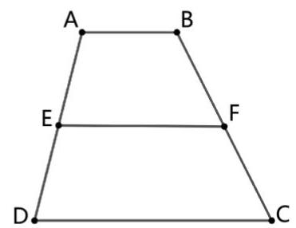

证明: 因为 $E\text{ 、 }F$ 分别为 ${AD}$ 和 ${BC}$ 的中点,所以 $\overrightarrow{EA} = \frac{1}{2}\overrightarrow{DA},\overrightarrow{BF} = \frac{1}{2}\overrightarrow{BC}$ ,

$$
\overrightarrow{EF} = \overrightarrow{EA} + \overrightarrow{AB} + \overrightarrow{BF} = \frac{1}{2}\overrightarrow{DA} + \overrightarrow{AB} + \frac{1}{2}\overrightarrow{BC} = \left( {\frac{1}{2}\overrightarrow{DA} + \frac{1}{2}\overrightarrow{AB} + \frac{1}{2}\overrightarrow{BC}}\right)  + \frac{1}{2}\overrightarrow{AB}
$$

$$
= \frac{1}{2}\left( {\overrightarrow{DA} + \overrightarrow{AB} + \overrightarrow{BC}}\right)  + \frac{1}{2}\overrightarrow{AB} = \frac{1}{2}\overrightarrow{DC} + \frac{1}{2}\overrightarrow{AB}
$$

(1)因为 ${AB} \parallel  {DC}$ ，可以设 $\overrightarrow{AB} = \lambda \overrightarrow{DC}$ ，代入上式可得: $\overrightarrow{EF} = \frac{1}{2}\overrightarrow{DC} + \frac{1}{2}\overrightarrow{AB} = \; \frac{1}{2}\overrightarrow{DC} + \frac{\lambda }{2}\overrightarrow{DC} = \frac{\lambda  + 1}{2}\overrightarrow{DC},\overrightarrow{EF}$ 可由 $\overrightarrow{DC}$ 与实数 $\frac{\lambda  + 1}{2}$ 的乘积表示，所以 ${EF}\parallel {CD}$ ；

(2) $\overrightarrow{EF}$ 、 $\overrightarrow{CD}$ 、 $\overrightarrow{AB}$ 共直线且方向相同， $\overrightarrow{EF} = \frac{1}{2}\overrightarrow{DC} + \frac{1}{2}\overrightarrow{AB} = \frac{1}{2}\left( {\overrightarrow{DC} + \overrightarrow{AB}}\right)$ ， 所以 $\left| \overrightarrow{EF}\right|  = \frac{1}{2}\left( {\left| \overrightarrow{DC}\right|  + \left| \overrightarrow{AB}\right| }\right)$ ,即 ${EF} = \frac{1}{2}\left( {{AB} + {DC}}\right)$ 。

例 6.15 如下图所示,已知 ${AC}$ 和 ${BD}$ 是菱形 ${ABCD}$ 的对角线,证明: ${AC} \bot  {BD}$ 。(提示:菱形是邻边相等的平行四边形)

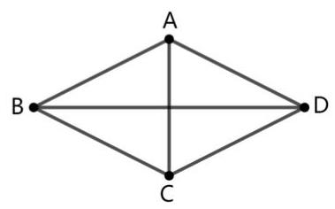

证明: 由题图可得: $\overrightarrow{AC} = \overrightarrow{AB} + \overrightarrow{BC},\overrightarrow{BD} = \overrightarrow{BC} + \overrightarrow{CD}$ ,

$\overrightarrow{AC} \cdot  \overrightarrow{BD} = \left( {\overrightarrow{AB} + \overrightarrow{BC}}\right) \left( {\overrightarrow{BC} + \overrightarrow{CD}}\right)  = \overrightarrow{AB} \cdot  \overrightarrow{BC} + \overrightarrow{AB} \cdot  \overrightarrow{CD} + \overrightarrow{BC} \cdot  \overrightarrow{BC} + \overrightarrow{BC} \cdot  \overrightarrow{CD}$

根据菱形的定义可得: $\overrightarrow{AB} =  - \overrightarrow{CD}$ ， $\left| \overrightarrow{CD}\right|  = \left| \overrightarrow{BC}\right|$ ，代入上式可得:

$$
\overrightarrow{AC} \cdot  \overrightarrow{BD} = \overrightarrow{AB} \cdot  \overrightarrow{BC} + \overrightarrow{AB} \cdot  \overrightarrow{CD} + \overrightarrow{BC} \cdot  \overrightarrow{BC} + \overrightarrow{BC} \cdot  \overrightarrow{CD}
$$

$$
=  - \overrightarrow{CD} \cdot  \overrightarrow{BC} - \overrightarrow{CD} \cdot  \overrightarrow{CD} + {\overrightarrow{BC}}^{2} + \overrightarrow{BC} \cdot  \overrightarrow{CD}
$$

$$
=  - {\overrightarrow{CD}}^{2} + {\overrightarrow{BC}}^{2} =  - {\left| \overrightarrow{CD}\right| }^{2} + {\left| \overrightarrow{BC}\right| }^{2} = 0
$$

所以 ${AC}\bot {BD}$ 。

练习 $\mathbf{{6.4}}\left( \mathbf{1}\right)$

1. 使用平面向量证明: 直角三角形斜边上的中线的长度等于斜边长度的一半。(提示:用两条直角边的向量分别表示出中线和斜边，比较两者的模)

2. 使用平面向量证明: 平行四边形的对角线相互平分。(提示: 设两条对角线相互分为比例为 ${\lambda }_{1}\text{ 、 }{\lambda }_{2}$ 的两部分,用其中的两段构造基底,分别表示两组对边, 利用平行四边形的两组对边分别平行且相等建立等式关系)

3. 使用平面向量证明: 如果三角形的一条边是它的外接圆的直径, 那么该三角形是直角三角形。(提示: 将原点作为圆心,直径所在的直线为 $x$ 轴,建立直角坐标系,设三角形第三个顶点为 $\left( {\cos \theta ,\sin \theta }\right)$ ,利用向量的内积为 0 证明)

#### 6.4.2 线段的定比分点公式

定比分点是将已知线段分为确定比例的两段的点, 例如中点、三等分点等都是定比分点。

欧式几何中, 通常用尺规作图的方式, 在图形上将线段平均分为若干份, 将各节点标注为等分点。掌握解析几何的工具后, 在已知线段端点坐标的情况下, 可以用相应的公式简便地求出定比分点的坐标。

我们首先推导较容易理解的线段中点的坐标公式, 设线段的端点分别为 $A\left( {{x}_{1},{y}_{1}}\right)$ 和 $B\left( {{x}_{2},{y}_{2}}\right)$ ,点 $P$ 将线段 ${AB}$ 分为长度相等的两部分 ${PA} = {PB}$ ,求点 $P$ 的坐标，有代数、几何、向量三种思路。

代数思路。设点 $P$ 的坐标为 $P\left( {{x}_{P},{y}_{P}}\right)$ ,因为 $P$ 在直线 ${AB}$ 上, $\overrightarrow{AP}$ 与 $\overrightarrow{AB}$ 共直线, 可得:

$$
\frac{{y}_{P} - {y}_{1}}{{x}_{P} - {x}_{1}} = \frac{{y}_{2} - {y}_{1}}{{x}_{2} - {x}_{1}}
$$

又因为 ${PA} = {PB}$ ,可得:

$$
\sqrt{{\left( {x}_{P} - {x}_{1}\right) }^{2} + {\left( {y}_{P} - {y}_{1}\right) }^{2}} = \sqrt{{\left( {x}_{P} - {x}_{2}\right) }^{2} + {\left( {y}_{P} - {y}_{2}\right) }^{2}}
$$

联立这两个方程得到方程组,解方程组即可得到点 $P$ 的坐标,求解过程较复杂, 故不再展开。

几何思路。如下图所示,分别从点 $A\text{ 、 }B$ 向 $x$ 轴引垂线,画出经过点 $P$ 且平行于 $x$ 轴的直线,与两条垂线分别相交于 ${A}^{\prime }\left( {{x}_{1}^{\prime },{y}_{1}^{\prime }}\right)$ 和 ${B}^{\prime }\left( {{x}_{2}^{\prime },{y}_{2}^{\prime }}\right)$ 。

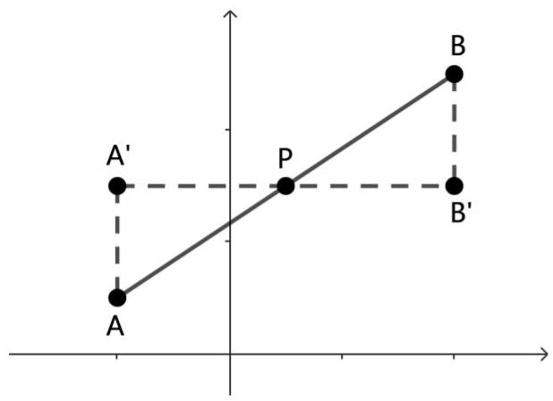

根据平行和垂直关系可得: ${A}^{\prime }$ 与 $A$ 的横坐标相等,即 ${x}_{1}^{\prime } = {x}_{1},{B}^{\prime }$ 与 $B$ 的横坐标相等,即 ${x}_{2}^{\prime } = {x}_{2},{A}^{\prime }$ 与 ${B}^{\prime }$ 的纵坐标相等,即 ${y}_{1}^{\prime } = {y}_{2}^{\prime }$ 。

因为 $P$ 是 ${AB}$ 的中点,所以 ${PA} = {PB}$ ,

由对顶角相等可得: $\angle {AP}{A}^{\prime } = \angle {BP}{B}^{\prime }$ ,

由作图方式可得: $\angle {A}^{\prime } = \angle {B}^{\prime } = \frac{\pi }{2}$ ,

综上可得: $\bigtriangleup {AP}{A}^{\prime } \cong  \bigtriangleup {BP}{B}^{\prime }$ ,所以 $P{A}^{\prime } = P{B}^{\prime }$ ,所以 $P$ 也是线段 ${A}^{\prime }{B}^{\prime }$ 的中点, 图中 $A$ 在 $B$ 左边, ${x}_{1} < {x}_{P} < {x}_{2}, P{A}^{\prime } = P{B}^{\prime }$ 用坐标表示为:

$$
{x}_{P} - {x}_{1} = {x}_{2} - {x}_{P}
$$

移项得:

$$
{x}_{P} = \frac{{x}_{1} + {x}_{2}}{2}
$$

如果 $A$ 在 $B$ 右边同理,仍可得到相同的结果;

如果 ${AB}$ 垂直于 $x$ 轴,即 ${x}_{1} = {x}_{2}, P$ 在线段 ${AB}$ 上, ${x}_{P} = {x}_{1} = {x}_{2}$ ,仍满足关系:

$$
\frac{{x}_{1} + {x}_{2}}{2} = \frac{{x}_{P} + {x}_{P}}{2} = {x}_{P}
$$

按照相同的思路,分别从 $A\text{ 、 }B$ 向 $y$ 轴引垂线,画出经过点 $P$ 且与 $y$ 轴平行的直线, 利用全等三角形和垂直关系可得:

$$
{y}_{P} = \frac{{y}_{1} + {y}_{2}}{2}
$$

综上,以 $A\left( {{x}_{1},{y}_{1}}\right) , B\left( {{x}_{2},{y}_{2}}\right)$ 为端点的线段 ${AB}$ 的中点 $P$ 的坐标为:

$$
P\left( {\frac{{x}_{1} + {x}_{2}}{2},\frac{{y}_{1} + {y}_{2}}{2}}\right)
$$

这就是线段的中点的坐标公式, 接下来推导将线段分为其他比例的定比分点的坐标公式。如果点 $P$ 将线段 ${AB}$ 分为长度比例为 ${PA} : {PB} = \lambda  : 1$ 的两部分，求点 $P$ 的坐标。

已知 $A\text{ 、 }B$ 的坐标分别为 $A\left( {{x}_{1},{y}_{1}}\right) , B\left( {{x}_{2},{y}_{2}}\right)$ ,分别从 $A\text{ 、 }B$ 向 $x$ 轴引垂线, 画出经过点 $P$ 且平行于 $x$ 轴的直线,与两条垂线分别相交于 ${A}^{\prime }\left( {{x}_{1}^{\prime },{y}_{1}^{\prime }}\right)$ 和 ${B}^{\prime }\left( {{x}_{2}^{\prime },{y}_{2}^{\prime }}\right)$ ,根据平行和垂直关系可得, ${A}^{\prime }$ 与 $A$ 的横坐标相等, ${B}^{\prime }$ 与 $B$ 的横坐标相等, ${A}^{\prime }$ 与 ${B}^{\prime }$ 的纵坐标相等,即 ${x}_{1}^{\prime } = {x}_{1},{x}_{2}^{\prime } = {x}_{2},{y}_{1}^{\prime } = {y}_{2}^{\prime }$ ,如下图所示。

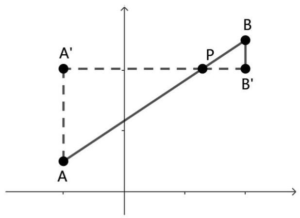

图中 $A$ 在 $B$ 左边, ${x}_{1} < {x}_{P} < {x}_{2}$ ,

由对顶角相等可得: $\angle {AP}{A}^{\prime } = \angle {BP}{B}^{\prime }$ ,

由作图方式可得: $\angle {A}^{\prime } = \angle {B}^{\prime } = \frac{\pi }{2}$ ,

综上可得: $\bigtriangleup {AP}{A}^{\prime } \sim  \bigtriangleup {BP}{B}^{\prime }$ ,所以 $\bigtriangleup {AP}{A}^{\prime }$ 与 $\bigtriangleup {BP}{B}^{\prime }$ 对应的边所成的比例相同,

已知 ${PA} : {PB} = \lambda  : 1$ ，那么 $P{A}^{\prime } : P{B}^{\prime } = \lambda  : 1$ ，即 $\frac{{x}_{p} - {x}_{1}}{{x}_{2} - {x}_{p}} = \frac{\lambda }{1}$ ，

化简得:

$$
{x}_{p} = \frac{{x}_{1} + \lambda {x}_{2}}{1 + \lambda }
$$

同理可得:

$$
{y}_{p} = \frac{{y}_{1} + \lambda {y}_{2}}{1 + \lambda }
$$

即: 将线段 ${AB}$ 分为 ${PA} : {PB} = \lambda  : 1$ 的两部分的点 $P$ 的坐标为:

$$
\left( {\frac{{x}_{1} + \lambda {x}_{2}}{1 + \lambda },\frac{{y}_{1} + \lambda {y}_{2}}{1 + \lambda }}\right)
$$

如果 $P$ 在线段 ${AB}$ 的延长线上,且满足比例 ${PA} : {PB} = \lambda  : 1$ ,使用相同的思路可得点 $P$ 的坐标为:

$$
\left( {\frac{{x}_{1} - \lambda {x}_{2}}{1 - \lambda },\frac{{y}_{1} - \lambda {y}_{2}}{1 - \lambda }}\right)
$$

如下图所示。

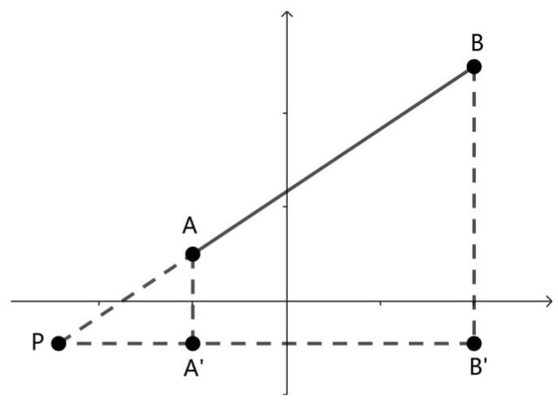

向量思路。引入向量的概念后, 定比分点公式的推导变得更简便, 且定比分点在线段上与在线段延长线上两种情况, 可以用相同思路推出一致的公式。

设两点 $A\text{ 、 }B$ 的坐标分别为 $A\left( {{x}_{1},{y}_{1}}\right)$ 和 $B\left( {{x}_{2},{y}_{2}}\right)$ ,点 $P\left( {{x}_{P},{y}_{P}}\right)$ 将线段 ${AB}$ 分为 ${PA} : {PB} = \lambda  : 1$ 的两部分,线段的端点 $A\left( {{x}_{1},{y}_{1}}\right) \text{ 、 }B\left( {{x}_{2},{y}_{2}}\right)$ 还可以分别表示起点为原点、终点分别为 $A\text{ 、 }B$ 的向量 $\overrightarrow{OA} = \left( {{x}_{1},{y}_{1}}\right)$ 和 $\overrightarrow{OB} = \left( {{x}_{2},{y}_{2}}\right)$ ,如下图所示。

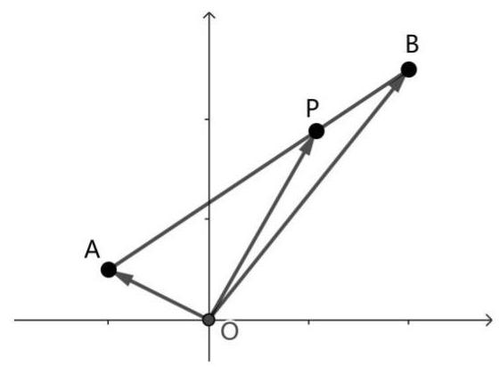

给线段 ${AB}$ 规定方向，将其变为有向线段，该有向线段可以表示一个向量， 规定 $A$ 为起点， $B$ 为终点，得到向量 $\overrightarrow{AB}$ ，可得: $\overrightarrow{AB} = \left( {{x}_{2} - {x}_{1},{y}_{2} - {y}_{1}}\right)$ 。

因为 $P$ 在直线 ${AB}$ 上，所以 $\overrightarrow{PA}$ 与 $\overrightarrow{BP}$ 共线，由 $\overrightarrow{PA} : \overrightarrow{BP} = \lambda  : 1$ 可得: $\overrightarrow{PA} = \lambda \overrightarrow{BP}$ ，

代入相应的坐标得: $\left\{  \begin{array}{l} {x}_{1} - {x}_{P} = \lambda \left( {{x}_{P} - {x}_{2}}\right) \\  {y}_{1} - {y}_{P} = \lambda \left( {{y}_{P} - {y}_{2}}\right)  \end{array}\right.$

解得: $\left\{  \begin{array}{l} {x}_{P} = \frac{{x}_{1} + \lambda {x}_{2}}{1 + \lambda } \\  {y}_{P} = \frac{{y}_{1} + \lambda {y}_{2}}{1 + \lambda } \end{array}\right.$

即: $\overrightarrow{OP} = \left( {\frac{{x}_{1} + \lambda {x}_{2}}{1 + \lambda },\frac{{y}_{1} + \lambda {y}_{2}}{1 + \lambda }}\right)$ ,点 $P$ 的坐标为 $P\left( {\frac{{x}_{1} + \lambda {x}_{2}}{1 + \lambda },\frac{{y}_{1} + \lambda {y}_{2}}{1 + \lambda }}\right)$ 。

如果 $P$ 在线段 ${AB}$ 的延长线上,由于向量的参数中已经蕴含了方向,此时 $\lambda  < 0$ ,上述公式仍然适用,如下图所示。

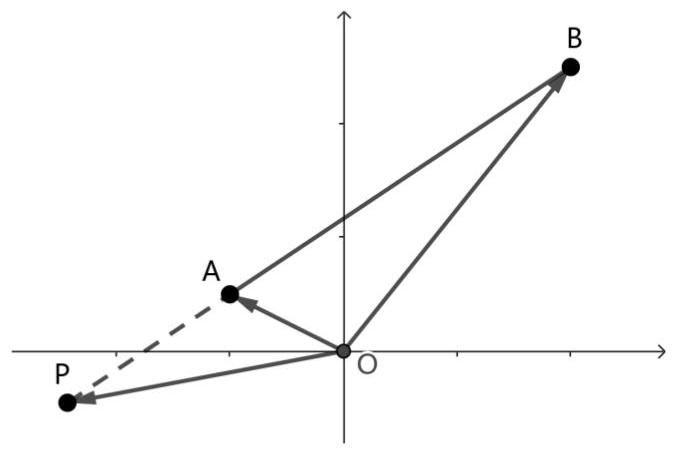

比较上述三种推导思路可以发现, 由于向量的坐标中蕴含了方向信息, 因此运算中也蕴含了方向信息, 不再需要在数量计算之外专门分析方向的情况, 使得分析计算得到极大简化。

由于向量可以任意平移，因此若运算中只涉及相对的位置关系，而不涉及固定的位置，向量运算相当于根据实际需要，将所有图形整体进行平移，同时不改变图形之间的距离和角度等位置关系。

## 练习 6.4(2)

1. 已知点 $A\left( {1,1}\right)$ 和 $B\left( {-2,0}\right)$ ,求:

(1)线段 ${AB}$ 的中点 $M$ 的坐标；

(2)将线段 ${AB}$ 分为 ${AP} : {BP} = 2 : 1$ 的点 $P$ 的坐标；

(3)点 $Q$ 在直线 ${AB}$ 上，且点 $Q$ 到点 $B$ 的距离为到点 $A$ 的距离的 3 倍，求点 $Q$ 的坐标。

#### 6.4.3 余弦定理和正弦定理

余弦定理和正弦定理是两个与三角形有关的定理,反映了三角形的角的大小与边长的数量关系, 在分析平面几何问题时非常有用。

余弦定理描述的是三角形的三条边长与任意一个角的余弦值的数量关系, 接下来推导余弦定理。对于 $\bigtriangleup {ABC}$ ,设顶点 $A\text{ 、 }B\text{ 、 }C$ 对应的边长分别为 $a\text{ 、 }b\text{ 、 }c$ , 如下页图所示。

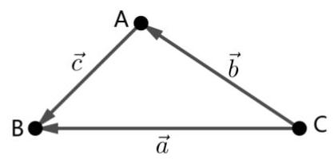

设 $\overrightarrow{CB} = \overrightarrow{a},\overrightarrow{CA} = \overrightarrow{b},\overrightarrow{AB} = \overrightarrow{c}$ ,可得 $\overrightarrow{c} = \overrightarrow{a} - \overrightarrow{b}$ ,代入 ${\left| \overrightarrow{c}\right| }^{2} = {\overrightarrow{c}}^{2}$ 可得:

$$
{\left| \overrightarrow{c}\right| }^{2} = {\overrightarrow{c}}^{2} = {\left( \overrightarrow{a} - \overrightarrow{b}\right) }^{2} = {\overrightarrow{a}}^{2} - 2\overrightarrow{a} \cdot  \overrightarrow{b} + {\overrightarrow{b}}^{2} = {\left| \overrightarrow{a}\right| }^{2} - 2\left| \overrightarrow{a}\right| \left| \overrightarrow{b}\right| \cos C + {\left| \overrightarrow{b}\right| }^{2}
$$

即 ${c}^{2} = {a}^{2} + {b}^{2} - {2ab}\cos C$ ,

同理可得: ${a}^{2} = {b}^{2} + {c}^{2} - {2bc}\cos A,{b}^{2} = {a}^{2} + {c}^{2} - {2ac}\cos B$ ,

将上面三个等式移项可得:

$$
\cos C = \frac{{a}^{2} + {b}^{2} - {c}^{2}}{2ab},\;\cos A = \frac{{b}^{2} + {c}^{2} - {a}^{2}}{2bc},\;\cos B = \frac{{a}^{2} + {c}^{2} - {b}^{2}}{2ac}
$$

上面两组公式都是余弦定理, 只是公式的形式不同, 可以看出, 余弦定理的形式有很强的对称性。

例 6.16 已知三角形的三条边长分别为 $8\text{ 、 }9\text{ 、 }{14}$ ，判断该三角形是否是钝角三角形。

解析: 根据三角形中 “大边对大角” 的原理, 该三角形最大的角所对的边长为14，该角的余弦值为:

$$
\cos \theta  = \frac{{8}^{2} + {9}^{2} - {14}^{2}}{2 \times  8 \times  9} =  - \frac{51}{144} < 0
$$

该三角形中最大的角是钝角, 是钝角三角形。

正弦定理的内容为:对于任意 $\bigtriangleup  {ABC}$ ，设顶点 $A$ 、 $B$ 、 $C$ 对应的边长分别为 $a\text{ 、 }b\text{ 、 }c$ ,那么三角形的各条边和各个角的正弦值满足数量关系:

$$
\frac{a}{\sin \mathrm{A}} = \frac{b}{\sin \mathrm{B}} = \frac{c}{\sin \mathrm{C}}\text{ 或 }\frac{\sin A}{a} = \frac{\sin B}{b} = \frac{\sin C}{c}
$$

即一个三角形的三条边长与对角的正弦值的比例相等。

正弦定理的证明较简单: 如下图所示,从 $\bigtriangleup  {ABC}$ 的三个顶点分别向对边引垂线: ${AP} \bot  {BC},{BQ} \bot  {AC},{CR} \bot  {AB}$ ,垂足分别为 $P\text{ 、 }Q\text{ 、 }R$ 。

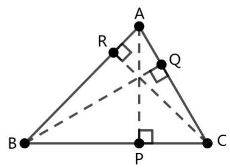

由三角形的面积公式可得: ${S}_{\bigtriangleup }{ABC} = \frac{1}{2}{AP} \cdot  {BC} = \frac{1}{2}{BQ} \cdot  {AC} = \frac{1}{2}{CR} \cdot  {AB}$

其中, ${AP} = {AC}\sin C,{BQ} = {AB}\sin A,{CR} = {BC}\sin B$ ,将这三个等式代入上面的三角形面积公式可得:

$$
S \bigtriangleup  {ABC} = \frac{1}{2}{AC}\sin C \cdot  {BC} = \frac{1}{2}{AB}\sin A \cdot  {AC} = \frac{1}{2}{BC}\sin B \cdot  {AB}
$$

约分后可得: ${AC} \cdot  {BC} \cdot  \sin C = {AB} \cdot  {AC} \cdot  \sin A = {BC} \cdot  {AB} \cdot  \sin B$

等式的各部分同时除以 ${AB} \cdot  {AC} \cdot  {BC}$ 就可以得到正弦定理:

$$
\frac{\sin C}{AB} = \frac{\sin A}{BC} = \frac{\sin B}{AC}
$$

例 6.17 已知 $\bigtriangleup  {ABC}$ 中， ${AC} = {BC} = 2$ ， $\sin A = \frac{3}{5}$ ，求 ${AB}$ 的长度。

解析: 因为 ${AC} = {BC} = 2$ ,所以 $\angle A = \angle B$ ,由此可得: $\angle C = {180}^{ \circ  } - 2\angle A$ ,由正弦定理可得: $\frac{BC}{\sin A} = \frac{AB}{\sin C} = \frac{AB}{\sin \left( {{180}^{ \circ  } - {2A}}\right) } = \frac{AB}{\sin {2A}}$ ，即 $\frac{BC}{\sin A} = \frac{AB}{\sin {2A}}$ ，

其中，已知 ${BC} = 2$ ， ${\sin A} = \frac{3}{5}$ ，要求 ${AB}$ 的大小，还需求得 ${\sin 2}A$ ，

底角 $\angle A\text{ 、 }\angle B$ 都是锐角,可得: $\cos A = \sqrt{1 - {\sin }^{2}A} = \sqrt{1 - {\left( \frac{3}{5}\right) }^{2}} = \frac{4}{5}$ ,

利用二倍角公式可得: $\sin {2A} = 2\sin A\cos A = 2 \times  \frac{3}{5} \times  \frac{4}{5} = \frac{24}{25}$ ,

将相应的数值代入等式: $\frac{2}{3/5} = \frac{AB}{{24}/{25}}$ ,解得: ${AB} = \frac{16}{5}$ 。

解三角形指根据三角形的部分已知参数, 求出其他未知参数的过程。三角形共有六个参数:三条边的边长和三个角的大小。解三角形的原理与全等三角形的判定相同, 如果根据已知条件能解出唯一的三角形, 那么该条件就可以判定两个三角形全等。如果根据已知条件能解出多个不同的三角形, 那么满足该条件的三角形就不只一种，就不能判定它们全等。

我们接下来利用余弦定理和正弦定理, 逐个讨论全等三角形的判定条件, 以及不能判定的条件。

下面是可以判定三角形全等的条件, 等价于可以确定唯一的三角形:

边边边, 已知三角形的三条边长。利用余弦定理, 可以由三角形的三条边长求得三个角的大小。

边角边, 已知三角形的两条边和它们的夹角。利用余弦定理, 可以求得第三条边的边长, 再利用余弦定理求出另外两个角的大小 (由于一对互补的角的正弦值相同, 因此有时难以用正弦定理唯一确定另外两个角的大小)。

角边角, 已知三角形的两个角和它们所夹的边长。利用三角形的内角和等于 $\pi$ ,可以求出已知边的对角的大小,再利用正弦定理可以求出另外两条边长。

角角边, 已知三角形的两个角和其中一个角的对边长。利用三角形的内角和等于 $\pi$ ,可以求出第三个角的大小,再利用正弦定理可以求出另外两条边长。

斜边直角边, 已知直角三角形的一条斜边和直角边, 利用勾股定理可以求得另一条直角边长, 再利用余弦定理可以求出其余两个角的大小。

下面是不能判定三角形全等的条件, 等价于不能确定唯一的三角形:

角角角, 已知三角形的三个角。根据正弦定理, 三条边长的比例是确定的, 但具体的边长无法确定, 可以等比例放大或缩小, 一系列三个角分别相等的三角形为相似三角形。

边边角, 已知两条边长和其中一条边的对角。利用正弦定理可以求得另一条已知边的对角的正弦值，但一个确定正弦值对应一对互补的锐角和钝角，所以该三角形并不唯一, 故不能证明是全等三角形。

如下图所示， $\bigtriangleup  {ABC}$ 和 $\bigtriangleup  {A}^{\prime }{BC}$ 中， ${AB} = {A}^{\prime }B$ (边)，且它们有共同的边 ${BC}$ (边) 和角 $C$ (角),但它们是两个不同的三角形, $\bigtriangleup  {ABC}$ 是钝角三角形, $\bigtriangleup  {{A}^{\prime }{BC}}$ 是锐角三角形, $\sin A = \sin \angle B{A}^{\prime }C$ 。

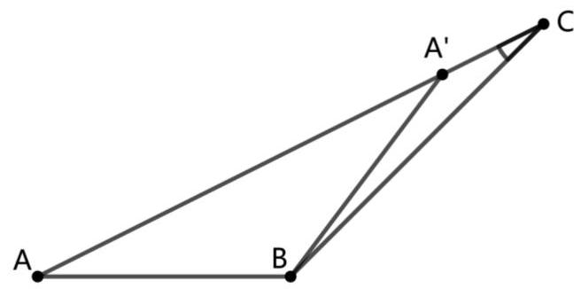

练习 6.4(3)

1. $\bigtriangleup  {ABC}$ 中， ${AB} = {AC} = 2,\angle A = \frac{\pi }{3}$ ，求 ${BC}$ 。

2. $\bigtriangleup  {ABC}$ 中， $\angle A = \frac{\pi }{3},\angle B = \frac{\pi }{4},{BC} = 1$ ，求 ${AB}$ 和 ${AC}$ 。

#### 6.4.4 向量在物理中的应用

向量的提出与物理学研究的需要密切相关, 力与运动是一类基本的物理问题, 也是使用向量的典型场景。用向量表示力、位移、速度等物理量时, 向量的长度与相应的物理量的大小成正比, 向量的方向与相应的物理量的方向相同。

力的合成与分解。物体静止在斜面上的受力分析是一类经典的物理问题, 力的合成与分解实际上就是向量的加法减法。

例 6.18 质量为 $m$ 的物体静止在斜面上,物体与斜面间的滑动摩擦系数为 $\mu$ ,设最大静摩擦力等于滑动摩擦力,重力加速为 $g$ ,求物体能静止在斜面上时, 斜面的最大倾角 $\theta$ 。

解析:按照题意画图如下所示。

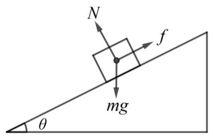

物体受到的重力为 ${mg}$ ,将重力分解到垂直于斜面和平行于斜面两个方向。 垂直于斜面的分力需与支持力 $N$ 平衡,平行于斜面的分力需不大于摩擦力 $f$ :

$$
\left\{  \begin{array}{l} N = {mg}\cos \theta \\  f \geq  {mg}\sin \theta  \end{array}\right.
$$

摩擦力与弹力之间满足关系: $f = {\mu N}$ ,代入上面的方程组得:

$$
\left\{  \begin{array}{l} N = {mg}\cos \theta \\  {\mu N} \geq  {mg}\sin \theta  \end{array}\right.
$$

将 $N = {mg}\cos \theta$ 代入 ${\mu N} \geq  {mg}\sin \theta$ 得: ${\mu mg}\cos \theta  \geq  {mg}\sin \theta$ ，

解得: $\frac{\sin \theta }{\cos \theta } \leq  \mu$ ,即 $\tan \theta  \leq  \mu$ ,最大倾角为正切值等于 $\mu$ 的角。

例 6.19 让一个飞机模型飞跃宽为 ${10}\mathrm{\;m}$ 的跑道,若飞机模型的前进速度为 $2\mathrm{\;m}/\mathrm{s}$ ，同时受到横向风力影响获得 ${0.5}\mathrm{\;m}/\mathrm{s}$ 的水平向右的速度，如果要保持飞行轨迹垂直于跑道, 需让飞机的机身朝向什么方向?

解析: 根据题意作图如下所示。

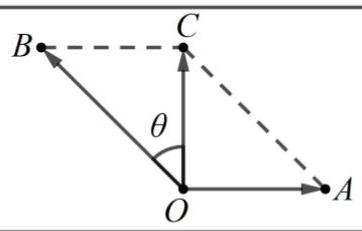

飞机模型受风力影响获得的横向速度为 $\overrightarrow{OA} = {0.5}\mathrm{\;m}/\mathrm{s}$ ,自身的前进速度为 $\overrightarrow{OB} = 2\mathrm{\;m}/\mathrm{s}$ ,将两个速度合成,飞机实际的运动方向为 $\overrightarrow{OC} = \overrightarrow{OA} + \overrightarrow{OB}$ 的方向,题目要求 $\overrightarrow{OC} \bot  \overrightarrow{OA}$ ,那么 $\angle {AOC} = {90}^{ \circ  }$ ,所以飞机的朝向应为垂直于跑道偏左 $\theta$ , 满足 $\sin \theta  = \frac{\left| \overrightarrow{OA}\right| }{\left| \overrightarrow{OB}\right| } = \frac{0.5}{2} = \frac{1}{4}$ 。

## 练习 6.4(4)

1. 物体做平抛运动时, 速度可以分解为水平和竖直两个方向的分速度: $\overrightarrow{v} = {\overrightarrow{v}}_{1} + {\overrightarrow{v}}_{2}$ ,其中, ${\overrightarrow{v}}_{1} = \left( {2,0}\right) ,{\overrightarrow{v}}_{2} = \left( {0,{10t}}\right) , t$ 为物体运动的时间, $t \geq  0$ ,速度的单位为,时间的单位为 $\mathrm{s}$ ,求:

(1)物体实际速度的大小 $\left| \overrightarrow{v}\right|$ 与运动时间 $t$ 的函数关系;

(2) $t = {1.2}$ 时物体的实际速度的大小。

## 小结

向量是全新的概念和运算方式, 需理解向量有方向有长度无位置的特点, 熟练掌握向量的基本性质、基本运算和规律，体会向量运算与代数运算的共性与差异，理解向量的基本运算的几何含义，熟练掌握向量的坐标运算及其几何含义。 需通过充分的练习，提高对向量运算的熟练度，掌握向量运算的常用方法和技巧， 对暗示平行、垂直等特殊关系的线索有一定敏感性。

## 第七章 复数

复数是对实数拓展得到的新的数的类型, 就像由整数拓展到有理数、由有理数拓展到实数, 复数域是包含实数域的更大的数域。复数实际上并不算全新的数学概念, 复数与已经学习的实数和向量有很多共同之处和密切联系。

将实数的运算进一步推广, 可以得到复数的性质和运算规律, 且复数与向量在形式上有很多共同点, 还能建立起一一对应关系, 复数也有显著的 “数形结合”的特点。

高中阶段对复数的学习较基础, 考察也较简单, 可以将学习本章当作对代数运算与向量知识的复习。

### 7.1 复数的概念和几何含义

从用于计数的自然数开始, 先通过加法和减法拓展到整数, 再通过乘法和除法拓展到有理数, 又通过乘方和开方拓展到实数, 现在通过解方程拓展到复数。

#### 7.1.1 数系的扩充和复数的概念

解一元二次方程时, 根据各项的系数可以判断方程的根的情况。

将一元二次方程 $a{x}^{2} + {bx} + c = 0\left( {a \neq  0}\right)$ 进行配方:

$$
{\left( x + \frac{b}{2a}\right) }^{2} = \frac{{b}^{2} - {4ac}}{4{a}^{2}}
$$

等式左边是完全平方数, 恒大于等于 0 , 由此可得:

如果 $\Delta  = {b}^{2} - {4ac} > 0$ ,那么方程有 2 个不同的实根。

如果 $\Delta  = {b}^{2} - {4ac} = 0$ ,那么方程有 2 个相同的实根,或称只有 1 个实根。

如果 $\Delta  = {b}^{2} - {4ac} < 0$ ,那么方程没有实根。

为了让一元二次方程总是有解,现在规定根号内也可以为负数,即 $\sqrt{-\left| a\right| }$ 也有意义,将根号内为负数的表达式 $\sqrt{-\left| a\right| }$ 叫作虚数。至此,我们只是简单生硬地规定了根号内为负数的表达式 $\sqrt{-\left| a\right| }$ 叫作虚数,对于虚数的实际含义,还需要根据其规定方式，结合具体运算进行研究。

为方便地表示虚数，再引入一个新的单位:虚数单位，用符号 “i” 表示， 其定义式为:

$$
\mathrm{i} = \sqrt{-1}
$$

将实数的乘法运算作用于虚数单位 $\mathrm{i}$ ,任意虚数都可以用一个实数与虚数单位 i 的乘积表示:

$$
\sqrt{-\left| a\right| } = \sqrt{\left| a\right|  \times  \left( {-1}\right) } = \sqrt{\left| a\right| } \times  \sqrt{-1} = \sqrt{\left| a\right| }\mathrm{i}
$$

例 7.1 用虚数单位 i 表示下列虚数:

(1) $\sqrt{-2};\;\left( 2\right) \sqrt{-{25}};\;\left( 3\right) \sqrt{-\pi }$ 。

解析: 将根号内的负实数分解为正实数与 -1 相乘的形式即可:

(1) $\sqrt{-2} = \sqrt{2 \times  \left( {-1}\right) } = \sqrt{2} \times  \sqrt{-1} = \sqrt{2}\mathrm{i}$ ；

(2) $\sqrt{-{25}} = \sqrt{{25} \times  \left( {-1}\right) } = \sqrt{25} \times  \sqrt{-1} = 5\mathrm{i}$ ；

(3) $\sqrt{-\pi } = \sqrt{\pi  \times  \left( {-1}\right) } = \sqrt{\pi } \times  \sqrt{-1} = \sqrt{\pi }\mathrm{i}$ 。

根据虚数单位的定义 $\mathrm{i} = \sqrt{-1}$ ,可以得到关于 $\mathrm{i}$ 的一系列基本运算规律:

$$
{\mathrm{i}}^{2} = {\left( \sqrt{-1}\right) }^{2} =  - 1
$$

$$
{\mathrm{i}}^{3} = {\mathrm{i}}^{2} \times  \mathrm{i} =  - 1 \times  \mathrm{i} =  - \mathrm{i}
$$

$$
{\mathrm{i}}^{4} = {\left( {\mathrm{i}}^{2}\right) }^{4} = {\left( -1\right) }^{2} = 1
$$

即: 对于任意 $k \in  \mathbf{Z}$ ,都有: ${\mathrm{i}}^{4k} = 1,{\mathrm{i}}^{{4k} + 1} = \mathrm{i},{\mathrm{i}}^{{4k} + 2} =  - 1,{\mathrm{i}}^{{4k} + 3} =  - \mathrm{i}$ 。

虚数的表示方式也适用于实数, 只是通常被省略了。如果将 “ 1 ” 看作 “实数单位”,即 $1 = \sqrt{+1}$ ,那么任意实数 $\sqrt{\left| a\right| }$ 都可用一个实数与 “实数单位 1 ” 的乘积表示: $\sqrt{\left| a\right| } = \sqrt{\left| a\right|  \times  1} = \sqrt{\left| a\right| } \times  \sqrt{1} = \sqrt{\left| a\right| } \times  1$ 。

可以将实数和虚数看作分别属于两个不同 “空间” 的数。实数以 1 (即 $\sqrt{+1}$ ) 为单位,在 “实在” 的空间中。虚数以 $\mathrm{i}$ (即 $\sqrt{-1}$ )为单位，在 “虚拟” 的空间中。实数和虚数各自分别遵循相同的基本运算规则。

虽然实数和虚数似乎被 “隔离” 在两个不同的空间内, 但实数与虚数可以互相转化: 对负实数开平方根可以得到虚数, 对虚数进行平方运算可以得到实数。

将实数与虚数写在一起, 用加号连接, 得到的数叫作复数, 通常用小写字母 $z$ 表示。

全体复数构成的集合 $\{ z = a + b\mathrm{i} \mid  a, b \in  \mathbf{R}\}$ 叫作复数集,又叫作复数域,通常用符号 $\mathbf{C}$ 表示。复数域是比实数域更大的数域，实数域和虚数域共同组成复数域。

复数的基本形式为:

$$
z = a + b\mathrm{i}
$$

其中 $a, b \in  \mathbf{R}, a$ 叫作实部, $b$ 叫作虚部(需注意，虚部是 $b$ ，而不是 $b\mathrm{i}$ )。

若 $a = b = 0$ ,则 $z = 0$ ;

若 $b = 0$ 且 $a \neq  0$ ，则 $z = a$ 为实数；

若 $b \neq  0$ 且 $a \neq  0$ ，则 $z = a + b\mathrm{i}$ 叫作虚数，习惯上也叫作复数；

若 $b \neq  0$ 且 $a = 0$ ，则 $z = b\mathrm{i}$ 为虚数，又叫作纯虚数。

对于复数 ${z}_{1} = {a}_{1} + {b}_{1}\mathrm{i}$ 与 ${z}_{2} = {a}_{2} + {b}_{2}\mathrm{i}$ ,当且仅当 ${a}_{1} = {a}_{2}$ 且 ${b}_{1} = {b}_{2}$ 时,称它们相等: ${z}_{1} = {z}_{2}$ 。即: 两个复数相等的充要条件为它们的实部和虚部分别相等。

若 ${z}_{1} = {a}_{1} + {b}_{1}\mathrm{i}$ 与 ${z}_{2} = {a}_{2} + {b}_{2}\mathrm{i}$ 满足 ${a}_{1} = {a}_{2}$ 且 ${b}_{1} =  - {b}_{2}$ ,就称 ${z}_{1}$ 与 ${z}_{2}$ 为共轭复数, 即 ${z}_{1} = a + b\mathrm{i}$ 与 ${z}_{2} = a - b\mathrm{i}$ 是共轭复数。既可以称 ${z}_{1}$ 是 ${z}_{2}$ 的共轭复数,又可以称 ${z}_{2}$ 是 ${z}_{1}$ 的共轭复数。 $z$ 的共轭复数记作 $\bar{z}$ 。

复数 $z = a + b\mathrm{i}$ 的绝对值的定义为: $\left| z\right|  = \sqrt{{a}^{2} + {b}^{2}}$ ,即实部与虚部的平方和的平方根, 复数的绝对值也叫作复数的模。

若 $a \neq  0, b = 0$ ,则 $z = a$ 为实数,它的模为 $\left| z\right|  = \sqrt{{a}^{2} + {0}^{2}} = \sqrt{{a}^{2}} = \left| a\right|$ ,与实数的绝对值的定义相同。

若 $a = 0, b \neq  0$ ,则 $z = b\mathrm{i}$ 为纯虚数,它的模为 $\left| z\right|  = \sqrt{{0}^{2} + {b}^{2}} = \sqrt{{b}^{2}} = \left| b\right|$ ,与实数的绝对值的定义相似。

对于复数 ${z}_{1} = {a}_{1} + {b}_{1}\mathrm{i}$ 与 ${z}_{2} = {a}_{2} + {b}_{2}\mathrm{i}$ ,无法直接比较它们的大小,但可以比较它们的模 $\left| {z}_{1}\right|  = \sqrt{{a}_{1}^{2} + {b}_{1}^{2}}$ 与 $\left| {z}_{2}\right|  = \sqrt{{a}_{2}^{2} + {b}_{2}^{2}}$ 的大小。复数的模之间也有大于、小于、 等于三种关系。

根据共轭复数和复数的模的定义可得:复数与它的共轭复数的模相等。

例 7.2 求下列复数的模:

(1)7 +4i；(2)-2-2i；(3)-5i；(4)1 。

解析: (1) $\sqrt{{7}^{2} + {4}^{2}} = \sqrt{65}$ ;

(2) $\sqrt{{\left( -2\right) }^{2} + {\left( -2\right) }^{2}} = 2\sqrt{2}$ ；

(3) $\left| {-5}\right|  = 5$ ；

(4) $\left| 1\right|  = 1$ 。

练习 7.1(1)

1. 指出下列各复数的实部和虚部, 写出它们的共轭复数, 求它们的模:

(1) $1 + i$ ；(2) $- {2i}$ ；(3) $- 3 + {5i}$ ；(4) $\frac{1}{2} - \frac{\sqrt{3}}{2}i$ ；(5) $\cos \frac{\pi }{4} + i\sin \frac{\pi }{4}$ 。

2. 在复数范围内求下列方程的解:

(3) ${x}^{2} + x - 1 = 0$ 。

3. 证明: 复数与它的共轭复数的模相等。

#### 7.1.2 复数的几何含义

复数也具有 “数形结合” 的特点, 如同实数与数轴上的点一一对应, 复数可以与平面内的点或向量一一对应。由复数的定义和表示方法可知:任意两个实数 $a\text{ 、 }b$ 构成的复数 $z = a + b\mathrm{i}$ ,可以与有序实数对 $\left( {a, b}\right)$ 一一对应,且由 $a\text{ 、 }b$ 构成的复数对有先后顺序,前面的 $a$ 为实部,后面的 $b$ 为虚部,若 $a \neq  b$ ,则实数对 $\left( {a, b}\right)$ 与 $\left( {b, a}\right)$ 表示两个不同的复数。

平面直角坐标系中,任意实数对 $\left( {a, b}\right)$ 与平面内的一个点或一个向量唯一地对应。复数的表示形式与坐标平面内的点或向量的表示形式相同, 都与实数对一一对应, 因此复数与坐标平面之间可以建立起直接联系:

每一个复数 $z = a + b\mathrm{i}$ 都与坐标平面上的一个点 $P\left( {a, b}\right)$ 或一个向量 $\overrightarrow{p} = \left( {a, b}\right)$ 一一对应,其中,复数的实部与 $x$ 轴上的横坐标对应,复数的虚部与 $y$ 轴上的纵坐标对应。

用平面直角坐标系中的点与复数一一对应的平面叫作复平面, 与复数的实部对应的 $x$ 轴叫作实轴,与虚部对应的 $y$ 轴叫作虚轴,画图时通常习惯将实轴和虚轴仍分别标记为 $x$ 轴和 $y$ 轴,如下图所示。

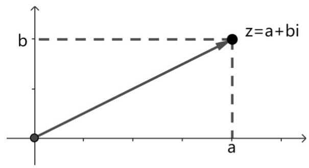

实轴上所有点的虚部都为 0,因此实轴上的所有点都表示实数。虚轴上所有点的实部都为 0,因此虚轴上的所有点都表示纯虚数。原点 $\left( {0,0}\right)$ 表示 0,即 $0 + 0\mathrm{i}$ 。

互为共轭复数的两个复数 $z = a + b\mathrm{i}$ 与 $\bar{z} = a - b\mathrm{i}$ ,对应的点 $\left( {a, b}\right)$ 与 $\left( {a, - b}\right)$ 关于 $x$ 轴镜面对称,即横坐标相同、纵坐标互为相反数。

复数的模 $\left| z\right|  = \sqrt{{a}^{2} + {b}^{2}}$ 等于点 $\left( {a, b}\right)$ 到原点 $\left( {0,0}\right)$ 的距离 $\sqrt{{a}^{2} + {b}^{2}}$ 。

实数对 $\left( {a, b}\right)$ 除可以表示平面内的一个点外,还可以表示平面内的一个向量,即沿 $x$ 轴方向移动 $a$ ,沿 $y$ 轴方向移动 $b$ ,于是任意复数 $z = a + b\mathrm{i}$ 还可以与坐标平面内的向量 $\overrightarrow{z} = \left( {a, b}\right)$ 一一对应。

其中，复数的实部与向量沿 $x$ 轴移动的距离和方向对应，复数的虚部与向量沿 $y$ 轴移动的距离和方向相对应。

互为共轭复数的两个复数 $z = a + b\mathrm{i}$ 与 $\bar{z} = a - b\mathrm{i}$ ,它们分别对应的向量 $\left( {a, b}\right)$ 与 $\left( {a, - b}\right)$ 关于 $x$ 轴对称,表示它们沿 $x$ 轴移动的方向和距离都相同,沿 $y$ 轴移动的距离相同、方向相反。

向量的模的定义 $\left| \overrightarrow{z}\right|  = \sqrt{{a}^{2} + {b}^{2}}$ 与复数的模的定义 $\left| z\right|  = \sqrt{{a}^{2} + {b}^{2}}$ 相同,因此 “模”的概念对于实数、复数、向量的定义式都相同。

例 7.3 在复平面内画出复数 5-2i 和它的共轭复数对应的向量。

解析: $5 - 2\mathrm{i}$ 对应的向量为 $\left( {5, - 2}\right)$ ,它的共轭复数为 $5 + 2\mathrm{i}$ ,对应的向量为 $\left( {5,2}\right)$ ，复平面中它们所对应的向量如下图所示。

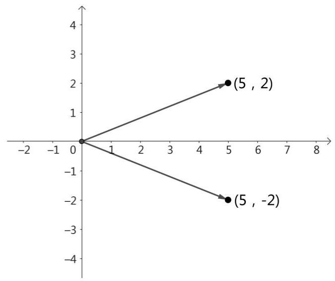

例 7.4 已知复数 $z = a - {2a}\mathrm{i}, a \in  \mathbf{R}, a \in  \left\lbrack  {-1,1}\right\rbrack$ ,在复平面内画出 $z$ 的图形。

解析: 复数 $z$ 的实部为 $a$ ,虚部为 $- {2a}$ ,对应的横坐标 $x$ 和纵坐标 $y$ 分别为 $a$ 和 $- {2a}$ ,始终满足函数关系 $y =  - {2x}$ ,是一条直线,又因为 $a \in  \left\lbrack  {-1,1}\right\rbrack$ ,所以 $z$ 是以 $\left( {-1,2}\right)$ 和 $\left( {1, - 2}\right)$ 为端点的线段,如下图所示。

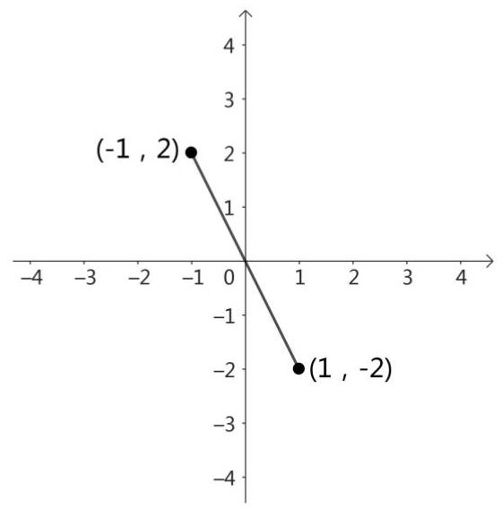

练习 7.1(2)

1. 在坐标平面内画出对应下列复数的向量:

(1) $1 + i$ (2)-2i; (3)-3+5i;

(4) $\frac{1}{2} - \frac{\sqrt{3}}{2}\mathrm{i}$ ； (5) $\cos \frac{\pi }{4} + i\sin \frac{\pi }{4}$ 。

2. 设 $z \in  \mathbf{C}$ ,在复平面内对应的点为 $Z$ ,画出满足下列条件的点 $Z$ 的集合:

(1) $\left| z\right|  \leq  1$ ；(2) $z + \overline{z} = 4$ ；(3) $\cos \theta  + \mathrm{i}\sin \theta$ ，且 $\theta  \in  \lbrack 0,{2\pi })$ 。

### 7.2 复数的四则运算

复数的四则运算可以看作多项式的运算，将实部看作关于单位 “ 1 ” 的项， 将虚部看作关于单位 “ $\mathrm{i}$ ” 的项,且两项可以互相转化。将平面坐标化让复数具有几何含义, 复数的四则运算也随之具有几何含义。

#### 7.2.1 复数的加、减运算及其几何含义

复数的加法和减法与多项式的加法和减法相似,任意两个复数 ${z}_{1} = {a}_{1} + {b}_{1}\mathrm{i}$ , ${z}_{2} = {a}_{2} + {b}_{2}\mathrm{i}\left( {{a}_{1},{b}_{1},{a}_{2},{b}_{2} \in  \mathbf{R}}\right)$ ,它们的和为:

$$
{z}_{1} + {z}_{2} = \left( {{a}_{1} + {b}_{1}\mathrm{i}}\right)  + \left( {{a}_{2} + {b}_{2}\mathrm{i}}\right)
$$

$$
= \left( {{a}_{1} + {a}_{2}}\right)  + \left( {{b}_{1} + {b}_{2}}\right) \mathrm{i}
$$

即实部与实部相加，虚部与虚部相加。

按照复数加法的运算法则, 以及实数加法的交换率和结合律, 可以证明复数的加法也满足交换律和结合律:

$$
{z}_{1} + {z}_{2} = {z}_{2} + {z}_{1}
$$

$$
\left( {{z}_{1} + {z}_{2}}\right)  + {z}_{3} = {z}_{1} + \left( {{z}_{2} + {z}_{3}}\right)
$$

如果 ${z}_{1} = {a}_{1} + {b}_{1}\mathrm{i}$ 与 ${z}_{2} = {a}_{2} + {b}_{2}\mathrm{i}$ 的实部和虚部分别互为相反数,即 ${a}_{1} + {a}_{2} = 0$ , ${b}_{1} + {b}_{2} = 0$ ,则它们的和为 0 :

$$
{z}_{1} + {z}_{2} = \left( {{a}_{1} + {a}_{2}}\right)  + \left( {{b}_{1} + {b}_{2}}\right) \mathrm{i}
$$

$$
= 0 + 0\mathrm{i}
$$

$$
= 0
$$

复数的减法与多项式的减法相似, ${z}_{1} = {a}_{1} + {b}_{1}\mathrm{i}$ 减去 ${z}_{2} = {a}_{2} + {b}_{2}\mathrm{i}$ ,等于它们的实部和虚部分别相减:

$$
{z}_{1} - {z}_{2} = \left( {{a}_{1} + {b}_{1}\mathrm{i}}\right)  - \left( {{a}_{2} + {b}_{2}\mathrm{i}}\right)
$$

$$
= \left( {{a}_{1} - {a}_{2}}\right)  + \left( {{b}_{1} - {b}_{2}}\right) \mathrm{i}
$$

复数的加、减法形式上与向量的加、减法相似, ${\overrightarrow{p}}_{1} = \left( {{a}_{1},{b}_{1}}\right)$ 与 ${\overrightarrow{p}}_{2} = \left( {{a}_{2},{b}_{2}}\right)$ 相加减，表达式为:

$$
{\overrightarrow{p}}_{1} \pm  {\overrightarrow{p}}_{2} = \left( {{a}_{1},{b}_{1}}\right)  \pm  \left( {{a}_{2},{b}_{2}}\right)  = \left( {{a}_{1} \pm  {a}_{2},{b}_{1} \pm  {b}_{2}}\right)
$$

比较复数的加(减)法与向量的加(减)法，复数的加(减)法是实部与实部相加(减)，虚部与虚部相加(减)，向量的加(减)法是横坐标与横坐标相加(减)，纵坐标与纵坐标相加(减)，两者互不影响。

通过上述比较可以发现,复数 ${z}_{1} = {a}_{1} + {b}_{1}\mathrm{i}$ 与 ${z}_{2} = {a}_{2} + {b}_{2}\mathrm{i}$ 可以分别表示复平面上的两个向量 ${\overrightarrow{p}}_{1} = \left( {{a}_{1},{b}_{1}}\right)$ 与 ${\overrightarrow{p}}_{2} = \left( {{a}_{2},{b}_{2}}\right)$ ,复数的和 (差) ${z}_{1} \pm  {z}_{2}$ 的几何含义与向量的和(差) ${\overrightarrow{p}}_{1} \pm  {\overrightarrow{p}}_{2}$ 的几何含义相同。

例 7.5 计算下列复数运算, 并在复平面内画出相应的向量运算:

(1) $\left( {4 + {2i}}\right)  + \left( {-3 + {3i}}\right) ;\left( 2\right)  - {4i} - \left( {-2 - {7i}}\right)$ 。

解析: (1) $\left( {4 + {2i}}\right)  + \left( {-3 + {3i}}\right)  = \left\lbrack  {4 + \left( {-3}\right) }\right\rbrack   + \left( {2 + 3}\right) i = 1 + {5i}$ ,

该运算表示向量 $\left( {4,2}\right)$ 与 $\left( {-3,3}\right)$ 的和,如下图左所示;

(2) $- {4i} - \left( {-2 - {7i}}\right)  = \left\lbrack  {0 - \left( {-2}\right) }\right\rbrack   + \left\lbrack  {-4 - \left( {-7}\right) }\right\rbrack  i = 2 + {3i}$ ，

该运算表示向量 $\left( {0, - 4}\right)$ 与 $\left( {-2, - 7}\right)$ 的差,如下图右所示。

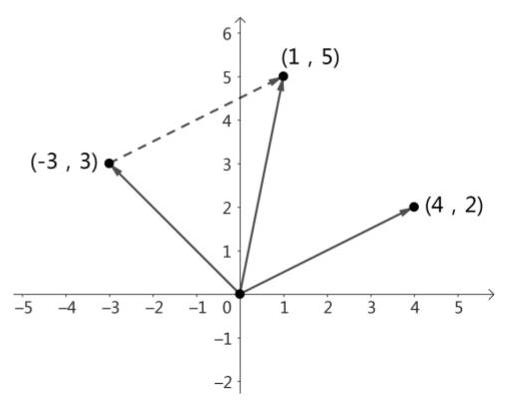

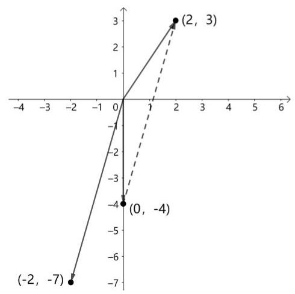

练习 7.2(1)

1. 计算下列复数运算, 并在复平面内画出相应的向量运算:

(1)(1+i)+(1−i)；(2)(5+3i)-(4−i)；(3) $3\mathrm{i} - \left( {-2 + \mathrm{i}}\right)$ ；(4) $5 - \left( {-1 + \mathrm{i}}\right)$ 。

2. 计算:

(1) $\left\lbrack  {{\left( \mathrm{e} + 1\right) }^{2} + {\mathrm{e}}^{2}\mathrm{i}}\right\rbrack   + \left\lbrack  {{\left( \mathrm{e} - 1\right) }^{2} + \left( {1 + \mathrm{e}}\right) \left( {1 - \mathrm{e}}\right) \mathrm{i}}\right\rbrack$ ;

(2) $\left( {\sin {72}^{ \circ  }\cos {27}^{ \circ  } + i\sin {72}^{ \circ  }\sin {27}^{ \circ  }}\right)  - \left( {\sin {27}^{ \circ  }\cos {72}^{ \circ  } - i\cos {72}^{ \circ  }\cos {27}^{ \circ  }}\right)$ 。

#### 7.2.2 复数的乘、除运算

复数的乘、除运算与多项式的乘、除运算相似, 其中乘法较容易理解, 除法需使用一个基本的小技巧。

复数 ${z}_{1} = {a}_{1} + {b}_{1}\mathrm{i}$ 与 ${z}_{2} = {a}_{2} + {b}_{2}\mathrm{i}$ 相乘,可以看作两个多项式相乘:

$$
{z}_{1}{z}_{2} = \left( {{a}_{1} + {b}_{1}\mathrm{i}}\right) \left( {{a}_{2} + {b}_{2}\mathrm{i}}\right)  = {a}_{1}{a}_{2} + {a}_{1}{b}_{2}\mathrm{i} + {b}_{1}\mathrm{i}{a}_{2} + {b}_{1}\mathrm{i}{b}_{2}\mathrm{i}
$$

其中, ${b}_{1}\mathrm{i}{b}_{2}\mathrm{i} = {b}_{1}{b}_{2}{\mathrm{i}}^{2} =  - {b}_{1}{b}_{2}$ ,由此可得:

$$
\left( {{a}_{1} + {b}_{1}\mathrm{i}}\right) \left( {{a}_{2} + {b}_{2}\mathrm{i}}\right)  = \left( {{a}_{1}{a}_{2} - {b}_{1}{b}_{2}}\right)  + \left( {{a}_{1}{b}_{2} + {a}_{2}{b}_{1}}\right) \mathrm{i}
$$

这就是复数乘法的运算规则。

按照复数乘法的运算规则, 以及实数乘法的交换律、结合律、分配律, 可以证明复数的乘法也满足交换律、结合律、分配律, 即:

$$
{z}_{1}{z}_{2} = {z}_{2}{z}_{1},\;\left( {{z}_{1}{z}_{2}}\right) {z}_{3} = {z}_{1}\left( {{z}_{2}{z}_{3}}\right) ,\;{z}_{1}\left( {{z}_{2} + {z}_{3}}\right)  = {z}_{1}{z}_{2} + {z}_{1}{z}_{3}
$$

分别设 ${z}_{1} = {a}_{1} + {b}_{1}\mathrm{i},{z}_{2} = {a}_{2} + {b}_{2}\mathrm{i},{z}_{3} = {a}_{3} + {b}_{3}\mathrm{i}$ ,按照复数乘法和加法的运算法则, 分别求出等式左右两边的表达式, 就能证明这三个规律。

复数的除法与多项式的除法相似, ${z}_{1} = {a}_{1} + {b}_{1}i$ 除以 ${z}_{2} = {a}_{2} + {b}_{2}i\left( {{z}_{2} \neq  0}\right)$ ,结果可以表示为:

$$
{z}_{1} \div  {z}_{2} = \frac{{a}_{1} + {b}_{1}\mathrm{i}}{{a}_{2} + {b}_{2}\mathrm{i}}
$$

这种表示方法的分子和分母中都有 $\mathrm{i}$ ,在分析和计算中并不方便,最好能将分母中的虚部消除,将复数写为 $z = a + b\mathrm{i}$ 的形式。利用平方差公式可以消除分母中的i, 让分子与分母同时乘以分母的共轭复数:

$$
\frac{{z}_{1}}{{z}_{2}} = \frac{{a}_{1} + {b}_{1}\mathrm{i}}{{a}_{2} + {b}_{2}\mathrm{i}} = \frac{\left( {{a}_{1} + {b}_{1}\mathrm{i}}\right) \left( {{a}_{2} - {b}_{2}\mathrm{i}}\right) }{\left( {{a}_{2} + {b}_{2}\mathrm{i}}\right) \left( {{a}_{2} - {b}_{2}\mathrm{i}}\right) } = \frac{\left( {{a}_{1}{a}_{2} + {b}_{1}{b}_{2}}\right)  + \left( {{a}_{2}{b}_{1} - {a}_{1}{b}_{2}}\right) \mathrm{i}}{{a}_{2}{}^{2} + {b}_{2}{}^{2}}
$$

即 $\left( {{a}_{1} + {b}_{1}\mathrm{i}}\right)  \div  \left( {{a}_{2} + {b}_{2}\mathrm{i}}\right)  = \frac{{a}_{1}{a}_{2} + {b}_{1}{b}_{2}}{{a}_{2}{}^{2} + {b}_{2}{}^{2}} + \frac{{a}_{2}{b}_{1} - {a}_{1}{b}_{2}}{{a}_{2}{}^{2} + {b}_{2}{}^{2}}\mathrm{i}$

该公式不需要记背, 只需知道利用平方差公式消去分母中的i 即可。

用复数的乘法或除法的法则和性质, 结合相应的定义容易证明, 复数的乘积与商的模, 有下列实用的规律:

$$
\left| {{z}_{1}{z}_{2}}\right|  = \left| {z}_{1}\right|  \cdot  \left| {z}_{2}\right| ,\;\left| {z}^{n}\right|  = {\left| z\right| }^{n},\;\left| \frac{{z}_{1}}{{z}_{2}}\right|  = \frac{\left| {z}_{1}\right| }{\left| {z}_{2}\right| }
$$

例 7.6 计算下列复数运算:

(1) $\left( {2 + {5i}}\right) \left( {2 + i}\right) ;\;\left( 2\right) \frac{-1 + {4i}}{2 - i}$ 。

解析: (1) $\left( {2 + 5\mathrm{i}}\right) \left( {2 + \mathrm{i}}\right)  = 2 \times  2 + 2 \times  \mathrm{i} + 5\mathrm{i} \times  2 + 5\mathrm{i} \times  \mathrm{i} = 4 + 2\mathrm{i} + {10}\mathrm{i} + 5{\mathrm{i}}^{2}$

$$
= 4 + 2\mathrm{i} + {10}\mathrm{i} - 5 =  - 1 + {12}\mathrm{i}
$$

(2) $\frac{-1 + {4i}}{2 - i} = \frac{\left( {-1 + {4i}}\right) \left( {2 + i}\right) }{\left( {2 - i}\right) \left( {2 + i}\right) } = \frac{-2 - i + {8i} + 4{i}^{2}}{{2}^{2} - {i}^{2}} = \frac{-2 - i + {8i} - 4}{4 - \left( {-1}\right) } =  - \frac{6}{5} + \frac{7}{5}i$

练习 $\mathbf{{7.2}\left( 2\right) }$

1. 计算下列复数运算:

(1)(1 + i)(1)1(2) ${3i}\left( {-2 + i}\right)$ ；(3) ${\left( \frac{1}{2} - \frac{\sqrt{3}}{2}i\right) }^{2}$ ；

(4) $\frac{-2 + \mathrm{i}}{3\mathrm{i}}$ ；(5) $\frac{5 + 3\mathrm{i}}{4 - \mathrm{i}}$ ；(6) ${\left( \frac{1 + \mathrm{i}}{1 - \mathrm{i}}\right) }^{2}$ 。

2. 利用复数的四则运算法则, 证明下列规律:

(1) ${z}_{1}{z}_{2} = {z}_{2}{z}_{1}$ ；(2) $\left( {{z}_{1}{z}_{2}}\right) {z}_{3} = {z}_{1}\left( {{z}_{2}{z}_{3}}\right)$ ；(3) ${z}_{1}\left( {{z}_{2} + {z}_{3}}\right)  = {z}_{1}{z}_{2} + {z}_{1}{z}_{3}$ ；

(4) $\left| {{z}_{1}{z}_{2}}\right|  = \left| {z}_{1}\right|  \cdot  \left| {z}_{2}\right|$ ； (5) $\left| \frac{{z}_{1}}{{z}_{2}}\right|  = \frac{\left| {z}_{1}\right| }{\left| {z}_{2}\right| }$ ； (6) $\left| {z}^{n}\right|  =  \mid  z$

### 7.3 复数的三角表示

平面内的任意复数除可以用对应的 $x$ 轴坐标和 $y$ 轴坐标表示外,还可以用另外两个参数表示: 到原点的距离 $r\left( {r \geq  0}\right)$ 和与 $x$ 轴正方向的夹角 $\theta \left( {0 \leq  \theta  < {2\pi }}\right)$ , 用这种表示方法可以直观地体现复数的乘、除运算的几何含义。

#### 7.3.1 复数的三角表示

对于复数 $z = a + b\mathrm{i}$ ,它的坐标为 $\left( {a, b}\right)$ ,它到原点的距离为 $r = \sqrt{{a}^{2} + {b}^{2}}$ , 它与 $x$ 轴正方向的夹角 $\theta$ 满足 $\cos \theta  = \frac{a}{r},\sin \theta  = \frac{b}{r}$ ,如下图所示。

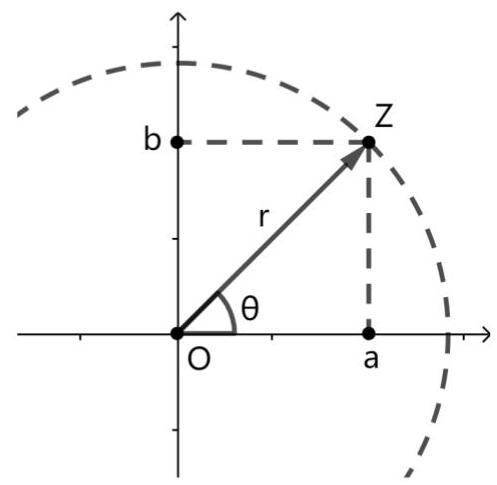

于是,复数 $z = a + b\mathrm{i}$ 还可以用参数 $r$ 和 $\theta$ 唯一地表示为:

$$
z = a + b\mathrm{i} = r\cos \theta  + \mathrm{i}r\sin \theta  = r\left( {\cos \theta  + \mathrm{i}\sin \theta }\right)
$$

其中, $\theta$ 叫作该复数的辐角,满足 $\cos \theta  = \frac{a}{r},\sin \theta  = \frac{b}{r}$ ,在 $\lbrack 0,{2\pi })$ 范围内的 $\theta$ 值叫作辐角主值， $r = \sqrt{{a}^{2} + {b}^{2}}$ 为复数的模， $r \in  \lbrack 0$ ， $+ \infty )$ 。

这种表示方式叫作复数的三角表示式, 简称三角形式, 本章开篇学习的 $z = a + b\mathrm{i}$ 叫作复数的代数表示式,简称代数形式。

需注意,复数的三角形式中,括号内的 $\cos \theta$ 与 $i\sin \theta$ 前都没有负号,这是因为它们的正负号都由辐角主值的余弦函数与正弦函数的正负号体现。

复数的三角形式用两个参数 $r$ 和 $\theta$ 表示平面内任意一点的位置,复数的代数形式用两个参数 $x$ 和 $y$ 表示平面内任意一点的位置,都需要两个参数,都体现了平面是 “二维” 的特点。

#### 7.3.2 复数乘、除运算的几何含义

复数的加、减运算的几何含义可以由代数形式直观体现, 复数的乘、除运算的几何含义则由三角形式直观体现。

复数 ${z}_{1} = {r}_{1}\left( {\cos \theta  + \mathrm{i}\sin \theta }\right)$ 与 ${z}_{2} = {r}_{2}\left( {\cos \varphi  + \mathrm{i}\sin \varphi }\right)$ 的乘积为:

$$
{z}_{1}{z}_{2} = {r}_{1}\left( {\cos \theta  + \mathrm{i}\sin \theta }\right) {r}_{2}\left( {\cos \varphi  + \mathrm{i}\sin \varphi }\right)
$$

$$
= {r}_{1}{r}_{2}\left\lbrack  {\left( {\cos \theta  + \mathrm{i}\sin \theta }\right) \left( {\cos \varphi  + \mathrm{i}\sin \varphi }\right) }\right\rbrack
$$

$$
= {r}_{1}{r}_{2}\left( {\cos \theta \cos \varphi  + \cos \theta \mathrm{i}\sin \varphi  + \mathrm{i}\sin \theta \cos \varphi  + \mathrm{i}\sin \theta \mathrm{i}\sin \varphi }\right)
$$

$$
= {r}_{1}{r}_{2}\left\lbrack  {\left( {\cos \theta \cos \varphi  - \sin \theta \sin \varphi }\right)  + \mathrm{i}\left( {\cos \theta \sin \varphi  + \sin \theta \cos \varphi }\right) }\right\rbrack
$$

$$
= {r}_{1}{r}_{2}\left\lbrack  {\cos \left( {\theta  + \varphi }\right)  + \mathrm{i}\sin \left( {\theta  + \varphi }\right) }\right\rbrack
$$

可以发现: ${z}_{1}{z}_{2}$ 的模等于 ${z}_{1}$ 与 ${z}_{2}$ 的模的乘积 ${r}_{1}{r}_{2},{z}_{1}{z}_{2}$ 的辐角主值等于 ${z}_{1}$ 与 ${z}_{2}$ 的辐角主值之和 $\theta  + \varphi$ ,这就是复数的乘法的几何含义,用公式表示为:

---

$$
{r}_{1}\left( {\cos \theta  + \mathrm{i}\sin \theta }\right)  \cdot  {r}_{2}\left( {\cos \varphi  + \mathrm{i}\sin \varphi }\right)  = {r}_{1}{r}_{2}\left\lbrack  {\cos \left( {\theta  + \varphi }\right)  + \mathrm{i}\sin \left( {\theta  + \varphi }\right) }\right\rbrack
$$

---

复数乘法的几何含义如下图所示, 注意观察并比较各复数的模和辐角主值间的关系。

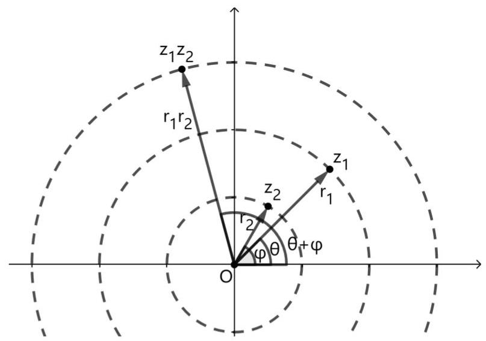

复数的除法的几何含义与乘法相似, 不需要再按照复数除法的计算法则推导, 只需要根据除法是乘法的逆运算进行逆向分析即可:

如果 ${z}_{1} = {z}_{2}{z}_{3}$ ,那么 ${z}_{1} \div  {z}_{2} = {z}_{3}$ 。根据复数乘法的几何含义, ${z}_{1}$ 的辐角等于 ${z}_{2}$ 与 ${z}_{3}$ 的辐角之和,所以 ${z}_{3}$ 的辐角等于 ${z}_{1}$ 的辐角减去 ${z}_{2}$ 的辐角的差。 ${z}_{1}$ 的模等于 ${z}_{2}$ 与 ${z}_{3}$ 的模的乘积,所以 ${z}_{3}$ 的模等于 ${z}_{1}$ 的模除以 ${z}_{2}$ 的模的商。用公式表示为:

$$
\frac{{r}_{1}\left( {\cos \theta  + \mathrm{i}\sin \theta }\right) }{{r}_{2}\left( {\cos \varphi  + \mathrm{i}\sin \varphi }\right) } = \frac{{r}_{1}}{{r}_{2}}\left\lbrack  {\cos \left( {\theta  - \varphi }\right)  + \mathrm{i}\sin \left( {\theta  - \varphi }\right) }\right\rbrack
$$

即: 两个复数相除, 商的辐角等于被除数的辐角减去除数的辐角, 商的模等于被除数的模除以除数的模。

例 7.7 将下列复数的代数形式化为三角形式:

(1) $\sqrt{3} + i;\;\left( 2\right) \; - 1 - i;\;\left( 3\right) \;5;\;\left( 4\right) \;3 + {4i}$ 。

解析: 先求出复数的模, 再根据正弦函数和余弦函数的值确定对应辐角主值:

(1) $r = \sqrt{{\sqrt{3}}^{2} + {1}^{2}} = 2,\sqrt{3} + \mathrm{i} = 2\left( {\frac{\sqrt{3}}{2} + \frac{1}{2}\mathrm{i}}\right)  = 2\left( {\cos \frac{\pi }{6} + \mathrm{i}\sin \frac{\pi }{6}}\right)$ ;

(2) $r = \sqrt{{\left( -1\right) }^{2} + {\left( -1\right) }^{2}} = \sqrt{2}, - 1 - \mathrm{i} = \sqrt{2}\left( {-\frac{\sqrt{2}}{2} - \frac{\sqrt{2}}{2}\mathrm{i}}\right)  = \sqrt{2}\left( {\cos \frac{5\pi }{4} + \mathrm{i}\sin \frac{5\pi }{4}}\right)$ ;

(3) $r = \left| 5\right|  = 5,\;5 = 5 + 0\mathrm{i} = 5\left( {1 + 0\mathrm{i}}\right)  = 5\left( {\cos 0 + \mathrm{i}\sin 0}\right)$ ；

(4) $r = \sqrt{{3}^{2} + {4}^{2}} = 5,3 + 4\mathrm{i} = 5\left( {\frac{3}{5} + \frac{4}{5}\mathrm{i}}\right)  = 5\left( {\cos t + \mathrm{i}\sin t}\right)$ ，其中 $t$ 满足 $\cos t = \frac{3}{5}$ ， $\sin t = \frac{4}{5}$

例 7.8 将下列复数的三角形式化为代数形式:

(1) $4\left( {\cos \frac{3\pi }{4} + \mathrm{i}\sin \frac{3\pi }{4}}\right)$ ；(2) $\frac{\sqrt{3}}{3}\left( {\cos \frac{3\pi }{2} + \mathrm{i}\sin \frac{3\pi }{2}}\right)$ 。

解析: 计算出相应三角函数的值, 与模相乘后展开为复数的代数形式即可:

(1) $4\left( {\cos \frac{3\pi }{4} + i\sin \frac{3\pi }{4}}\right)  = 4\left( {-\frac{\sqrt{2}}{2} + \frac{\sqrt{2}}{2}\mathrm{i}}\right)  =  - 2\sqrt{2} + 2\sqrt{2}\mathrm{i}$ ;

(2) $\frac{\sqrt{3}}{3}\left( {\cos \frac{3\pi }{2} + \mathrm{i}\sin \frac{3\pi }{2}}\right)  = \frac{\sqrt{3}}{3}\left( {0 - \mathrm{i}}\right)  =  - \frac{\sqrt{3}}{3}\mathrm{i}$ 。

例 7.9 计算下列各式的值:

(1) $\sqrt{5}\left( {\cos \frac{\pi }{12} + \mathrm{i}\sin \frac{\pi }{12}}\right)  \times  \sqrt{15}\left( {\cos \frac{\pi }{12} + \mathrm{i}\sin \frac{\pi }{12}}\right)$ ；

(2) $2\left( {\cos {22}^{ \circ  } + i\sin {22}^{ \circ  }}\right)  \div  \left( {\cos {157}^{ \circ  } + i\sin {157}^{ \circ  }}\right)$ 。

解析: 利用复数乘、除法的几何含义计算更加简便:

(1) $\sqrt{5}\left( {\cos \frac{\pi }{12} + i\sin \frac{\pi }{12}}\right)  \times  \sqrt{15}\left( {\cos \frac{\pi }{12} + i\sin \frac{\pi }{12}}\right) \; = \sqrt{5} \times  \sqrt{15}\left\lbrack  {\cos \left( {\frac{\pi }{12} + \frac{\pi }{12}}\right)  + i\sin \left( {\frac{\pi }{12} + \frac{\pi }{12}}\right) }\right\rbrack$

$$
= 5\sqrt{3}\left( {\cos \frac{\pi }{6} + \mathrm{i}\sin \frac{\pi }{6}}\right)
$$

$= 5\sqrt{3}\left( {\frac{\sqrt{3}}{2} + \frac{1}{2}\mathrm{i}}\right)$

$$
= \frac{15}{2} + \frac{5\sqrt{3}}{2}\mathrm{i}
$$

(2) $2\left( {\cos {22}^{ \circ  } + \mathrm{i}\sin {22}^{ \circ  }}\right)  \div  \left( {\cos {157}^{ \circ  } + \mathrm{i}\sin {157}^{ \circ  }}\right)$

$$
= \frac{2}{1}\left( {\cos \left( {{22}^{ \circ  } - {157}^{ \circ  }}\right)  + \mathrm{i}\sin \left( {{22}^{ \circ  } - {157}^{ \circ  }}\right) }\right)
$$

$$
= 2\left\lbrack  {\cos \left( {-{135}^{ \circ  }}\right)  + \mathrm{i}\sin \left( {-{135}^{ \circ  }}\right) }\right\rbrack
$$

$$
= 2\left( {-\frac{\sqrt{2}}{2} - \frac{\sqrt{2}}{2}\mathrm{i}}\right)
$$

$$
=  - \sqrt{2} - \sqrt{2}\mathrm{i}
$$

练习 7.3(1)

1. 将下列复数的代数形式化为三角形式:

(1) $\frac{1}{2} + \frac{\sqrt{3}}{2}\mathrm{i};\;$ (2) $- \sqrt{2} + \sqrt{2}\mathrm{i};$

2. 将下列复数的三角形式化为代数形式:

(1) $2\left( {\cos \frac{7\pi }{4} + i\sin \frac{7\pi }{4}}\right) ;\;$ (2) $\sqrt{2}\left( {\cos \frac{5\pi }{6} + i\sin \frac{5\pi }{6}}\right)$ 。

3. 计算下列各式的值:

(1) $\sqrt{2}\left( {\cos {37}^{ \circ  } + i\sin {37}^{ \circ  }}\right)  \times  \sqrt{3}\left( {\cos {53}^{ \circ  } + i\sin {53}^{ \circ  }}\right)$ ；

(2) $\frac{\sqrt{2}}{2}\left( {\cos \frac{\pi }{12} + i\sin \frac{\pi }{12}}\right)  \times  \frac{\sqrt{6}}{2}\left( {\cos \frac{5\pi }{12} + i\sin \frac{5\pi }{12}}\right)$ ；

(3) $8\left( {\cos {121}^{ \circ  } + i\sin {121}^{ \circ  }}\right)  \div  4\left( {\cos {31}^{ \circ  } + i\sin {31}^{ \circ  }}\right)$ ；

(4) $\sqrt{6}\left( {\cos \frac{17\pi }{12} + i\sin \frac{17\pi }{12}}\right)  \div  \sqrt{3}\left( {\cos \frac{11\pi }{12} + i\sin \frac{11\pi }{12}}\right)$ 。

4. 设复数 $z = r\left( {\cos \theta  + \mathrm{i}\sin \theta }\right)$ ,

(1)推导 ${z}^{2}$ 的表达式；

(2)利用(1)的结果，推导 ${z}^{3}$ 的表达式；

(3)根据(1)和(2)的结果，给出 ${z}^{n}\left( {n \in  {\mathbf{N}}_{ + }}\right)$ 的表达式；

(4)利用(3)的结果，求方程 ${z}^{n} = 1$ 的所有复数解，画图指出其几何含义。

5. 利用复数 $\mathrm{i}$ 的三角形式,结合画图,分析任意复数 $z$ 分别与 $\mathrm{i},{\mathrm{i}}^{2},{\mathrm{i}}^{3},{\mathrm{i}}^{4}$ 相乘的几何含义。

#### 7.3.3 复数的乘方与开方

利用复数的三角表示，可以简便地进行复数的乘方与开方运算，并清晰地得知乘方与开方运算的几何含义。

当 3 个复数连续相乘时,即 ${z}_{1}{z}_{2}{z}_{3}$ ,设它们分别为 ${z}_{1} = {r}_{1}\left( {\cos {\theta }_{1} + \mathrm{i}\sin {\theta }_{1}}\right)$ 、 ${z}_{2} = {r}_{2}\left( {\cos {\theta }_{2} + \mathrm{i}\sin {\theta }_{2}}\right) \text{ 、 }\cdots \cdots \text{ 、 }{z}_{n} = {r}_{3}\left( {\cos {\theta }_{3} + \mathrm{i}\sin {\theta }_{3}}\right)$ ,可以先将 ${z}_{1}$ 与 ${z}_{2}$ 相乘,再将乘积与 ${z}_{3}$ 相乘,利用复数的三角表示的乘法运算可得:

$$
{z}_{1}{z}_{2} = {r}_{1}{r}_{2}\left\lbrack  {\cos \left( {{\theta }_{1} + {\theta }_{2}}\right)  + \mathrm{i}\sin \left( {{\theta }_{1} + {\theta }_{2}}\right) }\right\rbrack
$$

对于复数 ${z}_{1}{z}_{2}$ ,它的模为 ${r}_{1}{r}_{2}$ ,它的辐角为 ${\theta }_{1} + {\theta }_{2}$ ,再次利用复数的三角表示的乘法运算可得:

$$
\left( {{z}_{1}{z}_{2}}\right) {z}_{3} = \left( {{r}_{1}{r}_{2}}\right) {r}_{3}\left\lbrack  {\cos \left( {\left( {{\theta }_{1} + {\theta }_{2}}\right)  + {\theta }_{3}}\right)  + \mathrm{i}\sin \left( {\left( {{\theta }_{1} + {\theta }_{2}}\right)  + {\theta }_{3}}\right) }\right\rbrack
$$

即:

$$
{z}_{1}{z}_{2}{z}_{3} = {r}_{1}{r}_{2}{r}_{3}\left\lbrack  {\cos \left( {{\theta }_{1} + {\theta }_{2} + {\theta }_{3}}\right)  + \mathrm{i}\sin \left( {{\theta }_{1} + {\theta }_{2} + {\theta }_{3}}\right) }\right\rbrack
$$

同理,当多个复数相乘时,即 ${z}_{1}{z}_{2}\cdots {z}_{n}$ ,其中 ${z}_{i} = {r}_{i}\left( {\cos {\theta }_{i} + \mathrm{i}\sin {\theta }_{i}}\right) , i$ 依次取 $1 \sim  n$ ,连续使用 $n - 1$ 次复数的三角表示的乘法运算,可得:

$$
{z}_{1}{z}_{2}\cdots {z}_{n} = {r}_{1}{r}_{2}\cdots {r}_{n}\left\lbrack  {\cos \left( {{\theta }_{1} + {\theta }_{2}\cdots  + {\theta }_{n}}\right)  + \mathrm{i}\sin \left( {{\theta }_{1} + {\theta }_{2}\cdots  + {\theta }_{n}}\right) }\right\rbrack
$$

即: 多个复数连续相乘, 乘积的模等于全体因数的模的乘积, 乘积的辐角等于全体因数的辐角之和。

当同一个复数自身多次相乘时,即 ${z}^{n}$ ,设 $z = r\left( {\cos \theta  + \mathrm{i}\sin \theta }\right)$ ,利用复数的三角表示的乘法运算可得:

$$
{z}^{n} = {zz}\cdots z = {rr}\cdots r\left\lbrack  {\cos \left( {\theta  + \theta  + \cdots  + \theta }\right)  + \mathrm{i}\sin \left( {\theta  + \theta  + \cdots  + \theta }\right) }\right\rbrack   = {r}^{n}\left\lbrack  {\cos \left( {n\theta }\right)  + \mathrm{i}\sin \left( {n\theta }\right) }\right\rbrack
$$

即:

$$
{z}^{n} = {r}^{n}\left\lbrack  {\cos \left( {n\theta }\right)  + \mathrm{i}\sin \left( {n\theta }\right) }\right\rbrack
$$

即: 复数的乘方 ${z}^{n}$ ,其模等于 $z$ 的模的 $n$ 次方,其辐角等于 $z$ 的辐角的 $n$ 倍。

开方运算可以看作乘方运算的逆运算, 因此:

$$
\sqrt[n]{z} = \sqrt[n]{r}\left\lbrack  {\cos \left( \frac{\theta }{n}\right)  + \mathrm{i}\sin \left( \frac{\theta }{n}\right) }\right\rbrack
$$

即: 复数的开方 $\sqrt[n]{z}$ ,其模等于 $z$ 的模的 $n$ 次方根,其辐角等于 $z$ 的辐角的 $\frac{1}{n}$ 。

实数的指数运算中,开方可以用分数指数表示: $\sqrt[n]{a} = {a}^{\frac{1}{n}}$ ,若复数的指数运算中的指数为分数, 可以得到与实数的指数运算相同的记法:

$$
{z}^{\frac{1}{n}} = {r}^{\frac{1}{n}}\left\lbrack  {\cos \left( {\frac{1}{n}\theta }\right)  + \mathrm{i}\sin \left( {\frac{1}{n}\theta }\right) }\right\rbrack   = \sqrt[n]{r}\left\lbrack  {\cos \left( \frac{\theta }{n}\right)  + \mathrm{i}\sin \left( \frac{\theta }{n}\right) }\right\rbrack   = \sqrt[n]{z}
$$

例 7.10 计算下列各式的值,其中 $z = 2\sqrt{3} - 2\mathrm{i}, z$ 的辐角属于区间 $\lbrack 0,{2\pi })$ :

(1) ${z}^{4}$ ；(2) $\sqrt[3]{z}$ 。

解析: 先将 $z$ 化为三角表示的形式: $\left| z\right|  = \sqrt{{\left( 2\sqrt{3}\right) }^{2} + {\left( -2\right) }^{2}} = 4$ ,辐角 $\theta$ 满足 $\cos \theta  = \frac{2\sqrt{3}}{4} = \frac{\sqrt{3}}{2},\sin \theta  = \frac{-2}{4} =  - \frac{1}{2}$ ,辐角主值为 $\frac{11\pi }{6}$ ,即 $z = 4\left( {\cos \frac{11\pi }{6} + \mathrm{i}\sin \frac{11\pi }{6}}\right)$ 。

(1) ${z}^{4} = {4}^{4}\left( {\cos \left( {4 \times  \frac{11\pi }{6}}\right)  + \mathrm{i}\sin \left( {4 \times  \frac{11\pi }{6}}\right) }\right)  = {256}\left( {\cos \frac{22\pi }{3} + \mathrm{i}\sin \frac{22\pi }{3}}\right)$ ，将辐角化为较熟悉的 $\lbrack 0,{2\pi })$ 范围内的角: ${z}^{4} = {256}\left( {\cos \frac{4\pi }{3} + \mathrm{i}\sin \frac{4\pi }{3}}\right)  = {256}\left( {-\frac{1}{2} - \frac{\sqrt{3}}{2}\mathrm{i}}\right)  = \; - {128} - {128}\sqrt{3}i$

(2) $\sqrt[3]{z} = \sqrt[3]{4}\left( {\cos \left( {\frac{1}{4} \times  \frac{11\pi }{6}}\right)  + i\sin \left( {\frac{1}{4} \times  \frac{11\pi }{6}}\right) }\right)  = \sqrt[3]{4}\left( {\cos \frac{11\pi }{24} + i\sin \frac{11\pi }{24}}\right)$ ，难以继续化简求值, 保留此形式即可。

例 7.11 利用复数的三角表示,分析 ${\mathrm{i}}^{n}$ 的几何含义。

解析: 设 $z = \mathrm{i}$ ,将 $z$ 化为复数的三角表示, $\left| z\right|  = \sqrt{{0}^{2} + {1}^{1}} = 1$ ,辐角 $\theta$ 满足 $\cos \theta  = 0,\sin \theta  = 1$ ,辐角主值为 $\frac{\pi }{2}$ ,即 $z = \cos \frac{\pi }{2} + \mathrm{i}\sin \frac{\pi }{2},{z}^{n} = {1}^{n}\left( {\cos \frac{n\pi }{2} + \mathrm{i}\sin \frac{n\pi }{2}}\right)$ , 其几何含义为:点 $\left( {1,0}\right)$ 绕原点逆时针旋转 $n$ 次 $\frac{\pi }{2}$ 弧度，依次在 $\left( {1,0}\right) \text{ 、 }\left( {0,1}\right)$ 、 $\left( {-1,0}\right) \text{ 、 }\left( {0, - 1}\right)$ 位置循环,如下图所示。

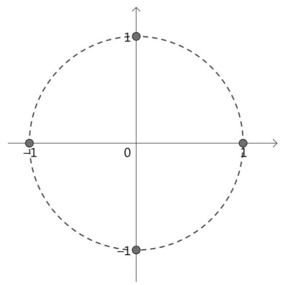

练习 $\mathbf{{7.3}\left( 2\right) }$

1. 计算下列各式的值,其中 $z =  - \sqrt{2} + \sqrt{2}\mathrm{i}, z$ 的辐角属于区间 $\lbrack 0,{2\pi })$ :

(1) ${z}^{4}$ ；(2) $\sqrt[4]{z}$ 。

2. $z = r\left( {\cos \theta  + \mathrm{i}\sin \theta }\right)$ 的共轭复数可以表示为 $\bar{z} = r\left\lbrack  {(\cos \left( {-\theta }\right)  + \mathrm{i}\sin \left( {-\theta }\right) \rbrack }\right.$ ，利用复数的三角表示证明: ${\bar{z}}^{n} = \overline{{z}^{n}}$ 。

## 小结

本章主要学习复数的概念、性质和运算, 需注重理解虚数单位i 的含义和复数与向量的对应关系, 需熟练掌握复数的四则运算, 并理解其几何含义。

## 第八章 直线和圆的方程

我们已经初步学习了欧几里得的平面几何知识, 主要包括点、直线、角等基本几何概念, 长度和角度的大小, 三角形、四边形等几何图形的性质, 几何图形间的位置关系等, 利用这些公式和定理求解未知关系和证明几何命题。

17 世纪，法国科学家笛卡尔和费马等人创立并发展了解析几何，通过坐标化的方法, 将几何关系与代数运算对应了起来, 使用代数解析式表示几何中的位置关系和数量关系, 借助代数方法分析解决几何问题, 一定程度上减轻了对实际图形的依赖, 我们已经学习的向量以及函数的部分知识就属于解析几何的范畴。

函数解析式与函数图像有对应关系, 函数解析式能确定平面内的一系列点, 但函数的一个重要不足是横坐标与纵坐标 “地位不平等” ——一个横坐标只能对应一个纵坐标, 而一个纵坐标可以对应多个不同的横坐标。

向量通过坐标化对平行、垂直等概念有了更精确的定义和描述方式, 向量的一个重要特点是可以任意平移, 这个特点让分析图形间的几何关系变得简便, 但这个特点同时产生无法确定位置的不足, 很多具体的几何问题中, 位置是非常重要的要素。

本章学习一种新的解析几何工具一一方程。方程同样用等式关系描述一系列点的具体位置, 且方程解决了函数的横坐标与纵坐标 “地位不平等” 的问题, 方程还能方便地与向量配合使用, 让分析解决几何问题有更多可选的方法工具。

### 8.1 一次函数与直线

我们已经学习了一次函数的图像是一条直线, 现在复习一次函数解析式中的参数与函数图像间的对应关系, 顺便分析得出一些新的有用结论。

#### 8.1.1 直线的倾斜角与斜率

一次函数 $y = {kx} + b$ 的图像是一条直线,任意一条(不平行于坐标轴的)直线都可以用一个一次函数表示,其中 $k\text{ 、 }b$ 是参数, $k$ 与直线的倾斜程度有关, $b$ 是直线与 $y$ 轴的交点的纵坐标,又叫作直线在 $y$ 轴上的截距。现在从函数图像变换的角度,重新分析一次函数 $y = {kx} + b$ 的表达式,从最简单一次函数开始:

$$
y = x
$$

该函数的图像是一条经过原点 $\left( {0,0}\right)$ 的直线,直线上任意一点的横坐标与纵坐标都相等,可以表示为 $\left( {{x}_{0},{x}_{0}}\right)$ ,例如该直线与原点为圆心的单位圆的两个交点为 $\left( {\frac{\sqrt{2}}{2},\frac{\sqrt{2}}{2}}\right)$ 和 $\left( {-\frac{\sqrt{2}}{2}, - \frac{\sqrt{2}}{2}}\right)$ ,该直线上除原点外的任意一点的纵坐标与横坐标的比值就是该直线与 $x$ 轴夹角 $\theta$ 的正切值: $\tan \theta  = \frac{{x}_{0}}{{x}_{0}} = 1$ ,如下页图所示。

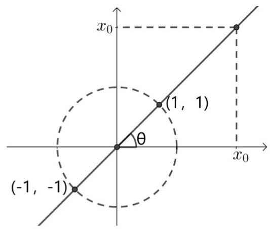

现在将直线 $y = x$ 的图像绕原点旋转,经历的过程与三角函数中角的终边绕原点旋转的过程相似, 只是旋转的对象是直线而非射线。为方便讨论, 只考虑直线在 $x$ 轴上方的半段与 $x$ 轴正方向的夹角。

随着旋转,直线 $y = x$ 上半段与 $x$ 轴正方向的夹角发生变化。设旋转到某处时,夹角变为 $\varphi$ ,设 $k = \tan \varphi$ ,函数解析式变为:

$$
y = {kx}
$$

如下图所示,直线 $y = {kx}$ 仍然经过原点,直线上任意一点的坐标可以表示为 $\left( {{x}_{0}, k{x}_{0}}\right)$ ,该直线与原点为圆心的单位圆的两个交点变为 $\left( {\cos \varphi ,\sin \varphi }\right)$ 和 $\left( {\cos \left( {\varphi  + \pi }\right) ,\sin \left( {\varphi  + \pi }\right) }\right)$ 。

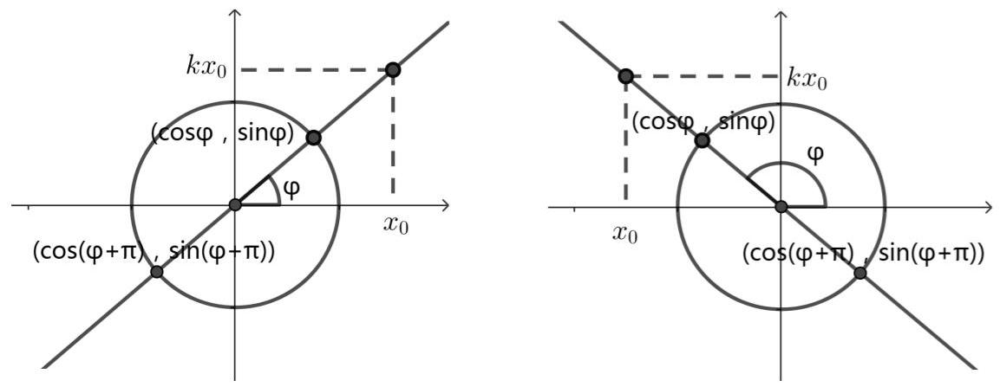

直线上任意一点的纵坐标与横坐标的比值都为:

$$
\tan \varphi  = \frac{k{x}_{0}}{{x}_{0}} = k
$$

可以发现,直线 $y = {kx}$ 上任意一点的纵坐标与横坐标的比值始终等于 $k$ (除原点外),也始终等于直线上半段与 $x$ 轴正方向夹角的正切值 $\tan \varphi ,\varphi$ 叫作直线的倾斜角，倾斜角的正切值叫作直线的斜率，倾斜角与斜率间始终满足关系:

$$
k = \tan \varphi
$$

直线与 $x$ 轴的夹角只需要讨论静态的 $\lbrack 0,\pi )$ 范围内的情况,不需要考虑直线动态旋转的圈数,因此直线倾斜角的范围为 $\lbrack 0,\pi )$ ,斜率的范围为 $\left( {-\infty , + \infty }\right)$ 。

直线绕原点的旋转过程中,有两个位置较特殊: 当直线旋转到与 $x$ 轴重合时, 可以看作直线与 $x$ 轴的夹角为 0,此时 $k = \tan 0 = 0$ ,函数解析式变为 $y = 0$ 。当直线旋转到与 $y$ 轴重合时,直线与 $x$ 轴的夹角为 $\frac{\pi }{2}$ ,不属于正切函数的定义域范围，此时无法写出函数解析式。

我们刚才通过旋转得到了一系列直线 $y = {kx}$ ,直线的斜率 $k$ 与倾斜角 $\varphi$ 满足关系 $k = \tan \varphi$ ,接下来将图像沿水平方向平移,如下图所示。

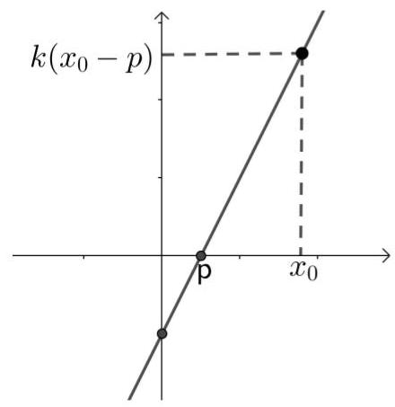

设平移后直线与 $x$ 轴的交点变为 $\left( {p,0}\right)$ ,按照函数平移的规律,函数解析式变为:

$$
y = k\left( {x - p}\right)
$$

由于只是水平移动，没有对直线进行旋转，所以直线与 $x$ 轴的夹角仍为 $\varphi$ ， 斜率也仍为 $k$ ,将函数解析式展开:

$$
y = {kx} - {kp}
$$

设 $b =  - {kp}$ ,可得:

$$
y = {kx} + b
$$

$b$ 是直线与 $y$ 轴交点的纵坐标。

也可以将直线 $y = {kx}$ 向上平移至与 $y$ 轴交点的纵坐标为 $b$ 的位置，此时直线与 $x$ 轴的交点的横坐标为 $p =  - \frac{b}{k}$ 。

这样一来,对于任意一次函数,可知它的图像是一条直线,直线的斜率为 $k$ , 倾斜角 $\varphi$ 满足: $\varphi  \in  \lbrack 0,\pi )$ 且 $\tan \varphi  = k$ 。

综上,要确定一条直线 $y = {kx} + b$ ,需要确定两个参数:

(1)直线的斜率 $k$ ;

(2)直线与 $y$ 轴的交点坐标 $b$ 。

例 8.1 已知一次函数 $l$ 的斜率为 -2,与 $x$ 轴的交点为 $\left( {2,0}\right)$ ,求一次函数的解析式。

解析: 已知一次函数的斜率为 -2,可以设其解析式为 $y =  - {2x} + b$ ,其中 $b$ 是待定系数; 又已知 $l$ 与 $x$ 轴的交点为 $\left( {2,0}\right)$ ,将坐标代入函数解析式得到方程: $0 =  - 2 \times  2 + b$ ,解得: $b = 4$ ,一次函数的解析式为: $y =  - {2x} + 4$ 。函数图像如下所示。

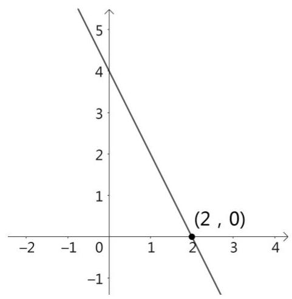

由平面几何定理可知, 两个点可以确定一条直线, 接下来分析两个点的坐标与它们所确定的直线的斜率之间的关系。设直线 $l$ 经过点 ${P}_{1}\left( {{x}_{1},{y}_{1}}\right)$ 和 ${P}_{2}\left( {{x}_{2},{y}_{2}}\right)$ , 利用这两个点的坐标可以构造向量:

$$
\overrightarrow{{P}_{1}{P}_{2}} = \left( {{x}_{2} - {x}_{1},{y}_{2} - {y}_{1}}\right)
$$

向量可以任意平移, $\overrightarrow{{P}_{1}{P}_{2}}$ 与 $x$ 轴的夹角 $\varphi$ 等于直线 $l$ 的倾斜角。可以将向量 $\overrightarrow{{P}_{1}{P}_{2}}$ 平移至起点为原点 $\left( {0,0}\right)$ 、终点为 $\left( {{x}_{2} - {x}_{1},{y}_{2} - {y}_{1}}\right)$ 的位置,它与 $x$ 轴的夹角的正切值为:

$$
k = \tan \varphi  = \frac{{y}_{2} - {y}_{1}}{{x}_{2} - {x}_{1}}
$$

这就是任意两个点 ${P}_{1}\left( {{x}_{1},{y}_{1}}\right)$ 与 ${P}_{2}\left( {{x}_{2},{y}_{2}}\right)$ 所确定的直线的斜率和倾斜角。

特别的,如果 ${x}_{1} = {x}_{2}$ ,直线的斜率不存在,直线与 $x$ 轴垂直。

如果构造的向量为 $\overrightarrow{{P}_{2}{P}_{1}} = \left( {{x}_{1} - {x}_{2},{y}_{1} - {y}_{2}}\right)$ ,那么求得的斜率为:

$$
\tan {\varphi }^{\prime } = \frac{{y}_{1} - {y}_{2}}{{x}_{1} - {x}_{2}}
$$

可以发现 $\tan {\varphi }^{\prime } = \tan \varphi$ ,即 ${\varphi }^{\prime } = \varphi$ ,这是因为一条直线指向两个相反的方向, 虽然对于向量是两个相反的方向，但对于直线没有区别，方向相反的向量共直线， 共线向量有方向相同和方向相反两种情况。

由直线上任意两点 ${P}_{1}\text{ 、 }{P}_{2}$ 构成的向量 $\overrightarrow{{P}_{1}{P}_{2}}$ 和 $\overrightarrow{{P}_{2}{P}_{1}}$ 都是该直线的方向向量。直线的方向向量只需要方向与该直线平行, 向量指向直线的哪一端、向量的长度是多少都没有实质影响。

对于直线 $y = {kx} + b$ ,其中 $k\text{ 、 }b$ 是已知参数,取直线上的两点 ${P}_{1}\left( {0, b}\right)$ 和 ${P}_{2}\left( {1, k + b}\right)$ ,可以得到直线 $l$ 的一个方向向量为 $\overrightarrow{{P}_{1}{P}_{2}} = \left( {1, k}\right)$ 。

可以发现,直线的方向向量只与斜率 $k$ 有关,与 $y$ 轴的交点 $b$ 无关,这与前面的分析中, $k$ 反映直线的旋转角度 (即方向), $b$ 反映直线平移的位置的情况一致。

对于直线 $y = {kx}$ ,解析式中已经隐含了条件它经过原点 $\left( {0,0}\right)$ ,所以只要知道直线上的其他任意一点的坐标 $\left( {{x}_{0}, k{x}_{0}}\right)$ ,就可以求得它的倾斜角和斜率:

$$
\tan \varphi  = \frac{k{x}_{0} - 0}{{x}_{0} - 0} = k
$$

例 8.2 已知一次函数的图像经过点 $\left( {-3,1}\right)$ 和 $\left( {0, - 2}\right)$ ,求函数解析式。

解析: 直线的斜率等于直线上两点的纵坐标之差除以横坐标之差: $k = \frac{-2 - 1}{0 - \left( {-3}\right) } =  - 1$ ,可以设函数解析式为 $y =  - x + b$ ,将点 $\left( {-3,1}\right)$ 的坐标代入解析式: $1 =  - \left( {-3}\right)  + b$ ,解得: $b =  - 2$ ,解析式为 $y =  - x - 2$ 。函数图像如下所示。

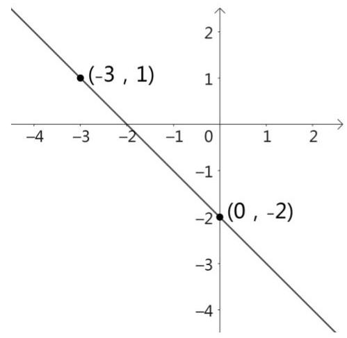

练习 8.1(1)

1. 求下列一次函数的解析式:

(1)斜率为3且经过点 $\left( {0,5}\right)$ ；(2)经过点 $\left( {-2,0}\right)$ 和 $\left( {4,4}\right)$ 。

#### 8.1.2 两条直线平行和垂直的判定

平行和垂直是两种较特殊的位置关系, 如果两条直线平行或垂直, 那么它们的解析式满足特定的数量关系。

若两条直线平行,可以看作它们的夹角为 0 。若两条直线与第三条直线相交, 则同位角相等是这两条直线平行是充要条件,两条直线与 $x$ 轴的夹角就是一组同位角,两条直线与 $x$ 轴的夹角一一倾角相等就是直线平行的充要条件,直线倾角的正切值等于直线的斜率, 因此两条直线的斜率相等也是直线平行的充要条件。

即: 设直线 ${l}_{1} : y = {k}_{1}x + {b}_{1}$ 和 ${l}_{2} : y = {k}_{2}x + {b}_{2}$ 与 $x$ 轴的夹角分别为 ${\varphi }_{1}\text{ 、 }{\varphi }_{2}$ 。若 ${l}_{1}\parallel {l}_{2}$ ,则 ${\varphi }_{1} = {\varphi }_{2}$ ,由此可得 $\tan {\varphi }_{1} = \tan {\varphi }_{2}$ ,即 ${k}_{1} = {k}_{2}$ ,该结论反过来也成立。即:

$$
{l}_{1}\parallel {l}_{2} \Leftrightarrow  {k}_{1} = {k}_{2}
$$

即互相平行的两条直线的斜率相等。

如果两条直线垂直，它们的夹角为 $\frac{\pi }{2}$ 。设直线 ${l}_{1} : y = {k}_{1}x + {b}_{1}$ 与 ${l}_{2} : y = {k}_{2}x + {b}_{2}$ 垂直, ${l}_{1}\text{ 、 }{l}_{2}$ 的一个方向向量分别为 ${\overrightarrow{l}}_{1} = \left( {1,{k}_{1}}\right) \text{ 、 }{\overrightarrow{l}}_{2} = \left( {1,{k}_{2}}\right)$ ,由 ${\overrightarrow{l}}_{1} \bot  {\overrightarrow{l}}_{2} \Leftrightarrow  {\overrightarrow{l}}_{1} \cdot  {\overrightarrow{l}}_{2} = 0$ 可得: $\left( {1,{k}_{1}}\right)  \cdot  \left( {1,{k}_{2}}\right)  = 1 + {k}_{1}{k}_{2} = 0$ ,化简得:

$$
{k}_{1} =  - \frac{1}{{k}_{2}}
$$

即互相垂直的两条直线的斜率互为负倒数。

上面两个关于两条直线平行或垂直时, 两条直线的斜率满足的数量关系非常有用，以下是一些常见应用方式:

(1)如果已知两条直线互相平行,可以分别设它们的解析式为 $y = {kx} + {b}_{1}$ 和 $y = {kx} + {b}_{2}$ ，只有 $k$ 、 ${b}_{1}$ 、 ${b}_{2}$ 三个待定系数，而不是四个(两个斜率和两个截距)。

(2)如果已知一条直线与已知直线 $y = {kx} + b$ 平行，可以设这条直线为 $y = {kx} + p$ ,再根据其他条件求解待定系数 $p$ ,只新设一个待定系数。

(3)如果已知两条直线互相垂直，可以设它们的解析式分别为 $y = {kx} + {b}_{1}$ 和 $y =  - \frac{1}{k}x + {b}_{2}$ ,只有 $k\text{ 、 }{b}_{1}\text{ 、 }{b}_{2}$ 三个待定系数,而不是四个。

(4)如果已知一条直线与已知直线 $y = {kx} + b$ 垂直，可以设这条直线为 $y =  - \frac{1}{k}x + p$ ,再根据其他条件求解待定系数 $p$ ,只新设一个待定系数。

需注意，利用斜率设直线的一次函数时，没有考虑直线与坐标轴平行的情况， 有时需要额外专门分别讨论直线与 $x$ 轴或 $y$ 轴平行的情况。

平行于 $x$ 轴且与 $y$ 交点的纵坐标为 $b$ 的直线的解析式为 $y = b$ ,即直线上所有点的纵坐标都为 $b$ ,横坐标可以为任意值。

平行于 $y$ 轴且与 $x$ 交点的纵坐标为 $p$ 的直线的解析式为 $x = p$ ,即直线上所有点的横坐标都为 $p$ ,纵坐标可以为任意值。

例 8.3 已知直线 $l : y = {2x} + 4$ 和直线外一点 $P\left( {1,3}\right)$ ,求:

(1)经过点 $P$ 且平行于 $l$ 的直线的解析式;

(2)经过点 $P$ 且垂直于 $l$ 的直线的解析式。

解析: (1) 设 ${l}_{1}$ 经过点 $P$ 且与 $l$ 平行,由于 ${l}_{1}\parallel l$ ,设 ${l}_{1}$ 的解析式为 $y = {2x} + b$ , 将 $P\left( {1,3}\right)$ 代入 ${l}_{1}$ 的解析式: $3 = 2 \times  1 + b$ ,解得: $b = 1$ ,经过点 $P$ 且与 $l$ 平行的直线的解析式为: $y = {2x} + 1$ ;

(2)设 ${l}_{2}$ 经过点 $P$ 且与 $l$ 垂直，由于 ${l}_{2} \bot  l$ ，设 ${l}_{2}$ 的解析式为 $y =  - \frac{1}{2}x + c$ ， 将 $P\left( {1,3}\right)$ 代入 ${l}_{2}$ 的解析式: $3 =  - \frac{1}{2} \times  1 + c$ ，解得: $c = \frac{7}{2}$ ，经过点 $P$ 且与 $l$ 垂直的直线的解析式为: $y =  - \frac{1}{2}x + \frac{7}{2}$ 。

下图为直线 $y = {2x} + 4$ (实线)及其经过点 $P\left( {1,3}\right)$ 的平行线 $y = {2x} + 1$ (虚线)、 垂线 $y =  - \frac{1}{2}x + \frac{7}{2}$ (点划线) 的图像。

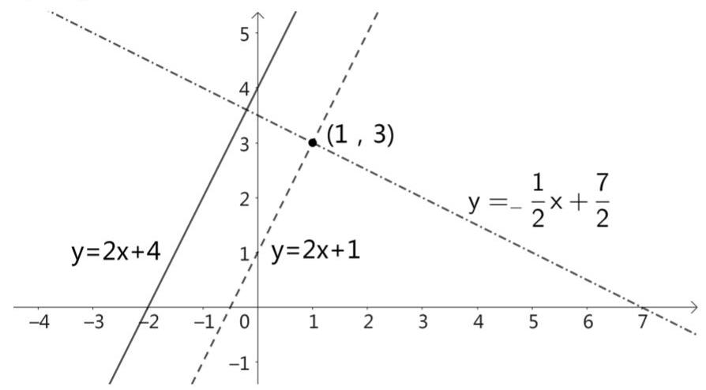

本题的两小问都只有一个解, 这与 “经过直线外一点, 有且只有一条直线与已知直线平行/垂直”的平面几何定理一致。

## 练习 8.1(2)

1. 已知经过原点的直线 $l$ 经过点 $\left( {-6, - 3}\right)$ ,求 $l$ 与 $x$ 轴夹角的正切值。

2. 判断下列各组直线是否平行或垂直:

(1) $y = {2x} + 1$ 与 $y = {2x} - 2$ ； (2) $y = {2x} + 1$ 与 $y =  - {2x}$ ；

(3) $y = {4x}$ 与 $y =  - \frac{x}{4} + \frac{1}{4};\;\left( 4\right) \;y = \left( {a - 1}\right) \left( {x - 1}\right)$ 与 $y = \frac{1 + x}{1 - a}$ ( $a$ 为常数且 $a \neq  1$ )。

3. 已知 ${l}_{1} \bot  {l}_{2}$ ， ${l}_{1}$ 经过点 $\left( {2,1}\right)$ 和 $\left( {-1, - 2}\right)$ ， ${l}_{2}$ 经过原点，求 ${l}_{2}$ 的解析式。

### 8.2 直线的方程

直线的方程与一次函数实质上是对同一对象的不同描述方式，函数侧重表达因变量 $y$ 随自变量 $x$ 变化的规律,方程将横坐标 $x$ 和纵坐标 $y$ 平等地看待,平等地描述它们之间的对应关系。

#### 8.2.1 直线的点斜式方程

如果已知直线 $l$ 的斜率 $k$ 和直线上一点的坐标 ${P}_{0}\left( {{x}_{0},{x}_{0}}\right)$ ,那么直线上任意一点的坐标 $P\left( {x, y}\right)$ ,可以利用直线的方向向量 $\overrightarrow{P{P}_{0}}$ 与斜率 $k$ 的关系得到等式:

$$
\frac{y - {y}_{0}}{x - {x}_{0}} = k
$$

可以化为:

$$
y - {y}_{0} = k\left( {x - {x}_{0}}\right)
$$

这就是直线的点斜式方程, 简称点斜式。从构造直线的过程看, 点斜式方程相当于先画出直线上一点 ${P}_{0}\left( {{x}_{0},{x}_{0}}\right)$ ,再沿直线的倾斜方向 $k$ 移动并抵达 (画出) 其他点。

从点斜式方程中可以直接读出直线的斜率 $k$ 和经过的一个点的坐标 ${P}_{0}\left( {{x}_{0},{x}_{0}}\right)$ ,反过来,利用这两个信息可以直接写出直线的点斜式方程。

直线的点斜式方程 $y - {y}_{0} = k\left( {x - {x}_{0}}\right)$ 可以化为一次函数的形式:

$$
y = {kx} - k{x}_{0} + {y}_{0}
$$

如果已知直线经过的点为与 $y$ 轴的交点 $\left( {0, b}\right)$ ,那么直线的点斜式方程为:

$$
y = {kx} + b
$$

与一次函数的形式相同。其中, $k$ 仍是直线的斜率, $b$ 叫作直线 $l$ 在 $y$ 轴上的截距,该方程叫作直线 $l$ 的斜截式方程,简称斜截式。

从斜截式方程中可以直接读出直线的斜率 $k$ 和在 $y$ 轴上的截距 $b$ ,反过来, 利用这两个信息可以直接写出直线的斜截式方程。

直线的点斜式方程和斜截式方程有一个共同不足, 与一次函数相似, 就是无法表示与 $x$ 轴垂直的直线,这类直线的斜率可以看作无穷大。另外,如果直线与 $x$ 轴平行,那么斜率 $k = 0$ ,直线方程为 $y = b$ 。

例 8.4 已知直线 $l$ 的斜率为 5,且经过点 $\left( {-1, - 1}\right)$ ,求 $l$ 的方程。

解析: 直接将已知信息代入直线的点斜式方程: $y - \left( {-1}\right)  = 5\left( {x - \left( {-1}\right) }\right)$ ,化简得; $y = {5x} + 4$ ,函数图像如下图所示。

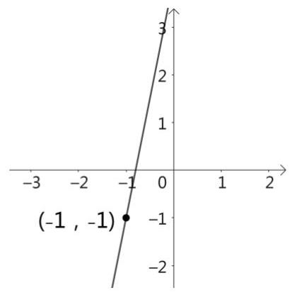

#### 8.2.2 直线的两点式方程

经过平面内两个点, 有且只有一条直线, 如果知道这两个点的坐标, 就能求出直线的方程。

设已知直线 $l$ 经过点 ${P}_{1}\left( {{x}_{1},{y}_{1}}\right)$ 和 ${P}_{2}\left( {{x}_{2},{y}_{2}}\right)$ ,可以求得直线的斜率为:

$$
k = \frac{{y}_{2} - {y}_{1}}{{x}_{2} - {x}_{1}}
$$

将斜率和一个已知点的坐标 (如 ${P}_{1}$ ) 代入直线点斜式方程 $y - {y}_{0} = k\left( {x - {x}_{0}}\right)$ :

$$
y - {y}_{1} = \frac{{y}_{2} - {y}_{1}}{{x}_{2} - {x}_{1}}\left( {x - {x}_{1}}\right)
$$

将该等式稍作变形, 让等号左右两边的形式看起来更整齐:

$$
\frac{y - {y}_{1}}{{y}_{2} - {y}_{1}} = \frac{x - {x}_{1}}{{x}_{2} - {x}_{1}}
$$

这就是直线的两点式方程,简称两点式。

直线的两点式方程还能用另一种思路推导: 直线 $l$ 上任意一点 $P\left( {x, y}\right)$ 与已知坐标的两点 ${P}_{1}\left( {{x}_{1},{y}_{1}}\right) \text{ 、 }{P}_{2}\left( {{x}_{2},{y}_{2}}\right)$ ,这三个点中任意两点形成的向量都平行, 有相等的斜率,由 $P$ 与 ${P}_{1}$ 形成的向量的斜率为 $\frac{y - {y}_{1}}{x - {x}_{1}}$ ,由 ${P}_{1}$ 与 ${P}_{2}$ 形成的向量的斜率为 $\frac{{y}_{2} - {y}_{1}}{{x}_{2} - {x}_{1}}$ ,这两个向量的斜率始终相等,由此可得: $\frac{y - {y}_{1}}{x - {x}_{1}} = \frac{{y}_{2} - {y}_{1}}{{x}_{2} - {x}_{1}}$ 。

从两点式方程中可以直接读出直线经过的一个点的坐标, 还可以较容易地求得直线的斜率, 利用这两个信息可以直接写出直线的点斜式方程。

如果已知直线 $l$ 与两个坐标轴的交点 $A\left( {a,0}\right)$ 和 $B\left( {0, b}\right)$ ,代入两点式方程:

$$
\frac{y - 0}{b - 0} = \frac{x - a}{0 - a}
$$

化简得:

$$
\frac{x}{a} + \frac{y}{b} = 1
$$

该方程叫作直线的截距式方程,简称截距式,其中, $a\text{ 、 }b$ 分别叫作直线在 $x$ 轴和 $y$ 轴上的截距。截距可以是正数、负数或 0,由于分母不能为 0,所以截距式不能表示经过原点和与坐标轴平行的直线。

例 8.5 已知直线 $l$ 经过点 $\left( {-5, - 2}\right)$ 和 $\left( {-3, - 1}\right)$ ,求 $l$ 的方程。

解析: 将 $l$ 经过的两点的坐标代入两点式方程: $\frac{y - \left( {-2}\right) }{-1 - \left( {-2}\right) } = \frac{x - \left( {-5}\right) }{\left( {-3}\right)  - \left( {-5}\right) }$ ,化简得: $\frac{y + 2}{1} = \frac{x + 5}{2}$ ,函数图像如下页图所示。

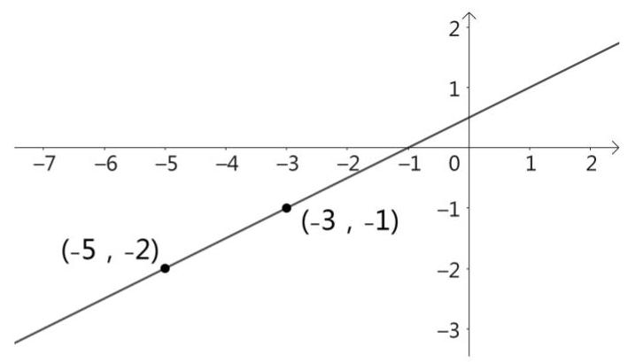

#### 8.2.3 直线的一般式方程

直线的点斜式、两点式等方程中,只有关于 $x\text{ 、 }y$ 的一次项和常数项,没有 $x\text{ 、 }y$ 的其他次方或乘除的形式,这些方程都可以化为下面的形式:

$$
{Ax} + {By} + C = 0
$$

其中 $A\text{ 、 }B\text{ 、 }C$ 是常数,且 $A\text{ 、 }B$ 不同时为 0,该形式叫作直线的一般式方程, 简称一般式。

直线的一般式方程的主要优点是可以表示平面内的任意直线, 包括经过原点的直线、与坐标轴垂直的直线, 而直线的其他形式方程总有不能表示的特殊情况。 其中,如果直线与 $x$ 轴平行,那么 $A = 0$ ; 如果直线与 $y$ 轴平行,那么 $B = 0$ ; 如果直线经过原点,那么 $C = 0$ 。

直线的一般方程的主要不足是它有三个参数 $A\text{ 、 }B\text{ 、 }C$ ,而斜截式和截距式中只有两个参数, 点斜式和两点式也可以简化为只有两个参数的形式。

为方便使用, 使用直线的一般式时, 可以根据已知条件排除掉一些特殊情况, 设其中的某个参数为 1 或其他方便计算的数值，得到只有两个参数的方程。

例 8.6 已知直线方程为 ${Ax} + {By} + C = 0$ ,分析下列条件下直线的特点:

(1) $A = 0,{BC} \neq  0;$ (2) $B = 0,{AC} \neq  0;$ (3) $C = 0,{AB} \neq  0$ 。

解析: (1) 当 $A = 0,{BC} \neq  0$ 时,直线方程为 ${By} + C = 0$ ,可以化为 $y =  - \frac{C}{B}$ , 直线上所有点的纵坐标都为 $- \frac{C}{B}$ ,横坐标可以为任意值,该直线与 $x$ 轴平行。

(2)当 $B = 0,{AC} \neq  0$ 时，直线方程为 ${Ax} + C = 0$ ，可以化为 $x =  - \frac{C}{A}$ ，直线上所有点的横坐标都为 $- \frac{C}{A}$ ,纵坐标可以为任意值,该直线与 $x$ 轴垂直。

(3)当 $C = 0,{AB} \neq  0$ 时，直线方程为 ${Ax} + {By} = 0$ ，可以化为 $y =  - \frac{A}{B}x$ ，该直线经过原点 $\left( {0,0}\right)$ ,斜率为 $- \frac{A}{B}$ 。

#### 8.2.4 直线的参数方程

前面学习的几种直线方程中, 都直接用等式建立起图形上各点的横坐标与纵坐标间的关系, 这是一种直接的等式关系。参数方程是一种间接描述图像上的各点的横坐标与纵坐标间的关系的方程, 这个 “间接” 体现在使用了额外添加的参数上, 通过参数为媒介, 将横坐标与纵坐标联系起来。

如果已知直线经过点 $P\left( {{x}_{0},{y}_{0}}\right)$ ,且直线的方向向量为 $\overrightarrow{l} = \left( {a, b}\right)$ ,那么直线上的任一点 $\left( {x, y}\right)$ ,都可以看作从 $P\left( {{x}_{0},{y}_{0}}\right)$ 出发,沿向量 $\overrightarrow{l} = \left( {a, b}\right)$ 运动一定距离 $t$ 后抵达,其中参数 $t$ 与直线上的点一一对应。

例如,当 $t = 0$ 时,相当于没有移动,对应的点为 $P\left( {{x}_{0},{y}_{0}}\right)$ ,当 $t = 1$ 时,相当于沿向量 $\overrightarrow{l} = \left( {a, b}\right)$ 移动 1 个单位,对应的点为 $\left( {{x}_{0} + a,{y}_{0} + b}\right)$ ,当 $t =  - {0.5}$ 时, 相当于沿向量 $\overrightarrow{l} = \left( {a, b}\right)$ 反方向移动 0.5 个单位，对应的点为 $\left( {{x}_{0} - {0.5a},{y}_{0} - {0.5b}}\right)$ 。

综上,可以用含参数 $t$ 的方程组表示该直线:

$$
\left\{  \begin{array}{l} x = {x}_{0} + {at} \\  y = {y}_{0} + {bt} \end{array}\right.
$$

其中 $t \in  \mathbf{R}$ 。

通过联立方程组,消去参数 $t$ ,就能得到直线的其他形式的方程。例如,将 $x = {x}_{0} + {at}$ 变形为 $t = \frac{x}{a} - \frac{{x}_{0}}{a}$ ,代入 $y = {y}_{0} + {bt}$ 得: $y = {y}_{0} + b\left( {\frac{x}{a} - \frac{{x}_{0}}{a}}\right)$ ,化简可得直线的点斜式方程: $y = \frac{b}{a}x + {y}_{0} - \frac{b{x}_{0}}{a}$ 。

还可以利用直线上任意一点 $\left( {x, y}\right)$ 与已知点 $P\left( {{x}_{0},{y}_{0}}\right)$ 形成的向量平行于直线的方向向量 $\overrightarrow{l} = \left( {a, b}\right)$ 建立等式: $\frac{y - {y}_{0}}{x - {x}_{0}} = \frac{b}{a}$ ,化简后能得到相同的点斜式方程。

例 8.7 已知直线经过坐标原点和点 $\left( {\frac{1}{3},\frac{2}{3}}\right)$ ，求直线的参数方程。

解析: 已知直线经过的两点, 由此可以得到直线的一个方向向量为: $\overrightarrow{l} = \left( {\frac{1}{3} - 0,\frac{2}{3} - 0}\right)  = \left( {\frac{1}{3},\frac{2}{3}}\right)$ ,设参数 $t$ ,直线上任意一点都可以看作从直线上的原点 $\left( {0,0}\right)$ 出发，沿直线方向向量 $\overrightarrow{l} = \left( {\frac{1}{3},\frac{2}{3}}\right)$ 移动 $t$ 个距离抵达，直线的参数方程为:

$$
\left\{  \begin{array}{l} x = 0 + \frac{t}{3} \\  y = 0 + \frac{2t}{3} \end{array}\right.
$$

其中 0 可以省去, 写作:

$$
\left\{  \begin{array}{l} x = \frac{t}{3} \\  y = \frac{2t}{3} \end{array}\right.
$$

还可以让该直线的参数方程的形式更简洁,可以发现用 $t$ 表示 $x$ 和 $y$ 的方程中有共同的分母 $\frac{1}{3}$ ,可以将参数设为 ${3t}$ ,参数方程变为:

$$
\left\{  \begin{array}{l} x = t \\  y = {2t} \end{array}\right.
$$

函数图像如下所示。

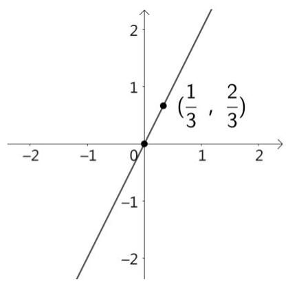

直线的参数方程看上去有些多此一举, 比前面学习的其他方程形式略麻烦, 或没有本质区别, 这是因为直线上各点的横坐标与纵坐标的关系较简单, 没能充分体现参数方程的特点, 未来学习和做题中会遇到更复杂或特殊的图形, 其中有的图形的参数方程有巧妙的应用，还有的图形只方便是用参数方程表示。

## 练习 8.2

1. 写出下列直线的方程:

(1)斜率为 $- \frac{1}{3}$ 且经过点 $\left( {3,1}\right)$ ；(2)经过点 $\left( {-\frac{1}{2},1}\right)$ 和 $\left( {0,3}\right)$ ；

(3)经过点 $\left( {7,0}\right)$ ，方向向量为 $\left( {0,1}\right)$ 。

2. 已知直线 $l : {Ax} + {By} + C = 0$ ，写出下列表达式并指出表达式有意义的条件:

(1) $l$ 的斜率；(2) $l$ 在 $x$ 轴上的截距；(3) $l$ 在 $y$ 轴上的截距；

(4) $l$ 的斜截式方程；(5) $l$ 的截距式方程；(6) $l$ 的一个方向向量；

(7) $l$ 的一个法向量(与 $l$ 垂直的向量)。

### 8.3 直线的交点与平面内的距离

直线的方程与向量一样都是非常好用的工具, 如果已知两条直线的方程, 可以求出它们的交点的坐标, 如果已知两个点的坐标, 可以求出它们间的距离。

#### 8.3.1 两条直线的交点坐标

从集合的角度看,直线 $l : {Ax} + {By} + C = 0$ 是平面内的点集,集合中的点的坐标 $\left( {x, y}\right)$ 都满足直线的方程 ${Ax} + {By} + C = 0$ ,也就是这个二元一次方程的解。

对于两条不平行的直线 ${l}_{1} : {A}_{1}x + {B}_{1}y + {C}_{1} = 0$ 和 ${l}_{2} : {A}_{2}x + {B}_{2}y + {C}_{2} = 0$ ,直线的交点就是这两个集合的交集, 交集中的点的坐标同时满足两条直线的方程, 也就是二元一次方程组的解:

$$
\left\{  \begin{array}{l} {A}_{1}x + {B}_{1}y + {C}_{1} = 0 \\  {A}_{2}x + {B}_{2}y + {C}_{2} = 0 \end{array}\right.
$$

解方程组得:

$$
\left\{  \begin{array}{l} x = \frac{{B}_{1}{C}_{2} - {B}_{2}{C}_{1}}{{A}_{1}{B}_{2} - {A}_{2}{B}_{1}} \\  y = \frac{{A}_{2}{C}_{1} - {A}_{1}{C}_{2}}{{A}_{1}{B}_{2} - {A}_{2}{B}_{1}} \end{array}\right.
$$

这就是直线 ${l}_{1}$ 与 ${l}_{2}$ 的交点坐标,解二元一次方程组较简单,不需要记忆公式。 如果该方程组有解, 那么分母不能为 0 , 由此可得:

$$
{A}_{1}{B}_{2} - {A}_{2}{B}_{1} \neq  0
$$

即 ${A}_{1}{B}_{2} \neq  {A}_{2}{B}_{1}$ ,接下来分析该不等式的几何含义:

直线 ${l}_{1} : {A}_{1}x + {B}_{1}y + {C}_{1} = 0$ 和 ${l}_{2} : {A}_{2}x + {B}_{2}y + {C}_{2} = 0$ 的斜率分别为 $- \frac{{A}_{1}}{{B}_{1}}$ 和 $- \frac{{A}_{2}}{{B}_{2}}$ ,

如果 $- \frac{{A}_{1}}{{B}_{1}} =  - \frac{{A}_{2}}{{B}_{2}}$ ,移项得: ${A}_{1}{B}_{2} = {A}_{2}{B}_{1}$ ,此时 ${l}_{1}$ 与 ${l}_{2}$ 的斜率相同,它们没有交点 (平行) 或有无穷交点 (重合)。

如果 $- \frac{{A}_{1}}{{B}_{1}} \neq   - \frac{{A}_{2}}{{B}_{2}}$ ,移项得: ${A}_{1}{B}_{2} \neq  {A}_{2}{B}_{1}$ ,此时 ${l}_{1}$ 与 ${l}_{2}$ 的斜率不同,它们有且只有一个交点, 就是方程组的解。

利用直线的方程和余弦定理, 还可以求得两条直线的夹角的余弦。对于直线 ${l}_{1} : {A}_{1}x + {B}_{1}y + {C}_{1} = 0$ 和 ${l}_{2} : {A}_{2}x + {B}_{2}y + {C}_{2} = 0$ ,它们的斜率分别为 $- \frac{{A}_{1}}{{B}_{1}}$ 和 $- \frac{{A}_{2}}{{B}_{2}}$ ,它们的方向向量可以分别表示为 ${\overrightarrow{l}}_{1} = \left( {1, - \frac{{A}_{1}}{{B}_{1}}}\right)$ 和 ${\overrightarrow{l}}_{2} = \left( {1, - \frac{{A}_{2}}{{B}_{2}}}\right)$ ,用余弦定理可以求得两条直线的夹角的余弦:

$$
\left| {\cos \theta }\right|  = \frac{\left| {\overrightarrow{l}}_{1} \cdot  {\overrightarrow{l}}_{2}\right| }{{\left| {\overrightarrow{l}}_{1}\right| }^{1} \cdot  {\left| {\overrightarrow{l}}_{2}\right| }^{2}} = \frac{\left| 1 + \frac{{A}_{1}{A}_{2}}{{B}_{1}{B}_{2}}\right| }{\sqrt{{1}^{2} + {\left( \frac{{A}_{1}}{{B}_{1}}\right) }^{2}}\sqrt{{1}^{2} + {\left( \frac{{A}_{2}}{{B}_{2}}\right) }^{2}}} = \frac{\left| {A}_{1}{A}_{2} + {B}_{1}{B}_{2}\right| }{\sqrt{{A}_{1}^{2} + {B}_{1}^{2}}\sqrt{{A}_{2}^{2} + {B}_{2}^{2}}}
$$

使用余弦定理时增加了绝对值符号,因为直线的夹角的范围为 $\left\lbrack  {0,\frac{\pi }{2}}\right\rbrack$ ,如果求得方向向量的夹角的余弦是负数, 即方向向量的夹角是钝角或平角, 那么直线的夹角就是该角的补角。该公式只是将直线的一般式方程中的参数表示的斜率代入了余弦定理, 很容易推导, 不需要记背。

例 8.8 判断下列各组直线是否有交点, 若有, 求交点坐标:

(1) ${l}_{1} : x - {4y} + 3 = 0,{l}_{2} : {4x} - y - 3 = 0$ ;

(2) ${l}_{1} : {4x} - y = 0,{l}_{2} : {8x} - {2y} + 7 = 0;$

(3) ${l}_{1} : y = 1,{l}_{2} : x = 5$ 。

解析: (1) ${l}_{1}$ 的斜率为 $\frac{1}{4},{l}_{2}$ 的斜率为 $4,{l}_{1}$ 与 ${l}_{2}$ 不平行,有一个交点,解方程组 $\left\{  \begin{array}{l} x - {4y} + 3 = 0 \\  {4x} - y - 3 = 0 \end{array}\right.$ 得: $\left\{  \begin{array}{l} x = 1 \\  y = 1 \end{array}\right.$ ,交点坐标为 $\left( {1,1}\right) ,{l}_{1}$ (实线) 与 ${l}_{1}$ (虚线) 的图像及交点如下所示。

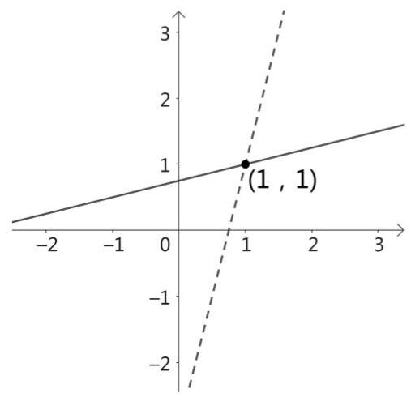

(2) ${l}_{1}$ 和 ${l}_{2}$ 的斜率都为 $4,{l}_{1}$ 与 ${l}_{2}$ 平行,方程组无解, ${l}_{1}$ 与 ${l}_{2}$ 无交点, ${l}_{1}$ (实线) 与 ${l}_{1}$ (虚线) 的图像如下所示。

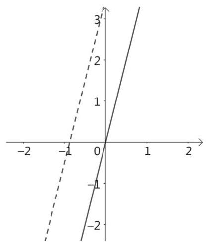

(3) ${l}_{1}$ 平行于 $x$ 轴,直线上点的纵坐标都为 1,横坐标可以为任意值。 ${l}_{2}$ 垂直于 $x$ 轴,直线上点的横坐标都为 5,纵坐标可以为任意值。 ${l}_{1}$ 与 ${l}_{2}$ 若有交点, 则交点的横坐标需为 1,纵坐标需为 5,即交点坐标为 $\left( {5,1}\right) ,{l}_{1}$ (实线) 与 ${l}_{1}$ (虚线) 的图像及交点如下所示。

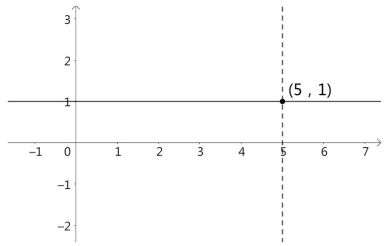

练习 8.3(1)

1. 求下列两条直线交点的坐标:

(1) ${l}_{1} : y = {2x} + 4$ 与 ${l}_{2} : y =  - {2x} - 3;\;$ (2) ${l}_{1} : y =  - {3x}$ 与 ${l}_{2} : x = 4$ 。

#### 8.3.2 两点间的距离

点与点之间的距离是解析几何中的基本数据, 求平面直角坐标系中两点间的距离的基本原理是勾股定理。

设两点坐标分别为 $A\left( {{x}_{A},{y}_{A}}\right)$ 和 $B\left( {{x}_{B},{y}_{B}}\right)$ ，分别作出经过两点且与坐标轴平行的直线，构造直角三角形，如下图所示。

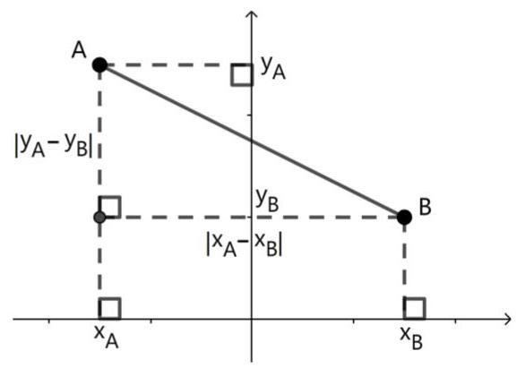

利用矩形的基本性质和勾股定理可以求得两点间的距离为:

$$
{AB} = \sqrt{{\left( {x}_{A} - {x}_{B}\right) }^{2} + {\left( {y}_{A} - {y}_{B}\right) }^{2}}
$$

例 8.9 求下列两点间的距离:

(1)(0，0)与(2，-2)；(2)(4，1)与(-2，-)；

解析: (1) $d = \sqrt{{\left( 0 - 2\right) }^{2} + {\left( 0 - \left( -2\right) \right) }^{2}} = 2\sqrt{2}$ ;

(2) $d = \sqrt{{\left( 4 - \left( -2\right) \right) }^{2} + {\left( 1 - \left( -7\right) \right) }^{2}} = {10}$ ;

(3) $d = \sqrt{{\left( {12} - 0\right) }^{2} + {\left( 0 - \left( -5\right) \right) }^{2}} = {13}$ 。

## 练习 8.3(2)

1. 求下列两点间的距离:

(1)(1，-2)与(-2，-1)；(2)(0，3)与(0，5)；(3)(1，1)与(2，2)。

2. 已知 $\bigtriangleup  {ABC}$ 的三个顶点为 $A\left( {6,2}\right)$ ， $B\left( {2, - 1}\right)$ ， $C\left( {2,0}\right)$ ，求 $\bigtriangleup  {ABC}$ 的周长。

#### 8.3.3 点到直线的距离

点到直线的距离就是点到直线的垂线段的长度。即: 作出经过已知点且垂直于已知直线的垂线,那么已知点与垂足间的距离就是点到直线的距离。

从点 $P\left( {{x}_{0},{y}_{0}}\right)$ 向直线 $l : {Ax} + {By} + C = 0$ 引垂线，设垂足为 $Q$ ，线段 ${PQ}$ 的长就是点 $P$ 到直线 $l$ 的距离,如下图所示。

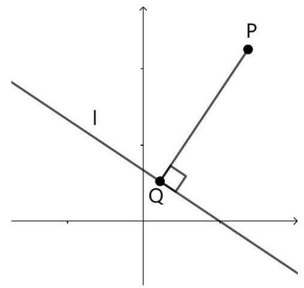

接下来求点到直线的距离公式。

第 1 步: 写出垂线 ${PQ}$ 的方程。因为 ${PQ} \bot  l$ ,所以 ${PQ}$ 的斜率是 $l$ 的斜率的负倒数,由 $l$ 的方程可求得其斜率为 $- \frac{A}{B}$ ,所以 ${PQ}$ 的斜率为 $\frac{B}{A}$ ,可以设 ${PQ}$ 的方程为(其中 ${C}^{\prime }$ 为待计算的未知数):

$$
- {Bx} + {Ay} + {C}^{\prime } = 0
$$

第 2 步: 求待定参数 ${C}^{\prime }$ 的值。因为 $P$ 在直线 ${PQ}$ 上,将 $P$ 的坐标 $\left( {{x}_{0},{y}_{0}}\right)$ 代入 ${PQ}$ 的方程即可求得 ${C}^{\prime }$ 的值:

$$
- B{x}_{0} + A{y}_{0} + {C}^{\prime } = 0
$$

解得:

$$
{C}^{\prime } = B{x}_{0} - A{y}_{0}
$$

综上可得直线 ${PQ}$ 的方程为:

$$
- {Bx} + {Ay} + B{x}_{0} - A{y}_{0} = 0
$$

第 3 步: 联立 ${PQ}$ 与 $l$ 的方程得到二元一次方程组,解方程组得到 $Q$ 的坐标:

$$
\left\{  \begin{array}{l} {Ax} + {By} + C = 0 \\   - {Bx} + {Ay} + B{x}_{0} - A{y}_{0} = 0 \end{array}\right.
$$

解得: $x = \frac{{B}^{2}{x}_{0} - {AB}{y}_{0} - {AC}}{{A}^{2} + {B}^{2}}, y = \frac{{A}^{2}{y}_{0} - {AB}{x}_{0} - {BC}}{{A}^{2} + {B}^{2}}$ ,可得点 $Q$ 的坐标为: $Q\left( {\frac{{B}^{2}{x}_{0} - {AB}{y}_{0} - {AC}}{{A}^{2} + {B}^{2}},\frac{{A}^{2}{y}_{0} - {AB}{x}_{0} - {BC}}{{A}^{2} + {B}^{2}}}\right)$  。

第 4 步: 求线段 ${PQ}$ 的长,即点 $P$ 到直线 $l$ 的距离:

$$
d = \sqrt{{\left( {x}_{0} - \frac{{B}^{2}{x}_{0} - {AB}{y}_{0} - {AC}}{{A}^{2} + {B}^{2}}\right) }^{2} + {\left( {y}_{0} - \frac{{A}^{2}{y}_{0} - {AB}{x}_{0} - {BC}}{{A}^{2} + {B}^{2}}\right) }^{2}}
$$

$$
= \sqrt{{\left( \frac{{A}^{2}{x}_{0} + {B}^{2}{x}_{0} - {B}^{2}{x}_{0} + {AB}{y}_{0} + {AC}}{{A}^{2} + {B}^{2}}\right) }^{2} + {\left( \frac{{A}^{2}{y}_{0} + {B}^{2}{y}_{0} - {A}^{2}{y}_{0} + {AB}{x}_{0} + {BC}}{{A}^{2} + {B}^{2}}\right) }^{2}}
$$

$$
= \sqrt{\frac{{A}^{2}{\left( A{x}_{0} + B{y}_{0} + C\right) }^{2}}{{\left( {A}^{2} + {B}^{2}\right) }^{2}} + \frac{{B}^{2}{\left( A{x}_{0} + B{y}_{0} + C\right) }^{2}}{{\left( {A}^{2} + {B}^{2}\right) }^{2}}}
$$

$$
= \sqrt{\frac{\left( {{A}^{2} + {B}^{2}}\right) {\left( A{x}_{0} + B{y}_{0} + C\right) }^{2}}{{\left( {A}^{2} + {B}^{2}\right) }^{2}}}
$$

$$
= \sqrt{\frac{{\left( A{x}_{0} + B{y}_{0} + C\right) }^{2}}{{A}^{2} + {B}^{2}}}
$$

$$
= \frac{\left| A{x}_{0} + B{y}_{0} + C\right| }{\sqrt{{A}^{2} + {B}^{2}}}
$$

综上,直线 $l : {Ax} + {By} + C = 0$ 外的任意一点 $P\left( {{x}_{0},{y}_{0}}\right)$ 到 $l$ 的距离为:

$$
d = \frac{\left| A{x}_{0} + B{y}_{0} + C\right| }{\sqrt{{A}^{2} + {B}^{2}}}
$$

点到直线的距离公式中, 分子为将点的坐标代入直线的一般式后的绝对值, 分母为直线的一般式中 $x\text{ 、 }y$ 的系数的平方和的平方根。由于距离恒为正数或 0, 所以对分子取绝对值。

上述求解过程只是看起来复杂, 实际上化简过程中提取公因式和约分都较简便。解析几何中经常会遇到虽然过程或某些步骤复杂, 但化简后的形式较简洁的推导和变换, 需要有足够的耐心和细心, 这是必备的基本能力。

特别的,若点 $P\left( {{x}_{0},{y}_{0}}\right)$ 在直线 ${Ax} + {By} + C = 0$ 上,可得等式 $A{x}_{0} + B{y}_{0} + C = 0$ , 则 $d = \frac{\left| 0\right| }{\sqrt{{A}^{2} + {B}^{2}}} = 0$ ,与直线上一点到该直线的距离为 0 的客观规律一致。

例 8.10 求下列点到直线的距离:

(1) $l : x + y + 1 = 0, P\left( {1, - 1}\right)$ ;

(2) $l : x =  - 1, P\left( {-2, - 1}\right)$ ；

(3) $l : {2x} + y - 3 = 0$ ， $P\left( {1,1}\right)$ 。

解析: (1) $d = \frac{\left| 1 \times  1 + 1 \times  \left( -1\right)  + 1\right| }{\sqrt{{1}^{2} + {1}^{2}}} = \frac{\sqrt{2}}{2}$ ;

(2)将 $x =  - 1$ 化为一般式 $x + {0y} + 1 = 0, d = \frac{\left| 1 \times  \left( -2\right)  + 0 \times  \left( -1\right)  + 1\right| }{\sqrt{{1}^{2} + {0}^{2}}} = 1$ ;

(3) $d = \frac{\left| 2 \times  1 + 1 \times  1 - 3\right| }{\sqrt{{2}^{2} + {1}^{2}}} = 0$ ，可知 $P$ 在 $l$ 上。

## 练习 8.3(3)

1. 求下列点到直线的距离:

(1) $l : y =  - x + 5, P\left( {3, - 3}\right)$ ;

(2) $l : y = 5$ ， $P\left( {5,0}\right)$ ；

(3) $l : {3x} - {4y} + 5 = 0, P\left( {1,1}\right)$ 。

2. 已知 $\bigtriangleup  {ABC}$ 的三个顶点为 $A\left( {6,2}\right)$ 、 $B\left( {2, - 1}\right)$ 、 $C\left( {2,0}\right)$ ，求 ${AB}$ 边上的高。

#### 8.3.4 平行线间的距离

平行线 ${l}_{1}$ 与 ${l}_{2}$ 之间的距离，既等于 ${l}_{1}$ 上任意一点到 ${l}_{2}$ 的距离，又等于 ${l}_{2}$ 上任意一点到 ${l}_{1}$ 的距离。

平行线间的距离也可以规定为: 如果直线 ${l}_{3}$ 与平行线 ${l}_{1}\text{ 、 }{l}_{2}$ 都垂直,垂足分别为 $M\text{ 、 }N$ ,那么线段 ${MN}$ 的长度就是平行线 ${l}_{1}$ 与 ${l}_{2}$ 间的距离,如下图所示。

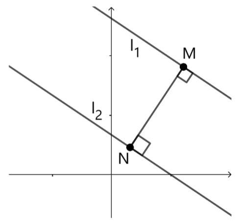

接下来求平行线间的距离公式。

由于两条平行线的斜率 (方向向量) 相同, 因此设它们的方程分别为:

$$
{l}_{1} : {Ax} + {By} + {C}_{1} = 0,{l}_{2} : {Ax} + {By} + {C}_{2} = 0
$$

从 ${l}_{1}$ 上任取一点 $P\left( {{x}_{0},{y}_{0}}\right)$ ,那么 $P$ 到 ${l}_{2}$ 的距离为:

$$
d = \frac{\left| A{x}_{0} + B{y}_{0} + {C}_{2}\right| }{\sqrt{{A}^{2} + {B}^{2}}}
$$

由于 $P$ 在 ${l}_{1}$ 上,其坐标满足关系 $A{x}_{0} + B{y}_{0} + {C}_{1} = 0$ ,可化为 $A{x}_{0} + B{y}_{0} =  - {C}_{1}$ , 代入上式得:

$$
d = \frac{\left| {C}_{1} - {C}_{2}\right| }{\sqrt{{A}^{2} + {B}^{2}}}
$$

这就是两条平行的直线 ${l}_{1} : {Ax} + {By} + {C}_{1} = 0$ 与 ${l}_{2} : {Ax} + {By} + {C}_{2} = 0$ 间的距离公式, 其形式与点到直线的距离公式相似。

例 8.11 求下列平行线间的距离:

(1) ${l}_{1} : y =  - {2x}$ 与 ${l}_{2} : y =  - {2x} + 1$ ；

(2) ${l}_{1} : {x + {2y} + 2} = 0$ 与 ${l}_{2} : {{2x} + {4y} - 1} = 0$ 。

解析:(1)先将两条直线的方程化为一般式，再代入公式:

${l}_{1} : {2x} + y = 0,{l}_{2} : {2x} + y - 1 = 0, d = \frac{\left| 0 - \left( -1\right) \right| }{\sqrt{{2}^{2} + {1}^{2}}} = \frac{\sqrt{5}}{5};$

(2)先将两条直线的方程中 $x$ 、 $y$ 前的系数统一，再代入公式，让 ${l}_{1}$ 的方程的两边同时乘以 2 :

${l}_{1} : {2x} + {4y} + 4 = 0,{l}_{2} : {2x} + {4y} - 1 = 0, d = \frac{\left| 4 - \left( -1\right) \right| }{\sqrt{{2}^{2} + {4}^{2}}} = \frac{\sqrt{5}}{2}$ 。

## 练习 8.3(4)

1. 求下列平行线间的距离:

(1) ${l}_{1} : y = \frac{5}{12}x$ 与 ${l}_{2} : y = \frac{5}{12}x - {13}$ ;

(2) ${l}_{1} : {6x} + {8y} - {11} = 0$ 与 ${l}_{2} : {3x} + {4y} - 4 = 0$ 。

2. 已知平行四边形 $\square {ABCD}$ 的三个顶点为 $A\left( {-1, - 1}\right) , B\left( {2,0}\right) , C\left( {3,3}\right)$ ，求:

(1) ${AB}$ 与 ${CD}$ 间的距离；

(2)▱ ${ABCD}$ 的面积。

### 8.4 圆的方程

欧式几何中, 圆的定义是 “到定点的距离等于定长的点构成的图形”, 将圆的定义用解析几何的方式表达出来，就得到圆的方程。圆的方程有标准方程、一般方程、参数方程等形式。

#### 8.4.1 圆的标准方程

设一个圆的圆心为 $O\left( {a, b}\right)$ ,半径为 $r\left( {r > 0}\right)$ ,如下图所示。

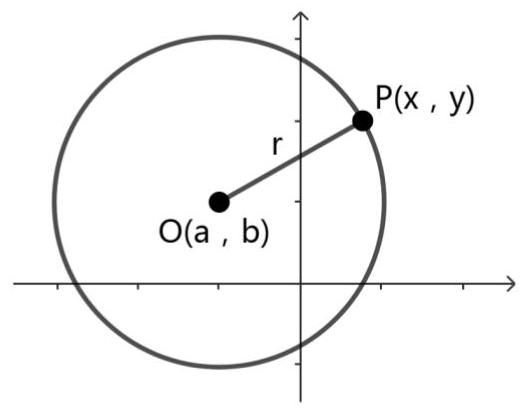

圆周上任意一点 $P\left( {x, y}\right)$ 到圆心的距离都为 $r$ ,由两点间的距离公式可得:

$$
\sqrt{{\left( x - a\right) }^{2} + {\left( y - b\right) }^{2}} = r
$$

等式两边同时平方:

$$
{\left( x - a\right) }^{2} + {\left( y - b\right) }^{2} = {r}^{2}
$$

这就是圆心为 $O\left( {a, b}\right)$ 、半径为 $r\left( {r > 0}\right)$ 的圆的标准方程。根据圆的标准方程, 可以直接得知圆心的坐标和半径 (需注意等号右边为半径的平方)。

例 8.12 已知圆 $A$ 的圆心为 $A\left( {4,3}\right)$ ,圆 $A$ 与 $x$ 轴相切,求圆 $A$ 的标准方程。

解析: 已知圆 $A$ 的圆心坐标,要求其方程,还需得知半径,因为圆 $A$ 与 $x$ 轴相切,所以圆心 $A$ 到 $x$ 轴的距离等于半径,等于圆心的纵坐标的绝对值,可得半径 $r = 3$ ,圆 $A$ 的标准方程为: ${\left( x - 4\right) }^{2} + {\left( y - 3\right) }^{2} = 9$ ,圆的图像如下所示。

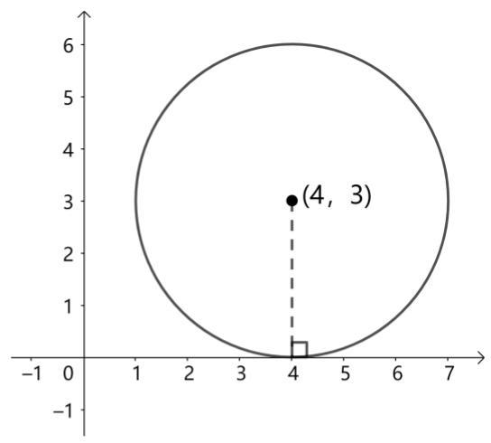

练习 8.4(1)

1. 已知圆 $A$ 的圆心为 $\left( {7, - 4}\right)$ ,圆上的一点 $\left( {-2,3}\right)$ ,求:

(1)圆 $A$ 的半径；(2)圆 $A$ 的标准方程。

2. 已知圆 $A$ 的一条直径的两个端点为 $\left( {-4,7}\right)$ 和 $\left( {2, - 3}\right)$ ,求:

(1)圆心 $A$ 的坐标；(2)圆 $A$ 的半径；(3)圆 $A$ 的标准方程。

#### 8.4.2 圆的一般方程

将圆的标准方程 ${\left( x - a\right) }^{2} + {\left( y - b\right) }^{2} = {r}^{2}$ 展开,得到的方程叫作圆的一般方程, 其形式为:

$$
{x}^{2} - {2ax} + {a}^{2} + {y}^{2} - {2by} + {b}^{2} = {r}^{2}
$$

为了让方程看上去更 “一般”, 将其写作:

$$
{x}^{2} + {y}^{2} + {Dx} + {Ey} + F = 0
$$

分别由 $x$ 的二次项、 $x$ 的一次项、 $y$ 的二次项、 $y$ 的一次项、常数项构成。

虽然从圆的一般方程无法直接读出圆的具体信息, 但很多情况下几何图形的方程是以 “一般式” 的形式给出, 没有事先告知方程表示的具体图形类型, 通过分析方程的特点判断图形的类型往往是分析问题的第一步。

如果一个一般方程表示圆, 那么它需要同时满足两个条件:

(1) $x$ 的二次项系数与 $y$ 的二次项系数相等;

如果不相等，那么表示的图形不是圆，而是其他图形。

(2) $\frac{{D}^{2} + {E}^{2} - {4F}}{4} > 0$ ；

该不等式的原理与一元二次方程根的判别式相似,对圆的一般方程中的 $x$ 与 $y$ 分别进行配方:

$$
{x}^{2} + {y}^{2} + {Dx} + {Ey} + F = 0
$$

$$
{x}^{2} + {Dx} + \frac{{D}^{2}}{4} + {y}^{2} + {Ey} + \frac{{E}^{2}}{4} = \frac{{D}^{2}}{4} + \frac{{E}^{2}}{4} - F
$$

$$
{\left( x + \frac{D}{2}\right) }^{2} + {\left( y + \frac{E}{2}\right) }^{2} = \frac{{D}^{2} + {E}^{2} - {4F}}{4}
$$

等式左边为两个完全平方数之和, 恒为非负实数, 因此等式右边也必须恒为非负实数。此外, 根据圆的标准方程的几何含义, 等式右边为圆的半径的平方, 不能为 0,综上,须满足 $\frac{{D}^{2} + {E}^{2} - {4F}}{4} > 0$ 。

例 8.13 已知圆 $A$ 的圆心在第一象限， $\left( {-1,1}\right)$ 和 $\left( {0,2}\right)$ 是圆上的两点，圆 $A$ 的半径为 $\sqrt{2}$ ，求圆 $A$ 的标准方程。

解析: 设圆心的坐标为 $A\left( {x, y}\right)$ ,由于圆心在第一象限,所以 $x > 0, y > 0$ , 圆心到圆上任意一点的距离等于圆的半径,由此可得: $\left\{  \begin{array}{l} {\left( x - \left( -1\right) \right) }^{2} + {\left( y - 1\right) }^{2} = 2 \\  {\left( x - 0\right) }^{2} + {\left( y - 2\right) }^{2} = 2 \end{array}\right.$

解方程组,先化简两个方程: $\left\{  \begin{array}{l} {x}^{2} + {2x} + {y}^{2} - {2y} = 0 \\  {x}^{2} + {y}^{2} - {4y} + 2 = 0 \end{array}\right.$

让两个等式的左右两边分别相减得: ${2x} + {2y} - 2 = 0$ ，化简得: $x + y - 1 = 0$ ， 第二个方程中没有 $x$ 的一次项,较容易化简,将 $x + y - 1 = 0$ 变为 $x = 1 - y$ ,代入该方程: ${\left( 1 - y\right) }^{2} + {y}^{2} - {4y} + 2 = 0$ ,解得: $y = \frac{3 \pm  \sqrt{3}}{2}$ 。

当 $y = \frac{3 + \sqrt{3}}{2}$ 时, $x = 1 - y =  - \frac{1 + \sqrt{3}}{2} < 0$ ,圆心不在第一象限,舍去; 当 $y = \frac{3 - \sqrt{3}}{2}$ 时, $x = 1 - y = \frac{\sqrt{3} - 1}{2} > 0$ ,圆心在第一象限,圆心坐标为 $A\left( {\frac{\sqrt{3} - 1}{2},\frac{3 - \sqrt{3}}{2}}\right)$ ,保留。

圆 $A$ 的标准方程为: ${\left( x - \frac{\sqrt{3} - 1}{2}\right) }^{2} + {\left( y - \frac{3 - \sqrt{3}}{2}\right) }^{2} = 2$ 。圆 $A$ 的图像如下图所示。

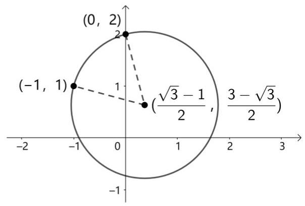

## 练习 8.4(2)

1. 判断下列各方程表示的图形是否是圆, 如果是, 求圆心和半径; 如果不是, 说明为什么:

(1) ${x}^{2} - {2x} + {y}^{2} - {2y} + 1 = 0$ ；

(3) $4{x}^{2} - {4x} + {y}^{2} - {2y} = 0$ (4) $\frac{1}{2}{x}^{2} + x + \frac{1}{2}{y}^{2} + \frac{3}{5}y = 0$ 。

#### 8.4.3 圆的参数方程

圆还可以用参数方程表示。对于以原点 $\left( {0,0}\right)$ 为圆心,半径为 1 的单位圆, 参照学习三角函数的方式,圆上的各点可以看作从圆与 $x$ 正半轴的交点 $\left( {1,0}\right)$ 开始,逆时针旋转一周经过的各位置。

选取旋转的弧度 $\theta$ 作为参数,圆上各点的横坐标为 $x = \cos \theta$ ,纵坐标为 $y = \sin \theta$ ,这就是以原点 $\left( {0,0}\right)$ 为圆心、半径为 1 的单位圆的参数方程:

$$
\left\{  \begin{array}{l} x = \cos \theta \\  y = \sin \theta  \end{array}\right.
$$

对于同样以原点 $\left( {0,0}\right)$ 为圆心、但半径变为 $r$ 的圆,圆上各点的横坐标变为 $x = r\cos \theta$ ,纵坐标变为 $y = r\sin \theta$ ,此类圆的参数方程为:

$$
\left\{  \begin{array}{l} x = r\cos \theta \\  y = r\sin \theta  \end{array}\right.
$$

更一般的,将原点 $\left( {0,0}\right)$ 为圆心、半径变为 $r$ 的圆沿向量 $\left( {a, b}\right)$ 平移,圆心和圆上各点都进行平移。圆心 $\left( {0,0}\right)$ 平移至 $\left( {0 + a,0 + b}\right)$ ,即 $\left( {a, b}\right)$ 。圆上的点 $\left( {x, y}\right)$ 平移至 $\left( {x + a, y + b}\right)$ ,圆上的点的坐标可以用参数表示为 $\left( {r\cos \theta , r\sin \theta }\right)$ , 平移后的坐标变为 $\left( {r\cos \theta  + a, r\sin \theta  + b}\right)$ 。

即: 以点 $\left( {a, b}\right)$ 为圆心、半径变为 $r$ 的圆,圆上的点的参数方程为:

$$
\left\{  \begin{array}{l} x = a + r\cos \theta \\  y = b + r\sin \theta  \end{array}\right.
$$

该表示方式叫作圆的参数方程。其中, $\theta  \in  \lbrack 0,{2\pi })$ 。

圆的参数方程的几何含义为: 从圆心 $\left( {a, b}\right)$ 出发,向与 $x$ 轴正半轴成 $\theta$ 角的方向,平移半径 $r$ 的距离后抵达的位置,每个弧度 $\theta$ 都与圆周上的一个点对应, 如下图所示。

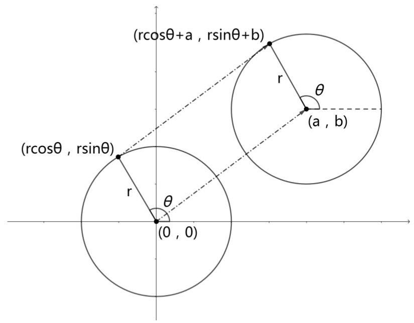

以点 $\left( {a, b}\right)$ 为圆心、半径变为 $r$ 的圆,其标准方程为 ${\left( x - a\right) }^{2} + {\left( y - b\right) }^{2} = {r}^{2}$ , 其参数方程为 $\left\{  \begin{array}{l} x = a + r\cos \theta \\  y = b + r\sin \theta  \end{array}\right.$ ,将用参数表示的圆上的点的坐标代入标准方程: ${\left( a + r\cos \theta  - a\right) }^{2} + {\left( b + r\sin \theta  - b\right) }^{2} = {r}^{2}{\cos }^{2}\theta  + {r}^{2}{\sin }^{2}\theta  = {r}^{2}\left( {{\cos }^{2}\theta  + {\sin }^{2}\theta }\right)  = {r}^{2},$ 等式恒成立, 表明圆的标准方程与圆的参数方程描述的是同一对象。

圆的参数方程比起标准方程,主要优点是只有一个变量 $\theta$ ,且比用 $x$ 表示 $y$ 或用 $y$ 表示 $x$ 消元后的形式更简洁,还可以用三角恒等变换进行化简,主要不足是弧度和三角函数的运算不如坐标运算熟悉。针对不同情况选择恰当的方程形式， 可以让分析得到简化。

例 8.14 已知圆 $A$ 的圆心为 $\left( {-1, - 1}\right)$ ,半径为 $\sqrt{2}$ ,求圆上的点到直线 $l : y =  - x + 4$ 的最大距离和最小距离。

解析: 圆 $A$ 的圆心为 $\left( {-1, - 1}\right)$ ,半径为 $\sqrt{2}$ ,圆 $A$ 上的点可以用参数方程表示为: $\left( {-1 + \sqrt{2}\cos \theta , - 1 + \sqrt{2}\sin \theta }\right)$ ,将直线 $l$ 的方程化为一般式: $x + y - 4 = 0$ , 圆上的点到直线 $l$ 的距离为: $d = \frac{\left| -1 + \sqrt{2}\cos \theta  - 1 + \sqrt{2}\sin \theta  - 4\right| }{\sqrt{{1}^{2} + {1}^{2}}}$ ,化简该表达式:

$$
d = \frac{\left| -1 + \sqrt{2}\cos \theta  - 1 + \sqrt{2}\sin \theta  - 4\right| }{\sqrt{{1}^{2} + {1}^{2}}} = \frac{\left| \sqrt{2}\left( \cos \theta  + \sin \theta \right)  - 6\right| }{\sqrt{2}} = \left| {\cos \theta  + \sin \theta  - 3\sqrt{2}}\right| \text{ 。 }
$$

利用在三角函数一章中学习的技巧: $\cos \theta  + \sin \theta  = \sqrt{2}\left( {\frac{\sqrt{2}}{2}\cos \theta  + \frac{\sqrt{2}}{2}\sin \theta }\right)  = \; \sqrt{2}\left( {\sin \frac{\pi }{4}\cos \theta  + \cos \frac{\pi }{4}\sin \theta }\right)  = \sqrt{2}\sin \left( {\theta  + \frac{\pi }{4}}\right)$ ,即 $d = \left| {\sqrt{2}\sin \left( {\theta  + \frac{\pi }{4}}\right)  - 3\sqrt{2}}\right|$ 。

当 $\theta  + \frac{\pi }{4} = \frac{\pi }{2}$ ,即 $\theta  = \frac{\pi }{4}$ 时, $d$ 取最小值, ${d}_{\min } = d = \left| {\sqrt{2} - 3\sqrt{2}}\right|  = 2\sqrt{2}$ ;

当 $\theta  + \frac{\pi }{4} = \frac{3\pi }{2}$ ,即 $\theta  = \frac{5\pi }{4}$ 时, $d$ 取最大值, ${d}_{\max } = d = \left| {-\sqrt{2} - 3\sqrt{2}}\right|  = 4\sqrt{2}$ 。

圆 $A$ 和直线 $l$ 的位置关系如下图所示,根据平面几何知识,圆 $A$ 与直线 $l$ 垂直的直径的两个端点,即分别为圆上到 $l$ 的距离最小和最大的点。

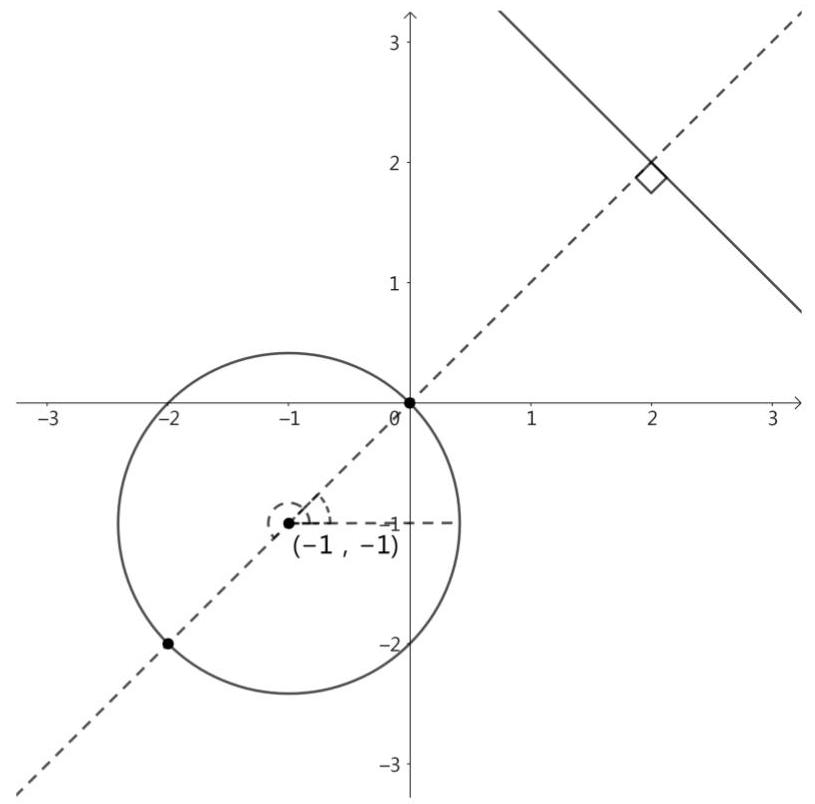

练习 8.4(3)

1. 已知圆 $A$ 的圆心为 $\left( {2,0}\right)$ ,半径为 2,圆 $B$ 的圆心为 $\left( {-1, - \sqrt{3}}\right)$ ,半径为 1, 求圆 $A$ 上的点与圆 $B$ 上的点的最大距离和最小距离。

### 8.5 平面内的位置关系

利用点的坐标表示、直线的方程、圆的方程, 以及平面内的距离公式, 可以简洁地分析判断点与圆、直线与圆、圆与圆的位置关系, 充分体现解析几何 “数形结合” 的特点。

#### 8.5.1 点与直线的位置关系

点与直线的位置关系有两种:点在直线上，点在直线外。判断点在直线上还是直线外的方法为:将点的坐标代入直线方程，如果等式成立，那么点在直线上； 如果等式不成立, 那么点在直线外。

对于点在直线外的情况，还可以分为两种情况:直线可以无限延长，可以看作直线将整个平面分为左右(或上下)两部分，点有在直线的左侧或右侧(上侧或下侧)两种情况，且这两种情况与点的坐标和直线的方程有对应关系。

对于任意点 $P\left( {{x}_{0},{y}_{0}}\right)$ 与直线 $l : y = {kx} + b$ ,将点的坐标代入直线的一般式方程的左侧: $A{x}_{0} + B{y}_{0} + C$ ,其中,所有满足不等式关系 $A{x}_{0} + B{y}_{0} + C > 0$ 的点在直线的一侧,所有满足 $A{x}_{0} + B{y}_{0} + C < 0$ 的点在直线的另一侧。

即: 将点的坐标代入直线的方程后, 不等号方向相同的点在同一侧。直线 ${Ax} + {By} + C = 0$ 一侧的点的坐标都满足 ${Ax} + {By} + C < 0$ ,另一侧的点的坐标都满足 ${Ax} + {By} + C > 0$ 。至于究竟哪些点在左侧、哪些点在右侧(或上侧还是下侧), 需要根据直线方程具体判断。

例 8.15 已知直线 $x - y + 2 = 0$ ,判断点 $\left( {2,3}\right)$ 和 $\left( {4,1}\right)$ 在直线同侧还是异侧。

解析: 分别将两个点的坐标代入直线方程的左侧: $2 - 3 + 2 = 1 > 0$ , $4 - 1 + 2 = 5 > 0$ ,都是大于号,这两个点在直线的同侧。直线的图像和两个点的位置如下图所示。

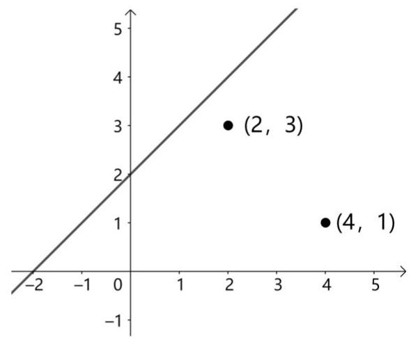

练习 $\mathbf{{8.5}\left( 1\right) }$

1. 已知直线 $x + y + 3 = 0$ ,判断下列各组点在直线同侧还是异侧。

(1)(-2，-3)与(4，1)；(2)(0，0)与(-1，3)；(3)(-2，6)与(-1，1)。

#### 8.5.2 点与圆的位置关系

点与圆的位置关系有三种:点在圆上、点在圆内、点在圆外。

圆心为 $O\left( {a, b}\right)$ ,半径为 $r$ 的圆的标准方程为 ${\left( x - a\right) }^{2} + {\left( y - b\right) }^{2} = {r}^{2}\left( {r > 0}\right)$ , 等式左边为点 $\left( {x, y}\right)$ 到圆心 $O\left( {a, b}\right)$ 的距离的平方,等式右边为圆半径 $r$ 的平方, 对于平面内的任意一点 $P\left( {{x}_{0},{y}_{0}}\right)$ :

如果 $\left( {{x}_{0},{y}_{0}}\right)$ 满足方程 ${\left( {x}_{0} - a\right) }^{2} + {\left( {y}_{0} - b\right) }^{2} = {r}^{2}$ ,表明 $P$ 到圆心的距离等于半径,那么 $P$ 在圆上。

如果 $\left( {{x}_{0},{y}_{0}}\right)$ 满足不等式 ${\left( {x}_{0} - a\right) }^{2} + {\left( {y}_{0} - b\right) }^{2} < {r}^{2}$ ,表明 $P$ 到圆心的距离小于半径,那么 $P$ 在圆内。

如果 $\left( {{x}_{0},{y}_{0}}\right)$ 满足不等式 ${\left( {x}_{0} - a\right) }^{2} + {\left( {y}_{0} - b\right) }^{2} > {r}^{2}$ ,表明 $P$ 到圆心的距离大于半径,那么 $P$ 在圆外。

例 8.16 已知圆 $O$ 的方程为 ${\left( x + 2\right) }^{2} + {y}^{2} = 3$ ,判断点 $P\left( {-1, - 1}\right)$ 是否在圆 $O$ 内。

解析: 由圆 $O$ 的方程可得: 圆心 $O$ 的坐标为 $\left( {-2,0}\right)$ ,半径为 $\sqrt{3}$ ,点 $P\left( {-1, - 1}\right)$ 到圆心 $O$ 的距离为: $\sqrt{( - 1 - {\left( -2\right) }^{2} + {\left( -1 - 0\right) }^{2}} = \sqrt{2},{PO} < r$ ,点 $P\left( {-1, - 1}\right)$ 在圆 $O$ 内。 也可以直接将点 $P\left( {-1, - 1}\right)$ 的坐标代入圆 $O$ 方程的左侧: ${\left( -1 + 2\right) }^{2} + {\left( -1\right) }^{2} = 2 < 3$ , 点 $P\left( {-1, - 1}\right)$ 在圆 $O$ 内。圆 $O$ 的和点 $P$ 的位置如下图所示。

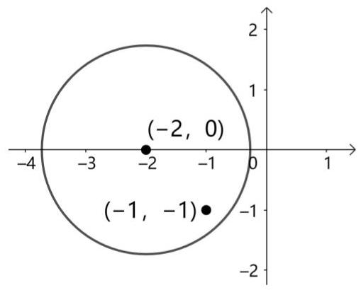

## 练习 8.5(2)

1. 已知圆 $O$ 的方程为 ${\left( x + 2\right) }^{2} + {\left( y - 3\right) }^{2} = 9$ ,判断下列各点是在圆内、圆外还是圆上: (1) $\left( {0,0}\right) ;\left( 2\right) \left( {-1,3}\right) ;\left( 3\right) \left( {-2,6}\right) ;\left( 4\right) \left( {-1,1}\right)$ 。

#### 8.5.3 直线与圆的位置关系

直线与圆的位置关系有三种:(1)相交，直线与圆有两个公共点；(2)相切, 直线与圆有一个公共点; (3) 相离, 直线与圆没有公共点。

设圆 $O$ 的方程为 ${\left( x - a\right) }^{2} + {\left( y - b\right) }^{2} = {r}^{2}$ ,直线 $l$ 方程为 ${Ax} + {By} + C = 0$ ,接下来分别用代数和几何两种思路分析它们的位置关系与解析式间的对应关系。

代数思路。联立直线与圆的方程, 得到方程组:

$$
\left\{  \begin{array}{l} {Ax} + {By} + C = 0 \\  {\left( x - a\right) }^{2} + {\left( y - b\right) }^{2} = {r}^{2} \end{array}\right.
$$

将直线的方程转化为用 $x$ 表示 $y$ 的函数形式:

$$
y =  - \frac{A}{B}x - \frac{C}{B}
$$

将函数解析式代入圆的方程消元, 得到一元二次方程:

$$
{\left( x - a\right) }^{2} + {\left( -\frac{A}{B}x - \frac{C}{B} - b\right) }^{2} = {r}^{2}
$$

展开化为一元二次方程的一般形式:

$$
\left( {1 + \frac{{A}^{2}}{{B}^{2}}}\right) {x}^{2} + \left( {\frac{2AC}{{B}^{2}} + \frac{2Ab}{B} - {2a}}\right) x + {a}^{2} + {\left( \frac{C}{B} + b\right) }^{2} - {r}^{2} = 0
$$

利用一元二次方程根的判别式，可以初步判定方程组的解的个数，就是直线与圆的交点的数量, 从而判断直线与圆的位置关系, 由于该判别式求解过程非常复杂, 故不再具体展开。需注意, 可能出现两个交点的横坐标相同的情况, 导致虽然一元二次方程只有一个解,但对应的纵坐标有两个,此时直线垂直于 $x$ 轴, 其方程形式为 $x = p$ ,通常较容易识别。

虽然上面的表达式形式很复杂, 但对于已经给出数值的具体方程, 方程组的化简、求根的判别式、解方程组的过程通常并不复杂, 可以先列出方程, 根据实际情况判断是否继续求解。

几何思路。从圆心 $O\left( {a, b}\right)$ 向直线 $l : {Ax} + {By} + C = 0$ 引垂线，设垂足为 $M$ ， 那么圆心 $O$ 与垂足 $M$ 的距离就是圆心到直线的距离。

如果圆心到直线的距离小于半径,即 $\frac{\left| Aa + Bb + C\right| }{\sqrt{{A}^{2} + {B}^{2}}} < r$ ,那么直线与圆相交。 如果圆心到直线的距离等于半径,即 $\frac{\left| Aa + Bb + C\right| }{\sqrt{{A}^{2} + {B}^{2}}} = r$ ,那么直线与圆相切。 如果圆心到直线的距离大于半径,即 $\frac{\left| Aa + Bb + C\right| }{\sqrt{{A}^{2} + {B}^{2}}} > r$ ,那么直线与圆相离。 下图依次为直线与圆相交、相切、相离的三种情况。

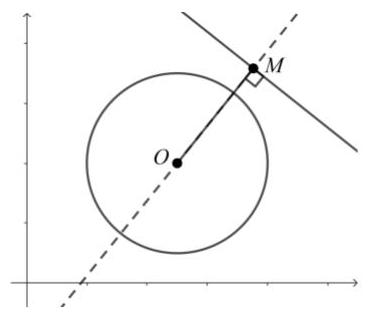

若已知圆的方程和切点坐标, 要求切线的方程, 可以根据切线与切点所在半径垂直的几何规律, 利用切点所在半径的方向向量求出切线的方向向量, 再结合切点坐标, 就能列出切线的点斜式方程。

对比代数思路和几何思路可以发现, 在分析处理解析几何问题时, 如果完全脱离图形, 只 “列方程、解方程”, 很可能遇到计算量很大甚至无法计算的情况。 利用欧式几何的定理, 从已知关系中推出能让解析式更简洁的结论, 可以让计算得到极大的简化。

例 8.17 已知圆 $O : {\left( x + 1\right) }^{2} + {\left( y - 1\right) }^{2} = 4$ ，求经过点 $A\left( {2, - 1}\right)$ 的圆 $O$ 的切线。

解析: 由圆 $O$ 的方程可知,圆心为 $O\left( {-1,1}\right)$ ,半径为 2,圆心 $O$ 到点 $A\left( {2, - 1}\right)$ 的距离为 ${OA} = \sqrt{{\left( 2 - \left( -1\right) \right) }^{2} + {\left( -1 - 1\right) }^{2}} = \sqrt{13} > 2$ ,点 $A$ 在圆 $O$ 外,存在经过点 $A$ 与圆 $O$ 相切的直线,设切线的方程为 $y = {kx} + b$ ,化为标准方程为 ${kx} - y + b = 0$ 。

切线经过点 $A\left( {2, - 1}\right)$ ,将点 $A$ 的坐标代入切线方程可得: $- 1 = {2k} + b$ ,变形得: $b =  - {2k} - 1$ 。

切线与圆 $O$ 相切,圆心到切线的距离等于圆的半径,可得: $\frac{\left| -k - 1 + b\right| }{\sqrt{{k}^{2} + 1}} = 2$ , 将 $b =  - {2k} - 1$ 代入该等式消去 $b$ ,得到关于 $k$ 的方程: $\frac{\left| -k - 1 - 2k - 1\right| }{\sqrt{{k}^{2} + 1}} = 2$ ,化简绝对值内的部分、将分母移到等式的另一侧: $\left| {{3k} + 2}\right|  = 2\sqrt{{k}^{2} + 1}$ ,等式两边分别平方: ${\left( 3k + 2\right) }^{2} = 4\left( {{k}^{2} + 1}\right)$ ,移项、合并同类项: $5{k}^{2} + {12k} = 0$ ,解得: $k = 0$ 或 $k =  - \frac{12}{5}$ 。

当 $k = 0$ 时， $b =  - 1$ ，切线方程为: $y =  - 1$ ；

当 $k =  - \frac{12}{5}$ 时， $b = \frac{19}{5}$ ，切线方程为: $y =  - \frac{12x}{5} + \frac{19}{5}$ 。

这与 “经过圆外一点可以画出两条圆的切线” 的几何定理已知。本题中的圆 $O$ 、点 $A\left( {2, - 1}\right)$ 和两条切线的位置如下图所示。

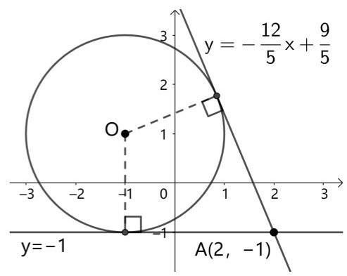

本题所求的两条切线都不垂直于 $x$ 轴,设直线的点斜式求解没有遇到问题, 算是较为幸运。

## 练习 8.5(3)

1. 已知圆 $O : {x}^{2} + {\left( y - 2\right) }^{2} = 9$ ,直线 $l : y = x + b$ ,求:

(1)若 $l$ 经过圆心 $O$ ，求 $l$ 的方程；

(2)若 $l$ 与圆 $O$ 相切，求 $l$ 的方程；

(3)若 $l$ 与圆 $O$ 相交于 $A, B,\left| {AB}\right|  = 2\sqrt{7}$ ，求 $l$ 的方程。

2. 已知圆 ${C}_{1} : {x}^{2} + {y}^{2} = {r}_{1}^{2}$ ,圆 ${C}_{2} : {x}^{2} + {y}^{2} = {r}_{2}^{2},\left( {{r}_{1},{r}_{2} > 0}\right)$ ,直线 $y = {kx}$ 与两圆在 $y$ 轴上方的交点分别为 ${P}_{1},{P}_{2}$ ,证明: $\overrightarrow{O{P}_{1}} \cdot  \overrightarrow{O{P}_{2}} = {r}_{1}{r}_{2}$ 。(提示:利用圆的参数方程)

#### 8.5.4 圆与圆的位置关系

圆与圆的位置关系有五种:相离、相交、外切、内切、内含。

设两个圆 $A : {\left( x - {a}_{1}\right) }^{2} + {\left( y - {b}_{1}\right) }^{2} = {r}_{1}^{2}$ 和 $B : {\left( x - {a}_{2}\right) }^{2} + {\left( y - {b}_{2}\right) }^{2} = {r}_{2}^{2}$ ,联立两个圆的方程可以得到方程组, 根据方程组的解的数量一一即交点的数量可以判断圆的位置关系:若两圆相离，则它们没有公共点；若两圆相交，则它们有两个公共点； 若两圆外切, 则它们一个有公共点; 若两圆内切, 则它们有一个公共点; 若两圆内含, 则它们没有公共点。

圆的方程中, ${x}^{2}$ 与 ${y}^{2}$ 的系数须相同,所以直接将两圆的方程相减,可以得到关于 $x\text{ 、 }y$ 的二元一次方程,用其中一个变量表示另一个变量,代入其中一个圆的方程, 可以得到一元二次方程, 从而可以根据方程解的个数判断。然而这种判断方式不仅计算量较大, 还无法区分外切与内切、相离与内含。根据圆心间的距离与半径的关系, 判断圆之间的位置关系更准确和简便。

设两个圆 $A : {\left( x - {a}_{1}\right) }^{2} + {\left( y - {b}_{1}\right) }^{2} = {r}_{1}^{2}$ 和 $B : {\left( x - {a}_{2}\right) }^{2} + {\left( y - {b}_{2}\right) }^{2} = {r}_{2}^{2}$ ,由方程可知它们的圆心分别为 $A\left( {{a}_{1},{b}_{1}}\right)$ 和 $B\left( {{a}_{2},{b}_{2}}\right)$ ,半径分别为 ${r}_{1}$ 和 ${r}_{2}$ ,根据平面几何知识, 圆的位置关系与圆心间的距离与两圆的半径有对应关系。

如下图所示, 若两圆相离, 则圆心间的距离大于半径之和:

$$
\sqrt{{\left( {a}_{1} - {a}_{2}\right) }^{2} + {\left( {b}_{1} - {b}_{2}\right) }^{2}} > {r}_{1} + {r}_{2}
$$

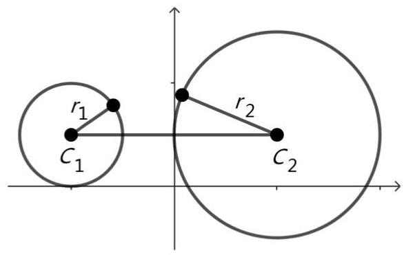

如下图所示, 若两圆外切, 则圆心间的距离等于半径之和, 且切点、两圆的圆心这三点共直线:

$$
\sqrt{{\left( {a}_{1} - {a}_{2}\right) }^{2} + {\left( {b}_{1} - {b}_{2}\right) }^{2}} = {r}_{1} + {r}_{2}
$$

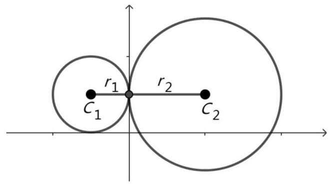

如下图所示, 若两圆相交, 则圆心间的距离小于半径之和、大于半径之差:

$$
\left| {{r}_{1} - {r}_{2}}\right|  < \sqrt{{\left( {a}_{1} - {a}_{2}\right) }^{2} + {\left( {b}_{1} - {b}_{2}\right) }^{2}} < {r}_{1} + {r}_{2}
$$

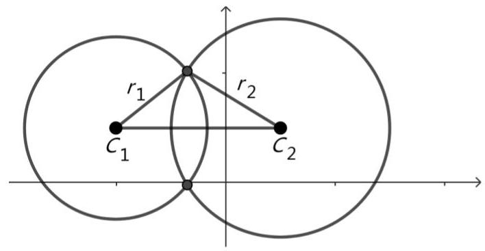

如下图所示，若两圆内切，则圆心间的距离等于半径之差，且切点、两圆的圆心这三点共直线。小圆的圆心一定在大圆的圆周内, 大圆的圆心可以在小圆的圆周内、圆周上、圆周外。

$$
\sqrt{{\left( {a}_{1} - {a}_{2}\right) }^{2} + {\left( {b}_{1} - {b}_{2}\right) }^{2}} = \left| {{r}_{1} - {r}_{2}}\right|
$$

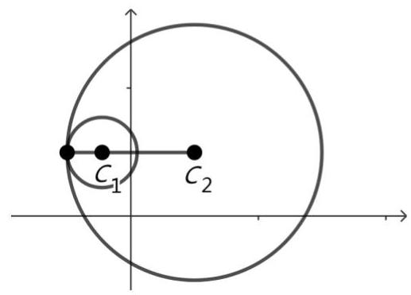

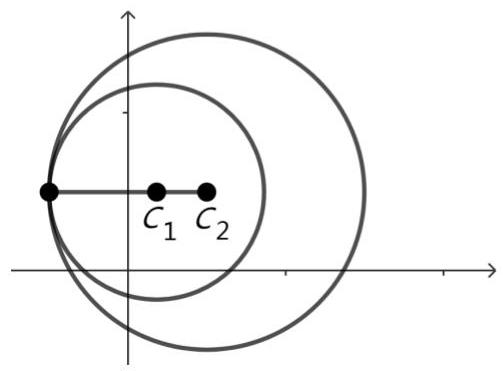

如下页图所示，若一个圆内含于另一个圆，则圆心间的距离小于半径之差。 其中小圆的圆心一定在大圆的圆周内, 大圆的圆心可以在小圆的圆周内、圆周外、 圆周上:

$$
\sqrt{{\left( {a}_{1} - {a}_{2}\right) }^{2} + {\left( {b}_{1} - {b}_{2}\right) }^{2}} < \left| {{r}_{1} - {r}_{2}}\right|
$$

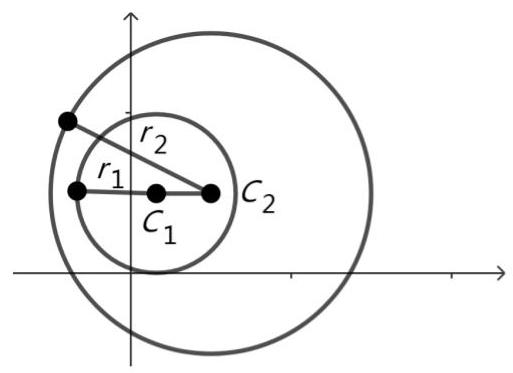

例 8.18 已知两圆 ${C}_{1} : {\left( x - 1\right) }^{2} + {\left( y - 2\right) }^{2} = 4$ 和 ${C}_{2} : {\left( x - 2\right) }^{2} + {\left( y - 1\right) }^{2} = 9$ ,判断 ${C}_{1}$ 与 ${C}_{2}$ 的位置关系。

解析: 方法一: 联立两圆的方程, 分析方程组的解的情况

将两圆的方程相减并化简:

$\left\lbrack  {{\left( x - 1\right) }^{2} + {\left( y - 2\right) }^{2}}\right\rbrack   - \left\lbrack  {{\left( x - 2\right) }^{2} + {\left( y - 1\right) }^{2}}\right\rbrack   = 4 - 9,$

化简得: $y = x + \frac{5}{2}$ ,代入圆 ${C}_{1}$ 的方程并化简:

$$
8{x}^{2} - {4x} - {11} = 0,
$$

$\Delta  = {4}^{2} - 4 \times  8 \times  \left( {-{11}}\right)  = {368} > 0,$

方程有两个不同的解, 两圆有两个不同的交点, 两圆相交。

如果方程没有解或只有一个解, 那么该方法就无法判定两圆的位置关系。

方法二: 分析圆心间的距离与两圆半径的关系

由两圆的方程可得: ${C}_{1}$ 的圆心为 ${C}_{1}\left( {1,2}\right)$ ,半径为 ${r}_{1} = 2,{C}_{2}$ 的圆心为 ${C}_{2}\left( {2,1}\right)$ ,半径为 ${r}_{2} = 3$ ,

两圆的圆心间的距离为 $\left| {{C}_{1}{C}_{2}}\right|  = \sqrt{{\left( 2 - 1\right) }^{2} + {\left( 1 - 2\right) }^{2}} = \sqrt{2}$ ,

两圆的半径之和为 $2 + 3 = 5$ ,半径之差为 $3 - 2 = 1$ ,

$1 < \sqrt{2} < 5,\left| {{C}_{1}{C}_{2}}\right|$ 小于半径之和、大于半径之差,两圆相交。

两圆的位置关系如下图所示。

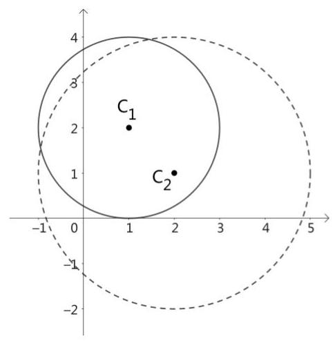

例 8.19 已知两圆 ${C}_{1} : {x}^{2} + {\left( y - 3\right) }^{2} = {36}$ 和 ${C}_{2} : {\left( x + 4\right) }^{2} + {y}^{2} = 1$ ,求两圆的公切线的方程。

解析: 先判断两圆的位置关系, 确定公切线的数量:

由 ${C}_{1}\text{ 、 }{C}_{2}$ 的方程可得: ${C}_{1}$ 的圆心为 $\left( {0,3}\right)$ ,半径为 ${r}_{1} = 6,{C}_{2}$ 的圆心为 $\left( {-4,0}\right)$ ,半径为 ${r}_{2} = 1,\left| {{C}_{1}{C}_{2}}\right|  = \sqrt{{3}^{2} + {4}^{2}} = 5 = {r}_{1} - {r}_{2}$ ,两圆内切,因为 ${r}_{1} > {r}_{2}$ ,所以 ${C}_{2}$ 内切于 ${C}_{1}$ ,设切点为 $P$ ,内切的两圆有一条公切线。

公切线与两圆的切点就是两圆的切点 $P$ ,利用点 $P$ 的坐标、切线与切点所在半径垂直, 可求得公切线的点斜式方程。

让两圆的方程相减: $\left\lbrack  {{x}^{2} + {\left( y - 3\right) }^{2}}\right\rbrack   - \left\lbrack  {{\left( x + 4\right) }^{2} + {y}^{2}}\right\rbrack   = {36} - 1$ ,化简得: $y =  - \frac{4x}{3} - 7$ ,代入 ${C}_{2}$ 的方程 ${\left( x + 4\right) }^{2} + {y}^{2} = 1$ 得到关于 $x$ 的一元二次方程: ${\left( x + 4\right) }^{2} + {\left( -\frac{4x}{3} - 7\right) }^{2} = 1$ ,解得: $x =  - \frac{24}{5}, y =  - \frac{4}{3} \times  \left( {-\frac{24}{5}}\right)  - 7 =  - \frac{3}{5}$ ,切点坐标为 $\left( {-\frac{24}{5}, - \frac{3}{5}}\right)$ 。

公切线与切点所在半径垂直, 该半径经过两圆的圆心, 该半径所在直线的方向向量为: $\overrightarrow{{C}_{2}{C}_{1}} = \left( {4,3}\right)$ ,所在直线的斜率为 $\frac{3}{4}$ ,公切线与半径垂直,公切线的斜率为 $- \frac{4}{3}$ ,公切线的点斜式方程为: $y + \frac{3}{5} =  - \frac{4}{3}\left( {x + \frac{24}{5}}\right)$ ,化简为一般式: ${4x} + {3y} + {21} = 0$ 。圆 ${C}_{1}\text{ 、 }{C}_{2}$ 及公切线的图像如下图所示。

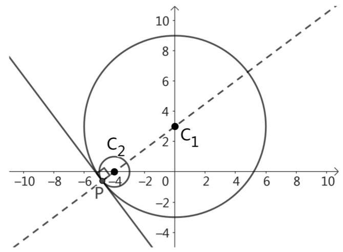

## 练习 8.5(4)

1. 已知圆 $O$ 的圆心为 $O\left( {-3, - 4}\right)$ ,半径 $r = 6$ ,求:

(1)圆 $O$ 的标准方程；

(2)圆 $O$ 与直线 ${3x} + {4y} - {16} = 0$ 的位置关系；

(3)圆 $O$ 与 $x$ 轴、 $y$ 轴、直线 $y = x$ 的交点坐标。

2. 已知圆 $A$ 的方程为 ${\left( x + 2\right) }^{2} + {\left( y - 3\right) }^{2} = {25}$ ,圆 $B$ 的圆心为 $B\left( {-4, - 5}\right)$ ,回答下列问题:

(1)若圆 $A$ 与圆 $B$ 外切，求圆 $B$ 的方程；

(2)若圆 $A$ 内切于圆 $B$ ,求圆 $B$ 的方程。

3. 已知圆 $A$ 内切于圆 $B$ ,切点为 $P$ ,圆 $A$ 的半径为 $a$ ,圆 $B$ 的半径为 $b$ ,画图并分析:

(1)如果点 $B$ 在圆 $A$ 外，求 $a$ 与 $b$ 满足的数量关系；

(2)如果点 $B$ 在圆 $A$ 内,求 $a$ 与 $b$ 满足的数量关系;

(3)如果点 $B$ 在圆 $A$ 上，求 $a$ 与 $b$ 满足的数量关系。

## 小结

本章主要学习直线和圆的方程的概念、性质和应用。圆和直线方程是解析几何的基础知识, 需重点掌握直线和圆的方程的推导过程, 理解几何图像与方程间的对应关系, 特别是距离、平行、垂直与方程的对应关系, 了解参数方程的形式并能尝试应用。向量也是解析几何的内容, 可以与方程配合使用。另外, 还要熟练使用欧式几何中的重要定理, 能根据具体情况选用简便或熟练的数学方法。

## 第九章 圆锥曲线的方程

椭圆、双曲线、抛物线统称为圆锥曲线, 因这些平面图形都能通过用一个平面截取圆锥体的方式得到而得名, 如下图所示。

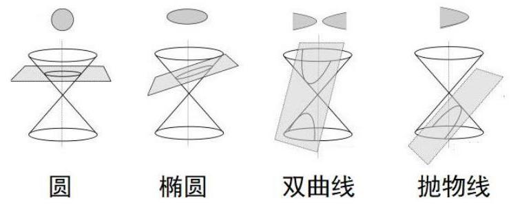

圆锥曲线既是几何学研究的基本图形, 也在自然界中广泛存在, 每一种圆锥曲线的构造原理都能用简洁的语句表达, 用解析几何的语言将相应的构造原理 “翻译”成数学解析式, 就能得到相应的圆锥曲线的方程。

圆锥曲线的构造原理和构造过程决定了它们的标准方程、图像和性质, 根据圆锥曲线的构造原理和构造过程, 可以推出其标准方程, 结合标准方程可以分析得知它们的重要性质。

椭圆、双曲线、抛物线的构造过程既有相似之处, 又有明显区别, 还互有补充, 它们的相似之处让它们属于同一类图形——圆锥曲线, 它们的区别让各曲线的图像和性质有所差异。

虽然椭圆、双曲线、抛物线的图形看上去比直线和圆稍复杂, 但推导曲线的方程的原理, 仍为用解析几何描述距离和角度等位置关系, 因此分析思路与直线和圆的方程基本一致。

### 9.1 椭圆

圆可以看作一种特殊的椭圆, 将圆沿某个方向拉伸或压缩就能得到椭圆, 绘制椭圆的方法与绘制圆相似。

#### 9.1.1 椭圆及其标准方程

圆的定义为:到定点的距离等于定长的点形成的图形。椭圆的定义与之相似， 椭圆的定义为:平面内，所有到两个定点 ${F}_{1}\text{ 、 }{F}_{2}$ 的距离之和等于定长 (大于 ${F}_{1}{F}_{2}$ ) 的点, 形成的图形 (集合) 叫作椭圆。

画圆时, 可以用一根绳子画圆, 将绳子的一端用钉子固定在纸面上, 将绳子绷直后旋转，绳子另一端在纸面上经过的轨迹就是圆。画椭圆的方法相似，将绳子的两端用钉子固定在纸面上，用一支笔从绳子中任意某处将绳子绷直，于是 “钉子一笔一钉子” 形成一个夹角，始终保持绳子被笔绷直的状态，笔在纸面上经过的轨迹就是椭圆。

画椭圆的过程中, 固定绳子两端的两个钉子就是椭圆的定义中的两个定点 ${F}_{1}\text{ 、 }{F}_{2}$ ,绳子的长度恒定不变,就是椭圆上的点到两个定点 ${F}_{1}\text{ 、 }{F}_{2}$ 的距离之和。 下图为椭圆的图像。

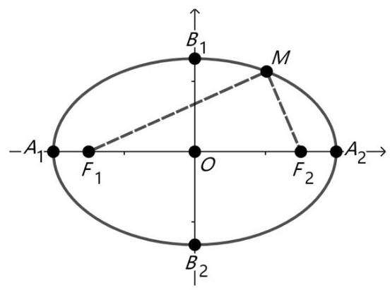

接下来根据椭圆的定义推导椭圆上的点满足的方程, 即椭圆的标准方程。

设点 ${F}_{1}\text{ 、 }{F}_{2}$ 间的距离为 ${2c}\left( {c > 0}\right)$ ,为方便计算,让 ${F}_{1}\text{ 、 }{F}_{2}$ 都在 $x$ 轴上,且原点 $\left( {0,0}\right)$ 为线段 ${F}_{1}{F}_{2}$ 的中点,于是 ${F}_{1}\text{ 、 }{F}_{2}$ 的坐标分别为 ${F}_{1}\left( {-c,0}\right) \text{ 、 }{F}_{2}\left( {c,0}\right)$ 。

设动点 $M\left( {x, y}\right)$ 到 ${F}_{1}\text{ 、 }{F}_{2}$ 的距离之和等于 ${2a}\left( {{2a} > {2c}}\right)$ ,根据该数量关系可以列出等式:

$$
\left| \overrightarrow{\mathrm{{MF}}}\right|  + \left| \overrightarrow{{\mathrm{{MF}}}_{2}}\right|  = {2a}
$$

代入相应的坐标:

$$
\sqrt{{\left( x - \left( -c\right) \right) }^{2} + {\left( y - 0\right) }^{2}} + \sqrt{{\left( x - c\right) }^{2} + {\left( y - 0\right) }^{2}} = {2a}
$$

将等式的两边同时平方:

$$
\left\lbrack  {{\left( x + c\right) }^{2} + {y}^{2}}\right\rbrack   + 2\sqrt{\left\lbrack  {{\left( x + c\right) }^{2} + {y}^{2}}\right\rbrack  \left\lbrack  {{\left( x - c\right) }^{2} + {y}^{2}}\right\rbrack  } + \left\lbrack  {{\left( x - c\right) }^{2} + {y}^{2}}\right\rbrack   = 4{a}^{2}
$$

展开各完全平方项、合并同类项并化简:

$$
2{x}^{2} + 2{y}^{2} + 2{c}^{2} + 2\sqrt{\left( {{x}^{2} + {2cx} + {c}^{2} + {y}^{2}}\right) \left( {{x}^{2} - {2cx} + {c}^{2} + {y}^{2}}\right) } = 4{a}^{2}
$$

$$
{x}^{2} + {y}^{2} + {c}^{2} + \sqrt{\left( {{x}^{2} + {2cx} + {c}^{2} + {y}^{2}}\right) \left( {{x}^{2} - {2cx} + {c}^{2} + {y}^{2}}\right) } = 2{a}^{2}
$$

将根号内的 ${x}^{2} + {y}^{2} + {c}^{2}$ 当作一个整体,使用平方差公式:

$$
\left( {{x}^{2} + {y}^{2} + {c}^{2}}\right)  + \sqrt{{\left( {x}^{2} + {y}^{2} + {c}^{2}\right) }^{2} - {\left( 2cx\right) }^{2}} = 2{a}^{2}
$$

将根式单独移到等号的一边, 对等式的两边同时平方:

$$
\sqrt{{\left( {x}^{2} + {y}^{2} + {c}^{2}\right) }^{2} - {\left( 2cx\right) }^{2}} = 2{a}^{2} - \left( {{x}^{2} + {y}^{2} + {c}^{2}}\right)
$$

$$
{\left( {x}^{2} + {y}^{2} + {c}^{2}\right) }^{2} - {\left( 2cx\right) }^{2} = 4{a}^{4} - 4{a}^{2}\left( {{x}^{2} + {y}^{2} + {c}^{2}}\right)  + {\left( {x}^{2} + {y}^{2} + {c}^{2}\right) }^{2}
$$

继续化简:

$$
- {\left( 2cx\right) }^{2} = 4{a}^{4} - 4{a}^{2}\left( {{x}^{2} + {y}^{2} + {c}^{2}}\right)
$$

$$
- 4{c}^{2}{x}^{2} = 4{a}^{4} - 4{a}^{2}{x}^{2} - 4{a}^{2}{y}^{2} - 4{a}^{2}{c}^{2}
$$

$$
- {c}^{2}{x}^{2} = {a}^{4} - {a}^{2}{x}^{2} - {a}^{2}{y}^{2} - {a}^{2}{c}^{2}
$$

把所有含 $x\text{ 、 }y$ 的项移至等式左边,把所有不含 $x\text{ 、 }y$ 的项移至等式右边:

$$
\left( {{a}^{2} - {c}^{2}}\right) {x}^{2} + {a}^{2}{y}^{2} = {a}^{4} - {a}^{2}{c}^{2}
$$

等式的两边同时除以 ${a}^{2}\left( {{a}^{2} - {c}^{2}}\right)$ :

$$
\frac{{x}^{2}}{{a}^{2}} + \frac{{y}^{2}}{{a}^{2} - {c}^{2}} = 1
$$

因为已经规定了 $a > c > 0$ ,所以 ${a}^{2} - {c}^{2} > 0$ ,设 ${b}^{2} = {a}^{2} - {c}^{2}, b > 0$ ,就得到椭圆的标准方程:

$$
\frac{{x}^{2}}{{a}^{2}} + \frac{{y}^{2}}{{b}^{2}} = 1\left( {a > b}\right)
$$

根据椭圆的构造过程可知,定点 ${F}_{1}\text{ 、 }{F}_{2}$ 的坐标分别为 ${F}_{1}\left( {-c,0}\right) \text{ 、 }{F}_{2}\left( {c,0}\right)$ , 动点 $M\left( {x, y}\right)$ 到 ${F}_{1}\text{ 、 }{F}_{2}$ 的距离之和恒为 ${2a}\left( {a > c}\right)$ 。

其中, ${F}_{1}\text{ 、 }{F}_{2}$ 叫作椭圆的焦点,左边的 ${F}_{1}$ 叫作左焦点,右边的 ${F}_{2}$ 叫作右焦点, 两焦点间的距离 ${F}_{1}{F}_{2} = {2c}$ 叫作椭圆的焦距,焦距的一半 $c$ 叫作椭圆的半焦距,两个焦点的中点 (即图中的坐标原点 $O$ ) 叫作椭圆的中心。

书写椭圆的标准方程 $\frac{{x}^{2}}{{a}^{2}} + \frac{{y}^{2}}{{b}^{2}} = 1\left( {a > b > 0}\right)$ 时,需专门注明 $a > b$ 。这是因为如果 $a < b$ ,那么椭圆的焦点 ${F}_{1}\text{ 、 }{F}_{2}$ 就不是在 $x$ 轴上,而是在 $y$ 轴上且对称地分布在原点的上方和下方, 此时椭圆的图像 “又窄又高”, 而不是 “又宽又矮”。为了便于识别椭圆的特点, 此时通常把椭圆的标准方程写为:

$$
\frac{{y}^{2}}{{a}^{2}} + \frac{{x}^{2}}{{b}^{2}} = 1\left( {a > b > 0}\right)
$$

下图为焦点在 $y$ 轴上的椭圆。

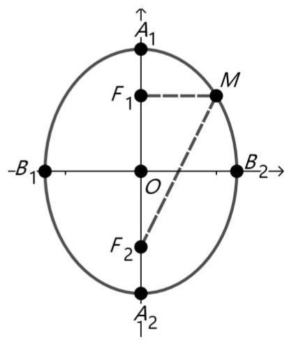

例 9.1 已知椭圆的焦点分别为 ${F}_{1}\left( {-c,0}\right) ,{F}_{2}\left( {c,0}\right) , c > 0$ ,且椭圆经过点 $\left( {5,0}\right)$ 和 $\left( {0,4}\right)$ ,求椭圆的标准方程和 $c$ 的值。

解析: 椭圆的标准方程中,只有 $a\text{ 、 }b$ 两个参数,通常只需要两个不同的数量关系,就能求得 $a\text{ 、 }b$ 。

椭圆的两个焦点为 ${F}_{1}\left( {-c,0}\right) ,{F}_{2}\left( {c,0}\right)$ ,可以设椭圆的标准方程为:

$$
\frac{{x}^{2}}{{a}^{2}} + \frac{{y}^{2}}{{b}^{2}} = 1\left( {a > b > 0}\right)
$$

因为椭圆经过点 $\left( {5,0}\right)$ 和 $\left( {0,4}\right)$ ,将两点坐标分别代入椭圆的标准方程:

$$
\frac{{5}^{2}}{{a}^{2}} + \frac{{0}^{2}}{{b}^{2}} = 1,\;\frac{{0}^{2}}{{a}^{2}} + \frac{{4}^{2}}{{b}^{2}} = 1
$$

解得: $a = 5, b = 4$ ,该椭圆的标准方程为: $\frac{{x}^{2}}{25} + \frac{{y}^{2}}{16} = 1$ ,

推导椭圆的标准方程时,定义 ${b}^{2} = {a}^{2} - {c}^{2}$ ,又因为 $c > 0$ ,所以:

$$
c = \sqrt{{a}^{2} - {b}^{2}} = \sqrt{{5}^{2} - {4}^{2}} = 3
$$

练习 9.1(1)

1. 定义椭圆时,规定动 $M$ 到两个定点 ${F}_{1}\text{ 、 }{F}_{2}$ 的距离之和 ${2a}$ 大于线段 ${F}_{1}{F}_{2}$ 的长度 ${2c}$ ,指出满足下列条件的点集构成什么图形:

(1)到 ${F}_{1}$ 、 ${F}_{2}$ 的距离之和为定值，且等于线段 ${F}_{1}{F}_{2}$ 的长度的点；

(2)到 ${F}_{1}$ 、 ${F}_{2}$ 的距离之和为定值，且小于线段 ${F}_{1}{F}_{2}$ 的长度的点。

2. 设椭圆的焦点分别为 ${F}_{1}\left( {-c,0}\right) ,{F}_{2}\left( {c,0}\right)$ ,动点 $M\left( {x, y}\right)$ 到 ${F}_{1}\text{ 、 }{F}_{2}$ 的距离之和等于 ${2a}\left( {a > c}\right)$ ,参照本小节的内容,推导该椭圆的标准方程。

3. 已知圆 $O : {x}^{2} + {y}^{2} = 4$ ,将该圆沿水平方向拉伸,令各点横坐标为原来的 2 倍, 求拉伸后的图形的方程, 并指出这是什么图形。

#### 9.1.2 椭圆的基本性质

已知椭圆的焦点为 ${F}_{1}\left( {-c,0}\right) \text{ 、 }{F}_{2}\left( {c,0}\right)$ ,标准方程为 $\frac{{x}^{2}}{{a}^{2}} + \frac{{y}^{2}}{{b}^{2}} = 1\left( {a > b > 0}\right)$ , 参数满足关系 ${a}^{2} = {b}^{2} + {c}^{2}$ ,其图像如下图所示,接下来研究椭圆的基本性质。

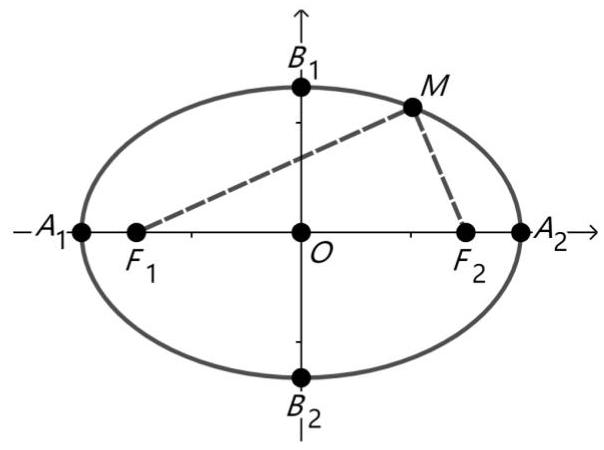

1.取值范围。从图像可以看出,椭圆上的点的横坐标的范围为 $x \in  \left\lbrack  {-a, a}\right\rbrack$ , 纵坐标的范围为 $y \in  \left\lbrack  {-b, b}\right\rbrack$ 。从椭圆的标准方程有解的角度也可以得到该结论。

2. 对称性。从图像可以看出,椭圆既是轴对称图形,又是中心对称图形, $x$ 轴和 $y$ 轴都是椭圆的对称轴,原点是椭圆的对称中心。

从方程的角度看,椭圆的标准方程中, $x\text{ 、 }y$ 都只以平方项的形式出现,如果点 $\left( {{x}_{0},{y}_{0}}\right)$ 满足椭圆的标准方程,那么关于 $y$ 轴对称的 $\left( {-{x}_{0},{y}_{0}}\right)$ 、关于 $x$ 轴对称的 $\left( {{x}_{0}, - {y}_{0}}\right)$ 、关于原点中心对称的 $\left( {-{x}_{0}, - {y}_{0}}\right)$ 也都满足椭圆的标准方程。

3.顶点。椭圆上有一些特殊的点可以确定椭圆的位置,并体现椭圆的特点。

椭圆与 $x$ 轴交点的纵坐标为 0,将 $y = 0$ 代入椭圆的标准方程可得: $x =  - a$ 或 $x = a$ ,即椭圆与 $x$ 轴的两个交点 $\left( {-a,0}\right)$ 和 $\left( {a,0}\right)$ ,为图中的点 ${A}_{1}$ 和 ${A}_{2}$ 。点 ${A}_{1}\text{ 、 }{A}_{2}$ 叫作椭圆的顶点，线段 ${A}_{1}{A}_{2}$ 叫作椭圆的长轴，椭圆的中心 $O$ 与顶点 ${A}_{1}\text{ 、 }{A}_{2}$ 分别形成的线段 $O{A}_{1}\text{ 、 }O{A}_{2}$ 叫作椭圆的长半轴。长轴的长度为 ${A}_{1}{A}_{2} = {2a}$ ,长半轴的长度为 $O{A}_{1} = O{A}_{2} = \frac{1}{2}{A}_{1}{A}_{2} = a$ 。连接椭圆上任意两点形成的线段中,最长的为长轴。

椭圆与 $y$ 轴交点的横坐标为 0,将 $x = 0$ 代入椭圆的标准方程可得: $y = b$ 或 $y =  - b$ ,即椭圆与 $y$ 轴的交点 $\left( {0, b}\right)$ 和 $\left( {0, - b}\right)$ ,为图中的点 ${B}_{1}$ 和 ${B}_{2}$ 。点 ${B}_{1}\text{ 、 }{B}_{2}$ 也叫作椭圆的顶点，椭圆共有 ${A}_{1}\text{ 、 }{A}_{2}\text{ 、 }{B}_{1}\text{ 、 }{B}_{2}$ 四个顶点。线段 ${B}_{1}{B}_{2}$ 叫作椭圆的短轴。 椭圆的中心 $O$ 与顶点 ${B}_{1}\text{ 、 }{B}_{2}$ 分别形成的线段 $O{B}_{1}\text{ 、 }O{B}_{2}$ 叫作椭圆的短半轴。短轴的长度为 ${B}_{1}{B}_{2} = {2b}$ ,短半轴的长度为 $O{B}_{1} = O{B}_{2} = \frac{1}{2}{B}_{1}{B}_{2} = b$ 。连接椭圆上任意两点且经过椭圆中心的线段中,最短的为短轴。

根据椭圆的标准方程的推导过程可得: 椭圆的半焦距 $c$ 、长半轴的长度 $a$ 、 短半轴的长度 $b$ 之间满足数量关系 ${c}^{2} = {a}^{2} - {b}^{2}$ 。

4. 离心率。椭圆的离心率通常用 $e$ 表示,其定义式为:

$$
e = \frac{c}{a}
$$

即半焦距 $c$ 与长半轴长度 $a$ 的比值,也等于焦距 ${2c}$ 与长轴长度 ${2a}$ 的比值。 由 ${c}^{2} = {a}^{2} - {b}^{2}$ 可得: $c < a$ ,由此可知椭圆的离心率恒有 $e < 1$ 。

椭圆的离心率的几何含义是椭圆偏离圆的程度,离心率越大 ( $e$ 越接近 1), 椭圆的形状越扁；离心率越小 ( $e$ 越接近 0 )，椭圆的形状越圆。

如果离心率增大到 $e = \frac{c}{a} = 1$ ,即 $c = a$ ,根据椭圆的几何定义,动点 $M$ 到 ${F}_{1}\text{ 、 }{F}_{2}$ 的距离之和等于线段 ${F}_{1}{F}_{2}$ 的长,此时点 $M$ 构成的集合就是线段 ${F}_{1}{F}_{2}$ ,可以看作把椭圆压扁成一条线段。

如果离心率减小到 $e = \frac{c}{a} = 0$ ,即 $c = 0$ ,可得 ${c}^{2} = {a}^{2} - {b}^{2} = 0$ ,即 $a = b$ ,椭圆的标准方程变为: $\frac{{x}^{2}}{{a}^{2}} + \frac{{y}^{2}}{{a}^{2}} = 1$ ,移项得: ${x}^{2} + {y}^{2} = {a}^{2}$ ,就是圆的标准方程,因此圆可以看作离心率为 0 的椭圆。

根据椭圆的构造过程,当 $c = 0$ 时,两个焦点间的距离等于 0,两个焦点重合, 该“椭圆”的几何含义变为 “到定点的距离的 2 倍为定值的点的集合”，与圆的定义 “到定点的距离为定值的点的集合” 实质上相同。

将圆的标准方程进行伸缩变换, 可以得到椭圆的标准方程。对于以原点 $O\left( {0,0}\right)$ 为圆心, $a$ 为半径的圆 ${x}^{2} + {y}^{2} = {a}^{2}$ ,将其方程写成椭圆标准方程的形式:

$$
\frac{{x}^{2}}{{a}^{2}} + \frac{{y}^{2}}{{a}^{2}} = 1
$$

如果把圆沿竖直方向压缩为原来的 $\frac{b}{a}$ ,需将 $y$ 替换为 $\frac{y}{b/a}$ ,方程变为:

$$
\frac{{x}^{2}}{{a}^{2}} + \frac{{y}^{2}}{{b}^{2}} = 1\left( {a > b}\right)
$$

就得到椭圆的标准方程；

如果把圆沿水平方向拉伸为原来的 $\frac{d}{a}$ ,需将 $x$ 替换为 $\frac{x}{d/a}$ ,方程变为:

$$
\frac{{x}^{2}}{{d}^{2}} + \frac{{y}^{2}}{{a}^{2}} = 1\left( {d > a}\right)
$$

也得到椭圆的标准方程。

椭圆的离心率的定义式可以写为:

$$
e = \frac{c}{a} = \frac{\sqrt{{a}^{2} - {b}^{2}}}{a} = \sqrt{1 - {\left( \frac{b}{a}\right) }^{2}}
$$

根据该表达式, $a$ 与 $b$ 越接近,则 $\frac{b}{a}$ 越接近 $1, e$ 越接近 0,椭圆越接近圆。 $a$ 与 $b$ 之差越大,则 $\frac{b}{a}$ 越接近 $0, e$ 越接近 1,椭圆越偏离圆,即越扁。

如果椭圆的两个焦点对称分布在 $y$ 轴上,那么长轴在 $y$ 轴上,短轴在 $x$ 轴上, 离心率仍为焦距的长度与长轴的长度的比值。

例 9.2 已知椭圆的中心为原点，焦点在 $y$ 轴上，离心率为 0.8 ，长轴比短轴长 4 ，求椭圆的标准方程。

解析: 设椭圆的半长轴的长度为 $a$ ,短轴的长度为 $b$ ,半焦距为 $c = \sqrt{{a}^{2} - {b}^{2}}$ ,

由离心率为 0.8 可得: $\frac{c}{a} = \frac{\sqrt{{a}^{2} - {b}^{2}}}{a} = {0.8}$ ,

由长轴比短轴长 4 可得: ${2a} - {2b} = 4$ ,化简得: $b = a - 2$ ,代入上面的等式并解方程:

$$
\frac{\sqrt{{a}^{2} - {\left( a - 2\right) }^{2}}}{a} = {0.8} \Rightarrow  \sqrt{{4a} - 4} = {0.8a} \Rightarrow  {4a} - 4 = {0.64}{a}^{2} \Rightarrow  4{a}^{2} - {25a} + {25} = 0
$$

解得: $a = 5$ 或 $a = \frac{5}{4}$ ,

当 $a = 5$ 时, $b = 5 - 2 = 3$ ,

当 $a = \frac{5}{4}$ 时， $b = \frac{5}{4} - 2 =  - \frac{3}{4} < 0$ ，舍去，

又因为该椭圆的中心为原点,焦点在 $y$ 轴上,所以其标准方程为:

$$
\frac{{y}^{2}}{25} + \frac{{x}^{2}}{9} = 1
$$

## 练习 9.1(2)

1. 已知椭圆 $\frac{{x}^{2}}{{a}^{2}} + \frac{{y}^{2}}{{b}^{2}} = 1$ 的焦点在 $x$ 轴上，焦距为 6，长轴的长度为 10，求:

(1)椭圆的标准方程；(2)椭圆的短轴的长度；53)椭圆的离心率。

2. 已知点 $P$ 在椭圆 $\frac{{x}^{2}}{3} + \frac{{y}^{2}}{4} = 1$ 上， ${F}_{1}$ 、 ${F}_{2}$ 分别是椭圆的上下焦点，求:

(1)椭圆的长轴和短轴的长度， ${F}_{1}$ 、 ${F}_{2}$ 的坐标；

(2)如果 $P$ 到 ${F}_{1}$ 的距离为3，求 $P$ 到 ${F}_{2}$ 的距离；

(3)线段 $P{F}_{1}$ 与 $P{F}_{2}$ 的长度之差的最大值和最小值分别是多少， $P$ 分别在什么位置时取得最大值和最小值。

#### 9.1.3 椭圆的参数方程

椭圆还可以用参数方程表示, 椭圆的参数方程与圆的参数方程相似, 同样用弧度作为参数。对于标准方程为 $\frac{{x}^{2}}{{a}^{2}} + \frac{{y}^{2}}{{b}^{2}} = 1\left( {a > b > 0}\right)$ 的椭圆,其参数方程为:

$$
\left\{  \begin{array}{l} x = a\cos \theta \\  y = b\sin \theta  \end{array}\right.
$$

其中 $\theta  \in  \lbrack 0,{2\pi })$ ,每一个弧度 $\theta$ 都与椭圆上的一个点对应。

接下来验证椭圆的参数方程与标准方程描述的是同一对象, 将椭圆的标准方程中的 $x$ 和 $y$ 分别用参数方程中的 $a\cos \theta$ 和 $b\sin \theta$ 替换:

$$
\frac{{\left( a\cos \theta \right) }^{2}}{{a}^{2}} + \frac{{\left( b\sin \theta \right) }^{2}}{{b}^{2}} = \frac{{a}^{2}{\cos }^{2}\theta }{{a}^{2}} + \frac{{b}^{2}{\sin }^{2}\theta }{{b}^{2}} = {\cos }^{2}\theta  + {\sin }^{2}\theta  = 1
$$

等式恒成立, 表明椭圆的参数方程与椭圆的标准方程描述的是同一对象。

需注意，椭圆的参数方程中，弧度 $\theta$ 对应的点通常不是椭圆与直线 $y = \tan \theta  \cdot  x$ 的交点，因为椭圆可以看作将圆沿某个方向压扁或拉长，导致圆上的点被移动后与原点所在直线的倾角不等于原来的圆心角。

椭圆 $\frac{{x}^{2}}{{a}^{2}} + \frac{{y}^{2}}{{b}^{2}} = 1\left( {a > b > 0}\right)$ 相当于将半径为 $b$ 的圆 ${x}^{2} + {y}^{2} = {b}^{2}$ 沿水平方向拉伸为 $\frac{{x}^{2}}{{\left( \frac{a}{b}\right) }^{2}} + {y}^{2} = {b}^{2}$ ,拉伸后,圆上的点 $\left( {b\cos \theta , b\sin \theta }\right)$ 变为 $\left( {a\cos \theta , b\sin \theta }\right)$ ,该参数 $\theta$ 对应的点与原点所在直线的斜率为 $\frac{b\sin \theta }{a\cos \theta } = \frac{b}{a}\tan \theta$ ,而非 $\tan \theta$ 。

例如,将单位圆 ${x}^{2} + {y}^{2} = 1$ 沿水平方向拉伸为 $\frac{{x}^{2}}{4} + {y}^{2} = 1$ 后,圆上的点 $\left( {\cos \theta ,\sin \theta }\right)$ 变为 $\left( {2\cos \theta ,\sin \theta }\right)$ ,该点与原点所在直线的斜率由 $\frac{\sin \theta }{\cos \theta } = \tan \theta$ 变为 $\frac{\sin \theta }{2\cos \theta } = \frac{\tan \theta }{2}$ ,如下图所示。

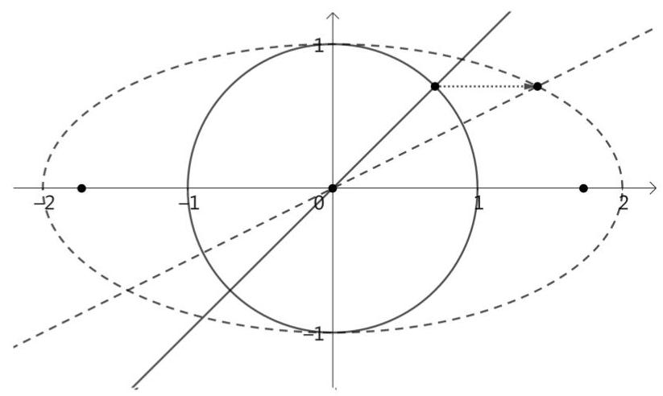

例 9.3 证明: 连接椭圆上任意两点, 且经过椭圆中心的线段中, 短轴最短。

解析: 设椭圆的标准方程为: $\frac{{x}^{2}}{{a}^{2}} + \frac{{y}^{2}}{{b}^{2}} = 1\left( {a > b > 0}\right)$ ,其中, ${2a}$ 为长轴的长度, ${2b}$ 为短轴的长度, ${2c}$ 为焦距,满足关系 ${a}^{2} = {b}^{2} + {c}^{2}$ ,椭圆的参数方程为: $\left\{  \begin{array}{l} x = a\cos \theta \\  y = b\sin \theta  \end{array}\right.$ ,其中 $\theta  \in  \lbrack 0,{2\pi })$ 。

对于椭圆上的一对点 $\left( {a\cos \theta , b\sin \theta }\right)$ 与 $\left( {a\cos \left( {\theta  + \pi }\right) , b\sin \left( {\theta  + \pi }\right) }\right)$ ,由诱导公式可得: $a\cos \left( {\theta  + \pi }\right)  =  - a\cos \theta , b\sin \left( {\theta  + \pi }\right)  =  - b\sin \theta$ ,即 $\left( {a\cos \theta , b\sin \theta }\right)$ 与 $\left( {a\cos \left( {\theta  + \pi }\right) , b\sin \left( {\theta  + \pi }\right) }\right)$ 的横、纵坐标分别互为相反数,所以这一对点始终关于原点对称，它们的连线经过原点。

因此连接椭圆上任意两点, 且经过椭圆中心的线段的长度都可以表示为:

$$
d = \sqrt{{\left\lbrack  a\cos \theta  - a\cos \left( \theta  + \pi \right) \right\rbrack  }^{2} + {\left\lbrack  b\sin \theta  - b\sin \left( \theta  + \pi \right) )\right\rbrack  }^{2}}
$$

化简该表达式:

$$
d = \sqrt{{\left\lbrack  a\cos \theta  - a\cos \left( \theta  + \pi \right) \right\rbrack  }^{2} + {\left\lbrack  b\sin \theta  - b\sin \left( \theta  + \pi \right) )\right\rbrack  }^{2}}
$$

$$
= \sqrt{{a}^{2}{\left\lbrack  \cos \theta  - \left( -\cos \theta \right) \right\rbrack  }^{2} + {b}^{2}{\left\lbrack  \sin \theta  - \left( -\sin \theta \right) \right\rbrack  }^{2}}
$$

$$
= \sqrt{4{a}^{2}{\cos }^{2}\theta  + 4{b}^{2}{\sin }^{2}\theta }
$$

将 ${a}^{2} = {b}^{2} + {c}^{2}$ 代入该表达式:

$$
d = \sqrt{4\left( {{b}^{2} + {c}^{2}}\right) {\cos }^{2}\theta  + 4{b}^{2}{\sin }^{2}\theta }
$$

$$
= \sqrt{4{b}^{2}\left( {{\cos }^{2}\theta  + {\sin }^{2}\theta }\right)  + 4{c}^{2}{\cos }^{2}\theta }
$$

$$
= 2\sqrt{{b}^{2} + {c}^{2}{\cos }^{2}\theta }
$$

当 $\theta  = \frac{\pi }{2}$ 或 $\theta  = \frac{3\pi }{2}$ 时, ${\cos }^{2}\theta  = 0, d$ 取最小值 ${d}_{\min } = {2b}$ ,等于半轴的长度, 对应的点为 $\left( {a\cos \frac{\pi }{2}, b\sin \frac{\pi }{2}}\right)$ 和 $\left( {a\cos \frac{3\pi }{2}, b\sin \theta  + \frac{3\pi }{2}}\right)$ ,即 $\left( {0, b}\right)$ 和 $\left( {0, - b}\right)$ 。

练习 $\mathbf{{9.1}}\left( \mathbf{3}\right)$

1. 已知 $P\left( {{p}_{1},{p}_{2}}\right)$ 是椭圆 $\frac{{x}^{2}}{3} + {y}^{2} = 1$ 上一点， ${p}_{1} \geq  0,{p}_{2} \geq  0$ ，回答下列问题:

(1)写出该椭圆参数方程；(2)求 $\left| {{p}_{1} + {p}_{2}}\right|$ 的最大值和最小值。

### 9.2 双曲线

到两个定点的距离之和为定值(大于两点间距离)的点构成的图形是椭圆， 到两个定点的距离之差为定值(小于两点间距离)的点构成的图形是双曲线。

#### 9.2.1 双曲线及其标准方程

双曲线的定义为: 所有到平面内两个定点 ${F}_{1}\text{ 、 }{F}_{2}$ 的距离之差等于定长 (小于 ${F}_{1}{F}_{2}$ ) 的点,形成的图形 (集合) 叫作双曲线,下图为双曲线的图像。

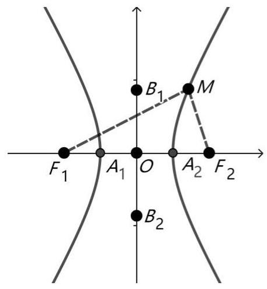

接下来根据双曲线的定义,推导双曲线上的点满足的方程,即双曲线的标准方程。设点 ${F}_{1}\text{ 、 }{F}_{2}$ 间的距离为 ${2c}\left( {c > 0}\right)$ ,为方便计算,让 ${F}_{1}\text{ 、 }{F}_{2}$ 都在 $x$ 轴上,且原点 $\left( {0,0}\right)$ 是它们的中点,于是 ${F}_{1}\text{ 、 }{F}_{2}$ 的坐标分别为 ${F}_{1}\left( {-c,0}\right) ,{F}_{2}\left( {c,0}\right)$ 。设动点 $M\left( {x, y}\right)$ 到 ${F}_{1}\text{ 、 }{F}_{2}$ 的距离之差等于 ${2a}\left( {c > a > 0}\right)$ ,根据双曲线的定义中的数量关系可以列出表达式:

$$
\begin{Vmatrix}\overrightarrow{M{F}_{1}}\end{Vmatrix} - \begin{Vmatrix}\overrightarrow{M{F}_{2}}\end{Vmatrix} = {2a}
$$

代入相应的坐标:

$$
\left| {\sqrt{{\left\lbrack  x - \left( -c\right) \right\rbrack  }^{2} + {\left( y - 0\right) }^{2}} - \sqrt{{\left( x - c\right) }^{2} + {\left( y - 0\right) }^{2}}}\right|  = {2a}
$$

参照推导椭圆的标准方程的过程, 逐步化简可得:

$$
\frac{{x}^{2}}{{a}^{2}} + \frac{{y}^{2}}{\left( {a}^{2} - {c}^{2}\right) } = 1
$$

由于 $c > a > 0$ ,设 ${c}^{2} - {a}^{2} = {b}^{2}\left( {b > 0}\right)$ ,该方程可化为:

$$
\frac{{x}^{2}}{{a}^{2}} - \frac{{y}^{2}}{{b}^{2}} = 1\left( {a > 0, b > 0}\right)
$$

这就是双曲线的标准方程。

从图中可以看出, 双曲线由两条不相交的曲线组成, 分别叫作左 (半) 支与右 (半) 支。左支上的所有点 $M$ 都满足 $\left| \overrightarrow{M{F}_{2}}\right|  - \left| \overrightarrow{M{F}_{1}}\right|  = {2a}$ ,右支上的所有点 $M$ 都满足 $\left| \overrightarrow{M{F}_{1}}\right|  - \left| \overrightarrow{M{F}_{2}}\right|  = {2a}$ 。

根据双曲线的构造过程,两个定点 ${F}_{1}\text{ 、 }{F}_{2}$ 的坐标分别为 ${F}_{1}\left( {-c,0}\right)$ 和 ${F}_{2}\left( {c,0}\right)$ , 动点 $M\left( {x, y}\right)$ 到 ${F}_{1}\text{ 、 }{F}_{2}$ 的距离之差为 ${2a}\left( {c > a > 0}\right)$ 。

其中, ${F}_{1}\text{ 、 }{F}_{2}$ 叫作双曲线的焦点,两焦点间的距离 ${F}_{1}{F}_{2} = {2c}$ 叫作双曲线的焦距,焦距的一半 $c$ 叫作双曲线的半焦距,双曲线的两个焦点的中点 (即图中的坐标原点 $O$ ) 叫作双曲线的中心。

需注意双曲线的标准方程 $\frac{{x}^{2}}{{a}^{2}} - \frac{{y}^{2}}{{b}^{2}} = 1\left( {a > 0, b > 0}\right)$ 中 $\frac{{x}^{2}}{{a}^{2}}$ 与 $\frac{{y}^{2}}{{b}^{2}}$ 前的正负号, 这是因为如果方程为:

$$
\frac{{y}^{2}}{{b}^{2}} - \frac{{x}^{2}}{{a}^{2}} = 1\left( {a > 0, b > 0}\right)
$$

那么双曲线的焦点 ${F}_{1}\text{ 、 }{F}_{2}$ 就不是在 $x$ 轴上,而是在 $y$ 轴上,双曲线分为上下两个半支,对称地分布在原点的上方和下方,下页图为焦点在 $y$ 轴上的双曲线。

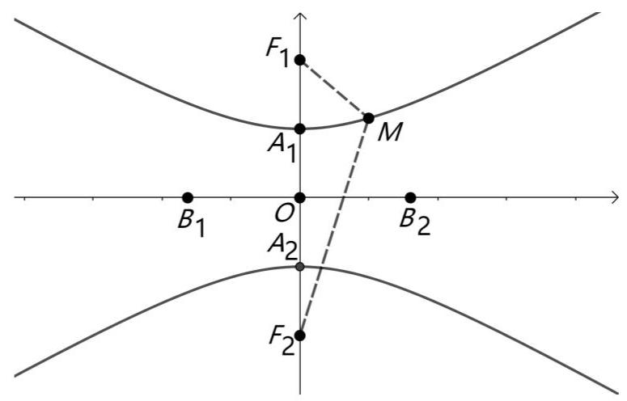

对于任意双曲线 $\frac{{x}^{2}}{{a}^{2}} - \frac{{y}^{2}}{{b}^{2}} = 1\left( {a > 0, b > 0}\right)$ 或 $\frac{{y}^{2}}{{b}^{2}} - \frac{{x}^{2}}{{a}^{2}} = 1\left( {a > 0, b > 0}\right)$ ,参数 $a\text{ 、 }b$ 间的大小关系与双曲线的焦点在 $x$ 轴上还是在 $y$ 轴上无关。

根据双曲线的标准方程的推导过程可知,双曲线总是满足关系 ${a}^{2} + {b}^{2} = {c}^{2}$ 。

例 9.4 已知双曲线的两个焦点为 ${F}_{1}\left( {-c,0}\right) ,{F}_{2}\left( {c,0}\right) , c > 0$ ,且经过点 $\left( {3,0}\right)$ 和 $\left( {3\sqrt{2},4}\right)$ ,求双曲线的标准方程和 $c$ 的值。

解析: 双曲线的标准方程中,只有 $a\text{ 、 }b$ 两个参数,通常只需要两个不同的数量关系,就可以求得 $a\text{ 、 }b$ 。

双曲线的两个焦点为 ${F}_{1}\left( {-c,0}\right) \text{ 、 }{F}_{2}\left( {c,0}\right)$ ,可以设双曲线的标准方程为: $\frac{{x}^{2}}{{a}^{2}} - \frac{{y}^{2}}{{b}^{2}} = 1\left( {a > 0, b > 0}\right) ,$

双曲线经过点 $\left( {3,0}\right)$ 和 $\left( {3\sqrt{2},4}\right)$ ,将两点的坐标分别代入双曲线的方程:

$$
\frac{{3}^{2}}{{a}^{2}} - \frac{{0}^{2}}{{b}^{2}} = 1,\frac{{\left( 3\sqrt{2}\right) }^{2}}{{a}^{2}} - \frac{{4}^{2}}{{b}^{2}} = 1
$$

解方程组得: $a = 3, b = 4$ ，

该双曲线的标准方程为: $\frac{{x}^{2}}{9} - \frac{{y}^{2}}{16} = 1$ ,

$c = \sqrt{{a}^{2} + {b}^{2}} = \sqrt{{3}^{2} + {4}^{2}} = 5$ 。

练习 $\mathbf{{9.2}\left( 1\right) }$

1. 定义双曲线时,规定动点 $M$ 到两个定点 ${F}_{1}\text{ 、 }{F}_{2}$ 的距离之差 ${2a}$ 小于线段 ${F}_{1}{F}_{2}$ 的长度 ${2c}$ ,指出下面的点构成的集合是什么图形:

(1)到 ${F}_{1}\text{ 、 }{F}_{2}$ 的距离之差为定值，且等于线段 ${F}_{1}{F}_{2}$ 的长度的点；

(2)到 ${F}_{1}\text{ 、 }{F}_{2}$ 的距离之差为定值，且大于线段 ${F}_{1}{F}_{2}$ 的长度的点。

2. 设双曲线的焦点为 ${F}_{1}\left( {0, c}\right) ,{F}_{2}\left( {0, - c}\right)$ ,动点 $M\left( {x, y}\right)$ 到 ${F}_{1}\text{ 、 }{F}_{2}$ 的距离之差等于 ${2a}\left( {c > a > 0}\right)$ ,参照本小节的内容,推导双曲线的标准方程。

#### 9.2.2 双曲线的基本性质

已知双曲线的焦点为 ${F}_{1}\left( {-c,0}\right) \text{ 、 }{F}_{2}\left( {c,0}\right)$ ,标准方程为 $\frac{{x}^{2}}{{a}^{2}} - \frac{{y}^{2}}{{b}^{2}} = 1(a > 0$ , $b > 0$ ),且满足 ${c}^{2} = {a}^{2} + {b}^{2}$ ,图像如下图所示,接下来研究双曲线的基本性质。

1. 范围。从图像可以看出, 双曲线上的点的横坐标的范围为 $x \in  \left( {-\infty , - a}\right\rbrack  \bigcup \lbrack a, + \infty )$ ,纵坐标的范围为 $y \in  \left( {-\infty , + \infty }\right)$ 。从方程有解的角度也可以得到该结论。

2. 对称性。从图像可以看出, 双曲线既是轴对称图形, 又是中心对称图形, $x$ 轴和 $y$ 轴都是双曲线的对称轴,原点是双曲线的对称中心。

从方程的角度看,双曲线的方程中 $x\text{ 、 }y$ 都只以平方项的形式出现,如果点 $\left( {{x}_{0},{y}_{0}}\right)$ 满足双曲线的方程,那么关于 $y$ 轴对称的 $\left( {-{x}_{0},{y}_{0}}\right)$ 、关于 $x$ 轴对称的 $\left( {{x}_{0}, - {y}_{0}}\right)$ 、关于原点中心对称的 $\left( {-{x}_{0}, - {y}_{0}}\right)$ 也都满足双曲线的标准方程。

3.顶点。双曲线上有一些特殊的点, 可以确定双曲线的位置, 并体现其特点。

双曲线与 $x$ 轴的交点的纵坐标为 0,将 $y = 0$ 代入双曲线的标准方程可得: $x =  - a$ 或 $x = a$ ,即双曲线与 $x$ 轴的交点 $\left( {-a,0}\right)$ 和 $\left( {a,0}\right)$ ,为图中的点 ${A}_{1}$ 和 ${A}_{2}$ 。 点 ${A}_{1}\text{ 、 }{A}_{2}$ 叫作双曲线的顶点。线段 ${A}_{1}{A}_{2}$ 叫作双曲线的实轴。双曲线的中心 $O$ 与顶点 ${A}_{1}\text{ 、 }{A}_{2}$ 分别形成的线段 $O{A}_{1}\text{ 、 }O{A}_{2}$ 叫作双曲线的实半轴。实轴的长度为 ${A}_{1}{A}_{2} = {2a}$ , 实半轴的长度为 $O{A}_{1} = O{A}_{2} = \frac{1}{2}{A}_{1}{A}_{2} = a$ 。从双曲线的两个半支上各任取一点形成的线段中，最短的为实轴。

双曲线与 $y$ 轴没有交点,将 $x = 0$ 代入双曲线的标准方程: $\frac{{0}^{2}}{{a}^{2}} - \frac{{y}^{2}}{{b}^{2}} = 1$ ,该方程无实根,有两个虚数根: $y = b\mathrm{i}$ 和 $y =  - b\mathrm{i}$ ,对应复平面内的点 $\left( {0, b}\right)$ 和 $\left( {0, - b}\right)$ , 即图中的点 ${B}_{1}$ 和 ${B}_{2}$ 。由于点 ${B}_{1}\left( {0, b}\right)$ 和 ${B}_{2}\left( {0, - b}\right)$ 是双曲线方程的两个虚根对应的点,实际上并不在双曲线上,因此线段 ${B}_{1}{B}_{2}$ 叫作双曲线的虚轴。双曲线的中心 $O$ 与 ${B}_{1}\text{ 、 }{B}_{2}$ 分别形成的线段 $O{B}_{1}\text{ 、 }O{B}_{2}$ 叫作双曲线的虚半轴。虚轴的长度为 ${B}_{1}{B}_{2} = {2b}$ ,虚半轴的长度为 $O{B}_{1} = O{B}_{2} = \frac{1}{2}{B}_{1}{B}_{2} = b$ 。需注意, ${B}_{1}\text{ 、 }{B}_{2}$ 不是双曲线的顶点, 双曲线只有实轴的两个端点是顶点。

根据双曲线的标准方程的推导过程可得,其半焦距 $c$ 、实半轴的长度 $a$ 、虚半轴的长度 $b$ 之间满足数量关系:

$$
{c}^{2} = {a}^{2} + {b}^{2}
$$

双曲线的实轴与虚轴之间没有固定的大小关系, 可以实轴比虚轴长, 也可以虚轴比实轴长, 还可以实轴与虚轴一样长。特别的, 如果双曲线的实轴与虚轴长度相等 $a = b$ ,双曲线的标准方程为:

$$
\frac{{x}^{2}}{{a}^{2}} - \frac{{y}^{2}}{{a}^{2}} = 1
$$

这样的双曲线叫作等轴双曲线。

4.离心率。双曲线的离心率的定义式与椭圆相同, 也为:

$$
e = \frac{c}{a}
$$

即半焦距 $c$ 与实半轴长 $a$ 的比值,也等于焦距 ${2c}$ 与实轴长 ${2a}$ 的比值。

由 ${c}^{2} = {a}^{2} + {b}^{2}$ 可得: $c > a$ ,由此可知双曲线的离心率恒有 $e > 1$ 。

如果离心率减小到 $e = 1$ ,即 $c = a$ ,根据双曲线的几何定义可得,动点 $M$ 到 ${F}_{1}\text{ 、 }{F}_{2}$ 的距离之差等于线段 ${F}_{1}{F}_{2}$ 的长,此时 $M$ 形成的集合为分别以 ${F}_{1}\text{ 、 }{F}_{2}$ 为端点,指向 $x$ 轴的负方向与正方向的两条射线,可以看作把双曲线的左右半支分别沿垂直方向 “压扁” 成射线。

如果离心率增大到 $e =  + \infty$ ,可以看作 $b =  + \infty$ ,双曲线的方程可以近似变为 $\frac{{x}^{2}}{{a}^{2}} = 1$ ,等同于分别经过两个端点且垂直于 $x$ 轴的两条直线: $x = a$ 和 $x =  - a$ ,可以看作把双曲线的左右半支分别沿竖直方向 “拉伸” 成一条直线。

如果双曲线的两个焦点对称分布在 $y$ 轴上,那么实轴也在 $y$ 轴上,虚轴则在 $x$ 轴上,离心率仍为焦距与实轴长度的比值。

5. 渐近线。将双曲线的标准方程等式右边的 1 替换为 0 , 变为:

$$
\frac{{x}^{2}}{{a}^{2}} - \frac{{y}^{2}}{{b}^{2}} = 0
$$

可以得到两条经过原点的直线的方程:

$$
\frac{x}{a} - \frac{y}{b} = 0\text{ 和 }\frac{x}{a} + \frac{y}{b} = 0
$$

写为一次函数的形式:

$$
y = \frac{b}{a}x\text{ 和 }y =  - \frac{b}{a}x
$$

这两条直线叫作双曲线的渐近线，如下图所示。

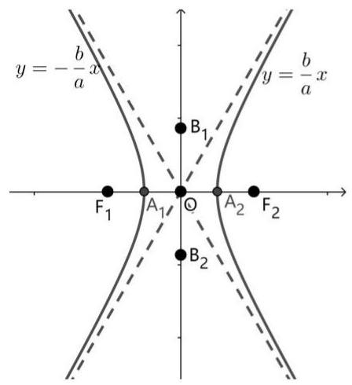

渐近线的几何含义为:随着双曲线上的动点 $M$ 的横坐标与纵坐标的绝对值逐渐增大, $M$ 越来越接近其中一条渐近线。 $M$ 到其中一条渐近线的距离越来越小, 但永远无法抵达渐近线。接下来从双曲线的标准方程进行验证。

设双曲线上第一象限内一点 $M\left( {x, y}\right) \left( {x > 0, y > 0}\right)$ ,那么 $\left( {x, y}\right)$ 满足双曲线的标准方程,将方程化为用 $y$ 表示 $x$ 的形式: $x = a\sqrt{\frac{{y}^{2}}{{b}^{2}} + 1}, M$ 的坐标可以写为 $\left( {a\sqrt{\frac{{y}^{2}}{{b}^{2}} + 1}, y}\right)$ ,则 $M$ 到直线 $\frac{x}{a} - \frac{y}{b} = 0$ 的距离为:

$$
d = \frac{\left| \frac{1}{a} \times  a\sqrt{\frac{{y}^{2}}{{b}^{2}} + 1} - \frac{1}{b} \times  y\right| }{\sqrt{{\left( \frac{1}{a}\right) }^{2} + {\left( \frac{1}{b}\right) }^{2}}}
$$

其中，分母 $\sqrt{{\left( \frac{1}{a}\right) }^{2} + {\left( \frac{1}{b}\right) }^{2}}$ 为定值，只需考虑分子 $\left| {\frac{1}{a} \times  a\sqrt{\frac{{y}^{2}}{{b}^{2}} + 1} - \frac{1}{b} \times  y}\right|$ 。可以判断绝对值内恒为正数，省去绝对值符号，对分子进行化简和变形:

$$
\frac{1}{a} \times  a\sqrt{\frac{{y}^{2}}{{b}^{2}} + 1} - \frac{1}{b} \times  y = \sqrt{\frac{{y}^{2}}{{b}^{2}} + 1} - \frac{y}{b} = \sqrt{\frac{{y}^{2} + {b}^{2}}{{b}^{2}}} - \frac{y}{b} = \frac{\sqrt{{y}^{2} + {b}^{2}} - y}{b}
$$

由于 $b$ 为定值，那么 $y$ 越大， $b$ 对 $\sqrt{{y}^{2} + {b}^{2}}$ 的 “贡献” 越小， $\sqrt{{y}^{2} + {b}^{2}}$ 越接近 $\sqrt{{y}^{2}}$ ,即 $\sqrt{{y}^{2} + {b}^{2}}$ 越接近 $y$ ,于是 $\sqrt{{y}^{2} + {b}^{2}} - y$ 越接近 $\sqrt{{y}^{2}} - y = 0$ ,即 $M\left( {x, y}\right)$ 到渐近线的距离越接近 0 ，但始终取不到 0 。

虽然上述表达式和分析过程稍复杂, 但思维上没有难度, 只需要细心和耐心地抽丝剥茧、逐步判断，这种分析表达式的取值范围或变化趋势的思路非常重要。

例 9.5 已知双曲线的焦点为 ${F}_{1}\left( {0, c}\right) \text{ 、 }{F}_{2}\left( {0, - c}\right)$ ,离心率为 $\sqrt{3}$ ,且经过点 $\left( {2,2}\right)$ ,求双曲线的标准方程。

解析: 双曲线的焦点为 ${F}_{1}\left( {0, c}\right) \text{ 、 }{F}_{2}\left( {0, - c}\right)$ ,可以设其标准方程为:

$$
\frac{{y}^{2}}{{a}^{2}} - \frac{{x}^{2}}{{b}^{2}} = 1\left( {a > 0, b > 0}\right)
$$

因为双曲线的离心率为 $\sqrt{3}$ ,由此可得: $e = \frac{c}{a} = \frac{\sqrt{{a}^{2} + {b}^{2}}}{a} = \sqrt{3}$ ,

因为双曲线经过点 $\left( {2,2}\right)$ ,由此可得: $\frac{{2}^{2}}{{a}^{2}} - \frac{{2}^{2}}{{b}^{2}} = 1$ ,

联立上面两个等式并解方程得: $a = \sqrt{2}$ ， $b = 2$ ，

双曲线的标准方程为: $\frac{{y}^{2}}{2} - \frac{{x}^{2}}{4} = 1$ 。

例 9.6 已知双曲线的焦点为 ${F}_{1}\left( {-c,0}\right) \text{ 、 }{F}_{2}\left( {c,0}\right)$ ,离心率为 $\sqrt{2}$ ,求双曲线的渐近线方程。

解析: 双曲线的焦点为 ${F}_{1}\left( {-c,0}\right) \text{ 、 }{F}_{2}\left( {c,0}\right)$ ,可以设其标准方程为:

$$
\frac{{x}^{2}}{{a}^{2}} - \frac{{y}^{2}}{{b}^{2}} = 1\left( {a > 0, b > 0}\right)
$$

因为双曲线的离心率为 $\sqrt{2}$ ,由此可得: $e = \frac{c}{a} = \frac{\sqrt{{a}^{2} + {b}^{2}}}{a} = \sqrt{2}$ ,

化简得: $a = b$ ,

双曲线的方程可化为: $\frac{{x}^{2}}{{a}^{2}} - \frac{{y}^{2}}{{a}^{2}} = 1$ ,

将等式右边的 1 替换为 0,可得其渐近线方程为: $y = x$ 和 $y =  - x$ 。

练习 ${9.2}\left( 2\right)$

1. 已知双曲线的焦点为 ${F}_{1}\left( {-4,0}\right) \text{ 、 }{F}_{2}\left( {4,0}\right)$ ,点 $P$ 到 ${F}_{1}\text{ 、 }{F}_{2}$ 的距离之差为 6, 求点 $P$ 的轨迹的方程。

2. 已知双曲线 $\frac{{x}^{2}}{{a}^{2}} - \frac{{y}^{2}}{{b}^{2}} = 1$ 的渐近线方程为 $y =  \pm  {2x}$ ,实轴长为 2,求:

(1)双曲线的方程；(2)双曲线的焦点坐标；(3)双曲线的离心率；

(4)如果另一条双曲线有相同的渐近线,且其两焦点对称分布在 $y$ 轴上, 求该双曲线的方程。

3. 证明: 所有焦点对称分布在 $x$ 轴上,且离心率相同的双曲线,都有相同的渐近线。

4. 已知椭圆 $\frac{{x}^{2}}{{25}{m}^{2}} + \frac{{y}^{2}}{8} = 1$ 和双曲线 $\frac{{x}^{2}}{9{m}^{2}} - \frac{{y}^{2}}{8} = 1$ 有相同的焦点， $m > 0$ ，求 $m$ 。

#### 9.2.3 双曲线的参数方程

对于双曲线 $\frac{{x}^{2}}{{a}^{2}} - \frac{{y}^{2}}{{b}^{2}} = 1\left( {a > 0, b > 0}\right)$ ,双曲线的参数方程为:

$$
\left\{  \begin{array}{l} x = \frac{a}{\cos \theta } \\  y = b\tan \theta  \end{array}\right.
$$

其中, $\theta  \in  \lbrack 0,{2\pi })$ 且 $\theta  \neq  \frac{\pi }{2}\text{ 、 }\frac{3\pi }{2}$ ,每一个弧度 $\theta$ 都与双曲线上的一个点对应。 将双曲线的参数方程代入 $\frac{{x}^{2}}{{a}^{2}} - \frac{{y}^{2}}{{b}^{2}} = 1$ 的左边,可以得到等式恒成立的结论,表明双曲线的参数方程与标准方程描述的是同一对象。

例 9.7 求双曲线 $\frac{{x}^{2}}{{a}^{2}} - \frac{{y}^{2}}{{b}^{2}} = 1\left( {a > 0, b > 0}\right)$ 上的点,到离该点较近的渐近线的距离的最大值,以及该点在何处时为最大值。

解析: 由双曲线的标准方程可知其渐近线为: $y = \frac{b}{a}x$ 和 $y =  - \frac{b}{a}x$ ,参数方程为: $\left\{  \begin{array}{l} x = \frac{a}{\cos \theta } \\  y = b\tan \theta  \end{array}\right.$ ,将渐近线方程化为一般式方程: ${bx} - {ay} = 0$ 和 ${bx} + {ay} = 0$ 。 双曲线及其渐近线同时关于两个坐标轴对称, 只需分析双曲线在第一象限的部分 (含与 $x$ 轴正半轴的交点) 到 ${bx} - {ay} = 0$ 的最小距离即可。

根据参数方程,双曲线上的点可以用参数表示为: $\left( {\frac{a}{\cos \theta }, b\tan \theta }\right)$ ,由于选取的是双曲线在第一象限的部分 (含与 $x$ 轴正半轴的交点),所以 $\theta  \in  \left\lbrack  {0,\frac{\pi }{2}}\right)$ , 结合渐近线的一般式方程 ${bx} - {ay} = 0$ ,代入点到直线的距离公式:

$$
d = \frac{\left| b \cdot  \frac{a}{\cos \theta } - a \cdot  b\tan \theta \right| }{\sqrt{{a}^{2} + {b}^{2}}} = \frac{ab}{\sqrt{{a}^{2} + {b}^{2}}}\left| {\frac{1}{\cos \theta } - \tan \theta }\right|  = \frac{ab}{\sqrt{{a}^{2} + {b}^{2}}}\left| \frac{1 - \sin \theta }{\cos \theta }\right|
$$

其中 $\frac{ab}{\sqrt{{a}^{2} + {b}^{2}}}$ 为定值,在 $\theta  \in  \left\lbrack  {0,\frac{\pi }{2}}\right)$ 范围内, $\cos \theta$ 单调递减, $\sin \theta$ 单调递增, $1 - \sin \theta$ 单调递减,分子与分母都随 $\theta$ 递减,难以直接判断该表达式的单调性, 可以利用万能置换公式, 转化为只有一个三角函数的形式, 为方便书写, 设 $\frac{\theta }{2} = \alpha$ ,则 $\alpha  \in  \left\lbrack  {0,\frac{\pi }{4}}\right)$ ,利用万能置换公式进行化简:

$$
\left| \frac{1 - \sin \theta }{\cos \theta }\right|  = \left| \frac{1 - \frac{2\tan \alpha }{1 + {\tan }^{2}\alpha }}{\frac{1 - {\tan }^{2}\alpha }{1 + {\tan }^{2}\alpha }}\right|  = \left| \frac{1 + {\tan }^{2}\alpha  - 2\tan \alpha }{1 - {\tan }^{2}\alpha }\right|  = \left| \frac{{\left( 1 - \tan \alpha \right) }^{2}}{\left( {1 - \tan \alpha }\right) \left( {1 + \tan \alpha }\right) }\right|  = \left| \frac{1 - \tan \alpha }{1 + \tan \alpha }\right|
$$

在 $\alpha  \in  \left\lbrack  {0,\frac{\pi }{4}}\right)$ 范围内, $\tan \alpha$ 单调递增,且 $\tan \alpha  \in  \lbrack 0,1)$ ,当 $\alpha  = 0$ 时, $\left| \frac{1 - \tan \alpha }{1 + \tan \alpha }\right|$ 取最大值,为 $\left| \frac{1 - \tan \alpha }{1 + \tan \alpha }\right|  = 1$ ,此时双曲线上的点到离该点较近的渐近线的距离为最大值: ${d}_{\max } = \frac{ab}{\sqrt{{a}^{2} + {b}^{2}}}$ ,该点就是双曲线与实轴的交点,如下图所示,可以直观观察出该结论。

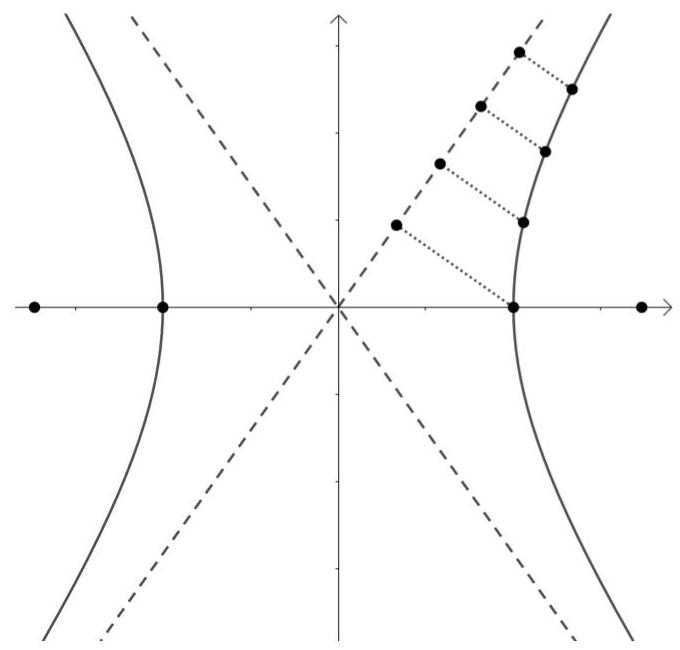

练习 $\mathbf{{9.2}}\left( 3\right)$

1. 求双曲线 $\frac{{x}^{2}}{{a}^{2}} - \frac{{y}^{2}}{{b}^{2}} = 1\left( {a > 0, b > 0}\right)$ 上的点,到两条渐近线的距离之和的最小值，以及该点在何处时为最小值。

### 9.3 抛物线

二次函数的图像是抛物线, 我们已经从函数的角度学习了抛物线的解析式和性质, 现在从圆锥曲线的方程的角度重新学习抛物线。

#### 9.3.1 抛物线及其标准方程

如果一系列点满足到一个定点的距离与到一条定直线的距离始终相等, 那么这一系列点形成的图形叫作抛物线, 下页图为抛物线的图像。

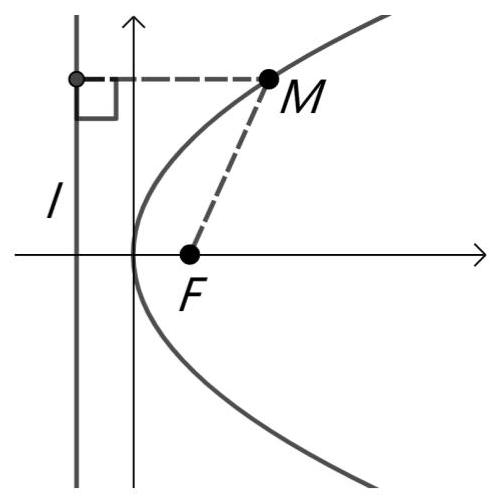

设定点为 $F\left( {\frac{p}{2},0}\right) \left( {p > 0}\right)$ ,定直线为 $l : x =  - \frac{p}{2}$ ,动点 $M\left( {x, y}\right)$ 到定点 $F$ 与定直线 $l$ 的距离相等，根据距离相等的可以列出方程:

$$
\sqrt{{\left( x - \frac{p}{2}\right) }^{2} + {\left( y - 0\right) }^{2}} = \left| {x - \left( {-\frac{p}{2}}\right) }\right|
$$

化简后得:

$$
{y}^{2} = {2px}\left( {p > 0}\right)
$$

这就是抛物线的标准方程，点 $F\left( {\frac{p}{2},0}\right)$ 叫作抛物线的焦点，直线 $l : x =  - \frac{p}{2}$ 叫作抛物线的准线,抛物线的焦点到准线的距离的一半 $\frac{p}{2}$ 叫作抛物线的焦距。

可以发现, 本章学习的用标准方程表示的抛物线的开口向右, 而二次函数的图像的开口向上或向下, 观察抛物线的标准方程:

$$
{y}^{2} = {2px}\left( {p > 0}\right)
$$

方程中, $x$ 只以一次项出现, $y$ 以二次项出现,抛物线的开口方向与方程的特点间具有以下规律:

若抛物的标准方程为 ${y}^{2} = {2px}\left( {p > 0}\right)$ ，则焦点在 $x$ 轴的正半轴上，准线垂直于 $x$ 轴且在 $y$ 轴左侧,抛物线的开口向右。(下页图左上)

若抛物的标准方程为 ${y}^{2} =  - {2px}\left( {p > 0}\right)$ ,则焦点在 $x$ 轴的负半轴上,准线垂直于 $x$ 轴且在 $y$ 轴右侧,抛物线的开口向左。(下页图右上)

若抛物的标准方程为 ${x}^{2} = {2py}\left( {p > 0}\right)$ ,则焦点在 $y$ 轴的正半轴上,准线平行于 $x$ 轴且在 $x$ 轴下侧,抛物线的开口向上。(下页图左下)

若抛物的标准方程为 ${x}^{2} =  - {2py}\left( {p > 0}\right)$ ,则焦点在 $y$ 轴的负半轴上,准线平行于 $x$ 轴且在 $x$ 轴上侧,抛物线的开口向下。(下页图右下)

F

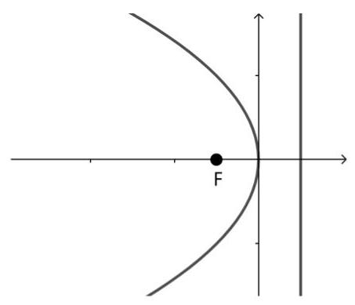

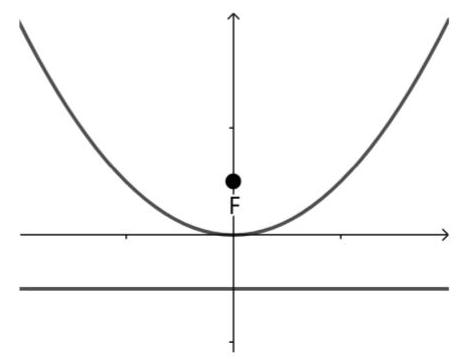

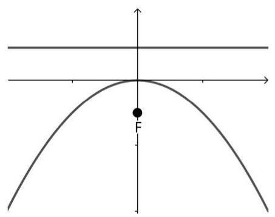

例 9.8 已知抛物线的焦点为 $\left( {-\frac{p}{2},0}\right)$ ,准线为 $x = \frac{P}{2}, p > 0$ ,且抛物线经过点 $\left( {-3,1}\right)$ ,求抛物线的方程。

解析: 抛物线的标准方程中只有 $p$ 一个参数,只要列出一个等式就可以求得标准方程。因为抛物线的焦点为 $\left( {-\frac{p}{2},0}\right)$ ,准线为 $x = \frac{P}{2}$ ,设其标准方程为 ${y}^{2} =  - {2px}$ 。又因为抛物线经过点 $\left( {-3,1}\right)$ ，将点 $\left( {-3,1}\right)$ 的坐标代入抛物线的标准方程可得: ${1}^{2} =  - {2p} \times  \left( {-3}\right)$ ,解方程得: $p = \frac{1}{6}$ ,抛物线的标准方程为: ${y}^{2} =  - \frac{x}{3}$ 。

## 练习 9.3(1)

1. 求抛物线 ${y}^{2} = \frac{1}{4}x$ 的焦点坐标和准线方程。

2. 已知动点 $P$ 到直线 $x =  - \frac{1}{2}$ 的距离与到定点 $F\left( {\frac{1}{2},0}\right)$ 的距离相等,求 $P$ 的轨迹方程。

3. 已知抛物线的准线为 $y = 1$ ,焦点为 $\left( {0, - 1}\right)$ ,求抛物线的方程。

#### 9.3.2 抛物线的基本性质

已知抛物线的焦点为 $F\left( {\frac{p}{2},0}\right)$ ,准线为 $l : x =  - \frac{p}{2}$ ,其标准方程为 ${y}^{2} = {2px} \; \left( {p > 0}\right)$ ,其图像如下页图所示,接下来研究抛物线的基本性质。

1. 范围。从图像可以看出,抛物线上的点的横坐标的范围为 $x \in  \lbrack 0, + \infty )$ ,纵坐标的范围为 $y \in  \left( {-\infty , + \infty }\right)$ 。从方程有解的角度也可以得到该结论。

2.对称性。从抛物线的图像可以看出,抛物线是轴对称图形, $x$ 轴是它的对称轴,叫作抛物线的轴。从方程的角度看,抛物线的方程中 $y$ 只以平方项的形式出现,如果点 $\left( {{x}_{0},{y}_{0}}\right)$ 满足抛物线的方程,那么关于 $x$ 轴对称的 $\left( {{x}_{0}, - {y}_{0}}\right)$ 也满足双曲线的方程。若抛物线的开口朝上下方向，则该抛物线的轴为 $y$ 轴。

3. 顶点。抛物线与它的轴的交点叫作抛物线的顶点。将 $y = 0$ 代入抛物线的标准方程可得 $x = 0$ ,该抛物线的顶点为 $\left( {0,0}\right)$ 。

4. 离心率。抛物线上的点 $M$ 到焦点 $F$ 的距离与点 $M$ 到准线 $l$ 的距离的比值叫作抛物线的离心率。根据抛物线的几何定义可知,抛物线的离心率恒有 $e = 1$ 。

5.抛物线与二次函数。二次函数的图像是抛物线, 二次函数应当也能化为抛物线的标准方程的形式, 接下来将二次函数的解析式转化为抛物线的标准方程, 分析它们之间的联系。

设二次函数 $y = a{\left( x - b\right) }^{2} + c\left( {a > 0}\right)$ ,根据二次函数的知识可知,该二次函数的开口向上,顶点坐标为 $\left( {b, c}\right)$ ,对称轴为 $x = b$ 。

将二次函数的解析式稍作变形: ${\left( x - b\right) }^{2} = \frac{1}{a}\left( {y - c}\right)$ 。根据图像平移的规律, 将方程 ${x}^{2} = \frac{1}{a}y$ 中的 $x$ 替换为 $x - b$ ,图像沿 $x$ 轴正方向移动 $b$ 个单位; 将 $y$ 替换为 $y - c$ ,图像沿 $y$ 轴正方向移动 $c$ 个单位。

由此可得: 将焦点为 ${F}_{0}\left( {0,\frac{1}{4a}}\right)$ 、准线为 ${l}_{0} : y =  - \frac{1}{4a}$ 的抛物线 ${x}^{2} = \frac{1}{a}y$ ,沿 $x$ 轴正方向移动 $b$ 个单位、沿 $y$ 轴正方向移动 $c$ 个单位,就能得到抛物线 ${\left( x - b\right) }^{2} = \frac{1}{a}\left( {y - c}\right)$ ,即二次函数 $y = a{\left( x - b\right) }^{2} + c$ 。

另一方面,将抛物线 ${x}^{2} = \frac{1}{a}y$ 的焦点与准线也按照相同的方式移动,可以得到新的焦点 ${F}^{\prime }\left( {b,\frac{1}{4a} + c}\right)$ 和准线 ${l}^{\prime } : y =  - \frac{1}{4a} + c$ 。平移后的抛物线 $y = a{\left( x - b\right) }^{2} + c$ 应当满足其上的点 $M\left( {x, y}\right)$ 到新焦点 ${F}^{\prime }$ 与新准线 ${l}^{\prime }$ 的距离相等:

$$
\sqrt{{\left( x - b\right) }^{2} + {\left( y - \frac{1}{4a} - c\right) }^{2}} = \left| {y + \frac{1}{4a} - c}\right|
$$

对等式的两边同时平方、化简后可得二次函数的解析式: $y = a{\left( x - b\right) }^{2} + c$ 。

上面分别从二次函数的解析式的变换和抛物线的几何含义, 完成了抛物线方程与二次函数的互相推导, 表明二次函数与抛物线是同一概念。上述推导还验证了函数的平移变换的原理和规律也适用于方程, 在椭圆的小节中验证的函数的伸缩变换的原理和规律同样适用于方程。

综上, 函数的对称性、平移变换、伸缩变换的规则都适用于方程, 函数的单调性、周期性等性质也都适用于曲线的方程。

初学函数时, 曾提到函数的实质是一种对应关系, 多为两个数集 (定义域与值域)中元素的对应关系。方程描述的同样是点的横坐标与纵坐标间的对应关系， 且不再受到函数 “一个自变量只能对应一个因变量” 的限制，横坐标与纵坐标的地位是 “平等” 的。有的方程中一个横坐标可以对应多个纵坐标, 有的方程中一个纵坐标可以对应多个横坐标, 有的方程中多个横坐标与多个纵坐标形成多重交叉对应。

例 9.9 已知抛物线的顶点为 $\left( {0,2}\right)$ ,焦点为 $\left( {0,1}\right)$ ,求抛物线的标准方程。

解析: 抛物线的顶点为 $\left( {0,2}\right)$ ,焦点为 $\left( {0,1}\right)$ ,顶点和焦点都在轴上,可知该抛物线的轴为 $y$ 轴,焦距为焦点与顶点间的距离: $\frac{p}{2} = 2 - 1 = 1$ ,解得: $p = 2$ ,

抛物线的焦点和准线在顶点的两侧,且到顶点的距离相等,该抛物线的焦点在顶点 $\left( {0,2}\right)$ 的下方,距离为 1,那么准线在顶点 $\left( {0,2}\right)$ 的上方,距离也为 1,该抛物线的准线的方程为: $y = 3$ ,

抛物线的开口向下,可以由抛物线 ${x}^{2} =  - {4y}$ 向上平移 2 个单位得到,该抛物线的标准方程为: ${x}^{2} =  - 4\left( {y - 2}\right)$ ,其图像如下所示。

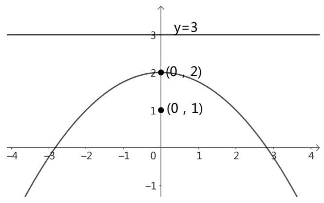

例 9.10 已知直线 $l$ 经过抛物线 ${y}^{2} = {4x}$ 的焦点, $l$ 与抛物线相交于 $A\text{ 、 }B$ 两点,求 ${AB}$ 的最小长度。

解析: 由抛物线的方程 ${y}^{2} = {4x}$ 可得其焦点为 $F\left( {1,0}\right) , l$ 经过焦点 $F\left( {1,0}\right)$ , 可以设其方程为 ${ky} = x - 1$ (若设 $l$ 的方程为 $y = k\left( {x - 1}\right)$ ,则还需单独考虑 $l$ 与 $x$ 轴垂直的情况; 而设为 ${ky} = x - 1$ 则排除了 $l$ 与 $x$ 轴平行的情况,这种情况下 $l$ 与抛物线只有一个交点, 不需要考虑), 联立抛物线和直线的方程, 方程组的解就是交点的坐标。

由 ${ky} = x - 1$ 可得: $x = {ky} + 1$ ,将其代入 ${y}^{2} = {4x}$ 得到关于 $y$ 的一元二次方程: ${y}^{2} = 4\left( {{ky} + 1}\right)$ ,化为二次函数的一般形式: ${y}^{2} - {4ky} - 4 = 0$ ,其中 $k$ 是参数,设方程的两个解为 ${y}_{1}\text{ 、 }{y}_{2}$ ,则 $A\text{ 、 }B$ 的坐标分别为 $\left( {k{y}_{1} + 1,{y}_{1}}\right) \text{ 、 }\left( {k{y}_{2} + 1,{y}_{2}}\right)$ ,由韦达定理可得: ${y}_{1} + {y}_{2} = {4k},{y}_{1}{y}_{2} =  - 4,{AB}$ 的长度为:

$$
{AB} = \sqrt{{\left( {x}_{1} - {x}_{2}\right) }^{2} + {\left( {y}_{1} - {y}_{2}\right) }^{2}}
$$

$$
= \sqrt{{\left\lbrack  \left( k{y}_{1} + 1\right)  - \left( k{y}_{2} + 1\right) \right\rbrack  }^{2} + {\left( {y}_{1} - {y}_{2}\right) }^{2}}
$$

$$
= \sqrt{\left( {{k}^{2} + 1}\right) {\left( {y}_{1} - {y}_{2}\right) }^{2}}
$$

$$
= \sqrt{\left( {{k}^{2} + 1}\right) \left\lbrack  {{\left( {y}_{1} + {y}_{2}\right) }^{2} - 4{y}_{1}{y}_{2}}\right\rbrack  }
$$

$$
= \sqrt{\left( {{k}^{2} + 1}\right) \left\lbrack  {{\left( 4k\right) }^{2} - 4 \times  \left( {-4}\right) }\right\rbrack  }
$$

$$
= 4\left( {{k}^{2} + 1}\right)
$$

当 ${k}^{2} = 0$ 时， ${AB}$ 为最小值， $A{B}_{\min } = 4$ ，此时 $l$ 与 $x$ 轴垂直。

例 9.11 已知 $P$ 是抛物线 ${y}^{2} = {2x}$ 上的一点， $F$ 是抛物线的焦点，点 $Q\left( {2,1}\right)$ 是抛物线外一点,求 $P$ 在什么位置时,线段 ${PQ}$ 与 ${PF}$ 的长度之和最小?

解析: 由抛物线的方程可得,其焦点为 $F\left( {\frac{1}{2},0}\right)$ ,准线为 $l : x =  - \frac{1}{2}$ ,根据题意作图如下:

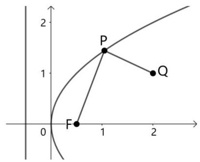

可以直接设 $P$ 的坐标为 $P\left( {x,\sqrt{2x}}\right)$ 或 $P\left( {\frac{{y}^{2}}{2}, y}\right)$ ,列出 $\left| {PQ}\right|  + \left| {PF}\right|$ 的表达式并求其最小值, 但计算量较大, 可以换个思路, 利用抛物线的定义建立数量关系, 让分析和计算得到极大简化。

根据抛物线的定义， ${PF}$ 的长度等于 $P$ 到准线的距离，因此 ${PQ}$ 与 ${PF}$ 长度之和等于 ${PQ}$ 与 $P$ 到 $l$ 的长度之和。从点 $P$ 向 $l$ 引垂线,设垂足为 $M$ ,则 ${PM}$ 就是 $P$ 到 $l$ 的长度,于是 ${PQ}$ 与 ${PF}$ 的长度之和等于 ${PQ}$ 与 ${PM}$ 的长度之和。

如下图所示,当 $P\text{ 、 }M\text{ 、 }Q$ 形成 $\bigtriangleup {PMQ}$ 时,三角形的两边之和大于第三边, 此时恒有 ${PQ} + {PM} > {MQ}$ ,其中 ${MQ}$ 为点 $Q$ 与 $l$ 上一点之间的距离, ${MQ}$ 总是大于 $Q$ 到 $l$ 的距离,即 ${PQ}$ 与 ${PF}$ 的长度之和总是大于 $Q$ 到 $l$ 的距离。

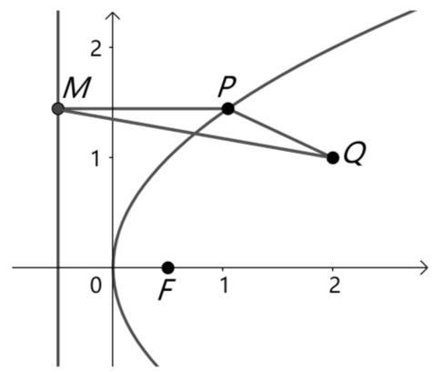

如下图所示,当 $P\text{ 、 }M\text{ 、 }Q$ 三点共直线时, ${PQ} + {PM} = {MQ}$ ,此时 ${PQ}$ 与 ${PF}$ 的长度之和等于 $Q$ 到 $l$ 的距离,为最小值。即: 当 $P$ 的纵坐标与 $Q$ 相同时, ${PQ}$ 与 ${PF}$ 的长度之和最小,此时 ${PQ} \bot  l, P$ 的坐标为 $P\left( {\frac{1}{2},1}\right)$ ,线段 ${PQ}$ 与 ${PF}$ 的长度之和的最小值为: ${d}_{\min } = \left| {2 - \left( {-\frac{1}{2}}\right) }\right|  = \frac{5}{2}$ 。

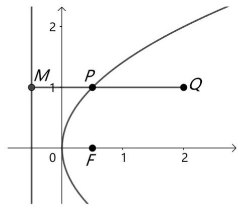

本题启示我们, 灵活利用圆锥曲线的定义, 有时可以让计算得到极大简化。

练习 $\mathbf{{9.3}\left( 2\right) }$

1. 求抛物线 $y = 2{\left( x - 4\right) }^{2}$ 的准线方程和焦点坐标。

2. 已知直线 $l$ 的斜率为 1,与抛物线 ${y}^{2} = {2x}$ 相交于 $A\text{ 、 }B$ 两点, ${AB} = 2$ ,求 $l$ 的方程。

3. 已知 $P$ 是抛物线 ${y}^{2} = {4x}$ 上的一点,求 $P$ 在什么位置时, $P$ 到直线 $l : x =  - 1$ 的距离与到点 $Q\left( {1,3}\right)$ 的距离之和最小? 最小值是多少?

### 9.4 椭圆和双曲线的第二定义、第三定义

可能有的同学在学习椭圆、双曲线、抛物线的定义时会发现有些蹊跷:

(1)椭圆和双曲线的定义为到两个焦点的距离之和或差为定值，而抛物线的定义为到焦点与准线的距离之比为定值;

(2)椭圆和双曲线的离心率的定义都是焦距与长轴(实轴)长度之比，而抛物线的离心率的定义却是抛物线上的点到焦点的距离与到准线的距离的比值。

如此看来, 似乎抛物线与椭圆和双曲线不是一类图形, 但它们都是圆锥曲线, 都可以由一个平面截取圆锥得到, 它们应当有内在联系, 实际上, 这个联系由椭圆和双曲线的第二定义描述。

#### 9.4.1 椭圆的第二定义

前面学习的 “到平面内两个定点的距离之和等于定长的点的集合” 又叫作椭圆的第一定义, 椭圆还有第二定义和第三定义, 尽管这三种定义的描述方式各不相同，但最终得到的图形都是椭圆。

椭圆的第二定义为:平面上到定点 $F$ 的距离与到定直线 $l$ 的距离之比 $e$ 为常数,且 $0 < e < 1$ 的点的集合。接下来根据椭圆的第二定义,推导椭圆的标准方程。

为了与已经学习的椭圆的标准方程保持一致,设定点为 $F\left( {c,0}\right)$ ,定直线为 $l : x = \frac{{a}^{2}}{c}$ ,动点 $M\left( {x, y}\right)$ 到 $F$ 与 $l$ 的距离之比为常数 $e = \frac{c}{a}\left( {c < a}\right)$ 。

$M\left( {x, y}\right)$ 到 $F\left( {c,0}\right)$ 的距离为: $\sqrt{{\left( x - c\right) }^{2} + {\left( y - 0\right) }^{2}}$ ,

$M\left( {x, y}\right)$ 到 $l : x = \frac{{a}^{2}}{c}$ 的距离为: $\left| {x - \frac{{a}^{2}}{c}}\right|$ ,

由 $M\left( {x, y}\right)$ 到 $F\left( {c,0}\right)$ 与到 $l : x = \frac{{a}^{2}}{c}$ 距离之比为常数 $\frac{c}{a}$ 可得:

$$
\frac{\sqrt{{\left( x - c\right) }^{2} + {\left( y - 0\right) }^{2}}}{\left| x - \frac{{a}^{2}}{c}\right| } = \frac{c}{a}
$$

化简后得:

$$
\frac{{x}^{2}}{{a}^{2}} + \frac{{y}^{2}}{{a}^{2} - {c}^{2}} = 1
$$

设 ${a}^{2} - {c}^{2} = {b}^{2}\left( {b > 0}\right)$ ,就得到椭圆的标准方程:

$$
\frac{{x}^{2}}{{a}^{2}} + \frac{{y}^{2}}{{b}^{2}} = 1\left( {a > b > 0}\right)
$$

点 $F\left( {c,0}\right)$ 是椭圆的一个焦点,直线 $l : x = \frac{{a}^{2}}{c}$ 叫作椭圆的准线。

椭圆 $\frac{{x}^{2}}{{a}^{2}} + \frac{{y}^{2}}{{b}^{2}} = 1\left( {a > b > 0}\right)$ 共有两组焦点和准线,分别为左焦点 ${F}_{1}\left( {-c,0}\right)$ 和左准线 ${l}_{1} : x =  - \frac{{a}^{2}}{c}$ ,以及右焦点 ${F}_{2}\left( {c,0}\right)$ 和右准线 ${l}_{2} : x = \frac{{a}^{2}}{c}$ 。利用任意一组焦点和准线, 都可以画出同一个完整的椭圆。下图为椭圆与它的两组焦点和准线。

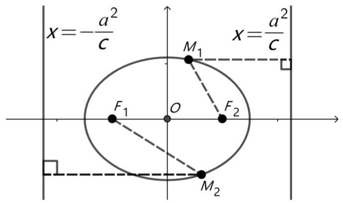

如果椭圆的两个焦点对称分布在 $y$ 轴上,其方程为:

$$
\frac{{y}^{2}}{{a}^{2}} + \frac{{x}^{2}}{{b}^{2}} = 1\left( {a > b > 0}\right)
$$

此时椭圆的两条准线与 $x$ 轴平行,分别为上焦点 $\left( {0, c}\right)$ 和上准线 $y = \frac{{a}^{2}}{c}$ 、下焦点 $\left( {0, - c}\right)$ 和下准线 $y =  - \frac{{a}^{2}}{c}$ 。

例 9.12 已知动点 $M\left( {x, y}\right)$ 到点 $\left( {-1,0}\right)$ 的距离与它到直线 $x =  - 3$ 的距离之比始终为 $\frac{\sqrt{3}}{3}$ ,那么 $M$ 到点 $\left( {1,0}\right)$ 的距离与到直线 $x = 3$ 的距离之比是否为定值? 若是, 定值为多少?

解析: 虽然根据椭圆的第二定义, 我们知道这两组点和直线分别为同一椭圆的左焦点与左准线、右焦点与右准线,动点 $M\left( {x, y}\right)$ 的轨迹就是该椭圆,到两组焦点与准线的距离之比相等, 但作为练习, 我们仍使用最基本的距离关系求解。

点 $M\left( {x, y}\right)$ 到点 $\left( {-1,0}\right)$ 的距离为: ${d}_{1} = \sqrt{{\left( x - ( - 1{)}^{2}+(y - 0{)}^{2}\right) }^{2} = \sqrt{{\left( x + 1\right) }^{2} + {y}^{2}}}$ , 点 $M\left( {x, y}\right)$ 到直线 $x =  - 3$ 的距离为: ${d}_{2} = \frac{\left| x - \left( -3\right) \right| }{\sqrt{{1}^{2} + {0}^{2}}} = \left| {x + 3}\right|$ ,由 ${d}_{1}$ 与 ${d}_{2}$ 之比始终为 $\frac{\sqrt{3}}{3}$ 可得: $\frac{\sqrt{{\left( x + 1\right) }^{2} + {y}^{2}}}{\left| x + 3\right| } = \frac{\sqrt{3}}{3}$ ,等式两边都是正数,可同时平方: $\frac{{\left( x + 1\right) }^{2} + {y}^{2}}{{\left( x + 3\right) }^{2}} = \frac{1}{3}$ , 化简后得: $\frac{{x}^{2}}{3} + \frac{{y}^{2}}{2} = 6$ ,椭圆上的点即动点 $M\left( {x, y}\right)$ 可以用参数方程表示为: $M\left( {\sqrt{3}\cos \theta ,\sqrt{2}\sin \theta }\right)$ 。

点 $M\left( {\sqrt{3}\cos \theta ,\sqrt{2}\sin \theta }\right)$ 到点 $\left( {1,0}\right)$ 的距离为: ${d}_{3} = \sqrt{{\left( \sqrt{3}\cos \theta  - 1\right) }^{2} + {\left( \sqrt{2}\sin \theta \right) }^{2}} \; = \sqrt{3{\cos }^{2}\theta  - 2\sqrt{3}\cos \theta  + 1 + 2{\sin }^{2}\theta } = \sqrt{{\cos }^{2}\theta  - 2\sqrt{3}\cos \theta  + 3} = \sqrt{{\left( \cos \theta  - \sqrt{3}\right) }^{2}}$ ,点 $M\left( {\sqrt{3}\cos \theta ,\sqrt{2}\sin \theta }\right)$ 到直线 $x = 3$ 的距离为: ${d}_{4} = \frac{\left| \sqrt{3}\cos \theta  - 3\right| }{\sqrt{{1}^{2} + {0}^{2}}} = \left| {\sqrt{3}\cos \theta  - 3}\right|$ ,可得: $\frac{{d}_{3}}{{d}_{4}} = \frac{\sqrt{{\left( \cos \theta  - \sqrt{3}\right) }^{2}}}{\left| \sqrt{3}\cos \theta  - 3\right| } = \frac{\sqrt{{\left( \cos \theta  - \sqrt{3}\right) }^{2}}}{\sqrt{3}\left| {\cos \theta  - \sqrt{3}}\right| } = \frac{\sqrt{3}}{3}$ ,比值为定值 $\frac{\sqrt{3}}{3}$ 。

#### 9.4.2 双曲线的第二定义

前面学习的 “到平面内两个定点的距离之差等于定长的点的集合” 又叫作双曲线的第一定义, 双曲线还有第二定义和第三定义, 尽管这三种定义的描述方式各不相同,但最终得到的图形都是双曲线。

双曲线的第二定义为: 平面上到定点 $F$ 的距离与到定直线 $l$ 的距离之比 $e$ 为常数,且 $e > 1$ 的点的集合。接下来根据双曲线的第二定义,推导双曲线的标准方程。

为了与已经学习的双曲线的标准方程保持一致,设定点为 $F\left( {c,0}\right)$ ,定直线为 $l : x = \frac{{a}^{2}}{c}$ ,动点 $M\left( {x, y}\right)$ 到 $F$ 与 $l$ 的距离之比为常数 $e = \frac{c}{a}\left( {c > a}\right)$ 。

由上述距离间的比例关系可得: $\frac{\sqrt{{\left( x - c\right) }^{2} + {\left( y - 0\right) }^{2}}}{\left| x - \frac{{a}^{2}}{c}\right| } = \frac{c}{a}$

化简过程与椭圆相似,化简后得: $\frac{{x}^{2}}{{a}^{2}} + \frac{{y}^{2}}{{a}^{2} - {c}^{2}} = 1$

由于 $c > a$ ,设 ${c}^{2} - {a}^{2} = {b}^{2}\left( {b > 0}\right)$ ,就可以得到双曲线的标准方程:

$$
\frac{{x}^{2}}{{a}^{2}} - \frac{{y}^{2}}{{b}^{2}} = 1\left( {a > 0, b > 0}\right)
$$

点 $F\left( {c,0}\right)$ 是椭圆的一个焦点,直线 $l : x = \frac{{a}^{2}}{c}$ 叫作椭圆的准线。

双曲线 $\frac{{x}^{2}}{{a}^{2}} - \frac{{y}^{2}}{{b}^{2}} = 1\left( {a > 0, b > 0}\right)$ 共有两组焦点和准线,分别为左焦点 ${F}_{1}\left( {-c,0}\right)$ 和左准线 ${l}_{1} : x =  - \frac{{a}^{2}}{c}$ ,以及右焦点 $F\left( {c,0}\right)$ 和右准线 ${l}_{2} : x = \frac{{a}^{2}}{c}$ 。利用任意一组焦点和准线, 都可以画出同一个完整的双曲线的两个半支。下页图为双曲线与它的两组焦点和准线。

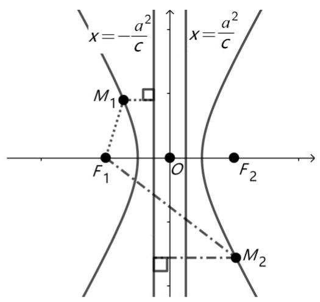

如果双曲线的两个焦点对称分布在 $y$ 轴上,其方程为:

$$
\frac{{y}^{2}}{{a}^{2}} - \frac{{x}^{2}}{{b}^{2}} = 1\;\left( {a > 0, b > 0}\right)
$$

那么该双曲线的两条准线与 $x$ 轴平行,分别为上焦点 $\left( {0, c}\right)$ 和上准线 $y = \frac{{a}^{2}}{c}$ 、下焦点 $\left( {0, - c}\right)$ 和下准线 $y =  - \frac{{a}^{2}}{c}$ 。

综上, 按照第二定义, 椭圆、双曲线、抛物线的几何定义统一了起来, 都是到定点 (焦点 $F$ ) 的距离与到定直线 (准线 $l$ ) 的距离的比值为定值 (离心率 $e$ ) 的点构成的图形,若 $0 < e < 1$ 则为椭圆; 若 $e > 1$ 则为双曲线; 若 $e = 1$ 则为抛物线。 椭圆、双曲线、抛物线的焦点和准线的定义和公式也都相同,区别只是 $a$ 与 $c$ 的大小关系不同。(对于抛物线，可以看作 $a = c$ ，由此可得 $\frac{p}{2} = c = \frac{{a}^{2}}{c}$ )

例 9.13 已知动点 $M\left( {x, y}\right)$ 到点 $\left( {1,0}\right)$ 的距离与到直线 $x = \frac{1}{2}$ 的距离之比始终为 $\sqrt{2}$ ,求经过原点且不经过任何动点 $M\left( {x, y}\right)$ 的直线的斜率的范围?

解析: 虽然根据双曲线的第二定义,我们知道动点 $M\left( {x, y}\right)$ 的轨迹为双曲线, 经过原点且与双曲线无交点的直线为双曲线的两条渐近线, 以及斜率的绝对值大于渐近线斜率的所有直线, 但作为练习, 我们仍使用最基本的距离关系求解。

点 $M\left( {x, y}\right)$ 到点 $\left( {1,0}\right)$ 的距离为: ${d}_{1} = \sqrt{{\left( x - 1\right) }^{2} + {\left( y - 0\right) }^{2}} = \sqrt{{\left( x - 1\right) }^{2} + {y}^{2}}$ ,点 $M\left( {x, y}\right)$ 到直线 $x = \frac{1}{2}$ 的距离为: ${d}_{2} = \left| {x - \frac{1}{2}}\right|$ ，由 ${d}_{1}$ 与 ${d}_{2}$ 之比始终为 $\sqrt{2}$ 可得: $\frac{\sqrt{{\left( x - 1\right) }^{2} + {y}^{2}}}{\left| x - \frac{1}{2}\right| } = \sqrt{2}$ ,等式两边都是正数,可以同时平方: $\frac{{\left( x - 1\right) }^{2} + {y}^{2}}{{\left( x - \frac{1}{2}\right) }^{2}} = 2$ ,化简后得: ${x}^{2} - {y}^{2} = \frac{1}{2}$ ,即动点 $M\left( {x, y}\right)$ 的轨迹为双曲线 ${x}^{2} - {y}^{2} = \frac{1}{2}$ 。

设经过原点的直线为 $y = {kx}$ ,将直线的方程代入双曲线的方程: ${x}^{2} - {\left( kx\right) }^{2} = \frac{1}{2}$ ,化简得: ${x}^{2} = \frac{1}{2\left( {1 - {k}^{2}}\right) }$ ,等式左边为非负实数,若要该方程无解, 等式右边需为负数,解得: $k > 1$ 或 $k <  - 1$ 。此外,当 $k =  \pm  1$ 时,直线方程为 $y =  \pm  x$ , 代入双曲线方程后无解。综上，经过原点且斜率范围为 $\left( {-\infty , - 1\rbrack \lbrack 1, + \infty }\right)$ 的直线不经过任何动点 $M$ ，如下图所示。

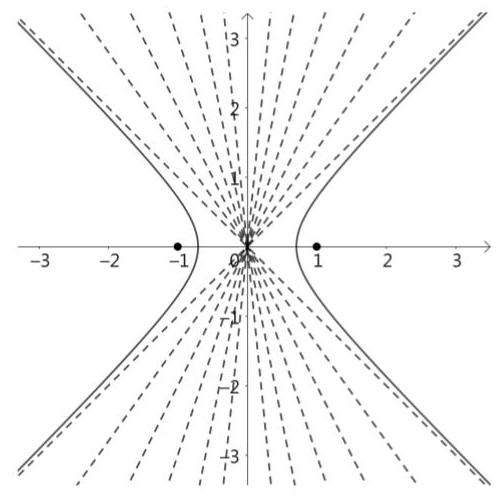

#### 9.4.3 椭圆和双曲线的第三定义

椭圆和双曲线的第三定义为:对于平面内的两个点 ${A}_{1}\left( {-a,0}\right)$ 和 ${A}_{2}\left( {a,0}\right)$ ，与它们分别形成的两条直线的斜率的乘积为定值(定值为 ${e}^{2} - 1 = \frac{{c}^{2}}{{a}^{2}} - 1$ )的点构成的图形 (集合),若 $0 < e < 1$ 则为椭圆,若 $e > 1$ 则为双曲线。

接下来利用第三定义推导椭圆和双曲线的的标准方程。设动点为 $M\left( {x, y}\right)$ , 它与 ${A}_{1}\left( {-a,0}\right)$ 和 ${A}_{2}\left( {a,0}\right)$ 分别形成直线 ${A}_{1}M$ 和 ${A}_{2}M$ ,则 ${A}_{1}M$ 和 ${A}_{2}M$ 的斜率分别为 ${k}_{1} = \frac{y}{x + a}$ 和 ${k}_{2} = \frac{y}{x - a}$ ,两条直线斜率的乘积为定值 ${e}^{2} - 1 = \frac{{c}^{2}}{{a}^{2}} - 1$ ,由此可得:

$$
\frac{y}{x + a} \cdot  \frac{y}{x - a} = \frac{{c}^{2}}{{a}^{2}} - 1
$$

化简后得:

$$
\frac{{x}^{2}}{{a}^{2}} + \frac{{y}^{2}}{\left( {a}^{2} - {c}^{2}\right) } = 1
$$

根据 $a$ 与 $c$ 的大小关系,设 ${b}^{2} = {a}^{2} - {c}^{2}$ 或 ${b}^{2} = {c}^{2} - {a}^{2}$ ,可以分别得到椭圆与双曲线的标准方程。

例 9.14 已知斜率可变的直线 ${l}_{1}$ 经过点 $\left( {-1,0}\right)$ ,斜率可变的直线 ${l}_{2}$ 经过点 $\left( {1,0}\right) ,{l}_{1}$ 与 ${l}_{2}$ 的始终垂直,求 ${l}_{1}$ 与 ${l}_{2}$ 的交点的轨迹的方程。

解析: 虽然本题看似可以利用椭圆或双曲线的第三定义, 但第三定义中椭圆或双曲线上的点与两个顶点形成的直线的斜率的乘积为 ${e}^{2} - 1 = \frac{{c}^{2}}{{a}^{2}} - 1$ ,而本题中两条直线垂直,斜率的乘积为 -1,即 ${e}^{2} - 1 =  - 1$ ,对应的离心率为 0,因此 ${l}_{1}$ 与 ${l}_{2}$ 的交点的轨迹并非椭圆或双曲线，只能利用基本的角度关系从头开始分析计算。

设 ${l}_{1}$ 的斜率为 $k$ ,则 ${l}_{2}$ 的斜率为 $- \frac{1}{k}$ ,因为 ${l}_{1}$ 经过点 $\left( {-1,0}\right)$ ,所以 ${l}_{1}$ 的点斜式方程为 $y = k\left( {x + 1}\right)$ ,因为 ${l}_{2}$ 经过点 $\left( {1,0}\right)$ ,所以 ${l}_{2}$ 的点斜式方程为 $y =  - \frac{1}{k}\left( {x - 1}\right)$ , ${l}_{1}$ 与 ${l}_{2}$ 的交点坐标同时满足 ${l}_{1}$ 与 ${l}_{2}$ 的方程,即方程组 $\left\{  \begin{array}{l} y = k\left( {x + 1}\right) \\  y =  - \frac{1}{k}\left( {x - 1}\right)  \end{array}\right.$ 的解。

要求交点的轨迹方程,需要消去斜率 $k$ ,让两个方程的左右两边分别相乘即可: $y \cdot  y = k\left( {x + 1}\right)  \cdot  \left\lbrack  {-\frac{1}{k}\left( {x - 1}\right) }\right\rbrack$ ,化简得: $x + {y}^{2} = 1$ ,是以点 $\left( {-1,0}\right)$ 和 $\left( {1,0}\right)$ 为直径的圆, 另需排除这两点, 这与 “圆的任意直径所对的圆周角为直角” 的平面几何定理一致，如下图所示。

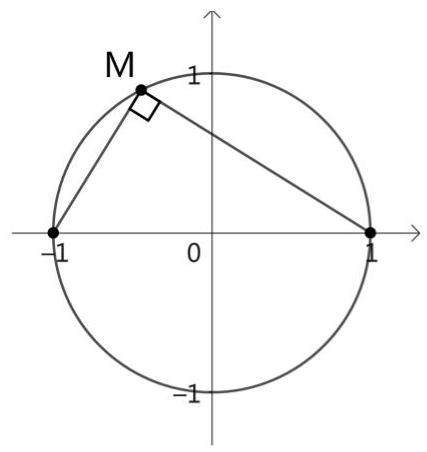

练习 9.4

1. 已知圆锥曲线的离心率为 $e = \frac{1}{{p}^{2} - 1}, p > 0$ ,回答下列问题:

(1)当 $p$ 为何值时，该圆锥曲线为椭圆；

(2)当 $p$ 为何值时，该圆锥曲线为双曲线；

(3)当 $p$ 为何值时，该圆锥曲线为抛物线。

2. 已知圆锥曲线的方程为 $A{x}^{2} + B{y}^{2} = 1$ ,回答下列问题:

(1)当 $A$ 、 $B$ 满足什么条件时，该方程表示的图形为圆；

(2)当 $A$ 、 $B$ 满足什么条件时，该方程表示的图形为椭圆；

(3)当 $A$ 、 $B$ 满足什么条件时，该方程表示的图形为双曲线。

3. 椭圆 $\frac{{x}^{2}}{{a}^{2}} + \frac{{y}^{2}}{{b}^{2}} = 1\left( {a > b > 0}\right)$ 和双曲线 $\frac{{x}^{2}}{{p}^{2}} - \frac{{y}^{2}}{{q}^{2}} = 1\left( {p > 0, q > 0}\right)$ 是否可能有相同的焦点和准线? 若可能, 求需满足的数量关系; 若不可能, 为什么?

4. 已知 $P$ 是双曲线 $\frac{{x}^{2}}{4} - \frac{{y}^{2}}{4} = 1$ 左支上一点, $F$ 是双曲线的左焦点, $Q\left( {-4,1}\right)$ 为双曲线外一点，求 $\left| {PF}\right|  + \sqrt{2}\left| {PQ}\right|$ 的最小值。

5. 已知 $P$ 是椭圆 $\frac{{x}^{2}}{25} + \frac{{y}^{2}}{16} = 1$ 上一点， $A\text{ 、 }B$ 是椭圆与 $x$ 轴的两个交点， ${k}_{1}\text{ 、 }{k}_{2}$ 是直线 ${OA}\text{ 、 }{OB}$ 的斜率,求 $\left| {k}_{1}\right|  + \left| {k}_{2}\right|$ 的最小值。

## 小结

本章主要学习椭圆、双曲线、抛物线的标准方程、基本性质、参数方程, 以及椭圆和双曲线的第二、第三定义, 需重点掌握各圆锥曲线的几何定义、推导标准方程的过程、主要性质, 灵活掌握参数方程、第二和第三定义, 能通过比较各圆锥曲线的定义、方程、性质间的相同点和不同点, 或根据方程的特点辨别出曲线的类型、指出图形的位置及特点, 并结合直线和圆的方程、平面内距离和夹角 (余弦值)的求法，综合分析解决平面几何问题。

## 第十章 数列

数列——顾名思义——就是把一些数按照一定顺序排成一列。数列中的各数与其序号之间、相邻两个数之间、连续若干数的和都有一定的规律, 这是数列的主要研究内容。

数列有很强的规律性，把握数列的规律需要较强的思维能力和一定的数学技巧, 需要发现或创造出等差或等比例等关系, 运用拆项消项、合并同类项、指数运算或对数运算的性质等知识对数列的表达式进行处理。

数列可以看作一种自变量为正整数的特殊函数, 数列经常与对数、指数、三角函数等运算及函数有密切联系, 很多数列同样有单调性、周期性等函数的重要性质。

本章我们将以数列为载体，初步学习极限的概念、性质及运算。极限是一种重要的数学思想, 用一种巧妙的思路揭示了深刻的规律, 数列的极限将为下一章学习函数的极限和导数的知识提供铺垫。

本章我们还将学习数学归纳法, 数学归纳法是一种很实用的逻辑方法, 常用于发现规律和验证规律, 其原理和使用方法容易理解, 但实际使用需要对数字和运算规律有较强敏感性。

### 10.1 数列的概念与性质

我们最早学习数学是从计数开始: $1,2,3,4,5\cdots \cdots$ 将正整数按照从小到大依次数出来，就构成一个数列，这之后我们还会学习偶数、奇数、整十、整百等有共同特点的数, 并按照一定顺序把它们排列出来。

#### 10.1.1 数列的概念

把一些数按照确定的顺序排成一列, 就构成了数列, 也就是一列数字 (有时是代数表达式)，出于方便，通常把数列写成行。

数列中的每一个数叫作数列的项。数列的项可以是自然数、整数、有理数、 实数、复数等一切形式的数。

数列中的每一个数都需要按照确定的顺序排列, 因此每一项都对应一个序数或编号,按照排列顺序依次叫作第 1 项、第 2 项、第 3 项...第 $n$ 项。数列的每一项对应的序号叫作该项的序数。

数列通常记作 $\left\{  {a}_{n}\right\}$ ,数列中的每一项都可以用 “小写字母+序数角标” 表示, 一个数列中的第 1 项、第 2 项...第 $n$ 项通常分别用 ${a}_{1},{a}_{2},\ldots ,{a}_{n}$ 表示。

数列中项的个数既可以是有限的, 也可以是无限的。项的个数有限的数列叫作有穷数列。有穷数列的最后项又叫作末项，数列的项的总数叫作数列的项数。

项的个数无限的数列叫作无穷数列。无穷数列的项数无限，因此没有末项和项数。有穷数列和无穷数列都有第1项，又叫作首项。如果没有专门说明数列的项数, 可以默认为无穷数列。

数列的主要表示方式有两种: 一一列举、使用公式。

一一列举的表示方法多用于项数较少的有穷数列, 将数列中的元素按照顺序挨个写出即可, 有时也用一一列举的方法表示无穷数列, 但需要数列的规律非常明显且不容易产生歧义。

使用通项公式或递推公式可以准确地表示出数列的每一项而不产生歧义, 且有助于揭示数列中各项与其序数的关系或各项之间的关系。

通项公式可以看作项数作为自变量、项为因变量的函数, 其一般形式为:

$$
{a}_{n} = f\left( n\right)
$$

递推公式可以看作任意项为自变量、下一项为因变量的函数, 其一般形式为:

$$
{a}_{n} = g\left( {a}_{n - 1}\right)
$$

既然数列可以看作定义域为正整数的特殊函数, 就可以用表格或图像表示, 只是较少使用这两种方法展示数列, 有时若难以找到切入点, 可以尝试列出若干项或绘制出图像。

数列 1 全体正整数按照从小到大的顺序依次排列, 构成一个无穷数列:

$$
1,2,3,4,5\cdots \cdots
$$

下图为该数列的图像。

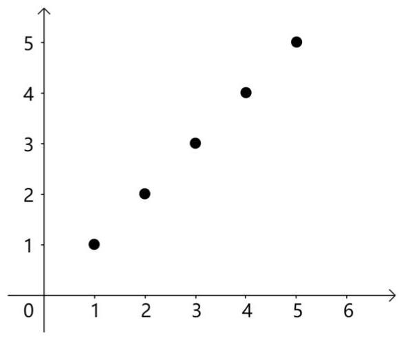

数列 2 选取 1,2,3 三个实数的平方根, 按照从大到小的顺序排列, 构成一个有穷数列:

$$
\sqrt{3},\sqrt{2},1, - 1, - \sqrt{2}, - \sqrt{3}
$$

下页图为该数列的图像。

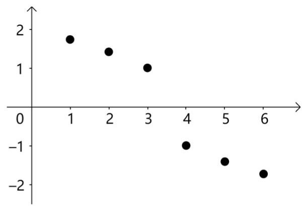

如果已知一个数列 $\left\{  {a}_{n}\right\}$ 的各项 ${a}_{i}$ 与它的序数 $i$ 之间的对应关系,可以用通项公式表示为: ${a}_{n} = f\left( n\right)$ 。

数列 3 所有正偶数按照从小到大排列形成的数列:

$$
2,4,6,8,{10}\cdots \cdots
$$

该数列的每一项都等于项数的两倍, 该数列的通项公式为:

$$
{a}_{n} = {2n}
$$

下图为该数列的图像。

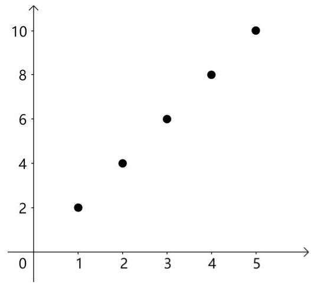

如果已知一个数列相邻两项间始终满足的数量关系, 可以用递推公式表示为: ${a}_{n} = g\left( {a}_{n - 1}\right) \left( {n \geq  2}\right)$ ,通常首项 ${a}_{1}$ 需专门列出,有时会列出根据递推公式和首项计算出的 “第 0 项” ${a}_{0}$ 。

数列 4 首项为 2 , 每一项是它前一项的相反数:

$$
2, - 2,2, - 2,2, - 2\cdots \cdots
$$

该数列的每一项都等于前一项乘以 -1 , 该数列的递推公式为:

$$
{a}_{n} = \left\{  \begin{array}{ll} 2 & \left( {n = 1}\right) \\   - {a}_{n - 1} & \left( {n \geq  2}\right)  \end{array}\right.
$$

下页图为该数列的图像。

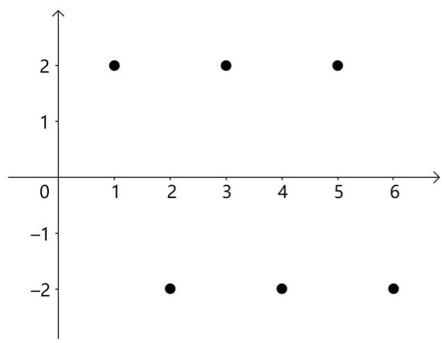

递推公式有时不是直接以类似函数 ${a}_{n} = g\left( {a}_{n - 1}\right)$ 的形式给出，而是以方程 $h\left( {{a}_{n},{a}_{n - 1}}\right)  = 0$ 的形式给出。有时给出的不是相邻两项之间的关系,而是间隔若干项之间的关系 ${a}_{n} = i\left( {a}_{n - p}\right)$ ,这些特殊情况通常都需要进行一定的数学处理。

#### 10.1.2 数列的基本性质

数列可以看作一种特殊的函数, 因此一些数列也具有函数的一些基本性质。

单调性。如果数列 $\left\{  {a}_{n}\right\}$ 的每一项都随序数的增大而增大,即: $\forall i < j$ ,恒有 ${a}_{i} < {a}_{j}$ ,那么该数列叫作递增数列。

如果数列 $\left\{  {a}_{n}\right\}$ 的每一项都随序数的增大而减小,即: $\forall i < j$ ,恒有 ${a}_{i} > {a}_{j}$ , 那么该数列叫作递减数列。

所有项都相同的数列叫作常数列。

周期性。如果数列 $\left\{  {a}_{n}\right\}$ 的各项随序数周期性变化,即: 项数每间隔某个常数 $T$ ,对应的项都相同: ${a}_{n} = {a}_{n + T}$ ,那么该数列叫作周期数列。

数列 $5{a}_{n} = \sin \left( \frac{\pi n}{2}\right)$ 是以 4 为周期的周期数列。下图为该数列的图像。

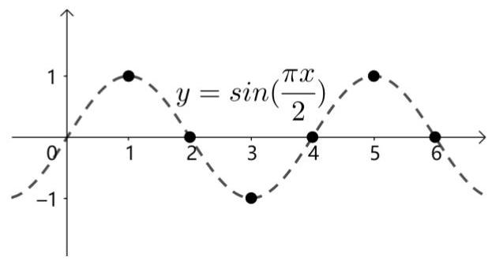

#### 10.1.3 数列的前 $n$ 项和

数列 $\left\{  {a}_{n}\right\}$ 从首项开始到第 $n$ 项为止的所有 $n$ 项相加,所得到的和叫作数列 $\left\{  {a}_{n}\right\}$ 的前 $n$ 项和,通常记作 ${S}_{n}$ ,即:

$$
{S}_{n} = {a}_{1} + {a}_{2} + \cdots  + {a}_{n}
$$

由数列的前 $n$ 项和的定义可得:

$$
{S}_{n} - {S}_{n - 1} = \left( {{a}_{1} + {a}_{2} + \cdots  + {a}_{n - 1} + {a}_{n}}\right)  - \left( {{a}_{1} + {a}_{2} + \cdots  + {a}_{n - 1}}\right)  = {a}_{n}
$$

即:

$$
{S}_{n} - {S}_{n - 1} = {a}_{n}
$$

利用数列的通项公式,通常可以推出数列的递推公式和前 $n$ 项和公式。利用递推公式,也可以推导出数列的通项公式和前 $n$ 项和公式,这是数列中常见的两类问题。利用数列的前 $n$ 项和公式通常难以确定数列的通项公式或递推公式,只能找出具有该前 $n$ 项和公式的一种或几种数列。

## 练习 10.1

1. 写出下列数列的前 5 项并画出图像:

(1)全体被 4 除余数为 3 的正整数按照从小到大排列成数列；

(2)正 $n$ 边形的内角和，其中 $n = 3,4,5\cdots$ ；

(3) ${a}_{n} = {2}^{n}$ ；

(4) ${a}_{1} = 2,{a}_{n} = {a}_{n - 1} - \frac{1}{{a}_{n - 1}}\left( {n \geq  2}\right)$ 。

2. 已知下列数列的前 5 项，分别写出该数列满足的通项公式和递推公式:

(1)7，7，7，7；

(2)-1，-4，-7，-10，-13；

(3) $i, - 1, - i,1, i$ ;

(4) $\frac{2}{1},\frac{4}{2},\frac{8}{3},\frac{16}{4},\frac{32}{5}$ 。

3. 已知 ${a}_{n} = {2}^{n} + {\log }_{2}n$ ,回答下列问题:

(1)证明 ${a}_{n} \geq  2$ ；

(2) $\left\{  {a}_{n}\right\}$ 是否是递增数列或递减数列；

(3) $\left\{  {a}_{n}\right\}$ 是否是周期数列；

(4) $\left\{  {a}_{n}\right\}$ 的哪些项是整数，这些项的项数满足什么规律。

### 10.2 等差数列与等比数列

等差数列和等比数列是两种基本的数列, 这两种数列对应两类基本的变化方式:每次递增(或递减)相同大小、每次扩大(或缩小)相同幅度，在这两类基本变化方式的基础上，可以拓展出更复杂和奇妙的数列。此外，求等差数列和等比数列的通项公式、前 $n$ 项和公式的思路和过程,是分析处理数列问题的经典思路。

#### 10.2.1 等差数列的概念

我们最早学习计数时,从小到大挨个数出正整数: $1,2,3,4,5\cdots \cdots$ 实际上是按照依次递增 1 个的规律计数，这就是等差数列的基本特征:每次递增(或递减)相同大小。

如果数列 $\left\{  {a}_{n}\right\}$ 从第 2 项开始,每一项减去其前一项的差都等于常数 $d$ ,那么数列 $\left\{  {a}_{n}\right\}$ 叫作等差数列,常数 $d$ 叫作等差数列的公差,即:

$$
\forall n \geq  2,{a}_{n} - {a}_{n - 1} = d
$$

等差数列的定义式中，需强调“从第 2 项开始”，这是因为数列的第 1 项是 ${a}_{1}$ ,不存在 ${a}_{1} - {a}_{1 - 1} = d$ 。有时为了表示方便,会给出 ${a}_{0} = {a}_{1} - d$ ,但需要明确通常 ${a}_{0}$ 并不属于数列 $\left\{  {a}_{n}\right\}$ 。

按照等差数列的定义，可以得到等差数列的递推公式:

$$
{a}_{n} - {a}_{n - 1} = d\left( {n \geq  2}\right)
$$

最简单的等差数列由 3 项 ${a}_{1}$ 、 ${a}_{2}$ 、 ${a}_{3}$ 构成，按照等差数列的定义可得:

$$
{a}_{2} - {a}_{1} = {a}_{3} - {a}_{2}
$$

移项后得: ${a}_{2} = \frac{{a}_{1} + {a}_{3}}{2}$ ，此时 ${a}_{2}$ 叫作 ${a}_{1}$ 和 ${a}_{3}$ 的等差中项，两个数的等差中项等于它们的算术平均数。

利用等差数列的递推公式,可以推出其通项公式。设等差数列 $\left\{  {a}_{n}\right\}$ 的首项为 ${a}_{1}$ ,公差为 $d$ ,其递推公式为 ${a}_{n} - {a}_{n - 1} = d$ ,可得一系列等式:

$$
{a}_{2} - {a}_{1} = d
$$

$$
{a}_{3} - {a}_{2} = d
$$

......

$$
{a}_{n} - {a}_{n - 1} = d
$$

从 ${a}_{2}$ 到 ${a}_{n}$ 共有 $n - 1$ 个等式，将所有等式左边与右边分别相加:

$$
\left( {{a}_{2} - {a}_{1}}\right)  + \left( {{a}_{3} - {a}_{2}}\right)  + \cdots  + \left( {{a}_{n} - {a}_{n - 1}}\right)  = d + d + \cdots  + d
$$

等式左边可以利用加法结合律和交换律, 将相邻两个括号中相同的项依次抵消; 等式右边共有 $n - 1$ 个 $d$ 相加,化简后得:

$$
- {a}_{1} + {a}_{n} = \left( {n - 1}\right) d
$$

移项后得:

$$
{a}_{n} = {a}_{1} + \left( {n - 1}\right) d\left( {n \geq  2}\right)
$$

这就是等差数列的通项公式。

上述推导过程中, 将各形式相同, 且含相同元素的等式依次相加, 从而消去全部中间项，是分析处理数列的常用方法。

从函数的角度看,等差数列的通项公式 ${a}_{n} = {a}_{1} + \left( {n - 1}\right) d$ 可以看作关于 $n$ 的一次函数，只是将定义域限定为正整数:

$$
{a}_{n} = {dn} + {a}_{1} - d
$$

该一次函数的斜率为 $d$ ,在 $y$ 轴上的截距为 ${a}_{1} - d$ 。

下图为数列 ${a}_{n} = 4 + 2\left( {n - 1}\right)$ 与直线 $y = {2x} + 2$ 的图像。

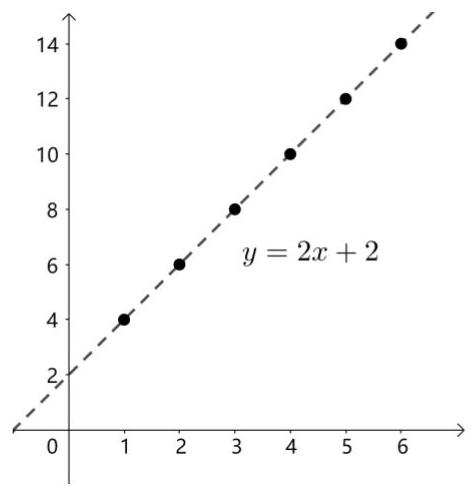

例 10.1 已知 $\left\{  {a}_{n}\right\}$ 是等差数列， ${a}_{2} = 4$ ， ${a}_{3} = 1$ ，求 $\left\{  {a}_{n}\right\}$ 的通项公式和 ${a}_{10}$ 。

解析: 等差数列的通项公式 ${a}_{n} = {a}_{1} + \left( {n - 1}\right) d\left( {n \geq  2}\right)$ 中,有两个参数 ${a}_{1}$ 和 $d$ , 通常只需要两个不同的数量关系, 就能求得等差数列的通项公式。

因为 $\left\{  {a}_{n}\right\}$ 是等差数列,由 ${a}_{2} = 4,{a}_{3} = 1$ 可以求得公差:

$$
d = {a}_{3} - {a}_{2} = 1 - 4 =  - 3
$$

由 ${a}_{2} = 4$ 和 $d =  - 3$ 可以求得首项:

$$
{a}_{1} = {a}_{2} - d = 4 - \left( {-3}\right)  = 7
$$

$\left\{  {a}_{n}\right\}$ 的通项公式为:

$$
{a}_{n} = {a}_{1} + \left( {n - 1}\right) d = 7 + \left( {n - 1}\right)  \times  \left( {-3}\right)  = {10} - {3n}
$$

将 $n = {10}$ 代入 $\left\{  {a}_{n}\right\}$ 的通项公式即可求得 ${a}_{10}$ :

$$
{a}_{10} = {10} - 3 \times  {10} =  - {20}
$$

例 10.2 已知数列 $\left\{  {a}_{n}\right\}$ 满足: $\forall n \geq  1,{a}_{n} + {a}_{n + 1} = {4n} + 4$ ,证明: $\left\{  {a}_{n}\right\}$ 的偶数项和奇数项分别构成等差数列。

解析: 将 ${a}_{n} + {a}_{n + 1} = {4n} + 4$ 中的 $n$ 替换为 $n + 1$ 可得:

$$
{a}_{n + 1} + {a}_{\left( {n + 1}\right)  + 1} = {a}_{n + 1} + {a}_{n + 2} = 4\left( {n + 1}\right)  + 4 = {4n} + 8
$$

将 ${a}_{n + 1} + {a}_{n + 2} = {4n} + 8$ 与 ${a}_{n} + {a}_{n + 1} = {4n} + 4$ 的等式两边分别相减并化简:

$$
\left( {{a}_{n + 1} + {a}_{n + 2}}\right)  - \left( {{a}_{n} + {a}_{n + 1}}\right)  = \left( {{4n} + 8}\right)  - \left( {{4n} + 4}\right)
$$

$$
{a}_{n + 2} - {a}_{n} = 4
$$

当 $n$ 为奇数时,任意相邻两奇数项的差恒为 $4,\left\{  {a}_{n}\right\}$ 的奇数项构成等差数列; 当 $n$ 为偶数时,任意相邻两偶数项的差恒为 $4,\left\{  {a}_{n}\right\}$ 的偶数项构成等差数列。 (需注意,根据已知信息无法得出 $\left\{  {a}_{n}\right\}$ 的相邻两项的差为定值的结论)

#### 10.2.2 等差数列的前 $n$ 项和公式

利用等差数列的通项公式,可以推出其前 $n$ 项和的公式。

等差数列 $\left\{  {a}_{n}\right\}$ 的前 $n$ 项和的定义式为:

$$
{S}_{n} = {a}_{1} + {a}_{2} + \cdots  + {a}_{n - 1} + {a}_{n}
$$

根据加法交换律和结合律, 将各项的排列顺序颠倒后和不变:

$$
{S}_{n} = {a}_{n} + {a}_{n - 1} + \cdots  + {a}_{2} + {a}_{1}
$$

将正序与倒序的两个求和等式相加:

$$
{S}_{n} + {S}_{n} = \left( {{a}_{1} + {a}_{2} + \cdots  + {a}_{n - 1} + {a}_{n}}\right)  + \left( {{a}_{n} + {a}_{n - 1} + \cdots  + {a}_{2} + {a}_{1}}\right)
$$

将等式右边的两个括号中顺序相同的项取出来放在一起分别求和:

第 1 项: ${a}_{1} + {a}_{n} = {a}_{1} + {a}_{1} + \left( {n - 1}\right) d = 2{a}_{1} + \left( {n - 1}\right) d$ ,

第 2 项: ${a}_{2} + {a}_{n - 1} = {a}_{1} + d + {a}_{1} + \left( {n - 2}\right) d = 2{a}_{1} + \left( {n - 1}\right) d$ ,

......

第 $n - 1$ 项: ${a}_{n - 1} + {a}_{2} = {a}_{1} + \left( {n - 2}\right) d + {a}_{1} + d = 2{a}_{1} + \left( {n - 1}\right) d$ ,

第 $n$ 项: ${a}_{n} + {a}_{1} = {a}_{1} + \left( {n - 1}\right) d + {a}_{1} = 2{a}_{1} + \left( {n - 1}\right) d$ ,

可以发现,正序与倒序中次序相同的各项之和都是 $2{a}_{1} + \left( {n - 1}\right) d$ ,共有 $n$ 项, 由此可得:

$$
{S}_{n} + {S}_{n} = n\left\lbrack  {2{a}_{1} + \left( {n - 1}\right) d}\right\rbrack
$$

化简后得:

$$
{S}_{n} = n{a}_{1} + \frac{n\left( {n - 1}\right) }{2}d
$$

这就是等差数列 $\left\{  {a}_{n}\right\}$ 的前 $n$ 项和公式。若 $n$ 为奇数,正序与倒序相加的中间项为 ${a}_{\frac{n + 1}{2}} + {a}_{\frac{n + 1}{2}}$ ; 若 $n$ 为偶数,正序与倒序相加的中间为 ${a}_{\frac{n}{2}} + {a}_{\frac{n}{2} + 1}$ 和 ${a}_{\frac{n}{2} + 1} + {a}_{\frac{n}{2}}$ 两项。

上述推导过程中, 将同一个求和公式分别按照正常顺序和相反顺序相加, 得到一系列形式相同且具有一定规律的表达式, 是分析处理数列问题的常用方法。

等差数列的前 $n$ 项和公式还可以看作一个自变量为正整数 $n$ 、因变量为前 $n$ 项和 ${S}_{n}$ 的函数,可以将等差数列的求和公式化为更贴近函数解析式的形式:

$$
S\left( n\right)  = \frac{d}{2}{n}^{2} + \left( {{a}_{1} - \frac{d}{2}}\right) n
$$

该表达式与二次函数的解析式相同,如果已知数列 $\left\{  {a}_{n}\right\}$ 是等差数列,且得知其前 $n$ 项和公式 ${S}_{n} = p{n}^{2} + {qn}$ ,那么可以根据公式中的参数 $p\text{ 、 }q$ 求得 $\left\{  {a}_{n}\right\}$ 的首项和公差,由 $p = \frac{d}{2}, q = {a}_{1} - \frac{d}{2}$ 可得: ${a}_{1} = p + q, d = {2p}$ 。如果一个数列的前 $n$ 项和公式不严格满足 ${S}_{n} = p{n}^{2} + {qn}$ 的形式,那么该数列就不可能是一个等差数列。

例 10.3 已知数列 $\left\{  {a}_{n}\right\}   : {a}_{n} = {3n} - 2,{S}_{n}$ 是 $\left\{  {a}_{n}\right\}$ 的前 $n$ 项和,求 ${S}_{20}$ 。

解析: 由 ${a}_{n} = {3n} - 2$ 可得: ${a}_{1} = 3 \times  1 - 2 = 1, d = {a}_{n + 1} - {a}_{n} = \left\lbrack  {3\left( {n + 1}\right)  - 2}\right\rbrack   - \left( {{3n} - 2}\right)  = 3$ , 即 $\left\{  {a}_{n}\right\}$ 是首项为 1,公差为 3 的等差数列,其前 $n$ 项和为:

$$
{S}_{20} = {20} \times  1 + \frac{{20} \times  \left( {{20} - 1}\right) }{2} \times  3 = {590}
$$

例 10.4 已知数列 $\left\{  {a}_{n}\right\}$ 是等差数列, ${S}_{n}$ 是 $\left\{  {a}_{n}\right\}$ 的前 $n$ 项和, ${S}_{10} = {15},{S}_{15} = {30}$ , 求 $\left\{  {a}_{n}\right\}$ 的通项公式。

解析: 因为 $\left\{  {a}_{n}\right\}$ 是等差数列,设其通项公式为 ${a}_{n} = {a}_{1} + \left( {n - 1}\right) d$ ,则其前 $n$ 项和的公式为 ${S}_{n} = n{a}_{1} + \frac{n\left( {n - 1}\right) }{2}d$ ,分别代入 ${S}_{10} = {15},{S}_{15} = {30}$ 可得:

${15} = {10}{a}_{1} + \frac{{10} \times  \left( {{10} - 1}\right) }{2}d$ ,化简得: $2{a}_{1} + {9d} = 3$ ,

${30} = {15}{a}_{1} + \frac{{15} \times  \left( {{15} - 1}\right) }{2}d$ ,化简得: ${a}_{1} + {7d} = 2$ ,

联立两个等式得到二元一次方程组: $\left\{  \begin{array}{l} 2{a}_{1} + {9d} = 3 \\  {a}_{1} + {7d} = 2 \end{array}\right.$ ,

解得: ${a}_{1} = \frac{3}{5}, d = \frac{1}{5}$ ,

$\left\{  {a}_{n}\right\}$ 的通项公式为: ${a}_{n} = \frac{3}{5} + \left( {n - 1}\right)  \times  \frac{1}{5} = \frac{n}{5} + \frac{2}{5}$ 。

练习 $\mathbf{{10.2}\left( 1\right) }$

1. 判断下列各数列是否一定是等差数列:

(1)二月中的日期按照时间顺序排列;

(2)全体正有理数按照从小到大排列；

(3)全体被 7 除余数为 4 的正整数从小到大排列。

2. 求下列各等差数列的通项公式和前 $n$ 项和公式:

(1) ${a}_{1} = 0,{a}_{4} =  - {12}$ ;

(2) ${a}_{1} + {a}_{2} = 7,{a}_{3} + {a}_{4} = {19}$ ；

(3) $\frac{{a}_{4}}{{a}_{3}} =  - 2,{a}_{2}{a}_{5} =  - {20}$ 。

3. 数列 $\left\{  {a}_{n}\right\}$ 的前 $n$ 项和为 $p{n}^{2} + {qn}$ ,其中 $p\text{ 、 }q$ 为非 0 常数,证明: $\left\{  {a}_{n}\right\}$ 是等差数列 (提示: ${a}_{n} = {S}_{n} - {S}_{n - 1}$ ) 。

4. 将一年中的每一天按顺序记为第1~365天，若某年的第一天是星期一， 求这一年里所有星期天的序数的通项公式, 以及所有星期天的序数之和。

#### 10.2.3 等比数列的概念

当细胞进行有丝分裂时, 1 个细胞分裂为 2 个细胞, 2 个细胞分裂为 4 个细胞，4 个细胞分裂为 8 个细胞，从 1 个细胞开始，将每次分裂后细胞的数量依次列出来: 1, 2, 4, 8……实际上是按照依次倍增为 2 倍的规律变化, 这就是等比数列的基本特征: 每次倍增 (或缩减) 相同比值。

如果数列 $\left\{  {a}_{n}\right\}$ 从第 2 项开始,每一项与它的前一项的比值都等于同一个 (不为 0 的)常数 $q$ ,那么数列 $\left\{  {a}_{n}\right\}$ 叫作等比数列,常数 $q$ 叫作等比数列的公比,即:

$$
\forall n \geq  2,\;\frac{{a}_{n}}{{a}_{n - 1}} = q\left( {q \neq  0}\right)
$$

最简单的等比数列由 3 项 ${a}_{1}\text{ 、 }{a}_{2}\text{ 、 }{a}_{3}$ 构成,按照等比数列的定义可得:

$$
\frac{{a}_{2}}{{a}_{1}} = \frac{{a}_{3}}{{a}_{2}}
$$

即 ${a}_{2}^{2} = {a}_{1}{a}_{3}$ ,此时 ${a}_{2}$ 叫作 ${a}_{1}$ 和 ${a}_{3}$ 的等比中项。

需注意,两个数 ${a}_{1},{a}_{3}$ 的等比中项 ${a}_{2}$ 除等于它们的几何平均数 $\sqrt{{a}_{1}{a}_{3}}$ 外,还可以等于它们的几何平均数的相反数 $- \sqrt{{a}_{1}{a}_{3}}$ 。另外,几何平均数通常只针对一对正实数讨论, 一对负实数也有等比中项。在实数范围内, 一对正数和负数没有等比中项，在复数范围内有等比中项。

利用等比数列的递推公式，可以推出其通项公式。设等比数列 $\left\{  {a}_{n}\right\}$ 的首项为 ${a}_{1}$ ,公比为 $q$ ,递推公式为 $\frac{{a}_{n}}{{a}_{n - 1}} = q\left( {q \neq  0}\right)$ ,可得:

$$
\frac{{a}_{2}}{{a}_{1}} = q
$$

$$
\frac{{a}_{3}}{{a}_{2}} = q
$$

......

$$
\frac{{a}_{n}}{{a}_{n - 1}} = q
$$

将上面 $n - 1$ 个等式左边与右边分别相乘:

$$
\frac{{a}_{2}}{{a}_{1}} \cdot  \frac{{a}_{3}}{{a}_{2}}\cdots \cdots \frac{{a}_{n}}{{a}_{n - 1}} = q \cdot  q\cdots \cdots q
$$

等式左边的每一个分式的分子恰好可以与下一个分式的分母抵消; 等式右边共有 $n - 1$ 个 $q$ 相乘,化简后可得:

$$
\frac{{a}_{n}}{{a}_{1}} = {q}^{n - 1}
$$

移项后得:

$$
{a}_{n} = {a}_{1}{q}^{n - 1}\left( {n \geq  2}\right)
$$

这就是等比数列的通项公式。

上述推导过程中, 将各形式相同、且含有相同元素的等式依次相乘, 从而消去中间项, 是分析处理数列问题的常用方法。

从函数的角度看,等比数列 ${a}_{n} = {a}_{1}{q}^{n - 1}$ 可以看作关于 $n$ 的指数函数,只是将定义域限定为正整数:

$$
{a}_{n} = \frac{{a}_{1}}{q} \cdot  {q}^{n}
$$

下图为数列 ${a}_{n} = 3 \times  {2}^{n - 1}$ 与指数函数 $y = \frac{3}{2} \times  {2}^{x}$ 的图像。

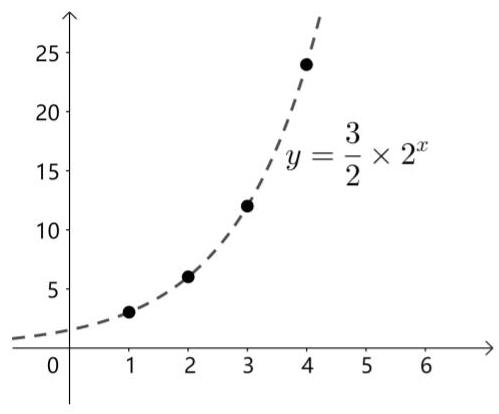

例 10.5 已知 $\left\{  {a}_{n}\right\}$ 是等比数列， ${a}_{2}{a}_{3} = \frac{1}{3}$ ， ${a}_{4}{a}_{5} = {27}$ ，求 $\left\{  {a}_{n}\right\}$ 的通项公式。

解析: 等比数列的通项公式 ${a}_{n} = {a}_{1}{q}^{n - 1}\left( {n \geq  2}\right)$ 中,有两个参数 ${a}_{1}$ 和 $q$ ,通常需要两个不同的数量关系, 就能求得等比数列的通项公式。

因为 $\left\{  {a}_{n}\right\}$ 是等比数列,设 ${a}_{n} = {a}_{1}{q}^{n - 1}$ ,由 ${a}_{2}{a}_{3} = \frac{1}{3}$ 和 ${a}_{4}{a}_{5} = {27}$ 分别可得:

$\left( {{a}_{1}q}\right) \left( {{a}_{1}{q}^{2}}\right)  = \frac{1}{3}$ ,化简得: ${a}_{1}^{2}{q}^{3} = \frac{1}{3}$ ,

$\left( {{a}_{1}{q}^{3}}\right) \left( {{a}_{1}{q}^{4}}\right)  = {27}$ ,化简得: ${a}_{1}^{2}{q}^{7} = {27}$ ,

两个等式的左右两边分别相除:

$\left( {{a}_{1}^{2}{q}^{7}}\right)  \div  \left( {{a}_{1}^{2}{q}^{3}}\right)  = {27} \div  \frac{1}{3} \Rightarrow  {q}^{4} = {81} \Rightarrow  q =  \pm  3$ ,

若 $q = 3$ ,代入 ${a}_{1}^{2}{q}^{3} = \frac{1}{3}$ 得: ${a}_{1}^{2} \times  {3}^{3} = \frac{1}{3}$ ,解得: ${a}_{1} = \frac{1}{9}$ 或 ${a}_{1} =  - \frac{1}{9},\left\{  {a}_{n}\right\}$ 的通项公式为: ${a}_{n} = \frac{1}{9} \times  {3}^{n - 1} = {3}^{n - 3}$ 或 ${a}_{n} =  - \frac{1}{9} \times  {3}^{n - 1} =  - {3}^{n - 3}$ ;

若 $q =  - 3$ ,代入 ${a}_{1}^{2}{q}^{3} = \frac{1}{3}$ 得: ${a}_{1}^{2} \times  {\left( -3\right) }^{3} = \frac{1}{3}$ ,该方程无实数解;

综上， ${a}_{n} = {3}^{n - 3}$ 或 ${a}_{n} =  - {3}^{n - 3}$ 。

例 10.6 已知数列 $\left\{  {a}_{n}\right\}$ 是等比数列,证明: 数列 $\left\{  {b}_{n}\right\}   : {b}_{n} = {a}_{n} + {a}_{n + 1}$ 是等比数列。

解析: 设等比数列 $\left\{  {a}_{n}\right\}$ 的通项公式为 ${a}_{n} = {a}_{1}{q}^{n - 1}\left( {q \neq  0}\right)$ ,将其代入 ${b}_{n} = {a}_{n} + {a}_{n + 1}$ 可得: ${b}_{n} = {a}_{1}{q}^{n - 1} + {a}_{1}{q}^{n} = \left( {{a}_{1} + {a}_{1}q}\right) {q}^{n - 1}$ ,即 $\left\{  {b}_{n}\right\}$ 是以 ${a}_{1} + {a}_{1}q$ 为首项、 $q$ 为公比的等比数列。

还可以通过证明 $\left\{  {b}_{n}\right\}$ 的任意相邻两项的比为定值的方式证明:

$\forall n \geq  1,\;\frac{{b}_{n + 1}}{{b}_{n}} = \frac{{a}_{n + 1} + {a}_{n + 2}}{{a}_{n} + {a}_{n + 1}} = \frac{{a}_{1}{q}^{n} + {a}_{1}{q}^{n + 1}}{{a}_{1}{q}^{n - 1} + {a}_{1}{q}^{n}} = \frac{{a}_{1}{q}^{n}\left( {1 + q}\right) }{{a}_{1}{q}^{n - 1}\left( {1 + q}\right) } = q$ ,即得证。

#### 10.2.4 等比数列的前 $n$ 项和公式

利用等比数列的通项公式,可以推出其前 $n$ 项和的公式。根据定义,等比数列 $\left\{  {a}_{n}\right\}$ 的前 $n$ 项和为:

$$
{S}_{n} = {a}_{1} + {a}_{2} + \cdots  + {a}_{n - 1} + {a}_{n} = {a}_{1} + {a}_{1}q + \cdots  + {a}_{1}{q}^{n - 2} + {a}_{1}{q}^{n - 1}
$$

如果参照求等差数列前 $n$ 项和的方法,把顺序与倒序的求和公式相加,无法得到可以进一步简化的形式, 因此需要换一种思路。

让数列 $\left\{  {a}_{n}\right\}$ 的各项都乘以公比 $q$ ,构成一个新的数列 $\left\{  {b}_{n}\right\}$ ,那么 $\left\{  {a}_{n}\right\}$ 与 $\left\{  {b}_{n}\right\}$ 的对应项之间都满足关系:

$$
{b}_{n} = {a}_{n}q = {a}_{n + 1}
$$

用 ${S}_{n}\left( a\right)$ 和 ${S}_{n}\left( b\right)$ 分别表示 $\left\{  {a}_{n}\right\}$ 和 $\left\{  {b}_{n}\right\}$ 的前 $n$ 项和。

一方面,由于 $\left\{  {b}_{n}\right\}$ 的各项等于 $\left\{  {a}_{n}\right\}$ 的对应项乘以 $q$ ,利用乘法分配率, $\left\{  {b}_{n}\right\}$ 的前 $n$ 项和等于 $\left\{  {a}_{n}\right\}$ 的前 $n$ 项和的 $q$ 倍,即:

$$
{S}_{n}\left( b\right)  = {b}_{1} + {b}_{2} + \cdots  + {b}_{n - 1} + {b}_{n}
$$

$$
= {a}_{1} \cdot  q + {a}_{2} \cdot  q + \cdots  + {a}_{n - 1} \cdot  q + {a}_{n} \cdot  q
$$

$$
= \left( {{a}_{1} + {a}_{2} + \cdots  + {a}_{n - 1} + {a}_{n}}\right)  \cdot  q
$$

$$
= {S}_{n}\left( a\right)  \cdot  q
$$

另一方面,将 $\left\{  {b}_{n}\right\}$ 的前 $n$ 项和的各项分别写出来:

$$
{S}_{n}\left( b\right)  = {b}_{1} + {b}_{2} + \cdots  + {b}_{n - 1} + {b}_{n}
$$

$$
= {a}_{1} \cdot  q + {a}_{2} \cdot  q + \cdots  + {a}_{n - 1} \cdot  q + {a}_{n} \cdot  q
$$

$$
= {a}_{2} + {a}_{3} + \cdots  + {a}_{n} + {a}_{n + 1}
$$

$$
= {S}_{n}\left( a\right)  - {a}_{1} + {a}_{n + 1}
$$

联立上面两个等式 ${S}_{n}\left( b\right)  = {S}_{n}\left( a\right)  \cdot  q$ 和 ${S}_{n}\left( b\right)  = {S}_{n}\left( a\right)  - {a}_{1} + {a}_{n + 1}$ 可得:

$$
{S}_{n}\left( a\right)  \cdot  q = {S}_{n}\left( a\right)  - {a}_{1} + {a}_{n + 1}
$$

将 ${a}_{n + 1} = {a}_{1}{q}^{n}$ 代入该等式:

$$
{S}_{n}\left( a\right)  \cdot  q = {S}_{n}\left( a\right)  - {a}_{1} + {a}_{1}{q}^{n}
$$

将该等式看作 ${S}_{n}\left( a\right)$ 为未知数的方程,解方程 (化简) 得:

$$
{S}_{n}\left( a\right)  = \frac{{a}_{1}\left( {1 - {q}^{n}}\right) }{1 - q}
$$

这就是等比数列的前 $n$ 项和公式。

上述推导过程中,先让各元素同时乘以公比 (或其他某个系数),使得各项与相邻(或相同间隔)的项相等, 从而相减后可以消去全部中间项, 是分析处理数列问题的常用方法。

例 10.7 已知 $\left\{  {a}_{n}\right\}$ 是等比数列, ${S}_{n}$ 是 $\left\{  {a}_{n}\right\}$ 的前 $n$ 项和, ${S}_{2} = \frac{15}{4},{S}_{4} = \frac{195}{16}$ , 求 $\left\{  {a}_{n}\right\}$ 的通项公式。

解析: 因为 $\left\{  {a}_{n}\right\}$ 是等比数列,设 ${a}_{n} = {a}_{1}{q}^{n - 1}$ ,则 ${S}_{n} = \frac{{a}_{1}\left( {1 - {q}^{n}}\right) }{1 - q}$ ,分别将 ${S}_{2} = \frac{15}{4}$ , ${S}_{4} = \frac{195}{16}$ 代入前 $n$ 项和公式可得: $\frac{{a}_{1}\left( {1 - {q}^{2}}\right) }{1 - q} = \frac{15}{4},\frac{{a}_{1}\left( {1 - {q}^{4}}\right) }{1 - q} = \frac{195}{16}$ ,

将两个等式的左右两边分别相除: $\frac{{a}_{1}\left( {1 - {q}^{4}}\right) }{1 - q} \div  \frac{{a}_{1}\left( {1 - {q}^{2}}\right) }{1 - q} = \frac{195}{16} \div  \frac{15}{4}$ ,

逐步化简: $\frac{1 - {q}^{4}}{1 - {q}^{2}} = \frac{13}{4},\frac{\left( {1 - {q}^{2}}\right) \left( {1 + {q}^{2}}\right) }{1 - {q}^{2}} = \frac{13}{4},1 + {q}^{2} = \frac{13}{4}$ ,解得: ${q}^{2} = \frac{9}{4}$ , $q = \frac{3}{2}$ 或 $q =  - \frac{3}{2}$ ,

当 $q = \frac{3}{2}$ 时,代入 $\frac{{a}_{1}\left( {1 - {q}^{2}}\right) }{1 - q} = \frac{15}{4}$ ,解得: ${a}_{1} = \frac{3}{2},{a}_{n} = \frac{3}{2} \times  {\left( \frac{3}{2}\right) }^{n - 1} = {\left( \frac{3}{2}\right) }^{n}$ ;

当 $q =  - \frac{3}{2}$ 时,代入 $\frac{{a}_{1}\left( {1 - {q}^{2}}\right) }{1 - q} = \frac{15}{4}$ ,解得: ${a}_{1} =  - \frac{15}{2},{a}_{n} =  - \frac{15}{2} \times  {\left( -\frac{3}{2}\right) }^{n - 1}$ ;

综上, ${a}_{n} = {\left( \frac{3}{2}\right) }^{n}$ 或 ${a}_{n} =  - \frac{15}{2} \times  {\left( -\frac{3}{2}\right) }^{n - 1}$ 。

练习 10.2(2)

1. 判断下列各数列是否一定是等比数列:

(1)各项都相同的数列；

(2)各项依次为 1 和 -1 交替出现的数列；

(3)各项依次为 0 和 2 交替出现的数列；

(4)溶液中未衰变的放射性原子的浓度按照时间顺序排列。

2. 求下列各等比数列的通项公式和前 $n$ 项和公式:

(1) ${a}_{1} = 2,{a}_{4} =  - {16}$ ；

(2) $\frac{{a}_{4}}{{a}_{3}} =  - 2,{a}_{2}{a}_{5} =  - {32}$ ；

(3) ${a}_{1} - {a}_{2} =  - \frac{8}{9},{a}_{3} - {a}_{4} =  - 8$ 。

3. 已知数列 $\left\{  {a}_{n}\right\}$ 是首项为 ${a}_{1}$ ,公差为 $d$ 的等差数列,数列 $\left\{  {b}_{n}\right\}   : {b}_{n} = {\left( -2\right) }^{{a}_{n}}$ , 回答下列问题:

(1)证明 $\left\{  {b}_{n}\right\}$ 是等比数列；(2)求 $\left\{  {b}_{n}\right\}$ 的前 $n$ 项和公式；

(3)如果 $\left\{  {a}_{n}\right\}$ 是递增数列，那么 $\left\{  {b}_{n}\right\}$ 是否是递增数列或递减数列。

### 10.3 经典的复杂数列解析

等差和等比是两种构造数列的基本方式, 此外还有很多形式更复杂的数列, 可以发现,求等差数列和等比数列的通项公式和前 $n$ 项和公式时,运用了一些专门的技巧，这也是分析处理数列问题的一大特点一一技巧性很强。本章介绍一些经典的复杂数列, 利用它们的递推公式推导通项公式或求和公式, 主要目的是学习一些分析处理数列的常用思路和技巧。

#### 10.3.1 二阶等差数列

如果数列 $\left\{  {a}_{n}\right\}$ 的每一项与其前一项的差值构成等差数列,那么数列 $\left\{  {a}_{n}\right\}$ 叫作二阶等差数列, 即:

$$
\forall n \geq  3,\;{a}_{n} - {a}_{n - 1} = {a}_{n - 1} - {a}_{n - 2} + d
$$

利用二阶等差数列的定义式,可以推出其通项公式。用 $\left\{  {a}_{n}\right\}$ 相邻两项的差构造新的数列 $\left\{  {b}_{n}\right\}   : {b}_{n} = {a}_{n + 1} - {a}_{n}$ ,依次列出各项:

$$
{b}_{1} = {a}_{2} - {a}_{1}
$$

$$
{b}_{2} = {a}_{3} - {a}_{2}
$$

......

$$
{b}_{n - 1} = {a}_{n} - {a}_{n - 1}
$$

按照二阶等差数列的定义,构造的数列 $\left\{  {b}_{n}\right\}$ 是等差数列:

$$
{b}_{2} = {b}_{1} + d
$$

$$
{b}_{3} = {b}_{2} + d
$$

......

$$
{b}_{n - 1} = {b}_{n - 2} + d
$$

即: $\left\{  {b}_{n}\right\}$ 是以 ${b}_{1}$ 为首项、 $d$ 为公差的等差数列,其通项公式为 ${b}_{n} = {b}_{1} + \left( {n - 1}\right) d$ 。 将 $\left\{  {b}_{n}\right\}$ 的通项公式代入各 ${b}_{n} = {a}_{n + 1} - {a}_{n}$ :

$$
{b}_{1} = {a}_{2} - {a}_{1}
$$

$$
{b}_{1} + d = {a}_{3} - {a}_{2}
$$

......

$$
{b}_{1} + \left( {n - 2}\right) d = {a}_{n} - {a}_{n - 1}
$$

将上面的 $n - 1$ 个等式的两边分别相加:

---

$$
{b}_{1} + \left( {{b}_{1} + d}\right)  + \cdots  + \left\lbrack  {{b}_{1} + \left( {n - 2}\right) d}\right\rbrack   = \left( {{a}_{2} - {a}_{1}}\right)  + \left( {{a}_{3} - {a}_{2}}\right)  + \cdots  + \left( {{a}_{n} - {a}_{n - 1}}\right)
$$

---

等式左边是等差数列 $\left\{  {b}_{n}\right\}$ 的前 $n - 1$ 项和,等式右边各项展开后可以抵消中间各项, 化简得:

$$
\left( {n - 1}\right) {b}_{1} + \frac{\left( {n - 1}\right) \left( {n - 2}\right) }{2}d = {a}_{n} - {a}_{1}
$$

将 ${a}_{n}$ 单独移到等式的一侧:

$$
{a}_{n} = {a}_{1} + \left( {n - 1}\right) {b}_{1} + \frac{\left( {n - 1}\right) \left( {n - 2}\right) }{2}d
$$

其中, ${b}_{1} = {a}_{2} - {a}_{1}, d = \left( {{a}_{3} - {a}_{2}}\right)  - \left( {{a}_{2} - {a}_{1}}\right)$ ,将 ${b}_{1}$ 和 $d$ 的表达式代入 ${a}_{n}$ 的表达式并化简可得:

$$
{a}_{n} = {a}_{1} + \left( {n - 1}\right) \left( {{a}_{2} - {a}_{1}}\right)  + \frac{1}{2}\left( {n - 1}\right) \left( {n - 2}\right) \left( {{a}_{1} - 2{a}_{2} + {a}_{3}}\right) \left( {n \geq  3}\right)
$$

这就是以 ${a}_{1}\text{ 、 }{a}_{2}\text{ 、 }{a}_{3}$ 为前三项的二阶等差数列的通项公式,该表达式可以化为关于 $n$ 的函数解析式的形式:

$$
{a}_{n} = \left( {\frac{1}{2}{a}_{1} - {a}_{2} + \frac{1}{2}{a}_{3}}\right) {n}^{2} + \left( {-\frac{5}{2}{a}_{1} + 4{a}_{2} - \frac{3}{2}{a}_{3}}\right) n + \left( {3{a}_{1} - 3{a}_{2} + {a}_{3}}\right)
$$

该表达式较复杂,不需要记忆,可以发现它是关于 $n$ 的最高次数为 2 的多项式,即二阶等差数列 $\left\{  {a}_{n}\right\}$ 的通项公式可以化二次函数形式如下:

$$
{a}_{n} = A{n}^{2} + {Bn} + C
$$

其中, $A\text{ 、 }B\text{ 、 }C$ 是相应的常数,可以分别将 $n = 1,2,3$ 和对应的 ${a}_{1}\text{ 、 }{a}_{2}\text{ 、 }{a}_{3}$ 代入该表达式,得到关于 $A\text{ 、 }B\text{ 、 }C$ 的三元一次方程组:

$$
\left\{  \begin{array}{l} {a}_{1} = A + B + C \\  {a}_{2} = {4A} + {2B} + C \\  {a}_{3} = {9A} + {3B} + C \end{array}\right.
$$

解该方程组就可以得到二阶等差数列通项公式中的各系数。

推导二阶等差数列的通项公式时, 利用了将形式一致的若干等式依次相加, 从而消去所有中间项的技巧,还利用了已经学习的等差数列前 $n$ 项和公式,这种将新的表达式转化为熟悉的表达式，再利用已经学习的公式的思路非常重要。

练习 $\mathbf{{10.3}}\left( 1\right)$

1. 已知 $\left\{  {a}_{n}\right\}$ 为二阶等差数列,其中 ${a}_{1} = 1,{a}_{2} = 2,{a}_{3} = 4$ ,不要直接使用公式,求 $\left\{  {a}_{n}\right\}$ 的通项公式。

#### 10.3.2 二阶等比数列

如果数列 $\left\{  {a}_{n}\right\}$ 的每一项与其前一项的比值构成等比数列,那么数列 $\left\{  {a}_{n}\right\}$ 叫作二阶等比数列, 即:

$$
\forall n \geq  3,\;\frac{{a}_{n}}{{a}_{n - 1}} = \frac{{a}_{n - 1}}{{a}_{n - 2}}q
$$

接下来利用二阶等比数列的定义式推导其通项公式。用 $\left\{  {a}_{n}\right\}$ 相邻两项的比构造新的数列 $\left\{  {b}_{n}\right\}   : {b}_{n} = \frac{{a}_{n + 1}}{{a}_{n}}$ ,依次列出各项:

$$
{b}_{1} = \frac{{a}_{2}}{{a}_{1}}
$$

$$
{b}_{2} = \frac{{a}_{3}}{{a}_{2}}
$$

......

$$
{b}_{n - 1} = \frac{{a}_{n}}{{a}_{n - 1}}
$$

利用二阶等比数列 $\left\{  {a}_{n}\right\}$ 的定义式可得:

$$
{b}_{2} = {b}_{1} \cdot  q
$$

$$
{b}_{3} = {b}_{2} \cdot  q
$$

......

$$
{b}_{n - 1} = {b}_{n - 2} \cdot  q
$$

即: $\left\{  {b}_{n}\right\}$ 是以 ${b}_{1}$ 为首项、 $q$ 为公比的等比数列,其通项公式为 ${b}_{n} = {b}_{1}{q}^{n - 1}$ 。将 $\left\{  {b}_{n}\right\}$ 的通项公式代入各 ${b}_{n} = \frac{{a}_{n + 1}}{{a}_{n}}$ :

$$
{b}_{1} = \frac{{a}_{2}}{{a}_{1}}
$$

$$
{b}_{1} \cdot  q = \frac{{a}_{3}}{{a}_{2}}
$$

......

$$
{b}_{1} \cdot  {q}^{n - 2} = \frac{{a}_{n}}{{a}_{n - 1}}
$$

将上面 $n - 1$ 个等式的两边分别相乘:

$$
{b}_{1} \cdot  \left( {{b}_{1} \cdot  q}\right)  \cdot  \left( {{b}_{1} \cdot  {q}^{2}}\right) \cdots \cdots \left( {{b}_{1} \cdot  {q}^{n - 2}}\right)  = \frac{{a}_{2}}{{a}_{1}} \cdot  \frac{{a}_{3}}{{a}_{2}} \cdot  \frac{{a}_{4}}{{a}_{3}}\cdots \cdots \frac{{a}_{n}}{{a}_{n - 1}}
$$

等式左边是 $n - 1$ 个 ${b}_{1}$ 与 $q \cdot  {q}^{2}\cdots \cdots {q}^{n - 2}$ 相乘,利用指数乘法的运算规律可化为 ${b}_{1}^{n - 1}{q}^{\frac{\left( {n - 1}\right) \left( {n - 2}\right) }{2}}$ ; 等式右边各项的分子可以与下一项的分母抵消,化简后得:

$$
{b}_{1}^{n - 1}{q}^{\frac{\left( {n - 1}\right) \left( {n - 2}\right) }{2}} = \frac{{a}_{n}}{{a}_{1}}
$$

将 ${a}_{n}$ 单独移到等式的一侧:

$$
{a}_{n} = {a}_{1}{b}_{1}^{n - 1}{q}^{\frac{\left( {n - 1}\right) \left( {n - 2}\right) }{2}}
$$

其中, ${b}_{1} = \frac{{a}_{2}}{{a}_{1}}, q = \frac{{a}_{3}}{{a}_{2}} \div  \frac{{a}_{2}}{{a}_{1}} = \frac{{a}_{1}{a}_{3}}{{a}_{2}^{2}}$ ,将 ${b}_{1}$ 和 $q$ 的表达式代入 ${a}_{n}$ 的表达式可得:

$$
{a}_{n} = {a}_{1} \cdot  {\left( \frac{{a}_{2}}{{a}_{1}}\right) }^{n - 1}{\left( \frac{{a}_{1}{a}_{3}}{{a}_{2}^{2}}\right) }^{\frac{\left( {n - 1}\right) \left( {n - 2}\right) }{2}}\left( {n \geq  3}\right)
$$

这就是以 ${a}_{1},{a}_{2},{a}_{3}$ 为前三项的二阶等比数列的通项公式。

推导二阶等比数列通项公式的过程中, 使用了将多个形式相同的等式依次相乘, 从而消去中间项或利用指数运算的规律合并项的思路。

练习 10.3(2)

1. 已知 $\left\{  {a}_{n}\right\}$ 为二阶等比数列,其中 ${a}_{1} = 1,{a}_{2} = 2,{a}_{3} =  - 8$ ,不要直接使用公式,求 $\left\{  {a}_{n}\right\}$ 的通项公式。

#### 10.3.3 正整数从 1 到 $n$ 的平方和

利用等差数列的求和公式,可以得到从 1 到 $n$ 的正整数的和为:

$$
{S}_{n} = 1 + 2 + \cdots  + n = \frac{n\left( {n + 1}\right) }{2}
$$

接下来通过求连续 $n$ 个正整数的平方和与立方和,学习分析处理数列的一种经典方法。对于从 1 到 $n$ 的平方和:

$$
S\left( {n}^{2}\right)  = {1}^{2} + {2}^{2} + {3}^{2} + \cdots  + {n}^{2}
$$

无法通过直接将其进行拆分或组合的方式得到熟悉的表达式, 需使用另一种方法: 构造。利用完全立方公式 ${\left( n + 1\right) }^{3} = {n}^{3} + 3{n}^{2} + {3n} + 1$ ,移项可得:

$$
{\left( n + 1\right) }^{3} - {n}^{3} = 3{n}^{2} + {3n} + 1
$$

观察该等式的左右两边: 当 $n$ 为正整数时,等式左边为相邻两个正整数的立方差; 等式右边为 $n$ 的平方项、 $n$ 的一次项、常数项之和。

分别代入 $n = 1,2,3\cdots n$ ，可以得到一系列等式:

$$
{2}^{3} - {1}^{3} = 3 \times  {1}^{2} + 3 \times  1 + 1
$$

$$
{3}^{3} - {2}^{3} = 3 \times  {2}^{2} + 3 \times  2 + 1
$$

......

$$
{\left( n + 1\right) }^{3} - {n}^{3} = 3 \times  {n}^{2} + 3 \times  n + 1
$$

将上面 $n$ 个等式的左右两边分别相加:

$$
\left( {{2}^{3} - {1}^{3}}\right)  + \left( {{3}^{3} - {2}^{3}}\right)  + \cdots  + \left\lbrack  {{\left( n + 1\right) }^{3} - {n}^{3}}\right\rbrack
$$

$$
= \left( {3 \times  {1}^{2} + 3 \times  1 + 1}\right)  + \left( {3 \times  {2}^{2} + 3 \times  2 + 1}\right)  + \cdots  + \left( {3 \times  {n}^{2} + 3 \times  n + 1}\right)
$$

等式左边可以消除所有中间项,只剩 ${\left( n + 1\right) }^{3} - {1}^{3}$ ; 等式右边可以重新组合为从 1 到 $n$ 的正整数的平方和、正整数之和、常数项之和,化简后得:

$$
{\left( n + 1\right) }^{3} - {1}^{3} = 3 \times  \left( {{1}^{2} + {2}^{2} + {3}^{2} + \cdots  + {n}^{2}}\right)  + 3 \times  \left( {1 + 2 + 3 + \cdots  + n}\right)  + 1 \times  n
$$

将 $1 + 2 + \cdots  + n = \frac{n\left( {n + 1}\right) }{2}$ 代入该等式并化简:

$$
{\left( n + 1\right) }^{3} - 1 = 3 \times  \left( {{1}^{2} + {2}^{2} + {3}^{2} + \cdots  + {n}^{2}}\right)  + 3 \times  \frac{n\left( {n + 1}\right) }{2} + n
$$

等式右边的 $\left( {{1}^{2} + {2}^{2} + {3}^{2} + \ldots  + {n}^{2}}\right)$ 就是从 1 到 $n$ 的平方和,将其单独移到等式左边:

$$
{1}^{2} + {2}^{2} + {3}^{2} + \cdots  + {n}^{2} = \frac{1}{3}{\left( n + 1\right) }^{3} - \frac{1}{3} - \frac{n\left( {n + 1}\right) }{2} - \frac{1}{3}n
$$

用 $S\left( {n}^{2}\right)$ 表示从 1 到 $n$ 的全体正整数的平方和,化简后得:

$$
S\left( {n}^{2}\right)  = \frac{1}{6}n\left( {n + 1}\right) \left( {{2n} + 1}\right)
$$

这就是从 1 到 $n$ 的平方和的公式。

同理,利用 ${\left( n + 1\right) }^{4} - {n}^{4} = 4{n}^{3} + 6{n}^{2} + {4n} + 1$ 可以求得从 1 到 $n$ 的立方和公式。 推导的思路仍为将各形式相同的表达式相加, 从而相互抵消中间项。

类似的,对于形如 ${a}_{n} = \frac{1}{n\left( {n + 1}\right) }$ 的数列,可以将各项拆分为 ${a}_{n} = \frac{1}{n} - \frac{1}{n + 1}$ ,直接求和就可以消除所有中间项。

练习 10.3(3)

1. 求从 1 到 $n$ 的全体正整数的立方和公式。

2. 已知 $\left\{  {a}_{n}\right\}   = \frac{1}{n\left( {n + 2}\right) }$ ,求 $\left\{  {a}_{n}\right\}$ 的前 $n$ 项和公式。

#### 10.3.4 数列 ${a}_{n} = n{a}^{n}$ 的前 $n$ 项和

对于数列 $\left\{  {a}_{n}\right\}   : {a}_{n} = n{a}^{n}\left( {a \neq  0, a \neq  1}\right)$ ,它的前 $n$ 项和的求和公式的推导过程很好地体现出分析处理数列的层次感和条理性, 接下来进行推导。

$$
{S}_{n} = {a}_{1} + {a}_{2} + {a}_{3} + \cdots  + {a}_{n - 1} + {a}_{n}
$$

$$
= {a}^{1} + 2{a}^{2} + 3{a}^{3} + \cdots  + \left( {n - 1}\right) {a}^{n - 1} + n{a}^{n}
$$

$$
= \left( {{a}^{1} + {a}^{2} + {a}^{3} + \cdots  + {a}^{n - 1} + {a}^{n}}\right)  + {a}^{2} + 2{a}^{3} + \cdots  + \left( {n - 2}\right) {a}^{n - 1} + \left( {n - 1}\right) {a}^{n}
$$

该表达式可以分为两部分: 前半部分 ${a}^{1} + {a}^{2} + \cdots  + {a}^{n - 1} + {a}^{n}$ 是等比数列的前 $n$ 项和; 后半部分 ${a}^{2} + 2{a}^{3} + \cdots  + \left( {n - 2}\right) {a}^{n - 1} + \left( {n - 1}\right) {a}^{n}$ 与原表达式的形式相似,可以按照相同的方法,继续提取出从 ${a}^{2}$ 到 ${a}^{n}$ 的和:

$$
{a}^{2} + 2{a}^{3} + \cdots  + \left( {n - 2}\right) {a}^{n - 1} + \left( {n - 1}\right) {a}^{n}
$$

$$
= \left( {{a}^{2} + {a}^{3} + \cdots  + {a}^{n - 1} + {a}^{n}}\right)  + {a}^{3} + \cdots  + \left( {n - 3}\right) {a}^{n - 1} + \left( {n - 2}\right) {a}^{n}
$$

按照上述规律, ${S}_{n}$ 可以拆分为 $n$ 个等比数列之和相加的形式,各等比数列之和的公比都为 $a$ ,首项依次为 $a\text{ 、 }{a}^{2}\text{ 、 }\cdots \text{ 、 }{a}^{n - 1}\text{ 、 }{a}^{n}$ ,项数依次为 $n\text{ 、 }n - 1\text{ 、 }\cdots \text{ 、 }2\text{ 、 }1$ , ${S}_{n}$ 最终可以展开为:

$$
{a}^{1} + {a}^{2} + {a}^{3} + {a}^{4} + \cdots  + {a}^{n - 3} + {a}^{n - 2} + {a}^{n - 1} + {a}^{n}\text{ (第 1 行) }
$$

$$
+ {a}^{2} + {a}^{3} + {a}^{4} + \cdots  + {a}^{n - 3} + {a}^{n - 2} + {a}^{n - 1} + {a}^{n}\text{ (第 2 行) }
$$

......

$$
+ {a}^{n - 1} + {a}^{n}\text{ (第 }n - 1\text{ 行) }
$$

$$
+ {a}^{n}\text{ (第 }n\text{ 行) }
$$

共有 $n$ 行,第 $i$ 行的开头为 ${a}_{i}$ ,该行共有 $n - i + 1$ 项,每一行都是公比为 $a$ 的等比数列的前 $n - i + 1$ 项和,对各行分别使用求和公式,然后相加并化简:

$$
{S}_{n} = a\frac{1 - {a}^{n}}{1 - a} + {a}^{2}\frac{1 - {a}^{n - 1}}{1 - a} + {a}^{3}\frac{1 - {a}^{n - 2}}{1 - a} + \cdots  + {a}^{n - 1}\frac{1 - {a}^{2}}{1 - a} + {a}^{n}\frac{1 - a}{1 - a}
$$

$$
= \frac{a - {a}^{n + 1}}{1 - a} + \frac{{a}^{2} - {a}^{n + 1}}{1 - a} + \frac{{a}^{3} - {a}^{n + 1}}{1 - a} + \cdots  + \frac{{a}^{n - 1} - {a}^{n + 1}}{1 - a} + \frac{{a}^{n} - {a}^{n + 1}}{1 - a}
$$

$$
= \frac{1}{1 - a}\left\lbrack  {\left( {a + {a}^{2} + {a}^{3} + \cdots  + {a}^{n - 1} + {a}^{n}}\right)  - n{a}^{n + 1}}\right\rbrack
$$

$$
= \frac{1}{1 - a}\left( {a \cdot  \frac{1 - {a}^{n}}{1 - a} - n{a}^{n + 1}}\right)
$$

这就是数列 ${a}_{n} = n{a}^{n}$ 的前 $n$ 项和公式。

这种将数列的表达式逐层拆分成为多个形式相同的表达式, 再重新组合后利用熟悉的公式化简或计算的方法, 是分析处理数列的一种重要思路。

练习 10.3(4)

1. 已知数列 $\left\{  {a}_{n}\right\}   : {a}_{n} = n{2}^{n}$ ,不要直接使用公式,求 $\left\{  {a}_{n}\right\}$ 的前 10 项和。

#### 10.3.5 斐波那契数列

斐波那契数列的文字描述非常简单明了, 但通项公式的求解过程较复杂, 且需使用一种分析处理数列的经典思路。

斐波那契数列的定义为:数列的任意一项等于它的前两项之和:

---

$$
\forall n \geq  3,\;{a}_{n} = {a}_{n - 1} + {a}_{n - 2}
$$

---

通常规定斐波那契数列的前两项为 ${a}_{1} = 1,{a}_{2} = 1$ ，根据定义易求出后续各项:

---

$$
{a}_{3} = {a}_{2} + {a}_{1} = 1 + 1 = 2
$$

$$
{a}_{4} = {a}_{3} + {a}_{2} = 2 + 1 = 3
$$

$$
{a}_{5} = {a}_{4} + {a}_{3} = 3 + 2 = 5
$$

......

---

接下来推导斐波那契数列的通项公式，推导的“原材料”只有递推公式:

$$
{a}_{n} = {a}_{n - 1} + {a}_{n - 2}
$$

推导的思路同样为 “构造”, 原理为: 利用斐波那契数列的递推公式, 构造出一个容易求出通项公式的新数列, 求出该新数列的通项公式后, 再返回去用来表示斐波那契数列的项。接下来开始正式推导:

让等式的两边分别减去 $p{a}_{n - 1}$ ,其中 $p$ 是待确定的系数,将等式变为:

$$
{a}_{n} - p{a}_{n - 1} = \left( {1 - p}\right) {a}_{n - 1} + {a}_{n - 2}
$$

现在求 $p$ 的值,该值能使等式左边 ${a}_{n - 1}$ 与 ${a}_{n}$ 的系数比 $\frac{-p}{1}$ ,等于等式右边 ${a}_{n - 2}$ 与 ${a}_{n - 1}$ 的系数比 $\frac{1}{1 - p}$ ,即: $\frac{-p}{1} = \frac{1}{1 - p}$ ,这样等式两边的表达式的形式相同,利用该等式求得的 $p$ ,这个值可以将斐波那契数列的递推公式的左右两边转化为形式相同的表达式:

$$
{a}_{n} - p{a}_{n - 1} = k\left( {{a}_{n - 1} - p{a}_{n - 2}}\right)
$$

构造的 ${a}_{n} - p{a}_{n - 1}$ 是公比为 $k$ 的等比数列,其中 $k$ 是又一个待确定的系数,即: 构造新数列 $\left\{  {b}_{n}\right\}   : {b}_{n} = {a}_{n + 1} - p{a}_{n},\left\{  {b}_{n}\right\}$ 是以 ${b}_{1} = {a}_{2} - p{a}_{1}$ 为首项、 $k$ 为公比的等比数列,其通项公式为 ${b}_{n} = {b}_{1}{k}^{n - 1}$ 。

由于 ${b}_{n} = {a}_{n + 1} - p{a}_{n} = {b}_{1}{k}^{n - 1}$ ,可以利用 $\left\{  {b}_{n}\right\}$ 的通项公式求出 $\left\{  {a}_{n}\right\}$ 的通项公式。

接下来具体求解:

设常数 $p$ ,使递推公式 ${a}_{n} = {a}_{n - 1} + {a}_{n - 2}$ 两边同时减去 $p{a}_{n - 1}$ ,得到的等式 ${a}_{n} - p{a}_{n - 1} = \left( {1 - p}\right) {a}_{n - 1} + {a}_{n - 2}$ 可以化为 ${a}_{n} - p{a}_{n - 1} = k\left( {{a}_{n - 1} - p{a}_{n - 2}}\right)$ 的形式。

按照上述构造原则可得:

$$
{a}_{n} - p{a}_{n - 1} = \left( {1 - p}\right) {a}_{n - 1} + {a}_{n - 2} = k\left( {{a}_{n - 1} - p{a}_{n - 2}}\right)
$$

该等式的中间和右边, ${a}_{n - 1}\text{ 、 }{a}_{n - 2}$ 的系数应当分别不变,由此可得方程组:

$$
\left\{  \begin{array}{l} 1 - p = k \\  1 =  - k \cdot  p \end{array}\right.
$$

利用消元法解方程组得 (并不难解):

$$
\left\{  {\begin{array}{l} p = \frac{1 + \sqrt{5}}{2} \\  k = \frac{1 - \sqrt{5}}{2} \end{array}\text{ 或 }\left\{  \begin{array}{l} p = \frac{1 - \sqrt{5}}{2} \\  k = \frac{1 + \sqrt{5}}{2} \end{array}\right. }\right.
$$

这两组解都满足构造, 最后得到的结果相同, 这里选用第一组解。

为计算和书写简便,暂时先不代入 $p\text{ 、 }k$ 的数值,而是直接使用字母 $p\text{ 、 }k$ , 待完成化简后再代入相应的数值。

由 $\left\{  {b}_{n}\right\}$ 的构造方式 ${b}_{n} = {a}_{n + 1} - p{a}_{n}$ 可得:

$$
{a}_{n + 1} = {b}_{n} + p{a}_{n}
$$

将 ${b}_{n} = {b}_{1}{k}^{n - 1}$ 代入该表达式:

$$
{a}_{n + 1} = {b}_{1}{k}^{n - 1} + p{a}_{n}
$$

即: ${a}_{2} = {b}_{1} + p{a}_{1},{a}_{3} = k{b}_{1} + p{a}_{2},\cdots \cdots ,{a}_{n} = {k}^{n - 2}{b}_{1} + p{a}_{n - 1}$ ,

将上面各等式依次逐层代入:

$$
{a}_{n} = {k}^{n - 2}{b}_{1} + p{a}_{n - 1}
$$

$$
= {k}^{n - 2}{b}_{1} + p\left( {{k}^{n - 3}{b}_{1} + p{a}_{n - 2}}\right)
$$

$$
= {k}^{n - 2}{b}_{1} + p{k}^{n - 3}{b}_{1} + {p}^{2}{a}_{n - 2}
$$

......

$$
= {k}^{n - 2}{b}_{1} + p{k}^{n - 3}{b}_{1} + {p}^{2}{k}^{n - 4}{b}_{1} + {p}^{3}{k}^{n - 5}{b}_{1} + \cdots  + {p}^{n - 3}k{b}_{1} + {p}^{n - 2}{b}_{1} + {p}^{n - 1}{a}_{1}
$$

由 $\left\{  {b}_{n}\right\}$ 的构造方式可得:

$$
{b}_{1} = {a}_{2} - \frac{1 + \sqrt{5}}{2}{a}_{1} = 1 - \frac{1 + \sqrt{5}}{2} = \frac{1 - \sqrt{5}}{2} = k
$$

将 ${b}_{1} = k,{a}_{1} = 1$ 代入前面 ${a}_{n}$ 的展开式:

$$
{a}_{n} = {k}^{n - 1} + p{k}^{n - 2} + {p}^{2}{k}^{n - 3} + {p}^{3}{k}^{n - 4} + \cdots  + {p}^{n - 3}{k}^{2} + {p}^{n - 2}k + {p}^{n - 1}
$$

即: ${a}_{n}$ 是以 ${k}^{n - 1}$ 为首项、 $\frac{p}{k}$ 为公比的等比数列的前 $n$ 项和,利用等比数列的前 $n$ 项和公式可得:

$$
{a}_{n} = {k}^{n - 1} \cdot  \frac{1 - {\left( p/k\right) }^{n}}{1 - p/k} = \frac{{k}^{n - 1} - {p}^{n}/k}{1 - p/k} = \frac{{k}^{n} - {p}^{n}}{k - p}
$$

此时再将 $p = \frac{1 + \sqrt{5}}{2}, k = \frac{1 - \sqrt{5}}{2}$ 代入表达式:

$$
{a}_{n} = \frac{{\left( \frac{1 + \sqrt{5}}{2}\right) }^{n} - {\left( \frac{1 - \sqrt{5}}{2}\right) }^{n}}{\frac{1 + \sqrt{5}}{2} - \frac{1 - \sqrt{5}}{2}}
$$

化简后得:

$$
{a}_{n} = \frac{1}{\sqrt{5}}\left\lbrack  {{\left( \frac{1 + \sqrt{5}}{2}\right) }^{n} - {\left( \frac{1 - \sqrt{5}}{2}\right) }^{n}}\right\rbrack
$$

这就是斐波那契数列的通项公式,虽然形式上稍复杂,还有无理数 $\sqrt{5}$ 、求 $n$ 次方运算, 但计算出的每一项的确都是自然数。斐波那契数列的通项公式还有其他求法, 虽然这种求法不是最简便的, 但使用的思路非常清晰, 并且可以广泛使用于大量相似的数列问题中, 该思路有两点较关键:

(1)如果数列中的任意连续 3 项都满足关系 ${a}_{n} = m{a}_{n - 1} + n{a}_{n - 2}$ ，那么可以在等式两边同时加上 $x{a}_{n - 1}\left( x\right.$ 待定 $)$ ,使 ${a}_{n} + x{a}_{n - 1} = \left( {m + x}\right) {a}_{n - 1} + n{a}_{n - 2}$ 的等式两边的两项间的比例相等,即 $\frac{x}{1} = \frac{n}{m + x}$ ,由此可以构造等比数列 $\left\{  {b}_{n}\right\}   : {b}_{n} = {a}_{n + 1} + x{a}_{n}$ , 其公比为 $q = \frac{m + x}{1} = \frac{n}{x}$ ,解一元二次方程 $\frac{m + x}{1} = \frac{n}{x}$ 就可以得到添加项的系数 $x$ , 进而求出公比 $q$ 。

(2)求出等比数列 $\left\{  {b}_{n}\right\}   : {b}_{n} = {a}_{n + 1} + x{a}_{n}$ 的通项公式后，利用等比数列的通项公式以及 ${b}_{n}$ 与 ${a}_{n + 1}\text{ 、 }{a}_{n}$ 的关系,将其化为 ${a}_{n + 1} = {b}_{n} - x{a}_{n}$ 的形式逐次代入,得到一系列等比数列的前 $n$ 项和的表达式,提取出各求和项的公因式后化简。

上述推导过程中，需要较大的耐心和细心，还需要认真分辨新构造数列的首项和公比, 并正确计算迭代后总的项数。按照该思路, 对于一些表达式较复杂的数列,可以通过将原数列 $\left\{  {a}_{n}\right\}$ 的各项 ${a}_{n}$ 进行乘方 ${a}_{n}^{p}$ 、开方 $\sqrt[q]{{a}_{n}}$ 、取倒数 $\frac{1}{{a}_{n}}$ 、取对数 $\ln {a}_{n}$ 、取指数 ${\mathrm{e}}^{{a}_{n}}$ 等运算方式,构造新的数列。若新构造的数列的通项公式可以利用熟悉的公式或规律求得，那么就可以根据构造方式，将新构造的数列的通项公式逆向求出原数列的表达式, 从而求出原数列的通项公式。

## 练习 10.3(5)

1. 已知数列 $\left\{  {a}_{n}\right\}$ 满足 ${a}_{1} = 1,{a}_{2} = 1,{a}_{n} + 2{a}_{n + 1} = 6{a}_{n + 2}\left( {n \geq  1}\right)$ ,求 $\left\{  {a}_{n}\right\}$ 的通项公式。

2. 已知数列 $\left\{  {a}_{n}\right\}$ 满足 ${a}_{1} = 1,{a}_{n} - {a}_{n + 1} = 2{a}_{n} \cdot  {a}_{n + 1}\left( {n \geq  1}\right)$ ,求 $\left\{  {a}_{n}\right\}$ 的通项公式。

3. 已知数列 $\left\{  {a}_{n}\right\}$ 满足 ${a}_{1} = 1,{a}_{n} = {2}^{n}{a}_{n - 1}\left( {n \geq  2}\right)$ ,求 $\left\{  {a}_{n}\right\}$ 的通项公式。

### 10.4 数学归纳法

数学归纳法虽然不在新课标的考察范围中, 但它是非常实用的证明方法, 在一些可以 “敏锐地看出” 或 “幸运地试出” 结论的情况下, 利用数学归纳法可以得到完整且严谨的解题过程。

#### 10.4.1 数学归纳法

直到目前学习数学的主要思路是演绎, 即: 根据基本的定义和规则, 利用分析推理, 通过对表达式进行变形、联立, 排除不可能的情况, 逐渐缩小限定范围, 最终推导出新的公式和结论。还有一种重要的思路叫作归纳，其原理为:根据已经得知的事实，从中总结猜想出一般性的规律，再使用数学方法证明。这种方法叫作数学归纳法。

数学归纳法的原理就像一条无穷长的锁链, 先从事实上验证这条锁链的第一节成立，再从逻辑上证明这条锁链任意两节之间的链接方式成立，于是从这条锁链的第一节出发, 重复若干次链接就能抵达任何一节。

数学归纳法在验证规律性质时非常好用, 很多数列具有很强的规律, 因此数学归纳法适用于证明一些数列的规律,最典型的就是用数学归纳法证明数列 $\left\{  {a}_{n}\right\}$ 对于所有 $n \geq  {n}_{0}$ ,都满足性质 ${a}_{n} = f\left( n\right)$ 。具体方法为:

第 1 步 证明: 当 $k = {n}_{0}$ 时, ${a}_{{n}_{0}} = f\left( {n}_{0}\right)$ 成立;

第 2 步 证明: $\forall k \geq  {n}_{0}$ ,若 ${a}_{k} = f\left( k\right)$ 成立,则 ${a}_{k + 1} = f\left( {k + 1}\right)$ 也成立。

上述证明成立的逻辑为:

已知 ${a}_{{n}_{0}} = f\left( {n}_{0}\right)$ 成立,利用 “如果 ${a}_{k} = f\left( k\right)$ 成立,那么 ${a}_{k + 1} = f\left( {k + 1}\right)$ 也成立”, 可以推出 ${a}_{{n}_{0} + 1} = f\left( {{n}_{0} + 1}\right)$ 成立;

已证 ${a}_{{n}_{0} + 1} = f\left( {{n}_{0} + 1}\right)$ ,利用 “如果 ${a}_{k} = f\left( k\right)$ 成立,那么 ${a}_{k + 1} = f\left( {k + 1}\right)$ 也成立”,可以推出 ${a}_{{n}_{0} + 1 + 1} = f\left( {{n}_{0} + 1 + 1}\right)$ ,即 ${a}_{{n}_{0} + 2} = f\left( {{n}_{0} + 2}\right)$ 成立;

以此类推,对于任意 $n \geq  {n}_{0}$ ,都可以从 ${a}_{{n}_{0}} = f\left( {n}_{0}\right)$ 成立开始,经过 $n - {n}_{0}$ 个形式相同的步骤,逐步得到 ${a}_{{n}_{0} + 1} = f\left( {{n}_{0} + 1}\right)$ 成立, ${a}_{{n}_{0} + 2} = f\left( {{n}_{0} + 2}\right)$ 成立, $\cdots \cdots$ , ${a}_{n - 1} = f\left( {n - 1}\right)$ 成立,最终得到 ${a}_{n} = f\left( n\right)$ 成立。

例 10.8 求所有从 1 到 ${2n} - 1\left( {n \in  {\mathbf{N}}^{ + }}\right)$ 的正奇数的和。

解析: 先求出前几项的和, 观察并寻找规律:

$$
1 = 1,\;1 + 3 = 4,\;1 + 3 + 5 = 9,\;1 + 3 + 5 + 7 = {16}
$$

经观察发现,前 5 个连续 $n$ 个正奇数的和都恰好等于 ${n}^{2}$ ,于是假设:

$$
1 + 3 + \cdots  + {2n} - 1 = {n}^{2}
$$

(1)当 $n = 1$ 时， ${S}_{1} = 1$ ；

(2)假设当 $n = k$ 时， $1 + 3 + \cdots  + {{2k} - 1} = {k}^{2}$ 成立，那么当 $n = k + 1$ 时:

$$
1 + 3 + \cdots  + \left( {{2k} - 1}\right)  + \left\lbrack  {2\left( {k + 1}\right)  - 1}\right\rbrack   = {k}^{2} + \left\lbrack  {2\left( {k + 1}\right)  - 1}\right\rbrack
$$

$$
= {k}^{2} + {2k} + 1
$$

$$
= {\left( k + 1\right) }^{2}
$$

即得证。

利用等差数列的求和公式可以得到相同的结果, 全体正奇数所构成的数列 $\left\{  {a}_{n}\right\}$ 是首项为 ${a}_{1} = 1$ ，公差为 $d = 2$ 的等差数列，前 $n$ 项的和为:

$$
{S}_{n} = n \cdot  1 + \frac{n\left( {n - 1}\right) }{2} \cdot  2 = {n}^{2}
$$

例 10.9 斐波那契数列的特点为: ${a}_{n + 2} = {a}_{n} + {a}_{n + 1}\left( {n \geq  1}\right)$ ， ${a}_{1} = 1$ ， ${a}_{2} = 1$ ，用数学归纳法证明: 斐波那契数列通项公式为:

$$
{a}_{n} = \frac{1}{\sqrt{5}}\left\lbrack  {{\left( \frac{1 + \sqrt{5}}{2}\right) }^{n} - {\left( \frac{1 - \sqrt{5}}{2}\right) }^{n}}\right\rbrack
$$

解析:(1)斐波那契数列需要至少三项才能体现，前两项都需要专门验证:

当 $n = 1$ 时， ${a}_{1} = \frac{1}{\sqrt{5}}\left\lbrack  {{\left( \frac{1 + \sqrt{5}}{2}\right) }^{1} - {\left( \frac{1 - \sqrt{5}}{2}\right) }^{1}}\right\rbrack   = 1$ ，成立，

当 $n = 2$ 时, ${a}_{2} = \frac{1}{\sqrt{5}}\left\lbrack  {{\left( \frac{1 + \sqrt{5}}{2}\right) }^{2} - {\left( \frac{1 - \sqrt{5}}{2}\right) }^{2}}\right\rbrack   = 1$ ,也成立;

(2)假设当 $n = k\left( {k \geq  1}\right)$ 时， ${a}_{k}$ 和 ${a}_{k + 1}$ 的通项公式都成立，那么:

$$
{a}_{k + 2} = {a}_{k} + {a}_{k + 1}
$$

$$
= \frac{1}{\sqrt{5}}\left\lbrack  {{\left( \frac{1 + \sqrt{5}}{2}\right) }^{k} - {\left( \frac{1 - \sqrt{5}}{2}\right) }^{k}}\right\rbrack   + \frac{1}{\sqrt{5}}\left\lbrack  {{\left( \frac{1 + \sqrt{5}}{2}\right) }^{k + 1} - {\left( \frac{1 - \sqrt{5}}{2}\right) }^{k + 1}}\right\rbrack
$$

$$
= \frac{1}{\sqrt{5}}\left\lbrack  {{\left( \frac{1 + \sqrt{5}}{2}\right) }^{k} + {\left( \frac{1 + \sqrt{5}}{2}\right) }^{k + 1}}\right\rbrack   - \frac{1}{\sqrt{5}}\left\lbrack  {{\left( \frac{1 - \sqrt{5}}{2}\right) }^{k} + {\left( \frac{1 - \sqrt{5}}{2}\right) }^{k + 1}}\right\rbrack
$$

$$
= \frac{1}{\sqrt{5}}{\left( \frac{1 + \sqrt{5}}{2}\right) }^{k}\left( {1 + \frac{1 + \sqrt{5}}{2}}\right)  - \frac{1}{\sqrt{5}}{\left( \frac{1 - \sqrt{5}}{2}\right) }^{k}\left( {1 + \frac{1 - \sqrt{5}}{2}}\right)
$$

$$
= \frac{1}{\sqrt{5}}{\left( \frac{1 + \sqrt{5}}{2}\right) }^{k}\left( \frac{3 + \sqrt{5}}{2}\right)  - \frac{1}{\sqrt{5}}{\left( \frac{1 - \sqrt{5}}{2}\right) }^{k}\left( \frac{3 - \sqrt{5}}{2}\right)
$$

其中:

$$
\frac{3 + \sqrt{5}}{2} = \frac{6 + 2\sqrt{5}}{4} = \frac{{1}^{2} + {\sqrt{5}}^{2} + 2\sqrt{5}}{4} = {\left( \frac{1 + \sqrt{5}}{2}\right) }^{2}
$$

$$
\frac{3 - \sqrt{5}}{2} = \frac{6 - 2\sqrt{5}}{4} = \frac{{1}^{2} + {\sqrt{5}}^{2} - 2\sqrt{5}}{4} = {\left( \frac{1 - \sqrt{5}}{2}\right) }^{2}
$$

所以:

$$
{a}_{k + 2} = \frac{1}{\sqrt{5}}{\left( \frac{1 + \sqrt{5}}{2}\right) }^{k}\left( \frac{3 + \sqrt{5}}{2}\right)  - \frac{1}{\sqrt{5}}{\left( \frac{1 - \sqrt{5}}{2}\right) }^{k}\left( \frac{3 - \sqrt{5}}{2}\right)
$$

$$
= \frac{1}{\sqrt{5}}{\left( \frac{1 + \sqrt{5}}{2}\right) }^{k}{\left( \frac{1 + \sqrt{5}}{2}\right) }^{2} - \frac{1}{\sqrt{5}}{\left( \frac{1 - \sqrt{5}}{2}\right) }^{k}{\left( \frac{1 - \sqrt{5}}{2}\right) }^{2}
$$

$$
= \frac{1}{\sqrt{5}}{\left( \frac{1 + \sqrt{5}}{2}\right) }^{k + 2} - \frac{1}{\sqrt{5}}{\left( \frac{1 - \sqrt{5}}{2}\right) }^{k + 2}
$$

$$
= \frac{1}{\sqrt{5}}\left\lbrack  {{\left( \frac{1 + \sqrt{5}}{2}\right) }^{k + 2} - {\left( \frac{1 - \sqrt{5}}{2}\right) }^{k + 2}}\right\rbrack
$$

即得证。

使用数学归纳法的一般流程为:

(1)归纳:列出前几项，进行观察和归纳；

(2)猜想:根据观察和归纳，猜想出可能的规律；

(3)论证:使用数学归纳法验证该规律。

使用数学归纳法时, 难点多出现在第(2)步一一猜想出可能的规律，根据列举出的前几项，从一系列数或表达式中发现潜在的规律并总结出公式，需要对数字和运算有较高的熟练度和一定的敏感性。

只要能准确猜想出规律公式, 第 (3) 步的论证通常较简单, 先代入首项求出具体数值的计算很容易,由于已经有了假定的结论,再根据猜想公式从第 $n$ 项的表达式推出第 $n + 1$ 项的表达式通常也不会很难。

## 练习 10.4

1. 用数学归纳法证明:

(1)等差数列 ${a}_{n} = {a}_{1} + \left( {n - 1}\right) d$ 的前 $n$ 项和公式为 ${S}_{n} = n{a}_{1} + \frac{n\left( {n - 1}\right) }{2}d$ ;

(2)等比数列 ${a}_{n} = {a}_{1}{q}^{n - 1}$ 的前 $n$ 项和公式为 ${S}_{n} = {a}_{1}\frac{1 - {q}^{n}}{1 - q}$ ;

(3)数列 ${a}_{n} = \frac{1}{n\left( {n + 1}\right) }$ 的前 $n$ 项和公式为 ${S}_{n} = \frac{n}{n + 1}$ ;

(4) ${\left( \cos \theta  + \mathrm{i}\sin \theta \right) }^{n} = \cos {n\theta } + \mathrm{i}\sin {n\theta }\left( {n \in  {\mathbf{Z}}_{ + }}\right)$ 。

### 10.5 数列的极限

虽然新教材不再终点介绍数列的极限，但极限是理解下一章函数的变化率和导数的重要基础, 从数列引入极限的基本概念和运算, 有助于降低理解极限的含义的难度, 对充分直观地理解函数的变化率和导数有很大帮助, 故专门介绍。

#### 10.5.1 数列的极限

对于无穷数列 $\left\{  {a}_{n}\right\}   : {a}_{n} = \frac{1}{{10}^{n}}$ ,根据指数运算的规律可知它是递减数列,随着项数 $n$ 增大,各项 ${a}_{n}$ 的值逐渐减小:

$$
{a}_{1} = {0.1},\;{a}_{2} = {0.01},\;{a}_{3} = {0.001}\cdots
$$

数列 $\left\{  {a}_{n}\right\}$ 除 ${a}_{n}$ 随 $n$ 增大而减小外,还有一个特点: 虽然 ${a}_{n}$ 随 $n$ 增大而减小, 但无论 $n$ 取多大的值, ${a}_{n} > 0$ 恒成立,且 0 是小于所有 ${a}_{n}$ 的最大实数,这表明 $\left\{  {a}_{n}\right\}$ 的各项虽然逐渐减小, 但并非 “无下限” 地减小, 而是有一个永远无法抵达的下限值一一0。随着项数增大, ${a}_{n}$ 在不断逼近 0 这个下限,虽然不仅永远无法超越, 甚至永远无法达到,但 ${a}_{n}$ 与 0 之间的距离可以非常小,小于任何确定的数字。

在平面直角坐标系中,以 $n$ 为横坐标、 $\frac{1}{{10}^{n}}$ 为纵坐标,描绘出数列 $\left\{  {a}_{n}\right\}$ 各项对应的点 $\left( {n,{a}_{n}}\right)$ ,可以发现: $n$ 越大的点,越靠近 $x$ 轴,但永远无法达到 $x$ 轴, 也不会出现在 $x$ 轴的下方,如下图所示。

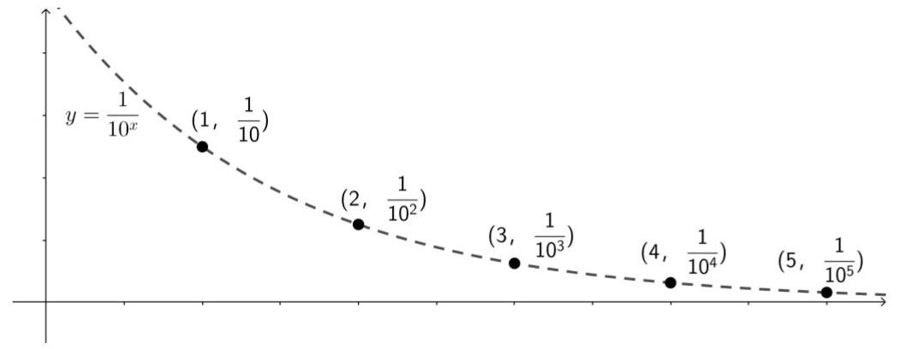

观察另一个无穷数列 $\left\{  {b}_{n}\right\}   : {b}_{n} = \frac{1}{{\left( -{10}\right) }^{n}}$ ,虽然随着 $n$ 增大, ${b}_{n}$ 在负数和正数之间来回跳跃,但 $\left| {b}_{n}\right|$ 一直随着 $n$ 增大而减小。在平面直角坐标系中描绘出数列 $\left\{  {b}_{n}\right\}$ 各项对应的点 $\left( {n,{b}_{n}}\right)$ ,可以发现: 虽然各点交替出现在 $x$ 轴的上方和下方, 但这些点都满足 $n$ 越大的点到 $x$ 轴的距离越小,如下页图所示。

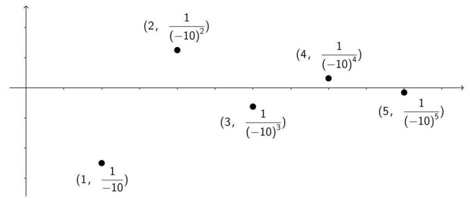

上面两个数列中,随着项数 $n$ 增大,数列的值总是越来越接近某个常数 $A$ , 但永远无法到达常数 $A$ ,该常数 $A$ 叫作数列的极限,又称该数列收敛于 $A$ ,记作:

$$
\mathop{\lim }\limits_{{n \rightarrow   + \infty }}{a}_{n} = A
$$

该表达式中， $\lim$ 表示 “极限”，下方的 $n \rightarrow   + \infty$ 表示 “ $n$ 趋近于 $+ \infty$ ”，“趋近于”的意思是 “无限接近, 但达不到”。

高中阶段, 需掌握下面两个基本的极限:

(1) $\mathop{\lim }\limits_{{n \rightarrow   + \infty }}{q}^{n} = 0\left( {\left| q\right|  < 1}\right)$

(2) $\mathop{\lim }\limits_{{n \rightarrow   + \infty }}\frac{1}{n} = 0$

目前不需要掌握这两个极限的严谨证明,只需对原理有直观认识: 分数 $\frac{1}{n}$ 的分母越大, 则分数的值越小, 基本极限 (2) 就是这一规律的直接体现; 基本极限 (1) 可以看作分数 $\frac{1}{{\left( 1/q\right) }^{n}}$ ,由于 $\left| q\right|  < 1$ ,因此分母 $\left| {1/q}\right|  > 1$ ,分母随着 $n$ 增大而增大,分数的值越来越小。求数列的极限时,所有含 $n$ 的表达式最终都可以化为这两种形式中的一种。

极限的加、减、乘、除等基本运算也遵循与实数运算一致的运算法则:

设 $A\text{ 、 }B\text{ 、 }C$ 为常数,若 $\mathop{\lim }\limits_{{n \rightarrow   + \infty }}{a}_{n} = A,\mathop{\lim }\limits_{{n \rightarrow   + \infty }}{b}_{n} = B$ ,则有:

(1) $\mathop{\lim }\limits_{{n \rightarrow   + \infty }}\left( {{a}_{n} + {b}_{n}}\right)  = \mathop{\lim }\limits_{{n \rightarrow   + \infty }}{a}_{n} + \mathop{\lim }\limits_{{n \rightarrow   + \infty }}{b}_{n} = A + B$ ；

$$
\mathop{\lim }\limits_{{n \rightarrow   + \infty }}\left( {{a}_{n} - {b}_{n}}\right)  = \mathop{\lim }\limits_{{n \rightarrow   + \infty }}{a}_{n} - \mathop{\lim }\limits_{{n \rightarrow   + \infty }}{b}_{n} = A - B;
$$

(2) $\mathop{\lim }\limits_{{n \rightarrow   + \infty }}\left( {{a}_{n} \cdot  {b}_{n}}\right)  = \mathop{\lim }\limits_{{n \rightarrow   + \infty }}{a}_{n} \cdot  \mathop{\lim }\limits_{{n \rightarrow   + \infty }}{b}_{n} = A \cdot  B$ ;

(3) $\mathop{\lim }\limits_{{n \rightarrow   + \infty }}\left( \frac{{a}_{n}}{{b}_{n}}\right)  = \frac{\mathop{\lim }\limits_{{n \rightarrow   + \infty }}{a}_{n}}{\mathop{\lim }\limits_{{n \rightarrow   + \infty }}{b}_{n}} = \frac{A}{B}\left( {B \neq  0}\right)$ ;

(4) $\mathop{\lim }\limits_{{n \rightarrow   + \infty }}\left( {{a}_{n} + C}\right)  = \mathop{\lim }\limits_{{n \rightarrow   + \infty }}{a}_{n} + C = A + C$ ;

(5) $\mathop{\lim }\limits_{{n \rightarrow   + \infty }}\left( {{a}_{n} \cdot  C}\right)  = \mathop{\lim }\limits_{{n \rightarrow   + \infty }}{a}_{n} \cdot  C = A \cdot  C$ 。

极限最突出的特征是 “无限趋近, 但不相等”, 这为极限的表达式的化简和求值带来了极大的便利。

“无限趋近” 的意思是 “接近得几乎没有区别”, 这意味着在涉及一般的实数的加、减、乘、除、指数、对数、三角函数等运算时, 可以直接代入极限趋近的值进行数值运算。

“但不相等”表明极限表达式与极限趋近的值实际上并不相等, 这意味着在涉及分母不能为 0 、对数的真数不能为 0 等特殊情况时, 可以将趋近于 0 的极限表达式作为分母被除去或作为真数参与化简和运算。

例 10.10 求极限 $\mathop{\lim }\limits_{{n \rightarrow   + \infty }}\frac{4{n}^{4} - {2n} - 1}{6{n}^{4} + 3{n}^{2} + 1}$ 的值。

解析: 分子和分母都趋近于正无穷大,可以让分子和分母同时除以 ${n}^{4}$ ,得到 $\mathop{\lim }\limits_{{n \rightarrow   + \infty }}\frac{1}{n} = 0$ 的形式:

$$
\mathop{\lim }\limits_{{n \rightarrow   + \infty }}\frac{4{n}^{4} - {2n} - 1}{6{n}^{4} + 3{n}^{2} + 1} = \mathop{\lim }\limits_{{n \rightarrow   + \infty }}\frac{\frac{4{n}^{4} - {2n} - 1}{{n}^{4}}}{\frac{6{n}^{4} + 3{n}^{2} + 1}{{n}^{4}}} = \mathop{\lim }\limits_{{n \rightarrow   + \infty }}\frac{4 - \frac{2}{{n}^{3}} - \frac{1}{{n}^{4}}}{6 + \frac{3}{{n}^{2}} + \frac{1}{{n}^{4}}}
$$

利用极限的性质得到关于 $\mathop{\lim }\limits_{{n \rightarrow   + \infty }}\frac{1}{n}$ 的表达式:

$$
\mathop{\lim }\limits_{{n \rightarrow   + \infty }}\frac{4 - \frac{2}{{n}^{3}} - \frac{1}{{n}^{4}}}{6 + \frac{3}{{n}^{2}} + \frac{1}{{n}^{4}}} = \frac{4 - \mathop{\lim }\limits_{{n \rightarrow   + \infty }}\frac{2}{{n}^{3}} - \mathop{\lim }\limits_{{n \rightarrow   + \infty }}\frac{1}{{n}^{4}}}{6 + \mathop{\lim }\limits_{{n \rightarrow   + \infty }}\frac{3}{{n}^{2}} + \mathop{\lim }\limits_{{n \rightarrow   + \infty }}\frac{1}{{n}^{4}}} = \frac{4 - 2{\left( \mathop{\lim }\limits_{{n \rightarrow   + \infty }}\frac{1}{n}\right) }^{3} - {\left( \mathop{\lim }\limits_{{n \rightarrow   + \infty }}\frac{1}{n}\right) }^{4}}{6 + 3{\left( \mathop{\lim }\limits_{{n \rightarrow   + \infty }}\frac{1}{n}\right) }^{2} + {\left( \mathop{\lim }\limits_{{n \rightarrow   + \infty }}\frac{1}{n}\right) }^{4}}
$$

将基本极限 $\mathop{\lim }\limits_{{n \rightarrow   + \infty }}\frac{1}{n} = 0$ 代入该表达式:

$$
\frac{4 - 2{\left( \mathop{\lim }\limits_{{n \rightarrow   + \infty }}\frac{1}{n}\right) }^{3} - {\left( \mathop{\lim }\limits_{{n \rightarrow   + \infty }}\frac{1}{n}\right) }^{4}}{6 + 3{\left( \mathop{\lim }\limits_{{n \rightarrow   + \infty }}\frac{1}{n}\right) }^{2} + {\left( \mathop{\lim }\limits_{{n \rightarrow   + \infty }}\frac{1}{n}\right) }^{4}} = \frac{4 - 2 \times  {0}^{3} - {0}^{4}}{6 + 3 \times  {0}^{2} + {0}^{4}} = \frac{4}{6} = \frac{2}{3}
$$

按照相同的思路,可以求得公比 $\left| q\right|  < 1$ 的无穷等比数列 ${a}_{n} = {a}_{1} \cdot  {q}^{n - 1}$ 的前 $n$ 项和的极限:

$$
\mathop{\lim }\limits_{{n \rightarrow   + \infty }}{S}_{n} = \mathop{\lim }\limits_{{n \rightarrow   + \infty }}\left( {{a}_{1} \cdot  \frac{1 - {q}^{n}}{1 - q}}\right)  = \frac{{a}_{1}}{1 - q} - \frac{{a}_{1}}{1 - q} \cdot  \mathop{\lim }\limits_{{n \rightarrow   + \infty }}{q}^{n} = \frac{{a}_{1}}{1 - q} - \frac{{a}_{1}}{1 - q} \cdot  0 = \frac{{a}_{1}}{1 - q}
$$

例如,无穷等比数列 ${a}_{n} = \frac{1}{{2}^{n}}$ 的前 $n$ 项和的极限为: $\mathop{\lim }\limits_{{n \rightarrow   + \infty }}{S}_{n} = \frac{\frac{1}{2}}{1 - \frac{1}{2}} = 1$ ,该极限的含义可用下页图表示:

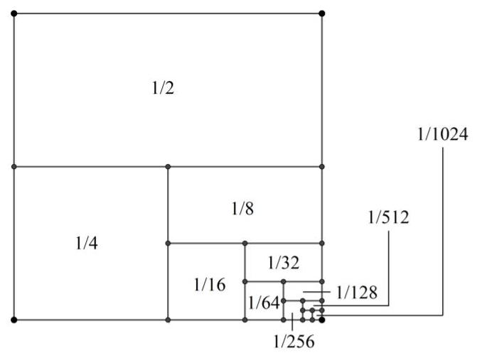

画一个边长为 1 的正方形,其面积等于 $1 \times  1 = 1$ ,

正方形的面积的二分之一为: ${a}_{1} = \frac{1}{2}$ ,

剩下的二分之一图形的面积的二分之一为: ${a}_{2} = \frac{1}{{2}^{2}} = \frac{1}{4}$ ,

剩下的四分之一图形的面积的二分之一为: ${a}_{3} = \frac{1}{{2}^{3}} = \frac{1}{8}$ ,

......

剩下的 ${2}^{n}$ 分之一图形的面积的二分之一为: ${a}_{n} = \frac{1}{{2}^{n}}$ ,

正方形的总面积等于被分割出的无穷多依次取一半面积的矩形面积之和:

$$
S = \frac{1}{2} + \frac{1}{4} + \frac{1}{8} + \frac{1}{16} + \frac{1}{32} + \frac{1}{64} + \cdots  = \mathop{\lim }\limits_{{n \rightarrow   + \infty }}\frac{1}{2} \times  \frac{1 - {\left( \frac{1}{2}\right) }^{n}}{1 - \frac{1}{2}} = \frac{1}{2} \times  \frac{1 - \mathop{\lim }\limits_{{n \rightarrow  \infty }}{\left( \frac{1}{2}\right) }^{n}}{1 - \frac{1}{2}} = 1
$$

## 练习 10.5

1. 求下列极限的值:

(1) $\mathop{\lim }\limits_{{n \rightarrow   + \infty }}{\left( -\frac{1}{3}\right) }^{n};\left( 2\right) \mathop{\lim }\limits_{{n \rightarrow   + \infty }}\frac{-2{n}^{3} + {7n}}{5{n}^{3} + {4n}};\left( 3\right) \mathop{\lim }\limits_{{n \rightarrow   + \infty }}\frac{1}{1 \times  3} + \frac{1}{3 \times  5} + \cdots  + \frac{1}{\left( {{2n} - 1}\right) \left( {{2n} + 1}\right) }$ 。

## 小结

本章主要学习数列的概念和分析方法、数学归纳法，初步了解极限的概念。 数列的概念较简单, 但其分析推导运算可以很复杂, 非常考验思路和方法, 技巧性较强,需要通过充分的练习,加强寻找规律、运用规律、总结规律的能力, 以及条理清晰地分析和书写复杂数列前 $n$ 项和的能力、对表达式变形处理的能力。 用数学归纳法验证规律较容易, 难点主要为观察并归纳总结出规律, 同样需要充分的练习, 提高对数字和运算的敏感性, 并熟悉一些经典的公式。

## 第十一章 函数的导数

我们已经学习了函数的单调性、对称性、周期性等基本性质, 变化趋势也是函数的重要基本性质。函数的导数是反映函数的变化趋势的参数, 主要包括两个方面:变化的方向——变大还是变小，变化的程度——变得快还是慢。

数形结合是函数的重要特征，导数同样蕴含 “数” 和 “形” 两方面的含义。 “数”的方面，导数反映函数值随自变量变化的趋势。 “形” 的方面，导数更严格精确地描述了切线的含义。

高中阶段，导数主要用于分析研究函数的单调性、最大值和最小值等性质， 是非常实用的工具。即使很复杂的函数, 只需按照导数的公式和定义按部就班地计算和分析, 就能得到需要的结论, 极大地减轻了对数学技巧的依赖。

导数反映的变化率是函数的微观性质, 需使用专门的方法一一极限。极限是使用“严谨规范的推导”证明 “显而易见的直觉” 的重要方法, 也是从初等数学迈入高等数学的必经之路，理解极限的原理和运算对于学习导数有很大帮助。

### 11.1 函数的极限

我们在上一章学习了数列的极限的基本知识, 函数的极限的定义、性质和运算与数列的迹象基本一致, 区别只是将数列中一个个间断的项数和对应的项, 变为函数中连续的自变量和对应的函数值。

#### 11.1.1 函数的极限的含义

函数的极限的含义为: 对于函数 $y = f\left( x\right)$ ,如果当 $x$ 的取值非常接近 ${x}_{0}$ 时, $y$ 的取值非常接近 ${y}_{0}$ ,就称 ${y}_{0}$ 是 $x$ 趋近于 ${x}_{0}$ 时函数 $f\left( x\right)$ 的极限,记作:

$$
\mathop{\lim }\limits_{{x \rightarrow  {x}_{0}}}f\left( x\right)  = {y}_{0}
$$

$\lim$ 表示 “极限”,是单词 “limit” 的缩写。下方的 $x \rightarrow  {x}_{0}$ 念作 “ $x$ 趋近于 ${x}_{0}$ ”, 表示 $x$ 无限接近于 ${x}_{0}$ ,但不等于 ${x}_{0}$ 。该记法与数列的极限的记法相同。

极限可以看作一种 “预期”, 极限是函数图像上的点沿函数图像移动时, 对即将抵达的位置的预期。高中阶段遇到的基本初等函数中, 通常只要函数是连续的,那么函数在趋近 ${x}_{0}$ 处的极限与函数在 ${x}_{0}$ 处的实际取值相等,也就是预期与实际情况一致。以熟悉的二次函数为例，初步建立对极限的直观认识。

函数 $1\;f\left( x\right)  =  - {x}^{2} + 4$

这是一个二次函数,以 $y$ 轴为对称轴,在区间 $\left( {-\infty ,0}\right)$ 上单调递增,在区间 $\left( {0, + \infty }\right)$ 上单调递减，顶点为 $\left( {0,4}\right)$ ，最大值为 4，没有最小值，函数图像如下页图所示，像一座小山丘。

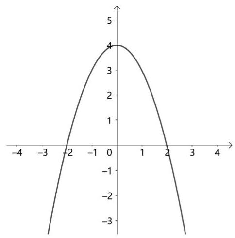

设甲从点 $\left( {-3, - 5}\right)$ 出发，沿函数图像向右移动，那么甲处于上坡的状态。甲对自己正在上坡的运动状态有所预期,当甲上到 $x =  - 2$ 附近时,预期当自己继续上到横坐标为 $x =  - 2$ 的位置时,纵坐标应当为 $y = 0$ 。

设乙从点 $\left( {-1,3}\right)$ 出发,沿函数图像向左移动,那么乙处于下坡的状态。乙对自己正在下坡的状态也有所预期,当乙下到 $x =  - 2$ 附近时,也预期当自己继续下到横坐标为 $x =  - 2$ 的位置时,纵坐标应当会是 $y = 0$ 。

综上, 不论是甲从左向右上坡, 还是乙从右向左下坡, 两人都能根据当前的前进状态, 对自己接下来将要经过的位置有所预期, 且他们的预期相同, 都预期自己抵达 $x =  - 2$ 的位置时,纵坐标应当会是 $y = 0$ 。

这种甲乙两人沿函数图像移动，分别从左向右接近和从右向左接近 $x =  - 2$ 时,预期的结果相同的情况,叫作函数 $f\left( x\right)  =  - {x}^{2} + 4$ 在 $x =  - 2$ 处有极限,且极限值 $\mathop{\lim }\limits_{{x \rightarrow   - 2}}f\left( x\right)  = 0$ 与函数值 $f\left( {-2}\right)  = 0$ 相等。

当甲从左向右接近 $x =  - 2$ 时,预期的函数值为 0,记作 $\mathop{\lim }\limits_{{x \rightarrow   - {2}^{ - }}}f\left( x\right)  = 0$ 。极限符号 “lim” 下方的 “ -2 ” 右上角的负号表示从 -2 的负方向(左侧)接近，叫作函数 $f\left( x\right)  =  - {x}^{2} + 4$ 在 $x =  - 2$ 处的左极限。

当乙从右向左接近 $x =  - 2$ 时,预期的函数值为 0,记作 $\mathop{\lim }\limits_{{x \rightarrow   - {2}^{ + }}}f\left( x\right)  = 0$ 。极限符号 “ $\lim$ ” 下方的 “ -2 + ” 右上角的正号表示从 -2 的正方向 (右侧) 接近,叫作函数 $f\left( x\right)  =  - {x}^{2} + 4$ 在 $x =  - 2$ 处的右极限。

函数在它上面一点处有极限的充要条件为:函数在该点处的左极限等于右极限。即: 从左边接近与从右边接近该点时, 对该点取值的期望相同。高中阶段遇到的基本初等函数在图像连续没有断开的位置都满足该性质。

接下来,我们对函数 $f\left( x\right)  =  - {x}^{2} + 4$ 做一个小的调整,来更深入地理解函数的极限的含义。

函数 ${2f}\left( x\right)  = \left\{  \begin{array}{ll}  - {x}^{2} + 4 & x \neq   - 2 \\  2 & x =  - 2 \end{array}\right.$

该函数的解析式与 $f\left( x\right)  =  - {x}^{2} + 4$ 整体相同,仅在 $x =  - 2$ 处不同,取了一个不在抛物线上的值,函数图像如下图所示,仍像一座小山丘,不同的是在 $x =  - 2$ 位置处被“抬高”到 $y = 2$ 的高度,小山丘 “断开” 了。

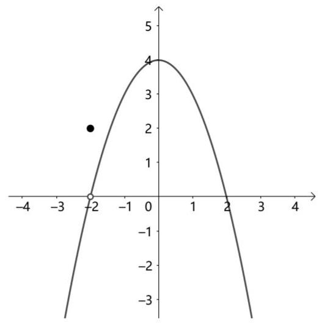

设甲从点 $\left( {-3, - 5}\right)$ 出发,沿函数图像向右上坡,甲对自己正在上坡的状态有所预期,当甲上到 $x =  - 2$ 附近时,沿着当前路径,预期自己上到横坐标为 $x =  - 2$ 的位置时,纵坐标应当会是 $y = 0$ 。

设乙从点 $\left( {-1,3}\right)$ 出发，沿函数图像向左下坡，乙对自己正在下坡的状态也有所预期,当乙下到 $x =  - 2$ 附近时,沿着当前路径,也预期自己下到横坐标为 $x =  - 2$ 的位置时,纵坐标应当会是 $y = 0$ 。

综上,不论是甲从左向右上坡,还是乙从右向左下坡,两人根据自己向 $x =  - 2$ 前进的经验,都对自己接下来要经过的路线有所预期,且都预计自己抵达 $x =  - 2$ 的位置时,纵坐标应当会是 $y = 0$ 。

然而事实并非如此! 点 $\left( {-2,0}\right)$ 并不在函数图像上,函数在 $x =  - 2$ 处的值是 $y = 2$ ,即 $f\left( {-2}\right)  = 2$ ,但甲和乙根据各自上坡和下坡的经验,对 $x =  - 2$ 的预期却是 $y = 0$ ,即 $\mathop{\lim }\limits_{{x \rightarrow   - {2}^{ - }}}f\left( x\right)  = \mathop{\lim }\limits_{{x \rightarrow   - {2}^{ + }}}f\left( x\right)  = 0$ 。只要甲乙没有抵达 $x =  - 2$ 位置,他们的预期就不会破灭,直到真正抵达 $x =  - 2$ 位置后,才发现函数的实际情况与预期不同。

虽然函数的实际取值是 $f\left( {-2}\right)  = 2$ ,但在 $x =  - 2$ 左右两侧的预期仍然都是

$$
\mathop{\lim }\limits_{{x \rightarrow   - {2}^{ - }}}f\left( x\right)  = \mathop{\lim }\limits_{{x \rightarrow   - {2}^{ + }}}f\left( x\right)  = 0
$$

此时仍然称函数 $f\left( x\right)$ 在 $x =  - 2$ 处有极限,极限为 0,即 $\mathop{\lim }\limits_{{x \rightarrow   - 2}}f\left( x\right)  = 0$ 。

上述情况反映了一个重要事实(规定):函数在某处的极限，只与函数在该处附近的变化趋势有关，与在该处的实际取值无关。

函数在它上面一点处有极限的充要条件为:函数在该点处的左极限等于右极限, 与函数在该点处的实际取值无关。

函数 ${3f}\left( x\right)  = \frac{1}{x}$ ,函数图像如下图所示。

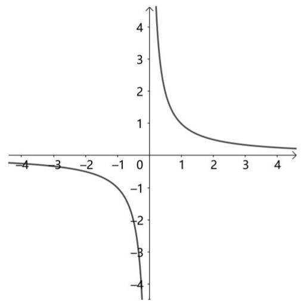

这是反比例函数,设甲从点 $\left( {-1, - 1}\right)$ 出发,沿函数图像向右移动,那么甲处于下坡的状态。甲对自己正在下坡的状态有所预期, 知道接下来还要小心翼翼地继续下坡,预期当下到横坐标接近于 $x = 0$ 的位置时,纵坐标应当会非常小,几乎直线下降到 “深不可测” 的 $y =  - \infty$ ,即 $\mathop{\lim }\limits_{{x \rightarrow  {0}^{ - }}}f\left( x\right)  =  - \infty$ 。

设乙从点 $\left( {1,1}\right)$ 出发，沿函数图像向左移动，那么乙处于上坡的状态。乙对自己正在上坡的状态也有所预期, 知道接下来还要非常努力地继续上坡, 预期当上到横坐标接近于 $x = 0$ 的位置时,纵坐标应当会非常大,几乎是直线上升到 “高不可攀” 的 $y =  + \infty$ ,即 $\mathop{\lim }\limits_{{x \rightarrow  {0}^{ + }}}f\left( x\right)  =  + \infty$ 。

综上,甲从左向右朝 $x = 0$ 移动是下坡,且越下越低,乙从右向左朝 $x = 0$ 移动是上坡, 且越上越高。两人根据当前的前进状态, 都对自己接下来即将抵达 $x = 0$ 时的高度有所预期,但他们的预期截然不同。

上述这种沿函数图像移动,从左向右接近 $x = 0$ 和从右向左接近 $x = 0$ ,预期的结果不同,即 $\mathop{\lim }\limits_{{x \rightarrow  {0}^{ - }}}f\left( x\right)  \neq  \mathop{\lim }\limits_{{x \rightarrow  {0}^{ + }}}f\left( x\right)$ 的情况,叫作函数 $f\left( x\right)  = \frac{1}{x}$ 在 $x = 0$ 处没有极限。 即: 如果函数在某处的左极限与右极限不相等, 那么称函数在该处没有极限。

通过上面三个例子, 可以对函数极限的概念有了直观的认识。即: 按照函数在某点附近的变化趋势, 对该点取值的预期。该 “预期” 必须从左向右预期与从右向左预期的结果相同, 且预期的取值不需要与函数在该处的实际取值相同。

高中阶段常见的基本初等函数(常数函数、幂函数、指数函数、对数函数、 三角函数)，以及由基本初等函数相加、减、乘、除、复合所构造的函数，在定义域连续的情况下都有极限,且极限等于函数值,即 $\mathop{\lim }\limits_{{x \rightarrow  {x}_{0}}}f\left( x\right)  = f\left( {x}_{0}\right)$ 。

需注意，“由基本初等函数构造的函数”只能通过函数相加、减、乘、除、 复合得到，不能有将函数的定义域 “剪开” 再 “拼接” 的情况， “剪接处” 的极限需要专门分析，除非精心设置，否则很可能没有极限。

基本初等函数在某处没有极限的情况通常是函数在某点处断开或衔接不上。 例如,反比例函数在 $x = 0$ 处断开,正切函数在所有 $x = \frac{\pi }{2} + {k\pi }\left( {k \in  \mathbf{Z}}\right)$ 处断开, 一些通过剪接专门构造的函数在剪接处也很可能没有极限。

练习 11.1(1)

1. 判断下列函数在相应位置是否存在极限, 若存在, 求函数的极限, 若不存在, 为什么:

(1) $f\left( x\right)  = \sin x$ 在 $x \rightarrow  \frac{\pi }{2}$ 的极限; (2) $f\left( x\right)  = \tan x$ 在 $x \rightarrow  \frac{\pi }{2}$ 的极限;

(3) $f\left( x\right)  = \frac{1}{x - 2}$ 在 $x \rightarrow  3$ 的极限; (4) $f\left( x\right)  = \frac{1}{x - 3}$ 在 $x \rightarrow  3$ 的极限;

(5) $f\left( x\right)  = \left\{  \begin{array}{ll} x & x > 0 \\  {2x} & x < 0 \end{array}\right.$ 在 $x \rightarrow  0$ 的极限。

(6) $f\left( x\right)  = \left\{  \begin{array}{ll} x & x > 0 \\   - x & x < 0 \end{array}\right.$ 在 $x \rightarrow  0$ 的极限。

#### 11.1.2 函数极限的性质与运算

函数的极限有两个重要的基本极限需要掌握, 与数列的极限原理相同, 只是将数列间断的项替换为函数连续的值。

基本极限 1: $\mathop{\lim }\limits_{{x \rightarrow   + \infty }}{q}^{x} = 0\left( {0 < \left| q\right|  < 1}\right)$

原理为: 任意常数乘以绝对值小于 1 的非零实数 $q$ ,绝对值减小,乘以无穷多个 $q$ ,绝对值可以减小到无限接近 0 。

基本极限 2: $\mathop{\lim }\limits_{{x \rightarrow   + \infty }}\frac{1}{x} = 0$

原理为: 分子不变的情况下, 分母的绝对值越大, 分数的值越小, 当分母接近无穷大时, 分数的值可以小到无限接近 0 。

函数的极限可以进行基本的四则运算,设 $A\text{ 、 }B\text{ 、 }C$ 为常数, $\mathop{\lim }\limits_{{x \rightarrow  {x}_{0}}}f\left( x\right)  = A$ , $\mathop{\lim }\limits_{{x \rightarrow  {x}_{0}}}g\left( x\right)  = B$ ,可得:

(1) $\mathop{\lim }\limits_{{x \rightarrow  {x}_{0}}}\left( {f\left( x\right)  + g\left( x\right) }\right)  = \mathop{\lim }\limits_{{x \rightarrow  {x}_{0}}}f\left( x\right)  + \mathop{\lim }\limits_{{x \rightarrow  {x}_{0}}}g\left( x\right)  = A + B$ ;

(2) $\mathop{\lim }\limits_{{x \rightarrow  {x}_{0}}}\left( {f\left( x\right)  - g\left( x\right) }\right)  = \mathop{\lim }\limits_{{x \rightarrow  {x}_{0}}}f\left( x\right)  - \mathop{\lim }\limits_{{x \rightarrow  {x}_{0}}}g\left( x\right)  = A - B$ ;

(3) $\mathop{\lim }\limits_{{x \rightarrow  {x}_{0}}}\left( {f\left( x\right)  \cdot  g\left( x\right) }\right)  = \mathop{\lim }\limits_{{x \rightarrow  {x}_{0}}}f\left( x\right)  \cdot  \mathop{\lim }\limits_{{x \rightarrow  {x}_{0}}}g\left( x\right)  = A \cdot  B$ ;

(4) $\mathop{\lim }\limits_{{x \rightarrow  {x}_{0}}}\left( \frac{f\left( x\right) }{g\left( x\right) }\right)  = \frac{\mathop{\lim }\limits_{{x \rightarrow  {x}_{0}}}f\left( x\right) }{\mathop{\lim }\limits_{{x \rightarrow  {x}_{0}}}g\left( x\right) } = \frac{A}{B}\left( {B \neq  0}\right)$ ;

(5) $\mathop{\lim }\limits_{{x \rightarrow  {x}_{0}}}\left( {f\left( x\right)  + C}\right)  = \mathop{\lim }\limits_{{x \rightarrow  {x}_{0}}}f\left( x\right)  + C = A + C$

(6) $\mathop{\lim }\limits_{{x \rightarrow  {x}_{0}}}\left( {f\left( x\right)  \cdot  C}\right)  = \mathop{\lim }\limits_{{x \rightarrow  {x}_{0}}}f\left( x\right)  \cdot  C = A \cdot  C$ 。

从上面的运算规则可以看出, 当极限为常数时, 可以把极限当作所趋近的常数直接进行运算。极限的特殊且实用之处在于, 可以利用两个基本极限, 求得两个趋近于 0 的极限的商的具体情况。因为极限只是无限接近并不是等于, 所以极限为 0 的表达式可以作为分母或除数。

分析处理 $\frac{0}{0}$ 型的极限的常用思路是,在分子和分母上同时乘以或除以 $x$ 的最高次幂, 让分子或分母的各项要么是常数, 要么是趋近于 0 的极限, 于是可以进行除法运算。

例 11. $f\left( x\right)  = 2{x}^{4} - 4{x}^{2}, g\left( x\right)  = 6{x}^{2}$ ,求下列极限:

(1) $\mathop{\lim }\limits_{{x \rightarrow  2}}\frac{f\left( x\right) }{g\left( x\right) }$ ; (3) $\mathop{\lim }\limits_{{x \rightarrow  0}}\frac{f\left( x\right) }{g\left( x\right) }$ ; (4) $\mathop{\lim }\limits_{{x \rightarrow  \sqrt{2}}}\frac{f\left( x\right) }{g\left( x\right) }$ 。

解析: (1) $\mathop{\lim }\limits_{{x \rightarrow  2}}\frac{f\left( x\right) }{g\left( x\right) } = \mathop{\lim }\limits_{{x \rightarrow  2}}\frac{2{x}^{4} - 4{x}^{2}}{6{x}^{2}} = \frac{2 \times  {2}^{4} - 4 \times  {2}^{2}}{6 \times  {2}^{2}} = \frac{16}{24} = \frac{2}{3}$ ;

(2) $\mathop{\lim }\limits_{{x \rightarrow  1}}\frac{f\left( x\right) }{g\left( x\right) } = \mathop{\lim }\limits_{{x \rightarrow  1}}\frac{2{x}^{4} - 4{x}^{2}}{6{x}^{2}} = \frac{2 \times  {1}^{4} - 4 \times  {1}^{2}}{6 \times  {1}^{2}} = \frac{-2}{6} =  - \frac{1}{3}$ ;

(3) $\mathop{\lim }\limits_{{x \rightarrow  0}}f\left( x\right)  = 0,\mathop{\lim }\limits_{{x \rightarrow  0}}g\left( x\right)  = 0$ ，这是一个 $\frac{0}{0}$ 型的极限，不能直接分别求得 $f\left( x\right) \text{ 、 }g\left( x\right)$ 的极限后相除,需对极限的表达式整体进行变形:

$$
\mathop{\lim }\limits_{{x \rightarrow  0}}\frac{f\left( x\right) }{g\left( x\right) } = \mathop{\lim }\limits_{{x \rightarrow  0}}\frac{2{x}^{4} - 4{x}^{2}}{6{x}^{2}} = \mathop{\lim }\limits_{{x \rightarrow  0}}\frac{\frac{2{x}^{4} - 4{x}^{2}}{{x}^{2}}}{\frac{6{x}^{2}}{{x}^{2}}} = \mathop{\lim }\limits_{{x \rightarrow  0}}\frac{2{x}^{2} - 4}{6} = \frac{2 \times  {0}^{2} - 4}{6} =  - \frac{2}{3};
$$

(4)只要分母不为0，就可以正常进行数值计算，不需要进行特殊的数学处理: $\mathop{\lim }\limits_{{x \rightarrow  \sqrt{2}}}\frac{f\left( x\right) }{g\left( x\right) } = \mathop{\lim }\limits_{{x \rightarrow  \sqrt{2}}}\frac{2{x}^{4} - 4{x}^{2}}{6{x}^{2}} = \frac{2 \times  {\sqrt{2}}^{4} - 4 \times  {\sqrt{2}}^{2}}{6 \times  {\sqrt{2}}^{2}} = \frac{0}{12} = 0$ 。

除 $\frac{0}{0}$ 型外,还有 $\frac{\pm \infty }{\pm \infty }\text{ 、 }0 \cdot   \pm  \infty$ 等类型的极限,都可以按照相同的思路处理: 通过将表达式整体变形, 转化为常规表达式的比值, 进行约分等化简后, 再代入极限的数值。

练习 11.1(2)

1. 求下列各极限的值:

(1) $\mathop{\lim }\limits_{{x \rightarrow  4}}\frac{1}{\sqrt{x - 2}};\left( 2\right) \mathop{\lim }\limits_{{x \rightarrow  0}}\frac{{x}^{2} + {2x}}{x};\left( 3\right) \mathop{\lim }\limits_{{x \rightarrow   + \infty }}\frac{\sqrt{{x}^{2} + {2x}}}{x};\left( 4\right) \mathop{\lim }\limits_{{x \rightarrow   + \infty }}{0.2}^{x} + {0.5}^{x}$ 。

### 11.2 函数的变化率与导数

导数反映的是函数的变化趋势的规律, 趋势可以看作一种对未来的期望, 趋势有方向和程度两方面信息。

#### 11.2.1 函数的变化率

生活中, 我们经常用 “速度” 描述物体运动的快慢, “速度” 的数学本质就是位移-时间函数的变化率, 我们接下来根据现实中测量和计算速度的具体方法, 理解变化率的数学含义。

对于做直线运动的物体,其位移 $s$ 、时间 $t$ 、速度 $v$ 之间满足数量关系:

$$
s = {vt}
$$

其中,位移 $s$ 和时间 $t$ 是可以直接测量得到的物理量,速度 $v$ 需要利用该公式计算得到。根据物理知识可知: 如果物体经过时间 $t$ 发生的位移是 $s$ ,那么物体在这段时间内的平均速度为: $v = \frac{s}{t}$ 。

从实际测量的角度考虑: 从 ${t}_{0}$ 时刻开始计时,到 ${t}_{0} + {\Delta t}$ 时刻停止计时,那么所经过的时间为 ${\Delta t}$ 。在规定出发点为原点的情况下,设物体在 ${t}_{0}$ 时刻的位移为 ${s}_{0}$ ,在 ${t}_{0} + {\Delta t}$ 时刻的位移变为 ${s}_{0} + {\Delta s}$ ,那么物体在 ${\Delta t}$ 时间内所发生的位移为 ${\Delta s}$ , 物体在这段时间内的平均速度为:

$$
v = \frac{\left( {{s}_{0} + {\Delta s}}\right)  - {s}_{0}}{\left( {{t}_{0} + {\Delta t}}\right)  - {t}_{0}} = \frac{\Delta s}{\Delta t}
$$

按照上面的方法，可以求得运动物体在任意两个时刻 ${t}_{1} \sim  {t}_{2}$ 之间的平均速度， 如果想要知道物体在某个时刻 ${t}_{0}$ 的速度,就需要需使用极限的方法。

如果让经过的时间 ${\Delta t}$ 无穷小,即 ${\Delta t} \rightarrow  0$ ,可以近似认为开始计时的时刻与停止计时的时刻都无限接近 ${t}_{0}$ ,那么在这段无限接近 0 的时间 ${\Delta t}$ 内,物体发生的位移 ${\Delta s}$ 与时间 ${\Delta t}$ 的比值,就是物体在 ${t}_{0}$ 时刻的速度:

$$
v\left( {t}_{0}\right)  = \mathop{\lim }\limits_{{{\Delta t} \rightarrow  0}}\frac{\Delta s}{\Delta t} = \mathop{\lim }\limits_{{{\Delta t} \rightarrow  0}}\frac{\left( {{s}_{0} + {\Delta s}}\right)  - {s}_{0}}{\left( {{t}_{0} + {\Delta t}}\right)  - {t}_{0}}
$$

例 11.2 忽略摩擦和空气阻力,物体做自由落体运动时位移 $s$ 与时刻 $t$ 满足关系 $s = \frac{1}{2}g{t}^{2}$ ,求 ${t}_{0}$ 时刻物体的速度 $v\left( {t}_{0}\right)$ 。

解析: 根据题目给出的公式列出极限的表达式, 再利用极限的运算法则化简:

$$
v\left( {t}_{0}\right)  = \mathop{\lim }\limits_{{{\Delta t} \rightarrow  0}}\frac{\Delta s}{\Delta t} = \mathop{\lim }\limits_{{{\Delta t} \rightarrow  0}}\frac{\frac{1}{2}g{\left( {t}_{0} + \Delta t\right) }^{2} - \frac{1}{2}g{t}_{0}^{2}}{\left( {{t}_{0} + {\Delta t}}\right)  - {t}_{0}} = \mathop{\lim }\limits_{{{\Delta t} \rightarrow  0}}\frac{g}{2\Delta t}\left( {{t}_{0}^{2} + 2{t}_{0}{\Delta t} + \Delta {t}^{2} - {t}_{0}^{2}}\right)
$$

$$
= \mathop{\lim }\limits_{{{\Delta t} \rightarrow  0}}\frac{g}{2}\left( {2{t}_{0} + {\Delta t}}\right)  = \frac{g}{2}\left( {2{t}_{0} + \mathop{\lim }\limits_{{{\Delta t} \rightarrow  0}}{\Delta t}}\right)  = \frac{g}{2}\left( {2{t}_{0} + 0}\right)  = g{t}_{0}
$$

做自由落体运动的该物体在 ${t}_{0}$ 时刻的速度为 $g{t}_{0}$ 。

利用相同的方法可以推出任意基本初等函数 $f\left( x\right)$ 在它定义域内的任意点 $\left( {{x}_{0},{y}_{0}}\right)$ 处的变化率。

物理学中,重力加速度 $g$ 的定义为: 理想状况下物体做自由落体运动时速度的变化率,即 $g = \frac{\Delta v}{\Delta t}$ 。如果物体的初速度为 0,那么 $v\left( {t}_{0}\right)  = g{t}_{0}$ 。用数学方法分析物体在极短时间内的位移与时间的比值 $\mathop{\lim }\limits_{{{\Delta t} \rightarrow  0}}\frac{\Delta s}{\Delta t}$ 求得的速度,与根据物理理论中重力加速度的定义 $g = \frac{\Delta v}{\Delta t}$ 求得的速度相同,都是 $g{t}_{0}$ 。

自然科学中有很多变化率。物理学中, 速度是位移随时间的变化率, 加速度是速度随时间的变化率。化学中, 反应速率是反应物的浓度随时间的变化率。生物学中, 种群数量的增长速率是种群的数量随时间的变化率。

练习 11.2(1)

1. 管理员打开泳池底的阀门将水排出，排水前泳池中水的体积为 ${80000}{\mathrm{\;m}}^{3}$ , 泳池的底面积为 ${40000}{\mathrm{\;m}}^{2}$ ,排水的速度为 ${10}{\mathrm{\;m}}^{3}/\mathrm{s}$ ,求:

(1)泳池中水的体积随时间变化的函数关系；

(2)泳池中水的体积随时间的变化率；

(3)泳池中水的高度随时间变化的函数关系；

(4)泳池中水的高度随时间的变化率。

2. 已知 $\mathrm{A}\text{ 、 }\mathrm{\;B}$ 是两种化学物质,烧杯中发生化学反应 $2\mathrm{\;A} = \mathrm{B}$ ,物质 $\mathrm{A}$ 的起始浓度为 ${0.2}\mathrm{\;{mol}} \cdot  {\mathrm{L}}^{-1}$ ，每 $1\mathrm{\;s}$ 有 ${0.01}\mathrm{\;{mol}} \cdot  {\mathrm{L}}^{-1}$ 的物质 $\mathrm{A}$ 发生反应，求:

(1)物质 A 的浓度随时间变化的函数关系;

(2)物质 A 的浓度随时间的变化率;

(3)物质 B 的浓度随时间的变化的函数关系;

(4)物质 B 的浓度随时间的变化率。

3. 某片草原上野兔繁殖的速率与野兔当前的数量成正比, 已知野兔的数量 $N$ 随时间 $t$ 的变化率为:

$$
\frac{dN}{dt} = {rN}\left( \frac{K - N}{K}\right)
$$

其中, $r\text{ 、 }K$ 是已知常数且恒为正数,回答下列问题:

(1)如果野兔的数量正处于增长之中，求此时 $N$ 的取值范围；

(2)如果野兔的数量正处于减少之中，求此时 $N$ 的取值范围；

(3)如果野兔的数量保持不变，求此时 $N$ 的取值范围。

#### 11.2.2 导数的概念及几何含义

设 ${\Delta x} \rightarrow  0$ ,那么可以表示出 $f\left( x\right)$ 在 $\left( {{x}_{0}, f\left( {x}_{0}\right) }\right)$ 和 $\left( {{x}_{0} + {\Delta x}, f\left( {{x}_{0} + {\Delta x}}\right) }\right)$ 处的因变量之差与自变量之差的比值:

$$
\mathop{\lim }\limits_{{{\Delta x} \rightarrow  0}}\frac{f\left( {{x}_{0} + {\Delta x}}\right)  - f\left( {x}_{0}\right) }{\left( {{x}_{0} + {\Delta x}}\right)  - {x}_{0}}
$$

即

$$
\mathop{\lim }\limits_{{{\Delta x} \rightarrow  0}}\frac{f\left( {{x}_{0} + {\Delta x}}\right)  - f\left( {x}_{0}\right) }{\Delta x}
$$

该比值(表达式)的几何含义是经过点 $\left( {{x}_{0}, f\left( {x}_{0}\right) }\right)$ 和 $\left( {{x}_{0} + {\Delta x}, f\left( {{x}_{0} + {\Delta x}}\right) }\right)$ 的直线的斜率,即函数 $f\left( x\right)$ 在这段区间上的平均变化率。

由于规定了 ${\Delta x} \rightarrow  0$ ,导致点 $\left( {{x}_{0}, f\left( {x}_{0}\right) }\right)$ 与 $\left( {{x}_{0} + {\Delta x}, f\left( {{x}_{0} + {\Delta x}}\right) }\right)$ 几乎重合为一个点,该比值可以看作函数 $f\left( x\right)$ 在 ${x}_{0}$ 这一点处的变化率。

(注: 根据对导数存在的规定,如果 $f\left( x\right)$ 在 ${x}_{0}$ 处的极限存在,那么左极限与右极限相等,实际上需满足 $\mathop{\lim }\limits_{{{\Delta x} \rightarrow  0}}\frac{f\left( {x}_{0}\right)  - f\left( {{x}_{0} - {\Delta x}}\right) }{{x}_{0} - \left( {{x}_{0} - {\Delta x}}\right) } = \mathop{\lim }\limits_{{{\Delta x} \rightarrow  0}}\frac{f\left( {{x}_{0} + {\Delta x}}\right)  - f\left( {x}_{0}\right) }{\left( {{x}_{0} + {\Delta x}}\right)  - {x}_{0}}$ ,正是由于左极限与右极限相等, 所以只需计算其中一个即可。)

表达式 $\mathop{\lim }\limits_{{{\Delta x} \rightarrow  0}}\frac{f\left( {{x}_{0} + {\Delta x}}\right)  - f\left( {x}_{0}\right) }{\Delta x}$ 表示函数 $f\left( x\right)$ 在 $\left( {{x}_{0},{y}_{0}}\right)$ 处的变化趋势,反映函数 $f\left( x\right)$ 在 $\left( {{x}_{0},{y}_{0}}\right)$ 处的变化率,叫作函数 $f\left( x\right)$ 在 $\left( {{x}_{0},{y}_{0}}\right)$ 处的导数。

导数反映的规律为:

(1)导数的绝对值大小反映函数变化的快慢，导数的绝对值越大，即函数值的变化 $f\left( {{x}_{0} + {\Delta x}}\right)  - f\left( {x}_{0}\right)$ 相对于自变量的变化 $\left( {{x}_{0} + {\Delta x}}\right)  - {x}_{0}$ 越大,表明函数在该处的变化幅度越大, 即变化的速率越快。

(2)导数的正负号反映函数值变化的方向，若导数为正，则自变量之差 $\left( {{x}_{0} + {\Delta x}}\right)  - {x}_{0}$ 与函数值之差 $f\left( {{x}_{0} + {\Delta x}}\right)  - f\left( {x}_{0}\right)$ 的正负号相同,即自变量增大的同时函数值增大, 表明函数在该处递增; 若导数为负, 则自变量之差与函数值之差的正负号相反, 即自变量增大的同时函数值减小, 表明函数在该处递减。

以 $x$ 为自变量、 $f\left( x\right)$ 在 $x$ 处的导数为因变量构造新的函数:

$$
{f}^{\prime }\left( x\right)  = \mathop{\lim }\limits_{{{\Delta x} \rightarrow  0}}\frac{f\left( {x + {\Delta x}}\right)  - f\left( x\right) }{\Delta x}
$$

函数 ${f}^{\prime }\left( x\right)$ 叫作原函数 $f\left( x\right)$ 的导函数,简称导数。

导数既可以指函数的导函数, 又可以指函数在其上一点处的变化率一一导函数的值, 具体指代对象是函数还是函数值需根据具体情形判断。

例 11.2 中,函数 $s = \frac{1}{2}g{t}^{2}$ 是以时间 $t$ 为自变量,位移 $s$ 为因变量的函数,该函数的导函数是 $v = {gt}$ 。导函数 $v = {gt}$ 的自变量仍是时间 $t$ ,因变量是位移 $s$ 随时间 $t$ 的变化率,即速度 $v$ 。

匀速直线运动的 $s - t$ 图像是一条斜率为 $v$ 的直线,自由落体运动的每个时刻都可以近似看作一瞬间的匀速直线运动,函数 $s = \frac{1}{2}g{t}^{2}$ 上的每个点 $\left( {{t}_{0},\frac{1}{2}g{t}_{0}^{2}}\right)$ 处的变化趋势都可以用一条经过该点且斜率为 $g{t}_{0}$ 的直线表示,其点斜式方程为:

$$
y = g{t}_{0}\left( {x - {t}_{0}}\right)  + \frac{1}{2}g{t}_{0}^{2}
$$

该直线叫作函数 $s = \frac{1}{2}g{t}^{2}$ 在 $x = {t}_{0}$ (或点 $\left( {{t}_{0},\frac{1}{2}g{t}_{0}^{2}}\right)$ )处的切线。切线的几何意义为:反映图形在某个位置处的变化趋势的直线。

对于任意函数 $f\left( x\right)$ ,其上任意一点 $\left( {{x}_{0},{y}_{0}}\right)$ 处的切线为:以该点处的导数 ${f}^{\prime }\left( {x}_{0}\right)$ 为斜率、经过该点的直线,由此可得函数 $y = f\left( x\right)$ 在点 $\left( {{x}_{0},{y}_{0}}\right)$ 处的切线的点斜式方程为:

$$
y = {f}^{\prime }\left( {x}_{0}\right)  \cdot  \left( {x - {x}_{0}}\right)  + {y}_{0}
$$

通过对变化率进行分析计算，平面几何中的“切线”有了更严谨规范的定义: 切线是描述图形某处的变化趋势的直线。

大多数函数的图像都是曲线, 曲线可以近似看作由大量极短的线段依次相连而成, 当每个线段都短到只有一个点的长度时, 这些线段就是函数在它图像上每个点处的切线, 构成的就是函数的图像。

直线与函数图像的交点的个数, 与直线是否是函数图像的切线, 既不是充分条件, 也不是必要条件。之所以用交点个数判断直线与圆的位置关系, 是因为圆的切线恰好与圆只有一个交点, 与圆相交和相离的直线与圆有两个或没有交点, 这种规律是圆的一个特点, 并非所有曲线都适用。

例 11.3 求函数 $y =  - {x}^{2} + 4$ 在 $x =  - 2$ 处的切线方程。

解析: 先求出切点的坐标,还需求出函数在该处的函数值,将 $x =  - 2$ 代入函数的解析式: $y =  - {\left( -2\right) }^{2} + 4 = 0$ ,该点的坐标为 $\left( {-2,0}\right)$ ,再求出函数在 $x =  - 2$ 处的变化率:

$$
\frac{\Delta y}{\Delta x} = \mathop{\lim }\limits_{{{\Delta x} \rightarrow  0}}\frac{\left\lbrack  {-{\left( -2 + \Delta x\right) }^{2} + 4}\right\rbrack   - \left\lbrack  {-{\left( -2\right) }^{2} + 4}\right\rbrack  }{\Delta x}
$$

$$
= \mathop{\lim }\limits_{{{\Delta x} \rightarrow  0}}\frac{\left( {-4 + {4\Delta x} - \Delta {x}^{2} + 4}\right)  - \left( {-4 + 4}\right) }{\Delta x}
$$

$$
= \mathop{\lim }\limits_{{{\Delta x} \rightarrow  0}}\frac{-\Delta {x}^{2} + {4\Delta x}}{\Delta x}
$$

$$
= \mathop{\lim }\limits_{{{\Delta x} \rightarrow  0}} - {\Delta x} + 4
$$

$$
= 4
$$

切线的斜率为 4,且经过点 $\left( {-2,0}\right)$ ,可得其点斜式方程为: $y = 4\left( {x + 2}\right)$ ,写成一次函数的形式为: $y = {4x} + 8$ 。下图为函数 $y =  - {x}^{2} + 4$ 与它在 $x =  - 2$ 处的切线 $y = {4x} + 8$ 的图像，从图中可以直观看出切线经过函数上的点 $\left( {-2,0}\right)$ ，斜率为 4 。

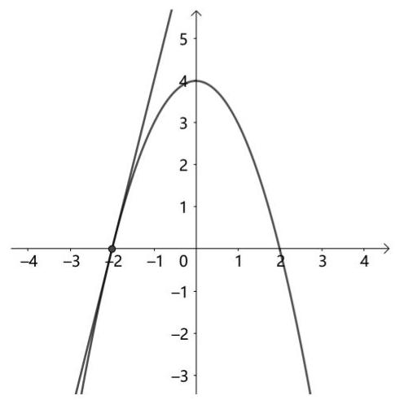

需注意，函数在它上面某点处存在切线，必须建立在函数在该点处有导数的前提下。函数在它上面某处有导数, 必须要求函数在该处有极限(左极限等于右极限)，且极限的值与函数值相等。

判断函数在某处是否有导数, 除严谨地证明函数在某处有极限且极限值与函数值相等外 (高中阶段不作要求), 还可以用下面的方法简单判断:

对于基本初等函数以及由若干基本初等函数相加、减、乘、除、复合所构造的函数，在定义域上连续、图像看起来 “平滑” 的位置处都有导数， “间断” 和 “突变” 的位置需要专门分析, 通常没有导数。

练习 11.2(2)

1. 求抛物线 $y = {x}^{2} - {2x} + 2$ 在点 $\left( {2,2}\right)$ 处的切线方程。

2. 求半圆 $y\left( x\right)  = \sqrt{1 - {x}^{2}}$ 在点 $\left( {\frac{\sqrt{2}}{2},\frac{\sqrt{2}}{2}}\right)$ 处的切线方程。

3. 下页图为函数 $f\left( x\right)  = \sqrt{2 - {x}^{2}}$ 的图像,根据图像比较下列各组数的大小:

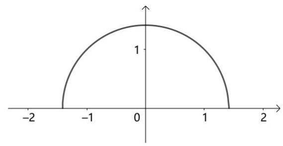

(1) ${f}^{\prime }\left( {-\frac{1}{2}}\right)$ 与0; ${f}^{\prime }\left( {-\frac{2}{3}}\right)$ 与 ${f}^{\prime }\left( {-\frac{1}{3}}\right)$ ; (4) ${f}^{\prime }\left( \frac{1}{3}\right)$ 与 ${f}^{\prime }\left( \frac{2}{3}\right)$ 。

### 11.3 基本初等函数的导函数

高中阶段主要学习的常数函数、幂函数、指数函数、对数函数、三角函数等基本初等函数的导函数都可以用极限的方法推导得到, 其中有些函数的导数的推导过程较简单, 可以用于熟悉极限的运算, 有些函数的导数的推导过程很复杂, 需直接记忆掌握结论。

#### 11.3.1 常数函数的导函数

常数函数 $f\left( x\right)  = c$ ( $c$ 为常数) 的导函数为:

$$
{f}^{\prime }\left( x\right)  = \mathop{\lim }\limits_{{{\Delta x} \rightarrow  0}}\frac{f\left( {x + {\Delta x}}\right)  - f\left( x\right) }{\Delta x} = \mathop{\lim }\limits_{{{\Delta x} \rightarrow  0}}\frac{c - c}{\Delta x} = \mathop{\lim }\limits_{{{\Delta x} \rightarrow  0}}\frac{0}{\Delta x} = 0
$$

即 ${f}^{\prime }\left( x\right)  = 0$ ,常数函数的导数恒为 0 。

从变化率的角度分析, 常数函数的函数值是常数, 不随自变量变化而变化, 既不增大也不减小, 因此变化率恒为 0 。

下图为常数函数 $y = 2$ 和它的导函数 ${y}^{\prime } = 0$ 的图像。

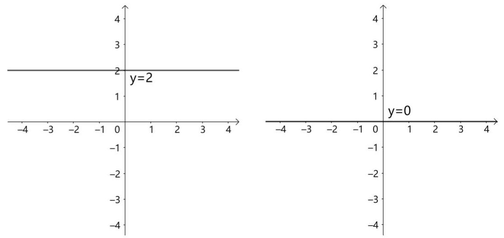

练习 11.3(1)

1. 求下列函数的导函数:

(1) $y = 0$ ； (2) $y = {10}^{100}$ ； (3) $y =  - \sqrt{2}$

#### 11.3.2 幂函数的导函数

幂函数 $f\left( x\right)  = {x}^{n}\left( {n \in  {\mathbf{N}}^{ * }}\right)$ 的导函数的推导过程使用了二项式定理,该定理将在计数原理一章学习, 可在学习相应章节之后再来回顾, 推导过程如下:

$$
{f}^{\prime }\left( x\right)  = \mathop{\lim }\limits_{{{\Delta x} \rightarrow  0}}\frac{f\left( {x + {\Delta x}}\right)  - f\left( x\right) }{\Delta x}
$$

$$
= \mathop{\lim }\limits_{{{\Delta x} \rightarrow  0}}\frac{{\left( x + \Delta x\right) }^{n} - {x}^{n}}{\Delta x}
$$

$$
= \mathop{\lim }\limits_{{{\Delta x} \rightarrow  0}}\frac{\left( {{x}^{n} + {\mathbf{C}}_{n}^{1}{x}^{n - 1} \cdot  {\Delta x} + {\mathbf{C}}_{n}^{2}{x}^{n - 2} \cdot  \Delta {x}^{2} + \cdots  + \Delta {x}^{n}}\right)  - {x}^{n}}{\Delta x}
$$

$$
= \mathop{\lim }\limits_{{{\Delta x} \rightarrow  0}}\frac{{\mathbf{C}}_{n}^{1}{x}^{n - 1} \cdot  {\Delta x} + {\mathbf{C}}_{n}^{2}{x}^{n - 2} \cdot  \Delta {x}^{2} + \cdots  + \Delta {x}^{n}}{\Delta x}
$$

$$
= \mathop{\lim }\limits_{{{\Delta x} \rightarrow  0}}\left( {{\mathbf{C}}_{n}^{1}{x}^{n - 1} + {\mathbf{C}}_{n}^{2}{x}^{n - 2} \cdot  {\Delta x} + \cdots  + \Delta {x}^{n - 1}}\right)
$$

由于 ${\Delta x} \rightarrow  0$ ,除第一项 ${\mathbf{C}}_{n}^{1}{x}^{n - 1}$ 外的其余各项都趋近于 0,在加法中可以当作 0 计算,所以 ${f}^{\prime }\left( x\right)  = {\mathbf{C}}_{n}^{1}{x}^{n - 1}$ ,即 ${f}^{\prime }\left( x\right)  = n{x}^{n - 1}$ ,这就是指数为正整数的幂函数的导函数。该结论可以推广到指数为任意实数的幂函数, $\forall n \in  \mathbf{R}, n \neq  0, f\left( x\right)  = {x}^{n}$ , 其导函数为:

$$
{f}^{\prime }\left( x\right)  = n{x}^{n - 1}
$$

幂函数的导函数，就是将原函数的指数作为系数，并将其指数减一。

例 11.4 求函数 $y = {x}^{2}$ 的导函数。

解析: 利用幂函数的导数公式求导即可:

$$
{y}^{\prime } = 2{x}^{2 - 1} = {2x}
$$

下图为二次函数 $y = {x}^{2}$ 与它的导函数 ${y}^{\prime } = {2x}$ 的图像,从图中可以读出: 当 $x \in  \left( {-\infty ,0}\right)$ 时, $f\left( x\right)$ 单调递减, ${f}^{\prime }\left( x\right)  < 0$ 。当 $x \in  \left( {0, + \infty }\right)$ 时, $f\left( x\right)$ 单调递增, ${f}^{\prime }\left( x\right)  > 0$ 。当 $x = 0$ 时, $f\left( x\right)$ 为最小值, ${f}^{\prime }\left( x\right)  = 0$ 。

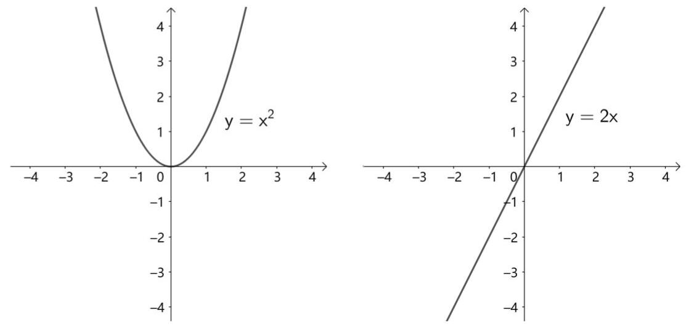

例 11.5 求函数 $y = \frac{1}{x}$ 的导函数。

解析: $y = \frac{1}{x}$ 还可以记作 $y = {x}^{-1}$ ,利用幂函数的导数公式求导:

$$
{y}^{\prime } =  - 1{x}^{-1 - 1} =  - {x}^{-2} =  - \frac{1}{{x}^{2}}
$$

下图为反比例函数 $y = \frac{1}{x}$ 与它的导函数 ${y}^{\prime } =  - \frac{1}{{x}^{2}}$ 的图像,从图中可以读出: 当 $x \in  \left( {-\infty ,0}\right)$ 时, $f\left( x\right)$ 单调递减, ${f}^{\prime }\left( x\right)  < 0$ 。当 $x \in  \left( {0, + \infty }\right)$ 时, $f\left( x\right)$ 也单调递减, ${f}^{\prime }\left( x\right)  < 0$ 。反比例函数 $y = \frac{1}{x}$ 在区间 $\left( {-\infty ,0}\right)$ 上的最大值小于零,在区间 $\left( {0, + \infty }\right)$ 上的最小值大于零,原点左侧的最大值小于原点右侧的最小值,跨越原点的区间不单调。

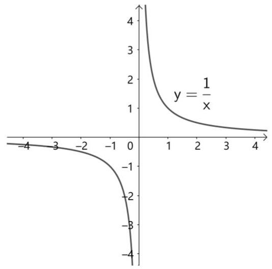

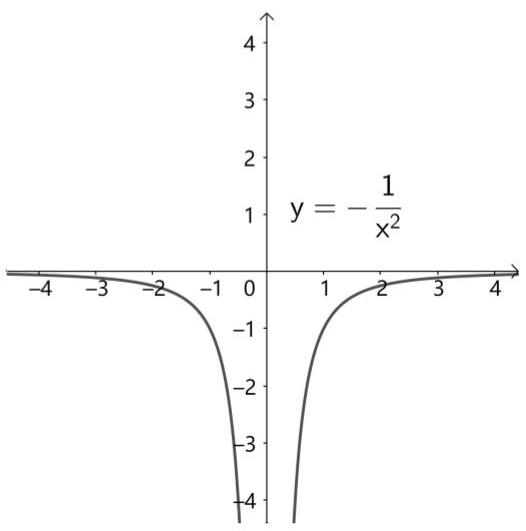

练习 11.3(2)

1. 求下列函数的导函数:

(1) $y = {x}^{4}$ ； (2) $y = \sqrt{x}$ ； (3) $y = \frac{1}{\sqrt[3]{x}}$

2. 求下列函数在相应点处的导数:

(1) $y = {2x}$ 在 $x =  - \frac{1}{2}$ 处的导数；

#### 11.3.3 指数函数的导函数

指数函数与对数函数的导函数的推导过程较复杂, 暂时难以理解, 需直接记忆结果,指数函数 $f\left( x\right)  = {a}^{x}\left( {a > 0, a \neq  1}\right)$ 的导函数为:

$$
{f}^{\prime }\left( x\right)  = {a}^{x}\ln a
$$

即指数函数的导函数是在原函数的基础上乘以底数的自然对数 $\ln a$ 。

如果指数函数的底数是自然对数的底 $\mathrm{e}$ ,那么其导数还是它本身:

$$
{f}^{\prime }\left( x\right)  = {\mathrm{e}}^{x}\ln e = {\mathrm{e}}^{x}
$$

下图为指数函数 $y = {\mathrm{e}}^{x}$ 和它的导函数 $y = {\mathrm{e}}^{x}$ 的图像,从图中可以读出: $f\left( x\right)$ 在定义域内单调递增, ${f}^{\prime }\left( x\right)  > 0$ 恒成立。

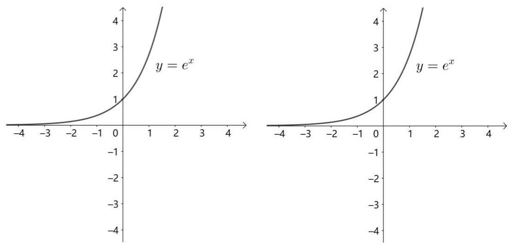

例 11.6 求函数 $y = {\left( \frac{1}{2}\right) }^{x}$ 的导函数。

解析: 利用指数函数的导数公式求导即可:

$$
{y}^{\prime } = {\left( \frac{1}{2}\right) }^{x}\ln \frac{1}{2} =  - \ln 2{\left( \frac{1}{2}\right) }^{x}
$$

下图为指数函数 $y = {\left( \frac{1}{2}\right) }^{x}$ 和它的导函数 ${y}^{\prime } =  - \ln 2{\left( \frac{1}{2}\right) }^{x}$ 的图像,从图中可以读出: $f\left( x\right)$ 在定义域内单调递减, ${f}^{\prime }\left( x\right)  < 0$ 恒成立。

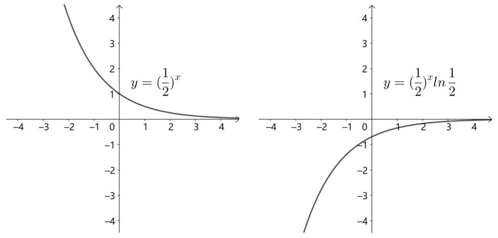

练习 11.3(3)

1. 求下列函数的导函数:

(1) $y = {2}^{x}$ ; (2) $y = {\pi }^{x}$ ；

2. 求下列函数在相应点处的导数:

(1) $y = {2}^{x}$ 在 $x = 0$ 处的导数; (2) $y = {0.01}^{x}$ 在 $x = {0.5}$ 处的导数。

#### 11.3.4 对数函数的导函数

对数函数 $f\left( x\right)  = {\log }_{a}x\left( {a > 0\text{ 且 }a \neq  1}\right)$ 的导函数为:

$$
{f}^{\prime }\left( x\right)  = \frac{1}{x\ln a}
$$

对数函数的导函数是 $x$ 与底数的自然对数 $\ln a$ 的乘积的倒数。

如果底数是自然对数的底 $\mathrm{e}$ ,即 $f\left( x\right)  = \ln x$ ,那么其导函数为:

$$
{f}^{\prime }\left( x\right)  = \frac{1}{x\ln \mathrm{e}} = \frac{1}{x}
$$

幂函数 $f\left( x\right)  = {x}^{a}$ 的导数中,特地排除了 $a = 0$ (函数是常数函数) 的情况, 幂函数中不存在导数为 ${f}^{\prime }\left( x\right)  = {x}^{0 - 1} = \frac{1}{x}$ 的情况,这个“空白”由对数函数填补。

下图为对数函数 $y = \ln x$ 和它的导函数 ${y}^{\prime } = \frac{1}{x}$ 的图像,从图中可以读出: $f\left( x\right)$ 在定义域内单调递增, ${f}^{\prime }\left( x\right)  > 0$ 恒成立。

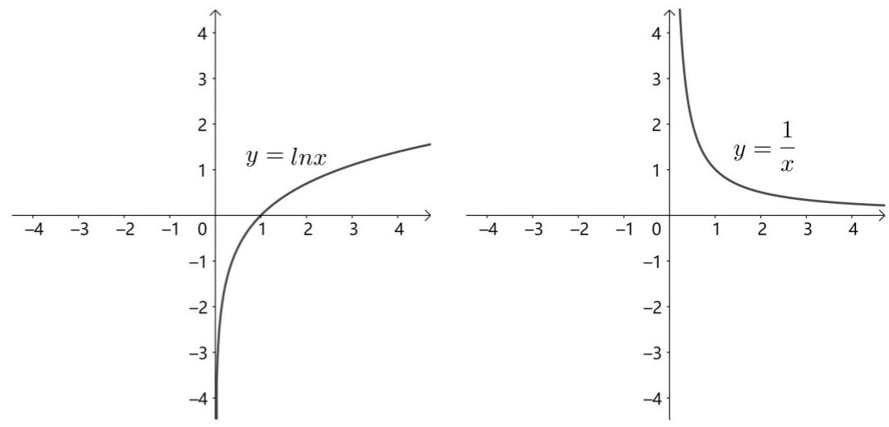

例 11.7 求函数 $y = {\log }_{\frac{1}{2}}x$ 的导函数。

解析: 利用对数函数的导数公式求导即可:

$$
{y}^{\prime } = \frac{1}{x\ln \frac{1}{2}}
$$

下页图为对数函数 $y = {\log }_{\frac{1}{2}}x$ 和它的导函数 ${y}^{\prime } = \frac{1}{x\ln \frac{1}{2}}$ 的图像,从图中可以读出: $f\left( x\right)$ 在定义域内单调递减, ${f}^{\prime }\left( x\right)  < 0$ 恒成立。

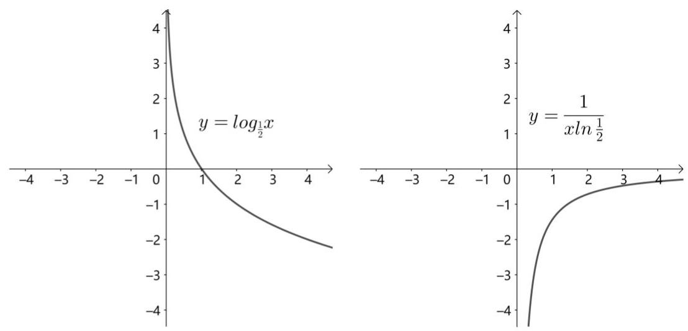

练习 11.3(4)

1. 求下列函数的导函数:

(1) $y = {\log }_{3}x$ (2) $y = \lg x$ ； (3) $y = {\log }_{{\mathrm{e}}^{2}}x$

2. 求下列函数在相应点处的导数:

(1) $y = \ln x$ 在 $x = {0.01}$ 处的导数；(2) $y = {\log }_{2}x$ 在 $x = \ln \sqrt{2}$ 处的导数。

#### 11.3.5 三角函数的导函数

正弦函数 $f\left( x\right)  = \sin x$ 的导函数为(利用和差化积公式):

$$
{f}^{\prime }\left( x\right)  = \mathop{\lim }\limits_{{{\Delta x} \rightarrow  0}}\frac{f\left( {x + {\Delta x}}\right)  - f\left( x\right) }{\Delta x}
$$

$$
= \mathop{\lim }\limits_{{{\Delta x} \rightarrow  0}}\frac{\sin \left( {x + {\Delta x}}\right)  - \sin x}{\Delta x}
$$

$$
= \mathop{\lim }\limits_{{{\Delta x} \rightarrow  0}}\frac{2\cos \left( \frac{x + {\Delta x} + x}{2}\right) \sin \left( \frac{x + {\Delta x} - x}{2}\right) }{\Delta x}
$$

$$
= \mathop{\lim }\limits_{{{\Delta x} \rightarrow  0}}\frac{2\cos \left( {x + \frac{\Delta x}{2}}\right) \sin \frac{\Delta x}{2}}{\Delta x}
$$

$$
= \mathop{\lim }\limits_{{{\Delta x} \rightarrow  0}}\cos \left( {x + \frac{\Delta x}{2}}\right)  \cdot  \mathop{\lim }\limits_{{{\Delta x} \rightarrow  0}}\frac{\sin \frac{\Delta x}{2}}{\frac{\Delta x}{2}}
$$

此处需使用一个公式: $\mathop{\lim }\limits_{{x \rightarrow  0}}\frac{\sin x}{x} = 1$ ,需注意该公式中正弦函数内和分母位置的表达式需完全一致，且都趋近于 0 ，继续化简:

$$
{f}^{\prime }\left( x\right)  = \mathop{\lim }\limits_{{{\Delta x} \rightarrow  0}}\cos \left( {x + \frac{\Delta x}{2}}\right)  \cdot  \mathop{\lim }\limits_{{{\Delta x} \rightarrow  0}}\frac{\sin \frac{\Delta x}{2}}{\frac{\Delta x}{2}}
$$

$$
= \mathop{\lim }\limits_{{{\Delta x} \rightarrow  0}}\cos \left( {x + \frac{\Delta x}{2}}\right)  \cdot  1
$$

$$
= \mathop{\lim }\limits_{{{\Delta x} \rightarrow  0}}\cos \left( {x + \frac{\Delta x}{2}}\right)
$$

$$
= \cos \left( {x + \frac{\mathop{\lim }\limits_{{{\Delta x} \rightarrow  0}}{\Delta x}}{2}}\right)
$$

$$
= \cos x
$$

即 ${f}^{\prime }\left( x\right)  = \cos x$ ,基本的正弦函数的导函数是基本的余弦函数。

下图为正弦函数 $y = \sin x$ 和它的导函数 ${y}^{\prime } = \cos x$ 的图像,从图中可以读出: 在区间 $\left\lbrack  {-\frac{\pi }{2} + {2k\pi },\frac{\pi }{2} + {2k\pi }}\right\rbrack  \left( {k \in  \mathbf{Z}}\right)$ 上, $f\left( x\right)$ 单调递增, ${f}^{\prime }\left( x\right)  > 0$ 。在区间 $\left\lbrack  {\frac{\pi }{2} + {2k\pi },\frac{3\pi }{2} + {2k\pi }}\right\rbrack  \left( {k \in  \mathbf{Z}}\right)$ 上, $f\left( x\right)$ 单调递减, ${f}^{\prime }\left( x\right)  < 0$ 。

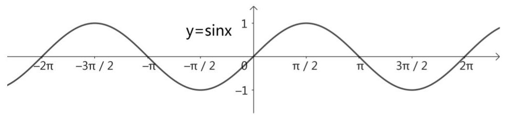

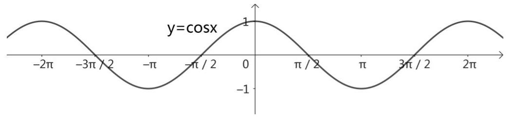

余弦函数 $f\left( x\right)  = \cos x$ 的导函数为 (利用和差化积公式):

$$
{f}^{\prime }\left( x\right)  = \mathop{\lim }\limits_{{{\Delta x} \rightarrow  0}}\frac{f\left( {x + {\Delta x}}\right)  - f\left( x\right) }{\Delta x}
$$

$$
= \mathop{\lim }\limits_{{{\Delta x} \rightarrow  0}}\frac{\cos \left( {x + {\Delta x}}\right)  - \cos x}{\Delta x}
$$

$$
= \mathop{\lim }\limits_{{{\Delta x} \rightarrow  0}}\frac{-2\sin \left( {x + \frac{\Delta x}{2}}\right) \sin \frac{\Delta x}{2}}{\Delta x}
$$

$$
= \mathop{\lim }\limits_{{{\Delta x} \rightarrow  0}}\left( {-\sin \left( {x + \frac{\Delta x}{2}}\right) }\right)  \cdot  \mathop{\lim }\limits_{{{\Delta x} \rightarrow  0}}\frac{\sin \frac{\Delta x}{2}}{\frac{\Delta x}{2}}
$$

此处同样需要使用公式: $\mathop{\lim }\limits_{{x \rightarrow  0}}\frac{\sin x}{x} = 1$ ,继续化简:

$$
{f}^{\prime }\left( x\right)  = \mathop{\lim }\limits_{{{\Delta x} \rightarrow  0}}\left( {-\sin \left( {x + \frac{\Delta x}{2}}\right) }\right)  \cdot  \mathop{\lim }\limits_{{{\Delta x} \rightarrow  0}}\frac{\sin \frac{\Delta x}{2}}{\frac{\Delta x}{2}}
$$

$$
= \mathop{\lim }\limits_{{{\Delta x} \rightarrow  0}}\left( {-\sin \left( {x + \frac{\Delta x}{2}}\right) }\right)  \cdot  1
$$

$$
= \mathop{\lim }\limits_{{{\Delta x} \rightarrow  0}}\left( {-\sin \left( {x + \frac{\Delta x}{2}}\right) }\right)
$$

$$
=  - \sin \left( {x + \frac{\mathop{\lim }\limits_{{{\Delta x} \rightarrow  0}}{\Delta x}}{2}}\right)
$$

$$
=  - \sin x
$$

即 ${f}^{\prime }\left( x\right)  =  - \sin x$ ,基本的余弦函数的导函数是基本的正弦函数的相反数。

下图为余弦函数 $y = \cos x$ 和它的导函数 ${y}^{\prime } =  - \sin x$ 的图像,从图中可以读出: 在区间 $\left\lbrack  {-\pi  + {2k\pi },{2k\pi }}\right\rbrack  \left( {k \in  \mathbf{Z}}\right)$ 上, $f\left( x\right)$ 单调递增, ${f}^{\prime }\left( x\right)  > 0$ 。在区间 $\left\lbrack  {{2k\pi },\pi  + {2k\pi }}\right\rbrack  \left( {k \in  \mathbf{Z}}\right)$ 上, $f\left( x\right)$ 单调递减, ${f}^{\prime }\left( x\right)  < 0$ 。

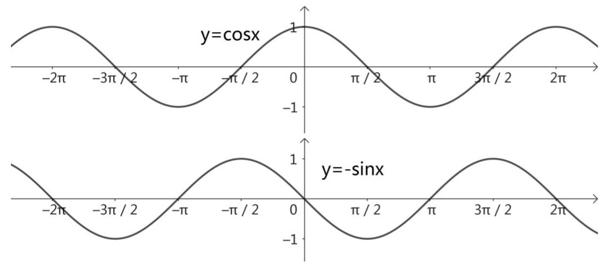

利用导数的运算法则 (将在下一节学习),可以根据正弦函数 $f\left( x\right)  = \sin x$ 的导数和余弦函数 $f\left( x\right)  = \cos x$ 的导数求得正切函数 $f\left( x\right)  = \tan x$ 的导数为:

$$
{f}^{\prime }\left( x\right)  = \frac{1}{{\cos }^{2}x}
$$

可以发现, 正弦函数的导函数是余弦函数, 余弦函数的导函数是正弦函数的相反数, 考虑到正弦函数与余弦函数的图像实际上相同, 只是在坐标系中进行了平移, 因此正弦函数和余弦函数的导函数是将自身平移四分之一个周期后的位置, 这是三角函数非常特殊的性质。

自然界中很多相互关联的周期性变化的现象, 都存在变化规律相似的同时, 错开一定相位的规律，例如，做理想振动的物体，它的位移与速度(即位移的变化率) 都能用三角函数描述, 它们具有相同的周期, 相差四分之一个周期的相位。

例 11.8 求下列函数的导函数和在 $x = \frac{\pi }{2}$ 处的导数:

(1) $y = \sin \left( {\frac{\pi }{2} - x}\right) ;\;\left( 2\right) y = \cos \left( {\frac{\pi }{2} - x}\right)$ 。

解析: 按照各基本初等函数对应的导函数公式代入相应的参数即可:

(1) $y = \sin \left( {\frac{\pi }{2} - x}\right)  = \cos x,{y}^{\prime } =  - \sin x,{y}^{\prime }\left( \frac{\pi }{2}\right)  =  - \sin \frac{\pi }{2} =  - 1$ ;

(2) $y = \cos \left( {\frac{\pi }{2} - x}\right)  = \sin x,{y}^{\prime } = \cos x,{y}^{\prime }\left( \frac{\pi }{2}\right)  = \cos \frac{\pi }{2} = 0$ 。

练习 11.3(5)

1. 求下列函数的导函数和在 $x = 2$ 处的导数:

(4) $y = {\left( \frac{1}{7}\right) }^{x}$ ；

(6) $y = {\log }_{0.3}x$ (7) $y = \sin x$ (8) $y = \cos x$ 。

下表列出了高中重点学习的基本初等函数的导函数:

<table><tr><td>名称</td><td>函数</td><td>导函数</td><td>备注</td></tr><tr><td>常数函数</td><td>$f\left( x\right)  = c$</td><td>${f}^{\prime }\left( x\right)  = 0$</td><td>$c$ 为常数</td></tr><tr><td>幂函数</td><td>$f\left( x\right)  = {x}^{a}$</td><td>${f}^{\prime }\left( x\right)  = a{x}^{a - 1}$</td><td>$a \neq  0$</td></tr><tr><td>指数函数</td><td>$f\left( x\right)  = {a}^{x}$</td><td>${f}^{\prime }\left( x\right)  = {a}^{x}\ln a$</td><td>$a > 0,\;a \neq  1$</td></tr><tr><td>对数函数</td><td>$f\left( x\right)  = {\log }_{a}x$</td><td>${f}^{\prime }\left( x\right)  = \frac{1}{x\ln a}$</td><td>$a > 0,\;a \neq  1$</td></tr><tr><td>正弦函数</td><td>$f\left( x\right)  = \sin x$</td><td>${f}^{\prime }\left( x\right)  = \cos x$</td><td></td></tr><tr><td>余弦函数</td><td>$f\left( x\right)  = \cos x$</td><td>${f}^{\prime }\left( x\right)  =  - \sin x$</td><td></td></tr><tr><td>正切函数</td><td>$f\left( x\right)  = \tan x$</td><td>${f}^{\prime }\left( x\right)  = \frac{1}{{\cos }^{2}x}$</td><td></td></tr></table>

### 11.4 导数的基本运算

多个函数可以进行加、减、乘、除、复合等基本运算，构造新的函数，新构造的函数的导函数可以由 “原料” 函数的导函数通过运算得到。高中阶段遇到的函数大都由基本初等函数通过运算构造而成, 导数的基本运算是求较复杂的函数的导数的重要方法。

#### 11.4.1 函数与常数相乘或相加的导数

如果函数 $f\left( x\right)$ 的导数为 ${f}^{\prime }\left( x\right)$ ,那么 $f\left( x\right)$ 与常数 $k\left( {k \neq  0}\right)$ 相乘所构成的函数 $g\left( x\right)  = {kf}\left( x\right)$ 的导数为:

$$
{g}^{\prime }\left( x\right)  = k{f}^{\prime }\left( x\right)
$$

即:一个函数与常数相乘，其导数是原函数的导数乘以该常数。函数除以非 0 的常数等于乘以它的倒数。如果函数 $f\left( x\right)$ 与多个非 0 的常数相乘，可以先将这些常数相乘，再让得到的结果与导函数相乘。

从导数反映函数的变化率的角度,函数整体乘以常数 $k$ ,相当于将函数图像沿垂直方向伸缩为原来的 $k$ 倍,则函数增大或减小的幅度也变为原来的 $k$ 倍。

例 11.9 求函数 $f\left( x\right)  = {2x}$ 的导数。

解析: 设 $g\left( x\right)  = x$ ,则 $f\left( x\right)  = {2g}\left( x\right)$ ,可得 ${g}^{\prime }\left( x\right)  = 1$ ,则 ${f}^{\prime }\left( x\right)  = 2{g}^{\prime }\left( x\right)  = 2$ 。

例 11.10 求函数 $f\left( x\right)  = {\log }_{a}x$ 的导数。

解析: 虽然我们前面学习了对数函数的求导公式,但本题利用 $y = \ln x$ 的导数为 ${y}^{\prime } = \frac{1}{x}$ ,以及对数运算的性质和导数的运算,验证对数函数的求导公式。使用换底公式: $f\left( x\right)  = {\log }_{a}x = \frac{\ln x}{\ln a} = \frac{1}{\ln a} \cdot  \ln x$ ,设 $g\left( x\right)  = \ln x$ ,可得 $f\left( x\right)  = \frac{1}{\ln a} \cdot  g\left( x\right)$ , 则 ${f}^{\prime }\left( x\right)  = \frac{1}{\ln a} \cdot  {g}^{\prime }\left( x\right)  = \frac{1}{\ln a} \cdot  \frac{1}{x}$ ,与按照公式求导的结果相同。

如果函数 $f\left( x\right)$ 的导数为 ${f}^{\prime }\left( x\right)$ ,那么 $f\left( x\right)$ 与常数 $c$ 相加所构成的函数 $g\left( x\right)  = f\left( x\right)  + c$ 的导数仍为 ${f}^{\prime }\left( x\right)$ ,即 ${g}^{\prime }\left( x\right)  = {f}^{\prime }\left( x\right)$ 。函数减去常数等于加上它的相反数。

从导数反映函数的变化率的角度,函数整体加一个常数 $c$ ,相当于将函数图像沿 $y$ 轴正方向平移 $c$ ,平移变换不改变函数图像的形状,不改变函数增大或减小的变化趋势。

如果函数 $f\left( x\right)$ 与多个常数相加减,可以先将这些常数相加减,再将得到的结果与函数相加减, 导数不变化。特别的, 常数函数加、减、乘、除任意常数后, 仍是常数函数, 任意常数函数的导数都为 0 。

需注意, 本小节中的函数与常数相乘除和相加减, 须为函数解析式整体与常数加减乘除, 而不是函数的部分与常数加减乘除。

## 练习 11.4(1)

1. 求下列函数的导函数:

(1) $y = \frac{1}{2}{x}^{2};\;$ (2) $y = {2}^{x + 1}$ ; (3) $y = \ln \frac{1}{x}$ ;

#### 11.4.2 函数相加减的导数

设函数 $f\left( x\right)$ 和 $g\left( x\right)$ 的导数分别为 ${f}^{\prime }\left( x\right)$ 和 ${g}^{\prime }\left( x\right)$ ，那么 $f\left( x\right)$ 与 $g\left( x\right)$ 相加减所构成的函数 $h\left( x\right)  = f\left( x\right)  + g\left( x\right) \text{ 、 }i\left( x\right)  = f\left( x\right)  - g\left( x\right)$ 的导数分别为:

$$
{h}^{\prime }\left( x\right)  = {f}^{\prime }\left( x\right)  + {g}^{\prime }\left( x\right) ,\;{i}^{\prime }\left( x\right)  = {f}^{\prime }\left( x\right)  - {g}^{\prime }\left( x\right)
$$

即:两个函数相加减所构成的函数，它的导数是原来两个函数的导数相加减。 如果多个函数相加减, 那么所构成的函数的导数是每个函数的导数相加减。

从导数反映函数的变化率的角度, 两个函数的解析式相加减, 相当于将同一自变量对应的函数值相加减, 函数值的变化量等于两个函数各自函数值变化量的相加减, 则变化率等于两个函数各自变化率的相加减。

例 11.11 已知 $f\left( x\right)  = 4{x}^{3}, g\left( x\right)  = 2{x}^{3}$ ,求 $h\left( x\right)  = f\left( x\right)  + g\left( x\right)$ 和 $i\left( x\right)  = f\left( x\right)  - g\left( x\right)$ 的导数。

解析: 先求出 $f\left( x\right) \text{ 、 }g\left( x\right)$ 的导数: ${f}^{\prime }\left( x\right)  = 4 \times  3{x}^{3 - 1} = {12}{x}^{2},{g}^{\prime }\left( x\right)  = 2 \times  3{x}^{3 - 1} = 6{x}^{2}$ ,

再使用函数相加的导数的运算:

$$
{h}^{\prime }\left( x\right)  = {f}^{\prime }\left( x\right)  + {g}^{\prime }\left( x\right)  = {12}{x}^{2} + 6{x}^{2} = {18}{x}^{2};
$$

$$
{i}^{\prime }\left( x\right)  = {f}^{\prime }\left( x\right)  - {g}^{\prime }\left( x\right)  = {12}{x}^{2} - 6{x}^{2} = 6{x}^{2}\text{ 。 }
$$

由于 $f\left( x\right)$ 和 $g\left( x\right)$ 都是关于 ${x}^{3}$ 的单项式,还可以先求出 $h\left( x\right)$ 和 $i\left( x\right)$ 的解析式再求导数:

$$
h\left( x\right)  = f\left( x\right)  + g\left( x\right)  = 4{x}^{3} + 2{x}^{3} = 6{x}^{3},\;{h}^{\prime }\left( x\right)  = 6 \times  3{x}^{3 - 1} = {18}{x}^{2};
$$

$$
i\left( x\right)  = f\left( x\right)  - g\left( x\right)  = 4{x}^{3} - 2{x}^{3} = 2{x}^{3},\;{i}^{\prime }\left( x\right)  = 2 \times  3{x}^{3 - 1} = 6{x}^{2}\text{ 。 }
$$

用两种方法求得的结果相同。

例 11.12 已知 $f\left( x\right)  = \sin x, g\left( x\right)  = \cos x$ ,求 $h\left( x\right)  = f\left( x\right)  + g\left( x\right)$ 的导数。

先求出 $f\left( x\right) \text{ 、 }g\left( x\right)$ 的导数: ${f}^{\prime }\left( x\right)  = \cos x,{g}^{\prime }\left( x\right)  =  - \sin x$ ,

再使用函数相加的导数的运算: ${h}^{\prime }\left( x\right)  = {f}^{\prime }\left( x\right)  + {g}^{\prime }\left( x\right)  = \cos x - \sin x$ 。

还可以先利用和角公式求出 $h\left( x\right)$ 的解析式再求导数:

$$
h\left( x\right)  = f\left( x\right)  + g\left( x\right)  = \sin x + \cos x = \sqrt{2}\sin \left( {x + \frac{\pi }{4}}\right) ,
$$

$x$ 加减任意常数,相当于将函数的图像左右平移,函数图像不变,把 $x + \frac{\pi }{4}$ 看作一个整体,该函数的导数为: ${h}^{\prime }\left( x\right)  = \sqrt{2}\cos \left( {x + \frac{\pi }{4}}\right)$ ,使用和角公式展开:

$$
{h}^{\prime }\left( x\right)  = \sqrt{2}\cos \left( {x + \frac{\pi }{4}}\right)  = \sqrt{2}\left( {\cos x\cos \frac{\pi }{4} - \sin x\sin \frac{\pi }{4}}\right)  = \cos x - \sin x\text{ 。 }
$$

用两种方法求得的结果相同。

练习 11.4(2)

1. 求下列函数的导函数:

(1) $y = x - \frac{1}{x}$ ; (2) $y = {2}^{x} + {2}^{x + 1}$ ; (3) $y = {\log }_{2}x + {\log }_{\frac{1}{2}}x$ ; (4) $y = \sin x - \cos x$ 。

#### 11.4.3 函数相乘的导数

设函数 $f\left( x\right)$ 和 $g\left( x\right)$ 的导数分别为 ${f}^{\prime }\left( x\right)$ 和 ${g}^{\prime }\left( x\right)$ ,则 $f\left( x\right)$ 与 $g\left( x\right)$ 相乘所构成的函数 $h\left( x\right)  = f\left( x\right) g\left( x\right)$ 的导数为:

$$
{h}^{\prime }\left( x\right)  = {f}^{\prime }\left( x\right) g\left( x\right)  + f\left( x\right) {g}^{\prime }\left( x\right)
$$

即:两个函数相乘所构成的函数的导数为:一个函数的导数与另一个函数的乘积, 加上另一个函数的导数与这个函数的乘积。

从公式中可以看出, 两个原函数分别求了一次导数并与另一个函数相乘, 互换位置后表达式不变，两个函数的 “地位” 平等。

如果要求三个函数相乘所构成的函数的导数，可以先将其中两个按照该规则求导函数, 再将该导函数与第三个函数按照该规则求导。

例 11.13 已知 $f\left( x\right)  = {2}^{x}, g\left( x\right)  = {3}^{x}$ ,求 $h\left( x\right)  = f\left( x\right) g\left( x\right)$ 的导数。

解析: 先求出 $f\left( x\right) \text{ 、 }g\left( x\right)$ 的导数: ${f}^{\prime }\left( x\right)  = {2}^{x}\ln 2,{g}^{\prime }\left( x\right)  = {3}^{x}\ln 3$ ,

再使用函数相乘的导数的运算:

${h}^{\prime }\left( x\right)  = {f}^{\prime }\left( x\right) g\left( x\right)  + f\left( x\right) {g}^{\prime }\left( x\right)  = {2}^{x}\ln 2 \times  {3}^{x} + {2}^{x} \times  {3}^{x}\ln 3 = {6}^{x}\left( {\ln 2 + \ln 3}\right)  = {6}^{x}\ln 6$ 。

还可以先求出 $h\left( x\right)$ 的解析式再求导数:

$h\left( x\right)  = f\left( x\right) g\left( x\right)  = {2}^{x} \times  {3}^{x} = {6}^{x},\;{h}^{\prime }\left( x\right)  = {6}^{x}\ln 6$ 。用两种方法求得的结果相同。

例 11.14 求 $y = 3\sin x - {\sin }^{3}x$ 的导数。

解析: $f\left( x\right)  = 3\sin x - {\sin }^{3}x$ 可以看作函数 $g\left( x\right)  = 3\sin x$ 减去函数 $h\left( x\right)  = {\sin }^{3}x$ 。

其中 $g\left( x\right)  = 3\sin x$ 的导数易求得: ${g}^{\prime }\left( x\right)  = 3\cos x$ 。

接下来求 $h\left( x\right)  = {\sin }^{3}x$ 的导数,可以将 $h\left( x\right)  = {\sin }^{3}x$ 看作 $h\left( x\right)  = {\sin }^{2}x \cdot  \sin x$ ,设函数 $i\left( x\right)  = {\sin }^{2}x = \sin x \cdot  \sin x$ ,则 $h\left( x\right)  = i\left( x\right)  \cdot  \sin x$ ,可使用函数相乘的求导公式求 $i\left( x\right)$ 的导数: ${i}^{\prime }\left( x\right)  = \cos x \cdot  \sin x + \sin x \cdot  \cos x = 2\sin x\cos x$ ,再使用该结论求 $h\left( x\right)$ 的导数: ${h}^{\prime }\left( x\right)  = {i}^{\prime }\left( x\right)  \cdot  \sin x + i\left( x\right)  \cdot  {\sin }^{\prime }x = 2\sin x\cos x \cdot  \sin x + {\sin }^{2}x \cdot  \cos x = 3{\sin }^{2}x\cos x$ 。

最后使用函数相减的求导公式可得: ${f}^{\prime }\left( x\right)  = {g}^{\prime }\left( x\right)  - {h}^{\prime }\left( x\right)  = 3\cos x - 3{\sin }^{2}x\cos x$

---

$= 3\cos x\left( {1 - {\sin }^{2}x}\right)  = 3\cos x{\cos }^{2}x = 3{\cos }^{3}x$ 。

---

练习 11.4(3)

1. 求下列函数的导函数:

(1) $y = x{\mathrm{e}}^{x}$ ；(2) $y = x\ln x$ ；(3) $y = {\mathrm{e}}^{x}\sin x$ ；(4) $y = \sin {2x}$ 。

#### 11.4.4 函数相除的导数

设函数 $f\left( x\right)$ 和 $g\left( x\right)$ 的导数分别为 ${f}^{\prime }\left( x\right)$ 和 ${g}^{\prime }\left( x\right)$ ,那么 $f\left( x\right)$ 除以 $g\left( x\right)$ 所构成的函数 $h\left( x\right)  = \frac{f\left( x\right) }{g\left( x\right) }$ 的导数为:

$$
{h}^{\prime }\left( x\right)  = \frac{{f}^{\prime }\left( x\right) g\left( x\right)  - f\left( x\right) {g}^{\prime }\left( x\right) }{{g}^{2}\left( x\right) }
$$

即:一个函数除以另一个函数所构成的函数的导数为:被除数(分子)函数的导数与除数(分母)函数的乘积，减去除数(分母)函数的导数与被除数(分子)函数的乘积，再除以除数(分母位置)函数的平方。

例 11.15 已知 $f\left( x\right)  = \ln x, g\left( x\right)  = {\mathrm{e}}^{x}$ ,求 $h\left( x\right)  = \frac{f\left( x\right) }{g\left( x\right) }$ 和 $i\left( x\right)  = \frac{g\left( x\right) }{f\left( x\right) }$ 的导数。

解析: 先求出 $f\left( x\right) \text{ 、 }g\left( x\right)$ 的导数: ${f}^{\prime }\left( x\right)  = \frac{1}{x},{g}^{\prime }\left( x\right)  = {\mathrm{e}}^{x}$ ,

再使用函数相除的导数的运算:

$$
{h}^{\prime }\left( x\right)  = \frac{{f}^{\prime }\left( x\right) g\left( x\right)  - f\left( x\right) {g}^{\prime }\left( x\right) }{{g}^{2}\left( x\right) } = \frac{\frac{1}{x} \cdot  {\mathrm{e}}^{x} - \ln x \cdot  {\mathrm{e}}^{x}}{{\left( {\mathrm{e}}^{x}\right) }^{2}} = \frac{1 - x\ln x}{x{\mathrm{e}}^{x}},
$$

$$
{i}^{\prime }\left( x\right)  = \frac{{g}^{\prime }\left( x\right) f\left( x\right)  - g\left( x\right) {f}^{\prime }\left( x\right) }{{f}^{2}\left( x\right) } = \frac{{\mathrm{e}}^{x} \cdot  \ln x - {\mathrm{e}}^{x} \cdot  \frac{1}{x}}{{\left( \ln x\right) }^{2}} = \frac{{\mathrm{e}}^{x}\left( {x\ln x - 1}\right) }{x{\left( \ln x\right) }^{2}}\text{ 。 }
$$

例 11.16 已知 $f\left( x\right)  = {x}^{4} + 1, g\left( x\right)  = {x}^{2}$ ,求 $h\left( x\right)  = \frac{f\left( x\right) }{g\left( x\right) }$ 的导数。

解析: 先求出 $f\left( x\right) \text{ 、 }g\left( x\right)$ 的导数: ${f}^{\prime }\left( x\right)  = 4{x}^{3},{g}^{\prime }\left( x\right)  = {2x}$ ,

再使用函数相除的导数的运算:

$$
{h}^{\prime }\left( x\right)  = \frac{{f}^{\prime }\left( x\right) g\left( x\right)  - f\left( x\right) {g}^{\prime }\left( x\right) }{{g}^{2}\left( x\right) } = \frac{4{x}^{3} \cdot  {x}^{2} - \left( {{x}^{4} + 1}\right)  \cdot  {2x}}{{\left( {x}^{2}\right) }^{2}} = {2x} - \frac{2}{{x}^{3}}\text{ 。 }
$$

还可以直接求出 $h\left( x\right)$ 的解析式: $h\left( x\right)  = \frac{f\left( x\right) }{g\left( x\right) } = \frac{{x}^{4} + 1}{{x}^{2}} = {x}^{2} + {x}^{-2}$ ,

再求导数: ${h}^{\prime }\left( x\right)  = 2{x}^{2 - 1} + \left( {-2}\right) {x}^{-2 - 1} = {2x} - \frac{2}{{x}^{3}}$ 。

用两种方法求得的结果相同。

练习 11.4(4)

1. 求下列函数的导函数:

(1) $y = \frac{{2}^{x}}{{x}^{2}};\;\left( 2\right) y = \frac{{\mathrm{e}}^{x}}{{x}^{\mathrm{e}}};\;\left( 3\right) y = \frac{1}{\cos x};\;\left( 4\right) y = \tan x$ 。

#### 11.4.5 复合函数的导数

设函数 $f\left( x\right)$ 和 $g\left( x\right)$ 的导数分别为 ${f}^{\prime }\left( x\right)$ 和 ${g}^{\prime }\left( x\right)$ ,那么 $f\left( x\right)$ 与 $g\left( x\right)$ 所构成的复合函数 $h\left( x\right)  = g\left( {f\left( x\right) }\right)$ 的导数为:

$$
{h}^{\prime }\left( x\right)  = {g}^{\prime }\left( {f\left( x\right) }\right)  \cdot  {f}^{\prime }\left( x\right)
$$

即:先将内层的函数当作一个整体不动，对外层函数求导，再乘以内层函数的导数。

通过具体函数作为例子体现更加直观:

例 11.17 已知 $f\left( x\right)  = {2x} - 1, g\left( x\right)  = {x}^{3}$ ,求 $h\left( x\right)  = g\left( {f\left( x\right) }\right)$ 的导数。

解析: $h\left( x\right)  = {\left( 2x - 1\right) }^{3}$ ,

先求内层函数 $f\left( x\right)  = {2x} - 1$ 的导数: ${f}^{\prime }\left( x\right)  = 2$ ,

对于外层函数 $g\left( {{2x} - 1}\right)  = {\left( 2x - 1\right) }^{3}$ ，把 ${2x} - 1$ 当作一个整体不动，进行求导: ${g}^{\prime }\left( {f\left( x\right) }\right)  = {g}^{\prime }\left( {{2x} - 1}\right)  = 3 \times  {\left( 2x - 1\right) }^{3 - 1} = 3{\left( 2x - 1\right) }^{2}$ ,

将两个导数相乘:

$$
{h}^{\prime }\left( x\right)  = {g}^{\prime }\left( {f\left( x\right) }\right)  \cdot  {f}^{\prime }\left( x\right)  = 3{\left( 2x - 1\right) }^{2} \times  2 = 6{\left( 2x - 1\right) }^{2} = {24}{x}^{2} - {24x} + 6\text{ 。 }
$$

还可以先用完全立方公式将 $h\left( x\right)$ 展开再求导数:

$$
h\left( x\right)  = {\left( 2x - 1\right) }^{3} = 8{x}^{3} - {12}{x}^{2} + {6x} - 1,
$$

$$
{h}^{\prime }\left( x\right)  = 8 \times  3{x}^{3 - 1} - {12} \times  2{x}^{2 - 1} + 6 \times  1{x}^{1 - 1} = {24}{x}^{2} - {24x} + 6\text{ 。 }
$$

用两种方法求得的结果相同。

例 11.18 已知 $f\left( x\right)  = {2x}, g\left( x\right)  = \sin x$ ,求 $h\left( x\right)  = g\left( {f\left( x\right) }\right)$ 的导数。

解析: $h\left( x\right)  = \sin \left( {2x}\right)$ ,

先求内层函数 $f\left( x\right)  = {2x}$ 的导数: ${f}^{\prime }\left( x\right)  = 2$ ,

对于外层函数 $g\left( {2x}\right)  = \sin {2x}$ ,把 ${2x}$ 当作一个整体不动,进行求导: ${g}^{\prime }\left( {2x}\right)  = \cos {2x},$

将两个导数相乘: ${h}^{\prime }\left( x\right)  = {g}^{\prime }\left( {f\left( x\right) }\right)  \cdot  {f}^{\prime }\left( x\right)  = \cos {2x} \times  2 = 2\cos {2x}$ 。

还可以先使用二倍角公式将 $h\left( x\right)$ 展开再求导数:

$$
h\left( x\right)  = \sin {2x} = 2\sin x\cos x,
$$

$$
{h}^{\prime }\left( x\right)  = 2\left( {\cos x \cdot  \cos x + \sin x \cdot  \left( {-\sin x}\right) }\right)  = 2\left( {{\cos }^{2}x - {\sin }^{2}x}\right)  = 2\cos {2x}\text{ 。 }
$$

用两种方法求得的结果相同。

多个函数 ${f}_{1}\left( x\right) \text{ 、 }{f}_{2}\left( x\right) \cdots {f}_{n}\left( x\right)$ 所构成的复合函数 $g\left( x\right)  = {f}_{1}\left( {{f}_{2}\left( {\cdots {f}_{n}\left( x\right) \cdots }\right) }\right)$ 的导数为:

$$
{g}^{\prime }\left( x\right)  = {f}_{1}^{\prime }\left( {{f}_{2}\left( {\cdots {f}_{n}\left( x\right) \cdots }\right) }\right)  \cdot  {f}_{2}^{\prime }\left( {\cdots {f}_{n}\left( x\right) \cdots }\right) \cdots \cdots {f}_{n}^{\prime }\left( x\right)
$$

即:将多层复合的函数逐层 “抽丝剥茧” 分别求导，再将所有导数相乘。

例 11.19 求函数 $f\left( x\right)  = \ln \sqrt{4\sin x}$ 的导数。

解析: 该函数形式较复杂,可以看作下列函数的复合函数: ${f}_{1}\left( x\right)  = \sin x$ , ${f}_{2}\left( x\right)  = {4x},\;{f}_{3}\left( x\right)  = \sqrt{x},\;{f}_{4}\left( x\right)  = \ln x$ ,则 $f\left( x\right)  = {f}_{4}\left( {{f}_{3}\left( {{f}_{2}\left( {{f}_{1}\left( x\right) }\right) }\right) }\right)$ ,

先求最内层函数 ${f}_{1}\left( x\right)  = \sin x$ 的导数: ${f}_{1}^{\prime }\left( x\right)  = \cos x$ ,

对于第二层 ${f}_{2}\left( {\sin x}\right)  = 4\sin x$ ,把 $\sin x$ 当作一个整体不动,进行求导: ${f}_{2}^{\prime }\left( {\sin x}\right)  = 4$ ,

对于第三层 ${f}_{3}\left( {4\sin x}\right)  = \sqrt{4\sin x}$ ,把 $4\sin x$ 当作一个整体不动,进行求导:

$$
{f}_{3}^{\prime }\left( {4\sin x}\right)  = \frac{1}{2}{\left( 4\sin x\right) }^{\frac{1}{2} - 1} = \frac{1}{2\sqrt{4\sin x}} = \frac{1}{4\sqrt{\sin x}},
$$

对于第四层 ${f}_{4}\left( \sqrt{4\sin x}\right)  = \ln \sqrt{4\sin x}$ ,把 $\sqrt{4\sin x}$ 当作一个整体不动,进行求导:

$$
{f}_{4}^{\prime }\left( \sqrt{4\sin x}\right)  = \frac{1}{\sqrt{4\sin x}} = \frac{1}{2\sqrt{\sin x}},
$$

将上面的所有导数相乘:

$$
{f}^{\prime }\left( x\right)  = {f}_{1}^{\prime }\left( x\right)  \cdot  {f}_{2}^{\prime }\left( {{f}_{1}\left( x\right) }\right)  \cdot  {f}_{3}^{\prime }\left( {{f}_{2}\left( {{f}_{1}\left( x\right) }\right) }\right)  \cdot  {f}_{4}^{\prime }\left( {{f}_{3}\left( {{f}_{2}\left( {{f}_{1}\left( x\right) }\right) }\right) }\right)
$$

$$
= \cos x \cdot  4 \cdot  \frac{1}{4\sqrt{\sin x}} \cdot  \frac{1}{2\sqrt{\sin x}}
$$

$$
= \frac{\cos x}{2\sin x}
$$

需注意，求复合函数的导数时，对外层的函数求导时，须将内层的函数 $f\left( x\right)$ 当作不能再变化的整体进行求导，其具体表达式不能改变。另外，由于导函数是描述原函数的性质的函数，因此导函数的定义域不能超出原函数，为确保导函数有意义，其定义域有时还会进一步缩小或排除一些特殊的点。

综上, 下表列出了导数的基本运算法则:

<table><tr><td>运算方式</td><td>新函数</td><td>新导数</td></tr><tr><td>乘以常数</td><td>${kf}\left( x\right)$</td><td>$k{f}^{\prime }\left( x\right)$</td></tr><tr><td>加上常数</td><td>$f\left( x\right)  + c$</td><td>${f}^{\prime }\left( x\right)$</td></tr><tr><td>相加减</td><td>$f\left( x\right)  \pm  g\left( x\right)$</td><td>${f}^{\prime }\left( x\right)  \pm  {g}^{\prime }\left( x\right)$</td></tr><tr><td>相乘</td><td>$f\left( x\right) g\left( x\right)$</td><td>${f}^{\prime }\left( x\right) g\left( x\right)  + f\left( x\right) {g}^{\prime }\left( x\right)$</td></tr><tr><td>相除</td><td>$\frac{f\left( x\right) }{g\left( x\right) }$</td><td>$\frac{{f}^{\prime }g\left( x\right)  - f\left( x\right) {g}^{\prime }\left( x\right) }{{g}^{2}\left( x\right) }$</td></tr><tr><td>复合函数</td><td>$g\left( {f\left( x\right) }\right)$</td><td>${g}^{\prime }\left( {f\left( x\right) }\right)  \cdot  {f}^{\prime }\left( x\right)$</td></tr></table>

练习 11.4(5)

1. 求下列函数的导函数和它们在 $x = 3$ 处的导数:

(1) $y = \ln \sqrt{x}$ ; (2) $y = \ln \left( {\ln x}\right)$ ; (3) $y = \frac{{\mathrm{e}}^{x} - {\mathrm{e}}^{-x}}{{\mathrm{e}}^{x} + {\mathrm{e}}^{-x}}$ ; (4) $y = \sin \left( {\cos x}\right)$ 。

2. 已知圆 $O$ 以原点为圆心、半径为 2,求经过圆 $O$ 上的点 $\left( {\sqrt{2},\sqrt{2}}\right)$ 的切线的方程。

3. 已知函数 ${f}_{1}\left( x\right) \text{ 、 }{f}_{2}\left( x\right) \text{ 、 }{f}_{3}\left( x\right)$ 的导数分别为 ${f}_{1}^{\prime }\left( x\right) \text{ 、 }{f}_{2}^{\prime }\left( x\right) \text{ 、 }{f}_{3}^{\prime }\left( x\right)$ ,求它们相乘所构成的函数 $g\left( x\right)  = {f}_{1}\left( x\right) {f}_{2}\left( x\right) {f}_{3}\left( x\right)$ 的导数。

4. 已知函数 $f\left( x\right)  = {10x}, g\left( x\right)  = {10}^{x}, h\left( x\right)  = \lg x$ ,求下列函数的导数:

(1) $f\left( x\right)  + g\left( x\right)  + h\left( x\right)$ ； (2) $g\left( x\right) h\left( x\right)$ ； (3) $\frac{f\left( x\right) }{h\left( x\right) }$ ；

5. 求下列函数在 $x = 1\text{ 、 }x = {100}\text{ 、 }x = {10000}$ 处的导数,比较导数的大小,指出各函数增长快慢的关系: 函数 $1 : f\left( x\right)  = \ln x$ ,函数 $2 : g\left( x\right)  = x$ ,函数 $3 : h\left( x\right)  = {\mathrm{e}}^{x}$ 。

### 11.5 导数的应用

导数反映函数局部变化趋势这一重要性质, 使导数成为分析函数性质和解决函数问题的绝佳工具, 可以免于使用高深的思路和巧妙的技巧, 只需要按部就班地求导, 根据导数判断即可。

#### 11.5.1 判断函数的单调性

函数 $f\left( x\right)$ 的导函数 ${f}^{\prime }\left( x\right)$ 反映其局部的变化趋势,这个趋势最直观的表现就是函数在其上一点 $\left( {{x}_{0},{y}_{0}}\right)$ 处的切线的斜率 $k = {f}^{\prime }\left( x\right)$ 。

若切线的斜率 ${f}^{\prime }\left( {x}_{0}\right)  > 0$ ,则切线表示的一次函数单调递增,即 $f\left( x\right)$ 在 $\left( {{x}_{0},{y}_{0}}\right)$ 处单调递增。

若切线的斜率 ${f}^{\prime }\left( {x}_{0}\right)  < 0$ ,则切线表示的一次函数单调递减,即 $f\left( x\right)$ 在 $\left( {{x}_{0},{y}_{0}}\right)$ 处单调递减。

若切线的斜率 ${f}^{\prime }\left( {x}_{0}\right)  = 0$ ,则切线表示的一次函数不增不减,即 $f\left( x\right)$ 在 $\left( {{x}_{0},{y}_{0}}\right)$ 处不增不减。

将上述对应关系拓展到函数的一段连续的定义域区间 $\left( {a, b}\right)$ :

若 $f\left( x\right)$ 在区间 $\left( {a, b}\right)$ 上的导数恒大于 0,则 $f\left( x\right)$ 在该区间的每个点都单调递增,即 $f\left( x\right)$ 在该区间单调递增。

若 $f\left( x\right)$ 在区间 $\left( {a, b}\right)$ 上的导数恒小于 0,则 $f\left( x\right)$ 在该区间的每个点都单调递减,即 $f\left( x\right)$ 在该区间单调递减。

若 $f\left( x\right)$ 在区间 $\left( {a, b}\right)$ 上的导数恒等于 0,则 $f\left( x\right)$ 在该区间的每个点都不增不减,即 $f\left( x\right)$ 在该区间不增不减,是常数。

综上,函数 $f\left( x\right)$ 在定义域区间 $\left( {a, b}\right)$ 内的单调性与导数 ${f}^{\prime }\left( x\right)$ 的正负有直接对应关系:

$f\left( x\right)$ 单调递增的充要条件为 ${f}^{\prime }\left( {x}_{0}\right)  > 0$ 。

$f\left( x\right)$ 单调递减的充要条件为 ${f}^{\prime }\left( {x}_{0}\right)  < 0$ 。

$f\left( x\right)$ 不增不减的充要条件为 ${f}^{\prime }\left( {x}_{0}\right)  = 0$ 。

用导数判断函数的单调性是一种通用的方法, 不需要进行特殊的技巧处理, 只需求出导函数，根据导函数的正负号进行判断即可。

例 11.20 分析二次函数 $f\left( x\right)  =  - {x}^{2} + {2x} + 4$ 的单调性。

解析: 求出该函数的导函数: ${f}^{\prime }\left( x\right)  =  - {2x} + 2$ ,

当 ${f}^{\prime }\left( x\right)  =  - {2x} + 2 > 0$ 时,解不等式得 $x < 1, f\left( x\right)$ 单调递增;

当 ${f}^{\prime }\left( x\right)  =  - {2x} + 2 < 0$ 时,解不等式得 $x > 1, f\left( x\right)$ 单调递减;

当 ${f}^{\prime }\left( x\right)  =  - {2x} + 2 = 0$ 时,解不等式得 $x = 1, f\left( x\right)$ 不增不减。

用配方法予以验证: $f\left( x\right)  =  - {x}^{2} + {2x} + 4 =  - {\left( x - 1\right) }^{2} + 5$ ,其中 ${\left( x - 1\right) }^{2}$ 是完全平方数, 恒大于等于 0 :

当 $x < 1$ 时， $f\left( x\right)  =  - {\left( x - 1\right) }^{2} + 5$ 单调递增；

当 $x > 1$ 时, $f\left( x\right)  =  - {\left( x - 1\right) }^{2} + 5$ 单调递减。

两种分析方法得到的结论一致。

例 11.21 分析函数 $f\left( x\right)  = \frac{\ln x}{{x}^{2}}$ 的单调性。

解析: 求出该函数的导函数: ${f}^{\prime }\left( x\right)  = \frac{\frac{1}{x} \cdot  {x}^{2} - \ln x \cdot  {2x}}{{\left( {x}^{2}\right) }^{2}} = \frac{1 - 2\ln x}{{x}^{3}}$ ,

原函数的定义域为 $x \in  \left( {0, + \infty }\right)$ ,导函数的定义域也须为 $x \in  \left( {0, + \infty }\right)$ ,此时导函数的分母恒有 ${x}^{3} > 0$ ,只需分析分子 $1 - 2\ln x$ 的正负号即可,

解不等式 $1 - 2\ln x > 0$ 得: $0 < x < \sqrt{\mathrm{e}}$ ,即: 当 $x \in  \left( {0,\sqrt{\mathrm{e}}}\right)$ 时, $f\left( x\right)  = \frac{\ln x}{{x}^{2}}$ 单调递增;

解不等式 $1 - 2\ln x < 0$ 得: $x > \sqrt{\mathrm{e}}$ ,即: 当 $x \in  \left( {\sqrt{\mathrm{e}}, + \infty }\right)$ 时, $f\left( x\right)  = \frac{\ln x}{{x}^{2}}$ 单调递减。

下页图为函数 $f\left( x\right)  = \frac{\ln x}{{x}^{2}}$ 的图像及在点 $\left( {\sqrt{\mathrm{e}},\frac{1}{2\mathrm{e}}}\right)$ 附近的特写 $(\sqrt{\mathrm{e}} \approx  {1.65}$ , $\frac{1}{2\mathrm{e}} \approx  {0.18}$ ),从图中可以读出: 函数在 $\left( {\sqrt{\mathrm{e}},\frac{1}{2\mathrm{e}}}\right)$ 左侧单调递增,在右侧单调递减。

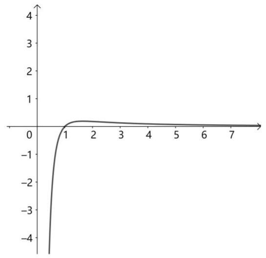

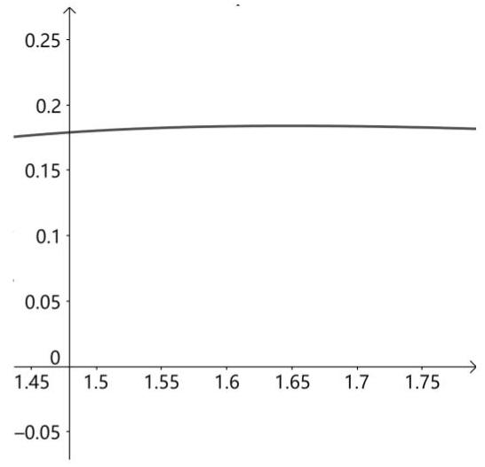

练习 11.5(1)

1. 分析下列函数的单调性, 求它们的单调区间。

(1) $y = \sqrt{x}$ ； (2) $y = {x}^{3} - 2{x}^{2} + x$ ； (3) $y = \ln x - x$ ；

(4) $y = \frac{\ln x}{x}$ ;

(5) $y = \ln {x}^{2}$ ； (6) $y = \sin {2x}$ ； (7) $y = \frac{\sin x}{\cos x}$ ; (8) $y = \sin x - \cos x$ 。

#### 11.5.2 函数的极值与最大(小)值

一个函数 $f\left( x\right)$ 的所有函数值中，最大的函数值叫作函数的最大值，最小的函数值叫作函数的最小值。

函数是否有最大 (小) 值, 需要根据函数的定义域和解析式具体判断:

有些函数有最大值和最小值,例如, $f\left( x\right)  = \sin x$ 的最大值是 1,最小值是 -1 。

有些函数有最大值、没有最小值,例如, $f\left( x\right)  =  - {x}^{2}$ 的最大值是 0,没有最小值。

有些函数没有最大值、有最小值,例如, $f\left( x\right)  = \sqrt{x}$ 没有最大值,最小值是 0 。

有些函数没有最大值和最小值,例如, $f\left( x\right)  = x\text{ 、 }f\left( x\right)  = \tan x\text{ 、 }f\left( x\right)  = \ln x$ 都没有最大值和最小值。

极大值和极小值是描述函数局部性质的概念。

如果函数 $f\left( x\right)$ 上的一点 $\left( {{x}_{0},{y}_{0}}\right)$ 及其附近满足: ${f}^{\prime }\left( {x}_{0}\right)  = 0$ ,且在 $x = {x}_{0}$ 左侧恒有 ${f}^{\prime }\left( x\right)  > 0$ ,同时在 $x = {x}_{0}$ 右侧恒有 ${f}^{\prime }\left( x\right)  < 0$ ,即 $f\left( x\right)$ 单调递增至 $x = {x}_{0}$ 后单调递减,那么 $\left( {{x}_{0},{y}_{0}}\right)$ 叫作 $f\left( x\right)$ 的一个极大值点, ${y}_{0}$ 叫作 $f\left( x\right)$ 的一个极大值。

按照极大值点的定义,在 $\left( {{x}_{0},{y}_{0}}\right)$ 左侧 ${f}^{\prime }\left( x\right)  > 0, f\left( x\right)$ 单调递增, $x = {x}_{0}$ 左侧附近的函数值都比它小。同时,在 $x = {x}_{0}$ 右侧 ${f}^{\prime }\left( x\right)  < 0, f\left( x\right)$ 单调递减, $x = {x}_{0}$ 右侧附近的函数值也都比它小。综上, $f\left( x\right)$ 在 $x = {x}_{0}$ 附近的左右两侧, ${y}_{0}$ 是最大的函数值, $\left( {{x}_{0},{y}_{0}}\right)$ 是该处的极大值点。

至于距离 $\left( {{x}_{0},{y}_{0}}\right)$ 多近叫作 “附近”,高中阶段不学习其严格定义,可以近似认为只要函数 $f\left( x\right)$ 在 $\left( {{x}_{0},{y}_{0}}\right)$ 附近连续,没有 “断开” 或 “突变”,且导数的正负号也没有变化，就称这段区间在 $\left( {{x}_{0},{y}_{0}}\right)$ 的 “附近”。

与极大值相对应,如果函数 $f\left( x\right)$ 上的一点 $\left( {{x}_{0},{y}_{0}}\right)$ 及其附近满足: ${f}^{\prime }\left( {x}_{0}\right)  = 0$ ,且在 $x = {x}_{0}$ 左侧 ${f}^{\prime }\left( x\right)  < 0$ ,在 $x = {x}_{0}$ 右侧 ${f}^{\prime }\left( x\right)  > 0$ ,即 $f\left( x\right)$ 单调递减至 $x = {x}_{0}$ 后单调递增,那么 $\left( {{x}_{0},{y}_{0}}\right)$ 叫作 $f\left( x\right)$ 的一个极小值点, ${y}_{0}$ 叫作 $f\left( x\right)$ 的一个极小值。极大值与极小值统称为函数的极值。

函数的极大值与极小值的数量、极大值点与极小值点的数量因具体函数而已，可能有一个、可能有多个、可能没有，需对函数的定义域和解析式进行具体分析。

需注意辨别最大 (小) 值与极大 (小) 值的概念, 最大 (小) 值是函数整体的性质, 极大 (小) 值是函数局部的性质。一个函数有没有最大值和最小值, 与该函数有没有极大值和极小值, 两者之间没有必然联系。

函数的最大值一定比最小值大, 但函数的极大值不一定比极小值大。可以把函数图像看作山坡, 山顶处的盆地是一个极小值, 山脚处的丘陵是一个极大值, 山顶处的盆地(极小值)的海拔高于山脚处的丘陵(极大值)。

例 11.22 分析正弦函数 $f\left( x\right)  = \sin x$ 的极大值和极小值的情况。

解析: 求函数的导数: ${f}^{\prime }\left( x\right)  = \cos x$ ,当 $x \in  \left( {-\frac{\pi }{2} + {2k\pi },\frac{\pi }{2} + {2k\pi }}\right) \left( {k \in  \mathbf{Z}}\right)$ 时, ${f}^{\prime }\left( x\right)  > 0$ ,当 $x \in  \left( {\frac{\pi }{2} + {2k\pi },\frac{3\pi }{2} + {2k\pi }}\right) \left( {k \in  \mathbf{Z}}\right)$ 时, ${f}^{\prime }\left( x\right)  < 0$ ,当 $x = \frac{\pi }{2} + {k\pi }\left( {k \in  \mathbf{Z}}\right)$ 时, ${f}^{\prime }\left( x\right)  = 0$ 。

所有点 $\left( {\frac{\pi }{2} + {2k\pi },1}\right) \left( {k \in  \mathbf{Z}}\right)$ 都满足 ${f}^{\prime }\left( x\right)  = 0$ ,且在该点左侧 ${f}^{\prime }\left( x\right)  > 0$ ,在该点右侧 ${f}^{\prime }\left( x\right)  < 0$ ,所有点 $\left( {\frac{\pi }{2} + {2k\pi },1}\right) \left( {k \in  \mathbf{Z}}\right)$ 都是函数 $f\left( x\right)  = \sin x$ 的极大值点。

所有点 $\left( {\frac{3\pi }{2} + {2k\pi },1}\right) \left( {k \in  \mathbf{Z}}\right)$ 都满足 ${f}^{\prime }\left( x\right)  = 0$ ,且在该点左侧 ${f}^{\prime }\left( x\right)  < 0$ ,在该点右侧 ${f}^{\prime }\left( x\right)  > 0$ ,所有点 $\left( {\frac{\pi }{2} + {2k\pi },1}\right) \left( {k \in  \mathbf{Z}}\right)$ 都是函数 $f\left( x\right)  = \sin x$ 的极小值点。

利用 $f\left( x\right)  = \sin x$ 的构造过程 (单位圆的半径绕原点旋转) 和定义 (单位圆半径端点的纵坐标) 可以得到相同的结论。

例 11.23 求函数 $f\left( x\right)  =  - {x}^{2}$ 的极大值、极小值与最大值、最小值。

解析: 求函数的导数: ${f}^{\prime }\left( x\right)  =  - {2x}$ ,让导数等于 0 得到方程: ${f}^{\prime }\left( x\right)  =  - {2x} = 0$ , 解得: $x = 0$ ,即 ${f}^{\prime }\left( 0\right)  = 0$ 。当 $x < 0$ 时, ${f}^{\prime }\left( x\right)  > 0$ ; 当 $x > 0$ 时, ${f}^{\prime }\left( x\right)  < 0$ 。

$f\left( x\right)$ 在 $x = 0$ 左侧单调递增,在 $x = 0$ 右侧单调递减,因此 $f\left( 0\right)  = 0$ 是该函数的一个极大值, 也是该函数的最大值。该函数没有极小值, 也没有最小值。用配方法可以得到相同的结果。

例 11.24 求函数 $f\left( x\right)  = 2{x}^{3} - 9{x}^{2} + {12x}$ 的极大值、极小值与最大值、最小值。

解析: 求函数的导数: ${f}^{\prime }\left( x\right)  = 6{x}^{2} - {18x} + {12} = 6\left( {x - 2}\right) \left( {x - 1}\right)$ ,让导数等于 0 得到方程: ${f}^{\prime }\left( x\right)  = 6\left( {x - 2}\right) \left( {x - 1}\right)  = 0$ ,

当 $x \in  \left( {-\infty ,1}\right)$ 时, ${f}^{\prime }\left( x\right)  > 0, f\left( x\right)$ 单调递增;

当 $x = 1$ 时， ${f}^{\prime }\left( x\right)  = 0, f\left( 1\right)  = 2 - 9 + {12} = 5$ ；

当 $x \in  \left( {1,2}\right)$ 时, ${f}^{\prime }\left( x\right)  < 0, f\left( x\right)$ 单调递减;

当 $x = 2$ 时， ${f}^{\prime }\left( x\right)  = 0, f\left( 2\right)  = 2 \times  {2}^{3} - 9 \times  {2}^{2} + {12} \times  2 = 4$ ；

当 $x \in  \left( {2, + \infty }\right)$ 时, ${f}^{\prime }\left( x\right)  = 0, f\left( x\right)$ 单调递增;

综上,点 $\left( {1,5}\right)$ 是 $f\left( x\right)$ 的一个极大值点,点 $\left( {2,4}\right)$ 是 $f\left( x\right)$ 的一个极小值点。

当 $x \rightarrow   - \infty$ 时, $f\left( x\right)  \rightarrow   - \infty$ ,函数有很多比 $f\left( 2\right)  = 4$ 小的取值,4 不是函数的最小值。当 $x \rightarrow   + \infty$ 时, $f\left( x\right)  \rightarrow   + \infty$ ,函数有很多比 $f\left( 1\right)  = 5$ 大的取值,5不是函数的最大值; 该函数没有最大值和最小值。

下图为函数 $f\left( x\right)  = 2{x}^{3} - 9{x}^{2} + {12x}$ 的图像,并标出了极大值与极小值点。

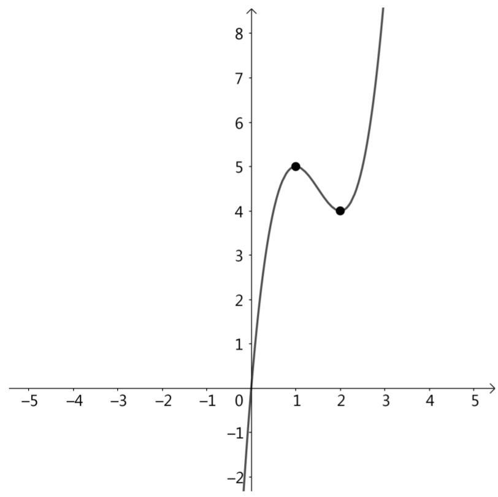

练习 11.5(2)

1. 求下列函数所有 (如有) 的极大值点、极小值点、最大值、最小值。

(1) $y = \sqrt{x}$ ; (2) $y = {x}^{3} - {5x} + 2$ ; (3) $y = {\mathrm{e}}^{x} - x$ ; (4) $y = x\ln x$ ;

(8) $y = \sin x - \frac{\tan x}{8}$ 。

#### 11.5.3 二阶导数

函数 $f\left( x\right)$ 的导数 ${f}^{\prime }\left( x\right)$ 的导数，叫作 $f\left( x\right)$ 的二阶导数，通常记作 ${f}^{\prime \prime }\left( x\right)$ ，而 ${f}^{\prime }\left( x\right)$ 又叫作 $f\left( x\right)$ 的一阶导数。

判断函数 $f\left( x\right)$ 的极大值和极小值时,如果已求得 ${f}^{\prime }\left( {x}_{0}\right)  = 0$ ,除分别分析 ${f}^{\prime }\left( x\right)$ 在点 $\left( {{x}_{0},{y}_{0}}\right)$ 左右两侧的正负外,还可以用二阶导数分析判断,有时用二阶导数判断比分别分析点 $\left( {{x}_{0},{y}_{0}}\right)$ 两侧的单调性更简便。

用二阶导数判断函数极值点的方法为:

如果 ${f}^{\prime }\left( {x}_{0}\right)  = 0$ 且 ${f}^{\prime \prime }\left( {x}_{0}\right)  < 0$ ,那么 $\left( {{x}_{0},{y}_{0}}\right)$ 是 $f\left( x\right)$ 的一个极大值点;

如果 ${f}^{\prime }\left( {x}_{0}\right)  = 0$ 且 ${f}^{\prime \prime }\left( {x}_{0}\right)  > 0$ ,那么 $\left( {{x}_{0},{y}_{0}}\right)$ 是 $f\left( x\right)$ 的一个极小值点。

该判断方法的原理为:

$f\left( x\right)$ 的二阶导数 ${f}^{\prime \prime }\left( x\right)$ 是一阶导数 ${f}^{\prime }\left( x\right)$ 的导数,因此 ${f}^{\prime \prime }\left( x\right)$ 的正负号与 ${f}^{\prime }\left( x\right)$ 的单调性有对应关系:

如果 ${f}^{\prime \prime }\left( {x}_{0}\right)  < 0$ ,表明 ${f}^{\prime }\left( x\right)$ 在 $x = {x}_{0}$ 附近单调递减,又因为 ${f}^{\prime }\left( {x}_{0}\right)  = 0$ ,所以在 $x = {x}_{0}$ 左侧, ${f}^{\prime }\left( x\right)  > {f}^{\prime }\left( {x}_{0}\right)  = 0, f\left( x\right)$ 在 $x = {x}_{0}$ 左侧单调递增。在 $x = {x}_{0}$ 右侧, ${f}^{\prime }\left( x\right)  < {f}^{\prime }\left( {x}_{0}\right)  = 0, f\left( x\right)$ 在 $x = {x}_{0}$ 右侧单调递减,即 $f\left( x\right)$ 单调递增至 $x = {x}_{0}$ 后单调递减,所以 $\left( {{x}_{0},{y}_{0}}\right)$ 是 $f\left( x\right)$ 的一个极大值点。

同理,如果 ${f}^{\prime }\left( {x}_{0}\right)  = 0$ 且 ${f}^{\prime \prime }\left( {x}_{0}\right)  > 0$ ,在 $\left( {{x}_{0},{y}_{0}}\right)$ 左侧, ${f}^{\prime }\left( x\right)  < 0, f\left( x\right)$ 单调递减; 在 $\left( {{x}_{0},{y}_{0}}\right)$ 右侧, ${f}^{\prime }\left( x\right)  > 0, f\left( x\right)$ 单调递增,即 $f\left( x\right)$ 单调递减至 $x = {x}_{0}$ 后单调递增, $\left( {{x}_{0},{y}_{0}}\right)$ 是 $f\left( x\right)$ 的一个极小值点。

例 11.25 分析函数 $f\left( x\right)  = 2{x}^{3} - 9{x}^{2} + {12x}$ 的极值点。

解析: 求一阶导数: ${f}^{\prime }\left( x\right)  = 2 \times  3{x}^{3 - 1} - 9 \times  2{x}^{2 - 1} + {12}{x}^{1 - 1} = 6{x}^{2} - {18x} + {12}$ ,

让一阶导数等于 0 可得方程: ${f}^{\prime }\left( x\right)  = 6{x}^{2} - {18x} + {12} = 0$ ,解得: $x = 1$ 或 $x = 2$ ,

求出相应的函数值: $f\left( 1\right)  = 5, f\left( 2\right)  = 4$

求导数的导数,即二阶导数: ${f}^{\prime \prime }\left( x\right)  = 6 \times  2{x}^{2 - 1} - {18}{x}^{1 - 1} + 0 = {12x} - {18}$ ,

将让一阶导数等于 0 的自变量取值分别代入二阶导数:

${f}^{\prime \prime }\left( 1\right)  = {12} \times  1 - {18} =  - 6 < 0,\;\left( {1,5}\right)$ 是 $f\left( x\right)$ 的一个极大值点; ${f}^{\prime \prime }\left( 2\right)  = {12} \times  2 - {18} = 6 > 0,\left( {2,4}\right)$ 是 $f\left( x\right)$ 的一个极小值点。

与例 11.24 中的结论相同。

需注意,只有 ${f}^{\prime }\left( {x}_{0}\right)  = 0$ 一个条件并不足以判定该点是 $f\left( x\right)$ 的极值点,还需明确 ${f}^{\prime }\left( x\right)$ 在 $x = {x}_{0}$ 两侧的正负号不同,即 $f\left( x\right)$ 在 $x = {x}_{0}$ 左右两侧的单调性不同, 即 ${f}^{\prime \prime }\left( {x}_{0}\right)  \neq  0$ 。

如果 ${f}^{\prime }\left( x\right)$ 在 $x = {x}_{0}$ 左右两侧的正负号相同,那么函数在 $x = {x}_{0}$ 附近的单调性不变, $\left( {{x}_{0}, f\left( {x}_{0}\right) }\right)$ 不是 $f\left( x\right)$ 的极值点,此时叫作拐点。在拐点处,函数的二阶导数等于 0 或不存在。

在拐点处, 虽然函数自身的单调性不变, 但导数的单调性的趋势发生变化。 拐点的几何含义为:从 “增大(减小)得越来越快” 变为 “增大(减小)得越来越慢”，或从 “增大(减小)得越来越慢” 变为 “增大(减小)得越来越快”。

例 11.26 求函数 $f\left( x\right)  = {x}^{3} - 6{x}^{2} + {12x}$ 的极值点。

解析: 求一阶导数: ${f}^{\prime }\left( x\right)  = 3{x}^{3 - 1} - 6 \times  2{x}^{2 - 1} + {12}{x}^{1 - 1} = 3{x}^{2} - {12x} + {12}$ ,

让一阶导数等于 0 可得方程: ${f}^{\prime }\left( x\right)  = 3{x}^{2} - {12x} + {12} = 0$ ，解得: $x = 2$ ，

求出对应的函数值: $f\left( 2\right)  = 8$ ,

求二阶导数: ${f}^{\prime \prime }\left( x\right)  = 3 \times  2{x}^{2 - 1} - {12}{x}^{1 - 1} + 0 = {6x} - {12}$ ,

将让一阶导数等于 0 的自变量取值代入二阶导数: ${f}^{\prime \prime }\left( 2\right)  = 0$ ，

可得 $\left( {2,8}\right)$ 不是函数的极值点，而是拐点。

下图为函数 $f\left( x\right)  = {x}^{3} - 6{x}^{2} + {12x}$ 的图像以及在点 $\left( {2,8}\right)$ 附近的特写。从图中可读出: 函数在 $\left( {2,8}\right)$ 左右两侧都递增,左侧的坡度越来越缓,函数增大得越来越慢; 右侧的坡度越来越陡,函数增大得越来越快。函数在 $\left( {2,8}\right)$ 处的导数为 0, 在该处的切线是一条水平的直线。

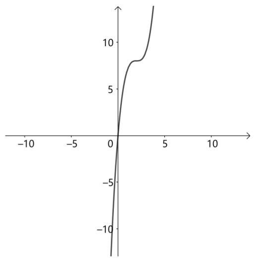

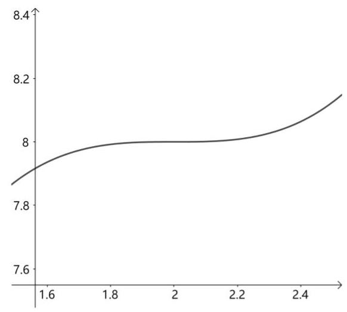

用导数求函数极值点的优势与判断函数单调性相似, 只需求出导数等于零的点和二阶导数在此处的正负号, 就能判断该点是否是函数的极值点, 不再需要对函数的解析式或图像进行技巧性分析。

用导数求函数的最大 (小) 值之前, 首先需要根据函数的解析式判断函数是否有最大 (小) 值,通常需要专门分析函数在 $x \rightarrow   - \infty \text{ 、 }x \rightarrow   + \infty$ 、分式的分母趋近于 0、对数的真数趋近于 0 、正切函数的弧度接近 $\left( {\frac{\pi }{2} + {k\pi }}\right) \left( {k \in  \mathbf{Z}}\right)$ 、不属于定义域的点附近等特殊位置,判断函数在这些位置的取值是否趋近于 $\pm  \infty$ ,如果函数在上述位置的取值都不趋近于 $+ \infty$ ,那么函数很可能有最大值,如果函数在上述位置的取值都不趋近于 $- \infty$ ,那么函数很可能有最小值。

还有一种较特殊的情况:函数可以无限趋近某值，但无法达到，此时函数也可能没有最大值或最小值。例如,函数 $f\left( x\right)  = \frac{1}{{\mathrm{e}}^{{x}^{2}}}$ : 当 $x = 0$ 时,函数取最大值 $f\left( 0\right)  = 1$ ; 当 $x \rightarrow   \pm  \infty$ 时, $f\left( x\right)  \rightarrow  0$ ,函数没有最小值,下图为该函数的图像。

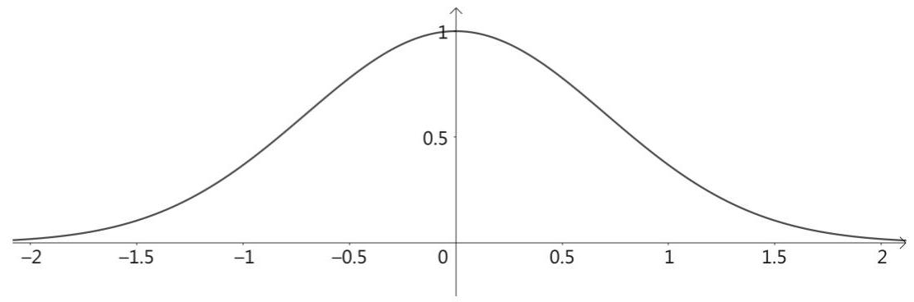

练习 11.5(3)

1. 分析下列函数的单调性, 求所有 (如有) 极值点和最大值、最小值:

(1) $y = {x}^{2};\;$ (2) $y = \frac{1}{3}{x}^{3} - \frac{1}{2}{x}^{2} - x + 1;\;$ (3) $y = \sin \frac{\pi x}{2} - {2x};\;$ (4) $y = \frac{{\mathrm{e}}^{x}}{x}$ 。

## 小结

本章主要学习基本初等函数的导数及其应用, 以及作为前置知识的函数的极限和函数的变化率, 需重点理解变化率的概念和几何含义, 熟练掌握各基本初等函数的导函数及导数的运算, 能熟练地求出复杂函数的导数, 并用于分析判断函数的单调性、极大 (小) 值点和最大 (小) 值。

## 第十二章 空间直线与平面

我们都生活在立体空间中, 立体几何是研究立体空间中的距离、角度、位置关系、物体形状等规律的数学分支，在科学技术和生产生活中有非常广泛的应用， 接下来我们开始学习立体几何块面的知识。

高中立体几何包含三个主要部分:空间平面与直线(欧式几何)、空间向量、 基本立体图形, 本章学习空间直线与平面的基本知识, 主要思路和方法与欧式几何的平面几何相似——从最基本的几何定义和公理出发，分析推导出大量重要规律和结论, 区别只是从二维的平面上升到三维的立体空间。

立体几何可以看作平面几何上升一个维度, 立体几何的公理与平面几何有非常密切的联系, 平面几何中的性质和规律在立体空间中的平面内仍然适用, 因此在立体空间中构造出共平面的情形是非常重要的学习和解题思路。除从静态角度观察立体图形外, 还可以从平移、旋转等动态变化的视角, 更全面地了解立体空间中的几何规律。

立体几何不像平面几何那样可以在纸面上详尽作图展现全部内容, 立体几何难以简便地在空间中详细完整地画图，本章还将学习在平面内表示立体图形的方法, 对于直观理解立体图形有很大帮助。同时, 需要注意培养训练空间想象力, 借助想象得出立体图形的一些性质，再用严格的数学方法予以验证。

### 12.1 绘制立体图形

几何是关于图形的数学分支, 学习和研究几何知识离不开几何图形, 绘制几何图形可以直观地展示和模拟几何关系, 然而立体几何的研究对象是立体空间中的几何关系, 搭建立体模型较为困难和不便, 需要用形象且便捷的方法在纸面上绘制出立体几何的示意图。

#### 12.1.1 立体图形的直观图

生活中, 当我们看照片或影视剧时, 能自然地根据照片或屏幕上的平面影像, 想象出相应的立体场景, 利用人脑的这一强大功能, 可以利用平面图形表示立体图形, 这种作图法叫作斜二测画法, 在平面内绘制的立体图形的示意图叫作立体图形的直观图。

斜二测画法是对现实中投影现象的模拟: 让一束平行光照射穿过立体图形, 与纸面呈45°角照射在纸面上，立体图形在纸面内的投影就是该图形的直观图。 使用斜二测画法绘制立体图形的直观图主要有两个步骤:

第一步: 绘制空间直角坐标系。确定一点为坐标原点 $O$ ,规定水平向右为 $y$ 轴 (又叫作纵轴) 正方向,竖直向上为 $z$ 轴 (又叫作竖轴) 正方向,竖直向下偏左 ${45}^{ \circ  }$ 为 $x$ 轴 (又叫作横轴) 正方向, $x$ 轴正方向与 $y$ 轴正方向的夹角为 ${135}^{ \circ  }, x$ 轴正方向与 $z$ 轴的正方向的夹角也为 ${135}^{ \circ  }, y$ 轴与 $z$ 轴垂直，如下图所示。

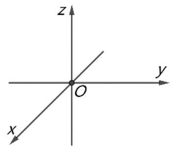

第二步:绘制立体图形。立体图形中分别与 $x$ 轴、 $y$ 轴、 $z$ 轴平行的直线， 在直观图中仍绘制成分别与 $x$ 轴、 $y$ 轴、 $z$ 轴平行的直线。立体图形中沿 $x$ 轴方向长度的比例,为沿 $y$ 轴和 $z$ 轴方向长度的比例的一半。例如,如果将实际物体沿 $y$ 轴、 $z$ 轴方向的 $1\mathrm{\;m}$ 长度,在直观图中绘制为 $1\mathrm{\;{cm}}$ ,那么实际物体沿 $x$ 轴方向的 $1\mathrm{\;m}$ 长度,在直观图中应当绘制为 ${0.5}\mathrm{\;{cm}}$ 。下图所示为用斜二测画法绘制的正方体的直观图。

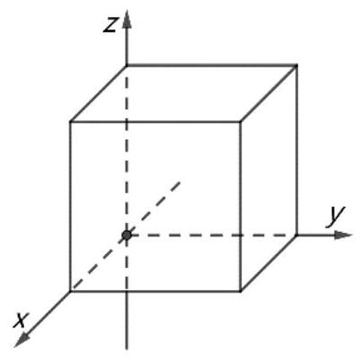

练习 12.1

1. 在空间直角坐标系中绘制下列立体图形的直观图:

(1)长、宽、高分别为 2、2、4 的长方体；

(2)长、宽、高分别为 4、4、2 的长方体。

### 12.2 立体几何的基本公理

欧式几何可以看作以若干最基本和精炼的事实为基础, 分析得出的一系列规律和结论, 这些最基本和精炼的事实又叫作公理, 公理是对现实中客观现象规律的陈述, 通常不需要证明也难以证明, 在理论适用的范围内至今未发现反例就是最好的证明。

#### 12.2.1 平面几何公理回顾

平面几何的研究内容是平面内的位置关系，可以把平面看作对 “平坦地面” 的抽象, 平坦的地面上只有长和宽, 没有厚度, 长和宽互相垂直, 可以延伸到无限远处(虽然我们知道地球实际上是一个球体)。

欧式几何中, 平面几何的一切规律都建立在五条公理之上, 这五条公理是对现实中平面内的客观规律的总结和抽象, 不需要证明, 现实经验就是的证明。对这五条公理, 主要从经验和直觉的角度感受它们的含义。

公理一:经过两点有且只有一条直线。

公理二:任意线段的两端都可以无限延伸成为直线。

公理三:任意一条线段都能以一个端点为圆心，线段的长为半径作一个圆。

公理四:所有直角都相等。(两条直线相交，若所成的四个角都相等，这样的角叫作直角)

公理五:若两条直线都与第三条直线相交，并且在同一侧的内角之和小于两个直角, 则这两条直线在这一边必定相交。公理五又叫做平行公理, 等价于: 经过直线外一点, 有且只有一条直线与它平行。

虽然利用上述五条公理能推出平面几何的所有知识, 为方便使用, 分析和证明时主要使用一些常用的规律和性质。

平面几何研究的问题主要包括三类: 判断两条直线的位置关系, 求线段的长度, 求直线间的夹角。

判断两条直线的位置关系。平面几何中, 两条直线间只有两种位置关系: 平行或相交。若两条直线没有交点，称它们平行。若两条直线有且只有一个交点， 称它们相交。如果能根据已知条件直接找出两条直线的交点, 就能直接证明这两条直线相交。证明两条直线平行的主要方法是使用平行公理: 作一条与两条直线都相交的直线, 若同位角相等 (或同旁内角互补), 则这两条直线平行; 若两条直线都平行于第三条直线, 则这两条直线平行。

求线段长度。主要有三种方法: (1) 使用勾股定理, 即直角三角形的两条直角边长 $a\text{ 、 }b$ 与斜边长 $c$ 始终满足勾股定理: ${a}^{2} + {b}^{2} = {c}^{2}$ 。(2)利用相似关系， 若两个三角形相似, 则两个三角形相同大小的角所对的边长的比例相等。(3) 利用面积关系, 根据三角形、矩形、圆等平面图形面积的定义, 利用面积、已知边长或高等数据，求出对应的高或边的长度。

正弦定理和余弦定理是通过勾股定理及面积关系推导得到的，也是求长度的重要方法。所有由直线和圆弧构成的复杂图形, 都可以分割为若干三角形、矩形、 扇形的组合, 将复杂的图形拆分为若干三角形、矩形、扇形, 以便于分析处理。

求直线间的夹角。主要通过分析已知角度间的数量关系、图形间的对称、平行、垂直、相似关系求解, 有时可通过构造直角三角形或使用正弦定理、余弦定理求出夹角的三角函数，利用三角函数的值求出对应的角。

#### 12.2.2 立体几何公理

平面几何中, 平面是研究的最大范围, 研究对象是平面内的点和由点构成的集合, 简称点集。立体几何中, 研究的最大范围是空间, 研究对象是空间中的点和由点构成的集合, 平面也是空间中的一种点集。

空间中的元素可以用集合的方法表示，整个立体空间可看作全部点构成的全集 $U$ ,点通常用大写英文字母表示,如 $A\text{ 、 }B\text{ 、 }C$ 等; 直线通常用小写英文字母表示,如 $a\text{ 、 }b\text{ 、 }c$ 等; 平面通常用小写拉丁字母表示,如 $\alpha \text{ 、 }\beta \text{ 、 }\gamma$ 等。

立体几何中有类似平面几何的基本公理, 且平面几何公理在空间中的平面内仍成立。学习立体几何的基本公理时, 需要经常与生活经验联系起来, 可以分别用笔和纸表示直线和平面，模拟公理描述的场景，并通过平移、旋转等方式尝试寻找公理可能不成立的情况，应该是找不到的。

公理 1 经过不在同一条直线上的三个点, 有且只有一个平面。

公理 1 与平面几何公理 “经过两点有且只有一条直线” 相似, 平面内由两个点确定一条直线，空间中不共线的三个点确定一个平面，如下图所示。公理 1 提供了确定一个平面的方法:找出三个不在同一条直线上的点。

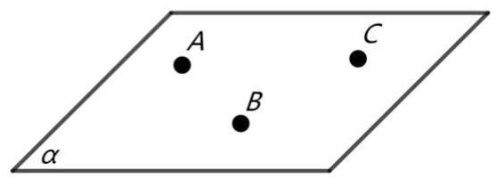

公理 2 如果一条直线上有两个点在一个平面内, 那么这条直线上的所有点都在这个平面内。

公理 2 是判断直线和点是否在某一个平面内的重要依据, 只要能证明一条直线上有两个点在一个平面内, 那么这条直线在该平面内, 于是这条直线上的所有点都在该平面内, 如下图所示。

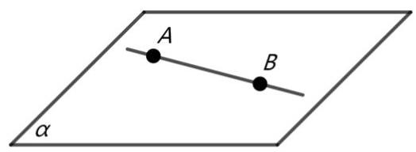

如果一条直线不在一个平面内, 那么这条直线与这个平面还有两种可能的位置关系: 直线与平面相交或直线与平面平行。

公理 3 如果两个不重合的平面有一个公共点, 那么它们有且只有一条经过该公共点的公共直线, 叫作交线。

公理 3 描述了两个平面间的位置关系的重要特点: 如果两个平面有公共点, 那么它们一定有公共直线，如下页图所示。立体空间中，两个平面的位置关系只有两种情况:要么相交于一条直线，要么不相交，不存在只相交于有限个公共点， 或公共点形成其他图形的情况。

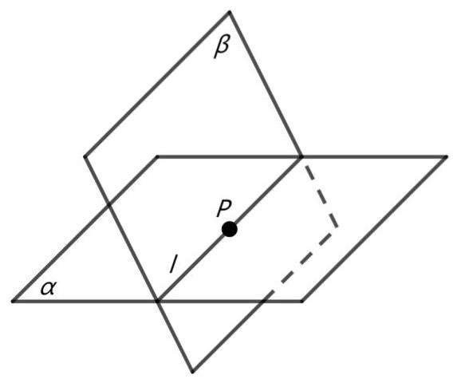

公理 4 平行于同一条直线的两条直线平行。该性质表明空间中直线的平行关系具有传递性，如下图所示。空间中的一组平行线，可以看作一条直线在空间中任意平移，在不同位置处留下的足迹。

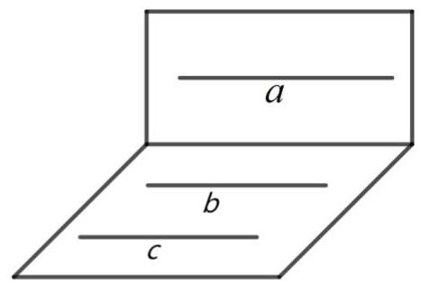

利用基本事实 1 和 2，可以得到三条有用的推论:

推论 1 经过一条直线和这条直线外一点, 有且只有一个平面。

一条直线可以提供两个点, 再与直线外的一点构成三个不共线的点, 就可以确定一个平面, 如下图所示。

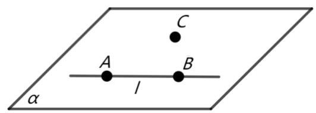

推论 2 经过两条相交的直线, 有且只有一个平面。

如果两条直线相交于一点, 那么交点、两条直线上各取除交点外的任意一点, 这三个点可以确定一个平面，如下图所示。因为两条直线上分别选取的任意一点和交点都在平面内, 所以这两条直线都在该平面内。

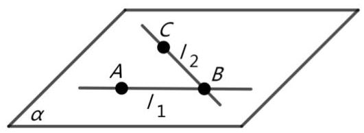

推论 3 经过两条平行的直线，有且只有一个平面。

立体几何中, 直线与直线相交或平行都必须以这两条直线在同一平面内为前提。如果两条直线平行, 从其中一条直线上选两个点, 另一条直线上选一个点, 那么这三个点确定一个平面, 就是这两条平行线所在的平面, 如下图所示。

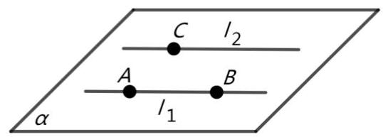

现阶段不需要深究推论 3 的严谨证明，“两条直线平行”与 “两条直线共面” 之间某种程度上存在类似于 “鸡生蛋还是蛋生鸡” 的问题。

## 练习 12.2

1. 判断下列命题是否正确:

(1)经过任意三个点有且只有一个平面；

(2)四个点有可能在一个平面内;

(3)任意两条直线都可以确定一个平面；

(4)如果两个平面有一个公共点，那么它们还有无穷多公共点。

### 12.3 空间点、直线、平面之间的位置关系

立体空间中, 点是基本元素, 全集为空间中的所有点, 直线和平面都是由点形成的集合，直线与平面间有平行、相交等基本位置关系，我们接下来用几何和集合的语言描述这些基本关系。学习这些基本关系时，可以用笔代表直线，用桌面或纸代表平面，模拟和想象相应的场景，结合直观的立体直觉感受和理解。

#### 12.3.1 点与直线、平面的位置关系

立体空间中，点与直线间有两种位置关系:点在直线上、点在直线外。

如果点 $P$ 在直线 $l$ 上,记作 $P \in  l$ 。

如果点 $P$ 在直线 $l$ 外,记作 $P \notin  l$ 。此时由推论 1 可得: $P$ 与 $l$ 在同一平面内, 也可以表述为 $P$ 和 $l$ 可以确定一个平面,那么可以用平面几何知识分析它们间的位置关系,如求点 $P$ 到直线 $l$ 的距离、画出经过点 $P$ 且平行于 $l$ 的直线、画出经过点 $P$ 且垂直于 $l$ 的直线等。

立体空间中，点与平面有两种位置关系:点在平面内、点在平面外。

如果点 $P$ 在平面 $\alpha$ 内,记作 $P \in  \alpha$ ,是平面几何的情形。

如果点 $P$ 在平面 $\alpha$ 外,记作 $P \notin  \alpha$ ,点到平面之间有距离。

#### 12.3.2 空间中直线间的位置关系

立体空间中, 直线间的位置关系有两个基本判断: 是否共平面、是否平行。

如果直线 $a\text{ 、 }b$ 共平面,是平面几何的情形,有平行和相交两种情况。

如果直线 $a\text{ 、 }b$ 不共平面，它们既不相交、也不平行，它们间的位置关系叫作异面直线，即位于相异的平面内的直线。

可以用下面的方法模拟两条异面直线:取两支笔，想象它们是两条可以无限延伸的直线,分别命名为 $a\text{ 、 }b$ ,想象桌面为平面 $\alpha$ :

将 $a$ 平放在桌面上,表示 $a$ 在平面 $\alpha$ 内。将 $b$ 竖直立在桌面上,且不与 $a$ 接触，那么 $a$ 、 $b$ 既不在同一平面内，也没有公共点，它们是异面直线，如下图左所示。

将 $b$ 倾斜一定角度，并始终保持与 $\alpha$ 没有交点，则 $a$ 与 $b$ 仍为异面直线，如下图中所示。

将 $a$ 在 $\alpha$ 内任意平移或旋转,只要不与 $b$ 相交,则 $a$ 与 $b$ 仍为异面直线,如下图右所示。

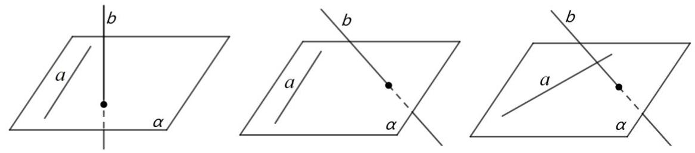

#### 12.3.3 空间中直线与平面的位置关系

立体空间中,直线与平面都是由点构成的集合,直线 $l$ 与平面 $\alpha$ 的位置关系有三种:直线在平面内、直线与平面相交、直线与平面平行。

如果直线 $l$ 在平面 $\alpha$ 内,记作 $l \subset  \alpha$ 或 $l \cap  \alpha  = l$ ,是平面几何的情形。

如果直线 $l$ 在平面 $\alpha$ 外,且没有公共点,称直线 $l$ 与平面 $\alpha$ 平行,记作 $l\parallel \alpha$ 。

如果直线 $l$ 在平面 $\alpha$ 外,且只有一个公共点 $P$ ,称直线 $l$ 与平面 $\alpha$ 相交于点 $P$ ,记作 $l \cap  \alpha  = P$ 。

可以用下面的方法模拟直线与平面的位置关系: 取一支笔和一张纸, 想象笔是直线 $a$ 、纸为平面 $\alpha$ ,先把纸水平放在桌面上,接下来,如果把笔水平拿起, 那么笔与纸平行; 如果让笔与纸呈一个夹角 (或竖直) 放在纸上, 那么笔与纸相交。下页图从左至右依次为直线在平面内、直线与平面平行、直线与平面相交。

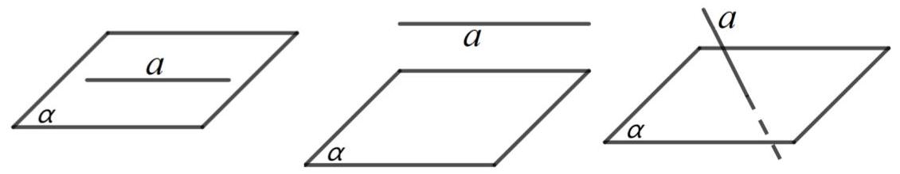

#### 12.3.4 空间中平面间的位置关系

立体空间中，平面与平面有两种位置关系:平行、相交。

如果平面 $\alpha$ 与 $\beta$ 没有公共点,称平面 $\alpha$ 与 $\beta$ 平行,记作 $\alpha \parallel \beta$ 。

如果平面 $\alpha$ 与 $\beta$ 有公共点,称平面 $\alpha$ 与 $\beta$ 相交。此时,由公理 3 可得: $\alpha$ 与 $\beta$ 有一条公共直线 $l$ ,记作 $\alpha  \cap  \beta  = l$ 。

可以用下面的方法模拟平面与平面的位置关系: 想象桌面为平面 $\alpha$ ,取一张纸并想象它为平面 $\beta$ ,先把纸 $\beta$ 水平放在桌面上 $\alpha$ :

如果把纸 $\beta$ 水平拿起，那么 $\alpha$ 与 $\beta$ 平行，如下图左所示。

如果让纸 $\beta$ 与 $\alpha$ 呈一个夹角(或竖直)放在桌面上，那么 $\alpha$ 与 $\beta$ 相交，且可以看到它们的交线，如下图右所示。

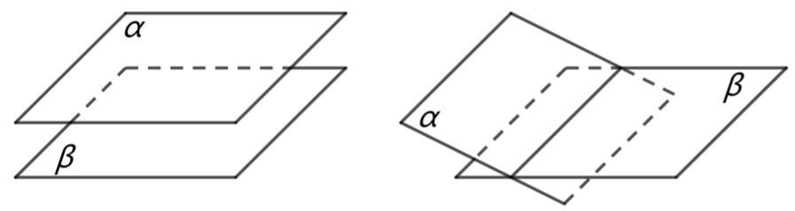

例 12.1 如下图所示, ${ABCD} - {A}_{1}{B}_{1}{C}_{1}{D}_{1}$ 是正方体,它的六个面是全等的正方形，且相对的面互相平行，指出下列直线与平面间的位置关系。若相交，指出交点或交线(根据直观感觉判断，无需证明):

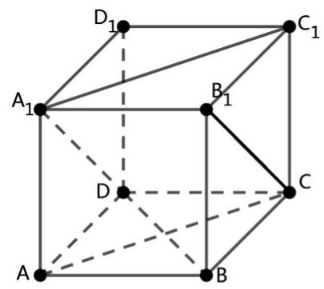

(1)直线 ${AC}$ 与 ${B}_{1}C$ ；(2)直线 ${A}_{1}D$ 与 ${B}_{1}C$ ；(3)直线 ${A}_{1}{C}_{1}$ 与 ${BD}$ ；

(4)直线 ${A}_{1}{C}_{1}$ 与平面 ${A}_{1}{B}_{1}{CD}$ ；(5)直线 $D{D}_{1}$ 与平面 ${AC}{C}_{1}{A}_{1}$ ；

(6)平面 ${A}_{1}{B}_{1}{CD}$ 与 ${ABCD}$ ；(7)平面 ${DC}{C}_{1}{D}_{1}$ 与 ${AB}{B}_{1}{A}_{1}$ 。

解析: 寻找题目所求的直线与平面间是否有交点, 或是否可以找到平行关系。

(1)由直线 ${AC}$ 与 ${B}_{1}C$ 的名称可知它们都经过点 $C$ ，它们相交，交点为点 $C$ ；

(2)直线 ${A}_{1}D$ 与 ${B}_{1}C$ 围成四边形 ${A}_{1}{DC}{B}_{1}$ ，四边形 ${A}_{1}{DC}{B}_{1}$ 的另外两条边 ${A}_{1}{B}_{1}$ 与 ${DC}$ 平行且相等,是平行四边形,所以 ${A}_{1}D$ 与 ${B}_{1}C$ 平行;

(3)直线 ${A}_{1}{C}_{1}$ 在上底面 ${A}_{1}{B}_{1}{C}_{1}{D}_{1}$ 内，直线 ${BD}$ 在下底面 ${ABCD}$ 内，上下底面互相平行没有公共点, 分别属于两个平行的平面内的两条直线不可能有公共点; 利用现有知识无法证明 ${A}_{1}{C}_{1}$ 与 ${BD}$ 平行,实际上它们的确不平行,从图中看上去它们呈一个夹角, 直观判断它们是异面直线;

(4)由直线 ${A}_{1}{C}_{1}$ 与平面 ${A}_{1}{B}_{1}{CD}$ 的名称可知它们都经过点 ${A}_{1}$ ，它们相交，交点为点 ${A}_{1}$ ;

(5)直线 $D{D}_{1}$ 垂直于底面，平面 ${AC}{C}_{1}{A}_{1}$ 也垂直于底面，无法找到它们的交点, 直观判断它们平行;

(6)由平面 ${A}_{1}{B}_{1}{CD}$ 与 ${ABCD}$ 的名称可知它们都经过直线 ${CD}$ ，它们相交， 交线为直线 ${CD}$ ;

(7)根据正方体的特点，相对的面互相平行，平面 ${DC}{C}_{1}{D}_{1}$ 与 ${AB}{B}_{1}{A}_{1}$ 平行。

## 练习 12.3

1. 判断下列直线 $a\text{ 、 }b$ 间的位置关系:

(1) $a \cap  b = P$ ；(2) $a \cap  b = \varnothing$ ，且 $a\text{ 、 }b$ 不在同一平面内；(3) $a\parallel c$ ， $b\parallel c$ 。

### 12.4 空间直线与平面的平行

平面几何中, 平行是一种特殊且重要的位置关系。立体几何中, 平行同样是一种特殊且重要的位置关系。

#### 12.4.1 直线与直线平行

根据推论 3, 空间中两条互相平行的直线一定共平面, 因此空间中的平行线满足平面内的平行线的性质和规律。

平面内, 如果两个角的两条边分别平行, 那么这两个角相等或互补, 将其中一个角在空间中任意平移，这两个角仍相等或互补，且对应的边仍互相平行，如下图所示。

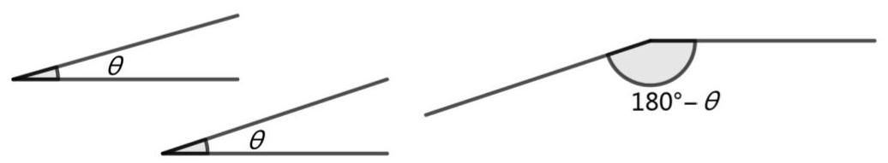

上述定理在立体空间中仍成立: 如果空间中两个角的两条边分别对应平行, 那么这两个角相等或互补。

练习 12.4(1)

1. 判断下列命题的是否正确，如错误，说明为什么或举出(画出)反例:

(1)如果两条直线都与同一条直线平行, 那么这两条直线平行;

(2)如果两条直线都与同一个平面平行, 那么这两条直线平行;

(3)如果两条直线都与同一条直线相交且夹角相等，那么这两条直线平行。

#### 12.4.2 直线与平面平行

如果直线与平面没有公共点, 那么直线与平面平行。然而, 直线和平面都可以无限延伸, 有可能延伸到某处就有公共点只是暂时没有找到, 所以实际当中很难用没有公共点来判断直线与平面平行。通常使用下面的定理判断直线与平面平行:

定理 如果平面外一条直线与平面内一条直线平行, 那么该直线与此平面平行。即: 如果 $l \text{ ⊄ } \alpha , a \subset  \alpha , l\parallel a$ ,那么 $l\parallel \alpha$ ,如下图所示。利用该定理可以由直线与直线平行推出直线与平面平行。

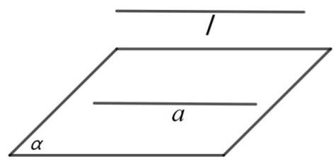

例 12.2 如下图所示，立体图形 ${ABCD}$ 的四个面都是三角形， ${EF}$ 是 $\bigtriangleup  {ABC}$ 的中位线,证明: ${EF}\parallel {DBC}$ 。

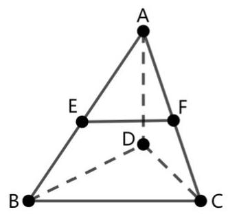

证明: 因为 ${EF}$ 是 $\bigtriangleup  {ABC}$ 的中位线,所以 ${EF}\parallel {BC}$ ,由该定理可得: ${EF}\parallel {DBC}$ 。

在平面相交的情形中, 直线与平面平行有下面的重要性质:

定理 如果一条直线与一个平面平行, 且一个经过该直线的平面与此平面相交,则该直线与交线平行。即: 已知 $a\parallel \beta$ ,如果 $a \subset  \alpha$ 且 $\alpha  \cap  \beta  = l$ ,那么 $a\parallel l$ 。 如下图所示。利用该定理可以由直线与平面平行推出直线与直线平行。

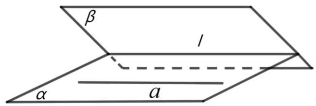

练习 12.4(2)

1. 判断下列命题是否正确，如错误，说明为什么或举出(画出)反例:

(1)如果一条直线与一个平面平行，那么这条直线与该平面内任意一条直线都平行;

(2)如果直线在平面外, 且直线与平面内的两条直线平行, 那么该直线与平面平行;

(3)如果两个平面的交线与第三个平面平行，且这两个平面分别与第三个平面相交于不同的交线，那么另外两条交线平行。

2. 如下图所示,立体图形 ${ABCD} - {A}_{1}{B}_{1}{C}_{1}{D}_{1}$ 所有相对的平面都互相平行,证明: ${AB}\parallel {A}_{1}{B}_{1}{CD}$ 。

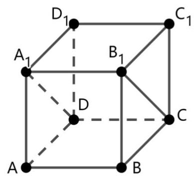

#### 12.4.3 平面与平面平行

如果两个平面没有公共点, 那么这两个平面平行。然而, 与直线与平面平行类似, 由于平面可以无限延伸, 有可能延伸到某处就有公共点只是暂时没有找到, 所以实际当中很难用该方法判断平面与平面平行。

平面可以看作由一系列直线构成的集合, 如果一个平面内的任意一条直线都与另一个平面没有公共点, 那么也可以判定这两个平面平行。然而, 出于同样的原因，实际当中还是难以利用该方法判断。

对于判定平面与平面平行, 有一条更简洁的定理:

定理 如果一个平面内的两条相交直线与另一个平面平行, 那么这两个平面平行。即: 如果 ${a}_{1}\text{ 、 }{a}_{2} \subset  \alpha ,{a}_{1} \cap  {a}_{2} = P,{a}_{1}\parallel \beta ,{a}_{2}\parallel \beta$ ,那么 $\alpha \parallel \beta$ 。如下图所示。

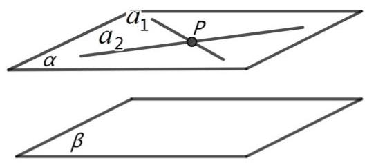

例 12.3 如下页图所示，立体图形 ${ABCDEF} - {A}_{1}{B}_{1}{C}_{1}{D}_{1}{E}_{1}{F}_{1}$ 中，平面 ${ABCDEF}$ 与 ${A}_{1}{B}_{1}{C}_{1}{D}_{1}{E}_{1}{F}_{1}$ 是全等的正六边形,且 $A{A}_{1}\text{ 、 }B{B}_{1}\text{ 、 }C{C}_{1}\text{ 、 }D{D}_{1}\text{ 、 }E{E}_{1}\text{ 、 }F{F}_{1}$ 全都互相平行且相等,证明: ${AB}{B}_{1}{A}_{1}\begin{Vmatrix}{{ED}{D}_{1}{E}_{1},{BC}{C}_{1}{B}_{1}}\end{Vmatrix}{EF}{F}_{1}{E}_{1},{CD}{D}_{1}{C}_{1}\begin{Vmatrix}{{FA}{A}_{1}{F}_{1}}\end{Vmatrix}$ 。

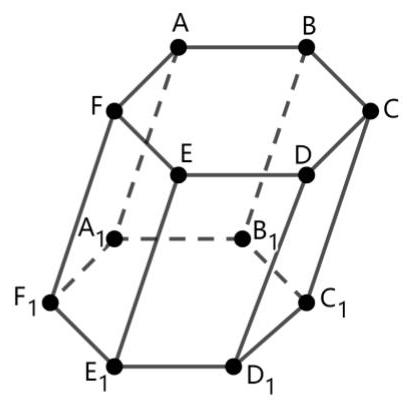

证明: 因为 $A{A}_{1}\parallel E{E}_{1}$ ,所以 $A{A}_{1}\parallel {ED}{D}_{1}{E}_{1}$ ; 又因为 ${ABCDEF}$ 是正六边形, 所以 ${AB}\parallel {ED}$ ，所以 ${AB}\parallel {ED}{D}_{1}{E}_{1}$ ；由该定理可得: ${AB}{B}_{1}{A}_{1}\parallel {ED}{D}_{1}{E}_{1}$ 。同理可证: ${BC}{C}_{1}{B}_{1}\begin{Vmatrix}{{EF}{F}_{1}{E}_{1},{CD}{D}_{1}{C}_{1}}\end{Vmatrix}{FA}{A}_{1}{F}_{1}$ 。

两个平行的平面之间有下面的重要性质:

定理 如果两个平面平行, 第三个平面与这两个平面相交, 那么两条交线平行。 即: 如果 $\alpha \parallel \beta ,\alpha  \cap  \gamma  = a,\beta  \cap  \gamma  = b$ ,那么 $a\parallel b$ 。如下图所示。利用该定理可以由平面与平面平行推出直线与直线平行。

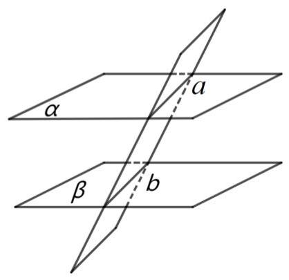

例 12.4 如下图所示,立体图形 ${ABCD} - {A}_{1}{B}_{1}{C}_{1}{D}_{1}$ 中,平面 ${ABCD}$ 与 ${A}_{1}{B}_{1}{C}_{1}{D}_{1}$ 平行且全等, $A{A}_{1}\text{ 、 }B{B}_{1}\text{ 、 }C{C}_{1}\text{ 、 }D{D}_{1}$ 平行且全等, ${AD}\parallel {BC}, E\text{ 、 }F$ 分别为 ${AB}\text{ 、 }{CD}$ 的中点,证明: ${EF}\parallel {A}_{1}{D}_{1}$ .

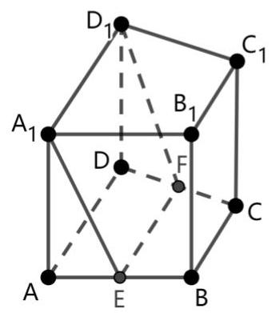

证明: 因为 ${AD}\parallel {BC}, E\text{ 、 }F$ 分别为 ${AB}\text{ 、 }{CD}$ 的中点,由梯形的性质可得 ${EF}\parallel {AD}\parallel {BC}$ ,所以 ${EF}\parallel {AD}{D}_{1}{A}_{1}$ ,所以 ${EF}\parallel {A}_{1}{D}_{1}$ ,所以 ${EF}$ 与 ${A}_{1}{D}_{1}$ 共平面。

因为 ${ABCD}$ 与 ${A}_{1}{B}_{1}{C}_{1}{D}_{1}$ 平行且全等，且 ${A}_{1}{D}_{1}$ 和 ${EF}$ 是平面 ${A}_{1}{D}_{1}{FE}$ 分别与平行的平面 ${ABCD}\text{ 、 }{A}_{1}{B}_{1}{C}_{1}{D}_{1}$ 的交线,由该定理可得: ${EF}\parallel {A}_{1}{D}_{1}$ 。

平面间的平行关系也具有传递性:

定理 如果两个平面都与第三个平面平行, 那么这两个平面平行。即: 如果 $\alpha \parallel \gamma ,\beta \parallel \gamma$ ,那么 $\alpha \parallel \beta$ 。

空间中的一系列互相平行的平面, 可以看作由一个平面任意平移得到。

可以发现, 直线与直线平行、直线与平面平行、平面与平面平行, 两两之间可以互相推导, 只是各推导中有一定的限制条件, 可以借助平行六面体或其他棱柱辅助观察，找出图形中蕴含的平行关系。

## 练习 12.4(3)

1. 判断下列命题的是否正确，如错误，说明为什么或举出(画出)反例:

(1)如果两个平面都与同一条直线平行, 那么这两个平面平行;

(2)如果两个平面都与同一个平面平行, 那么这两个平面平行;

(3)如果两个平面与第三个平面的两条交线平行，那么这两个平面平行。

2. 如下图所示,立体图形 ${ABCD} - {A}_{1}{B}_{1}{C}_{1}{D}_{1}$ 中,所有棱长都相等, $A{A}_{1}\begin{Vmatrix}{B{B}_{1}}\end{Vmatrix}C{C}_{1}\begin{Vmatrix}{D{D}_{1},{AB}}\end{Vmatrix}{A}_{1}{B}_{1}\begin{Vmatrix}{DC}\end{Vmatrix}{D}_{1}{C}_{1},{AD}\begin{Vmatrix}{{A}_{1}{D}_{1}}\end{Vmatrix}{BC}\parallel {B}_{1}{C}_{1}$ ,且 $E\text{ 、 }F\text{ 、 }{G}_{1}$ 、 ${H}_{1}\text{ 、 }P\text{ 、 }Q$ 分别是棱 ${AB}\text{ 、 }{BC}\text{ 、 }{C}_{1}{D}_{1}\text{ 、 }{D}_{1}{A}_{1}\text{ 、 }{B{B}_{1}}\text{ 、 }C{C}_{1}$ 的中点,判断下列直线与平面是否平行 (不需要给出证明):

(1)直线 ${EF}$ 与 ${G}_{1}{H}_{1}$ ；(2)直线 $E{H}_{1}$ 与 $F{G}_{1}$ ；(3)直线 ${EP}$ 与 $D{G}_{1}$ ；

(4)直线 ${PQ}$ 与平面 ${ABCD}$ ；(5)直线 ${EF}$ 与平面 ${AC}{C}_{1}{A}_{1}$ ；

(6)平面 ${PQF}$ 与 ${D}_{1}{H}_{1}{G}_{1}$ ；(7)平面 ${B}_{1}{EF}$ 与 $D{G}_{1}{H}_{1}$ 。

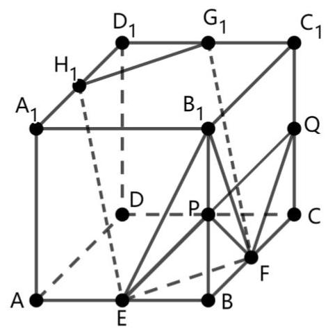

### 12.5 空间直线、平面的夹角和垂直

平面内, 相交是一种更常见的位置关系, 从相交关系中可以引出夹角的概念, 垂直是一种特殊的相交关系, 且距离的概念和计算总是与垂直有关。立体空间中, 直线与直线、直线与平面、平面与平面之间也有相交关系, 直线与直线间还有异面直线关系, 相交和异面直线同样可以引出夹角的概念, 垂直仍是一种特殊的相交或异面直线关系, 且距离的概念和计算仍始终与垂直有关。

分析计算空间中的夹角和距离时, 通常先通过平移创造出共平面的情形, 再使用平面几何知识分析处理, 通过平移或其他方式创造共平面的情形, 是分析解决立体几何问题的常用方法。

#### 12.5.1 直线间的夹角和垂直

立体空间中，如果两条直线不平行，那么它们有两种可能的位置关系:相交、 异面直线。如果两条直线相交，由推论 2 可知它们在同一平面内，可以使用平面几何知识分析处理。如果两条直线是异面直线, 它们之间有夹角和距离。

对于两条异面直线 $a\text{ 、 }b$ ,经过空间中任意一点 $P$ ,分别作直线 ${a}^{\prime }\parallel a\text{ 、 }{b}^{\prime }\parallel b$ , 那么 ${a}^{\prime }$ 与 ${b}^{\prime }$ 相交于点 $P$ ,可知 ${a}^{\prime }$ 与 ${b}^{\prime }$ 共平面,则 ${a}^{\prime }$ 与 ${b}^{\prime }$ 所成的角叫作异面直线 $a$ 与 $b$ 所成的角或 $a$ 与 $b$ 的夹角,如下图所示。

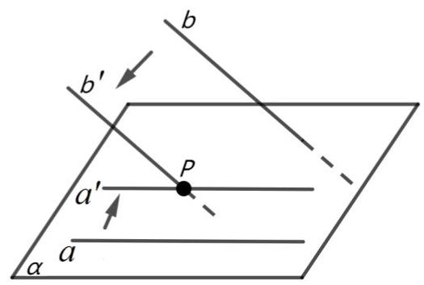

通常规定异面直线所成的角不大于直角。如果异面直线所成的角是直角，就称这两条异面直线垂直，记作 $a \bot  b$ 。

如果平移或计算发现异面直线所成的角为 ${0}^{ \circ  }$ ,由公理 4 可得 $a\parallel b$ ,这两条直线在同一平面内, 那么它们不是异面直线。

求异面直线所成的角时,选取的点 $P$ 可以不在异面直线 $a\text{ 、 }b$ 上,也可以在其中一条直线上。为方便分析处理,可以将点 $P$ 选取在其中一条直线上,只需画出另一条异面直线经过点 $P$ 的平行线即可,如下图所示。

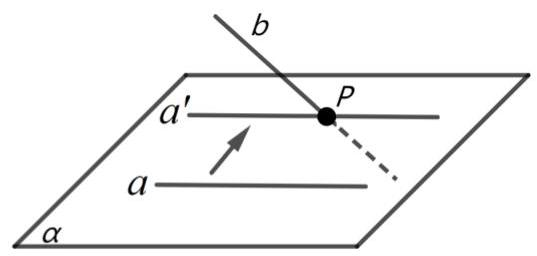

根据求异面直线的夹角的方法可以发现: 将两条异面直线在空间中任意平移，得到的一系列异面直线(或共平面的直线)，它们所成的角都相等。这个规律在后面的《空间向量》一章中得到充分体现和应用。

利用异面直线的夹角的定义只能得到角的表示方式，角的具体大小需要根据已知信息并利用三角函数、余弦定理等公式计算，后面将会学习的空间向量是更方便的工具。

异面直线 $a\text{ 、 }b$ 间的距离的定义为: 如果直线 $l$ 同时满足 $l \bot  a\text{ 、 }l \bot  b$ ,那么 $l$ 叫作异面直线 $a\text{ 、 }b$ 的公垂线,此时如果 $l \cap  a = A, l \cap  b = B$ ,那么垂线段 ${AB}$ 的长就是异面直线 $a\text{ 、 }b$ 间的距离。如下图所示。

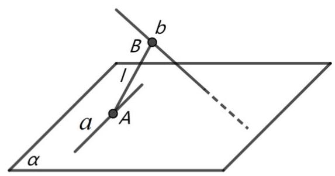

异面直线 $a\text{ 、 }b$ 间的距离还可以定义为: 由直线 $a$ 上任意一点与直线 $b$ 上任意一点形成的所有线段中, 最短的线段的长度。可以证明, 这条最短的线段就是公垂线。由此可见, 立体几何中距离仍与最小值和垂直关系联系在一起。

例 12.5 如下图所示,立体图形 ${ABC} - {A}_{1}{B}_{1}{C}_{1}$ 中, $\bigtriangleup {ABC}$ 与 $\bigtriangleup {A}_{1}{B}_{1}{C}_{1}$ 平行且全等,侧面 ${AB}{B}_{1}{A}_{1}\text{ 、 }{AC}{C}_{1}{A}_{1}\text{ 、 }{BC}{C}_{1}{B}_{1}$ 都是矩形, ${CA} = {CB}\text{ ， }D$ 是 ${AB}$ 的中点,证明: ${C}_{1}D \bot  {A}_{1}{B}_{1}$ 。

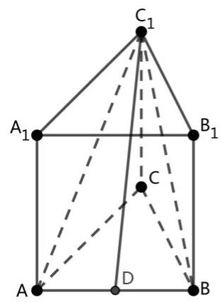

证明: 因为 ${AB}{B}_{1}{A}_{1}\text{ 、 }{AC}{C}_{1}{A}_{1}\text{ 、 }{BC}{C}_{1}{B}_{1}$ 都是矩形,所以 $A{A}_{1} = B{B}_{1} = C{C}_{1}$ 。又因为 ${CA} = {CB}$ ，所以 ${C}_{1}{CB}{B}_{1}$ 和 ${C}_{1}{CA}{A}_{1}$ 是两个全等的矩形，所以 ${C}_{1}B = {C}_{1}A$ ，所以 $\bigtriangleup  {C}_{1}{AB}$ 是等腰三角形。又因为 $D$ 是 ${AB}$ 的中点，所以 ${C}_{1}D\bot {AB}$ 。又因为 ${AB}{B}_{1}{A}_{1}$ 是矩形,所以 ${A}_{1}{B}_{1}\parallel {AB}$ ,所以 ${C}_{1}D \bot  {A}_{1}{B}_{1}$ 。

#### 12.5.2 直线与平面的夹角和垂直

如果直线 $l$ 不在平面 $\alpha$ 内,且 $l$ 与 $\alpha$ 不平行,那么 $l$ 与 $\alpha$ 相交。相交的直线与平面有且只有一个公共点,设公共点为 $P$ ,记作 $l \cap  \alpha  = P$ 。

对于相交的直线 $l$ 与平面 $\alpha$ ,如果 $l$ 与 $\alpha$ 内的任意一条直线都垂直,就称直线 $l$ 与平面 $\alpha$ 互相垂直,记作 $l \bot  \alpha , l$ 叫作 $\alpha$ 的垂线, $\alpha$ 叫作 $l$ 的垂面, $l$ 与 $\alpha$ 的公共点 $P$ 叫作垂足。

直线与平面垂直还可以定义为: 对于平面 $\alpha$ ,取 $\alpha$ 外一点 $M$ 和 $\alpha$ 内任意一点 $P$ ,连接 ${PM}$ 得到直线 $l$ ,可得 $l \cap  \alpha  = P$ ,当线段 ${PM}$ 的长度是最小值时,称直线 $l$ 与平面 $\alpha$ 互相垂直; 当线段 ${PM}$ 的长度不是最小值时,称直线 $l$ 与平面 $\alpha$ 斜交， $l$ 叫作 $\alpha$ 的斜线，它们的交点叫作斜足。

判定直线与平面垂直时, “与平面内任意直线都垂直” 和 “与平面内任意一点连线的长度最小” 都不是很好用的方法, 可能存在不垂直的直线或长度更小的线段只是暂时没有找到, 直线与平面垂直还有更好用的判定定理:

定理 如果一条直线与一个平面内两条相交的直线都垂直, 那么该直线与此平面垂直。即: 只需从平面 $\alpha$ 找到两条相交的直线 ${a}_{1}\text{ 、 }{a}_{2}$ ,分别证明 $l \bot  {a}_{1}$ 、 $l \bot  {a}_{2}$ ,就证明了 $l \bot  \alpha$ ,如下图所示。

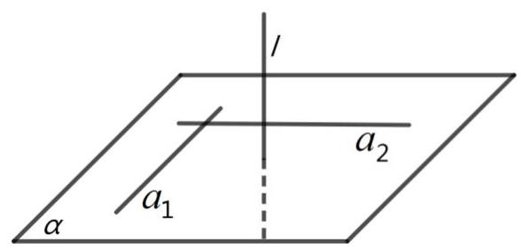

该定理中的直线与直线垂直, 既可以是直线共平面的垂直, 也可以是异面直线的垂直。

例 12.6 如下图所示,已知 ${ABCD} - {A}_{1}{B}_{1}{C}_{1}{D}_{1}$ 是正方体,它的所有表面都是正方形,证明: ${BD} \bot  {AC}{C}_{1}{A}_{1}$ 。

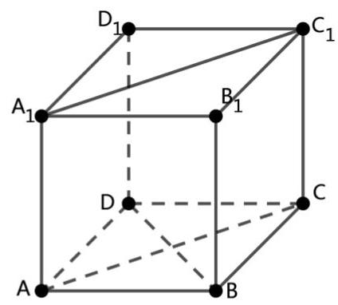

证明: 因为正方体 ${ABCD} - {A}_{1}{B}_{1}{C}_{1}{D}_{1}$ 的所有表面都是正方形,由 ${AB}{B}_{1}{A}_{1}$ 是正方形可得 $A{A}_{1} \bot  {AB}$ ,由 ${AD}{D}_{1}{A}_{1}$ 是正方形可得 $A{A}_{1} \bot  {AD}$ ,所以 $A{A}_{1} \bot  {ABCD}$ ,所以 $A{A}_{1} \bot  {BD}$ 。因为 ${ABCD}$ 是正方形,所以 ${BD} \bot  {AC}$ 。综上可得 ${BD}$ 与平面 ${AC}{C}_{1}{A}_{1}$ 内的两条相交的直线 $A{A}_{1}\text{ 、 }{AC}$ 分别垂直，所以 ${BD} \bot  {AC}{C}_{1}{A}_{1}$ 。

利用直线与平面垂直的判定定理, 以及异面直线的夹角的定义 (直线可以任意平移, 夹角不变), 可以得到:

定理 垂直于同一个平面的两条直线平行。

平面内, 点到直线的距离、平行线间的距离总是与垂直关系有关。立体空间中, 距离也总是与垂直关系有关。利用直线与平面垂直, 可以得到点到平面的距离、平行的直线与平面的距离、平行的平面间的距离。

过平面内任意一点，有且只有一条直线垂直于已知直线。类似的，过空间中任意一点 $A$ ,有且只有一条直线垂直于已知平面 $\alpha$ 。点 $A$ 可以在平面 $\alpha$ 内,也可以在 $\alpha$ 外。

如果点 $A$ 在平面 $\alpha$ 外,设垂足为 $P$ ,那么点 $A$ 与垂足 $P$ 之间的距离,就是点 $A$ 到平面 $\alpha$ 的距离，即垂线段 ${AP}$ 的长。

平面内, 直线外一点与直线上一点的连线中, 垂线段最短。类似的, 立体空间中，平面内所有点与平面外一点的连线中，垂线段最短。

如果直线 $l$ 与平面 $\alpha$ 平行,那么 $l$ 与 $\alpha$ 间的距离的定义为: $l$ 上任意一点 $P$ 到 $\alpha$ 的距离,就是平行的直线 $l$ 到平面 $\alpha$ 的距离。

如果平面 $\alpha$ 与平面 $\beta$ 平行,那么 $\alpha$ 与 $\beta$ 间的距离的定义为: $\alpha$ 上任意一点 $A$ 到 $\beta$ 的距离，也等于 $\beta$ 上任意一点 $B$ 到 $\alpha$ 的距离，就是平行的平面之间的距离。

利用直线与平面的垂直关系，还可以得到直线与平面所成的角的概念:如果直线 $l$ 与平面 $\alpha$ 相交于点 $P$ ,即 $l \cap  \alpha  = P$ ,过 $l$ 上任意一点 $M$ 向 $\alpha$ 引垂线,设垂足为 $N$ ,那么 $\angle {MPN}$ 叫作直线 $l$ 与平面 $\alpha$ 所成的角(夹角)。如下图所示。

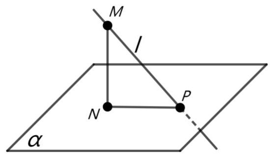

按照上述方法,在平面 $\alpha$ 内作出的直线 ${PN}$ 叫作直线 $l$ 在平面 $\alpha$ 内的投影, 线段 ${PN}$ 叫作线段 ${PM}$ 在平面 $\alpha$ 内的投影。如果 $l$ 与 $\alpha$ 所成的角是直角,即 $l \bot  \alpha$ , 那么 $l$ 在 $\alpha$ 内的投影是一个点,就是垂足。

遇到直线与平面的夹角时,可以寻找该角所在的平面,从而可以借助平面几何知识分析处理: 从 $l$ 上选取的一点 $M\text{ 、 }l$ 与 $\alpha$ 的交点 $P$ 、垂足 $N$ ,这三个点可以确定一个平面 ${MPN}, l$ 与 $\alpha$ 的夹角 $\angle {MPN}$ 就在平面 ${MPN}$ 内。

#### 12.5.3 平面间的夹角和垂直

研究平面与平面相交时, 仍尽量通过把空间中的关系转化为平面内的关系, 利用平面几何知识解决。

根据公理 3 可知, 如果两个平面相交, 那么它们有且只有一条交线, 除此之外再无其他公共点。如果平面 $\alpha$ 与 $\beta$ 相交于直线 $l$ ,即 $\alpha  \cap  \beta  = l$ ,那么 $l$ 分别将 $\alpha$ 和 $\beta$ 分成两个半平面,从 $\alpha$ 和 $\beta$ 被分成的两组半平面中各选一个,形成的夹角叫作二面角,直线 $l$ 叫作二面角的棱, $\alpha$ 和 $\beta$ 叫作二面角的面,该二面角记作 $\alpha  - l - \beta$ 。如下图所示。

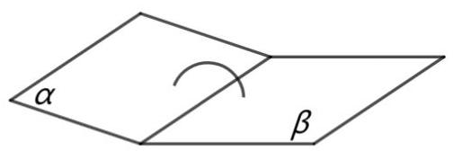

在二面角 $\alpha  - l - \beta$ 的交线 $l$ 上任选一点 $O$ ,在形成该二面角的两个半平面内分别作出以 $O$ 为端点且垂直于交线 $l$ 的射线 ${OA}\text{ 、 }{OB}$ ,则 $\angle {AOB}$ 叫作二面角的平面角, 如下图所示。

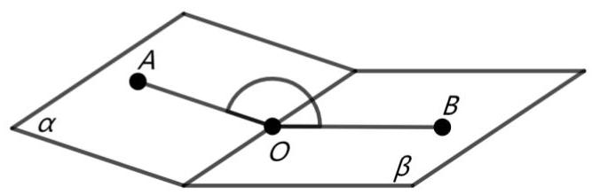

二面角的大小可以由其平面角度量, 两者的大小相等。二面角的平面角是平面内的角, 可以看作用一个垂直于交线的平面截取二面角所得到的平面角。

二面角 $\alpha  - l - \beta$ 的平面角 $\angle {AOB}$ 中, ${OA}\text{ 、 }{OB}$ 所在的直线可以看作一个与 $\alpha$ 和 $\beta$ 都垂直的平面 $\gamma$ 与 $\alpha \text{ 、 }\beta$ 分别相交的交线,即 $\alpha  \bot  \gamma$ 且 $\beta  \bot  \gamma ,\alpha  \cap  \gamma  = {OA}$ , $\beta  \cap  \gamma  = {OB}$ 。

二面角由两个半平面构成, 两个半平面可以类比成平面内的两条射线, 所以二面角的取值范围是 $\left\lbrack  {0,{180}^{ \circ  }}\right\rbrack$ 。当二面角为 ${0}^{ \circ  }$ 时,可以看作半个平面,就像平面内的 ${0}^{ \circ  }$ 角可以看作一条射线。当二面角为 ${180}^{ \circ  }$ 时,可以看作一个平面,就像平面内的 ${180}^{ \circ  }$ 角可以看作一条直线。

需注意，二面角是立体空间中的概念，不是平面内的概念，二面角由两个半平面和它们的交线构成, 它的两条 “边” 是两个半平面, 它的 “顶点” 是两个平面的交线。

平面内, 两条相交直线形成四个夹角, 通常一组对顶角为锐角, 另一组对顶角为钝角，且锐角与钝角互补，并称其中的锐角为两条直线的夹角。特别的，当四个角都相等时, 称这两条直线垂直。

类似的, 立体空间中, 两个相交的平面形成四个二面角, 通常一组相对的二面角为锐角，另一组相对的二面角为钝角，并称其中的锐角为两个平面的夹角。 特别的,当四个二面角都相等时,称这两个平面垂直。平面 $\alpha$ 与 $\beta$ 垂直记作 $\alpha  \bot  \beta$ 。

例 12.7 如下图所示,正方体 ${ABCD} - {A}_{1}{B}_{1}{C}_{1}{D}_{1}$ 中,求二面角 ${D}_{1} - {AC} - B$ 的余弦值。

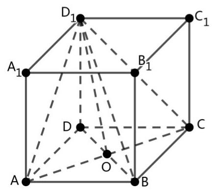

解析: 要求二面角的余弦值, 需要找到该二面角的平面角, 分别连接线段 ${BD}\text{ 、 }{D}_{1}A\text{ 、 }{D}_{1}C$ ,设 ${AC}$ 与 ${BD}$ 的交点为 $O$ 。

因为 ${ABCD} - {A}_{1}{B}_{1}{C}_{1}{D}_{1}$ 是正方体，各侧面都是边长相等的正方形，各正方形的对角线都相等， ${D}_{1}A = {D}_{1}C$ ，所以 $\bigtriangleup  {D}_{1}{AC}$ 是等腰三角形；又因为 $O$ 是正方形 ${ABCD}$ 的对角线 ${AC}$ 与 ${BD}$ 的交点，所以 $O$ 是 ${AC}$ 的中点，所以 ${D}_{1}O$ 是等腰 $\vartriangle  {D}_{1}{AC}$ 底边上的中线,还是底边上的高,所以 ${D}_{1}O \bot  {AC}$ 。又因为正方形 ${ABCD}$ 中, ${BD} \bot  {AC}$ ,所以 $\angle {D}_{1}{OB}$ 就是二面角 ${D}_{1} - {AC} - B$ 的平面角。

设正方体的棱长为 $a,{BO}$ 是底面正方形对角线的一半,可得 ${BO} = \frac{\sqrt{2}a}{2}$ ; $\operatorname{Rt}\bigtriangleup {D}_{1}{OD}$ 中,直角边 ${D}_{1}D = a,{DO} = \frac{\sqrt{2}}{2}a$ ,可得斜边 ${D}_{1}O = \sqrt{{D}_{1}{D}^{2} + D{O}^{2}} = \frac{\sqrt{6}a}{2}$ ; $\operatorname{Rt}\bigtriangleup {D}_{1}{BD}$ 中,直角边 ${D}_{1}D = a,{DB} = \sqrt{2}a$ ,可得斜边 ${D}_{1}B = \sqrt{{D}_{1}{D}^{2} + D{B}^{2}} = \sqrt{3}a$ ; 由余弦定理得: $\cos \angle {D}_{1}{OB} = \frac{{D}_{1}{O}^{2} + B{O}^{2} - {D}_{1}{B}^{2}}{2{D}_{1}O \cdot  {BO}} = \frac{{\left( \frac{\sqrt{6}a}{2}\right) }^{2} + {\left( \frac{\sqrt{2}a}{2}\right) }^{2} - {\left( \sqrt{3a}\right) }^{2}}{2 \cdot  \frac{\sqrt{6}a}{2} \cdot  \frac{\sqrt{2}a}{2}} =  - \frac{\sqrt{3}}{3}$ 。

## 定理 如果一个平面经过另一个平面的垂线, 那么这两个平面垂直。

该定理还可以表述为: 如果一条直线垂直于一个平面, 那么该直线所在的任意平面都与此平面垂直。如下页图所示。利用该定理, 可以由直线与平面垂直推出平面与平面垂直。

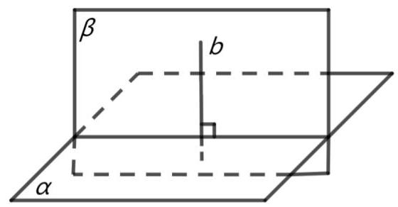

如果两个平面垂直，它们之间有下面的重要性质:

定理 如果两个平面垂直, 且其中一个平面内有一条直线垂直于这两个平面的交线, 那么这条直线与另一个平面垂直。

上图也展示了该定理。利用该定理，可以由平面与平面垂直推出直线与平面垂直。

可以发现, 直线与直线垂直、直线与平面垂直、平面与平面垂直, 两两之间可以互相推导, 只是各推导条件中有一定的限制要求。

## 练习 12.5

1. 判断下列命题是否正确，如错误，说明为什么或举出(画出)反例:

(1)如果两条直线平行, 且其中一条直线与第三条直线垂直, 那么另一条直线也与第三条直线垂直;

(2)存在这样的三条直线:它们两两互相垂直；

(3)如果两条直线平行，且其中一条直线与一个平面垂直，那么另一条直线也与该平面垂直；

(4)如果一条直线在平面外，且与平面内的一条直线垂直，那么这条直线与该平面垂直;

(5)如果一条直线与一个平面平行，该直线与另一个平面垂直，那么这两个平面也垂直;

(6)如果一条直线与一个平面平行，该平面与另一个平面垂直，那么这条直线也与那个平面也垂直;

(7)如果两个平面的交线与第三个平面垂直，那么这两个平面都与第三个平面垂直;

(8)如果两个平面都与第三个平面垂直，那么这两个平面垂直；

(9)存在这样的三个平面:它们两两互相垂直。

2. 如下页图所示，立体图形 ${ABC} - {A}_{1}{B}_{1}{C}_{1}$ 中， $\bigtriangleup  {ABC}$ 与 $\bigtriangleup  {A}_{1}{B}_{1}{C}_{1}$ 平行且全等， $A{A}_{1}\text{ 、 }B{B}_{1}\text{ 、 }C{C}_{1}$ 都与 $\bigtriangleup  {ABC}$ 和 $\bigtriangleup  {A}_{1}{B}_{1}{C}_{1}$ 所在的两个平面分别垂直， $\angle {ACB} = {90}^{ \circ  }$ ， ${AC} = {BC} = A{A}_{1}, D\text{ 、 }{D}_{1}\text{ 、 }E\text{ 、 }F$ 分别是 ${AB}\text{ 、 }{A}_{1}{B}_{1}\text{ 、 }A{A}_{1}\text{ 、 }B{B}_{1}$ 的中点,判断下列直线与平面是否垂直:

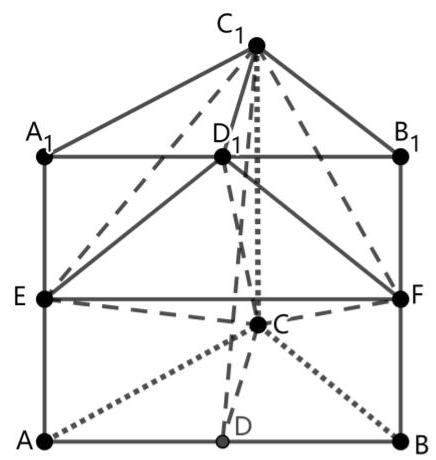

(1)直线 ${CD}$ 与 ${A}_{1}{B}_{1}$ ；(2)直线 ${C}_{1}D$ 与 $C{D}_{1}$ ；(3)直线 ${CD}$ 与平面 ${AB}{B}_{1}{A}_{1}$ ；

(4)平面 ${CEF}$ 与 ${AB}{B}_{1}{A}_{1}$ ；(5)平面 ${C}_{1}{D}_{1}E$ 与 ${C}_{1}{D}_{1}F$ ；(6)平面 ${CEF}$ 与 ${C}_{1}{EF}$ 。

### 12.6 空间中直线与平面的平移和旋转

空间中的一系列互相平行的直线或平面，都可以看作同一条直线或同一个平面在空间中平移, 直线所指的方向和平面所延伸的方向不因平移而变化。直线可以绕直线上一点旋转，“扫”出一个平面，平面可以绕平面内一条直线旋转，形成一系列相交于该直线的平面。

本节通过展示直线和平面的平移和旋转, 动态地总览空间中的位置关系。直线和平面平移后，直线与直线、直线与平面、平面与平面间的平行关系、垂直关系、夹角不变，只有涉及到的距离变化，以及直线或平面是否重合、直线是否在平面内、两条直线是否是异面直线。

请继续用笔、纸、桌面等模拟直线和平面，在空间中模拟变换操作，并尝试脱离实际物体想象相应的直线和平面，训练在大脑中想象相应的过程。

#### 12.6.1 点在直线上、平面内移动

点与直线、点与平面的位置关系各有两种:点在直线上与点在直线外，点在平面内与点在平面外。

一条直线与直线外一点可以唯一地确定一个平面, 点与直线间的位置关系可以只用平面几何知识进行分析。

设点 $A$ 是直线 $a$ 上的一点， $A$ 可以在直线 $a$ 上任意平移。

对于不同于 $a$ 的另一条直线 $l$ ,它与点 $A$ 的关系有两种情况:

(1)如果 $a\parallel l$ ，那么 $A$ 无论如何移动，都不会在 $l$ 上；

(2)如果 $a \cap  l = P$ ，那么当 $A$ 移动到点 $P$ 的位置时， $A$ 在 $l$ 上。

对于不包含直线 $a$ 的平面 $\beta$ ,它与点 $A$ 的关系有两种情况:

(1)如果 $a\parallel \beta$ ，那么 $A$ 无论如何在直线 $a$ 上移动，都不会在 $\beta$ 内；

(2)如果 $l \cap  \beta  = P$ ，那么当 $A$ 移动到点 $P$ 的位置时， $A$ 在 $\beta$ 内。 设点 $A$ 是平面 $\alpha$ 内的一点， $A$ 可以在平面 $\alpha$ 内任意平移。

对于不同于平面 $\alpha$ 的另一个平面 $\beta$ ,它与点 $A$ 的关系有两种情况:

(1)如果 $\alpha \parallel \beta$ ，那么 $A$ 无论如何移动，都不会落在 $\beta$ 内；

(2)如果 $\alpha  \cap  \beta  = l$ ，那么当 $A$ 移动到直线 $l$ 上时， $A$ 在平面 $\beta$ 内。

#### 12.6.2 直线平移或旋转形成平面

一个平面可以看作由一系列直线的并集，由直线构成平面有两种基本方式: 将一条直线沿两个相反的方向无限平移，可以扫出一个平面；将一条直线沿其上的一点旋转一周, 也可以扫出一个平面。如下图所示。

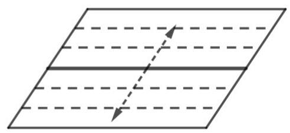

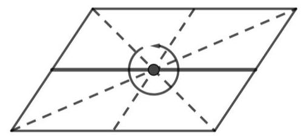

#### 12.6.3 直线与直线的位置变换

直线与直线的位置关系有三种: 平行、相交、异面直线。

设平面 $\alpha$ 内有两条平行线 $a\parallel b$ ,接下来固定 $b$ 不动,移动 $a$ :

当 $a$ 在空间中任意平移时, $a\parallel b$ 恒成立(不考虑重合的情况,下同)，如下图所示。

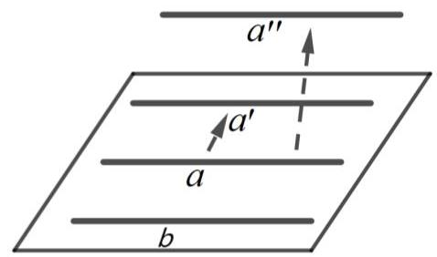

当 $a$ 以其上一点 $A$ 为中心,在平面 $\alpha$ 内旋转时,除旋转角度为 ${180}^{ \circ  }k\left( {k \in  \mathbf{Z}}\right)$ 时 $a$ 与 $b$ 平行外,旋转其他角度后 $a$ 都与 $b$ 相交,如下图所示。当旋转角度为 ${90}^{ \circ  } + {180}^{ \circ  }k\left( {k \in  \mathbf{Z}}\right)$ 时, $a \bot  b$ 。

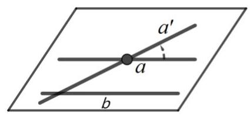

当 $\alpha$ 以其上一点 $A$ 为中心，在不同于平面 $\alpha$ 的平面 $\gamma$ 内旋转时，除旋转角度为 ${180}^{ \circ  }k\left( {k \in  \mathbf{Z}}\right)$ 时仍平行外,旋转其他角度 $a$ 与 $b$ 都是异面直线,如下页图所示。

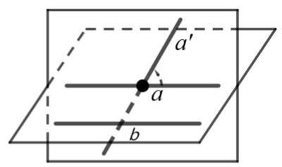

换一种初始情况,设平面 $\alpha$ 内有两条相交直线 $a \cap  b = P, a$ 与 $b$ 的夹角为 $\theta$ : 当 $a$ 在平面 $\alpha$ 内任意内平移时, $a$ 与 $b$ 相始终交,夹角 $\theta$ 不变,如下图所示。

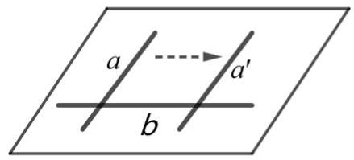

当 $a$ 在平面 $\alpha$ 内以交点 $P$ 或 $a$ 上任意一点为中心旋转时, $P$ 始终是 $a$ 与 $b$ 的交点,夹角 $\theta$ 随 $a$ 旋转而改变,如下图所示。

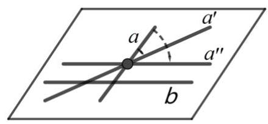

当 $a$ 在不同于平面 $\alpha$ 的另一平面 $\gamma$ 内平移时,可以看作 $a$ 平移出平面 $\alpha , a$ 与 $b$ 是异面直线,夹角 $\theta$ 不变,如下图所示。

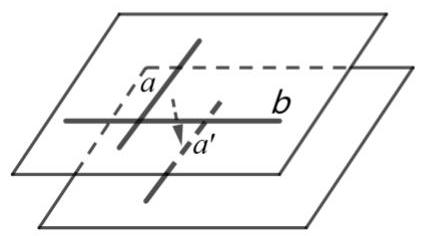

当 $a$ 在不同于平面 $\alpha$ 的另一平面 $\gamma$ 内,以交点 $P$ 为中心旋转时, $P$ 始终是 $a$ 与 $b$ 的交点,夹角 $\theta$ 随 $a$ 旋转而改变,恒有 $a \cap  b = P, a$ 与 $b$ 始终共平面, $a$ 与 $b$ 确定的平面随 $a$ 旋转而旋转,如下图所示。

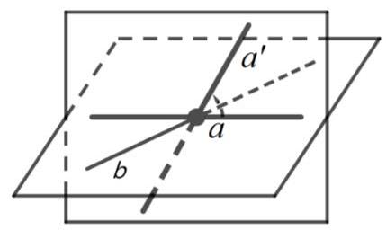

当 $a$ 在不同于平面 $\alpha$ 的另一平面 $\gamma$ 内,以 $a$ 上不同于交点 $P$ 的一点 $A$ 为中心旋转时,除旋转角度为 ${180}^{ \circ  }k\left( {k \in  \mathbf{Z}}\right)$ 时 $a$ 与 $b$ 相交外, $a$ 与 $b$ 都是异面直线,夹角 $\theta$ 随 $a$ 旋转而改变,如下页图所示。

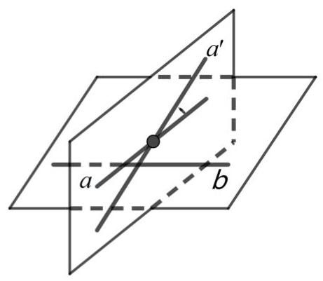

#### 12.6.4 平面与平面的位置变换

平面与平面的位置关系有两种: 平行、相交。

平面在空间中可以平移和旋转, 平面的平移与直线相似, 沿某个方向平移; 平面旋转的旋转轴是一条直线。

设平面 $\alpha \parallel \beta$ ,接下来将 $\beta$ 固定不动,平移 $\alpha$ :

当 $\alpha$ 沿任意方向平移时,除与 $\beta$ 重合外,始终 $\alpha \parallel \beta$ ,如下图所示。

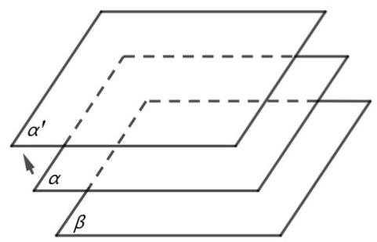

当 $\alpha$ 以 $\alpha$ 内的一条直线 $a$ 为轴旋转时,除旋转角度为 ${180}^{ \circ  }k\left( {k \in  \mathbf{Z}}\right)$ 时仍与 $\beta$ 平行外,旋转其他角度 $\alpha$ 与 $\beta$ 都相交, $\alpha$ 与 $\beta$ 的交线 $l$ 总是与 $\alpha$ 旋转轴 $a$ 平行, 如下图所示。

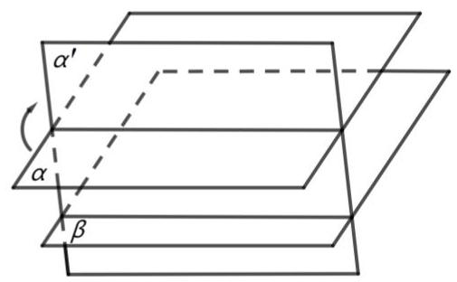

换一种初始情况,设平面 $\alpha  \cap  \beta  = l$ ,二面角为 $\theta$ :

当 $\alpha$ 沿任意方向平移时, $\alpha$ 与 $\beta$ 相交的关系不变,二面角 $\theta$ 也不变,交线的位置随 $\alpha$ 平移改变,如下页图所示。

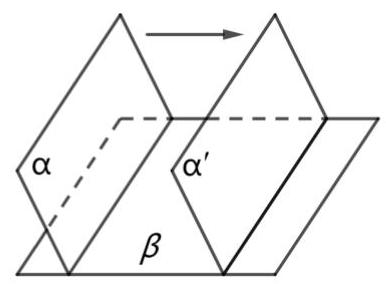

当 $\alpha$ 以交线 $l$ 为旋转轴旋转时, $\alpha  \cap  \beta  = l$ 的状态始终不变, $\alpha$ 与 $\beta$ 始终相交 (或重合),随着 $\alpha$ 旋转,二面角 $\theta$ 的大小随之改变,如下图所示。

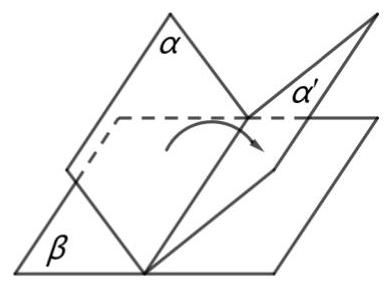

当 $\alpha$ 以 $\alpha$ 内不同于交线 $l$ 且平行于 $\beta$ 的直线 $a$ 为旋转轴旋转时,若 $a\parallel l$ ,则 $\alpha$ 旋转到某个角度时 $\alpha \parallel \beta$ ,如下图所示。

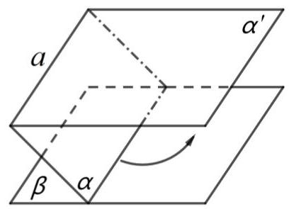

当 $\alpha$ 以 $\alpha$ 内不同于交线 $l$ 且与 $\beta$ 相交的直线 $a$ 为旋转轴旋转时, $\alpha$ 与 $\beta$ 始终相交,且交线始终经过 $a$ 与 $l$ 的交点,如下图所示。

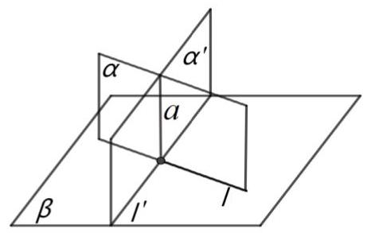

#### 12.6.5 直线与平面的位置变换

直线与平面有三种位置关系: 直线在平面内、相交、平行。

设 $a \subset  \alpha$ ,当 $a$ 在 $\alpha$ 内任意平移和旋转时, $a \subset  \alpha$ 的关系保持不变。

设 $a\parallel \alpha$ ,当 $a$ 在立体空间中任意平移时,除 $a$ 平移至 $\alpha$ 内的情况外,始终 $a\parallel \alpha$ ,如下页图所示。

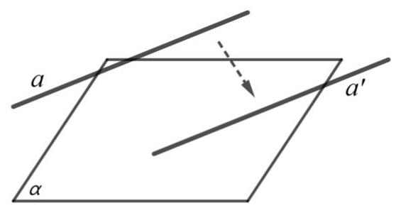

当 $a$ 在与 $\alpha$ 平行的另一平面 $\gamma$ 内任意旋转时,始终 $a\parallel \alpha$ ,如下图所示。

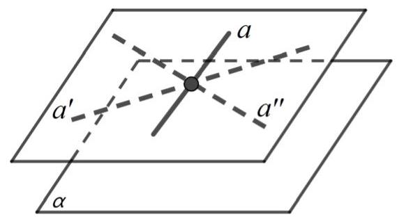

当 $a$ 在与 $\alpha$ 相交的另一平面 $\gamma$ 内旋转时,除旋转角度为 ${180}^{ \circ  }k\left( {k \in  \mathbf{Z}}\right)$ 时仍与 $\alpha$ 平行外, $a$ 都与 $\alpha$ 相交,如下图所示。

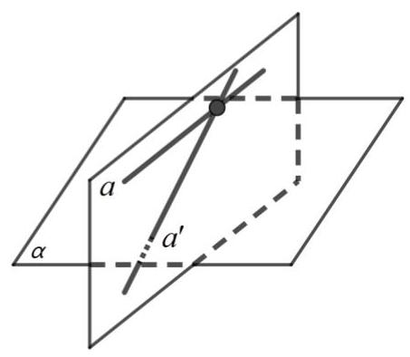

换一种初始情况,设直线 $a$ 与平面 $\alpha$ 相交,夹角为 $\theta$ :

当 $a$ 在空间中任意平移时, $a$ 与 $\alpha$ 相交的关系保持不变,夹角 $\theta$ 保持不变, 交点随 $a$ 移动,如下图所示。

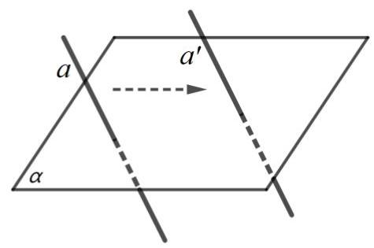

当 $a$ 在空间中旋转时,除旋转至某个角度时与 $\alpha$ 平行 (或在 $\alpha$ 内),旋转其他角度时 $a$ 都与 $\alpha$ 相交,且夹角随旋转变化,如下页图所示。

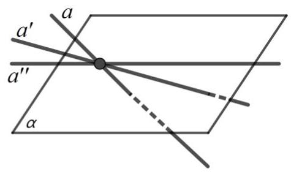

## 小结

本章学习立体几何的基本公理和推论, 立体空间中的点、直线、平面的基本位置关系，距离和夹角的定义，关于平行和垂直这两种特殊位置关系的重要定理， 需注意培养并建立对立体空间中的直线与平面的位置关系的直观感觉, 能使用公理和定理进行推导和证明, 需要认真训练空间想象力和绘制直观图的能力。

## 第十三章 基本立体图形

我们生活中的物体大都是立体的, 如果不考虑物体的材料、颜色等属性, 只考虑形状，物体都可以抽象成基本的立体图形，又叫作空间几何体。本章学习基本立体图形的概念、特点和性质。

把真实物体抽象成空间几何体，如同把各式各样的平面图形抽象成三角形、 平行四边形、圆形。虽然在现实中的常见平面图形更为复杂, 但大都可以拆分为若干基本平面图形的组合, 或近似看作某类基本平面图形, 利用简洁的基本平面图形的知识进行分析。

类似的, 我们生活的立体空间中, 虽然物体的形状纷繁复杂, 但同样能抽象为简洁的基本立体图形, 根据立体几何知识分析得到这些基本立体图形的特点和性质。对于复杂的真实物体，大都可以拆分为若干基本立体图形的组合，或近似看作某类基本立体图形, 利用简洁的基本立体图形的知识进行分析。

对于基本立体图形, 很容易从中找出基本平面图形, 并借助基本平面图形的性质描述相应的立体图形。立体图形还可以看作以平面图形为基础, 将其在空间中进行一系列操作后形成的图形, 作为基础的平面图形和进行的具体操作中都蕴含立体图形的特点和性质。

立体空间可以看作将平面空间上升一个维度, 平面几何的基本定理在立体空间中仍然成立，因此 “找出所在的平面” 和 “创造共平面的情形” 仍是学习立体图形的特点和性质, 以及分析解答关于立体图形的问题的重要思路。

学习本章时, 可以通过找出与基本立体图形相似的具体实物, 用纸、笔、剪刀、胶水等工具剪贴制作基本立体图形的模型，画出基本立体图形的直观图等方法, 直观、透视、具体地多角度观察了解基本立体图形, 结合本章学习的知识, 在大脑中建立起既有直观形状又包含数学关系的立体模型。

### 13.1 多面体

由若干平面多边形通过把它们的边重合, 围成的立体图形叫作多面体。围成多面体的平面多边形叫作多面体的面，相邻的平面多边形的公共边叫作多面体的棱。棱与棱的公共点叫作多面体的顶点。多面体中只有直线和平面, 没有曲线和曲面。高中主要学习的多面体有三种:棱柱、棱锥、棱台。

#### 13.1.1 棱柱

两个全等的多边形面对面平行放置, 再分别连接对应的顶点, 形成的立体图形叫作棱柱。生活中很多方形包装盒的形状都是棱柱, 下页图为一个棱柱的示意图。

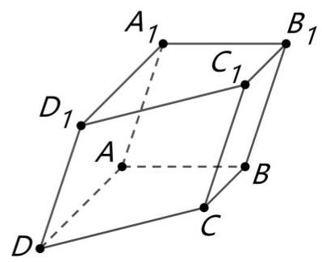

通常用棱柱的两个底面各顶点的字母命名棱柱，两个底面对应的顶点通常用相同的字母带不同角标的方式命名，如上图中的棱柱命名为 ${ABCD} - {A}_{1}{B}_{1}{C}_{1}{D}_{1}$ 。

棱柱的上下两个平行且全等的多边形面叫作棱柱的底面(ABCD 和 ${A}_{1}{B}_{1}{C}_{1}{D}_{1}$ )。棱柱除上下两个底面外的各平面叫作棱柱的侧面( $A{A}_{1}{B}_{1}B$ 、 ${BC}{C}_{1}{B}_{1}$ 、 ${CD}{D}_{1}{C}_{1}$ 、 ${DA}{A}_{1}{D}_{1}$ )，棱柱的所有侧面都是平行四边形。棱柱相邻两个侧面的公共边 (连接两个底面对应点的线段) 叫作棱柱的侧棱 $\left( {A{A}_{1}\text{ 、 }B{B}_{1}\text{ 、 }C{C}_{1}\text{ 、 }D{D}_{1}}\right.$ )。 棱柱的所有侧棱都互相平行。棱柱两个底面所在的平面间的距离叫作棱柱的高。 从一个底面上的任意一点向另一个底面引垂线, 垂线段的长度等于棱柱的高。棱柱的侧面与底面的公共顶点叫作棱柱的顶点。

底面是 $n$ 边形的棱柱叫作 $n$ 棱柱。底面是正多边形的棱柱叫作正棱柱。底面是正 $n$ 边形的棱柱叫作正 $n$ 棱柱。侧棱与底面垂直的棱柱叫作直棱柱,直棱柱的侧棱长等于棱柱的高, 侧棱与底面不垂直的棱柱叫作斜棱柱。下图为直三棱柱 (左)和一个斜三棱柱(右)的示意图。

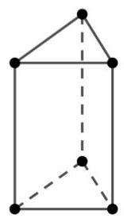

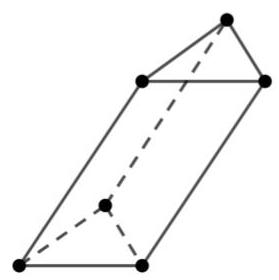

如果棱柱的底面是平行四边形, 那么它的六个面都是平行四边形, 这样的棱柱又叫作平行六面体。底面是矩形的直棱柱叫作长方体，长方体的所有面都是矩形, 且任意两个相邻的平面都垂直, 长方体属于平行六面体。底面是正方形, 且侧棱长等于底面边长的长方体叫作正方体或立方体，正方体的六个侧面是六个全等的正方形，下图为平行六面体(左)、长方体(中)和正方体(右)的示意图。

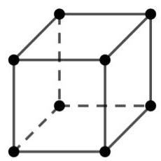

从动态的视角观察, 棱柱可以看作一个平面多边形, 沿所在平面外的一个方向平移一段距离，在空间中扫过的轨迹，如下图所示。如果多边形平移的方向与其所在平面垂直, 形成的就是直棱柱。

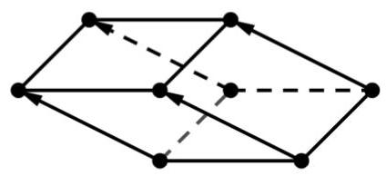

#### 13.1.2 棱柱中的平行和垂直

棱柱中有大量平行关系, 直棱柱中还有很多垂直关系, 在分析计算关于棱柱的问题时非常重要, 借助这些平行与垂直关系, 可以推出新的平行和垂直、构造共平面的情形、求距离与夹角等。

斜棱柱中有大量平行关系, 对照下图中的斜四棱柱。

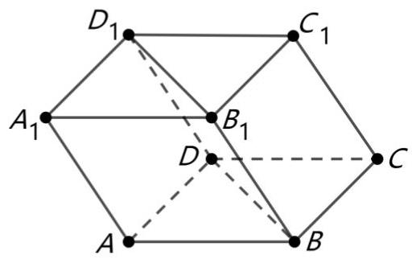

棱柱的两个底面全等且互相平行, 所有侧面都是平行四边形。因为棱柱的所有侧面都是平行四边形, 所以任意两个相邻的侧棱都平行且相等, 由此可得任意两个侧棱都平行且相等, 连接两个底面对应的两组顶点都可以得到平行四边形 $\left( {B{B}_{1}{D}_{1}D}\right)$ 。

如果棱柱的两个底面图形中存在平行关系( ${AB}\parallel {CD}$ ， ${A}_{1}{B}_{1}\parallel {C}_{1}{D}_{1}$ )，那么这组平行线两两平行 $\left( {{AB}\parallel {CD}\parallel {A}_{1}{B}_{1}\parallel {C}_{1}{D}_{1}}\right.$ ),结合棱柱的侧棱互相平行,可以推出这组边所在的侧面平行 $\left( {{AB}{B}_{1}{A}_{1}\parallel {DC}{C}_{1}{D}_{1}}\right)$ 。

如果棱柱的底面图形有两组平行关系( ${AB}\parallel {CD}$ ， ${A}_{1}{B}_{1}\parallel {C}_{1}{D}_{1}$ ， ${AD}\parallel {BC}$ ， ${A}_{1}{D}_{1}\left.\parallel  {{B}_{1}{C}_{1}}\right)$ ,可以推出这两组边所在的侧面分别平行 $\left( {{AB}{B}_{1}{A}_{1}\parallel {DC}{C}_{1}{D}_{1}}\right.$ , ${AD}{D}_{1}{A}_{1}\left| {\;{BC}{C}_{1}{B}_{1}}\right.$ )，还可以推出四组斜面互相平行( ${A{B}_{1}{D}_{1}}\left| {\;\left| {{C}_{1}{BD}}\right. }\right.$ ， ${C{B}_{1}{D}_{1}}$ || ${{A}_{1}{BD}}$ ， ${B}_{1}{AC}\parallel D{A}_{1}{C}_{1},\;{D}_{1}{AC}\parallel B{A}_{1}{C}_{1}$ ) 。

直棱柱中同时有大量平行和垂直关系, 对照下页图中的直四棱柱。

直棱柱的侧棱与底面垂直。直棱柱的所有侧面都是矩形,直棱柱的任意一个侧棱所在的平面都与底面垂直,任意两个侧棱所确定的平面 $\left( {B{B}_{1}{D}_{1}D}\right)$ 也都与底面垂直。

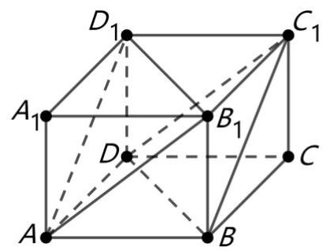

连接直棱柱的一个底面内的任意两个顶点可以得到一条直线 $\left( {BD}\right)$ ,如果底面内有另一条直线 $l$ (未画出) 垂直于这条直线 $\left( {l \bot  {BD}}\right)$ ,那么直线 $l$ 与这两个顶点 $\left( {B\text{ 、 }D}\right)$ 所在的侧棱 $\left( {B{B}_{1}\text{ 、 }{D}_{1}D}\right)$ 确定的平面垂直 $\left( {l \bot  B{B}_{1}{D}_{1}D}\right)$ 。

#### 13.1.3 棱柱的表面积和体积

棱柱的表面积等于围成棱柱的所有表面的面积之和。棱柱由上下两个底面和若干侧面围成, 棱柱的表面积等于两个底面的面积与所有侧面的面积之和, 通常没有特定的公式, 需要专门求出每个侧面的面积和底面的面积。

例 13.1 已知直棱柱的底面的周长为 $C$ ,高为 $h$ ,证明: 直棱柱所有侧面的面积之和等于 ${Ch}$ 。

证明: 设直 $n$ 棱柱的底面的各边长分别为 ${a}_{1}\text{ 、 }{a}_{2}\text{ 、 }\cdots \text{ 、 }{a}_{n}$ ,那么直棱柱底面的周长为: $C = {a}_{1} + {a}_{2} + \cdots  + {a}_{n}$ ,

直棱柱各侧面的面积分别为: ${S}_{1} = {a}_{1}h\text{ 、 }{S}_{2} = {a}_{2}h\text{ 、 }\cdots \text{ 、 }{S}_{n} = {a}_{n}h$ ,

直棱柱所有侧面的面积之和为:

$$
S = {S}_{1} + {S}_{2} + \cdots  + {S}_{n} = {a}_{1}h + {a}_{2}h + \cdots  + {a}_{n}h = \left( {{a}_{1} + {a}_{2} + \cdots  + {a}_{n}}\right) h = {Ch}
$$

棱柱的体积等于底面积与高的乘积。

对于底面面积为 $S$ ,高为 $h$ 的棱柱,它的体积为:

$$
V = {Sh}
$$

棱长为 $a$ 的正方体的体积为:

$$
V = {a}^{3}
$$

正方体是形状最规则的立体图形, 它的所有棱长都相等, 且所有棱之间要么平行、要么垂直。对于不同的正方体, 它们的区别只有棱长这一个参数。正方体的体积公式中, 同样只有棱长这一个参数。

公式 $V = {a}^{3}$ 可以看作 “体积” 这一几何概念的定义,任意立体图形的体积本质上都用该公式求出，只需要将立体图形进行分割然后拼接成为正方体，或用专门的方法将立体图形拆分成若干(或无穷)小正方体，将这些小正方体的体积累加后就是立体图形的体积。

类似的,平面几何中,边长为 $a$ 的正方形的面积为 $S = {a}^{2}$ ,该公式可以看作 “面积” 这一几何概念的定义, 任意平面图形的面积本质上都用该公式求出, 只需要将平面图形进行分割然后拼接成为正方形, 或用专门的方法将平面图形拆分成若干(或无穷)小正方形，将这些小正方形的面积累加后就是平面图形的面积。

例如, 求长方形的面积时, 可以根据长方形的长宽比, 将其划分为若干小正方形，将这些小正方形的面积累加就是长方形的面积。对于长为 $a$ 、宽为 $b$ 的长方形,可以将其分割为呈 $a$ 列 $b$ 行排列的 $a \times  b$ 个边长为 1 的小正方形,每个小正方形的面积都为: ${1}^{2} = 1$ ,长方形的面积等于这 $a \times  b$ 个面积为 1 的小正方形的面积之和: $S = {ab}$ ,如下图所示。如果长方形的面积不是整数,则只需分割为面积更小的正方形即可。

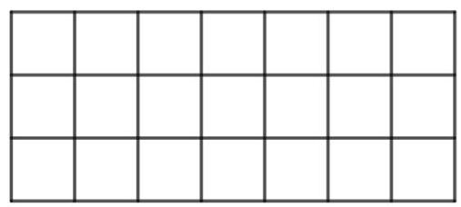

求平行四边形的面积时, 将其分割然后拼接成长方形, 利用长方形的面积公式求平行四边形的面积。对于长为 $a$ 、高为 $b$ 的平行四边形,可以将其沿任意一条高切开, 得到斜边和斜角相等的直角三角形与直角梯形, 或两个斜边和斜角相等的直角梯形,或两个斜边和斜角相等的直角三角形,平移后可拼接得到长为 $a$ 、 宽为 $b$ 的长方形,平行四边形的面积等于长方形的面积: $S = {ab}$ 。如下图所示。

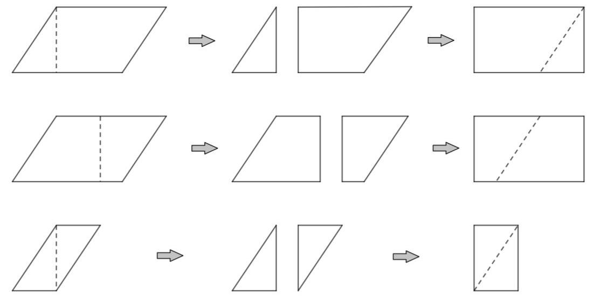

求三角形的面积时,将两个全等的三角形拼接成平行四边形, 利用平行四边形的面积公式求三角形的面积。对于长为 $a$ 、高为 $b$ 的三角形,将两个相同的三角形沿一条相同的边对接, 并让另外两组相同的边分别位于相反方向, 就得到平行四边形,三角形的面积等于平行四边形的面积的一半: $S = \frac{1}{2}{ab}$ ,如下页图所示。

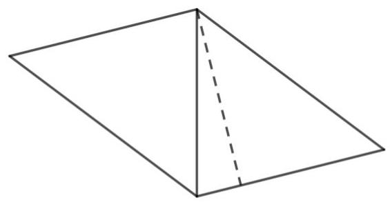

求正多边形的面积时, 以正多边形的中心为公共顶点, 将正多边形分割为若干全等的等腰三角形, 这些全等的等腰三角形的面积之和, 就是正多边形的面积。 其中各等腰三角形的底角的大小等于正多边形各内角的一半, 多边形的内角和以及各内角的大小可以用几何知识求出。例如,边长为 $a$ 的正六边形,可以分割为六个全等的边长为 $a$ 、底角为 ${60}^{ \circ  }$ 的等腰三角形,即正三角形,每个正三角形的面积为 $\frac{\sqrt{3}{a}^{2}}{4}$ ，正六边形的面积等于这些正三角形的面积之和: $S = 6 \times  \frac{\sqrt{3}{a}^{2}}{4} = \; \frac{3\sqrt{3}{a}^{2}}{2}$ ，如下图所示。

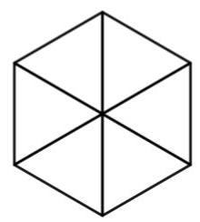

求圆的面积时,将圆看作有无穷多条边的正多边形,用求正多边形的面积的方法近似求解,最终得到了半径为 $r$ 的圆的面积公式: $S = \pi {r}^{2}$ 。下图为一个正二十变形, 看上去已经较接近圆, 正二十边形可以分割为二十个全等的等腰三角形, 这个近似圆形的面积等于这些等腰三角形的面积之和。

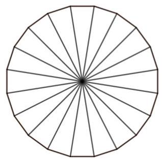

对于长、宽、高分别为 $a\text{ 、 }b\text{ 、 }c$ 的长方体,可以看作由 $a \times  b \times  c$ 个棱长为 1 的正方体累积而成，如下页图所示，长方体的体积等于这些正方体的体积之和:

$$
V = {abc}
$$

若 $a\text{ 、 }b\text{ 、 }c$ 不是整数,只需让分割而成的小正方体的棱长足够小,长方体总是可以由整数个极小的正方体堆叠而成。

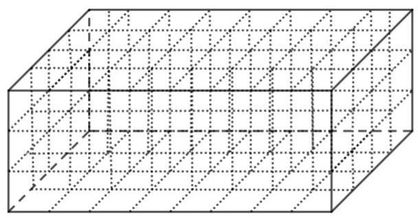

对于底面不是矩形的直棱柱,设其底面的面积为 $S$ ,高为 $h$ ,可以将直棱柱垂直分割为大量底面积相等的小长方体, 即使不是直角的边缘部分, 也都近似看作长方体，如下图所示。

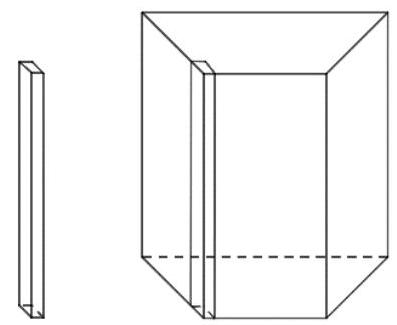

设分割形成的小长方体的数量为 $n$ ,每个小长方体的高都等于直棱柱的高 $h$ ,底面积都等于 ${\Delta s} = \frac{S}{n}$ ,每个小长方体的体积都等于 ${\Delta v} = \frac{Sh}{n}$ ,总共 $n$ 个小长方体,直棱柱的体积等于所有 $n$ 个小长方体的体积之和:

$$
V = n \cdot  {\Delta v} = n \cdot  \frac{Sh}{n} = {Sh}
$$

这种先将不规则的整体分割为无穷多个极小的规则的小单元，“强行套用” 规则小单元的公式后, 再合并成不规则的整体的方法叫作微元法。微元法的核心思路是将不规则的整体分割为无穷多规则的小单元, 从而可以使用规则的小单元的公式, 再将计算得到的结果合并, 得到整体的结果。

对于斜棱柱, 它的体积与底面积和高都相等的直棱柱的体积相等, 可以仿照将平行四边形切割然后拼接为矩形的方法, 通过切割然后拼接, 将斜棱柱 “不平”的部分“填平”，得到直棱柱，如下图所示。

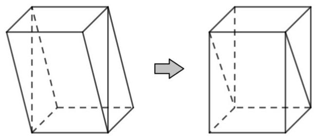

例 13.2 已知平行六面体的六个表面为全等的菱形, 菱形的边长为 6 、一个内角为 ${60}^{ \circ  }$ ,求该平行六面体的表面积和体积。

解析:该平行六面体的六个表面为全等的菱形，只需求出菱形的面积，再乘以六即可。

如下图所示,对于边长为 6、一个内角为 ${60}^{ \circ  }$ 的菱形,它的高为: $6\sin {60}^{ \circ  } = \; 6 \times  \frac{\sqrt{3}}{2} = 3\sqrt{3}$ ,它的面积为: $3\sqrt{3} \times  6 = {18}\sqrt{3}$ ,平行六面体共有六个表面,表面积为: ${18}\sqrt{3} \times  6 = {108}\sqrt{3}$ 。

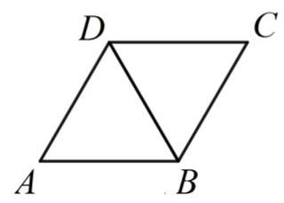

接下来求体积,刚才已求得平行六面体的底面积为 ${18}\sqrt{3}$ ,还需要求出高, 画出该平行六面体的示意图，如下图所示，命名为 ${ABCD} - {A}^{\prime }{B}^{\prime }{C}^{\prime }{D}^{\prime }$ 。

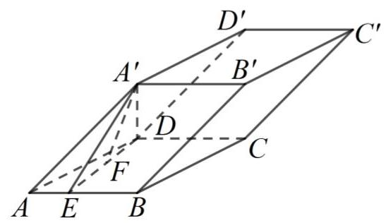

从点 ${A}^{\prime }$ 向棱 ${AB}$ 引垂线,设垂足为 $E$ ,连接 ${DE}$ ,由于菱形 ${AB}{B}^{\prime }{A}^{\prime }$ 与 ${ABCD}$ 全等，那么 $E$ 同样位于菱形 ${ABCD}$ 中 $D$ 向 ${AB}$ 引垂线的垂足位置，所以 ${DE}\bot {AB}$ 。 可以看作将 ${AB}{B}^{\prime }{A}^{\prime }$ “放平” 后成为 ${ABCD}$ ,点 ${A}^{\prime }$ 与点 $D$ 重合,垂直关系不变。

因为 ${A}^{\prime }E \bot  {AB}\text{ 、 }{DE} \bot  {AB}$ ,所以 ${AB} \bot$ 平面 ${A}^{\prime }{ED}$ ,在 $\bigtriangleup {A}^{\prime }{ED}$ 中,从点 ${A}^{\prime }$ 向 ${DE}$ 引垂线,设垂足为 $F$ ,那么 ${A}^{\prime }F$ 在平面 ${A}^{\prime }{ED}$ 内,所以 ${A}^{\prime }F \bot  {AB}$ ,又因为 ${A}^{\prime }F \bot  {DE}$ ,所以 ${A}^{\prime }F \bot$ 平面 ${ABCD}$ ,所以 ${A}^{\prime }F$ 就是该平行六面体的高,接下来求 ${A}^{\prime }F$ 的长。

对于 $\bigtriangleup  {A}^{\prime }{ED}$ ， ${A}^{\prime }E = {DE} = 3\sqrt{3}$ ， ${A}^{\prime }D$ 是菱形较短的对角线，由菱形的边长为 6、一个内角为 ${60}^{ \circ  }$ ，可得 ${A}^{\prime }D = 6$ 。设 ${A}^{\prime }D$ 的中点为 $M$ ，连接 ${EM}$ ，如下页图所示。等腰三角形底边上的高和中线重合,所以 ${EM} \bot  {A}^{\prime }D$ 。由 $M$ 是 ${A}^{\prime }D$ 的中点可得 ${DM} = 3,\cos \angle D = \frac{DM}{DE} = \frac{3}{3\sqrt{3}} = \frac{\sqrt{3}}{3},\sin \angle D = \sqrt{1 - {\left( \frac{\sqrt{3}}{3}\right) }^{2}} = \frac{\sqrt{6}}{3}$ ,可得 ${A}^{\prime }F = {A}^{\prime }D\sin \angle D = 6 \times  \frac{\sqrt{6}}{3} = 2\sqrt{6}$ 。

综上,该平行六面体的体积为: $V = {18}\sqrt{3} \times  2\sqrt{6} = {108}\sqrt{2}$ 。

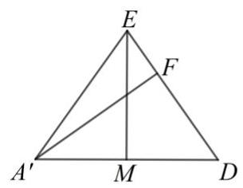

练习 13.1(1)

1. 求下列几何体的体积和表面积:

(1)底面是边长为 2 的正三角形，高为 2 的直三棱柱；

(2)底面是边长为 2 的正三角形，高为 2，侧棱与底面夹角为 ${45}^{ \circ  }$ 的三棱柱;

(3)底面是边长为 2 的正三角形，侧面是一个内角为 45°的菱形的三棱柱。

#### 13.1.4 棱锥

将平面多边形的各顶点与平面外的一点相连, 形成的立体图形叫作棱锥。金字塔的形状就是棱锥。下图为一个棱锥的示意图。

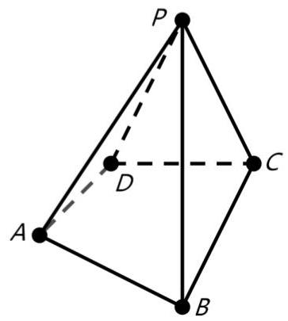

通常用形成棱锥的多边形外一点, 以及平面多边形各顶点的字母命名棱锥, 例如上图中的棱锥命名为 $P - {ABCD}$ 。

形成棱锥的平面多边形面叫作棱锥的底面(ABCD)。棱锥中除底面外的其他各面叫作棱锥的侧面(PAB、PBC、PCD、PDA)，棱锥的侧面都是三角形且都由公共的顶点和底面的一条边构成。棱锥中与底面各顶点相连的平面外的一点叫作棱锥的顶点 $\left( P\right)$ 。含顶点的棱叫作棱锥的侧棱 $({PA}\text{ 、 }{PB}\text{ 、 }{PC}\text{ 、 }{PD}$ )。 棱锥的顶点到底面的距离叫作棱锥的高。

底面是 $n$ 边形的棱锥叫作 $n$ 棱锥。三棱锥又叫作四面体,三棱锥是唯一有且只有四个面的多面体, 三棱锥的每个面都是三角形, 每个面都可以看作底面, 把其他面看作侧面。底面是正多边形, 且顶点与底面中心的连线垂直于底面的棱锥叫作正棱锥, 正棱锥有很好的对称性。每个面都是正三角形的三棱锥又叫作正四面体, 正四面体的所有棱长都相等。如果一个三棱锥有三条相交的棱两两垂直, 这样的三棱锥叫作直三棱锥, 直三棱锥中三条互相垂直的棱可用于建立空间直角坐标系。下页图为正四面体(左)和直三棱锥(右)的示意图。

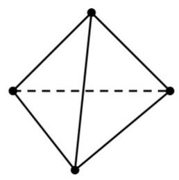

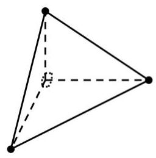

#### 13.1.5 棱锥中的平行和垂直

虽然棱锥中没有棱柱那么多天然的平行关系, 但正棱锥、底面是特殊图形的棱锥中仍有重要的平行和垂直关系。

对照下图中的正四棱锥正四棱锥 $P - {ABCD}$ 。

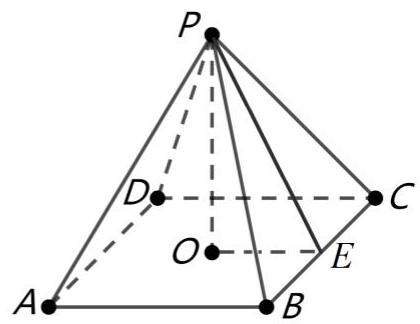

正棱锥的顶点与底面中心的连线 ${PO}$ 垂直于底面,顶点与垂足的距离就是顶点到底面的距离,等于正棱锥的高。 ${PO}$ 所在的任意平面都与底面垂直,正棱锥的任意一条棱与 ${PO}$ 可以构造平面,用于求侧棱与底面的夹角。从底面中心向底面平面图形的任意一条边引垂线 ${OE}$ ,平面 ${POE}$ 垂直于底面, $\angle {PEO}$ 是二面角 $P - {BC} - O$ 的平面角。

棱锥的底面图形中可以蕴含平行或垂直关系。例如, 正四棱锥的底面是正方形,除上述正棱锥中的垂直关系外。经过底面中心的直线 $({AC}$ 和 ${BD}$ ) 是两个垂直平面 $({PAC}$ 与 ${PBD})$ 的交线,平面 ${PAC} \bot$ 平面 ${PBD}$ 。

直三棱锥中有一组相交的三条棱两两垂直, 可用于构造并求解直线与平面的夹角、平面与平面的夹角、点到直线的距离等。更重要的是, 可以直接由此建立空间直角坐标系, 并利用空间向量进行分析, 具体将在下一章学习。

#### 13.1.6 棱锥的表面积和体积

棱锥的表面积等于围成棱锥的全部多边形的面积之和。棱锥由底面的 $n$ 边形和 $n$ 个侧面三角形围成,通常没有特定的公式,需专门求出底面和各侧面的面积。

棱锥的体积等于与其同底等高的棱柱的体积的三分之一。即: 对于底面面积为 $S$ ,高为 $h$ 的棱锥,它的体积为:

$$
V = \frac{1}{3}{Sh}
$$

棱锥的体积公式可使用先分割为无穷小的体积单元再求和的微元法推导, 以正四棱锥为例,对于高为 $h$ ,底面边长为 $a$ 的正四棱锥,底面正方形的面积为 $S = {a}^{2}$ ,将正四棱锥水平分割为大量高度相等且非常薄的薄片,将每个薄片都近似看作正四棱柱, 取较大的底面作为底面积, 如下图所示。

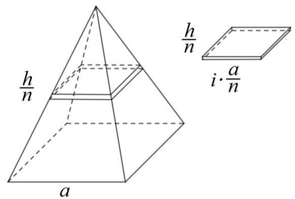

设分割成的正四棱柱薄片的数量为 $n$ ,每个薄片的高都是 $\frac{h}{n}$ ,由相似三角形关系可得: 从上到下每个薄片的底面边长依次为 $\frac{a}{n}\text{ 、 }\frac{2a}{n}\text{ 、 }\cdots \text{ 、 }\frac{na}{n}$ ,每个薄片的底面积依次为 ${\left( \frac{a}{n}\right) }^{2} \cdot  {\left( \frac{2a}{n}\right) }^{2}\text{ 、 }\cdots \text{ 、 }{\left( \frac{na}{n}\right) }^{2}$ ,则每个薄片的体积分别为 ${\left( \frac{a}{n}\right) }^{2}\frac{h}{n}\text{ 、 }{\left( \frac{2a}{n}\right) }^{2}\frac{h}{n}\text{ 、 }\cdots \text{ 、 }{\left( \frac{na}{n}\right) }^{2}\frac{h}{n}$ ,正四棱锥的体积等于所有薄片的体积之和:

$$
V = {\left( \frac{a}{n}\right) }^{2}\frac{h}{n} + {\left( \frac{2a}{n}\right) }^{2}\frac{h}{n} + \cdots  + {\left( \frac{na}{n}\right) }^{2}\frac{h}{n} = \frac{{a}^{2}h}{{n}^{3}}\left( {{1}^{2} + {2}^{2} + \cdots  + {n}^{2}}\right)
$$

将数列的求和公式 ${1}^{2} + {2}^{2} + \cdots  + {n}^{2} = \frac{n\left( {n + 1}\right) \left( {{2n} + 1}\right) }{6}$ 和 ${a}^{2} = S$ 代入上式:

$$
V = \frac{Sh}{{n}^{3}} \cdot  \frac{n\left( {n + 1}\right) \left( {{2n} + 1}\right) }{6} = \frac{Sh}{{\left( \frac{n}{n}\right) }^{3}} \cdot  \frac{\frac{n}{n} \cdot  \frac{n + 1}{n} \cdot  \frac{{2n} + 1}{n}}{6} = \frac{Sh}{6}\left( {1 + \frac{1}{n}}\right) \left( {2 + \frac{1}{n}}\right)
$$

分割的薄片数量非常多, $n$ 非常大,将 $\mathop{\lim }\limits_{{n \rightarrow   + \infty }}\frac{1}{n} = 0$ 代入上式即可得:

$$
V = \frac{Sh}{6}\left( {1 + 0}\right) \left( {2 + 0}\right)  = \frac{1}{3}{Sh}
$$

例 13.3 求棱长为 1 的正四面体的表面积和体积。

解析: 正四面体由 4 个全等的正三角形围成, 正四面体的表面积等于这 4 个正三角形的面积之和。下页图为边长为 1 的正三角形,三个内角都为 ${60}^{ \circ  }$ ,每条边上的高、中线、角平分线重合,可得正三角形的高为 $1 \times  \sin {60}^{ \circ  } = \frac{\sqrt{3}}{2}$ ,正三角形的面积为 $\frac{1}{2} \times  1 \times  \frac{\sqrt{3}}{2} = \frac{\sqrt{3}}{4}$ ,该正四面体的表面积为: $S = \frac{\sqrt{3}}{4} \times  4 = \sqrt{3}$ 。

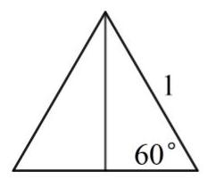

接下来求正四面体的体积,刚才已求得底面的面积为 $\frac{\sqrt{3}}{4}$ ,还需要求出高, 画出该正四面体的示意图，如下图所示，命名为 $P - {ABC}$ 。

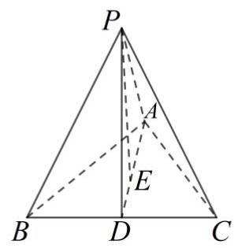

设 ${BC}$ 的中点为 $D$ ,连接 ${AD}$ ,过 $P$ 向直线 ${AD}$ 引垂线,设垂足为 $E$ 。

接下来证明 ${PE}$ 是底面 ${ABC}$ 上的高,即 ${PE} \bot$ 平面 ${ABC}$ 。因为 $P - {ABC}$ 是正四面体，所以各侧面都是正三角形，正三角形每条边上的高、中线、角平分线重合,因为 $D$ 是 ${BC}$ 的中点,所以 ${PD} \bot  {BC}\text{ 、 }{AD} \bot  {BC}$ ,所以 ${BC} \bot$ 平面 ${PAD}$ 。又因为 ${PE}$ 在平面 ${PAD}$ 内,所以 ${BC} \bot  {PE}$ ,又因为 ${PE} \bot  {AD}$ ,所以 ${PE} \bot$ 平面 ${ABC}$ 。

接下来求 ${PE}$ 的长。对于 $\bigtriangleup  {PAD},{PA} = 1,{PD} = {AD} = \frac{\sqrt{3}}{2},{PE} \bot  {AD}$ ，设 ${AP}$ 的中点为 $M$ ,则 ${PM} = {MA} = \frac{1}{2}$ ，连接 ${DM}$ ，如下图所示，等腰三角形底边上的高和中线重合,所以 ${DM} \bot  {PA}$ 。

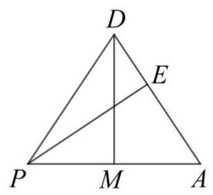

由余弦定理可得 $\cos \angle A = \frac{AM}{AD} = \frac{\frac{1}{2}}{\frac{\sqrt{3}}{2}} = \frac{\sqrt{3}}{3}$ ,所以 $\sin \angle A = \sqrt{1 - {\left( \frac{\sqrt{3}}{3}\right) }^{2}} = \frac{\sqrt{6}}{3}$ , 所有 ${PE} = {AP}\sin \angle A = 1 \times  \frac{\sqrt{6}}{3} = \frac{\sqrt{6}}{3}$ 。

综上,该正四面体的体积为: $V = \frac{1}{3} \times  \frac{\sqrt{3}}{4} \times  \frac{\sqrt{6}}{3} = \frac{\sqrt{2}}{12}$ 。

练习 13.1(2)

1. 求下列几何体的表面积和体积:

(1)底面为边长为 2 的正方形，高为 1 的正四棱锥；

(2)三条两两垂直的棱的长度均为 1 的直三棱锥；

(3)底面为边长为 1 的正六边形，高为 $\sqrt{2}$ 的正六棱锥；

(4)底面是斜边长度为 $\sqrt{2}$ 的等腰直角三角形，顶点到底面三角形的 3 个顶点的距离均为 $\sqrt{2}$ 的三棱锥。

#### 13.1.7 棱台

将棱锥沿平行于底面的平面截去一个小棱锥，剩下的部分叫作棱台。把一些大小相近的书按照从小到大的顺序上下叠放，可以近似看作一个棱台，下图为一个棱台的示意图。

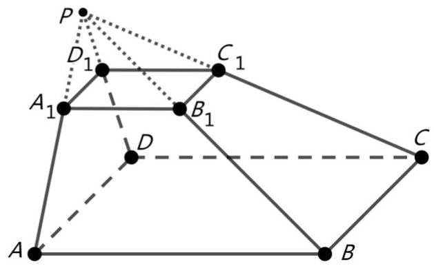

棱台的命名与棱柱相似, 用上下底面各顶点的字母表示, 两个底面对应的顶点通常用相同的字母带不同角标的方式命名，例如上图中的棱台命名为 ${ABCD} - {A}_{1}{B}_{1}{C}_{1}{D}_{1}$ 。

棱台的两个平行平面中，较小的平面叫作棱台的上底面( ${A}_{1}{B}_{1}{C}_{1}{D}_{1}$ )，较大的平面叫作棱台的下底面(ABCD)，棱台的上底面与下底面是相似图形，对应的边长所成的比例相等, 对应的角大小相等, 棱台的上下底面对应的边互相平行但不相等，因此棱台的侧面都是梯形。

棱台的上下底面对应的顶点之间的连线叫作棱台的侧棱 $(A{A}_{1}\text{ 、 }B{B}_{1}\text{ 、 }C{C}_{1}$ 、 $D{D}_{1}$ )，棱台的侧棱可以看作原棱锥的侧棱被截去小棱锥后剩余的部分。

构造棱台的原棱锥的顶点叫作棱台的顶点 $\left( \begin{array}{l} P \end{array}\right)$ ,棱台的顶点是根据棱台的构造方式想象出来的概念, 现实中这个位置没有棱台的物质。

棱台的上底面与下底面之间的距离叫作棱台的高, 棱台的高等于原棱锥的高减去被截去的小棱锥的高的差。

由 $n$ 棱锥被一个平面截去小棱锥后得到的棱台叫作 $n$ 棱台。由正棱锥被截去一个小正棱锥后得到的棱台叫作正棱台。

研究棱台的性质时, 通常使用 “大棱锥截去小棱锥” 的思路, 延长棱台的各侧棱, 画出完整的大棱锥和被截去的小棱锥, 利用它们之间的相似三角形关系。 棱台中的主要平行关系来自上下底面对应的边平行, 垂直关系主要来自构造棱台的棱锥。底面图形也可能为棱台带来平面或垂直关系。

#### 13.1.8 棱台的表面积和体积

棱台的表面积等于围成棱台的多边形的面积之和。棱台由两个底面和若干侧面围成, 通常没有特定的公式, 需要求出两个底面和各侧面的面积, 其中侧面的面积既可以直接求侧面梯形的面积, 也可以用大棱锥的侧面面积减去所截去的小棱锥的侧面面积求得。

棱台的体积等于相应的大棱锥的体积减去被截去的小棱锥的体积。对于上底面积为 ${S}^{\prime }$ ,下底面积为 $S$ ,高为 $h$ 的棱台,它的体积为:

$$
V = \frac{1}{3}\left( {{S}^{\prime } + \sqrt{{S}^{\prime }S} + S}\right) h
$$

以三棱台为例,推导棱台的体积公式。对于一般的三棱台 ${ABC} - {A}^{\prime }{B}^{\prime }{C}^{\prime }$ ，设上底面积为 ${S}^{\prime }$ ,下底面积为 $S$ ,高为 $h$ ,该棱台可以由一个底面积为 $S$ 、高为 $H$ 的大三棱锥 $P - {ABC}$ ,截去底面积为 ${S}^{\prime }$ 、高为 $H - h$ 的小三棱锥 $P - {A}^{\prime }{B}^{\prime }{C}^{\prime }$ 得到。

从顶点 $P$ 向平面 ${ABC}$ 和 ${A}^{\prime }{B}^{\prime }{C}^{\prime }$ 引垂线,垂足分别为 $Q$ 和 ${Q}^{\prime }$ ,连接 ${AO}\text{ 、 }{BO}$ 、 ${A}^{\prime }{O}^{\prime }\text{ 、 }{B}^{\prime }{O}^{\prime }$ ，如下图所示。

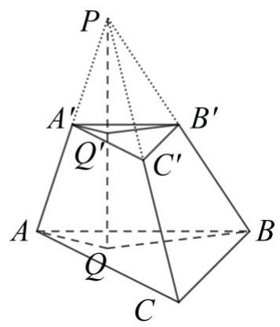

因为平面 ${ABC}\parallel {A}^{\prime }{B}^{\prime }{C}^{\prime }$ ,直线 ${A}^{\prime }{Q}^{\prime }\text{ 、 }{AQ}$ 分别为平面 ${PAQ}$ 与 ${A}^{\prime }{B}^{\prime }{C}^{\prime }\text{ 、 }{ABC}$ 的交线,所以 ${A}^{\prime }{Q}^{\prime }\parallel {AQ}$ ,所以 $\angle P{A}^{\prime }{Q}^{\prime } = \angle {PAQ}$ ,又因为 $\angle {A}^{\prime }P{Q}^{\prime }$ 与 $\angle {APQ}$ 是同一个角,所以 $\bigtriangleup P{A}^{\prime }{Q}^{\prime } \sim  \bigtriangleup {PAQ}$ ,所以 $P{A}^{\prime } : {PA} = P{Q}^{\prime } : {PQ}$ 。

由棱台的定义可得 $\bigtriangleup {ABC} \sim  \bigtriangleup {A}^{\prime }{B}^{\prime }{C}^{\prime }$ ,且对应的各组边平行,由 ${A}^{\prime }{C}^{\prime }\parallel {AC}$ 可得 $\bigtriangleup P{A}^{\prime }{C}^{\prime } \sim  \bigtriangleup {PAC}$ ,所以 $P{A}^{\prime } : {PA} = {A}^{\prime }{C}^{\prime } : {AC} = P{C}^{\prime } : {PC}$ 。

综上可得 $P{A}^{\prime } : {PA} = P{Q}^{\prime } : {PQ} = {A}^{\prime }{C}^{\prime } : {AC}$ ,即被截去的小三棱锥的高与大三棱锥的高之比等于棱台的上下底面对应的边长之比 $\frac{H - h}{H}$ 。

按照相同的思路,由棱台的定义还可得 $P{C}^{\prime } : {PC} = P{B}^{\prime } : {PB} = {B}^{\prime }{C}^{\prime } : {BC}$ , $\vartriangle  {A}^{\prime }{B}^{\prime }{C}^{\prime }$ 与 $\vartriangle  {ABC}$ 在边 ${A}^{\prime }{C}^{\prime }\text{ 、 }{AC}$ 上的高分别等于 ${B}^{\prime }{C}^{\prime }\sin \angle {B}^{\prime }{C}^{\prime }{A}^{\prime }\text{ 、 }{BC}\sin \angle {BCA}$ , 因为 $\sin \angle {B}^{\prime }{C}^{\prime }{A}^{\prime } = \sin \angle {BCA}$ ,所以 $\vartriangle  {A}^{\prime }{B}^{\prime }{C}^{\prime }$ 与 $\vartriangle  {ABC}$ 在边 ${A}^{\prime }{C}^{\prime }\text{ 、 }{AC}$ 上的高之比等于 ${B}^{\prime }{C}^{\prime } : {BC}$ ,也等于被截去的小三棱锥的高与大三棱锥的高之比等于棱台的上下底面对应的边长之比 $\frac{H - h}{H}$ 。三角形的面积等于边与这条边上的高的乘积的一半,所以 $\bigtriangleup  {A}^{\prime }{B}^{\prime }{C}^{\prime }$ 与 $\bigtriangleup  {ABC}$ 的面积之比等于被截去的小三棱锥的高与大三棱锥的高之比等于棱台的上下底面对应的边长之比的平方 $\frac{{\left( H - h\right) }^{2}}{{H}^{2}}$ ,即 $\frac{{S}^{\prime }}{S} = {\left( \frac{H - h}{H}\right) }^{2}$ , 化简可得大棱锥的高为 $H = \frac{\sqrt{S}}{\sqrt{S} - \sqrt{{S}^{\prime }}}h$ ,其中 ${S}^{\prime }\text{ 、 }S\text{ 、 }h$ 已设为已知参数。

用大棱锥 $P - {ABC}$ 的体积减去小棱锥 $P - {A}^{\prime }{B}^{\prime }{C}^{\prime }$ 的体积就是棱台 ${ABC} - {A}^{\prime }{B}^{\prime }{C}^{\prime }$ 的体积:

$$
{V}_{{ABC} - {A}^{\prime }{B}^{\prime }{C}^{\prime }} = {V}_{P - {ABC}} - {V}_{P - {A}^{\prime }{B}^{\prime }{C}^{\prime }}
$$

$$
= \frac{1}{3}{SH} - \frac{1}{3}{S}^{\prime }\left( {H - h}\right)
$$

$$
= \frac{1}{3}S\frac{\sqrt{S}}{\sqrt{S} - \sqrt{{S}^{\prime }}}h - \frac{1}{3}{S}^{\prime }\left( {\frac{\sqrt{S}}{\sqrt{S} - \sqrt{{S}^{\prime }}}h - h}\right)
$$

$$
= \frac{1}{3}h\left( \frac{S\sqrt{S} - {S}^{\prime }\sqrt{{S}^{\prime }}}{\sqrt{S} - \sqrt{{S}^{\prime }}}\right)
$$

$$
= \frac{1}{3}h \cdot  \frac{{\sqrt{S}}^{3} - {\sqrt{{S}^{\prime }}}^{3}}{\sqrt{S} - \sqrt{{S}^{\prime }}}
$$

$$
= \frac{1}{3}h \cdot  \frac{\left( {\sqrt{S} - \sqrt{{S}^{\prime }}}\right) \left( {{S}^{\prime } + \sqrt{{S}^{\prime }S} + S}\right) }{\sqrt{S} - \sqrt{{S}^{\prime }}}
$$

$$
= \frac{1}{3}h\left( {{S}^{\prime } + \sqrt{{S}^{\prime }S} + S}\right)
$$

即得证。

例 13.4 求上底面是边长为 1 的正三角形, 下底面是边长为 2 的正三角形, 高为 $\frac{1}{2}$ 的正三棱台的表面积和体积。

解析: 上底面是边长为 1 的正三角形,则任意边上的高为 $1 \times  \sin {60}^{ \circ  } = \frac{\sqrt{3}}{2}$ , 上底面的面积为 ${S}_{1} = \frac{1}{2} \times  1 \times  \frac{\sqrt{3}}{2} = \frac{\sqrt{3}}{4}$ 。下底面是边长为 2 的正三角形,则任意边上的高为 $2 \times  \sin {60}^{ \circ  } = \sqrt{3}$ ,下底面的面积为 ${S}_{2} = \frac{1}{2} \times  2 \times  \sqrt{3} = \sqrt{3}$ 。

按照前面的推导过程, 被截去的小三棱锥的高与大三棱锥的高之比等于上下两个底面对应的边长之比,设被截去的小三棱锥的高为 $h$ ,则大三棱锥的高为 ${2h}$ ,已知棱台的高为 $\frac{1}{2}$ ,可得等式 ${2h} - h = \frac{1}{2}$ ,解得 $h = \frac{1}{2}$ ,大三棱锥的高为 ${2h} = 1$ 。

画出正三棱台 ${ABC} - {A}^{\prime }{B}^{\prime }{C}^{\prime }$ ，补齐三棱锥的顶点 $P$ ，从 $P$ 向平面 ${ABC}$ 引垂线,垂足为 $D$ ,正三棱锥顶点在底面上的投影就是正三角形的中心,位于正三角形中线靠边一侧的三等分点处,即为点 $D$ ,如下图所示。

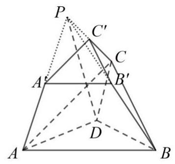

现在求侧面 $A{A}^{\prime }{B}^{\prime }B\text{ 、 }B{B}^{\prime }{C}^{\prime }C\text{ 、 }C{C}^{\prime }{A}^{\prime }A$ 的面积,由正三棱台的对称性可知它们的面积相等,只需求其中一个即可,求 $A{A}^{\prime }{B}^{\prime }B$ 的面积。 ${\mathrm{{Rt}}}_{ \bigtriangleup  }{PAD}$ 中, ${PD} = 2$ , ${AD} = \frac{1}{3} \times  \sqrt{3} = \frac{\sqrt{3}}{3},{PA} = \sqrt{{1}^{2} + {\left( \frac{\sqrt{3}}{3}\right) }^{2}} = \frac{2\sqrt{3}}{3}$ ,则 ${PB} = {PA} = \frac{2\sqrt{3}}{3}$ ,由余弦定理可得 $\cos \angle {APB} = \frac{P{A}^{2} + P{B}^{2} - A{B}^{2}}{{2PA} \cdot  {PB}} = \frac{\frac{4}{3} + \frac{4}{3} - 4}{2 \times  \frac{2\sqrt{3}}{3} \times  \frac{2\sqrt{3}}{3}} =  - \frac{1}{2},\sin \angle {APB} = \sqrt{1 - {\left( -\frac{1}{2}\right) }^{2}} = \frac{\sqrt{3}}{2}$ ， 可得 ${S}_{\bigtriangleup {PAB}} = \frac{1}{2}{PA} \cdot  {PB}\sin \angle {APB} = \frac{1}{2} \times  \frac{2\sqrt{3}}{3} \times  \frac{2\sqrt{3}}{3} \times  \frac{\sqrt{3}}{2} = \frac{\sqrt{3}}{3}$ 。由上下底面的比例关系可得 $P{B}^{\prime } = P{A}^{\prime } = \frac{1}{2}{PA} = \frac{\sqrt{3}}{3},{S}_{\bigtriangleup P{A}^{\prime }{B}^{\prime }} = \frac{1}{2}P{A}^{\prime } \cdot  P{B}^{\prime }\sin \angle {A}^{\prime }P{B}^{\prime } = \frac{1}{2} \times  \frac{\sqrt{3}}{3} \times  \frac{\sqrt{3}}{3} \times  \frac{\sqrt{3}}{2} = \frac{\sqrt{3}}{12}$ 。 所以 ${S}_{A{A}^{\prime }{B}^{\prime }B} = {S}_{\bigtriangleup {PAB}} - {S}_{\bigtriangleup P{A}^{\prime }{B}^{\prime }} = \frac{\sqrt{3}}{3} - \frac{\sqrt{3}}{12} = \frac{\sqrt{3}}{4}$ 。

综上,该正三棱台的表面积为 $\frac{\sqrt{3}}{4} + \sqrt{3} + 3 \times  \frac{\sqrt{3}}{4} = 2\sqrt{3}$ 。

利用棱台的体积公式可得: $V = \frac{1}{3} \times  \frac{1}{2} \times  \left( {\frac{\sqrt{3}}{4} + \sqrt{\frac{\sqrt{3}}{4} \times  \sqrt{3}} + \sqrt{3}}\right)  = \frac{7\sqrt{3}}{24}$ 。

练习 13.1(3)

1. 求上底面是边长为 1 的正方形，下底面是边长为 3 的正三角形，高为 $\sqrt{2}$ 的正四棱台的表面积和体积。

### 13.2 旋转体

将一条平面曲线(直线也属于曲线)绕其所在平面内的一条直线旋转，形成的曲面叫作旋转面，由封闭的旋转面所围成的几何体叫作旋转体。高中主要学习的旋转体有四种:圆柱、圆锥、圆台、球。

#### 13.2.1 圆柱

矩形以它的一条边所在的直线为旋转轴旋转, 其余三边旋转一周所围成的旋转体叫作圆柱。生活中常见的柱子、圆筒等大都是圆柱。下图为一个圆柱的示意图,想象图中的矩形 $O{O}_{1}{A}_{1}A$ 绕 $O{O}_{1}$ 旋转一周扫出圆柱的动态过程。

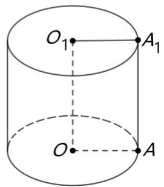

矩形旋转形成圆柱时,作为旋转轴的边叫作圆柱的轴 $\left( {O{O}_{1}}\right)$ ,圆柱可以直接用它的轴命名,例如上图中的圆柱命名为 ${O}_{1}O$ 。矩形垂直于圆柱的轴的两条边 $\left( {{OA}\text{ 、 }{O}_{1}{A}_{1}}\right)$ 旋转扫出的圆叫作圆柱的底面。矩形平行于轴的边 $\left( {A{A}_{1}}\right)$ 旋转所围成的曲面叫作圆柱的侧面,圆柱的侧面展开也是一个矩形。矩形的边 $A{A}_{1}$ 在旋转过程中所经过的任意位置都叫作圆柱侧面的母线, 圆柱的轴与所有母线都平行且相等，且都垂直于底面。圆柱的轴或母线的长度叫作圆柱的高。

圆柱还可以用下面的方法构造:将圆沿垂直于圆所在平面的方向平移，圆面扫过的空间就是圆柱。这个平移的圆的起始位置和终止位置是圆柱的两个底面， 扫过的空间的外周是圆柱的侧面，两个底面的圆心之间的连线是圆柱的轴，圆周上任意点平移扫过的轨迹是圆柱的母线。

#### 13.2.2 圆柱中的平行和垂直

圆柱的构造过程中, 绕轴旋转的矩形中有平行和垂直关系, 这是圆柱中的平行和垂直关系的主要来源。对照下图中的圆柱 ${O}^{\prime }O$ 。

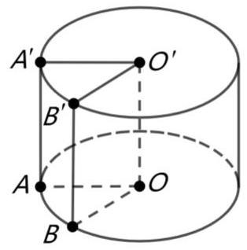

旋转形成圆柱的矩形的两组对边分别平行 $\left( {{OA}\begin{Vmatrix}{{O}^{\prime }{A}^{\prime }, O{O}^{\prime }}\end{Vmatrix}A{A}^{\prime }}\right)$ ,临边互相垂直 $\left( {{OA} \bot  A{A}^{\prime },{OA} \bot  O{O}^{\prime }}\right)$ 。圆柱的两个底面互相平行 $\left( {{OAB}\parallel {O}^{\prime }{A}^{\prime }{B}^{\prime }}\right)$ ,且都与轴和任意一条母线垂直 $\left( {O{O}^{\prime } \bot  {OAB}}\right.$ , $\left. {A{A}^{\prime } \bot  {OAB}}\right)$ 。圆柱的任意两条母线以及轴互相平行 ( $O{O}^{\prime }\begin{Vmatrix}{A{A}^{\prime }}\end{Vmatrix}B{B}^{\prime }$ ) 。

圆柱的任意两条母线(或轴)确定的平面都与底面垂直( ${AB}{{B}^{\prime }{A}^{\prime }} \bot  {OAB}$ , ${AO}{O}^{\prime }{A}^{\prime } \bot  {OAB}$ )。如果底面上的两条半径所成的角( $\angle {AOB}$ )的大小为 $\theta$ ，那么这两条半径垂直截取的两个平面所成的二面角( $A - O{O}^{\prime } - B$ )的大小也为 $\theta$ 。 二面角的平面角就是两条半径所成的角( $\angle {AOB}$ )。

#### 13.2.3 圆柱的表面积和体积

圆柱的面积等于上下底面和侧面的面积之和。圆柱的两个底面是两个全等的圆, 圆柱的侧面展开后是一个矩形, 矩形的长等于底面圆的周长, 矩形的宽等于母线的长(圆柱的高)，如下图所示。

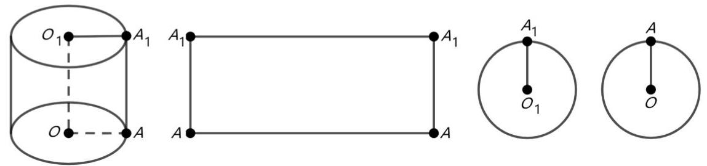

对于底面半径为 $r$ ,母线的长 (高) 为 $l$ 的圆柱,它的表面积为:

$$
S = {2\pi }{r}^{2} + {2\pi rl}
$$

圆柱的体积等于底面积与高的乘积, 与棱柱的体积公式相同:

$$
V = {Sh}
$$

对于底面半径为 $r$ ,母线的长 (高) 为 $l$ 的圆柱,它的体积为:

$$
V = \pi {r}^{2}l
$$

圆柱、圆锥、圆台的体积的推导原理和思路与棱柱、棱锥、棱台相似, 只是底面图形由多边形变为圆形。

例 13.5 已知圆柱的底面圆的半径为 1 ，侧面展开为正方形，求圆柱的表面积和体积。

解析:圆柱的侧面展开后为矩形，长等于底面圆的周长，矩形的宽等于母线的长,已知圆柱的底面圆的半径为 1,可得底面圆的周长为 ${2\pi }$ ,这就是侧面矩形的长,因为侧面展开为正方形,所以圆柱母线的长也为 ${2\pi }$ 。

圆柱的表面积为: $S = 2 \times  \pi  \times  {1}^{2} + {\left( 2\pi \right) }^{2} = 4{\pi }^{2} + {2\pi }$ 。

圆柱的体积为: $V = \pi  \times  {1}^{2} \times  {2\pi } = 2{\pi }^{2}$ 。

## 练习 13.2(1)

1. 已知圆柱的底面半径为 $\sqrt{3}$ ,高为 4,回答下列问题: (1)求圆柱的表面积和体积; (2) 将圆柱沿上下底面的直径所在的平面切开, 求其中一个半圆柱的表面积和体积;

2. 边长为 2 的正方形，沿其一条边为轴旋转四分之三个圆周，求形成的旋转体的表面积和体积。

3. 将半径为 1 的圆,沿与其所在平面呈 $\frac{\pi }{3}$ 的方向平移 $\sqrt{2}$ ，求圆扫过的体积。

#### 13.2.4 圆锥

将直角三角形以它的一条直角边为旋转轴，其余两条边旋转一周所围成的旋转体叫作圆锥。漏斗、笔尖的形状就是圆锥。下图为一个圆锥的示意图，想象图中的 ${\mathrm{{Rt}}}_{ \bigtriangleup  }{OPA}$ 绕直角边 ${OP}$ 旋转一周得到圆锥的动态过程。

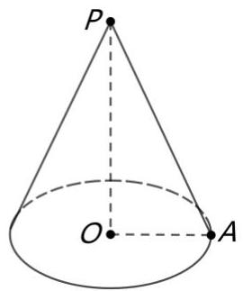

圆锥作为旋转轴的直角边叫作圆锥的轴(PO)，圆锥的轴的长度叫作圆锥的高。圆锥可以直接用它的轴命名,例如上图中的圆锥命名为 ${PO}$ 。Rt $\bigtriangleup  {OPA}$ 垂直于轴的另一条直角边 ${OA}$ 旋转一周扫出的圆叫作圆锥的底面 (圆 $O$ )。Rt $\bigtriangleup  {OPA}$ 的斜边 (PA) 旋转一周围成的曲面叫作圆锥的侧面. 圆锥的侧面展开是一个扇形。Rt $\bigtriangleup  {OPA}$ 的斜边与轴的交点叫作圆锥的顶点( $P$ )。圆锥的顶点与底面圆上任意一点的连线叫作圆锥侧面的母线(PA)，圆锥的所有母线都相交于顶点， 任意一条母线、轴、底面上与该母线相交的半径, 这三条线段围成一个直角三角形, 就是形成圆锥时绕轴旋转的直角三角形。

圆锥还可以通过下面的方法构造: 从平面上的圆的圆心作该平面的垂线, 选取垂线上的一点作为顶点，与圆周上所有的点相连，围成的立体图形就是圆锥。

#### 13.2.5 圆锥中的平行和垂直

圆柱的构造过程中, 绕轴旋转的直角三角形中有垂直关系, 这是圆锥中的垂直关系的主要来源。从圆锥的底面圆中也能画出直角, 如两条垂直的半径或直径、 直径所对的圆周角是直角。对照下页图中的圆柱 ${O}^{\prime }O$ 。

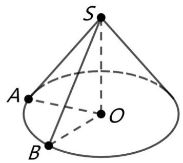

圆锥的轴与底面垂直 $\left( {{OS} \bot  {OAB}}\right)$ ,轴所在的任意平面都与底面垂直 $\left( {{OAS} \bot  {OAB}}\right)$ 。如果底面内的两条半径所成的角 $\left( {\angle {AOB}}\right)$ 的大小为 $\theta$ ,那么这两条半径与轴分别形成的两个平面所成的二面角 $\left( {A - {OS} - B}\right)$ 的大小也为 $\theta$ 。 二面角的平面角就是两条半径所成的角( $\angle {AOB}$ )。圆锥的所有母线与底面所成的角都相等( $\angle {SBO} = \angle {SAO}$ )，由对应的半径、母线、轴构成的三角形都全等， 就是构造圆锥时旋转的三角形。

#### 13.2.6 圆锥的表面积和体积

圆锥由一个底面和一个侧面围成, 圆锥的底面是一个圆, 圆锥的侧面展开后是一个扇形, 扇形的半径等于圆锥的母线 (直角三角形的斜边) 的长, 扇形的弧长等于底面圆的周长, 扇形的弧长除以半径等于扇形圆心角的弧度, 如下图所示。

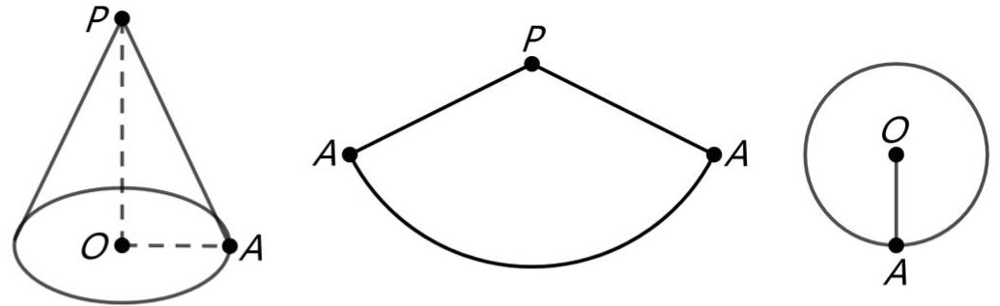

圆锥的表面积等于底面圆的与侧面扇形的面积之和。对于底面半径为 $r$ ,侧面的母线的长度为 $l$ 的圆锥,它的底面圆的面积为 $\pi {r}^{2}$ ,侧面扇形的面积为 ${\pi rl}$ (扇形的面积等于扇形的半径与弧长的乘积的一半, 可利用扇形面积与圆面积的比值等于弧长的比值计算)，扇形的表面积为:

$$
S = \pi {r}^{2} + {\pi rl}
$$

圆锥的体积等于底面积与高的乘积的三分之一, 与棱锥的体积公式相同:

$$
V = \frac{1}{3}{Sh}
$$

对于底面圆的半径为 $r$ ,高为 $h$ 的圆锥,它的体积为:

$$
V = \frac{1}{3}\pi {r}^{2}h
$$

如果已知圆锥的底面圆半径 $r$ 和母线长 $l$ ,那么高 $h$ 可以利用勾股定理求得: $h = \sqrt{{l}^{2} - {r}^{2}}$ ,它的体积为:

$$
V = \frac{1}{3}\pi {r}^{2}\sqrt{{l}^{2} - {r}^{2}}
$$

例 13.6 求直角边长分别为 3 和 4 的直角三角形, 旋转形成的圆锥的表面积和体积。

解析: 由勾股定理可得斜边的长为 $\sqrt{{3}^{2} + {4}^{2}} = 5$ 。圆锥为直角三角形绕其一条直角边旋转形成的旋转体, 直角三角形有两条直角边, 能形成两种圆锥, 需要分别讨论。

情况一:旋转轴为长度为 3 的直角边，圆锥的高为 3 ，底面圆的半径为 4 ， 底面圆的面积为 $\pi  \times  {4}^{2} = {16\pi }$ 。对于侧面的扇形,其半径等于直角三角形的斜边的长度 5,弧长等于底面圆的周长 ${2\pi } \times  4 = {8\pi }$ ,面积为 $\frac{1}{2} \times  5 \times  {8\pi } = {20\pi }$ ,该圆锥的表面积为 ${16\pi } + {20\pi } = {36\pi }$ 。该圆锥的体积为 $\frac{1}{3} \times  {16\pi } \times  3 = {16\pi }$ 。

情况二:旋转轴为长度为 4 的直角边，圆锥的高为 4 ，底面圆的半径为 3 ， 底面圆的面积为 $\pi  \times  {3}^{2} = {9\pi }$ 。对于侧面的扇形,其半径等于直角三角形的斜边的长度 5,弧长等于底面圆的周长 ${2\pi } \times  3 = {6\pi }$ ,面积为 $\frac{1}{2} \times  5 \times  {6\pi } = {15\pi }$ ,该圆锥的表面积为 ${9\pi } + {15\pi } = {24\pi }$ 。该圆锥的体积为 $\frac{1}{3} \times  {9\pi } \times  4 = {12\pi }$ 。

练习 13.2(2)

1. 已知圆锥的底面半径为 $\sqrt{3}$ ，高为 4，回答下列问题:(1)求圆锥的表面积和体积; (2) 将圆锥沿底面直径和高所在的平面切开，求其中一个半圆锥的表面积和体积。

2. 斜边长为 2 的等腰直角三角形, 沿其一条边为轴旋转四分之三个圆周, 求形成的旋转体的表面积和体积。

3. 将边长为 1 的正三角形，沿一条边旋转一周，求形成的旋转体的表面积和体积。

#### 13.2.7 圆台

圆台的构造方式与棱台相似, 将一个圆锥用平行于底面的平面截去上面的一个小圆锥, 剩余的部分叫作圆台。一些水桶和纸杯的形状就是倒放的圆台。下页图为一个圆台的示意图。

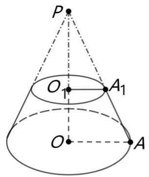

圆台的两个圆面的圆心之间的连线 $\left( {{O}_{1}O}\right.$ ) 叫作圆台的轴,圆台可以直接用它的轴命名，例如上图中的圆台命名为 ${O}_{1}O$ 。圆台的两个截面分别叫作圆台的上底面(较小的)和下底面(较大的)，圆台的上底面与下底面都是圆形。大圆锥的母线被截去小圆锥的母线后剩余的部分叫作圆台侧面的母线。大圆锥的顶点叫作圆台的顶点 $\left( P\right)$ ,圆台的顶点是根据圆台的构造方式想象出来的概念,现实中这个位置没有圆台的物质。圆台的上底面与下底面之间的距离叫作圆台的高, 圆台的高等于大圆锥的高减去被截去的小圆锥的高的差。

圆台还可以看作将直角梯形 $\left( {{O}_{1}{A}_{1}{AO}}\right.$ ) 以它垂直于底的腰 $\left( {{O}_{1}O}\right.$ ) 为旋转轴,旋转一周所形成的旋转体,圆台的母线可以看作直角梯形倾斜的腰 $\left( {{A}_{1}A}\right)$ 在旋转过程中经过的任意位置, 想象上图中直角梯形绕垂直于底边的腰旋转一周得到圆台的动态过程。

#### 13.2.8 圆台中的平行和垂直

分析圆台的性质和数量关系时, 主要使用 “大圆锥截去小圆锥” 的思路, 延长圆台的母线，画出完整的大圆锥和小圆锥，圆锥中的垂直关系仍适用于圆台。 此外, 圆台还可以看作直角梯形绕垂直于底边的腰旋转得到的旋转体, 直角梯形中有平行和垂直关系。对照下图中的圆台 ${O}^{\prime }O$ 。

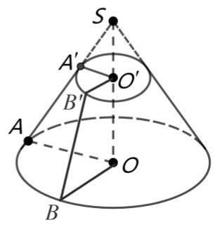

圆台的轴 ${O}^{\prime }O$ 与上下底面垂直,轴所在的任意平面 $\left( {{OA}{A}^{\prime }{O}^{\prime },{OB}{B}^{\prime }{O}^{\prime }}\right.$ ) 都与上下底面垂直。轴所在的平面与上下底面的交线平行 $\left( {{OA}\left.\parallel  {{O}^{\prime }{A}^{\prime },{OB}\parallel {O}^{\prime }{B}^{\prime }}\right) }\right.$ 。 轴所在的任意两个平面与上下底面的交线 (所在半径) 的夹角 $\left( {\angle {A}^{\prime }{O}^{\prime }{B}^{\prime },\angle {AOB}}\right)$ 就是这两个平面的二面角 $\left( {A - O{O}^{\prime } - B}\right)$ 。

#### 13.2.9 圆台的表面积和体积

圆台由两个底面和一个侧面围成, 圆台的侧面展开是从大圆锥侧面的扇形中挖去小圆锥侧面的扇形后剩余的扇形环, 如下图所示。

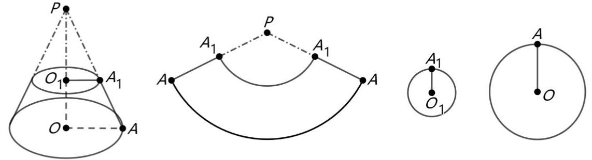

圆台的表面积等于上下两个底面及侧面扇形环的面积之和。对于上底面圆半径为 ${r}^{\prime }$ ,下底面圆半径为 $r$ ,侧面的母线长为 $l$ 的圆台,它的表面积为:

$$
S = \pi {r}^{\prime 2} + \pi {r}^{2} + {\pi rl} + \pi {r}^{\prime }l
$$

圆台的表面积公式推导如下:圆台上下两个底面圆的面积分别为 $\pi {r}^{\prime 2}$ 与 $\pi {r}^{2}$ 。 设大圆锥的母线长为 ${l}_{0}$ ,则被截去的小圆锥的母线长为 ${l}_{0} - l$ ,由相似三角形关系可得 $\frac{{l}_{0} - l}{{l}_{0}} = \frac{{r}^{\prime }}{r}$ ,移项得 ${l}_{0} = \frac{r}{r - {r}^{\prime }}l$ ,大圆锥侧面扇形的面积为 ${\pi r} \cdot  \frac{r}{r - {r}^{\prime }}l = \frac{\pi {r}^{2}l}{r - {r}^{\prime \prime }}$ , 被截去的小圆锥的侧面扇形的面积为 $\pi {r}^{\prime }\left( {\frac{r}{r - {r}^{\prime }}l - l}\right)  = \frac{\pi {r}^{\prime 2}l}{r - {r}^{\prime }}$ ,圆台的表面积为: $S = \pi {r}^{\prime 2} + \pi {r}^{2} + \frac{\pi {r}^{2}l}{r - {r}^{\prime }} - \frac{\pi {r}^{\prime 2}l}{r - {r}^{\prime }} = \pi {r}^{\prime 2} + \pi {r}^{2} + \frac{{\pi l}\left( {{r}^{2} - {r}^{\prime 2}}\right) }{r - {r}^{\prime }} = \pi {r}^{\prime 2} + \pi {r}^{2} + {\pi rl} + \pi {r}^{\prime }l$ 。

圆台的体积等于大圆锥的体积减去小圆锥的体积。圆台的公式与棱台相同， 对于上底面的面积为 ${S}^{\prime }$ ,下底面的面积为 $S$ ,高为 $h$ 的圆台,它的体积为:

$$
V = \frac{1}{3}\left( {{S}^{\prime } + \sqrt{{S}^{\prime }S} + S}\right) h
$$

如果已知圆台的上底面圆半径为 ${r}^{\prime }$ ,下底面圆半径为 $r$ ,则它的体积为:

$$
V = \frac{1}{3}\left( {{S}^{\prime } + \sqrt{{S}^{\prime }S} + S}\right) h
$$

$$
= \frac{1}{3}\left( {\pi {r}^{\prime 2} + \sqrt{\pi {r}^{\prime 2}\pi {r}^{2}} + \pi {r}^{2}}\right) h
$$

$$
= \frac{1}{3}{\pi h}\left( {{r}^{\prime 2} + {r}^{\prime }r + {r}^{2}}\right)
$$

例 13.7 从半径为 2 的半圆中剪掉半径为 1 的半圆,将剩余的半圆环两端的半径对接形成圆台, 求该圆台的表面积和体积。

解析: 画出半圆环和相应的圆台,从上底面的圆周上任意一点 ${A}^{\prime }$ 向下底面引垂线,设垂足为 $B$ ,作出垂足所在的半径 ${OA}$ ,如下页图所示。根据圆环的数据、裁剪和拼接过程, 该圆台可以看作从一个大圆锥中截去一个小圆锥得到。

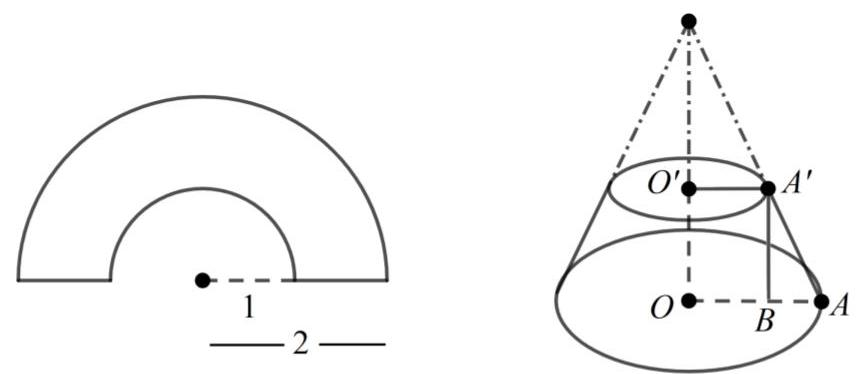

先求圆台的表面积,大圆锥的底面圆的周长等于半圆环外侧的弧长 ${2\pi }$ ,大圆锥的底面圆一一圆台的下底面圆的半径为 ${OA} = {2\pi } \div  {2\pi } = 1$ ,大圆锥的底面圆的面积为 $S = \pi  \times  {1}^{2} = \pi$ 。

小圆锥的底面圆的周长等于半圆环内侧的弧长 $\pi$ ,小圆锥的底面圆一一圆台的上底面圆的半径为 ${O}^{\prime }{A}^{\prime } = \pi  \div  {2\pi } = \frac{1}{2}$ ,小圆锥的底面圆的面积为 ${S}^{\prime } = \pi  \times  {\left( \frac{1}{2}\right) }^{2} = \frac{\pi }{4}$ 。

圆台侧面的扇形的面积为 $\frac{1}{2} \times  \pi  \times  {2}^{2} - \frac{1}{2} \times  \pi  \times  {1}^{2} = \frac{3\pi }{2}$ 。

圆台的表面积为 $\pi  + \frac{\pi }{4} + \frac{3\pi }{2} = \frac{11\pi }{4}$ 。

接下来求圆台的体积, 还需要求得圆台的高。利用刚开始作的辅助线, 圆台侧面的母线的长度为 $A{A}^{\prime } = 1$ 。上下底面圆的半径 ${O}^{\prime }{A}^{\prime }\text{ 、 }{OA}$ 、垂线 ${A}^{\prime }B$ 、轴 $O{O}^{\prime }$ 围成矩形,可得 ${OB} = {O}^{\prime }{A}^{\prime } = \frac{1}{2}$ ,所以 ${AB} = {OA} - {AB} = 1 - \frac{1}{2} = \frac{1}{2}$ 。因为 ${A}^{\prime }B \bot$ 下底面, 所以 $\bigtriangleup A{A}^{\prime }B$ 是直角三角形,所以圆台的高为 ${A}^{\prime }B = \sqrt{{1}^{2} - {\left( \frac{1}{2}\right) }^{2}} = \frac{\sqrt{3}}{2}$ 。圆台的体积为 $V = \frac{1}{3} \times  \left( {\pi  + \sqrt{\pi  \times  \frac{\pi }{4}} + \frac{\pi }{4}}\right)  \times  \frac{\sqrt{3}}{2} = \frac{7\sqrt{3}}{24}\pi$ 。

例 13.8 从底面直径和母线长都为 $a$ 的圆锥上截去直径为底面圆一半的小圆锥后得到一个圆台, 求被截去的小圆锥的表面积与的圆台的表面积之比。

解析: 根据题意画出简图如下所示,由圆台的定义可得 ${\Delta P}{O}_{1}{A}_{1} \sim  {\Delta POA}$ ,已知 ${O}_{1}{A}_{1} = \frac{a}{4},{OA} = \frac{a}{2}$ ，所以 $\frac{P{A}_{1}}{PA} = \frac{{O}_{1}{A}_{1}}{OA} = \frac{1}{2}$ ，所以 $P{A}_{1} = \frac{1}{2}{PA} = \frac{a}{2}$ 。

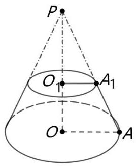

小圆锥的表面积为:

$$
s = \pi {\left( \frac{a}{4}\right) }^{2} + \pi \frac{a}{4} \times  \frac{a}{2} = \frac{{3\pi }{a}^{2}}{16}
$$

圆台的上底面半径为 $\frac{a}{4}$ ,下底面半径为 $\frac{a}{2}$ ,母线长为 $a - \frac{a}{2} = \frac{a}{2}$ ,其表面积为:

$$
S = \pi {\left( \frac{a}{4}\right) }^{2} + \pi {\left( \frac{a}{2}\right) }^{2} + \pi \frac{a}{4} \times  \frac{a}{2} + \pi \frac{a}{2} \times  \frac{a}{2} = \frac{{11\pi }{a}^{2}}{16}
$$

它们的表面积之比为:

$$
\frac{S}{S} = \frac{{3\pi }{a}^{2}}{16} : \frac{{11\pi }{a}^{2}}{16} = \frac{3}{11}
$$

练习 13.2(3)

1. 求上底面半径为 $\frac{\sqrt{3}}{3}$ ，下底面半径为 $\sqrt{3}$ ，高为 $\frac{\sqrt{3}}{2}$ 的圆台的表面积和体积。

2. 将底面半径为 $\sqrt{3}$ ，高为 4 的圆锥截去一半高度，求截去的圆锥和剩余圆台的表面积和体积。

3. 对于高度固定、上底面与下底面的半径之和为定值的圆台, 当上底面的半径是下底面半径的多少倍时, 圆台的体积最小? 该立体图形是否还是圆台。

#### 13.2.10 球

将半圆以它的直径为旋转轴, 半圆弧旋转一周所形成的曲面叫作球面, 球面所围成的旋转体叫作球体，简称球。乒乓球等球都是球体，下图为一个球的示意图。

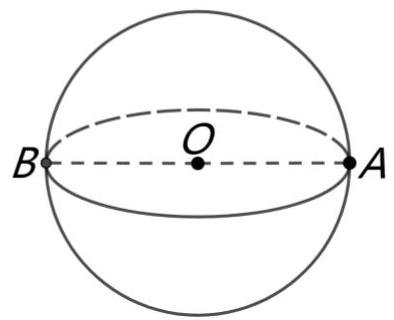

旋转形成球的半圆的圆心叫作球体的球心(O)。连接球心与球面上任意一点的线段都叫作球体的半径 $\left( {{OA}\text{ 、 }{OB}}\right)$ 。连接球面上两点且经过球心的线段叫作球体的直径 $\left( {AB}\right)$ ,球的直径的长度等于其半径的长度的两倍。球只有半径这一个参数, 球的表面积、体积等参数都只与这一个参数有关。

经过球心的平面截取球体所得到的圆叫作大圆(圆O)，大圆的圆心就是球心, 大圆的半径等于球体的半径, 将球面上的任意两点用球面上的弧线相连, 经过这两点的大圆的圆弧最短。

球体具有高度对称性, 球面上任意一点与球心的连线都相等, 等于球的半径。 球内可以产生很多平行和垂直关系。对照下图中的球 $O$ 。

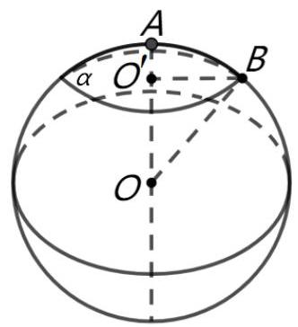

任意平面 $\alpha$ 截取球面,所形成的平面图形都是圆,圆心 $\left( {O}^{\prime }\right)$ 与球心 $\left( O\right)$ 所在的直线垂直于该平面 $\left( {O{O}^{\prime } \bot  {O}^{\prime }{AB}}\right)$ ,该直线所在的任意平面都垂直于该圆 (平面 $O{O}^{\prime }B \bot$ 圆 ${O}^{\prime }$ ) 。 $\bigtriangleup  O{O}^{\prime }B$ 为直角三角形,球的半径、圆的半径、球心到圆心的距离始终满足勾股定理: $O{O}^{\prime 2} + {O}^{\prime }{B}^{2} = O{B}^{2}$ 。 $\bigtriangleup  A{O}^{\prime }B$ 也为直角三角形,也满足勾股定理: $A{O}^{\prime 2} + {O}^{\prime }{B}^{2} = A{B}^{2}$ 。

球的表面积是相同半径的圆的面积的 4 倍,半径为 $R$ 的球的表面积为:

$$
S = {4\pi }{R}^{2}
$$

球的体积等于四分之三 $\pi$ 乘以半径的三次方,半径为 $R$ 的球的体积为:

$$
V = \frac{4}{3}\pi {R}^{3}
$$

例 13.9 用相同面积的材料围成正方体、圆柱、球, 求体积最大的立体图形。 解析: 设总面积为 $S$ ,正方体、圆柱、球的表面积都为 $S$ 。

对于正方体,设棱长为 $a$ ,每个表面都是正方形,面积都为 ${a}^{2}$ ,共 6 个表面, 其表面积为 $S = 6{a}^{2}$ ,解得 $a = \sqrt{\frac{S}{6}}$ ,其体积为 ${V}_{1} = {a}^{3} = {\left( \sqrt{\frac{S}{6}}\right) }^{3} = \frac{{S}^{\frac{3}{2}}}{6\sqrt{6}}$ 。

对于圆柱,设底面圆的半径为 $r$ ,母线的长度为 $l$ ,其表面积为 $S = {2\pi }{r}^{2} + {2\pi rl}$ , 有 $r\text{ 、 }l$ 两个参数,需要用其中一个表示另一个,再求最大值,由于椭圆的面积公式中 $l$ 的形式最简单,所以化为用 $r$ 表示 $l$ 的形式: $l = \frac{S}{2\pi r} - r$ ,代入圆柱的体积公式: ${V}_{2} = \pi {r}^{2}l = \pi {r}^{2}\left( {\frac{S}{2\pi r} - r}\right)  = \frac{Sr}{2} - \pi {r}^{3}$ ,可以看作 ${V}_{2}$ 关于 $r$ 的函数 ${V}_{2}\left( r\right)  = \frac{Sr}{2} - \pi {r}^{3}$ , 需要求 ${V}_{2}\left( r\right)$ 的最大值。

求该函数的导数: ${V}_{2}^{\prime }\left( r\right)  = \frac{S}{2} - {3\pi }{r}^{2}$ ,当 $0 < r < \sqrt{\frac{S}{6\pi }}$ 时, ${V}_{2}^{\prime } > 0,{V}_{2}\left( r\right)$ 单调递增; 当 $r > \sqrt{\frac{S}{6\pi }}$ 时, ${V}_{2}^{\prime } < 0,{V}_{2}\left( r\right)$ 单调递减,所以当 $r = \sqrt{\frac{S}{6\pi }}$ 时, ${V}_{2}\left( r\right)$ 取最大值:

$$
{V}_{2\max } = \frac{S\sqrt{\frac{S}{6\pi }}}{2} - \pi {\left( \sqrt{\frac{S}{6\pi }}\right) }^{3} = \frac{{S}^{\frac{3}{2}}}{3\sqrt{6\pi }}\text{ 。 }
$$

对于球,设球的半径为 $R$ ,则 $S = {4\pi }{R}^{2}$ ,可得 $R = \sqrt{\frac{S}{4\pi }}$ ,代入球的体积公式: ${V}_{3} = \frac{4}{3}\pi {R}^{3} = \frac{4}{3}\pi {\left( \sqrt{\frac{S}{4\pi }}\right) }^{3} = \frac{{S}^{\frac{3}{2}}}{6\sqrt{\pi }}$  。

综上,正方体、(最大的) 圆柱、球的体积依次为 $\frac{{S}^{\frac{3}{2}}}{6\sqrt{6}}\text{ 、 }\frac{{S}^{\frac{3}{2}}}{3\sqrt{6\pi }}\text{ 、 }\frac{{S}^{\frac{3}{2}}}{6\sqrt{\pi }}$ , 它们的分子相同,分母依次减小,体积依次增大: $\frac{{S}^{\frac{3}{2}}}{6\sqrt{6}} = \frac{{S}^{\frac{3}{2}}}{3\sqrt{6 \times  4}} < \frac{{S}^{\frac{3}{2}}}{3\sqrt{6\pi }} < \frac{{S}^{\frac{3}{2}}}{6\sqrt{\pi }}$ , 球的体积最大。该规律与 “相同长度的绳子围成的平面图形中, 圆的面积最大” 相似，只是维度不同。

练习 13.2(4)

1. 求半径为 $\sqrt{3}$ 的球的表面积和体积。

2. 推导半径为 $R$ 的球的体积公式: $V = \frac{4}{3}\pi {R}^{3}$ 。(提示:将球体分割为大量 ( $n$ 个) 小圆锥,用半径 $R$ 表示小圆锥的体积,利用所有小圆锥的底面积之和等于球体的表面积, 所有小圆锥的体积之和等于球的体积, 如下图所示)

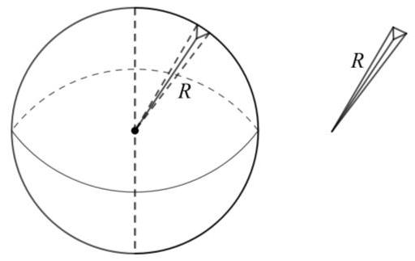

## 小结

本章学习基本立体图形的定义、性质、特点，需重点掌握基本立体图形的名称、特点、参数和计算, 建立起立体图形的直观透视模型, 熟悉立体图形中蕴含的平行和垂直等特殊关系, 能熟练使用欧式几何定理分析处理立体图形, 能将复杂的立体图形拆分成若干基本立体图形的组合。

## 第十四章 空间向量与解析几何

平面几何中, 平面向量是非常方便好用的工具, 立体几何中也有同样方便好用的工具——空间向量。由于立体图形的绘制和想象比平面图形更复杂, 因此空间向量可以减轻图形依赖的优势比平面向量更突出。

空间向量与平面向量的概念、性质、运算、规律基本一致, 借助平面向量的知识可以很容易地理解空间向量。空间向量与平面向量的差异主要体现在维度的差异上——平面向量有两个坐标，空间向量有三个坐标。

欧式几何中关于立体几何的概念和定理同样适用于空间向量, 只是表述的方式不同, 用空间向量描述和判定的空间位置关系比欧式几何更清晰明确, 也更便于分析处理。

学习本章时仍要牢记 “数形结合” 的原则，虽然向量的坐标运算很大程度的减轻了对具体图形的依赖, 但仍须将向量的坐标运算与具体图形的位置关系和变化规律紧密对应起来，理解几何关系与坐标运算之间的对应关系。

### 14.1 空间向量及其运算

空间向量的概念和运算与平面向量基本一致, 只是从平面内拓展到空间中, 多了第三个纵坐标，表达的几何含义只有维度上的区别，空间向量的定义和基本运算中有很多我们已经熟悉的表述。

#### 14.1.1 空间向量的定义与性质

空间中具有方向和大小的量叫作空间向量。空间向量既有方向、又有大小, 方向和大小是确定一个空间向量的“唯二”参数。

空间向量可以用有向线段表示, 有向线段所指的方向就是空间向量的方向, 有向线段的长度就是空间向量的大小。

位置不是空间向量的参数。对于一个确定的空间向量, 它的方向和大小都确定不变, 位置可以任意改变。从图形变换的角度看, 向量可以空间中任意平移, 仍是原向量不变, 但不能伸缩或旋转, 否则会变成其他向量。

空间向量可以用它的起点和终点表示。设空间向量的起点为空间中的点 $A$ ， 终点为空间中的点 $B$ ,那么该空间向量可以表示为 $\overrightarrow{AB}$ 。这种表示方式只体现向量的移动方式，不表示固定的位置，即从 $A$ 移动到 $B$ 的方向和距离，而不只是从 $A$ 到 $B$ 的有向线段,若将起点 $A$ 和终点 $B$ 按照相同的方式平移,平移后仍是向量 $\overrightarrow{AB}$ 。

空间向量也可以在小写字母上添加向右的箭头表示，例如 $\overrightarrow{a}\text{ 、 }\overrightarrow{b}\text{ 、 }\overrightarrow{c}$ 等，这种表示方式只是给空间向量 “起名”, 不体现空间向量的具体信息。

空间向量的长度叫作向量的模。向量 $\overrightarrow{a}$ 或 $\overrightarrow{AB}$ 的模记作 $\left| \overrightarrow{a}\right|$ 或 $\left| \overrightarrow{AB}\right|$ ,与实数的绝对值或复数的模的记法类似。

模为 0 的空间向量叫作零向量,记作 $\overrightarrow{0}$ 。零向量没有方向,可以根据需要选取任何方向为零向量的方向，零向量可以任意确定方向的特点让它在一些分析计算中有巧妙或特殊的作用。

模为 1 的向量叫作单位向量。单位向量只规定了大小，没有规定方向，空间中有无穷多个方向不同的单位向量。单位向量模为 1 的特点让它在一些分析计算中较简便。

如果两个向量的模和方向都相同, 称它们是相等向量。如果两个向量模相同、 方向相反，称它们是相反向量，向量 $\overrightarrow{a}$ 的相反向量记作 $- \overrightarrow{a}$ 。

如果表示若干空间向量的有向线段所在的直线平行或重合, 就称这些向量是共线向量。共线向量有两种情况: 方向相同或相反。由于 $\overrightarrow{0}$ 的方向可以任意规定, 所以 0 可以平行于任意某个向量,但 0 不能同时与多个不平行的向量都平行。

空间向量可以在空间中任意平移，因此空间向量没有 “共面向量” 和 “异面向量” 的说法和区别, 不同的空间向量总是可以通过平移达到共平面, 也可以通过平移具有共同的起点, 还可以通过平移首尾相连。

可以复习《12.6 空间中直线与平面的平移和旋转》体会向量的平移，空间中的一系列互相平行的直线或平面, 都可以看作同一条直线或同一个平面在空间中平移得到的, 平行或垂直于直线、平面的向量不会因为平移而改变关系。

#### 14.1.2 空间向量的线性运算

空间向量的加、减、数乘运算的概念和几何含义与平面向量一致, 可以通过平移到同一平面内, 用平面向量的几何含义描述和理解。

(1)空间向量 $\overrightarrow{a}$ 与 $\overrightarrow{b}$ 相加，记作 $\overrightarrow{a} + \overrightarrow{b}$ 。向量可以任意平移，因此可以将两个空间向量平移至同一平面内, 再按照平面向量的三角形法则或平行四边形法则运算, 如下图所示。

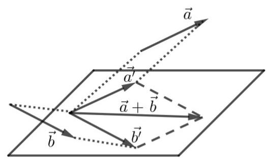

任意向量与零向量的和仍为它自身: $\overrightarrow{a} + \overrightarrow{0} = \overrightarrow{a}$ 。

任意向量与它的相反向量相加等于零向量: $\overrightarrow{a} + \left( {-\overrightarrow{a}}\right)  = \overrightarrow{0}$ 。

(2)一个空间向量 $\overrightarrow{a}$ 减去另一个空间向量 $\overrightarrow{b}$ ，记作 $\overrightarrow{a} - \overrightarrow{b}$ ，等于加上被减去的空间向量的相反向量,即: $\overrightarrow{a} - \overrightarrow{b} = \overrightarrow{a} + \left( {-\overrightarrow{b}}\right)$ 。

(3)空间向量 $\overrightarrow{a}$ 与实数 $\lambda$ 相乘记作 $\lambda \overrightarrow{a}\text{ 。 }\lambda \overrightarrow{a}$ 的模是 $\overrightarrow{a}$ 模的 $\left| \lambda \right|$ 倍。若 $\lambda  > 0$ 则 $\lambda \overrightarrow{a}$ 的方向与 $\overrightarrow{a}$ 相同,若 $\lambda  < 0$ 则 $\lambda \overrightarrow{a}$ 的方向与 $\overrightarrow{a}$ 相反,若 $\lambda  = 0$ 则 $\lambda \overrightarrow{a} = \overrightarrow{0}$ 。

空间向量的加、减、数乘运算同样满足交换律、结合律和分配律:

交换律: $\overrightarrow{a} + \overrightarrow{b} = \overrightarrow{b} + \overrightarrow{a}$

结合律: $\left( {\overrightarrow{a} + \overrightarrow{b}}\right)  + \overrightarrow{c} = \overrightarrow{a} + \left( {\overrightarrow{b} + \overrightarrow{c}}\right)$

分配率: $\left( {\lambda  + \mu }\right) \overrightarrow{a} = \lambda \overrightarrow{a} + \mu \overrightarrow{a},\lambda \left( {\overrightarrow{a} + \overrightarrow{b}}\right)  = \lambda \overrightarrow{a} + \lambda \overrightarrow{b}$

上述规律可以合并表示为: $\lambda \left( {{\mu }_{1}\overrightarrow{a} \pm  {\mu }_{2}\overrightarrow{b}}\right)  = \lambda {\mu }_{1}\overrightarrow{a} \pm  \lambda {\mu }_{2}\overrightarrow{b}$

空间向量的数乘运算同样具有交换性质: $\lambda \left( {\mu \overrightarrow{a}}\right)  = \left( {\lambda \mu }\right) \overrightarrow{a} = \mu \left( {\lambda \overrightarrow{a}}\right)$

空间向量中同样有共线向量的情况, 其定义和判定方式与平面向量相同。非零向量 $\overrightarrow{a}$ 与 $\overrightarrow{b}$ 共线的充要条件是: 存在唯一的实数 $\lambda$ ,使得 $\overrightarrow{b} = \lambda \overrightarrow{a}$ 。

对于空间中的一条直线 $l$ ,与 $l$ 平行或在 $l$ 上的向量叫作 $l$ 的方向向量。直线可以向两个相反的方向延伸, 指向这两个相反方向的向量都可以作为直线的方向向量。

空间向量可以任意平移，两个向量总是能平移到同一个平面内，将它们的起点重合, 就可以确定一个平面。对于空间中的三个向量, 将它们平移至起点重合后, 可能在同一平面内, 也可能不在同一平面内。

如果三个空间向量经过平移后，可以放在同一个平面内，称它们是共面向量。 空间向量 $\overrightarrow{a}$ 、 $\overrightarrow{b}$ 、 $\overrightarrow{c}$ 共平面的充要条件是:存在一对实数 $\lambda$ 、 $\mu$ ，使得 $\overrightarrow{a} = \lambda \overrightarrow{b} + \mu \overrightarrow{c}$ 。 如果三个向量中有两个向量是共线向量, 那么这三个向量一定是共面向量。

共面向量的定义与平面向量基本定理的原理相同: 如果空间向量 $\overrightarrow{a}$ 在平面 $\alpha$ 内,那么 $\overrightarrow{a}$ 就可以由 $\alpha$ 内一对不共线的向量 $\overrightarrow{b}\text{ 、 }\overrightarrow{c}$ 线性表示为 $\overrightarrow{a} = \lambda \overrightarrow{b} + \mu \overrightarrow{c}$ 。如果空间向量 $\overrightarrow{a}$ 不在平面 $\alpha$ 内,那么 $\alpha$ 内的向量 $\overrightarrow{b}\text{ 、 }\overrightarrow{c}$ 就无法线性地表示出 $\overrightarrow{a}$ 。

利用立体几何定理和向量可以任意平移的性质可以证明: 平行于同一个平面的一系列向量是共面向量, 垂直于同一条直线的一系列向量也都是共面向量。

空间中的直线 $l$ 上的任意一点 $A$ ,都可以由直线 $l$ 上已知的一点 $P$ 和 $l$ 的方向向量 $\overrightarrow{a}$ 共同表示为 $A = P + \lambda \overrightarrow{a}$ ，其中 $\lambda$ 是实数变量， $\lambda$ 的每个取值对应 $l$ 上的一点， 该表示方式可以看作空间向量的加法运算: $\overrightarrow{OA} = \overrightarrow{OP} + \lambda \overrightarrow{a}$ ,其中 $O$ 为空间内不同于 $A$ 的任意一点，既可以在 $l$ 上，又可以在 $l$ 外，如下页图所示。

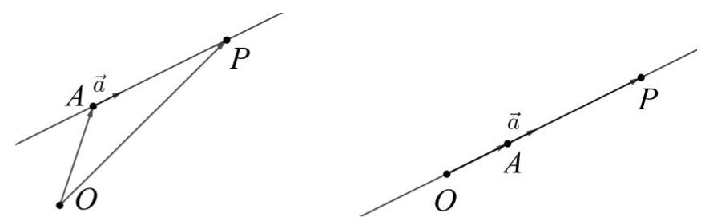

例 14.1 如下图所示,正方体 ${ABCD} - {A}_{1}{B}_{1}{C}_{1}{D}_{1}$ 中, $O$ 是 $A{C}_{1}$ 的中点,证明: $O$ 在平面 ${A}_{1}{BC}{D}_{1}$ 内。

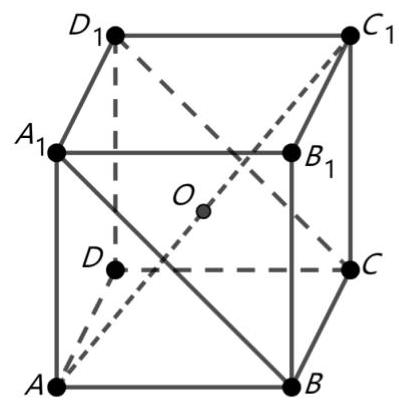

解析: 要证明 $O$ 在平面 ${A}_{1}{BC}{D}_{1}$ 内,可以通过证明 $\overrightarrow{{A}_{1}O}$ 可以由平面 ${A}_{1}{BC}{D}_{1}$ 内的两个不共线的向量线性表示来证明。

因为 $O$ 是 $A{C}_{1}$ 的中点,所以 $\overrightarrow{AO} = \frac{1}{2}\overrightarrow{A{C}_{1}} = \frac{1}{2}\left( {\overrightarrow{AB} + \overrightarrow{BC} + \overrightarrow{C{C}_{1}}}\right)$ ,接下来需要用平面 ${A}_{1}{BC}{D}_{1}$ 内的两个不共线的向量线性表示 $\overrightarrow{{A}_{1}O}$ ,先用 ${ABCD} - {A}_{1}{B}_{1}{C}_{1}{D}_{1}$ 的棱所形成的向量表示 $\overrightarrow{{A}_{1}O}$ :

$$
\overrightarrow{{A}_{1}O} = \overrightarrow{{A}_{1}A} + \overrightarrow{AO} = \overrightarrow{{A}_{1}A} + \frac{1}{2}\overrightarrow{A{C}_{1}} = \overrightarrow{{A}_{1}A} + \frac{1}{2}\left( {\overrightarrow{AB} + \overrightarrow{BC} + \overrightarrow{C{C}_{1}}}\right)
$$

利用正方体所有棱的长度相等、相对的棱都平行、相交的棱都垂直的特点, 将上式中的向量尽可能转化为平面 ${A}_{1}{BC}{D}_{1}$ 内的向量，不在该平面内的向量尽量通过向量的运算予以消除。将 $\overrightarrow{AB} = \overrightarrow{A{A}_{1}} + \overrightarrow{{A}_{1}B},\overrightarrow{C{C}_{1}} = \overrightarrow{A{A}_{1}}$ 代入上式:

$$
\overrightarrow{{A}_{1}O} = \overrightarrow{{A}_{1}A} + \frac{1}{2}\left\lbrack  \left( {\overrightarrow{A{A}_{1}} + \overrightarrow{{A}_{1}B}) + \overrightarrow{BC} + \overrightarrow{A{A}_{1}}}\right) \right\rbrack
$$

$$
= \overrightarrow{{A}_{1}A} + \overrightarrow{A{A}_{1}} + \frac{1}{2}\overrightarrow{{A}_{1}B} + \frac{1}{2}\overrightarrow{BC}
$$

$$
= \frac{1}{2}\overrightarrow{{A}_{1}B} + \frac{1}{2}\overrightarrow{BC}
$$

$\overrightarrow{{A}_{1}O}$ 可以由平面 ${A}_{1}{BC}{D}_{1}$ 内两个不共线的向量 $\overrightarrow{{A}_{1}B}$ 和 $\overrightarrow{BC}$ 线性表示，所以 $\overrightarrow{{A}_{1}O}$ 在平面 ${A}_{1}{BC}{D}_{1}$ 内,又因为点 ${A}_{1}$ 在平面 ${A}_{1}{BC}{D}_{1}$ 内,所以点 $O$ 也在平面 ${A}_{1}{BC}{D}_{1}$ 内。

练习 14.1(1)

1. 如下图所示，三棱柱 ${ABC} - {A}_{1}{B}_{1}{C}_{1}$ 中，点 $D$ 、 ${D}_{1}$ 分别是棱 ${AC}$ 、 ${A}_{1}{C}_{1}$ 的中点， 用图中已经给出的点表示下列运算结果的向量:

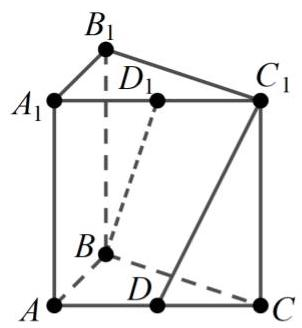

(1) $\overrightarrow{AB} + \overrightarrow{B{B}_{1}}$ ； (2) $\overrightarrow{AC} - \overrightarrow{{A}_{1}{B}_{1}}$ ； (3) $\overrightarrow{AD} + \overrightarrow{{C}_{1}{B}_{1}}$ ； (4) $\overrightarrow{D{C}_{1}} - \overrightarrow{B{D}_{1}} + \overrightarrow{{C}_{1}A}$ 。

2. 如下图所示,三棱锥 $P - {ABC}$ 中, $D\text{ 、 }E$ 是 ${BC}$ 的三等分点, $F$ 是 ${AC}$ 的中点,用 $\overrightarrow{PA}\text{ 、 }\overrightarrow{PB}\text{ 、 }\overrightarrow{PC}$ 表示下列向量:

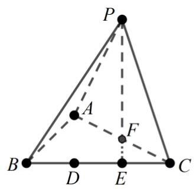

(3) $\overrightarrow{PF}$ ； (4) $\overrightarrow{EF}$ 。

#### 14.1.3 空间向量的数量积运算

空间向量的数量积运算的定义和性质与平面向量的数量积运算相同。数量积是两个向量间的运算, 得到的结果是一个数量, 只需要将两个空间向量平移到同一个平面内,就可以用平面向量的定义和公式分析计算。

对于两个非零空间向量 $\overrightarrow{a}\text{ 、 }\overrightarrow{b}$ ,在空间中任取一点 $O$ ,分别作出 $\overrightarrow{OA} = \overrightarrow{a}$ , $\overrightarrow{OB} = \overrightarrow{b}$ ,那么 $\angle {AOB}$ 叫作空间向量 $\overrightarrow{a}\text{ 、 }\overrightarrow{b}$ 的夹角,记作 $< \overrightarrow{a},\overrightarrow{b} >$ 。

根据定义可知, $\langle \overrightarrow{a},\overrightarrow{b}\rangle$ 是平面角,取值范围是 $\left\lbrack  {0,\pi }\right\rbrack$ 。当 $\langle \overrightarrow{a},\overrightarrow{b}\rangle  = \frac{\pi }{2}$ 时, $\overrightarrow{a} \bot  \overrightarrow{b}$ 。当 $< \overrightarrow{a},\overrightarrow{b} >  = 0$ 时, $\overrightarrow{a}$ 与 $\overrightarrow{b}$ 方向相同。当 $< \overrightarrow{a},\overrightarrow{b} >  = \pi$ 时, $\overrightarrow{a}$ 与 $\overrightarrow{b}$ 方向相反。 上述规律可用于证明垂直、平行等位置关系。

空间向量 $\overrightarrow{a},\overrightarrow{b}$ 的数量积记作 $\overrightarrow{a} \cdot  \overrightarrow{b}$ ，定义式为:

$$
\overrightarrow{a} \cdot  \overrightarrow{b} = \left| \overrightarrow{a}\right| \left| \overrightarrow{b}\right| \cos  < \overrightarrow{a},\overrightarrow{b} >
$$

根据定义式可知，空间向量的数量积的等于两个空间向量的模以及夹角余弦的乘积, 结果是一个数量, 并有与平面向量的数量积相似的规律:

$$
\overrightarrow{a} \cdot  \overrightarrow{b} > 0 \Leftrightarrow   < \overrightarrow{a},\overrightarrow{b} >  \in  \left\lbrack  {0,\frac{\pi }{2}}\right)
$$

$$
\overrightarrow{a} \cdot  \overrightarrow{b} < 0 \Leftrightarrow   < \overrightarrow{a},\overrightarrow{b} >  \in  \left( {\frac{\pi }{2},\pi }\right\rbrack
$$

$$
\overrightarrow{a} \cdot  \overrightarrow{b} = 0 \Leftrightarrow  \overrightarrow{a} \bot  \overrightarrow{b}
$$

$$
{\overrightarrow{a}}^{2} = {\left| \overrightarrow{a}\right| }^{2}
$$

$$
\left( {\lambda \overrightarrow{a}}\right)  \cdot  \overrightarrow{b} = \lambda \left( {\overrightarrow{a} \cdot  \overrightarrow{b}}\right)
$$

$$
\overrightarrow{a} \cdot  \overrightarrow{b} = \overrightarrow{b} \cdot  \overrightarrow{a}\text{ (交换律) }
$$

$$
\left( {\overrightarrow{a} + \overrightarrow{b}}\right)  \cdot  \overrightarrow{c} = \overrightarrow{a} \cdot  \overrightarrow{c} + \overrightarrow{b} \cdot  \overrightarrow{c}\text{ (分配率) }
$$

例 14.2 已知直线 ${l}_{1}\text{ 、 }{l}_{2}$ 与平面 $\alpha$ 满足 ${l}_{1}\parallel {l}_{2},{l}_{1} \bot  \alpha$ ,用向量证明: ${l}_{2} \bot  \alpha$ 。

证明: 设 ${l}_{1}\text{ 、 }{l}_{2}$ 的方向向量分别为 ${\overrightarrow{l}}_{1}\text{ 、 }{\overrightarrow{l}}_{2},{\overrightarrow{a}}_{1}\text{ 、 }{\overrightarrow{a}}_{2}$ 是平面 $\alpha$ 内两条相交的向量。 因为 ${l}_{1} \bot  \alpha$ ,所以 ${l}_{1}$ 与平面 $\alpha$ 内的任意直线都垂直,可得 ${\overrightarrow{l}}_{1} \cdot  {\overrightarrow{a}}_{1} = 0,{\overrightarrow{l}}_{1} \cdot  {\overrightarrow{a}}_{2} = 0$ 。又因为 ${l}_{1}\parallel {l}_{2}$ ,所以存在非零实数 $\lambda$ ,使得 ${\overrightarrow{l}}_{1} = \lambda {\overrightarrow{l}}_{2}$ 成立,将该等式代入前面两个等式: $\lambda {\overrightarrow{l}}_{2} \cdot  {\overrightarrow{a}}_{1} = 0,\;\lambda {\overrightarrow{l}}_{2} \cdot  {\overrightarrow{a}}_{2} = 0$ ,化简得: ${\overrightarrow{l}}_{2} \cdot  {\overrightarrow{a}}_{1} = 0,{\overrightarrow{l}}_{2} \cdot  {\overrightarrow{a}}_{2} = 0$ ,即 $\alpha$ 内有两条相交的直线与 ${l}_{2}$ 垂直,所以 ${l}_{2} \bot  \alpha$ 。

例 14.3 如下图所示,长方体 ${ABCD} - {A}_{1}{B}_{1}{C}_{1}{D}_{1}$ 中, ${AB} = {BC} = 1,{AA}_{1} = 2$ , 求 $\overrightarrow{{A}_{1}C} \cdot  \overrightarrow{B{D}_{1}}$ 。

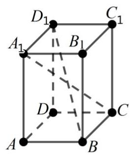

解析: 因为 ${ABCD} - {A}_{1}{B}_{1}{C}_{1}{D}_{1}$ 是长方体，所以经过同一顶点的三条棱两两垂直,数量积为 0,相对的棱平行且相等,可以用相等向量或相反向量表示,利用这些关系化简 $\overrightarrow{{A}_{1}C} \cdot  \overrightarrow{B{D}_{1}}$ 的表达式并进行计算:

$$
\overrightarrow{{A}_{1}C} \cdot  \overrightarrow{B{D}_{1}} = \left( {\overrightarrow{{A}_{1}A} + \overrightarrow{AB} + \overrightarrow{BC}}\right)  \cdot  \left( {\overrightarrow{B{B}_{1}} + \overrightarrow{{B}_{1}{A}_{1}} + \overrightarrow{{A}_{1}{D}_{1}}}\right)
$$

$$
= \overrightarrow{{A}_{1}A} \cdot  \overrightarrow{B{B}_{1}} + \overrightarrow{{A}_{1}A} \cdot  \overrightarrow{{B}_{1}{A}_{1}} + \overrightarrow{{A}_{1}A} \cdot  \overrightarrow{{A}_{1}{D}_{1}} + \overrightarrow{AB} \cdot  \overrightarrow{B{B}_{1}} + \overrightarrow{AB} \cdot  \overrightarrow{{B}_{1}{A}_{1}} + \overrightarrow{AB} \cdot  \overrightarrow{{A}_{1}{D}_{1}} +
$$

$$
\overrightarrow{BC} \cdot  \overrightarrow{B{B}_{1}} + \overrightarrow{BC} \cdot  \overrightarrow{{B}_{1}{A}_{1}} + \overrightarrow{BC} \cdot  \overrightarrow{{A}_{1}{D}_{1}}
$$

$$
= \overrightarrow{{A}_{1}A} \cdot  \left( {-\overrightarrow{{A}_{1}A}}\right)  + 0 + 0 + 0 + \overrightarrow{AB} \cdot  \left( {-\overrightarrow{AB}}\right)  + 0 + 0 + 0 + \overrightarrow{BC} \cdot  \overrightarrow{BC}
$$

$$
=  - {\left| \overrightarrow{{A}_{1}A}\right| }^{2} - {\left| \overrightarrow{AB}\right| }^{2} + {\left| \overrightarrow{BC}\right| }^{2}
$$

$$
=  - 4 - 1 + 1
$$

$$
=  - 4
$$

练习 14.1(2)

1. 如下图所示,长方体 ${ABCD} - {A}_{1}{B}_{1}{C}_{1}{D}_{1}$ 中, ${BC} = A{A}_{1} = 1,{AB} = 2$ ,求下列各式的值:

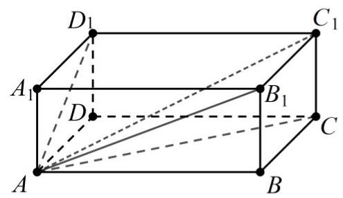

(1) $\overrightarrow{A{B}_{1}} \cdot  \overrightarrow{AB}$ ； (2) $\overrightarrow{A{B}_{1}} \cdot  \overrightarrow{A{D}_{1}}$ ； (3) $\overrightarrow{A{C}_{1}} \cdot  \overrightarrow{AC}$ ； (4) $\overrightarrow{{B}_{1}{C}_{1}} \cdot  \overrightarrow{CD}$ 。

2. 如下图所示,正四面体 $P - {ABC}$ 的棱长为 $2, E$ 是 $\bigtriangleup  {ABC}$ 的中心,已知 ${PE}\bot {ABC}$ ， $D$ 是线段 ${BC}$ 的中点，求下列各式的值:

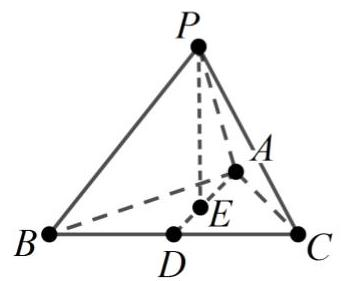

(3) $\overrightarrow{PB} \cdot  \overrightarrow{AD}$ ； (4) $\overrightarrow{AP} \cdot  \overrightarrow{BC}$ 。

#### 14.1.4 空间向量基本定理

空间向量基本定理与平面向量基本定理描述的规律相似, 平面向量基本定理体现了平面是二维的, 空间向量基本定理体现了立体空间是三维的。

空间向量基本定理的内容为: 设 $\overrightarrow{i}\text{ 、 }\overrightarrow{j}\text{ 、 }\overrightarrow{k}$ 是三个不共面的空间向量,那么任意一个空间向量 $\overrightarrow{a}$ ,都可以由唯一的有序实数组 $\left( {x, y, z}\right)$ 表示为:

$$
\overrightarrow{a} = x\overrightarrow{i} + y\overrightarrow{j} + z\overrightarrow{k}
$$

选取的三个不共面的空间向量构成的集合 $\{ \overrightarrow{i},\overrightarrow{j},\overrightarrow{k}\}$ 叫作空间的一个基底, $\overrightarrow{i},\overrightarrow{j},\overrightarrow{k}$ 叫作基向量。空间中任意三个不共面的向量都可以作为一个基底。

如下页图所示,由三个两两垂直的空间向量 $\overrightarrow{i},\overrightarrow{j},\overrightarrow{k}$ 构成的基底。空间中的任意向量 $\overrightarrow{a}$ ,都可以先在 $\overrightarrow{i}\text{ 、 }\overrightarrow{j}$ 确定的平面内,分别沿 $\overrightarrow{i}\text{ 、 }\overrightarrow{j}$ 移动到 $\overrightarrow{a}$ 沿 $\overrightarrow{k}$ 方向投影到该平面内的位置 (即 $\overrightarrow{a}$ 的终点的 “正下方” 或 “正上方”),再沿 $\overrightarrow{k}$ 向上或向下移动到 $\overrightarrow{a}$ 的位置。

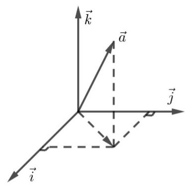

空间中的所有基底中, 最方便好用的基是单位正交基底, 其定义为: 基底 $\{ \overrightarrow{i},\overrightarrow{j},\overrightarrow{k}\}$ 中的三个向量都是单位向量,且两两垂直,即: $\left| \overrightarrow{i}\right|  = \left| \overrightarrow{j}\right|  = \left| \overrightarrow{k}\right|  = 1,\overrightarrow{i} \bot  \overrightarrow{j}$ , $\overrightarrow{j} \bot  \overrightarrow{k},\overrightarrow{i} \bot  \overrightarrow{k}$ 。

把空间中的任意向量 $\overrightarrow{a}$ 分解为三个两两垂直的向量,用它们的线性组合表示该向量的方式, 叫作把空间向量进行正交分解。

空间中的单位正交基方便好用的主要原因与平面内相同: 让运算简便。如果基向量都是单位向量, 那么在长度数量运算中有很多关于 1 的简单运算。如果基向量两两垂直, 那么计算不同方向的基向量的数量积时可以得到 0 。

例 14.4 如下图所示,四面体 $P - {ABC}$ 中, $D$ 是 ${AB}$ 的中点,用 $\overrightarrow{PA}\text{ 、 }\overrightarrow{PB}\text{ 、 }\overrightarrow{PC}$ 表示下列向量:(1) $\overrightarrow{BC}$ ；(2) $\overrightarrow{AD}$ ；(3) $\overrightarrow{PD}$ ；(4) $\overrightarrow{CD}$ 。

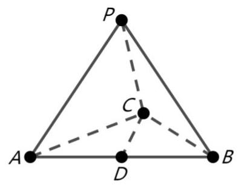

解析: 用基底表示相应的向量, 常用方法是从向量的起点出发, 途经基底向量或点后到达向量的终点,题中的基底都经过点 $P$ ,尽量让各向量都经过点 $P$ :

(1) $\overrightarrow{BC} = \overrightarrow{BP} + \overrightarrow{PC} =  - \overrightarrow{PB} + \overrightarrow{PC}$ ；

(2) $\overrightarrow{AD} = \frac{1}{2}\overrightarrow{AB} = \frac{1}{2}\left( {\overrightarrow{AP} + \overrightarrow{PB}}\right)  =  - \frac{1}{2}\overrightarrow{PA} + \frac{1}{2}\overrightarrow{PB}$ ；

(3) $\overrightarrow{PD} = \overrightarrow{PA} + \overrightarrow{AD} = \overrightarrow{PA} + \left( {-\frac{1}{2}\overrightarrow{PA} + \frac{1}{2}\overrightarrow{PB}}\right)  = \frac{1}{2}\overrightarrow{PA} + \frac{1}{2}\overrightarrow{PB}$ ；

(4) $\overrightarrow{CD} = \overrightarrow{CP} + \overrightarrow{PD} =  - \overrightarrow{PC} + \frac{1}{2}\overrightarrow{PA} + \frac{1}{2}\overrightarrow{PB}$ 。

练习 14.1(3)

1. $\{ \overrightarrow{i},\overrightarrow{j},\overrightarrow{k}\}$ 是空间的一个基底,判断下列各组向量能否构成一个基底:

(1) $- \overrightarrow{i}, - \overrightarrow{j}, - \overrightarrow{k};\;$ (2) $\overrightarrow{i} + \overrightarrow{j},2\overrightarrow{i} + 2\overrightarrow{j},\overrightarrow{k}$ ;

(3) $\overrightarrow{i} + \overrightarrow{j},\overrightarrow{i} - \overrightarrow{j},\overrightarrow{k};\;\left( 4\right) \overrightarrow{i} - \overrightarrow{j},\overrightarrow{j} - \overrightarrow{k},\overrightarrow{k} - \overrightarrow{i}$ 。

2. $\{ \overrightarrow{i},\overrightarrow{j},\overrightarrow{k}\}$ 是空间的一个基底, $\overrightarrow{i} \cdot  \overrightarrow{j} = \overrightarrow{j} \cdot  \overrightarrow{k} = \overrightarrow{i} \cdot  \overrightarrow{k} = 0,\left| \overrightarrow{i}\right|  = \left| \overrightarrow{j}\right|  = \left| \overrightarrow{k}\right|  = \sqrt{2}$ , 判断下列各组向量是否垂直:

(1) $\overrightarrow{i} + \overrightarrow{j}$ 与 $\overrightarrow{k}$ ；(2) $\overrightarrow{j} + \overrightarrow{k}$ 与 $\overrightarrow{j} - \overrightarrow{k}$ ；

(3) $\overrightarrow{i} + \overrightarrow{j} + \overrightarrow{k}$ 与 $\overrightarrow{i} - \overrightarrow{j} + \overrightarrow{k}$ ；(4) $\overrightarrow{i} - \sqrt{2}\overrightarrow{k}$ 与 $\sqrt{2}\overrightarrow{i} + \overrightarrow{k}$ 。

3. 在纸上画出示意图:以所在校园中旗杆底座为起点，构造基底并表示从旗杆顶到校门的向量。

### 14.2 空间向量及其运算的坐标表示

利用空间直角坐标系, 可以用空间坐标精确地表示空间向量, 并进行空间向量的运算, 从而借助代数运算进行几何分析。空间向量及其运算的坐标表示与平面向量形式上一致, 区别只是多了第三个维度的坐标。

#### 14.2.1 空间直角坐标系

在平面直角坐标系 Oxy 的基础上, 作出经过原点且垂直于平面 Oxy 的第三个坐标轴: $z$ 轴,就建立起了空间直角坐标系 ${Oxy}$ ,如下图所示。

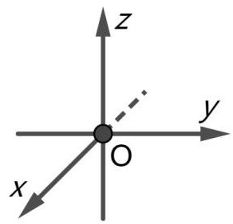

其中, $O$ 叫作原点。坐标系中的三个数轴 $x$ 轴、 $y$ 轴、 $z$ 轴叫作坐标轴。沿三个坐标轴正方向的单位向量 $\overrightarrow{i}\text{ 、 }\overrightarrow{j}\text{ 、 }\overrightarrow{k}$ 都叫作坐标向量。每两个坐标轴所确定的一个平面叫作坐标平面，分别叫作 ${Oxy}$ 平面、 ${Oyz}$ 平面、 ${Ozx}$ 平面。

空间直角坐标系中, $x$ 轴、 $y$ 轴、 $z$ 轴两两垂直, $x$ 轴垂直于 ${Oyz}$ 平面, $y$ 轴垂直于 ${Ozx}$ 平面, $z$ 轴垂直于 ${Oxy}$ 平面,且三个坐标平面也两两垂直。

三个坐标平面将空间分隔为 8 个部分，每个部分叫作一个卦限，分别命名为第一卦限、第二卦限……第八卦限。卦限类似于平面直角坐标系中的象限，不需要记忆每个卦限对应的区域。

绘制空间直角坐标系时, 通常用右手直角坐标系, 其规定方法为: 将右手的拇指、食指、中指伸直并两两垂直，规定此时拇指指向的是 $x$ 轴正方向，食指指向的是 $y$ 轴正方向,中指指向的是 $z$ 轴正方向。

用左手按照相同方法建立的坐标系叫作左手直角坐标系，实际中较少使用， 高中阶段暂时无法充分体现出两种坐标系之间的区别。

在平面内画右手直角坐标系时,通常规定水平向右为 $y$ 轴正方向、竖直向上为 $z$ 轴正方向、沿水平向左偏下 ${45}^{ \circ  }$ 为 $x$ 轴正方向,用斜二测画法在坐标系中绘制立体图形。

从空间中的任意一点 $P$ 分别向 $x$ 轴、 $y$ 轴、 $z$ 轴引垂线,其中 $x$ 轴上的垂足对应的坐标 ${x}_{P}$ 叫作点 $P$ 的横坐标, $y$ 轴上的垂足对应的坐标 ${y}_{P}$ 叫作点 $P$ 的纵坐标, $z$ 轴上的垂足对应的坐标 ${z}_{P}$ 叫作点 $P$ 的竖坐标。设坐标原点为 $O$ ,则向量 $\overrightarrow{OP}$ 可以用单位正交基 $\overrightarrow{i},\overrightarrow{j},\overrightarrow{k}$ 唯一地表示为:

$$
\overrightarrow{OP} = {x}_{P}\overrightarrow{i} + {y}_{P}\overrightarrow{j} + {z}_{P}\overrightarrow{k}
$$

简化记作:

$$
\overrightarrow{OP} = \left( {{x}_{P},{y}_{P},{z}_{P}}\right)
$$

与点 $P$ 和向量 $\overrightarrow{OP}$ 对应的有序实数组 $\left( {{x}_{P},{y}_{P},{z}_{P}}\right)$ 叫作点 $P$ 或向量 $\overrightarrow{OP}$ 在空间直角坐标系中的坐标。空间中的每个点或每个向量都有唯一确定的坐标, 每个坐标都对应唯一的一个点以及一个向量。

从动态视角看,向量表示移动方式,向量 $\overrightarrow{OP}$ 可以看作从原点 $O\left( {0,0,0}\right)$ 出发，分别沿 $x$ 轴移动 ${x}_{P}$ 个单位，沿 $y$ 轴移动 ${y}_{P}$ 个单位，沿 $z$ 轴移动 ${z}_{P}$ 个单位， 最终抵达点 $P$ 。

移动过程中,由于三个坐标轴两两垂直,沿 $x$ 轴移动时,只有横坐标改变, 纵坐标和竖坐标不变,沿 $y$ 轴和 $z$ 轴移动时同理,另外两个坐标都不变。

由此可知: $x$ 轴上所有点的纵坐标和竖坐标都为 $0, y$ 轴上所有点的横坐标和竖坐标都为 $0, z$ 轴上所有点的横坐标和纵坐标都为 0,平面 ${Oxy}$ 内所有点的竖坐标都为 0,平面 ${Oyz}$ 内所有点的横坐标都为 0,平面 ${Ozx}$ 内所有点的纵坐标都为 0 。

#### 14.2.2 空间向量运算的坐标表示

将空间向量的运算法则和空间向量的坐标表示结合起来, 可以得到空间向量运算的坐标表示, 这正是空间向量最方便好用的部分。

设空间向量 $\overrightarrow{a} = \left( {{a}_{1},{a}_{2},{a}_{3}}\right) ,\overrightarrow{b} = \left( {{b}_{1},{b}_{2},{b}_{3}}\right)$ ,即 $\overrightarrow{a} = {a}_{1}\overrightarrow{i} + {a}_{2}\overrightarrow{j} + {a}_{3}\overrightarrow{k}$ , $\overrightarrow{b} = {b}_{1}\overrightarrow{i} + {b}_{2}\overrightarrow{j} + {b}_{3}\overrightarrow{k}$ ,其中 $\{ \overrightarrow{i},\overrightarrow{j},\overrightarrow{k}\}$ 是单位正交基,利用空间向量的基本运算的性质可得:

(1) $\overrightarrow{a} + \overrightarrow{b} = \left( {{a}_{1}\overrightarrow{i} + {a}_{2}\overrightarrow{j} + {a}_{3}\overrightarrow{k}}\right)  + \left( {{b}_{1}\overrightarrow{i} + {b}_{2}\overrightarrow{j} + {b}_{3}\overrightarrow{k}}\right)  = \left( {{a}_{1} + {b}_{1}}\right) \overrightarrow{i} + \left( {{a}_{2} + {b}_{2}}\right) \overrightarrow{j} + \left( {{a}_{3} + {b}_{3}}\right) \overrightarrow{k}$

即 $\overrightarrow{a} + \overrightarrow{b}$ 的坐标为 $\overrightarrow{a}\text{ 、 }\overrightarrow{b}$ 对应的坐标相加:

$$
\overrightarrow{a} + \overrightarrow{b} = \left( {{a}_{1} + {b}_{1},{a}_{2} + {b}_{2},{a}_{3} + {b}_{3}}\right)
$$

(2) $\overrightarrow{a} - \overrightarrow{b} = \left( {{a}_{1}\overrightarrow{i} + {a}_{2}\overrightarrow{j} + {a}_{3}\overrightarrow{k}}\right)  - \left( {{b}_{1}\overrightarrow{i} + {b}_{2}\overrightarrow{j} + {b}_{3}\overrightarrow{k}}\right)  = \left( {{a}_{1} - {b}_{1}}\right) \overrightarrow{i} + \left( {{a}_{2} - {b}_{2}}\right) \overrightarrow{j} + \left( {{a}_{3} - {b}_{3}}\right) \overrightarrow{k}$

即 $\overrightarrow{a} - \overrightarrow{b}$ 的坐标为 $\overrightarrow{a}\text{ 、 }\overrightarrow{b}$ 对应的坐标相减:

$$
\overrightarrow{a} - \overrightarrow{b} = \left( {{a}_{1} - {b}_{1},{a}_{2} - {b}_{2},{a}_{3} - {b}_{3}}\right)
$$

(3) $\lambda \overrightarrow{a} = \lambda \left( {{a}_{1}\overrightarrow{i} + {a}_{2}\overrightarrow{j} + {a}_{3}\overrightarrow{k}}\right)  = \lambda {a}_{1}\overrightarrow{i} + \lambda {a}_{2}\overrightarrow{j} + \lambda {a}_{3}\overrightarrow{k}$

即 $\lambda \overrightarrow{a}$ 的坐标为 $\overrightarrow{a}$ 的各坐标乘以 $\lambda$ :

$$
\lambda \overrightarrow{a} = \left( {\lambda {a}_{1},\lambda {a}_{2},\lambda {a}_{3}}\right)
$$

(4) $\overrightarrow{a} \cdot  \overrightarrow{b} = \left( {{a}_{1}\overrightarrow{i} + {a}_{2}\overrightarrow{j} + {a}_{3}\overrightarrow{k}}\right)  \cdot  \left( {{b}_{1}\overrightarrow{i} + {b}_{2}\overrightarrow{j} + {b}_{3}\overrightarrow{k}}\right)  = {a}_{1}{b}_{1} + {a}_{2}{b}_{2} + {a}_{3}{b}_{3}$ (利用 $\{ \overrightarrow{i},\overrightarrow{j},\overrightarrow{k}\}$ 是单位正交基, ${\overrightarrow{i}}^{2} = {\overrightarrow{j}}^{2} = {\overrightarrow{k}}^{2} = 1,\overrightarrow{i} \cdot  \overrightarrow{j} = \overrightarrow{j} \cdot  \overrightarrow{k} = \overrightarrow{i} \cdot  \overrightarrow{k} = 0$ 化简)

即 $\overrightarrow{a} \cdot  \overrightarrow{b}$ 等于 $\overrightarrow{a}\text{ 、 }\overrightarrow{b}$ 各对应坐标的乘积之和:

$$
\overrightarrow{a} \cdot  \overrightarrow{b} = {a}_{1}{b}_{1} + {a}_{2}{b}_{2} + {a}_{3}{b}_{3}
$$

可以发现, 空间向量的坐标运算的法则与平面向量形式上完全一致, 只是多了第三个维度的竖坐标。

例 14.5 求下列各向量的相反向量、与 -4 的乘积, 各组向量的和、差、数量积:

(1) $\overrightarrow{a} = \left( {2, - 2,1}\right) ,\overrightarrow{b} = \left( {3,2,2}\right) ;\;\left( 2\right) \overrightarrow{a} = \left( {1,1, - 1}\right) ,\overrightarrow{b} = \left( {-1,0,1}\right)$ 。

解析: 按照空间向量运算的定义式进行运算即可。

(1) $- \overrightarrow{a} = \left( {-2,2, - 1}\right)$

$$
- \overrightarrow{b} = \left( {-3, - 2, - 2}\right)
$$

$$
- 4\overrightarrow{a} = \left( {-4 \times  2,\left( {-4}\right)  \times  \left( {-2}\right) ,\left( {-4}\right)  \times  1}\right)  = \left( {-8,8, - 4}\right)
$$

$$
- 4\overrightarrow{b} = \left( {-4 \times  3, - 4 \times  2, - 4 \times  2}\right)  = \left( {-{12}, - 8, - 8}\right)
$$

$$
\overrightarrow{a} + \overrightarrow{b} = \left( {2 + 3, - 2 + 2,1 + 2}\right)  = \left( {5,0,3}\right)
$$

$$
\overrightarrow{a} - \overrightarrow{b} = \left( {2 - 3, - 2 - 2,1 - 2}\right)  = \left( {-1, - 4, - 1}\right)
$$

$$
\overrightarrow{a} \cdot  \overrightarrow{b} = 2 \times  3 + \left( {-2}\right)  \times  2 + 1 \times  2 = 4
$$

(2) $- \overrightarrow{a} = \left( {-1, - 1,1}\right) \; - \overrightarrow{b} = \left( {1,0, - 1}\right)$

$$
- 4\overrightarrow{a} = \left( {-4 \times  1,\left( {-4}\right)  \times  1,\left( {-4}\right)  \times  \left( {-1}\right) }\right)  = \left( {-4, - 4\;4}\right)
$$

$$
- 4\overrightarrow{b} = \left( {-4 \times  \left( {-1}\right) , - 4 \times  0, - 4 \times  1}\right)  = \left( {4,0, - 4}\right)
$$

$$
\overrightarrow{a} + \overrightarrow{b} = \left( {1 + \left( {-1}\right) ,1 + 0, - 1 + 1}\right)  = \left( {0,1,0}\right)
$$

$$
\overrightarrow{a} - \overrightarrow{b} = \left( {1 - \left( {-1}\right) ,1 - 0, - 1 - 1}\right)  = \left( {2,1, - 2}\right)
$$

$$
\overrightarrow{a} \cdot  \overrightarrow{b} = 1 \times  \left( {-1}\right)  + 1 \times  0 + \left( {-1}\right)  \times  1 =  - 2
$$

利用空间向量的坐标运算，可以得到向量之间的位置关系与坐标运算结果间的对应关系,对于向量 $\overrightarrow{a} = \left( {{a}_{1},{a}_{2},{a}_{3}}\right) ,\overrightarrow{b} = \left( {{b}_{1},{b}_{2},{b}_{3}}\right)$ ,它们的坐标与位置关系之间具有下列对应关系:

$$
\overrightarrow{a}\parallel \overrightarrow{b} \Leftrightarrow  \overrightarrow{a} = \lambda \overrightarrow{b} \Leftrightarrow  {a}_{1} = \lambda {b}_{1},{a}_{2} = \lambda {b}_{2},{a}_{3} = \lambda {b}_{3}\left( {\overrightarrow{b} \neq  \overrightarrow{0}}\right)
$$

$$
\overrightarrow{a} \bot  \overrightarrow{b} \Leftrightarrow  \overrightarrow{a} \cdot  \overrightarrow{b} = 0 \Leftrightarrow  {a}_{1}{b}_{1} + {a}_{2}{b}_{2} + {a}_{3}{b}_{3} = 0
$$

$$
{\overrightarrow{a}}^{2} = \overrightarrow{a} \cdot  \overrightarrow{a} = \left| \overrightarrow{a}\right| \left| \overrightarrow{a}\right| \cos 0 = {\left| \overrightarrow{a}\right| }^{2}
$$

$$
\cos  < \overrightarrow{a},\overrightarrow{b} >  = \frac{\overrightarrow{a} \cdot  \overrightarrow{b}}{\left| \overrightarrow{a}\right| \left| \overrightarrow{b}\right| } = \frac{{a}_{1}{b}_{1} + {a}_{2}{b}_{2} + {a}_{3}{b}_{3}}{\sqrt{{a}_{1}^{2} + {a}_{2}^{2} + {a}_{3}^{2}}\sqrt{{b}_{1}^{2} + {b}_{2}^{2} + {b}_{3}^{2}}}
$$

利用空间向量的坐标表示，还可以得到空间中两点间的距离。设空间中两点 $A\text{ 、 }B$ 的坐标分别为 $A\left( {{a}_{1},{a}_{2},{a}_{3}}\right) , B\left( {{b}_{1},{b}_{2},{b}_{3}}\right)$ ,那么 $A\text{ 、 }B$ 间的距离就是向量 $\overrightarrow{AB} = \left( {{b}_{1} - {a}_{1},{b}_{2} - {a}_{2},{b}_{3} - {a}_{3}}\right)$ 的模:

$$
\left| \overrightarrow{AB}\right|  = \sqrt{{\left| \overrightarrow{AB}\right| }^{2}} = \sqrt{{\overrightarrow{AB}}^{2}} = \sqrt{\overrightarrow{AB} \cdot  \overrightarrow{AB}} = \sqrt{{\left( {b}_{1} - {a}_{1}\right) }^{2} + {\left( {b}_{2} - {a}_{2}\right) }^{2} + {\left( {b}_{3} - {a}_{3}\right) }^{2}}
$$

即 $\left| \overrightarrow{\mathrm{{AB}}}\right|  = \sqrt{{\left( {b}_{1} - {a}_{1}\right) }^{2} + {\left( {b}_{2} - {a}_{2}\right) }^{2} + {\left( {b}_{3} - {a}_{3}\right) }^{2}}$

这就是空间中两点间的距离公式, 等于它们对应坐标之差的平方之和的平方根。该公式与平面内两点间的距离公式形式一致, 只是多了第三个维度。利用欧式几何知识，在空间中连续使用两次勾股定理也可以得到该公式。

例 14.6 如下图所示,直三棱柱 ${ABC} - {A}_{1}{B}_{1}{C}_{1}$ 中, ${AB} = {AC} = {A{A}_{1}},\angle {BAC} = {90}^{ \circ  }$ , ${D}_{1}$ 是 ${B}_{1}{C}_{1}$ 的中点,回答下列问题:

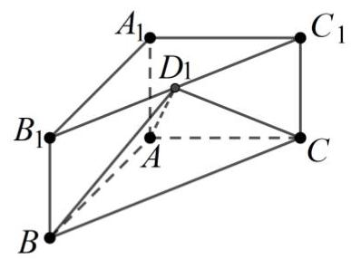

(1)构造恰当的空间直角坐标系；(2)求图中各点的坐标；

(3)求向量 $\overrightarrow{A{D}_{1}}$ 、 $\overrightarrow{B{D}_{1}}$ 、 $\overrightarrow{C{D}_{1}}$ 的坐标；(4)求 $\overrightarrow{A{D}_{1}} \cdot  \overrightarrow{A{A}_{1}}$ 、 $\overrightarrow{B{D}_{1}} \cdot  \overrightarrow{C{D}_{1}}$ 的值；

(5)求 $A{D}_{1}$ 与 $A{A}_{1}$ ， $B{D}_{1}$ 与 $C{D}_{1}$ 夹角的余弦值。

解析: (1) 因为 ${ABC} - {A}_{1}{B}_{1}{C}_{1}$ 是直三棱柱,所以三条侧棱 $A{A}_{1}$ 、 $B{B}_{1}$ 、 $C{C}_{1}$ 都与底面垂直,可以选取其中一条侧棱所在的直线作为 $z$ 轴,又因为底面 $\bigtriangleup {ABC}$ 中 $\angle {BAC} = {90}^{ \circ  },{AB} \bot  {AC}$ ,综上可得 ${AB}\text{ 、 }{AC}\text{ 、 }A{A}_{1}$ 两两垂直,选取这三条直线建立坐标轴,选取这三条直线共同的交点 $A$ 作为坐标原点, $\overrightarrow{AB}\text{ 、 }\overrightarrow{AC}\text{ 、 }{\overrightarrow{AA}}_{1}$ 分别为 $x$ 轴, $y$ 轴, $z$ 轴的正方向,又因为 ${AB} = {AC} = {A{A}_{1}}$ ，可以设坐标轴的单位长度为 ${AB} = {AC} = {A{A}_{1}} = 1$ ，建立空间直角坐标系。

(2)利用刚才构造的坐标系，根据相应的平行和垂直关系，写出各点的坐标。 $A$ 是坐标原点,所以 $A\left( {0,0,0}\right)$ ;

$B$ 在 $x$ 轴的正方向上且 ${AB} = 1$ ,所以 $B\left( {1,0,0}\right)$ ;

$C$ 在 $y$ 轴的正方向上且 ${AC} = 1$ ,所以 $C\left( {0,1,0}\right)$ ;

${A}_{1}$ 在 $z$ 轴的正方向上且 $A{A}_{1} = 1$ ,所以 ${A}_{1}\left( {0,0,1}\right)$ ;

${B}_{1}$ 在 $B$ 的 $z$ 轴的正方向上， ${B}_{1}$ 的横坐标和纵坐标都与 $B$ 相同，又因为直三棱柱中 $B{B}_{1} = A{A}_{1} = 1$ ,所以 ${B}_{1}\left( {1,0,1}\right)$ ,同理可得 ${C}_{1}\left( {0,1,1}\right)$ ;

${D}_{1}$ 是 ${B}_{1}{C}_{1}$ 的中点， ${D}_{1}$ 的各坐标是 ${B}_{1}$ 与 ${C}_{1}$ 坐标之和的一半， ${D}_{1}\left( {\frac{1}{2},\frac{1}{2},1}\right)$ 。

(3)用起点和终点表示的向量的坐标，各坐标分别为终点坐标减去起点坐标:

$\overrightarrow{A{D}_{1}} = \left( {\frac{1}{2} - 0,\frac{1}{2} - 0,1 - 0}\right)  = \left( {\frac{1}{2},\frac{1}{2},1}\right)$

$\overrightarrow{B{D}_{1}} = \left( {\frac{1}{2} - 1,\frac{1}{2} - 0,1 - 0}\right)  = \left( {-\frac{1}{2},\frac{1}{2},1}\right)$

$\overrightarrow{C{D}_{1}} = \left( {\frac{1}{2} - 0,\frac{1}{2} - 1,1 - 0}\right)  = \left( {\frac{1}{2}, - \frac{1}{2},1}\right)$

(4) $\overrightarrow{A{D}_{1}} \cdot  \overrightarrow{A{A}_{1}} = \left( {\frac{1}{2},\frac{1}{2},1}\right)  \cdot  \left( {0,0,1}\right)  = \frac{1}{2} \times  0 + \frac{1}{2} \times  0 + 1 \times  1 = 1$

$\overrightarrow{B{D}_{1}} \cdot  \overrightarrow{C{D}_{1}} = \left( {-\frac{1}{2},\frac{1}{2},1}\right)  \cdot  \left( {\frac{1}{2}, - \frac{1}{2},1}\right)  =  - \frac{1}{2} \times  \frac{1}{2} + \frac{1}{2} \times  \left( {-\frac{1}{2}}\right)  + 1 \times  1 = \frac{1}{2}$

(5) $\left| \overrightarrow{A{D}_{1}}\right|  = \sqrt{{\left( \frac{1}{2}\right) }^{2} + {\left( \frac{1}{2}\right) }^{2} + {1}^{2}} = \frac{\sqrt{6}}{2},\left| \overrightarrow{A{A}_{1}}\right|  = \sqrt{{0}^{2} + {0}^{2} + {1}^{2}} = 1$

$\cos  < \overrightarrow{A{D}_{1}},\overrightarrow{A{A}_{1}} >  = \frac{\overrightarrow{A{D}_{1}} \cdot  \overrightarrow{A{A}_{1}}}{\left| \overrightarrow{A{D}_{1}}\right| \left| \overrightarrow{A{A}_{1}}\right| } = \frac{1}{\frac{\sqrt{6}}{2} \times  1} = \frac{\sqrt{6}}{3}$

$\left| \overrightarrow{B{D}_{1}}\right|  = \sqrt{{\left( -\frac{1}{2}\right) }^{2} + {\left( \frac{1}{2}\right) }^{2} + {1}^{2}} = \frac{\sqrt{6}}{2},\left| \overrightarrow{C{D}_{1}}\right|  = \sqrt{{\left( \frac{1}{2}\right) }^{2} + {\left( -\frac{1}{2}\right) }^{2} + {1}^{2}} = \frac{\sqrt{6}}{2}$

$$
\cos  < \overrightarrow{B{D}_{1}} \cdot  \overrightarrow{C{D}_{1}} >  = \frac{\overrightarrow{B{D}_{1}} \cdot  \overrightarrow{C{D}_{1}}}{\left| \overrightarrow{B{D}_{1}}\right| \left| \overrightarrow{C{D}_{1}}\right| } = \frac{\frac{1}{2}}{\frac{\sqrt{6}}{2} \times  \frac{\sqrt{6}}{2}} = \frac{1}{3}
$$

向量的加、减、数乘、数量积、距离、夹角(余弦)等运算的概念和公式对于平面向量和空间向量没有实质区别,实际上,任意 $n$ 维空间中的向量的基本运算都可以由相同形式的公式表示, 区别只是维度的数目不同。

对于 $n$ 维空间中的两个 $n$ 维向量 $\overrightarrow{OA} = \left( {{a}_{1},{a}_{2},\cdots ,{a}_{n}}\right)$ 和 $\overrightarrow{OB} = \left( {{b}_{1},{b}_{2},\cdots ,{b}_{n}}\right)$ , 同样满足:

$$
\overrightarrow{OA} + \overrightarrow{OB} = \left( {{a}_{1} + {b}_{1},{a}_{2} + {b}_{2},\cdots ,{a}_{n} + {b}_{n}}\right)
$$

$$
\overrightarrow{OA} - \overrightarrow{OB} = \left( {{a}_{1} - {b}_{1},{a}_{2} - {b}_{2},\cdots ,{a}_{n} - {b}_{n}}\right)
$$

$$
\lambda \overrightarrow{OA} = \left( {\lambda {a}_{1},\lambda {a}_{2},\cdots ,\lambda {a}_{n}}\right)
$$

$$
\overrightarrow{OA} \cdot  \overrightarrow{OB} = {a}_{1}{b}_{1} + {a}_{2}{b}_{2} + \cdots  + {a}_{n}{b}_{n}
$$

其中，加、减、数乘等线性运算满足交换律、结合律、分配律，数量积运算满足交换律和分配律。

$n$ 维空间中，两点 $A\text{ 、 }B$ 间的 “距离” (向量 $\overrightarrow{AB}$ 的模) 为:

$$
\left| \overrightarrow{AB}\right|  = \sqrt{{\left( {a}_{1} - {b}_{1}\right) }^{2} + {\left( {a}_{2} - {b}_{2}\right) }^{2} + \cdots  + {\left( {a}_{n} - {b}_{n}\right) }^{2}}
$$

$n$ 维空间中,两个 $n$ 维向量 $\overrightarrow{OA}\text{ 、 }\overrightarrow{OB}$ 的 “夹角” 的余弦为:

$$
\cos  < \overrightarrow{OA},\overrightarrow{OB} >  = \frac{\overrightarrow{OA} \cdot  \overrightarrow{OB}}{\left| \overrightarrow{OA}\right| \left| \overrightarrow{OB}\right| } = \frac{\mathop{\sum }\limits_{{i = 1}}^{n}{a}_{i}{b}_{i}}{\sqrt{\mathop{\sum }\limits_{{i = 1}}^{n}{a}_{i}^{2}}\sqrt{\mathop{\sum }\limits_{{i = 1}}^{n}{b}_{i}^{2}}}
$$

且始终满足 $\cos  < \overrightarrow{OA},\overrightarrow{OB} >  \in  \left\lbrack  {-1,1}\right\rbrack$ 。该公式还将在后续章节中意想不到的地方出现, 并起到非常巧妙的作用。

## 练习 14.2

1. 求下列各向量的相反向量、与 $\frac{1}{2}$ 的乘积, 各组向量的和、差、数量积:

(1) $\overrightarrow{a} = \left( {1,0,0}\right)$ 与 $\overrightarrow{b} = \left( {0,1, - 1}\right)$ ；(2) $\overrightarrow{a} = \left( {1,1,1}\right)$ 与 $\overrightarrow{b} = \left( {-2, - 2, - 2}\right)$

(3) $\overrightarrow{a} = \left( {\frac{1}{2}\cos \theta ,\frac{1}{2}\sin \theta ,\frac{\sqrt{3}}{2}}\right)$ 与 $\overrightarrow{b} = \left( {\frac{1}{2}\cos \left( {-\theta }\right) ,\frac{1}{2}\sin \left( {-\theta }\right) ,\frac{\sqrt{3}}{2}}\right)$ 。

2. 求下列空间中两点间的距离:

(1) $\left( {0,0,0}\right)$ 与 $\left( {1,2,3}\right)$ ；(2) $\left( {-1,1,0}\right)$ 与 $\left( {0,0,1}\right)$ ；

(3) $\left( {2,0, - 2}\right)$ 与 $\left( {5,0, - 2}\right)$ ； (4) $\left( {-1,3,4}\right)$ 与 $\left( {2, - 2,0}\right)$ 。

3. 求下列各向量的模, 各组向量的夹角的余弦值:

(1)(1，0，-1)与 $\left( {2,2, - 1}\right)$ ；(2) $\left( {2, - 1,2}\right)$ 与 $\left( {-3,0,4}\right)$ ；

(3) $\left( {\frac{\sqrt{5}}{2},\frac{\sqrt{2}}{2}, - \frac{1}{2}}\right)$ 与 $\left( {\sqrt{5},0, - 2}\right)$ ； (4) $\left( {a - 2, a,4}\right)$ 与 $\left( {a + 2, - a,1}\right)$ 。

4. 如下页图所示，长方体 ${ABCD} - {A}_{1}{B}_{1}{C}_{1}{D}_{1}$ 中， ${AB} = 3,{BC} = 2,{A{A}_{1}} = 1$ ， $E\text{ 、 }F\text{ 、 }{E}_{1}\text{ 、 }{F}_{1}\text{ 、 }G\text{ 、 }H$ 分别是棱 ${AB}\text{ 、 }{BC}\text{ 、 }{A}_{1}{B}_{1}\text{ 、 }{B}_{1}{C}_{1}\text{ 、 }B{B}_{1}\text{ 、 }C{C}_{1}$ 的中点，以 $D$ 为原点, $\overrightarrow{DA}\text{ 、 }\overrightarrow{DC}\text{ 、 }\overrightarrow{D{D}_{1}}$ 为 $x$ 轴、 $y$ 轴、 $z$ 轴正方向建立空间直角坐标系:

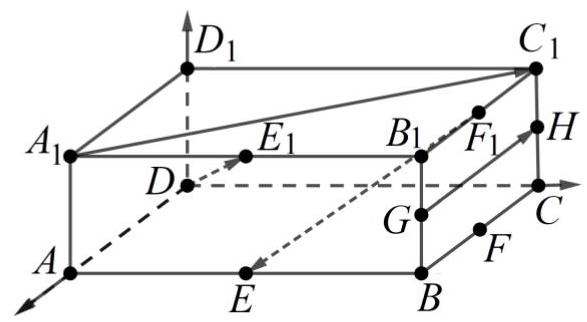

(1)求 $E\text{ 、 }F\text{ 、 }{E}_{1}\text{ 、 }{F}_{1}\text{ 、 }G\text{ 、 }H$ 的坐标；

(2)求向量 $\overrightarrow{{A}_{1}{C}_{1}}$ 、 $\overrightarrow{D{E}_{1}}$ 、 $\overrightarrow{GH}$ 、 $\overrightarrow{{F}_{1}E}$ 的坐标；

(3)求 $\overrightarrow{{A}_{1}{C}_{1}} \cdot  \overrightarrow{D{E}_{1}}$ 、 $\overrightarrow{GH} \cdot  \overrightarrow{{F}_{1}E}$ 的值；

(4)求 ${A}_{1}{C}_{1}$ 与 $D{E}_{1}$ ， ${GH}$ 与 ${F}_{1}E$ 的夹角的余弦。

### 14.3 空间向量的应用

建立数学理论的重要目的是更方便高效地解决问题，空间向量就是分析解决立体几何问题的强大工具。立体几何问题的复杂程度比平面几何高出许多, 并且画立体图形的示意图远不如画平面图形直观, 好在空间向量的概念和坐标运算与平面向量一致, 极大地降低了分析解决立体几何问题的难度, 更体现了向量工具的实用性。

#### 14.3.1 空间中点的向量表示

点、直线、平面是立体几何中的重要元素, 它们都可以用向量表示。点的坐标表示与向量的坐标表示相似, 直线和平面是点的集合, 可以用关于向量的表达式表示具有共同特征的点集。

利用空间坐标、空间中的点、空间向量之间的一一对应关系, 空间中的任意一点 $P\left( {{p}_{1},{p}_{2},{p}_{3}}\right)$ ,都可以由以原点 $O\left( {0,0,0}\right)$ 为起点、点 $P$ 为终点的向量唯一地表示:

$$
\overrightarrow{OP} = \left( {{p}_{1},{p}_{2},{p}_{3}}\right)
$$

向量 $\overrightarrow{OP}$ 叫作点 $P$ 的位置向量。

#### 14.3.2 空间中直线的向量表示

由于向量没有固定位置可以任意平移, 而直线通常有固定位置, 因此向量只能表示直线的方向，无法直接表示直线的具体位置，还需要借助直线上一点确定位置, 结合向量表示的方向, 才能完整地表示任意直线。

直线的方向向量是直线上任意两点的坐标之差, 表示从起点到终点的移动方向, 只要知道 $l$ 上任意两点的坐标,它们的差就是直线的方向向量。直线可以向两端无限延伸, 选取直线上的两个点后, 可以任意规定谁是起点谁是终点。若已知直线 $l$ 上两点的坐标分别为 $A\left( {{a}_{1},{a}_{2},{a}_{3}}\right)$ 和 $B\left( {{b}_{1},{b}_{2},{b}_{3}}\right)$ ,则 $l$ 的方向向量为:

$$
{\overrightarrow{l}}_{1} = \overrightarrow{AB} = \left( {{b}_{1} - {a}_{1},{b}_{2} - {a}_{2},{b}_{3} - {a}_{3}}\right) \text{ 或 }{\overrightarrow{l}}_{2} = \overrightarrow{BA} = \left( {{a}_{1} - {b}_{1},{a}_{2} - {b}_{2},{a}_{3} - {b}_{3}}\right)
$$

将向量任意平移，得到的仍是同一个向量， ${\overrightarrow{l}}_{1} = \overrightarrow{AB} = \left( {{b}_{1} - {a}_{1},{b}_{2} - {a}_{2},{b}_{3} - {a}_{3}}\right)$ 可以看作将 $l$ 平移,让点 $A$ 与原点重合,可知点 $A$ 的平移方式为 $\left( {-{a}_{1}, - {a}_{2}, - {a}_{3}}\right)$ , $l$ 上的所有点都作相同的平移,点 $B$ 平移至 ${B}^{\prime }\left( {{b}_{1} - {a}_{1},{b}_{2} - {a}_{2},{b}_{3} - {a}_{3}}\right)$ ,即 $\overrightarrow{AB}$ 平移后变为 $\overrightarrow{O{B}^{\prime }}$ ,它们是同一个向量 $\left( {{b}_{1} - {a}_{1},{b}_{2} - {a}_{2},{b}_{3} - {a}_{3}}\right)$ 在不同的位置,都是 $l$ 的方向向量。

将直线任意平移，直线指向的方向不变，所以一系列互相平行的直线具有相同的方向向量。与平面内直线的方向向量相似, 空间中直线的方向向量只表示直线的方向, 对方向向量的大小没有特别要求, 可以是任意不为 0 的长度。

一系列方向相同或相反的向量, 都是同一个直线的方向向量, 由共线向量的判定方式可得: 若 $\overrightarrow{l}$ 是直线 $l$ 的方向向量,则任意 $\lambda \overrightarrow{l}\left( {\lambda  \neq  0}\right)$ 都是 $l$ 的方向向量。

用向量表示直线。要完整的表示一条直线, 还需要确定直线的位置, “确定位置”的目标可以用直线上任意一点的坐标来实现，如构造方向向量的其中一个点就可以。设已知直线 $l$ 上的两个点的坐标分别为 $A\left( {{a}_{1},{a}_{2},{a}_{3}}\right)$ 和 $B\left( {{b}_{1},{b}_{2},{b}_{3}}\right)$ , 那么 $l$ 上的任意一点 $P$ ,都可以通过从点 $A$ 出发,沿 $l$ 的方向向量 $\overrightarrow{AB}$ 移动一段距离抵达,因此 $P$ 的位置向量可以表示为:

$$
\overrightarrow{OP} = \overrightarrow{OA} + \overrightarrow{AP} = \overrightarrow{OA} + \lambda \overrightarrow{AB}
$$

其中 $O$ 为坐标原点, $\lambda$ 是由 $P$ 的具体位置决定的参数,每一个实数 $\lambda$ 与 $l$ 上的一个点一一对应，如下图所示。

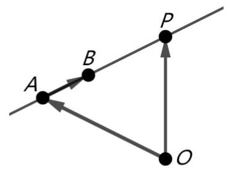

由此可知，两点可以确定空间中的一条直线。特别的,若 $P$ 与 $B$ 在 $A$ 的同侧, 则 $\lambda  > 0$ 。若 $P$ 与 $B$ 在 $A$ 的异侧,则 $\lambda  < 0$ 。若 $P$ 与 $A$ 重合,则 $\lambda  = 0$ ,即从原点出发抵达 $A$ 后不再移动。若 $P$ 与 $B$ 重合,则 $\lambda  = 1$ ,即从原点出发抵达 $A$ 后再移动 $\overrightarrow{AB}$ 抵达 $B$ 。

利用该等式关系,还能得到 $P$ 的坐标:

$$
P\left( {{a}_{1} + \lambda \left( {{b}_{1} - {a}_{1}}\right) ,{a}_{2} + \lambda \left( {{b}_{2} - {a}_{2}}\right) ,{a}_{3} + \lambda \left( {{b}_{3} - {a}_{3}}\right) }\right)
$$

线段的定比分点公式。空间中线段的定比分点公式及推导过程与平面内的一致, 各坐标的表达式的形式相同, 区别只是比平面内多了竖坐标。

对于空间中的两点 $A\left( {{a}_{1},{a}_{2},{a}_{3}}\right)$ 和 $B\left( {{b}_{1},{b}_{2},{b}_{3}}\right)$ ,如果点 $P\left( {{p}_{1},{p}_{2},{p}_{3}}\right)$ 将向量 $\overrightarrow{AB}$ 分为 $\overrightarrow{AP} : \overrightarrow{PB} = \lambda$ (或 $\overrightarrow{AP} = \lambda \overrightarrow{PB}$ ) 的两部分,那么点 $P$ 叫作线段 ${AB}$ 定比为 $\lambda$ 的分点。点 $P$ 的坐标可以用 $A\text{ 、 }B$ 的坐标和参数 $\lambda$ 表示为:

$$
P\left( {\frac{{a}_{1} + \lambda {b}_{1}}{1 + \lambda },\frac{{a}_{2} + \lambda {b}_{2}}{1 + \lambda },\frac{{a}_{3} + \lambda {b}_{3}}{1 + \lambda }}\right)
$$

特别的,当 $\lambda  = 1$ 时, $\overrightarrow{AP} = \overrightarrow{PB}, P\left( {\frac{{a}_{1} + {b}_{1}}{2},\frac{{a}_{2} + {b}_{2}}{2},\frac{{a}_{3} + {b}_{3}}{2}}\right)$ 是 $A\text{ 、 }B$ 的中点。

定比分点公式是关于向量的公式，参数 $\lambda$ 蕴含了方向信息。 $P$ 可以在 $A$ 、 $B$ 之间,此时 $\lambda  > 0$ 。 $P$ 也可以在 $A\text{ 、 }B$ 的外侧,此时 $\lambda  < 0$ 。

## 练习 14.3(1)

1. 已知空间中的直线 $l$ 经过点 $\left( {1,2, - 1}\right)$ 和 $\left( {-2,1,0}\right)$ ,

(1)求 $l$ 的一个方向向量；

(2)用含参数 $\lambda$ 的表达式表示 $l$ 上的点的坐标。

2. 已知点 $A\left( {1,1,1}\right)$ 和 $B\left( {-2,0,2}\right)$ ,求:

(1)线段 ${AB}$ 的中点 $M$ 的坐标；

(2)将线段 ${AB}$ 分为 ${AP} : {BP} = 2 : 1$ 的点 $P$ 的坐标；

(3)将向量 $\overrightarrow{AB}$ 分为 $\overrightarrow{AQ} : \overrightarrow{BQ} = 1 : 3$ 的点 $Q$ 的坐标。

#### 14.3.3 空间中平面的向量表示

对于空间中的平面,平面 $\alpha$ 内的任意一点 $P$ 和对应的位置向量 $\overrightarrow{OP}$ ,都可以由 $\alpha$ 内两条相交的向量 $\overrightarrow{a}\text{ 、 }\overrightarrow{b}$ 线性表示为 $\overrightarrow{OP} = x\overrightarrow{a} + y\overrightarrow{b}$ ,有序实数对 $\left( {x, y}\right)$ 与 $\alpha$ 内的点 $P$ 及位置向量 $\overrightarrow{OP}$ 一一对应。

如下图所示,立体空间中,设 $O$ 是坐标原点,平面 $\alpha$ 内两条不共线向量 $\overrightarrow{AB} = \overrightarrow{a}$ 与 $\overrightarrow{AC} = \overrightarrow{b}$ ,可通过平移让 $A$ 是 $\overrightarrow{a}\text{ 、 }\overrightarrow{b}$ 的共同起点, $P$ 是 $\alpha$ 内任意一点,其位置向量可以表示为: $\overrightarrow{OP} = \overrightarrow{OA} + \overrightarrow{AP} = \overrightarrow{OA} + x\overrightarrow{AB} + y\overrightarrow{AC}$ 。

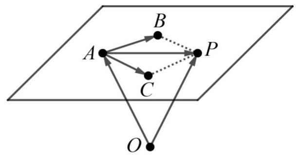

即 $\overrightarrow{OP} = \overrightarrow{OA} + x\overrightarrow{AB} + y\overrightarrow{AC}$

该表达式叫作平面 ${ABC}$ 的向量表示式。选定平面 ${ABC}$ 内的两个相交的向量 $\overrightarrow{a}\text{ 、 }\overrightarrow{b}$ 后,平面 ${ABC}$ 内的任意一点 $P$ 都可以由唯一的有序实数对 $\left( {x, y}\right)$ 确定。

设 $A\left( {{a}_{1},{a}_{2},{a}_{3}}\right) \text{ 、 }B\left( {{b}_{1},{b}_{2},{b}_{3}}\right) \text{ 、 }C\left( {{c}_{1},{c}_{2},{c}_{3}}\right)$ 为空间中不共线的 3 个点, 根据欧式几何公理可知它们可以确定一个平面,将 $A\text{ 、 }B\text{ 、 }C$ 的坐标代入用向量 $\overrightarrow{AB}$ 和 $\overrightarrow{AC}$ 表示平面 ${ABC}$ 内任意一点的公式,就能得到平面 ${ABC}$ 内任意一点 $P\left( {{p}_{1},{p}_{2},{p}_{3}}\right)$ 的坐标,其中:

$$
{p}_{1} = \left( {1 - x - y}\right) {a}_{1} + x{b}_{1} + y{c}_{1}
$$

$$
{p}_{2} = \left( {1 - x - y}\right) {a}_{2} + x{b}_{2} + y{c}_{2}
$$

$$
{p}_{3} = \left( {1 - x - y}\right) {a}_{3} + x{b}_{3} + y{c}_{3}
$$

其中有序实数对 $\left( {x, y}\right)$ 与平面 ${ABC}$ 内的点一一对应。

例 14.7 已知平面 $\alpha$ 经过原点、 $A\left( {1, - 2,2}\right)$ 、 $B\left( {-2,1,3}\right)$ ，求点 $C\left( {0, - 3,7}\right)$ 是否在平面 $\alpha$ 内?

解析: 因为 $\alpha$ 经过原点 $O\left( {0,0,0}\right) \text{ 、 }A\left( {1, - 2,2}\right) \text{ 、 }B\left( {-2,1,3}\right)$ ,所以 $\alpha$ 内的任意向量都可以由 $\alpha$ 内两个相交的向量 $\overrightarrow{OA} = \left( {1, - 2,2}\right)$ 与 $\overrightarrow{OB} = \left( {-2,1,3}\right)$ 线性表示,设 $C\left( {0, - 3,7}\right)$ 在 $\alpha$ 内,则 $\overrightarrow{OC}$ 可以由 $\overrightarrow{OA}$ 和 $\overrightarrow{OB}$ 线性表示为 $\overrightarrow{OC} = x\overrightarrow{OA} + y\overrightarrow{OB}$ , 若存在让该等式成立的 $\left( {x, y}\right)$ ,则 $C$ 在 $\alpha$ 内; 若不存在,则 $C$ 不 $\alpha$ 内。

由 $\overrightarrow{OC} = x\overrightarrow{OA} + y\overrightarrow{OB}$ 可得 $\overrightarrow{OC}$ 与 $x\overrightarrow{OA} + y\overrightarrow{OB}$ 各对应的坐标相等,可得方程组: $\left\{  \begin{array}{l} x - {2y} = 0 \\   - {2x} + y =  - 3 \\  {2x} + {3y} = 7 \end{array}\right.$ ,共两个未知数和三个方程,尝试解该方程组得: $\left\{  \begin{array}{l} x = 2 \\  y = 1 \end{array}\right.$ ,即: $\overrightarrow{OC} = 2\overrightarrow{OA} + \overrightarrow{OB},\overrightarrow{OC}$ 可以由 $\overrightarrow{OA}$ 和 $\overrightarrow{OB}$ 线性表示,所以 $\overrightarrow{OC}$ 在平面 $\alpha$ 内,且 $O$ 在 $\alpha$ 内,所以 $C$ 在平面 $\alpha$ 内。

平面的法向量。对于空间中的平面,与它垂直的向量叫作该平面的法向量, 通常用符号 $\overrightarrow{n}$ 表示。平面的法向量在分析平面的性质时非常有用,一是因为较容易求得平面的一个法向量的坐标或表达式, 分析计算简便; 二是因为与平面垂直的直线与该平面在空间中有大量对应的平行或垂直关系, 主要包括:

(1)平面的法向量与所有平行于该平面的直线垂直;

(2)平面的法向量与所有垂直于该平面的平面平行(或在平面内);

(3)互相垂直的两个平面，它们的法向量也垂直；

(4)互相平行的两个平面，它们有相同的法向量；

(5)两个平面的夹角，与它们的法向量的夹角相等或互补。

设已知 $\alpha$ 内的两个相交的向量 $\overrightarrow{a} = \left( {{a}_{1},{a}_{2},{a}_{3}}\right)$ 和 $\overrightarrow{b} = \left( {{b}_{1},{b}_{2},{b}_{3}}\right)$ ,需要用已知向量 $\overrightarrow{a}$ 和 $\overrightarrow{b}$ 表示法向量 $\overrightarrow{n}$ 的坐标，设 $\alpha$ 的法向量为 $\overrightarrow{n} = \left( {{n}_{1},{n}_{2},1}\right)$ ，如下图所示。

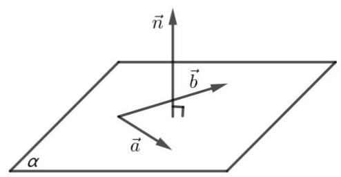

因为 $\overrightarrow{n} \bot  \alpha$ ,所以 $\overrightarrow{n} \bot  \overrightarrow{a}$ 且 $\overrightarrow{n} \bot  \overrightarrow{b}$ ,可得 $\overrightarrow{n} \cdot  \overrightarrow{a} = 0,\overrightarrow{n} \cdot  \overrightarrow{b} = 0$ ,代入相应的坐标可以得到关于 ${n}_{1}\text{ 、 }{n}_{2}$ 的二元一次方程组: $\left\{  \begin{array}{l} {a}_{1}{n}_{1} + {a}_{2}{n}_{2} + {a}_{3} = 0 \\  {b}_{1}{n}_{1} + {b}_{2}{n}_{2} + {b}_{3} = 0 \end{array}\right.$ ,解该方程组求得 ${n}_{1}\text{ 、 }{n}_{2}$ ,就能得到平面 $\alpha$ 的法向量 $\overrightarrow{n} = \left( {{n}_{1},{n}_{2},1}\right)$ 的坐标。

之所以将法向量的坐标设为 $\overrightarrow{n} = \left( {{n}_{1},{n}_{2},1}\right)$ ,而不是 $\overrightarrow{n} = \left( {{n}_{1},{n}_{2},{n}_{3}}\right)$ ,是因为平面的法向量只表示与平面垂直的方向, 向量的长度无影响, 可以是任意不为 0 的值。根据向量平行的判定方式, 空间向量的三个参数中, 只要确定了两两之间的比例大小，就可以确定向量的方向。

例如, $\left( {2,2,2}\right)$ 和 $\left( {1,1,1}\right)$ 的方向相同,与 $\left( {2,2,2}\right)$ 垂直的平面必然也与 $\left( {1,1,1}\right)$ 垂直。因此,可以先将其中一个坐标的值固定,将另外两个坐标设为未知数并求解。将固定的坐标设为 “ 1 ” 主要是为了便于计算。

需注意,设 $\alpha$ 的法向量的坐标为 $\overrightarrow{n} = \left( {{n}_{1},{n}_{2},1}\right)$ ,将竖坐标设为具体数值,前提是 $\alpha$ 与 ${Oxy}$ 不平行。若 $\alpha \parallel {Oxy}$ ,经计算会发现方程组无唯一解,此时可以设为 $\overrightarrow{n} = \left( {1,{n}_{2},{n}_{3}}\right)$ (前提是 $\alpha$ 与 ${Oyz}$ 不平行) 或 $\overrightarrow{n} = \left( {{n}_{1},1,{n}_{3}}\right)$ (前提是 $\alpha$ 与 ${Oxz}$ 不平行)。上述特殊情况最多只可能出现一种, 不存在平面同时平行于多个坐标平面的情况。

例 14.8 已知平面 $\alpha$ 经过原点、 $A\left( {1, - 2,2}\right) \text{ 、 }B\left( {-2,1,2}\right)$ ,求平面 $\alpha$ 的模为 6 的法向量。

解析: 设 $\alpha$ 的一个法向量为 $\overrightarrow{n} = \left( {{n}_{1},{n}_{2},1}\right)$ ,因为 $\alpha$ 经过 $O\left( {0,0,0}\right)$ 、 $A\left( {1, - 2,2}\right) \text{ 、 }B\left( {-2,1,2}\right)$ ,可得 $\alpha$ 内两个相交的向量 $\overrightarrow{OA} = \left( {1, - 2,2}\right)$ 、 $\overrightarrow{OB} = \left( {-2,1,2}\right)$ ,由 $\overrightarrow{n} \bot  \overrightarrow{OA}\text{ 、 }\overrightarrow{n} \bot  \overrightarrow{OB}$ 可得: $\overrightarrow{n} \cdot  \overrightarrow{OA} = 0,\overrightarrow{n} \cdot  \overrightarrow{OB} = 0$ ,转化为坐标运算可得方程组: $\left\{  \begin{array}{l} {n}_{1} - 2{n}_{2} + 2 = 0 \\   - 2{n}_{1} + {n}_{2} + 2 = 0 \end{array}\right.$ ,解得: $\left\{  \begin{array}{l} {n}_{1} = 2 \\  {n}_{2} = 2 \end{array}\right.$ ,即 $\overrightarrow{n} = \left( {2,2,1}\right)$ 。

又因为要求的法向量的模为 6,其方向与 $\overrightarrow{n} = \left( {2,2,1}\right)$ 相同或相反,设 ${\overrightarrow{n}}^{\prime } = \lambda \overrightarrow{n}$ , 即 ${\overrightarrow{n}}^{\prime } = \left( {{2\lambda },{2\lambda },\lambda }\right)$ ,由 $\left| {\overrightarrow{n}}^{\prime }\right|  = 6$ 可得: $\sqrt{{\left( 2\lambda \right) }^{2} + {\left( 2\lambda \right) }^{2} + {\lambda }^{2}} = 6$ ,解得: $\lambda  =  \pm  2$ ,因此平面 $\alpha$ 的模为 6 的法向量是 $\left( {4,4,2}\right)$ 和 $\left( {-4, - 4, - 2}\right)$ 。

## 练习 14.3(2)

1. 已知平面 $\alpha$ 内的三个点 $\left( {1,0,1}\right) \text{ 、 }\left( {-2,1,0}\right) \text{ 、 }\left( {1,0, - 2}\right)$ 。

(1)用含参数 $x, y$ 的表达式表示 $\alpha$ 内的点的坐标；

(2)求 $\alpha$ 的一个法向量。

#### 14.3.4 空间中平行关系的向量表示

空间中的直线与直线平行、直线与平面平行、平面与平面平行等位置关系, 可以转化为等价的向量表达形式。

空间中的两条直线 $a\text{ 、 }b$ 平行的充要条件为它们的方向向量 $\overrightarrow{a}\text{ 、 }\overrightarrow{b}$ 平行,等价于存在非 0 实数 $\lambda$ 满足 $\overrightarrow{a} = \lambda \overrightarrow{b}$ ,即 $a\parallel b \Leftrightarrow  \overrightarrow{a}\parallel \overrightarrow{b} \Leftrightarrow  \exists \lambda  \in  \mathbf{R}$ 且 $\lambda  \neq  0,\overrightarrow{a} = \lambda \overrightarrow{b}$ ,如下图所示。

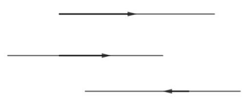

空间中直线 $l$ 与平面 $\alpha$ 平行的充要条件有:

(1) $l$ 的方向向量 $\overrightarrow{l}$ 与 $\alpha$ 的法向量 $\overrightarrow{n}$ 垂直;

(2) $\alpha$ 内存在向量 $\overrightarrow{a}$ 与 $l$ 的方向向量 $\overrightarrow{l}$ 平行；

即: $l\parallel \alpha  \Leftrightarrow  \overrightarrow{l} \bot  \overrightarrow{n} \Leftrightarrow  \overrightarrow{l} \cdot  \overrightarrow{n} = 0 \Leftrightarrow  \exists \overrightarrow{a} \subseteq  \alpha ,\overrightarrow{a}\parallel \overrightarrow{l}$ ,如下图所示。

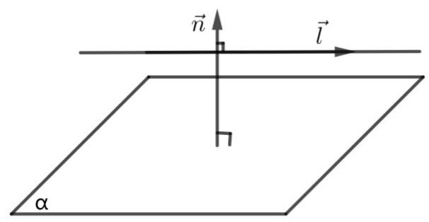

空间中的平面 $\alpha$ 、 $\beta$ 平行的充要条件有:

(1) $\alpha$ 、 $\beta$ 的法向量 ${\overrightarrow{n}}_{\alpha }$ 、 ${\overrightarrow{n}}_{\beta }$ 平行；

(2) $\alpha$ 内的任意向量都与 $\beta$ 平行(或 $\beta$ 内的任意向量都与 $\alpha$ 平行)；

(3) $\alpha$ 内两个相交的向量与 $\beta$ 平行(或 $\beta$ 内两个相交的向量与 $\alpha$ 平行)；

即 $\alpha \parallel \beta  \Leftrightarrow  {\overrightarrow{n}}_{\alpha }\begin{Vmatrix}{{\overrightarrow{n}}_{\beta } \Leftrightarrow  \forall \overrightarrow{a} \subset  \alpha ,\overrightarrow{a}}\end{Vmatrix}\beta  \Leftrightarrow  {\overrightarrow{a}}_{1}\text{ 、 }{\overrightarrow{a}}_{2} \subset  \alpha$ 且 ${\overrightarrow{a}}_{1} \cap  {\overrightarrow{a}}_{2} = P,{\overrightarrow{a}}_{1}\parallel \beta \text{ 、 }{\overrightarrow{a}}_{2}\parallel \beta$ , 如下页图所示。

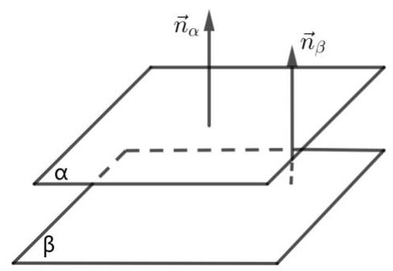

例 14.9 如下图所示，长方体 ${ABCD} - {A}_{1}{B}_{1}{C}_{1}{D}_{1}$ 中， ${AB} = 2,{BC} = 1,{A{A}_{1}} = 3$ ， 求线段 ${B}_{1}{D}_{1}$ 上是否存在一点 $E$ ,使得 ${BE}\parallel {D}_{1}{AC}$ ?

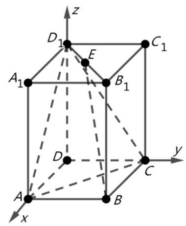

解析: 如果线段 ${B}_{1}{D}_{1}$ 上存在一点 $E$ 满足 ${BE}\parallel {D}_{1}{AC}$ ,那么 ${BE}$ 的方向向量与 ${D}_{1}{AC}$ 的法向量垂直, ${BE}$ 的方向向量与 ${D}_{1}{AC}$ 的法向量的数量积为 0,可以先根据 $E$ 在线段 ${B}_{1}{D}_{1}$ 上，用参数表示出 $E$ 的坐标，由数量积为 0 可以列出方程。如果方程有解,解就是 $E$ 的坐标。如果方程无解,表明不存在满足条件的点 $E$ 。

先建立空间直角坐标系,以 $D$ 为坐标原点, $\overrightarrow{DA}$ 为 $x$ 轴正方向, $\overrightarrow{DC}$ 为 $y$ 轴正方向, $\overrightarrow{D{D}_{1}}$ 为 $z$ 轴正方向建立空间直角坐标系。根据已知信息可得各点坐标: ${D}_{1}\left( {0,0,3}\right) , A\left( {1,0,0}\right) , C\left( {0,2,0}\right) , B\left( {1,2,0}\right) ,{A}_{1}\left( {1,0,3}\right) ,{C}_{1}\left( {0,2,3}\right)$ , ${B}_{1}\left( {1,2,3}\right)$ 。

求平面 ${D}_{1}{AC}$ 的法向量 $\overrightarrow{n}$ 。平面 ${D}_{1}{AC}$ 内两个相交的向量 $\overrightarrow{{D}_{1}A} = \left( {1,0, - 3}\right)$ , $\overrightarrow{{D}_{1}C} = \left( {0,2, - 3}\right)$ ,设 ${D}_{1}{AC}$ 的法向量为 $\overrightarrow{n} = \left( {{n}_{1},{n}_{2},1}\right)$ ,由 $\overrightarrow{{D}_{1}A} \bot  \overrightarrow{n}$ 和 $\overrightarrow{{D}_{1}C} \bot  \overrightarrow{n}$ 可得方程组: $\left\{  \begin{array}{l} {n}_{1} - 3 = 0 \\  2{n}_{2} - 3 = 0 \end{array}\right.$ ,解得: $\left\{  \begin{array}{l} {n}_{1} = 3 \\  {n}_{2} = \frac{3}{2} \end{array}\right.$ ,即 $\overrightarrow{n} = \left( {3,\frac{3}{2},1}\right)$ 。

求直线 ${BE}$ 的方向向量 $\overrightarrow{BE}$ 。由 ${D}_{1}\text{ 、 }{B}_{1}$ 的坐标可得 $\overrightarrow{{D}_{1}{B}_{1}} = \left( {1,2,0}\right)$ ,设点 $E$ 满足 $\overrightarrow{{D}_{1}E} = \lambda \overrightarrow{{D}_{1}{B}_{1}} = \left( {\lambda ,{2\lambda },0}\right)$ ，可得 $\overrightarrow{DE} = \overrightarrow{D{D}_{1}} + \overrightarrow{{D}_{1}E} = \overrightarrow{D{D}_{1}} + \lambda \overrightarrow{{D}_{1}{B}_{1}} = \left( {\lambda ,{2\lambda },3}\right)$ , 即点 $E$ 的坐标为 $E\left( {\lambda ,{2\lambda },3}\right)$ ,直线 ${BE}$ 的方向向量为 $\overrightarrow{BE} = \left( {\lambda  - 1,{2\lambda } - 2,3}\right)$ 。

若 ${BE}\parallel {D}_{1}{AC}$ ,那么 $\overrightarrow{n} \bot  \overrightarrow{BE},\overrightarrow{n} \cdot  \overrightarrow{BE} = 0$ ,代入两个向量的坐标可得方程: $\left( {3,\frac{3}{2},1}\right)  \cdot  \left( {\lambda  - 1,{2\lambda } - 2,3}\right)  = {3\lambda } - 3 + {3\lambda } - 3 + 3 = 0$ ,解得: $\lambda  = \frac{1}{2}$ ,即线段 ${B}_{1}{D}_{1}$ 上存在点 $E\left( {\frac{1}{2},1,3}\right)$ ,使得 ${BE}\parallel {D}_{1}{AC}$ 。

由 $\lambda  = \frac{1}{2}$ 可知 $E$ 是 ${B}_{1}{D}_{1}$ 的中点,这是一个有时会用到的重要结论。

练习 14.3(3)

1. 判断下列各组向量是否平行:

(1) $\left( {2, - 1,4}\right)$ 与 $\left( {-1,\frac{1}{2}, - 2}\right)$ ；

(3) $\left( {1,0, - 1}\right)$ 与 $\left( {2,1, - 3}\right)$ ； (4) $\left( {0,0,0}\right)$ 与 $\left( {3,1,7}\right)$ 。

2. 判断经过原点和点 $\left( {1,1,1}\right)$ 的直线,与 $\left( {1,0, - 1}\right) \text{ 、 }\left( {0,1, - 1}\right) \text{ 、 }\left( {0,0,2}\right)$ 所在的平面是否平行。

3. 证明: 正方体的三条两两相交的侧棱的中点所在的平面, 平行于这三条棱都不经过的四个顶点中, 两两都不构成棱的三个顶点所在的平面。

#### 14.3.5 空间中垂直关系的向量表示

空间中的两条直线 $a\text{ 、 }b$ 垂直的充要条件为: 它们的方向向量 $\overrightarrow{a}\text{ 、 }\overrightarrow{b}$ 互相垂直, 即 $a \bot  b \Leftrightarrow  \overrightarrow{a} \bot  \overrightarrow{b}$ ,如下图所示。

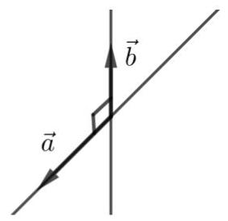

空间中直线 $l$ 与平面 $\alpha$ 垂直的充要条件有:

(1) $l$ 的方向向量 $\overrightarrow{l}$ 与 $\alpha$ 内任意一个向量都垂直；

(2) $l$ 的方向向量 $\overrightarrow{l}$ 与 $\alpha$ 内两个相交的向量垂直；

(3) $l$ 的方向向量 $\overrightarrow{l}$ 与 $\alpha$ 的法向量 ${\overrightarrow{n}}_{\alpha }$ 平行；

即 $l \bot  \alpha  \Leftrightarrow  \forall \overrightarrow{a} \subset  \alpha ,\overrightarrow{l} \bot  \overrightarrow{a} \Leftrightarrow  \exists {\overrightarrow{a}}_{1}\text{ 、 }{\overrightarrow{a}}_{2} \subset  \alpha$ 且 ${\overrightarrow{a}}_{1} \cap  {\overrightarrow{a}}_{2} = P,\overrightarrow{l} \bot  {\overrightarrow{a}}_{1},\overrightarrow{l} \bot  {\overrightarrow{a}}_{2} \Leftrightarrow  \overrightarrow{l}\left.\parallel  {\overrightarrow{n}}_{\alpha }\right.$ , 如下页图所示。

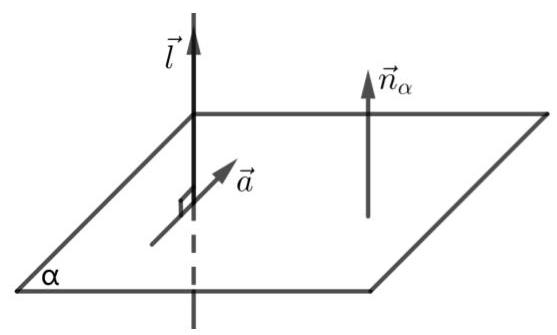

根据平面向量基本定理,平面 $\alpha$ 内的任意向量 ${\overrightarrow{a}}_{0}$ 都可以由 $\alpha$ 内一对相交的向量 ${\overrightarrow{a}}_{1}\text{ 、 }{\overrightarrow{a}}_{2}$ 线性表示为 ${\overrightarrow{a}}_{0} = x{\overrightarrow{a}}_{1} + y{\overrightarrow{a}}_{2}$ ,因此,若空间中的直线 $l$ 满足 $l \bot  {\overrightarrow{a}}_{1}\text{ 、 }l \bot  {\overrightarrow{a}}_{2}$ , 则 $\overrightarrow{l} \cdot  {\overrightarrow{a}}_{1} = \overrightarrow{l} \cdot  {\overrightarrow{a}}_{2} = 0$ ,由此可得: $\overrightarrow{l} \cdot  {\overrightarrow{a}}_{0} = \overrightarrow{l} \cdot  \left( {x{\overrightarrow{a}}_{1} + y{\overrightarrow{a}}_{2}}\right)  = x\overrightarrow{l} \cdot  {\overrightarrow{a}}_{1} + y\overrightarrow{l} \cdot  {\overrightarrow{a}}_{2} = 0$ 。

即: 若一条直线与一个平面内两条相交的直线垂直, 则该直线与该平面垂直, 且与该平面内的任意直线都垂直, 这与欧式几何中直线与平面垂直的定理相同。

平面 $\alpha \text{ 、 }\beta$ 互相垂直的充要条件有:

(1) $\alpha$ 、 $\beta$ 的法向量 ${\overrightarrow{n}}_{\alpha }$ 、 ${\overrightarrow{n}}_{\beta }$ 互相垂直；

(2) $\alpha$ 的法向量 ${\overrightarrow{n}}_{\alpha }$ 与平面 $\beta$ 平行(或 $\beta$ 的法向量 ${\overrightarrow{n}}_{\beta }$ 与平面 $\alpha$ 平行)；

即 $\alpha  \bot  \beta  \Leftrightarrow  {\overrightarrow{n}}_{\alpha } \bot  {\overrightarrow{n}}_{\beta } \Leftrightarrow  {\overrightarrow{n}}_{\alpha }\parallel \beta  \Leftrightarrow  {\overrightarrow{n}}_{\beta } \bot  \alpha$ ,如下图所示。

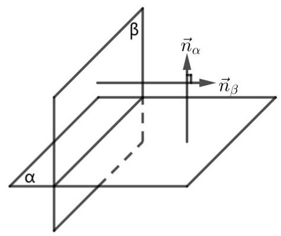

例 14.10 如下图所示,直三棱锥 ${OABC} \mathbin{\text{ 中 },} {OA} = {OB} = {OC} = 1$ ，且 ${OA}\text{ 、 }{OB}\text{ 、 }{OC}$ 两两垂直， $D$ 是 ${AB}$ 的中点，求线段 ${CD}$ 上是否存在一点 $P$ ，使得 ${OP}\bot {ABC}$ ?

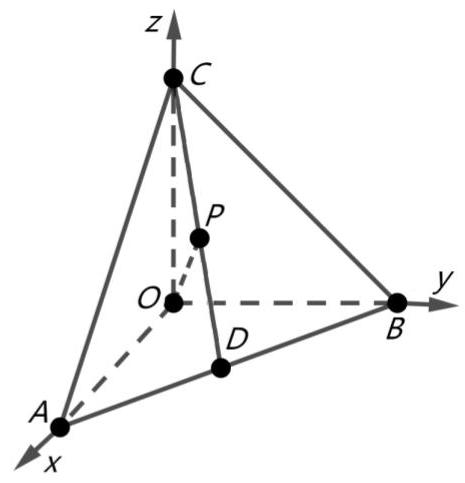

解析: 如果 ${OP} \bot  {ABC}$ ,那么 ${OP}$ 的方向向量与 ${ABC}$ 的法向量平行。可以先根据 $P$ 在 ${CD}$ 上,用参数表示出 $P$ 的坐标,由相应的向量平行可以得到方程。若方程有解,解就是 $P$ 的坐标。若方程无解,表明不存在满足条件的点 $P$ 。

以 $O$ 为原点, $\overrightarrow{OA}$ 为 $x$ 轴正方向, $\overrightarrow{OB}$ 为 $y$ 轴正方向, $\overrightarrow{OC}$ 为 $z$ 轴正方向建立空间直角坐标系,根据已知信息可得各点坐标 $A\left( {1,0,0}\right) , B\left( {0,1,0}\right) , C\left( {0,0,1}\right)$ ; $D$ 是 ${AB}$ 的中点，所以 $D$ 的坐标为 $D\left( {\frac{1}{2},\frac{1}{2},0}\right)$ 。

由相应点的坐标可得 $\overrightarrow{DC} = \left( {-\frac{1}{2}, - \frac{11}{2},1}\right)$ ,设 $\overrightarrow{DP} = \lambda \overrightarrow{DC} = \left( {-\frac{\lambda }{2}, - \frac{\lambda }{2},\lambda }\right)$ , 可得 $\overrightarrow{OP} = \overrightarrow{OD} + \overrightarrow{DP} = \left( {\frac{1}{2} - \frac{\lambda }{2},\frac{1}{2} - \frac{\lambda }{2},\lambda }\right)$ 。

平面 ${ABC}$ 内两个相交的向量 $\overrightarrow{CA} = \left( {1,0, - 1}\right) ,\overrightarrow{CB} = \left( {0,1, - 1}\right)$ ,设 ${ABC}$ 的法向量为 $\overrightarrow{n} = \left( {{n}_{1},{n}_{2},1}\right)$ ,由 $\overrightarrow{CA} \bot  \overrightarrow{n},\overrightarrow{CB} \bot  \overrightarrow{n}$ 可得方程组: $\left\{  \begin{array}{l} {n}_{1} - 1 = 0 \\  {n}_{2} - 1 = 0 \end{array}\right.$ ,解得: $\left\{  \begin{array}{l} {n}_{1} = 1 \\  {n}_{2} = 1 \end{array}\right.$ , 即 $\overrightarrow{n} = \left( {1,1,1}\right)$ 。

若 ${OP}\bot {ABC}$ ，则 $\overrightarrow{OP}\parallel \overrightarrow{n}$ ，存在非 0 实数 $k$ 使得 $\overrightarrow{OP} = k\overrightarrow{n}$ ，代入相应向量的坐标得: $\left( {\frac{1}{2} - \frac{\lambda }{2},\frac{1}{2} - \frac{\lambda }{2},\lambda }\right)  = \left( {k, k, k}\right)$ ,由对应的坐标相等可得方程组: $\left\{  \begin{array}{l} \frac{1}{2} - \frac{\lambda }{2} = k \\  \lambda  = k \end{array}\right.$ , 解得: $\lambda  = k = \frac{1}{3}$ ,即线段 ${CD}$ 上存在点 $P\left( {\frac{1}{3},\frac{1}{3},\frac{1}{3}}\right)$ ,使得 ${OP} \bot  {ABC}$ 。

练习 $\mathbf{{14.3}\left( 4\right) }$

1. 判断下列各组向量是否垂直:

(1) $\left( {2, - 1,4}\right)$ 与 $\left( {-1,\frac{1}{2}, - 2}\right)$ ；

(3) $\left( {1,0, - 1}\right)$ 与 $\left( {2,1, - 3}\right)$ ； (4) $\left( {0,0,0}\right)$ 与 $\left( {3,1,7}\right)$ 。

2. 判断经过原点和点 $\left( {1,1,1}\right)$ 的直线,与 $\left( {1,0,1}\right) \text{ 、 }\left( {0,1,1}\right) \text{ 、 }\left( {0,0,2}\right)$ 所在的平面是否垂直。

3. 正方体 ${ABCD} - {A}_{1}{B}_{1}{C}_{1}{D}_{1}$ 中, $E\text{ 、 }F\text{ 、 }{G}_{1}\text{ 、 }{H}_{1}\text{ 、 }P$ 分别是棱 ${AB}\text{ 、 }{BC}\text{ 、 }{C}_{1}{D}_{1}$ 、 ${A}_{1}{D}_{1}\text{ 、 }B{B}_{1}$ 的中点,画图并用空间向量证明:

(1) $E{H}_{1}\parallel F{G}_{1}$ ； (2) ${EF}\parallel D{G}_{1}{H}_{1}$ ； (3) ${B}_{1}{EF}\parallel D{G}_{1}{H}_{1}$ ；

(4) $E{H}_{1} \bot  {G}_{1}{H}_{1}$ ； (5) $B{D}_{1} \bot  {PEF}$ ； (6) ${BD}{D}_{1}\bot {PEF}$ 。

#### 14.3.6 用空间向量计算距离

求空间中直线、平面间的距离, 最终都可以转化为求垂线段的长度, 利用直线的方向向量和平面的法向量, 可以构造出垂直关系, 从而求出相应的距离。

点到直线的距离。设直线 $a$ 的方向向量为 $\overrightarrow{a} = \left( {{a}_{1},{a}_{2},{a}_{3}}\right)$ ,点 $A\left( {{x}_{A},{y}_{A},{z}_{A}}\right)$ 是 $a$ 上一点,接下来求直线外一点 $P\left( {{x}_{P},{y}_{P},{z}_{P}}\right)$ 到直线 $a$ 的距离。从 $P$ 向 $a$ 引垂线,设垂足为 $Q$ ,那么 $\bigtriangleup  {PAQ}$ 是以 $\angle Q$ 为直角的直角三角形,如下图所示。

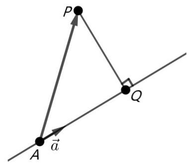

斜边 ${AP}$ 的长等于向量 $\overrightarrow{\left| AP\right| }$ 的模: ${AP} = \sqrt{{\left( {x}_{P} - {x}_{A}\right) }^{2} + {\left( {y}_{P} - {y}_{A}\right) }^{2} + {\left( {z}_{P} - {z}_{A}\right) }^{2}}$ , 直角边 ${AQ}$ 的长等于向量 $\overrightarrow{AP}$ 在直线 $a$ 上的投影的长度: ${AQ} = \left| \overrightarrow{AP}\right| \cos \angle {PAQ} = \; \left| \overrightarrow{AP}\right|  \cdot  \frac{\overrightarrow{AP} \cdot  \overrightarrow{a}}{\left| \overrightarrow{AP}\right| \left| \overrightarrow{a}\right| } = \frac{\overrightarrow{AP} \cdot  \overrightarrow{a}}{\left| \overrightarrow{a}\right| }$ ,再使用勾股定理 ${PQ} = \sqrt{A{P}^{2} - A{Q}^{2}}$ 就能得到点 $P$ 到直线 $a$ 的距离。

如果选取的 $a$ 的方向向量是单位向量 $\left| \overrightarrow{a}\right|  = 1$ ，那么 ${AQ} = \overrightarrow{AP} \cdot  \overrightarrow{a}$ ，点 $P$ 到直线 $a$ 的距离为:

$$
d = \sqrt{A{\overrightarrow{P}}^{2} - {\left( \overrightarrow{AP} \cdot  \overrightarrow{a}\right) }^{2}}
$$

其中 $A$ 是直线 $a$ 上的任意一点, $\overrightarrow{a}$ 是 $a$ 的单位长度的方向向量。

点到平面的距离。设平面 $\alpha$ 的法向量为 ${\overrightarrow{n}}_{\alpha } = \left( {{n}_{1},{n}_{2},{n}_{3}}\right)$ ,点 $A\left( {{x}_{A},{y}_{A},{z}_{A}}\right)$ 是 $\alpha$ 内的一点,接下来求 $\alpha$ 外的一点 $P\left( {{x}_{P},{y}_{P},{z}_{P}}\right)$ 到 $\alpha$ 的距离。从 $P$ 向 $\alpha$ 引垂线, 设垂足为 $Q$ ,那么线段 ${PQ}$ 的长就是 $P$ 到 $\alpha$ 的距离,如下图所示。

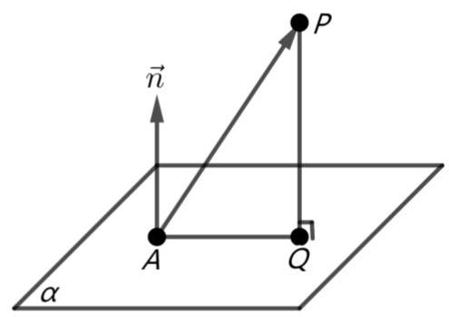

线段 ${PQ}$ 是线段 ${AP}$ 在直线 ${PQ}$ 方向上的投影, ${PQ}$ 的方向向量与 $\alpha$ 的法向量平行， $\angle {APQ}$ 就是 $\overrightarrow{AP}$ 与 $\overrightarrow{n}$ 的夹角(或补角)，利用三角函数的定义可得: ${PQ} = \left| \overrightarrow{AP}\right|  \cdot  \left| {\cos  < \overrightarrow{AP},\overrightarrow{n} > }\right|  = \left| \overrightarrow{AP}\right|  \cdot  \frac{\left| \overrightarrow{AP} \cdot  \overrightarrow{n}\right| }{\left| \overrightarrow{AP}\right| \left| \overrightarrow{n}\right| } = \frac{\left| \overrightarrow{AP} \cdot  \overrightarrow{n}\right| }{\left| \overrightarrow{n}\right| }$ ,即点 $P$ 到平面 $\alpha$ 的距离为:

$$
d = \frac{\left| \overrightarrow{AP} \cdot  \overrightarrow{n}\right| }{\left| \overrightarrow{n}\right| }
$$

其中 $A$ 是平面 $\alpha$ 内的任意一点， $\overrightarrow{AP}$ 可由 $A$ 与 $P$ 的坐标求得， $\overrightarrow{n}$ 可由 $\alpha$ 内三个不共线的点求得。

例 14.11 如下图所示,直三棱锥 $O - {ABC}$ 中, ${OA}\text{ 、 }{OB}\text{ 、 }{OC}$ 两两垂直, ${OA} = {OB} = {OC} = 1, D$ 是 ${AB}$ 的中点， $P$ 是 ${CD}$ 的中点，求:( 1 ) $P$ 到直线 ${OC}$ 的距离；(2) $O$ 到平面 ${ABC}$ 的距离。

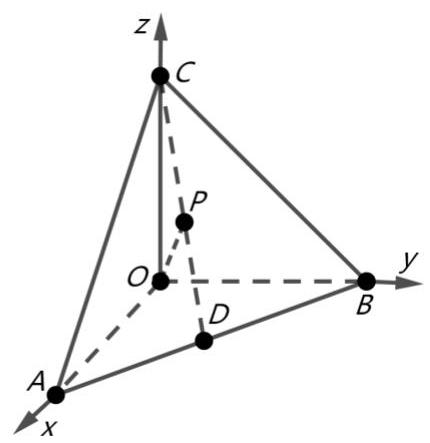

解析: 先建立坐标系,因为 ${OA}\text{ 、 }{OB}\text{ 、 }{OC}$ 两两垂直,以 $O$ 为原点, $\overrightarrow{OA}$ 为 $x$ 轴正方向, $\overrightarrow{OB}$ 为 $y$ 轴正方向, $\overrightarrow{OC}$ 为 $z$ 轴正方向建立空间直角坐标系,根据已知信息可得各点坐标: $A\left( {1,0,0}\right) , B\left( {0,1,0}\right) , C\left( {0,0,1}\right) ;D$ 是 ${AB}$ 的中点,所以 $D$ 的坐标为 $D\left( {\frac{1}{2},\frac{1}{2},0}\right) ;P$ 是 ${CD}$ 的中点,所以 $P$ 的坐标为 $P\left( {\frac{1}{4},\frac{1}{4},\frac{1}{2}}\right)$ 。

(1)选取直线 ${OC}$ 上的点 $O$ 和 $P$ 得到向量 $\overrightarrow{OP} = \left( {\frac{1}{4},\frac{1}{4},\frac{1}{2}}\right)$ ，可得: ${OP} = \left| \overrightarrow{OP}\right|  = \; \sqrt{{\left( \frac{1}{4}\right) }^{2} + {\left( \frac{1}{4}\right) }^{2} + {\left( \frac{1}{2}\right) }^{2}} = \frac{\sqrt{6}}{4},\overrightarrow{OP}$ 在直线 ${OC}$ 上的投影的长度为: $\left| \overrightarrow{OP}\right|  \cdot  \frac{\left| \overrightarrow{OC} \cdot  \overrightarrow{OP}\right| }{\left| \overrightarrow{OC}\right| \left| \overrightarrow{OP}\right| } = \; \frac{\left| \overrightarrow{OC} \cdot  \overrightarrow{OP}\right| }{\left| \overrightarrow{OC}\right| } = \frac{\left| 0 \times  \frac{1}{4} + 0 \times  \frac{1}{4} + 1 \times  \frac{1}{2}\right| }{\sqrt{{0}^{2} + {0}^{2} + {1}^{2}}} = \frac{1}{2}, P$ 到 ${OC}$ 的距离为: ${d}_{1} = \sqrt{{\left( \frac{\sqrt{6}}{4}\right) }^{2} - {\left( \frac{1}{2}\right) }^{2}} = \frac{\sqrt{2}}{4}$ 。

(2)例 14.11 中已求得平面 ${ABC}$ 的法向量为 $\overrightarrow{n} = \left( {1,1,1}\right)$ ，选取平面 ${ABC}$ 上的点 $O$ 和 $A$ 构造向量 $\overrightarrow{OA} = A\left( {1,0,0}\right)$ ,那么 $O$ 到 ${ABC}$ 的距离为: ${d}_{2} = \frac{\left| \overrightarrow{OA} \cdot  \overrightarrow{n}\right| }{\left| \overrightarrow{n}\right| } =$

$$
\frac{\left| 1 \times  1 + 0 \times  1 + 0 \times  1\right| }{\sqrt{{1}^{2} + {1}^{2} + {1}^{2}}} = \frac{\sqrt{3}}{3}\text{ 。 }
$$

实际上,例 14.11 中已经求得平面 ${ABC}$ 上的点 $P\left( {\frac{1}{3},\frac{1}{3},\frac{1}{3}}\right)$ 满足 ${OP} \bot  {ABC}$ , 因此线段 ${OP}$ 的长就是 $O$ 到平面 ${ABC}$ 的距离,易求得 ${OP} = \left| \overrightarrow{OP}\right|  = \frac{\sqrt{3}}{3}$ 。

## 练习 14.3(5)

1. 已知直线 $l$ 经过点 $A\left( {1,0,1}\right)$ 和 $B\left( {-1,2,0}\right)$ ,求点 $P\left( {1,1,1}\right)$ 到 $l$ 的距离。

2. 已知平面 $\alpha$ 内有三点 $A\left( {1,0,1}\right) \text{ 、 }B\left( {-1,1,0}\right) \text{ 、 }C\left( {1,1,1}\right)$ ,求点 $P\left( {3, - 3,1}\right)$ 到 $\alpha$ 的距离。

#### 14.3.7 用空间向量计算夹角

求空间中直线、平面间的夹角, 最终都可以转化为余弦定理, 利用直线的方向向量和平面的法向量，可以构造出所要求的角度，或它的余角或补角。

直线与直线的夹角。直线的方向与直线方向向量的方向一致, 因此直线间的夹角等价于它们的方向向量间的夹角,区别只是直线间的夹角的范围是 $\left\lbrack  {0,\frac{\pi }{2}}\right\rbrack$ , 向量间的夹角的范围是 $\left\lbrack  {0,\pi }\right\rbrack$ ,若方向向量间的夹角为钝角,则直线间的夹角是其补角。

直线与平面的夹角。如下图所示,如果直线 $l$ 与平面 $\alpha$ 相交,那么 $l$ 的方向向量 $\overrightarrow{l}$ 与 $\alpha$ 的法向量 $\overrightarrow{n}$ 所成的角 $< \overrightarrow{l},\overrightarrow{n} >$ 与 $l$ 与 $\alpha$ 所成的角 $\theta$ 互余。

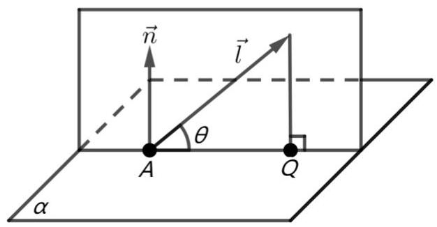

由此可得:

$$
\sin \theta  = \left| {\cos  < \overrightarrow{l},\overrightarrow{n} > }\right|  = \frac{\left| \overrightarrow{l} \cdot  \overrightarrow{n}\right| }{\left| \overrightarrow{l}\right| \left| \overrightarrow{n}\right| }
$$

二面角的平面角。如下页图所示,设平面 $\alpha \text{ 、 }\beta$ 的交线为 $l,\alpha$ 与 $\beta$ 形成的四个二面角两两相等,相邻的二面角互补,其中不大于 ${90}^{ \circ  }$ 的角 $\theta$ 叫作平面 $\alpha$ 与 $\beta$ 的夹角,该夹角等于 $\alpha \text{ 、 }\beta$ 的法向量 ${\overrightarrow{n}}_{\alpha }\text{ 、 }{\overrightarrow{n}}_{\beta }$ 的夹角或补角。

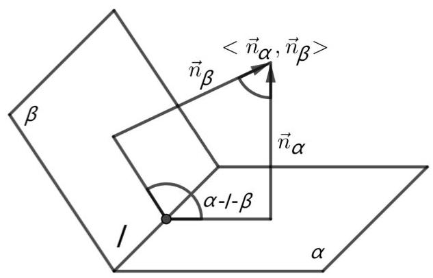

由此可得:

$$
\cos \theta  = \left| {\cos  < {\overrightarrow{n}}_{\alpha },{\overrightarrow{n}}_{\beta } > }\right|  = \frac{\left| {\overrightarrow{n}}_{\alpha } \cdot  {\overrightarrow{n}}_{\beta }\right| }{\left| {\overrightarrow{n}}_{\alpha }\right| \left| {\overrightarrow{n}}_{\beta }\right| }
$$

需注意区分平面的夹角与二面角。平面的夹角类似直线间的夹角, 取值范围为 $\left\lbrack  {0,\frac{\pi }{2}}\right\rbrack$ 。二面角类似两个向量的夹角,取值范围为 $\left\lbrack  {0,\pi }\right\rbrack$ 。二面角有时等于平面的夹角, 有时与平面的夹角互补。

例 14.12 已知正四面体的所有棱长都相等, 求: (1) 相邻两条棱所成的角的余弦; (2) 一条棱和它所对的平面的夹角的正弦; (3) 相邻两个侧面所成的角的余弦。

解析: 以正四面体的底面和高为基础难以建立简便的空间直角坐标系, 可以用下面的方法, 以正方体为基础建立坐标系, 从中找出正四面体, 如下图所示。

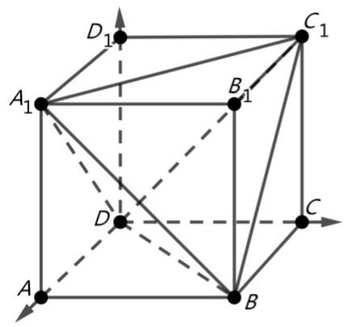

正方体 ${ABCD} - {A}_{1}{B}_{1}{C}_{1}{D}_{1}$ 中,选取顶点 ${A}_{1}\text{ 、 }B\text{ 、 }{C}_{1}\text{ 、 }D$ 两两相连,得到的四面体 ${A}_{1}B{C}_{1}D$ 就是正四面体，它的每条棱长都相等，等于正方体棱长的 $\sqrt{2}$ 倍。

以 $D$ 为原点， $\overrightarrow{DA}$ 为 $x$ 轴正方向， $\overrightarrow{DC}$ 为 $y$ 轴正方向， $\overrightarrow{D{D}_{1}}$ 为 $z$ 轴正方向， 规定正方体的棱长为 1 ，建立空间直角坐标系，根据已知信息易求得各点坐标。

(1)选取正四面体 ${A}_{1}B{C}_{1}D$ 的棱 $D{A}_{1}$ 和 $D{C}_{1}$ ，方向向量分别为 $\overrightarrow{D{A}_{1}} = \left( {1,0,1}\right)$ ， $\overrightarrow{D{C}_{1}} = \left( {0,1,1}\right)$ ，可得 $\cos  < \overrightarrow{D{A}_{1}},\overrightarrow{D{C}_{1}} >  = \frac{\overrightarrow{D{A}_{1}} \cdot  \overrightarrow{D{C}_{1}}}{\left| \overrightarrow{D{A}_{1}}\right| \left| \overrightarrow{D{C}_{1}}\right| } = \frac{1 \times  0 + 0 \times  1 + 1 \times  1}{\sqrt{2} \times  \sqrt{2}} = \frac{1}{2}$ 。

(2)选取正四面体的棱 ${DB}$ 与平面 $D{A}_{1}{C}_{1},{DB}$ 的方向向量为 $\overrightarrow{DB} = \left( {1,1,0}\right)$ ， 设 $D{A}_{1}{C}_{1}$ 的法向量为 ${\overrightarrow{n}}_{1} = \left( {p, q,1}\right)$ ，由 ${\overrightarrow{n}}_{1} \bot  \overrightarrow{D{A}_{1}}$ 、 ${\overrightarrow{n}}_{1} \bot  \overrightarrow{D{C}_{1}}$ 可得: $\left\{  \begin{array}{l} p + 1 = 0 \\  q + 1 = 0 \end{array}\right.$ ，解得: $\left\{  \begin{array}{l} p =  - 1 \\  q =  - 1 \end{array}\right.$ ,即 ${\overrightarrow{n}}_{1} = \left( {-1, - 1,1}\right)$ ,由直线与平面的夹角公式可得: $\sin  < D{A}_{1}{C}_{1},{DB} >  = \; \left| {\cos  < {\overrightarrow{n}}_{1},\overrightarrow{DB} > }\right|  = \frac{\left| -1 \times  1 + \left( -1\right)  \times  1 + 1 \times  0\right| }{\sqrt{2} \times  \sqrt{3}} = \frac{\sqrt{6}}{3}$  。

(3)已求得 $D{A}_{1}{C}_{1}$ 的法向量为 ${\overrightarrow{n}}_{1} = \left( {-1, - 1,1}\right)$ ，再选取第二个平面 ${DB}{C}_{1}$ ，设其法向量为 ${\overrightarrow{n}}_{2} = \left( {r, s,1}\right)$ ,由 ${\overrightarrow{n}}_{2} \bot  \overrightarrow{DB}\text{ 、 }{\overrightarrow{n}}_{2} \bot  \overrightarrow{D{C}_{1}}$ 可得: $\left\{  \begin{array}{l} r + s = 0 \\  s + 1 = 0 \end{array}\right.$ ,解得: $\left\{  \begin{array}{l} r = 1 \\  s =  - 1 \end{array}\right.$ , 即 ${\overrightarrow{n}}_{2} = \left( {1, - 1,1}\right)$ ,由平面间夹角的公式可得: $\cos  < D{A}_{1}{C}_{1},{DB}{C}_{1} >  = \left| {\cos  < {\overrightarrow{n}}_{1},{\overrightarrow{n}}_{2} > }\right| \; = \frac{\left| -1 \times  1 + \left( -1\right)  \times  \left( -1\right)  + 1 \times  1\right| }{\sqrt{3} \times  \sqrt{3}} = \frac{1}{3}$  。

分析处理立体几何的位置关系时, 可以通过向量的加减运算, 创造出需要的平行和垂直关系。由于平行关系的加减法容易计算, 垂直关系的数量积恒为 0 , 利用向量的线性运算，可以让分析和计算得到简化。

练习 14.3(6)

1. 如下图所示,直三棱柱 ${ABC} - {A}_{1}{B}_{1}{C}_{1}$ 中, $\angle {BAC} = {90}^{ \circ  },{AB} = {AC} = 1$ ， $A{A}_{1} = 2, D$ 是 ${BC}$ 的中点,求下列角的余弦值:

(1) ${A}_{1}D$ 与 ${ABC}$ 的夹角；(2)二面角 ${C}_{1} - {AD} - {B}_{1}$ 的平面角

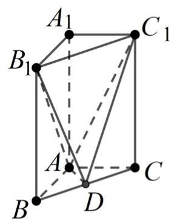

### 14.4 基本立体图形中的空间直角坐标系

基本立体图形是常见的研究对象, 我们在上一章已经学习了基本立体图形中的平行与垂直关系。通过建立空间直角坐标系, 用空间向量及其运算的坐标表示可以让求距离与夹角、证明平行、垂直、共平面关系等问题变得简便。本节学习了解利用基本立体图形的特点建立空间直角坐标系，主要介绍坐标原点和各坐标轴方向的选取, 单位长度的设定通常根据已知数据设置即可。

#### 14.4.1 用多面体建立空间直角坐标系

棱柱的两个底面平行,可以选取其中的一个底面作为 ${Oxy}$ 平面,选取垂直于底面的方向建立 $z$ 轴,直棱柱的任意一条侧棱和斜棱柱的高都可以作为 $z$ 轴。

如果棱柱的底面有直角, 或容易构造出直角, 或有对称轴、对称中心, 那么可以据此建立 $x$ 轴和 $y$ 轴。例如,矩形的两条邻边、菱形的对角线、直角三角形的两条直角边、等腰三角的底边和底边上的高(同时也是中线和对角的平分线)、 正多边形的中心等。下图是一些常见棱柱中建立的空间直角坐标系。

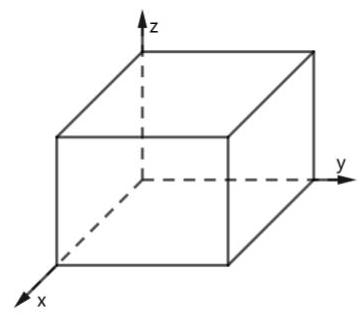

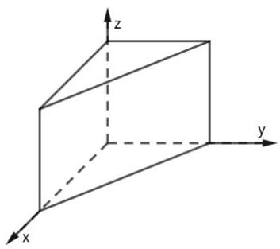

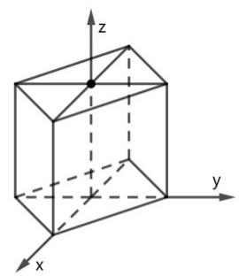

用棱锥建立空间直角坐标系的方法与棱柱相似, 主要从底面寻找垂直或对称关系,分别建立 $x$ 轴和 $y$ 轴,原点和 $z$ 轴的选取通常根据从顶点的位置。直三棱锥两两垂直的三条棱是天然的坐标轴, 正四面体可以借助它的外接正方体建立坐标系，已在例 14.12 中给出。下图是一些常见棱锥中建立的空间直角坐标系。

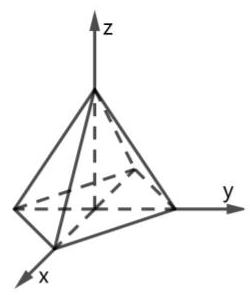

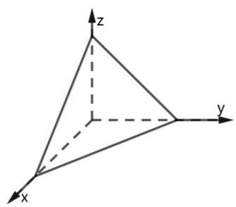

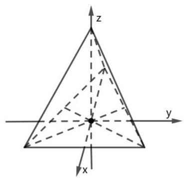

用棱台建立空间直角坐标系的方法与棱柱相似, 通常利用底面的垂直关系建立 $x$ 轴和 $y$ 轴,利用高建立 $z$ 轴。

#### 14.4.2 用旋转体建立空间直角坐标系

圆柱由矩形绕轴旋转得到。圆柱的两个底面互相平行，可以选取其中的一个底面作为 ${Oxy}$ 平面,通常令其中的一个圆心为原点 $O$ ,两个底面的圆心所在的直线为 $z$ 轴, $x$ 轴和 $y$ 轴的确定由其他条件决定。

圆锥由直角三角形绕轴旋转得到。顶点与底面圆心的连线垂直于底面, 通常选取底面圆的圆心为原点 $O$ ,顶点与底面圆心的连线为 $z$ 轴, $x$ 轴和 $y$ 轴的确定由其他条件决定。

用圆台建立空间直角坐标系的方法与圆柱类似, 通常选取下底面的圆心为原点 $O$ ,让上下底面的圆心所在的直线为 $z$ 轴, $x$ 轴和 $y$ 轴的确定由其他条件决定。 下图是圆柱、圆锥、圆台中常见的空间直角坐标系。

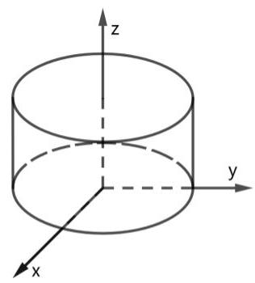

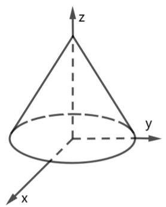

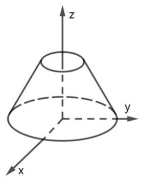

球体由半圆绕直径旋转得到。球体是对称性最强的立体图形, 通常没有建立空间直角坐标系的必要, 主要利用球体的高度对称性, 结合与圆和直角三角形有关的欧式几何定理, 就可以较清晰便捷地分析解决问题。如果确实需要建立, 通常选取球心作为原点 $O$ ,选取某一个大圆平面为 ${Oxy}$ 平面,让垂直于该大圆的球的直径为 $z$ 轴, $x$ 轴和 $y$ 轴的确定由其他条件决定,如下图所示。

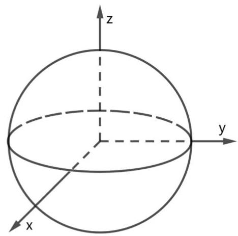

#### 14.4.3 柱坐标和极坐标

平面几何中,除可以用横纵坐标 $x$ 与纵坐标 $y$ 组成的有序实数对 $\left( {x, y}\right)$ 表示平面内点的位置外,还学习了用到原点的距离 $r$ 和对应向量与 $x$ 轴正方向的夹角 $\theta$ 这两个参数表示平面内的位置,高中常见的表示方式是 $\left( {r\cos \theta , r\sin \theta }\right)$ ,更精炼的表示方法是 $\left( {r,\theta }\right)$ ,这种用距离和夹角表示位置的坐标系叫作极坐标。

空间中也有类似的用距离和夹角表示位置的方法, 分别叫作柱坐标和球坐标, 虽然高中阶段不需要掌握, 但学习了解可以进一步拓宽思路, 并为可能出现的创新题带来简洁的解法。

柱坐标把空间看作一系列平行的水平面,各水平面的高度用纵坐标 $z$ 表示, 各水平面内的横坐标和纵坐标用到竖轴的距离 $r$ 和与该平面内的横轴正方向的夹角 $\theta$ 表示,即用 $\left( {r,\theta , z}\right)$ 表示空间中点的位置,同样为 3 个参数,体现了空间是“三维”的特点，如下图所示。

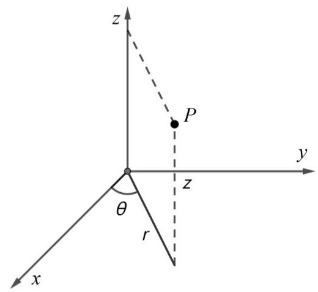

如果觉得陌生,可以用与 $\left( {x, y, z}\right)$ 坐标对应的 $\left( {r\cos \theta , r\sin \theta , z}\right)$ 表示,其中 $r$ 是点到竖轴的距离， $\theta$ 是点在 ${Oxy}$ 平面内的投影的坐标向量与横轴正方向的夹角, $\theta  \in  \lbrack 0,{2\pi }), z$ 是竖坐标,即到 ${Oxy}$ 平面的距离和方向。

用坐标 $\left( {r\cos \theta , r\sin \theta , z}\right)$ 确定一个点,可以看作先在 ${Oxy}$ 平面内,用 $\left( {r\cos \theta , r\sin \theta }\right)$ 表示出点在该平面内的位置,再根据竖坐标 $z$ “上升” 或 “下降” 至相应高度。柱坐标在涉及圆柱、圆锥、圆台和部分球的问题时可能会有特殊的好用之处。

球坐标的原理与平面的极坐标更相似,利用空间中的点到原点的距离 $r$ 、对应向量与 $z$ 轴正方向的夹角 $\theta$ 、所在水平面内与 $X$ 轴正方向的夹角 $\varphi$ 表示点在空间中的位置,即用 $\left( {r,\theta ,\varphi }\right)$ 表示空间中点的位置,同样为 3 个参数,体现了空间是“三维”的特点，如下图所示。

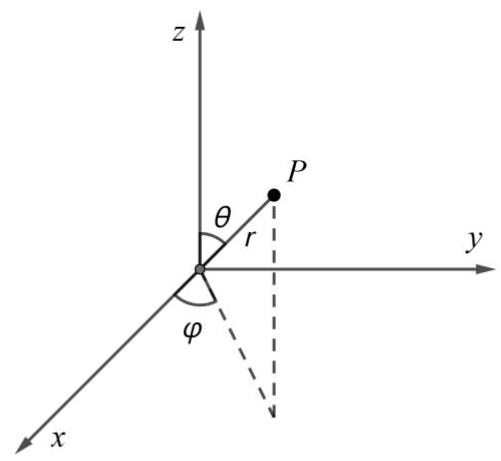

球坐标可以用与 $\left( {x, y, z}\right)$ 坐标对应的 $\left( {r\sin \theta \cos \varphi , r\sin \theta \sin \varphi , r\sin \theta }\right)$ 表示,其中 $r$ 是点到坐标原点的距离, $\theta$ 是点对应的坐标向量与 $z$ 轴正方向的夹角, $\theta  \in  \left\lbrack  {0,\pi }\right\rbrack  ,\varphi$ 是对应的坐标向量在 ${Oxy}$ 平面内与 $x$ 轴正方向的夹角, $\varphi  \in  \lbrack 0,{2\pi })$ 。 柱坐标在涉及球的问题时可能会有特殊的好用之处。

## 小结

本章主要学习空间向量的概念、性质、运算、坐标表示，需注重理解空间向量的方向和长度的含义、可以任意平移的特点、与空间中的点一一对应的关系, 用空间向量的语言描述欧式立体几何定理, 掌握空间向量在平行关系、垂直关系、 距离、夹角中的应用, 能通过类比将 “向量” 的概念延伸到平面和立体空间之外的任意更高维度。空间向量特别是坐标表示是非常实用的工具, 需熟练掌握空间向量的坐标表示及运算, 能根据立体图形的特点建立合适的空间直角坐标系。

## 第十五章 计数原理

从本章开始，我们学习新的数学分支——概率与统计。前面学习的函数、解析几何等数学分支中, 描述的都是确定的现象一一函数的自变量对应确定的函数值, 空间中的图形具有确定的位置关系, 而概率与统计知识描述的是不确定的现象, 例如, 被抛起的硬币落地后, 可能正面朝上也可能反面朝上, 结果并不确定, 这种不确定中同时蕴含着确定的数学规律。

学习概率与统计的知识, 需要注重三个方面, 一是认真感知生活中的随机事件的规律，如抛硬币、掷骰子、抽签等，体会单一结果的不确定性和大量结果的规律性。二是认真理解数学概念的含义和逻辑推导，概率与统计是高中少有的近乎从零开始学习的分支，从最直接浅显的 “常识” 开始，一步一步分析总结出复杂深刻甚至 “反直觉” 的数学规律。三是进行充分的练习，概率与统计仍是数学规律，离不开基本的分析与运算，需要通过充分的练习认识和熟悉数学规律。

本章我们学习概率与统计的基础知识一一计数原理。计数是人类社会中非常重要的基础工作，也就是日常生活中的数数。对计数的过程进行分析和推导，将计数的规律总结提炼成简洁通用的原理和公式, 可以让计数更系统科学, 就算遇到复杂的情况也可以轻松地分析处理, 并能以此为基础得出大量更复杂和深刻的结论, 将在后续章节具体学习。

排列数公式、组合数公式、排列组合与二项式定理既是建立在基本的计数原理的基础上, 分析推导得出的结论, 也是分析解决问题的便捷工具, 还可以像指数、对数、三角函数那样看作一种专门的运算方式, 在后续章节将要学习的概率与随机变量的基础。

计数原理的原理非常简单朴素并贴近现实, 从朴素的现实规律中推导出排列数公式、组合数公式、二项式定理的过程非常经典, 充分体现了数学公式与现实世界的紧密联系，也展示了分析问题和解决问题的经典过程。

### 15.1 加法原理和乘法原理

计数原理是排列组合与二项式定理的基础, 也是概率与统计的根本原理。计数原理的内容本身很简单直白, 但正是基于朴素的原理, 能分析推导出重要的排列组合与二项式定理等看上去不那么简单的公式和定理。

#### 15.1.1 分类的加法原理

生活中, 我们经常会将物体分类, 如同划分集合那样, 按照一定规则把物体分为几个类别。如把一个大类中的所有物体划分为几个子类别, 那么大类中物体的个数等于所有子类别中物体的个数之和。

接下来看一个具体的例子。

某学校每周五下午开设选修课, 同学们可以选择自己喜欢的课程, 选修课有: 语文、数学、英语、足球、篮球、排球、绘画、舞蹈、唱歌。

将上述课程一一数过来可知共有 9 门课程。

现在将课程分为高考课程与非高考课程 2 类, 可得:

第一类:高考课程:语文、数学、英语，共 3 门；

第二类:非高考课程:足球、篮球、排球、绘画、舞蹈、唱歌，共 6 门。

高考课程与非高考课程的数量之和等于课程总数: $3 + 6 = 9$ 。

以上就是加法原理: 如果完成一件事情有两类不同的方案, 这两类方案中分别有 ${m}_{1}$ 和 ${m}_{2}$ 种不同方法 (选项),那么这两类方案中的具体方法 (选项) 数目之和,等于完成这件事的方法 (选项) 的总数 $M$ ,即 $M = {m}_{1} + {m}_{2}$ 。

上面的例子中, 需要完成的事情是 “选课”, 第一类方案是 “高考课程”, 共 3 种方法 (选项) : 语文、数学、英语。第二类方案是 “非高考课程”, 共 6 种方法 (选项) : 足球、篮球、排球、绘画、舞蹈、唱歌。汇总到一起, 选课共 9 种方法 (选项) : 语文、数学、英语、足球、篮球、排球、绘画、舞蹈、唱歌。

从集合的角度看, 可以把所有课程看作一个集合:

$S = \{$ 语文，数学，英语，足球，篮球，排球，绘画，舞蹈，唱歌\}

集合 $S$ 可以划分为 2 个交集为空集的子集(对立事件):

${A}_{1} =$ \{语文,数学,英语\}, $\operatorname{card}\left( {A}_{1}\right)  = 3$ ,

${A}_{2} = \left\{  \text{ 足球 }\right\}$ ,篮球,排球,绘画,舞蹈,唱歌\}, $\operatorname{card}\left( {A}_{2}\right)  = 6$ ,

比较 ${A}_{1}$ 和 ${A}_{2}$ 的元素中可得: ${A}_{1} \cap  {A}_{2} = \varnothing ,\operatorname{card}\left( {{A}_{1} \cap  {A}_{2}}\right)  = 0$ ,由此可得:

$$
\operatorname{card}\left( S\right)  = \operatorname{card}\left( {{A}_{1} \cup  {A}_{2}}\right)
$$

$$
= \operatorname{card}\left( {A}_{1}\right)  + \operatorname{card}\left( {A}_{2}\right)  - \operatorname{card}\left( {{A}_{1} \cap  {A}_{2}}\right)
$$

$$
= \operatorname{card}\left( {A}_{1}\right)  + \operatorname{card}\left( {A}_{2}\right)  - 0
$$

$$
= \operatorname{card}\left( {A}_{1}\right)  + \operatorname{card}\left( {A}_{2}\right)
$$

除按照高考课程与非高考课程分类外, 还可以按照体育课与非体育课、艺术课与非艺术课等方法分类, 只要分类方法有明确的判断标准都可以, 这与命题或集合需要有明确的判断标准的要求相同。

除把所有方法 (选项) 分为 2 类之外, 还可以划分为 3 类或更多类。例如, 可以将上述课程分为文化课、体育课、艺术课 3 类，每一类各包含 3 门课程，即: $9 = 3 + 3 + 3$ 。

更一般的加法原理: 如果完成一件事情有 $n$ 类不同的方案,这 $n$ 类方案中分别有 ${m}_{1}\text{ 、 }{m}_{2}\cdots \cdots {m}_{n}$ 种不同方法 (选项),那么这 $n$ 类方案中的具体方法 (选项) 数目之和,等于完成这件事的方法 (选项) 的总数 $M$ ,即 $M = {m}_{1} + {m}_{2} + \cdots \cdots  + {m}_{n}$ 。

简而言之, 加法原理的实质就是分类, 一个大类可以分为若干小类, 各小类的方案数量之和等于大类的方案总数。生活中使用加法原理的情形很多, 例如, 假设从甲城市出发前往乙城市，有 3 列火车、 2 列大巴、自己开车，共 3 类方式， 共 $3 + 2 + 1 = 6$ 种方法 (选项) 。写作业时,从笔袋里选笔,假设有 2 支铅笔和 2 支水笔, 那么共 2+2 种选择。

例 15.1 甲同学周末去进行体育锻炼，可选的项目有乒乓球、羽毛球、长跑、 竞走、跳远，按照是否为球类运动，将项目进行分类，并计算各类运动的数目之和，与可选的运动类型的总数比较。

解析:乒乓球、羽毛球都需要有“球”才能进行，可归类为球类运动，共 2 类。长跑、竞走、跳远不需要 “球” 就能进行，可归类为非球类运动，共 3 类。 两类运动的数目之和为 $2 + 3 = 5$ ,与可选的运动类型总数相等。

#### 15.1.2 分步的乘法原理

生活中, 我们经常会将复杂或繁琐的程序分为若干步骤, 一个步骤一个步骤逐步完成, 如果每个步骤都有多个方法, 那么完成任务的方法总数, 等于各步骤的方法数的乘积。

接下来看一个具体的例子。

甲同学周末换衣服出门买菜，可选的衣裤中，共有 4 件上衣和 3 条裤子，设 4 件上衣分别为衬衣、毛衣、夹克、T 恤，3 条裤子分别为牛仔裤、运动裤、休闲裤，按照生活中正常的穿衣方式，共分为 2 个步骤:

第一步:从 4 件上衣中选 1 件，共 4 种方案；

第二步:从 3 条裤子中选 1 条，共 3 种方案。

列出所有的着装方式:

衬衣+牛仔裤, 衬衣+运动裤, 衬衣+休闲裤,

毛衣+牛仔裤, 毛衣+运动裤, 毛衣+休闲裤,

夹克+牛仔裤, 夹克+运动裤, 夹克+休闲裤,

T 恤+牛仔裤, T 恤+运动裤, T 恤+休闲裤,

共 $4 \times  3 = {12}$ 种着装方案。

以上就是乘法原理: 如果完成一件事情需要 2 个步骤,每个步骤分别有 $m$ 和 $n$ 种方法,那么完成这件事共有 $N = m \cdot  n$ 种方法。着装过程中,先穿上衣还是先穿裤子,对着装的方法总数没有影响,即 $N = m \cdot  n = n \cdot  m$ 。

从集合的角度看,把上衣看作一个集合: $A = \{$ 衬衣,毛衣,夹克, T恤 $\}$ , 把裤子看作一个集合: $B = \{$ 牛仔裤,运动裤,休闲裤 $\}$ ,从 $A$ 和 $B$ 中各选取 1 个元素构成新的集合,那么新的集合共有 $4 \times  3 = {12}$ 种。

更一般的乘法原理: 如果完成一件任务可以分为 $n$ 个步骤,每个步骤分别有 ${m}_{1}\text{ 、 }{m}_{2}\cdots \cdots {m}_{n}$ 种方案,那么完成这件事总共有 $N = {m}_{1}{m}_{2}\cdots \cdots {m}_{n}$ 种方案。

乙同学有 4 件上衣、 3 条裤子、 2 顶帽子、 2 双鞋子，那么乙的着装过程为:

第一步:选上衣，共 4 种方案；

第二步:选裤子，共 3 种方案；

第三步:选帽子，共 2 种方案；

第四步:选鞋子，共 2 种方案。

共 $4 \times  2 \times  3 \times  2 = {48}$ 种着装方案。该着装方案中,各类衣物的穿着顺序对着装方案的总数没有影响，

简而言之, 乘法原理的实质就是分步, 将完成一件事的过程拆分为若干互相独立的步骤, 每个步骤的方案数量的乘积等于完整方案的总数。生活中使用乘法原理的情形也很多, 例如, 假设甲同学从学校出发, 前往邻市的体育馆参加比赛, 从学校前往火车站有 3 条公交线路可选，从本市的火车站前往邻市的火车站有 2 列火车可选，从邻市的火车站前往体育馆有 4 条公交线路可选，那么甲同学共有 $3 \times  2 \times  4 = {24}$ 种通行方案。

例 15.2 丙同学前往食堂就餐，主食有馒头、米饭、面条，荤菜有猪肉、牛肉、鸡肉、鱼肉，素菜有豆腐、白菜、土豆、茄子、海带，汤有西红柿蛋汤、紫菜汤, 主食、荤菜、素菜、汤各选一种的搭配共有几种?

解析: 主食共 3 种, 荤菜共 4 种, 素菜共 5 种, 汤共 2 种, 根据分步的乘法原理,主食、荤菜、素菜、汤各选一种的搭配共 $3 \times  4 \times  5 \times  2 = {120}$ 种。

## 练习 15.1

1. 桌上有 5 个橘子和 3 个苹果, 从中选取若干水果, 回答下列问题:

(1)从中选取 1 个水果，不同选法的种数是多少；

(2)从中选取 1 个橘子和 1 个苹果，不同选法的种数是多少。

2. 黑龙江省有 12 个地级市，山东省有 16 个地级市，江西省有 11 个地级市， 从这三省中选取若干地级市，检索该地的旅游资源，回答下列问题:

(1)总共只选取 1 个地级市，不同选法的种数是多少；

(2)从每省各选取 1 个地级市，不同选法的种数是多少。

3. 某超市里的货架编号共 6 位数,每一位都可以用字母 $\mathrm{A} \sim  \mathrm{Z}$ 或数字 $0 \sim  9$ ,

(1)每一位的编号的种数是多少；

(2)货架完整编号的种数是多少(列出表达式即可)；

(3)若第一位用字母表示，第 $2 \sim  6$ 位用数字表示，货架完整编号的种数是多少(列出表达式即可)。

### 15.2 排列数和组合数

将分类的加法原理和分步的乘法原理应用于一些常见的计数情景中, 再进行一定的适应和变形, 就能得到关于排列和组合的方案总数的计算公式, 分别叫作排列数公式和组合数公式。

#### 15.2.1 排列与排列数公式

排队是生活中常见的现象，人或物品都可以按照一定顺序排队，数学中用 “排列”表示排队的操作，意为将一些元素按照一定的顺序排队。

从 $n$ 个元素中选取 $m\left( {m \leq  n}\right)$ 个元素,并按照一定顺序排队,这个过程叫作从 $n$ 个元素中选取 $m\left( {m \leq  n}\right)$ 个元素的排列,所有不同的排列方式的总数叫作从 $n$ 个元素中选取 $m\left( {m \leq  n}\right)$ 个的排列数,记作 ${\mathrm{A}}_{n}^{m}$ (有的教材记作 ${\mathrm{P}}_{n}^{m}$ ,以正在使用的教材为准)。特别的,从 $n$ 个元素中选取所有元素并进行排列,叫作对 $n$ 个元素作全排列。

接下来通过具体例子推导排列数公式。

某小组共有 5 名同学 $\left( {n = 5}\right)$ ,分别为甲、乙、丙、丁、戊,现选取部分同学进行排队。

任务一:选取 1 名同学，排成只有 1 人的队伍(m = 1)。

从 5 名同学中任选 1 名即可，共 5 种方案:

方案一:甲；方案二:乙；方案三:丙；方案四:丁；方案五:戊。

即 ${\mathrm{A}}_{5}^{1} = 5$ 。

任务二:选取 2 名同学，排成有 2 人的队伍(m = 2)。

排队的思路为:先选取 1 名同学排在第一，再从剩下的 4 名同学中选取 1 名排在第二:

若把甲排在第一, 则排第二的同学从乙丙丁戊中选取, 共 4 种方案: 甲-乙, 甲-丙, 甲-丁, 甲-戊;

若把乙排在第一, 则排第二的同学从甲丙丁戊中选取, 共 4 种方案: 乙-甲, 乙-丙，乙-丁，乙-戊；

若把丙排在第一, 则排第二的同学从甲乙丁戊中选取, 共 4 种方案: 丙-甲, 丙-乙，丙-丁，丙-戊；

若把丁排在第一, 则排第二的同学从甲乙丙戊中选取, 共 4 种方案: 丁-甲, 丁-乙，丁-丙，丁-戊；

若把戊排在第一, 则排第二的同学从甲乙丙丁中选取, 共 4 种方案: 戊-甲, 戊-乙, 戊-丙, 戊-丁;

综上, 排第一位的同学共有 5 类方案, 每类方案中排第二位的同学各有 4 种子方案,共有 $5 \times  4 = {20}$ 种排列方式,即 ${\mathrm{A}}_{5}^{2} = 5 \times  4 = {20}$ 。全体方案如下页表所示。

<table><tr><td>类 型</td><td>方案</td><td>方案</td><td>方案</td><td>方案</td></tr><tr><td>甲第一</td><td>甲-乙</td><td>甲-丙</td><td>甲-丁</td><td>甲-戊</td></tr><tr><td>乙第一</td><td>乙-甲</td><td>乙-丙</td><td>乙-丁</td><td>乙-戊</td></tr><tr><td>丙第一</td><td>丙-甲</td><td>丙-乙</td><td>丙-丁</td><td>丙-戊</td></tr><tr><td>丁第一</td><td>丁-甲</td><td>丁-乙</td><td>丁-丙</td><td>丁-戊</td></tr><tr><td>戊第一</td><td>戊-甲</td><td>戊-乙</td><td>戊-丙</td><td>戊-丁</td></tr></table>

任务三: 选取 3 名同学,排成有 3 人的队伍 $\left( {m = 3}\right)$ 。

先排第一名同学，共有甲、乙、丙、丁、戊，5 大类方案。

再排第二名同学，若第一名选甲，则第二名有乙、丙、丁、戊，共 4 种方案；

若第一名选乙，则第二名有甲、丙、丁、戊，共 4 种方案；

以此类推, 若第一名选丙、丁、戊, 则第二名同样分别各有共 4 种方案。

最后排第三名同学:

若第一、二名为甲-乙，则第三名有丙、丁、戊，共 3 种方案，即:甲-乙-丙， 甲-乙-丁，甲-乙-戊；

若第一、二名为甲-丙，则第三名有乙、丁、戊，共 3 种方案，即:甲-丙-乙， 甲-丙-丁，甲-丙-戊；

按照相同的原理, 第一名排甲的其他方案分别为: 甲-丁-乙, 甲-丁-丙, 甲- 丁-戊，甲-戊-乙，甲-戊-丙，甲-戊-丁。综上，第一名排甲的方案共有 $4 \times  3 = {12}$ 种。

同理,第一名排乙、丙、丁、戊的方案也分别各有 $4 \times  3 = {12}$ 种。综上,所有的方案共有 $5 \times  4 \times  3 = {60}$ 种,即 ${\mathrm{A}}_{5}^{3} = 5 \times  4 \times  3 = {60}$ 。全体方案如下表所示。

<table><tr><td>第一步</td><td>第二步</td><td colspan="3">方案</td></tr><tr><td rowspan="4">甲</td><td>甲-乙</td><td>甲-乙-丙</td><td>甲-乙-丁</td><td>甲一乙一戊</td></tr><tr><td>甲-丙</td><td>甲-丙-乙</td><td>甲-丙-丁</td><td>甲一丙一戊</td></tr><tr><td>甲-丁</td><td>甲-丁-乙</td><td>甲-丁-丙</td><td>甲一丁一戊</td></tr><tr><td>甲-戊</td><td>甲-戊-乙</td><td>甲-戊-丙</td><td>甲一戊一丁</td></tr><tr><td rowspan="4">乙</td><td>乙-甲</td><td>乙-甲-丙</td><td>乙-甲-丁</td><td>乙-甲-戊</td></tr><tr><td>乙-丙</td><td>乙-丙-甲</td><td>乙-丙-丁</td><td>乙-丙-戊</td></tr><tr><td>乙-丁</td><td>乙-丁-甲</td><td>乙-丁-丙</td><td>乙-丁-戊</td></tr><tr><td>乙-戊</td><td>乙-戊-甲</td><td>乙-戊-丙</td><td>乙-戊-丁</td></tr><tr><td rowspan="4">丙</td><td>丙-甲</td><td>丙-甲-乙</td><td>丙-甲-丁</td><td>丙-甲-戊</td></tr><tr><td>丙-乙</td><td>丙-乙-甲</td><td>丙-乙-丁</td><td>丙-乙-戊</td></tr><tr><td>丙-丁</td><td>丙-丁-甲</td><td>丙-丁-乙</td><td>丙-丁-戊</td></tr><tr><td>丙-戊</td><td>丙-戊-甲</td><td>丙-戊-乙</td><td>丙-戊-丁</td></tr><tr><td rowspan="4">丁</td><td>丁-甲</td><td>丁-甲-乙</td><td>丁-甲-丙</td><td>丁-甲-戊</td></tr><tr><td>丁-乙</td><td>丁-乙-甲</td><td>丁-乙-丙</td><td>丁-乙-戊</td></tr><tr><td>丁-丙</td><td>丁-丙-甲</td><td>丁一丙一乙</td><td>丁一丙一戊</td></tr><tr><td>丁一戊</td><td>丁-戊-甲</td><td>丁一戊一乙</td><td>丁一戊一丙</td></tr><tr><td rowspan="4">戊</td><td>戊一甲</td><td>戊-甲-乙</td><td>戊-甲-丙</td><td>戊-甲-丁</td></tr><tr><td>戊-乙</td><td>戊-乙-甲</td><td>戊-乙-丙</td><td>戊-乙-丁</td></tr><tr><td>戊-丙</td><td>戊-丙-甲</td><td>戊-丙-乙</td><td>戊-丙-丁</td></tr><tr><td>戊-丁</td><td>戊一丁一甲</td><td>戊-丁-乙</td><td>戊-丁-丙</td></tr></table>

根据上面的列举过程,可以总结从 $n$ 个元素中选取 $m$ 个进行排列的不同方式总数的公式:

第一步: 从 $n$ 个元素中选取 1 个排在第一位,排完后还剩 $n - 1$ 个元素,第一步共有 $n$ 类方案;

第二步: 从剩下的从 $n - 1$ 个元素中选取 1 个排在第二位,排完后还剩 $\left( {n - 1}\right)  - 1 \; = n - 2$ 个元素,第二步各有 $n - 1$ 类方案;

以此类推,第 $m$ 步: 前面的 $m - 1$ 步已经选取了 $m - 1$ 个元素参与排列,还剩余 $n - \left( {m - 1}\right)  = n - m + 1$ 个元素,从这 $n - m + 1$ 个元素中选取 1 个,排在第 $m$ 位, 第 $m$ 步各有 $n - m + 1$ 类方案。

根据分步的乘法原理, 所有不同排列方式的种类总数为:

$$
{\mathrm{A}}_{n}^{m} = n\left( {n - 1}\right) \left( {n - 2}\right) \cdots \left( {n - m + 1}\right)
$$

这就是排列数的运算公式, 简称排列数公式。

${\mathrm{A}}_{n}^{m}$ 的定义式 $n\left( {n - 1}\right) \left( {n - 2}\right) \cdots \left( {n - m + 1}\right)$ 可以表述为: 从 $n$ 到 $n - m + 1$ 的所有 $m$ 个正整数的乘积。也可以表述为: 从 $n$ 开始依次递减到 $n - m + 1$ 的 $m$ 个相邻正整数的乘积。需注意, ${\mathrm{A}}_{n}^{m}$ 的最后项为 $n - m + 1$ ,共 $m$ 项,不要数错。

为方便计算，定义新的运算:阶乘。阶乘是关于正整数的运算，正整数 $n$ 的阶乘记作 $n$ ! ，等于所有小于等于 $n$ 的正整数的乘积，即:

$$
n! = n\left( {n - 1}\right) \left( {n - 2}\right) \cdots  \times  3 \times  2 \times  1
$$

特别的,规定 $0! = 1$ 。这是因为阶乘是建立在正整数的乘法的基础上的运算, 乘法运算中, 如果没有数字参与, 初始值通常默认为 1 , 这与乘方运算中规定 ${a}^{0} = 1\left( {a \neq  0}\right)$ 的原理类似。

借助阶乘运算, 排列数的定义式还可以写为:

$$
{\mathrm{A}}_{n}^{m} = \frac{n!}{\left( {n - m}\right) !}
$$

该表达式中,分子是 $n!$ ,共 $n$ 个正整数相乘; 分母是 $\left( {n - m}\right) !$ ,共 $n - m$ 个正整数相乘。分子与分母约分后, 剩余 $m$ 个正整数相乘:

$$
{\mathrm{A}}_{n}^{m} = \frac{n!}{\left( {n - m}\right) !}
$$

$$
= \frac{n\left( {n - 1}\right) \cdots  \times  2 \times  1}{\left( {n - m}\right) \left( {n - m - 1}\right) \cdots  \times  2 \times  1}
$$

$$
= \frac{n\left( {n - 1}\right) \cdots \left( {n - m + 1}\right) \left( {n - m}\right) \left( {n - m - 1}\right) \cdots  \times  2 \times  1}{\left( {n - m}\right) \left( {n - m - 1}\right) \cdots  \times  2 \times  1}
$$

$$
= n\left( {n - 1}\right) \cdots \left( {n - m + 1}\right)
$$

特别的, ${\mathrm{A}}_{n}^{0} = \frac{n!}{n!} = 1$ 。

例 15.3 从 10 名同学中选取 5 名排成队列, 求:

(1)有多少种不同的排法?

(2)若须将甲同学排在队首，有多少种不同的排法？

(3)若须将甲同学排入队列，有多少种不同的排法？

(4)若乙丙二人要么都选入队列，要么都不选入队列，有多少种不同的排法？

解析: (1) 从 10 名同学中选取 5 名排成队列,排列数为: ${\mathrm{A}}_{10}^{5} = {10} \times  9 \times  8 \times  7 \times  6 \; = {30240}$ ;

(2)若须将甲同学排在队首，那么队首只能是甲，还需将其余 9 名同学排成 4 人队列,跟在甲后面即可,不同的排法数为: ${\mathrm{A}}_{9}^{4} = 9 \times  8 \times  7 \times  6 = {3024}$ ;

(3)若须将甲同学排入队列，分别考虑甲在每个位置的情况较复杂，可以用包含所有人的排法总数减去不包含甲的排法数，就是甲在队列中的排法数。

其中总的排法数已经在第(1)问中求得，为 ${\mathrm{A}}_{10}^{5} = {10} \times  9 \times  8 \times  7 \times  6 = {30240}$ ， 若甲不在队列中, 那么相当于从剩余 9 名同学中选取 5 名排成队列, 不同的排法总数为 ${\mathrm{A}}_{9}^{5} = 9 \times  8 \times  7 \times  6 \times  5$ ,

为方便计算,先不求出 ${\mathrm{A}}_{10}^{5}$ 和 ${\mathrm{A}}_{9}^{5}$ 的值,利用多项式计算,甲同学排入队列的排法数为: ${\mathrm{A}}_{10}^{5} - {\mathrm{A}}_{9}^{5} = {10} \times  9 \times  8 \times  7 \times  6 - 9 \times  8 \times  7 \times  6 \times  5 = \left( {{10} - 5}\right)  \times  9 \times  8 \times  7 \times  6 = {15120}$ ;

(4)乙丙都不选入队列的排法较易求，乙丙都选入队列的排法较难求，现在换一种思路, 按照乙丙的入选与否, 将排法分为四类: 乙丙都选入队列、乙丙都不选入队列、乙选入丙不选入、丙选入乙不选入，从总的排法数中减去后两种的排法数，就是要求的前两种的排法数之和。

如果乙选入且排在第一，那么从除乙丙外的 8 人中选 4 人排在后面四个位置， 排法数为 ${\mathrm{A}}_{8}^{4} = 8 \times  7 \times  6 \times  5 = {1680}$ ,

如果乙选入且排在第二，那么从除乙丙外的 8 人中选 4 人依次排在一、三、 四、五号位置,排法数仍为 ${\mathrm{A}}_{8}^{4} = {1680}$ ,

同理,如果乙选入且排在第三、四、五,相应的排法数都是 ${\mathrm{A}}_{8}^{4} = {1680}$ ,

综上可得,乙选入丙不选入的排法数为 $5{\mathrm{\;A}}_{8}^{4} = 5 \times  {1680} = {8400}$ ;

按照相同的原理和过程, 丙选入乙不选入的排法数也为 8400 ;

乙丙都选入或都不选入的排法数为: ${\mathrm{A}}_{10}^{5} - 2 \times  {8400} = {30240} - 2 \times  {8400} = {13440}$ 。

本题启示我们, 计算关于排列的问题需要一定的归类能力和分步能力, 排列数公式本身只是计算公式, 解决问题需要分析具体情况, 提出尽可能条理清晰、 过程简洁的方案, 有时需对满足要求的方案分类, 有时需从全体排法总数中减去所有不满足要求的方案数，这是两种常用的方法。

## 练习 15.2(1)

1. 写出下列各排列数:

(1)一个小组有 7 名同学, 将他们排成一列队列;

(2)小明本学年有 10 本想读的小说，计划第一学期按顺序读完其中的 5 本；

(3)投篮比赛中，每队有 10 名同学，其中 2 名为替补，其余同学按顺序依次投篮。

2. 计算下列排列数的值:

(1) ${\mathrm{A}}_{3}^{3}$ ； (2) ${\mathrm{A}}_{4}^{2}$ ； (3) ${\mathrm{A}}_{5}^{5}$ ； (4) ${\mathrm{A}}_{6}^{4}$ ； (5) ${\mathrm{A}}_{8}^{3}$ ； (6) ${\mathrm{A}}_{10}^{5}$ 。

3. 从 26 个英文字母中选取 10 个字母排成一列，每个字母最多出现一次， 求下列各排法的总数(列出表达式即可，不需要计算):

(1)无其他要求；(2)不能出现字母A和Z；(3)必须出现字母E；

(4)必须出现连续的字母组合 RST；

(5)L、M、N 中只能出现一个，且必须出现一个。

4. 一箱积木中有 20 个不同的方块和 15 个不同的小球, 取 5 个方块和 5 个小球交替排成一列(方块排在队头)，求排法的总数(列出表达式即可)。

#### 15.2.2 排列数的性质

排列数可以看作一种运算方式, 其定义式为:

$$
{\mathrm{A}}_{n}^{m} = \frac{n!}{\left( {n - m}\right) !}
$$

根据运算法则可以分析推导出该运算的一些性质和规律。

性质 1: ${\mathrm{A}}_{n}^{1} = n$

证明: ${\mathrm{A}}_{n}^{1} = \frac{n!}{\left( {n - 1}\right) !} = \frac{n\left( {n - 1}\right) \cdots  \times  2 \times  1}{\left( {n - 1}\right) \cdots  \times  2 \times  1} = n$

现实含义为:从 $n$ 个元素中选取 1 个排队，共 $n$ 种排法。

性质 2: ${\mathrm{A}}_{n}^{n} = n!$

证明: ${\mathrm{A}}_{n}^{n} = \frac{n!}{\left( {n - n}\right) !} = \frac{n!}{0!} = n!$

现实含义为: 将所有 $n$ 个元素进行排队,共 $n$ ! 种排法。

性质 3: ${\mathrm{A}}_{n}^{n - 1} = n! = {\mathrm{A}}_{n}^{n}$

证明: ${\mathrm{A}}_{n}^{n - 1} = \frac{n!}{\left\lbrack  {n - \left( {n - 1}\right) }\right\rbrack  !} = \frac{n!}{1!} = n$ !

现实含义为: 从 $n$ 个元素中选取 $n - 1$ 个进行排队,共 $n$ ! 种排法,最后剩余未选中的元素可以看作被排进了队伍之外的“落选队”。

性质 4: ${\mathrm{A}}_{n + 1}^{n + 1} = \left( {n + 1}\right) {\mathrm{A}}_{n}^{n}$

证明: ${\mathrm{A}}_{n + 1}^{n + 1} = \left( {n + 1}\right) ! = \left( {n + 1}\right) n\left( {n - 1}\right) \cdots 2 \times  1 = \left( {n + 1}\right)  \cdot  n! = \left( {n + 1}\right) {\mathrm{A}}_{n}^{n}$

现实含义为: 已经完成了对 $n$ 个元素的排列,如果再新添加 1 个元素,那么可以将新添加的元素填入已排好的队列的排头、队尾、任意 2 个元素之间的空挡。 由 $n$ 个元素排成的队列,排头 1 个位置、队尾 1 个位置、以及中间 $n - 1$ 的个空挡, 共 $1 + 1 + \left( {n - 1}\right)  = n + 1$ 个位置,每种 $n$ 个元素的队列可以产生 $n + 1$ 种新的队列,共 $n!\left( {n + 1}\right)$ 种排法。

例如,当 $n = 3$ 时,对 3 个元素 $a\text{ 、 }b\text{ 、 }c$ 排队,共 ${\mathrm{A}}_{3}^{3} = 3! = 6$ 种排法:

$$
a - b - c, a - c - b, b - a - c, b - c - a, c - a - b, c - b - a,
$$

如果新添加元素 $d$ ,将 $d$ 加入排法 $a - b - c$ ,共 $3 + 1 = 4$ 种排法:

放在排头: $d - a - b - c$ ,

插入第一、第二之间: $a - d - b - c$ ,

插入第二、第三之间: $a - b - d - c$ ,

放在队尾: $a - b - c - d$ ,

同理,将 $d$ 加入其他队列的排法也分别各有 4 种,共 ${\mathrm{A}}_{4}^{4} = 4 \times  {\mathrm{A}}_{3}^{3} = {24}$ 种排法。

这种在已经排好的各支队伍中, “插空” 放入新元素的方法, 是分析解决排列组合问题的常用思路。

例 15.4 在已排好的 5 人队列中，插入甲、乙两名同学，求不同的排法总数。

解析:本题可以分步骤, 先在 5 人队列中插入甲, 再在加入甲的 6 人队列中插入乙。

首先, 5 人队列的队首、队尾、任意两人之间共 6 个空位, 将甲插入其中某个位置, 共 6 种排法。

加入甲之后，变为 6 人队列，共 7 个空位，将乙插入共 7 种排法。

根据乘法原理,共 $6 \times  7 = {42}$ 种不同的排法。

如果先插入乙、后插入甲，虽然过程相反，但结果相同。

例 15.5 化简: $2{A}_{1}^{1} + 2{A}_{2}^{2} + 3{A}_{3}^{3} + 4{A}_{4}^{4}$ 。

解析: $2{A}_{1}^{1} + 2{A}_{2}^{2} + 3{A}_{3}^{3} + 4{A}_{4}^{4} = {A}_{2}^{2} + 2{A}_{2}^{2} + 3{A}_{3}^{3} + 4{A}_{4}^{4}$

$$
= 3{\mathrm{\;A}}_{2}^{2} + 3{\mathrm{\;A}}_{3}^{3} + 4{\mathrm{\;A}}_{4}^{4}
$$

$$
= {\mathrm{A}}_{3}^{3} + 3{\mathrm{\;A}}_{3}^{3} + 4{\mathrm{\;A}}_{4}^{4}
$$

$$
= 4{\mathrm{\;A}}_{3}^{3} + 4{\mathrm{\;A}}_{4}^{4}
$$

$$
= {\mathrm{A}}_{4}^{4} + 4{\mathrm{\;A}}_{4}^{4}
$$

$$
= 5{\mathrm{\;A}}_{4}^{4}
$$

$$
= {\mathrm{A}}_{5}^{5}
$$

练习 15.2(2)

1. 计算下列各式的值:

(1) ${\mathrm{A}}_{99}^{1}$ ； (3) ${\mathrm{A}}_{20}^{5} - {\mathrm{A}}_{19}^{6}$ ；

2. 证明: ${\mathrm{A}}_{n}^{m} = \left( {n - m + 1}\right) {\mathrm{A}}_{n}^{m - 1}$ 。

3. 证明: ${\mathrm{A}}_{n}^{1} \cdot  {\mathrm{A}}_{n - 1}^{n - 1} = {\mathrm{A}}_{n}^{n}$ 。

#### 15.2.3 组合与组合数公式

组合也是生活中常见的现象, 从一些人或物品中不分先后地选取一部分, 就是组合。

从 $n$ 个元素中选取 $m\left( {m \leq  n}\right)$ 个元素作为一组,只是简单地放在一起不进行排队,叫作从 $n$ 个元素中选取 $m\left( {m \leq  n}\right)$ 个元素的组合,所有不同的组合方式的总数叫作从 $n$ 个元素中选取 $m$ 个元素的组合数,记作 ${\mathrm{C}}_{n}^{m}$ 。

虽然 “组合” 只进行选取，不需要排队，操作起来比 “排列” 简单，但实际上组合数公式比排列数公式稍复杂, 因为不排队意味着 “混乱”, 混乱总是会带来麻烦。

接下来通过具体例子推导组合数的计算公式。

设某天中午食堂有甲、乙、丙、丁、戊，共 5 道菜。

情形一:选取 1 道菜。

方案 1:甲；方案 2:乙；方案 3:丙；方案 4:丁；方案 5:戊。

共 5 种方案，即:从 5 个元素中选取 1 个的组合数为: ${\mathrm{C}}_{5}^{1} = 5$ 。

情形二:选取 2 道菜。

有 2 种选菜方式, 先使用生活中常用的方法: 逐个确定每道菜选或不选:

方案 1:选取甲，那么另一道菜有 4 种方案(选项):

甲和乙，甲和丙，甲和丁，甲和戊；

方案 2:不选甲，选乙，那么另一道菜有 3 种方案(选项):

乙和丙，乙和丁，乙和戊；

方案 3:不选甲、乙，选丙，那么另一道菜有 2 种方案(选项):

丙和丁，丙和戊；

方案 4:不选甲、乙、丙，选丁，那么另一道菜有 1 种方案(选项):

丁和戊；

方案 5:不选甲、乙、丙、丁，选戊，那么另一道菜没得选，不形成方案；

综上,共 $4 + 3 + 2 + 1 = {10}$ 种方案。即: 从 5 个元素中选取 2 个的组合数为: ${\mathrm{C}}_{5}^{2} = 4 + 3 + 2 + 1 = {10}$ 。

情形三:选取 3 道菜。

继续使用逐个确定每道菜的方式。

方案 1: 选甲, 还需选 2 道菜。

子方案 1-1: 选甲, 且选乙, 共 3 种方案:

甲-乙-丙，甲-乙-丁，甲-乙-戊；

子方案 1-2:选甲，不选乙，选丙，共 2 种方案:

甲-丙-丁，甲-丙-戊；

子方案 1-3:选甲，不选乙、丙，选丁，共 1 种方案:

甲-丁-戊；

综上,选甲,共 $3 + 2 + 1 = 6$ 种方案。

方案 2:不选甲，选乙，还需选 2 道菜。

子方案 2-1:不选甲，选乙、丙，共 2 种方案:

乙-丙-丁，乙-丙-戊；

子方案 2-2:不选甲，选乙，不选丙，选丁，共 1 种方案:

乙-丁-戊；

综上,不选甲,选乙,共 $2 + 1 = 3$ 种方案。

方案 3:不选甲、乙，选丙，刚好还剩 2 道菜，只有 1 种方案:

丙-丁-戊。

方案 4:不选甲、乙、丙，则只剩 2 道菜，不够 3 道，不形成方案。

综上,共 $\left( {3 + 2 + 1}\right)  + \left( {2 + 1}\right)  + 1 = {10}$ 种方案。即: 从 5 个元素中选取 3 个的组合数为: ${\mathrm{C}}_{5}^{3} = \left( {3 + 2 + 1}\right)  + \left( {2 + 1}\right)  + 1 = {10}$ 。

上述分析思路虽然看上去简单,但过程很繁琐,特别是当 $n$ 或 $m$ 很大时, 需进行层层分类和逐级归并，难以化为形式简单的公式，计数量很大。

现在换一种思路，借助排列数的方法，“绕一个圈子”。

任务二:从 5 道菜中选取 2 道。

第一步:先从 5 道菜中选取 2 道并进行排列，共 ${\mathrm{A}}_{5}^{2} = {20}$ 种方案；

第二步:在这 20 种方案中，甲-乙与乙-甲虽然是 2 种不同的排列，但却是相同的 1 种组合, 重复计算了一次。同理, 甲-丙与丙-甲、甲-丁与丁-甲、甲-戊与戊-甲、乙-丙与丙-乙、乙-丁与丁-乙、乙-戊与戊-乙、丁-戊与戊-丁，也都是不同的排列、相同的组合。

由此可得: 每 1 种排列都有另 1 种与其成员相同、顺序不同的排列, 它们属于相同的组合、不同的排列。即: 每 1 种组合都被计入了 2 次排列, 总的组合数应当等于排列数的一半,组合数为: ${20} \div  2 = {10}$ 。

综上, “ 5 选 2 ”的组合数相当于进行了两步操作:

第一步:进行 “ 5 选 2 ” 的排列，求得排列数为 ${\mathrm{A}}_{5}^{2}$ ；

第二步:将所有成员相同、顺序不同的 2 种排列归并为 1 种组合，归并后得到总的组合数为: ${\mathrm{C}}_{5}^{2} = \frac{{\mathrm{A}}_{5}^{2}}{2}$ 。

其中分母位置的 2,就是将选取的 2 个元素进行全排列的排列数 ${\mathrm{A}}_{2}^{2}$ ,即:

$$
{\mathrm{C}}_{5}^{2} = \frac{{\mathrm{A}}_{5}^{2}}{{\mathrm{\;A}}_{2}^{2}}
$$

任务三:从 5 道菜中选取 3 道。

第一步:从 5 道菜中选取 3 道并进行排列，共 ${\mathrm{A}}_{5}^{3} = {60}$ 种方案；

第二步:在这 60 种方案中，甲-乙-丙、甲-丙-乙、乙-甲-丙、乙-丙-甲、丙- 甲-乙、丙-乙-甲，这 6 种不同的排列实际上是相同的 1 种组合。同理，每 1 种排列都能找到另外 5 种与其成员相同、顺序不同的排列。

综上，“ 5 选 3 ”的组合数相当于进行了两步操作:

第一步:进行 “ 5 选 3 ” 的排列，求得排列数为: ${\mathrm{A}}_{5}^{3}$ ；

第二步:这 ${\mathrm{A}}_{5}^{3}$ 种排列可以分为 6 个一组，每一组的排列都具有成员相同、 顺序不同的特点, 它们属于相同的组合、不同的排列, 归并为同 1 种组合, 求得总的组合数为 ${\mathrm{C}}_{5}^{3} = \frac{{\mathrm{A}}_{5}^{3}}{6}$ 。

其中分母位置的 6 ，就是将选取的 3 个元素进行全排列的排列数 ${\mathrm{A}}_{3}^{3}$ ，即:

$$
{\mathrm{C}}_{5}^{3} = \frac{{\mathrm{A}}_{5}^{3}}{{\mathrm{\;A}}_{3}^{3}}
$$

将上述规律推广就可以得到组合数公式: 从 $n$ 个元素中选取 $m\left( {m \leq  n}\right)$ 个元素的组合数 ${\mathrm{C}}_{n}^{m}$ ,等于先从 $n$ 个的元素中选取 $m$ 个元素的排列数 ${\mathrm{A}}_{n}^{m}$ ,再除以 (归并) $m$ 个元素进行全排列的排列数 ${\mathrm{A}}_{m}^{m}$ ,即:

$$
{\mathrm{C}}_{n}^{m} = \frac{{\mathrm{A}}_{n}^{m}}{{\mathrm{\;A}}_{m}^{m}}
$$

生活中, 有时选取人或物品并进行排列的操作顺序, 实际上是推导组合数公式的相反过程:

第一步: 不分先后地从 $n$ 个元素中选取 $m$ 个元素,也就是从 $n$ 个元素中选取 $m$ 个元素的组合,不同组合类型的总数就是组合数,记作 ${\mathrm{C}}_{n}^{m}$ 。

第二步: 对选取的 $m$ 个元素进行全排列,由排列数公式可得排列数为 ${\mathrm{A}}_{m}^{m}$ 。

按照分步骤的乘法原理,从 $n$ 个元素中选取 $m\left( {m \leq  n}\right)$ 个元素的排列数 ${\mathrm{A}}_{n}^{m}$ , 等于组合的种数 ${\mathrm{C}}_{n}^{m}$ 与选好组合后的全排列数 ${\mathrm{A}}_{m}^{m}$ 的乘积:

$$
{\mathrm{A}}_{n}^{m} = {\mathrm{C}}_{n}^{m} \times  {\mathrm{A}}_{m}^{m}
$$

移项后就是组合数与排列数的关系:

$$
{\mathrm{C}}_{n}^{m} = \frac{{\mathrm{A}}_{n}^{m}}{{\mathrm{\;A}}_{m}^{m}}
$$

组合数公式可以展开为:

$$
{\mathrm{C}}_{n}^{m} = \frac{{\mathrm{A}}_{n}^{m}}{{\mathrm{\;A}}_{m}^{m}} = \frac{n!}{m!\left( {n - m}\right) !} = \frac{n\left( {n - 1}\right) \cdots \left( {n - m + 1}\right) }{m!}
$$

当组合数 ${\mathrm{C}}_{n}^{m}$ 中选取的元素个数 $m$ 较小时,可以简化计算: 分子是从 $n$ 开始到 $n - m + 1$ 共 $m$ 项的乘积,分母是 $m!$ 。特别的, ${\mathrm{C}}_{n}^{0} = \frac{n!}{0! \times  n!} = 1$ 。

推导组合数公式的过程启示我们, 有时候根据现实生活中的操作步骤推断, 过程和结论可能会非常复杂, 难以得到简便的规律和公式, 而利用已经得到的公式 “绕一个圈子”，有时候反而更加简便。

例 15.6 从编号为 $1 \sim  {10}$ 的 10 名同学中选取 5 名参加问卷调查,求不同的选取方法总数:

(1)无限制条件；(2)须选取 1 号同学；

(3)不选取编号可以被 3 整除的同学；

(4)9 号和 10 号同学要么都选取，要么都不选取。

解析:(1)从 10 名同学中选取 5 名，不同的选取方法总数就是从 10 个元素中选取 5 个的组合数,即: ${\mathrm{C}}_{10}^{5} = \frac{{10} \times  9 \times  8 \times  7 \times  6}{5 \times  4 \times  3 \times  2 \times  1} = {252}$ ;

(2)若须选取 1 号同学, 那么再从剩余 9 名同学中选取 4 人即可，组合数为: ${\mathrm{C}}_{9}^{4} = \frac{9 \times  8 \times  7 \times  6}{4 \times  3 \times  2 \times  1} = {126}$ ;

(3)可以被 3 整除的编号有 3、6、9，排除这些编号后还剩 7 名同学，组合数为: ${\mathrm{C}}_{7}^{5} = \frac{7 \times  6 \times  5 \times  4 \times  3}{5 \times  4 \times  3 \times  2 \times  1} = {21}$ ;

(4)可分为两种情况:9 号和 10 号都选取、9 号和 10 号都不选取，

若 9 号和 10 号都选取, 再从剩余 8 名同学中选取 3 人即可, 组合数为: ${\mathrm{C}}_{8}^{3} = \frac{8 \times  7 \times  6}{3 \times  2 \times  1} = {56},$

若 9 号和 10 号都不选取，需从剩余 8 名同学中选取 5 人，组合数为: ${\mathrm{C}}_{8}^{5} = \frac{8 \times  7 \times  6 \times  5 \times  4}{5 \times  4 \times  3 \times  2 \times  1} = {56},$

综上,选取方法总数为 ${56} + {56} = {112}$ 。

练习 15.2(3)

1. 写出下列各组合数:

(1)某班级共有 40 名同学，从中选取 10 名参加学生睡眠情况问卷调查；

(2)某业余足球队共有 23 名队员，从中选取 11 名队员首发出场参加比赛；

(3)从每个星期选取固定的 2 天参加社会实践，不能选周一与周日。

2. 计算下列各组合数的值:

(1)C ${}_{4}^{2}$ ； (2)C ${}_{5}^{3}$ ； (5) ${\mathrm{C}}_{20}^{2}$ ； (6) ${\mathrm{C}}_{45}^{6}$ 。

3. 甲乙两班各有 35 名同学, 从两班各选 5 名同学, 共 10 名同学一起参加某项活动, 求不同的选人方法数。

#### 15.2.4 组合数的性质

组合数也可以看作一种运算方式, 其定义式为:

$$
{\mathrm{C}}_{n}^{m} = \frac{n!}{m!\left( {n - m}\right) !}
$$

可以分析推导出该运算的一些性质和规律。

性质 1: ${\mathrm{C}}_{n}^{m} = {\mathrm{C}}_{n}^{n - m}$

证明: 按照组合数的定义式, 将等式的左右两边分别展开:

左边: ${\mathrm{C}}_{n}^{m} = \frac{n!}{m!\left( {n - m}\right) !}$

右边: ${\mathrm{C}}_{n}^{n - m} = \frac{n!}{\left( {n - m}\right) !\left\lbrack  {n - \left( {n - m}\right) }\right\rbrack  !} = \frac{n!}{\left( {n - m}\right) !m!}$

等式的左右两边展开后的表达式相同，即得证。

该性质叫作组合数的互补性质。从 $n$ 个元素中选取 $m$ 个元素,与从 $n$ 个元素中选取 $n - m$ 个元素的种类数相同。这两种组合数都把 $n$ 个元素分为两部分: 一部分有 $m$ 个,另一部分有 $n - m$ 个,区别只是哪一部分 “选中”,哪一部分 “落选”, 分成两部分的种类数是一样的。

性质 2: ${\mathrm{C}}_{n + 1}^{m} = {\mathrm{C}}_{n}^{m} + {\mathrm{C}}_{n}^{m - 1}$

证明: 按照组合数的定义式, 将等式的左右两边分别展开:

左边: ${\mathrm{C}}_{n + 1}^{m} = \frac{\left( {n + 1}\right) !}{m!\left( {n + 1 - m}\right) !}$

右边: ${\mathrm{C}}_{n}^{m} + {\mathrm{C}}_{n}^{m - 1} = \frac{n!}{m!\left( {n - m}\right) !} + \frac{n!}{\left( {m - 1}\right) !\left( {n - m + 1}\right) !}$

$$
= \frac{n!}{\left\lbrack  {m \cdot  \left( {m - 1}\right) !}\right\rbrack  \left( {n - m}\right) !} + \frac{n!}{\left( {m - 1}\right) !\left\lbrack  {\left( {n - m + 1}\right)  \cdot  \left( {n - m}\right) !}\right\rbrack  }
$$

$$
= \frac{1}{m} \cdot  \frac{n!}{\left( {m - 1}\right) !\left( {n - m}\right) !} + \frac{1}{n - m + 1} \cdot  \frac{n!}{\left( {m - 1}\right) !\left( {n - m}\right) !}
$$

$$
= \frac{n!}{\left( {m - 1}\right) !\left( {n - m}\right) !}\left( {\frac{1}{m} + \frac{1}{n - m + 1}}\right)
$$

$$
= \frac{n!}{\left( {m - 1}\right) !\left( {n - m}\right) !} \cdot  \frac{\left( {n - m + 1}\right)  + m}{m\left( {n - m + 1}\right) }
$$

$$
= \frac{n!}{\left( {m - 1}\right) !\left( {n - m}\right) !} \cdot  \frac{n + 1}{m\left( {n - m + 1}\right) }
$$

$$
= \frac{\left( {n + 1}\right) n!}{\left\lbrack  {m\left( {m - 1}\right) !}\right\rbrack  \left\lbrack  {\left( {n - m + 1}\right) \left( {n - m}\right) !}\right\rbrack  }
$$

$$
= \frac{\left( {n + 1}\right) !}{m!\left( {n - m + 1}\right) !}
$$

等式左右两边展开后的表达式相同，即得证。

该性质叫作组合恒等式, 其现实含义为:

${\mathrm{C}}_{n + 1}^{m}$ 表示从 $n + 1$ 个元素中选取 $m$ 个元素的所有组合方式的总数。在这 $n + 1$ 个元素中标记某个元素 $a$ ,那么所有的 ${\mathrm{C}}_{n + 1}^{m}$ 种取法可以分为两类: 含 $a$ 、不含 $a$ 。

含 $a$ 的组合数,相当于先从除 $a$ 之外的 $n$ 个元素中选取 $m - 1$ 个,再加上 $a$ , 就得到 $m$ 个元素,组合数为 ${\mathrm{C}}_{n}^{m - 1}$ 。

不含 $a$ 的组合数,只需从除 $a$ 之外的 $n$ 个元素中选 $m$ 个即可,组合数为 ${\mathrm{C}}_{n}^{m}$ 。

综上,含 $a$ 和不含 $a$ 这两种分类的组合数之和为 ${\mathrm{C}}_{n}^{m - 1} + {\mathrm{C}}_{n}^{m}$ ,应当等于从 $n + 1$ 个元素中选取 $m$ 个元素的组合数 ${\mathrm{C}}_{n + 1}^{m}$ 。

例 15.7 计算下列各式的值:

(1) ${\mathrm{C}}_{20}^{18}$ ；(2) ${\mathrm{C}}_{5}^{5}$ ；(3) ${\mathrm{C}}_{10}^{8} + {\mathrm{C}}_{10}^{9} + {\mathrm{C}}_{11}^{10} + {\mathrm{C}}_{12}^{11}$ 。

解析: (1) ${\mathrm{C}}_{20}^{18} = {\mathrm{C}}_{20}^{2} = \frac{{20} \times  {19}}{2 \times  1} = {190}$ ;

(2) ${\mathrm{C}}_{5}^{5} = {\mathrm{C}}_{5}^{0} = 1$ ；

(3) ${\mathrm{C}}_{10}^{8} + {\mathrm{C}}_{10}^{9} + {\mathrm{C}}_{11}^{10} + {\mathrm{C}}_{12}^{11} = {\mathrm{C}}_{11}^{9} + {\mathrm{C}}_{11}^{10} + {\mathrm{C}}_{12}^{11} = {\mathrm{C}}_{12}^{10} + {\mathrm{C}}_{12}^{11} = {\mathrm{C}}_{13}^{11} = {\mathrm{C}}_{13}^{2} = \frac{{13} \times  {12}}{2 \times  1} = {78}$ ,

也可以直接利用组合数的互补性质:

${\mathrm{C}}_{10}^{8} + {\mathrm{C}}_{10}^{9} + {\mathrm{C}}_{11}^{10} + {\mathrm{C}}_{12}^{11} = {\mathrm{C}}_{10}^{2} + {\mathrm{C}}_{10}^{1} + {\mathrm{C}}_{11}^{1} + {\mathrm{C}}_{12}^{1} = \frac{{10} \times  9}{2} + {10} + {11} + {12} = {78}$ 。

## 练习 15.2(4)

1. 计算下列各式的值:

(1) ${\mathrm{C}}_{10}^{8}$ ； (3) ${\mathrm{C}}_{12}^{1} + {\mathrm{C}}_{12}^{2}$ ； (4) ${\mathrm{C}}_{20}^{18} + {\mathrm{C}}_{20}^{17}$ 。

2. 证明: $2{\mathrm{C}}_{n}^{2} + {\mathrm{C}}_{n}^{1} = {n}^{2}$ 。

### 15.3 二项式定理

二项式定理的推导过程是对加法原理、乘法原理, 以及排列组合规律的经典应用。二项式定理的推导主要通过逻辑分析推理而非数学运算, 这种逻辑分析推理能力对于解决排列组合问题和现实问题非常重要。

#### 15.3.1 二项式定理

只有两个项的多项式叫作二项式。二项式都可以写为 $a + b$ 的形式,我们熟悉的完全平方公式和完全立方公式就分别是二项式的二次幂与三次幂。

二项式定理的主要内容为: 将二项式的正整数次幂 ${\left( a + b\right) }^{n}$ 展开为一系列关于 $k{a}^{p}{b}^{q}$ 的项相加的形式,所得到的各项、各项的系数和次数遵循一定的规律。

接下来分析推导二项式定理。

将二项式的 $n$ 次幂 ${\left( a + b\right) }^{n}$ 写成若干二项式相乘的形式:

$$
{\left( a + b\right) }^{n} = \left( {a + b}\right) \left( {a + b}\right) \cdots \left( {a + b}\right)
$$

共 $n$ 个 $a + b$ 相乘。

根据乘法原理和乘法分配率, ${\left( a + b\right) }^{n}$ 是 $n$ 个 $a + b$ 相乘,展开后的每一项都具有形式 $k{a}^{p}{b}^{q}$ ,其中 $a$ 和 $b$ 均依次来自每一个相乘的 $a + b$ ,每一个 $a + b$ 都必然要么贡献一个 $a$ 、要么贡献一个 $b$ ,总共 $n$ 个 $a + b$ 相乘,因此展开后的每一项 $k{a}^{p}{b}^{q}$ 中 $a$ 和 $b$ 的次数之和应当等于 $n$ ,即恒有 $p + q = n$ 。

$k{a}^{p}{b}^{q}$ 前面的系数 $k$ ,是将所有 $a$ 的次数 $p$ 和 $b$ 的次数 $q$ 分别都相同的项 ${a}^{p}{b}^{q}$ 合并后,得到的 ${a}^{p}{b}^{q}$ 的个数。

例如:

若每个 $a + b$ 都贡献 $a$ ,则形成的项为 ${a}^{n}$ ;

若第一个 $a + b$ 贡献 $a$ ,后 $n - 1$ 个 $a + b$ 都贡献 $b$ ,则形成的项为 $a{b}^{n - 1}$ ;

若最后一个 $a + b$ 贡献 $a$ ,前 $n - 1$ 个 $a + b$ 都贡献 $b$ ,则形成的项也为 $a{b}^{n - 1}$ ;

若其中 $p$ 个 $a + b$ 贡献 $a$ ，其余 $n - p$ 个 $a + b$ 贡献 $b$ ，则形成的项为 ${a}^{p}{b}^{n - p}$ 。

对于 ${a}^{p}{b}^{n - p}$ ,它的 $a$ 有 $p$ 个来源,即有 $p$ 个不同的 $a + b$ 贡献 $a$ ,其余的 $n - p$ 个 $a + b$ 贡献 $b$ ,即从 $n$ 个 $a + b$ 中选 $p$ 个贡献 $a$ ,这样的组合数共有 ${\mathrm{C}}_{n}^{p}$ 种,其余 $n - p$ 个 $a + b$ 贡献 $b$ ,最终都形成 ${a}^{p}{b}^{n - p}$ ,将它们相加合并后,得到项 ${\mathrm{C}}_{n}^{p}{a}^{p}{b}^{n - p}$ 。

以完全平方公式为例,将二项式 ${\left( a + b\right) }^{2}$ 展开:

将 ${\left( a + b\right) }^{2}$ 写为 2 个 $a + b$ 相乘的形式:

$$
{\left( a + b\right) }^{2} = \left( {a + b}\right) \left( {a + b}\right)
$$

按照乘法分配率展开第一个 $a + b$ :

$$
\left( {a + b}\right) \left( {a + b}\right)  = a \times  \left( {a + b}\right)  + b \times  \left( {a + b}\right)
$$

第一项 $a \times  \left( {a + b}\right)$ 是第一个 $a + b$ 贡献 $a$ ,与第二个 $a + b$ 相乘。

第二项 $b \times  \left( {a + b}\right)$ 是第一个 $a + b$ 贡献 $b$ ,与第二个 $a + b$ 相乘。

继续展开第二个 $a + b$ :

$$
a \times  \left( {a + b}\right)  + b \times  \left( {a + b}\right)  = {a}^{2} + {ab} + {ba} + {b}^{2}
$$

第一项 ${a}^{2}$ ,是第一个 $a + b$ 贡献的 $a$ 与第二个 $a + b$ 贡献的 $a$ 相乘;

第二项 ${ab}$ ,是第一个 $a + b$ 贡献的 $a$ 与第二个 $a + b$ 贡献的 $b$ 相乘;

第三项 ${ba}$ ,是第一个 $a + b$ 贡献的 $b$ 与第二个 $a + b$ 贡献的 $a$ 相乘;

第四项 ${b}^{2}$ ,是第一个 $a + b$ 贡献的 $b$ 与第二个 $a + b$ 贡献的 $b$ 相乘;

根据乘法交换律,第二项 ${ab}$ 和第三项 ${ba}$ 相同,可以合并为 ${2ab}$ ,

综上可得: ${\left( a + b\right) }^{2} = {\mathrm{C}}_{2}^{2}{a}^{2} + {\mathrm{C}}_{2}^{1}{ab} + {\mathrm{C}}_{2}^{0}{b}^{2}$ 。

对于 ${\left( a - b\right) }^{2}$ ,可以将其写为 ${\left\lbrack  a + \left( -b\right) \right\rbrack  }^{2}$ ,按照相同的步骤展开,得到 ${a}^{2} + \left( {-b}\right)  \times  a + a \times  \left( {-b}\right)  + {\left( -b\right) }^{2}$ ,将 $- b$ 看作一个整体,最后再处理负号即可。

按照相同的原理, 可以推导得到完全立方公式, 推导过程中可以利用完全平方公式的结论:

$$
{\left( a + b\right) }^{3} = \left( {{a}^{2} + {2ab} + {b}^{2}}\right) \left( {a + b}\right)
$$

$$
= {a}^{2} \times  a + {a}^{2} \times  b + {2ab} \times  a + {2ab} \times  b + {b}^{2} \times  a + {b}^{2} \times  b
$$

$$
= {a}^{3} + {a}^{2}b + 2{a}^{2}b + {2a}{b}^{2} + a{b}^{2} + {b}^{3}
$$

$$
= {a}^{3} + 3{a}^{2}b + {3a}{b}^{2} + {b}^{3}
$$

$$
{\left( a - b\right) }^{3} = \left\lbrack  {{a}^{2} + \left( {-{2ab}}\right)  + {\left( -b\right) }^{2}}\right\rbrack  \left\lbrack  \left( {a + \left( {-b}\right) }\right\rbrack  \right.
$$

$$
= {a}^{2} \times  a + {a}^{2} \times  \left( {-b}\right)  + \left( {-{2ab}}\right)  \times  a + \left( {-{2ab}}\right)  \times  \left( {-b}\right)  + {\left( -b\right) }^{2} \times  a + {\left( -b\right) }^{2} \times  \left( {-b}\right)
$$

$$
= {a}^{3} - 3{a}^{2}b + {3a}{b}^{2} - {b}^{3}
$$

现在换一种角度解释。

${\left( a + b\right) }^{n} = \left( {a + b}\right) \left( {a + b}\right) \cdots \left( {a + b}\right)$ 展开后的各项中:

对于 ${a}^{n}$ ，只有每个 $a + b$ 都贡献 $a$ 这 1 种方式，即:从 $n$ 个 $a + b$ 中选取 $n$ 个贡献 $a$ ,依次相乘得到 ${a}^{n}$ ,因此 ${a}^{n}$ 前的系数为 ${C}_{n}^{n} = 1$ 。

对于 $a{b}^{n - 1}$ ,需 1 个 $a + b$ 贡献 $a$ ,其余 $n - 1$ 个 $a + b$ 都贡献 $b$ ,相乘得到 $a{b}^{n - 1}$ :

第 1 个 $a + b$ 贡献 $a$ ,其余 $n - 1$ 个 $a + b$ 贡献 $b$ ,得到 1 个 $a{b}^{n - 1}$ ;

第 2 个 $a + b$ 贡献 $a$ ,其余 $n - 1$ 个 $a + b$ 贡献 $b$ ,得到 1 个 $a{b}^{n - 1}$ ;

......

第 $n$ 个 $a + b$ 贡献 $a$ ,其余 $n - 1$ 个 $a + b$ 贡献 $b$ ,得到 1 个 $a{b}^{n - 1}$ ;

共有 ${\mathrm{C}}_{n}^{1} = n$ 种方式得到 $a{b}^{n - 1}$ ,因此 $a{b}^{n - 1}$ 前的系数为 ${\mathrm{C}}_{n}^{1}$ 。

对于任意项 ${a}^{p}{b}^{n - p}$ ,需 $p$ 个 $a + b$ 贡献 $a$ ,其余 $n - p$ 个 $a + b$ 贡献 $b$ ,相乘得到 ${a}^{p}{b}^{n - p}$ ,共 ${\mathrm{C}}_{n}^{p}$ 种方式得到 ${a}^{p}{b}^{n - p}$ ,因此该项前的系数为 ${\mathrm{C}}_{n}^{p}$ 。

综上, ${\left( a + b\right) }^{n}$ 展开后,各项分别为 $a$ 的次数 $p$ 从 $n$ 逐项递减到 0,同时 $b$ 的次数 $n - p$ 从 0 逐项递增到 $n$ ,对应的系数分别为相应的 ${\mathrm{C}}_{n}^{p}$ ,即:

$$
{\left( a + b\right) }^{n} = {\mathrm{C}}_{n}^{n}{a}^{n} + {\mathrm{C}}_{n}^{n - 1}{a}^{n - 1}b + {\mathrm{C}}_{n}^{n - 2}{a}^{n - 2}{b}^{2} + \cdots  + {\mathrm{C}}_{n}^{1}a{b}^{n - 1} + {\mathrm{C}}_{n}^{0}{b}^{n}
$$

二项式定理中,展开后的用组合数表示的每一项的系数 ${\mathrm{C}}_{n}^{p}$ 叫作二项式系数。 需注意，二项式系数与多项式的系数是两个不同的概念。二项式系数是专有名词， 专指二项式 ${\left( a + b\right) }^{n}$ 展开后的各项 ${\mathrm{C}}_{n}^{p}{a}^{p}{b}^{n - p}$ 的系数 ${\mathrm{C}}_{n}^{p}$ 。

根据组合数的性质 ${\mathrm{C}}_{n}^{p} = {\mathrm{C}}_{n}^{n - p}$ ,从 $n$ 个 $a + b$ 中选 $p$ 个贡献 $a$ ,等同于从 $n$ 个 $a + b$ 中选 $n - p$ 个贡献 $b$ ,习惯按照从小到大的顺序书写,二项式定理通常写为:

$$
{\left( a + b\right) }^{n} = {\mathrm{C}}_{n}^{0}{a}^{n} + {\mathrm{C}}_{n}^{1}{a}^{n - 1}b + {\mathrm{C}}_{n}^{2}{a}^{n - 2}{b}^{2} + \cdots  + {\mathrm{C}}_{n}^{n - 1}a{b}^{n - 1} + {\mathrm{C}}_{n}^{n}{b}^{n}
$$

这两种书写形式无实质区别。

对于 ${\left( a - b\right) }^{n}$ 的二项式展开，只需将其写成 ${\left\lbrack  a + \left( -b\right) \right\rbrack  }^{n}$ 的形式，把 $- b$ 当作整体， 用二项式定理展开:

$$
{\left( a - b\right) }^{n} = {\mathrm{C}}_{n}^{0}{a}^{n} + {\mathrm{C}}_{n}^{1}{a}^{n - 1}\left( {-b}\right)  + {\mathrm{C}}_{n}^{2}{a}^{n - 2}{\left( -b\right) }^{2} + \cdots  + {\mathrm{C}}_{n}^{n - 1}a{\left( -b\right) }^{n - 1} + {\mathrm{C}}_{n}^{n}{\left( -b\right) }^{n}
$$

多项式的乘方 ${\left( {a}_{1} + {a}_{2} + \cdots  + {a}_{p}\right) }^{n}$ 有时可以看作两个多项式 ${a}_{1} + \cdots  + {a}_{i}$ 与 ${a}_{i + 1} + \cdots  + {a}_{p}$ 的和: ${\left( {a}_{1} + \cdots  + {a}_{p}\right) }^{n} = {\left\lbrack  \left( {a}_{1} + \cdots  + {a}_{i}\right)  + \left( {a}_{i + 1} + \cdots  + {a}_{p}\right) \right\rbrack  }^{n}$ ,其中 ${a}_{i}$ 是 ${a}_{1} \sim  {a}_{p}$ 中的某项，即 $1 \leq  i \leq  p$ ，然后就能用二项式定理展开:

$$
{\left( {a}_{1} + {a}_{2} + \cdots  + {a}_{p}\right) }^{n} = {\mathrm{C}}_{n}^{0}{\left( {a}_{1} + \cdots  + {a}_{i}\right) }^{n} + {\mathrm{C}}_{n}^{1}{\left( {a}_{1} + \cdots  + {a}_{i}\right) }^{n - 1}\left( {{a}_{i + 1} + \cdots  + {a}_{p}}\right)  + \cdots  + {\mathrm{C}}_{n}^{n}{\left( {a}_{i + 1} + \cdots  + {a}_{p}\right) }^{n}
$$

例 15.8 将二项式 ${\left( x + 2\right) }^{4}$ 进行二项式展开，求 ${x}^{2}$ 项的二次项系数和多项式的系数。

解析: 用二项式定理展开: ${\left( x + 2\right) }^{4} = {\mathrm{C}}_{4}^{0}{x}^{4} + {\mathrm{C}}_{4}^{1}2{x}^{3} + {\mathrm{C}}_{4}^{2}{2}^{2}{x}^{2} + {\mathrm{C}}_{4}^{3}{2}^{3}x + {\mathrm{C}}_{4}^{4}{2}^{4}$ , 其中 ${x}^{2}$ 项为 ${\mathrm{C}}_{4}^{2}{2}^{2}{x}^{2}$ ,该项的二项式系数为 ${\mathrm{C}}_{4}^{2} = 6$ ,多项式系数为 ${\mathrm{C}}_{4}^{2}{2}^{2} = {24}$ 。

## 练习 15.3(1)

1. 写出 ${\left( a + b\right) }^{6}$ 的二项式展开式。

2. 求 ${\left( 2a - 5b\right) }^{6}$ 的二项式展开式的第 3 项,指出该项的二项式系数和多项式的系数分别是多少。

3. 多项式 $\left( {x - 1}\right) \left( {x - 2}\right) \left( {x - 3}\right) \left( {x - 4}\right) \left( {x - 5}\right)$ ,求:

(1) ${x}^{5}$ 项的系数；(2) ${x}^{4}$ 项的系数；(3)常数项。

#### 15.3.2 求和符号

当求多个形式相同、仅变量取值不同的表达式的和时，可以使用求和符号 $\sum$ (念作“sigma”)使书写更简洁方便。

设关于 $k$ 的表达式 $f\left( k\right)$ ，如果要求 $k$ 分别取从 $a$ 到 $b$ 的所有整数时，各表达式的和 ${S}_{k} = f\left( a\right)  + f\left( {a + 1}\right)  + \cdots  + f\left( {b - 1}\right)  + f\left( b\right)$ ,可以用求和符号表示为:

$$
{S}_{k} = \mathop{\sum }\limits_{{k = a}}^{b}f\left( k\right)
$$

其中, $\sum$ 下方的 $k = a$ 表示取值发生变化的变量是 $k$ ,以及其初始取值是 $a$ 。 $\sum$ 上方的 $b$ 表示变量 $k$ 的最终取值是 $b$ ,即 $k$ 依次取从 $a$ 到 $b$ 的全体整数: $a\text{ 、 }a + 1\cdots \cdots b - 1\text{ 、 }b$ ,右边的 $f\left( k\right)$ 是关于 $k$ 的表达式。

例如, 二项式定理的展开式可以用求和符号简洁地记作:

$$
{\left( a + b\right) }^{n} = {\mathrm{C}}_{n}^{n}{a}^{n} + {\mathrm{C}}_{n}^{n - 1}{a}^{n - 1}b + {\mathrm{C}}_{n}^{n - 2}{a}^{n - 2}{b}^{2} + \cdots  + {\mathrm{C}}_{n}^{1}a{b}^{n - 1} + {\mathrm{C}}_{n}^{0}{b}^{n} = \mathop{\sum }\limits_{{k = 0}}^{n}\left( {{\mathrm{C}}_{n}^{k}{a}^{n - k}{b}^{k}}\right)
$$

该表达式中求和的变量为 $k$ ,它的取值范围为 $0 \sim  n$ 的全体整数,共 $n + 1$ 项求和,当 $k = 0$ 时,对应的项为 ${\mathrm{C}}_{n}^{0}{a}^{n}{b}^{0}$ ; 当 $k = 1$ 时,对应的项为 ${\mathrm{C}}_{n}^{1}{a}^{n - 1}{b}^{1}$ ; 当 $k = n - 1$ 时,对应的项为 ${\mathrm{C}}_{n}^{n - 1}{a}^{n - \left( {n - 1}\right) }{b}^{n - 1}$ ,即 ${\mathrm{C}}_{n}^{n - 1}a{b}^{n - 1}$ ; 当 $k = n$ 时,对应的项为 ${\mathrm{C}}_{n}^{n}{a}^{0}{b}^{n}$ 。

更具体的,例如二项式 ${\left( a + b\right) }^{10}$ ,其展开式可以用求和符号记作 ${\left( a + b\right) }^{10} = \mathop{\sum }\limits_{{k = 0}}^{{10}}\left( {{\mathrm{C}}_{10}^{k}{a}^{{10} - k}{b}^{k}}\right)$  。

求和符号只是对求和运算的简便表示方式,求和符号下标注的变量 $k$ 的取值是确定的，即从最小值依次取到最大值，如果没有其他“真正的”变量，那么求和符号所表示的运算的值是确定的，只是一系列数字相加而已。

例如,对于表达式 $f\left( x\right)  = {a}^{x}$ ,让 $g\left( x\right)$ 为 $a$ 取从 1 到 100 的整数并求和,可以表示为: $g\left( x\right)  = \mathop{\sum }\limits_{{a = 1}}^{{100}}{a}^{x}$ ,展开为: $g\left( x\right)  = {1}^{x} + {2}^{x} + \cdots  + {100}^{x}$ 。其中,函数 $g\left( x\right)  = \mathop{\sum }\limits_{{a = 1}}^{{100}}{a}^{x}$ 的自变量为 $x, x$ 的取值范围或具体取值是函数的属性,每一个确定的 ${x}_{0}$ 可以对应确定的函数值 $g\left( {x}_{0}\right)$ 。而 $a$ 是求和符号 $\mathop{\sum }\limits_{{a = 1}}^{{100}}{a}^{x}$ 中的变量, $a$ 对函数来说是取值已经确定的数字,即从 1 开始依次增大到 100 。求和符号 $\mathop{\sum }\limits_{{a = 1}}^{{100}}{a}^{x}$ 只是给定函数(运算) ${1}^{x} + {2}^{x} + \cdots  + {100}^{x}$ 的简便记法。

求和符号中的变量还可以没有数值方面的含义，仅表示参数的编号，例如， 将若干参数 ${x}_{1}\text{ 、 }{x}_{2}\cdots \cdots {x}_{n}$ 求和,可以用求和符号表示为 $\mathop{\sum }\limits_{{i = 1}}^{n}{x}_{i}$ ,其中求和符号下标的变量 $i$ 只是一个角标,本身不具有任何数值方面的含义,各角标 $1\text{ 、 }2\cdots \cdots n$ 只是对参数 ${x}_{1}\text{ 、 }{x}_{2}\cdots \cdots {x}_{n}$ 的编号或标记。

例 15.9 对于表达式 ${5}^{x}$ ,让 $x$ 依次取从 -2 到 2 的整数并求和,用求和符号表示并计算数值。

解析: 根据题目表述,该求和可以表示为: $\mathop{\sum }\limits_{{x =  - 2}}^{2}{5}^{x}$ ,数值为:

$$
\mathop{\sum }\limits_{{x =  - 2}}^{2}{5}^{x} = {5}^{-2} + {5}^{-1} + {5}^{0} + {5}^{1} + {5}^{2} = {0.04} + {0.2} + 1 + 5 + {25} = {31.24}
$$

可以发现,这是等比数列 ${a}_{n} = 5 \times  {5}^{n - 4}$ 的前 5 项和,也可以用等比数列的求和公式计算: $\mathop{\sum }\limits_{{x =  - 2}}^{2}{5}^{x} = \frac{{5}^{-2} \times  \left( {1 - {5}^{5}}\right) }{1 - 5} = {31.24}$ 。

例 15.10 求表达式 $\mathop{\sum }\limits_{{x = 0}}^{{10}}\sin \left( \frac{\pi x}{4}\right)$ 的值。

解析: 根据题目表述, 该求和展开为:

$$
\mathop{\sum }\limits_{{x = 0}}^{{10}}\sin \left( \frac{\pi x}{4}\right)  = \sin \frac{0\pi }{4} + \sin \frac{1\pi }{4} + \sin \frac{2\pi }{4} + \sin \frac{3\pi }{4} + \sin \frac{4\pi }{4} + \sin \frac{5\pi }{4} + \sin \frac{6\pi }{4} +
$$

$$
\sin \frac{7\pi }{4} + \sin \frac{8\pi }{4} + \sin \frac{9\pi }{4} + \sin \frac{10\pi }{4}
$$

$$
= \sin 0 + \sin \frac{\pi }{4} + \sin \frac{\pi }{2} + \sin \frac{3\pi }{4} + \sin \pi  + \sin \frac{5\pi }{4} + \sin \frac{3\pi }{2} +
$$

$$
\sin \frac{7\pi }{4} + \sin {2\pi } + \sin \frac{9\pi }{4} + \sin \frac{5\pi }{2}
$$

$$
= 0 + \frac{\sqrt{2}}{2} + 1 + \frac{\sqrt{2}}{2} + 0 + \left( {-\frac{\sqrt{2}}{2}}\right)  + \left( {-1}\right)  + \left( {-\frac{\sqrt{2}}{2}}\right)  + 0 + \frac{\sqrt{2}}{2} + 1
$$

$$
= 1 + \frac{\sqrt{2}}{2}
$$

根据正弦函数的周期性和对称性可知, $\sin \left( \frac{\pi x}{4}\right)$ 可以构成以 8 为周期的数列, 且一个周期内的 8 项之和为 0 ，因此可以只计算总项数除以 8 后余数向之和，即最后两项之和。

练习 15.3(2)

1. 用求和符号表示下列表达式:

(1)等差数列 ${a}_{n} = {2n} - 1$ 的前 $n$ 项和；

(2)1~100的倒数之和；

(3)分母为 11 的全体真分数之和。

2. 求下列表达式的值:

(4) $\mathop{\lim }\limits_{{n \rightarrow   + \infty }}\mathop{\sum }\limits_{{k = 2}}^{n}\frac{1}{{2k}\left( {k - 1}\right) }$ 。

#### 15.3.3 二项式的性质

根据二项式定理的表达式, 可以分析推出二项式的一些性质。观察二项式定理的表达式:

$$
{\left( a + b\right) }^{n} = \mathop{\sum }\limits_{{k = 0}}^{n}\left( {{\mathrm{C}}_{n}^{k}{a}^{n - k}{b}^{k}}\right)
$$

其中二项式系数 ${\mathrm{C}}_{n}^{k}$ 可以看作关于 $k$ 的函数:

$$
f\left( k\right)  = {\mathrm{C}}_{n}^{k} = \frac{n\left( {n - 1}\right) \cdots \left( {n - k + 1}\right) }{k!}\left( {k \in  \mathbf{Z}, k \in  \left\lbrack  {0, n}\right\rbrack  }\right)
$$

对称性和单调性是函数的两项基本性质。

对称性。根据组合数的互补性质 ${\mathrm{C}}_{n}^{m} = {\mathrm{C}}_{n}^{n - m}$ ,二项式展开后:

$$
{\left( a + b\right) }^{n} = {\mathrm{C}}_{n}^{0}{a}^{n} + {\mathrm{C}}_{n}^{1}{a}^{n - 1}b + {\mathrm{C}}_{n}^{2}{a}^{n - 2}{b}^{2} + \cdots  + {\mathrm{C}}_{n}^{n - 1}a{b}^{n - 1} + {\mathrm{C}}_{n}^{n}{b}^{n}
$$

从前向后的二项式系数与从后向前的二项式系数的值是对称的。

若 $n$ 为偶数,共 $n + 1$ 奇数项,中间项的二项式系数为 ${\mathrm{C}}_{n}^{n/2}$ ;

若 $n$ 为奇数,共 $n + 1$ 偶数项,中间两项的二项式系数相等: ${\mathrm{C}}_{n}^{\left( {n - 1}\right) /2} = {\mathrm{C}}_{n}^{\left( {n + 1}\right) /2}$ 。

单调性与最大值。对于函数:

$$
f\left( k\right)  = {\mathrm{C}}_{n}^{k} = \frac{n\left( {n - 1}\right) \cdots \left( {n - k + 1}\right) }{k!}\left( {k \in  \mathbf{Z},\;k \in  \left\lbrack  {0,\;n}\right\rbrack  }\right)
$$

函数值都是正数,可以根据 $\frac{f\left( k\right) }{f\left( {k - 1}\right) }$ 与 1 的大小关系判断函数的增减性:

$$
\frac{f\left( k\right) }{f\left( {k - 1}\right) } = \frac{{\mathrm{C}}_{n}^{k}}{{\mathrm{C}}_{n}^{k - 1}} = \frac{\frac{n\left( {n - 1}\right) \cdots \left( {n - k + 1}\right) }{k!}}{\frac{n\left( {n - 1}\right) \cdots \left( {n - k + 2}\right) }{\left( {k - 1}\right) !}} = \frac{n - k + 1}{k}
$$

当 $\frac{n - k + 1}{k} > 1$ ,即 $k < \frac{n + 1}{2}$ 时, $f\left( k\right)  = {\mathrm{C}}_{n}^{k}$ 单调递增;

当 $\frac{n - k + 1}{k} < 1$ ,即 $k > \frac{n + 1}{2}$ 时, $f\left( k\right)  = {\mathrm{C}}_{n}^{k}$ 单调递减;

当 $\frac{n - k + 1}{k} = 1$ ,即 $k = \frac{n + 1}{2}$ 时, $f\left( k\right)  = {\mathrm{C}}_{n}^{k}$ 不增不减。

当 $k = \frac{n}{2} + 1$ ( $n$ 为偶数)或 $k = \frac{n \pm  1}{2}$ ( $n$ 为奇数)时, $f\left( k\right)  = {\mathrm{C}}_{n}^{k}$ 取到它的最大值。

全体二项式系数之和。二项式定理的表达式还可以看作关于 $n$ 的指数函数:

$$
f\left( n\right)  = {\left( a + b\right) }^{n} = \mathop{\sum }\limits_{{k = 0}}^{n}\left( {{\mathrm{C}}_{n}^{k}{a}^{n - k}{b}^{k}}\right) \left( {n \in  {\mathbf{Z}}_{ + }}\right)
$$

其中 $n$ 是自变量， $a\text{ 、 }b$ 是参数， $k$ 依次取从 0 到 $n$ 的全体正整数。

当 $a = 1, b = 1$ 时, ${\left( 1 + 1\right) }^{n} = \mathop{\sum }\limits_{{k = 0}}^{n}\left( {{\mathrm{C}}_{n}^{k}{1}^{n - k} \times  {1}^{k}}\right)  = \mathop{\sum }\limits_{{k = 0}}^{n}{\mathrm{C}}_{n}^{k}$ ,等式左边等于 ${2}^{n}$ ,等式右边应当也等于 ${2}^{n}$ ,可得对于二项式的 $n$ 次方,所有二项式系数从 ${\mathrm{C}}_{n}^{0}$ 到 ${\mathrm{C}}_{n}^{n}$ 之和等于 ${2}^{n}$ ,即:

$$
\mathop{\sum }\limits_{{k = 0}}^{n}{\mathrm{C}}_{n}^{k} = {\mathrm{C}}_{n}^{0} + {\mathrm{C}}_{n}^{1} + \cdots \cdots  + {\mathrm{C}}_{n}^{n - 1} + {\mathrm{C}}_{n}^{n} = {\left( 1 + 1\right) }^{n} = {2}^{n}
$$

例 15.11 二项式 ${\left( x - \frac{1}{x}\right) }^{5}$ ,求: (1) 二项式系数最大的项; (2) 全体二项式系数之和；(3)全体项的系数之和。

解析:(1)该二项式展开后共有 6 项，二项式系数最大的项为中间的两项: ${\mathrm{C}}_{5}^{2}{x}^{2}{\left( -\frac{1}{x}\right) }^{3} =  - \frac{10}{x}$ 和 ${\mathrm{C}}_{5}^{3}{x}^{3}{\left( -\frac{1}{x}\right) }^{2} = {10x}$ ;

(2)这是二项式的 5 次方,全体二项式系数之和为 ${2}^{5} = {32}$ ；

(3)该二次项的展开式为: ${\left( x - \frac{1}{x}\right) }^{5} = \mathop{\sum }\limits_{{k = 0}}^{5}{\mathrm{C}}_{5}^{k}{x}^{k}{\left( -\frac{1}{x}\right) }^{5 - k} = \mathop{\sum }\limits_{{k = 0}}^{5}{\left( -1\right) }^{5 - k}{\mathrm{C}}_{5}^{k}{x}^{{2k} - 5}$ ， 各项的系数为 ${\left( -1\right) }^{5 - k}{\mathrm{C}}_{5}^{k}$ ,将 $x = 1$ 代入就可以得到全体项的系数之和的表达式, 利用二项式展开的等式关系可得: $\mathop{\sum }\limits_{{k = 0}}^{5}{\left( -1\right) }^{5 - k}{\mathrm{C}}_{5}^{k} \times  {1}^{{2k} - 5} = {\left( 1 - 1\right) }^{5} = 0$ 。

最后进行验证, 求出各项的系数后相加:

$$
{\mathrm{C}}_{5}^{0} - {\mathrm{C}}_{5}^{1} + {\mathrm{C}}_{5}^{2} - {\mathrm{C}}_{5}^{3} + {\mathrm{C}}_{5}^{4} - {\mathrm{C}}_{5}^{5} = 1 - 5 + {10} - {10} + 5 - 1 = 0\text{ 。 }
$$

需注意，本题第(3)问求的是各项系数之和，不是二项式系数之和，需考虑各项中包含的常数系数和正负号。

练习 15.3(3)

1. 求 $\mathop{\sum }\limits_{{k = 0}}^{n}{\mathrm{C}}_{n}^{k}{\left( -1\right) }^{k} = {\mathrm{C}}_{n}^{0} - {\mathrm{C}}_{n}^{1} + {\mathrm{C}}_{n}^{2} - {\mathrm{C}}_{n}^{3} + \cdots {\mathrm{C}}_{n}^{n}$ 的值。

2. 已知二项式 ${\left( x + 2\right) }^{10}$ ，回答下列问题:

(1)哪一项的二项式系数与第四项相同;

(2)哪一项的二项式系数最大；

(3)哪一项的系数最大。

#### 15.3.4 三项式及 $n$ 项式的展开

二项式定理的原理和推导思路可以推广到三项式以及其他多项式。本小节参照推导二项式定理的过程,分析三项式及 $n$ 项式的展开的形式,主要目的是熟悉二项式定理的原理和思路。

对于三项式 ${\left( a + b + c\right) }^{n}$ ,将其写为 $n$ 个 $a + b + c$ 相乘的形式:

$$
{\left( a + b + c\right) }^{n} = \left( {a + b + c}\right) \left( {a + b + c}\right) \cdots \left( {a + b + c}\right)
$$

展开后的各项 $k{a}^{p}{b}^{q}{c}^{r}$ ,都必然由 $n$ 个相乘的 $a + b + c$ 分别贡献 1 个因子,要么是 $a$ ,要么是 $b$ ,要么是 $c$ ,因此,各 $k{a}^{p}{b}^{q}{c}^{r}$ 的 $a\text{ 、 }b\text{ 、 }c$ 的次数之和应当恒等于 $n$ ,即 $p + q + r = n$ ,移项得 $r = n - p - q$ ,各项可以写为 $k{a}^{p}{b}^{q}{c}^{n - p - q}$ 。

对于 $k{a}^{p}{b}^{q}{c}^{n - p - q}$ ,它的 $a$ 来自 $p$ 个 $a + b + c$ ,共 ${C}_{n}^{p}$ 种; 它的 $b$ 来自其余 $n - p$ 个 $a + b + c$ 中的 $q$ 个,共 ${\mathrm{C}}_{n - p}^{q}$ 种; 最后剩余的 $n - p - q$ 个 $a + b + c$ 贡献 $c$ 。按照分步的乘法原理可得: $k{a}^{p}{b}^{q}{c}^{n - p - q}$ 项的三项式系数为: $k = {\mathrm{C}}_{n}^{p} \cdot  {\mathrm{C}}_{n - p}^{q}$ 。

综上可得三项式的展开式为:

$$
{\left( a + b + c\right) }^{n} = \mathop{\sum }\limits_{{p = 0}}^{n}\left\lbrack  {\mathop{\sum }\limits_{{q = 0}}^{{n - p}}\left( {{\mathrm{C}}_{n}^{p} \cdot  {\mathrm{C}}_{n - p}^{q}{a}^{p}{b}^{q}{r}^{n - p - q}}\right) }\right\rbrack
$$

同理, 可以将二项式定理的原理和规律推广到一般的多项式:

${\left( {a}_{1} + {a}_{2} + \cdots  + {a}_{m}\right) }^{n}$ 表示 $n$ 个多项式 ${a}_{1} + {a}_{2} + \cdots  + {a}_{m}$ 依次相乘,每个多项式分别提供 1 个因子 ${a}_{i}$ 。展开后的各项 $k{a}_{1}^{{p}_{1}}{a}_{2}^{{p}_{2}}\cdots \cdots {a}_{m}^{{p}_{m}}$ 中,各因子 ${a}_{i}$ 的次数之和等于多项式的总次数: ${p}_{1} + {p}_{2} + \cdots  + {p}_{m} = n$ ,形成各项 $k{a}_{1}^{{p}_{1}}{a}_{2}{}^{{p}_{2}}\cdots {a}_{m}{}^{{p}_{m}}$ 的过程为:

第1步: 从 $n$ 个 ${a}_{1} + {a}_{2} + \cdots  + {a}_{m}$ 中选取 ${p}_{1}$ 个贡献 ${a}_{1}$ ,组合数为 ${\mathrm{C}}_{n}^{{p}_{1}}$ ;

第 2 步: 从其余 $n - {p}_{1}$ 个 ${a}_{1} + {a}_{2} + \cdots  + {a}_{m}$ 中选取 ${p}_{2}$ 个贡献 ${a}_{2}$ ,组合数为 ${\mathrm{C}}_{n - {p}_{1}}^{{p}_{2}}$ ;

第 $m$ 步: 其余 ${p}_{m} = n - {p}_{1} - {p}_{2} - \cdots  - {p}_{m - 1}$ 个 ${a}_{1} + {a}_{2} + \ldots {a}_{m}$ 都贡献 ${a}_{m}$ ,组合数为 ${\mathrm{C}}_{n - {p}_{1} - {p}_{2} - \cdots  - {p}_{n - 1}}^{n - {p}_{1} - {p}_{2} - \cdots  - {p}_{m - 1}} = 1$ 。

按照乘法原理，将各步骤生成的组合数相乘，就是该项的系数， $k{a}_{1}{}^{{p}_{1}}{a}_{2}{}^{{p}_{2}}\ldots {a}_{m}{}^{{p}_{m}}$ 项的系数 $k$ 为:

$$
k = {\mathrm{C}}_{n}^{{p}_{1}}{\mathrm{C}}_{n - {p}_{1}}^{{p}_{2}}{\mathrm{C}}_{n - {p}_{1} - {p}_{2}}^{{p}_{3}}\cdots {\mathrm{C}}_{n - {p}_{1} - {p}_{2}\cdots  - {p}_{m - 2}}^{{p}_{m - 1}}{\mathrm{C}}_{n - {p}_{1} - {p}_{2}\cdots  - {p}_{m - 2} - {p}_{m - 1}}^{{p}_{m}}
$$

该公式不需要记忆，只需理解其推导原理和过程即可。

例 12.12 求 ${\left( 1 + x + {x}^{2}\right) }^{4}$ 展开后, $x$ 项和 ${x}^{5}$ 项的系数。

解析: (1) $x$ 项只有一种构造方式: 由 1 个因式提供 $x$ ,其余 3 个因式提供 1，该项的系数为 ${\mathrm{C}}_{4}^{1}{\mathrm{C}}_{3}^{3} = 4$ 。

(2) ${x}^{5}$ 项有两种构造方式:(i)由 2 个因式提供 ${x}^{2}$ ，由 1 个因式提供 $x$ ， 其余 1 个因式提供 1 ；(ii)由 1 个因式提供 ${x}^{2}$ ，其余 3 个因式提供 $x$ 。

对于构造方式 (i) ,先从 4 个因式中选取 2 个提供 ${x}^{2}$ ,再从其余 2 个因式中选取 1 个提供 $x$ ,按照该构造过程得到的 ${x}^{5}$ 项的系数为 ${\mathrm{C}}_{4}^{2}{\mathrm{C}}_{2}^{1} = {12}$ ; 也可以先从 4 个因式中选取 1 个提供 $x$ ,再从其余 3 个因式中选取 2 个提供 ${x}^{2}$ ,按照该构造过程, ${x}^{5}$ 项的系数为 ${\mathrm{C}}_{4}^{1}{\mathrm{C}}_{3}^{2} = {12}$ ,两种构造过程得到的结果相同;

对于构造方式 (ii),可以先从 4 个因式中选取 1 个提供 ${x}^{2}$ ,其余 3 个因式都提供 $x$ ,按照该构造过程得到的 ${x}^{5}$ 项的系数为: ${\mathrm{C}}_{4}^{1}{\mathrm{C}}_{3}^{3} = 4$ ;

综上， ${x}^{5}$ 项的系数为: ${12} + 4 = {16}$ 。

练习 $\mathbf{{15.3}}\left( \mathbf{4}\right)$

1. 将 ${\left( a + b + c\right) }^{3}$ 展开后，abc项的系数是什么?

2. 将 ${\left( 1 + x + \frac{1}{x}\right) }^{4}$ 展开后,常数项是什么?

3. 将 ${\left( {a}_{1} + {a}_{2} + \cdots  + {a}_{n}\right) }^{n}$ 展开后, ${a}_{1}^{n}$ 项和 ${a}_{2}^{2}{a}_{n - 2}^{n - 2}$ 项的系数分别是什么?

4. 求三项式展开后全体三项式系数之和: $\mathop{\sum }\limits_{{p = 0}}^{n}\left\lbrack  {\mathop{\sum }\limits_{{q = 0}}^{{n - p}}\left( {{\mathrm{C}}_{n}^{p} \cdot  {\mathrm{C}}_{n - p}^{q}}\right) }\right\rbrack$ 。

## 小结

本章学习计数原理, 主要包括分类的加法原理与分步的乘法原理, 以及由此推出的排列数公式、组合数公式、二项式定理。需重点理解推导排列数公式、组合数公式、二项式定理的原理和过程, 熟练掌握排列数和组合数的计算和化简。 需注重掌握加法原理和乘法原理的应用, 根据具体情况合理地分情况讨论或分步骤进行, 训练将复杂问题条理清晰地分解为若干情况或若干步骤的能力。

## 第十六章 概率

生活中有很多无法预知结果的事件，例如抛一枚硬币，硬币落地后朝上的面无法预知, 但经验告诉我们正面朝上与反面朝上的可能性差不多。概率就是研究这种不确定的事件的规律的数学分支, 不确定性中仍存在确定的规律。

概率的规律与现实生活中的现象有非常密切的联系, 学习本章时, 需要将概念公式与现实生活中的现象联系起来, 回忆或想象对应的真实场景, 把现实中的现象转化成集合与命题等数学语言，并用概率的知识进行描述和分析计算。

学习概率的知识时, 需要认真理解数学概念和数学规律的含义, 以及通过分析推理得出更深刻的规律和结论的原理, 并通过现实场景案例和具体数值的计算建立直观感受和数学直觉。

### 16.1 随机事件与概率

概率的研究对象是无法确切预知结果的事件, 虽然无法确切预知事件的结果, 但所有可能的结果是确定的, 这些可能的结果可以构成一个集合, 利用集合的知识可以分析事件结果的可能性的规律。

#### 16.1.1 样本空间与随机事件

根据能否确切地预知结果, 可以将现实中的各种现象分为两类: 随机现象、 确定现象。

随机现象是可能发生, 也可能不发生的现象, 到底发不发生无法提前预知。 例如，抛一枚硬币，硬币落地后可能正面(数字)朝上，也可能反面(图案)朝上，究竟哪一面朝上无法提前预知，只有硬币落地后才能知道。

确定现象是可以提前预知是否发生的现象。例如, 在地球表面, 将一枚硬币抛起, 硬币升空后必然会在重力的作用下落向地面, 这一定会发生。

概率的主要研究对象是随机现象, 引发一个随机现象, 观察结果并予以分析的过程叫作随机试验。随机试验具有以下三个特点:

特点 1: 试验可以在相同条件下重复进行。

如果一个试验只能进行一次, 而不能在相同的条件下进行第二次, 就无法从事实上验证它的结果究竟是否无法预测, 无法得知该现象是否是随机现象。

特点 2: 试验的所有可能的结果是明确可知的, 且不止一个。

数学研究须有明确的研究对象和界定方式。随机试验所有可能的结果必须明确可知, 不能有无法知晓的结果, 否则就无法确定研究对象的范围。如果试验只有一种可能的结果, 那么是确定现象, 而不是随机现象, 就不存在概率研究的 “可能与不可能”以及 “可能性大小” 的问题。

特点 3:试验的结果总属于这些结果之一，但结果不能事先确定。

试验的结果必须都是已经确定的事件，否则会导致无法确定研究对象范围。 试验的具体结果不能事先确定, 否则就不存在 “可能性” 的问题。

例 16.1 判断下列事件是否是随机事件:

(1)昨天是否有降水；

(2)明天将要发生的事；

(3)北京市下个月的平均气温。

解析:(1)“昨天”是已经过去的时间，是否降水是已经发生过的事情， 结果是确定的, 不是随机事件。

(2)“将要发生的事”不是一个明确的事件范围，无法明确所有可能的结果, 无法构成随机事件。

(3)“下个月”是将来还未到来的时间，“北京市的平均气温”是无法预知的事件，是随机事件。

随机试验的每个可能的基本结果都叫作样本点。把样本点看作元素，由全体样本点组成的集合叫作样本空间，通常用符号 $\Omega$ 表示。如果基本结果的数目是有限的, 即样本空间中的元素个数有限, 这样的样本空间叫作有限样本空间。

例 16.2 一枚标准的骰子的形状是一个正方体, 它有六个面, 每个面分别刻有点数 1、2、3、4、5、6，抛掷骰子并观察落地后朝上的数字，写出样本空间。

解析: 正方体的每个面朝上是一个样本点, 每个面刻有不同的数字, 可以用相应的数字标记该样本点。共 6 个样本点,样本空间为 $\Omega  = \{ 1,2,3,4,5,6\}$ 。

随机试验的每一种可能的结果,即样本空间 $\Omega$ 的每一个子集都叫作一个随机事件，简称事件。例 16.2 中，由 $\Omega  = \{ 1,2,3,4,5,6\}$ 中的元素构成的集合都是它的子集，如 $\{ 1\} \text{ 、 }\{ 6\} \text{ 、 }\{ 2,4\} \text{ 、 }\{ 1,2,3,4,5\}$ 等，这些集合都可以表示一个随机事件，通常用大写字母 $A\text{ 、 }B\text{ 、 }C$ 等表示，与集合的表示方法相似。

一个试验的全体事件(子集)中，只包含一个样本点的事件叫作基本事件。 例 16.2 中, 样本点为: 1、2、3、4、5、6, 事件 (集合) $\{ 1\} \text{ 、 }\{ 2\} \text{ 、 }\{ 3\} \text{ 、 }\{ 4\} \text{ 、 }\{ 5\} \text{ 、 }\{ 6\}$ 是基本事件，该试验共 6 个基本事件。

进行一次随机试验,当且仅当某个属于事件 $A$ 的基本事件 (样本点) 发生时, 称事件 $A$ 发生。例 16.2 中,规定事件 $A = \{ 1,3,5\}$ ,掷骰子后,只要 $1\text{ 、 }3\text{ 、 }5$ 中的任意一个数字朝上，就称事件 $A$ 发生，若 $2\text{ 、 }4\text{ 、 }6$ 中的某个数字朝上，则称事件 $A$ 不发生。

样本空间 $\Omega$ 的所有事件(子集)中，有两个较特殊:一个是 $\Omega$ 自身，样本空间包含了随机试验所有可能的结果, 所有试验结果都必然属于样本空间, 因此样本空间 $\Omega$ 叫作必然事件。例 16.2 中, $\Omega  = \{ 1,2,3,4,5,6\}$ 表示事件 “朝上的数字为 1、2、3、4、5、6 中的一个”,这是必然发生的结果。另一个是空集 $\varnothing$ , 表示样本空间中的任何事件都不发生,这是不可能的,因此 $\varnothing$ 叫作不可能事件。

由于规定样本空间是由全体样本点组成的集合，所以不属于样本点的事件不在考虑范围内, 例如掷一枚标准的骰子, \{7\}就不在该随机试验的考虑范围内。

## 练习 16.1(1)

1. 指出下列各随机试验的样本空间和事件 $A$ 的集合:

(1)从分别标记数字 $1 \sim  {10}$ 的十根竹签中随机抽取一根，记录竹签上的数字， 事件 $A$ : 竹签上的数字为偶数;

(2)同时掷三枚骰子，记录朝上的点数为 6 的骰子的个数，

事件 $B$ : 至少有一枚骰子是 6 朝上;

(3)同时掷两枚骰子，分别标记为甲和乙，记录甲的点数减去乙的点数， 事件 $C$ : 差值为正数。

#### 16.1.2 事件的关系和运算

事件可以用集合和元素表示，事件之间具有类似集合之间的包含关系，以及类似并集、交集、补集的基本运算, 它们的原理和规律相同, 核心都是事件中的基本事件，即集合中的元素。事件之间的关系还可以与命题之间的关系对应起来， 且都可以用韦恩图表示。

事件间的包含关系。如果事件 $A$ 与事件 $B$ 满足关系: 若事件 $A$ 发生,则事件 $B$ 一定发生,就称事件 $B$ 包含事件 $A$ ,又称事件 $A$ 包含于事件 $B$ 。此时,称事件 $A$ 是事件 $B$ 的子事件,记作 $B \supseteq  A$ 或 $A \subseteq  B$ 。

例 16.3 掷一枚骰子,事件 $A$ : 数字 3 朝上,即 $A = \{ 3\}$ ; 事件 $B$ : 奇数朝上,即 $B = \{ 1,3,5\}$ ,证明: 事件 $A$ 是事件 $B$ 的子事件。

解析: 如果事件 $A$ 发生,则数字 3 朝上,由于 $\{ 3\}  \subseteq  \{ 1,3,5\}$ ,可知事件 $B$ 一定发生,即 $A \subseteq  B$ 。

如果事件 $A$ 与事件 $B$ 满足关系: 若事件 $A$ 发生,则事件 $B$ 一定发生; 若事件 $B$ 发生,则事件 $A$ 一定发生; 就称事件 $A$ 与事件 $B$ 相等,记作 $A = B$ 。即: 如果 $A \subseteq  B, B \subseteq  A$ ,那么 $A = B$ ,这与集合的相等关系相同。

事件间的并事件。事件 $A$ 或事件 $B$ 至少有一件发生,形成的事件叫作事件 $A$ 与事件 $B$ 的并事件或和事件，记作 $A \cup  B$ 或 $A + B$ 。

并事件与集合中的并集原理相同,并集由集合 $A$ 与集合 $B$ 中的全体元素构成,既包括它们共有的元素,又包括各自独有的元素。事件 $A$ 与事件 $B$ 的并事件既包括两个事件共有的基本事件，又包括各自独有的基本事件。利用集合间的关系可得: 如果 $A \subseteq  B$ ,那么 $A \cup  B = B$ ,事件之间也具有这项性质。

例 16.4 掷一枚骰子,事件 $A$ : 朝上的数字是 4 或 5,即 $\mathrm{A} = \{ 4,5\}$ ; 事件 $B$ : 朝上的数字是 5 或 6，即 $B = \{ 5,6\}$ ，求 $A \cup  B$ 。

解析: 事件 $A$ 中的基本事件为 4 和 6,事件 $B$ 中的基本事件为 5 和 6,由上述全体基本事件组成的事件就是 $A$ 与 $B$ 的并事件: $A \cup  B = \{ 4,5,6\}$ 。

事件间的交事件。事件 $A$ 与事件 $B$ 同时发生,形成的事件叫作事件 $A$ 与事件 $B$ 的交事件或积事件，记作 $A \cap  B$ 或 ${AB}$ 。

交事件与集合中的交集原理相同。交集由集合 $A$ 和集合 $B$ 共有的元素组成。 事件 $A$ 和事件 $B$ 的交事件只包括两个事件共有的基本事件。利用集合间的关系可得: 如果 $A \subseteq  B$ ,那么 $A \cap  B = A$ ,事件之间也具有这项性质。

例 16.5 掷一枚骰子,事件 $A$ : 朝上的数字为奇数,即 $A = \{ 1,3,5\}$ ; 事件 $B$ : 朝上的数字大于 4,即 $B = \{ 5,6\}$ ,求 $A \cap  B$ 。

解析: 事件 $A$ 中的基本事件为 $1\text{ 、 }3\text{ 、 }5$ ,事件 $B$ 中的基本事件为 5 和 $6, A$ 与 $B$ 只有一个共有基本事件:5, $A$ 与 $B$ 的交事件为: $A \cap  B = \{ 5\}$ 。

互斥事件。如果事件 $A$ 与事件 $B$ 不能同时发生,就称事件 $A$ 与事件 $B$ 互斥或互不相容。若事件 $A$ 与事件 $B$ 互斥,则它们的交事件为不可能事件: $A \cap  B = \varnothing$ 。

例 16.6 掷一枚骰子,事件 $A$ : 数字 3 朝上,即 $A = \{ 3\}$ ; 事件 $B$ : 偶数朝上,即 $B = \{ 2,4,6\}$ ,判断事件 $A$ 与事件 $B$ 是否互斥。

解析: 若事件 $A$ 发生,则数字 3 朝上,不属于 $B = \{ 2,4,6\}$ ,事件 $B$ 不发生。 若事件 $B$ 发生,则朝上的数字是 $2\text{ 、 }4\text{ 、 }6$ 中的一个,事件 $A$ 不发生,所以事件 $A$ 与事件 $B$ 是互斥事件。

对立事件。如果事件 $A$ 与事件 $B$ 不能同时发生,且必有一件发生,就称事件 $A$ 与事件 $B$ 互为对立,事件 $A$ 的对立事件记作 $\bar{A}$ 。对立事件还可以表述为: 在随机试验中,如果事件 $A$ 与事件 $B$ 有且仅有一个发生,就称事件 $A$ 与事件 $B$ 对立。 根据对立事件的定义可知, 互为对立的两个事件也一定互斥。

若事件 $A$ 与事件 $B$ 互为对立,则它们的交事件为不可能事件,且它们的并事件是整个样本空间,即 $A \cap  B = \varnothing$ 且 $A \cup  B = \Omega$ 。

事件 $A$ 与它的对立事件 $\bar{A}$ ,可以看作将样本空间中的全体样本点划分到 $A$ 与 $\bar{A}$ 两个集合中,任意一个基本事件要么属于 $A$ ,要么属于 $\bar{A}$ 。

例 16.7 掷一枚骰子,事件 $A$ : 奇数朝上,即 $A = \{ 1,3,5\}$ ; 事件 $B$ : 偶数朝上，即 $B = \{ 2,4,6\}$ ，判断事件 $A$ 与事件 $B$ 是否互为对立。

解析: 若事件 $A$ 发生,则朝上的数字是 $1\text{ 、 }3\text{ 、 }5$ 中的一个,事件 $B$ 不发生。 若事件 $B$ 发生,则朝上的数字是 $2\text{ 、 }4\text{ 、 }6$ 中的一个,事件 $A$ 不发生。事件 $A$ 和事件 $B$ 包括了所有的基本事件。综上,事件 $A$ 与事件 $B$ 互为对立。

练习 16.1(2)

1. 掷一枚骰子, 判断下列事件是否具有包含关系, 写出它们的并事件和交事件, 判断它们是否是互斥事件或对立事件:

(1) $A = \{ 1,2\} ,\;B = \{ 1,2,3\}$ ；

(2) $A = \{ 2,4,6\} ,\;B = \{ 1,3,5\}$ :

(3) $A$ :奇数朝上， $B$ :质数朝上；

(4) $A$ :偶数朝上， $B$ :合数朝上。

#### 16.1.3 古典概率模型

生活中, 很多常见的概率事件可以用古典概率模型描述, 古典概率模型简称古典概型, 其基本假设和原理与现实生活中的经验和直觉相一致。

适用古典概型的随机试验需要满足以下两个条件:

(1)有限性:样本空间的样本点有限。

例如，掷骰子有 6 个样本点，抛硬币有 2 个样本点。

(2)等可能性:每个样本点发生的可能性相等。

例如, 掷骰子的 6 个面朝上的可能性都相等, 抛硬币的 2 个面朝上的可能性也都相等。

每个样本点发生的可能性相等,如果一个随机试验共有 $n$ 个样本点,那么在一次随机试验中,每个样本点发生的概率都是 $\frac{1}{n}$ ,这是分析计算适用古典概型的随机试验的概率的基本原理。

对于事件 $A$ ,通常用符号 $P\left( A\right)$ 表示其发生的概率,用符号 $n\left( A\right)$ 表示其包含的样本点的数量。

设一个适用古典概型的随机试验共 $n$ 个样本点,如果事件 $A$ 包含 $k$ 个样本点,那么在一次随机试验中事件 $A$ 发生的概率 $P\left( A\right)$ ,等于事件 $A$ 包含的样本点的数量 $n\left( \mathrm{\;A}\right)  = k$ 与全部样本点的总数 $n\left( \Omega \right)  = n$ 的比值:

$$
P\left( A\right)  = \frac{n\left( A\right) }{n\left( \Omega \right) } = \frac{k}{n}
$$

需注意，判断一个事件是否是基本事件，应当以客观事实为标准，结合基本事件的定义进行分析, 不能死板地套用数学概念或公式。例如, 如果一个骰子的 6 个面分别是点数 $1\text{ 、 }2\text{ 、 }3\text{ 、 }4\text{ 、 }4\text{ 、 }4$ ，那么事件 $C$ :朝上的数字是 4 的概率为: $P\left( C\right)  = \frac{3}{6} = \frac{1}{2}$ 。这是因为对于该骰子,“数字 4 朝上”不是一个基本事件,基本事件应当是 “骰子的某一面朝上”, “骰子的某一面朝上” 共 6 个样本点, 每个样本点都是等可能性的, 这 6 个样本点中, 1 个是 “数字 1 朝上”, 1 个是 “数字 2 朝上”，1 个是 “数字 3 朝上”，3 个是 “数字 4 朝上”，可以将 3 个 “数字 4 朝上” 分别标记为 “数字 ${4}_{A}$ 朝上” “数字 ${4}_{B}$ 朝上” “数字 ${4}_{C}$ 朝上”,这 3 个不同的基本事件共同组成事件 “数字 4 朝上”。

例 16.8 掷一枚骰子, 规定基本事件为朝上的点数, 求: (1)全体基本事件；(2)基本事件的数量；(3)基本事件发生的概率；(4)质数朝上的概率。

解析:(1)全体基本事件为:1、2、3、4、5、6。(2) $n\left( \Omega \right)  = 6$ 。(3)每个基本事件发生的概率都是 $\frac{1}{6}$ 。(4)“质数朝上” 对应的事件为 $A = \{ 2,3,5\}$ ， $n\left( A\right)  = 3,\;P\left( A\right)  = \frac{n\left( A\right) }{n\left( \Omega \right) } = \frac{3}{6} = \frac{1}{2}$  。

例 16.9 掷一枚骰子, 求下列事件发生的概率:

(1)事件 $A$ : 奇数朝上，即 $A = \{ 1,2,3\}$ ；

(2)事件 $B$ :朝上的数字小于 3，即 $B = \{ 1,2\}$ 。

解析: (1) $P\left( A\right)  = \frac{n\left( A\right) }{n\left( \Omega \right) } = \frac{3}{6} = \frac{1}{2}$ ;

(2) $P\left( B\right)  = \frac{n\left( B\right) }{n\left( \Omega \right) } = \frac{2}{6} = \frac{1}{3}$ 。

练习 $\mathbf{{16.1}}\left( 3\right)$

1. 判断下列随机事件是否可以用古典概型描述:

(1)某地每天的降雨的雨滴数；

(2)小明参加学校运动会 100 米跑的跑道安排抽签结果；

(3)小明立定跳远的距离与他的平均距离的差值(精确到 $1\mathrm{\;{cm}}$ )。

2. 黑箱中有 10 个相同的小球,分别标记数字 $1 \sim  {10}$ ,从中随机取出两个, 事件 $A$ : 一个小球的数字是另一个小球的整数倍,事件 $B$ : 两个小球的数字之和小于 12 , 求:

(1) $A$ 中的全体基本事件， $B$ 中的全体基本事件，

(2) $A$ 与 $B$ 之间是否有包含关系；

(3) $P\left( A\right)$ 和 $P\left( B\right)$ 。

3. 掷一枚骰子, 记录朝上的点数, 求:

(1)所有基本事件;

(2)朝上的点数为奇数的概率;

(3)朝上的点数为质数的概率；

(4)朝上的点数小于 6 的概率。

#### 16.1.4 几何概率模型

虽然几何概率模型已不在最新的课程标准内, 仅部分地区会在高考中考察, 但学习几何概率模型有利于加深和拓展对 “概率” 这一概念的理解, 因此建议进行适当了解。根据几何概率模型的名称可知, 这种概率模型与几何有关, 且可以拓展至能用几何知识描述的许多领域。

如果一个随机试验满足下面两个条件, 那么这样的概率模型叫作几何概率模型, 简称几何概型:

条件 1: 基本事件有无穷多个, 即样本空间为无限集;

条件 2: 所有基本事件发生的概率都相同。

生活中, 适用几何概型的场景通常与长度、面积、体积等几何概念有关。例如,飞镖的靶子是一个半径为 $r$ 的圆,假设飞镖总是能命中靶子但落点是随机的, 将飞镖的落点到靶心的距离作为试验的结果, 那么该实验的基本事件可以是靶子上所有的点到靶心的距离 $\Omega  = \left\lbrack  {0, r}\right\rbrack$ ,是一段连续的实数区间,是一个无限集。

几何概型中,发生的事件通常是无限集。掷飞镖的例子中,可以将事件 $A$ 规定为: 飞镖落点到圆心距离小于等于 $a$ ,即 $A = \left\lbrack  {0, a}\right\rbrack$ 。

研究适用几何概型的随机试验时, 虽然无法直接求出样本空间和具体事件的元素的个数, 但可以通过长度、面积、体积等参数表示样本空间和具体事件的大小, 从而得到相应的比例关系。事件的长度、面积、体积与样本空间的长度、面积、体积之比就是该事件发生的概率。

以掷飞镖为例,如下图所示,样本空间为整个圆盘的面积: $n\left( \Omega \right)  = \pi {r}^{2}$ ; 设事件 $A$ : 到圆心距离小于等于 $a$ 的空间,是半径为 $a$ 的圆,面积为: $n\left( A\right)  = \pi {a}^{2}$ ; 可得事件 $A$ 发生的概率为:

$$
P\left( A\right)  = \frac{n\left( A\right) }{n\left( \Omega \right) } = \frac{\pi {a}^{2}}{\pi {r}^{2}} = \frac{{a}^{2}}{{r}^{2}}
$$

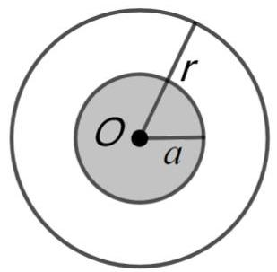

类似的,如果样本空间为实数集上的一段连续区间: $\Omega  = \left\lbrack  {a, b}\right\rbrack$ ,事件为该区间上的一段线段: $A = \left\lbrack  {p, q}\right\rbrack$ ,那么事件发生的概率为两段线段的长度之比:

$$
p = \frac{q - p}{b - a}
$$

例 16.10 一体积可以忽略的砝码随机落入一长为 ${200}\mathrm{\;m}$ 、宽为 ${20}\mathrm{\;m}$ 、深为 $5\mathrm{\;m}$ 的矩形水池底,求砝码在水池正中半径为 $5\mathrm{\;m}$ 的圆形区域内的概率。

解析: 砝码位于该圆形区域的概率等于圆形的面积与水池面积的比值, 水池的面积为 ${200} \times  {20} = {4000}\left( {\mathrm{\;m}}^{2}\right)$ ,水池正中圆形区域的面积为 $\pi  \times  {5}^{2} = {25\pi }\left( {\mathrm{m}}^{2}\right)$ ,概率为: $p = \frac{25\pi }{4000} = \frac{\pi }{160}$ 。

练习 $\mathbf{{16.1}\left( 4\right) }$

1. 一条长为 1 米的红色绸带的正中间有一段 20 厘米的彩色花纹, 蒙上眼睛剪断绸带,求断口处在彩色花纹部分的概率。

2. 一只气球在边长为 $a$ 的立方体空间中自由漂浮,假设气球的运动是随机的,求某时刻气球恰好在一个半径为 $r$ 的球形空间内的概率 (该球形空间全部在立方体空间内)。

3. 向半径为 $r$ 的圆盘随机投掷飞镖,求飞镖落点在内外半径分别为 ${r}_{1}\text{ 、 }{r}_{2}$ 的圆环上的概率。

#### 16.1.5 概率的基本性质

根据概率的定义可以推出概率的基本性质, 这些性质是用概率分析解决问题的重要依据和方法。概率的前几条性质都非常“显然”, 从这些 “显然” 的性质可以逐步推出一些不太 “显然” 的公式。

性质 1: 任意事件 $A$ 的概率始终满足 $0 \leq  P\left( A\right)  \leq  1$ 。

即所有事件的概率都只能在区间 $\left\lbrack  {0,1}\right\rbrack$ 上。

利用概率的定义可以得到该性质: 事件 $A$ 的概率等于事件 $A$ 中的样本数与样本总数的比值。一方面,事件 $A$ 所含的样本数只能是正数或 0,不可能是负数, 样本总数也是正数,所以 $0 \leq  P\left( A\right)$ 。另一方面,事件 $A$ 中的样本点一定属于样本空间,不可能有样本空间之外的事件,所以 $n\left( A\right)  \leq  n\left( \Omega \right)$ ,移项得 $P\left( A\right)  = \frac{n\left( A\right) }{n\left( \Omega \right) } \leq  1$ 。

性质 2: 必然事件的概率为 1 , 不可能事件的概率为 0 , 即:

$$
P\left( \Omega \right)  = 1,\;P\left( \varnothing \right)  = 0
$$

利用概率的定义可以得到该性质:

$$
P\left( \Omega \right)  = \frac{n\left( \Omega \right) }{n\left( \Omega \right) } = 1,\;P\left( \varnothing \right)  = \frac{n\left( \varnothing \right) }{n\left( \Omega \right) } = \frac{0}{n\left( \Omega \right) } = 0
$$

性质 3: 如果事件 $A$ 与事件 $B$ 互斥,那么 $P\left( {A \cup  B}\right)  = P\left( A\right)  + P\left( B\right)$ 。

利用概率的定义可以证明该性质: 如果事件 $A$ 与事件 $B$ 互斥,那么它们没有公共的样本点, 它们的并事件由各自分别独有的样本点组成。

设随机试验的样本空间为 $\Omega$ ,样本点总数为 $n\left( \Omega \right)  = N$ ,事件 $A = \left\{  {{a}_{1},\cdots ,{a}_{i}}\right\}$ 与事件 $B = \left\{  {{b}_{1},\cdots ,{b}_{j}}\right\}$ 互斥,则 $\forall m, n,{a}_{m} \neq  {b}_{n}$ ,可得 $A \cup  B = \left\{  {{a}_{1},\cdots ,{a}_{i},{b}_{1},\cdots ,{b}_{j}}\right\}$ 。 由上述设置可得 $n\left( A\right)  = i, n\left( B\right)  = j, n\left( {\mathrm{A} \cup  \mathrm{B}}\right)  = i + j$ ,则 $P\left( A\right)  = \frac{i}{N}, P\left( B\right)  = \frac{j}{N}$ , $P\left( {A \cup  B}\right)  = \frac{n\left( {A \cup  B}\right) }{n\left( \Omega \right) } = \frac{i + j}{N} = \frac{i}{N} + \frac{j}{N} = P\left( A\right)  + P\left( B\right)$ ,即得证。

同理可得,如果多个事件 ${A}_{1},{A}_{2},\cdots ,{A}_{p}$ 两两互斥,那么:

$$
P\left( {{A}_{1} \cup  {A}_{2} \cup  \cdots  \cup  {A}_{p}}\right)  = P\left( {A}_{1}\right)  + P\left( {A}_{2}\right)  + \cdots  + P\left( {A}_{p}\right)
$$

例 16.11 掷一枚骰子,事件 $A$ : 数字 2 朝上,即 $A = \{ 2\}$ ; 事件 $B$ : 数字 3 朝上，即 $B = \{ 3\}$ ；证明: $P\left( {A \cup  B}\right)  = P\left( A\right)  + P\left( B\right)$

解析: 事件 $A \cup  B$ 表示数字 2 朝上或数字 3 朝上,即 $A \cup  B = \{ 2,3\}$ ,根据题意可得: $n\left( \Omega \right)  = 6,\;n\left( A\right)  = 1,\;n\left( B\right)  = 1,\;n\left( {A \cup  B}\right)  = 2$ ,由概率的定义可得: $P\left( {A \cup  B}\right)  = \frac{1}{3}, P\left( A\right)  + P\left( B\right)  = \frac{1}{6} + \frac{1}{6} = \frac{1}{3}$ ,可得: $P\left( {A \cup  B}\right)  = P\left( A\right)  + P\left( B\right)$ ,即得证。

性质 4: 如果事件 $A$ 与事件 $B$ 互为对立事件,那么 $P\left( A\right)  + P\left( B\right)  = 1$ 。

利用对立事件的定义可以证明该性质: 如果事件 $A$ 与事件 $B$ 是对立事件,那么 $A \cap  B = \varnothing , A \cup  B = \Omega$ ,可得 $n\left( A\right)  + n\left( B\right)  = n\left( \Omega \right)$ 。由此可得:

$$
P\left( A\right)  + P\left( B\right)  = \frac{n\left( A\right) }{n\left( \Omega \right) } + \frac{n\left( B\right) }{n\left( \Omega \right) } = \frac{n\left( A\right)  + n\left( B\right) }{n\left( \Omega \right) } = \frac{n\left( \Omega \right) }{n\left( \Omega \right) } = 1
$$

例 16.12 掷一枚骰子,设事件 $A$ : 奇数朝上,即 $A = \{ 1,3,5\}$ ; 证明: $P\left( {A \cup  \bar{A}}\right)  = 1$ 。

解析: 奇数朝上的对立事件是偶数朝上,即 $\bar{A} = \{ 2,4,6\}$ ,可得: $A \cup  \bar{A} = \{ 1,2,3,4,5,6\}$ ,所以 $P\left( {A \cup  \bar{A}}\right)  = \frac{n\left( {A \cup  \bar{A}}\right) }{n\left( \Omega \right) } = 1$ 。

性质 5: 如果 $A \subseteq  B$ ,那么 $P\left( A\right)  \leq  P\left( B\right)$ 。

利用事件包含的定义可以证明该性质: 如果 $A \subseteq  B$ ,那么事件 $A$ 中的样本点一定不多于事件 $B$ ,可得 $n\left( A\right)  \leq  n\left( B\right)$ ,所以 $\frac{n\left( A\right) }{n\left( \Omega \right) } \leq  \frac{n\left( B\right) }{n\left( \Omega \right) }$ ,即 $P\left( A\right)  \leq  P\left( B\right)$ 。

性质 6: 对于一个随机试验的两个事件 $A$ 和 $B$ ,恒有:

$$
P\left( {A \cup  B}\right)  = P\left( A\right)  + P\left( B\right)  - P\left( {A \cap  B}\right)
$$

设事件 $A$ 中基本事件的个数为 $n\left( A\right)$ ,事件 $B$ 中基本事件的个数为 $n\left( B\right)$ ,由集合中元素个数的关系可得 $n\left( {A \cup  B}\right)  = n\left( A\right)  + n\left( B\right)  - n\left( {A \cap  B}\right)$ ,让等号两边同时除以全体基本事件的总数 $n\left( \Omega \right)  : \frac{n\left( {A \cup  B}\right) }{n\left( \Omega \right) } = \frac{n\left( A\right) }{n\left( \Omega \right) } + \frac{n\left( B\right) }{n\left( \Omega \right) } - \frac{n\left( {A \cap  B}\right) }{n\left( \Omega \right) }$ ,即得证。

练习 16.1(5)

1. 有一枚不规则的硬币,设抛掷后正面朝上的概率为 $p$ ,求:

(1) $p$ 的取值范围;

(2)连续抛掷两次都是正面朝上的概率；

(3)连续抛掷两次中至少一次是正面朝上的概率；

(4)连续抛掷两次都是正面朝下的概率。

2. 判断下列语句是否正确:

(1)对立事件一定是互斥事件；

(2)所有基本事件的概率之和等于 1 ;

(3) $P\left( {A \cup  B}\right)  + P\left( {A \cap  B}\right)  = P\left( A\right)  + P\left( B\right)$ ；

(4) $P\left( {A \cup  B}\right)  > P\left( {A \cap  B}\right)$ 。

3. 甲、乙二人分别掷一枚骰子，求下列事件的概率:

(1)甲、乙二人的点数之和为 1 ；

(2)甲、乙二人的点数都为 6 ；

(3)甲、乙二人中至少一人的点数为 6；

(4)甲、乙二人的点数都不为 6；

(5)甲、乙二人的点数之和为 2 或 12。

### 16.2 条件概率与全概率公式

生活中的事情都是相互关联的, 一件事的发生与否往往会影响另一件事是否发生, 概率不仅研究单独一个事件发生可能性的大小, 还研究已知一件事发生的条件下, 另一件事发生的可能性大小, 即有条件的概率。

#### 16.2.1 条件概率及其性质

对于同一个随机试验,事件 $A$ 发生的条件下,事件 $B$ 发生的概率记作 $P\left( {B \mid  A}\right)$ 或 $P\left( {B}_{A}\right)$ ,这种 “有条件的概率” 叫作条件概率。

需注意，条件概率 “在事件 $A$ 发生的条件下，事件 $B$ 发生的概率”，不是指事件 $A$ 先发生,事件 $B$ 后发生,而是指已经确认发生了事件 $A$ 中的某基本事件, 判断此时事件 $B$ 发生的概率。条件概率描述的是一个事件的两个方面，而不是先后两个事件。

若事件 $A$ 发生的概率为 $P\left( A\right)$ ,事件 $B$ 发生的概率为 $P\left( B\right)$ ,则事件 $A$ 发生的条件下,事件 $B$ 发生的概率 $P\left( {B \mid  A}\right)$ 为:

$$
P\left( {B \mid  A}\right)  = \frac{n\left( {AB}\right) }{n\left( A\right) } = \frac{P\left( {AB}\right) }{P\left( A\right) }
$$

接下来来证明该数量关系。

设随机事件的样本空间为 $\Omega , n\left( \Omega \right)  = N, A = \left\{  {{a}_{1},{a}_{2},\cdots ,{a}_{i},{p}_{1},{p}_{2},\cdots ,{p}_{j}}\right\}$ , $B = \left\{  {{b}_{1},{b}_{2},\cdots ,{b}_{k},{p}_{1},{p}_{2},\cdots ,{p}_{j}}\right\}$ ,由此可得: $n\left( A\right)  = i + j, n\left( B\right)  = j + k$ ,事件 $A$ 与事件 $B$ 的交事件为 ${AB} = \left\{  {{p}_{1},{p}_{2},\cdots ,{p}_{j}}\right\}  , n\left( {AB}\right)  = j$ 。

若已知事件 $A$ 发生,则基本事件是 ${a}_{1},{a}_{2},\cdots ,{a}_{i},{p}_{1},{p}_{2},\cdots ,{p}_{j}$ 中的一个, 相当于样本空间变为 ${\Omega }^{\prime } = A = \left\{  {{a}_{1},{a}_{2},\cdots ,{a}_{i},{p}_{1},{p}_{2},\cdots ,{p}_{j}}\right\}  , n\left( {\Omega }^{\prime }\right)  = n\left( A\right)  = i + j$ , 该条件下,只有当发生的事件是 ${p}_{1},{p}_{2},\cdots ,{p}_{j}$ 中的一个时,事件 $B$ 才发生,此时 $B$ 相当于变为 ${B}^{\prime } = \left\{  {{p}_{1},{p}_{2},\cdots ,{p}_{j}}\right\}  , n\left( {B}^{\prime }\right)  = n\left( {AB}\right)  = j$ ,由此可得:

$$
P\left( {B \mid  A}\right)  = \frac{n\left( {B}^{\prime }\right) }{n\left( {\Omega }^{\prime }\right) } = \frac{n\left( {AB}\right) }{n\left( A\right) } = \frac{n\left( {AB}\right) /n\left( \Omega \right) }{n\left( A\right) /n\left( \Omega \right) } = \frac{P\left( {AB}\right) }{P\left( A\right) }
$$

例 16.13 掷一枚骰子,事件 $A$ : 奇数朝上,事件 $B$ : 朝上的数字小于 4, 求事件 $A$ 发生的条件下,事件 $B$ 发生的概率。

解析: 由已知条件可得: $A = \{ 1,3,5\} , n\left( A\right)  = 3, P\left( A\right)  = \frac{1}{2}, B = \{ 1,2,3\}$ , $n\left( B\right)  = 3,\;P\left( B\right)  = \frac{1}{2}$  。

事件 $A$ 发生的条件下,朝上的是奇数,样本空间变为 ${\Omega }^{\prime } = A = \{ 1,3,5\}$ ,这 3 个数字中小于 4 的有两个:1 和 3，只有当朝上的数字是 1 或 3 时，事件 $B$ 发生， 概率为: $P\left( {B \mid  A}\right)  = \frac{2}{3}$ 。

还可以直接使用条件概率的公式: ${AB} = \{ 1,3\} , n\left( {AB}\right)  = 2, n\left( A\right)  = 3$ ,代入条件概率的公式可得: $P\left( {B \mid  A}\right)  = \frac{n\left( {AB}\right) }{n\left( A\right) } = \frac{2}{3}$ 。

分析处理条件概率的关键是: 确定 “事件 $A$ 发生” 的条件下,新的样本空间和基本事件的数量,以及事件 $B$ 中属于新的样本空间的有效基本事件及数量。

根据条件概率的公式 $P\left( {B \mid  A}\right)  = \frac{P\left( {AB}\right) }{P\left( A\right) }$ ,可以分析得出条件概率的一些性质。

性质 1: $P\left( {AB}\right)  = P\left( A\right) P\left( {B \mid  A}\right)$ 。

将条件概率的公式 $P\left( {B \mid  A}\right)  = \frac{P\left( {AB}\right) }{P\left( A\right) }$ 移项即可得到该性质,该性质叫作概率的乘法公式。

性质 2: 如果 $A \subseteq  B$ ,那么 $P\left( {B \mid  A}\right)  = 1$ 。

该性质的含义为: 如果事件 $A$ 包含于事件 $B$ ,事件 $A$ 中的基本事件都属于事件 $B$ ,那么在事件 $A$ 发生的条件下,事件 $B$ 一定发生,这与事件的包含关系的定义一致。特别的,因为任意事件 $A$ 都包含于样本空间 $\Omega$ ,所以恒有 $P\left( {\Omega  \mid  A}\right)  = 1$ 。

性质 3: 如果事件 $B$ 与事件 $C$ 互斥,那么 $P\left( {B \cup  C \mid  A}\right)  = P\left( {B \mid  A}\right)  + P\left( {C \mid  A}\right)$ 。

事件 $B$ 与事件 $C$ 互斥,它们没有共有的基本事件。事件 $A$ 发生的条件下,样本空间由 $\Omega$ 变为 $A$ ,在新的样本空间 $A$ 中,从事件 $B$ 和事件 $C$ 中排除掉不属于 $A$ 的基本事件后,新形成的 ${B}^{\prime }$ 与 ${C}^{\prime }$ 中仍没有共有的基本事件, ${B}^{\prime }$ 与 ${C}^{\prime }$ 仍然互斥, 此时 ${B}^{\prime }$ 与 ${C}^{\prime }$ 的并事件中有效的基本事件的数量为 $n\left( {B \cup  C \mid  A}\right)$ ,仍等于 $B$ 与 $C$ 各自剩余的基本事件的数量之和 $n\left( {B \mid  A}\right)  + n\left( {C \mid  A}\right)$ 。

性质 4: 如果事件 $\bar{B}$ 与事件 $B$ 对立,那么 $P\left( {\bar{B} \mid  A}\right)  + P\left( {B \mid  A}\right)  = 1$ 。

事件 $\bar{B}$ 与事件 $B$ 对立,它们没有共有的基本事件,且任意基本事件要么属于 $B$ 、要么属于 $\bar{B}$ 。事件 $A$ 发生的条件下,样本空间由 $\Omega$ 变为 $A$ ,在新的样本空间 $A$ 中,从事件 $\bar{B}$ 和事件 $B$ 中排除掉不属于 $A$ 的基本事件后,形成新的事件 ${\bar{B}}^{\prime }$ 与 ${B}^{\prime }$ 仍没有共有的基本事件,且 $A$ 中的任意事件仍满足要么属于 ${B}^{\prime }$ 、要么属于 ${\bar{B}}^{\prime }$ , ${\bar{B}}^{\prime }$ 与 ${B}^{\prime }$ 仍然对立。

例 16.14 用计算机从 $1 \sim  {10}$ 中随机生成一个数字,事件 $A$ : 生成偶数; 事件 $B$ : 生成数小于 5; 事件 $C$ : 生成数大于 5,求: $P\left( {B \cup  C \mid  A}\right)$ 。

解析: 由题意可得: $A = \{ 2,4,6,8,{10}\} , B = \{ 1,2,3,4\} , C = \{ 6,7,8,9,{10}\}$ , 由此可得: $A \cap  B = \{ 2,4\} , A \cap  C = \{ 6,8,{10}\} , B$ 与 $C$ 互斥,代入条件概率的表达式可得: $P\left( {B \cup  C \mid  A}\right)  = P\left( {B \mid  A}\right)  + P\left( {C \mid  A}\right)  = \frac{n\left( {AB}\right) }{n\left( A\right) } + \frac{n\left( {AC}\right) }{n\left( A\right) } = \frac{2}{5} + \frac{3}{5} = 1$ 。

还可以直接使用公式,其中 $B \cup  C = \{ 1,2,3,4,6,7,8,9,{10}\} ,\left( {B \cup  C}\right)  \cap  A = \; \{ 2,4,6,8,{10}\}$ ,则 $P\left( {B \cup  C \mid  A}\right)  = \frac{n\left( {\left( {B \cup  C}\right)  \cap  A}\right) }{n\left( A\right) } = \frac{5}{5} = 1$ ,结果相同。

## 练习 $\mathbf{{16.2}\left( 1\right) }$

1. 已知随机试验 $P\left( A\right)  = {0.6}, P\left( B\right)  = {0.4}, P\left( {AB}\right)  = {0.2}$ ,求 $P\left( {B \mid  A}\right)$ 和 $P\left( {A \mid  B}\right)$ 。

2. 某程序可以随机生成整数 $1 \sim  {20}$ ,事件 $A$ : 生成的数能被 2 整除; 事件 $B$ : 生成的数能被 5 整除,求: (1) $P\left( A\right)$ 和 $P\left( B\right)$ ; (2) 事件 ${AB}$ 和 $P\left( {AB}\right)$ ; (3) 事件 $A$ 发生的条件下,事件 $B$ 发生的概率。

#### 16.2.2 事件的相互独立

生活中, 如果两个事件之间互相没有影响, 就称这两个事件相互独立。例如, 某一个时刻的小时数与分钟数之间互相没有影响, 它们相互独立。数学中, 通过概率判断两个事件是否相互独立。

如果事件 $A$ 与事件 $B$ 满足关系:

$$
P\left( {AB}\right)  = P\left( A\right) P\left( B\right)
$$

就称事件 $A$ 与事件 $B$ 相互独立,简称独立。

即两个事件的交事件的概率等于两个事件各自的概率的乘积,是事件 $A$ 与事件 $B$ 相互独立的充分必要条件。

需注意,事件 $A$ 与事件 $B$ 相互独立的判定条件是 $P\left( {AB}\right)  = P\left( A\right) P\left( B\right)$ ,表示事件 $A$ 与事件 $B$ 发生的概率之间没有影响,不表明事件 $A$ 与事件 $B$ 的没有任何内在关联。实际上, 大多数情况下, 概率上相互独立的两个事件, 它们存在非常明显的内在联系。

事件 $A$ 与事件 $B$ 相互独立的定义可以更详细地描述为: 事件 $B$ 发生或不发生两种情况下,事件 $A$ 发生的概率相同; 事件 $A$ 发生或不发生两种情况下,事件 $B$ 发生的概率也相同。

例 16.15 掷一枚骰子,事件 $A$ : 奇数朝上,即 $A = \{ 1,3,5\}$ ; 事件 $B$ : 朝上的点数小于 3,即 $B = \{ 1,2\}$ ; 判断事件 $A$ 与事件 $B$ 是否相互独立。

解析: 共 6 个基本事件,事件 $A$ 有 3 个基本事件, $P\left( A\right)  = \frac{3}{6} = \frac{1}{2}$ ,事件 $B$ 有 2 个基本事件, $P\left( B\right)  = \frac{2}{6} = \frac{1}{3}$ ,事件 $A$ 与事件 $B$ 的交事件为数字 1 朝上,即 ${AB} = \{ 1\}$ , $P\left( {AB}\right)  = \frac{1}{6}$ ,综上可得: $P\left( {AB}\right)  = P\left( A\right) P\left( B\right)$ ,所以事件 $A$ 与事件 $B$ 相互独立。

例 16.15 很好地展示了: 事件 $A$ 与事件 $B$ 并非毫无关系,它们有共同的基本事件，经计算验证它们相互独立，因为事件的相互独立的定义是无论事件 $A$ 发生与否,事件 $B$ 发生的概率相等。

详细分析例 16.15,当事件 $A$ 发生时,样本空间变为 $A = \{ 1,3,5\}$ ,该条件下, 事件 $B$ 中只有点数 1 可能发生,点数 2 不可能发生,此时事件 $B$ 发生的概率为 $\frac{1}{2}$ 。 当事件 $A$ 不发生时,样本空间变为 $\bar{A} = \{ 2,4,6\}$ ,该条件下,事件 $B$ 中只有点数 2 可能发生,点数 1 不可能发生,此时事件 $B$ 发生的概率仍为 $\frac{1}{2}$ 。综上可知,无论事件 $A$ 发生或不发生,事件 $B$ 发生的概率相同,都是 $\frac{1}{2}$ ,事件 $A$ 对事件 $B$ 发生的概率无影响,事件 $A$ 与事件 $B$ 独立,如下图所示。

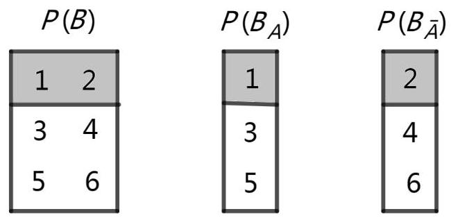

另一方面,当事件 $B$ 发生时,样本空间变为 $B = \{ 1,2\}$ ,该条件下,事件 $A$ 中只有点数 1 可能发生,点数 3 或 5 不可能发生,此时事件 $A$ 发生的概率为 $\frac{1}{2}$ 。当事件 $B$ 不发生时,样本空间变为 $\bar{B} = \{ 3,4,5,6\}$ ,该条件下,事件 $A$ 中只有点数 3 或 5 可能发生,点数 1 不可能发生,此时事件 $A$ 发生的概率为 $\frac{1}{2}$ 。综上可知, 无论事件 $B$ 发生或不发生,事件 $A$ 发生的概率相同,都是 $\frac{1}{2}$ ,事件 $B$ 对事件 $A$ 发生的概率无影响。如下图所示。

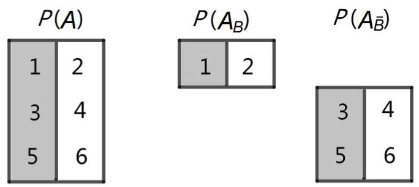

对于相互独立的事件 $A$ 与事件 $B$ ,事件 $A$ 与 $\bar{A}$ 相当于将全体样本点划分为两个对立的集合,事件 $B$ 中的样本点在这两个对立的集合中均等分布,因此无论当全集为原来的全集 $\Omega$ ,还是变为 $A$ 或 $\bar{A}, B$ 中的样本点在当中的比例相同,事件 $B$ 发生的概率相同。

例 16.16 掷一枚骰子,事件 $A$ : 朝上的点数为奇数,即 $A = \{ 1,3,5\}$ ; 事件 $B$ : 朝上的点数小于 4,即 $B = \{ 1,2,3\}$ ; 判断事件 $A$ 与事件 $B$ 是否相互独立。

解析: 共 6 个基本事件,事件 $A$ 有 3 个基本事件, $P\left( A\right)  = \frac{3}{6} = \frac{1}{2}$ ,事件 $B$ 有 3 个基本事件, $P\left( B\right)  = \frac{3}{6} = \frac{1}{2}, A$ 与 $B$ 的交事件为朝上的点数为 1 或 3,即 ${AB} = \{ 1,3\} , P\left( {AB}\right)  = \frac{1}{2}$ ,则 $P\left( A\right) P\left( B\right)  = \frac{1}{2} \times  \frac{1}{2} = \frac{1}{4} \neq  P\left( {AB}\right) , A$ 与 $B$ 不独立。

详细分析例 16.16,事件 $A$ 发生的条件下,样本空间变为 $A = \{ 1,3,5\}$ ,此时事件 $B$ 中只有点数 1 和 3 可能发生,事件 $B$ 变为 ${AB} = \{ 1,3\}$ ,概率变为 $P\left( {B \mid  A}\right)  = \frac{2}{3}$ 。 $A$ 不发生的条件下,样本空间变为 $\bar{A} = \{ 2,4,6\}$ ,此时事件 $B$ 中只有点数 2 可能发生,事件 $B$ 变为 $\bar{A}B = \{ 2\}$ ,概率变为 $P\left( {B \mid  \bar{A}}\right)  = \frac{1}{3}$ 。事件 $A$ 发生或不发生两种条件下，事件 $B$ 发生的概率不同， $A$ 对 $B$ 的概率有影响。

同理可得,事件 $B$ 发生和不发生两种条件下,事件 $A$ 发生的概率不同, $B$ 对 $A$ 的概率也有影响, $A$ 与 $B$ 不独立。如下页图所示

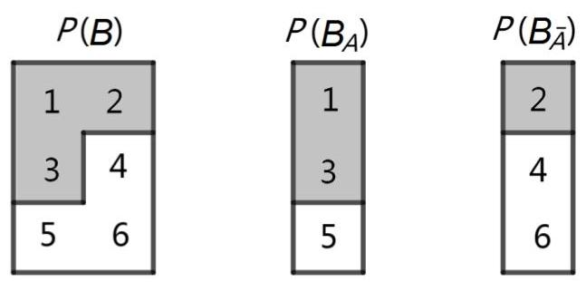

对于不相互独立的事件 $A$ 与事件 $B$ ,事件 $A$ 与 $\bar{A}$ 相当于将全体样本点划分为两个对立的集合，事件 $B$ 中的样本点在这两个对立的集合中分布不均等，在由 $A$ 与 $\bar{A}$ 分别构成的新的全集中, $B$ 中的样本点在当中的比例不同，事件 $B$ 发生的概率不同。

练习 16.2(2)

1. 掷一枚骰子,判断下列事件是否独立:

(1)朝上的点数是偶数，朝上的点数小于 4 ;

(2)朝上的点数是奇数，朝上的点数大于 0 ；

(3)朝上的点数是质数，朝上的点数不是质数；

(4)朝上的点数是奇数，朝上的点数不大于 4。

2. 下面是某班级的课程表,从中任选一节课,事件 $A$ : 这节课是语文课; 事件 $B$ : 下一节课是数学课; 判断事件 $A$ 与事件 $B$ 是否独立。(当天最后一节课的下一节课为次日的第一节课，周五最后一节课的下一节课为周一的第一节课)

<table><tr><td>周一</td><td>周二</td><td>周三</td><td>周四</td><td>周五</td></tr><tr><td>语文</td><td>英语</td><td>数学</td><td>数学</td><td>语文</td></tr><tr><td>自然</td><td>语文</td><td>社会</td><td>语文</td><td>数学</td></tr><tr><td>数学</td><td>自然</td><td>语文</td><td>社会</td><td>社会</td></tr><tr><td>社会</td><td>道德法治</td><td>自然</td><td>英语</td><td>自然</td></tr><tr><td colspan="5">午休</td></tr><tr><td>英语</td><td>数学</td><td>道德法治</td><td>数学</td><td>道德法治</td></tr><tr><td>体育</td><td>兴趣小组</td><td>体育</td><td>兴趣小组</td><td>体育</td></tr></table>

#### 16.2.3 全概率公式

可以将样本空间 $\Omega \left( {n\left( \Omega \right)  = N}\right)$ 进行如下划分: 将 $\Omega$ 划分为 ${A}_{1}\text{ 、 }{A}_{2}\text{ 、 }\cdots \cdots \text{ 、 }{A}_{k}$ 共 $k$ 个子集 (事件),让每个基本事件 $a$ 都属于且只属于 ${A}_{1}\text{ 、 }{A}_{2}\text{ 、 }\cdots \cdots \text{ 、 }{A}_{k}$ 中的一个。该划分可以用韦恩图表示如下:

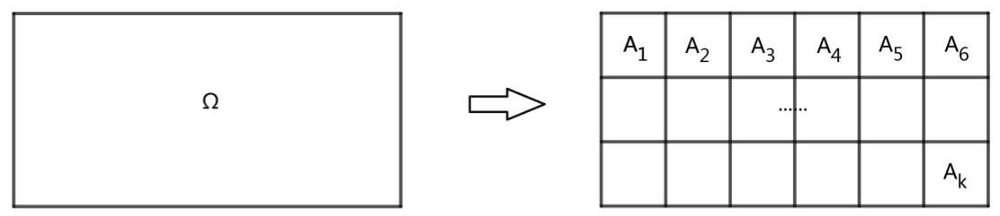

按照这种划分方法,任意两个不同的事件 ${A}_{i}$ 和 ${A}_{j}$ 都满足关系 ${A}_{i} \cap  {A}_{j} = \varnothing$ , 且 ${A}_{1} \cup  {A}_{2} \cup  \cdots  \cup  {A}_{k} = \Omega$ ,由此可得: $n\left( {A}_{1}\right)  + n\left( {A}_{2}\right)  + \cdots  + n\left( {A}_{k}\right)  = n\left( \Omega \right)  = N$ 。于是, 对于任意事件 $B = \left\{  {{b}_{1},{b}_{2},\cdots ,{b}_{m}}\right\}  , P\left( B\right)  = \frac{n\left( B\right) }{n\left( \Omega \right) } = \frac{m}{N}, B$ 中的每个基本事件必然都属于且只属于某一个 ${\mathrm{A}}_{i}$ 。

设事件 $B$ 的所有 $m$ 个基本事件中, $n\left( {B}_{1}\right)$ 个属于 ${A}_{1}, n\left( {B}_{2}\right)$ 个属于 ${A}_{2},\cdots \cdots$ , $n\left( {B}_{k}\right)$ 个属于 ${A}_{k}$ ,由加法原理可得: $n\left( {B}_{1}\right)  + n\left( {B}_{2}\right)  + \cdots  + n\left( {B}_{k}\right)  = n\left( B\right)  = m$ 。

按照上述假设与划分,任意事件 ${A}_{i}$ 与 $B$ 的交事件中基本事件的数量分别为 $n\left( {{A}_{i}B}\right)  = n\left( {B}_{i}\right)$ (其中可能部分 $n\left( {B}_{i}\right)  = 0$ ),由此可得 $P\left( {{A}_{i}B}\right)  = \frac{n\left( {B}_{i}\right) }{n\left( \Omega \right) }$ ,又因为 $P\left( {{A}_{i}B}\right)  = P\left( {B \mid  {A}_{i}}\right) P\left( {A}_{i}\right)$ ,联立这两个等式可得:

$$
P\left( {B \mid  {A}_{i}}\right) P\left( {A}_{i}\right)  = \frac{n\left( {B}_{i}\right) }{n\left( \Omega \right) }
$$

让 $i$ 依次取 $1 \sim  k$ ,将所有 $k$ 个等式左右两边分别求和并化简:

$$
P\left( {B \mid  {A}_{1}}\right) P\left( {A}_{1}\right)  + P\left( {B \mid  {A}_{2}}\right) P\left( {A}_{2}\right)  + \cdots  + P\left( {B \mid  {A}_{k}}\right) P\left( {A}_{k}\right)  = \frac{n\left( {B}_{1}\right) }{n\left( \Omega \right) } + \frac{n\left( {B}_{2}\right) }{n\left( \Omega \right) } + \cdots  + \frac{n\left( {B}_{k}\right) }{n\left( \Omega \right) }
$$

$$
= \frac{n\left( {B}_{1}\right)  + n\left( {B}_{2}\right)  + \cdots  + n\left( {B}_{k}\right) }{n\left( \Omega \right) }
$$

$$
= \frac{n\left( B\right) }{n\left( \Omega \right) }
$$

其中，等式左边的 $P\left( {B \mid  {A}_{1}}\right) P\left( {A}_{1}\right)  + P\left( {B \mid  {A}_{2}}\right) P\left( {A}_{2}\right)  + \cdots  + P\left( {B \mid  {A}_{k}}\right) P\left( {A}_{k}\right)$ 可以用求和符号简洁地表示为 $\mathop{\sum }\limits_{{i = 1}}^{k}P\left( {A}_{i}\right) P\left( {B \mid  {A}_{i}}\right)$ ,等式右边 $\frac{n\left( B\right) }{n\left( \Omega \right) } = P\left( B\right)$ ,即:

$$
P\left( B\right)  = \mathop{\sum }\limits_{{i = 1}}^{k}P\left( {A}_{i}\right) P\left( {B \mid  {A}_{i}}\right)
$$

该公式叫作全概率公式，是概率学中一个非常重要的基本公式。

全概率公式实质上将样本空间划分为若干两两互斥的子集 ${A}_{1}\text{ 、 }{A}_{2}\text{ 、 }\cdots \cdots \text{ 、 }{A}_{k}$ , 任意事件 $B$ 中的基本事件都必然落到其中的某一个子集 ${A}_{i}$ 内,于是每个子集 ${A}_{i}$ 发生的条件下事件 $B$ 发生的概率与相应的 ${A}_{i}$ 发生的概率的乘积之和,等于事件 $B$ 在没有任何前置条件的情况下发生的概率。

例 16.17 密闭盒子里有 50 个玩具球, 其中红色小球 5 个, 蓝色小球 15 个, 红色大球 5 个, 蓝色大球 25 个, 从中随机取出一个玩具球, 用取出红球的概率验证全概率公式。

解析: 设事件 ${A}_{1}$ : 取出大球,事件 ${A}_{2}$ : 取出小球,则 ${A}_{1} \cap  {A}_{2} = \varnothing ,{A}_{1} \cup  {A}_{2} = \Omega$ , $P\left( {A}_{1}\right)  = \frac{5 + {25}}{50} = \frac{3}{5}, P\left( {A}_{2}\right)  = \frac{5 + {15}}{50} = \frac{2}{5}$ 。设事件 $B$ : 取出红球,则 $P\left( B\right)  = \frac{5 + 5}{50} = \frac{1}{5}$ 。

已知取出的是大球的条件下，从 30 个大球中取出红色大球的概率为:

$$
P\left( {B \mid  {A}_{1}}\right)  = \frac{5}{30} = \frac{1}{6}
$$

已知取出的是小球的条件下, 从 20 个小球中取出红色小球的概率为:

$$
P\left( {B \mid  {A}_{2}}\right)  = \frac{5}{20} = \frac{1}{4}
$$

利用全概率公式可以得到取出红球的概率为:

$$
P\left( B\right)  = \mathop{\sum }\limits_{{i = 1}}^{n}P\left( {A}_{i}\right) P\left( {B \mid  {A}_{i}}\right)
$$

$$
= P\left( {A}_{1}\right) P\left( {B \mid  {A}_{1}}\right)  + P\left( {A}_{2}\right) P\left( {B \mid  {A}_{2}}\right)
$$

$$
= \frac{3}{5} \times  \frac{1}{6} + \frac{2}{5} \times  \frac{1}{4}
$$

$$
= \frac{1}{5}
$$

与直接求得的 $P\left( B\right)$ 相同。

练习 16.2(3)

1. 某随机试验中, $P\left( A\right)  = {0.4}, P\left( {AB}\right)  = {0.3}, P\left( {\bar{A}B}\right)  = {0.1}$ ,求事件 $B$ 发生的条件下,事件 $A$ 发生的概率。

2. 某程序可以随机生成整数 $1 \sim  {30}$ ,事件 ${A}_{1}$ : 生成数为 $1 \sim  {10}$ ; 事件 ${A}_{2}$ : 生成数为 ${11} \sim  {20}$ ; 事件 ${A}_{3}$ : 生成数为 ${21} \sim  {30}$ ; 事件 $B$ : 生成数为质数,求事件 $B$ 发生的条件下,事件 ${A}_{1}\text{ 、 }{A}_{2}\text{ 、 }{A}_{3}$ 分别发生的概率。

3. 一片花坛里有红、黄、蓝三种颜色的花朵，分别占比 30%、30%、40%， 部分花朵的花瓣有残缺的遗传性状，其中红花残缺的概率为 5%，黄花残缺的概率为 10%，蓝花残缺的概率为 2%，求花坛中全部花朵残缺的概率。

#### 16.2.4 贝叶斯公式

利用全概率公式, 可以推导出贝叶斯公式。贝叶斯公式又叫作贝叶斯定理, 是现实中非常有用的规律, 其内容初看起来有些违反直觉, 但仔细思考后会发现非常符合现实。

按照条件概率的定义,“事件 ${A}_{i}$ 发生的条件下,事件 $B$ 发生” 与 “事件 $B$ 发生的条件下,事件 ${A}_{i}$ 发生” 所含的基本事件相同,都是 ${A}_{i}B$ ,即:

$$
P\left( {{A}_{i} \mid  B}\right) P\left( B\right)  = P\left( {B \mid  {A}_{i}}\right) P\left( {A}_{i}\right)  = P\left( {{A}_{i}B}\right)
$$

移项得:

$$
P\left( {{A}_{i} \mid  B}\right)  = \frac{P\left( {B \mid  {A}_{i}}\right) P\left( {A}_{i}\right) }{P\left( B\right) }
$$

将全概率公式 $P\left( B\right)  = \mathop{\sum }\limits_{{i = 1}}^{n}P\left( {A}_{i}\right) P\left( {B \mid  {A}_{i}}\right)$ 代入该等式替换掉分母可得:

$$
P\left( {{A}_{i} \mid  B}\right)  = \frac{P\left( {A}_{i}\right) P\left( {B \mid  {A}_{i}}\right) }{\mathop{\sum }\limits_{{j = 1}}^{k}P\left( {A}_{j}\right) P\left( {B \mid  {A}_{j}}\right) }
$$

该公式叫作贝叶斯公式或贝叶斯定理，用于描述两个条件概率的数量关系， 有很强的实用性。

贝叶斯公式的实质是:事件 $B$ 发生的条件下，样本空间由 $\Omega$ 缩小为事件 $B$ 。 同时,将事件 $B$ 中的基本事件分布在一系列两两互斥、并事件为全集的事件 ${A}_{1}\text{ 、 }{A}_{2}\text{ 、 }\cdots \cdots \text{ 、 }{A}_{k}$ 中。事件 $B$ 发生的条件下,某一事件 ${A}_{i}$ 发生的概率 $P\left( {{A}_{i} \mid  B}\right)$ ,等于该交事件中基本事件的数量(或概率 $P\left( {A}_{i}\right) P\left( {B \mid  {A}_{i}}\right)$ )，除以缩小后的样本空间 $B$ 中全体基本事件的数量(或概率 $\mathop{\sum }\limits_{{j = 1}}^{k}P\left( {A}_{j}\right) P\left( {B \mid  {A}_{j}}\right)$ )所得到的比例。

例 16.18 已知某种植物如果感染了 $\mathrm{T}$ 病毒，将有 95% 的概率出现叶片锈黄的症状，未感染 T 病毒的该植物只有1%的概率出现叶片锈黄的症状。调查发现， 某地有 0.5% 的该植物感染了 T 病毒，现在观察到一株该植物叶片锈黄，求该植株感染 T 病毒的概率。

解析: 设事件 ${A}_{1}$ : 感染 T 病毒,事件 ${A}_{2}$ : 未感染 T 病毒,事件 $B$ : 叶片锈黄,则 $P\left( {B \mid  {A}_{1}}\right)  = {0.95}, P\left( {B \mid  {A}_{2}}\right)  = {0.01}, P\left( {A}_{1}\right)  = {0.005}, P\left( {A}_{2}\right)  = {0.995}$ 。

现在观察到一株该植物叶片锈黄，即:事件 $B$ 发生的条件下，求该植株感染 T 病毒的概率 $P\left( {{A}_{1} \mid  B}\right)$ ,利用贝叶斯公式:

$$
P\left( {{A}_{1} \mid  B}\right)  = \frac{P\left( {A}_{1}\right) P\left( {B \mid  {A}_{1}}\right) }{\mathop{\sum }\limits_{{j = 1}}^{k}P\left( {A}_{j}\right) P\left( {B \mid  {A}_{j}}\right) }
$$

分子部分是感染病毒且叶片锈黄的概率,感染病毒的概率为 $P\left( {A}_{1}\right)  = {0.005}$ , 感染病毒的叶片锈黄的概率为 $P\left( {B \mid  {A}_{1}}\right)  = {0.95}$ ;

分母部分为两项相加,分别为感染病毒且叶片锈黄的概率 $P\left( {A}_{1}\right) P\left( {B \mid  {A}_{1}}\right)$ 和未感染病毒且叶片锈黄的概率 $P\left( {A}_{2}\right) P\left( {B \mid  {A}_{2}}\right)$ ,代入相应的数值可得:

$$
P\left( {{A}_{1} \mid  B}\right)  = \frac{P\left( {A}_{1}\right) P\left( {B \mid  {A}_{1}}\right) }{\mathop{\sum }\limits_{{k = 1}}^{n}P\left( {A}_{k}\right) P\left( {B \mid  {A}_{k}}\right) } = \frac{{0.005} \times  {0.95}}{{0.005} \times  {0.95} + {0.995} \times  {0.01}} = \frac{95}{294} \approx  {0.323}
$$

该公式中，分母将叶片锈黄的植株分为两类:感染病毒叶片锈黄和未感染病毒叶片锈黄，利用贝叶斯公式求出感染病毒叶片锈黄在其中所占的概率。

由此题可知, 虽然感染病毒和未感染病毒显现出叶片锈黄症状的概率相差极大(95%与1%)，但如果只根据症状判断，也只有不到三分之一概率确诊感染。 这是因为未感染植株的比例很大(99.5%)，导致虽然未感染但叶片锈黄的植株在全体叶片锈黄的植株中占了较大比例。

类似的情况在生活中很多, 很多罕见病的特征虽然在未患病人群中只有极小的概率出现, 但由于未患病人群的数量极其庞大, 导致未患病但具备特征的人数远多于患病引发特征的人数，所以只根据单一特征难以断定是否患病，需要更加直接可靠的诊断。

## 练习 16.2(4)

1. 某区域田鼠、野兔、麻雀的数量之比约为 1:1:5 ，假设它们损坏作物的概率分别为 0.4、0.2、0.1 ，若发现一片作物被野生动物损坏，求作物是被田鼠损坏的概率。

2. 某商场举办购物抽奖活动, 给消费不满 1000 元的消费者发放普通奖券, 有 1%的概率中奖，给消费满 1000 元(含超过)的消费者发放特殊奖券，有 10% 的概率中奖。假如某天中奖的奖券中, 普通奖券与特殊奖券的数量相同, 求当天消费不满 1000 与消费满 1000 元的消费者的人数之比。

## 小结

本章学习概率的基本概念和运算规律, 以及条件概率、全概率公式、贝叶斯定理的概念和应用，需结合命题与集合的知识，理解基本事件、事件、交事件、 并事件、互斥事件、对立事件等概念, 以及事件间的关系和对应的基本运算、条件概率、全概率公式、贝叶斯定理的原理和推导过程。使用概率的概念和公式时, 需认真理解分析现实中的信息, 准确地确定基本事件、基本事件的数量 (样本空间)、某事件中基本事件数量、事件发生的概率等数据，并结合逻辑进行分析推理。

## 第十七章 统计

工作和生活中，经常需要收集并分析处理大量数据，从数据中推断出所需的规律和结论。例如, 人口普查是对区域内人口情况的统计, 经济普查是对区域内经济情况的统计，生态学家经常需要对区域内某类生物的分布情况进行统计。

统计学是通过对数据进行收集、处理和分析，从中推断出性质和规律的学科。 汉语中，“统”有“总括”“全部”的意思，“计”有“计数”。“计算”的意思， “统计”就是对全部数据进行记录和计算，是对大量数据的“全部计数”。

统计不只是简单地进行 “全部计数”, 通过对数据的采集和使用进行数学上的加工和处理, 可以让统计工作起到事半功倍、以小见大的效果, 这也是学习使用统计知识的主要目的。

统计学是非常实用的学科，需要通过大量具体实例的练习，从中体会本章所学的概念所表达的现实意义，特别是对全部数据的感性认识与求得的相关参数之间的对应关系。

统计学的基础知识较容易理解, 以人为规定的概念为主, 但人为规定的概念中蕴含着内在的数学联系。统计学涉及的运算有量大、繁琐等特点，公式推导和变形较少，需要有足够的细心和耐心。

### 17.1 统计数据的采集

统计的第一步是采集数据, 统计需要采集并处理大量数据, 有时需要逐个采集全体数据，有时只需采取部分数据，用部分数据的特点估计总体数据的特点。

#### 17.1.1 全面调查

一如既往，数学研究需要有明确的判定标准和范围，因此某个体是否是调查对象，必须有明确的标准(命题)来判断任意一个个体 “是” 或 “非” 属于所要统计的对象。

调查的全部个体所构成的总体可以看作一个集合，每个个体都是这个集合中的元素。调查对象的全体叫作总体，组成总体的每一个调查对象叫作个体。进行统计前, 首先要确定统计的数据的类型、来源、范围等, 并对选定对象开展调查, 从而获取数据。

最基本的获取数据的方法叫作全面调查，又称普查，对总体中的每一个个体都一一进行调查。全面调查不使用数学方面的技巧，但需要对具体情形考虑得非常周到细致，才能做到没有遗漏、没有重复、没有误判。理想情况下，全面调查所获取的数据最准确和全面。

例如, 我国每十年开展一次的全国人口普查采用的就是全面调查的方法, 人口普查采用了很多技术和制度措施，确保统计结果非常精准。

虽然全面调查的方法最准确和全面, 但实际操作中工作量极大, 且容易出现遗漏、重复等错误，还有样本总量过于庞大、部分数据获取难度大、调查时间跨度大等种种困难, 使得实际操作难度很大, 因此通常需要使用数学方法, 在确保数据准确性和有效性的前提下, 将获取数据的过程进行简化。

例 17.1 统计一所高中全部在册学生信息, 分析确定调查对象范围需要考虑的因素。

解析:(1)由于有时会有学生转入和转出，因此需要明确统计某一时刻(某天)的在册学生; (2)由于有插班、借读的同学，因此需要明确以学籍是否在该校作为判断标准；(3)如果有其他特殊情况，也需要一一予以明确。

## 练习 17.1(1)

1. 需要普查一所高中某天全部来校的学生，指出需注意避免的错误。

#### 17.1.2 随机抽样

出于现实中工作量、工作难度、工作成本等考虑，大部分情况下不需要采集全部所有数据，而是只采集部分数据，通过部分数据估计总体数据的情况。计数的基础是把数据都记录下来, 现实中, 通常需要对某一特定范围内的对象群体进行调查以获得数据。

最简单直接地减轻调查统计的工作量的方法是减少调查对象。从总体中选取部分个体进行调查，并将这部分个体的数据作为依据，分析推断总体数据的情况和规律的方法，叫作抽样调查，即“抽取样本”进行调查。

抽样调查中, 从总体中抽取的进行调查的全部个体叫作样本, 样本中包含的个体的数量叫作样本量。如果把总体和样本分别看作集合, 那么样本是总体的 (真) 子集。

虽然抽样调查获得的只是样本的数据，并不是总体的数据，但可以通过样本数据估计总体的情况。其理论依据是:如果样本的分布是随机的，那么样本空间越大, 样本中数据的分布情况越接近总体的分布情况。这可以看作一条公理。实际统计调查中, 样本数据的特点不能完全与总体数据相同, 总是存在一定差异。

随机抽样主要有 3 种方式:简单随机抽样，分层随机抽样，系统随机抽样。

简单随机抽样。对于含 $N$ 个个体的总体,从中随机地逐个抽取 $n\left( {1 \leq  n < N}\right)$ 个个体作为样本，这样的抽样方法叫作简单随机抽样。简单随机抽样分为放回简单随机抽样与不放回简单随机抽样两种。

如果每次抽取个体后，把抽取的个体放回总体，再抽取下一个体，同一个体有可能被重复抽取多次, 这样的抽样叫作放回简单随机抽样。

如果每次抽取个体后, 不把抽取的个体放回总体, 直接抽取下一个体, 同一个体最多只可能被抽取一次, 这样的抽样叫作不放回简单随机抽样。

简单随机抽样最大的特点是 “简单”, 不需要进行任何专门的数学处理, 直接随机抽取个体形成样本即可, 这一特点的优点是简单方便, 缺点是有时样本无法很好地体现总体的特点。

分层随机抽样简称分层抽样, 为了让样本的特点更接近总体, 有时先根据可靠的理论进行分析,将总体 $\Omega$ 划分为若干互斥的子集 ${A}_{1}\text{ 、 }{A}_{2}\text{ 、 }\cdots \cdots \text{ 、 }{A}_{n}$ ,且满足 ${A}_{1} \cup  {A}_{2} \cup  \cdots  \cup  {A}_{n} = \Omega$ ,任意 ${A}_{i} \cap  {A}_{j} = \varnothing$ ; 再对每一个子集分别进行独立的简单随机抽样, 这种抽样方法叫作分层随机抽样。每一个子集叫作一个层。

分层抽样中, 如果从每个层中抽取的个体的数量与各层所包含的个体数量的比值都相等, 就称这种样本量的分配方式为比例分配。如果从各层中抽取的个体的数量与各层所包含的个体数量的比值不都相等, 那么就不是比例分配。

分层随机抽样的特点是 “分层”, 通常先按照一定特点将数据分为若干层, 针对每个层进行比例分配或不按照比例分配, 这一特点的优点是可以针对客观情况让抽取的样本更能体现总体的情况, 防止抽取的样本不够均匀而导致分析结果不能反映总体的情况，还可以根据实际需要，加大某类个体的比例，突出它们的占比。

例 17.2 某高中高一、高二、高三分别有 200、300、250 名学生, 用比例分配的分层随机抽样抽取 10%的学生，调查高中生每周娱乐时间，求每个年级抽取的学生数量, 并分析比较简单随机抽样与分层随机抽样的优点与不足。

解析: 高一、高二、高三分别有 200、300、250 名学生, 抽取 10% 的学生, 则分别从三个年级抽取的学生数量为: ${200} \times  {10}\%  = {20}$ 、 ${300} \times  {10}\%  = {30}$ 、 ${250} \times  {10}\%  = {25}$ 。

如果进行简单随机抽样, 有可能因为学业繁忙的高三学生很少出现在操场, 导致抽到的以学业相对较轻松的高一、高二学生为主, 使得统计得到的每周娱乐时间要高于总体情况。因此, 按照年级将学校分为三层: 高一、高二、高三, 对三个年级的学生分别进行随机抽样, 再汇总三个层的数据, 会更接近总体的实际情况。

系统随机抽样又叫作等距随机抽样, 是将总体按照某一顺序排序后, 按照一定的间隔进行抽样。

随机抽样的顺序可以根据现实中进行调查的方式, 为方便采样以及采样均匀起见, 通常人为地确定的任意一种顺序, 比如时间顺序、编号顺序等。

系统随机抽样的代表性要优于简单随机抽样, 但通常不如经过理论分析的分层随机抽样更贴近总体。

例如, 统计一所学校各班级的平均学生人数, 可以抽取所有班号可以整除 3 的班级作为样本进行统计。

## 练习 17.1(2)

1. 针对下列统计对象, 选择合适的抽样调查方法:

(1)某市全体居民的年龄结构；

(2)某铁路沿线周围的生态环境情况；

(3)某小区各室户居住人口的数量分布。

2. 一个密闭的黑箱中有 1000 个形状相同的红色或黑色小球, 有放回地从中取 100 次小球，共 10 次取出红球，90 次取出黑球，求黑箱中红球和黑球的数量分别可能是多少。

3. 已知某片草原上大约有 50000 只野兔，随机捕捉 100 只野兔，其中共有雄兔 48 只，雌兔 52 只，求草原上雄兔和雌兔的数量分别约有多少。

### 17.2 数据的整理和分析

通过调查统计获得总体或样本的数据后，需要对数据进行处理和分析，从而推断出数据的性质和规律。统计数据有若干特征, 可以由一些统计参数反映, 样本的特征总是与总体趋于一致, 因此可以用样本估计总体, 并且样本的数据量越大, 样本与总体的一致性越强, 极端情况下样本等于总体, 两者就完全一致了。 随机采集的样本数据的统计特征与总体数据趋于一致, 这可以看作普遍成立的公理, 这正是统计学赖以成立的基础。

#### 17.2.1 总体取值规律的估计

采集获取统计数据后, 可以对数据总体的取值规律进行估计, 也就是对数据总体的分布情况进行分析。

频率分布表和频率分布直方图是整理和直观展示数据的常用方法, 它们的基本原理是将数据按照大小关系排列并进行分组, 从而可以直观地展示各范围区间的数据分别有多少、比例如何。

接下来通过具体例子展示绘制频率分布表和频率分布直方图的主要过程。

例 17.3 下面是某地区 2021 年 6 月 1~30 日最高气温(单位:°C)，绘制频率分布表和频率分布直方图。

28282827313331302927

29282928292928272626

${28}\;\begin{array}{lllllllll} {30} & {32} & {31} & {30} & {26} & {28} & {28} & {30} & {29} \end{array}$

## 第一步:排序

将全体数据按照从小到大的顺序排列:

25262627272728282828

282828282829292929

2930303030303131313233

## 第二步:求极差

用数据中最大的数字减去最小的数字, 得到的差值叫作极差。

该组数据中，最大的是 33，最小的是 25，极差为: ${33} - {25} = 8$ 。

## 第三步:确定组距和组数

组距是将数据分组时，每一组的下界(最小值)和上界(最大值)的差值。 设置组距时, 通常每组的组距应当相等, 且分组的组数不能太少。另外, 通常组距需要能被极差整除, 以确保可以分为整数个组。

极差、组距和组数之间具有关系:

$$
\text{ 组数 } = \frac{\text{ 极差 }}{\text{ 组距 }}
$$

对于该组数据, 已求得极差为 8 , 可以将组距定为它的因数 2 , 于是组数为: $8 \div  2 = 4$ 。

## 第四步:将数据分组

按照确定的组距和组数, 将数据分组即可。

通常情况下，除最大的一组的上界和下界都是闭区间外，其他各组下界是闭区间、上界是开区间, 也可以设置最小的一组的上界和下界都是闭区间, 其他各组的下界是开区间、上界是闭区间。

按照第三步设置的组距, 将该组数据分为 4 组:

第一组: [25, 27): 25 26 26;

第二组: [27, 29): 27 27 27 28 28 28 28 28 28 28 28 28 28 28

第三组: [29, 31): 29 29 29 29 29 29 30 30 30 30;

第四组: [31, 33]: 31 31 31 32 33。

## 第五步:求出各组的频数、频率

某个数据的频数是该数据在样本 (或总体) 中出现的次数。某个分组的频数是该分组中数据的个数。根据频数的定义, 样本中所有数据 (或所有分组) 的频数之和应当等于样本中数据的总数。

统计学中，频率的定义为:某个数据出现的次数(或某个分组中数据的个数) 与样本中所有数据的个数的比值。利用频率的定义容易证明: 样本中所有数据(或所有分组)的频率之和应当等于 1 。

对于该组数据, 样本中共 30 个数据, 分别求出各组的频率:

第一组共 3 个数据, $f\left( 1\right)  = \frac{3}{30} = \frac{1}{10}$ ; 第二组共 12 个数据, $f\left( 2\right)  = \frac{12}{30} = \frac{2}{5}$ ;

第三组共 10 个数据, $f\left( 3\right)  = \frac{10}{30} = \frac{1}{3}$ ; 第四组共 5 个数据, $f\left( 4\right)  = \frac{5}{30} = \frac{1}{6}$ ;

各组的频率之和为: $\frac{1}{10} + \frac{2}{5} + \frac{1}{3} + \frac{1}{6} = 1$ 。

第六步:列出频率分布表或绘制频率分布直方图

将相应的分组、频数、频率列在表格里或写成很整齐的形式, 如下表所示:

<table><tr><td>序号</td><td>分组</td><td>频数</td><td>频率</td></tr><tr><td>1</td><td>[25, 27)</td><td>3</td><td>$\frac{1}{10}$</td></tr><tr><td>2</td><td>[27, 29)</td><td>12</td><td>2 5</td></tr><tr><td>3</td><td>[29, 31)</td><td>10</td><td>1 3</td></tr><tr><td>4</td><td>[31, 33]</td><td>5</td><td>1 6</td></tr></table>

以组距为底边、频率 (有时为频数) 为高度, 在平面直角坐标系中用相应的矩形表示各组, 就得到频率分布直方图。可以根据实际需要对图形进行优化或美化。该组数据的频率分布直方图如下图所示。

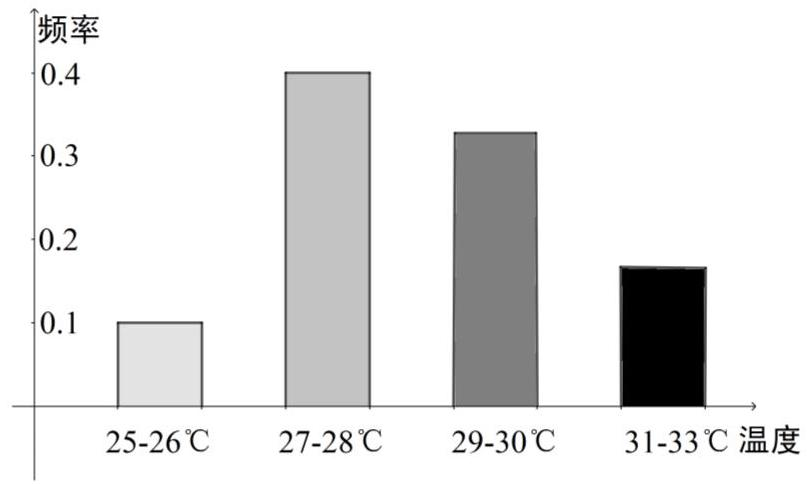

为了能更直观地展示各组的比例关系以及各组占整体的比例, 有时绘制成饼状图, 如下图所示。

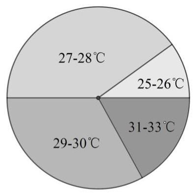

练习 17.2(1)

1. 下面是甲同学家某个月每天的用电量, 自行设置合适的组距, 绘制该月用电情况的频率分布直方图。

$\begin{array}{llllllllll} {15} & {17} & {16} & {18} & {21} & {35} & {32} & {17} & {20} & {21} \end{array}$

21213032222119182032

35181621232529403819

#### 17.2.2 总体百分位数的估计

百分位数可用于估计某个数据在全部数据中所处的位置,其定义为: 将所有 $n$ 个数据按照从小到大排序,其中第 $p$ 个数字叫作该组数据的第 $\frac{p}{n} \times  {100}$ 百分位数或 $\frac{p}{n} \times  {100}\%$ 分位数。如果某个数据是该组数据的第 $k$ 百分位数,那么该组数据中至少有 $k\%$ 的数据小于等于这个数。

有时将所有 $n$ 个数据按照从小到大排序后分为四等份,叫作四分位数,即: 0%~25%，25%~50%，50%~75%，75%~100%，依次叫作第一四分位数， 第二四分位数，第三四分位数，第四四分位数。

例 17.3 续 求例 17.3 中最高气温的例子中第 20 百分位数 (第 20% 分位数) 的数据。

解析: 例 17.3 中,共有 30 个数据,因为 $\frac{6}{30} \times  {100} = {20}$ (或 $\frac{6}{30} \times  {100}\%  = {20}\%$ ), 所以该数据的第 20 百分位数是从小到大排列后, 排在第 6 位的数据, 是 27 。

练习 17.2(2)

1. 求练习 17.2(1)中, 甲同学家该月每天的用电量的第 50 百分位数。

#### 17.2.3 总体数据的集中趋势

工作和生活中, 我们经常需要将多组同类统计数据进行比较, 得出一些有用的结论, 如比较某地区不同月份的温度或不同地区在同一月份的温度。平均数、 中位数、众数等统计参数, 可以反映总体数据的集中趋势, 把大量数据 “浓缩” 成一个数字进行比较或计算, 它们分别有各自的优势以及更能体现的特点。

平均数。一组数据的平均数为:将全体数据加起来，再除以数据的个数，用这种方法求得的平均数又叫作算术平均数,通常用符号 $\bar{x}$ 表示。

对于一组个体数量为 $n$ 的数据 ${x}_{1},{x}_{2},\cdots ,{x}_{n}$ ,其平均数的定义式为:

$$
\bar{x} = \frac{{x}_{1} + {x}_{2} + \cdots  + {x}_{n}}{n}
$$

或用求和符号简洁地表示为:

$$
\bar{x} = \frac{1}{n}\mathop{\sum }\limits_{{i = 1}}^{n}{x}_{i}
$$

对总体数据求得的平均数叫作总体平均数。对随机抽取的样本数据求得的平均数叫作样本平均数。理想情况下，总体平均数应当等于(或近似等于)样本平均数。如无专门说明, 这是默认的隐含条件。

若一组数据中有某些数据重复出现,设 ${x}_{1}$ 有 ${k}_{1}$ 个, ${x}_{2}$ 有 ${k}_{2}$ 个, $\cdots ,{x}_{p}$ 有 ${k}_{p}$ 个, 共 ${k}_{1} + {k}_{2} + \cdots  + {k}_{p} = n$ 个数据,则该组数据的加权平均数为:

$$
\bar{x} = \frac{{k}_{1}{x}_{1} + {k}_{2}{x}_{2} + \cdots  + {k}_{p}{x}_{p}}{n}
$$

或用求和符号简洁地表示为:

$$
\bar{x} = \frac{1}{n}\mathop{\sum }\limits_{{i = 1}}^{p}{k}_{i}{x}_{i}
$$

其中,每个数据 ${x}_{i}$ 的个数 (系数) ${k}_{i}$ 与数据总数 $N$ 的比值 $\frac{{k}_{i}}{N}$ ,叫作该数据的权或权重。利用权重的定义可以证明:求和的各项的权重之和等于 1 。

将各数据出现的次数作为权的加权平均数, 实质上与算术平均数相同, 只是使用了加法交换律和结合律将相同的项归并，让运算更加简便而已。

分层抽样时,如果将总体 $\Omega$ 分为 $k$ 个层 ${A}_{1}\text{ 、 }{A}_{2}\text{ 、 }\cdots \cdots \text{ 、 }{A}_{k}$ ,各层所含个体的数量分别为 $n\left( {A}_{1}\right) \text{ 、 }n\left( {A}_{2}\right) \text{ 、 }\cdots \cdots \text{ 、 }n\left( {A}_{k}\right)$ ,由构造方式可得 $n\left( {A}_{1}\right)  + n\left( {A}_{2}\right)  + \cdots  + n\left( {A}_{k}\right)  = n\left( \Omega \right)$ , 各层的平均数分别为 ${\bar{x}}_{1}\text{ 、 }{\bar{x}}_{2}\text{ 、 }\cdots \cdots \text{ 、 }{\bar{x}}_{k}$ ,那么总体的平均数可表示为:

$$
\bar{x} = \frac{{n}_{1}{\bar{x}}_{1} + {n}_{2}{\bar{x}}_{2} + \cdots  + {n}_{k}{\bar{x}}_{k}}{n\left( \Omega \right) }
$$

即:总体数据的平均数，等于各层的平均数的加权平均数，各层的权重分别等于其所含个体的数量占总体中个体数量的比例:

$$
\bar{x} = \frac{{n}_{1}}{n\left( \Omega \right) }{\bar{x}}_{1} + \frac{{n}_{2}}{n\left( \Omega \right) }{\bar{x}}_{2} + \cdots  + \frac{{n}_{k}}{n\left( \Omega \right) }{\bar{x}}_{k}
$$

用平均数的定义可以证明该等式: 对于个体数量为 ${n}_{i}$ 的层,设该层所含的样本点为 ${x}_{i1},{x}_{i2},\cdots ,{x}_{i{n}_{i}}$ ,则该层的平均数为:

$$
{\bar{x}}_{i} = \frac{{x}_{i1} + {x}_{i2} + \cdots  + {x}_{i{n}_{i}}}{{n}_{i}}
$$

将 ${n}_{i}$ 移到等式左边:

$$
{n}_{i}{\bar{x}}_{i} = {x}_{i1} + {x}_{i2} + \cdots  + {x}_{i{n}_{i}}
$$

将全体数据按照分层的方式进行排列并分组，再求总体的平均数即可证明:

$$
\bar{x} = \frac{1}{N}\left\lbrack  {\left( {{x}_{11} + {x}_{12} + \cdots  + {x}_{1{n}_{1}}}\right)  + \left( {{x}_{21} + {x}_{22} + \cdots  + {x}_{2{n}_{2}}}\right)  + \cdots  + \left( {{x}_{k1} + {x}_{k2} + \cdots  + {x}_{k{n}_{k}}}\right) }\right\rbrack
$$

$$
= \frac{1}{N}\left( {{n}_{1}{\bar{x}}_{1} + {n}_{2}{\bar{x}}_{2} + \cdots  + {n}_{k}{\bar{x}}_{k}}\right)
$$

中位数。将全体数据按照从小到大(或从大到小)的顺序排序，排在最中间的数据叫作该数据的中位数。

如果样本总体的个数是奇数, 那么正中间的数据就是中位数。如果样本总体的个数是偶数, 那么通常取中间两个数据的平均数作为中位数。

实际统计调查中, 通常数据量非常大, 且很多数字会重复出现, 因此大多数情况下不需要专门注意奇偶数的问题。

根据中位数的定义, 总体数据中, 有一半数据小于等于中位数, 另一半数据大于等于中位数。

众数。众数是指一组数据中出现次数最多的数字。如果有几个数字出现的次数相等且都是最多, 那么这些数字都是该组数据的众数。

下面是一个平均数 “失灵” 的例子: 假期里的一天, 10 名同学行走的步数分别为 2000、3000、1000、4000、2000、20000、1000、2000、3000、2000，虽然平均步数为 4000 步, 但其中有 1 名同学走了 20000 步, 可能参加了长跑或徒步旅行，极大地拉高了平均数，此时用众数 2000 步或中位数 2000 步，更能体现总体同学们在这一天里所走的步数的情况。

#### 17.2.4 总体离散程度的估计

方差和标准差是反映数据的总体离散程度的参数, 方差和标准差是精心设计的统计参数, 有非常实际的数学含义和现实含义, 并体现在它们的定义式中, 可以通过定义式了解它们的含义。

对于一组个体总数为 $n$ 的统计数据 ${x}_{1},{x}_{2},\cdots ,{x}_{n}$ ,可以求得其平均数为:

$$
\bar{x} = \frac{1}{n}\left( {{x}_{1} + {x}_{2} + \cdots  + {x}_{n}}\right)
$$

该组数据的方差通常用符号 ${s}^{2}$ 表示,其定义式为:

$$
{s}^{2} = \frac{{\left( {x}_{1} - \bar{x}\right) }^{2} + {\left( {x}_{2} - \bar{x}\right) }^{2} + \cdots  + {\left( {x}_{n} - \bar{x}\right) }^{2}}{n}
$$

或用求和符号简洁地表示为:

$$
{s}^{2} = \frac{1}{n}\mathop{\sum }\limits_{{i = 1}}^{n}{\left( {x}_{i} - \bar{x}\right) }^{2}
$$

观察方差的定义式, 它等于所有数据分别减去平均数的差的平方和, 再除以数据的个数。

根据方差的定义式可得:恒有 ${s}^{2} \geq  0$ 。

对差值求平方和使得每个数据与平均数之间的差异都由正数体现, 避免了正负数 “相互抵消” 的情况, 并且可以与解析几何中 “距离” 的概念联系起来, 在后续章节中将学习它们之间的直接联系。

如果一组数据中的各数据都很接近甚至相等,那么各个数据 ${x}_{i}$ 与平均数 $\bar{x}$ 的差都很小,求得的方差 ${s}^{2}$ 就较小。反之,如果一组数据中的各数据相差很大,那么很多数据 ${x}_{i}$ 与平均数 $\bar{x}$ 的差都很大,求得的方差 ${s}^{2}$ 就较大。

例 17.4 求下列两组数据的平均数和方差, 并比较和分析:

数据一: 0 1000 1000 1000 1000 1000 100 ;

数据二: 49 51 49 51 49 51 49 51 49 51。

解析: 数据一的平均数为:

$$
\frac{0 + {100} + 0 + {100} + 0 + {100} + 0 + {100} + 0 + {100}}{10} = {50}
$$

方差为:

$$
\frac{\left\lbrack  {{\left( 0 - {50}\right) }^{2} + {\left( {100} - {50}\right) }^{2}}\right\rbrack   \times  5}{10} = {2500}
$$

数据二的平均数为:

$$
\frac{{49} + {51} + {49} + {51} + {49} + {51} + {49} + {51} + {49} + {51}}{10} = {50}
$$

方差为:

$$
\frac{\left\lbrack  {{\left( {49} - {50}\right) }^{2} + {\left( {51} - {50}\right) }^{2}}\right\rbrack   \times  5}{10} = 1
$$

例 17.4 中两组数据的平均数相同, 数据一的方差比数据二大得多, 从直观上可以感到数据一比数据二分散得多, 即数据的方差越大, 表示其分散程度越大。 统计学以及数学的其他领域, 通常用 “离散” 表示分散的含义, 数据的方差越大, 则数据的离散程度越大。

极端情况下,假设所有数据都相等,设 ${x}_{1} = {x}_{2} = \cdots  = {x}_{n} = a$ ,其平均数为:

$$
\bar{x} = \frac{{x}_{1} + {x}_{2} + \cdots  + {x}_{n}}{n} = \frac{a + a + \cdots  + a}{n} = \frac{na}{n} = a
$$

方差为:

$$
{s}^{2} = \frac{{\left( {x}_{1} - \bar{x}\right) }^{2} + {\left( {x}_{2} - \bar{x}\right) }^{2} + \cdots  + {\left( {x}_{n} - \bar{x}\right) }^{2}}{n}
$$

$$
= \frac{{\left( a - a\right) }^{2} + {\left( a - a\right) }^{2} + \cdots  + {\left( a - a\right) }^{2}}{n}
$$

$$
= 0
$$

方差的“大”或“小”不是绝对的而是相对的，因为数据本身的量级会影响方差的大小。通常很少直接评价一组数据的方差 “很大” 或 “很小”, 而是比较两组性质相同或相近的数据，判断哪一组数据的方差更大、哪一组的方差更小。

例如, 对于几位同学近几次的考试成绩, 如果他们的平均成绩接近, 那么方差较小的同学的发挥更为稳定。

标准差同样可以衡量数据的离散程度,通常用符号 $s$ 表示,其定义式为:

$$
s = \sqrt{{s}^{2}}
$$

标准差就是方差的正平方根。根据标准差的定义式,恒有 $s \geq  0$ 。标准差只是对方差取了平方根, 反映的规律特点与方差基本一致。

方差的定义式中, 各数据和平均数都进行了平方运算或相乘, 得到的结果是原数据的二次方, 特别是涉及计量单位时会产生显著影响, 而标准差对方差进行了开方运算，相当于将数据 “还原” 为原来的次数，在科学研究中涉及物理量等单位的计算时，这一“还原”有重要的现实含义。

对总体数据求得的方差和标准差分别叫作总体方差和总体标准差。对随机抽取的样本数据求得的方差和标准差分别叫作样本方差和样本标准差。理想情况下，样本方差和样本标准差应当分别等于(或近似等于)总体方差和总体标准差， 如无专门说明，这同样是默认的隐含条件。

练习 17.2(3)

1. 下面是甲乙两个小组某次测试中各同学的成绩(满分:100)，

甲组:92889785889882909585;

乙组:89889284889090848887;

(1)分别求出两个小组的测试成绩的方差和标准差; (2)哪个小组的整体成绩更好？哪个小组的成绩分布更集中?

2. 求例 17.3 与练习 17.2(1)的统计数据的平均数、方差、标准差(最终保留小数点后一位)。

### 17.3 统计数据的整体变换

工作和生活中, 我们有时需要对采集到的数据进行整体的校正、调整或处理。 如果一组统计数据中的每个数据都分别加上或减去某个常数、乘以或除以某个不为零的常数, 得到一组调整后的新数据, 那么新数据的平均数、方差、标准差与原数据的相应参数有确定的数量关系。

#### 17.3.1 统计数据的整体增减

设一组数据 ${x}_{1},{x}_{2},\cdots ,{x}_{n}$ ,根据定义,它们的平均数为:

$$
\bar{x} = \frac{1}{n}\mathop{\sum }\limits_{{i = 1}}^{n}{x}_{i}
$$

方差为:

$$
{s}^{2} = \frac{1}{n}\mathop{\sum }\limits_{{i = 1}}^{n}{\left( {x}_{i} - \bar{x}\right) }^{2}
$$

若每一个数据都加上同一个常数 $c$ ,构成新数据: ${x}_{1} + c,{x}_{2} + c,\cdots ,{x}_{n} + c$ , 则新数据的平均数、方差、标准差分别为:

$$
{\bar{x}}^{\prime } = \frac{1}{n}\left\lbrack  {\left( {{x}_{1} + c}\right)  + \left( {{x}_{2} + c}\right)  + \cdots  + \left( {{x}_{n} + c}\right) }\right\rbrack
$$

$$
= \frac{1}{n}\left\lbrack  {\left( {{x}_{1} + {x}_{2} + \cdots  + {x}_{n}}\right)  + {nc}}\right\rbrack
$$

$$
= \frac{1}{n}\left( {{x}_{1} + {x}_{2} + \cdots  + {x}_{n}}\right)  + c
$$

$$
= \bar{x} + c
$$

$$
{s}^{\prime 2} = \frac{1}{n}\left\{  {{\left\lbrack  {x}_{1} + c - \left( \bar{x} + c\right) \right\rbrack  }^{2} + {\left\lbrack  {x}_{2} + c - \left( \bar{x} + c\right) \right\rbrack  }^{2} + \cdots  + {\left\lbrack  {x}_{n} + c - \left( \bar{x} + c\right) \right\rbrack  }^{2}}\right\}
$$

$$
= \frac{1}{n}\left\lbrack  {{\left( {x}_{1} - \bar{x}\right) }^{2} + {\left( {x}_{2} - \bar{x}\right) }^{2} + \cdots  + {\left( {x}_{n} - \bar{x}\right) }^{2}}\right\rbrack
$$

$$
= {s}^{2}
$$

$$
{s}^{\prime } = \sqrt{{s}^{\prime 2}} = \sqrt{{s}^{2}} = s
$$

即:如果每个数据都加上同一个常数，那么总体的平均数加上这个常数，方差不变, 标准差不变。减去一个常数等于加上它的相反数。

例 17.5 教室的温度计记录某星期工作日的气温为(单位: ${}^{ \circ  }\mathrm{C}$ ):

$\begin{array}{lllll} {22} & {24} & {25} & {23} & {26} \end{array}$

(1)求本星期工作日的平均气温和气温的方差；

(2)若检查发现教室温度计的示数比实际气温低 ${2}^{ \circ  }\mathrm{C}$ ，则本星期实际平均气温和方差应当为多少。

解析: (1) 本星期工作日的平均气温为: $\bar{x} = \frac{{22} + {24} + {25} + {23} + {26}}{5} = {24}\left( {{}^{ \circ  }\mathrm{C}}\right)$ , 气温的方差为: ${s}^{2} = \frac{{\left( {22} - {24}\right) }^{2} + {\left( {24} - {24}\right) }^{2} + {\left( {25} - {24}\right) }^{2} + {\left( {23} - {24}\right) }^{2} + {\left( {26} - {24}\right) }^{2}}{5} = 2$ 。

(2)教室温度计的示数比实际气温低 ${2}^{ \circ  }\mathrm{C}$ ，则实际气温为温度计记录的气温加 ${2}^{ \circ  }\mathrm{C}$ ,实际的平均气温也为记录气温的平均气温加 ${2}^{ \circ  }\mathrm{C}$ ,实际的平均气温应当为 ${24} + 2 = {26}\left( {{}^{ \circ  }\mathrm{C}}\right)$ ,实际气温的方差不变,仍为 2 。

练习 17.3(1)

1. 体育课上记录某班全体同学立定跳远的平均距离为 ${2.02}\mathrm{\;m}$ ,方差为 1.02, 课后发现卷尺的末端磨损了 ${0.2}\mathrm{\;{cm}}$ ，并非 0 刻线，求全体同学的立定跳远的实际平均距离和方差。

#### 17.3.2 统计数据的整体倍增

若每一个数据都乘以同一个不为零的常数 $k$ ,构成新数据: $k{x}_{1}, k{x}_{2},\cdots , k{x}_{n}$ , 则新数据的平均数、方差、标准差分别为:

$$
{\bar{x}}^{\prime \prime } = \frac{1}{n}\left( {k{x}_{1} + k{x}_{2} + \cdots  + k{x}_{n}}\right)
$$

$$
= k \cdot  \frac{{x}_{1} + {x}_{2} + \cdots  + {x}_{n}}{n}
$$

$$
= k\bar{x}
$$

$$
{s}^{\prime \prime 2} = \frac{1}{n}\left\lbrack  {{\left( k{x}_{1} - k\bar{x}\right) }^{2} + {\left( k{x}_{2} - k\bar{x}\right) }^{2} + \cdots  + {\left( k{x}_{n} - k\bar{x}\right) }^{2}}\right\rbrack
$$

$$
= \frac{{k}^{2}}{n}\left\lbrack  {{\left( {x}_{1} - \bar{x}\right) }^{2} + {\left( {x}_{2} - \bar{x}\right) }^{2} + \cdots  + {\left( {x}_{n} - \bar{x}\right) }^{2}}\right\rbrack
$$

$$
= {k}^{2}{s}^{2}
$$

$$
{s}^{\prime \prime } = \sqrt{{s}^{\prime \prime 2}} = \sqrt{{k}^{2}{s}^{2}} = \left| k\right| s
$$

即: 如果每个数据都乘以同一个不为零的常数, 那么总体的平均数乘以这个常数，方差乘以该常数的平方，标准差乘以该常数的绝对值。除以一个常数等于乘以它的倒数。

例 17.6 已知乙同学家某年 1~12 月的用水量(单位:t)为:

22 18 19 18 21 27 29 32 31 24 23 24

(1)求乙同学家本年每月平均用水量和月度用水量的方差、标准差；

(2)若该地平均水费为 5 元/t，求乙同学家本年每月平均水费和月度水费的方差、标准差。

解析: (1) 本年每月平均用水量为: $\bar{x} = \frac{1}{12} \times  ({22} + {18} + {19} + {18} + {21} + {27} + {29} + \; {32} + {31} + {24} + {23} + {24} = {24}\left( \mathrm{t}\right)$ ,方差为: ${s}^{2} = \frac{1}{12} \times  \left\lbrack  {{\left( {22} - {24}\right) }^{2} + {\left( {18} - {24}\right) }^{2} + {\left( {19} - {24}\right) }^{2} + }\right. \; {\left( {18} - {24}\right) }^{2} + {\left( {21} - {24}\right) }^{2} + {\left( {27} - {24}\right) }^{2} + {\left( {29} - {24}\right) }^{2} + {\left( {32} - {24}\right) }^{2} + {\left( {31} - {24}\right) }^{2} + {\left( {24} - {24}\right) }^{2} + \; \left. {{\left( {23} - {24}\right) }^{2} + {\left( {24} - {24}\right) }^{2}}\right\rbrack   = \frac{43}{2}$ ,标准差为: $s = \sqrt{\frac{43}{2}} = \frac{\sqrt{86}}{2}$ 。

(2)平均水费为 5 元/t，则水费等于用水量乘以 5，每月的平均水费为: ${24} \times  5 = {120}$ (元),方差为: $\frac{43}{2} \times  {5}^{2} = \frac{1075}{2}$ ,标准差为: $\frac{\sqrt{86}}{2} \times  5 = \frac{5\sqrt{86}}{2}$ 。

练习 $\mathbf{{17.3}\left( 2\right) }$

1. 设一组数据的平均数、方差和标准差分别为 $\bar{x}\text{ 、 }{s}^{2}\text{ 、 }s$ ,如果每个数据都乘以同一个不为零的常数 $k$ ,再加上同一个常数 $c$ ,构成新数据: $k{x}_{1} + c, k{x}_{2} + c,\cdots , k{x}_{n} + c$ ,求新数据的平均数,方差,标准差。

2. 将例 17.6 中的全体数据从小到到依次编号(重复数据获得连续编号)， 以编号为自变量, 数据的值为因变量构造函数, 从函数的角度分析每一个数据都作如下变换后，函数图像的变化情况。

(1)加上同一个常数 $c$ ;

(2)乘以同一个不为零的常数 $k$ ；

(3)先乘以同一个不为零的常数 $k$ ，再加上同一个常数 $c$ 。

## 小结

本章学习统计学的基本概念, 需能根据实际需要, 选用合适的抽样方法, 设计合理的分层抽样或系统抽样, 熟练掌握平均数、中位数、众数、方差、标准差等统计数据的定义式和计算方法, 直观理解其反映的数据特征, 理解使用样本数据估计总体数据的原理, 掌握整体调整后的统计数据的参数的变化规律。

## 第十八章 随机变量及其分布

生活中不仅有很多不可预测的随机事件，很多随机事件还会经常反复发生， 虽然具体某一次随机试验的结果无法预知, 但如果进行大量随机试验, 利用概率和统计的知识进行分析, 可以发现各结果出现的次数遵循一定规律, 随机变量就是描述这一规律的数学概念。

将随机试验的结果作为变量的取值, 这样的变量叫作随机变量。虽然随机变量的结果不确定, 但各结果出现的次数所占的比例具有确定的规律, 这些确定的规律在现实的工作生活特别是科学研究中有非常广泛且重要的应用。

随机变量的数学规律可以用概率和统计的知识分析得出, 可以看作将概率与统计的知识结合起来, 因此学习本章时需大量使用概率和统计的知识。关于随机变量的问题大多是贴近实际的应用题, 学习和练习时需注重将抽象的数学理论与现实场景联系起来，通过解决实际问题加深对知识的理解。

正态分布是高中数学较特殊的内容, 正态分布是对客观规律的直接描述, 其基本原理和构造过程较复杂, 在高中阶段不具体学习, 需要直接记忆相应的定义和公式, 直观了解正态分布反映的规律, 并用函数的相关知识分析处理正态分布这一既特殊又普通的函数。

### 18.1 离散型随机变量及其分布列

概率的知识告诉我们随机试验各可能的结果发生的可能性大小, 统计的知识告诉我们大量数据的整体规律, 将概率与统计的知识结合起来, 就能得到大量重复实施同一项随机试验后得到的数据的整体规律。

#### 18.1.1 离散型随机变量

抛硬币、掷骰子、抽签是常见的随机试验, 对这些随机试验的结果进行统计, 第一步也是最重要的一步, 是将随机试验的结果转化为数字, 这是可以用数学方法研究规律的前提, 这个转化过程通过赋值实现, 也就是把数字与事件对应起来。

生活中我们已经给很多随机试验的基本事件进行了赋值, 并用相应的赋值表示随机试验的结果。例如, 一枚标准的骰子是正方体, 共 6 个表面, 各表面分别刻有 1、2、3、4、5、6 等点数, 并用相应的点数表示某个面朝上的基本事件。

如果随机试验的基本事件还没有被赋值，那么可以人为地对其进行赋值。对于只有两种基本事件的随机试验, 通常将两种结果分别赋值为 1 和 0 , 这种赋值方式主要是为了便于分析计算，因为 “ 0 ” 是加减法的 “起点”， “ 1 ” 是乘除法的起点，其他赋值方式通常都不如 1 和 0 简便。例如，抛一枚硬币，可以将 “正面朝上”赋值为 1 、 “反面朝上” 赋值为 0 ，也可以反过来。

至于如何分配 1 和 0 ，可以根据实际需要选择。通常情况下，把作为主要研究对象的基本事件赋值为 1 ，另一种基本事件赋值为 0 ，也可以反过来，只是在具体计算中有所差异, 没有实质上的差别, 在简便性上也没有明显差别。

例如，通过抽样调查的方法了解一个生产流水线的良品率(合格产品占全部产品的比例)，可以规定合格为 1，不合格为 0。如果要掌握的数据是次品率(不合格产品占全部产品的比例)，那么可以规定不合格为 1 ，合格为 0 。

对于有多个基本事件的随机试验，可以用连续的整数 1、2、3 等赋值，也可以根据需要或具体情况用其他方式赋值, 就像掷骰子的例子, 但考虑到分析的便利性, 大多数情况下更好的赋值方式是用正负号或数量级进行区分。

例如, 一个黑箱中有若干红色、黄色、蓝色的小球, 从中随机取出一个小球, 可以将取出红球赋值为 1 ，取出黄球赋值为 2 ，取出蓝球赋值为 3 ，也可以将取出红球赋值为 -1 ，取出黄球赋值为 0 ，取出蓝球赋值为 1 ，还可以将取出红球赋值为 1 ，取出黄球赋值为 100 ，取出蓝球赋值为 10000(假设每种颜色的球的数量都不超过 100)

在没有专门说明的情况下，对基本事件的赋值需要各不相同，不同基本事件对应的数字应当各不相等。有时也可以根据实际需要，给若干基本事件赋值相同的数字。

按照上述方法将随机试验的结果转化为具体数字, 如果将随机试验的结果看作一个变量，那么这个变量的具体取值具有两个特点:(1)取值无法唯一确定， 而是有多种可能，取决于每一次随机试验得到的样本点，即“随机”。(2)取值范围是确定的, 即样本空间以及对应的数值组成的集合是确定的。满足这两个特点的变量就叫作随机变量,通常用大写字母 $X$ 表示。

生活中, 很多事件虽然实际上不随机, 但只要研究者无法预知结果, 并且事件的各基本结果的可能性相等, 就可以看作随机试验。例如, 某同学参加多次考试的分数、某射箭运动员命中的环数，如果各结果的可能性相等，就可以看作随机变量。

如果随机试验的样本点为有限多个, 各样本点的赋值是一系列离散的实数, 这样的随机变量叫作离散型随机变量, 是高中阶段的主要学习内容。符合古典概型的随机试验或其他样本点有限的随机试验, 通过给事件赋值构成的随机变量都属于离散型随机变量。

如果随机试验的样本点无穷多, 将每个样本点与实数对应得到的随机变量叫作连续型随机变量。符合几何概型的随机试验, 通过给事件赋值构成的随机变量属于连续型随机变量, 通常用连续的实数区间对应直线上的线段, 或用实数对、 实数组与平面内、空间中的区域相对应, 构成连续型随机变量。

#### 18.1.2 离散型随机变量的分布列

用统计的方法分析离散型随机变量, 可以得到一些有用的规律和性质。随机变量的某个具体取值 ${x}_{i}$ 对应的事件发生的概率 ${P}_{i}$ 叫作取值 ${x}_{i}$ 的概率,记作 $P\left( {x}_{i}\right)  = {p}_{i}$ 。

将随机变量的所有取值与对应的概率整齐地罗列出来, 叫作概率分布列, 简称分布列。分布列需列出随机变量的所有取值, 即分布列需包含全部样本点。根据古典概型的特点可得: 分布列中所有取值的概率之和应当等于 1 。

例 18.1 掷一枚骰子, 规定每个基本事件对应的值为朝上的点数, 写出该随机变量的取值 ${x}_{i}$ 与对应的概率 ${P}_{i}$ 的分布列。

解析: 掷骰子后朝上的点数共包含 6 个基本事件: 1、2、3、4、5、6 , 每个基本事件的概率都是 $\frac{1}{6}$ ,写出相应的分布列如下:

<table><tr><td>$X$</td><td>1</td><td>2</td><td>3</td><td>4</td><td>5</td><td>6</td></tr><tr><td>$P$</td><td>1 6</td><td>1 6</td><td>1 6</td><td>1 6</td><td>1 6</td><td>1 6</td></tr></table>

该分布列也可以写成下面的形式:

$$
P\left( {X = 1}\right)  = \frac{1}{6},\;P\left( {X = 2}\right)  = \frac{1}{6},\;P\left( {X = 3}\right)  = \frac{1}{6},
$$

$$
P\left( {X = 4}\right)  = \frac{1}{6},\;P\left( {X = 5}\right)  = \frac{1}{6},\;P\left( {X = 6}\right)  = \frac{1}{6}\text{ 。 }
$$

例 18.2 抛一枚硬币, 规定正面朝上赋值为 1 , 反面朝上赋值为 0 , 写出相应的分布列。

解析: 抛硬币后正反面朝上的概率都是 $\frac{1}{2}$ ,写出相应的分布列如下:

<table><tr><td>$X$</td><td>1</td><td>0</td></tr><tr><td>$P$</td><td>1 2</td><td>1 2</td></tr></table>

该分布列也可以写为: $P\left( {X = 1}\right)  = \frac{1}{2}, P\left( {X = 0}\right)  = \frac{1}{2}$ 。

对于只有两种事件的随机变量，称其服从两点分布。数学中，“服从”的意思是 “满足相应的定义、规律或特征”。例如随机试验规定:掷一枚骰子，如果数字 1 朝上为 1 ，其他数字朝上为 0 ，那么该随机变量也服从两点分布:

$$
P\left( {X = 1}\right)  = \frac{1}{6},\;P\left( {X = 0}\right)  = \frac{5}{6}
$$

根据实际需要, 可以给不同的基本事件赋相同的值, 也能得到两点分布。

例 18.3 掷一枚骰子,规定点数 1 朝上为 0 , 质数朝上为 1 , 合数朝上为 -1 , 写出其分布列。

解析: 该随机试验的 6 个基本事件 1、2、3、4、5、6 中: 质数有 2、3、4, 共 3 个样本点; 合数有 4、6，共 2 个样本点; 1 有 1 个样本点; 其分布列为:

$$
P\left( {X = 0}\right)  = \frac{1}{6}, P\left( {X = 1}\right)  = \frac{3}{6} = \frac{1}{2}, P\left( {X =  - 1}\right)  = \frac{2}{6} = \frac{1}{3}
$$

检验: $P\left( {X = 1}\right)  + P\left( {X = 0}\right)  + P\left( {X =  - 1}\right)  = \frac{1}{2} + \frac{1}{6} + \frac{1}{3} = 1$ ,包括了全体基本事件。

需注意, $X$ 的值是对事件的赋值,而不是事件自身的数字特征,虽然很多时候这两个数值相等,要注意辨别 $X$ 的 “真实身份”。

## 练习 18.1(1)

1. 写出下列各分布列:

(1)抛掷一枚正十二面体骰子，每一面分别标记数字1~12，写出朝上的数字 $X$ 的分布列;

(2)掷两枚硬币，写出正面朝上的硬币数量 $X$ 的分布列；

(3)掷两枚骰子，写出两枚骰子的点数之和 $X$ 的分布列。

#### 18.1.3 频率的稳定性

我们在《统计》一章学习了频数与频率的概念，频数是某个数据出现的总次数, 频率是某个数据出现的总次数与样本总量的比值。

大量重复进行随机试验得到的结果, 也有相应的频数与频率: 如果重复进行 $n$ 次同样的随机试验,某事件 $A$ 发生的次数为 $k$ ,那么 $k$ 叫作 $A$ 发生的频数, $k$ 与 $n$ 的比值叫作 $A$ 发生的频率，即:

$$
{f}_{n}\left( A\right)  = \frac{k}{n}
$$

频数与频率是基于现实结果的数据, 多次实施同一项独立重复试验, 得到的频数与频率并非总是恒定不变, 而是在一定范围内变化。

例 18.4 甲同学进行 100 次抛硬币的随机试验, 其中 42 次正面朝上, 58 次反面朝上，求正面朝上与反面朝上的频数与频率。

解析: 正面朝上的频数为 42,频率为 ${42} \div  {100} = {0.42}$ ; 反面朝上的频数为 58, 频率为: ${58} \div  {100} = {0.58}$ 。

例 18.5 乙同学进行 100 次抛硬币的随机试验, 其中 53 次正面朝上, 47 次反面朝上，求正面朝上与反面朝上的频数与频率。

解析: 正面朝上的频数为 53,频率为 ${53} \div  {100} = {0.53}$ ; 反面朝上的频数为 47, 频率为: ${47} \div  {100} = {0.47}$ 。

随机试验中,设事件 $A$ 发生的概率为 $P\left( A\right)$ ,那么 $P\left( A\right)$ 与相应的独立重复试验中事件 $A$ 发生的频率 ${f}_{n}\left( A\right)$ 具有如下数学关系:

随着试验次数 $n$ 增大,事件 $A$ 发生的频率 ${f}_{n}\left( A\right)$ 会逐渐稳定于事件 $A$ 发生的概率 $P\left( A\right)$ ,这个性质叫作频率的稳定性。用通俗的话讲就是: 试验的次数越多, 事件 $A$ 发生的次数在试验总次数中的占比越接近事件 $A$ 发生的概率。频率的稳定性是基于现实经验的公理。

例如，进行独立重复试验:抛 10 次硬币，有可能 5 次正面朝上、 5 次反面朝上，也有可能 4 次正面朝上、 6 次反面朝上，还有可能 8 次正面朝上、 2 次反面朝上，甚至有可能全部 10 次都是正面或反面朝上。如果将试验次数增加到 100 次、1000 次、10000 次, 那么硬币正面和反面朝上的次数之比会越来越接近于 1:1 。

利用频率的稳定性, 如果可以通过对理论模型进行分析, 得到某事件发生的概率, 就能把概率近似当作该事件发生的频率, 从而大致推算出进行大量独立重复试验时该事件发生的次数。例如, 抛掷一枚骰子, 理论上各面朝上的概率都相同,都是 $\frac{1}{6}$ ,那么可以预见: 如果抛掷 6000 次骰子,那么每一面朝上的次数应当都接近 1000 次。

反过来, 如果某项随机试验中某个事件的结果无法通过理论分析确切得知, 那么可以通过进行大量独立重复试验得到该事件发生的频率, 用频率推测或验证该事件发生的概率。这种方法在统计学和科学中有非常重要的应用，可以从数据分析中发现未知的规律, 再利用专业知识予以分析并给出解释。

例 18.6 不透明的密闭箱子里有 20 个红色和黑色的小球, 小球的其他性质都相同。有放回地依次取出一个小球, 假设进行 50 次试验, 其中 31 次取出红球, 19 次取出黑球, 求红色小球和黑色小球分别有多少。

解析: 取出红球的频率为 ${31} \div  {50} = {0.62}$ ,取出黑球的频率为 ${19} \div  {50} = {0.38}$ , 根据频率的稳定性, 取出红球的频率应当等于红球所占的比例, 因此红球的数量可能为: ${20} \times  {0.62} = {12.4} \approx  {12}$ ,同理,取出黑球的频率应当等于黑球所占的比例, 因此黑球的数量可能为: ${20} \times  {0.38} = {7.6} \approx  8$ 。

练习 18.1(2)

1. 一枚不规则的四面体，四个表面分别标记数字1~4，抛掷 100 次后，1~4 朝上的次数分别为 10、40、30、20，求随机抛掷该四面体各面朝上的概率。

2. 某片树林中有一种鸟类会在高于 10 米的树顶筑窝，从中随机选取 20 棵高于 10 米的树, 共发现 7 棵树顶有此类鸟窝, 那么该片树林中任意一棵高于 10 米的树顶有这种鸟筑窝的概率是多少。

### 18.2 离散型随机变量的数字特征

列出离散型随机变量的分布列后, 可以用统计的方法分析随机变量的均值、 方差等统计特征, 这些统计特征又叫作随机变量的数字特征。

#### 18.2.1 离散型随机变量的均值

离散型随机变量的均值与统计中平均数的定义相似,通常用符号 $E\left( X\right)$ 表示。

对于离散型随机变量 $P\left( {X = {x}_{i}}\right)  = {p}_{i}\left( {i = 1,2,\cdots , n}\right)$ ,其均值的定义式为:

$$
E\left( X\right)  = {p}_{1}{x}_{1} + {p}_{2}{x}_{2} + \cdots  + {p}_{n}{x}_{n}
$$

或用求和符号简洁地表示为:

$$
E\left( X\right)  = \mathop{\sum }\limits_{{i = 1}}^{n}{p}_{i}{x}_{i}
$$

即将各取值的概率作为权的加权平均数。

随机变量的均值又叫作数学期望, 简称期望。汉语中 “期望” 意为对事物未来的发展有所希望和等待, 数学期望可以解释为: 根据概率的推算, 进行若干次随机试验后最终可能取得的值。可以把离散型随机变量的期望看作进行非常多 (无穷多)次随机试验后，将所有结果统计出来后求得的平均数。

接下来利用随机变量的均值的定义，求一个离散型随机变量的期望，并用来估计进行大量该随机试验后得到的数据平均数。

例 18.7 掷一枚骰子, 规定各事件的取值等于朝上的点数, 该随机变量可记作: $P\left( {X = {x}_{i}}\right)  = \frac{1}{6}\left( {i = 1,2,3,4,5,6}\right)$ ,求该随机试验的期望。

解析: 该随机试验的期望为各取值将其概率作为权的加权平均数:

$$
E\left( X\right)  = 1 \times  \frac{1}{6} + 2 \times  \frac{1}{6} + 3 \times  \frac{1}{6} + 4 \times  \frac{1}{6} + 5 \times  \frac{1}{6} + 6 \times  \frac{1}{6} = {3.5}
$$

根据频率的稳定性,假设进行 $N$ 次掷骰子的随机试验,如果 $N$ 足够大,那么每个点数朝上的次数与 $N$ 的比值近似等于其发生的概率,每个点数朝上的次数都约等于 $\frac{N}{6}$ (由于 $N$ 很大,可以用分数表示,不需要考虑整除),即 1、2、 3、4、5、6 各 $\frac{N}{6}$ 次,由此可得该数据的平均数为:

$$
\bar{x} = \frac{1}{N}\left( {1 \times  \frac{N}{6} + 2 \times  \frac{N}{6} + 3 \times  \frac{N}{6} + 4 \times  \frac{N}{6} + 5 \times  \frac{N}{6} + 6 \times  \frac{N}{6}}\right)  = \frac{1}{N} \times  {3.5N} = {3.5}
$$

计算表明离散型随机变量的期望与平均数相等, 按照上述思路可对该规律进行一般性的证明。特别的,对于符合两点分布的随机变量,如果将概率为 $p$ 的事件赋值为 1,概率为 $1 - p$ 的事件赋值为 0,可以得到一个非常实用的简便公式:

$$
E\left( X\right)  = 1 \times  p + 0 \times  \left( {1 - p}\right)  = p
$$

例 18.8 某场考试中, 每道单项选择题共 4 个选项, 答对一道得 10 分, 答错一道扣 5 分，不作答不计分。如果有一道完全不会的选择题，从得分的角度考虑, 是否应当猜一个答案?

解析: 每道单项选择题猜中答案的概率为 $\frac{1}{4}$ ,赋值为 10 ; 猜错的概率为 $\frac{3}{4}$ , 赋值为 -5 , 综上,如果猜一个答案,此题得分的期望为: $\frac{1}{4} \times  {10} + \frac{3}{4} \times  \left( {-5}\right)  =  - \frac{5}{4}$ 。 如果不猜答案，则期望恒为 0 。比较两个期望可知不应当猜答案。

练习 $\mathbf{{18.2}\left( 1\right) }$

1. 求下列各分布列的均值:

(1)抛掷一枚正十二面体形的骰子，每一面分别标记点数1 ~ 12，写出朝上的点数 $X$ 的分布列并求其均值;

(2)掷两枚硬币，写出正面朝上的硬币数量 $X$ 的分布列并求其均值；

(3)掷两枚骰子，写出两枚骰子的点数之和 $X$ 的分布列并求其均值。

2. 将一批货物运至某地区，若货物被雨淋湿，将造成 10 万元的损失，若购置一次性防雨设备，需要花费 1 万元，已知运输期间当地下雨的概率为 0.2 ，从经济的角度考虑，是否应当购置一次性防雨设备？当下雨的概率小于多少时，不购置一次性防雨设备更合算?

#### 18.2.2 离散型随机变量的方差与标准差

离散型随机变量的方差的定义和所反映的变量的特征与统计中的方差相似。

设离散型随机变量 $P\left( {X = {x}_{i}}\right)  = {p}_{i}\left( {i = 1,2,\cdots , n}\right)$ 的期望为 $E\left( X\right)  = \mathop{\sum }\limits_{{i = 1}}^{n}{p}_{i}{x}_{i}$ , 其方差 $D\left( X\right)$ 的定义为:

$$
D\left( X\right)  = {p}_{1}{\left\lbrack  ({x}_{1} - E\left( X\right) \right\rbrack  }^{2} + {p}_{2}{\left\lbrack  {x}_{2} - E\left( X\right) \right\rbrack  }^{2} + \cdots  + {p}_{n}{\left\lbrack  {x}_{n} - E\left( X\right) \right\rbrack  }^{2}
$$

或用求和符号简洁地表示为:

$$
D\left( X\right)  = \mathop{\sum }\limits_{{i = 1}}^{n}{p}_{i}{\left\lbrack  {x}_{i} - E\left( X\right) \right\rbrack  }^{2}
$$

与统计中的标准差相似,随机变量的标准差 $\sigma \left( X\right)$ 的定义为:

$$
\sigma \left( X\right)  = \sqrt{D\left( X\right) }
$$

与期望相似, 离散型随机变量的方差可以看作进行很多 (无穷多) 次随机试验后, 将所有结果统计出来后求得的方差。

例 18.9 掷一枚骰子, 规定每个事件的取值等于朝上的点数, 该随机变量可以写为 $P\left( {X = {x}_{i}}\right)  = \frac{1}{6}\left( {i = 1,2,3,4,5,6}\right)$ ,求其方差。

解析: 例 18.7 已求得其期望为 $E\left( X\right)  = {3.5}$ ,按照定义式求其方差为:

$$
D\left( X\right)  = \frac{1}{6}{\left( 1 - {3.5}\right) }^{2} + \frac{1}{6}{\left( 2 - {3.5}\right) }^{2} + \frac{1}{6}{\left( 3 - {3.5}\right) }^{2} + \frac{1}{6}{\left( 4 - {3.5}\right) }^{2} + \frac{1}{6}{\left( 5 - {3.5}\right) }^{2} + \frac{1}{6}{\left( 6 - {3.5}\right) }^{2}
$$

$$
= \frac{35}{12}
$$

假设进行 $N$ ( $N$ 非常大) 次掷骰子的随机试验,根据频率的稳定性,每个点数朝上的次数都是 $\frac{N}{6}$ ,即 $1\text{ 、 }2\text{ 、 }3\text{ 、 }4\text{ 、 }5\text{ 、 }6$ 各有 $\frac{N}{6}$ 次,例 18.7 中已求得其平均数为 3.5 ，其方差为:

$$
{s}^{2} = \frac{1}{N}\left\lbrack  {\frac{N}{6}{\left( 1 - {3.5}\right) }^{2} + \frac{N}{6}{\left( 2 - {3.5}\right) }^{2} + \frac{N}{6}{\left( 3 - {3.5}\right) }^{2} + \frac{N}{6}{\left( 4 - {3.5}\right) }^{2} + \frac{N}{6}{\left( 5 - {3.5}\right) }^{2} + }\right.
$$

$$
\left. {\frac{N}{6}{\left( 6 - {3.5}\right) }^{2}}\right\rbrack
$$

$$
= \frac{35}{12}
$$

计算表明离散型随机变量的方差与统计大量数据得到的方差相等, 按照上述思路, 可以对该规律进行一般性的证明。

与统计中的方差相似, 离散型随机变量的方差反映该随机变量对各事件的赋值的离散程度: 方差越大, 离散程度越大。极端情况下, 如果给每个事件的赋值都相等, 那么方差和标准差均恒为 0 。例如, 给骰子的每一面朝上都赋值相同的取值 1 ，可求得其方差和标准差为:

$$
E\left( X\right)  = \frac{1}{6} \times  1 + \frac{1}{6} \times  1 + \frac{1}{6} \times  1 + \frac{1}{6} \times  1 + \frac{1}{6} \times  1 + \frac{1}{6} \times  1 = 1
$$

$$
D\left( X\right)  = \frac{1}{6} \times  \left\lbrack  {{\left( 1 - 1\right) }^{2} \times  6}\right\rbrack   = 0
$$

$$
\sigma \left( X\right)  = \sqrt{D\left( X\right) } = \sqrt{0} = 0
$$

练习 18.2(2)

1. 求下列各分布列的方差:

(1)抛掷一枚正十二面体形的骰子，每一面分别标记点数1 ~ 12，求朝上的点数 $X$ 的分布列的方差;

(2)掷两枚硬币，求正面朝上的硬币数量 $X$ 的分布列的方差；

(3)掷两枚骰子，求两枚骰子的点数之和 $X$ 的分布列的方差。

2. 求掷下列特制的骰子, 朝上的点数的分布列的期望和方差:

(1)各表面标记的点数分别为 $2\text{ 、 }4\text{ 、 }6\text{ 、 }8\text{ 、 }{10}\text{ 、 }{12}$ ;

(2)各表面标记的点数分别为 $0\text{ 、 }1\text{ 、 }2\text{ 、 }3\text{ 、 }4\text{ 、 }5$ 。

#### 18.2.3 离散型随机变量的整体变换

将离散型随机变量的全体赋值都加上(或减去)同一个常数，都乘以(或除以) 同一个不为零的常数, 它的期望、方差、标准差的变化规律与统计中的平均数、方差、标准差的变化规律一致。

设随机变量 $P\left( {X = {x}_{i}}\right)  = {p}_{i}\left( {i = 1,2,\cdots , n}\right)$ 的期望为 $E\left( X\right)$ ,方差为 $D\left( X\right)$ , 标准差为 $\sigma \left( X\right)$ 。

若全体赋值都加上同一个常数 $b$ ,变为 $P\left( {X = {x}_{i} + b}\right)  = {p}_{i}\left( {i = 1,2,\cdots , n}\right)$ , 则期望也加上相同的常数 $b$ ,变为 $E\left( X\right)  + b$ ; 方差不变,仍为 $D\left( X\right)$ ; 标准差不变,仍为 $\sigma \left( X\right)$ 。

若全体赋值都乘以同一个常数 $k\left( {k \neq  0}\right)$ ,变为 $P\left( {X = k{x}_{i}}\right)  = {p}_{i}\left( {i = 1,2,\cdots , n}\right)$ , 则期望变为 ${kE}\left( X\right)$ ,是原来的 $k$ 倍; 方差变为 ${k}^{2}D\left( X\right)$ ,是原来的 ${k}^{2}$ 倍; 标准差变为 ${k\sigma }\left( X\right)$ ,是原来的 $k$ 倍。

上述结论的推导过程与统计中的平均数、方差、标准差的变换过程相同。

## 练习 18.2(3)

1. 已知掷一枚普通骰子，朝上的点数构成的分布列的期望为 3.5 ，方差为 $\frac{35}{12}$ ， 利用本小节的知识, 求掷下列骰子, 朝上的点数的分布列的期望和方差:

(1)各表面标记的点数分别为 $2\text{ 、 }4\text{ 、 }6\text{ 、 }8\text{ 、 }{10}\text{ 、 }{12}$ ；

(2)各表面标记的点数分别为 $0\text{ 、 }1\text{ 、 }2\text{ 、 }3\text{ 、 }4\text{ 、 }5$ 。

### 18.3 二项分布与超几何分布

根据实际应用中常见的场景, 结合随机变量的概率分布的定义式, 可以建立若干实用的概率分布模型。高中阶段主要学习的模型有二项分布、超几何分布、 正态分布。

#### 18.3.1 二项分布

如果一项随机试验只有两种可能的结果, 那么独立地重复进行多次该随机试验叫作伯努利试验,重复进行 $n$ 次的伯努利试验叫作 $n$ 重伯努利试验。

对于有多个基本事件的随机试验, 可以将所有基本事件划分为两个集合, 那么这两个集合分别构成两个事件，就是一种伯努利试验。

根据伯努利试验的定义,将只有两种可能结果的随机试验重复 $n$ 次,各次随机试验的结果相互独立, 是独立重复试验。该随机试验只有两种可能的结果, 可以用类似推导二项式定理的思路进行分析。我们用下面的例题具体分析。

例 18.10 掷一枚骰子,规定事件 $A$ : 点数 1 朝上; 事件 $B$ : 点数 1 不朝上, 求连续抛掷 4 次骰子，点数 1 朝上的次数形成的分布列。

解析: 由事件 $A$ 与 $B$ 的规定方式可得: $P\left( A\right)  = \frac{1}{6}, P\left( B\right)  = \frac{5}{6}$ ,独立重复地掷 4 次骰子,即进行 4 重伯努利试验,规定随机变量 $X$ 为事件 $A$ 发生的次数,即点数 1 朝上的次数。

当 $X = 0$ 时,4 次朝上的点数都不是 1,根据乘法原理,概率为: $P\left( {X = 0}\right)  = {\left( \frac{5}{6}\right) }^{4}$ 。

当 $X = 1$ 时,有 1 次朝上的点数是 1,有 3 次朝上的点数不是 1,共 4 种情况:

情况一:第一次 1 朝上，其余 3 次 1 不朝上，概率为: $\frac{1}{6} \times  \frac{5}{6} \times  \frac{5}{6} \times  \frac{5}{6}$ ；

情况二:第二次 1 朝上，其余 3 次 1 不朝上，概率为: $\frac{5}{6} \times  \frac{1}{6} \times  \frac{5}{6} \times  \frac{5}{6}$ ；

情况三:第三次 1 朝上，其余 3 次 1 不朝上，概率为: $\frac{5}{6} \times  \frac{5}{6} \times  \frac{1}{6} \times  \frac{5}{6}$ ；

情况四:第四次 1 朝上，其余 3 次 1 不朝上，概率为: $\frac{5}{6} \times  \frac{5}{6} \times  \frac{5}{6} \times  \frac{1}{6}$ 。

上述 4 种情况的概率都是 $\frac{1}{6} \times  {\left( \frac{5}{6}\right) }^{3}$ ,这 4 种情况是互斥事件,它们的并事件是 “有 1 次朝上的点数是 1,其余 3 次 1 不朝上”,即 $X = 1$ ,利用并事件的概率的计算公式可得: $P\left( {X = 1}\right)  = 4 \times  \frac{1}{6} \times  {\left( \frac{5}{6}\right) }^{3}$ 。

前面的系数 4 可以看作 “从 4 次试验中选 1 次结果为事件 $A$ ，另外 3 次结果为事件 $B$ ”,即 ${\mathrm{C}}_{4}^{1}$ ,因此可以表示为: $P\left( {X = 1}\right)  = {\mathrm{C}}_{4}^{1}\frac{1}{6} \times  {\left( \frac{5}{6}\right) }^{3}$ 。

当 $X = 2$ 时,按照相同的思路,从 4 次试验中选取 2 次结果为事件 $A$ ,另外 2 次结果为事件 $B$ ,即 ${\mathrm{C}}_{4}^{2}$ 种情况,每种情况发生的概率都是 ${\left( \frac{1}{6}\right) }^{2} \times  {\left( \frac{5}{6}\right) }^{2}$ ,可得: $P\left( {X = 2}\right)  = {\mathrm{C}}_{4}^{2} \times  {\left( \frac{1}{6}\right) }^{2} \times  {\left( \frac{5}{6}\right) }^{2}$  。

同理可得: $P\left( {X = 3}\right)  = {\mathrm{C}}_{4}^{3} \times  {\left( \frac{1}{6}\right) }^{3} \times  \left( \frac{5}{6}\right) , P\left( {X = 4}\right)  = {\mathrm{C}}_{4}^{4}{\left( \frac{1}{6}\right) }^{4}$ 。

通过例 18.10 可以发现,在一个 $n$ 重伯努利试验中,只有两种可能的结果: 事件 $A$ 与事件 $B$ ,它们互为对立事件,如果事件 $A$ 发生的概率为 $p$ ,那么事件 $B$ 发生的概率为 $1 - p$ 。

若规定随机变量 $X$ 的赋值为事件 $A$ 发生的次数,则 $n$ 重伯努利试验中, $X = k\left( {0 \leq  k \leq  n}\right)$ 对应的概率 $P\left( {X = k}\right)$ 可以利用独立重复试验的原理推导:

事件 $A$ 发生 $k$ 次的概率为 ${p}^{k}$ ,剩余 $n - k$ 次发生事件 $B$ 的概率为 ${\left( 1 - p\right) }^{n - k}$ , 于是事件 $A$ 发生 $k$ 次 (同时事件 $B$ 发生 $n - k$ 次) 的概率为 ${p}^{k}{\left( 1 - p\right) }^{n - k}$ ,按照与二项式定理相似的原理 (从 $n$ 个因式中选 $k$ 个贡献 $a$ ,同时另外 $n - k$ 个贡献 $b$ ), $n$ 次随机试验中有 $k$ 次结果为事件 $A$ ,另外 $n - k$ 次结果为事件 $B$ ,共 ${\mathrm{C}}_{n}^{k}$ 种不同的方式, 由此可得:

$$
P\left( {X = k}\right)  = {\mathrm{C}}_{n}^{k}{p}^{k}{\left( 1 - p\right) }^{n - k}\left( {k = 0,1,2,\cdots , n}\right)
$$

逐个列出每一项:

$$
P\left( {X = 0}\right)  = {\mathrm{C}}_{n}^{0}{p}^{0}{\left( 1 - p\right) }^{n}
$$

$$
P\left( {X = 1}\right)  = {\mathrm{C}}_{n}^{1}{p}^{1}{\left( 1 - p\right) }^{n - 1}
$$

......

$$
P\left( {X = n}\right)  = {\mathrm{C}}_{n}^{n}{p}^{n}{\left( 1 - p\right) }^{0}
$$

二项分布还可以定义为服从上述形式的分布,即: 一个 $n$ 重伯努利试验中, 某事件发生的次数 ${x}_{i}$ 与对应的概率 ${p}_{i}$ 的分布列始终满足关系:

$$
P\left( {X = k}\right)  = {\mathrm{C}}_{n}^{k}{p}^{k}{\left( 1 - p\right) }^{n - k}\left( {k = 0,1,2,\cdots , n}\right)
$$

二项分布通常记作 $X \sim  B\left( {n, p}\right)$ ,其中 $X$ 表示随机变量, $B$ 表示二项分布, $n$ 表示 $n$ 重试验, $p$ 是其中一个事件发生的概率,另一个事件的概率为 $1 - p$ 。

分布列需包含所有基本事件，因此全体取值的概率之和应当等于 1 ，现在验证二项分布符合该要求,即: 对于任意 $n\text{ 、 }p$ ,应当恒有:

$$
\mathop{\sum }\limits_{{k = 0}}^{n}P\left( {X = k}\right)  = \mathop{\sum }\limits_{{k = 0}}^{n}{\mathrm{C}}_{n}^{k}{p}^{k}{\left( 1 - p\right) }^{n - k} = 1
$$

该等式可以利用二项式定理证明, 比较二项分布的全体取值的概率之和与二项式定理的表达式:

$$
{\mathrm{C}}_{n}^{n}{p}^{n} + {\mathrm{C}}_{n}^{n - 1}{p}^{n - 1}\left( {1 - p}\right)  + \cdots \cdots  + {\mathrm{C}}_{n}^{1}p{\left( 1 - p\right) }^{n - 1} + {\mathrm{C}}_{n}^{0}{\left( 1 - p\right) }^{n}
$$

$$
{\mathrm{C}}_{n}^{n}{a}^{n} + {\mathrm{C}}_{n}^{n - 1}{a}^{n - 1}b + \cdots \cdots  + {\mathrm{C}}_{n}^{1}a{b}^{n - 1} + {\mathrm{C}}_{n}^{0}{b}^{n}
$$

可以发现: 二项分布中的概率 $p$ 相当于二项式定理中的一项 $a$ ,二项分布中的概率 $1 - p$ 相当于二项式定理中的另一项 $b$ 。将 $a = p, b = 1 - p$ 代入二项式定理的公式, 可以得到二项分布的全体基本事件的概率之和, 该概率之和可以利用二项式定理化简:

$$
\mathop{\sum }\limits_{{k = 0}}^{n}P\left( {X = k}\right)  = \mathop{\sum }\limits_{{k = 0}}^{n}{\mathrm{C}}_{n}^{k}{p}^{k}{\left( 1 - p\right) }^{n - k} = {\left\lbrack  p + \left( 1 - p\right) \right\rbrack  }^{n} = {1}^{n} = 1
$$

即: 对于任意二项分布 $X \sim  B\left( {n, p}\right)$ ,所有基本事件的概率之和都为 1,证明二项分布包含了全部基本事件。

按照期望的定义，可以写出二项分布 $X \sim  B\left( {n, p}\right)$ 的期望的表达式:

$$
E\left( X\right)  = \mathop{\sum }\limits_{{k = 0}}^{n}k{\mathrm{C}}_{n}^{k}{p}^{k}{\left( 1 - p\right) }^{n - k}
$$

其中, $k{\mathrm{C}}_{n}^{k} = k\frac{n!}{k!\left( {n - k}\right) !} = \frac{n\left( {n - 1}\right) !}{\left( {k - 1}\right) !\left\lbrack  {\left( {n - 1}\right)  - \left( {k - 1}\right) }\right\rbrack  !} = n{\mathrm{C}}_{n - 1}^{k - 1}$ ,将 $k{\mathrm{C}}_{n}^{k} = n{\mathrm{C}}_{n - 1}^{k - 1}$ 代入 $E\left( X\right)$ 的表达式:

$$
E\left( X\right)  = \mathop{\sum }\limits_{{k = 0}}^{n}k{\mathrm{C}}_{n}^{k}{p}^{k}{\left( 1 - p\right) }^{n - k} = \mathop{\sum }\limits_{{k = 1}}^{n}n{\mathrm{C}}_{n - 1}^{k - 1}{p}^{k}{\left( 1 - p\right) }^{n - k}
$$

需注意,该表示式中 ${\mathrm{C}}_{n}^{k}$ 的 $n$ 和 $k$ 都不能是负数。对于等式 $k{\mathrm{C}}_{n}^{k} = n{\mathrm{C}}_{n - 1}^{k - 1}$ ,不能只是简单地把 $n$ 和 $k$ 分别替换为 $n - 1$ 和 $k - 1$ ,还需要将取值范围从 $n > 1$ , $0 \leq  k \leq  n$ 变为 $n - 1 > 1,0 \leq  k - 1 \leq  n - 1$ ,即 $n > 2,1 \leq  k \leq  n$ 。

还需注意,等式 $\mathop{\sum }\limits_{{k = 0}}^{n}k{\mathrm{C}}_{n}^{k}{p}^{k}{\left( 1 - p\right) }^{n - k} = \mathop{\sum }\limits_{{k = 1}}^{n}n{\mathrm{C}}_{n - 1}^{k - 1}{p}^{k}{\left( 1 - p\right) }^{n - k}$ 中:

$\mathop{\sum }\limits_{{k = 0}}^{n}k{\mathrm{C}}_{n}^{k}{p}^{k}{\left( 1 - p\right) }^{n - k}$ 表示 $k$ 依次取 $0 \sim  n$ 的正整数的各项之和,共 $n + 1$ 项;

$\mathop{\sum }\limits_{{k = 1}}^{n}n{\mathrm{C}}_{n - 1}^{k - 1}{p}^{k}{\left( 1 - p\right) }^{n - k}$ 表示 $k$ 依次取 $1 \sim  n$ 的正整数的各项之和,共 $n$ 项,缺少的一项对应等式左边 $k = 0$ 时的 $0 \times  {\mathrm{C}}_{n}^{0} = 0$ ,其他所有的 $k{\mathrm{C}}_{n}^{k}$ 都变为 $n{\mathrm{C}}_{n - 1}^{k - 1}$ 。

对于求和符号 $\sum , k$ 是变量, $n$ 是定值,因数 $n$ 可以提出到求和符号外面:

$$
E\left( X\right)  = n\mathop{\sum }\limits_{{k = 1}}^{n}{\mathrm{C}}_{n - 1}^{k - 1}{p}^{k}{\left( 1 - p\right) }^{n - k}
$$

其中, ${\mathrm{C}}_{n - 1}^{k - 1}$ 表示从 $n - 1$ 个元素中选取 $k - 1$ 个,选项总数和依次选取的数量都比原来少 1 个,可以从求和符号中提取一个常数 $p$ 到外面,这样一来, $p$ 的次数变为 $k - 1, p$ 与 $1 - p$ 的次数之和变为 $\left( {k - 1}\right)  + \left( {n - k}\right)  = n - 1$ ,即:

$$
E\left( X\right)  = {np}\mathop{\sum }\limits_{{k = 1}}^{n}{\mathrm{C}}_{n - 1}^{k - 1}{p}^{k - 1}{\left( 1 - p\right) }^{n - k}
$$

为方便观察,可以将求和符号内的 $k - 1$ 都替换为 $t\left( {k\text{ 替换为 }t + 1}\right) , t$ 依次取 $0 \sim  n - 1$ :

$$
E\left( X\right)  = {np}\mathop{\sum }\limits_{{t = 0}}^{{n - 1}}{\mathrm{C}}_{n - 1}^{t}{p}^{t}{\left( 1 - p\right) }^{n - 1 - t}
$$

求和符号内就是二项式 ${\left\lbrack  p + \left( 1 - p\right) \right\rbrack  }^{n - 1}$ 的展开,可得:

$$
E\left( X\right)  = {np} \times  {\left\lbrack  p + \left( 1 - p\right) \right\rbrack  }^{n - 1} = {np} \times  1 = {np}
$$

即: 二项分布 $X \sim  B\left( {n, p}\right)$ 的期望为 ${np}$ ,等于实验的重数 $n$ 与事件发生的概率 $p$ 的乘积。这是一条非常重要且方便好用的结论。

二项分布在实际中有很多应用,例如,连续抛 $n$ 次硬币,其中 $k$ 次正面朝上的概率和期望; 连续随机射 $n$ 支箭,其中 $k$ 次在某环内的概率和期望,都可以用二项分布的知识简便地求出。

例 18.11 已知某片野生稻田中有 40%的水稻植株携带抵抗锈病的遗传基因, 现在从该片野生稻田中采集 20 株水稻, 以获取该抗锈病遗传基因, 求这批水稻中携带抗锈病基因的植株数量的期望。

解析: 由题意可知, 水稻植株带携带抗锈病基因的概率为 0.4 , 则不携带的概率为 0.6 , 若采集 20 株水稻, 则水稻携带抗锈病基因的植株数量服从二项分布, $X \sim  B\left( {{20},{0.4}}\right)$ ,携带抗锈病基因的植株数量的期望为: ${20} \times  {0.4} = 8$ 株。

## 练习 18.3(1)

1. 小明和小强进行投篮比赛，小明投篮的投中率为 0.6 ，小强投篮的投中率为 0.5 ，每人进行若干次投篮，命中数量更多者，回答下列问题:

(1)如果每人投篮 2 次，求小明和小强分别投中数量的期望与方差；

(2)如果每人投篮 4 次，求小明和小强分别投中数量的期望与方差；

(3)如果小明想要取胜，希望投篮次数较少还是次数较多的比赛？

#### 18.3.2 超几何分布

服从二项分布 $X \sim  B\left( {n, p}\right)$ 的条件之一是独立重复试验,即各次随机试验之间互不影响, 适用的情形主要有抛硬币、掷骰子、有放回的抽签等。如果进行不放回的抽签, 即每一次试验的结果都将对下一次产生影响, 那么这种情况下进行的随机试验不服从类似二项式定理的二项分布, 而是服从一种类似组合数规律的分布方式, 叫作超几何分布。

如果随机试验以不放回的形式进行抽取, 且抽取的结果只有两种可能, 那么抽取的结果与对应的概率所构成的分布列就服从超几何分布。例如, 从若干红色和蓝色的小球中不放回地随机抽取, 取出某种颜色小球的数量构成的分布列就服从超几何分布。

实际上, 如果以抽取的某种颜色小球的数量作为随机变量, 不放回地逐一抽取若干小球, 相当于一次性直接取出若干小球, 类似组合数的选取方式。我们用下面的例题具体分析。

例 18.12 一个不透明的盒子中共有 20 个小球, 其中, 红色小球有 5 个, 蓝色小球有 15 个, 从中随机取出 3 个小球, 写出取出的小球中红色小球数量的分布列, 若随机取出 6 个小球, 写出取出的小球中红色小球数量的分布列。

解析:(1)从 20 个小球中取出 3 个，共 ${\mathrm{C}}_{20}^{3}$ 种不同的取法。

其中，有 0 个红色小球(和 3 个蓝色小球)的取法为:从 5 个红色小球中选取 0 个的组合数，与从 15 个蓝色小球中选取 3 个的组合数的乘积，共 ${\mathrm{C}}_{5}^{0}{\mathrm{C}}_{15}^{3}$ 种取法,概率为 $P\left( {X = 0}\right)  = \frac{{\mathrm{C}}_{5}^{0}{\mathrm{C}}_{15}^{3}}{{\mathrm{C}}_{20}^{3}}$ 。

有 1 个红色小球 (和 2 个蓝色小球) 的取法为: 从 5 个红色小球中选取 1 个的组合数，与从 15 个蓝色小球中选取 2 个的组合数的乘积，共 ${\mathrm{C}}_{5}^{1}{\mathrm{C}}_{15}^{2}$ 种取法，概率为 $P\left( {X = 1}\right)  = \frac{{\mathrm{C}}_{5}^{1}{\mathrm{C}}_{15}^{2}}{{\mathrm{C}}_{20}^{3}}$ 。

有 2 个红色小球 (和 1 个蓝色小球) 的取法为: 从 5 个红色小球中选取 2 个的组合数，与从 15 个蓝色小球中选取 1 个的组合数的乘积，共 ${\mathrm{C}}_{5}^{2}{\mathrm{C}}_{15}^{1}$ 种取法，概率为 $P\left( {X = 2}\right)  = \frac{{\mathrm{C}}_{5}^{2}{\mathrm{C}}_{15}^{1}}{{\mathrm{C}}_{20}^{3}}$ 。

有 3 个红色小球 (没有蓝色小球) 的取法为: 从 5 个红色小球中选取 3 个的组合数,与从 15 个蓝色小球中选取 0 个的组合数的乘积,共 ${\mathrm{C}}_{5}^{3}{\mathrm{C}}_{15}^{0}$ 种取法,概率为 $P\left( {X = 3}\right)  = \frac{{\mathrm{C}}_{5}^{3}{\mathrm{C}}_{15}^{0}}{{\mathrm{C}}_{20}^{3}}$ 。

综上, 从这批小球中随机取 3 个小球中红色小球数量的分布列为: $P\left( {X = 0}\right)  = \frac{{\mathrm{C}}_{5}^{0}{\mathrm{C}}_{15}^{3}}{{\mathrm{C}}_{20}^{3}},\;P\left( {X = 1}\right)  = \frac{{\mathrm{C}}_{5}^{1}{\mathrm{C}}_{15}^{2}}{{\mathrm{C}}_{20}^{3}},\;P\left( {X = 2}\right)  = \frac{{\mathrm{C}}_{5}^{2}{\mathrm{C}}_{15}^{1}}{{\mathrm{C}}_{20}^{3}},\;P\left( {X = 3}\right)  = \frac{{\mathrm{C}}_{5}^{3}{\mathrm{C}}_{15}^{0}}{{\mathrm{C}}_{20}^{3}}$  。

(2)从 20 个小球中取出 6 个，共 ${\mathrm{C}}_{20}^{6}$ 种不同的取法。

其中，有 0 个红色小球(和 3 个蓝色小球)的取法为:从 5 个红色小球中选取 0 个的组合数，与从 15 个蓝色小球中选取 6 个的组合数的乘积，共 ${\mathrm{C}}_{5}^{0}{\mathrm{C}}_{15}^{6}$ 种取法,概率为 $P\left( {X = 0}\right)  = \frac{{\mathrm{C}}_{5}^{0}{\mathrm{C}}_{15}^{6}}{{\mathrm{C}}_{20}^{6}}$ 。

有 1 个红色小球 (和 5 个蓝色小球) 的取法为:从 5 个红色小球中选取 1 个的组合数，与从 15 个蓝色小球中选取 5 个的组合数的乘积，共 ${\mathrm{C}}_{5}^{1}{\mathrm{C}}_{15}^{5}$ 种取法，概率为 $P\left( {X = 1}\right)  = \frac{{\mathrm{C}}_{5}^{1}{\mathrm{C}}_{15}^{5}}{{\mathrm{C}}_{20}^{6}}$ 。

有 2 个红色小球 (和 4 个蓝色小球) 的取法为: 从 5 个红色小球中选取 2 个的组合数,与从 15 个蓝色小球中选取 4 个的组合数的乘积,共 ${\mathrm{C}}_{5}^{2}{\mathrm{C}}_{15}^{4}$ 种取法,概率为 $P\left( {X = 2}\right)  = \frac{{\mathrm{C}}_{5}^{2}{\mathrm{C}}_{15}^{4}}{{\mathrm{C}}_{20}^{6}}$ 。

有 3 个红色小球 (和 3 个蓝色小球) 的取法为: 从 5 个红色小球中选取 3 个的组合数，与从 15 个蓝色小球中选取 3 个的组合数的乘积，共 ${\mathrm{C}}_{5}^{3}{\mathrm{C}}_{15}^{3}$ 种取法，概率为 $P\left( {X = 3}\right)  = \frac{{\mathrm{C}}_{5}^{3}{\mathrm{C}}_{15}^{3}}{{\mathrm{C}}_{20}^{6}}$ 。

有 4 个红色小球 (和 2 个蓝色小球) 的取法为: 从 5 个红色小球中选取 4 个的组合数，与从 15 个蓝色小球中选取 2 个的组合数的乘积，共 ${\mathrm{C}}_{5}^{4}{\mathrm{C}}_{15}^{2}$ 种取法，概率为 $P\left( {X = 4}\right)  = \frac{{\mathrm{C}}_{5}^{4}{\mathrm{C}}_{15}^{2}}{{\mathrm{C}}_{20}^{6}}$ 。

有 5 个红色小球 (和 1 个蓝色小球) 的取法为: 从 5 个红色小球中选取 5 个的组合数，与从 15 个蓝色小球中选取 1 个的组合数的乘积，共 ${\mathrm{C}}_{5}^{5}{\mathrm{C}}_{15}^{1}$ 种取法，概率为 $P\left( {X = 5}\right)  = \frac{{\mathrm{C}}_{5}^{5}{\mathrm{C}}_{15}^{1}}{{\mathrm{C}}_{20}^{6}}$ 。

有 6 个红色小球的取法为......等等, 最多只有 5 个小球, 没法取出 6 个红色小球, 因此该分布列就到上一步取出 5 个红色小球为止了。

综上, 从这批小球中随机取 5 个小球中红色小球数量的分布列为:

$$
P\left( {X = 0}\right)  = \frac{{\mathrm{C}}_{5}^{0}{\mathrm{C}}_{15}^{6}}{{\mathrm{C}}_{20}^{6}},\;P\left( {X = 1}\right)  = \frac{{\mathrm{C}}_{5}^{1}{\mathrm{C}}_{15}^{5}}{{\mathrm{C}}_{20}^{6}},\;P\left( {X = 2}\right)  = \frac{{\mathrm{C}}_{5}^{2}{\mathrm{C}}_{15}^{4}}{{\mathrm{C}}_{20}^{6}},
$$

$$
P\left( {X = 3}\right)  = \frac{{\mathrm{C}}_{5}^{3}{\mathrm{C}}_{15}^{3}}{{\mathrm{C}}_{20}^{6}},\;P\left( {X = 4}\right)  = \frac{{\mathrm{C}}_{5}^{4}{\mathrm{C}}_{15}^{2}}{{\mathrm{C}}_{20}^{6}},\;P\left( {X = 5}\right)  = \frac{{\mathrm{C}}_{5}^{5}{\mathrm{C}}_{15}^{1}}{{\mathrm{C}}_{20}^{6}}\text{ 。 }
$$

推广到更一般的场景,一个不透明的盒子中共有 $N$ 个小球,其中,红色小球有 $M$ 个,蓝色小球有 $N - M$ 个。从中随机取出 $n\left( {1 \leq  n \leq  M}\right)$ 个小球,那么取出的 $n$ 个小球中,红色小球的数量为 $k$ 个(同时蓝色小球的数量为 $n - k$ 个),对应的概率的分布列,服从超几何分布。

根据组合数的原理,从 $N$ 个小球中取出 $n$ 个,共 ${\mathrm{C}}_{N}^{n}$ 种不同的取法。

其中,有 $k$ 个红色小球 (和 $n - k$ 个蓝色小球) 的取法有 ${\mathrm{C}}_{M}^{k}{\mathrm{C}}_{N - M}^{n - k}$ 种,即: 从 $M$ 个红色小球中选取 $k$ 个的组合数,与从 $N - M$ 个蓝色小球中选取 $n - k$ 个的组合数的乘积, 由此可得服从超几何分布的事件的概率为:

$$
P\left( {X = k}\right)  = \frac{{\mathrm{C}}_{M}^{k}{\mathrm{C}}_{N - M}^{n - k}}{{\mathrm{C}}_{N}^{n}}
$$

超几何分布中, $X$ 的取值 $k$ 的范围需分情况讨论。

对于 $k$ 的最小值,如果 $n > N - M$ ,即取出的小球数量多于蓝色小球的总数, 那么把蓝色小球全都取出之后,还需要取出至少 $n - \left( {N - M}\right)$ 个红球,该情况下 $k$ 的最小值为 $n - \left( {N - M}\right)$ ;

如果 $n \leq  N - M$ ,即取出的小球数量小于等于蓝色小球的总数,那么有可能一个红色小球都没有,该情况下 $k$ 的最小值为 0 ;

综上可得: ${k}_{\min } = \max \{ n - N + M,0\}$ ,意为 $k$ 的最小值为该集合中最大的元素。如果 $n - N + M = 0$ ,那么该集合中只有 0 这一个元素。

对于 $k$ 的最大值,如果 $n < M$ ,即取出的小球数量少于红色小球的总数,那么最多的情况就是取出的 $n$ 个小球都是红色,该情况下 $k$ 的最大值为 $n$ ;

如果 $n \geq  M$ ,即取出的小球数量大于等于红色小球的总数,那么最多只能将所有 $M$ 个红色小球都取出,剩下的只能是蓝色小球,该情况下 $k$ 的最大值为 $M$ ;

综上可得: ${k}_{\max } = \min \{ n, M\}$ ,意为 $k$ 的最小值为集合中最大的元素。如果 $n = M$ ,那么该集合中只有这一个元素。

关于超几何分布的最大值和最小值的结论不需要记背, 根据基本的数量多少进行分析判断即可。用通用的逻辑进行分析, 用数学公式简化计算, 是分析解决此类问题的主要思路。

例 18.13 已知元素周期表的前 20 个元素中有 7 个金属元素和 13 个非金属元素及(含稀有气体元素)。某学习小组随机选取其中 4 个元素，查阅文献研究它们的性质，求金属元素和非金属元素各占一半的概率。

解析: 从 20 个元素中选取 4 个,不同的选法种数共 ${\mathrm{C}}_{20}^{4}$ 种。选取的金属元素和非金属元素各占一半，即 2 个金属元素和 2 个非金属元素，不同的选法种数共 ${\mathrm{C}}_{7}^{2}{\mathrm{C}}_{13}^{2}$ 种。概率为: $\frac{{\mathrm{C}}_{7}^{2}{\mathrm{C}}_{13}^{2}}{{\mathrm{C}}_{20}^{4}} = \frac{546}{1615}$ 。

## 练习 18.3(2)

1. 一片田野中有 1000 只灰兔和 500 只白兔, 随机捕捉 100 只兔子, 其中灰兔和白兔各占一半的概率是多少(写出表达式即可)。

2. 某同学玩下面的游戏:抛一枚硬币，如果正面朝上，那么前进一步；如果反面朝上，那么后退一步。抛 10 次硬币，求(写出表达式即可):

(1)返回出发点的概率；(2)停在出发点前两步位置处的概率。

### 18.4 正态分布

正态分布最早由法国数学家棣莫弗在研究二项分布时提出，德国数学家高斯和法国数学家拉普拉斯进一步研究了正态分布性质, 因此又叫作棣莫弗分布或高斯分布。正态分布在现实中极为普遍, 主要用于描述随机误差, 即测量值与真实值间无法避免的差异。正态分布的基本原理较复杂, 高中阶段不需要了解, 只需掌握一般规律和使用方法。

#### 18.4.1 正态分布和正态密度函数

正态分布属于连续型随机变量的分布列,即随机变量 $X$ 的取值不是一系列离散的点, 而是一段连续的实数区间, 就像定义域连续的函数。

现实中, 由于各种无法避免的原因, 实际测量时不可能测量得到完全精确的数值, 总是存在或多或少的误差, 所谓的 “精确值” 实际上只是在规定的精度范围内，多次测量得到的平均数(或期望)。

例如，假设有一条精确长度为1 m 的线段，实际测量中，测得的数据与使用的工具有关，若使用常见的学生直尺，测量值可能是 ${1.00}\mathrm{\;m}$ ，也可能是 ${1.01}\mathrm{\;m}$ ， 还可能是 ${0.99}\mathrm{\;m}$ ,甚至可能是 ${3.00}\mathrm{\;m}$ (虽然很离谱)，若使用精度很高的仪器一一如游标卡尺一一则测量值可能是 ${1.000}\mathrm{\;m}$ ,也可能是 ${1.010}\mathrm{\;m}$ ,还可能是 0.998m。

如果进行多次测量，获得多个测量数据，通常这些数据会非常接近。如果测量次数足够多 (无穷多), 那么各数据出现的频率将呈正态分布, 这是一个客观的自然规律，就像圆周率 $\pi$ 、自然对数的底 e 一样 “自然”。

实际上,现实中不存在 “精确长度为 $1\mathrm{\;m}$ 的线段”,只要测量精度够高,就总是会有误差, 所谓的 “精确长度” 指经过多次测量后, 将误差限定在一定范围内(比如 ${1.000000} \pm  {0.000005}\mathrm{\;m}$ )的平均值，各次实际测量得到的数据分布服从正态分布, 各实测数据与平均值的误差服从正态分布。

正态分布除可以描述测量值的概率分布外, 还可以广泛地描述自然中的各种分布情况。例如, 某种鸟类不同个体的身长分布, 某地区的人们体内某种蛋白质的浓度分布等, “测量结果” 本身也是一种 “自然” 的分布情况。

实际测量中,各测量结果 $X$ 与对应的概率 (或频率) $P$ 构成的分布列服从正态分布。研究表明，服从正态分布的随机变量的取值与概率满足函数关系:

$$
f\left( x\right)  = \frac{1}{\sigma \sqrt{2\pi }}{\mathrm{e}}^{-\frac{{\left( x - \mu \right) }^{2}}{2{\sigma }^{2}}}
$$

正态分布的表达式是一个函数，叫作正态密度函数。自变量 $x$ 是随机变量 $X$ 的具体取值,即测量得到的数值,又叫作观察值,每一个 $x$ 的取值都可以看作一个基本事件。因变量 (函数值) $f\left( x\right)$ 是自变量取值为 $x$ 时的概率或频率。

正态分布是一种连续型随机变量的分布形式,自变量 $x$ 的取值范围是连续的实数区间。任意正态分布中, $x$ 的取值范围都是全体实数。

正态密度函数的定义域 $\mathbf{R}$ 内的任意一点都表示一个基本事件 (测量值),对应的函数值 $f\left( x\right)$ 表示该事件发生的概率或频率。根据概率的基本性质 “全体基本事件的概率之和应当等于 1 ” 可得正态密度函数的全体函数值之和等于 1 。

从数学上可以证明,函数的所有函数值的和等于函数图像与 $x$ 轴围成的图形的面积 ( $x$ 轴上方的面积为正, $x$ 轴下方的面积为负) 。正态密度函数与 $x$ 轴围成的面积等于所有函数值的和, 即所有事件的概率之和, 始终等于 1 。正态密度函数的值是事件的概率,都在 $x$ 轴上方。函数图像与 $x$ 轴、 $x = a$ 、 $x = b$ 围成的图形面积表示事件 $x \in  \left\lbrack  {a, b}\right\rbrack$ 的概率。

正态分布的参数直接体现在正态密度函数的解析式中:

$$
f\left( x\right)  = \frac{1}{\sigma \sqrt{2\pi }}{\mathrm{e}}^{-\frac{{\left( x - \mu \right) }^{2}}{2{\sigma }^{2}}}
$$

这是一个较复杂的指数函数,自变量 $x$ 只出现在指数位置。其中, $\pi$ 是圆周率; $\mathrm{e}$ 是自然对数的底; $\mu$ 是该正态分布的期望,即理论上的 “精确值”,可以认为测量值始终在期望值附近浮动; ${\sigma }^{2}$ 是该正态分布的方差,即按照方程的定义,将每次测得的值与期望值相减,全体差值的平方的加权平均数; $\sigma$ 为该正态分布的标准差,即方差的正平方根。

期望 $\mu$ 和方差 ${\sigma }^{2}$ 这两个参数的值可以通过实验测得的数据计算得到。期望为 $\mu$ 、方差为 ${\sigma }^{2}$ 的正态分布记作 $X \sim  N\left( {\mu ,{\sigma }^{2}}\right)$ 。

期望 $\mu  = 0$ 的正态密度函数，可以看作对 “精确值” 为 0 的对象进行大量测量后,各测量值的概率分布。

根据函数 (随机变量) 的期望的性质,如果让正态分布 $X \sim  N\left( {\mu ,{\sigma }^{2}}\right)$ 的各取值 $x$ 都减去其期望 $\mu$ ,构造新的正态分布 ${X}^{\prime } = X - \mu$ ,就得到期望为 0 的正态分布 ${X}^{\prime } \sim  N\left( {0,{\sigma }^{2}}\right)$ 。让随机变量的所有取值 $x$ 都加(减)同一个常数,方差和标准差不变,因此构造的 ${X}^{\prime } \sim  N\left( {0,{\sigma }^{2}}\right)$ 的方差和标准差与 $X \sim  N\left( {\mu ,{\sigma }^{2}}\right)$ 相同。

当 $\mu  = 0,\sigma  = 1$ 时,正态密度函数的解析式为:

$$
f\left( x\right)  = \frac{1}{\sqrt{2\pi }}{\mathrm{e}}^{-\frac{{x}^{2}}{2}}
$$

称该随机变量服从标准正态分布。可以发现, 服从标准正态分布的正态密度函数的解析式较简洁, 是一个较简单的指数函数。

练习 18.4(1)

1. 举出一些其他学科或生活中服从正态分布的数据的例子。

2. 写出下列正态分布的正态密度函数的解析式:

3. 用 $X \sim  N\left( {\mu ,{\sigma }^{2}}\right)$ 的形式表示下列正态密度函数,判断哪一个均值更大? 哪一个数据更集中?

(2) ${f}_{2}\left( x\right)  = \frac{1}{\sqrt{\pi }}{\mathrm{e}}^{-{\left( x + 3\right) }^{2}}$ 。

#### 18.4.2 正态密度函数的性质

根据正态密度函数的解析式, 对照结合下一小节中的函数图像, 可以得到它的一些重要性质。对于一般的正态密度函数:

$$
f\left( x\right)  = \frac{1}{\sigma \sqrt{2\pi }}{\mathrm{e}}^{-\frac{{\left( x - \mu \right) }^{2}}{2{\sigma }^{2}}}
$$

性质 1: 恒有 $f\left( x\right)  > 0$ ,函数值始终是正数,函数图像总是在 $x$ 轴上方。

从函数的角度,正态密度函数的解析式中,标准差 $\sigma$ 、圆周率 $\pi$ 、自然对数底 e 的若干次幂都恒为正数, 它们的乘积也恒为正数。

从实际含义的角度，正态密度函数的函数值是各实际测得的数值的概率，事件的概率始终大于 0 , 即使非常离谱的数据, 也有极小的概率测得, 无限接近而非等于 0 。

性质 2: 函数图像关于直线 $x = \mu$ 对称。

从函数的角度: $f\left( {\mu  - x}\right)  = \frac{1}{\sigma \sqrt{2\pi }}{\mathrm{e}}^{-\frac{{\left( \mu  - x - \mu \right) }^{2}}{2{\sigma }^{2}}} = \frac{1}{\sigma \sqrt{2\pi }}{\mathrm{e}}^{-\frac{{x}^{2}}{2{\sigma }^{2}}}$

$$
f\left( {\mu  + x}\right)  = \frac{1}{\sigma \sqrt{2\pi }}{\mathrm{e}}^{-\frac{{\left( \mu  + x - \mu \right) }^{2}}{2{\sigma }^{2}}} = \frac{1}{\sigma \sqrt{2\pi }}{\mathrm{e}}^{-\frac{{x}^{2}}{2{\sigma }^{2}}}
$$

由此可得 $f\left( {\mu  - x}\right)  = f\left( {\mu  + x}\right)$ ,到直线 $x = \mu$ 距离相同的自变量 $x$ 具有相同的函数值,满足函数图像关于直线 $x = \mu$ 对称的性质。特别的,当 $\mu  = 0$ 时,函数解析式为 $f\left( x\right)  = \frac{1}{\sigma \sqrt{2\pi }}{\mathrm{e}}^{-\frac{{x}^{2}}{2{\sigma }^{2}}}, f\left( {-x}\right)  = f\left( x\right)$ ,为偶函数,函数图像关于 $y$ 轴对称。

从实际含义的角度, 测量结果总是在 “精确值” (期望) 的附近, 比精确值少 $\left| {x - \mu }\right|$ 与比精确值多 $\left| {x - \mu }\right|$ 的概率相同。

性质 3: 当 $x = \mu$ 时, $f\left( x\right)$ 取到最大值: $f{\left( x\right) }_{\max } = f\left( \mu \right)  = \frac{1}{\sigma \sqrt{2\pi }}$ 。

从函数的角度,自变量 $x$ 只出现在 $\mathrm{e}$ 的指数位置, $\mathrm{e}$ 的指数 $- \frac{{\left( x - \mu \right) }^{2}}{2{\sigma }^{2}}$ 始终小于等于 0,当 $x = \mu$ 时, $\mathrm{e}$ 的指数取到最大值 0,此时函数取到最大值。

从实际含义的角度，“精确值”(期望)是概率最大的测量结果。

性质 4: 当 $x \rightarrow   \pm  \infty$ 时, $f\left( x\right)  \rightarrow  0$ 。

从函数的角度,根据正态密度函数的解析式,当 $x \rightarrow   \pm  \infty$ 时,指数 $- \frac{{\left( x - \mu \right) }^{2}}{2{\sigma }^{2}}$ 趋近于 $- \infty ,{\mathrm{e}}^{-\frac{{\left( x - \mu \right) }^{2}}{2{\sigma }^{2}}}$ 趋近于 0,因此 $f\left( x\right)$ 趋近于 0 。

从实际含义的角度， $x \rightarrow   \pm  \infty$ 是极为 “离谱” 的测量结果，越离谱的测量结果出现的概率越小,几乎不可能发生,概率趋近于 0 。

性质 5: 函数在区间 $\left( {-\infty ,\mu }\right)$ 单调递增,在区间 $\left( {\mu , + \infty }\right)$ 单调递减。

从函数的角度，自变量 $x$ 只出现在 $\mathrm{e}$ 的指数位置:

当 $x \in  \left( {-\infty ,\mu }\right)$ 时, ${\left( x - \mu \right) }^{2}$ 单调递减, $- \frac{{\left( x - \mu \right) }^{2}}{2{\sigma }^{2}}$ 单调递增, ${\mathrm{e}}^{-\frac{{\left( x - \mu \right) }^{2}}{2{\sigma }^{2}}}$ 单调递增, $f\left( x\right)$ 单调递增;

当 $x \in  \left( {\mu , + \infty }\right)$ 时, ${\left( x - \mu \right) }^{2}$ 单调递增, $- \frac{{\left( x - \mu \right) }^{2}}{2{\sigma }^{2}}$ 单调递减, ${\mathrm{e}}^{-\frac{{\left( x - \mu \right) }^{2}}{2{\sigma }^{2}}}$ 单调递减, $f\left( x\right)$ 单调递减。

从实际含义的角度，越靠近 “精确值” (期望) 的结果，出现的可能性越大。

例 18.14 摄氏温度 (单位: ${}^{ \circ  }\mathrm{C}$ ) 与华氏温度 (单位: ${}^{ \circ  }\mathrm{F}$ ) 是两种不同的温标,已知摄氏度 $C$ 与华氏度 $F$ 的换算关系为: $F = {32} + {1.8C}$ ,若某区域温度的测量值服从正态分布,用摄氏度计量的正态密度函数为 $f\left( x\right)  = \frac{1}{{0.5}\sqrt{2\pi }}{\mathrm{e}}^{-\frac{{\left( x - {25}\right) }^{2}}{0.5}}$ ,求用华氏度计量的正态密度函数。

解析: 由用摄氏度计量的正态密度函数的解析式可知, 该正态分布的期望为 $\mu  = {25}$ ,方差为 ${\sigma }^{2} = {0.25}$ ,将摄氏度换算为华氏度后,全体数据先乘以 1.8 再加 32,期望先乘以 1.8 再加 32,变为: ${\mu }^{\prime } = {32} + {25} \times  {1.8} = {77}$ ,方差变为原来的 ${1.8}^{2}$ 倍,变为: ${\sigma }^{\prime 2} = {0.25} \times  {1.8}^{2} = {0.81}$ ,标准差变为: ${\sigma }^{\prime } = \sqrt{{\sigma }^{\prime 2}} = \sqrt{0.81} = {0.9}$ ,用华氏度计量的正态密度函数为: $f\left( x\right)  = \frac{1}{{0.9}\sqrt{2\pi }}{\mathrm{e}}^{-\frac{{\left( x - {77}\right) }^{2}}{2 \times  {0.81}}} = \frac{1}{{0.9}\sqrt{2\pi }}{\mathrm{e}}^{-\frac{{\left( x - {77}\right) }^{2}}{1.62}}$

## 练习 18.4(2)

1. 求下列正态分布的期望、方差, 正态密度函数的最大值和对称轴。

(3) $X \sim  N\left( {{15},{100}}\right)$ 。

2. 假设测量得知一批粒子的速度服从正态分布, 这些粒子的运动方向相同, 平均速度为 ${2.5}\mathrm{\;m}/\mathrm{s}$ ,速度的方差为 0.01 。

(1)求描述这些粒子的速度分布的正态密度函数；

(2)粒子的动量等于质量与速度的乘积，该粒子的质量为 ${6.7} \times  {10}^{-{27}}\mathrm{\;{kg}}$ ，求描述这些粒子的动量分布的正态密度函数；

(3)通过巧妙地设置参考系，可以让运动问题变得简单，若通过设置参考系让粒子的平均速度变为 $0\mathrm{\;m}/\mathrm{s}$ ,求描述这些粒子的动量分布的正态密度函数。

#### 18.4.3 正态密度函数的图像与变换

正态密度函数的图像叫作正态分布密度曲线，简称正态曲线。下图为标准正态密度函数 $f\left( x\right)  = \frac{1}{\sqrt{2\pi }}{\mathrm{e}}^{-\frac{{x}^{2}}{2}}$ 的图像，将其进行伸缩或平移变换后可以得到一般的正态密度函数的图像。

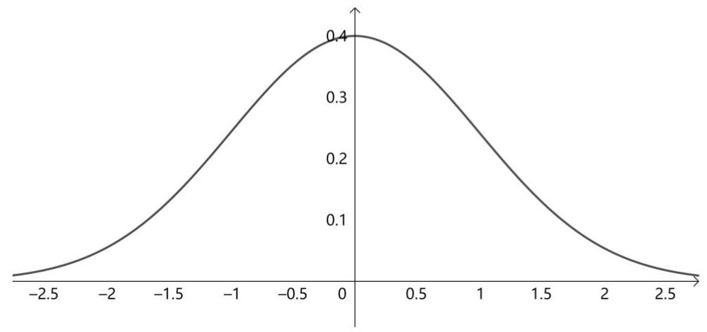

一般的正态密度函数 $f\left( x\right)  = \frac{1}{\sigma \sqrt{2\pi }}{\mathrm{e}}^{-\frac{{\left( x - \mu \right) }^{2}}{2{\sigma }^{2}}}$ 可以看作由标准的正态密度函数进行伸缩和平移变换后得到, 接下来我们进行具体变换。

从期望为 0 、方差为 1 的标准正态分布的密度函数开始:

$$
f\left( x\right)  = \frac{1}{\sqrt{2\pi }}{\mathrm{e}}^{-\frac{{x}^{2}}{2}}
$$

第 1 步: 沿水平方向伸缩为原来的 $\sigma$ (倍),将 $x$ 替换为 $\frac{x}{\sigma }$ ,解析式变为:

$$
f\left( x\right)  = \frac{1}{\sqrt{2\pi }}{\mathrm{e}}^{-\frac{{x}^{2}}{2{\sigma }^{2}}}
$$

第 2 步:由于第 1 步将图形沿水平方向伸缩为原来的 $\sigma$ (倍)，为确保图像与 $x$ 轴围成的面积仍为 1 (确保所有基本事件的概率之和等于 1 ),需要将图形沿竖直方向伸缩为原来的 $\frac{1}{\sigma }$ (倍)，让解析式整体除以 $\sigma$ ，解析式变为:

$$
f\left( x\right)  = \frac{1}{\sigma \sqrt{2\pi }}{\mathrm{e}}^{-\frac{{x}^{2}}{2{\sigma }^{2}}}
$$

第 3 步:沿 $x$ 轴正方向平移 $\mu$ 个单位，将 $x$ 替换为 $x - \mu$ ，解析式变为:

$$
f\left( x\right)  = \frac{1}{\sigma \sqrt{2\pi }}{\mathrm{e}}^{-\frac{{\left( x - \mu \right) }^{2}}{2{\sigma }^{2}}}
$$

就得到期望为 $\mu$ 、方差为 ${\sigma }^{2}$ 的一般的正态密度函数。

下图为四组不同的 $\mu$ 、 ${\sigma }^{2}$ 对应的正态密度函数的图像，注意观察比较曲线的形状与参数的取值之间的关系。

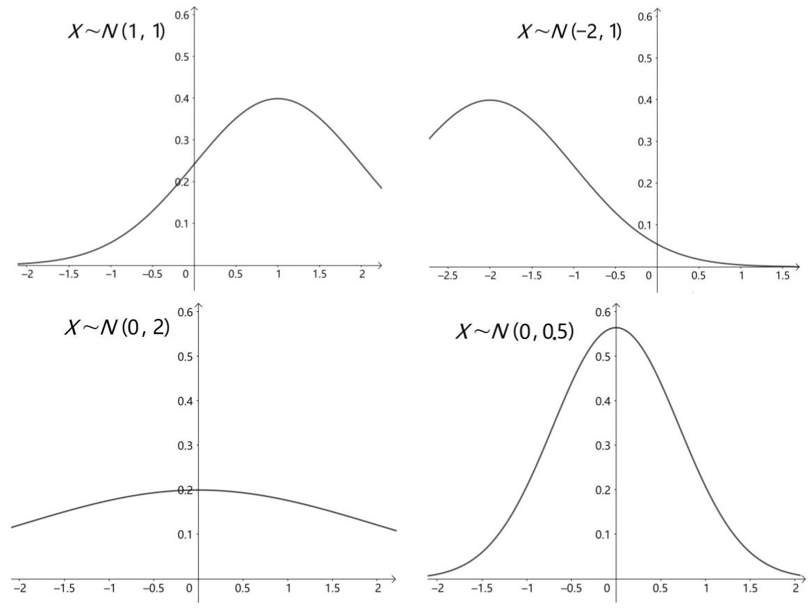

从图中可以读出: 正态分布密度曲线的对称轴和最高点的横坐标是期望 $\mu$ , 即实际测量中出现概率最大的数据。正态密度函数的方差 ${\sigma }^{2}$ 越小,曲线整体越细越高,表示数据越集中,方差 ${\sigma }^{2}$ 越大,曲线整体越粗越低,表示数据越分散, 这与方差表示统计数据离散程度的数学含义一致。

练习 18.4(3)

1. 下图中的两个曲线分别是正态分布 ${X}_{1} \sim  {N}_{1}\left( {{0.5},{\sigma }_{1}^{2}}\right)$ 与 ${X}_{2} \sim  {N}_{2}\left( {2,{\sigma }_{2}^{2}}\right)$ 的正态分布密度曲线, 回答下列问题:

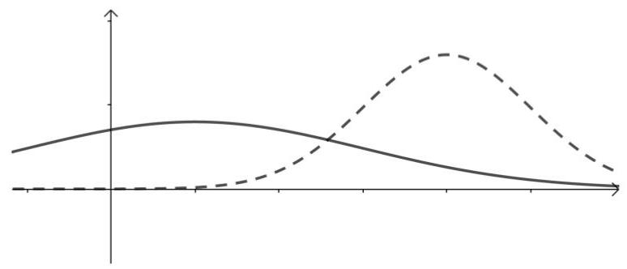

(1)指出图中的实线与虚线分别对应哪个正态分布；

(2)判断 ${\sigma }_{1}$ 与 ${\sigma }_{2}$ 的大小关系。

#### 18.4.4 正态密度函数的标准化与应用

现实中充满了服从正态分布的随机现象, 科研、生产、经营中经常需要确定某具体事件出现的概率, 从而判断是否需要为该事件付出努力做好应对。

例如,用一批长 10 m 的车厢运输 500 根木材, 已知这些木材的长度服从正态分布,平均长度 (期望) ${38}\mathrm{\;m}$ ,方差为 1.22,那么可以利用正态分布的规律, 得到长度大于车厢而无法运输的木材数量, 如果无法运输的木材很多, 就需要换为更长的车厢，如果无法运输的木材很少，可以考虑放弃运输另行处理。

然而, 实践操作中存在一个麻烦, 世界上有数不清各不相同的正态分布, 它们的期望和方差各不相同, 如果用数学知识对具体的正态密度函数进行分析和计算, 不仅工作量很大, 还对使用者的数学能力有较高要求, 让正态分布规律的应用受到限制。

为解决这个麻烦, 利用函数的平移变换和伸缩变换, 可以将形式较复杂的一般的正态密度函数转化为形式较简单的标准正态分布的正态密度函数，数学家计算并绘制了标准正态密度函数的相应数据表格，可以查阅已经被变换为标准正态密度函数的数据, 根据变换过程就能得知原来非标准的正态密度函数的信息。

接下来利用函数平移和伸缩变换的规律, 将一般的正态密度函数进行平移和伸缩变换, 变为简洁的标准正态密度函数, 对于一般的正态密度函数:

$$
f\left( x\right)  = \frac{1}{\sigma \sqrt{2\pi }}{\mathrm{e}}^{-\frac{{\left( x - \mu \right) }^{2}}{2{\sigma }^{2}}}
$$

第 1 步: 沿 $x$ 轴正方向平移 $- \mu$ 个单位,将 $x$ 替换为 $x + \mu$ ,使 $y$ 轴成为正态密度函数的对称轴, 函数解析式变为:

$$
f\left( x\right)  = \frac{1}{\sigma \sqrt{2\pi }}{\mathrm{e}}^{-\frac{{x}^{2}}{2{\sigma }^{2}}}
$$

第 2 步: 沿水平方向伸缩为原来的 $\frac{1}{\sigma }$ (被),将 $x$ 替换为 ${\sigma x}$ ,使正态分布的方差变为 1 , 函数解析式变为:

$$
f\left( x\right)  = \frac{1}{\sigma \sqrt{2\pi }}{\mathrm{e}}^{-\frac{{x}^{2}}{2{\sigma }^{2}}}
$$

第 3 步,为确保正态分布密度曲线与 $x$ 轴围成的面积仍为 1,在水平方向伸缩为 $\frac{1}{\sigma }$ (倍) 后,还需让解析式整体乘以 $\sigma$ ,函数解析式变为:

$$
f\left( x\right)  = \frac{1}{\sqrt{2\pi }}{\mathrm{e}}^{-\frac{{x}^{2}}{2}}
$$

就得到标准正态分布的密度函数。

综上,先将全体实测数据都减去期望 $\mu$ ,把期望从 $\mu$ 变成 0 ; 再将全体数据压缩,把方差从 ${\sigma }^{2}$ 变为 1 ; 最后把函数值都乘以 $\sigma$ ,确保函数图像与 $x$ 轴成的面积为 1 (全体基本事件的概率之和为 1 ) 。经过该变换,正态分布 $X \sim  N\left( {\mu ,{\sigma }^{2}}\right)$ 的全体观察值(自变量) $x$ 都变为:

$$
{x}^{\prime } = \frac{x - \mu }{\sigma }
$$

由 ${x}^{\prime }$ 构成的新的随机变量 $Z$ 与原正态分布 $X$ 之间的关系为:

$$
Z = \frac{X - \mu }{\sigma }
$$

随机变量 $Z$ 服从标准正态分布,将 $Z = \frac{X - \mu }{\sigma }$ 变为 $X = {\sigma Z} + \mu$ ,将其代入 $X \sim  N\left( {\mu ,{\sigma }^{2}}\right)$ 的正态密度函数 $f\left( x\right)  = \frac{1}{\sigma \sqrt{2\pi }}{\mathrm{e}}^{\frac{-{\left( x - \mu \right) }^{2}}{2{\sigma }^{2}}}$ 即可得:

$$
f\left( z\right)  = \frac{1}{\sigma \sqrt{2\pi }}{\mathrm{e}}^{-\frac{{\left( \sigma Z + \mu  - \mu \right) }^{2}}{2{\sigma }^{2}}} = \frac{1}{\sigma \sqrt{2\pi }}{\mathrm{e}}^{-\frac{{z}^{2}}{2}}
$$

需注意,函数 $f\left( z\right)  = \frac{1}{\sigma \sqrt{2\pi }}{\mathrm{e}}^{-\frac{{z}^{2}}{2}}$ 与标准正态密度函数 $f\left( x\right)  = \frac{1}{\sqrt{2\pi }}{e}^{-\frac{{x}^{2}}{2}}$ 的解析式相差 $\frac{1}{\sigma }$ ,这是为了保证函数图像与 $x$ 轴所围成的面积为 1 而作出的调整。

将正态密度函数 $f\left( x\right)$ 标准化为 $f\left( z\right)$ 后,成对的 $x$ 与 ${x}^{\prime } = \frac{x - \mu }{\sigma }$ 对应的概率相同, 就能将标准正态密度函数的数据用于描述一般的正态分布。

正态分布是连续型随机变量, 连续型随机变量的基本事件有无穷多, 1 个基本事件与无穷多全体基本事件的比例为 0 , 通常用具体事件对应的连续区间的面积与全体基本事件的面积(“ 1 ”)的比值计算事件发生的概率。

对于正态密度函数，事件 “ $X$ 的取值为 ${x}_{0}$ ” 的概率恒为 0，没有讨论的意义。 有意义的问题为事件 “ $X$ 的取值落在区间 $\left\lbrack  {{x}_{1},{x}_{2}}\right\rbrack$ 内” 发生的概率，该事件的概率等于正态分布密度曲线、 $x = {x}_{1}\text{ 、 }x = {x}_{2}\text{ 、 }x$ 轴,这四条曲线围成的面积。

数学家计算出了标准正态密度函数 $f\left( x\right)  = \frac{1}{\sqrt{2\pi }}{\mathrm{e}}^{-\frac{{x}^{2}}{2}}$ 中,各取值 $x = z\left( {z > 0}\right)$ 对应的区域 $x \in  \left\lbrack  {0, z}\right\rbrack$ 的面积,通常记作 $\Phi \left( z\right)$ ,并绘制成《正态分布表》,可以方便地查询和计算相应的取值范围发生的概率。下页图所示为 $\Phi \left( z\right)$ 表示的区域面积,该面积等于事件 $x \in  \left\lbrack  {0, z}\right\rbrack$ 发生的概率,下页表格为常用的《正态分布表》, 列出了一系列 $z$ 与对应的面积(概率)。

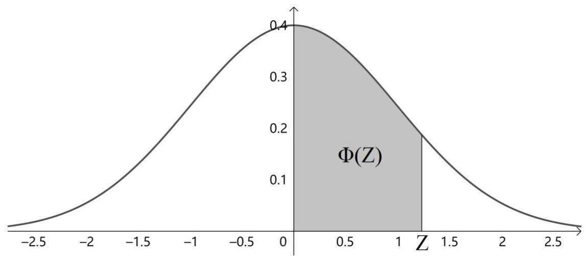

<table><tr><td>$z$</td><td>.00</td><td>.01</td><td>.02</td><td>.03</td><td>.04</td><td>.05</td><td>.06</td><td>.07</td><td>.08</td><td>.09</td></tr><tr><td>0.0</td><td>.0000</td><td>.0040</td><td>.0080</td><td>.0120</td><td>.0160</td><td>.0199</td><td>.0239</td><td>.0279</td><td>.0319</td><td>.0359</td></tr><tr><td>0.1</td><td>.0398</td><td>.0438</td><td>.0478</td><td>.0517</td><td>.0557</td><td>.0596</td><td>.0636</td><td>.0675</td><td>.0714</td><td>.0753</td></tr><tr><td>0.2</td><td>.0793</td><td>.0832</td><td>.0871</td><td>.0910</td><td>.0948</td><td>.0987</td><td>.1026</td><td>.1064</td><td>.1103</td><td>.1141</td></tr><tr><td>0.3</td><td>.1179</td><td>.1217</td><td>.1255</td><td>.1293</td><td>.1331</td><td>.1368</td><td>.1406</td><td>.1443</td><td>.1480</td><td>.1517</td></tr><tr><td>0.4</td><td>.1554</td><td>.1591</td><td>.1628</td><td>.1664</td><td>.1700</td><td>.1736</td><td>.1772</td><td>.1808</td><td>.1844</td><td>.1879</td></tr><tr><td>0.5</td><td>.1915</td><td>.1950</td><td>.1985</td><td>.2019</td><td>.2054</td><td>.2088</td><td>.2123</td><td>.2157</td><td>.2190</td><td>.2224</td></tr><tr><td>0.6</td><td>.2257</td><td>.2291</td><td>.2324</td><td>.2357</td><td>.2389</td><td>.2422</td><td>.2454</td><td>.2486</td><td>.2517</td><td>.2549</td></tr><tr><td>0.7</td><td>.2580</td><td>.2611</td><td>.2642</td><td>.2673</td><td>.2704</td><td>.2734</td><td>.2764</td><td>.2794</td><td>.2823</td><td>.2852</td></tr><tr><td>0.8</td><td>.2881</td><td>.2910</td><td>.2939</td><td>.2967</td><td>.2995</td><td>.3023</td><td>.3051</td><td>.3078</td><td>.3106</td><td>.3133</td></tr><tr><td>0.9</td><td>.3159</td><td>.3186</td><td>.3212</td><td>.3238</td><td>.3264</td><td>.3289</td><td>.3315</td><td>.3340</td><td>.3365</td><td>.3389</td></tr><tr><td>1.0</td><td>.3413</td><td>.3438</td><td>.3461</td><td>.3485</td><td>.3508</td><td>.3531</td><td>.3554</td><td>.3577</td><td>.3599</td><td>.3621</td></tr><tr><td>1.1</td><td>.3643</td><td>.3665</td><td>.3686</td><td>.3708</td><td>.3729</td><td>.3749</td><td>.3770</td><td>.3790</td><td>.3810</td><td>.3830</td></tr><tr><td>1.2</td><td>.3849</td><td>.3869</td><td>.3888</td><td>.3907</td><td>.3925</td><td>.3944</td><td>.3962</td><td>.3980</td><td>.3997</td><td>.4015</td></tr><tr><td>1.3</td><td>.4032</td><td>.4049</td><td>.4066</td><td>.4082</td><td>.4099</td><td>.4115</td><td>.4131</td><td>.4147</td><td>.4162</td><td>.4177</td></tr><tr><td>1.4</td><td>.4192</td><td>.4207</td><td>.4222</td><td>.4236</td><td>.4251</td><td>.4265</td><td>.4279</td><td>.4292</td><td>.4306</td><td>.4319</td></tr><tr><td>1.5</td><td>.4332</td><td>.4345</td><td>.4357</td><td>.4370</td><td>.4382</td><td>.4394</td><td>.4406</td><td>.4418</td><td>.4429</td><td>.4441</td></tr><tr><td>1.6</td><td>.4452</td><td>.4463</td><td>.4474</td><td>.4484</td><td>.4495</td><td>.4505</td><td>.4515</td><td>.4525</td><td>.4535</td><td>.4545</td></tr><tr><td>1.7</td><td>.4554</td><td>.4564</td><td>.4573</td><td>.4582</td><td>.4591</td><td>.4599</td><td>.4608</td><td>.4616</td><td>.4625</td><td>.4633</td></tr><tr><td>1.8</td><td>.4641</td><td>.4649</td><td>.4656</td><td>.4664</td><td>.4671</td><td>.4678</td><td>.4686</td><td>.4693</td><td>.4699</td><td>.4706</td></tr><tr><td>1.9</td><td>.4713</td><td>.4719</td><td>.4726</td><td>.4732</td><td>.4738</td><td>.4744</td><td>.4750</td><td>.4756</td><td>.4761</td><td>.4767</td></tr><tr><td>2.0</td><td>.4772</td><td>.4778</td><td>.4783</td><td>.4788</td><td>.4793</td><td>.4798</td><td>.4803</td><td>.4808</td><td>.4812</td><td>.4817</td></tr><tr><td>2.1</td><td>.4821</td><td>.4826</td><td>.4830</td><td>.4834</td><td>.4838</td><td>.4842</td><td>.4846</td><td>.4850</td><td>.4854</td><td>.4857</td></tr><tr><td>2.2</td><td>.4861</td><td>.4864</td><td>.4868</td><td>.4871</td><td>.4875</td><td>.4878</td><td>.4881</td><td>.4884</td><td>.4887</td><td>.4890</td></tr><tr><td>2.3</td><td>.4893</td><td>.4896</td><td>.4898</td><td>.4901</td><td>.4904</td><td>.4906</td><td>.4909</td><td>.4911</td><td>.4913</td><td>.4916</td></tr><tr><td>2.4</td><td>.4918</td><td>.4920</td><td>.4922</td><td>.4925</td><td>.4927</td><td>.4929</td><td>.4931</td><td>.4932</td><td>.4934</td><td>.4936</td></tr><tr><td>2.5</td><td>.4938</td><td>.4940</td><td>.4941</td><td>.4943</td><td>.4945</td><td>.4946</td><td>.4948</td><td>.4949</td><td>.4951</td><td>.4952</td></tr><tr><td>2.6</td><td>.4953</td><td>.4955</td><td>.4956</td><td>.4957</td><td>.4959</td><td>.4960</td><td>.4961</td><td>.4962</td><td>.4963</td><td>.4964</td></tr><tr><td>2.7</td><td>.4965</td><td>.4966</td><td>.4967</td><td>.4968</td><td>.4969</td><td>.4970</td><td>.4971</td><td>.4972</td><td>.4973</td><td>.4974</td></tr><tr><td>2.8</td><td>.4974</td><td>.4975</td><td>.4976</td><td>.4977</td><td>.4974</td><td>.4978</td><td>.4979</td><td>.4979</td><td>.4980</td><td>.4981</td></tr><tr><td>2.9</td><td>.4981</td><td>.4982</td><td>.4982</td><td>.4983</td><td>.4984</td><td>.4984</td><td>.4985</td><td>.4985</td><td>.4986</td><td>.4986</td></tr><tr><td>3.0</td><td>.4987</td><td>.4987</td><td>.4987</td><td>.4988</td><td>.4988</td><td>.4989</td><td>.4989</td><td>.4989</td><td>.4990</td><td>.4990</td></tr><tr><td>3.1</td><td>.4990</td><td>.4991</td><td>.4991</td><td>.4991</td><td>.4992</td><td>.4992</td><td>.4992</td><td>.4992</td><td>.4993</td><td>.4993</td></tr><tr><td>3.2</td><td>.4993</td><td>.4993</td><td>.4994</td><td>.4994</td><td>.4994</td><td>.4994</td><td>.4994</td><td>.4995</td><td>.4995</td><td>.4995</td></tr><tr><td>3.3</td><td>.4995</td><td>.4995</td><td>.4995</td><td>.4996</td><td>.4996</td><td>.4996</td><td>.4996</td><td>.4996</td><td>.4996</td><td>.4997</td></tr><tr><td>3.4</td><td>.4997</td><td>.4997</td><td>.4997</td><td>.4997</td><td>.4997</td><td>.4997</td><td>.4997</td><td>.4997</td><td>.4997</td><td>.4998</td></tr><tr><td>3.5</td><td>.4998</td><td>.4998</td><td>.4998</td><td>.4998</td><td>.4998</td><td>.4998</td><td>.4998</td><td>.4998</td><td>.4998</td><td>.4998</td></tr></table>

《正态分布表》中,自变量 $z$ 的取值共 3 位,包括小数点前的 1 位和小数点后的 2 位,表中最左列对应 $z$ 的个位和小数点后第一位,最上行对应 $z$ 的小数点后第二位,表中行与列相交的位置的数字,就是对应的 $\Phi \left( z\right)$ 。

例如,若要查找 $\Phi \left( {2.18}\right)$ 值,先从表格最左侧找到 “2.1”,再在表格最上行找到 “.08”, 则 “2.1” 所在行与 “.08” 所在列相交处的值 “0.4854” 就是对应的 $\Phi \left( {2.18}\right)$ ,即 $\Phi \left( {2.18}\right)  = {0.4854}$ ,表示测量值在 $\left\lbrack  {0,{2018}}\right\rbrack$ 范围内的概率为 0.4854 。

标准正态密度函数是偶函数,图像关于 $y$ 轴对称,且函数图像与 $x$ 轴包围的全部面积之和为 1,由此可得图像的一半与 $x$ 轴包围的面积为 0,5,即 $y$ 轴左侧和右侧的面积都是 0.5 。又因为 ${x}_{0} > 0$ ,所以 $0 < \Phi \left( {x}_{0}\right)  < {0.5}$ 。

如果要求的面积全在 $y$ 轴右侧,即要求 $X \in  \left\lbrack  {a, b}\right\rbrack  \left( {0 < a < b}\right)$ 的概率,那么只需查表得到 $\Phi \left( a\right)$ 与 $\Phi \left( b\right)$ ,再求出 $\Phi \left( b\right)  - \Phi \left( a\right)$ 即可,如下图所示。

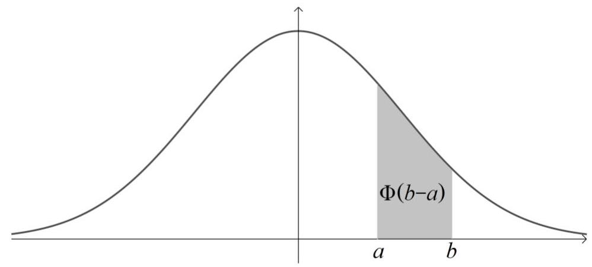

如果要求的面积跨越 $y$ 轴,即要求 $X \in  \left\lbrack  {a, b}\right\rbrack  \left( {a < 0 < b}\right)$ 的概率,那么只需查表得到 $\Phi \left( \left| a\right| \right)$ 与 $\Phi \left( b\right)$ ,利用曲线的对称性换算为 $\Phi \left( b\right)  + \Phi \left( \left| a\right| \right)$ 即可,如下图所示。

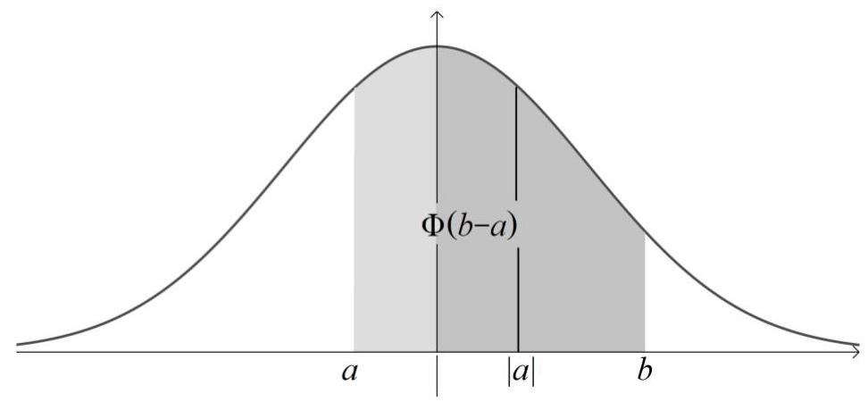

如果要求的面积全在 $y$ 轴左侧,即要求 $X \in  \left\lbrack  {a, b}\right\rbrack  \left( {a < b < 0}\right)$ 的概率,那么只需查表得到 $\Phi \left( \left| a\right| \right)$ 与 $\Phi \left( \left| b\right| \right)$ ,利用曲线的对称性换算为 $\Phi \left( \left| a\right| \right)  - \Phi \left( \left| b\right| \right)$ 即可,如下页图所示。

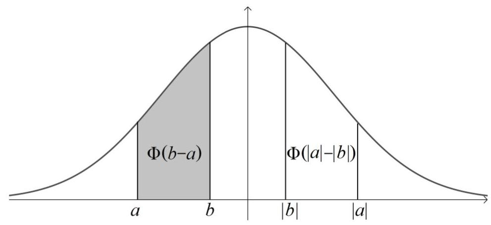

对于已知的正态分布 $X \sim  N\left( {\mu ,{\sigma }^{2}}\right)$ 和观察值 ${x}_{0}$ ,先用公式 $Z = \frac{X - \mu }{\sigma }$ 将其转化为标准正态分布,再对照《正态分布表》查询取值在对应的 $\left\lbrack  {\mu ,{x}_{0}}\right\rbrack$ 范围的概率, 该操作实际上是将求某一范围的面积, 转化为求两个范围的面积的差 (或和)。

如果 ${x}_{0} < \mu$ ,那么只需利用正态密度函数的对称性,查阅对称的另一侧的 $\mu  + \left( {\mu  - {x}_{0}}\right)  = {2\mu } - {x}_{0}$ 的概率,再进行换算即可。

需注意，使用《正态分布表》时需注意表格类型，有的《正态分布表》给出的面积 ${\Phi }^{\prime }\left( {x}_{0}\right)$ 是 $x \in  \left( {-\infty ,{x}_{0}}\right\rbrack$ 对应的概率,如下图所示,由正态分布的性质可得:

$$
{\Phi }^{\prime }\left( {x}_{0}\right)  = \Phi \left( {x}_{0}\right)  + {0.5}
$$

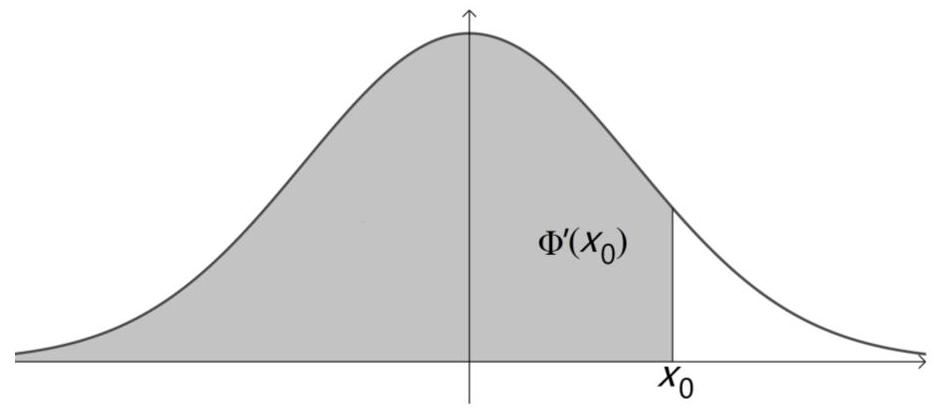

例 18.15 若随机变量服从正态分布 $X \sim  N\left( {5,1}\right)$ ,且 $P\left( {4 \leq  X \leq  6}\right)  = {0.4908}$ , 求 $P\left( {X > 6}\right)$ 。

解析: 已知随机变量服从正态分布,期望为 $\mu  = 5$ ,方差为 ${\sigma }^{2} = 1$ ,可以画出大致的正态分布密度曲线,只需确保对称轴为 $x = 5$ 即可,如下图所示。

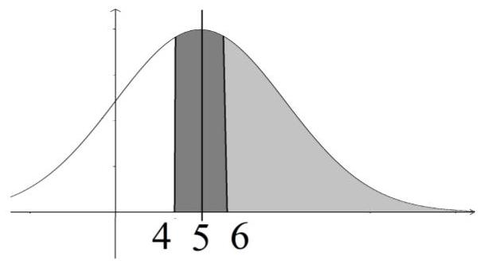

已知概率的取值范围为 $X \in  \left\lbrack  {4,6}\right\rbrack$ ,恰好对称分布在对称轴两侧,涂黑大致范围，不需要精确，只要确保关于对称轴对称即可，要求概率的范围涂为浅灰色。

由正态密度函数的对称性可知对称轴 $x = 5$ 将涂黑的区域平均分为对称的两份,即 $P\left( {4 \leq  X \leq  5}\right)  = P\left( {5 \leq  X \leq  6}\right)  = \frac{0.4908}{2} = {0.2454}$ ,又因为对称轴两侧全部区域的面积各为 0.5,所以 $P\left( {X > 6}\right)  = P\left( {X \geq  5}\right)  - P\left( {5 \leq  X \leq  6}\right)  = {0.5} - {0.2454} = {0.2546}$ , 即图中浅灰色区域的面积。

实际应用中,通常选取事件发生的概率为 $P\left( {\mu  - {3\sigma } \leq  X \leq  \mu  + {3\sigma }\rbrack }\right)  \approx  {0.9973}$ , 认为此时该事件一定发生,即 $x \in  \left\lbrack  {\mu  - {3\sigma },\mu  + {3\sigma }}\right\rbrack$ 范围内的取值一定发生。而在这个区间之外的事件 (取值), $x \in  \left( {-\infty ,\mu  - {3\sigma }}\right)  \cup  \left( {\mu  + {3\sigma }, + \infty }\right)$ 的概率为 0.0027, 通常认为该事件 (取值) (几乎) 不可能发生。该数据和结论很常用, 主要用于判断某个取值是否可能得到, 等同于判断某事件究竟是否可能发生。

例如,假设一根绳子的长度为 ${1.0000}\mathrm{\;m}$ ,实际测量结果符合标准正态分布, 那么实测值为 ${x}_{1} = {1.0025}\mathrm{\;m}$ 的数据在区间 $\left\lbrack  {\mu  - {3\sigma },\mu  + {3\sigma }}\right\rbrack$ 之内,这个数据很可能被测得; 而 ${x}_{2} = {1.0050}\mathrm{\;m}$ 的数据在区间 $\left\lbrack  {\mu  - {3\sigma },\mu  + {3\sigma }}\right\rbrack$ 之外,这个误差较大的“离谱”数据不可能被测得。

例 18.16 一批零件的直径 (单位: 毫米) 服从正态分布 $X \sim  N\left( {{2.000},{0.01}^{2}}\right)$ , 若直径大于 2.020 mm 的零件无法正常使用，求无法使用的零件所占的比例。(需查阅第 502 页的正态分布表)

解析: 将正态分布化为标准正态分布: $Z = \frac{X - {2.000}}{0.01}$ ,则 2.010 对应的数据为 ${Z}_{0} = \frac{{2.020} - {2.000}}{0.01} = {2.00}$ ,查阅第 502 页的正态分布表得 $P\left( {0 \leq  Z \leq  2}\right)  = {0.4772}$ , 由正态分布密度曲线与 $x$ 轴围成的总面积为 1,以及正态分布密度曲线的对称性可得: $P\left( {Z > 2}\right)  = {0.5} - P\left( {0 \leq  Z \leq  2}\right)  = {0.5} - {0.4772} = {0.0228}$ ,即无法使用的零件所占的比例为 2.28%。

练习 18.4(4)

1. 已知某随机变量服从正态分布 $X \sim  N\left( {4,{16}}\right) , P\left( {X < 8}\right)  = {0.8}$ ,求下列事件的概率:

(1) $X > 8$ ； (2) $0 < X < 8$ ； (3) $X < 4$ ； (4) $X > 0$ 。

2. 某细菌在一定条件下的存活时间(单位: $\mathrm{h}$ )服从正态分布 $X \sim  N\left( {4,{1}^{2}}\right)$ ， 在该条件下大量培养该细菌，分别求 $2\mathrm{\;h}$ 、 $4\mathrm{\;h}$ 、 $6\mathrm{\;h}$ 后，存活细菌的比例。(需查阅第 502 页的正态分布表)

## 小结

本章主要学习随机变量的定义和性质，以及三种重要的分布类型:二项分布、 超几何分布、正态分布。本章的概念和公式主要由概率与统计的知识结合而来, 对于二项分布和超几何分布, 需注重从计数原理、概率与统计的原理和规律的角度, 理解相应的概念和公式, 掌握公式的分析推导过程, 熟练掌握具体应用。对于正态分布, 需从函数的性质和实际含义两个角度理解, 熟练掌握其在真实场景中的应用。

## 第十九章 成对数据的统计分析

科学研究和实际应用中, 经常需要判断两个变量间的关系, 并根据变量间的关系提出理论。本章我们学习用统计的知识，从数学的角度判断两组数据之间的关系, 为建立理论提供支持和佐证。

两组数据之间的关系中, 一种简单且常见的关系是线性关系——用一条直线表示两组数据之间的对应关系，本章将学习如何判断两组数据的关系能否用直线表示，并用参数精确地反映与直线的匹配程度。

一些变量之间的关系虽然不能完美地用一条直线描述, 但仍可以画出一条 “差不多”的直线描述两组变量间的对应关系，本章将学习如何根据已知数据， 求出这条“差不多”的直线的方程，一些具有其他数学关系的变量能通过数学处理转化为线性关系。

本章还将学习从数学上一般性地判断两组数据之间是否存在相互影响的方法。我们在《概率》一章学习的事件的独立性针对的是同一个事件的不同方面， 本章学习的事件的独立性针对的是生活中通常认为的“两件事”。

本章的部分结论的推导涉及较复杂的原理和分析过程，好在最终得到的公式大都形式简洁, 需要在理解推导过程的基础上, 借助直观的感性认识帮助记忆, 可以在理解原理的基础上直接记忆公式和结论。

### 19.1 成对数据的线性相关性

线性关系是一种非常简洁直观的关系, 即用直线表示两组变量间的关系。分析曲线的性质时, 经常 “以直代曲” 将曲线的一部分看作直线, 曲线的切线就是用直线描述曲线的变化情况。用直线描述两组变量间的关系前, 首先需要判断能否用直线很好地描述它们的关系。

#### 19.1.1 变量的相关关系

如果两个变量的各取值之间具有某种对应关系, 比如一个变量的取值决定另一个变量的取值, 或这两个变量的取值共同由第三个变量决定, 就称这两个变量具有相关关系。

研究两个变量之间的相关关系前, 需要先将作为研究对象的两个变量 (两组数据)进行配对。通常用某种明确的标识，建立起两个变量的各取值(数据)之间的一一对应关系，且按照这种标识进行配对的方式是唯一的。

案例 1 变量 $X$ 是实验田中亲代植株的高度(单位:米)，变量 $Y$ 是子代植株的高度(单位:米)，那么 “亲缘关系” 就是将 $X$ 与 $Y$ 的数据配对的标识， 即: 将亲代植株的高度 ${x}_{i}$ 与它们子代植株的高度 ${y}_{i}$ 配对。

案例 2 变量 $X$ 是某地冬季一天中的最低温 (单位:摄氏度),变量 $Y$ 是该地某小区一天的用电量(单位:千瓦时)，那么“日期”就是将 $X$ 与 $Y$ 的数据配对的标识,即: 将同一天里的最低温 ${x}_{i}$ 与用电量 ${y}_{i}$ 配对。

案例 3 变量 $X$ 是某市历年高考本科录取分数线 (单位:分),变量 $Y$ 是该市历年人均可支配收入(单位:元)，那么 “年份” 就是将 $X$ 与 $Y$ 的数据配对的标识,即: 将同一年里的本科录取分数线 ${x}_{i}$ 与人均可支配收入 ${y}_{i}$ 配对。

上面三个案例中, 都有一个明确的标识 (亲缘关系、日期、年份), 将两个变量中的各数据一一配对, 且配对方式是唯一的, 这是分析两个变量之间的相关关系的前提。

研究数据的线性相关性时, 数据的配对需由独立于数据的标识确定, 而不是根据数据本身的特点进行排队。上面的三个案例中, 配对的依据分别是亲缘关系、 日期、年份，而不是先分别把两组数据按照大小顺序排列，再统一按照 “大对大、 小对小”或“大对小、小对大”的数值特征对应。

根据现实经验，两个变量的相关性有两种方式(又叫作“方向”):

如果两个变量具有相同的变化趋势，始终(或整体上)一起增加或一起减少， 就称它们正相关。如果两个变量具有相反的变化趋势, 始终 (或整体上) 此消彼长, 就称它们负相关。正相关和负相关是关于相关性的方向的判断。

此外，如果两个变量之间没有明显的共同变化趋势，就称它们 “不相关”。 是否相关是关于相关程度大小的判断，描述的是相关程度的强弱(有无)。方向与大小分别属于相关关系的两个方面的性质，类似于向量的方向与大小(模)。

将两个变量配对后, 判断它们之间的相关性有两种基本方法: 一种是用科学规律分析判断，另一种就是本章要学习的使用统计的方法根据数据分析判断。

首先根据知识和逻辑对前面的三个例子进行简要的分析判断。

案例 1 中,由于遗传因子对植物的高度有重要影响,因此亲代植株的高度 ${x}_{i}$ 越大,它们的子代植株的高度 ${y}_{i}$ 很可能也越大,可以合理猜测 $X$ 与 $Y$ 正相关。

案例 2 中,冬季某一天的最低温 ${x}_{i}$ 越大,那么开空调、电暖气、电热毯等加热设备的需求越少,用电量 ${y}_{i}$ 应当越小,可以合理猜测 $X$ 与 $Y$ 负相关。

案例 3 中,高考本科录取分数线 ${x}_{i}$ 与高考命题难度、学生水平、发挥情况等因素有关，全年人均可支配收入 ${y}_{i}$ 与经济发展、宏观政策、外部环境等因素有关， 很难找到两者之间的确切联系,难以猜测 $X$ 与 $Y$ 正相关还是负相关,可以合理猜测 $X$ 与 $Y$ 的相关性很小。

以上是根据知识和逻辑作出的分析推断, 接下来学习用统计知识对成对数据的相关关系进行定性判断和定量分析。

绘制散点图可以直观地展示成对数据之间的关系, 散点图的绘制方法为: 建立平面直角坐标系,以其中一个变量 $X$ 的取值为横坐标、另一个变量 $Y$ 的取值为纵坐标,将所有成对数据 $\left( {{x}_{i},{y}_{i}}\right)$ 描绘在图中,下图为几幅特点不同的散点图。

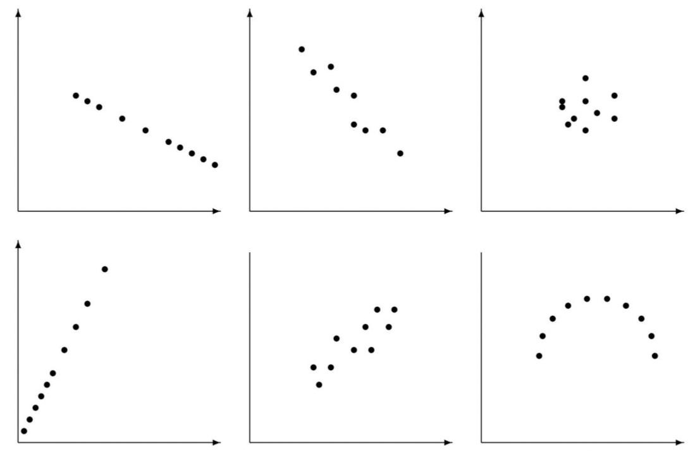

从图中可以看出:

左上和左下的图中的全部点都聚集在一条直线附近, 它们具有非常显著的线性相关关系, 这两种情况都称两个变量线性相关。

中上和中下的图中的全部点也都聚集在一条直线附近, 但没有左上和左下那么明显, 可以从直观上感到这两组数据的线性相关关系弱于左边的两组数据。

右上的图中的点聚集成团, 右下的图中的点围成一个半圆, 很难找出一条直线使得各点都聚集在该直线附近, 这种情况都称这两个变量非线性相关。

另一方面, 左上和中上的图中, 各点都聚集在斜率为负数的直线附近, 即一个数据越大, 对应的另一个数据越小, 这是典型的负相关。左下和中下的图中, 各点都聚集在斜率为正数的直线附近, 即一个数据越大, 对应的另一个数据也越大, 这是典型的正相关。

## 练习 19.1(1)

1. 直观判断下列各图中的数据是否具有线性相关关系, 如有, 是正相关还是负相关:

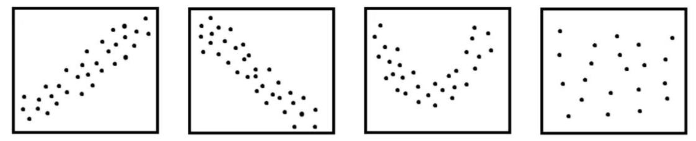

#### 19.1.2 样本相关系数

虽然散点图可以直观地展示两个变量间的相关关系的方向和强弱, 但这种直观展示和判断有较大主观性, 不能进行精确的定量分析, 接下来学习对两个变量之间的相关关系进行精确的定量分析的方法。

对于两组随机变量 $X : {x}_{1},{x}_{2},\cdots ,{x}_{n}$ 和 $Y : {y}_{1},{y}_{2},\cdots ,{y}_{n}$ ,先按照一定规则配对,得到一系列实数对 $\left( {{x}_{1},{y}_{1}}\right) ,\left( {{x}_{2},{y}_{2}}\right) ,\cdots ,\left( {{x}_{n},{y}_{n}}\right)$ ,设变量 $X$ 的平均数为 $\bar{x} = \frac{1}{n}\left( {{x}_{1} + \cdots  + {x}_{n}}\right)$ ,变量 $Y$ 的平均数为 $\bar{y} = \frac{1}{n}\left( {{y}_{1} + \cdots  + {y}_{n}}\right)$ 。

将实数对 $\left( {{x}_{1},{y}_{1}}\right) ,\left( {{x}_{2},{y}_{2}}\right) ,\cdots ,\left( {{x}_{n},{y}_{n}}\right)$ 与平面直角坐标系中的点一一对应, 将各点沿向量 $\overrightarrow{n} = \left( {\bar{x},\bar{y}}\right)$ 的反方向平移,变为 $\left( {{x}_{i} - \bar{x},{y}_{i} - \bar{y}}\right)$ ,该平移变换将全体点进行了相同的平移, 只是将整个图形在坐标系中的位置进行了整体移动, 没有改变各点之间的相对位置关系, 也没有改变图形的整体形状。

根据平均数的定义式和变换规律,平移后各点的横坐标 ${y}_{i} - \bar{y}$ 都大致分布在 $y$ 轴的左右附近,纵坐标 ${x}_{i} - \bar{x}$ 都大致分布在 $x$ 轴的上下附近。

如果所有 (或绝大部分) 点都满足: 若 ${x}_{i} > \bar{x}$ ,则 ${y}_{i} > \bar{y}$ ; 若 ${x}_{i} < \bar{x}$ ,则 ${y}_{i} < \bar{y}$ , 即它们大都在第一和第三象限, 类似于斜率为正数且经过原点的直线, 就称变量 ${x}_{i}$ 与 ${y}_{i}$ 的变化规律一致,即它们正相关。

如果所有 (或绝大部分) 点都满足: 若 ${x}_{i} > \bar{x}$ ,则 ${y}_{i} < \bar{y}$ ; 若 ${x}_{i} < \bar{x}$ ,则 ${y}_{i} > \bar{y}$ , 即它们大都在第二和第四象限, 类似于斜率为负数且经过原点的直线, 就称变量 ${x}_{i}$ 与 ${y}_{i}$ 的变化规律相反,即它们负相关。

接下来正式引入进行定量分析的新参数 ${L}_{xy}$ : 按照类似构造方差的方式,将每一对 ${x}_{i} - \bar{x}$ 与 ${y}_{i} - \bar{y}$ 相乘后求和,再除以总数 $n$ :

$$
{L}_{xy} = \frac{1}{n}\left\lbrack  {\left( {{x}_{1} - \bar{x}}\right) \left( {{y}_{1} - \bar{y}}\right)  + \left( {{x}_{2} - \bar{x}}\right) \left( {{y}_{2} - \bar{y}}\right)  + \cdots  + \left( {{x}_{n} - \bar{x}}\right) \left( {{y}_{n} - \bar{y}}\right) }\right\rbrack
$$

根据 ${L}_{xy}$ 的定义式,若数据大都符合 “ ${x}_{i} > \bar{x},{y}_{i} > \bar{y}$ ” 或 “ ${x}_{i} < \bar{x},{y}_{i} < \bar{y}$ ”, 则整体上 $\left( {{x}_{i} - \bar{x}}\right) \left( {{y}_{i} - \bar{y}}\right)  > 0$ ,于是 ${L}_{xy} > 0$ ,此时变量 ${x}_{i}$ 与 ${y}_{i}$ 正相关。

相反的,若数据大都符合 “ ${x}_{i} > \bar{x},{y}_{i} < \bar{y}$ ” 或 “ ${x}_{i} < \bar{x},{y}_{i} > \bar{y}$ ”,则整体上 $\left( {{x}_{i} - \bar{x}}\right) \left( {{y}_{i} - \bar{y}}\right)  < 0$ ,于是 ${L}_{xy} < 0$ ,此时变量 ${x}_{i}$ 与 ${y}_{i}$ 负相关。

然而,不能认为 $\left| {L}_{xy}\right|$ 越大,相关程度就越大, $\left| {L}_{xy}\right|$ 越小,相关程度就越小, 这是因为除两组数据的相关性大小外, $\left| {L}_{xy}\right|$ 的大小还受到数据的离散程度、数值大小等因素影响。

例如,如果变量 $X\text{ 、 }Y$ 自身的离散程度很大,即 ${x}_{i} - \bar{x}$ 和 ${y}_{i} - \bar{y}$ 的值都非常大, 就算它们的相关程度较弱,计算得到 ${L}_{xy}$ 的值仍然很大,而如果另一对变量 $P\text{ 、 }Q$ 如果自身的离散程度很小,即 ${p}_{i} - \bar{p}$ 和 ${q}_{i} - \bar{q}$ 的值都很小,就算它们的相关程度较强,计算得到的 ${L}_{pq}$ 的值仍然很小。

例 19.1 设变量 $X\text{ 、 }Y$ 配对得到实数对 $\left( {5,4}\right) \text{ 、 }\left( {{10},{11}}\right) \text{ 、 }\left( {{15},{14}}\right) \text{ 、 }\left( {{20},{21}}\right)$ , 变量 $P$ 、 $Q$ 配对得到实数对 $\left( {{10},{10}}\right) \text{ 、 }\left( {{20},{90}}\right) \text{ 、 }\left( {{30},{60}}\right) \text{ 、 }\left( {{40},0}\right)$ ,绘制散点图并计算 ${L}_{xy}$ 和 ${L}_{pq}$ 。

解析: 将两组数据对应的点分别绘制在平面直角坐标系中,左图为 $X\text{ 、 }Y$ 的散点图,可以直观感到这些点大都在直线 $y = x$ 附近,右图为 $P\text{ 、 }Q$ 的散点图,很难找出这些点共同靠近的直线, $X\text{ 、 }Y$ 的线性相关性显著大于 $P\text{ 、 }Q$ 。

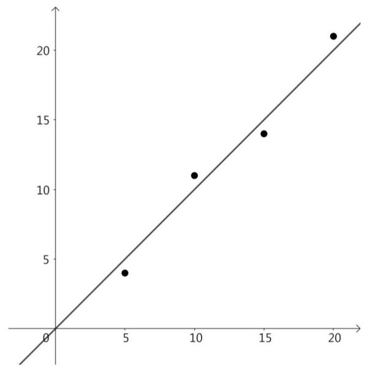

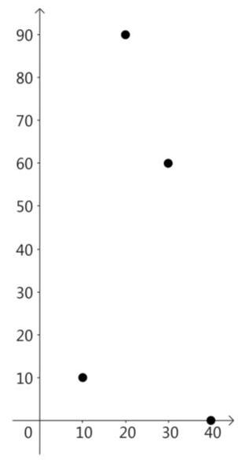

接下来计算 ${L}_{xy}$ ,首先求各变量的均值: $\bar{x} = \frac{5 + {10} + {15} + {20}}{4} = {12.5}$ , $\bar{y} = \frac{4 + {11} + {14} + {21}}{4} = {12.5}$ ,用各数据减去平均数,构造新的实数对: $\left( {-{7.5}, - {8.5}}\right)$ 、 $\left( {-{2.5}, - {1.5}}\right) \text{ 、 }\left( {{2.5},{1.5}}\right) \text{ 、 }\left( {{7.5},{8.5}}\right)$ ,可得 ${L}_{xy} = \frac{1}{4}\lbrack \left( {-{7.5}}\right)  \times  \left( {-{8.5}}\right)  + \left( {-{2.5}}\right)  \times  \left( {-{1.5}}\right)  + \; {7.5} \times  {8.5} + {2.5} \times  {1.5}\rbrack  = {33.75}$ 。

接下来计算 ${L}_{pq}$ ,首先求各变量的均值: $\bar{p} = \frac{{10} + {20} + {30} + {40}}{4} = {25}$ , $\bar{q} = \frac{{10} + {90} + {60} + 0}{4} = {40}$ ,用各数据减去平均数,构造新的实数对: $\left( {-{15}, - {30}}\right)$ 、 $\left( {-5,{50}}\right) \text{ 、 }\left( {5,{20}}\right) \text{ 、 }\left( {{15}, - {40}}\right)$ ,可得 ${L}_{pq} = \frac{1}{4}\lbrack \left( {-{15}}\right)  \times  \left( {-{30}}\right)  + \left( {-5}\right)  \times  {50} + 5 \times  {20} + \; {15} \times  \left( {-{40}}\right) \rbrack  =  - {75}$ 。

比较 ${L}_{xy} = {33.75}$ 和 ${L}_{pq} =  - {75}$ 可得 $\left| {L}_{xy}\right|  < \left| {L}_{pq}\right|$ ,与它们的散点图显示的线性相关性的大小相反,正是因为 $X\text{ 、 }Y$ 的离散程度和数值大于 $P\text{ 、 }Q$ ,导致 $\left| {L}_{xy}\right|  < \left| {L}_{pq}\right|$ 。

为了克服参数 ${L}_{xy}$ 的这个不足,消除各变量自身的离散程度、数值大小等因素对判断线性相关关系的影响,还需要对 ${L}_{xy}$ 进一步完善。

消除离散度的影响的方法为: 让所有 ${x}_{i} - \bar{x}$ 和 ${y}_{i} - \bar{y}$ 分别除以各自的标准差:

$$
{s}_{x} = \sqrt{\frac{1}{n}\mathop{\sum }\limits_{{i = 1}}^{n}{\left( {x}_{i} - \bar{x}\right) }^{2}}\text{ 和 }{s}_{y} = \sqrt{\frac{1}{n}\mathop{\sum }\limits_{{i = 1}}^{n}{\left( {y}_{i} - \bar{y}\right) }^{2}}
$$

得到新的实数对:

$$
\left( {\frac{{x}_{i}}{{s}_{x}},\frac{{y}_{i}}{{s}_{y}}}\right)
$$

为方便书写,记作 $\left( {{x}^{\prime },{y}^{\prime }}\right)$ 。

这样一来, 每个变量的数据都除以自身的标准差, 就消除了变量自身的离散程度、数值大小的影响。

这里除以的是标准差而不是方差, 是因为标准差与数据本身的次数相同, 而方差是关于原数据的二次方的参数。

根据标准差的变换规律, 所有数据除以同一个不为零的常数, 平均数除以该常数:

$$
{\bar{x}}^{\prime } = \frac{\bar{x}}{{s}_{x}},\;{\bar{y}}^{\prime } = \frac{\bar{y}}{{s}_{y}}
$$

方差除以该常数的平方:

$$
{s}_{x}^{\prime 2} = \frac{{s}_{x}^{2}}{{\left( {s}_{x}\right) }^{2}} = 1,\;{s}_{y}^{\prime 2} = \frac{{s}_{y}^{2}}{{\left( {s}_{y}\right) }^{2}} = 1
$$

标准差除以该常数:

$$
{s}_{x}^{\prime } = \frac{{s}_{x}}{{s}_{x}} = 1,\;{s}_{y}^{\prime } = \frac{{s}_{y}}{{s}_{y}} = 1
$$

可以发现, 经过上述变换, 两个变量的方差和标准差都变为 1 , 的确消除了离散程度不同造成的影响。

对于消除了离散程度影响的新的一对变量 $\left( {{x}^{\prime },{y}^{\prime }}\right)$ ,按照构造 ${L}_{xy}$ 的方式构造新的参数 $r$ :

$$
r = \frac{1}{n}\left\lbrack  {\left( {{x}_{1}^{\prime } - {\bar{x}}^{\prime }}\right) \left( {{y}_{1}^{\prime } - {\bar{y}}^{\prime }}\right)  + \left( {{x}_{2}^{\prime } - {\bar{x}}^{\prime }}\right) \left( {{y}_{2}^{\prime } - {\bar{y}}^{\prime }}\right)  + \cdots  + \left( {{x}_{n}^{\prime } - {\bar{x}}^{\prime }}\right) \left( {{y}_{n}^{\prime } - {\bar{y}}^{\prime }}\right) }\right\rbrack
$$

将各 ${x}_{i}^{\prime } = \frac{{x}_{i}}{{s}_{x}},\;{y}_{i}^{\prime } = \frac{{y}_{i}}{{s}_{y}}$ ,以及 ${\bar{x}}^{\prime } = \frac{\bar{x}}{{s}_{x}},\;{\bar{y}}^{\prime } = \frac{\bar{y}}{{s}_{y}}$ 代入该定义式并化简:

$$
r = \frac{1}{n}\left\lbrack  {\left( {{x}_{1}^{\prime } - {\bar{x}}^{\prime }}\right) \left( {{y}_{1}^{\prime } - {\bar{y}}^{\prime }}\right)  + \left( {{x}_{2}^{\prime } - {\bar{x}}^{\prime }}\right) \left( {{y}_{2}^{\prime } - {\bar{y}}^{\prime }}\right)  + \cdots  + \left( {{x}_{n}^{\prime } - {\bar{x}}^{\prime }}\right) \left( {{y}_{n}^{\prime } - {\bar{y}}^{\prime }}\right) }\right\rbrack
$$

$$
= \frac{1}{n}\left\lbrack  {\left( {\frac{{x}_{1}}{{s}_{x}} - \frac{\bar{x}}{{s}_{x}}}\right) \left( {\frac{{y}_{1}}{{s}_{y}} - \frac{\bar{y}}{{s}_{y}}}\right)  + \left( {\frac{{x}_{2}}{{s}_{x}} - \frac{\bar{x}}{{s}_{x}}}\right) \left( {\frac{{y}_{2}}{{s}_{y}} - \frac{\bar{y}}{{s}_{y}}}\right)  + \cdots  + \left( {\frac{{x}_{n}}{{s}_{x}} - \frac{\bar{x}}{{s}_{x}}}\right) \left( {\frac{{y}_{n}}{{s}_{y}} - \frac{\bar{y}}{{s}_{y}}}\right) }\right\rbrack
$$

$$
= \frac{1}{n} \cdot  \frac{1}{{s}_{x}} \cdot  \frac{1}{{s}_{y}}\left\lbrack  {\left( {{x}_{1} - \bar{x}}\right) \left( {{y}_{1} - \bar{y}}\right)  + \left( {{x}_{2} - \bar{x}}\right) \left( {{y}_{2} - \bar{y}}\right)  + \cdots  + \left( {{x}_{n} - \bar{x}}\right) \left( {{y}_{n} - \bar{y}}\right) }\right\rbrack
$$

$$
= \frac{1}{n} \cdot  \frac{1}{\sqrt{\frac{1}{n}\mathop{\sum }\limits_{{i = 1}}^{n}{\left( {x}_{i} - \bar{x}\right) }^{2}}} \cdot  \frac{1}{\sqrt{\frac{1}{n}\mathop{\sum }\limits_{{i = 1}}^{n}{\left( {y}_{i} - \bar{y}\right) }^{2}}} \cdot  \mathop{\sum }\limits_{{i = 1}}^{n}\left( {{x}_{i} - \bar{x}}\right) \left( {{y}_{i} - \bar{y}}\right)
$$

$$
= \frac{\mathop{\sum }\limits_{{i = 1}}^{n}\left( {{x}_{i} - \bar{x}}\right) \left( {{y}_{i} - \bar{y}}\right) }{\sqrt{\mathop{\sum }\limits_{{i = 1}}^{n}{\left( {x}_{i} - \bar{x}\right) }^{2}}\sqrt{\mathop{\sum }\limits_{{i = 1}}^{n}{\left( {y}_{i} - \bar{y}\right) }^{2}}}
$$

即:

$$
r = \frac{\mathop{\sum }\limits_{{i = 1}}^{n}\left( {{x}_{i} - \bar{x}}\right) \left( {{y}_{i} - \bar{y}}\right) }{\sqrt{\mathop{\sum }\limits_{{i = 1}}^{n}{\left( {x}_{i} - \bar{x}\right) }^{2}}\sqrt{\mathop{\sum }\limits_{{i = 1}}^{n}{\left( {y}_{i} - \bar{y}\right) }^{2}}}
$$

该参数叫作变量 $X$ 与 $Y$ 的样本相关系数,记作 $r\left( {X, Y}\right)$ 。

$r\left( {X, Y}\right)$ 的构造方式与 ${L}_{xy}$ 基本相同,区别为让各数据除以变量的标准差, 从而消除了各数据自身离散度的影响, 并没有改变变量相关性的方向, 因此同样满足规律: 若 $r > 0$ ,则 $X$ 与 $Y$ 正相关; 若 $r < 0$ ,则 $X$ 与 $Y$ 负相关。

在定性地判断相关性的方向方面， $r\left( {X, Y}\right)$ 并没有比 ${L}_{xy}$ 更有效或更好用， $r\left( {X, Y}\right)$ 比起 ${L}_{xy}$ 最突出的特点,是它消除了数据自身的离散程度的影响,优势主要体现在 $r\left( {X, Y}\right)$ 能精确地定量分析线性相关关系的大小: 如果一对数据的 $r\left( {X, Y}\right)$ 越大,那么该对数据的线性相关性越大。

例 19.2 计算例 19.1 中的两对数据的样本相关系数。

解析: 数据 $X\text{ 、 }Y$ 组成的对 $\left( {5,4}\right) \text{ 、 }\left( {{10},{11}}\right) \text{ 、 }\left( {{15},{14}}\right) \text{ 、 }\left( {{20},{21}}\right)$ ,平均数已在例 19.1 中求得,分别为 $\bar{x} = {12.5},\bar{y} = {12.5}$ ,代入样本相关系数的定义式可得:

$$
{r}_{xy} = \frac{\mathop{\sum }\limits_{{i = 1}}^{n}\left( {{x}_{i} - \bar{x}}\right) \left( {{y}_{i} - \bar{y}}\right) }{\sqrt{\mathop{\sum }\limits_{{i = 1}}^{n}{\left( {x}_{i} - \bar{x}\right) }^{2}}\sqrt{\mathop{\sum }\limits_{{i = 1}}^{n}{\left( {y}_{i} - \bar{y}\right) }^{2}}} = \frac{\left( {5 - {12.5}}\right) \left( {4 - {12.5}}\right)  + \left( {{10} - {12.5}}\right) \left( {{11} - {12.5}}\right)  + }{\sqrt{{\left( 5 - {12.5}\right) }^{2} + {\left( {10} - {12.5}\right) }^{2} + {\left( {15} - {12.5}\right) }^{2} + {\left( {20} - {12.5}\right) }^{2}}}.
$$

$$
\frac{\left( {{15} - {12.5}}\right) \left( {{14} - {12.5}}\right)  + \left( {{20} - {12.5}}\right) \left( {{21} - {12.5}}\right) }{\sqrt{{\left( 4 - {12.5}\right) }^{2} + {\left( {11} - {12.5}\right) }^{2} + {\left( {14} - {12.5}\right) }^{2} + {\left( {21} - {12.5}\right) }^{2}}} = \frac{135}{\sqrt{125}\sqrt{149}} = \frac{{27}\sqrt{745}}{745}
$$

数据 $P\text{ 、 }Q$ 组成的对 $\left( {{10},{10}}\right) \text{ 、 }\left( {{20},{90}}\right) \text{ 、 }\left( {{30},{60}}\right) \text{ 、 }\left( {{40},0}\right)$ ,平均数已在例 19.1 中求得,分别为 $\bar{p} = {25},\bar{q} = {40}$ ,代入样本相关系数的定义式可得:

$$
{r}_{pq} = \frac{\mathop{\sum }\limits_{{i = 1}}^{n}\left( {{p}_{i} - \bar{p}}\right) \left( {{p}_{i} - \bar{p}}\right) }{\sqrt{\mathop{\sum }\limits_{{i = 1}}^{n}{\left( {p}_{i} - \bar{p}\right) }^{2}}\sqrt{\mathop{\sum }\limits_{{i = 1}}^{n}{\left( {p}_{i} - \bar{p}\right) }^{2}}} = \frac{\left( {{10} - {25}}\right) \left( {{10} - {40}}\right)  + \left( {{20} - {25}}\right) \left( {{90} - {40}}\right)  + }{\sqrt{{\left( {10} - {25}\right) }^{2} + {\left( {20} - {25}\right) }^{2} + {\left( {30} - {25}\right) }^{2} + {\left( {40} - {25}\right) }^{2} + {\left( {40} - {25}\right) }^{2}}}
$$

$$
\frac{\left( {{30} - {25}}\right) \left( {{60} - {40}}\right)  + \left( {{40} - {25}}\right) \left( {0 - {40}}\right) }{\sqrt{{\left( {10} - {40}\right) }^{2} + {\left( {90} - {40}\right) }^{2} + {\left( {60} - {40}\right) }^{2} + {\left( 0 - {40}\right) }^{2}}} = \frac{-{300}}{\sqrt{500}\sqrt{5400}} =  - \frac{\sqrt{30}}{30}
$$

由 ${r}_{xy} > 0$ 可知 $X\text{ 、 }Y$ 正相关,由 ${r}_{pq} < 0$ 可知 $P\text{ 、 }Q$ 负相关,进行数值计算可得 ${r}_{xy} \approx  {0.9892},{r}_{pq} \approx   - {0.1826},\left| {r}_{xy}\right|  > \left| {r}_{pq}\right| , X\text{ 、 }Y$ 的线性相关关系大于 $P\text{ 、 }Q$ 。

练习 19.1(2)

1. 求下列各组变量的样本相关系数(结果无需化简或保留两位有效数字):

(1) $\left( {-4, - 7}\right) ,\left( {-2, - 6}\right) ,\left( {0,1}\right) ,\left( {2,5}\right) ,\left( {4,8}\right)$ ;

(2) $\left( {{10},2}\right) ,\left( {5,7}\right) ,\left( {3,{10}}\right) ,\left( {2,{12}}\right) ,\left( {1,{20}}\right)$ ;

(3) $\left( {3, - 4}\right) ,\left( {2,1}\right) ,\left( {-5, - 2}\right) ,\left( {1,6}\right) ,\left( {-2, - 3}\right)$ 。

#### 19.1.3 样本相关系数的几何含义

样本相关系数 $r\left( {X, Y}\right)$ 的定义式初看上去较复杂,但仔细分析后会发现出人意料的巧妙，因为相关系数具有非常具体且直观的几何含义，接下来根据相关系数的定义式分析其几何含义, 不仅有助于加深理解, 更是非常有助于记忆。

变量 $X$ 与 $Y$ 的样本相关系数为:

$$
r\left( {X, Y}\right)  = \frac{\mathop{\sum }\limits_{{i = 1}}^{n}\left( {{x}_{i} - \bar{x}}\right) \left( {{y}_{i} - \bar{y}}\right) }{\sqrt{\mathop{\sum }\limits_{{i = 1}}^{n}{\left( {x}_{i} - \bar{x}\right) }^{2}}\sqrt{\mathop{\sum }\limits_{{i = 1}}^{n}{\left( {y}_{i} - \bar{y}\right) }^{2}}}
$$

我们在《平面向量》一章学习了平面向量 $\overrightarrow{a} = \left( {{a}_{1},{a}_{2}}\right)$ 与 $\overrightarrow{b} = \left( {{b}_{1},{b}_{2}}\right)$ 夹角的余弦的公式:

$$
\cos \theta  = \frac{\overrightarrow{a} \cdot  \overrightarrow{b}}{\left| \overrightarrow{a}\right| \left| \overrightarrow{b}\right| } = \frac{{a}_{1}{b}_{1} + {a}_{2}{b}_{2}}{\sqrt{{a}_{1}^{2} + {a}_{2}^{2}}\sqrt{{b}_{1}^{2} + {b}_{2}^{2}}}
$$

我们在《空间向量与解析几何》一章还学习了空间向量 $\overrightarrow{a} = \left( {{a}_{1},{a}_{2},{a}_{3}}\right)$ 与 $\overrightarrow{b} = \left( \begin{array}{lll} {b}_{1}, & {b}_{2}, & {b}_{3} \end{array}\right)$ 夹角的余弦的公式:

$$
\cos \theta  = \frac{\overrightarrow{a} \cdot  \overrightarrow{b}}{\left| \overrightarrow{a}\right| \left| \overrightarrow{b}\right| } = \frac{{a}_{1}{b}_{1} + {a}_{2}{b}_{2} + {a}_{3}{b}_{3}}{\sqrt{{a}_{1}^{2} + {a}_{2}^{2} + {a}_{3}^{2}}\sqrt{{b}_{1}^{2} + {b}_{2}^{2} + {b}_{3}^{2}}}
$$

平面和空间中夹角的余弦的公式形式一致, 只是维数不同, 都等于两个向量的数量积除以向量模的乘积,可以推广到任意两个 $n$ 维向量的夹角的余弦:

$$
\cos \theta  = \frac{\overrightarrow{a} \cdot  \overrightarrow{b}}{\left| \overrightarrow{a}\right| \left| \overrightarrow{b}\right| } = \frac{{a}_{1}{b}_{1} + \cdots  + {a}_{n}{b}_{n}}{\sqrt{{a}_{1}^{2} + \cdots  + {a}_{n}^{2}}\sqrt{{b}_{1}^{2} + \cdots  + {b}_{n}^{2}}} = \frac{\mathop{\sum }\limits_{{i = 1}}^{n}{a}_{i}{b}_{i}}{\sqrt{\mathop{\sum }\limits_{{i = 1}}^{n}{a}_{i}^{2}}\sqrt{\mathop{\sum }\limits_{{i = 1}}^{n}{b}_{i}^{2}}}
$$

现在回到两个变量 $X\text{ 、 }Y$ ,设它们的平均数分别为 $\bar{x}\text{ 、 }\bar{y}$ ,且各有 $n$ 个数据, 用这两组数据分别减去各自的平均值,得到两个 $n$ 维向量:

$$
\overrightarrow{x} = \left( {{x}_{1} - \bar{x},{x}_{2} - \bar{x},\cdots ,{x}_{n} - \bar{x}}\right) \text{ 与 }\overrightarrow{y} = \left( {{y}_{1} - \bar{y},{y}_{2} - \bar{y},\cdots ,{y}_{n} - \bar{y}}\right)
$$

$\overrightarrow{x}$ 与 $\overrightarrow{y}$ 的数量积为:

$$
\overrightarrow{x} \cdot  \overrightarrow{y} = \left( {{x}_{1} - \bar{x},{x}_{2} - \bar{x},\cdots ,{x}_{n} - \bar{x}}\right) \left( {{y}_{1} - \bar{y},{y}_{2} - \bar{y},\cdots ,{y}_{n} - \bar{y}}\right)
$$

$$
= \left( {{x}_{1} - \bar{x}}\right) \left( {{y}_{1} - \bar{y}}\right)  + \left( {{x}_{2} - \bar{x}}\right) \left( {{y}_{2} - \bar{y}}\right)  + \cdots  + \left( {{x}_{n} - \bar{x}}\right) \left( {{y}_{n} - \bar{y}}\right)
$$

$$
= \mathop{\sum }\limits_{{i = 1}}^{n}\left( {{x}_{i} - \bar{x}}\right) \left( {{y}_{i} - \bar{y}}\right)
$$

$\overrightarrow{x}$ 与 $\overrightarrow{y}$ 的模的乘积为:

$$
\left| \overrightarrow{x}\right| \left| \overrightarrow{y}\right|  = \sqrt{{\left( {x}_{1} - \bar{x}\right) }^{2} + {\left( {x}_{2} - \bar{x}\right) }^{2} + \cdots  + {\left( {x}_{n} - \bar{x}\right) }^{2}}\sqrt{{\left( {y}_{1} - \bar{y}\right) }^{2} + {\left( {y}_{2} - \bar{y}\right) }^{2} + \cdots  + {\left( {y}_{n} - \bar{y}\right) }^{2}}
$$

$$
= \sqrt{\mathop{\sum }\limits_{{i = 1}}^{n}{\left( {x}_{i} - \bar{x}\right) }^{2}}\sqrt{\mathop{\sum }\limits_{{i = 1}}^{n}{\left( {y}_{i} - \bar{y}\right) }^{2}}
$$

$\overrightarrow{x}$ 与 $\overrightarrow{y}$ 的夹角的余弦为:

$$
\cos  < \overrightarrow{x},\overrightarrow{y} >  = \frac{\overrightarrow{x} \cdot  \overrightarrow{y}}{\left| \overrightarrow{x}\right| \left| \overrightarrow{y}\right| } = \frac{\mathop{\sum }\limits_{{i = 1}}^{n}\left( {{x}_{i} - \bar{x}}\right) \left( {{y}_{i} - \bar{y}}\right) }{\sqrt{\mathop{\sum }\limits_{{i = 1}}^{n}{\left( {x}_{i} - \bar{x}\right) }^{2}}\sqrt{\mathop{\sum }\limits_{{i = 1}}^{n}{\left( {y}_{i} - \bar{y}\right) }^{2}}}
$$

与样本相关系数 $r\left( {X, Y}\right)$ 的表达式相同!

由此可得样本相关系数 $r\left( {X, Y}\right)$ 的几何含义为: 两个变量分别减去各自的平均数,构造两个 $n$ 维向量 $\overrightarrow{x} = \left( {{x}_{1} - \bar{x},\cdots ,{x}_{n} - \bar{x}}\right)$ 和 $\overrightarrow{y} = \left( {{y}_{1} - \bar{y},\cdots ,{y}_{n} - \bar{y}}\right)$ ,它们的夹角的余弦就是样本相关系数。代数与几何在这里统一了起来！

从数学上可以证明,样本相关系数 $r\left( {X, Y}\right)$ 的取值范围与余弦函数相同:

$$
- 1 \leq  r \leq  1
$$

相关性的方向和大小与向量夹角的方向和大小由相同的公式和规律体现:

若 $\left| r\right|  = 1$ ,则向量 $\overrightarrow{x}$ 与 $\overrightarrow{y}$ 共线,存在某个实数 $\lambda$ ,使得 $\overrightarrow{y} = \lambda \overrightarrow{x}$ ,即: 对于任意 $i = 1,2,\cdots , n$ ,恒有 ${y}_{i} - \bar{y} = \lambda \left( {{x}_{i} - \bar{x}}\right)$ ,表明所有的样本点 $\left( {{x}_{i},{y}_{i}}\right)$ 都满足方程 ${y}_{i} - \bar{y} = \lambda \left( {{x}_{i} - \bar{x}}\right)$ ,它们都在直线 $y - \bar{y} = \lambda \left( {x - \bar{x}}\right)$ 上,这很符合 “线性相关” 的语义,该直线的三个参数 $\lambda \text{ 、 }\bar{x}\text{ 、 }\bar{y}$ 可以由具体数据计算得到。

综上, $\left| r\right|$ 反映两个变量的线性相关性的强弱: $\left| r\right|$ 越接近 1,两个变量间的相关程度越大; $\left| r\right|$ 越接近 0,两个变量间的相关程度越小。

若 $0 < r \leq  1$ ,则 $\overrightarrow{x}$ 与 $\overrightarrow{y}$ 的夹角为锐角或 0,两个向量朝向 (大致) 相同的方向, 两个变量正相关。

若 $- 1 \leq  r < 0$ ,则 $\overrightarrow{x}$ 与 $\overrightarrow{y}$ 的夹角为钝角或 $\pi$ ,两个向量朝向 (大致) 相反的方向, 两个变量负相关。

若 $r = 0$ ,则 $\overrightarrow{x}$ 与 $\overrightarrow{y}$ 垂直,沿其中一个向量的方向移动对另一个向量方向的坐标不产生任何影响，可以认为它们之间没有关系。

下图为第 507 页展示的 6 对变量的 $r$ 值,注意观察比较各点的分布情况与样本相关系数 $r$ 的正负号和绝对值大小之间的对应关系。

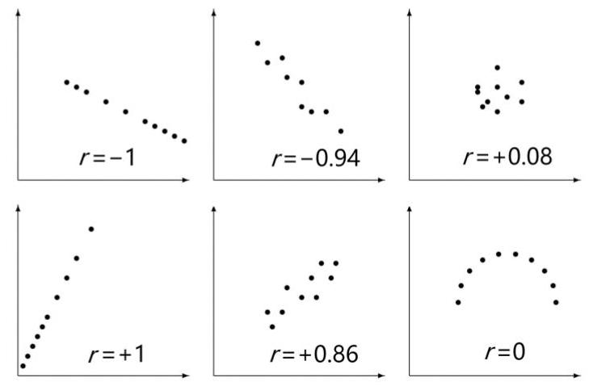

例 19.3 下表为某年度部分省市的人均 GDP 和人均可支配收入(单位:万元)，分析两组数据的线性相关关系的方向和大小(保留两位小数):

<table><tr><td>城市</td><td>甲</td><td>乙</td><td>丙</td><td>丁</td><td>戊</td></tr><tr><td>人均 GDP</td><td>19.05</td><td>11.97</td><td>8.60</td><td>6.64</td><td>5.21</td></tr><tr><td>人均可支配收入</td><td>7.96</td><td>4.90</td><td>3.76</td><td>3.10</td><td>2.80</td></tr></table>

解析: 设人均 GDP 为变量 $X$ ,人均可支配收入为变量 $Y$ ,先分别求出五省市人均 GDP 和人均可支配收入的平均数:

$$
\bar{x} = \frac{1}{5} \times  \left( {{19.05} + {11.97} + {8.60} + {6.64} + {5.21}}\right)  = {10.29}
$$

$$
\bar{y} = \frac{1}{5} \times  \left( {{7.96} + {4.90} + {3.76} + {3.10} + {2.80}}\right)  = {4.50}
$$

用相应的数据减去各自的均值构造两组新的变量:

$$
x - \bar{x} : \;\begin{array}{lllll} {8.76}, & {1.68}, &  - {1.69}, &  - {3.65}, &  - {5.08} \end{array}
$$

$$
y - \bar{y} : \;{3.46},\;{0.40},\; - {0.74},\; - {1.40},\; - {1.70}
$$

用新的变量构造两个五维向量:

$$
\overrightarrow{x} = \left( {{8.76},{1.68}, - {1.69}, - {3.65}, - {5.08}}\right)
$$

$$
\overrightarrow{y} = \left( {{3.46},{0.40}, - {0.74}, - {1.40}, - {1.70}}\right)
$$

$\overrightarrow{x}$ 与 $\overrightarrow{y}$ 的数量积为:

$$
\overrightarrow{x} \cdot  \overrightarrow{y} = {8.76} \times  {3.46} + {1.68} \times  {0.40} + \left( {-{1.69}}\right)  \times  \left( {-{0.74}}\right)  +
$$

$$
\left( {-{3.65}}\right)  \times  \left( {-{1.40}}\right)  + \left( {-{5.08}}\right)  \times  \left( {-{1.70}}\right)
$$

$$
= {45.98}
$$

$\overrightarrow{x}$ 与 $\overrightarrow{y}$ 的模分别为:

$$
\left| \overrightarrow{x}\right|  = \sqrt{{8.76}^{2} + {1.68}^{2} + {\left( -{1.69}\right) }^{2} + {\left( -{3.65}\right) }^{2} + {\left( -{5.08}\right) }^{2}} = {11.02}
$$

$$
\left| \overrightarrow{y}\right|  = \sqrt{{3.46}^{2} + {0.40}^{2} + {\left( -{0.74}\right) }^{2} + {\left( -{1.40}\right) }^{2} + {\left( -{1.70}\right) }^{2}} = {4.19}
$$

$\overrightarrow{x}$ 与 $\overrightarrow{y}$ 的的夹角的余弦值,即 $X, Y$ 的样本相关系数为:

$$
r\left( {X, Y}\right)  = \frac{\overrightarrow{x} \cdot  \overrightarrow{y}}{\left| \overrightarrow{x}\right| \left| \overrightarrow{y}\right| } = \frac{45.98}{{11.02} \times  {4.19}} = {0.9958}
$$

由此可知, 选取的省市的人均 GDP 与人均可支配收入有显著的线性相关关系, 且呈正相关。

## 练习 19.1(3)

1. 下表为两地某月上旬的每日最高温和最低温(单位: ${}^{ \circ  }\mathrm{C}$ )，分别计算甲乙两地最高温与最低温间相关性的大小和方向。

<table><tr><td rowspan="2">甲地</td><td>最高温</td><td>27</td><td>25</td><td>19</td><td>16</td><td>17</td><td>17</td><td>19</td><td>16</td><td>16</td><td>18</td></tr><tr><td>最低温</td><td>19</td><td>17</td><td>8</td><td>4</td><td>6</td><td>4</td><td>10</td><td>9</td><td>6</td><td>3</td></tr><tr><td rowspan="2">乙地</td><td>最高温</td><td>32</td><td>33</td><td>34</td><td>24</td><td>20</td><td>19</td><td>19</td><td>20</td><td>21</td><td>18</td></tr><tr><td>最低温</td><td>25</td><td>25</td><td>26</td><td>18</td><td>16</td><td>15</td><td>14</td><td>15</td><td>12</td><td>11</td></tr></table>

### 19.2 成对数据的线性拟合

对于一对变量, 如果可以找到反映它们之间的线性关系的直线, 那么就可以利用直线的斜率、截距等参数分析这对变量之间的关系和规律，一元线性回归模型就是找出这条最能反映变量之间的线性关系的直线的方法。

#### 19.2.1 一元线性回归模型

将一对变量 $X$ 与 $Y$ 按照一定规则配对 $\left( {{x}_{1},{y}_{1}}\right) ,\left( {{x}_{2},{y}_{2}}\right) ,\cdots ,\left( {{x}_{n},{y}_{n}}\right)$ ,假设有一条直线最能体现它们之间的线性关系:

$$
y = {bx} + a
$$

根据上一节的内容,如果样本相关系数 $\left| {r\left( {X, Y}\right) }\right|  = 1$ ,那么所有样本点都在同一直线上,这条直线应当就是 $y = {bx} + a$ 。如果 $\left| {r\left( {X, Y}\right) }\right|  \neq  1$ ,那么有一些样本点不在直线 $y = {bx} + a$ 上,将这些点的坐标代入直线方程则等式不成立,即: 存在一些 $\left( {{x}_{i},{y}_{i}}\right) ,{y}_{i} \neq  b{x}_{i} + a$ ,我们接下来定量地分析这些不相等的关系。

虽然一些点 $\left( {{x}_{i},{y}_{i}}\right)$ 不在直线 $y = {bx} + a$ 上,但至少应当在直线附近,设 ${y}_{i}$ 减去 $b{x}_{i} + a$ 的差值为 ${e}_{i}$ ,由此可得:

$$
{y}_{i} = b{x}_{i} + a + {e}_{i}
$$

按照上述构造方法,每个样本点 $\left( {{x}_{i},{y}_{i}}\right)$ 都有一个对应的差值 ${e}_{i}$ 。我们的目的是找出 “最” 能反映这些点的线性关系的直线, 因此全体样本点应当都在直线 $y = {bx} + a$ 上或附近,全体 ${e}_{i}$ 的值需要有正有负,否则,如若所有 ${e}_{i}$ 都是正数或都是负数, 表明这条直线在全体点的上方或下方, 误差的方向一致, 就不能很好地反映整体的情况, 需要将直线平移到全体点的中间位置。

具体到每一个点 $\left( {{x}_{i},{y}_{i}}\right)$ 产生的差值 ${e}_{i},{e}_{i}$ 的绝对值越大,表示 $\left( {{x}_{i},{y}_{i}}\right)$ 到直线 $y = {bx} + a$ 的距离越大, ${e}_{i}$ 的绝对值越小,表示 $\left( {{x}_{i},{y}_{i}}\right)$ 到直线 $y = {bx} + a$ 的距离越小,如果 ${e}_{i} = 0$ ,表示 $\left( {{x}_{i},{y}_{i}}\right)$ 在直线 $y = {bx} + a$ 上。于是,相当于用一系列斜率相同、截距不同的直线 “强行” 表示变量 $X\text{ 、 }Y$ 间的线性关系:

$$
{y}_{i} = b{x}_{i} + a + {e}_{i}
$$

其中,参数 $a\text{ 、 }b$ 是定值, $e$ 是由具体的样本点确定的变量, $\left( {{x}_{i},{y}_{i}}\right)$ 对应的值为 ${e}_{i} = {y}_{i} - b{x}_{i} - a$ 。

根据直线 $y = {bx} + a + e$ 的构造方式，变量 $e$ 的绝对值反映具体样本点偏离直线 $y = {bx} + a$ 的程度，即该样本点沿竖直方向平移到 $y = {bx} + a$ 的距离。变量 $e$ 的正负号表示该样本点偏离直线的方向,所有 $e > 0$ 的样本点都在直线的上方,所有 $e < 0$ 的样本点都在直线的下方,所有 $e = 0$ 的样本点都在直线上。

虽然我们强行用直线 $y = {bx} + a$ 描述了变量 $X\text{ 、 }Y$ 之间的线性关系,但实际上很可能部分点不在该直线上,而是存在误差 $e$ ,因此 $e$ 的现实含义可以看作随机误差。

由随机误差构造的随机变量通常服从期望 $\mu  = 0$ 的正态分布,各样本点大于或小于均值的可能性相同, $e$ 的期望恒为 $E\left( e\right)  = 0, e$ 的方差待定 $D\left( e\right)  = {\sigma }^{2}$ 。

综上,对于一对变量 $X\text{ 、 }Y$ ,可以用下面的方程组描述它们之间的线性关系:

$$
\left\{  \begin{array}{l} y = {bx} + a + e \\  E\left( e\right)  = 0, D\left( e\right)  = {\sigma }^{2} \end{array}\right.
$$

该方程组叫作 $y$ 关于 $x$ 的一元线性回归模型。其中, $x\text{ 、 }y$ 是变量 $X\text{ 、 }Y$ 的各组配对的取值, $x$ 叫作自变量或解释变量, $y$ 叫作因变量或响应变量。参数 $a\text{ 、 }b$ 是定值, $b$ 叫作斜率参数, $a$ 叫作截距参数,与直线的点斜式方程中的名称相似。 $e$ 是变量,可以看作 $y$ 与 ${bx} + a$ 之间的随机误差,每一项 ${e}_{i}$ 的具体取值由对应的 $\left( {{x}_{i},{y}_{i}}\right)$ 决定,全体 ${e}_{i}$ 构成的变量 $e$ 的期望和方差分别为 $E\left( e\right)  = 0, D\left( e\right)  = {\sigma }^{2}$ 。该模型可以看作一组斜率都是 $b$ 平行线,所有平行线在 $y$ 轴上的截距的平均数是 $a$ 。

例 19.4 已知变量 $X\text{ 、 }Y$ 配对得到实数对 $\left( {5,4}\right) \text{ 、 }\left( {{10},{11}}\right) \text{ 、 }\left( {{15},{14}}\right) \text{ 、 }\left( {{20},{21}}\right)$ , 可以用直线 $y = x$ 表示它们间的线性相关关系,求斜率参数、截距参数、差值 $e$ 的期望和方差。

解析: 对照一元线性回归模型的公式 $\left\{  \begin{array}{l} y = {bx} + a + e \\  E\left( e\right)  = 0, D\left( e\right)  = {\sigma }^{2} \end{array}\right.$ ,该回归模型的方程为 $y = x + e$ ,斜率参数为 $b = 1$ ,截距参数为 $a = 0$ ,将各点坐标代入直线方程可求得相应的 $e : {e}_{1} = 4 - 5 =  - 1,{e}_{2} = {11} - {10} = 1,{e}_{3} = {14} - {15} =  - 1,{e}_{4} = {21} - {20} = 1$ , 期望为 $\mu  = \frac{-1 + 1 + \left( {-1}\right)  + 1}{4} = 0$ ,方差为 ${\sigma }^{2} = \frac{1}{4}\left\lbrack  {{\left( -1 - 0\right) }^{2} + {\left( 1 - 0\right) }^{2} + {\left( -1 - 0\right) }^{2} + {\left( 1 - 0\right) }^{2}}\right\rbrack   = 1$ 。

练习 $\mathbf{{19.2}\left( 1\right) }$

1. 已知变量 $X\text{ 、 }Y$ 配对得到实数对 $\left( {1, - \frac{4}{3}}\right) \text{ 、 }\left( {2, - 2}\right) \text{ 、 }\left( {3, - \frac{2}{3}}\right) \text{ 、 }\left( {4, - \frac{1}{3}}\right)$ 、 $\left( {5, - \frac{2}{3}}\right)$ ,下列三条直线哪一条最能反映 $X\text{ 、 }Y$ 之间的线性相关关系,为什么?

(1) $y = \frac{x}{3} - 2;\;$ (2) $y = x - 2;\;$ (3) $y = \frac{x}{5} - 2$ 。

#### 19.2.2 一元线性回归模型参数的最小二乘估计

我们已经初步建立了表示变量 $X\text{ 、 }Y$ 之间的线性相关性的模型,但实际上只是直观地画了一条直线 $y = {bx} + a$ ，再用表示随机误差的变量 $e$ 生硬地把变量与直线之间的差异表示出来, 并没有通过对数据的分析计算确定直线的斜率参数和截距参数。我们接下来根据随机变量 $X\text{ 、 }Y$ 的数据,确定斜率参数 $b$ 和截距参数 $a$ 的取值,让这条直线最能体现 $X\text{ 、 }Y$ 间的线性相关性。

一元线性回归模型中,每个样本点 $\left( {{x}_{i},{y}_{i}}\right)$ 对应的直线 $y = {bx} + a + {e}_{i}$ ,都是在直线 $y = {bx} + a$ 的基础上,沿竖直方向平移了距离 ${e}_{i}$ ,若 ${e}_{i} > 0$ ,则向上平移; 若 ${e}_{i} < 0$ ,则向下平移。要让直线 $y = {bx} + a$ “最” 能体现全体数据 $\left( {{x}_{i},{y}_{i}}\right)$ 的线性相关性,应当让全体本点 $\left( {{x}_{i},{y}_{i}}\right) \left( {i = 1,2,\cdots , n}\right)$ 实际所在的全体直线 $y = {bx} + a + {e}_{i}$ 偏离直线 $y = {bx} + a$ 的程度之和最小，即离散程度最小，可以用方差的概念衡量整体数据的离散程度,即让 $\mathop{\sum }\limits_{{i = 1}}^{n}{e}_{i}^{2}$ 最小。

之所以选择让差值的平方和 $\mathop{\sum }\limits_{{i = 1}}^{n}{e}_{i}^{2}$ 最小,而不是让差值的绝对值之和 $\mathop{\sum }\limits_{{i = 1}}^{n}\left| {e}_{i}\right|$ 最小, 不仅因为这是方差的定义方式, 求平方和比求绝对值之和的计算更简便, 根本原因还是这种表示方式具有非常明确的几何含义, 接下来就会学习。

借助方差的概念: 当 $\mathop{\sum }\limits_{{i = 1}}^{n}{e}_{i}^{2}$ 最小时,一元线性回归模型 $\left\{  \begin{array}{l} y = {bx} + a + e \\  E\left( e\right)  = 0, D\left( e\right)  = {\sigma }^{2} \end{array}\right.$ 最能体现变量 $X\text{ 、 }Y$ 之间的线性相关性。根据 ${e}_{i}$ 的构造方式 ${e}_{i} = {y}_{i} - b{x}_{i} - a$ 求 $\mathop{\sum }\limits_{{i = 1}}^{n}{e}_{i}^{2}$ 的最小值,等价于求当 $a\text{ 、 }b$ 取何值时,表达式 $\mathop{\sum }\limits_{{i = 1}}^{n}{\left( {y}_{i} - b{x}_{i} - a\right) }^{2}$ 取最小值。

求 $\mathop{\sum }\limits_{{i = 1}}^{n}{\left( {y}_{i} - b{x}_{i} - a\right) }^{2}$ 的最小值仅涉及初等的数学知识,只是分析计算的技巧性较强,先后用到先减后加 $\left( {\bar{y} - b\bar{x}}\right)$ 、重新组合项、将多项式看作两项的完全平方公式并展开、求和符号的拆分等多种技巧。

虽然该分析处理过程与线性回归模型的概念本身联系较小, 可以直接利用其几何含义帮助记忆公式, 但该分析处理过程非常经典, 对于熟悉求和符号的化简、 运算和分析有很大帮助, 分析和化简技巧也是数学的重要组成部分。

接下来根据变量的数据,求当 $\mathop{\sum }\limits_{{i = 1}}^{n}{\left( {y}_{i} - b{x}_{i} - a\right) }^{2}$ 的取值最小时,相应的斜率参数和截距参数。

第 1 步,在表达式 ${y}_{i} - b{x}_{i} - a$ 中先减后加 $\left( {\bar{y} - b\bar{x}}\right)$ ,将表达式看作两项求和, 用完全平方公式展开, 将表达式分为 3 个部分分别求和:

$$
\mathop{\sum }\limits_{{i = 1}}^{n}{\left( {y}_{i} - b{x}_{i} - a\right) }^{2}
$$

$$
= \mathop{\sum }\limits_{{i = 1}}^{n}{\left\lbrack  {y}_{i} - b{x}_{i} - \left( \bar{y} - b\bar{x}\right)  + \left( \bar{y} - b\bar{x}\right)  - a\right\rbrack  }^{2}
$$

$$
= \mathop{\sum }\limits_{{i = 1}}^{n}{\left\{  \left\lbrack  \left( {y}_{i} - \bar{y}\right)  - b\left( {x}_{i} - \bar{x}\right) \right\rbrack   + \left\lbrack  \left( \bar{y} - b\bar{x}\right)  - a\right\rbrack  \right\}  }^{2}
$$

$$
= \mathop{\sum }\limits_{{i = 1}}^{n}\left\{  {{\left\lbrack  \left( {y}_{i} - \bar{y}\right)  - b\left( {x}_{i} - \bar{x}\right) \right\rbrack  }^{2} + 2\left\lbrack  {\left( {{y}_{i} - \bar{y}}\right)  - b\left( {{x}_{i} - \bar{x}}\right) }\right\rbrack  \left\lbrack  {\left( {\bar{y} - b\bar{x}}\right)  - a}\right\rbrack   + {\left\lbrack  \left( \bar{y} - b\bar{x}\right)  - a\right\rbrack  }^{2}}\right\}
$$

$$
= \mathop{\sum }\limits_{{i = 1}}^{n}{\left\lbrack  \left( {y}_{i} - \bar{y}\right)  - b\left( {x}_{i} - \bar{x}\right) \right\rbrack  }^{2} + \mathop{\sum }\limits_{{i = 1}}^{n}2\left\lbrack  {\left( {{y}_{i} - \bar{y}}\right)  - b\left( {{x}_{i} - \bar{x}}\right) }\right\rbrack  \left\lbrack  {\left( {\bar{y} - b\bar{x}}\right)  - a}\right\rbrack   + \mathop{\sum }\limits_{{i = 1}}^{n}{\left\lbrack  \left( \bar{y} - b\bar{x}\right)  - a\right\rbrack  }^{2}
$$

第 2 步,该表达式由 3 个求和项相加组成,各求和项中,所有不含变量 ${x}_{i}$ 或 ${y}_{i}$ 的因式都可以当作常数项提取到求和符号外,包括第二项中的 $\left\lbrack  {\left( {\bar{y} - b\bar{x}}\right)  - a)}\right\rbrack$ 和整个第三项 ${\left\lbrack  \left( \bar{y} - b\bar{x}\right)  - a\right\rbrack  }^{2}$ 。

其中，第二项可化简为:

$$
\left. {\mathop{\sum }\limits_{{i = 1}}^{n}2\left\lbrack  {\left( {{y}_{i} - \bar{y}}\right)  - b\left( {{x}_{i} - \bar{x}}\right) }\right) \left\lbrack  {\left( {\bar{y} - b\bar{x}}\right)  - a}\right) }\right\rbrack
$$

$$
= 2\left\lbrack  {\left( {\bar{y} - b\bar{x}}\right)  - a)}\right\rbrack  \mathop{\sum }\limits_{{i = 1}}^{n}\left\lbrack  {\left( {{y}_{i} - \bar{y}}\right)  - b\left( {{x}_{i} - \bar{x}}\right) }\right\rbrack
$$

$$
= 2\left\lbrack  {\left( {\bar{y} - b\bar{x}}\right)  - a)}\right\rbrack  \left\lbrack  {\mathop{\sum }\limits_{{i = 1}}^{n}\left( {{y}_{i} - \bar{y}}\right)  - b\mathop{\sum }\limits_{{i = 1}}^{n}\left( {{x}_{i} - \bar{x}}\right) }\right\rbrack
$$

$$
= 2\left\lbrack  {\left( {\bar{y} - b\bar{x}}\right)  - a)}\right\rbrack  \left\lbrack  {\left( {\mathop{\sum }\limits_{{i = 1}}^{n}{y}_{i} - \mathop{\sum }\limits_{{i = 1}}^{n}\bar{y}}\right)  - b\left( {\mathop{\sum }\limits_{{i = 1}}^{n}{x}_{i} - \mathop{\sum }\limits_{{i = 1}}^{n}\bar{x}}\right) }\right\rbrack
$$

其中, $\mathop{\sum }\limits_{{i = 1}}^{n}{y}_{i}$ 是变量 $Y$ 的全体数据之和,按照平均数的定义 $\bar{y} = \frac{1}{n}\mathop{\sum }\limits_{{i = 1}}^{n}{y}_{i}$ 可得 $\mathop{\sum }\limits_{{i = 1}}^{n}{y}_{i} = n\bar{y}$ ,而 $\mathop{\sum }\limits_{{i = 1}}^{n}\bar{y}$ 就是 $n$ 个 $\bar{y}$ 相加,即 $\mathop{\sum }\limits_{{i = 1}}^{n}\bar{y} = n\bar{y}$ ,所以 $\mathop{\sum }\limits_{{i = 1}}^{n}{y}_{i} - \mathop{\sum }\limits_{{i = 1}}^{n}\bar{y} = n\bar{y} - n\bar{y} = 0$ 。 同理可得 $\mathop{\sum }\limits_{{i = 1}}^{n}{x}_{i} - \mathop{\sum }\limits_{{i = 1}}^{n}\bar{x} = 0$ 。综上,第二项整体为 0 :

$$
\mathop{\sum }\limits_{{i = 1}}^{n}2\left\lbrack  {\left( {{y}_{i} - \bar{y}}\right)  - b\left( {{x}_{i} - \bar{x}}\right) }\right\rbrack  \left\lbrack  {\left( {\bar{y} - b\bar{x}}\right)  - a)}\right\rbrack   = 0
$$

第三项 $\mathop{\sum }\limits_{{i = 1}}^{n}{\left\lbrack  \left( \bar{y} - b\bar{x}\right)  - a)\right\rbrack  }^{2}$ 中不含变量 ${x}_{i}$ 和 ${y}_{i}$ ,等于 $n$ 个 ${\left\lbrack  \left( \bar{y} - b\bar{x}\right)  - a)\right\rbrack  }^{2}$ 相加:

$$
\mathop{\sum }\limits_{{i = 1}}^{n}{\left\lbrack  \left( \bar{y} - b\bar{x}\right)  - a\right\rbrack  }^{2} = n{\left\lbrack  \left( \bar{y} - b\bar{x}\right)  - a\right\rbrack  }^{2}
$$

综上, 原表达式可化简为:

$$
\mathop{\sum }\limits_{{i = 1}}^{n}{\left( {y}_{i} - b{x}_{i} - a\right) }^{2} = \mathop{\sum }\limits_{{i = 1}}^{n}{\left\lbrack  \left( {y}_{i} - \bar{y}\right)  - b\left( {x}_{i} - \bar{x}\right) \right\rbrack  }^{2} + n{\left\lbrack  \left( \bar{y} - b\bar{x}\right)  - a\right\rbrack  }^{2}
$$

该表达式是两个完全平方数之和, 完全平方数恒为非负数, 其中, 第一项中只有参数 $b$ ,第二项中有两个参数 $a\text{ 、 }b$ ,可知 $b$ 的取值同时影响两项的值, $a$ 的取值只影响第二项的值,可以先对第一项求最小值,求出此时 $b$ 的取值,再对第二项求最小值,如果能找到某个 $a$ ,使得此时第二项的取值为完全平方数的最小值 0,那么就得到该表达式的最小值,该表达式恰好可以。

对于第二项 $n{\left\lbrack  \left( \bar{y} - b\bar{x}\right)  - a)\right\rbrack  }^{2}$ ,当且仅当 $\left( {\bar{y} - b\bar{x}}\right)  - a = 0$ 时,取得最小值 0,因此无论 $b$ 取何值,只需让 $a = \bar{y} - b\bar{x}$ ,就可以让第二项取得理论上的最小值 0,接下来只需求出让第一项 $\mathop{\sum }\limits_{{i = 1}}^{n}{\left\lbrack  \left( {y}_{i} - \bar{y}\right)  - b\left( {x}_{i} - \bar{x}\right) \right\rbrack  }^{2}$ 取最小值时, $b$ 的取值即可。

对于 $\mathop{\sum }\limits_{{i = 1}}^{n}{\left\lbrack  \left( {y}_{i} - \bar{y}\right)  - b\left( {x}_{i} - \bar{x}\right) \right\rbrack  }^{2}$ ,利用完全平方公式将求和符号内的表达式展开并拆分:

$$
\mathop{\sum }\limits_{{i = 1}}^{n}{\left\lbrack  \left( {y}_{i} - \bar{y}\right)  - b\left( {x}_{i} - \bar{x}\right) \right\rbrack  }^{2}
$$

$$
= \mathop{\sum }\limits_{{i = 1}}^{n}\left\lbrack  {{\left( {y}_{i} - \bar{y}\right) }^{2} - {2b}\left( {{y}_{i} - \bar{y}}\right) \left( {{x}_{i} - \bar{x}}\right)  + {b}^{2}{\left( {x}_{i} - \bar{x}\right) }^{2}}\right\rbrack
$$

$$
= \mathop{\sum }\limits_{{i = 1}}^{n}{\left( {y}_{i} - \bar{y}\right) }^{2} - \mathop{\sum }\limits_{{i = 1}}^{n}{2b}\left( {{y}_{i} - \bar{y}}\right) \left( {{x}_{i} - \bar{x}}\right)  + \mathop{\sum }\limits_{{i = 1}}^{n}{b}^{2}{\left( {x}_{i} - \bar{x}\right) }^{2}
$$

$$
= \mathop{\sum }\limits_{{i = 1}}^{n}{\left( {y}_{i} - \bar{y}\right) }^{2} - {2b}\mathop{\sum }\limits_{{i = 1}}^{n}\left( {{y}_{i} - \bar{y}}\right) \left( {{x}_{i} - \bar{x}}\right)  + {b}^{2}\mathop{\sum }\limits_{{i = 1}}^{n}{\left( {x}_{i} - \bar{x}\right) }^{2}
$$

该表达式可以看作关于 $b$ 的二次函数:

$$
f\left( b\right)  = \mathop{\sum }\limits_{{i = 1}}^{n}{\left( {y}_{i} - \bar{y}\right) }^{2} - {2b}\mathop{\sum }\limits_{{i = 1}}^{n}\left( {{y}_{i} - \bar{y}}\right) \left( {{x}_{i} - \bar{x}}\right)  + {b}^{2}\mathop{\sum }\limits_{{i = 1}}^{n}{\left( {x}_{i} - \bar{x}\right) }^{2}
$$

化为更标准的二次函数的形式:

$$
f\left( b\right)  = \mathop{\sum }\limits_{{i = 1}}^{n}{\left( {x}_{i} - \bar{x}\right) }^{2} \cdot  {b}^{2} - 2\mathop{\sum }\limits_{{i = 1}}^{n}\left( {{y}_{i} - \bar{y}}\right) \left( {{x}_{i} - \bar{x}}\right)  \cdot  b + \mathop{\sum }\limits_{{i = 1}}^{n}{\left( {y}_{i} - \bar{y}\right) }^{2}
$$

根据二次函数的性质,当且仅当 $b =  - \frac{-2\mathop{\sum }\limits_{{i = 1}}^{n}\left( {{y}_{i} - \bar{y}}\right) \left( {{x}_{i} - \bar{x}}\right) }{2\mathop{\sum }\limits_{{i = 1}}^{n}{\left( {x}_{i} - \bar{x}\right) }^{2}} = \frac{\mathop{\sum }\limits_{{i = 1}}^{n}\left( {{y}_{i} - \bar{y}}\right) \left( {{x}_{i} - \bar{x}}\right) }{\mathop{\sum }\limits_{{i = 1}}^{n}{\left( {x}_{i} - \bar{x}\right) }^{2}}$

时,函数 $f\left( b\right)$ 取最小值,即表达式 $\mathop{\sum }\limits_{{i = 1}}^{n}{\left\lbrack  \left( {y}_{i} - \bar{y}\right)  - b\left( {x}_{i} - \bar{x}\right) \right\rbrack  }^{2}$ 取最小值。

综上, 当且仅当:

$$
\left\{  \begin{array}{l} \widehat{b} = \frac{\mathop{\sum }\limits_{{i = 1}}^{n}\left( {{y}_{i} - \bar{y}}\right) \left( {{x}_{i} - \bar{x}}\right) }{\mathop{\sum }\limits_{{i = 1}}^{n}{\left( {x}_{i} - \bar{x}\right) }^{2}} \\  \widehat{a} = \bar{y} - \widehat{b}\bar{x} \end{array}\right.
$$

时,全体样本点到直线 $y = {bx} + a$ 的总偏移量 $\mathop{\sum }\limits_{{i = 1}}^{n}{\left( {y}_{i} - b{x}_{i} - a\right) }^{2}$ 最小。

表达式中， $\widehat{b}$ 、 $\widehat{a}$ 上方的 “帽子” “ $\land$ ” 表示这两个参数是根据参数得到的估计值,而非实际测量得到的真实值。

按照上述方法确定的 $a\text{ 、 }b$ ,构成的直线方程 $\widehat{y} = \widehat{b}x + \widehat{a}$ 叫作变量 $Y$ 关于变量 $X$ 的经验回归方程,又叫作经验回归函数或经验回归公式,该直线叫作经验回归直线。对于一对变量, 找出最能描述它们间的线性相关关系的直线方程的过程叫作线性拟合。

上述推导线性回归方程的方法叫作最小二乘法, 意为让 “二次方 (即 ‘二乘’) 之和最小” 的方法,求得的 $\widehat{b}\text{ 、 }\widehat{a}$ 叫作 $b\text{ 、 }a$ 的最小二乘估计。

对于响应变量 $Y$ ,实际测得的数据 $y$ 叫作观测值,利用经验回归方程求得的 $\widehat{y}$ 叫作预测值,观测值减去预测值的差 $y - \widehat{y}$ 叫作残差,残差就是该数据对应的随机误差 $e$ 。根据随机误差的一般规律,残差越小数据越可靠,残差越大数据越 “离谱”。

上述推分析导过程中, 涉及求和符号的拆分、提取常数、利用平均数的定义式化简等步骤, 这些是分析处理求和运算的基本功, 必须能读懂各步骤使用的运算法则和规律。另外, 使用的同时加上并减去同一个元素, 将表达式拆分为两部分, 展开后逐个分析的方法是一种较巧妙的分析和化简方式, 属于较高级的技巧, 需要对处理的表达式的特征非常熟悉、并具有一定的数字敏感性。

观察线性回归方程中参数的表达式。其中, $\widehat{b}$ 的分子 $\mathop{\sum }\limits_{{i = 1}}^{n}\left( {{y}_{i} - \bar{y}}\right) \left( {{x}_{i} - \bar{x}}\right)$ 是向量 $\overrightarrow{x} = \left( {{x}_{1} - \bar{x},{x}_{2} - \bar{x},\cdots ,{x}_{n} - \bar{x}}\right)$ 与 $\overrightarrow{y} = \left( {{y}_{1} - \bar{y},{y}_{2} - \bar{y},\cdots ,{y}_{n} - \bar{y}}\right)$ 的数量积,分母 $\mathop{\sum }\limits_{{i = 1}}^{n}{\left( {x}_{i} - \bar{x}\right) }^{2}$ 是向量 $\overrightarrow{x} = \left( {{x}_{1} - \bar{x},{x}_{2} - \bar{x},\cdots ,{x}_{n} - \bar{x}}\right)$ 的模的平方。将 $\bar{x}\text{ 、 }\bar{y}\text{ 、 }\widehat{b}$ 代入直线方程 $y = {bx} + a$ 就能求得 $\widehat{a}$ 的取值,由 $a$ 的取值方式可知点 $\left( {\bar{x},\bar{y}}\right)$ 一定在经验回归直线上。

例 19.5 下表为元素周期表中第二主族元素的原子序数与相对原子质量:

<table><tr><td>元素</td><td>Be</td><td>Mg</td><td>Ca</td><td>Sr</td><td>Ba</td><td>$\mathrm{{Ra}}$</td></tr><tr><td>原子序数</td><td>4</td><td>12</td><td>20</td><td>38</td><td>56</td><td>88</td></tr><tr><td>相对原子质量</td><td>9</td><td>24</td><td>40</td><td>88</td><td>137</td><td>226</td></tr></table>

(1)根据表中数据建立第二主族元素相对原子质量关于原子序数的经验回归方程(保留整数位或两位有效数字)；

(2)若第二主族的下一周期元素的原子序数为 120，测算其可能的相对原子质量(原子量和原子序数保留整数，回归方程的参数保留一位小数)。

解析:(1)以第二主族元素的原子量和相对原子质量建立两组变量 $X$ 、 $Y$ ，

线性回归方程 $\widehat{y} = b\widehat{x} + a$ 中, $\widehat{b} = \frac{\mathop{\sum }\limits_{{i = 1}}^{n}\left( {{y}_{i} - \bar{y}}\right) \left( {{x}_{i} - \bar{x}}\right) }{\mathop{\sum }\limits_{{i = 1}}^{n}{\left( {x}_{i} - \bar{x}\right) }^{2}},\widehat{a} = \bar{y} - \widehat{b}\bar{x}$ ,

先求这两组变量的平均数:

$$
\bar{x} = \frac{1}{6} \times  \left( {4 + {12} + {20} + {38} + {56} + {88}}\right)  = {36}
$$

$$
\bar{y} = \frac{1}{6} \times  \left( {9 + {24} + {40} + {88} + {137} + {226}}\right)  = {87}
$$

用两组变量分别减去它们的均值, 得到两组变量:

$$
X - \bar{x} : \; - {32},\; - {24},\; - {16},\;2,\;{20},\;{52}
$$

$$
Y - \bar{y} : \; - {78},\; - {63},\; - {47},\;1,\;{50},\;{139}
$$

$$
\widehat{b} = \frac{\mathop{\sum }\limits_{{i = 1}}^{n}\left( {{y}_{i} - \bar{y}}\right) \left( {{x}_{i} - \bar{x}}\right) }{\mathop{\sum }\limits_{{i = 1}}^{n}{\left( {x}_{i} - \bar{x}\right) }^{2}}
$$

$$
= \frac{\left( {-{78}}\right)  \times  \left( {-{32}}\right)  + \left( {-{63}}\right)  \times  \left( {-{24}}\right)  + \left( {-{47}}\right)  \times  \left( {-{16}}\right)  + 1 \times  2 + {50} \times  {20} + {139} \times  {52}}{{\left( -{32}\right) }^{2} + {\left( -{24}\right) }^{2} + {\left( -{16}\right) }^{2} + {2}^{2} + {20}^{2} + {52}^{2}}
$$

$$
= {2.6}
$$

$$
\widehat{a} = \bar{y} - \widehat{b}\bar{x} = {87} - {2.6} \times  {36} =  - {6.6}
$$

第二主族元素相对原子质量关于原子序数的经验回归方程为:

$$
y = {2.6x} - {6.6}
$$

下图为经验回归方程的直线和上述元素的(原子序数，相对原质量)坐标。

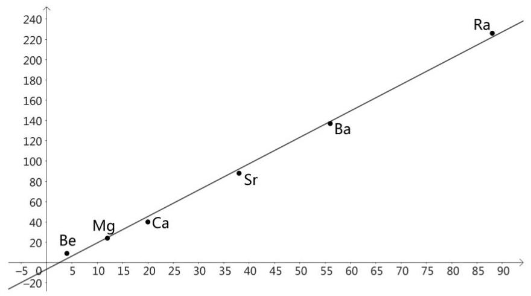

从图中可以看出, 各点都在直线上或直线附近, 且较均匀地分布在直线两侧。

(2)将 $x = {120}$ 代入求得的经验回归方程:

$$
y = {2.6} \times  {120} - {6.6} = {305}
$$

若第二主族的下一周期元素的原子序数为 120，其相对原子质量可能为 305。 实际上, 根据化学理论推算的该元素的相对原子质量可能为 318。

很多情况下, 虽然两组数据的相关关系不是线性, 而是符合其他数学关系, 只要能通过观察或利用专业知识得知它们的分布形式接近其他某种常见函数, 就可以通过对数据进行一定数学处理, 构造出一元线性回归模型。

例 19.6 某种细胞平均每分钟分裂一次, 数量扩增为原来的 2 倍, 分别以时间 $t$ 和培养皿中的细胞数目 $p$ 作为变量,可知它们大致符合指数关系:

$$
p = {p}_{0}{2}^{t}
$$

用一元线性回归模型描述细胞数目与时间的关系。

解析: 细胞数目 $p$ 与时间 $t$ 之间是指数关系,而非线性关系,将等式 $p = {p}_{0}{2}^{t}$ 两边同时取对数并展开可得:

$$
\ln p = t\ln 2 + \ln {p}_{0}
$$

于是细胞数目的对数 $\ln p$ 与时间 $t$ 呈线性关系,该直线的斜率为 $\ln 2$ ,在 $y$ 轴上的截距为 $\ln {p}_{0}$ 。如果分别以时间 $t$ 和实际测得的细胞数目的对数 $\ln p$ 作为两个变量, 就可以对数据进行线性拟合, 建立较为精确数量关系。

类似的,若变量 $X\text{ 、 }Y$ 的关系接近二次函数 $y = k{x}^{2} + b$ ,则可分别以 $y$ 和 ${x}^{2}$ 作为因变量和自变量进行线性拟合。若变量 $X\text{ 、 }Y$ 的关系接近对数函数 $y = {\log }_{a}x$ , 则可对等式两边同时取指数,分别以 $y$ 和 ${\log }_{a}x$ 或 ${a}^{y}$ 和 $x$ 作为因变量和自变量进行线性拟合。

## 练习 19.2(2)

1. 下表为某同学答题的数量与错题的数量关系:

<table><tr><td>题目总数</td><td>10</td><td>20</td><td>30</td><td>40</td><td>50</td><td>60</td><td>70</td><td>80</td><td>90</td><td>100</td></tr><tr><td>错题数量</td><td>2</td><td>3</td><td>3</td><td>4</td><td>4</td><td>5</td><td>6</td><td>8</td><td>9</td><td>8</td></tr></table>

(1)画出散点图；

(2)建立错题数量与题目总数的一元线性回归模型；

(3)判断错题数量与题目总数间是否具有某种线性相关关系。

2. 下表为化学反应 $2\mathrm{\;A} + \mathrm{B} = \mathrm{C}$ 中,反应物 $\mathrm{A}$ 的浓度 (单位: $\mathrm{{mol}} \cdot  {\mathrm{L}}^{-1}$ ) 与产物 $\mathrm{C}$ 的生成速率(单位: $\mathrm{{mol}} \cdot  {\mathrm{L}}^{-1}{\mathrm{{min}}}^{-1}$ )的关系:

<table><tr><td>A 的浓度</td><td>0.1</td><td>0.2</td><td>0.3</td><td>0.4</td><td>0.5</td></tr><tr><td>C 的生成速率</td><td>0.010</td><td>0.042</td><td>0.078</td><td>0.160</td><td>0.244</td></tr></table>

(1)根据 A 的浓度与 C 的生成速率数据，猜测它们间的数量关系；

(2)针对猜测的数量关系，对数据进行数学处理，求样本相关系数；

(3)建立数学处理后的数据的一元线性回归模型，参数保留两位有效数字， 根据模型预测当 $\mathrm{A}$ 的浓度为 ${0.6}\mathrm{\;{mol}} \cdot  {\mathrm{L}}^{-1}$ 时 $\mathrm{C}$ 的生成速率。

### 19.3 成对数据的独立性检验

线性相关和线性拟合主要针对变量之间的线性关系, 且体现了多维向量的几何含义，我们接下来学习更通用地判断两个事件之间相互影响的程度的方法。

#### 19.3.1 分类变量与列联表

若研究对象的某一性质可以分类, 则该性质构成的变量叫作分类变量。例如, 抛硬币的结果有正面朝上和反面朝上两类, 可以分别赋值为 1 和 0 ; 掷骰子的结果有数字 1、2、3、4、5、6 共六类。

研究两个分类变量是相互影响还是相互独立, 是统计学的重要课题和应用方向。我们在《概率》一章学习了独立事件的定义:对于事件 $A$ 与事件 $B$ ，若它们发生的概率互相不产生影响,就称它们相互独立,事件 $A$ 与事件 $B$ 相互独立的充分必要条件为 $P\left( {AB}\right)  = P\left( A\right) P\left( B\right)$ 。

上述对事件相互独立的定义中, 事先已经知道各事件所含的基本事件及事件的概率, 通过数学上的分析推导得知不同事件是否相互独立, 我们接下来从统计的角度, 事先不知道各事件的概率, 而是通过对数据进行分析处理, 判断两个不同的随机事件 (变量) 是否相互独立, 即检验两个变量之间的相互独立性, 简称独立性检验。

独立性检验的基本原理仍是独立事件的充要条件 $P\left( {AB}\right)  = P\left( A\right) P\left( B\right)$ ,以及将统计与概率联系起来的频率的稳定性。进行独立性检验的具体方法为:

设两个分类变量 $X$ 与 $Y$ ,对于变量 $X$ ,“满足条件 $X$ (赋值为 $X = 1$ )”与 “不满足条件 $X$ (赋值为 $X = 0$ )” 是对立事件; 对于变量 $Y$ ,“满足条件 $Y$ (赋值为 $Y = 1$ )” 与 “不满足条件 $Y$ (赋值为 $Y = 0$ )” 是对立事件。我们接下来分析 “满足条件 $X$ ” 与 “满足条件 $Y$ ” 之间是否存在联系。

按照事件独立的定义，若不论条件 $X$ 是否满足(事件 $X$ 是否发生)，条件 $Y$ 满足 (事件 $Y$ 发生) 的概率都相同,即事件 $X$ 对事件 $Y$ 的概率不产生影响,就称事件 $X$ 与事件 $Y$ 相互独立。即: 无论 $X = 0$ 还是 $X = 1$ ,这两种情况下 $Y = 1$ 与 $Y = 0$ 的概率不变。用条件概率表示为:

$$
P\left( {Y = 1 \mid  X = 0}\right)  = P\left( {Y = 1 \mid  X = 1}\right)
$$

上述条件概率的等式成立叫作零假设或原假设,用符号 ${H}_{0}$ 表示。按照零假设的定义, 两个事件间的零假设成立, 等价于这两个事件相互独立。

由条件概率的公式可得:

$$
P\left( {Y = 1 \mid  X = 0}\right)  = \frac{P\left( {X = 0, Y = 1}\right) }{P\left( {X = 0}\right) }
$$

$$
P\left( {Y = 1 \mid  X = 1}\right)  = \frac{P\left( {X = 1, Y = 1}\right) }{P\left( {X = 1}\right) }
$$

其中, $P\left( {X = 0, Y = 1}\right)$ 是 $X = 0$ 与 $Y = 1$ 同时发生的交事件的概率, $P\left( {X = 1, Y = 1}\right)$ 是 $X = 1$ 与 $Y = 1$ 同时发生的交事件的概率。

若零假设成立,则 $P\left( {Y = 1 \mid  X = 0}\right)  = P\left( {Y = 1 \mid  X = 1}\right)$ ,可得:

$$
\frac{P\left( {X = 0, Y = 1}\right) }{P\left( {X = 0}\right) } = \frac{P\left( {X = 1, Y = 1}\right) }{P\left( {X = 1}\right) }
$$

因为 $X = 0$ 与 $X = 1$ 是对立事件,所以 $P\left( {X = 0}\right)  = 1 - P\left( {X = 1}\right)$ ,代入上式可消去 $P\left( {X = 0}\right)$ :

$$
\frac{P\left( {X = 0, Y = 1}\right) }{1 - P\left( {X = 1}\right) } = \frac{P\left( {X = 1, Y = 1}\right) }{P\left( {X = 1}\right) }
$$

移项后得:

$$
P\left( {X = 1}\right)  \cdot  \left\lbrack  {P\left( {X = 0, Y = 1}\right)  + P\left( {X = 1, Y = 1}\right) }\right\rbrack   = P\left( {X = 1, Y = 1}\right)
$$

由 $X = 0$ 与 $X = 1$ 对立还可得 $P\left( {X = 0, Y = 1}\right)  + P\left( {X = 1, Y = 1}\right)  = P\left( {Y = 1}\right)$ ,代入上式得:

$$
P\left( {X = 1}\right)  \cdot  P\left( {Y = 1}\right)  = P\left( {X = 1,\;Y = 1}\right)
$$

该等式实际上就是事件 $X$ 与事件 $Y$ 独立的充要条件 $P\left( X\right) P\left( Y\right)  = P\left( {XY}\right)$ 。

上述推导过程中,若将代入 $P\left( {X = 0}\right)  = 1 - P\left( {X = 1}\right)$ 的步骤换为代入 $P\left( {X = 1}\right)  = 1 - P\left( {X = 0}\right)$ ,按照相同的化简思路可得等式:

$$
P\left( {X = 0}\right)  \cdot  P\left( {Y = 1}\right)  = P\left( {X = 0,\;Y = 1}\right)
$$

上面分析的是事件 $X$ 发生或不发生,对事件 $Y$ 的概率不产生影响,接下来将 $X$ 与 $Y$ 的位置对调,分析事件 $Y$ 发生或不发生,对事件 $X$ 的概率不产生影响的情况。按照相同的思路可得等式:

$$
P\left( {X = 1}\right)  \cdot  P\left( {Y = 0}\right)  = P\left( {X = 1, Y = 0}\right)
$$

$$
P\left( {X = 0}\right)  \cdot  P\left( {Y = 0}\right)  = P\left( {X = 0, Y = 0}\right)
$$

综上, 现在共得到 4 个等式:

$$
P\left( {X = 1}\right)  \cdot  P\left( {Y = 1}\right)  = P\left( {X = 1,\;Y = 1}\right)
$$

$$
P\left( {X = 0}\right)  \cdot  P\left( {Y = 1}\right)  = P\left( {X = 0, Y = 1}\right)
$$

$$
P\left( {X = 1}\right)  \cdot  P\left( {Y = 0}\right)  = P\left( {X = 1,\;Y = 0}\right)
$$

$$
P\left( {X = 0}\right)  \cdot  P\left( {Y = 0}\right)  = P\left( {X = 0, Y = 0}\right)
$$

如果上面四个等式都成立,就认为事件 $X$ 与事件 $Y$ 相互独立。如果不成立, 就认为事件 $X$ 与事件 $Y$ 相互影响。

接下来根据上述从概率的角度得出的结论, 结合具体的统计数据进行分析。

设采集到的全部 $n$ 个样本中:

既不满足条件 $X$ ,又不满足条件 $Y\left( {X = 0, Y = 0}\right)$ 的样本数为 $a$ ,

不满足条件 $X$ ,只满足条件 $Y\left( {X = 0, Y = 1}\right)$ 的样本数为 $b$ ,

只满足条件 $X$ ,不满足条件 $Y\left( {X = 1, Y = 0}\right)$ 的样本数为 $c$ ,

同时满足条件 $X$ 与 $Y\left( {X = 1, Y = 1}\right)$ 的样本数为 $d$ 。

上述 4 类事件两两互斥,样本的总数为 $n = a + b + c + d$ ,可以列出下表:

<table><tr><td rowspan="2">$X$</td><td colspan="2">$Y$</td><td rowspan="2">合计</td></tr><tr><td>$Y = 0$</td><td>$Y = 1$</td></tr><tr><td>$X = 0$</td><td>$a$</td><td>$b$</td><td>$a + b$</td></tr><tr><td>$X = 1$</td><td>$c$</td><td>$d$</td><td>$c + d$</td></tr><tr><td>合计</td><td>$a + c$</td><td>$b + d$</td><td>$n = a + b + c + d$</td></tr></table>

上表叫作 $2 \times  2$ 列联表,该表的核心内容是将两个不同的条件 (事件) 的数据有分有合地列在表中,既能看到 $X = 0\text{ 、 }X = 1$ 与 $Y = 0\text{ 、 }Y = 1$ 这两组对立事件分别的频数(表格外围)，又能看到所有 $2 \times  2$ 种交事件的频数(表格中心)。

例 19.7 甲乙两个工厂生产同一件产品, 分别抽取 100 件甲厂生产的产品和 80 件乙厂生产的产品进行质量检测, 甲厂产品中合格的数量为 85 件, 乙厂产品中合格的数量为 70 件, 判断两个工厂的产品合格率是否存在差异。

解析: 定义分类变量 $\mathrm{X}\text{ 、 }\mathrm{Y}$ 如下:

$$
X = \left\{  {\begin{array}{ll} 0 & \text{ 产品由甲厂生产 } \\  1 & \text{ 产品由乙厂生产 } \end{array}, Y = \left\{  \begin{array}{ll} 0 & \text{ 产品不合格 } \\  1 & \text{ 产品合格 } \end{array}\right. }\right.
$$

根据题目数据绘制列联表如下:

<table><tr><td rowspan="2">$X$</td><td colspan="2">$Y$</td><td rowspan="2">合计</td></tr><tr><td>$Y = 0$</td><td>$Y = 1$</td></tr><tr><td>$X = 0$</td><td>15</td><td>85</td><td>100</td></tr><tr><td>$X = 1$</td><td>10</td><td>70</td><td>80</td></tr><tr><td>合计</td><td>25</td><td>155</td><td>180</td></tr></table>

甲厂产品的合格率为: ${85} \div  {100} = {0.85}$

乙厂产品的合格率为:70÷80=0.875

可知两个工厂的产品合格率存在差异。

本题分别求出甲乙两厂抽检产品的合格率并进行比较即可, 没能体现列联表的价值，下一小节将学习更严谨地分析两个变量是否独立的方法。

## 练习 19.3(1)

1. 有 A、B 两种防水涂料可用于保护墙壁，随机抽查 30 个使用 A 涂料的涉水墙面和 40 个使用 B 涂料的涉水墙面, 使用 A 涂料的墙面有 3 个发生渗水, 使用 B 涂料的墙面有 4 个发生渗水，判断两种涂料的合格率是否存在差异。

#### 19.3.2 独立性检验

利用随机试验中事件的频率稳定于概率的原理, 可以利用统计数据计算得出相应事件的频率, 作为事件概率的估计值, 用于判断两个变量是否独立。

观察下面的列联表:

<table><tr><td rowspan="2">$X$</td><td colspan="2">$Y$</td><td rowspan="2">合计</td></tr><tr><td>$Y = 0$</td><td>$Y = 1$</td></tr><tr><td>$X = 0$</td><td>$a$</td><td>$b$</td><td>$a + b$</td></tr><tr><td>$X = 1$</td><td>$c$</td><td>$d$</td><td>$c + d$</td></tr><tr><td>合计</td><td>$a + c$</td><td>$b + d$</td><td>$n = a + b + c + d$</td></tr></table>

从列联表中可以读出下列结论:

事件 $X$ 不发生的概率为:

$$
P\left( {X = 0}\right)  = \frac{a + b}{n}
$$

事件 $Y$ 不发生的概率为:

$$
P\left( {Y = 0}\right)  = \frac{a + c}{n}
$$

如果事件 $X$ 与事件 $Y$ 相互独立,那么事件 $X$ 与事件 $Y$ 同时不发生的概率理论上应当为:

$$
P\left( {X = 0, Y = 0}\right)  = P\left( {X = 0}\right)  \cdot  P\left( {Y = 0}\right)  = \frac{\left( {a + b}\right) \left( {a + c}\right) }{{n}^{2}}
$$

于是所有 $n$ 个样本点中,事件 $X$ 与事件 $Y$ 同时发生的频数应当为:

$$
\frac{\left( {a + b}\right) \left( {a + c}\right) }{{n}^{2}} \cdot  n = \frac{\left( {a + b}\right) \left( {a + c}\right) }{n}
$$

$\frac{\left( {a + b}\right) \left( {a + c}\right) }{n}$ 是建立在零假设 “事件 $X$ 与事件 $Y$ 相互独立” 成立的基础上得到的理论上的频数,而实际当中统计得到的频数就是列联表中的 $a$ 。

若零假设成立,则等式 $a = \frac{\left( {a + b}\right) \left( {a + c}\right) }{n}$ 应当成立。同理, $b = \frac{\left( {a + b}\right) \left( {b + d}\right) }{n}$ , $c = \frac{\left( {a + c}\right) \left( {c + d}\right) }{n},\;d = \frac{\left( {b + d}\right) \left( {c + d}\right) }{n}$ 也都应当成立。

反之,若事件 $X$ 与事件 $Y$ 间相互影响,即 $X$ 与 $Y$ 不独立,则上述四个等式不成立。

综上, 零假设成立的充要条件为:

$$
a = \frac{\left( {a + b}\right) \left( {a + c}\right) }{n}, b = \frac{\left( {a + b}\right) \left( {b + d}\right) }{n}, c = \frac{\left( {a + c}\right) \left( {c + d}\right) }{n}, d = \frac{\left( {b + d}\right) \left( {c + d}\right) }{n}
$$

由上面四个等式可以构造出四个差值: $a - \frac{\left( {a + b}\right) \left( {a + c}\right) }{n}, b - \frac{\left( {a + b}\right) \left( {b + d}\right) }{n}$ , $c - \frac{\left( {a + c}\right) \left( {c + d}\right) }{n}, d - \frac{\left( {b + d}\right) \left( {c + d}\right) }{n}$ 。事件 $X$ 与事件 $Y$ 之间的相互影响越小,这四个差值就越小; 事件 $X$ 与事件 $Y$ 之间的相互影响越大,这四个差值就越大。

实际测量和计算中发现, 这四个差值并非总是相同或相近, 而是由于各种随机因素, 通常某些较大、某些较小, 为了让对相关性的判断更全面准确, 需要将这四个表达式都考虑进来, 而不是只选取其中的一个或几个。

还有一项干扰因素需要排除:如果两组数据的样本点很多，那么统计得到的 $a\text{ 、 }b\text{ 、 }c\text{ 、 }d$ 都很大,计算得到的结果可能会因此而较大。反之,如果两组数据的样本点很少,那么统计得到的 $a\text{ 、 }b\text{ 、 }c\text{ 、 }d$ 都很小,计算得到的结果可能会因此而较小。

为了消除样本容量的大小对独立性判断的影响, 需要让每个表达式都除以其零假设成立时的频数, 这样一来, 得到的就是实际差值与样本点数量相同的数据零假设成立时的相对比值, 消除了样本点数量的影响。

按照上述分析, 将四个差值进行平方, 除以零假设成立时的频数后再求和, 构造的随机变量 ${\chi }^{2}$ (读作 “卡方” )，其定义式为:

$$
{\chi }^{2} = \frac{{\left\lbrack  a - \frac{\left( {a + b}\right) \left( {a + c}\right) }{n}\right\rbrack  }^{2}}{\frac{\left( {a + b}\right) \left( {a + c}\right) }{n}} + \frac{{\left\lbrack  b - \frac{\left( {a + b}\right) \left( {b + d}\right) }{n}\right\rbrack  }^{2}}{\frac{\left( {a + b}\right) \left( {b + d}\right) }{n}} + \frac{{\left\lbrack  c - \frac{\left( {a + c}\right) \left( {c + d}\right) }{n}\right\rbrack  }^{2}}{\frac{\left( {a + c}\right) \left( {c + d}\right) }{n}} + \frac{{\left\lbrack  d - \frac{\left( {b + d}\right) \left( {c + d}\right) }{n}\right\rbrack  }^{2}}{\frac{\left( {b + d}\right) \left( {c + d}\right) }{n}}
$$

化简后得:

$$
{\chi }^{2} = \frac{n{\left( ad - bc\right) }^{2}}{\left( {a + b}\right) \left( {c + d}\right) \left( {a + c}\right) \left( {b + d}\right) }
$$

该公式是判断两个事件相关性的重要公式, 需要牢记。公式的分子是样本容量 $n$ ,乘以列联表中间位置处于两条对角线的两对数据的乘积之差的平方。分母是列联表外围的四个数据的乘积,表示四种单一事件 $X = 0\text{ 、 }X = 1\text{ 、 }Y = 0\text{ 、 }Y = 1$ 的频数的乘积。

${\chi }^{2}$ 描述的规律为:实际得到的统计数据与零假设成立( $X$ 与 $Y$ 相互独立) 之间的差异: ${\chi }^{2}$ 越大，表明统计数据与零假设之间的差异越大，零假设成立的可能性越小,即事件 $X$ 与事件 $Y$ 相关的可能性越大。 ${\chi }^{2}$ 越小,表明统计数据与零假设之间的差异越小,零假设成立的可能性越大,即事件 $X$ 与事件 $Y$ 独立的可能性越大。

实践中, 经常难以用可靠的理论和逻辑证明两个事件间完全没有相互影响, 即使看起来毫不相干的两个事件，也可能存在某种尚未发现的联系，因此实际中根据统计数据求得的 ${\chi }^{2}$ 不可能为 0 。况且,就算两个事件之间的确完全独立,但由于无法避免的随机误差, 导致实际数据不可能与理想状况完全一致, 因此始终 ${\chi }^{2} > 0$ 。

存在随机误差的情况下， ${\chi }^{2}$ 越大，事件之间相互影响的可能性越大； ${\chi }^{2}$ 越小, 事件之间相互影响的可能性越小。这是一种数学上可靠的判断方法。

${\chi }^{2}$ 的值与零假设成立的概率的对应关系是客观规律,就像正态分布是对客观规律的描述,因此 ${\chi }^{2}$ 可用于定量地判断两个事件之间相关还是独立,这种方法叫作 ${\chi }^{2}$ 检验(卡方检验)。 ${\chi }^{2}$ 检验的原理和方法如下:

统计学家通过大量实施理论上满足零假设的随机实验, 采集实验数据, 计算得到各 ${\chi }^{2}$ 值的分布情况。 ${\chi }^{2}$ 的分布情况是客观规律,与具体试验无关,其形状如下页图所示，横坐标为 ${\chi }^{2}$ 的值，纵坐标为零假设成立的概率。

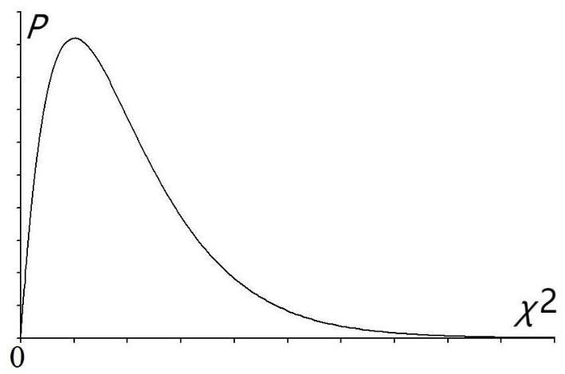

从图中可以看出, ${\chi }^{2}$ 的最大和较大取值主要集中在一个很小的值附近,距离原点较远的位置, ${\chi }^{2}$ 越大对应的概率越小,这有些类似正态分布,越接近期望的 “靠谱” 取值被测得的概率越大, 越远离期望的 “离谱” 取值被测得的概率越小。

对应最大概率的 ${\chi }^{2}$ 值并非 0,这是因为虽然理论上相互独立的两组数据测得的 ${\chi }^{2}$ 应当等于 0, ${\chi }^{2}$ 越靠近 0 出现的概率应当越大,但由于客观存在的随机现象,导致 ${\chi }^{2}$ 值的实际分布上,概率最大的 ${\chi }^{2}$ 是一个很小的值而非 0 。

与正态分布密度曲线相似,由于数据量非常庞大 (理论上为无穷多个点), 考虑单个 ${\chi }^{2} = {x}_{a}$ 时的概率没有实际意义,通常考虑当 ${\chi }^{2} \geq  {x}_{a}$ 时,曲线与直线 $x = {x}_{a}\text{ 、 }x$ 轴所围成的面积 $a$ 。面积 $a$ 等于满足条件 ${\chi }^{2} \geq  {x}_{a}$ 时零假设成立的概率, 即 $a = P\left( {{\chi }^{2} \geq  {x}_{a}}\right) ,{x}_{a}$ 叫作概率 $a$ 的临界值,如下图所示。

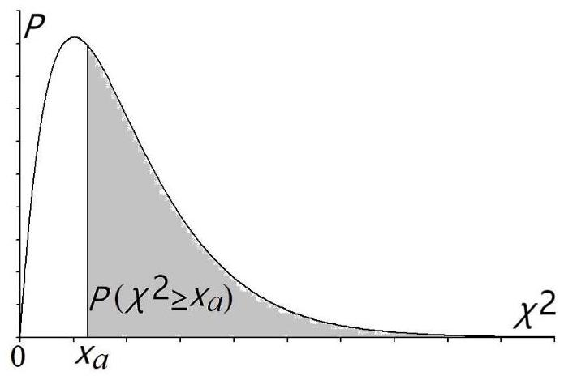

由于理论上满足零假设 (相互独立) 的一对随机变量的 ${\chi }^{2}$ 应当很小,因此若实际测得的 ${\chi }^{2}$ 越小,则随机变量相互独立的可能性越大。与之相对应,根据临界值 ${x}_{a}$ 及其概率 $a = P\left( {{\chi }^{2} \geq  {x}_{a}}\right)$ 的构造方式可知, ${\chi }^{2}$ 越小,则概率 (阴影部分面积) $a = P\left( {{\chi }^{2} \geq  {x}_{a}}\right)$ 越大。

综上, ${\chi }^{2}$ 越小,则 $a = P\left( {{\chi }^{2} \geq  {x}_{a}}\right)$ 的值和随机变量相互独立 (零假设成立) 的可能性越大。 ${\chi }^{2}$ 越大,则 $a = P\left( {{\chi }^{2} \geq  {x}_{a}}\right)$ 的值和随机变量相互独立(零假设成立) 的可能性越小。可以认为: 随机变量相互独立的可能性大小与 $a = P\left( {{\chi }^{2} \geq  {x}_{a}}\right)$ 的大小相一致。

下图所示为是一个较小的临界值 ${x}_{a}$ (左图)与一个较大的临界值 ${x}_{a}$ (右图) 分别对应的变量相互独立的概率, 等于阴影部分的面积。

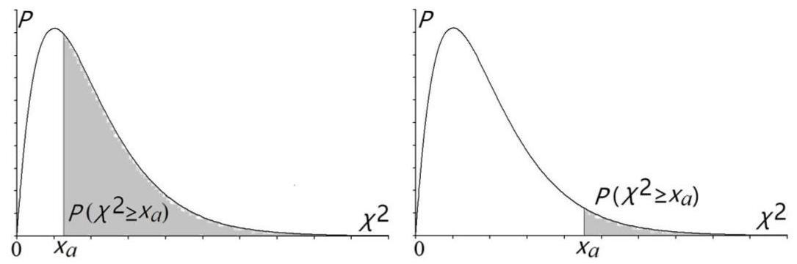

用临界值判断一对随机变量是否相互独立的原理是:

第一步: 通过大量实验,建立零假设成立时的 ${\chi }^{2}$ 分布曲线以及临界值 ${x}_{a}$ 与对应的概率 $a = P\left( {{\chi }^{2} \geq  {x}_{a}}\right)$ 的数据表格,该表格已由数学家制得可以直接查阅。 ${\chi }^{2}$ 的分布曲线是客观规律, 曲线和表格是通用的, 就像三角函数表、常用对数表、 正态分布表。下表为部分常用临界值 ${x}_{a}$ 与对应的概率 $a$ :

<table><tr><td>${x}_{a}$</td><td>2.706</td><td>3.841</td><td>6.635</td><td>7.7879</td><td>10.828</td></tr><tr><td>$a$</td><td>0.1</td><td>0.05</td><td>0.01</td><td>0.005</td><td>0.001</td></tr></table>

第二步: 根据实际需要,选取一个合适的临界值 ${x}_{a}$ 作为零假设成立的标准, 并认为:

如果 ${\chi }^{2} < {x}_{a}$ ,那么该 ${\chi }^{2}$ 属于零假设成立的 “可靠” 取值,认为这一对随机变量相互独立。

如果 ${\chi }^{2} > {x}_{a}$ ,那么该 ${\chi }^{2}$ 不属于零假设成立的 “可靠” 取值,认为这一对随机变量不独立, 即有关联。

然而,即使很大的 ${\chi }^{2}$ ,也有极小的概率会在满足零假设的情况下测得,这个概率不大于 $a = P\left( {{\chi }^{2} \geq  {x}_{a}}\right)$ 。即: 如果 ${\chi }^{2} > {x}_{a}$ ,那么有不大于 $a = P\left( {{\chi }^{2} \geq  {x}_{a}}\right)$ 的可能性,这对随机变量相互独立 (满足零假设) 。为了严谨起见,如果 ${\chi }^{2} > {x}_{a}$ , 可以声明: 这一对随机变量相关,且仅有不大于 $a$ 的概率判断错误。观察表中的数据可以发现, ${\chi }^{2}$ 的值越大,判断错误的概率越小,即相互独立的概率越小。

对于 ${\chi }^{2} < {x}_{a}$ 的情况,一概认为只要 ${\chi }^{2} < {x}_{a}$ ,零假设就成立,不存在判断错误的可能性。

第三步:根据所需分析的一对随机变量，求出它们的 ${\chi }^{2}$ 。将 ${\chi }^{2}$ 与选定的临界值 ${x}_{a}$ 比较,根据 ${\chi }^{2}$ 与 ${x}_{a}$ 的大小关系,判断这一对随机变量独立还是相关。如果相关,那么判断错误的概率不大于 $a$ 。

上述检验事件独立性的方法叫作 ${\chi }^{2}$ 独立性检验 (卡方独立性检验),简称独立性检验。

综上, 进行独立性检验的简要过程为:

(1)根据给出的两组数据计算 ${\chi }_{0}{}^{2}$ ；

(2)查表得到给出的判断错误的小概率值 $a$ 所对应的临界值 ${x}_{a}$ ；

(3)比较 ${x}_{a}$ 与 ${\chi }_{0}{}^{2}$ 的大小:如果 ${\chi }_{0}{}^{2} \geq  {x}_{a}$ ，那么零假设不成立，两组随机变量相关,且判断错误的概率不大于 $a$ 。如果 ${\chi }_{0}{}^{2} < {x}_{a}$ ,那么零假设成立,两组随机变量独立。

例 19.8 根据例 19.7 中的数据检验两个工厂的产品合格与否是否相互独立。

解析: 将列联表中的数据代入 ${\chi }^{2}$ 的计算公式:

$$
{\chi }^{2} = \frac{n{\left( ad - bc\right) }^{2}}{\left( {a + b}\right) \left( {c + d}\right) \left( {a + c}\right) \left( {b + d}\right) } = \frac{{180} \times  {\left( {15} \times  {70} - {85} \times  {10}\right) }^{2}}{{100} \times  {80} \times  {25} \times  {155}} = {0.23}
$$

该值小于临界值 ${x}_{a}$ 与对应的概率 $a$ 表中的 2.706,因此认为这两个工厂的产品合格与否相互独立。

练习 19.3(2)

1. 已知某饭店的主食有米饭和面食两类，统计发现，某天共有 50 名未成年顾客和 100 名成年顾客，未成年顾客选择米饭和面食的人数分别为 20 人和 30 人， 成年顾客选择米饭和面食的人数分别为 70 人和 30 人，

(1)根据数据初步判断，该饭店顾客对主食的偏好是否与成年与否有关；

(2)将数据绘制列联表，求 ${\chi }^{2}$ 值，根据下表的临界值判断，该饭店顾客对主食的偏好是否与成年与否有关。

<table><tr><td>${x}_{a}$</td><td>2.706</td><td>3.841</td><td>6.635</td><td>7.7879</td><td>10.828</td></tr><tr><td>$a$</td><td>0.1</td><td>0.05</td><td>0.01</td><td>0.005</td><td>0.001</td></tr></table>

#### 19.3.3 卡方检验原理的补充介绍

独立性检验与卡方检验是两个概念, 独立性检验是一种有目的的检验, 目的是判断两个随机变量之间是否独立。卡方检验是一种统计的通用方法, 除可以检验独立性外，还广泛应用于判断各类对象是否符合已经建立的模型。

卡方检验的主要原理和步骤为:

第一步:针对客观存在的现象规律，根据理论设计接近理想条件的实验，通过实验采集数据并计算相应的参数，用参数建立统计数据模型(如正态分布、零假设的 ${\chi }^{2}$ 分布)。根据实际需要设定一个临界值并划定范围，作为判断对象是否符合该模型的标准: 若对象的参数属于相应的范围, 则认为符合, 否则就认为不符合。

由于随机误差等原因, 数据模型中会有较少的点在临界值范围外, 因此对于不符合模型的判断有一定的概率是错误的, 这个概率一般通过合理地选取临界值而极小, 只要是参数在模型内的对象, 都一概认为其符合模型的描述。

第二步:采集具体研究对象的参数，计算出相应参数，将该参数与统计数据模型进行比对，并判断该对象是否符合模型。

卡方检验的原理涉及较深入的概率知识, 理解起来可能存在较大困难, 可以用下面的例子类比理解:

假设有甲、乙两位同学，甲同学的成绩总是接近满分(100 分)，乙同学的成绩总是接近 0 分。由于卷面难度、状态发挥、猜题运气等因素，甲可能考 80 分、70 分，甚至可能性很低的 20 分、 10 分，乙可能考 10 分、 20 分，甚至可能性很低的 80 分、90 分。

某天，拿来两张已经完成的试卷(两个随机变量)，需要判断是由甲乙两人分别独自完成(相互独立)，还是两人共同完成(相互联系)。

根据两位同学平时大量考试成绩的统计数据,定下标准 ${x}_{a} = {80}$ :

若两张试卷的分差大于 $\Delta  > {80}$ ,则断定由甲乙两人分别独自完成。

若两张试卷的分差小于 $\Delta  < {80}$ ,则认为由甲乙两人共同完成,但也有极小的概率 $a$ 判断错误,实际上是甲或乙发挥异常。

某次考试结果出来后, 得到两张由甲或乙完成的不记名试卷:

若一张 100 分,另一张 0 分, ${x}_{a} = {100}$ ,则可以断定一张由甲完成,另一张由乙完成，两张答卷独立。

若一张 95 分,另一张 5 分, $\Delta  = {90}$ ,则也可以断定一张由甲完成,另一张由乙完成, 两张答卷独立。

若一张 100 分,另一张 90 分, $\Delta  = {10}$ ,则基本可以断定两张答卷相关 (由甲乙共同完成)，但也有极小的概率 ${a}_{10}$ ，恰好乙发挥异常，导致判断错误。

若一张 5 分,另一张 0 分, $\Delta  = 5$ ,则基本可以断定两张答卷相关 (由甲乙共同完成)，但也有极小的概率 ${a}_{5}$ ，恰好甲发挥异常，导致判断错误。

## 小结

本章主要学习成对数据之间的线性相关关系的判断、线性拟合、独立性检验。 本章的原理与推导有一定深度和复杂度, 需要非常耐心和认真地阅读理解原理和推导过程。本章的结论性公式都是可以直接使用的工具, 需要牢记, 部分公式可借助几何含义帮助记忆。练习和考试中，虽然有些题目会给出简要公式，但对于公式中各符号对应的参数和数据，必须理解其原理和用法，否则即使见到公式也不会使用。

本章是高中数学的最后一章, 属于概率与统计分支的末端, 几乎不会与高中数学的其他块面形成交叉题目, 且变化形式很少, 也较难根据原理和定义自行推导，属于“会就是会、不会就是不会”，但“偏门”不等于“冷门”，本章的内容经常作为较简单的解答题出现在考试中，需要定期练习保持熟练度。

## 第一章 集合与常用逻辑用语

【1.1】1. (1)1，(2)8，(3)1，(4)0，(5)1。2.(1)该方程无正整数解, 集合为空集, 空集是一个集合, 能; (2)“体型高大”不是一个明确的判断标准，不能；(3)“简单”不是一个明确的判断标准，“数学题”不是一个明确的范围，不能；(4)“正确率低于50%”是一个明确的判断标准，“2000 年全国高考中的题目”是一个明确的范围，能。3.(1) $\{ x \in  \mathbf{Z} \mid   - {2.5} < x < 0\}$ 或 $\{  - 1, - 2\}$ ； (2) $\{ \left( {x, y}\right)  \mid  y = x\}$ ；(3) $\{ x \mid   - 4 \leq  x \leq  4\}$ ；(4)用列举法列出你本学期所学的课程即可。

【1.2】1. 如右图所示。2.(1)⌀，共 1 个子集；(2)⌀， $\{ 1\}$ ，共 2 个子集；(3)⌀， $\{ 1\}$ ， $\{ 2\}$ ， $\{ 1,2\}$ ，共 4 个子集； (4) $\varnothing ,\{ 1\} ,\{ 2\} ,\{ 3\} ,\{ 1,2\} ,\{ 1,3\} ,\{ 2,3\} ,\{ 1,2,3\}$ , 共 8 个子集; 可能的规律为: 如果集合中元素的个数 $n$ ,那么子集的个数为 ${2}^{n}$ 。

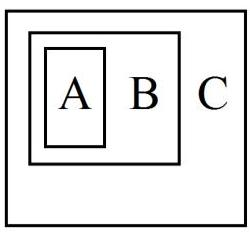

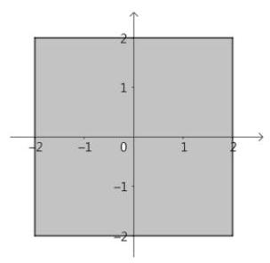

【1.3】1. $A \cup  B = \{ x \mid  x >  - 1\} ,\;A \cap  B = \{ x \mid  0 \leq  x < 4\}$ 。 2. ${\mathrm{C}}_{\mathrm{U}}\mathrm{A} = \{ x \mid  x$ 是锐角三角形或直角三角形 $\} \text{ 。 }3.{\mathrm{C}}_{\mathrm{U}}\mathrm{A} = \{ x \mid  x \geq  3$ 或 $x \leq   - 2\}$ 。 4. $\mathrm{A} \cap  \mathrm{B} = \{ \left( {0,0}\right) ,\left( {2,4}\right) \}$ 。 5.如右图所示,阴影中的部分为集合 $\mathrm{A}$ 。

【1.4】1.(1)32; (2)16; (3)16; (4)∅, $\{ a\} ,\{ b\}$ ， $\{ c\} ,\{ a, b\} ,\{ a, c\} ,\{ b, c\} ,\{ a, b, c\}$ 。2. 设 $A\text{ 、 }B\text{ 、 }C$ 共有的元素有 $m$ 个, 属于 $A\text{ 、 }B$ 不属于 $C$ 的元素有 $p$ 个,属于 $A\text{ 、 }C$ 不属于 $B$ 的元素有 $q$ 个,属于 $B\text{ 、 }C$ 不属于 $A$ 的元素有 $r$ 个,只属于 $A$ 元素有 $s$ 个,只属于 $B$ 的元素有 $t$ 个,只属于 $C$ 的元素有 $u$ 个,由此可得: $\operatorname{card}\left( A\right)  = s + p + q + m\operatorname{card}\left( B\right)  = t + p + r + m$ , $\operatorname{card}\left( C\right)  = u + q + r + m,\operatorname{card}\left( {A \cap  B}\right)  = p + m,\operatorname{card}\left( {A \cap  C}\right)  = q + m,\operatorname{card}\left( {B \cap  C}\right)  = r + m$ , $\operatorname{card}\left( {A \cap  B \cap  C}\right)  = m,\operatorname{card}\left( {A \cup  B \cup  C}\right)  = m + p + q + r + s + t + u$ ,代入相应的公式: $\operatorname{card}\left( A\right)  + \operatorname{card}\left( B\right)  + \operatorname{card}\left( C\right)  - \operatorname{card}\left( {A \cap  B}\right)  - \operatorname{card}\left( {A \cap  C}\right)  - \operatorname{card}\left( {B \cap  C}\right)  + \operatorname{card}\left( {A \cap  B \cap  C}\right) \; = \left( {s + p + q + m}\right)  + \left( {t + p + r + m}\right)  + \left( {u + q + r + m}\right)  - \left( {p + m}\right)  - \left( {q + m}\right)  - \left( {r + m}\right)  + m \; = m + s + t + u + p + q + r = \operatorname{card}\left( {A \cup  B \cup  C}\right)$

【1.5】1. (1)既不充分也不必要；(2)充分不必要条件；(3)必要不充分条件; (4) 充要条件; (5) 充要条件; (6) 既不充分也不必要。2. (1) 若 $p$ 则 $q$ ， 若 $r$ 则 $p$ ,若 $s$ 则 $q$ ,若 $r$ 则 $s$ ,若 $t$ 则 $q$ ; (2) 将上一问中的条件与结论颠倒; (3) $p$ 与 $s$ ; (4) $q$ 与 $r, p$ 与 $t, r$ 与 $t, s$ 与 $t$ 。

【1.6】1.(1)全称量词命题；(2)存在量词命题；(3)存在量词命题；(4) 全称量词命题。2.(1)假命题；存在正奇数不是质数；(2)假命题；存在正实数的平方的平方根不等于它自身; (3) 真命题; 已知 ${l}_{1} \bot  {l}_{2},\exists {l}_{3} \bot  {l}_{1},{l}_{3}$ 与 ${l}_{2}$ 不平行; (4) 真命题; $\forall x \in  \mathbf{R},{x}^{2} - {6x} + 9 > 0$ 。3. (1) $A = \{ x \mid  x < 0\} , B = \left\{  {x \mid  {x}^{2} - {2x} > 0}\right\}$ , $A \subseteq  B$ ；(2) $A = \{ x$ 是三条边长满足勾股定理的三角形 $\}$ ， $B = \{ x$ 是直角三角形 $\}$ ， $A = B$ 。4.(1) $a : {x}^{2} - 1 < 0, b : x < 2$ ，既不充分也不必要；(2) $p :$ 点在直线 $y = x - 1$ 上, $q$ : 点满足方程 $y = \frac{{x}^{2} - 1}{x + 1}$ ,点 $\left( {-1, - 2}\right)$ 满足 $p$ 但不满足 $q, p$ 是 $q$ 的必要非充分条件。

第二章 等式与不等式

【2.1】1.略。2.(1) $x =  - \frac{119}{48}$ ；(2) $x = \frac{1 \pm  \sqrt{10}}{3}$ ； $x = 8$ 或 $x = 4$ 。

【2.1】1. (1)因为 $a > b > 0, c > d > 0$ ,所以 ${ac} > {bc}$ , ${bc} > {bd}$ ,所以 ${ac} > {bc} > {bd}$ ; (2) 因为 $a > b > 0$ ,所以 $\frac{{a}^{n}}{{b}^{n}} = {\left( \frac{a}{b}\right) }^{n} > {1}^{n} > 1$ ,所以 ${a}^{n} = {b}^{n}$ 。2. (1) 因为 $a > b > 0$ ,所以 $\frac{1}{b} > 0$ ,令 $a > b$ 的两边都乘以 $\frac{1}{b} : a \times  \frac{1}{b} > b \times  \frac{1}{b}$ ,即 $\frac{a}{b} > 1$ ; (2) 因为 $b < a < 0$ ,所以 $\frac{1}{b} < 0$ ,令 $b > a$ 的两边都乘以 $\frac{1}{b}$ ,不等号方向需改变: $b \times  \frac{1}{b} > a \times  \frac{1}{b}$ ,即 $\frac{a}{b} < 1$ 。3. 因为 $a > b > 0, d < c < 0$ ,所以 ${ad} < {bd},{bd} < {bc}$ ,所以 ${ad} < {bd} < {bc}$ 。4. (1) 因为 $\left( {{k}^{2} + {2k}}\right)  - \left( {{4k} - 2}\right)  = {k}^{2} - {2k} + 2 = {\left( k - 1\right) }^{2} + 1 > 0$ ,所以 ${k}^{2} + {2k} > {4k} - 2$ ; (2) $\frac{x + 1}{\sqrt{{x}^{2} - 1}} = \frac{{\left( \sqrt{x + 1}\right) }^{2}}{\sqrt{x + 1}\sqrt{x - 1}} = \frac{\sqrt{x + 1}}{\sqrt{x - 1}} = \sqrt{\frac{x + 1}{x - 1}} = \sqrt{1 + \frac{2}{x - 1}}$ ,因为 $x > 1$ ,所以 $\sqrt{1 + \frac{2}{x - 1}} > 1$ ,所以 $x + 1 > \sqrt{{x}^{2} - 1} > 0$

【2.3】1.略。2. (1) $x <  - \frac{7}{22}$ ；(2) $\frac{{11} - \sqrt{17}}{2} < x < \frac{{11} + \sqrt{17}}{2}$ ；(3) $x \neq   - {11}$ ； (4) $x > 1$ 或 $x <  - 1$ ；(5) $\frac{1 - \sqrt{5}}{2} < x < \frac{1 + \sqrt{5}}{2}$ ；(6) $x \geq  \frac{1}{2}{3\text{ 。 }3}.$ (1) $>$ ；(2) $\leq$ ； (3)≥°.4. (1) $\{ x \mid  6 < x < 7\}$ ; (2) $\left\{  {x \mid  x <  - 1\text{ 或 }x > 4}\right\}$ ; (3) $\{ x \mid  x \leq  6$ 或 $x \geq  7\}$ 。

【2.4】1.仍成立,无实质区别,只是不同的记号。 $2.{a}^{2} + {b}^{2} - \frac{1}{2}{\left( a + b\right) }^{2} = \; \frac{1}{2}{a}^{2} - {ab} + \frac{1}{2}{b}^{2} = \frac{1}{2}{\left( a - b\right) }^{2} \geq  0$ ,即得证。3. 由完全平方公式可得: ${a}^{2} + {b}^{2} \geq  {2ab}$ , ${b}^{2} + {c}^{2} \geq  {2bc},{a}^{2} + {c}^{2} \geq  {2ac}$ ,将三个不等式的左右两边分别相加: $2{a}^{2} + 2{b}^{2} + 2{c}^{2} \geq \; {2ab} + {2bc} + {2ac}$ ,即 ${a}^{2} + {b}^{2} + {c}^{2} \geq  {ab} + {bc} + {ac}$ ,当且仅当 $a = b, b = c, a = c$ ,即 $a = b = c$ 时等号成立。4. 当 ${ab}$ 取最大值时, $\sqrt{\frac{1}{ab}}$ 取最小值, ${ab} \leq  \left( \frac{a + {b}^{2}}{2}\right)  = {\left( \frac{4}{2}\right) }^{2} = 4$ , $\sqrt{\frac{1}{ab}}$ 的最小值为 0.5,当且仅当 $a = b = 2$ 时取到最小值。5. ${xy} = \frac{1}{2}\left( {x \cdot  {2y}}\right)  \leq  \frac{1}{2}{\left( \frac{x + {2y}}{2}\right) }^{2} \; = \frac{1}{2}{\left( \frac{16}{2}\right) }^{2} = {32}$ ,当且仅当 $x = {2y}$ ,即 $x = 8, y = 4$ 时取到最大值。 6. 把 $b + c$ 看作整体, ${ab} + {ac} = a\left( {b + c}\right)  \leq  {\left\lbrack  \frac{a + \left( {b + c}\right) }{2}\right\rbrack  }^{2} = {\left( \frac{9}{2}\right) }^{2} = \frac{81}{4}$ ,当且仅当 $a = b + c$ ,即 $a = b + c = \frac{9}{2}$ 时取最大值。

## 第三章 函数的概念与性质

【3.1】1. $\left( 1\right)  - 9;\left( 2\right) 0;\left( 3\right)  - 9;\left( 4\right) 0$ 。2. $\left( 1\right) \left\lbrack  {2, + \infty }\right) ;\left( 2\right) \left( {-\infty , - 3\rbrack \cup \lbrack 3, + \infty }\right)$ ; (3) $\left( {2, + \infty }\right)$ ; (4) $x \neq  0$ 且 $x \neq   - 1$ 。3. (1) $\left\lbrack  {-8,8}\right\rbrack$ ；(2) $\left( {-8, - 2}\right)$ ；(3) $\lbrack 2, + \infty )$ ； (4) $\left( {\sqrt{2}, + \infty }\right)$ 。4.如下图所示。

15

1

-4 -2 -1 1

-1 -1

-2 -2

-3 -5 0 -3

-5

(1) (2) (3)

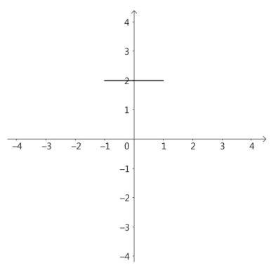

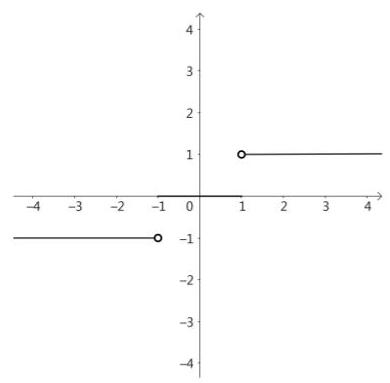

(4) (5)

【3.2(1)】1. 设 ${x}_{1} < {x}_{2}, f\left( {x}_{1}\right)  - f\left( {x}_{2}\right)  = {x}_{1}^{3} - {x}_{2}^{3} = \left( {{x}_{1} - {x}_{2}}\right) \left( {{x}_{1}^{2} + {x}_{1}{x}_{2} + {x}_{2}^{2}}\right)$ ,其中 ${x}_{1} - {x}_{2} < 0$ ; 当 $0 < {x}_{1} < {x}_{2}$ 和 ${x}_{1} < {x}_{2} < 0$ 时都有 ${x}_{1}^{2} + {x}_{1}{x}_{2} + {x}_{2}^{2} > 0$ ; 当 ${x}_{1} < 0 < {x}_{2}$ 时, 若 $\left| {x}_{1}\right|  < \left| {x}_{2}\right|$ ,则 $- {x}_{1} < {x}_{2},{x}_{1} + {x}_{2} > 0,{x}_{1}^{2} + {x}_{1}{x}_{2} + {x}_{2}^{2} = {x}_{1}^{2} + {x}_{2}\left( {{x}_{1} + {x}_{2}}\right)  > 0$ ,若 $\left| {x}_{1}\right|  > \left| {x}_{2}\right|$ ,则 $- {x}_{1} > {x}_{2},{x}_{1} + {x}_{2} < 0,{x}_{1}^{2} + {x}_{1}{x}_{2} + {x}_{2}^{2} = {x}_{1}\left( {{x}_{1} + {x}_{2}}\right)  + {x}_{2}^{2} > 0$ ,综上,恒有 ${x}_{1}^{2} + {x}_{1}{x}_{2} + {x}_{2}^{2} > 0, f\left( {x}_{1}\right)  - f\left( {x}_{2}\right)  < 0$ 。 2. 设 $0 < {x}_{1} < {x}_{2}, f\left( {x}_{1}\right)  - f\left( {x}_{2}\right)  = \frac{1}{{x}_{1}^{2} + 1} - \frac{1}{{x}_{2}^{2} + 1} \; = \frac{{x}_{2}^{2} - {x}_{1}^{2}}{\left( {{x}_{1}^{2} + 1}\right) \left( {{x}_{2}^{2} + 1}\right) } = \frac{\left( {{x}_{2} - {x}_{1}}\right) \left( {{x}_{2} + {x}_{1}}\right) }{\left( {{x}_{1}^{2} + 1}\right) \left( {{x}_{2}^{2} + 1}\right) }$ ,其中, ${x}_{2} - {x}_{1}\text{ 、 }{x}_{2} + {x}_{1}\text{ 、 }\frac{1}{{x}_{1}^{2} + 1}\text{ 、 }\frac{1}{{x}_{2}^{2} + 1}$ 都恒大于 0,所以 $f\left( {x}_{1}\right)  - f\left( {x}_{2}\right)  > 0$ ,即得证。3. (1) 当 $x = \frac{5}{2}$ 时,最小值为 $- \frac{25}{4}$ ,无最大值; (2) 当 $x = 0$ 时,最小值为 -4 , 无最大值; (3) 当 $x = 2 + 2\sqrt{3}$ 或 $x = 2 - 2\sqrt{3}$ 时,最小值为 0,当 $x = 2$ 时,最大值为 $2\sqrt{3}$ ; (4)当 $x =  - 1$ 时,最小值为 -3, 当 $x = 1$ 时,最大值为 -1 ; (5) 没有最小值和最大值。4. 设 ${x}_{1} < {x}_{2}$ ,因为 $y = f\left( x\right)$ 是增函数,所以 $f\left( {x}_{1}\right)  < f\left( {x}_{2}\right)$ ,因为 $y = g\left( x\right)$ 是减函数,所以 $g\left( {x}_{1}\right)  > g\left( {x}_{2}\right)$ ,方向不同的不等式的两边相乘没有一致的规律, $y = f\left( x\right) g\left( x\right)$ 的单调性无法确定。

【3.2(2)】1.(1)偶函数；(2)奇函数；(3)奇函数；(4)都不是；(5) 偶函数。2.偶函数。3.略。4.不可能,偶函数在原点两侧对称的区间上的单调性相反,单调递增和单调递减函数都不可能是偶函数。5. 有可能, $y = x$ 和 $y =  - x$ 分别是单调递增和单调递减的奇函数。

(2)(-2，0)；(3)(-2，0)；(4)(0，1)。

【3.2(4)】1.(1)二次函数，在 $\left( {-\infty ,2}\right)$ 单调递增，在 $\left( {2, + \infty }\right)$ 单调递减，不是奇函数和偶函数; (2) 复合函数,偶函数,在 $\left( {-\infty , - 1}\right)$ 和 $\left( {-1,0}\right)$ 分别单调递增,在 $\left( {0,1}\right)$ 和 $\left( {1, + \infty }\right)$ 分别单调递减; (3) $y = x + 1$ 除去点 $\left( {1,2}\right)$ 无奇偶性,单调递增函数。2. 设 $f\left( x\right)$ 和 $g\left( x\right)$ 都是单调递增函数,设 ${x}_{1} < {x}_{2}$ ,可得 $g\left( {x}_{1}\right)  < g\left( {x}_{2}\right)$ , 可得 $f\left( {g\left( {x}_{1}\right) }\right)  < f\left( {g\left( {x}_{2}\right) }\right)$ ,所以 $f\left( {g\left( x\right) }\right)$ 是单调递增函数,其他单调性的证明类似; 设 $f\left( x\right)$ 和 $g\left( x\right)$ 都是偶函数,可得 $g\left( x\right)  = g\left( {-x}\right)$ ,可得 $f\left( {g\left( x\right) }\right)  = f\left( {g\left( {-x}\right) }\right)$ ,所以 $f\left( {g\left( x\right) }\right)$ 是偶函数,其他对称性的证明类似。

【3.2(5)】1.略。

第四章 指数与对数

(4)<。4. (1) $\frac{1}{3}$ ；(2)7；(2)47。

【4.1(2)】1. (1) ${\log }_{2}4 = 2$ ；(2) ${\log }_{1/3}9 =  - 2$ ；(3) ${\log }_{10}{1000} = \frac{1}{3}$ ； ${\log }_{a}c = b$ 。2. (1) ${4}^{2} = {16};\;\left( 2\right) \;{27}^{\frac{4}{3}} = {81};\;\left( 3\right) \;{e}^{p} = 2;\;\left( 4\right) \;{a}^{b} = c$ 。3. (1) ${10};\left( 2\right) 4;\left( 3\right)  - 2;\left( 4\right)  - 2;\left( 5\right) \frac{1}{2}$ 。4. (1) 6; (2) ${10}^{-8};\left( 3\right) \sqrt[5]{256}$ ; (4) ${2}^{1.2};\;\left( 5\right)  \pm  2 \circ  5.\left( 1\right) b;\;\left( 2\right) 0;\;\left( 3\right) 2;\;\left( 4\right) 2 \circ  6.\left( 1\right) \ln \frac{p}{q} + \ln \frac{q}{p} = \; \ln \frac{p}{q} + \left( {-1}\right) \ln {\left( \frac{q}{p}\right) }^{-1} = \ln \frac{p}{q} - \ln \frac{p}{q} = 0;\;\left( 2\right) \;{\log }_{{a}^{n}}{b}^{n} = \frac{n}{n}{\log }_{a}b = {\log }_{a}b$ 。

【4.2(1)】1. $y = {x}^{4}$ 。2. (1) 单调递增函数,奇函数; (2) 在 $\left( {-\infty ,0}\right)$ 单调递减,在 $\left( {0, + \infty }\right)$ 单调递增,偶函数; (3) $\left( {-\infty , - 1}\right)$ 和 $\left( {0,1}\right)$ 分别单调递增,在 $\left( {-1,0}\right)$ 和 $\left( {1, + \infty }\right)$ 分别单调递减,偶函数。3. $\left( 1\right) y = {x}^{4} + 2$ ; ( (2) $y =  - \frac{9}{4}{x}^{3}$ 。

$\mathbf{R},\left( {0, + \infty }\right)$ ; ( 3 ) $\lbrack 0, + \infty )$ , $\lbrack 1, + \infty )$ ; $\left( {-\infty ,0}\right)  \cup  \left( {0, + \infty }\right) , \; \left( {0,1}\right)  \cup  \left( {1, + \infty }\right)$ 。2.10(默认指数函的底数 $a > 0, a \neq  1$ )。 3. $\varnothing \left( {\forall a > 0, a \neq  1}\right.$ ，恒有 $\left. {f\left( 0\right)  = g\left( 0\right)  = 1}\right)$ 。4. $\left( {0, + \infty }\right)$ 。 5. $f\left( x\right)  = {3}^{x}$ 经过点 $\left( {0,1}\right)$ 和 $\left( {1,3}\right)$ ,据此画出大致图像, $g\left( x\right)  = {9x}$ 经过点 $\left( {0,0}\right)$ 和 $\left( {1,9}\right)$ ,据此画出大致图像,如右图所示,交点在 $\left( {0,1}\right)$ 的右上方附近。

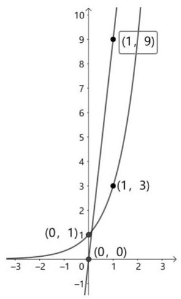

【4.2(3)】1.(1)(0， $+ \infty ),\left( {-\infty , + \infty }\right)$ ；(2) $\left( {-5, + \infty }\right)$ ， $\left( {-\infty , + \infty }\right) ;\;\left( 3\right) \left( {-\infty , - 3}\right)  \cup  \left( {-2, + \infty }\right) ,\left( {-\infty , + \infty }\right) ;\;\left( 4\right) \left( {2, + \infty }\right) ,\left( {-\infty , + \infty }\right)$ 2. $\frac{1}{10}$ 。3. $\varnothing \left( {\forall a > 0, a \neq  1}\right.$ ,恒有 $\left. {f\left( 1\right)  = g\left( 1\right)  = 0}\right)$ 。4. $\left( {0,1}\right)$ 。

【4.2(4)】1. $f\left( x\right)  = {\log }_{2}x$ 经过 $\left( {1,0}\right)$ 和 $\left( {2,1}\right)$ , 据此画出大致图像, $g\left( x\right)  = x - 1$ 经过 $\left( {0,0}\right)$ 和 $\left( {1,0}\right)$ ,据此画出大致图像,如右图所示, $\left( {1,0}\right)$ 是它们的交点,可以发现 $\left( {2,1}\right)$ 也是它们的交点。2. (1)单调递增函数；(2)单调递减函数；(3) 单调递减; $y = {0.5}^{x}$ 比 $y = {\log }_{0.5}x$ 递减得快。

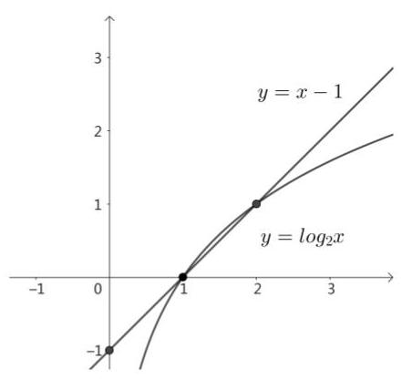

【4.3(1)】1.(1)有， $y = x$ ；(2)无， $f\left( x\right)  = f\left( {-x}\right)$ ,同一个函数值对应两个自变量；(3)有， $y = \sqrt[3]{x + 1}$ ；(4)无， $f\left( x\right)  = f\left( \frac{1}{x}\right)$ ,同一个函数值对应两个自变量; (5) 无, $f\left( 0\right)  = f\left( 1\right)  = 0$ ,同一函数值对应两个自变量。2. ( 1 )偶函数无反函数；( 2 )奇函数可能有反函数， 若有仍是奇函数；(3)是单调递增函数；(4)是单调递减函数。

【4.3(2)】1.(1)连续；(2)不连续，在 $x = 0$ 处断开；(3)连续；(4) 连续。2.(1) $f\left( {-2}\right)  =  - {12}, f\left( 2\right)  = 4$ ，存在；(2) $f\left( 1\right)  = 2$ ，且 ${2}^{x}$ 比 $8{\log }_{2}x$ 增长得快，所以在该区间不存在零点；(3) $f\left( 1\right)  = 0$ ， $f\left( 2\right)  = {e}^{2}\ln 2 > 0$ ， ${e}^{x}$ 和 $\ln x$ 在该区间都递增且为正数,所以在该区间不存在零点; (4) $f\left( {-2}\right)  = \frac{2\sqrt{5}}{5}$ , $f\left( {-1}\right)  = \frac{\sqrt{2}}{2}$ ,该函数在该区间单调递减，所以在该区间不存在零点。

) $x = 2$ ; (2) $x = 4$ 。

【4.3(4)】1.(1) $y =  - {0.006x} + {20}$ ；(2) ${20}^{ \circ  }\mathrm{C}$ ；(3) ${150}\mathrm{\;m}$ 。2.(1) $h = {30t} - 5{t}^{2}$ ； (2) ${45}\mathrm{\;m}$ ；(3) $3\mathrm{\;s}$ 。

第五章 三角函数

【5.1(1)】1.(1)一；(2)三；(3)四；(4)二。 2. $- {1395}^{ \circ  }, - {1035}^{ \circ  }, - {675}^{ \circ  }$ ， $- {315}^{ \circ  },{45}^{ \circ  },{405}^{ \circ  },{765}^{ \circ  },{1125}^{ \circ  }$ 。3.负角。

【5.1(2)】1.(1) $\frac{\pi }{6};\;\left( 2\right) \; - \frac{\pi }{4};\;\left( 3\right) \;\frac{7\pi }{12};\;\left( 4\right) \; - \frac{5\pi }{6};\;\left( 5\right) \;\frac{7\pi }{6}\;\left( 6\right) \; - \frac{5\pi }{3}$ 。 2.(1) ${15}^{ \circ  }$ ；(2) $- {157.5}^{ \circ  }$ ；(3) ${225}^{ \circ  }$ ；(4) $- {330}^{ \circ  }$ ；(5) $\frac{720}{\pi }$ ；(6) $- \frac{90a}{\pi }$ 。。 3.(1) $\frac{\sqrt{3}}{2};\;\left( 2\right) \; - \frac{\sqrt{3}}{2};\;\left( 3\right) \;0;\;\left( 4\right) \; - 1$ 。

<table><tr><td></td><td>+x</td><td>一</td><td>+y</td><td>二</td><td>$- x$</td><td>三</td><td>-y</td><td>四</td></tr><tr><td>$\sin \theta$</td><td>0</td><td>+</td><td>+</td><td>+</td><td>0</td><td>-</td><td>-</td><td>-</td></tr><tr><td>$\cos \theta$</td><td>+</td><td>+</td><td>0</td><td>-</td><td>-</td><td>-</td><td>0</td><td>+</td></tr><tr><td>$\tan \theta$</td><td>0</td><td>+</td><td></td><td>-</td><td>0</td><td>+</td><td></td><td>-</td></tr></table>

3. $\cot \alpha  = \frac{\cos \alpha }{\sin \alpha }, x \neq  {k\pi }\left( {k \in  \mathbf{Z}}\right) ;\sec \alpha  = \frac{1}{\cos \alpha }, x \neq  \frac{\pi }{2} + {k\pi }\left( {k \in  \mathbf{Z}}\right) ;\csc \alpha  = \frac{1}{\sin \alpha }$ ， $x \neq  {k\pi }\left( {k \in  \mathbf{Z}}\right)  \circ  4.{\sin }^{4}\theta  + {\cos }^{4}\theta  + 2{\sin }^{2}\theta {\cos }^{2}\theta  = {\left( {\sin }^{2}\theta  + {\cos }^{2}\theta \right) }^{2} = 1 \circ  5.\left( 1\right) \frac{10}{101}$ ; (2) $\frac{1}{101};\;\left( 3\right) \frac{101}{99}$ 。

【5.2(2)】1.(1)- $\frac{5}{12}$ ；(2) $\frac{12}{13}$ ；(3) $- \frac{5}{13}$ ；(4) $\frac{60}{169}$ 。2.(1)-1；(2)-1。

【5.3(1)】1.如下页图所示。

【5.3(2)】1.(1)2π；(2)π；(3)σ。2.是，4。

【5.3(3)】1.(1)偶函数；(2)偶函数；(3)奇函数。

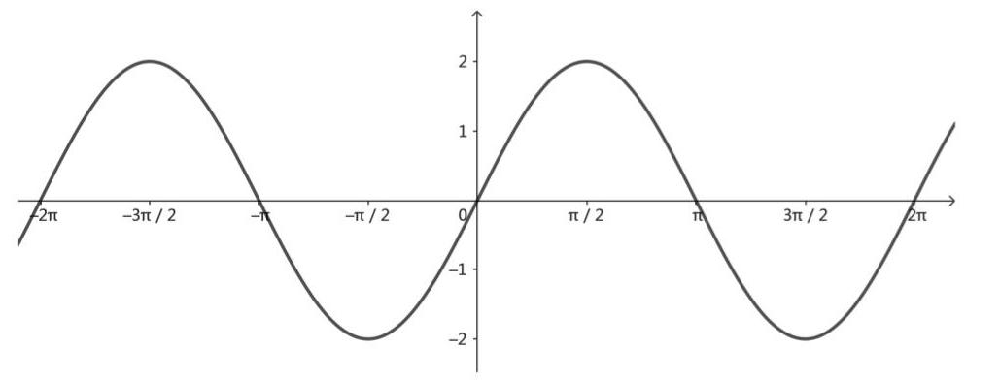

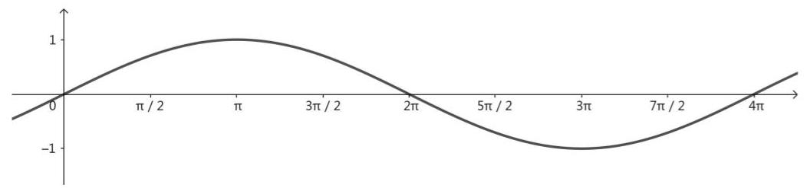

【5.3(4)】1.(1) $\left( {-\frac{\pi }{2} + {2k\pi },\frac{\pi }{2} + {2k\pi }}\right)$ ( $k \in  \mathbf{Z}$ ，后同)递增， $\left( {\frac{\pi }{2} + {2k\pi },\frac{3\pi }{2} + {2k\pi }}\right)$ 递减; (2) $\left( {4 - \frac{\pi }{2} + {2k\pi },4 + \frac{\pi }{2} + {2k\pi }}\right)$ 递增， $\left( {4 + \frac{\pi }{2} + {2k\pi },4 + \frac{3\pi }{2} + {2k\pi }}\right)$ 递减；(3) $\left( {-\frac{\pi }{2} + {k\pi },\frac{\pi }{2} + {k\pi }}\right)$ 递增; (4) $\left( {-\frac{\pi }{4} + {k\pi },\frac{\pi }{4} + {k\pi }}\right)$ 递增, $\left( {\frac{\pi }{4} + {k\pi },\frac{3\pi }{4} + {k\pi }}\right)$ 递减。2. (1) $\left( {-\pi  + {2k\pi },{2k\pi }}\right)$ ( $k \in  \mathbf{Z}$ ，后同)递增， $\left( {{2k\pi },\pi  + {2k\pi }}\right)$ 递减，最大值0，最小值-4; (2) $\left( {-\frac{\pi }{4} + {2k\pi },\frac{3\pi }{4} + {2k\pi }}\right)$ 递增, $\left( {\frac{3\pi }{4} + {2k\pi },\frac{7\pi }{4} + {2k\pi }}\right)$ 递减,最大值 1, 最小值-1；(3) $\left( {-\frac{\pi }{2} + {2k\pi },\frac{\pi }{2} + {2k\pi }}\right)$ 递增， $\left( {\frac{\pi }{2} + {2k\pi },\frac{3\pi }{2} + {2k\pi }}\right.$ 递减，最大值 2, 最小值 $\frac{1}{2};\left( 4\right) \left( {-\frac{\pi }{2} + {2k\pi },{2k\pi }}\right)$ 和 $\left( {\pi  + {2k\pi },\frac{3\pi }{2} + {2k\pi }}\right)$ 递减， $\left( {{2k\pi },\frac{\pi }{2} + {2k\pi }}\right)$ 和 $\left( {\frac{\pi }{2} + {2k\pi },\pi  + {2k\pi }}\right)$ 递增 (利用均值不等式),无最大值和最小值。

【5.3(5)】1.(1)最小正周期为 $\pi$ ， $\left( {{2k\pi },\pi  + {2k\pi }}\right)$ ( $k \in  \mathbf{Z}$ ，后同)递减， 奇函数; (2) 最小正周期为 ${2\pi },\left( {-\frac{\pi }{2} + {2k\pi },{2k\pi }}\right)$ 和 $\left( {\pi  + {2k\pi },\frac{3\pi }{2} + {2k\pi }}\right)$ 递减, $\left( {{2k\pi },\frac{\pi }{2} + {2k\pi }}\right)$ 和 $\left( {\frac{\pi }{2} + {2k\pi },\pi  + {2k\pi }}\right)$ 分别递增,偶函数; (3) 最小正周期为 ${2\pi }$ , $\left( {{2k\pi },\frac{\pi }{2} + {2k\pi }}\right)$ 和 $\left( {\frac{3\pi }{2} + {2k\pi },{2\pi } + {2k\pi }}\right)$ 分别递减, $\left( {\frac{\pi }{2} + {2k\pi },\pi  + {2k\pi }}\right)$ 和 $\left( {\pi  + {2k\pi },\frac{3\pi }{2} + {2k\pi }}\right)$ 分别递增, 奇函数。

【5.4(1)】1. (1)(- $\frac{\pi }{4} + {k\pi },\frac{\pi }{4} + {k\pi }$ )( $k \in  \mathbf{Z}$ ，后同)递增， $\left( {\frac{\pi }{4} + {k\pi },\frac{3\pi }{4} + {k\pi }}\right)$ 递减，对称轴为 $x = \frac{\pi }{4} + \frac{k\pi }{2}$ ，对称中心为 $\left( {\frac{k\pi }{2},0}\right)$ ；(2) $\left( {-\frac{\pi }{2} + {2k\pi },\frac{\pi }{2} + {2k\pi }}\right)$ 递增， $\left( {\frac{\pi }{2} + {2k\pi },\frac{3\pi }{2} + {2k\pi }}\right)$ 递减,对称轴为 $x = \frac{\pi }{2} + {k\pi }$ ,对称中心为 $\left( {{k\pi },0}\right) ;\left( 3\right) \; \left( {-2 + \frac{16}{\pi } + {8k},2 + \frac{16}{\pi } + {8k}}\right)$ 递增, $\left( {2 + \frac{16}{\pi } + {8k},6 + \frac{16}{\pi } + {8k}}\right)$ 递减,对称轴为 $x =  - 2 + \frac{16}{\pi } + {4k}$ , 对称中心为 $\left( {\frac{16}{\pi } + {4k},0}\right)$ 。2. 图略,(1)(2)分别求出一个周期内的零点、最大值点、最小值点 (最少五个点),再画出正弦曲线即可; (3) 将 $y = \tan x$ 向左平移 $\frac{\pi }{2}$ 个单位即可。3. (1) 先沿水平方向向右平移 $\frac{\pi }{4}$ 个单位,在沿水平方向压缩为原来的 $\frac{1}{2}$ ; (2)先沿竖直方向压缩为原来的 $\frac{1}{2}$ ，再沿水平方向压缩为原来的 $\frac{1}{4\pi }$ ，最后沿水平方向向右平移 100 个单位。

【5.4(2)】1.先将 $y = x$ 沿竖直方向拉伸为原来的 2 倍,在沿竖直方向向上平移1个单位。2.R 。 3. $\left( {-1,0}\right)$ 。 4. $\left( {a + 1,0}\right)$ 。

【5.5】1. (1) $\frac{{\pi }^{3}}{96}$ ; (2) $\frac{\pi }{4}$ ; (3) $\frac{3}{5}$ 。2. (1) $\mathbf{R},\left( {0,\pi }\right)$ ,单调递减,非奇函数或偶函数,渐近线为 $y = 0$ 和 $y = \pi ;\left( 2\right) ( - \infty , - 1\rbrack  \cup  \lbrack 1, + \infty ),\left\lbrack  {0,\frac{\pi }{2}}\right)  \cup  \left( {\frac{\pi }{2},\pi }\right\rbrack$ , 在 $\left\lbrack  {0,\frac{\pi }{2}}\right)$ 和 $\left( {\frac{\pi }{2},\pi }\right\rbrack$ 分别单调递增,非奇函数或偶函数,渐近线为 $y = \frac{\pi }{2};\left( 3\right) \; \left( {-\infty , - 1\rbrack \cup \lbrack 1, + \infty }\right) ,\left\lbrack  {-\frac{\pi }{2},0}\right)  \cup  \left( {0,\frac{\pi }{2}}\right\rbrack$ ,在 $\left\lbrack  {-\frac{\pi }{2},0}\right)$ 和 $\left( {0,\frac{\pi }{2}}\right\rbrack$ 分别单调递减,非奇函数或偶函数,渐近线为 $y = 0$ 。

【5.6(1)】1.(1) $\frac{2\sqrt{2} - 2\sqrt{6}}{15}$ ；(2) $\frac{{161} - {32}\sqrt{3}}{225}$ ；(3) $2\sqrt{2} + 1$ ；(4) $- \frac{{142}\sqrt{2} + {42}\sqrt{6}}{375}$ 。 2. 由 $\cos A =  - \cos B$ 可知 $A + B = \pi$ ，不能构成三角形。3. (1) $\frac{\sqrt{2}}{2}$ ；(2) $\frac{1}{4}$ ；(3) $2\sin x$ 。

【5.6(2)】简单的三角恒等变换 1.略, 根据提示推导即可。2. 略, 根据提示推导即可。

【5.7】1. (1)当 $x = \frac{\pi }{4\omega } + \frac{k\pi }{2\omega }$ ( $k \in  \mathbf{Z}$ ，后同)时， ${d}_{\max } = {A}_{1} + {A}_{2}$ (2)当 $x = \frac{k\pi }{2\omega }$ 时, ${d}_{\min } = {A}_{1} - {A}_{2} \circ  2.\left( 1\right) 2\mathrm{\;A};\left( 2\right) \frac{\pi }{25}\mathrm{\;s}$ 。

## 第六章 平面向量及其应用

【6.1】1.(1)错误；(2)错误；(3)正确；(4)错误。2.略。

【6.2(1)】1.因为 $E$ 在 ${AC}$ 上,所以 $\overrightarrow{EC}$ 与 $\overrightarrow{AE}$ 共线且方向相同,又因为平行四边形的对角线互相平分,所以 $\left| \overrightarrow{EC}\right|  = \left| \overrightarrow{AE}\right|$ ,所以 $\overrightarrow{EC} = \overrightarrow{AE} = \overrightarrow{c} \circ  \left( 2\right) \overrightarrow{a} + \overrightarrow{b} = \; \overrightarrow{AC} = \overrightarrow{AE} + \overrightarrow{EC} = \overrightarrow{c} + \overrightarrow{c}$ 。2.(1)成立；(2)不成立；(3)成立。结论不受画图方式影响。

【6.2(2)】1.(1) $\overrightarrow{CB}$ ；(2) $\overrightarrow{DB}$ ；(3) $\overrightarrow{CD}$ 。2.(1)不成立；(2)成立； (3)成立。结论不受画图方式影响。

【6.2(3)】1.(1) $\overrightarrow{AC}$ 或 $\overrightarrow{FE}$ ；(2) $\overrightarrow{FA}$ 或 $\overrightarrow{DC}$ ；(3) $\overrightarrow{AD}$ ；(4) $\overrightarrow{FB}$ ；(5) $\overrightarrow{CF}$ 。2.(1) $\overrightarrow{OB} = \overrightarrow{a} + \overrightarrow{b}$ ， $\overrightarrow{OC} = \overrightarrow{a} + \frac{1}{3}\overrightarrow{b}$ ， $\overrightarrow{OD} = \overrightarrow{a} + \frac{2}{3}\overrightarrow{b}$ ；(2)同(1)；(3) 同(1) $;\;\left( 4\right)$ 相同。3.(1)10 $\overrightarrow{a};\;\left( 2\right) {10}\overrightarrow{a}$ 。

【6.2(4)】1.(1) $2{\overrightarrow{a}}^{2} + \overrightarrow{a}\overrightarrow{b} - 3{\overrightarrow{b}}^{2}$ ；(2) $2{\overrightarrow{a}}^{2} - 2{\overrightarrow{b}}^{2}$ ；(3) ${\overrightarrow{a}}^{2}$ ；(4) $2{x}^{2}\overrightarrow{a} - 2{y}^{2}\overrightarrow{b}$ 。 2. $\left( {\overrightarrow{a} + 2\overrightarrow{c}}\right) \overrightarrow{b} = \overrightarrow{a}\overrightarrow{b} + 2\overrightarrow{b}\overrightarrow{c} = 4 + 2 \times  \left( {-2}\right)  = 0$ 。3. 当 $\overrightarrow{a}$ 与 $\overrightarrow{b}$ 的方向相同时， $\overrightarrow{a} \cdot  \overrightarrow{b}$ 的最大值为 6 ; 当 $\overrightarrow{a}$ 与 $\overrightarrow{b}$ 的方向相反时, $\overrightarrow{a} \cdot  \overrightarrow{b}$ 的最小值为 6 。4.因为 $\overrightarrow{a} + 2\overrightarrow{b} \bot  \overrightarrow{a} - 3\overrightarrow{b}$ ,所以 $\left( {\overrightarrow{a} + 2\overrightarrow{b}}\right) \left( {\overrightarrow{a} - 3\overrightarrow{b}}\right)  = 0,{\overrightarrow{a}}^{2} - 2\overrightarrow{a}\overrightarrow{b} - 6{\overrightarrow{b}}^{2} = 0$ ,又因为 $\overrightarrow{a} \bot  \overrightarrow{b},\overrightarrow{a}\overrightarrow{b} = 0,{10}^{2} - 6{\left| \overrightarrow{b}\right| }^{2} = 0$ , $\left| \overrightarrow{b}\right|  = \frac{5\sqrt{6}}{3}$ 。5. (1) ${100}\sqrt{2}\mathrm{\;m}$ ; (2) ${2000}\sqrt{2}\mathrm{\;J}$ 。

【6.3(1)】1.略。2.(1)(2，-)；(2)(0，12)；(3)(-1，6)；(4)(1，-7)。 $3.\mathrm{C}\left( {0,2}\right) ,\mathrm{D}\left( {-1,1}\right)$ 。4.(1)否；(2)是；(3)是；(4)否。

【6.3(2)】1.(1)-4；(2) $\cos \left( {{2\theta } - \frac{\pi }{4}}\right)$ ；(3)2。2.(1)10；(2)10； (3)-10; (4)-50。3.(1)0，直角； (2)-1，共直线； (3)-2 ，钝角。 4.(1)4；(2) $\left( {4,4\sqrt{3}}\right)$ ；(3)16。

【6.4(1)】1.设 ${\operatorname{Rt}}_{ \bigtriangleup  }{ABC}$ 中 $A$ 为直角， $D$ 为 ${BC}$ 的中点， ${\left| \overrightarrow{BC}\right| }^{2} = {\left| \overrightarrow{AC} - \overrightarrow{AB}\right| }^{2} = \; \left| {{\overrightarrow{AC}}^{2} - \overrightarrow{AC} \cdot  \overrightarrow{AB} + {\overrightarrow{AB}}^{2}}\right|  = {\left| \overrightarrow{AC}\right| }^{2} + {\left| \overrightarrow{AB}\right| }^{2},{\left| \overrightarrow{AD}\right| }^{2} = {\left| \frac{1}{2}\overrightarrow{AB} + \frac{1}{2}\overrightarrow{AC}\right| }^{2} = {\left| \frac{1}{4}{\overrightarrow{AB}}^{2} + \frac{1}{4}\overrightarrow{AB} \cdot  \overrightarrow{AC} + \frac{1}{4}{\overrightarrow{AC}}^{2}\right| }^{2} = \; \frac{1}{4}{\left| \overrightarrow{AB}\right| }^{2} + \frac{1}{4}{\left| \overrightarrow{AC}\right| }^{2},{\left| \overrightarrow{AD}\right| }^{2} = \frac{1}{4}{\left| \overrightarrow{BC}\right| }^{2},\left| \overrightarrow{AD}\right|  = \frac{1}{2}\left| \overrightarrow{BC}\right|$ 。2. 设 $O$ 是 $\square {ABCD}$ 的对角线 ${AC}$ 与 ${BD}$ 的交点, $\overrightarrow{AD} = \overrightarrow{OD} - \overrightarrow{OA},\overrightarrow{BC} = \overrightarrow{OC} - \overrightarrow{OB}$ ,因为 $\overrightarrow{AD} = \overrightarrow{BC}$ ,所以 $\overrightarrow{OD} - \overrightarrow{OA} = \overrightarrow{OC} - \overrightarrow{OB}$ ,

移向得 $\overrightarrow{OB} + \overrightarrow{OD} = \overrightarrow{OA} + \overrightarrow{OC}$ ,又因为 ${AC}$ 与 ${BD}$ 不平行,要让等式成立,须满足 $\overrightarrow{OB} + \overrightarrow{OD} = \overrightarrow{OA} + \overrightarrow{OC} = \overrightarrow{0}$ ,即 $\overrightarrow{OB} =  - \overrightarrow{OD},\overrightarrow{OA} =  - \overrightarrow{OC}$ ,相反向量的模相等,即得证。

3. 将原点作为圆心,直径所在的直线为 $x$ 轴,建立直角坐标系,设圆的半径为 $r$ , 则直角边的两顶点的坐标分别为 $A\left( {-r,0}\right)$ 和 $B\left( {r,0}\right)$ ,设三角形第三个顶点为 $C\left( {r\cos \theta , r\sin \theta }\right)$ ,可得 $\overrightarrow{AC} \cdot  \overrightarrow{BC} = \left( {r\cos \theta  + r, r\sin \theta }\right) \left( {r\cos \theta  - r, r\sin \theta }\right)  = \; \left( {r\cos \theta  + r}\right) \left( {r\cos \theta  - r}\right)  + {r}^{2}{\sin }^{2}\theta  = {r}^{2}{\cos }^{2}\theta  + {r}^{2}{\sin }^{2}\theta  - {r}^{2} = {r}^{2} - {r}^{2} = 0$ ,即得证。

【6.4(2)】1.(1)(- $\frac{1}{2},\frac{1}{2})$ ； (2) $\left( {-1,\frac{1}{3}}\right)$ ； (3) $\left( {\frac{5}{2},\frac{3}{2}}\right)$ 。

【6.4(3)】1. ${BC} = 2$ 。2. ${AB} = \frac{3\sqrt{2} + \sqrt{6}}{6}$ 和 ${AC} = \frac{\sqrt{6}}{3}$ 。

【6.4(4)】(1) $\left| \overrightarrow{v}\right|  = \sqrt{4 + {100}{t}^{2}}$ ；

第七章 复数

【7.1(1)】1.(1)1，1，1-i， $\sqrt{2}$ ；(2)0，-2，2i，2；(3)-3，5， $- 3 - {5i},\sqrt{34};\left( 4\right) \frac{1}{2}, - \frac{\sqrt{3}}{2},\frac{1}{2} + \frac{\sqrt{3}}{2}i,1;\left( 5\right) \cos \frac{\pi }{4},\sin \frac{\pi }{4},\cos \frac{\pi }{4} - i\sin \frac{\pi }{4}$ , 1. 2. (1) $x =  \pm  2\mathrm{i}$ ；(2) $- \frac{1}{2} \pm  \frac{\sqrt{3}}{2}\mathrm{i}$ ；(3) $\frac{-1 \pm  \sqrt{5}}{2}$ 。3. 设 $z = a + b\mathrm{i}$ ， $\bar{z} = a - b\mathrm{i}$ ， $\left| \bar{z}\right|  = \sqrt{{a}^{2} + {\left( -b\right) }^{2}} = \sqrt{{a}^{2} + {b}^{2}} = \left| z\right|$ 。

【7.1(2)】1.找到与复数对应的点并画出向量即可，略。2. 如下图所示。

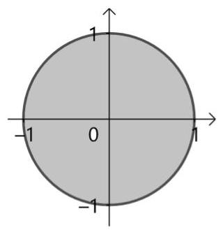

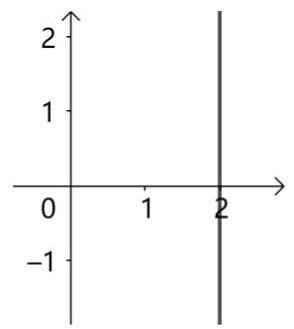

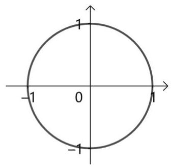

【7.2(1)】1.(1)2； (2) $1 + {4i}$ ； (4)6-i(图略)。2.(1) $2{e}^{2} + 2 + \mathrm{i}$ ; (2) $\frac{\sqrt{2}}{2} + \frac{\sqrt{2}}{2}\mathrm{i}$ 。

【7.2(2)】1.(1)2 ; (2)-3-6i ; (3)-2 $\frac{1}{2} - \frac{\sqrt{3}}{2}\mathrm{i}$ ；(4) $\frac{1}{3} + \frac{2\mathrm{i}}{3}$ ；(5) $1 + \mathrm{i}$ ； (6)-1。2.分别设相应的复数表达式，用复数的运算法则将等式两边展开即可。

【7.3(1)】1.(1) $\cos \frac{\pi }{3} + i\sin \frac{\pi }{3}$ ；(2) $2\left( {\cos \frac{3\pi }{4} + i\sin \frac{3\pi }{4}}\right)$ ; (3) $4\left( {\cos \frac{\pi }{2} + i\sin \frac{\pi }{2}}\right)$ ；

(4) ${13}\left( {\cos t + \mathrm{i}\sin t}\right)$ ，其中 $\cos t = \frac{5}{13},\sin t = \frac{12}{13}$ 。2.(1) $\sqrt{2} - \sqrt{2}\mathrm{i}$ ；(2) $- \frac{\sqrt{6}}{2} + \frac{\sqrt{2}}{2}\mathrm{i}$ 。 3.(1) $\sqrt{6}\mathrm{i}$ ；(2) $\frac{\sqrt{3}}{2}\mathrm{i}$ ；(3) $2\mathrm{i}$ ；(4) $\sqrt{2}\mathrm{i}$ 。4.(1) ${z}^{2} = {r}^{2}\left( {\cos {2\theta } + \mathrm{i}\sin {2\theta }}\right)$ ； (2) ${z}^{3} = {r}^{3}\left( {\cos {3\theta } + \mathrm{i}\sin {3\theta }}\right)$ ；(3) ${z}^{n} = {r}^{n}\left( {\cos {n\theta } + \mathrm{i}\sin {n\theta }}\right)$ ；(4) $z = \cos \frac{2k\pi }{n} + \mathrm{i}\sin \frac{2k\pi }{n}$ ， $k \in  \mathbf{Z},1 \leq  k \leq  n$ ,几何含义为将标准圆平均分为 $n$ 个圆弧的 $n$ 个点,其中一个是圆与 $x$ 轴正方向的交点。5. 图形绕原点分别沿逆时针旋转 ${90}^{ \circ  },{180}^{ \circ  },{270}^{ \circ  },{360}^{ \circ  }$ 。

【7.3(2)】1.(1)-16；(2) $\sqrt[4]{2}\left( {\cos \frac{3\pi }{16} + i\sin \frac{3\pi }{16}}\right)$ 。(2) ${\bar{z}}^{n} = \{ r\left\lbrack  {\cos \left( {-\theta }\right)  + i\sin \left( {-\theta }\right) }\right\rbrack  {\} }^{n} \; = {r}^{n}\left\lbrack  {\cos \left( {-{n\theta }}\right)  + \mathrm{i}\sin \left( {-{n\theta }}\right) }\right\rbrack   = {r}^{n}\left( {\cos {n\theta } - \mathrm{i}\sin {n\theta }}\right) \;,\;\overline{{z}^{n}} = \overline{{\left\{  r\left\lbrack  \cos \left( -\theta \right)  + \mathrm{i}\sin \left( -\theta \right) \right\rbrack  \right\}  }^{n}} = \; \overline{{r}^{n}\left( {\cos {n\theta } + \mathrm{i}\sin {n\theta }}\right) } = {r}^{n}\left\lbrack  {\cos \left( {-{n\theta }}\right)  + \mathrm{i}\sin \left( {-{n\theta }}\right) }\right\rbrack   = {r}^{n}\left( {\cos {n\theta } - \mathrm{i}\sin {n\theta }}\right) ,{\bar{z}}^{n} = \overline{{z}^{n}}$ ,即得证。

第八章 直线和圆的方程

【8.1(1)】1. $\left( 1\right) y = {3x} + 5;\left( 2\right) y = \frac{2}{3}x + \frac{4}{3}$ 。

【8.1(2)】1. $\frac{1}{2}$ 。2.(1)平行；(2)都不；(3)垂直；(4)垂直。3. $y =  - x$ 。

【8.2】1. (1) $y =  - \frac{1}{3}x + 2$ ; (2) $y = {4x} + 3$ 。2. (1) $- \frac{B}{A}$ ， $A \neq  0$ ； (2) $- \frac{C}{A}$ ， $A \neq  0;\;\left( 3\right) \; - \frac{C}{B},\;B \neq  0;\;\left( 4\right) \;y =  - \frac{A}{B}x - \frac{C}{B},\;B \neq  0;\;\left( 5\right) \;\frac{x}{-C/A} + \frac{y}{-C/B} = 1;$ (6) $\left( {1, - \frac{A}{B}}\right) , B \neq  0$ 或 $\left( {-\frac{B}{A},1}\right) , A \neq  0$ ；(7) $\left( {1,\frac{B}{A}}\right) , A \neq  0$ 或 $\left( {\frac{A}{B},1}\right) , B \neq  0$ 。

【8.3(1)】1. (1) $\left( {-\frac{7}{4},\frac{1}{2}}\right)$ ; (2) $\left( {4, - {12}}\right)$ 。

(3) $\sqrt{2}$ 。 ${2.6} + 2\sqrt{5}$ 。

【8.3(3)】1. (1) $\frac{5\sqrt{2}}{2}$ ； (3) $\frac{4}{5}$ 。2. $\frac{4}{5}$ 。

【8.3(4)】1.(1)12；(2) $\frac{3}{10}$ 。2.(1) $\frac{4\sqrt{10}}{5}$ ；(2)8。

【8.4(1)】1. (1) $\sqrt{130}$ ；(2) ${\left( x - 7\right) }^{2} + {\left( y + 4\right) }^{2} = {130}$ 。2. (1) $\left( {-1,2}\right)$ ；(2) $\sqrt{34};\;\left( 3\right) {\left( x + 1\right) }^{2} + {\left( y - 2\right) }^{2} = {34}$ 。

【8.4(2)】1.(1)是，(1，1)，1 ；(2)是，(1， $- 2)$ ， $\sqrt{3}$ ；(3)否， ${x}^{2},{y}^{2}$ 前的系数不同; (4) 是, $\left( {-1, - \frac{3}{5}}\right) ,\frac{\sqrt{34}}{5}$ 。

【8.4(3)】1. $\frac{2\sqrt{15} + 3\sqrt{5}}{2}$ ， $\frac{2\sqrt{15} - 3\sqrt{5}}{2}$ 。

【8.5(1)】1.(1)异侧；(2)同侧；(3)同侧。

【8.5(2)】1.(1)外；(2)内；(3)上；(4)内。

【8.5(3)】1.(1) $y = x + 2;\left( 2\right) y = x + 3\sqrt{2} + 2$ 或 $y = x - 3\sqrt{2} + 2;\left( 3\right) y = x$ 或 $y = x + 4$ 。2. 圆 ${C}_{1}$ 上的点可用参数表示为 $\left( {{r}_{1}\cos A,{r}_{1}\sin A}\right)$ ,圆 ${C}_{2}$ 上的点可用参数表示为 $\left( {{r}_{2}\cos B,{r}_{2}\sin B}\right)$ ,两圆与 $y = {kx}$ 的交点分别满足 ${r}_{1}\sin A = k{r}_{1}\cos A$ , ${r}_{2}\sin B = k{r}_{2}\cos B$ ,化简可得 $k = \frac{\sin A}{\cos A},\;k = \frac{\sin B}{\cos B}$ ,因为 ${P}_{1}\text{ 、 }{P}_{2}$ 都是 $y$ 轴上方的交点,所以 $A = B$ ,所以 $\overrightarrow{O{P}_{1}} \cdot  \overrightarrow{O{P}_{2}} = {r}_{1}\cos A{r}_{2}\cos B + {r}_{1}\sin A{r}_{2}\sin B = {r}_{1}{r}_{2}(\cos A\cos B + \; \sin A\sin B) = {r}_{1}{r}_{2}\left( {\cos A\cos A + \sin A\sin A}\right)  = {r}_{1}{r}_{2}\left( {{\cos }^{2}A + {\sin }^{2}A}\right)  = {r}_{1}{r}_{2}$ 。

【8.5(4)】1. (1) ${\left( x + 3\right) }^{2} + {\left( y + 4\right) }^{2} = {36}$ ；(2)相离；(3) $\left( {3,0}\right)$ ，(-9,0)， $\left( {0,2}\right) ,\left( {0, - {10}}\right) ,\left( {\frac{-7 + \sqrt{71}}{2},\frac{-7 + \sqrt{71}}{2}}\right) ,\left( {\frac{-7 - \sqrt{71}}{2},\frac{-7 - \sqrt{71}}{2}}\right)$ 。2. ( 1 ) ${\left( x + 4\right) }^{2} + {\left( y + 5\right) }^{2} = {93} - {10}\sqrt{68};\left( 2\right) {\left( x + 4\right) }^{2} + {\left( y + 5\right) }^{2} = {93} + {10}\sqrt{68}$ 。3. (1) ${2a} < b$ ; (2) ${2a} > b$ ；(3) ${2a} = b$ 。

## 第九章 圆锥曲线的方程

【9.1(1)】1.(1)线段 ${F}_{1}{F}_{2}$ ；(2)不存在。2.略。3. ${\frac{x}{16}}^{2} + \frac{{y}^{2}}{4} = 1$ ，椭圆。

【9.1(2)】1. (1) $\frac{{x}^{2}}{25} + \frac{{y}^{2}}{16} = 1$ ；(2)8；(3)0.6、2.(1)4， $2\sqrt{3}$ ；(0，1)， $\left( {0, - 1}\right)$ ；(2)1；(3)最大值为2， $P$ 在上下顶点；最小值为0， $P$ 在左右顶点。

【9.1(3)】1.(1) $\left\{  {\begin{array}{l} x = \sqrt{3}\cos \theta \\  y = \sin \theta  \end{array},\theta  \in  \lbrack 0,{2\pi });\;\left( 2\right) \text{ 最大值 2，最小值 0。 }}\right.$

【9.2(1)】1.(1)以 ${F}_{1}$ 为端点、指向 $\overrightarrow{{F}_{2}{F}_{1}}$ 的射线和以 ${F}_{2}$ 为端点、指向 $\overrightarrow{{F}_{1}{F}_{2}}$ 的射线; (2)不存在。2.略。

【9.2(2)】1. $\frac{{x}^{2}}{9} - \frac{{y}^{2}}{7} = 1$ 。2. (1) ${x}^{2} - \frac{{y}^{2}}{4} = 1$ ；(2) $\left( {-\sqrt{5},0}\right)$ ，( $\sqrt{5},0$ )；(3 $\sqrt{5}$ ; (4) $\frac{{y}^{2}}{4} - {x}^{2} = 1$ 。3. 设一系列离心率都为 $e$ 的双曲线,半焦距分别为 $c, c$ 是变量,则实半轴长为 $a = \frac{c}{e}$ ,虚半轴长为 $\sqrt{{c}^{2} - {a}^{2}} = \sqrt{{c}^{2} - {\left( \frac{c}{e}\right) }^{2}} = c\sqrt{1 - \frac{1}{{e}^{2}}}$ ,标准方程为 $\frac{{x}^{2}}{{c}^{2}/{e}^{2}} - \frac{{y}^{2}}{{c}^{2}\left( {1 - 1/{e}^{2}}\right) } = 1$ ,将等式右边的 1 替换为 0,可得其渐近线方程为: $y = \sqrt{{e}^{2} - 1}x$ 和 $y =  - \sqrt{{e}^{2} - 1}x$ ,因为 $e$ 是定值,所以它们的渐近线都相同。 $4.m = 1$ 。

【9.2(3)】1. $\sqrt{2}a$ ，该点为双曲线与 $x$ 轴的交点。

【9.3(1)】1. $\left( {\frac{1}{16},0}\right) , x =  - \frac{1}{16}$ 。 $2.{y}^{2} = {2x}$ 。3. ${x}^{2} =  - {4x}$ 。

【9.3(2)】1. $y =  - \frac{1}{2},\left( {4,\frac{1}{2}}\right)  \circ  2.y = x + \frac{1}{4} \circ  3.\left( {1,2}\right)$ ，3。

【9.4】1.(1) $p > \sqrt{2}$ ；(2) $0 < p < \sqrt{2}$ ；(3) $p = \sqrt{2}$ 。2.(1) $A = B > 0$ ； (2) $A > 0, B > 0$ ；(3) ${AB} < 0$ 。3.不可能，椭圆的左右焦点分别为 $\left( {\pm \sqrt{{a}^{2} - {b}^{2}},0}\right)$ ， 左右准线分别为 $x =  \pm  \frac{{a}^{2}}{\sqrt{{a}^{2} - {b}^{2}}}$ ,双曲线的左右焦点分别为 $\left( {\pm \sqrt{{p}^{2} + {q}^{2}},0}\right)$ ,左右准线分别为 $x =  \pm  \frac{{p}^{2}}{\sqrt{{p}^{2} + {q}^{2}}}$ ,若它们的焦点和准线相同,需有 $\sqrt{{a}^{2} - {b}^{2}} = \sqrt{{p}^{2} + {q}^{2}}$ , $\frac{{a}^{2}}{\sqrt{{a}^{2} - {b}^{2}}} = \frac{{p}^{2}}{\sqrt{{p}^{2} + {q}^{2}}}$ ,由第一个等式可得 ${a}^{2} = {p}^{2} + {q}^{2} + {b}^{2}$ ,代入第二个等式: $\frac{{p}^{2} + {q}^{2} + {b}^{2}}{\sqrt{{p}^{2} + {q}^{2} + {b}^{2} - {b}^{2}}} = \frac{{p}^{2}}{\sqrt{{p}^{2} + {q}^{2}}}$ ,化简得: $\sqrt{{p}^{2} + {q}^{2}} = 0$ ,该等式不成立,从图像上看, 椭圆的两条准线在两个焦点的两侧, 双曲线的两条准线在两个焦点之间。 ${4.4}\sqrt{2} - 2$ 。 5. $\frac{6}{5}$ 。

## 第十章 数列

【10.1】1.(1)3，7，11，15，19；(2)π，2π，3π，4π，5π；(3)2，4，8，16，32； (4) $2,\frac{3}{2},\frac{5}{6}, - \frac{11}{30},\frac{779}{330}$ 。图略。2.(1) ${a}_{n} = 7,{a}_{n} = {a}_{n - 1}$ ；(2) ${a}_{n} =  - {3n} + 2$ ， ${a}_{n} = {a}_{n - 1} - 3;\;\left( 3\right) {a}_{n} = {\mathrm{i}}^{n},{a}_{n} = \mathrm{i}{a}_{n - 1};\;\left( 4\right) {a}_{n} = \frac{{2}^{n}}{n}$ 。3. $\left( 1\right) {a}_{1} = {2}^{1} + {\log }_{2}1 = 2$ , ${a}_{n + 1} - {a}_{n} = \left\lbrack  {{2}^{n + 1} + {\log }_{2}\left( {n + 1}\right) }\right\rbrack   - \left( {{2}^{n} + {\log }_{2}n}\right)  = {2}^{n} + {\log }_{2}\left( {1 + \frac{1}{n}}\right)  > 0$ ,是递增数列且首项为2; (2)是递增数列；(3)不是；(4)所有2的整数次方项是正数。

【10.2(1)】1.(1)是；(2)否；(3)是。2.(1) ${a}_{n} =  - {4n} + 4$ ；(2) ${a}_{n} = {3n} - 1$ ； (3) ${a}_{n} = {3n} - {10}$ 。3. ${a}_{n} = {S}_{n} - {S}_{n - 1} = p{\left( n + 1\right) }^{2} + q\left( {n + 1}\right)  - p{n}^{2} - {qn} = {2pn} + p + q = \; \left( {{3p} + q}\right)  + {2p}\left( {n - 1}\right)$ ,是首项为 ${3p} + q$ 、公差为 ${2p}$ 的等差数列。 $4.{a}_{n} = {7n} - 6$ , $n \in  \mathbf{Z},1 \leq  n \leq  {53},{9699}$ 。

【10.2(2)】1.(1)否；(2)是；(3)否；(4)是。2.(1) ${a}_{n} = 2 \times  {\left( -2\right) }^{n - 1}$ ， ${S}_{n} = \frac{2}{3} - \frac{2}{3}{\left( -2\right) }^{n}$ ; (2) ${a}_{n} = {\left( -2\right) }^{n - 1},{S}_{n} = \frac{1}{3} - \frac{1}{3}{\left( -2\right) }^{n}$ 或 ${a}_{n} =  - {\left( -2\right) }^{n - 1},{S}_{n} =  - \frac{1}{3} + \frac{1}{3}{\left( -2\right) }^{n}$ ;

(3) ${a}_{n} = \frac{4}{9} \times  {3}^{n - 1}, - \frac{2}{9} + \frac{2}{9} \times  {3}^{n}$ 或 ${a}_{n} =  - \frac{2}{9} \times  {\left( -3\right) }^{n - 1}, - \frac{1}{18} + \frac{1}{18} \times  {\left( -3\right) }^{n}$ 。3. (1) ${b}_{n} = {\left( -2\right) }^{{a}_{n}} = {\left( -2\right) }^{{a}_{1} + \left( {n - 1}\right) d},\;{b}_{n + 1}/{b}_{n} = {\left( -2\right) }^{{a}_{1} + {nd}}/{\left( -2\right) }^{{a}_{1} + \left( {n - 1}\right) d} =  - 2,\;\left\{  {b}_{n}\right\}$ 是首项为 ${\left( -2\right) }^{{a}_{1}}$ ，公比为 -2 的等比数列；(2) $\frac{{\left( -2\right) }^{{a}_{1}}}{3}\left\lbrack  {1 - {\left( -2\right) }^{n}}\right\rbrack$ ；(3)否。

【10.3(1)】 $1.{a}_{n} = \frac{{n}^{2}}{2} - \frac{n}{2} + 1$ 。

【10.3(2)】 $1.{a}_{n} = {\left( -1\right) }^{\frac{\left( {n - 1}\right) \left( {n - 2}\right) }{2}} \cdot  {2}^{\frac{n\left( {n - 1}\right) }{2}}$ 。

【10.3(3)】 ${1.1}^{3} + {2}^{3} + \cdots  + {n}^{3} = \frac{{n}^{2}{\left( n + 1\right) }^{2}}{4}$ 。2. ${S}_{n} = \frac{3}{4} - \frac{1}{2\left( {n + 1}\right) } - \frac{1}{2\left( {n + 2}\right) }$ 。

【10.3(4)】1. ${a}_{n} = \left( {n - 1}\right) {2}^{n + 1} + 2$ 。

【10.3(5)】1. ${a}_{n} = \frac{1 - \sqrt{7}}{2}{\left( \frac{1 + \sqrt{7}}{6}\right) }^{n} + \frac{1 + \sqrt{7}}{2}{\left( \frac{1 - \sqrt{7}}{6}\right) }^{n}$ 。2. ${a}_{n} = \frac{1}{{2n} - 1}$ 。3. ${a}_{n} = {2}^{\frac{\left( {n - 1}\right) \left( {n + 2}\right) }{2}}$

【10.4】 $1.{S}_{1} = {a}_{1}$ ,假设 $n \geq  2$ 时 ${S}_{n} = n{a}_{1} + \frac{n\left( {n - 1}\right) }{2}d$ 成立,那么 ${S}_{n + 1} = {S}_{n} + {a}_{n + 1} = \; n{a}_{1} + \frac{n\left( {n - 1}\right) }{2}d + {a}_{1} + {nd} = \left( {n + 1}\right) {a}_{1} + \frac{\left( {n + 1}\right) n}{2}d;\;\left( 2\right) \;{S}_{1} = {a}_{1}$ ,假设 $n \geq  2$ 时 ${S}_{n} = {a}_{1}\frac{1 - {q}^{n}}{1 - q}$ 成立,那么 ${S}_{n + 1} = {S}_{n} + {a}_{n + 1} = {a}_{1}\frac{1 - {q}^{n}}{1 - q} + {a}_{1}{q}^{n} = {a}_{1}\frac{1 - {q}^{n} + {q}^{n} - {q}^{n + 1}}{1 - q} = {a}_{1}\frac{1 - {q}^{n + 1}}{1 - q}$ ;

(3) ${S}_{1} = {a}_{1} = \frac{1}{2}$ ，假设 $n \geq  2$ 时 ${S}_{n} = \frac{n}{n + 1}$ 成立，那么 ${S}_{n + 1} = {S}_{n} + {a}_{n + 1} = \frac{n}{n + 1} + \; \frac{1}{\left( {n + 1}\right) \left( {n + 2}\right) } = \frac{{n}^{2} + {2n} + 1}{\left( {n + 1}\right) \left( {n + 2}\right) } = \frac{{\left( n + 1\right) }^{2}}{\left( {n + 1}\right) \left( {n + 2}\right) } = \frac{n + 1}{n + 2};\left( 4\right) {\left( \cos \theta  + \mathrm{i}\sin \theta \right) }^{1} = \cos \theta  + \mathrm{i}\sin \theta$ , 假设 $n \geq  2$ 时 ${\left( \cos \theta  + \mathrm{i}\sin \theta \right) }^{n} = \cos {n\theta } + \mathrm{i}\sin {n\theta }$ 成立,那么 ${\left( \cos \theta  + \mathrm{i}\sin \theta \right) }^{n + 1} = \; \left( {\cos {n\theta } + \mathrm{i}\sin {n\theta }}\right) \left( {\cos \theta  + \mathrm{i}\sin \theta }\right)  = \cos {n\theta }\cos \theta  - \sin {n\theta }\sin \theta  + \mathrm{i}\left( {\cos {n\theta }\sin \theta  + \sin {n\theta }\cos \theta }\right) \; = \left\lbrack  {\cos \left( {n + 1}\right) \theta }\right\rbrack   + \mathrm{i}\left\lbrack  {\sin \left( {n + 1}\right) \theta }\right\rbrack$ 。

【10.5】1. (1)0 ()(2)- $\frac{2}{5}$ ；(3) $\frac{1}{2}$ 。

## 第十一章 函数的导数

【11.1(1)】1.(1)1；(2)不存在，左极限为+∞，右极限为-∞，不相等； (3)1 ; (4)不存在，左极限为-∞，右极限为+∞，不相等； (5)0 ; (6)0。

【11.1(2)】1.(1) $\frac{\sqrt{2}}{2}$ ；(2)0；(3)1；(4) 2 。

【11.2(1)】1.(1) $y = {80000} - {10t}$ ；(2) $- {10}{\mathrm{\;m}}^{3}/\mathrm{s}$ ；(3) $y = 2 - \frac{t}{4000}$ ； $- \frac{1}{1000}\mathrm{\;m}/\mathrm{s}$ 。2.(1) $y = {0.2} - {0.01x}$ ; (2) $- {0.01}\mathrm{\;{mol}} \cdot  {\mathrm{L}}^{-1} \cdot  {\mathrm{s}}^{-1}$ ; (3) $y = {0.005x}$ ; (4) ${0.005}\mathrm{\;{mol}} \cdot  {\mathrm{L}}^{-1} \cdot  {\mathrm{s}}^{-1}$ 。3.(1) $N < K$ ；(2) $N > K$ ；(3) $N = K$ 。

【11.2(2)】1. $y = {2x} - 2$ 。2. $y =  - x + \sqrt{2}$ 。3.

【11.3(1)】1.(1) ${y}^{\prime } = 0$ ；(2) ${y}^{\prime } = 0$ ；(3) ${y}^{\prime } = 0$ 。

【11.3(2)】1.(1) ${y}^{\prime } = 4{x}^{3}$ ；(2) ${y}^{\prime } = \frac{1}{2\sqrt{x}}$ ; (3) ${y}^{\prime } =  - \frac{1}{3\sqrt[3]{{x}^{4}}}$ 。2.(1)2; (2)- $\frac{1}{2}$ 。

【11.3(3)】1.(1) ${y}^{\prime } = {2}^{x}\ln 2$ ；(2) ${y}^{\prime } = {\pi }^{x}\ln \pi$ ；(3) ${y}^{\prime } =  - {0.1}^{x}\ln {10}$ 。2.(1) $\ln 2$ ; (2) $- {0.2}\ln {10}$ 。

【11.3(4)】1.(1) ${y}^{\prime } = \frac{1}{x\ln 3}$ ；(2) ${y}^{\prime } = \frac{1}{x\ln {10}}$ ；(3) ${y}^{\prime } = \frac{1}{2x}$ 。2.(1)100 ； (2) $\frac{2}{{\left( \ln 2\right) }^{2}}$ 。

【11.3(5)】1.(1) ${y}^{\prime } = 3{x}^{2}$ ，12；(2) ${y}^{\prime } =  - \frac{2}{{x}^{3}}$ ， $- \frac{1}{4}$ ；(3) ${y}^{\prime } = {7}^{x}\ln 7$ ， ${49}\ln 7$ ； (4) ${y}^{\prime } =  - {\left( \frac{1}{7}\right) }^{x}\ln 7, - \frac{\ln 7}{49}$ ；(5) ${y}^{\prime } = \frac{1}{x\ln 3},\frac{1}{2\ln 3}$ ；(6) ${y}^{\prime } = \frac{1}{x\ln {0.3}},\frac{1}{2\ln {0.3}}$ ； (7) ${y}^{\prime } = \cos x,\cos 2;$ (8) ${y}^{\prime } =  - \sin x, - \sin 2$ 。

【11.4(1)】1.(1) ${y}^{\prime } = x$ ；(2) ${y}^{\prime } = {2}^{x + 1}\ln 2$ ；(3) ${y}^{\prime } =  - \frac{1}{x}$ ；(4) ${y}^{\prime } = 4\cos x$ 。

【11.4(2)】1.(1) ${y}^{\prime } = 1 + \frac{1}{{x}^{2}}$ ；(2) ${y}^{\prime } = {2}^{x}\ln 2 + {2}^{x + 1}\ln 2$ ；(3) ${y}^{\prime } = 0$ ；(4) ${y}^{\prime } = \cos x + \sin x$ 。

【11.4(3)】1.(1) ${y}^{\prime } = \left( {1 + x}\right) {\mathrm{e}}^{x}$ ；(2) ${y}^{\prime } = \ln x + 1$ ；(3) ${y}^{\prime } = {\mathrm{e}}^{x}\left( {\sin x + \cos x}\right)$ ； (4) ${y}^{\prime } = 2\cos {2x}$ 。

【11.4(4)】1.(1) ${y}^{\prime } = \frac{{2}^{x}{x}^{2}\ln 2 - {2}^{x + 1}x}{{x}^{4}}$ ; (2) ${y}^{\prime } = \frac{{\mathrm{e}}^{x}\left( {x - \mathrm{e} + 1}\right) }{{x}^{\mathrm{e} + 1}}$ ; (3) ${y}^{\prime } = \frac{\sin x}{{\cos }^{2}x}$ ; (4) ${y}^{\prime } = \frac{1}{{\cos }^{2}x}$ 。

【11.4(5)】1.(1) ${y}^{\prime } = \frac{1}{2x}$ , $\frac{1}{6}$ ; (2) ${y}^{\prime } = \frac{1}{x\ln x}$ , $\frac{1}{3\ln 3}$ ; (3) ${y}^{\prime } = \frac{3{\mathrm{e}}^{2x} + {\mathrm{e}}^{-{2x}}}{{\left( {\mathrm{e}}^{x} + {\mathrm{e}}^{-x}\right) }^{2}}$ , ${y}^{\prime } = \frac{3{\mathrm{e}}^{6} + {\mathrm{e}}^{-6}}{{\left( {\mathrm{e}}^{3} + {\mathrm{e}}^{-3}\right) }^{2}};\left( 4\right) {y}^{\prime } =  - \cos \left( {\cos x}\right)  \cdot  \sin x, - \cos \left( {\cos 3}\right)  \cdot  \sin 3$ 。2. $y =  - x + 2\sqrt{2}$ 。 3. ${g}^{\prime }\left( x\right)  = {f}_{1}^{\prime }\left( x\right) {f}_{2}\left( x\right) {f}_{3}\left( x\right)  + {f}_{1}\left( x\right) {f}_{2}^{\prime }\left( x\right) {f}_{3}\left( x\right)  + {f}_{1}\left( x\right) {f}_{2}\left( x\right) {f}_{3}^{\prime }\left( x\right)$ 。4. (1) ${y}^{\prime } = {10} + {10}^{x}\ln {10} + \frac{1}{x\ln {10}}$ ; (2) ${y}^{\prime } = {10}^{x} \cdot  \ln {10} \cdot  \lg x + \frac{{10}^{x}}{x\ln {10}};\;$ (3) ${y}^{\prime } = \frac{10}{\lg x} - \frac{10}{{\lg }^{2}x\ln {10}};\;$ (4) ${y}^{\prime } = {10}^{{10x} + 1}\ln {10}$ 。 5. ${f}^{\prime }\left( x\right)  = \frac{1}{x},\;{f}^{\prime }\left( 1\right)  = 1,\;{f}^{\prime }\left( {100}\right)  = \frac{1}{100},\;{f}^{\prime }\left( {10000}\right)  = \frac{1}{10000},\;{g}^{\prime }\left( x\right)  = 1,\;{g}^{\prime }\left( 1\right)  = 1$ , ${g}^{\prime }\left( {100}\right)  = 1,{g}^{\prime }\left( {10000}\right)  = 1,{h}^{\prime }\left( x\right)  = {\mathrm{e}}^{x},{h}^{\prime }\left( 1\right)  = \mathrm{e},{h}^{\prime }\left( {100}\right)  = {\mathrm{e}}^{100},{h}^{\prime }\left( {10000}\right)  = {\mathrm{e}}^{10000},$ 增长快慢的顺序为 $h\left( x\right)  > g\left( x\right)  > f\left( x\right)$ 。

【11.5(1)】1. (1)定义域为 $\left( {0, + \infty }\right)$ ， ${y}^{\prime } = \frac{1}{2\sqrt{x}} > 0$ ，在 $\left( {0, + \infty }\right)$ 递增；(2) 定义域为 $\mathbf{R},{y}^{\prime } = 3{x}^{2} - {4x} + 1$ ,在 $\left( {-\infty , - \frac{1}{3}}\right)$ 递增,在 $\left( {-\frac{1}{3},1}\right)$ 递减,在 $\left( {1, + \infty }\right)$ 递增; (3) 定义域为 $\left( {0, + \infty }\right) ,{y}^{\prime } = \frac{1}{x} - 1$ ,在 $\left( {0,1}\right)$ 递增,在 $\left( {1, + \infty }\right)$ 递减; (4) 定义域为 $\left( {0, + \infty }\right) ,{y}^{\prime } = \frac{1 - \ln x}{{x}^{2}}$ ,在 $\left( {0,\mathrm{e}}\right)$ 递增,在 $\left( {\mathrm{e}, + \infty }\right)$ 递减; (5) 定义域为 $\left( {-\infty ,0}\right)  \cup  \left( {0, + \infty }\right) ,{y}^{\prime } = \frac{2}{x}$ ,在 $\left( {-\infty ,0}\right)$ 递减,在 $\left( {0, + \infty }\right)$ 递增; (6) 定义域为 $\mathbf{R},{y}^{\prime } = 2\cos {2x}$ ,在 $\left( {-\frac{\pi }{4} + {k\pi },\frac{\pi }{4} + {k\pi }}\right) \left( {k \in  \mathbf{Z}\text{ ,下同 }}\right)$ 递增,在 $\left( {\frac{\pi }{4} + {k\pi },\frac{3\pi }{4} + {k\pi }}\right)$ 递减; (7) 定义域为 $\left( {-\frac{\pi }{2} + {k\pi },\frac{\pi }{2} + {k\pi }}\right) ,{y}^{\prime } = \frac{1}{{\cos }^{2}x}$ ,在 $\left( {-\frac{\pi }{2} + {k\pi },\frac{\pi }{2} + {k\pi }}\right)$ 递增; (8) ${y}^{\prime } = \sqrt{2}\sin \left( {x + \frac{\pi }{4}}\right)$ ，在 $\left( {-\frac{\pi }{4} + {2k\pi },\frac{3\pi }{4} + {2k\pi }}\right)$ 递增，在 $\left( {\frac{3\pi }{4} + {2k\pi },\frac{7\pi }{4} + {2k\pi }}\right.$ ) 递减。

【11.5(2)】1. (1)定义域为 $\lbrack 0, + \infty )$ ， ${y}^{\prime } = \frac{1}{2\sqrt{x}} > 0$ ，单调递增，当 $x = 0$ 时取最小值 0,无极大值点、极小值点、最大值; (2) 定义域为 $\mathbf{R},{y}^{\prime } = 3{x}^{2} - 5$ , 在 $\left( {-\infty , - \frac{\sqrt{15}}{3}}\right)$ 递增,在 $\left( {-\frac{\sqrt{15}}{3},\frac{\sqrt{15}}{3}}\right)$ 递减,在 $\left( {\frac{\sqrt{15}}{3}, + \infty }\right)$ 递增, $y\left( {-\frac{\sqrt{15}}{3}}\right)  = \frac{{10}\sqrt{5} + {18}}{9}$ , $\left( {-\frac{\sqrt{15}}{3},\frac{{10}\sqrt{5} + {18}}{9}}\right)$ 是极大值点， $y\left( \frac{\sqrt{15}}{3}\right)  = \frac{{18} - {10}\sqrt{5}}{9},\left( {\frac{\sqrt{15}}{3},\frac{{18} - {10}\sqrt{5}}{9}}\right)$ 是极小值点,无最大值、最小值; (3) 定义域为 $\mathbf{R},{y}^{\prime } = {\mathrm{e}}^{x} - 1$ ,在 $\left( {-\infty ,0}\right)$ 递减,在 $\left( {0, + \infty }\right)$ 递增, $y\left( 0\right)  = 1,\left( {0,1}\right)$ 是极小值点,1 是最小值,无极大值点、最大值; (4) 定义域为 $\left( {0, + \infty }\right) ,{y}^{\prime } = \ln x + 1$ ,在 $\left( {0,\frac{1}{\mathrm{e}}}\right)$ 递减,在 $\left( {\frac{1}{\mathrm{e}}, + \infty }\right)$ 递增, $y\left( \frac{1}{\mathrm{e}}\right)  =  - \frac{1}{\mathrm{e}},\left( {\frac{1}{\mathrm{e}}, - \frac{1}{\mathrm{e}}}\right)$ 是极小值点, $- \frac{1}{\mathrm{e}}$ 是最小值,无极大值点、最大值; (5) 定义域为 $\mathbf{R},{y}^{\prime } = {2x}{\mathrm{e}}^{{x}^{2}}$ , 在 $\left( {-\infty ,0}\right)$ 递减,在 $\left( {0, + \infty }\right)$ 递增, $y\left( 0\right)  = 1,\left( {0,1}\right)$ 是极小值点,1 是最小值,无极大值点、最大值; (6) 定义域为 $\mathbf{R},{y}^{\prime } = \sin {2x}$ ,在 $\left\lbrack  {{k\pi },\frac{\pi }{2} + {k\pi }}\right\rbrack  \left( {k \in  \mathbf{Z},\text{ 下同 }}\right)$ 递增,在 $\left\lbrack  {\frac{\pi }{2} + {k\pi },\pi  + {k\pi }}\right\rbrack$ 递减, $\left( {\frac{\pi }{2} + {k\pi },1}\right)$ 是一系列极大值点, $\left( {{k\pi },0}\right)$ 是一系列极小值点,1 是最大值,0 是最小值; (7) 定义域为 $\mathbf{R},{y}^{\prime } = {\mathrm{e}}^{x}\left( {\sin x + \cos x}\right)  = \; \sqrt{2}{\mathrm{e}}^{x}\sin \left( {x + \frac{\pi }{4}}\right)$ ,在 $\left\lbrack  {-\frac{\pi }{4} + {2k\pi },\frac{3\pi }{4} + {2k\pi }}\right\rbrack  \left( {k \in  \mathbf{Z}\text{ ,下同 }}\right)$ 递增,在 $\left\lbrack  {\frac{3\pi }{4} + {2k\pi },\frac{7\pi }{4} + {2k\pi }}\right\rbrack$ 递减， $\left( {\frac{3\pi }{4} + {2k\pi },\frac{\sqrt{2}}{2}{\mathrm{e}}^{\frac{3\pi }{4} + {2k\pi }}}\right)$ 是一系列极大值点， $\left( {\frac{7\pi }{4} + {2k\pi }, - \frac{\sqrt{2}}{2}{\mathrm{e}}^{\frac{7\pi }{4} + {2k\pi }}}\right)$ 是一系列极小值点,无最大值、最小值; (8) 定义域为 $x \neq  \frac{k\pi }{2},{y}^{\prime } = \cos x - \frac{1}{8{\cos }^{2}x} = \; \frac{8{\cos }^{3}x - 1}{8{\cos }^{2}x} = \frac{\left( {2\cos x - 1}\right) \left( {4{\cos }^{2}x + 2\cos x + 1}\right) }{8{\cos }^{2}x} = \frac{\left( {2\cos x - 1}\right) \left\lbrack  {{\left( 2\cos x + \frac{1}{2}\right) }^{2} + \frac{1}{4}}\right\rbrack  }{8{\cos }^{2}x}$ ,其中 $8{\cos }^{2}x$ 分母和 $\left\lbrack  {{\left( 2\cos x + \frac{1}{2}\right) }^{2} + \frac{1}{4}}\right\rbrack$ 恒大于 0,当 $x \in  \left( {-\frac{\pi }{3} + {2k\pi },\frac{\pi }{3} + {2k\pi }}\right)$ 时, $2\cos x - 1 > 0$ ,单调递增,当 $x \in  \left( {\frac{\pi }{3} + {2k\pi },\frac{\pi }{2} + {2k\pi }}\right)  \cup  \left( {\frac{\pi }{2} + {2k\pi },\frac{3\pi }{2} + {2k\pi }}\right)  \cup \; \left( {\frac{3\pi }{2} + {2k\pi },\frac{5\pi }{3} + {2k\pi }}\right)$ 时, $2\cos x - 1 < 0$ ,单调递减, $\left( {\frac{\pi }{3} + {2k\pi },\frac{3\sqrt{3}}{8}}\right)$ 是一系列极大值点, $\left( {-\frac{\pi }{3} + {2k\pi }, - \frac{3\sqrt{3}}{8}}\right)$ 是一系列极小值点,无最大值、最小值。

【11.5(3)】1.(1) ${y}^{\prime } = {2x}$ ,在 $\left( {-\infty ,0}\right)$ 递减,在 $\left( {0, + \infty }\right)$ 递增, ${y}^{\prime }\left( 0\right)  = 0,{y}^{\prime \prime } = 2$ , ${y}^{\prime \prime }\left( 0\right)  = 2 > 0$ ,是极小值点, $\left( {2,4}\right)$ 是极小值点,4 是最小值,无极大值点、最大值; (2) ${y}^{\prime } = {x}^{2} - x - 1$ ,在 $\left( {-\infty ,\frac{1 - \sqrt{5}}{2}}\right)$ 递增,在 $\left( {\frac{1 - \sqrt{5}}{2},\frac{1 + \sqrt{5}}{2}}\right)$ 递减,在 $\left( {\frac{1 + \sqrt{5}}{2}, + \infty }\right)$ 递增, ${y}^{\prime \prime } = {2x} - 1,{y}^{\prime \prime }\left( \frac{1 - \sqrt{5}}{2}\right)  =  - \sqrt{5} < 0,\left( {\frac{1 - \sqrt{5}}{2},\frac{5 + 5\sqrt{5}}{12}}\right)$ 是极大值点, ${y}^{\prime \prime }\left( \frac{1 + \sqrt{5}}{2}\right)  = \sqrt{5} > 0,\left( {\frac{1 + \sqrt{5}}{2},\frac{5 - 5\sqrt{5}}{12}}\right)$ 是极小值点,无最大值、无最小值;

(3) ${y}^{\prime } = \frac{\pi }{2}\cos \left( \frac{\pi x}{2}\right)  - 2 < 0$ ，单调递减，无极大值点、极小值点、最大值、最小值; (4) ${y}^{\prime } = \frac{\left( {x - 1}\right) {\mathrm{e}}^{x}}{{x}^{2}}$ ,在 $\left( {-\infty ,0}\right)$ 和 $\left( {0,1}\right)$ 分别递减,在 $\left( {1, + \infty }\right)$ 递增, ${y}^{\prime }\left( 1\right)  = 0$ , ${y}^{\prime \prime } = \frac{{\mathrm{e}}^{x}}{x} - \frac{2{\mathrm{e}}^{x}}{{x}^{2}} + \frac{2{\mathrm{e}}^{x}}{{x}^{3}},\;{y}^{\prime \prime }\left( 1\right)  = \mathrm{e} > 0,\;\left( {1,\mathrm{e}}\right)$ 是极小值点,无极大值点、最小值、最大值。

## 第十二章 空间直线与平面

【12.1】1.如下图所示。

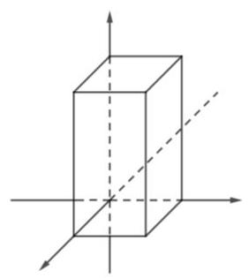

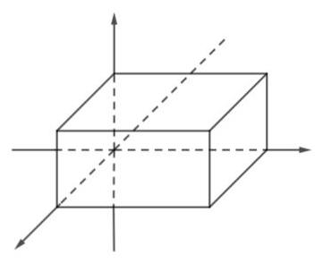

【12.2】1.(1)错；(2)对；(3)错；(4)对。

【12.3】1.(1)相交；(2)异面直线；(3)平行。

【12.4(1)】1.(1)对；(2)错；(3)错。

【12.4(2)】1.(1)错，设 $a$ 、 $b$ 是同一平面内的两条相交直线，则该平面外平行于 $a$ 的直线平行于该平面，但不平行于 $b$ ；(2)对；(3)对。2.因为 ${ABCD} - {A}_{1}{B}_{1}{C}_{1}{D}_{1}$ 所有相对的平面都互相平行，所以 ${AB}\operatorname{\parallel }{CD}$ ，所以 ${AB}\operatorname{\parallel }{{A}_{1}{B}_{1}{CD}}$ 。

【12.4(3)】1.(1)错，设 $l$ 是 $\alpha$ 、 $\beta$ 的交线，则平行于 $l$ 且不在 $\alpha$ 、 $\beta$ 内的直线与 $\alpha$ 、 $\beta$ 都平行，但 $\alpha$ 、 $\beta$ 相交；(2)对；(3)错，设 $a$ 、 $b$ 、 $c$ 是三条两两平行的直线， $a$ 与 $b$ 、 $b$ 与 $c$ 、 $c$ 与 $a$ 分别确定 1 个平面，这三个平面两两相交且交线平行。2.(1)是；(2)是；(3)否；(4)是；(5)是；(6)是； (7)是。

【12.5】1.(1)对；(2)对；530莱阳交点为 $P,{l}^{\prime }$ 是 $l$ 在 $\alpha$ 内的投影,则 $\alpha$ 内垂直于 ${l}^{\prime }$ 的直线也垂直于 $l$ ; (5)对；

(6)错，将两张纸直立并互相垂直，再将一支笔直立，这支笔与两张纸都平行；

(7)对；(8)错，将两张纸直立并相互平行；(9)对。2.(1)是；(2)否；

(3)是；(4)否；(5)是；(6)否。

第十三章 基本立体图形

【13.1(1)】1.(1) $2\sqrt{3} + {12},2\sqrt{3}$ ；

【13.1(2)】1.(1) $8\sqrt{2} + 4$ ， $\frac{4}{3}$ ； (4) $\frac{1 + \sqrt{3}}{2} + \sqrt{7}$ ， $\frac{\sqrt{2}}{12}$ 。

【13.1(3)】1. ${10} + 8\sqrt{3}$ ， $\frac{{13}\sqrt{2}}{3}$ 。

【13.2(1)】1.(1)(6 + 8 $\sqrt{3})\pi$ ，12 $\pi$ ；(2) $\left( {3 + 4\sqrt{3}}\right) \pi  + 8\sqrt{3}$ ， ${6\pi }$ 。2. ${9\pi } + 8$ ， ${6\pi } \circ  3.\frac{\sqrt{6}\pi }{2}$  。

【13.2(2)】1.(1) $\left( {3 + \sqrt{51}}\right) \pi ,{4\pi }$ ；(2) $\frac{3 + \sqrt{51}}{2}\pi  + 4\sqrt{3},{2\pi } \circ  2.\frac{3 + 3\sqrt{2}}{2}\pi  + 2$ ， $\frac{\sqrt{2}}{2}\pi  \circ  3.\sqrt{3}\pi ,\frac{\pi }{4}$  。

【13.2(3)】1. $\frac{20\pi }{3},\frac{{13}\sqrt{3}\pi }{18}$ 。2. (1) $\frac{\left( {{15} + 3\sqrt{51}}\right) \pi }{4},\frac{\left( {{15} + 2\sqrt{6}}\right) \pi }{12}$ 。3. 设高为 $h$ ,上下底面半径分别为 ${r}^{\prime }\text{ 、 }r$ ,且 $r + {r}^{\prime } = a$ ,可得 ${r}^{\prime } = a - r$ 圆台的体积为: $V = \frac{1}{3}{\pi h}\left( {{r}^{2} + r{r}^{\prime } + {r}^{\prime 2}}\right)$ ,化简括号内的部分: ${r}^{2} + r{r}^{\prime } + {r}^{\prime 2} = {r}^{2} + r\left( {a - r}\right)  + {\left( a - r\right) }^{2} = \; {r}^{2} - {ar} + {a}^{2} = {\left( r - \frac{1}{2}a\right) }^{2} + \frac{3}{4}{a}^{2}$ ,当 $r = \frac{1}{2}a$ ,即 $r = {r}^{\prime }$ 时,圆台的体积最小,此时是一个圆柱。

【13.2(4)】1. ${12\pi },4\sqrt{3}\pi$ 。2.半径为 $R$ 的球的表面积为 ${4\pi }{R}^{2}$ ，将其分割为 $n \; \left( {n \rightarrow   + \infty }\right)$ 个小圆锥,每个小圆锥的底面积为 $\frac{{4\pi }{R}^{2}}{n}$ 、高为 $R$ ,每个小圆锥的体积为 $\frac{1}{3} \cdot  \frac{{4\pi }{R}^{2}}{n} \cdot  R = \frac{{4\pi }{R}^{3}}{3n}$ ,球的体积等于全部 $n$ 个小圆锥的体积之和 $\frac{{4\pi }{R}^{3}}{3n} \cdot  n = \frac{{4\pi }{R}^{3}}{n}$ 。

第十四章 空间向量与解析几何

【14.1(1)】1.(1) $\overrightarrow{A{B}_{1}}$ ；(2) $\overrightarrow{{B}_{1}{C}_{1}}$ 或 $\overrightarrow{BC}$ ；(3) $\overrightarrow{{D}_{1}{B}_{1}}$ 或 $\overrightarrow{DB}$ ；(4) $\overrightarrow{{C}_{1}B}$ 。 2.(1) $\overrightarrow{PB} - \overrightarrow{PA}$ ；(2) $\frac{1}{3}\overrightarrow{PC} - \frac{1}{3}\overrightarrow{PB}$ ；(3) $\frac{1}{2}\overrightarrow{PA} + \frac{1}{2}\overrightarrow{PC}$ ；(4) $\frac{1}{2}\overrightarrow{PA} - \frac{1}{3}\overrightarrow{PB} - \frac{1}{6}\overrightarrow{PC}$ 。

【14.1(2)】1.(1)女，(2)1；(3)5；(4)0º 2.(1)1；(2) $\frac{2}{3}$ ；(3 1; (4) 0 。

【14.1(3)】1.(1)能；(2)否；(3)能；(4)否。2.(1)是； (2)是； (3)无；(4)是。3.略。

【14.2】1. $\left( 1\right)  - \overrightarrow{a} = \left( {-1,0,0}\right) , - \overrightarrow{b} = \left( {0, - 1,1}\right) ,\frac{1}{2}\overrightarrow{a} = \left( {\frac{1}{2},0,0}\right) ,\frac{1}{2}\overrightarrow{b} = \left( {0,\frac{1}{2}, - \frac{1}{2}}\right)$ , $\overrightarrow{a} + b = \left( {1,1, - 1}\right) ,\overrightarrow{a} - b = \left( {1, - 1,1}\right) ,\overrightarrow{a} \cdot  b = 0;\left( 2\right)  - \overrightarrow{a} = \left( {-1, - 1, - 1}\right) , - \overrightarrow{b} = \left( {2,2,2}\right)$ , $\frac{1}{2}\overrightarrow{a} = \left( {\frac{1}{2},\frac{1}{2},\frac{1}{2}}\right) ,\frac{1}{2}\overrightarrow{b} = \left( {-1, - 1, - 1}\right) ,\overrightarrow{a} + b = \left( {-1, - 1, - 1}\right) ,\overrightarrow{a} - b = \left( {3,3,3}\right) ,\overrightarrow{a} \cdot  b =  - 6;$ (3) $- \overrightarrow{a} = \left( {-\frac{1}{2}\cos \theta , - \frac{1}{2}\sin \theta , - \frac{\sqrt{3}}{2}}\right) , - \overrightarrow{b} = \left( {-\frac{1}{2}\cos \left( {-\theta }\right) ,\frac{1}{2} - \sin \left( {-\theta }\right) ,\frac{\sqrt{3}}{2}}\right) ,\frac{1}{2}\overrightarrow{a} = \; \left( {\frac{1}{4}\cos \theta ,\frac{1}{4}\sin \theta ,\frac{\sqrt{3}}{4}}\right) ,\frac{1}{2}\overrightarrow{b} = \left( {\frac{1}{4}\cos \left( {-\theta }\right) ,\frac{1}{4}\sin \left( {-\theta }\right) ,\frac{\sqrt{3}}{4}}\right) ,\overrightarrow{a} + \overrightarrow{b} = \left( {\cos \theta ,0,\sqrt{3}}\right) , \; \overrightarrow{a} \cdot  \overrightarrow{b} = \frac{1}{4}\cos {2\theta } + \frac{3}{4} \circ  \begin{array}{llllll} 2. & \left( 1\right) \sqrt{14}; & \left( 2\right) \sqrt{3}; & \left( 3\right) 3; & \left( 4\right) \sqrt{34} \circ  3. & \left( 1\right) \sqrt{2}, \end{array} \; 3,\frac{\sqrt{2}}{2};\left( 2\right) 3,5,\frac{2}{15};\left( 3\right) \sqrt{2},3,\frac{7\sqrt{2}}{12};\left( 4\right) \sqrt{2{a}^{2} - {4a} + {20}},\sqrt{2{a}^{2} + {4a} + 5},$ 0 。4. (1)E(2， $\frac{3}{2},0)$ ， $F\left( {1,3,0}\right)$ ， ${E}_{1}\left( {2,\frac{3}{2},1}\right)$ ， ${F}_{1}\left( {1,3,1}\right)$ ， $G\left( {2,3,\frac{1}{2}}\right)$ ， $H\left( {0,3,\frac{1}{2}}\right) ;\;\left( 2\right) \;\overrightarrow{{A}_{1}{C}_{1}} = \left( {-2,3,0}\right) ,\;\overrightarrow{D{E}_{1}} = \left( {2,\frac{3}{2},1}\right) ,\;\overrightarrow{GH} = \left( {-2,0,0}\right) , \; \overrightarrow{{F}_{1}E} = \left( {1, - \frac{3}{2}, - 1}\right) ;\;\left( 3\right) \frac{1}{2}, - 2;$ (4) $\frac{2\sqrt{377}}{377}, - \frac{2\sqrt{11}}{11}$ 。

【14.3(1)】1. (1)(3,1,-1)或(-3,-1,1)；(2)(1+3λ，2+λ， $- 1 - \lambda$ )。2. (1)(1，3，0)；(2)(-5，-1，3)；(3)( $\frac{7}{2},\frac{3}{2}, - \frac{1}{2})$ 。

【14.3(2)】1.(1)(1，3，0)；(2)(3x + 1， - x， x + 3y + 1)。

【14.3(3)】1.(1)是； (2)否； 2. 不平行。3. 如右图所示建立空间直角坐标系, 正方体的棱长为 1,选取相交于 $D$ 的三条棱的中点构造平面, 这三点的坐标分别为 $E\left( {\frac{1}{2},0,0}\right) \text{ 、 }F\left( {0,\frac{1}{2},0}\right)$ 、 $G\left( {0,0,\frac{1}{2}}\right)$ ,与之相对的三个顶点的坐标分别为 ${A}_{1}\left( {1,0,1}\right) \text{ 、 }B\left( {1,1,0}\right) \text{ 、 }{C}_{1}\left( {0,1,1}\right)$ ,可求得 ${\overrightarrow{n}}_{1} = \left( {1,1,1}\right)$ 同时是平面 ${EFG}$ 和 ${A}_{1}B{C}_{1}$ 的法向量,即得证。

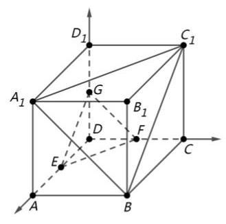

【14.3( 4 )( 1 )否；( 2 )是:( 3 )否；( 4 )零向量可以任意选取方向。 2. 垂直。3. 图略,(1) 因为 ${ABCD} - {A}_{1}{B}_{1}{C}_{1}{D}_{1}$ 是正方体,所以 ${AC} \parallel  {A}_{1}{C}_{1}$ 且 ${AC} = {A}_{1}{C}_{1}$ ， ${EF}\parallel {AC},{EF} = \frac{1}{2}{AC},{G}_{1}{H}_{1}\parallel {A}_{1}{C}_{1},{G}_{1}{H}_{1} = \frac{1}{2}{A}_{1}{C}_{1}$ ,所以 ${EF}\parallel {G}_{1}{H}_{1},{EF} = {G}_{1}{H}_{1}$ , 所 ${EF}{G}_{1}{H}_{1}$ 是平行四边形,所以 $E{H}_{1}\parallel F{G}_{1};\left( 2\right)$ 已证 ${EF}\parallel {G}_{1}{H}_{1}$ ,所以 ${EF}\parallel D{G}_{1}{H}_{1}$ 。

(3)已证 ${EF}\parallel D{G}_{1}{H}_{1};\overrightarrow{{B}_{1}F} = \overrightarrow{{B}_{1}B} + \overrightarrow{BF},\overrightarrow{{H}_{1}D} = \overrightarrow{{H}_{1}{D}_{1}} + \overrightarrow{{D}_{1}D}$ ，由正方体的性质可得 $\overrightarrow{{B}_{1}B} = \overrightarrow{{D}_{1}D},\overrightarrow{BF} = \overrightarrow{{H}_{1}{D}_{1}}$ ,所以 $\overrightarrow{{B}_{1}F} = \overrightarrow{{H}_{1}D}$ ,所以 ${B}_{1}F\parallel D{H}_{1}$ ,所以 ${B}_{1}F\parallel D{G}_{1}{H}_{1}$ , 所以 ${B}_{1}{EF}\parallel D{G}_{1}{H}_{1}$ 。(4) 设棱长为 $a,\overrightarrow{E{H}_{1}} \cdot  \overrightarrow{{G}_{1}{H}_{1}} = \left( {\overrightarrow{EA} + \overrightarrow{A{A}_{1}} + \overrightarrow{{A}_{1}{H}_{1}}}\right) \left( {\overrightarrow{{G}_{1}{D}_{1}} + \overrightarrow{{D}_{1}{H}_{1}}}\right) \; = \overrightarrow{EA} \cdot  \overrightarrow{{G}_{1}{D}_{1}} + \overrightarrow{{A}_{1}{H}_{1}} \cdot  \overrightarrow{{D}_{1}{H}_{1}} = \frac{{a}^{2}}{4} - \frac{{a}^{2}}{4} = 0$ 。(5)以 A 为原点， $\overrightarrow{AD}$ 、 $\overrightarrow{AB}$ 、 $\overrightarrow{A{B}_{1}}$ 、 $\overrightarrow{AB}$ 、 $\overrightarrow{A{A}_{1}}$ 分别为 $x$ 轴、 $y$ 轴、 $z$ 轴正方向，棱长为单位长，建立空间直角坐标系，可得: $B\left( {0,1,0}\right)$ ， ${D}_{1}\left( {1,0,1}\right) , P\left( {0,1,\frac{1}{2}}\right) , E\left( {0,\frac{1}{2},0}\right) , F\left( {\frac{1}{2},1,0}\right) ,\overrightarrow{B{D}_{1}} = \left( {1, - 1,1}\right) ,\overrightarrow{PE} = \left( {0, - \frac{1}{2}, - \frac{1}{2}}\right)$ , $\overrightarrow{PF} = \left( {\frac{1}{2},0, - \frac{1}{2}}\right) ,\overrightarrow{B{D}_{1}} \cdot  \overrightarrow{PE} = 1 \times  0 + \left( {-1}\right)  \times  \left( {-\frac{1}{2}}\right)  + 1 \times  \left( {-\frac{1}{2}}\right)  = 0,\overrightarrow{B{D}_{1}} \cdot  \overrightarrow{PF} = 1 \times  \frac{1}{2} + \left( {-1}\right)  \times  0 + 1 \times  \left( {-\frac{1}{2}}\right)  = 0$ , 所以 $B{D}_{1} \bot  {PEF}$ 。(6)由 $B{D}_{1} \bot  {PEF}$ 即可得 ${BD}{D}_{1} \bot  {PEF}$ 。

【14.3(5)】1. $\frac{\sqrt{5}}{3}$ 。2. $\frac{2\sqrt{5}}{5}$ 。

【14.3(6)】1. $\left( 1\right) \frac{1}{3};\left( 2\right) \frac{7}{9}$ 。

第十五章 计数原理

【15.1】1.(1)8；(2)15。2.(1)39；(2)1936。3.(1)36；(2) ${36}^{6}$ 。

【15.2(1)】1.(1) ${\mathrm{A}}_{7}^{7}$ ；(2) ${\mathrm{A}}_{10}^{5}$ ；(3) ${\mathrm{A}}_{10}^{8}$ 。2.(1)120；(2)11880； (3) 24 ；(4)9900。3.(1) ${A}_{26}^{10}$ ；(2) ${A}_{24}^{10}$ ；(3) ${10}{A}_{25}^{9}$ ；(4) $8{A}_{23}^{7}$ 。(5) ${30}{\mathrm{\;A}}_{23}^{9}$ 。 $4.{\mathrm{\;A}}_{20}^{5}{\mathrm{\;A}}_{15}^{5}$ 。

【15.2(2)】1.(1)99；(2)9900；(3)17674560；(4)720。2.( $n - m + 1){\mathrm{A}}_{n}^{m - 1} = \; n\left( {n - 1}\right) \cdots \left( {n - m + 2}\right) \left( {n - m + 1}\right)  = {\mathrm{A}}_{n}^{m}$ 。3. ${\mathrm{A}}_{n}^{1} \cdot  {\mathrm{A}}_{n - 1}^{n - 1} = n \cdot  \left( {n - 1}\right) ! = n! = {\mathrm{A}}_{n}^{n}$ 。

【15.2(3)】1.(1) ${\mathrm{C}}_{40}^{10}$ ；(2) ${\mathrm{C}}_{23}^{11}$ ；(3) ${\mathrm{C}}_{5}^{2}$ 。2.(1)6 (2)45 (3) 220 ; (4) 380。 ${3.2}{\mathrm{C}}_{35}^{5}$ 。

【15.2(4)】 $1.\left( 1\right) {45};\left( 2\right) {100};\left( 3\right) {78};\left( 4\right) {1330}$ 。 ${2.2}{\mathrm{C}}_{n}^{2} + {\mathrm{C}}_{n}^{1} = 2 \times  \frac{n\left( {n - 1}\right) }{2} + n = {n}^{2}$ 。

【15.3(1)】1. ${a}^{6} + 6{a}^{5}b + {15}{a}^{4}{b}^{2} + {20}{a}^{3}{b}^{3} + {15}{a}^{2}{b}^{4} + {6a}{b}^{5} + {b}^{5}$ 。2. ${\mathrm{C}}_{6}^{2}{\left( 2a\right) }^{4}{\left( -5b\right) }^{2} = {6000}{a}^{4}{b}^{2}$ ， 15,6000。3. $\left( 1\right) 1;\left( 2\right)  - {15};\left( 3\right)  - {120}$ 。

【15.3(2)】1.(1) $\mathop{\sum }\limits_{{k = 1}}^{n}{2k} - 1$ ；(2) $\mathop{\sum }\limits_{{k = 1}}^{{100}}\frac{1}{k}$ ；(3) $\mathop{\sum }\limits_{{k = 1}}^{{10}}\frac{k}{11}$ 。2.(1)0;(2)-5-5i； (4) $\frac{1}{2}$ 。

【15.3(3)】1.0。2.(1) ${\mathrm{C}}_{10}^{7}{\mathrm{2}}^{7}{x}^{3}$ ；(2) ${\mathrm{C}}_{10}^{5}{2}^{5}{x}^{5}$ ；(3) ${\mathrm{C}}_{10}^{7}{2}^{7}{x}^{3}$ 。

【15.3(4)】1.6。2.19。3.1， ${\mathrm{C}}_{n}^{2}$ 。 ${4.3}{}^{n}$ 。

第十六章 概率

【16.1(1)】1.(1) $\Omega  = \{ 1,2,3,4,5,6,7,8,9,{10}\}$ ， $A = \{ 2,4,6,8,{10}\}$ ；(2) $\Omega  = \{ 0,1,2,3\} , A = \{ 1,2,3\} ;\;\left( 3\right) \Omega  = \{  - 5, - 4, - 3, - 2, - 1,0,1,2,3,4,5\} , \; A = \{ 1,2,3,4,5\}$ 。

【16.1(2)】1.(1) $A \subseteq  B, A + B = \{ 1,2,3\} ,{AB} = \{ 1,2\}$ ，不互斥或对立； (2)无包含关系， $A + B = \{ 1,2,3,4,5,6\}$ ， ${AB} = \varnothing$ ，互斥且对立；(3)无 包含关系, $A + B = \{ 1,2,3,5\} ,{AB} = \{ 3,5\}$ ,不互斥或对立; (4) $B \subseteq  A, A + B = \; \{ 2,4,6\} ,{AB} = \{ 4,6\}$ ,不互斥或对立。

【16.1(3)】1.(1)否；(2)是；(3)否。2.(1)对(的全体基本事件:1 和2,1和3,1和4,1和5,1和6,1和7,1和8,1和9,1和10,2和4,2和 6，2 和8，2 和10，3 和6，3 和9，4 和8，5 和10；B 中的全体基本事件:1 和 2，1 和 3，1 和 4，1 和 5，1 和 6，1 和 7，1 和 8，1 和 9，1 和 10，2 和 3，2 和 4， 2 和 5，2 和 6，2 和 7，2 和 8，2 和 9，3 和 4，3 和 5，3 和 6，3 和 7，3 和 8， 2 和 9，4 和 5，4 和 6，4 和 7，5 和 6；(2)否。(3) $P\left( A\right)  = \frac{17}{45}, P\left( B\right)  = \frac{26}{45}$ 。 3. (1) $1,2,3,4,5,6;\left( 2\right) \frac{1}{2};\left( 3\right) \frac{1}{2};\left( 4\right) \frac{5}{6}$ 。

【16.1(4)】1. $\frac{1}{5}\text{ 。 }2.\frac{{4\pi }{r}^{3}}{3{a}^{3}}\text{ 。 }3.\frac{{r}_{2}^{2} - {r}_{1}^{2}}{{r}^{2}}$ 。

【16.1(5)】1.(1)(0，1)；(2) ${p}^{2}$ ；(3) ${2p} - {p}^{2}$ ；(4) ${\left( 1 - p\right) }^{2}$ 。2.(1) 对；(2)对；53．(3)对；yj4．(4)错。3．(1)0；(3) $\frac{11}{36}$ ；(4) $\frac{25}{36}$ ； (5) $\frac{1}{18}$ 。

【16.2(1)】 $1.P\left( {B \mid  A}\right)  = \frac{1}{3}, P\left( {A \mid  B}\right)  = \frac{1}{2}$ 。2. (1) $P\left( A\right)  = {0.5}$ ， $P\left( B\right)  = {0.2}$ ；

(2)事件 ${AB}$ :生成数可以被 10 整除， $P\left( {AB}\right)  = {0.1}$ ；(3) $P\left( {B \mid  A}\right)  = {0.2}$ 。

【16.2(2)】1.(1)否；(2)是:(3)否；(4)是。2.是。

【16.2(3)】1.0.75。2. $\frac{1}{11},\frac{2}{11},\frac{8}{11}$ 。3.0.053。

【16.2(4)】1. $\frac{4}{11}$ 。2.10:1。

第十七章 统计

【17.1(1)】1.(1)明确只统计来校上学的学生还是包括所有进入校的学生；

(2)明确除学籍在本校的学生外，是否包括在本校借读的学生、在外校借读来校办事的学生、外校来参加活动的学生、刚毕业毕业的学生；(3)需注意不要重复计数当天出校又返校的学生；(4)确保开始计数前和结束计数后当天没有学生来校。

【17.1(2)】1.(1)简单随机抽样；(2)分层随机抽样；53 按照户号进行系统随机抽样。2.红球 100 个，黑球 900 个。3.雄兔 24000 只，雌兔 26000 只。

【17.2(1)】1. 最小值为 15，最大值为 40，极差为 ${40} - {15} = {25}$ ，将组距设为 5， 分组、各组频率、频率分布直方图如下:

第一组[15, 20): 15161617171818181919, 频率为1/3

第二组[20, 25): 2020 21 21 21 21 21 21 22 23, 频率为1/3

第三组[25, 30): 25 29, 频率为1/15

第四组[30, 35): 30323232, 频率为2/15

第五组[35, 40]: 35353840, 频率为2/15

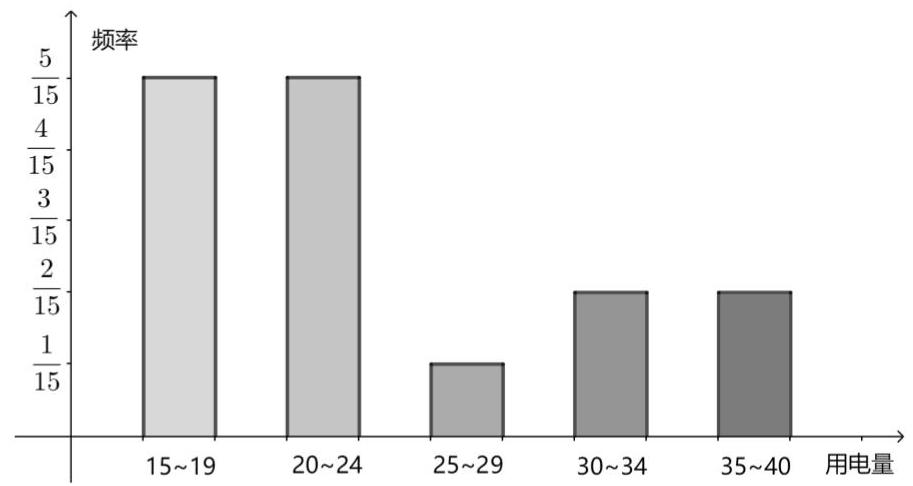

【17.2(2)】1.21。

【17.2(3)】1.(1)甲组:方差为26.4，标准差为 $\sqrt{26.4} \approx  {5.1}$ ；乙组:方差为 5.8,标准差为 $\sqrt{5.8} \approx  {2.4}$ ; (2)甲组的平均数、中位数都大于乙组，甲组的整体成绩更好, 乙组的方差和标准差更小, 成绩分布更集中。2. (1) 例 17.3 的平均数为 28.8 , 方差为 29.1 , 标准差为 5.4 , 练习 17.2(1) 的平均数为 23.7 , 方差为 500.6 , 标准差为 23.4 。

【17.3(1)】1.1.82m，1.02。

【17.3(2)】1. $k\bar{x} + c,{k}^{2}{s}^{2},\left| k\right| s$ 。2.(1)整体向上平移 $c$ 个单位；(2)整体沿竖直方向变为原来的 $k$ 倍；(3)先整体沿竖直方向变为原来的 $k$ 倍，再整体向上平移 $c$ 个单位。

第十 8 章 随机变量及其分布

【18.1(1)】1.(1) $P\left( {X = i}\right)  = \frac{1}{12}$ ， $i = 1,2,\cdots ,{12}$ ；(2) $P\left( {X = 0}\right)  = \frac{1}{4}$ ， $P\left( {X = 1}\right)  = \frac{1}{2}, P\left( {X = 2}\right)  = \frac{1}{4};\left( 3\right) P\left( {X = 2}\right)  = \frac{1}{36}, P\left( {X = 3}\right)  = \frac{1}{18}, P\left( {X = 4}\right)  = \frac{1}{12}, \; P\left( {X = 5}\right)  = \frac{1}{9},\;P\left( {X = 6}\right)  = \frac{5}{36},\;P\left( {X = 7}\right)  = \frac{1}{6},\;P\left( {X = 8}\right)  = \frac{5}{36},\;P\left( {X = 9}\right)  = \frac{1}{9}, \; P\left( {X = {10}}\right)  = \frac{1}{12},\;P\left( {X = {11}}\right)  = \frac{1}{18},\;P\left( {X = {12}}\right)  = \frac{1}{36}$  。

$$
\text{ 【18.1(2)】 }1.\frac{1}{10}\text{ 、 }\frac{4}{10}\text{ 、 }\frac{3}{10}\text{ 、 }\frac{2}{10}\text{ 。 }{2.0.35}\text{ 。 }
$$

【18.2(1)】1. (1) $\frac{13}{2}$ ；(2)1；(3)7 。2. (1)应当购置。(2)小于 0.1。

【18.2(2)】1.(1)2.5， $\frac{35}{12}$ ；(2) $7,\frac{35}{3}$ 。2.(1)7， $\frac{35}{3}$ ；(2)2.5， $\frac{35}{12}$ 。

【18.2(2)】1. (1)7， $\frac{35}{3}$ ；(2)2.5， $\frac{35}{12}$ 。

【18.3(1)】1.(1)小明: $E = {1.2}$ ， ${\sigma }^{2} = {0.48}$ ，小强: $E = 1$ ， ${\sigma }^{2} = {0.5}$ ；(2) 小明: $E = {2.4},{\sigma }^{2} = {0.96}$ ,小强: $E = 2,{\sigma }^{2} = 1;\;\left( 3\right)$ 次数较多。

【18.3(2)】1. $\frac{{\mathrm{C}}_{1000}^{50}{\mathrm{C}}_{500}^{50}}{{\mathrm{C}}_{1500}^{100}}$ 。2. (1) $\frac{{\mathrm{C}}_{10}^{5}}{{2}^{10}}$ ; (2) $\frac{{\mathrm{C}}_{10}^{4}}{{2}^{10}}$ 。

【18.4(1)】. 略。2.(1)； $f\left( x\right)  = \frac{1}{2\sqrt{2\pi }}{\mathrm{e}}^{-\frac{{\left( x - 1\right) }^{2}}{8}}$ ；(2) $f\left( x\right)  = \frac{1}{2\pi }{\mathrm{e}}^{-\frac{{x}^{2}}{4\pi }}$ ；(3)$f\left( x\right)  = \frac{5\sqrt{2}}{\pi }{\mathrm{e}}^{-{50}{\left( x + 2\right) }^{2}}$ 。3. (1) 均值更大，(2)数据更集中。

【18.4(2)】1. (1) $\mu  = 0,{\sigma }^{2} = 1$ ，最大值为 $\frac{1}{\sqrt{2\pi }}$ ，对称轴为 $x = 0$ (y轴)； (2) $\mu  =  - 1$ ， ${\sigma }^{2} = {0.36}$ ，最大值为 $\frac{1}{{0.6}\sqrt{2\pi }}$ ，对称轴为 $x =  - 1$ ；(3) $\mu  = {15}$ ， ${\sigma }^{2} = {100}$ ， 最大值为 $\frac{1}{{10}\sqrt{2\pi }}$ ,对称轴为 $x = {15}$ 。2. (1) $f\left( x\right)  = \frac{5\sqrt{2}}{\sqrt{\pi }}{\mathrm{e}}^{-5{\left( x - {2.5}\right) }^{2}}$ ; (2) $f\left( x\right)  = \frac{5\sqrt{2}}{{6.7} \times  {10}^{-{27}} \cdot  \sqrt{\pi }}{\mathrm{e}}^{-\frac{5{\left( x - {2.5} \times  {6.7} \times  {10}^{-{27}}\right) }^{2}}{{\left( {6.7} \times  {10}^{-{27}}\right) }^{2}}};$ (3) $f\left( x\right)  = \frac{5\sqrt{2}}{{6.7} \times  {10}^{-{27}} \cdot  \sqrt{\pi }}{\mathrm{e}}^{-\frac{5{x}^{2}}{{\left( {6.7} \times  {10}^{-{27}}\right) }^{2}}}$ 。

【18.4(3)】1.(1)实线对应 ${X}_{1}$ ，虚线对应 ${X}_{2}$ ；(2) ${\sigma }_{1} > {\sigma }_{2}$ 。

【18.4(4)】1.(1)0.2(2)0.6；(3)0.5；(4)0.8。2.0.9554、0.5、0.4772。

第十九章 成对数据的统计分析

【19.1(1)】1. 正，负，无，无。

【19.1(2)】1.(1) $\frac{82}{\sqrt{40} \times  \sqrt{172.8}} \approx  {0.98}$ ；(2) $- \frac{85.2}{\sqrt{50.8} \times  \sqrt{176.8}} \approx   - {0.90}$ ；(3) $\frac{11.6}{\sqrt{42.8} \times  \sqrt{65.2}} \approx  {0.22}$ 。

【19.1(3)】1. $r$ (甲) $\approx  {0.91}$ ， $r$ (乙) $\approx  {0.97}$ ，都正相关，乙的相关性较大。

【19.2(1)】1.直线(1)，根据数据画图直观观察可得，如下页图所示。

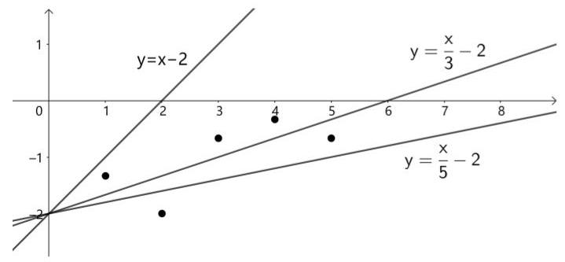

【19.2(2)】1.(1)如下页图左所示:(2) $y = \frac{64}{825}x + \frac{14}{15}$ ；(3)是。2.(1) $y = {x}^{2}$ ；(2)如下表所示:(3) $y = x - {0.002}$ ，散点图和直线如下图右所示。

<table><tr><td>$X : \mathrm{A}$ 的浓度平方</td><td>0.01</td><td>0.04</td><td>0.09</td><td>0.16</td><td>0.25</td></tr><tr><td>$Y : \mathrm{C}$ 的生成速率</td><td>0.010</td><td>0.042</td><td>0.078</td><td>0.160</td><td>0.244</td></tr></table>

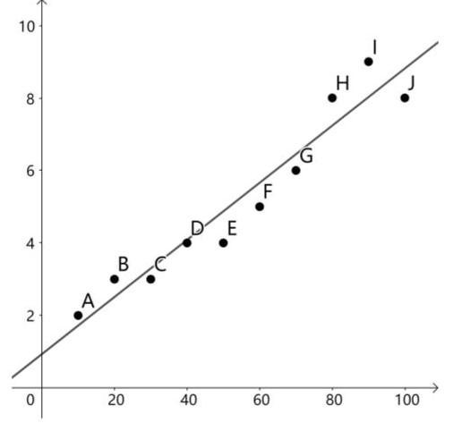

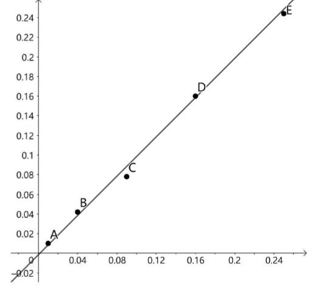

【19.3(1)】1.不存在。

【19.3(2)】1.(1)成年人偏好米饭与面食的概率分别为 0.4 和 0.6 ，未成年人偏好米饭与面食的概率分别为 0.7 和 0.3 , 存在关联;

(2) $X = \left\{  {\begin{array}{ll} 0 & \text{ 顾客为未成年人 } \\  1 & \text{ 顾客为成年人 } \end{array}, Y = \left\{  \begin{array}{ll} 0 & \text{ 偏好米饭 } \\  1 & \text{ 偏好面食 } \end{array}\right. }\right.$

$$
{\chi }^{2} = \frac{{150} \times  {\left( {20} \times  {30} - {70} \times  {30}\right) }^{2}}{{50} \times  {100} \times  {90} \times  {60}} = {12.5} > {10.828}
$$

<table><tr><td rowspan="2">$X$</td><td colspan="2">$Y$</td><td rowspan="2">合计</td></tr><tr><td>$Y = 0$</td><td>$Y = 1$</td></tr><tr><td>$X = 0$</td><td>20</td><td>30</td><td>50</td></tr><tr><td>$X = 1$</td><td>70</td><td>30</td><td>100</td></tr><tr><td>合计</td><td>90</td><td>60</td><td>150</td></tr></table>

有关，且判断错误的概率不大于 0.1%。
