## 课后练习 1 解析

1. 【答案】 $\left( {-\infty ,\frac{7}{4}}\right\rbrack$

【解析】 $\because {x}_{1} \in  \lbrack 2, + \infty ),{x}_{2} \in  \left\lbrack  {-2, - 1}\right\rbrack  , f\left( {x}_{2}\right)  > 0$ ,

$\therefore \left( {{x}_{2} - \frac{8}{{x}_{2}}}\right)  \cdot  \left| {{x}_{1} - a}\right|  \geq  a$ ,即对任意的 ${x}_{1} \in  \lbrack 2, + \infty )$ ,都存在 ${x}_{2} \in  \left\lbrack  {-2, - 1}\right\rbrack$ ,使 $\left| {{x}_{1} - a}\right|  \geq  \frac{a}{{x}_{2} - \frac{8}{{x}_{2}}}$ 恒成立,

$\therefore$ 有 ${\left| {x}_{1} - a\right| }_{\min } \geq  {\left( \frac{a}{{x}_{2} - \frac{8}{{x}_{2}}}\right) }_{\min } = \frac{a}{7}$ ,

当 $a \leq  0$ 时，显然不等式恒成立；

当 $0 < a < 2$ 时, $2 - a \geq  \frac{a}{7}$ ,解得 $0 < a \leq  \frac{7}{4}$ ;

当 $a \geq  2$ 时, $\left| {{x}_{1} - a}\right|  \in  \lbrack 0, + \infty )$ ,此时不成立.

综上， $a \leq  \frac{7}{4}$ .

故答案为: $( - \infty ,\frac{7}{4}\rbrack$

2. 【答案】 $0 \leq  a < 4$

【解析】解: 设函数 $g\left( x\right)  = \frac{{x}^{2} + 4}{x}, x \geq  2$ 的值域为 $\mathrm{A}$ ,函数 $h\left( x\right)  = {2}^{\left| x - a\right| }, x < 2$ 的值域为 $B$ , 因为对任意的 ${x}_{1} \in  \lbrack 2, + \infty )$ ,都存在唯一的 ${x}_{2} \in  \left( {-\infty ,2}\right)$ ,满足 $f\left( {x}_{2}\right)  = f\left( {x}_{1}\right)$ ,

则 $A \subseteq  B$ ,且 $B$ 中若有元素与 $\mathrm{A}$ 中元素对应,则只有一个.

当 ${x}_{1} \in  \lbrack 2, + \infty )$ 时, $g\left( x\right)  = \frac{{x}^{2} + 4}{x} = x + \frac{4}{x}$ ,

因为 $x + \frac{4}{x} \geq  2\sqrt{x \cdot  \frac{4}{x}} = 4$ ,当且仅当 $x = \frac{4}{x}$ ,即 $x = 2$ 时,等号成立,

所以 $A = \lbrack 4, + \infty )$ ,

当 ${x}_{2} \in  \left( {-\infty ,2}\right)$ 时, $h\left( x\right)  = {2}^{\left| x - a\right| }, x < 2$

① 当 $a \geq  2$ 时， $h\left( x\right)  = {2}^{a - x}, x < 2$ ，此时 $B = \left( {{2}^{a - 2}, + \infty }\right)$ ，

$\therefore {2}^{a - 2} < 4$ ,解得 $2 \leq  a < 4$ ,

② 当 $a < 2$ 时， $h\left( x\right)  = \left\{  \begin{array}{l} {2}^{a - x}, x < a \\  {2}^{x - a}, a \leq  x < 2 \end{array}\right.$ ，

此时 $h\left( x\right)$ 在 $\left( {-\infty , a}\right)$ 上是减函数,取值范围是 $\left( {1, + \infty }\right)$ ,

$h\left( x\right)$ 在 $\lbrack a,2)$ 上是增函数,取值范围是 $\left\lbrack  {1,{2}^{2 - a}}\right)$ ,

$\therefore {2}^{2 - a} \leq  4$ ,解得 $0 \leq  a < 2$ ,

综合得 $0 \leq  a < 4$ .

故答案为: $0 \leq  a < 4$

3. 【答案】 $\left\lbrack  {0,4}\right\rbrack$

【解析】如下图所示:

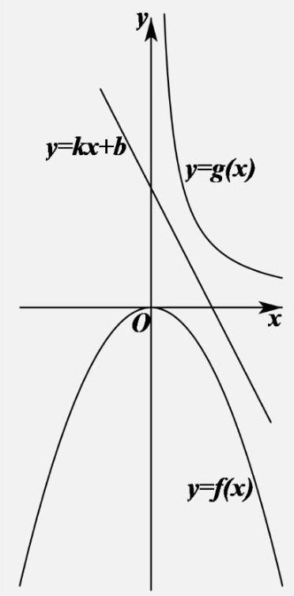

由图可知, $- {x}^{2} \leq  {kx} + b \leq  \frac{1}{x}$ ,可得 ${x}^{2} + {kx} + b \geq  0$ 对任意的 $x \in  R$ 恒成立,

则 ${\Delta }_{1} = {k}^{2} - {4b} \leq  0$ ,即 ${k}^{2} \leq  {4b}$ ,

不等式 $k{x}^{2} + {bx} - 1 \leq  0$ 对任意的 $x > 0$ 恒成立,

① 若 $k > 0$ ,当 $x \rightarrow   + \infty$ 时, $\left( {k{x}^{2} + {bx} - 1}\right)  \rightarrow   + \infty$ ,不合乎题意;

② 若 $k = 0$ ，则 ${bx} - 1 \leq  0$ 对任意的 $x > 0$ 恒成立，则 $b < \frac{1}{x}$ ，可得 $b \leq  0$ ，

又 $b \geq  \frac{{k}^{2}}{4}$ 对任意的 $x \in  R$ 恒成立,则 $b \geq  0,\therefore b = 0$ ;

③若 $k < 0$ ，则 ${\Delta }_{2} = {b}^{2} + {4k} \leq  0$ ，所以， ${b}^{4} \leq  {{16}{k}^{2}} \leq  {64b}$ ，

即 ${b}^{4} - {64b} = b\left( {{b}^{3} - {64}}\right)  = b\left( {b - 4}\right) \left( {{b}^{2} + {4b} + {16}}\right)  \leq  0$ ,解得 $0 \leq  b \leq  4$ .

综上所述,实数 $b$ 的取值范围是 $\left\lbrack  {0,4}\right\rbrack$ .

故答案为: $\left\lbrack  {0,4}\right\rbrack$ .

4. 【答案】 $3 \leq  a \leq  4$

【解析】 $f\left( x\right)  = x - \frac{2}{x}$ 在 $x \in  \left\lbrack  {1,2}\right\rbrack$ 上单增,则 $f\left( 1\right)  \leq  f\left( x\right)  \leq  f\left( 2\right)$ 即 $- 1 \leq  f\left( x\right)  \leq  1$ ;

当 $a > 0$ 时, $g\left( x\right)  = a\cos \frac{\pi x}{2} + 5 - {2a}$ 在0,1单减,

则 $g\left( 1\right)  \leq  g\left( x\right)  \leq  g\left( 0\right)$ ,即 $5 - {2a} \leq  g\left( x\right)  \leq  5 - a$

$\therefore \left\{  \begin{array}{l} 5 - {2a} \leq   - 1 \\  5 - a \geq  1 \end{array}\right.$ 解得 $3 \leq  a \leq  4$

综上 $3 \leq  a \leq  4$

故答案为: $3 \leq  a \leq  4$

5. 【答案】 $\left( {-\infty ,8 - 4\sqrt{2}}\right\rbrack$

【解析】设 $y = \cos \theta ,\theta  \in  \left\lbrack  {0,\pi }\right\rbrack$ ,

$\therefore {xy} + \frac{4}{x}\sqrt{1 - {y}^{2}} = x\cos \theta  + \frac{4}{x}\left| {\sin \theta }\right|$

$= x\cos \theta  + \frac{4}{x}\sin \theta  = \sqrt{{x}^{2} + \frac{16}{{x}^{2}}}\sin \left( {\theta  + \varphi }\right) ,$

$\therefore a \leq  {x}^{2} + \frac{16}{{x}^{2}} - 2\sqrt{{x}^{2} + \frac{16}{{x}^{2}}}$ ,令 $t = \sqrt{{x}^{2} + \frac{16}{{x}^{2}}} \geq  2\sqrt{2}$ ,

${t}^{2} - {2t} = {\left( t - 1\right) }^{2} - 1$ ,当 $t = 2\sqrt{2}$ 时,

${t}^{2} - {2t}$ 取得最小值 $8 - 4\sqrt{2}, a \leq  8 - 4\sqrt{2}$ .

$a$ 的取值范围是 $\left( {-\infty ,8 - 4\sqrt{2}}\right\rbrack$ .

故答案为: $( - \infty ,8 - 4\sqrt{2}\rbrack$ .

6. 【答案】 1

【分析】分 $b \geq  2\text{ 、 }1 < b < 2\text{ 、 }0 < b \leq  1\text{ 、 } - 1 < b \leq  0$ 依次讨论 ${fb}$ 的范围,进而判断 $a\left( {f\left( b\right)  - 1}\right)  \geq  b$ 是否恒成立, 即可求解.

【解析】当 $b \geq  2$ 时, $f\left( b\right)  = {\log }_{2}b \geq  {\log }_{2}2 = 1$ ,则 $a\left( {f\left( b\right)  - 1}\right)  \geq  b$ 不成立;

当 $1 < b < 2$ ， $0 < f\left( b\right)  = {\log }_{2}b < 1$ ，取 $a =  - 1$ ， $0 < a\left( {f\left( b\right)  - 1}\right)  = 1 - f\left( b\right)  < 1$ ，此时 $a\left( {f\left( b\right)  - 1}\right)  \geq  b$ 不成立；

当 $0 < b \leq  1$ 时, $f\left( b\right)  = {\log }_{2}b \leq  0$ ,则 $f\left( b\right)  - 1 \leq   - 1$ ,对于任意 $a \leq   - 1$ ,有 $a\left( {f\left( b\right)  - 1}\right)  \geq  1$ ,当 $b = 1, a =  - 1$ 时取等号,所以总有 $a\left( {f\left( b\right)  - 1}\right)  \geq  b$ 成立;

当 $- 1 < b \leq  0$ 时, $0 \leq  f\left( b\right)  = \left| {{2b} + 1}\right|  \leq  1$ ,当 $b =  - 1,0$ 取最大值 1,当 $b =  - \frac{1}{2}$ 时取最小值 0,则 $- 1 \leq  f\left( b\right)  - 1 \leq  0,$

对于任意 $a \leq   - 1$ ,有 $a\left( {f\left( b\right)  - 1}\right)  \geq  0$ ,当 $b =  - 1,0$ 时取等号,所以总有 $a\left( {f\left( b\right)  - 1}\right)  \geq  b$ 成立; 综上可得 $- 1 < b \leq  1$ ,故实数 $m$ 的最大值为 1 .

故答案为: 1 .

7. 【答案】 $\left\lbrack  {-\frac{1}{2},0}\right\rbrack$

【分析】对 ${\left\lbrack  f\left( x\right) \right\rbrack  }^{3} - {\left\lbrack  f\left( x\right) \right\rbrack  }^{2} - {x}^{2}f\left( x\right)  + {x}^{2} = 0$ 因式分解可得 $f\left( x\right)  = \left| x\right|$ 或 $f\left( x\right)  = 1$ ,对函数 $g\left( x\right)$ 取绝对值得分段函数，即可画出图形，

则对任意的 ${x}_{1} \in  \left( {-2,\frac{1}{2}}\right)$ ,存在 ${x}_{2} > {x}_{1}$ ,使得 $g\left( {x}_{2}\right)  = f\left( {x}_{1}\right)$ 成立等价于当 $x > 1$ 时, $g\left( x\right)  =  - m + 1 \geq  1$ ,且 $x \in  \left( {-\infty ,\frac{1}{2}}\right)$ 时 $g\left( x\right)$ 的图像要位于 $f\left( x\right)$ 的下方,列式求解即可

【解析】由 ${\left\lbrack  f\left( x\right) \right\rbrack  }^{3} - {\left\lbrack  f\left( x\right) \right\rbrack  }^{2} - {x}^{2}f\left( x\right)  + {x}^{2} = \left\lbrack  {{f}^{2}\left( x\right)  - {x}^{2}}\right\rbrack  \left\lbrack  {f\left( x\right)  - 1}\right\rbrack   = 0,\therefore {f}^{2}\left( x\right)  = {x}^{2}$ 即 $f\left( x\right)  = \left| x\right|$ 或 $f\left( x\right)  = 1$ . $\because f\left( x\right)$ 是偶函数,且值域为 $\left\lbrack  {0,1}\right\rbrack  ,\therefore f\left( x\right)  = \left\{  \begin{array}{l} 1, x\langle  - 1\text{ 或 }x\rangle 1 \\  \left| x\right| , - 1 \leq  x \leq  1 \end{array}\right.$ ,

$\because m < 1,\therefore g\left( x\right)  = \left| {x - m}\right|  - \left| {x - 1}\right|  = \left\{  \begin{array}{l} m - 1.x < m \\  {2x} - m - 1, m \leq  x \leq  1, \\   - m + 1, x > 1 \end{array}\right.$

画出两者图像如下图,

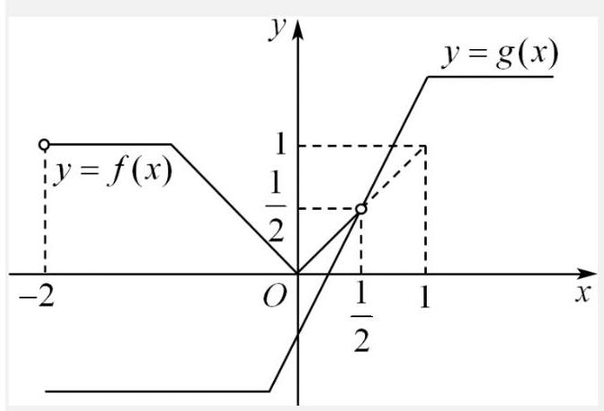

若对任意的 ${x}_{1} \in  \left( {-2,\frac{1}{2}}\right)$ ,存在 ${x}_{2} > {x}_{1}$ ,使得 $g\left( {x}_{2}\right)  = f\left( {x}_{1}\right)$ 成立,则当 $x > 1$ 时, $g\left( x\right)  =  - m + 1 \geq  1,\therefore m \leq  0$ , 且 $x \in  \left( {-\infty ,\frac{1}{2}}\right)$ 时, $g\left( x\right)$ 的图像要位于 $f\left( x\right)$ 的下方,故只需 $g\left( \frac{1}{2}\right)  \leq  f\left( \frac{1}{2}\right)$ ,即 $- m \leq  \frac{1}{2}$ ,解得 $m \geq   - \frac{1}{2}$ . 综上,实数 $m$ 的取值范围为 $\left\lbrack  {-\frac{1}{2},0}\right\rbrack$ .

故答案为: $\left\lbrack  {-\frac{1}{2},0}\right\rbrack$

## 课后练习 2 解析

1.【答案】A

【解析】由 $f\left( {x + 2}\right)  = f\left( {2 - x}\right)$ 可得,该函数关于直线 $x = 2$ 对称。由于二次函数 $f\left( x\right)$ 二次项系数为 1,抛物线开口方向向上,可知 $x = 2$ 时取到最小值。 $x$ 距离 2 越远, $f\left( x\right)$ 值越大。 故选 A

2.【答案】D

假设 $f\left( x\right)  = {x}^{2}$ ,则

$$
f\left( {x - 1}\right)  = {\left( x - 1\right) }^{2}
$$

$f\left( {1 - x}\right)  = {\left( 1 - x\right) }^{2} = {\left( x - 1\right) }^{2}$

它们是同一个函数,此函数图象关于直线 $x = 1$ 对称.

故选 D.

3.【答案】C

【解析】错误

反例: $f\left( x\right)  = \left\{  \begin{array}{l} \frac{1}{2}x - 1, x \geq  0 \\   - {2x} - 1,\;x < 0 \end{array}\right.$ ,

图像关于直线 $y = {3x} - 1$ 对称,

当 $x \geq  2$ 时,

$$
f\left( {f\left( x\right) }\right)  = \frac{1}{2}\left( {\frac{1}{2}x - 1}\right)  - 1 = \frac{1}{4}x - \frac{3}{2}
$$

当 $0 \leq  x < 2$ 时,

$$
f\left( {f\left( x\right) }\right)  =  - 2\left( {\frac{1}{2}x - 1}\right)  - 1 =  - x + 1
$$

当 $- \frac{1}{2} \leq  x < 0$ 时,

$$
f\left( {f\left( x\right) }\right)  =  - 2\left( {-{2x} - 1}\right)  - 1 = {4x} + 1,
$$

当 $x <  - \frac{1}{2}$ 时,

$$
f\left( {f\left( x\right) }\right)  = \frac{1}{2}\left( {-{2x} - 1}\right)  - 1 =  - x - \frac{3}{2}
$$

$f\left( x\right)$ 及 $f\left( {f\left( x\right) }\right)$ 的图像如下所示:

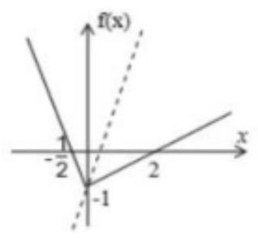

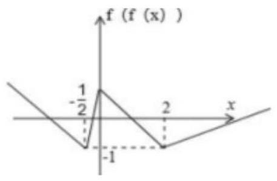

故函数 $y = f\left( {f\left( x\right) }\right)$ 的图象不是轴对称图形;

对于②,假设 $f\left( x\right)  = \sin x + 1$ ,其对

称中心为 $\left( {0,1}\right)$ ,

而

$$
f\left( {f\left( {-x}\right) }\right)  = f\left( {1 - \sin x}\right)  = \sin \left( {1 - \sin x}\right)  + 1, f\left( {f\left( x\right) }\right)
$$

$$
= f\left( {1 + \sin x}\right)  = \sin \left( {1 + \sin x}\right)  + 1
$$

则 $f\left( x\right)$ 的图象不是中心对称图形,(2) 错误;

故选: C.

4.【答案】D

【解析】(1) (分析法): 假设 ${P}_{1}\left( {m, n}\right)$ 在 $y =  - f\left( {x + 4}\right)$ 图像上,

故 $n =  - f\left( {m + 4}\right)$ ,因此 $n =  - f\left( {6 - \left( {2 - m}\right) }\right)$ ,

因此 ${P}_{2}\left( {2 - m, - n}\right)$ 在 $y = f\left( {6 - x}\right)$ 图像上.

${P}_{1}\left( {m, n}\right)$ 和 ${P}_{2}\left( {2 - m, - n}\right)$ 关于 $\left( {1,0}\right)$ 对称,因此选 D

【解析】(2) (举例法): 不妨取 $f\left( x\right)  = x, - f\left( {x + 4}\right)  =  - x - 4, f\left( {6 - x}\right)  = 6 - x$ 。 画出图像可知关于 $\left( {1,0}\right)$ 对称。

5.【答案】D

【解析】因为函数 $f\left( x\right)$ 对于任意实数 $x$ 满足条件

$f\left( {x + 2}\right)  = \frac{1}{f\left( x\right) },\;\therefore f\left( {x + 4}\right)  = \frac{1}{f\left( {x + 2}\right) } = f\left( x\right) ,\;\therefore T = 4$

$f\left( 1\right)  =  - 5$ ,

$f\left( {f\left( 5\right) }\right)  = f\left( {f\left( 1\right) }\right)  = f\left( {-5}\right)  = f\left( {-1}\right)$

$\because f\left( {-1}\right)  = \frac{1}{f\left( 1\right) } =  - \frac{1}{5}$

所以可知选 D

6.【答案】C

【解析】

由函数 $g\left( x\right)  - \sqrt{1 - x}, h\left( x\right)  = \sqrt{3x}$ ,

$h\left( x\right)$ 是 $g\left( x\right)$ 关于 $f\left( x\right)$ 的 “对称函数”,

可得 $f\left( x\right)  = \frac{1}{2}\left( {\sqrt{1 - x} + \sqrt{3x}}\right)$ ，

$0 \leq  x \leq  1,\;f\left( x\right)  > 0$

${f}^{\prime }\left( x\right)  = \frac{1}{2}\left( {-\frac{1}{2\sqrt{1 - x}} + \frac{\sqrt{3}}{2} \cdot  \frac{1}{\sqrt{x}}}\right) ,$

可得 ${f}^{\prime }\left( x\right)  = 0$ 的解为 ${fx} = \frac{3}{4}$ ,

由 $f\left( 0\right)  = \frac{1}{2}, f\left( 1\right)  = \frac{\sqrt{3}}{2}, f\left( \frac{3}{4}\right)  = 1$ ,

且 $f\left( x\right)$ 在 $\left( {0,\frac{3}{4}}\right)$ 递增, $\left( {\frac{3}{4},1}\right)$ 递减,

可得 $f\left( x\right)$ 的最小值为 $\frac{1}{2}$ ，最大值为 1

可得 $f\left( x\right)$ 的值域为 $\left\lbrack  {\frac{1}{2},1}\right\rbrack$ ，

而 $m\left( t\right)  = {t}^{2} + {2t} + {a}^{2} + a - 1$ 在 $\left\lbrack  {0,1}\right\rbrack$ 递增,

可得 $m\left( t\right)$ 的值域为 $\left\lbrack  {{a}^{2} + a - 1,{a}^{2} + a + 2}\right\rbrack$

由题意可得 $\left\lbrack  {1,2}\right\rbrack   \subseteq  \left\lbrack  {{a}^{2} + a - 1,{a}^{2} + a + 2}\right\rbrack$ ,

即有 ${a}^{2} + a - 1 \leq  1 < 2 \leq  {a}^{2} + a + 2$ ,

即为 $\left\{  \begin{array}{l}  - 2 \leq  a \leq  1 \\  a \geq  0\text{ 或 }a \leq   - 1 \end{array}\right.$ ,

解得 $0 \leq  a \leq  1$ 或 $- 2 \leq  a \leq   - 1$ ,

则 $a$ 的范围是 $\left\lbrack  {-2, - 1}\right\rbrack   \cup  \left\lbrack  {0,1}\right\rbrack$ ,

故选: C.

7.【答案】 $\left( {3 - 2\sqrt{2},1 + 2\sqrt{2}}\right)$

【解析】

需要把 $g\left( x\right)  = \left| {x + a}\right|  + 1$ 向左平移。

则 $a > 0$ ,设直线 $y =  - \left( {x + a}\right)  + 1$ ,即 $x + y + a - 1 = 0$ , 由圆心 $\left( {-2,0}\right)$ 到直线的距离为 2,

得 $\frac{\left| -2 + a - 1\right| }{\sqrt{2}} = 2$ ,

解得 $a = 3 - 2\sqrt{2}$ 或 $a = 3 + 2\sqrt{2}$ (舍);

设直线 $y = \left( {x + a}\right)  + 1$ ,即 $x - y + a + 1 = 0$ ,

由圆心 $\left( {-2,0}\right)$ 到直线的距离为 2,

得 $\frac{\left| -2 + a + 1\right| }{\sqrt{2}} = 2$ ,解得 $a = 1 + 2\sqrt{2}$ 或

$a = 1 - 2\sqrt{2}$ (舍),

$\therefore$ 要使 $y = f\left( x\right)$ 与 $y = g\left( x\right)$ 存在两对 “伴点”,

则实数 $a$ 的取值范围为 $\left( {3 - 2\sqrt{2},1 + 2\sqrt{2}}\right)$ .

故答案为: $\left( {3 - 2\sqrt{2},1 + 2\sqrt{2}}\right)$ .

设曲线 $y = f\left( x\right)$ 关于 $x = 1$ 的对称图象上的点为 $\left( {x, y}\right)$ ,

$\left( {x, y}\right)$ 关于 $x = 1$ 的对称点为 $\left( {{x}^{\prime },{y}^{\prime }}\right)$ ,

则 ${x}^{\prime } = 2 - x,{y}^{\prime } = y$ ,代入

$f\left( x\right)  = \left\{  \begin{array}{l}  - \sqrt{2 - x}\left( {x < 2}\right) \\  \sqrt{4 - {\left( x - 4\right) }^{2}}\left( {x \geq  2}\right)  \end{array}\right.$ ,

即 $f\left( {2 - {x}^{\prime }}\right)  = \left\{  \begin{array}{l}  - \sqrt{{x}^{\prime }}\left( {{x}^{\prime } > 0}\right) \\  \sqrt{4 - {\left( {x}^{\prime } + 2\right) }^{2}}\left( {{x}^{\prime } \leq  0}\right)  \end{array}\right.$

$f\left( {2 - {x}^{\prime }}\right)  = \left\{  \begin{array}{l}  - \sqrt{{x}^{\prime }}\left( {{x}^{\prime } > 0}\right) \\  \sqrt{4 - {\left( {x}^{\prime } + 2\right) }^{2}}\left( {{x}^{\prime } \leq  0}\right)  \end{array}\right.$

令 $h\left( x\right)  = \left\{  \begin{array}{l}  - \sqrt{x}\left( {x > 0}\right) \\  \sqrt{4 - {\left( x + 2\right) }^{2}}\left( {x \leq  0}\right)  \end{array}\right.$ ,

则 $f\left( x\right)$ 与 $h\left( x\right)$ 的图象关于 $x = 1$ 对称,

作出函数 $h\left( x\right)$ 及 $g\left( x\right)  = \left| x\right|  + 1$ 的图象如图,

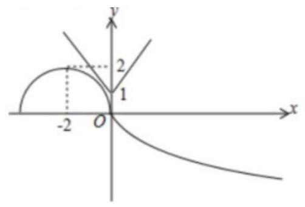

函数 $g\left( x\right)  = \left| {x + a}\right|  + 1$ 的图象是把 $y = \left| x\right|  + 1$ 向左 $\left( {a > 0}\right)$ 或向右 $\left( {a < 0}\right)$ 平移 $\left| a\right|$ 个单位得到的, 由图可知,要使 $y = f\left( x\right)$ 与 $y = g\left( x\right)$ 存在两对 “伴点”,

8.【答案】-1

【解析】

$f\left( 1\right)  = f\left( 0\right)  - f\left( {-1}\right) ,\;f\left( 2\right)  = f\left( 1\right)  - f\left( 0\right)  =  - f\left( {-1}\right)$

$f\left( 3\right)  = f\left( 2\right)  - f\left( 1\right)  =  - f\left( {-1}\right)  - f\left( 0\right)  + f\left( {-1}\right)  =  - f\left( 0\right) ,$

$f\left( 4\right)  = f\left( 3\right)  - f\left( 2\right)  =  - f\left( 0\right)  + f\left( {-1}\right) ,\;f\left( 5\right)  = f\left( {-1}\right) ,\;f\left( 6\right)  = f\left( 0\right)$

周期 $T = 6$

所以 $f\left( {2025}\right)  = f\left( 1\right)  = f\left( 0\right)  - f\left( {-1}\right)  = 1 - 2 =  - 1, f\left( {2025}\right)  =  - 1$

9. 【答案】 $\left( {{20},\frac{41}{2}}\right)$

【解析】当 $2 < x < 4$ 时, $f\left( x\right)  = f\left( {4 - x}\right)$

所以 $f\left( x\right)$ 在 $\left( {2,4}\right)$ 与 $\left( {0,2}\right)$ 上的图像关于 $x = 2$ 对称.

作出图象如下图所示,不防令 ${x}_{1} < {x}_{2} < {x}_{3} < {x}_{4}$ ,

可得 ${x}_{1} + {x}_{4} = {x}_{2} + {x}_{3} = 4$ 且 $- \ln {x}_{1} = \ln {x}_{2}$

所以 ${x}_{1}{x}_{2} = 1,{x}_{1} = \frac{1}{{x}_{2}},{x}_{4} = 4 - \frac{1}{{x}_{2}},{x}_{3} = 4 - {x}_{2}$

所以 ${x}_{1}^{2} + {x}_{2}^{2} + {x}_{3}^{2} + {x}_{4}^{2} = \frac{1}{{x}_{2}^{2}} + {x}_{2}^{2} + {\left( 4 - {x}_{2}\right) }^{2} + {\left( 4 - \frac{1}{{x}_{2}}\right) }^{2} = 2{\left( {x}_{2} + \frac{1}{{x}_{2}}\right) }^{2} - 8\left( {{x}_{2} + \frac{1}{{x}_{2}}}\right)  + {28}$ .

因为 ${x}_{2} \in  \left( {1,2}\right)$ ,令 $t = {x}_{2} + \frac{1}{{x}_{2}} \in  \left( {2,\frac{5}{2}}\right)$ ,则原式化为 $h\left( t\right)  = 2{t}^{2} - {8t} + {28}, t \in  \left( {2,\frac{5}{2}}\right)$ .

因为其对称轴为 $t = 2$ ,开口向上,所以 $h\left( t\right)$ 在 $\left( {2,\frac{5}{2}}\right)$ 上单调递增

所以 ${20} < h\left( t\right)  < \frac{41}{2}$

所以 ${x}_{1}^{2} + {x}_{2}^{2} + {x}_{3}^{2} + {x}_{4}^{2}$ 的取值范围是 $\left( {{20},\frac{41}{2}}\right)$ .

故答案为: $\left( {{20},\frac{41}{2}}\right)$ .

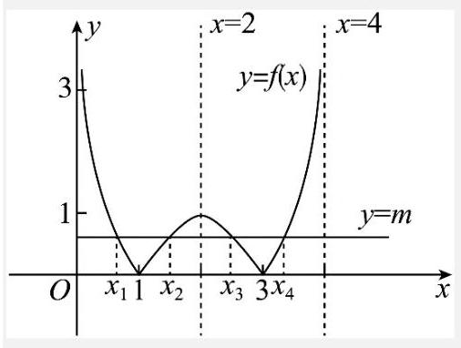

## 课后练习 3

1.【答案】 $f\left( x\right)  = \left\{  {\begin{array}{ll} {2}^{x - {4k}} & x \in  ({4k},{4k} + 2\rbrack \\  {2}^{{4k} + 2 - x} & x \in  ({4k} + 2,{4k} + 4\rbrack  \end{array}, k \in  Z}\right.$

【解析】 $f\left( x\right)  = \frac{1}{f\left( {x + 2}\right) }$

$f\left( {x + 2}\right)  = \frac{1}{f\left\lbrack  {\left( {x + 2}\right)  + 2}\right\rbrack  } = \frac{1}{f\left( {x + 4}\right) },\therefore f\left( {x + 4}\right)  = \frac{1}{f\left( {x + 2}\right) }$

$\therefore f\left( x\right)  = f\left( {x + 4}\right)$

当 $x \in  (2,4\rbrack$ 时

${2}^{x - 2} \cdot  f\left( x\right)  = 1,\;f\left( x\right)  = {2}^{2 - x}$

当 $x \in  (4,6\rbrack$ 时

$$
f\left( x\right)  = {2}^{x - 4}
$$

推得: 当 $x \in  ({4k},{4k} + 2\rbrack$ 时, $k \in  Z$

$$
f\left( x\right)  = {2}^{x - {4k}}
$$

当 $x \in  ({4k} + 2,{4k} + 4\rbrack$ 时, $k \in  Z$

$$
f\left( x\right)  = {2}^{{4k} + 2 - x}
$$

综上: $f\left( x\right)  = \left\{  {\begin{array}{ll} {2}^{k - {4k}} & x \in  ({4k},{4k} + 2\rbrack \\  {2}^{{4k} + 3 - x} & x \in  ({4k} + 2,{4k} + 4\rbrack  \end{array}, k \in  Z}\right.$

2.【答案】 $\frac{1}{2} < k \leq  {\log }_{3}2$ .

【解析】若 $y = g\left( x\right)  - h\left( x\right)$ 恰有 4 个零点,即 $g\left( x\right)$ 和 $h\left( x\right)$ 有 4 个交点,画出函数 $g\left( x\right)$ , $h\left( x\right)$ 的图象,如图所示:

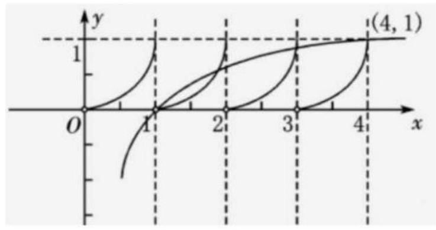

结合图象得 $\left\{  \begin{array}{l} k{\log }_{2}4 > 1 \\  k{\log }_{2}3 \leq  1 \end{array}\right.$ ,

解得 $\frac{1}{2} < k \leq  {\log }_{3}2$ .

3.【答案】 $t \in  ( - \infty , - 2\rbrack  \cup  (0,1\rbrack$

【解析】

当 $x \in  \lbrack 0,1)$ 时, $f\left( x\right)  = {x}^{2} - x \in  \left\lbrack  {-\frac{1}{4},0}\right\rbrack$

当 $x \in  \lbrack 1,2)$ 时,

$f\left( x\right)  =  - {\left( {0.5}\right) }^{\left| x - {1.5}\right| } \in  \left\lbrack  {-1, - \frac{\sqrt{2}}{2}}\right\rbrack$

$\therefore$ 当 $x \in  \lbrack 0,2)$ 时, $f\left( x\right)$ 的最小值为 -1

又 $\because$ 函数 $f\left( x\right)$ 满足 $f\left( {x + 2}\right)  = {2f}\left( x\right)$ ,

当 $x \in  \lbrack  - 2,0)$ 时, $f\left( x\right)$ 的最小值为 $- \frac{1}{2}$

当 $x \in  \lbrack  - 4, - 2)$ 时, $f\left( x\right)$ 的最小值为 $- \frac{1}{4}$

若 $x \in  \lbrack  - 4, - 2)$ 时, $f\left( x\right)  \geq  \frac{t}{4} - \frac{1}{2t}$ 恒成立,

$\therefore \frac{t}{4} - \frac{1}{2t} \leq   - \frac{1}{4}$

即 $\frac{\left( {t + 2}\right) \left( {t - 1}\right) }{4t} \leq  0$

即 ${4t}\left( {t + 2}\right) \left( {t - 1}\right)  \leq  0$ 且 $t \neq  0$

解得: $t \in  ( - \infty , - 2\rbrack  \cup  (0,1\rbrack$

## 4.【答案】10.5

【解析】由题意,

当 $2 < x \leq  4$ 时,

$f\left( x\right)  = \frac{1}{2}f\left( \frac{x}{2}\right)  = 2 - 4\left| {\frac{x}{2} - \frac{3}{2}}\right|$

$= 2 - 2\left| {x - 3}\right|$

当 $4 < x \leq  8$ 时, $f\left( x\right)  = \frac{1}{2}f\left( \frac{x}{2}\right)  = 1 - \left| {\frac{x}{2} - 3}\right|$

故 $f\left( x\right)  = \left\{  \begin{array}{l} 4 - 8\left| {x - \frac{3}{2}}\right| ,1 \leq  x \leq  2 \\  2 - 2\left| {x - 3}\right| ,2 < x \leq  4 \\  1 - \left| {\frac{x}{2} - 3}\right| ,4 < x \leq  8 \end{array}\right.$

函数 $g\left( x\right)  = {xf}\left( x\right)  - 6$ 在区间 $\left\lbrack  {1,8}\right\rbrack$ 内的所有零点即 ${xf}\left( x\right)  - 6 = 0$ 在区间 $\left\lbrack  {1,8}\right\rbrack$ 内的所有解;

即 $y = f\left( x\right)$ 与 $y = \frac{6}{x}$ 的交点的横坐标,

作 $y = f\left( x\right)$ 与 $y = \frac{6}{x}$ 的图象如下,

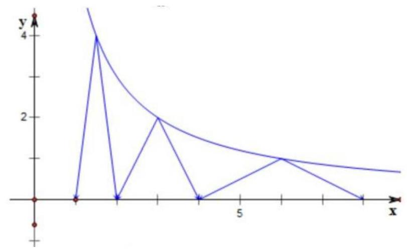

故所有的零点为 $\frac{3}{2},3,6$ ;

$\frac{3}{2} + 3 + 6 = {10.5}$

故答案为: 10.5 .

5.【答案】 $\left\lbrack  {\pi  - 2,8 - {2\pi }}\right\rbrack$ .

$\because f\left( x\right)$ 是以 2 为周期的偶函数,且 $f\left( x\right)$ 在 $\left\lbrack  {0,1}\right\rbrack$ 上单调递减;

$\therefore$ 由 $f\left( \pi \right)  = 1, f\left( {2\pi }\right)  = 2$

得, $f\left( {4 - \pi }\right)  = 1, f\left( {{2\pi } - 6}\right)  = 2$ ,且 $4 - \pi ,{2\pi } - 6 \in  \left\lbrack  {0,1}\right\rbrack$

由 $1 \leq  x \leq  2$ 得, $0 \leq  2 - x \leq  1$ ;

$\therefore$ 由 $\left\{  \begin{array}{l} 1 \leq  x \leq  2 \\  1 \leq  f\left( x\right)  \leq  2 \end{array}\right.$

得, $\left\{  \begin{array}{l} 1 \leq  x \leq  2 \\  f\left( {4 - \pi }\right)  \leq  f\left( {2 - x}\right)  \leq  f\left( {{2\pi } - 6}\right)  \end{array}\right.$

$\therefore \left\{  \begin{array}{l} 1 \leq  x \leq  2 \\  {2\pi } - 6 \leq  2 - x \leq  4 - \pi  \end{array}\right.$

解得 $\pi  - 2 \leq  x \leq  8 - {2\pi }$ ;

$\therefore$ 原不等式组的解集为 $\left\lbrack  {\pi  - 2,8 - {2\pi }}\right\rbrack$ .

故答案为: $\left\lbrack  {\pi  - 2,8 - {2\pi }}\right\rbrack$ .

## 6.【答案】506

【解析】 $f\left( x\right)  = \frac{1}{{2}^{\left| x - 4\right| }}$ 图象关于 $x = 2$ 对称

且 $f\left( x\right)  = \frac{1}{{2}^{\left| x - 2\right| }} > 0$ 可得 $f\left( x\right)$ 在 $\left( {2, + \infty }\right)$ 单调减

$g\left( {2 + x}\right)  = g\left( {2 - x}\right) ,\;y = g\left( x\right)$ 关于 $x = 2$ 轴对称

$g\left( {x + 4}\right)  = g\left( x\right)$ ,故 $T = 4$

$x \in  \left\lbrack  {0,2}\right\rbrack$ 时, $g\left( x\right)  = {\log }_{2}\left( {x + 1}\right)$

$f\left( x\right)  \in  \left\lbrack  {0,\ln 3}\right\rbrack$ ,当 $x \in  \left\lbrack  {0,2}\right\rbrack$ 时, $f\left( x\right)  = g\left( x\right)$ 有 1 个实根

$x \in  \left\lbrack  {2,6}\right\rbrack$ 时, $f\left( x\right)  = g\left( x\right)$ 有 2 个实根

$x \geq  2$ 的每个周期内都有 2 个实根

$x \in  \left\lbrack  {0,{2024}}\right\rbrack$ 时,共 506 个实根

7. 【答案】 $\left( {0,\frac{16}{23}}\right)$

【分析】根据条件判断函数的周期性,函数在一个周期内的解析式,再求出函数 ${f}_{\left( 5\right) }\left( x\right)$ 的解析式,作出函数 ${f}_{\left( 5\right) }\left( x\right)$ 的图像,利用数形结合思想进行求解即可.

【解析】由题知任取 $x \in  R$ ,有 $f\left( {2 + x}\right)  = f\left( {2 - x}\right)$ ,则函数 $f\left( x\right)$ 的图象关于直线 $x = 2$ 对称,

又函数 $f\left( x\right)$ 的图象关于 $y$ 轴对称,则 $f\left( x\right)$ 是周期为 4 的周期函数;

若 $x \in  \left\lbrack  {-2,0}\right\rbrack$ ,则 $- x \in  \left\lbrack  {0,2}\right\rbrack  ,\therefore f\left( {-x}\right)  =  - x$ ,

又 $f\left( x\right)$ 是偶函数,所以 $f\left( {-x}\right)  =  - x = f\left( x\right)$ ,即 $f\left( x\right)  =  - x, x \in  \left\lbrack  {-2,0}\right\rbrack$ ,

则函数 $f\left( x\right)$ 在一个周期 $\left\lbrack  {-2,2}\right\rbrack$ 上的表达式为 $f\left( x\right)  = \left\{  \begin{array}{l} x,0 \leq  x \leq  2 \\   - x, - 2 \leq  x < 0 \end{array}\right.$ ,

因为 ${f}_{\left( n\right) }\left( x\right)  = f\left( {{2}^{n - 1} \cdot  x}\right) , n \in  {\mathbf{N}}^{ * }$ ,所以函数 ${f}_{\left( 5\right) }\left( x\right)  = f\left( {16x}\right) , n \in  {\mathbf{N}}^{ * }$ ,

其图象可由 $f\left( x\right)$ 的图象压缩为原来的 $\frac{1}{16}$ 得到,故函数 ${f}_{\left( 5\right) }\left( x\right)$ 的周期为 $\frac{1}{4}$ ,

作出函数 ${f}_{\left( 5\right) }\left( x\right)$ 的图像,如图所示:

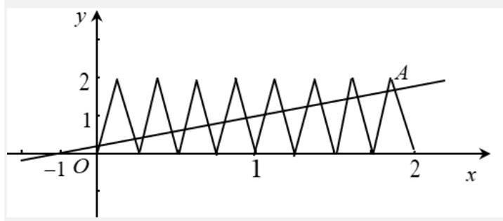

易知过 $M\left( {-1,0}\right)$ 的直线 $l$ 斜率存在,设过点 $\left( {-1,0}\right)$ 的直线 $l$ 的方程为 $y = k\left( {x + 1}\right)$ , 则要使直线 $l$ 与 ${f}_{\left( 5\right) }\left( x\right)$ 的图象在 $x \in  \left\lbrack  {0,2}\right\rbrack$ 上恰有 16 个交点,则 $0 < k < {k}_{MA}$ ,

又 $A\left( {\frac{15}{8},2}\right) ,\therefore {k}_{MA} = \frac{2 - 0}{\frac{15}{8} + 1} = \frac{16}{23}$ ,

故直线 $l$ 斜率 $k$ 的取值范围是 $\left( {0,\frac{16}{23}}\right)$ 故答案为: $\left( {0,\frac{16}{23}}\right)$

8. 【答案】①②

【解析】: 函数 $f\left( x\right)$ 满足 $f\left( {x + 1}\right)  = f\left( {x - 1}\right)$ ,对任意 $\mathrm{x} \in  \mathrm{R}$ 恒成立,

$\therefore$ 用 $\mathrm{x} + 1$ 替换上式中的 $\mathrm{x}$ 可得, $\mathrm{f}\left( {\mathrm{x} + 2}\right)  = \mathrm{f}\left( \mathrm{x}\right)$ ,

即得函数 $\mathrm{f}\left( \mathrm{x}\right)$ 为周期为 2 的函数;

又 $\because$ 函数为偶函数,即关于 $\mathrm{y}$ 轴对称,

结合函数的周期性和对称性可得,函数的对称轴

为: $\mathrm{x} = 2\mathrm{k}\left( {\mathrm{k} \in  \mathrm{Z}}\right)$ ,

由此可得,函数关于直线 $\mathrm{x} =  - 4$ 对称. 故①正确；

方程 $\mathrm{f}\left( \mathrm{x}\right)  - \left| {\mathrm{x} - \mathrm{a}}\right|  = 0$ 的解的个数,即方程

$f\left( x\right)  = \left| {x - a}\right|$ 的解的个数,即函数 $f\left( x\right)$ 的图象与

函数 $y = \left| {x - a}\right|$ 的图象的交点个数,

因为函数 $y = \left| {x - a}\right|$ 的图象是将函数 $y = \left| x\right|$ 的图象沿 $x$ 轴平移 $\left| a\right|$ 个单位长度得到的,

所以在同一个直角坐标系中作出两个函数 $y = \left| x\right| , y = f\left( x\right)$ 的图象如下:

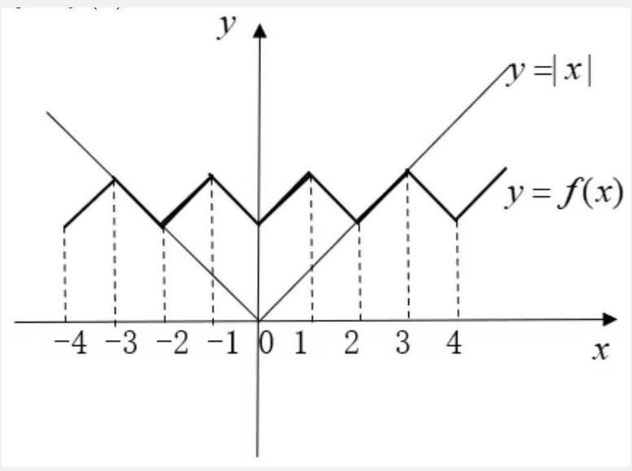

由图象可得,将 $\mathrm{y} = \left| \mathrm{x}\right|$ 左右平移后一定会与函数 $\mathrm{y} = \mathrm{f}\left( \mathrm{x}\right)$ 相交,故②正确；

对于③，如图，若 $x = 2$ 为 $y = f\left( x\right)$ ， $y = \left| {x - a}\right|$ 的一个交点，则可得 $a = 0$ 或 $a = 4$ ， 此时 $y = \left| x\right|$ ,与 $y = f\left( x\right)$ 的图象都关于 $y$ 轴对称,

因此所有交点的横坐标之和为 0,故③错误;

对于④，若关于 $\mathrm{x}$ 的不等式 $\mathrm{f}\left( \mathrm{x}\right)  - \left| {\mathrm{x} - \mathrm{a}}\right|  < 0$ 在区间 $\left( {0, + \infty }\right)$ 上恒成立，

则有 $\left| {x - a}\right|  > f\left( x\right)$ 恒成立，则 $a < 0$ ，

即函数 $y = \left| {x - a}\right|$ 的对称轴在 $y$ 轴左侧,

且有 ${\left| x - a\right| }_{\min } > f{\left( x\right) }_{\max }$ ,

则有 $\left| {-a}\right|  > 2 \Rightarrow  a > 2$ ,或 $a <  - 2$

$\therefore a <  - 2$ ,即 $a \in  \left( {-\infty , - 2}\right)$ ,

实数 $\mathrm{a}$ 没有最大值,故④错误.

故答案为:①②

9. 【答案】 $\left( {-\frac{\sqrt{2}}{4}, - \frac{1}{3}}\right\rbrack   \cup  \left\lbrack  {\frac{1}{3},\frac{\sqrt{2}}{4}}\right)$

【分析】由题可得 $f\left( x\right)$ 是周期为 4 的函数, $g\left( x\right)$ 是周期为 2 的函数,转化方程有 8 个不同的实数根为 $f\left( x\right)$ 与 $g\left( x\right)$ 在 $\left\lbrack  {0,{11}}\right\rbrack$ 内有 8 个交点,利用函数图像求解即可

【解析】由题, $f\left( {x + 4}\right)  =  - f\left( {x + 2}\right)  =  - \left\lbrack  {-f\left( x\right) }\right\rbrack   = f\left( x\right)$ ,所以 $f\left( x\right)$ 的周期为 4 ;

因为 $g\left( {x + 2}\right)  = g\left( x\right)$ ,则 $g\left( x\right)$ 的周期为 2 ;

当 $x \in  (0,2\rbrack$ 时, $f\left( x\right)  = \sqrt{-{x}^{2} + {2x}} = \sqrt{-{\left( x - 1\right) }^{2} + 1}$ ,则 $f\left( x\right)$ 的图像为以 $\left( {1,0}\right)$ 为圆心,半径为 1 的在 $x$ 轴上方的半圆; 由 $f\left( {x + 2}\right)  =  - f\left( x\right)$ ,则当 $x \in  (2,4\rbrack$ 时,是以 $\left( {3,0}\right)$ 为圆心, 半径为 1 的在 $x$ 轴下方的半圆,

由周期性画出部分图像,如图所示,即 $g\left( x\right)  =  - \frac{1}{2}$ 时与 $f\left( x\right)$ 在 $\left\lbrack  {0,{11}}\right\rbrack$ 内有 2 个交点,

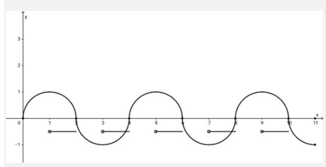

因为关于 $x$ 的方程 $f\left( x\right)  = g\left( x\right)$ 有 8 个不同的实数根,则 $g\left( x\right)  = k\left( {x + 2}\right)$ 时与 $f\left( x\right)$ 在 $\left\lbrack  {0,{11}}\right\rbrack$ 内需有 6 个交点,则

① 令 $g\left( x\right)  = k\left( {x + 2}\right)$ 与圆 ${\left( x - 1\right) }^{2} + {y}^{2} = 1$ 相切，此时有一个交点，则 $d = \frac{\left| 3k\right| }{\sqrt{1 + {k}^{2}}} = 1$ ，则 $k = \frac{\sqrt{2}}{4}$ (与上半圆相切) 或 $k =  - \frac{\sqrt{2}}{4}$ (与下半圆相切);

② 令 $g\left( x\right)  = k\left( {x + 2}\right)$ 过 $\left( {1,1}\right)$ ，此时有 2 个交点，则 $k = \frac{1}{3}$ ；令 $g\left( x\right)  = k\left( {x + 2}\right)$ 过 $1, - 1$ ，此时有 2 个交点,则 $k =  - \frac{1}{3}$ ;

假设在 $x \in  \left( {0,1}\right\rbrack$ 时有 2 个交点,即 $g\left( x\right)  = k\left( {x + 2}\right)$ 与圆 ${\left( x - 1\right) }^{2} + {y}^{2} = 1$ 的上半圆有 2 个交点,则 $k \in  \left\lbrack  {\frac{1}{3},\frac{\sqrt{2}}{4}}\right)$ ,由函数的周期性,则在 $\left\lbrack  {0,{11}}\right\rbrack$ 内有 6 个交点;

当 $x \in  (2,3\rbrack$ 时,图像为圆 ${\left( x - 1\right) }^{2} + {y}^{2} = 1$ 的下半圆向右平移 2 个单位得到,则当 $k \in  \left( {-\frac{\sqrt{2}}{4}, - \frac{1}{3}}\right\rbrack$ 时, $g\left( x\right)  = k\left( {x + 2}\right)$ 与圆 ${\left( x - 1\right) }^{2} + {y}^{2} = 1$ 的下半圆有 2 个交点,由 $g\left( x\right)$ 的周期为 2,则当 $k \in  \left( {-\frac{\sqrt{2}}{4}, - \frac{1}{3}}\right\rbrack$ 时,与 $f\left( x\right)$ 也有 2 个交点,同理,则在 $\left\lbrack  {0,{11}}\right\rbrack$ 内有 6 个交点;

综上, $k \in  \left( {-\frac{\sqrt{2}}{4}, - \frac{1}{3}}\right\rbrack   \cup  \left\lbrack  {\frac{1}{3},\frac{\sqrt{2}}{4}}\right)$

## 课后练习 04 解析

1.【答案】 $\left( {4,{10}}\right)$

【解析】设 $c\left( {x, y}\right)$

$\left\{  {\begin{array}{l} \frac{2 + \left( {-3}\right)  + x}{3} = 1. \\  \frac{1 + 4 + y}{3} = 5. \end{array}\text{ 解得 }\left\{  \begin{array}{l} x = 4 \\  y = {10}. \end{array}\right. }\right.$

2.【答案】 $\left( {\frac{\pi }{3} + {4k\pi },1}\right) , k \in  Z$

【解析】 $y = \sin \left\lbrack  {-\frac{1}{2}\left( {x + \frac{\pi }{3}}\right) }\right\rbrack$ ,周期为 $T = {4\pi }$ ,要得到 $y = \sin \left( {-\frac{1}{2}x}\right)  + 1$ ,可以先将原

图像向右平移 $\frac{\pi }{3}$ 个单位,再向上移 1 个单位。再根据正弦函数的周期性, $\overrightarrow{a} = \left( {\frac{\pi }{3} + {4k\pi },1}\right)$ ,

$k \in  Z$

3.【答案】D

【解析】 $\overrightarrow{a} + 2\overrightarrow{b} = \left( {{2x} + 1,4}\right)$

$2\overrightarrow{a} - \overrightarrow{b} = \left( {2 - x,3}\right)$

$\left( {\overrightarrow{a} + 2\overrightarrow{b}}\right)  \cdot  \left( {2\overrightarrow{a} - \overrightarrow{b}}\right)  =  - 2{x}^{2} + {3x} + {14} = 0$

$\therefore x =  - 2$ 或 $\frac{7}{2}$

当 $x =  - 2,\overrightarrow{a} + 2\overrightarrow{b} = \left( {-3,4}\right) ,2\overrightarrow{a} - \overrightarrow{b} = \left( {4,3}\right)$

当 $x = \frac{7}{2},\overrightarrow{a} + 2\overrightarrow{b} = \left( {8,4}\right) ,2\overrightarrow{a} - \overrightarrow{b} = \left( {-\frac{3}{2},3}\right)$

4.【答案】A

【解析】 $\overrightarrow{p} \cdot  \overrightarrow{q} = \sin A\cos B - \cos A\cos B$

$=  - \left( {\cos A\cos B - \sin A\sin B}\right)$

$=  - \cos \left( {A + B}\right)$

$= \cos C > 0$

5.【答案】 $\lambda  < \frac{1}{2}$ 且 $\lambda  \neq   - 2$ .

【解析】知 $\overrightarrow{i}$ 与 $\overrightarrow{j}$ 为相互垂直的单位向量, $\overrightarrow{a} = \overrightarrow{i} - 2\overrightarrow{j},\overrightarrow{b} = \overrightarrow{i} + \lambda \overrightarrow{j}$ , 且 $\overrightarrow{a}$ 与 $\overrightarrow{b}$ 的夹角为锐角, $\therefore \overrightarrow{i} \cdot  \overrightarrow{j} = 0$ ,

$\therefore \overrightarrow{a} \cdot  \overrightarrow{b} = \left( {\overrightarrow{i} - 2\overrightarrow{j}}\right)  \cdot  \left( {\overrightarrow{i} + \lambda \overrightarrow{j}}\right)  = {\overrightarrow{i}}^{2} + \left( {\lambda  - 2}\right) \overrightarrow{i} \cdot  \overrightarrow{j} - {2\lambda }{\overrightarrow{j}}^{2} = 1 - {2\lambda } > 0$ , 且 $\overrightarrow{a}$ 与 $\overrightarrow{b}$ 不共线,即 $\frac{1}{1} \neq  \frac{-2}{\lambda }$ ,即 $\lambda  \neq   - 2$ .

综上可得,实数 $\lambda$ 的取值范围为: $\lambda  < \frac{1}{2}$ 且 $\lambda  \neq   - 2$ .

6.【答案】4.

【解析】由 $\overrightarrow{a} + \overrightarrow{b} + \overrightarrow{c} = 0$ 得到 $\overrightarrow{c} =  - \overrightarrow{a} - \overrightarrow{b}$ ,因为 $\left( {\overrightarrow{a} - \overrightarrow{b}}\right)  \bot  \overrightarrow{c},\overrightarrow{a} \bot  \overrightarrow{b}$

所以得: $\left\{  \begin{array}{l} \left( {\overrightarrow{a} - \overrightarrow{b}}\right)  \bullet  \overrightarrow{c} = \overrightarrow{a} \bullet  \overrightarrow{c} - \overrightarrow{b} \bullet  \overrightarrow{c} \\  \overrightarrow{a} \bullet  \overrightarrow{b} = 0 \\  \left( {\overrightarrow{a} - \overrightarrow{b}}\right)  \bullet  \left( {\overrightarrow{a} + \overrightarrow{b}}\right)  = 0 \end{array}\right.$

解得 $\overrightarrow{a} \cdot  \overrightarrow{c} = \overrightarrow{b} \cdot  \overrightarrow{c},\overrightarrow{a} \cdot  \overrightarrow{b} = 0,\left| \overrightarrow{a}\right|  = \left| \overrightarrow{b}\right|  = 1$ ,而 ${\left| \overrightarrow{c}\right| }^{2}$

$= {\left( -\overrightarrow{a} - \overrightarrow{b}\right) }^{2} = {\left| \overrightarrow{a}\right| }^{2} + {\left| \overrightarrow{b}\right| }^{2} - 2\overrightarrow{a} \cdot  \overrightarrow{b} = 1 + 1 = 2$ ,

所以 ${\left| \overrightarrow{a}\right| }^{2} + {\left| \overrightarrow{b}\right| }^{2} + {\left| \overrightarrow{c}\right| }^{2} = 1 + 1 + 2 = 4$

7.【答案】3.

【解析】设 ${BC}$ 的中点为 $D$ .

由三角形的重心向量公式知,若 $\overrightarrow{PA} + \overrightarrow{PB} + \overrightarrow{PC} = \mathbf{0}$ ,则点 $P$ 为 $\bigtriangleup {ABC}$ 的重心. 由三角形的中线向量公式知 $\overrightarrow{AB} + \overrightarrow{AC} = 2\overrightarrow{AD}$ ,

又 $\overrightarrow{AD} = \frac{3}{2}\overrightarrow{AP}$ ,所以 $\overrightarrow{AB} + \overrightarrow{AC} = 2 \times  \frac{3}{2}\overrightarrow{AP} = 3\overrightarrow{AP}$ ,

即 $\lambda$ 的值为 3 .

8.【答案】(1)∴ $\alpha  = \frac{5}{4}\pi ;$ (2) $- \frac{5}{9}$ .

【解析】(1) $\overrightarrow{AC} = \left( {\cos \alpha  - 3,\sin \alpha }\right) ,\overrightarrow{BC} = \left( {\cos \alpha ,\sin \alpha  - 3}\right)$ , $\because \left| \overrightarrow{AC}\right|  = \left| \overrightarrow{BC}\right|$ ,

$\therefore {\cos }^{2}\alpha  - 6\cos \alpha  + 9 + {\sin }^{2}\alpha  = {\cos }^{2}\alpha  - {\sin }^{2}\alpha  - 6\sin \alpha  + 9$ ,

$\therefore \cos \alpha  = \sin \alpha$ ,

$\tan \alpha  = 1,\;\therefore \alpha  = \frac{5}{4}\pi$ .

(2) $A\left( {3,0}\right) , B\left( {0,3}\right) , C\left( {\cos \alpha ,\sin \alpha }\right) ,\alpha  \in  \left( {\frac{\pi }{2},\frac{3\pi }{2}}\right)$ ，

则 $\overrightarrow{AC} = \left( {\cos \alpha  - 3,\sin \alpha }\right) ,\overrightarrow{BC} = \left( {\cos \alpha ,\sin \alpha  - 3}\right)$ ,

$\because \overrightarrow{AC} \cdot  \overrightarrow{BC} =  - 1,\therefore \left( {\cos \alpha  - 3}\right) \cos \alpha  + \sin \alpha \left( {\sin \alpha  - 3}\right)  =  - 1$ ,即

$\sin \alpha  + \cos \alpha  = \frac{2}{3},\because {\left( \sin \alpha  + \cos \alpha \right) }^{2} = \frac{4}{9},\therefore 2\sin \alpha \cos \alpha  =  - \frac{5}{9}$ ,

$\therefore \frac{2{\sin }^{2}\alpha  + \sin {2\alpha }}{1 + \tan \alpha } = \frac{2{\sin }^{2}\alpha  + 2\sin \alpha \cos \alpha }{1 + \frac{\sin \alpha }{\cos \alpha }} = \frac{2\sin \alpha \cos \alpha \left( {\sin \alpha  + \cos \alpha }\right) }{\sin \alpha  + \cos \alpha } = 2\sin \alpha \cos \alpha  =  - \frac{5}{9}$

## 课后练习 05 解析

1.【答案】6

【解析】以 $A$ 为坐标原点,以 ${AD}$ 方向为 $x$ 轴正方向,以 ${AB}$ 方向为 $y$ 轴负方向建立坐标系,则 $\overrightarrow{AM} = \left( {1, - 2}\right)$

设 $N$ 点坐标为 $\left( {x, y}\right)$ ,则 $\overrightarrow{AN} = \left( {x, y}\right)$ ,则 $0 \leq  x \leq  2, - 2 \leq  y \leq  0$

令 $Z = \overrightarrow{AM} \cdot  \overrightarrow{AN} = x - {2y}$ ,

将 $A, B, C, D$ 四点坐标依次代入得: ${Z}_{A} = 0,{Z}_{B} = 4,{Z}_{C} = 6,{Z}_{D} = 2$

故 $Z = \overrightarrow{AM} \cdot  \overrightarrow{AN}$ 的最大值为 6

故答案为: 6

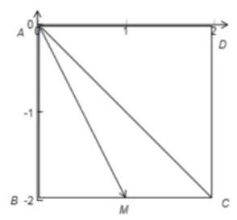

2.【答案】直角三角形

【解析】令 $\angle {ABC} = a$ ,过点 $A$ 作 ${AD} \bot  {BC}$ 于点 $D$ . 由 $\left| {\overrightarrow{BA} - t\overrightarrow{BC}}\right|  \geq  \left| \overrightarrow{AC}\right|$ ,推出 ${\left| \overrightarrow{BA}\right| }^{2} - 2{\left| \overrightarrow{BA}\right| }^{2} \cdot  {\cos }^{2}a + {\cos }^{2}a{\left| \overrightarrow{BA}\right| }^{2} \geq  \left| \overrightarrow{AC}\right|$ ,即 ${\left| \overrightarrow{BA}\right| }^{2}{\sin }^{2}a \geq  \left| \overrightarrow{AC}\right|$ ,也即 $\left| \overrightarrow{BA}\right| \sin a \geq  \left| \overrightarrow{AC}\right|$ .

从而有 $\left| \overrightarrow{AD}\right|  \geq  \left| \overrightarrow{AC}\right|$ . 由此可得 $\angle {ACB} = \frac{\pi }{2}$ .

3.【答案】钝角三角形

【解析】如图 6-4,记 $2\overrightarrow{BC} = \overrightarrow{BD}$ ,则 $\overrightarrow{BA} - 2\overrightarrow{BC} = \overrightarrow{DA}$ . 记 $t\overrightarrow{BC} = \overrightarrow{BP}$ ,则 $\overrightarrow{BA} - t\overrightarrow{BC} = \overrightarrow{BA} - \overrightarrow{BP} = \overrightarrow{PA}$ ,故 $\left| \overrightarrow{PA}\right|  \geq  \left| \overrightarrow{DA}\right|$ . 由题根 2 知 $\angle {ADB} = \frac{\pi }{2}$ ,易知 $\angle {ACB} > \frac{\pi }{2}$ ,故 $\bigtriangleup {ABC}$ 为钝角三角形.

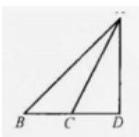

图 6-4

4.【答案】 $2\sqrt{2} - 3$ .

【解析】如图所示,不妨取 $\mathrm{P}P\left( {m,0}\right) , A\left( {\cos \theta ,\sin \theta }\right) , B\left( {\cos \theta , - \sin \theta }\right)$ . ( $\theta  \in  \left( {0,\pi }\right)$ ).

$\because \overrightarrow{OA} \bot  \overrightarrow{PA},\therefore \overrightarrow{OA} \cdot  \overrightarrow{PA} = \left( {\cos \theta ,\sin \theta }\right)  \cdot  \left( {\cos \theta  - m\sin \theta }\right)$

$= \cos \theta \left( {\cos \theta  - m}\right)  + {\sin }^{2}\theta  = 0$ ,化为 $\cos \theta  = \frac{1}{m}$ .

$\therefore \overrightarrow{PA} \cdot  \overrightarrow{PB} = \left( {\cos \theta  - m,\sin \theta }\right)  \cdot  \left( {\cos \theta  - m, - \sin \theta }\right)$

$= {\left( \cos \theta  - m\right) }^{2} - {\sin }^{2}\theta$

$= 2{\cos }^{2}\theta  + {m}^{2} - 3$

$= {m}^{2} + \frac{2}{{m}^{2}} - 3 \geq  2\sqrt{{m}^{2} \cdot  \frac{2}{{m}^{2}}} - 3 = 2\sqrt{2} - 3$ ,当且仅当 ${m}^{2} = \sqrt{2}$ 时取等号.

$\therefore \overrightarrow{PA} \cdot  \overrightarrow{PB}$ 的最小值为 $2\sqrt{2} - 3$ .

故答案为: $2\sqrt{2} - 3$ .

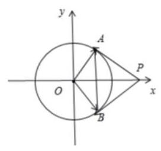

5.【答案】3

【解析】如图,构造 $\bigtriangleup {AMN}$ ,使得 ${PM} = {3PC},{PN} = {2PB}$ .

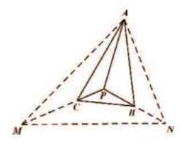

则 $\overrightarrow{PA} + 2\overrightarrow{PB} + 3\overrightarrow{PC} = \overrightarrow{0} \Rightarrow  \overrightarrow{PA} + \overrightarrow{PM} + \overrightarrow{PN} = \overrightarrow{0}$ .

从而知 $P$ 为 $\bigtriangleup {AMN}$ 的重心,于是有 ${S}_{\bigtriangleup {APM}} = {S}_{\bigtriangleup {MPN}} = {S}_{\bigtriangleup {APN}} = \frac{1}{3}{S}_{\bigtriangleup {AMN}}$ . 因此

${S}_{\bigtriangleup {APB}} = \frac{1}{2}{S}_{\bigtriangleup {APN}} = \frac{1}{6}{S}_{\bigtriangleup {AMN}}$

${S}_{\bigtriangleup {APC}} = \frac{1}{3}{S}_{\bigtriangleup {APM}} = \frac{1}{9}{S}_{\bigtriangleup {AMN}}$

${S}_{\bigtriangleup {BPC}} = \frac{1}{2} \times  \frac{1}{3}{S}_{\bigtriangleup {MPN}} = \frac{1}{18}{S}_{\bigtriangleup {AMN}}$

所以 ${S}_{\bigtriangleup {ABC}} = \left( {\frac{1}{6} + \frac{1}{9} + \frac{1}{18}}\right) {S}_{\bigtriangleup {AMN}} = \frac{1}{3}{S}_{\bigtriangleup {AMN}}$ .

故 $\frac{{S}_{\bigtriangleup {ABC}}}{{S}_{\bigtriangleup {APC}}} = \frac{\frac{1}{3}{S}_{\bigtriangleup {AMN}}}{\frac{1}{9}{S}_{\bigtriangleup {AMN}}} = 3$ .

6.【答案】外

【解析】因为 ${\overrightarrow{CB}}^{2} - {\overrightarrow{CA}}^{2} = 2\overrightarrow{AB} \cdot  \overrightarrow{CP}$ ,所以 $\left( {\overrightarrow{CB} - \overrightarrow{CA}}\right)  \cdot  \left( {\overrightarrow{CB} + \overrightarrow{CA}}\right)  = 2\overrightarrow{AB} \cdot  \overrightarrow{CP}$ . 取 ${AB}$ 中点为 $M$ ,可得 $2\overrightarrow{CM} \cdot  \overrightarrow{AB} = 2\overrightarrow{AB} \cdot  \overrightarrow{CP}$ ,所以 $\overrightarrow{AB} \cdot  \left( {\overrightarrow{CP} - \overrightarrow{CM}}\right)  = \overrightarrow{AB} \cdot  \overrightarrow{MP} = 0$ ,所以点 $P$ 在 ${AB}$ 的中垂线上,所以点 $P$ 的轨迹一定通过 $\bigtriangleup {ABC}$ 的外心.

7.【答案】2

【解析】设 $\overrightarrow{OA} = \overrightarrow{a},\overrightarrow{OB} = \overrightarrow{b},\overrightarrow{OC} = \overrightarrow{c}$ ,以 ${OB},{OC}$ 为邻边作平行四边形 ${OBDC}$ ,

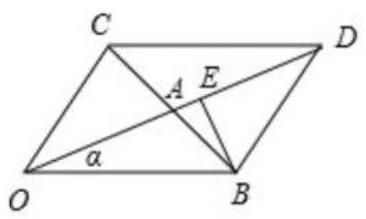

由题意可知 $\overrightarrow{OD} = 2\overrightarrow{OA},{OA} = 3$ ,

$\because \left| \overrightarrow{b}\right|  = \left| {\overrightarrow{b} - \overrightarrow{c}}\right| ,\therefore {OB} = {BC},\therefore {AB} = \frac{1}{2}{OB}$ ,

过 $B$ 作 ${BE} \bot  {OD}$ ,则 $\left| {\overrightarrow{b} - t\overrightarrow{a}}\right| \left( {t \in  \mathrm{R}}\right)$ 的最小值为 ${d}_{\min } = {BE}$ ,

设 ${OB} = m,\angle {AOB} = a$ ,则 $\cos a = \frac{{m}^{2} + 9 - \frac{{m}^{2}}{4}}{2 \times  m \times  3} = \frac{\frac{3{m}^{2}}{4} + 9}{6m}$ ,

$$
\therefore {BE} = {OB}\sin a = m \cdot  \frac{\sqrt{{36}{m}^{2} - {\left( \frac{3{m}^{2}}{4} + 9\right) }^{2}}}{6m} = \frac{\sqrt{-{\left( \frac{3}{4}{m}^{2} - {15}\right) }^{2} + {144}}}{6} \leq  2\text{ , }
$$

故答案为:2.

## 课后练习 06 解析

1.【答案】 $\left( {-1, - \frac{3}{2}}\right)$

【解析】设 $P\left( {x, y}\right)$ ,则 $\overrightarrow{MP} = \left( {x - 3, y + 2}\right) ,\overrightarrow{MN} = \left( {-8,1}\right)$ ,由 $\overrightarrow{MP} = \frac{1}{2}\overrightarrow{MN}$ , 得 $\left( {x - 3, y + 2}\right)  = \frac{1}{2}\left( {-8,1}\right)$ ,解得 $x =  - 1, y =  - \frac{3}{2}$ ,所以点 $P$ 的坐标为 $\left( {-1, - \frac{3}{2}}\right)$ .

2.【答案】 $2/9$

【解析】由题意得, $\overrightarrow{AD} = \overrightarrow{AB} + \overrightarrow{BD} = \overrightarrow{AB} + \frac{2}{3}\overrightarrow{BC} = \overrightarrow{AB} + \frac{2}{3}\left( {\overrightarrow{AC} - \overrightarrow{AB}}\right)  = \frac{1}{3}\overrightarrow{AB} + \frac{2}{3}\overrightarrow{AC}$ , $\therefore {\lambda }_{1} = \frac{1}{3},{\lambda }_{2} = \frac{2}{3},\therefore {\lambda }_{1}{\lambda }_{2} = \frac{2}{9}$ .

3.【答案】 $\frac{1}{2}$

【解析】由题意结合向量的运算可得

$\overrightarrow{DE} = \overrightarrow{DB} + \overrightarrow{BE}$

$= \frac{1}{2}\overrightarrow{AB} + \frac{2}{3}\overrightarrow{BC}$

$= \frac{1}{2}\overrightarrow{AB} + \frac{2}{3}\left( {\overrightarrow{BA} + \overrightarrow{AC}}\right)$

$= \frac{1}{2}\overrightarrow{AB} - \frac{2}{3}\overrightarrow{AB} + \frac{2}{3}\overrightarrow{AC}$

$=  - \frac{1}{6}\overrightarrow{AB} + \frac{2}{3}\overrightarrow{AC}$

又由题意可知若 $\overrightarrow{DE} = {\lambda }_{1}\overrightarrow{AB} + {\lambda }_{2}\overrightarrow{AC}$ ,

故可得 ${\lambda }_{1} =  - \frac{1}{6},{\lambda }_{2} = \frac{2}{3}$ ,所以 ${\lambda }_{1} + {\lambda }_{2} = \frac{1}{2}$ .

故答案为: $\frac{1}{2}$ .

4.【答案】3

【解析】解:因为 $\overrightarrow{AD} = \frac{2}{3}\overrightarrow{AC},\overrightarrow{BP} = \frac{1}{3}\overrightarrow{BD}$ ,

所以 $\overrightarrow{AP} = \overrightarrow{AB} + \overrightarrow{BP}$

$= \overrightarrow{AB} + \frac{1}{3}\overrightarrow{BD}$

$= \overrightarrow{AB} + \frac{1}{3}\left( {\overrightarrow{AD} - \overrightarrow{AB}}\right)$

$= \overrightarrow{AB} + \frac{1}{3}\left( {\frac{2}{3}\overrightarrow{AC} - \overrightarrow{AB}}\right)$

$= \frac{2}{3}\overrightarrow{AB} + \frac{2}{9}\overrightarrow{AC}$ ,

因为 $\overrightarrow{AP} = \lambda \overrightarrow{AB} + \mu \overrightarrow{AC}$ ,所以 $\lambda  = \frac{2}{3},\mu  = \frac{2}{9}$ ,

所以 $\frac{\lambda }{\mu } = \frac{\frac{2}{3}}{\frac{3}{9}} = 3$ ,

5.【答案】 $8/3$

$\overrightarrow{MB} = \overrightarrow{MD} + \overrightarrow{DB} = \left( {1 - \lambda }\right) \overrightarrow{AB}$

$M, D, N$ 三点共线, $\therefore$ 存在实数 $k$ ,使 $\overrightarrow{MD} = k\overrightarrow{MN} =  - {k\lambda }\overrightarrow{AB} + {k\mu }\overrightarrow{AC}$ ,

$\overrightarrow{DB} = \frac{1}{3}\overrightarrow{CB} = \frac{1}{3}\overrightarrow{AB} - \frac{1}{3}\overrightarrow{AC}$

$\therefore \left( {\frac{1}{3} - {k\lambda }}\right) \overrightarrow{AB} + \left( {{k\mu } - \frac{1}{3}}\right)$

$\overrightarrow{AC} = \left( {1 - \lambda }\right) \overrightarrow{AB}$

$\therefore \frac{1}{3} - {k\lambda } = 1 - \lambda ,{k\mu } - \frac{1}{3} = 0,$

$\therefore \mu  = \frac{\lambda }{{3\lambda } - 2}$ ,

$\therefore \lambda  + {2\mu } = \lambda  + \frac{2\lambda }{{3\lambda } - 2}$

设 $f\left( \lambda \right)  = \lambda  + \frac{2\lambda }{{3\lambda } - 2},\lambda  > 0$ ;

$\therefore {f}^{\prime }\left( \lambda \right)  = \frac{9{\lambda }^{2} - {12\lambda }}{{\left( 3\lambda  - 2\right) }^{2}}$ ,令 ${f}^{\prime }\left( \lambda \right)  = 0$ 得, $\lambda  = 0$ ,或 $\frac{4}{3}$ ;

$\therefore \lambda  \in  \left( {0,\frac{4}{3}}\right)$ 时, ${f}^{\prime }\left( \lambda \right)  < 0$ ,

$\lambda  \in  \left( {\frac{4}{3}, + \infty }\right)$ 时, ${f}^{\prime }\left( \lambda \right)  > 0$ ;

$\therefore \lambda  = \frac{4}{3}$ 时, $f\left( \lambda \right)$ 取极小值,也是最小值;

$\therefore f\left( \lambda \right)$ 的最小值为 $\frac{8}{3}$ ;

即 $\lambda  + {2\mu }$ 的最小值为 $\frac{8}{3}$ .

故答案为: $\frac{8}{3}$ .

6.【答案】 $\frac{2}{3}\overrightarrow{AC} + \frac{1}{9}\overrightarrow{AB}$ .

【解析】不妨假设 $\mathrm{{Rt}}\bigtriangleup {ABC}$ 中, $\angle A = {90}^{ \circ  },{AB} = 3,{AC} = 4$

以 $A$ 为原点, ${AB}$ 为 $y$ 轴, ${AC}$ 为 $x$ 轴建 $y$

${l}_{BN} : y =  - x + 3,\;{l}_{CM} : y =  - \frac{1}{4}x + 1$

交点 $K\left( {\frac{8}{3},\frac{1}{3}}\right)$ .

$\left\{  {\begin{array}{l} \frac{8}{3} = 4 \times  \frac{2}{3} \\  \frac{1}{3} = 3 \times  \frac{1}{9} \end{array},\therefore \overrightarrow{AK} = \frac{2}{3}\overrightarrow{AC} + \frac{1}{9}\overrightarrow{AB}}\right.$ .

7.【答案】 $\frac{n - 1}{2}\left( {\overrightarrow{a} + \overrightarrow{b}}\right)$

【解析】由题意可得 $\overrightarrow{O{A}_{1}} = \overrightarrow{OA} + \overrightarrow{A{A}_{1}} = \overrightarrow{OA} + \frac{1}{n}\overrightarrow{AB} = \overrightarrow{OA} + \frac{1}{n}\left( {\overrightarrow{OB} - \overrightarrow{OA}}\right)  = \overrightarrow{a} + \frac{1}{n}\left( {\overrightarrow{b} - \overrightarrow{a}}\right)$ ,

$\overrightarrow{O{A}_{2}} = \overrightarrow{OA} + \overrightarrow{A{A}_{2}} = \overrightarrow{OA} + \frac{2}{n}\overrightarrow{AB} = \overrightarrow{OA} + \frac{2}{n}\left( {\overrightarrow{OB} - \overrightarrow{OA}}\right)  = \overrightarrow{a} + \frac{2}{n}\left( {\overrightarrow{b} - \overrightarrow{a}}\right) ,$

...

${\overrightarrow{OA}}_{n - 1} = \overrightarrow{OA} + {\overrightarrow{AA}}_{n - 1} = \overrightarrow{OA} + \frac{n - 1}{n}\overrightarrow{AB} = \overrightarrow{OA} + \frac{n - 1}{n}\left( {\overrightarrow{OB} - \overrightarrow{OA}}\right)  = \overrightarrow{a} + \frac{n - 1}{n}\left( {\overrightarrow{b} - \overrightarrow{a}}\right)$ ,

把以上 $n - 1$ 个式子相加得

$\overrightarrow{O{A}_{1}} + \overrightarrow{O{A}_{2}} + \overrightarrow{O{A}_{3}} + \ldots  + \overrightarrow{O{A}_{n - 1}} = \left( {n - 1}\right) \overrightarrow{a} + \frac{1 + 2 + 3 + \cdots  + \left( {n - 1}\right) }{n}\left( {\overrightarrow{b} - \overrightarrow{a}}\right)$

$= \left( {n - 1}\right) \overrightarrow{a} + \frac{n\left( {n - 1}\right) }{2n}\left( {\overrightarrow{b} - \overrightarrow{a}}\right)  = \frac{n - 1}{2}\left( {\overrightarrow{a} + \overrightarrow{b}}\right) ,$

故答案为 $\frac{n - 1}{2}\left( {\overrightarrow{a} + \overrightarrow{b}}\right)$ .

8.【答案】0 或 $\frac{18}{5}$

【解析】以 $\mathrm{A}$ 为坐标原点,分别以 $\mathrm{{AB}},\mathrm{{AC}}$ 所在直线为 $\mathrm{x},\mathrm{y}$ 轴建立平面直角坐标系,

则 $A\left( {0,0}\right) , B\left( {4,0}\right) , C\left( {0,3}\right) ,\overrightarrow{AB} = \left( {4,0}\right) ,\overrightarrow{AC} = \left( {0,3}\right)$ ,由 $\overrightarrow{PA} = m\overrightarrow{PB} + \left( {\frac{3}{2} - m}\right) \overrightarrow{PC}$ ,

得 $\overrightarrow{PA} = m\left( {\overrightarrow{PA} + \overrightarrow{AB}}\right)  + \left( {\frac{3}{2} - m}\right) \left( {\overrightarrow{PA} + \overrightarrow{AC}}\right)$ ,

整理得 $\overrightarrow{PA} =  - {2m}\overrightarrow{AB} + \left( {{2m} - 3}\right) \overrightarrow{AC} = \left( {-{8m},{6m} - 9}\right)$ .

又 $\mathrm{{AP}} = 9$ ,故 ${64}{\mathrm{\;m}}^{2} + {\left( 6\mathrm{\;m} - 9\right) }^{2} = {81}$ ,

解得 $m = 0$ 或 $m = \frac{27}{25}$ .

当 $m = 0$ 时, $\overrightarrow{PA} = \left( {0, - 9}\right)$ ,此时点 $C$ 与点 $D$ 重合, $\left| {CD}\right|  = 0$ ;

当 $m = \frac{27}{25}$ 时，直线 ${AP}$ 的方程为 $y = \frac{9 - {6m}}{8m}x$ ①,直线 ${BC}$ 的方程为 ${3x} + {4y} - {12} = 0$ ②, 联立①②得 $x = \frac{8}{3}m, y = 3 - {2m}$ ，即 $D\left( {\frac{72}{25},\frac{21}{25}}\right)$ ，

所以 $\left| \mathrm{{CD}}\right|  = \sqrt{{\left( \frac{72}{25}\right) }^{2} + {\left( \frac{21}{25} - 3\right) }^{2}} = \frac{18}{5}$ .

综上, $\mathrm{{CD}}$ 的长度是 0 或 $\frac{18}{5}$ .

9.【答案】 $\frac{1}{2}$

【解析】由 $\mathrm{A}\left( {1,1}\right) \text{ 、 }\mathrm{\;B}\left( {2,4}\right) \text{ 、 }\mathrm{C}\left( {4,2}\right)$ 可知,直线 $\mathrm{{AB}}$ 的方程为 $\mathrm{y} - 1 = \frac{4 - 1}{2 - 1} \cdot  \left( {\mathrm{x} - 1}\right)$ ,化简得 ${3x} - y - 2 = 0$ ,

直线 $\mathrm{{AC}}$ 的方程为 $\mathrm{y} - 1 = \frac{2 - 1}{4 - 1} \cdot  \left( {\mathrm{x} - 1}\right)$ ,化简得 $\mathrm{x} - 3\mathrm{y} + 2 = 0$ ,

直线 ${BC}$ 的方程为 $y - 4 = \frac{4 - 2}{2 - 4} \cdot  \left( {x - 2}\right)$ ,化简得 $x + y - 6 = 0$ .

$\bigtriangleup  \mathrm{{ABC}}$ 三边围成的区域(含边界)如图所示,对应的不等关系为 $\left\{  \begin{array}{l} {3x} - y - 2 \geq  0 \\  x - {3y} + 2 \leq  0 \\  x + y - 6 \leq  0 \end{array}\right.$ ,

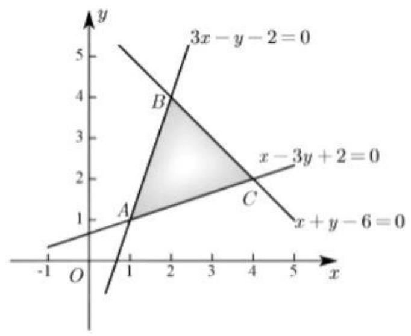

又 $\overrightarrow{AB} = \left( {1,3}\right) ,\overrightarrow{AC} = \left( {3,1}\right)$ ,故 $\overrightarrow{OP} = m\overrightarrow{AB} + n\overrightarrow{AC} = \left( {m + {3n}, n + {3m}}\right)$ ,

要使点P在 $\bigtriangleup  \mathrm{{ABC}}$ 三边围成的区域(含边界)内,结合不等关系可知

$\left\{  \begin{array}{l} 3\left( {m + {3n}}\right)  - \left( {n + {3m}}\right)  - 2 \geq  0 \\  \left( {m + {3n}}\right)  - 3\left( {n + {3m}}\right)  + 2 \leq  0 \\  \left( {m + {3n}}\right)  + \left( {n + {3m}}\right)  - 6 \leq  0 \end{array}\right.$ ,解得 $\left\{  \begin{array}{l} m \geq  \frac{1}{4} \\  n \geq  \frac{1}{4} \\  m + n \leq  \frac{3}{2} \end{array}\right.$ ,所围图形如图所示:

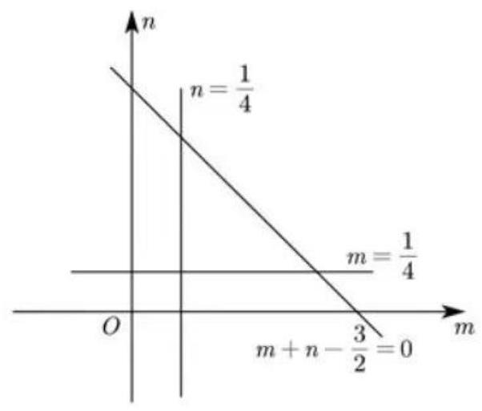

故动点 $\left( {\mathrm{m},\mathrm{n}}\right)$ 所构成的图形为边长为 1 的等腰直角三角形,面积为 $\frac{1}{2} \times  1 \times  1 = \frac{1}{2}$ .

故答案为: $\frac{1}{2}$

10.【答案】-7

【解析】如图,以 0 为坐标原点,以过O且平行于 ${AB}$ 的直线为 $x$ 轴,以过O且垂直于 ${AB}$ 的直线为 $y$ 轴建立坐标系,则 $B\left( {2, - 2}\right) , C\left( {2,2}\right)$ ,

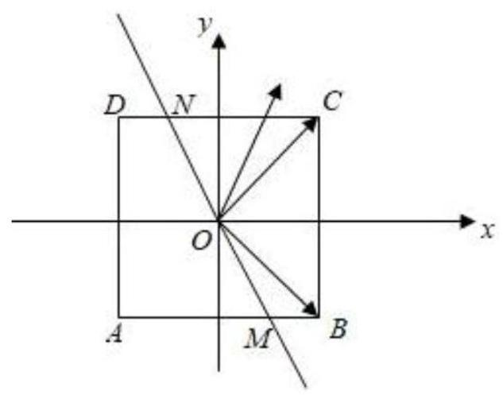

$\therefore 2\overrightarrow{OP} = \lambda \overrightarrow{OB} + \left( {1 - \lambda }\right) \overrightarrow{OC} = \lambda \left( {2, - 2}\right)  + \left( {1 - \lambda }\right) \left( {2,2}\right)  = \left( {2,2 - {4\lambda }}\right)$

$\therefore \overrightarrow{\mathrm{{OP}}} = \left( {1,1 - {2\lambda }}\right)$

即 $\mathrm{P}$ 点坐标为 $\left( {1,1 - {2\lambda }}\right)$ ,

设 $M\left( {a, - 2}\right)$ ,则 $N\left( {-a,2}\right) , - 2 \leq  a \leq  2$ ,

$\therefore \overrightarrow{\mathrm{{PM}}} = \left( {\mathrm{a} - 1,{2\lambda } - 3}\right)$ ,

$\overrightarrow{\mathrm{{PN}}} = \left( {-\mathrm{a} - 1,{2\lambda } + 1}\right)$

$\therefore \overrightarrow{\mathrm{{PM}}} \bullet  \overrightarrow{\mathrm{{PN}}} = \left( {\mathrm{a} - 1}\right) \left( {-\mathrm{a} - 1}\right)  + \left( {{2\lambda } - 3}\right)$

$\left( {{2\lambda } + 1}\right)  = 1 - {\mathrm{a}}^{2} + 4{\lambda }^{2} - {4\lambda } - 3$

当 $\mathrm{a} =  \pm  2$ 且 $\lambda  =  - \frac{-4}{2 \times  4} = \frac{1}{2}$ 时， $\overrightarrow{\mathrm{{PM}}} \bullet  \overrightarrow{\mathrm{{PN}}}$ 有最小值-7 .

11.【答案】 $\sqrt{2}$

【解析】设 $\left| \overrightarrow{\mathrm{{AB}}}\right|  = \mathrm{m},\left| \overrightarrow{\mathrm{{AC}}}\right|  = \mathrm{n}$ ,

因为 $\bigtriangleup \mathrm{{ABC}}$ 的面积为 $\frac{3\sqrt{3}}{2}$ ,所以 ${\mathrm{S}}_{\bigtriangleup \mathrm{{ABC}}} = \frac{1}{2}\left| \overrightarrow{\mathrm{{AB}}}\right|  \cdot  \left| \overrightarrow{\mathrm{{AC}}}\right|  \cdot  \sin \angle \mathrm{{BAC}} = \frac{1}{2}\mathrm{{mn}} \cdot  \frac{\sqrt{3}}{2} = \frac{3\sqrt{3}}{2}$ ,

所以 $\mathrm{{mn}} = 6$ .

因为 $\mathrm{D}$ 为 $\mathrm{{AB}}$ 的中点，所以 $\overrightarrow{\mathrm{{AB}}} = 2\overrightarrow{\mathrm{{AD}}}$ ，

所以 $\overrightarrow{\mathrm{{AP}}} = \mathrm{t}\overrightarrow{\mathrm{{AC}}} + \frac{1}{3}\overrightarrow{\mathrm{{AB}}} = \mathrm{t}\overrightarrow{\mathrm{{AC}}} + \frac{2}{3}\overrightarrow{\mathrm{{AD}}}$ ，

又 $\mathrm{C},\mathrm{P},\mathrm{D}$ 三点共线，所以 $\mathrm{t} + \frac{2}{3} = 1$ ，

解得 $\mathrm{t} = \frac{1}{3}$ ，所以 $\overrightarrow{\mathrm{{AP}}} = \frac{1}{3}\overrightarrow{\mathrm{{AC}}} + \frac{1}{3}\overrightarrow{\mathrm{{AB}}}$ ，

所以 $\overrightarrow{AP}{}^{2} = {\left( \frac{1}{3}\overrightarrow{AC} + \frac{1}{3}\overrightarrow{AB}\right) }^{2} = \frac{1}{9}\overrightarrow{AC}{}^{2} + \frac{1}{9}\overrightarrow{AB}{}^{2} + \frac{2}{9}\overrightarrow{AC} \cdot  \overrightarrow{AB} = \frac{1}{9}{\left| \overrightarrow{AC}\right| }^{2} + \frac{1}{9}{\left| \overrightarrow{AB}\right| }^{2} + \frac{2}{9}\left| \overrightarrow{AC}\right|  \cdot  \left| \overrightarrow{AB}\right|$ .

$\cos \angle {BAC} = \frac{1}{9}{m}^{2} + \frac{1}{9}{n}^{2} + \frac{2}{9}m \cdot  n \cdot  \frac{1}{2} = \frac{{m}^{2} + {n}^{2}}{9} + \frac{2}{3},$

所以 $\left| \overrightarrow{\mathrm{{AP}}}\right|  = \sqrt{\frac{{\mathrm{m}}^{2} + {\mathrm{n}}^{2}}{9} + \frac{2}{3}} \geq  \sqrt{\frac{2\mathrm{\;{mn}}}{9} + \frac{2}{3}} = \sqrt{2}$ ,

当且仅当 $\mathrm{m} = \mathrm{n} = \sqrt{6}$ 时等号成立.

因此， $\left| \overrightarrow{\mathrm{{AP}}}\right|$ 的最小值为 $\sqrt{2}$ .

## 课后练习 07 解析

1.【答案】(1)假(2)真(3)假(4)假(5)假(6)假(7)假(8) 假(9)假(10)真

【解析】(1)除原点外,虚轴上的点对应的复数都是纯虚数.

(2)若 ${z}_{1} = {z}_{2}$ ，必有 $a = c, b = d$ . 若 $a = c, b = d$ ，显然 ${z}_{1} = {z}_{2}$ .

(3)当 $z$ 个复数均为实数时，可比较大小.

(4)反例: ${\left| i\right| }^{2} = 1$ ，而 ${i}^{2} =  - 1$ .

(5) 反例: 令 ${z}_{1} = 1 + i,{z}_{2} = 1 - i,{z}_{1}^{2} + {z}_{2}^{2} = 0,{z}_{1}{z}_{2} = 2$ ,显然 ${z}_{1}^{2} + {z}_{2}^{2} \geq  2{z}_{1}{z}_{2}$ 不成立.

(6) 应改为 $\left| {z}^{2}\right|  = {\left| z\right| }^{2} \neq  {z}^{2}$ .

(7) $z + \bar{z} \in  R$ 正确，但 $z - \bar{z}$ 不一足为纯虚数， $z$ 当 $z$ 为实数时 $z - \bar{z} = 0$ .

(8)反例: ${z}_{1} = 1 + {2i},{z}_{2} = 3 - {2i},{z}_{1} + {z}_{2} = 4$ ，但 ${z}_{2} \neq  \overline{{z}_{1}}$ .

(9) 可设 $x = a + {bi}\left( {a, b \in  R}\right) , y = c + {di}\left( {c, d \in  R}\right)$ ,则 ${\left( x + y\right) }^{2} - {4xy} = {\left( x - y\right) }^{2}$ ,

$= {\left\lbrack  \left( a - c\right)  + \left( b - d\right) i\right\rbrack  }^{2}$

$= {\left( a - c\right) }^{2} - {\left( b - d\right) }^{2} + 2\left( {a - c}\right) \left( {b - d}\right) i,$

当 $a \neq  c$ ,且 $b \neq  d$ 时,则 ${\left( x + y\right) }^{2} - {4xy}$ 为虚数,从而 $\sqrt{{\left( x + y\right) }^{2} - {4xy}}$ 为虚数,

而等式左边 $\left| {x - y}\right|$ 为实数，等式不成立；

当 $a = c$ ,且 $b \neq  d$ 时,则 ${\left( x + y\right) }^{2} - {4xy} =  - {\left( b - d\right) }^{2} < 0$ ,从而

$\sqrt{{\left( x + y\right) }^{2} - {4xy}}$ 为虚数,

而等式左边 $\left| {x - y}\right|$ 为实数,等式不成立;

当 $b = d$ 时,则 ${\left( x + y\right) }^{2} - {4xy} = {\left( a - c\right) }^{2}$ ,从而 $\sqrt{{\left( x + y\right) }^{2} - {4xy}} = \left| {a - c}\right|$ , 而等式左边 $\left| {x - y}\right|  = \left| {a - c}\right|$ ,所以等式成立.

(10) 设 ${z}_{1} = a + {bi},{z}_{2} = c + {di}, a, b, c, d \in  R$ .

${z}_{1}{\bar{z}}_{2} + {\bar{z}}_{1}{z}_{2} = \left( {a + {bi}}\right) \left( {c - {di}}\right)  + \left( {a - {bi}}\right) \left( {c + {di}}\right)$

$= {ac} + {bd} + {bbc} - {ad})i + {ac} + {bd} + \left( {{ad} - {bc}}\right) i$

$2\left( {{ac} + {bd}}\right)  \in  R$

2.【答案】 $\left\{  \begin{array}{l}  - 2, n\text{ 是奇数, } \\  2, n\text{ 是偶数 } \end{array}\right.$

【解析】 $\because {\left( \frac{1 + i}{\sqrt{2}}\right) }^{4} = {i}^{2} =  - 1,{\left( \frac{1 - i}{\sqrt{2}}\right) }^{4} = {\left( -i\right) }^{2} =  - 1$ , $\therefore {\left( \frac{1 + \mathrm{i}}{\sqrt{2}}\right) }^{4n} + {\left( \frac{1 - \mathrm{i}}{\sqrt{2}}\right) }^{4n} = {\left( -1\right) }^{n} + {\left( -1\right) }^{n}$ . 当 $n$ 是奇数时,原式 $=  - 2$ ;

当 $n$ 是偶数时,原式 $= 2$ .

3.【答案】 2

$\left\{  {\begin{array}{l} \frac{{x}^{2} - {3x} + 2}{x + 3} = 0 \\  {x}^{2} + {2x} - 3 \neq  0 \\  x \neq   - 3 \end{array}\left\{  {\begin{array}{l} \left( {x - 1}\right) \left( {x - 2}\right)  = 0 \\  \left( {x + 3}\right) \left( {x - 1}\right)  \neq  0 \\  x \neq   - 3 \end{array}\;\left\{  \begin{array}{l} x = 1\text{ 或 }x = 2 \\  x \neq  1\text{ 且 }x \neq   - 3 \\  x \neq   - 3 \end{array}\right. }\right. }\right.$

$\therefore x = 2$

4. 【答案】 1

【解析】

由 ${a}_{n}$ 通项式可知, ${a}_{n + 1} = \left( {1 + \frac{i}{\sqrt{n + 1}}}\right) {a}_{n}$

$\therefore \left| {{a}_{n} - {a}_{n + 1}}\right|  = \left| {{a}_{n} - \left( {1 + \frac{i}{\sqrt{n + 1}}}\right) {a}_{n}}\right|  = \left| {a}_{n}\right|  \cdot  \left| {1 - \left( {1 + \frac{i}{\sqrt{n + 1}}}\right) }\right| \; = \frac{1}{\sqrt{n + 1}}\left| {a}_{n}\right|$ ①

而 $\left| {a}_{n}\right|  = \left| {\mathop{\prod }\limits_{{k = 1}}^{n}\left( {1 + \frac{i}{\sqrt{k}}}\right) }\right|  = \mathop{\prod }\limits_{{k = 1}}^{n}\left| {1 + \frac{i}{\sqrt{k}}}\right|$

$= \mathop{\prod }\limits_{{k = 1}}^{n}\sqrt{1 + \frac{1}{k}} = \mathop{\prod }\limits_{{k = 1}}^{n}\sqrt{\frac{k + 1}{k}} = \sqrt{\frac{2}{1}} \cdot  \sqrt{\frac{3}{2}}\cdots  \cdot  \sqrt{\frac{n + 1}{n}} = \sqrt{n + 1}$

代回①式 $\left| {{a}_{n} - {a}_{n + 1}}\right|  = \frac{1}{\sqrt{n + 1}} \cdot  \sqrt{n + 1} = 1$

5.【答案】2

【解析】 $\because u\text{ 、 }v \in  R$ ,关于 $x$ 的方程

${x}^{2} + \left( {u + {vi}}\right) x + 1 + {ui} = 0$ 即

$\left( {{x}^{2} + {ux} + 1}\right)  + \left( {{vx} + u}\right) i = 0$ 至少有一个实数根,

$\therefore {x}^{2} + {ux} + 1 = 0,{vx} + u = 0$ .

$\therefore {u}^{2} = \frac{{v}^{2}}{v - 1} = \left( {v - 1}\right)  + \frac{1}{v - 1} + 2$

$\geq  2\sqrt{\left( {v - 1}\right)  \cdot  \frac{1}{v - 1}} + 2 = 4$ ,当且仅当 $v = 2$ 时取等号 $\left( {v > 1}\right)$ ,此时 $u$ 的最小正值为 2 .

6. 【答案】 $\therefore {z}^{2} + z + 1 = 0,\therefore z = \frac{1}{2} + \frac{\sqrt{3}}{2}i$ ,或者 $z = \frac{1}{2} - \frac{\sqrt{3}}{2}i$ .

【解析】 ${z}_{1} = \frac{z}{1 + {z}^{2}}$ 化为: ${z}_{1} + {z}_{1}{z}^{2} = z$ ①

${z}_{2} = \frac{{z}^{2}}{1 + z}$ 化为: ${z}_{2} + {z}_{2}z = {z}^{2}$ ②

②代入①可得: ${z}_{1} + {z}_{1}\left( {{z}_{2} + {z}_{2}z}\right)  = z$ ，即 ${z}_{1} + {z}_{1} \cdot  {z}_{2} + \left( {{z}_{2}{z}_{1} - 1}\right)  \cdot  z = 0$ ， $\because {z}_{1} = \frac{z}{1 + {z}^{2}}$ 和 ${z}_{2} = \frac{{z}^{2}}{1 + z}$ 都为实数.

$\therefore {z}_{1}{z}_{2} = 1,{z}_{1} =  - 1,{z}_{2} =  - 1$ ,

$\therefore {z}^{2} + z + 1 = 0,\therefore z =  - \frac{1}{2} + \frac{\sqrt{3}}{2}i$ ,或者 $z =  - \frac{1}{2} - \frac{\sqrt{3}}{2}i$ .

7.

【解析】(1) $\because \left| {z}_{1}\right|  = \left| {z}_{2}\right|  = \left| {z}_{3}\right|  = 1$

$\therefore A, B, C$ 三点都在单位圆上

$\because A, B, C$ 三点对应的复数分别为 ${z}_{1},{z}_{2},{z}_{3}$ 满足 ${z}_{1} + {z}_{2} + {z}_{3} = 0$

$\therefore {z}_{1} =  - \left( {{z}_{2} + {z}_{3}}\right)$

$\therefore 1 = {z}_{1}\overline{\overline{{\dot{z}}_{1}}} = \left( {{z}_{2} + {z}_{3}}\right) \left( {\overline{\overline{{\dot{z}}_{2}}} + \overline{\overline{{\dot{z}}_{3}}}}\right)  = \overline{{\dot{z}}_{2}}{z}_{3} + \overline{{\dot{z}}_{3}}{z}_{2} =  - 1$

$\therefore {\left| {z}_{2} - {z}_{3}\right| }^{2} = \left( {{z}_{2} - {z}_{3}}\right) \left( {\overline{{z}_{2}} - \overline{{z}_{3}}}\right)  = 3$ ,

$\therefore \left| {{z}_{2} - {z}_{3}}\right|  = \sqrt{3}$ ,

同理可得 $\left| {{z}_{1} - {z}_{2}}\right|  = \left| {{z}_{1} - {z}_{3}}\right|  = \sqrt{3}$

故 $\bigtriangleup {ABC}$ 是边长为 $\sqrt{3}$ 的正三角形。

8.【答案】

(1) $m = \sqrt{3};\left\{  \begin{array}{l} {x}^{\prime } = x + \sqrt{3y} \\  {y}^{\prime } = \sqrt{3x} - y \end{array}\right.$

(2) $y = \left( {2 - \sqrt{3}}\right) x - 2\sqrt{3} + 2$

(3)这样的直线存在，其方程为 $y = \frac{\sqrt{3}}{3}x$ 或 $y =  - \sqrt{3}x$

【解析】(1)由题设, $\left| w\right|  = \left| {\overline{{z}_{0}} \cdot  \bar{z}}\right|  = \left| {z}_{0}\right| \left| z\right|  = 2\left| z\right|$ ,

$\therefore \left| {z}_{0}\right|  = 2$ ,

于是由 $1 + {m}^{2} = 4$ ,且 $m > 0$ ,得 $m = \sqrt{3}$ ,(3 分)

因此由 ${x}^{\prime } + {y}^{\prime }i = \overline{\left( 1 - \sqrt{3i}\right) } \cdot  \overline{\left( x + yi\right) } = x + \sqrt{3y} + \left( {\sqrt{3x} - y}\right) i$ ,

得关系式 $\left\{  \begin{array}{l} {x}^{\prime } = x + \sqrt{3y} \\  {y}^{\prime } = \sqrt{3x} - y \end{array}\right.$ (5 分)

(2)设点 $P\left( {x, y}\right)$ 在直线 $y = x + 1$ 上，则其经变换后的

点 $Q\left( {{x}^{\prime },{y}^{\prime }}\right)$ 满足 $\left\{  \begin{array}{l} {x}^{\prime } = \left( {1 + \sqrt{3}}\right) x + \sqrt{3} \\  {y}^{\prime } = \left( {\sqrt{3x} - 1}\right) x - 1 \end{array}\right.$ ,(7 分)

消去 $x$ ,得 ${y}^{\prime } = \left( {2 - \sqrt{3}}\right) {x}^{\prime } - 2\sqrt{3} + 2$ ,

故点 $Q$ 的轨迹方程为 $y = \left( {2 - \sqrt{3}}\right) x - 2\sqrt{3} + 2$ (10 分)

(3)假设存在这样的直线， $\because$ 平行坐标轴的直线显然不满足条件，

$\therefore$ 所求直线可设为 $y = {kx} + b\left( {k \neq  0}\right)$ ，(12 分)

该直线上的任一点 $P\left( {x, y}\right)$ ,其经变换后得到的点 $Q\left( {x + \sqrt{3}y,\sqrt{3}x - y}\right)$ 仍在该直线上,

$\therefore \sqrt{3}x - y = k\left( {x + \sqrt{3}y}\right)  + b$ ,即 $- \left( {\sqrt{3}k + 1}\right) y = \left( {k - \sqrt{3}}\right) x + b$ ,

当 $b \neq  0$ 时,方程组 $\left\{  \begin{array}{l}  - \left( {\sqrt{3}k + 1}\right)  = 1 \\  k - \sqrt{3} = k \end{array}\right.$ 无解,故这样的直线不存在. (16 分)

当 $b = 0$ 时,由 $\frac{-\left( {\sqrt{3}k + 1}\right) }{1} = \frac{k - \sqrt{3}}{k}$ ,得 $\sqrt{3}{k}^{2} + {2k} - \sqrt{3} = 0$ ,

解得 $k = \frac{\sqrt{3}}{3}$ 或 $k =  - \sqrt{3}$ ,

故这样的直线存在,其方程为 $y = \frac{\sqrt{3}}{3}x$ 或 $y =  - \sqrt{3}x,\;\left( {{18}\text{ 分 }}\right)$

## 课后练习 08 解析

1.【解析】由平面 $\alpha //$ 平面 $\beta$ 得 ${AP}//{MQ}$ ,同理 ${AP}//{BN}$ ,则 ${MQ}//{BN}$ ,同理可证 ${BM}//{NQ}$ ,所以 ${MBNQ}$ 为平行四边形.

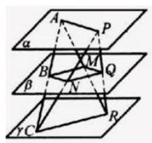

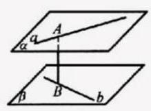

题5.4.7 题5.4.8

2.【证明】由题设知 ${BC} \bot  C{C}_{1},{BC} \bot  {AC}, C{C}_{1} \cap  {AC} = C$ ,所以 ${BC} \bot$ 平面 ${AC}{C}_{1}{A}_{1}$ . 又 $D{C}_{1} \subset$ 平面 ${AC}{C}_{1}{A}_{1}$ ,所以 $D{C}_{1} \bot  {BC}$ .

因为 ${AC} = \frac{1}{2}A{A}_{1}, D$ 为 $A{A}_{1}$ 的中点,

所以 ${AC} = {AD}$ ，

又因为 ${AD} \bot  {AC}$ ,所以 $\angle {ADC} = {45}^{ \circ  }$ ，

同理 $\angle {A}_{1}D{C}_{1} = {45}^{ \circ  }$ ,

所以 $\angle {CD}{C}_{1} = {90}^{ \circ  }$ ,即 $D{C}_{1} \bot  {DC}$ .

又 ${DC} \cap  {BC} = C$ ,

所以 $D{C}_{1} \bot$ 平面 ${BDC}$ . 又 $D{C}_{1} \subset$ 平面 ${BD}{C}_{1}$ ,故平面 ${BD}{C}_{1} \bot$ 平面 ${BDC}$ .

3. 证明: 如图所示,连接 ${AC}$ ,交 ${BD}$ 于点 $O$ ,连接 ${EO},{FO},{EF}$ ,则 $O$ 为 ${AC}\text{ 、 }{BD}$ 的中点.

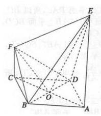

易得 $\bigtriangleup  {EBA} \cong   \bigtriangleup  {EDA}, \bigtriangleup  {FCB} \cong   \bigtriangleup  {FCD}$ ，

所以 ${EB} = {ED},{FB} = {FD}$ ，

于是 ${EO} \bot  {BD},{FO} \bot  {BD}$ .

由 ${AB} = {2a},\angle {BAD} = {60}^{ \circ  }$ ，

得 ${AO} = {CO} = \sqrt{3}a$ .

又 ${AE} = {3a},{CF} = a$ ,

所以 $E{O}^{2} = A{O}^{2} + A{E}^{2} = {12}{a}^{2}$ ,

$F{O}^{2} = C{O}^{2} + C{F}^{2} = 4{a}^{2},$

所以 $E{O}^{2} + F{O}^{2} = {16}{a}^{2}$ .

又 $F{E}^{2} = {\left( AE - CF\right) }^{2} + C{A}^{2} = 4{a}^{2} + {12}{a}^{2} = {16}{a}^{2}$ ,

所以 $\angle {EOF} = {90}^{ \circ  }$ ,

所以平面 ${EBD} \bot$ 平面 ${FBD}$ .

4.(1)证明:连接 ${AC}$ 与 ${BD}$ 相交于 $O$ ,连接 ${EO}$ ，则 ${EO}//{PC}$ ，

因为 ${PC} \bot$ 平面 ${ABCD}$ ,

所以 ${EO} \bot$ 平面 ${ABCD}$

又 ${EO} \subset$ 平面 ${EDB}$ ,

所以平面 ${EDB} \bot$ 平面 ${ABCD}$ ;

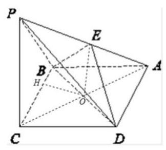

5.【答案】 $\frac{1}{3}$

【解析】以 $D$ 为原点, ${PA}$ 为 $x$ 轴, ${DC}$ 为 $y$ 轴, $D{D}_{1}$ 为 $z$ 轴建系平面 ${A}_{1}{DB}$ 法向量, ${\overrightarrow{n}}_{1} = \left( {-1,1,1}\right)$ .

平面 ${C}_{1}{BD}$ 法向量 ${\overrightarrow{n}}_{2} = \left( {1, - 1,1}\right)$

$\cos  < \overrightarrow{{n}_{1}},\overrightarrow{{n}_{2}} >  = \frac{1}{3}$ .

6.【答案】 $\sqrt{6}$

【解析】

如图所示,

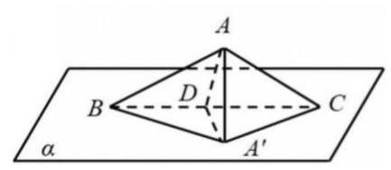

在平面 ${ABC}$ 内作 ${AD} \bot  {BC}, D$ 为垂足,作 $A{A}^{\prime } \bot$ 平面 $\alpha ,{A}^{\prime }$ 为垂足,连接 ${AD},{A}^{\prime }D$ 因为 ${BC} \subset$ 平面 $\alpha$ ,所以 $A{A}^{\prime } \bot  {BC}$ ,

又 ${AD} \subset$ 平面 ${AD}{A}^{\prime }, A{A}^{\prime } \subset$ 平面 ${AD}{A}^{\prime },{AD} \cap  A{A}^{\prime } = A$

所以 ${BC} \bot$ 平面 ${AD}{A}^{\prime }$ ,所以 ${A}^{\prime }D \bot  {BC}$ ,

所以 $\angle {AD}{A}^{\prime }$ 为三角形 ${ABC}$ 所在平面与 $\alpha$ 所成二面角的平面角,

由题意知 $\angle {AD}{A}^{\prime } = {30}^{ \circ  }$ ,

在直角三角形 ${AD}{A}^{\prime }$ 中,

${A}^{\prime }D = {AD} \cdot  \cos \alpha  = {AD} \cdot  \cos {30}^{ \circ  } = \frac{\sqrt{3}}{2}{AD}$

${S}_{\bigtriangleup {ABC}} = \frac{1}{2}{AB} \cdot  {BC} \cdot  \sin \angle {ABC} \; = \frac{1}{2} \times  2 \times  4 \times  \sin {45}^{ \circ  } = 2\sqrt{2},$

所以 ${S}_{\bigtriangleup {A}^{\prime }{BC}} = \frac{1}{2}{BC} \cdot  {A}^{\prime }D = \frac{1}{2}{BC} \cdot  \frac{\sqrt{3}}{2}{AD}$

$= \frac{\sqrt{3}}{2}{S}_{\bigtriangleup {ABC}} = \frac{\sqrt{3}}{2} \times  2\sqrt{2} = \sqrt{6}$

所以 $\bigtriangleup {ABC}$ 在平面 $\alpha$ 内的射影面积为 $\sqrt{6}$ .

故答案为: $\sqrt{6}$ .

## 课后练习 09 解析

1.【答案】B

【解析】由题意可知底面三角形是正三角形,过 $A$ 作 ${AD} \bot  {BC}$ 于 $D$ ,连接 $D{C}_{1}$ , 则 $\angle A{C}_{1}D$ 为所求,

$\sin \angle A{C}_{1}D = \frac{AD}{A{C}_{1}} = \frac{\frac{\sqrt{3}}{2}{AB}}{\sqrt{2}{AB}} = \frac{\sqrt{6}}{4}$

故选 B

2.【答案】C

【解析】由题意作出如下图形:

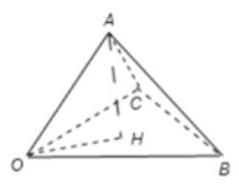

$\because$ 三条射线 ${OA}\text{ 、 }{OB}\text{ 、 }{OC}$ 两两成角 ${60}^{ \circ  }$ ,

$\therefore {OA}$ 在底面的射影为 $\angle {BOC}$ 的角平分线即为 ${OH}$ ,

又 $\because$ 两两成 ${60}^{ \circ  }$ ,

$\therefore$ 不妨假设 ${OA} = {OB} = {OC} = a$ ，则此三棱雉的所有棱长都为 $a$ ，

$\therefore H$ 也应为底面三角形的中心即为点 $H$ ,

$\therefore {OH} = \frac{\sqrt{3}}{3}a$ ,在直角三角形 ${OAH}$ 中以求得 $\cos \angle {AOH} = \frac{\sqrt{3}}{3}$ ,

有反三角函数知识可知 ${OA}$ 与底平面的线面角既是 $\angle {AOH} = \arccos \frac{\sqrt{3}}{3}$ ,

故答案为: $\arccos \frac{\sqrt{3}}{3}$ ,选 $\mathrm{C}$

3.【答案】D

【解析】: 正方形 ${A}_{1}{BCD}$ 的对角线 ${BD}$ 为棱折成直二面角,

$\therefore$ 平面 ${ABD} \bot$ 平面 ${BCD}$ ,

连接 ${BD},{A}_{1}C$ ,相交于 $O$ ,

则 ${AO} \bot  {BD}$ ,

$\because$ 平面 ${ABD} \cap$ 平面 ${BCD} = {BD},{AO} \subset$ 平面 ${ABD}$

$\therefore {AO} \bot$ 平面 ${BCD}$ ,则 ${OC},{OA},{OD}$ 两两互相垂直,

如图,以 $O$ 为原点,建立空间直角坐标系 $O - {xyz}$ .

设正方体的棱长为 1,

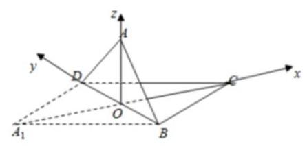

则 $O\left( {0,0,0}\right) , A\left( {0,0,\frac{\sqrt{2}}{2}}\right) , C\left( {\frac{\sqrt{2}}{2},0,0}\right) , B\left( {0, - \frac{\sqrt{2}}{2},0}\right) , D\left( {0,\frac{\sqrt{2}}{2},0}\right) ,\overrightarrow{OA} = \left( {0,0,\frac{\sqrt{2}}{2}}\right)$

是平面 ${BCD}$ 的一个法向量.

$$
\overrightarrow{AC} = \left( {\frac{\sqrt{2}}{2},0, - \frac{\sqrt{2}}{2}}\right) ,\overrightarrow{BC} = \left( {\frac{\sqrt{2}}{2},\frac{\sqrt{2}}{2},0}\right) ,\overrightarrow{CD} = \left( {-\frac{\sqrt{2}}{2},\frac{\sqrt{2}}{2},0}\right)
$$

设平面 ${ACD}$ 的法向量 $\overrightarrow{n} = \left( {x, y, z}\right)$ ,

则 $\left\{  \begin{array}{l} \overrightarrow{n} \cdot  \overrightarrow{CD} = 0 \\  \overrightarrow{n} \cdot  \overrightarrow{AC} = 0 \end{array}\right.$ ,

即 $\left\{  \begin{array}{l}  - \frac{\sqrt{2}}{2}x + \frac{\sqrt{2}}{2}y = 0 \\  \frac{\sqrt{2}}{2}x - \frac{\sqrt{2}}{2}z = 0 \end{array}\right.$ ,即 $\left\{  \begin{array}{l} y = x \\  z = x \end{array}\right.$ ,

令 $x = 1$ ,则 $y = 1, z = 1$ ,

解得 $\overrightarrow{n} = \left( {1,1,1}\right)$ .

从而 $\left| {\cos  < \overrightarrow{n},\overrightarrow{OA} > }\right|  = \frac{\left| \overrightarrow{n} \cdot  \overrightarrow{OA}\right| }{\left| \overrightarrow{n}\right| \left| \overrightarrow{OA}\right| } = \frac{\left| \frac{\sqrt{2}}{2}\right| }{\sqrt{3} \times  \frac{\sqrt{2}}{2}} = \frac{\sqrt{3}}{3}$ ,

二面角 $A - {CD} - B$ 的余弦值为 $\frac{\sqrt{3}}{3}$

4.【答案】2

【解析】因为 $\mathrm{{AC}} \bot  \mathrm{{AB}},\mathrm{{BD}} \bot  \mathrm{{AB}}$ ,所以 $\overrightarrow{\mathrm{{CA}}} \bullet  \overrightarrow{\mathrm{{AB}}} = 0,\overrightarrow{\mathrm{{BD}}} \bullet  \overrightarrow{\mathrm{{AB}}} = 0$ , 因为二面角的余弦值是 $- \frac{1}{2}$ ,

所以 $\overrightarrow{AC} \cdot  \overrightarrow{BD} = \left| \overrightarrow{AC}\right|  \cdot  \left| \overrightarrow{BD}\right|  \cdot  \cos \theta  = 1 \times  1 \times  \left( {-\frac{1}{2}}\right)  =  - \frac{1}{2}$

即 $\overrightarrow{CA} \cdot  \overrightarrow{BD} = \frac{1}{2}$ ,

所以 ${\left| \overrightarrow{\mathrm{{CD}}}\right| }^{2} = \overrightarrow{{\mathrm{{CD}}}^{2}} = {\left( \overrightarrow{\mathrm{{CA}}} + \overrightarrow{\mathrm{{AB}}} + \overrightarrow{\mathrm{{BD}}}\right) }^{2}$

$= \mathrm{{CA}} + \mathrm{{AB}} + \mathrm{{BD}} + 2\mathrm{{CA}} \bullet  \mathrm{{AB}} + 2\mathrm{{CA}} \bullet  \overrightarrow{\mathrm{{BD}}} + 2\overrightarrow{\mathrm{{AB}}} \bullet  \overrightarrow{\mathrm{{BD}}}$

$= 1 + 1 + 1 + 0 + 2 \times  \frac{1}{2} + 0 = 4,$

所以 $\left| \overrightarrow{\mathrm{{CD}}}\right|  = 2$ ,即 $\mathrm{{CD}}$ 的长为 2 .

5.【答案】(1)证明见解析 (2) $\arctan \frac{2\sqrt{13}}{3}$

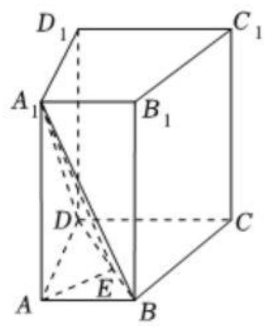

证明: 由题意知, ${\mathrm{{AA}}}_{1}//{\mathrm{{DD}}}_{1}$ ,

因为 ${\mathrm{{AA}}}_{1} \text{ ⊄ }$ 平面 ${\mathrm{{DCC}}}_{1}{\mathrm{D}}_{1},{\mathrm{{DD}}}_{1} \subset$ 平面 ${\mathrm{{DCC}}}_{1}{\mathrm{D}}_{1}$ ,

所以 ${\mathrm{{AA}}}_{1}//$ 平面 ${\mathrm{{DCC}}}_{1}{\mathrm{D}}_{1}$ ,

因为 ${AB}//{DC}$ ,且 ${AB} \text{ ⊄ }$ 平面 ${DC}{C}_{1}{D}_{1},{DC} \subset$ 平面 ${DC}{C}_{1}{D}_{1}$ ,

所以 ${AB}//$ 平面 ${DC}{C}_{1}{D}_{1}$ ,

又 ${\mathrm{{AA}}}_{1} \cap  \mathrm{{AB}} = \mathrm{A},{\mathrm{{AA}}}_{1}\text{ 、 }\mathrm{{AB}} \subset$ 平面 ${\mathrm{{ABB}}}_{1}{\mathrm{A}}_{1}$ ,

所以平面 ${AB}{B}_{1}{A}_{1}//$ 平面 ${DC}{C}_{1}{D}_{1}$ ,

因为 ${\mathrm{A}}_{1}\mathrm{\;B} \subset$ 平面 ${\mathrm{{ABB}}}_{1}{\mathrm{A}}_{1}$ ,

所以 ${\mathrm{A}}_{1}\mathrm{\;B}//$ 平面 ${\mathrm{{DCC}}}_{1}{\mathrm{D}}_{1}$ .

(2)由题意知，底面 ${ABCD}$ 为直角梯形，

所以梯形 ${ABCD}$ 的面积 $S = \frac{\left( {2 + 4}\right)  \times  3}{2} = 9$ ，

因为四棱柱 $\mathrm{{ABCD}} - {\mathrm{A}}_{1}{\mathrm{\;B}}_{1}{\mathrm{C}}_{1}{\mathrm{D}}_{1}$ 的体积为 36,

所以 ${\mathrm{{AA}}}_{1} = \frac{36}{\mathrm{\;s}} = 4$ ,

过 $\mathrm{A}$ 作 $\mathrm{{AE}} \bot  \mathrm{{BD}}$ 于 $\mathrm{E}$ ,连接 ${\mathrm{A}}_{1}\mathrm{E}$ ,

因为 ${\mathrm{{AA}}}_{1} \bot$ 平面 $\mathrm{{ABCD}}$ ,且 $\mathrm{{BD}} \subset$ 平面 $\mathrm{{ABCD}}$ ,

所以 ${\mathrm{{AA}}}_{1} \bot  \mathrm{{BD}}$ ,

又 ${\mathrm{{AA}}}_{1} \cap  \mathrm{{AE}} = \mathrm{A},{\mathrm{{AA}}}_{1}\text{ 、 }\mathrm{{AE}} \subset$ 平面 ${\mathrm{{AA}}}_{1}\mathrm{E}$ ,

所以 $\mathrm{{BD}} \bot$ 平面 ${\mathrm{{AA}}}_{1}\mathrm{E}$ ,

因为 ${\mathrm{A}}_{1}\mathrm{E} \subset$ 平面 $\mathrm{A}{\mathrm{A}}_{1}\mathrm{E}$ ,所以 $\mathrm{{BD}} \bot  {\mathrm{A}}_{1}\mathrm{E}$ ,

所以 $\angle {\mathrm{A}}_{1}\mathrm{{EA}}$ 即为二面角 ${\mathrm{A}}_{1} - \mathrm{{BD}} - \mathrm{A}$ 的平面角,

在 Rt $\bigtriangleup \mathrm{{ABD}}$ 中， $\mathrm{{AE}} \cdot  \mathrm{{BD}} = \mathrm{{AB}} \cdot  \mathrm{{AD}}$ ，

所以 $\mathrm{{AE}} = \frac{\mathrm{{AB}} \cdot  \mathrm{{AD}}}{\mathrm{{BD}}} = \frac{2 \times  3}{\sqrt{{2}^{2} + {3}^{2}}} = \frac{6\sqrt{13}}{13}$ ，

所以 $\tan \angle {\mathrm{A}}_{1}\mathrm{{EA}} = \frac{{\mathrm{{AA}}}_{1}}{\mathrm{{AE}}} = \frac{4}{\frac{6\sqrt{13}}{13}} = \frac{2\sqrt{13}}{3}$ ,

即 $\angle {\mathrm{A}}_{1}\mathrm{{EA}} = \arctan \frac{2\sqrt{13}}{3}$ ,

故二面角 ${\mathrm{A}}_{1} - \mathrm{{BD}} - \mathrm{A}$ 的大小为 $\arctan \frac{2\sqrt{13}}{3}$ .

6.【答案】( 1 ) $\frac{3}{2}\;\left( 2\right) \arctan \frac{\sqrt{3}}{2}$

(1)如图，作 $\mathrm{{PO}} \bot$ 平面 $\mathrm{{ABCD}}$ ，垂足为点 $\mathrm{O}$ . 连接 $\mathrm{{OB}}$ 、 $\mathrm{{OA}}$ 、 $\mathrm{{OD}}$ 、 $\mathrm{{OB}}$ 与 $\mathrm{{AD}}$ 交于点 $\mathrm{E}$ ， 连接 PE.

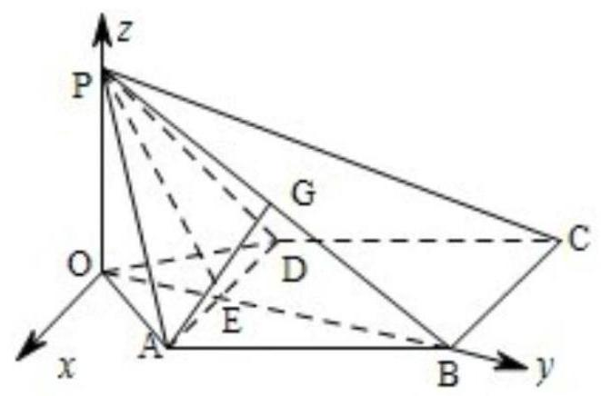

$\because \mathrm{{AD}} \bot  \mathrm{{PB}},\therefore \mathrm{{AD}} \bot  \mathrm{{OB}}$ ,

$\because \mathrm{{PA}} = \mathrm{{PD}},\therefore \mathrm{{OA}} = \mathrm{{OD}}$ ,

于是 OB 平分 AD, 点 E 为 AD 的中点,

所以PE $\bot  \mathrm{{AD}}$ .

由此知 $\angle \mathrm{{PEB}}$ 为面 $\mathrm{{PAD}}$ 与面 $\mathrm{{ABCD}}$ 所成二面角的平面角,

$\therefore \angle \mathrm{{PEB}} = {120}^{ \circ  },\angle \mathrm{{PEO}} = {60}^{ \circ  }$

由已知可求得 $\mathrm{{PE}} = \sqrt{3}$

$\therefore \mathrm{{PO}} = \mathrm{{PE}} \cdot  \sin {60}^{ \circ  } = \sqrt{3} \times  \frac{\sqrt{3}}{2} = \frac{3}{2}$ ,

即点 $\mathrm{P}$ 到平面 $\mathrm{{ABCD}}$ 的距离为 $\frac{3}{2}$

(2)解法一:如图建立直角坐标系，其中 0 为坐标原点，x 轴平行于 DA.

$P\left( {0,0,\frac{3}{2}}\right) , B\left( {0,\frac{3\sqrt{3}}{2},0}\right) ,{PB}$ 中点 $G$ 的坐标为 $\left( {0,\frac{3\sqrt{3}}{4},\frac{3}{4}}\right)$ . 连接 ${AG}$ .

又知 $A\left( {1,\frac{\sqrt{3}}{2},0}\right) , C\left( {-2,\frac{3\sqrt{3}}{2},0}\right)$ .

由此得到: $\overrightarrow{GA} = \left( {1, - \frac{\sqrt{3}}{4}, - \frac{3}{4}}\right) ,\overrightarrow{PB} = \left( {0,\frac{3\sqrt{3}}{2}, - \frac{3}{2}}\right) ,\overrightarrow{BC} = \left( {-2,0,0}\right)$ .

于是有 $\overrightarrow{GA} \bullet  \overrightarrow{PB} = 0,\overrightarrow{BC} \bullet  \overrightarrow{PB} = 0$

所以 $\overrightarrow{GA} \bot  \overrightarrow{PB} \bullet  \overrightarrow{BC} \bot  \overrightarrow{PB}$ .

$\overrightarrow{\mathrm{{GA}}},\overrightarrow{\mathrm{{BC}}}$ 的夹角 $\theta$ 等于所求二面角的平面角,

于是 $\cos \theta  = \frac{\overrightarrow{\mathrm{{GA}}} \cdot  \overrightarrow{\mathrm{{BC}}}}{\left| \overrightarrow{\mathrm{{GA}}}\right|  \cdot  \left| \overrightarrow{\mathrm{{BC}}}\right| } =  - \frac{2\sqrt{7}}{7}$ ,

所以所求二面角的大小为 $\arccos \frac{2\sqrt{7}}{7}$ .

解法二: 如图,取 $\mathrm{{PB}}$ 的中点 $\mathrm{G},\mathrm{{PC}}$ 的中点 $\mathrm{F}$ ,连接 $\mathrm{{EG}}\text{ 、 }\mathrm{{AG}}\text{ 、 }\mathrm{{GF}}$ ,

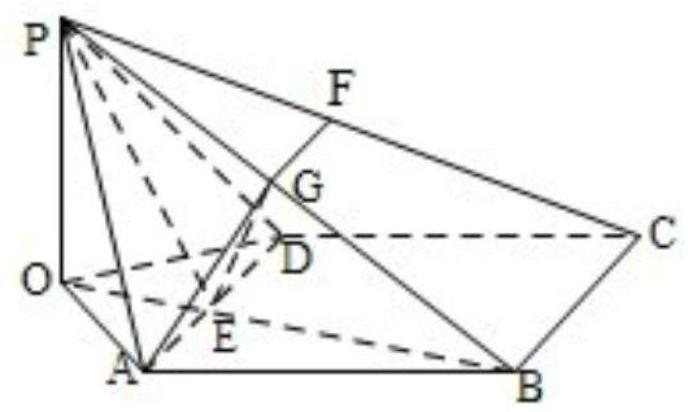

则 $\mathrm{{AG}} \bot  \mathrm{{PB}},\mathrm{{FG}}//\mathrm{{BC}},\mathrm{{FG}} = \frac{1}{2}\mathrm{{BC}}$ .

$\because \mathrm{{AD}} \bot  \mathrm{{PB}},\therefore \mathrm{{BC}} \bot  \mathrm{{PB}},\mathrm{{FG}} \bot  \mathrm{{PB}}$ ,

$\therefore \angle {AGF}$ 是所求二面角的平面角.

$\because \mathrm{{AD}} \bot$ 面 $\mathrm{{POB}},\therefore \mathrm{{AD}} \bot  \mathrm{{EG}}$ .

又 $\because \mathrm{{PE}} = \mathrm{{BE}},\therefore \mathrm{{EG}} \bot  \mathrm{{PB}}$ ,且 $\angle \mathrm{{PEG}} = {60}^{ \circ  }$ .

在 Rt $\bigtriangleup \mathrm{{PEG}}$ 中， $\mathrm{{EG}} = \mathrm{{PE}} \cdot  \cos {60}^{ \circ  } = \frac{\sqrt{3}}{2}$ .

在 Rt $\bigtriangleup$ PEG 中, EG $= \frac{1}{2}\mathrm{{AD}} = 1$ .

于是 $\tan \angle \mathrm{{GAE}} = \frac{\mathrm{{EG}}}{\mathrm{{AE}}} = \frac{\sqrt{3}}{2}$ ,

所以所求二面角的大小为 $\arctan \frac{\sqrt{3}}{2}$ .

## 课后练习 10 解析

1.【答案】B

【解析】如图,设 ${\mathrm{{AB}}}_{1},{\mathrm{\;A}}_{1}\mathrm{\;B}$ 交于点 $\mathrm{O}$ ,连结 $\mathrm{{OP}}$ .

因为 ${\mathrm{{AB}}}_{1} \bot$ 平面 ${\mathrm{A}}_{1}{\mathrm{{BCD}}}_{1}$ ,且 ${\mathrm{A}}_{1}\mathrm{P} \bot  {\mathrm{{AB}}}_{1}$ ,

所以 $\mathrm{P} \in$ 平面 ${\mathrm{A}}_{1}{\mathrm{{BCD}}}_{1}$ ,

所以 $\mathrm{{PA}} = {\mathrm{{PB}}}_{1}$ ,

即 $\bigtriangleup {\mathrm{{APB}}}_{1}$ 是等腰三角形,

所以 $\mathrm{{OP}} \bot  {\mathrm{{AB}}}_{1}$ .

又因为 $\angle \mathrm{{APO}} = \frac{1}{2}\angle {\mathrm{{APB}}}_{1} = \frac{1}{2}\angle {\mathrm{{ADB}}}_{1}$ ,

所以 $\angle \mathrm{{APO}}$ 的大小不变.

因为 $\mathrm{{PO}} = \mathrm{{AO}}\cot \angle \mathrm{{APO}}$ ,

所以 $\mathrm{{PO}}$ 长度为定值.

所以点 $\mathrm{P}$ 的轨迹是平面 ${\mathrm{A}}_{1}{\mathrm{{BCD}}}_{1}$ 内,以 $\mathrm{O}$ 为圆心, $\mathrm{{PO}}$ 为半径的圆.

故选 B.

2.【答案】 216

【解析】 ${\mathrm{S}}_{\text{ 总 }} = 6 \times  {10} \times  {10} = {600}$

小球中心距离每个面至少为 1 ,

因此每个面的可接触区域是一个边长为 10-2=8 的正方形。

每个面的可接触面积: ${\mathrm{S}}_{\text{ 面 }} = 8 \times  8 = {64}$

6 个面的总可接触面积:S 可接触=6×64=384

总内壁面积减去可接触面积:S 不能接触=600-384=216

3.【答案】①③④

【解析】当 $G$ 为 ${BC}$ 中点时, ${EG} \bot  {BD},{EG} \bot  B{B}_{1}$ ,

${BD} \cap  B{B}_{1} = B,{BD}, B{B}_{1} \subset$ 平面 ${BD}{B}_{1}$ ,

$\therefore {EG} \bot$ 平面 ${BD}{B}_{1}$ ,平面 ${EFG}//$ 平面 ${AC}{D}_{1},{B}_{1}D \subset$ 平面 ${BD}{B}_{1}$ ,

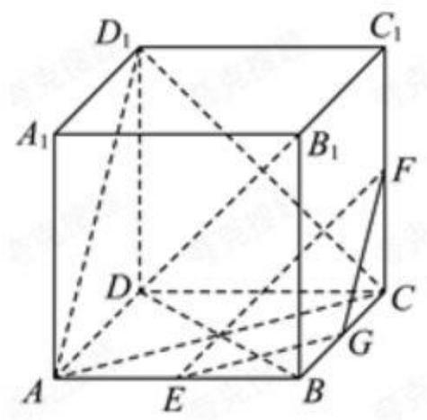

$\therefore {EG}\bot {B}_{1}D$ ,

同理 ${GF} \bot  {B}_{1}D,{EG} \cap  {GF} = G,{EG},{GF} \subset$ 平面 ${EFG}$ ,

所以 ${B}_{1}D \bot$ 平面 ${EFG}$ ,即 ${OD} \bot$ 平面 ${EFG}$ ,故①正确；

当 $G$ 与 $B$ 重合时, $A$ 在平面 ${EFB}$ 上, $O$ 在平面 ${EFB}$ 外,故 ②不正确；

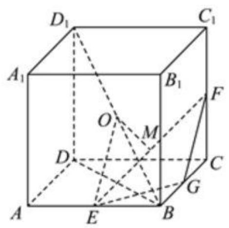

如图，点 $M$ 是线段 ${EF}$ 的中点，由对称性可知 ${OM}\bot {EF}$ ， 由勾股定理可知易知 ${EF} = \sqrt{E{B}^{2} + B{F}^{2}} = \sqrt{6}$ ，

$$
{OE} = \sqrt{2}\text{ , }
$$

球心 $O$ 到 ${EF}$ 距离为 ${OM} = \sqrt{{\left( \sqrt{2}\right) }^{2} - {\left( \frac{\sqrt{6}}{2}\right) }^{2}} = \frac{\sqrt{2}}{2}$ ,

则 ${EF}$ 被球截得的弦长为

$$
l = 2\sqrt{{R}^{2} - O{M}^{2}} = 2\sqrt{1 - {\left( \frac{\sqrt{2}}{2}\right) }^{2}} = \sqrt{2},
$$

故③正确；

当 ${OM}$ 垂直于过 ${EF}$ 的平面,此时截面圆的面积最小,此时圆的半径就是 $r = \frac{l}{2} = \frac{\sqrt{2}}{2}$ ,

面积为 $S = \pi {r}^{2} = \frac{1}{2}\pi$ ,故④正确.

4.【答案】 $\frac{8\sqrt{2}}{3}\pi$

【解析】

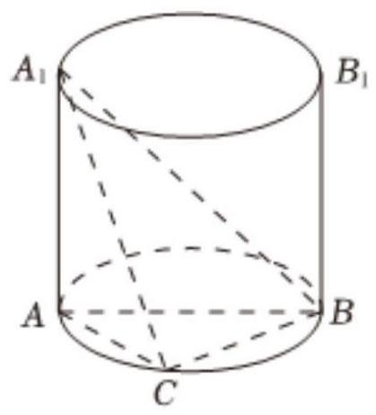

如图: 设圆柱的母线长为 $l$ ,底

面半径为 $r$ ,

则由题可得: ${2\pi rl} = {4\pi }$ ,可

得 ${rl} = 2$ ,

又 $A{A}_{1}$ 是圆柱的一条母线， ${AB}$ 是圆柱下底面的直径，

$C$ 是圆柱下底面圆周上异于 $A$ 、 $B$ 的点，

则 ${BC}\bot {AC}$ ,又 ${A{A}_{1}}\bot {BC}$ ,

${AC} \cap  A{A}_{1} = A,{AC}, A{A}_{1} \subset$ 平面 ${A}_{1}{AC}$ ,

可得 ${BC} \bot$ 面 ${A}_{1}{AC}$ ,

又 ${A}_{1}C \subset$ 面 ${A}_{1}{AC}$ ,

可得 ${BC} \bot  {A}_{1}C$ ,

故 ${A}_{1}B$ 是 ${RT}\bigtriangleup {A}_{1}{AB}$ 和 ${Rt}\bigtriangleup {A}_{1}{CB}$ 的公共斜边,

故 ${A}_{1}B$ 即为所求球的直径,

而 ${A}_{1}B = \sqrt{{A}_{1}{A}^{2} + A{B}^{2}} = \sqrt{{l}^{2} + {\left( 2r\right) }^{2}} = \sqrt{{l}^{2} + 4{r}^{2}} \geq  \sqrt{4rl} = 2\sqrt{2}$

当且仅当 $l = {2r}$ ,即 $r = 1, l = 2$ 时等号成立,

所以球的半径的最小值为 $\sqrt{2}$ ,

故三棱锥 ${A}_{1} - {ABC}$ 外接球体积的最小值为 $\frac{4\pi }{3}{R}^{3} = \frac{8\sqrt{2}}{3}\pi$

故答案为: $\frac{8\sqrt{2}}{3}\pi$ .

5.【答案】A

【解析】

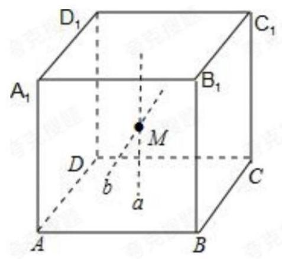

$\because$ 点 $M$ 为正方体 ${ABCD} - {A}_{1}{B}_{1}{C}_{1}{D}_{1}$ 内部 (不包含表面) 的一点,

$\therefore M \notin  A{A}_{1}, M \notin  {B}_{1}{C}_{1}$ ,

由 $A{A}_{1}$ 与 $M$ 可确定一个平面,在该平面内过 $M$ 作直线 $a$ ,使 $a//A{A}_{1}$ , 由 ${B}_{1}{C}_{1}$ 与 $M$ 可确定以平面,在该平面内过 $M$ 作直线 $b$ ,使 $b//{B}_{1}{C}_{1}$ ,

则由两相交直线 $a$ 与 $b$ 确定平面 $\alpha$ ,使得平面 $\alpha$ 与 $A{A}_{1}$ 和 ${B}_{1}{C}_{1}$ 都平行,

故命题 ${q}_{1}$ 是真命题;

由正方体的结构特征可知, $A{A}_{1}$ 和 ${B}_{1}{C}_{1}$ 所在直线为异面直线,

若过点 $M$ 作两条直线与 $A{A}_{1}$ 和 ${B}_{1}{C}_{1}$ 所在的直线都相交,则不存在两交点重合,

可得 $A{A}_{1}$ 和 ${B}_{1}{C}_{1}$ 所在的直线共面,

与 $A{A}_{1}$ 和 ${B}_{1}{C}_{1}$ 所在直线为异面直线矛盾,

故命题 ${q}_{2}$ 是假命题.

故选: $A$ .

6.【答案】D

【解析】对于 $\mathrm{A}$ ,如图所示

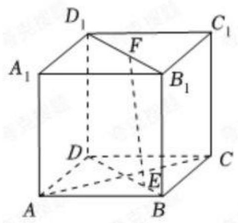

若 $E \in  B{D}_{1}, F \in  {BD}$ ,则 ${EF} \subset$ 平面 ${B}_{1}{D}_{1}{DB}$ ,

因为 $D{D}_{1} \bot$ 平面 ${ABCD},{AC} \subset$ 平面 ${ABCD}$ ,

则 $D{D}_{1} \bot  {AC}$ ,

又 ${AC} \bot  {BD}$ ,且 $D{D}_{1} \cap  {BD} = D, D{D}_{1} \subset$ 平面 ${B}_{1}{D}_{1}{DBBD} \subset$ 平面 ${B}_{1}{D}_{1}{DB}$ ,

所以 ${AC} \bot$ 平面 ${B}_{1}{D}_{1}{DB}$ ,

又 ${EF} \subset$ 平面 ${B}_{1}{D}_{1}{DB}$ ,所以 ${EF} \bot  {AC}$ ,故 $A$ 正确;

对于 $B$ ,若 $E \in  B{D}_{1}, F \in  {BD}$ ,则 ${EF} \subset$ 平面 ${B}_{1}{D}_{1}{DB}$ ,

由正方体的性质得 ${AC} \bot$ 平面 ${B}_{1}{D}_{1}{DB}$ ,又 ${A}_{1}{C}_{1}//{AC}$ ,

则 ${A}_{1}{C}_{1} \bot$ 平面 ${B}_{1}{D}_{1}{DB}$ ,即 ${A}_{1}{C}_{1} \bot$ 平面 ${A}_{1}B{C}_{1}$ ,

又 ${A}_{1}{C}_{1} \subset$ 平面 ${BEF}$ ,

所以平面 ${BEF} \bot$ 平面 ${A}_{1}B{C}_{1}$ ,故 $B$ 正确;

对于 $C$ ,如图所示:

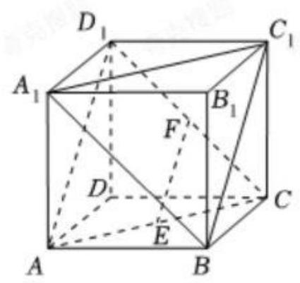

若 $E \in  {AC}, F \in  C{D}_{1}$ ,则 ${EF} \subset$ 平面 $A{D}_{1}C$ ,

因为 ${A}_{1}B//{D}_{1}C,{AB} \text{ ⊄ }$ 平面 ${AC}{D}_{1},{D}_{1}C \subset$ 平面 ${AC}{D}_{1}$ ,

所以 ${A}_{1}B//$ 平面 ${AC}{D}_{1}$ ,

同理 $B{C}_{1}//$ 平面 ${AC}{D}_{1}$ ,

又 ${A}_{1}B \cap  B{C}_{1} = B$ ，

所以平面 ${A}_{1}B{C}_{1}//$ 平面 ${AC}{D}_{1}$ ,

又 ${EF} \subset$ 平面 ${AC}{D}_{1}$ ,

所以 ${EF}//$ 平面 ${A}_{1}B{C}_{1}$ ,故 $C$ 正确;

对于 $D$ ,当 $E \in  {AC}, F \in  C{D}_{1}$ 时,则 ${EF} \subset$ 平面 $A{D}_{1}C$ ,

则 ${EF}$ 与 $A{D}_{1}$ 共面，不一定平行，故 $D$ 错误；

故选: $D$ .

7.【答案】 $\sqrt{3}$

【解析】

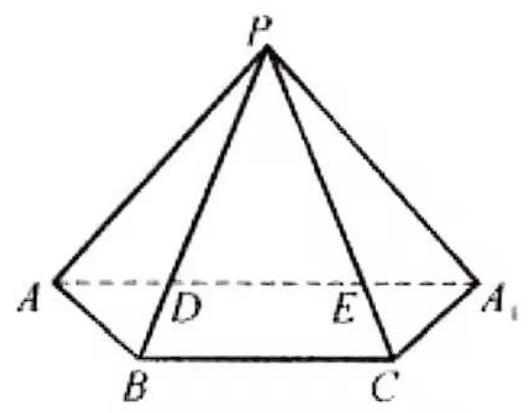

把正三棱锥 $P - {ABC}$ 的侧面沿侧棱 ${PA}$ 剪开并展开成如图所示的侧面展开图, 那么,当点 $A\text{ 、 }D\text{ 、 }E\text{ 、 }{A}_{1}$ 共线时, $\bigtriangleup {ADE}$ 的周长取得最小值,

此最小值为 $A{A}_{1}$ 的长度.

由 $\angle {APB} = \angle {BPC} = \angle {CP}{A}_{1} = {40}^{ \circ  }$ 得 $\angle {AP}{A}_{1} = {120}^{ \circ  }$ ,又 ${AP} = {A}_{1}P = 1, A{A}_{1} = \sqrt{3}$ , 所以， $\bigtriangleup  {ADE}$ 的周长的最小值为 $\sqrt{3}$ .

8.【答案】 $\frac{\sqrt{17}}{2}$

【解析】(本题题干有误,应为PM而不是 2PM)

延长 ${MB}$ 到 $E$ ,使得 ${MB} = {EB}$ .

根据对称性, ${PM} = {PE}$

$\therefore$ 当 ${D}_{1}, P, E$ 共线时.

$P{D}_{1} + {PM} = P{D}_{1} + {PE} = E{D}_{1}$ 最小

$= \sqrt{{1}^{2} + {1}^{2} + {\left( 1 + \frac{1}{2}\right) }^{2}}$

$= \frac{\sqrt{17}}{2}$

9.【答案】 ${160\pi }$

【解析】因为 ${SA} \bot$ 底面 ${ABCD},{AB} \subset$ 面 ${ABCD}$ , 所以 ${SA} \bot  {AB}$ ,

又因为 ${AB}\bot {AD},{AD} \cap  {SA} = A$ ，

所以 ${AB} \bot$ 平面 ${SAD}$ ,

又 ${MA} \subset$ 平面 ${SAD}$ ,所以 ${AB} \bot  {MA}$ ,

同理 ${CD} \bot  {MD}$ ,

在 ${Rt}\bigtriangleup {MAB}$ 和 ${Rt}\bigtriangleup {MCD}$ 中,因为 $\angle {CMD} = \angle {BMA}$ ,

所以 $\tan \angle {CMD} = \tan \angle {BMA}$ ,

所以 $\frac{AB}{AM} = \frac{CD}{MD}$ ,即 ${MD} = \sqrt{2}{MA}$ ,

在平面 ${SAD}$ 内,以 $A$ 为坐标原点,建立如图所示的平面直角坐标系,

设 $M\left( {x, y}\right)$ ,

则有 $\sqrt{{\left( x - 4\right) }^{2} + {y}^{2}} = \sqrt{2} \cdot  \sqrt{{x}^{2} + {y}^{2}}$ ,

化简得 ${\left( x + 4\right) }^{2} + {y}^{2} = {32}$ ,

即 $M$ 点的轨迹方程为 ${\left( x + 4\right) }^{2} + {y}^{2} = {32}$ ,

要使四棱维 $M - {ABCD}$ 的体积最大，只要 $M$ 点的纵坐标的绝对值最大即可，

令 $x =  - 4$ ,则 $y =  \pm  4\sqrt{2}$ ,

当四棱维 $\mathrm{M} - {ABCD}$ 的体积最大时，可取 $M\left( {-4,4\sqrt{2}}\right)$ ，此时 $M$ 到平面 ${ABCD}$ 的距离为 $4\sqrt{2}$ ,

三棱锥 $M - {ACD}$ 外接球球心在过三角形 ${ACD}$ 外接圆圆心且垂直平面 ${ACD}$ 的直线上,

在三棱锥 $M - {ACD}$ 中,取 ${AC}$ 的中点 $Q$ ,点 $Q$ 即为三角形 ${ACD}$ 外接圆的圆心,

设三棱锥 $M - {ACD}$ 外接球的球心为 $O$ ,半径为 $R$ ,设 ${OQ} = x$ ,

则有 ${R}^{2} = {x}^{2} + 8 = {40} + {\left( 4\sqrt{2} - x\right) }^{2}$ ,解得 $x = 4\sqrt{2}$ ,

所以 ${R}^{2} = {32} + 8 = {40}$ ,

所以三棱锥 $M - {ACD}$ 外接球的表面积 $S = {4\pi }{R}^{2} = {160\pi }$

## 课后练习 11 解析

1. 【答案】3

【解析】构造 $\angle {AOB} = {45}^{ \circ  }$ 或 ${135}^{ \circ  },\left| {AB}\right|  = \sqrt{2{\left( {a}_{1} - {a}_{2}\right) }^{2}} = \sqrt{2} + 2,{a}_{1} - {a}_{2} = \sqrt{2} + 1$ ， 当 $\angle {AOB} = {135}^{ \circ  }$ ,根据对称性此时点, $A$ 在第三象限,点 $B$ 在第一象限,这样的点 $A$ 有一个,当 $\angle {AOB} = {45}^{ \circ  }$ ,在第二象限有两个点, ${A}_{1}$ 对应点 ${B}_{1}$ 在第一象限,而点 ${A}_{2}$ 对应点 ${B}_{2}$ 在第三象限,故这样的点 $A$ 一共有 3 个.

2. 【答案】 ${3x} + {4y} + 1 = 0$

【解析】由题意得 $\left\{  \begin{array}{l} 3{a}_{1} + 4{b}_{1} + 1 = 0 \\  3{a}_{2} + 4{b}_{2} + 1 = 0 \end{array}\right.$ , $\therefore$ 点 ${P}_{1},{P}_{2}$ 均在直线 ${3x} + {4y} + 1 = 0$ 上 $\because$ 两点确定一条直线, $\therefore$ 过点 ${P}_{1},{P}_{2}$ 直线方程为 ${3x} + {4y} + 1 = 0$

3. 【答案】 $y =  - {2x}$ 或 $x = {0.75y}$

【解析】 $y \times  \left( {x + {3y}}\right)  = x \times  \left( {{8x} - y}\right)$ ,解得 $3{y}^{2} + {2xy} - 8{x}^{2} = 0,\left( {{3y} - {4x}}\right) \left( {y + {2x}}\right)  = 0$ 所以 $y =  - {2x}$ 或 $x = {0.75y}$

4. 【答案】 $\left( {-\infty , - 2\rbrack \cup \lbrack 3, + \infty }\right)$

【解析】 $l : x + {ay} + 1 = 0$ ,恒过定点 $P\left( {-1,0}\right) , A\left( {1,1}\right) , B\left( {2, - 1}\right) ,{k}_{PA} = \frac{1}{2},{k}_{PB} =  - \frac{1}{3}$ ① $a = 0$ ， $l : x =  - 1$ 与线段 ${AB}$ 无交点(舍) ② $a \neq  0$ ， ${k}_{l} =  - \frac{1}{a}$ ， $- \frac{1}{3} \leq   - \frac{1}{a} \leq  \frac{1}{2}$ ， $\therefore a \leq   - 2$ 或 $a \geq  3$ 由①②得 $a \in  \left( {-\infty , - 2}\right\rbrack  \bigcup \left\lbrack  {3, + \infty }\right)$

5. 【答案】 $\frac{15}{4}$

【解析】把 ${l}_{1}\text{ 、 }{l}_{2}$ 的方程改写为点斜式,得 ${l}_{1} : y - 2 = \frac{a}{2}\left( {x - 2}\right) ,{l}_{2} : y - 2 =  - \frac{2}{{a}^{2}}\left( {x - 2}\right)$ . 可知 ${l}_{1}\text{ 、 }{l}_{2}$ 过同一个定点 $P\left( {2,2}\right)$ ,即 ${l}_{1} \cap  {l}_{2} = P\left( {2,2}\right)$ .

$\because 0 < a < 2,\therefore {l}_{1}$ 在 $y$ 轴上的截距为 $2 - a,{l}_{2}$

在 $x$ 轴上的截距为 ${a}^{2} + 2$ ,两截距均大于 0,

即 ${l}_{1}$ 、 ${l}_{2}$ 与两坐标轴的正半轴可目成一个四边形 ${OAPB}$ ,

且 ${l}_{1}$ 与 $y$ 轴交于点 $B\left( {0,2 - a}\right) ,{l}_{2}$ 与 $x$ 轴交于点 $A\left( {{a}^{2} + 2,0}\right)$ .

又 ${x}_{P} = {y}_{P} = 2$ ,联结 ${PO}$ ,

则 ${S}_{\text{ 四边形 }{OAPB}} = {S}_{\bigtriangleup {OAP}} + {S}_{\bigtriangleup {OBP}}$

$= \frac{1}{2}\left| {OA}\right|  \cdot  {y}_{P} + \frac{1}{2}\left| {OB}\right|  \cdot  {x}_{P}$

$= \left| {OA}\right|  + \left| {OB}\right|  = {a}^{2} + 2 + 2 - a$

$= {\left( a - \frac{1}{2}\right) }^{2} + \frac{15}{4} \geq  \frac{15}{4}.$

当且仅当 $a = \frac{1}{2}$ 时,等号成立. 故 $a = \frac{1}{2}$ 时,四边形 ${OAPB}$ 的面积有最小值 $\frac{15}{4}$ .

此时, ${l}_{1}\text{ 、 }{l}_{2}$ 的方程分别为 ${l}_{1} : x - {4y} + 6 = 0,{l}_{2} : {8x} + y - {18} = 0$ .

6. 【答案】 $\frac{8}{7}$

【解析】令 $\left| {m - 0}\right|  = \left| {\frac{3}{4}m + 3 - 1}\right|$ ,解得 $m = 8$ 或 $- \frac{8}{7}$

(1)当 $m <  - \frac{8}{7}$ 时， $\left| {m - 0}\right|  =  - m$ ， $\because m <  - \frac{8}{7}$ ， $\therefore  - m > \frac{8}{7}$

$\therefore$ 当 $m <  - \frac{8}{7}$ 时,点 $C$ 与点 $D$ 的 “非常距离” 至少大于 $\frac{8}{7}$

(2)当 $- \frac{8}{7} \leq  m \leq  8$ 时， $\left| {\frac{3}{4}m + 3 - 1}\right|  = \frac{3}{4}m + 2,\because  - \frac{8}{7} \leq  m \leq  8,\therefore  - \frac{6}{7} \leq  \frac{3}{4}m \leq  6$

$\therefore \frac{8}{7} \leq  \frac{3}{4}m + 2 \leq  8$ ,当 $- \frac{8}{7} \leq  m \leq  0$ 时, $\left| {m - 0}\right|  =  - m,\because  - \frac{8}{7} \leq  m \leq  0,\therefore 0 \leq   - m \leq  \frac{8}{7}$

当 $0 \leq  m \leq  8$ 时, $\left| {m - 0}\right|  = m,\because$ 当 $- \frac{8}{7} \leq  m \leq  8$ 时, $\left| {\frac{3}{4}m + 3 - 1}\right|$ 的值恒增,而 $\left| {m - 0}\right|$ 的值先减

后增,且当 $m = 8$ 或 $- \frac{8}{7}$ 时, $\left| {m - 0}\right|  = \left| {\frac{3}{4}m + 3 - 1}\right|$

$\therefore$ 当 $- \frac{8}{7} \leq  m \leq  8$ 时,点 $C$ 与点 $D$ 的“非常距离”大于等于 $\frac{8}{7}$ 且小于等于 8

(3)当 $m > 8$ 时, $\left| {m - 0}\right|  = m,\left| {\frac{3}{4}m + 3 - 1}\right|  = \frac{3}{4}m + 2,\because m > 8,\therefore \frac{3}{4}m > 6$

$\therefore \frac{3}{4}m + 2 > 8,\therefore$ 当 $m > 8$ 时,点 $C$ 与点 $D$ 的“非常距离”大于 8

所以,当 $m =  - \frac{8}{7}$ 时,点 $C$ 与点 $D$ 的 “非常距离” 最小值为 $\frac{8}{7}$ ,相应 $C\left( {-\frac{8}{7},\frac{15}{7}}\right)$

7. 【答案】( 1 )( -2,1 )；( 2 ) $k \geq  0$ ；( 3 ) $S$ 最小值为 4，此时直线方程为 $y = \frac{1}{2}x + 2$

【解析】(1) 直线方程可变形为 $k\left( {x + 2}\right)  + \left( {-y + 1}\right)  = 0$ ,因此过定点 $\left( {-2,1}\right)$ ;

(2)若直线不过四象限，则 $y = {kx} + {2k} + 1 \geq  0$ 对任意 $x > 0$ 恒成立，参变分离得: $k \geq  \frac{-1}{x + 2}$ 恒成立,因此 $k \geq  \sup \left\{  \frac{-1}{x + 2}\right\}   = 0$ ;

(3)可得 ${x}_{A} =  - 2 - \frac{1}{k} < 0,{y}_{B} = {2k} + 1 > 0$ ，解得 $k > 0$ ； $S = \frac{1}{2}\left| {{x}_{A}{y}_{B}}\right|  = \frac{1}{2}\left( {2 + \frac{1}{k}}\right) \left( {{2k} + 1}\right)  = {2k} + \frac{1}{2k} + 2 \geq  4$ ,当且仅当 $k = \frac{1}{2}$ 时等号成立。此时直线方程为 $y = \frac{1}{2}x + 2$ 。

8. 【答案】( 1 ) $y =  - x$ ; ( 2 )1 ; ( 3 )见解析

【解析】(1) 设 $C$ 点的坐标为 $C\left( {{x}_{0},{y}_{0}}\right)$ ,若 $d\left( {C, M}\right)  = d\left( {C, N}\right)$ , 所以 $\left| {{x}_{0} - 1}\right|  + \left| {{y}_{0} - 1}\right|  = \left| {{x}_{0} + 1}\right|  + \left| {{y}_{0} + 1}\right|$ ,所以 $C$ 点在直线 $y =  - x$ 上,故 $\left( {0,0}\right)$ 满足要求.

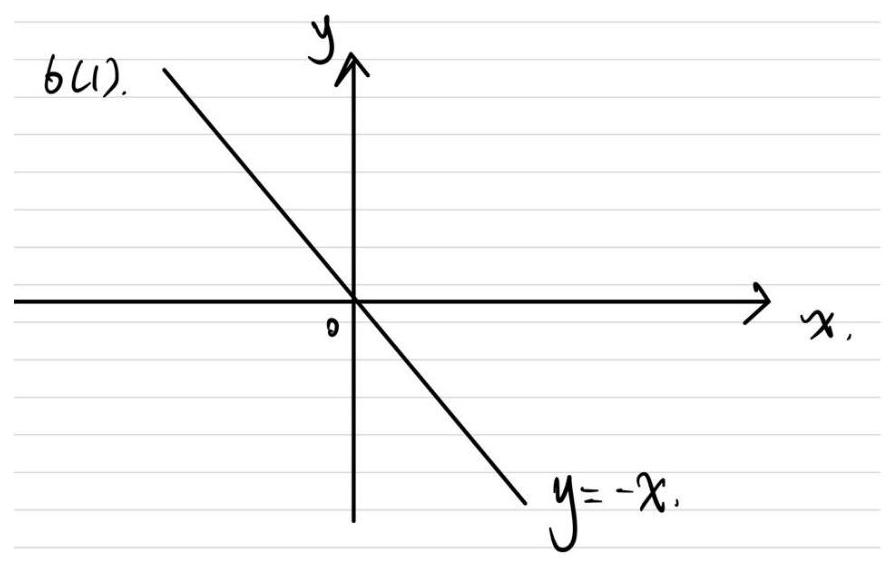

(2)由题可知， ${l}_{1} : y = {2x} - 1,{l}_{2} : y = {2x} + 1$ ，因此 $Q\left( {{x}_{1},{2{x}_{1}} - 1}\right) , R\left( {{x}_{2},{2{x}_{2}} + 1}\right)$ ， 所以 $d\left( {Q, R}\right)  = \left| {{x}_{1} - {x}_{2}}\right|  + \left| {\left( {2{x}_{1} - 1}\right)  - \left( {2{x}_{2} + 1}\right) }\right|  = \left| {{x}_{1} - {x}_{2}}\right|  + 2\left| {{x}_{1} - {x}_{2} - 1}\right|$

令 ${x}_{1} - {x}_{2} = t$ ,则 $d\left( {Q, R}\right)  = \left| t\right|  + 2\left| {t - 1}\right|$ ,所以 $d\left( {Q, R}\right)  = \left\{  \begin{array}{l}  - {3t} + 2, t < 0 \\   - t + 2,0 \leq  t < 1 \\  {3t} - 2, t \geq  1 \end{array}\right.$ ,

所以当 $t = 1$ 时, $d\left( {Q, R}\right)$ 取得最小值 1 .

(3)因为 $d\left( {P, M}\right)  + d\left( {P, N}\right)  = 8$ ，所以 $\left| {x - 1}\right|  + \left| {x + 1}\right|  + \left| {y - 1}\right|  + \left| {y + 1}\right|  = 8$ ，

所以,类比椭圆的几何性质,曲线 $\Gamma$ 的性质有:

对称性: 曲线 $\Gamma$ 即是以 $x$ 轴、 $y$ 轴为对称轴的对称图形,也是以原点为对称中心的中心对称图形,因此只需要考虑第一象限 (及 $\mathrm{x},\mathrm{y}$ 正半轴) 的图像情况:

---

$$
8 = \left| {x - 1}\right|  + \left| {x + 1}\right|  + \left| {y - 1}\right|  + \left| {y + 1}\right|
$$

$$
= \left| {x - 1}\right|  + \left| {y - 1}\right|  + x + y + 2
$$

$$
= \left\{  \begin{array}{l} {2x} + {2y}, x \geq  1, y \geq  1 \\  {2x} + 2, x \geq  1,0 \leq  y \leq  1 \\  {2y} + 2, y \geq  1,0 \leq  x \leq  1 \\  4,0 \leq  x \leq  1,0 \leq  y \leq  1 \end{array}\right.
$$

---

可得曲线方程为:

$x \geq  1, y \geq  1$ 时: $x + y = 4$ ;

$x \geq  1,0 \leq  y \leq  1$ 时, $x = 3$ ;

$y \geq  1,0 \leq  x \leq  1$ 时, $y = 3$ ;

$0 \leq  x \leq  1,0 \leq  y \leq  1$ 时, $4 = 8$ (舍)

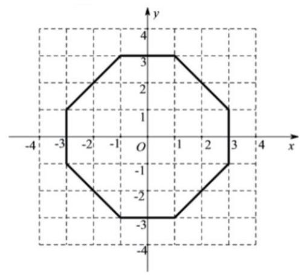

## 课后练习 12 解析

1. 【答案】B

【解析】直线到 $\left( {0,0}\right)$ 距离为 $d = \frac{\left| c\right| }{\sqrt{{\sin }^{2}\theta  + {\cos }^{2}\theta }} = \left| c\right| \; d$ 为定值,故直线与某定圆相切,选 $\mathrm{B}$

2. 【答案】 $3 - \frac{\sqrt{5}}{2} \leq  m \leq  3 + \frac{\sqrt{5}}{2}$

【解析】点集 $P$ 表示平面上以 ${O}_{1}\left( {-2,3}\right)$ 为圆心,2 为半径的圆所围成的区域 (包括圆周); 点集 $Q$ 表示平面上以 ${O}_{2}\left( {-1, m}\right)$ 为圆心, $\frac{1}{2}$ 为半径的圆的内部.

要使 $P \cap  Q = Q$ ,应使 $\odot  {O}_{2}$ 内含或内切于 $\odot  {O}_{1}$ .

故有 ${\left| {O}_{1}{O}_{2}\right| }^{2} \leq  {\left( {R}_{1} - {R}_{2}\right) }^{2}$ ,即 ${\left( -1 + 2\right) }^{2} + {\left( m - 3\right) }^{2} \leq  {\left( 2 - \frac{1}{2}\right) }^{2}$ .

解得 $3 - \frac{\sqrt{5}}{2} \leq  m \leq  3 + \frac{\sqrt{5}}{2}$ .

3. 【答案】 $2\sqrt{2} - 3$

【解析】作出大致图像,如图所示. 设 $\angle {BPC} = \angle {APC} = \alpha$ ,则 $\angle {BPA} = {2\alpha }$ , $\left| {PA}\right|  = \left| {PB}\right|  = \frac{1}{\tan \alpha },\therefore \overrightarrow{PA} \cdot  \overrightarrow{PB} = \frac{\cos {2\alpha }}{{\tan }^{2}\alpha } = \frac{{\cos }^{2}\alpha \left( {1 - 2{\sin }^{2}\alpha }\right) }{{\sin }^{2}\alpha } = \frac{2{\sin }^{4}\alpha  - 3{\sin }^{2}\alpha  + 1}{{\sin }^{2}\alpha } \; = 2{\sin }^{2}\alpha  + \frac{1}{{\sin }^{2}\alpha } - 3\ldots {\sin }^{2}\alpha  \in  (0,1\rbrack ,\therefore$ 当 ${\sin }^{2}\alpha  = \frac{\sqrt{2}}{2}$ 时, $\overrightarrow{PA} \cdot  \overrightarrow{PB}$ 有最小值,是 $2\sqrt{2} - 3$ .

4. 【答案】 $\left\lbrack  {-\sqrt{2},\sqrt{2}}\right\rbrack$

【解析】 $\overrightarrow{PM} \cdot  \overrightarrow{ON} = \left( {\overrightarrow{OM} - \overrightarrow{OP}}\right)  \cdot  \overrightarrow{ON} =  - \overrightarrow{OP} \cdot  \overrightarrow{ON} =  - 2{x}_{N} \in  \left\lbrack  {-{2ON},{2ON}}\right\rbrack   = \left\lbrack  {-\sqrt{2},\sqrt{2}}\right\rbrack$

5. 【答案】 $\left\lbrack  {\sqrt{2} - 1,1 + \sqrt{2}}\right\rbrack$

【解析】由于正方形边 ${AB}$ 垂直于 $x$ 轴且为圆 $O$ 的一条弦,则 $A, B$ 两点关于 $x$ 轴对称, 则可设 $A\left( {\cos \alpha ,\sin \alpha }\right)$ ,其中 $\alpha  \in  \left( {0,\pi }\right)$ ,正方形顶点 $A, B, C, D$ (以逆时针方向),则 $B\left( {\cos \alpha , - \sin \alpha }\right) ,\;{AD} = {AB} = 2\sin \alpha$ ,则 $D\left( {2\sin \alpha  + \cos \alpha ,\sin \alpha }\right)$ .

${\left| OD\right| }^{2} = {\left( 2\sin \alpha  + \cos \alpha \right) }^{2} + {\sin }^{2}\alpha  = 5{\sin }^{2}\alpha  + 4\sin \alpha \cos \alpha  + {\cos }^{2}\alpha$

$= 1 + 4 \times  \frac{1 - \cos {2\alpha }}{2} + 2\sin {2\alpha } = 3 + 2\sin {2\alpha } - 2\cos {2\alpha } = 3 + 2\sqrt{2}\sin \left( {{2\alpha } - \frac{\pi }{4}}\right)$

因为 $0 < \alpha  < \pi$ ,所以 $- \frac{\pi }{4} < {2\alpha } - \frac{\pi }{4} < \frac{7\pi }{4}$ ,

当 ${2\alpha } - \frac{\pi }{4} = \frac{\pi }{2}$ ，即 $\alpha  = \frac{3\pi }{8}$ 时， ${\left| OD\right| }_{\max } = \sqrt{3 + 2\sqrt{2}} = 1 + \sqrt{2}$ ；

当 ${2\alpha } - \frac{\pi }{4} = \frac{3\pi }{2},\alpha  = \frac{7\pi }{8}$ 时， ${\left| OD\right| }_{\min } = \sqrt{3 - 2\sqrt{2}} = \sqrt{2} - 1$ ；

所以 $\left| {OD}\right|  \in  \left\lbrack  {\sqrt{2} - 1,1 + \sqrt{2}}\right\rbrack$ ;

6. 【答案】 4.4

【解析】

以 0 为坐标原点, 建立如图所示的直角坐标系,

可设 $P\left( {-{10}, - {10} + {1.5t}}\right) , Q\left( {{10},{10} - t}\right)$ ,可得直线 ${PQ}$ 的方程为 $y - {10} + t = \frac{{20} - {2.5t}}{20}\left( {x - {10}}\right) ,$

圆 $O$ 的方程为 ${x}^{2} + {y}^{2} = 1$ ,

由直线 ${PQ}$ 与圆 $O$ 有交点,可得

$\frac{\left| \frac{{2.5t} - {20}}{2} - t + {10}\right| }{\sqrt{1 + {\left( \frac{{20} - {2.5t}}{20}\right) }^{2}}} \leq  1$

化为 $3{t}^{2} + {16t} - {128} \leq  0$ ,

解得 $0 \leq  t \leq  \frac{8\sqrt{7} - 8}{3}$ ,

即有点 $Q$ 在点 $P$ 的盲区中的时长约为 4.4 秒.

7. 【答案】

(1)见解析

(2) $x =  - 1$ 或 ${4x} - {3y} + 4 = 0$

(3) $t$ 为定值 -5

【解析】(1) 证明: $\left| {z - {3i}}\right|  = \left| {\sqrt{3} - i}\right|  = 2$ ,

可得圆 $C : {x}^{2} + {\left( y - 3\right) }^{2} = 4$ ,

即有 $C\left( {0,3}\right)$ ,半径 $r = 2$ ,

直线 $l$ 经过圆心 $C\left( {0,3}\right)$ ,又过 $\left( {-1,0}\right)$ ,

可得直线 $l$ 的斜率为 3 ，

直线 $m$ 的斜率为 $- \frac{1}{3}$ ,

即有 $3 \times  \left( {-\frac{1}{3}}\right)  =  - 1$ ,即直线 $l$ 和 $m$ 垂直;

(2)若直线 $l$ 的斜率不存在,即方程为 $x =  - 1$ ,代入圆的方程可得 $y = 3 \pm  \sqrt{3}$ , 满足 $\left| {PQ}\right|  = 2\sqrt{3}$ ;

若直线 $l$ 的斜率存在,设直线方程为 $y = k\left( {x + 1}\right)$ ,

圆心 $C$ 到直线 $l$ 的距离为 $d = \frac{\left| k - 3\right| }{\sqrt{1 + {k}^{2}}}$ ,

由 $2\sqrt{3} = 2\sqrt{4 - {d}^{2}} = 2\sqrt{4 - \frac{{\left( k - 3\right) }^{2}}{1 + {k}^{2}}}$ ,

解得 $k = \frac{4}{3}$ ,即直线 $l$ 的方程为 $y = \frac{4}{3}\left( {x + 1}\right)$ ,

综上可得,直线 $l$ 的方程为 $x =  - 1$ 或 ${4x} - {3y} + 4 = 0$ ;

(3)设直线 $l$ 的方程为 $\left\{  {\begin{array}{l} x =  - 1 + m\cos \alpha \\  y = m\sin \alpha  \end{array}\text{ ( }m}\right.$ 为参数)，

代入圆 $C : {x}^{2} + {\left( y - 3\right) }^{2} = 4$ ,可得

$1 - {2m}\cos \alpha  + {m}^{2}{\cos }^{2}\alpha  + 9 - {6m}\sin \alpha , + {m}^{2}{\sin }^{2}\alpha  = 4$

化为 ${m}^{2} - \left( {2\cos \alpha  + 6\sin \alpha }\right) m + 6 = 0,{m}_{1} + {m}_{2} = 2\cos \alpha  + 6\sin \alpha$ ,

则 ${AM} = \frac{1}{2}\left( {{m}_{1} + {m}_{2}}\right)  = \cos \alpha  + 3\sin \alpha$ ,

将直线 $l$ 的参数方程代入 $x + {3y} + 6 = 0$ ，

可得 $m\left( {\cos \alpha  + 3\sin \alpha }\right)  =  - 5$ ，

即有 ${AN} = \frac{-5}{\cos \alpha  + 3\sin \alpha }$ ,

$t = \overrightarrow{AM} \cdot  \overrightarrow{AN} = \left( {\cos \alpha  + 3\sin \alpha }\right)  \cdot  \frac{-5}{\cos \alpha  + 3\sin \alpha } =  - 5$

可得 $t$ 为定值 -5.

## 课后练习 13 解析

1.【答案】 $2\sqrt{2} - 5$ .

【解析】

如图所示，

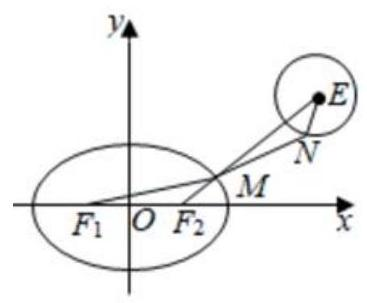

$\because$ 椭圆 $C : \frac{{x}^{2}}{4} + \frac{{y}^{2}}{3} = 1$ ，又 $\because M$ 为椭圆 $C$ 上任意一点， $N$ 为圆

$E : {\left( x - 3\right) }^{2} + {\left( y - 2\right) }^{2} = 1$ 上任意一点,

$\therefore \left| {M{F}_{1}}\right|  + \left| {M{F}_{2}}\right|  = 4,\left| {MN}\right|  \geq  \left| {ME}\right|  - 1$ (当且仅当 $M, N, E$ 共线时取等号),

$\therefore \left| {MN}\right|  - \left| {M{F}_{1}}\right|  = \left| {MN}\right|  - \left( {4 - \left| {M{F}_{2}}\right| }\right)$

$= \left| {MN}\right|  + \left| {M{F}_{2}}\right|  - 4 \geq  \left| {ME}\right|  + \left| {M{F}_{2}}\right|  - 5 \geq  \left| {E{F}_{2}}\right|  - 5$

当且仅当 $M, N, E,{F}_{2}$ 共线时,等号成立,

$\because {F}_{2}\left( {1,0}\right) ,\;E\left( {3,2}\right)$

$\therefore \left| {E{F}_{2}}\right|  = \sqrt{{\left( 3 - 1\right) }^{2} + {\left( 2 - 0\right) }^{2}} = 2\sqrt{2}$

$\therefore \left| {MN}\right|  - \left| {M{F}_{1}}\right|$ 的最小值为 $2\sqrt{2} - 5$ .

故答案为: $2\sqrt{2} - 5$ .

2.【答案】7

【解析】

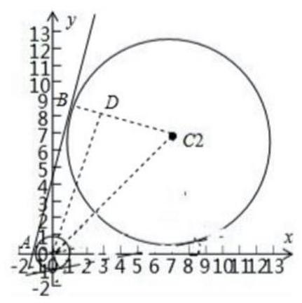

设两切点分别为 $A, B$ ,连接 $A{C}_{1}, B{C}_{2}$ ,

过 ${C}_{1}$ 作 ${C}_{1}D//{AB}$ 交 $B{C}_{2}$ 于 $D$ ,则直角三角形 ${C}_{1}{CD}$ ,

$\tan \angle D{C}_{1}{C}_{2} = \frac{3}{4},$

$\because \angle x{C}_{1}{C}_{2} = \frac{\pi }{4}$ ,

$\therefore \tan \angle D{C}_{1}x = \tan \left( {\angle D{C}_{1}{C}_{2} + \frac{\pi }{4}}\right)  = \frac{1 + \frac{3}{4}}{1 - \frac{3}{4}} = 7$

故答案为: 7 .

3.【答案】 ${7x} \pm  {24y} + {125} = 0$

【解析】由角 $\alpha$ 的终边与曲线的交点 $A$ 的横坐标是 $- 3,\therefore \cos \alpha  =  - \frac{3}{5},\sin \alpha  =  \pm  \frac{4}{5}$ , $\therefore \cos {2\alpha } = 2{\cos }^{2}\alpha  - 1 =  - \frac{7}{25},\sin {2\alpha } = 2\sin \alpha \cos \alpha  =  \pm  \frac{24}{25},\therefore B\left( {-\frac{7}{5}, \pm  \frac{24}{5}}\right) ,\therefore$ 切线的斜率为 $\pm  \frac{7}{24},\therefore$ 切线方程为 ${7x} \pm  {24y} + {125} = 0$ . 故答案为: ${7x} \pm  {24y} + {125} = 0$ .

4.【答案】 $\left\lbrack  {-\frac{11}{7}, - 1}\right\rbrack$

【解析】

由 ${\left( x + y\right) }^{2} + x + y - 2 \leq  0$ ,得 $- 2 \leq  x + y \leq  l, A$ 是被两条平行直线 $x + y =  - 2, x + y = 1$ 夹在其中的区域,

$B$ 表示以 $\left( {a,{2a} + l}\right)$ 为圆心的圆及其内部的点,首先,有 ${a}^{2} - 1 \geq  0$ ,得 $a \leq   - 1$ 或 $a \geq  1$ , 当 $a \leq   - 1$ 时,以为 $A \cap  B \neq  \varnothing$ ,所以 $d \leq  r$ ,

即 $\frac{\left| a + 2a + 2 + 1\right| }{\sqrt{2}} \leq  \sqrt{{a}^{2} - 1}$ ,

所以 $\left( {a + 1}\right) \left( {{7a} + {11}}\right)  \leq  0$ ,所以 $- \frac{11}{7} \leq  a \leq   - 1$ ;

当 $a \geq  1$ 时，因为 $A \cap  B \neq  \varnothing$ ，所以 $d \leq  r$ ，

即 $\frac{\left| a + 2a + 1 - 1\right| }{\sqrt{2}} \leq  \sqrt{{a}^{2} - 1}$ ,

所以 $7{a}^{2} + 2 \leq  0$ ,无解;

综上, $a$ 的取值范围是 $\left\lbrack  {-\frac{11}{7}, - 1}\right\rbrack$ .

故答案为: $\left\lbrack  {-\frac{11}{7}, - 1}\right\rbrack$

5.【答案】 $\left\lbrack  {-\frac{{19} + \sqrt{109}}{14},0}\right\rbrack$

【解析】 $\because$ 集合 $A = \left\{  {\left( {x, y}\right)  \mid  {\left( x + y\right) }^{2} + x + y - 2 \leq  0}\right\}$ ,

$\therefore$ 集合 $A = \{ \left( {x, y}\right)  \mid   - 2 \leq  x + y \leq  1\} , B = \left\{  {\left( {x, y}\right)  \mid  {\left( x - 2a\right) }^{2} + {\left( y - a - 1\right) }^{2} \leq  {a}^{2} - \frac{a}{2}}\right\}$ , 由 ${a}^{2} - \frac{a}{2} \geq  0$ ,解得 $a \geq  \frac{1}{2}$ 或 $a \leq  0$ .

在此条件下,表示以 $\left( {{2a}, a + 1}\right)$ 为圆心, $\sqrt{{a}^{2} - \frac{a}{2}}$ 为半径的圆及其圆内的点.

其圆心在直线 $x - {2y} + 2 = 0$ 上,由 $A \cap  B \neq  \varnothing$ ,

① 当 $a < 0$ 时，由 $\frac{\left| 2a + a + 1 + 2\right| }{\sqrt{2}} \leq  \sqrt{{a}^{2} - \frac{a}{2}}$ 或 $\frac{\left| 2a + a + 1 - 1\right| }{\sqrt{2}} \leq  \sqrt{{a}^{2} - \frac{a}{2}}$ ，或 $- 2 \leq  {2a} < 0$ ，

解 得 : $- \frac{{19} + \sqrt{109}}{14} \leq  a \leq  \frac{\sqrt{109} - {19}}{14}$ 或 $- \frac{1}{7} \leq  a < 0$ ,或 $- 1 \leq  a < 0$ . 即 $- \frac{{19} + \sqrt{109}}{14} \leq  a < 0$

② $a > \frac{1}{2}$ 时，由 $\frac{\left| 2a + a + 1 - 1\right| }{\sqrt{2}} \leq  \sqrt{{a}^{2} - \frac{a}{2}}$ ，或 $\frac{\left| 2a + a + 1 + 2\right| }{\sqrt{2}} \leq  \sqrt{{a}^{2} - \frac{a}{2}}$ ，解得 $a \in  \varnothing$ .

③ $a = 0$ 时，满足题意； $a = \frac{1}{2}$ . 时，不满足题意，舍去.

综上可得: 实数 $a$ 的取值范围为 $\left\lbrack  {-\frac{{19} + \sqrt{109}}{14},0}\right\rbrack$ .

故答案为: $\left\lbrack  {-\frac{{19} + \sqrt{109}}{14},0}\right\rbrack$ .

6.【答案】 ${2x} + y + 1 = 0$

【解析】圆的方程可化为 ${\left( x - 1\right) }^{2} + {\left( y - 1\right) }^{2} = 4$ ,圆心 $M$ 到直线 $l$ 的距离为 $d = \frac{\left| 2 \times  1 + 1 + 2\right| }{\sqrt{{2}^{2} + {1}^{2}}} = \sqrt{5} > 2$ ,所以直线 $l$ 与圆相离.

依圆的知识可知，四点 $A, P, B, M$ 共圆，且 ${AB} \bot  {MP},$

所以 $\left| {PM}\right|  \cdot  \left| {AB}\right|  = 2{S}_{\bigtriangleup {PAM}} = 2 \times  \frac{1}{2} \cdot  \left| {PA}\right|  \cdot  \left| {AM}\right|  = 2\left| {PA}\right|$ ,而 $\left| {PA}\right|  = \sqrt{{\left| MP\right| }^{2} - 4}$ ,

当直线 ${MP} \bot  l$ 时, ${\left| MP\right| }_{\min } = \sqrt{5},{\left| PA\right| }_{\min } = 1$ ,

此时 $\left| {PM}\right|  \cdot  \left| {AB}\right|$ 最小.

所以 ${MP} : y - 1 = \frac{1}{2}\left( {x - 1}\right)$ ,即 $y = \frac{1}{2}x + \frac{1}{2}$ ,

由 $\left\{  {\begin{array}{l} y = \frac{1}{2}x + \frac{1}{2}, \\  {2x} + y + 2 = 0, \end{array}\text{ 解得 }\left\{  \begin{array}{l} x =  - 1, \\  y = 0. \end{array}\right. }\right.$

所以以 MP 为直径的圆的方程为 $\left( {x - 1}\right) \left( {x + 1}\right)  + y\left( {y - 1}\right)  = 0$ ,即 ${x}^{2} + {y}^{2} - y - 1 = 0$ ,两圆的方程相减可得 ${2x} + y + 1 = 0$ ,即为直线 ${AB}$ 的方程.

7.【答案】A

【解析】

由直线系 $M : x\cos \theta  + y\sin \theta  = 1\left( {0 \leq  \theta  < {2\pi }}\right)$

可令 $\left\{  \begin{array}{l} x = \cos \theta \\  y = \sin \theta  \end{array}\right.$ ,消去 $\theta$ 可得 ${x}^{2} + {y}^{2} = 1$ ,

故直线系 $M$ 表示圆 ${x}^{2} + {y}^{2} = 1$ 的切线的集合，故( 1 )不正确；

因为对任意 $\theta$ ,存在定点 $\left( {0,0}\right)$ ,

$\because 0 \times  \cos \theta  + 0 \times  \sin \theta  \neq  1$ ,故点 $\left( {0,0}\right)$ 不在直线系

$M$ 中的任意一条上,故 (2) 正确;

由于圆 ${x}^{2} + {y}^{2} = 1$ 的外切正 $n$ 边形,所有的边都在直线系 $M$ 中,故 (3) 正确;

$M$ 中的直线所能围成的正三角形的边长不一定相等,

故它们的面积不一定相等，如图中等边三角形 ${ABC}$ 和 ${ADE}$ 面积不相等，

故 (4) 不正确,

8.【答案】

(1) ${\left( x - 3\right) }^{2} + {\left( y - 1\right) }^{2} = 9$ .

(2)它是一个以(-3,1)为圆心，以 $\frac{3}{4}$ 为半径的圆；T 不存在

【解析】

(1)设圆心 $\left( {{3t}, t}\right)$ ，

则由圆与 $y$ 轴正半轴相切，可得半径 $r = 3\left| t\right|$ .

$\because$ 圆心到直线的距离 $d = \frac{\left| 6t - t\right| }{\sqrt{5}} = \sqrt{5}t$ ,由 $4 + 5{t}^{2} = 9{t}^{2}$ ,解得 $t =  \pm  1$ ,

故圆心为 $\left( {3,1}\right)$ 或 $\left( {-3, - 1}\right)$ ,半径等于 3 .

$\because$ 圆与 $y$ 轴正半轴相切, $\therefore$ 圆心只能为 $\left( {3,1}\right)$

故圆 $C$ 的方程为 ${\left( x - 3\right) }^{2} + {\left( y - 1\right) }^{2} = 9$ .

(2)① 设 $M\left( {x, y}\right)$ ， $A\left( {m, n}\right)$ ，

$\because M$ 为线段 ${AB}$ 上一点且满足 $\frac{\left| AM\right| }{\left| MB\right| } = 3$ ,

$\therefore \overrightarrow{AM} = 3\overrightarrow{MB}$ ,

$\therefore \left( {x - m, y - n}\right)  = 3\left( {-5 - x,1 - y}\right)$ ,

$\therefore \left\{  \begin{array}{l} m = {4x} + {15} \\  n = {4y} - 3 \end{array}\right.$

$\because$ 点 $A$ 在圆 $C$ 上运动,

$\therefore {\left( 4x + {15} - 3\right) }^{2} + {\left( 4y - 3 - 1\right) }^{2} = 9$ ,

$\therefore {\left( 4x + {12}\right) }^{2} + {\left( 4y - 4\right) }^{2} = 9$ ,

$\therefore {\left( x + 3\right) }^{2} + {\left( y - 1\right) }^{2} = \frac{9}{16}$ ,

所以曲线 $E$ 的方程为 ${\left( x + 3\right) }^{2} + {\left( y - 1\right) }^{2} = \frac{9}{16}$ ,

它是一个以 $\left( {-3,1}\right)$ 为圆心,以 $\frac{3}{4}$ 为半径的圆.

② 假设存在一点 $T\left( {t,{2t}}\right)$ 满足条件,设 $P\left( {x, y}\right)$ ,

$\frac{\left| PT\right| }{\left| PO\right| } = \lambda$

则 ${\left( x - t\right) }^{2} + {\left( y - 2t\right) }^{2} = {\lambda }^{2}\left( {{x}^{2} + {y}^{2}}\right)$ ,

整理得

${\lambda }^{2}\left( {{x}^{2} + {y}^{2}}\right)  = \left( {{x}^{2} - {2tx} + {t}^{2} + {y}^{2} - {4ty} + 4{t}^{2}}\right)$

$\because P$ 在轨迹 $E$ 上,

$\therefore {\left( x + 3\right) }^{2} + {\left( y - 1\right) }^{2} = \frac{9}{16}$ ,

$\because P$ 在轨迹 $E$ 上,

$\therefore {\left( x + 3\right) }^{2} + {\left( y - 1\right) }^{2} = \frac{9}{16}$ ,

化简得: ${x}^{2} + {y}^{2} =  - {6x} + {2y} - \frac{151}{160}$ ,

$\therefore x\left( {6{\lambda }^{2} - {2t} - 6}\right)  + y\left( {-2{\lambda }^{2} - {4t} + 2}\right)  - \frac{151}{160} + \frac{151}{160}{\lambda }^{2} + 5{t}^{2} = 0$

$$
\therefore \left\{  {\begin{array}{l} 6{\lambda }^{2} - {2t} - 6 = 0 \\   - 2{\lambda }^{2} - {4t} + 2 = 0 \\   - \frac{151}{160} + \frac{151}{160}{\lambda }^{2} + 5{t}^{2} = 0 \end{array},\therefore \left\{  {\begin{array}{l} {\lambda }^{2} = 1 \\  t = 0 \end{array},}\right. }\right.
$$

$\therefore T\left( {0,0}\right)$ ,

$\because T$ 异于原点, $\therefore T$ 不存在.

## 课后练习 14

1. 【答案】 $\frac{{x}^{2}}{169} + \frac{{y}^{2}}{144} = 1$ .

【解析】 $\because m$ 在双曲线上

$\therefore \left| \right| M{F}_{1}\left| -\right| M{F}_{2}\left| \right|  = 8$ ①

在 $\bigtriangleup {F}_{1}M{F}_{2}$ 中使用余弦定理:

$2\left| {M{F}_{1}}\right| \left| {M{F}_{2}}\right| \cos \angle {F}_{1}M{F}_{2} = {\left| M{F}_{1}\right| }^{2} + {\left| M{F}_{2}\right| }^{2} - {\left| {F}_{1}{F}_{2}\right| }^{2}$ ②

①，② 联立得: $\left| {M{F}_{1}}\right|  \cdot  \left| {M{F}_{2}}\right|  = {153}$ .

$\left| {M{F}_{1}}\right|  + \left| {M{F}_{2}}\right|  = \sqrt{{\left( \left| M{F}_{1}\right|  - \left| M{F}_{2}\right| \right) }^{2} + 4\left| {M{F}_{1}}\right|  \cdot  \left| {M{F}_{2}}\right| } = {26}.$

$\therefore$ 椭圆方程为 $\frac{{x}^{2}}{{13}^{2}} + \frac{{y}^{2}}{{13}^{2} - {5}^{2}} = 1$

即 $\frac{{x}^{2}}{169} + \frac{{y}^{2}}{144} = 1$ .

2. 【答案】 $\sqrt{2}$ 或 2

【解析】由题意, $c = 1$ ,因此 $\left| {{k}^{2} - 3}\right|  = {c}^{2} = 1$ ,解得: $k = \sqrt{2}$ 或 2

3. 【答案】 ${\left( x - \frac{3}{2}\right) }^{2} + {y}^{2} = \frac{25}{4}$

【解析】设圆心坐标为 $\left( {{x}_{0},0}\right)$ ,则 ${r}^{2} = {\left( 4 - {x}_{0}\right) }^{2} = {x}_{0}^{2} + 4$ ,解得: $\left\{  \begin{array}{l} {x}_{0} = \frac{3}{2} \\  r = \frac{5}{2} \end{array}\right.$ ,故圆方程为 ${\left( x - \frac{3}{2}\right) }^{2} + {y}^{2} = \frac{25}{4}$

4. 【答案】 4

【解析】因为椭圆的方程为 $\frac{{x}^{2}}{25} + \frac{{y}^{2}}{9} = 1$ ,所以 $a = 5$ .

设椭圆另一焦点为 ${F}_{2}$ ,则 $\left| {M{F}_{1}}\right|  + \left| {M{F}_{2}}\right|  = {2a} = {10}$ ,因此 $\left| {M{F}_{2}}\right|  = 8$ .

又因为 $\mathrm{N}$ 为 $M{F}_{1}$ 的中点, $\mathrm{O}$ 为 ${F}_{1}{F}_{2}$ 的中点,

所以 $\mathrm{{ON}}$ 为 ${\Delta M}{F}_{1}{F}_{2}$ 的中位线,

所以 $\left| {ON}\right|  = \frac{1}{2}\left| {M{F}_{2}}\right|  = 4$

5. 【答案】 $\frac{{x}^{2}}{4} + {y}^{2} = 1$

【解析】由于 $e = \frac{\sqrt{3}}{2}$ ,因此 $3{a}^{2} = 4{c}^{2},{c}^{2} = 3{b}^{2},{a}^{2} = 4{b}^{2}$

圆 $C : {x}^{2} + {\left( y - \frac{3}{2}\right) }^{2} = 1$ 上点与这椭圆上点的最大距离为 $1 + \sqrt{7}$ ,

则圆心 $\left( {0,\frac{3}{2}}\right)$ 到椭圆上的点最大距离为 $\sqrt{7}$

设椭圆上的点 $P$ 坐标为 $\left( {x, y}\right)$ ,则 $\frac{{x}^{2}}{4{b}^{2}} + \frac{{y}^{2}}{{b}^{2}} = 1$ ,令

$f\left( y\right)  = P{C}^{2} = {x}^{2} + {\left( y - \frac{3}{2}\right) }^{2} = 4{b}^{2} - 4{y}^{2} + {y}^{2} - {3y} + \frac{9}{4} =  - 3{y}^{2} - {3y} + 4{b}^{2} + \frac{9}{4}$ ,对称轴为 $y =  - \frac{1}{2}$ ,

${1}^{ \circ  }$ 若 $- \frac{1}{2} \geq   - b$ ,即 $b \geq  \frac{1}{2}$ 时, ${f}_{\text{ Max }} =  - 3{\left( -\frac{1}{2}\right) }^{2} - 3\left( {-\frac{1}{2}}\right)  + 4{b}^{2} + \frac{9}{4} = 4{b}^{2} + 3 = 7$ ,解得: $b = 1$ ;

${2}^{ \circ  }$ 若 $- \frac{1}{2} \leq   - b$ ,即 $0 < b \leq  \frac{1}{2}$ 时, ${f}_{\text{ Max }} =  - 3{b}^{2} + {3b} + 4{b}^{2} + \frac{9}{4} = {\left( b + \frac{3}{2}\right) }^{2} \leq  {2}^{2} < 7$ ,矛盾。

因此椭圆方程为 $\frac{{x}^{2}}{4} + {y}^{2} = 1$

6. 【答案】 $\frac{{x}^{2}}{16} + \frac{{y}^{2}}{7} = 1$

【解析】设动圆 $P$ 和定圆 $B$ 内切于点 $M$ . 动点 $P$ 到定点 $A\left( {-3,0}\right)$ 和定圆圆心 $B\left( {3,0}\right)$ 距离之和恰好等于定圆半径,即 $\left| {PA}\right|  + \left| {PB}\right|  = \left| {PM}\right|  + \left| {PB}\right|  = \left| {BM}\right|  = 8$ .

$\therefore$ 点 $P$ 的轨迹是以 $A, B$ 为两焦点,半长轴为 4 的椭圆, $b = \sqrt{{4}^{2} - {3}^{2}} = \sqrt{7}$ .

$\therefore$ 点 $\mathrm{P}$ 的轨迹方程为 $\frac{{x}^{2}}{16} + \frac{{y}^{2}}{7} = 1$

7. 【答案】 ${x}^{2} + \frac{3}{2}{y}^{2} = 1$

【解析】由题意得 $\left| {A{F}_{2}}\right|  = {b}^{2}$ ,

$\therefore$ 点 $B$ 坐标为 $B\left( {-\frac{5c}{3}, - \frac{1}{3}{b}^{2}}\right)$ .

将点 $B$ 坐标代入椭圆方程得 ${\left( -\frac{5c}{3}\right) }^{2} + \frac{{\left( -\frac{1}{3}{b}^{2}\right) }^{2}}{{b}^{2}} = 1$ ,

又 ${b}^{2} = 1 - {c}^{2}$ ,解得 $\left\{  \begin{array}{l} {b}^{2} = \frac{2}{3}, \\  {c}^{2} = \frac{1}{3}, \end{array}\right.$

$\therefore$ 椭圆方程为 ${x}^{2} + \frac{3}{2}{y}^{2} = 1$ .

8.【答案】 ${10} - 2\sqrt{10}$ .

【解析】设椭圆的左焦点为 ${F}^{\prime }$ ,则 ${F}^{\prime }\left( {-4,0}\right)$ ,连 ${F}^{\prime }A$ 并延长交椭圆于 $M$ ,则 $\left| {MA}\right|  + \left| {MF}\right|$ 为最小. 这是因为此时 $\left| {MA}\right|  + \left| {MF}\right|  = \left| {M{F}^{\prime }}\right|  - \left| {A{F}^{\prime }}\right|  + \left| {MF}\right|  = {2a} - \left| {A{F}^{\prime }}\right|$ ,若在椭圆上任取一点 ${M}^{\prime }$ (异于 $M$ ),则 $\left| {{M}^{\prime }A}\right|  + \left| {{M}^{\prime }F}\right|  > \left| {{M}^{\prime }{F}^{\prime }}\right|  - \left| {A{F}^{\prime }}\right|  + \left| {{M}^{\prime }F}\right|  = {2a} - \left| {A{F}^{\prime }}\right|$ ,所以 $\left| {MA}\right|  + \left| {MF}\right|  < \left| {{M}^{\prime }A}\right|  + \left| {{M}^{\prime }F}\right|$ ,计算得 $\left| {A{F}^{\prime }}\right|  = 2\sqrt{10}$ ,所以最小值为 ${10} - 2\sqrt{10}$ .

9.【答案】 $\frac{\pi }{3}$

【解析】由题意, $a \geq  \sqrt{3}b,\therefore$ 渐近线 $y = \frac{b}{a}x$ 的斜率 $\frac{b}{a} \leq  \frac{\sqrt{3}}{3},\because \tan \frac{\pi }{6} = \frac{\sqrt{3}}{3}$ ,故该渐近线的倾斜角的最大值为 $\frac{\pi }{6},\therefore$ 两条渐近线夹角的最大值为 $\frac{\pi }{3}$

10. 【答案】B

【解析】设 $M\left( {{x}_{0},{y}_{0}}\right)$ ,由题可得 $2 \leq  {x}_{0} < \sqrt{5}$ ,进而得 $\sqrt{5} - 2 \leq  \left| {M{F}_{2}}\right|  < \frac{1}{2}$ ,

利用双曲线的定义可得 $\left| {M{F}_{1}}\right|  + \left| {M{F}_{2}}\right|  = 2\left| {M{F}_{2}}\right|  + 4 \in  \lbrack 2\sqrt{5},5)$ ,即得

设 $M\left( {{x}_{0},{y}_{0}}\right)$ ,则 ${x}_{0} \geq  2$ ,由题可知 ${F}_{1}\left( {-\sqrt{5},0}\right) ,{F}_{2}\left( {\sqrt{5},0}\right)$ ,

$\therefore \overrightarrow{{F}_{2}M} = \left( {{x}_{0} - \sqrt{5},{y}_{0}}\right) ,\overrightarrow{{F}_{2}{F}_{1}} = \left( {-2\sqrt{5},0}\right)$ ,

又 $\overrightarrow{{F}_{2}M} \cdot  \overrightarrow{{F}_{2}{F}_{1}} > 0$ ,

$\therefore \left( {{x}_{0} - \sqrt{5},{y}_{0}}\right)  \cdot  \left( {-2\sqrt{5},0}\right)  > 0$ ,可得 ${x}_{0} < \sqrt{5}$ ,

$\therefore 2 \leq  {x}_{0} < \sqrt{5}$ ,即 $a \leq  {x}_{0} < c$ ,

$\therefore \sqrt{5} - 2 \leq  \left| {M{F}_{2}}\right|  < \frac{1}{2}$ ,

$\therefore \left| {M{F}_{1}}\right|  + \left| {M{F}_{2}}\right|  - \left| {M{F}_{2}}\right|  + 4 + \left| {M{F}_{2}}\right|  = 2\left| {M{F}_{2}}\right|  + 4 \in  \lbrack 2\sqrt{5},5)$ ,又 $2\sqrt{6} \in  \lbrack 2\sqrt{5},5)$ .

11.【答案】双曲线

【解析】如图所示,设 ${AB} = {CD} = {2m}$ ,

设 $P\left( {x, y}\right) ,\therefore A\left( {x, m}\right) , D\left( {m, y}\right)$ ,均在双曲线上,

即 $\frac{{x}^{2}}{2} - {m}^{2} = 1\cdots \cdots$ ①， $\frac{{m}^{2}}{2} - {y}^{2} = 1\cdots \cdots$ ②，

② $\times  2 +$ ①得: $\frac{{x}^{2}}{2} - 2{y}^{2} = 3$ ，即点 $P$ 的轨迹是双曲线

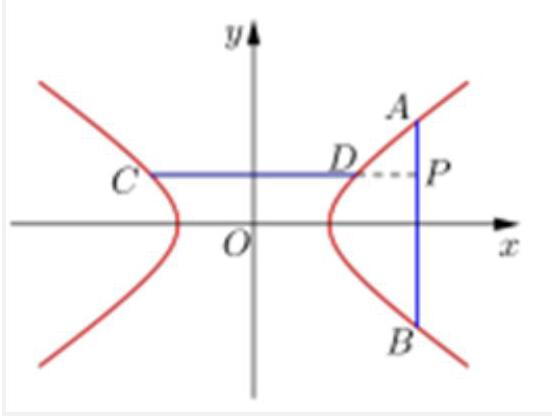

12.【答案】 $\frac{{x}^{2}}{3} - {y}^{2} = 1$

【解析】 $\overrightarrow{FM} \cdot  \overrightarrow{FN} = 0 \Rightarrow  {FM} \bot  {FN}$ ,

$\therefore {OF} = {ON} = {OM} = 2,\therefore {MN} = 4$ ,

$M{F}^{2} + N{F}^{2} = {16},\because {MF} + {NF} = 2\sqrt{5}$ ,

$\therefore {\left( MF + NF\right) }^{2} = M{F}^{2} + N{F}^{2} + {2MF} \cdot  {NF} = {20}$ ,

${2MF} \cdot  {NF} = 4,\therefore {\left( MF - NF\right) }^{2} = M{F}^{2} + N{F}^{2} - {2MF} \cdot  {NF} = {12}$ ,

即 ${MF} - {NF} = 2\sqrt{3} = {2a},\therefore a = \sqrt{3},\because c = 2,\therefore {b}^{2} = {c}^{2} - {a}^{2} = 1$ ,

$\therefore$ 双曲线 $C$ 的方程为 $\frac{{x}^{2}}{3} - {y}^{2} = 1$

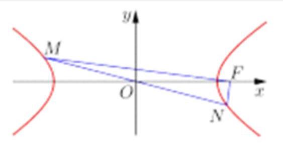
