## 课后练习 1

1. 已知函数 $f\left( x\right)  = \left\{  \begin{array}{ll} x - \frac{8}{x} & x < 0 \\  \left| {x - a}\right| & x \geq  0 \end{array}\right.$ ,若对任意的 ${x}_{1} \in  \lbrack 2, + \infty )$ ,都存在 ${x}_{2} \in  \left\lbrack  {-2, - 1}\right\rbrack$ ,使得 $f\left( {x}_{1}\right)  \cdot  f\left( {x}_{2}\right)  \geq  a$ ，则实数 $a$ 的取值范围为___.

2 已知函数 $f\left( x\right)  = \left\{  \begin{array}{ll} \frac{{x}^{2} + 4}{x} & x \geq  2 \\  {2}^{\left| x - a\right| } & x < 2 \end{array}\right.$ ，若对任意的 ${x}_{1} \in  \lbrack 2, + \infty )$ ，都存在唯一的 ${x}_{2} \in  \left( {-\infty ,2}\right)$ ，满足 $f\left( {x}_{2}\right)  = f\left( {x}_{1}\right)$ ,则实数 $a$ 的取值范围是___

3. 若存在实常数 $k$ 和 $b$ ,使得 $F\left( x\right)$ 和 $G\left( x\right)$ 对其公共定义域上的任意实数 $x$ 都满足: $F\left( x\right)  \geq  {kx} + b$ 和 $G\left( x\right)  \leq  {kx} + b$ 恒成立，则称此直线 $y = {kx} + b$ 为 $F\left( x\right)$ 和 $G\left( x\right)$ 的“分隔直线”. 已知函数 $f\left( x\right)  =  - {x}^{2}\left( {x \in  R}\right)$ ， $g\left( x\right)  = \frac{1}{x}\left( {x > 0}\right)$ ，若 $f\left( x\right)$ 和 $g\left( x\right)$ 之间存在“分隔直线”，则 $b$ 的取值范围为___.

4. 函数 $f\left( x\right)  = x - \frac{2}{x}, x \in  \left\lbrack  {1,2}\right\rbrack  , g\left( x\right)  = a\cos \frac{\pi x}{2} + 5 - {2a},\left( {a > 0}\right)$ ,对任意的 ${x}_{1} \in  \left\lbrack  {1,2}\right\rbrack$ ,总存在 ${x}_{2} \in  \left\lbrack  {0,1}\right\rbrack$ ,使得 $g\left( {x}_{2}\right)  = f\left( {x}_{1}\right)$ 成立,则 $a$ 的取值范围为___

5. 已知对任意的 $x \in  \left( {-\infty ,0}\right)  \cup  \left( {0, + \infty }\right) , y \in  \left\lbrack  {-1,1}\right\rbrack$ ，不等式 ${x}^{2} + \frac{16}{{x}^{2}} - {2xy} - \frac{8}{x}\sqrt{1 - {y}^{2}} - a \geq  0$ 恒成立，则实数 $a$ 的取值范围为___.

6. 已知函数 $f\left( x\right)  = \left\{  \begin{array}{l} {\log }_{2}x, x > 0 \\  \left| {{2x} + 1}\right| , x \leq  0 \end{array}\right.$ ，若对任意 $a \leq   - 1$ ，当 $- 1 < b \leq  m$ 时，总有 $a\left( {f\left( b\right)  - 1}\right)  \geq  b$ 成立，则实数 $m$ 的最大值为___.

7. 已知定义在 $\mathbf{R}$ 上的偶函数 $f\left( x\right)$ ,满足 ${\left\lbrack  f\left( x\right) \right\rbrack  }^{3} - {\left\lbrack  f\left( x\right) \right\rbrack  }^{2} - {x}^{2}f\left( x\right)  + {x}^{2} = 0$ 对任意的实数 $x$ 都成立,且值域为 $\left\lbrack  {0,1}\right\rbrack$ . 设函数 $g\left( x\right)  = \left| {x - m}\right|  - \left| {x - 1}\right| \;\left( {m < 1}\right)$ ,若对任意的 ${x}_{1} \in  \left( {-2,\frac{1}{2}}\right)$ ,存在 ${x}_{2} > {x}_{1}$ ,使得 $g\left( {x}_{2}\right)  = f\left( {x}_{1}\right)$ 成立,则实数 $m$ 的取值范围为___.

## 课后练习 2

1. 若函数 $f\left( x\right)  = {x}^{2} + {bx} + c$ 对一切实数都有 $f\left( {2 + x}\right)  = f\left( {2 - x}\right)$ ，则( )

A. $f\left( 2\right)  < f\left( 1\right)  < f\left( 4\right)$ B. $f\left( 1\right)  < f\left( 2\right)  < f\left( 4\right)$

C. $f\left( 2\right)  < f\left( 4\right)  < f\left( 1\right)$ D. $f\left( 4\right)  < f\left( 2\right)  < f\left( 1\right)$

2. 设函数 $y = f\left( x\right)$ 定义在实数集 $R$ 上，则函数 $y = f\left( {x - 1}\right)$ 与 $y = f\left( {1 - x}\right)$ 的图象关于( )对称。

A. 直线 $y = 0$ B. 直线 $x = 0$ C. 直线 $y = 1$ D. 直线 $x = 1$

3. 已知函数 $y = f\left( x\right)$ 的定义域为 $R$ ,给出以下两个结论:

① 若函数 $y = f\left( x\right)$ 的图像是轴对称图形,则函数 $y = f\left( {f\left( x\right) }\right)$ 的图像也是轴对称图形;

② 若函数 $y = f\left( x\right)$ 的图像是中心对称图形,则函数 $y = f\left( {f\left( x\right) }\right)$ 的图像也是中心对称图形. 它们的成立情况为( )

(A) ①成立，②不成立 (B) ①不成立，②成立

(C) ①②均不成立 (D) ①②均成立

4. 函数 $y = f\left( x\right)$ 是定义在实数集 $R$ 上的函数，那么 $y =  - f\left( {x + 4}\right)$ 与 $y = f\left( {6 - x}\right)$ 的图象之间 (   )

A. 关于直线 $x = 1$ 对称 B. 关于直线 $x = 1$ 对称

C. 关于点 $\left( {5,0}\right)$ 对称 D. 关于点 $\left( {1,0}\right)$ 对称

5. 函数 $f\left( x\right)$ 对于任意实数 $x$ 满足条件 $f\left( {x + 2}\right)  = \frac{1}{f\left( x\right) }$ ,若 $f\left( 1\right)  =  - 5$ ，则 $f\left( {f\left( 5\right) }\right)  =$ (   )等于

A. 5 B. -5

C. $\frac{1}{5}$ D. $- \frac{1}{5}$

6. 定义域均为 $D$ 的三个函数 $f\left( x\right) , g\left( x\right) , h\left( x\right)$ 满足条件: 对任意 $x \in  D$ ,点 $\left( {x, g\left( x\right) }\right)$ 与点 $\left( {x, h\left( x\right) }\right)$ 都关于点 $\left( {x, f\left( x\right) }\right)$ 对称. 则称 $h\left( x\right)$ 是 $g\left( x\right)$ 关于 $f\left( x\right)$ 的 “对称函数”. 已知函数 $g\left( x\right)  = \sqrt{1 - x}, h\left( x\right)  = \sqrt{3x}, h\left( x\right)$ 是 $g\left( x\right)$ 关于 $f\left( x\right)$ 的 “对称函数”,若 $f\left( x\right)$ 的定义域为 $D$ ,若对任意 $s \in  D$ ,都存在 $t \in  D$ ,使得 ${2f}\left( s\right)  = {t}^{2} + {2t} + {a}^{2} + a - 1$ 成立,则实数 $a$ 的取值范围为 ( )

(A) $\left\lbrack  {-1,0}\right\rbrack   \cup  \left\lbrack  {1,2}\right\rbrack$ (B) $\{  - 1\}  \cup  \left\lbrack  {0,2}\right\rbrack$ (C) $\left\lbrack  {-2, - 1}\right\rbrack   \cup  \left\lbrack  {0,1}\right\rbrack$ (D) $\{ 1\}  \cup  \left\lbrack  {-2,0}\right\rbrack$

7. 若 $M, N$ 两点分别在函数 $y = f\left( x\right)$ 与 $y = g\left( x\right)$ 的图像上,且关于直线 $x = 1$ 对称,称 $M, N$ 是 $y = f\left( x\right)$ 与 $y = g\left( x\right)$ 的一对“伴点” ( $M, N$ 与 $N, M$ 视为相同的一对).

已知 $f\left( x\right)  = \left\{  \begin{matrix}  - \sqrt{2 - x} & x < 2 \\  \sqrt{4 - {\left( x - 4\right) }^{2}} & x \geq  2 \end{matrix}\right.$ ， $g\left( x\right)  = \left| {x + a}\right|  + 1$ ，若 $y = f\left( x\right)$ 与 $y = g\left( x\right)$ 存在两对“伴点”，则实数 $a$ 的取值范围为___

8. 若函数 $f\left( x\right)  = \left\{  \begin{matrix} {2}^{-x} & x \leq  0 \\  f\left( {x - 1}\right)  - f\left( {x - 2}\right) & x > 0 \end{matrix}\right.$ ，则 $f\left( {2025}\right)  =$ ___

9. 设函数 $f\left( x\right)  = \left\{  \begin{array}{l} \left| {{\log }_{2}x}\right| ,0 < x < 2 \\  f\left( {4 - x}\right) ,2 < x < 4 \end{array}\right.$ ，方程 $f\left( x\right)  = m$ 有四个不相等的实根 ${x}_{i}\left( {i = 1,2,3,4}\right)$ ，则 ${x}_{1}^{2} + {x}_{2}^{2} + {x}_{3}^{2} + {x}_{4}^{2}$ 的取值范围是___.

## 课后练习 3

1. 已知 $f\left( x\right)  = {2}^{x}, x \in  (0,2\rbrack , f\left( x\right)  = \frac{1}{f\left( {x + 2}\right) }$ ,求 $f\left( x\right)$ 在 $R$ 上的解析式

2 已知 $y = g\left( x\right)$ 与 $y = h\left( x\right)$ 都是定义在 $\left( {-\infty ,0}\right)  \cup  \left( {0, + \infty }\right)$ 上的奇函数,且当 $x > 0$ 时, $g\left( x\right)  = \left\{  {\begin{array}{l} {x}^{2},0 < x \leq  1, \\  g\left( {x - 1}\right) ,\;x > 1. \end{array}, h\left( x\right)  = k{\log }_{2}x\left( {x > 0}\right) ,\text{ 若 }y = g\left( x\right)  - h\left( x\right) }\right.$ 恰有4个零点,则正实数 $k$ 的取值范围是___

3. 定义域为 $R$ 的函数 $f\left( x\right)$ 满足 $f\left( {x + 2}\right)  = {2f}\left( x\right)$ ,当 $x \in  \lbrack 0,2)$ 时, $f\left( x\right)  = \left\{  \begin{array}{l} {x}^{2} - x\;, x \in  \lbrack 0,1), \\   - {\left( \frac{1}{2}\right) }^{\left| x - \frac{3}{2}\right| }, x \in  \lbrack 1,2). \end{array}\right.$ 若 $x \in  \left\lbrack  {-4, - 2}\right\rbrack  , f\left( x\right)  \geq  \frac{t}{4} - \frac{1}{2t}$ 恒成立，则实数 $t$ 的取值范围是___。

4. 定义函数 $f\left( x\right)  = \left\{  \begin{matrix} 4 - 8\left| {x - \frac{3}{2}}\right| & 1 \leq  x \leq  2 \\  \frac{1}{2}f\left( \frac{x}{2}\right) & x > 2 \end{matrix}\right.$ ,则函数 $g\left( x\right)  = {xf}\left( x\right)  - 6$ 在区间 $\left\lbrack  {1,8}\right\rbrack$ 内的所有零点的和为___.

5. 设 $f\left( x\right)$ 是定义在 $R$ 上的以 2 为周期的偶函数,在区间 $\left\lbrack  {0,1}\right\rbrack$ 上严格递减,且满足 $f\left( \pi \right)  = 1$ , $f\left( {2\pi }\right)  = 2$ ，则不等式组 $\left\{  \begin{array}{l} 1 \leq  x \leq  2 \\  1 \leq  f\left( x\right)  \leq  2 \end{array}\right.$ 的解集为___

6. 已知函数 $f\left( x\right)  = \frac{1}{{2}^{x - 2}}, g\left( x\right)$ 是定义在 $R$ 上的奇函数，且满足 $g\left( {2 + x}\right)  = g\left( {2 - x}\right)$ ，当 $x \in  \left\lbrack  {0,2}\right\rbrack$ 时， $g\left( x\right)  = {\log }_{2}\left( {x + 1}\right)$ ，则当 $x \in  \left\lbrack  {0,{2024}}\right\rbrack$ 时，方程 $f\left( x\right)  = g\left( x\right)$ 实根的个数为___

7. 已知在 $\mathbf{R}$ 上的函数 $f\left( x\right)$ 满足如下条件:① 函数 $f\left( x\right)$ 的图象关于 $y$ 轴对称；② 对于任意 $x \in  \mathbf{R}$ ， $f\left( {2 + x}\right)  - f\left( {2 - x}\right)  = 0 :$ ③ 当 $x \in  \left\lbrack  {0,2}\right\rbrack$ 时， $f\left( x\right)  = x$ ；④ 函数 ${f}_{\left( n\right) }\left( x\right)  = f\left( {{2}^{n - 1} \cdot  x}\right) , n \in  {\mathbf{N}}^{ * }$ ，若过点 $\left( {-1,0}\right)$ 的直线 $l$ 与函数 ${f}_{\left( 5\right) }\left( x\right)$ 的图象在 $x \in  \left\lbrack  {0,2}\right\rbrack$ 上恰有 16 个交点，在直线 $l$ 斜率 $k$ 的取值范围是___

8. 定义域为实数集的偶函数 $f\left( x\right)$ 满足 $f\left( {x + 1}\right)  = f\left( {x - 1}\right) , x \in  R$ 恒成立,若当 $x \in  \left\lbrack  {2,3}\right\rbrack$ 时, $f\left( x\right)  = x$ ,给出如下四个结论:

①函数 $f\left( x\right)$ 的图象关于直线 $x =  - 4$ 对称；

②对任意实数 $a$ ，关于 $x$ 的方程 $f\left( x\right)  - \left| {x - a}\right|  = 0$ 一定有解；

③若存在实数 $a$ ，使得关于 $x$ 的方程 $f\left( x\right)  - \left| {x - a}\right|  = 0$ 有一个根为 2，则此方程所有根之和为 -20；

④若关于 $x$ 的不等式 $f\left( x\right)  - \left| {x - a}\right|  < 0$ 在区间 $\lbrack 0, + \infty )$ 上恒成立，则 $a$ 有最大值.

其中所有正确结论的编号是___.

9. 设 $f\left( x\right) , g\left( x\right)$ 是定义在 $R$ 上的两个函数, $f\left( x\right)$ 满足 $f\left( {x + 2}\right)  =  - f\left( x\right) , g\left( x\right)$ 满足 $g\left( {x + 2}\right)  = g\left( x\right)$ , 且当 $x \in  (0,2\rbrack$ 时, $f\left( x\right)  = \sqrt{-{x}^{2} + {2x}}, g\left( x\right)  = \left\{  \begin{array}{l} k\left( {x + 2}\right) ,0 < x \leq  1 \\   - \frac{1}{2},1 < x \leq  2 \end{array}\right.$ . 若在区间 $\left\lbrack  {0,{11}}\right\rbrack$ 上,关于 $x$ 的方程 $f\left( x\right)  = g\left( x\right)$ 有 8 个不同的实数根，则 $k$ 的取值范围是___

## 课后练习 4

1. 已知 $\bigtriangleup  {ABC}$ 的顶点 $A\left( {2,1}\right)$ 、 $B\left( {-3,4}\right)$ ，其重心 $G\left( {1,5}\right)$ ，则第三个顶点 $C$ 的坐标为___.

2. 若 $y = \sin \left( {-\frac{1}{2}x - \frac{\pi }{6}}\right)$ 的图像按向量 $\bar{a}$ 平移得到 $y = \sin \left( {-\frac{1}{2}x}\right)  + 1$ 的图像，则向量 $\bar{a}$ 的坐标为 ___。

3. 已知 $\overrightarrow{a} = \left( {1,2}\right) ,\overrightarrow{b} = \left( {x,1}\right)$ ，当 $\left( {\overrightarrow{a} + 2\overrightarrow{b}}\right)  \bot  \left( {2\overrightarrow{a} - \overrightarrow{b}}\right)$ 时，实数 $x$ 的值为( )

A. 6 B. -2

C. $\frac{7}{2}$ D. $- 2,\frac{7}{2}$

4. 若 $\bigtriangleup {ABC}$ 是锐角三角形,则向量 $\overrightarrow{p} = \left( {\sin A,\cos A}\right) ,\overrightarrow{q} = \left( {\sin B, - \cos B}\right)$ 的夹角为( )

A. 锐角 B. 直角 C. 钝角 D. 以上均不对

5. 已知 $\overrightarrow{i}$ 与 $\overrightarrow{j}$ 为互相垂直的单位向量， $\overrightarrow{a} = \overrightarrow{i} - 2\overrightarrow{j}$ ， $\overrightarrow{b} = \overrightarrow{i} + \lambda \overrightarrow{j}$ ，且 $\overrightarrow{a}$ 与 $\overrightarrow{b}$ 的夹角为锐角，则实数 $\lambda$ 的取值范围是___。

6. 设向量 $\overrightarrow{a},\overrightarrow{b},\overrightarrow{c}$ 满足 $\overrightarrow{a} + \overrightarrow{b} + \overrightarrow{c} = \overrightarrow{0},\left( {\overrightarrow{a} - \overrightarrow{b}}\right) \bot \overrightarrow{c},\overrightarrow{a}\bot \overrightarrow{b}$ ，若 $\left| \overrightarrow{a}\right|  = 1$ ，则 ${\left| \overrightarrow{a}\right| }^{2} + {\left| \overrightarrow{b}\right| }^{2} + {\left| \overrightarrow{c}\right| }^{2}$ 的值是___。

7. 已知 $\bigtriangleup  {ABC}$ 的三个顶点 $A, B, C$ 及平面内一点 $P$ 满足: $\overrightarrow{PA} + \overrightarrow{PB} + \overrightarrow{PC} = \overrightarrow{0}$ ，若实数 $\lambda$ 满足: $\overrightarrow{AB} + \overrightarrow{AC} = \lambda \overrightarrow{A}\overrightarrow{P}$ ， 则 $\lambda$ 的值为___。

8. 已知三个点 $A\left( {3,0}\right) , B\left( {0,3}\right) , C\left( {\cos \alpha ,\sin \alpha }\right) ,\alpha  \in  \left( {\frac{\pi }{2},\frac{3\pi }{2}}\right)$ 。

(1)若 $\left| \overrightarrow{AC}\right|  = \left| \overrightarrow{BC}\right|$ ，求角 $\alpha$ 的值；

( 2 )若 $\overrightarrow{AC} \cdot  \overrightarrow{BC} =  - 1$ ，求 $\frac{2{\sin }^{2}\alpha  + \sin {2\alpha }}{1 + \tan \alpha }$ 的值。

## 课后练习 5

1. 在正方形 ${ABCD}$ 中,已知 ${AB} = 2, M$ 为 ${BC}$ 的中点,若 $N$ 为正方形内 (含边界) 任意一点,则 $\overline{AM} \cdot  \overline{AN}$ 的最大值为___。

2. 已知 $\bigtriangleup {ABC}$ ,若对任意 $t \in  \mathbf{R},\left| {\overrightarrow{BA} - t\overrightarrow{BC}}\right|  \geq  \left| \overrightarrow{AC}\right|$ ,试判断 $\bigtriangleup {ABC}$ 的形状.

3. 已知 $\bigtriangleup  {ABC}$ ，若对 $\forall t \in  R$ ， $\left| {\overrightarrow{BA} - t\overrightarrow{BC}}\right|  \geq  \left| {\overrightarrow{BA} - {2B}\overrightarrow{C}}\right|$ ，则 $\bigtriangleup  {ABC}$ 的形状为___.

4. 已知圆 $O$ 半径为 1,过圆外一点 $P$ 作两条圆的切线,切点为 $A$ 、 $B$ ,则 $\overrightarrow{PA} \cdot  \overrightarrow{PB}$ 的最小值为___.

5. 设点 $P$ 在 $\bigtriangleup  {ABC}$ 内部，且满足 $\overrightarrow{PA} + 2\overrightarrow{PB} + 3\overrightarrow{PC} = \overrightarrow{0}$ ，则 ${S}_{\bigtriangleup {ABC}}$ : ${S}_{\bigtriangleup {APC}} =$ ___.

6. 在 $\bigtriangleup  {ABC}$ 中，动点 $P$ 满足 ${\overline{CA}}^{2} = {\overline{CB}}^{2} - 2\overline{AB} \cdot  \overline{CP}$ ，则点 $P$ 的轨迹一定通过 $\bigtriangleup  {ABC}$ 的___。

7. 已知共面向量 $\overrightarrow{a},\overrightarrow{b},\overrightarrow{c}$ 满足 $\left| \overrightarrow{a}\right|  = 3,\overrightarrow{b} + \overrightarrow{c} = 2\overrightarrow{a}$ ，且 $\left| \overrightarrow{b}\right|  = \left| {\overrightarrow{b} - \overrightarrow{c}}\right|$ 。若对每一个确定的向量 $\overrightarrow{b}$ ，记 $\left| {\overrightarrow{b} - t\overrightarrow{a}}\right| \; \left( {t \in  R}\right)$ 的最小值为 ${d}_{\min }$ ，则当 $\bar{b}$ 变化时， ${d}_{\min }$ 的最大值为___。

## 课后练习 6

1. 已知点 $M\left( {3, - 2}\right) , N\left( {-5, - 1}\right)$ ，且 $\overrightarrow{MP} = \frac{1}{2}\overrightarrow{MN}$ ，则点 $P$ 的坐标是___。

2. 在 $\bigtriangleup {ABC}$ 中， $\overrightarrow{BD} = 2\overrightarrow{DC}$ ，若 $\overrightarrow{AD} = {\lambda }_{1}\overrightarrow{AB} + {\lambda }_{2}\overrightarrow{AC}$ ，则 ${\lambda }_{1}{\lambda }_{2}$ 的值为___。

3. 设 $D, E$ 分别是 $\bigtriangleup {ABC}$ 的边 ${AB},{BC}$ 上的点， ${AD} = \frac{1}{2}{AB},{BE} = \frac{2}{3}{BC}$ ，若 $\overrightarrow{DE} = {\lambda }_{1}\overrightarrow{AB} + {\lambda }_{2}\overrightarrow{AC}$ ( ${\lambda }_{1}$ ， 为实数),则 ${\lambda }_{1} + {\lambda }_{2}$ 的值为___

4. 如图，在 $\bigtriangleup  {ABC}$ 中， $\overrightarrow{AD} - \frac{2}{3}\overrightarrow{AC}$ ， $\overrightarrow{BP} = \frac{1}{3}\overrightarrow{BD}$ ，若 $\overrightarrow{AP} = \lambda \overrightarrow{AB} + \mu \overrightarrow{AC}$ ，则 $\frac{\lambda }{\mu }$ 的值为___。

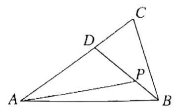

5. 如图,在 $\bigtriangleup {ABC}$ 中, $\overrightarrow{AD} \cdot  \overrightarrow{BC} = 0,\overrightarrow{BC} = 3\overrightarrow{BD}$ ,过点 $D$ 的直线分别交直线 ${AB},{AC}$ 于点 $M\text{ 、 }N$ 。若 $\overrightarrow{AM} = \lambda \overrightarrow{AB}$ ， $\overrightarrow{AN} = \mu \overrightarrow{A}\overrightarrow{C}\left( {\lambda  > 0,\mu  > 0}\right)$ ，则 $\lambda  + {2\mu }$ 的最小值是___。

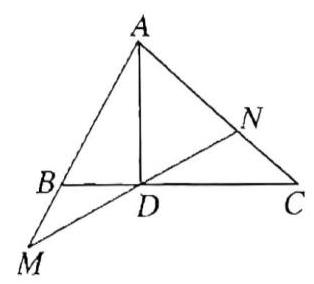

6. 在 $\bigtriangleup {ABC}$ 中，若 $\overrightarrow{AM} = \frac{1}{3}\overrightarrow{AB}$ ， $\overrightarrow{AN} = \frac{3}{4}\overrightarrow{AC}$ 。 ${CM}$ 与 ${BN}$ 交于 $K$ 点，则以 $\overrightarrow{AB}$ 、 $\overrightarrow{AC}$ 为基底的 $\overrightarrow{AK}$ 的线性展开式为___

7. 设 $O$ 为线段 ${AB}$ 外一点， $\overrightarrow{OA} - \overrightarrow{a}$ ， $\overrightarrow{OB} = \overrightarrow{b}$ ，点 ${A}_{1}$ ， ${A}_{2}$ ， $\cdots$ ， ${A}_{n - 1}$ 是线段 ${AB}$ 的 $n$ 等分点( $n \geq  2$ )， 则 $\overrightarrow{O{A}_{1}} + \overrightarrow{O{A}_{2}} + \cdots  + \overrightarrow{O{A}_{n - 1}} =$ ___. (用 $\overrightarrow{a},\overrightarrow{b}, n$ 表示)

8. 在 $\bigtriangleup {ABC}$ 中， ${AB} = 4$ ， ${AC} = 3$ ， $\angle {BAC} = {90}^{ \circ  }$ ， $D$ 在边 ${BC}$ 上，延长 ${AD}$ 到 $P$ ，使得 ${AP} = 9$ ，若 $\overrightarrow{PA} = m\overrightarrow{PB} + \left( {\frac{3}{2} - m}\right) \overrightarrow{PC}$ ( $m$ 为常数)，则 ${CD}$ 的长度是___

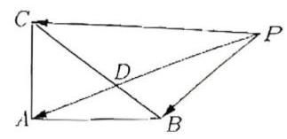

9. 在平面直角坐标系 ${xOy}$ 中，已知点 $A\left( {1,1}\right)$ 、 $B\left( {2,4}\right)$ 、 $C\left( {4,2}\right)$ ，点 $P$ 在 $\bigtriangleup  {ABC}$ 三边围成的区域(含边界) 内,若 $\overrightarrow{OP} = m\overrightarrow{AB} + n\overrightarrow{AC}$ ,则动点 $\left( {m, n}\right)$ 所构成的图形的面积为___.

10. 正方形 ${ABCD}$ 的边长为 4, $O$ 是正方形 ${ABCD}$ 的中心,过中心 $O$ 的直线 $l$ 与边 ${AB}$ 交于点 $M$ . 与边 ${CD}$ 交于点 $N, P$ 为平面上一点，满足 $2\overrightarrow{OP} = \lambda \overrightarrow{OB} + \left( {1 - \lambda }\right) \overrightarrow{OC}$ ，则 $\overrightarrow{PM} \cdot  \overrightarrow{PN}$ 的最小值为___

11. 如图，在 $\bigtriangleup  {ABC}$ 中， $\angle {BAC} = \frac{\pi }{3}$ ， $D$ 为 ${AB}$ 的中点， $P$ 为 ${CD}$ 上一点，且满足 $\overrightarrow{AP} = t\overrightarrow{AC} + \frac{1}{3}\overrightarrow{AB}$ ，若 $\bigtriangleup  {ABC}$ 的面积为 $\frac{3\sqrt{3}}{2}$ ，则 $\left| \overrightarrow{AP}\right|$ 的最小值为 ___

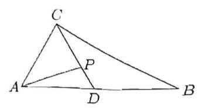

## 课后练习 7

1. 判断下列命题的真假:

(1)虚轴上的点对应的复数是纯虚数；

(2)复数 ${z}_{1} = a + {bi},{z}_{2} = c + {di}$ 相等的充要条件是 $a = c, b = d$ :

(3)任意两个复数不能比较大小；

(4) ${\left| z\right| }^{2} = {z}^{2}$ ; (5) ${z}_{1}^{2} + {z}_{2}^{2} \geq  2{z}_{1}{z}_{2}$ ;

(6) $\left| {z}^{2}\right|  = {\left| z\right| }^{2} = {z}^{2}$ ； (7) $z + \bar{z} \in  R, z - \bar{z}$ 是纯虚数；

(8) ${z}_{1} + {z}_{2} \in  R$ 当且仅当 ${z}_{2} = \overline{{z}_{1}}$ ; (9) 设 $x, y \in  C$ ,则 $\left| {x - y}\right|  = \sqrt{{\left( x + y\right) }^{2} - {4xy}}$ ;

(10) $\overline{{z}_{1}}{z}_{2} + {z}_{1}\overline{{z}_{2}}$ 一定是实数。

2. 已知 $n \in  {N}^{ * }$ ，计算 ${\left( \frac{1 + i}{\sqrt{2}}\right) }^{4n} + {\left( \frac{1 - i}{\sqrt{2}}\right) }^{4n} =$ ___。

3. 已知复数 $z = \frac{{x}^{2} - {3x} + 2}{x + 3} + \left( {{x}^{2} + {2x} - 3}\right) i$ 是纯虚数，则实数 $x =$ ___。

4. 对于 $n$ 个复数 ${z}_{1},{z}_{2},\cdots ,{z}_{n}$ ,定义 $\mathop{\prod }\limits_{{k = 1}}^{n}{z}_{k} = {z}_{1}{z}_{2}\cdots {z}_{n}$ 。已知复数 ${a}_{n} = \mathop{\prod }\limits_{{k = 1}}^{n}\left( {1 + \frac{i}{\sqrt{k}}}\right)$ ,其中 $n \in  {N}^{ * }, i$ 为虚数单位，则 $\left| {{a}_{n} - {a}_{n + 1}}\right|  =$ ___。

5. 已知实数 $x, u, v$ 满足 ${x}^{2} + \left( {u + {vi}}\right) x + \left( {1 + {ui}}\right)  = 0$ ，求正数 $u$ 的最小值。

6. 已知虚数 $z$ 使得 $\frac{z}{1 + {z}^{2}},\frac{{z}^{2}}{1 + z}$ 都是实数，求 $z$ 。

7. 设复平面上三点 $A, B, C$ 对应的复数 ${z}_{1},{z}_{2},{z}_{3}$ 满足 $\left| {z}_{1}\right|  = \left| {z}_{2}\right|  = \left| {z}_{3}\right|  = 1,{z}_{1} + {z}_{2} + {z}_{3} = 0$ ,求证: $\bigtriangleup {ABC}$ 是边长为 $\sqrt{3}$ 的正三角形。

8. 已知复数 ${z}_{0} = 1 - m\mathrm{i}\left( {m > 0}\right) , z = x + y\mathrm{i}$ 和 $w = {x}^{\prime } + {y}^{\prime }\mathrm{i}$ ，其中 $x, y,{x}^{\prime },{y}^{\prime }$ 均为实数， $\mathrm{i}$ 为虚数单位，且对于任意复数 $z$ ,有 $w = \overline{{z}_{0}} \cdot  \bar{z},\left| w\right|  = 2\left| z\right|$ 。

(1)试求 $m$ 的值，并分别写出 ${x}^{\prime }$ 和 ${y}^{\prime }$ 用 $x, y$ 表示的关系式；

(2)将 $\left( {x, y}\right)$ 作为点 $P$ 的坐标， $\left( {{x}^{\prime },{y}^{\prime }}\right)$ 作为点 $Q$ 的坐标，上述关系式可以看作是坐标半面上点的一个变换: 它将平面上的点 $P$ 变到这一平面上的点 $Q$ 。当点 $P$ 在直线 $y = x + 1$ 上移动时,试求点 $P$ 经该变换后得到的点 $Q$ 的轨迹方程；

(3)是否存在这样的直线:它上面的任一点经上述变换后得到的点仍在该直线上？若存在，试求出所有这些直线: 若不存在, 则说明理由。

## 课后练习 8

1. 如图，已知两条异面直线 $a$ 、 $b$ 分别与三个平行平面 $\alpha$ 、 $\beta$ 、 $\gamma$ 相交于点 $A$ 、 $B$ 、 $C$ 和点 $P$ 、 $Q$ 、 $R$ ，又 ${AR}\text{ 、 }{CP}$ 与平面 $\beta$ 相交于点 $M\text{ 、 }N$ ,求证: ${MBNQ}$ 为平行四边形.

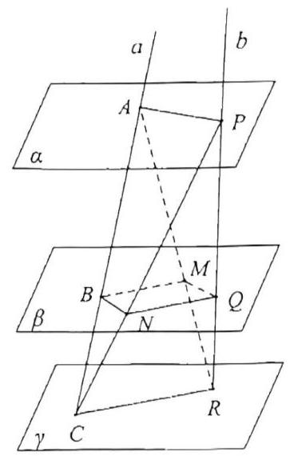

2. 如图所示，在三棱柱 ${ABC} - {A}_{1}{B}_{1}{C}_{1}$ ，侧棱垂直底面， ${\angle {ACB}} = {90}^{ \circ  }$ ， ${AC} = {BC} = \frac{1}{2}{A{A}_{1}}$ ， $D$ 是棱 $A{A}_{1}$ 的中点,试证明: 平面 ${BD}{C}_{1} \bot$ 平面 ${BDC}$ .

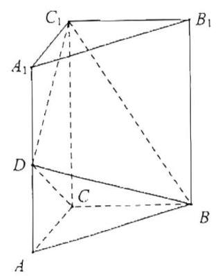

3. 如图，已知菱形 ${ABCD}$ 的边长为 ${2a},\angle {BAD} = {60}^{ \circ  },{AE}\text{ 、 }{CF}$ 都垂直于平面 ${ABCD}$ ，且 ${AE} = {3a},{CF} = a$ ， $E\text{ 、 }F$ 在平面 ${ABCD}$ 的同侧,求证: 平面 ${EBD} \bot$ 平面 ${FBD}$ .

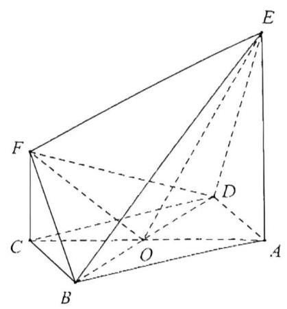

4. 在边长为 $a$ 的菱形 ${ABCD}$ 中， $\angle {ABC} = {120}^{ \circ  }$ ，线段 ${PC} \bot$ 面 ${ABCD}$ ， $E$ 为 ${PA}$ 的中点，求证: 平面 ${EBD} \bot$ 平面 ${ABCD}$ .

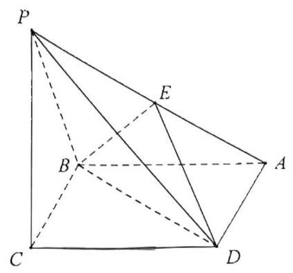

5. 在正方体 ${ABCD} - {A}_{1}{B}_{1}{C}_{1}{D}_{1}$ 中，截面 ${A}_{1}{BD}$ 与截面 ${C}_{1}{BD}$ 所成的角的余弦值为___.

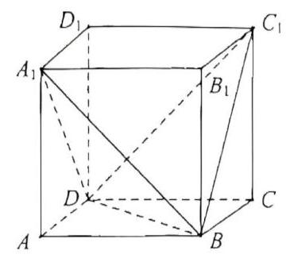

6. 如图，在 $\bigtriangleup  {ABC}$ 中， ${AB} = 2$ ， ${BC} = 4$ ， $\angle {ABC} = {45}^{ \circ  }$ ，若 ${BC}$ 在平面 $\alpha$ 上， $\bigtriangleup  {ABC}$ 所在平面与 $\alpha$ 成 30 角，则 $\bigtriangleup  {ABC}$ 在平面 $\alpha$ 上的射影面积为___.

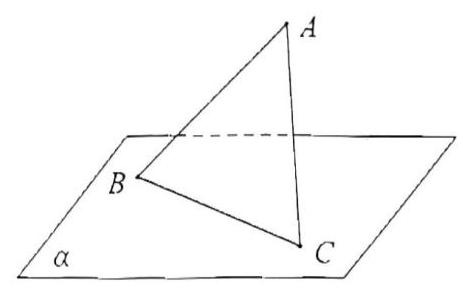

## 课后练习 9

1. 在正三棱柱 ${ABC} - {A}_{1}{B}_{1}{C}_{1}$ 中， ${AB} = {A{A}_{1}}$ ，则 ${A{C}_{1}}$ 与平面 $B{B}_{1}{C}_{1}C$ 所成的角的正弦值为()

A. $\frac{\sqrt{2}}{2}$ B. $\frac{\sqrt{6}}{4}$ C. $\frac{\sqrt{15}}{54}$ D. $\frac{\sqrt{6}}{3}$

2. 三条射线 ${OA},{OB},{OC}$ 两两成 ${60}^{ \circ  }$ 角,则直线 ${OA}$ 与平面 ${OBC}$ 的成角为( )

A. 60° B. 45°

C. $\arccos \frac{\sqrt{3}}{3}$ D. $\arccos \frac{\sqrt{6}}{3}$

3. 已知正方形 ${ABCD}$ 折成直二面角 $A - {BD} - C$ ，则二面角 $B - {CD} - A$ 的大小为( )

A. 60° B. 45°

C. $\arccos \frac{1}{3}$ D. $\arctan \sqrt{2}$

4. 二面角 $\alpha  - l - \beta$ 的度数为 ${120}^{ \circ  }, A, B \in  l,{AC} \subset  \alpha ,{BD} \subset  \beta ,{AC} \bot  l,{BD} \bot  l$ ,若 ${AB} = {AC} = {BD} = 1$ , 则 ${CD}$ 等于___。

5. 【23 上海高考 17】直四棱柱 ${ABCD} - {A}_{1}{B}_{1}{C}_{1}{D}_{1}$ ， ${AB}//{DC}$ ， ${AB}\bot {AD}$ ， ${AB} = 2$ ， ${AD} = 3$ ， ${DC} = 4$ .

(1)求证: ${A}_{1}B \bot$ 平面 ${DC}{C}_{1}{D}_{1}$ ；

(2)若四棱柱 ${ABCD} - {A}_{1}{B}_{1}{C}_{1}{D}_{1}$ 的体积为36，求二面角 ${A}_{1} - {BD} - A$ 的大小.

6. 如图，已知四棱锥 $P - {ABCD}$ ， ${PB}\bot {AD}$ ，侧面 ${PAD}$ 为边长等于 2 的正三角形，底面 ${ABCD}$ 为菱形,侧面 ${PAD}$ 与底面 ${ABCD}$ 所成的二面角为 ${120}^{ \circ  }$ 。

(1)求点 $P$ 到平面 ${ABCD}$ 的距离；(2)求面 ${APB}$ 与面 ${CPB}$ 所成锐二面角的大小。

## 课后练习 10

1. 已知正方体 ${ABCD} - {A}_{1}{B}_{1}{C}_{1}{D}_{1}$ ，空间一动点 $P$ 满足 ${A}_{1}P \bot  A{B}_{1}$ ，且 $\angle {AP}{B}_{1} = \angle {AD}{B}_{1}$ ，则点 $P$ 的轨迹为 ( )

A. 直线 B. 圆 C. 椭圆 D. 抛物线

在一个棱长为 10 的密封正方体盒子中, 放一个半径为 1 的小球, 任意摇动盒子, 则小球在盒子中不能接触到的内壁面积为___；

3. 如图:棱长为 2 的正方体 ${ABCD} - {A}_{1}{B}_{1}{C}_{1}{D}_{1}$ 的内切球为球 $O$ ， $E$ 、 $F$ 分别是棱 ${AB}$ 和棱 ${C{C}_{1}}$ 的中点， $G$ 在棱 ${BC}$ 上移动，则下列命题正确的有___

① 存在点 $G$ ，使 ${OD}$ 垂直于平面 ${EFG}$ ；

② 对于任意点 $G,{OA}$ 平行于平面 ${EFG}$

③ 直线 ${EF}$ 被球 $O$ 截得的弦长为 $\sqrt{2}$ ；

③ 过直线 ${EF}$ 的平面截球 $O$ 所得的所有截面圆中,半径最小的圆的面积为 $\frac{\pi }{2}$ .

4. 已知 $A{A}_{1}$ 是圆柱的一条母线， ${AB}$ 是圆柱下底面的直径， $C$ 是圆柱下底面圆周上异于 $A$ ， $B$ 的点，若圆柱的侧面积为 ${4\pi }$ ，则三棱锥 ${A}_{1} - {ABC}$ 外接球体积的最小值为___

5. 【2024 崇明一模 15】已知点 $M$ 为正方体 ${ABCD} - {A}_{1}{B}_{1}{C}_{1}{D}_{1}$ 内部(不包含表面)的一点. 给出下列两个命题:

${q}_{1}$ : 过点 $M$ 有且只有一个平面与 $A{A}_{1}$ 和 ${B}_{1}{C}_{1}$ 都平行;

${q}_{2}$ : 过点 $M$ 至少可以作两条直线与 $A{A}_{1}$ 和 ${B}_{1}{C}_{1}$ 所在的直线都相交.

则以下说法正确的是( )

A. 命题 ${q}_{1}$ 是真命题,命题 ${q}_{2}$ 是假命题 B. 命题 ${q}_{1}$ 是假命题,命题 ${q}_{2}$ 是真命题

C. 命题 ${q}_{1}\text{ 、 }{q}_{2}$ 都是真命题 D. 命题 ${q}_{1}\text{ 、 }{q}_{2}$ 都是假命题

6. 【2024 金山一模 15】如图，在正方体 ${ABCD} - {A}_{1}{B}_{1}{C}_{1}{D}_{1}$ 中， $E$ 、 $F$ 为正方体内(含边界)不重合的两个动点, 下列结论错误的是 ( )

A. 若 $E \in  B{D}_{1}, F \in  {BD}$ ,则 ${EF} \bot  {AC}$

B. 若 $E \in  B{D}_{1}, F \in  {BD}$ ,则平面 ${BEF} \bot$ 平面 ${A}_{1}B{C}_{1}$

C. 若 $E \in  {AC}, F \in  C{D}_{1}$ ,则 ${EF}//$ 平面 ${A}_{1}B{C}_{1}$

D. 若 $E \in  {AC}, F \in  C{D}_{1}$ ,则 ${EF}//A{D}_{1}$

7. 正三棱锥 $P - {ABC}$ 的侧棱两两成 ${40}^{ \circ  }$ 角，侧棱长为 $1, D, E$ 分别为 ${PB},{PC}$ 上的点，则 $\bigtriangleup  {ADE}$ 的周长的最小值为___.

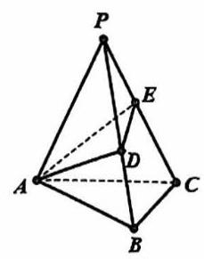

8. 如图，已知正方体 ${ABCD} - {A}_{1}{B}_{1}{C}_{1}{D}_{1}$ 的棱长为 1，点 $M$ 为棱 ${AB}$ 的中点，点 $P$ 在侧面 ${BC}{C}_{1}{B}_{1}$ 及其边界上运动,则 ${2PM} + P{D}_{1}$ 的最小值为___

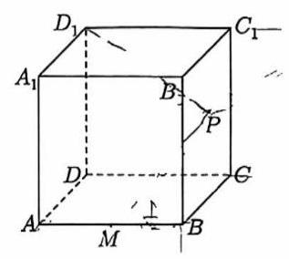

9. 在四棱锥 $S - {ABCD}$ 中,已知 ${SA} \bot$ 底面 ${ABCD},{AB}//{CD},{AB} \bot  {AD},{AB} = 2\sqrt{2},{AD} = {CD} = 4, M$ 是平面 ${SAD}$ 内的动点，且满足 $\angle {CMD} = \angle {BMA}$ ，则当四棱锥 $M - {ABCD}$ 的体积最大时，三棱锥 $M - {ACD}$ 外接球的表面积为___

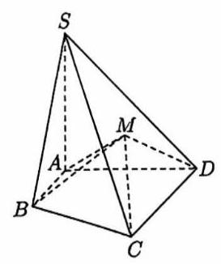

## 课后练习 11

1、已知直线 $y = x + 1$ 上有两个点 $A\left( {{a}_{1},{b}_{1}}\right) , B\left( {{a}_{2},{b}_{2}}\right)$ ，已知 ${a}_{1},{b}_{1},{a}_{2},{b}_{2}$ 满足: $\sqrt{2}\left| {{a}_{1}{a}_{2} + {b}_{1}{b}_{2}}\right|  = \sqrt{{a}_{1}^{2} + {b}_{1}^{2}} \cdot  \sqrt{{a}_{2}^{2} + {b}_{2}^{2}}$ ，若 ${a}_{1} > {a}_{2}$ ， $\left| {AB}\right|  = 2 + \sqrt{2}$ ，则这样的点 $A$ 有___个.

1. 已知直线 ${l}_{1} : {a}_{1}x + {b}_{1}y + 1 = 0,{l}_{2} : {a}_{2}x + {b}_{2}y + 1 = 0$ 交于点 $\left( {3,4}\right)$ ，则过点 $P\left( {{a}_{1},{b}_{1}}\right)$ 和点 $Q\left( {{a}_{2},{b}_{2}}\right)$ 的直线方程是___.

2. 对于直线 $l$ 上的任意一点 $P\left( {x, y}\right)$ ,点 $Q\left( {x + {3y},{8x} - y}\right)$ 也在直线 $l$ 上，求直线 $l$ 的方程为___

3. 已知 $A\left( {1,1}\right)$ 、 $B\left( {2, - 1}\right)$ ，若直线 $l : x + {ay} + 1 = 0$ 与线段 ${AB}$ 相交，则实数 $a$ 的取值范围是___.

4. 已知直线 ${l}_{1} : {ax} - {2y} - {2a} + 4 = 0,{l}_{2} : {2x} + {a}^{2}y - 2{a}^{2} - 4 = 0$ ，其中 $0 < a < 2$ ，若 ${l}_{1},{l}_{2}$ 与坐标轴围成一个四边形, 则该四边形面积的最小值为___。

5. 在平面直角坐标系中,对于任意两个点 $P\left( {{x}_{1},{y}_{1}}\right) \text{ 、 }{P}_{2}\left( {{x}_{2},{y}_{2}}\right)$ 的“非常距离”定义如下: 若 $\left| {{x}_{1} - {x}_{2}}\right|  \geq  \left| {{y}_{1} - {y}_{2}}\right|$ ,则点 $P\left( {{x}_{1},{y}_{1}}\right) \text{ 、 }{P}_{2}\left( {{x}_{2},{y}_{2}}\right)$ 的“非常距离”为 $\left| {{x}_{1} - {x}_{2}}\right|$ ,若 $\left| {{x}_{1} - {x}_{2}}\right|  < \left| {{y}_{1} - {y}_{2}}\right|$ ,则点 $P\left( {{x}_{1},{y}_{1}}\right) \text{ 、 }{P}_{2}\left( {{x}_{2},{y}_{2}}\right)$ 的“非常距离”为 $\left| {{y}_{1} - {y}_{2}}\right|$ . 已知点 $C$ 是直线 $y = \frac{3}{4}x + 3$ 的一个动点，则点 $C$ 和点 $D\left( {0,1}\right)$ 的“非常距离”的最小值是___.

6. 设已知直线 $l : {kx} - y + 1 + {2k} = 0, k \in  \mathbf{R}$ .

(1)证明:直线 $l$ 过定点；

(2)若直线 $l$ 不经过第四象限，求 $k$ 的取值范围；

(3)若直线 $l$ 交 $x$ 轴负半轴于点 $A$ ，交 $y$ 轴正半轴于点 $B$ ， $O$ 为坐标原点，设 $\bigtriangleup  {AOB}$ 的面积为 $S$ ，求 $S$ 的最小值及此时直线 $l$ 的方程.

7. 在直角坐标系 ${xOy}$ 中，定义点 $A\left( {{x}_{1},{y}_{1}}\right)$ ， $B\left( {{x}_{2},{y}_{2}}\right)$ 的 “直角距离” 为(A, B)为: $d\left( {A, B}\right)  = \left| {{x}_{1} - {x}_{2}}\right|  + \left| {{y}_{1} - {y}_{2}}\right|$ ,设 $M\left( {1,1}\right) , N\left( {-1, - 1}\right)$ .

(1)点 $C$ 满足 $d\left( {C, M}\right)  = d\left( {C, N}\right)$ ，在所给坐标系中画出点 $C$ 所在区域；(只需画图,无需说明理由

(2)分别过点 $M, N$ 作斜率为 2 的直线 ${l}_{1},{l}_{2}$ ，点 $Q, R$ 分别是直线 ${l}_{1},{l}_{2}$ 上的动点,求 $d\left( {Q, R}\right)$ 的最小值；

(3)设 $P\left( {x, y}\right)$ ，记方程 $d\left( {P, M}\right)  + d\left( {P, N}\right)  = 8$ 的曲线为 $\Gamma$ ，类比椭圆研究曲线 $\Gamma$ 的性质(结论不要求证明), 并在所给坐标系中画出该曲线.

## 课后练习 12

1. 直线 $x\cos \theta  + y\sin \theta  + c = 0\left( {\theta  \in  \mathbf{R}}\right)$ 必 ( ).

(A) 过某个定点 (B) 与某个定圆相切 (C) 与某定直线平行 (D) 与某定直线垂直

2. 设集合 $P = \left\{  {\left( {x, y}\right)  \mid  {\left( x + 2\right) }^{2} + {\left( y - 3\right) }^{2} \leq  4}\right\}  , Q = \left\{  {\left( {x, y}\right)  \mid  {\left( x + 1\right) }^{2} + {\left( y - m\right) }^{2} < \frac{1}{4}}\right\}$ ,且 $P \cap  Q = Q$ ,则实数 $m$ 的取值范围为___。

3. 过点 $P\left( {\frac{1}{2}, - 2}\right)$ 作圆 $C : {\left( x - \frac{4}{3}m\right) }^{2} + {\left( y - m + 1\right) }^{2} = 1,\left( {m \in  R}\right)$ 的切线,切点分别为 $A$ 和 $B$ ,则 $\overrightarrow{PA} \cdot  \overrightarrow{PB}$ 的最小值为___

4. 如图，已知点 $P\left( {2,0}\right)$ ，且正方形 ${ABCD}$ 内接于圆 $O : {x}^{2} + {y}^{2} = 1$ ， $M$ 、 $N$ 分别为边 ${AB}$ 、 ${BC}$ 的中点. 当正方形 ${ABCD}$ 绕圆心 $O$ 旋转时， $\overrightarrow{PM} \cdot  \overrightarrow{ON}$ 的取值范围是___.

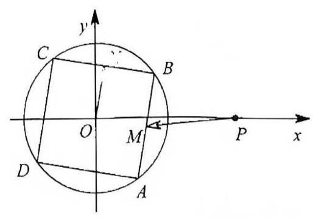

5. 设圆 $O$ 是单位圆，正方形边 ${AB}$ 垂直于 $x$ 轴且为圆 $O$ 的一条弦，则 $\left| {OD}\right|$ 的取值范围是 ___.

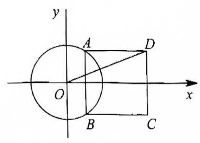

6. 如图，正方形 ${ABCD}$ 的边长为 20 米，圆 $O$ 的半径为 1 米，圆心是正方形的中心，点 $P, Q$ 分别在线段 ${AD},{CB}$ 上,若线段 ${PQ}$ 与圆 $O$ 有公共点,则称点 $Q$ 在点 $P$ 的 “盲区” 中,已知点 $P$ 以 ${1.5}\mathrm{\;m}/\mathrm{s}$ 的速度从 $A$ 出发向 $D$ 移动。同时,点 $Q$ 以 $1\mathrm{m}/\mathrm{s}$ 的速度从 $C$ 出发向 $B$ 移动,则在点 $P$ 从 $A$ 移动到 $D$ 的过程中,点 $Q$ 在点 $P$ 的盲区中的时长约___秒(精确到 0.1)

7. 如图，已知满足条件 $\left| {z - {3i}}\right|  = \left| {\sqrt{3} - i}\right|$ 的复数 $z$ 在复平面 ${xOy}$ 对应点的轨迹为圆 $C$ (圆心为 $C$ )，设复平面 ${xOy}$ 上的复数 $z = x + {yi}\left( {x \in  R, y \in  R}\right)$ 对应的点为 $\left( {x, y}\right)$ ,定直线 $m$ 的方程为 $x + {3y} + 6 = 0$ ,过 $A\left( {-1,0}\right)$ 的一条动直线 $l$ 与直线 $m$ 相交于 $N$ 点，于圆 $C$ 相交于 $P, Q$ 两点， $M$ 是弦 ${PQ}$ 的中点；

(1)若直线 $l$ 经过圆心 $C$ ，求证: $l$ 与 $m$ 垂直；

(2)当 $\left| {PQ}\right|  = 2\sqrt{3}$ 时，求直线 $l$ 的方程；

(3)设 $t = \overrightarrow{AM} \cdot  \overrightarrow{AN}$ ，试问 $t$ 是否为定值？若为定值，请求出 $t$ 的值；若不是定值，请说明理由

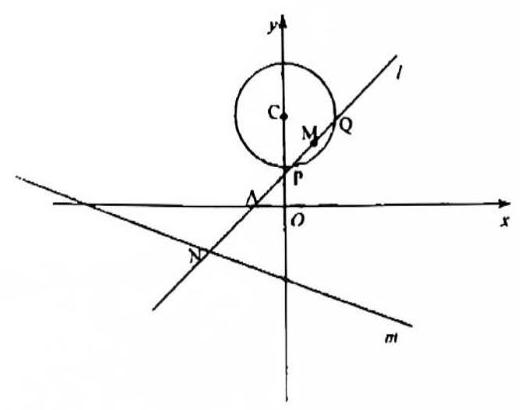

## 课后练习 13

1. 已知椭圆 $C : \frac{{x}^{2}}{4} + \frac{{y}^{2}}{3} = 1$ 的左、右焦点分别为 ${F}_{1}$ 、 ${F}_{2}, M$ 为椭圆 $C$ 上任意一点， $N$ 为圆 $E : {\left( x - 3\right) }^{2} + {\left( y - 2\right) }^{2} = 1$ 上任意一点，则 $\left| {MN}\right|  - \left| {M{F}_{1}}\right|$ 的最小值为___.

2. 在平面直角坐标系 ${xOy}$ 中,若直线 $l$ 与圆 ${C}_{1} : {x}^{2} + {y}^{2} = 1$ 和圆

${C}_{2} : {\left( x - 5\sqrt{2}\right) }^{2} + {\left( y - 5\sqrt{2}\right) }^{2} = {49}$ 都相切,且两个圆的圆心均在直线 $l$ 的下方,则直线 $l$ 的斜率为___

3. 角 $\alpha$ 的始边是 $x$ 轴正半轴,顶点是圆 ${x}^{2} + {y}^{2} = {25}$ 的中心,角 $\alpha$ 的终边与曲线 ${x}^{2} + {y}^{2} = {25}$ 的交点 $A$ 的横坐标是 -3,角 ${2\alpha }$ 的终边与圆 ${x}^{2} + {y}^{2} = {25}$ 的交点是 $B$ ,则过 $B$ 点的圆 ${x}^{2} + {y}^{2} = {25}$ 的切线方程为___

4. 已知集合 $A = \left\{  {\left( {x, y}\right)  \mid  {\left( x + y\right) }^{2} + x + y - 2 \leq  0}\right\}  , B = \left\{  {\left( {x, y}\right)  \mid  {\left( x - a\right) }^{2} + {\left( y - 2a - 1\right) }^{2} \leq  {a}^{2} - 1}\right\}$ ,若 $A \cap  B \neq  \varnothing$ ,则实数 $a$ 的取值范围为___

5. 已知集合 $A = \left\{  {\left( {x, y}\right)  \mid  {\left( x + y\right) }^{2} + x + y - 2 \leq  0}\right\}  , B = \left\{  {\left( {x, y}\right)  \mid  {\left( x - 2a\right) }^{2} + {\left( y - a - 1\right) }^{2} \leq  {a}^{2} - \frac{a}{2}}\right\}$ ,若 $A \cap  B \neq  \varnothing$ , 则实数 $a$ 的取值范围为___

6. 已知圆 $M : {x}^{2} + {y}^{2} - {2x} - {2y} = 0$ ,直线 $l : {2x} + y + 2 = 0, P$ 为 $l$ 上的动点,过点 $P$ 作圆 $M$ 的切线 ${PA}\text{ 、 }{PB}$ ，切点为 $A\text{ 、 }B$ ，当 $\left| {PM}\right|  \cdot  \left| {AB}\right|$ 最小时，直线 ${AB}$ 的方程为___

7. 设直线系 $M : x\cos \theta  + \left( {y - 2}\right) \sin \theta  = 1,0 \leq  \theta  \leq  {2\pi }$ ，对于下列四个命题:

(1) $M$ 中所有直线均经过一个定点；

(2)存在定点 $P$ 不在 $M$ 中的任意一条直线上；

(3)对于任意整数 $n, n \geq  3$ ,存在正 $n$ 边形,其所有边均在 $M$ 中的直线上;

(4) $M$ 中的直线所能围成的正三角形面积都相等;

其中真命题的是( )

A. (2) (3) B. (1) (4) C. (2) (3) (4) D. (1) (2)

8. 已知圆 $C$ 的圆心在直线 $x - {3y} = 0$ 上,与 $y$ 轴正半轴相切,且截直线 $l : {2x} - y = 0$ 所得的弦长为 4 .

(1)求圆 $C$ 的方程；

(2)设点 $A$ 在圆 $C$ 上运动，点 $B\left( {-5,1}\right)$ ， $M$ 为线段 ${AB}$ 上一点且满足 $\frac{\left| AM\right| }{\left| MB\right| } = 3$ ，记点 $M$ 的轨迹为曲线 $E$ .

① 求曲线 $E$ 的方程,并说明曲线 $E$ 的形状;

② 在直线 $l$ 上是否存在异于原点的定点 $T$ ,使得对于 $E$ 上任意一点 $P,\frac{\left| PT\right| }{\left| PO\right| }$ 为定值,若存在,求出所有满足条件的点 $T$ 的坐标,若不存在,说明理由.

## 课后练习 14

1. 已知椭圆 $C$ 与双曲线 $\frac{{x}^{2}}{16} - \frac{{y}^{2}}{9} = 1$ 有相同的焦点 ${F}_{1}\text{ 、 }{F}_{2}$ ,若 $M$ 是它们其中一个公共点,且满足 $\angle {F}_{1}M{F}_{2} = \arccos \frac{15}{17}$ ,则椭圆 $C$ 的方程为___.

2. 椭圆 $\frac{{x}^{2}}{{k}^{2}} + \frac{{y}^{2}}{3} = 1\left( {k > 0}\right)$ 的焦距为 2，则实数 $k$ 的值为___.

3. 一个圆经过椭圆 $\frac{{x}^{2}}{16} + \frac{{y}^{2}}{4} = 1$ 的三个顶点,且圆心在 $x$ 轴正半轴上,则该圆的标准方程是___.

4. 椭圆 $\frac{{x}^{2}}{25} + \frac{{y}^{2}}{9} = 1$ 的左焦点为 ${F}_{1}, M$ 为椭圆上一点,且 $\left| {M{F}_{1}}\right|  = 2, N$ 是线段 $M{F}_{1}$ 的中点,则 $\left| {ON}\right|  =$ ___.

5. 设一椭圆的中心是坐标原点,长轴在 $x$ 轴上,离心率为 $\frac{\sqrt{3}}{2}$ ,若圆 $C : {x}^{2} + {\left( y - \frac{3}{2}\right) }^{2} = 1$ 上的点与这个椭圆上的点的最大距离为 $1 + \sqrt{7}$ ，则这个椭圆的方程为___

6. 已知动圆 $P$ 过定点 $A\left( {-3,0}\right)$ ,并且在定圆 $B : {\left( x - 3\right) }^{2} + {y}^{2} = {64}$ 的内部与其相内切,则动圆圆心 $P$ 的轨迹方程为___

7. 设 ${F}_{1}\text{ 、 }{F}_{2}$ 分别是椭圆 $E : {x}^{2} + \frac{{y}^{2}}{{b}^{2}} = 1\left( {0 < b < 1}\right)$ 的左、右焦点,若过点 ${F}_{1}$ 的直线交椭圆 $E$ 于 $A\text{ 、 }B$ 两点, 且 $\left| {A{F}_{1}}\right|  = 3\left| {B{F}_{1}}\right| , A{F}_{2} \bot  x$ 轴,则椭圆 $E$ 的标准方程为___.

8. 已知椭圆 $9{x}^{2} + {25}{y}^{2} = {225}$ 的右焦点为 $F$ ， $A\left( {2,2}\right)$ ， $M$ 是椭圆上动点，则 $\left| {MA}\right|  + \left| {MF}\right|$ 的最小值为___.

9. 已知双曲线 $\Gamma  : \frac{{x}^{2}}{{a}^{2}} - \frac{{y}^{2}}{{b}^{2}} = 1\left( {a > 0, b > 0}\right)$ 的实轴为 ${A}_{1}{A}_{2}$ ,对于实轴 ${A}_{1}{A}_{2}$ 上的任意点 $P$ ,在实轴 ${A}_{1}{A}_{2}$ 上都存在点 $Q$ ，使得 $\left| {PQ}\right|  = \sqrt{3}b$ ，则双曲线 $\Gamma$ 的两条渐近线夹角的最大值为___.

10. 设点 ${F}_{1},{F}_{2}$ 是双曲线 $C : \frac{{x}^{2}}{4} - {y}^{2} = 1$ 的左、右两焦点,点 $M$ 是 $C$ 的右支上的任意一点,若 $\overrightarrow{{F}_{2}M} \cdot  \overrightarrow{{F}_{2}{F}_{1}} > 0$ ，则 $\left| {M{F}_{1}}\right|  + \left| {M{F}_{2}}\right|$ 的值可能为( )

A. 4 B. $2\sqrt{6}$ C. 5 D. $3\sqrt{3}$

11. 已知双曲线 $\frac{{x}^{2}}{2} - {y}^{2} = 1$ ,作 $x$ 轴的垂线交双曲线于 $A\text{ 、 }B$ 两点,作 $y$ 轴的垂线交双曲线于 $C, D$ 两点, 且 ${AB} = {CD}$ ，两垂线相交于点 $P$ ，则点 $P$ 的轨迹是___(填曲线类型)

12. 过原点的直线 $l$ 与双曲线 $C : \frac{{x}^{2}}{{a}^{2}} - \frac{{y}^{2}}{{b}^{2}} = 1\left( {a, b > 0}\right)$ 的左、右两支分别交于 $M\text{ 、 }N$ 两点,

$F\left( {2,0}\right)$ 为 $C$ 的右焦点，若 $\overrightarrow{FM} \cdot  \overrightarrow{FN} = 0$ ，且 $\left| \overrightarrow{FM}\right|  + \left| \overrightarrow{FN}\right|  = 2\sqrt{5}$ ，则双曲线 $C$ 的方程为___

## 课后练习 15

1. 已知实数 $x\text{ 、 }y$ 满足 $\frac{x\left| x\right| }{4} - y\left| y\right|  = 1$ ，则 $\left| {x - {2y} + \sqrt{5}}\right|$ 的取值范围是___

2. 在椭圆 $\frac{{x}^{2}}{{a}^{2}} + \frac{{y}^{2}}{{b}^{2}} = 1\left( {a > b > 0}\right)$ 上取三点,其横坐标满足 ${x}_{1} + {x}_{3} = 2{x}_{2}$ ,三点顺序与某一焦点联结的线段长是 ${Y}_{1},{Y}_{2},{Y}_{3}$ ,则有(   ).

D. $\frac{1}{{Y}_{1}},\frac{1}{{Y}_{2}},\frac{1}{{Y}_{3}}$ 成等比数列

3. 已知 ${F}_{1},{F}_{2}$ 是双曲线 $\Gamma  : \frac{{x}^{2}}{{a}^{2}} - \frac{{y}^{2}}{{b}^{2}} = 1\left( {a, b > 0}\right)$ 的左、右焦点,点 $M$ 是双曲线 $\Gamma$ 上的任意一点 (不是顶点),过 ${F}_{1}$ 作 $\angle {F}_{1}M{F}_{2}$ 的角平分线的垂线,垂足为 $N$ ,线段 ${F}_{1}N$ 的延长线交 $M{F}_{2}$ 于点 $Q, O$ 为坐标原点,若 $\left| {ON}\right|  = \frac{\left| {F}_{1}{F}_{2}\right| }{6}$ ,则双曲线 $\Gamma$ 的渐近线方程为___.

4. 已知椭圆 ${\Gamma }_{1}$ 与双曲线 ${\Gamma }_{2}$ 的离心率互为倒数,且它们有共同的焦点 ${F}_{1},{F}_{2}, P$ 是 ${\Gamma }_{1}$ 与 ${\Gamma }_{2}$ 在第一象限的交点,当 $\angle {F}_{1}P{F}_{2} = \frac{\pi }{6}$ 时,双曲线 ${\Gamma }_{2}$ 的离心率等于___.

5. 已知 ${F}_{1}\text{ 、 }{F}_{2}$ 为椭圆 $\Gamma  : \frac{{x}^{2}}{{a}^{2}} + {y}^{2} = 1\left( {a > 1}\right)$ 的左右焦点, $A$ 为 $\Gamma$ 的上顶点,直线 $l$ 经过点 ${F}_{1}$ 且与 $\Gamma$ 交于 $B\text{ 、 }C$ 两点. 若 $l$ 垂直平分线段 $A{F}_{2}$ ，则 $\bigtriangleup  {ABC}$ 的周长是___

6. 已知双曲线 $C : \frac{{x}^{2}}{{a}^{2}} - \frac{{y}^{2}}{{b}^{2}} = 1\left( {a > 0, b > 0}\right)$ 的左、右焦点分别为 ${F}_{1}\text{ 、 }{F}_{2}$ ,过 ${F}_{2}$ 且斜率为 $- \frac{\sqrt{5}}{2}$ 的直线与双曲线 $C$ 的左支交于点 $A$ . 若 $\left( {\overrightarrow{{F}_{1}{F}_{2}} + \overrightarrow{{F}_{1}A}}\right)  \cdot  \overrightarrow{{F}_{2}A} = 0$ ，则双曲线 $C$ 的渐近线方程为___

7. 已知椭圆 $\Gamma  : \left\{  {\begin{array}{l} x = a\cos \theta \\  y = b\sin \theta  \end{array}(\theta }\right.$ 为参数, $a > 0, b > 0)$ 的焦点分别 ${F}_{1}\left( {-2,0}\right) \text{ 、 }{F}_{2}\left( {2,0}\right)$ ,点 $A$ 为椭圆 $\Gamma$ 的上顶点，直线 $A{F}_{2}$ 与椭圆 $\Gamma$ 的另一个交点为 $B$ . 若 $\left| {B{F}_{1}}\right|  = 3\left| {B{F}_{2}}\right|$ ，则椭圆 $\Gamma$ 的普通方程为___

8. 若 $P$ 是双曲线 $\frac{{x}^{2}}{9} - \frac{{y}^{2}}{16} = 1$ 的右支上的动点, $M\text{ 、 }N$ 分别是圆 ${\left( x + 5\right) }^{2} + {y}^{2} = 4$ 和 ${\left( x - 5\right) }^{2} + {y}^{2} = 4$ 上的动点，则 $\left| {PM}\right|  - \left| {PN}\right|$ 的取值范围为___.

9. 点 $A$ 是曲线 $y = \sqrt{{x}^{2} + 2}\left( {y \leq  2}\right)$ 上的任意一点,已知 $P\left( {0, - 2}\right) , Q\left( {0,2}\right)$ ,射线 ${QA}$ 交曲线 $y = \frac{1}{8}{x}^{2}$ 于点 $B,{BC}$ 垂直于直线 $y = 3$ ,垂足为点 $C$ . 则下列结论: ① $\left| {AP}\right|  - \left| {AQ}\right|$ 为定值 $2\sqrt{2}$ ；② $\left| {QB}\right|  + \left| {BC}\right|$ 为定值 5; ③ $\left| {PA}\right|  + \left| {AB}\right|  + \left| {BC}\right|$ 为定值 $5 + \sqrt{2}$ . 其中正确结论的序号为___.

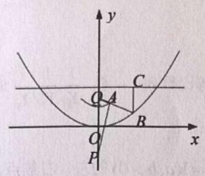

## 课后练习 16

1. 已知双曲线 $C : {x}^{2} - \frac{{y}^{2}}{3} = 1$ 。设以左焦点 ${F}_{1}$ 为圆心，半径为 2 的圆为 ${C}_{2}$ ，已知过右焦点 ${F}_{2}$ 的两条相互垂直的直线 ${l}_{1},{l}_{2}$ ,直线 ${l}_{1}$ 与双曲线交于 $P, Q$ 两点,直线 ${l}_{2}$ 与圆 ${C}_{2}$ 相交于 $M, N$ 两点,记 $\bigtriangleup {PMN},\bigtriangleup {QMN}$ 的面积分别为 ${S}_{1},{S}_{2}$ ,求 ${S}_{1} + {S}_{2}$ 的取值范围.

2. 已知点 $P$ 是直角坐标平面内的动点，点 $P$ 到直线 ${l}_{1} : x =  - 2$ 的距离为 ${d}_{1}$ ，到点 $F\left( {-1,0}\right)$ 的距离为 ${d}_{2}$ ，且 $\frac{{d}_{2}}{{d}_{1}} = \frac{\sqrt{2}}{2}$

(1)求动点 $P$ 的轨迹 $C$ 的方程；

(2)过点 $F$ 的圆 $\Gamma$ 与曲线 $C$ 交于不同的两点 $A, B$ ，请求出 $\bigtriangleup  {ABF}$ 面积的取值范围。

3. 已知双曲线 $\Gamma  : \frac{{x}^{2}}{{a}^{2}} - \frac{{y}^{2}}{{b}^{2}} = 1\left( {a > 0, b > 0}\right)$ 过点 $P\left( {\sqrt{3},\sqrt{6}}\right)$ ，且 $\Gamma$ 的渐近线方程为 $y =  \pm  \sqrt{3}x$ .

(1)求 $\Gamma$ 的方程；

(2)如图，过原点 $O$ 作互相垂直的直线 ${l}_{1},{l}_{2}$ 分别交双曲线于 $A, B$ 两点和 $\mathrm{C}, D$ 两点， $A, D$ 在 $x$ 轴同侧. 求四边形 ${ACBD}$ 面积的取值范围;

(3)在(2)的条件下，设直线 ${AD}$ 与两渐近线分别交于 $M$ ， $N$ 两点，是否存在直线 ${AD}$ 使 $M$ ， $N$ 为线段 ${AD}$ 的三等分点,若存在,求出直线 ${AD}$ 的方程; 若不存在,请说明理由.

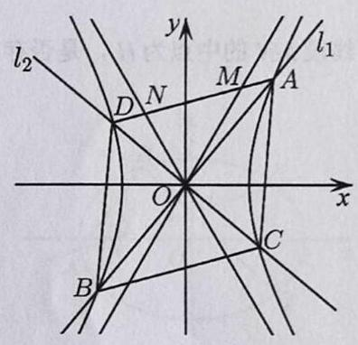

4. 设平面直角坐标系中的动点 $P$ 到两定点 $\left( {-2,0}\right) ,\left( {2,0}\right)$ 的距离之和为 $4\sqrt{2}$ ,记动点 $P$ 的轨迹为 $\Gamma$ .

1) 求 $\Gamma$ 的方程;

2) 过 $\Gamma$ 上的点 $Q$ 作圆 ${x}^{2} + {y}^{2} = 1$ 的两条切线,切点为 ${Q}_{1},{Q}_{2}$ ,直线 ${Q}_{1}{Q}_{2}$ 与 $x, y$ 轴的交点依次为异于坐标原点 $O$ 的点 ${Q}_{3},{Q}_{4}$ ,试求 $\bigtriangleup O{Q}_{3}{Q}_{4}$ 的面积的最小值;

3) 过点 $\left( {2,0}\right)$ 且不垂直于坐标轴的直线 $l$ 交 $\Gamma$ 于不同的两点 $M, N$ ,线段 ${MN}$ 的垂直平分线与 $x$ 轴交于点 $D$ , 线段 ${MN}$ 的中点为 $H$ ,是否存在 $\lambda \left( {\lambda  > \frac{\sqrt{2}}{4}}\right)$ ,使得 $\left| {DH}\right|  = \lambda \left| {MN}\right|$ 成立? 请说明理由.

## 课后练习 17

1. 已知椭圆 $C : \frac{{x}^{2}}{{a}^{2}} + \frac{{y}^{2}}{{b}^{2}} = 1\left( {a > b > 0}\right)$ 的长轴长为 4,焦距为 $2\sqrt{2}$ .

(1)求椭圆 $C$ 的方程；

(2)过动点 $M\left( {0, m}\right) \left( {m > 0}\right)$ 的直线交 $x$ 轴于点 $N$ ，交 $C$ 于点 $A$ 、 $P(P$ 在第一象限)，

且 $M$ 是线段 ${PN}$ 的中点，过点 $P$ 作 $x$ 轴的垂线交 $C$ 于另一点 $Q$ ，延长 ${QM}$ 交 $C$ 于点 $B$ ，

① 设直线 ${PM}\text{ 、 }{QM}$ 的斜率分别为 $k\text{ 、 }{k}^{\prime }$ ,证明 $\frac{{k}^{\prime }}{k}$ 为定值并求此定值;

② 求直线 ${AB}$ 的斜率的最小值.

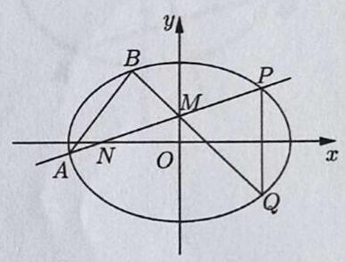

2. 已知椭圆 $\Gamma  : \frac{{x}^{2}}{4} + {y}^{2} = 1$ 的左右顶点分别为 $A, B, P$ 是椭圆 $\Gamma$ 上异于 $A, B$ 的一点，直线 $l$ : $x = 4$ ,直线 ${AP},{BP}$ 分别交直线 $l$ 于 $C, D$ 两点,线段 ${CD}$ 的中点为 $E$ .

1) 设直线 ${AP},{BP}$ 的斜率分别为 ${k}_{AP},{k}_{BP}$ ,求 ${k}_{AP} \cdot  {k}_{BP}$ 的值;

2) 设 $\bigtriangleup {ABP},\bigtriangleup {ABC}$ 的面积分别为 ${S}_{1},{S}_{2}$ ,如果 ${S}_{2} = 2{S}_{1}$ ,求直线 ${AP}$ 的方程;

3) 在 $x$ 轴上是否存在定点 $N\left( {t,0}\right)$ ,使得当直线 ${NP},{NE}$ 的斜率 ${k}_{NP},{k}_{NE}$ 存在时, ${k}_{NP} \cdot  {k}_{NE}$ 为定值? 若存在, 求出 ${k}_{NP} \cdot  {k}_{NE}$ 的值; 若不存在,请说明理由.

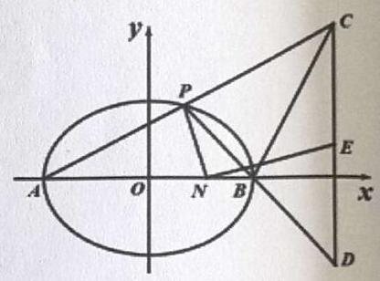

3. 已知椭圆 $\frac{{x}^{2}}{2} + {y}^{2} = 1$ 上两个不同的点 $A$ 、 $B$ 关于直线 $y = {mx} + \frac{1}{2}$ 对称，

(1)求实数 $m$ 的取值范围

(2)求 $\bigtriangleup {AOB}$ 面积的最大值

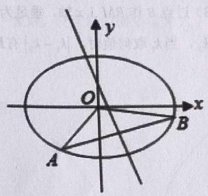

4. 已知椭圆 $\Gamma  : \frac{{x}^{2}}{9} + \frac{{y}^{2}}{5} = 1$ 的左右焦点为 ${F}_{1},{F}_{2}$ ，直线 $y = {k}_{1}x\left( {{k}_{1} \neq  0}\right)$ 与椭圆 $\Gamma$ 交于 $A, B$ 两点.

1) 设 $d$ 为点 $A$ 到直线 ${2x} + 9 = 0$ 的距离，证明:当 ${k}_{1}$ 变化时， $\frac{\left| A{F}_{1}\right| }{d}$ 为定值；

2) 当 $\angle A{F}_{2}B = {120}^{ \circ  }$ 时,求 $\left| {A{F}_{2}}\right|  \cdot  \left| {B{F}_{2}}\right|$ 的值;

3) 过点 $B$ 作 ${BM} \bot  x$ 轴,垂足为 $M,{OM}$ 的中点为 $N$ ,延长 ${AN}$ 交椭圆 $\Gamma$ 于另一点 $P$ ,记直线 ${PB}$ 的斜率为 ${k}_{2}$ ,当 ${k}_{1}$ 取何值时, $\left| {{k}_{1} - {k}_{2}}\right|$ 有最小值? 并求出该最小值.

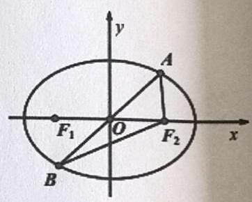

5. 曲线 $E$ 的方程是 ${x}^{2} - y\left| y\right|  = 1$ ,其中 $A, B$ 为曲线 $E$ 与 $x$ 轴的交点, $A$ 点在 $B$ 点的左边,曲线 $E$ 与 $y$ 轴的交点为 $D$ ,已知 ${F}_{1}\left( {-c,0}\right) ,{F}_{2}\left( {c,0}\right) , c > 0,\bigtriangleup {DB}{F}_{1}$ 的面积为 $\frac{1 + \sqrt{2}}{2}$ .

1) 过点 ${F}_{2}$ 的直线 $l$ 与曲线 $E$ 有且仅有一个公共点,求直线 $l$ 的倾斜角的取值范围;

2) 过点 $B$ 作斜率为 $k$ 的直线交曲线 $E$ 于 $P, Q$ 两点 (异于 $B$ 点),点 $P$ 在第一象限,设点 $P$ 的横坐标为 ${x}_{P}$ , 点 $Q$ 的横坐标为 ${x}_{Q}$ ,证明: ${x}_{P} \cdot  {x}_{Q}$ 是定值;

3) 在 2) 的条件下,当 $\overrightarrow{{F}_{1}P} \cdot  \overrightarrow{{F}_{1}Q} = 3 + 2\sqrt{2}$ 时,求 $\left| \overrightarrow{AP}\right|  = \lambda \left| \overrightarrow{AQ}\right|$ 成立时 $\lambda$ 的值.

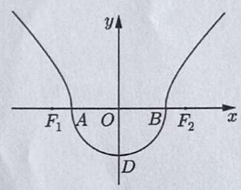

6. 已知椭圆 $\Gamma  : \frac{{x}^{2}}{{a}^{2}} + \frac{{y}^{2}}{{b}^{2}} = 1\left( {a > b > 0}\right)$ 的左、右焦点分别为 ${F}_{1}\text{ 、 }{F}_{2}$ ,且 ${F}_{1}\text{ 、 }{F}_{2}$ 与短轴的一个端点 $Q$ 构成一个等腰直角三角形,点 $P\left( {\frac{\sqrt{2}}{2},\frac{\sqrt{3}}{2}}\right)$ 在椭圆 $\Gamma$ 上,过点 ${F}_{2}$ 作互相垂直且与 $x$ 轴不重合的两直线 ${AB}\text{ 、 }{CD}$ 分别交椭圆 $\Gamma$ 于 $A\text{ 、 }B\text{ 、 }C\text{ 、 }D$ ,且 $M\text{ 、 }N$ 分别是弦 ${AB}\text{ 、 }{CD}$ 的中点.

(1)求椭圆 $\Gamma$ 的标准方程；

(2)求证:直线 ${MN}$ 过定点 $R\left( {\frac{2}{3},0}\right)$ ；

(3)求 ${\Delta MN}{F}_{2}$ 面积的最大值.

## 课后练习 18

1. 从抛物线 ${y}^{2} = {ax}$ 外一点 $A\left( {\cdot 2, - 4}\right)$ 做倾斜角为 ${45}^{ \circ  }$ 的直线，与抛物线交于两个不同的点 $P\text{ 、 }Q$ ，若 $\left| {AP}\right|$ 、 $\left| {PQ}\right| \text{ 、 }\left| {AQ}\right|$ 成等比数列,求抛物线的方程.

2. 已知抛物线 ${y}^{2} = {4x}$ 的焦点为 $F$ ， $A, B$ 为抛物线上两点，且 ${AF}\bot {BF}$ ，求 $\bigtriangleup  {AFB}$ 面积的取值范围。

3. 如图，由半圆 ${x}^{2} + {y}^{2} = {r}^{2}\left( {r \leq  0, r > 0}\right)$ 和部分抛物线 $y = a\left( {{x}^{2} - 1}\right) \left( {y \geq  0, a > 0}\right)$ 合成的曲线 $C$ 称为“羽毛球形线",曲线 $C$ 与 $x$ 轴有 $A\text{ 、 }B$ 两个交点,且经过点 $\left( {2,3}\right)$ ;

(1)求 $a\text{ 、 }r$ 的值；

(2)设 $N\left( {0,2}\right)$ ， $M$ 为曲线 $C$ 上的动点，求 $\left| {MN}\right|$ 的最小值；

(3)过 $A$ 且斜率为 $k$ 的直线 $l$ 与“羽毛球形线”相交于 $P$ 、 $A$ 、 $Q$ 三点，问是否存在实数 $k$ ，使得 $\angle {QBA} = \angle {PBA}$ ？ 若存在,求出 $k$ 的值,若不存在,请说明理由.

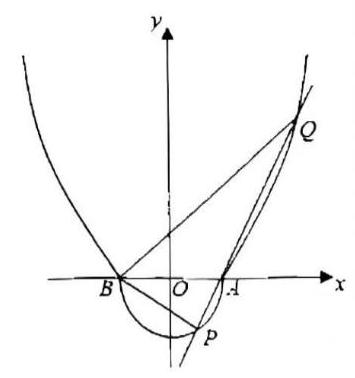

4. 在平面直角坐标系 ${xOy}$ 中,点 $A\left( {-2,0}\right)$ ,过动点 $P$ 作直线 $x =  - 4$ 的垂线,垂足为 $M$ ,且 $\overrightarrow{AM} \cdot  \overrightarrow{AP} =  - 4$ , 记动点 $P$ 的轨迹为曲线 $E$ .

(1)求曲线 $E$ 的方程；

(2)过点 $A$ 的直线 $l$ 交曲线 $E$ 于不同的两点 $B\text{ 、 }C$ ；

①若 $B$ 为线段 ${AC}$ 的中点，求直线 $l$ 的方程；②设 $B$ 关于 $x$ 轴的对称点为 $D$ ，求 $\bigtriangleup {ACD}$ 面积 $S$ 的取值范围.

5. 已知抛物线 ${y}^{2} = {2px}\left( {p > 0}\right)$ ,过动点 $M\left( {a,0}\right)$ 且斜率为 1 的直线 $l$ 与该抛物线交于不同两点 $A, B$ , $\left| {AB}\right|  \leq  {2p}$ 。

(1)求 $a$ 取值范围:

(2)若线段 ${AB}$ 垂直平分线交 $x$ 轴于点 $N$ ，求 $\bigtriangleup  {NAB}$ 面积的最大值。

## 课后练习 19

1. 已知抛物线 $C : {x}^{2} = {2py}\left( {p > 0}\right)$ 的焦点坐标为 $\left( {0,1}\right)$

(1)求抛物线方程；

(2)过直线 $y = x - 2$ 上一点 $P\left( {t, t - 2}\right)$ 作抛物线的切线切点为 $A, B$

①设直线 ${PA}\text{ 、 }{AB}\text{ 、 }{PB}$ 的斜率分别为 ${k}_{1},{k}_{2},{k}_{3}$ ,求证: ${k}_{1},{k}_{2},{k}_{3}$ 成等差数列;

②若以切点 $B$ 为圆心 $r$ 为半径的圆与抛物线 $C$ 交于 $D, E$ 两点且 $D, E$ 关于直线 ${AB}$ 对称，求点 $P$ 横坐标的取值范围.

2. 的已知点 $R\left( {{x}_{0},{y}_{0}}\right)$ 在 $\Gamma  : {y}^{2} = {2px}$ 上，以 $R$ 为切点的 $\Gamma$ 的切线的斜率为 $\frac{p}{{y}_{0}}$ ，过 $\Gamma$ 外一点 $A$ (不在 $x$ 轴上) 作 $\Gamma$ 的切线 ${AB},{AC}$ ,点 $B\text{ 、 }C$ 为切点,作平行于 ${BC}$ 的切线 ${MN}$ (切点为 $D$ ),点 $M\text{ 、 }N$ 分别是与 ${AB}$ 、 ${AC}$ 的交点 (如图)；

(1)用 $B\text{ 、 }C$ 的纵坐标 $s\text{ 、 }t$ 表示直线 ${BC}$ 的斜率；

(2)若直线 ${AD}$ 与 ${BC}$ 的交点为 $E$ ，证明 $D$ 是 ${AE}$ 的中点；

(3)设三角形 $\bigtriangleup  {ABC}$ 面积为 $S$ ，若将由过 $\Gamma$ 外一点的两条切线及第三条切线(平行于两切线切点的连线) 围成的三角形叫做“切线三角形”，如 $\bigtriangleup  {AMN}$ ，再由 $M$ 、 $N$ 作“切线三角形”，并依这样的方法不断作切线二角形……，试利用“切线三角形”的面积和计算由抛物线及 ${BC}$ 所围成的阴影部分的面积 $T$ ；

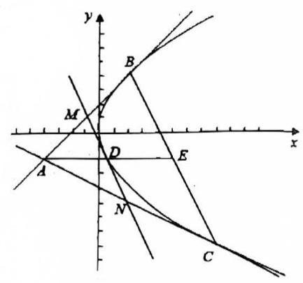

3. 若 $A, B$ 是曲线 ${y}^{2} = {4x}$ 上的不同两点,弦 ${AB}$ (不平行于 $y$ 轴) 的垂直平分线与 $x$ 轴相交于点 $P$ ,则称弦 ${AB}$ 是点 $P$ 的一条“相关弦”。给定 ${x}_{0} > 2$ 。

(1)证明:点 $P\left( {{x}_{0},0}\right)$ 的所有“相关弦”的中点的横坐标相同；

(2)点 $P\left( {{x}_{0},0}\right)$ 的“相关弦”的弦长中是否存在最大值？设明理由。

4. 已知抛物线 ${y}^{2} = x, O$ 为坐标原点.

(1)过抛物线焦点 $F$ 的直线交抛物线于 $A, B$ 两点，求 $\overrightarrow{OA} \cdot  \overrightarrow{OB}$ 的值；

(2)过抛物线上的一点 $C\left( {{x}_{0},{y}_{0}}\right)$ ，分别作两条直线交抛物线于另外两点 $P\left( {{x}_{P},{y}_{P}}\right)$ ， $Q\left( {{x}_{Q},{y}_{Q}}\right)$ ，交直线 $x =  - 1$ 于 ${A}_{1}\left( {-1,1}\right) ,{B}_{1}\left( {-1, - 1}\right)$ 两点,证明: ${y}_{P} \cdot  {y}_{Q}$ 为常数;

(3)已知点 $D\left( {1,1}\right)$ ，在抛物线上是否存在异于点 $D$ 的两个不同的点 $M$ ， $N$ ，使得 ${DM} \bot  {MN}?$ 若存在，求 $N$ 点纵坐标的取值范围；若不存在，请说明理由.

5. 【2019 年上海春考 20 题】已知抛物线 ${y}^{2} = {4x}$ ， $F$ 为焦点， $P$ 为准线 $l$ 上一动点，线段 ${PF}$ 与抛物线交于点 $Q$ ,定义 $d\left( P\right)  = \frac{\left| FP\right| }{\left| FQ\right| }$ .

(1)若点 $P$ 坐标为 $\left( {-1, - \frac{8}{3}}\right)$ ，求 $d\left( P\right)$ ；

(2)求证:存在常数 $a$ ，使得 ${2d}\left( P\right)  = \left| {FP}\right|  + a$ 恒成立；

(3)设 ${P}_{1}\text{ 、 }{P}_{2}\text{ 、 }{P}_{3}$ 为准线 $l$ 上的三点，且 $\left| {{P}_{1}{P}_{2}}\right|  = \left| {{P}_{2}{P}_{3}}\right|$ ，试比较 $d\left( {P}_{1}\right)  + d\left( {P}_{3}\right)$ 与 ${2d}\left( {P}_{2}\right)$ 的大小.

## 课后练习 20

1. 已知椭圆 $C : \frac{{x}^{2}}{4} + \frac{{y}^{2}}{3} = 1$ 的左、右焦点分别为 ${F}_{1}\text{ 、 }{F}_{2}$ ,设过 ${F}_{2}$ 且不与坐标轴垂直的直线 $l$ 与 $C$ 交于 $P\text{ 、 }Q$ 两点, $M$ 是点 $P$ 关于 $x$ 轴的对称点. 在 $x$ 轴上是否存在一个定点 $N$ ,使得 $M\text{ 、 }Q\text{ 、 }N$ 三点共线,若存在,求出点 $N$ 的坐标; 若不存在,请说明理由.

2. 已知椭圆 $\Gamma  : \frac{{x}^{2}}{{a}^{2}} + \frac{{y}^{2}}{{b}^{2}} = 1\left( {a > b > 0}\right)$ 的右焦点坐标为 $\left( {2,0}\right)$ ，且长轴长为短轴长的 $\sqrt{2}$ 倍，直线 $l$ 交椭圆 $\Gamma$ 于不同的两点 $M,{N.1}$ ) 求椭圆 $\Gamma$ 的方程；

(1)若直线 $l$ 经过点 $T\left( {0,4}\right)$ ，且 $\bigtriangleup  {OMN}$ 的面积为 $2\sqrt{2}$ ，求直线 $l$ 的方程；

(2)若直线 $l$ 的方程为 $y = {kx} + t\left( {k \neq  0}\right)$ ，点 $M$ 关于 $x$ 轴的对称点为 ${M}_{1}$ ，直线 ${MN}$ ， ${M}_{1}N$ 分别与 $x$ 轴相交于 $P, Q$ 两点,证明: $\left| {OP}\right|  \cdot  \left| {OQ}\right|$ 为定值.

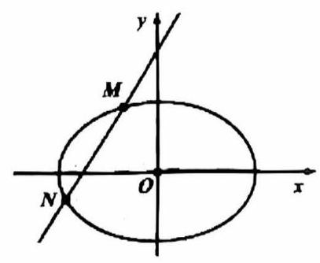

3. 知椭圆 $\Gamma  : \frac{{x}^{2}}{8} + \frac{{y}^{2}}{4} = 1$ 的上、下顶点分别为 $A\text{ 、 }B$ ,经过点 $P\left( {0,4}\right)$ 的直线 $l$ 与椭圆 $\Gamma$ 相交于 $M\text{ 、 }N$ 两点 (不同于 $A\text{ 、 }B$ 两点) 。设直线 ${AN}\text{ 、 }{BM}$ 相交于点 $Q\left( {m, n}\right)$ ,求证: $n$ 是定值.

4. 设 ${A}_{1},{A}_{2}$ 分别是相圆 $\Gamma  : \frac{{x}^{2}}{{a}^{2}} + {y}^{2} = 1\left( {a > 1}\right)$ 的左右顶点,点 $B$ 为椭圆的上顶点.

(1)若 $\overrightarrow{{A}_{1}B} \cdot  \overrightarrow{{A}_{2}B} =  - 4$ ，求椭圆 $\Gamma$ 的方程；

(2)设 $a = \sqrt{2}$ ， ${F}_{2}$ 是椭圆的右焦点，点 $Q$ 是椭圆第二象限部分上一点，若线段 ${F}_{2}Q$ 的中点 $M$ 在 $y$ 轴上，求 $\bigtriangleup {F}_{2}{BQ}$ 的面积;

(3)设 $a = 3$ ，点 $P$ 是直线 $x = 6$ 上的动点，点 $C, D$ 是椭圆上异于左右顶点的两点，且 $C, D$ 分别在直线 $P{A}_{1}, P{A}_{2}$ 上,证明: 直线 ${CD}$ 恒过一定点.

## 课后练习 21

1. 已知椭圆 $\Gamma  : \frac{{x}^{2}}{12} + \frac{{y}^{2}}{8} = 1$ 的左、右焦点分别为 ${F}_{1},{F}_{2}$ ,过点 ${F}_{1}$ 的直线 $l$ 交椭圆于 $A, B$ 两点,交 $y$ 轴于点 $P\left( {0, t}\right)$ .

(1)若 ${F}_{1}P \bot  {F}_{2}P$ ，求 $t$ 的值；

(2)若点 $A$ 在第一象限，满足 $\overrightarrow{{F}_{1}A} \cdot  \overrightarrow{{F}_{2}A} = 7$ ，求 $t$ 的值；

(3)在平面内是否存在定点 $Q$ ，使得 $\overrightarrow{QA} \cdot  \overrightarrow{QB}$ 为定值？若存在，求出点 $Q$ 的坐标；若不存在，说明理由.

2. 知椭圆 $C : \frac{{x}^{2}}{t} + {y}^{2} = 1\left( {t > 1}\right)$ 的左右焦点分别为 ${F}_{1},{F}_{2}$ ,直线 $l : y = {kx} + m\left( {m \neq  0}\right)$ 与椭圆 $C$ 交于 $M$ , $N$ 两点 ( $M$ 点在 $N$ 点的上方),与 $y$ 轴交于点 $E$ .

1) 当 $t = 2$ 时,点 $A$ 为椭圆 $C$ 除顶点外任一点,求 $\bigtriangleup A{F}_{1}{F}_{2}$ 的周长;

2) 当 $t = 3$ 且直线 $l$ 过点 $D\left( {-1,0}\right)$ 时,设 $\overline{EM} = \lambda \overline{DM},\overrightarrow{EN} = \mu \overrightarrow{DN}$ ,证明: $\lambda  + \mu$ 为定值,并求出该值;

3) 若椭圆 $C$ 的离心率为 $\frac{\sqrt{3}}{2}$ ，求 $k$ 的值，使 ${\left| OM\right| }^{2} + {\left| ON\right| }^{2}$ 为定值，并求此时 $\bigtriangleup  {MON}$ 面积的最大值.

3. 已知双曲线 $\Gamma  : \frac{{x}^{2}}{4} - \frac{{y}^{2}}{12} = 1, F$ 为左焦点， $P$ 为直线 $x = 1$ 上一动点， $Q$ 为线段 ${PF}$ 与 $\Gamma$ 的交点. 定义:

$$
d\left( P\right)  = \frac{\left| FP\right| }{\left| FQ\right| }
$$

1) 若点 $Q$ 的纵坐标为 $\sqrt{15}$ ,求 $d\left( P\right)$ 的值;

2) 设 $d\left( P\right)  = \lambda$ ,点 $P$ 的纵坐标为 $t$ ,试将 ${t}^{2}$ 表示成 $\lambda$ 的函数并求其定义域:

3) 证明: 存在常数 $m, n$ ,使得 ${md}\left( P\right)  = \left| {FP}\right|  + n$ .

4. 已知椭圆 $E : \frac{{x}^{2}}{{a}^{2}} + \frac{{y}^{2}}{{b}^{2}} = 1\left( {a > b > 0}\right)$ 的左右焦点分别为 ${F}_{1},{F}_{2}$ ,短轴两个端点为 $A, B$ ,且四边形 ${F}_{1}A{F}_{2}B$ 是边长为 2 的正方形。

(1)求椭圆方程；

(2)若 $C, D$ 分别是椭圆长轴的左右端点，动点 $M$ 满足 ${MD}\bot {CD}$ ，连接 ${CM}$ ，交椭圆于点 $P$ 。证明: $\overrightarrow{OM} \cdot  \overrightarrow{OP}$ 为定值。

5. 已知椭圆 $\frac{{x}^{2}}{{a}^{2}} + \frac{{y}^{2}}{{b}^{2}} = 1\left( {a > b > 0}\right)$ ，直线 $l$ 与椭圆交于 $P, Q$ 两点，与 $x$ 轴交于点 $N$ 。若 $A$ 为该椭圆上的点，且 ${k}_{AP} \cdot  {k}_{AQ}$ 为定值。请证明: $N$ 为定点是 $A$ 为椭圆左右顶点的充要条件。
