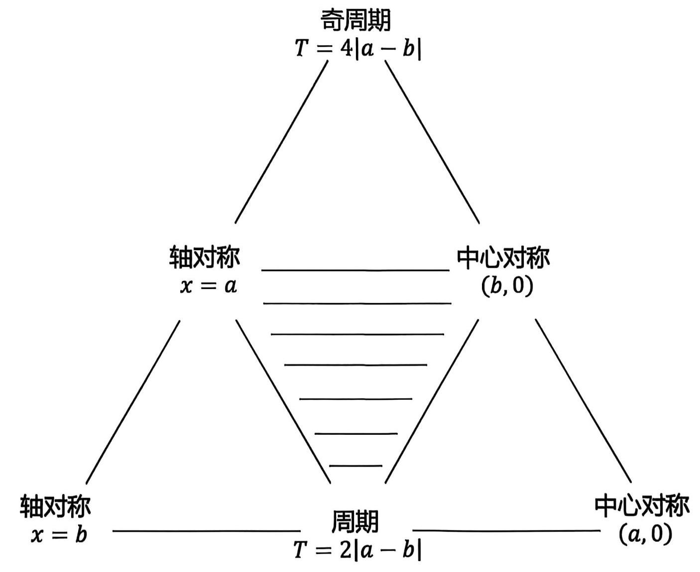

# 第三讲函数的对称性与周期性 II（教师版）

## 课堂理解导语

::: lesson-guide

本讲从“公式怎么来”推进到“图像怎么用”。课堂主线是：先复制周期图像，再用直线或水平线数交点；先认清类周期的横纵变换方向，再把零点个数转化为区间和值域问题；一旦触发对称与周期的绑定关系，就先搭对称轴、对称中心的骨架，再回到基本区间处理。

**模块一：周期图像。** 第 1 题用局部周期 $f(x)=f(x-1)$ 复制图像，并用“移动直线 $y=x$”代替移动整张函数图；第 2 题提醒疑似相切处要比斜率；第 3 题把基本段看作半圆，用切线直角三角形求 $k_n$。

**模块二：类周期变换。** 第 4 题把 2024 个零点翻译成“2024 个单调区间都被同一水平线命中”；第 5、7 题训练横纵同时缩放，重点是按 $[1,2]$、$[2,4]$、$[4,8]$ 这些区间去画，而不是套错横向伸缩口号。

**模块三：绑定关系。** 第 9 题用偶函数与周期推出每隔 $1$ 有对称轴；第 11 题是综合题，连续考奇函数、周期 $4$、函数不等式拆解和一元恒成立；第 12 题用关键点函数值与导数斜率确认 $|x\cos(\pi x)|$ 和复制后的 $f$ 如何交错。

:::

## 一、函数图像的周期变换

1. 设函数 $f\left( x\right) = \left\{ \begin{array}{l} a + {2}^{-x}, x \leq 0 \\ f\left( {x - 1}\right) , x > 0 \end{array}\right.$ ，记 $g\left( x\right) = f\left( x\right) - x$ ，若函数 $g\left( x\right)$ 有且仅有两个零点，则实数 $a$ 的取值范围是\_\_\_。

> **答案：** $(-2,+\infty)$。
>
> **核心思路：** $g(x)=0$ 等价于 $f(x)=x$，先画 $x\le0$ 的 $a+2^{-x}$，再把 $[-1,0]$ 上的图像按周期 $1$ 向右复制。
>
> **易卡点：** 不要让参数 $a$ 带着整张周期图上下动。课堂里用“运动的相对性”：固定 $f$ 的图像，移动直线 $y=x$ 更容易观察交点个数。
>
> **解析：** 当 $x\le0$ 时，图像为 $y=a+2^{-x}$，其中 $x=0$ 处函数值为 $a+1$，$x=-1$ 处函数值为 $a+2$。当 $x>0$ 时，由 $f(x)=f(x-1)$，每个长度为 $1$ 的区间复制前一个区间的形状。
>
> 零点条件为
> $$
> f(x)=x.
> $$
> 临界位置出现在直线 $y=x$ 经过左侧复制段的接力边界时。课堂中判断为 $a+2=0$，即 $a=-2$。当 $a=-2$ 时刚到临界；当红色函数图像整体上移，也就是 $a>-2$ 时，直线与周期复制段始终保持两个交点，并在相邻周期之间无缝接力。
>
> 因此
> $$
> a>-2.
> $$
>
> **课堂提示：** 要提醒学生检查空心、实心端点。这里相邻周期交点能接力，是因为对应端点连线的斜率与 $y=x$ 一致。

2. 已知定义域为 $\mathrm{R}$ 的函数 $y = f\left( x\right)$ 满足 $f\left( {x + 2}\right) = f\left( x\right)$ ，且 $- 1 \leq x < 1$ 时， $f\left( x\right) = 1 - {x}^{2}$ ；函数 $g\left( x\right) = \left\{ \begin{array}{l} \lg \left| x\right| , x \neq 0, \\ 1, x = 0. \end{array}\right.$ ，若 $F\left( x\right) = f\left( x\right) - g\left( x\right)$ ，则 $x \in \left\lbrack {-5,{10}}\right\rbrack$ ，函数 $F\left( x\right)$ 零点的个数是\_\_\_.

> **答案：** $15$。
>
> **核心思路：** 零点即 $f(x)=g(x)$，画出周期为 $2$ 的抛物线拱形，再与 $y=\lg |x|$ 及 $x=0$ 处定义值比较交点。
>
> **易卡点：** 右端附近疑似相切的点不能靠图像猜。课堂中用导数判断：周期拱形顶点处切线水平，而 $\lg |x|$ 的斜率不为 $0$，所以是相交不是相切。
>
> **解析：** $f$ 在每个周期中是 $1-x^2$ 的复制，顶点处函数值为 $1$。$g(x)=\lg |x|$ 是偶函数，且 $g(0)=1$，所以 $x=0$ 处有一个交点。
>
> 在区间 $[-5,10]$ 内按周期逐段数交点，可先得到 $14$ 个常规交点。还要补上 $x=0$ 处由定义给出的交点。右侧端点附近的疑似切点不是切点，因为周期拱形在顶点处导数为 $0$，而对数函数导数不为 $0$。
>
> 故零点总数为
> $$
> 14+1=15.
> $$
>
> **课堂提示：** 这题最适合训练“数交点时先数大概，再专门排查端点、定义特殊点、疑似相切点”。

3. 已知函数 $f\left( x\right) = \left\{ \begin{matrix} \sqrt{1 - {\left( x - 1\right) }^{2}},0 \leq x < 2 \\ f\left( {x - 2}\right) , x \geq 2 \end{matrix}\right.$ ,若对于正数 ${k}_{n}\left( {n \in {N}^{ * }}\right)$ ,直线 $y = {k}_{n}x$ 与函数 $f\left( x\right)$ 的图像恰好有 ${2n} + 1$ 个不同的交点，则 ${k}_{1}^{2} + {k}_{2}^{2} + \ldots + {k}_{n}^{2} =$ \_\_\_.

> **答案：** $\dfrac{n}{4(n+1)}$。
>
> **核心思路：** 基本图像是圆心 $(1,0)$、半径 $1$ 的上半圆，之后每隔 $2$ 复制一次。交点数变成 $2n+1$ 的临界情况是直线与第 $n+1$ 个半圆相切。
>
> **易卡点：** 不建议联立方程判别式。课堂强调，遇到圆尽量用几何切线和直角三角形求斜率。
>
> **解析：** 第 $n+1$ 个半圆的圆心为
> $$
> (2n+1,0),
> $$
> 半径为 $1$。直线 $y=k_nx$ 与该圆相切时，原点到圆心连线、切线、半径构成直角三角形。
>
> 设切线与 $x$ 轴夹角为 $\alpha_n$，则
> $$
> k_n=\tan\alpha_n=\frac1{\sqrt{(2n+1)^2-1}}
> =\frac1{2\sqrt{n(n+1)}}.
> $$
> 所以
> $$
> k_n^2=\frac1{4n(n+1)}
> =\frac14\left(\frac1n-\frac1{n+1}\right).
> $$
> 因此
> $$
> \sum_{i=1}^n k_i^2
> =\frac14\left(1-\frac1{n+1}\right)
> =\frac{n}{4(n+1)}.
> $$
>
> **课堂提示：** 这里的“第几个圆”容易错一位。课堂图上第一个半圆圆心是 $1$，第二个是 $3$，所以第 $n+1$ 个圆心才是 $2n+1$。

## 二、函数图像的类周期变换

假设 $f\left( x\right)$ 定义域为 $R$ ,在区间 $\left\lbrack {\alpha, \beta}\right\rbrack$ 上的图像为 $\Gamma$ ,则(以下 $k \in Z$ )

(1)若 $f\left( {x + T}\right) = f\left( x\right) + c, f\left( x\right)$ 在 $\left\lbrack {\alpha + {kT}, \beta + {kT}}\right\rbrack$ 上的图像为 $\Gamma$ 上移 ${kc}$ 得到；

(2)若 $f\left( {x + T}\right) = {\lambda f}\left( x\right) ,\left( {\lambda > 0,{\alpha\beta} \geq 0}\right) , f\left( x\right)$ 在 $\left\lbrack {\alpha + {kT}, \beta + {kT}}\right\rbrack$ 上的图像为 $\Gamma$ 在竖直方向伸缩 $\lambda$ 倍得到

(3)若 $f\left( {\lambda x}\right) = {\mu f}\left( x\right) ,\left( {\lambda > 1,\mu > 0, \beta = {\lambda \alpha} > 0}\right) , f\left( x\right)$ 在 $\left\lbrack {{\lambda }^{k - 1}\alpha,{\lambda }^{k - 1}\beta}\right\rbrack$ 上的图像为 $\Gamma$ 在竖直方向伸缩 ${\mu }^{k - 1}$ 倍得到

> **课堂提示：** 这三条不要只背符号。第一类是“右移 $T$、上移 $c$”；第二类是“右移 $T$、纵向乘 $\lambda$”；第三类是“横向区间也按 $\lambda$ 拉开，纵向按 $\mu$ 拉伸”。画图时直接看区间如何从基本段变到下一段。

4. 已知函数 $y = f\left( x\right)$ 的定义域是 $\lbrack 0, + \infty )$ ,满足 $f\left( x\right) = \left\{ \begin{matrix} {2x} & 0 \leq x < 1 \\ {x}^{2} - {4x} + 5 & 1 \leq x < 3 \\ - {2x} + 8 & 3 \leq x < 4 \end{matrix}\right.$ ，且 $f\left( {x + 4}\right) = f\left( x\right) + a$ ，若存在实数 $k$ ,使函数 $g\left( x\right) = f\left( x\right) + k$ 在区间 $\left\lbrack {0,{2024}}\right\rbrack$ 上恰好有 2024 个零点,则实数 $a$ 的取值范围为\_\_\_

> **答案：** $\left(-\dfrac1{505},\dfrac1{505}\right)$。
>
> **核心思路：** $g(x)=0$ 等价于 $f(x)=-k$，即找一条水平线与图像相交。$[0,4)$ 内有 $4$ 个单调区间，$[0,2024]$ 共 $506$ 个周期，恰好 $2024$ 个单调区间。
>
> **易卡点：** 要每个单调区间都贡献一个零点，所以水平线必须落在所有对应值域的公共部分内；只在边界相交不够，因为会卡端点导致数量减少。
>
> **解析：** 基本周期 $[0,4)$ 的图像由三段组成，整体有 $4$ 个单调区间，关键值域可看作 $(1,2)$。由于
> $$
> f(x+4)=f(x)+a,
> $$
> 第 $506$ 个周期相对第一个周期上下平移了 $505a$。
>
> 要存在同一条水平线与全部 $2024$ 个单调区间相交，极端的第一个周期与最后一个周期的对应值域必须有开交集：
> $$
> (1,2)\cap (1+505a,2+505a)\ne\varnothing.
> $$
> 因而
> $$
> -1<505a<1,
> $$
> 即
> $$
> -\frac1{505}<a<\frac1{505}.
> $$
>
> **课堂提示：** 这题的关键不是求某个零点，而是把“2024 个零点”翻译成“2024 个单调区间全部命中”。

5. 定义在 $\left( {0, + \infty }\right)$ 上的函数 $f\left( x\right)$ 满足: $f\left( {2x}\right) = {2f}\left( x\right)$ ,且当 $x \in (1,2\rbrack$ 时, $f\left( x\right) = 2 - x$ ,若 ${x}_{1},{x}_{2}$ 是方程 $f\left( x\right) = a\left( {0 < a \leq 1}\right)$ 的两个实数根,则 ${x}_{1} - {x}_{2}$ 不可能是 ( )

::: choices
- A. 24
- B. 72
- C. 96
- D. 120
:::

> **答案：** B。
>
> **核心思路：** $f(2x)=2f(x)$ 表示从 $(1,2]$ 到 $(2,4]$、$(4,8]$ 时横纵都放大 $2$ 倍。每段图像的零点位置是 $2$ 的幂。
>
> **易卡点：** 这里不要套传统“$f(2x)$ 横向压缩”的图像口号。课堂中直接按自变量区间看：$x\in(1,2]$ 时，$2x\in(2,4]$。
>
> **解析：** 基本段 $(1,2]$ 上 $f(x)=2-x$，随后图像在横向、纵向同时按 $2$ 倍扩展。不同分支上同一水平线的横坐标差可归结为两个 $2$ 的幂之差：
> $$
> |x_1-x_2|=2^m(2^r-1).
> $$
> 逐项分解可写成
> $$
> 24=2^3(2^2-1),\qquad
> 96=2^5(2^2-1),\qquad
> 120=2^3(2^4-1).
> $$
> 而 $72=2^3\cdot9$，其中的 $9$ 不能写成 $2^r-1$，故不可能。
>
> **课堂提示：** 让学生先在图上标出 $1,2,4,8,16$，再看两根之差，比直接代解析式更稳。

6. 已知定义在 $R$ 上的函数 $f\left( x\right)$ 满足 $f\left( {x + 1}\right) = {2f}\left( x\right) + 1$ ，当 $x \in \lbrack 0,1)$ 时， $f\left( x\right) = {x}^{3}$ . 设 $f\left( x\right)$ 在区间 $\lbrack n, n + 1)\left( {n \in {\mathbf{N}}^{ * }}\right)$ 上的最小值为 ${a}_{n}$ . 若存在 $n \in {\mathbf{N}}^{ * }$ ,使得 $\lambda \left( {{a}_{n} + 1}\right) < {2n} - 7$ 有解,则实数 $\lambda$ 的取值范围是 \_\_\_.

> **答案：** $\lambda<\dfrac3{32}$。
>
> **核心思路：** 先由递推求每个整数区间的最小值。令 $b_n=a_n+1$，由 $f(x+1)+1=2(f(x)+1)$ 得到 $b_n$ 按 $2$ 倍增长。
>
> **解析：** 当 $x\in[0,1)$ 时，$f(x)=x^3$，最小值为 $0$。递推式可写成
> $$
> f(x+1)+1=2(f(x)+1).
> $$
> 因而在第 $n$ 个正整数区间 $[n,n+1)$ 上，
> $$
> a_n+1=2^n,
> $$
> 即
> $$
> a_n=2^n-1.
> $$
> 条件变为存在 $n\in\mathbf N^*$ 使
> $$
> \lambda 2^n<2n-7.
> $$
> 也就是
> $$
> \lambda<\frac{2n-7}{2^n}.
> $$
> 右侧在正整数 $n$ 中的最大值出现在 $n=5$：
> $$
> \frac{2\cdot5-7}{2^5}=\frac3{32}.
> $$
> 所以
> $$
> \lambda<\frac3{32}.
> $$
>
> 待核对：转写文本中没有完整讲到第 6 题，以上按题面和类周期递推补全。若要严审，应再次核对原讲义答案或课堂板书。

7. 已知函数 $f\left( x\right)$ 是定义在 $\lbrack 1, + \infty )$ 上的函数,且 $f\left( x\right) = \left\{ \begin{array}{l} 1 - \left| {{2x} - 3}\right| ,1 \leq x < 2 \\ {0.5f}\left( {0.5x}\right) , x \geq 2 \end{array}\right.$ ,则函数 $y = {2xf}\left( x\right) - 3$ 在区间 (1,2024) 上的零点个数为\_\_\_.

> **答案：** $11$。
>
> **核心思路：** 零点条件为
> $$
> f(x)=\frac3{2x}.
> $$
> 基本段 $[1,2)$ 是一个倒三角，之后每到下一个二倍区间，横坐标放大 $2$ 倍、纵坐标缩小 $\frac12$。
>
> **易卡点：** 题中写的是 $f(x)=0.5f(0.5x)$。课堂中先换元解释它与按二倍区间递推是一回事，再画 $[1,2)$、$[2,4)$、$[4,8)$。
>
> **解析：** 在 $[1,2)$ 上，
> $$
> f(x)=1-|2x-3|
> $$
> 的顶点在 $x=\frac32$，函数值为 $1$。而
> $$
> \frac3{2x}
> $$
> 在 $x=\frac32$ 时也等于 $1$，所以每个二倍区间内恰好有一个交点。
>
> 需要数满足
> $$
> (2^m,2^{m+1})\subset(1,2024)
> $$
> 的二倍区间。因为
> $$
> 2^{10}=1024<2024<2048=2^{11},
> $$
> 从 $(1,2)$ 到 $(1024,2048)$ 共 $11$ 个相关区间，其中最后一个交点仍落在 $(1,2024)$ 内。
>
> 故零点个数为 $11$。
>
> **课堂提示：** 课堂中有学生报 $20$，老师直接指出是图像变换方向错了。这里最要紧的是先把缩放关系换成能画图的区间关系。

## 三、周期与对称性的绑定关系

函数的周期性和对称性间存在以下绑定关系，当任意两个条件成立时，第三个条件自动成立。

第一组: $\text{ ① }f\left( x\right)$ 关于 $x = a$ 轴对称; ② $f\left( x\right)$ 关于 $x = b$ 轴对称; ③ $f\left( x\right)$ 为周期函数，且 $T = 2\left| {a - b}\right|$

第二组: $\text{ ① }f\left( x\right)$ 关于 $\left( {a,0}\right)$ 中心对称; $\text{ ② }f\left( x\right)$ 关于 $\left( {b,0}\right)$ 中心对称; $\text{ ③ }f\left( x\right)$ 为周期函数,且 $T = 2\left| {a - b}\right|$

第三组: $\text{ ① }f\left( x\right)$ 关于 $x = a$ 轴对称; $\text{ ② }f\left( x\right)$ 关于 $\left( {b,0}\right)$ 中心对称; $\text{ ③ }f\left( x\right)$ 为奇周期函数,且 $T = 4\left| {a - b}\right|$

一旦出现任意一组绑定关系，则函数的对称轴或对称中心，都以将 $\frac{T}{2}$ 为间隔均匀分布在 $x$ 轴上。

> **课堂提示：** 一旦看到绑定关系，不要急着算。先把轴和中心按间隔标出来：轴对称与中心对称会像“骨架”一样决定整张图怎么复制。

8. 已知定义在 $R$ 上的奇函数 $f\left( x\right)$ 满足 $f\left( {x - 4}\right) = - f\left( x\right)$ ，且 $x \in \left\lbrack {0,2}\right\rbrack$ 时， $f\left( x\right) = {\log }_{2}\left( {x + 1}\right)$ ，若 $m \in \left( {0,1}\right)$ ，关于 $x$ 的方程 $f\left( x\right) - m = 0$ 在 $\left\lbrack {-8,8}\right\rbrack$ 上的所有根之和为\_\_\_

> **答案：** $0$。
>
> **核心思路：** 奇函数使根关于原点成对出现；$f(x-4)=-f(x)$ 两次推出周期 $8$。在对称区间 $[-8,8]$ 内，正负根配对求和为 $0$。
>
> **解析：** 因为 $f$ 是奇函数，若 $f(x)=m$，则
> $$
> f(-x)=-m.
> $$
> 又由
> $$
> f(x-4)=-f(x)
> $$
> 可知再平移一次后回到原值，周期为 $8$。对 $m\in(0,1)$，在 $[-8,8]$ 上所有满足 $f(x)=m$ 的根按周期与奇对称配对，横坐标和为 $0$。
>
> 待核对：转写中未完整展开第 8 题。本题答案按奇函数与周期对称配对补全，建议若用于正式讲义，再对照原题答案页。

9. 【2025 上海高考 21 改编】已知函数 $y = f\left( x\right)$ 是定义域为 $\mathbf{R}$ ，周期为 $T = 2$ 的周期函数，若 $y = f\left( x\right)$ 也是偶函数,且当 $x \in (0,1\rbrack$ 时, $f\left( x\right) = 1 - x$ ,求 $y = f\left( x\right) , x \in \left( {1,2}\right)$ 的解析式,并证明: 对任意实数 $c$ , 函数 $y = f\left( x\right) - c$ 在 $\left\lbrack {-3,3}\right\rbrack$ 上至多有 9 个零点.

> **答案：** $x\in(1,2)$ 时，$f(x)=x-1$；至多 $9$ 个零点。
>
> **核心思路：** 偶函数给出关于 $x=0$ 轴对称，周期 $2$ 使图像每隔 $2$ 复制，于是还能推出关于 $x=1$ 轴对称。
>
> **易卡点：** 开区间单调段最多贡献一个零点，但 $x=0,\pm2$ 这类端点特殊值还可能额外贡献零点。
>
> **解析：** 因为 $f$ 为偶函数且周期为 $2$，
> $$
> f(x)=f(-x)=f(2-x).
> $$
> 所以函数关于 $x=1$ 轴对称。若 $x\in(1,2)$，则 $2-x\in(0,1)$，故
> $$
> f(x)=f(2-x)=1-(2-x)=x-1.
> $$
>
> 在 $[-3,3]$ 上，除端点复制出的特殊点外，图像由 $6$ 个开单调区间组成，每个单调区间上方程 $f(x)=c$ 至多有一个根，所以最多贡献 $6$ 个根。
>
> 另外，若定义端点处函数值恰好等于 $c$，则 $x=-2,0,2$ 还能各贡献一个根。因此总数至多为
> $$
> 6+3=9.
> $$
>
> **课堂提示：** 老师强调 21 题证明不仅要会画图，还要把“每个单调区间最多一个根”和“三个特殊点可额外贡献”写清楚。

10. 已知 $f\left( x\right)$ 为奇函数,当 $x \in (0,1\rbrack , f\left( x\right) = \ln x$ ,且 $f\left( x\right)$ 关于直线 $x = 1$ 对称。设方程 $f\left( x\right) = x + 1$ 的正数解为 ${x}_{1},{x}_{2},\cdots ,{x}_{n},\cdots$ ,且任意的 $n \in \mathrm{N}$ ，总存在实数 $M$ ，使得 $\left| {{x}_{n + 1} - {x}_{n}}\right| < M$ 成立，则实数 $M$ 的最小值为

> **答案：** $2$。
>
> **核心思路：** 奇函数给出中心对称，关于 $x=1$ 轴对称，两者绑定推出周期结构；正根间距的上确界为 $2$。
>
> **易卡点：** 课堂中老师说明原题若不限制相邻正根，会把不好求的中间距离卷进来；按课堂修正版，目标是相邻正根差的统一上界。
>
> **解析：** $f$ 是奇函数，所以图像关于 $(0,0)$ 中心对称；又关于 $x=1$ 轴对称。由第三组绑定关系，函数具有周期性，且对称轴和对称中心按固定间隔排列。
>
> 方程
> $$
> f(x)=x+1
> $$
> 的正根在相邻复制段中依次出现。从图像趋势看，相邻正根距离均小于 $2$，且随着周期推进可任意接近 $2$，所以统一上界的最小值为上确界
> $$
> M_{\min}=2.
> $$
>
> **课堂提示：** 本题课堂价值在“上确界”而不是最大值。若题目写法与答案不一致，要敢于回到图像判断出题意。

11. 已知定义在 $R$ 上的奇函数 $f\left( x\right)$ 满足 $f\left( {x + 2}\right) = - f\left( x\right)$ ,且 $0 \leq x \leq 1$ 时, $f\left( x\right) = {\log }_{2}\left( {x + a}\right)$ 。若对于任意 $x \in \left\lbrack {0,1}\right\rbrack$ ，都有 $f\left( {-{x}^{2} + {tx} + \frac{1}{2}}\right) \geq 1 - {\log }_{2}3$ ，则实数 $t$ 的取值范围为\_\_\_。

> **答案：** $[0,3]$。
>
> **核心思路：** 先由奇函数得到 $f(0)=0$，求出 $a=1$；再用 $f(x+2)=-f(x)$ 推出周期 $4$ 和对称骨架，把函数不等式转化为自变量落在某个周期区间。
>
> **易卡点：** $x=0$ 不能直接除掉。课堂里先用 $x=0$ 判断周期参数 $k=0$，再对 $0<x\le1$ 做参变分离。
>
> **解析：** 因为 $f$ 为定义在 $\mathbf R$ 上的奇函数，
> $$
> f(0)=0.
> $$
> 又 $f(0)=\log_2 a$，故
> $$
> a=1.
> $$
> 由
> $$
> f(x+2)=-f(x)
> $$
> 可知 $f$ 的周期为 $4$。课堂图像中，水平线
> $$
> 1-\log_2 3=\log_2\frac23
> $$
> 对应的一个周期内自变量区间为
> $$
> \left[-\frac12,\frac52\right].
> $$
> 因而要对任意 $x\in[0,1]$ 成立，需要
> $$
> -\frac12\le -x^2+tx+\frac12\le \frac52.
> $$
> 左右分别化简：
> $$
> -1\le -x^2+tx \quad\Longleftrightarrow\quad t\ge \frac{x^2-1}{x},
> $$
> $$
> -x^2+tx\le2 \quad\Longleftrightarrow\quad t\le \frac{x^2+2}{x}.
> $$
> 当 $x=0$ 时原不等式先单独检查，可确定只需取同一周期，即 $k=0$。当 $0<x\le1$ 时，
> $$
> \max_{0<x\le1}\left(x-\frac1x\right)=0,
> $$
> $$
> \min_{0<x\le1}\left(x+\frac2x\right)=3.
> $$
> 因此
> $$
> 0\le t\le3.
> $$
>
> **课堂提示：** 老师把这题拆成六个能力点：奇函数、绑定关系画图、解函数不等式、确定周期区间、处理 $x=0$、参变分离求最值。教师讲解时适合分段板书，不要一口气压缩。

12. 设函数 $f\left( x\right) \left( {x \in \mathbf{R}}\right)$ 满足 $f\left( {-x}\right) = f\left( x\right) , f\left( x\right) = f\left( {2 - x}\right)$ ，且当 $x \in \left\lbrack {0,1}\right\rbrack$ 时 $f\left( x\right) = {x}^{3}$ ，又函数 $g\left( x\right) = \left| {x\cos \left( {\pi x}\right) }\right|$ ,则函数 $h\left( x\right) = g\left( x\right) - f\left( x\right)$ 在 $\left\lbrack {-\frac{1}{2},\frac{3}{2}}\right\rbrack$ 上的零点个数为\_\_\_.

> **答案：** $6$。
>
> **核心思路：** $f(-x)=f(x)$ 给出关于 $x=0$ 轴对称，$f(x)=f(2-x)$ 给出关于 $x=1$ 轴对称，所以 $f$ 周期为 $2$，每隔 $1$ 有一条对称轴。再画 $g(x)=|x\cos(\pi x)|$ 并数交点。
>
> **易卡点：** $|x\cos(\pi x)|$ 的图像不能只凭大概形状判断。课堂中老师在 $x=0$、$x=1$ 附近比较导数，修正了交点数。
>
> **解析：** 在 $[0,1]$ 上，$f(x)=x^3$。由 $x=0$、$x=1$ 两条对称轴，可把这段图像复制到 $[-\frac12,0]$、$[1,\frac32]$。
>
> 对 $g(x)=|x\cos(\pi x)|$，先标关键零点：
> $$
> x=-\frac12,\quad x=\frac12,\quad x=\frac32
> $$
> 等处来自 $\cos(\pi x)=0$；同时 $x=0$ 也使乘积为 $0$。在 $[0,1]$ 内与 $x^3$ 比较时，$x^3$ 在 $0$ 处导数为 $0$，而 $|x\cos(\pi x)|$ 离开 $0$ 的速度更快，所以除了端点外还有交错产生的根。靠近 $x=1$ 时，课堂中通过局部导数判断 $g$ 从上方穿过复制后的 $f$。
>
> 综合 $[-\frac12,\frac32]$ 的三个相邻小区间，交点总数为
> $$
> 6.
> $$
>
> **课堂提示：** 本题适合提醒学生：图像题不是“画得像就行”，遇到贴近或疑似相切的位置，要用关键点函数值和导数斜率确认穿越方式。
