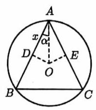
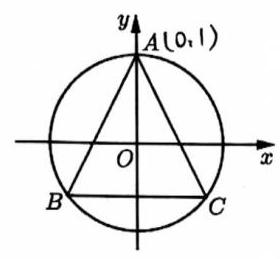
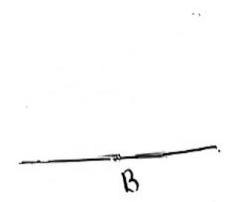

# 第四讲平面向量基础要点

## 一、基本概念回顾

1. 下列命题中，正确的是 ( )

::: choices

- A. $\left| \overrightarrow{a}\right| = \left| \overrightarrow{b}\right| \Rightarrow \overrightarrow{a} = \overrightarrow{b}$
- B. $\left| \overrightarrow{a}\right| > \left| \overrightarrow{b}\right| \Rightarrow \overrightarrow{a} > \overrightarrow{b}$
- C. $\left| \overrightarrow{a}\right| = \left| \overrightarrow{b}\right| \Rightarrow \overrightarrow{a}$ 与 $\overrightarrow{b}$ 共线
- D. $\left| \overrightarrow{a}\right| = 0 \Rightarrow \overrightarrow{a} = 0$
  :::

2. 在下列说法中，正确的是( )

::: choices

- A. 两个有公共起点且共线的向量，其终点必相同;
- B. 模为 0 的向量与任一非零向量平行;
- C. 向量就是有向线段;
- D. 若 $\left| \overrightarrow{a}\right| = \left| \overrightarrow{b}\right|$ ，则 $\overrightarrow{a} = \overrightarrow{b}$
  :::

3. 下列命题中正确的是 1 \_\_\_:① 向量 $\overrightarrow{AB}$ 的长度与向量 $\overrightarrow{BA}$ 的长度相等；② 两个非零向量 $\mathbf{a}$ 与 $\mathbf{b}$ 平行，则 $\mathbf{a}$ 与 $\mathbf{b}$ 的方向相同或相反；③ 两个有公共终点的向量一定是共线向量；④ 共线向量是可以移动到同一条直线上的向量；⑤ 平行向量就是向量所在直线平行

4. 下列命题中正确的是\_\_\_:① ${\left( \overrightarrow{a} \cdot \overrightarrow{b}\right) }^{2} = {\overrightarrow{a}}^{2} \cdot {\overrightarrow{b}}^{2}$ ；② 若 $\overrightarrow{a},\overrightarrow{b},\overrightarrow{c}$ 为非零向量，且 $\overrightarrow{a} \cdot \overrightarrow{b} = \overrightarrow{a} \cdot \overrightarrow{c}$ ，则 $\overrightarrow{b} = \overrightarrow{c}$ ； ③ 若 $\overrightarrow{a}//\overrightarrow{b},\overrightarrow{b}//\overrightarrow{c}$ ，则 $\overrightarrow{a}//\overrightarrow{c}$ ；④ $\overrightarrow{0} \cdot \overrightarrow{0} = \overrightarrow{0},0 \cdot \overrightarrow{a} = 0$ ；⑤ 若 ${\overrightarrow{a}}^{2} + {\overrightarrow{b}}^{2} = 0$ ，则 $\overrightarrow{a} = \overrightarrow{b} = \overrightarrow{0}$ 。

5. 下列命题中

① $\overrightarrow{a} \cdot \left( {\overrightarrow{b} - \overrightarrow{c}}\right) = \overrightarrow{a} \cdot \overrightarrow{b} - \overrightarrow{a} \cdot \overrightarrow{c}$ ② $\overrightarrow{a} \cdot \left( {\overrightarrow{b} \cdot \overrightarrow{c}}\right) = \left( {\overrightarrow{a} \cdot \overrightarrow{b}}\right) \cdot \overrightarrow{c}$ ③ ${\left( \overrightarrow{a} - \overrightarrow{b}\right) }^{2} = {\left| \overrightarrow{a}\right| }^{2} - 2\left| \overrightarrow{a}\right| \cdot \left| \overrightarrow{b}\right| + {\left| \overrightarrow{b}\right| }^{2}$

④ 若 $\overrightarrow{a} \cdot \overrightarrow{b} = 0$ ，则 $\overrightarrow{a} = \overrightarrow{0}$ 或 $\overrightarrow{b} = \overrightarrow{0}$ ⑤ 若 $\overrightarrow{a} \cdot \overrightarrow{b} = \overrightarrow{c} \cdot \overrightarrow{b}$ ,则 $\overrightarrow{a} = \overrightarrow{c}$ ⑥ ${\left| \overrightarrow{a}\right| }^{2} = {\overrightarrow{a}}^{2}$

⑦ $\frac{\overrightarrow{a} \cdot \overrightarrow{b}}{{a}^{2}} = \frac{\overrightarrow{b}}{a}$ ⑧ ${\left( \overrightarrow{a} \cdot \overrightarrow{b}\right) }^{2} = {\overrightarrow{a}}^{2} \cdot {\overrightarrow{b}}^{2}$ ⑨ ${\left( \overrightarrow{a} - \overrightarrow{b}\right) }^{2} = {\overrightarrow{a}}^{2} - 2\overrightarrow{a} \cdot \overrightarrow{b} + {\overrightarrow{b}}^{2}$

其中正确的命题是\_\_\_

6. 给出下列命题: ① 若 $\lambda \overrightarrow{a} = \lambda \overrightarrow{b}\left( {\lambda \neq 0}\right)$ ，则 $\overrightarrow{a} = \overrightarrow{b}$ ；② $\overrightarrow{a} \cdot \overrightarrow{c} = \overrightarrow{b} \cdot \overrightarrow{c}\left( {\overrightarrow{c} \neq \overrightarrow{0}}\right)$ ，则 $\overrightarrow{a} = \overrightarrow{b}$ ；③ 若 $\overrightarrow{a} \cdot \overrightarrow{b} = - \left| \overrightarrow{a}\right| \times \left| \overrightarrow{b}\right| \neq 0$ ， 那么 $\overrightarrow{a},\overrightarrow{b}$ 方向相反; (e)如果 $\overrightarrow{a} \cdot \overrightarrow{b} < 0$ ,那么 $\overrightarrow{a},\overrightarrow{b}$ 的夹角为钝角; ⑤ $\left( {\overrightarrow{b} \cdot \overrightarrow{c}}\right) \overrightarrow{a} - \left( {\overrightarrow{c} \cdot \overrightarrow{a}}\right) \overrightarrow{b}$ 垂直于 $\overrightarrow{c}$ 。其中假命题的序号是\_\_\_。

## 二、坐标表达

位置向量与向量的坐标:在一个平面直角坐标系内，我们将向量 $\overrightarrow{a}$ 平移，使其起点与原点 $O$ 重合，设此时终点为 $A$ ,则称 $\overrightarrow{OA}$ 为 $\overrightarrow{a}$ 在该坐标系下的位置向量,将 $A$ 点的坐标 $\left( {x, y}\right)$ 称为向量 $\overrightarrow{a}$ 的坐标。

两个向量 $\overrightarrow{a}$ 、 $\overrightarrow{b}$ 在平面直角坐标系下的坐标分别为 $\left( {{x}_{1},{y}_{1}}\right)$ 和 $\left( {{x}_{2},{y}_{2}}\right)$ ，它们具有以下性质:

(1) $\overrightarrow{a} + \overrightarrow{b}$ 的坐标为 $\left( {{x}_{1} + {x}_{2},{y}_{1} + {y}_{2}}\right)$ ， $\overrightarrow{a} - \overrightarrow{b}$ 的坐标为 $\left( {{x}_{1} - {x}_{2},{y}_{1} - {y}_{2}}\right)$

(2) $\lambda \overrightarrow{a}$ 的坐标为 $\left( {\lambda {x}_{1},\lambda {y}_{1}}\right)$ ，其中 $\lambda \in R$

(3) $\left| \overrightarrow{a}\right| = \sqrt{{x}_{1}^{2} + {y}_{1}^{2}}$

(4) $\overrightarrow{a} \cdot \overrightarrow{b} = {x}_{1}{x}_{2} + {y}_{1}{y}_{2}$

这意味着, 平面向量的所有运算都可以转化为坐标表达来获得结果。

除向量间的运算外, 向量的坐标还可以用于判定向量间的位置关系:

(5) $\overrightarrow{a}\text{ 、 }\overrightarrow{b}$ 共线的充要条件为: ${x}_{1}{y}_{2} - {x}_{2}{y}_{1} = 0$ ;

(6) $\overrightarrow{a}$ 、 $\overrightarrow{b}$ 垂直的充要条件为: ${x}_{1}{x}_{2} + {y}_{1}{y}_{2} = 0$ ；

(7)若 $\overrightarrow{a}$ 、 $\overrightarrow{b}$ 为非零向量，则 $\cos \langle \overrightarrow{a},\overrightarrow{b}\rangle = \frac{{x}_{1}{x}_{2} + {y}_{1}{y}_{2}}{\sqrt{{x}_{1}^{2} + {y}_{1}^{2}}\sqrt{{x}_{2}^{2} + {y}_{2}^{2}}}$

1. 已知向量 $\overrightarrow{a} = \left( {\sin \theta ,\cos \theta - 2\sin \theta }\right) ,\overrightarrow{b} = \left( {1,2}\right)$

(1)若 $\overrightarrow{a}$ 、 $\overrightarrow{b}$ 共线，求 $\tan \theta$ 的值；(2)若 $\left| \overrightarrow{a}\right| = \left| \overrightarrow{b}\right| ,0 < \theta < \pi$ ，求 $\theta$ 的值；(3)在(2)成立的前提下，求向量 $\overrightarrow{a}$ 和 $\overrightarrow{b}$ 的夹角

2. 已知向量 $\overrightarrow{a} = \left( {1,2}\right) ,\overrightarrow{b} = \left( {\cos \alpha ,\sin \alpha }\right)$ ，设 $\overrightarrow{m} = \overrightarrow{a} + t\overrightarrow{b}\left( {t \in R}\right)$ 。

(1)若 $\alpha = \frac{\pi }{4}$ ，求当 $\left| \overrightarrow{m}\right|$ 取最小值时实数 $t$ 的值；

(2)若 $\overrightarrow{a}\bot \overrightarrow{b}$ ，是否存在实数 $t$ ，使得向量 $\overrightarrow{a} - \overrightarrow{b}$ 和向量 $m$ 的夹角为 $\frac{\pi }{4}$ ？说明理由。

3. 已知 $A\text{ 、 }B\text{ 、 }C$ 是单位圆上三个互不相同的点，若 $\left| \overrightarrow{AB}\right| = \left| \overrightarrow{AC}\right|$ ，则 $\overrightarrow{AB} \cdot \overrightarrow{AC}$ 的最小值是\_\_\_.

4. 在四边形 ${ABCD}$ 中，已知 $\bigtriangleup {ABC}$ 的面积是 $\bigtriangleup {ACD}$ 面积的 3 倍，若存在正实数 $x$ 、 $y$ 使得 $\overrightarrow{AC} = \left( {\frac{1}{x} - 3}\right) \overrightarrow{AB} + \left( {1 - \frac{1}{y}}\right) \overrightarrow{AD}$ 成立，则 $x + y$ 的最小值为\_\_\_

## 三、几何转化

$>$ 和差归一

7. 在 $\bigtriangleup {ABC}$ 中， $O$ 为中线 ${AM}$ 上一个动点，若 ${AM} = 2$ ，则 $\overrightarrow{OA} \cdot \left( {\overrightarrow{OB} + \overrightarrow{OC}}\right)$ 的最小值是\_\_\_。

8. 已知向量 $\overrightarrow{a} = \left( {\cos \alpha ,\sin \alpha }\right) ,\overrightarrow{b} = \left( {\cos \beta ,\sin \beta }\right)$ ，且 $\alpha - \beta = \frac{\pi }{3}$ ，若向量 $\overrightarrow{c}$ 满足 $\left| {\overrightarrow{c} - \overrightarrow{a} - \overrightarrow{b}}\right| = 1$ ，则 $\left| \overrightarrow{c}\right|$ 的大值为\_\_\_

9. $\bigtriangleup {ABC}$ 所在平面上一点 $\mathbf{P}$ 满足 $\overrightarrow{PA} + \overrightarrow{PC} = m\overrightarrow{AB}\;\left( {m > 0, m\text{ 为常数 }}\right)$ ,若 $\bigtriangleup {ABP}$ 的面积为 6,则 $\bigtriangleup {ABC}$ 的面积为\_\_\_。

10. 已知平面向量 $\overrightarrow{a}$ 、 $\overrightarrow{b}\left( {\overrightarrow{a} \neq \overrightarrow{0},\overrightarrow{a} \neq \overrightarrow{b}}\right)$ 满足 $\left| \overrightarrow{b}\right| = 1$ ，若 $\overrightarrow{a}$ 与 $\overrightarrow{b} - \overrightarrow{a}$ . 的夹角为 ${120}^{ \circ }$ ，则 $\left| \overrightarrow{a}\right|$ 的取值范围是\_\_\_.

11. 已知 $\overrightarrow{a}$ 、 $\overrightarrow{b}$ 、 $\overrightarrow{c}$ 均为单位向量， $\overrightarrow{a} \cdot \overrightarrow{b} = 0$ ， $\left( {\overrightarrow{a} - \overrightarrow{c}}\right) \cdot \left( {\overrightarrow{b} - \overrightarrow{c}}\right) \leq 0$ ，则 $\left| {\overrightarrow{a} + \overrightarrow{b} - \overrightarrow{c}}\right|$ 的取值范围是\_\_\_.

12. 向量 $\overrightarrow{i}\text{ 、 }\overrightarrow{j}$ 是平面直角坐标系 $x$ 轴、 $y$ 轴的基本单位向量，且 $\left| {\overrightarrow{a} - \overrightarrow{i}}\right| + \left| {\overrightarrow{a} - 2\overrightarrow{j}}\right| = \sqrt{5}$ ，则 $\left| {\overrightarrow{a} + 2\overrightarrow{i}}\right|$ 的取值范围为\_\_\_

13. 已知 $\langle \overrightarrow{a},\overrightarrow{b}\rangle \geq \frac{\pi }{3},\left| {\overrightarrow{a} - \overrightarrow{b}}\right| = 5$ ，向量 $\overrightarrow{c} - \overrightarrow{a}$ 与 $\overrightarrow{c} - \overrightarrow{b}$ 的夹角为 $\frac{2\pi }{3}$ ， $\left| {\overrightarrow{c} - \overrightarrow{a}}\right| = 2\sqrt{3}$ ，则 $\overrightarrow{a} \cdot \overrightarrow{c}$ 的最大为\_\_\_.

14. 【2025 上海高考 12】已知函数 $f\left( x\right) = \left\{ \begin{array}{ll} 1, & x > 0 \\ 0, & x = 0 \\ - 1, & x < 0 \end{array}\right.$ ，向量 $\overrightarrow{a}$ 、 $\overrightarrow{b}$ 、 $\overrightarrow{c}$ 是平面内三个不同的单位向量，满足 $f\left( {\overrightarrow{a} \cdot \overrightarrow{b}}\right) + f\left( {\overrightarrow{b} \cdot \overrightarrow{c}}\right) + f\left( {\overrightarrow{c} \cdot \overrightarrow{a}}\right) = 0$ ，则 $\left| {\overrightarrow{a} + \overrightarrow{b} + \overrightarrow{c}}\right|$ 的取值范围为\_\_\_

15. 已知 $\bigtriangleup {ABC}$ 的三个顶点 $A, B, C$ 及所在平面内一点 $P$ 满足 $\overrightarrow{PA} + \overrightarrow{PB} + \overrightarrow{PC} = \overrightarrow{AB}$ ,则 $\bigtriangleup {BCP}$ 的面积 ${S}_{1}$ 与 ${\Delta ABP}$ 的面积 ${S}_{2}$ 之比为 ${S}_{1} : {S}_{2} =$ \_\_\_。

16. 已知正三角形 ${ABC}$ 的边长为 $\sqrt{3}$ ，点 $M$ 是 $\bigtriangleup {ABC}$ 所在平面内的任一动点，若 $\left| \overrightarrow{MA}\right| = 1$ ，则 $\left| {\overrightarrow{MA} + \overrightarrow{MB} + \overrightarrow{MC}}\right|$ 的取值范围为\_\_\_

向量积

17. 在平面直角坐标系中,已知向量 $\overrightarrow{a} = \left( {1,2}\right) , O$ 是坐标原点, $M$ 是曲线 $\left| x\right| + 2\left| y\right| = 2$ 上的动点,则 $\overrightarrow{a} \cdot \overrightarrow{OM}$ 的取值范围为\_\_\_。

18. 已知 $A\text{ 、 }B$ 为平面上的两个定点,且 $\left| \overrightarrow{AB}\right| = 2$ ,该平面上的动线段 $\mathrm{{PQ}}$ 的端点 $\mathrm{P}\text{ 、 }\mathrm{Q}$ 满足 $\left| \overrightarrow{AP}\right| \leq 5$ , $\overrightarrow{AP} \cdot \overrightarrow{AB} = 6$ ， $\overrightarrow{AQ} = - 2\overrightarrow{AP}$ ，则动线段 ${PQ}$ 所形成的图形面积为\_\_\_。

19. 在 $\bigtriangleup {ABC}$ 中， $M$ 是 ${BC}$ 的中点， $\angle A = {120}^{ \circ }$ ， $\overrightarrow{AB} \cdot \overrightarrow{AC} = - \frac{1}{2}$ ，则线段 ${AM}$ 长的最小值为\_\_\_
