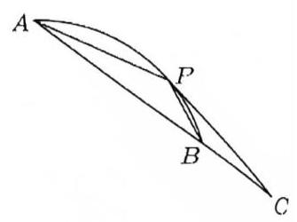
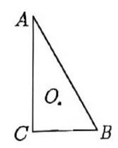

# 第五讲平面向量综合解法 I

## 一、建系法

1. 【21 宝山二模 12】已知平面向量 $\overrightarrow{a}\text{ 、 }\overrightarrow{b},\overrightarrow{e}$ 满足 $\left| \overrightarrow{e}\right| = 1,\overrightarrow{a} \cdot \overrightarrow{e} = 1,\overrightarrow{b} \cdot \overrightarrow{e} = - 1,\left| {\overrightarrow{a} - \overrightarrow{b}}\right| = 4$ ，则 $\overrightarrow{a} \cdot \overrightarrow{b}$ 的最小值是\_\_\_

2. 已知平面上三个不同的单位向量 $\overrightarrow{a}\text{ 、 }\overrightarrow{b}\text{ 、 }\overrightarrow{c}$ 满足 $\overrightarrow{a} \cdot \overrightarrow{b} = \overrightarrow{b} \cdot \overrightarrow{c} = \frac{1}{2}$ ，若 $\overrightarrow{e}$ 为平面内的任意单位向量，则 $\left| {\overrightarrow{a} \cdot \overrightarrow{e}}\right| + 2\left| {\overrightarrow{b} \cdot \overrightarrow{e}}\right| + 3\left| {\overrightarrow{c} \cdot \overrightarrow{e}}\right|$ 的最大值为\_\_\_

3. 如图，已知 $P$ 是半径为 2，圆心角为 $\frac{\pi }{3}$ 的一段圆弧 ${AB}$ 上的一点，若 $\overrightarrow{AB} = 2\overrightarrow{BC}$ ，则 $\overrightarrow{PC} \cdot \overrightarrow{PA}$ 的值域是\_\_\_

4. 如图，若同一平面上的四边形 ${PQRS}$ 满足: ${mn}\overrightarrow{RP} = n\left( {1 - {3m}}\right) \overrightarrow{QP} + m\left( {n - 1}\right) \overrightarrow{SP}\left( {m > 0, n > 0}\right)$ ， 则当 $\bigtriangleup {PRS}$ 的面积是 $\bigtriangleup {PQR}$ 的面积的 $\frac{1}{3}$ 倍时， $\frac{1}{m + n}$ 的最大值为\_\_\_

5. 在 $\bigtriangleup {ABC}$ 中, ${AC} = 2,\frac{2}{\tan A} + \frac{1}{\tan B} = 1$ ,若 $\bigtriangleup {ABC}$ 的面积为 2,则 ${AB} =$ \_\_\_

6. 已知点 $D$ 为圆 $O : {x}^{2} + {y}^{2} = 4$ 的弦 ${MN}$ 的中点，点 $A$ 的坐标为 $\left( {1,0}\right)$ ，且 $\overrightarrow{AM} \cdot \overrightarrow{AN} = 1$ ，则 $\overrightarrow{OA} \cdot \overrightarrow{OD}$ 的最大值为\_\_\_

二、几何法

7. 在 $\bigtriangleup {ABC}$ 所在的平面上有三点 $P$ 、 $Q$ 、 $R$ ,满足 $\overrightarrow{PA} + \overrightarrow{PB} + \overrightarrow{PC} = \overrightarrow{AB},\overrightarrow{QA} + \overrightarrow{QB} + \overrightarrow{QC} = \overrightarrow{BC}$ , $\overrightarrow{RA} + \overrightarrow{RB} + \overrightarrow{RC} = \overrightarrow{CA}$ ，则 $\frac{{S}_{\bigtriangleup {PQR}}}{{S}_{\bigtriangleup {ABC}}}$ 的值为\_\_\_

8. 如图，在 $\bigtriangleup {ABC}$ 中， $C = \frac{\pi }{2}$ ， ${AC} = \sqrt{3}$ ， ${BC} = 1$ ，若 $O$ 为 $\bigtriangleup {ABC}$ 内部的点且满足 $\frac{\overrightarrow{OA}}{\left| \overrightarrow{OA}\right| } + \frac{\overrightarrow{OB}}{\left| \overrightarrow{OB}\right| } + \frac{\overrightarrow{OC}}{\left| \overrightarrow{OC}\right| } = \overrightarrow{0}$ ，则 $\left| \overrightarrow{OA}\right| : \left| \overrightarrow{OB}\right| : \left| \overrightarrow{OC}\right| =$

9. 已知 $A$ 、 $B$ 、 $C$ 是边长为 1 的正方形边上的任意三点，则 $\overrightarrow{AB} \cdot \overrightarrow{AC}$ 的取值范围为\_\_\_

10. 已知边长为 2 的正方形 ${ABCD}$ 边上有两点 $P\text{ 、 }Q$ ,满足 $\left| {PQ}\right| \geq 1$ ,设 $O$ 是正方形的中心，则 $\overrightarrow{OP} \cdot \overrightarrow{OQ}$ 的取值范围是\_\_\_

11. 设 $P$ 是边长为 $2\sqrt{2}$ 的正六边形 ${A}_{1}{A}_{2}{A}_{3}{A}_{4}{A}_{5}{A}_{6}$ 的边上的任意一点,长度为 4 的线段 ${MN}$ 是该正六边形外接圆的一条动弦， $\overrightarrow{PM} \cdot \overrightarrow{PN}$ 的取值范围为\_\_\_

12. 在 $\bigtriangleup {ABC}$ 中,已知 $\left| \overrightarrow{BC}\right| = 1, B\overrightarrow{A} \cdot \overrightarrow{BC} = 2$ ,点 $P$ 为线段 ${BC}$ 上的动点,动点 $Q$ 满足 $\overrightarrow{PQ} = \overrightarrow{PA} + \overrightarrow{PB} + \overrightarrow{PC}$ ，则 $\overrightarrow{PQ} \cdot \overrightarrow{PB}$ 的最小值为\_\_\_

13. 在平面上, $\overrightarrow{A{B}_{1}} \bot \overrightarrow{A{B}_{2}},\left| \overrightarrow{O{B}_{1}}\right| = \left| \overrightarrow{O{B}_{2}}\right| = 1,\overrightarrow{AP} = \overrightarrow{A{B}_{1}} + \overrightarrow{A{B}_{2}}$ ,若 $\left| \overrightarrow{OP}\right| < \frac{1}{2}$ ,则 $\left| \overrightarrow{OA}\right|$ 的取值范围是 ( )

::: choices

- A. $\left( {0,\frac{\sqrt{5}}{2}}\right\rbrack$
- B. $\left( {\frac{\sqrt{5}}{2},\frac{\sqrt{7}}{2}}\right\rbrack$
- C. $\left( {\frac{\sqrt{5}}{2},\sqrt{2}}\right\rbrack$
- D. $\left( {\frac{\sqrt{7}}{2},\sqrt{2}}\right\rbrack$
  :::

14. 已知 $x\text{ 、 }y$ 是正实数， $\bigtriangleup {ABC}$ 的三边长为 ${CA} = 3,{CB} = 4,{AB} = 5$ ，点 $P$ 是边 ${AB}$ ( $P$ 与点 $A\text{ 、 }B$ 不重合) 上任一点，且 $\overrightarrow{CP} = x \cdot \frac{\overrightarrow{CA}}{\left| \overrightarrow{CA}\right| } + y \cdot \frac{\overrightarrow{CB}}{\left| \overrightarrow{CB}\right| }$ ，若不等式 ${2x} + {3y} \geq m \cdot x \cdot y$ 恒成立,则实数 $m$ 的取值范围是( )

::: choices

- A. $m \leq \frac{3}{2} + \sqrt{2}$
- B. $m \leq 2\sqrt{6}$
- C. $m \leq \frac{3}{2}\sqrt{2}$
- D. $m \leq 3$
  :::

15. 已知平面上四个点 ${A}_{1}\left( {0,0}\right) \text{ 、 }{A}_{2}\left( {2\sqrt{3},2}\right) \text{ 、 }{A}_{3}\left( {2\sqrt{3} + 4,2}\right) \text{ 、 }{A}_{4}\left( {4,0}\right)$ ,设 $D$ 是四边形 ${A}_{1}{A}_{2}{A}_{3}{A}_{4}$ 极其内部的点构成的点的集合,点 ${P}_{0}$ 是四边形对角线的交点,若集合

$S = \left\{ {P \in D\begin{Vmatrix}{P{P}_{0}}\end{Vmatrix} \leq \left| {P{A}_{j}}\right| , i = 1,2,3,4}\right\}$ ，则集合 $S$ 所表示的平面区域的面积为( )

::: choices

- A. 2
- B. 4
- C. 8
- D. 16
  :::
