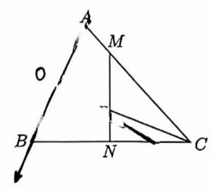
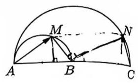
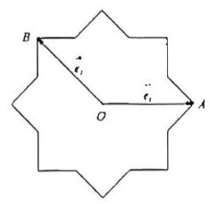

# 第六讲平面向量综合解法 II（教师版）

## 课堂理解导语

::: lesson-guide

本讲承接第五讲的平面向量综合方法，课堂从“直接计算法”开始。这里的“计算”不是盲目建系，而是当几何法、普通坐标法都不顺时，先把向量条件翻译成轨迹、垂直、外心、投影、弦长等几何信息，再选择最后的计算入口。

**直接计算法。** 第 1 题把 $\overrightarrow{CP}=\lambda\overrightarrow{CA}+\mu\overrightarrow{CB}$ 与 $3\lambda+4\mu=2$ 改造成“系数和为 $1$”的三点共线结构，读出 $P,M,N$ 共线；再由 $PA=PB=PC$ 读出 $P$ 是外心，得到 $MN\perp BC$，最后为了面积最大值建系。第 2 题课堂强调：若点乘目标不能直接投影，也不能用极化恒等式，就拆成 $\overrightarrow{AB},\overrightarrow{BM},\overrightarrow{CB},\overrightarrow{BN}$ 这类图中关系更清楚的向量。第 3 题先把 $m\overrightarrow{AB}+\overrightarrow{OA}$、$n\overrightarrow{AB}+\overrightarrow{OB}$ 翻译成直线 $AB$ 上两点，再用圆周角、定弦和垂径定理求 $AB$ 的最小值。

**斜坐标系法。** 课堂后半段先回顾平面向量基本定理和定比分点定理，再解释斜坐标系：坐标本质上是基底下的线性展开系数，基底不一定垂直，也不一定等长。课堂明确提醒，这套视角属于超纲理解工具，适合辅助小题和建立图形直觉，不建议直接写进正式解答题卷面。

**课堂实际进度。** 本次转写覆盖了第 1-6 题与斜坐标系的基本定义；第 7 题只讲到基本判断方向，第 8-13 题课堂未展开，本版保留原题并标注待后续补全。

:::

## 一、直接计算法

1. 设点 $P$ 是 $\bigtriangleup {ABC}$ 所在平面内一动点，满足 $\overrightarrow{CP} = \lambda \overrightarrow{CA} + \mu \overrightarrow{CB}$ ， ${3\lambda } + {4\mu } = 2\left( {\lambda ,\mu \in \mathbf{R}}\right)$ ， $\left| \overrightarrow{PA}\right| = \left| \overrightarrow{PB}\right| = \left| \overrightarrow{PC}\right|$ ，若 $\left| \overrightarrow{AB}\right| = 3$ ，则 $\bigtriangleup {ABC}$ 面积的最大值是\_\_\_

> **答案：** $9$。
>
> **核心思路：** 先把 $\overrightarrow{CP}$ 的系数凑成三点共线形式，得到 $P$ 在某条辅助线 $MN$ 上；再由 $PA=PB=PC$ 知 $P$ 是外心，从而 $PN$ 是 $BC$ 的垂直平分线；最后为面积建系。
>
> **解析：** 由
> $$
> 3\lambda+4\mu=2
> $$
> 得
> $$
> \frac32\lambda+2\mu=1.
> $$
> 取 $M,N$ 满足
> $$
> \overrightarrow{CM}=\frac23\overrightarrow{CA},\qquad
> \overrightarrow{CN}=\frac12\overrightarrow{CB}.
> $$
> 则
> $$
> \overrightarrow{CP}
> =\frac32\lambda\overrightarrow{CM}
> +2\mu\overrightarrow{CN},
> $$
> 且两系数和为 $1$，所以 $P,M,N$ 共线。
>
> 又 $PA=PB=PC$，所以 $P$ 是 $\triangle ABC$ 的外心。由于 $N$ 是 $BC$ 的中点，故
> $$
> PN\perp BC.
> $$
> 因 $P,M,N$ 共线，得到
> $$
> MN\perp BC.
> $$
>
> 以 $AB$ 中点为原点，令
> $$
> A=\left(-\frac32,0\right),\qquad
> B=\left(\frac32,0\right),\qquad
> C=(x,y).
> $$
> 则
> $$
> N=\left(\frac x2+\frac34,\frac y2\right),\qquad
> M=\frac23A+\frac13C=\left(\frac x3-1,\frac y3\right).
> $$
> 所以
> $$
> \overrightarrow{MN}=\left(\frac x6+\frac74,\frac y6\right),\qquad
> \overrightarrow{BC}=\left(x-\frac32,y\right).
> $$
> 由 $\overrightarrow{MN}\cdot\overrightarrow{BC}=0$，
> $$
> \left(\frac x6+\frac74\right)\left(x-\frac32\right)+\frac{y^2}{6}=0,
> $$
> 即
> $$
> y^2=-x^2-9x+\frac{63}{4}.
> $$
> 该二次式最大值为 $36$，故 $y_{\max}=6$。于是
> $$
> S_{\triangle ABC,\max}
> =\frac12\cdot AB\cdot y_{\max}
> =\frac12\cdot3\cdot6=9.
> $$
>
> **题目总结：** 本题要带走的是“条件翻译链”：先把 $3\lambda+4\mu=2$ 凑成系数和为 $1$，读出 $P,M,N$ 共线；再把 $PA=PB=PC$ 读成外心，得到垂直平分线；最后面积没路时以 $AB$ 为底建系。课堂特别强调，$P$ 读成外心后就完成了历史使命，真正参与计算的是 $M,N,C$。

2. 如图，已知 ${AC} = 4$ ， $B$ 为 ${AC}$ 的中点，分别以 ${AB}\text{ 、 }{AC}$ 为直径在 ${AC}$ 的同侧作半圆， $M\text{ 、 }N$ 分别为两半圆上的动点(不含端点 $A\text{ 、 }B\text{ 、 }C$ )，且 $\overrightarrow{BM} \cdot \overrightarrow{BN} = 0$ ，则 $\overrightarrow{AM} \cdot \overrightarrow{CN}$ 的最大值为\_\_\_

> **答案：** $1$。
>
> **核心思路：** 目标 $\overrightarrow{AM}\cdot\overrightarrow{CN}$ 不适合直接投影，也不是同一中点结构。课堂选择拆向量，把它拆到 $\overrightarrow{AB},\overrightarrow{BM},\overrightarrow{CB},\overrightarrow{BN}$ 这些图上关系明确的向量。
>
> **解析：** 因 $B$ 是 $AC$ 中点，$AB=BC=2$，且 $\overrightarrow{CB}=-\overrightarrow{AB}$。拆为
> $$
> \overrightarrow{AM}=\overrightarrow{AB}+\overrightarrow{BM},\qquad
> \overrightarrow{CN}=\overrightarrow{CB}+\overrightarrow{BN}.
> $$
> 展开得
> $$
> \overrightarrow{AM}\cdot\overrightarrow{CN}
> =
> \overrightarrow{AB}\cdot\overrightarrow{CB}
> +\overrightarrow{AB}\cdot\overrightarrow{BN}
> +\overrightarrow{BM}\cdot\overrightarrow{CB}
> +\overrightarrow{BM}\cdot\overrightarrow{BN}.
> $$
> 其中 $\overrightarrow{BM}\cdot\overrightarrow{BN}=0$，$\overrightarrow{AB}\cdot\overrightarrow{CB}=-4$，所以
> $$
> \overrightarrow{AM}\cdot\overrightarrow{CN}
> =-4+\overrightarrow{AB}\cdot(\overrightarrow{BN}-\overrightarrow{BM})
> =-4+\overrightarrow{AB}\cdot\overrightarrow{MN}.
> $$
> 将 $\overrightarrow{MN}$ 投影到底边方向。设课堂图中的相关角为 $\theta$，可得投影长度
> $$
> M_0N_0=2\cos\theta+2\sin^2\theta.
> $$
> 因 $|\overrightarrow{AB}|=2$，
> $$
> \overrightarrow{AM}\cdot\overrightarrow{CN}
> =-4+2M_0N_0
> =-4+4\cos\theta+4\sin^2\theta.
> $$
> 化成
> $$
> -4+4\cos\theta+4(1-\cos^2\theta)
> =4\cos\theta(1-\cos\theta).
> $$
> 当 $\cos\theta=\dfrac12$ 时取最大值 $1$。
>
> **题目总结：** 这题课堂先排除了几何投影、极化恒等式、主元法和普通建系等不顺的路，再转向“换向量”。点乘目标 $\overrightarrow{AM}\cdot\overrightarrow{CN}$ 不自然，就拆成 $\overrightarrow{AB},\overrightarrow{BM},\overrightarrow{CB},\overrightarrow{BN}$；最后真正需要最大化的是 $MN$ 在底边方向上的投影。

3. 已知 $\left| \overrightarrow{OA}\right| = \left| \overrightarrow{OB}\right| = 1$ ,若存在 $m\text{ 、 }n \in \mathbf{R}$ ,使得 $m\overrightarrow{AB} + \overrightarrow{OA}$ 与 $n\overrightarrow{AB} + \overrightarrow{OB}$ 夹角为 ${60}^{ \circ }$ ,且 $\left| {\left( {m\overrightarrow{AB} + \overrightarrow{OA}}\right) - \left( {n\overrightarrow{AB} + \overrightarrow{OB}}\right) }\right| = \frac{1}{2}$ ，则 $\left| \overrightarrow{AB}\right|$ 的最小值为\_\_\_

> **答案：** $\dfrac{\sqrt{13}}2$。
>
> **核心思路：** 先换向量：$\overrightarrow{AB}=\overrightarrow{OB}-\overrightarrow{OA}$。这能读出两个向量的终点都在直线 $AB$ 上。再把问题转成单位圆中一条弦 $AB$ 的最短长度。
>
> **解析：** 设
> $$
> \overrightarrow{OP}=m\overrightarrow{AB}+\overrightarrow{OA},\qquad
> \overrightarrow{OQ}=n\overrightarrow{AB}+\overrightarrow{OB}.
> $$
> 因
> $$
> \overrightarrow{AB}=\overrightarrow{OB}-\overrightarrow{OA},
> $$
> 所以
> $$
> \overrightarrow{OP}
> =m(\overrightarrow{OB}-\overrightarrow{OA})+\overrightarrow{OA}
> =(1-m)\overrightarrow{OA}+m\overrightarrow{OB},
> $$
> 即 $P$ 在直线 $AB$ 上。同理，$Q$ 也在直线 $AB$ 上。
>
> 题设给出
> $$
> \angle POQ=60^\circ,\qquad PQ=\frac12.
> $$
> 对定长 $PQ$ 而言，使 $O$ 到直线 $PQ$ 的距离最大时，$\triangle OPQ$ 为等腰情形，最大距离为
> $$
> d_{\max}=\frac{PQ/2}{\tan30^\circ}=\frac{\sqrt3}{4}.
> $$
> 又 $PQ$ 与 $AB$ 共线，所以 $d$ 也是 $O$ 到直线 $AB$ 的距离。
>
> 因 $A,B$ 在以 $O$ 为圆心、半径 $1$ 的单位圆上，$AB$ 是单位圆的一条弦。由垂径定理，
> $$
> AB=2\sqrt{1-d^2}.
> $$
> 要使 $AB$ 最小，就使 $d$ 最大：
> $$
> AB_{\min}=2\sqrt{1-\left(\frac{\sqrt3}{4}\right)^2}
> =\frac{\sqrt{13}}2.
> $$
>
> **题目总结：** 本题课堂用“闯关”式解读：第一关，把 $m\overrightarrow{AB}+\overrightarrow{OA}$、$n\overrightarrow{AB}+\overrightarrow{OB}$ 换成 $\overrightarrow{OA},\overrightarrow{OB}$ 的组合，发现 $P,Q$ 都在直线 $AB$ 上；第二关，把 $\angle POQ=60^\circ$ 与 $PQ=\frac12$ 读成定弦、定外接圆半径；第三关，把求 $AB$ 最小值转成单位圆中弦长问题，用垂径定理看 $O$ 到直线 $AB$ 的最大距离。

## 二、斜坐标系法

平面向量基本定理: $\overset{ - }{a}$ 、 $\overline{b}$ 是平面上任意两个不共线的非零向量，对该平面上的任意向量 $\overset{ - }{c}$ ，必定存在唯一的实数对 $\left( {\lambda ,\mu }\right)$ ,使得 $\overset{ - }{c} = \lambda \overset{ - }{a} + \mu \overrightarrow{b}$ 成立,我们称这样的等式为向量 $\overrightarrow{c}$ 的线性展开,称 $\overrightarrow{a}\text{ 、 }\overrightarrow{b}$ 为该线性展开的基底。

> **知识点总结：** 这里有 OCR 符号残留，$\overset{-}{a}$、$\overline b$ 均应理解为普通向量记号 $\overrightarrow a,\overrightarrow b$。课堂强调的核心不是符号外观，而是“任意向量都能被两个不共线基底唯一表示”。

定比分点定理: 点 $C$ 在线段 ${AB}$ 上 (异于 $A\text{ 、 }B$ ),则向量 $\overrightarrow{OC}$ 在基底 $\overrightarrow{OA}\text{ 、 }\overrightarrow{OB}$ 下的线性展开

$\overrightarrow{OC} = \lambda \overrightarrow{OA} + \mu \overrightarrow{OB}$ 满足 $\lambda + \mu = 1$ ,且 $\lambda = \frac{BC}{AB},\mu = \frac{AC}{AB}$

推论: 若 $\overrightarrow{OC}$ 在基底 $\overrightarrow{OA}\text{ 、 }\overrightarrow{OB}$ 下的展开 $\overrightarrow{OC} = \lambda \overrightarrow{OA} + \mu \overrightarrow{OB}$ 满足 $\lambda + \mu = 1$ ,则 $A\text{ 、 }B\text{ 、 }C$ 三点共线,且

(1) $\lambda > 0,\mu > 0$ 时, $C$ 在线段 ${AB}$ 上

(2) $\lambda > 0,\mu < 0$ 时， $C$ 在射线 ${BA}$ 的延长线上

(3) $\lambda < 0,\mu > 0$ 时， $C$ 在射线 ${AB}$ 的延长线上

> **知识点总结：** 这部分是后面斜坐标系的前置。判断系数正负时，课堂建议画 $\overrightarrow{OA},\overrightarrow{OB}$ 的合成图，用“线段内、射线延长线”理解位置，不要只背结论。

4. 已知 $\bigtriangleup {ABC}$ 为等边三角形, ${AB} = 2$ ,设点 $P\text{ 、 }Q$ 满足 $\overrightarrow{AP} = \lambda \overrightarrow{AB},\overrightarrow{AQ} = \left( {1 - \lambda }\right) \overrightarrow{AC},\lambda \in \mathbf{R}$ ,若 $\overrightarrow{BQ} \cdot \overrightarrow{CP} = - \frac{3}{2}$ ，则 $\lambda =$ \_\_\_.

> **答案：** $\lambda=\dfrac12$。
>
> **核心思路：** 以 $\overrightarrow{AB},\overrightarrow{AC}$ 为基底，把 $\overrightarrow{BQ},\overrightarrow{CP}$ 全部拆开。
>
> **解析：** 记
> $$
> \overrightarrow{AB}=\vec m,\qquad
> \overrightarrow{AC}=\vec n.
> $$
> 则
> $$
> |\vec m|=|\vec n|=2,\qquad
> \vec m\cdot\vec n=2.
> $$
> 又
> $$
> \overrightarrow{BQ}
> =\overrightarrow{BA}+\overrightarrow{AQ}
> =-\vec m+(1-\lambda)\vec n,
> $$
> $$
> \overrightarrow{CP}
> =\overrightarrow{CA}+\overrightarrow{AP}
> =-\vec n+\lambda\vec m.
> $$
> 所以
> $$
> \overrightarrow{BQ}\cdot\overrightarrow{CP}
> =
> (-\vec m+(1-\lambda)\vec n)
> \cdot(-\vec n+\lambda\vec m)
> =-2+2\lambda-2\lambda^2.
> $$
> 令其等于 $-\dfrac32$，得
> $$
> \lambda-\lambda^2=\frac14,
> $$
> 即
> $$
> \left(\lambda-\frac12\right)^2=0.
> $$
> 因此 $\lambda=\dfrac12$。
>
> **题目总结：** 本题是斜坐标系前的热身：与其硬建直角坐标，不如把 $\overrightarrow{BQ},\overrightarrow{CP}$ 都拆到 $\overrightarrow{AB},\overrightarrow{AC}$ 这组好用基底上。课堂算出 $\lambda=\dfrac12$ 后提醒，结果说明 $P,Q$ 恰好都是中点，结构比题面看起来更整齐。

5. 向量集合 $S = \left\{ {\overrightarrow{a} \mid \overrightarrow{a} = \left( {x, y}\right) , x, y \in \mathbf{R}}\right\}$ ，对于任意 $\overrightarrow{\alpha }$ 、 $\overrightarrow{\beta } \in S$ ，以及任意 $\lambda \in \left( {0,1}\right)$ ，都有 $\lambda \overrightarrow{\alpha } + \left( {1 - \lambda }\right) \overrightarrow{\beta } \in S$ ,则称 $S$ 为 “ $C$ 类集”. 现有四个命题:

① 若 $S$ 为 “ $C$ 类集”，则集合 $M = \{ \mu \overrightarrow{a} \mid \overrightarrow{a} \in S,\mu \in \mathbf{R}\}$ 也是 “ $C$ 类集”

② 若 $S\text{ 、 }T$ 都是 “ $C$ 类集”,则集合 $M = \{ \overrightarrow{a} + \overrightarrow{b} \mid \overrightarrow{a} \in S,\overrightarrow{b} \in T\}$ 也是 “ $C$ 类集”:

③ 若 ${A}_{1}\text{ 、 }{A}_{2}$ 都是 “ $C$ 类集”,则 ${A}_{1} \cup {A}_{2}$ 也是 “ $C$ 类集”;

④ 若 ${A}_{1}\text{ 、 }{A}_{2}$ 都是 “ $C$ 类集”,且交集非空,则 ${A}_{1} \cap {A}_{2}$ 也是 “ $C$ 类集”

其中正确的命题有\_\_\_

> **答案：** ①②④。
>
> **核心思路：** 把向量集合看成平面上的点集。条件表示：集合中任意两点的连线段也在集合中，也就是凸集思想。
>
> **解析：** ① 若 $\gamma_1=\mu\alpha_1,\gamma_2=\mu\alpha_2$，则
> $$
> \lambda\gamma_1+(1-\lambda)\gamma_2
> =\mu[\lambda\alpha_1+(1-\lambda)\alpha_2]\in M.
> $$
> 所以缩放后仍为 C 类集。
>
> ② 若 $\gamma_1=\alpha_1+\beta_1,\gamma_2=\alpha_2+\beta_2$，其中 $\alpha_i\in S,\beta_i\in T$，则
> $$
> \lambda\gamma_1+(1-\lambda)\gamma_2
> =
> [\lambda\alpha_1+(1-\lambda)\alpha_2]
> +
> [\lambda\beta_1+(1-\lambda)\beta_2].
> $$
> 两个括号分别属于 $S,T$，故结果属于 $S+T$。
>
> ③ 错。两个圆盘各自都是 C 类集，但两个圆盘的并集一般不是 C 类集：分别取两个圆盘中的点，连线中段可能落在并集外。
>
> ④ 若 $\alpha,\beta\in A_1\cap A_2$，则它们同时属于 $A_1,A_2$。于是
> $$
> \lambda\alpha+(1-\lambda)\beta
> $$
> 同时属于 $A_1,A_2$，因此属于 $A_1\cap A_2$。
>
> **题目总结：** 本题的课堂突破口是把“向量集合”先看成平面点集。$C$ 类集的直观意思是：区域中任取两点，它们之间的线段仍在区域内。先用圆盘、缩放、平移相加和两个圆盘并集的反例建立画面，再回到代数证明，会比一开始就写抽象符号顺得多。

6. 【2025 上海高考 16】已知数列 $\left\{ {a}_{n}\right\}$ 、 $\left\{ {b}_{n}\right\}$ 、 $\left\{ {c}_{n}\right\}$ ，满足 ${a}_{n} = {10n} - 9,{b}_{n} = {2}^{n}$ ，${c}_{n} = \lambda {a}_{n} + \left( {1 - \lambda }\right) {b}_{n}$ . 若对任意 $\lambda \in \left\lbrack {0,1}\right\rbrack$ ， ${a}_{n}$ 、 ${b}_{n}$ 、 ${c}_{n}$ 均能作为三角形的三边长，则满足条件的 $n$ 有 ( 1 )

::: choices

- A. 1
- B. 3
- C. 4
- D. 无数
:::

> **答案：** B，满足条件的 $n$ 为 $4,5,6$。
>
> **核心思路：** 数也可以看成数轴上的一维向量。$c_n=\lambda a_n+(1-\lambda)b_n$ 表示 $c_n$ 位于 $a_n$ 与 $b_n$ 之间。
>
> **解析：** 因为 $c_n$ 在 $a_n,b_n$ 之间，要对任意 $\lambda\in[0,1]$ 都能构成三角形，就必须保证最小边也大于另外两边之差。等价地，两端 $a_n,b_n$ 中较大的一个必须小于较小的两倍。
>
> 列表检查：
> $$
> \begin{array}{c|c|c}
> n & a_n & b_n\\ \hline
> 3 & 21 & 8\\
> 4 & 31 & 16\\
> 5 & 41 & 32\\
> 6 & 51 & 64\\
> 7 & 61 & 128
> \end{array}
> $$
> 当 $n=4,5,6$ 时，两端互相不超过两倍；$n=3$ 时 $21>2\cdot8$，$n=7$ 时 $128>2\cdot61$，再往两侧差距更大。故共有 $3$ 个。
>
> **题目总结：** 本题课堂强调“数也可以看成一维向量”。$\lambda a_n+(1-\lambda)b_n$ 表示数轴上 $a_n,b_n$ 之间的点；三边能成三角形时，真正要检查的是最大边不能超过最小边的两倍。理解了“一维向量 + 三角形边长条件”，剩下只需列 $a_n,b_n$ 的表检查 $n=4,5,6$。

斜坐标系: $\overrightarrow{i}\text{ 、 }\overrightarrow{j}$ 是平面上任意两个不共线的非零向量,对该平面上的任意向量 $\overrightarrow{a}$ ,必定存在唯一的实数对 $\left( {\lambda ,\mu }\right)$ ,使得 $\overrightarrow{a} = \lambda \overrightarrow{i} + \mu \overrightarrow{j}$ 成立。我们称这样的等式为向量 $\overrightarrow{a}$ 的线性展开,称 $\overrightarrow{i}\text{ 、 }\overrightarrow{j}$ 为该线性展开的坐标基底,称实数对 $\left( {\lambda ,\mu }\right)$ 为任意向量 $\overrightarrow{a}$ 在该基底下的坐标。

(1)若 $\overrightarrow{i} \cdot \overrightarrow{j} = 0$ 且 $\left| i\right| = \left| j\right| = 1$ ，称以 $\overrightarrow{i}$ 、 $\overrightarrow{j}$ 为基底的坐标系为 “平面直角坐标系”

(2)若 $\overrightarrow{i}$ 、 $\overrightarrow{j}$ 不满足(1)的条件，则称以 $\overrightarrow{i}$ 、 $\overrightarrow{j}$ 为基底的坐标系为 “斜坐标系”

> **知识点总结：** 课堂强调：直角坐标系本质是“垂直且等长的基底”，但向量分解只要求基底不共线。坐标轴不垂直、单位长度不一样，依然可以用唯一的有序数对表示点；这正是斜坐标系能成立的原因。

7. 两个向量 $\overrightarrow{a}$ 、 $\overrightarrow{b}$ 在以 $\overrightarrow{i}$ 、 $\overrightarrow{j}$ 为基底的坐标系下的坐标分别为 $\left( {{x}_{1},{y}_{1}}\right)$ 和 $\left( {{x}_{2},{y}_{2}}\right)$ ，请判断以下结论在斜坐标系下是否仍然成立:

(1) $\overrightarrow{a} + \overrightarrow{b}$ 的坐标为 $\left( {{x}_{1} + {x}_{2},{y}_{1} + {y}_{2}}\right) ,\overrightarrow{a} - \overrightarrow{b}$ 的坐标为 $\left( {{x}_{1} - {x}_{2},{y}_{1} - {y}_{2}}\right)$

(2) $\lambda \overrightarrow{a}$ 的坐标为 $\left( {\lambda {x}_{1},\lambda {y}_{1}}\right)$ ，其中 $\lambda \in R$

(3) $\left| \overrightarrow{a}\right| = \sqrt{{x}_{1}^{2} + {y}_{1}^{2}}$

(4) $\overrightarrow{a} \cdot \overrightarrow{b} = {x}_{1}{x}_{2} + {y}_{1}{y}_{2}$

(5) $\bar{a}$ 、 $\bar{b}$ 共线的充要条件为: $\left| \begin{array}{ll} {x}_{1} & {y}_{1} \\ {x}_{2} & {y}_{2} \end{array}\right| = 0$ ；

(6) $\overrightarrow{a}$ 、 $\overrightarrow{b}$ 垂直的充要条件为: ${x}_{1}{x}_{2} + {y}_{1}{y}_{2} = 0$

(7)若 $\overrightarrow{a}\text{ 、 }\overrightarrow{b}$ 为非零向量，则 $\cos \langle \overrightarrow{a},\overrightarrow{b}\rangle = \frac{{x}_{1}{x}_{2} + {y}_{1}{y}_{2}}{\sqrt{{x}_{1}^{2} + {y}_{1}^{2}}\sqrt{{x}_{2}^{2} + {y}_{2}^{2}}}$

> **答案：** (1)(2)(5) 仍成立；(3)(4)(6)(7) 一般不成立。
>
> **核心思路：** 斜坐标系保留的是“线性展开”的代数结构，所以加减、数乘、共线判定仍成立；但长度、点乘、垂直、夹角依赖基底的长度和夹角，不能沿用直角坐标公式。
>
> **解析：** 若
> $$
> \overrightarrow{a}=x_1\overrightarrow{i}+y_1\overrightarrow{j},\qquad
> \overrightarrow{b}=x_2\overrightarrow{i}+y_2\overrightarrow{j},
> $$
> 则加减和数乘直接由系数相加减得到，故 (1)(2) 成立。
>
> 共线意味着存在 $k$ 使
> $$
> (x_1,y_1)=k(x_2,y_2),
> $$
> 等价于
> $$
> x_1y_2-x_2y_1=0,
> $$
> 所以 (5) 成立。
>
> 但长度应为
> $$
> |\overrightarrow{a}|^2
> =x_1^2|\overrightarrow{i}|^2
> +y_1^2|\overrightarrow{j}|^2
> +2x_1y_1(\overrightarrow{i}\cdot\overrightarrow{j}),
> $$
> 点乘应为
> $$
> \overrightarrow{a}\cdot\overrightarrow{b}
> =x_1x_2|\overrightarrow{i}|^2
> +y_1y_2|\overrightarrow{j}|^2
> +(x_1y_2+x_2y_1)(\overrightarrow{i}\cdot\overrightarrow{j}).
> $$
> 因此 (3)(4)(6)(7) 一般不成立。
>
> **题目总结：** 本题总结斜坐标系第一课的边界：加减、数乘、共线判定只依赖线性展开，所以仍成立；长度、点乘、垂直、夹角依赖基底长度和夹角，不能照搬直角坐标公式。课堂只讲到基本体系，实际应用放到下一节，这里先帮教师备课时固定“哪些能保留、哪些不能保留”。

截距式不变性: 向量 $\overrightarrow{OP}$ 在以 $\overrightarrow{i}\text{ 、 }\overrightarrow{j}$ 为基底的坐标系下的坐标为 $\left( {x, y}\right)$ ,若其满足等式 $\frac{x}{m} + \frac{y}{n} = 1$ ,则 $P$ 点在一条定直线 $l$ 上，且 $l$ 与坐标轴分别交于 $\left( {m,0}\right)$ 和 $\left( {0, n}\right)$ 。

8. 已知正六边形 ${ABCDEF}$ (顶点的字母依次按逆时针顺序确定)的边长为 1，点 $P$ 是 $\bigtriangleup {CDE}$ 内(含边界) 的动点，设 $\overline{AP} = x \cdot \overline{AB} + y \cdot \overline{AF}\;\left( {x, y \in R}\right)$ ，则 $x + y$ 的取值范围是\_\_\_.

> **题目总结：** 本讲课堂未展开本题。它属于斜坐标系的后续应用：把 $\overrightarrow{AB},\overrightarrow{AF}$ 当作基底后，点 $P$ 在三角形区域内运动，本质是把几何区域翻译成 $(x,y)$ 的参数范围。这里先保留原题，待下一次讲斜坐标应用时补完整解法。

9. 如图所示，将一圆的八个等分点分成相间的两组，连接每组的四个点得到两个正方形，去掉两个正方形内部的八条线段后可以形成一正八角星，设正八角星的中心为 $O$ ，并且 $\overrightarrow{OA} = \overrightarrow{{e}_{1}},\overrightarrow{OB} = \overrightarrow{{e}_{2}}$ ，若将点 $O$ 到正八角星 16 个顶点的向量都写成 $\lambda \overrightarrow{{e}_{1}} + \mu \overrightarrow{{e}_{2}},\lambda ,\mu \in \mathrm{R}$ 的形式，则 $\lambda + \mu$ 的取值范围为( )

::: choices

- A. $\left\lbrack {-2\sqrt{2},2}\right\rbrack$
- B. $\left\lbrack {-2\sqrt{2},1 + \sqrt{2}}\right\rbrack$
- C. $\left\lbrack {-1 - \sqrt{2},1 + \sqrt{2}}\right\rbrack$
- D. $\left\lbrack {-1 - \sqrt{2},2}\right\rbrack$
:::

> **题目总结：** 本讲课堂未展开本题。它适合用本节刚建立的斜坐标语言处理：先以 $\overrightarrow{OA},\overrightarrow{OB}$ 为基底理解坐标，再逐个枚举正八角星顶点的 $(\lambda,\mu)$，最后比较 $\lambda+\mu$ 的最大最小值。当前版本只保留后续补解方向，不冒充课堂已讲。

10. $B$ 是 ${AC}$ 的中点， $\overrightarrow{BE} = 2\overrightarrow{OB}$ ， $P$ 是平行四边形 BCDE 内(含边界)的一点，且 $\overrightarrow{OP} = x\overrightarrow{OA} + y\overrightarrow{OB}\left( {x, y \in \mathbf{R}}\right)$ ， 有以下结论:

① 当 $x = 0$ 时， $y \in \left\lbrack {2,3}\right\rbrack$ ；

② 当 $P$ 是线段 ${CE}$ 的中点时， $x = - \frac{1}{2}, y = \frac{5}{2}$ ；

③ 若 $x + y = \frac{5}{2}$ ，则在平面直角坐标系中，点 $P$ 轨迹是一条线段；

④ $x - y$ 的最大值为 -1 .

其中正确结论的个数是( )

::: choices

- A. 1 个
- B. 2 个
- C. 3 个
- D. 4 个
:::

> **题目总结：** 本讲课堂未展开本题。它对应课堂最后说的“斜坐标系实际怎么用”的下一步：把平行四边形 BCDE 的区域转成 $(x,y)$ 参数区域，再逐条判断命题。这里先保留题面和选项，后续补解时应重点画出区域边界。

11. 在平面直角坐标系中, $O$ 是坐标原点,两定点 $A, B$ 满足 $\left| \overrightarrow{OA}\right| = \left| \overrightarrow{OB}\right| = \overrightarrow{OA} \cdot \overrightarrow{OB} = 2$ ,则点集 $\left\{ {P\left| {\overline{OP} = \lambda \overline{OA} + \mu \overline{OB},}\right| \lambda \left| +\right| \mu \mid \leq 1,\lambda ,\mu \in R}\right\}$ 所表示的区域的面积是\_\_\_。

> **题目总结：** 本讲课堂未展开本题。它是斜坐标系区域题：$\lvert\lambda\rvert+\lvert\mu\rvert\le 1$ 在斜坐标下对应一个菱形区域，后续补解时应先求两基底夹角，再把参数区域面积按基底张成的平行四边形面积缩放。

12. 若点 $\mathrm{P}$ 在 $\bigtriangleup {ABC}$ 的边界和内部运动，且 $\overline{AP} = x\overline{AB} + y\overline{AC}$ ，另有 $a \geq 0, b \geq 0$ ，且恒有 ${ax} + {by} \leq 1$ ，则以 $a, b$ 为坐标的点 $P\left( {a, b}\right)$ 所形成的平面区域的面积为\_\_\_。

> **题目总结：** 本讲课堂未展开本题。它比前面区域题更抽象，核心会落在“三角形参数区域”和不等式 $ax+by\le 1$ 的对偶约束上。后续补解时建议单独配图说明，不直接跳代数结论。

13. 已知向量 $\overrightarrow{a}$ 、 $\overrightarrow{b}$ 满足 $\left| \overrightarrow{a}\right| = \frac{8}{\sqrt{15}}$ 、 $\left| \overrightarrow{b}\right| = \frac{4}{\sqrt{15}}$ ，若对任意 $\left( {x, y}\right) \in \left\{ {\left( {x, y}\right) \left| \right| x\overrightarrow{a} + y\overrightarrow{b} \mid = 1,{xy} > 0}\right\}$ ，都有 $\left| {x + y}\right| \leq 1$ 成立,则 $\bar{a} \cdot \bar{b}$ 的最小值为多少?

> **题目总结：** 本讲课堂未展开本题。它属于斜坐标系与二次型边界结合的压轴题，当前讲次只先建立“非直角基底也能表示点”的工具；后续若补解，应从 $\lvert x\overrightarrow a+y\overrightarrow b\rvert=1$ 展开二次型，再讨论 $|x+y|\le 1$ 对 $\overrightarrow a\cdot\overrightarrow b$ 的限制。
