# 第八讲空间元素的位置关系

## 一、平行关系

### 线线平行

定义:$l,m$ 共面且 $l \cap m = \varnothing$ ，称为 $l//m$

判定方式 1: 先证明 $l$ 与 $m$ 在同一平面，再用平面几何的知识进行判定判定方式 2:公理 4 一平行于同一直线的两条直线平行性质定理: 一切平面几何中平行带来的性质均可继续使用推论: 过直线外一点, 有且仅有一条直线与已知直线平行线面平行定义: $l \cap \alpha = \varnothing$ ，称为 $l//\alpha$

判定定理:若 $l \text{ ⊄ } \alpha ,\exists m \subset \alpha$ 使 $m//l$ ，则 $l//\alpha$

> 性质定理:若 $l//\alpha$ ，且 $l \subset \beta$ ， $\alpha \cap \beta = m$ ，则 $l//m$

推论: 过平面外一点, 有无数条直线与已知平面平行面面平行定义: $\alpha \cap \beta = \varnothing$ ，称为 $\alpha //\beta$

判定定理:已知 $m \subset \alpha , n \subset \alpha$ ，且 $m \cap n \neq \varnothing$ ；若 $m//\beta , n//\beta$ ，则 $\alpha //\beta$

性质定理: 若 $\alpha //\beta , r \cap \alpha = m, r \cap \beta = n$ ,则 $m//n$

推论 1: 垂直于同一直线的两个平面平行推论 2: 两个平面平行, 其中一个平面内的直线必平行于另一个平面推论 3: 一条直线垂直于两个平行平面中的一个平面, 那么它必垂直于另一个平面推论 4: 经过平面外一点只有一个平面与已知平面平行推论 5:过已知平面外一点且平行于该平面的直线，都在过已知点且平行于该平面的平面内。

推论 6:平行于同一平面的两个平面平行

1. 下列说法正确的是\_\_\_.

① 若直线 $l$ 与平面 $\alpha$ 内无数条直线平行，则 $l//\alpha$ .

② 空间四边形 ${ABCD}$ 中， $E$ 、 $F$ 分别为 ${AB}$ 、 ${AD}$ 的中点，则 ${EF}//$ 平面 ${BCD}$ .

③ 若直线 $l$ 不平行于平面 $\alpha$ ，且 $l$ 不在平面 $\alpha$ 内，则 $\alpha$ 内存在唯一的直线与 $l$ 平行.

2. 已知 $l$ 、 $m$ 是两条不重合的直线， $\alpha$ 、 $\beta$ 是两个不重合的平面，则下列命题中正确的是\_\_\_.

③ 若平面 $\alpha //$ 平面 $\beta$ ，直线 $l//\alpha$ ，则 $l//\beta$ . ② 若 $l//m, m \subset \alpha ,$ 则 $l//\alpha$ .

③ 若 l、m $\subseteq \alpha ,$ 1// $\beta , m//\beta$ ，则 $\alpha //\beta$ . ④ 若 l $\bot \alpha , m//\alpha$ ，则 l $\bot m$ .

⑤ 若 l、m 异面，且 l//平面 α，l//平面 β，m//平面 α，m//平面 β，则 α//β.

### 注意: 三类平行关系的核心是寻找线线平行关系

3. 已知有公共边 ${AB}$ 的两个全等矩形 ${ABCD}$ 和 ${ABEF}$ 不在同意平面内， $P$ 、 $Q$ 分别是对角线 ${AE}$ 、 ${BD}$ 上的点，且 ${AP} = {DQ}$ ，求证: ${PQ}//$ 平面 ${CBE}$

4. 如图所示，在正方体 ${ABCD} - {A}_{1}{B}_{1}{C}_{1}{D}_{1}$ 中， $O$ 为底面 ${ABCD}$ 的中心， $P$ 是 $D{D}_{1}$ 的中点，设 $Q$ 是 $C{C}_{1}$ 上的点,试讨论,当点 $Q$ 在什么位置时,平面 ${D}_{1}{BQ}//$ 平面 ${PAO}$ .

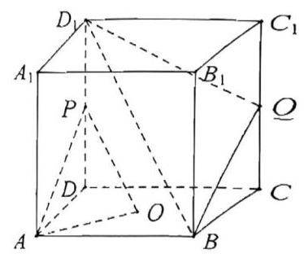

5. 如图所示，已知 ${AB}$ 与 ${CD}$ 为异面直线， ${CD}$ 在平面 $\alpha$ 内， ${AB}//\alpha$ ， $M$ 、 $N$ 分别是线段 ${AC}$ 、 ${BD}$ 的中点，求证: ${MN}//\alpha$ .

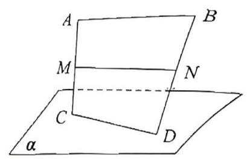

6. 在四棱锥 P-ABCD 中，底面 ABCD 为梯形，AD//BC，且 AD-2BC。已知 E 是 PD 中点，求证:CE// 面 PAB

7. 如图， ${\Delta {A}_{1}{B}_{1}{C}_{1}}$ 是由 ${\Delta ABC}$ 沿向量 $\overline{A{A}_{1}}$ 平移得到， $O$ 为 ${AC}$ 中点，在 ${BC}$ 上是否存在一点 $E$ ，使得 ${OE}//$ 平面 ${A}_{1}{AB}$ ? 说明理由。

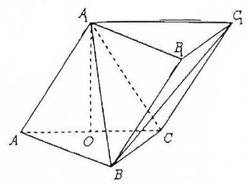

## 二、垂直关系

### 线线垂直

定义:$l$ 与 $m$ 夹角为 ${90}^{ \circ }$ 时，称为 $l \bot m$

判定方式 1: 先将 $l$ 与 $m$ 平移至同一平面,再用平面几何的知识进行判定判定方式 2: 证明 $l$ 与 $m$ 所在的某个平面垂直推论: 过空间中任意一点,有无数条直线与已知直线垂直

### 线面垂直

定义:若对 $\forall m \subset \alpha , l \bot m$ ,则称为 $l \bot \alpha$

判定定理: 已知 $m \subset \alpha , n \subset \alpha$ ,且 $m \cap n \neq \varnothing$ ; 若 $l \bot m, l \bot n$ ,则 $l \bot \alpha$

性质定理: 若 ${l}_{1} \bot \alpha ,{l}_{2} \bot \alpha$ ,则 ${l}_{1}//{l}_{2}$

推论 1: 若 ${l}_{1} \bot \alpha ,{l}_{1}//{l}_{2}$ ; 则 ${l}_{2} \bot \alpha$

推论 2: 过一点有且仅有一条直线与已知平面垂直推论 3: 过一点有且仅有一个平面与已知直线垂直

### 面面垂直

定义:若 $\alpha$ 与 $\beta$ 所成二面角为直角，称 $\alpha \bot \beta$

判定定理: 若 $l \bot \alpha$ ,且 $l \subset \beta$ ,则 $\alpha \bot \beta$

性质定理: 已知 $\alpha \bot \beta$ ,且 $l = \alpha \cap \beta$ ,若 $m \subset \alpha$ 且 $m \bot l$ ,则 $m \bot \beta$

8. 下列说法正确的是\_\_\_.

① 若直线 $l\bot$ 平面 $\alpha$ ，直线 $m//\alpha$ ，则直线 $l$ 与 $m$ 垂直.

② 若直线 $l$ 与平面 $\alpha$ 不垂直，则 $l$ 不可能垂直于 $\alpha$ 内无数条直线.

③ 若直线 $l$ 与直线 $m$ 异面，则过 $l$ 且与 $m$ 垂直的平面有且只有一个.

9. 在空间内， $l$ 、 $m$ 、 $n$ 是三条不同的直线， $\alpha$ 、 $\beta$ 、 $\gamma$ 是三个不同的平面，则下列命题正确的是\_\_\_.

① 若 $\alpha \bot \gamma ,\beta \bot \gamma ,\alpha \cap \beta = l$ ，则 $l \bot \gamma .$ ② 若 $l//\alpha$ ， $l//\beta ,\alpha \cap \beta = m$ ，则 $l//m$ .

② $\alpha \cap \beta = l,\beta \cap \gamma = m,\gamma \cap \alpha = n$ ，若 $l//m$ ，则 $l//n$ . ④ 若 $\alpha \bot \gamma ,\beta \bot \gamma$ ，则 $\alpha \bot \beta$ 或 $\alpha //\beta$ .

### 注意: 三类垂直关系的核心是线线-线面垂直关系的互相转化

10. 如图，在长方体 ${ABCD} - {A}_{1}{B}_{1}{C}_{1}{D}_{1}$ 中，底面 ${ABCD}$ 是正方形， ${A{A}_{1}} = {2AB} = 4$ ，点 $E$ 在 $C{C}_{1}$ 上且 ${C}_{1}E = {3EC}$ 。证明: ${A}_{1}C \bot$ 平面 ${BED}$ 。

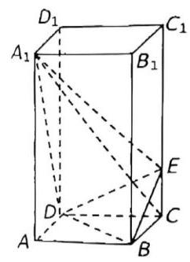

11. 在正方体 ${ABCD} - {A}_{1}{B}_{1}{C}_{1}{D}_{1}$ 中， $P$ 为 $D{D}_{1}$ 中点， $O$ 为底面 ${ABCD}$ 的中心，求证: ${B}_{1}O \bot {PA}$ .

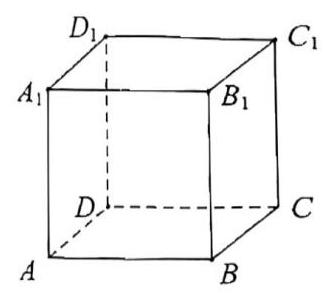

12. 已知四面体 ${ABCD}$ 的边 ${BC} = {AC}$ ， ${AD} = {BD}$ ，作 ${BE}\bot {CD}$ 于 $E$ ， ${AH}\bot {BE}$ 于 $H$ ，求证: ${AH}\bot$ 平面 ${BCD}$ .

13. 已知矩形 ${ABCD},{AB} = 1,{BC} = \sqrt{2}$ ，将 $\bigtriangleup {ABD}$ 沿矩形的对角线 ${BD}$ 所在的直线进行翻折，在翻折过程中，正确的是 ( )

::: choices

- A. 存在某个位置，使得直线 ${AC}$ 与直线 ${BD}$ 垂直
- B. 存在某个位置，使得直线 ${AB}$ 与直线 ${CD}$ 垂直
- C. 存在某个位置,使得直线 ${AD}$ 与直线 ${BC}$ 垂直
- D. 对任意位置，三对直线 “ ${AC}$ 与 ${BD}$ ”、 “ ${AB}$ 与 ${CD}$ ”、 “ ${AD}$ 与 ${BC}$ ” 均不垂直
  :::

14. 下列 5 个正方体图形中, $l$ 是正方体的一条对角线,点 $M, N, P$ 分别为其所在棱的中点,能得出 $l \bot$ 面 ${MNP}$ 的图形的序号是\_\_\_(写出所有符合要求的图形序号)

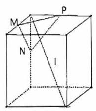

①

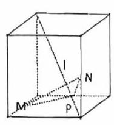

②

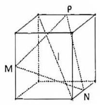

③

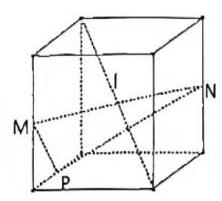

④

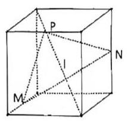

⑤

15. 在矩形 ${ABCD}$ 中，已知 ${AB} = {2AD}$ ，且为 ${AB}$ 中点，将 $\bigtriangleup {ADE}$ 沿 ${DE}$ 折起，翻折后 ${A}^{\prime }B = {A}^{\prime }C$ ， 求证: 平面 ${A}^{\prime }{DE} \bot$ 平面 ${BCDE}$ .

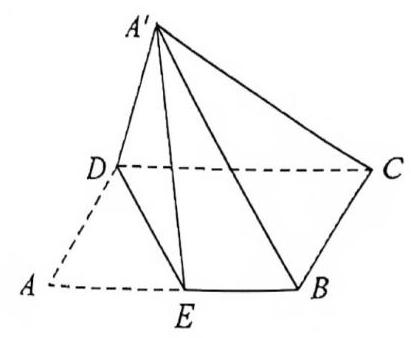

16. 如图所示，在正方体 ${ABCD} - {A}_{1}{B}_{1}{C}_{1}{D}_{1}$ 中，已知 $P$ 、 $Q$ 、 $R$ 、 $S$ 分别为棱 ${A}_{1}{D}_{1}$ 、 ${A}_{1}{B}_{1}$ 、 ${AB}$ 、 $B{B}_{1}$ 的中点,求证: 平面 ${PQS} \bot$ 平面 ${B}_{1}{RC}$

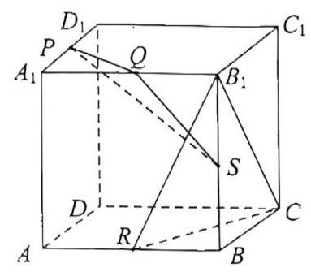
