# 第九讲空间元素的夹角

## 一、线线夹角

17. 异面直线 $a, b$ 所成的角为锐角 $\theta , M, N \in a,{M}_{1},{N}_{1} \in b, M{M}_{1} \bot b, N{N}_{1} \bot b$ ,若 ${MN} = m$ ,则 ${M}_{1}{N}_{1} =$ \_\_\_(用 $m,\theta$ 表示)。

18. 在空间四边形 ${ABCD}$ 中,

(1) 若 ${AB} = {BC} = {CD} = {DA} = {BD} = {AC} = a, M, N$ 分别是 ${BC},{AD}$ 的中点，求异面直线 ${AM},{CN}$ 所成的角:

(2) $E$ 是 ${AC}$ 中点， ${AF}$ 是 ${BD}$ 上的高， ${BD} - {BE} = {CF} = 1,{AB} = {AD} = \frac{3}{2}$ 。求异面直线 ${BE},{CF}$ 所成的角。

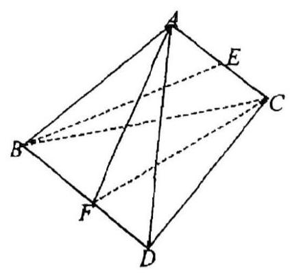

## 二、二面角与线面角

### 二面角找平面角类型总结

1. 如图，四边形 ${ABCD}$ 是正方形， ${PD} \bot$ 面 ${ABCD}$ ， ${PD} \simeq {DC}$ ， $E$ 是 ${PC}$ 的中点，作 ${EF} \bot {PB}$ 于点 $F$ 。求下列二面角的大小:

(1) $C - {PB} - A$ ；(2) $C - {PB} - D$ ；(3)面 ${BPC}$ 与面 ${APD}$ 所成的锐二面角；

(4) $E - {BD} - C$ ；(5) $P - {DE} - F$ ；

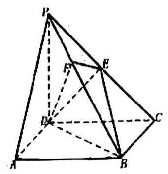

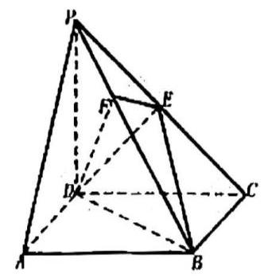

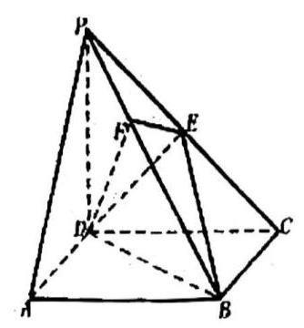

2. 如图的几何体中， $\Delta {A}_{1}{B}_{1}{C}_{1}$ 是正三角形，三条线段 $A{A}_{1}, B{B}_{1}, C{C}_{1}$ 都垂直于平面 ${A}_{1}{B}_{1}{C}_{1}$ ，且 $A{A}_{1} = B{B}_{1} = C{C}_{1} = {A}_{1}{B}_{1}$ 。若 $E$ 为 $B{B}_{1}$ 的中点，求面 ${A}_{1}{EC}$ 与面 ${A}_{1}{B}_{1}{C}_{1}$ 所成二面角。

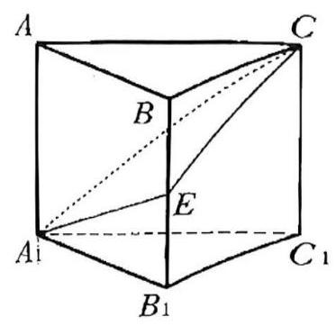

3. 正方体 ${ABCD} - {A}^{\prime }{B}^{\prime }{C}^{\prime }{D}^{\prime }$ 中， $E$ 是 ${BC}$ 的中点， $F$ 在 $A{A}^{\prime }$ 上，且 $\frac{{A}_{1}F}{FA} = \frac{1}{2}$ ，求面 ${B}_{1}{EF}$ 与面 ${ABCD}$ 所成锐二面角的大小。

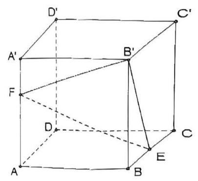

4. 如图， $\bigtriangleup {ABC}$ 是以点 $C$ 为直角顶点的等腰直角三角形，线段 $A{A}_{1}$ ， $B{B}_{1}$ ， $C{C}_{1}$ 垂直于平面 ${ABC}$ ，且 ${AC} = {BC} = \sqrt{3}, A{A}_{1} = B{B}_{1} = C{C}_{1} = 1$ 。问:在 ${A}_{1}{B}_{1}$ 边上是否存在一点 $Q$ ，使得平面 ${QBC}$ 与平面 ${A}_{1}{BC}$ 所成的角为 ${30}^{ \circ }$ ? 说明理由。

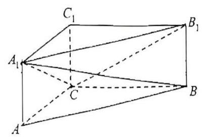

5. 如图， ${PB} \bot$ 面 ${ABCD}$ ， ${CD} \bot {PD}$ 。底面 ${ABCD}$ 为直角梯形， ${AD}//{BC}$ ， ${AB} \bot {BC}$ ， ${AB} = {AD} = {PB} = 3$ 。点 $E$ 在棱 ${PA}$ 上，且 ${PE} = {2EA}$ 。求二面角 $A - {BE} - D$ 的大小。

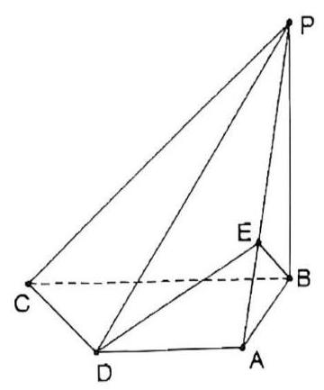

6. 已知点 $O$ 是边长为 4 的正方形 ${ABCD}$ 的中心，点 $E$ ， $F$ 分别是 ${AD},{BC}$ 的中点，沿对角线 ${AC}$ 把正方形 ${ABCD}$ 折成直二面角 $D - {AC} - B$ 。求二面角 $E - {OF} - A$ 的大小；

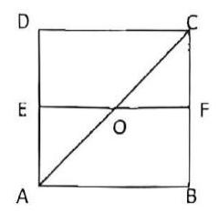

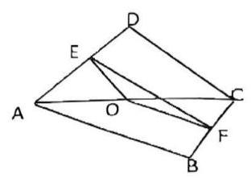

7. 在正 $\bigtriangleup {ABC}$ 中， $E$ ， $F$ ， $P$ 分别是 ${AB}$ ， ${AC}$ ， ${BC}$ 边上的点，满足 $\frac{AE}{EB} = \frac{CF}{FA} = \frac{CP}{PB} = \frac{1}{2}$ (如图 1)。将 $\bigtriangleup {AEF}$ 沿 ${EF}$ 折起到 $\Delta {A}_{1}{EF}$ 的位置，使二面角 ${A}_{1} - {EF} - B$ 成直二面角，连结 ${A}_{1}B,{A}_{1}P$ (如图 2)。

(1)求证: ${A}_{1}E \bot$ 平面 ${BEP}$ ；(2)求直线 ${A}_{1}E$ 与平面 ${A}_{1}{BP}$ 所成角的大小；

(3)求二面角 $B - {A}_{1}P - F$ 的大小。

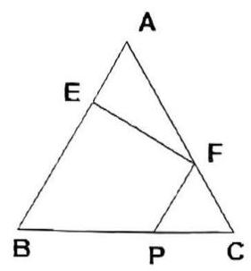

图 1

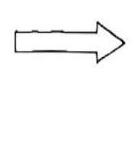

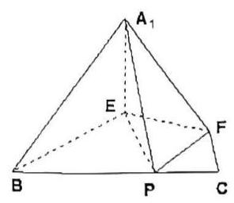

图 2

8. 如图，已知四棱柱 ${ABCD} - {A}_{1}{B}_{1}{C}_{1}{D}_{1}$ 中， ${A}_{1}D\bot$ 底面 ${ABCD}$ ，底面 ${ABCD}$ 是边长为 1 的正方形，侧棱 $\mathcal{A}{A}_{1} = 2$ 。

(1)求证: ${C}_{1}D//$ 平面 ${AB}{B}_{1}{A}_{1}$ ； (2)求直线 $B{D}_{1}$ 与平面 ${A}_{1}{C}_{1}D$ 所成角的正弦值；

(2)求二面角 $D - {A}_{1}{C}_{1} - A$ 的余弦值。

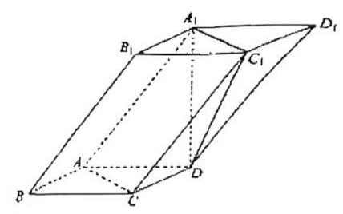
