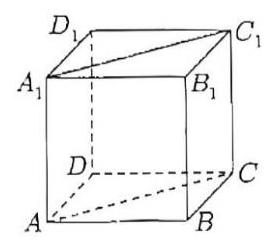
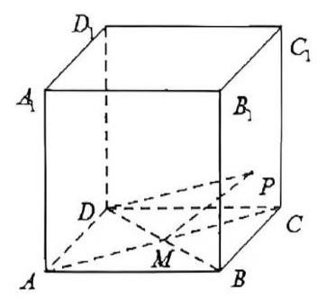
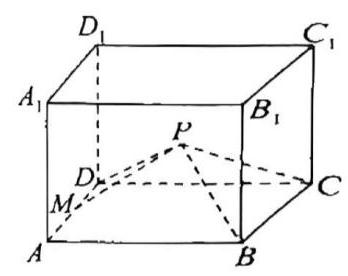
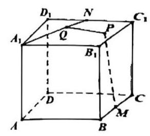
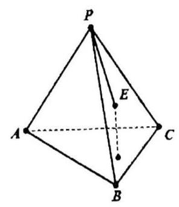
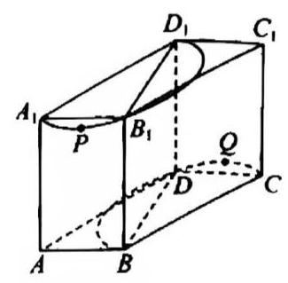
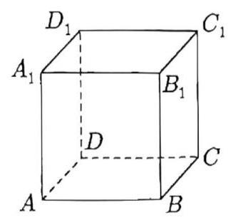
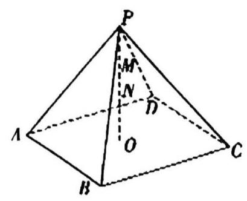
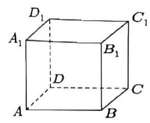

# 第十讲空间几何体

## 一、动点轨迹

1. 如图，在棱长为 2 的正方体 ${ABCD} - {A}_{1}{B}_{1}{C}_{1}{D}_{1}$ 中，点 $P$ 是平面 ${AC}{C}_{1}{A}_{1}$ 上一动点，且满足 $\overrightarrow{{D}_{1}P} \cdot \overrightarrow{CP} = 0$ ，则满足条件的所有点 $P$ 所围成的平面区域的面积是\_\_\_

2. 如图，正方体 ${ABCD} - {A}_{1}{B}_{1}{C}_{1}{D}_{1}$ 的棱长为 4， $M$ 为底面 ${ABCD}$ 两条对角线的交点， $P$ 为平面 ${BC}{C}_{1}{B}_{1}$ 内的动点,设直线 ${PM}$ 与平面 ${BC}{C}_{1}{B}_{1}$ 所成的角为 $\alpha$ ,直线 ${PD}$ 与平面 ${BC}{C}_{1}{B}_{1}$ 所成的角为 $\beta$ ,若 $\alpha = \beta$ ，则动点 $P$ 的轨迹长度为\_\_\_

3. 如图，在长方体 ${ABCD} - {A}_{1}{B}_{1}{C}_{1}{D}_{1}$ 中， ${AB} = {BC} = 4,\;{A{A}_{1}} = 3,$ ， $M$ 为 ${AD}$ 中点， $P$ 为矩形 $C{C}_{1}{D}_{1}D$ 内的动点(包括边界)，且 $\angle {MPD} = \angle {BPC}$ ，则点 $P$ 的轨迹长度为\_\_\_.

4. 已知正方体 ${ABCD} - {A}_{1}{B}_{1}{C}_{1}{D}_{1}$ 的棱长为 2,点 $M, N$ 分别是棱 ${BC},{GD}$ 的中点，点 $P$ 在底面 ${ABCD}$ 内，点 $Q$ 在线段 ${AN}$ 上，若 ${PM} = 5$ ，则 ${PQ}$ 长度的最小值为\_\_\_

5. 已知 $E$ 为四面体 $P - {ABC}$ 的侧面 ${PBC}$ 内的一个动点，且点 $E$ 到顶点 $P$ 的距离等于点 $E$ 到底面 ${ABC}$ 的距离，则动点 $E$ 的轨迹是某曲线的一部分，则该曲线一定为( )

::: choices

- A. 圆或椭圆
- B. 椭圆或双曲线
- C. 双曲线或抛物线
- D. 抛物线或椭圆
  :::

6. 已知正方体 ${ABCD} - {A}_{1}{B}_{1}{C}_{1}{D}_{1}$ 的棱长为 3、 ${E}_{1}$ 、 ${E}_{2}$ 、 $\cdots$ 、 ${E}_{k}$ 为正方形 ${ABCD}$ 边上的 $K$ 个两两不同的点. 若对任意的点 ${E}_{i}$ ，存在点 ${E}_{j}\left( {i\text{ 、 }j \in \{ 1,2,\cdots , k\} \text{ ， }i \neq j}\right)$ . 使得直线 ${A}_{1}A$ 与平面 ${A}_{1}{E}_{i}{E}_{j}$ 以及平面 ${C}_{1}{E}_{i}{E}_{j}$ 所成角大小均为 $\frac{\pi }{6}$ ，则正整数 $k$ 的最大值为\_\_\_

7. 一个半径为 1 的小球在一个棱长为 $4\sqrt{6}$ 的正四面体容器内可向各个方向自由运动，则该小球永远不可能接触到的容器内壁的面积是\_\_\_

## 二、外接球

8. 已知三棱锥 $P - {ABC}$ 的侧棱两两相互垂直，且该三棱锥的外接球的体积为 ${36\pi }$ ，则该三棱锥的侧面积的最大值为\_\_\_

9. $\bigtriangleup {ABC}$ 是边长为 $2\sqrt{3}$ 的等边三角形， $E$ ， $F$ 分别为 ${AB}$ ， ${AC}$ 的中点，沿 ${EF}$ 把 ${OAEF}$ 折起，使点 $A$ 翻折到点 $P$ 的位置,连接 ${PB}\text{ 、 }{PC}$ ,当四棱锥 $P - {BCFE}$ 的外接球的表面积最小时,四棱锥 $P - {BCFE}$ 的体积为\_\_\_

10. 如图，直四棱柱 ${ABCD} - {A}_{1}{B}_{1}{C}_{1}{D}_{1}$ 中，底面 ${ABCD}$ 为平行四边形， ${AB} = 1,{AD} = 2,$ ， ${A{A}_{1}} = 2, \; \angle {BAD} = {60}^{ \circ }$ ，点 $P$ 是半圆弧 ${A}_{1}{D}_{1}$ 上的动点(不包括端点)，点 $Q$ 是半圆弧 ${BC}$ 上的动点(不包括端点),若三棱锥 $P - {BCQ}$ 的外接球表面积为 $S$ ，则 $S$ 的取值范围是\_\_\_

## 三、动线段和

11. 如图所示，长方体 ${ABCD} - {A}_{1}{B}_{1}{C}_{1}{D}_{1}$ 中， ${AB} = {AD} = 1$ ， $A{A}_{1} = \sqrt{2}$ ，面对角线 ${B}_{1}{D}_{1}$ 上存在一点 $P$ 使得 ${A}_{1}P + {PB}$ 最短，则 ${A}_{1}P + {PB}$ 的最小值为\_\_\_

12. 如图，在四棱锥 $P - {ABCD}$ 中，顶点 $P$ 在底面的投影 $O$ 恰为正方形 ${ABCD}$ 的中心且 ${AB} = 2\sqrt{2}$ ，设点 $M, N$ 分别为线段 ${PD},{PO}$ 上的动点，已知当 ${AN} + {MN}$ 取得最小值时，动点 $M$ 恰为 ${PD}$ 的中点， 则该四棱锥的外接球的表面积为\_\_\_

13. 如图，在棱长为 2 的正方体 ${ABCD} - {A}_{1}{B}_{1}{C}_{1}{D}_{1}$ 中，点 $P$ 是该正方体棱上一点，若满足 $\left| {PB}\right| + \left| {P{C}_{1}}\right| = m\left( {m > 0}\right)$ 的点 $P$ 的个数为 4，则 $m$ 的取值范围是\_\_\_

