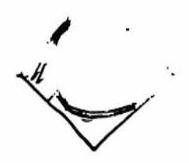

# 第十一讲直线

## 一、直线基本概念一览

$>$ 倾斜角:将 $x$ 轴正方向单位向量 $\left( {1,0}\right)$ 沿逆时针旋转到与直线 $l$ 共线，所需要转过的角度 $\alpha$ ，称为该直线的倾斜角。

(1)倾斜角的取值范围为 $\lbrack 0,\pi )$

( 2 )倾斜角与直线斜率的关系为: $k = \left\{ \begin{array}{ll} \tan \alpha & ,\alpha \in \left\lbrack {0,\frac{\pi }{2}}\right) \cup \left( {\frac{\pi }{2},\pi }\right) \\ \text{ 不存在 } & ,\alpha = \frac{\pi }{2} \end{array}\right.$

### 直线方程

<table><tr><td></td><td>已知条件</td><td>直线方程</td><td>备注</td></tr><tr><td>点方向式方程</td><td>方向向量 $\overrightarrow{t} = \left( {a, b}\right)$ 直线上一点 $\left( {{x}_{0},{y}_{0}}\right)$</td><td>$- b\left( {x - {x}_{0}}\right) + a\left( {y - {y}_{0}}\right) = 0$</td><td>适用任意直线</td></tr><tr><td>点法向式方程</td><td>法向量 $\overrightarrow{n} = \left( {a, b}\right)$   直线上一点 $\left( {{x}_{0},{y}_{0}}\right)$</td><td>$a\left( {x - {x}_{0}}\right) + b\left( {y - {y}_{0}}\right) = 0$</td><td>适用任意直线</td></tr><tr><td>截距式方程</td><td>与 $x$ 轴交点 $\left( {a,0}\right)$   与 $y$ 轴交点 $\left( {0, b}\right)$</td><td>$\frac{x}{a} + \frac{y}{b} = 1$</td><td>直线不能与坐标轴平行直线不能过原点</td></tr><tr><td>点斜式方程 I</td><td>直线斜率 $k$ 直线上一点 $\left( {{x}_{0},{y}_{0}}\right)$</td><td>$y - {y}_{0} = k\left( {x - {x}_{0}}\right)$</td><td>直线不能与 $y$ 轴平行 (即 $k$ 需要存在)</td></tr><tr><td>点斜式方程 II</td><td>直线倒斜率 $t = \frac{1}{k}$   直线上一点 $\left( {{x}_{0},{y}_{0}}\right)$</td><td>$x - {x}_{0} = t\left( {y - {y}_{0}}\right)$</td><td>直线不能与 $x$ 轴平行 (即 $t = \frac{1}{k}$ 需要存在)</td></tr><tr><td>斜截式方程 I</td><td>直线斜率 $k$   与 $y$ 轴交点 $\left( {0, m}\right)$</td><td>$y = {kx} + m$</td><td>直线不能与 $y$ 轴平行 (即 $k$ 需要存在)</td></tr><tr><td>斜截式方程 II</td><td>直线倒斜率 $t = \frac{1}{k}$   与 $x$ 轴交点 $\left( {n,0}\right)$</td><td>$x = {ty} + n$</td><td>直线不能与 $x$ 轴平行 (即 $t = \frac{1}{k}$ 需要存在)</td></tr><tr><td>两点式方程</td><td>直线上一点 $\left( {{x}_{1},{y}_{1}}\right)$ 直线上另一点 $\left( {{x}_{2},{y}_{2}}\right)$</td><td>$\left| \begin{matrix} x & y \\ {x}_{1} - {x}_{2} & {y}_{1} - {y}_{2} \end{matrix}\right| = \left| \begin{array}{ll} {x}_{2} & {y}_{2} \\ {x}_{1} & {y}_{1} \end{array}\right|$</td><td>为一般两点式化简结果尽量不求两点式</td></tr></table>

### 直线距离

(1)点 $\left( {{x}_{0},{y}_{0}}\right)$ 到直线 $l : {ax} + {by} + c = 0$ 的距离: $d = \frac{\left| a{x}_{0} + b{y}_{0} + c\right| }{\sqrt{{a}^{2} + {b}^{2}}}$

(2)直线 ${l}_{1} : {ax} + {by} + {c}_{1} = 0$ 到直线 ${l}_{2} : {ax} + {by} + {c}_{2} = 0$ 的距离: $d = \frac{\left| {c}_{1} - {c}_{2}\right| }{\sqrt{{a}^{2} + {b}^{2}}}$

(3)点 $\left( {{x}_{0},{y}_{0}}\right)$ 到直线 $l : {ax} + {by} + c = 0$ 的有向距离: $\delta = \frac{a{x}_{0} + b{y}_{0} + c}{\sqrt{{a}^{2} + {b}^{2}}}$

(4)两点 $A\left( {{x}_{1},{y}_{1}}\right)$ 和 $B\left( {{x}_{2},{y}_{2}}\right)$ 在直线 $l : {ax} + {by} + c = 0$ 同侧时， ${\delta }_{1}{\delta }_{2} > 0$ ；异侧时， ${\delta }_{1}{\delta }_{2} < 0$

直线夹角:直线 ${l}_{1} : {a}_{1}x + {b}_{1}y + {c}_{1} = 0$ 与直线 ${l}_{2} : {a}_{2}x + {b}_{2}y + {c}_{2} = 0$ 的夹角 $\theta$ 可以利用两直线的方向向量 $\overrightarrow{{n}_{1}} = \left( {{a}_{1},{b}_{1}}\right)$ 和 $\overrightarrow{{n}_{2}} = \left( {{a}_{2},{b}_{2}}\right)$ 求解 (类似空间向量):

$$
\cos \theta  = \frac{\left| \overrightarrow{{n}_{1}} \cdot  \overrightarrow{{n}_{2}}\right| }{\left| \overrightarrow{{n}_{1}}\right| \left| \overrightarrow{{n}_{2}}\right| } = \frac{\left| {a}_{1}{a}_{2} + {b}_{1}{b}_{2}\right| }{\sqrt{{a}_{1}^{2} + {b}_{1}^{2}}\sqrt{{a}_{2}^{2} + {b}_{2}^{2}}}
$$

点关于直线对称: 两点 $A\left( {{x}_{1},{y}_{1}}\right)$ 和 $B\left( {{x}_{2},{y}_{2}}\right)$ 关于直线 $l : {ax} + {by} + c = 0$ 对称的等价条件为:

$$
\left\{  {\begin{array}{l} {AB} \bot l \\ {AB}\text{ 中点 } \in l\end{array} \Rightarrow  \left\{  \begin{array}{l} a\left( {{y}_{1} - {y}_{2}}\right) - b\left( {{x}_{1} - {x}_{2}}\right) = 0 \\ a\left( {{x}_{1} + {x}_{2}}\right) + b\left( {{y}_{1} + {y}_{2}}\right) = - {2c}\end{array}\right. }\right.
$$

含参直线系: 两直线 ${l}_{1} : {a}_{1}x + {b}_{1}y + {c}_{1} = 0,{l}_{2} : {a}_{2}x + {b}_{2}y + {c}_{2} = 0$ ; 则 $l : {a}_{1}x + {b}_{1}y + {c}_{1} + \lambda \left( {{a}_{2}x + {b}_{2}y + {c}_{2}}\right) = 0$ (其中 $\lambda$ 为任意实数) 表示一簇直线系,满足:

(1)若 ${l}_{1} \cap {l}_{2} = P$ ，则 $l$ 为除 ${l}_{2}$ 外的过 $P$ 点直线；

(2)若 ${l}_{1} \cap {l}_{2} = \varnothing$ ，则 $l$ 为除 ${l}_{2}$ 外与 ${l}_{1},{l}_{2}$ 平行的直线；

直线同构: 若两直线 ${l}_{1} : {a}_{1}x + {b}_{1}y + c = 0,{l}_{2} : {a}_{2}x + {b}_{2}y + c = 0$ 交于点 $P\left( {{x}_{0},{y}_{0}}\right)$ ,则过点 $\left( {{a}_{1},{b}_{1}}\right)$ 和 $\left( {{a}_{2},{b}_{2}}\right)$ 的直线为 ${x}_{0}x + {y}_{0}y + c = 0$

## 二、直线相关问题

1. 已知直线 $l$ 的方程为 $\left( {a - 2}\right) x + \left( {a + 1}\right) y - {3a} = 0\left( {x \in \mathbf{R}}\right)$ ,则点 $P\left( {4,5}\right)$ 到直线 $l$ 的距离 $d$ 的取值范围是\_\_\_.

2. 设 $a \in R, k \in R$ ,三条直线 ${l}_{1} : {ax} - y - {2a} + 5 = 0,{l}_{2} : x + {ay} - {3a} - 4 = 0,{l}_{3} : y = {kx}$ ,则 ${l}_{1}$ 与 ${l}_{2}$ 的交点 $M$ 到 ${l}_{3}$ 的距离的最大值为\_\_\_。

3. 在平面直角坐标系 ${xOy}$ 中,若动点 $P\left( {a, b}\right)$ 到两直线 ${l}_{1} : y = x$ 和 ${l}_{2} : y = - x + 2$ 的距离之和为 $2\sqrt{2}$ ,则 ${a}^{2} + {b}^{2}$ 的最大值为\_\_\_。

4. 在平面直角坐标系 ${xOy}$ 中,定义 $A\left( {{x}_{1},{y}_{1}}\right) , B\left( {{x}_{2},{y}_{2}}\right)$ 两点的折线距离 $d\left( {A, B}\right) = \left| {{x}_{1} - {x}_{2}}\right| + \left| {{y}_{1} - {y}_{2}}\right|$ ,设点 $P\left( {{m}^{2},{n}^{2}}\right) , Q\left( {m, n}\right) , O\left( {0,0}\right) , C\left( {2,0}\right) \left( {m, n \in R}\right)$ ,若 $d\left( {P, O}\right) = 1$ ,则 $d\left( {Q, C}\right)$ 的取值范围为\_\_\_。

5. 对于平面上点 $P$ 和曲线 $C$ ,任取 $C$ 上一点 $Q$ ,若线段 ${PQ}$ 的长度存在最小值,则称该值为点 $P$ 到曲线 $C$ 的距离,记作 $d\left( {P, C}\right)$ . 若曲线 $C$ 是边长为 6 的等边三角形,则点集 $D = \left\{ {P \mid d\left( {P, C}\right) \leq 1}\right\}$ 所表示的图形的面积为\_\_\_

6. 记 $d\left( {P, l}\right)$ 为点 $P$ 到直线 $l$ 的距离。直线集 $S = \left\{ {\text{ 直线 }l\left| \right| d\left( {A, l}\right) - d\left( {B, l}\right) \mid = 2\sqrt{2}}\right\}$ ，其中 $A\left( {-2,0}\right)$ ， $B\left( {2,0}\right)$ 为定点。若点 $P$ 不在任何一条 $S$ 中的直线上,则这样的点 $P$ 所构成的区域面积为\_\_\_

7. 如图，用 35 个单位正方形拼成一个矩形，点 ${P}_{1}$ 、 ${P}_{2}$ 、 ${P}_{3}$ 、 ${P}_{4}$ 以及四个标记为 “▲” 的点在正方形的顶点处,设集合 $\Omega = \left\{ {{P}_{1},{P}_{2},{P}_{3},{P}_{4}}\right\}$ ,点 $P \in \Omega$ ,过 $P$ 作直线 ${l}_{P}$ ,使得不在 ${l}_{P}$ 上的 “ $\Delta$ ” 的点分布在 ${l}_{P}$ 的两侧. 用 ${D}_{1}\left( {l}_{P}\right)$ 和 ${D}_{2}\left( {l}_{P}\right)$ 分别表示 ${l}_{P}$ 一侧和另一侧的 “ $\Delta$ ” 的点到 ${l}_{P}$ 的距离之和. 若过 $P$ 的直线 ${l}_{P}$ 中有且只有一条满足 ${D}_{1}\left( {l}_{P}\right) = {D}_{2}\left( {l}_{P}\right)$ ,则 $\Omega$ 中所有这样的 $P$ 为\_\_\_

S. 在平面直角坐标系中,定义 $d\left( {A, B}\right) = \max \left\{ {\left| {{x}_{1} - {x}_{2}}\right| ,\left| {{y}_{1} - {y}_{2}}\right| }\right\}$ 为两点 $A\left( {{x}_{1},{y}_{1}}\right) , B\left( {{x}_{2},{y}_{2}}\right)$ 的 “契比雪夫距离”,又设点 $P$ 及直线 $l$ 上任意一点 $Q$ ,称 $d\left( {P, Q}\right)$ 的最小值为点 $P$ 到直线 $l$ 的 “契比雪夫距离”,记作 $d\left( {P, l}\right)$ ,给出下列三个命题,其中真命题的个数为\_\_\_。

① 对任意三点 $A, B, C$ 都有 $d\left( {C, A}\right) + d\left( {C, B}\right) \geq d\left( {A, B}\right)$ ；

② 已知点 $P\left( {3,1}\right)$ 和直线 $l : {2x} - y - 1 = 0$ ，则 $d\left( {P, l}\right) = \frac{4}{3}$ ；

③ 定点 ${F}_{1}\left( {-c,0}\right)$ ， ${F}_{2}\left( {c,0}\right)$ ，动点 $P\left( {x, y}\right)$ 满足 $\left| {d\left( {P,{F}_{1}}\right) - d\left( {P,{F}_{2}}\right) }\right| = {2a}\left( {{2c} > {2a} > 0}\right)$ ，则点 $P$ 的轨迹与直线 $y = k$ ( $k$ 为常数) 有且仅有 2 个公共点.
