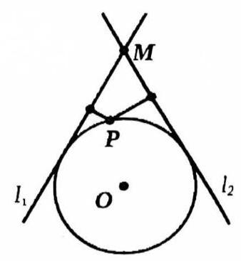

# 第十二讲圆

## 一、圆基本概念一览

$>$ 圆的方程

(1)圆的标准方程为 ${\left( x - a\right) }^{2} + {\left( y - b\right) }^{2} = {r}^{2}$ ，其中 $\left( {a, b}\right)$ 为圆心， $r$ 为半径；

(2)圆的一般方程为 ${x}^{2} + {y}^{2} + {Dx} + {Ey} + F = 0$ ，且 $\Delta = {D}^{2} + {E}^{2} - {4F} > 0$ 。其中 $\left( {-\frac{D}{2}, - \frac{E}{2}}\right)$ 为圆心， $\frac{\sqrt{\Delta }}{2}$ 为半径。

(3)圆的参数方程为 $\left\{ \begin{array}{l} x = a + r\cos \theta \\ y = b + r\sin \theta \end{array}\right.$ ，其中 $\left( {a, b}\right)$ 为圆心， $r$ 为半径。

### 圆的位置关系

(1)点 $P$ 与 $\odot O$ 位置关系判定为:圆外 $\Leftrightarrow {PO} > r$ ；圆上 $\Leftrightarrow {PO} = r$ ；圆内 $\Leftrightarrow {PO} < r$

(2)直线 $l$ 与 $\odot O$ 位置关系判定为:相离 $\Leftrightarrow {d}_{O - l} > r$ ；相切 $\Leftrightarrow {d}_{O - l} = r$ ；相交 $\Leftrightarrow {d}_{O - l} < r$

(3) $\odot P$ 与 $\odot Q$ 位置关系判定为:相离 $\Leftrightarrow {PQ} > {R}_{p} + {R}_{Q}$ ；外切 $\Leftrightarrow {PQ} = {R}_{p} + {R}_{Q}$ ；

相交 $\Leftrightarrow \left| {{R}_{p} - {R}_{Q}}\right| < {PQ} < {R}_{p} + {R}_{Q}$ ；内切 $\Leftrightarrow {PQ} = \left| {{R}_{p} - {R}_{Q}}\right|$ ；内含 $\Leftrightarrow {PQ} < \left| {{R}_{p} - {R}_{Q}}\right|$

圆的切线: 若 $\left( {a, b}\right)$ 为圆心, $r$ 为半径

(1)已知切点为 $\left( {{x}_{0},{y}_{0}}\right)$ ,过该切点的切线方程为 $\left( {{x}_{0} - a}\right) \left( {x - a}\right) + \left( {{y}_{0} - b}\right) \left( {y - b}\right) = {r}^{2}$

(2)已知切线倾斜角为 $\alpha$ ，则切线方程为 $\left( {x - a}\right) \sin \alpha - \left( {y - b}\right) \cos \alpha \pm r = 0$

(3)已知切线斜率为 $k$ ，则切线方程为 $y - b = k\left( {x - a}\right) \pm r\sqrt{1 + {k}^{2}}$

$>$ 外接圆与内切:

(1) $\bigtriangleup {ABC}$ 外接圆半径为 $R = \frac{a}{2\sin A} = \frac{b}{2\sin B} = \frac{c}{2\sin C}$

(2) $\bigtriangleup {ABC}$ 内切圆半径为 $r = \frac{2S}{C}$

圆的弦: 垂径定理

## 二、圆与直线相关问题

1. 设圆 $C$ 与 $x$ 轴相切,圆心在直线 ${3x} - y = 0$ 上,且被直线 $x - y = 0$ 截得的弦长为 $2\sqrt{7}$ ,求圆 $C$ 的方程.

2. 已知坐标平面上有两点 $B\left( {3,3}\right) \text{ 、 }C\left( {0, - 1}\right)$ ，若直线 ${l}_{1} : {ax} + \left( {1 - a}\right) y - 3 = 0$ 与直线 ${l}_{2} : {ax} + y + 1 = 0$ 相交于点 $A$ ,则 $\bigtriangleup {ABC}$ 的外接圆半径的最小值为\_\_\_.

3. 设 $a\text{ 、 }b$ 是 $\sin \theta \cdot {x}^{2} + \cos \theta \cdot x - 1 = 0$ 两个不等实根,则过 $A\left( {a,{a}^{2}}\right) \text{ 、 }B\left( {b,{b}^{2}}\right)$ 的直线与单位圆的位置关系为 ( ).

::: choices

- (A) 相离
- (B) 相切
- (C) 相交
- (D) 随 $\theta$ 的值变化
:::

4. 已知圆满足:① 截 $y$ 轴所得弦长为 2；② 被 $x$ 轴分成两段圆弧，弧长之比为 3:1；③ 圆心到直线 $l : x - {2y} = 0$ 的距离最小,求此时圆的方程.

5. 在平面直角坐标系 ${xOy}$ 中,已知向量 $\overrightarrow{a} \cdot \overrightarrow{b},\left| \overrightarrow{a}\right| = \left| \overrightarrow{b}\right| = 1,\overrightarrow{a} \cdot \overrightarrow{b} = 0$ ,点 $Q$ 满足 $\overrightarrow{OQ} = \sqrt{2}\left( {\overrightarrow{a} + \overrightarrow{b}}\right)$ . 曲线 $C = \left\{ {P\left| {\;\overline{OP} = \overrightarrow{a}\cos \theta + \overrightarrow{b}\sin \theta }\right. ,0 \leq \theta \leq {2\pi }}\right\}$ ,区域 $\Omega = \{ P\left| {0 < r \leq }\right| \overline{PQ} \mid \leq R, r < R\}$ . 若 $C \cap \Omega$ 为两段分离的曲线, 则 ( ).

::: choices

- (A) $1 < r < R < 3$
- (B) $1 < r < 3 \leq R$
- (C) $r \leq 1 < R < 3$
- (D) $1 < r < R < R$
:::

6. 若点 $P\left( {x, y}\right)$ 的坐标满足方程 $x\cos \alpha + y\sin \alpha = 4$ ，则当 $\alpha$ 在实数范围内变换时， $P$ 点的轨迹是( ).

::: choices

- (A) 圆
- (B) 圆周及圆内部分
- (C) 圆周及圆外部分
- (D) 整个坐标平面
:::

7. 若 $\odot O$ 以 $\left( {a, b}\right)$ 为圆心, $r$ 为半径。过 $\odot O$ 外一点 $P\left( {{x}_{0},{y}_{0}}\right)$ 作圆的两条切线,设切点为 $A$ 和 $B$ ,则直线 ${AB}$ 的方程为\_\_\_

8. 如图， ${l}_{1},{l}_{2}$ 是过点 $M$ 的夹角为 $\frac{\pi }{3}$ 的两条直线，且均与圆心为 $O$ ，半径为 1 的圆相切，设圆周上一点 $P$ 到 ${l}_{1},{l}_{2}$ 的距离分别为 ${d}_{1},{d}_{2}$ ,则 $2{d}_{1} + {d}_{2}$ 的最小值为\_\_\_

9. 圆 $C$ 分别与 $x$ 轴、 $y$ 轴相切于点 $A$ 、 $B$ ，过劣弧 ${AB}$ 上一点 $T$ 作圆 $C$ 的切线，分别交 $x$ 正半轴， $y$ 正半轴于点 $M, N$ 。若点 $Q\left( {2,1}\right)$ 是切线上的一点，则 $\bigtriangleup {MON}$ 周长的最小值为\_\_\_
