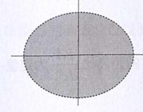
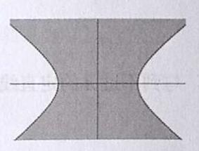
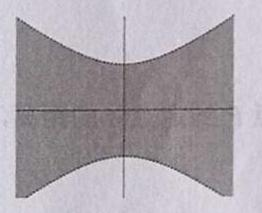
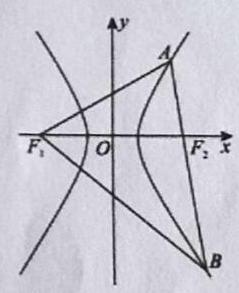
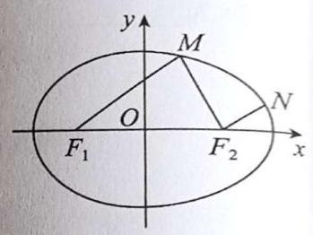

# 第十四讲椭圆与双曲线 $I$

## 一、圆、椭圆与双曲线基础知识汇总

<table><tr><td rowspan="4" colspan="2">统一标准式: $\frac{{x}^{2}}{{\lambda }^{2}} + \frac{{y}^{2}}{{\mu }^{2}} = 1$</td><td>圆: $\lambda ,\mu$ 为相等实数</td><td>$\lambda = \mu = r$</td></tr><tr><td>椭圆: $\lambda ,\mu$ 为不等实数</td><td>大的为 $a$ ,小的为 $b$</td></tr><tr><td>双曲线: $\lambda ,\mu$ 一虚一实</td><td>实数为 $a$ ,虚数 (模长) 为 $b$   渐近线: $y = \pm \left| \frac{\mu }{\lambda }\right| x$</td></tr><tr><td colspan="2">$c = \sqrt{\left| {\lambda }^{2} - {\mu }^{2}\right| },\;e = \frac{c}{a}$</td></tr><tr><td>内部: $\frac{{x}^{2}}{{\lambda }^{2}} + \frac{{y}^{2}}{{\mu }^{2}} < 1$</td><td colspan="3">    </td></tr><tr><td rowspan="2">切线</td><td colspan="2">已知切点坐标 $\left( {{x}_{0},{y}_{0}}\right)$</td><td>$\frac{{x}_{0}x}{{\lambda }^{2}} + \frac{{y}_{0}y}{{\mu }^{2}} = 1$</td></tr><tr><td colspan="2">已知切线斜率 $k$</td><td>$y = {kx} \pm \sqrt{\left| {\lambda }^{2}{k}^{2} + {\mu }^{2}\right| }$</td></tr><tr><td rowspan="2">焦半径</td><td colspan="2">焦点在 $x$ 轴</td><td>左焦半径 $P{F}_{1} = \left| {\lambda + e{x}_{P}}\right|$ ,右焦半径 $P{F}_{2} = \left| {\lambda - e{x}_{P}}\right|$</td></tr><tr><td colspan="2">焦点在 $y$ 轴</td><td>下焦半径 $P{F}_{1} = \left| {\mu + e{y}_{P}}\right|$ ,上焦半径 $P{F}_{2} = \left| {\mu - e{y}_{P}}\right|$</td></tr><tr><td>顶点斜率积</td><td colspan="2">曲线上任一动点 $P$   到两对称顶点斜率</td><td rowspan="2">${k}_{1}{k}_{2} = - \frac{{\mu }^{2}}{{\lambda }^{2}}$</td></tr><tr><td>斜径定理</td><td colspan="2">弦斜率 ${k}_{1}$   弦中点与原点连线斜率 ${k}_{2}$</td></tr></table>

### 圆锥曲线动点轨迹汇总

### 动点距离和差

(1)动点 $P$ 到两定点 $A, B$ 的距离平方和 $P{A}^{2} + P{B}^{2}$ 为大于 $\frac{A{B}^{2}}{2}$ 的定值时， $P$ 的轨迹为圆

(2)动点 $P$ 到两定点 $A, B$ 的距离和 ${PA} + {PB}$ 为大于 ${AB}$ 线段长的定值时， $P$ 的轨迹为椭圆

(3)动点 $P$ 到两定点 $A, B$ 的距离差值 $\left| {{PA} - {PB}}\right|$ 为小于 ${AB}$ 线段长的定值时， $P$ 的轨迹为双曲线

### 动点距离比

(1)动点 $P$ 到两定点 $A, B$ 的距离比 $\frac{PA}{PB}$ 为定值，且该定值不等于 1 时， $P$ 的轨迹为圆(阿波罗尼斯圆)

(2)动点 $P$ 到定点 $A$ 的距离，与到不过 $A$ 的定直线 $l$ 的距离比 $\frac{PA}{{d}_{P - l}}$ 为小于 1 的定值时， $P$ 的轨迹为椭圆

(3)动点 $P$ 到定点 $A$ 的距离，与到不过 $A$ 的定直线 $l$ 的距离比 $\frac{PA}{{d}_{P - l}}$ 为定值 1 时， $P$ 的轨迹为抛物线

(4)动点 $P$ 到定点 $A$ 的距离，与到不过 $A$ 的定直线 $l$ 的距离比 $\frac{PA}{{d}_{P - l}}$ 为大于 1 的定值时， $P$ 的轨迹为双曲线。在(2)(3)(4)中，定点 $A$ 为曲线的焦点，定直线 $l$ 为曲线的准线，比值 $\frac{PA}{{d}_{P - l}}$ 为曲线的离心率

### 斜率积

(1)动点 $P$ 到两定点 $A, B$ 的斜率积为定值 -1 时， $P$ 的轨迹为圆

(2)动点 $P$ 到两定点 $A, B$ 的斜率积为 $\left( {-\infty , - 1}\right) \cup \left( {-1,0}\right)$ 范围内的定值时， $P$ 的轨迹为椭圆

(3)动点 $P$ 到两定点 $A, B$ 的斜率积为 $\left( {0, + \infty }\right)$ 的定值时， $P$ 的轨迹为双曲线

## 二、椭圆与双曲线的几何性质

1. 设点 $P$ 是曲线 $y = \sqrt{{x}^{2} + 1}$ 上的动点，点 $F\left( {0, - \sqrt{2}}\right)$ ， $A\left( {\sqrt{2},0}\right)$ ，满足 $\left| {PF}\right| + \left| {PA}\right| = 4$ ，则点 $P$ 的坐标是(B)。 标为\_\_\_.

2. 已知 ${F}_{1},{F}_{2}$ 是双曲线 $C : \frac{{x}^{2}}{{a}^{2}} - \frac{{y}^{2}}{{b}^{2}} = 1\left( {a, b > 0}\right)$ 的左、右焦点,过 ${F}_{2}$ 的直线交双曲线的右支于 $A, B$ 两点，且 $\left| {A{F}_{1}}\right| = 2\left| {A{F}_{2}}\right|$ ， $\angle A{F}_{1}{F}_{2} = \angle {F}_{1}B{F}_{2}$ ，则在下列结论中，所有正确结论的序号为\_\_\_.

① 双曲线 $C$ 的离心率为 2; ② 双曲线 $C$ 的一条渐近线的斜率为 $\sqrt{2}$ ；

③ 线段 ${AB}$ 的长为 ${6a}$ ；④ $\bigtriangleup A{F}_{1}{F}_{2}$ 的面积为 $\sqrt{15}{a}^{2}$ .

3. 如图,已知 ${F}_{1},{F}_{2}$ 分别是椭圆 $C : \frac{{x}^{2}}{{a}^{2}} + \frac{{y}^{2}}{{b}^{2}} = 1\left( {a > b > 0}\right)$ 的左、右焦点, $M, N$ 为椭圆上两点,满足 ${F}_{1}M//{F}_{2}N$ ，且 $\left| {{F}_{2}N}\right| : \left| {{F}_{2}M}\right| : \left| {{F}_{1}M}\right| = 1 : 2 : 3$ ，则椭圆 $C$ 的离心率为\_\_\_.

4. 已知 ${F}_{1}\text{ 、 }{F}_{2}$ 是双曲线 $\Gamma : \frac{{x}^{2}}{{a}^{2}} - \frac{{y}^{2}}{{b}^{2}} = 1\left( {a > 0, b > 0}\right)$ 的左、右焦点， $l$ 是 $\Gamma$ 的一条渐近线，以 ${F}_{2}$ 为圆心的圆与 $l$ 相切于点 $P$ . 若双曲线 $\Gamma$ 的离心率为 2,则 $\sin \angle P{F}_{1}{F}_{2} =$

5. 已知平面直角坐标系中的直线 ${l}_{1} : y = {3x}$ 、 ${l}_{2} : y = {-{3x}}$ . 设到 ${l}_{1}\text{ 、 }{l}_{2}$ 距离之和为 $2{p}_{1}$ 的点的轨迹是曲线 ${C}_{1}$ ,到 ${l}_{1}\text{ 、 }{l}_{2}$ 距离平方和为 $2{p}_{2}$ 的点的轨迹是曲线 ${C}_{2}$ ,其中 ${p}_{1}\text{ 、 }{p}_{2} > 0$ . 则 ${C}_{1}\text{ 、 }{C}_{2}$ 公共点的个数不可能为( )个

::: choices

- A. 0
- B. 4
- C. 8
- D. 12
  :::

6. 已知曲线 ${C}_{1} : \frac{{x}^{2}}{m} + {y}^{2} = 1\left( {m > 1}\right)$ 和 ${C}_{2} : \frac{{x}^{2}}{n} - {y}^{2} = 1\left( {n > 0}\right)$ 有相同的焦点,分别为 ${F}_{1},{F}_{2}$ ,点 $M$ 是 ${C}_{1}$ 和 ${C}_{2}$ 的一个交点，则 ${\Delta M}{F}_{1}{F}_{2}$ 的形状是\_\_\_

## 三、焦半径

7. 已知点 $F$ 是椭圆 $\frac{{x}^{2}}{{a}^{2}} + \frac{{y}^{2}}{{b}^{2}} = 1\left( {a > b > 0}\right)$ 的右焦点， $A$ 、 $B$ 、 $C$ 是椭圆上的三点，使得 $\overrightarrow{FA} + \overrightarrow{FB} + \overrightarrow{FC} = \overrightarrow{0}$ ， 则 $\left| \overrightarrow{FA}\right| + \left| \overrightarrow{FB}\right| + \left| \overrightarrow{FC}\right| =$ \_\_\_.

8. 双曲线 ${x}^{2} - {y}^{2} = 2$ 的左、右焦点分别为 ${F}_{1}\text{ 、 }{F}_{2}$ ,点 $P\left( {{x}_{n},{y}_{n}}\right) \left( {n \in {\mathbf{N}}^{ * }}\right)$ 在其右支上,且满足 $\left| {{P}_{n + 1}{F}_{2}}\right| = \left| {{P}_{n}{F}_{1}}\right|$ , 若 ${P}_{1}{F}_{2} \bot {F}_{1}{F}_{2}$ ,则 ${x}_{100} =$ \_\_\_.
