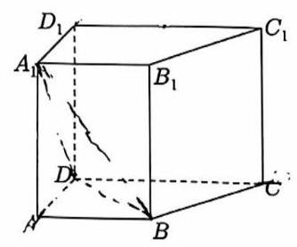
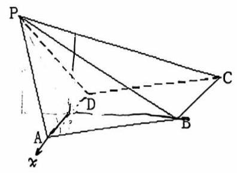

# 课后练习 9

1. 在正三棱柱 ${ABC} - {A}_{1}{B}_{1}{C}_{1}$ 中， ${AB} = {A{A}_{1}}$ ，则 ${A{C}_{1}}$ 与平面 $B{B}_{1}{C}_{1}C$ 所成的角的正弦值为()

::: choices

- A. $\frac{\sqrt{2}}{2}$
- B. $\frac{\sqrt{6}}{4}$
- C. $\frac{\sqrt{15}}{54}$
- D. $\frac{\sqrt{6}}{3}$
  :::

2. 三条射线 ${OA},{OB},{OC}$ 两两成 ${60}^{ \circ }$ 角,则直线 ${OA}$ 与平面 ${OBC}$ 的成角为( )

::: choices

- A. 60°
- B. 45°
- C. $\arccos \frac{\sqrt{3}}{3}$
- D. $\arccos \frac{\sqrt{6}}{3}$
  :::

3. 已知正方形 ${ABCD}$ 折成直二面角 $A - {BD} - C$ ，则二面角 $B - {CD} - A$ 的大小为( )

::: choices

- A. 60°
- B. 45°
- C. $\arccos \frac{1}{3}$
- D. $\arctan \sqrt{2}$
  :::

4. 二面角 $\alpha - l - \beta$ 的度数为 ${120}^{ \circ }, A, B \in l,{AC} \subset \alpha ,{BD} \subset \beta ,{AC} \bot l,{BD} \bot l$ ,若 ${AB} = {AC} = {BD} = 1$ , 则 ${CD}$ 等于\_\_\_。

5. 【23 上海高考 17】直四棱柱 ${ABCD} - {A}_{1}{B}_{1}{C}_{1}{D}_{1}$ ， ${AB}//{DC}$ ， ${AB}\bot {AD}$ ， ${AB} = 2$ ， ${AD} = 3$ ， ${DC} = 4$ .

(1)求证: ${A}_{1}B \bot$ 平面 ${DC}{C}_{1}{D}_{1}$ ；

(2)若四棱柱 ${ABCD} - {A}_{1}{B}_{1}{C}_{1}{D}_{1}$ 的体积为 36，求二面角 ${A}_{1} - {BD} - A$ 的大小.

6. 如图，已知四棱锥 $P - {ABCD}$ ， ${PB}\bot {AD}$ ，侧面 ${PAD}$ 为边长等于 2 的正三角形，底面 ${ABCD}$ 为菱形,侧面 ${PAD}$ 与底面 ${ABCD}$ 所成的二面角为 ${120}^{ \circ }$ 。

(1)求点 $P$ 到平面 ${ABCD}$ 的距离；(2)求面 ${APB}$ 与面 ${CPB}$ 所成锐二面角的大小。

