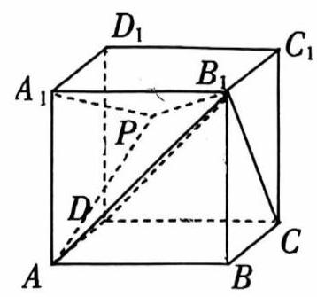
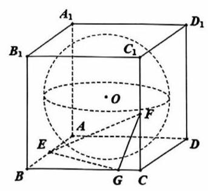
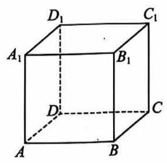

# 课后练习 10

1. 已知正方体 ${ABCD} - {A}_{1}{B}_{1}{C}_{1}{D}_{1}$ ，空间一动点 $P$ 满足 ${A}_{1}P \bot A{B}_{1}$ ，且 $\angle {AP}{B}_{1} = \angle {AD}{B}_{1}$ ，则点 $P$ 的轨迹为 ( )

::: choices

- A. 直线
- B. 圆
- C. 椭圆
- D. 抛物线
  :::

在一个棱长为 10 的密封正方体盒子中, 放一个半径为 1 的小球, 任意摇动盒子, 则小球在盒子中不能接触到的内壁面积为\_\_\_；

3. 如图:棱长为 2 的正方体 ${ABCD} - {A}_{1}{B}_{1}{C}_{1}{D}_{1}$ 的内切球为球 $O$ ， $E$ 、 $F$ 分别是棱 ${AB}$ 和棱 ${C{C}_{1}}$ 的中点， $G$ 在棱 ${BC}$ 上移动，则下列命题正确的有\_\_\_

① 存在点 $G$ ，使 ${OD}$ 垂直于平面 ${EFG}$ ；

② 对于任意点 $G,{OA}$ 平行于平面 ${EFG}$

③ 直线 ${EF}$ 被球 $O$ 截得的弦长为 $\sqrt{2}$ ；

③ 过直线 ${EF}$ 的平面截球 $O$ 所得的所有截面圆中,半径最小的圆的面积为 $\frac{\pi }{2}$ .

4. 已知 $A{A}_{1}$ 是圆柱的一条母线， ${AB}$ 是圆柱下底面的直径， $C$ 是圆柱下底面圆周上异于 $A$ ， $B$ 的点，若圆柱的侧面积为 ${4\pi }$ ，则三棱锥 ${A}_{1} - {ABC}$ 外接球体积的最小值为\_\_\_

5. 【2024 崇明一模 15】已知点 $M$ 为正方体 ${ABCD} - {A}_{1}{B}_{1}{C}_{1}{D}_{1}$ 内部(不包含表面)的一点. 给出下列两个命题:

${q}_{1}$ : 过点 $M$ 有且只有一个平面与 $A{A}_{1}$ 和 ${B}_{1}{C}_{1}$ 都平行;

${q}_{2}$ : 过点 $M$ 至少可以作两条直线与 $A{A}_{1}$ 和 ${B}_{1}{C}_{1}$ 所在的直线都相交.

则以下说法正确的是( )

::: choices

- A. 命题 ${q}_{1}$ 是真命题,命题 ${q}_{2}$ 是假命题
- B. 命题 ${q}_{1}$ 是假命题,命题 ${q}_{2}$ 是真命题
- C. 命题 ${q}_{1}\text{ 、 }{q}_{2}$ 都是真命题
- D. 命题 ${q}_{1}\text{ 、 }{q}_{2}$ 都是假命题
  :::

6. 【2024 金山一模 15】如图，在正方体 ${ABCD} - {A}_{1}{B}_{1}{C}_{1}{D}_{1}$ 中， $E$ 、 $F$ 为正方体内(含边界)不重合的两个动点, 下列结论错误的是 ( )

::: choices

- A. 若 $E \in B{D}_{1}, F \in {BD}$ ,则 ${EF} \bot {AC}$
- B. 若 $E \in B{D}_{1}, F \in {BD}$ ,则平面 ${BEF} \bot$ 平面 ${A}_{1}B{C}_{1}$
- C. 若 $E \in {AC}, F \in C{D}_{1}$ ,则 ${EF}//$ 平面 ${A}_{1}B{C}_{1}$
- D. 若 $E \in {AC}, F \in C{D}_{1}$ ,则 ${EF}//A{D}_{1}$
  :::

7. 正三棱锥 $P - {ABC}$ 的侧棱两两成 ${40}^{ \circ }$ 角，侧棱长为 $1, D, E$ 分别为 ${PB},{PC}$ 上的点，则 $\bigtriangleup {ADE}$ 的周长的最小值为\_\_\_.

8. 如图，已知正方体 ${ABCD} - {A}_{1}{B}_{1}{C}_{1}{D}_{1}$ 的棱长为 1，点 $M$ 为棱 ${AB}$ 的中点，点 $P$ 在侧面 ${BC}{C}_{1}{B}_{1}$ 及其边界上运动,则 ${2PM} + P{D}_{1}$ 的最小值为\_\_\_

9. 在四棱锥 $S - {ABCD}$ 中,已知 ${SA} \bot$ 底面 ${ABCD},{AB}//{CD},{AB} \bot {AD},{AB} = 2\sqrt{2},{AD} = {CD} = 4, M$ 是平面 ${SAD}$ 内的动点，且满足 $\angle {CMD} = \angle {BMA}$ ，则当四棱锥 $M - {ABCD}$ 的体积最大时，三棱锥 $M - {ACD}$ 外接球的表面积为\_\_\_

