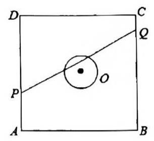

# 课后练习 12

1. 直线 $x\cos \theta + y\sin \theta + c = 0\left( {\theta \in \mathbf{R}}\right)$ 必 ( ).

::: choices

- (A) 过某个定点
- (B) 与某个定圆相切
- (C) 与某定直线平行
- (D) 与某定直线垂直
  :::

2. 设集合 $P = \left\{ {\left( {x, y}\right) \mid {\left( x + 2\right) }^{2} + {\left( y - 3\right) }^{2} \leq 4}\right\} , Q = \left\{ {\left( {x, y}\right) \mid {\left( x + 1\right) }^{2} + {\left( y - m\right) }^{2} < \frac{1}{4}}\right\}$ ,且 $P \cap Q = Q$ ,则实数 $m$ 的取值范围为\_\_\_。

3. 过点 $P\left( {\frac{1}{2}, - 2}\right)$ 作圆 $C : {\left( x - \frac{4}{3}m\right) }^{2} + {\left( y - m + 1\right) }^{2} = 1,\left( {m \in R}\right)$ 的切线,切点分别为 $A$ 和 $B$ ,则 $\overrightarrow{PA} \cdot \overrightarrow{PB}$ 的最小值为\_\_\_

4. 如图，已知点 $P\left( {2,0}\right)$ ，且正方形 ${ABCD}$ 内接于圆 $O : {x}^{2} + {y}^{2} = 1$ ， $M$ 、 $N$ 分别为边 ${AB}$ 、 ${BC}$ 的中点. 当正方形 ${ABCD}$ 绕圆心 $O$ 旋转时， $\overrightarrow{PM} \cdot \overrightarrow{ON}$ 的取值范围是\_\_\_.

5. 设圆 $O$ 是单位圆，正方形边 ${AB}$ 垂直于 $x$ 轴且为圆 $O$ 的一条弦，则 $\left| {OD}\right|$ 的取值范围是 \_\_\_.

6. 如图，正方形 ${ABCD}$ 的边长为 20 米，圆 $O$ 的半径为 1 米，圆心是正方形的中心，点 $P, Q$ 分别在线段 ${AD},{CB}$ 上,若线段 ${PQ}$ 与圆 $O$ 有公共点,则称点 $Q$ 在点 $P$ 的 “盲区” 中,已知点 $P$ 以 ${1.5}\mathrm{\;m}/\mathrm{s}$ 的速度从 $A$ 出发向 $D$ 移动。同时,点 $Q$ 以 $1\mathrm{m}/\mathrm{s}$ 的速度从 $C$ 出发向 $B$ 移动,则在点 $P$ 从 $A$ 移动到 $D$ 的过程中,点 $Q$ 在点 $P$ 的盲区中的时长约\_\_\_秒(精确到 0.1)

7. 如图，已知满足条件 $\left| {z - {3i}}\right| = \left| {\sqrt{3} - i}\right|$ 的复数 $z$ 在复平面 ${xOy}$ 对应点的轨迹为圆 $C$ (圆心为 $C$ )，设复平面 ${xOy}$ 上的复数 $z = x + {yi}\left( {x \in R, y \in R}\right)$ 对应的点为 $\left( {x, y}\right)$ ,定直线 $m$ 的方程为 $x + {3y} + 6 = 0$ ,过 $A\left( {-1,0}\right)$ 的一条动直线 $l$ 与直线 $m$ 相交于 $N$ 点，于圆 $C$ 相交于 $P, Q$ 两点， $M$ 是弦 ${PQ}$ 的中点；

(1)若直线 $l$ 经过圆心 $C$ ，求证: $l$ 与 $m$ 垂直；

(2)当 $\left| {PQ}\right| = 2\sqrt{3}$ 时，求直线 $l$ 的方程；

(3)设 $t = \overrightarrow{AM} \cdot \overrightarrow{AN}$ ，试问 $t$ 是否为定值？若为定值，请求出 $t$ 的值；若不是定值，请说明理由

