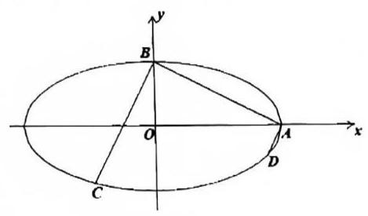
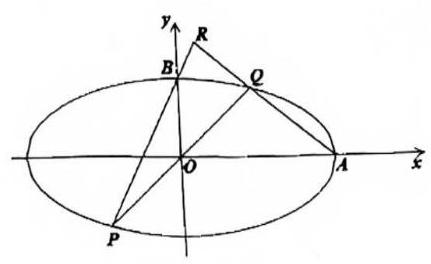

# 第十六讲椭圆与双曲线 III

### 必背公式回顾

<table><tr><td rowspan="5">统一标准式 $\frac{{x}^{2}}{{\lambda }^{2}} + \frac{{y}^{2}}{{\mu }^{2}} = 1$</td><td>圆: $\lambda ,\mu$ 为相等实数</td><td colspan="2">$\lambda = \mu = r$</td></tr><tr><td>椭圆: $\lambda ,\mu$ 为不等实数</td><td colspan="2">大的为 $a$ ,小的为 $b$</td></tr><tr><td>双曲线: $\lambda ,\mu$ 一虚一实</td><td colspan="2">实数为 $a$ ,虚数 (模长) 为 $b$   渐近线: $y = \pm \left| \frac{\mu }{\lambda }\right| x$</td></tr><tr><td colspan="3">$c = \sqrt{\left| {\lambda }^{2} - {\mu }^{2}\right| },\;e = \frac{c}{a}$</td></tr><tr><td colspan="2">设 $y = {kx} + m$</td><td>直线过 $x$ 轴定点，或表达式用 $y$ 更方便时设 $x = {ty} + n \; \lambda ,\mu$ 互换、 $x, y$ 互换、 $k$ 变 t、 $m$ 变 n</td></tr><tr><td>联立方程</td><td colspan="2">$\left( {{\lambda }^{2}{k}^{2} + {\mu }^{2}}\right) {x}^{2} + 2{\lambda }^{2}{kmx} + {\lambda }^{2}\left( {{m}^{2} - {\mu }^{2}}\right) = 0$</td><td>$\left( {{\mu }^{2}{t}^{2} + {\lambda }^{2}}\right) {y}^{2} + 2{\mu }^{2}{tny} + {\mu }^{2}\left( {{n}^{2} - {\lambda }^{2}}\right) = 0$</td></tr><tr><td>$\Delta$</td><td colspan="2">$\Delta = {\left( 2\lambda \mu \right) }^{2}\left( {{\lambda }^{2}{k}^{2} + {\mu }^{2} - {m}^{2}}\right)$</td><td>$\Delta = {\left( 2\mu \lambda \right) }^{2}\left( {{\mu }^{2}{t}^{2} + {\lambda }^{2} - {n}^{2}}\right)$</td></tr><tr><td>$\left| {{x}_{1} - {x}_{2}}\right|$</td><td colspan="2">$\left| {{x}_{1} - {x}_{2}}\right| = \frac{\sqrt{\Delta }}{\left| {\lambda }^{2}{k}^{2} + {\mu }^{2}\right| }$</td><td>$\left| {{y}_{1} - {y}_{2}}\right| = \frac{\sqrt{\Delta }}{\left| {\mu }^{2}{t}^{2} + {\lambda }^{2}\right| }$</td></tr><tr><td>弦长</td><td colspan="2">$\sqrt{1 + {k}^{2}}\frac{\sqrt{\Delta }}{\left| {\lambda }^{2}{k}^{2} + {\mu }^{2}\right| }$</td><td>$\sqrt{1 + {t}^{2}}\frac{\sqrt{\Delta }}{\left| {\mu }^{2}{t}^{2} + {\lambda }^{2}\right| }$</td></tr><tr><td>弦中点 $M$</td><td colspan="2">$k \cdot {k}_{OM} = - \frac{{\mu }^{2}}{{\lambda }^{2}}$</td><td>$t \cdot {t}_{OM} = - \frac{{\lambda }^{2}}{{\mu }^{2}}$</td></tr><tr><td>极线</td><td colspan="3">$\frac{{x}_{0}x}{{\lambda }^{2}} + \frac{{y}_{0}y}{{\mu }^{2}} = 1$</td></tr></table>

## 一、目标函数: 面积

1. 已知 ${F}_{1},{F}_{2}$ 分别是椭圆 $E : \frac{{x}^{2}}{12} + \frac{{y}^{2}}{3} = 1$ 的左，右焦点， $A$ 为 $E$ 的左顶点， $B$ 为 $E$ 的上顶点， $M$ 是 $E$ 上第四象限内一点， ${AM}$ 与 $y$ 轴交于点 $C,{BM}$ 与 $x$ 轴交于点 $D$ .

(1)证明:四边形 ${ABDC}$ 的面积是定值.

(2)求 $\bigtriangleup {CDM}$ 的面积的最大值.

2. 已知椭圆 $\Gamma : \frac{{x}^{2}}{{a}^{2}} + \frac{{y}^{2}}{{b}^{2}} = 1\left( {a > b > 0}\right) , A\text{ 、 }B$ 分别为 $\Gamma$ 的右顶点、上顶点.

(1)求以原点 $O$ 为圆心，且与直线 ${AB}$ 相切的圆的方程；

(2)过 $A\text{ 、 }B$ 作直线 ${AB}$ 的垂线，分别交椭圆 $\Gamma$ 于点 $D\text{ 、 }C$ ，若 ${BC} = {3AD}$ ，求 $\frac{a}{b}$ 的值；

(3)设 $a = 2, b = 1, P$ 是椭圆 $\Gamma$ 上非顶点的任意一点， $Q$ 是 $P$ 关于原点的对称点，直线 ${AQ}$ 与 ${BP}$ 交于点 $R$ ,求 $\bigtriangleup {PQR}$ 面积的最大值.

20(2)图

20(3)图

## 二、目标函数: 线段长

3. 曲线 ${x}^{2} - \frac{{y}^{2}}{a} = 1$ 与曲线 $\frac{{x}^{2}}{49} + \frac{{y}^{2}}{a} = 1\left( {a > 0}\right)$ 在第一象限的交点为 $A$ ,曲线 $C$ 是 ${x}^{2} - \frac{{y}^{2}}{a} = 1\left( {1 \leq x \leq {x}_{A}}\right)$ 和 $\frac{{x}^{2}}{49} + \frac{{y}^{2}}{a} = 1\left( {x \geq {x}_{A}}\right)$ 组成的封闭图形,曲线 $C$ 与 $x$ 轴的左交点为 $M$ ,右交点为 $N$ .

(1)设曲线 ${x}^{2} - \frac{{y}^{2}}{a} = 1$ 与曲线 $\frac{{x}^{2}}{49} + \frac{{y}^{2}}{a} = 1\left( {a > 0}\right)$ 具有相同的右焦点 $F$ ，求线段 ${AF}$ 的方程；

(2)在 1 )的条件下，曲线 $C$ 上存在多少个点 $S$ ，使得 $\left| {NS}\right| = \left| {NF}\right|$ ，请说明理由；

(3)设过原点 $O$ 的直线 $l$ 与以 $D\left( {t,0}\right) \left( {t > 0}\right)$ 为圆心的圆相切，其中圆的半径小于 1，切点为 $T$ ，直线 $l$ 与曲线 $C$ 在第一象限的两个交点为 $P, Q$ ,当 $\frac{1}{{\overrightarrow{OP}}^{2}} + \frac{1}{{\overrightarrow{OQ}}^{2}} = {\overrightarrow{OT}}^{2}$ 对任意直线 $l$ 恒成立,求 $t$ 的值.

4. 已知椭圆 $C : \frac{{x}^{2}}{{a}^{2}} + \frac{{y}^{2}}{{b}^{2}} = 1\left( {a > b > 0}\right)$ 的右顶点为 $\mathrm{A}$

(1)当 $a = 2, b = 1$ ，椭圆 $C$ 上存在点 $P$ ，使得 $\angle {OPA} = {90}^{ \circ }$ ，求点 $P$ 的横坐标；

(2)若椭圆 $C$ 上存在点 $P$ ，使得 $\angle {OPA} = {90}^{ \circ }$ ，求 $a$ 、 $b$ 满足的条件；

(3)当 $a = 2$ ， $b = 1$ ，椭圆 $C$ 上存在点 $P$ ，过点 $Q\left( {-4\text{ , }0}\right)$ 任作一动直线 $l$ 交椭圆 $C$ 于 $M$ 、 $N$ 两点，记 $\overrightarrow{QM} = \lambda \overrightarrow{QN}$ ，若在线段 ${MN}$ 上取一点 $R$ ，使得 $\overrightarrow{MR} = \lambda \overrightarrow{RN}$ ，求证:当直线 $l$ 转动时，点 $R$ 在某一直线上运动, 并求该定直线的方程。
