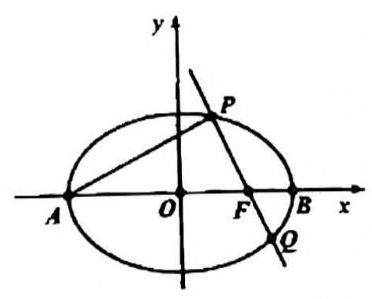
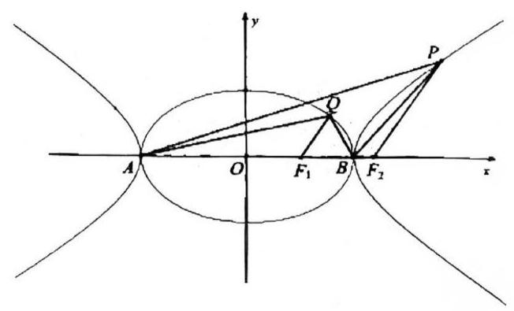
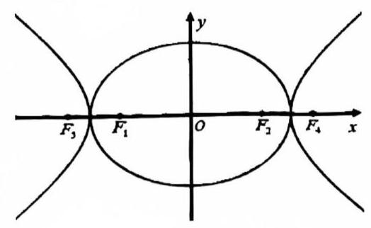
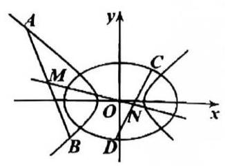

# 第十七讲椭圆与双曲线 IV

## 三、目标函数: 斜率

1. 在平面直角坐标系 ${xOy}$ 中,已知椭圆 $\Gamma : \frac{{x}^{2}}{{a}^{2}} + \frac{{y}^{2}}{{b}^{2}} = 1\left( {a > b > 0}\right)$ 的左右顶点分别为 $A, B$ ,右焦点为 $F$ ,且椭圆 $\Gamma$ 过点 $\left( {0,\sqrt{5}}\right) ,\left( {2,\frac{5}{3}}\right)$ ,过点 $F$ 的直线 $l$ 与椭圆 $\Gamma$ 交于 $P, Q$ 两点 (点 $P$ 在 $x$ 轴的上方).

(1)求椭圆 $\Gamma$ 的标准方程；

(2)若 $\overline{PF} + 2\overline{QF} = \overline{0}$ ，求点 $P$ 的坐标；

(3)设直线 ${AP},{BQ}$ 的斜率分别为 ${k}_{1},{k}_{2}$ ，是否存在常数 $\lambda$ ，使得 ${k}_{1} + \lambda {k}_{2} = 0$ ？若存在，求出 $\lambda$ 的值；若不存在, 说明理由.

2. 已知 $A, B$ 为椭圆 $\frac{{x}^{2}}{{a}^{2}} + \frac{{y}^{2}}{{b}^{2}} = 1\left( {a > b > 0}\right)$ 和双曲线 $\frac{{x}^{2}}{{a}^{2}} - \frac{{y}^{2}}{{b}^{2}} = 1$ 的公共顶点， $P, Q$ 分别为双曲线和椭圆上不同于 $A, B$ 的动点,且满足 $\overrightarrow{AP} + \overrightarrow{BP} = \lambda \left( {\overrightarrow{AQ} + \overrightarrow{BQ}}\right) ,\lambda \in R,\left| \lambda \right| > 1$ ,设直线 ${AP},{BP},{AQ}$ , ${BQ}$ 的斜率分别为 ${k}_{1},{k}_{2},{k}_{3},{k}_{4}$ .

1) 求证: 点 $P, Q, O$ 三点共线;

2) 求 ${k}_{1} + {k}_{2} + {k}_{3} + {k}_{4}$ 的值;

3) 若 ${F}_{1},{F}_{2}$ 分别为椭圆和双曲线的右焦点,且 $Q{F}_{1}//P{F}_{2}$ ,求 ${k}_{1}^{2} + {k}_{2}^{2} + {k}_{3}^{2} + {k}_{4}^{2}$ 的值.

## 四、目标函数: 弦中点与弦中垂线

3. 已知椭圆 ${C}_{1} : \frac{{x}^{2}}{2} + \frac{{y}^{2}}{{b}^{2}} = 1$ 的左右焦点分别为 ${F}_{1},{F}_{2}$ ,离心率为 ${e}_{1}$ ; 双曲线 ${C}_{2} : \frac{{x}^{2}}{2} - \frac{{y}^{2}}{{b}^{2}} = 1$ 的左右焦点分别为 ${F}_{3},{F}_{4}$ ,离心率为 ${e}_{2}$ ,且 ${e}_{1}{e}_{2} = \frac{\sqrt{3}}{2}$ . 过点 ${F}_{1}$ 作不垂直于 $y$ 轴的直线 $l$ 交椭圆 ${C}_{1}$ 于 $A, B$ 两点,点 $M$ 为线段 ${AB}$ 的中点,直线 ${OM}$ 交双曲线 ${C}_{2}$ 于 $P, Q$ 两点.

(1)求 ${C}_{1}$ ， ${C}_{2}$ 的方程；

( 2 )若 $\overrightarrow{A{F}_{1}} = 3\overrightarrow{{F}_{1}B}$ ，求直线 ${PQ}$ 的方程；

(3)求四边形 ${APBQ}$ 面积的最小值.

4. 0 为坐标原点，曲线 ${C}_{1} : \frac{{x}^{2}}{{a}^{2}} - {y}^{2} = 1\left( {a > 0}\right)$ 和曲线 ${C}_{2} : \frac{{x}^{2}}{4} + \frac{{y}^{2}}{2} = 1$ 有公共点，直线 ${l}_{1} : y = {k}_{1}x + {b}_{1}$ 与曲线 ${C}_{1}$ 的左支相交于 $A, B$ 两点,线段 ${AB}$ 的中点为 $M$ .

(1)若曲线 ${C}_{1}$ 和 ${C}_{2}$ 有且仅有两个公共点，求曲线 ${C}_{1}$ 的离心率和渐近线方程；

(2)若直线 ${OM}$ 经过曲线 ${C}_{2}$ 上的点 $T\left( {\sqrt{2}, - 1}\right)$ ，且 ${a}^{2}$ 为正整数，求 $a$ 的值；

(3)若直线 ${l}_{2} : y = {k}_{2}X + {b}_{2}$ 与曲线 ${C}_{2}$ 相交于 $C, D$ 两点，且直线 ${OM}$ 经过线段 ${CD}$ 中点 $N$ ，且直线 ${OM}$ 经过线段 ${CD}$ 中点 $N$ ,证明: ${k}_{1}^{2} + {k}_{2}^{2} > 1$ .

5. 已知椭圆 $\frac{{x}^{2}}{6} + \frac{{y}^{2}}{3} = 1$ 上有两点 $P\left( {-2,1}\right)$ 及 $Q\left( {2, - 1}\right)$ ，直线 $l : y = {kx} + m$ 与椭圆交于 $A$ ， $B$ 两点，与线段 ${PQ}$ 交于点 $C$ (异于 $P, Q$ ).

(1)当 $k = 1$ 且 $\overrightarrow{PC} = \frac{1}{2}\overrightarrow{CQ}$ 时，求直线 $l$ 的方程；

(2)当 $k = 2$ 时，求四边形 ${PAQB}$ 面积的取值范围；

(3)记直线 ${PA},{PB},{QA},{QB}$ 的斜率依次为 ${k}_{1},{k}_{2},{k}_{3},{k}_{4}$ ，当 $m \neq 0$ 且线段 ${AB}$ 的中点 $M$ 在直线 $y = - x$ 上时,计算 ${k}_{1} \cdot {k}_{2}$ 的值,并证明: ${k}_{1}^{2} + {k}_{2}^{2} > 2{k}_{3}{k}_{4}$ .
