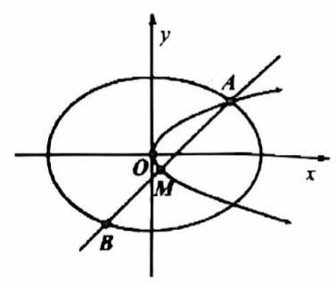

# 第十八讲抛物线 I

## 一、抛物线中的常规问题

1. 已知平面内一动点 $P$ 到点 $F\left( {1,0}\right)$ 的距离与点 $P$ 到 $y$ 轴的距离的差等于 1,设点 $P$ 的轨迹为 $C$ ,过点 $F$ 作两条斜率存在且互相垂直的直线 ${l}_{1},{l}_{2}$ ,设 ${l}_{1}$ 与轨迹 $C$ 相交于点 $A, B,{l}_{2}$ 与轨迹 $C$ 相交于点 $D, E$ ,求 $\overrightarrow{AD} \cdot \overrightarrow{EB}$ 的最小值。

2. 设 ${C}_{1}$ 是以 $F$ 为焦点的抛物线 ${y}^{2} = {2px}\left( {p > 0}\right) ,{C}_{2}$ 是以直线 ${2x} - \sqrt{3}y = 0$ 与 ${2x} + \sqrt{3}y = 0$ 为渐近线，以 $\left( {0,\sqrt{7}}\right)$ 为焦点的双曲线.

(1)求双曲线 ${C}_{2}$ 的标准方程；(2)若 ${C}_{1}$ 与 ${C}_{2}$ 在第一象限有两个公共点 $A$ 、 $B$ ；

① 求 $p$ 的取值范围，并求 $\overrightarrow{FA} \cdot \overrightarrow{FB}$ 的最大值；

② 是否存在正数 $p$ ，使得此时 $\bigtriangleup {FAB}$ 的重心 $G$ 恰好在双曲线 ${C}_{2}$ 的渐近线上？若存在，求出 $p$ 的值；若不存在, 请说明理由.

3. 【2018 上海高考 20 题】设常数 $t > 2$ ，在平面直角坐标系 ${xOy}$ 中，已知点 $F\left( {2,0}\right)$ ，直线 $l : x = t$ ，曲线 $\Gamma : {y}^{2} = {8x}\left( {0 \leq x \leq t, y \geq 0}\right) , l$ 与 $x$ 轴交于点 $A$ 、与 $\Gamma$ 交于点 $B, P\text{ 、 }Q$ 分别是曲线 $\Gamma$ 与线段 ${AB}$ 上的动点.

(1)用 $t$ 表示点 $B$ 到点 $F$ 的距离；

(2)设 $t = 3,\left| {FQ}\right| = 2$ ，线段 ${OQ}$ 的中点在直线 ${FP}$ 上，求 $\bigtriangleup {AQP}$ 的面积；

(3)设 $t = 8$ ，是否存在以 ${FP}\text{ 、 }{FQ}$ 为邻边的矩形 ${FPEQ}$ ，使得点 $E$ 在 $\Gamma$ 上？若存在，求点 $P$ 的坐标；若不存在, 说明理由.

4. 已知椭圆 ${C}_{1} : \frac{{x}^{2}}{2} + {y}^{2} = 1$ ，抛物线 ${C}_{2} : {y}^{2} = {2px}\left( {p > 0}\right)$ ，点 $A$ 是椭圆 ${C}_{1}$ 与抛物线 ${C}_{2}$ 在第一象限的交点， 若存在过点 $A$ 且不过原点的直线 $l$ 交椭圆 ${C}_{1}$ 于点 $B$ ,交抛物线 ${C}_{2}$ 于 $M$ ,使得 $M$ 为线段 ${AB}$ 的中点，求 $p$ 的最大值和 $p$ 取到最大值时直线 $l$ 的方程.

## 二、抛物线中的面积

5. 已知 ${AB}\text{ 、 }{CD}$ 都过抛物线 ${y}^{2} = {2px}$ 焦点且 ${AB} \bot {CD},{AC} \bot {BD}$ ,求 ${ABCD}$ 面积。

6. 已知抛物线 $C$ 顶点在原点，焦点在 $y$ 轴上，抛物线 $C$ 上一点 $Q\left( {a,2}\right)$ 到焦点的距离为 3,线段 ${AB}$ 的两端点 $A\left( {{x}_{1},{y}_{1}}\right) \text{ 、 }B\left( {{x}_{2},{y}_{2}}\right)$ 在抛物线 $C$ 上.

(1)求抛物线 $C$ 的方程；

(2)若 $y$ 轴上存在一点 $M\left( {0, m}\right)$ ( $m > 0$ )，使线段 ${AB}$ 经过点 $M$ 时，以 ${AB}$ 为直径的圆经过原点，求 $m$ 的值;

(3)在抛物线 $C$ 上存在点 $N\left( {{x}_{3},{y}_{3}}\right)$ ，满足 ${x}_{3} < {x}_{1} < {x}_{2}$ ，若 $\bigtriangleup {ABN}$ 是以角 $A$ 为直角的等腰直角三角形，求 $\bigtriangleup {ABN}$ 面积的最小值.
