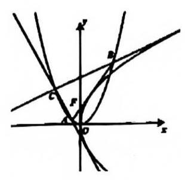

# 第十九讲抛物线 II

## 三、抛物线与切线

1. 已知 $A, B, C$ 是抛物线 ${\Gamma }_{1} : {x}^{2} = y$ 上的三个点,且直线 ${CA},{CB}$ 分别与抛物线 ${\Gamma }_{2} : {y}^{2} = {4x}$ 相切, $F$ 为抛物线 ${\Gamma }_{1}$ 的焦点.

(1)若点 $C$ 的横坐标为 ${x}_{3}$ ，用 ${x}_{3}$ 表示线段 ${CF}$ 的长；

(2)若 ${CA}\bot {CB}$ ，求点 $C$ 的坐标；

(3)证明:直线 ${AB}$ 与抛物线 ${\Gamma }_{2}$ 相切.

2. 已知点 $P$ 在抛物线 $C : {y}^{2} = {4x}$ 上,过点 $P$ 作圆 $M : {\left( x - 3\right) }^{2} + {y}^{2} = {r}^{2}\left( {0 < r \leq \sqrt{2}}\right)$ 的两条切线,与抛物线 $C$ 分别交于 $A, B$ 两点，切线 ${PA},{PB}$ 与圆 $M$ 分别相切于点 $E, F$ .

1)若点 $P$ 到圆心 $M$ 的距离与它到抛物线 $C$ 的准线的距离相等，求点 $P$ 的坐标；

2. 若点 $P$ 的坐标为 $\left( {1,2}\right)$ ,且 $r = \sqrt{2}$ 时,求 $\overrightarrow{PE} \cdot \overrightarrow{PF}$ 的值;

3. 若点 $P$ 的坐标为 $\left( {1,2}\right)$ ,设线段 ${AB}$ 中点的纵坐标为 $t$ ,求 $t$ 的取值范围.

3) 已知抛物线 ${C}_{1} : {y}^{2} = {4ax}\left( {a > 0}\right)$ 和 ${C}_{2} : {x}^{2} = {4y}$ 在第一象限内的交点为 $P,{C}_{1}$ 和 ${C}_{2}$ 在点 $P$ 处的切线分别为 ${l}_{1}$ 和 ${l}_{2}$ ,定义 ${l}_{1}$ 和 ${l}_{2}$ 的夹角为曲线 ${C}_{1},{C}_{2}$ 的夹角.

1. 求点 $P$ 的坐标;

2. 若 ${C}_{1},{C}_{2}$ 的夹角为 $\arctan \frac{3}{4}$ ,求 $a$ 的值;

3. 若直线 ${l}_{3}$ 既是 ${C}_{1}$ 也是 ${C}_{2}$ 的切线,切点分别为 $Q, R$ ,当 $\bigtriangleup {PQR}$ 为直角三角形时,求出相应的 $a$ 的值.

4) 在平面直角坐标系 ${xOy}$ 中,一动圆经过点 $A\left( {\frac{1}{2},0}\right)$ 且与直线 $x = - \frac{1}{2}$ 相切,设该动圆圆心的轨迹为曲线 $M, P$ 是曲线 $M$ 上一点.

1)求曲线 $M$ 的方程；

2. 过点 $A$ 且斜率为 $k$ 的直线 $l$ 与曲线 $M$ 交于 $B, C$ 两点，若 $l//{OP}$ 且直线 ${OP}$ 与直线 $x = l$ 交于 $Q$ 点，求 $\frac{\left| {AB}\right| \cdot \left| {AC}\right| }{\left| {OP}\right| \cdot \left| {OQ}\right| }$ 的值;

3. 若点 $D, E$ 在 $y$ 轴上, $\bigtriangleup {PDE}$ 的内切圆的方程为 ${\left( x - 1\right) }^{2} + {y}^{2} = 1$ ,求 $\bigtriangleup {PDE}$ 面积的最小值.
