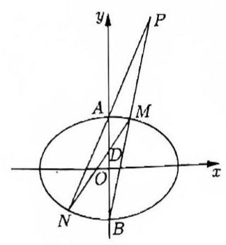

# 第二十讲常见定点、定值、定直线问题 I

1. 已知椭圆 $C : \frac{{x}^{2}}{{a}^{2}} + \frac{{y}^{2}}{{b}^{2}} = 1\left( {a > b > 0}\right)$ 的左、右焦点分别为 ${F}_{1}\text{ 、 }{F}_{2}$ ，设过 ${F}_{2}$ 且不与坐标轴垂直的直线 $l$ 与 $C$ 交于 $P\text{ 、 }Q$ 两点 $M$ 是点 $P$ 关于 $x$ 轴的对称点. 在 $x$ 轴上是否存在一个定点 $N$ ,使得 $M\text{ 、 }Q\text{ 、 }N$ 三点共线,若存在,求出点 $N$ 的坐标; 若不存在,请说明理由.

2. 已知椭圆 $\Gamma : \frac{{x}^{2}}{2} + {y}^{2} = 1$ 的右焦点为 $F$ ，直线 $x = t$ ( $t \in \left( {-\sqrt{2},\sqrt{2}}\right)$ )与该椭圆交于点 $A$ 、 $B$ (点 $A$ 位于 $x$ 轴上方)， $x$ 轴上有一定点 $C\left( {2,0}\right)$ ，直线 ${AF}$ 与直线 ${BC}$ 交于点 $P$ 。求证:点 $P$ 在椭圆 $\Gamma$ 上.

3. 已知椭圆 $C$ 为 $\frac{{x}^{2}}{4} + \frac{{y}^{2}}{1} = 1$ ，设直线 $x = {my} + 1$ 与椭圆交于 $P\text{ 、 }Q$ 点，直线 ${A}_{1}P$ 与 ${A}_{2}Q$ 交于点 $S$ ，试问: $m$ 变化时， $S$ 是否在定直线上。

4. 已知双曲线 $\frac{{x}^{2}}{9} - \frac{{y}^{2}}{16} = 1$ 的左、右顶点为 $A\text{ 、 }B$ ,右焦点为 $F$ 。设过直 $T\left( {9, m}\right)$ 的直线 ${TA}\text{ 、 }{TB}$ 与此双曲线分别交于点 $M\left( {{x}_{1},{y}_{1}}\right) \text{ 、 }N\left( {{x}_{2},{y}_{2}}\right)$ ,求证: 直线 ${MN}$ 过定点。

5. 已知椭圆 $C : \frac{{x}^{2}}{{a}^{2}} + \frac{{y}^{2}}{{b}^{2}} = 1\left( {a > b > 0}\right)$ 过点 $\left( {1,\frac{\sqrt{2}}{2}}\right)$ ，离心率为 $\frac{\sqrt{2}}{2}$ ，点 $A$ 、 $B$ 分别是椭圆 $C$ 的上、下顶点，点 $M$ 是椭圆 $C$ 上异于 $A$ 、 $B$ 的一点.

(1)求椭圆 $C$ 的方程；

(2)若点 $P$ 在直线 $x - y + 2 = 0$ 上，且 $\overrightarrow{BP} = 3\overrightarrow{BM}$ ，求 $\bigtriangleup {PMA}$ 的面积；

(3)过点 $M$ 作斜率为 $k$ 的直线分别交椭圆 $C$ 于另一点 $N$ ，交 $y$ 轴于点 $D$ ，且点 $D$ 在线段 ${OA}$ 上(不包括端点)，直线 ${NA}$ 与直线 ${BM}$ 交于点 $P$ ，求 $\overrightarrow{OD} \cdot \overrightarrow{OP}$ 的值.

