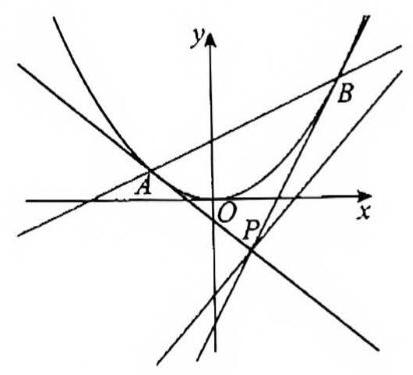

# 课后练习 19

1. 已知抛物线 $C : {x}^{2} = {2py}\left( {p > 0}\right)$ 的焦点坐标为 $\left( {0,1}\right)$

(1)求抛物线方程；

(2)过直线 $y = x - 2$ 上一点 $P\left( {t, t - 2}\right)$ 作抛物线的切线切点为 $A, B$

① 设直线 ${PA}\text{ 、 }{AB}\text{ 、 }{PB}$ 的斜率分别为 ${k}_{1},{k}_{2},{k}_{3}$ ,求证: ${k}_{1},{k}_{2},{k}_{3}$ 成等差数列;

② 若以切点 $B$ 为圆心 $r$ 为半径的圆与抛物线 $C$ 交于 $D, E$ 两点且 $D, E$ 关于直线 ${AB}$ 对称，求点 $P$ 横坐标的取值范围.

2. 的已知点 $R\left( {{x}_{0},{y}_{0}}\right)$ 在 $\Gamma : {y}^{2} = {2px}$ 上，以 $R$ 为切点的 $\Gamma$ 的切线的斜率为 $\frac{p}{{y}_{0}}$ ，过 $\Gamma$ 外一点 $A$ (不在 $x$ 轴上) 作 $\Gamma$ 的切线 ${AB},{AC}$ ,点 $B\text{ 、 }C$ 为切点,作平行于 ${BC}$ 的切线 ${MN}$ (切点为 $D$ ),点 $M\text{ 、 }N$ 分别是与 ${AB}$ 、 ${AC}$ 的交点 (如图)；

(1)用 $B\text{ 、 }C$ 的纵坐标 $s\text{ 、 }t$ 表示直线 ${BC}$ 的斜率；

(2)若直线 ${AD}$ 与 ${BC}$ 的交点为 $E$ ，证明 $D$ 是 ${AE}$ 的中点；

(3)设三角形 $\bigtriangleup {ABC}$ 面积为 $S$ ，若将由过 $\Gamma$ 外一点的两条切线及第三条切线(平行于两切线切点的连线) 围成的三角形叫做“切线三角形”，如 $\bigtriangleup {AMN}$ ，再由 $M$ 、 $N$ 作“切线三角形”，并依这样的方法不断作切线二角形……，试利用“切线三角形”的面积和计算由抛物线及 ${BC}$ 所围成的阴影部分的面积 $T$ ；

3. 若 $A, B$ 是曲线 ${y}^{2} = {4x}$ 上的不同两点,弦 ${AB}$ (不平行于 $y$ 轴) 的垂直平分线与 $x$ 轴相交于点 $P$ ,则称弦 ${AB}$ 是点 $P$ 的一条“相关弦”。给定 ${x}_{0} > 2$ 。

(1)证明:点 $P\left( {{x}_{0},0}\right)$ 的所有“相关弦”的中点的横坐标相同；

(2)点 $P\left( {{x}_{0},0}\right)$ 的“相关弦”的弦长中是否存在最大值？设明理由。

4. 已知抛物线 ${y}^{2} = x, O$ 为坐标原点.

(1)过抛物线焦点 $F$ 的直线交抛物线于 $A, B$ 两点，求 $\overrightarrow{OA} \cdot \overrightarrow{OB}$ 的值；

(2)过抛物线上的一点 $C\left( {{x}_{0},{y}_{0}}\right)$ ，分别作两条直线交抛物线于另外两点 $P\left( {{x}_{P},{y}_{P}}\right)$ ， $Q\left( {{x}_{Q},{y}_{Q}}\right)$ ，交直线 $x = - 1$ 于 ${A}_{1}\left( {-1,1}\right) ,{B}_{1}\left( {-1, - 1}\right)$ 两点,证明: ${y}_{P} \cdot {y}_{Q}$ 为常数;

(3)已知点 $D\left( {1,1}\right)$ ，在抛物线上是否存在异于点 $D$ 的两个不同的点 $M, N$ ，使得 ${DM}\bot {MN}?$ 若存在，求 $N$ 点纵坐标的取值范围；若不存在，请说明理由.

5. 【2019 年上海春考 20 题】已知抛物线 ${y}^{2} = {4x}$ ， $F$ 为焦点， $P$ 为准线 $l$ 上一动点，线段 ${PF}$ 与抛物线交于点 $Q$ ,定义 $d\left( P\right) = \frac{\left| FP\right| }{\left| FQ\right| }$ .

(1)若点 $P$ 坐标为 $\left( {-1, - \frac{8}{3}}\right)$ ，求 $d\left( P\right)$ ；

(2)求证:存在常数 $a$ ，使得 ${2d}\left( P\right) = \left| {FP}\right| + a$ 恒成立；

(3)设 ${P}_{1}\text{ 、 }{P}_{2}\text{ 、 }{P}_{3}$ 为准线 $l$ 上的三点，且 $\left| {{P}_{1}{P}_{2}}\right| = \left| {{P}_{2}{P}_{3}}\right|$ ，试比较 $d\left( {P}_{1}\right) + d\left( {P}_{3}\right)$ 与 ${2d}\left( {P}_{2}\right)$ 的大小.
