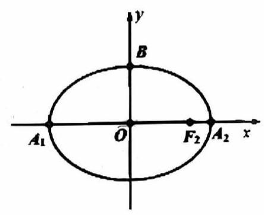

# 课后练习 20

1. 已知椭圆 $C : \frac{{x}^{2}}{4} + \frac{{y}^{2}}{3} = 1$ 的左、右焦点分别为 ${F}_{1}\text{ 、 }{F}_{2}$ ,设过 ${F}_{2}$ 且不与坐标轴垂直的直线 $l$ 与 $C$ 交于 $P\text{ 、 }Q$ 两点, $M$ 是点 $P$ 关于 $x$ 轴的对称点. 在 $x$ 轴上是否存在一个定点 $N$ ,使得 $M\text{ 、 }Q\text{ 、 }N$ 三点共线,若存在,求出点 $N$ 的坐标; 若不存在,请说明理由.

2. 已知椭圆 $\Gamma : \frac{{x}^{2}}{{a}^{2}} + \frac{{y}^{2}}{{b}^{2}} = 1\left( {a > b > 0}\right)$ 的右焦点坐标为 $\left( {2,0}\right)$ ，且长轴长为短轴长的 $\sqrt{2}$ 倍，直线 $l$ 交椭圆 $\Gamma$ 于不同的两点 $M,{N.1}$ ) 求椭圆 $\Gamma$ 的方程；

(1)若直线 $l$ 经过点 $T\left( {0,4}\right)$ ，且 $\bigtriangleup {OMN}$ 的面积为 $2\sqrt{2}$ ，求直线 $l$ 的方程；

(2)若直线 $l$ 的方程为 $y = {kx} + t\left( {k \neq 0}\right)$ ，点 $M$ 关于 $x$ 轴的对称点为 ${M}_{1}$ ，直线 ${MN}$ ， ${M}_{1}N$ 分别与 $x$ 轴相交于 $P, Q$ 两点,证明: $\left| {OP}\right| \cdot \left| {OQ}\right|$ 为定值.

3. 知椭圆 $\Gamma : \frac{{x}^{2}}{8} + \frac{{y}^{2}}{4} = 1$ 的上、下顶点分别为 $A\text{ 、 }B$ ,经过点 $P\left( {0,4}\right)$ 的直线 $l$ 与椭圆 $\Gamma$ 相交于 $M\text{ 、 }N$ 两点 (不同于 $A\text{ 、 }B$ 两点) 。设直线 ${AN}\text{ 、 }{BM}$ 相交于点 $Q\left( {m, n}\right)$ ,求证: $n$ 是定值.

4. 设 ${A}_{1},{A}_{2}$ 分别是相圆 $\Gamma : \frac{{x}^{2}}{{a}^{2}} + {y}^{2} = 1\left( {a > 1}\right)$ 的左右顶点,点 $B$ 为椭圆的上顶点.

(1)若 $\overrightarrow{{A}_{1}B} \cdot \overrightarrow{{A}_{2}B} = - 4$ ，求椭圆 $\Gamma$ 的方程；

(2)设 $a = \sqrt{2}$ ， ${F}_{2}$ 是椭圆的右焦点，点 $Q$ 是椭圆第二象限部分上一点，若线段 ${F}_{2}Q$ 的中点 $M$ 在 $y$ 轴上，求 $\bigtriangleup {F}_{2}{BQ}$ 的面积;

(3)设 $a = 3$ ，点 $P$ 是直线 $x = 6$ 上的动点，点 $C, D$ 是椭圆上异于左右顶点的两点，且 $C, D$ 分别在直线 $P{A}_{1}, P{A}_{2}$ 上,证明: 直线 ${CD}$ 恒过一定点.

