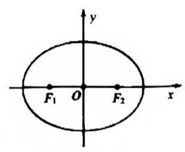

# 课后练习 21

1. 已知椭圆 $\Gamma : \frac{{x}^{2}}{12} + \frac{{y}^{2}}{8} = 1$ 的左、右焦点分别为 ${F}_{1},{F}_{2}$ ,过点 ${F}_{1}$ 的直线 $l$ 交椭圆于 $A, B$ 两点,交 $y$ 轴于点 $P\left( {0, t}\right)$ .

(1)若 ${F}_{1}P \bot {F}_{2}P$ ，求 $t$ 的值；

(2)若点 $A$ 在第一象限，满足 $\overrightarrow{{F}_{1}A} \cdot \overrightarrow{{F}_{2}A} = 7$ ，求 $t$ 的值；

(3)在平面内是否存在定点 $Q$ ，使得 $\overrightarrow{QA} \cdot \overrightarrow{QB}$ 为定值？若存在，求出点 $Q$ 的坐标；若不存在，说明理由.

2. 知椭圆 $C : \frac{{x}^{2}}{t} + {y}^{2} = 1\left( {t > 1}\right)$ 的左右焦点分别为 ${F}_{1},{F}_{2}$ ,直线 $l : y = {kx} + m\left( {m \neq 0}\right)$ 与椭圆 $C$ 交于 $M$ , $N$ 两点 ( $M$ 点在 $N$ 点的上方),与 $y$ 轴交于点 $E$ .

1) 当 $t = 2$ 时,点 $A$ 为椭圆 $C$ 除顶点外任一点,求 $\bigtriangleup A{F}_{1}{F}_{2}$ 的周长;

2) 当 $t = 3$ 且直线 $l$ 过点 $D\left( {-1,0}\right)$ 时,设 $\overline{EM} = \lambda \overline{DM},\overrightarrow{EN} = \mu \overrightarrow{DN}$ ,证明: $\lambda + \mu$ 为定值,并求出该值;

3) 若椭圆 $C$ 的离心率为 $\frac{\sqrt{3}}{2}$ ，求 $k$ 的值，使 ${\left| OM\right| }^{2} + {\left| ON\right| }^{2}$ 为定值，并求此时 $\bigtriangleup {MON}$ 面积的最大值.

3. 已知双曲线 $\Gamma : \frac{{x}^{2}}{4} - \frac{{y}^{2}}{12} = 1, F$ 为左焦点， $P$ 为直线 $x = 1$ 上一动点， $Q$ 为线段 ${PF}$ 与 $\Gamma$ 的交点. 定义:

$$
d\left( P\right)  = \frac{\left| FP\right| }{\left| FQ\right| }
$$

1. 若点 $Q$ 的纵坐标为 $\sqrt{15}$ ,求 $d\left( P\right)$ 的值;

2. 设 $d\left( P\right) = \lambda$ ,点 $P$ 的纵坐标为 $t$ ,试将 ${t}^{2}$ 表示成 $\lambda$ 的函数并求其定义域:

3. 证明: 存在常数 $m, n$ ,使得 ${md}\left( P\right) = \left| {FP}\right| + n$ .

4) 已知椭圆 $E : \frac{{x}^{2}}{{a}^{2}} + \frac{{y}^{2}}{{b}^{2}} = 1\left( {a > b > 0}\right)$ 的左右焦点分别为 ${F}_{1},{F}_{2}$ ,短轴两个端点为 $A, B$ ,且四边形 ${F}_{1}A{F}_{2}B$ 是边长为 2 的正方形。

(1)求椭圆方程；

(2)若 $C, D$ 分别是椭圆长轴的左右端点，动点 $M$ 满足 ${MD}\bot {CD}$ ，连接 ${CM}$ ，交椭圆于点 $P$ 。证明: $\overrightarrow{OM} \cdot \overrightarrow{OP}$ 为定值。

5. 已知椭圆 $\frac{{x}^{2}}{{a}^{2}} + \frac{{y}^{2}}{{b}^{2}} = 1\left( {a > b > 0}\right)$ ，直线 $l$ 与椭圆交于 $P, Q$ 两点，与 $x$ 轴交于点 $N$ 。若 $A$ 为该椭圆上的点，且 ${k}_{AP} \cdot {k}_{AQ}$ 为定值。请证明: $N$ 为定点是 $A$ 为椭圆左右顶点的充要条件。
