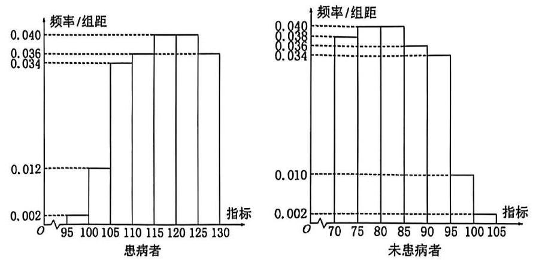

# 函数题目汇编（教师版）

来源：2025-2026_Q老师高三数学145秋季讲义_公式识别版.md

## 一、等差数列与等比数列的基本性质
4. 设 $\left\{  {a}_{n}\right\}$ 和 $\left\{  {b}_{n}\right\}$ 是两个等差数列,记 ${c}_{n} = \max \left\{  {{b}_{1} - {a}_{1}n,{b}_{2} - {a}_{2}n,\cdots {b}_{n} - {a}_{n}n}\right\}$ ,其中 $n \in  {N}^{ * }$ , $\max \left\{  {{x}_{1},{x}_{2},\cdots {x}_{s}}\right\}$ 表示 ${x}_{1},{x}_{2},\cdots {x}_{s}$ 这 $s$ 个数中最大的数。

(1)若 ${a}_{n} = n,{b}_{n} = {2n} - 1$ ，求 ${c}_{1},{c}_{2},{c}_{3}$ 的值，并证明 $\left\{  {c}_{n}\right\}$ 是等差数列；

(3)证明:或者对任意正数 $M$ ，存在正整数 $m$ ，当 $n \geq  m$ 时， $\frac{{c}_{n}}{n} > M$ ；或者存在正整数 $m$ ，使得 ${c}_{m},{c}_{m + 1},{c}_{m + 2},\cdots$ 是等差数列。

## 二、等差数列的和数列

等差数列 $\left\{  {a}_{n}\right\}$ 的求和式 ${S}_{n}$ 可由以下两个公式计算得到:

① ${S}_{n} = n{a}_{1} + \frac{1}{2}n\left( {n - 1}\right) d$ ② ${S}_{n} = \frac{1}{2}n\left( {{a}_{1} + {a}_{n}}\right)$ ③ ${S}_{n} = \frac{1}{2}n\left( {{a}_{p} + {a}_{q}}\right) \;\left( {p + q = n + 1}\right)$

若 $\left\{  {a}_{n}\right\}$ 为等差数列,则 $\frac{{S}_{n}}{n}$ 也为等差数列,且公差为 $\frac{d}{2}$

等差数列 $\left\{  {a}_{n}\right\}$ 的和数列 ${S}_{n}$ 的单调性判定方式:

① ${a}_{n} > 0$ 则递增， ${a}_{n} < 0$ 则递减， ${a}_{n} = 0$ 不变

② 将 ${S}_{n} = \frac{d}{2}{n}^{2} + \left( {{a}_{1} - \frac{d}{2}}\right) n$ 视为一个过原点的二次函数

## 二、N 配对型结构
5. 已知函数 $f\left( x\right)  = \sin \frac{\pi x}{3}$ ，数列 $\left\{  {a}_{n}\right\}$ 满足 ${a}_{1} = 1$ ，且 ${a}_{n + 1} = \left( {1 + \frac{1}{n}}\right) {a}_{n} + \frac{1}{n}$ ( $n$ 为正整数)，则 $f\left( {a}_{2022}\right)  =$ ___

## 三、周期规律型
11. 已知定义在实数集 $\mathbf{R}$ 上的函数 $f\left( x\right)$ 满足 $f\left( {x + 1}\right)  = \frac{1}{2} + \sqrt{f\left( x\right)  - {f}^{2}\left( x\right) }$ ,则 $f\left( 0\right)  + f\left( {2021}\right)$ 的最大值为___

A. $\frac{1}{2}$ B. $\frac{3}{2}$ C. $1 - \frac{\sqrt{2}}{2}$ D. $1 + \frac{\sqrt{2}}{2}$

12. 已知数列 $\left\{  {a}_{n}\right\}$ 满足 ${a}_{1} = 1,{a}_{n + 1} - {a}_{n} = {\left( -\frac{1}{2}\right) }^{n}$ ,存在正偶数 $n$ 使得 $\left( {{a}_{n} - \lambda }\right) \left( {{a}_{n + 1} + \lambda }\right)  > 0$ ,且对任意正奇数 $n$ 有 $\left( {{a}_{n} - \lambda }\right) \left( {{a}_{n + 1} + \lambda }\right)  < 0$ ，则实数 $\lambda$ 的取值范围是___

## 四、数列的函数性质

## 二、不动点图
7. 【2025 黄浦一模 16】设函数 $y = f\left( x\right)$ 在区间 $I$ 上有导函数 $y = {f}^{\prime }\left( x\right)$ ，且 ${f}^{\prime }\left( x\right)  < 0$ 在区间 $I$ 上恒成立， 对任意的 $x \in  I$ ，有 $f\left( x\right)  \in  I$ . 对于各项均不相同的数列 $\left\{  {a}_{n}\right\}$ ， ${a}_{1} \in  I$ ， ${a}_{n + 1} = f\left( {a}_{n}\right)$ ，下列结论正确的是( )

A. 数列 $\left\{  {a}_{{2n} - 1}\right\}$ 与 $\left\{  {a}_{2n}\right\}$ 均是严格增数列

B. 数列 $\left\{  {a}_{{2n} - 1}\right\}$ 与 $\left\{  {a}_{2n}\right\}$ 均是严格减数列

C. 数列 $\left\{  {a}_{{2n} - 1}\right\}$ 与 $\left\{  {a}_{2n}\right\}$ 中的一个是严格增数列,另一个是严格减数列

D. 数列 $\left\{  {a}_{{2n} - 1}\right\}$ 与 $\left\{  {a}_{2n}\right\}$ 均既不是严格增数列也不是严格减数列

## 一、第一类球盒分配
3. 知两个实数集合 $A = \left\{  {{a}_{1},{a}_{2},\cdots ,{a}_{100}}\right\}  , B = \left\{  {{b}_{1},{b}_{2},\cdots ,{b}_{50}}\right\}$ ,若函数 $f\left( x\right)$ 的定义域和值域分别为 $A$ 和 $B$ ,且使得 $f\left( {a}_{1}\right)  \leq  f\left( {a}_{2}\right)  \leq  \cdots  \leq  f\left( {a}_{100}\right)$ ,求这样的函数有多少个?

## 二、第二类球盒分配

## 一、发现关键控制项
6. 如果数列同时满足以下四个条件:(1) ${u}_{i} \in  \mathbf{Z}\left( {i = 1,2,\cdots ,{10}}\right)$ ；(2)点 $\left( {{u}_{5},{2}^{{u}_{2} + {u}_{6}}}\right)$ 在函数 $y = {4}^{x}$ 的图像上; (3) 向量 $\bar{a} = \left( {1,{u}_{1}}\right)$ 与 $\bar{b} = \left( {3,{u}_{10}}\right)$ 互相平行; (4) ${u}_{i + 1} - {u}_{i}$ 与 $\frac{2}{{u}_{i + 1} - {u}_{i}}$ 的等差中项为 $\frac{3}{2} \; \left( {i = 1,2,\cdots ,9}\right)$ ; 那么，这样的数列 ${u}_{1}$ ， ${u}_{2}$ ， $\cdots$ ， ${u}_{10}$ 的个数为___

## 二、集合计数

## 二、统计图表
8. 某研究小组经过研究发现某种疾病的患病者与未患病者的某项医学指标有明显差异，经过大量调查，得到如下的患病者和未患病者该指标的频率分布直方图:

利用该指标制定一个检测标准,需要确定临界值 $c$ ,将该指标大于 $c$ 的人判定为阳性,小于或等于 $c$ 的人判定为阴性。此检测标准的漏诊率是将患病者判定为阴性的概率，记为 $p\left( c\right)$ ；误诊率是将未患病者判定为阳性的概率， 记为 $q\left( c\right)$ 。假设数据在组内均匀分布，以事件发生的频率作为相应事件发生的概率。

(1)当漏诊率 $p\left( c\right)  = {0.5}\%$ 时，求临界值 $c$ 和误诊率 $q\left( c\right)$ ；

(2)设函数 $f\left( c\right)  = p\left( c\right)  + q\left( c\right)$ 。当 $c \in  \left\lbrack  {{95},{105}}\right\rbrack$ 时，求 $f\left( c\right)$ 的解析式，并求 $f\left( c\right)$ 在区间 $\left\lbrack  {{95},{105}}\right\rbrack$ 的最小值。

## 三、统计量

## 百分位数

(1)一般地，一组数据的第 $p$ 百分位数是这样一个值，它使得这组数据中至少有 $p\%$ 的数据小于或等于这个值， 且至少有 $\left( {{100} - p}\right) \%$ 的数据大于或等于这个值。

(2)四分位数。常用的分位数有第 25 百分位数,第 50 百分位数(即中位数),第 75 百分位数。这三个分位数把一组由小到大排列后的数据分成四等份，因此称为四分位数。其中第 25 百分位数也称为第一四分位数或下四分位数等，第 75 百分位数也称为第三四分位数或上四分位数等。

(3)确定要求的 $p\%$ 分位数所在分组 $\lbrack A, B)$ ，由频率分布表或频率分布直方图可知，样本中小于 $A$ 的频率为 $a$ ， 小于 $B$ 的频率为 $b$ ，所以 $p\%$ 分位数 $= A +$ 组距 $\times  \frac{p\%  - a}{b - a}$ 。

## 第十讲 导数计算——变量迂回与构造
1. 已知函数 $f\left( x\right)  = 2{\mathrm{e}}^{x} - {x}^{2} + {2ax} - {a}^{2}$ (e 为自然对数的底数)，若 $f\left( x\right)  \geq   - 3$ 在 $x \in  \left( {0, + \infty }\right)$ 上恒成立，则实数 $a$ 的取值范围是___.

3. 设函数 $f\left( x\right)  = {x}^{2} + a\ln \left( {x + 1}\right)$ 的两个极值点为 ${x}_{1},{x}_{2}$ ,且 ${x}_{1} < {x}_{2}$ 。证明: $f\left( {x}_{2}\right)  > \frac{1 - 2\ln 2}{4}$

4. 已知函数 $f\left( x\right)  =  - \ln x + x{e}^{x} + \left( {1 - b}\right) x$ 对任意 $x \in  \left( {0, + \infty }\right)$ ，都有 $f\left( x\right)  \geq  1$ 恒成立，则实数 $b$ 的取值范围为___

5. 设 ${x}_{1}\text{ 、 }{x}_{2}$ 是函数 $f\left( x\right)  = \frac{1}{2}a{x}^{2} - {e}^{x} + 1$ ，且 $\frac{{x}_{2}}{{x}_{1}} \geq  2$ ，则实数 $a$ 的取值范围是___.

6. 已知 ${x}_{1},{x}_{2}$ 是函数 $f\left( x\right)  = {x}^{2} + m\ln x - {2x}, m \in  R$ 的两个极值点，若 ${x}_{1} < {x}_{2}$ ，则 $\frac{f\left( {x}_{1}\right) }{{x}_{2}}$ 的取值范围为

7. 已知函数 $g\left( x\right)  = \frac{1}{2}{x}^{2} - \left( {b + 1}\right) x + \ln x$ ,设 ${x}_{1}\text{ 、 }{x}_{2}\left( {{x}_{1} < {x}_{2}}\right)$ 是函数 $y = g\left( x\right)$ 的两个极值点,若 $b \geq  \frac{3}{2}$ ,且 $g\left( {x}_{1}\right)  - g\left( {x}_{2}\right)  \geq  k$ 恒成立，则实数 $k$ 的取值范围为___

8. 设函数 $f\left( x\right)  = \frac{1}{x} - x + a\ln x\left( {a \in  R}\right)$ 的两个极值点分别为 ${x}_{1},{x}_{2}$ ,若 $\frac{f\left( {x}_{1}\right)  - f\left( {x}_{2}\right) }{{x}_{1} - {x}_{2}} \leq  \frac{2e}{{e}^{2} - 1}a - 2$ 恒成立,则实数 $a$ 的取值范围是___.

## 第十一讲 三角类压轴小题提升

## 一、三角函数的图像变换

- 对于正弦标准形 $f\left( x\right)  = A\sin \left( {{\omega x} + \varphi }\right)  + B$ ,

② 纵向上，相当于将 $y = \sin x$ 先放大 $A$ 倍，再上移 $B$ ；或者先上移 ${AB}$ ，再放大 $A$ 倍。

② 横向上，相当于将 $y = \sin x$ 先左移 $\varphi$ ，再缩小 $\omega$ 倍；或者先缩小 $\omega$ 倍，再左移 $\frac{\varphi }{\omega }$ 。

## 一、三角函数的图像变换
1. 若函数 $y = f\left( x\right)$ 的图像可由函数 $y = 3\sin {2x} - \sqrt{3}\cos {2x}$ 的图像向右平移 $\varphi \left( {0 < \varphi  < \pi }\right)$ 个单位所得到,且函数 $y = f\left( x\right)$ 在区间 $\left\lbrack  {0,\frac{\pi }{2}}\right\rbrack$ 上是严格减函数,则 $\varphi  =$ ___.

## 三、等间距点列问题
6. 已知函数 $f\left( x\right)  = 2\sin \left( {\omega x}\right) \left( {\omega  > 0}\right)$ 的图像相邻两条对称轴之间的距离为 $\frac{\pi }{2}$ ，将 $f\left( x\right)$ 的图像向右平移 $\frac{\pi }{6}$ 个单位,再向下平移 1 个单位,得到函数 $y = g\left( x\right)$ 的图像。若方程 $g\left( x\right)  = 0$ 在区间 $\left\lbrack  {0, b}\right\rbrack  \left( {b > 0}\right)$ 上至少含有 10 个零点，则 $b$ 的最小值为___。

7. 为了使 $y = \sin \left( {\omega x}\right) \left( {\omega  > 0}\right)$ 在区间 $\left\lbrack  {0,1}\right\rbrack$ 上至少出现 50 次最大值，则 $\omega$ 的最小值是___；若对任何实数 ${x}_{0}$ ，函数 $y = \sin \left( {\omega x}\right) \left( {\omega  > 0}\right)$ 在区间 $\left\lbrack  {{x}_{0},{x}_{0} + 1}\right\rbrack$ 上至少出现 50 次最大值，则 $\omega$ 的最小值是___

8. 已知函数 $y = 5\cos \left( {\frac{{2k} + 1}{3}{\pi x} - \frac{\pi }{6}}\right)$ (其中 $k \in  \mathbf{N}$ )，对任意实数 $a$ ，在区间 $\left\lbrack  {a, a + 3}\right\rbrack$ 上要使函数值 $\frac{5}{2}\sqrt{2}$ 出现的次数不少于 3 次且不多于 9 次，则 $k$ 的取值集合为___

## 四、单位圆盘

涉及到 $\frac{2\pi }{n}$ 的相关问题,单位圆盘一般是比较适合将问题直观化的武器

## 四、单位圆盘
9. 函数 $f\left( x\right)  = \cos \frac{2\pi }{n}x, x \in  \mathbf{Z}$ 的值域有 6 个实数组成，则非零整数 $n$ 的值是___

## 第十二讲 定点、定值、定直线问题提升
7. 已知双曲线 $C : \frac{{x}^{2}}{{a}^{2}} - \frac{{y}^{2}}{{b}^{2}} = 1\left( {a > 0, b > 0}\right)$ 的一条渐近线的方程为 $y = \sqrt{13}x$ ，它的右顶点与抛物线 $\Gamma$ : ${y}^{2} = 4\sqrt{3}x$ 的焦点重合,经过点 $A\left( {-9,0}\right)$ 且不垂直于 $x$ 轴的直线与双曲线 $C$ 交于 $M, N$ 两点.

(1)求双曲线 $C$ 的标准方程；

(2)若点 $M$ 是线段 ${AN}$ 的中点，求点 $N$ 的坐标；

(3)设 $P, Q$ 是直线 $x =  - 9$ 上关于 $x$ 轴对称的两点，证明:直线 ${PM}$ 与 ${QN}$ 的交点必在直线 $x =  - \frac{1}{3}$ 上.

## 第十三讲 抽象函数分析

## 第十三讲 抽象函数分析
1. 对于正实数 $\alpha$ ,记 ${M}_{\alpha }$ 为满足下述条件的函数 $f\left( x\right)$ 构成的集合: $\forall {x}_{1},{x}_{2} \in  R$ 且 ${x}_{2} > {x}_{1}$ ,有 $- \alpha \left( {{x}_{2} - {x}_{1}}\right)  < f\left( {x}_{2}\right)  - f\left( {x}_{1}\right)  < \alpha \left( {{x}_{2} - {x}_{1}}\right)$ . 下列结论中正确的是

A. 若 $f\left( x\right)  \in  {M}_{{\alpha }_{1}}, g\left( x\right)  \in  {M}_{{\alpha }_{2}}$ ,则 $f\left( x\right)  + g\left( x\right)  \in  {M}_{{\alpha }_{1} + {\alpha }_{2}}$

B. 若 $f\left( x\right)  \in  {M}_{{\alpha }_{1}}, g\left( x\right)  \in  {M}_{{\alpha }_{2}}$ 且 ${\alpha }_{1} > {\alpha }_{2}$ ,则 $f\left( x\right)  - g\left( x\right)  \in  {M}_{{\alpha }_{1} - {\alpha }_{2}}$

C. 若 $f\left( x\right)  \in  {M}_{{\alpha }_{1}}, g\left( x\right)  \in  {M}_{{\alpha }_{2}}$ ,则 $f\left( x\right)  \cdot  g\left( x\right)  \in  {M}_{{\alpha }_{1} \cdot  {\alpha }_{2}}$

D. 若 $f\left( x\right)  \in  {M}_{{\alpha }_{1}}, g\left( x\right)  \in  {M}_{{\alpha }_{2}}$ 且 $g\left( x\right)  \neq  0$ ,则 $\frac{f\left( x\right) }{g\left( x\right) } \in  {M}_{\frac{{\alpha }_{1}}{{\alpha }_{2}}}$

2. 设函数 $y = f\left( x\right)$ 定义域为 $\mathrm{R}$ ,则 “存在常数 $a, b$ ,使得 $f\left( x\right)  \leq  a\left| x\right|  + b$ 是 “ $\forall {x}_{1},{x}_{2} \in  R$ ,存在常数 $\omega$ , 使得 $\left| {f\left( {x}_{1}\right)  - f\left( {x}_{2}\right) }\right|  \leq  w\left| {{x}_{1} - {x}_{2}}\right|$ 的___条件。

3. 已知定义在 $R$ 上的函数 $y = f\left( x\right)$ 对任意 ${x}_{1} < {x}_{2}$ ,都有 $\frac{f\left( {x}_{1}\right)  - f\left( {x}_{2}\right) }{{x}_{1} - {x}_{2}} > a$ 成立，且满足 $f\left( 0\right)  =  - {a}^{2}$ (其中 $a$ 为常数)，关于 $x$ 的方程: $f\left( {a + x}\right)  = {ax}$ 的解的情况，下面判断正确的是( )

A. 存在常数 $a$ ，使得该方程无实数解 B. 对任意常数 $a$ ，使得该方程有且仅有 1 个解

C. 存在常数 $a$ ,使得该方程有无数解 D. 对任意常数 $a$ ,方程解的个数大于 2

4. 【2020 上海春考 21】已知非空集合 $A \subseteq  R, f\left( x\right)$ 定义域为 $D$ ,对 $\forall t \in  A$ 且 $x \in  D, f\left( x\right)  \leq  f\left( {x + t}\right)$ 恒成立,则称 $f\left( x\right)$ 具有 $A$ 性质。当 $A = \{  - 2, m\} , m \in  Z$ ,若 $D$ 为整数集且具有 $A$ 性质的函数均为常值函数,求所有符合合条件的 $m$ 的值

6. 已知函数 $f\left( x\right)  = \frac{{3}^{x}}{1 + {3}^{x}}$ ，设 ${x}_{i}\left( {i = 1,2,3}\right)$ 为实数，且 ${x}_{1} + {x}_{2} + {x}_{3} = 0$ ，给出下列结论:①若 ${x}_{1}{x}_{2}{x}_{3} > 0$ ,则 $f\left( {x}_{1}\right)  + f\left( {x}_{2}\right)  + f\left( {x}_{3}\right)  < \frac{3}{2}$ ; ②若 ${x}_{1}{x}_{2}{x}_{3} < 0$ ,则 $f\left( {x}_{1}\right)  + f\left( {x}_{2}\right)  + f\left( {x}_{3}\right)  > \frac{3}{2}$ . 其中正确的为( )

(A) ①与②均正确 (B) ①正确，②不正确

(C) ①不正确，②正确 (D) ①与②均不正确

7. 已知函数 $y = f\left( x\right)$ 与 $y = g\left( x\right)$ 满足: 对任意 ${x}_{1},{x}_{2} \in  R$ ,都有 $\left| {f\left( {x}_{1}\right)  - f\left( {x}_{2}\right) }\right|  \geq  \left| {g\left( {x}_{1}\right)  - g\left( {x}_{2}\right) }\right|$ .

命题 $p :$ 若 $y = f\left( x\right)$ 是增函数,则 ${y}_{1} = f\left( x\right)  - g\left( x\right) ,{y}_{2} = f\left( x\right)  + g\left( x\right)$ 都是增函数;

命题 $q$ : 若 $y = f\left( x\right)$ 有最大值和最小值,则 $y = g\left( x\right)$ 也有最大值和最小值.

则下列判断正确的是( )

(A) $p$ 和 $q$ 都是真命题; (B) $p$ 和 $q$ 都是假命题;

(C) $p$ 是真命题, $q$ 是假命题; (D) $p$ 是假命题, $q$ 是真命题.

8. 已知定义在 $\mathrm{R}$ 上的函数 $y = f\left( x\right)$ . 对任意区间 $\left\lbrack  {a, b}\right\rbrack$ 和 $c \in  \left\lbrack  {a, b}\right\rbrack$ ，若存在开区间 $I$ ，使得 $c \in  I \cap  \left\lbrack  {a, b}\right\rbrack$ ， 且对任意 $x \in  I \cap  \left\lbrack  {a, b}\right\rbrack  \left( {x \neq  c}\right)$ 都成立 $f\left( x\right)  < f\left( c\right)$ ,则称 $c$ 为 $f\left( x\right)$ 在 $\left\lbrack  {a, b}\right\rbrack$ 上的一个 “ $M$ 点”. 有以下两个命题:

① 若 $f\left( {x}_{0}\right)$ 是 $f\left( x\right)$ 在区间 $\left\lbrack  {a, b}\right\rbrack$ 上的最大值，则 ${x}_{0}$ 是 $f\left( x\right)$ 在区间 $\left\lbrack  {a, b}\right\rbrack$ 上的一个 $M$ 点；

② 若对任意 $a < b$ ， $b$ 都是 $f\left( x\right)$ 在区间 $\left\lbrack  {a, b}\right\rbrack$ 上的一个 $M$ 点，则 $f\left( x\right)$ 在 $\mathrm{R}$ 上严格增.

那么 ( )

A. ①是真命题，②是假命题 B. ①是假命题，②是真命题

C. ①②都是具命题 D. ①②都是假命题

9. 【2024 高考 16】已知 $f\left( x\right)$ 定义域为 $R$ ，定义集合 $M = \left\{  {{x}_{0} \mid  {x}_{0} \in  R, x \in  \left( {-\infty ,{x}_{0}}\right) , f\left( x\right)  < f\left( {x}_{0}\right) }\right\}$ ，若 $M = \left\lbrack  {-1,1}\right\rbrack$ ，则下列命题成立的是( )

A. 存在 $f\left( x\right)$ 是偶函数 B. 存在 $f\left( x\right)$ ,在 $x = 2$ 处取最大值

C. 存在 $f\left( x\right)$ 严格增 D. 存在 $f\left( x\right)$ ,在 $x =  - 1$ 处取到极小值

10. 已知 $\max \{ a, b, c\}$ 表示 $a\text{ 、 }b\text{ 、 }c$ 中的最大值，定义在 $\mathbf{R}$ 上的函数 $f\left( x\right) , g\left( x\right) , h\left( x\right)$

依次是严格增函数、严格减函数与周期函数,记 $K\left( x\right)  = \max \{ f\left( x\right) , g\left( x\right) , h\left( x\right) \}$ . 则对于下列

命题: ① 若 $K\left( x\right)$ 是严格增函数,则 $K\left( x\right)  = f\left( x\right)$ ; ② 若 $K\left( x\right)$ 是严格减函数,

则 $K\left( x\right)  = g\left( x\right)$ ；③ 若 $K\left( x\right)$ 是周期函数，则 $K\left( x\right)  = h\left( x\right)$ . 其中正确的有( )

A. 无一正确 B. ①② C. ③ D. ①②③

11. 【2024 嘉定二模 16】已知函数 $y = f\left( x\right) \left( {x \in  \mathbf{R}}\right)$ 的最小正周期是 ${T}_{1}$ ,函数 $y = g\left( x\right) \left( {x \in  \mathbf{R}}\right)$ 的最小正周期是 ${T}_{2}$ ,且 ${T}_{1} = k{T}_{2}\left( {k > 1}\right)$ ,对于命题甲: 函数 $y = f\left( x\right)  + g\left( x\right) \left( {x \in  \mathbf{R}}\right)$ 可能不是周期函数; 命题乙:若函数 $y = f\left( x\right)  + g\left( x\right) \left( {x \in  \mathbf{R}}\right)$ 的最小正周期是 ${T}_{3}$ ，则 ${T}_{3} \geq  {T}_{1}$ . 下列选项正确的是( )

A. 甲和乙均为真命题 B. 甲和乙均为假命题

C. 甲为真命题且乙为假命题 D. 甲为假命题且乙为真命题

12. 定义在 $\mathrm{R}$ 上的函数 $y = f\left( x\right)$ 和 $y = g\left( x\right)$ 的最小周期分别是 ${T}_{1}$ 和 ${T}_{2}$ ,已知 $y = f\left( x\right)  + g\left( x\right)$ 的最小正周期为 1 , 则下列选项中可能成立的是 ( )

A. ${T}_{1} = 1,{T}_{2} = 2$ B. ${T}_{1} = \frac{1}{2},{T}_{2} = \frac{3}{4}$ C. ${T}_{1} = \frac{3}{4},{T}_{2} = \frac{5}{4}$ D. ${T}_{1} = \frac{3}{2},{T}_{2} = 3$

13. 【2024 崇明二模 16】已知函数 $y = f\left( x\right)$ 的定义域为 $D,{x}_{1}\text{ 、 }{x}_{2} \in  D$ .

命题 $p$ : 若当 $f\left( {x}_{1}\right)  + f\left( {x}_{2}\right)  = 0$ 时,都有 ${x}_{1} + {x}_{2} = 0$ ,则函数 $y = f\left( x\right)$ 是 $D$ 上的奇函数.

命题 $q :$ 若当 $f\left( {x}_{1}\right)  < f\left( {x}_{2}\right)$ 时,都有 ${x}_{1} < {x}_{2}$ ,则函数 $y = f\left( x\right)$ 是 $D$ 上的增函数.

下列说法正确的是( )

A. $p$ 、 $q$ 都是真命题 B. $p$ 是真命题， $q$ 是假命题

C. $p$ 是假命题, $q$ 是真命题 D. $p\text{ 、 }q$ 都是假命题

## 第十四讲 概率与期望

## 基本结论

(1) $E\left( {{aX} + b}\right)  = {aE}\left( X\right)  + b$

(2) $D\left( X\right)  = E\left( {X}^{2}\right)  - {E}^{2}\left( X\right)$

(3) $E\left( {{X}_{1} + {X}_{2}}\right)  = E\left( {X}_{1}\right)  + E\left( {X}_{2}\right)$

## > 进阶结论

若 ${X}_{1},{X}_{2}$ 相互独立,则

(5) $E\left( {{X}_{1}{X}_{2}}\right)  = E\left( {X}_{1}\right) E\left( {X}_{2}\right)$

(6) $D\left( {{X}_{1} + {X}_{2}}\right)  = D\left( {X}_{1}\right)  + D\left( {X}_{2}\right)$

若 ${X}_{1},{X}_{2}$ 相互独立,且 $E\left( {X}_{1}\right)  = E\left( {X}_{2}\right)  = 0$ ,则

(7) $D\left( {{X}_{1}{X}_{2}}\right)  = D\left( {X}_{1}\right) D\left( {X}_{2}\right)$
