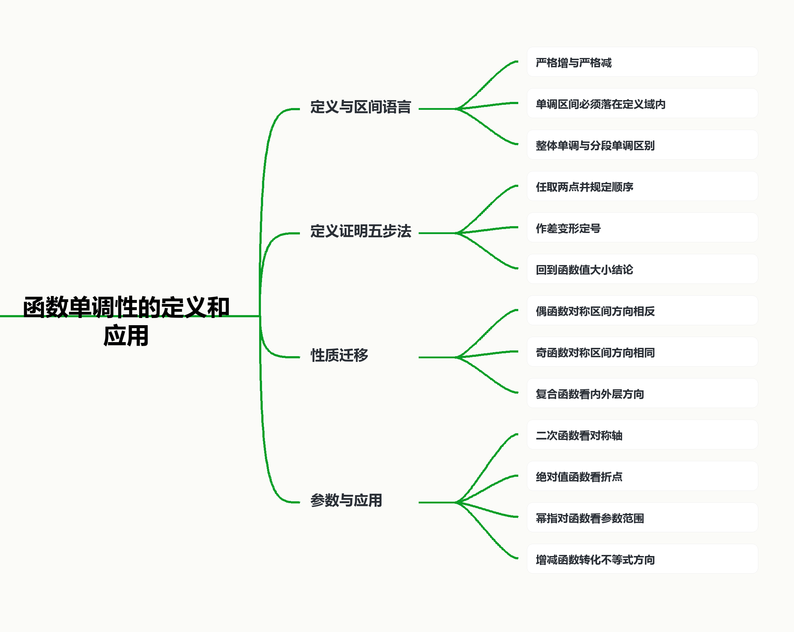

## 函数单调性的定义和应用

## 知识讲解

## 导学说明

函数单调性研究的是“自变量有序变化时，函数值是否保持同向或反向变化”。本讲按照“定义理解 - 区间判断 - 定义证明 - 性质迁移 - 参数应用”的顺序组织，突出三件事：

(1) 单调性必须在区间上讨论，不能脱离定义域与区间范围。

(2) 证明单调性要回到任取 $x_1<x_2$ 后比较 $f(x_1)$ 与 $f(x_2)$ 的定义。

(3) 应用单调性时，本质是把函数值比较转化为自变量比较，或把图像变化转化为区间分类。

本讲题目优先选用沪教版教材例题、练习与上海真题材料；答案、解析和教法备注均紧跟题目，便于课堂讲评。

## 1. 教学目标

(1) 理解严格增函数、严格减函数和单调区间的定义，能准确使用“在区间 $I$ 上”这一限定。

(2) 能根据图像、解析式和二次函数顶点判断常见函数的单调区间。

(3) 能用“取值、作差、变形、定号、下结论”的五步法证明单调性。

(4) 能利用奇偶性、图像对称或复合结构迁移单调性。

(5) 能用单调性解决比较大小、解不等式、参数范围和最值问题。

## 2. 课程重难点

(1) 重点：单调性的定义；单调区间的写法；定义证明；二次函数、绝对值函数、幂函数的单调性应用。

(2) 难点：区间端点和定义域限制；“局部单调”与“整个定义域单调”的区别；含参数区间中的分段讨论。

## 3. 考查形式与分值占比

(1) 题型：选择题、填空题常考单调区间、函数值比较、参数范围；解答题常与奇偶性、最值、零点和导数结合。

(2) 分值：基础小题多为 4 到 5 分；若与参数、分段函数或导数综合，可进入 8 到 12 分题。

\newpage

## 知识导图

{width=100%}

## 教材与教参定位

## 1. 教材依据

沪教版必修第一册第 5 章在函数基本性质中给出单调性定义：当 $x_1<x_2$ 时，若总有 $f(x_1)<f(x_2)$，则函数在区间 $I$ 上严格增；若总有 $f(x_1)>f(x_2)$，则函数在区间 $I$ 上严格减。教材同时指出，“严格增”“严格减”“增”“减”统称为函数的单调性。

教材例题安排从 $y=x^2-2x$ 的单调区间判断，到用定义证明单调性，再到偶函数对称区间上的单调性迁移，最后进入含参数区间上的绝对值最值问题，形成“定义 - 判断 - 证明 - 应用”的主线。

## 2. 教学提醒

(1) 先看定义域，再谈单调性；单调区间必须是定义域内的区间。

(2) 单调区间通常指最大单调区间，不能把两个不相邻或方向相同但被断点隔开的区间随意合并。

(3) 用定义证明时，任取 $x_1<x_2$ 是起点，结论必须回到 $f(x_1)$ 与 $f(x_2)$ 的大小关系。

(4) 单调性应用中，严格增函数保持不等号方向，严格减函数改变不等号方向。

(5) 含参数区间题要关注“分界点是否落在区间内”，常见分界点包括顶点、零点、对称轴和无定义点。

\newpage

## 知识点1: 单调性的定义与区间语言

## 知识笔记

设函数 $y=f(x)$ 在区间 $I$ 上有定义。若对区间 $I$ 内任意 $x_1,x_2$，当 $x_1<x_2$ 时，总有

$$
f(x_1)<f(x_2),
$$

则称函数 $y=f(x)$ 在区间 $I$ 上是严格增函数。若总有

$$
f(x_1)>f(x_2),
$$

则称函数 $y=f(x)$ 在区间 $I$ 上是严格减函数。

判断单调性时要同时说清三件事：函数是谁、区间在哪里、增还是减。

常见表达：

(1) $y=x^2$ 在 $(-\infty,0]$ 上严格减，在 $[0,+\infty)$ 上严格增。

(2) $y=x^2$ 在 $\mathbb R$ 上不是单调函数。

(3) 若函数在两个区间上都增，但中间有断点或不属于定义域，不能直接合并成一个单调区间。

## 母题1: 判断二次函数的单调区间

\begin{QuestionBox}

【来源】教材改编：沪教版必修第一册第 5 章练习，函数单调区间定义与例 9。

判断函数

$$
y=x^2-2x,\quad x\in[-2,2]
$$

的单调性，并求出它的单调区间。

\end{QuestionBox}

\begin{AnswerBox}

函数在 $[-2,1]$ 上严格减，在 $[1,2]$ 上严格增。单调区间为 $[-2,1]$ 与 $[1,2]$。

\end{AnswerBox}

\begin{AnalysisBox}

配方得

$$
y=x^2-2x=(x-1)^2-1.
$$

该二次函数开口向上，对称轴为 $x=1$。当 $x$ 从左侧靠近 $1$ 时，$(x-1)^2$ 逐渐减小，因此函数值逐渐减小；当 $x$ 从 $1$ 向右增大时，$(x-1)^2$ 逐渐增大，因此函数值逐渐增大。

结合定义域 $[-2,2]$，得到单调递减区间 $[-2,1]$，单调递增区间 $[1,2]$。

\end{AnalysisBox}

\begin{TeachBox}

本题要强调“对称轴切区间”。学生容易只写 $(-\infty,1]$ 和 $[1,+\infty)$，但题目给了定义域 $[-2,2]$，最终区间必须与定义域取交集。

\end{TeachBox}

## 变式题1: 不能脱离整体区间谈单调

\begin{QuestionBox}

【来源】教材改编：沪教版必修第一册第 5 章单调性定义。

判断函数 $y=x^2$ 在 $\mathbb R$ 上是否为单调函数，并说明理由。

\end{QuestionBox}

\begin{AnswerBox}

不是。它在 $(-\infty,0]$ 上严格减，在 $[0,+\infty)$ 上严格增，但在整个 $\mathbb R$ 上不是单调函数。

\end{AnswerBox}

\begin{AnalysisBox}

取 $x_1=-2,x_2=-1$，有 $x_1<x_2$ 且 $f(x_1)=4>1=f(x_2)$，这体现了减的趋势。

取 $x_1=1,x_2=2$，有 $x_1<x_2$ 且 $f(x_1)=1<4=f(x_2)$，这体现了增的趋势。

同一个整体区间 $\mathbb R$ 上既出现函数值随 $x$ 增大而减小，又出现函数值随 $x$ 增大而增大，所以它在 $\mathbb R$ 上不是单调函数。

\end{AnalysisBox}

\begin{TeachBox}

这道题适合用来纠正“能分段单调就叫单调”的错误。单调性必须绑定一个明确区间。

\end{TeachBox}

\newpage

## 知识点2: 用定义证明单调性

## 知识笔记

用定义证明单调性的标准流程：

(1) 取值：任取 $x_1,x_2\in I$，且 $x_1<x_2$。

(2) 作差：计算 $f(x_1)-f(x_2)$。

(3) 变形：把差式分解或配成便于定号的形式。

(4) 定号：利用 $x_1,x_2$ 所在区间确定差式符号。

(5) 结论：若 $f(x_1)-f(x_2)<0$，则严格增；若 $f(x_1)-f(x_2)>0$，则严格减。

## 母题2: 用定义证明二次函数单调性

\begin{QuestionBox}

【来源】教材例题：沪教版必修第一册第 5 章例 7。

证明：函数

$$
y=x^2-2x
$$

在区间 $(-\infty,1]$ 上是严格减函数。

\end{QuestionBox}

\begin{AnswerBox}

证明见解析。

\end{AnswerBox}

\begin{AnalysisBox}

记 $f(x)=x^2-2x$。任取 $x_1,x_2\in(-\infty,1]$，且 $x_1<x_2$，则

$$
\begin{aligned}
f(x_1)-f(x_2)
&=(x_1^2-2x_1)-(x_2^2-2x_2)\\
&=(x_1-x_2)(x_1+x_2)-2(x_1-x_2)\\
&=(x_1-x_2)(x_1+x_2-2).
\end{aligned}
$$

因为 $x_1<x_2$，所以 $x_1-x_2<0$。又因为 $x_1\leq 1,x_2\leq 1$，且 $x_1<x_2$，所以

$$
x_1+x_2-2<0.
$$

于是

$$
f(x_1)-f(x_2)>0,
$$

即 $f(x_1)>f(x_2)$。因此函数 $y=x^2-2x$ 在 $(-\infty,1]$ 上是严格减函数。

\end{AnalysisBox}

\begin{TeachBox}

本题的关键不是会因式分解，而是会使用区间条件 $x_1,x_2\leq 1$。讲评时可以追问：如果区间改成 $[1,+\infty)$，同样的差式哪个因子的符号发生改变？

\end{TeachBox}

## 变式题2: 反比例函数的定义证明

\begin{QuestionBox}

【来源】自编补位题：用于训练“作差定号”。

证明：函数

$$
f(x)=\frac{1}{x}
$$

在 $(0,+\infty)$ 上是严格减函数。

\end{QuestionBox}

\begin{AnswerBox}

证明见解析。

\end{AnswerBox}

\begin{AnalysisBox}

任取 $x_1,x_2\in(0,+\infty)$，且 $x_1<x_2$。则

$$
f(x_1)-f(x_2)=\frac{1}{x_1}-\frac{1}{x_2}=\frac{x_2-x_1}{x_1x_2}.
$$

因为 $x_2-x_1>0$，且 $x_1x_2>0$，所以

$$
f(x_1)-f(x_2)>0.
$$

因此 $f(x_1)>f(x_2)$，函数 $f(x)=\frac{1}{x}$ 在 $(0,+\infty)$ 上是严格减函数。

\end{AnalysisBox}

\begin{TeachBox}

学生常把“$x$ 变大，$\frac1x$ 变小”当作证明。课堂上要要求他们写出作差式，并说明分母为正来自 $x_1,x_2\in(0,+\infty)$。

\end{TeachBox}

## 变式题3: 带不等式放缩的定义证明

\begin{QuestionBox}

【来源】自编补位题：用于连接单调性与基本不等式。

证明：函数

$$
f(x)=x+\frac1x
$$

在 $[1,+\infty)$ 上是严格增函数。

\end{QuestionBox}

\begin{AnswerBox}

证明见解析。

\end{AnswerBox}

\begin{AnalysisBox}

任取 $x_1,x_2\in[1,+\infty)$，且 $x_1<x_2$。则

$$
\begin{aligned}
f(x_2)-f(x_1)
&=(x_2-x_1)+\left(\frac1{x_2}-\frac1{x_1}\right)\\
&=(x_2-x_1)-\frac{x_2-x_1}{x_1x_2}\\
&=(x_2-x_1)\left(1-\frac1{x_1x_2}\right).
\end{aligned}
$$

因为 $x_2-x_1>0$，且 $x_1x_2\geq 1$。又由 $x_1<x_2$ 且 $x_1\geq 1$ 可知 $x_1x_2>1$，所以

$$
1-\frac1{x_1x_2}>0.
$$

因此 $f(x_2)-f(x_1)>0$，即 $f(x_1)<f(x_2)$。故 $f(x)=x+\frac1x$ 在 $[1,+\infty)$ 上是严格增函数。

\end{AnalysisBox}

\begin{TeachBox}

这题适合训练“为了增函数，可以比较 $f(x_2)-f(x_1)$”。不必机械规定只能算 $f(x_1)-f(x_2)$，但必须在最后回到定义。

\end{TeachBox}

\newpage

## 知识点3: 单调性与对称性的迁移

## 知识笔记

函数的奇偶性会把一个区间上的单调性迁移到对称区间上。关键不在“背结论”，而在两个动作：

(1) 区间映射：$[1,2]$ 关于原点对称到 $[-2,-1]$，且 $x_1<x_2$ 会变成 $-x_2<-x_1$。

(2) 函数值转换：偶函数满足 $f(x)=f(-x)$，奇函数满足 $f(x)=-f(-x)$。

常用结论：

(1) 偶函数在关于原点对称的两个区间上，单调方向相反。

(2) 奇函数在关于原点对称的两个区间上，单调方向相同。

## 母题3: 偶函数对称区间上的单调性

\begin{QuestionBox}

【来源】教材例题：沪教版必修第一册第 5 章例 10。

设 $y=f(x)$ 是偶函数，且它在区间 $[-2,-1]$ 上是严格减函数。判断它在区间 $[1,2]$ 上的单调性，并说明理由。

\end{QuestionBox}

\begin{AnswerBox}

$y=f(x)$ 在 $[1,2]$ 上是严格增函数。

\end{AnswerBox}

\begin{AnalysisBox}

任取 $x_1,x_2\in[1,2]$，且 $x_1<x_2$。则

$$
-x_2<-x_1,\quad -x_2,-x_1\in[-2,-1].
$$

因为 $f(x)$ 在 $[-2,-1]$ 上严格减，所以

$$
f(-x_2)>f(-x_1).
$$

又因为 $f(x)$ 是偶函数，所以

$$
f(x_2)=f(-x_2),\quad f(x_1)=f(-x_1).
$$

于是

$$
f(x_2)>f(x_1),
$$

即当 $x_1<x_2$ 时，$f(x_1)<f(x_2)$。故 $f(x)$ 在 $[1,2]$ 上严格增。

\end{AnalysisBox}

\begin{TeachBox}

本题最容易错在“偶函数对称，所以单调性不变”。实际上自变量顺序在取相反数后反转，偶函数只负责函数值相等，两个动作合起来导致单调方向反向。

\end{TeachBox}

## 变式题4: 奇函数对称区间上的单调性

\begin{QuestionBox}

【来源】教材例题变式：由沪教版必修第一册第 5 章例 10 改编。

设 $y=f(x)$ 是奇函数，且它在区间 $[1,3]$ 上是严格增函数。判断它在区间 $[-3,-1]$ 上的单调性，并说明理由。

\end{QuestionBox}

\begin{AnswerBox}

$y=f(x)$ 在 $[-3,-1]$ 上是严格增函数。

\end{AnswerBox}

\begin{AnalysisBox}

任取 $x_1,x_2\in[-3,-1]$，且 $x_1<x_2$。则

$$
1\leq -x_2<-x_1\leq 3.
$$

因为 $f(x)$ 在 $[1,3]$ 上严格增，所以

$$
f(-x_2)<f(-x_1).
$$

又因为 $f(x)$ 是奇函数，所以 $f(x)=-f(-x)$。于是

$$
f(x_2)=-f(-x_2)>-f(-x_1)=f(x_1).
$$

因此 $x_1<x_2$ 时 $f(x_1)<f(x_2)$，故 $f(x)$ 在 $[-3,-1]$ 上严格增。

\end{AnalysisBox}

\begin{TeachBox}

可以把偶函数和奇函数的迁移放在一张对比表中讲：偶函数“区间顺序反转，函数值不变”，奇函数“区间顺序反转，函数值取相反数”，所以结论不同。

\end{TeachBox}

\newpage

## 知识点4: 分界点、参数区间与最值

## 知识笔记

单调性应用到最值和参数时，常见分界点包括：

(1) 二次函数的对称轴。

(2) 绝对值函数的零点或折点。

(3) 分式函数的无定义点。

(4) 分段函数的分段点。

(5) 指数、对数、幂函数中决定单调方向的参数范围。

含参数区间题的基本思路：

$$
\text{找分界点} \Rightarrow \text{判断分界点是否落入区间} \Rightarrow \text{分段讨论} \Rightarrow \text{比较端点或单调趋势}.
$$

## 母题4: 绝对值函数在含参数区间上的最大值

\begin{QuestionBox}

【来源】教材例题：沪教版必修第一册第 5 章例 13。

已知 $a<2$，求函数

$$
y=|x-1|,\quad x\in[a,2]
$$

的最大值。

\end{QuestionBox}

\begin{AnswerBox}

当 $a<0$ 时，最大值为 $1-a$；当 $0\leq a<2$ 时，最大值为 $1$。

\end{AnswerBox}

\begin{AnalysisBox}

函数 $y=|x-1|$ 的折点是 $x=1$。当 $x\leq 1$ 时，

$$
y=1-x,
$$

在 $(-\infty,1]$ 上严格减；当 $x\geq 1$ 时，

$$
y=x-1,
$$

在 $[1,+\infty)$ 上严格增。

若 $1\leq a<2$，则区间 $[a,2]\subseteq[1,+\infty)$，函数在 $[a,2]$ 上严格增，最大值为

$$
|2-1|=1.
$$

若 $a<1$，则区间 $[a,2]$ 跨过折点 $1$，最大值只可能在端点 $a$ 或 $2$ 处取得。比较

$$
|a-1|=1-a,\quad |2-1|=1.
$$

当 $a<0$ 时，$1-a>1$，最大值为 $1-a$；当 $0\leq a<1$ 时，$1-a\leq 1$，最大值为 $1$。

综上：

$$
y_{\max}=
\begin{cases}
1-a, & a<0,\\
1, & 0\leq a<2.
\end{cases}
$$

\end{AnalysisBox}

\begin{TeachBox}

这题的分界点不是区间端点，而是折点 $x=1$。讲评时让学生先画数轴，标出 $a,1,2$ 的相对位置，再写解析讨论，能显著减少漏情况。

\end{TeachBox}

## 变式题5: 指数型绝对值函数的参数范围

\begin{QuestionBox}

【来源】上海真题汇编：2011-2025 上海真题试卷第二版本，第 11 题。

已知函数

$$
f(x)=e^{|x-a|}\quad (a\text{ 为常数}).
$$

若 $f(x)$ 在区间 $[1,+\infty)$ 上是增函数，求 $a$ 的取值范围。

\end{QuestionBox}

\begin{AnswerBox}

$$
a\leq 1.
$$

\end{AnswerBox}

\begin{AnalysisBox}

因为指数函数 $e^t$ 严格增，所以 $e^{|x-a|}$ 的单调性由 $|x-a|$ 的变化决定。

函数 $|x-a|$ 的折点是 $x=a$。当 $x\geq a$ 时，$|x-a|=x-a$，函数 $e^{|x-a|}=e^{x-a}$ 严格增；当 $x<a$ 时，$|x-a|=a-x$，函数 $e^{|x-a|}=e^{a-x}$ 严格减。

要使 $f(x)$ 在整个 $[1,+\infty)$ 上增，区间 $[1,+\infty)$ 必须完全落在折点右侧，即

$$
1\geq a.
$$

所以 $a\leq 1$。

\end{AnalysisBox}

\begin{TeachBox}

本题可以和母题 4 对照：都是绝对值折点控制单调性。区别在于外层 $e^t$ 严格增，不改变内层 $|x-a|$ 的单调方向。

\end{TeachBox}

\newpage

## 知识点5: 基本初等函数与单调性应用

## 知识笔记

基本初等函数的单调性是比较大小和解不等式的工具：

(1) 幂函数 $y=x^\alpha$ 在 $(0,+\infty)$ 上的单调性与指数 $\alpha$ 有关，常见情形是 $\alpha>0$ 时递增，$\alpha<0$ 时递减。

(2) 指数函数 $y=a^x$：当 $a>1$ 时在 $\mathbb R$ 上严格增；当 $0<a<1$ 时在 $\mathbb R$ 上严格减。

(3) 对数函数 $y=\log_a x$：当 $a>1$ 时在 $(0,+\infty)$ 上严格增；当 $0<a<1$ 时在 $(0,+\infty)$ 上严格减。

(4) 抽象函数不等式中，若 $f$ 严格增，则 $f(u)<f(v)\Leftrightarrow u<v$；若 $f$ 严格减，则 $f(u)<f(v)\Leftrightarrow u>v$。

## 母题5: 幂函数单调性与参数判断

\begin{QuestionBox}

【来源】上海真题汇编：2011-2025 上海真题试卷第二版本，第 14 题。

幂函数 $y=x^a$ 在 $(0,+\infty)$ 上是严格减函数，且经过 $(-1,-1)$，则 $a$ 的值可能是（  ）。

A. $-\frac23$  
B. $-\frac13$  
C. $\frac13$  
D. $3$

\end{QuestionBox}

\begin{AnswerBox}

B。

\end{AnswerBox}

\begin{AnalysisBox}

因为幂函数 $y=x^a$ 在 $(0,+\infty)$ 上严格减，所以指数应满足

$$
a<0.
$$

因此排除 C、D。

再看点 $(-1,-1)$。若 $a=-\frac23$，则

$$
(-1)^{-\frac23}=\frac{1}{\sqrt[3]{(-1)^2}}=1,
$$

不经过 $(-1,-1)$，排除 A。

若 $a=-\frac13$，则

$$
(-1)^{-\frac13}=\frac{1}{\sqrt[3]{-1}}=-1,
$$

满足条件，所以选 B。

\end{AnalysisBox}

\begin{TeachBox}

本题不是只考“负指数递减”，还考分数指数在负数处是否有意义以及函数是否经过给定点。讲评时要提醒学生：幂函数在 $(0,+\infty)$ 上的单调性不能替代对特殊点的检验。

\end{TeachBox}

## 变式题6: 抽象增函数解不等式

\begin{QuestionBox}

【来源】自编补位题：用于训练“函数值比较转化为自变量比较”。

已知函数 $f(x)$ 在 $\mathbb R$ 上是严格增函数，解不等式

$$
f(2x-1)<f(x+3).
$$

\end{QuestionBox}

\begin{AnswerBox}

$$
x<4.
$$

\end{AnswerBox}

\begin{AnalysisBox}

因为 $f(x)$ 在 $\mathbb R$ 上严格增，所以

$$
f(2x-1)<f(x+3)
$$

等价于

$$
2x-1<x+3.
$$

解得

$$
x<4.
$$

\end{AnalysisBox}

\begin{TeachBox}

本题要让学生说出“为什么可以去掉 $f$”。严格增函数保持大小关系，若是严格减函数，不等号方向要反过来。

\end{TeachBox}

## 变式题7: 抽象减函数解不等式

\begin{QuestionBox}

【来源】自编补位题：与变式题 6 对照。

已知函数 $f(x)$ 在 $\mathbb R$ 上是严格减函数，解不等式

$$
f(2x-1)<f(x+3).
$$

\end{QuestionBox}

\begin{AnswerBox}

$$
x>4.
$$

\end{AnswerBox}

\begin{AnalysisBox}

因为 $f(x)$ 在 $\mathbb R$ 上严格减，所以函数值越小，对应自变量越大。因此

$$
f(2x-1)<f(x+3)
$$

等价于

$$
2x-1>x+3.
$$

解得

$$
x>4.
$$

\end{AnalysisBox}

\begin{TeachBox}

增函数与减函数的对照训练很重要。学生如果只记“去掉 $f$”，往往会在减函数中漏掉反向。

\end{TeachBox}

\newpage

## 分层练习

## 练习1: 单调区间判断

\begin{QuestionBox}

【来源】教材改编：沪教版必修第一册第 5 章函数单调性练习。

求函数

$$
f(x)=-x^2+4x+1,\quad x\in[-1,5]
$$

的单调区间和最大值。

\end{QuestionBox}

\begin{AnswerBox}

单调递增区间为 $[-1,2]$，单调递减区间为 $[2,5]$；最大值为 $5$。

\end{AnswerBox}

\begin{AnalysisBox}

配方：

$$
f(x)=-(x-2)^2+5.
$$

函数开口向下，对称轴为 $x=2$。在定义域 $[-1,5]$ 内，函数在 $[-1,2]$ 上严格增，在 $[2,5]$ 上严格减，并在顶点 $x=2$ 处取得最大值

$$
f(2)=5.
$$

\end{AnalysisBox}

\begin{TeachBox}

要求学生先写对称轴，再与定义域取交集。最大值来自顶点落在区间内；如果顶点不在区间内，就要比较端点。

\end{TeachBox}

## 练习2: 单调性与零点唯一性

\begin{QuestionBox}

【来源】教材改编：沪教版必修第一册第 5 章函数应用。

证明方程

$$
x^3+x-1=0
$$

在区间 $(0,1)$ 内有且只有一个实数根。

\end{QuestionBox}

\begin{AnswerBox}

证明见解析。

\end{AnswerBox}

\begin{AnalysisBox}

设

$$
f(x)=x^3+x-1.
$$

先看存在性：

$$
f(0)=-1<0,\quad f(1)=1>0.
$$

函数 $f(x)$ 在 $[0,1]$ 上连续，所以在 $(0,1)$ 内至少有一个零点。

再看唯一性。任取 $x_1<x_2$，有

$$
f(x_2)-f(x_1)=(x_2^3-x_1^3)+(x_2-x_1)
=(x_2-x_1)(x_2^2+x_1x_2+x_1^2+1)>0.
$$

因此 $f(x)$ 在 $\mathbb R$ 上严格增，特别地在 $(0,1)$ 上严格增。严格增函数的零点至多一个，所以方程在 $(0,1)$ 内有且只有一个实数根。

\end{AnalysisBox}

\begin{TeachBox}

本题把“零点存在”和“零点唯一”分开讲。存在靠端点异号与连续性，唯一靠单调性。不要让学生把 $f(0)f(1)<0$ 误认为唯一性的理由。

\end{TeachBox}

## 练习3: 参数单调区间

\begin{QuestionBox}

【来源】自编补位题：用于训练含参数二次函数。

若函数

$$
f(x)=x^2-2ax+3
$$

在区间 $[2,+\infty)$ 上严格增，求实数 $a$ 的取值范围。

\end{QuestionBox}

\begin{AnswerBox}

$$
a\leq 2.
$$

\end{AnswerBox}

\begin{AnalysisBox}

配方得

$$
f(x)=(x-a)^2+3-a^2.
$$

该二次函数开口向上，对称轴为 $x=a$，在 $[a,+\infty)$ 上严格增。

要使它在 $[2,+\infty)$ 上严格增，需要区间 $[2,+\infty)$ 完全落在对称轴右侧，即

$$
2\geq a.
$$

所以

$$
a\leq 2.
$$

\end{AnalysisBox}

\begin{TeachBox}

这题和 $e^{|x-a|}$ 的参数题结构相同：先找分界点，再让目标区间落在正确一侧。

\end{TeachBox}

\newpage

## 题源索引

(1) 教材原文：`D:\win_ob\教材\md-沪教版2026版高清矢量版教材\split\沪教版必修第一册2026\05 第5章 函数的概念、性质及应用.md`，第 620-636 行，严格增、严格减与单调性定义。

(2) 教材练习：`D:\win_ob\教材\md-沪教版2026版高清矢量版教材\split\50_练习提取\05 第5章 函数的概念、性质及应用-练习.md`，第 691-699 行，单调区间定义与 $y=x^2-2x$ 单调性判断。

(3) 教材例题：`D:\win_ob\教材\md-沪教版2026版高清矢量版教材\split\40_例题提取\05 第5章 函数的概念、性质及应用-例题.md`，第 423-453 行，例 7 用定义证明单调性。

(4) 教材例题：`D:\win_ob\教材\md-沪教版2026版高清矢量版教材\split\40_例题提取\05 第5章 函数的概念、性质及应用-例题.md`，第 529-535 行，例 10 偶函数对称区间上的单调性迁移。

(5) 教材例题：`D:\win_ob\教材\md-沪教版2026版高清矢量版教材\split\40_例题提取\05 第5章 函数的概念、性质及应用-例题.md`，第 579-585 行，例 13 绝对值函数含参数区间最大值。

(6) 教材洞察：`D:\win_ob\教材\md-沪教版2026版高清矢量版教材\split\60_章节洞察\第5章 函数的概念、性质及应用-洞察.md`，第 12-21 行，函数章节教学主线、关键方法与易错点。

(7) 上海真题汇编：`D:\win_ob\汇编资料-真题-模考\2011-2025【真题】上海真题试卷第二版本-高中工作台版本_2026-02-22-17_22_56\2011-2025【真题】上海真题试卷第二版本-高中工作台版本.md`，第 849-857 行，幂函数单调性与参数选择。

(8) 上海真题汇编：同上文件，第 3839-3848 行，$e^{|x-a|}$ 在 $[1,+\infty)$ 上增函数的参数范围。

(9) 上海真题汇编：同上文件，第 6215-6221 行，判断 $\mathbb R$ 上增函数的选择题素材。

## 自检清单

(1) 每道题均保留【题目】【答案】【解析】【教法备注】结构。

(2) 答案与解析紧跟题目，没有集中放置答案汇总。

(3) 所有单调区间均结合定义域或题设区间书写。

(4) 含参数题均明确分界点与目标区间的位置关系。

(5) 自编题已标明“自编补位题”，未混入教材或真题来源。

